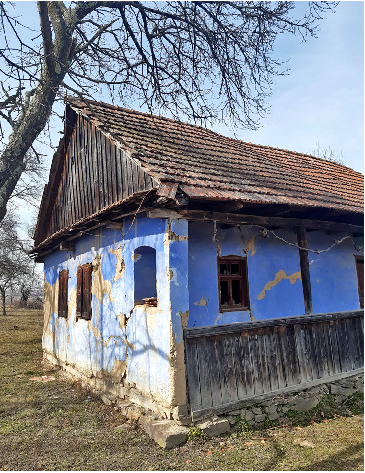
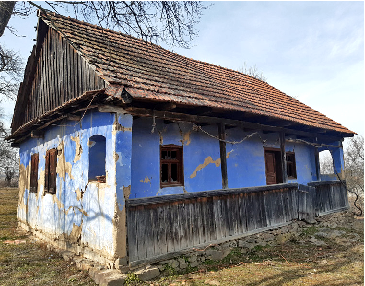
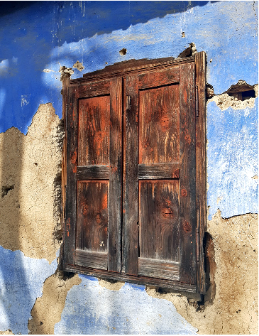
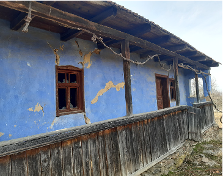

# CONSACRAREA COMUNITARĂ A CASEI: HAIDAȚ LA DRIPELIȘTE! ȘI CEA RELIGIOASĂ, FEȘTANIA

Camelia BURGHELE*

Community and religious consecration of the house (Abstract).

In the villages of Valea Barcăului – Sălaj, at the end of the construction of houses, the young people of the village were called to level the earthen floor. They did it by dancing barefoot, to the music of musicians paid by the host. The moment was one of great joy for the young people and of great utility for the owners of the house. The dance of the young people in the new house consecrated a kind of community legitimization of the house, the sign that the construction was finished and that the future inhabitants could prepare to move into the new house.

The meeting of young people and the dance in pairs was called „dripeliște” (from the verb „a dripili”, which means to tread lightly). The present material bears witness to the antiquity, relevance and importance of this custom directly related to the construction of houses. The moment of „dripeliște” is seen in a broader context, that of marking the completion of construction with ritual foundations (placing the bouquet of flowers on the top of the roof) and religious (festival, the blessing of the house with holy water, by the village priest).

We believe that „the beating of the house”, as the „dripeliște” are called in other areas, is yet another proof of the cleverness with which the peasant in the traditional village knew how to balance the workfun ratio.

Keywords:traditional village, construction of houses, young people, community legitimization, cultural anthropology.

Cuvinte cheie: satul traditional, construirea caselor, tineretul, legitimarea comunității, antropologie cuturală.

## Țăranul smart. Plăcerea și necesitatea (sau utilitatea), distracția și munca.

În cultura tradițională, țăranul a experimentat, a inovat, a perfecționat, a fixat cutumiar și a gestionat cu succes un set de cunoștințe (know how), valori și stări spirituale, toate subsumate ideii de „rost”, generatoare de echilibru interior și exterior. A fost cu adevărat un „țăran smart”, care a știut să își dozeze munca, să păstreze și să fructifice experimentele reușite și să renunțe la cele puțin valoroase, să găsească metode inovatoare pentru a exploata cât mai bine natura și pentru a-și reduce cât mai mult efortul, la fel cum a știut să integreze distracția într-o conduită morală potrivită.

Cotidianul și, în general, cursul vieții țăranului, pot fi acum privite din perspective multiple, în întreg dinamismul lor funciar, dinspre urbanul în care locuim cei mai mulți

* Muzeul Județean de Istorie și Artă, Zalău.

Anuarul Arhivei de Folclor, nr. XXIX, 2025, p. 233–241

dintre noi și modernitatea vieții contemporane. Din perspective profesionale, s-au schimbat mult și metodele de abordare a terenului etnografic (observația participativă a glisat mult spre analiza și sinteza delife stories), astfel încât multe din informațiile pe care le obținem acum de la interlocutorii noștri sunt rod al unui proces de storytelling generat la îndemnul și solicitarea etnografului1.

Aceste life stories ale țăranilor cu care stăm de vorbă în teren devoalează, deseori, un sistem de cunoștințe generate de observații atente repetate de-a lungul mai multor generații, denumit, în etnologia europeană, Traditional Knowledge.

Exemplele de atitudini smart ale țăranului, care a știut să muncească, atunci când s-a putut, într-un context veselos, sau să impună subtil reguli care puneau individul sub spectrul pericolului absolut în cazul încălcării normelor, sunt nenumărate. Este cazul multor demersuri pe care le încadrăm în așa-numita etnologie juridică și care vorbesc despre diverse interdicții magice activate la o posibilă încălcare a proprietății, sub amenințarea unor maleficii îngrozitoare: de exemplu, strigoii care te pot purta dacă umblai pe mejie, adică pe demarcația din gard viu a hotarelor; de fapt, nici nu aveai voie să te așezi pe aceste mejii până la Sângeorz, ca să nu vorbim de faptul că cele mai cumplite boli se aruncau pe mejie, iar aici era locul predilect al vrăjitoarelor pentru întorsul urmei care îți putea întoarce viața; concluzia: teama de maleficii și supunerea față de aceste interdicții magice, perpetuate din generație în generație, păzeau doar ele singure proprietatea particulară.

Există, apoi, o altă serie de acte rituale menite, în secundar, să asigure voia bună care să facă munca mai ușoară: de exemplu, după istovitoarea muncă de la seceriș, deseori făcută în clacă, urma împletitul cununii și drumul alaiului cu cununa de seceriș până în sat, unde avea loc danțul cununii, ce îi motiva pe tineri să termine munca mai repede. La fel se întâmpla la clăcile de desfăcat, clăcile de toamnă, când vecinii, tineri și

- bătrâni, desfăcau mălaiul așezați pe grămezile impozante de știuleți, povestind lucruri nemaiauzite și vorbind despre tot ce se petrecea în sat: acestehabe de desfăcat mălai sunt contexte excelente de storytelling, în care se relatau povești cu strigoi, se aflau leacuri

- bătrânești sau se învățau cântece vechi, iar plăcerea povestirilor de la desfăcat trecea pe planul secund oboseala muncii.

Credem că și tradiția acestei dripelişti despre care ne propunem să vorbim se încadrează în această mare pricepere a țăranului de a mai salva puțin din dificultatea și oboseala muncii, alăturând-o petrecerii.

În fine, revenind la fundamentul teoretic, găsim că chiar și aceste experiențe de alăturare a distracției unei munci istovitoare fac parte din același sistem general de Traditional Knowledge, care susținea o bună dozare a procesului de muncă. Reamintim

- că Traditional Knowledge folosește comunicarea orală, gestuală și rituală, asamblate într-un cod de semne și simboluri cu semnificații profunde, ale căror chei de decodare erau valabile doar în contextul cultural al satului tradițional, iar acum acestea trebuie rescrise pentru o corectă decodare.

Sabina Ispas denumește cadrele culturale care au permis generarea unei asemenea cunoașteri tradiționale drept „cultura profundă”, echivalentul matricei identitare, practic

1 N. Panea, Antropop, în Ramuri, nr. 5, Craiova, 2016.

acel Traditional Knowledge moștenit din comunitățile de tip tradițional și transmis pe cale orală2 și care fundamentează celălalt tip de cunoaștere, științifică, dar are, după cum demonstrează ultimele decenii, și rolul de a oferi o alternativă la aceasta.

Dincolo de valoarea spirituală, oarecum de „înțelepciune”, Traditional Knowledge, tradus prin sintagma „cunoaștere tradițională” (autohtonă, locală), face trimitere la o sumă de expresii culturale tradiționale vehiculate de-a lungul unor generații de cele mai multe ori ca tradiție orală, materializate deseori în spuneri, sfaturi, povești, ritualuri, legi cutumiare, credințe.

În varianta cunoașterii tradiționale, dimensiunea morală a cunoașterii făcea ca adevărul să fie mult mai relativ, iar procesele de cercetare, descoperire și legiferare să îmbrace mai mult forma înțelepciunii, așa cum observase, altădată, Jean-Francois Lyotard3. Acest tip de educare și învățare, spirituală și non-invazivă, în sensul unei suprapuneri a empiricului peste sacru, este mai ales subiectivă și calitativă iar cunoștințele tradiționale sunt de cele mai multe ori transmise prin viu grai de la o generație la alta de bătrânii înțelepți ai comunității.

Mai mult, orală fiind, cultura tradițională se legitima printr-o „metapovestire” (le métarécit, tradus oarecum ca „ceea ce se povestește despre ceva”4), în vreme ce cultura științifică, anulând miturile fondatoare, se legitimează prin „discursul de putere” (cel mai puternic este și cel care are dreptate).

Altfel spus, în termenii unei etnologii aplicate, folosind cuvintele regretatei Irina Nicolau, „știutul comunitar”5 ca produs al culturii informale, vernaculare, negramaticalizate, oglindit în „așa am apucat”, „așa știau bătrânii”, „așa am aflat noi”, adică un set de cadre pentru ceea ce țăranul gândește, face și exprimă, prin moștenire directă, de la părinți și bunici, sau indirectă, de la strămoși, receptați cu toții ca un fel de mentori indirecți neconvenționali, apropie cunoașterea de cultură, într-un tot organic care certifică învelișul de spiritualitate și viziune ecologică al Traditional Knowledge (TK).

Practic, coloana vertebrală a satului românesc este dată exact de această cunoaștere compusă din o serie de „dominante spirituale ale unei culturi de tip tradițional, care a acumulat și transmis oral, mereu, fără întrerupere, sute de ani, o anumită organizare socială și economică, un anumit fel de mentalitate, gesturi, cunoștințe tehnice, cunoștințe cosmologice și practici agricole și altele”6.

Plasăm aici, în acest context al „știutului comunitar”, o serie de scenarii în care distracția și munca se contrabalansează perfect. De altfel, chiar ideea de clacă (vechea formă de ajutor în comun) sau cea dehabă (șezătoare a fetelor, dar unde veneau și feciorii, chemați prin procedee magico-rituale de fete), presupun obligatoriu o componentă de masă (mâncare) și distracție, fie sub forma povestitului, fie chiar cu dansuri și cântece.

- 2 Sabina Ispas, Cultură orală şi informație transculturală, București, 2003, p. 75.
- 3 J.-Fr. Lyotard, La Condition Postmoderne: raport sur le savoir, 1979, https://example.com com/2016/06/jean-francois-lyotard-la-condition.html
- 4 Ibidem.
- 5 Irina Nicolau, Talmeş balmeş de etnologie şi multe altele, București, 2001, p. 20.
- 6 Ligia Fulga, Maria Bâtcă, Costumul actual şi relevanța lui asupra identității locale, în Studii de etnologie. In honorem prof. univ. dr. Ilie Moise (coord. Andreea Buzaș), București, 2018, p. 187.

## Laolaltă, fetele și feciorii.

Orice ocazie de întâlnire a tinerilor și de distracție era, desigur, binevenită. Fetele, atât cele mai mici, adolescente, fătuțe, cât și cele mai mari, fetele fecioare, erau atent „monitorizate” de mame, pentru a se păstra categoric în limitele moralității ireproșabile. Feciorii, și cei mai tineri, și cei cu armata făcută, erau bine organizați sub raport social în grupuri distincte, vizibile mai ales cu ocazia colindatului, dar și cu ocazia nunților sau a danțurilor. Pentru că în comunitatea tradițională se punea mult preț pe dialogul amical dar și constructiv (socializare, i-am zice noi astăzi), cele două grupuri de tineri nu erau despărţite: viaţa cotidiană le oferea numeroase posibilităţi și ocazii de împrietenire, de apropiere. Fetele și feciorii dintr-un sat aveau numeroase prilejuri de întâlnire, ocazii cu care eventualele sentimente de simpatie dintre ei se puteau consolida.

Feciorii aveau ocazia să cunoască fete și, deci, să-și aleagă o viitoare mireasă – dar numai dacă și părinţii erau de acord – cu ocazia unor conjuncturi de socializare tipice pentru structura arhaică a societăţii. Astfel de ocazii ofereau mai ales șezătorile, denumite habe în satele Sălajului, care se organizau toamna târziu (după ce recolta era strânsă), se intensificau iarna (când fetele și femeile torceau lâna sau cânepa necesare ţesutului sau erau preocupate de alte asemenea munci casnice) și se încheiau primăvara, când reîncepea munca la câmp; tinerii se mai întâlneau și cu ocazia dansurilor și a jocurilor organizate cu ocazia sărbătorilor, sara la danţ; în mod particular, în satele sălăjene o bună ocazie de petrecere a unui timp mai lung împreună ofereau și pelerinajele religioase: s-a păstrat până în zilele noastre tradiţia ca înainte de Sfântă Mărie să se facă un astfel de pelerinaj religios

- către Nicula, la care participau și mulţi tineri; desigur, mersul la biserică duminica, la liturghie, obligatoriu pentru tineri, ca și pentru întreg satul de altfel, ori muncile câmpului, prilejuiau alte întâlniri între fetele și flăcăii din sat.

Dar în satele de pe Valea Barcăului mai era încă un astfel de moment, mult apreciat de tineri, de fapt un caz particular al danțului, în directă legătură cu construcția caselor și care consfințea un soi de legitimare comunitară a casei, semnalul că e gata construcția și că viitorii locuitori se pot pregăti de mutat în casă nouă: dripeliştea.

Mărturiile preluate de la interlocutorii de pe Valea Barcăului consolidează un sens larg dat verbului a dripili: înseamnă a călca mărunt, într-un ritm susținut; de exemplu, la dansurile repezi de ladanțul de la şură, fetele dripileau mărunt în jurul feciorilor, conduse de ei de mână, la dansurile în perechi, în ritmul muzicii heghedușilor. Dar am întâlnit și sensul figurat: l-a dripilit boala, în sensul că l-a tocat mărunt, până la epuizare, pe bolnav.

În scenariul construirii caselor, un loc important era ocupat de bătucirea și netezirea pământului din toată suprafața casei, astfel încât fața căşii să fie nu doar bine întărită și rezistentă, ci și netedă. Rezultatul era obținut prin bătucirea pământului cu tălpile goale iar când acest lucru se întâmpla și pe muzica unui danț, spusă de heghedușul satului, plăcerea era maximă: se chema cădripilitul feței casei și-a atins scopul – acela de a fi pretextul unei plăcute întâlniri dintre tinerii satului:

Să dripilea casa, când era dripelişte. Când gătau de făcut casa, era danț, duminica după mniaza, după ce ieşeau de la biserică şi aşe să zâcea, că să face dripelişte. În mai multe duminici să făcea dripelişte la casa aceie, că şi fie dripilită bine fața căsii, şi vineau tinerii, da şi după sate vineau, că să auzea că îi dripelişte la casa aceie nouă şi vineau.

Casă țărănească de pe Valea Barcăului – Sălaj.

Să dripilea bine – bine, că trăbuia şi fie tare bine aşezată casa, că după aceie trăbuiau şi facă pă jos, cu tină, şi nu puteai dacă nu era pământu ala tare bine dripilit, tare bine aşezat. Doară abia aşteptau să ştie tinerii că îi keamă cineva la dripilit!

Și-apui să plătea on leu, pântru ca și plătească muzicanții. La dripeliște nu să făcea de mâncare, numa i-ai lăsat să joace în casă. Le plăcea, și mereau și femeile la dripeliște, și mereau maicile și vadă cu cine jocau fetele; da atuncea nu șideai, ce când vineau vacile te duceai cătă casă dă la dripeliște ori dă la danț, nu șideai tărzău7.

Așadar, dripeliștea era un soi de consacrare comunitară, veseloasă, cum se spune pe valea Barcăului, așa cum consacrarea religioasă, plină de sobrietate și pietate, se făcea odată cu feştania, slujba ținută de preot pentru binecuvântarea construcției.

7 Florica Bode, a Lisandru Căuaciului, 1954, Valcău de Sus – Sălaj.

Era, ni se spune, un fel de danț dă casă nouă, oarecum echivalentul petrecerii de casă nouă din comunitatea urbană modernă:

Când să făcea casă nouă, jocau acolo tânerii, făceau danț dă câteva uări, până era tare bine bătucită fața căsii. Îi zâcea danț dă casă nouă şi să făcea mai demult. Să duceau acolo să dripilească bine, bine, pământu care să punea pă talpa căsii. Tizeşii pă care i-o ales feciorii dân sat pântru danțuri, aciie alcăzeau hegheduşii şi să făcea danț la casă nouă şi acolo jocau tânerii până nu mai puteau şi dripileau tătă fața căsii8.

Heghedușii erau tocmiți fie de feciorii satului, prin intermediul tizeșilor, fie chiar de proprietar.

Când să făcea casă nouă, să dripilea, doamnă, țucu-te, doară şi io cât am jucat la dripilit, pă la căsi, o, Doamne dă-ne noroc!

Cine făcea casa, ala băga danț în casă ca şi dripilească şi kemau pă tăți tinerii, că dacă merea higheada, acolo erau prezenți tăți feciorii şi fetile fecioare mereau cu ei.

Dripileau pământu dân casă ca şi fie bine bătucit. Că atunci, când făceau casa, puneau pă jos pământ, aduceau cu coşerile alea mari şi cu tarbonța, şi umpleau şi băteau pământu cu nişte maiuri mari, no, şi fie bătut, iară pă jos îl dripileau tinerii bine, că şi fie bătucit şi şi nu te-mpedici...şi-apui zâceau: – Facem danț, haidați la danț, la dripilit! Și dripileau acolo, că jocau dăsculți, da nu numa înt-o duminecă, ce în mai multe!

Ala o fost fain obicei, da amu să pune țiment pă jos şi nu mai trăbă dripilit. Tătă lumea

- dădea câte on leu, că feciorii alcăzeau hegheduşii, țâganii după Cerăt, ori dân Preuteasa, care cum îi puteau alcăzî. Fost-am io la multe dripilişti, că doară tătă lumea îşi făcea casă cu pământ9.

Să făcea dripelişte la câte o casă nouă, că băgau pământ şi trebuia dripilit şi băgau hegheduş şi-apui inde era hegheduşu, ieram şi noi, că iera danț şi jocam. Aşe jocai în pământu ala, aşe era dă fain!

Să bătucea, că băgau umplutură şi era moale, şi dacă vroia gazda să să mute mai repide acolo, făcea dripelişte, duminica, în mai multe duminici, până să făcea pământu tare. Atâta jocam şi-l dripileam pământu ala cu picioarile, până să făcea beton!

Feciorii strânjeau bani, on leu ori doi, de la fete şi dă la ceilalți feciori, şi băgau hegheduşi. Io am fost în multi căsi, la dripelişte, o, dă multe ori am fost când am fost fată, că doară nu să podea atunci căsile, ce aveau numa pământ pă jos şi no, ce să facă bieții oamini? Era numa pământ şi tânerii făceau danț şi dripileau tăt. Jocam desu, raru şi pă picior. Hegheduşii aveau higheadă, bandă şi dobă. Da nu să făcea dripelişte când iera post, nu, nu, Doamne fereşte...10.

Dripeliștea: când utilitatea stă în spatele petrecerii. Explicația utilității dripeliștei, chiar a necesității sale imperioase ca modalitate

simplă și economică de nivelare a podelei casei este una cât se poate de logică, și bine integrată în procesul de construcție a casei:

- 8 Opriș Maria, 1949, Aleuș – Sălaj.
- 9 Vironica Brisc, a Surdului, 1944, Subcetate – Sălaj.
- 10 Mărioara Marușca, a Anuții Miculaii Sfătului, 1957, Lazuri – Sălaj.

Dripeliştea să făcea când era gata casa, da încă nu era lipit, că şi să aşeze pământu şi să să bătucească bine, şi fie drept şi aşe, tare. Băgai păstă fundație mult pământ, şi fie la nivel, şi nu fie goluri, nici dolme, şi atunci kemau tinerii din sat şi joace, şi bătucească bine, şi le mai făcea on blid de pancove gazda, şi ei iară jocau, şi două – trii canceauă dă vin şi muzâcanții, şi aia era dripeliştea!

Io îmi aduc aminte că s-o făcut aşe, dripelişte, la Miculaia Balichii, aci, pă uliță, nu dăparte de noi, şi-apui o kemat, că la dripelişte să kema, tinerii, şi joace, şi dripilească pâmăntu că îşi fac casă nouă. Cam tătă lumea kema dănțăuşii şi dripilească, că trăbuia şi fie bătucită bine fața căsii. Când am fost io fată tănără, tare mult să făcea dripelişte!11.

Dincolo de necesitățile reclamate de etapa finală a construcției, dripilitul pământului se transforma, în final, într-un mare danț.

La casele noi să făcea dripelişte. Ai gătat casa, ai pus pământu pă jos, da era cu dâmburi şi trebuia bătucit şi netezit. Că doară şi când era dripelişte, no, să uitau, şi dacă mai vedea o groapă ori on dâmb, vinea unu cu sapa şi mai rădea ori mai punea pământ şi apă şi tomnea şi zâcea: – No, hai mai dripăliți aci on pic şi fie drept... că tu jocai, da nu te uitai tu după cât îi de drept!

Vineau hegheduşii, care ierau trii: higheadă, contră şi bandă, şi zâceau, şi tătă lumea joca la dripelişte, şi mai tâneri şi mai bătrâni, jocau dă Doamne feri. Mai târzâu o adus şi doba, de la Șerani, de la Borod, da prima dată o fost fără dobă. Unkiu Florea Țurii era primaş. Era hegheduş hiriclit, era primu, era şef la hegheadă. Și Țilica din Vălcău era primaş. Ierau chemați să cânte, şi la dripelişte vinea tătă lumea, nici nu mai aşteptai să te cheme cineva, numa auzeai că ieste dripelişte la cineva şi tătă lumea să aduna acolo. Să dădea pancove ori cirigauă şi să dădea on păhar de vin. Să făcea duminica, da daca era mult dă dripilit merea şi joia sara şi sâmbăta şi duminica sara12.

Pentru că pământul trebuia bătucit, uneori „procesul tehnologic” se mai numea și bătucitură:

Să făcea bătucitură, când îşi făcea oarecare casă nouă. Atunci erau casăle cu pământ pă jos. Prima dată bătuceau pământu cu on mai, cu on boc cu mâner şi udau bine pă jos şi după aceie kemau tânăretu şi bătucească pă jos. Prima dată chemau doi ori trii feciori, apui după aceie zâceau ei, unu la altu, da nu tare trebuia să-i cheme, că auzeai, dă la unu, dă la altu şi feciorii îşi aduceau şi fetele şi jocau acolo şi bătuceau pământu.

Aceie iera bătucitura... aduceau țâganii, hegheduşii, şi uomu ala a cui o fost casa aceie nouă, ala plătea hegheduşii, şi femeia lui făcea pancove şi cirigauă şi le dădea la aciie care vineau la bătucitură. Stăteau dănțăuşii până să aprindeau loampile în sat, după aia nu mai stăteau fetele. Bătucitura să făcea duminica, după beserică. Da dacă ştiai, ori auzeai, te duceai şi pă sate la bătucitură, la Cosniciu iestalalt, la Halmăjd, la Cerâşe, aşe mereau feciorii13.

Unele informații orientează tot procedeul și spre rațiuni financiare: de cele mai multe ori, dripeliștea nu trebuia plătită sau plata cădea în sarcina proprietarului casei, și tinerii erau bucuroși că nu trebuie să adune bani să plătească muzicanții:

- 11 Emilia Sabău, Milica Rusoaii, 1951, Valcău de Sus – Sălaj.
- 12 Sabou Nicolae, Eminescu, 1961, Sabou Zorica, 1966, Preoteasa – Sălaj.
- 13 Moise Gheorghe, 1951, Cosniciu de Sus – Sălaj.

La Subcetate, dacă te duceai la danț la cămin, îți cerea on leu, pântru muzicanți, da la dripelişte era pă gratis, şi să duceau mai iute la dripilit decât la danț. Și la Sucetate să făcea şi dripelişte şi şi danț, pă unde apucau, pă la case, pă la şuri14.

Să făcea dripelişte, cum nu să făcea! Era bine, că nu dădeai on leu, ca la danț; la danț nu te lăsau feciorii să intri până nu dădeai on leu, da aici plătea gazda hegheduşii, că tu îi dripileai casa! Când să găta beserica, zâceau feciorii: – No, fetelor, haidați la dripelişte după mniază, la nu ştiu cine, şi zâceau cine îi şi d-a cui îi şi unde şede. Haidați la dripelişte, zâceau, şi nu te mai kema nime, atâta era. Și la dripelişte jocai dăsculță, no, d-apui cu ce să te încalți, că doar nu aveai cu ce, doară în veci ieram dăsculțe şi jocai dăsculță, şi tăți dripileam bine tina aceie după jos, din casa aceie nouă, până să bătucea bine.15

Concluzia finală este că tăte casăle din sat o fost aşe, dripilite, pă rând, după cum s-o construit şi s-o gătat16.

Finalul casei însemna sfințirea ei prin prezența preotului, care performa un scenariu bisericesc special, de consacrare spirituală, religioasă, a casei, urmat de marcarea interiorului cu cele două însemne ale creștinului: crucea și icoana:

Înainte de a se muta oamenii în casă, popa făcea feştania casei şi pe perete se agăța în cui o cruce17.

De fapt, terminarea casei era marcată de două variante de măsuri protectoare: și pe valea Barcăului am întâlnit obiceiul de a celebra finalul construcției prin amplasarea unui buchet de flori sau a unor ramuri verzi pe acoperiș; interlocutorii vorbesc în primul rând despre rațiuni estetice (să fie mândru), dar probabil inițial a existat și o explicație apotropaică și de fertilitate, ramura verde fiind, în cultura românească, purtătoare de noroc și aducătoare de fertilitate.

Consacrarea finală a casei: rugăciune, noroc și frumusețe. Cealaltă serie de acte protectoare este de esență creștină și se referă la punerea unei

cruci pe acoperișul casei și la procedeul general-valabil pentru toate casele sălăjene de a se face feştanie la casă la finalizarea acesteia:

Întătdauna, da întătdauna, când era gata casa, să punea în vârf o cruce şi un jup de flori. Să punea o cruce de lemn, aşe era altădată, dar era musai să pui cruce. Casele vechi o avut cruce de lemn pă vârf, iar astea mai noi au cruce de fier, da au, musai să aibă. Și flori să puneau, aşa se zicea, în vârfu căsii.

Și întătdeauna să făcea feştenie la casă când era gata casa şi câteodată chiar şi păstă an să mai făcea, când aveai mort la casă, mai ales, şi atunci vinea popa şi făcea feştanie în casă şi pă casă18.

Notabil ni se pare și faptul că, uneori, această feștanie se făcea și la începutul construcției:

- 14 Felicia Sabău, a Floriii Rusoaii, 1977, Valcău de Jos – Sălaj.
- 15 Pavel Ana, Anuța Burenii, 1942, Preoteasa – Sălaj.
- 16 Pavel Nicolae, Bureana, 1942, Preoteasa – Sălaj.
- 17 Aurica Gui, a Găvrilii Jerului, 1948, Valcău – Sălaj.
- 18 Gui Ileana, 1932, Valcău de Jos – Sălaj.

Să făcea feştanie pă fundație oarecând, când o fost oaminii bătrâni şi mai credincioşi, acolo, pă temelie căsii să făcea feştanie şi să stropea cu apă sfințătă19.

Ramura verde de care vorbeam, în cazul satelor de pe Barcău, era ruptă de cele mai multe ori dintr-un arbust foarte bine valorizat, pentru că rămânea verde și iarna: pospanul (buxus); pospan se punea în botele chemătorilor în cazul nunților care se făceau iarna, când nu existau alte ramuri verzi sau flori, din pospan se făceau cununile pentru morminte și tot pospanul era folosit la ornarea interioară a bisericii:

Când să găta casa, să punea în vârf on bot de pospan, da amu nu mai ieste din ala, tăt o perit. Tătă lumea avea lâmgă casă o tufă de pospan. Apoi să punea cruce de lemn să apere casa de trăznet şi de rău20.

Credința arhaică potrivit căreia orice întemeiere cere o jertfă mai persistă încă în memoria magico-rituală a oamenilor bătrâni, care cred și în forța și vitalitatea Soarelui, și în binecuvântarea lui Dumnezeu, și în tentarea jerfei cu un animal:

Casăle s-o făcut cătă răsărit, rar iera case întoarse, numa că nu o avut nicium rând, da altfel tăte îs cu fața cătă răsărit.

Când era gata, era musai să pui cruce în vârfu căsii şi buchet de flori, de bucurie că o gătat casa. Crucea, ca să păzască Dumnezo dân ceruri casa, că sîntem creştini. Oaricând nu era casă fără cruce, pă tătă casa o fost cruce. Și să făcea feştanie cu rogăciuni şi cu mâncare.

Și zâceau bătrânii că când îi casa nouă, prima dată și baji și doarmă niște mâțe, să steie o noapte mâțăle în casă și numa după aceie să făcea feștanie21.

După ce era gata casa, să băga câte on mâţ să doarmă în prima noapte acolo și apoi făcea feștanie, musai, nu să muta nime până nu făcea feștanie. Da preoţii cereau mult să facă feștanie...22.

Mai mult: La casă să punea ban de arjint şi în prima noapte să punea să doarmă în casă on

cocoş sau on mâț.

Și pă acuperiș să punea ciup de flori și cruce. Iarna să punea sasău și pospan, să fie verde. Nu coborea meșteru după casă până nu să punea florile și crucea, nu cobora după casă până nu punea acolo crucea23.

- 19 Opriș Maria, 1949, Aleuș – Sălaj.
- 20 Ţârle Tătiana, Tătiana Biluchii, 1948, Sâg – Sălaj.
- 21 Emilia Sabău, Milica Rusoaii, 1951, Valcău de Jos – Sălaj.
- 22 Ţârle Tătiana, Tătiana Biluchii, 1948, Sâg – Sălaj.
- 23 Sabou Nicolae, Eminescu, 1961, Sabou Zorica, 1966, Preoteasa – Sălaj.

