# MUZEU.COM, ADICĂ MUZEU ȘI COMUNITATE. CAZUL BISERICII DIN TOPLA, CENTRUL SPIRITUAL AL MUZEULUI SATULUI BĂNĂȚEAN TIMIȘOARA

Borco ILIN*

Muzeu.com, meaning museum and community. The case of the church of Topla, the spiritual center of the Banat Village Museum Timișoara (Abstract)

The museum-community connection develops in both directions and gives life to both entities: the community is the one that generates the museum, demands it and builds it institutionally, and the museum, in turn, is the one that puts itself at the service of the community, by mirroring its history, culture, art and ethnicity.

The museum is the one that tells the stories of the community, often taking over the stories of one generation and transferring them to the next. This is the case of the Banat Village Museum, which tells the stories of the traditional Banat village, of the houses and households, of the courtyards, the church and its believers, to children from the urban community or the peri-urban countryside.

For the Banat Village Museum in Timisoara, the church at Topla is a kind of open-air exhibition, a living exhibition that was visited by both visitors interested in local culture and believers who attended the Sunday service in the place of worship.

In the spring of 2025, on a fateful April night, the wooden church in Topla burned down, to a significant extent. We believe it is essential that the story of the church and all the stories it has generated over time remain alive. The museum opens itself to the community, among other things, informing the community about the current situation of this hard-hit heritage site.

Keywords: museum-community connection, traditional Banat village, traditional culture, cultural marketing, guerilla marketing, storytelling.

Cuvinte cheie: relații muzeu-comunitate, satul bănățean tradițional, cultura tradițională, marketing cultural, guerilla marketing, povestire.

Momentul Praga și muzeele mileniului III. Deschideri în pedagogia muzeală și regândirea promovării unui muzeu.

Praga, 24 august 2022, Adunarea Generală ICOM, va fi considerată multă vreme de acum înainte un moment de cotitură în istoria contemporană a muzeelor, un reper notabil la începutul mileniului III pentru tot ce înseamnă statutul, rolul, poziția și locul instituției muzeale în comunitate, în cultura națională, în definirea spiritualității globale.

* Muzeul Satului Bănățean, Timișoara.

Anuarul Arhivei de Folclor, nr. XXIX, 2025, p. 243–256

International Council of Museums (ICOM, Consiliul Internațional al Muzeelor) a adoptat la 24 august 2022 o nouă definiție pentru instituția de cultură numită „muzeu”, în cadrul celei de-a 26-a conferințe a organizației, o definiție girată de sute de profesioniști din muzee și din 126 de comitete naționale din întreaga lume.

Potrivit site-ului ICOM: „Un muzeu este o instituție nonprofit, permanent în serviciul societății care cercetează, colectează, conservă, interpretează și expune patrimoniu material și imaterial. Deschise publicului, accesibile și incluzive, muzeele încurajează diversitatea și sustenabilitatea. Ele operează și comunică etic, profesional și cu participarea comunităților, oferind experiențe variate pentru educație, delectare, reflecție și schimb de cunoștințe”.

Noua definiție a muzeelor pune așadar, pentru prima dată, un mare accent pe incluziune și sustenabilitate, marcând un traiect bine definit pentru muzeu, prin faptul că îl apropie mult mai mult de comunitate; în plus, se vorbește în mod public și decisiv, pentru prima dată, despre patrimoniul imaterial ca parte separată, bine conturată, în definiția unui muzeu

Înțelegem, deci, că această nouă definiție este aliniată unor schimbări majore în rolul muzeelor, recunoscând importanța incluziunii, participării comunitare și dezvoltării durabile.

În contextul în care se vorbește mult despre sustenabilitate – mai precis (poate?) despre autosustenabilitate și, deci, despre creșterea numărului de vizitatori, acțiune care aduce venituri instituției mai ales prin stimularea comunității să facă parte în mod direct din programele muzeale – rolul muzeografului cu rol de PR crește exponențial. Responsabilul de Public Relations devine în mod cert nu doar un veritabil catalizator al acestei legături dintre muzeu și public / comunitate, ci chiar un soi de „cârlig” prin intermediul căruia muzeul trebuie „să-și pescuiască” singur vizitatorii (fie aceștia fizici ori virtuali).

Așa cum observă specialiștii în educația muzeală, „s-au produs modificări semnificative în conceperea fenomenului cultural în raport cu societatea: trecerea de la vechea teorie, conform căreia în centrul preocupărilor muzeului se situează obiectul muzeal, la noua abordare, care plasează în centru obiectul și publicul, relaţia dintre aceste două elemente, întrucât publicul este principalul beneficiar al activităţilor organizate în instituţia muzeală. Prin relaţia permanentă cu publicul vizitator, muzeul a devenit un actant important pe scena culturală contemporană și un factor activ de informare și educaţie, aflat în relaţie de complementaritate cu sistemul de educaţie formală”1.

Rolul muzeului în comunitate era unul semnificativ și înainte de celebra (deja) definiție de la Praga. Printre altele, în peisajul contemporan local al circulației haotice și aleatorii a informației, cu o mare deschidere către manipularea informațională, muzeul era recunoscut ca o sursă viabilă, notabilă și absolut veridică de adevăruri istorice.

O bună observație este aceea că „Muzeul poate deveni un univers probatoriu mult mai obiectiv și pertinent, mai puțin expus ideologiilor prezente. El poate fi considerat, în anumite circumstanțe, o sursă de „grad zero”, o „împachetare” a trecutului, dar și un for

1 Natalia Lazăr,Despre educația muzeală şi direcții de dezvoltare a managementului muzeal, https://example.com: 8080/xmlui/bitstream/handle/123456789/2295/Conf_UPSC_2020_Vol_IV_p314–319.pdf?sequence= 1&isAllowed=y

evocator în ceea ce privește ”istoria adevărată”. (...) „Un astfel de referențial, tezaurizat de muzeu, poate contracara miturile care se vântură atât în interpretarea istoriei”2; pornind de aici putem concluziona că în vremurile actuale, când sursa informațiilor pentru public este atât de labilă (ne referim mai ales la sursele online, deseori vecine cu fake news) și când Inteligența Artificială copiază sau lansează fake-uri în toate domeniile, muzeele pot deveni una din entitățile ce pot certifica adevărul, veritabilul, autenticul și chiar realul – fapt esențial pentru societatea cosmopolită a momentului.

## Muzeu.com, ce înseamnă? „com” egal comercial sau „com” egal comunitate?

Domeniul.com, cel mai folosit domeniu din digital a fost gândit inițial ca o extensie dedicată companiilor (engl. company)3 și așa este, în continuare, receptat de întreg mapamondul online. Pentru noi, însă, lucrătorii din muzee și iubitorii de muzee, această particulă înseamnă și altceva: înseamnă comunitate, cu com de la comunitate, adică esențializarea și conceptualizarea plină de simplitate a legăturii indisolubile și necesare între muzeu și comunitate, mai ales comunitatea care îi dă viață.

Legătura muzeu – comunitate este, desigur, una care crește în ambele sensuri și dă viață ambelor entități: comunitatea este cea care generează muzeul, îl cere și îl construiește instituțional, iar muzeul, la rândul său, este cel care se pune în slujba comunității, prin chiar oglindirea istorică, culturală, artistică, etnică a acesteia.

Muzeul este cel care spune poveștile comunității, deseori preluând poveștile unei generații și transferându-le generației următoare. Este cazul Muzeului Satului Bănățean, care spune copiilor din comunitatea citadină sau a ruralului periurban poveștile satului tradițional bănățean, a caselor și gospodăriilor, a curților și cotărcilor, a bisericii și a credincioșilor săi.

Reîntorcându-ne la ICOM, o altă discuție notabilă, pe care, de altfel, etnologii și antropologii culturali o poartă de câteva decenii bune, dar care a fost legiferată, în cazul muzeelor, abia recent, prin definiția de la Praga, este cea referitoare la patrimoniul imaterial. Despre „povestea din spatele obiectului” atât de mult exploatată în ultima vreme ca cert demers de adverstising muzeal eficient, s-a scris mult; am făcut-o și noi, într-un volum precedent despre cazul concret în care se aplică politicile culturale de promovare la Muzeului Satului Bănățean, când susțineam importanța procesului de storryteling4.

Discuția despre patrimoniul imaterial al unui muzeu (susținut mai ales de arhivele obținute în urma cercetărilor etnografico-istorice de teren, în care sunt grupate informații despre tradiții, obiceiuri, sărbători, obiecte, îndeletniciri sau meșteșuguri, credințe magico-religioase ori producții folclorice de toate felurile) se poartă, de cele mai multe

- 2 C. Cucoș, Pedagogia muzeală – statut, obiective, valențe practice, (2013) https://example.com ro/2013/11/pedagogia-muzeala-statut-obiective-valente-practice
- 3 .com – este cel mai popular TLD la nivel internațional. A fost desemnat inițial pentru a deservi companiilor în scop lucrativ, însă acum a devenit pilonul principal al înregistrării domeniilor web. Dacă însă iei decizia de achiziție a unui domeniu.com, pentru că vrei să te adresezi unui public internațional, va trebui să verifici înainte disponibilitatea numelui, pentru că sunt puține șanse să fie liber. Însă această extensie este foarte comună și ajută la crearea unui brand de succes, pentru că oamenii o cunosc pretutindeni, https://example.com datahost.ro/blog/ce-extensie-de-domeniu-sa-aleg/
- 4 B. Ilin,Muzeul meu. Politici culturale muzeale – expresii estetice în fotografia antropologică, Cluj Napoca, 2023.

ori, împreună cu existența unei variante digitale, online, virtuale, a aceluiași muzeu (dacă e bine sau rău, dacă e necesară sau ce loc trebuie să ocupe).

Desigur, niciodată un tur virtual sau vizionarea unei scurte proiecții video nu va putea înlocui vizita efectivă în muzeu, dar experiența a dovedit (este cazul știut al muzeelor olandeze, de exemplu) că creșterea prezenței unui muzeu în online, efectiv postarea „la liber” a obiectivelor sau evenimentelor, a condus la creșterea numărului de vizitatori fizici. Așadar, turul virtual poate fi un foarte eficient și incitant act premergător vizitei fizice în muzeu, dar și un instrument foarte bun pentru vizionarea unor expoziții care au fost desfăcute între timp și nu mai pot fi urmărite live; același rol îl pot avea și materialele video postate în online, care își supradimensionează mult astfel rolul de mărturii ale unor obiective sau activități derulate și care, dintr-un motiv sau altul, au dispărut din perimetrul muzeului.

Mai mult, muzeele sunt posesoarele unui vast patrimoniu, atât material, cât și imaterial, iar varianta digitală a prezentării sau promovării unui muzeu poate fi deseori superioară celei tradiționale pur și simplu pentru că poate surprinde mai bine și pentru o durată nelimitată patrimoniul imaterial. Partea de imaginar exploatează suplimentar muzeul cu piese din expoziția fizică, ori muzeul cu obiective în aer liber, deci putem spune fără teama de a greși că abordarea muzeală digitală vine să împlinească fericit muzeul tradițional, fizic.

La fel ca înregistrarea audio sau video a patrimoniului (și, în general, a vieții unui muzeu), care este extrem de importantă, un rol la fel de mare îl joacă fotografierea unui muzeu, fie din interiorul ori exteriorul său, fie în expozițiile de interior sau în ambianța în aer liber a muzeului de etnografie, așa cum este cazul celui timișorean. Este un fapt demonstrat că spiritualitatea contemporană și fotografia merg mână în mână. Dacă prin anii șaptezeci se discuta mult despre capacitatea fotografiei de a reflecta realitatea, despre aspirația fotografului spre obiectivitate și fidelitate în redare, când s-a ajuns chiar să se discute despre faptul că fotografia, prin claritatea și fidelitatea sa poate elimina total subiectivitatea umană, din contră, prin anii nouăzeci această teză s-a modificat radical și s-a vorbit tot mai mult despre felul în care fotografia poate modela realitatea, într-o pornire de subiectivtate care înseamnă, în cele din urmă, artă.

Experimentele fotografice, mai ales în domeniul fotografiei culturale, analizate de Susan Sontag și Jean Baudrillard, analiști pentru care rolul imaginii în lumea modernă trimite la o plajă largă de interpretări, de la modelarea realului până la chiar pierderea reperelor acestuia, au devenit oarecum „clasice”. Susan Sontag pornea de la ideea că imaginea realizată de un fotograf este mai mult decât o joacă și mai mult decât o delectare: este o etică a vizualului, pentru că ne educă tendințele despre „ceea ce merită văzut” și poate face diferența între ceea ce e valoros și ce nu, adică ne modelează percepția: „Învăţându-ne noul cod vizual, fotografiile ne modifică și ne lărgesc noţiunile legate de ce merită și ce nu merită văzut și legate de ce aveam dreptul să observăm. Ele reprezintă gramatica și, mai important, etica văzului. În sfârșit, cel mai grandios rezultat al industriei fotografice este acela de a ne da senzaţia că ţinem în mâinile noastre întregul glob – sub forma unei antologii de imagini”5. Deschiderile astfel operate de fotografie pot imortaliza

5 Susan Sontag, Despre fotografie, București, 2014, p. 15.

elemente de patrimoniu pe care le poate fixa definitiv în memoria comunității sau pot deschide acea comunitate către altele, mult mai mari, mai îndepărtate în timp și geografie.

Pe de altă parte, tot la Susan Sontag găsim și o fermă raportare la autenticitate, atât de necesară în abordarea elementelor de cultură materială sau imaterală care se derulează în interiorul sau în preajma muzeelor: fotografia trebuie să fie „un act de non-intervenție”, pentru că astfel putem experimenta corect, realist, etic, realitatea: „Procesul fotografic este esenţialmente un act de non-intervenţie. Parte din oroarea oferită prin fragmentele memorabile de foto-jurnalism contemporan, precum fotografiile unui călugăr vietnamez care se întinde spre canistra de benzină, a unei trupe bengaleze de gherilă care ucide cu baioneta un colaborator legat fedeleș, provine și din conștientizarea faptului că, în situaţii în care fotograful trebuie să aleagă între fotografie și viaţa sa, a devenit plauzibilă alegerea fotografiei. Persoana care intervine nu poate înregistra evenimentele, iar persoana care înregistrează nu poate interveni”6.

Dintr-o altă perspectivă, antagonică la prima vedere, dar complementară la o privire mai atentă, vine filozofia lui Jean Baudrillard7, care plasează fotografia într-un alt registru: el consideră că succesiunea de fotografii descompune lumea prin fragmentare și că fiecare imagine „dezbracă” obiectul de calitățile, trăsăturile și însușirile prin care acesta poate fi descris: volum, greutate, cantitate și chiar sens, iar această operație executată de fotograf nu face altceva decât să facă din fotografie o imagine care fascinează. Pentru Baudrillard, cele mai valoroase fotografii sunt instantaneele, adică fotografiile „luate prin surprindere”, în care subiectul nu este pregătit deloc, iar dacă acesta este un subiect uman, cel fotografiat nu are nici cea mai vagă idee că va fi subiectul unei fotografii și nu se pregătește pentru aceasta. Un exemplu de astfel de subiect perfect autentic este sălbaticul din triburile exotice, dar și orice este „special”.

Am folosit toate aceste contexte venind dinspre muzeografie și filozofia fotografiei atunci când ne-am declarat deschiderea necondiționată către guerilla marketing care „reprezintă un sistem de promovare neconvențional care are la bază îmbinarea a trei factori: energie, timp și imaginație, cu avantajul că economisește bugetul de marketing, de multe ori costisitor. Această strategie de promovare poate produce rezultate surprinzătoare, deoarece reușește să focalizeze clienții locali în cele mai neașteptate locuri, promovând totodată ideea unei tehnici consacrate de publicitate, care asigură reacții pozitive în rândul clienților și stimulează răspândirea acesteia”8. Nu o dată, am folosit toate aceste fundamente teoretice transpuse practic în raportarea la unul dintre cele mai importante obiective ale muzeului nostru – biserica de la Topla.

Biserica de la Topla: muzeul pentru comunitate, comunitatea pentru muzeu Este necesar ca resursele patrimoniale să fie bine valorizate nu doar sub forma

expoziţiilor organizate de muzeografi, ci și la nivelul promovării în exterior. Ambele

- 6 Susan Sontag, op. cit., p. 65.
- 7 J. Baudrillard, The Transparency of Evil (Le Transparence du Mal, Essai sur les phénomènes extrêmes, Paris, 1990), London, 1993.
- 8 Adina Nicoleta Candrea, Fl. Nechita, Interpretarea şi promovarea patrimoniului cultural în muzee, Cluj-Napoca, 2015, p. 154–155.

paliere influenţează direct publicul și fluxul de vizitatori, iar dacă promovarea include multă creativitate și, astfel, generează o ofertă culturală susținută și țintită, nu doar că va satisface nevoile consumatorului de cultură ci chiar va genera altele noi, și mai dinamice, și mai rafinate, promovarea fiind, astfel, formatoare de cerere9.

În analiza impactului unui proiect muzeal, fie că e vorba despre o vizită fizică sau virtuală, trebuie pornit de la câteva elemente de psihologia publicității, iar în ultima vreme cercetătorii specializați în marketingul muzeal au demonstrat că „din punct de vedere psihologic, implicațiile unei vizite la muzeu sunt mai mari decât s-ar fi crezut. Psihologii au observat că o simplă expunere la expozițiile importante oferă vizitatorilor experiențe transformatoare care îi scot din rutina cotidiană”10.

Pentru Muzeul Satului Bănățean din Timișoara, biserica de la Topla este un soi de expoziție în aer liber, o expoziție vie care era vizitată deopotrivă de vizitatorii interesați de cultura locală, cât și de credincioșii care participau la slujba duminicală din lăcașul de cult. Cu o poveste fabuloasă, parțial spusă în volumul Biserica din Topla. Martorul de lemn al timpului11, pentru care ne-am documentat chiar la Topla, în 2020, biserica de lemn despre care vorbim a fost stâlpul în jurul căruia a fost gândit satul tradițional bănățean, pe fundamentul căruia s-a construit muzeografic instituția ce se numește Muzeul Satului Bănățean din Timișoara. Documentarea fotografică făcută la demontarea bisericii de regretatul fotograf timișorean Liviu Tulbure, dar și analiza de specialitate făcută de etnograful Andrei Milin, au fost puncte de plecare esențiale în receptarea fotografică recentă a bisericii, așa cum este relevată de albumul foto citat.

În primăvara anului 2025, într-o noapte fatidică de aprilie, biserica de lemn din Topla a ars, într-o măsură semnificativă. Credem că este esențial ca povestea bisericii și toate poveștile pe care le-a generat de-a lungul timpului să rămână vii. Muzeul se deschide către comunitate, printre altele și informând comunitatea despre situația în care se găsește acum acest obiectiv de patrimoniu atât de greu încercat.

Poate că mai mult decât altădată, biserica din Topla trebuie să țină în contact, aproape, în continuare, muzeul și comunitatea. De aici a pornit ideea de a documenta, și mai departe, povestea fotografică a bisericii din Topla – un model perfect de muzeu.com, de muzeu pus în slujba comunității. Ideea e foarte simplă – povestea bisericii noastre de la Topla nu s-a încheiat odată ce ea a ars. Dimpotrivă, totul merge mai departe. La fel cum a fost de mare interes și valoare pe când era în picioare, este și acum și va fi și când va renaște.

Ani în șir, biserica din Topla a adunat în jurul său timișorenii credincioși din zona Pădurea Verde a orașului, pentru că a fost sediul unei parohii ortodoxe. În fiecare duminică, aici au ascultat liturghia sute de credincioși ortodocși iar alte sute de timișoreni s-au cununat aici sau și-au botezat aici copiii. Duminică de duminică, curtea bisericii, și deci și satul bănățean din interiorul muzeului, erau pline de lume, într-un context inedit pentru muzeele în aer liber din România: un obiectiv de patrimoniu, monument istoric (cod LMI TM-II-m-A-06093) care a funcționat, aproape două decenii, ca parohie.

- 9 Alexandra Zbuchea, Marketingul în slujba patrimoniului cultural, Bucureşti, 2008, p. 166.
- 10 Ioana Leontinoaia, Valoarea educației muzeale în promovarea patrimoniului literar, educație şi marketing muzeal, în DobroArt. Anuarul Muzeului de Artă Tulcea, 6, Tulcea, 2022, p. 89.
- 11 B. Ilin, Biserica din Topla. Martorul de lemn al timpului, Timișoara, 2021.

Discuțiile generate după incendiul produs la biserica noastră din muzeu, pornind de la funcțiile publice, comunitare, ale acestui monument istoric de patrimoniu, au împărțit în opinii separate pe muzegrafi, etnografi și alți specialiști în patrimoniu. Definiția ICOM dată recent muzeului, care accentuează latura funcției sociale, comunitare, publice, a muzeelor, ce trebuie să fie „deschise publicului, accesibile și incluzive”, orientează discuția spre constatarea că faptul că biserica din Topla funcționa ca parohie de cartier e un lucru inedit, benefic pentru societatea timișoreană și mai ales pentru cartierele dinspre Pădurea Verde. Pe de altă parte, din unghi profesional, etnografic, faptul că un monument istoric este echipat cu curent electric pentru a servi publicului ca biserică de cult este considerat un proiect care poate periclita siguranța obiectivului. De altfel, în raportul pompierilor, este redată astfel cauza incendiului: accident în urma efectului termic al curentului electric.

În consecință, cel mai probabil, după reabilitarea Bisericii noastre de la Topla, ea nu va mai funcționa ca parohie, ci va rămâne doar obiectiv de vizitare, fără curent electric și fără alte adăugiri de elemente contemporane.

Imediat după nefericitul eveniment, comunitatea de care biserica a fost indisolubil legată a reacționat: mai întâi pe contul de facebook al muzeului, acolo unde au curs sute de mesaje de susținere, iar apoi prin oferte concrete de susținere financiară a edificiului afectat de foc. Nicio clipă, nimeni din comunitatea care s-a creat în jurul bisericii de la Topla nu a crezut în distrugerea ei iremediabilă: oamenii și-au exprimat încrederea că biserica va fi grabnic refăcută, astfel încât ea să redevină funcțională și să își reia locul de coloană vertebrală a spiritualității pe care Muzeul Satului Bănățean o propagă.

Am simțit, așadar, din plin forța comunității timișorene și mai largi, bănățene, iar instituția noastră a dovedit din nou că e muzeu.com, că e în slujba comunității. Spicuim din mesajele cu un puternic iz comunitar, de pe pagina oficială de facebook a muzeului:

Dragă echipă a Muzeului Satului Bănățean,

Am aflat cu profundă tristețe despre incendiul care a afectat bisericuța de lemn, un simbol prețios al patrimoniului nostru cultural. Este dureros să vedem cum flăcările au distrus o parte din istoria și sufletul locului, dar suntem convinși că din cenușă poate renaște ceva la fel de frumos și puternic.

Vă admirăm munca și dedicarea pentru conservarea tradițiilor bănățene și suntem alături de voi în aceste momente grele. Restaurarea bisericuței ar fi nu doar un act de reconstrucție, ci și un semn că trecutul nostru merită protejat pentru generațiile viitoare. Cu siguranță, mulți oameni din comunitate și iubitori ai culturii tradiționale ar fi gata să vă susțină în acest demers.

Nu sunteți singuri în această provocare! Cu solidaritate, voință și sprijin din partea celor care iubesc acest loc, bisericuța poate prinde din nou viață. Suntem alături de voi și credem cu tărie că istoria merită salvată!

Cu respect, susținere și prețuire!

Doamne ajută!!! Prin puterea Bunului Dumnezeu și cu ajutorul instituțiilor și a cetățenilor după puterile lor se va reface adică va renaște!!!

Comunitatea este alături de voi! Fie să renască Într-adevăr, o bisericuță foarte îndrăgită. E rândul nostru acum să susținem, fiecare după puteri, renașterea acestui loc atât de frumos.

Ce păcat mare am aflat I acea zi ca a luat foc de cum mam trezit mam dus sa vad ruinele dela poarta, am început o macheta cu biserica făcută din carton și lemn In prezent am terminat turnul zidurile și ma apuc de acoperis, într-o buna zi as dori sa v-o dăruiesc vouă I semn de solidaritate, am fost si azi sa vad biserica, poate când va apucați de ea as dori sa particip ca voluntar la reconstructia ei

Curaj, veți reuși! Vă rog să ne țineți la curent și să puneți la dispoziție un cont pt a susține refacerea bisericii. Atât de trist! În acea biserică mi-au fost botezați copiii!

Dacă ar putea cineva din partea muzeului sau un oficial să deschidă un cont în care am putea strânge bănuții pentru reconstrucție… este un mare mare păcat și o pierdere imensă ca patrimoniu, ar trebui reconstruit în acel loc altă Biserică, nu altceva..

Nu avem nicio îndoială că, după incredibilul exemplu oferit de Notre Dame din Paris, desigur, păstrând proporțiile, și biseria de la Topla din mijlocul Muzeului Satului Bănățean Timișoara va renaște, la fel ca Pasărea Phoenix atât de inspirat adusă în fața comunității timișorene de un alt simbol etern al Timișoarei, grupul Phoenix: Fie să renască!

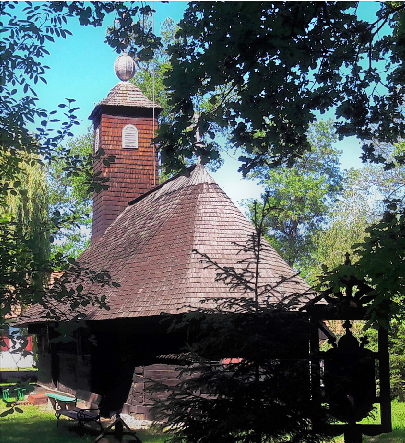

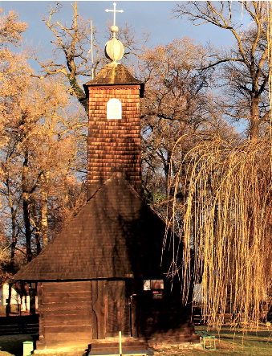

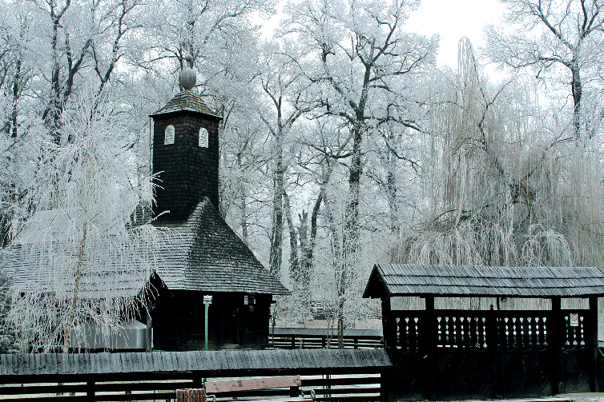

#### Planșa I. Biserica de la Topla, centrul unui muzeu.com bănățean (foto Borco Ilin).

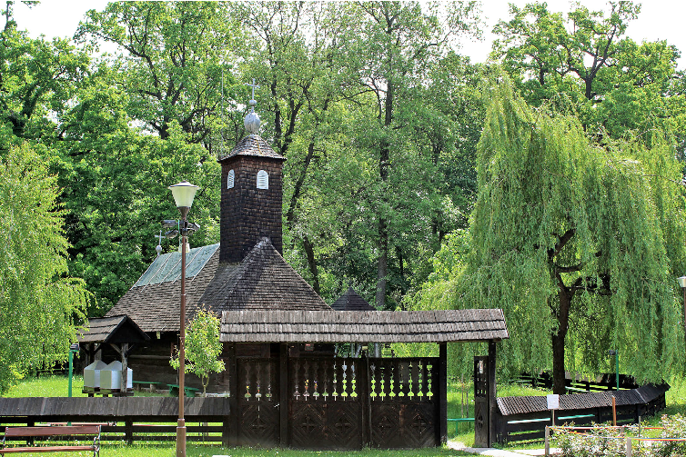

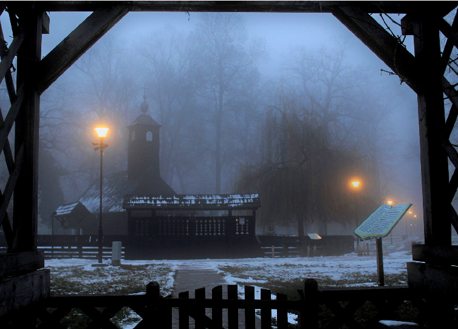

#### Planșa II. Biserica de la Topla, centrul unui muzeu.com bănățean (foto Borco Ilin).

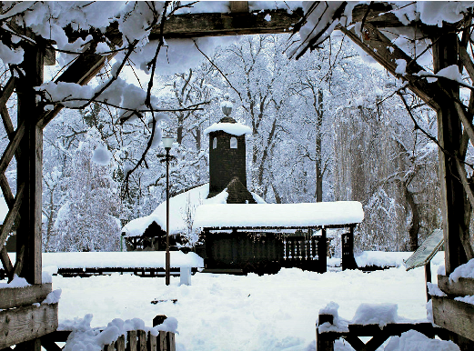

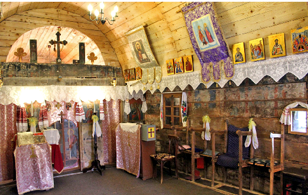

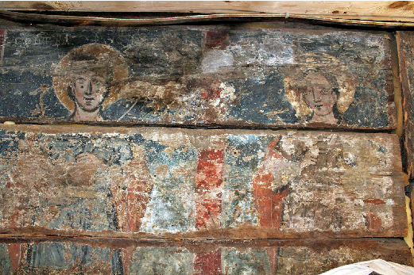

#### Planșa III. Biserica de la Topla, centrul unui muzeu.com bănățean și imagini din interior (foto Borco Ilin).

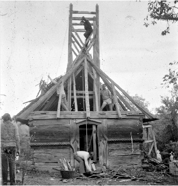

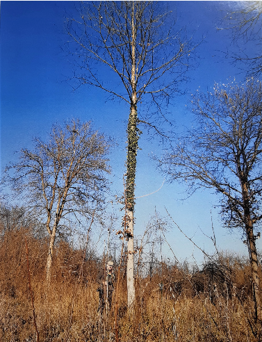

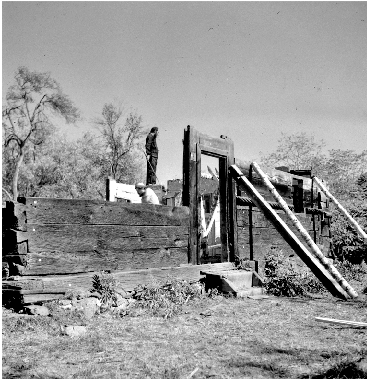

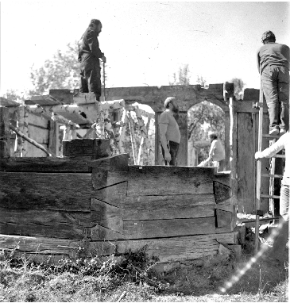

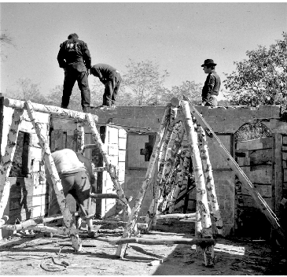

- Planșa IV. Biserica de la Topla: drumul de la sat la Muzeul Satului (locul original și imagini din

timpul demontării; foto Liviu Tulbure).

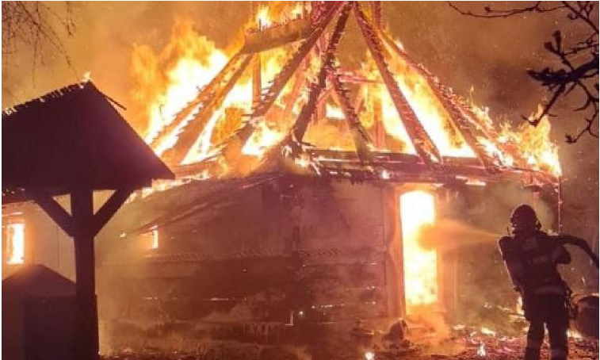

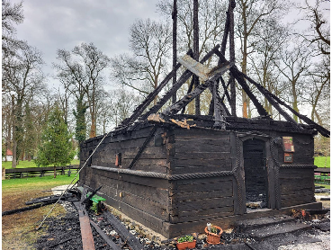

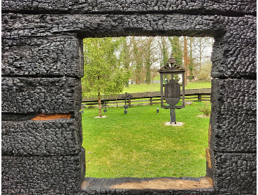

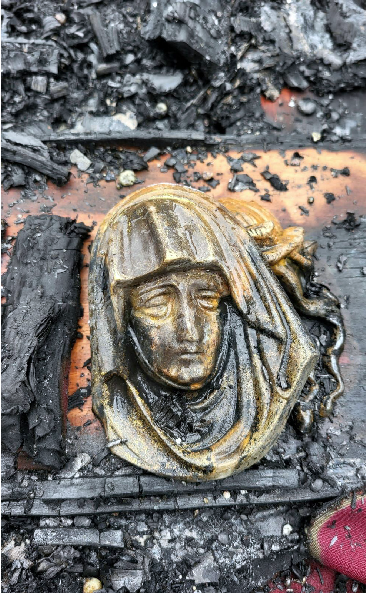

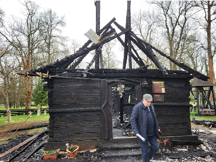

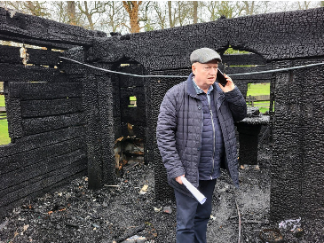

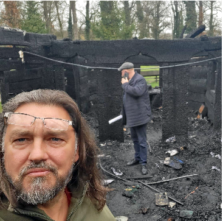

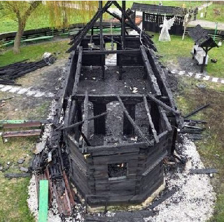

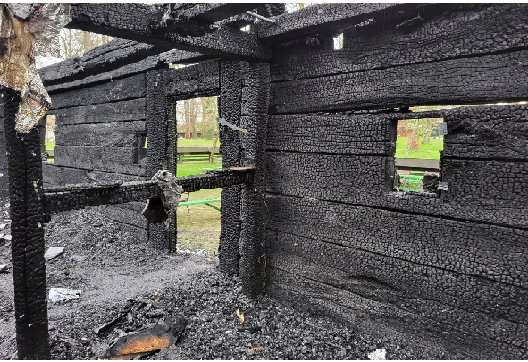

