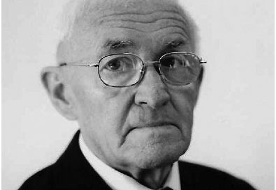

# IN MEMORIAM ISTVÁN ALMÁSI (1934–2021)

## Zoltán GERGELY*

István Almási, unul dintre cei mai renumiți cercetători ai muzicii populare maghiare din Transilvania, a încetat din viață în 8 martie, 2021. Trecerea lui în eternitate este o mare pierdere pentru etnomuzicologia maghiară. Profesionalismul său desăvârșit, completat de calitățile omenești cu totul deosebite și rar întâlnite în aceeași personalitate, au lăsat un gol dureros și o apăsare sufletească nu numai în rândul membrilor familiei sale și al foștilor colegi, ci și între numeroșii săi prieteni și admiratori din Cluj și de pretutindeni. Cu inima îndurerată își iau acum rămas bun familia, foștii colegi, foștii studenți și toți cei care l-au cunoscut.

István Almási s-a născut în 6 decembrie 1934, la Cluj. A crescut într-o veche și nobilă familie de preoți reformați, iubitori de muzică, prin urmare, încă de la vârsta de 8 ani, a început să studieze vioara. Între anii 1945‒1948, a fost elevul Liceului Teologic Reformat, dar în urma transformărilor ideologice din învățământ, care au interzis școlile cu profil teologic, a fost nevoit să-și termine studiile liceale, în 1951, la Liceul Teoretic Nr. 2 din orașul natal. Chiar dacă, la îndrumarea familiei, se pregătea pentru o carieră teologică, iar în secret pentru a deveni geolog, – „mulțumită Providenței Divine” – spusese el, a ales totuși o carieră muzicală. În 1956 a absolvit Conservatorul de Muzică „Gheorghe Dima”, specializarea pedagogie muzicală-dirijat coral. În timpul facultății a avut ocazia să învețe de la profesori renumiți precum János Jagamas, Ferenc Maior și István Nagy, personalități care i-au influențat pozitiv dezvoltarea intelectuală și activitatea etnomuzicologică și de dirijor ulterioare ale tânărului absolvent Almási, reținut într-un institut de cercetare muzicală, căruia avea să-și închine întreaga viață. În 1989, sub îndrumarea fostului său profesor, dr. Romeo Ghircoiașu, a obținut titlul de doctor în muzicologie, cu lucrarea intitulată Cercetările asupra folclorului muzical maghiar din Transilvania în secolul al XIX-lea și în primele decenii ale secolului al XX-lea.

* Institutul „Arhiva de Folclor a Academiei Române”, Cluj-Napoca.

Anuarul Arhivei de Folclor, nr. XXV–XXVI, 2021–2022, p. 99–103

Pasiunea și interesul pentru folclorul muzical le-a dobândit încă de pe vremea studenției. A avut norocul și oportunitatea să învețe direct de la discipolul lui Zoltán Kodály, nimeni altul decât János Jagamas, titularul disciplinei de la Conservator. Sub îndrumarea acestuia, în 1953, a realizat prima culegere de teren pe Valea Nadășului, în satul Turea, iar în 1954 publica primul articol științific. Din 15 ianuarie 1957 până în 1 decembrie 2004, când împlinea 70 de ani, a fost cercetătorul Institutului Arhiva de Folclor a Academiei Române, parcurgând toate gradele științifice: până în 1960 ca cercetător pe perioada determinată, între 1960‒1969 ca cercetător științific, din 1970 ca cercetător științific principal, iar din 1992 ca cercetător principal gradul I. După plecarea de la institut a lui János Jagamas în 1960, a rămas singurul cercetător de folclor muzical maghiar, căruia, după 1968, i s-a încredințat organizarea și gestionarea întregului sector de etnomuzicologie al Secției de Etnografie și Folclor a Filialei Cluj a Academiei Române.

De-a lungul carierei sale a făcut cercetări de teren în peste 130 de așezări din Transilvania și Partium. La fel ca și Jagamas, și-a concentrat atenția asupra satelor în care, în trecut, cercetătorii efectuaseră puține anchete de teren, sau deloc în ceea ce privește muzica populară. Astfel, din zone precum Scaunul Arieșului, Valea Nirajului, Ținutul Ierului, Valea Târnavelor, Valea Lăpușului, Sălaj, Homoroade sau Trei Scaune, de unde a înregistrat peste 5000 de melodii vocale și instrumentale, din care mai mult de 4000 a și transcris. Totodată, cercetătorul a inițiat și coordonat munca de sistematizare a arhivei clujene.

Cercetările sale s-au axat, în principal, pe clasificarea, sistematizarea și tipologia melodiilor folclorice, pe aspectele istorice ale cercetării etnomuzicologice, dar și pe interacțiunile etnice și problemele metodologice din domeniul științei. A publicat, în mai mult de o jumătate de secol, 12 cărți (parțial cu coautori), peste 160 de studii și articole științifice și recenzii în limbile maghiară, română, engleză și germană. În același timp, a susținut peste 190 de comunicări la diferite simpozioane, conferințe naționale și internaționale din România, Ungaria, Austria, Slovacia și Germania. Un aspect deosebit și demn de laudă este și faptul că, grație excelentelor performanțe lingvistice, și-a scris singur toate lucrările științifice în limbile română, germană și engleză, neavând nevoie de traducător.

István Almási a contribuit la realizarea mai multor emisiuni de folclor muzical în studioul Radio Cluj. De asemenea, a întocmit, folosind melodii populare, ilustrații muzicale la 7 piese de teatru de păpuși, inspirate din folclor. Totodată, la solicitarea editurii Didactice, a tradus, în limba maghiară, 3 manuale de muzică.

Dintre lucrările sale aș dori să evidențiez următoarele volume: colecția monografică A lapádi erdő alatt [Sub pădurea din Lopadea], apărută în 1957, pe care a publicat-o împreună cu Ilona Szenik și Ilona Zsizsmann. În 1968, în volumul monografic editat de Katalin Olasz, întitulat Magyargyerőmonostori népköltészet [Literatură populară din Mănăstireni], în apendicele de aproape 100 de pagini, publică mai multe melodii vocale din repertoriul satului. În 1970, împreună cu Iosif Herțea a publicat volumul trilingv de folclor ardelenesc, intitulat 245 melodii de joc. 245 népi táncdallam. 245 Tanzmelodien, care conține o exemplară antologie de melodii de dans cu versuri și melodii instrumentale românești, maghiare și săsești. În 1972, a publicat antologia Tavaszi szél vizet áraszt [Vântul de primăvară ploaie aduce], care conține cele mai frumoase și prețioase cântece

populare maghiare. Volumul a avut atât de mult succes, încât a fost reeditat în 1982, dar este folosit chiar și în prezent în școli sau diferite tabere cu tematică folclorică.

După mai mulți ani de culegeri de teren și după eforturi mari de transcriere și de sistematizare a materialului înregistrat publică, în 1979, la Editura Kriterion, volumul Szilágysági magyar népzene[Folclor muzical maghiar din Sălaj], cu care, în 1981, a câștigat premiul Ciprian Porumbescu al Academiei Române. În 1974, împreună cu András Benkő și István Lakatos, a publicat ediția restitutivă cu titlul Seprődi János válogatott zenei írásai és népzenei gyűjtése [Culegere din scrierile muzicale și culegerile folclorice ale lui János Seprődi], aceasta prezentând un material etnomuzicologic inedit, necunoscut până atunci de publicul larg. În 1984 a editat volumul de studii al mentorului său, János Jagamas, cu titlul A népzene mikrokozmoszában [În microcosmosul muzicii populare]. În 1986 a selectat și îngrijit pentru tipar melodiile populare aferente al volumului cu titlul Virágok vetélkedése. Régi magyar népballadák [Întrecerea florilor. Balade populare maghiare vechi], elaborat de József Faragó.

În 2009, cu ocazia împlinirii vârstei de 75 de ani, la Editura Fundației pentru Studii Europene, s-a publicat volumul de studii cu titlulA népzene jegyében [În zodia folclorului muzical]. Acesta conține o parte dintre cele mai reprezentative lucrări etnomuzicologice ale sale, rezultatul unei activități de aproape o jumătate de secol de cercetare.

În ultima etapă a carierei sale științifice a lectorat volumul al XI-lea și al XII-lea al antologiei Magyar Népzene Tára [Tezaurul Muzicii Populare Maghiare], editate de cercetătorii Mária Domokos și Katalin Paksa, ambele lucrări apărând în 2011. În 2013, a lectorat monografiaA magyar népdal új stílusa[Stilul nou al muzicii populare maghiare] al lui János Bereczky.

Ultimul său volum antum a apărut în 2019, la Budapesta, în ediția Academiei Ungare de Arte. Colecția reprezentativă de studii cu titlul „Most jöttem Erdélyből...” Írások népzenéről és népdalkutatásról [„Tocmai am venit din Transilvania...” Scrieri despre muzică populară și cercetarea cântecelor populare] este, în mare parte, rezultatul muncii sale din ultimul deceniu. Toate articolele din acest volum ale strălucitului cercetător sunt, asemenea întregii sale creații științifice, precise, corecte, originale și de o calitate științifică superioară.

István Almási nu a excelat doar în cariera sa de cercetător a muzicii populare maghiare. A avut rezultate excepționale și în alte arii culturale: pe lângă activitatea de cantor, a dirijat mai multe coruri, iar între anii 1990‒1993 a acceptat înalta funcție de curator principal al Bisericii Reformate din Ardeal.

Profesionalismul său exemplar și desăvârșit este dovedit de premiile și distincțiile pe care le-a primit de-a lungul anilor. În 1970, în semn de recunoaștere pentru activitatea profesională a primit distincția Meritul Cultural. Pentru rezultatele excepționale în muzicologie, în 2001, Ministerul Patrimoniului Cultural Național al Republicii Ungare i-a acordat premiul Bence Szabolcsi. În 2004, pentru rezultatele obținute în etnomuzicologie, Uniunea Formațiilor Muzicale Maghiare din România i-a acordat premiul János Jagamas. Tot în 2004, Consiliul de Administrație pentru Arta Maghiară de la Budapesta i-a înmânat premiul Zoltán Kodály. În 2009, pe baza deciziei Comitetului Prezidențial al Academiei Maghiare de Științe, a devenit deținătorul medaliei János Arany. În 2010, Senatul Universității de Arte din Târgu Mureș i-a acordat titlul de Doctor Honoris Causa.

În semn de recunoaștere pentru întreaga sa activitate științifică, pe 8 decembrie 2014 a fost distins de către Societatea Etnografică János Kriza cu Premiul pentru întreaga sa operă. În același an, a apărut volumul omagial Pontosan, szépen. Almási István 80. születésnapjára [Precis, frumos. Pentru ziua de nașterea a 80 de ani al lui István Almási] volum editat de Erzsébet Salat–Zakariás, în care, mai mulți cercetători de muzică populară maghiară și românească, din țară și din străinătate, l-au felicitat și i-au adus elogii etnomuzicologului octogenar.

Unul dintre principalele merite ale lui István Almási este că a acceptat predarea folclorului muzical maghiar în facultățile proaspăt înființate. A ținut, astfel, cursuri mai mulți ani la Universitatea Babeș-Bolyai, Facultatea de Teologie Reformată, Specializarea Pedagogie Muzicală din Cluj-Napoca, la Facultatea de Muzică a Universității de Arte din Târgu Mureș și la Universitatea Creștină Partium, Departamentul de Muzică Bisericească din Oradea. La Budapesta, la Departamentul de Folclor al Universității Eötvös Loránd și Departamentul de Muzică Populară al Universității de Muzică Liszt Ferenc, a susținut o serie de conferințe de mare succes despre straturile stilistice ale muzicii populare maghiare și despre istoria cercetării muzicii populare.

Încununat, din 1981, cu cel mai însemnat Premiu al Academiei Române, Ciprian Porumbescu, István Almási a fost ales membru al Academiei Maghiare de Arte, membru de onoare al Societății Maghiare Zoltán Kodály, membru fondator al Societății Etnografice János Kriza, membru corespondent al Societății Etnografice Maghiare, membru extern al Academiei Maghiare de Științe, membru al Asociației Muzeului Transilvaniei, al Societății Maghiare de Muzică și Critică Muzicală, al Uniuni Compozitorilor și Muzicologilor din România și al Societății Internaționale pentru Studii Maghiare.

În continuare aș dori să evoc pe scurt relația mea privilegiată cu profesorul, mentorul și părintele meu spiritual István Almási. L-am întâlnit prima dată în toamna anului 2005, la facultate. Preda cursul de folclor muzical maghiar, unul dintre cele mai îndrăgite de noi, studenții. Era extrem de elegant, pedant, apărea mereu în costum și cravată. Eu, personal, pur și simplu tânjeam după orice informație nouă despre folclorul muzical, prin urmare, în pauze, ori de câte ori era posibil, întrebam mereu despre muzica populară maghiară în general, dar mai ales despre modul de interpretare a cântecelor populare. Era de o punctualitate, seriozitate, exigență cu totul deosebite, disciplinat și precis în expuneri. Avea cunoștințe extraordinare și un simț pedagogic excelent, combinând rigoarea didactică cu bunătatea și blândețea precum și seriozitatea cu umorul.

După anii de universitate nu am rupt legătura cu îndrăgitul meu profesor. În timpul studiilor doctorale am apelat de nenumărate ori la el pentru ajutor și îndrumare. Treptat această relație de profesor‒student a devenit una de prietenie, datorită mai ales faptului că în toamna anului 2013, Institutul Arhiva de Folclor a Academiei Române a scos la concurs un post de cercetător, specializarea etnomuzicologie maghiară. M-am prezentat la concurs și am fost admis într-un colectiv de cercetare prestigios, cu o istorie de peste 80 de ani și cu o arhivă folclorică dintre cele mai mari și mai importante. Ulterior am conștientizat că această sarcină nobilă de edificator de arhivă muzicală, a fost îndeplinită aproape o jumătate de secol de nimeni altul decât István Almási. A fost și rămâne o onoare pentru mine să-i succed în această misiune, dar acest lucru vine cu niște responsabilități uriașe, copleșitoare, întrucât este greu să calci pe urmele Maestrului. După decesul Ilonei Szenik,

Almási era singurul specialist la care mai puteam apela ori de câte ori aveam nevoie de îndrumare. Prin urmare îl frecventam din ce în ce mai des, ceream îndrumări, sfaturi în privința construcției instituționale pe care o edificase, a cercetărilor de teren necesare sau bibliografie internațională, și ‒ nu în ultimul rând ‒ încurajare ca tânăr etnomuzicolog începător. De fapt, abia acum, după ce a plecat dintre noi, am înțeles la ce s-a referit atunci când mi-a spus, într-una din conversațiile noastre, că „…tânăr cercetător fiind, am rămas singur, fără îndrumător” ‒ îndrumătorul fiind Jagamas care, din cauza unei legi care interzicea cumulul de funcții, în 1960 părăsise institutul.

Ce am învățat de la iubitul meu profesor, mentor cald și prietenos părinte? În primul rând nevoia de muncă dăruită, de acuratețe și rafinament în cunoașterea fenomenelor, de seriozitate, exigență, onestitate în actul de investigare a acestora. Când mă simt nesigur, epuizat sau îngrijorat, îmi amintesc mereu de cuvintele lui înțelepte: „Toată lumea să rămână acolo unde i-a fost destinat! Muncește și nu-ți pierde curajul!”

Dumnezeu să te odihnească în pace, dragul meu profesor, mentor și prieten!

