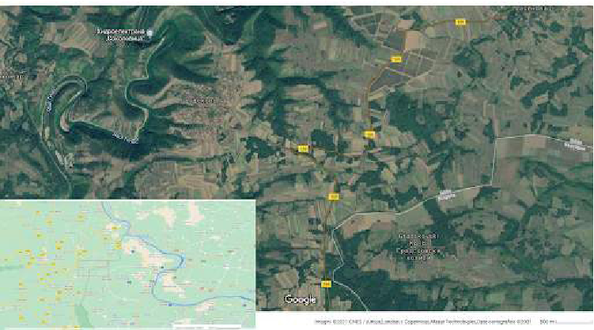
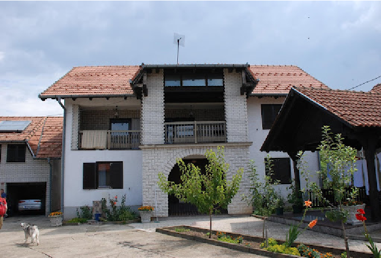
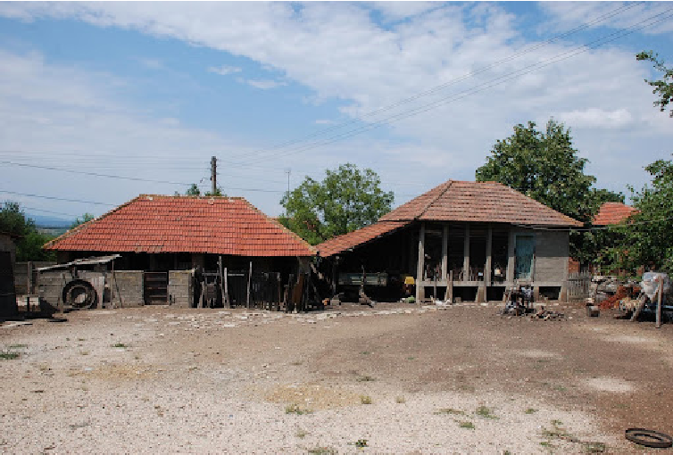
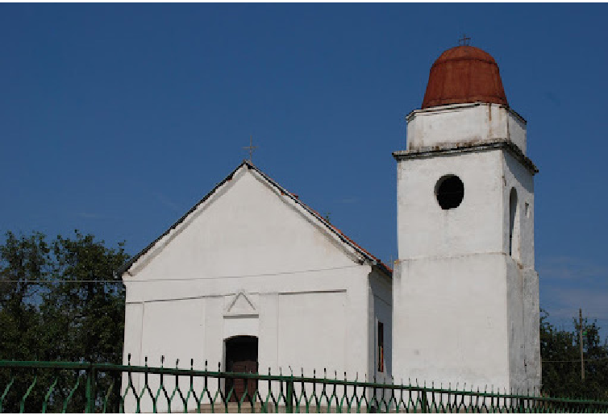
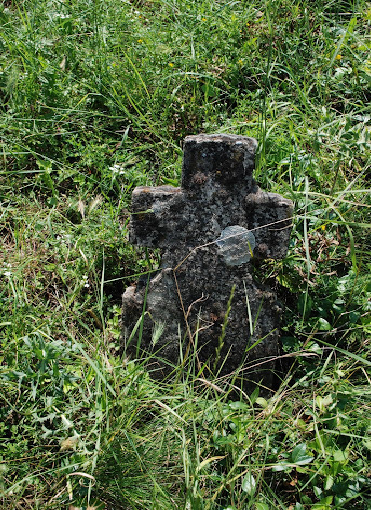
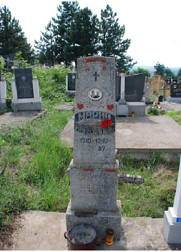
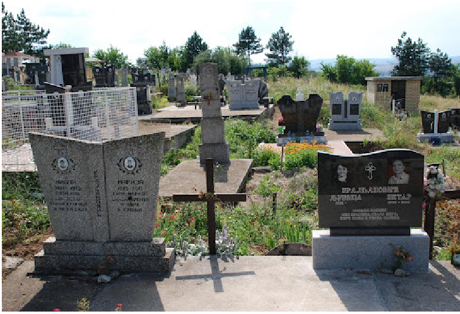
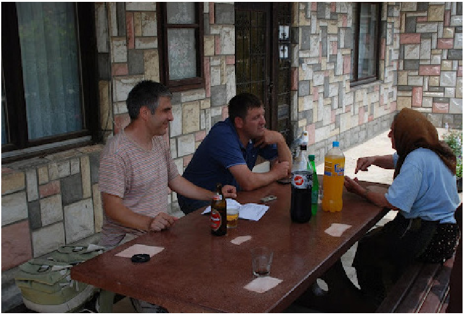

# SĂRBĂTORI, OBICEIURI, CREDINȚE LA ROMÂNII DIN SATUL GRADSKOVO (SERBIA)

Emil ȚÎRCOMNICU*

Holidays, Customs, Beliefs at the Population of Romanian Origin from Gradskovo (Serbia) Villages (Abstract)

In this paper we show elements of traditional culture, specific to the population of Romanian origin from Gradskovo (Serbia) village, which are present in the cultural immaterial heritage (holidays, customs, believes) as well as self-identification elements of oral history.

Keywords: holidays, customs, beliefs, Timok Valley, oral history. Cuvinte-cheie: sărbători, obiceiuri, credințe, Valea Timocului, istorie orală.

Cercetările din localitățile Gradskovski Kolibi (Bulgaria) și Gradskovo (Serbia). Prezentare sumară a localităților

În cadrul unor cercetări de teren desfășurate în Serbia și Bulgaria (în regiunile Zaječar și Vidin), am cules materiale din două localități învecinate, despărțite de granița dintre cele două state, situate în regiunea din dreapta râului Timoc: Gradskovo în Serbia1 și Gradskovski Kolibi (Colibele din Grațcov sau Colibele grațcovenești) în Bulgaria2.

Satul Gradskovo este un sat adunat, având un cimitir al obștii, precum și biserica veche, cu hramul Sfântului Gheorghe. Satul este unul relativ prosper, fiind la 21 km de orașul Zaječar, aflat în districtul Zaječar, la coordonatele geografice 44001’10’N 22022’51’E, cu o populație de 666 locuitori (anul 2002), 480 din relatarea localnicilor (anul 2014).

Gradskovski Kolibi se află în obștina Boinița, regiunea Vidin, altitudine 294 m, aflat la coordonatele geografice 44000’N 22026’E, cu o populație de 39 locuitori (anul 2011), declarați ca apartenență etnică bulgari, dar fiind de origine etnică română. Satul a fost format prin stabilirea unei părți a populației din satul Gradskovo, cedat Serbiei în anul 1919. Regiunea din dreapta Timocului cedată Serbiei cuprindea 9 sate. Populația rurală căreia i-au rămas o parte însemnată din terenurile agricole în zona bulgară, a hotărât să

* Institutul de Etnografie și Folclor „Constantin Brăiloiu” al Academiei Române; Facultatea de Litere, Universitatea din București.

- 1 Cercetarea de teren în Serbia, în satul Gradskovo, a avut loc la 16 iulie 2014, fiind însoțit de Zavișa Jurj.
- 2 Cercetările de teren în Bulgaria, în satul Gradskovski Kolibi, s-au desfășurat în 26 noiembrie 2009 (Emil Țîrcomnicu) și 3 iulie 2011 (echipă fiind formată din Emil Țîrcomnicu, Lucian David și Semuc Ionuț). Materialele culese au fost folosite la alcătuirea corpusului de documente etnografice, Sărbători și obiceiuri. Românii din Bulgaria. Vol. I, Timoc, ediția a II-a, București, Editura Etnologică, 2017.

Anuarul Arhivei de Folclor, nr. XXV–XXVI, 2021–2022, p. 295–312

- rămână în Bulgaria3. Satul este răsfirat, având cimitire de familie, amplasate în apropierea gospodăriilor. În 1950, satul avea 720 de locuitori4. Multe case, în anii 2009 și 2011, erau părăsite, atunci locuind aici câteva familii, din estimarea noastră fiind peste 20 de persoane. În toamna anului 2020, când am ajuns din nou în regiunea Vidin, am aflat că în Gradskovo Kolibi mai locuia o singura familie. Natura va invada acest sat și casele vor fi supuse intemperiilor, astfel că satul, putem spune, va dispărea în următorii ani.

„Gradskovski Kolibi [s-a format], a fost un contract, și a venit granița între Gradskovski Kolibi și Gradskov. Înseamnă că aici a fost satul Gradskov și colibele au

- rămas la bulgari. Tinerii au rămas în sat, părinții la tineri au trecut la colibe, acolo au fost cu avere și pentru aia au rămas la bulgari. Au rămas numai să lucreze pământul. Au putut [să treacă unii la alții, peste graniță] numai cu niște permisuri, până în o mie opt sute patruzeci și opt și nouă și o mie nouă sute cincizeci, cu niște permisuri să-și facă treaba la avere, la pământ. După aia s-a strâns treaba între Bulgaria și Serbia și n-a mai avut voie
- să se ducă nici sârbii în Bulgaria, nici bugarii să vină” (Inf. Miomir Gjorgjevic, n. 1960, în Isonovățu ăl Mare, Veliki Jasenovac, 16 iulie 2014).

Populația de origine română din cele două sate aparține așa-numitului grup etnografic al pădurenilor. Emanoil Bucuța5, în anul 1923, prezenta cele trei grupuri din Timocul bulgăresc: vălenii, câmpenii și pădurenii. Și astăzi funcționează această

Harta cu cele două localități: Gradskovo (Serbia) și Gradskovski Kolibi (Bulgaria)

- 3 Asemănător s-a întâmplat și cu locuitorii din satul Šipikovo, o parte a populației rămânând în Bulgaria, la colibele de la terenurile agricole, întemeind cătunul Shipicova mahala (în anul 2020, în acest sat răsfirat mai era doar o familie).
- 4 În anul 1900 (după Gustav Weigand), în localitatea Gradskov, pe atunci în Bulgaria, erau 1370 români și 161 bulgari. În recensământul sârb, din 31 ianuarie 1921, în localitatea Gradskov, dn Serbia, erau înregistrați 1616 locuitori, dintre care 2 erau declarați sârbi, iar 1614 români (C. Constante, A. Golopenția, Românii dintre Dunăre, Vidin și Timoc, 1943, p. 291).
- 5 Emanoil Bucuța, Românii dintre Vidin și Timoc, București, Tipografia Cartea Românească S.A., 1923.

delimitare în conștiința românilor timoceni din Bulgaria. În schimb, în Serbia, românii din dreapta Timocului nu se identifică ca pădureni (satele cedate Serbiei aparțineau acestui grup etnografic al pădurenilor). Ceilalți români timoceni, pentru a se diferenția, le spun „bugari”, cu sensul de foști cetățeni bulgari, oameni care au aparținut Bulgariei.

Pentru introducere prezentăm câteva elemente privind autoidentificarea și situația identitară, așa cum reiese din interviurile realizate cu doi informatori:

- Inf. 1: „de-a lu Belivac” (după mamă), născut în anul 1960 în Gradskov, tatăl lui

este venit din Gabrovița, de lângă Kladovo și stabilit în sat prin căsătorie; deda meu e Marinovici, după deda lui Marin.

- Inf. 2: Danița Vuficovici (Nițoevici, după mamă), n. 1935, 4 clase. „[Locuitori] acușa sunt patru sute și optzeci. Într-un timp, până în o mie nouă sute

optâșpe a fost granița la Timoc, în vale, și asta [locul acesta] a fost la bugari. După război a rămâs la sârbi asta și s-a făcut altă graniță aici. Și multă lume a avut colibe acolo, la Gradskovski Kolibi, unde ați fost voi, acolo, a avut colibe și a avut pământuri, a fost acolo tot. Și vrunii a vrut să vină încoace, care a venit, a venit, a trecut aicea și a lăsat acolo, care nu [au vrut să vină] a rămas acolo. Și de aia s-a făcut două sate! A rămas frați, așa e [de o parte și de alta a graniței]. Și până mai încoace a fost, care sânt frați, ete, într-acușa... Se vizitează, da. La Vrashka chuka [este vama]... Dincolo, piste Timoc, ne ziceți bugari [se referă la românii din stânga Timocului]. Am auzit că nouă ne zic bugari. [În Bulgaria sunt văleni la Dunăre, câmpeni și, la Rabrovo, Șpikovo și Grațcov sunt pădureni. Voi ce sunteți, cum vă zice?] Sântem rumâni, pentru noi când vorbim! Eu știu, uite aia am auzit, întrebați de Boșincaniu, noi le spunem ungureni la aia! N-am auzit cum mi-ai zicea tu mie. [Zavișa Jurj: Noi le zicem bugari, da la ceilalți crăinianți.] Da, așa, crăinianți, la Craina crăinianți. Aici, printre noi,nima nu zice că sântem bugari! Pe la Negotin, la Zaicear, unde suntem noi, noi ne zicem rumâni, da ei ne zic vlahi, sârbii. Ar trebui să ne zică rumâni. Noi spunem Rumânia, dar voi sunteți din Romania. Pentru mine sunteți rumâni. Eu nu sunt vlah, ama nouă așa ne zic aicea, sârbii așa ne zâc aicea, și așa o sută de ani cu vlahii, vlahii…” (Inf. 1)

Limba vorbită în casă: „În casă, românește. Da cu ea, cu nora, am vorbit sârbește! Da nevasta mea vorbește românește, da aia altădată îi spune românește, altădată sârbește. Da știe tot! Ala e nepotu, ce fu al mic, vorbim [cu el] și românește și sârbește, mai mult sârbește. La școală normal învață sârbește. Mai mult sârbește [vorbim cu el]. Ai lui [părinții] sârbește [îi vorbesc]. Noi, aicea, în sat, și în case și cu nevasta și cu lumea numa românește [vorbim]” (Inf. 1)

Posturi de televiziune, românești, urmărite în satul Gradskov: „Mergi la televizor să vezi! Pe TVR unu și TVR doi, nainte era și ăla, cum îi zicea, cu normal antena, nu se mai prinde ala. Eu tot mă uit, la toate programele! Eu bine pot să citesc, dar nu pot tot. Știu și să citesc românește. Singur [am învățat] de la televizor. Și pe vremea lu Tito și a lu Ceaușescu s-a prins posturile. Știu că ai bătrâni, ai noștri, se uita la muzica populară mai mult. Îmi place mult sara de bisnis, cum se spune… Pe televizie înseamnă că puternică [este țara, România]” (Inf. 1)

„[Oamenii din Gradskov] au fost de pin România, din România sânt veniți în Gradscov. Și unii din Isâcova sânt făcuți aici. Și, naci, s-a proporit lumea în satu ăsta, din România și din Isâcova. Și-au rămas aici, s-a făcut Gradscov, Satu al Nou întâi s-a

zis. Răduță din Țara Românească [a venit]. Tata meu a avut frați, acolo, în Bulgărie, și soră. Taica de aici a avut fratele lu ta-so, a fost iar în Bulgaria. Bușicani se zic la aia, tot Bușicani. Ama, nu mai e nima. Ei s-au dus mai încolo, mai departe. Cei care au fost aici, mai aproape de graniță, au murit toți. Se zice Colibile gradscovenești [satului bulgăresc]. Am fost eu pe la rudele mele… ăhă, când am fost fată! Sânt [casele] ca colibele, una colo, una colo, nu sânt ca satu! Da mormântu, lângă colibă îi îngroapă, n-are morminți. Așa e acolo! Am învățat trei ani pârvi put, m-am dus, că a fost sârbu demult. E, a venit bugariu atunci, cu bătaia a fost când a venit Tito, a fost bătaie. Și ișcoala sârbă n-a mai fost, a venit bugariu. Și io am învățat la bugari trei ani. Potgositelno și pârvo delenie și ftoro delenie [primii trei ani] am învățat bugărește. Asbuca [alfabetul], bugărește am învățat-o” (Inf. 2)

Prezentăm în acest articol câteva elemente de cultură tradițională specifice populației de origine română din Gradskovo (Serbia)6, care aparțin patrimoniului cultural imaterial, ca și elemente de autoidentificare și de istorie orală7.

Sărbători, obiceiuri, credințe. Materiale de teren Nașterea, căsătoria și înmormântarea

Obiceiuri la nașterea copilului Femeia gravidă: „Când e-ncărcată” (Inf. 2) Aflarea sexului copilului: „Nu s-a știut ce este acolo!Numa dacă s-a dus la vo muiere de-a cătat-o, care-a știut la vremea aia, atunci, în ce parte este, cum este, naci că partea aia se cunoaște care e fată, care e copil. Ete, baș pe mine m-a cătat una și-a știut că e copil. [În ce parte] eu nu pot să țin minte, dar uglavno că copilu, ca cum a zis că e la mijloc, la burtă, sus la capu pieptului, da fata vine cam de-o parte, așa, în stânga” (Inf. 2)

Locul nașterii: „Ete, al meu copil s-a făcut acasă, n-a fost în bolniță. Atunci când se face, momentanlu, odma apă rece pe el, decât a turnat pe el și pe urmă, odma, îl pune colo, nu l-a scăldat tot, numa decât apa aia de-a pus-o pe el. Și țân minte, ama mie mi-a fost greu, și țân minte, până pusă apă pe el, și el zbieră, și ea îl-nvălui, că să-l pună colo,

- 6 În satul Gradskovo știm că la 24 iunie 2000, Biljana Sikimić, Slavoljub Gacović și Annemarie Sorescu-Marincović au realizat o culegere de teren, având ca temă sărbătorile de peste an, legendele și basmele populare, în urma căreia a fost publicat un glosar de termeni: Annemarie Sorescu, Biljana Sikimić, Din textul dialectal al satului Gradskovo, în „Lumina”, Vârșeț, Serbia, 2003, p. 54–62.
- 7 În anul 2014 am realizat cercetări de teren în mai multe localități din nord-estul Serbiei, la „românii timoceni”, având ca scop să observ specificul etnografic al acestei regiuni și să mă documentez pentru a realiza un corpus de documente etnografice cu tematica sărbători, obiceiuri, credințe. În anii anteriori realizasem cercetări în nordul Bulgariei, cercetări care s-au concretizat cu publicarea a două atlase etnografice și a două corpusuri de documente etnografice: Atlasul etnografic român. Sărbători și obiceiuri. Românii din Bulgaria. Volumul I, Timoc, Emil Țîrcomnicu (coordonator), autori: Emil Țîrcomnicu, Lucian David, Ionuț Semuc, București, Regia Autonomă Monitorul Oficial, 2011;Atlasul etnografic român. Sărbători și obiceiuri. Românii din Bulgaria. Volumul II, Valea Dunării, Emil Țîrcomnicu (coordonator), autori: Emil Țîrcomnicu, Lucian David, Ionuț Semuc, Adelina Dogaru, București, Regia Autonomă Monitorul Oficial, 2011; Sărbători și obiceiuri. Românii din Bulgaria. Volumul I. Timoc, Emil Țîrcomnicu (coordonator), autori: Emil Țîrcomnicu, Adelina Dogaru, Ionuț Semuc, Lucian David, București, Editura Etnologică, 2017; Sărbători și obiceiuri. Românii din Bulgaria. Volumul II. Valea Dunării, Emil Țîrcomnicu (coordonator), autori: Emil Țîrcomnicu, Lucian David, Ionuț Semuc, Cristina Mihală, Armand Guță, București, Editura Etnologică, 2011.

eu am leșinat. Și tomte când strigă la mine, m-am pomenit eu, zice: «Pomenește, că ai copil!». «Da, zic eu, e bun, că-l auzii când zbieră, cânt turnă apă pe iel!». «Bun, bun, nu te teme, pomenește-te!»” (Inf. 2)

Tăierea și legarea buricului: „Și-a venit moașa și i-a tăiat buricu cu foarfecile și a luat fir de păr din capu meu și-a legat acolo” (Inf. 2)

Practici privind buricul: „Ala l-a pus să-l pună la loc curat, să-l lapede la loc curat. Naci, unde e iarbă” (Inf. 2)

Înfășarea copilului: „S-a făcut în tri ălea, s-a făcut fașie, cum s-a zâs, s-a-mpletit și i-a pus la căpătâi aicea ban. Moașa a făcut treaba asta! Și a venit și l-a-nfășiat, i-a legat picioarele cu scutece, pelenă” (Inf. 2)

Ursitoare: „Ursătorile se pune, se face trei turte. Cruce-n ele și pune acolo flori, și pune apă, și pune vin, și pune busuioc și toate ielea. Chitește masa cu toate ielea. Bani se pune. Pe turte pui să fie mâncare... Și pe urmă le pune turtele... că leagănu așa a fost, da acu în bolniță se fac, da atunci a șezut leagănu aci. Și a pus masa aci, pe masă de lemn i-a pus aci, și pe urmă, noaptea, eu am visat noaptea că vin, că așa e vorba, că trei ursoaice sunt ele. Da eu, la copilu meu, am visat două și un om. Și la zâua când m-am sculat am povestit ce am visat, la moașa. Vine moașa, a pus-o seara, dimineața iar moașa ridică alea și eu am povestit că, ete, așa am visat. Așa am visat, o frânghie lungă... și care știe, câte două sute de metri lungă frânghia aia. Una ține la căpătâiu ala și una la căpătâi și la mijlo, omu ăla. Da de acolo, cât e frânghia aia de lungă, nu ieșiți din oi așa, doar așa, oaie lângă oaie, cât ține frânghia aia. Da omu ăla ține la mijloc frânghia, dar ele la căpătâie și se duseră... Și eu la zâuă: «Ia, uite ce am visat!». Zice: «Frânghia aia, zile lungi!». Omu ăla, cică, el e domaci, nu e ursoaică, nu e muiere, ca nebuna să fie, numa el e om! Și el, aia e bun, omu ăla! Așa am visat!” (Inf. 2)

Leagănul: „Leagănul [e] cumpărat, de lemn este… Eu îl țin și acuș în pod!” (Inf. 2) Botezul: „Nașu, s-a dus la nașu, ama, moașa a fost cu el și moașa l-a ținut când să-l

boteze, l-a dus la biserică. Și la biserică, acolo, popa… ama nu se duce muma la copil, numa moașa se duce cu el, și nașu. Ai mei, soacra s-a dus, da pe mine nu m-a lăsat să mă duc. Și s-a dus acolo și așa am auzât că a făcut! Nașu îl botează, îl ține în brațe, da nașa este și ea, ama nașu dă ocol” (Inf. 2). „[Acasă] n-a făcut veselie, numa am mâncat, au făcut prânz” (Inf. 2)

Nășia: „Da eu am fost nașă, că de aia țâu minte, că am fost eu, aici la una sântem nași. Și m-a chemat să botez fata aia. Atâta am țânut minte, popa a fost aci și eu iar am fost bolnavă că eu, când a murit soacra mea, a murit labrezină de gărgăune… și eu m-am potresit de inimă… și într-ala moment, šezdeset četiri godine [anul ‘64] a fost aia treabă, am făcut, fina aia și eu să mă duc s-o botez. Când am botezat-o, moașa aci, ama nașa o… acasă [s-a făcut] că a fost ger, nu s-a dus la biserică. Și eu, cu ea în brațe, dau ocol cum zice popa, merge… și când să mai dau o data acolo, de trei ori dai ocol, acolo, la postava aia, popa cu busuiocu face acolo, udă … și io, iar leșinai, alergă moașa că s-o ia, popa n-a dat-o, numa zice: «Puneți-i leagănu să șadă!». Popa ținu leagănu, m-am pomenit cu leagănu în poală, măosfedi și ea de-oară a botezat-o. Înpostavă, și eu dau ocol cu leagănu în brațe. M-ajută moașa, decât că e aci dar nu-l ține” (Inf. 2)

Deochiul: „Să nu se deoache, să-l vadă … pune pă vezi că te uiți la lună și la soare să nu se deoache… Zici aia treabă: «Cum privește luna și cum e … să nu se deoache…».

«Copilu să fie curat, luminat, ca soarele de lumină și ca luna de pe cer!». La mână i-a pus ață roșie” (Inf. 2)

Descântecul: „A fost să descânte cu busuioc, [la] muiere care știe să descânte de deochi. Stânge cărbune în gură, ia cărbunele aprins, apă în gură, și dă cu el în gură, și el se stinge în gură. Și pe urmă, cu apa aia și cărbunele ăla îi face cruce” (Inf. 2)

Copilul din drum: „Pe ala l-a pus, care face stalno și mor, nu trăiesc. Și-l ia, când se face, i-l lapădă, se duce cu el vrundeva și-l pune la răscruciuri, sau cum se zice. Și acușa,

- să vadă care trece. Și îl găsește acolo, care trece îl găsește, pe ala îl pune naș” (Inf. 2) Obiceiuri la Sânvăsâi: „La Sânvăsâi se duce cu plocon. La moașă numa trei ani te

duci, și la Sânvăsâi și la praznic. Te duci cu plocon și moașa ridică ploconul. «Să trăiască nepotu, la mulți ani!». Ete, așa, ridică așa, sus! Până la trei ani. Da la Sânvăsâi nu se duce la nașu, numa la praznice” (Inf. 2)

Tăierea moțului: „Îi tăia, când ia moțu nașu. Se duce și pune cu ceară și ia de aicea, din trei locuri. Și cu ceară îl pune, poți să-l ții, care cum vrea, moțu.Numa lacopil, de fata n-are treabă, decât la copil îi face moțu” (Inf. 2)

Obiceiuri la căsătorie Mirii: „Ginere și mireasă [le spune la miri]” (Inf. 2) Aranjarea căsătoriei: „Sigur treizeci de ani să fie de când nu se mai vorbește! Copilu

nostru el a luat-o sângur, noi nici n-am știut, fata de la Zaicere! Sânt, este cineva, ale puțâni dacă o fi unu, doi, dacă se duc să se vorbească așa, părinții” (Inf. 1)

Pețitul: „Părinții, toți se pupa unu cu altu. Când se duc acolo de se-mpreună copiii, se pupa tata cu tata fetii. A-ntrebat-o [pe fată] dimineața, când s-a dus ginerele la ea” (Inf. 2)

Schimbarea inelelor între logodnici: „Împățât, tocmit. Atunci se vorbește [de miraz], când se tocmește. Am schimbat, dacă am avut inel l-am schimbat cu ginerele. El mi-a dat mie, eu lui. El a avut șaisprezece ani, și eu [la fel]” (Inf. 2)

Zestrea: „Se vorbesc de miraz. Pământ, așa mi-a dat mie, lacră cu țoale, mi-a făcut muma mea țoale, cum s-a făcut atuncea, e plină lacra aia. Și la nașu se dă țoale, un rând de țoale. Socru meu a zis că nu-i trebuie nimic. Da tata a zis că «Eu, podăresc fata mea cu atâta imane!»” (Inf. 2)

Stabilirea nunții: „Nunta am făcut-o toamna, în septembăr, la panaghiur am venit eu, aicea. Și nunta am făcut-o în ziua de Sânvăsâi, cu lăutari” (Inf. 2)

Chemarea la nuntă: „Te duci cu rachiu și chemi la nuntă. Ascultători se spune la [chemătorii] la nuntă, tri, patru inși, mai mult trebuie să fie. În cutare zî e nunta, duminica și luni a fost nunta, două zâle au fost. Ama, duminica, a fost cu lume ce s-a chemat, da luni a făcut numa ascultătorii și cu nașu” (Inf. 2)

Însoțitori ai mirilor: „Cumătru al de mână al miresii, el a mers cu noi” (Inf. 2) Despre cununie: „Se duc care s-au dus, daete, eu am îmbătrânit, și eu la biserică nu

m-am cununat. M-am dus la obțină, cu nașu la obștină” (Inf. 2)

Obiceiuri la poarta miresei: „Merge în zâua aia când e nunta. Când ia fata de acasă se pune sus un măr, ceva, dă și trage [cu pușca]. La casă se pune o cunună de flori” (Inf. 1) Ascunderea miresei: „Nunțile s-au făcut din vreme așa. Au venit lăutari la copil, la ginere, și să se ducă la mireasă dimineața. Se duc la mireasă să o ia și le și pune cumnat

de mână, așa se zice, cumnat de mână, din familia ei. Și acușa ginerele se duce și ocată ca să o scoată. Cumnata de mână nu o dă. El cată să iasă. Soacra, că n-o ivește pe mireasă. «Iată, io sunt!». «Nu iești tu!». Și a găsit-o pe mireasă pe urmă. Ama, se ivește ea. O ia și se duce la nașu cu ea” (Inf. 2)

Steagul: „Și nașu are, acolo, când îi pune val în cap, el face steag, așa i-a zis. Prăjină lungă și pune peșchire, pune flori, îl chitește. Numa albu pestriț [este peșchirul]. Ama, nașu îl pune la steagu ăla, și iar nașu are omu lui să ducă steagu ăla” (Inf. 2)

Iertăciuni: „S-a pus bani, la steagu ăla a fost săcui. Și s-a dus sara, se ia duminică sara valu la mireasă. Nașu a așternut și a pus căpătâi, și nașu a șezut pe căpătâi și pe așternut acolo. Și ginerele și mireasa a-ngenuncheat, stau în genunchi lângă nașu. Și nașu îi întreabă. «Să voiesc?». Ea spune că-l voiește, ginerele o voiește. Întreabă de trei ori unu pe altu. Și pe urmă nașu îl ia valu și-l pune pe steagu ăla, și cum i-a luat valu, nașu pe steagu ăla, cumnatu care-a dus toate… de la nașu pune pe ăla valu la mireasa aia și se duc la colibă, la imane. Ea de mână-l ține, dar el cu steagu ăla și cu valu ei pe ala, se duc. A prostit-o părinții, atunci când se ia valu. [Se zicea:] «Prostită să fie acolo, să aibă rod, prostită de Dumnezeu, de ei să fie!»” (Inf. 2)

Masa mare: „La băiat se făcea nunta. Comșii vin cu plocoane, plocoanele lor. Da nunta se pune la ala care face nunta, la ginere. Taie purcei, porci, mari, nu mici, oi, frig, carne friptă, bâșca ce gătesc, oriz, inie s-a zâs atuncea, [în] oale de pământ cu oriz și inie de-aia. Inia e altu fel, [nu este] zamă de oriz. Și s-a pus pe masa de a mâncat, pe urmă s-a pus carne de [a] tăiat porc…” (Inf. 2)

Daruri la nuntă: „Darurile se dă, podărăsc, s-a dat daruri. Dar lumea n-a podărit atunci la vremea ceia. Numa s-a dat daruri, căpătâie și peșchire, [la] care sânt mai ai tăi se dă. Zăbratce dai la lume. Ama, atunci, la vremea aia, nu s-a dat întregi, numa s-a tăiat, coarne s-a zâs, zăbratcă tăiată, a dat corn. Așa a fost atunci! Întâi merge mireasa și pupa mâna la goști, și acolo, când pupa mâna, ei pun la mireasă bani, dau. Și care merge cu ei, ginerele cu ea, banii îi adună ala care e cumnat de mână” (Inf. 2)

Denumiri ale personelor din familie: „Copil [băiat tânăr]. Dănac de însurat, până nu se-nsoară, zice și copil. Al lui Belivac au dănac de însurat. Om [băiat însurat]. Fată, fată mare. Femeie, am auzit, dar rar, muiere mai mult, și nevastă. Mireasă și ginere. Babă [bunică]. Deda [bunic]. Tata, tatu meu. Muma. Tata-l mic ori tata-l mare [unchi, fratele tatălui cel mai mic sau cel mai mare]” (Inf. 1)

Obiceiuri la înmormântare Animalele care prevestesc moartea omului: „Pusta [cântă]. Câinele urlă” (Inf. 2) Vise care vestesc moartea: „Mâț când visezi, aia e moarte!” (Inf. 2) Iertăciune: „Nu iasă sufletu până nu se prostește, care ce-o fi făcut. Și să se ducă, dă mâna, aprinzi lumina, și ala se prostește cu el, să fie prostit. «Eu te prostesc, prostit să fii de mine și de Dumnezeu!». La mine s-a brodit așa, la cumnata mea, muierea la fratele meu. A zăcut ea, a zăcut, și trimit la mine să mă duc. Da eu n-am știut că e bolnavă ea atât de mult. Când mă dusăi acolo, o întrebai: «Ete, zice, mă doare ficații, mă dor!». «Aide să aprindem lumina să ne prostim amândouă!». Și ne-am prostit sara și dimineața la opt moare!” (Inf. 2)

Anunțarea morții: „Se aude, unu, altu...Numa atuncea batearângu, că a murit om. Dacă este [din] familie, te duci, că este familie. Dar dacă nu e, latot natu nu e familie, dar auzi arângu că bate de cinci ori” (Inf. 2)

Doliul: „[Cârpă neagră la poartă] se pune. Care jelește, ala [pune cârpă în piept], care e mai aproape ține poate și șase luni. E unu aicea, familia, pun pomană mâine [de] șase săptămâni, am lepădat zăbratca. O lepezi zăbratca pe apă” (Inf. 2)

Statul mortului: „Și se face stat, așa se zice. Statu ăla, eu mi l-am făcut! Face lumină lungă, cât e de înalt, și o faci subțire, așa, și pe urmă o-nvelești și o faci colac. Și pe urmă lași o țâră din colacu ala în sus și la mijloc faci cruce și o pui acolo. Când se duce să se-ngroape, la biserică te duci și-i citește popa. Statu îl iai când se-ngroapă, dar crucea de la ala i-o pune în mână în biserică și se-ngroapă cu ea, aia cruce. Dar statu îl iai acasă și se dă la prânz, când îl îngroapă, și pe urmă se dă pân la șase săptămâni, în toată dimineața. Statu se aprinde la morminți [când] te duci la tămâiat. Și aia se duce tot cu o cărămidă, se duce și tămâi și aprinzi statu. Când s-a apropiat cu trei zâle dă foc la statu ala să ardă tot și sparge cărămida aia. Și, znaci, s-a fârșit!” (Inf. 2)

Moroii: „De moroi afumi sara, cu tămâie. Atuncea, când să-l îngropi, îi bagă un ac în burtă. Mâțu să nu treacă, că nu e bun. Oglinzile se întorc să nu se vadă în sală. Lamba arde pân la șase săptămâni, noaptea, nu zâua” (Inf. 2)

Poveste despre moroi: „S-a făcut, Milan al meu, omu meu când a murit... N-am văzut nimic... Ama, mi-a murit ocloță. El a pus ocloță, i-a fost drag... Și, la două săptămâni, după moartea lui, au ieșit puii aia. Că ei au fost puși mai nainte. A murit la brezină în bolniță. Și nepoata mea a venit pi la mine, colea. Și se culcă ea să doarmă în namiază. S-a pomenit: «Muică, uite, îl visai pe taicu la fereastră! Uite, taicu îl visai colea!». Și se dusă la curu cășii. «Muică, ai pui mici!». «Am!». «Păi, zâce, au mâncat dude că văd ciocurile negre. Unu a murit!». «N-a mâncat, că ei acum ieșiră, ei sunt mici!». Când mă duc eu le cad ciocurile la toate, toți puii au murit. Naci, că el i-a luat!” (Inf. 2)

Sicriul: „Leagăn, îl face din blană, acuși îl cumpără. Pun lână și pe urmă pui așternute, pui deasupra, și pe urmă îl pui mortu acolo. Și pe mortu ala pui pânză, pânză făcută ca cearceaful, cât e leagănu, nu mai mare. După ce a pus căpătâiu la leagăn pune un fir alb până în colț. Și din capu alalt, în cruce, pune unu roșu peste fir” (Inf. 2)

Timpul cât se ține mortul: „Numa dvaicetrisata [24 ore], a murit acuma de azi dimineață și mâine, la două ceasuri, la trei, îl îngroapă” (Inf. 2)

Obiecte puse în sicriu: „Dacă a băut tutun îi pui cutia de țigări, piepteni, pui oglindă, că așa se pune” (Inf. 2)

Bocitul: „Stă,obavesno, în sobă, acolo, cu lume lângă el. Muieri care sânt, care poat să țână de nu doarme. Se cântă, ama nu se cântă noaptea, numa de la două dimineața. Striga pe el să se-ntoarcă. M-am cântat așa, pe omu meu: «Scoală și vino acasă că…!». Ete, a ieșit în pensie, tamași atunci, că a lucrat în Timograd. «Acușa, a venit vremea să-ți vezi de pensie, dar tu ai plecat de-acas, m-ai lăsat sângură…». Am zbierat să vină” (Inf. 2)

Scalda mortului: „S-a scăldat vrodată, îl spală cu vin pe ochi, cu cârpă, și cârpa aia o pune iar, acolo, lângă el. [Îl spală cel] care a ținut luminile la nuntă” (Inf. 2)

Scoaterea din casă: „Cu capu naite. Noi, ai cășii, toți [suntem] înuntru, și trag de el, da alții îl iau și când au ieșit cu el am închis ușa. Noi am tras, ama el a ieșit și am închis ușa” (Inf. 2)

Curățenie după scoaterea mortului din casă: „Acasă este o muiere, cum a plecat cu el, aia mătură și pune-n ceva și se duce departe să lapede de gunoiu ăla. Da lapădă bani [ai casei], acolo unde-a fostleagănu. Sparg ou acolo, unde-a fost el, leagănu. Lapădă bani și aia, care mătură, adună banii, mătură oul ăla,amanu vorbește, tăcând. Măturăsoba” (Inf. 2)

Lunaticii și zâuaticii: „Se măsoară, iar [cu] fir, care este na primern [de exemplu] lunatic, zâlatici. Ala fir se măsură și-l iai de acolo că sunt lunatică cu ala om și-l țân la mine, dacă ceva, mă duc cu el și-l lapăd undeva [firul]. Lunaticul s-a brodit tot în luna aia, azi e în iulie, s-a făcut tot în iulie. Și dacă se face sâmbăta sau duminica, și tu te-ai făcut tot în ziua aia, ești zâlatic și lunatic” (Inf. 2)

Transportul: „Cu caru, cu tractore [merg] la morminți. Dăm întâi [pe la] biserică, ne ducem acolo. La trei răscruciuri [se opresc] până la biserică. Citește popa, lapădă vin, apă. Sunt două muieri cu două troace. Una merge cu apă la morminți și acolo se sparge. Da una vine îndărăt, vin acasă și se fac turte. Dacă e om pune copil să țină trocu ala și să dea turtele la copil, da dacă e muiere pune fată și ține turtele. Și ia și trocu ăla și se dă cu apă, cu trocu ăla, cu turtele la fată” (Inf. 2)

Coliva: „La biserică se duce cu căpețel, cu trei colaci, și pui colibă, se face cu grâu, da și la morminți coliba aia iar merge. Colibă cu grâu și pusă în strachină și pui lumină la mijloc, bomboane pui la ocol, puizaar, da îndulcită cuzaar. Dacă este om [mortul] duce copil, dacă este muiere, duce fată. Acolo, [la morminți], vine lume și alta, nu numai ai cășii, care s-a dus cu ei. Tot natu ia din coliba aia” (Inf. 2)

Pomul: „Se face la ai tineri pom. Dacă a murit depedeset, a avut cincizeci și șase de ani când a murit, i-am făcut pom. În pomu ala se chitește, pune lână, ama nu e numai un neam, numai boiată, la primer fire. Și în el pui iar așa trei fire, și la care duce pomu ala îi pui țoale. Am pus pereche de pantaloni, am pus o flanelă, am pus o cămașă și iar peșchire... pomu chitit cu toate alea. Ala care a dus pomu, el își ia sparu tot din pom și pomu l-am la morminți. Da sparu l-a luat! Și bani pui acolo, la pomu ala, și țoale pui acolo... De prun se face pomu. Care-o fi, iar din lume care vine aicea, de-ai tăi. S-a dus la mine la colibă acolo și a scos prunu și a venit cu el acas, îl chitiră și-l făcură. [Ca o cruce cu lână făcută cu] fire, tot felu fire, pui acolo, crucea aia. Se-nvăluie. Cruce, să fie a lui, acolo, și lași la morminți. Până se uscă el, se uscă, putrezește” (Inf. 2)

La groapă: „Nainte vreme a făcut-o, n-a fost di biton, a fost lume în sat, oameni. Îi odrăgește cinci inși să se ducă la groapă și să facă groapa. Ei nu pleca de acolo, că nu se pleacă, până vine cu mortu și-l bagă. Îl cutrop. Fac un colac, se duc cu colacu cu gaură la mijloc, și după ce l-au îngropat, aia care l-au îngropat trag peste groapă, îl mână așa o țâră și trag de el, de două ori și a trei oară îl frâng peste groapă. Se dă obanesno la tot mortu peșchire, ciorapi…” (Inf. 2)

Aruncarea cu țărână după îngroparea mortului: „Aia care pleacă iau țărână și merg înainte și dau cu țărână. Lapădă și se duc acasă” (Inf. 2)

Pomeni: „Pomeni se fac la șase săptămâni, la șase luni o data, și la anu de trei oară. Ama numa acum, la șase săptămâni, se face cu popa, da alea două nu se fac cu popa. Este care face și pân la șapte ani, ama fără popă” (Inf. 2); „Când moare omu, la patruzeci de zâle se pune o pomană, la jumătate de an una și la anu. [Apoi] lumea nu mai pune, da este în sat, eu am văzut, pune la trei ani și la șapte ani. Nu se face [pomană] atunci când îl înmormântează, numa care a venit și care sânt mai aproape și care ajută de-l duc. Dacă

mortu moare pe post, dacă e postu Sâmpetrului, după ce se-ntoarce de la morminți se face de vine popa și cetește. Da dacă nu se cade pomana pe post, atunci popa nu vine. Vine tomte la pomană și vine numa o data popa, la patruzeci de zâle” (Inf. 1)

Tămâierea: „Te duci la tămâiat toată zâua, șase săptămâni. Și, cum spun, cu statu ăla. Da la urmă, cu trei zile nainte până la șase săptămâni îi dai foc la statu ăla, îl arzi tot la morminți și spargi cărămida aia cu ce-ai tămâiat. Atunci, cu trei zile, până la șase săptămâni” (Inf. 2)

Slobozirea apei: „Până la șase săptămâni cară în toată zâua, ea scrie. Da pe urmă cară de pomană alta, să facă, poate să facă și treizeci de cobeliți, cum ziceam noi, nu le scrie, numa face bât, însemnează pe bâtu ăla, bâtu de măr. Și pe urmă, când se duce ziua aia, se sloboade apa” (Inf. 2); „Se duce la ogaș unde merge apa și fata aia e-a cărat apă dă apă cu trocu de trei ori, și ei își dă apă, și lui Dumnezău și Maicii Precistii și la Sfeti Duh. Și lapădă apă cu trocu. Și, iar acolo, cu tri colaci se duce, trei lumini, trei colaci, și iar se

- dă de pomană.Mărturieeste copil, dacă este [mortul] om, da dacă ieste muiere, ieste iară fată [mărturie]. «Vrei să fii mărturie la ap ace-a carat eu?». «Vreau! Și eu și Dumnezău și Maica Precistă!». De trei ori o întreabă și ea tot așa spune. Și bâtu ăla îl ia i-l taie și-l lapădă iar în apa aia undese sloboadă, să-l ia apa. Se pune fundu ăla și pune lumini, două lumini, face cruce cu ele și le aprinde și iar pe apa aia stau și le dă de pomană cu apa aia și luminile alea, și le slobod și merge pe apă cât se poate, dacă e prostoire mare ele merg, dacă nu…” (Inf. 2)

Colacii: „Îi cumpără, sigur poate să fie cinșpe-douăzeci de ani de când nu se mai face. Nu mai face nima, tot se cumpără” (Inf. 1)

Crucea: „Stâlp [îi spune, este] din două [brațe]” (Inf. 1); „[Crucea se numește] stâlp” (Inf. 2)

Monumentul funerar: „Piatră, pe românește de la ai bătrâni piatră am zâs. Unii pun la… nu pun mai-nainte, la șase luni… da alții pun și la an, când are lumea bani” (Inf. 1); „Piatra e iar citită de popă, să fie lui casă” (Inf. 2)

Moștenirea gospodăriei: „Rămânea al mai mic, de cum se vorbesc, poate vreodată și al mare să rămână. Dacă e fată și copil, am nepoată și nepot, nepoata e dusă la casa ei, da [nepotu] rămâne. Toate fetele pleacă și copilu rămâne. Da dacă sunt două fete, una

- rămâne în casă. [Băiatul care vine la fată se numește] ginere în casă” (Inf. 2) Sărbători, obiceiuri, credințe, personaje mitologice

Obiceiuri la sărbătorile de peste an Ignatul: „[La Ignat] dacă vine muiere, e berechet, dacă vine om… naci nu

- e [bun]” (Inf. 2) Tăierea porcului: „La Ajun, da și la Ignat, și nu s-a mâncat cu dulce. Am tăiat porcu

și am mâncat de post” (Inf. 2)

Crăciunul: „La Ajun, până la Crăciun, noi facem, ne sculăm dimineața la Ajun, nu mâncăm nimica. Ducem de seara crengi cu Frunze de pe coastă. Dimineața facem puișorii: «Pui, pui,/ Bună zâua lui Ajun,/ Da mai bună a lui Crăciun,/ C-a venit într-un ceas bun!». Și «Puișori, puișori!». Și, pe urmă, după ce dăm o curună colo, și pe urmă scuturăm: «Câte scântii,/ Atâția puișori să fie!»” (Inf. 2)

Colindătorii: „Se duc cu un ciumag și pleacă prin sat și cer carne… și le dau, ei pun carne acolo…” (Inf. 2)

Calendarul de ceapă: „Este care pune sare, dacă ploaie... le-a lumit lumile... dacă sloboade apă, naci ploaie, dacă nu sloboade... care a făcut, cuscru Stancu a făcut, dar eu nu știu” (Inf. 2)

Boboteaza: „[Crăciunul este la] la sedma [șapte] ianuarie. Sânvăsâiul vine la săptămână. [La Bobotează] se spală iar cu busuioc, se stropește pin casă, stropești stoaca, pe tine te speli cu busuioc” (Inf. 2)

Blagoveștenia: „[Maica Domnului] la Blagoveșteni ea atunci s-a priceput că e încărcată cu Dumnezeu. Se împărțește de post” (Inf. 2)

Sâmții: „În zâua de Sâmți numa te afumi cu râză. Râză, ce s-a spălat vasele la priveghi, iai râza aia și o pui sus și atuncea, la Sâmți, afumi mâinile și capu și tot, și la stoacă pui... de nu se vorbește de a treabă în zâua de Sâmți. Se face brădoși lungi, se face cu țeava pe ei, faci cum e capu, pui trei de ălea deasupra, cu cuțâtu... patruzeci de bradoși... dai de pomană, dai și la morți la zâua aia. Pui și flori, te duci după flori, la tot brădoșu pui lumină, brădoșu se mânjește cu miere” (Inf. 2)

Sfântul Gheorghe: „Nu se mănâncă carne de miel până în zâua de Sfântu Gheorghe. În zâua de Sfântu Gheorghe taie miel și se dă de pomană, că Sfântu Gheorghe e cu mielu în brațe. Tu dai la morți, ale dai și lui Sfântu Gheorghe. Se duce lumea cu o z înainte, se duce și mulge oile la năprăor. Până atunci nu s-au muls oile. Se duc cu oile unde pasc, unde e iarbă bună și vin acolo și iar așa, te duci cu cofa să le mulgi în târlă, face la cofă cunună cu flori și o pune la cofă, și colăcel și pui acolo la cununa aia și trage întâi pe colacu ăla și pe urmă pe cununa aia lapte. Lapezi pe urmă apa aia ce e în cofă și cu laptele ala ce l-ai tras, lapezi pe oi. Numa tu ți le năpăorezi și le bagi în târlă și gata” (Inf. 2)

Lăsata Secului: „În postu Sântă Măriei, postu Paștelui, postu Sânpetrului, postu Crăciunului nu mănânci cu carne, nu mănânci cu untură, prăjești cuzeitin, dar carne nu” (Inf. 2); „Focurile se fac la priveghi, când se lasă post de Paști” (Inf. 2)

Floriile: „[La Florii] se-mpărțește cu flori. Te duci unde sunt [salcii] și te-ncinzi cu salcă. Iai și învârtești după tine, o pui la șele. Dai de pomană și salca, te duci și la morminți, la pietre, și dai de pomană salca” (Inf. 2)

Joimari: „Se duce la morminți și se dă de pomană acolo. Se adună niște boji uscați. E sărbătoarea atuncea. Și sara la joimari ouăle se adună, se spală, se ogodesc și vinerea se vopsesc” (Inf. 1); „La Joimari adună copiii ouă pin sat și vin la ușă și strigă: «Două ouă/ Că-ți moarecloțape ouă!». Pe urmă ies cu ouă și le dau și ei pleacă: «Să-ți dea Dumnezeu pui mulți!», ete, că i-am dat ouă. [Cu] Joimărica a plecat pin sat copiii, când au strâns ouăle, aia e Joimărica” (Inf. 2)

Vopsitul ouălor: „În casă le vopsim, aici, vinerea, numa vinerea” (Inf. 1); „[Se vopesesc] vineri, la Vinerea ouălor, cu farbă, cu bujgheței, cu foi de ceapă...” (Inf. 2)

Paștele: „[La Paști] pui la prag, tai brazdă și calci pe ea. Așa e bun, să calci pe iarbă verde! Paștile se face acasă, pun în strachină urzâcă, și pui ouă și pâine cu vin. Iai ou la tine și-l pui în măr, îl dai de pomană la Paști, lu Dumnezău și Maicii Preciste, că el atuncea e mort și vin nu se bea în săptămâna Paștelui. [Iisus] e mort la Joimari și s-a dus de l-a îngropat. Și el a înviat la trei zâle, în ziua de Paști. Și de aia se face Paștile, că atunci a înviat Hristos” (Inf. 2)

După Paști: „Duminică e Paști și marți nu se lucră. Marțea de Trăsnit. Și la trei marți după Paști, cu marțea a patru, e răpotinul, iar nu se lucră. Răpotinul e rău de trăsnit” (Inf. 2)

Rusaliile: „Pe Rusalii iar nu se face nimica, nu se lucră, că iau Rusalii. Dai lapte cu grâu, cu ce dai de pomană, la Rusalii. Pelinul se pune, obovesno, să dormi pe el în pat, să nu te ia Rusaliile, și ții și la tine pelin, bagi în poznari” (Inf. 2)

Sâmziene: „Sâmzienele, iar se postește, nu se mănâncă de dulce, se-mpărțește tot de post. Se adună [flori], tu aduni de ce-ți trebuie” (Inf. 2)

Sânpetru: „Sânpetru se-mpărțește, se duce lumea și la biserici, s-a dus cu plocoane, acum nu mai e, acasă împărțim. Mere se pune, obovesno. Nu se mănâncă, nu se taie cu cuțâtu mere până în ziua de Sânpetru. Atunci merele se dau de pomană” (Inf. 2)

Sfântul Ilie: „[Sfântu Ilie] e rău de trăsneală” (Inf. 2) Filipii: „Se bagă Filipii când lași post de Crăciun, cu trei zâle până în post. Nu lucri

nimic, nu dai nimic din casă, tri zâle. Alții țân nouă zâle, șase zâle. Da eu țân șase zâle, toamna trei și primăvara trei” (Inf. 2)

Sântoader: „Ne-am dus vineri, copii, fete, am făcut horă în câmp. Și dăm bomboane la copii, să ne dea oman, și noi, sâmbătă, ne-am leșiat cu oman” (Inf. 2); „Nu se lucră pe Sântoader o săptămână. Dacă lucri ceva când sânt Sântoaderii, nu sânt buni” (Inf. 2)

Obiceiuri, credințe, sărbători comunitare Paparuda: „Fetele s-au încins și-au făcut paparudă. S-au încins cu leuștean, cu flori, și bojia... Prin sat au plecat din casă în casă și le udă și le dai ceva, nu le lasă degeaba. Spun acolo: «Paparudă, rudă,/ Ia ieși de ne udă/ Cu găleata plină,/ Ploaia să ne vină». Și acușa, ei iasă, toarnă o țâră apă pe ea, dar îi dai pentru ce vine, îi dai bani că a venit fata aia” (Inf. 2)

Împotriva grindinei: „Dacă bate piatra ieși în obor cu capu gol și dai cu zăbratca

în sus să se ducă...” (Inf. 2) Butucul necules: „[La vie] lași un butuc necules, să fie iar rodu la vie” (Inf. 2) Șezători: „Șezători nu mai se face, poate să fie și treizeci de ani. Atuncea s-a făcut și clacă” (Inf. 1); „Care toarce, face la ciorap, răsucește, coasă, care ce-a avut, războaie. Mănâncă boabe fierte. Când se lasă post se fierbe boabe de porumb, să mănânci boabe. Strachine cu nuci [se pun]. Michiețe, pâinea o frigi în zeitin și pui zaar pe ea. Crovne, plămădești cu ouă, cu făină și cu lapte, și ea crește și pui aluat, și o faci așa cu paaru, și ea crește mândră în zeitin, numa în zeitin, și pui zaar deasupra și vine ca gogoloiu” (Inf. 2)

Clăci: „Clacă s-a făcut, nu mai facem [acum]. S-a tors, lumea și la câlți și la lână, a tors seara. [Vin] câte zece muieri să toarcă. Acum nu mai e câlți, nu mai lână, nu mai e oi, nu mai e cânepă. Ne-am dus și la cosit și la secerat. Orzu s-a copt atunci și noi, unde aveam [locul] am adunat oameni și ne-am dus și l-am secerat și l-am adunat cu carele. Soacra mea a gătit acasă, am venit aicea și-am mâncat, pân la namiazi ș-a secerat. Dar la cosât, iar așa. Ne-am dus la colibă, noi, casa noastră trei, ai mei, patru de prin sat iar, câte cinci, șase la cosit. Am cosât pân la namiazi, clacă s-a zis. Numa ala care a avut mai mult a făcut clacă” (Inf. 2)

Hora: „[Hora], obovesno, a fost și duminica. Acuș nu mai e nici de zile mari. A fost în câmpu satului la sedmi iuli [7 iulie]. Organizează și obștina, obștina a făcut” (Inf. 2)

Sărbători comunitare: „Două zavecine avem pe ani: avem pe Sfântu Gheorghe, la șase mai, și la șapte iulie Sfântu Ion – sâmziane” (Inf. 1)

Obiceiuri privind protejarea casei La construcție, la temelie: „Se taie cap de miel, de purcel, de ce-ar fi, de găină. Bani

se pun” (Inf. 2)

La terminarea casei: „Am pus țoale de oamenii care lucră. Ca crucea [din lemne, în vârf]” (Inf. 2)

Praznicul bisericii: „Mergem la Paști, la Crăciun, de patru, cinci ori [mergem], nu mai de multe ori. Acasă la oameni vine [preotul] când este praznicu la casă, unii fac la Vinerea mare, pe urmă pe sfeti Nicola – pe nouășpe dețembrie, sfeti Aranghel, sfeti Iovan – în ianuarie este ăla, Maria e pe douăzeci și opt august. La noi Sfântu Gheorghe pe șase mai, zavecină [e hramul bisericii]. Toată casa face. La noi vine din Isânovăț, să zicem, și Halovo. La casa lui [sărbătorește fiecare]. Am auzit eu odată, eu nu știu, am auzit că Sfântu Gheorghe s-a făcut la biserică: te-ai dus cu mâncare, toți cu astale, lumea s-a rânditacolo, și acolo toți mănâncă” (Inf. 1)

Praznicul casei: „La noi e Vinerea mare. Chemăm care sânt cuscrii noștri, vreun văr de tată, de mumă, câteodată vreun comșiu. La noi țâne sara până în praznic. Când e praznicu, pe douăzeci și șase octobrie, pe douăzeci și cinci sara este cinișoara, ziua praznicului și încă o zî după. [La cinișoară] este un colac, iar ca colacu cum e la zâua praznicului. I se zâce la colac cinișoară, și culuminăîn el, și se pune un strugure, boabe de grâu, un măr…ete așa ceva se pune. Ardelumina pănă se cină sara, la cină acolo. Și după aia, când se termină cina, se ia colacu, se ridică în sus [de] doi oameni, zic acolo, să ajute la casă, mai multe vorbe, eu nu baș le știu pe alea. Se ridică de trei ori în sus. Și se face, și cruce sus se făcea odată, da acușa nu mai face lumea, sus la [casă] se face cruce cu lumina. După aia se taie colacu, se pune vin pe el, se împarte acuș cu doi oameni care-l învârtesc. Se dă la toți care-au venit, patru, cinci din alte căși, se dă câte un parcel să-l ia acasă. Ziua atunci când e praznicu, se face colacu la praznic, arde lumina pe el, și ala rămâne în casă. Și se taie de multe ori ceva, dar de multe ori lumea taie porc mai mare sau o oaie și frige parcele de carne. Se face cu pește, se fac sarmale … La praznic, mâncarenaci ce se gătește, este supă-ntâi, este carnea supii de pui sau de vită, se fac sarmale cu carne și oriz, la noi [le zice] și sarme, gogolii, perișoare unii le zic. A treia zi se zice ziua morților. Atuncea se împarte” (Inf. 1); „Pe Vinerea Mare fac, două zâle, ea e prova o zî, și cinișoara. Faci colacu și vine popa, îl citește și-l taie, pune vin pe el… Chemi la praznic comșii” (Inf. 2)

Personaje fantastice Muma Pădurii: „Muma Pădurii eu n-am văzut. Vine ca plast de fân. [Plast], iarbă, fân. Urla, să nu dea peste tine că cică te doboară. Aicea a fost, pe drum. Copilu meu a văzut, a venit de pin sat, sara. Până după douăsprezece nu se umblă pin sat. Urlă, ca plastu de fân merge pe drum, nu e picioare, nu e nimica…” (Inf. 2)

Baba Marta: „Baba Marta cu douăsprezece cojoace. Marta a venit și i-a belit, pe toate le-a omorât, și fi-va oi, fi-va lume...” (Inf. 2)

Poveste cu Sântoaderi: „A fost vrodată o poveste de Sântoaderi. A avut o fată mumă vitregă. Și o mână la moară. Și a plecat mâța după ea. Și a luat-o. «Hai cu daica la moară, de subțioară!». Da ți-o mână la moară ca să moară pe Sântoaderi, aia, fata aia, muma vitregă. Ea se duce la moară și, când se duce acolo, vin Sântoaderii. Și să-i deschidă ușa. Ea spune: «N-am ciorapi!». Îi dau ciorapi. «N-am opinci!». Îi dau și opinci. «N-am cămașă!».

Îi dau și cămașă. «N-am pristelcă!». Îi dau și pristelci, zăbratcă, flanelă... tot îi dau! Da, mâța [e] cu ea și nu deschide ușa aia. Mâța șede în sobă cu ea și ea numa spune... da ei tot îi dau, da nu deschide ușa, doar i le pune acolo. Și s-a făcut zâua și au plecat Sântoaderii. Ea a luat sacu și cu mâța și cu sfaru și vine acasă. Și mama vitregă o vede cu atâta sfar. Și o mână pe fata ei să se ducă iar pe Sântoaderi. Când se duce, mâța s-a luat după ea, ea a întors mâța-ndărăt. Când s-a dus la moară, la moară vin Sântoaderii. Cum au venit Sântoaderii, strigă să-i deschidă șa. Ea a deschis ușa și o iau s-o joace. Și au jucat-o până au omorât-o. i-au luat capu și i l-au pus la fereastră. Mațele i le-au înșirat pe Timoc, pe

- sălcii, Sântoaderii. Când, mumă-sa, nu e fata ei să vină. Ea zice, nu poat să aducăsfaru, ca cum [a făcut] a vitregă fată. Pleacă după ea. Când se duce... mațele sânt, da nu e pânză, la fereastră se râde fata mea. Când se duce, capu, numa capu la fereastră... A ținut să lucre pe Sântoader!” (Inf. 2)

Vârcolacul: „Vârcolacul a fost vreodată, a mâncat luna. Și soarele a mâncat o data! Negura, și gata treaba! Vârcolacul e făcut de fata mare, ce-a făcut copil. Vârcolac de fată mare și mănâncă luna” (Inf. 2)

Casă în Gradskovsko (2014)

Anexe gospodărești

Biserica din Gradskovsko (2014)

Monumente funerare în cimitirul din Gradskovsko (2014)

Cimitirul din Gradskovsko (2014)

La interviu, alături de Zavișa Jurj și Danița Vuficovici

## Glosar

AMA conj. „dar” ASCULTĂTOR s.m. „persoană care ajută la organizarea mesei de nuntă” ASTAL s.n. „masă” BABĂ s.f. „femeie în vârstă” BAȘ adv. „întocmai, chiar” BÂȘCA adv. „separat” BÂT s.n. „băț” BERECHET s.n. 1. „noroc”; 2. „rod bogat” BOIATĂ adj. „vopsită” BOLNIȚĂ s.f. „spital” BREZINĂ adj, „repede” BRODIT, A ~ vb. „a nimerit” BUJGHEȚEI s.m.pl. „plante galbene” CATĂ, SĂ ~ vb. „se caută” CĂPĂTÂI s.n. „pernă de dimensiuni mai mari, țesută frumos și ornamentată”

CĂPEȚEL s.n. „colac dat la înmormântare sau la pomeni” CĂRĂMIDĂ s.f. „țiglă de formă semicirculară” CĂȘI s.f.pl. „case” CÂNTĂ, SE ~ vb. „se bocește” CÂRPĂ s.f. 1. „bucată de pânză”;

2. „basma”; 3. „batistă” CHITEȘTE vb. „aranjează” CINIȘOARĂ s.f. „obicei de rupere a colacului în ziua de praznic al casei” CLOȚĂ s.f. „cloșcă” COLIBĂ s.f. „colivă” COMȘI s.m.pl. „vecini” COPIL s.m., pl. copii, „băiat, flăcău” CUTROP vb. „acoperă” DĂNAC s.m. „flăcău”

DEDA s.f. „bunic” DOMACIN s.f. „vecin” ETE interj. „uite, iată” FARBĂ s.f. „vopsea” FÂRȘIT, A ~ vb. „a terminat” GOȘTI s.f.pl. „invitați” IMANE s.f. „proprietate” IȘCOALĂ s.f. „școală” ÎNCĂRCATĂ s.f. „femeie gravidă” LAPĂDĂ vb. „lasă, aruncă” LEAGĂN s.n. „sicriu” LEȘIAT vb. „spălat” LUMILE s.n. „numele” LUMINĂ s.f. „lumânare” LUMIT, A vb. „a numit” MĂRTURIE s.f. „martor” MÂȚ s.m. „pui de pisică” MÂȚĂ s.f. „pisică” MICHIEȚE s.f.pl. „pâine cu ou prăjită în ulei” MIRAZ s.n. „zestre” NIMA pron.neg. „nimeni” MORMINȚI s.m.pl. „cimitir” NACI conj. „așadar, deci” NUMA adv. „numai, doar” OBOVESNO adj. „obligatoriu” OBȘTINĂ s.f. „primărie” ODMA adv. „imediat” ODRĂGEȘTE vb. „tocmește” OGODESC vb. „aranjează” OM s.m. „bărbat” PAAR s.n. „pahar” PARCEL s.n. „bucată dintr-un obiect, o parte dintr-un întreg” PEDESET num. „cincizeci” PELENĂ s.f. „scutec” PEȘCHIR s.n., pl. peșchire, peșchiri, „prosop, ștergar” PLASTU s.n. „balotul” PODĂRĂSC vb. „dăruiesc”

POSTAVĂ s.f. „albie de lemn” POTRESIT vb. „îmbolnăvit” POZNAR s.n. „buzunar” PRÂNZ s.n. 1. „masă de pomană dată înainte sau după înmormântare”; 2. „masă de botez sau de nuntă” PROPORIT, S-A ~ vb. „s-a stabilit” PROSTIT adj. „iertat” PROSTOIRE s.f. „largă, adâncă” RĂSCRUCIURI.sf.pl. „răscruci” RÂNDIT, A ~ vb. „a rânduit” RÂZĂ s.f. „cârpă, folosită la curățat vasele” SARA s.f. „seara” SLOBOADE, SE ~ vb. „se aruncă” SOBĂ s.f. „cameră” SPARU s.n. „lucruri” STALNO adj. „mereu” STAT s.n. „lumânare de mărimea mortului, înfășurată ca un colac, care arde în timpul priveghiului și timp de patruzeci de zile după înmormântare” STOACĂ s.f.pl. „animalele unei gospodării” TAMAȘI adv. „tocmai” TOMTE adv. „tocmai” TOT adj. nehot. ~ NATU, ~ ANU „fiecare om, fiecare an” TROACĂ, s.n., pl. troace, 1. „tigvă, vas făcut din fructul acesteia”; 2. „vas de lemn pentru apă”; var. troc UGLAVNO adj. „principal” URSOAICĂ s.f., pl. ursoaice, „zeiță a destinului, care hotărăște soarta omului”; var. ursâtoare VESELIE s.f. „petrecere” ZAAR s.n. „zahăr” ZAVECINĂ s.f. „petrecere câmpenească, sărbătoare” ZĂBRATCĂ s.f. „basma, batic” ZĂITIN s.n. „ulei” ZNACI adv. „așadar”

