# PLANUL VARIAȚIONAL ÎN CÂNTECUL PROPRIU‑ZIS

Lucia IȘTOC*

The Variational Plane in the Lyrical Song (Abstract)

The aim of the paper is to illustrate, within the genre of the lyrical song, the theory of the folk art researchers such as Bartók, Brăiloiu and Bîrlea. In broad terms, their idea was that variation, in conjunction with repetition, is the very reason for the existence of this art. After establishing the coordinates of the melodic type, both in a wide and a narrow sense, the author concentrates on the variation that occurs as a result of the repetition of different structural elements (cell, motif, phrase) at the level of the melodic stanza or the whole piece. The same approach is used when considering a distinct melodic type with different metric, rhythmic and sonic variants.

Keywords: folk song, lyrical song, musical stylistics, melodic type, variation. Cuvinte-cheie: cântec popular, cântec propriu-zis, stilistică muzicală, tip melodic, variație.

1.1. Cercetătorii creației populare au subliniat, în repetate rânduri, că oralitatea este dimensiunea fundamentală a folclorului, din care derivă particularitățile sale. Prima notă diferențiatoare a folclorului, după O. Bîrlea, din care decurg toate celelalte cu caracter mai restrâns, rezultă din oralitatea lui.1 Cea mai importantă consecință a oralității a fost considerată variația. „neîmprumutând, pentru a se propaga, decât calea orală, el [cântecul popular] nu se mărginește să circule așa cum a fost auzit, ci se «înmulțește», adică suferă, în drumurile sale, nenumărate transformări, dovezi ale naturii sale «populare».2 O. Bîrlea subliniază că variația ca o consecință a oralității „e în cele din urmă semnul ei distinctiv cel mai pregnant”3. Referitor la importanța variației, C. Brăiloiu arăta că „Bartók și Lajtha [...] merg până la a căuta în variație cheia marelui mister al creației populare [...]. După Lajtha, „muzica populară este esențialmente arta variației. Muzica populară produce noul printr-un proces de variație. Înclinația spre variație și spontaneitate asigură forța, capacitatea de evoluție, viața muzicii populare, care se manifestă atât timp cât aceasta își păstrează maleabilitatea și ductibilitatea”4. Ideea că variabilitatea echivalează cu însăși vitalitatea folclorului e reluată de Brăiloiu prin afirmația „această variabilitate e cu precizie unul din atributele cele mai semnificative și cele mai tipice ale melodiei populare”5.

* Institutul „Arhiva de Folclor a Academiei Române”, Cluj-Napoca.

- 1 Ovidiu Bîrlea, Poetică folclorică, București, Editura Univers, l979, p. 18.
- 2 Constantin Brăiloiu, Opere II, București, Editura Muzicală, 1969, p. 26.
- 3 O. Bîrlea, op. cit. p. 20.
- 4 C. Brăiloiu, op. cit. p. 20.
- 5 Ibidem, p. 101.

Anuarul Arhivei de Folclor, nr. XXV–XXVI, 2021–2022, p. 503–518

504 Lucia IȘTOC

Variația apare întotdeauna în legătură cu repetarea: „repetarea, împreună cu complementul ei varierea, se dovedesc îmbinate cu creația folclorică într-un echilibru dialectic, una arătându-se indispensabilă celeilalte, ca două fațete ale aceleiași realități unitare”6.

Dacă variabilitatea este rațiunea însăși de existență a creației populare, ea trebuie să se înscrie între anumite limite, date de un „arhetip ideal”; după cum arăta Brăiloiu, „este de presupus că pilonii scheletului său [arhetipului] nu vor fi atinși de improvizație, în timp ce ea își dă frâu liber acolo unde nu alterează nici una din trăsăturile care fac să recunoaștem modelul abstract. Compararea variantelor va desprinde, în mod automat, părțile rezistente sau maleabile ale melodiei”7.

În cele ce urmează ne propunem, ca prin compararea variantelor, să surprindem care sunt „părțile rezistente”, invariabile și care sunt procedeele prin care variația afectează „părțile maleabile”.

- 1.2. Variația, ca atribut al repetiției, poate fi urmărită, atât la nivelul variantei, cât

și la nivelul tipului melodic. La nivelul variantei ea se desfășoară în plan orizontal, prin relații între elementele componente (între celule în cadrul motivului sau al frazei, între motive în cadrul frazei sau al strofei). Variația la nivelul tipului melodic, între variante, se realizează pe plan vertical, între elementele de același fel, adică îndeplinind aceeași funcție structurală în economia piesei (de exemplu, între rândurile întîi, între structurile metrice, ritmice, sonore, cadențiale etc.).

- 1.3. O altă problemă pe care o implică variația este de natura adâncimii sale, a

calității modificărilor produse: neesențiale sau esențiale, cu alte cuvinte nu afectează „părțile rezistente” ale tipului melodic, respectiv, prin modificările produse marchează un proces de transformare în structuri noi.

Cercetătorii, în diferite ocazii, iau în discuție tipul melodic, dar coordonatele acestuia nu sunt stabilite cu precizie. Definițiile tipului melodic oscilează între două accepțiuni extreme: în sens larg, tipul melodic reunește grupe de variante îndepărtate ca structură sonoră, metrică, ritmică, arhitectonică, dar reunite pe baza unei constante, de obicei a cadenței de la cezura principală. În accepțiunea restrânsă, tipul melodic este dat de „sistemul de cadențe conjugat cu profilul melodic concret”8, ceea ce fixează tipul la o structură strofică cu un anumit număr de rânduri melodice, cu cadențe interioare precise, cu o anumită relație stabilită între profilele rândurilor melodice din strofă. Trebuie să remarcăm că dacă relația constant-variabil este fixă, termenii relației sunt mobili: ceea ce într-un context este constant, în altul este variabil. Așa, de pildă, în accepțiunea restrânsă a tipului melodic, constante sunt șirul cadențelor, numărul rândurilor din strofă etc., care în tipul melodic în sens larg devin variabile.

În demersul nostru vom apela la ambele accepțiuni ale tipului melodic și vom considera variații neesențiale cele care se încadrează în tipul melodic în sens restrâns și variații esențiale, pe cele care afectează tipul melodic în sens larg.

- 6 O. Bîrlea, op. cit. p. 21.
- 7 C. Brăiloiu, op. cit. p. 106–107.
- 8 Al. Amzulescu, Paula Carp, Cântece și jocuri din Muscel, București, Editura Muzicală, 1964, p. 45.

iar la nivelul tipului melodic au fost tratate unele procedee de amplificare a formei.10

În lucrarea noastră am urmărit variaţiile de natură metrică, ritmică şi arhitectonică survenite între variantele tipului melodic.

1.4. În literatura de specialitate au fost tratate procedeele variaționale la nivelul variantei9, iar la nivelul tipului melodic au fost tratate unele procedee de amplificare a formei.10

Pentru unificarea notaţiei, în exemplul 1 redăm scara generală, considerând cadenţa finală mi=1; sunetele în urcare, pe scara generală sunt notate cu cifre de la 2 la 9, iar în coborâre, cifrele corespunzătoare aceloraşi sunete sunt subliniate.

În lucrarea noastră am urmărit variațiile de natură metrică, ritmică și arhitectonică survenite între variantele tipului melodic.

Pentru unificarea notației, în exemplul 1 redăm scara generală, considerând cadența finală mi=1; sunetele în urcare, pe scara generală sunt notate cu cifre de la 2 la 9, iar în coborâre, cifrele corespunzătoare acelorași sunete sunt subliniate.

Exemplu 1. Scara generală:

- Exemplul 1. Scara generală:

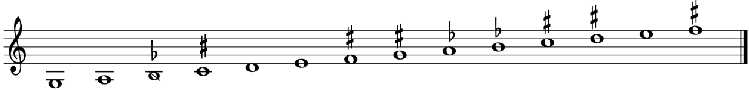

3 4 5 6 7 1 2 3 4 5 6 7 8 9

2. Procedee de variație în tipul melodic. 2.1. În plan metric. Unul din atributele definitorii ale cântecului propriu-zis este sistemul metric tetrapodic. Acesta poate suferi modificări în sensul amplificării schemei tetrapodice, sau a diminuării ei. Diminuarea schemei tetrapodice înseamnă înlocuirea ei cu tripodie în unul sau mai multe rânduri din strofa muzicală. Aceasta presupune acomodarea melodiei la un tipar restrâns și se produce prin omisiunea unei celule ritmico-melodice, amplificarea unei celule ritmice sau ușoare variațiuni ritmicomelodice, fără consecințe importante în planul structurii ca entitate. Ca procedeu nu e frecvent și, în cazul tipurilor melodice de mare vechime, pune problema relației cu cântecele ocazionale din folclorul obiceiurilor.

#### Procedee de variaţie în tipul melodic.

1. În plan metric. Unul din atributele definitorii ale cântecului propriu-zis este sistemul metric tetrapodic. Acesta poate suferi modificări în sensul amplificării schemei tetrapodice, sau a diminuării ei. Diminuarea schemei tetrapodice înseamnă înlocuirea ei cu tripodie în unul sau mai multe rânduri din strofa muzicală. Aceasta presupune acomodarea melodiei la un tipar restrâns şi se produce prin omisiunea unei celule ritmico-melodice, amplificarea unei celule

- 8 Al. Amzulescu, Paula Carp, Cântece şi jocuri din Muscel, Bucureşti, Editura Muzicală 1964, p .45.
- 9 C. D. Georgesc, Melodii de joc din Oltenia, Bucureşti, 1967; L. Iştoc, enească, în „Anuarul de Folclor” III, Cluj, 1983, p. 161-170.

În tipul melodic pe care-l prezentăm, cu cadențe la1-re1-la1-mi1, față de varianta tetrapodică din Negrilești/BN (1), cea din Orăștioara de Sus/HD (2) este o îmbinare de tetrapodie cu tripodie, iar cea din Ferneziu/MM (3) este tripodică:11

Ilona Szenik, Amplificarea strofei melodice în unele tipuri ale cântecului propriu-zis, în „Lucrări de Muzicologie”, Cluj, 1967, p. 105-123.

Un alt exemplu este oferit de un tip melodic care arată înrudirea între genuri, faptul că „genurile folclorice nu trăiesc nicicând izolate, ci ele se interferează strâns. Însuși procesul genezei tuturor genurilor folclorice, departe de a se desfășura în vid înseamnă preluare, transformare, condensare în forme noi a unor elemente anterioare [...]. Este motivul pentru care cântecul propriu-zis se dovedește a fi deseori și tributar [...] unuia sau altuia, ori și mai multora din genurile mai vechi”12. Este vorba de un tip melodic ale cărui variante se înscriu în două genuri muzicale diferite: colind și cântec propriu-zis.

3

- 9 C. D. Georgesc, Melodii de joc din Oltenia, București, 1967; L. Iștoc, Procedee compoziționale în țîpuritura oșenească, în „Anuarul de Folclor” III, Cluj, 1983, p. 161–170.
- 10 Ilona Szenik, Amplificarea strofei melodice în unele tipuri ale cântecului propriu-zis, în „Lucrări de Muzicologie”, Cluj, 1967, p. 105–123.
- 11 Exemplele muzicale au fost preluate din IAFAR, la cotele: 1. mg. 686c. Negrilești/BN; 2. fgr. 532c. Orăștioara de Sus/HD; 3. FA. 13445 Ferneziu/MM.
- 12 Traian Mârza, Observații privind geneza cântecului propriu-zis, în Idem, Studii de etnomuzicologie, Cluj-Napoca, Editura Arpeggione, 2007, p. 79.

din Negrileşti/BN (1), cea din Orăştioara de Sus/HD

506 Lucia IȘTOC

- 1.

8, 8, 8, 8

- 2.

8, 6, 8, 6

- 3.

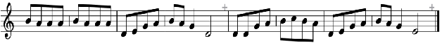

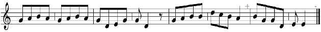

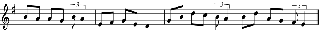

6, 6, 6, 6

Un alt exemplu este oferit de un tip melodic, care arată înrudirea între genuri, faptul că „genurile folclorice nu trăiesc nicicând izolate ci, ele se interferează strâns. Însuşi procesul genezei tuturor genurilor folclorice, departe de a se desfăşura în vid înseamnă preluare, transformare, condensare în forme noi a unor elemente anterioare [...]. Este motivul pentru care cântecul propriu-zis se dovedeşte a fi deseori şi tributar [...] unuia sau altuia, ori şi mai multora din genurile mai vechi”12 ; este vorba de un tip melodic ale cărui variante se înscriu în două genuri muzicale diferite: colind şi cântec propriu-zis. Variantele de colind sunt tripodice şi circulă cu textul epic al baladei Mioriţa, iar variantele de cântec propriu-zis sunt

Variantele de colind sunt tripodice și circulă cu textul epic al baladei Miorița,iar variantele de cântec propriu-zis sunt tetrapodice și circulă, fie cu textul epic al baladei Lenore, fie cu textul referitor la Primul Război Mondial. Variantele de cântec au fost înregistrate, două în Căianu Mare/BN și două în Breaza/BN13, iar variantele de colind au fost extrase din volumul Colinda în Transilvania. Catalog tipologic muzical14, alte două variante au fost publicate în volumul Folclor muzical din Huedin15.

Fiind vorba de un tip melodic de mare vechime și, în același timp, de o mare frumusețe, atât în variantele sale tripodice, cât și în cele tetrapodice, în care măiestria creatorului popular se desăvârșește în simplitate, vom arăta elementele sale structural-muzicale, precum și procedeele de tehnică compozițională utilizate:

- Exemplul 2

Catalog tipologic muzical14, alte două variante au fost publicate în volumul Folclor muzical din Huedin15.

Fiind vorba de un tip melodic de mare vechime şi, în acelaşi timp, de o mare frumuseţe, atât în variantele sale tripodice, cât şi în cele tetrapodice, în care măestria creatorului popular se desăvârşete în simplitate, vom arăta elementele sale structural-muzicale, precum şi procedeele de tehnică compoziţională utilizate:

Exemplu 2.

colind

Elemente structurale: scara hexa-heptacord doric la variantele de colind, şi doric- eolic (cu treapta a patra oscilantă), la cântec.

Structura ritmică: giusto-silabic, cu formule de peon 3+piric (2+3+2)- la colind şi peon

- 3+dipiric (2+3+4) la cântec. Structura metrică: tripodică catalectică la colind (Tri păcurărei/Tri turme de oi), şi

Război Mondial Variantele de cântec au fost înregistrate, două în Căianu Mare/BN şi două în Breaza/BN13, iar variantele de colind au fost extrase din volumul Colinda în Transilvania.

cântec

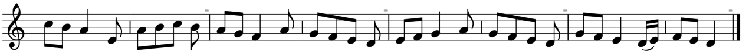

Exemplele muzicale au fost preluate din IAFAR, la cotele: 1. mg. 686c. Negrileşti/BN; 2. fgr. 532c. Orăştioara de Sus/HD; 3. FA. 13445 Ferneziu/MM.

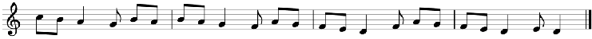

12 Traian Mârza, Observaţii privind geneza cântecului „propriu-zis”, în Traian Mârza „ Studii de etnomuzicologie”, Arpeggione, 2007, p. 79. 78 de ani, cu textul baladei Lenore, sub numărul mg. 2703 Ie şi de la Ioana Ciui, de 72 ani, sub numărul mg. 2703 II a; cele din Breaza au fost înregistrate de la Grigore Cherhaţ de 28 ani, sub numărul mg.910a, şi Lucreţia Păltinean de 83 de ani, sub numărul mg. 2708 II o, ambele cu textul legat de Primul Război Mondial.

Elemente structurale: scara hexa-heptacord doric la variantele de colind, și doric/ eolic (cu treapta a patra oscilantă), la cântec.

- 13 Variantele de cântec provin din IAFAR Cluj; cele din Căianu Mare/BN au fost înregistrate de la Maria Ciui de 78 de ani, cu textul baladei Lenore, sub numărul mg. 2703 Ie și de la Ioana Ciui, de 72 ani, sub numărul mg. 2703 II a; cele din Breaza au fost înregistrate de la Grigore Cherhaț de 28 ani, sub numărul mg. 910a, și Lucreția Păltinean de 83 de ani, sub numărul mg. 2708 II o, ambele cu textul legat de Primul Război Mondial.
- 14 Ilona Szenik, Colinda în Transilvania. Catalog tipologic muzical, MediaMusica, 2018, p. 88. sub numărul 159 a-f. Numărul variantelor menționate în volum este de 38, extrase din arhive și publicații, iar răspândirea lor este limitată la câteva localități: Românași/SJ, nr. 159 a, Călata/CJ, nr. 159b, Oarda de Sus/AB, nr. 159c, Corușu/CJ, nr. 159d, Gârbou/SJ, nr. 159e, Corușu/CJ, nr. 159f, Ibănești/MS, nr. 159g, Jabenița/MȘ, nr. 159h.
- 15 Traian Mârza, coordonator științific, Ilona Szenik, Gheorghe Petrescu, Zamfir Dejeu, Mircea Bejinariu, Folclor muzical din zona Huedin, Huedin Környeki népzene, Cluj-Napoca, 1978.

4

tetrapodică la cântec (Are mama nouă fii/Nouă fii şi o fiicuţă; respectiv: În joi de Sfântă Mărie/S-o-nceput bătaia-ntâie).

Structura melodică este asemănătoare ambelor genuri, putându-se deosebi, la variantele de colind, două subtipuri, după profilul rândului iniţial: recitativ melodizat sau descendent.

16

Structura ritmică: giusto-silabic, cu formule de peon 3+piric (2+3+2) la colind și peon 3+dipiric (2+3+4) la cântec.

Structura metrică: tripodică catalectică la colind (Tri păcurărei/Tri turme de oi) și tetrapodică la cântec (Are mama nouă fii/Nouă fii și o fiicuță; respectiv: În joi de Sfântă Mărie/S-o-nceput bătaia-ntâie).

Structura melodică este asemănătoare ambelor genuri, putându-se deosebi, la variantele de colind, două subtipuri, după profilul rândului inițial: recitativ melodizat sau descendent.

Forma arhitectonică este strofa de patru rânduri ABCD, la ambele genuri, rânduri care nu sunt total diferite, ci prezintă o continuitate a elementelor morfologice, prin preluări de motive sau celule în formă directă sau inversată. Exemplu: melodia informatoarei Lucreția Păltinean de 83 ani din Breaza16.

- Exemplu 3. A B C D

inv. b1

Rândul A este alcătuit dintr-un motiv şi inversarea lui (a+ a inv.). Rândul al doilea B este alcătuit din motivul b şi repetarea lui cu deplasare spre stânga şi schimbarea accentului de pe

este vorba de o simetrie de oglindă de ordin melodic. Rândul al patrulea D, e alcătuit din motivul b1 preluat din C cu funţie schimbată (din motiv cadenţial în motiv iniţial) şi repetarea lui în formă redusă, de la tetracord la tricord. Schema formei este:

A(a+a inv.)B(b+b1)C(b1 inv.+b1)D(b1+b1). Dacă urmărim mersul melodiei în afara încorsetării ei în motive şi celule

observăm o scară descendentă, reluată secvenţial şi diminuată spre sfârşitul melodiei, un pentacord lidic (do2-si1-la1-sol1-fa1), care străbate rândurile A şi B, un pentacord eolic (la-solfa-mi-re) pe rândurile B şi C, urmat de un tetracord minor (sol1-fa1-mi1-re1) în rândul D şi un tricord minor (fa1-mi1-re1) la cadenţa finală, sau, după cum sustinea Tr. Mârza, diminuarea treptelor spre sfârşitul melodiei, este un fenomen specific folclorului muzical românesc.

- Exemplu 4.

- Exemplul 3Exemplu 3. A B C D

a a inv. b b1 b1 inv. b1 b1 b1

Rândul A este alcătuit dintr-un motiv şi inversarea lui (a+ a inv.). Rândul al doilea B este alcătuit din motivul b şi repetarea lui cu deplasare spre stânga şi schimbarea accentului de pe timp tare pe timp slab (b+b1). Rândul al treilea C este format din b1 inv + b1, cu alte cuvinte, este vorba de o simetrie de oglindă de ordin melodic. Rândul al patrulea D, e alcătuit din motivul b preluat din C cu funţie schimbată (din motiv cadenţial în motiv iniţial) şi repetarea lui în formă redusă, de la tetracord la tricord. Schema formei este:

A(a+a inv.)B(b+b1)C(b1 inv.+b1)D(b1+b1). Dacă urmărim mersul melodiei în afara încorsetării ei în motive şi celule (exemplu 4), observăm o scară descendentă, reluată secvenţial şi diminuată spre sfârşitul melodiei, un pentacord lidic (do2-si1-la1-sol1-fa1), care străbate rândurile A şi B, un pentacord eolic (la-solfa-mi-re) pe rândurile B şi C, urmat de un tetracord minor ( tricord minor

Exemplu 4.

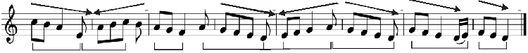

Rândul A este alcătuit dintr-un motiv și inversarea lui (a+a inv.). Rândul al doilea B este alcătuit din motivulb și repetarea lui cu deplasare spre stânga și schimbarea accentului de pe timp tare pe timp slab (b+b1). Rândul al treilea C este format din b1 inv+ b1, cu alte cuvinte, este vorba de o simetrie de oglindă de ordin melodic. Rândul al patrulea D, e alcătuit din motivul b1 preluat din C cu funcție schimbată (din motiv cadențial în motiv inițial) și repetarea lui în formă redusă, de la tetracord la tricord. Schema formei este:

A (a+a inv.) – B (b+b1) – C (b1 inv.+b1) – D (b1+b1). Dacă urmărim mersul melodiei în afara încorsetării ei în motive și celule (exemplul 4), observăm o scară descendentă, reluată secvențial și diminuată spre sfârșitul melodiei, un pentacord lidic(do2-si1-la1-sol1-fa1), care străbate rândurile A și B, un pentacord eolic (la-sol-fa-mi-re) pe rândurile B și C, urmat de un tetracord minor (sol1-fa1-mi1-re1) în rândul D și un tricord minor (fa1-mi1-re1) la cadența finală sau, după cum susținea Tr. Mârza, diminuarea treptelor spre sfârșitul melodiei este un fenomen specific folclorului muzical românesc.

- Exemplul 4

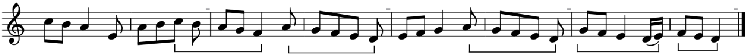

5M 5P 5P 4P 3m

În concluzie, putem urmări în alcătuirea piesei mai multe procedee compoziţionale:

- 16 IAFAR, mg. 2708IIo.

- simetria de oglindă de ordin melodic, în rândurile A şi C, sau repetarea motivului cu

În concluzie, putem urmări în alcătuirea piesei mai multe procedee compoziționale:

- – simetria de oglindă de ordin melodic, în rândurile A și C, sau repetarea motivului cu inversare;
- – repetarea secvențială a motivului (cu o treaptă mai jos);
- – repetarea motivului cu aceeași funcție sau/și cu funcție schimbată;
- – repetarea secvențială a unui fragment melodic cu diminuarea lui spre sfârșitul melodiei;
- – mersul treptat descendent. Acest tip melodic ilustrează, după cum am mai spus, relația de filiație între genuri,

Acest tip melodic ilustrează, după cum am mai spus, relaţia de filiaţie între genuri, provenienţa cântecului propriu-zis din colind.

proveniența cântecului propriu-zis din colind.

2.2. În plan ritmic. Variația ritmică presupune existența unor tipuri melodice ale căror variante circulă cu structuri ritmice diferite, respectiv parlando rubato și giusto silabic, sau apusean, potrivit gustului comunității respective, sau ca formă de evoluție spre structuri noi. Tipul melodic pe care îl prezentăm face parte din stratul vechi, cu strofa melodică de două rânduri și cadențe pe treapta întîia mi1; circulă în zona folclorică Văile Țibleșului, cu numeroase variante, a căror structură ritmică este atât parlando rubato, cât și giusto silabic, în măsură de 6/8. Variantele provin din localitățile Breaza /BN17 și Spermezeu/BN18. Varianta din Breaza are o melodie melismatică, iar cea din Spermezeu, o melodie silabică, cu formule ritmice ternare de coriamb sau antispast.

variante circulă cu structuri ritmice diferite, respectiv parlando rubato şi giusto silabic, sau apusean, potrivit gustului comunităţii respective, sau ca formă de evoluţie spre structuri noi. Tipul melodic pe care îl prezentăm face parte din stratul vechi, cu strofa melodică de două rânduri şi cadenţe pe treapta întîia mi1; circulă în zona folclorică Văile Ţibleşului, cu numeroase variante, a căror structură ritmică este atât parlando rubato, cât şi giusto silabic, în măsură de 6/8. Variantele provin din localităţile Breaza /BN17 şi Spermezeu/BN18. Varianta din Breaza are o melodie melismatică, iar cea din Spermezeu, o melodie silabică, cu formule

- Exemplul 5

Breaza

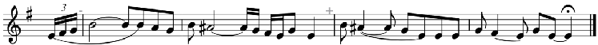

Spermezeu

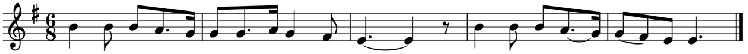

Un alt exemplu, în care ritmul parlando-rubato este înlocuit de giusto silabic în

Un alt exemplu, în care ritmul parlando-rubato este înlocuit de giusto silabic în măsură de 5/8, este tipul melodic cu cadenţe pe re1-la1-mi1, în care varianta din Breaza/BN19

măsură de 5/8, este tipul melodic cu cadențe pe re1-la1-mi1, în care varianta din Breaza/ BN19 este în parlando-rubato, iar cea din Perișor/BN20, în giusto-silabic.

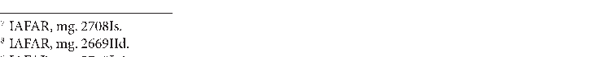

- 17 IAFAR, mg. 2708Is.
- 18 IAFAR, mg. 2669IId.
- 19 IAFAR, mg. 27o8Ie1.
- 20 IAFAR, mg. 2694Is.

5/8, este tipul melodic cu cadenţe pe re1-la1-mi1, în care varianta din Breaza/BN este în parlando-rubato, iar cea din Perişor/BN20, în giusto-silabic.

Planul variațional în cântecul propriu-zis 509

- Exemplul 6

Breaza

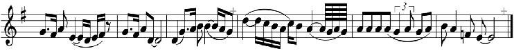

Perişor

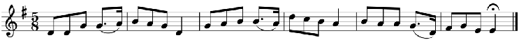

mg. IAFAR, mg. 2669IId. IAFAR, mg. 27o8Ie1. IAFAR, mg. 2694Is.

2.3. În plan melodic. 2.3.1. Variația profilului. Una din cele mai caracteristice trăsături ale cântecului de stil vechi este variația melodică (spre deosebire de stilul nou, în care melodiile sunt tributare unor scheme mai rigide). Ea afectează celule, motive, ambitus, profil, fără a provoca modificări de esență asupra tipului melodic, a identității sale. Ea are loc în interiorul rândului melodic și nu afectează cadența, ca cel mai important pilon melodic al rândului, care-i conferă stabilitate și identitate.

2.3. În plan melodic. 2.3.1. Variaţia profilului. Una din cele mai caracteristice trăsături ale cântecului de stil vechi este variaţia melodică (spre deosebire de stilul nou, în care melodiile sunt tributare unor scheme mai rigide). Ea afectează celule, motive, ambitus, profil, fără a provoca modificări de esenţă asupra tipului melodic, a identităţii sale. Ea are loc în interiorul rândului melodic şi nu afectează cadenţa, ca cel mai important pilon melodic al rândului, care-i conferă stabilitate şi identitate.

7

Ilustrăm fenomenul printr-un tip melodic de largă circulație în Transilvania, tocmai pentru a surprinde o gamă cât mai largă de variațiuni de pe o arie de circulație ce cuprinde Banatul, Bihorul, Hunedoara, Alba, Cluj, Mureș. B. Bartók a publicat 49 de variante ale acestui tip melodic21. Acesta se caracterizează printr-un sistem de cadențare la1-re1-re1-mi1 (4–7/7–1), cu forma AB/BB sau AB/BC și proporționarea strofei 2+2.

Ilustrăm fenomenul printr-un tip melodic de largă circulaţie în Transilvania, tocmai pentru a surprinde o gamă cât mai largă de variaţiuni de pe o arie de circulaţie ce cuprinde Banatul, Bihorul, Hunedoara, Alba, Cluj, Mureş. B.Bartok a publicat 49 de variante ale acestui tip melodic21. Acesta se caracterizează printr-un sistem de cadenţare la1-re1-re1-mi1 (47/71), cu forma AB/BB sau AB/BC şi proporţionarea strofei 2+2.

În urma analizei variantelor publicate de B. Bartók, constatăm că cea mai mare varietate o prezintă rândul întîi, atât în privința ambitusului folosit (care variază între secundă și sextă), cât și a formulelor melodice. Rândurile următoare parcurg în întregime ambitusul melodiei, profilele desfășurându-se mai frecvent pe întinderea întregului rând melodic în sens boltit sau descendent. Rândul al doilea are un profil descendent la toate variantele, ce coboară până la cadența pe re1. Rândul al treilea, care este repetarea variată a precedentului, tot cu cadență pe re1, prezintă o mai mare diversitate, cu profile de tip boltit, semiboltit și descendent. Ultimul rând se desfășoară în profil descendent sau boltit și cadențează pe mi1. Privite în ansamblu, toate variantele prezintă ca elemente stabile șirul cadențelor, locul cezurii principale și rândul purtător de cezură principală. Ca elemente mobile remarcăm formule ritmico-melodice în care variația afectează mai puțin rândurile 2, 3, și 4 și mai pronunțat rândul întâi; de aceea prezentarea noastră s-a oprit asupra acestuia.

În urma analizei variantelor publicate de B.Bartók, constatăm că cea mai mare varietate o prezintă rândul întîi, atât în privinţa ambitusului folosit (care variază între secundă şi sextă), cât şi a formulelor melodice. Rândurile următoare parcurg în întregime ambitusul melodiei, profilele desfăşurându-se mai frecvent pe întinderea întregului rând melodic în sens boltit sau descendent. Rândul al doilea are un profil descendent la toate variantele, ce coboară până la cadenţa pe re1. Rândul al treilea, care este repetarea variată a precedentului, tot cu cadenţă pe re , prezintă o mai mare diversitate, cu profile de tip boltit, semiboltit şi descendent. Ultimul rând se desfăşoară în profil descendent sau boltit şi cadenţează pe mi1. Privite în ansamblu, toate variantele prezintă ca elemente stabile şirul cadenţelor, locul cezurii principale şi rândul purtător de cezură principală. Ca elemente mobile remarcăm formule ritmico-melodice în care variaţia afectează mai puţin rândurile 2, 3, şi 4 şi mai pronunţat rândul întîi; de aceea prezentarea noastră s-a oprit asupra acestuia.

La majoritatea variantelor, primul rând este format dintr-un motiv repetat. Varietatea constă în ambitusul utilizat (de la secundă la sextă), plasarea acestuia în ambitusul general al melodiei și modul de combinare a intervalelor, ceea ce-i conferă o mare varietate de profiluri (r, b, d, a, B, D, A)22. Prezentăm variantele primului rând

- 21 Béla Bartók,Rumanian Folk Music, vol. Two, Vocal Melodies. Edited by Benjamin Nijhoff, 1967, nr. 207–217.
- 22 Literele mici sunt folosite pentru ambitusuri până la terță, iar literele mari la ambitusuri mai mari de terță; acestea desemnează profile ca: recitativ (rR), boltit (b, B), descendent (d, D), ascendent(a, A).

melodic, în ordinea amplificării ambitusului, menționând la începutul portativului ambitusul23 cu plasarea lui în scara melodiei, urmat de rândul întîi al variantelor care se înscriu în ambitusul respectiv, cu precizarea numărului documentului sonor din volumul amintit.

- Exemplul 7

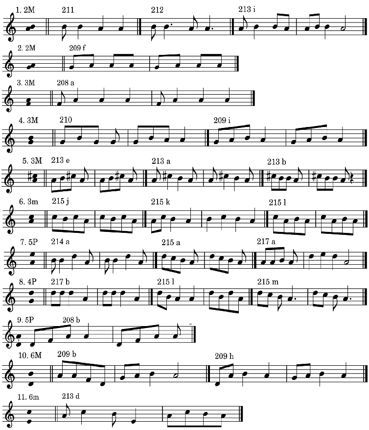

- 23 Notat deasupra portativului cu cifre de la 2 la 6, urmate de litere care arată calitatea intervalului: mare (M), mic (m), sau perfect (P).

Fenomenul de variaţie interioară a cadenţei este destul de frecvent şi are loc atât ca

Constatăm că, în varietatea mare de profile și ambitusuri, cadența pela1 este întărită

tendinţei de evoluţie a tipului melodic şi, în acest caz, are loc prin repetarea unui rând. Ea este posibilă în limitele stabilite de cezura principală ca pilon al melodiei; rândul purtător de

de cadența de la emistih tot pe la1. Acest lucru conferă stabilitate în marea diversitate a rândurilor întâi.

2.3.2. Variația cadenței.

de patru rânduri ABCD, cu proporţionare 2+2, având trei cadenţe în registrul mediu sau acut, şi cadenţa cezurii principale în rândul al doilea, pe si1. Cadenţele rândurilor 1 şi 3 sunt diferite de la o variantă la alta, astfel, varianta din Ohaba de Secaş/HD are cadenţe pe si1-si1la1-mi1 (5541), cea din Geaca/CJ pe si1-si1-sol1-mi1 (55/31), cea din Cătina/CJ pe re2-si1-la1mi1 (75/41), cea din Salva/BN pe mi2-si1-la1-mi1, iar cea din Feleac/CJ pe re2-si1-mi1-mi1. Profilurile rândurilor, la toate variantele sunt ADDD.

Cea mai importantă trăsătură caracteristică a tipului melodic este șirul cadențelor prin care acesta se individualizează și se deosebește de alte tipuri. Nu toate cadențele din structura strofică au aceeași importanță. Între acestea, cadența finală și cadența cezurii principale dețin rolul de piloni stabili, în timp ce celelalte cadențe pot fi afectate de variație, devenind mobile. În cazul în care cadența rândului este labilă, trebuie să se păstreze constant profilul rândului, pentru ca acesta să nu-și piardă identitatea. Dacă variația afectează atât cadența cât și profilul unui rând, tipul melodic suferă o modificare esențială, care îl situează pe o direcție evolutivă (spre structuri noi).

Exemplu 8.

- Exemplul 8

55/41 Ohaba de Secaş

- 1.

55/31 Geaca

- 2.

75/41 Cătina

- 3.

85/41 Salva

- 4.

75/11 Feleac

- 5.

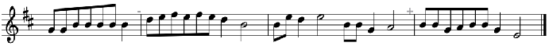

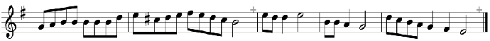

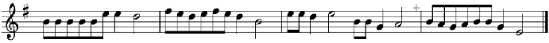

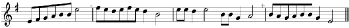

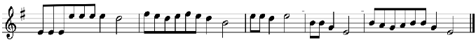

Fenomenul de variație interioară a cadenței este destul de frecvent și are loc atât ca expresie a indiferenței funcționale, în cazul melodiilor de mare vechime, cât și ca expresie a tendinței de evoluție a tipului melodic și, în acest caz, are loc prin repetarea unui rând.

11

Ea este posibilă în limitele stabilite de cezura principală ca pilon al melodiei; rândul purtător de cezură principală este stabil. În primul exemplu am ales un tip melodic cu o structură strofică de patru rânduri ABCD, cu proporționare 2+2, având trei cadențe în registrul mediu sau acut, și cadența cezurii principale în rândul al doilea, pe si1. Cadențele rândurilor 1 și 3 sunt diferite de la o variantă la alta, astfel, varianta din Ohaba de Secaș/ HD are cadențe pe si1-si1-la1-mi1 (55/41), cea din Geaca/CJ pe si1-si1-sol1-mi1 (55/31), cea din Cătina/CJ pe re2-si1-la1-mi1 (75/41), cea din Salva/BN pe mi2-si1-la1-mi1(85/41), iar cea din Feleac/CJ pe re2-si1-mi1-mi1 (75/11). Profilurile rândurilor, la toate variantele sunt ADDD.

Variaţia cadenţei poate avea loc numai la rândurile care nu sunt piloni ai melodiei, adică înaintea sau în urma rândului cu cezură principală. În exemplul următor, tipul melodic cu strofa de trei rânduri şi cezura principală după rândul întâi, are cadenţe pe sol1-sol1-mi1(3/31) şi respectiv sol1-re2-mi1 ( 3/71). Variaţia cadenţei este posibilă deoarece rândul al doilea urmează rândului purtător de cezură principală; fenomenul se poate înscrie pe o direcţie evolutivă. Variantele aparţin unui tip melodic din Spermezeu24.

Variația cadenței poate avea loc numai la rândurile care nu sunt piloni ai melodiei, adică înaintea sau în urma rândului cu cezură principală. În exemplul următor, tipul melodic cu strofa de trei rânduri și cezura principală după rândul întâi, are cadențe pe sol1-sol1-mi1(3/31) și respectiv sol1-re2-mi1 (3/71). Variația cadenței este posibilă deoarece rândul al doilea urmează rândului purtător de cezură principală; fenomenul se poate înscrie pe o direcție evolutivă. Variantele aparțin unui tip melodic din Spermezeu24.

- Exemplul 9

3/31

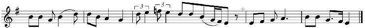

3/71

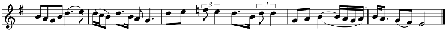

În exemplul următor variația cadenței apare ca urmare a repetării rândului după cezura principală. Întrucât, în structura strofei el nu are un rol determinant, datorită poziției sale de rând care urmează cezurii principale, împreună cu rândul următor formează un cuplu care se comportă asemenea motivelor unei fraze: motivul cu funcție cadențială este stabil, iar cel cu funcție inițială este variabil. Variabilitatea constă mai ales în polivalențele cadențiale, pe care virtual le posedă. Dacă cuplul celor două rânduri formează un singur profil, boltit sau descendent, cadența rândului antecedent nu are greutate specifică și reprezintă doar un element de legătură a celor două rânduri. Am luat ca exemplu tot un tip melodic de largă circulație în Transilvania, cu numeroase variante, cu strofa de patru rânduri și cadențe pe la1-la1-re1-mi1-(4/47/1), din Târlișua/BN, respectiv la1-do2-re1-mi1(4/67/1), din Suplai/BN. Varianta din Târlișua/BN25, are forma A/AB/B și două cezuri principale, după rândul întîi și al treilea; cadența mobilă este cea din rândul al doilea, pela1, care, în melodia din Suplai26 devinedo2, notă de trecere; astfel s-a obținut

În exemplul următor variaţia cadenţei apare ca urmare a repetării rândului după cezura principală. Întru cât, în structura strofei el nu are un rol determinant, datorită poziţiei sale de rând care urmează cezurii principale, împreună cu rândul următor formează un cuplu care se comportă asemenea motivelor unei fraze: motivul cu funcţie cadenţială este stabil, iar cel cu funcţie iniţială este variabil. Variabilitatea constă mai ales în polivalenţele cadenţiale, pe care virtual le posedă. Dacă cuplul celor două rânduri formează un singur profil, boltit sau descendent, cadenţa rândului antecedent nu are greutate specifică şi reprezintă doar un element de legătură a celor două rânduri. Am luat ca exemplu tot un tip melodic de largă circulaţie în Transilvania, cu numeroase variante, cu strofa de patru rânduri şi cadenţe pe la1la1-re1-mi1-(4/47/1), din Târlişua/BN, respectiv la1-do2-re1-mi1 (4/67/1), din Suplai/BN. Varianta din Târlişua/BN25, are forma A/AB/B şi două cezuri principale, după rândul întîi şi al treilea; cadenţa mobilă este cea din rândul al doilea, pe care, în melodia din Suplai devine do2, notă de trecere; astfel s-a obţinut un profil de scară coborâtoare de la mi la re pe întinderea a două rânduri, respectiv între cele două cezuri principale.

- 24 Marius Dan Drăgoi, Folclor muzical din Spermezeu. Schiță monografică. Editura Limes, Cluj-Napoca, 2005, nr. 249 și 285.
- 25 IAFAR, mg. 2685IIx1.
- 26 IAFAR, mg. 2702IIp.

un profil de scară coborâtoare de lami2 lare1 pe întinderea a două rânduri, respectiv între cele două cezuri principale.

- Exemplul 10

- a. (4/47/ 1)

- b. (4/67/1)

2.3.3. Variaţia structurii sonore Unul din cele mai importante aspecte de natură melodică este cel al structurilor sonore. Unele tipuri melodice se menţin în cadrul aceluiaşi sistem sonor, pentatonic sau modal, în altele, însă, variaţii neeseţiale, melodice, apărute în interiorul rândurilor pot provoca variaţii esenţiale, de natura modificării sistemului sonor. Aşa, de pildă, variaţiile melodice din rândul întâi ale tipului melodic (vezi nota 21), prezentat anterior (cu cadenţe pe la conturează structuri sonore foarte diferite: modale de tip frigic, eolic, mixolidic, ionic, ori pentatonice, cu sau fără pieni, sau modale cu substrat pentatonic:

- Exemplu 11.

- 208 a
- 208 b
- 208 c

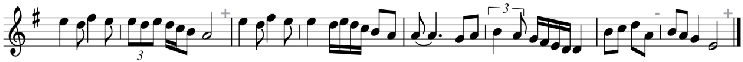

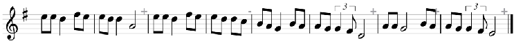

2.3.3. Variația structurii sonore

Unul din cele mai importante aspecte de natură melodică este cel al structurilor sonore. Unele tipuri melodice se mențin în cadrul aceluiași sistem sonor, pentatonic sau modal, în altele, însă, variații neesețiale, melodice, apărute în interiorul rândurilor, pot provoca variații esențiale, de natura modificării sistemului sonor. Așa, de pildă, variațiile melodice din rândul întâi ale tipului melodic (vezi nota 21), prezentat anterior (cu cadențe pe la1-re1-re1-mi1) conturează structuri sonore foarte diferite: modale de tip frigic, eolic, mixolidic, ionic, ori pentatonice, cu sau fără pieni, sau modale cu substrat pentatonic:

- Exemplul 11

- 208 a
- 208 b
- 208 c

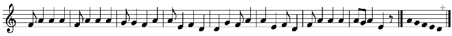

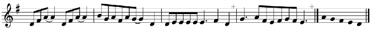

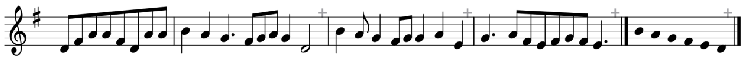

215 c

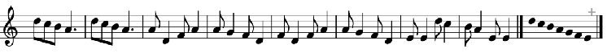

215 a

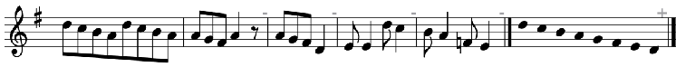

209 h

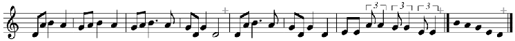

213 b

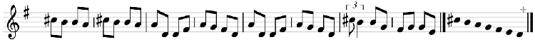

213

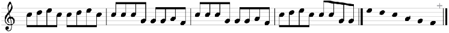

Un alt aspect important de variație a structurii sonore îl prezintă tipurile melodice ale căror variante se înscriu atât în ramura minoră, cât și în cea majoră. Fenomenul este mai rar întâlnit și presupune o indiferență a structurii sonore. Exemplul pe care îl prezentăm face parte din stratul vechi, circulă cu numeroase variante în zona folclorică Văile Țibleșului, cu melodii melismatice, forma strofică de două rânduri și cadențe pe treapta întâia (mi1, respectiv sol1); variantele din ramura minoră au scara pentacord minor cu substrat tetratonic mi1-sol1-la1-si1 și treapta a patra (la1) oscilantă, iar cele din ramura majoră, hexacord major. Ambele variante provin din localitatea Breaza/BN27.

- Exemplu 12.

- Exemplul 12

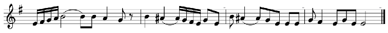

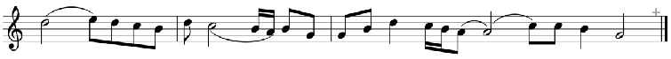

2.4. În plan arhitectonic.

În plan arhitectonic, variația operează amplificări sau diminuări de formă prin diferite procedee. În literatura de specialitate au fost stabilite principiile de amplificare a strofei „semnificative pentru conturarea direcției de dezvoltare a cântecului propriu-zis.”28 Între acestea sunt menționate modificările esențiale de natură arhitectonică apărute ca urmare a repetării unor rânduri melodice. Alte procedee de amplificare a strofei sunt introducerea unui rând nou sau amplificarea rândului la dublu.

2.4. În plan arhitectonic.

În Plan arhitectonic, variaţia operează amplificări sau diminuări de formă prin diferite procedee. În literatura de specialitate au fost stabilite principiile de amplificare a strofei „semnificative pentru conturarea direcţiei de dezvoltare a cântecului propriu-zis.”28 Între acestea sunt menţionate modificările esenţiale de natură arhitectonică apărute ca urmare a repetării unor rânduri melodice. Alte procedee de amplificare a strofei sunt introducerea unui

- 27 IAFAR, mg. 722 Id (major, varianta b); mg. 2708Is (minor, varianta a).
- 28 I. Szenik, op. cit. p. 119.

a. Repetarea rândului. Noi am urmărit implicațiile de natură variațională ale repetărilor de rânduri, cu valențele lor evolutive.

Unul din cele mai importante aspecte ale procesului variațional este repetarea rândului cu amplificarea strofei (de la două la trei, de la trei la patru rânduri etc.) Strofa poate fi amplificată prin repetarea oricăruia dintre rânduri, cu consecințe de importanță diferită. Repetarea identică a rândului final, de exemplu, nu produce altă modificare decât amplificarea strofei, având rol de subliniere a cadenței finale (31 → 311) sau de amânare a ei (31k31).

Repetarea unui rând interior poate aduce, însă, modificări importante.

1. În cazul amplificării strofei de la două la trei rânduri prin repetarea primului rând, plasarea cezurii principale marchează proporționarea strofei: 2+1 sau 1+2. În cazul tipului melodic cu cadențe pe sol1-mi129 și forma AB, repetarea primului rând poate avea loc înaintea cezurii principale, sau după ea: 33/1 ← 31 → 3/31.

– Dacă rândul se repetă înaintea cezurii principale se produce amplificarea strofei30 și formarea unui cuplu de două rânduri, dintre care primul este pasibil de variație cadențială.

Exemplu 13.

- Exemplul 13Exemplu 13.

Dacă rândul se repetă după cezura principală, acesta îşi pierde stabilitatea, prin labilitatea cadenţei; ea poate rămâne pe aceeaşi treaptă, sau poate anticipa cadenţa finală, după cum atestă variantele melodiei cunoscute cu textul Creşti pădure şi te-ndeasă, care circulă în paralel cu cadenţe pe 3/31 şi 3/1131, exemplu 14.

- a
- b

2. În cazul amplificării strofei de la trei la patru rânduri, prin repetare, implicaţiile sunt mai numeroase. Propunem spre analiză variantele unui tip melodic de largă circulaţie, cu cadenţe

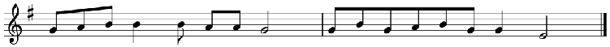

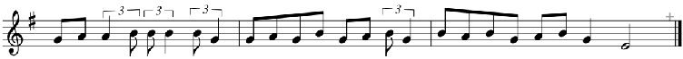

Dacă rândul se repetă după cezura principală, acesta își pierde stabilitatea, prin labilitatea cadenței; ea poate rămâne pe aceeași treaptă, sau poate anticipa cadența finală, după cum atestă variantele melodiei cunoscute cu textul Crești pădure și te-ndeasă, care circulă în paralel cu cadențe pe 3/31 și 3/1131, exemplul 14.

- Exemplul 14

cadenţei; ea poate rămâne pe aceeaşi treaptă, sau poate anticipa cadenţa finală, după cum atestă variantele melodiei cunoscute cu textul Creşti pădure şi te-ndeasă, care circulă în paralel cu cadenţe pe 3/31 şi 3/1131, exemplu 14.

- a
- b

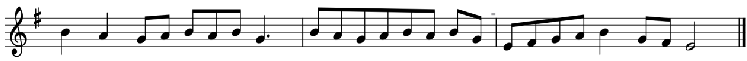

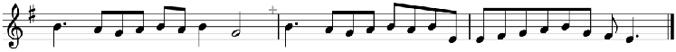

- 29 IAFAR, mg. 67/3 din Albac/AB.
- 30 IAFAR, mg. 1510 IIb din Toaca/MS.
- 31 IAFAR, mg. 406n din Salva/BN și mg. 2675If din Spermezeu/BN.

2. În cazul amplificării strofei de la trei la patru rânduri, prin repetare, implicaţiile sunt mai numeroase. Propunem spre analiză variantele unui tip melodic de largă circulaţie, cu cadenţe

2. În cazul amplificării strofei de la trei la patru rânduri, prin repetare, implicațiile sunt mai numeroase. Propunem spre analiză variantele unui tip melodic de largă circulație, cu cadențe pe la1-re1-mi1 (471), cu forma ABB și proporționarea 2+1. Variantele provin din localitățile Aluniș/CJ, Braniștea/CJ, Albac/AB, și Nireș/CJ32.

Rândul întâi este format din două motive identice A (a+a) (la variantele din Aluniș și Braniștea), sau din două motive diferite A (a+b) în profil boltit (în Albac) sau descendent (în Nireș). Rândul al doilea este, fie repetarea lui A la cvinta inferioară A5(Aluniș), fie B (la celelalte trei), iar rândul al treilea este B sau C, ambele în profil descendent.

- Exemplul 15Exemplu 15.

FA 10334 Aluniş/CJ

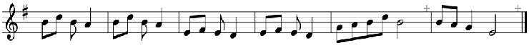

- A(a a) A5 B

mg. 609 f Braniştea/BN

- A(a a) B Bc

mg. V/17 Albac/AB

A(a b) B Bc

mg. 743 j Nireş/CJ

- A(a a) B C

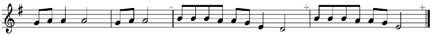

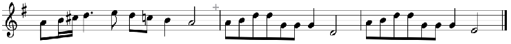

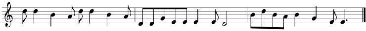

Repetarea rândului al doilea, după cezura principală, poate fi identică (exemplu 16) , sau variată prin modificarea cadenţei: 47/71 47/41 sau 47/51

## Repetarea rândului al doilea, după cezura principală, poate fi identică (exemplul 16)33, sau variată prin modificarea cadenței: 47/71 → 47/41 sau 47/51.

Exemplu 16.

- 32 IAFAR, FA. 10334 Aluniș/CJ; mg. 609f Braniștea/CJ; mg. V/17 Albac/AB; și mg. 743j Nireș/CJ.
- 33 Vezi nota 15, nr. 325

Exemplul 16Exemplu 16.

Prin repetarea primului rând după cezura principală, proporţionarea strofei devine 1+2+1, cele două rânduri mediane formând împreună un cuplu în care rândul care urmează cezurii principale devine elementul mobil: 4/71 4/47/1 4/67/1 4/67/71.34

nr.325

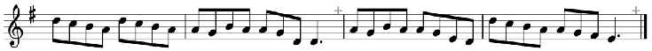

Prin repetarea primului rând după cezura principală, proporţionarea strofei devine 1+2+1, cele două rânduri mediane formând împreună un cuplu în care rândul care urmează cezurii principale devine elementul mobil: 4/71 4/67/1

A A5 A5 B

b. Amplificarea strofei prin introducerea unui rând nou. Acesta poate ocupa orice loc în strofa muzicală. În exemplul următor rândul nou a fost introdus ca rând median, după cezură, înaintea rândului final.35

Prin repetarea primului rând după cezura principală, proporționarea strofei devine 1+2+1, cele două rânduri mediane formând împreună un cuplu în care rândul care urmează cezurii principale devine elementul mobil: 4/71→ 4/47/1→ 4/67/1→ 4/67/71.34

b. Amplificarea strofei prin introducerea unui rând nou. Acesta poate ocupa orice loc în strofa muzicală. În exemplul următor rândul nou a fost introdus ca rând median, după cezură, înaintea rândului final.35

33 Vezi nota 15, nr. 325

b. Amplificarea strofei prin introducerea unui rând nou. Acesta poate ocupa orice loc în strofa muzicală. În exemplul următor rândul nou a fost introdus ca rând median, după cezură, înaintea rândului final.35

Exemplu 17: 4/77/71 Spermezeu

Exemplul 17: 4/77/71 Spermezeu

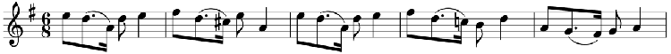

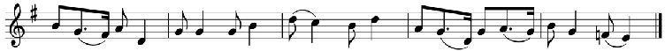

Schema cadențială sintetizatoare a variantelor rezultate prin repetarea unui rând este:

Schema cadenţială sintetizatoare a variantelor rezultate prin repetarea unui rând este:

Schema cadenţială sintetizatoare a variantelor rezultate prin repetarea unui rând este:

47/71 47/1 4/47/1

47/71 47/1 4/47/1

47/41----- 47/51 4/67/1 4/47/31

47/41----- 47/51 4/67/1 4/47/31

4/77/71

4/77/71

un proces caracteristic artei orale, datorat procedeului de repetiţie prin variaţie; el se desfăşoară între anumite limite. Repetarea unui rând produce amplificarea strofei în interior

un proces caracteristic artei orale, datorat procedeului de repetiţie prin variaţie; el se desfăşoară între anumite limite. Repetarea unui rând produce amplificarea strofei în interior

- 34 IAFAR, mg. 2693Ic din Molișet/BN; IAFAR, mg. 2702IIp, din Suplai/BN.
- 35 Marius Dan Drăgoi, op.cit. nr. 267, Spermezeu/BN.

În rezumat, transformarea unei structuri închegate în alte structuri strofice mai ample este un proces caracteristic artei orale, datorat procedeului de repetiție prin variație; el se desfășoară între anumite limite. Repetarea unui rând produce amplificarea strofei în interior sau la extreme, fără să afecteze locul cezurii principale. Proporționarea strofei poate suferi modificări (din 2+1, în 2+2 sau 1+2+1), fără să fie afectate cadența și cezura principală. Structurile rezultate aparțin aceluiași tip melodic, dar se constituie în nuclee generatoare de tipuri melodice noi. Se presupune că strofele mai ample provin din cele mai reduse ca dimensiune, prin repetare de rânduri, dar la fel se poate presupune și procesul invers, rezultat din omisiune sau comprimare.

În procesul de transformare a tipului melodic se constată preferința pentru păstrarea ca element stabil a cadenței rândului cu cezură principală și a celui cu cadența finală, ceea ce nu exclude posibilitatea ca și acestea să fie supuse transformării. Nu putem decide încă dacă acest fapt se datorează indiferenței funcționale, cum arăta Mariana Kahane36, sau altor factori.

Sintetizarea tuturor aspectelor procesului variațional din cântecul popular ar putea dezvălui matricea comună a melodicii diferențiate funcțional în genuri și stilistic în straturi evolutive.

- 36 Mariana Kahane, De la sistem sonor la forma arhitectonică, în „Revista de etnografie și folclor”, nr. 1, 1979, p. 11–14.

