# RITMUL SINCOPAT AMFIBRAHIC DESCENDENT ÎN CONTEXT MUZICAL COREGRAFIC

Zamfir DEJEU*

The Syncopated Descendant Amphibrach Rhythm in a Musical and Choreographic Context (Abstract) This paper aims to explore the syncopated descendant amphibrach rhythm, a type that belongs to

the broader category of the syncopated rhythms. It is composed by a combination of two metric feet: an amphibrach plus a dactyl, or an amphibrach plus a spondee. We provide multiple examples of its usage in various dances from different regions that span a large geographical area, from northwestern Romania (the Meseș basin, the Lăpuș area), to the Transylvanian plain and Someș valley, all the way down to the Subcarpathian Muntenia (Prahova valley). One of our conclusions is that all these dances have a common origin. In the end, we hope to demonstrate that the syncopated descendant amphibrach rhythm is specific for Romanian folk music and also that it is representative for its archaic stratum.

Keywords: syncopated rhythm, descendant amphibrach rhythm, Romanian folk dances, Învârtită, Ca la Breaza.

Cuvinte-cheie: ritm sincopat, ritm amfibrahic descendent, dansuri populare românești, Învârtită, Ca la Breaza.

După cum se știe, în folclorul coregrafic românesc întotdeauna ritmul este secondat de melodie chiar dacă ea este cântată numai vocal. De multe ori această melodie poate fi comună pentru două sau mai multe dansuri ea suferind câteodată doar schimbări de tempo. De exemplu, Hora în ritm binar, prin accelerarea tempoului devine Sârbă, sau Învârtita rară în ritm binar (adică De-nceput de pe Someș sau În două laturi din Câmpia Transilvaniei) devine Învârtită iute în ritm binar (adică Hărțag sau Hațegană) deși motivele cinetice sunt aceleași, etc. După cum ați reținut este vorba aici de dansuri în ritm binar.

În lucrarea de față noi semnalăm, din cadrul ritmului sincopat, varianta

– Ritmul sincopat amfibrahic descendent motiv simplu indivizibil, comun și frecvent pentru unele melodii și dansuri tradiționale, pornind din bazinul Meseș până pe Valea Prahovei. După cum vom vedea putem afirma că acest motiv este specific folclorului românesc și poate cel mai arhaic1.

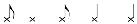

Mai întâi dăm un exemplu de melodie în care se evidențiază acest ritm pe tot parcursul ei. Este vorba de melodia corespunzătoare dansului de tipul Învârtita dreaptă în grup mic din Chiuiești – zona Lăpuș. Dansul este în ritm binar.

* Institutul „Arhiva de Folclor a Academiei Române”, Cluj-Napoca. 1 Zamfir Dejeu, Dansuri tradiționale din Transilvania, Cluj-Napoca, Editura Clusium, 2000, p. 30, 35.

Anuarul Arhivei de Folclor, nr. XXV–XXVI, 2021–2022, p. 519–535

## Roata din patru

A.F.C. Video: 5/g 09.04.1989 Cul.și tr. Z. Dejeu

Ghiuiești Vaida Gheorghe 27 ani vioară

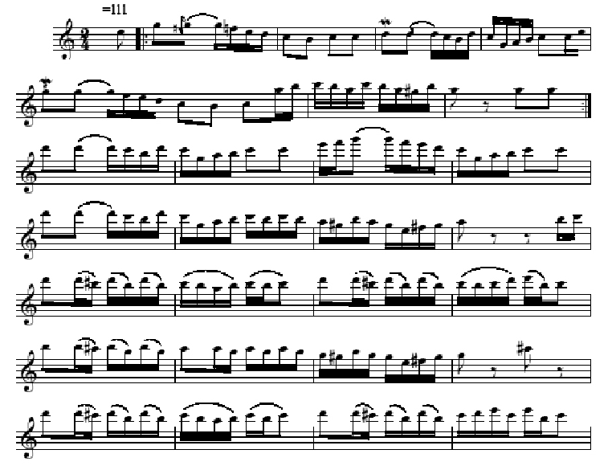

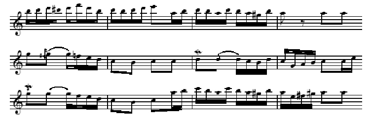

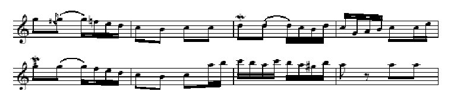

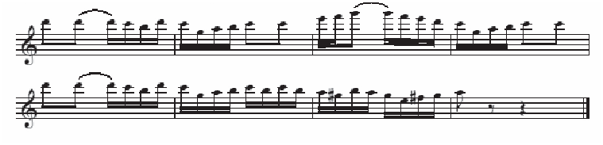

Urmează apoi exemplele muzical coregrafice care conțin în structura lor ritmică motivul respectiv – amfibrah+spondeu sau

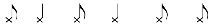

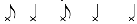

– amfibrah + dactil.

Despre dansulFeciorește des ne amintește pentru prima dată folcloristul G.I. Flințiu în lucrarea sa Coregrafie românească editată la Târgoviște în 1936. El spunea: „Alte variante ale jocului Fecioreasca mai sunt în județele Cluj, Mureș, Năsăud, Someș, precum și în Crișana (probabil se referă la localitățile din zona Meseș și Codru care au aparținut în trecut regiunii Crișana, n.n.). În general Fecioreasca de aici se deosebește de cea din celelalte regiuni prin aceea că are un ritm grăbit și în unele părți lipsește plimbarea. În ceea ce privește zicătura (adică melodia), ea se aseamănă uneori cu cea a învârtitelor repezi (vezi Învârtita deasă sau iute și Românește des din Bazinul Meseș, Roata din Chiuiești, Dubla rară și deasă din zona Ghimeș, Feciorescul des, Răpăgușul sau Bărbuncul iute din zona Dealurile Gilăului, Clujului și Dejului, n.n.), iar privitor lastrigături se poate spune că se strigă mai puțin și de multe ori nu se respectă ritmul zicăturii.”

Fecioreștele des este un dans bărbătesc de mare virtuozitate. În desfășurarea lui în cerc sau pe loc, plastica mișcărilor și ritmul se îmbină organic în forme aproape desăvârșite. Privitor la tipul de melodie în discuție, avem de-a face cu dansul Feciorește des în ritm sincopat amfibrahic descendent, pe care îl întâlnim în unele dansuri din localitățile așezate pe liniaMeseș-Cluj-Turda. Ca și construcție compozițională el a rămas încă într-o formă arhaică. Acolo unde nu au existat formații de dansuri de tip Cântarea României care să uniformizeze ponturile și succesiunea lor, încă mai depinde de inspirația de moment a dansatorilor mai talentați. Chiar dacă plimbarea sau introducerea rămâne în general aceeași, ponturile cuprind o largă „gamă de mișcări cu caracter atletic care incubă o armonie somatică”. Dansul este alcătuit din figuri (ponturi) complexe, materialul nou făcându-și prezența de la pont la pont, chiar și în concluzie. Succesiunea figurilor este de mod mobil alternat sau liberă, ca și forma dansului de altfel. În alte cazuri însă, forma mai poate fi înlănțuită sau cu refren. Când se dansează solistic aproape că nu lipsește niciodată plimbarea, iar unele ponturi, prin repetare constantă, țin loc de refren.

În contextul cinetic se impune tehnica de lovire cu palmele pe segmentele picioarelor. Cel mai frecvent se bate călcâiul cu piciorul ridicat înapoi și genunchiul îndoit. Urmează bătaia gambei cu piciorul ridicat înainte pe diagonală și genunchiul îndoit. Scade ca frecvență bătaia coapsei. Apogeul mișcării în motivele finale este marcat prin bătaia gambei în săritură și cu forfecarea picioarelor. Săriturile mari, flexiunile adânci, diferitele bătăi pe sol, balansurile picioarelor cu răsuciri plus bătăi în acord cu „șuruburi” se fac cu amplitudine mare. Și bătăile în pinteni pe sol sau în aer sunt de o frecvență mai

mare. Putem afirma astfel că mișcările combinate pe relația armonică braț-picior sunt foarte bogate la acest tip de dans.

În Câmpia Transilvaniei, Fecioreștele des se aseamănă din punct de vedere cinetic cu Fecioreștele rar (Târnăveana), rămânând să fie deosebite însă prin ritm și prin tempo. Măsura în care se notează acest tip de dans este de 2/4. Motivele ritmice determinante rezultă din jocul celulelor binare cunoscute la care se adaugă și motivul ritmic sincopat amfibrahic descendent (.) Remarcăm la unele variante de dans prezența lanțului de sincope (ex. din Tritenii de Jos, Cluj), care se naște din succesiunea auftactului sincopat, considerat aici ca fapt de stil. Se observă totodată un joc bine ordonat între pulsațiile de și , deși în ponturile de final de mare virtuozitate, apare în cazul bătăilor mărunte pe picioare și șaisprezecimea- , mai ales în dansurile interpretate de romi. În acest dans strigăturile sunt pe plan secundar. În iureșul lui însă, dansatorii dau glas multor interjecții cu rol dinamizator. Ca dimensiune, Fecioreștele des este parțial concordant pentru că dansul are ponturi ce întrec de multe ori frazele de opt măsuri ale melodiei. Ritmul sincopat amfibrahic descendent este prezent numai în melodiile de la variantele din zona Dealurile Gilăului, Clujului și Dejului, identic cu al dansului în sine. Semnalăm și prezența auftactului sincopat ce coincide de multe ori cu cel din dans. Cât privește șuierăturile și aici ele se execută în contratimp.

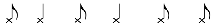

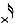

Aceste fapte de stil ce vizează în principal ritmul sincopat amfibrahic descendent specific folclorului românesc și străin folclorului coregrafic al popoarelor vecine, argumentează întru totul identitatea acestui tip de dans. El este un dans românesc, dansat și de romi și unguri pe melodii românești. Aceștia din urmă, învățându-l scolastic i-au dat o formă cristalizată cu figuri sofisticate și o dimensiune concordantă. I-au schimbat până și motivul ritmic cadențial. Astfel, dactilul (și el specific dansurilor românești) a devenit spondeu , eventual anapest (.) În ultimul timp, dansul Feciorescul des în ritm sincopat amfibrahic descendent a devenit apanajul celor mai talentați interpreți, dată fiind dificultatea rezolvării problemelor de tehnică ce le ridică.

AFC Video: 12/n1 02.05.1994 Cul. și tr. Z. Dejeu

## Fecioresc des din Corușu

Corușu Țurcă Alexiu 46 ani, vioară

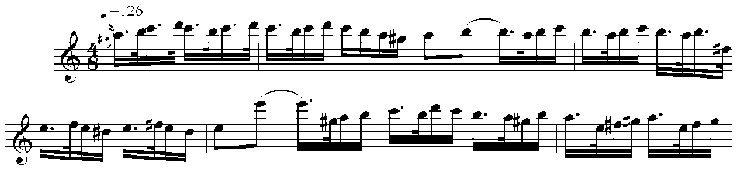

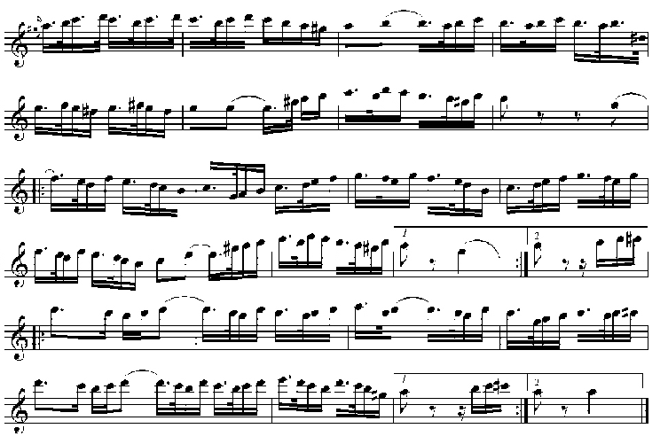

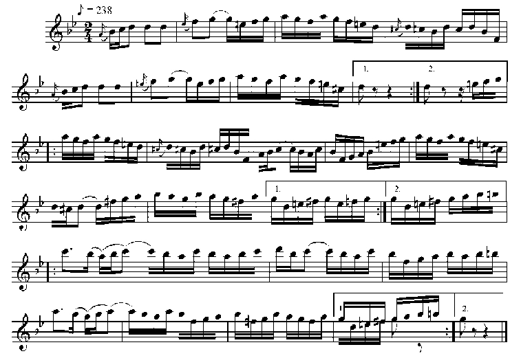

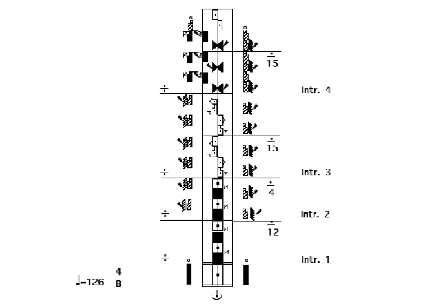

Fecioresc des din satul Corușu, com.Baciu, jud. Cluj. Filmat (02.05.1994) și trascris (25.11.2014) de Zamfir Dejeu. Dansatori: Pintea Ioan (56 ani) și grup de bărbați. Muzicanți: Turca Alexiu (46 ani) – vioară și Armand Iosif (58 ani) – braci.

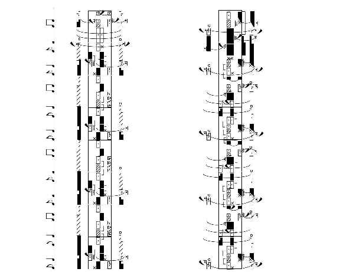

Figura A – toți B (leitmotiv) – toți

Consemnat pentru prima dată de mine2, acest tip de dans numit aiciÎnvârtită deasă sau Învârtită iute, iar în Râșca, sub Vlădeasa, De-a doua, pe Valea Almașului, Agrijului, Românește iute, se joacă în perechi, sub o formă destul de veche.

Învârtita deasă în ritm sincopat amfibrahic descendent este de construcție dezvoltată, iar motivele cinetice de dimensiunea unei măsuri de 8/8 se succed într-un mod liber. Astfel, și forma dansului este în general liberă. Totuși se delimitează două părți: partea de învârtire a perechilor și o așa-numită „pauză”, când dansatorii continuă să execute pași de bază pe loc, înainte sau înapoi, bărbatul ținându-și partenera „pe după cap”. Nu există însă o ordine stabilită a alternanței celor două părți. Motivele cinetice determinante sunt: învârtirile bilaterale, în final partenerii răsucindu-și corpul îndirecția de rotire; tot la sfârșit de fraze coregrafice, bărbatul execută pinteni în aer, mai rar lovituri cu palmele pe picior, iar femeia execută piruete. Dintre pașii de bază remarcăm: pași vârf-toc, pași de rotire (cu stângul spre dreapta și cu dreptul spre stânga), pași glisați și bătăi pe sol.

Motivele ritmice de bază sunt:

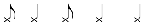

sau

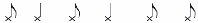

În timpul dansului, bărbații când nu strigă șuieră, mai ales în contratimp. Strigăturile sunt comune, uneori declamate și cu interjecții pe auftact. Acest tip de dans este concordant cu melodia, care este frazală. Astfel, motivul ritmic este comun atât pentru dans, cât și pentru melodie sau acompaniament, acolo unde interpretul bate la tobă sau „cântă” cu broanca.

În dansul Românește iute de pe Valea Almașului și în dansul Cioarsa (Turdeana) din câteva localități (Feleac, Ceanu Mic, Aiton, Ceanu Mare, Frata, Mociu, Tușinu, Dâmbu), ritmul sincopat a suferit o involuție în timp, primind un caracter binar. Au rămas însă în ritm sincopat melodiile, comune și acestea cu ale Feciorescului des, iar din dans, auftactul sincopat și pasul schimbat. Unele elemente cinetice sunt împrumutate din Învârtita dreaptă deasă (Hărțag). Se întâlnesc foarte rar loviturile pe picior. Melodiile dansului Cioarsa sunt cântate de muzicanții din zonă și la nuntă, când se merge pe drum cu mireasa.

2 Zamfir Dejeu, Folclor muzical de pe Valea Drăganului. Studiu monografic, Cluj-Napoca, Casa Creației Populare, 1976, p. 195.

## Învârtită deasă

(Învârtită sincopată)

Valea Drăganului, nr. 161 14.05.1967

Valea Drăganului

– Lunca Molivului – Giurgiuman Ioan 39 ani, fluier

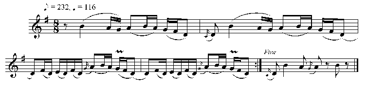

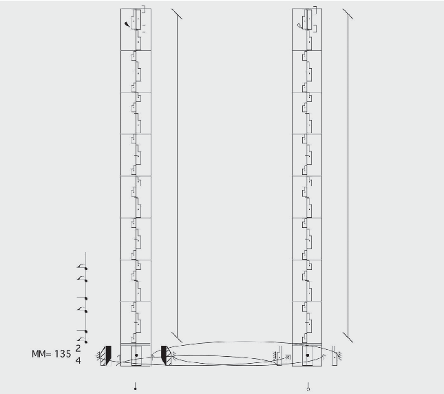

Învârtită deasă din Bociu, jud. Cluj. Filmat (26.11.1989) și transcris de Zamfir Dejeu. Dansatori: Goga Ioan (56 ani) și Goga Maria (54 ani).

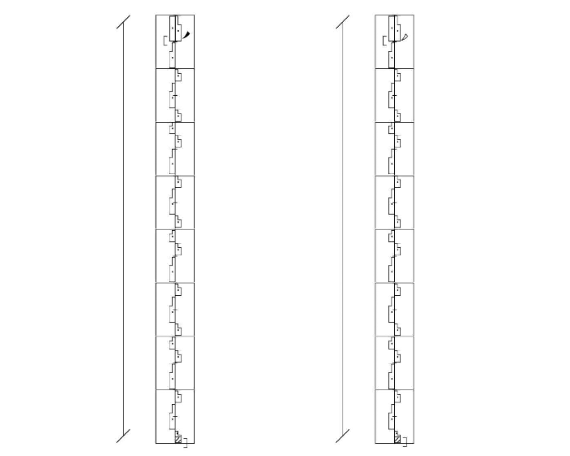

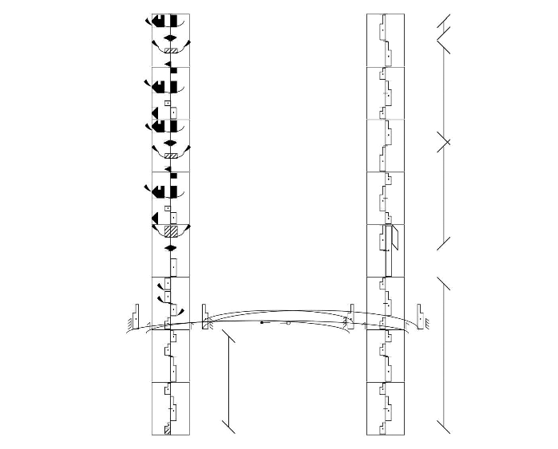

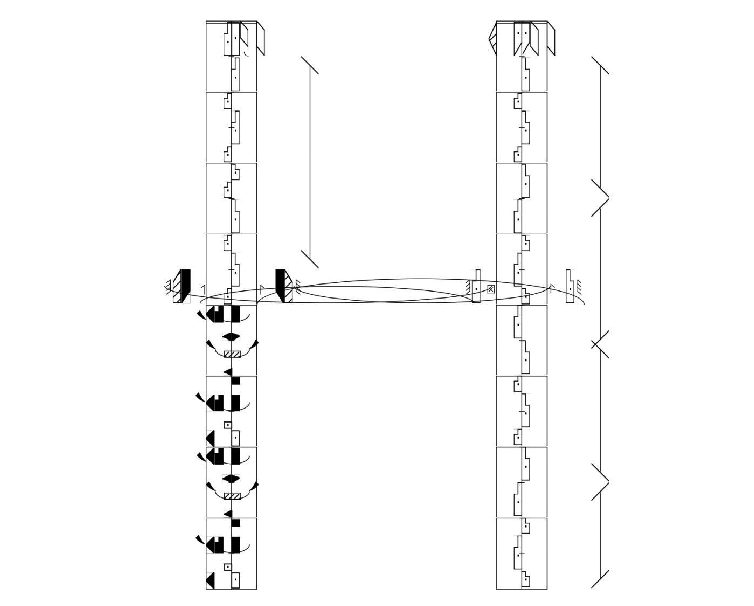

Mg. 2659 II n/7 04.06.1987 Cul. și tr. Z. Dejeu

## Învârtită deasă

(Învârtită sincopată)

Aghireșu Fodor Samoilă 65 ani, vioară

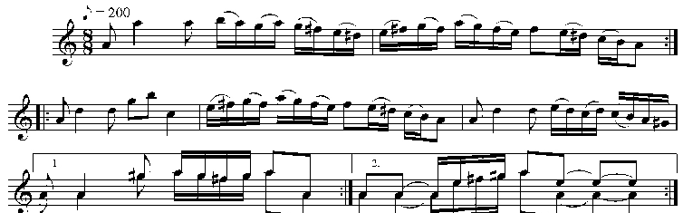

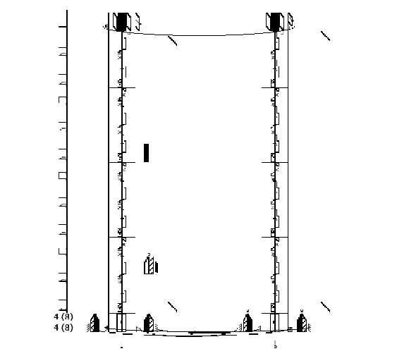

#### Învârtită deasă din Fildu de Jos, jud. Sălaj. Filmat (15.08.1993) și transcris de Zamfir Dejeu. Dansatori: Puriș Ștefan (61ani) și Puriș Veronica (46 ani).

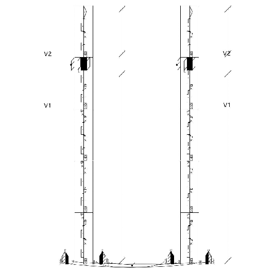

În ultimele cercetări acest tip de melodie am identificat-o și la ceangăii de pe Valea Ghimeșului, jud. Harghita, sub denumirea de Dubladeasă iarritmul sincopat amfibrahic descendent este și în dansul Dubla rară și înDubla deasă. Precizăm că melodiile dansului Dubla rară sunt în ritm binar. În tempo rar, partenerii se prind de mâini lateral și se deplasează în cerc, în sensul invers rotirii acelor de ceasornic. Dubla deasă se dansează în formație de perechi în rotire și în tempo mai iute ca și în zona Huedin-Ciucea. În acest caz, partenerii se prind de talie, respectiv de umeri și sunt situați față în față. Dansat liber, dar și în coloană de perechi pe orizontală seamănă cu dansul Ca la Breaza din Muntenia subcarpatică.

F.A. 6590 Cules și notat de Gh. Ciobanu în 1956

De doi (Ca la Breaza)

Com.Sita Buzău,m.Stalin reg. Stalin Înf. Gh. Gurău, 43 ani vioară

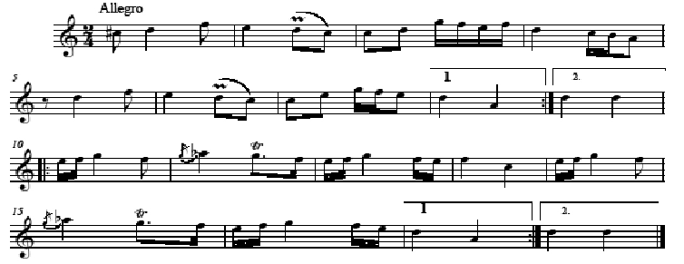

În marea majoritate a cazurilor ritmul dansului se formează pe bază de amfibrah + spondeu . Această formulă este atât de legată de Brează, încât unii cercetători s-au grăbit să susțină că o singularizează3: „Restul trăsăturilor ritmice sunt mai puțin importante. Le menționăm în treacăt. Am văzut că celelalte celule ritmice de bază sunt amfibrahul și spondeul; mult mai rar apar dohmiacul și anapestul, și mai rar dipiricul. Valorile divizionare ale fiecărui motiv sunt de obicei în număr de 5: 3 pătrimi și 2 optimi; nu am întâlnit niciodată doimi și șaisprezecimi. În sfârșit se mai remarcă și accentul în contratimp, de altfel caracteristic tuturor motivelor introduse prin «vârf-toc»”. La Brează există în toate variantele o concordanță absolută între motivul coregrafic și fraza muzicală. Strigăturile sunt comune. Din formule ritmice, tempo, structura mișcărilor, evoluția în spațiu a grupului sau a unei singure perechi etc., reiese dinamica și expresivitatea stilului.

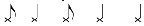

Din materialul nostru reiese însă că acest ritm este comun pentru mai multe dansuri atât din Transilvania cât și din Muntenia subcarpatică.

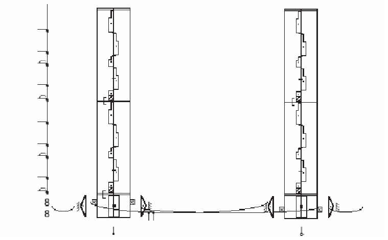

Ca la Breaza – Valea Prahovei

- 3 Andrei Bucșan, Breaza, în „Revista de folclor”, Anul III, București, 1958, p. 51.

AFC Video 11dl 18.09.1993 Culeg. și tr. Zamfir Dejeu

## Dubla deasă

Lunca de Jos, HR Halmagy Mihaly, 72 ani, vioară Halmagy Gizella, 63 ani, broancă

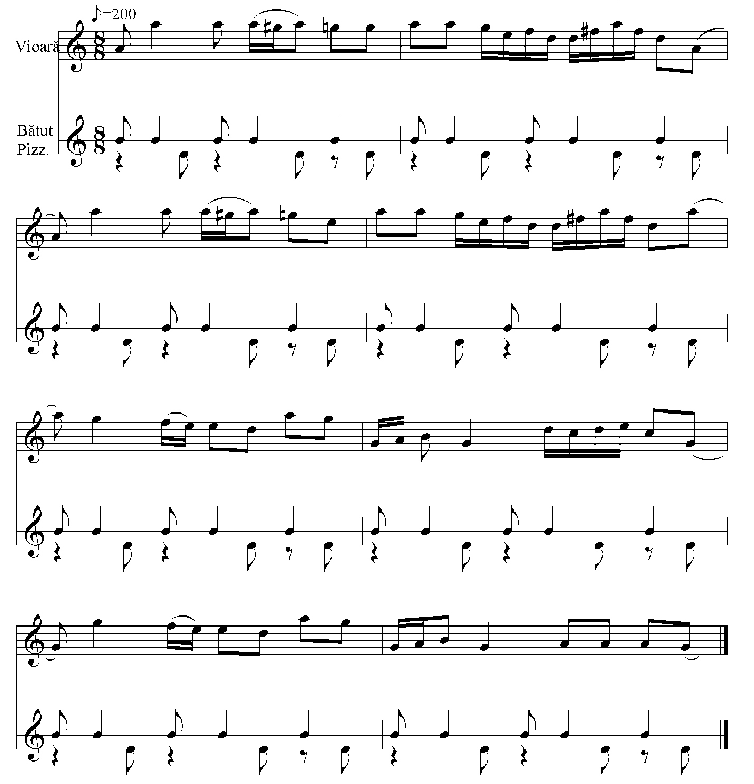

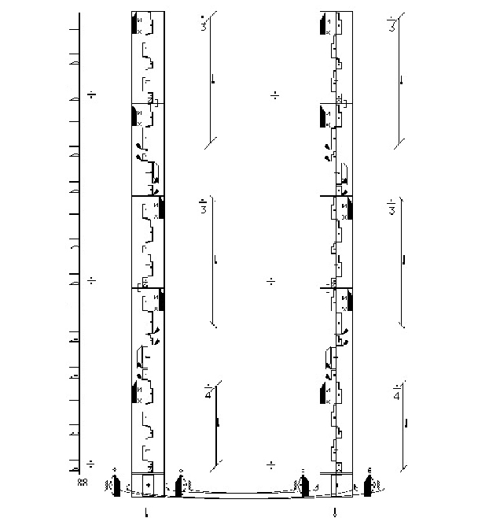

Dubla deasă din Coșnea – Agas, jud. Bacău. Filmat (14.09.2014) și transcris de Zamfir Dejeu. Dansatori: Levente Vaszi (26 ani), Medea Vaszi (25 ani) și grup de dansatori.

Și în Dubla deasă, după cum se observă în majoritatea cazurilor, motivul cinetic începe cu pas vârf-toc, impregnându-se astfel ritmul sincopat amfibrahic descendent. Măsura este cea de 8/8. Este prezent însă și pasul schimbat. Al II-lea motiv coregrafic ce este continuat cu pas pe timp, este identic cu principalul motiv coregrafic de la Învârtita șchioapă din Bazinul Meseș, ce are la bază în dans ritmul sincopat asimetric4:

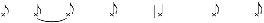

sau

- 4 Zamfir, Dejeu, Ritmul sincopat asimetric în muzica și dansul tradițional românesc, în „Anuarul Institutului de Etnografie și Folclor «Constantin Brăiloiu»”, Serie Nouă, Tomul 23, 2012, pag. 249.

## Învârtită rară

AFC Video 3 y 26.11.1989

Călățele, Cj Toader Gheorghe 35 ani și grup de taragotiști

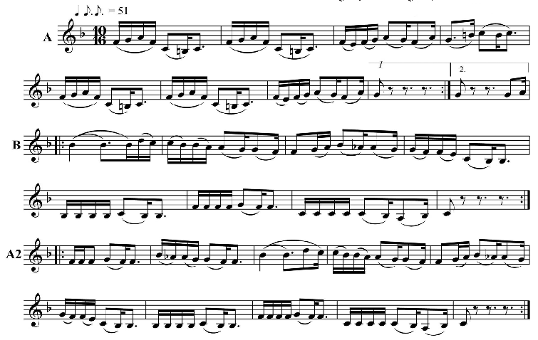

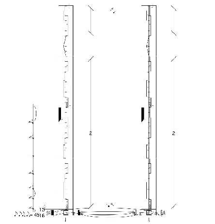

Învârtită rară din Fildu de Jos, jud. Sălaj. Filmat (15.08.1993) și transcris de Zamfir Dejeu. Dansatori: Puriș Ștefan (61ani) și Puriș Veronica (46 ani).

În concluzie, acest ritm specific românesc, sau cel puțin carpatic, demonstrează originea comună a dansurilor de mai sus cu dansul Breaza din Muntenia subcarpatică. Acesta s-a făcut cunoscut și în Transilvania datorită transhumanței ce a avut loc în trecut, dar mai ales cu ritmul existent în refrenele colindelor, genul cel mai vechi din tradiția românească.

De remarcat însă că dansul Dubla deasă din Ghimeș este cel mai complex. El are elemente cinetice atât de la Ca la Breaza (partenerii prinzându-se de mâini lateral și deplasându-se în cerc, în sensul invers acelor de ceasornic), cât și de laÎnvârtita deasă din zona Huedin (învârtirile bilaterale) și ceva pe deasupra: bătăi ale bărbaților cu picioarele în pământ, acestea din urmă ținând de stilul moldovenesc. Dar, în sfârșit, care este apartenența originară a acestor jocuri, care ar fi filiera lor, apărând în zone extreme fără nicio continuitate teritorială? Oricum, apartenența morfologică a lor este foarte clară5: fie o veche legătură, astăzi întreruptă, fie o dezvoltare independentă care a dus întâmplător la același rezultat morfologic, fie un împrumut recent. Subliniind că odinioară românii dansau pe melodiile de colindă, am putea crede, deci, că originea acestui tip de ritm – ritmul sincopat amfibrahic descendent să fie în ritmul din refrenele colindelor6.

- 5 Ibidem, pag. 54.
- 6 Zamfir Dejeu,Caracterul dansant al unor colinde, în Metode și instrumente de cercetare etnologică – Stadiul actual și perspectivele de valorificare, Cluj Napoca, Eitura Fundației pentru Studii Europene, 2011, p. 511–518.

