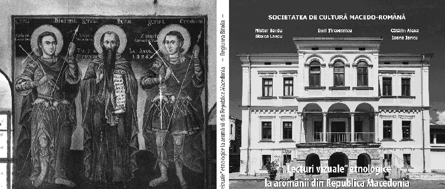

această informație cu privire la grai este foarte bine organizată și este însoțită de exemple din domeniul foneticii, morfologiei, lexicologiei. De asemenea, sunt date exemple de împrumuturi din limbile albaneză, greacă și macedoneană slavă.

Autorii ne introduc și în povestea sărbătorilor și obiceiurilor, prezentând obiceiuri la nașterea copilului, obiceiuri de primăvară ș.a., pelerinajul la mormântului cântărețului aromân Toše Proeski, decedat într-un accident de mașină în anul 2006. În ultimele pagini ne este înfățișată viața lui Pitu Guli, „luptător pentru libertate” de la răscoală din 1903.

În final, apreciem că ne aflăm în fața unui album etnolingvistic care conține informații bine organizate și structurate, alături de un număr mare de fotografii etnografice, care oferă cititorilor, în adevăratul sens, o pătrundere în lumea minorității aromâne din Macedonia de Nord. Aceasta a încercat timp îndelungat să își afirme identitatea românească, identitate păstrată și astăzi în conștiința locuitorilor.

Valentyna Symionka Masterand la Facultatea de Litere, Universitatea din București

# Nistor Bardu, Emil Țîrcomnicu, Cătălin Alexa, Stoica Lascu, Ioana Iancu, „Lecturi vizuale” etnologice la aromânii din Republica Macedonia. Regiunea Bitolia. Memorie, tradiție, grai, patrimoniu, Societatea de Cultură Macedo-Română, Editura Etnologică, 2018, 196 p., ISBN 978–606-8830–48-3.

Albumul este dedicat aromânilor din Republica Macedonia de Nord, un stat desprins din Republica Socialistă Federativă Iugoslavia, care și-a declarat independența la 8 septembrie 1991. Autorii dau informații administrative referitoare la suprafața Macedoniei de Nord, de 25.713 km, și la numărul populației de peste 2.000.000 de locuitori. Macedonenii vorbesc macedoneana, o limbă slavă.

626 Recenzii

Așa cum observăm de la pagina a 2-a, albumul este realizat în cadrul unui proiect cu finanțarea Administrației Fondului Cultural Național, apărând sub egida Societății de Cultură Macedo-Română.

Teritoriul Republicii Macedonia de Nord se împarte în 8 regiuni. Aromânii sunt recunoscuți ca minoritate vlahă, având o pondere de 0,48 %. Neoficial, însă, aromânii ar fi procentual peste 5 %. Autorii vor sa aducă în prim plan comunitățile de aromâni într-o notă modernă, instructivă și atractivă, dar au în vedere și obiectivele turistice, bisericile, cât și graiul, portul, obiceiurile, tradițiile și istoria orală. Albumul este important pentru semnificația și calitatea fotografiilor testimonial-documentare care îl ilustrează. Aromânii au fost greu încercați de multe transformări sociale și politice produse de Războaiele Balcanice și Mondiale, dar și de faptul că numeroși membri ai comunităților de aromâni au fost nevoiți să plece în alte țări.

Albumul este compus din Introducere și cinci capitole consacrate unor localități importante în istoria aromânilor, aflate în regiunea Bitola: Bitola, Târnova, Nijopole, Gopeși și Moloviște, încheindu-se cu o pagină de bibliografie. Majoritatea acestor comunități aveau în trecut un număr mare de aromâni, însă mulți dintre aceștia au plecat în țări străine sau au preferat viața în orașele mai mari din această republică. Un lucru pe care l-am observat adesea au fost imaginile cu casele lor, unele acum aflându-se în paragină, constituind un reper de ceea ce au reprezentat odinioară aromânii în cadrul burgheziei locale.

La începutul capitolului aflăm că municipalitatea Bitola se află în sud-vestul Republicii Macedonia de Nord și cuprinde satele care au avut populație însemnată aromână. Chiar dacă sunt depopulate astăzi, aceste așezări păstrează amintirea vie a aromânilor ce au locuit odinioară aici. Bitolia era un oraș multietnic, fenomenul multilingvismului fiind prezent în viața socială a secolului trecut. Strada Shirok Sokak, considerată cea mai impunătoare, a fost locuită în proporție de 80% de aromâni. Existau magazine, hoteluri, farmacii, localuri, clădirile fiind impunătoare. Bitolia, numit și Monastir, a fost capitala vilaietului cu același nume, în vremea Imperiului Otoman. După 1991 în Bitolia s-au redeschis 13 consulate, unul dintre ele fiind Consulatul Onorific al României. Vechile consulate existente la începutul secolului al XX-lea arată importanța politică și comercială pe care acest oraș a avut-o pentru întreaga regiune.

Arhitectura locului este fascinantă, Piața Mangoliei este un exemplu minunat pentru turiști, iar Statuia ecvestră a lui Filip al II-lea, Fântâna arteziană și Turnul cu ceas sunt alte repere urbanistice. Piața este așezată strategic, acolo putându-se vedea două moschei. Creștinii care frecventau biserica Sfântul Dumitru din Salonic se considerau greci și li se spunea grecoromani, iar aromânii care se considerau români balcanici aveau însă propria lor biserică cu hramul Constantin și Elena.

Clădirile își pun amprenta pe atmosfera străzilor, unele dintre ele păstrând urma degradărilor și imaginea vie a trecerii timpului. Unele sunt aproape de a fi în ruină, deoarece mulți aromâni au plecat în străinătate, după perioada comunismului. Vara, în luna august, numeroși aromâni vin în vizită la rude, iar orașul prinde iarăși viață.

Pe terenul pe care a fost construit hotelul Epinal s-a aflat biserica românească. Edilii orașului, comuniști, au hotărât să construiască în locul bisericii acest hotel. Cu toate acestea, aromânii au cerut pământ pentru a-și construi o nouă biserică. Ei au

astăzi propriul lor loc de rugăciune, biserica care păstrează hramul celei demolate, Sfinții Împărați Constantin și Elena. Nu este cunoscut de mulți că există și un cimitir al aromânilor. Oamenii s-au simțit discriminați la începutul secolului al XX-lea, deoarece li s-a interzis înhumarea celor trecuți în neființă pentru că se considerau români, și au înființat acest cimitir. Autorii s-au oprit la mormântul lui Apostol Mărgărit, care a fost dascăl la Gorința și Clisura, fiind primul înmormântat în acest cimitir, în anul 1903.

Următorul capitol este dedicat exclusiv localității Târnova, care se află la 8 kilometri de Bitolia. Ceea ce este important este numărul de români (aromâni) ce se aflau în anul

1892. Erau 5.500 de locuitori, dintre care numeroși erau aromâni.

Pe pământul cumpărat de la beiul turc Rustem s-a ridicat această localitate, iar tot aici a fost construită o biserică. Din punct de vedere al multiculturalității există 80 de familii: macedoneni, albanezi și aromâni. Modul curat al cimitirului denotă grija localnicilor față de locurile de veci. Ca și la Bitolia, și după cum vom vedea și în alte localități, localnicii manifestă un mare respect pentru rudele trecute la cele veșnice (p. 88). Izvorul aflat în curtea bisericii se spune că ar fi tămăduitor, fiind protejat de o construcție special destinată. De asemenea, biserica este un punct central al comunității.

Capitolul Nijopole se deschide cu elementul vizual al fotografiilor, care ne transmit pulsul natural al locului. Momentan localnicii aromâni tineri lucrează în Bitola, însă sătenii se ocupau în trecut de creșterea vitelor. Animarea atmosferei este dată de noile case construite de tineri, însă mulți au plecat în străinătate sau la oraș. Pe lângă aromâni, care sunt majoritari, mai există în comunitate și turci și macedoneni slavi.

Cele două școli una veche și una nouă nu mai sunt în funcțiune, deoarece părinții preferă să își ducă elevii la școlile din Bitola.

Aromânii din localitate sunt comunicativi, astfel autorii fiind invitați în casa unei femei, după hramul bisericii. Sunt mai departe surprinse imagini din biserică. Deși modestă ca dimensiuni și ca spațiu interior, iconostasul icoanele de pe pereți și celelalte obiecte bisericești transmit pelerinilor un autentic aer de cucernicie (pag. 128).

Este fotografiat izvorul cu apă vie, făcător de minuni unde se spune că a fost vindecată o fată fără vedere, după ce s-a spălat cu apă de la izvor. Sunt după aceea prezentate mormintele, unde numele sunt scrise cu litere chirilice, dar sunt asemănătoare cu ale românilor creștini ortodocși.

În următorul capitol este prezentat Gopeși, unde se prezintă de către autori ca fiind o frumoasă comună, în care locuitorii se declarau români.

Arhitectura este minunată, cele mai multe clădiri fiind construite din piatră și acoperite cu cărămidă sau cu ardesie (pag. 143). A fost atestat faptul că locul avea aspectul unui mic oraș, cu 2.600 de locuitori aromâni, cu comerț și meșteșuguri de primă necesitate. Astăzi satul pare părăsit:,,Situat între piscuri de munte, cu păduri înconjurătoare dense, orașul de odinioară a devenit astăzi un sat aproape părăsit. Ziduri prăbușite, ruine năpădite de o vegetație sălbatică, grămezi de pietre aducând aminte de casele de altădată contrastează dureros cu splendidul peisaj natural ce înconjoară localitatea” (pag. 145).

Deoarece nu există prea multă populație în zonă, localnicii au fost foarte fericiți să primească oaspeți în gospodăriile lor. Îi vedem pe domnul Iancu și Nada Nicolai, care au o construcție nouă cu etaj, iar ospitalitatea lor este clară prin gesturi, prin modul

