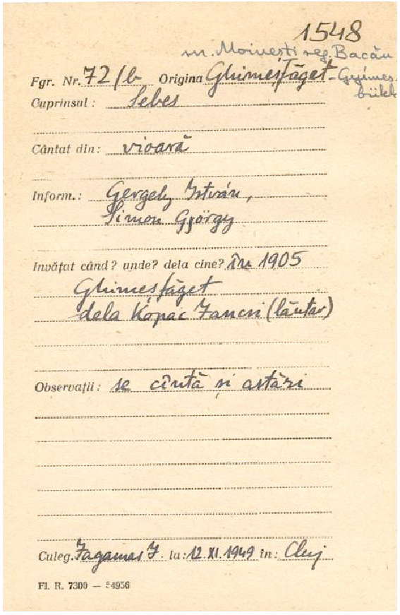
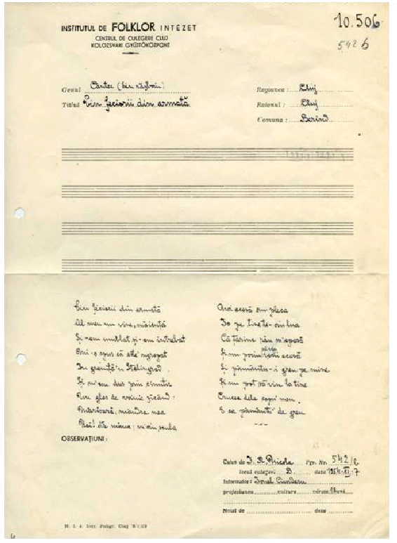

# FONDUL FONOGRAF AL ARHIVEI DE FOLCLOR A ACADEMIEI ROMÂNE

Liviu-Ovidiu POP*

The Phonograph Collection of the Folklore Archive of the Romanian Academy (Abstract)

This research explores the Fonograf Collection of the Romanian Academy’s Folklore Archive, the first to include sound recordings. The collection consists of 542 wax cylinders, some of which have sadly deteriorated or are lost. The wax cylinders and music transcriptions are stored in the Romanian Academy’s Branch in Cluj Napoca. The oldest recordings date back to 1949 by Jagamas János, with the last ones done in 1954 by Ioan R. Nicola. Apart from cataloged cylinders, 100 uncatalogued cylinders exist with unknown content. The article breaks down the catalog’s structure and looks at the digitization of the collection.

Keywords:Fonograf Collection, Folklore Archive, Wax Cylinders, Recordings, Music Transcriptions, Digitization, Catalog Analysis.

Cuvinte cheie: Fondul Fonograf, Arhiva de Folclor, cilindri de ceară, înregistrări, transcrieri muzicale, digitizare, cercetarea catalogului.

Fondul Fonograf al Arhivei de Folclor a Academiei Române este primul fond cu înregistrări sonore din cadrul Arhivei. După cum spune și numele, înregistrările au fost realizate pe cilindrii de ceară pentru fonograf, existând un număr de 542 de astfel de cilindri. Din păcate o parte din aceștia au fost deteriorați de-a lungul timpului, iar alții lipsesc cu totul. În prezent cilindrii de ceară și transcrierile de text muzical se găsec în clădirea Filialei Academiei Române, Cluj-Napoca, iar transcrierile muzicale și fișele de identitate la sediul Arhivei de Folclor.

În momentul de față Arhiva deține două fonografe incomplete, unul dintre ele fiind folosit în anii 1980 pentru înregistrarea cilindrilor care erau intacți pe benzi de magnetofon. Au fost, de asemenea, realizate transcrieri după cilindrii în ani 1960. Acestea se găsesc pe benzile 2163, 2164, 2165, 2166, 2167, 2168, 2169, 2170, 2171, 2172, 2173, 2174, 2175, 2176 (14 benzi în total).

Cele mai vechi înregistrări, pe baza catalogului, au fost realizate în primăvara anului 1949 de Jagamas János, iar ultimele înregistări au fost realizate în toamna anului 1954 de către Ioan R. Nicola.

Pe lângă cei 542 de cilindri de ceară înregistrați în catalog, există până la 100 de alți cilindri de ceară necatalogați cu conținut necunoscut. S-ar putea să conțină înregistrări ale unor alte cântece, erori de înregistrare sau cilindri primiți (pe unul dintre ele este scris cu creionul Musik das Oriente).

* Institutul „Arhiva de Folclor a Academiei Române”, Cluj-Napoca.

Anuarul Arhivei de Folclor, nr. XXVII, 2023, p. 85–88

Structura catalogului este următoarea: Număr curent | Nr. Fonogr. | Nr. Inv. | Cuprins | Nr. Strofelor. | Cântat din |

Informator | Origina | Culegător | Locul și data înreg. | Observațiuni Pe baza catalogului putem face următoarele observații generale: Număr curent: începe de la 1, se termină la 1113, dar sunt rânduri lipsă. Nr. Fonogr.: este numărul înscris pe exteriorul cutiei fonografului. Pe un fonograf se

puteau înregistra aproximativ 4 minute de sunet. O parte din cilindri conțin o înregistrare mai lungă, alții mai multe înregistrări mai scurte.

Nr. Inv.: începe de la 252 și ultimul rând este 10506. Sunt mari șanse să fie vorba de numere de inventar accordate fiecărei înregistări.

Cuprins: conține fie o descriere a speciei muzicale înregistrarte (de exemplu: Bocet, Nuntă, Feciorească), titlul melodiei (Hoi, susu-mi, Doamne, Hora lui Iancu, Danțul cimpoiului, Hora miresei) sau primul vers al unui cântec (de exemplu: Ia-mă bade dacă vrei, Nu bate domne omu, Boii mici când aud doina).

Nr. Strofelor.: chiar dacă există o coloană întreagă dedicată, este completat foarte sporadic, existând doar 6 rânduri unde sunt notate cu 1, 2 sau 3.

Cântat din: se referă la instrumentele folosite pentru melodiile înregistrate. Această coloană conține multiple variante, dar cele mai des întâlnite sunt: gură (405), voce (335), vioară (138, dar există mai multe înregistrări cu vioară I și vioară II, vioară și cobză, vioară și voce etc), fluier (69), dar există și câte o înregistrare pentru caval, clarinet și gură, corn păstoresc, fluierat din gură sau țambal.

Informator: în coloana aceasta din catalog sunt trecute numele și vârsta celor care au fost înregistrați pe cilindrii de ceară. Informatorii cu cele mai multe înregistrări sunt: Gavrilă Nicoară (Petruța), Gavrilă Călbăjos (33), Csurál Józsiné sz. Kánya Kati (24), Kotyorka Antal (23), Simon György (18).

Origin(e)a: se referă la locul de unde a fost învățat un anume cântec sau de unde provine. Poate fi diferit de cel al locului înregistrării. Cele mai multe înregistrări au originea în: Feleacu, j. Cluj (80); Cleja, j. Bacău (74); Drăștioara de Sus, j. Hunedoara (55); Luizi Călugăra, j. Bacău (41); Sic, j. Cluj (40); Inucu, j. Cluj (36); Răscruci, j. Cluj (28); Săbăoani, j. Neamț (28); Suatu, j. Cluj (25); Cătina, j. Cluj (24); Ploșcuțeni, j. Vrancea (24); Viștea, j. Cluj (23); Ghimeș. j. Bacău (22), dar mai există 16 din Ghimeș-Făget; Bodogaia jos, j. Harghita (20).

Culegător: Numărul cercetătorilor care au realizat înregistrările este mic. Marea majoritate a înregistărilor, mai bine de 3 sferturi au fost realizatea de Jagamas János: (816). Ioan R. Nicola a folosit și el destul de mult fonograful (222). Mai apar numele Kallós Zoltán (27), Szenik ilona (22), Ioan R. Nicola și Dobó Klára: (20).

Locul și data înreg.: Acesta coloană conține atât numele localității în care s-a realizat înregistrarea, cât și data. Locul diferă uneori de cel din coloana Origin(e)a, iar alteori sunt identice. Apar localități care par a fi servit ca loc unde au fost realizate înregistrări dintr-o zonă mai mare: Bacău, Beiuș, Cluj sau aceași localitate cu multiple date de înregistrare (Drăștioara, Feleacu, Inucu, Lespezi, Luizi Călugăra ș.a.m.d.).

Observațiuni: în această coloană sunt trecute mai ales însemnări legete de transcrierea înregistărilor, dar și informații despre starea cilindrilor: cilindru spart (1) sau spart în bucăți (8).

Fondul Fonograf al Arhivei de Folclor a Academiei Române 87

În total sunt 542 de cilindri, 1122 înregistrări înscrise în catalog și 576 de transcrieri. Aproape fiecare înregistrare are o fișă de identitate pe baza cărora a fost realizat catalogul, existând în total 1089 de fișe. Pe aceste fișe se regăsesc uneori informații care nu au fost transcrise în catalog, de obicei la rubricile Învățat când? unde? dela cine? sau la rubrica Observații. Uneori fișele conțin și o cotă din Fondul Auxiliar Muzical.

Fig. 1. Exemplu de fișă de înregistrare din Fondul Fonograf.

Pe lângă transcrierile muzicale, există o seamă de transcrieri a textelor cântecelor.

Fig. 2. Exemplu de transcriere de text muzical.

Fondul de fonograf a fost digitizat integral și conține următoarele: Fișe de identitate: 1089 de fișiere TIFF, rezoluția 600 DPI. Transcrieri muzicale: 699 de fișiere TIFF, rezoluția 600 DPI. Transcrieri texte muzicale: 533 de fișiere TIFF, rezoluția 600 DPI. Fișiere audio de pe benzile de magnetofon: 526 de fișiere .wav

