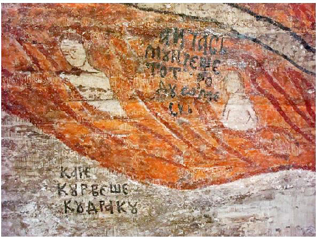

# REGLEMENTAREA SEXUALITĂȚII ÎN LUMEA ROMÂNEASCĂ VECHE: AMESTECAREA DE SÂNGE, MALAHIA, CURVIA ȘI ALTE SĂBLAZNE

## Astrid CAMBOSE*

Old Romanian Legislation on Sexual Conduct: Incest, Masturbation, Whoredom and Other Debaucheries (Abstract)

With regard to human sexuality, many facets and intertwining factors must be analysed in order to get an overall view, and no matter how far the search goes, there will always be some investigation that still awaits its scholar. In this paper we try to address the question of mundane sexuality from a philosophical and anthropological perspective, and to stress the connection between Christianity and ancient Greek metaphysics in the matter of the human sperm as carrier of the divine pneúma. From this point of view, masturbation appeared as the most grievous of the sexual debaucheries, because it wasted the divine seed. Illegitimate copulation included various relationships, some of which we tried to tackle by means of philological and anthropological interpretation. But is there a clear rationale for why some sexual dispositions have been considered more appropriate than others? We believe there have been some consequential constructs that have shaped the sexual habitudes of the traditional Romanian society in the former centuries and we set on our course to detect them.

Keywords: religious legislation, old Romanian world, traditional sexual roles, debauchery, sexual taboos and crimes.

Cuvinte-cheie: reglementări religioase, lumea veche românească, roluri sexuale tradiționale, desfrâu, tabuuri și delicte sexuale.

Motto „Păcatul carele pogoară cătră moarte iaste dulceața trupului.”(Îndreptarea legii) „– Cum nu faș, popă, păcate/ Că cununi soră cu frate?/

– Nu-i cunun pân’ ce sun’ frați,/ Ce-i cunun pân’ ce sun’ draji.” (Inf. Iuga Maria, Dobric, Bistrița Năsăud)

### 1. Perspectiva hermeneutică

În lumea românească veche diriguitorii se considerau îndreptățiți să cunoască în detaliu sexualitatea „poporului”, să o administreze și să o pedepsească, după caz, reglementând-o cât mai strict, printr-o amplă legislație de sorginte religioasă. La 1779, de pildă, un act judiciar stabilea datoriile protopopilor, care, între altele, „au și această slujbă a cerceta pricini dă judecăți bisericești, adică de curvii, dă hrăpirea fetelor, de posatnice, de amestecarea sângelui, de paranomiia nunții a patra, de fermecătorii, dă vrăjbi între bărbat

* Institutul de Filologie Română „A. Philippide”, Iași.

Anuarul Arhivei de Folclor, nr. XXVII, 2023, p. 105–116

cu soțiia lui”1. Trebuie subliniat faptul că reglementările vizau în mod direct sexualitatea masculină și numai indirect pe cea feminină, în literatura juridică de secol XVII–XIX particularizările făcându-se aproape exclusiv din perspectiva bărbatului, căruia i se arăta ce practici erau considerate delicte sexuale și prin ce canon i se va putea echivala culpa sexuală, spre a-și câștiga iertarea. Bărbatul – mai precis, mântuirea sufletului acestuia – era, așadar, subiectul reglementării sexualității, în timp ce femeia, distribuită într-un rol ancilar, furniza mai degrabă „ocazia” sancțiunilor, în calitate de „prilej de poticnire”, provocatoare sau obiect pasiv al abaterilor combătute de dreptul cutumiar, de pravile și de vechile coduri de legi. Aceasta în ciuda faptului că femeia putea juca, la rîndul ei, un rol activ în inițierea raporturilor sexuale ilegitime: deopotrivă cu bărbatul, ea se putea face vinovată de pederastie, zoofilie, homosexualitate (feminină, în acest caz), preferința pentru coitus interruptus, autosatisfacere sexuală, orgii etc.2 Păcatele„clasice” reținute de obicei în seama femeii în reglementările canonice din lumea românească veche sunt curvia – gen care cuprindea în devălmășie toate speciile culpei sexuale feminine – și pruncuciderea, în al cărei spectru se includea și contracepția.

Un fenomen de complexitatea celui la care ne referim când vorbim despre reglementarea religioasă tradițională a sexualității cere explicații care, spre a fi pertinente, trebuie să ia în considerare o multitudine impresionantă de factori concurenți. Nu putem forța explicații reducționiste asupra peisajului cutumiar și juridic investigat. Perspectivismul apare ca o obligație a hermeneutului. Acceptând, deci, ca premisă ireductibilitatea fenomenului la o singură teorie, vom urma aici doar una dintre direcțiile exploratorii posibile, adâncind linia de interpretare pe care am deschis-o într-un studiu anterior3.

Două mari filoane alimentează viziunea tradițională a sexualității: pe filieră teologică și implicit filosofică, sexualitatea este explicată prin proiecția unui „ce” divin, dătător de viață, care se regăsește în sămânța masculină și se pierde prin comportamente sexuale deviante de la menirea inițială, iar pe filieră arhaic-populară, prin dihotomia pur / impur, motivație profundă a comportamentului oamenilor din toate locurile, societățile și timpurile, chiar dacă obiectele considerate „spurcate” au variat considerabil. Puritatea și opusul ei sunt moșteniri mentale extrem de eficiente, incontrolabile prin mecanisme de coerciție logică. Faptul că un anume lucru (fie acesta un obiect, o practică, o substanță corporală sau extracorporală, un loc, o persoană, o instituție, o categorie socială, o etnie ș.a.m.d.) este „spurcat” nu îl decide rațiunea. A identifica ceva ca „spurcat” este o senzație

- 1 Acte judiciare din Țara Românească, 1775–1781, ediție întocmită de Gheorghe Cronț, Alexandru Constantinescu, Anicuța Popescu, Theodora Rădulescu, Constantin Tegăneanu, București, Editura Academiei R.S.R., 1973, p. 744.
- 2 Distincția netă între sexualitatea masculină, subiect predilect al supravegherii religioase, și cea feminină se regăsește mai ales în „teoria” care reglementa sexualitatea în lumea românească veche; în practică, însă, un prelat de talia mitropolitului Antim, de pildă, avea deschiderea spirituală necesară spre a trata la spovedanie femeia ca și bărbatul, chestionând-o – după întrebările specifice despre pruncucidere, contracepție și vrăjitorie

– și despre culpele generale: „Așijderea să fie întrebate iale de toate păcatele, ca și partea bărbătească” (Antim Ivireanul,Începătură și învățătură pentru ispovedanie, înOpere, ediție de Gabriel Ștrempel, București, Editura Minerva, 1997, p. 210).

- 3 A se vedea subcapitolul Sufletul: pneúma, sămânță sau sânge? (Astrid Cambose, Cealaltă grădină. Cultura tradițională a morții la români, Cluj-Napoca, Editura Argonaut, 2019, p. 81–96).

nemijlocită, chiar și în zilele noastre, în pofida (auto)cenzurii promovate de politicile educaționale antidiscriminatorii. Avem și astăzi față de impuritate o reacție vegetativă, irepresibilă, paradoxal foarte personală și în același timp supraindividuală, în măsura în care majoritatea indivizilor dintr-o comunitate răspund similar acelorași stimuli. Or, cu atât mai mult a fost operantă dihotomia pur / impur în lumea veche, al cărei sistem de ierarhii nu numai că nu o combătea, dar o și instrumentaliza masiv.

A fi curat era în lumea veche o chestiune de resort exclusiv moral. Că nu exista o bază obiectivă, factuală, pentru aprehensiunile normate în rânduielile juridico-teologice

- o demonstrează o mulțime de exemple. Să examinăm unul dintre acestea: igiena era considerată impură, iar murdăria fizică era pură, atât pentru călugăr, care în toate zilele viețuirii lui trebuia să practice „subțierea trupului”4 și „zdrobirea inimii”5, cât și pentru preot, în cazul căruia a se spăla în ziua când urma să slujească liturghia era un păcat6 pedepsit cu canon; astfel, spălarea nu echivala cu purificarea, ci, dimpotrivă, cu macularea

– explicația stând în faptul că lipsa totală de igienă, cauzatoare de boală, eventual dusă până la putrefacția țesuturilor7, reflecta virtuțile ascetice ale călugărului, iar în cazul

- 4 „Leapădă de la tine sarcina lumească și-ți subțiază trupul, răbdând tot chinul și nevoia” (Sfântul Paisie Velicikovski, Crinii țarinii. Pagini filocalice, București, Editura Anastasia, 1996, p. 19), „că pe cât slăbește trupul, pe atât sufletul se face puternic și se sfințește” (Ibidem, p. 20) și „mulți dintre Sfinții Părinți [...] și-au chinuit trupurile și le-au uscat” (Ibidem, p. 50–51), iar „sfinții și-au subțiat și și-au uscat trupurile, cumpărând cu trupul cel stricăcios viața cea nestricăcioasă” (Ibidem, p. 36), fiindcă „știau ei că, de nu va muri trupul pentru suflet, apoi va muri sufletul pentru trup” (Ibidem, p. 65) – avertismente în logica teologică de la 1769.
- 5 „Când păcătosul căindu-să de greșala lui să întoarce prin pocăință cătră Dumnezeu, fără a nu-și [sic] aduce aminte nicicum de alte lucruri (adecă de raiu, și nici de iad), ce numai din dragoste curată, să numește zdrobire, care iaste o durere a greșalei” (Îndreptarea păcătoșilor, adecă învățătură cătră cel ce să pocăiaște, cum să cade să se ispoveaduiască, acum întâi tălmăcită de pre limba grecească pre limba romănească. Și s‑au tipărit în zilele prealuminatului, și preaînălțatului domnului nostru Io Grigorie Ioan Calimah voevod, întru a doao domnie a Mării sale, cu blagosloveniia și cu toată chieltuiala preaosfințitului Mitropolit al Moldovii chiriuchir Gavriil. Întru a sfinții sale tipografie, în sfânta Mitropolie în Iași, la anii de la Hristos 1768. Și s‑au tipărit de cucearnicul între diaconi Damaschin tipograful, text tipărit cu chirilice, transliterarea noastră, p. 42).
- 6 „Preotul de să va spăla pe trup sau va mearge la feredéu, nu va putea mearge să cânte Svânta Liturghie într-acea dzi; nice după liturghie iaste volnic într-acea dzi ca să facă acest lucru” (Șeapte taine a besearicii, Iași, 1644, ediție critică, notă asupra ediției și studiu filologico-lingvistic de Iulia Mazilu, cuvânt-înainte de Eugen Munteanu, Iași, Editura Universității „Alexandru Ioan Cuza”, 2012, p. 112). Aceeași interdicție este prezentată cu detalii în Îndreptarea legii: „Preotul, de să va spăla sau va merge la bae, acela nu poate să facă liturghie întraceaia zi, nice are voe după liturghie să se spele. Nice mireanul, de să va spăla sau va merge la bae, nu poate să i se dea dumnezeieștile taini” (Andrei Rădulescu(edit.), Îndreptarea legii, București, Editura Academiei R.S.R., 1962, p. 127, ediție a textului original Îndereptarea legii – văleat 7160 (1652), traducere din greacă de Daniil m<onah> Panonian, cu pagina de titlu: Îndereptarea legii cu Dumnezeu care are toată judecata arhierească și împărătească de toate vinile preoțești și mirenești, Pravila Sfinților Apostoli, a celor 7 Săboare, și toate ceale nameastnice. Lîngă aceastea, și ale sfinților dascăli ai lumii: Vasilie Velichi, Timothei, Nichita, Nicolae; theologhia dumnezeeștilor bogoslovi. Scrise mai nainte și tocmite cu porunca și învățătura blagocestivului împărat, chir Ioan Comninul, de cuvîn(tătoriul) diac al marii besearici lu Dumnezeu și păzitor de pravili, chir Alexie Aristinul. Iar acum de întîi prepuse toate de pre ellinește pre limba rumînească, cu nevoința și userdia și cu toată cheltuiala a preasfințituli de Hristos chir Ștefan, cu mila lu Dumnezeu mitropolit Tîrgoviștei, exarh Plaiului și a toată Ungrovlahia. În Tîrgoviște, în tipografia prealuminatului mieu domn, Io Mathei Voievod Basarab, în sfînta Mitropolie, în casa nălțării Domnului nostru Isus Hristos, martie 20, văleat 7160, a lui Hristos 1652, V post velichi.).
- 7 „Cornelie era legat de stâlp ca un dobitoc necuvântător, cu lanț de fier greu peste tot trupul, încât pătrunsese până la oase de greutate și curgea sângele, iar picioarele i se topiseră și făcuseră răni și curgea puroi, încât era

preotului, dincolo de vina de a face „voia trupului”, pentru îmbăiere trebuia să meargă la „feredeu”, loc rău famat și bântuit de o impuritate contagioasă. Preotul se purifică totuși înainte de a ține slujba, dar o face în altar, printr-o abluțiune simbolică: „La jerătvnic înlăuntru trebue să aibi loc necălcat, într-o parte, să fie săpat și înfrumsețat, ca să te speli deaca vei face liturghie”8.

Creștinismul a avut o apetență cu totul specială pentru paradox.Divanul lui Dimitrie Cantemir se încheie cu recomandarea „Învață-te lui Dumnădzău a trăi. Învață-te a muri”9. Aplicând până la capăt logica dihotomiei suflet / corp, placată pe dihotomia pur / impur, creștinul poate ajunge la un mod de viață autolitic, în flagrantă contradicție cu faptul că sinuciderea era incriminată ca păcat suprem:

Călugărul este împlinirea poruncilor lui Hristos, creștin desăvârșit, [...] de bunăvoie mort, [...] batjocoritor al tuturor celor frumoase, dulci și preaslăvite ale lumii acesteia.10

Suntem datori [...] a viețui murind în lupte pentru Dumnezeu, cunoscând că degrabă este ducerea noastră de aici; să slăbim trupul nostru cel putred mai înainte de moarte, de vreme ce după moarte tot va putrezi.11

Așternutul [călugărului] era din pietre ascuțite, și zicea: „Să nu-mi dai, Doamne, să mă bucur pe pământ nici o zi în toată viața mea!”12

Dionisie de la Krușițca [...] mai înainte de mutarea lui de aici și-a săpat groapă cu mâinile sale și toată noaptea stătea lângă groapă, în ger, tremurând și degerând, și așa cugeta la moarte și la punerea în mormânt, cântând cu lacrimi troparele cele de îngropare cu stihurile lor și-și săvârșea toată pravila.13

Numeroase surse, cercetate mai ales în ultimele decenii, dar departe de a fi epuizate, stau la îndemâna celui care caută resorturile imaginarului responsabile pentru dinamica reglementărilor sexualității în lumea românească veche. Dacă ar fi să împărțim tema studiată în trei aspecte principale, apte să dea naștere unei înțelegeri coerente, acestea ar fi: „teoria”, discursul public și practica judiciară propriu‑zisă. Decupajele interpretative ale Constanței Vintilă-Ghițulescu, de pildă, privesc în special practica tribunalelor ecleziastice, analizând numeroase elemente extrase din procesele consemnate în condici.14

înspăimântător a te uita la el” (Sfântul Paisie Velicikovski, op. cit., p. 41); „preacuviosul Arhip cel din Honeh [...] n-a mâncat pâine deloc timp de șaizeci de ani, nici pește, nici vin, nici trupul nu și l-a spălat” (Ibidem,

- p. 47); „trupul [lui Simion Stâlpnicul] îi era putred și viermi cădeau din coapsele lui, iar el îi aduna și-i punea iarăși pe trup, zicând: «Mâncați cele ce v-a dat Dumnezeu»” (Ibidem).

- 8 Andrei Rădulescu (edit.), op. cit., p. 171.
- 9 Dimitrie Cantemir, Divanul sau Gâlceava înțeleptului cu lumea sau Giudețul sufletului cu trupul, ediție îngrijită și introducere de Virgil Cândea, București, Editura pentru Literatură, 1969, p. 398.
- 10 Sfântul Paisie Velicikovski, op. cit., p. 170.
- 11 Ibidem, p. 9.
- 12 Ibidem, p. 48.
- 13 Ibidem, p. 44.
- 14 Constanța Vintilă-Ghițulescu,În șalvari și cu ișlic. Biserică, sexualitate, căsătorie și divorț în Țara Românească a secolului al XVIII‑lea, București, Editura Humanitas, 2004; Eadem, Focul amorului: despre dragoste și sexualitate în societatea românească (1750–1830), București, Editura Humanitas, 2006; Eadem (edit.), 2016, Sexualitate și discurs politico‑religios în societatea românească premodernă, Iași, Editura Universității „Alexandru Ioan Cuza”, 2016.

Atenția lui Dan Horia Maziluse îndreaptă către discurs – pe care îl destructurează și îl recompune din indicii ingenios citite în cheie antropologică.15 Demersul nostru propune tot un decupaj, de data aceasta ancorat în zona „teoretică” a subiectului, utilizând cu precădere reglementările extrem de ofertante hermeneutic dinÎndreptarea legii, distribuite în comparații cu alte surse, pentru posibile clarificări. Lista de termeni de mai jos propune

- o manieră de organizare a subiectului, o punere în pagină, iar nu un glosar propriu-zis, și este una sumară.16

### 2. Lexic românesc vechi circumscris sferei sexualității 2.1. Amestecarea

Amestecarea presupunea o relație sexuală. Sinonimele relativeamestecarea trupului / aflarea trupească / aflarea în pofta trupească / împreunarea desemnau contactul între parteneri heterosexuali, mai ales între soți, restricționat cu anumite prilejuri religioase (marile sărbători marcate prin post, administrarea sfintei taine a împărtășaniei, perioada post‑partum a femeii, zilele de sâmbătă și duminică ș.a.). Din perspectivă antropologică, simpla existență a unui calendar care impunea alternanța zilelor de abstinență sexuală cu cele în care actul conjugal era permis plasa sexualitatea în zona necesităților fiziologice „tolerate” de Biserică – aruncând lumină, implicit, asupra faptului că „unirea” bărbatului cu femeia într-un singur trup, în ritualul de cununie, se cerea citită mai degrabă în termenii unei uniuni simbolice, morale, decât în expresie fizică.

Pentru cela ce va să se priceștuiască, ca să nu se împreune cu muiarea lui, sau de să va tîmpla să se săblăznească în vis și de va vărsa, deaca se va priceștui Nu se-au oprit bărbatul și muiarea de în amestecarea trupului lor, fără numai cînd vor să se apropie rugii sfintei priceștenie. Nu se-au dat bărbatului și muerii să se priceștuiască dumnezăeștilor taini în zioa ceia cesă va afla trupeaște, sau anafora să ia, sau sfintele icoane să sărute. Trei zile trebue omului celuia ce va să se priceștuiască să nu se împreune cu muiarea lui. Și deaca se va priceștui, iarăș să se ție o zi.17

Pentru de care zi a săptămînii trebue să se păzească muiarea și bărbatul de amestecarea trupească Bărbatul și muiarea să nu se afle în pohta trupească nice sîmbăta, nice dumineca, că într-aceaste 2 zile mai mult se face dumnezăiasca liturghie; însă sîmbăta pentru sufletele pristăviților noștri, iară dumineca pentru înviiarea Mîntuitoriului.18 Trei dintre cele șapte păcate de moarte sunt de natură sexuală: „amestecarea de sânge, zăcerea cu bărbat unul cu altul și fărădeleagea: spurcarea sau stricarea de copii” (în formularea din Îndreptarea legii). Amestecarea de sânge reprezenta, așadar, un păcat extrem de grav, pedepsit atât de pravila religioasă, cât și de instanțele administrative. Un preot folclorist nota că „amestecarea de sânge – acesta e termenul poporal pentru

- 15 Dan Horia Mazilu,Lege și fărădelege în lumea românească veche, Iași, Editura Polirom, 2006; Idem,Văduvele sau despre istorie la feminin, Iași, Editura Polirom, 2008.
- 16 Din rațiuni de spațiu, publicăm aici o parte dintr-un studiu inedit mai amplu, care se referă și la alte delicte sexuale și reglementări tradiționale ale ispășirii acestora.
- 17 Andrei Rădulescu (edit.), op. cit., p. 172.
- 18 Ibidem, p. 173.

căsătoria între rude – aduce cu sine stângerea fatală asupra familiei celei noi”19. Din punct de vedere juridic, „amestecarea de sânge se face în doo chipuri: chipul dentâiu iaste cu nuntă, când se va cununa neștine cu vreo muiare carea nu i-o au dat pravila; iar a doo iaste fără de nuntă”20. Amestecarea de sânge / amestecăciune de sânge / sânge amestecat se numea contactul sexual incestuos: „sînge amestecat, ce să zice ceia ce-ș curvesc cu rudele și cu cuscrele și cu cumetrile sau finele lor, acela se chiamă sînge amestecat; acela, ver fi bărbat, ver muiare, cu moarte să se certe”21 (Îndreptarea legii, 1962: 151). În Șeapte taine a besearecii se detaliau, după Vasile cel Mare, canoanele impuse păcătosului în funcție de gradul de rudenie cu partenera lui: „soru-sa”, „noru-sa”, „vară-ș premare”, „a doo vară”, „fină-sa”, „cumnată-sa”, „doo surori”, „maștehă-sa”22.

Legătura incestuoasă dintre frate și soră se regăsește ca motiv central în balada sau legenda Soarele și Luna – temă pe care am mai abordat-o pe larg, din perspectivă antropologică, subliniind gradul de înțelegere de care este capabilă psihologia populară, în contradicție cu strictețea reglementării bisericești:

O puternică impresie creează variantele în care patima este reciprocă și frații își asumă împreună păcatul: „Cunună, popă, și taci/ Că noi nu suntem nici frați,/ Ce suntem pierduți de dragi”23, iar preotul sau Dumnezeu însuși cedează în fața patimii lor: „– Cum nu faș, popă, păcate/ Că cununi soră cu frate?/ – Nu-i cunun pân’ ce sun’ frați,/ Ce-i cunun pân’ ce sun’ draji”24. [...] În legenda Nunta Soarelui cu Luna, Dumnezeu, după ce îl poartă pe Soare prin iad ca să îi arate ce îl așteaptă pe un incestuos, consimte până la urmă la săvârșirea nunții, dar la petrecere vine moș-Nicola, ariciul orogenezei, care avertizează că din unirea aceea nelegiuită se vor naște mulți sori mici care vor pârjoli pământul; Dumnezeu îi ascultă sfatul, oprește nunta, îi desparte pe miri pentru totdeauna și le lasă doar darul de a se privi unul pe altul o dată la răsărit și o dată la apus; vibrant este epilogul: „Iar Dumnezeu, ce nu mai putea de dragul lor, pentru a nu fi văzut cum lăcrămează, s-a dat jos de pe tronul ceresc și deschizînd o portiță a intrat în grădinile raiului”25. În aceeași linie a subtitității psihologice trebuie amintit faptul că imaginile prin care pictorul-țăran înfățișează iadul, cu muncile suferite de păcătoși, au uneori o delicatețe absolută, care dă seamă despre înțelegerea profundă a suferințelor și chiar a păcatelor care i-au condus acolo pe damnați.26

- 19 S. Fl. Marian, Nunta la români. Studiu istorico‑etnografic comparativ, București, Tipografia Carol Göbl, 1890, p. 63.
- 20 S. G. Longinescu, Pravila Moldovei din vremea lui Vasile Lupu: însoțită de izvoarele sale, de varianta sa muntenească întrupată în Îndereptarea legii a lui Mateiu Basarab, 1912, București, Tipografia Carol Göbl, 1912, p. 117.
- 21 Andrei Rădulescu (edit.), op. cit., p. 151.
- 22 Iulia Mazilu,Șeapte taine a besearicii, Iași, 1644, ediție critică, notă asupra ediției și studiu filologico-lingvistic de Iulia Mazilu, cuvânt-înainte de Eugen Munteanu, Iași, Editura Universității „Alexandru Ioan Cuza”, 2012,

- p. 246.

- 23 Ion Taloș,Cununia Fraților și Nunta Soarelui. Incestul zădărnicit în folclorul românesc și universal, București, Editura Enciclopedică, 2004, p. 531.
- 24 Ibidem, p. 425.
- 25 C. Dițescu, Nunta soarelui cu luna, în „Gazeta de Transilvania”, 1910, nr. 148, p. 5.
- 26 Astrid Cambose, op. cit., p. 296–297.

Tot ca amestecare de sânge era tratată la spovedanie zoofilia. Mitropolitul Antim adăuga, în imediata succesiune a întrebărilor despre incest: „Spune-mi au doară ai căzut cu dobitoc sau cu pasăre?”27, probabil în ideea de a da păcătosului același canon ca pentru sânge amestecat.

### 2.2. Malahia

Prezența malahiei – cităm, pentru plasticitatea lingvistică a definiției, titlul glavei dedicate acestui păcat: „Pentru malachia, adecă cine-ș bate mădulariul în mâni”28 – pe primul loc în Începătura și învățătura pentru ispovedanie a lui Antim Ivireanul poate constitui un bun punct de pornire în cercetarea reglementării religioase a sexualității în lumea românească veche. Sperma a fost considerată de creștinism, pe filieră elenistică, un „fluid metafizic”, purtător depneúma și ca atare apt să dea viață. Alături de suflet, sămânța era partea divină din om; așa cum acesta din urmă, cu ajutorul bisericii, răspundea pentru mântuirea sufletului său nemuritor, la fel de responsabil era și pentru modul în care administra instrumentul divin al procreației. Într-un studiu anterior am creionat aspectul „metafizic” al temei:

Povățuindu-i pe duhovnici cum și în ce ordine trebuie să chestioneze păcatele celor pe care îi spovedesc, în așa fel încât să le poată mijloci cu adevărat mântuirea, mitropolitul Antim Ivireanul începea cu o cazuistică aproape exhaustivă a sexualității, ca abia apoi să treacă la întrebări despre crimă, furt, vrăjitorie, hulire, sperjur și beție. Astfel, primul lucru despre care trebuie să-l întrebe duhovnicul pe credincios la „spovadă” este:

Fig. 1. „Aicia să muncește tot rodu omesc care curvește cu dracu”. Râul de foc al Gheenei, Biserica Sf. Nicolae, Desești, Maramureș. Fotografie A. C., 2010.

- 27 Antim Ivireanul, op. cit., p. 207.
- 28 Andrei Rădulescu (edit.), op. cit., p. 302.

„Au doară ți-ai stricat curățiia ta cu malahiia?” (termen provenit din greacă și care înseamnă ‘onanie’ – iar în altă parte, Antim va încadra printre păcatele care trebuie spovedite chiar și poluția în somn, desemnată prin termenul de origine slavăsăblaznă/soblaznă). [...] Cei vechi, care erau buni psihologi și foarte departe de orice pudibonderie, știau că „malahia” este, totuși, adânc săpată în firea omenească – nemaivorbind de faptul că, în comparație cu celelalte practici sexuale enumerate, aceasta ni se poate părea, astăzi, inofensivă, deoarece nu implică nici violență, nici vreo perturbare a ordinii sociale, nici vreo atingere adusă unei alte persoane. Antim Ivireanul, însă, o considera ceva foarte grav, comparabil cu incestul sau zoofilia. Ca să-l putem înțelege, trebuie să ne amintim că în vechime acestui păcat i se spunea „a preacurvi cu dracul”. [...] „Preacurvirea cu dracul” (care include toate formele de obținere a satisfacției sexuale fără un partener, interpretată religios ca acuplare cu un partener nevăzut) va fi fost considerată în lumea românească veche un păcat atât de grav, încât i-au fost atribuite inclusiv reprezentări plastice în fresca bisericească. Scena specifică este inclusă în marele tablou al iadului, înfățișat de regulă în pronaos, pe peretele sudic, în partea din dreapta ușii de la intrare – un exemplu fiind cel din figura 1.29

### 2.3. Curvia, muierea greșită, preacurvia

Curvia numea desfrâul, în general, dar și contactele sexuale ilegitime ori nelegiuite, desemnate prin sintagme precum „greșală fără nuntă”, „curvie cu copii”, „curvie cu dobitoace”, „curvie bărbat cu bărbat” etc. În cel mai răspândit sens, curvie însemna manifestarea sexualității în afara cununiei, mai ales cu o „muiere slobodă”, adică necăsătorită (iar dacă partenera era căsătorită, relația se numea preacurvie). Curvar era considerat orice bărbat care își exprima sexualitatea în afara relației matrimoniale. Partenerii erau disprețuiți în societatea tradițională, indiferent de aspectul psihologic al relațiilor, care nu era întotdeauna josnic.30 Curvă era fecioara care se lăsa în brațele drăguțului, ca și logodnica deflorată înainte de cununie; curvă era ibovnica iubită fierbinte de nenorocitul căsătorit, poate fără acceptul său, dintr-un calcul părintesc; curvă era posadnica sau țiitoarea cu care legătura, uneori mai trainică decât căsătoria legitimă, se purta „de față”, în văzul lumii; tot curve erau și celetnica, țiganca roabă ori prostituata, femei ale tuturor și ale nimănui. În teorie, femeia curvă nu se putea căsători cu cel împreună cu care a comis păcatul. Odată instaurat acest raport sexual profund vinovat, din punct de vedere teologic, întrucât partenerii încălcau din voință proprie una dintre tainele instaurate prin voința divină (taina nunții), macularea nu mai putea fi ștearsă; vinovaților li se dădeau șapte ani de canon:

Canonul al sfinților apostoli porunceaște că cine-și va lepăda muiarea fără cuvînt de vină, adecă să o gonească de în casa lui, atunce nu poate să ia alta, numai ce să afuriseaște. Carele se va vădi că au îmblat cu o muiare, acela nu poate să o ia întru nuntă, adecă să se blagoslovească cu dinsa. Un om au avut muiare și au îmblat

- 29 Astrid Cambose, op. cit., p. 88–89.
- 30 Vezi, de exemplu, Dan Horia Mazilu, Lege și fărădelege, ed. cit., subcapitolul Sub semnul senzualității, p. 385–417.

cu alta; de-acia se au lăsat de aceacurvă și ș-au ținut pre muiarea lui cea blagoslovită; apoi nu s-au mînat multă vreame, ce au murit muiarea lui cea blagoslovită; de-acia el au vrut să ia pre cea ce îmbla cu dinsa mai nainte. Iară sfinții părinți, deac-au văzut așa, oprit-au aceasta cu totuluși tot, nicecum să nu se facă; că măcară de s-au și lăsat de dinsa de tot și se-au părăsit, iară pînă au fost muiarea lui vie el tot au îmblat cu dinsa; pentru aceaia nu poate aceasta să se facă nuntă, căci iaste fără de leage.31

Dovezi clare ale curviei erau considerate diverse „lucruri de rușine”; printre acestea se numărau multe pe care astăzi le-am încadra în categoria flirtului sau chiar a simplei relaționări sociale: vorbitul „măscărilor”, râsul dezlănțuit, sărutul, ocheadele, sau chiar șederea celor doi acuzați „singuri într-o cămară”32. Astfel de exemple de asprime excesivă în judecată demonstrează că societatea trăia „în cadrul unui sistem gestual în care miza gestului este viața (sau moartea) veșnică”33. La polul opus față de benignele culpe mai sus invocate se situează îngăduința legiuitorului față de crima „reparatorie”, dacă nu chiar îndreptățirea acesteia, până în secolul al XVIII-lea. Astfel, deși în lumea veche omuciderea putea atrage pentru ucigaș pedeapsa cu moartea, erau exceptate crimele considerate morale – între care și uciderea amanților de către partea „lezată” (tată sau soț înșelat), dacă erau surprinși asupra faptului în interiorul domiciliului conjugal: „Oricine-și va găsi fata sa cea de trup curvind cu cineva, atunce poate să-i facă moarte, iară însă să ucigă împreună cu dînsa și pre curvariul și să n-aibă nice o certare”34. Este celebru pasajul dinScrisorile lui Ion Ghica din 1887 către Alecsandri, în care se enumeră neînchipuitele abuzuri la care îi supuneau nepedepsiți în vremea lui Caragea unii soții înșelați pe amanții prinși cu nevestele lor.35 Dinamica reglementărilor privitoare la adulter, din lumea veche românească până în modernitate, denotă totuși faptul că în genere practica socială era ceva mai tolerantă decât „teoria” religioasă asupra subiectului. Chiar și în secolul al XVIII-lea vinovatul putea scăpa cu „gloaba pântecelui” / „șugubină de muieri” / „deșugubină”36, adică o amendă penală, plus eventuale pierderi de patrimoniu familial. Sancțiunile erau mai ușoare pentru bărbat și mai aspre pentru femeia adulteră37;

- 31 Andrei Rădulescu (edit.), op. cit., p. 233–234.
- 32 Ibidem, p. 242.
- 33 Jacques Le Goff, Imaginarul medieval. Eseuri, traducere și note de Marina Rădulescu, București, Editura Meridiane, 1991, p. 191.
- 34 Andrei Rădulescu (edit.), op. cit., p. 241.
- 35 „Măcelarii luaseră obiceiul să umfle pe galanți cu țeava ca pe berbeci și-i trimitea acasă în căruță. Croitorii se serveau de foarfecele cele mari de tejghea. Un băcan ce găsise pe un cuconaș sub scară, la nevasta lui, după ce l-a despuiat în pielea goală, l-a uns cu cătran din creștet până în tălpi, i-a pus o pereche de coarne pe cap, l-a legat răstignit de mâini pe un drug, i-a legat un căluș în gură și l-a luat în șfichiul biciului pe pod, de fugea lumea de dânsul ca de Ucigă-l toaca, încât nici chiar slugile lui nu au voit să-l primească în casă. A doua zi l-a găsit vizitiul ascuns în ieslele din grajd. Pe un alt cuconaș bărbatul l-a uns cu miere pe piele și l-a lăsat o zi întreagă pradă muștelor și viespilor” (Ion Ghica,Scrisori către Vasile Alecsandri, București, Editura Litera, 2002, p. 63).
- 36 Valentin Al. Georgescu, Petre Strihan, Judecata domnească în Țara Românească și Moldova, 1611–1831, partea I, vol. II,Organizarea judecătorească (1740–1831), București, Editura Academiei R.S.R., 1981, p. 124.
- 37 „Pelângă «căzuta pedeapsă», adică bătaie, tuns, tăiatul nasului, femeia adulteră este închisă la mănăstire timp de doi ani, perioadă în care soțul are timp să se gândească dacă o mai primește sau nu. În cazul în care refuză, soția este tunsă călugăriță și obligată să rămână la mănăstire până la sfârșitul zilelor” (Constanța Vintilă-Ghițulescu, În șalvari..., p. 283).

abia în 1864 legislația din Țările Române nu va mai face distincție între datoria de fidelitate conjugală a soțului și cea a soției, anulând totodată și „dreptul de corecțiune” (adică bătaie) al bărbatului asupra nevestei38.

Greșită – din paleoslavul grĕšiti, care însemna ‘a păcătui’, având sensul de bază ‘a păcătui în fața lui Dumnezeu’, termen prezent în Rugăciunea domnească („și ne iartă nouăgreșalele noastre”), sau în desemnarea păcatului de moarte ca „greșală de cele mari, ce sînt de cap”39 – era un cuvânt utilizat în sfera lexicală a sexualității preponderent la genul feminin și de obicei în sintagmamuiere greșită (‘care întreține relații sexuale premaritale’). Aspectul pasiv al construcției se datorează semantismului implicit: bărbatul e de fapt cel care greșește (păcătuiește) în mod activ, femeia fiind greșită de el și, prin urmare, simplu suport greșelii (păcatului).

Preacurvia era un adulter în cazul căruia cel puțin unul dintre parteneri avea simultan o relație conjugală valabilă; prin extensie, termenul desemna orice raportul sexual cu un partener căsătorit cu altcineva; femeia măritată era numită preacurvă, iar bărbatul, preacurvar. Canonul de secol XVII pentru preacurvie era de 15 ani, apoi legislația a devenit tot mai îngăduitoare, culpa religioasă trecând cu timpul în seama justiției laice, care a privit-o mai degrabă sub aspectul dreptului economic familial; de pildă, un proces soluționat în anul 1780 amintea regula potrivit căreia „cei născuți din preacurvie urmează mumii lor”40, adică asemenea copii (bastarzi) se dau mamei spre creștere, poartă numele mamei și pot fi doar urmașii ei la moștenire, nu și ai tatălui. Ecourile nevoii de a pedepsi măcar moral această conduită sexuală nu s-au stins însă în mentalul colectiv nici până astăzi.

Remarcăm aici faptul că prefixoidul prea‑ a fost foarte productiv în limba română veche, denotând intensitatea și generând întotdeauna superlative, cum ar fi preacinstit, preacurat, preacuvios, preafericit, preafrumos, preaînțelept, prealuminat, preamândru (‘foarte înțelept’), preamărit, preanevinovat, preaplecat, preapodobnic (‘sfânt’, ‘cuvios’), preasfânt, preaslăvit etc. – după cum se poate observa, seria cuprinde numeroși termeni cu semnificații pozitive. Din mult mai restrânsa serie negativă a superlativelor lui preafac parte preacurvar, preagreșit (‘care păcătuiește grav’), preastâpnic (‘lepădat de lege’, ‘renegat’). Am invocat aceste exemple spre a lămuri, intuitiv, semnificația termenului preacurvie în contextul limbii române vechi: o curvie cu asupra de măsură, întrucât partenerii nu erau liberi de jurământul marital.

Unde ar trebui situată, în acest peisaj social și antropologic, dragostea în sens erotic, adică dragostea plenară, în acepțiunea pe care i-o acordăm noi astăzi? Folclorul și literatura cultă veche nu puteau acorda o circulație atât de răspândită temei, dacă ar fi fost irelevantă în societate. Cu siguranță, se iubea în trecut așa cum se iubește și în zilele noastre. Atitudinea decidenților față de domeniul greu de administrat al pasiunii erotice era însă cu totul alta decât admirația răspândită în societatea modernă în siajul romantismului. Nu vom fi prea surprinși să regăsim un caz de dragoste statornică judecat

- 38 M. A. Besteley, Drepturile și datorile bărbatului și femeii în căsătorie, (discurs la Curtea de Apel București), București, Imprimeria Statului, 1889, f.p.
- 39 Andrei Rădulescu (edit.), op. cit., p. 303.
- 40 ***, Acte judiciare din Țara Românească, 1775–1781, p. 922.

și pedepsit ca preacurvie, la anul 1776, când Mitropolitul Grigorie al Ungrovlahiei îi scria următoarele domnitorului Alexandru Ipsilant: „Preaînnălțate doamne, Cu smerita noastră anafora înștiințăm mării[i] tale că la satul Poiana din jud. Prahova aflîndu-să lăcuitor un Dima neguțătorașu, din anul trecut 1775 mai 2, s-ar fi însurat luîndu întru căsătorie, soție cu cununie, pe o Stancă, fata lui Stan Burche din satul Cornul tot dintr-acel județ, fiind cu bună vrerea părinților fetii. După ce s-au cununat amîndoi, au fost Stanca la bărbatî-său Dima numai 4 zile, apoi au fugit ducîndu-să la un Mincul sin Florea// tot dintr-acel sat Cornu, cu care și mai nainte au avut dragoste și au fugit amîndoi dintr-un sat într-altul. Numitul Dima văzînd așa, au dat în știre vătafului de plaiu și luînd un plăiaș au umblat căutînd-o și după ce au aflat-o au pus-o la închisoarea vătafului. Și de la închisoare decaodată au priimit din îndemnarea unora altora și au mers la bărbatî-său, dar nu au șăzut mai nimic, ci iar au fugit la acel Mincu și după aceia mai căutînd-o și iarăși aflîndu-o într-o pădure, bătînd-o au dus-o acasă. Și văzînd că acel spurcat gînd nu-l părăsește nicicum, au dat-o și la închisoarea protopopului de județ și șădea acolo. După ce au slobozit-o a merge la casa bărbatî-său, n-au priimit, ci au fost tot fugară din loc în loc, precum și din scrisoarea dumnealor ispravnicilor și a protopopului ne-am înștiințat dă aceasta.

Dupe care neastîmpărare a ei, văzînd și numitu Dima că nu putea face casă cu dînsa, dă iznoavă viind acuma la noi și dînd jalbă, am trimis de am [a]dus-o aici la București și fiind față înnaintea noastră, înșine noi am întrebat-o pentru ce nu va să șază cu bărbatî-său, ea ne-au răspuns că nici într-un chip nu-l poftește, că dintru-ntîi nu l-au voit pe acesta.

Am întrebat pă părinții ei la aceasta, dă le-au spus și lor că-l voește atuncea întîi, sau nu, și s-au apărat și părinții ei, zicînd că nicicum nu le-au spus această vorbă, ci ei și acum voescu pe acest Dima cu care au făcut cununie. Am dat-o și la închisoarea protopopului de București «un» de să află și acum, poruncind protopopului ca să o sfătuiască cu bine și mai cu rău, îndemnîndu-o să meargă la

- bărbatu-și, și luăm știre că nici într-un chip cuvînt de învățătură și plecare cugetului celui spurcat nu face, ci tot dă acea vorbă dintîi să ține că nu-l priimește nicidecum.

Deci, noi la aceasta într-acestași chip găsim a fi cu cale, ca pe numita Stancă, soțiia acestui Dimă, din luminată porunca mării[i] tale să fie orînduită la un schit de călugărițe, spre închisoare, hrănindu-să cu cîte o pitișoară și apă, iar zestrile ei, ca una ce au umblat rău și în faptă curvăsărească și nici acum nu și-au făcut părăsire,

- căutînd tot la acesta [a] merge, după pravilă să pierde și să cade a le lua Dima bărbatu ei drept cheltuiala ce au făcut umblînd după dînsa.41

2.4. Săblazna Un îndreptar pentru „ispovedanie” de la 1768 recomanda credinciosului să respingă

hotărât orice îndrăgostire: „Nu te lăsa ca să te biruești dedragoste curvească: pune săcurea

- 41 Ibidem, p. 103–104.

la rădăcină, taie și vei rămâne întru întărire”42. Erosul a fost gonit principial din căsătoria creștină: „Iar de va lua bărbatul muiare sau muiarea bărbat [...] numai pentru voia și pofta trupului, aceaea nu iaste nuntă svântă și blagoslovită, ce iaste păcat și blăstăm”43. Dragostea în sens erotic era doar o ispită la care credinciosul poate și trebuie să răspundă cu înfrânare. Chiar și poluțiile involuntare erau pedepsite cu canon, dar numai dacă se datorau îndrăgostirii, având, așadar, o componentă psihologică – și dimpotrivă, erau iertate dacă se produceau pur fiziologic, fiindcă se considera că în acest caz vin de la diavol, deci nu pot fi reținute în seama celui care le suporta.

Iară de să va săblăzni omul în zioa ceaia ce va să se priceștuiască, atunce acea săblaznă de va fi fost de pohtă muerească, să se dăpărteaze de sfînta priceaștenie, iar de să va fi făcut de lucrul dievolesc ca să împiadeci pe creștin de la dumnezăiasca priceaștenie a dumnezăeștilor taini, atunce să se priceștuiască, ca să nu se bucure acela vrăjmaș al nostru și pizmaș. [...] Ce însă să auziți ce iaste pohta muerească: un om are multă dragoste și pohtă la o muiare și mintea lui de pururea iaste la dinsa și la pohta ei; și dă se va săblăzni cu dinsa în vis, acela să nu se priceștuiască, căce că i-au fost mintea la dragostea ei. Pentru carea grăiaște Domnul: că cine caută cu pohtă spre muiare, iată, curvie au făcut întru inima lui.44

Preotul ce va vrea să slujască liturghie și-i va veni de-i va cură trupul în vis și va ști că-i iaste acela lucru de pohtă muierească, atunce să nu slujască.45

### 3. „Lunga viață a pravilelor”

Expresia citată, aparținând lui Dan Horia Mazilu, se referă la faptul că în lumea românească premodernă codurile de legi nu se înlocuiau unele pe altele, ci se suprapuneau, astfel încât judecătorul putea încadra fapta asupra judecată în reglementări mai vechi sau mai noi, fără aducerea la zi a practicii judiciare. Dincolo de aplicarea lor propriu-zisă, de mult apusă în practică, pravilele au însă o remanență impresionantă la nivelul mentalului colectiv. Ecouri din lumea veche străbat până la noi în cele mai profunde opțiuni de viață pe care le facem, în obiceiuri ale vieții noastre de zi cu zi, în cutume nereflectat aplicate și transmise descendenților noștri, în drepturi pe care ni se pare natural să ni le arogăm, în judecăți și blamuri pe care le instrumentalizăm la tot pasul, în sentimente de vinovăție de care nu reușim să ne debarasăm, oricâte eforturi raționale am face. Ne măsurăm instinctiv firea cu a înaintașilor din lumea veche – nu trebuie decât să fim atenți la modul în care ne ju(de)căm sexualitatea, pe a noastră și pe a celor din jur, ca să-i simțim încă prezenți pe ascendenții noștri necunoscuți. Trăim și astăzi tot în umbra pravilelor și îngroșăm cu viețile noastre rândurile de „sedimente” ale vechilor legiuiri, căci cele scrise demult nu se pot șterge niciodată.

- 42 Îndreptarea păcătoșilor, ed. cit., transliterarea noastră, p. 80.
- 43 Iulia Mazilu, op. cit., p. 233.
- 44 Andrei Rădulescu (edit.), op. cit., p. 172.
- 45 Ibidem, p. 127.

