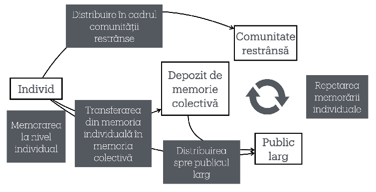
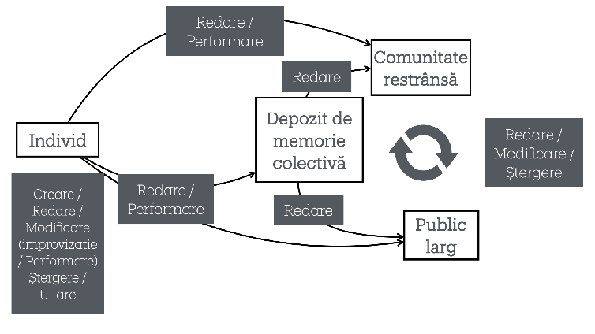
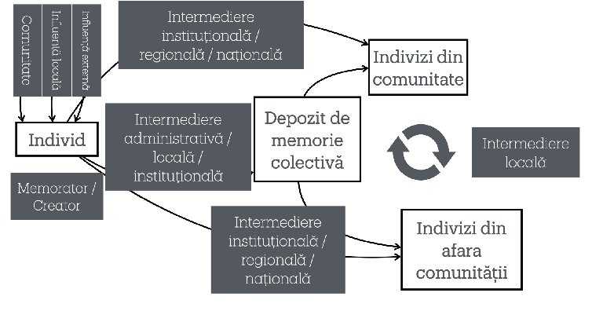

# PĂSTRAREA MEMORIEI IMATERIALE ÎN TRANSILVANIA ULTIMULUI SECOL. SCHIȚĂ ȘI JALOANE

Liviu POP*

Preserving the Intangible Memory in Transylvania of the Last Century: Outline and Milestones. (Abstract).

In recent decades, the preservation and transmission of intangible cultural memory have become subjects of major interest among researchers and cultural institutions. This concern is particularly relevant in the context of Transylvania, a region rich in traditions and customs that reflect its ethnic and historical diversity. This article explores the relationships between various entities and centers of influence in the conservation of intangible cultural heritage in Transylvania throughout the 20th century and the beginning of the 21st century, highlighting the importance of a coordinated and sustained approach to this topic.

Keywords: intangible cultural heritage, Transylvanian folklore, collective memory preservation, cultural transmission, ethnographic research methods.

Cuvinte cheie: patrimoniu cultural imaterial, folclor transilvănean, păstrarea memoriei colective, transmitere culturală, metode de cercetare etnografică

În urma deciziei luate în cadrul Institutului „Arhiva de Folclor a Academiei Române” de a aborda sistematic și de la un nivel macro evoluția culturii tradiționale din Transilvania în ultima sută de ani, am decis să-mi orientez efortul înspre partea care se ocupă cu elementele de patrimonializare a tradiției cu specific transilvan: strategii, metode, rezultate.

Înainte de a avansa în cercetarea propriu zisă am simțit nevoia să planific și testez felul în care voi face această cercetare în cadrul unui seminar IAFAR- întâlnirea lunară a Institutului, unde prezentăm temele de interes și de cercetare. Așadar ceea ce urmează este o prezentare a unei schițe de cercetare și a unor jaloane preliminare ale unui proces care ar trebui să se întindă pe câțiva ani de acum încolo.

Delimitarea temporară va fi una flexibilă, îmi voi îndrepta atenția spre păstrarea memoriei imateriale de la începutul sec. XX până la începutul sec. XXI, cu o variație de câteva decenii, în funcție de cât de relevant va fi materialul găsit.

Anul 1930 are o valoare simbolică aparte, fiind cel în care a fost întemeiată Arhiva de Folclor de Ion Mușlea și este un reper relevant pentru delimitarea temporară, dar nu unul rigid. Dar dincolo de delimitarea temporară, strădania va fi să abordez sistematic eforturile de păstrare și patrimonializare a memoriei imateriale și a multiplelor sale forme de manifestare.

* Institutul Arhiva de Folclor a Academiei Române, Cluj-Napoca.

Anuarul Arhivei de Folclor, nr. XXVIII, 2024, p. 27–34

Arealul memoriei imateriale și relația dintre memoria individuală și cea colectivă

Sunt mai multe axiome pe care le vom asuma în demersul nostru și cred că este util ca ele să fie cât mai explicite. Simplificarea și schițarea nu au rostul de a oferi sentințe absolute, și suntem conștienți de limitările lor, dar ne vor ajuta să abordăm un proces complex și greu de surprins mai ușor.

Ținem cont de apelul lui Ovidiu Bîrlea din Poetică folclorică să fim atenți la subtilitățile diverselor variante lirice, care pot scăpa unui ochi neatent și neobișnuit cu exprimarea populară, și, mai ales, luăm în serios gândurile despre influența oralității asupra formelor estetice:

„Condițiile specifice în care iau naștere și se propagă creațiile folclorice se răsfrâng cu prisosință în particularitățile lor poetice. Pentru a fi viabile, ele se supun anumitor tipare, îmbracă unele formule prin care se mențin mai tenace în memoria interpreților. [...] O consecința de căpetenie a oralității se vădește a fi polisemantismul unor producții folclorice în totalitatea lor sau în unele fragmente. Prin circulație, opera folclorică este supusă interpretării. Căci interpretul are, în genere, o atitudine de dominare față de ea, o crede un bun personal, făcut anume pentru a i se potrivi, de aceea, la nevoie, îi aduce schimbările necesare, întocmai ca o haină ce s-ar preface de la sine după moda și starea timpului.” 1

Relația dintre creatorul individual și memoria colectivă este una care necesită o atenție și mai detaliată pe parcursul cercetărilor ulterioare, dar vom porni de la o primă axiomă inspirată tot de Ovidiu Bârlea:

„Se știe că oamenii nu sunt unitar înzestrați, diferențierea există și acolo unde aceștia nu s-au specializat printr-o școală oarecare sau printr-o ucenicie pe lîngă cel cu experiență. Într-un sat, creaţia folclorică nu se află difuză, egal repartizată pe locuitori, aidoma unor simple obiecte circulatorii. Ceea ce se numește talent diversificä, uneori destul de profund, prezența repertoriului. Pe alocuri se constată chiar un fel de specializare. Folcloristul trebuie să-i detecteze pe acestia și să lucreze cu ei. 2

## Individ, depozit, comunitate, public

Vom merge chiar mai departe și vom afirma că orice fapt de memorare este profund individual. Pornind de la aceasta primă axiomă și de la stabilirea faptului că există depozite de memorie colectivă, vom încercă să facem o primă schițare a rapoartelor și proceselor care au loc între aceste două entități esențiale care duc la apariția memoriei imateriale colective. O primă schiță a acestor rapoarte ar putea arăta așa (Fig. 1):

- 1 Ovidiu Bîrlea, Poetică folclorică, București, Editura Univers, 1979, pp. 18–19.
- 2 Ovidiu Bîrlea, Metoda de cercetare a folclorului, București, Editura pentru Literatură, 1969, p. 49.

Fig. 1.

Am putea considera că orice fapt de memorare la nivel individual ajunge să se manifeste la nivelul comunității restrânse. Propriu zis orice element imaterial de cultură tradițională se manifestă în cadrul comunității restrânse și are valoare în primul rând în cadrul unei comunități.

Memorarea pe care o face un individ nu are doar o valoare personală, nu este doar pentru uz propriu, ci mai ales pentru comunitatea din care face parte. Prin oferirea de valoare a memorării individuale, care se produce cel mai adesea printr-o validare externă comunității, are loc un transfer spre un depozit de memorie.

Altfel spus, un bătrân sau o bătrână dintr-un sat cunoaște un cântec sau un dans anume. El îl cântă sau joacă pentru sătenii lui cu anumite ocazii, dar devine un bun într-un depozit de memorie colectivă în momentul când cineva din afara satului consideră că acel dans sau cântec are valoare dincolo de comunitatea restrânsă.

În urma validării memorării individuale prin depozitarea în depozitul de memorie colectivă, poate avea loc o distribuire spre exteriorul comunității restrânse, spre un public larg. Prin acest proces de distribuire, elementul imaterial memorat inițial este reținut în noi memorii individuale fie din comunitatea restrânsă, fie din publicul larg, ceea ce permite reluarea întregului proces de la capăt.

Ca să continuăm exemplificarea. după ce cântecul sau jocul a fost făcut public fie în cadrul satului sau pe o scenă din afara lui, alte persoane pot învăța pe de rost cântecul sau jocul, fie ele din sat sau din afara lui.

Depozitul de memorie colectivă poate fi definit ca orice formă sau structură creată cu scopul de a păstra memoria imaterială specifică unei comunități. O colecție de înregistrări audio video, o arhivă cu detalierea prin fișe de identitate sau cataloage care identifică precis elementul de memorie imaterială, o bibliotecă care conține monografii sau chiar și spații de artă care expun fotografii sau filmări dintr-un sat anume în urma unor practici artistice, toate pot fi considerate depozite de memorie colectivă.

Orice obiect material pe care este imprimată urma unui eveniment de cultură tradițională imaterială poate fi considerat element dintr-un depozit de memorie colectivă. Indiferent de forma de suport material, hârtie sau celuloid, CD sau document în cloud, atât timp cât intenția a fost de a păstra o urmă imaterială din cadrul unei comunități, aceste urme au o valoare pentru un depozit de memorie colectivă.

Este o schema foarte simplă, dar care ne permite să privim dintr-un prim unghi cum are loc păstrarea unor elemente imateriale în depozitele de memorie colectivă. Este evident că procesele reale și interacțiunile dintre entitățile delimitate sunt mult mai complexe, dar considerăm că ar putea fi un bun început pentru explorare.

Însă nu putem ignora un fapt bine cunoscut, anume că memorarea nu este una inactivă. Dimpotrivă, există o legătură puternică între memoria individuală și creativitate. Când vorbim de cultura tradițională imaterială, lucrurile sunt memorate, se transmit de la un individ la altul, de la o generație la alta, dar uneori intervine și creativitatea. Considerăm că nu există creativitate colectivă, ci momentele de creativitate au loc de fiecare dată la nivelul unor indivizi mai dăruiți, mai talentați.

Ca atare, trebuie să introducem și acest factor al creativității când încercăm să înțelegem felul în care este păstrată memoria imaterială. Elementul creativității ne obligă să reluăm felul în care înțelegem rapoartele dintre memoria individuală și depozitele de memorie colectivă.

## Creare, Redare, Modificare, Ștergere

Această perspectivă poate fi comparată cu procesele care pot avea loc în cadrul unei baze de date. Acronimul în limba engleză esteCRUD (Create, Read, Update, Delete) și ne permite să aprofundăm analiza proceselor care pot avea loc asupra memoriei imateriale. Proceselor din acronimul CRUD din engleză le-am putea substitui echivalentul lor în

română: Creare, Redare, Modificare, Ștergere. Prin aplicarea acestui filtru de analiză, putem deschide noi posibilități de analizare a interacțiunilor dintre individ și memoria colectivă. Vom relua schița de mai sus din perspectiva acestui nou filtru (Fig. 2).

Un individ este capabil să creeze, să modifice, să redea și să uite elemente de cultură imaterială. El va reda sau performa spre comunitatea restrânsă, publicul larg sau depozitul de memorie colectivă elementul de cultură imaterială. Dinspre depozitul de memorie se pot reda aceste elemente spre comunitatea restrânsă sau spre publicul larg, de unde pot avea loc procesele de redare, modificare sau ștergere. Nu mai putem vorbi de o creație nouă propriu-zisă din moment ce un element de memorie imaterială a trecut prin depozitul de memorie culturală sau a fost performat public, ci mai degrabă de o modificare.

Revenind la un exemplu concret putem spune că un sătean anume poate crea, modifica, cânta sau uita un cântec. Săteanul poate reda sau performa cântecul pentru comunitatea restrânsă, publicul larg sau depozitul de memorie colectivă. Redarea în fața unui public larg a cântecului poate fi punctuală sau repetată, cântecul putând servi fie ca sursă de inspirație, memorat ca atare sau uitat de indivizi din sat sau din afara satului.

## Intermedierea memoriei colective în contextul comunităților

O încercare de analizare a memoriei colective implică studierea relațiilor dintre actorii și procesele de intermediere care influențează atât crearea, cât și păstrarea acesteia. În acest context, este esențial să înțelegem că memoria colectivă nu se formează spontan, ci este mediată de diferite entități și influențe (Fig. 3).

Comunitatea din care face parte un individ exercită o presiune semnificativă asupra modului în care sunt create și transmise elementele de cultură tradițională. Un individ nu creează în izolare, ci în interacțiune cu normele și așteptările comunității.

Acest fenomen necesită o analiză detaliată a dinamicii dintre individ și comunitate, examinând modul în care această interacțiune influențează conservarea și evoluția culturii tradiționale. Pe lângă presiunea socială, mai intervine un fenomen discret: cel al uitării.

Uitarea joacă un rol crucial în selecția memoriei colective, ea putând fi naturală sau forțată, în funcție de contextul istoric și social. Există momente în istorie când uitarea selectivă devine preferabilă pentru comunitate. Uitarea forțată ridică întrebări privind libertatea de expresie a creatorilor populari anonimi și influența șabloanelor stilistice preexistente acceptate de comunitate. Uitarea naturală la rândul său necesită o analiză detaliată, Ovidiu Bârlea având rânduri foarte inspirate legate de felul în care se sapă în memoria informatorilor:

„culegătorul trebuie să ajungă la detectarea întregului repertoriu al speciei cercetate. Din acest punct de vedere, dificultățile sunt cu totul inegale, potrivit specificului fiecărui gen sau specie. Deoarece materialul folcloric este ascuns în memoria informatorilor sub o formă difuză care se manifestă destul de capricios și nu are o existență externă, obiectivă, descoperirea lui este mult mai anevoioasă decât cea a elementelor de cultură materială. [...] Practica a arătat că informatorul, la anchetă, își amintește un număr de piese, dar de obicei cele mai multe nu îi revin în memorie tocmai pentru că sunt solicitate în împrejurări neobișnuite.” 3

Dacă partea de capturare a elementelor de memorie imaterială are propriile sale dificultăți, nu înseamnă că tot ce se captează ajunge, de fapt, în depozitele de memorie colectivă. Elementele păstrate în aceste depozite sunt, de obicei, rezultatul unui proces deliberat de selecție și captare, guvernat de politici și planuri specifice.

O parte importantă a viitoarei cercetări va consta în investigarea politicilor care au guvernat păstrarea memoriei colective de-a lungul timpului. Ne propunem să înțelegem inclusiv suportul administrativ care a facilitat aceste eforturi.

Intermedierea memoriei colective este influențată de diverse structuri administrative și instituționale la nivel local, regional și național. Autoritățile cultural administrative decid adesea ce elemente sunt considerate valoroase și merită păstrate și publicate. Influențele externe, cum ar fi legislația și politicile naționale, joacă, de asemenea, un rol semnificativ în acest proces.

Intermedierea dintre creatorii individuali și depozitele de memorie colectivă este una complexă. Rareori un individ reușește să creeze un depozit de memorie colectivă de sine stătător, excepțiile fiind cazuri rare precum cel al Fundației Kallos de la Răscruci. Aceste relații și rapoarte vor fi analizate pe măsură ce se vor aduna urmele lăsate în arhive administrative disponibile în prezent. Ar fi ideal dacă ar putea fi suplimentate de mărturii orale, dar presupunem că acestea vor fi mai dificil de obținut.

Un alt aspect este cel legat de influențele care apar asupra creativității individuale și cenzurarea sau editarea acesteia de către comunitatea redusă. O primă sugestie adusă de Elena Bărbulescu în cadrul Seminarului IAFAR a fost să integrăm observațiile lui

- 3 Ibid., p. 74–75.

D.C. Amzăr4 legate de felul în care creațiile noi prezentate în timpul șezătorilor erau puternic editate și cenzurate de participanții la întâlnire.

Recensământ și cadre temporare Pentru cercetarea de lungă durată care ne așteaptă, acestea ar fi limite prime ale

unui cadru care ne-ar permite să abordăm fenomenul transferului din mintea unui om

– o memorie, un gând, un fapt creator – în memoria colectivă.

Vorbind tot despre limite, ar trebui să stabilim o demarcare temporară, o cronologie mai clara a perioadei incluse in analiza noastră. Chiar dacă sunt greu de stabilit linii de demarcare clare, una dintre dilemele care apar la o privire de ansamblu când vorbim de cultura imaterială a Transilvaniei este includerea sau excluderea a ceea ce rămas anterior anului 1918. Chiar dacă în ultimul secol Transilvania a făcut parte parțial sau integral fie din Ungaria, fie din România, cea mai mare schimbare a fost cea de după Primul Război Mondial. Ceea ce s-a păstrat anterior acestui an este greu de regăsit și greu de accesat fără ajutorul unor cercetători care cunosc bine limba maghiară. Fiind atât de dificilă cercetarea arhivelor de dinainte de 1918, propunem pentru început o cartare, pe cât posibilă, a instituțiilor care au avut rol de depozite de memorie colectivă.

De asemenea, considerăm utilă crearea unor fișe de identitate a depozitelor de memorie colectivă din Transilvania, care să ofere informații despre denumire, perioada în care au activat, sursele de finanțare, actele constitutive sau legile care au dus la apariția lor, localizarea geografică, evoluția de-a lungul perioadei de activitate, temele de interes cercetate, tipul colecțiilor, numărul documentelor, disponibilitatea lor, publicațiile importante legate de depozitul respectiv. O astfel de mapare a depozitelor de memorie ar fi vitală pentru a avea o vedere de ansamblu asupra a ceea ce s-a intenționat, capturat și păstrat de-a lungul timpului și pentru a vedea mai bine ce lipsește și ce ar fi util să fie capturat și păstrat pe viitor.

## Metodologie, bibliografie, stil

De-a lungul timpului, au existat diverse tendințe și modele științifice care au influențat procesele menționate anterior. Dacă la începutul secolului XX se discuta despre geografie umană și antropologie într-un mod diferit față de abordările actuale, modul în care au fost abordate folclorul și etnologia s-a schimbat semnificativ în ultimii 100 de ani. Vom încerca să surprindem evoluția aceasta și să marcăm momentele în care au avut loc schimbări de paradigmă.

Vom începe de la evaluarea bibliografiei și informațiilor disponibile, prin încercarea de a stabili fișele de identitate pentru entitățile care au activat în zona memoriei colective tradiționale. Un alt aspect, legat de publicul căruia îi sunt destinate rezultatele acestei cercetări, va fi, dincolo de abstractizare inițială, reducerea la minimum a abstractizării și a folosirii în special a analogiilor. Cred că aceasta este o metodă care permite realizarea

4 D.C. Amzăr, Sociologia șezătorii, în „Arhiva pentru Știința și Reforma Socială", Anul IX, nr. 4, 1931, p. 516–575.

unei cercetări oneste, dar și accesibile unui public mai larg. O atenție și un spațiu generos vor fi acordate fișelor de identitate a depozitelor de memorie colectivă.

În ceea ce privește bibliografia, aceasta este, în prezent, minimală și oarecum întâmplătoare, urmând să fie, evident, extinsă. Prezentele rânduri sunt doar gândurile inițiale privind modul în care intenționez să realizez cercetarea și evident, vor trebui să fie testate față în față cu materialul disponibil.

În fine, stilul dorit va fi unul riguros, dar accesibil unui public educat, curios și dornic să parcurgă o lucrare care va sumariza evoluția depozitelor de memorie tradițională colectivă de-a lungul secolului al XX-lea și începutul celui de-al XXI-lea. Limbajul tehnic va fi redus la minim și frazarea va fi concisă, adjectivele folosite cu precauție. În ce măsură planul acesta va reuși să fie transpus cu totul în practică, rămâne de văzut.

