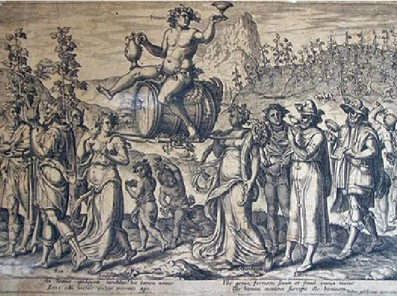
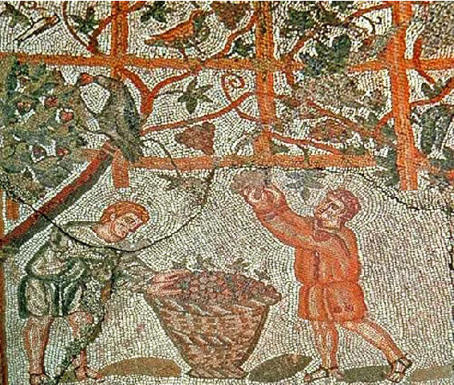
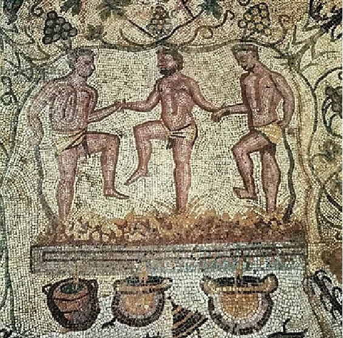
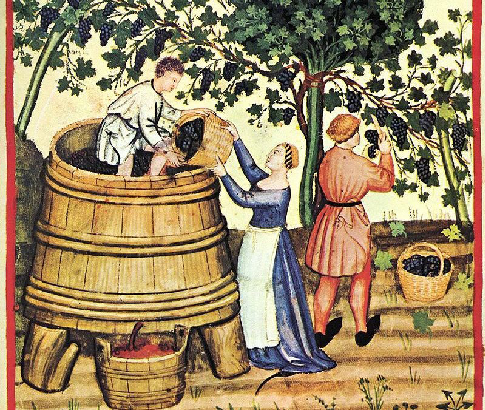
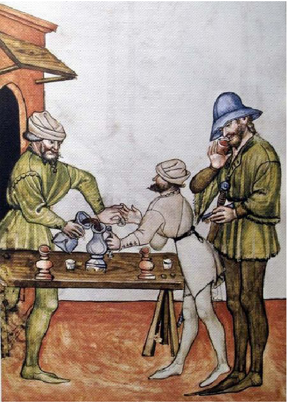

# CULESUL VIILOR ÎN TRADIȚIILE EUROPENE

Antoaneta OLTEANU*

Grape harvest in european traditions (Abstract)

This study is a fragment of a larger research on wine and viticulture in Romania. In this material I presented a short history of wine, with a greater emphasis on the celebrations occasioned by this culture, on the existing popular traditions of cutting the vines, picking them and especially on the production of wine. Even if it is only a few cultural areas researched, one can see a certain common heritage coming from the great civilizations that knew the vine and wine. We note from the beginning the use of the drink especially in religious ceremonies and in funeral rituals, to then reach consumption on a wider scale. It was then used as a medical remedy, then for profane consumption. Later, in Europe, echoes of Dionysian-reminiscent processions were preserved: processions of participants, the election of a king of the feast, feasts and supported consumption of wine, even allegorical chariots, which were organized during the grape harvest.

Keywords: grape harvest, winemaking, ceremonial consumption, profan consumption, allegorical processions.

Cuvinte-cheie: culesul viilor, consum ceremonial, consum profan, procesiuni alegorice.

Studiul acesta este un fragment dintr-o cercetare mai mare asupra vinului și viticulturii în România. În acest material va fi prezentată o scurtă istorie a vinului, cu un accent mai mare pus pe sărbătorile prilejuite de această cultură, pe tradițiile populare existente la tăiatul viilor, culesul lor și mai ales la producerea mustului/ vinului. Chiar dacă este vorba doar de câteva zone culturale cercetate, se poate vedea o anumită moștenire comună ce vine de la marile civilizații care cunoșteau vița-de-vie și vinul. Remarcăm de la început folosirea băuturii cu deosebire în ceremonii religioase și în ritualurile funerare, pentru a se ajunge mai apoi la un consum pe o scară mai largă. Se folosea apoi ca remediu medical, pentru consumul profan.

Este greu de spus care este patria de origine a vinului și civilizații vechi, unele după altele, vor să și-o revendice.

Dovezile arheologice indică faptul că vinul a fost produs pentru prima dată în China în jurul anului 7000 î.Hr., urmată de Armenia și Georgia, în jurul anilor 6100–6000 î.Hr. Din datele specialiștilor1, totuși chinezii sunt cei care își apără întâietatea – prima băutură alcoolică din lume a fost înregistrată în cca 7000 î.Hr. în China, la Jiahu, provincia Henan. În borcane de lut din perioada neoliticului timpuriu s-a descoperit o băutură fermentată

* Universitatea din București. 1 Patrick McGovern, Chemical Identification and Cultural Implications of a Mixed Fermented Beverage from Late Prehistoric China, în „Asian Perspectives”, 44, 2005, p. 249–275 (with A. P. Underhill, H. Fang, F. Luan, G. R. Hall, H. Yu, C.-s. Wang, F. Cai, Z. Zhao and G. M. Feinman).

Anuarul Arhivei de Folclor, nr. XXVIII, 2024, p. 131–141

din struguri (soiuri Vitis amurensis, Vitis thunbergii), la care se mai adăugaseră orez, miere și fructe de pădure. Ca și în cazul altor civilizații vechi, cum vom vedea, acest tip de băutură era folosită la înmormântare și în cazul altor ceremonii religioase.

Cea mai veche cramă din lume ar data din Armenia, din anul 6100 î.Hr., fiind amplasată într-o peșteră din munți. Situl descoperit în anul 2016 cuprinde o serie întreagă de accesorii specifice folosite la producerea vinului: boluri, cești de băut, un teasc de struguri, borcane de fermentare. Aici soiul folosit era Vitis vinifera, întâlnit la majoritatea vinurilor de azi. Se presupune că vinul produs aici ar fi fost similar cu un vin roșu nefiltrat, apropiat de un Merlot. Folosirea vinului avea și aici un caracter funerar, lucru demonstrat și de faptul că în acea peșteră se aflase cândva un cimitir important2.

Un alt mare producător de vinuri a fost Egiptul. Se făcea tot vin roșu, păstrat în amfore speciale, cu gât îngust și mânere. La egipteni licoarea aceasta prețioasă era permisă numai preoților, dar se pare că vase cu vin erau puse și în morminte. Tradiția spune că băutura a fost descoperită chiar de către Osiris. Vechile morminte egiptene sunt pline de scene în care sunt văzuți oameni care culeg struguri, îi strivesc și mai apoi îi pun în amfore pentru a sta la fermentat. Scene de viticultură și vinificație erau reprezentate pe pereții mormintelor private din perioada Vechiului Regat (2575–2150 î.Hr.) și, în ultima perioadă, în perioada Regatului Nou (1539–1075 î.Hr.), borcanele de vin includeau anul recoltei, dreptul de proprietate, calitatea și numele vinificatorului. Vinul era folosit în principal la înmormântări, ca peste tot, și datorită asemănării lui cu sângele. Vinul avea semnificație religioasă, era oferit morților pentru viața lor de apoi, iar vinul se numără printre ofrandele funerare menționate în Textele Piramidelor, fiind băutura principală după înălțarea regelui la cer3. De aceea era pus în legătură cu marele zeu Osiris, zeul învierii. Mai apoi, în sferă profană, a fost folosit și în scopuri medicinale, dar tot în legătură cu ideea de simbol al vieții. Egiptenii însă, tot pe baza dovezilor arheologice, foloseau cu mare plăcere și vinul alb (câteva amfore cu acest tip de vin au fost descoperite în mormântul lui Tutankamon. La egipteni licoarea aceasta prețioasă era permisă numai preoților, dar se pare că vase cu vin erau puse și în morminte. Tradiția spune că băutura a fost descoperită chiar de către Osiris. Ofrande de vin aduse zeilor făcute de faraon erau adesea pictate pe pereții templelor egiptene, înregistrând detalii despre festivaluri precum Heb-Sed și sărbătorirea de Anul Nou a inundației Nilului, precum și ceremoniile de încoronare. Bacchanalele egiptene, puse sub semnul lunii noi și lunii pline implicau beția rituală.

Din Egipt Dionysos își face intrarea în Creta și, mai apoi în Grecia. Vinul era, pe de o parte, nectar al zeilor, dar, în ritualurile dionisiace, orgiastice, nu era vorba numai de libații în onoarea divinității. Starea de beție, de intoxicare era considerată sacră. Oamenii încercau să intre într-un fel de transă în care atingeau o uniune perfectă cu divinul – printr-o moarte aparentă (nu de puține ori se foloseau, împreună cu vinul, și o serie de substanțe interzise, precum canabis, hașiș sau smirnă, care-i treceau pe oameni

- 2 https://example.com science-ucla.
- 3 Maria Rosa Guasch-Jané, Cristina Andrés-Lacueva, Olga Jáuregui, Rosa M. Lamuela-Raventós, First evidence of white wine in ancient Egypt from Tutankhamun’s tomb, în „Journal of Archaeological Studies”, vol. 33, issue 8, august 2006, p.1075–1080.

prin „moarte” pentru a fi aduși la viață de zeul vieții4. Strugurii se culegeau în coșuri de răchită, iar mai apoi erau zdrobiți; mustul obținut erau pus în borcane mari de pământ, pithoi, asemănătoare amforelor egiptene.

Grecii cunoșteau mai multe sărbători consacrate fertilității pământului, închinate Demetrei, Corei și lui Dionysos (Haloa, la granița dintre lunile noiembrie și decembrie; Donisiile (decembrie, cele mici, din mediul rural, și cele mari, din ianuarie). Erau prezentate scene din viața divinității și aveau loc tot felul de jocuri. Evident, fiind sărbători religioase, nu avea cum să lipsească procesiunile spre templele lui Dionysos. Cu ocazia aceasta se duceau ofrande specifice: capre, vin, produse de panificație. Participanții la procesiune duceau crengi de viță, ghirlande de smochine, alături de nelipsita reprezentare a falusului, care nu s-a păstrat mai apoi în tradițiile celor care sărbătoreau bunul mers al lucrurilor în vie (Fig. 1).

Fig. 1. Puterea vinului (după Philip Galle, Gerard Groenning, Puterea vinului, 1574).

La grecii antici serbările culesului în luna octombrie durau zece zile. Se organizau cu această ocazie procesiuni religioase, care alegorice, concursuri și jocuri olimpice, gustări de vinuri ș.a. Tot atunci se țineau bâlciurile, unde străinii veniți, cunoscând recolta, puteau angaja cantitățile trebuitoare. Carul alegoric era alcătuit în mod artistic. Deasupra trona un figurant reprezentând pe Dionysos, zeul naturii, al reînvierii vegetației, preamărețul zeu al viei și al vinului. Pe cap acesta purta o cunună împletită din lăstari de viță, împodobită cu ciorchini. În mână ținea câteva mlădițe de struguri sau o cupă cu vin5.

- 4 V. și Massimo Donà, Filosofia vinului, Ed. Art, București, 2010, p. 19–22.
- 5 I.C. Teodorescu, Culesul viilor, în vol. Viile noastre. Conferințe la radio, Cartea Românească, București, 1935, p. 34.

În Roma antică, deși era folosit în continuare și în scop religios, consumul profan era din ce în ce mai răspândit, fiind experimentat cu plăcere nu numai de nobili, dar și de săraci, de bărbați cu precădere. Printre vinurile de calitate inferioară, accesibile maselor, se numărau: mustum (era amestecat cu oțet și se bea proaspăt după presare), mulsum (îndulcit cu miere),lora (era un vin amar ce se obținea din boască – resturile de struguri

- rămase în urma presării), posca (vin oțețit amestecat cu apă, pentru a se tăia amăreala), vinum Praeliganeum (obținut din struguri de proastă calitate și copți incomplet, se făcea înainte de culesul obișnuit al viilor)6. Alte sortimente de vin: Vinum Dulce – făcut din struguri uscați, presați la soare; Vinum Diachtytum – tot un fel de vin dulce, dar în acest caz strugurii erau lăsați la uscat la soare mai mult timp; Passum – vin din stafide (cea mai bună calitate a lor se găsea în Creta); Vinum Pramnian – vin grecesc sec, astringent și foarte tare; vin de Falerno – vin foarte apreciat, băut mai ales de către nobili; era învechit zece sau chiar douăzeci de ani, ajungând până la un conținut de 16% alcool. Un alt vin preferat al nobililor era cel de Alba, cunoscut în numeroase variante, de la dulce, demidulce, demi-sec și sec, de preferat cu o vechime de cincisprezece ani.

În același timp, vinurile romane se consumau de cele mai multe ori în combinație cu mai multe arome: puteau fi amestecate cu miere, apă sărată, plante aromate și condimente. Pentru a reduce aciditatea se folosea creta. Una dintre cele mai importante surse pentru vinificația din Roma antică este oferită de Columella, în De Re Rusticae, în carte sunt multe informații despre cultivarea viței de vie, producția de vin și, bineînțeles, consum.

În Italia, înainte de a ajunge grecii acolo, se cultivau sortimente înalte de viță de vie ce creșteau ridicate în pomi sau pe bolți înalte. De la Plinius aflăm că era destul de riscant să fii culegător de struguri pe atunci, fiind multe accidente mortale (drept pentru care proprietarul viei avea obligația să suporte cheltuielile de înmormântare pentru culegători)7.

De-a lungul vremii s-au luat mai multe măsuri pentru a generaliza acest nou tip de plantație adus de greci, la nivelul solului: era mare nevoie de vin, dar cantitățile existente erau mereu insuficiente. Se spune că regele Numa a interzis să se mai folosească vinul din cultura veche (mai acru și mai slab) în libațiile aduse zeilor.

Mustul era obținut chiar la vie: era călcat în picioare numai de bărbați (se credea că este o treabă de bărbați, femeile nu se cuveneau să facă asta) (Fig. 2–3).

Interesant este că, dincolo de această sărbătoare mai degrabă citadină și publică, a Bachanalelor, exista o sărbătoare de mai mică amploare, Medritinalele, celebrată pe 11 octombrie, în onoarea zeiței Medritina, căreia i se oferea vin vechi și vin nou, considerate leacuri pentru toate bolile. „În această zi, gustându-se vinul, se pronunța următoarea formulă: „Beau vinul cel vechi și pe cel nou ca să-mi lecuiesc boala de care sufăr și pe cea care ar mai veni”8.

La un moment dat, se spune că femeile nu aveau voie să bea vin. Vechii istorici aduc în prim plan numeroase istorii care confirmă acest fapt, prin existența unor practici cel puțin ridicole: „Se spune că moda sărutului a fost obligatoriu impusă la romani pentru ca soțul sau rudele să poată constata dacă nu cumva soția ar fi băut vin. De aceea, ori de

- 6 Patrick McGovern, op. cit.
- 7 Apud I.C. Teodorescu, op. cit., p. 37.
- 8 Ibidem, p. 38.

Fig. 2. Culesul viilor. Mozaic roman de la Cherchell (Algeria).

Fig. 3. Călcatul strugurilor la romani. Secolul al III-lea, mozaic roman de la Merida (Spania).

câte ori aceasta se întâlnea cu bărbatul sau cu rudele de orice vârstă și în orice împrejurare trebuia să se sărute. Bărbatul, spune Cato cel Bătrân, este judecătorul și cenzorul femeii sale: puterea lui este fără apel: dacă ea s-a purtat rău, o pedepsește, dacă a băut vin sau a comis adulter o omoară”9. O istorie în acest sens este spusă și de Pliniu.Ius osculi (dreptul

- sărutului pe buze) era o lege care dorea să păstreze echilibrul și armonia în familia romană, apărând virtutea femeilor oneste și drepturile bărbaților care întemeiază un nucleu familial. Controlul soției, fiicei sau surorii se făcea foarte simplu, prin acest sărut de probă. Apoi capul familiei organiza un consiliu al familiei la care participau bărbații din neam, pentru a stabili dacă persoana suspectă a comis un adulter sau dacă a băut vin; în uma judecății se stabilea dacă femeia repectivă trebuia repudiată sau condamnată la moarte. Tocmai pentru a se respecta o asemenea situație, stăpâna casei, matrona romana, care deținea de altfel cheile de la toate încăperile din gospodărie, nu se putea atinge de cheia de la crama sau cămara cu vin.

Care erau motivațiile unui asemenea comportament? Vinul nu era bun pentru femeie, pentru că, dacă îl consuma, și-ar fi pierdut controlul și ar fi fost mai dispusă la un act adulterin; nici aspectul dezlegării limbii – femeia ar fi mai vorbăreață, mai cicălitoare – nu era de dorit; de asemnea comportamentul ei putea căpăta note lascive, indecente sau chiar vulgare, incompatibile cu comportamentul unei femei de neam. Și pentru că legea vorbea de întemeierea nucleului familial, se mai credea că alcoolul ar contribui la producerea avortului spontan, el având proprietăți anticoncepționale. Așa cum vedem, doar pentru aristocrație era o problemă consumul de vin (din motive de sănătate, mai târziu, sub supravegherea medicului, și aceste femei puteau consuma vin, în componența unor decocturi sau a unor preparate cu efecte analgezice). Societatea romană avea însă și alte straturi mai vesele, mai colorate, unde vinul se bea cu multă bucurie. Era vorba de femei ușoare, actrițe, dansatoare, hangițe, ospătărițe.

Mai târziu, în Europa, s-au păstrat ecouri ale procesiunilor cu reminiscențe dionisiace: alaiuri de participanți, alegerea unui rege al sărbătorii, ospețe și consum susținut de vin, chiar care alegorice, care se organizau în perioada culesului viilor.

La grecii moderni protectorul viticultorilor (dar și al agricultorilor) era Sf. Trifon, care chiar era reprezentat în icoane cu un cuțit pentru tăierea copacilor. De ziua lui se făcea la biserică agheasmă cu care se stropeau viile și grădinile de legume10.

În societatea tradițională grecească vorbim tot despre o sărbătoare a colectivității, de întrajutorare, răsplătită de proprietarul viei cu mâncare și muzică pentru culegători. În prima și ultima zi a culesului se organiza o petrecere mare cu dansuri, în piața centrală a satului, la care participau toți. Uneori tratațiile se făceeau pe loc, la vie, unde se frigeau miei pentru lucrători (de exemplu, în Arcadia, din Peloponez). În regiunile din nord-est, în regiunea istorică a Traciei, s-au păstrat până mai târziu ecouri ale vechilor dionisii: ultimii ciorchini de struguri culeși erau puși într-un car tras de boi; erau împodobiți cu flori. Carul, însoțit de culegători, muzicanți, trecea prin tot satul; din loc în loc fete împodobite cu flori dansau și cântau11.

- 9 Apud I.C. Teodorescu, op.cit., p. 37.
- 10 Iu.V. Ivanova, Greki, în Kalendarnîe obîceai i obriadî v stranah zarubejnoi Evropî. Koneț XIX – nacealo XX v. Vesennie prazdniki ( red. S.A. Tokarev), Moscova, Nauka, 1977, p. 322.
- 11 Ibidem, p. 279.

La francezi pentru viticultori prima ieșire în vie era tot de 2 februarie, considerată ziua purificării și a lumânărilor (Jour de la Purification, Jour de la Chandeleur). Lumânările aprinse în această zi la biserică erau păstrate tot timpul anului, pentru că puteau păzi de boli, necazuri, fulgere și piatră. În Burgundia însă, protector al viticultorilor și agricultorilor era considerat Sf. Blaise (3 februarie) și de ziua lui oamenii ieșeau la vie. Oricum ar fi, era obligatoriu ca tăiatul viei să fie încheiat până pe 12 martie, de Sf. Grigore12. Când se apropia culesul viilor, la sfârșitul lui august sau începutul lui septembrie, oamenii făceau și ei colivă de struguri dusă la biserică.

„Începutul culesului era anunțat într-un mod deosebit: pe un car alegoric – la rigoare, o simplă targă – se așeza un strugure artificial de dimensiuni uriașe, împodobit cu lăstari, susținut cu haraci, împodobit cu cosoare și scule din gospodăria viticolă. Cu muzică și mare alai cortegiul străbătea străzile localității, vestind astfel fericitul eveniment”13 (Fig. 4).

Fig. 4. Producerea vinului (după Tacuinum Sanitatis, Casanatense 4182, secolul al XIV-lea).

Pentru că podgoriile erau mari, era nevoie nu numai de ajutorul rudelor, vecinilor, ci se apela și la zilieri. Momentul culminant al culesului era acela când venea de la câmp ultimul car încărcat cu struguri. Carul, împodobit cu struguri, crengi de verdeață și flori, era însoțit de un alai de mascați din rândul culegătorilor. Acasă pe toți îi aștepta o masă bogată cu preparate din carne și vin14.

Acum câteva sute de ani, la francezi, cel mai de frunte podgorean era răsplătit cu o statuie a Sf. Vincențiu, apărătorul viilor, făcută de întreaga comunitate. Înainte de a se începe culesul toate persoanele implicate în procesul producerii vinului performau un

- 12 L.V. Pokrovskaia, Narodî Franții, în Kalendarnîe obîceai i obriadî v stranah zarubejnoi Evropî..., p. 31.
- 13 Apud I.C. Teodorescu, op. cit., p. 38.
- 14 L.V. Pokrovskaia, op. cit., p. 33.

colind, la fiecare cramă, urându-se roade bogate. La final se făcea o masă comună, apoi oamenii petreceau și dansau. Cel care fusese ales cel mai bun podgorean stabilea ziua începerii culesului pentru fiecare vie din regiune. În unele zone momentul colindatului se făcea odată cu încheierea zdrobirii strugurilor. Ultimul must obținut erau celebrat cu alaiuri de participanți care cântau cântece de laudă pentru proprietarul viei. Acesta era urcat pe un butoi, ca pe tron, era purtat în brațe și i se ofereau buchete de flori. Uneori buchetele erau puse la ușa cramei unde se făcuse zdrobirea15.

Un alt moment important era cel al facerii noului vin. Vecinii tot gustau unii de la alții, pentru a vedea cine are vinul cel mai bun din acel an. Grupuri de tineri mergeau seara de la o gospodărie la alta, făcând această degustare și petrecând. Momentul acesta era făcut mai apoi, în orașele mai mari, odată cu organizarea unor mari târguri unde se organizau reprezentații populare, dar și degustări și, de ce nu, se realiza și o mare parte a vânzării noii producții de vin. Unul dintre aceste orașe era Dijon16 (Fig. 5).

Fig. 5. Negustorul de vin (după Tacuinum Sanitatis, secolul al XIV-lea, Paris).

- 15 Ibidem.
- 16 Ibidem, p. 34.

Și în Elveția, la Vevey, existau reminiscențe ale acestor carnavaluri viticole. Cândva se organizau anual, mai târziu se organizau manifestări grandioase doar la cincisprezece ani: „Pe lângă carele alegorice reprezentând Arca lui Noe, cortegiul lui Bacchus, anotimpurile, scene de cules, diverse corporațiuni ș.a. figurează numeroase scene de balet în legătură cu momentele vieții din podgorie. Programul se încheie cu o nuntă țărănească. Timp de cinci până la nouă zile cât țin serbările întregi alaiuri defilează în localitate”17.

La austrieci un moment important în calendarul viticol îl constituia triada 12–14 mai, zilele consacrate sfinților Bonifaciu, Pancrațiu și Servatius. Despre ei se crede că sunt adevărați hoți ai vinului, pentru că de zilele lor pot fi înghețuri distrugătoare. De aceea în vii se punea pază, în cazul scăderii puternice a temperaturii, se trăgea cu pușca și se bătea clopotul pentru a-i chema pe oameni să aprindă focuri în vii18. Credințe asemănătoare erau și în Elveția.

Un alt moment de cotitură era ziua de 25 mai, a Sf. Urban. Pentru că acum înflorea vița de vie, numele sfântului a fost pus în legătură cu protecția acestei vegetații. Ca să nu aibă parte de ploi în aceste momente, oamenii aduceau ofrande de struguri la biserică; dacă sfântul nu îi ajuta, era obiceiul să fie pedepsit: statuia lui era aruncată în apă19. Aici culesul viei avea loc în octombrie. Un ceremonial interesant cu ocazia culesului îl reprezenta alegerea păzitorilor viei, funcție considerată de mare onoare. Paznicul, îmbrăcat în costum medieval al breslei viticultorilor, mergea solemn prin sat. Un semn distinctiv îl constituia o căciulă de blană împodobită cu pene de cocoș și cozi de vulpe; în mână ținea o sabie sau o halebardă. La finalul culesului se organiza un alai vesel prin sat, ce însoțea un car frumos decorat cu crengi de viță. Uneori exista și o figurină în forță de țap (un suport din lemn), împodobită cu ciorchini de struguri, beteală și mere. Evident, după aceea avea loc și tradiția, comună, a degustării noii producții de vin. Casele primitoare puneau pe poartă o coroană de frunze de viță-de-vie și doritorii intrau acolo și erau serviți cu un pahar de vin. În aceste gospodării putea să aibă loc și o distracție mai serioasă, pentru că apăreau și cântăreți și dansatori populari și cheful se mărea20.

Cehii din sud și slovacii, în regiunile viticole, aveau și ei câteva tradiții interesante ce începeau de la Sf. Maria și durau până pe 15 septembrie. Era vorba de practici pentru paza și asigurarea unor roade bune la cules. În vii avea loc obiceiul marcării loturilor: reprezentanți ai administrației sătești și paznicii viilor puneau un simbol pentru a păzi recoltele, un lemn înalt, pe un deal sau pe drumul care ducea la vii. Lemnul semăna oarecum cu arborele de mai: era un trunchi de lemn înalt care avea în vârf un buchețel de flori sfințit la biserică sau de cereale, alteori o cruce cu trei mere – toate simboluri ale fertilității. Pentru a înfige trunchiul se săpa o groapă în care erau puși cei mai buni struguri copți atunci, în calitate de ofrandă. Alături se făcea un foc pe care se ardea pomul de anul trecut. Noul pom era stropit cu agheasmă și înfășurat cu ierburi. După ce trunchiul era fixat, bărbații trăgeau cu pușca în toate diecțiile pentru a alunga duhurile. Se adresau pe loc rugăciuni patronului, Sf. Urban, pentru a păzi recolta; se făceau de asemenea liturghii și pentru proprietarii de vii care nu mai prinseseră noul sezon viticol. Din acel moment

- 17 Apud I.C. Teodorescu, op. cit., p. 38.
- 18 M. Listova, Avstriițî, în Kalendarnîe obîceai i obriadî v stranah zarubejnoi Evropî..., p. 173.
- 19 Ibidem.
- 20 Ibidem, p. 150–151.

niciun străin nu avea voie să se ducă la vii. Finalul serbării era marcat de o masă comună în jurul focului21.

Și la maghiari culesul viei era o sărbătoare comună, la care participau rude și vecini; marii viticultori angajau chiar culegători din afară pentru a face față recoltelor. Când culesul se încheia, se aducea din vie un ciorchine uriaș care era dus acasă pe niște suporți din lemn. În fața alaiului festiv venea o orchestră de lăutari, apoi două persoane comice îmbrăcate ciudat, unul sau doi purtători de steaguri, culegătorii, după care urmau fete îmbrăcate în alb, cu cununi din flori de câmp. În alte regiuni alaiul era deschis de tineri în straie naționale, călări, fetele venind după ei în care frumos împodobite. Toți participanții erau puși la masă și ospătați cu papricaș din carne de oaie. Pentru dansuri se organiza un chioșc sau o sală specială, împodobită cu corzi de viță atârnate de tavan, prilej pentru tineri pentru a se întrece în abilitate, rupând de acolo ciorchini pentru iubitele lor. Dacă erau prinși că fac asta, trebuia să plătească pentru strugurii „furați”22. Pentru a-și face reclamă, asemenea spectacole erau organizate la oraș de către cârciumari, bucurându-se de mare succes.

La bulgari, ca și la români, prima ieșire la vie era programată pentru 1 februarie, de Trifun Zarezan. Bărbații trebuia să taie simbolic câteva crengi de viță – de undeva de la marginea plantației sau din mijlocul ei. Dis-de-dimineață, se tăiau una sau trei coarde de la același butuc sau câte o coardă de la trei butuci. După această operațiune proprietarul viei stropea rădăcina cu vin sau agheasmă, uneori presăra și cenușă. În sudul Bulgariei era nevoie de doi participanți, pentru că operațiunea presupunea un dialog ce activa o formulă magică de obținere de roade bune de la vie. Partea a doua a ceremoniei era una colectivă: petrecerea și alegerea împăratului viei (în Bulgaria de nord-est, sud și sud-vest). Alegerea se făcea fie în vie, fie în sat, lângă masa mare. Împăratul era ales cel mai bun viticultor: i se punea pe cap o coroană din crengi de viță-de-vie. Coroane făceau și ceilalți viticultori: erau agățate mai apoi pe ușile hambarelor, pentru a avea roade bune în gospodărie. Împăratul era purtat într-o căruță trasă de bărbați sau pe umeri, până în sat sau prin sat, dacă practica se desfășura deja acolo. Împăratul, însoțit de câțiva bărbați, mergea mai apoi pe la toate casele din sat, unde erau serviți cu vin. Împăratul era stropit chiar cu vin, pentru a avea parte în noul an de mulți struguri și vin. Seara împăratul dădea o masă pentru bărbați, acasă la el. Petrecerea se încheia cu o horă în piața centrală23.

Ecouri mai consistente despre tradițiile de la culesul strugurilor întâlnim tot la bulgari. Și aici aveam de-a face cu o sărbătoare a întregului sat, în a doua jumătate a lui septembrie (14 septembrie era numită, ca la români, Kărstov den, Ziua Crucii), continuând și în octombrie, dacă era nevoie. Un crainic trecea prin sat cu o tobă și anunța începutul culesului viei. Zilele (și nopțile culesului) erau pentru tot satul

- o mare sărbătoare: toți aveau porțile deschise și musafirii erau primiți oricând cu bucate gustose și generoase și, bineînțeles, vin. Trebuie reținut că la bulagri s-au păstrat reminiscențe clare ale mesei rituale făcute cu această ocazie: existau colaci speciali, cu
- o formă anumită și decorațiuni simbolice; se sacrifica un animal, fiert fără niciun fel de

- 21 N.N. Grațianskaia, Cehi i slovaki, în Kalendarnîe obîceai i obriadî v stranah zarubejnoi Evropî.., p. 192.
- 22 T. Dömötör, Vengrî, în Kalendarnîe obîceai i obriadî v stranah zarubejnoi Evropî..., p. 169.
- 23 T.A. Koleva, Bolgarî, în Kalendarnîe obîceai i obriadî v stranah zarubejnoi Evropî..., p. 274–275.

condimente, în cadrul kurbanului. Și, evident, în cadrul magiei primei zile, de pe masă nu trebuia să lipsească produsele de sezon, pentru a avea parte de roade și mai bune anul viitor: fructe, stuguri, vin. La final, un moment important al ceremoniei colective îl constituia hora satului. De multe ori în aceste zile se organizau și târguri, așa că distracțiile erau numeroase24.

24 L.V. Markova, Bolgarî, în Kalendarnîe obîceai i obriadî v stranah zarubejnoi Evropî. Koneț XIX – nacealo XX v. Letne-osennie prazdniki ( red. S.A. Tokarev), Moscova, Nauka, 1978, p. 238.

