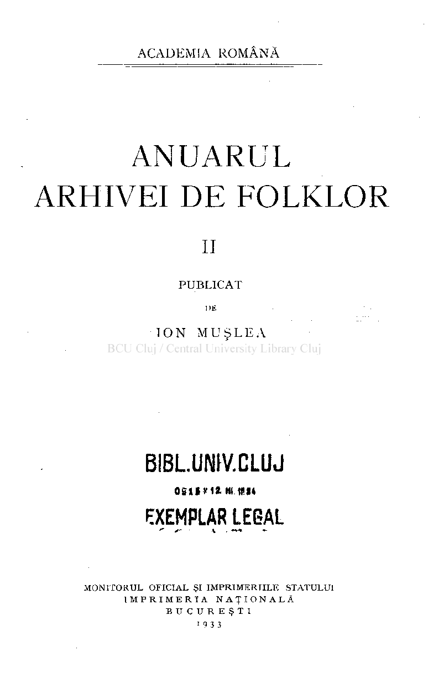

# ANUARUL ARHIVEI DE FOLKLOR

### II

PUBLICA T

IO N MUŞLE A

## BIBLUMV.CLUJ

OBIIV U HI M i

#### EXEMPLAR LEGAL

MONITORU L OFICIA L Ş I IMPRIMERIIL E STATULU I IMPRIMERI A NAŢIONAL A

BUCUREŞT I

###### 9 3 3

1

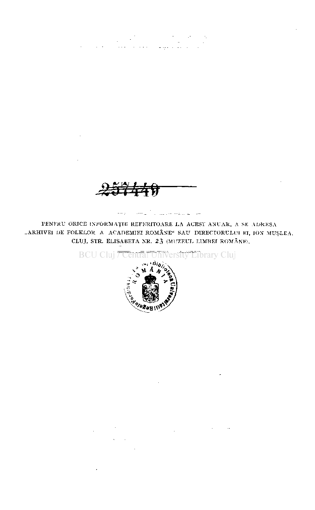

###### PENTRU ORICE INFORMAŢIE REFERITOARE LA ACEST ANUAR, A SK ADRESA .ARHIVEI DE FOLKXOR A ACADEMIEI ROMÂNE" SAU DIRECTORULUI EI, ION MUŞLEA, CLUJ, STR. ELISABETA NR. 23 (MUZEUL L1MBEI ROMÂNE).

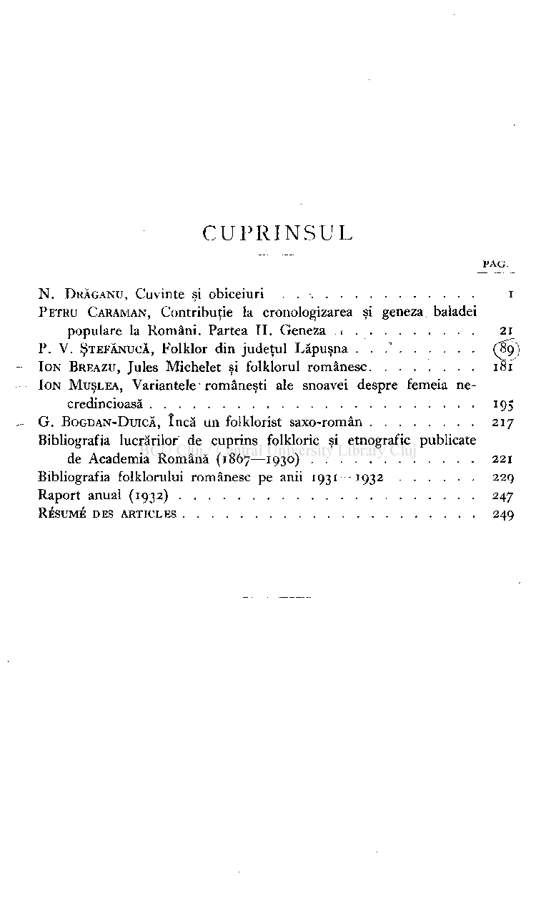

##### CUPRINSU L

###### PAG.

N. DRAGANU, Cuvinte şi obiceiuri . i PETRU CARAMAN, Contribuţie la cronologizarea şi geneza^ baladei

populare la Români. Partea II Geneza i 21 P. V. ŞTEFĂNUCĂ, Folklor din judeţul Lăpuşna ... " (§9) ION BREAZU, Jules Michelet şi folklorul românesc 181 ION MUŞLEA, Variantele ' româneşti ale snoavei despre femeia ne­

credincioasă 195 G. BOGDAN-DUICĂ, încă un folklorist saxo-român 217 Bibliografia lucrărilor de cuprins folkloric şi etnografic publicate

de Academia Română (1867—1930) 221 Bibliografia folklorului românesc pe anii 1931—1932 229 Raport anual (1932) 247

RÉSUMÉ DES ARTICLES 249

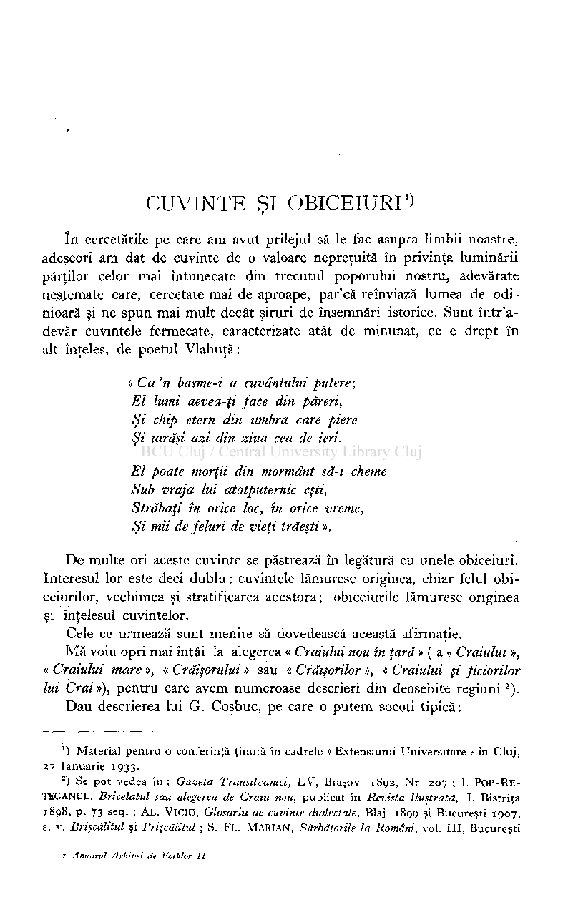

##### CUVINTE ŞI OBICEIURI

##### )

1

în cercetările pe care am avut prilejul să le fac asupra limbii noastre, adeseori am dat de cuvinte de o valoare nepreţuită în privinţa luminării părţilor celor mai întunecate din trecutul poporului nostru, adevărate nestemate care, cercetate mai de aproape, par'că reînviază lumea de odinioară şi ne spun mai mult decât şiruri de însemnări istorice. Sunt într'adevăr cuvintele fermecate, caracterizate atât de minunat, ce e drept în alt înţeles, de poetul Vlahuţă:

« Ca 'n basme-i a cuvântului putere ; El lumi aevea-ţi face din păreri, Şi chip etern din timbra care piere Şi iarăşi azi din ziua cea de ieri.

El poate morţii din mormânt să-i cheme Sub maja lui atotputernic eşti, Străbaţi în orice loc, în orice vreme, Şi mii de feluri de vieţi trăeşti ».

De multe ori aceste cuvinte se păstrează în legătură cu unele obiceiuri. Interesul lor este deci dublu: cuvintele lămuresc originea, chiar felul obiceiurilor, vechimea şi stratificarea acestora; obiceiurile lămuresc originea şi înţelesul cuvintelor.

Cele ce urmează sunt menite să dovedească această afirmaţie. Mă voiu opri mai întâi la alegerea « Craiului nou în ţară » ( a « Craiului »,

« Craiului mare », « Crăişorului » sau « Crăişorilor », « Craiului şi ficiorilor lui Crai »), pentru care avem numeroase descrieri din deosebite regiuni

). Dau descrierea lui G. Coşbuc, pe care o putem socoti tipică:

2

###### ) Material pentru o conferinţă ţinută în cadrele « Extensiunii Universitare » în Cluj , 2 7 Ianuarie 1933 .

1

) S e pot vedea în : Gazeta Transilvaniei, LV, Braşov 1892 , Nr . 20 7 ; I. POP-RE TEGANUL, Bricelatul sau alegerea de Craiu nou, publicat în Revista Ilustrata, ], . Bistriţa 1898 , p . 7 3 seq. ; AL . VICIU, Glosariu de cuvinte dialectale, Blaj 189 9 şi Bucureşti 1907 , s. v. Brişcălitul şi Prişcălitul ; S . FL. MARIAN, Sărbătorile la Români, vol. III , Bucureşti

2

1 Anuarul Arhivei de Folklor II

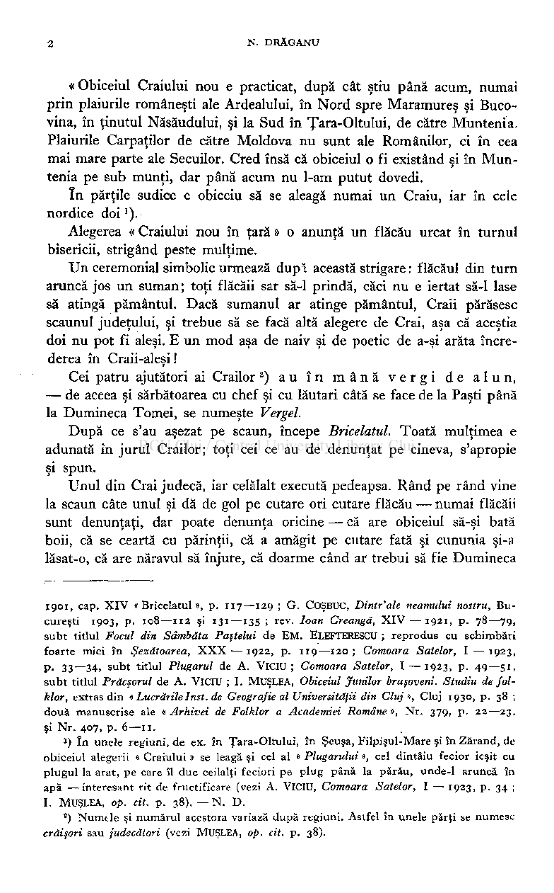

« Obiceiul Craiului nou e practicat, după cât ştiu până acum, numai prin plaiurile româneşti ale Ardealului, în Nord spre Maramureş şi Bucovina, în ţinutul Năsăudului, şi la Sud în Ţara-Oltului, de către Muntenia. Plaiurile Carpaţilor de către Moldova nu sunt ale Românilor, ci în cea mai mare parte ale Secuilor. Cred însă că obiceiul o fi existând şi în Muntenia pe sub munţi, dar până acum nu l-am putut dovedi.

în părţile sudice e obiceiu să se aleagă numai un Craiu, iar în cele nordice doi

Alegerea « Craiului nou în ţară » o anunţă un flăcău urcat în turnul bisericii, strigând peste mulţime.

Un ceremonial simbolic urmează după această strigare : flăcăul din turn aruncă jos un suman; toţi flăcăii sar să-1 prindă, căci nu e iertat să-1 lase să atingă pământul. Dacă sumanul ar atinge pământul, Craii părăsesc scaunul judeţului, şi trebue să se facă altă alegere de Crai, aşa că aceştia doi nu pot fi aleşi. E un mod aşa de naiv şi de poetic de a-şi arăta încrederea în Craii-aleşi !

Cei patru ajutători ai Crailor

) a u î n mân ă verg i d e alun ,

2

— de aceea şi sărbătoarea cu chef şi cu lăutari câtă se face de la Paşti până la Dumineca Tomei, se numeşte Vergel.

După ce s'au aşezat pe scaun, începe Bricelatul. Toată mulţimea e adunată în jurul Crailor; toţi cei ce au de denunţat pe cineva, s'apropie şi spun.

Unul din Crai judecă, iar celălalt execută pedeapsa. Rând pe rând vine la scaun câte unul şi dă de gol pe cutare ori cutare flăcău — numai flăcăii sunt denunţaţi, dar poate denunţa oricine — că are obiceiul să-şi bată boii, că se ceartă cu părinţii, că a amăgit pe cutare fată şi cununia şi-a lăsat-o, că are năravul să înjure, că doarme când ar trebui să fie Dumineca

1901 , cap. XI V «Bricelatul», p . 117—12 9 ; G . COŞBUC , Dintr'ale neamului nostru, Bu ­

cureşti 1903 , p . 108—11 2 şi 131—13 5 ; rev. loan Creangă, XI V — 1921 , p . 78—79 ,

###### subt titlul Focul din Sâmbăta Paştelui de EM . ELEFTERESC U ; reprodus cu schimbări foarte mici în Şezătoarea, XX X — 1922 , p . 119—120 Comoara Satelor, I — 1923 , P- 33—34 .

t titlul Plugarul de A . VICIU Comoara Satelor, I —1923 , p . 49—51

surj

subt titlul Prăcşorul de A . VICI U ; I . MUŞLEA , Obiceiul Junilor braşoveni. Studiu de folklor, extras din uLucrărilelnst.de Geografie al Universităţii din Cluj», Cluj 1930 , p . 3 8 ; două manuscrise ale «Arhivei de Folklor a Academiei Române», Nr . 379 , p . 22—23 , şi Nr . 407 , p . 6—11

) î n unele regiuni.de ex. în Ţara-Oltului, în Şeuşa, Filpişul-Mare şi în Zărand, de obiceiul alegerii « Craiului » se leagă şi cel al « Plugarului », cel dintâiu fecior ieşit cu plugul la arat, p e care îl du c ceilalţi feciori pe plug până la părău, unde-1 aruncă în apă — interesant rit de fructificare (vezi A . VICIU , Comoara Satelor, I — 1923 , p . 3 4 ;

J

I . MUŞLEA , op. cit. p . 38) . — N . D .

###### ) Numtl e şi numărul acestora variază după regiuni. Astfel în unele părţi se numesc crăişori sau judecători (vezi MUŞLEA , op. cit. p . 38)

2

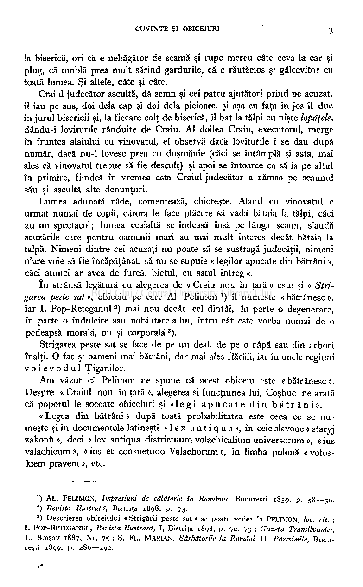

la biserică, ori că e nebăgător de seamă şi rupe mereu câte ceva la car şi plug, că umblă prea mult sărind gardurile, că e răutăcios şi gâlcevitor cu toată lumea. Şi altele, câte şi câte.

Craiul judecător ascultă, dă semn şi cei patru ajutători prind pe acuzat, îl iau pe sus, doi delà cap şi doi delà picioare, şi aşa cu faţa în jos îl duc în jurul bisericii şi, la fiecare colţ de biserică, îl bat la tălpi cu nişte lopâţele, dându-i loviturile rânduite de Craiu. Al doilea Craiu, executorul, merge în fruntea alaiului cu vinovatul, el observă dacă loviturile i se dau după număr, dacă nu-1 lovesc prea cu duşmănie (căci se întâmplă şi asta, mai ales că vinovatul trebue să fie desculţ) şi apoi se întoarce ca să ia pe altul în primire, fiindcă în vremea asta Craiul-judecător a rămas pe scaunul său şi ascultă alte denunţuri.

Lumea adunată râde, comentează, chioteşte. Alaiul cu vinovatul e urmat numai de copii, cărora le face plăcere să vadă bătaia la tălpi, căci au un spectacol; lumea cealaltă se îndeasă însă pe lângă scaun, s'audă acuzările care pentru oamenii mari au mai mult interes decât bătaia la talpă. Nimeni dintre cei acuzaţi nu poate să se sustragă judecăţii, nimeni n'are voie să fie încăpăţânat, să nu se supuie « legilor apucate din bătrâni », căci atunci ar avea de furcă, bietul, cu satul întreg «.

în strânsă legătură cu alegerea de « Craiu nou în ţară » este şi « Strigarea peste sat », obiceiu pe care Al. Pelimon ) îl numeşte « bătrânesc », iar I. Pop-Reteganul

) mai nou decât cel dintâi, în parte o degenerare, în parte o îndulcire sau nobilitare a lui, întru cât este vorba numai de o pedeapsă morală, nu şi corporală ).

2

Strigarea peste sat se face de pe un deal, de pe o râpă sau din arbori înalţi. O fac şi oameni mai bătrâni, dar mai ales flăcăii, iar în unele regiuni voievodu l Ţiganilor.

Am văzut că Pelimon ne spune că acest obiceiu este « bătrânesc ». Despre « Craiul nou în ţară », alegerea şi funcţiunea lui, Coşbuc ne arată că poporul le socoate obiceiuri şi «legi apucat e di n bătrâni» .

« Legea din bătrâni » după toată probabilitatea este ceea ce se nu­

meşte şi în documentele latineşti « 1 e x a n t i q u a », în cele slavone « staryj zakonu », deci « lex antiqua districtuum volachicalium universorum », « ius valachicum », « ius et consUetudo Valachorum », în limba polonă « voioskiem pravem », etc.

') AL. PELIMON, Impresiuni de călătorie în România, Bucureşti1859 p.58—59 .

###### ) Revista Ilustrată, Bistriţa 1898 , p . 73 .

2

###### ) Descrierea obiceiului « Strigării peste sat » se poate vedea la PELIMON, loc. cit. ; I. POP-RETEGANUL, Revista Ilustrată, I, Bistriţa 1898 , p . 70 , 7 3 ; Gazeta Transilvaniei, L , Braşov 1887 , Nr . 7 5 ; S . FL . MARIAN, Sărbătorile la Români, II, Păresimile, Bucu ­

s

reşti 1899 , p . 286—292 .

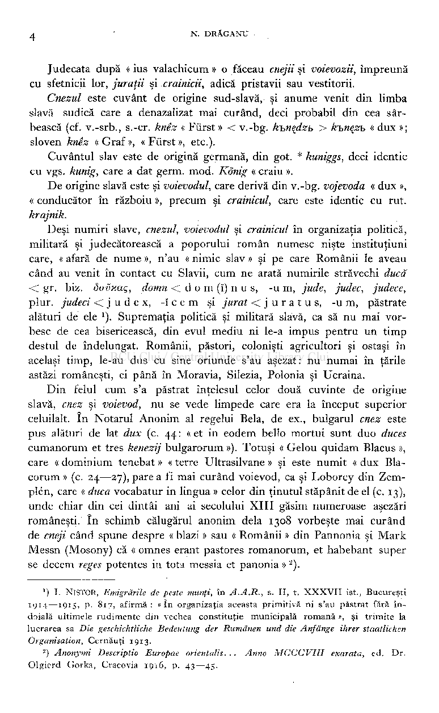

Judecata după « ius valachicum » o făceau cnejii şi voievozii, împreună cu sfetnicii lor, juraţii şi crainicii, adică pristavii sau vestitorii.

Cnezul este cuvânt de origine sud-slavă, şi anume venit din limba slavă sudică care a denazalizat mai curând, deci probabil din cea sârbească (cf. v.-srb., s.-cr. knêz « Fiirst » < v.-bg. khnedzb > frhnezb « dux »; sloven knêz « Graf », « Fiirst », etc.).

Cuvântul slav este de origină germană, din got. * kuniggs, deci identic cu vgs. kunig, care a dat germ. mod. Kônig « craiu ».

De origine slavă este şi voievodul, care derivă din v.-bg. vojevoda « dux », « conducător în războiu », precum şi crainicul, care este identic cu rut. krajnik.

Deşi numiri slave, cnezul, voievodul şi crainicul în organizaţia politică, militară şi judecătorească a poporului român numesc nişte instituţiuni care, « afară de nume », n'au « nimic slav » şi pe care Românii le aveau când au venit în contact cu Slavii, cum ne arată numirile străvechi ducă < gr. biz. ôovxaç, domn < d o m (ï) n u s, -u m, jude, judec, judece, plur. judeci < j u d e x, -ke m şi jurat < j u r a t u s, -u m, păstrate alături de ele ). Supremaţia politică şi militară slavă, ca să nu mai vorbesc de cea bisericească, din evul mediu ni le-a impus pentru un timp destul de îndelungat. Românii, păstori, colonişti agricultori şi ostaşi în acelaşi timp, le-au dus cu sine oriunde s'au aşezat: nu numai în ţările astăzi româneşti, ci până în Moravia, Silezia, Polonia şi Ucraina.

Din felul cum s'a păstrat înţelesul celor două cuvinte de origine slavă, cnez şi voievod, nu se vede limpede care era la început superior celuilalt. In Notarul Anonim al regelui Bela, de ex., bulgarul cnez este pus alături de lat dux (c. 44 : « et in eodem bello mortui sunt duo duces cumanorum et très kenezij bulgarorum »). Totuşi « Gelou quidam Blacus », care « dominium tenebat » « terre Ultrasilvane » şi este numit « dux Blacorum » (c. 24—27), pare a fi mai curând voievod, ca şi Loborcy din Zemplén, care « duca vocabatur in lingua » celor din ţinutul stăpânit de el (c. 13), unde chiar din cei dintâi ani ai secolului XIII găsim numeroase aşezări româneşti. In schimb călugărul anonim delà 1308 vorbeşte mai curând de cneji când spune despre « blazi » sau « Românii » din Pannonia şi Mark Messn (Mosony) că « omnes erant pastures romanorum, et habebant super se decern reges potentes in tota messia et panonia »

).

2

*) I . NlSTOR, Emigrările de peste munţi, în A.A.R., s. II , t. XXXVI I ist., Bucureşti 1914—1915 , p. 817 , afirmă : «î n organizaţia aceasta primitivă ni s'au păstrat fără îndoială ultimele rudimente din vechea constituţie municipală romană », şi trimite la lucrarea sa Die geschichtliche Bedeutung der Rumănen und die Anfănge ihrer staatlichen Organisation, Cernăuţi 1913 .

###### ) Anonymi Descripţia Europae orientalis. . . Anno MCCCVIII exarata, ed. Dr . Olgierd Gorka, Cracovia 1916 , p. 43—45 .

2

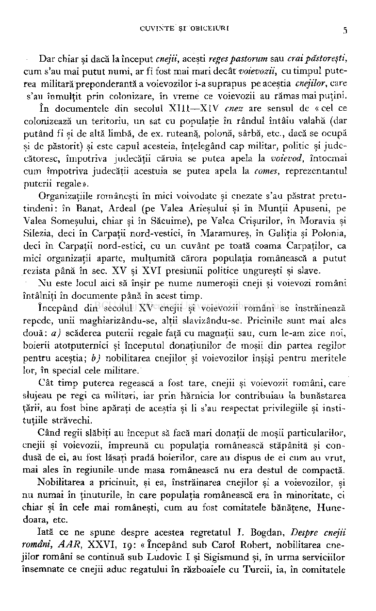

Dar chiar şi dacă Ia început cnejii, aceşti reges pastorum sau crai păstoreşti,

cum s'au mai putut numi, ar fi fost mai mari decât voievozii, cu timpul puterea militară preponderantă a voievozilor i-a suprapus pe aceştia cnejilor, care

s'au înmulţit prin colonizare, în vreme ce voievozii au rămas mai puţini.

în documentele din secolul XIII—XIV cnez are sensul de « cel ce colonizează un teritoriu, un sat cu populaţie în rândul întâiu valahă (dar putând fi şi de altă limbă, de ex. ruteană, polonă, sârbă, etc., dacă se ocupă şi de păstorit) şi este capul acesteia, înţelegând cap militar, politic şi judecătoresc, împotriva judecăţii căruia se putea apela la voievod, întocmai cum împotriva judecăţii acestuia se putea apela la comes, reprezentantul puterii regale».

Organizaţiile româneşti în mici voivodate şi cnezate s'au păstrat pretutindeni: în Banat, Ardeal (pe Valea Arieşului şi în Munţii Apuseni, pe Valea Someşului, chiar şi în Săcuime), pe Valea Crişurilor, în Moravia şi Silezia, deci în Carpaţii nord-vestici, în Maramureş, în Galiţia şi Polonia, deci în Carpaţii nord-estici, cu un cuvânt pe toată coama Carpaţilor, ca mici organizaţii aparte, mulţumită cărora populaţia românească a putut rezista până în sec. XV şi XVI presiunii politice ungureşti şi slave.

Nu este locul aici să înşir pe nume numeroşii cneji şi voievozi români întâlniţi în documente până în acest timp.

începând din secolul XV cnejii şi voievozii români se înstrăinează repede, unii maghiarizându-se, alţii slavizându-se. Pricinile sunt mai ales două: a) scăderea puterii regale faţă cu magnaţii sau, cum le-am zice noi, boierii atotputernici şi începutul donaţiunilor de moşii din partea regilor pentru aceştia; b) nobilitarea cnejilor şi voievozilor înşişi pentru meritele lor, în special cele militare.

Cât timp puterea regească a fost tare, cnejii şi voievozii români, care slujeau pe regi ca militari, iar prin hărnicia lor contribuiau la bunăstarea ţării, au fost bine apăraţi de aceştia şi li s'au respectat privilegiile şi instituţiile străvechi.

Când regii slăbiţi au început să facă mari donaţii de moşii particularilor, cnejii şi voievozii, împreună cu populaţia românească stăpânită şi condusă de ei, au fost lăsaţi pradă boierilor, care au dispus de ei cum au vrut, mai ales în regiunile unde masa românească nu era destul de compactă.

Nobilitarea a pricinuit, şi ea, înstrăinarea cnejilor şi a voievozilor, şi nu numai în ţinuturile, în care populaţia românească era în minoritate, ci chiar şi în cele mai româneşti, cum au fost comitatele bănăţene, Hunedoara, etc.

Iată ce ne spune despre acestea regretatul I. Bogdan, Despre cnejii români, AAR, XXVI, 19: «începând sub Carol Robert, nobilitarea cnejilor români se continuă sub Ludovic I şi Sigismund şi, în urma serviciilor însemnate ce cnejii aduc regatului în războaiele cu Turcii, ia, în comitatele

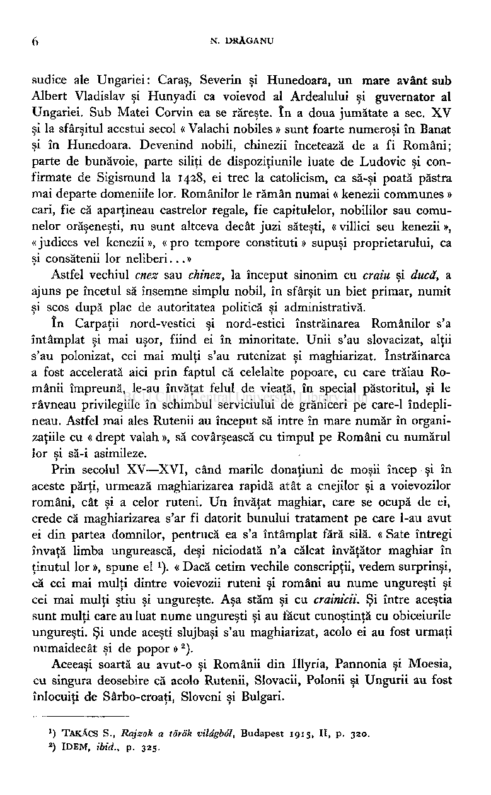

sudice ale Ungariei : Caras, Severin şi Hunedoara, un mare avânt sub Albert Vladislav şi Hunyadi ca voievod al Ardealului şi guvernator al Ungariei. Sub Matei Corvin ea se răreşte. în a doua jumătate a sec. XV şi la sfârşitul acestui secol « Valachi nobiles » sunt foarte numeroşi în Banat şi în Hunedoara. Devenind nobili, chinezii încetează de a fi Români; parte de bunăvoie, parte siliţi de dispoziţiunile luate de Ludovic şi confirmate de Sigismund la 1428, ei trec la catolicism, ca să-şi poată păstra mai departe domeniile lor. Românilor le rămân numai « kenezii communes » cari, fie că aparţineau castrelor regale, fie capitulelor, nobililor sau comunelor orăşeneşti, nu sunt altceva decât juzi săteşti, « villici seu kenezii », « judices vel kenezii », « pro tempore constituti » supuşi proprietarului, ca şi consătenii lor neliberi...»

Astfel vechiul cnez sau chinez, la început sinonim cu craiu şi ducă, a ajuns pe încetul să însemne simplu nobil, în sfârşit un biet primar, numit şi scos după plac de autoritatea politică şi administrativă.

în Carpaţii nord-vestici şi nord-estici înstrăinarea Românilor s'a întâmplat şi mai uşor, fiind ei în minoritate. Unii s'au slovacizat, alţii s'au polonizat, cei mai mulţi s'au rutenizat şi maghiarizat. înstrăinarea a fost accelerată aici prin faptul că celelalte popoare, cu care trăiau Românii împreună, le-au învăţat felul de vieaţă, în special păstoritul, şi le râvneau privilegiile în schimbul serviciului de grăniceri pe care-1 îndeplineau. Astfel mai ales Rutenii au început să intre în mare număr în organizaţiile cu « drept valah », să covârşească cu timpul pe Români cu numărul lor si să-i asimileze.

>

Prin secolul XV—XVI, când marile donaţiuni de moşii încep şi în aceste părţi, urmează maghiarizarea rapidă atât a cnejilor şi a voievozilor români, cât şi a celor ruteni. Un învăţat maghiar, care se ocupă de ei, crede că maghiarizarea s'ar fi datorit bunului tratament pe care l-au avut ei din partea domnilor, pentrucă ea s'a întâmplat fără silă. « Sate întregi învaţă limba ungurească, deşi niciodată n'a călcat învăţător maghiar în ţinutul lor », spune el ). « Dacă cetim vechile conscripţii, vedem surprinşi, că cei mai mulţi dintre voievozii ruteni şi români au nume ungureşti şi cei mai mulţi ştiu şi ungureşte. Aşa stăm şi cu crainicii. Şi între aceştia sunt mulţi care au luat nume ungureşti şi au făcut cunoştinţă cu obiceiurile ungureşti. Şi unde aceşti slujbaşi s'au maghiarizat, acolo ei au fost urmaţi numaidecât şi de popor »

).

2

Aceeaşi soartă au avut-o şi Românii din Illyria, Pannonia şi Moesia, cu singura deosebire că acolo Rutenii, Slovacii, Polonii şi Ungurii au fost înlocuiţi de Sârbo-croaţi, Sloveni şi Bulgari.

###### *) TAKÂCS S., Rajzok a tărăk vildgbôl, Budapest 1915 , IT, p. 320 .

###### ) IDEM, ibid., p. 325 .

2

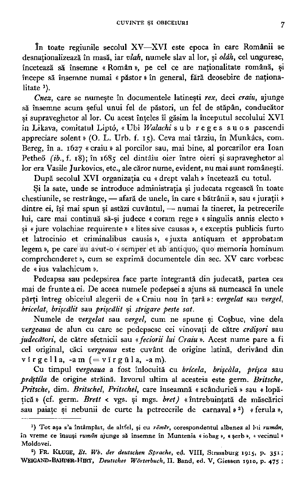

în toate regiunile secolul XV—XVI este epoca în care Românii se desnaţionalizează în masă, iar vlah, numele slav al lor, şi olâh, cel unguresc, încetează să însemne « Român », pe cel ce are naţionalitate română, şi începe să însemne numai « păstor » în general, fără deosebire de naţionalitate ).

Cnez, care se numeşte în documentele latineşti rex, deci craiu, ajunge să însemne acum şeful unui fel de păstori, un fel de stăpân, conducător şi supraveghetor al lor. Cu acest înţeles îl găsim la începutul secolului XVI în Likava, comitatul Liptô, « Ubi Walachi su b rege s suo s pascendi appreciare soient » (O. L. Urb. f. 15). Ceva mai târziu, în Munkâcs, corn. Bereg, în a. 1627 « craiu » al porcilor sau, mai bine, al porcarilor era loan Petheô (ib.,i. 18); în 1685 cel dintâiu oier între oieri şi supraveghetor al lor era Vasile Jurkovics, etc., ale căror nume, evident, nu mai sunt româneşti.

După secolul XVI organizaţia cu « drept valah » încetează cu totul. Şi la sate, unde se introduce administraţia şi judecata regească în toate

chestiunile, se restrânge, — afară de unele, în care « bătrânii », sau « juraţii » dintre ei, îşi mai spun şi astăzi cuvântul, — numai la tineret, la petrecerile lui, care mai continuă să-şi judece « coram rege » « singulis annis electo » şi « jure volachiae requirente » « lites sive causas », « exceptis publicis furto et latrocinio et criminalibus causis », « juxta antiquam et approbatam legem », pe care au avut-o « semper et ab antiquo, quo memoria hominum comprehenderet », cum se exprimă documentele din sec. XV care vorbesc de « ius valachicum ».

Pedeapsa sau pedepsirea face parte integrantă din judecată, partea cea mai de frunte a ei. De aceea numele pedepsei a ajuns să numească în unele părţi întreg obiceiul alegerii de « Craiu nou în ţară » : vergelat sau vergel, bricelat, brişcâlit sau prişcălit şi strigare peste sat.

Numele de vergelat sau vergel, cum ne spune şi Coşbuc, vine delà vergeaua de alun cu care se pedepsesc cei vinovaţi de către crăişori sau judecători, de către sfetnicii sau « feciorii lui Craiu ». Acest nume pare a fi cel original, căci vergeaua este cuvânt de origine latină, derivând din vîrgella , -am (=vïrgûla , -a m).

Cu timpul vergeaua a fost înlocuită cu bricela, brişcăla, prişca sau prâştila de origine străină. Izvorul ultim al acesteia este germ. Britsche, Pritsche, dim. Britschel, Pritschèl, care înseamnă « scândurică » sau « lopăţică » (cf. germ. Brett < vgs. şi mgs. bret) « întrebuinţată de măscărici sau paiaţe şi nebunii de curte la petrecerile de carnaval » ) « ferula »,

###### ) Tot aşa s'a întâmplat, de altfel, şi cu rëmër, corespondentul albanez al lui rumân, în vreme ce însuşi rumân ajunge să însemne în Muntenia « iobag », « şerb », « vecinul » Moldovei.

x

») FR . KLUGE , Et. Wb. der deutschen Sprache, ed.VIII , Strassburg1915 p.351 ; WEIGAND-BAHDER-HIRT , Deutsches Wôrterbuch,II . Band, ed.V , Giessen1910 , p.47 5 ;

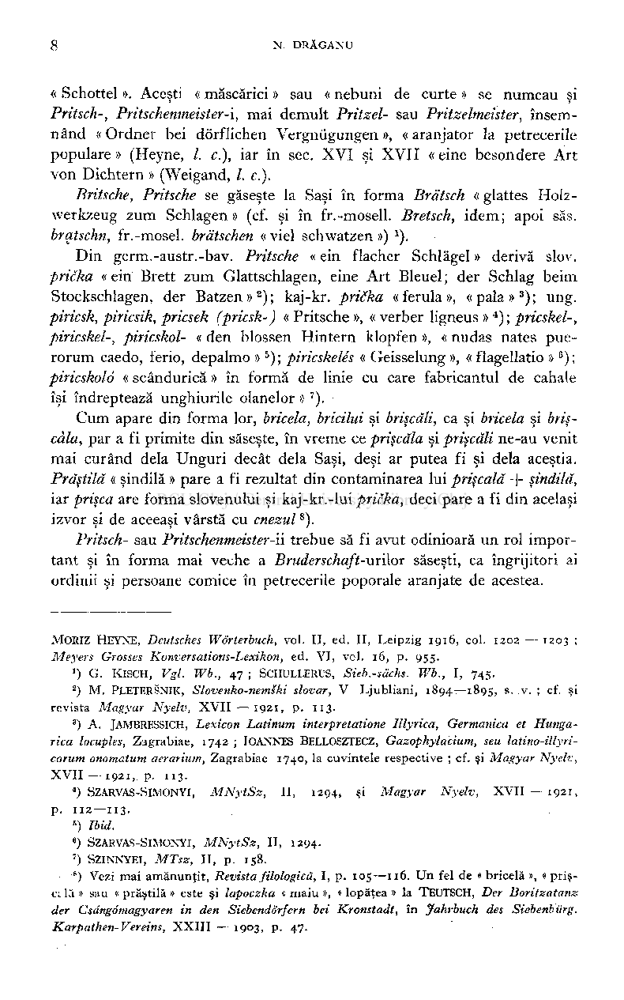

« Schottel ». Aceşti « măscărici » sau « nebuni de curte » se numeau şi Pritsch-, Pritschenmeister-[, mai demult Pritzel- sau Pritzelmeister, însemnând « Ordner bei dôrflichen Vergniigungen », « aranjator la petrecerile populare » (Heyne, /. c), iar în sec. XVI şi XVII « eine besondere Art von Dichtern » (Weigand, /. c).

Britsche, Pritsche se găseşte la Saşi în forma Brătsch « glattes Holzwerkzeug zum Schlagen » (cf. şi în fr.-mosell. Bretsch, idem; apoi săs. brqtschn, fr.-mosel. brătschen «viei schwatzen »)

).

1

Din germ.-austr.-bav. Pritsche « ein flacher Schlâgel » derivă slow pricka << ein Brett zum Glattschlagen, eine Art Bleuel ; der Schlag beim Stockschlagen, der Batzen»

); kaj-kr. pricka « ferula », «pala»

); ung. piricsk, piricsik, pricsek (pricsk-) « Pritsche », « verber ligneus » ); pricskel-, piricskel-, piricskol- « den blossen Hintern klopfen », « nudas nates puerorum caedo, ferio, depalmo »

2

3

) ; piricskelés « Geisselung », « flagellatio » ) ; piricskolô « scândurică » în formă de linie cu care fabricantul de cahale îşi îndreptează unghiurile olanelor »

5

).

7

Cum apare din forma lor, bricela, bricilui şi brişcâli, ca şi bricela şi brişcàla, par a fi primite din săseşte, în vreme ce prişcăla şi prişcăli ne-au venit mai curând delà Unguri decât delà Saşi, deşi ar putea fi şi delà aceştia. Prăştilă « şindilă » pare a fi rezultat din contaminarea lui prişcală + şindilă, iar prişca are forma slovenului şi kaj-kr.-lui pricka, deci pare a fi din acelaşi izvor şi de aceeaşi vârstă cu cnezul

).

8

Pritsch- sau Pritschenmeister-'n trebue să fi avut odinioară un rol important şi în forma mai veche a Bruderschaft-urûor săseşti, ca îngrijitori ai ordinii şi persoane comice în petrecerile poporale aranjate de acestea.

MORIZ HEYNE, Deutsches Wôrterbuch, vol. II , ed. II , Leipzig 1916 , col. 120 2 — 120 3 ; Meyers Grosses Konversations-Lexikon, ed. VI , vol. 16 , p. 955 .

*) G . KISCH, Vgl. Wb., 4 7 ; SCHULLERUS, Sieb.-săchs. Wb., I , 745 .

###### ) M . PLETERSNIK, Slovenko-nendki slovar, V Ljubliani, 1894—1895 , s. v. ; cf. şi revista Magyar Nyelv, XVI I — 1921 , p. 113 .

2

) A . JAMBRESSICH, Lexicon Latinum interpretatione Illyrica, Germanica et Hungarica locuples, Zagrabiae, 174 2 ; IOANNES BELLOSZTECZ, Gazophylacium, seu latino-illyricorum onomatum aerarium, Zagrabiae 1740 , la cuvintele respective ; cf. şi Magyar Nyelv, XVI I — 1921 , p. 113 .

3

###### ) SZARVAS-SIMONYI, MNytSz, II , 1294 , şi Magyar Nyelv, XVII — 1921 ,

4

p. 112—113 .

- 5 ) Ibid.
- 6 ) SZARVAS-SIMONYI, MNytSz, II , 1294 .

') SZINNYEI, MTsz, II , p. 158 .

###### ) Vezi mai amănunţit, Revista filologică, I, p. 105—116 . U n fel de « bricela », « prişci lă » sau « prăştilă » este şi lapoczka « maiu », « lopăţea » la TEUTSCH, Der Borilzatanz der Csdngomagyaren in den SiebendSrfern bei Kronstadt, în Jahrbuch des Siebenbiirg. Karpathen-Vereins, XXII I — 1903 , p. 47 .

8

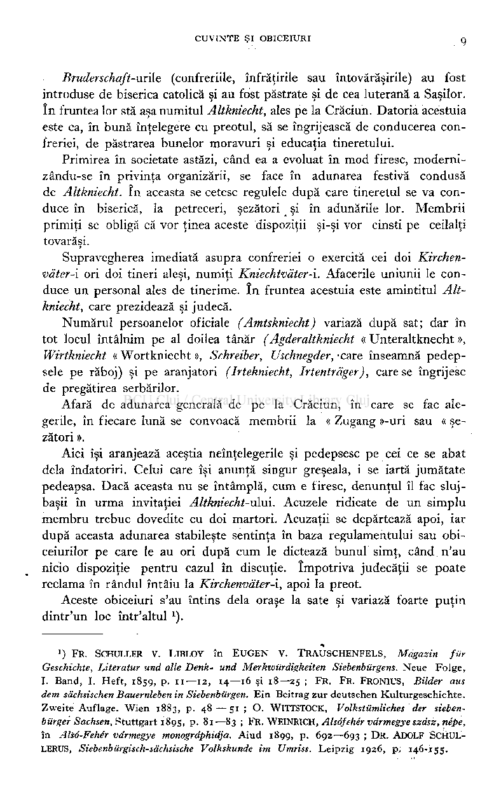

Bruderschaft-urile (confreriile, înfrăţirile sau întovărăşirile) au fost introduse de biserica catolică şi au fost păstrate şi de cea luterană a Saşilor, în fruntea lor stă aşa numitul Altkniecht, ales pe la Crăciun. Datoria acestuia este ca, în bună înţelegere cu preotul, să se îngrijească de conducerea confreriei, de păstrarea bunelor moravuri şi educaţia tineretului.

Primirea în societate astăzi, când ea a evoluat în mod firesc, modernizându-se în privinţa organizării, se face în adunarea festivă condusă de Altkniecht. în aceasta se cetesc regulele după care tineretul se va conduce în biserică, la petreceri, şezători _ şi în adunările lor. Membrii primiţi se obligă că vor ţinea aceste dispoziţii şi-şi vor cinsti pe ceilalţi tovarăşi.

Supravegherea imediată asupra confreriei o exercită cei doi Kirchenvăter-i ori doi tineri aleşi, numiţi Kniechtvăter-i. Afacerile uniunii le conduce un personal ales de tinerime. în fruntea acestuia este amintitul Altkniecht, care prezidează şi judecă.

Numărul persoanelor oficiale (Amtskniecht) variază după sat ; dar în tot locul întâlnim pe al doilea tânăr (Agderaltkniecht « Unteraltknecht », Wirtkniecht « Wortkniecht », Schreiber, Uschnegder, -care înseamnă pedepsele pe răboj) şi pe aranjatori (Irtekniecht, Irtentrăger), care se îngrijesc de pregătirea serbărilor.

Afară de adunarea generală de pe la Crăciun, în care se fac alegerile, în fiecare lună se convoacă membrii la « Zugang »-uri sau « şezători ».

Aici îşi aranjează aceştia neînţelegerile şi pedepsesc pe cei ce se abat delà îndatoriri. Celui care îşi anunţă singur greşeala, i se iartă jumătate pedeapsa. Dacă aceasta nu se întâmplă, cum e firesc, denunţul îl fac slujbaşii în urma invitaţiei Altkniecht-vXm. Acuzele ridicate de un simplu membru trebue dovedite cu doi martori. Acuzaţii se depărtează apoi, iar după aceasta adunarea stabileşte sentinţa în baza regulamentului sau obiceiurilor pe care le au ori după cum le dictează bunul simţ, când n'au nicio dispoziţie pentru cazul în discuţie. împotriva judecăţii se poate reclama în rândul întâiu la Kirchenvăter-i, apoi la preot.

Aceste obiceiuri s'au întins delà oraşe la sate şi variază foarte puţin dintr'un loc într'altul ).

) FR . SCHULLE R V. LlBLOY în EUGE N V. TRAUSCHENFELS , Magazin fiir Geschichte, Literatur und aile Denk- und Merhwiirdigkeiten Siebenburgens. Neue Folge , I . Band, I . Heft, 1859 , p. 11—12 , 14—1 6 şi 18—2 5 ; FR . FR. FRONIUS, Bilder aus dem săchsischen Bauernleben in Siebenburgen. Ei n Beitrag zur deutschen Kulturgeschichte. Zweite Auflage. Wie n 1883 , p. 4 8 — 5 1 ; O . WlTTSTOCK, Volkstumliches der siebenbttrger Sachsen, Stuttgart 1895 , p. 81—8 3 ; FR . WEINRICH Alsôfehér vdrmegye szdsz, népe, în Alsô-Fehér vdrmegye monogrdphidja. Âiu d 1899 , p. 692—69 3 ; DR . ADOLF SCHULLERUS , Siebenbiirgisch-săchsische Volkskunde im Umriss. Leipzig 1926 , p. 146-155 .

1

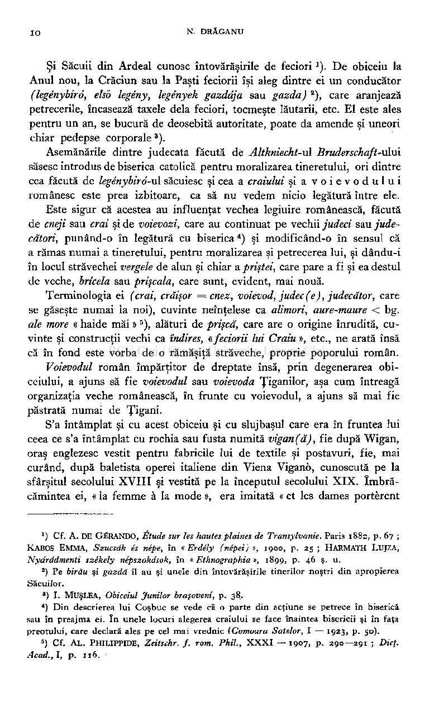

). De obiceiu la Anul nou, la Crăciun sau la Paşti feciorii îşi aleg dintre ei un conducător (legénybirô, elsô legény, legények gazdăja sau gazda)

Şi Săcuii din Ardeal cunosc întovărăşirile de feciori

1

), care aranjează petrecerile, încasează taxele delà feciori, tocmeşte lăutarii, etc. El este ales pentru un an, se bucură de deosebită autoritate, poate da amende şi uneori chiar pedepse corporale ).

2

Asemănările dintre judecata făcută de Altkniecht-ul Bruderschaft-ului săsesc introdus de biserica catolică pentru moralizarea tineretului, ori dintre cea făcută de legény bir â-ul săcuiesc şi cea a craiului şi a voievodulu i românesc este prea izbitoare, ca să nu vedem nicio legătură între ele.

Este sigur că acestea au influenţat vechea legiuire românească, făcută de cneji sau crai şi de voievozi, care au continuat pe vechii judeci sau judecători, punând-o în legătură cu biserica

) şi modificând-o în sensul că a rămas numai a tineretului, pentru moralizarea şi petrecerea lui, şi dându-i în locul străvechei vergele de alun şi chiar a priştei, care pare a fi şi ea destul de veche, bricela sau prişcala, care sunt, evident, mai nouă.

4

Terminologia ei (crai, crăişor = cnez, voievod, judec(e), judecător, care se găseşte numai la noi), cuvinte neînţelese ca alimori, aure-maure < bg. ale more « haide măi »

), alături de prişcă, care are o origine înrudită, cuvinte şi construcţii vechi ca îndires, « feciorii lui Craiu », etc., ne arată însă că în fond este vorba de o rămăşiţă străveche, proprie poporului român.

6

Voievodul român împărţitor de dreptate însă, prin degenerarea obiceiului, a ajuns să fie voievodul sau voievoda Ţiganilor, aşa cum întreagă organizaţia veche românească, în frunte cu voievodul, a ajuns să mai fie păstrată numai de Ţigani.

S'a întâmplat şi cu acest obiceiu şi cu slujbaşul care era în fruntea lui ceea ce s'a întâmplat cu rochia sau fusta numită vigan(ă), fie după Wigan, oraş englezesc vestit pentru fabricile lui de textile şi postavuri, fie, mai curând, după baletista operei italiene din Viena Viganô, cunoscută pe la sfârşitul secolului XVIII şi vestită pe la începutul secolului XIX. îmbrăcămintea ei, « la femme à la mode », era imitată « et les dames portèrent

') Cf . A . DE GÉRAND0, Étude sur les hautes plaines de Transylvanie. Paris 1882 , p. 6 7 ;

KAB0S EMMA, Szucsdk és népe, în « Erdély (népei) », 1900 , p. 2 5 ; HARMATH LUJZA,

Nydrddmenti székely népszokdsok, în « Ethnographia », 1899 , p. 46 ş. u.

###### ) Pe birdu şi gazdă îl au şi unele din întovărăşirile tinerilor noştri din apropierea Săcuilor.

a

###### ) I . MUŞLEA, Obiceiul Junilor braşoveni, p. 38 .

8

###### ) Di n descrierea lui Coşbu c se vede că o parte din acţiune se petrece în biserică sau în preajma ei. î n unele locuri alegerea craiului se face înaintea bisericii şi în faţa preotului, care declară ales pe cel ma i vrednic (Comoara Satelor, I — 1923 , p. 50)

4

###### ) Cf. AL PH1LIPPIDE, Zeitschr. f. rom. Phil., XXX I —1907 p.290—29 1 ; Dicţ. Acad., I , p . 116 .

5

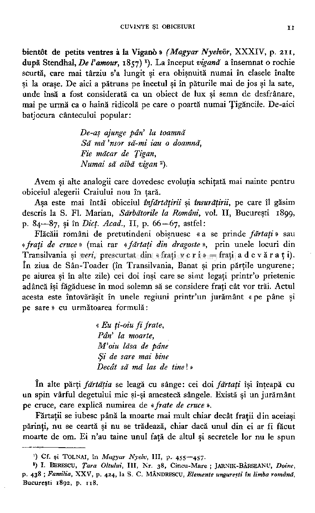

bientôt de petits ventres à la Viganô » (Magyar Nyelvor, XXXIV, p. an , după Stendhal, De l'amour, 1857)

). La început vigană a însemnat o rochie scurtă, care mai târziu s'a lungit şi era obişnuită numai în clasele înalte şi la oraşe. De aici a pătruns pe încetul şi în păturile mai de jos şi la sate, unde însă a fost considerată ca un obiect de lux şi semn de desfrânare, mai pe urmă ca o haină ridicolă pe care o poartă numai Ţigăncile. De-aici batjocura cântecului popular:

1

De-aş ajunge pâri la toamnă Să mă 'nsor să-mi iau o doamnă, Fie măcar de Ţigan, Numai să aibă vigan

).

2

Avem şi alte analogii care dovedesc evoluţia schiţată mai nainte pentru obiceiul alegerii Craiului nou în ţară.

Aşa este mai întâi obiceiul înfărtăţirii şi însurăţirii, pe care îl găsim descris la S. FI. Marian, Sărbătorile la Români, vol. II, Bucureşti 1899, p. 84—87, şi în Diet. Acad., II, p. 66—67, astfel:

Flăcăii români de pretutindeni obişnuesc « a se prinde fărtaţi » sau «fraţi de cruce » (mai rar «fărtaţi din dragoste », prin unele locuri din Transilvania şi veri, prescurtat din « fraţi veri » = fraţi adevăraţi) , în ziua de Sân-Toader (în Transilvania, Banat şi prin părţile ungurene; pe aiurea şi în alte zile) cei doi inşi care se simt legaţi printr'o prietenie adâncă îşi făgăduesc în mod solemn să se considere fraţi cât vor trăi. Actul acesta este întovărăşit în unele regiuni printr'un jurământ « pe pâne şi pe sare » cu următoarea formulă :

« Eu ţi-oiu fi frate, Pâri la moarte, M'oiu lăsa de pâne Şi de sare mai bine Decât să mă las de tine ! »

în alte părţi fărtâţia se leagă cu sânge: cei doi fărtaţi îşi înţeapă cu un spin vârful degetului mic şi-şi amestecă sângele. Există şi un jurământ pe cruce, care explică numirea de « frate de cruce ».

Fărtaţii se iubesc până la moarte mai mult chiar decât fraţii din aceiaşi părinţi, nu se ceartă şi nu se trădează, chiar dacă unul din ei ar fi făcut moarte de om. Ei n'au taine unul faţă de altul şi secretele lor nu le spun

') Cf. şi TOLNAI, în Magyar Nyelv,III p.455—457 .

) I . BERESCU, Ţara Oltului,III , Nr. 38 , Cincu-Mare ; JARNIK-BÂRSEANU, Doine,

S

p. 43 8 ; Familia, XXV, p. 424 , la S. C. MÂNDRESCU, Elemente ungureşti în limba română,

###### Bucureşti 1892 , p. 118 .

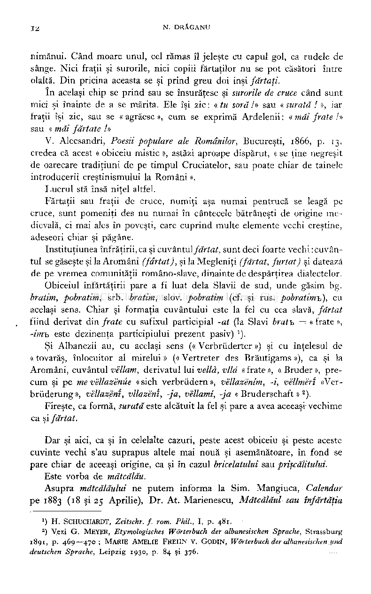

nimănui. Când moare unul, cel rămas îl jeleşte cu capul gol, ca rudele de sânge. Nici fraţii şi surorile, nici copiii fărtaţilor nu se pot căsători între olaltă. Din pricina aceasta se şi prind greu doi inşi fărtaţi.

In acelaşi chip se prind sau se însurăţesc şi surorile de cruce când sunt mici şi înainte de a se mărita. Ele îşi zic : « tu soră ! » sau « surată ! », iar fraţii îşi zic, sau se « agrăesc », cum se exprimă Ardelenii : « măi frate /» sau « măi fărtate !»

V. Alecsandri, Poesii populare ale Românilor, Bucureşti, 1866, p. 13,

credea că acest « obiceiu mistic », astăzi aproape dispărut, « se ţine negreşit de oarecare tradiţiuni de pe timpul Cruciatelor, sau poate chiar de tainele introducerii creştinismului la Români ».

Lucrul stă însă niţel altfel. Fărtaţii sau fraţii de cruce, numiţi aşa numai pentrucă se leagă pe cruce, sunt pomeniţi des nu numai în cântecele bătrâneşti de origine medievală, ci mai ales în poveşti, care cuprind multe elemente vechi creştine, adeseori chiar şi păgâne.

Instituţiunea înfrăţirii, ca şi cuvântul/arte/, sunt deci foarte vechi : cuvântul se găseşte şi la Aromâni (fârtat), şi la Megleniţi (fărtat, furtat) şi datează de pe vremea comunităţii româno-slave, dinainte de despărţirea dialectelor.

Obiceiul înfărtăţirii pare a fi luat delà Slavii de sud, unde găsim bg. bratim, pobratim, srb. bratim, slov. pobratim (cf. şi rus. pobratimh), cu acelaşi sens. Chiar şi formaţia cuvântului este la fel cu cea slavă, fărtat fiind derivat din frate cu sufixul participial -at (la Slavi brat b = « frate », -imrb este dezinenţa participiului prezent pasiv) ).

Şi Albanezii au, cu acelaşi sens (« Verbruderter ») şi cu înţelesul de « tovarăş, înlocuitor al mirelui » (« Vertreter des Brâutigams »), ca şi la Aromâni, cuvântul vëllam, derivatul lui vellà, vilă « frate », « Bruder », precum şi pe me vëllazënûe « sich verbrûdern », vëllazënim, -i, vëllmërî «Verbrùderung », vëllazënî, vllazënï, -ja, vëllami, -ja « Bruderschaft »

).

2

Fireşte, ca formă, surată este alcătuit la fel şi pare a avea aceeaşi vechime ca şi fărtat.

Dar şi aici, ca şi în celelalte cazuri, peste acest obiceiu şi peste aceste cuvinte vechi s'au suprapus altele mai nouă şi asemănătoare, în fond se pare chiar de aceeaşi origine, ca şi în cazul bricelatului sau prişcălitului.

Este vorba de mătcălău. Asupra mătcălăului ne putem informa la Sim. Mangiuca, Calendar

pe 1883 (18 şi 25 Aprilie), Dr. At. Marienescu, Mâtcălăul sau înfărtâţia

') H . SCHUCHARDT , Zeitschr. f. rom. Phil, I , p . 481

) "Vezi G . MEYER Etymologisches Worterbuch der albanesischen Sprac/ie, Strassburg

2

1891 , p . 469—47 0 ; MARI E AMELI E FREII N V . GODIN, Worterbuch der albanesischen und

###### deutschen Sprache, Leipzi g 1930 , p. 8 4 şi 376 .

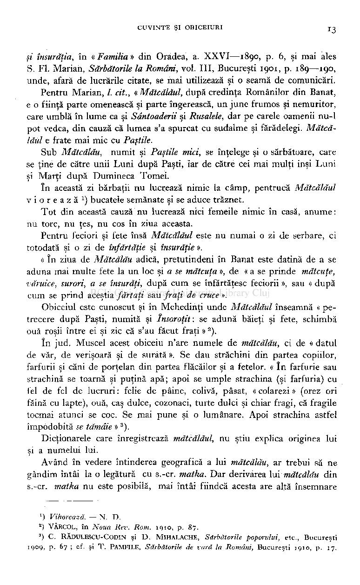

şi însurăţia, în « Familia » din Oradea, a. XXVI—1890, p. 6, şi mai ales

S. FI. Marian, Sărbătorile la Români, vol. III, Bucureşti 1901, p. 189—190, unde, afară de lucrările citate, se mai utilizează şi o seamă de comunicări.

Pentru Marian, /. cit., « Mâtcălăul, după credinţa Românilor din Banat, e o fiinţă parte omenească şi parte îngerească, un june frumos şi nemuritor, care umblă în lume ca şi Sântoaderii şi Rusalele, dar pe carele oamenii nu-1 pot vedea, din cauză că lumea s'a spurcat cu sudalme şi fărădelegi. Mâtcălăul e frate mai mic cu Pastile.

Sub Mătcălău, numit şi Pastile mici, se înţelege şi o sărbătoare, care se ţine de către unii Luni după Paşti, iar de către cei mai mulţi inşi Luni şi Marţi după Dumineca Tomei.

în această zi bărbaţii nu lucrează nimic la câmp, pentrucă Mâtcălăul viorează ) bucatele semănate şi se aduce trăznet.

Tot din această cauză nu lucrează nici femeile nimic în casă, anume : nu torc, nu ţes, nu cos în ziua aceasta.

Pentru feciori şi fete însă Mâtcălăul este nu numai o zi de serbare, ci totodată şi o zi de înfărtăţie şi însurâţie ».

« în ziua de Mătcălău adică, pretutindeni în Banat este datină de a se aduna mai multe fete la un loc şi a se mătcuţa », de « a se prinde mătcuţe, văruice, surori, a se însuraţi, după cum se înfărtăţesc feciorii », sau « după cum se prind aceştia fărtaţi sau fraţi de cruce ».

Obiceiul este cunoscut şi în Mehedinţi unde Mâtcălăul înseamnă « petrecere după Paşti, numită şi însoroţit: se adună băieţi şi fete, schimbă ouă roşii între ei şi zic că s'au făcut fraţi »

).

2

în jud. Muscel acest obiceiu n'are numele de mătcălău, ci de « datul de văr, de verişoară şi de surată ». Se dau străchini din partea copiilor, farfurii şi căni de porţelan din partea flăcăilor şi a fetelor. « în farfurie sau strachină se toarnă şi puţină apă; apoi se umple strachina (şi farfuria) cu fel de fel de lucruri: felie de pâine, colivă, pasat, « colarezi » (orez ori

- făină cu lapte), ouă, caş dulce, cozonaci, turte dulci şi chiar fragi, că fragile tocmai atunci se coc. Se mai pune şi o lumânare. Apoi strachina astfel

împodobită se tămâie »

).

3

Dicţionarele care înregistrează mâtcălăul, nu ştiu explica originea lui şi a numelui lui.

Având în vedere întinderea geografică a lui mătcălău, ar trebui să ne gândim întâi la o legătură cu s.-cr. matka. Dar derivarea lui mătcălău din s.-cr. matka nu este posibilă, mai întâi fiindcă acesta are altă însemnare

') Vihorează. — N . D .

- 2

) VÂRCOL, în Noua Rev. Rom. 1910 , p. 87 .

- 3

###### ) C. RĂDULESCU-CODIN şi D . MlHALACHE, Sărbătorile poporului, etc., Bucureşti 1909 , p. 6 7 ; cf. şi T . PAMFILE, Sărbătorile de vară la Români, Bucureşti 1910 , p. 17 .

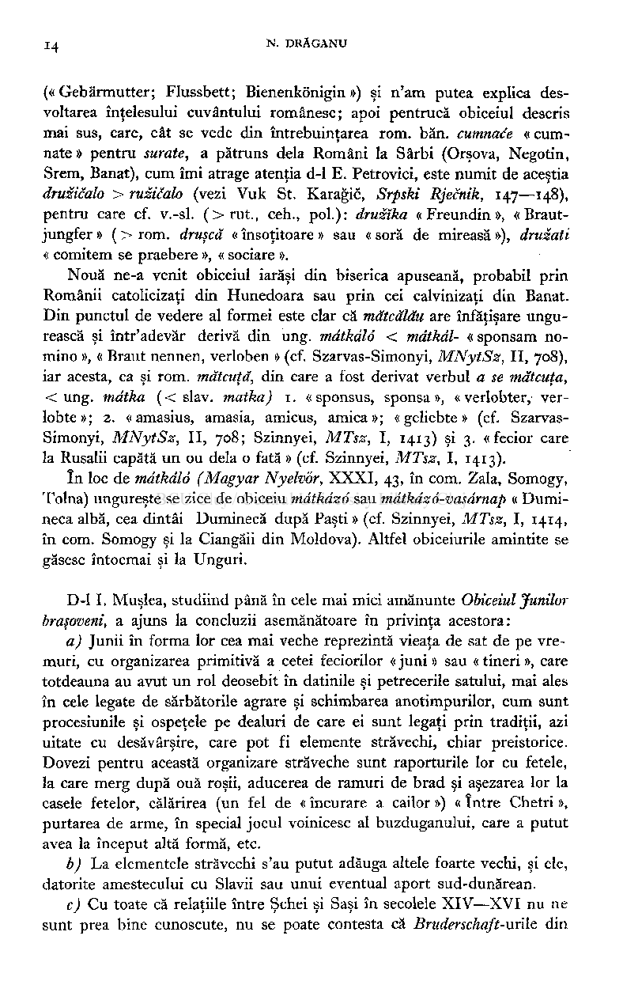

(« Gebărmutter; Flussbett; Bienenkônigin ») şi n'am putea explica desvoltarea înţelesului cuvântului românesc; apoi pentrucă obiceiul descris mai sus, care, cât se vede din întrebuinţarea rom. băn. cumnade « cumnate » pentru surate, a pătruns delà Români la Sârbi (Orşova, Negotin, Srem, Banat), cum îmi atrage atenţia d-1 E. Petrovici, este numit de aceştia druzicalo > ruzicalo (vezi Vuk St. Karagic, Srpski Rjecnik, 147—148), pentru care cf. v.-sl. (>rut , ceh., pol.): druzîka « Freundin », « Brautjungfer » ( > rom. druşcă « însoţitoare » sau « soră de mireasă »), druzati « comitem se praebere », « sociare ».

Nouă ne-a venit obiceiul iarăşi din biserica apuseană, probabil prin Românii catolicizaţi din Hunedoara sau prin cei calvinizaţi din Banat. Din punctul de vedere al formei este clar că mătcălău are înfăţişare ungurească şi într'adevăr derivă din ung. mâikdlô < măikâl- « sponsam nomino », « Braut nennen, verloben » (cf. Szarvas-Simonyi, MNytSz, II, 708), iar acesta, ca şi rom. măicuţă, din care a fost derivat verbul a se mătcuţa, < ung. mătka (< slav. matka) 1. «sponsus, sponsa », «verlobter, verlobte »; 2. « amasius, amasia, amicus, amica»; «geliebte» (cf. SzarvasSimonyi, MNytSz, II, 708; Szinnyei, MTsz, I, 1413) şi 3. «fecior care la Rusalii capătă un ou delà o fată » (cf. Szinnyei, MTsz, I, 1413).

în loc de mdtkdlô (Magyar Nyelvbr, XXXI, 43, în com. Zala, Somogy, Tolna) ungureşte se zice de obiceiu mdtkdzâ sau mdtkdzâ-vasdrnap « Dumineca albă, cea dintâi Duminecă după Paşti » (cf. Szinnyei, MTsz, I, 1414, în com. Somogy şi la Ciangăii din Moldova). Altfel obiceiurile amintite se

- găsesc întocmai şi la Unguri.

D-11. Muşlea, studiind până în cele mai mici amănunte Obiceiul Junilor braşoveni, a ajuns la concluzii asemănătoare în privinţa acestora:

a) Junii în forma lor cea mai veche reprezintă vieaţa de sat de pe vremuri, cu organizarea primitivă a cetei feciorilor « juni » sau « tineri », care totdeauna au avut un rol deosebit în datinile şi petrecerile satului, mai ales în cele legate de sărbătorile agrare şi schimbarea anotimpurilor, cum sunt procesiunile şi ospeţele pe dealuri de care ei sunt legaţi prin tradiţii, azi uitate cu desăvârşire, care pot fi elemente străvechi, chiar preistorice. Dovezi pentru această organizare străveche sunt raporturile lor cu fetele, la care merg după ouă roşii, aducerea de ramuri de brad şi aşezarea lor la casele fetelor, călărirea (un fel de « încurare a cailor ») « între Chetri », purtarea de arme, în special jocul voinicesc al buzduganului, care a putut avea la început altă formă, etc.

- b) La elementele străvechi s'au putut adăuga altele foarte vechi, şi ele,

datorite amestecului cu Slavii sau unui eventual aport sud-dunărean.

- c) Cu toate că relaţiile între Şchei şi Saşi în secolele XIV—XVI nu ne

sunt prea bine cunoscute, nu se poate contesta că Bruderschaft-urile din

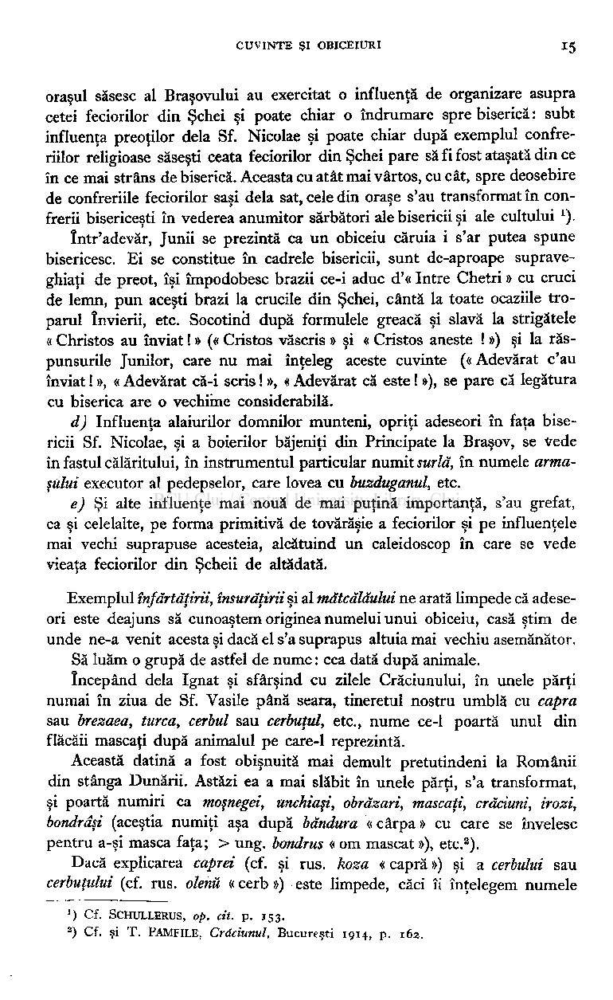

oraşul săsesc al Braşovului au exercitat o influenţă de organizare asupra cetei feciorilor din Şchei şi poate chiar o îndrumare spre biserică : subt influenţa preoţilor delà Sf. Nicolae şi poate chiar după exemplul confreriilor religioase săseşti ceata feciorilor din Şchei pare să fi fost ataşată din ce în ce mai strâns de biserică. Aceasta cu atât mai vârtos, cu cât, spre deosebire de confreriile feciorilor saşi delà sat, cele din oraşe s'au transformat în confrerii bisericeşti în vederea anumitor sărbători ale bisericii şi ale cultului ).

într'adevăr, Junii se prezintă ca un obiceiu căruia i s'ar putea spune bisericesc. Ei se constitue în cadrele bisericii, sunt de-aproape supraveghiaţi de preot, îşi împodobesc brazii ce-i aduc d'« Intre Chetri » cu cruci de lemn, pun aceşti brazi la crucile din Şchei, cântă la toate ocaziile troparul învierii, etc. Socotind după formulele greacă şi slavă la strigătele « Christos au înviat ! » (« Cristos văscris » şi « Cristos aneste ! ») şi la răspunsurile Junilor, care nu mai înţeleg aceste cuvinte (« Adevărat c'au înviat ! », « Adevărat că-i scris ! », « Adevărat că este ! »), se pare că legătura cu biserica are o vechime considerabilă.

- d) Influenţa alaiurilor domnilor munteni, opriţi adeseori în faţa bisericii Sf. Nicolae, şi a boierilor băjeniţi din Principate la Braşov, se Vede în fastul călăritului, în instrumentul particular numit surlă, în numele urmaşului executor al pedepselor, care lovea cu buzduganul, etc.
- e) Şi alte influenţe mai nouă de mai puţină importanţă, s'au grefat, ca şi celelalte, pe forma primitivă de tovărăşie a feciorilor şi pe influenţele mai vechi suprapuse acesteia, alcătuind un caleidoscop în care se vede vieaţa feciorilor din Şcheii de altădată.

Exemplul înfârtăţirii, însurăţirii şi al mătcălăului ne arată limpede că adeseori este deajuns să cunoaştem originea numelui unui obiceiu, casă ştim de unde ne-a venit acesta şi dacă el s'a suprapus altuia mai vechiu asemănător.

Să luăm o grupă de astfel de nume : cea dată după animale. începând delà Ignat şi sfârşind cu zilele Crăciunului, în unele părţi numai în ziua de Sf. Vasile până seara, tineretul nostru umblă cu capra sau brezaea, turca, cerbul sau cerbuţul, etc., nume ce-1 poartă unul din flăcăii mascaţi după animalul pe care-1 reprezintă.

Această datină a fost obişnuită mai demult pretutindeni la Românii din stânga Dunării. Astăzi ea a mai slăbit în unele părţi, s'a transformat, şi poartă numiri ca moşnegei, unchiaşi, obrăzari, mascaţi, crâciuni, irozi, bondrâşi (aceştia numiţi aşa după bândura « cârpa » cu care se învelesc pentru a-şi masca faţa; > ung. bondrus « om mascat »), etc.

).

2

Dacă explicarea caprei (cf. şi rus. koza « capră ») şi a cerbului sau cer butului (cf. rus. olenu « cerb ») este limpede, căci îi înţelegem numele

') Cf. SCHULLERUS, op. cit. p. 153 .

###### ) Cf. şi T . PAMPILE, Crăciunul, Bucureşti 1914 , p. 162 .

2

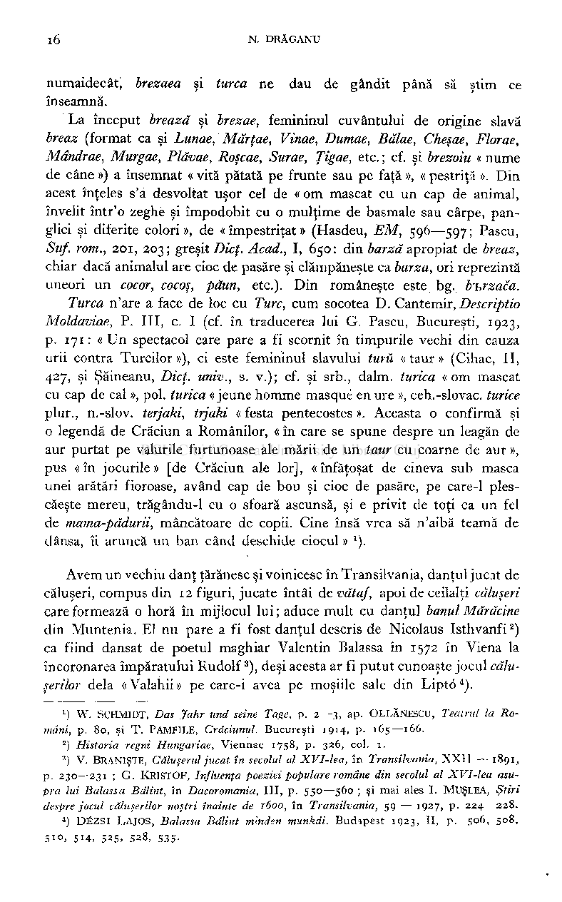

numaidecât, brezaea şi turca ne dau de gândit până să ştim ce înseamnă.

La început brează şi brezae, femininul cuvântului de origine slavă breaz (format ca şi Lunae, Mărţae, Vinae, Dumae, Bâlae, Cheşae, Florae, Mândrae, Murgae, Plăvae, Roşcae, Surae, Ţigae, etc. ; cf. şi brezoiu « nume de câne ») a însemnat « vită pătată pe frunte sau pe faţă », « pestriţă ». Din acest înţeles s'a desvoltat uşor cel de « om mascat cu un cap de animal, învelit într'o zeghe şi împodobit cu o mulţime de basmale sau cârpe, panglici şi diferite colori», de «împestriţat» (Hasdeu, EM, 596—597; Pascu, Suf. rom., 201, 203; greşit Diet. Acad., I, 650: din barză apropiat de breaz, chiar dacă animalul are cioc de pasăre şi clămpăneşte ca barza, ori reprezintă uneori un cocor, cocoş, păun, etc.). Din româneşte este bg. bbrzaca.

Turca n'are a face de loc cu Turc, cum socotea D. Cantemir, Descriptio Moldaviae, P. III, c. I (cf. în traducerea lui G. Pascu, Bucureşti, 1923, p. 171 : « Un spectacol care pare a fi scornit în timpurile vechi din cauza urii contra Turcilor»), ci este femininul slavului turu «taur» (Cihac, II, 427, şi Şăineanu, Dicţ. univ., s. v.); cf. şi srb., dalm. turica «om mascat cu cap de cal », pol. turica «jeune homme masqué en ure », ceh.-slovac, turice plur., n.-slov. terjaki, trjaki « festa pentecostes ». Aceasta o confirmă şi

- o legendă de Crăciun a Românilor, « în care se spune despre un leagăn de aur purtat pe valurile furtunoase ale mării de un taur cu coarne de aur », pus «în jocurile» [de Crăciun ale lor], «înfăţoşat de cineva sub masca unei arătări fioroase, având cap de bou şi cioc de pasăre, pe care-1 plescăeşte mereu, trăgându-1 cu o sfoară ascunsă, şi e privit de toţi ca un fel de mama-pădurii, mâncătoare de copii. Cine însă vrea să n'aibă teamă de dânsa, îi aruncă un ban când deschide ciocul » ).

Avem un vechiu danţ ţărănesc şi voinicesc în Transilvania, danţul jucat de căluşeri, compus din 12 figuri, jucate întâi de vătaf, apoi de ceilalţi căluşeri care formează o horă în mijlocul lui; aduce mult cu danţul banul Mărăcine din Muntenia. El nu pare a fi fost danţul descris de Nicolaus Isthvanfi

2

)

ca fiind dansat de poetul maghiar Valentin Balassa în 1572 în Viena la încoronarea împăratului Rudolf

3

), deşi acesta ar fi putut cunoaşte jocul căluşerilor delà «Valahii» pe care-i avea pe moşiile sale din Liptô

4

).

W. SCHMIDT, Das Jahr und seine Tage, p. 2—3 , ap. OLLĂNESCU, Teatrul la Români, p. 80 , şi T . PAMFILE, Crăciunul. Bucureşti 1914 , p. 165—166 .

a

) Historia regni Hungariae, Viennae 1758 , p. 326 , col. 1 .

3

) V . BRANIŞTE, Căluşerul jucat în secolul al XVI-lea, în Transilvania, XXI I — 1891 ,

- p. 230—23 1 ; G . KRISTOF, Influenţa poeziei populare române din secolul al XVI-lea asupra lui Balassa Bdlint, în Dacorotnania, UI , p. 550—56 0 ; şi mai ales I . MUŞLEA, Ştiri despre jocul căluşerilor noştri înainte de 1600, în Transilvania, 5 9 — 1927 , p. 224—228 .

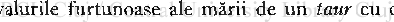

###### *) DÉZS I LAJOS , Balassa Bdlint minden munkdi. Budapest 1923 , II , p. 506 , 5°8

51° . 514 , 525 . 528 , 535 .

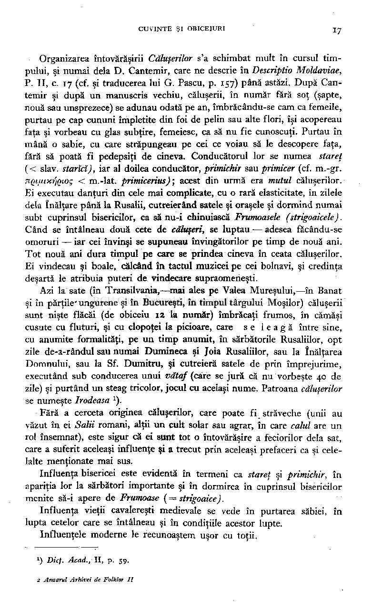

Organizarea întovărăşirii Căluşerilor s'a schimbat mult în cursul timpului, şi numai delà D. Cantemir, care ne descrie în Descriptio Moldaviae, P. II, c. 17 (cf. şi traducerea lui G. Pascu, p. 157) până astăzi. După Cantemir şi după un manuscris vechiu, căluşerii, în număr fără soţ (şapte, nouă sau unsprezece) se adunau odată pe an, îmbrăcându-se cam ca femeile, purtau pe cap cununi împletite din foi de pelin sau alte flori, îşi acopereau faţa şi vorbeau cu glas subţire, femeiesc, ca să nu fie cunoscuţi. Purtau în mână o sabie, cu care străpungeau pe cei ce voiau să le descopere faţa, fără să poată fi pedepsiţi de cineva. Conducătorul lor se numea stareţ (< slav. starïcï), iar al doilea conducător, primichir sau primicer (cf. m.-gr. TCQifuxiqqioç < m.-lat. primicerius); acest din urmă era mutul căluşerilor. Ei executau danturi din cele mai complicate, cu o rară elasticitate, în zilele delà înălţare până la Rusalii, cutreierând satele şi oraşele şi dormind numai subt cuprinsul bisericilor, ca să nu-i chinuiască Frumoasele (strigoaicele). Când se întâlneau două cete de căluşeii, se luptau — adesea făcându-se omoruri — iar cei învinşi se supuneau învingătorilor pe timp de nouă ani. Tot nouă ani dura timpul pe care se prindea cineva în ceata căluşerilor. Ei vindecau şi boale, călcând în tactul muzicei pe cei bolnavi, şi credinţa deşartă le atribuia puteri de vindecare supraomeneşti.

Azi la sate (în Transilvania,—mai ales pe Valea Mureşului,—în Banat şi în părţile* ungurene şi în Bucureşti, în timpul târgului Moşilor) căluşerii sunt nişte flăcăi (de obiceiu 12 la număr) îmbrăcaţi frumos, în cămăşi cusute cu fluturi, şi cu clopoţei la picioare, care s e leag ă între sine, cu anumite formalităţi, pe un timp anumit, în sărbătorile Rusaliilor, opt zile de-a-rândul sau numai Dumineca şi Joia Rusaliilor, sau la înălţarea Domnului, sau la Sf. Dumitru, şi cutreieră satele de prin împrejurime, executând sub conducerea unui vătaf (care se jură că nu vorbeşte 40 de zile) şi purtând un steag tricolor, jocul cu acelaşi nume. Patroana căluşerilor se numeşte Irodeasa

).

1

Fără a cerceta originea căluşerilor, care poate fi străveche (unii au văzut în ei Sălii romani, alţii un cult solar sau agrar, în care calul are un rol însemnat), este sigur că ei sunt tot o întovărăşire a feciorilor delà sat, care a suferit aceleaşi influenţe şi a trecut prin aceleaşi prefaceri ca şi celelalte menţionate mai sus.

Influenţa bisericei este evidentă în termeni ca stareţ şi primichir, în apariţia lor la sărbători importante şi în dormirea în cuprinsul bisericilor menite să-i apere de Frumoase (= strigoaice).

Influenţa vieţii cavalereşti medievale se vede în purtarea săbiei, în lupta cetelor care se întâlneau şi în condiţiile acestor lupte.

Influenţele moderne le recunoaştem uşor cu toţii.

) Dicţ. Acad., II , p. 59.

1

2 Anuarul Arhivei de Folklor II

