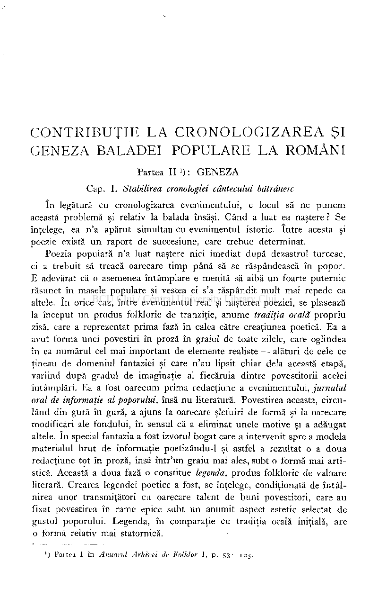

# CONTRIBUŢIE LA CRONOLOGIZAREA ŞI GENEZA BALADEI POPULARE LA ROMÂNI

Partea II *) : GENEZA Cap. I. Stabilirea cronologiei cântecului bătrânesc

în legătură cu cronologizarea evenimentului, e locul să ne punem această problemă şi relativ la balada însăşi. Când a luat ea naştere ? Se înţelege, ea n'a apărut simultan cu evenimentul istoric. între acesta şi poezie există un raport de succesiune, care trebue determinat.

Poezia populară n'a luat naştere nici imediat după dezastrul turcesc, ci a trebuit să treacă oarecare timp până să se răspândească în popor. E adevărat că o asemenea întâmplare e menită să aibă un foarte puternic

- răsunet în masele populare şi vestea ei s'a răspândit mult mai repede ca altele. în orice caz, între evenimentul real şi naşterea poeziei, se plasează la început un produs folkloric de tranziţie, anume tradiţia orală propriu zisă, care a reprezentat prima fază în calea către creaţiunea poetică. Ea a avut forma unei povestiri în proză în graiul de toate zilele, care oglindea în ea numărul cel mai important de elemente realiste — alături de cele ce ţineau de domeniul fantaziei şi care n'au lipsit chiar delà această etapă, variind după gradul de imaginaţie al fiecăruia dintre povestitorii acelei întâmplări. Ea a fost oarecum prima redacţiune a evenimentului, jurnalul oral de informaţie al poporului, însă nu literatură. Povestirea aceasta, circulând din gură în gură, a ajuns la oarecare şlefuiri de formă şi la oarecare modificări ale fondului, în sensul că a eliminat unele motive şi a adăugat altele. în special fantazia a fost izvorul bogat care a intervenit spre a modela materialul brut de informaţie poetizându-1 şi astfel a rezultat o a doua redacţiune tot în proză, însă într'un graiu mai ales, subt o formă mai artistică. Această a doua fază o constitue legenda, produs folkloric de valoare literară. Crearea legendei poetice a fost, se înţelege, condiţionată de întâlnirea unor transmiţători cu oarecare talent de buni povestitori, care au fixat povestirea în rame epice subt un anumit aspect estetic selectat de gustul poporului. Legenda, în comparaţie cu tradiţia orală iniţială, are o formă relativ mai statornică.

') Partea I în Anuarul Arhivei de Folklor 1, p. 53—105 .

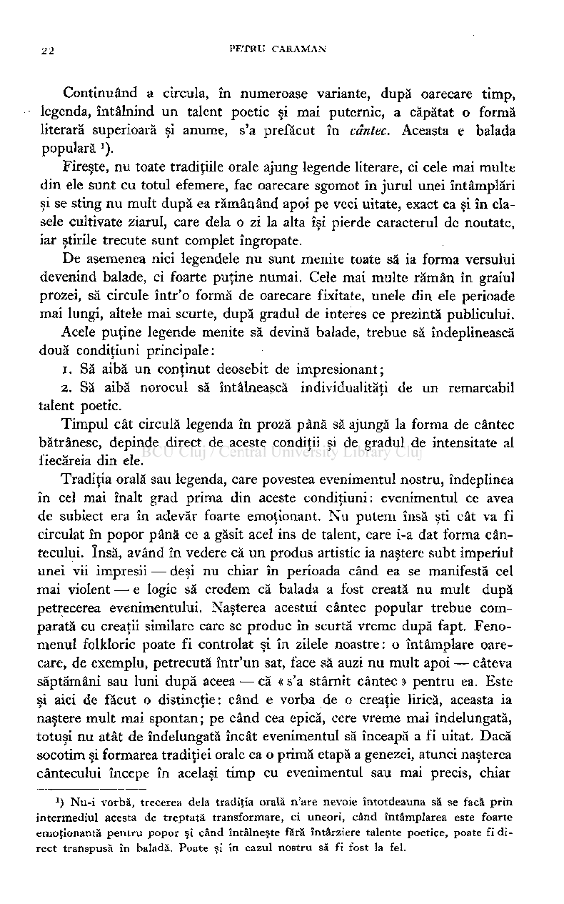

Continuând a circula, în numeroase variante, după oarecare timp, legenda, întâlnind un talent poetic şi mai puternic, a căpătat o formă literară superioară şi anume, s'a prefăcut în cântec. Aceasta e balada populară ).

Fireşte, nu toate tradiţiile orale ajung legende literare, ci cele mai multe din ele sunt cu totul efemere, fac oarecare sgomot în jurul unei întâmplări şi se sting nu mult după ea rămânând apoi pe veci uitate, exact ca şi în clasele cultivate ziarul, care delà o zi la alta îşi pierde caracterul de noutate, iar ştirile trecute sunt complet îngropate.

De asemenea nici legendele nu sunt menite toate să ia forma versului devenind balade, ci foarte puţine numai. Cele mai multe rămân în graiul prozei, să circule într'o formă de oarecare fixitate, unele din ele perioade mai lungi, altele mai scurte, după gradul de interes ce prezintă publicului.

Acele puţine legende menite să devină balade, trebue să îndeplinească două condiţiuni principale:

- 1. Să aibă un conţinut deosebit de impresionant;
- 2. Să aibă norocul să întâlnească individualităţi de un remarcabil

talent poetic.

Timpul cât circulă legenda în proză până să ajungă la forma de cântec bătrânesc, depinde direct de aceste condiţii şi de gradul de intensitate al fiecăreia din ele.

Tradiţia orală sau legenda, care povestea evenimentul nostru, îndeplinea în cel mai înalt grad prima din aceste condiţiuni: evenimentul ce avea de subiect era în adevăr foarte emoţionant. Nu putem însă şti cât va fi circulat în popor până ce a găsit acel ins de talent, care i-a dat forma cântecului, însă, având în vedere că un produs artistic ia naştere subt imperiul unei vii impresii — deşi nu chiar în perioada când ea se manifestă cel mai violent —- e logic să credem că balada a fost creată nu mult după petrecerea evenimentului. Naşterea acestui cântec popular trebue comparată cu creaţii similare care se produc în scurtă vreme după fapt. Fenomenul folkloric poate fi controlat şi în zilele noastre: o întâmplare oarecare, de exemplu, petrecută într'un sat, face să auzi nu mult apoi — câteva

- săptămâni sau luni după aceea — că « s'a stârnit cântec » pentru ea. Este şi aici de făcut o distincţie: când e vorba de o creaţie lirică, aceasta ia naştere mult mai spontan; pe când cea epică, cere vreme mai îndelungată, totuşi nu atât de îndelungată încât evenimentul să înceapă a fi uitat. Dacă socotim şi formarea tradiţiei orale ca o primă etapă a genezei, atunci naşterea cântecului începe în acelaşi timp cu evenimentul sau mai precis, chiar

*) Nu- i vorbă, trecerea delà tradiţia orală n'are nevoie întotdeauna să se facă prin intermediul acesta de treptată transformare, ci uneori, când întâmplarea este foarte emoţionantă pentru popor şi când întâlneşte fără întârziere talente poetice, poate fi direct transpusă în baladă. Poate şi în cazul nostru să fi fost la fel.

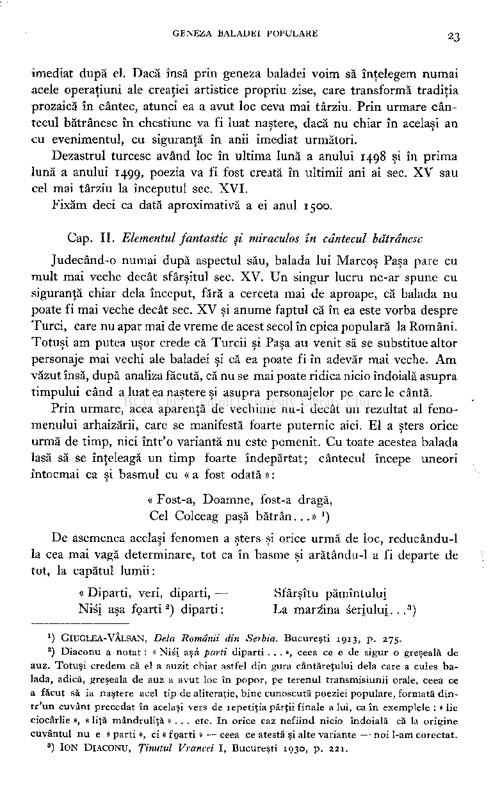

imediat după el. Dacă însă prin geneza baladei voim să înţelegem numai acele operaţiuni ale creaţiei artistice propriu zise, care transformă tradiţia prozaică în cântec, atunci ea a avut loc ceva mai târziu. Prin urmare cântecul bătrânesc în chestiune va fi luat naştere, dacă nu chiar în acelaşi an cu evenimentul, cu siguranţă în anii imediat următori.

Dezastrul turcesc având loc în ultima lună a anului 1498 şi în prima lună a anului 1499, poezia va fi fost creată în ultimii ani ai sec. XV sau cel mai târziu la începutul sec. XVI.

Fixăm deci ca dată aproximativă a ei anul 1500.

Cap. II. Elementul fantastic şi miraculos în cântecul bătrânesc

Judecând-o numai după aspectul său, balada lui Marcoş Paşa pare cu mult mai veche decât sfârşitul sec. XV. Un singur lucru ne-ar spune cu siguranţă chiar delà început, fără a cerceta mai de aproape, că balada nu poate fi mai veche decât sec. XV şi anume faptul că în ea este vorba despre Turci, care nu apar mai de vreme de acest secol în epica populară la Români. Totuşi am putea uşor crede că Turcii şi Paşa au venit să se substitue altor personaje mai vechi ale baladei şi că ea poate fi în adevăr mai veche. Am văzut însă, după analiza făcută, că nu se mai poate ridica nicio îndoială asupra timpului când a luat ea naştere şi asupra personajelor pe care le cântă.

Prin urmare, acea aparenţă de vechime nu-i decât un rezultat al fenomenului arhaizării, care se manifestă foarte puternic aici. El a şters orice urmă de timp, nici într'o variantă nu este pomenit. Cu toate acestea balada lasă să se înţeleagă un timp foarte îndepărtat; cântecul începe uneori întocmai ca şi basmul cu « a fost odată » :

« Fost-a, Doamne, fost-a dragă, Cel Colceag paşă bătrân... » )

De asemenea acelaşi fenomen a şters şi orice urmă de loc, reducându-1 la cea mai vagă determinare, tot ca în basme şi arătându-1 a fi departe de tot, la capătul lumii:

« Diparti, veri, diparti, Nisi aşa foarti

Sfârşîtu pămîntului La marzina serjului. . .

) diparti :

)

2

3

###### *) GlUGLEA-VÂLSAN, Delà Românii din Serbia. Bucureşti 1913 , p. 275 .

) Diaconu a notat : « Nisi aşa parti diparti .. . », ceea ce e de sigur o greşeală de auz. Totuşi credem că el a auzit chiar astfel din gura cântăreţului delà care a cules ba lada, adică, greşeala de auz a avut loc în popor, pe terenul transmisiunii orale, ceea ce a făcut să ia naştere acel tip de aliteraţie, bine cunoscută poeziei populare, formată dintr'un cuvânt precedat în acelaşi vers de repetiţia părţii finale a lui, ca în exemplele : « lie ciocârlie », « liţă mândruliţă ».. . etc. In orice caz nefiind nicio îndoială că la origine cuvântul nu e « parti », ci « foarti » — ceea ce atestă şi alte variante — noi l-am corectat.

2

) ION DIACONU, Ţinutul Vrancei I , Bucureşti 1930 , p. 221 .

3

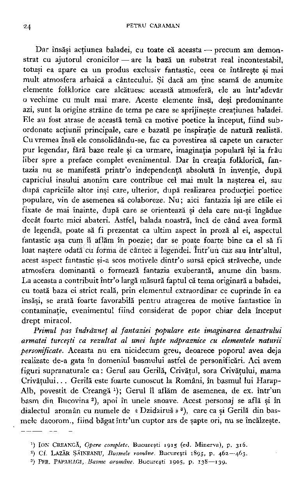

Dar însăşi acţiunea baladei, cu toate că aceasta — precum am demonstrat cu ajutorul cronicilor — are la bază un substrat real incontestabil, totuşi ea apare ca un produs exclusiv fantastic, ceea ce întăreşte şi mai mult atmosfera arhaică a cântecului. Şi dacă am ţine seamă de anumite elemente folklorice care alcătuesc această atmosferă, ele au într'adevăr

- o vechime cu mult mai mare. Aceste elemente însă, deşi predominante azi, sunt la origine străine de tema pe care se sprijineşte creaţiunea baladei. Ele au fost atrase de această temă ca motive poetice la început, fiind sub­
- ordonate acţiunii principale, care e bazată pe inspiraţie de natură realistă. Cu vremea însă ele consolidându-se, fac ca povestirea să capete un caracter pur legendar, fără baze reale şi ca urmare, imaginaţia populară îşi ia frâu liber spre a preface complet evenimentul. Dar în creaţia folklorică, fantazia nu se manifestă printr'o independenţă absolută în invenţie, după capriciul insului anonim care contribue cel mai mult la naşterea ei, sau după capriciile altor inşi care, ulterior, după realizarea producţiei poetice populare, vin de asemenea să colaboreze. Nu; aici fantazia îşi are căile ei fixate de mai înainte, după care se orientează şi delà care nu-şi îngădue decât foarte mici abateri. Astfel, balada noastră, încă de când avea formă de legendă, poate să fi prezentat ca ultim aspect în proză al ei, aspectul fantastic aşa cum îl aflăm în poezie; dar se poate foarte bine ca el să fi luat naştere odată cu forma de cântec a legendei. într'un caz sau într'altul, acest aspect fantastic şi-a scos motivele dintr'o sursă epică străveche, unde atmosfera dominantă o formează fantazia exuberantă, anume din basm. La aceasta a contribuit într'o largă măsură faptul că tema originară a baladei, cu toată baza ei strict reală, prin elementul extraordinar ce cuprinde în ea însăşi, se arată foarte favorabilă pentru atragerea de motive fantastice în contaminaţie, evenimentul fiind considerat de popor chiar delà început drept miracol.

Primul pas îndrăzneţ al fantaziei populare este imaginarea dezastrului armatei turceşti ca rezultat al unei lupte năpraznice cu elementele naturii personificate. Aceasta nu era nicidecum greu, deoarece poporul avea deja realizate de-a gata în domeniul basmului astfel de personificări. Aci avem figuri supranaturale ca: Gerul sau Gerilă, Crivăţul, sora Crivăţului, mama Crivăţului... Gerilă este foarte cunoscut la Români, în basmul lui HarapAlb, povestit de Creangă ); Gerul îl aflăm de asemenea, de ex. într'un basm din Bucovina ), apoi în unele snoave. Acest personaj se află şi în dialectul aromân cu numele de « Dzidzirus »

), care ca şi Gerilă din basmele dacorom., fiind băgat într'un cuptor ars de şapte ori, nu se încălzeşte.

3

- 1 ) ION CREANGĂ, Opere complete. Bucureşti 191 5 (ed. Minerva), p. 316 .
- 2 ) Cf. LAZĂR ŞĂINEANU, Basmele române. Bucureşti 1895 , p. 462—463 .
- 3 ) PER. PAPAHAGI, Basme aromâne. Bucureşti 1905 , p. 138—139 .

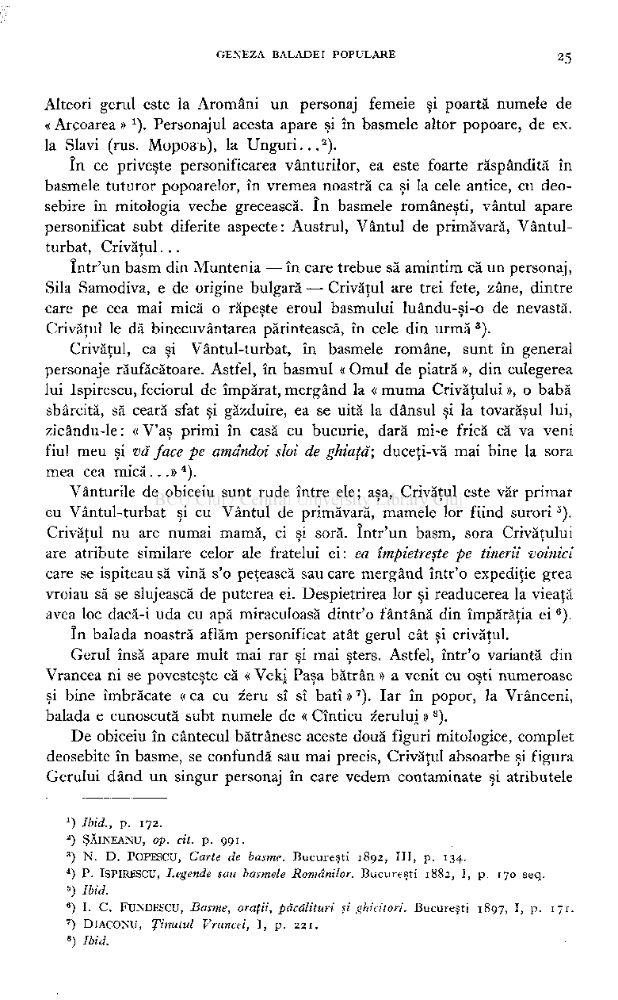

Alteori gerul este la Aromâni un personaj femeie şi poartă numele de « Arcoarea »

). Personajul acesta apare şi în basmele altor popoare, de ex. la Slavi (rus. Mopo3T>), la Unguri...

1

).

2

în ce priveşte personificarea vânturilor, ea este foarte răspândită în basmele tuturor popoarelor, în vremea noastră ca şi la cele antice, cu deosebire în mitologia veche grecească. în basmele româneşti, vântul apare personificat subt diferite aspecte: Austrul, Vântul de primăvară, Vântulturbat, Crivăţul.. .

într'un basm din Muntenia — în care trebue să amintim că un personaj, Sila Samodiva, e de origine bulgară —• Crivăţul are trei fete, zâne, dintre care pe cea mai mică o răpeşte eroul basmului luându-şi-o de nevastă. Crivăţul le dă binecuvântarea părintească, în cele din urmă ).

Crivăţul, ca şi Vântul-turbat, în basmele române, sunt în general personaje răufăcătoare. Astfel, în basmul « Omul de piatră », din culegerea lui Ispirescu, feciorul de împărat, mergând la « muma Crivăţului », o babă sbârcită, să ceară sfat şi găzduire, ea se uită la dânsul şi la tovarăşul lui, zicându-le : « V'aş primi în casă cu bucurie, dară mi-e frică că va veni fiul meu şi vă face pe amândoi sloi de ghiaţă; duceţi-vă mai bine la sora mea cea mică...» ).

Vânturile de obiceiu sunt rude între ele; aşa, Crivăţul este văr primar cu Vântul-turbat şi cu Vântul de primăvară, mamele lor fiind surori

). Crivăţul nu are numai mamă, ci şi soră. într'un basm, sora Crivăţului are atribute similare celor ale fratelui ei : ea împietreşte pe tinerii voinici care se ispiteau să vină s'o peţească sau care mergând într'o expediţie grea vroiau să se slujească de puterea ei. Despietrirea lor şi readucerea la vieaţă avea loc dacă-i uda cu apă miraculoasă dintr'o fântână din împărăţia ei

5

).

6

în balada noastră aflăm personificat atât gerul cât şi crivăţul. Gerul însă apare mult mai rar şi mai şters. Astfel, într'o variantă din

Vrancea ni se povesteşte că « Veki Paşa bătrân » a venit cu oşti numeroase şi bine îmbrăcate « ca cu zeru sî sî batî »

). Iar în popor, la Vrânceni, balada e cunoscută subt numele de « Cînticu zerului »

7

).

8

De obiceiu în cântecul bătrânesc aceste două figuri mitologice, complet deosebite în basme, se confundă sau mai precis, Crivăţul absoarbe şi figura Gerului dând un singur personaj în care vedem contaminate şi atributele

') Ibid., p. 172 .

- 2 ) ŞĂINEANU, op. cit. p. 991 .
- 3 ) N . D . POPESCU, Carte de basme. Bucureşti 1892 , III , p. 134 .
- 4 ) P. ISPIRESCU, Legende sau basmele Românilor. Bucureşti 1882 , I, p 17 0 seq.

) Ibid.

6

- 6 ) I. C . FUNDESCU, Basme, oraţii, păcălituri şi ghicitori. Bucureşti 1897 , I, p. 171 .
- 7 ) DIACONU, Ţinutul Vrancei, I , p. 221 .
- 8 ) Ibid.

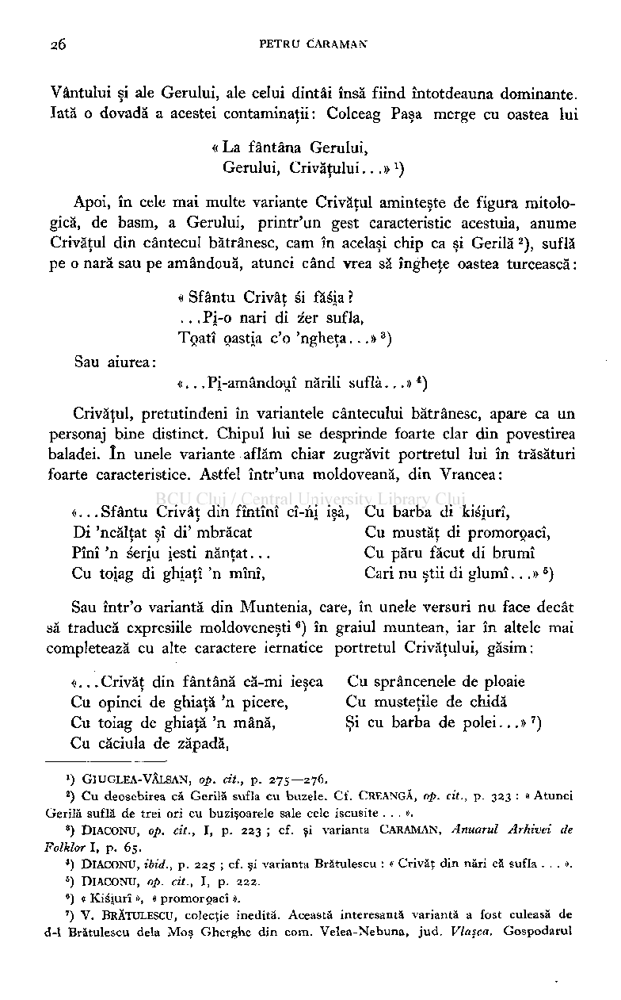

Vântului şi ale Gerului, ale celui dintâi însă fiind întotdeauna dominante. Iată o dovadă a acestei contaminaţii: Colceag Paşa merge cu oastea lui

« La fântâna Gerului, Gerului, Crivăţului... »

)

1

Apoi, în cele mai multe variante Crivăţul aminteşte de figura mitologică, de basm, a Gerului, printr'un gest caracteristic acestuia, anume Crivăţul din cântecul bătrânesc, cam în acelaşi chip ca şi Gerilă ), suflă pe o nară sau pe amândouă, atunci când vrea să îngheţe oastea turcească :

« Sfântu Crivâţ si fasia ?

.. .Pi-o nari di zer sufla, Toatî oastia c'o 'ngheţa... »

) Sau aiurea:

3

«... Pi-amândouî nărili sufla... »

)

4

Crivăţul, pretutindeni în variantele cântecului bătrânesc, apare ca un personaj bine distinct. Chipul lui se desprinde foarte clar din povestirea baladei. In unele variante aflăm chiar zugrăvit portretul lui în trăsături foarte caracteristice. Astfel într'una moldoveana, din Vrancea:

«...Sfântu Crivâţ din fîntînî cî-ni işâ, Cu barba di kisiurî, Di 'ncălţat şî di' mbrăcat Cu mustăţ di promoroacî, Pînî 'n seriu ieşti nănţat... Cu păru făcut di brumî Cu toiag di ghiaţî 'n mînî, Cari nu ştii di glumî... »

)

5

Sau într'o variantă din Muntenia, care, în unele versuri nu face decât să traducă expresiile moldoveneşti

) în graiul muntean, iar în altele mai completează cu alte caractere iernatice portretul Crivăţului, găsim:

6

«.. .Crivăţ din fântână că-mi ieşea Cu sprâncenele de ploaie Cu opinci de ghiaţă 'n picere, Cu musteţile de chidă Cu toiag de ghiaţă 'n mână, Şi cu barba de polei.. .»

) Cu căciula de zăpadă,

7

- 1 ) GlUGLEA-VÂLSAN , op. cit., p. 275—276 .
- 2

### ) Cu deosebirea că Gerilă sufla cu buzele. Cf. CREANGĂ, op. cit., p. 32 3 : « Atunci Gerilă suflă de trei ori cu buzişoarele sale cele iscusite .. . ».

### *) DlACONU, op. cit., I , p. 22 3 ; cf. şi varianta CARAMAN, Anuarul Arhivei de Folklor I , p. 65 .

### ) DlACONU, ibid., p. 22 5 ; cf. şi varianta Brătulescu : « Crivăţ din nări că sufla .. . ».

4

###### ) DlACONU, op. cit., I , p. 222 .

5

) « Kisiurî », « promoroacî ».

6

') V. BRĂTULESCU, colecţie inedită. Această interesantă variantă a fost culeasă de d-1 Brătulescu delà Moş Gherghe din corn. Velea-Nebuna, jud. Vlaşca. Gospodarul

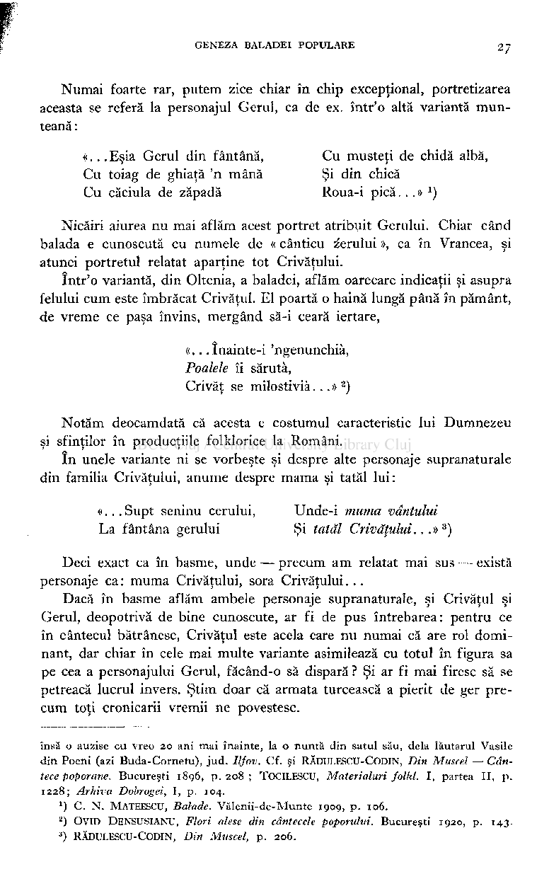

Numai foarte rar, putem zice chiar în chip excepţional, portretizarea aceasta se referă la personajul Gerul, ca de ex. într'o altă variantă raunteană :

«.. .Eşia Gerul din fântână, Cu musteţi de chidă albă, Cu toiag de ghiaţă 'n mână Şi din chică Cu căciula de zăpadă Roua-i pică... » *)

Nicăiri aiurea nu mai aflăm acest portret atribuit Gerului. Chiar când balada e cunoscută cu numele de « cânticu zerului », ca în Vrancea, şi atunci portretul relatat aparţine tot Crivăţului.

într'o variantă, din Oltenia, a baladei, aflăm oarecare indicaţii şi asupra felului cum este îmbrăcat Crivăţul. El poartă o haină lungă până în pământ, de vreme ce paşa învins, mergând să-i ceară iertare,

«... înainte-i 'ngenunchiâ, Poalele îi săruta, Crivăţ se milostiviâ... »

)

2

Notăm deocamdată că acesta e costumul caracteristic lui Dumnezeu şi sfinţilor în producţiile folklorice la Români.

în unele variante ni se vorbeşte şi despre alte personaje supranaturale din familia Crivăţului, anume despre mama şi tatăl lui:

«...Supt seninu cerului, Unde-i muma vântului La fântâna gerului Şi tatăl Crivăţului.. .»

)

3

Deci exact ca în basme, unde — precum am relatat mai sus — există personaje ca: muma Crivăţului, sora Crivăţului...

Dacă în basme aflăm ambele personaje supranaturale, şi Crivăţul şi Gerul, deopotrivă de bine cunoscute, ar fi de pus întrebarea: pentru ce în cântecul bătrânesc, Crivăţul este acela care nu numai că are rol dominant, dar chiar în cele mai multe variante asimilează cu totul în figura sa pe cea a personajului Gerul, făcând-o să dispară ? Şi ar fi mai firesc să se petreacă lucrul invers. Ştim doar că armata turcească a pierit de ger precum toţi cronicarii vremii ne povestesc.

însă o auzise c u vreo 2 0 ani mai înainte, la o nuntă din satul său, delà lăutarul Vasile din Poeni (azi Buda-Cornetu) , jud . Ilfov. Cf . şi RĂDULESCU-CODIN, Din Muscel — Cântece poporane. Bucureşti 1896 , p. 20 8 ; TOCILESCU, Materialuri folkl. I , partea II , p . 1228 Arhiva Dobrogei, 1, p. 104 .

*) C . N. MATEESCU, Balade. Vălenii-de-Munt e 1909 , p . 106

- 2

) OVIDDENSUSIANU, Flori alese din cântecele poporului. Bucureşti 1920 p. 143 .

- 3

###### ) RĂDULESCU-CODIN, Din Muscel, p. 206

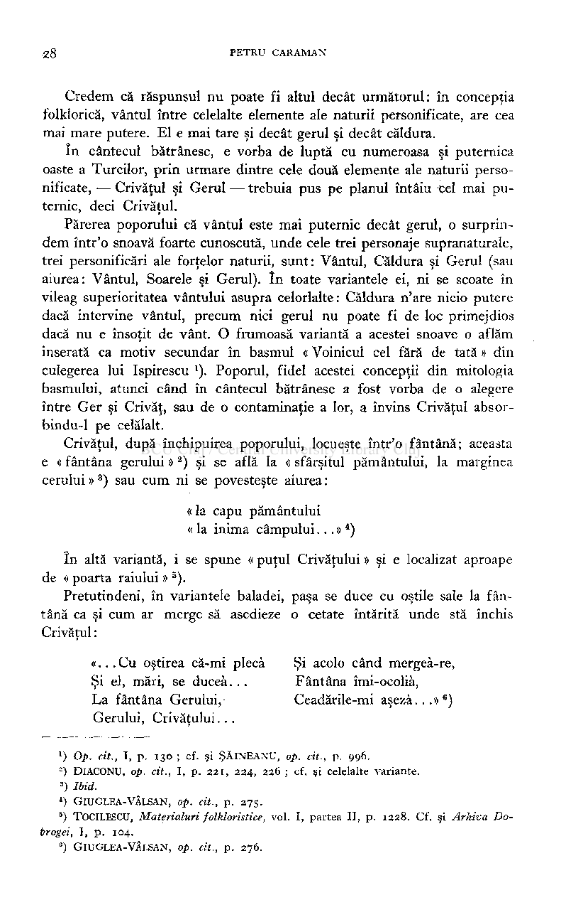

Credem că răspunsul nu poate fi altul decât următorul: în concepţia folklorică, vântul între celelalte elemente ale naturii personificate, are cea mai mare putere. El e mai tare şi decât gerul şi decât căldura.

în cântecul bătrânesc, e vorba de luptă cu numeroasa şi puternica oaste a Turcilor, prin urmare dintre cele două elemente ale naturii personificate, — Crivăţul şi Gerul — trebuia pus pe planul întâiu cel mai puternic, deci Crivăţul.

Părerea poporului că vântul este mai puternic decât gerul, o surprindem într'o snoavă foarte cunoscută, unde cele trei personaje supranaturale, trei personificări ale forţelor naturii, sunt: Vântul, Căldura şi Gerul (sau aiurea: Vântul, Soarele şi Gerul). în toate variantele ei, ni se scoate în vileag superioritatea vântului asupra celorlalte: Căldura n'are nicio putere dacă intervine vântul, precum nici gerul nu poate fi de loc primejdios dacă nu e însoţit de vânt. O frumoasă variantă a acestei snoave o aflăm inserată ca motiv secundar în basmul « Voinicul cel fără de tată » din culegerea lui Ispirescu ). Poporul, fidel acestei concepţii din mitologia basmului, atunci când în cântecul bătrânesc a fost vorba de o alegere între Ger şi Crivăţ, sau de o contaminaţie a lor, a învins Crivăţul absorbindu-1 pe celălalt.

Crivăţul, după închipuirea poporului, locueşte într'o fântână; aceasta e « fântâna gerului »

) şi se află la « sfârşitul pământului, la marginea cerului »

2

) sau cum ni se povesteşte aiurea :

3

« la capu pământului « la inima câmpului... »

)

4

în altă variantă, i se spune « puţul Crivăţului » şi e localizat aproape de « poarta raiului »

)

5

Pretutindeni, în variantele baladei, paşa se duce cu ostile sale la fântână ca şi cum ar merge să asedieze o cetate întărită unde stă închis Crivăţul :

«...Cu oştirea că-mi pleca Şi acolo când mergeâ-re, Şi el, mări, se ducea... Fântâna îmi-ocolià, La fântâna Gerului, Ceadările-mi aşeza...»

) Gerului, Crivăţului...

6

) Op. cit., I , p. 13 0 ; cf. şi ŞĂINEANU , op. cit., p. 996 .

x

- 2 ) DlACONU, op. cit., I , p. 221 , 224 , 22 6 ; cf. şi celelalte variante.
- 3 ) Ibid.
- 4 ) GlUGLEA-VÂLSAN , op. cit., p. 275 .
- 5 ) TOCILESCU, Materialuri folkloristice, vol. I, partea II, p. 1228 . Cf. şi Arhiva Do-

brogei, 1, p. 104 .

###### ) GlUGLEA-VÂLSAN , op. cit., p. 276 .

6

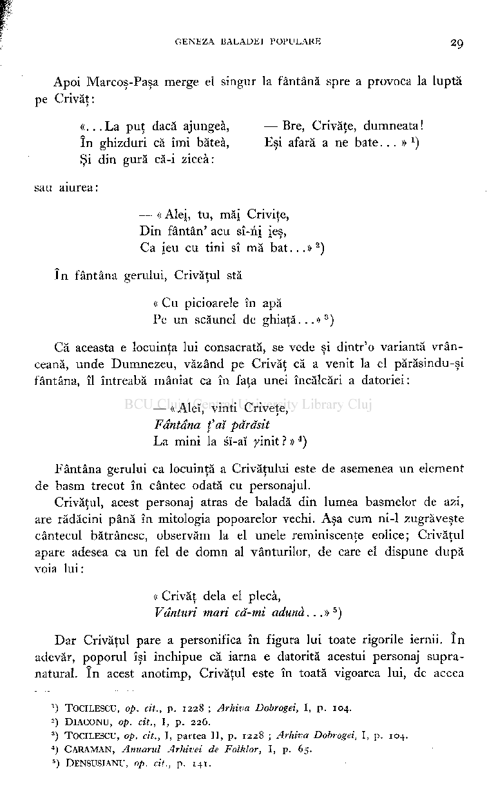

Apoi Marcoş-Paşa merge el singur la fântână spre a provoca la luptă pe Crivăţ:

«... La puţ dacă ajungea, — Bre, Crivăţe, dumneata ! în ghizduri că îmi bătea, Eşi afară a ne bate.. . » Şi din gură că-i zicea:

sau aiurea:

— « Alei, tu, măi Criviţe, Din fântân' acu sî-ni ieş, Ca jeu cu tini sî mă bat... »

) în fântâna gerului, Crivăţul stă

2

« Cu picioarele în apă Pe un scăunel de ghiaţă. . .»

)

3

Că aceasta e locuinţa lui consacrată, se vede şi dintr'o variantă vrânceană, unde Dumnezeu, văzând pe Crivăţ că a venit la el părăsindu-şi fântâna, îl întreabă mâniat ca în faţa unei încălcări a datoriei:

— « Alei, vinti Criveţe, Fântâna ţ'aî părăsit La mini la sï-aï ym\t ? »

)

4

Fântâna gerului ca locuinţă a Crivăţului este de asemenea un element de basm trecut în cântec odată cu personajul.

Crivăţul, acest personaj atras de baladă din lumea basmelor de azi, are rădăcini până în mitologia popoarelor vechi. Aşa cum ni-1 zugrăveşte cântecul bătrânesc, observăm la el unele reminiscenţe eolice; Crivăţul apare adesea ca un fel de domn al vânturilor, de care el dispune după voia lui:

« Crivăţ delà el pleca, Vânturi mari că-mi aduna... »

## )

5

Dar Crivăţul pare a personifica în figura lui toate rigorile iernii. în adevăr, poporul îşi închipue că iarna e datorită acestui personaj supranatural, în acest anotimp, Crivăţul este în toată vigoarea lui, de aceea

•) TOCILESCU, op. cit., p. 122 8 ; Arhiva Dobrogei, I , p. 104 .

- 2 ) DlACONU, op. cit., I , p. 226 .
- 3 ) TOCILESCU, op. cit., I, partea ]] , p. 122 8 ; Arhiva Dobrogei, I, p. 104 .
- 4 ) CARAMAN, Anuarul Arhivei de Folklor, I, p. 65 .
- 5 ) DENSUSIANU, op. cit., p. 141 .

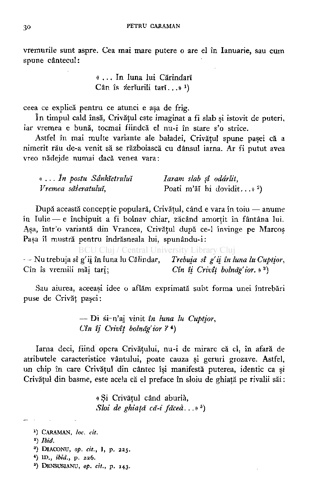

vremurile sunt aspre. Cea mai mare putere o are el în Ianuarie, sau cum spune cântecul:

«.. . In luna lui Cărindarî Cân îs zerîurili târî... »

)

x

ceea ce explică pentru ce atunci e aşa de frig.

în timpul cald însă, Crivăţul este imaginat a fi slab şi istovit de puteri, iar vremea e bună, tocmai fiindcă el nu-i în stare s'o strice.

Astfel în mai multe variante ale baladei, Crivăţul spune paşei că a nimerit rău de-a venit să se războiască cu dânsul iarna. Ar fi putut avea vreo nădejde numai dacă venea vara:

«.../« postu Sânkïetruluï Iaram slab şî odărlit, Vremea săseratuluî, Poati m'ăî hi dovidit... »

)

2

După această concepţie populară, Crivăţul, când e vara în toiu — anume în Iulie — e închipuit a fi bolnav chiar, zăcând amorţit în fântâna lui. Aşa, într'o variantă din Vrancea, Crivăţul după ce-1 învinge pe Marcoş Paşa îl mustră pentru îndrăsneala lui, spunându-i:

— Nu trebuia sî g'ii în luna lu Călindar, Trebuia sî g'ii în luna lu Cuptior, Cîn îs vremili măi tari; Cîn îi Crivîţ bolnăg'ior. »

)

3

Sau aiurea, aceeaşi idee o aflăm exprimată subt forma unei întrebări puse de Crivăţ paşei:

— Di si-n'ai vinit în luna lu Cuptior, Cîn îi Crivîţ bolnăg'ior ?

)

4

Iarna deci, fiind opera Crivăţului, nu-i de mirare că el, în afară de atributele caracteristice vântului, poate cauza şi geruri grozave. Astfel, un chip în care Crivăţul din cântec îşi manifestă puterea, identic ca şi Crivăţul din basme, este acela că el preface în sloiu de ghiaţă pe rivalii săi :

« Şi Crivăţul când aburià, Sloi de ghiaţă că-i făcea... »

)

5

') CARAMAN, loc. cit.

- *) Ibid.

3

) DIACONU, op. cit., 1, p. 225 .

- *) ID., ibid., p. 226 .

### ) DENSUS1ANU, op. cit., p. 143.

5

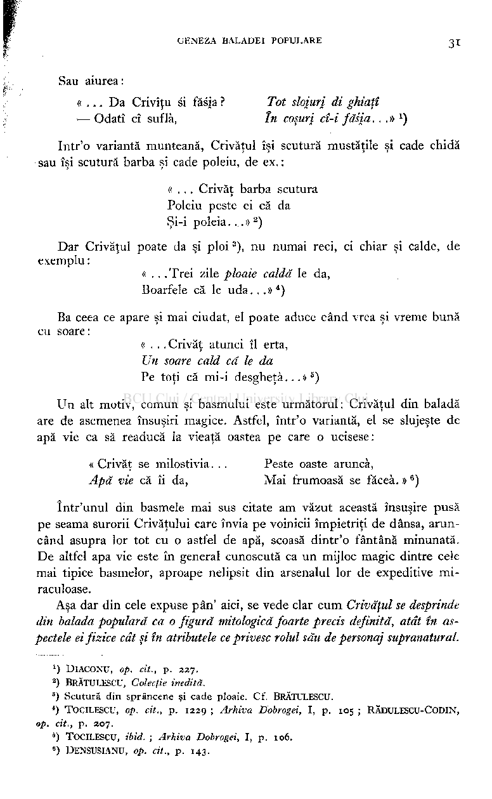

Sau aiurea: «.. . Da Crivîţu si făsia ? Tot sloiuri di ghiaţî

— Odatî cî sufla, în coşuri cî-i făsia... » *)

într'o variantă munteană, Crivăţul îşi scutură mustăţile şi cade chidă sau îşi scutură barba şi cade poleiu, de ex. :

«.. . Crivăţ barba scutura Poleiu peste ei că da Şi-i poleia...»

) Dar Crivăţul poate da şi ploi

2

), nu numai reci, ci chiar şi calde, de exemplu :

3

« .. .Trei zile ploaie caldă le da, Boarfele că le uda.. .»

)

4

Ba ceea ce apare şi mai ciudat, el poate aduce când vrea şi vreme bună cu soare:

«.. . Crivăţ atunci îl erta, Un soare cald că le da Pe toţi că mi-i desgheţâ... »

)

5

Un alt motiv, comun şi basmului este următorul: Crivăţul din baladă are de asemenea însuşiri magice. Astfel, într'o variantă, el se slujeşte de apă vie ca să readucă la vieaţă oastea pe care o ucisese:

« Crivăţ se milostivia... Peste oaste arunca, Apă vie că îi da, Mai frumoasă se făcea. »

)

6

într'unul din basmele mai sus citate am văzut această însuşire pusă pe seama surorii Crivăţului care învia pe voinicii împietriţi de dânsa, aruncând asupra lor tot cu o astfel de apă, scoasă dintr'o fântână minunată. De altfel apa vie este în general cunoscută ca un mijloc magic dintre cele mai tipice basmelor, aproape nelipsit din arsenalul lor de expeditive miraculoase.

Aşa dar din cele expuse pân' aici, se vede clar cum Crivăţul se desprinde din balada populară ca o figură mitologică foarte precis definită, atât în aspectele ei fizice cât şi în atributele ce privesc rolul său de personaj supranatural.

) DlACONU, op. cit., p. 227 .

x

- 2 ) BRĂTULESCU, Colecţie inedită.
- 3 ) Scutură din sprâncene şi cade ploaie. Cf. BRĂTULESCU.
- 4 ) TOCILESCU, op. cit., p. 122 9 ; Arhiva Dobrogei, I , p. 10 5 ; RĂDULESCU-CODIN,

op. cit., p. 207 . '") TOCILESCU, ibid. ; Arhiva Dobrogei, I , p . 106 .

###### ) DENSUSIANU, op. cit., p. 143 .

6

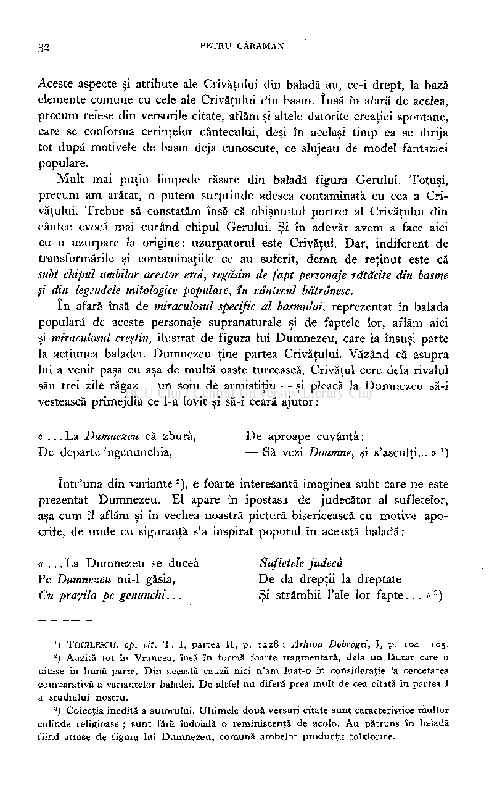

Aceste aspecte şi atribute ale Crivăţului din baladă au, ce-i drept, la bază elemente comune cu cele ale Crivăţului din basm. însă în afară de acelea, precum reiese din versurile citate, aflăm şi altele datorite creaţiei spontane, care se conforma cerinţelor cântecului, deşi în acelaşi timp ea se dirija tot după motivele de basm deja cunoscute, ce slujeau de model fantaziei populare.

Mult mai puţin limpede răsare din baladă figura Gerului. Totuşi, precum am arătat, o putem surprinde adesea contaminată cu cea a Crivăţului. Trebue să constatăm însă că obişnuitul portret al Crivăţului din cântec evocă mai curând chipul Gerului. Şi în adevăr avem a face aici cu o uzurpare la origine: uzurpatorul este Crivăţul. Dar, indiferent de transformările şi contaminaţiile ce au suferit, demn de reţinut este că subt chipul ambilor acestor eroi, regăsim de fapt personaje rătăcite din basme şi din legmdele mitologice populare, în cântecul bătrânesc.

în afară însă de miraculosul specific al basmului, reprezentat în balada populară de aceste personaje supranaturale şi de faptele lor, aflăm aici şi miraculosul creştin, ilustrat de figura lui Dumnezeu, care ia însuşi parte la acţiunea baladei. Dumnezeu ţine partea Crivăţului. Văzând că asupra lui a venit paşa cu aşa de multă oaste turcească, Crivăţul cere delà rivalul său trei zile răgaz — un soiu de armistiţiu — şi pleacă la Dumnezeu să-i vestească primejdia ce 1-a lovit şi să-i ceară ajutor:

« .. . La Dumnezeu că zburà, De aproape cuvânta : De departe 'ngenunchia, — Să vezi Doamne, şi s'asculţi... »

)

x

), e foarte interesantă imaginea subt care ne este prezentat Dumnezeu. El apare în ipostasa de judecător al sufletelor, aşa cum îl aflăm şi în vechea noastră pictură bisericească cu motive apocrife, de unde cu siguranţă s'a inspirat poporul în această baladă:

într'una din variante

2

« ... La Dumnezeu se ducea Sufletele judeca Pe Dumnezeu mi-1 găsia, De da drepţii la dreptate Cu prayila pe genunchi... Şi strâmbii l'aie lor fapte... »

)

3

') TOCILESCU, op. cit. T . I, partea II, p.122 8 ; Arhiva Dobrogei, 1, p.104—105 .

### ) Auzită tot în Vrancea, însă în formă foarte fragmentară, delà un lăutar care o uitase în bună parte. Din această cauză nici n'am luat-o în consideraţie la cercetarea comparativă a variantelor baladei. De altfel nu diferă prea mult de cea citată în partea I a studiului nostru.

2

### ) Colecţia inedită a autorului. Ultimele două versuri citate sunt caracteristice multor colinde religioase ; sunt fără îndoială o reminiscenţă de acolo. Au pătruns în baladă fiind atrase de figura lui Dumnezeu, comună ambelor producţii folklorice.

3

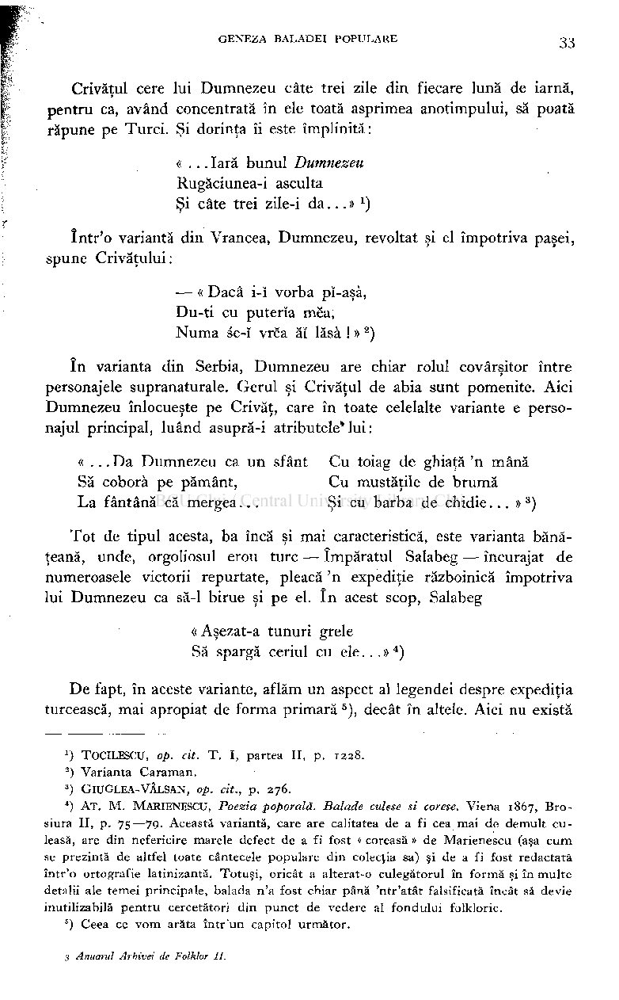

Crivăţul cere lui Dumnezeu câte trei zile din fiecare lună de iarnă, pentru ca, având concentrată în ele toată asprimea anotimpului, să poată răpune pe Turci. Şi dorinţa îi este împlinită:

«.. . Iară bunul Dumnezeu Rugăciunea-i asculta Şi câte trei zile-i da... » *

într'o variantă din Vrancea, Dumnezeu, revoltat şi el împotriva paşei, spune Crivăţului:

— « Daca i-î vorba pî-aşâ, Du-ti cu puterïa mëa, Numa se-ï vrëa ăî lăsa ! »

)

2

în varianta din Serbia, Dumnezeu are chiar rolul covârşitor între personajele supranaturale. Gerul şi Crivăţul de abia sunt pomenite. Aici Dumnezeu înlocueşte pe Crivăţ, care în toate celelalte variante e personajul principal, luând asupră-i atributele* lui :

«.. . Da Dumnezeu ca un sfânt Cu toiag de ghiaţă 'n mână Să cobora pe pământ, Cu mustăţile de brumă La fântână că mergea... Şi cu barba de chidie... »

)

3

Tot de tipul acesta, ba încă şi mai caracteristică, este varianta bănăţeană, unde, orgoliosul erou turc — împăratul Salabeg — încurajat de numeroasele victorii repurtate, pleacă 'n expediţie războinică împotriva lui Dumnezeu ca să-1 birue şi pe el. în acest scop, Salabeg

« Aşezat-a tunuri grele Să spargă ceriul cu ele...»

)

4

De fapt, în aceste variante, aflăm un aspect al legendei despre expediţia turcească, mai apropiat de forma primară

), decât în altele. Aici nu există

5

) TOCILESCU , op. cit. T . I , partea II , p. 1228 .

L

'-) Varianta Caraman .

- 3 ) GlUGLEA-VÂLSAN, op. cit., p. 276 .
- 4 ) AT . M . MARIENESCU, Poezia poporală. Balade culese si corese. Viena 1867 , Bro -

siura II , p. 75—79 . Această variantă, care are calitatea de a fi cea mai de demult cu leasă, are din nefericire marele defect de a fi fost « coreasă » de Marienescu (aşa cu m se prezintă de altfel toate cântecele populare din colecţia sa) şi de a fi fost redactată într'o ortografie latinizantă. Totuşi, oricât a alterat-o culegătorul în formă şi în multe detalii ale temei principale, balada n'a fost chiar până 'ntr'atât falsificată încât să devie inutilizabilă pentru cercetători din punct de vedere al fondului folkloric.

) Ceea ce vo m arăta într'un capitol următor.

5

3 Anuarul Arhivei de Folklor II.

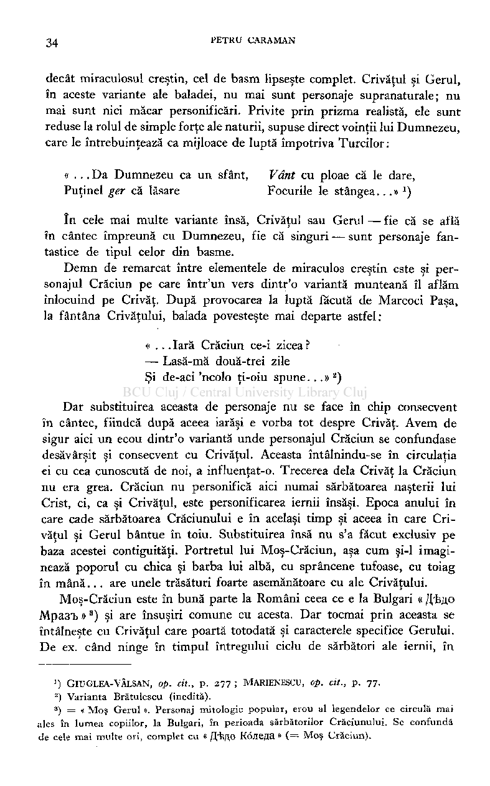

decât miraculosul creştin, cel de basm lipseşte complet. Crivăţul şi Gerul, în aceste variante ale baladei, nu mai sunt personaje supranaturale; nu mai sunt nici măcar personificări. Privite prin prizma realistă, ele sunt reduse la rolul de simple forţe ale naturii, supuse direct voinţii lui Dumnezeu, care le întrebuinţează ca mijloace de luptă împotriva Turcilor:

« ... Da Dumnezeu ca un sfânt, Vânt cu ploae că le dare, Puţinei ger că lăsare Focurile le stângea...»

)

l

în cele mai multe variante însă, Crivăţul sau Gerul — fie că se află în cântec împreună cu Dumnezeu, fie că singuri — sunt personaje fantastice de tipul celor din basme.

Demn de remarcat între elementele de miraculos creştin este şi personajul Crăciun pe care într'un vers dintr'o variantă munteană îl aflăm înlocuind pe Crivăţ. După provocarea la luptă făcută de Marcoci Paşa, la fântâna Crivăţului, balada povesteşte mai departe astfel:

«.. . Iară Crăciun ce-i zicea ?

— Lasă-mă două-trei zile Şi de-aci 'ncolo ţi-oiu spune... »

)

2

Dar substituirea aceasta de personaje nu se face în chip consecvent în cântec, fiindcă după aceea iarăşi e vorba tot despre Crivăţ. Avem de sigur aici un ecou dintr'o variantă unde personajul Crăciun se confundase desăvârşit şi consecvent cu Crivăţul. Aceasta întâlnindu-se în circulaţia ei cu cea cunoscută de noi, a influenţat-o. Trecerea delà Crivăţ la Crăciun nu era grea. Crăciun nu personifică aici numai sărbătoarea naşterii lui Crist, ci, ca şi Crivăţul, este personificarea iernii însăşi. Epoca anului în care cade sărbătoarea Crăciunului e în acelaşi timp şi aceea în care Crivăţul şi Gerul bântue în toiu. Substituirea însă nu s'a făcut exclusiv pe baza acestei contiguităţi. Portretul lui Moş-Crăciun, aşa cum şi-1 imaginează poporul cu chica şi barba lui albă, cu sprâncene tufoase, cu toiag în mână... are unele trăsături foarte asemănătoare cu ale Crivăţului.

Moş-Crăciun este în bună parte la Români ceea ce e la Bulgari « /Itflo Mpa3T> »

) şi are însuşiri comune cu acesta. Dar tocmai prin aceasta se întâlneşte cu Crivăţul care poartă totodată şi caracterele specifice Gerului. De ex. când ninge în timpul întregului ciclu de sărbători ale iernii, în

3

') GIUGLEA-VÂLSAN, op. cit., p. 27 7 ; MARIENESCU, op. cit., p. 77 .

### ) Varianta Brătulescu (inedită).

2

### ) = « Moş Gerul ». Personaj mitologic popular, erou al legendelor ce circulă mai ales în lumea copiilor, la Bulgari, în perioada sărbătorilor Crăciunului. Se confundă de cele mai multe ori, complet cu « flfcpfl KoJiefla » ( = Moş Crăciun).

3

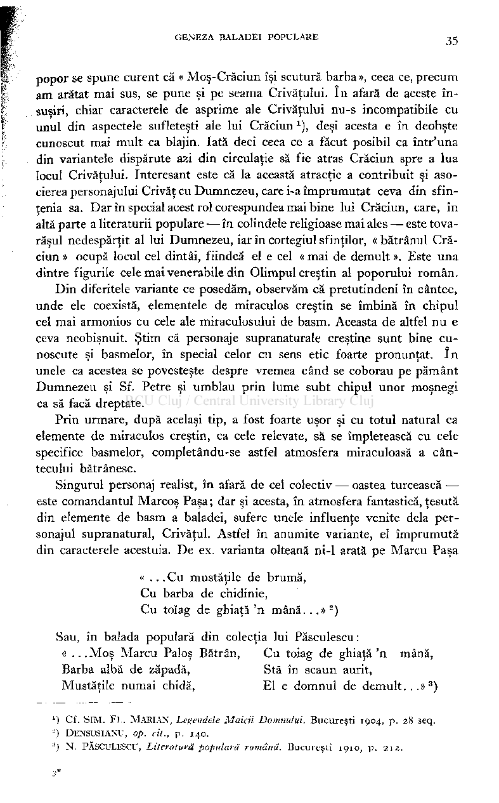

popor se spune curent că « Moş-Crăciun îşi scutură barba», ceea ce, precum am arătat mai sus, se pune şi pe seama Crivăţului. în afară de aceste însuşiri, chiar caracterele de asprime ale Crivăţului nu-s incompatibile cu unul din aspectele sufleteşti ale lui Crăciun ), deşi acesta e în deobşte cunoscut mai mult ca blajin. Iată deci ceea ce a făcut posibil ca într'una din variantele dispărute azi din circulaţie să fie atras Crăciun spre a lua locul Crivăţului. Interesant este că la această atracţie a contribuit şi asocierea personajului Crivăţ cu Dumnezeu, care i-a împrumutat ceva din sfinţenia sa. Dar în special acest rol corespundea mai bine lui Crăciun, care, în altă parte a literaturii populare — în colindele religioase mai ales — este tovarăşul nedespărţit al lui Dumnezeu, iar în cortegiul sfinţilor, « bătrânul Crăciun » ocupă locul cel dintâi, fiindcă el e cel « mai de demult ». Este una dintre figurile cele mai venerabile din Olimpul creştin al poporului român.

Din diferitele variante ce posedăm, observăm că pretutindeni în cântec, unde ele coexistă, elementele de miraculos creştin se îmbină în chipul cel mai armonios cu cele ale miraculosului de basm. Aceasta de altfel nu e ceva neobişnuit. Ştim că personaje supranaturale creştine sunt bine cunoscute şi basmelor, în special celor cu sens etic foarte pronunţat. î n unele ca acestea se povesteşte despre vremea când se coborau pe pământ Dumnezeu şi Sf. Petre şi umblau prin lume subt chipul unor moşnegi ca să facă dreptate.

Prin urmare, după acelaşi tip, a fost foarte uşor şi cu totul natural ca elemente de miraculos creştin, ca cele relevate, să se împletească cu cele specifice basmelor, completându-se astfel atmosfera miraculoasă a cântecului bătrânesc.

Singurul personaj realist, în afară de cel colectiv — oastea turcească este comandantul Marcoş Paşa ; dar şi acesta, în atmosfera fantastică, ţesută din elemente de basm a baladei, sufere unele influenţe venite delà personajul supranatural, Crivăţul. Astfel în anumite variante, el împrumută din caracterele acestuia. De ex. varianta olteană ni-1 arată pe Marcu Paşa

« .. .Cu mustăţile de brumă, Cu barba de chidinie, Cu toiag de ghiaţă 'n mână...»

)

2

Sau, în balada populară din colecţia lui Păsculescu: « .. .Moş Marcu Paloş Bătrân, Cu toiag de ghiaţă 'n mână, Barba albă de zăpadă, Stă în scaun aurit, Mustăţile numai chidă, El e domnul de demult...»

)

3

) Cf . SIM. FL . MARIAN, Legendele Maicii Domnului. Bucureşti 1904 , p. 2 8 seq.

1

### -) DENSUSIANU, op. cit., p. 140 .

###### ) N. PĂSCULESCU, Literatură populară română. Bucureşti 1910 , p. 212 .

3

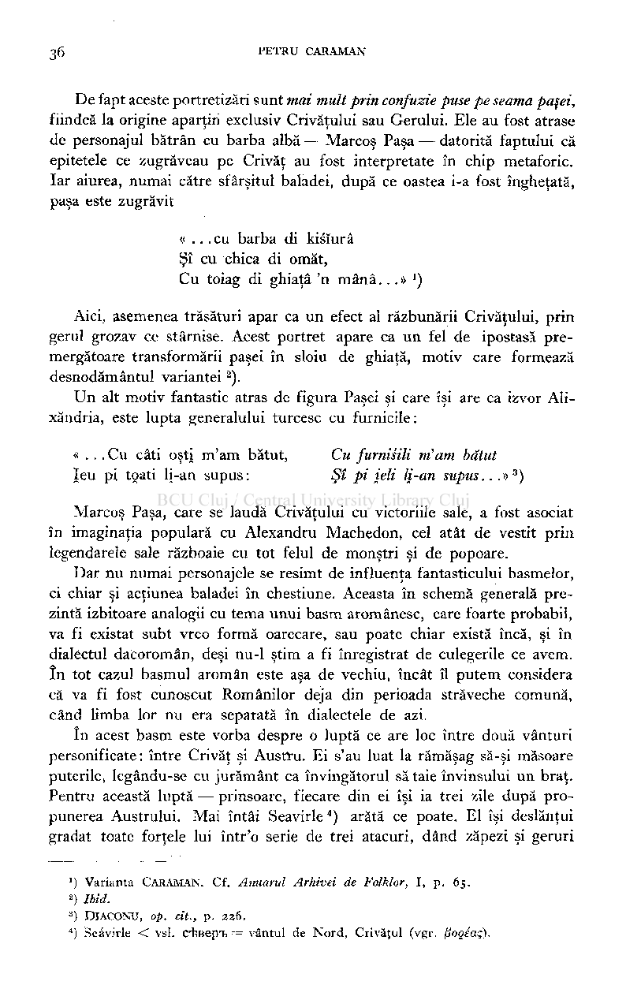

De fapt aceste portretizări sunt mai mult prin confuzie puse pe seama paşei, fiindcă la origine aparţin exclusiv Crivăţului sau Gerului. Ele au fost atrase de personajul bătrân cu barba albă — Marcoş Paşa — datorită faptului că epitetele ce zugrăveau pe Crivăţ au fost interpretate în chip metaforic. Iar aiurea, numai către sfârşitul baladei, după ce oastea i-a fost îngheţată, paşa este zugrăvit

« .. .cu barba di kisîurâ Şî cu chica di omăt, Cu toiag di ghiaţâ 'n mânâ...» *)

Aici, asemenea trăsături apar ca un efect al răzbunării Crivăţului, prin gerul grozav ce stârnise. Acest portret apare ca un fel de ipostasă premergătoare transformării paşei în sloiu de ghiaţă, motiv care formează desnodământul variantei

).

2

Un alt motiv fantastic atras de figura Paşei şi care îşi are ca izvor Alixăndria, este lupta generalului turcesc cu furnicile:

«.. . Cu câţi oşti m'am bătut, Cu furnisili m'am bătut leu pi toati li-an supus: Şî pi ieli li-an supus.. .»

)

3

Marcoş Paşa, care se laudă Crivăţului cu victoriile sale, a fost asociat în imaginaţia populară cu Alexandru Machedon, cel atât de vestit prin legendarele sale războaie cu tot felul de monştri şi de popoare.

Dar nu numai personajele se resimt de influenţa fantasticului basmelor, ci chiar şi acţiunea baladei în chestiune. Aceasta în schemă generală prezintă izbitoare analogii cu tema unui basm aromânesc, care foarte probabil, va fi existat subt vreo formă oarecare, sau poate chiar există încă, şi în dialectul dacoromân, deşi nu-1 ştim a fi înregistrat de culegerile ce avem. în tot cazul basmul aromân este aşa de vechiu, încât îl putem considera că va fi fost cunoscut Românilor deja din perioada străveche comună, când limba lor nu era separată în dialectele de azi.

în acest basm este vorba despre o luptă ce are loc între două vânturi personificate: între Crivăţ şi Austru. Ei s'au luat la rămăşag să-şi măsoare puterile, legându-se cu jurământ ca învingătorul să taie învinsului un braţ. Pentru această luptă — prinsoare, fiecare din ei îşi ia trei zile după propunerea Austrului. Mai întâi Seavirle

) arătă ce poate. El îşi deslănţui gradat toate forţele lui într'o serie de trei atacuri, dând zăpezi şi geruri

4

- 1 ) Varianta CARAMAN. Cf. Anuarul Arhivei de Folklor, I, p. 65 .
- 2 ) Ibid.
- 3 ) DIACONU, op. cit., p. 226 .
- 4 ) Seavirle < vsl. cbBepT> = vântul de Nord , Crivăţul (vgr. Sooéaç}.

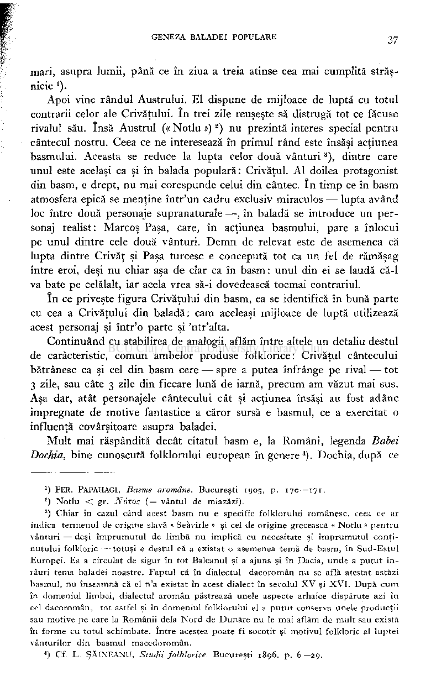

mari, asupra lumii, până ce în ziua a treia atinse cea mai cumplită străşnicie ).

Apoi vine rândul Austrului. El dispune de mijloace de luptă cu totul contrarii celor ale Crivăţului. în trei zile reuşeşte să distrugă tot ce făcuse rivalul său. însă Austrul (« Notlu »)

) nu prezintă interes special pentru cântecul nostru. Ceea ce ne interesează în primul rând este însăşi acţiunea basmului. Aceasta se reduce la lupta celor două vânturi

2

), dintre care unul este acelaşi ca şi în balada populară: Crivăţul. Al doilea protagonist din basm, e drept, nu mai corespunde celui din cântec. în timp ce în basm atmosfera epică se menţine într'un cadru exclusiv miraculos — lupta având loc între două personaje supranaturale —, în baladă se introduce un personaj realist: Marcoş Paşa, care, în acţiunea basmului, pare a înlocui pe unul dintre cele două vânturi. Demn de relevat este de asemenea că lupta dintre Crivăţ şi Paşa turcesc e concepută tot ca un fel de rămăşag între eroi, deşi nu chiar aşa de clar ca în basm: unul din ei se laudă că-1 va bate pe celălalt, iar acela vrea să-i dovedească tocmai contrariul.

3

în ce priveşte figura Crivăţului din basm, ea se identifică în bună parte cu cea a Crivăţului din baladă: cam aceleaşi mijloace de luptă utilizează acest personaj şi într'o parte şi 'ntr'alta.

Continuând cu stabilirea de analogii, aflăm între altele un detaliu destul de caracteristic, comun ambelor produse folklorice: Crivăţul cântecului

- bătrânesc ca şi cel din basm cere — spre a putea înfrânge pe rival — tot 3 zile, sau câte 3 zile din fiecare lună de iarnă, precum am văzut mai sus. Aşa dar, atât personajele cântecului cât şi acţiunea însăşi au fost adânc impregnate de motive fantastice a căror sursă e basmul, ce a exercitat o influenţă covârşitoare asupra baladei.

Mult mai răspândită decât citatul basm e, la Români, legenda Babei Dochia, bine cunoscută folklorului european în genere

). Dochia, după ce

4

) PER . PAPAHAGI Basme aromâne. Bucureşti 1905 , p. 170—171 .

J

- 2 ) Notlu < gr. ydro; ( = vântul de miazăzi).
- 3 ) Chiar în cazul când acest bas m nu e specific folklorului românesc, ceea ce ar

indica termenul de origine slavă « Seâvirle » şi cel de origine grecească « Notlu » pentru vânturi — deşi împrumutul de limbă nu implică cu necesitate şi împrumutul conţinutului folkloric — totuşi e destul că a existat o asemenea temă de basm, în Sud-Estu l Europei. E a a circulat de sigur în tot Balcanul şi a ajuns şi în Dacia, unde a putut înrâuri tema baladei noastre. Faptul că în dialectul dacoromân nu se află atestat astăzi basmul, nu înseamnă că el n'a existat în acest dialect în secolul X V şi XVI . Dup ă cu m în domeniul limbei, dialectul aromân păstrează unele aspecte arhaice dispărute azi în cel dacoromân, tot astfel şi în domeniul folklorului el a putut conserva unele producţii sau motive pe care la Românii delà Nor d de Dunăr e nu le mai aflăm de mult sau există în forme cu totul schimbate. între acestea poate fi socotit şi motivul folkloric al luptei vânturilor din basmul macedoromân.

#### ) Cf. L . ŞĂINEANU, Studii folklorice. Bucureşti 1896 p.6—29 .

4

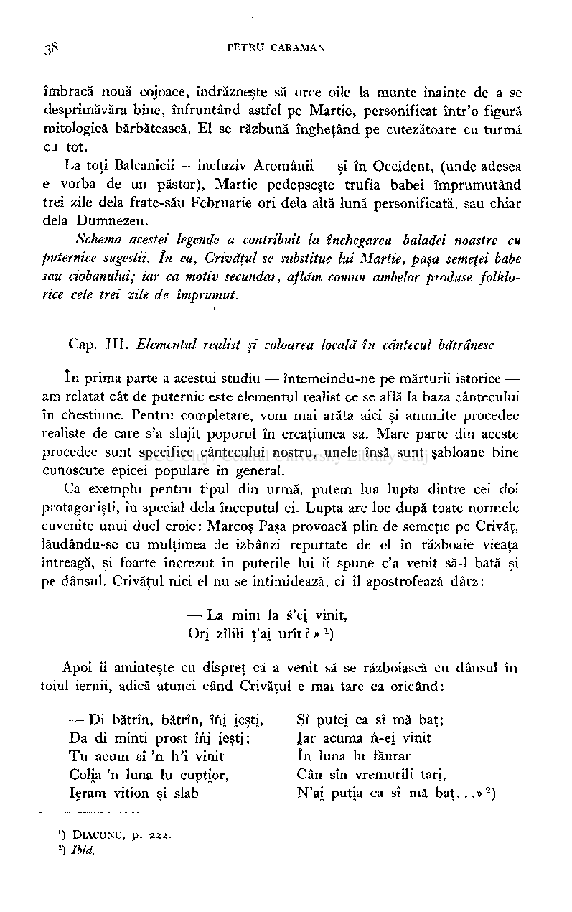

îmbracă nouă cojoace, îndrăzneşte să urce oile la munte înainte de a se desprimăvăra bine, înfruntând astfel pe Martie, personificat într'o figură mitologică bărbătească. El se răzbună îngheţând pe cutezătoare cu turmă cu tot.

La toţi Balcanicii — incluziv Aromânii — şi în Occident, (unde adesea e vorba de un păstor), Martie pedepseşte trufia babei împrumutând trei zile delà frate-său Februarie ori delà altă lună personificată, sau chiar delà Dumnezeu.

Schema acestei legende a contribuit la închegarea baladei noastre cu puternice sugestii. în ea, Crivăţul se substitue lui Martie, paşa semeţei babe sau ciobanului; iar ca motiv secundar, aflăm comun ambelor produse folklorice cele trei zile de împrumut.

Cap. III. Elementul realist şi coloarea locală în cântecul bătrânesc

în prima parte a acestui studiu —întemeindu-ne pe mărturii istorice am relatat cât de puternic este elementul realist ce se află la baza cântecului în chestiune. Pentru completare, vom mai arăta aici şi anumite procedee realiste de care s'a slujit poporul în creaţiunea sa. Mare parte din aceste procedee sunt specifice cântecului nostru, unele însă sunt şabloane bine cunoscute epicei populare în general.

Ca exemplu pentru tipul din urmă, putem lua lupta dintre cei doi protagonişti, în special delà începutul ei. Lupta are loc după toate normele cuvenite unui duel eroic: Marcoş Paşa provoacă plin de semeţie pe Crivăţ, lăudându-se cu mulţimea de izbânzi repurtate de el în războaie vieaţa întreagă, şi foarte încrezut în puterile lui îi spune c'a venit să-1 bată şi pe dânsul. Crivăţul nici el nu se intimidează, ci îl apostrofează dârz:

— La mini la s'ei vinit, Ori zîlili ţ'ai urît ? »

)

x

Apoi îi aminteşte cu dispreţ că a venit să se războiască cu dânsul în toiul iernii, adică atunci când Crivăţul e mai tare ca oricând:

— Di bătrîn, bătrîn, îni ieşti, Şî putei ca sî mă baţ;

Iar acuma iî-ei vinit în luna lu făurar Cân sîn vremurili tari, N'ai putia ca sî mă baţ...»

Da di minţi prost îni ieşti; Tu acum sî 'n h'i vinit Colia 'n luna Iu cuptior, Ieram vition şi slab

)

2

- 1 ) DlACONU, p. 222.
- 2 ) Ibid.

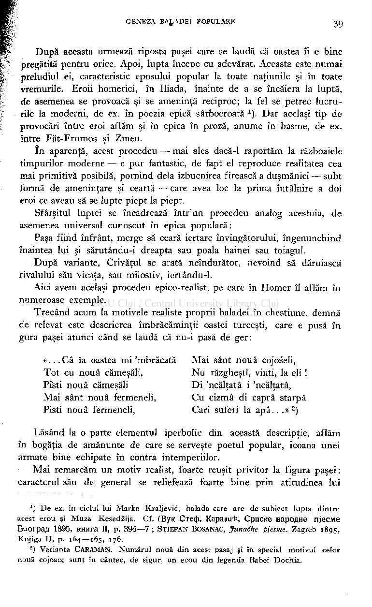

După aceasta urmează riposta paşei care se laudă că oastea îi e bine pregătită pentru orice. Apoi, lupta începe cu adevărat. Aceasta este numai preludiul ei, caracteristic eposului popular la toate naţiunile şi în toate vremurile. Eroii homerici, în Iliada, înainte de a se încaieră la luptă, de asemenea se provoacă şi se ameninţă reciproc; la fel se petrec lucrurile la moderni, de ex. în poezia epică sârbocroată ). Dar acelaşi tip de provocări între eroi aflăm şi în epica în proză, anume în basme, de ex. între Făt-Frumos şi Zmeu.

în aparenţă, acest procedeu — mai ales dacă-1 raportăm la războaiele timpurilor moderne — e pur fantastic, de fapt el reproduce realitatea cea mai primitivă posibilă, pornind delà izbucnirea firească a duşmăniei — subt formă de ameninţare şi ceartă — care avea loc la prima întâlnire a doi eroi ce aveau să se lupte piept la piept.

Sfârşitul luptei se încadrează într'un procedeu analog acestuia, de asemenea universal cunoscut în epica populară:

Paşa fiind înfrânt, merge să ceară iertare învingătorului, îngenunchind înaintea lui şi sărutându-i dreapta sau poala hainei sau toiagul.

După variante, Crivăţul se arată neîndurător, nevoind să dăruiască rivalului său vieaţa, sau milostiv, iertându-1.

Aici avem acelaşi procedeu epico-realist, pe care în Homer îl aflăm în numeroase exemple.

Trecând acum la motivele realiste proprii baladei în chestiune, demnă de relevat este descrierea îmbrăcăminţii oastei turceşti, care e pusă în gura paşei atunci când se laudă că nu-i pasă de ger:

«...Câ îa oastea mi 'mbrăcată Mai sânt noua cojoseli, Tot cu noua cămeşăli, Nu răzgheştî, vinti, la eli ! Pişti noua cămeşăli Di 'ncălţatâ i 'ncălţatâ, Mai sânt noua fermeneli, Cu cizma di capra starpâ Pişti noua fermeneli, Cari suferi la apâ...»

)

2

Lăsând la o parte elementul iperbolic din această descripţie, aflăm în bogăţia de amănunte de care se serveşte poetul popular, icoana unei armate bine echipate în contra intemperiilor.

Mai remarcăm un motiv realist, foarte reuşit privitor la figura paşei: caracterul său de general se reliefează foarte bine prin atitudinea lui

') De ex. în ciclul lui Marko Kraljevic, balada care are de subiect lupta dintre acest erou şi Muza Kesedzija. Cf. fBvK Crefy. Kapavu-fc, CpnCKe HapOflHe njeCMe BuorpaA 1895, KHIira II, p. 396—7 ; STJEPA N BOSANAC, Junacke pjesme. Zagreb 1895 , Knjiga II, p.164—165 , 176 .

### ) Varianta CARAMAN. Numărul nouă din acest pasaj şi în special motivul celor nouă cojoace sunt în cântec, de sigur, un ecou din legenda Babei Dochia.

2

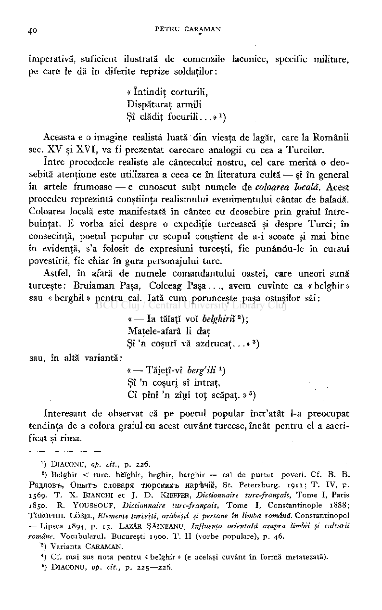

imperativă, suficient ilustrată de comenzile laconice, specific militare, pe care le dă în diferite reprize soldaţilor:

« întindiţ corturili, Dispăturaţ armili Şî clădit focurili... »

Aceasta e o imagine realistă luată din vieaţa de lagăr, care la Românii sec. XV şi XVI, va fi prezentat oarecare analogii cu cea a Turcilor.

între procedeele realiste ale cântecului nostru, cel care merită o deosebită atenţiune este utilizarea a ceea ce în literatura cultă — şi în general în artele frumoase — e cunoscut subt numele de coloarea locală. Acest procedeu reprezintă conştiinţa realismului evenimentului cântat de baladă. Coloarea locală este manifestată în cântec cu deosebire prin graiul întrebuinţat. E vorba aici despre o expediţie turcească şi despre Turci; în consecinţă, poetul popular cu scopul conştient de a-i scoate şi mai bine în evidenţă, s'a folosit de expresiuni turceşti, fie punându-le în cursul povestirii, fie chiar în gura personajului turc.

Astfel, în afară de numele comandantului oastei, care uneori sună turceşte: Bruiaman Paşa, Colceag Paşa..., avem cuvinte ca «belghir» sau « berghil » pentru cal. Iată cum porunceşte paşa ostaşilor săi :

« — Ia tăîaţî voï belghiriî

);

2

Maţele-afarâ li daţ Şî 'n coşuri vă azdrucaţ... »

) sau, în altă variantă:

3

« — Tăieţî-vî berg'ili

)

4

Şî 'n coşuri sî intrat, Cî pînî 'n zîuî toţ scăpat. »

)

5

Interesant de observat că pe poetul popular într'atât 1-a preocupat tendinţa de a colora graiul cu acest cuvânt turcesc, încât pentru el a sacrificat şi rima.

DIACONU, op. cit., p. 226 .

) Belghir < turc, bèïghir, beghir, barghir = cal de purtat poveri. Cf. B . B . Pa/yiOBt., OntiTT. CJiOBapa TK>pCKHX'i» Hap-EMiH, St . Petersburg. 1911 ; T . IV , p. 1569 . T . X . BIANCHI et J . D . KlEFFER, Dictionnaire turc-français, Tom e I , Paris 1850 . R . YOUSSOUF , Dictionnaire turc-français, Tom e I , Constantinople 1888 ; THÈOPHIL LÔBEL, Elemente turceşti, arăbeşti şi persane în limba română. Constantinopol — Lipsea 1894 , p. 13 . LAZÂR ŞĂINEANU, Influenţa orientală asupra limbii şi culturii române. Vocabularul. Bucureşti 1900 . T . I I (vorbe populare), p . 46 .

2

'

- 3 ) Varianta CARAMAN.
- 4 ) Cf. mai sus nota pentru « belghir » (e acelaşi cuvânt în formă metatezată).

###### ) DIACONU, op. cit., p. 225—226 .

6

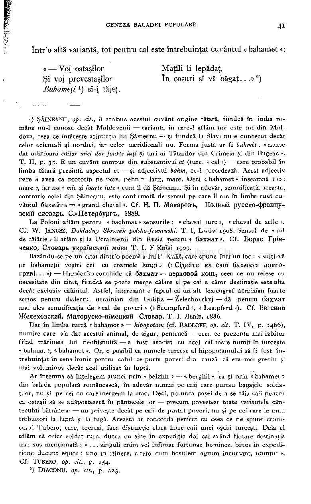

într'o altă variantă, tot pentru cal este întrebuinţat cuvântul « bahamet » :

« — Voi ostaşilor Maţîli li lepădat, Şî voi prevestaşîlor în coşuri sî vă băgat...»

) Bahameţi *) sî-i tăieţ,

2

*) ŞĂINEANU, op. cit., îi atribue acestui cuvânt origine tătară, fiindcă în limba ro mână nu-1 cunosc decât Moldovenii — varianta în care-1 aflăm noi este tot din Mol dova, ceea ce întăreşte afirmaţia lui Şăineanu — şi fiindcă la Slavi nu e cunoscut decât celor orientali şi nordici, iar celor meridionali nu. Form a justă ar fi bahmèt : « num e dat odinioară cailor mici dar foarte iuţi şi tari ai Tătarilor din Crimeia şi din Bugea c ». T . II , p. 35 . E un cuvânt compus din substantivul at (turc. « cal ») — care probabil în limba tătară prezintă aspectul et — şi adjectivul bahm, ce-1 precedează. Acest adjectiv pare a avea ca prototip pe pers. pehn = larg, mare. Dec i « bahamet » înseamnă « cal mare », iar nu « mic şi foarte iute » cu m îl dă Şăineanu. Ş i în adevăr, semnificaţia aceasta, contrarie celei din Şăineanu, este confirmată de sensul pe care îl are în limba rusă cu vântul6axMâTT,= « grand cheval ». Cf. H. ILMaKapOBT,, riOJIHblfi pyCCKO-(bpaHU,y3CKM oiOBapb. C.-IIeTep6yprc>,1889.

L a Poloni aflăm pentru « bachma t » sensurile : « cheval turc », « cheval de selle ». Cf. W . JANUSZ, Dokladny Slownik polsko-francuski. T . I , Lwô w 1908 . Sensul de « cal

de călărie » îl aflăm şi la Ucrainienii din Rusia pentru « 6axAtaT». Cf. BopilC TpiH-

neHKO, CjiOBaph yKpaïHCbKoï môb h T . I . y RVïBi 1909 . Bazându-se pe un citat dintr'o poemă a lui P . Kulis, care spune într'un loc : « suiţi-vă

pe bahameţii voştri cei cu coamele lungi » (« CiflaHTe Ha CBOÏ ÔaxiwaTH flOBrO-

rpHBi. . . ») — Hrincenko conchide că fjaxMaT = BepxOBOH KOHb, ceea ce nu reiese cu necesitate din citat, fiindcă se poate merge călare şi pe cai a căror destinaţie este alta decât exclusiv călăritul. Astfel, interesant e faptul că un alt lexicograf ucrainian foarte serios pentru dialectul ucrainian din Galiţia — Zelechovskyj — dă pentru CaxiwaT mai ales semnificaţia de « cal de poveri » (« Saumpferd », « Lastpferd »). Cf. EBremiH }KejiexOBCKHfi, MajiopycKO-HÏMen,KHH G/ioBap.T . I. /IbBÏB.1886 .

Da r în limba turcă « bahamot » = hipopotam (cf. RADLOFF, op. cit. T . IV , p. 1466) , numire care s'a dat acestui animal, de sigur, pentrucă — ceea ce prezenta mai izbitor fiind mărimea lui neobişnuită — a fost asociat cu acel cal mare numit în turceşte « bahmat », « bahamot ». Or, e posibil ca numele turcesc al hipopotamului să fi fost întrebuinţat în sens ironic pentru calul ce purta poveri din cauză că era mai greoiu şi mai voluminos decât acel utilizat în luptă.

A r însemna să înţelegem atunci prin « belghir » — « berghil », ca şi prin « bahamet » din balada populară românească, în adevăr numai pe caii care purtau bagajele soldaţilor, nu şi pe cei cu care mergeau la atac. Deci , porunca paşei de a se tăia caii pentru ca ostaşii să se adăpostească în pântecele lor — precum povestesc toate variantele cân tecului bătrânesc — n u priveşte decât pe caii de purtat poveri, nu şi pe cei care le erau trebuitori la luptă şi la fugă. Aceasta ar concorda perfect cu ceea ce ne spune cronicarul Tubero , care, tocmai, face distincţie clară între caii unei oştiri turceşti. Delà el aflăm că orice soldat turc, ducea cu sine în expediţie doi cai având fiecare destinaţia mai sus menţionată : « . . . singuli enim vel infimae fortunae homines, binos in expeditione ducunt equos : uno in itinere, altero cu m hostilem agru m incursant, utuntur ». Cf. TUBERO, op. cit., p. 154 .

###### ) DlACONU, op. cit., p. 223 .

2

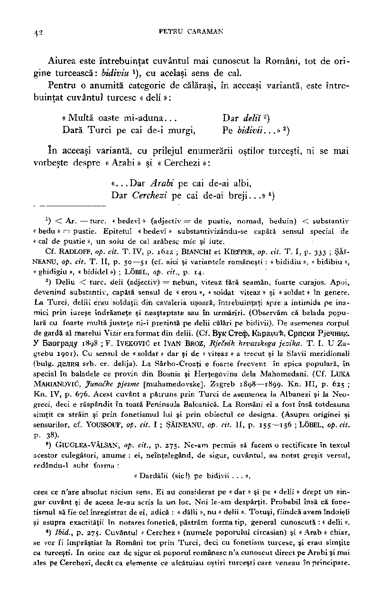

Aiurea este întrebuinţat cuvântul mai cunoscut la Români, tot de origine turcească: bidiviu

), cu acelaşi sens de cal.

1

Pentru o anumită categorie de călăraşi, în aceeaşi variantă, este întrebuinţat cuvântul turcesc « deli » :

« Multă oaste mi-aduna... Dar delii

) Dară Turci pe cai de-i murgi, Pe bidivii.. . »

2

)

3

în aceeaşi variantă, cu prilejul enumerării oştilor turceşti, ni se mai vorbeşte despre « Arabi » şi « Cerchezi » :

«... Dar Arabi pe cai de-ai albi, Dar Cerchezi pe cai de-ai breji...»

)

4

*) < Ar. — turc. « bedevi » (adjectiv = de pustie, nomad, beduin) < substantiv « bedu » = pustie. Epitetul « bedevi » substantivizându-se capătă sensul special de « cal de pustie », un soiu de cal arăbesc mic şi iute.

Cf. RADLOFF , op. cit. T. IV , p. 162 2 ; BlANCHI et KlEFFER, op. cit. T. I, p. 33 3 ; ŞĂI NEANU , op. cit. T. II, p.50—5 1 (cf. aici şi variantele româneşti : « bididiu », « bidibiu », « ghidigiu », « bididel ») ; LÔBEL op. cit., p. 14

) Deliu < turc. deli (adjectiv) = nebun, viteaz fără seamăn, foarte curajos. Apoi, devenind substantiv, capătă sensul de « erou », « soldat viteaz » şi « soldat » în genere. La Turci, deliii erau soldaţii din cavaleria uşoară, întrebuinţaţi spre a intimida pe inamici prin iureşe îndrăzneţe şi neaşteptate sau în urmăriri. (Observăm că balada populară cu foarte multă justeţe ni-i prezintă pe delii călări pe bidivii). De asemenea corpul de gardă al marelui Vizir era format din delii. (Cf. ByK Oreih. Kapagu-fc, CpnCKH PjeMHHK. Y Bnorpafly189 8 ; F . IVEKOVI C etIVA N BROZ Rjecnik hrvatskoga jezika. T. I. U Zagrebu1901) . Cu sensul de « soldat » dar şi de « viteaz » a trecut şi la Slavii meridionali (bulg. flCMia srb. cr. delija). La Sârbo-Croaţi e foarte frecvent în epica populară, în special în baladele ce provin din Bosnia şi Herţegovina delà Mahomedani. (Cf.LUK A MARIANOVIC';, Junacke pjesme [muhamedovske]. Zagreb1898—1899 . Kn. III, p. 62 5 ; Kn. IV, p. 676 . Acest cuvânt a pătruns prin Turci de asemenea la Albanezi şi la Neogreci, deci e răspândit în toată Peninsula Balcanică. La Români el a fost însă totdeauna simţit ca străin şi prin fonetismul lui şi prin obiectul ce designa. (Asupra originei şi sensurilor, cf.YOUSSOUF op. cit. I ;ŞÂINEANU , op. cit. II, p.155—15 6 ; LÔBEL op. cit. p. 38) .

2

)GlUGLEA-VÂLSAN, op. cit., p.275 . Ne-am permis să facem o rectificare în textul acestor culegători, anume : ei, neînţelegând, de sigur, cuvântul, au notat greşit versul, redându-1 subt forma :

3

« Dardălii (sic !) pe bidivii .. . »,

ceea ce n'are absolut niciun sens. Ei au considerat pe « dar » şi pe « delii » drept un singur cuvânt şi de aceea le-au scris la un loc. Noi le-am despărţit. Probabil însă că fonetismul să fie cel înregistrat de ei, adică : « dalii », nu « delii ». Totuşi, fiindcă avem îndoieli şi asupra exactităţii în notarea fonetică, păstrăm forma tip, general cunoscută : « delii ».

) Ibid., p .275 . Cuvântul « Cerchez » (numele poporului circasian) şi « Arab » chiar, se vor fi împrăştiat la Români tot prin Turci, deci cu fonetism turcesc, şi erau simţite ca turceşti. In orice caz de sigur că poporul românesc n'a cunoscut direct pe Arabi şi mai ales pe Cerchezi, decât ca elemente ce alcătuiau oştiri turceşti care veneau în principate.

4

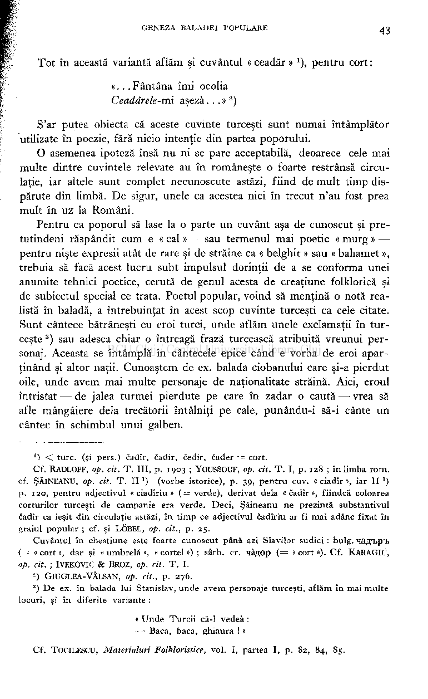

Tot în această variantă aflăm şi cuvântul « ceadăr »

), pentru cort :

1

«...Fântâna îmi ocolia Ceadârele-mi aşeza... »

)

2

S'ar putea obiecta că aceste cuvinte turceşti sunt numai întâmplător utilizate în poezie, fără nicio intenţie din partea poporului.

O asemenea ipoteză însă nu ni se pare acceptabilă, deoarece cele mai multe dintre cuvintele relevate au în româneşte o foarte restrânsă circulaţie, iar altele sunt complet necunoscute astăzi, fiind de mult timp dispărute din limbă. De sigur, unele ca acestea nici în trecut n'au fost prea mult în uz la Români.

Pentru ca poporul să lase la o parte un cuvânt aşa de cunoscut şi pretutindeni răspândit cum e « cal » — sau termenul mai poetic « murg » pentru nişte expresii atât de rare şi de străine ca « belghir » sau « bahamet », trebuia să facă acest lucru subt impulsul dorinţii de a se conforma unei anumite tehnici poetice, cerută de genul acesta de creaţiune folklorică şi de subiectul special ce trata. Poetul popular, voind să menţină o notă realistă în baladă, a întrebuinţat în acest scop cuvinte turceşti ca cele citate. Sunt cântece bătrâneşti cu eroi turci, unde aflăm unele exclamaţii în turceşte

) sau adesea chiar o întreagă frază turcească atribuită vreunui personaj. Aceasta se întâmplă în cântecele epice când e vorba de eroi aparţinând şi altor naţii. Cunoaştem de ex. balada ciobanului care şi-a pierdut oile, unde avem mai multe personaje de naţionalitate străină. Aici, eroul întristat — de jalea turmei pierdute pe care în zadar o caută —• vrea să afle mângâiere delà trecătorii întâlniţi pe cale, punându-i să-i cânte un cântec în schimbul unui galben.

3

) < turc. (şi pers.) cadîr, cadir, cedir, cader = cort.

1

Cf. RADLOFF, op. cit. T . III , p . 190 3 ; YOUSSOUF, op. cit. T . I , p . 12 8 ; în limba rom . cf. ŞĂINEANU, op. cit. T . I I *) (vorbe istorice), p . 39 , pentru cuv . « ciadîr », iar I I *) p. I20 , pentru adjectivul « ciadîriu » ( = verde), derivat delà « cadîr », fiindcă coloarea corturilor turceşti de campanie era verde. Deci , Şăineanu n e prezintă substantivul cadîr ca ieşit din circulaţie astăzi, în timp ce adjectivul cadîriu ar fi ma i adânc fixat în graiul popular ; cf. şi LÔBEL, op. cit., p . 25 .

Cuvântul în chestiune este foarte cunoscut până azi Slavilor sudici : bulg. Hafttp'b ( = « cort », dar şi « umbrelă », « cortel ») ; sârb. cr. HaflOp ( = « cort »). Cf . KARAGIC, op. cit. ; IVEKOVlO & BROZ, op. cit. T . I .

-) GlUGLEA-VÂLSAN, op. cit., p. 276 .

) D e ex. în balada lui Stanislav, unde ave m personaje turceşti, aflăm în mai multe locuri, şi în diferite variante :

3

« Und e Turci i că-1 vedea : — Baca, baca, ghiaura ! »

Cf. TOCILESCU, Materialuri Folkloristice, vol. I , partea I , p . 82 , 84 , 85 .

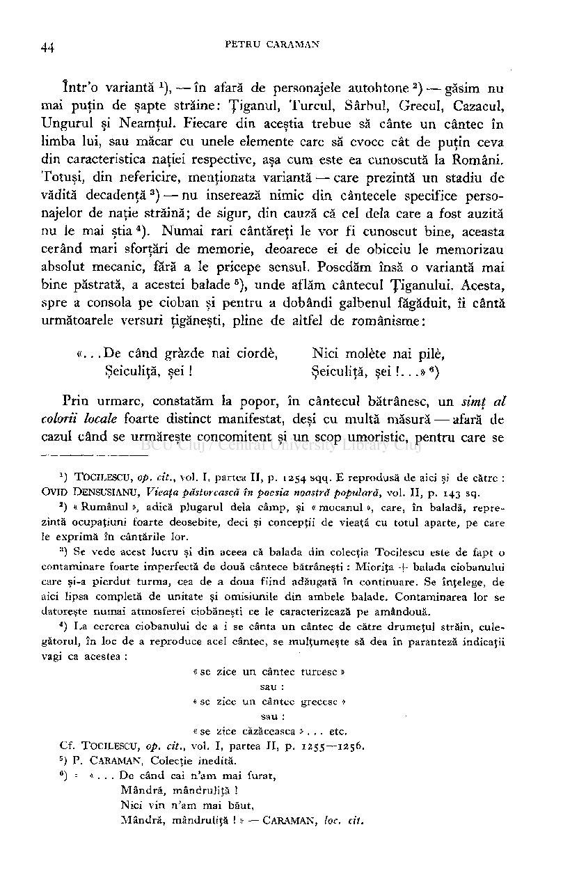

într'o variantă ), — în afară de personajele autohtone ) — găsim nu

mai puţin de şapte străine: Ţiganul, Turcul, Sârbul, Grecul, Cazacul, Ungurul şi Neamţul. Fiecare din aceştia trebue să cânte un cântec în limba lui, sau măcar cu unele elemente care să evoce cât de puţin ceva din caracteristica naţiei respective, aşa cum este ea cunoscută la Români. Totuşi, din nefericire, menţionata variantă — care prezintă un stadiu de vădită decadenţă

) — nu inserează nimic din cântecele specifice personajelor de naţie străină; de sigur, din cauză că cel delà care a fost auzită nu le mai ştia ). Numai rari cântăreţi le vor fi cunoscut bine, aceasta cerând mari sforţări de memorie, deoarece ei de obiceiu le memorizau absolut mecanic, fără a le pricepe sensul. Posedăm însă o variantă mai bine păstrată, a acestei balade ), unde aflăm cântecul Ţiganului. Acesta, spre a consola pe cioban şi pentru a dobândi galbenul făgăduit, îi cântă următoarele versuri ţigăneşti, pline de altfel de românisme:

3

«...De când gràzde nai ciordè, Nici molète nai pile, Şeiculiţă, şei ! Şeiculiţă, şei !...» )

Prin urmare, constatăm la popor, în cântecul bătrânesc, un simţ al colorii locale foarte distinct manifestat, deşi cu multă măsură — afară de cazul când se urmăreşte concomitent şi un scop umoristic, pentru care se

) TOCILESCU, op. cit., vol. I, partea II, p.125 4S<N- E reprodusă de aici şi de către : OVID DENSUSIANU, Vieaţa păstorească în poesia noastră populară, vol. II, p. 14 3 sq.

J

### ) « Rumânul », adică plugarul delà câmp, şi « mocanul », care, în baladă, reprezintă ocupaţiuni foarte deosebite, deci şi concepţii de vieaţă cu totul aparte, pe care le exprimă în cântările lor.

2

) Se vede acest lucru şi din aceea că balada din colecţia Tocilescu este de fapt o contaminare foarte imperfectă de două cântece bătrâneşti : Mioriţa + balada ciobanului care şi-a pierdut turma, cea de a doua fiind adăugată în continuare. Se înţelege, de aici lipsa completă de unitate şi omisiunile din ambele balade. Contaminarea lor se datoreşte numai atmosferei ciobăneşti ce le caracterizează pe amândouă.

3

*) La cererea ciobanului de a i se cânta un cântec de către drumeţul străin, culegătorul, în loc de a reproduce acel cântec, se mulţumeşte să dea în paranteză indicaţii vagi ca acestea :

« se zice un cântec turcesc » sau :

« se zice un cântec grecesc »

sau : « se zice căzăceasca ».. . etc.

Cf. TOCILESCU, op. cit., vol. I, partea II, p.1255—1256 .

- 5

) P. CARAMAN, Colecţie inedită.

- 6

### ) = « . . . De când cai n'am mai furat, Mândră, mândruliţă ! Nici vin n'am mai băut, Mândră, mândruliţă ! » — CARAMAN, loc. cit.

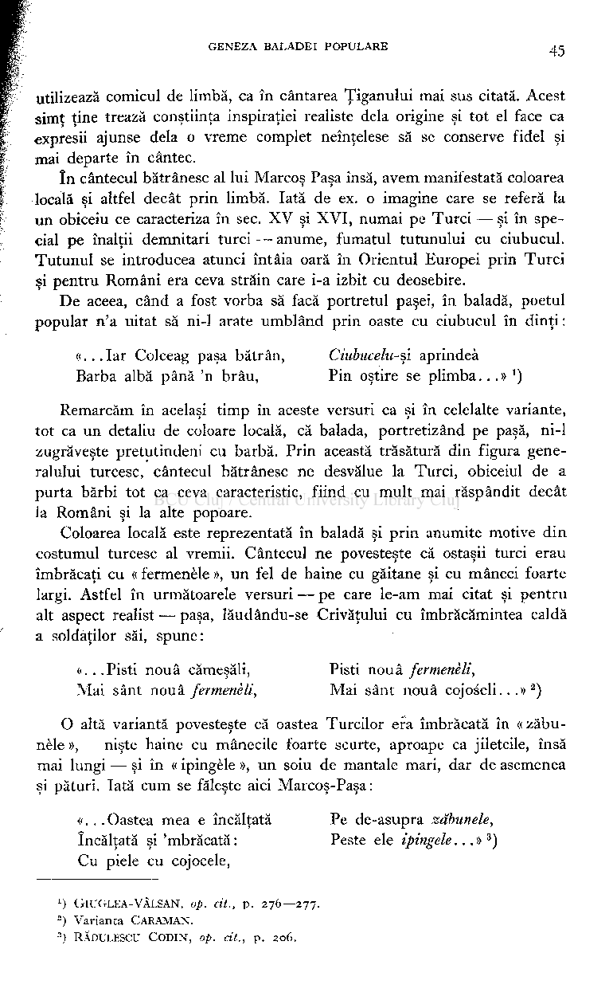

utilizează comicul de limbă, ca în cântarea Ţiganului mai sus citată. Acest simt tine trează conştiinţa inspiraţiei realiste delà origine şi tot el face ca expresii ajunse delà o vreme complet neînţelese să se conserve fidel şi mai departe în cântec.

în cântecul bătrânesc al lui Marcoş Paşa însă, avem manifestată coloarea locală şi altfel decât prin limbă. Iată de ex. o imagine care se referă la un obiceiu ce caracteriza în sec. XV şi XVI, numai pe Turci — şi în special pe înalţii demnitari turci — anume, fumatul tutunului cu ciubucul. Tutunul se introducea atunci întâia oară în Orientul Europei prin Turci şi pentru Români era ceva străin care i-a izbit cu deosebire.

De aceea, când a fost vorba să facă portretul paşei, în baladă, poetul popular n'a uitat să ni-1 arate umblând prin oaste cu ciubucul în dinţi:

«...Iar Colceag paşa bătrân, Ciubucelu-şi aprindea Barba albă până 'n brâu, Pin oştire se plimba...» )

Remarcăm în acelaşi timp în aceste versuri ca şi în celelalte variante, tot ca un detaliu de coloare locală, că balada, portretizând pe paşă, ni-1 zugrăveşte pretutindeni cu barbă. Prin această trăsătură din figura generalului turcesc, cântecul bătrânesc ne desvălue la Turci, obiceiul de a purta bărbi tot ca ceva caracteristic, fiind cu mult mai răspândit decât la Români şi la alte popoare.

Coloarea locală este reprezentată în baladă şi prin anumite motive din costumul turcesc al vremii. Cântecul ne povesteşte că ostaşii turci erau îmbrăcaţi cu « fermenèle », un fel de haine cu găitane şi cu mâneci foarte largi. Astfel în următoarele versuri — pe care le-am mai citat şi pentru alt aspect realist — paşa, lăudându-se Crivăţului cu îmbrăcămintea caldă a soldaţilor săi, spune:

«...Pişti noua cămeşăli, Pişti noua fermenèli, Mai sânt noua fermenèli, Mai sânt noua cojoseli...»

)

2

O altă variantă povesteşte că oastea Turcilor era îmbrăcată în « zăbunèle »,—nişte haine cu mânecile foarte scurte, aproape ca jiletcile, însă mai lungi — şi în « ipingèle », un soiu de mantale mari, dar de asemenea şi pături. Iată cum se făleşte aici Marcoş-Paşa :

«... Oastea mea e încălţată Pe de-asupra zăbunele, încălţată şi 'mbrăcată : Peste ele ipingele... »

) Cu piele cu cojocele,

3

###### *) GlUGLEA-VÂLSAN , op. cit., p. 276—277 .

###### ) Varianta CARAMAN. ") RĂDULESCU CODIN, op. cit., p. 206 .

2

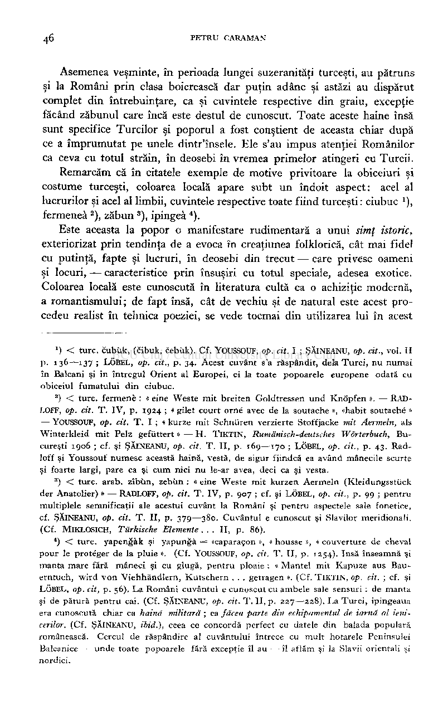

Asemenea veşminte, în perioada lungei suzeranităţi turceşti, au pătruns şi la Români prin clasa boierească dar puţin adânc şi astăzi au dispărut complet din întrebuinţare, ca şi cuvintele respective din graiu, excepţie făcând zăbunul care încă este destul de cunoscut. Toate aceste haine însă sunt specifice Turcilor şi poporul a fost conştient de aceasta chiar după ce a împrumutat pe unele dintr'însele. Ele s'au impus atenţiei Românilor ca ceva cu totul străin, în deosebi în vremea primelor atingeri cu Turcii.

Remarcăm că în citatele exemple de motive privitoare la obiceiuri şi costume turceşti, coloarea locală apare subt un îndoit aspect: acel al lucrurilor şi acel al limbii, cuvintele respective toate fiind turceşti : ciubuc ), fermeneà ), zăbun

), ipingeà

).

3

4

Este aceasta la popor o manifestare rudimentară a unui simţ istoric, exteriorizat prin tendinţa de a evoca în creaţiunea folklorică, cât mai fidel cu putinţă, fapte şi lucruri, în deosebi din trecut — care privesc oameni şi locuri, — caracteristice prin însuşiri cu totul speciale, adesea exotice. Coloarea locală este cunoscută în literatura cultă ca o achiziţie modernă, a romantismului; de fapt însă, cât de vechiu şi de natural este acest procedeu realist în tehnica poeziei, se vede tocmai din utilizarea lui în acest

*) < turc, èubùk, (£ibuk, cebùk). Cf. YOUSSOUF, op. cit. I ; ŞĂINEANU, op. cit., vol. II p.136—13 7 ; LÔBEL, op. cit., p.34 . Acest cuvânt s'a răspândit, delà Turci, nu numai în Balcani şi în întregul Orient al Europei, ci la toate popoarele europene odată cu obiceiul fumatului din ciubuc.

) < turc, fermenè : « eine Weste mit breiten Goldtressen und Knôpfen ». — RADLOFF, op. cit. T. IV, p.192 4 ; « gilet court orné avec de la soutache », «habit soutaché » — YOUSSOUF, op. cit. T. I ; « kurze mit Schniiren verzierte Stoffjacke mit Aermeln, als Winterkleid mit Pelz gefuttert » — H . TlKTIN, Rumânisch-deutsches Wôrterbuch, Bucureşti190 6 ; cf. şi ŞĂINEANU, op. cit. T. II, p.169—17 0 ; LÔBEL, op. cit., p. 43 Radloff şi Youssouf numesc această haină, vestă, de sigur fiindcă ea având mânecile scurte şi foarte largi, pare ca şi cum nici nu le-ar avea, deci ca şi vesta.

2

) < turc. arab. zîbùn, zebùn : « eine Weste mit kurzen Aermeln (Kleidungsstiick der Anatolier) » — RADLOFF, op. cit. T. IV, p. 90 7 ; cf. şi LÔBEL, op. cit., p. 9 9 ; pentru multiplele semnificaţii ale acestui cuvânt la Români şi pentru aspectele sale fonetice, cf. ŞĂINEANU, op. cit. T. II, p.379—380 . Cuvântul e cunoscut şi Slavilor meridionali. (Cf. MlKLOSICH, Tiirkische Elemente .. . II, p. 86) .

3

) < turc. yapengâk şi yapungà = «caparaçon », « housse », « couverture de cheval pour le protéger de la pluie ». (Cf. YOUSSOUF, op. cit. T. II, p.1254) Insă înseamnă şi manta mare fără mâneci şi cu glugă, pentru ploaie : « Mantei mit Kapuze aus Bauerntuch, wird von Viehhăndlern, Kutschern . . . getragen ». (Cf. TlKTIN, op. cil. ; cf. şi LÔBEL, op. cit, p.56) . La Români cuvântul e cunoscut cu ambele sale sensuri : de manta şi de pătură pentru cai. (Cf. ŞĂINEANU, op. cit. T. II, p.227—228) La Turci, ipingeaua era cunoscută chiar ca haină militară ; ea făcea parte din echipamentul de iarnă al ienicerilor. (Cf. ŞĂINEANU, ibid.), ceea ce concordă perfect cu datele din balada populară românească. Cercul de răspândire al cuvântului întrece cu mult hotarele Peninsulei Balcanice — unde toate popoarele fără excepţie îl au — îl aflăm şi la Slavii orientali şi nordici.

4

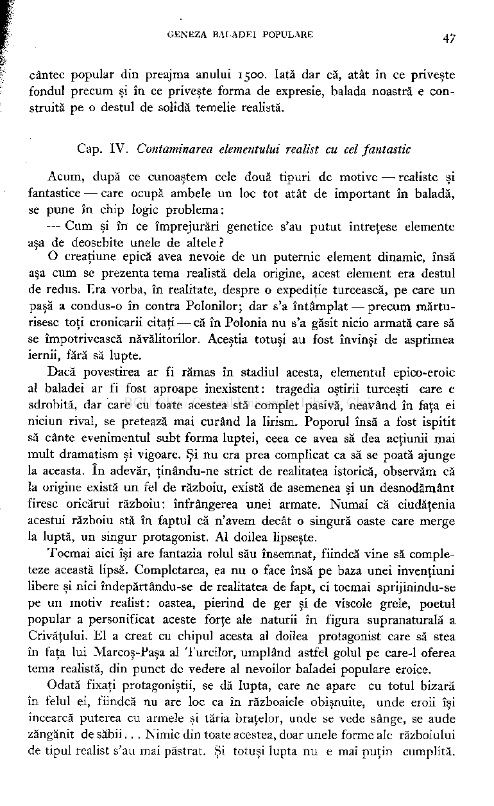

cântec popular din preajma anului 1500. Iată dar că, atât în ce priveşte fondul precum şi în ce priveşte forma de expresie, balada noastră e con^ struită pe o destul de solidă temelie realistă.

Cap. IV. Contaminarea elementului realist cu cel fantastic

Acum, după ce cunoaştem cele două tipuri de motive — realiste şi fantastice — care ocupă ambele un loc tot atât de important în baladă, se pune în chip logic problema:

— Cum şi în ce împrejurări genetice s'au putut întreţese elemente aşa de deosebite unele de altele?

O creaţiune epică avea nevoie de un puternic element dinamic, însă aşa cum se prezenta tema realistă delà origine, acest element era destul de redus. Era vorba, în realitate, despre o expediţie turcească, pe care un paşă a condus-o în contra Polonilor; dar s'a întâmplat — precum mărturisesc toţi cronicarii citaţi —• că în Polonia nu s'a găsit nicio armată care să se împotrivească năvălitorilor. Aceştia totuşi au fost învinşi de asprimea iernii, fără să lupte.

Dacă povestirea ar fi rămas în stadiul acesta, elementul epico-eroic al baladei ar fi fost aproape inexistent: tragedia oştirii turceşti care e sdrobită, dar care cu toate acestea stă complet pasivă, neavând în faţa ei niciun rival, se pretează mai curând la lirism. Poporul însă a fost ispitit să cânte evenimentul subt forma luptei, ceea ce avea să dea acţiunii mai mult dramatism şi vigoare. Şi nu era prea complicat ca să se poată ajunge la aceasta. în adevăr, ţinându-ne strict de realitatea istorică, observăm că la origine există un fel de războiu, există de asemenea şi un desnodământ firesc oricărui războiu: înfrângerea unei armate. Numai că ciudăţenia acestui războiu stă în faptul că n'avem decât o singură oaste care merge la luptă, un singur protagonist. Al doilea lipseşte.

Tocmai aici îşi are fantazia rolul său însemnat, fiindcă vine să completeze această lipsă. Completarea, ea nu o face însă pe baza unei invenţiuni libere şi nici îndepărtându-se de realitatea de fapt, ci tocmai sprijinindu-se pe un motiv realist: oastea, pierind de ger şi de viscole grele, poetul popular a personificat aceste forţe ale naturii în figura supranaturală a Crivăţului. El a creat cu chipul acesta al doilea protagonist care să stea în faţa lui Marcoş-Paşa al Turcilor, umplând astfel golul pe care-1 oferea tema realistă, din punct de vedere al nevoilor baladei populare eroice.

Odată fixaţi protagoniştii, se dă lupta, care ne apare cu totul bizară în felul ei, fiindcă nu are loc ca în războaiele obişnuite, unde eroii îşi încearcă puterea cu armele şi tăria braţelor, unde se vede sânge, se aude zăngănit de săbii.. . Nimic din toate acestea, doar unele forme ale războiului de tipul realist s'au mai păstrat. Şi totuşi lupta nu e mai puţin cumplită.

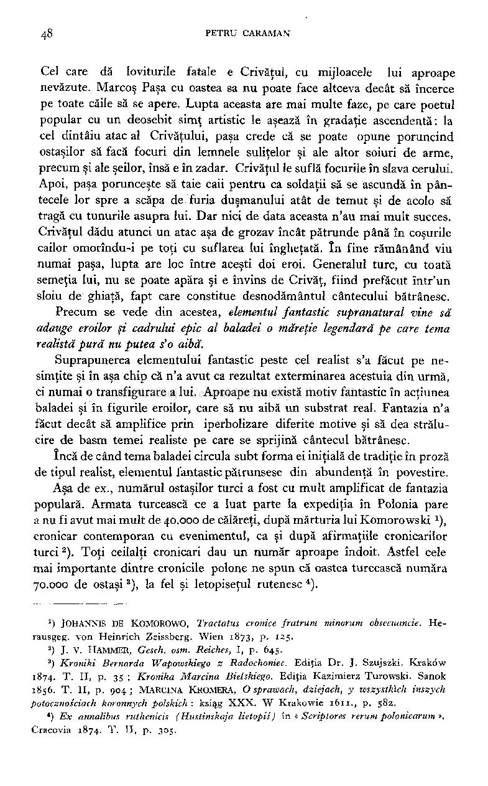

Cel care dă loviturile fatale e Crivăţul, cu mijloacele lui aproape nevăzute. Marcoş Paşa cu oastea sa nu poate face altceva decât să încerce pe toate căile să se apere. Lupta aceasta are mai multe faze, pe care poetul popular cu un deosebit simţ artistic le aşează în gradaţie ascendentă: la cel dintâiu atac al Crivăţului, paşa crede că se poate opune poruncind ostaşilor să facă focuri din lemnele suliţelor şi ale altor soiuri de arme, precum şi ale şeilor, însă e în zadar. Crivăţul le suflă focurile în slava cerului. Apoi, paşa porunceşte să taie caii pentru ca soldaţii să se ascundă în pântecele lor spre a scăpa de furia duşmanului atât de temut şi de acolo să tragă cu tunurile asupra lui. Dar nici de data aceasta n'au mai mult succes. Crivăţul dădu atunci un atac aşa de grozav încât pătrunde până în coşurile cailor omorîndu-i pe toţi cu suflarea lui îngheţată. în fine rămânând viu numai paşa, lupta are loc între aceşti doi eroi. Generalul turc, cu toată semeţia lui, nu se poate apăra şi e învins de Crivăţ, fiind prefăcut într'un sloiu de ghiaţă, fapt care constitue desnodământul cântecului bătrânesc.

Precum se vede din acestea, elementul fantastic supranatural vine să adauge eroilor şi cadrului epic al baladei o măreţie legendară pe care tema realistă pură nu putea s'o aibă.

Suprapunerea elementului fantastic peste cel realist s'a făcut pe nesimţite şi în aşa chip că n'a avut ca rezultat exterminarea acestuia din urmă, ci numai o transfigurare a lui. Aproape nu există motiv fantastic în acţiunea baladei şi în figurile eroilor, care să nu aibă un substrat real. Fantazia n'a făcut decât să amplifice prin iperbolizare diferite motive şi să dea strălucire de basm temei realiste pe care se sprijină cântecul bătrânesc.

încă de când tema baladei circula subt forma ei iniţială de tradiţie în proză de tipul realist, elementul fantastic pătrunsese din abundenţă în povestire.

Aşa de ex., numărul ostaşilor turci a fost cu mult amplificat de fantazia populară. Armata turcească ce a luat parte la expediţia în Polonia pare a nu fi avut mai mult de 40.000 de călăreţi, după mărturia lui Komorowski ), cronicar contemporan cu evenimentul, ca şi după afirmaţiile cronicarilor turci

). Toţi ceilalţi cronicari dau un număr aproape îndoit. Astfel cele mai importante dintre cronicile polone ne spun că oastea turcească număra 70.000 de ostaşi ), la fel şi letopiseţul rutenesc ).

2

') JOHANNI S D E KOMOROWO , Tractatus cronice fratrum minorum obsecuancie. He-

rausgeg. von Heinrich Zeissberg. Wien 1873 , p. 125

###### ) J. V. HAMMER, Gesch. osm. Reiches, I, p. 645 .

2

) Kroniki Bernarda Wapowskiego z Radochoniec. Ediţia Dr. J. Szujszki. Krakow

3

1874 . T. II, p. 3 5 ; Kronika Marcina Bielskiego. Ediţia Kazimierz Turowski. Sanok

1856 . T. II, p. 904 ; MARCIN A KROMERA , O sprawach, dziejach, y wszystklch inszych potocznosciach koronnych polskich : ksia^g XXX. W Krakowie1611. p. 582 .

) Ex annalibus ruthenicis (Hustinskaja lietopis) în « Scriptores rerum polonicarum ».

4

Cracovia 1874 . T. II, p. 305 .

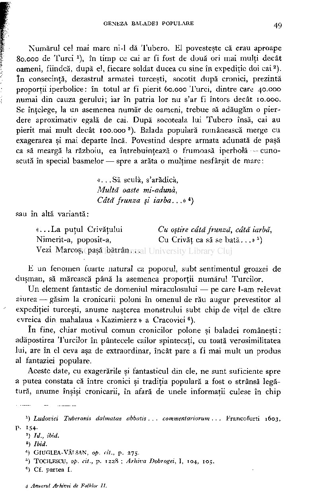

Numărul cel mai mare ni-1 dă Tubero. El povesteşte că erau aproape 80.000 de Turci ), în timp ce cai ar fi fost de două ori mai mulţi decât oameni, fiindcă, după el, fiecare soldat ducea cu sine în expediţie doi cai

). în consecinţă, dezastrul armatei turceşti, socotit după cronici, prezintă proporţii iperbolice : în totul ar fi pierit 60.000 Turci, dintre care 40.000 numai din cauza gerului; iar în patria lor nu s'ar fi întors decât 10.000. Se înţelege, la un asemenea număr de oameni, trebue să adăugăm o pierdere aproximativ egală de cai. După socoteala lui Tubero însă, cai au pierit mai mult decât 100.000 ). Balada populară românească merge cu exagerarea şi mai departe încă. Povestind despre armata adunată de paşă ca să meargă la războiu, ea întrebuinţează o frumoasă iperbolă — cunoscută în special basmelor — spre a arăta o mulţime nesfârşit de mare :

2

«... Să scula, s'arădica, Multă oaste mi-adunà, Câtă frunza şi iarba... »

) sau în altă variantă:

4

«.. .La puţul Crivăţului Cu oştire câtă frunză, câtă iarbă, Nimerit-a, poposit-a, Cu Crivăţ ca să se bată... »

) Vezi Marcoş, paşă bătrân...

5

E un fenomen foarte natural ca poporul, subt sentimentul groazei de duşman, să mărească până la asemenea proporţii numărul Turcilor.

Un element fantastic de domeniul miraculosului — pe care l-am relevat aiurea — găsim la cronicarii poloni în omenul de rău augur prevestitor al expediţiei turceşti, anume naşterea monstrului subt chip de viţel de către evreica din mahalaua « Kazimierz » a Cracoviei

).

8

în fine, chiar motivul comun cronicilor polone şi baladei româneşti: adăpostirea Turcilor în pântecele cailor spintecaţi, cu toată verosimilitatea lui, are în el ceva aşa de extraordinar, încât pare a fi mai mult un produs al fantaziei populare.

Aceste date, cu exagerările şi fantasticul din ele, ne sunt suficiente spre a putea constata că între cronici şi tradiţia populară a fost o strânsă legătură, anume înşişi cronicarii, în afară de unele informaţii culese în chip

) Ludovici Tuberonis dalmatae abbatis . . . commentariorum . . . Francofurti 1603 ,

1

P- 154 -

###### ) Id., ibid.

2

###### ) Ibid.

3

) GIUGLEA-VÂLSAN op. cit., p. 275 .

4

- 3 ) TOCILESCU, op. cit., p. 122 8 ; Arhiva Dobrogei, I , 104 , 105

6

) Cf. partea I.

- 4 Anuarul Arhivei de Folklor II.

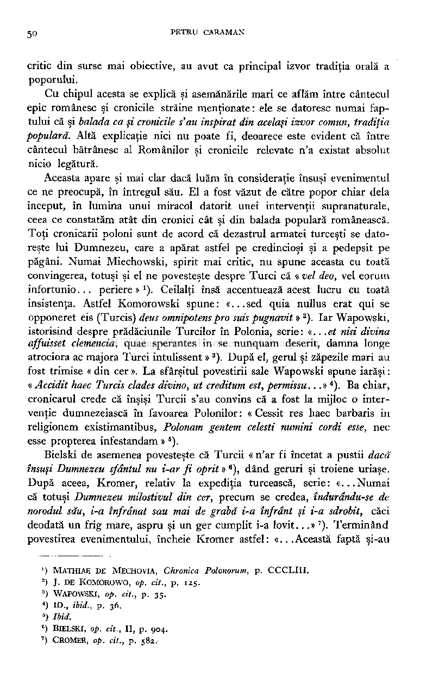

critic din surse mai obiective, au avut ca principal izvor tradiţia orală a poporului.

Cu chipul acesta se explică şi asemănările mari ce aflăm între cântecul epic românesc şi cronicile străine menţionate: ele se datoresc numai faptului că şi balada ca şi cronicile s'au inspirat din acelaşi izvor comun, tradiţia populară. Altă explicaţie nici nu poate fi, deoarece este evident că între cântecul bătrânesc al Românilor şi cronicile relevate n'a existat absolut nicio legătură.

Aceasta apare şi mai clar dacă luăm în consideraţie însuşi evenimentul ce ne preocupă, în întregul său. El a fost văzut de către popor chiar delà început, în lumina unui miracol datorit unei intervenţii supranaturale, ceea ce constatăm atât din cronici cât şi din balada populară românească. Toţi cronicarii poloni sunt de acord că dezastrul armatei turceşti se datoreşte lui Dumnezeu, care a apărat astfel pe credincioşi şi a pedepsit pe păgâni. Numai Miechowski, spirit mai critic, nu spune aceasta cu toată convingerea, totuşi şi el ne povesteşte despre Turci că « vel deo, vel eorum infortunio... periere»

). Ceilalţi însă accentuează acest lucru cu toată insistenţa. Astfel Komorowski spune : «... sed quia nullus erat qui se opponeret eis (Turcis) deus omnipotenspro suis pugnavit »

1

). Iar Wapowski, istorisind despre prădăciunile Turcilor în Polonia, scrie : «.. .et nisi divina affuisset clemencia, quae sperantes in se nunquam deserit, damna longe atrociora ac majora Turci intulissent »

2

). După el, gerul şi zăpezile mari au fost trimise « din cer ». La sfârşitul povestirii sale Wapowski spune iarăşi : « Accidit haec Turcis clades divina, ut creditum est, permissu...»

3

). Ba chiar, cronicarul crede că înşişi Turcii s'au convins că a fost la mijloc o intervenţie dumnezeiască în favoarea Polonilor : « Cessit res haec barbaris in religionem existimantibus, Polonam gentem celeşti numini cordi esse, nec esse propterea infestandam »

4

).

6

Bielski de asemenea povesteşte că Turcii « n'ar fi încetat a pustii dacă însuşi Dumnezeu sfântul nu i-ar fi oprit »

), dând geruri şi troiene uriaşe. După aceea, Kromer, relativ la expediţia turcească, scrie : «... Numai că totuşi Dumnezeu milostivul din cer, precum se credea, îndurându-se de norodul său, i-a înfrânat sau mai de grabă i-a înfrânt şi i-a sdrobit, căci deodată un frig mare, aspru şi un ger cumplit i-a lovit...» ). Terminând povestirea evenimentului, încheie Kromer astfel : «... Această faptă şi-au

8

' ) MATHIA E D E MECHOVIA Chronica Polonorum, p. CCCLIII .

- 2 ) J. D E KOMOROWO , op. cit., p. 125 .
- 3

##### ) WAPOWSKI, op. cit., p. 35 .

###### ") ID. ibid., p. 36 .

###### ) Ibid.

s

- 6

) BIELSKI, op. cit.,II , p. 904 .

- 7

##### ) CROMER, op. cit., p. 582 .

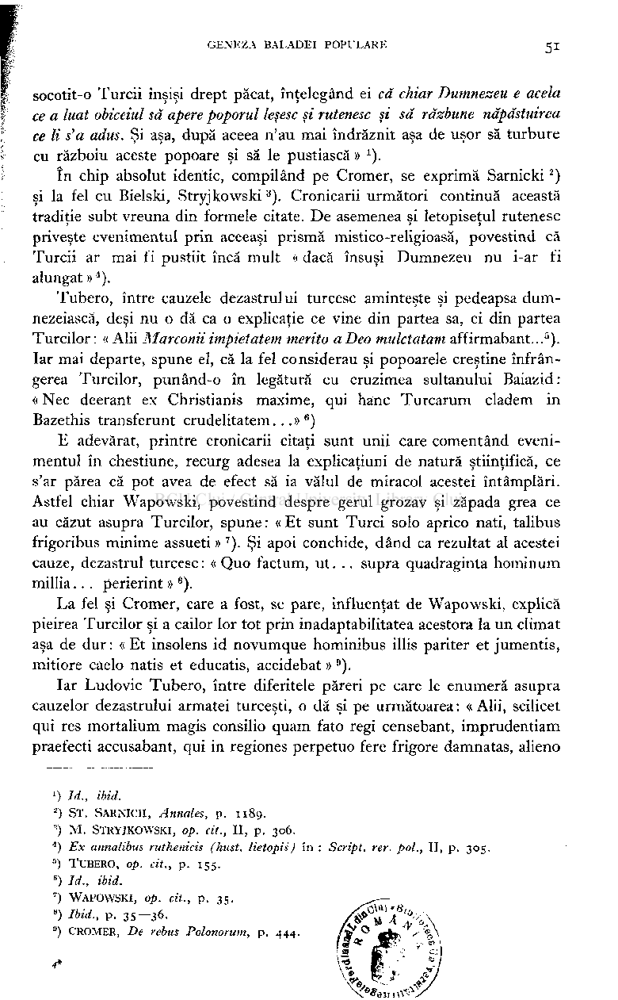

socotit-o Turcii înşişi drept păcat, înţelegând ei că chiar Dumnezeu e acela ce a luat obiceiul să apere poporul leşesc şi rutenesc şi să răzbune năpăstuirea ce li s'a adus. Şi aşa, după aceea n'au mai îndrăznit aşa de uşor să turbure cu războiu aceste popoare şi să le pustiască » ).

) şi la fel cu Bielski, Stryjkowski

în chip absolut identic, compilând pe Cromer, se exprimă Sarnicki

2

). Cronicarii următori continuă această tradiţie subt vreuna din formele citate. De asemenea şi letopiseţul rutenesc priveşte evenimentul prin aceeaşi prismă mistico-religioasă, povestind că Turcii ar mai fi pustiit încă mult « dacă însuşi Dumnezeu nu i-ar fi alungat »

3

).

4

Tubero, între cauzele dezastrului turcesc aminteşte şi pedeapsa dumnezeiască, deşi nu o dă ca o explicaţie ce vine din partea sa, ci din partea Turcilor : « Alii Marconii impietatem merito a Deo mulctatam affirmabant...

). Iar mai departe, spune el, că la fel considerau şi popoarele creştine înfrângerea Turcilor, punând-o în legătură cu cruzimea sultanului Baiazid: « Nec deerant ex Christianis maxime, qui hanc Turcarum cladem in Bazethis transferunt crudelitatem... »

5

) E adevărat, printre cronicarii citaţi sunt unii care comentând evenimentul în chestiune, recurg adesea la explicaţiuni de natură ştiinţifică, ce s'ar părea că pot avea de efect să ia vălul de miracol acestei întâmplări. Astfel chiar Wapowski, povestind despre gerul grozav şi zăpada grea ce au căzut asupra Turcilor, spune : « Et sunt Turci solo aprico nati, talibus frigoribus minime assueti »

6

). Şi apoi conchide, dând ca rezultat al acestei cauze, dezastrul turcesc: « Quo factum, ut. .. supra quadraginta hominum millia... perierint »

7

).

8

La fel şi Cromer, care a fost, se pare, influenţat de Wapowski, explică pieirea Turcilor şi a cailor lor tot prin inadaptabilitatea acestora la un climat aşa de dur: « Et insolens id novumque hominibus illis pariter et jumentis, mitiore caelo natis et educatis, accidebat » °).

Iar Ludovic Tubero, între diferitele păreri pe care le enumera asupra cauzelor dezastrului armatei turceşti, o dă şi pe următoarea : « Alii, scilicet qui res mortalium magis consilio quam fato regi censebant, imprudentiam praefecti accusabant, qui in regiones perpetuo fere frigore damnatas, alieno

>) Id., ibid.

###### ) ST . SARNICII , Annales, p. 1189 .

2

) M . STRYJKOWSKI, op. cit., II, p. 306 .

,

- 4 ) Ex annalibus ruthenicis (hust. lietopis) în : Script, rer. pol., II, p. 305 .
- 5

) TUBERO, op. cit., p. 155

") Id., ibid.

") WAPOWSKI, op. cit., p. 35

) Ibid., p. 35—36 -

s

) CROMER, De rebus Polonorum, p. 444.

S

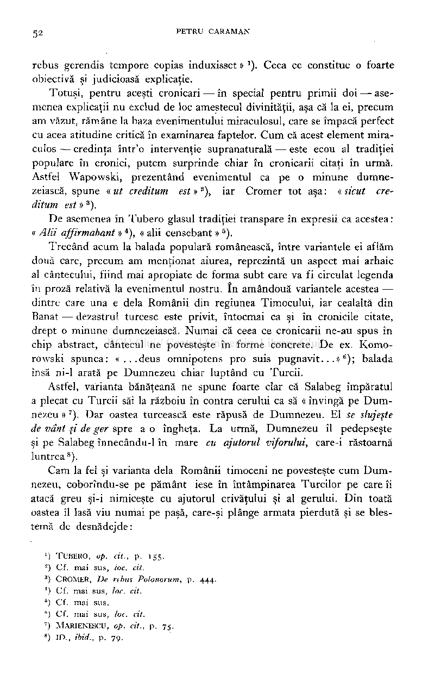

rebus gerendis tempore copias induxisset »

). Ceea ce constitue o foarte obiectivă şi judicioasă explicaţie.

x

Totuşi, pentru aceşti cronicari — în special pentru primii doi — asemenea explicaţii nu exclud de loc amestecul divinităţii, aşa că la ei, precum am văzut, rămâne la baza evenimentului miraculosul, care se împacă perfect cu acea atitudine critică în examinarea faptelor. Cum că acest element miraculos — credinţa într'o intervenţie supranaturală — este ecou al tradiţiei populare în cronici, putem surprinde chiar în cronicarii citaţi în urmă. Astfel Wapowski, prezentând evenimentul ca pe o minune dumnezeiască, spune « ut creditum est »

), iar Cromer tot aşa : « sicut creditum est »

2

).

3

De asemenea în Tubero glasul tradiţiei transpare în expresii ca acestea : « Alii affirmabant »

), « alii censebant » ).

4

Trecând acum la balada populară românească, între variantele ei aflăm două care, precum am menţionat aiurea, reprezintă un aspect mai arhaic al cântecului, fiind mai apropiate de forma subt care va fi circulat legenda în proză relativă la evenimentul nostru. în amândouă variantele acestea dintre care una e delà Românii din regiunea Timocului, iar cealaltă din Banat — dezastrul turcesc este privit, întocmai ca şi în cronicile citate, drept o minune dumnezeiască. Numai că ceea ce cronicarii ne-au spus în chip abstract, cântecul ne povesteşte în forme concrete. De ex. Komorowski spunea: « .. .deus omnipotens pro suis pugnavit...»

); balada însă ni-l arată pe Dumnezeu chiar luptând cu Turcii.

6

Astfel, varianta bănăţeană ne spune foarte clar că Salabeg împăratul a plecat cu Turcii săi la războiu în contra cerului ca să « învingă pe Dumnezeu » '). Dar oastea turcească este răpusă de Dumnezeu. El se slujeşte de vânt şi de ger spre a o îngheţa. La urmă, Dumnezeu îl pedepseşte şi pe Salabeg înnecându-l în mare cu ajutorul viforului, care-i răstoarnă luntrea ).

Cam la fel şi varianta delà Românii timoceni ne povesteşte cum Dumnezeu, coborîndu-se pe pământ iese în întâmpinarea Turcilor pe care îi atacă greu şi-i nimiceşte cu ajutorul crivăţului şi al gerului. Din toată oastea îl lasă viu numai pe paşă, care-şi plânge armata pierdută şi se blestemă de desnădejde:

'I TUBERO, op. cit., p. 155 .

- 2 ) Cf. mai sus, ioc. cit.
- 3

#### ) CROMER, De rebus Polonorum, p. 444.

###### ) Cf. mai sus, loc. cit. ") Cf. mai sus. ") Cf. mai sus, loc. cit.

###### ) MARIENESCU op. cit., p. 75 .

###### ) ID. , ibid., p. 79.

8

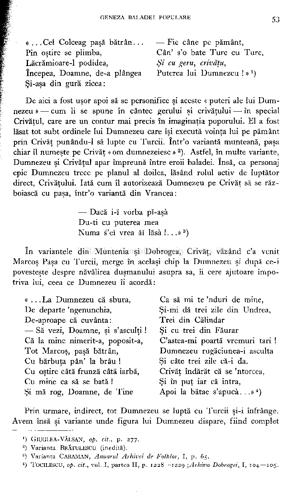

— Fie câne pe pământ, Cân' s'o bate Turc cu Turc, Şi cu geru, crivâţu, Puterea lui Dumnezeu ! »

« .. .Cel Colceag paşă bătrân... Pin oştire se plimba, Lăcrămioare-1 podidea, începea, Doamne, de-a plângea Şi-aşa din gură zicea:

)

x

De aici a fost uşor apoi să se personifice şi aceste « puteri ale lui Dumnezeu » — cum li se spune în cântec gerului şi crivăţului — în special Crivăţul, care are un contur mai precis în imaginaţia poporului. El a fost lăsat tot subt ordinele lui Dumnezeu care îşi execută voinţa lui pe pământ prin Crivăţ punându-1 să lupte cu Turcii. într'o variantă munteană, paşa chiar îl numeşte pe Crivăţ « om dumnezeiesc »

). Astfel, în multe variante,

2

Dumnezeu şi Crivăţul apar împreună între eroii baladei. însă, ca personaj epic Dumnezeu trece pe planul al doilea, lăsând rolul activ de luptător direct, Crivăţului. Iată cum îl autorizează Dumnezeu pe Crivăţ să se războiască cu paşa, într'o variantă din Vrancea:

— Dacă i-î vorba pï-asà Du-ti cu puterea mea Numa s'eî vrea ăî lăsa !...»

)

3

în variantele din Muntenia şi Dobrogea, Crivăţ, văzând c'a venit Marcoş Paşa cu Turcii, merge în acelaşi chip la Dumnezeu şi după ce-i povesteşte despre năvălirea duşmanului asupra sa, îi cere ajutoare împotriva lui, ceea ce Dumnezeu îi acordă:

« .. . La Dumnezeu că sbura, De departe 'ngenunchia, De-aproape că cuvânta: — Să vezi, Doamne, şi s'asculţi ! Că la mine nimerit-a, poposit-a, Tot Marcoş, paşă bătrân, Cu bărbuţa pân' la brâu ! Cu oştire câtă frunză câtă iarbă, Cu mine ca să se bată ! Şi mă rog, Doamne, de Tine

Ca să mi te 'nduri de mine, Şi-mi dă trei zile din Undrea, Trei din Călindar Şi cu trei din Făurar C'astea-mi poartă vremuri tari ! Dumnezeu rugăciunea-i asculta Şi câte trei zile că-i da. Crivăţ îndărăt că se 'ntorcea, Şi în puţ iar că intra, Apoi la bătae s'apucà. . .»

)

4

Prin urmare, indirect, tot Dumnezeu se luptă cu Turcii şi-i înfrânge. Avem însă şi variante unde figura lui Dumnezeu dispare, fiind complet

') GlUGLEA-VÂLSAN, op. cit., p. 277 .

) Varianta BRĂTULESCU (inedită).

2

- s ) Varianta CARAMAN, Anuarul Arhivei de Folklor, I, p. 65 .

) TOCILESCU, op. cit., vol.I partea II, p.1228—122 9 ;Arhiva Dobrogei, I,104—105 .

J

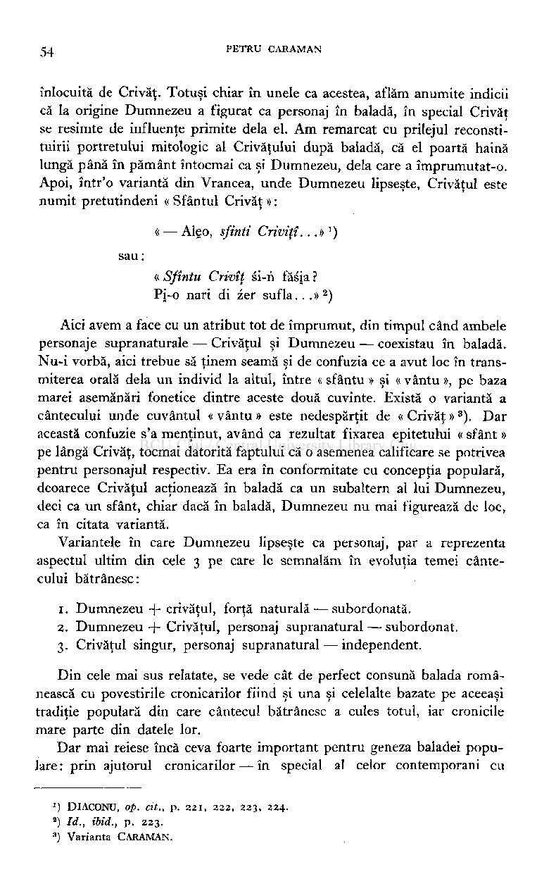

înlocuită de Crivăţ. Totuşi chiar în unele ca acestea, aflăm anumite indicii că la origine Dumnezeu a figurat ca personaj în baladă, în special Crivăţ se resimte de influenţe primite delà el. Am remarcat cu prilejul reconstituirii portretului mitologic al Crivăţului după baladă, că el poartă haină lungă până în pământ întocmai ca şi Dumnezeu, delà care a împrumutat-o. Apoi, într'o variantă din Vrancea, unde Dumnezeu lipseşte, Crivăţul este numit pretutindeni « Sfântul Crivăţ » :

) sau:

« — Aleo, sfinţi Criviţî...»

J

« Sfîntu Crivîţ si-ri făsia ? Pi-o nari di zer sufla.. .»

)

2

Aici avem a face cu un atribut tot de împrumut, din timpul când ambele personaje supranaturale — Crivăţul şi Dumnezeu — coexistau în baladă. Nu-i vorbă, aici trebue să ţinem seamă şi de confuzia ce a avut loc în transmiterea orală delà un individ la altul, între « sfântu » şi « vântu », pe baza marei asemănări fonetice dintre aceste două cuvinte. Există o variantă a cântecului unde cuvântul « vântu » este nedespărţit de « Crivăţ »

). Dar această confuzie s'a menţinut, având ca rezultat fixarea epitetului « sfânt » pe lângă Crivăţ, tocmai datorită faptului că o asemenea calificare se potrivea pentru personajul respectiv. Ea era în conformitate cu concepţia populară, deoarece Crivăţul acţionează în baladă ca un subaltern al lui Dumnezeu, deci ca un sfânt, chiar dacă în baladă, Dumnezeu nu mai figurează de loc, ca în citata variantă.

3

Variantele în care Dumnezeu lipseşte ca personaj, par a reprezenta aspectul ultim din cele 3 pe care le semnalăm în evoluţia temei cântecului bătrânesc:

- 1. Dumnezeu + crivăţul, forţă naturală — subordonată.
- 2. Dumnezeu 4 - Crivăţul, personaj supranatural — subordonat.
- 3. Crivăţul singur, personaj supranatural — independent.

Din cele mai sus relatate, se vede cât de perfect consună balada românească cu povestirile cronicarilor fiind şi una şi celelalte bazate pe aceeaşi tradiţie populară din care cântecul bătrânesc a cules totul, iar cronicile mare parte din datele lor.

Dar mai reiese încă ceva foarte important pentru geneza baladei populare : prin ajutorul cronicarilor — în special al celor contemporani cu

) DIACONU, op. cit., p . 321, 222, 223 , 224

J

###### ) Id., ibid., p . 223 .

2

###### ) Varianta CARAMAN.

3

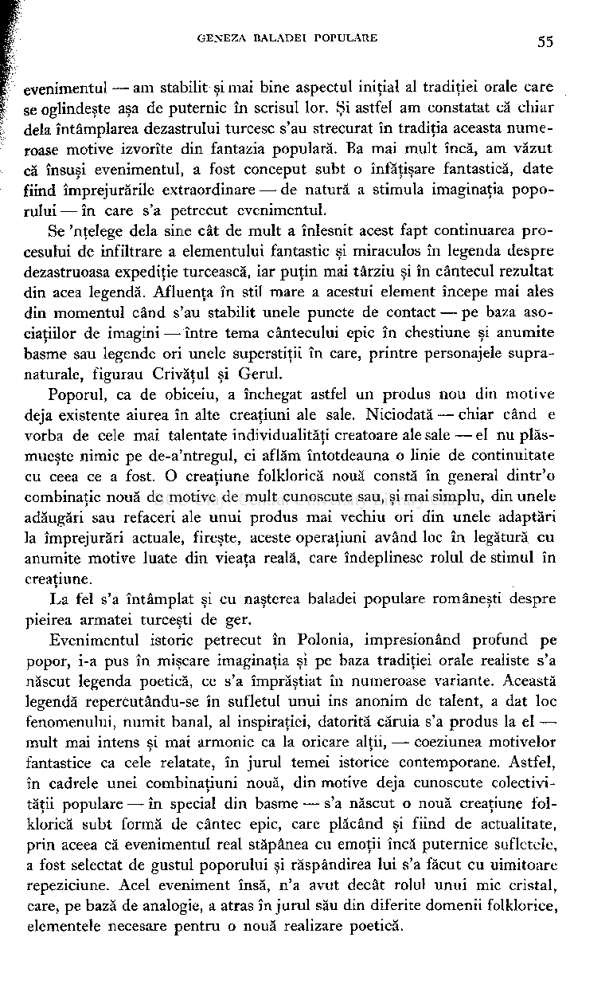

evenimentul — am stabilit şi mai bine aspectul iniţial al tradiţiei orale care se oglindeşte aşa de puternic în scrisul lor. Şi astfel am constatat că chiar delà întâmplarea dezastrului turcesc s'au strecurat în tradiţia aceasta numeroase motive izvorîte din fantazia populară. Ba mai mult încă, am văzut că însuşi evenimentul, a fost conceput subt o înfăţişare fantastică, date fiind împrejurările extraordinare — de natură a stimula imaginaţia poporului — în care s'a petrecut evenimentul.

Se 'nţelege delà sine cât de mult a înlesnit acest fapt continuarea procesului de infiltrare a elementului fantastic şi miraculos în legenda despre dezastruoasa expediţie turcească, iar puţin mai târziu şi în cântecul rezultat din acea legendă. Afluenţa în stil mare a acestui element începe mai ales din momentul când s'au stabilit unele puncte de contact — pe baza asociaţiilor de imagini — între tema cântecului epic în chestiune şi anumite basme sau legende ori unele superstiţii în care, printre personajele supranaturale, figurau Crivăţul şi Gerul.

Poporul, ca de obiceiu, a închegat astfel un produs nou din motive deja existente aiurea în alte creaţiuni ale sale. Niciodată — chiar când e vorba de cele mai talentate individualităţi creatoare ale sale — el nu plăsmueşte nimic pe de-a'ntregul, ci aflăm întotdeauna o linie de continuitate cu ceea ce a fost. O creaţiune folklorică nouă constă în general dintr'o combinaţie nouă de motive de mult cunoscute sau, şi mai simplu, din unele adăugări sau refaceri ale unui produs mai vechiu ori din unele adaptări la împrejurări actuale, fireşte, aceste operaţiuni având loc în legătură cu anumite motive luate din vieaţa reală, care îndeplinesc rolul de stimul în creaţiune.

La fel s'a întâmplat şi cu naşterea baladei populare româneşti despre pieirea armatei turceşti de ger.

Evenimentul istoric petrecut în Polonia, impresionând profund pe popor, i-a pus în mişcare imaginaţia şi pe baza tradiţiei orale realiste s'a născut legenda poetică, ce s'a împrăştiat în numeroase variante. Această legendă repercutându-se în sufletul unui ins anonim de talent, a dat loc fenomenului, numit banal, al inspiraţiei, datorită căruia s'a produs la el mult mai intens şi mai armonic ca la oricare alţii, — coeziunea motivelor fantastice ca cele relatate, în jurul temei istorice contemporane. Astfel, în cadrele unei combinaţiuni nouă, din motive deja cunoscute colectivi­

- tăţii populare — în special din basme — s'a născut o nouă creaţiune folklorică subt formă de cântec epic, care plăcând şi fiind de actualitate, prin aceea că evenimentul real stăpânea cu emoţii încă puternice sufletele, a fost selectat de gustul poporului şi răspândirea lui s'a făcut cu uimitoare repeziciune. Acel eveniment însă, n'a avut decât rolul unui mic cristal, care, pe bază de analogie, a atras în jurul său din diferite domenii folklorice, elementele necesare pentru o nouă realizare poetică.

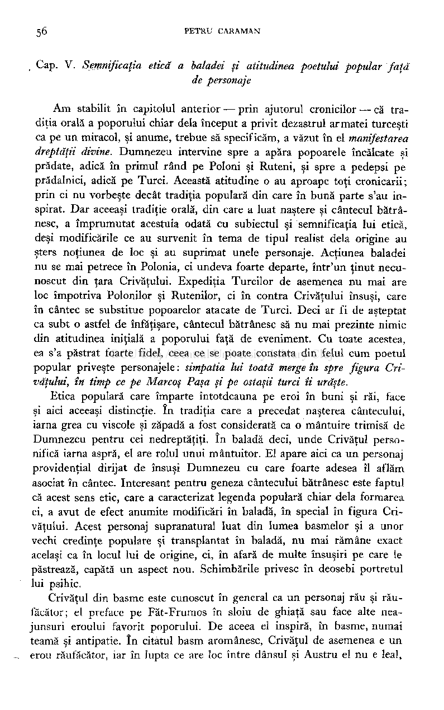

Cap. V. Semnificaţia etică a baladei şi atitudinea poetului popular faţă de personaje

Am stabilit în capitolul anterior — prin ajutorul cronicilor — că tradiţia orală a poporului chiar delà început a privit dezastrul armatei turceşti ca pe un miracol, şi anume, trebue să specificăm, a văzut în el manifestarea dreptăţii divine. Dumnezeu intervine spre a apăra popoarele încălcate şi

prădate, adică în primul rând pe Poloni şi Ruteni, şi spre a pedepsi pe prădalnici, adică pe Turci. Această atitudine o au aproape toţi cronicarii; prin ei nu vorbeşte decât tradiţia populară din care în bună parte s'au inspirat. Dar aceeaşi tradiţie orală, din care a luat naştere şi cântecul bătrânesc, a împrumutat acestuia odată cu subiectul şi semnificaţia lui etică, deşi modificările ce au survenit în tema de tipul realist delà origine au şters noţiunea de loc şi au suprimat unele personaje. Acţiunea baladei nu se mai petrece în Polonia, ci undeva foarte departe, într'un ţinut necunoscut din ţara Crivăţului. Expediţia Turcilor de asemenea nu mai are loc împotriva Polonilor şi Rutenilor, ci în contra Crivăţului însuşi, care în cântec se substitue popoarelor atacate de Turci. Deci ar fi de aşteptat ca subt o astfel de înfăţişare, cântecul bătrânesc să nu mai prezinte nimic din atitudinea iniţială a poporului faţă de eveniment. Cu toate acestea, ea s'a păstrat foarte fidel, ceea ce se poate constata din felul cum poetul popular priveşte personajele : simpatia lui toată merge în spre figura Crivăţului, în timp ce pe Marcoş Paşa şi pe ostaşii turci îi urăşte.

Etica populară care împarte întotdeauna pe eroi în buni şi răi, face şi aici aceeaşi distincţie. în tradiţia care a precedat naşterea cântecului, iarna grea cu viscole şi zăpadă a fost considerată ca o mântuire trimisă de Dumnezeu pentru cei nedreptăţiţi. în baladă deci, unde Crivăţul personifică iarna aspră, el are rolul unui mântuitor. El apare aici ca un personaj providenţial dirijat de însuşi Dumnezeu cu care foarte adesea îl aflăm asociat în cântec. Interesant pentru geneza cântecului bătrânesc este faptul că acest sens etic, care a caracterizat legenda populară chiar delà formarea ei, a avut de efect anumite modificări în baladă, în special în figura Crivăţului. Acest personaj supranatural luat din lumea basmelor şi a unor vechi credinţe populare şi transplantat în baladă, nu mai rămâne exact acelaşi ca în locul lui de origine, ci, în afară de multe însuşiri pe care le păstrează, capătă un aspect nou. Schimbările privesc în deosebi portretul lui psihic.

Crivăţul din basme este cunoscut în general ca un personaj rău şi răufăcător; el preface pe Făt-Frumos în sloiu de ghiaţă sau face alte neajunsuri eroului favorit poporului. De aceea el inspiră, în basme, numai teamă şi antipatie. în citatul basm aromânesc, Crivăţul de asemenea e un erou răufăcător, iar în lupta ce are loc între dânsul şi Austru el nu e leal,

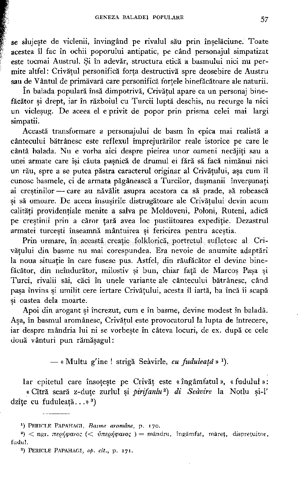

se slujeşte de viclenii, învingând pe rivalul său prin înşelăciune. Toate acestea îl fac în ochii poporului antipatic, pe când personajul simpatizat este tocmai Austrul. Şi în adevăr, structura etică a basmului nici nu permite altfel: Crivăţul personifică forţa destructivă spre deosebire de Austru sau de Vântul de primăvară care personifică forţele binefăcătoare ale naturii.

în balada populară însă dimpotrivă, Crivăţul apare ca un personaj binefăcător şi drept, iar în războiul cu Turcii luptă deschis, nu recurge la nici un vicleşug. De aceea el e privit de popor prin prisma celei mai largi simpatii.

Această transformare a personajului de basm în epica mai realistă a cântecului bătrânesc este reflexul împrejurărilor reale istorice pe care le cântă balada. Nu e vorba aici despre pieirea unor oameni necăjiţi sau a unei armate care îşi căuta paşnică de drumul ei fără să facă nimănui nici un rău, spre a se putea păstra caracterul originar al Crivăţului, aşa cum îl cunosc basmele, ci de armata păgânească a Turcilor, duşmanii înverşunaţi ai creştinilor — care au năvălit asupra acestora ca să prade, să robească şi să omoare. De aceea însuşirile distrugătoare ale Crivăţului devin acum calităţi providenţiale menite a salva pe Moldoveni, Poloni, Ruteni, adică pe creştinii prin a căror ţară avea loc pustiitoarea expediţie. Dezastrul armatei turceşti înseamnă mântuirea şi fericirea pentru aceştia.

Prin urmare, în această creaţie folklorică, portretul sufletesc al Crivăţului din basme nu mai corespundea. Era nevoie de anumite adaptări la noua situaţie în care fusese pus. Astfel, din răufăcător el devine binefăcător, din neîndurător, milostiv şi bun, chiar faţă de Marcoş Paşa şi Turci, rivalii săi, căci în unele variante ale cântecului bătrânesc, când paşa învins şi umilit cere iertare Crivăţului, acesta îl iartă, ba încă îi scapă şi oastea delà moarte.

Apoi din arogant şi încrezut, cum e în basme, devine modest în baladă. Aşa, în basmul aromânesc, Crivăţul este provocatorul la lupta de întrecere, iar despre mândria lui ni se vorbeşte în câteva locuri, de ex. după ce cele două vânturi pun rămăşagul:

— « Multu g'ine ! strigă Seàvirle, cu fuduleaţă»

).

1

Iar epitetul care însoţeşte pe Crivăţ este « îngâmfatul », « fudulul » : « Cîtră seară z-duţe zurlul şi pirifanlu ) di Seàvire la Notlu şi—1' dzîţe cu fuduleaţă...»

)

3

) PERICL E PAPAHAGI , Basme aromâne, p. 170 .

X

###### ) < ngr. 7tEQriq>avoç ( < V7i£Qr)(pavoç ) = mândru, îngâmfat, măreţ, dispreţuitor, fudul.

2

###### ) PERICL E PAPAHAGI , op. cit., p. 171 .

3

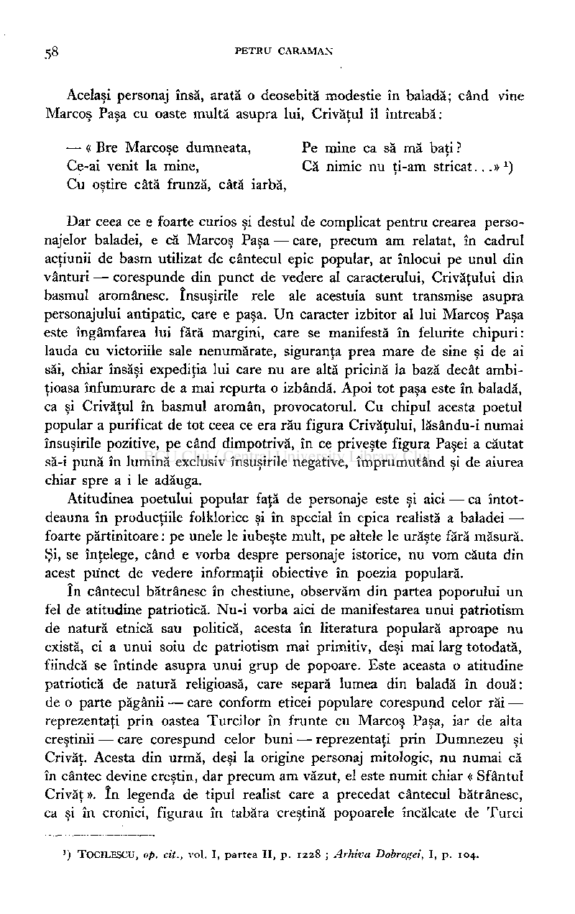

Acelaşi personaj însă, arată o deosebită modestie în baladă; când vine Marcoş Paşa cu oaste multă asupra lui, Crivăţul îl întreabă:

— « Bre Marcoşe dumneata, Pe mine ca să mă baţi ? Ce-ai venit la mine, Că nimic nu ţi-am stricat... » Cu oştire câtă frunză, câtă iarbă,

Dar ceea ce e foarte curios şi destul de complicat pentru crearea personajelor baladei, e că Marcoş Paşa — care, precum am relatat, în cadrul acţiunii de basm utilizat de cântecul epic popular, ar înlocui pe unul din vânturi — corespunde din punct de vedere al caracterului, Crivăţului din basmul aromânesc. însuşirile rele ale acestuia sunt transmise asupra personajului antipatic, care e paşa. Un caracter izbitor al lui Marcoş Paşa este îngâmfarea lui fără margini, care se manifestă în felurite chipuri: lauda cu victoriile sale nenumărate, siguranţa prea mare de sine şi de ai săi, chiar însăşi expediţia lui care nu are altă pricină la bază decât ambiţioasa înfumurare de a mai repurta o izbândă. Apoi tot paşa este în baladă, ca şi Crivăţul în basmul aromân, provocatorul. Cu chipul acesta poetul popular a purificat de tot ceea ce era rău figura Crivăţului, lăsându-i numai însuşirile pozitive, pe când dimpotrivă, în ce priveşte figura Paşei a căutat să-i pună în lumină exclusiv însuşirile negative, împrumutând şi de aiurea chiar spre a i le adăuga.

Atitudinea poetului popular faţă de personaje este şi aici — ca întotdeauna în producţiile folklorice şi în special în epica realistă a baladei foarte părtinitoare : pe unele le iubeşte mult, pe altele le urăşte fără măsură. Şi, se înţelege, când e vorba despre personaje istorice, nu vom căuta din acest punct de vedere informaţii obiective în poezia populară.

în cântecul bătrânesc în chestiune, observăm din partea poporului un fel de atitudine patriotică. Nu-i vorba aici de manifestarea unui patriotism de natură etnică sau politică, acesta în literatura populară aproape nu există, ci a unui soiu de patriotism mai primitiv, deşi mai larg totodată, fiindcă se întinde asupra unui grup de popoare. Este aceasta o atitudine patriotică de natură religioasă, care separă lumea din baladă în două: de o parte păgânii — care conform eticei populare corespund celor răi reprezentaţi prin oastea Turcilor în frunte cu Marcoş Paşa, iar de alta creştinii — care corespund celor buni — reprezentaţi prin Dumnezeu şi Crivăţ. Acesta din urmă, deşi la origine personaj mitologic, nu numai că în cântec devine creştin, dar precum am văzut, el este numit chiar « Sfântul Crivăţ ». în legenda de tipul realist care a precedat cântecul bătrânesc, ca şi în cronici, figurau în tabăra creştină popoarele încălcate de Turci

###### ) TOCILESCU, op. cit., vol. I, partea II , p. 122 8 ; Arhiva Dobrogei, I, p. 104 .

x

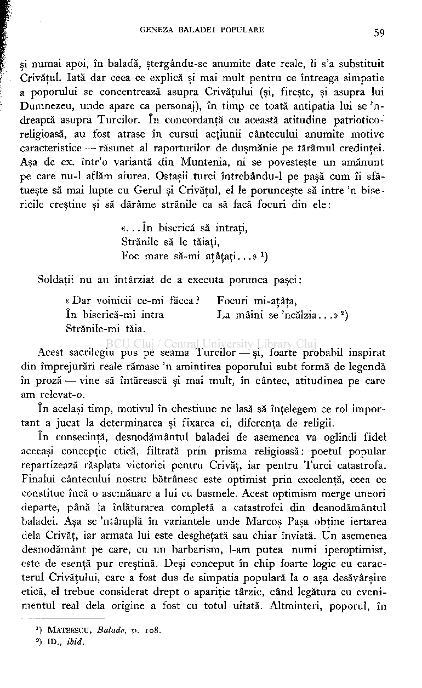

şi numai apoi, în baladă, ştergându-se anumite date reale, li s'a substituit Crivăţul. Iată dar ceea ce explică şi mai mult pentru ce întreaga simpatie a poporului se concentrează asupra Crivăţului (şi, fireşte, şi asupra lui Dumnezeu, unde apare ca personaj), în timp ce toată antipatia lui se 'ndreaptă asupra Turcilor. în concordanţă cu această atitudine patrioticoreligioasă, au fost atrase în cursul acţiunii cântecului anumite motive caracteristice — răsunet al raporturilor de duşmănie pe tărâmul credinţei. Aşa de ex. într'o variantă din Muntenia, ni se povesteşte un amănunt pe care nu-1 aflăm aiurea. Ostaşii turci întrebându-1 pe paşă cum îi sfătueşte să mai lupte cu Gerul şi Crivăţul, el le porunceşte să intre 'n bisericile creştine şi să dărâme strănile ca să facă focuri din ele:

«... în biserică să intraţi, Strănile să le tăiaţi, Foc mare să-mi aţâţaţi... »

) Soldaţii nu au întârziat de a executa porunca paşei:

x

« Dar voinicii ce-mi făcea ? Focuri mi-aţâţa, în biserică-mi intra La mâini se 'ncălzia... »

) Strănile-mi tăia.

2

Acest sacrilegiu pus pe seama Turcilor — şi, foarte probabil inspirat din împrejurări reale rămase 'n amintirea poporului subt formă de legendă în proză — vine să întărească şi mai mult, în cântec, atitudinea pe care am relevat-o.

în acelaşi timp, motivul în chestiune ne lasă să înţelegem ce rol important a jucat la determinarea şi fixarea ei, diferenţa de religii.

în consecinţă, desnodământul baladei de asemenea va oglindi fidel aceeaşi concepţie etică, filtrată prin prisma religioasă: poetul popular repartizează răsplata victoriei pentru Crivăţ, iar pentru Turci catastrofa. Finalul cântecului nostru bătrânesc este optimist prin excelenţă, ceea ce constitue încă o asemănare a lui cu basmele. Acest optimism merge uneori departe, până la înlăturarea completă a catastrofei din desnodământul baladei. Aşa se 'ntâmplă în variantele unde Marcoş Paşa obţine iertarea delà Crivăţ, iar armata lui este desgheţată sau chiar înviată. Un asemenea desnodământ pe care, cu un barbarism, l-am putea numi iperoptimist, este de esenţă pur creştină. Deşi conceput în chip foarte logic cu caracterul Crivăţului, care a fost dus de simpatia populară la o aşa desăvârşire etică, el trebue considerat drept o apariţie târzie, când legătura cu evenimentul real delà origine a fost cu totul uitată. Altminteri, poporul, în

') MATEESCU, Balade, p. 108 .

###### ) ID., ibid.

2

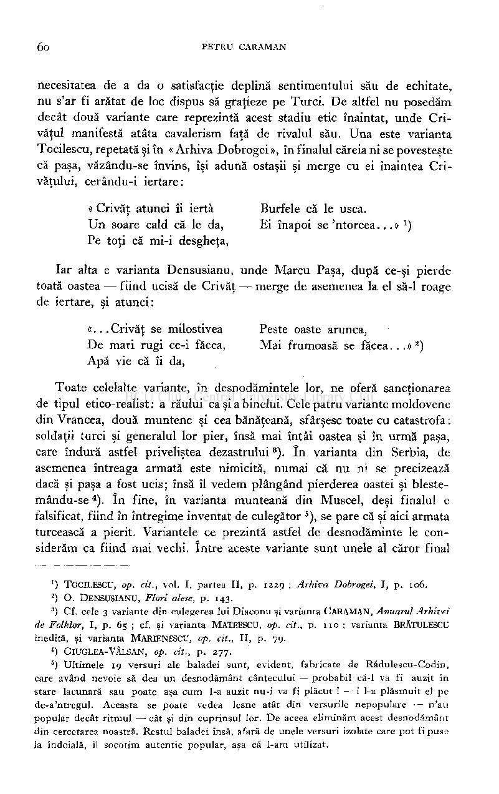

necesitatea de a da o satisfacţie deplină sentimentului său de echitate, nu s'ar fi arătat de loc dispus să graţieze pe Turci. De altfel nu posedăm decât două variante care reprezintă acest stadiu etic înaintat, unde Crivăţul manifestă atâta cavalerism faţă de rivalul său. Una este varianta Tocilescu, repetată şi în « Arhiva Dobrogei », în finalul căreia ni se povesteşte că paşa, văzându-se învins, îşi adună ostaşii şi merge cu ei înaintea Crivăţului, cerându-i iertare:

« Crivăţ atunci îi ierta Un soare cald că le da, Pe toţi că mi-i desgheţa,

Burfele că le usca. Ei înapoi se 'ntorcea... » *)

Iar alta e varianta Densusianu, unde Marcu Paşa, după ce-şi pierde toată oastea — fiind ucisă de Crivăţ — merge de asemenea la el să-1 roage de iertare, şi atunci:

«... Crivăţ se milostivea De mari rugi ce-i făcea, Apă vie că îi da,

Peste oaste arunca, Mai frumoasă se făcea... »

)

2

Toate celelalte variante, în desnodămintele lor, ne oferă sancţionarea de tipul etico-realist : a răului ca şi a binelui. Cele patru variante moldovene din Vrancea, două muntene şi cea bănăţeană, sfârşesc toate cu catastrofa : soldaţii turci şi generalul lor pier, însă mai întâi oastea şi în urmă paşa, care îndură astfel priveliştea dezastrului

). în varianta din Serbia, de asemenea întreaga armată este nimicită, numai că nu ni se precizează dacă şi paşa a fost ucis; însă îl vedem plângând pierderea oastei şi blestemându-se

3

). în fine, în varianta munteană din Muscel, deşi finalul e

4

falsificat, fiind în întregime inventat de culegător ), se pare că şi aici armata turcească a pierit. Variantele ce prezintă astfel de desnodăminte le considerăm ca fiind mai vechi. între aceste variante sunt unele al căror final

') TOCILESCU, op. cit., vol. I, partea II, p.122 9 ; Arhiva Dobrogei, I, p.106 .

- 2 ) O. DENSUSIANU , Flori alese, p. 143 .
- 3

### ) Cf. cele3 variante din culegerea lui Diaconu şi varianta CARAMAN, Anuarul Arhivei de Folklor, I, p.6 5 ; cf. şi varianta MATEESCU, op. cit., p. n o ; varianta BRĂTULESCU inedită, şi varianta MARIENESCU, op. cit., II, p.79 .

- 4 ) GlUGLEA-VÂLSAN, op. cit., p. 277 .
- 5

) Ultimele 1 9 versuri ale baladei sunt, evident, fabricate de Rădulescu-Codin, care având nevoie să dea un desnodământ cântecului — probabil că-1 va fi auzit în stare lacunară sau poate aşa cum 1-a auzit nu-i va fi plăcut ! — i 1-a plăsmuit el pe de-a'ntregul. Aceasta se poate vedea lesne atât din versurile nepopulare — n'au popular decât ritmul — cât şi din cuprinsul lor. De aceea eliminăm acest desnodământ din cercetarea noastră. Restul baladei însă, afară de unele versuri izolate care pot fi puse la îndoială, îl socotim autentic popular, aşa că l-am utilizat.

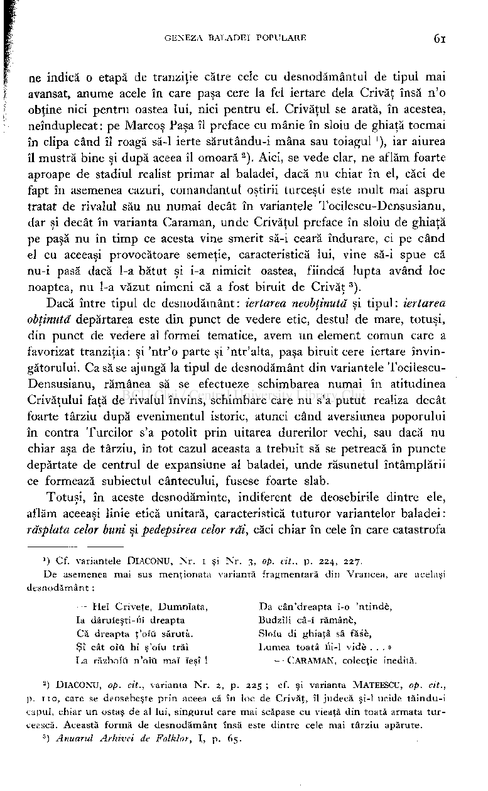

ne indică o etapă de tranziţie către cele cu desnodământul de tipul mai avansat, anume acele în care paşa cere la fel iertare delà Crivăţ însă n'o obţine nici pentru oastea lui, nici pentru el. Crivăţul se arată, în acestea, neînduplecat: pe Marcoş Paşa îl preface cu mânie în sloiu de ghiaţă tocmai în clipa când îl roagă să-1 ierte sărutându-i mâna sau toiagul ), iar aiurea îl mustră bine şi după aceea îl omoară ). Aici, se vede clar, ne aflăm foarte aproape de stadiul realist primar al baladei, dacă nu chiar în el, căci de fapt în asemenea cazuri, comandantul oştirii turceşti este mult mai aspru tratat de rivalul său nu numai decât în variantele Tocilescu-Densusianu, dar şi decât în varianta Caraman, unde Crivăţul preface în sloiu de ghiaţă pe paşă nu în timp ce acesta vine smerit să-i ceară îndurare, ci pe când el cu aceeaşi provocatoare semeţie, caracteristică lui, vine să-i spue că nu-i pasă dacă 1-a bătut şi i-a nimicit oastea, fiindcă lupta având loc noaptea, nu 1-a văzut nimeni că a fost biruit de Crivăţ

).

3

Dacă între tipul de desnodământ: iertarea neobţinută şi tipul: iertarea obţinută depărtarea este din punct de vedere etic, destul de mare, totuşi, din punct de vedere al formei tematice, avem un element comun care a favorizat tranziţia: şi 'ntr'o parte şi 'ntr'alta, paşa biruit cere iertare învingătorului. Ca să se ajungă la tipul de desnodământ din variantele TocilescuDensusianu, rămânea să se efectueze schimbarea numai în atitudinea Crivăţului faţă de rivalul învins, schimbare care nu s'a putut realiza decât foarte târziu după evenimentul istoric, atunci când aversiunea poporului în contra Turcilor s'a potolit prin uitarea durerilor vechi, sau dacă nu chiar aşa de târziu, în tot cazul aceasta a trebuit să se petreacă în puncte depărtate de centrul de expansiune al baladei, unde răsunetul întâmplării ce formează subiectul cântecului, fusese foarte slab.

Totuşi, în aceste desnodăminte, indiferent de deosebirile dintre ele, aflăm aceeaşi linie etică unitară, caracteristică tuturor variantelor baladei: răsplata celor buni şi pedepsirea celor răi, căci chiar în cele în care catastrofa

) Cf. variantel e DlACONU, Nr . i şi Nr . 3 , op. cit., p . 224 , 227

l

D e asemene a ma i su s menţionat a variant ă fragmentar ă di n Vrancea , ar e acelaş i desnodămân t :

— He i Criveţe , Dumnîata , D a cân'dreapt a î- o 'ntindè , Budzîl i câ- î rămâne , Sloi u d i ghiaţ â sâ făse , Lume a toat a ni-1 vid e . . . »

Ia dăruîeşti-n i dreapt a C ă dreapt a ţ'oî u săruta . Ş î câ t o M h i ş'oî u tră i

L a razboï û n'oï û ma i îeşî ! — CARAMAN, colecţi e inedită .

) DlACONU, op. cit., variant a Nr . 2 , p . 22 5 ; cf. şi variant a IVlATEESCU, op. cit., p .110 , car e se deosebeşt e pri n acee a că î n lo c d e Crivăţ , îl judec ă şi-1 ucid e tăindu- i capul , chia r u n osta ş d e al lui , singuru l car e ma i scăpas e c u vieaţă di n toat ă armat a tur cească . Aceast ă form ă d e desnodămân t îns ă est e dintr e cele ma i târzi u apărute .

2

) Anuarul Arhivei de Folklor, I , p . 65 .

3

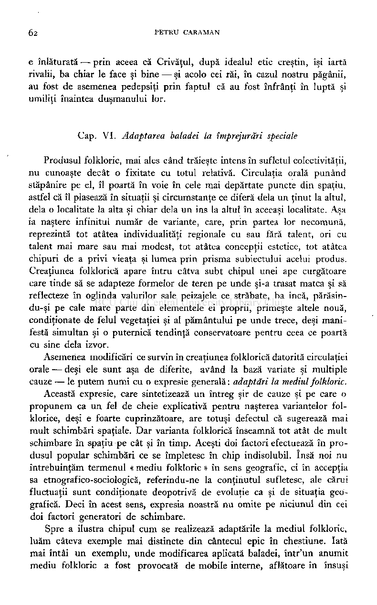

e înlăturată •— prin aceea că Crivăţul, după idealul etic creştin, îşi iartă rivalii, ba chiar le face şi bine — şi acolo cei răi, în cazul nostru păgânii, au fost de asemenea pedepsiţi prin faptul că au fost înfrânţi în luptă şi umiliţi înaintea duşmanului lor.

Cap. VI. Adaptarea baladei la împrejurări speciale

Produsul folkloric, mai ales când trăieşte intens în sufletul colectivităţii, nu cunoaşte decât o fixitate cu totul relativă. Circulaţia orală punând stăpânire pe el, îl poartă în voie în cele mai depărtate puncte din spaţiu, astfel că îl plasează în situaţii şi circumstanţe ce diferă delà un ţinut la altul, delà o localitate la alta şi chiar delà un ins la altul în aceeaşi localitate. Aşa ia naştere infinitul număr de variante, care, prin partea lor necomună, reprezintă tot atâtea individualităţi regionale cu sau fără talent, ori cu talent mai mare sau mai modest, tot atâtea concepţii estetice, tot atâtea chipuri de a privi vieaţa şi lumea prin prisma subiectului acelui produs. Creaţiunea folklorică apare întru câtva subt chipul unei ape curgătoare care tinde să se adapteze formelor de teren pe unde şi-a trasat matca şi să reflecteze în oglinda valurilor sale peizajele ce străbate, ba încă, părăsindu-şi pe cale mare parte din elementele ei proprii, primeşte altele nouă, condiţionate de felul vegetaţiei şi al pământului pe unde trece, deşi manifestă simultan şi o puternică tendinţă conservatoare pentru ceea ce poartă cu sine delà izvor.

Asemenea modificări ce survin în creaţiunea folklorică datorită circulaţiei orale — deşi ele sunt aşa de diferite, având la bază variate şi multiple cauze — le putem numi cu o expresie generală : adaptări la mediul folkloric.

Această expresie, care sintetizează un întreg şir de cauze şi pe care o propunem ca un fel de cheie explicativă pentru naşterea variantelor folklorice, deşi e foarte cuprinzătoare, are totuşi defectul că sugerează mai mult schimbări spaţiale. Dar varianta folklorică înseamnă tot atât de mult schimbare în spaţiu pe cât şi în timp. Aceşti doi factori efectuează în produsul popular schimbări ce se împletesc în chip indisolubil. însă noi nu întrebuinţăm termenul « mediu folkloric » în sens geografic, ci în accepţia sa etnografico-sociologică, referindu-ne la conţinutul sufletesc, ale cărui fluctuaţii sunt condiţionate deopotrivă de evoluţie ca şi de situaţia geografică. Deci în acest sens, expresia noastră nu omite pe niciunul din cei doi factori generatori de schimbare.

Spre a ilustra chipul cum se realizează adaptările la mediul folkloric, luăm câteva exemple mai distincte din cântecul epic în chestiune. Iată mai întâi un exemplu, unde modificarea aplicată baladei, într'un anumit mediu folkloric a fost provocată de mobile interne, aflătoare în însuşi

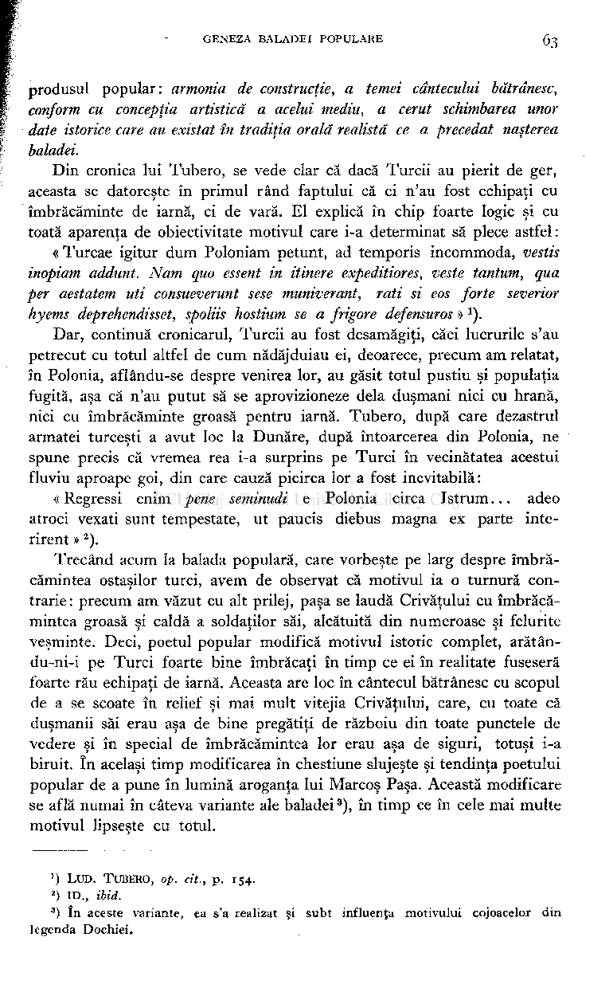

produsul popular: armonia de construcţie, a temei cântecului bătrânesc, conform cu concepţia artistică a acelui mediu, a cerut schimbarea unor date istorice care au existat în tradiţia orală realistă ce a precedat naşterea baladei.

Din cronica lui Tubero, se vede clar că dacă Turcii au pierit de ger, aceasta se datoreşte în primul rând faptului că ei n'au fost echipaţi cu îmbrăcăminte de iarnă, ci de vară. El explică în chip foarte logic şi cu toată aparenţa de obiectivitate motivul care i-a determinat să plece astfel:

« Turcae igitur dum Poloniam petunt, ad temporis incommoda, vestis inopiam addunt. Nam quo essent in itinere expeditiores, veste tantum, qua per aestatem uti consueverunt sese muniverant, rati si eos forte severior hyems deprehendisset, spoliis hostium se a frigore defensuros »

).

1

Dar, continuă cronicarul, Turcii au fost desamăgiţi, căci lucrurile s'au petrecut cu totul altfel de cum nădăjduiau ei, deoarece, precum am relatat, în Polonia, aflându-se despre venirea lor, au găsit totul pustiu şi populaţia fugită, aşa că n'au putut să se aprovizioneze delà duşmani nici cu hrană, nici cu îmbrăcăminte groasă pentru iarnă. Tubero, după care dezastrul armatei turceşti a avut loc la Dunăre, după întoarcerea din Polonia, ne spune precis că vremea rea i-a surprins pe Turci în vecinătatea acestui fluviu aproape goi, din care cauză pieirea lor a fost inevitabilă:

« Regressi enim pene seminudi e Polonia circa Istrum... adeo atroci vexaţi sunt tempestate, ut paucis diebus magna ex parte interirent »

).

2

Trecând acum la balada populară, care vorbeşte pe larg despre îmbrăcămintea ostaşilor turci, avem de observat că motivul ia o turnură contrarie: precum am văzut cu alt prilej, paşa se laudă Crivăţului cu îmbrăcămintea groasă şi caldă a soldaţilor săi, alcătuită din numeroase şi felurite veşminte. Deci, poetul popular modifică motivul istoric complet, arătându-ni-i pe Turci foarte bine îmbrăcaţi în timp ce ei în realitate fuseseră foarte rău echipaţi de iarnă. Aceasta are loc în cântecul bătrânesc cu scopul de a se scoate în relief şi mai mult vitejia Crivăţului, care, cu toate că duşmanii săi erau aşa de bine pregătiţi de războiu din toate punctele de vedere şi în special de îmbrăcămintea lor erau aşa de siguri, totuşi i-a biruit. în acelaşi timp modificarea în chestiune slujeşte şi tendinţa poetului popular de a pune în lumină aroganţa lui Marcoş Paşa. Această modificare se află numai în câteva variante ale baladei

), în timp ce în cele mai multe motivul lipseşte cu totul.

3

###### ) LUD . TUBERO , op. cit., p. 154 .

1

###### ) ID. , ibid.

2

### ) în aceste variante, ea s'a realizat şi subt influenţa motivului cojoacelor din legenda Dochiei.

3

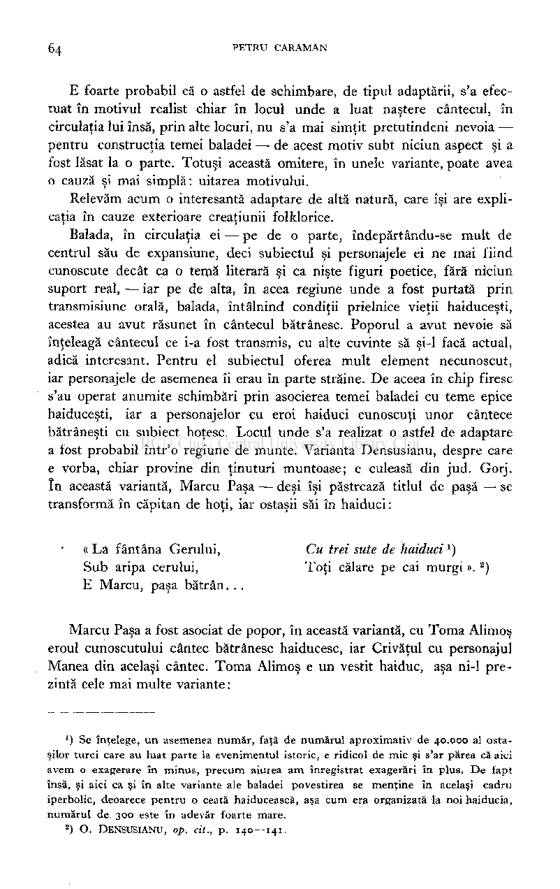

E foarte probabil că o astfel de schimbare, de tipul adaptării, s'a efectuat în motivul realist chiar în locul unde a luat naştere cântecul, în circulaţia lui însă, prin alte locuri, nu s'a mai simţit pretutindeni nevoia pentru construcţia temei baladei — de acest motiv subt niciun aspect şi a fost lăsat la o parte. Totuşi această omitere, în unele variante, poate avea o cauză şi mai simplă: uitarea motivului.

Relevăm acum o interesantă adaptare de altă natură, care îşi are explicaţia în cauze exterioare creaţiunii folklorice.

Balada, în circulaţia ei — pe de o parte, îndepărtându-se mult de centrul său de expansiune, deci subiectul şi personajele ei ne mai fiind cunoscute decât ca o tenia literară şi ca nişte figuri poetice, fără niciun suport real, — iar pe de alta, în acea regiune unde a fost purtată prin transmisiune orală, balada, întâlnind condiţii prielnice vieţii haiduceşti, acestea au avut răsunet în cântecul bătrânesc. Poporul a avut nevoie să înţeleagă cântecul ce i-a fost transmis, cu alte cuvinte să şi-1 facă actual, adică interesant. Pentru el subiectul oferea mult element necunoscut, iar personajele de asemenea îi erau în parte străine. De aceea în chip firesc s'au operat anumite schimbări prin asocierea temei baladei cu teme epice haiduceşti, iar a personajelor cu eroi haiduci cunoscuţi unor cântece bătrâneşti cu subiect hoţesc. Locul unde s'a realizat o astfel de adaptare a fost probabil într'o regiune de munte. Varianta Densusianu, despre care e vorba, chiar provine din ţinuturi muntoase; e culeasă din jud. Gorj. în această variantă, Marcu Paşa — deşi îşi păstrează titlul de paşă — se transformă în căpitan de hoţi, iar ostaşii săi în haiduci :

Cu trei sute de haiduci) Toţi călare pe cai murgi ».

« La fântâna Gerului, Sub aripa cerului, E Marcu, paşa bătrân...

)

2

Marcu Paşa a fost asociat de popor, în această variantă, cu Toma Alimoş eroul cunoscutului cântec bătrânesc haiducesc, iar Crivăţul cu personajul Manea din acelaşi cântec. Toma Alimoş e un vestit haiduc, aşa ni-1 prezintă cele mai multe variante :

*) S e înţelege , u n asemene a număr , faţă d e număru l aproximati v d e 40.00 0 al osta şilor turc i car e a u lua t part e la evenimentu l istoric , e ridico l d e mi c şi s'ar păre a c ă aici ave m o exagerar e î n minus , precu m aiure a a m înregistra t exagerăr i î n plus . D e fap t însă , şi aici ç a şi î n alt e variant e al e balade i povestire a se menţin e î n acelaş i cadr u iperbolic , deoarec e pentr u o ceat ă haiducească , aşa cu m er a organizat ă la no i haiducia , număru l d e 30 0 est e î n adevă r foart e mare .

) O . DENSUSIANU, op. cit., p . 14 0 —141 .

8

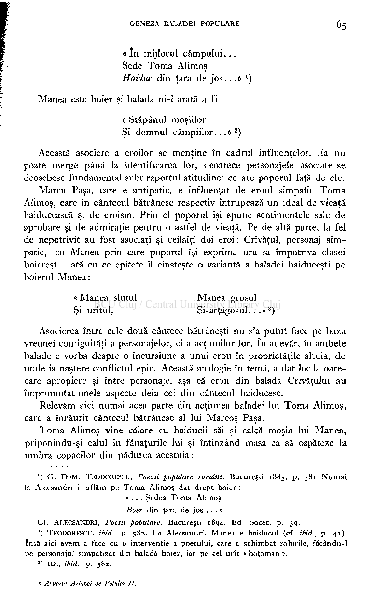

« în mijlocul câmpului... Şede Toma Alimoş Haiduc din ţara de jos... » )

Manea este boier şi balada ni-1 arată a fi

« Stăpânul moşiilor Şi domnul câmpiilor... » )

Această asociere a eroilor se menţine în cadrul influenţelor. Ea nu poate merge până la identificarea lor, deoarece personajele asociate se deosebesc fundamental subt raportul atitudinei ce are poporul faţă de ele.

Marcu Paşa, care e antipatic, e influenţat de eroul simpatic Toma Alimoş, care în cântecul bătrânesc respectiv întrupează un ideal de vieaţă haiducească şi de eroism. Prin el poporul îşi spune sentimentele sale de aprobare şi de admiraţie pentru o astfel de vieaţă. Pe de altă parte, la fel de nepotrivit au fost asociaţi şi ceilalţi doi eroi: Crivăţul, personaj simpatic, cu Manea prin care poporul îşi exprimă ura sa împotriva clasei boiereşti. Iată cu ce epitete îl cinsteşte o variantă a baladei haiduceşti pe boierul Manea:

« Manea slutul Manea grosul Şi urîtul, Şi-arţăgosul...»

)

3

Asocierea între cele două cântece bătrâneşti nu s'a putut face pe baza vreunei contiguităţi a personajelor, ci a acţiunilor lor. în adevăr, în ambele balade e vorba despre o incursiune a unui erou în proprietăţile altuia, de unde ia naştere conflictul epic. Această analogie în temă, a dat loc la oarecare apropiere şi între personaje, aşa că eroii din balada Crivăţului au împrumutat unele aspecte delà cei din cântecul haiducesc.

Relevăm aici numai acea parte din acţiunea baladei lui Toma Alimoş, care a înrâurit cântecul bătrânesc al lui Marcoş Paşa.

Toma Alimoş vine călare cu haiducii săi şi calcă moşia lui Manea, priponindu-şi calul în fânaţurile lui şi întinzând masa ca să ospăteze la umbra copacilor din pădurea acestuia:

*) G . DEM . TEODORESCU Poezii populare române. Bucureşti1885 p.58 1 Numai la Alecsandri îl aflăm pe Toma Alimoş dat drept boier :

«.. . Şedea Toma Alimoş

Boer din ţara de jos ... »

### Cf.ALECSANDRI Poesii populare. Bucureşti1894 Ed. Socec. p.39 .

### ) TEODORESCU, ibid., p.582 . La Alecsandri, Manea e haiducul (cf. ibid., p.41) . însă aici avem a face cu o intervenţie a poetului, care a schimbat rolurile, făcându-1 pe personajul simpatizat din baladă boier, iar pe cel urît « hoţoman ».

2

###### ) ID. ibid., p. 582 .

3

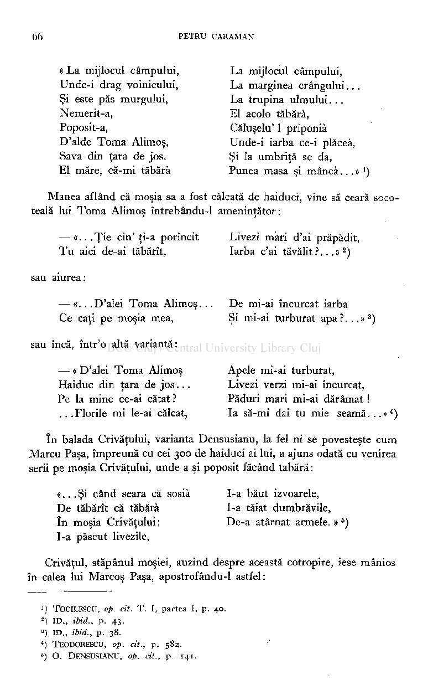

« La mijlocul câmpului, Unde-i drag voinicului, Şi este păs murgului, Nemerit-a, Poposit-a,

La mijlocul câmpului, La marginea crângului... La trupina ulmului... El acolo tabăra, Căluşelu' 1 priponiâ Unde-i iarba ce-i plăcea, Şi la umbrită se da, Punea masa şi mânca...» )

D'alde Toma Alimoş, Sava din ţara de jos. El măre, că-mi tabăra

Manea aflând că moşia sa a fost călcată de haiduci, vine să ceară socoteală lui Toma Alimos întrebându-1 ameninţător:

— «... Ţie cin' ţi-a porîncit Tu aici de-ai tăbărît,

Livezi mari d'ai prăpădit, Iarba c'ai tăvălit ?...»

)

2

sau aiurea:

— «.. .D'alei Toma Alimoş... Ce caţi pe moşia mea,

De mi-ai încurcat iarba Şi mi-ai turburat apa ?...»

:

sau încă, într'o altă variantă:

— « D'alei Toma Alimoş Haiduc din ţara de jos... Pe la mine ce-ai cătat?

Apele mi-ai turburat, Livezi verzi mi-ai încurcat, Păduri mari mi-ai dărâmat ! Ia să-mi dai tu mie seamă ...»*)

... Florile mi le-ai călcat,

în balada Crivăţului, varianta Densusianu, la fel ni se povesteşte cum Marcu Paşa, împreună cu cei 300 de haiduci ai lui, a ajuns odată cu venirea serii pe moşia Crivăţului, unde a şi poposit făcând tabără :

I-a băut izvoarele, I-a tăiat dumbrăvile, De-a atârnat armele. »

«... Şi când seara că sosià De tăbărît că tabăra în moşia Crivăţului; I-a păscut livezile,

)

8

Crivăţul, stăpânul moşiei, auzind despre această cotropire, iese mânios în calea lui Marcoş Paşa, apostrofându-1 astfel:

*) TOCILESCU op. cit.T . I , parteaI , p.40 .

- 2 ) ID. ibid., p. 43 .
- 3 ) ID. ibid., p. 38 .
- 4 ) TEODORESCU op. cit., p. 582.
- 5 ) O . DENSUSIANU , op. cit., p. 141 .

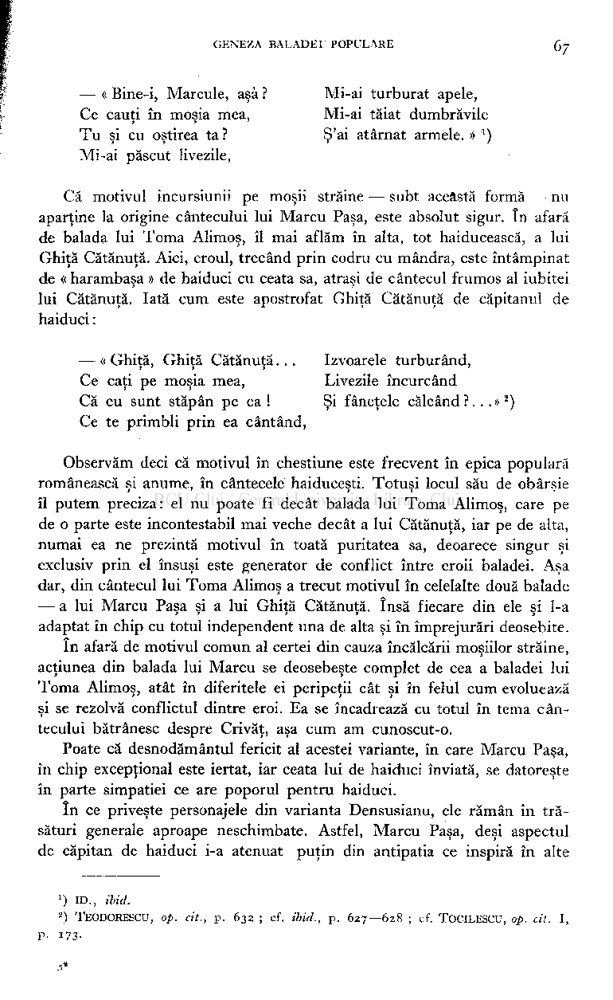

— « Bine-i, Marcule, aşa ? Mi-ai turburat apele, Ce cauţi în moşia mea, Mi-ai tăiat dumbrăvile Tu şi cu oştirea ta ? Ş'ai atârnat armele. »

) Mi-ai păscut livezile,

i

Că motivul incursiunii pe moşii străine — subt această formă — nu

aparţine la origine cântecului lui Marcu Paşa, este absolut sigur. In afară de balada lui Toma Alimoş, îl mai aflăm în alta, tot haiducească, a lui Ghiţă Cătănuţă. Aici, eroul, trecând prin codru cu mândra, este întâmpinat de « harambaşa » de haiduci cu ceata sa, atraşi de cântecul frumos al iubitei lui Cătănuţă. Iată cum este apostrofat Ghiţă Cătănuţă de căpitanul de haiduci :

— «Ghiţă, Ghiţă Cătănuţă... Izvoarele turburând, Ce caţi pe moşia mea, Livezile încurcând Că eu sunt stăpân pe ea ! Şi fâneţele călcând ?... »

) Ce te primbli prin ea cântând,

2

Observăm deci că motivul în chestiune este frecvent în epica populară românească şi anume, în cântecele haiduceşti. Totuşi locul său de obârşie îl putem preciza: el nu poate fi decât balada lui Toma Alimoş, care pe de o parte este incontestabil mai veche decât a lui Cătănuţă, iar pe de alta, numai ea ne prezintă motivul în toată puritatea sa, deoarece singur şi exclusiv prin el însuşi este generator de conflict între eroii baladei. Aşa dar, din cântecul lui Toma Alimoş a trecut motivul în celelalte două balade — a lui Marcu Paşa şi a lui Ghiţă Cătănuţă. însă fiecare din ele şi 1-a adaptat în chip cu totul independent una de alta şi în împrejurări deosebite.

în afară de motivul comun al certei din cauza încălcării moşiilor străine, acţiunea din balada lui Marcu se deosebeşte complet de cea a baladei lui Toma Alimoş, atât în diferitele ei peripeţii cât şi în felul cum evoluează şi se rezolvă conflictul dintre eroi. Ea se încadrează cu totul în tema cântecului bătrânesc despre Crivăţ, aşa cum am cunoscut-o.

Poate că desnodământul fericit al acestei variante, în care Marcu Paşa, în chip excepţional este iertat, iar ceata lui de haiduci înviată, se datoreşte în parte simpatiei ce are poporul pentru haiduci.

în ce priveşte personajele din varianta Densusianu, ele rămân în trăsături generale aproape neschimbate. Astfel, Marcu Paşa, deşi aspectul de căpitan de haiduci i-a atenuat puţin din antipatia ce inspiră în alte

' ) ID. ibid.

) TEODORESCU, op. cit., p . 63 2 ; cf. ibid., p . 627—62 8 ; cf. TOCILESCU, op. cit. I , P- 173 -

2

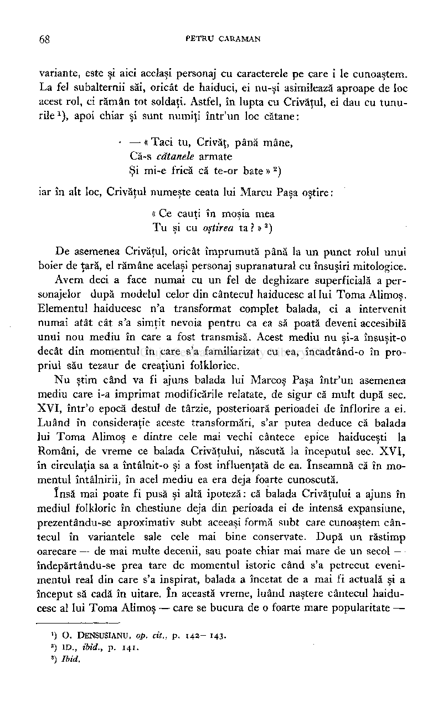

variante, este şi aici acelaşi personaj cu caracterele pe care i le cunoaştem. La fel subalternii săi, oricât de haiduci, ei nu-şi asimilează aproape de loc acest rol, ci rămân tot soldaţi. Astfel, în lupta cu Crivăţul, ei dau cu tunurile ), apoi chiar şi sunt numiţi într'un loc cătane :

• — « Taci tu, Crivăţ, până mâne, Că-s cătanele armate Şi mi-e frică că te-or bate »

) iar în alt loc, Crivăţul numeşte ceata lui Marcu Paşa oştire:

2

« Ce cauţi în moşia mea Tu şi cu oştirea ta ? »

)

3

De asemenea Crivăţul, oricât împrumută până la un punct rolul unui boier de ţară, el rămâne acelaşi personaj supranatural cu însuşiri mitologice.

Avem deci a face numai cu un fel de deghizare superficială a personajelor după modelul celor din cântecul haiducesc al lui Toma Alimoş. Elementul haiducesc n'a transformat complet balada, ci a intervenit numai atât cât s'a simţit nevoia pentru ca ea să poată deveni accesibilă unui nou mediu în care a fost transmisă. Acest mediu nu şi-a însuşit-o decât din momentul în care s'a familiarizat cu ea, încadrând-o în propriul său tezaur de creaţiuni folklorice.

Nu ştim când va fi ajuns balada lui Marcoş Paşa într'un asemenea mediu care i-a imprimat modificările relatate, de sigur că mult după sec. XVI, într'o epocă destul de târzie, posterioară perioadei de înflorire a ei. Luând în consideraţie aceste transformări, s'ar putea deduce că balada lui Toma Alimoş e dintre cele mai vechi cântece epice haiduceşti la Români, de vreme ce balada Crivăţului, născută la începutul sec. XVI, în circulaţia sa a întâlnit-o şi a fost influenţată de ea. înseamnă că în momentul întâlnirii, în acel mediu ea era deja foarte cunoscută.

însă mai poate fi pusă şi altă ipoteză: că balada Crivăţului a ajuns în mediul folkloric în chestiune deja din perioada ei de intensă expansiune, prezentându-se aproximativ subt aceeaşi formă subt care cunoaştem cântecul în variantele sale cele mai bine conservate. După un răstimp oarecare — de mai multe decenii, sau poate chiar mai mare de un secol îndepărtându-se prea tare de momentul istoric când s'a petrecut evenimentul real din care s'a inspirat, balada a încetat de a mai fi actuală şi a început să cadă în uitare. în această vreme, luând naştere cântecul haiducesc al lui Toma Alimoş — care se bucura de o foarte mare popularitate —

' ) O . DENSUSIANU , op. cit., p. 143—143 .

- 2 ) ID., ibid., p. 141 .
- 3 ) Ibid.

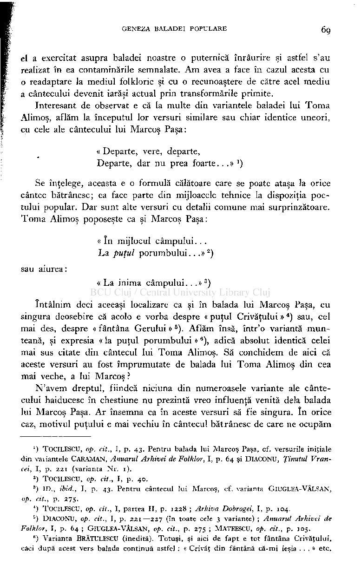

el a exercitat asupra baladei noastre o puternică înrâurire şi astfel s'au realizat în ea contaminările semnalate. Am avea a face în cazul acesta cu o readaptare la mediul folkloric şi cu o recunoaştere de către acel mediu a cântecului devenit iarăşi actual prin transformările primite.

Interesant de observat e că la multe din variantele baladei lui Toma Alimoş, aflăm la începutul lor versuri similare sau chiar identice uneori, cu cele ale cântecului lui Marcoş Paşa:

« Departe, vere, departe, Departe, dar nu prea foarte... » *)

Se înţelege, aceasta e o formulă călătoare care se poate ataşa la orice cântec bătrânesc; ea face parte din mijloacele tehnice la dispoziţia poetului popular. Dar sunt alte versuri cu detalii comune mai surprinzătoare. Toma Alimoş poposeşte ca şi Marcoş Paşa:

« în mijlocul câmpului... La puţul porumbului... »

) sau aiurea:

2

« La inima câmpului... »

)

3

întâlnim deci aceeaşi localizare ca şi în balada lui Marcoş Paşa, cu singura deosebire că acolo e vorba despre « puţul Crivăţului »

) sau, cel mai des, despre « fântâna Gerului »

4

). Aflăm însă, într'o variantă raunteană, şi expresia « la puţul porumbului » *), adică absolut identică celei mai sus citate din cântecul lui Toma Alimoş. Să conchidem de aici că aceste versuri au fost împrumutate de balada lui Toma Alimoş din cea mai veche, a lui Marcoş ?

5

N'avem dreptul, fiindcă niciuna din numeroasele variante ale cântecului haiducesc în chestiune nu prezintă vreo influenţă venită delà balada lui Marcoş Paşa. Ar însemna ca în aceste versuri să fie singura. în orice caz, motivul puţului e mai vechiu în cântecul bătrânesc de care ne ocupăm

' ) TOCILESCU, op. cit., I, p . 43 Pentr u balad a lu i Marco ş Paşa , cf. versuril e iniţial e di n vaiiantel e CARAMAN, Anuarul Arhivei de Folklor, I, p . 6 4 şi DIACONU, Ţinutul Vrancei, I, p . 22 (variant a Nr . 1) .

*) TOCILESCU, op. cit., I, p . 40 .

) ID. , ibid., I, p . 43 Pentr u cântecu l lu i Marcoş , cf. variant a GlUGLEA-VÂLSAN, op. cit., p . 275 .

3

###### ) TOCILESCU, op. cit., I, parte a II, p . 122 8 ; Arhiva Dobrogei, I, p . 104 .

4

) DIACONU, op. cit., I, p . 221—22 7 (î n toat e cele 3 variante ) ; Anuarul Arhivei de Folklor, I, p . 6 4 ; GlUGLEA-VÂLSAN, op. cit., p . 27 5 ; MATEESCU, op. cit., p . 105 .

5

*) Variant a BRĂTULESCU (inedită) . Totuşi , şi aici d e fap t e to t fântân a Crivăţului , căci dup ă aces t ver s balad a continu ă astfel : « Crivă ţ di n fântân ă că-m i ieşia ... » etc .

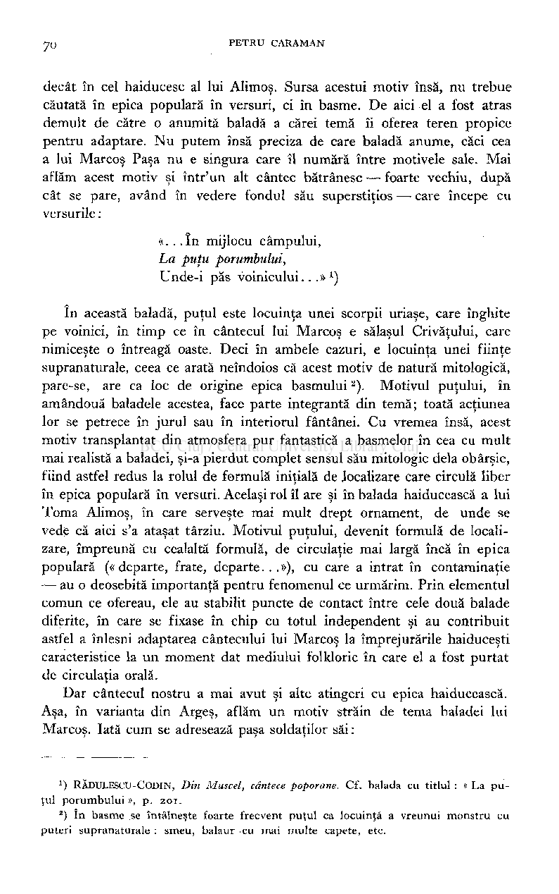

decât în cel haiducesc al lui Alimoş. Sursa acestui motiv însă, nu trebue căutată în epica populară în versuri, ci în basme. De aici el a fost atras demult de către o anumită baladă a cărei temă îi oferea teren propice pentru adaptare. Nu putem însă preciza de care baladă anume, căci cea a lui Marcoş Paşa nu e singura care îl numără între motivele sale. Mai aflăm acest motiv şi într'un alt cântec bătrânesc — foarte vechiu, după cât se pare, având în vedere fondul său superstiţios — care începe cu versurile :

«.. .în mijlocu câmpului, La putu porumbului, Unde-i păs voinicului... » *)

în această baladă, puţul este locuinţa unei scorpii uriaşe, care înghite pe voinici, în timp ce în cântecul lui Marcoş e sălaşul Crivăţului, care nimiceşte o întreagă oaste. Deci în ambele cazuri, e locuinţa unei fiinţe supranaturale, ceea ce arată neîndoios că acest motiv de natură mitologică, pare-se, are ca loc de origine epica basmului

). Motivul puţului, în amândouă baladele acestea, face parte integrantă din temă; toată acţiunea lor se petrece în jurul sau în interiorul fântânei. Cu vremea însă, acest motiv transplantat din atmosfera pur fantastică a basmelor în cea cu mult mai realistă a baladei, şi-a pierdut complet sensul său mitologic delà obârşie, fiind astfel redus la rolul de formulă iniţială de localizare care circulă liber în epica populară în versuri. Acelaşi rol îl are şi în balada haiducească a lui Toma Alimoş, în care serveşte mai mult drept ornament, de unde se vede că aici s'a ataşat târziu. Motivul puţului, devenit formulă de localizare, împreună cu cealaltă formulă, de circulaţie mai largă încă în epica populară (« departe, frate, departe... »), cu care a intrat în contaminaţie — au o deosebită importanţă pentru fenomenul ce urmărim. Prin elementul comun ce ofereau, ele au stabilit puncte de contact între cele două balade diferite, în care se fixase în chip cu totul independent şi au contribuit astfel a înlesni adaptarea cântecului lui Marcoş la împrejurările haiduceşti caracteristice la un moment dat mediului folkloric în care el a fost purtat de circulaţia orală.

2

Dar cântecul nostru a mai avut şi alte atingeri cu epica haiducească. Aşa, în varianta din Argeş, aflăm un motiv străin de tema baladei lui Marcoş. Iată cum se adresează paşa soldaţilor săi :

) RĂDULESCU-CODIN, Din Muscel, cântece poporane. Cf. balad a c u titlu l : « L a pu ţu l porumbulu i », p . 201

J

) I n basm e se întâlneşt e foart e frecven t puţu l c a locuinţ ă a vreunu i monstr u c u puter i supranatural e : smeu , balau r c u ma i mult e capete , etc .

2

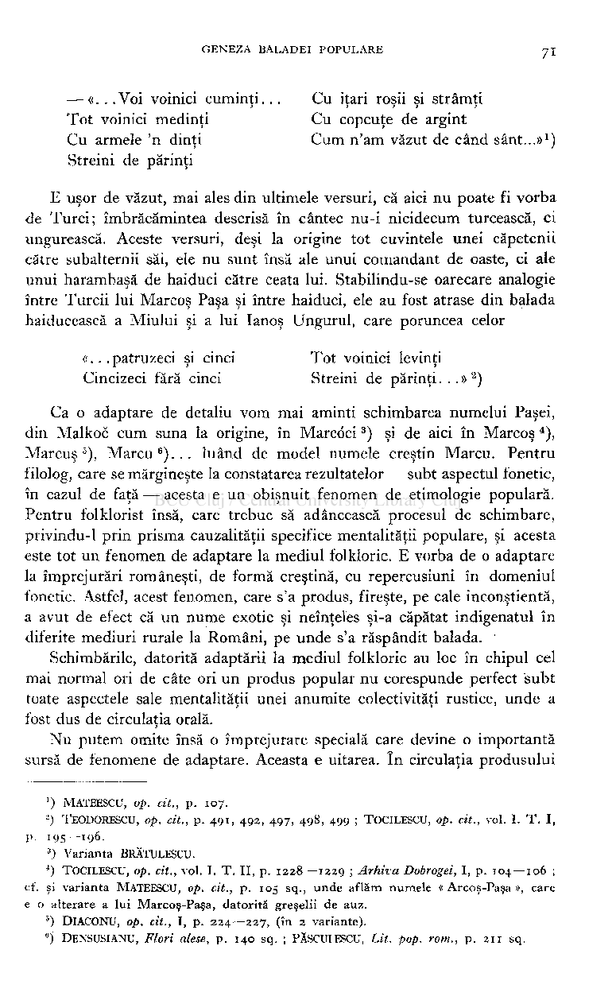

— «... Voi voinici cuminţi... Cu iţari roşii şi strâmţi Tot voinici medinţi Cu copcuţe de argint Cu armele 'n dinţi Cum n'am văzut de când sânt...»

) Streini de părinţi

1

E uşor de văzut, mai ales din ultimele versuri, că aici nu poate fi vorba de Turci; îmbrăcămintea descrisă în cântec nu-i nicidecum turcească, ci ungurească. Aceste versuri, deşi la origine tot cuvintele unei căpetenii

- către subalternii săi, ele nu sunt însă ale unui comandant de oaste, ci ale unui harambaşă de haiduci către ceata lui. Stabilindu-se oarecare analogie între Turcii lui Marcoş Paşa şi între haiduci, ele au fost atrase din balada haiducească a Miului şi a lui Ianoş Ungurul, care poruncea celor

«... patruzeci şi cinci Tot voinici levinţi Cincizeci fără cinci Streini de părinţi...»

)

2

Ca o adaptare de detaliu vom mai aminti schimbarea numelui Paşei, din Malkoc cum suna la origine, în Marcôci

) şi de aici în Marcoş ), Marcuş

3

)... luând de model numele creştin Marcu. Pentru filolog, care se mărgineşte la constatarea rezultatelor — subt aspectul fonetic, în cazul de faţă — acesta e un obişnuit fenomen de etimologie populară. Pentru folklorist însă, care trebue să adâncească procesul de schimbare, privindu-1 prin prisma cauzalităţii specifice mentalităţii populare, şi acesta este tot un fenomen de adaptare la mediul folkloric. E vorba de o adaptare la împrejurări româneşti, de formă creştină, cu repercusiuni în domeniul fonetic. Astfel, acest fenomen, care s'a produs, fireşte, pe cale inconştientă, a avut de efect că un nume exotic şi neînţeles şi-a căpătat indigenatul în diferite mediuri rurale la Români, pe unde s'a răspândit balada. '

), Marcu

5

6

Schimbările, datorită adaptării la mediul folkloric au loc în chipul cel mai normal ori de câte ori un produs popular nu corespunde perfect subt toate aspectele sale mentalităţii unei anumite colectivităţi rustice, unde a fost dus de circulaţia orală.

Nu putem omite însă o împrejurare specială care devine o importantă sursă de fenomene de adaptare. Aceasta e uitarea. în circulaţia produsului

*) MATEESCU, op. cit., p . 107

###### ) TEODORESCU op. cit., p . 491 , 492 , 497 , 498 , 49 9 ; TOCILESCU, op. cit., vol . I . T . I, P- 195—196 .

2

) Variant a BRĂTULESCU.

3

*) TOCILESCU, op. cit., vol . I . T . II , p . 1228—122 9 ; Arhiva Dobrogei, I , p . 104—10 6 ; cf. şi variant a MATEESCU, op. cit., p . 10 5 sq. , und e află m numel e « Arcoş-Paş a », car e e o alterar e a lu i Marcoş-Paşa , datorit ă greşeli i d e auz .

) DlACONU, op. cit., I, p . 224—227 , (î n 2 variante) .

3

###### ) DENSUSIANU, Flori alese, p . 14 0 sq. ; PĂSCULESCU, Lit. pop. rom., p . 21 1 sq.

8

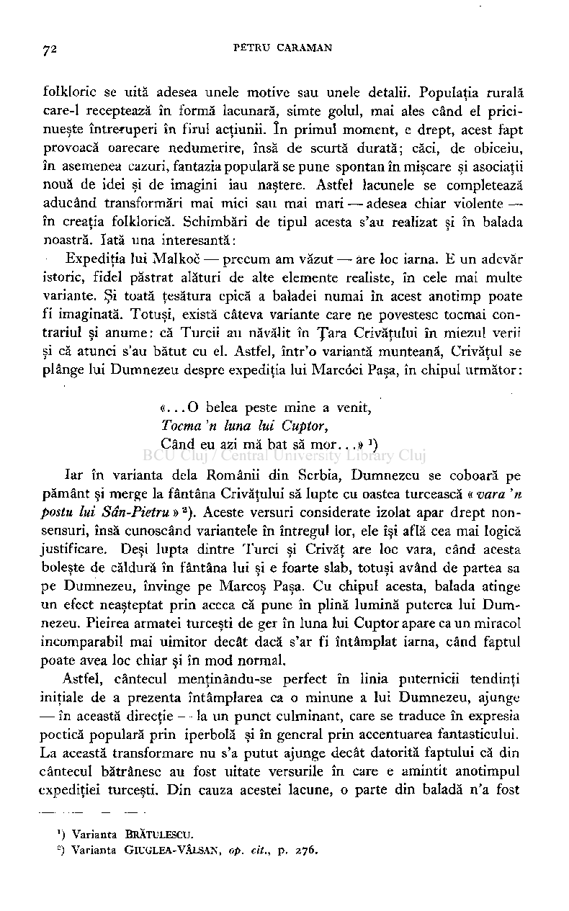

folkloric se uită adesea unele motive sau unele detalii. Populaţia rurală care-1 receptează în formă lacunară, simte golul, mai ales când el pricinueşte întreruperi în firul acţiunii. în primul moment, e drept, acest fapt provoacă oarecare nedumerire, însă de scurtă durată; căci, de obiceiu, în asemenea cazuri, fantazia populară se pune spontan în mişcare şi asociaţii nouă de idei şi de imagini iau naştere. Astfel lacunele se completează aducând transformări mai mici sau mai mari — adesea chiar violente în creaţia folklorică. Schimbări de tipul acesta s'au realizat şi în balada noastră. Iată una interesantă:

Expediţia lui Malkoc — precum am văzut — âre loc iarna. E un adevăr istoric, fidel păstrat alături de alte elemente realiste, în cele mai multe variante. Şi toată ţesătura epică a baladei numai în acest anotimp poate fi imaginată. Totuşi, există câteva variante care ne povestesc tocmai contrariul şi anume: că Turcii au năvălit în Ţara Crivăţului în miezul verii şi că atunci s'au bătut cu el. Astfel, într'o variantă munteană, Crivăţul se plânge lui Dumnezeu despre expediţia lui Marcôci Paşa, în chipul următor :

«... O belea peste mine a venit, Tocma 'n luna lui Cuptor, Când eu azi mă bat să mor...»

)

x

Iar în varianta delà Românii din Serbia, Dumnezeu se coboară pe pământ şi merge la fântâna Crivăţului să lupte cu oastea turcească « vara 'n postu lui Sân-Pietru »

). Aceste versuri considerate izolat apar drept nonsensuri, însă cunoscând variantele în întregul lor, ele îşi află cea mai logică justificare. Deşi lupta dintre Turci şi Crivăţ are loc vara, când acesta boleşte de căldură în fântâna lui şi e foarte slab, totuşi având de partea sa pe Dumnezeu, învinge pe Marcoş Paşa. Cu chipul acesta, balada atinge un efect neaşteptat prin aceea că pune în plină lumină puterea lui Dumnezeu. Pieirea armatei turceşti de ger în luna lui Cuptor apare ca un miracol incomparabil mai uimitor decât dacă s'ar fi întâmplat iarna, când faptul poate avea loc chiar şi în mod normal.

2

Astfel, cântecul menţinându-se perfect în linia puternicii tendinţi iniţiale de a prezenta întâmplarea ca o minune a lui Dumnezeu, ajunge — în această direcţie — la un punct culminant, care se traduce în expresia poetică populară prin iperbolă şi în general prin accentuarea fantasticului. La această transformare nu s'a putut ajunge decât datorită faptului că din cântecul bătrânesc au fost uitate versurile în care e amintit anotimpul expediţiei turceşti. Din cauza acestei lacune, o parte din baladă n'a fost

' ) Variant a BRĂTULESCU.

) Variant a GlUGLEA-VÂLSAN op. cit., p . 276 .

2

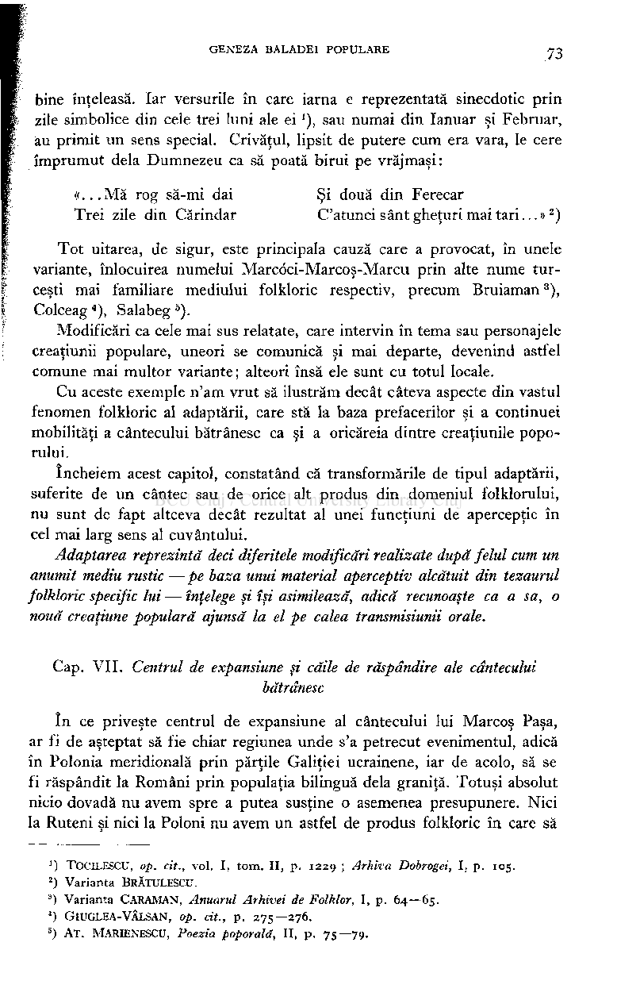

bine înţeleasă. Iar versurile în care iarna e reprezentată sinecdotic prin zile simbolice din cele trei luni ale ei

), sau numai din Ianuar şi Februar, au primit un sens special. Crivăţul, lipsit de putere cum era vara, le cere împrumut delà Dumnezeu ca să poată birui pe vrăjmaşi:

1

«... Mă rog să-mi dai Trei zile din Cărindar

Şi două din Ferecar C'atunci sânt gheţuri mai tari... »

)

2

Tot uitarea, de sigur, este principala cauză care a provocat, în unele variante, înlocuirea numelui Marcoci-Marcoş-Marcu prin alte nume turceşti mai familiare mediului folkloric respectiv, precum Bruiaman

), Colceag

3

), Salabeg ).

4

Modificări ca cele mai sus relatate, care intervin în tema sau personajele creaţiunii populare, uneori se comunică şi mai departe, devenind astfel comune mai multor variante; alteori însă ele sunt cu totul locale.

Cu aceste exemple n'am vrut să ilustrăm decât câteva aspecte din vastul fenomen folkloric al adaptării, care stă la baza prefacerilor şi a continuei mobilităţi a cântecului bătrânesc ca şi a oricăreia dintre creaţiunile poporului.

încheiem acest capitol, constatând că transformările de tipul adaptării, suferite de un cântec sau de orice alt produs din domeniul folklorului, nu sunt de fapt altceva decât rezultat al unei funcţiuni de apercepţie în cel mai larg sens al cuvântului.

Adaptarea reprezintă deci diferitele modificări realizate după felul cum un anumit mediu rustic —pe baza unui material aperceptiv alcătuit din tezaurul folkloric specific lui — înţelege şi îşi asimilează, adică recunoaşte ca a sa, o nouă creaţiune populară ajunsă la el pe calea transmisiunii orale.

Cap. VII. Centrul de expansiune şi căile de răspândire ale cântecului bătrânesc

în ce priveşte centrul de expansiune al cântecului lui Marcoş Paşa, ar fi de aşteptat să fie chiar regiunea unde s'a petrecut evenimentul, adică în Polonia meridională prin părţile Galiţiei ucrainene, iar de acolo, să se fi răspândit la Români prin populaţia bilinguă delà graniţă. Totuşi absolut nicio dovadă nu avem spre a putea susţine o asemenea presupunere. Nici la Ruteni şi nici la Poloni nu avem un astfel de produs folkloric în care să

- 1 ) TOCILESCU, op. cit., vol. I, tom. II, p. 122 9 ; Arhiva Dobrogei, I, p. 105 .
- 2

) VariantaBRĂTULESCU.

- 3

) VariantaCARAMAN Anuarul Arhivei de Folklor, I, p. 64—65.

- 4 ) GIUGLEA-VÂLSAN op. cit., p. 275—276 .
- 5 ) AT . MARIENESCU , Poezia poporală, II, p. 75—79 .

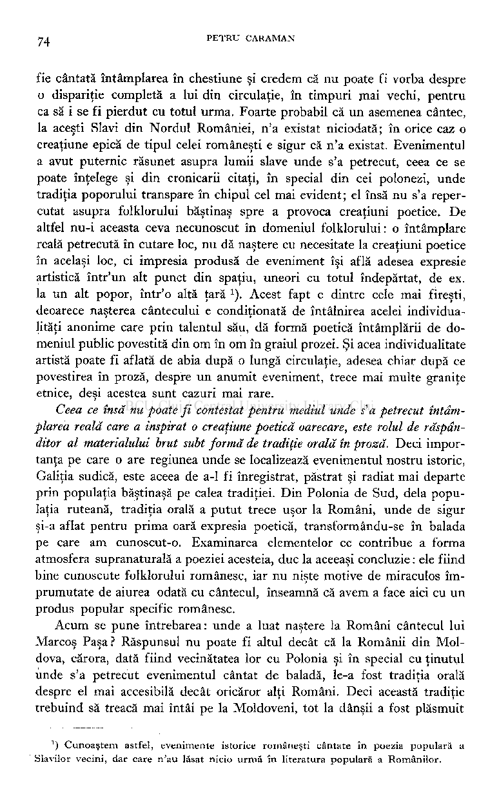

fie cântată întâmplarea în chestiune şi credem că nu poate fi vorba despre o dispariţie completă a lui din circulaţie, în timpuri mai vechi, pentru ca să i se fi pierdut cu totul urma. Foarte probabil că un asemenea cântec, la aceşti Slavi din Nordul României, n'a existat niciodată; în orice caz o creaţiune epică de tipul celei româneşti e sigur că n'a existat. Evenimentul a avut puternic răsunet asupra lumii slave unde s'a petrecut, ceea ce se poate înţelege şi din cronicarii citaţi, în special din cei polonezi, unde tradiţia poporului transpare în chipul cel mai evident; el însă nu s'a repercutat asupra folklorului băştinaş spre a provoca creaţiuni poetice. De altfel nu-i aceasta ceva necunoscut în domeniul folklorului: o întâmplare reală petrecută în cutare loc, nu dă naştere cu necesitate la creaţiuni poetice în acelaşi loc, ci impresia produsă de eveniment îşi află adesea expresie artistică într'un alt punct din spaţiu, uneori cu totul îndepărtat, de ex. la un alt popor, într'o altă ţară ). Acest fapt e dintre cele mai fireşti, deoarece naşterea cântecului e condiţionată de întâlnirea acelei individualităţi anonime care prin talentul său, dă formă poetică întâmplării de domeniul public povestită din om în om în graiul prozei. Şi acea individualitate artistă poate fi aflată de abia după o lungă circulaţie, adesea chiar după ce povestirea în proză, despre un anumit eveniment, trece mai multe graniţe etnice, deşi acestea sunt cazuri mai rare.

Ceea ce însă nu poate fi contestat pentru mediul unde s'a petrecut întâmplarea reală care a inspirat o creaţiune poetică oarecare, este rolul de răspânditor al materialului brut subt formă de tradiţie orală în proză. Deci importanţa pe care o are regiunea unde se localizează evenimentul nostru istoric, Galiţia sudică, este aceea de a-1 fi înregistrat, păstrat şi radiat mai departe prin populaţia băştinaşă pe calea tradiţiei. Din Polonia de Sud, delà populaţia ruteană, tradiţia orală a putut trece uşor la Români, unde de sigur şi-a aflat pentru prima oară expresia poetică, transformându-se în balada pe care am cunoscut-o. Examinarea elementelor ce contribue a forma atmosfera supranaturală a poeziei acesteia, duc la aceeaşi concluzie : ele fiind bine cunoscute folklorului românesc, iar nu nişte motive de miraculos împrumutate de aiurea odată cu cântecul, înseamnă că avem a face aici cu un produs popular specific românesc.

Acum se pune întrebarea: unde a luat naştere la Români cântecul lui Marcoş Paşa ? Răspunsul nu poate fi altul decât că la Românii din Moldova, cărora, dată fiind vecinătatea lor cu Polonia şi în special cu ţinutul unde s'a petrecut evenimentul cântat de baladă, le-a fost tradiţia orală despre el mai accesibilă decât oricăror alţi Români. Deci această tradiţie trebuind să treacă mai întâi pe la Moldoveni, tot la dânşii a fost plăsmuit

') Cunoaştem astfel, evenimente istorice româneşti cântate în poezia populară a Slavilor vecini, dar care n'au lăsat nicio urmă în literatura populară a Românilor.

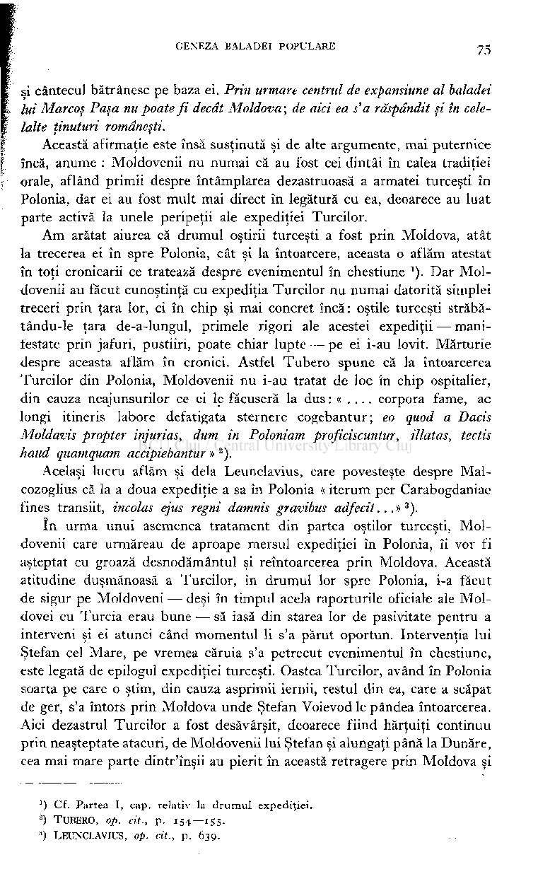

si cântecul bătrânesc pe baza ei. Prin urmare centrul de expansiune al baladei lui Marcoş Paşa nu poate fi decât Moldova ; de aici ea s'a răspândit şi în celelalte ţinuturi româneşti.

Această afirmaţie este însă susţinută şi de alte argumente, mai puternice încă, anume : Moldovenii nu numai că au fost cei dintâi în calea tradiţiei orale, aflând primii despre întâmplarea dezastruoasă a armatei turceşti în Polonia, dar ei au fost mult mai direct în legătură cu ea, deoarece au luat parte activă la unele peripeţii ale expediţiei Turcilor.

Am arătat aiurea că drumul oştirii turceşti a fost prin Moldova, atât la trecerea ei în spre Polonia, cât şi la întoarcere, aceasta o aflăm atestat în toţi cronicarii ce tratează despre evenimentul în chestiune ). Dar Moldovenii au făcut cunoştinţă cu expediţia Turcilor nu numai datorită simplei treceri prin ţara lor, ci în chip şi mai concret încă: ostile turceşti străbătându-le ţara de-a-lungul, primele rigori ale acestei expediţii — manifestate prin jafuri, pustiiri, poate chiar lupte — pe ei i-au lovit. Mărturie despre aceasta aflăm în cronici. Astfel Tubero spune că la întoarcerea Turcilor din Polonia, Moldovenii nu i-au tratat de loc în chip ospitalier, din cauza neajunsurilor ce ei le făcuseră la dus : « .... corpora fame, ac longi itineris labore defatigata sternere cogebantur; eo quod a Dacis Moldavis propter injurias, dum in Poloniam proficiscuntur, Matas, tectis haud quamquam accipiebantur »

).

2

Acelaşi lucru aflăm şi delà Leunclavius, care povesteşte despre Malcozoglius că la a doua expediţie a sa în Polonia « iterum per Carabogdaniae fines transiit, incolas ejus regni damnis gravibus adfecit.. .» ).

In urma unui asemenea tratament din partea oştilor turceşti, Moldovenii care urmăreau de aproape mersul expediţiei în Polonia, îi vor fi aşteptat cu groază desnodământul şi reîntoarcerea prin Moldova. Această atitudine duşmănoasă a Turcilor, în drumul lor spre Polonia, i-a făcut de sigur pe Moldoveni — deşi în timpul acela raporturile oficiale ale Moldovei cu Turcia erau bune — să iasă din starea lor de pasivitate pentru a interveni şi ei atunci când momentul li s'a părut oportun. Intervenţia lui Ştefan cel Mare, pe vremea căruia s'a petrecut evenimentul în chestiune, este legată de epilogul expediţiei turceşti. Oastea Turcilor, având în Polonia soarta pe care o ştim, din cauza asprimii iernii, restul din ea, care a scăpat de ger, s'a întors prin Moldova unde Ştefan Voievod le pândea întoarcerea. Aici dezastrul Turcilor a fost desăvârşit, deoarece fiind hărţuiţi continuu prin neaşteptate atacuri, de Moldovenii lui Ştefan şi alungaţi până la Dunăre, cea mai mare parte dintr'înşii au pierit în această retragere prin Moldova şi

' ) Cf. Parte a I , cap . relati v la drumu l expediţiei .

###### ) TUBERO , op. cit., p . 154—155 .

2

###### ) LEUNCLAVIUS op. cit., p . 639.

3

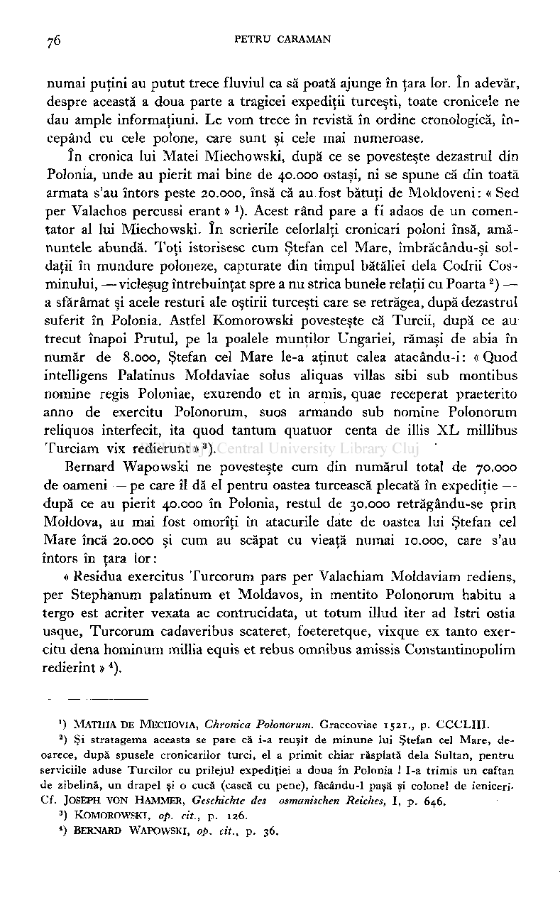

numai puţini au putut trece fluviul ca să poată ajunge în ţara lor. în adevăr, despre această a doua parte a tragicei expediţii turceşti, toate cronicele ne dau ample informaţiuni. Le vom trece în revistă în ordine cronologică, începând cu cele polone, care sunt si cele mai numeroase.

în cronica lui Matei Miechowski, după ce se povesteşte dezastrul din Polonia, unde au pierit mai bine de 40.000 ostaşi, ni se spune că din toată armata s'au întors peste 20.000, însă că au fost bătuţi de Moldoveni : « Sed per Valachos percussi erant » ). Acest rând pare a fi adaos de un comentator al lui Miechowski. în scrierile celorlalţi cronicari poloni însă, amănuntele abundă. Toţi istorisesc cum Ştefan cel Mare, îmbrăcându-şi soldaţii în mundure poloneze, capturate din timpul bătăliei delà Codrii Cosminului, —vicleşug întrebuinţat spre a nu strica bunele relaţii cu Poarta

) a sfărâmat şi acele resturi ale oştirii turceşti care se retrăgea, după dezastrul suferit în Polonia. Astfel Komorowski povesteşte că Turcii, după ce au trecut înapoi Prutul, pe la poalele munţilor Ungariei, rămaşi de abia în număr de 8.000, Ştefan cel Mare le-a aţinut calea atacându-i : « Quod intelligens Palatinus Moldaviae solus aliquas villas sibi sub montibus nomine regis Poloniae, exurendo et in armis, quae receperat praeterito anno de exercitu Polonorum, suos armando sub nomine Polonorum reliquos interfecit, ita quod tantum quatuor centa de illis XL millibus Turciam vix redierunt »

2

).

3

Bernard Wapowski ne povesteşte cum din numărul total de 70.000 de oameni — pe care îl dă el pentru oastea turcească plecată în expediţie după ce au pierit 40.000 în Polonia, restul de 30.000 retrăgându-se prin Moldova, au mai fost omorîţi în atacurile date de oastea lui Ştefan cel Mare încă 20.000 şi cum au scăpat cu vieaţă numai 10.000, care s'au întors în ţara lor:

« Residua exercitus Turcorum pars per Valachiam Moldaviam rediens, per Stephànuni palatinum et Moldavos, in mentito Polonorum habitu a tergo est acriter vexata ac contrucidata, ut totum illud iter ad Istri ostia usque, Turcorum cadaveribus scateret, foeteretque, vixque ex tanto exercitu dena hominum millia equis et rebus omnibus amissis Constantinopolim redierint »

).

4

') MATHI A D E MECHOVIA Chronica Polonorum. Graccoviae1521. p. CCCLIII.

) Şi stratagema aceasta se pare că i-a reuşit de minune lui Ştefan cel Mare, deoarece, după spusele cronicarilor turci, el a primit chiar răsplată delà Sultan, pentru serviciile aduse Turcilor cu prilejul expediţiei a doua în Polonia ! I-a trimis un caftan de zibelină, un drapel şi o cucă (cască cu pene), făcându-1 paşă şi colonel de ieniceri-

a

Cf. JOSEP H VO N HAMMER , Geschichte des osmanischen Reiches, I, p. 646 .

- 3 ) KOMOROWSKI , op. cit., p. 126 .
- 4 ) BERNAR D WAPOWSKI , op. cit., p. 36 .

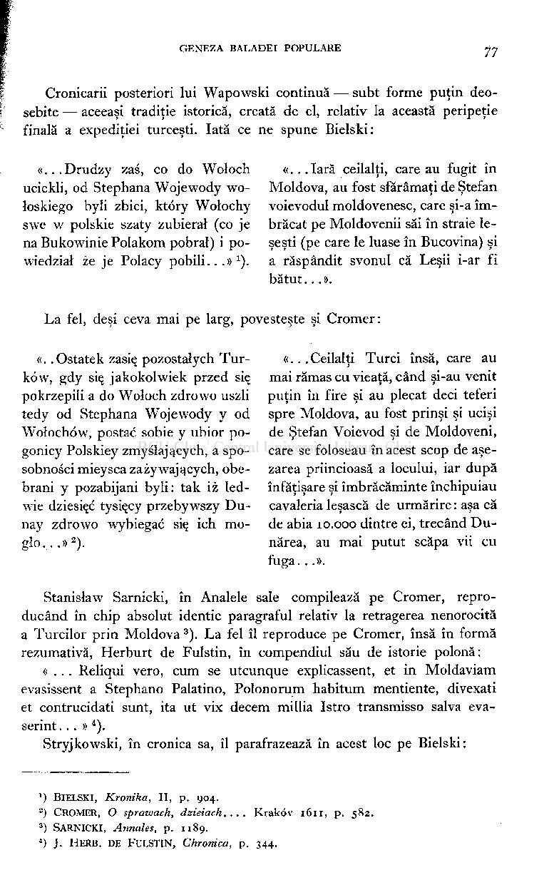

Cronicarii posteriori lui Wapowski continuă — subt forme puţin deosebite — aceeaşi tradiţie istorică, creată de el, relativ la această peripeţie finală a expediţiei turceşti. Iată ce ne spune Bielski:

«... Iară ceilalţi, care au fugit în Moldova, au fost sfărâmaţi de Ştefan voievodul moldovenesc, care şi-a îmbrăcat pe Moldovenii săi în straie leşeşti (pe care le luase în Bucovina) şi a răspândit svonul că Leşii i-ar fi bătut... ».

«... Drudzy zas, co do Woloch uciekli, od Stephana Wojewody woloskiego byli zbici, ktory Wolochy swe w polskie szaty zubieral (co je na Bukowinie Polakom pobrat) i powiedzial ze je Polacy pobili...»

).

1

La fel, deşi ceva mai pe larg, povesteşte şi Cromer:

«... Ceilalţi Turci însă, care au mai rămas cu vieaţă, când şi-au venit puţin în fire şi au plecat deci teferi spre Moldova, au fost prinşi şi ucişi de Ştefan Voievod şi de Moldoveni, care se foloseau în acest scop de aşezarea priincioasă a locului, iar după înfăţişare şi îmbrăcăminte închipuiau cavaleria leşască de urmărire : aşa că de abia 10.000 dintre ei, trecând Dunărea, au mai putut scăpa vii cu fuga... ».

«. .Ostatek zasiç pozostalych Turkôw, gdy sic jakokolwiek przed sic pokrzepili a do Woloch zdrowo uszli tedy od Stephana Wojewody y od Wolochôw, postac sobie y ubior pogonicy Polskiey zmyslajacych, a sposobnosci mieysca zazywajacych, obebrani y pozabijani byli: tak iz ledwie dziesiçc tysiexy przebywszy Dunay zdrowo wybiegaé sic ich moglo...» ).

Stanistaw Sarnicki, în Analele sale compilează pe Cromer, reproducând în chip absolut identic paragraful relativ la retragerea nenorocită a Turcilor prin Moldova

). La fel îl reproduce pe Cromer, însă în formă rezumativă, Herburt de Fulstin, în compendiul său de istorie polonă:

3

«.. . Reliqui vero, cum se utcunque explicassent, et in Moldaviam evasissent a Stephano Palatino, Polonorum habitum mentiente, divexati et contrucidati sunt, ita ut vix decern millia Istro transmisso salva evaserint... »

). Stryjkowski, în cronica sa, îl parafrazează în acest loc pe Bielski:

4

' ) BIELSKI Kronika, II , p. 904 .

- 2 ) CROMER, O sprawach, dzieiach.... Krakôv 1611 , p. 582
- 3 ) SARNICKI Annales, p. 1189 .
- 4 ) J . HERB . D E FULSTIN , Chronica, p. 344 .

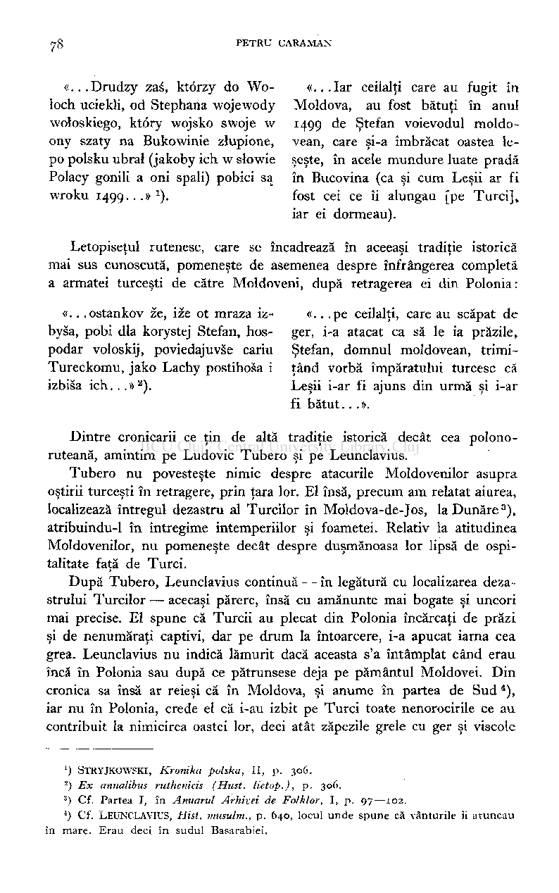

«...Drudzy zas, ktôrzy do Woloch uciekli, od Stephana wojewody wotoskiego, ktôry wojsko swoje w ony szaty na Bukowinie zlupione, po polsku ubrat (jakoby ich w slowie Polacy gonili a oni spali) pobici sa wroku 1499...» ).

«...Iar ceilalţi care au fugit în Moldova, au fost bătuţi în anul 1499 de Ştefan voievodul moldovean, care şi-a îmbrăcat oastea leşeşte, în acele mundure luate pradă în Bucovina (ca şi cum Leşii ar fi fost cei ce îi alungau [pe Turci], iar ei dormeau).

Letopiseţul rutenesc, care se încadrează în aceeaşi tradiţie istorică mai sus cunoscută, pomeneşte de asemenea despre înfrângerea completă a armatei turceşti de către Moldoveni, după retragerea ei din Polonia:

«.. .ostankov ze, ize ot mraza iz- «.. .pe ceilalţi, care au scăpat de

bysa, pobi dla korystej Stefan, hospodar voloskij, poviedajuvse cariu Tureckomu, jako Lachy postihosa i izbisa ich...»

ger, i-a atacat ca să le ia prăzile, Ştefan, domnul moldovean, trimiţând vorbă împăratului turcesc că Leşii i-ar fi ajuns din urmă şi i-ar fi bătut... ».

).

2

Dintre cronicarii ce ţin de altă tradiţie istorică decât cea polonoruteană, amintim pe Ludovic Tubero şi pe Leunclavius.

Tubero nu povesteşte nimic despre atacurile Moldovenilor asupra oştirii turceşti în retragere, prin ţara lor. El însă, precum am relatat aiurea, localizează întregul dezastru al Turcilor în Moldova-de-Jos, la Dunăre

), atribuindu-1 în întregime intemperiilor şi foametei. Relativ la atitudinea Moldovenilor, nu pomeneşte decât despre duşmănoasa lor lipsă de ospitalitate faţă de Turci.

3

După Tubero, Leunclavius continuă — în legătură cu localizarea dezastrului Turcilor — aceeaşi părere, însă cu amănunte mai bogate şi uneori mai precise. El spune că Turcii au plecat din Polonia încărcaţi de prăzi şi de nenumăraţi captivi, dar pe drum la întoarcere, i-a apucat iarna cea grea. Leunclavius nu indică lămurit dacă aceasta s'a întâmplat când erau încă în Polonia sau după ce pătrunsese deja pe pământul Moldovei. Din cronica sa însă ar reieşi că în Moldova, şi anume în partea de Sud ), iar nu în Polonia, crede el că i-au izbit pe Turci toate nenorocirile ce au contribuit la nimicirea oastei lor, deci atât zăpezile grele cu ger şi viscole

') STRYJKOWPKI, Kronika polska, II, p. 306 .

- 2 ) Ex annalibus ruthenicis (Hust. lietop.), p. 306 .
- 3

) Cf. Partea I, în Anuarul Arhivei de Fo/klor, I, p. 97—102 .

- 4

### ) Cf. LEUNCLAVIUS, Hist, musulm., p. 640 , locul unde spune că vânturile îi aruncau în mare. Erau deci în sudul Basarabiei.

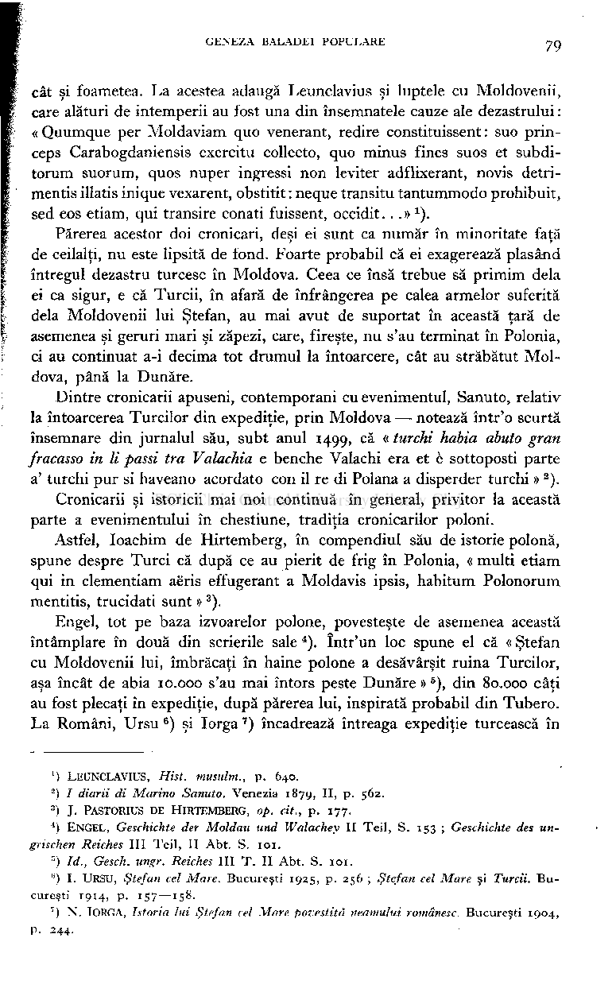

cât şi foametea. La acestea adaugă Leunclavius şi luptele cu Moldovenii, care alături de intemperii au fost una din însemnatele cauze ale dezastrului : « Quumque per Moldaviam quo vénérant, redire constituissent : suo princeps Carabogdaniensis exercitu collecte, quo minus fines suos et subditorum suorum, quos nuper ingressi non leviter adflixerant, novis detrimentis illatis inique vexarent, obstitit : neque transitu tantummodo prohibuit, sed eos etiam, qui transire conati fuissent, occidit...»

).

1

Părerea acestor doi cronicari, deşi ei sunt ca număr în minoritate faţă de ceilalţi, nu este lipsită de fond. Foarte probabil că ei exagerează plasând întregul dezastru turcesc în Moldova. Ceea ce însă trebue să primim delà ei ca sigur, e că Turcii, în afară de înfrângerea pe calea armelor suferită delà Moldovenii lui Ştefan, au mai avut de suportat în această ţară de asemenea şi geruri mari şi zăpezi, care, fireşte, nu s'au terminat în Polonia, ci au continuat a-i decima tot drumul la întoarcere, cât au străbătut Moldova, până la Dunăre.

Dintre cronicarii apuseni, contemporani cu evenimentul, Sanuto, relativ la întoarcerea Turcilor din expediţie, prin Moldova — notează într'o scurtă însemnare din jurnalul său, subt anul 1499, că « turchi habia abuto gran fracasso in li passi tra Valachia e benche Valachi era et è sottoposti parte a' turchi pur si haveano acordato con il re di Poiana a disperder turchi »

).

2

Cronicarii şi istoricii mai noi continuă în general, privitor la această parte a evenimentului în chestiune, tradiţia cronicarilor poloni.

Astfel, Ioachim de Hirtemberg, în compendiul său de istorie polonă, spune despre Turci că după ce au pierit de frig în Polonia, « mulţi etiam qui in clementiam aëris effugerant a Moldavis ipsis, habitum Polonorum mentitis, trucidati sunt »

).

3

Engel, tot pe baza izvoarelor polone, povesteşte de asemenea această întâmplare în două din scrierile sale ). într'un loc spune el că « Ştefan cu Moldovenii lui, îmbrăcaţi în haine polone a desăvârşit ruina Turcilor, aşa încât de abia 10.000 s'au mai întors peste Dunăre »

), din 80.000 câţi au fost plecaţi în expediţie, după părerea lui, inspirată probabil din Tubero. La Români, Ursu

5

) şi Iorga ) încadrează întreaga expediţie turcească în

6

') LEUNCLAVIUS , Hist, musulm., p. 640 .

###### ) I diarii di Marino Sanuto. Venezia 1879 , II, p. 562 .

2

###### ) J. PASTORIU S D E HIRTEMBERG , op. cit., p. 177 .

3

###### ) ENGEL, Geschichte der Moldau und Walachey II Teii, S. 15 3 ; Geschichte des ungrischen Reiches III Teii, II Abt. S. 101 .

4

- 5 ) Id., Gesch. ungr. Reiches III T. II Abt. S. 101 .
- 6 ) I. URSU, Ştefan cel Mare. Bucureşti 1925 , p. 25 6 ; Ştefan cel Mare şi Turcii. Bu­

### cureşti 1914 , p. 15 7 —158 .

) N. IORGA, Istoria lui Ştefan cel Mare povestită neamului românesc. Bucureşti 1904 ,

7

p. 244 .

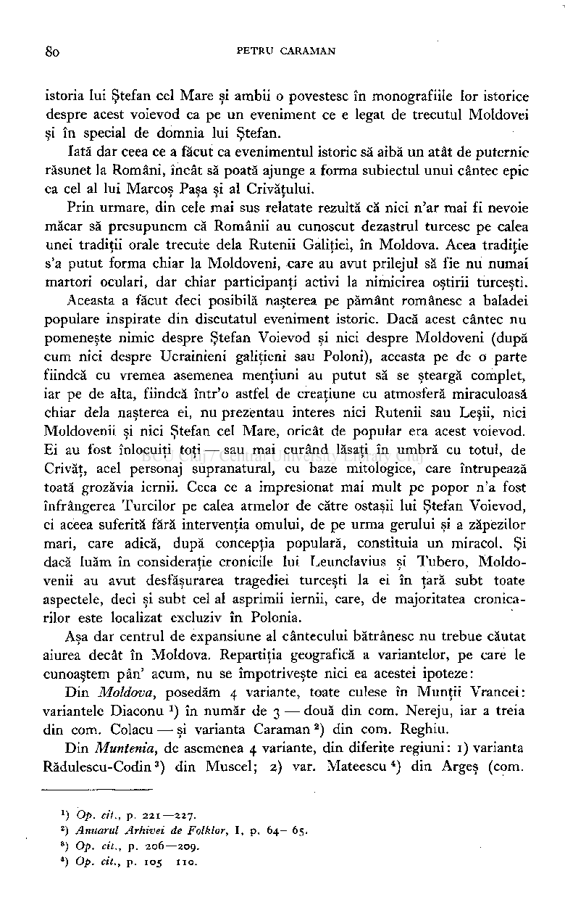

istoria lui Ştefan cel Mare şi ambii o povestesc în monografiile lor istorice despre acest voievod ca pe un eveniment ce e legat de trecutul Moldovei şi în special de domnia lui Ştefan.

Iată dar ceea ce a făcut ca evenimentul istoric să aibă un atât de puternic

- răsunet la Români, încât să poată ajunge a forma subiectul unui cântec epic ca cel al lui Marcoş Paşa şi al Crivăţului.

Prin urmare, din cele mai sus relatate rezultă că nici n'ar mai fi nevoie măcar să presupunem că Românii au cunoscut dezastrul turcesc pe calea unei tradiţii orale trecute delà Rutenii Galitiei, în Moldova. Acea tradiţie s'a putut forma chiar la Moldoveni, care au avut prilejul să fie nu numai martori oculari, dar chiar participanţi activi la nimicirea oştirii turceşti.

Aceasta a făcut deci posibilă naşterea pe pământ românesc a baladei populare inspirate din discutatul eveniment istoric. Dacă acest cântec nu pomeneşte nimic despre Ştefan Voievod şi nici despre Moldoveni (după cum nici despre Ucrainieni galiţieni sau Poloni), aceasta pe de o parte fiindcă cu vremea asemenea menţiuni au putut să se şteargă complet, iar pe de alta, fiindcă într'o astfel de creaţiune cu atmosferă miraculoasă chiar delà naşterea ei, nu prezentau interes nici Rutenii sau Leşii, nici Moldovenii şi nici Ştefan cel Mare, oricât de popular era acest voievod. Ei au fost înlocuiţi toţi — sau mai curând lăsaţi în umbră cu totul, de Crivăţ, acel personaj supranatural, cu baze mitologice, care întrupează toată grozăvia iernii. Ceea ce a impresionat mai mult pe popor n'a fost înfrângerea Turcilor pe calea armelor de către ostaşii lui Ştefan Voievod, ci aceea suferită fără intervenţia omului, de pe urma gerului şi a zăpezilor mari, care adică, după concepţia populară, constituia un miracol. Şi dacă luăm în consideraţie cronicile lui Leunclavius şi Tubero, Moldovenii au avut desfăşurarea tragediei turceşti la ei în ţară subt toate aspectele, deci şi subt cel al asprimii iernii, care, de majoritatea cronicarilor este localizat excluziv în Polonia.

Aşa dar centrul de expansiune al cântecului bătrânesc nu trebue căutat aiurea decât în Moldova. Repartiţia geografică a variantelor, pe care le cunoaştem pân' acum, nu se împotriveşte nici ea acestei ipoteze:

Din Moldova, posedăm 4 variante, toate culese în Munţii Vrancei: variantele Diaconu ) în număr de 3 — două din com. Nereju, iar a treia din corn. Colacu — şi varianta Caraman

) din com. Reghiu.

2

Din Muntenia, de asemenea 4 variante, din diferite regiuni: 1) varianta Rădulescu-Codin

) din Muscel; 2) var. Mateescu *) din Argeş (corn.

3

*) Op. cit., p. 221—227 .

- 2 ) Anuarul Arhivei de Folklor, I, p. 64—65.
- 3 ) Op. cit., p. 206—209 .
- 4 ) Op. cit., p. 105—110 .

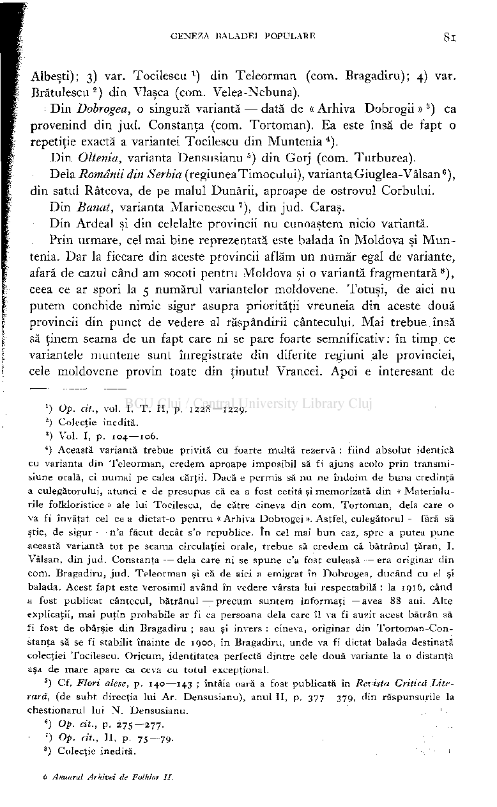

Albeşti); 3) var. Tocilescu ) din Teleorman (corn. Bragadiru); 4) var. Brătulescu

) din Vlaşca (corn. Velea-Nebuna). Din Dobrogea, o singură variantă — dată de « Arhiva Dobrogii »

2

) ca provenind din jud. Constanţa (corn. Tortoman). Ea este însă de fapt o repetiţie exactă a variantei Tocilescu din Muntenia ).

3

Din Oltenia, varianta Densusianu ) din Gorj (com. Turburea). Delà Românii din Serbia (regiuneaTimocului), varianta Giuglea-Vâlsan

),

6

din satul Râtcova, de pe malul Dunării, aproape de ostrovul Corbului. Din Banat, varianta Marienescu ), din jud. Caras. Din Ardeal şi din celelalte provincii nu cunoaştem nicio variantă. Prin urmare, cel mai bine reprezentată este balada în Moldova şi Mun­

tenia. Dar la fiecare din aceste provincii aflăm un număr egal de variante, afară de cazul când am socoti pentru Moldova şi o variantă fragmentară ) , ceea ce ar spori la 5 numărul variantelor moldovene. Totuşi, de aici nu putem conchide nimic sigur asupra priorităţii vreuneia din aceste două provincii din punct de vedere al răspândirii cântecului. Mai trebue însă

- să ţinem seama de un fapt care ni se pare foarte semnificativ: în timp ce variantele muntene sunt înregistrate din diferite regiuni ale provinciei, cele moldovene provin toate din ţinutul Vrancei. Apoi e interesant de

') Op. cit., vol. I. T. II, p. 1228—1229 .

- 2

) Colecţie inedită.

- 3 ) Vol. I, p. 104—106 .
- 4

) Această variantă trebue privită cu foarte multă rezervă : fiind absolut identică cu varianta din Teleorman, credem aproape imposibil să fi ajuns acolo prin transmisiune orală, ci numai pe calea cărţii. Dacă e permis să nu ne îndoim de buna credinţă a culegătorului, atunci e de presupus că ea a fost cetită şi memorizată din « Materialurile folkloristice » ale lui Tocilescu, de către cineva din corn. Tortoman, delà care o va fi învăţat cel ce a dictat-o pentru « Arhiva Dobrogei ». Astfel, culegătorul — fără să ştie, de sigur — n'a făcut decât s'o republice. în cel mai bun caz, spre a putea pune această variantă tot pe seama circulaţiei orale, trebue să credem că bătrânul ţăran, I. Vâlsan, din jud. Constanţa — delà care ni se spune c'a fost culeasă — era originar din corn. Bragadiru, jud. Teleorman şi că de aici a emigrat în Dobrogea, ducând cu el şi balada. Acest fapt este verosimil având în vedere vârsta lui respectabilă : la 1916 , când a fost publicat cântecul, bătrânul — precum suntem informaţi — avea 88 ani. Alte explicaţii, mai puţin probabile ar fi ca persoana delà care îl va fi auzit acest bătrân să fi fost de obârşie din Bragadiru ; sau şi invers : cineva, originar din Tortoman-Constanţa să se fi stabilit înainte de 1900 , în Bragadiru, unde va fi dictat balada destinată colecţiei Tocilescu. Oricum, identitatea perfectă dintre cele două variante la o distanţă aşa de mare apare ca ceva cu totul excepţional.

) Cf. Flori alese, p.140—14 3 ; întâia oară a fost publicată în Revista Critică Literară, (de subt direcţia lui Ar. Densusianu), anul II, p.377—379 , din răspunsurile la chestionarul lui N. Densusianu.

s

###### ) Op. cit., p. 275—277 .

6

###### ) Op. cit., II, p. 75—79 .

;

### ) Colecţie inedită.

8

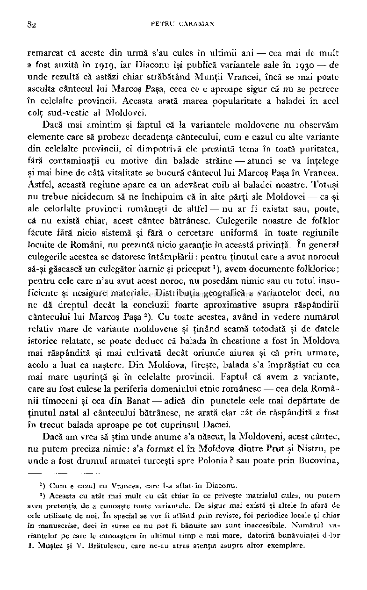

remarcat că aceste din urmă s'au cules în ultimii ani — cea mai de mult a fost auzită în 1919, iar Diaconu îşi publică variantele sale în 1930 — de unde rezultă că astăzi chiar străbătând Munţii Vrancei, încă se mai poate asculta cântecul lui Marcoş Paşa, ceea ce e aproape sigur că nu se petrece în celelalte provincii. Aceasta arată marea popularitate a baladei în acel colţ sud-vestic al Moldovei.

Dacă mai amintim şi faptul că la variantele moldovene nu observăm elemente care să probeze decadenţa cântecului, cum e cazul cu alte variante din celelalte provincii, ci dimpotrivă ele prezintă tema în toată puritatea, fără contaminaţii cu motive din balade străine — atunci se va înţelege şi mai bine de câtă vitalitate se bucură cântecul lui Marcoş Paşa în Vrancea. Astfel, această regiune apare ca un adevărat cuib al baladei noastre. Totuşi nu trebue nicidecum să ne închipuim că în alte părţi ale Moldovei — ca şi ale celorlalte provincii româneşti de altfel — nu ar fi existat sau, poate, că nu există chiar, acest cântec bătrânesc. Culegerile noastre de folklor făcute fără nicio sistemă şi fără o cercetare uniformă în toate regiunile locuite de Români, nu prezintă nicio garanţie în această privinţă. în general culegerile acestea se datoresc întâmplării : pentru ţinutul care a avut norocul să-şi găsească un culegător harnic şi priceput

), avem documente folklorice; pentru cele care n'au avut acest noroc, nu posedăm nimic sau cu totul insuficiente şi nesigure materiale. Distribuţia geografică a variantelor deci, nu ne dă dreptul decât la concluzii foarte aproximative asupra răspândirii cântecului lui Marcoş Paşa ). Cu toate acestea, având în vedere numărul relativ mare de variante moldovene şi ţinând seamă totodată şi de datele istorice relatate, se poate deduce că balada în chestiune a fost în Moldova mai răspândită şi mai cultivată decât oriunde aiurea şi că prin urmare, acolo a luat ea naştere. Din Moldova, fireşte, balada s'a împrăştiat cu cea mai mare uşurinţă şi în celelalte provincii. Faptul că avem 2 variante, care au fost culese la periferia domeniului etnic românesc — cea delà Românii timoceni şi cea din Banat — adică din punctele cele mai depărtate de ţinutul natal al cântecului bătrânesc, ne arată clar cât de răspândită a fost în trecut balada aproape pe tot cuprinsul Daciei.

x

Dacă am vrea să ştim unde anume s'a născut, la Moldoveni, acest cântec, nu putem preciza nimic: s'a format el în Moldova dintre Prut şi Nistru, pe unde a fost drumul armatei turceşti spre Polonia ? sau poate prin Bucovina,

') Cum e cazul cu Vrancea, care 1-a aflat în Diaconu.

) Aceasta cu atât mai mult cu cât chiar în ce priveşte matrialul cules, nu putem avea pretenţia de a cunoaşte toate variantele. De sigur mai există şi altele în afară de cele utilizate de noi. în special se vor fi aflând prin reviste, foi periodice locale şi chiar în manuscrise, deci în surse ce nu pot fi bănuite sau sunt inaccesibile. Numărul variantelor pe care le cunoaştem în ultimul timp e mai mare, datorită bunăvoinţei d-lor I. Muşlea şi V. Brătulescu, care ne-au atras atenţia asupra altor exemplare.

2

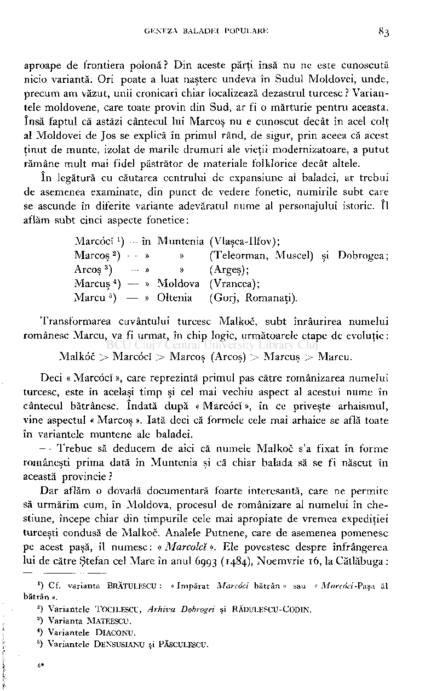

aproape de frontiera polonă ? Din aceste părţi însă nu ne este cunoscută nicio variantă: Ori poate a luat naştere undeva în Sudul Moldovei, unde, precum am văzut, unii cronicari chiar localizează dezastrul turcesc ? Variantele moldovene, care toate provin din Sud, ar fi o mărturie pentru aceasta, însă faptul că astăzi cântecul lui Marcoş nu e cunoscut decât în acel colţ al Moldovei de Jos se explică în primul rând, de sigur, prin aceea că acest ţinut de munte, izolat de marile drumuri ale vieţii modernizatoare, a putut

- rămâne mult mai fidel păstrător de materiale folklorice decât altele. în legătură cu căutarea centrului de expansiune al baladei, ar trebui

de asemenea examinate, din punct de vedere fonetic, numirile subt care se ascunde în diferite variante adevăratul nume al personajului istoric. II aflăm subt cinci aspecte fonetice:

Marcôcï ') — în Muntenia (Vlaşca-Ilfov) ; Marcoş

2

) — » » (Teleorman, Muscel) şi Dobrogea; Arcoş

3

) — » » (Argeş) ; Marcuş

4

) — » Moldova (Vrancea); Marcu

5

) — » Oltenia (Gorj, Romanaţi). Transformarea cuvântului turcesc Malkoc, subt înrâurirea numelui

românesc Marcu, va fi urmat, în chip logic, următoarele etape de evoluţie : Malkôc > Marcôcï > Marcoş (Arcoş) > Marcuş > Marcu.

Deci « Marcôcï », care reprezintă primul pas către românizarea numelui turcesc, este în acelaşi timp şi cel mai vechiu aspect al acestui nume în cântecul bătrânesc. îndată după « Marcôcï », în ce priveşte arhaismul, vine aspectul « Marcoş ». Iată deci că formele cele mai arhaice se află toate în variantele muntene ale baladei.

— Trebue să deducem de aici că numele Malkoc s'a fixat în forme româneşti prima dată în Muntenia şi că chiar balada să se fi născut în această provincie ?

Dar aflăm o dovadă documentară foarte interesantă, care ne permite

- să urmărim cum, în Moldova, procesul de românizare al numelui în chestiune, începe chiar din timpurile cele mai apropiate de vremea expediţiei turceşti condusă de Malkoc. Analele Putnene, care de asemenea pomenesc pe acest paşă, îl numesc : « Marcolcî ». Ele povestesc despre înfrângerea lui de către Ştefan cel Mare în anul 6993 (1484), Noemvrie 16, la Cătlăbuga :

*) Cf. variant a BRĂTULESCU : « împăra t Marcoci bătrâ n » sa u « Marcoci-Paşa ă l

- bătrâ n ».

- 2 ) Variantel e TOCILESCU, Arh iva Dobrogei şi RĂDULESCU-CODIN.
- 3 ) Variant a MATEESCU.
- 4 ) Variantel e DlACONU.
- 5 ) Variantel e DENSUSIANU şi PĂSCULESCU.

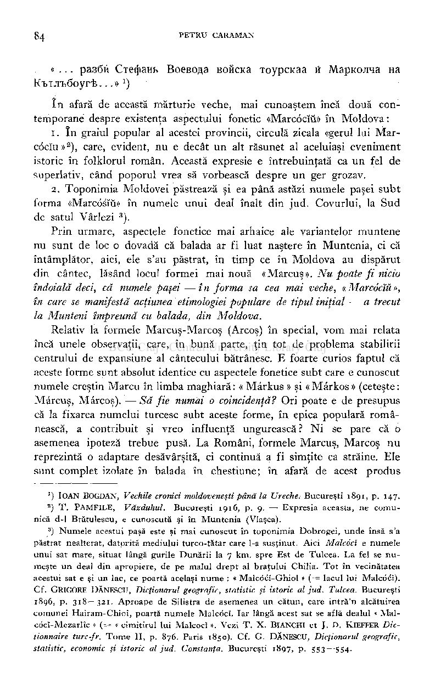

«.. . pa36ii CTetJ)aHb BoeBojţa BoftcKa ToypcKaa H MapKoma Ha KtT^-bôoyr-B...» !)

în afară de această mărturie veche, mai cunoaştem încă două contemporane despre existenţa aspectului fonetic «Marcôcïû» în Moldova:

1. în graiul popular al acestei provincii, circulă zicala «gerul lui Marcôcïû»

), care, evident, nu e decât un alt răsunet al aceluiaşi eveniment istoric în folklorul român. Această expresie e întrebuinţată ca un fel de superlativ, când poporul vrea să vorbească despre un ger grozav.

2

2. Toponimia Moldovei păstrează şi ea până astăzi numele paşei subt forma «Marcôsïû» în numele unui deal înalt din jud. Covurlui, la Sud de satul Vârlezi ).

Prin urmare, aspectele fonetice mai arhaice ale variantelor muntene nu sunt de loc o dovadă că balada ar fi luat naştere în Muntenia, ci că întâmplător, aici, ele s'au păstrat, în timp ce în Moldova au dispărut din cântec, lăsând locul formei mai nouă « Marcuş ». Nu poate fi nicio îndoială deci, că numele paşei — în forma sa cea mai veche, «Marcôcïû», în care se manifestă acţiunea etimologiei popidare de tipul iniţial — a trecut la Munteni împreună cu balada, din Moldova.

Relativ la formele Marcuş-Marcoş (Arcoş) în special, vom mai relata încă unele observaţii, care, în bună parte, ţin tot de problema stabilirii centrului de expansiune al cântecului bătrânesc. E foarte curios faptul că aceste forme sunt absolut identice cu aspectele fonetice subt care e cunoscut numele creştin Marcu în limba maghiară : « Mârkus » şi « Mârkos » (ceteşte : Marcuş, Marcoş). -— Să fie numai o coincidenţă? Ori poate e de presupus

- că la fixarea numelui turcesc subt aceste forme, în epica populară românească, a contribuit şi vreo influenţă ungurească ? Ni se pare că o asemenea ipoteză trebue pusă. La Români, formele Marcuş, Marcoş nu reprezintă o adaptare desăvârşită, ci continuă a fi simţite ca străine. Ele sunt complet izolate în balada în chestiune; în afară de acest produs

### *) IOAN BOGDAN, Vechile cronici moldoveneşti până la Ureche. Bucureşti1891 , p. 147

### ) T.PAMFILE , Văzduhul. Bucureşti1916 p. 9. — Expresia aceasta, ne comunică d-1 Brătulescu, e cunoscută şi în Muntenia (Vlaşca).

2

) Numele acestui paşă este şi mai cunoscut în toponimia Dobrogei, unde însă s'a păstrat nealterat, datorită mediului turco-tătar care 1-a susţinut. Aici Malcôcî e numele unui sat mare, situat lângă gurile Dunării la 7 km. spre Est de Tulcea. La fel se numeşte un deal din apropiere, de pe malul drept al braţului Chilia. Tot în vecinătatea acestui sat e şi un lac, ce poartă acelaşi nume : « Malcôcï-Ghiol » ( = lacul lui Malcôcî). Cf.GRIGOR E DĂNESCU, Dicţionarul geografic, statistic şi istoric al jud. Tulcea. Bucureşti 1896 , p.318—321 Aproape de Silistra de asemenea un cătun, care intră'n alcătuirea comunei Hairam-Chioi, poartă numele Malcdcî. Iar lângă acest sat se află dealul « Malcocî-Mezarlîc » (~= « cimitirul lui Malcoci ». Vezi T. X. BlANCHI et J. D. KlEFFER Dictionnaire turc-fr. Tome II, p. 876 Paris1850) Cf. G . DĂNESCU, Dicţionarul geografic, statistic, economic şi istoric al jud. Constanţa. Bucureşti1897 p.553—554 .

3

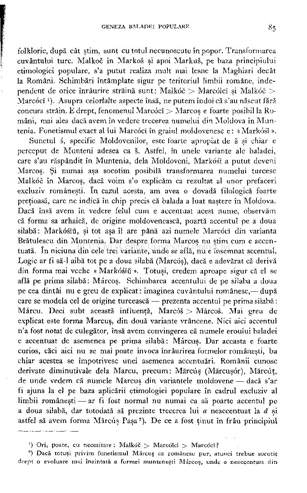

folkloric, după cât ştim, sunt cu totul necunoscute în popor. Transformarea cuvântului turc. Malkoc în Markos şi apoi Markus, pe baza principiului etimologiei populare, s'a putut realiza mult mai lesne la Maghiari decât la Români. Schimbări întâmplate sigur pe teritoriul limbii române, independent de orice înrâurire străină sunt: Malkoc > Marcelei şi Malkoc > Marcôcï Asupra celorlalte aspecte însă, ne putem îndoi că s'au născut fără concurs străin. E drept, fenomenul Marcôcï > Marcoş e foarte posibil la Români, mai ales dacă avem în vedere trecerea numelui din Moldova în Muntenia. Fonetismul exact al lui Marcôcï în graiul moldovenesc e : « Markôsï ».

Sunetul s, specific Moldovenilor, este foarte apropiat de s şi chiar e perceput de Munteni adesea ca s. Astfel, în unele variante ale baladei, care s'au răspândit în Muntenia, delà Moldoveni, Markôsï a putut deveni Marcoş. Şi numai aşa socotim posibilă transformarea numelui turcesc Malkôc în Marcoş, dacă voim s'o explicăm ca rezultat al unor prefaceri excluziv româneşti. în cazul acesta, am avea o dovadă filologică foarte preţioasă, care ne indică în chip precis că balada a luat naştere în Moldova. Dacă însă avem în vedere felul cum e accentuat acest nume, observăm că forma sa arhaică, de origine moldovenească, poartă accentul pe a doua silabă: Markôsïû, şi tot aşa îl are până azi numele Marcôcï din varianta Brătulescu din Muntenia. Dar despre forma Marcoş nu ştim cum e accentuată, în niciuna din cele trei variante, unde se află, nu e însemnat accentul. Logic ar fi să-1 aibă tot pe a doua silabă (Marcoş), dacă e adevărat că derivă din forma mai veche « Markôsïû ». Totuşi, credem aproape sigur că el se află pe prima silabă: Marcoş. Schimbarea accentului de pe silaba a doua pe cea dintâi nu e greu de explicat: imaginea cuvântului românesc,— după care se modela cel de origine turcească — prezenta accentul pe prima silabă : Mârcu. Deci subt această influenţă, Marcos > Mârcos. Mai greu de explicat este forma Marcuş, din două variante vrâncene. Nici aici accentul n'a fost notat de culegător, însă avem convingerea că numele eroului baladei e accentuat de asemenea pe prima silabă: Mârcuş. Dar aceasta e foarte curios, căci aici nu se mai poate invoca înrâurirea formelor româneşti, ba chiar acestea se împotrivesc unei asemenea accentuări. Românii cunosc derivate diminutivale delà Marcu, precum: Marcuş (Mărcuşor), Mărciiţ, de unde vedem că numele Marcuş din variantele moldovene — dacă s'ar fi ajuns la el pe baza aplicării etimologiei populare în cadrul excluziv al limbii româneşti — ar fi fost normal nu numai ca să poarte accentul pe a doua silabă, dar totodată să prezinte trecerea lui a neaccentuat la ă şi astfel să avem forma Mărciiş Paşa ). De ce a fost ţinut în frâu principiul

') Ori, poate, cu necesitate : Malkoc > Marcôlcï > Marcôcï ?

### ) Dacă totuşi privim fonetismul Mârcuş ca românesc pur, atunci trebue socotit drept o evoluare mai înaintată a formei munteneşti Mârcoş, unde o neaccentuat din

2

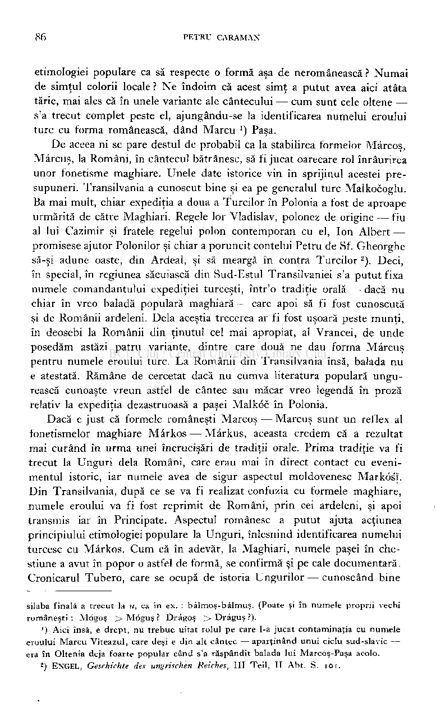

etimologiei populare ca să respecte o formă aşa de neromânească ? Numai de simţul colorii locale ? Ne îndoim că acest simţ a putut avea aici atâta tărie, mai ales că în unele variante ale cântecului — cum sunt cele oltene s'a trecut complet peste el, ajungându-se la identificarea numelui eroului turc cu forma românească, dând Marcu *) Paşa.

De aceea ni se pare destul de probabil ca la stabilirea formelor Marcoş, M arcuş, la Români, în cântecul bătrânesc, să fi jucat oarecare rol înrâurirea unor fonetisme maghiare. Unele date istorice vin în sprijinul acestei presupuneri. Transilvania a cunoscut bine şi ea pe generalul turc Malkocoglu. Ba mai mult, chiar expediţia a doua a Turcilor în Polonia a fost de aproape urmărită de către Maghiari. Regele lor Vladislav, polonez de origine — fiu al lui Cazimir şi fratele regelui polon contemporan cu el, Ion Albert promisese ajutor Polonilor şi chiar a poruncit contelui Petru de Si. Gheorghe să-şi adune oaste, din Ardeal, şi să meargă în contra Turcilor ). Deci, în special, în regiunea săcuiască din Sud-Estul Transilvaniei s'a putut fixa numele comandantului expediţiei turceşti, într'o tradiţie orală — dacă nu chiar în vreo baladă populară maghiară — care apoi să fi fost cunoscută şi de Românii ardeleni. Delà aceştia trecerea ar fi fost uşoară peste munţi, în deosebi la Românii din ţinutul cel mai apropiat, al Vrancei, de unde posedăm astăzi patru variante, dintre care două ne dau forma Mârcuş pentru numele eroului turc. La Românii din Transilvania însă, balada nu e atestată. Rămâne de cercetat dacă nu cumva literatura populară ungurească cunoaşte vreun astfel de cântec sau măcar vreo legendă în proză relativ la expediţia dezastruoasă a paşei Malkoc în Polonia.

Dacă e just că formele româneşti Marcoş — Marcus sunt un reflex al fonetismelor maghiare Mârkos — Mârkus, aceasta credem că a rezultat mai curând în urma unei încrucişări de tradiţii orale. Prima tradiţie va fi trecut la Unguri delà Români, care erau mai în direct contact cu evenimentul istoric, iar numele avea de sigur aspectul moldovenesc Markôsï. Din Transilvania, după ce se va fi realizat confuzia cu formele maghiare, numele eroului va fi fost reprimit de Români, prin cei ardeleni, şi apoi transmis iar în Principate. Aspectul românesc a putut ajuta acţiunea principiului etimologiei populare la Unguri, înlesnind identificarea numelui turcesc cu Mârkos. Cum că în adevăr, la Maghiari, numele paşei în chestiune a avut în popor o astfel de formă, se confirmă şi pe cale documentară. Cronicarul Tubero, care se ocupă de istoria Ungurilor — cunoscând bine

silaba finala a trecut la u, ca în ex. : bâlmoş-balmuş. (Poate şi în numele proprii vechi româneşti : Mogoş > Moguş ? Drâgoş > Drâguş ?).

') Aici însă, e drept, nu trebue uitat rolul pe care 1-a jucat contaminaţia cu numele eroului Marcu Viteazul, care deşi e din alt cântec —aparţinând unui ciclu sud-s!avic era în Oltenia deja foarte popular când s'a răspândit balada lui Marcoş-Paşa acolo.

###### ) ENGEL, Geschichte des ungrischen Reiches, III Teii, II Abt. S. 101 .

2

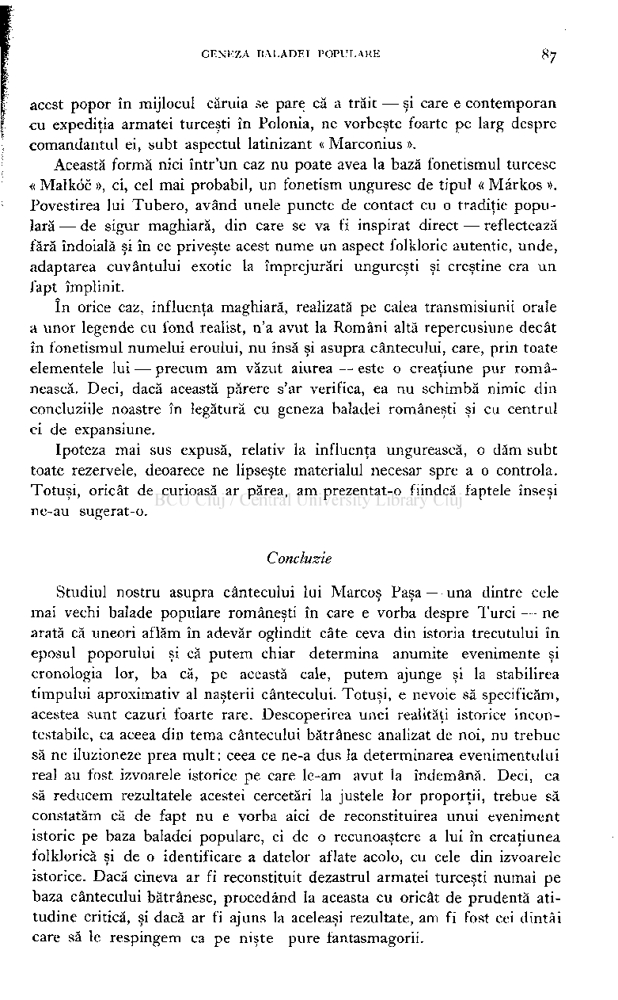

acest popor în mijlocul căruia se pare că a trăit — şi care e contemporan cu expediţia armatei turceşti în Polonia, ne vorbeşte foarte pe larg despre comandantul ei, subt aspectul latinizant « Marconius ».

Această formă nici într'un caz nu poate avea la bază fonetismul turcesc « Malkôc », ci, cel mai probabil, un fonetism unguresc de tipul « Mârkos ». Povestirea lui Tubero, având unele puncte de contact cu o tradiţie populară — de sigur maghiară, din care se va fi inspirat direct — reflectează fără îndoială şi în ce priveşte acest nume un aspect folkloric autentic, unde, adaptarea cuvântului exotic la împrejurări ungureşti şi creştine era un fapt împlinit.

în orice caz, influenţa maghiară, realizată pe calea transmisiunii orale a unor legende cu fond realist, n'a avut la Români altă repercusiune decât în fonetismul numelui eroului, nu însă şi asupra cântecului, care, prin toate elementele lui — precum am văzut aiurea — este o creaţiune pur românească. Deci, dacă această părere s'ar verifica, ea nu schimbă nimic din concluziile noastre în legătură cu geneza baladei româneşti şi cu centrul ei de expansiune.

Ipoteza mai sus expusă, relativ la influenţa ungurească, o dăm subt toate rezervele, deoarece ne lipseşte materialul necesar spre a o controla. Totuşi, oricât de curioasă ar părea, am prezentat-o fiindcă faptele înseşi ne-au sugerat-o.

Concluzie

Studiul nostru asupra cântecului lui Marcoş Paşa — una dintre cele mai vechi balade populare româneşti în care e vorba despre Turci — ne arată că uneori aflăm în adevăr oglindit câte ceva din istoria trecutului în eposul poporului şi că putem chiar determina anumite evenimente şi cronologia lor, ba că, pe această cale, putem ajunge şi la stabilirea timpului aproximativ al naşterii cântecului. Totuşi, e nevoie să specificăm, acestea sunt cazuri foarte rare. Descoperirea unei realităţi istorice incontestabile, ca aceea din tema cântecului bătrânesc analizat de noi, nu trebue să ne iluzioneze prea mult : ceea ce ne-a dus la determinarea evenimentului real au fost izvoarele istorice pe care le-am avut la îndemână. Deci, ca să reducem rezultatele acestei cercetări la justele lor proporţii, trebue să constatăm că de fapt nu e vorba aici de reconstituirea unui eveniment istoric pe baza baladei populare, ci de o recunoaştere a lui în creaţiunea iolklorică şi de o identificare a datelor aflate acolo, cu cele din izvoarele istorice. Dacă cineva ar fi reconstituit dezastrul armatei turceşti numai pe baza cântecului bătrânesc, procedând la aceasta cu oricât de prudentă atitudine critică, şi dacă ar fi ajuns la aceleaşi rezultate, am fi fost cei dintâi care să le respingem ca pe nişte pure fantasmagorii.

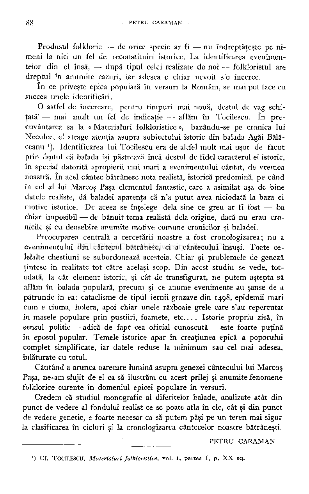

Produsul folkloric — de orice specie ar fi — nu îndreptăţeşte pe nimeni la nici un fel de reconstituiri istorice. La identificarea evenimentelor din el însă, — după tipul celei realizate de noi — folkloristul are dreptul în anumite cazuri, iar adesea e chiar nevoit s'o încerce.

în ce priveşte epica populară în versuri la Români, se mai pot face cu succes unele identificări.

O astfel de încercare, pentru timpuri mai nouă, destul de vag schiţată

— mai mult un fel de indicaţie — aflăm în Tocilescu. în precuvântarea sa la « Materialuri folkloristice », bazându-se pe cronica lui Neculce, el atrage atenţia asupra subiectului istoric din balada Agăi Bălăceanu ). Identificarea lui Tocilescu era de altfel mult mai uşor de făcut prin faptul că balada îşi păstrează încă destul de fidel caracterul ei istoric, în special datorită apropierii mai mari a evenimentului cântat, de vremea noastră. în acel cântec bătrânesc nota realistă, istorică predomină, pe când în cel al lui Marcoş Paşa elementul fantastic, care a asimilat aşa de bine datele realiste, dă baladei aparenţa că n'a putut avea niciodată la baza ei motive istorice. De aceea se înţelege delà sine ce greu ar fi fost — ba chiar imposibil — de bănuit tema realistă delà origine, dacă nu erau cronicile şi cu deosebire anumite motive comune cronicilor şi baladei.

1

Preocuparea centrală a cercetării noastre a fost cronologizarea ; nu a evenimentului din cântecul bătrânesc, ci a cântecului însuşi. Toate celelalte chestiuni se subordonează acesteia. Chiar şi problemele de geneză ţintesc în realitate tot către acelaşi scop. Din acest studiu se vede, totodată, la cât element istoric, şi cât de transfigurat, ne putem aştepta să aflăm în balada populară, precum şi ce anume evenimente au şanse de a pătrunde în ea: cataclisme de tipul iernii grozave din 1498, epidemii mari cum e ciuma, holera, apoi chiar unele războaie grele care s'au repercutat în masele populare prin pustiiri, foamete, etc.... Istorie propriu zisă, în sensul politic — adică de fapt cea oficial cunoscută — este foarte puţină în eposul popular. Temele istorice apar în creaţiunea epică a poporului complet simplificate, iar datele reduse la minimum sau cel mai adesea, înlăturate cu totul.

Căutând a arunca oarecare lumină asupra genezei cântecului lui Marcoş Paşa, ne-am slujit de el ca să ilustrăm cu acest prilej şi anumite fenomene folklorice curente în domeniul epicei populare în versuri.

Credem că studiul monografic al diferitelor balade, analizate atât din punct de vedere al fondului realist ce se poate afla în ele, cât şi din punct de vedere genetic, e foarte necesar ca să putem păşi pe un teren mai sigur la clasificarea în cicluri şi la cronologizarea cântecelor noastre bătrâneşti.

### PETRU CARAMAN

*) Cf. TOCILESCU, Materialuri folkloristice, vol. I , parte a I , p . X X sq.

