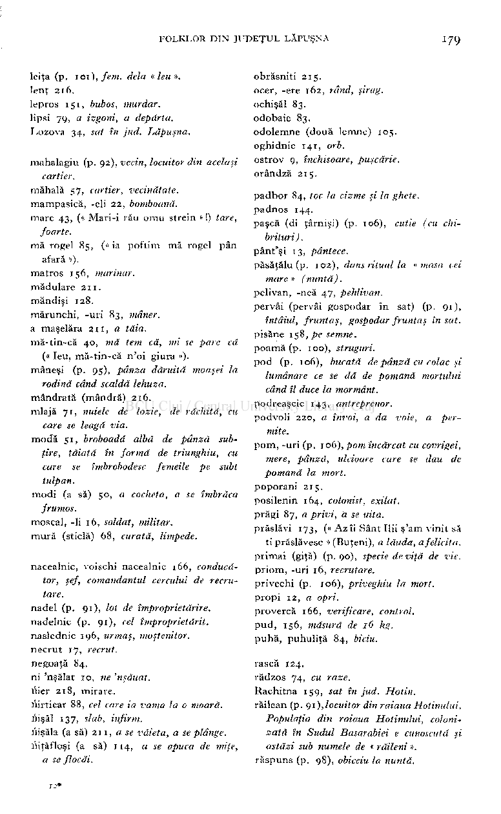

### obrăsniti 215 .

leita (p. 101) , fem. delà « leu ».

lent 216 .

ocer, -ere 162 rând, şirag.

ochişăl 83 . odobaie 83 . odolemne (două lemne) 105 . oghidnic 141 orb.

lepros 151 , bubos, murdar.

lipsi 79 a izgoni, a depărta.

#### Lozova 34 sat în jud. Lăpuşna.

ostrov 9, închisoare, puşcărie.

mahalagiu (p. 92) , vecin, locuitor din acelaşi cartier.

orândză 215 .

mahala 57 cartier, vecinătate.

padbor 84, toc la cizme şi la ghete.

mampasică, -eli 22 , bomboană.

padnos 144 .

mare 43 , (« Mari-i rău omu strein » !) tare,

pască (di ţârnişi) (p. 106) cutie (cu chi­

foarte.

brituri) .

mă rogel 85, (« ia poftim mă rogel pân afară »).

pânt'şi 13 , pântece.

păsăţălu (p. 102) dans ritual la «masa cei mare » (nuntă).

matros 156 marinar.

### mădulare 211 . măndişi 128 .

pelivan, -ncă 47 , pehlivan.

pervâi (pervâi gospodar în sat) (p. 91)

mărunchi, -uri 83 mâner. a maşelăra 211 a tăia.

întâiul, fruntaş, gospodar fruntaş în sat.

pisăne 158 , pe semne. poamă (p. 100) struguri.

- mă-tin-că 40 mă tem că, mi se pare că (« leu, mă-tin-că n'oi giura »).

pod (p. 106) bucată de pânză cu colac şi lumânare ce se dă de pomană mortului când îl duce la mormânt.

mâneşi (p. 95) pânza dăruită moaşei la rodină când scaldă lehuza.

mândrată (mândră) 216 .

podreaşcic 143 , antreprenor.

mlajă 71 nuiele de lozie, de răchită, cu care se leagă via.

podvoli 220 a învoi, a da voie, a permite.

modă 51 broboadă albă de pânză subţire, tăiată în formă de triunghiu, cu care se îmbrobodesc femeile pe subt tulpan.

pom, -uri (p. 106) , pom încărcat cu covrigei, mere, pânză, idcioare care se dau de pomană la mort.

poporani 215 .

##### modi (a să) 50 a cocheta, a se îmbrăca

posilenin 164 , colonist, exilat. prăgi 87, a privi, ă se uita.

frumos.

moscal, -li 16 , soldat, militar.

prăslăvi 173 , (« Az îi Sânt Ilii ş'am vinit să

mură (sticlă) 68 curată, limpede.

ti prăslăvesc » (Buţeni), a lăuda, a felicita. primai (giţă) (p. 90), specie de viţă de vie. priom, -uri 16, recrutare.

nacealnic, voischi nacealnic 166, conducă­

tor, şef, comandantul cercului de recrutare.

privechi (p. 106) , priveghiu la mort.

propi 12 a opri.

#### nadei (p. 91) lot de împroprietărire. nadelnic (p. 91) cel împroprietărit.

provercă 166 , verificare, control.

pud, 156 măsură de 16 kg.

naslednic 196 , urmaş, moştenitor.

puhă, puhuliţă 84 biciu.

necrut 17 recrut.

### negoaţă 84.

rască 124 .

rădzos 74 cu raze. Rachitna 159 sat în jud. Hotin.

ni 'nşălat 10 ne 'nşăuat.

nier 218 , mirare.

riirticar 88 cel care ia vama la o moară.

răilean (p. 91) , locuitor din raiaua Hotinului. Populaţia din raiaua Hotinului, colonizată în Sudul Basarabiei e cunoscută şi astăzi sub nume/e de « răileni ».

###### i'lişăl 137 slab, infirm. iiişăla (a să) 211 , a se văieta, a se plânge. iiiţăfloşi (a să) 114 a se apuca de miţe,

a se flocăi.

###### răspuns (p. 98) obiceiu la nuntă.

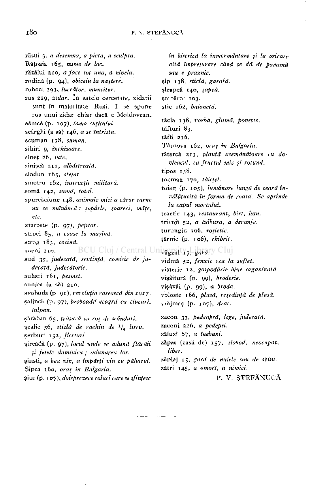

răsui 9, a desemna, a picta, a sculpta.

în biserică la înmormântare şi la oricare altă împrejurare când se dă de pomană sau e praznic.

#### Răţoaia 165 nume de loc.

răzălui 210 a face tot una, a nivela. rodină (p. 94) obiceiu la naştere. roboci 193 lucrător, muncitor.

şîp 138 sticlă, garafă.

şleapcă 140 şapcă.

rus 229, zidar. în satele cercetate, zidarii sunt în majoritate Ruşi. I se spune rus unui zidar chiar dacă e Moldovean.

şoibăroi 103.

ştie 162 baionetă.

tăcla 138 vorbă, glumă, poveste.

sâmcé (p. 107), lama cuţitului.

tafturi 83 . tăfti 216.

scârghi (a să) 146, a se întrista.

scuman 138 , suman. sîbiri 9, închisoare. sîneţ 86 iute. sînişcă 212 albăstreală. slodun 165 stejar.

Târnova 162 oraş în Bulgaria.

tătarcă 213 plantă asemănătoare cu do­

vleacul, cu fructul mic şi rotund.

tipos 138.

tocmag 170 tăieţel.

smotru 162 instrucţie militară. soma 142 sumă, total.

toiag (p. 105) lumânare lungă de ceară învălătucită în formă de roată. Se aprinde la capid mortului.

spurcăciune 148 animale mici a căror carne nu se mănâncă : şopârle, şoareci, mâţe, etc.

tractir 143 restaurant, birt, han.

trivojî 52 a tulbura, a deranja.

staroste (p. 97), peţitor.

turungiu 106 roşietic. ţârnic (p. 106) chibrit.

stroci 85 a coase la maşină.

strog 183 cocină.

sucni 210.

văgzal 17 , gară.

sud 35 judecată, sentinţă, comisie de judecată, judecătorie.

vidmă 52 , femeie rea la suflet.

visterie 12 gospodărie bine organizată.

suhari 161 , pesmet.

vişâitură (p. 99) broderie. vişâvăi (p. 99) a broda.

sunica (a să) 210.

svoboda (p. 91) , revoluţia rusească din 1917.

voloste 166 plasă, reşedinţă de plasă.

şalincă (p. 97) , broboadă neagră cu ciucuri, tulpan.

vrăjmaş (p. 107) drac.

zacon 33 , pedeapsă, lege, judecată.

###### şărăban 65 trăsură cu coş de scânduri.

zaconi 226 , a pedepsi. zăluzi 87 a înebuni. zăpas (casă de) 157 slobod, neocupat,

###### şcalic 56 sticlă de rachiu de

###### /

litru.

1

1

şerburi 152 , fierturi.

şireadă (p. 97) , load unde se adună flăcăii şi fetele duminica ; adunarea lor.

liber. zăplaj 15 gard de nuiele sau de spini.

şinsti, a bea vin, a împărţi vin cu paharul.

zătri 145 a omorî, a nimici.

Şipca 160 , oraş în Bulgaria.

### P. V. ŞTEFĂNUCĂ

şiur (p. 107) , doisprezece colaci care se sfinţesc

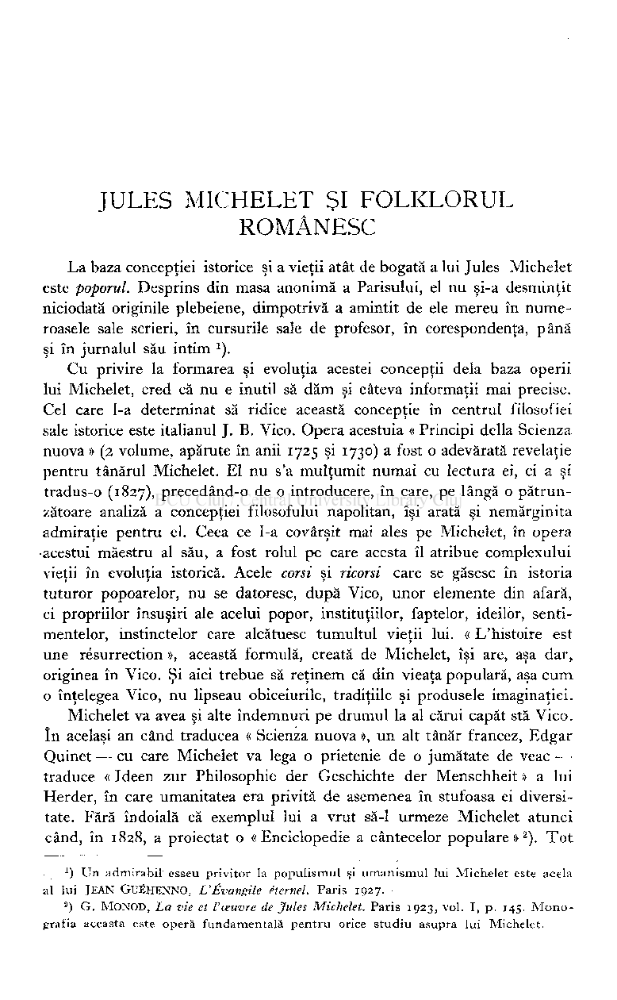

# IULES MICHELET ŞI FOLKLORUL ROMÂNESC

La baza concepţiei istorice şi a vieţii atât de bogată a lui Jules Michelet este poporul. Desprins din masa anonimă a Parisului, el nu şi-a desminţit niciodată originile plebeiene, dimpotrivă a amintit de ele mereu în numeroasele sale scrieri, în cursurile sale de profesor, în corespondenţa, până şi în jurnalul său intim ).

Cu privire la formarea şi evoluţia acestei concepţii delà baza operii lui Michelet, cred că nu e inutil să dăm şi câteva informaţii mai precise. Cel care 1-a determinat să ridice această concepţie în centrul filosofiei sale istorice este italianul J. B. Vico. Opera acestuia « Principi della Scienza nuova » (2 volume, apărute în anii 1725 şi 1730) a fost o adevărată revelaţie pentru tânărul Michelet. El nu s'a mulţumit numai cu lectura ei, ci a şi tradus-o (1827), precedând-o de o introducere, în care, pe lângă o pătrunzătoare analiză a concepţiei filosofului napolitan, îşi arată şi nemărginita admiraţie pentru el. Ceea ce 1-a covârşit mai ales pe Michelet, în opera

•acestui maestru al său, a fost rolul pe care acesta îl atribue complexului vieţii în evoluţia istorică. Acele corsi şi ricorsi care se găsesc în istoria tuturor popoarelor, nu se datoresc, după Vico, unor elemente din afară, ci propriilor însuşiri ale acelui popor, instituţiilor, faptelor, ideilor, sentimentelor, instinctelor care alcătuesc tumultul vieţii lui. « L'histoire est une résurrection », această formulă, creată de Michelet, îşi are, aşa dar, originea în Vico. Şi aici trebue să reţinem că din vieaţa populară, aşa cum o înţelegea Vico, nu lipseau obiceiurile, tradiţiile şi produsele imaginaţiei.

Michelet va avea şi alte îndemnuri pe drumul la al cărui capăt stă Vico. în acelaşi an când traducea « Scienza nuova », un alt tânăr francez, Edgar Quinet — cu care Michelet va lega o prietenie de o jumătate de veac traduce « Ideen zur Philosophie der Geschichte der Menschheit » a lui Herder, în care umanitatea era privită de asemenea în stufoasa ei diversitate. Fără îndoială că exemplul lui a vrut să-1 urmeze Michelet atunci când, în 1828, a proiectat o «Enciclopedie a cântecelor populare»

). Tot

2

### *) Un admirabil esseu privitor la populismul şi umanismul lui Michelet este acela al luiJEA N GUÉHENNO , L'Évangile éternel. Paris 1927 .

### ) G . MONOD , La vie et l'œuvre de Jules Michelet. Paris 1923 , vol. I, p. 145. Monografia aceasta este operă fundamentală pentru orice studiu asupra lui Michelet.

2

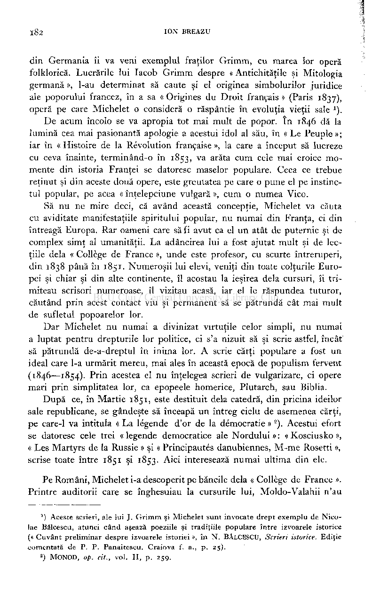

din Germania îi va veni exemplul fraţilor Grimm, cu marea lor operă folklorică. Lucrările lui Iacob Grimm despre « Antichităţile şi Mitologia germană », l-au determinat să caute şi el originea simbolurilor juridice ale poporului francez, în a sa «Origines du Droit français» (Paris 1837), operă pe care Michelet o consideră o răspântie în evoluţia vieţii sale ).

De acum încolo se va apropia tot mai mult de popor. în 1846 dă la

lumină cea mai pasionantă apologie a acestui idol al său, în « Le Peuple »; iar în « Histoire de la Révolution française », la care a început să lucreze cu ceva înainte, terminând-o în 1853, va arăta cum cele mai eroice momente din istoria Franţei se datoresc maselor populare. Ceea ce trebue reţinut şi din aceste două opere, este greutatea pe care o pune el pe instinctul popular, pe acea « înţelepciune vulgară », cum o numea Vico.

Să nu ne mire deci, că având această concepţie, Michelet va căuta cu aviditate manifestaţiile spiritului popular, nu numai din Franţa, ci din întreagă Europa. Rar oameni care să fi avut ca el un atât de puternic şi de complex simţ al umanităţii. La adâncirea lui a fost ajutat mult şi de lecţiile delà « Collège de France », unde este profesor, cu scurte întreruperi, din 1838 până în 1851. Numeroşii lui elevi, veniţi din toate colţurile Europei şi chiar şi din alte continente, îl acostau la ieşirea delà cursuri, îi trimiteau scrisori numeroase, îl vizitau acasă, iar el le răspundea tuturor, căutând prin acest contact viu şi permanent să se pătrundă cât mai mult de sufletul popoarelor lor.

Dar Michelet nu numai a divinizat virtuţile celor simpli, nu numai a luptat pentru drepturile lor politice, ci s'a nizuit să şi scrie astfel, încât să pătrundă de-a-dreptul în inima lor. A scrie cărţi populare a fost un ideal care 1-a urmărit mereu, mai ales în această epocă de populism fervent (1846—1854). Prin acestea el nu înţelegea scrieri de vulgarizare, ci opere mari prin simplitatea lor, ca epopeele homerice, Plutarch, sau Biblia.

După ce, în Martie 1851, este destituit delà catedră, din pricina ideilor sale republicane, se gândeşte să înceapă un întreg ciclu de asemenea cărţi, pe care-1 va intitula « La légende d'or de la démocratie »

). Acestui efort se datoresc cele trei « legende democratice ale Nordului » : « Kosciusko », « Les Martyrs de la Russie » şi « Principautés danubiennes, M-me Rosetti », scrise toate între 1851 şi 1853. Aici interesează numai ultima din ele.

2

Pe Români, Michelet i-a descoperit pe băncile delà « Collège de France ». Printre auditorii care se înghesuiau la cursurile lui, Moldo-Valahii n'au

### ) Aceste scrieri, ale lui J. Grimm şi Michelet sunt invocate drept exemplu de Nicolae Bălcescu, atunci când aşează poeziile şi tradiţiile populare între izvoarele istorice (« Cuvânt preliminar despre izvoarele istoriei », în N.BĂLCESCU Scrieri istorice. Ediţie comentată de P. P. Panaitescu. Craiova f. a., p. 25) .

1

###### ) MONOD, op. cit., vol. II, p. 259 .

2

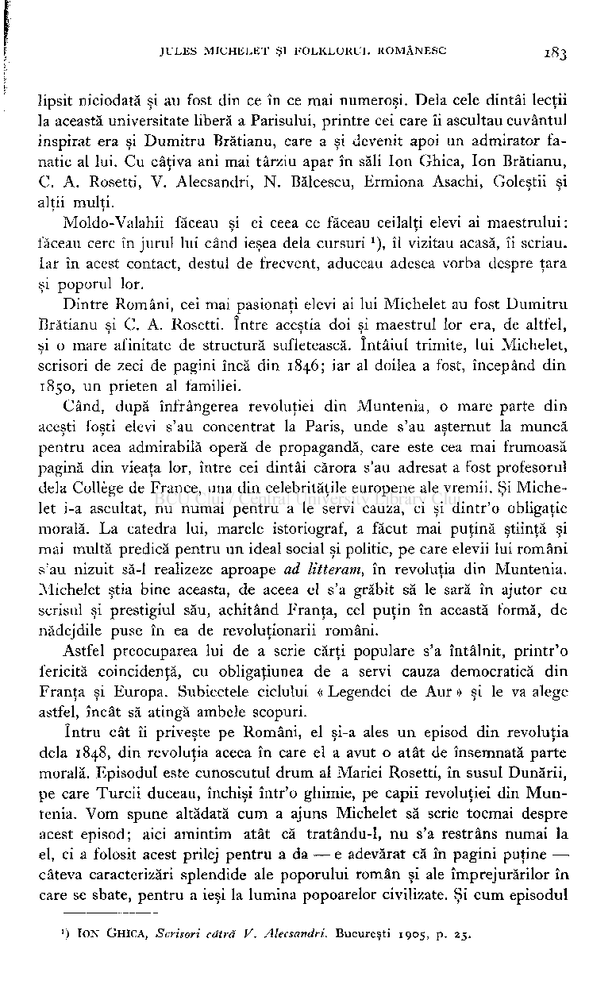

## JULES MICHELET ŞI FOLKLORUL ROMÂNESC l8

3

lipsit niciodată şi au fost din ce în ce mai numeroşi. Delà cele dintâi lecţii la această universitate liberă a Parisului, printre cei care îi ascultau cuvântul inspirat era şi Dumitru Brătianu, care a şi devenit apoi un admirator fanatic al lui. Cu câţiva ani mai târziu apar în săli Ion Ghica, Ion Brătianu, C. A. Rosetti, V. Alecsandri, N. Bălcescu, Ermiona Asachi, Goleştii şi alţii mulţi.

Moldo-Valahii făceau şi ei ceea ce făceau ceilalţi elevi ai maestrului : făceau cerc în jurul lui când ieşea delà cursuri

), îl vizitau acasă, îi scriau. Iar în acest contact, destul de frecvent, aduceau adesea vorba despre ţara şi poporul lor.

1

Dintre Români, cei mai pasionaţi elevi ai lui Michelet au fost Dumitru Brătianu şi C. A. Rosetti. între aceştia doi şi maestrul lor era, de altfel, şi o mare afinitate de structură sufletească. întâiul trimite, lui Michelet, scrisori de zeci de pagini încă din 1846; iar al doilea a fost, începând din 1850, un prieten al familiei.

Când, după înfrângerea revoluţiei din Muntenia, o mare parte din aceşti foşti elevi s'au concentrat la Paris, unde s'au aşternut la muncă pentru acea admirabilă operă de propagandă, care este cea mai frumoasă pagină din vieaţa lor, între cei dintâi cărora s'au adresat a fost profesorul delà Collège de France, una din celebrităţile europene ale vremii. Şi Michelet i-a ascultat, nu numai pentru a le servi cauza, ci şi dintr'o obligaţie morală. La catedra lui, marele istoriograf, a făcut mai puţină ştiinţă şi mai multă predică pentru un ideal social şi politic, pe care elevii lui români s'au nizuit să-1 realizeze aproape ad litteram, în revoluţia din Muntenia. Michelet ştia bine aceasta, de aceea el s'a grăbit să le sară în ajutor cu scrisul şi prestigiul său, achitând Franţa, cel puţin în această formă, de

- nădejdile puse în ea de revoluţionarii români. Astfel preocuparea lui de a scrie cărţi populare s'a întâlnit, printr'o

fericită coincidenţă, cu obligaţiunea de a servi cauza democratică din Franţa şi Europa. Subiectele ciclului « Legendei de Aur » şi le va alege astfel, încât să atingă ambele scopuri.

întru cât îi priveşte pe Români, el şi-a ales un episod din revoluţia delà 1848, din revoluţia aceea în care el a avut o atât de însemnată parte morală. Episodul este cunoscutul drum al Măriei Rosetti, în susul Dunării, pe care Turcii duceau, închişi într'o ghimie, pe capii revoluţiei din Muntenia. Vom spune altădată cum a ajuns Michelet să scrie tocmai despre acest episod; aici amintim atât că tratându-1, nu s'a restrâns numai la el, ci a folosit acest prilej pentru a da — e adevărat că în pagini puţine câteva caracterizări splendide ale poporului român şi ale împrejurărilor în care se sbate, pentru a ieşi la lumina popoarelor civilizate. Şi cum episodul

###### ) ION GHICA, Scrisori cătrâ V. Alecsandri. Bucureşti 1905 , p. 25 .

]

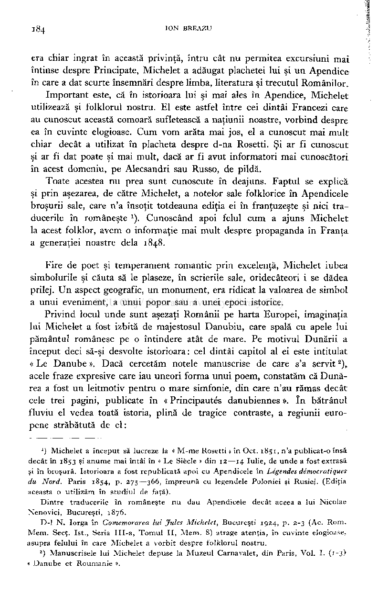

era chiar ingrat în această privinţă, întru cât nu permitea excursiuni mai întinse despre Principate, Michelet a adăugat plachetei lui şi un Apendice în care a dat scurte însemnări despre limba, literatura şi trecutul Românilor.

Important este, că în istorioara lui şi mai ales în Apendice, Michelet utilizează şi folklorul nostru. El este astfel între cei dintâi Francezi care au cunoscut această comoară sufletească a naţiunii noastre, vorbind despre ea în cuvinte elogioase. Cum vom arăta mai jos, el a cunoscut mai mult chiar decât a utilizat în placheta despre d-na Rosetti. Şi ar fi cunoscut şi ar fi dat poate şi mai mult, dacă ar fi avut informatori mai cunoscători în acest domeniu, pe Alecsandri sau Russo, de pildă.

Toate acestea nu prea sunt cunoscute în deajuns. Faptul se explică şi prin aşezarea, de către Michelet, a notelor sale folklorice în Apendicele broşurii sale, care n'a însoţit totdeauna ediţia ei în franţuzeşte şi nici traducerile în româneşte ). Cunoscând apoi felul cum a ajuns Michelet la acest folklor, avem o informaţie mai mult despre propaganda în Franţa a generaţiei noastre delà 1848.

Fire de poet şi temperament romantic prin excelenţă, Michelet iubea simbolurile şi căuta să le plaseze, în scrierile sale, oridecâteori i se dădea prilej. Un aspect geografic, un monument, era ridicat la valoarea de simbol a unui eveniment, a unui popor sau a unei epoci istorice.

Privind locul unde sunt aşezaţi Românii pe harta Europei, imaginaţia lui Michelet a fost izbită de majestosul Danubiu, care spală cu apele lui pământul românesc pe o întindere atât de mare. Pe motivul Dunării a început deci să-şi desvolte istorioara: cel dintâi capitol al ei este intitulat « Le Danube ». Dacă cercetăm notele manuscrise de care s'a servit

), acele fraze expresive care iau uneori forma unui poem, constatăm că Dunărea a fost un leitmotiv pentru o mare simfonie, din care n'au rămas decât cele trei pagini, publicate în « Principautés danubiennes ». în bătrânul fluviu el vedea toată istoria, plină de tragice contraste, a regiunii europene străbătută de el:

2

') Michelet a început să lucreze la « M-me Rosetti » în Oct. 1851 , n'a publicat-o însă decât în 1853 şi anume mai întâi în « Le Siècle » din 12—1 4 Iulie, de unde a fost extrasă şi în broşură. Istorioara a fost republicată apoi cu Apendicele în Légendes démocratiques du Nord. Paris 1854 p. 275—366 împreună cu legendele Poloniei şi Rusiei. (Ediţia aceasta o utilizăm în studiul de faţă).

Dintre traducerile în româneşte nu dau Apendicele decât aceea a lui Nicolae Nenovici, Bucureşti, 1876 .

D-l N. Iorga în Comemorarea lui Jules Michelet, Bucureşti 1924 , p. 2- 3 (Ac. Rom.

### Mem. Secţ. 1st., Seria III-a, Tomul II, Mem. 8) atrage atenţia, în cuvinte elogioase, asupra felului în care Michelet a vorbit despre folklorul nostru.

### ) Manuscrisele lui Michelet depuse la Muzeul Carnavalet, din Paris, Vol. I. (1-3 « Danube et Roumanie ».

2

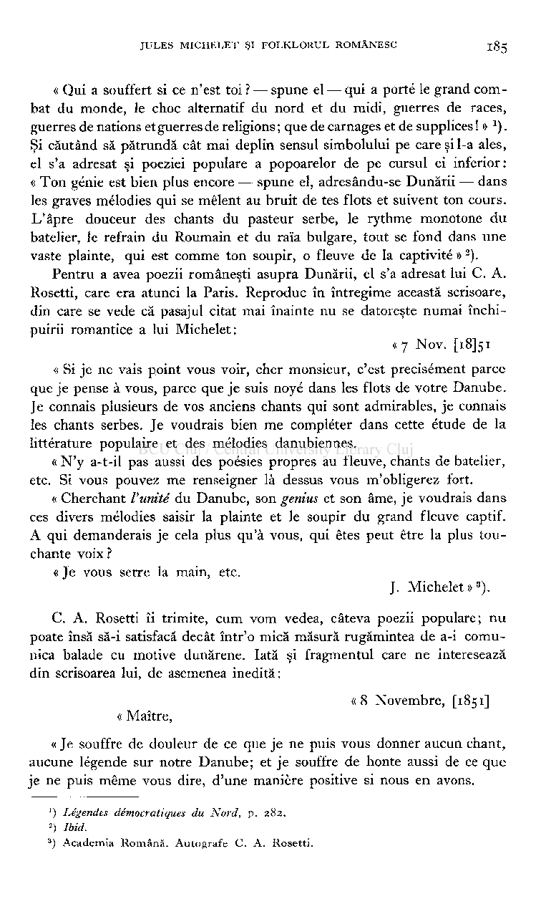

« Qui a souffert si ce n'est toi? — spune el — qui a porté le grand combat du monde, le choc alternatif du nord et du midi, guerres de races, guerres de nations et guerres de religions; que de carnages et de supplices! » ). Şi căutând să pătrundă cât mai deplin sensul simbolului pe care şi 1-a ales, el s'a adresat şi poeziei populare a popoarelor de pe cursul ei inferior: « Ton génie est bien plus encore — spune el, adresându-se Dunării — dans les graves mélodies qui se mêlent au bruit de tes flots et suivent ton cours. L'âpre douceur des chants du pasteur serbe, le rythme monotone du batelier, le refrain du Roumain et du raïa bulgare, tout se fond dans une vaste plainte, qui est comme ton soupir, o fleuve de la captivité »

).

2

Pentru a avea poezii româneşti asupra Dunării, el s'a adresat lui C. A. Rosetti, care era atunci la Paris. Reproduc în întregime această scrisoare, din care se vede că pasajul citat mai înainte nu se datoreşte numai închipuirii romantice a lui Michelet:

« 7 Nov. [i8J5i

« Si je ne vais point vous voir, cher monsieur, c'est précisément parce que je pense à vous, parce que je suis noyé dans les flots de votre Danube. Je connais plusieurs de vos anciens chants qui sont admirables, je connais les chants serbes. Je voudrais bien me compléter dans cette étude de la littérature populaire et des mélodies danubiennes.

« N'y a-t-il pas aussi des poésies propres au fleuve, chants de batelier, etc. Si vous pouvez me renseigner là dessus vous m'obligerez fort.

« Cherchant l'unité du Danube, son genius et son âme, je voudrais dans ces divers mélodies saisir la plainte et le soupir du grand fleuve captif. A qui demanderais je cela plus qu'à vous, qui êtes peut être la plus touchante voix ?

« Je vous serre la main, etc.

J. Michelet»

).

3

C. A. Rosetti îi trimite, cum vom vedea, câteva poezii populare; nu poate însă să-i satisfacă decât într'o mică măsură rugămintea de a-i comunica balade cu motive dunărene. Iată şi fragmentul care ne interesează din scrisoarea lui, de asemenea inedită:

« 8 Novembre, [1851] « Maître,

« Je souffre de douleur de ce que je ne puis vous donner aucun chant, aucune légende sur notre Danube; et je souffre de honte aussi de ce que je ne puis même vous dire, d'une manière positive si nous en avons.

') Légendes démocratiques du Nord, p . 282 .

-) Ibid.

### ) Academia Română. Autografe C. A. Rosetti.

3

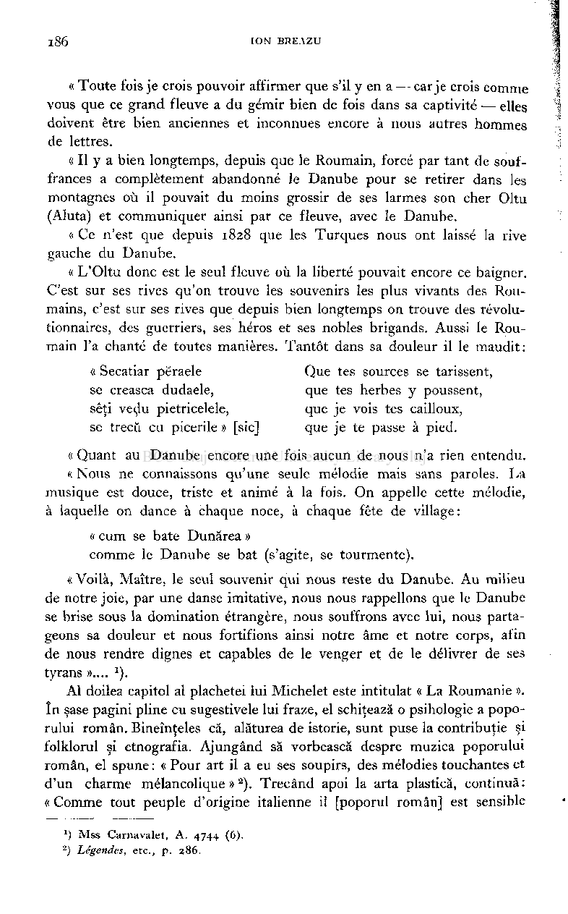

« Toute fois je crois pouvoir affirmer que s'il y en a — car je crois comme

vous que ce grand fleuve a du gémir bien de fois dans sa captivité — elles doivent être bien anciennes et inconnues encore à nous autres hommes de lettres.

« Il y a bien longtemps, depuis que le Roumain, forcé par tant de souf­

frances a complètement abandonné le Danube pour se retirer dans les montagnes où il pouvait du moins grossir de ses larmes son cher Oltu (Aluta) et communiquer ainsi par ce fleuve, avec le Danube.

« Ce n'est que depuis 1828 que les Turques nous ont laissé la rive gauche du Danube.

« L'Oltu donc est le seul fleuve où la liberté pouvait encore ce baigner.

C'est sur ses rives qu'on trouve les souvenirs les plus vivants des Roumains, c'est sur ses rives que depuis bien longtemps on trouve des révolutionnaires, des guerriers, ses héros et ses nobles brigands. Aussi le Roumain l'a chanté de toutes manières. Tantôt dans sa douleur il le maudit:

« Secatiar përaele Que tes sources se tarissent, se crească dudaele, que tes herbes y poussent, sêti vedu pietricelele, que je vois tes cailloux, se trecû eu picerile » [sic] que je te passe à pied.

« Quant au Danube encore une fois aucun de nous n'a rien entendu. « Nous ne connaissons qu'une seule mélodie mais sans paroles. La

musique est douce, triste et animé à la fois. On appelle cette mélodie, à laquelle on dance à chaque noce, à chaque fête de village :

« cum se bate Dunărea » comme le Danube se bat (s'agite, se tourmente).

«Voilà, Maître, le seul souvenir qui nous reste du Danube. Au milieu de notre joie, par une danse imitative, nous nous rappelions que le Danube se brise sous la domination étrangère, nous souffrons avec lui, nous partageons sa douleur et nous fortifions ainsi notre âme et notre corps, afin de nous rendre dignes et capables de le venger et de le délivrer de ses tyrans ».... ).

Al doilea capitol al plachetei lui Michelet este intitulat « La Roumanie ». In şase pagini pline cu sugestivele lui fraze, el schiţează o psihologie a poporului român. Bineînţeles că, alăturea de istorie, sunt puse la contribuţie şi folklorul şi etnografia. Ajungând să vorbească despre muzica poporului român, el spune: «Pour art il a eu ses soupirs, des mélodies touchantes et d'un charme mélancolique »

). Trecând apoi la arta plastică, continuă : « Comme tout peuple d'origine italienne il [poporul român] est sensible

2

') Mss Carnavalet, A. 4744 (6).

###### ) Légendes, etc., p. 286.

2

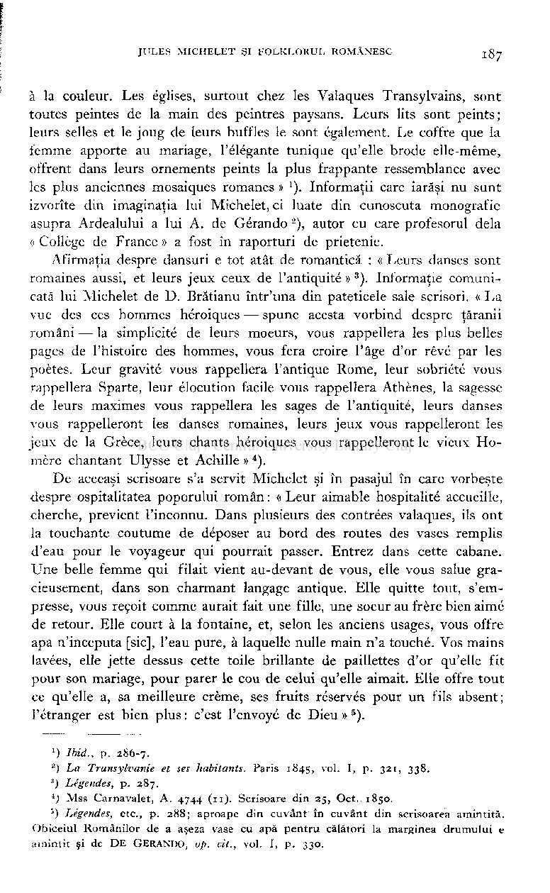

à la couleur. Les églises, surtout chez les Valaques Transylvains, sont toutes peintes de la main des peintres paysans. Leurs lits sont peints; leurs selles et le joug de leurs buffles le sont également. Le coffre que la femme apporte au mariage, l'élégante tunique qu'elle brode elle-même, offrent dans leurs ornements peints la plus frappante ressemblance avec les plus anciennes mosaiques romanes »

). Informaţii care iarăşi nu sunt izvorîte din imaginaţia lui Michelet, ci luate din cunoscuta monografie asupra Ardealului a lui A. de Gérando ), autor cu care profesorul delà « Collège de France » a fost în raporturi de prietenie.

]

Afirmaţia despre dansuri e tot atât de romantică : « Leurs danses sont romaines aussi, et leurs jeux ceux de l'antiquité »

). Informaţie comunicată lui Michelet de D. Brătianu într'una din pateticele sale scrisori. « La vue des ces hommes héroiques — spune acesta vorbind despre ţăranii români — la simplicité de leurs moeurs, vous rappellera les plus belles pages de l'histoire des hommes, vous fera croire l'âge d'or rêvé par les poètes. Leur gravité vous rappellera l'antique Rome, leur sobriété vous rappellera Sparte, leur elocution facile vous rappellera Athènes, la sagesse de leurs maximes vous rappellera les sages de l'antiquité, leurs danses vous rappelleront les danses romaines, leurs jeux vous rappelleront les jeux de la Grèce, leurs chants héroiques vous rappelleront le vieux Homère chantant Ulysse et Achille »

3

).

4

De aceeaşi scrisoare s'a servit Michelet şi în pasajul în care vorbeşte despre ospitalitatea poporului român : « Leur aimable hospitalité accueille, cherche, prévient l'inconnu. Dans plusieurs des contrées valaques, ils ont la touchante coutume de déposer au bord des routes des vases remplis d'eau pour le voyageur qui pourrait passer. Entrez dans cette cabane. Une belle femme qui filait vient au-devant de vous, elle vous salue gracieusement, dans son charmant langage antique. Elle quitte tout, s'empresse, vous reçoit comme aurait fait une fille, une soeur au frère bien aimé de retour. Elle court à la fontaine, et, selon les anciens usages, vous offre apa n'inceputa [sic], l'eau pure, à laquelle nulle main n'a touché. Vos mains lavées, elle jette dessus cette toile brillante de paillettes d'or qu'elle fit pour son mariage, pour parer le cou de celui qu'elle aimait. Elle offre tout ce qu'elle a, sa meilleure crème, ses fruits réservés pour un fils absent; l'étranger est bien plus: c'est l'envoyé de Dieu»

).

5

') Ibid., p. 286-7 .

- 2

) La Transylvanie et ses habitants. Paris 1845 , vol. I , p. 321 , 338

- 3 ) Légendes, p. 287 .
- 4

### ) Mss Carnavalet, A. 4744 (11) Scrisoare din 25 , Oct. 1850.

) Légendes, etc., p. 288 ; aproape din cuvant în cuvânt din scrisoarea amintită. Obiceiul Românilor de a aşeza vase cu apă pentru călători la marginea drumului e amintit şi deD E GERANDO , op. cit., vol.I, p. 330.

y

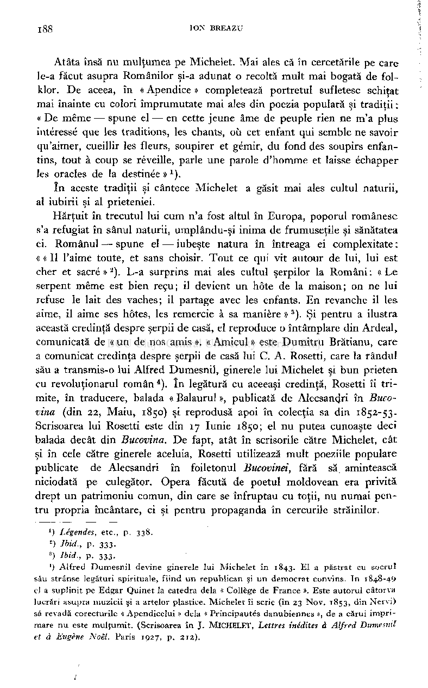

Atâta însă nu mulţumea pe Michelet. Mai ales că în cercetările pe care le-a făcut asupra Românilor şi-a adunat o recoltă mult mai bogată de folklor. De aceea, în « Apendice » completează portretul sufletesc schiţat mai înainte cu colori împrumutate mai ales din poezia populară şi tradiţii : « De même — spune el — en cette jeune âme de peuple rien ne m'a plus intéressé que les traditions, les chants, où cet enfant qui semble ne savoir qu'aimer, cueillir les fleurs, soupirer et gémir, du fond des soupirs enfantins, tout à coup se réveille, parle une parole d'homme et laisse échapper les oracles de la destinée »

).

x

în aceste tradiţii şi cântece Michelet a găsit mai ales cultul naturii, al iubirii şi al prieteniei.

Hărţuit în trecutul lui cum n'a fost altul în Europa, poporul românesc s'a refugiat în sânul naturii, umplându-şi inima de frumuseţile şi sănătatea ei. Românul — spune el — iubeşte natura în întreaga ei complexitate : « « Il l'aime toute, et sans choisir. Tout ce qui vit autour de lui, lui est cher et sacré»

). L-a surprins mai ales cultul şerpilor la Romani: «Le serpent même est bien reçu; il devient un hôte de la maison; on ne lui refuse le lait des vaches; il partage avec les enfants. En revanche il les aime, il aime ses hôtes, les remercie à sa manière »

2

). Şi pentru a ilustra această credinţă despre şerpii de casă, el reproduce o întâmplare din Ardeal, comunicată de « un de nos amis ». « Amicul » este Dumitru Brătianu, care a comunicat credinţa despre şerpii de casă lui C. A. Rosetti, care la rândul său a transmis-o lui Alfred Dumesnil, ginerele lui Michelet şi bun prieten cu revoluţionarul român ). în legătură cu aceeaşi credinţă, Rosetti îi trimite, în traducere, balada « Balaurul », publicată de Alecsandri în Bucovina (din 22, Maiu, 1850) şi reprodusă apoi în colecţia sa din 1852-53. Scrisoarea lui Rosetti este din 17 Iunie 1850; el nu putea cunoaşte deci balada decât din Bucovina. De fapt, atât în scrisorile către Michelet, cât şi în cele către ginerele aceluia, Rosetti utilizează mult poeziile populare publicate de Alecsandri în foiletonul Bucovinei, fără să amintească niciodată pe culegător. Opera făcută de poetul moldovean era privită drept un patrimoniu comun, din care se înfruptau cu toţii, nu numai pentru propria încântare, ci şi pentru propaganda în cercurile străinilor.

3

) Légendes, etc., p. 338 .

x

- 2 ) Ibid., p. 333 .
- 3 ) Ibid., p. 333 . ') Alfred Dumesnil devine ginerele lui Michelet în 1843. El a păstrat cu socrul

său strânse legături spirituale, fiind un republican şi un democrat convins. In 1848-49 el a suplinit pe Edgar Quinet la catedra delà « Collège de France ». Este autorul câtorva lucrări asupra muzicii şi a artelor plastice. Michelet îi scrie (în 2 3 Nov. 1853, din Nervi) sâ revadă corecturile « Apendicelui » delà « Principautés danubiennes », de a cărui imprimare nu este mulţumit. (Scrisoarea înJ . MICHELET , Lettres inédites à Alfred Dumesnil

et à Eugène Noël. Paris 1927 , p. 212) .

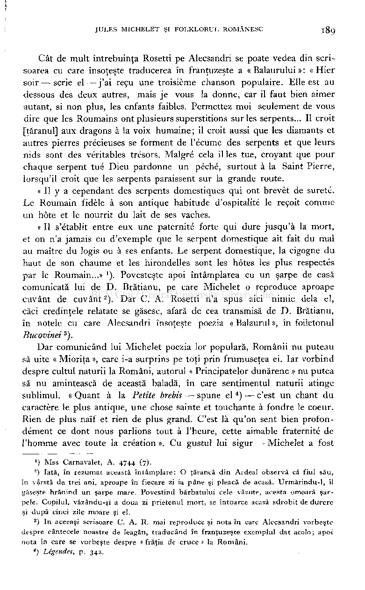

Cât de mult întrebuinţa Rosetti pe Alecsandri se poate vedea din scrisoarea cu care însoţeşte traducerea în franţuzeşte a « Balaurului » : « Hier soir — scrie el—j'ai reçu une troisième chanson populaire. Elle est au dessous des deux autres, mais je vous la donne, car il faut bien aimer autant, si non plus, les enfants faibles. Permettez moi seulement de vous dire que les Roumains ont plusieurs superstitions sur les serpents... Il croit [ţăranul] aux dragons à la voix humaine; il croit aussi que les diamants et autres pierres précieuses se forment de l'écume des serpents et que leurs nids sont des véritables trésors. Malgré cela il les tue, croyant que pour chaque serpent tué Dieu pardonne un péché, surtout à la Saint Pierre, lorsqu'il croit que les serpents paraissent sur la grande route.

« Il y a cependant des serpents domestiques qui ont brevet de sûreté. Le Roumain fidèle à son antique habitude d'ospitalité le reçoit comme un hôte et le nourrit du lait de ses vaches.

« Il s'établit entre eux une paternité forte qui dure jusqu'à la mort, et on n'a jamais eu d'exemple que le serpent domestique ait fait du mal au maître du logis ou à ses enfants. Le serpent domestique, la cigogne du haut de son chaume et les hirondelles sont les hôtes les plus respectés par le Roumain...» Povesteşte apoi întâmplarea cu un şarpe de casă comunicată lui de D. Brătianu, pe care Michelet o reproduce aproape cuvânt de cuvânt

). Dar C. A. Rosetti n'a spus aici nimic delà el, căci credinţele relatate se găsesc, afară de cea transmisă de D. Brătianu, în notele cu care Alecsandri însoţeşte poezia « Balaurul », în foiletonul Bucovinei

2

).

3

Dar comunicând lui Michelet poezia lor populară, Românii nu puteau să uite « Mioriţa », care i-a surprins pe toţi prin frumuseţea ei. Iar vorbind despre cultul naturii la Români, autorul « Principatelor dunărene » nu putea să nu amintească de această baladă, în care sentimentul naturii atinge sublimul. « Quant à la Petite brebis — spune el

) — c'est un chant du caractère le plus antique, une chose sainte et touchante à fondre le coeur. Rien de plus naïf et rien de plus grand. C'est là qu'on sent bien profondément ce dont nous parlions tout à l'heure, cette aimable fraternité de l'homme avec toute la création». Cu gustul lui sigur — Michelet a fost

4

) Mss Carnavalet, A. 4744 (7).

J

-) Iată, în rezumat această întâmplare: O ţărancă din Ardeal observă că fiul său, în vârstă de trei ani, aproape în fiecare zi ia pâne şi pleacă de acasă. Urmărindu-1, îl găseşte hrănind un şarpe mare. Povestind bărbatului cele văzute, acesta omoară şarpele. Copilul, văzându-şi a doua zi prietenul mort, se întoarce acasă sdrobit de durere şi după cinci zile moare şi el.

) In aceeaşi scrisoare C. A. R. mai reproduce şi nota în care Alecsandri vorbeşte despre cântecele noastre de leagăn, traducând în franţuzeşte exemplul dat acolo; apoi nota în care se vorbeşte despre « frăţia de cruce » la Români.

3

*) Légendes, p . 342 .

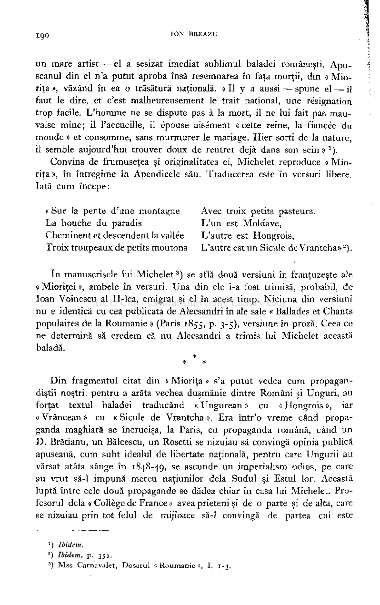

un mare artist — el a sesizat imediat sublimul baladei româneşti. Apuseanul din el n'a putut aproba însă resemnarea în faţa morţii, din « Mioriţa », văzând în ea o trăsătură naţională. « Il y a aussi — spune el — il faut le dire, et c'est malheureusement le trait national, une résignation trop facile. L'homme ne se dispute pas à la mort, il ne lui fait pas mauvaise mine ; il l'accueille, il épouse aisément « cette reine, la fiancée du monde » et consomme, sans murmurer le mariage. Hier sorti de la nature, il semble aujourd'hui trouver doux de rentrer déjà dans son sein »

).

1

Convins de frumuseţea şi originalitatea ei, Michelet reproduce « Mioriţa », în întregime în Apendicele său. Traducerea este în versuri libere. Iată cum începe:

« Sur la pente d'une montagne Avec troix petits pasteurs. La bouche du paradis L'un est Moldave, Cheminent et descendent la vallée L'autre est Hongrois, Troix troupeaux de petits moutons L'autre est un Sicule de Vrantcha» -).

) se află două versiuni în franţuzeşte ale « Mioriţei », ambele în versuri. Una din ele i-a fost trimisă, probabil, de loan Voinescu al II-lea, emigrat şi el în acest timp. Niciuna din versiuni nu e identică cu cea publicată de Alecsandri în ale sale « Ballades et Chants populaires de la Roumanie » (Paris 1855, p. 3-5), versiune în proză. Ceea ce ne determină să credem că nu Alecsandri a trimis lui Michelet această baladă.

ïn manuscrisele lui Michelet

3

* *

Din fragmentul citat din « Mioriţa » s'a putut vedea cum propagandiştii noştri, pentru a arăta vechea duşmănie dintre Români şi Unguri, au forţat textul baladei traducând « Ungurean » cu « Hongrois », iar « Vrâncean » cu « Sicule de Vrantcha ». Era într'o vreme când propaganda maghiară se încrucişa, la Paris, cu propaganda română, când un D. Brătianu, un Bălcescu, un Rosetti se nizuiau să convingă opinia publică apuseană, cum subt idealul de libertate naţională, pentru care Ungurii au vărsat atâta sânge în 1848-49, se ascunde un imperialism odios, pe care au vrut să-1 impună mereu naţiunilor delà Sudul şi Estul lor. Această luptă între cele două propagande se dădea chiar în casa lui Michelet. Profesorul delà « Collège de France » avea prieteni şi de o parte şi de alta, care se nizuiau prin tot felul de mijloace să-1 convingă de partea cui este

- 1 ) Ibidem.
- 2 ) Ibidem, p. 351 .
- 3

### ) Mss Carnavalet, Dosarul « Roumanie », I. 1-3

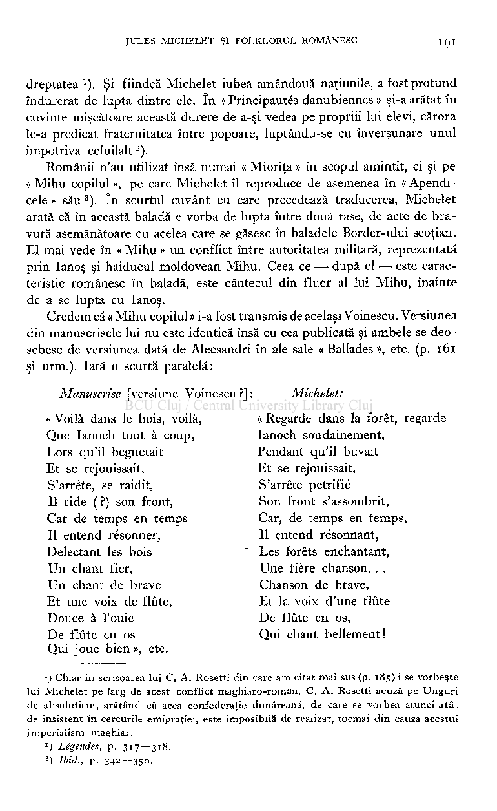

dreptatea ). Şi fiindcă Michelet iubea amândouă naţiunile, a fost profund îndurerat de lupta dintre ele. în « Principautés danubiennes » şi-a arătat în cuvinte mişcătoare această durere de a-şi vedea pe propriii lui elevi, cărora le-a predicat fraternitatea între popoare, luptându-se cu înverşunare unul împotriva celuilalt

).

2

Românii n'au utilizat însă numai « Mioriţa » în scopul amintit, ci şi pe « Mihu copilul », pe care Michelet îl reproduce de asemenea în « Apendicele » său ). în scurtul cuvânt cu care precedează traducerea, Michelet arată că în această baladă e vorba de lupta între două rase, de acte de bravură asemănătoare cu acelea care se găsesc în baladele Border-ului scoţian. El mai vede în « Mihu » un conflict între autoritatea militară, reprezentată prin Ianoş şi haiducul moldovean Mihu. Ceea ce — după el —• este caracteristic românesc în baladă, este cântecul din fluer al lui Mihu, înainte de a se lupta cu Ianoş.

Credem că « Mihu copilul » i-a fost transmis de acelaşi Voinescu. Versiunea din manuscrisele lui nu este identică însă cu cea publicată şi ambele se deosebesc de versiunea dată de Alecsandri în ale sale « Ballades », etc. (p. 161 şi urm.). Iată o scurtă paralelă:

Michelet:

Manuscrise [versiune Voinescu ?] :

« Regarde dans la forêt, regarde Ianoch soudainement, Pendant qu'il buvait Et se rejouissait, S'arrête pétrifié Son front s'assombrit, Car, de temps en temps, Il entend résonnant, Les forêts enchantant, Une fière chanson. . . Chanson de brave, Et la voix d'une flûte De flûte en os, Qui chant bellement!

« Voilà dans le bois, voilà, Que Ianoch tout à coup, Lors qu'il beguetait Et se rejouissait, S'arrête, se raidit, Il ride ( ?) son front, Car de temps en temps Il entend résonner, Délectant les bois Un chant fier, Un chant de brave Et une voix de flûte, Douce à l'ouie De flûte en os Qui joue bien », etc.

') Chiar în scrisoarea lui C. A. Rosetti din care am citat mai sus (p. 185 ) i se vorbeşte lui Michelet pe larg de acest conflict maghiaro-român. C. A. Rosetti acuză pe Unguri de absolutism, arătând că acea confederaţie dunăreană, de care se vorbea atunci atât de insistent în cercurile emigraţiei, este imposibilă de realizat, tocmai din cauza acestui imperialism maghiar.

- 2 ) Légendes, p. 31 7 — 318 .
- 3 ) Ibid., p. 342--350 .

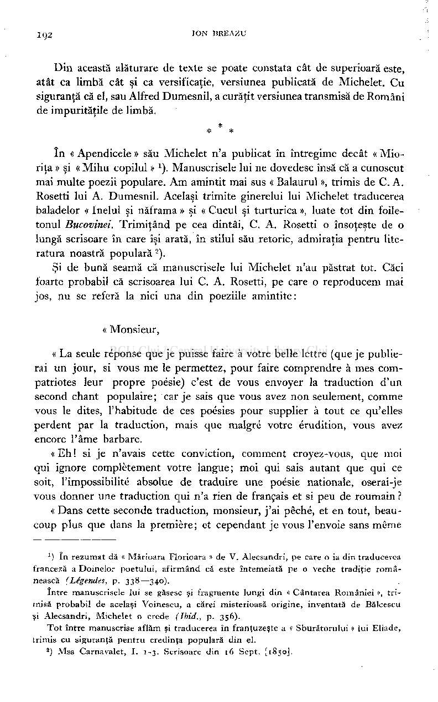

Din această alăturare de texte se poate constata cât de superioară este, atât ca limbă cât şi ca versificaţie, versiunea publicată de Michelet. Cu siguranţă că el, sau Alfred Dumesnil, a curăţit versiunea transmisă de Români de impurităţile de limbă.

* * *

în « Apendicele » său Michelet n'a publicat în întregime decât « Mioriţa » şi « Mihu copilul »

). Manuscrisele lui ne dovedesc însă că a cunoscut mai multe poezii populare. Am amintit mai sus « Balaurul », trimis de C. A. Rosetti lui A. Dumesnil. Acelaşi trimite ginerelui lui Michelet traducerea baladelor « Inelul şi năframa » şi « Cucul şi turturica », luate tot din foiletonul Bucovinei. Trimiţând pe cea dintâi, C. A. Rosetti o însoţeşte de o lungă scrisoare în care îşi arată, în stilul său retoric, admiraţia pentru literatura noastră populară ).

1

Şi de bună seamă că manuscrisele lui Michelet n'au păstrat tot. Căci foarte probabil că scrisoarea lui C. A. Rosetti, pe care o reproducem mai jos, nu se referă la nici una din poeziile amintite:

« Monsieur,

« La seule réponse que je puisse faire à votre belle lettre (que je publierai un jour, si vous me le permettez, pour faire comprendre à mes compatriotes leur propre poésie) c'est de vous envoyer la traduction d'un second chant populaire ; car je sais que vous avez non seulement, comme vous le dites, l'habitude de ces poésies pour supplier à tout ce qu'elles perdent par la traduction, mais que malgré votre érudition, vous avez encore l'âme barbare.

« Eh ! si je n'avais cette conviction, comment croyez-vous, que moi qui ignore complètement votre langue; moi qui sais autant que qui ce soit, l'impossibilité absolue de traduire une poésie nationale, oserai-je vous donner une traduction qui n'a rien de français et si peu de roumain ?

« Dans cette seconde traduction, monsieur, j'ai péché, et en tout, beaucoup plus que dans la première; et cependant je vous l'envoie sans même

*) în rezumat dă « Mărioara Florioara » de V. Alecsandri, pe care o ia din traducerea franceză a Doinelor poetului, afirmând că este întemeiată pe o veche tradiţie românească (Légendes, p. 338—340).

între manuscrisele lui se găsesc şi fragmente lungi din « Cântarea României », trimisă probabil de acelaşi Voinescu, a cărei misterioasă origine, inventată de Bălcescu şi Alecsandri, Michelet o crede (Ibid., p. 356).

Tot între manuscrise aflăm şi traducerea în franţuzeşte a « Sburătorului » lui Eliade, trimis cu siguranţă pentru credinţa populară din el.

### ) Mss Carnavalet, I. 1-3 . Scrisoare din 16 Sept. [1850].

2

