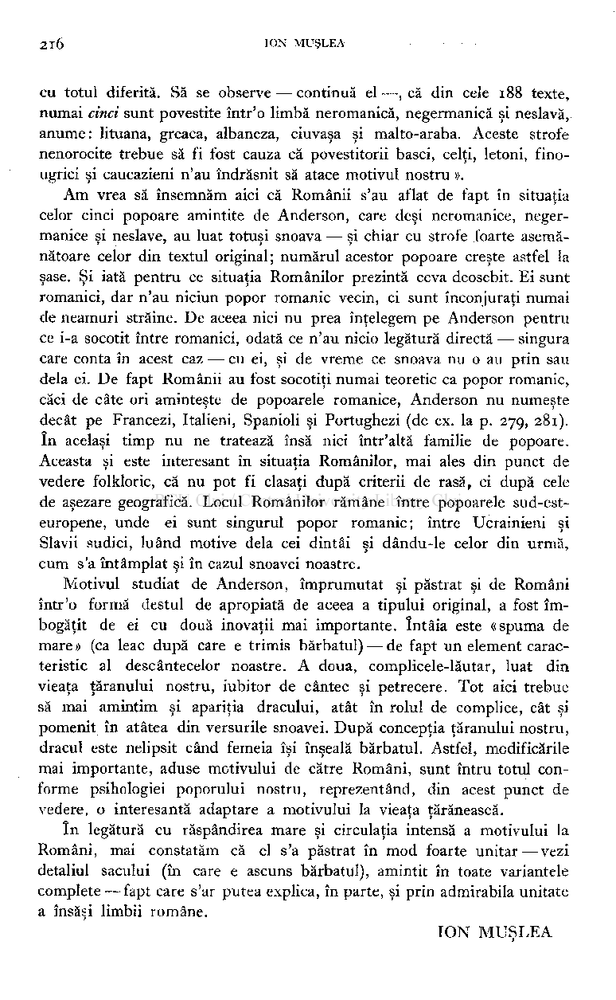
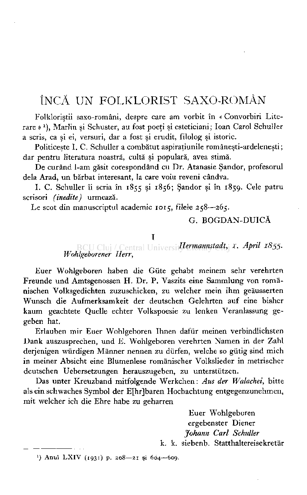
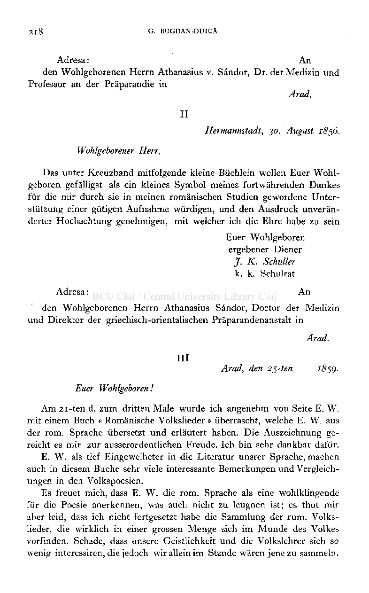
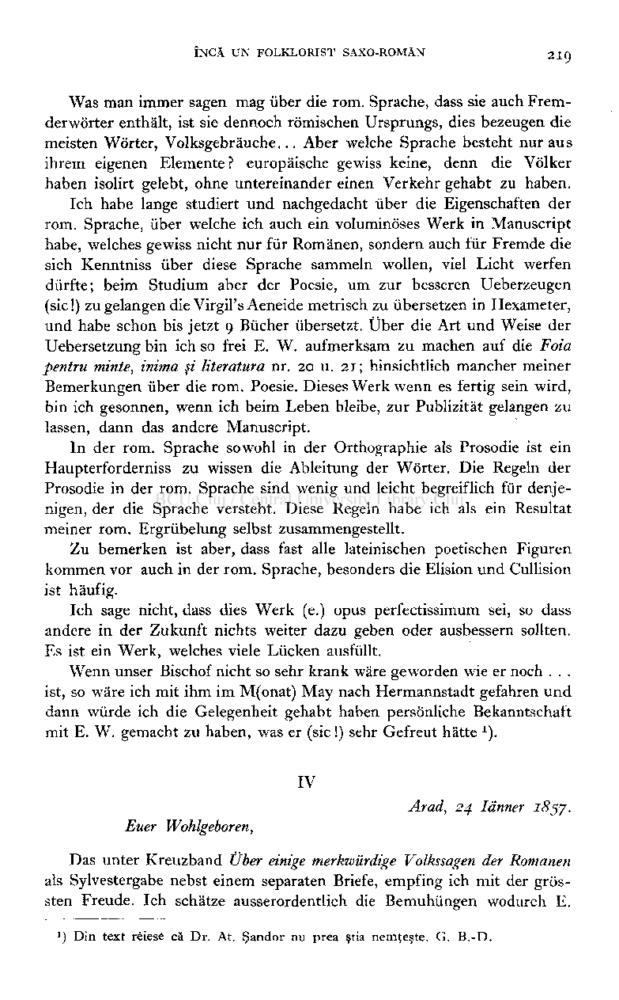

cu totul diferită. Să se observe — continuă el—, că din cele 188 texte, numai cinci sunt povestite într'o limbă neromanică, negermanică şi neslavă, anume: lituana, greaca, albaneza, ciuvaşa şi malto-araba. Aceste strofe nenorocite trebue să fi fost cauza că povestitorii basci, celţi, letoni, finougrici şi caucazieni n'au îndrăsnit să atace motivul nostru ».

Am vrea să însemnăm aici că Românii s'au aflat de fapt în situaţia celor cinci popoare amintite de Anderson, care deşi neromanice, negermanice şi neslave, au luat totuşi snoava — şi chiar cu strofe foarte asemănătoare celor din textul original; numărul acestor popoare creşte astfel la şase. Şi iată pentru ce situaţia Românilor prezintă ceva deosebit. Ei sunt romanici, dar n'au niciun popor romanic vecin, ci sunt înconjuraţi numai de neamuri străine. De aceea nici nu prea înţelegem pe Anderson pentru ce i-a socotit între romanici, odată ce n'au nicio legătură directă — singura care conta în acest caz — cu ei, şi de vreme ce snoava nu o au prin sau delà ei. De fapt Românii au fost socotiţi numai teoretic ca popor romanic, căci de câte ori aminteşte de popoarele romanice, Anderson nu numeşte decât pe Francezi, Italieni, Spanioli şi Portughezi (de ex. la p. 279, 281). în acelaşi timp nu ne tratează însă nici într'altă familie de popoare. Aceasta şi este interesant în situaţia Românilor, mai ales din punct de vedere folkloric, că nu pot fi clasaţi după criterii de rasă, ci după cele de aşezare geografică. Locul Românilor rămâne între popoarele sud-esteuropene, unde ei sunt singurul popor romanic; între Ucrainieni şi Slavii sudici, luând motive delà cei dintâi şi dându-le celor din urmă, cum s'a întâmplat şi în cazul snoavei noastre.

Motivul studiat de Anderson, împrumutat şi păstrat şi de Români într'o formă destul de apropiată de aceea a tipului original, a fost îmbogăţit de ei cu două inovaţii mai importante. întâia este «spuma de mare» (ca leac după care e trimis bărbatul) — de fapt un element caracteristic al descântecelor noastre. A doua, complicele-lăutar, luat din vieaţa ţăranului nostru, iubitor de cântec şi petrecere. Tot aici trebue să mai amintim şi apariţia dracului, atât în rolul de complice, cât şi pomenit în atâtea din versurile snoavei. După concepţia ţăranului nostru, dracul este nelipsit când femeia îşi înşeală bărbatul. Astfel, modificările mai importante, aduse motivului de către Români, sunt întru totul conforme psihologiei poporului nostru, reprezentând, din acest punct de vedere, o interesantă adaptare a motivului la vieaţa ţărănească.

în legătură cu răspândirea mare şi circulaţia intensă a motivului la Români, mai constatăm că el s'a păstrat în mod foarte unitar — vezi detaliul sacului (în care e ascuns bărbatul), amintit în toate variantele complete-—fapt care s'ar putea explica, în parte, şi prin admirabila unitate a însăşi limbii române.

ION MUŞLEA

# ÎNCĂ UN FOLKLORIST SAXO-ROMÀN

Folkloriştii saxo-români, despre care am vorbit în « Convorbiri Literare »

), Marlin şi Schuster, au fost poeţi şi esteticiani ; loan Carol Schuller a scris, ca şi ei, versuri, dar a fost şi erudit, filolog şi istoric.

1

Politiceşte I. C. Schuller a combătut aspiraţiunile româneşti-ardeleneşti; dar pentru literatura noastră, cultă şi populară, avea stimă.

De curând l-am găsit corespondând cu Dr. Atanasie Şandor, profesorul delà Arad, un bărbat interesant, la care voiu reveni cândva.

I. C. Schuller îi scria în 1855 şi 1856; Şandor şi în 1859. Cele patru scrisori (inedite) urmează.

Le scot din manuscriptul academic 1015, filele 258—265.

G. BOGDAN-DUICĂ I

Hermannstadt, 1. April 1855. Wohlgeborener H err,

Euer Wohlgeboren haben die Giite gehabt meinem sehr verehrten Freunde und Amtsgenossen H. Dr. P. Vaszits eine Sammlung von românischen Volksgedichten zuzuschicken, zu welcher mein ihm geăusserten Wunsch die Aufmerksamkeit der deutschen Gelehrten auf eine bisher kaum geachtete Quelle echter Volkspoesie zu lenken Veranlassung gegeben hat.

Erlauben mir Euer Wohlgeboren Ihnen dafur meinen verbindlichsten Dank auszusprechen, und E. Wohlgeboren verehrten Namen in der Zahl derjenigen wurdigen Manner nennen zu diirfen, welche so giitig sind mich in meiner Absicht eine Blumenlese romănischer Volkslieder in metrischer deutschen Uebersetzungen herauszugeben, zu unterstutzen.

Das unter Kreuzband mitfolgende Werkchen: Aus der Walachei, bitte als ein schwaches Symbol der E[hr]baren Hochachtung entgegenzunehmen, mit welcher ich die Ehre habe zu geharren

Euer Wohlgeboren ergebenster Diener Johann Carl Schuller k. k. siebenb. Statthaltereisekretăr

') Anul LXIV (1931) p. 208—2 1 şi 604—609.

Adresa : An

den Wohlgeborenen Herrn Athanasius v. Sândor, Dr. der Medizin und Professor an der Prâparandie in

Arad. II

Hermannstadt, 30. August 1856. Wohlgeborener Herr,

Das unter Kreuzband mitfolgende kleine Bûchlein wollen Euer Wohlgeboren gefălligst als ein kleines Symbol meines fortwăhrenden Dankes fur die mir durch sie in meinen românischen Studien gewordene Unterstutzung einer gutigen Aufnahme wurdigen, und den Ausdruck unverănderter Hochachtung genehmigen, mit welcher ich die Ehre habe zu sein

Euer Wohlgeboren ergebener Diener J. K. Schuller k. k. Schulrat

Adresa : An

den Wohlgeborenen Herrn Athanasius Sândor, Doctor der Medizin und Direktor der griechisch-orientalischen Prâparandenanstalt in

Arad. III

Arad, den 25-ten 185g. Euer Wohlgeboren!

Am 21-ten d. zum dritten Male wurde ich angenehm von Seite E. W. mit einem Buch « Românische Volkslieder » ùberrascht, welche E. W. aus der rom. Sprache iibersetzt und erlăutert haben. Die Auszeichnung gereicht es mir zur ausserordentlichen Freude. Ich bin sehr dankbar dafur.

E. W. als tief Eingeweiheter in die Literatur unsrer Sprache, machen auch in diesem Buche sehr viele intéressante Bemerkungen und Vergleichungen in den Volkspoesien.

Es freuet mich, dass E. W. die rom. Sprache als eine wohlklingende fur die Poésie anerkennen, was auch nicht zu leugnen ist; es thut mir aber leid, dass ich nicht fortgesetzt habe die Sammlung der rum. Volkslieder, die wirklich in einer grossen Menge sich im Munde des Volkes vorfinden. Schade, dass unsere Geistlichkeit und die Volkslehrer sich so wenig interessiren, die jedoch wiralleinim Stande wăren jenezu sammeln.

Was man immer sagen mag uber die rom. Sprache, dass sie auch Fremderwôrter enthălt, ist sie dennoch rômischen Ursprungs, dies bezeugen die meisten Worter, Volksgebrăuche... Aber welche Sprache besteht nur au s ihrem eigenen Elemente? europăische gewiss keine, denn die Vôlker haben isolirt gelebt, ohne untereinander einen Verkehr gehabt zu haben.

Ich habe lange studiert und nachgedacht uber die Eigenschaften der rom. Sprache, uber welche ich auch ein voluminôses Werk in Manuscript habe, welches gewiss nicht nur fur Romănen, sondern auch fur Fremde die sich Kenntniss iiber diese Sprache sammeln wollen, viel Licht werfen diirfte; beim Studium aber der Poésie, um zur besseren Ueberzeugen (sic !) zu gelangen die Virgil's Aeneide metrisch zu iibersetzen in Hexameter, und habe schon bis jetzt 9 Biicher ubersetzt. Uber die Art und Weise der Uebersetzung bin ich so frei E. W. aufmerksam zu machen auf die Foia pentru minte, inima şi literatura nr. 20 u. 21 ; hinsichtlich mancher meiner Bemerkungen iiber die rom. Poésie. Dieses Werk wenn es fertig sein wird, bin ich gesonnen, wenn ich beim Leben bleibe, zur Publizităt gelangen zu lassen, dann das andere Manuscript.

In der rom. Sprache sowohl in der Orthographie als Prosodie ist ein Haupterforderniss zu wissen die Ableitung der Worter. Die Regeln der Prosodie in der rom. Sprache sind wenig und leicht begreiflich fur denjenigen, der die Sprache versteht. Diese Regeln habe ich als ein Résultat meiner rom. Ergrubelung selbst zusammengestellt.

Zu bemerken ist aber, dass fast aile lateinischen poetischen Figuren kommen vor auch in der rom. Sprache, besonders die Elision und Cullision ist hăufig.

Ich sage nicht, dass dies Werk (e.) opus perfectissimum sei, so dass andere in der Zukunft nichts weiter dazu geben oder ausbessern sollten. Es ist ein Werk, welches viele Lucken ausfullt.

Wenn unser Bischof nicht so sehr krank ware geworden wie er noch . . . ist, so ware ich mit ihm im M(onat) May nach Hermannstadt gefahren und dann wiirde ich die Gelegenheit gehabt haben persônliche Bekanntschaft mit E. W. gemacht zu haben, was er (sic !) sehr Gefreut hătte ).

IV

Arad, 24 Iănner i8^y. Euer Wohlgeboren,

Das unter Kreuzband Uber einige merkwurdige Volkssagen der Romanen als Sylvestergabe nebst einem separaten Briefe, empfing ich mit der grôssten Freude. Ich schătze ausserordentlich die Bemuhùngen wodurch E.

## ) Din text reiese că Dr. At. Şandor nu prea ştia nemţeşte. G. B.-D.

1

