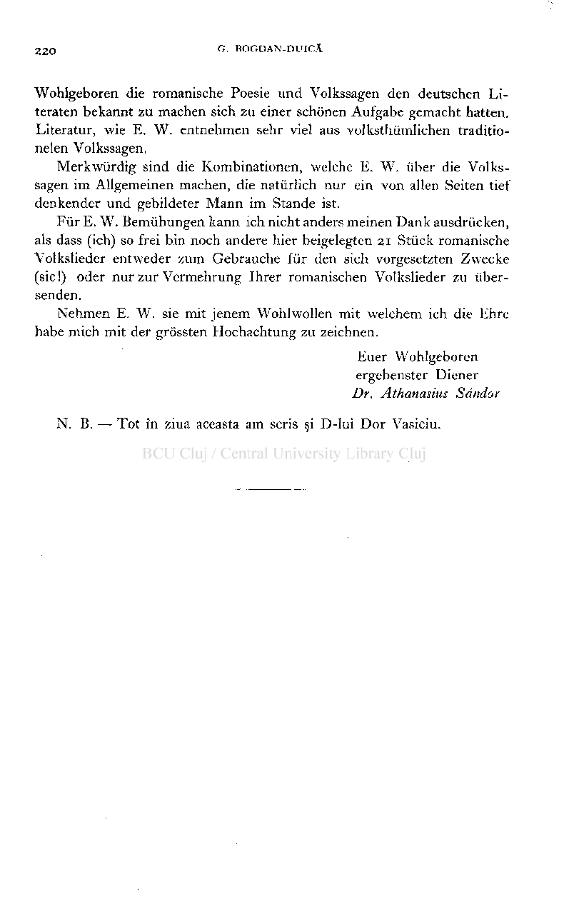
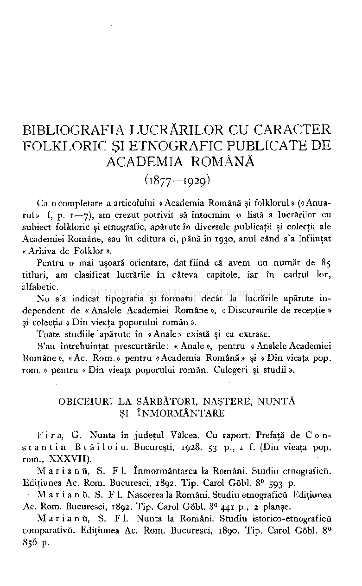
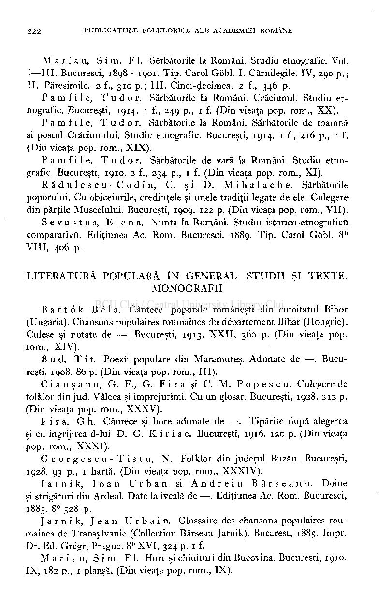
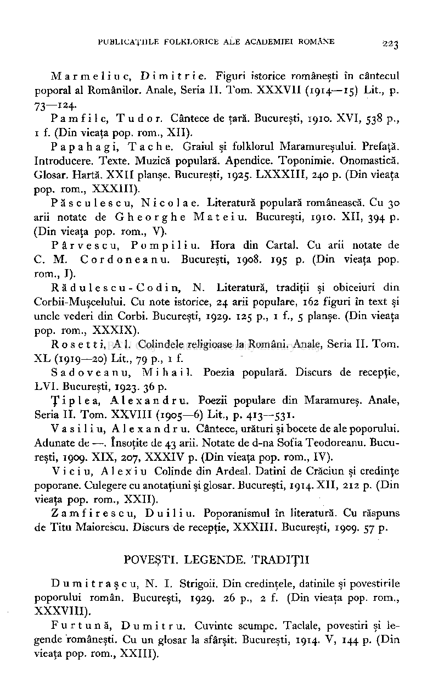
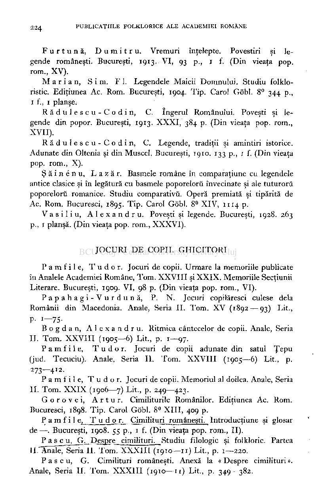
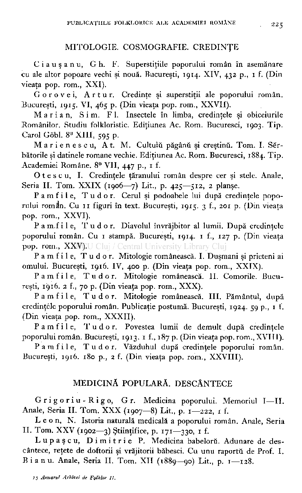
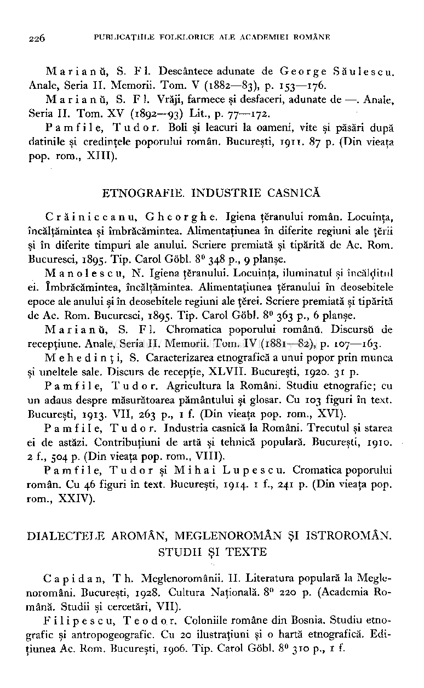
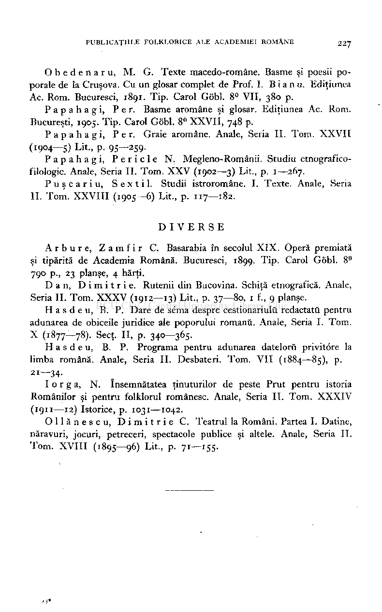

Wohlgeboren die romanische Poésie und Volkssagen den deutschen Literaten bekannt zu machen sich zu einer schônen Aufgabe gemacht hatten. Literatur, wie E. W. entnehmen sehr viel aus volksthumlichen traditionelen Volkssagen.

Merkwùrdig sind die Kombinationen, welche E. W. ùber die Volkssagen im Allgemeinen machen, die natùrlich nur ein von alien Seiten tief denkender und gebildeter Mann im Stande ist.

Fur E. W. Bemùhungen kann ich nicht anders meinen Dank ausdrûcken, als dass (ich) so frei bin noch andere hier beigelegten 21 Stuck romanische Volkslieder entweder zum Gebrauche fur den sich vorgesetzten Zwecke (sic!) oder nur zur Vermehrung Ihrer romanischen Volkslieder zu iibersenden.

Nehmen E. W. sie mit jenem Wohlwollen mit vvelchem ich die Ehre habe mich mit der grôssten Hochachtung zu zeichnen.

Euer Wohlgeboren ergebenster Diener

Dr. Athanasius Sdndor N. B. — Tot în ziua aceasta am scris şi D-lui Dor Vasiciu.

BIBLIOGRAFIA LUCRĂRILOR CU CARACTER FOLKLORIC ŞI ETNOGRAFIC PUBLICATE DE

ACADEMIA ROMÂNĂ (1877—1929)

Ca o completare a articolului «Academia Română şi folklorul» («Anuarul» I, p. 1—7), am crezut potrivit să întocmim o listă a lucrărilor cu subiect folkloric şi etnografic, apărute în diversele publicaţii şi colecţii ale Academiei Române, sau în editura ei, până în 1930, anul când s'a înfiinţat « Arhiva de Folklor ».

Pentru o mai uşoară orientare, dat fiind că avem un număr de 85 titluri, am clasificat lucrările în câteva capitole, iar în cadrul lor, alfabetic.

Nu s'a indicat tipografia şi formatul decât la lucrările apărute independent de « Analele Academiei Române », « Discursurile de recepţie » şi colecţia « Din vieaţa poporului român ».

Toate studiile apărute în «Anale» există şi ca extrase. S'au întrebuinţat prescurtările : « Anale », pentru « Analele Academiei

Române», «Ac. Rom.» pentru «Academia Română» şi « Din vieaţa pop. rom. » pentru « Din vieaţa poporului român. Culegeri şi studii ».

OBICEIURI LA SĂRBĂTORI, NAŞTERE, NUNTĂ ŞI ÎNMORMÂNTARE

F i r a, G. Nunta în judeţul Vâlcea. Cu raport. Prefaţă de Con stanti n Brăiloiu . Bucureşti, 1928. 53 p., 1 f. (Din vieaţa pop. rom., XXXVII).

M a r i a n û, S. FI. înmormântarea la Români. Studiu etnograficù. Ediţiunea Ac. Rom. Bucuresci, 1892. Tip. Carol Gobi. 8° 593 p.

M a r i a n û, S. F 1. Nascerea la Români. Studiu etnograficù. Ediţiunea Ac. Rom. Bucuresci, 1892. Tip. Carol Gobi. 8° 441 p., 2 planşe.

M a r i a n ù, S. F 1. Nunta la Români. Studiu istorico-etnograficû comparativû. Ediţiunea Ac. Rom. Bucuresci, 1890. Tip. Carol Gobi. 8° 856 p.

Marian , Sim . FI. Serbătorile la Români. Studiu etnografic. Voi. I—III. Bucuresci, 1898—1901. Tip. Carol Gobi. I. Cârnilegile. IV, 290 p.; II. Păresimile. 2 f., 310 p.; III. Cinci-decimea. 2 f., 346 p.

Pamfile , Tudor . Sărbătorile la Români. Crăciunul. Studiu etnografic. Bucureşti, 1914. 1 f., 249 p., 1 f. (Din vieaţa pop. rom., XX).

Pamfile , Tudor . Sărbătorile la Români. Sărbătorile de toamnă şi postul Crăciunului. Studiu etnografic. Bucureşti, 1914. 1 f., 216 p., 1 f. (Din vieaţa pop. rom., XIX).

Pamfile , Tudor . Sărbătorile de vară la Români. Studiu etnografic. Bucureşti, 1910. 2 f., 234 p., 1 f. (Din vieaţa pop. rom., XI).

Rădulescu-Codin , C. şi D. Mihalache . Sărbătorile poporului. Cu obiceiurile, credinţele şi unele tradiţii legate de ele. Culegere din părţile Muscelului. Bucureşti, 1909. 122 p. (Din vieaţa pop. rom., VII).

Sevastos , Elena . Nunta la Români. Studiu istorico-etnograficu comparativii. Ediţiunea Ac. Rom. Bucuresci, 1889. Tip. Carol Gobi. 8°

- VIII, 406 p.

LITERATURĂ POPULARĂ ÎN GENERAL. STUDII ŞI TEXTE. MONOGRAFII

Barto k Be l a. Cântece poporale româneşti din comitatul Bihor (Ungaria). Chansons populaires roumaines du département Bihar (Hongrie). Culese şi notate de —. Bucureşti, 1913. XXII, 360 p. (Din vieaţa pop. rom., XIV).

Bud, Tit . Poezii populare din Maramureş. Adunate de —. Bucureşti, 1908. 86 p. (Din vieaţa pop. rom., III).

C i a u ş a n u, G. F., G. F i r a şi C. M. P o p e s c u. Culegere de folklor din jud. Vâlcea şi împrejurimi. Cu un glosar. Bucureşti, 1928. 212 p. (Din vieaţa pop. rom., XXXV).

F i r a, G h. Cântece şi hore adunate de —. Tipărite după alegerea şi cu îngrijirea d-lui D. G. K i r i a c. Bucureşti, 1916. 120 p. (Din vieaţa pop. rom., XXXI).

Georgescu-Tistu , N. Folklor din judeţul Buzău. Bucureşti,

1928. 93 p., 1 hartă. (Din vieaţa pop. rom., XXXIV).

Iarnik , loa n Urba n şi Andrei u Bârseanu . Doine şi strigături din Ardeal. Date la iveală de —. Ediţiunea Ac. Rom. Bucuresci,

1885. 8° 528 p.

Jarnik , Jea n Urbain . Glossaire des chansons populaires roumaines de Transylvanie (Collection Bârsean-Jarnik). Bucarest, 1885. Impr. Dr. Ed. Grégr, Prague. 8° XVI, 324 p. 1 f.

Marian , Sim . FI. Hore şi chiuituri din Bucovina. Bucureşti, 1910.

- IX, 182 p., 1 planşă. (Din vieaţa pop. rom., IX).

Marmeliuc , Dimitrie . Figuri istorice româneşti în cântecul poporal al Românilor. Anale, Seria II. Tom. XXXVII (1914—15) Lit., p. 73—124-

Pamfile , Tudor . Cântece de ţară. Bucureşti, 1910. XVI, 538 p.,

- 1 f. (Din vieaţa pop. rom., XII). Papahagi , Tache . Graiul şi folklorul Maramureşului. Prefaţă.

Introducere. Texte. Muzică populară. Apendice. Toponimie. Onomastică. Glosar. Hartă. XXII planşe. Bucureşti, 1925. LXXXIII, 240 p. (Din vieaţa pop. rom., XXXIII).

Păsculescu , Nicol a e. Literatură populară românească. Cu 30 arii notate de Gheorgh e Mate i u. Bucureşti, 1910. XII, 394 p. (Din vieaţa pop. rom., V).

Pârvescu , Pompiliu . Hora din Cartai. Cu arii notate de C. M. Cordoneanu . Bucureşti, 1908. 195 p. (Din vieaţa pop. rom., I).

Rădulescu-Codin , N. Literatură, tradiţii şi obiceiuri din Corbii-Muşcelului. Cu note istorice, 24 arii populare, 162 figuri în text şi unele vederi din Corbi. Bucureşti, 1929. 125 p., 1 f., 5 planşe. (Din vieaţa pop. rom., XXXIX).

Rosetti , Al. Colindele religioase la Români. Anale, Seria II. Tom. XL (1919—20) Lit., 79 p., i f.

Sadoveanu , Mihail . Poezia populară. Diseurs de recepţie, LVI. Bucureşti, 1923. 36 p.

Ţipl e a, Alexandru . Poezii populare din Maramureş. Anale,

- Seria II. Tom. XXVIII (1905—6) Lit., p. 413—531. Vasiliu , Alexandru . Cântece, uraturi şi bocete de ale poporului.

Adunate de —. însoţite de 43 arii. Notate de d-na Sofia Teodoreanu. Bucureşti, 1909. XIX, 207, XXXIV p. (Din vieaţa pop. rom., IV).

Viciu , Alexi u Colinde din Ardeal. Datini de Crăciun şi credinţe poporane. Culegere cu anotaţiuni şi glosar. Bucureşti, 1914. XII, 212 p. (Din

- vieaţa pop. rom., XXII). Zamfirescu , Duiliu . Poporanismul în literatură. Cu răspuns

de Titu Maiorescu. Discurs de recepţie, XXXIII. Bucureşti, 1909. 57 p.

POVEŞTI. LEGENDE. TRADIŢII

D u m i t r a ş c u, N. I. Strigoii. Din credinţele, datinile şi povestirile poporului român. Bucureşti, 1929. 26 p., 2 f. (Din vieaţa pop. rom., XXXVIII).

Furtună , Dumitru . Cuvinte scumpe. Taclale, povestiri şi legende româneşti. Cu un glosar la sfârşit. Bucureşti, 1914. V, 144 p. (Din

- vieaţa pop. rom., XXIII).

Furtună , Dumitru . Vremuri înţelepte. Povestiri şi legende româneşti. Bucureşti, 1913. VI, 93 p., 1 f. (Din vieaţa pop. rom., XV).

Marian , Sim . FI. Legendele Maicii Domnului. Studiu folkloristic. Ediţiunea Ac. Rom. Bucureşti, 1904. Tip. Carol Gobi. 8° 344 p., i f., i planşe.

Rădulescu-Codin , C. îngerul Românului. Poveşti şi legende din popor. Bucureşti, 1913. XXXI, 384 p. (Din vieaţa pop. rom., XVII).

Rădulescu-Codin , C. Legende, tradiţii şi amintiri istorice. Adunate din Oltenia şi din Muscel. Bucureşti, 1910. 133 p., 1 f. (Din vieaţa pop. rom., X).

Şăinenu , Lazăr . Basmele române în comparaţiune cu legendele antice clasice şi în legătură cu basmele poporeloru învecinate şi ale tuturoru poporelorû romanice. Studiu comparativă. Operă premiată şi tipărită de Ac. Rom. Bucuresci, 1895. Tip. Carol Gobi. 8° XIV, 1114 p.'

Vasiliu , Alexandru . Poveşti şi legende. Bucureşti, 1928. 263 p., 1 planşă. (Din vieaţa pop. rom., XXXVI).

JOCURI DE COPII. GHICITORI

P a m f i 1 e, T u d o r. Jocuri de copii. Urmare la memoriile publicate în Analele Academiei Române, Tom. XXVIII şi XXIX. Memoriile Secţiunii Literare. Bucureşti, 1909. VI, 98 p. (Din vieaţa pop. rom., VI).

Papahagi-Vurdună , P. N. Jocuri copilăresci culese delà Românii din Macedonia. Anale, Seria II. Tom. XV (1892 — 93) Lit., P- 1—75-

Bogdan , Alexandru . Ritmica cântecelor de copii. Anale, Seria

- II. Tom. XXVIII (1905—6) Lit., p. 1—97. Pamfile , Tudor . Jocuri de copii adunate din satul Ţepu

(jud. Tecuciu). Anale, Seria II. Tom. XXVIII (1905—6) Lit., p. 273—4

- 1
- 2.

Pamfile , Tudor . Jocuri de copii. Memoriul al doilea. Anale, Seria

- II. Tom. XXIX (1906—7) Lit., p. 249—423. Gorovei , Artur . Cimiliturile Românilor. Ediţiunea Ac. Rom.

Bucuresci, 1898. Tip. Carol Gobi. 8° XIII, 409 p.

P a m f i 1 e, T u d or. Cimilituri româneşti. Introducţiune şi glosar de —. Bucureşti, 1908. 55 p., 1 f. (Din vieaţa pop. rom., II).

P a s c u, G .Despre cimilituri. Studiu filologic şi folkloric. Partea II. Anale, Seria II. Tom. XXXIII (1910—11) Lit., p. 1—220.

P a s c u, G. Cimilituri româneşti. Anexă la « Despre cimilituri ». Anale, Seria II. Tom. XXXIII (1910—11) Lit., p. 349—382.

MITOLOGIE. COSMOGRAFIE. CREDINŢE

C i a u ş a n u, G h. F. Superstiţiile poporului român în asemănare cu ale altor popoare vechi şi nouă. Bucureşti, 1914. XIV, 432 p., 1 f. (Din vieaţa pop. rom., XXI).

Gorovei , Artur . Credinţe şi superstiţii ale poporului român.

- Bucureşti, 1915. VI, 465 p. (Din vieaţa pop. rom., XXVII). Marian , Sim . FI. Insectele în limba, credinţele şi obiceiurile

Românilor. Studiu folkloristic. Ediţiunea Ac. Rom. Bucuresci, 1903. Tip. Carol Gobi. 8° XIII, 595 p.

Marienescu , At. M. Cultulû păgânii şi creştinii. Tom. I. Sărbătorile şi datinele romane vechie. Ediţiunea Ac. Rom. Bucuresci, 1884. Tip. Academiei Române. 8° VII, 447 p., 1 f.

O t e s c u, I. Credinţele ţăranului român despre cer şi stele. Anale, Seria II. Tom. XXIX (1906—7) Lit., p. 425—512, 2 planşe.

Pamfile , Tudor . Cerul şi podoabele lui după credinţele poporului româ'n. Cu 11 figuri în text. Bucureşti, 1915. 3 f., 201 p. (Din vieaţa pop. rom., XXVI).

P a m,f i 1 e, Tudor . Diavolul învrăjbitor al lumii. După credinţele poporului român. Cu 1 stampă. Bucureşti, 1914. 1 f., 127 p. (Din vieaţa pop. rom., XXV).

- Pamfile , Tudor . Mitologie românească. I. Duşmani şi prieteni ai

omului. Bucureşti, 1916. IV, 400 p. (Din vieaţa pop. rom., XXIX).

- Pamfile , Tudor . Mitologie românească. II. Comorile. Bucu­

reşti, 1916. 2 f., 70 p. (Din vieaţa pop. rom., XXX).

- Pamfile , Tudor . Mitologie românească. III. Pământul, după

credinţele poporului român. Publicaţie postumă. Bucureşti, 1924. 59 p., 1 f. (Din vieaţa pop. rom., XXXII).

Pamfile , Tudor . Povestea lumii de demult după credinţele poporului român. Bucureşti, 1913. 1 f., 187 p. (Din vieaţa pop. rom., XVIII). Pamfile , Tudor . Văzduhul după credinţele poporului român.

- Bucureşti, 1916. 180 p., 2 f. (Din vieaţa pop. rom., XXVIII).

MEDICINĂ POPULARĂ. DESCÂNTECE

Grigoriu-Rigo , Gr. Medicina poporului. Memoriul I—II. Anale, Seria II. Tom. XXX (1907—8) Lit., p. 1—222, 1 f.

Leon , N. Istoria naturală medicală a poporului român. Anale, Seria II. Tom. XXV (1902—3) Ştiinţifice, p. 171—330, 1 f.

Lupaşcu , Dimitri e P. Medicina babeloru. Adunare de descântece, reţete de doftorii şi vrăjitorii băbesci. Cu unu raportù de Prof. I. Bianu . Anale, Seria II. Tom. XII (1889—90) Lit., p. 1—128.

Marianû , S. FI . Descântece adunate de Georg e Săulescu . Anale, Seria II. Memorii. Tom. V (1882—83), p. 153—176.

M a r i a n û, S. FI . Vrăji, farmece şi desfaceri, adunate de —. Anale,

Seria II. Tom. XV (1892—93) Lit., p. 77—172.

Pamfile , Tudor . Boli şi leacuri la oameni, vite şi păsări după datinile şi credinţele poporului român. Bucureşti, 1911. 87 p. (Din vieaţa pop. rom., XIII).

ETNOGRAFIE. INDUSTRIE CASNICĂ

Crăiniceanu , Gheorghe . Igiena ţăranului român. Locuinţa, încălţămintea şi îmbrăcămintea. Alimentaţiunea în diferite regiuni ale terii şi în diferite timpuri ale anului. Scriere premiată şi tipărită de Ac. Rom. Bucuresci, 1895. Tip. Carol Gobi. 8° 348 p., 9 planşe.

Manolescu , N. Igiena ţăranului. Locuinţa, iluminatul şi încălditul ei. îmbrăcămintea, încălţămintea. Alimentaţiunea ţeranului în deosebitele epoce ale anului şi în deosebitele regiuni ale ţerei. Scriere premiată şi tipărită de Ac. Rom. Bucuresci, 1895. Tip. Carol Gobi. 8° 363 p., 6 planşe.

Marianû , S. FI . Chromatica poporului românù. Discursû de recepţiune. Anale, Seria IL Memorii. Tom. IV (1881—82), p. 107—163.

Mehedinţi , S. Caracterizarea etnografică a unui popor prin munca şi uneltele sale. Discurs de recepţie, XLVII. Bucureşti, 1920. 31p

Pamfile , Tudor . Agricultura la Români. Studiu etnografic ; cu un adaus despre măsurătoarea pământului şi glosar. Cu 103 figuri în text. Bucureşti, 1913. VII, 263 p., 1 f. (Din vieaţa pop. rom., XVI).

Pamfile , Tudor . Industria casnică la Români. Trecutul şi starea ei de astăzi. Contribuţiuni de artă şi tehnică populară. Bucureşti, 1910.

- 2 f., 504 p. (Din vieaţa pop. rom., VIII). Pamfile , Tudo r şi Miha i Lupes c u. Cromatica poporului

român. Cu 46 figuri în text. Bucureşti, 1914. 1 f., 241 p. (Din vieaţa pop. rom., XXIV).

DIALECTELE AROMÂN, MEGLENOROMÂN ŞI ISTROROMÂN. STUDII ŞI TEXTE

C a p i d a n, T h. Meglenoromânii. II. Literatura populară la Meglenoromâni. Bucureşti, 1928. Cultura Naţională. 8° 220 p. (Academia Română. Studii şi cercetări, VII).

Filipescu , Teodor . Coloniile române din Bosnia. Studiu etnografic şi antropogeografic. Cu 20 ilustraţiuni şi o hartă etnografică. Ediţiunea Ac. Rom. Bucureşti, 1906. Tip. Carol Gobi. 8° 310 p., 1 f.

Obedenaru , M. G. Texte macedo-române. Basme şi poesii poporale de la Cruşova. Cu un glosar complet de Prof. I. B i a n u. Ediţiunea Ac. Rom. Bucuresci, 1891. Tip. Carol Gobi. 8° VII, 380 p.

Papahagi , Per . Basme aromâne şi glosar. Ediţiunea Ac. Rom. Bucureşti, 1905. Tip. Carol Gobi. 8° XXVII, 748 p.

Papahagi , Per . Graie aromâne. Anale, Seria II. Tom. XXVII (1904—5) Lit., p. 95—259.

Papahagi , Pericl e N. Megleno-Românii. Studiu etnograficofilologic. Anale, Seria II. Tom. XXV (1902—3) Lit., p. 1—267.

Puşcariu , Sextil . Studii istroromâne. I. Texte. Anale, Seria II. Tom. XXVIII (1905—6) Lit., p. 117—182.

DIVERS E

Arbure , Zamfi r C. Basarabia în secolul XIX. Operă premiată şi tipărită de Academia Română. Bucuresci, 1899. Tip. Carol Gobi. 8° 790 p., 23 planşe, 4 hărţi.

Dan , Dimitrie . Rutenii din Bucovina. Schiţă etnografică. Anale, Seria II. Tom. XXXV (1912—13) Lit., p. 37—80, 1 f., 9 planşe.

H a s d e u, B. P. Dare de séma despre cestionariulu redactaţii pentru adunarea de obiceile juridice ale poporului romanu. Anale, Seria I. Tom. X (1877-78). Sect. II, p. 340-365.

- H a s d e u, B. P. Programa pentru adunarea datelorû privitôre la limba română. Anale, Seria II. Desbateri. Tom. VII (1884—85), p. 21—34-
- I o r g a, N. însemnătatea ţinuturilor de peste Prut pentru istoria Românilor şi pentru folklorul românesc. Anale, Seria II. Tom. XXXIV (1911—12) Istorice, p. 1031—1042.

Ollănescu , Dimitri e C. Teatrul la Români. Partea I. Datine, năravuri, jocuri, petreceri, spectacole publice şi altele. Anale, Seria II. Tom. XVIII (1895—96) Lit., p. 71—155.

