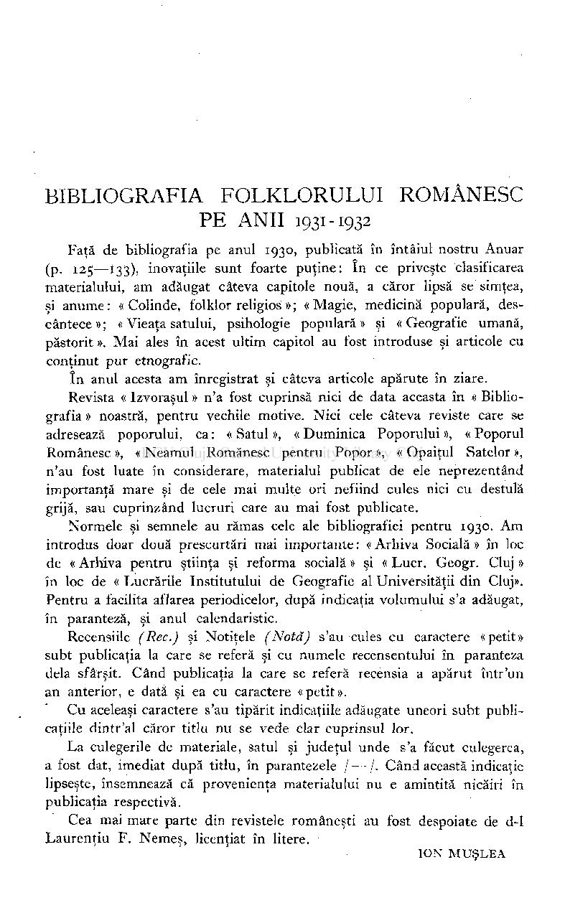

# BIBLIOGRAFIA FOLKLORULUI ROMANESC PE ANII 1931-1932

Faţă de bibliografia pe anul 1930, publicată în întâiul nostru Anuar (p. 125—133), inovaţiile sunt foarte puţine: în ce priveşte clasificarea materialului, am adăugat câteva capitole nouă, a căror lipsă se simţea, şi anume: «Colinde, folklor religios »; «Magie, medicină populară, descântece»; « Vieaţa satului, psihologie populară» şi «Geografie umană, păstorit ». Mai ales în acest ultim capitol au fost introduse şi articole cu conţinut pur etnografic.

în anul acesta am înregistrat şi câteva articole apărute în ziare. Revista « Izvoraşul » n'a fost cuprinsă nici de data aceasta în « Bibliografia » noastră, pentru vechile motive. Nici cele câteva reviste care se adresează poporului, ca : « Satul », « Duminica Poporului », « Poporul Românesc », « Neamul Romanesc pentru Popor », « Opaiţul Satelor », n'au fost luate în considerare, materialul publicat de ele neprezentând importanţă mare şi de cele mai multe ori nefiind cules nici cu destulă grijă, sau cuprinzând lucruri care au mai fost publicate.

Normele şi semnele au rămas cele ale bibliografiei pentru 1930. Am introdus doar două prescurtări mai importante : « Arhiva Socială » în loc de « Arhiva pentru ştiinţa şi reforma socială » şi « Lucr. Geogr. Cluj » în loc de « Lucrările Institutului de Geografie al Universităţii din Cluj». Pentru a facilita aflarea periodicelor, după indicaţia volumului s'a adăugat, în paranteză, şi anul calendaristic.

Recensiile (Rec.) şi Notiţele (Notă) s'au cules cu caractere «petit» subt publicaţia Ia care se referă şi cu numele recensentului în paranteza delà sfârşit. Când publicaţia la care se referă recensia a apărut într'un an anterior, e dată şi ea cu caractere «petit».

Cu aceleaşi caractere s'au tipărit indicaţiile adăugate uneori subt publicaţiile dintr'al căror titlu nu se vede clar cuprinsul lor.

La culegerile de materiale, satul şi judeţul unde s'a făcut culegerea, a fost dat, imediat după titlu, în parantezele / — /. Când această indicaţie lipseşte, însemnează că provenienţa materialului nu e amintită nicăiri în publicaţia respectivă.

Cea mai mare parte din revistele româneşti au fost despoiate de d-1 Laurenţiu F. Nemeş, licenţiat în litere.

#### ION MUŞLEA

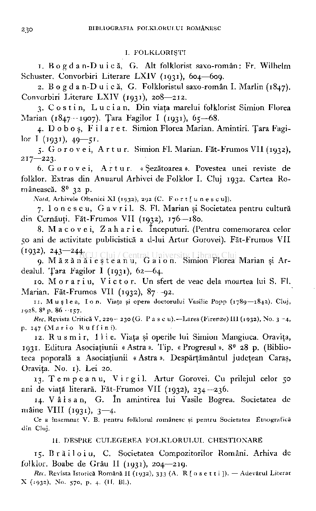

#### I. FOLKLORIŞTI

- 1. B o g d a n-D u i c ă, G. Alt folklorist saxo-român: Fr. Wilhelm

Schuster. Convorbiri Literare LXIV (1931), 604—609.

- 2. B o g d a n-D u i c ă, G. Folkloristul saxo-român I. Marlin (1847).

Convorbiri Literare LXIV (1931), 208—212.

- 3. C o s t i n, Lucian . Din viaţa marelui folklorist Simion Florea

Marian (1847—1907). Ţara Fagilor I (1931), 65—68.

- 4. Doboş , F i 1 a r e t. Simion Florea Marian. Amintiri. Ţara Fagi­

lor I (1931), 49—51.

- 5. Gorovei , Artur . Simion FI. Marian. Făt-Frumos VII (1932),

217—223.

- 6. G o r o v e i, Artur . « Şezătoarea ». Povestea unei reviste de

folklor. Extras din Anuarul Arhivei de Folklor I. Cluj 1932. Cartea Românească. 8° 32 p.

Notă. Arhivele Olteniei XI (1932), 292 (C. Fortfunes c u]).

- 7. I o n e s c u, G a v r i 1. S. FI. Marian şi Societatea pentru cultură

din Cernăuţi. Făt-Frumos VII (1932), 176—180.

- 8. M a c o v e i, Z a h a r i e. începuturi. (Pentru comemorarea celor

50 ani de activitate publicistică a d-lui Artur Gorovei). Făt-Frumos VII (

932), 243—244.

r

- 9. Măzănăieşteanu , Gaion . Simion Florea Marian şi Ar­

dealul. Ţara Fagilor I (1931), 62—64.

- 10. M o r a r i u, Victor . Un sfert de veac delà moartea lui S. FI.

Marian. Făt-Frumos VII (1932), 87—92.

- 11 M u ş lea, Ion . Viaţa şi opera doctorului Vasilie Popp (1789—1842) . Cluj,

- 1928. 8° p. 86—157 . Rec. Revista Critică V, 229—23 0 (G. Pas c u).—Lares (Firenze) III (1932), No. 3—4,

p. 14 7 (M arioRuffini) .

12. R u s m i r, 11 i e. Viaţa şi operile lui Simion Mangiuca. Oraviţa, 1931. Editura Asociaţiunii « Astra ». Tip. «Progresul». 8° 28 p. (Biblioteca poporală a Asociaţiunii « Astra ». Despărţământul judeţean Caras, Oraviţa. No. 1). Lei 20.

- 13. Tempeanu , Virgil . Artur Gorovei. Cu prilejul celor 50

ani de viaţă literară. Făt-Frumos VII (1932), 234—236.

- 14. V â 1 s a n, G. în amintirea lui Vasile Bogrea. Societatea de

mâine VIII (1931), 3—4.

Ce a însemnat V. B. pentru folklorul românesc şi pentru Societatea Etnografică din Cluj.

II. DESPRE CULEGEREA FOLKLORULUI. CHESTIONARE

15. B ră i lo i u, C. Societatea Compozitorilor Români. Arhiva de folklor. Boabe de Grâu II (1931), 204—219.

Rec. Revista Istorică Română II (1932), 33 3 (A. R [ o s e t t i ]). — Adevărul Literar X (1932) , No. 570, p. 4. (H. BL).

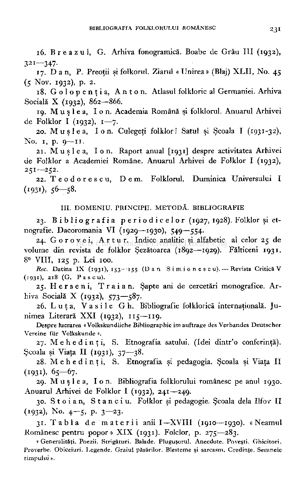

- 16. Breazul , G. Arhiva fonogramică. Boabe de Grâu III (1932),

321—347.

- 17. Dan , P. Preoţii şi folkorul. Ziarul « Unirea» (Blaj) XLII, No. 45

(5 Nov. 1932), p. 2.

- 18. Golopenţia , Anton . Atlasul folkloric al Germaniei. Arhiva

Socială X (1932), 862—866.

- 19. M u ş 1 e a, Ion . Academia Română şi folklorul. Anuarul Arhivei

de Folklor I (1932), 1—7.

- 20. M u ş 1 e a, Ion . Culegeţi folklor! Satul şi Şcoala I (1931-32),

No. 1, p. 9—11.

- 21. M u şl ea, Ion . Raport anual [1931] despre activitatea Arhivei

de Folklor a Academiei Române. Anuarul Arhivei de Folklor I (1932), 251—252.

- 22. T e o d o r e s c u, D e m. Folklorul. Duminica Universului I

(1931), 56—58.

III. DOMENIU. PRINCIPII. METODĂ. BIBLIOGRAFIE

- 23. Bibliografi a periodicelo r (1927, 1928). Folklor şi et­

nografie. Dacoromania VI (1929—1930), 549—554.

- 24. G o r o v e i, A r t u r. Indice analitic şi alfabetic al celor 25 de

volume din revista de folklor Şezătoarea (1892—1929). Fălticeni 1931. 8° VIII, 125 p. Lei 100.

Rec. Datina IX (1931), 153—15 5 (Da n S i m i o n e s c u). — Revista Critică V

- (1931) , 21 8 (G. P a s c u).

- 25. H e r s e n i, T r a i a n. Şapte ani de cercetări monografice. Ar­

hiva Socială X (1932), 573—587.

- 26. L u ţ a, V a s i 1 e G h. Bibliografie folklorică internaţională. Ju­

nimea Literară XXI (1932), 115—119.

Despre lucrarea « Volkskundliche Bibliographie imauftrage des Verbandes Deutscher Vereine fiir Volkskunde ».

- 27. M e h e d i n ţ i, S. Etnografia satului. (Idei dintr'o conferinţă).

Şcoala şi Viaţa II (1931), 37—38.

- 28. M e h e d i n ţ i, S. Etnografia şi pedagogia. Şcoala şi Viaţa II

- (1931), 65—67.

- 29. M u ş 1 e a, Ion . Bibliografia folklorului românesc pe anul 1930. Anuarul Arhivei de Folklor I (1932), 241—249.
- 30. S t o i a n, S t a n c i u. Folklor şi pedagogie. Şcoala delà Ilfov II

- (1932), No. 4—5, p. 3—23.

- 31. Tabl a de materi i anii I—XVIII (1910—1930). «Neamul

Romanesc pentru popor» XIX (1931). Folclor, p. 275—283.

« Generalităţi. Poezii. Strigături. Balade. Pluguşorul. Anecdote. Poveşti. Ghicitori. Proverbe. Obiceiuri. Legende. Graiul păsărilor. Blesteme şi sarcasm. Credinţe. Semnele timpului ».

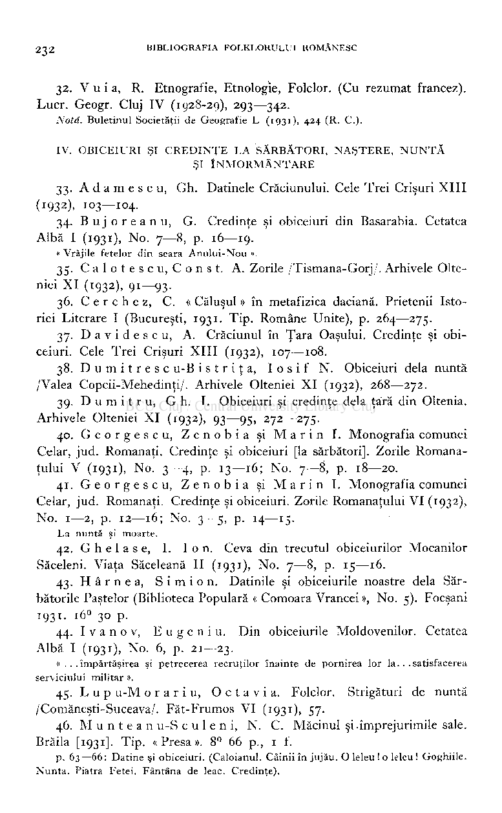

- 32. Vu i a, R. Etnografie, Etnologie, Folclor. (Cu rezumat francez).

Lucr. Geogr. Cluj IV (1928-29), 293—342.

Notă. Buletinul Societăţii de Geografie L (1931), 424 (R. C.).

IV. OBICEIURI ŞI CREDINŢE LA SĂRBĂTORI, NAŞTERE, NUNTĂ ŞI ÎNMORMÂNTARE

- 33. A d a m e s c u, Gh. Datinele Crăciunului. Cele Trei Crişuri XIII

(m*), 103—104.

- 34. B u j o r e a n u, G. Credinţe şi obiceiuri din Basarabia. Cetatea

Albă I (1931), No. 7—8, p. 16—19.

« Vrăjile fetelor din seara Anului-Nou ».

- 35. C a 1 o t e s c u, C o n s t. A. Zorile /Tismana-Gorj/. Arhivele Olte­

niei XI (1932), 91—93.

- 36. C e r c h e z, C. « Căluşul » în metafizica daciană. Prietenii Isto­

riei Literare I (Bucureşti, 1931. Tip. Române Unite), p. 264—275.

- 37. D a v i d e s c u, A. Crăciunul în Ţara Oaşului. Credinţe şi obi­

ceiuri. Cele Trei Crişuri XIII (1932), 107—108.

- 38. Dumitres c u-B i s t r i ţ a, I o s i f N. Obiceiuri delà nuntă

/Valea Copcii-Mehedinţi/. Arhivele Olteniei XI (1932), 268—272.

- 39. D u m i t r u, G h. I. Obiceiuri şi credinţe delà ţară din Oltenia.

Arhivele Olteniei XI (1932), 93—95, 272—275.

- 40. Georgescu , Zenobi a şi Mari n I. Monografia comunei

Celar, jud. Romanaţi. Credinţe şi obiceiuri [la sărbători]. Zorile Romanaţului V (1931), No. 3—4, p. 13—16; No. 7—8, p. 18—20.

- 41. Georgescu , Zenobi a şi Mari n I. Monografia comunei

Celar, jud. Romanaţi. Credinţe şi obiceiuri. Zorile Romanaţului VI (1932), No. 1—2, p. 12—16; No. 3—5, p. 14—15.

La nuntă şi moarte.

- 42. G h e 1 a s e, I. Ion . Ceva din trecutul obiceiurilor Mocanilor

Săceleni. Viaţa Săceleană II (1931), No. 7—8, p. 15—16.

- 43. H â r n e a, S i m i o n. Datinile şi obiceiurile noastre delà Săr­

bătorile Pastelor (Biblioteca Populară « Comoara Vrancei », No. 5). Focşani

1931. 16

30 p.

0

44. Ivanov , Eugen i u. Din obiceiurile Moldovenilor. Cetatea Albă I (1931), No. 6, p. 21—23.

« ...împărtăşirea şi petrecerea recruţilor înainte de pornirea lor la. .. satisfacerea serviciului militar ».

- 45. Lu p u-M orar i u, Octavia . Folclor. Strigături de nuntă

/Comăneşti-Suceava/. Făt-Frumos VI (1931), 57.

- 46. M untea n u-S c u 1 e n i, N. C. Măcinul şi-împrejurimile sale.

Brăila [1931]. Tip. «Presa». 8° 66 p., 1 f.

p. 63—66 Datine şi obiceiuri. (Caloianul. Câinii în jujâu. O leleu ! o leleu ! Goghiile. Nunta. Piatra Fetei. Fântâna de leac. Credinţe).

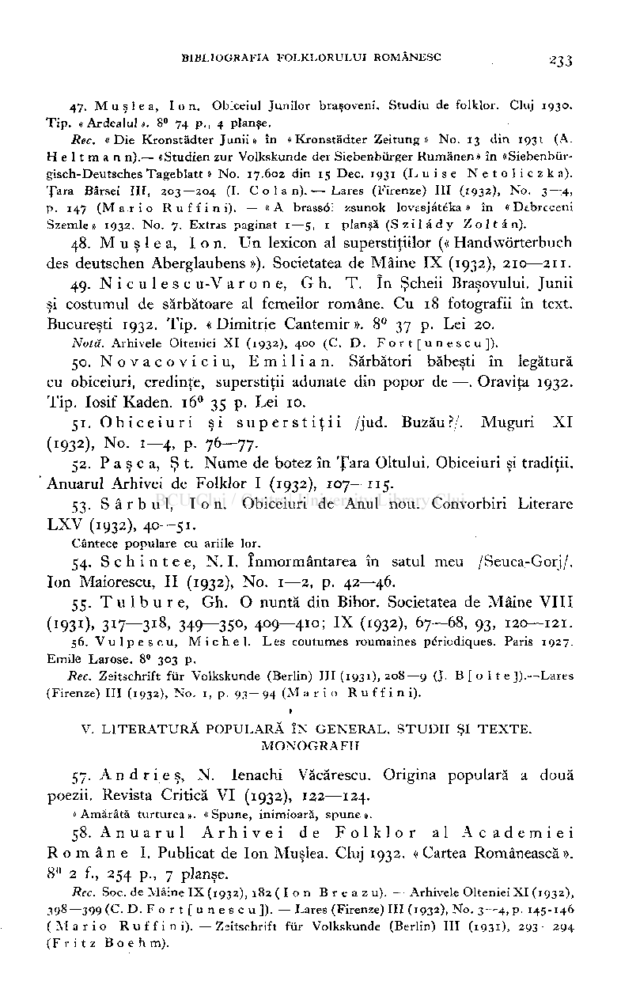

47. Muşlea , Ion . Obiceiul Junilor braşoveni. Studiu de folklor. Cluj 1930 . Tip. «Ardealul». 8° 74 p., 4 planşe.

Rec. «Die Kronstâdter Junii» în «Kronstâdter Zeitung » No. 1 3 din 193 1 (A. H e 1 t m a n n).— «Studien zur Volkskunde der Siebenburger Rumănen» în «Siebenbiirgisch-Deutsches Tageblatt » No. 17.602 din 1 5 Dec. 193 1 (Luis e Netoliczka) . Ţara Bârsei III, 203—20 4 (I. Colan). — Lares (Firenze) III (1932), No. 3—4 , p. 14 7 (M ari o Ruffini) . — «A brassôi zsunok lovESJâtéka » în « Dtbreceni Szemle » 1932 . No. 7. Extras paginat 1—5 , 1 planşă (Szilâd y Z o 11 â n).

- 48. M u ş 1 e a, Ion . Un lexicon al superstiţiilor (« Handwôrterbuch

des deutschen Aberglaubens »). Societatea de Mâine IX (1932), 210—211.

- 49. N i c u 1 e s c u-V a r o n e, G h. T In Şcheii Braşovului. Junii

şi costumul de sărbătoare al femeilor române. Cu 18 fotografii în text. Bucureşti 1932. Tip. « Dimitne Cantemir ». 8° 37 p. Lei 20.

Notă. Arhivele Olteniei XI (1932), 400 (C. D. F o r t [ u n e s c u ]).

- 50. N o v a c o v i c i u, E m i 1 i a n. Sărbători băbeşti în legătură

cu obiceiuri, credinţe, superstiţii adunate din popor de —. Oraviţa 1932. Tip. Iosif Kaden. 16

0

35 p. Lei 10.

- 51. Obiceiur i şi superstiţi i /jud. Buzău ?/. Muguri XI

(1932), No. 1—4, p. 76—77.

- 52. Pasca , Şt. Nume de botez în Ţara Oltului. Obiceiuri şi tradiţii.

Anuarul Arhivei de Folklor I (1932), 107—115.

- 53. S â r b u 1, Ion . Obiceiuri de Anul nou. Convorbiri Literare

LXV (1932), 40—51.

Cântece populare cu ariile lor.

- 54. Schintee , N. I. înmormântarea în satul meu /Seuca-Gorj/.

Ion Maiorescu, II (1932), No. 1—2, p. 42—46.

- 55. Tulbure , Gh. O nuntă din Bihor. Societatea de Mâine VIII

(i93

l

)> 3!7—3

l8

> 349—35°. 4°9—4

io

5

X

C^

2

). 67—68, 93, 120—121.

- 56. Vulpescu , Michel . Les coutumes roumaines périodiques. Paris 1927 .

Emile Larose. 8° 30 3 p.

Rec. Zeitschrift filr Volkskunde (Berlin) III (1931), 208—9 (J. B [ o 1 t e ]).—Lares (Firenze) III (1932), No. 1, p. 93—9 4 (M ari o Ruffini) .

1

#### V. LITERATURĂ POPULARĂ ÎN GENERAL. STUDII ŞI TEXTE. MONOGRAFII

- 57. An dries , N. Ienachi Văcărescu. Origina populară a două

poezii. Revista Critică VI (1932), 122—124.

« Amărâtă turturea ». « Spune, inimioară, spune ».

- 58. Anuaru l Arhive i de Folklo r al Academie i

Român e I. Publicat de Ion Muşlea. Cluj 1932. « Cartea Românească ». 8° 2 f., 254 p., 7 planşe.

Rec. Soc. de Mâine IX (1932), 18 2 (Io n Brea z u). — Arhivele Olteniei XI (1932), 398—399 (C. D. Fortfunescu]) . — Lares (Firenze) III (1932), No. 3—4 , p. 145-14 6 (Mari o Ruffini) . —Zeitschrift fiir Volkskunde (Berlin) III (1931) , 293—29 4 (Frit z Boe h m).

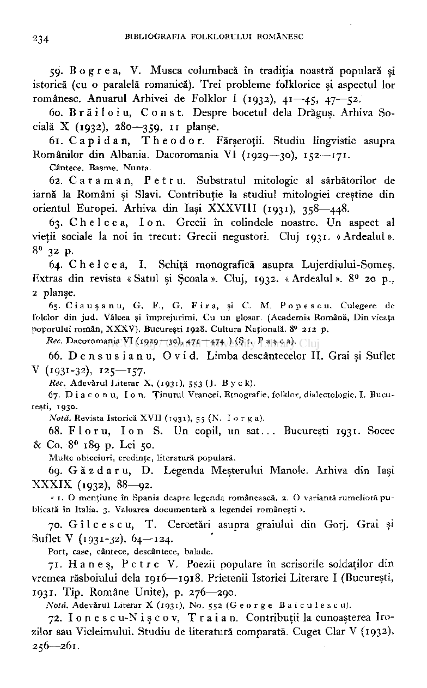

- 59. B o g r e a, V. Musca columbacă în tradiţia noastră populară şi

istorică (cu o paralelă romanică). Trei probleme folklorice şi aspectul lor românesc. Anuarul Arhivei de Folklor I (1932), 41—45, 47—52.

- 60. B r ă i 1 o i u, Const . Despre bocetul delà Drăguş. Arhiva So­

cială X (1932), 280—359, 11 planşe.

- 61. Capidan , Theodor . Fărşeroţii. Studiu lingvistic asupra

Românilor din Albania. Dacoromania VI (1929—30), 152—171.

Cântece. Basme. Nunta.

- 62. C a r a m a n, Petru . Substratul mitologic al sărbătorilor de

iarnă la Români şi Slavi. Contribuţie la studiul mitologiei creştine din orientul Europei. Arhiva din Iaşi XXXVIII (1931), 358—448.

63. C h e 1 c e a, Ion . Grecii în colindele noastre. Un aspect al vieţii sociale la noi în trecut: Grecii negustori. Cluj 1931. «Ardealul». 8° 32 P-

- 64. C h e 1 c e a, I. Schiţă monografică asupra Lujerdiului-Someş.

Extras din revista «Satul şi Şcoala». Cluj, 1932. «Ardealul». 8° 20 p., 2 planşe.

- 65. C i a u ş a n u, G. F., G. F i r a, şi C. M. P o p e s c u. Culegere de

folclor din jud. Vâlcea şi împrejurimi. Cu un glosar. (Academia Română, Din vieaţa poporului român, XXXV). Bucureşti 1928. Cultura Naţională. 8° 21 2 p.

Rec. Dacoromania VI (1929—30), 471—47 4 ) (Ş t. Pasca) .

- 66. D e n s u s i a n u, O v i d. Limba descântecelor II. Grai şi Suflet

V (1931-32), 125—157.

Rec. Adevărul Literar X, (1931), 55 3 (J. B y c k).

- 67. Diaco n u, Ion . Ţinutul Vrancei. Etnografie, folklor, dialectologie. I. Bucu­

reşti, 1930. Notă. Revista Istorică XVII (1931), 55 (N. I o r g a).

- 68. Floru , Io n S. Un copil, un sat... Bucureşti 1931. Socec

& Co. 8° 189 p. Lei 50.

Multe obiceiuri, credinţe, literatură populară.

- 69. G ă z d a r u, D. Legenda Meşterului Manole. Arhiva din Iaşi

XXXIX (1932), 88—92.

« 1 . O menţiune în Spania despre legenda românească. 2 . O variantă rumeliotă publicată în Italia. 3 . Valoarea documentară a legendei româneşti ».

- 70. G î 1 c e s c u, T. Cercetări asupra graiului din Gorj. Grai şi

Suflet V (1931-32), 64—124.

Port, case, cântece, descântece, balade.

- 71. Haneş , Petr e V. Poezii populare în scrisorile soldaţilor din

vremea răsboiului delà 1916—1918. Prietenii Istoriei Literare I (Bucureşti,

1931. Tip. Române Unite), p. 276—290.

Notă. Adevărul Literar X (1931), No. 55 2 (Georg e Baiculescu) .

72. I o n e s c u-N işcov , Trăi a n. Contribuţii la cunoaşterea Irozilor sau Vicleimului. Studiu de literatură comparată. Cuget Clar V (1932), 256—261.

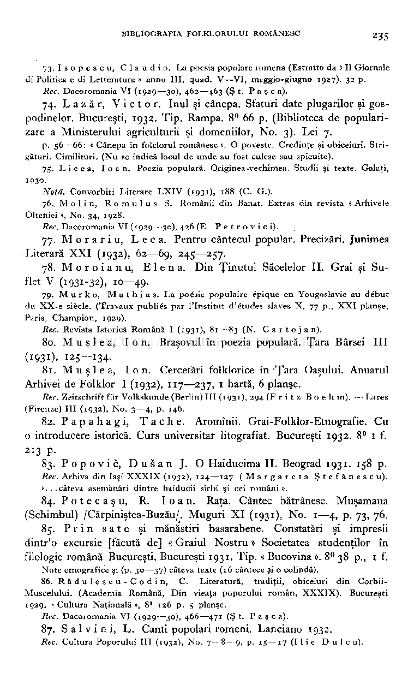

- 73.Isopescu , Claudio . La poesia popolare romena (Estratto da « II Giornale

di Politica e di Letteratura » anno III, quad. V—VI, maggio-giugno 1927). 32 p. Rec. Dacoromania VI (1929—30) , 462—463 (Şt. Pas c a).

- 74. L a z ă r, Victor . Inul şi cânepa. Sfaturi date plugarilor şi gos­

podinelor. Bucureşti, 1932. Tip. Rampa. 8° 66 p. (Biblioteca de popularizare a Ministerului agriculturii şi domeniilor, No. 3). Lei 7.

p. 56—66 « Cânepa în folclorul românesc ». O poveste. Credinţe şi obiceiuri. Strigături. Cimilituri. (Nu se indică locul de unde au fost culese sau spicuite).

- 75. L i c e a, loan . Poezia populară. Originea-vechimea. Studii şi texte. Galaţi,

1930 .

Notă. Convorbiri Literare LXIV (1931) , 188 (C. G.).

- 76. M o 1 i n, Romulu s S. Românii din Banat. Extras din revista « Arhivele

Olteniei », No. 34 , 1928. Rec. Dacoromania VI (1929—30) , 426 (E . P e t r o v i c i).

- 77. Morar i u, Leca . Pentru cântecul popular. Precizări. Junimea

Literară XXI (1932), 62—69, 245—257.

- 78. Moroianu , Elena . Din Ţinutul Săcelelor II. Grai şi Su­

flet V (1931-32), 10—49.

- 79. Mur k o, Mathias . La poésie populaire épique en Yougoslavie au début

du XX-e siècle. (Travaux publiés par l'Institut d'études slaves X, 7 7 p., XXI planşe, Paris, Champion, 1929).

Rec. Revista Istorică Română I (1931) , 81—8 3 (N. Ca r t o j an).

- 80. M u ş 1 e a, Ion . Braşovul în poezia populară. Ţara Bârsei III

(1931), 125—134.

- 81. Muş i ea, Ion . Cercetări folklorice în-Ţara Oaşului. Anuarul

Arhivei de Folklor I (1932), 117—237, 1 hartă, 6 planşe.

Rec. Zeitschrift fiir Volkskunde (Berlin) III (1931) , 294 (Frit z Boe h m). — Lares (Firenze) III (1932), No. 3—4 , p. 146.

82. P a p a h a g i, Tache . Aromînii. Grai-Folklor-Etnografie. Cu o introducere istorică. Curs universitar litografiat. Bucureşti 1932. 8° 1 f. 213 p.

- 83. P o p o v i c, Dusa n J. O Haiducima II. Beograd 1931. 158 p. Rec. Arhiva din Iaşi XXXIX (1932), 124—12 7 (Margaret a Ştefănes c u). «...câteva asemănări dintre haiducii sîrbi şi cei români».
- 84. Potecaşu , R. loan . Raţa. Cântec bătrânesc. Muşamaua

(Schimbul) /Cărpiniştea-Buzău/. Muguri XI (1931), No. 1—4, p. 73, 76.

- 85. Pri n sat e şi mănăstiri basarabene. Constatări şi impresii

dintr'o excursie [făcută de] « Graiul Nostru » Societatea studenţilor în filologie română Bucureşti. Bucureşti 1931. Tip. « Bucovina ». 8° 38 p., 1 f.

Note etnografice şi (p. 30—37 ) câteva texte (16 cântece şi o colindă).

86. Rădulescu-Codin , C. Literatură, tradiţii, obiceiuri din CorbiiMuscelului. (Academia Română, Din vieaţa poporului român, XXXIX). Bucureşti

- 1929. « Cultura Naţională », 8° 12 6 p. 5 planşe. Rec. Dacoromania VI (1929-—30), 466—47 1 (Şt. Pas c a).

### 87. S a 1 v i n i, L. Canti popolari romeni. Lanciano 1932.Rec. Cultura Poporului III (1932), No. 7—8—9 , p.15—1 7 (I 1 i e D u 1 c u).

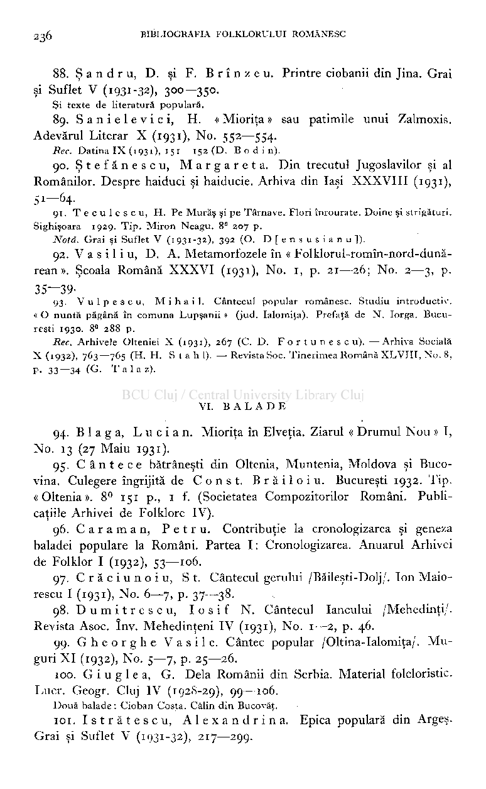

- 88. Ş a n d r u, D. şi F. B r î n z e u. Printre ciobanii din Jina. Grai

şi Suflet V (1931-32), 300—350.

Şi texte de literatură populară.

- 89. S a n i e 1 e v i c i, H. « Mioriţa » sau patimile unui Zalmoxis.

Adevărul Literar X (1931), No. 552—554.

Rec. Datina IX (1931), 151—15 2 (D. B o d i n).

- 90. Ştefănescu , Margareta . Din trecutul Jugoslavilor şi al

Românilor. Despre haiduci şi haiducie. Arhiva din Iaşi XXXVIII (1931), 51—

6

4-

- 91. T e c u 1 e s c u, H. Pe Murăş şi pe Târnave. Flori înrourate. Doine şi strigături.

Sighişoara 1929 . Tip. Miron Neagu. 8° 20 7 p. Notă. Grai şi Suflet V (1931-32) , 392 (O. D[ensusianu]) .

- 92. V a s i 1 i u, D. A. Metamorfozele în « Folklorul-romîn-nord-dună-

rean ». Şcoala Română XXXVI (1931), No. 1, p. 21—26; No. 2—3, p. 35—39-

93. Vulpes c u, Mihail . Cântecul popular românesc. Studiu introductiv. « O nuntă păgână în comuna Lupşanii » (jud. Ialomiţa). Prefaţă de N. Iorga. Bucureşti 1930 . 8° 28 8 p.

Rec. Arhivele Olteniei X (1931), 267 (C. D. F o r t u n e s c u). —Arhiva Socială X (1932), 763—76 5 (H. H. S t a h 1). — Revista Soc. Tinerimea Română XLVIII, No.

- P- 33—34 ( - Tal a z).

VI. BALAD E

- 94. B 1 a g a, Lucian . Mioriţa în Elveţia. Ziarul « Drumul Nou » I,

No. 13 (27 Maiu 1931).

- 95. Cântec e bătrâneşti din Oltenia, Muntenia, Moldova şi Buco­

vina. Culegere îngrijită de Const . Brăiloiu . Bucureşti 1932. Tip. «Oltenia». 8° 151 p., 1 f. (Societatea Compozitorilor Români. Publicaţiile Arhivei de Folklore IV).

- 96. Caraman , Petru . Contribuţie la cronologizarea şi geneza

baladei populare la Români. Partea I : Cronologizarea. Anuarul Arhivei de Folklor I (1932), 53—106.

- 97. C r ă c i u n o i u, St. Cântecul gerului /Băileşti-Dolj/. Ion Maio-

rescu I (1931), No. 6—7, p. 37—38.

- 98. Dumitrescu , Iosi f N. Cântecul Iancului /Mehedinţi/.

- Revista Asoc. înv. Mehedinţeni IV (1931), No. 1—2, p. 46.

- 99. Gheorgh e Vasile . Cântec popular /Oltina-Ialomiţa/. Mu­

guri XI (1932), No. 5—7, p. 25—26.

- 100. G i u g 1 e a, G. Delà Românii din Serbia. Material folcloristic.

Lucr. Geogr. Cluj IV (1928-29), 99—106.

Două balade : Cioban Costa. Călin din Bucovăţ.

- 101. Istrătescu , Alexandrina . Epica populară din Argeş.

Grai şi Suflet V (1931-32), 217—299.

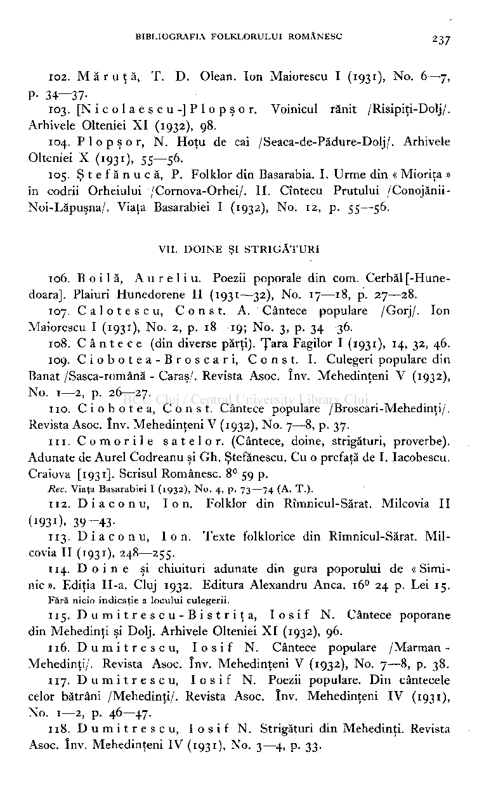

- 102. Măruţă , T. D. Olean. Ion Maiorescu I (1931), No. 6—7,

P- 34—37-

- 103. [Nicolaescu-JPlopşor . Voinicul rănit /Risipiţi-Dolj/.

Arhivele Olteniei XI (1932), 98.

- 104. P 1 o p ş o r, N. Hoţu de cai /Seaca-de-Pădure-Dolj/. Arhivele

Olteniei X (1931), 55—56.

- 105. Ştefănucă , P. Folklor din Basarabia. I. Urme din « Mioriţa »

în codrii Orheiului /Cornova-Orhei/. II. Cîntecu Prutului /ConojăniiNoi-Lăpuşna/. Viaţa Basarabiei I (1932), No. 12, p. 55—56.

VII. DOINE ŞI STRIGĂTURI

- 106. B o i 1 ă, A u r e 1 i u. Poezii poporale din corn. Cerbăl [-Hune­

doara]. Plaiuri Hunedorene II (1931—32), No. 17—18, p. 27—28.

- 107. Calotescu , Const . A. Cântece populare /Gorj/. Ion

Maiorescu I (1931), No. 2, p. 18—19; No. 3, p. 34—36.

- 108. Cântec e (din diverse părţi). Ţara Fagilor I (1931), 14, 32, 46.
- 109. Ciobotea-Broscari , Const . I. Culegeri populare din

Banat /Sasca-română - Caras/. Revista Asoc. înv. Mehedinţeni V (1932), No. 1—2, p. 26—27.

110. Ciobotea , Const . Cântece populare /Broscari-Mehedinţi/.

- Revista Asoc. înv. Mehedinţeni V (1932), No. 7—8, p. 37. m . Comoril e satelor . (Cântece, doine, strigături, proverbe).

Adunate de Aurel Codreanu şi Gh. Ştefănescu. Cu o prefaţă de I. Iacobescu. Craiova [1931]. Scrisul Românesc. 8° 59 p.

Rec. Viaţa Basarabiei I (1932), No. 4, p. 73—7 4 (A. T.).

- 112. Diaconii , Ion . Folklor din Rîmnicul-Sărat. Milcovia II

(i93i). 39—43-

- 113. Dia c o nu, Ion . Texte folklorice din Rîmnicul-Sărat. Mil­

covia II (1931), 248—255.

- 114. Doin e şi chiuituri adunate din gura poporului de « Simi-

nic ». Ediţia Il-a. Cluj 1932. Editura Alexandru Anca. 16 24 p. Lei 15.

Fără nicio indicaţie a locului culegerii.

- 115. Dumitrescu-Bistriţa , Iosi f N. Cântece poporane

din Mehedinţi şi Dolj. Arhivele Olteniei XI (1932), 96.

- 116. Dumitrescu , Iosi f N. Cântece populare /Marman -

Mehedinţi/. Revista Asoc. înv. Mehedinţeni V (1932), No. 7—8, p. 38.

- 117. Dumitrescu , Iosi f N. Poezii populare. Din cântecele

celor bătrâni /Mehedinţi/. Revista Asoc. înv. Mehedinţeni IV (1931), No. 1—2, p. 46—47.

- 118. Dumitrescu , Iosi f N. Strigături din Mehedinţi. Revista

Asoc. înv. Mehedinţeni IV (1931), No. 3—4, p. 33.

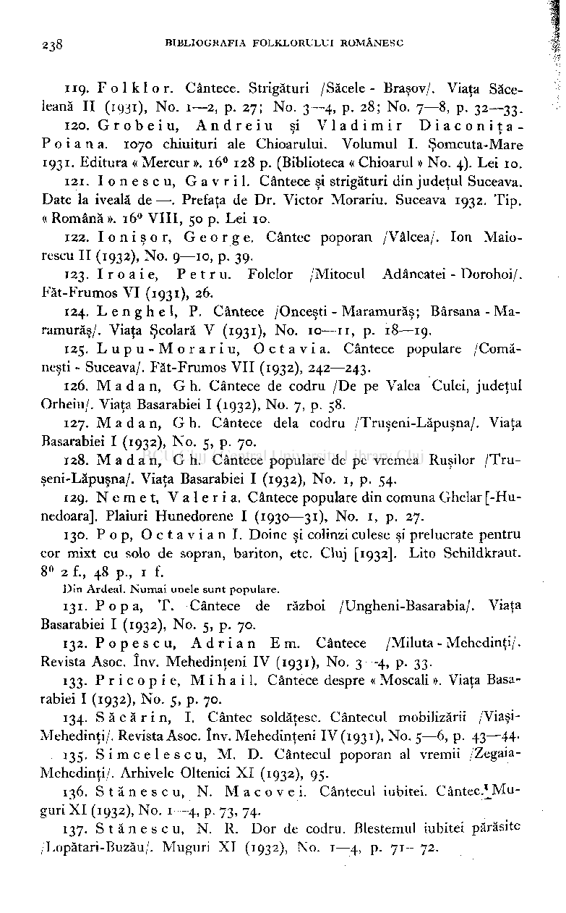

- 119. Folklor . Cântece. Strigături /Săcele - Braşov/. Viaţa Săce-

leană II (1931), No. 1—2, p. 27; No. 3—4, p. 28; No. 7—8, p. 32—33.

- 120. Grobeiu , Andrei u şi Vladimi r Diaconiţa -

Poiana . 1070 chiuituri ale Chioarului. Volumul I. Şomcuta-Mare

- 1931. Editura « Mercur ». 16

128 p. (Biblioteca « Chioarul » No. 4). Lei 10.

0

121. Ionescu , Gavril . Cântece şi strigături din judeţul Suceava. Date la iveală de —. Prefaţa de Dr. Victor Morariu. Suceava 1932. Tip. <( Română ». 16 VIII, 50 p. Lei 10.

- 122. Ionişor , George . Cântec poporan /Vâlcea/. Ion Maio-

rescu II (1932), No. 9—10, p. 39.

- 123. Iroaie , Petru . Folclor /Mitocul Adâncatei - Dorohoi/.

Făt-Frumos VI (1931), 26.

- 124. L e n g h e 1, P. Cântece /Onceşti - Maramurăş; Bârsana-Ma-

ramurăş/. Viaţa Şcolară V (1931), No. 10—11, p. 18—19.

- 125. Lupu-Morariu , Octavia . Cântece populare /Comă-

neşti - Suceava/. Făt-Frumos VII (1932), 242—243.

- 126. M a dan , G h. Cântece de codru /De pe Valea Culei, judeţul

Orheiu/. Viaţa Basarabiei I (1932), No. 7, p. 58.

- 127. M a dan , G h. Cântece delà codru /Truşeni-Lăpuşna/. Viaţa

Basarabiei I (1932), No. 5, p. 70.

- 128. M a d a n, G h. Cântece populare de pe vremea Ruşilor /Tru­

şeni-Lăpuşna/. Viaţa Basarabiei I (1932), No. 1, p. 54.

- 129. Nemet , Valeria . Cântece populare din comuna Ghelar [-Hu­

nedoara]. Plaiuri Hunedorene I (1930—31), No. 1, p. 27.

- 130. Pop , O c t a v i a n I. Doine şi colinzi culese şi prelucrate pentru

cor mixt cu solo de sopran, bariton, etc. Cluj [1932]. Lito Schildkraut. 8° 2 f., 48 p., 1 f.

Din Ardeal. Numai unele sunt populare.

- 131. Popa , T. Cântece de război /Ungheni-Basarabia/. Viaţa

Basarabiei I (1932), No. 5, p. 70.

- 132. Popes c u, Adria n Em. Cântece /Miluţa - Mehedinţi/.

Revista Asoc. înv. Mehedinţeni IV (1931), No. 3—4, p. 33.

- 133. Pricopie , Mihail . Cântece despre « Moscali ». Viaţa Basa­

rabiei I (1932), No. 5, p. 70.

- 134. S ă c ă r i n, I. Cântec soldăţesc. Cântecul mobilizării /Viaşi-

Mehedinţi/. Revista Asoc. înv. Mehedinţeni IV (1931), No. 5—6, p. 43—44-

- 135. S i m c e 1 e s c u, M. D. Cântecul poporan al vremii /'Zegaia-

Mehedinţi/. Arhivele Olteniei XI (1932), 95.

- 136. Stănescu , N. Macovei . Cântecul iubitei. Cântec.^Mu-

guri XI (1932), No. 1—4, p. 73, 74.

- 137. S t ă n e s c u, N. R. Dor de codru. Blestemul iubitei părăsite

/Lopătari-Buzău/. Muguri XI (1932), No. 1—4, p. 71—72.

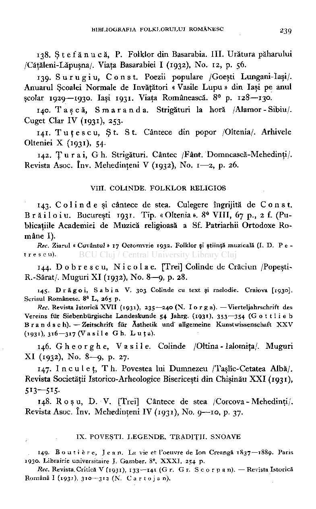

- 138. Ştefănucă , P. Folklor din Basarabia. III. Urătura paharului

/Căţăleni-Lăpuşna/. Viaţa Basarabiei I (1932), No. 12, p. 56.

- 139. Surugiu , Const . Poezii populare /Goeşti Lungani-Iaşi/.

Anuarul Şcoalei Normale de învăţători « Vasile Lupu » din Iaşi pe anul şcolar 1929—1930. Iaşi 1931. Viaţa Românească. 8° p. 128—130.

- 140. Taşcă , Smaranda . Strigături la horă /Alamor - Sibiu/.

Cuget Clar IV (1931), 253.

- 141. Tut e seu, Şt. St. Cântece din popor /Oltenia/. Arhivele

Olteniei X (1931), 54-

- 142. Ţ u r a i, G h. Strigături. Cântec /Fânt. Domnească-Mehedinţi/.

Revista Asoc. înv. Mehedinţeni V (1932), No. 1—2, p. 26.

VIII. COLINDE. FOLKLOR RELIGIOS

- 143. Colind e şi cântece de stea. Culegere îngrijită de Const .

B r ă i 1 o i u. Bucureşti 1931. Tip. « Oltenia ». 8° VIII, 67 p., 2 f. (Publicaţiile Academiei de Muzică religioasă a Sf. Patriarhii Ortodoxe Române I).

Rec. Ziarul « Cuvântul » 1 7 Octomvrie 1933 . Folklor şi ştiinţă muzicală (I. D. Pe tr e s c u).

- 144. Dobrescu , Nicol a e. [Trei] Colinde de Crăciun /Popeşti-

R.-Sărat/. Muguri XI (1932), No. 8—9, p. 28.

- 145 . Drag o i, Sabi n V.30 3 Colinde cu text şi melodie. Craiova[1930] .

Scrisul Românesc. 8° L, 26 5 p.

Rec. Revista Istorică XVII(1931) , 235—24 0 (N. I o r g a).—Vierteljahrschrift des Vereins fur Siebenbilrgische Landeskunde5 4 Jahrg.(1931) , 353—35 4 (Gottlie b Brandsch) . — Zeitschrift fiir Âsthetik und' allgemeine Kunstwissenschaft XXV

- (1931) , 316—31 7 (Vasil e G h. L u ţ a).

- 146. Gheorghe , Vasile . Colinde /Oltina - Ialomiţa/. Muguri

XI (1932), No. 8—9, p. 27.

- 147. I n c u 1 e ţ, T h. Povestea lui Dumnezeu /Taşlîc-Cetatea Albă/.

Revista Societăţii Istorico-Arheologice Bisericeşti din Chişinău XXI (1931), 5!3—5I5-

- 148. Roşu , D. V. [Trei] Cântece de stea /Corcova - Mehedinţi/.

Revista Asoc. înv. Mehedinţeni IV (1931), No. 9—10, p. 37.

IX. POVEŞTI. LEGENDE. TRADIŢII. SNOAVE

- 149 . Boutière , Jean . La vie et l'oeuvre de Ion Creangă1837—1889 . Paris

1930 . Librairie universitaire J. Gamber. 8° , XXXI, 25 4 p.

Rec. Revista. Critică V(1931) , 133—14 1 (Gr. Gr. S c o r p a n). — Revista Istorică Română I(1931) , 310—31 2 (N. C a r t o j a n).

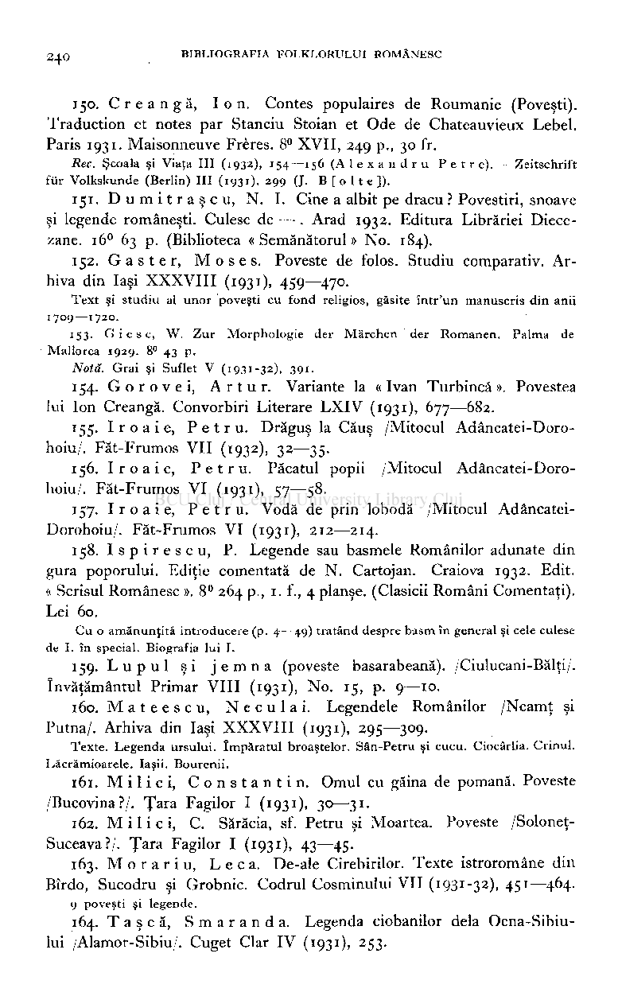

150. Creangă , Ion . Contes populaires de Roumanie (Poveşti). Traduction et notes par Stanciu Stoian et Ode de Chateauvieux Lebel. Paris 1931. Maisonneuve Frères. 8° XVII, 249 p., 30 fr.

Rec. Şcoala şi Viaţa III (1932), 154—15 6 (Alexandr u Petre) . — Zeitschrift fur Volkskunde (Berlin) III (1931), 299 (J. B [ o 11 e ]).

151. D u m i t r a ş c u, N. I. Cine a albit pe dracu ? Povestiri, snoave şi legende româneşti. Culese de — . Arad 1932. Editura Librăriei Diecezane. 16

63 p. (Biblioteca « Semănătorul » No. 184).

0

152. Gaster , M o s e s. Poveste de folos. Studiu comparativ. Arhiva din Iaşi XXXVIII (1931), 459—470.

Text şi studiu al unor poveşti cu fond religios, găsite într'un manuscris din anii

1709—1720 .

#### 153. G i e s e, W. Zur Morphologie der Mărchen der Romanen. Palma de

Mallorca 1929 . 8° 4 3 p. Notă. Grai şi Suflet V (1931-32) , 391 .

## 154. G o r o v e i, A r t u r. Variante la « Ivan Turbincă ». Povestea

lui Ion Creangă. Convorbiri Literare LXIV (1931), 677—682.

## 155. Iroaie , Petru . Drăguş la Căuş /Mitocul Adâncatei-Doro-

hoiu/. Făt-Frumos VII (1932), 32—35.

## 156. Iroaie , Petru . Păcatul popii /Mitocul Adâncatei-Doro-

hoiu/. Făt-Frumos VI (1931), 57—58.

## 157. Iroaie , Petru . Vodă de prin lobodă /Mitocul Adâncatei-

Dorohoiu/. Făt-Frumos VI (1931), 212—214.

## 158. I s p i r e s c u, P. Legende sau basmele Românilor adunate din

gura poporului. Ediţie comentată de N. Cartojan. Craiova 1932. Edit. « Scrisul Românesc ». 8° 264 p., 1. f., 4 planşe. (Clasicii Români Comentaţi). Lei 60.

Cu o amănunţită introducere (p. 4—49) tratând despre basm în general şi cele culese de I. în special. Biografia lui I.

- 159. Lupu l şi jemn a (poveste basarabeană). /Ciulucani-Bălţi/'.

învăţământul Primar VIII (1931), No. 15, p. 9—10.

- 160. Mateescu , Neculai . Legendele Românilor /Neamţ şi

Putna/. Arhiva din Iaşi XXXVIII (1931), 295—309.

Texte. Legenda ursului. împăratul broaştelor. Sân-Petru şi cucu. Ciocârlia. Crinul. Lăcrămioarele. Iaşii. Bourenii.

- 161. Milici , Constantin . Omul cu găina de pomană. Poveste

/Bucovina?/. Ţara Fagilor I (1931), 30—31.

- 162. Milici , C. Sărăcia, sf. Petru şi Moartea. Poveste /Soloneţ-

Suceava?/. Ţara Fagilor I (1931), 43—45.

- 163. Morar i u, Leca . De-ale Cirebirilor. Texte istroromâne din

Bîrdo, Sucodru şi Grobnic. Codrul Cosminului VII (1931-32), 451—464.

9 poveşti şi legende.

- 164. T a ş c ă, S m a r a n d a. Legenda ciobanilor delà Ocna-Sibiu-

lui /Alamor-Sibiu/. Cuget Clar IV (1931), 253.

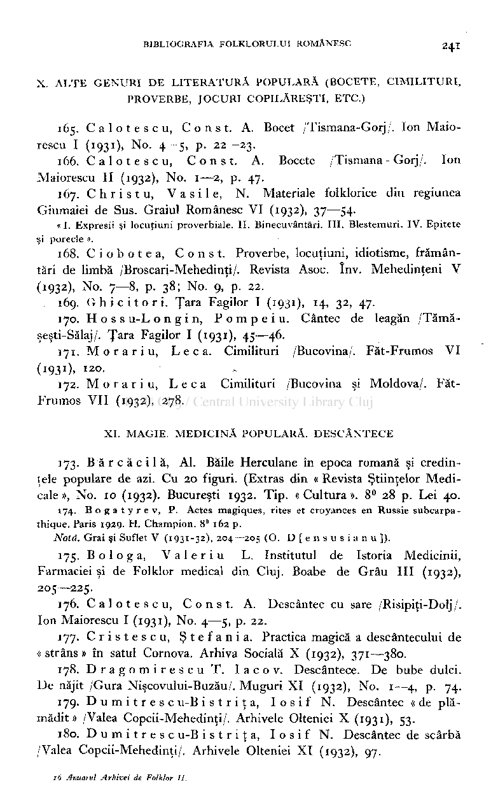

#### X. ALTE GENURI DE LITERATURĂ POPULARĂ (BOCETE, CIMILITURI, PROVERBE, JOCURI COPILĂREŞTI, ETC.)

- 165. Calotescu , Const . A. Bocet /Tismana-Gorj/. Ion Maio-

rescu I (1931), No. 4—5, p. 22—23.

- 166. Calotescu , Const . A. Bocete /Tismana - Gorj/. Ion

Maiorescu II (1932), No. 1-—2, p. 47.

- 167. Chri s tu, Va si le, N. Materiale folklorice din regiunea

Giumaiei de Sus. Graiul Românesc VI (1932), 37—54.

« I. Expresii şi locuţiuni proverbiale. II. Binecuvântări. III. Blestemuri. IV. Epitete şi porecle ».

168. C i o b o t e a, Const . Proverbe, locuţiuni, idiotisme, frământări de limbă /Broscari-Mehedinţi/. Revista Asoc. înv. Mehedinţeni V

- (1932), No. 7—8, p. 38; No. 9, p. 22.

- 169. Ghicitori . Ţara Fagilor I (1931), 14, 32, 47.
- 170. H o s s u-L ongin , Pompe i u. Cântec de leagăn /Tămă-

şeşti-Sălaj/. Ţara Fagilor I (1931), 45—46.

- 171. Morar i u, Leca . Cimilituri /Bucovina/. Făt-Frumos VI

(1931), 120.

- 172. Morar i u, Lec a Cimilituri /Bucovina şi Moldova/. Făt-

Frumos VII (1932), 278.

XI. MAGIE. MEDICINĂ POPULARĂ. DESCÂNTECE

- 173. B ă r c ă c i 1 ă, Al. Băile Herculane în epoca romană şi credin­

ţele populare de azi. Cu 20 figuri. (Extras din « Revista Ştiinţelor Medicale », No. 10 (1932). Bucureşti 1932. Tip. « Cultura ». 8° 28 p. Lei 40.

174. Bogatyrev , P. Actes magiques, rites et croyances en Russie subcarpathique. Paris 1929. H. Champion. 8° 16 2 p.

Notă. Grai şi Suflet V (1931-32) , 204—20 5 (O. Dfensusianu]) .

- 175. Bologa , Valeri u L. Institutul de Istoria Medicinii,

Farmaciei şi de Folklor medical din Cluj. Boabe de Grâu III (1932), 205—225.

- 176. Calotescu , Const . A. Descântec cu sare /Risipiţi-Dolj/.

Ion Maiorescu I (1931), No. 4—5, p. 22.

- 177. Cristescu , Ştefan i a. Practica magică a descântecului de

« strâns » în satul Cornova. Arhiva Socială X (1932), 371—380.

- 178. DragomirescuT . Iacov . Descântece. De bube dulci.

De năjit /Gura Nişcovului-Buzău/. Muguri XI (1932), No. 1—4, p. 74.

- 179. Dumitres c u-B i s t r i ţ a, I o s i f N. Descântec « de plă­

mădit » /Valea Copcii-Mehedinţi/. Arhivele Olteniei X (1931), 53.

- 180. Dumitres c u-B i s t r i ţ a, I o s i f N. Descântec de scârbă

/Valea Copcii-Mehedinţi/. Arhivele Olteniei XI (1932), 97.

j6 Anuarul Arhivei de Folklor IL

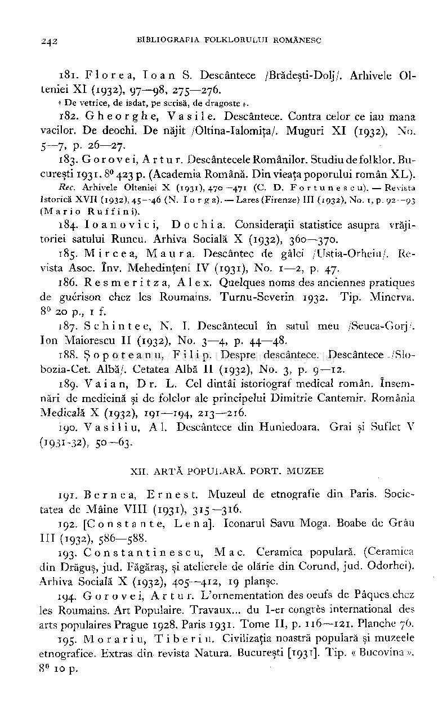

181. Flor e a, loa n S. Descântece /Brădeşti-Dolj'/. Arhivele Olteniei XI (1932), 97—98, 275—276.

« De vetrice, de isdat, pe scrisă, de dragoste ».

- 182. Gheorghe , Vasile . Descântece. Contra celor ce iau mana vacilor. De deochi. De năjit /Oltina-Ialomiţa/. Muguri XI (1932), No. 5—7, p. 26—27.
- 183. Gorovei , Artur . Descântecele Românilor. Studiu de folklor. Bucureşti 1931.8° 423 p. (Academia Română. Din vieaţa poporului român XL).

Rec. Arhivele Olteniei X (1931), 470—47 1 (C. D. F o r t u n e s c u). — Revista Istorică XVII (1932), 45—4 6 (N. I o r g a). — Lares (Firenze) III (1932), No. 1, p. 92—9 3 (Mari o Ru f fini) .

- 184. Ioanovici , Dochia . Consideraţii statistice asupra vrăji­

toriei satului Runcu. Arhiva Socială X (1932), 360—370.

- 185. Mircea , Maura . Descântec de gâlci /Ustia-Orheiu/. Re­

vista Asoc. înv. Mehedinţeni IV (1931), No. 1—2, p. 47.

- 186. R e s m e r i t z a, Alex . Quelques noms des anciennes pratiques

de guérison chez les Roumains. Turnu-Severin 1932. Tip. Minerva. 8° 20 p., 1 f.

- 187. S c h i n t e e, N. I. Descântecul în satul meu /Seuca-Gorj/.

Ion Maiorescu II (1932), No. 3—4, p. 44—48.

- 188. Şopoteanu , Filip . Despre descântece. Descântece /Slo-

bozia-Cet. Albă/. Cetatea Albă II (1932), No. 3, p. 9—12.

- 189. Va ian, Dr. L. Cel dintâi istoriograf medical român. însem­

nări de medicină şi de folclor ale principelui Dimitrie Cantemir. România Medicală X (1932), 191—194, 213—216.

- 190. V a s i 1 i u, Al. Descântece din Huniedoara. Grai şi Suflet V

(1931-32), 50—63.

XII. ARTĂ POPULARĂ. PORT. MUZEE

- 191. Bern e a, Ernest . Muzeul de etnografie din Paris. Socie­

tatea de Mâine VIII (1931), 315—316.

- 192. [Constante , Lena] . Iconarul Savu Moga. Boabe de Grâu

III (1932), 586-588.

- 193. Constantinescu , Mac . Ceramica populară. (Ceramica

din Drăguş, jud. Făgăraş, şi atelierele de olărie din Corund, jud. Odorhei). Arhiva Socială X (1932), 405—412, 19 planşe.

- 194. Gorovei , Artur . L'ornementation des oeufs de Pâques chez

les Roumains. Art Populaire. Travaux... du I-er congrès international des arts populaires Prague 1928. Paris 1931. Tome II, p. 116—121. Planche 76.

- 195. Morar i u, Tiberiu . Civilizaţia noastră populară şi muzeele

etnografice. Extras din revista Natura. Bucureşti [1931]. Tip. « Bucovina ». 8°iop .

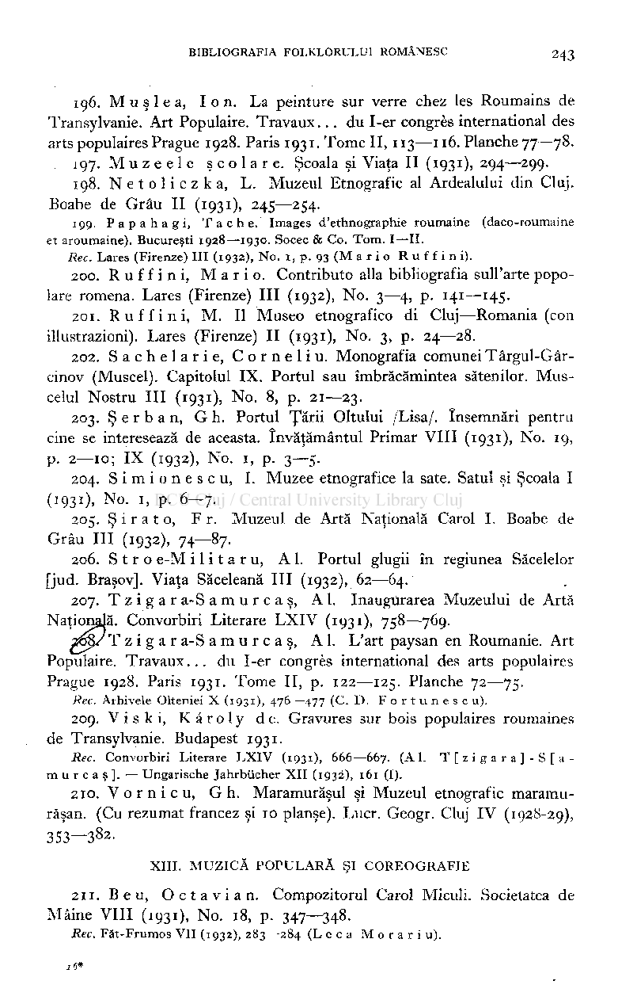

- 196. M u ş 1 e a, Ion . La peinture sur verre chez les Roumains de

Transylvanie. Art Populaire. Travaux... du I-er congrès international des arts populaires Prague 1928. Paris 1931. Tome II, 113—116. Planche 77—78.

- 197. Muzeel e şcolare . Şcoala şi Viaţa II (1931), 294—299.
- 198. N e t o 1 i c z k a, L. Muzeul Etnografic al Ardealului din Cluj.

Boabe de Grâu II (1931), 245—254.

- 199. Papahagi , Tache . Images d'ethnographie roumaine (daco-roumaine

et aroumaine). Bucureşti 1928—1930 . Socec & Co. Tom. I—II. Rec. Lares (Firenze) III (1932), No. 1, p. 93 (M ari o Ruffini) .

- 200. Ruffini , Mario . Contributo alia bibliografia sull'arte popo-

lare romena. Lares (Firenze) III (1932), No. 3—4, p. 141—145.

- 201. Ruffini , M. II Museo etnografico di Cluj—Romania (con

illustrazioni). Lares (Firenze) II (1931), No. 3, p. 24—28.

- 202. Sachelarie , Cornel i u. Monografia comunei Târgul-Gâr-

cinov (Muscel). Capitolul IX. Portul sau îmbrăcămintea sătenilor. Muscelul Nostru III (1931), No. 8, p. 21—23.

- 203. Ş e r b a n, G h. Portul Ţării Oltului /Lisa/. însemnări pentru

cine se interesează de aceasta. învăţământul Primar VIII (1931), No. 19,

p. 2—10; IX (1932), No. 1, p. 3—5.

- 204. Simionescu , I. Muzee etnografice là sate. Satul şi Şcoala I

(1931), No. 1, p. 6—7.

- 205. Ş i r a t o, F r. Muzeul de Artă Naţională Carol I. Boabe de

Grâu III (1932), 74—87.

- 206. S t r o e-M i 1 i t a r u, Al. Portul glugii în regiunea Săcelelor

[jud. Braşov]. Viaţa Săceleană III (1932), 62—64.

- 207. Tzigara-Samurcaş , Al. Inaugurarea Muzeului de Artă

Naţională. Convorbiri Literare LXIV (1931), 758—769.

T z i g a r a-S amurcaş , Al. L'art paysan en Roumanie. Art Populaire. Travaux... du I-er congrès international des arts populaires Prague 1928. Paris 1931. Tome II, p. 122—125. Planche 72—75.

Rec. Arhivele Olteniei X(1931), 476—47 7 (C. D. F o r t u n e s c u).

209. Viski , Kârol y de. Gravures sur bois populaires roumaines de Transylvanie. Budapest 1931.

Rec. Convorbiri Literare LXIV(1931), 666—667. (Al. T[zigara]-S[a murcaş] . — Ungarische Jahrbiicher XII (1932), 161 (I).

2 ro. Vo r n i cu, G h. Maramurăşul şi Muzeul etnografic maramurăşan. (Cu rezumat francez şi 10 planşe). Lucr. Geogr. Cluj IV (1928-29), 353—3

2-

8

#### XIII. MUZICĂ POPULARĂ ŞI COREOGRAFIE

- 211. Beu, Octavian . Compozitorul Carol Miculi. Societatea de

Mâine VIII (1931), No. 18, p. 347—348-

Rec. Făt-Frumos VII (1932), 283—28 4 (L e c a M o r a r i u).

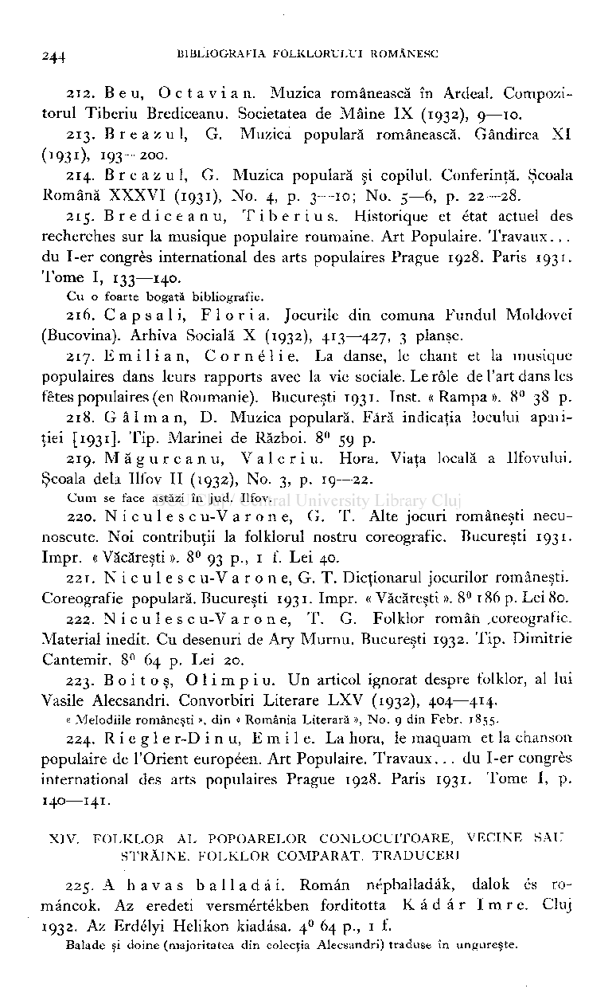

- 212. Beu, Octavian . Muzica românească în Ardeal. Compozi­

torul Tiberiu Brediceanu. Societatea de Mâine IX (1932), 9—10.

- 213. Breazul , G. Muzica populară românească. Gândirea XI

(W) . 193—

20

°-

- 214. Breazul , G. Muzica populară şi copilul. Conferinţă. Şcoala

Română XXXVI (1931), No. 4, p. 3—10; No. 5—6, p. 22—28.

- 215. Brediceanu , Tiberius . Historique et état actuel des

recherches sur la musique populaire roumaine. Art Populaire. Travaux. . . du I-er congrès international des arts populaires Prague 1928. Paris 1931. Tome I, 133—140.

Cu o foarte bogată bibliografie.

- 216. Capsali , Floria . Jocurile din comuna Fundul Moldovei

(Bucovina). Arhiva Socială X (1932), 413—-427, 3 planşe.

- 217. E m i 1 i a n, Cornelie . La danse, le chant et la musique

populaires dans leurs rapports avec la vie sociale. Le rôle de l'art dans les fêtes populaires (en Roumanie). Bucureşti 1931. Inst. «Rampa». 8° 38 p.

- 218. G â 1 m a n, D. Muzica populară. Fără indicaţia locului apari­

ţiei [1931]. Tip. Marinei de Război. 8° 59 p.

- 219. Măgureanu , Valeriu . Hora. Viaţa locală a Ilfovului.

Şcoala delà Ilfov II (1932), No. 3, p. 19—22.

Cum se face astăzi în jud. Ilfov.

- 220. N i c u 1 e s c u-V a r o n e, G. T. Alte jocuri româneşti necu­

noscute. Noi contribuţii la folklorul nostru coreografic. Bucureşti 1931. Impr. « Văcăreşti ». 8° 93 p., 1 f. Lei 40.

- 221. N i c u 1 e s c u-V a r o n e, G. T. Dicţionarul jocurilor româneşti.

Coreografie populară. Bucureşti 1931. Impr. « Văcăreşti ». 8° 186 p. Lei 80.

- 222. N i c u 1 e s c u-V a r o n e, T. G. Folklor român ,coreografic.

Material inedit. Cu desenuri de Ary Murnu. Bucureşti 1932. Tip. Dimitrie Cantemir. 8° 64 p. Lei 20.

- 223. Boitoş , Olimpiu . Un articol ignorat despre folklor, al lui

Vasile Alecsandri. Convorbiri Literare LXV (1932), 404—414.

« Melodiile româneşti », din « România Literară », No. 9 din Febr. 1855 .

- 224. R i e g 1 e r-D i n u, Emile . La hora, le maquam et la chanson

populaire de l'Orient européen. Art Populaire. Travaux... du I-er congrès international des arts populaires Prague 1928. Paris 1931. Tome I, p. 140—141.

#### XIV. FOLKLOR AL POPOARELOR CONLOCUITOARE, VECINE SAU STRĂINE. FOLKLOR COMPARAT. TRADUCERI

225. A hava s balladâi . Român népballadâk, dalok és româncok. Az eredeti versmértékben forditotta Kâdâ r Imre . Cluj

- 1932. Az Erdélyi Helikon kiadâsa. 4

64 p., 1 f.

0

Balade şi doine (majoritatea din colecţia Alecsandri) traduse în ungureşte.

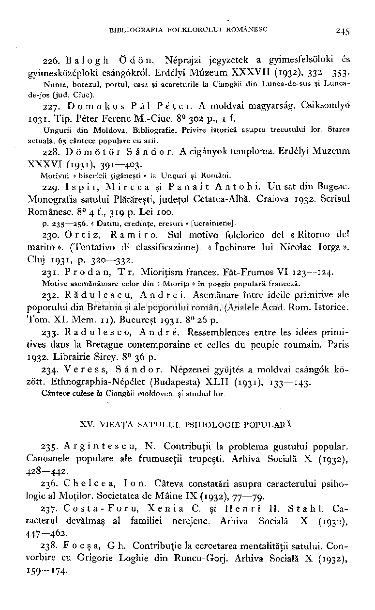

226. Balog h Ôdôn . Néprajzi jegyzetek a gyimesfelsôloki és gyimeskôzéploki csângôkrôl. Erdélyi Mûzeum XXXVII (1932), 332—353.

Nunta, botezul, portul, casa şi acareturile la Ciangăii din Lunca-de-sus şi Luncade-jos (jud. Ciuc).

227. Domoko s Pâ l Péter . A moldvai magyarsâg. Csiksomlyô

- 1931. Tip. Péter Ferenc M.-Ciuc. 8° 302 p., 1 f. Ungurii din Moldova. Bibliografie. Privire istorică asupra trecutului lor. Starea

actuală. 65 cântece populare cu arii.

- 228. Dômôtô r Sândor . A cigânyok temploma. Erdélyi Muzeum

XXXVI (1931), 391-403-

Motivul « bisericii ţigăneşti » la Unguri şi Români.

- 229. Ispir , Mirce a şi Panai t Antohi . Un sat din Bugeac.

Monografia satului Plătăreşti, judeţul Cetatea-Albă. Craiova 1932. Scrisul Românesc. 8° 4 f., 319 p. Lei 100.

p. 235—256 . « Datini, credinţe, eresuri » [ucrainiene].

230. Ortiz , Ramiro . Sul motivo folclorico del « Ritorno del marito ». (Tentativo di classificazione). « închinare lui Nicolae Iorga ».

clu

J Ï93 » P- 320—332.

- 231. P r o d a n, T r. Mioriţism francez. Făt-Frumos VI 123—124. Motive asemănătoare celor din « Mioriţa » în poezia populară franceză.
- 232. Rădulescu , Andrei . Asemănare între ideile primitive ale

poporului din Bretania şi ale poporului român. (Analele Acad. Rom. Istorice. Tom. XI. Mem. 11). Bucureşt 1931. 8*26 p.

233. Radulesco , André . Ressemblences entre les idées primitives dans la Bretagne contemporaine et celles du peuple roumain. Paris

- 1932. Librairie Sirey. 8° 36 p.

- 234. Vere s s, Sândor . Népzenei gyûjtés a moldvai csângôk ko-

zôtt. Ethnographia-Népélet (Budapesta) XLII (1931), 133—143.

Cântece culese la Ciangăii moldoveni şi studiul lor.

XV. VIEAŢA SATULUI. PSIHOLOGIE POPULARĂ

- 235. Argintescu , N. Contribuţii la problema gustului popular. Canoanele populare ale frumuseţii trupeşti. Arhiva Socială X (1932), 428—442.
- 236. Chelcea , Ion . Câteva constatări asupra caracterului psihologic al Moţilor. Societatea de Mâine IX (1932), 77—79.
- 237. Costa-Foru , Xeni a C. şi Henr i H. Stahl . Caracterul devălmaş al familiei nerejene. Arhiva Socială X (1932), 447—462.
- 238. F o c ş a, G h. Contribuţie la cercetarea mentalităţii satului. Convorbire cu Grigorie Loghie din Runcu-Gorj. Arhiva Socială X (1932), 159—

74-

1

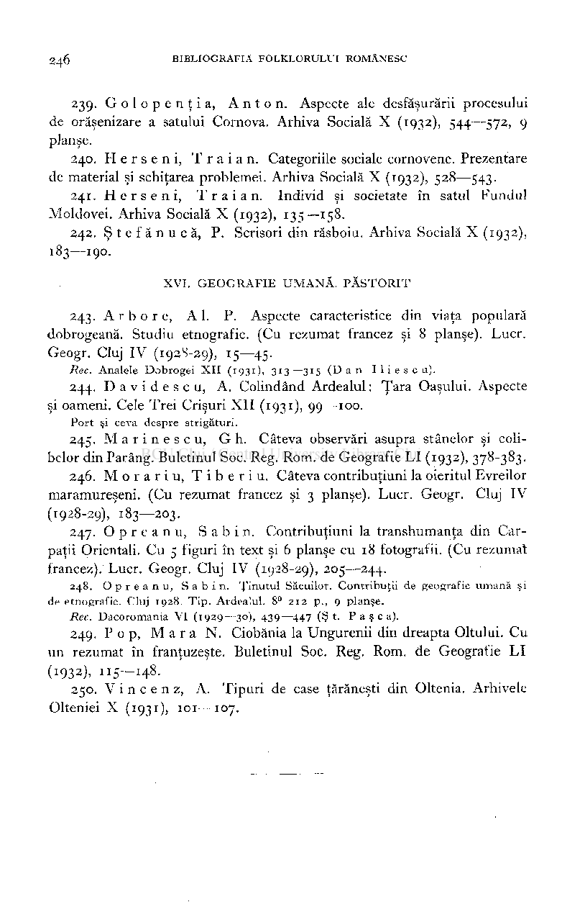

239. Golopenţia , Anton . Aspecte ale desfăşurării procesului de orăşenizare a satului Cornova. Arhiva Socială X (1932), 544—572, 9 planşe.

- 240. Herseni , Trăi a n. Categoriile sociale cornovene. Prezentare

de material şi schiţarea problemei. Arhiva Socială X (1932), 528—543.

- 241. Herseni , Trăi a n. Individ şi societate în satul Fundul

Moldovei. Arhiva Socială X (1932), 135—158.

- 242. Ştefănucă , P. Scrisori din răsboiu. Arhiva Socială X (1932),

183—190.

XVI. GEOGRAFIE UMANĂ. PĂSTORIT

- 243. Arbore , Al. P. Aspecte caracteristice din viaţa populară

dobrogeană. Studiu etnografic. (Cu rezumat francez şi 8 planşe). Lucr. Geogr. Cluj IV (1938-29), 15—45.

Rec. Analele Dobrogei XII (1931), 313—31 5 (Da n I 1 i e s c u).

- 244. Davidescu , A. Colindând Ardealul: Ţara Oaşului. Aspecte

şi oameni. Cele Trei Crişuri XII (1931), 99—100.

Port şi ceva despre strigături.

- 245. M a r i n e s c u, G h. Câteva observări asupra stânelor şi coli­

belor din Parâng. Buletinul Soc. Reg. Rom. de Geografie LI (1932), 378-383.

- 246. Morar i u, Tiberiu . Câteva contribuţiuni la oieritul Evreilor

maramureşeni. (Cu rezumat francez şi 3 planşe). Lucr. Geogr. Cluj IV (1928-29), 183—203.

- 247. Opreanu , Sabin . Contribuţiuni la transhumanta din Car-

paţii Orientali. Cu 5 figuri în text şi 6 planşe cu 18 fotografii. (Cu rezumai francez). Lucr. Geogr. Cluj IV (1928-29), 205—244.

- 248. Opreanu , Sabin . Ţinutul Săcuilor. Contribuţii de geografie umană şi

de etnografie. Cluj 1928. Tip. Ardealul. 8° 21 2 p., 9 planşe. Rec. Dacoromania VI (1929—30), 439—44 7 (Şt. Pasca) .

- 249. Pop , Mar a N. Ciobănia la Ungurenii din dreapta Oltului. Cu

un rezumat în franţuzeşte. Buletinul Soc. Reg. Rom. de Geografie LI

(1932), 115—148.

250. V i n c e n z, A. Tipuri de case ţărăneşti din Oltenia. Arhivele Olteniei X (1931), 101—107.

