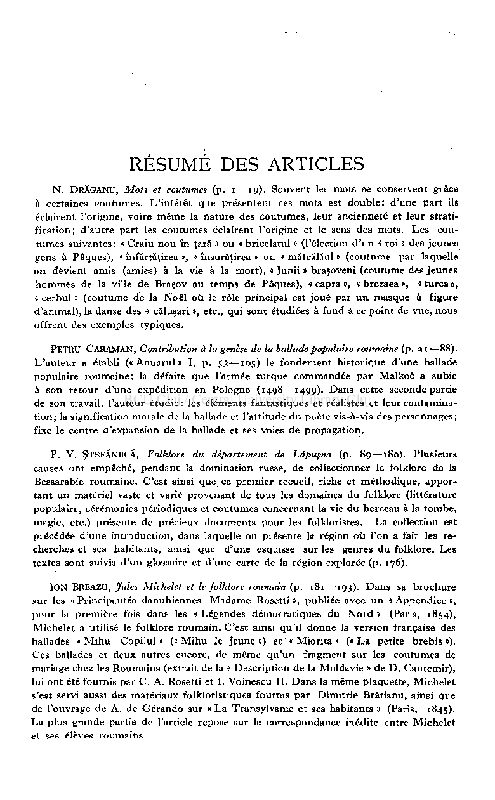
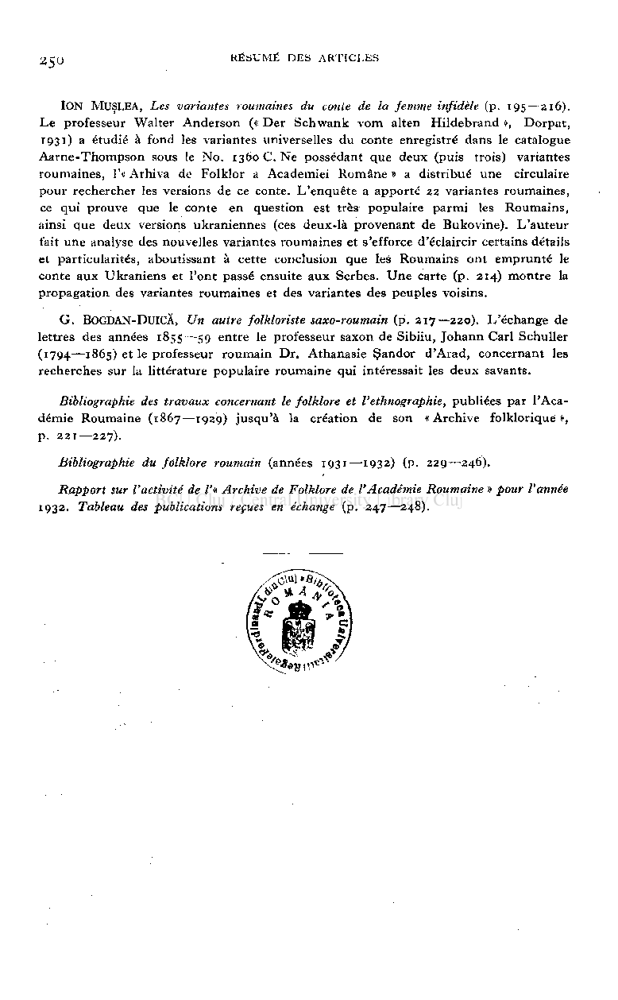

# RÉSUMÉ DES ARTICLES

N. DRĂGANU, Mots et coutumes (p.i—19) . Souvent les mots se conservent grâce à certaines coutumes. L'intérêt que présentent ces mots est double: d'une part ils éclairent l'origine, voire même la nature des coutumes, leur ancienneté et leur stratification; d'autre part les coutumes éclairent l'origine et le sens des mots. Les coutumes suivantes: « Craiu nou în ţară » ou « bricelatul » (l'élection d'un « roi » des jeunes gens à Pâques), « înfărtăţirea », « însurăţirea » ou « mătcălăul » (coutume par laquelle on devient amis (amies) à la vie à la mort), « Junii » braşoveni (coutume des jeunes

hommes de la ville de Braşov au temps de Pâques), « capra », « breZaea », « turca », « cerbul » (coutume de la Noël où le rôle principal est joué par u n masque à figure d'animal), la danse des « căluşari », etc., qui sont étudiées à fond à ce point de vue, nous offrent des exemples typiques.

PETRU CARAMAN, Contribution à la genèse de la ballade populaire roumaine (p. 21—88) . L'auteur a établi («Anuarul» I, p. 53—105 ) le fondement historique d'une ballade populaire roumaine: la défaite que l'armée turque commandée par Malkoi! a subie à son retour d'une expédition en Pologne (1498—1499) . Dans cette seconde partie de son travail, l'auteur étudie : les éléments fantastiques et réalistes et leur contamination; la signification morale de la ballade et l'attitude du poète vis-à-vis des personnages; fixe le centre d'expansion de la ballade et ses voies de propagation.

P. V. ŞTEFĂNUCĂ, Folklore du département de Lăpuşna (p. 89—180). Plusieurs causes ont empêché, pendant la domination russe, de collectionner le folklore de la Bessarabie roumaine. C'est ainsi que ce premier recueil, riche et méthodique, apportant un matériel vaste et varié provenant de tous les domaines du folklore (littérature populaire, cérémonies périodiques et coutumes concernant la vie du berceau à la tombe, magie, etc.) présente de précieux documents pour les folkloristes. La collection est précédée d'une introduction, dans laquelle on présente la région où l'on a fait les recherches et ses habitants, ainsi que d'une esquisse sur les genres du folklore. Les textes sont suivis d'un glossaire et d'une carte de la région explorée (p. 176).

ION BREAZU, Jules Michelet et le folklore roumain (p.181—193) . Dans sa brochure sur les « Principautés danubiennes Madame Rosetti », publiée avec un « Appendice », pour la première fois dans les « Légendes démocratiques du Nord » (Paris, 1854) Michelet a utilisé le folklore roumain. C'est ainsi qu'il donne la version française des ballades « Mihu Copilul » (« Mihu le jeune ») et « Mioriţa » (« La petite brebis »). Ces ballades et deux autres encore, de même qu'un fragment sur les coutumes de mariage chez les Roumains (extrait de la « Description de la Moldavie » de D. Cantemir), lui ont été fournis par C. A. Rosetti et I. Voinescu II. Dans la même plaquette, Michelet s'est servi aussi des matériaux folkloristiques fournis par Dimitrie Brătianu, ainsi que de l'ouvrage de A. de Gérando sur « La Transylvanie et ses habitants » (Paris, 1845) La plus grande partie de l'article repose sur la correspondance inédite entre Michelet et ses élèves roumains.

IO N MUŞLEA , Les variantes roumaines du conte de la femme infidèle (p. 195—216) .

Le professeur Walter Anderson (« Der Schwank vom alten Hildebrand », Dorpat,

- 1931 ) a étudié à fond les variantes universelles du conte enregistré dans le catalogue Aarne-Thompson sous le No. 1360 C. Ne possédant que deux (puis trois) variantes roumaines, l'« Arhiva de Folklor a Academiei Romane » a distribué une circulaire pour rechercher les versions de ce conte. L'enquête a apporté 2 2 variantes roumaines, ce qui prouve que le conte en question est très populaire parmi les Roumains, ainsi que deux versions ukraniennes (ces deux-là provenant de Bukovine). L'auteur fait une analyse des nouvelles variantes roumaines et s'efforce d'éclaircir certains détails et particularités, aboutissant à cette conclusion que les Roumains ont emprunté le conte aux Ukraniens et l'ont passé ensuite aux Serbes. Une carte (p. 214) montre la propagation des variantes roumaines et des variantes des peuples voisins.

G.BOGDAN-DUICĂ , Un autre folkloriste saxo-roumain (p. 217—220) . L'échange de lettres des années 1855—5 9 entre le professeur saxon de Sibiiu, Johann Cari Schuller (1794—1865 ) et le professeur roumain Dr. Athanasie Şandor d'Arad, concernant les recherches sur la littérature populaire roumaine qui intéressait les deux savants.

Bibliographie des travaux concernant le folklore et l'ethnographie, publiées par l'Académie Roumaine (1867—1929 ) jusqu'à la création de son «Archive folklorique», p. 221—227) .

Bibliographie du folklore roumain (années 1931—1932 ) (p. 229—246).

Rapport sur l'activité de /'« Archive de Folklore de l'Académie Roumaine » pour l'année

- 1932 . Tableau des publications reçues en échange (p. 247—248) .

