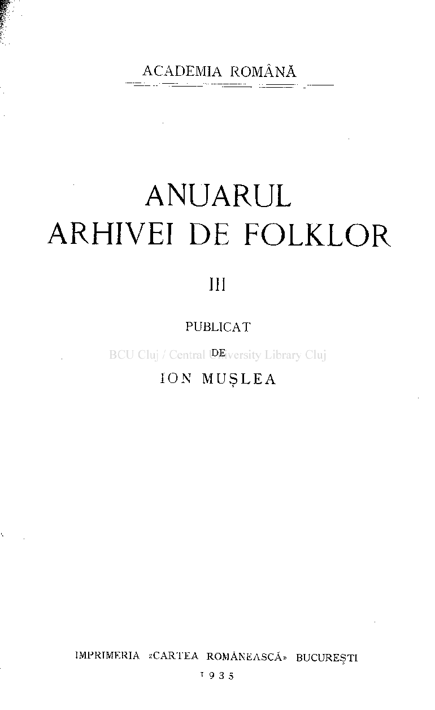
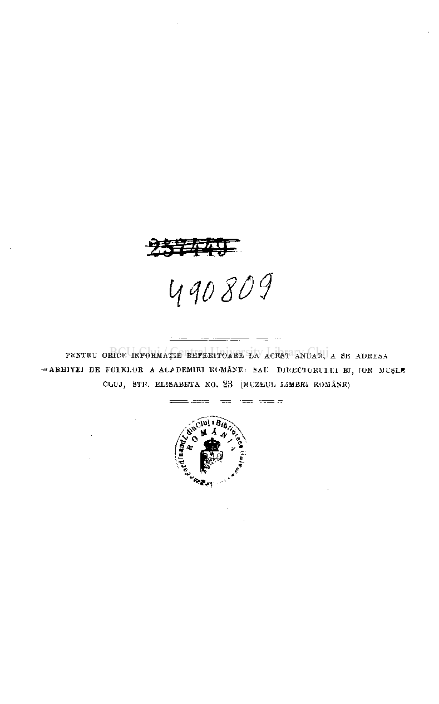
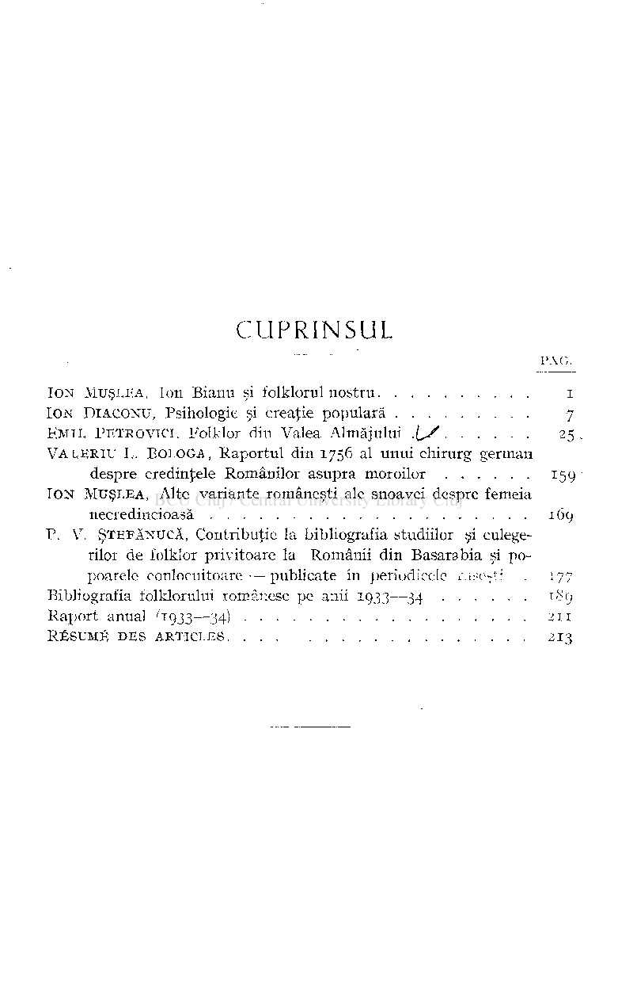
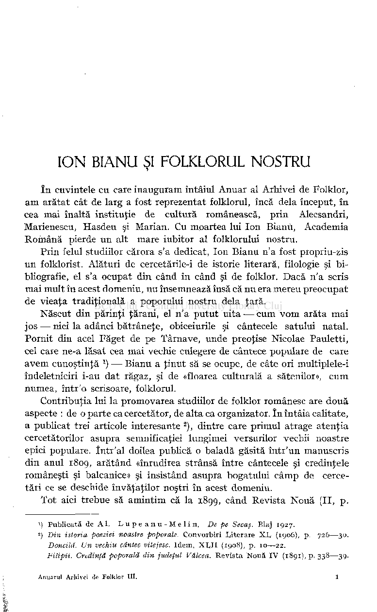
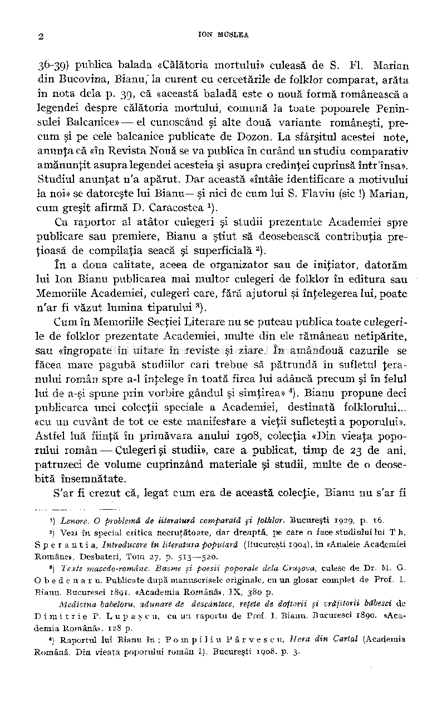
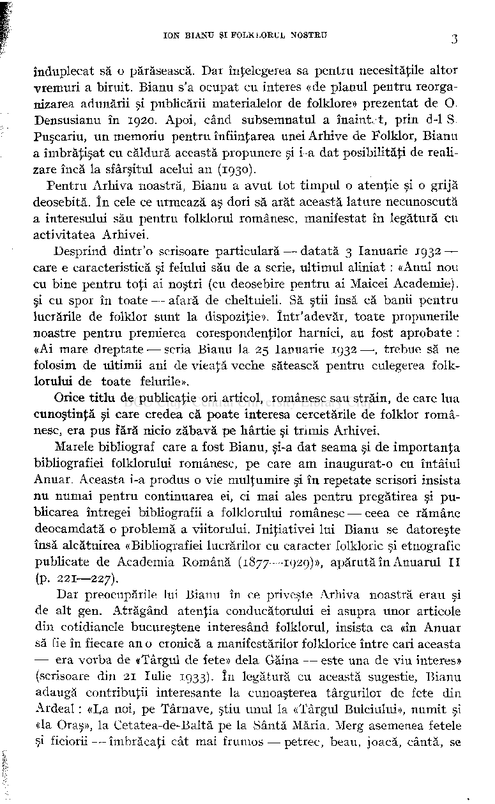

ACADEMIA ROMÂNĂ

# ANUARUL ARHIVEI DE FOLKLOR

## m

PUBLICA T

DE

ION MUSLE A

tf w so $

PENTEU ORICE INFORMAŢIE REFERITOARE LA ACEST ANUAR, A SE ADRESA

•«ARHIVEI DE FOLKLOR A ACADEMIEI RC'MÂNE>- SAU DI RECI OKU 1. UI El, ION MUŞLB CLUJ, STIÎ. ELISABETA NO. 23 (MUZEUL LIMBKI ROMÂNE)

### CUPRINSUL

#### PAG.

IO N MUŞLEA , Ion Bianu şi folklorul nostru i IO N DIACONU , Psihologie şi creaţie populară 7 EMI L PETROVICI Folklor din Valea Almăjului \S25 . VALERI U L . BOJ.OGA Raportul din 1756 al unui chirurg german

despre credinţele Românilor asupra moroilor 159 IO N MUŞLEA , Alte variante româneşti ale snoavei despre femeia

necredincioasă 169

P. V.ŞTEFĂNUCĂ , Contribuţie la bibliografia studiilor şi culegerilor de folklor privitoare la Românii din Basarabia şi popoarele conlocuitoare — publicate în periodicele iik-eţt: . 177 Bibliografia folklorului românesc pe anii 1933—34 189 Raport anual '1933—34) . . . • 211

RÉSUM É DE S ARTICLES . .. . 213

### ION BIANU ŞI FOLKLORUL NOSTRU

î n cuvintele cu care inauguram întâiul Anuar al Arhivei de Folklor, a m arătat cât de larg a fost reprezentat folklorul, încă delà început, în cea mai înaltă instituţie de cultură românească, prin Alecsandri, Marienescu, Hasdeu şi Marian. Cu moartea lui Ion Bianu, Academia Română pierde un alt mare iubitor al folklorului nostru.

Prin felul studiilor cărora s'a dedicat, Ion Bianu n'a fost propriu-zis un folklorist. Alături de cercetările-i de istorie literară, filologie şi bibliografie, el s'a ocupat din când în când şi de folklor. Dacă n'a scris mai mult în acest domeniu, nu însemnează însă că nu era mereu preocupat de vieaţa tradiţională a poporului nostru delà ţară.

Născut din părinţi ţărani, el n'a putut uita — cum vo m arăta mai jos — nici la adânci bătrâneţe, obiceiurile şi cântecele satului natal. Pornit din acel Făget de pe Târnave, unde preoţise Nicolae Pauletti, cel care ne-a lăsat cea mai vechie culegere de cântece populare de care ave m cunoştinţă ) — Bianu a ţinut să se ocupe, de câte ori multiplele-i îndeletniciri i-au dat răgaz, şi de «floarea culturală a sătenilor», cu m numea, într'o scrisoare, folklorul.

Contribuţia lui la promovarea studiilor de folklor românesc are două aspecte : de o parte ca cercetător, de alta ca organizator. î n întâia calitate, a publicat trei articole interesante

), dintre care primul atrage atenţia cercetătorilor asupra semnificaţiei lungimei versurilor vechii noastre epici populare. într'al doilea publică o baladă găsită într'un manuscris din anul 1809, arătând «înrudirea strânsă între cântecele şi credinţele româneşti şi balcanice» şi insistând asupra bogatului câm p de cercetări ce se deschide învăţaţilor noştri în acest domeniu.

2

Tot aici trebue să amintim că la 1899, când Revista Nouă (II, p.

- 1

) Publicată de Al. Lupeanu-Melin , De pe Secaş. Blaj 1927.

- 2

) Din istoria poeziei noastre poporale. Convorbiri Literare XL, (1906), p. 726—30. Doncild. Un vechiu cântec vitejesc. Idem, XLVII (1908), p. 10—22. Filipii. Credinţă poporală din judeţul Vâlcea. Revista Nouă IV (1891), p. 338—39.

36-39) publica balada «Călătoria mortului» culeasă de S. FI. Marian din Bucovina, Bianu,' la curent cu cercetările de folklor comparat, arăta în nota delà p. 39, că «această baladă este o nouă formă românească a legendei despre călătoria mortului, comună la toate popoarele Peninsulei Balcanice» — el cunoscând şi alte două variante româneşti, precum şi pe cele balcanice publicate de Dozon. L a sfârşitul acestei note, anunţa că «în Revista Nouă se v a publica în curând un studiu comparativ amănunţit asupra legendei acesteia şi asupra credinţei cuprinsă într'însa». Studiul anunţat n'a apărut. Dar această «întâie identificare a motivului la noi» se datoreşte lui Bianu—şi nici de cum lui S. Flaviu (sic !) Marian, cum greşit afirmă D . Caracostea )

Ca raportor al atâtor culegeri şi studii prezentate Academiei spre publicare sau premiere, Bianu a ştiut sră deosebească contribuţia preţioasă de compilaţia seacă şi superficială ) .

î n a doua calitate, aceea de organizator sau de iniţiator, datorăm lui Ion Bianu publicarea mai multor culegeri de folklor în editura sau Memoriile Academiei, culegeri care, fără ajutorul şi înţelegerea lui, poate n'ar fi văzut lumina tiparului )

Cum în Memoriile Secţiei Literare nu se puteau publica toate culegerile de folklor prezentate Academiei, multe din ele rămâneau netipărite, sau «îngropate în uitare în reviste şi ziare. î n amândouă cazurile se făcea mare pagubă studiilor cari trebue să pătrundă în sufletul ţeranului român spre a-1 înţelege în toată firea lui adâncă precum şi în felul lui de a-şi spune prin vorbire gândul şi simţirea» ). Bianu propune deci publicarea unei colecţii speciale a Academiei, destinată folklorului... «cu un cuvânt de tot ce este manifestare a vieţii sufleteşti a poporului». Astfel luă fiinţă în primăvara anului 1908, colecţia «Din vieaţa poporului român — Culegeri şi studii», care a publicat, timp de 23 de ani, patruzeci de volume cuprinzând materiale şi studii, multe de o deosebită însemnătate.

S'ar fi crezut că, legat cu m era de această colecţie, Bianu nu s'ar fi

>) Lenore. O problemă de literatură comparată şi folklor. Bucureşti 1929, p. 16.

##### ) Vezi în special critica necruţătoare, dar dreaptă, pe care o face studiului lui T h. Sperantia , Introducere în literatura populară (Bucureşti 1904), în «Analele Academiei Române», Desbateri, Tom 27, p. 513—520.

2

) Texte macedo-române. Basme şi poesii poporale delà Cruşova, culese de Dr. M. G. Obedenaru . Publicate după manuscrisele originale, cu un glosar complet de Prof. I. Bianu. Bucuresci i8gr. «Academia Română», IX, 380 p.

3

Medicina babeloru, adunare de descântece, reţete de doftorii şi vrăjitorii băbesci de D i m i t r i e P. L u p a ş c u, cu un raportu de Prof. I. Bianu. Bucuresci 1890. «Academia Română». 128 p.

##### ) Raportul lui Bianu în: Pompili u Pârvescu , Hora din Cartai (Academia Română. Din vieaţa poporului român I). Bucureşti 1908. p. 3.

4

#### ION BIANU ŞI FOLKLOKUL NOSTRU 3

înduplecat să o părăsească. Dar înţelegerea sa pentru necesităţile altor vremuri a biruit. Bianu s'a ocupat cu interes «de planul pentru reorganizarea adunării şi publicării materialelor de folklore» prezentat de O. Densusianu în 1920. Apoi, când subsemnatul a înaimvt, prin d-1 S. Puşcariu, un memoriu pentru înfiinţarea unei Arhive de Folklor, Bianu a îmbrăţişat cu căldură această propunere şi i-a dat posibilităţi de realizare încă la sfârşitul acelui an (1930).

Pentru Arhiva noastră, Bianu a avu t tot timpul o atenţie şi o grijă deosebită. î n cele ce urmează aş dori să arăt această lăture necunoscută a interesului său pentru folklorul românesc, manifestat în legătură cu activitatea Arhivei.

Desprind dintr'o scrisoare particulară — datată 3 Ianuarie 1932 care e caracteristică şi felului său de a scrie, ultimul aliniat : «Anul nou cu bine pentru toţi ai noştri (cu deosebire pentru ai Maicei Academie), şi cu spor în toate — afară de cheltuieli. Să ştii însă că banii pentru lucrările de folklor sunt la dispoziţie». într'adevăr, toate propunerile noastre pentru premierea corespondenţilor harnici, au fost aprobate : «Ai mare dreptate — scria Bianu la 25 Ianuarie 1932 — , trebue să ne folosim de ultimii ani de vieaţă veche sătească pentru culegerea folklorului de toate felurile».

Orice titlu de publicaţie ori articol, românesc sau străin, de care lua cunoştinţă şi care credea că poate interesa cercetările de folklor românesc, era pus fără nicio zăbavă pe hârtie şi trimis Arhivei.

Marele bibliograf care a fost Bianu, şi-a dat seama şi de importanţa bibliografiei folklorului românesc, pe care a m inaugurat-o cu întâiul Anuar. Aceasta i-a produs o vie mulţumire şi în repetate scrisori insista nu numai pentru continuarea ei, ci mai ales pentru pregătirea şi publicarea întregei bibliografii a folklorului românesc — ceea ce rămâne deocamdată o problemă a viitorului. Iniţiativei lui Bianu se datoreşte însă alcătuirea «Bibliografiei lucrărilor cu caracter folkloric şi etnografic publicate de Academia Română (1877—1929)», apărută în Anuarul I I (p. 221—227).

Dar preocupările lui Bianu în ce priveşte Arhiva noastră erau şi de alt gen. Atrăgând atenţia conducătorului ei asupra unor articole din cotidianele bucureştene interesând folklorul, insista ca «în Anuar să fie în fiecare an o cronică a manifestărilor f olklorice între cari aceasta — era vorba de «Târgul de fete» delà Găina — este una de viu interes» (scrisoare din 21 Iulie 1933). î n legătură cu această sugestie, Bianu adaugă contribuţii interesante la cunoaşterea târgurilor de fete din Ardeal : «La noi, pe Târnave, ştiu unul la «Târgul Bulciului», numit şi «la Oraş», la Cetatea-de-Baltă pe la Sântă Măria. Merg asemenea fetele şi ficiorii — îmbrăcaţi cât mai frumos — petrec, beau, joacă, cântă, se

