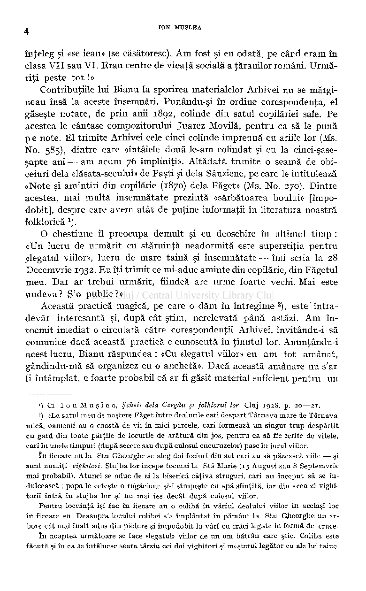

înţeleg şi «se ieau» (se căsătoresc). A m fost şi eu odată, pe când eram în clasa VI I sau VI . Era u centre de vieaţă socială a ţăranilor români. Urmăriţi peste tot !»

Contribuţiile lui Bianu la sporirea materialelor Arhivei nu se mărgineau însă la aceste însemnări. Punându-şi în ordine corespondenţa, el găseşte notate, de prin anii 1892, colinde din satul copilăriei sale. Pe acestea le cântase compozitorului Juarez Movilă, pentru ca să le pună p e note. E l trimite Arhivei cele cinci colinde împreună cu ariile lor (Ms. No. 585), dintre care «întâiele două le-am colindat şi eu la cinci-şaseşapte ani — am acum 76 împliniţi». Altădată trimite o seamă de obiceiuri delà «lăsata-secului» de Paşti şi delà Sânziene, pe care le întitulează «Note şi amintiri din copilărie (1870) delà Făget» (Ms. No. 270). Dintre acestea, mai multă însemnătate prezintă «sărbătoarea boului» [împodobit], despre care ave m atât de puţine informaţii în literatura noastră folklorică )

O chestiune îl preocupa demult şi cu deosebire în ultimul timp : «Un lucru de urmărit cu stăruinţă neadormită este superstiţia pentru «legatul viilor», lucru de mare taină şi însemnătate — îmi scria la 28 Decemvrie 1932. E u îţi trimit ce mi-aduc aminte din copilărie, din Făgetul meu. Da r ar trebui urmărit, fiindcă are urme foarte vechi. Mai este undeva? S'o public?»

Această practică magică, pe care o dăm în întregime ), este întradevăr interesantă şi, după cât ştim, nerelevată până astăzi. A m întocmit imediat o circulară către corespondenţii Arhivei, învitându-i să comunice dacă această practică e cunoscută în ţinutul lor. Anunţându-i acest lucru, Bianu răspundea : «Cu «legatul viilor» eu a m tot amânat, gândindu-mă să organizez eu o anchetă». Dac ă această amânare nu s'ar fi întâmplat, e foarte probabil că ar fi găsit material suficient pentru un

>) Cf. IonMuşlea , Şcheii delà Cergău şi folklorul lor. Cluj 1928. p. 20—21.

) «La satul meu de naştere Făget între dealurile cari despart Târnava mare de Târnava mică, oamenii au o coastă de vii în mici parcele, cari formează un singur trup despărţit cu gard din toate părţile de locurile de arătură din jos, pentru ca să fie ferite de vitele, cari în unele timpuri (după secere sau după culesul cucuruzelor) pasc în jurul viilor.

2

In fiecare an la Stu Gheorghe se aleg doi feciori din sat cari au să păzească viile — şi sunt numiţi vighitori. Slujba lor începe tocmai la Stă Marie (15 August sau 8 Septemvrie mai probabil). Atunci se aduc de ei la biserică câţiva struguri, cari au început să se îndulcească; popa le ceteşte o rugăciune şi-i stropeşte cu apă sfinţită, iar din acea zi vighitorii întră în slujba lor şi nu mai ies decât după culesul viilor.

Pentru locuinţă îşi fac în fiecare an o colibă în vârful dealului viilor în acelaşi loc în fiecare an. Deasupra locului colibei s'a împlântat în pământ la Stu Gheorghe un arbore cât mai înalt adus din pădure şi împodobit la vârf cu crăci legate în formă de cruce.

în noaptea următoare se face «legatul» viilor de un om bătrân care ştie. Coliba este făcută şi în ea se întâlnesc seara târziu cei doi vighitori şi meşterul legator cu ale lui taine.

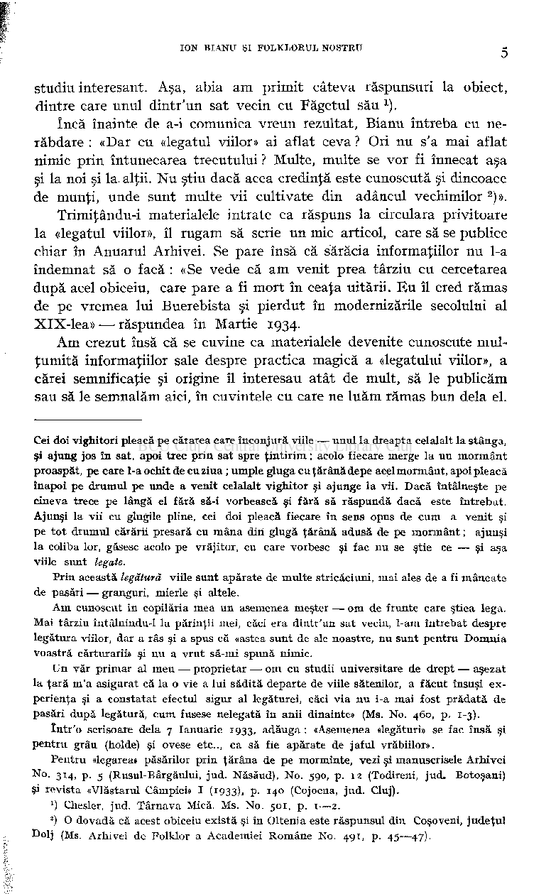

studiu interesant. Aşa, abia a m primit câteva răspunsuri la obiect, dintre care unul dintr'un sat vecin cu Făgetul său )

înc ă înainte de a-i comunica vreun rezultat, Bianu întreba cu nerăbdare : «Dar cu «legatul viilor» ai aflat ceva ? Ori nu s'a mai aflat nimic prin întunecarea trecutului ? Multe, multe se vor fi înnecat aşa şi la noi şi la. alţii. N u ştiu dacă acea credinţă este cunoscută şi dincoace de munţi, unde sunt multe vii cultivate din adâncul vechimilor

)».

2

Trimiţându-i materialele intrate ca răspuns la circulara privitoare la «legatul viilor», îl rugam să scrie un mic articol, care să se publice chiar în Anuarul Arhivei. Se pare însă că sărăcia informaţiilor nu 1-a îndemnat să o facă : «Se vede că a m venit prea târziu cu cercetarea după acel obiceiu, care pare a fi mort în ceaţa uitării. E u îl cred rămas de pe vremea lui Buerebista şi pierdut în modernizările secolului al XlX-lea»-—răspundea în Martie 1934.

A m crezut însă că se cuvine ca materialele devenite cunoscute mulţumită informaţiilor sale despre practica magică a «legatului viilor», a cărei semnificaţie şi origine îl interesau atât de mult, să le publicăm sau să le semnalăm aici, în cuvintele cu care ne luă m rămas bun delà el.

Cei doi vighitori pleacă pe cărarea care înconjură viile — unul la dreapta celalalt la stânga, şi ajung jos în sat, apoi trec prin sat spre ţintirim ; acolo fiecare merge la un mormânt proaspăt, pe care 1-a ochit de cu ziua ; umple gluga cu ţărână depe acel mormânt, apoi pleacă înapoi pe drumul pe unde a venit celalalt vighitor şi ajunge la vii. Dacă întâlneşte pe cineva trece pe lângă el fără să-i vorbească şi fără să răspundă dacă este întrebat. Ajunşi la vii cu glugile pline, cei doi pleacă fiecare în sens opus de cum a venit şi pe tot drumul cărării presară cu mâna din glugă ţărână adusă de pe mormânt ; ajunşi la coliba lor, găsesc acolo pe vrăjitor, cu care vorbesc şi fac nu se ştie ce — şi aşa viile sunt legate.

Prin această legătură viile sunt apărate de multe stricăciuni, mai ales de a fi mâncate de pasări — granguri, mierle şi altele.

Am cunoscut în copilăria mea un asemenea meşter — om de frunte care ştiea lega. Mai târziu întâlnindu-1 la părinţii mei, căci era dintr'un sat vecin, l-am întrebat despre legătura viilor, dar a râs şi a spus că «astea sunt de ale noastre, nu sunt pentru Domnia voastră cărturarii» şi nu a vrut să-mi spună nimic.

Un văr primar al meu — proprietar — om cu studii universitare de drept — aşezat la ţară m'a asigurat că la o vie a lui sădită departe de viile sătenilor, a făcut însuşi experienţa şi a constatat efectul sigur al legăturei, căci via nu i-a mai fost prădată de pasări după legătură, cum fusese nelegată în anii dinainte» (Ms. No. 460, p. 1-3).

Intr'o scrisoare delà 7 Ianuarie 1933, adăuga : «Asemenea «legături» se fac însă şi pentru grâu (holde) şi ovese etc., ca să fie apărate de jaful vrăbiilor».

Pentru «legarea» păsărilor prin ţărâna de pe morminte, vezi şi manuscrisele Arhivei

314, p. 5 (Rusul-Bârgăului, jud. Năsăud), No. 590, p. 12 (Todireni, jud. Botoşani) şi revista «Vlăstarul Câmpiei» I (1933), p. 140 (Cojocna, jud. Cluj).

- 1

) Chesler, jud. Târnava Mică. Ms. No. 501, p. 1—2.

- 2

#### ) O dovadă că acest obiceiu există şi în Oltenia este răspunsul din Coşoveni, judeţul Dolj (Ms. Arhivei de Folklor a Academiei Române No. 491, p. 45—47).

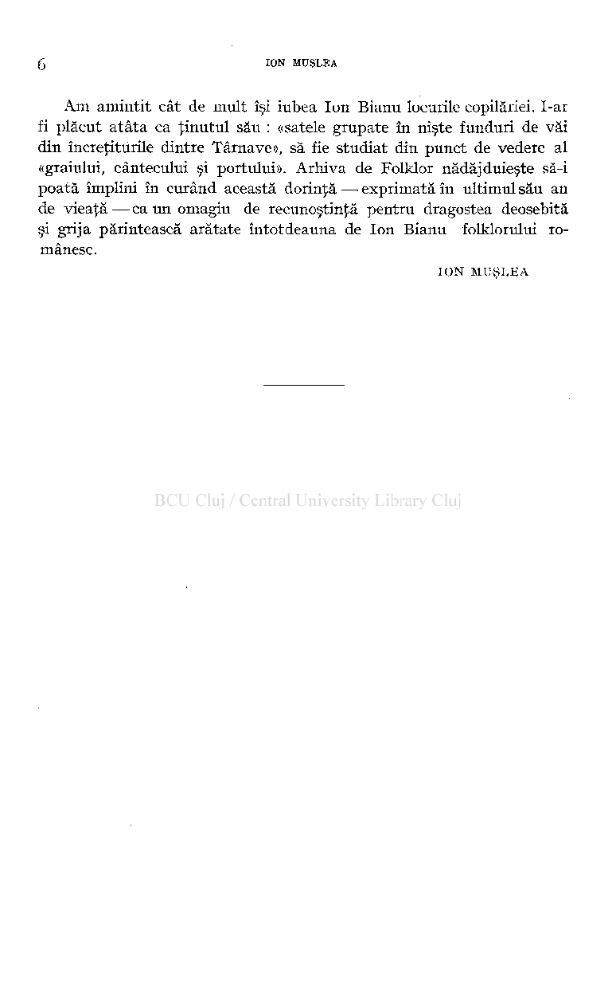

A m amintit cât de mult îşi iubea Ion Bianu locurile copilăriei. I-ar fi plăcut atâta ca ţinutul său : «satele grupate în nişte funduri de văi din încreţiturile dintre Târnave», să fie studiat din punct de vedere al «graiului, cântecului şi portului». Arhiva de Folklor nădăjduieşte să-i poată împlini în curând această dorinţă—-exprimată în ultimul său an de vieaţă—c a un omagiu de recunoştinţă pentru dragostea deosebită şi grija părintească arătate întotdeauna de Ion Bianu folklorului românesc.

### ION MUŞLEA

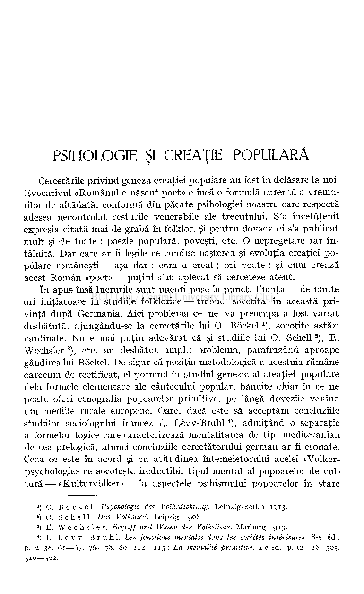

# PSIHOLOGIE ŞI CREAŢIE POPULARA

Cercetările privind geneza creaţiei populare au fost în delăsare la noi. Evocativul «Românul e născut poet» e încă o formulă curentă a vremurilor de altădată, conformă din păcate psihologiei noastre care respectă adesea necontrolat resturile venerabile ale trecutului. S'a încetăţenit expresia citată mai de grabă în folklor. Şi pentru dovada ei s'a publicat mult şi de toate : poezie populară, poveşti, etc. O nepregetare rar întâlnită. Dar care ar fi legile ce conduc naşterea şi evoluţia creaţiei populare româneşti •— aşa dar : cum a creat ; ori poate : şi cum crează acest Român «poet» — puţini s'au aplecat să cerceteze atent.

î n apus însă lucrurile sunt uneori puse la punct. Franţa — de multe ori iniţiatoare în studiile folklorice — trebue socotită în această privinţă după Germania. Aici problema ce ne v a preocupa a fost variat desbătută, ajungându-se la cercetările lui O. Bôckel ) , socotite astăzi cardinale. N u e mai puţin adevărat că şi studiile lui O. Schell

), E . Wechsler

2

), etc. au desbătut amplu problema, parafrazând aproape gândirea lui Bôckel. De sigur că poziţia metodologică a acestuia rămâne oarecum de rectificat, el pornind în studiul genezic al creaţiei populare delà formele elementare ale cântecului popular, bănuite chiar în ce ne poate oferi etnografia popoarelor primitive, pe lângă dovezile venind din mediile rurale europene. Oare, dacă este să acceptăm concluziile studiilor sociologului francez 1,. Eévy-Bruhl ), admiţând o separaţie a formelor logice care caracterizează mentalitatea de tip mediteranian de cea prelogică, atunci concluziile cercetătorului german ar fi eronate. Ceea ce este în acord şi cu atitudinea întemeietorului acelei «Volkerpsychologie» ce socoteşte ireductibil tipul mental al popoarelor de cultură-— «Kulturvôlker»— la aspectele psihismului popoarelor în stare

3

!) O. Bôckel , Psychologie der Volksdichtung. Leipzig-Berlin 1913.

- 2

) O. Schell , Das Volkslied. Leipzig 1908.

- 3

) E Wechsler , Begriff und Wesen des Volkslieds. Marburg 1913.

- 4

) L. Lé v y-Bru h 1, Les fonctions mentales dans les sociétés inférieures. 8-e éd., p. 2, 38, 61—67, 76—78, 80, 112—115 La mentalité primitive, 4-e éd., p. 12—18, 503,

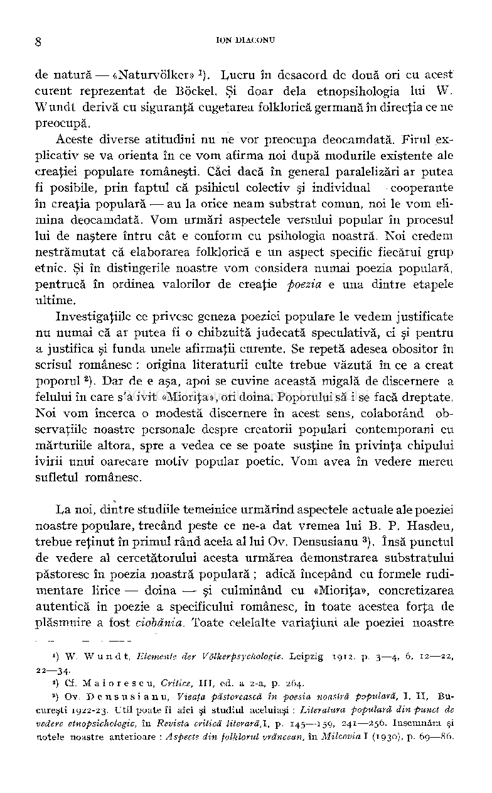

). Lucru în desacord de două ori cu acest curent reprezentat de Bockel. Şi doar delà etnopsihologia lui W . Wund t derivă cu siguranţă cugetarea folklorică germană în direcţia ce ne preocupă.

de natură-—«Naturvôlker»

x

Aceste diverse atitudini nu ne vor preocupa deocamdată. Firul explicativ se v a orienta în ce vo m afirma noi după modurile existente ale creaţiei populare româneşti. Căci dacă în general paralelizări ar putea fi posibile, prin faptul că psihicul colectiv şi individual — cooperante în creaţia populară — au la orice neam substrat comun, noi le vo m elimina deocamdată. Vo m urmări aspectele versului popular în procesul lui de naştere întru cât e conform cu psihologia noastră. Noi credem nestrămutat că elaborarea folklorică e un aspect specific fiecărui grup etnic. Şi în distingerile noastre vo m considera numai poezia populară, pentrucă în ordinea valorilor de creaţie poezia e una dintre etapele ultime.

Investigaţiile ce privesc geneza poeziei populare le vedem justificate nu numai că ar putea fi o chibzuită judecată speculativă, ci şi pentru a justifica şi funda unele afirmaţii curente. Se repetă adesea obositor în scrisul românesc : origina literaturii culte trebue văzută în ce a creat poporul ) . Dar de e aşa, apoi se cuvine această migală de discernere a felului în care s'a ivit «Mioriţa», ori doina. Poporului să i se facă dreptate. Noi vo m încerca o modestă discernere în acest sens, colaborând observaţiile noastre personale despre creatorii populari contemporani cu

- mărturiile altora, spre a vedea ce se poate susţine în privinţa chipului ivirii unui oarecare motiv popular poetic. Vo m avea în vedere mereu sufletul românesc.

L a noi, dintre studiile temeinice urmărind aspectele actuale ale poeziei noastre populare, trecând peste ce ne-a dat vremea lui B . P. Hasdeu, trebue reţinut în primul rând acela al lui Ov. Densusianu ) . însă punctul de vedere al cercetătorului acesta urmărea demonstrarea substratului păstoresc în poezia noastră populară ; adică începând cu formele rudimentare lirice — doina —- şi culminând cu «Mioriţa», concretizarea autentică în poezie a specificului românesc, în toate acestea forţa de plăsmuire a fost ciobănia. Toate celelalte variaţiuni ale poeziei noastre

>) W. Wundt , Elemente der Vôlkerpsychologie. Leipzig 1912. p. 3—4, 6, 12—22, 22—34.

) Cf. M a i o r e s c u, Critice, III, ed. a 2-a, p. 264.

J

) Ov. Densusianu , Vieaţa păstorească în poesia noastră populară, I, II, Bucureşti 1922-23. Util poate fi aici şi studiul aceluiaşi : Literatura populară din punct de vedere etnopsichologic, în Revista critică literară,!, p. 145—159, 241—256. însemnăm şi notele noastre anterioare : Aspecte din folklorul vrăncean, în Milcovial (1930), p. 69—86.

s

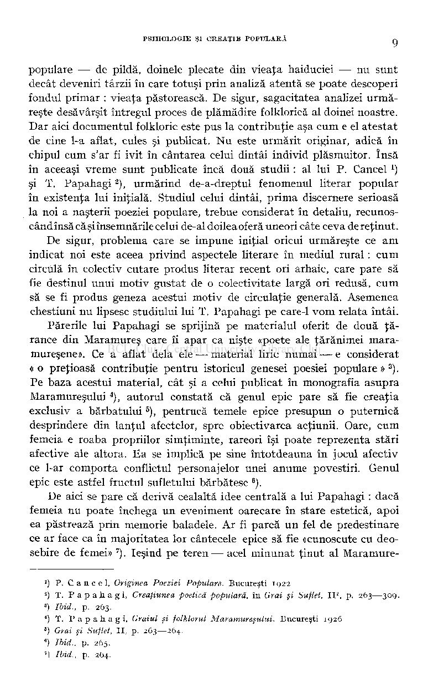

populare — de pildă, doinele plecate din vieaţa haiduciei — nu sunt decât deveniri târzii în care totuşi prin analiză atentă se poate descoperi fondul primar : vieaţa păstorească. De sigur, sagacitatea analizei urmăreşte desăvârşit întregul proces de plămădire folklorică al doinei noastre. Dar aici documentul folkloric este pus la contribuţie aşa cum e el atestat de cine 1-a aflat, cules şi publicat. N u este urmărit originar, adică în chipul cum s'ar fi ivit în cântarea celui dintâi individ plăsmuitor. însă în aceeaşi vreme sunt publicate încă două studii : al lui P. Cancel ) şi T. Papahagi

) , urmărind de-a-dreptul fenomenul literar popular în existenţa lui iniţială. Studiul celui dintâi, prima discernere serioasă la noi a naşterii poeziei populare, trebue considerat în detaliu, recunoscând însă că şi însemnările celui de-al doilea oferă uneori câte ceva de reţinut.

2

De sigur, problema care se impune iniţial oricui urmăreşte ce a m indicat noi este aceea privind aspectele literare în mediul rural : cu m circulă în colectiv cutare produs literar recent ori arhaic, care pare să fie destinul unui motiv gustat de o colectivitate largă ori redusă, cu m să se fi produs geneza acestui motiv de circulaţie generală. Asemenea chestiuni nu lipsesc studiului lui T. Papahagi pe care-1 vo m relata întâi.

Părerile lui Papahagi se sprijină pe materialul oferit de două ţărance din Maramureş care îi apar ca nişte «poete ale ţărănimei maramureşene». Ce a aflat delà ele — material liric numai — e considerat « o preţioasă contribuţie pentru istoricul genesei poesiei populare » ) . Pe baza acestui material, cât şi a celui publicat în monografia asupra Maramureşului ), autorul constată că genul epic pare să fie creaţia exclusiv a bărbatului ), pentrucă temele epice presupun o puternică desprindere din lanţul afectelor, spre obiectivarea acţiunii. Oare, cu m femeia e roaba propriilor simţiminte, rareori îşi poate reprezenta stări afective ale altora. E a se implică pe sine întotdeauna în jocul afectiv ce l-ar comporta conflictul personajelor unei anume povestiri. Genul epic este astfel fructul sufletului bărbătesc ).

De aici se pare că derivă cealaltă idee centrală a lui Papahagi : dacă femeia nu poate închega un eveniment oarecare în stare estetică, apoi ea păstrează prm memorie baladele. A r fi parcă un fel de predestinare ce ar face ca în majoritatea lor cântecele epice să fie «cunoscute cu deosebire de femei» ). Ieşind pe teren — acel minunat ţinut al Maramure-

') P. Cancel , Originea Poeziei Populare. Bucureşti 1922.

- 2

) T. Papahagi , Creaţiunea poetică populară, în Grai şi Suflet, II

2

, p. 263—309.

- 3

) Ibid., p. 263.

- 4

) T. Papahagi , Graiul şi folklorul Maramureşului. Bucureşti 1926

- 5

) Grai şi Suflet, II, p. 263—264.

') Ibid., p. 265. ') Ibid., p. 264.

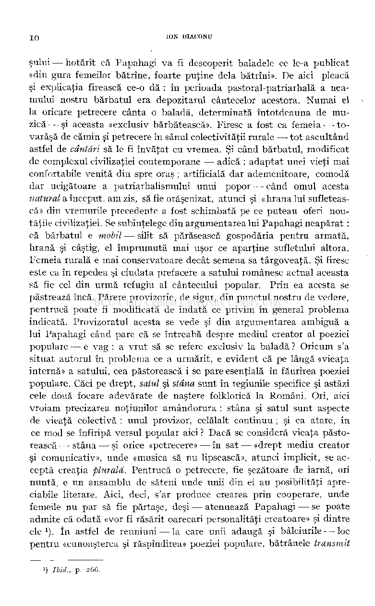

şului — hotărît că Papahagi v a fi descoperit baladele ce le-a publicat «din gura femeilor bătrîne, foarte puţine delà bătrîni». De aici pleacă şi explicaţia firească ce-o dă : în perioada pastoral-patriarhală a neamului nostru bărbatul era depozitarul cântecelor acestora. Numai el la oricare petrecere cânta o baladă, determinată întotdeauna de muzică — şi aceasta «exclusiv bărbătească». Firesc a fost ca femeia — tovarăşă de cămin şi petrecere în sânul colectivităţii rurale —• tot ascultând astfel de cântări să le fi învăţat cu vremea. Şi când bărbatul, modificat de complexul civilizaţiei contemporane — adică : adaptat unei vieţi mai confortabile venită din spre oraş ; artificială dar ademenitoare, comodă dar ucigătoare a patriarhalismului unui popor — când omul acesta natural a început, am zis, să fie orăşenizat, atunci şi « hrana lui sufletească» din vremurile precedente a fost schimbată pe ce puteau oferi noutăţile civilizaţiei. Se subînţelege din argumentarea lui Papahagi neapărat : că bărbatul e mobil — silit să părăsească gospodăria pentru armată, hrană şi câştig, el împrumută mai uşor ce aparţine sufletului altora. Femeia rurală e mai conservatoare decât semena sa târgoveaţă. Şi firesc este ca în repedea şi ciudata prefacere a satului românesc actual aceasta să fie cel din urmă refugiu al cântecului popular. Prin ea acesta se păstrează încă. Părere provizorie, de sigur, din punctul nostru de vedere, pentrucă poate fi modificată de îndată ce privim în general problema indicată. Provizoratul acesta se vede şi din argumentarea ambiguă a lui Papahagi când pare că se întreabă despre mediul creator al poeziei populare — e vag : a vrut să se refere exclusiv la baladă ? Oricum s'a situat autorul în problema ce a urmărit, e evident că pe lângă «vieaţa internă» a satului, cea păstorească i se pare esenţială în făurirea poeziei populare. Căci pe drept, satul şi stâna sunt în regiunile specifice şi astăzi cele două focare adevărate de naştere folklorică la Români. Ori, aici vroiam precizarea noţiunilor amândorura : stâna şi satul sunt aspecte de vieaţă colectivă : unul provizor, celălalt continuu ; şi ca atare, în ce mod se înfiripă versul popular aici ? Dacă se consideră vieaţa păstorească — stâna — şi orice «petrecere» — în sat — «drept mediu creator şi comunicativ», unde «musica să nu lipsească», atunci implicit, se acceptă creaţia plurală. Pentrucă o petrecere, fie şezătoare de iarnă, ori nuntă, e un ansamblu de săteni unde unii din ei au posibilităţi apreciabile literare. Aici, deci, s'ar produce crearea prin cooperare, unde femeile nu par să fie părtaşe, deşi — atenuează Papahagi — se poate admite că odată «vor fi răsărit oarecari personalităţi creatoare» şi dintre ele ). în astfel de reuniuni — la care unii adaugă şi bâlciurile — loc pentru «cunoaşterea şi răspîndirea» poeziei populare, bătrânele transmit

>) Ibid., p. 266.

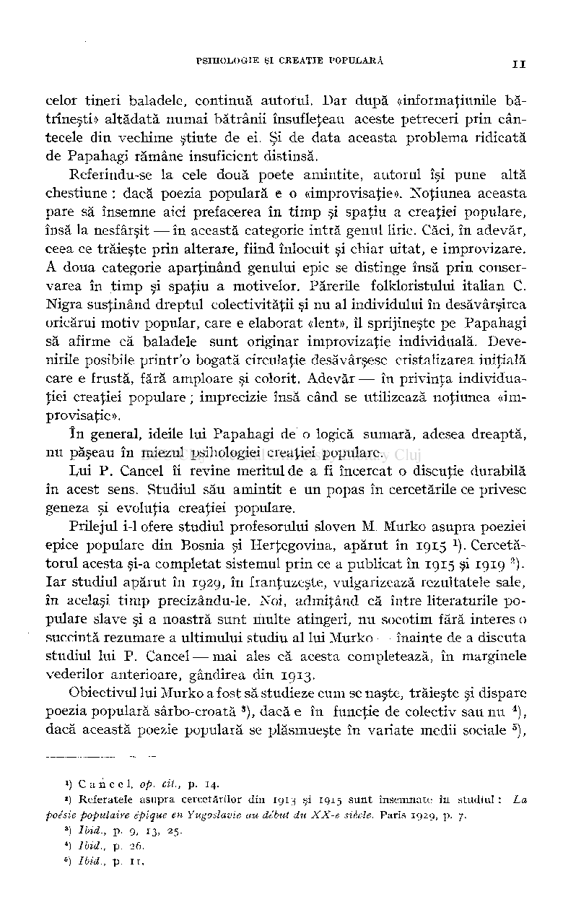

celor tineri baladele, continuă autorul. Dar după «informaţiunile bătrîneşti» altădată numai bătrânii însufleţeau aceste petreceri prin cântecele din vechime ştiute de ei. Şi de data aceasta problema ridicată de Papahagi rămâne insuficient distinsă.

Referindu~se la cele două poete amintite, autorul îşi pune altă chestiune : dacă poezia populară e o «improvisaţie». Noţiunea aceasta pare să însemne aici prefacerea în timp şi spaţiu a creaţiei populare, însă la nesfârşit — în această categorie intră genul liric. Căci, în adevăr, ceea ce trăieşte prin alterare, fiind înlocuit şi chiar uitat, e improvizare. A doua categorie aparţinând genului epic se distinge însă prin conservarea în timp şi spaţiu a motivelor. Părerile folkloristului italian C. Nigra susţinând dreptul colectivităţii şi nu al individului în desăvârşirea oricărui motiv popular, care e elaborat «lent», îl sprijineşte pe Papahagi

- să afirme că baladele sunt originar improvizaţie individuală. Devenirile posibile printr'o bogată circulaţie desăvârşesc cristalizarea iniţială care e frustă, fără amploare şi colorit. Adevăr — în privinţa individuaţiei creaţiei populare ; imprecizie însă când se utilizează noţiunea «improvisaţie».

î n general, ideile lui Papahagi de o logică sumară, adesea dreaptă, nu păşeau în miezul psihologiei creaţiei populare.

Lui P . Cancel îi revine meritul de a fi încercat o discuţie durabilă în acest sens. Studiul său amintit e un popas în cercetările ce privesc geneza şi evoluţia creaţiei populare.

Prilejul i-1 ofere studiul profesorului sloven M. Murko asupra poeziei epice populare din Bosnia şi Herţegovina, apărut în 19x5

). Cercetătorul acesta şi-a completat sistemul prin ce a publicat în 1915 şi 1919 )Iar studiul apărut în 1929, în franţuzeşte, vulgarizează rezultatele sale, în acelaşi timp precizându-le. Noi, admiţând că între literaturile populare slave şi a noastră sunt multe atingeri, nu socotim fără interes o succintă rezumare a ultimului studiu al lui Murko — înainte de a discuta studiul lui P. Cancel — mai ales că acesta completează, în marginele vederilor anterioare, gândirea din 1913.

1

Obiectivul lui Murko a fost să studieze cum se naşte, trăieşte şi dispare poezia populară sârbo-croată ) , dacă e în funcţie de colectiv sau nu

) , dacă această poezie populară se plăsmueşte în variate medii sociale ) ,

4

### ») Cancel , op. cit., p. 14. ') Referatele asupra cercetărilor din 1913 şi 1915 sunt însemnate în studiul : La

poésie populaire épique en Yugoslavie au début du XX-e siècle. Paris 1929, p. 7.

) Ibid., p. 9, 13, 25.

3

) Ibid., p. 26.

a

) Ibid., p. H.

6

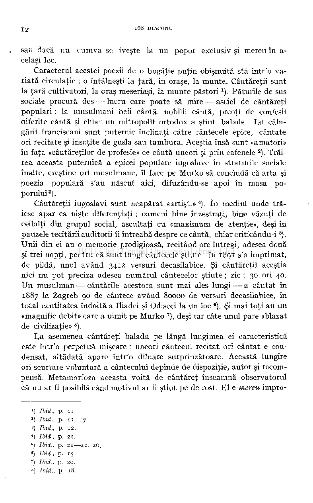

sau dacă nu cumv a se iveşte la un popor exclusiv şi mereu în acelaşi loc.

Caracterul acestei poezii de o bogăţie puţin obişnuită stă într'o variată circulaţie : o întâlneşti la ţară, în oraşe, la munte. Cântăreţii sunt la ţară cultivatori, la oraş meseriaşi, la munte păstori ). Păturile de sus sociale procură des — lucru care poate să mire — astfel de cântăreţi populari : la musulmani beii cântă, nobilii cântă, preoţi de confesii diferite cântă şi chiar un mitropolit ortodox a ştiut balade. Iar călugării franciscani sunt puternic înclinaţi către cântecele epice, cântate ori recitate şi însoţite de gusla sau tambura. Aceştia însă sunt «amatori» în faţa «cântăreţilor de profesie» ce cântă uneori şi prin cafenele ). Trăirea aceasta puternică a epicei populare iugoslave în straturile sociale înalte, creştine ori musulmane, îl face pe Murko să concludă că arta şi poezia populară s'au născut aici, difuzându-se apoi în masa poporului

). Cântăreţii iugoslavi sunt neapărat «artişti»

3

). în mediul unde trăiesc apar ca nişte diferenţiaţi : oameni bine înzestraţi, bine văzuţi de ceilalţi din grupul social, ascultaţi cu «maximum de atenţie», deşi în pauzele recitării auditorii îi întreabă despre ce cântă, chiar criticându-i

4

). Unii din ei au o memorie prodigioasă, recitând ore întregi, adesea două şi trei nopţi, pentru că sunt lungi cântecele ştiute : în 1891 s'a imprimat, de pildă, unul având 3412 versuri decasilabice. Şi cântăreţii aceştia nici nu pot preciza adesea numărul cântecelor ştiute ; zic : 30 ori 40. U n musulman — cântările acestora sunt mai ales lungi— a cântat în 1887 la Zagreb 90 de cântece având 80000 de versuri decasilabice, în total cantitatea îndoită a Iliadei şi Odiseei la un loc ). Şi mai toţi au un «magnific debit» care a uimit pe Murko ), deşi rar câte unul pare «blazat de civilizaţie»

5

).

8

L a asemenea cântăreţi balada pe lângă lungimea ei caracteristică este într'o perpetuă mişcare : uneori cântecul recitat ori cântat e condensat, altădată apare într'o diluare surprinzătoare. Această lungire ori scurtare voluntară a cântecului depinde de dispoziţie, autor şi recompensă. Metamorfoza aceasta voită de cântăreţ înseamnă observatorul că nu ar fi posibilă când motivul ar fi ştiut pe de rost. E l e mereu impro-

!) Ibid., p. 11. ') Ibid., p. 11, 17.

- 3

) Ibid., p. 12.

- 4

) Ibid., p. 21.

- 5

) Ibid., p. 21—22, 26.

•) Ibid., p. 15. ') Ibid., p. 20.

) Ibid., p. 18.

8

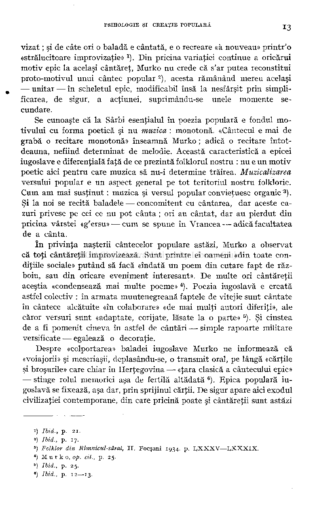

vizat ; şi de câte ori o baladă e cântată, e o recreare «à nouveau» printr'o «strălucitoare improvizaţie» ). Din pricina variaţiei continue a oricărui motiv epic la acelaşi cântăreţ, Murko nu crede că s'ar putea reconstitui proto-motivul unui cântec popular

), acesta rămânând mereu acelaşi — unitar — în scheletul epic, modificabil însă la nesfârşit prin simplificarea, de sigur, a acţiunei, suprimându-se unele momente secundare.

2

Se cunoaşte că la Sârbi esenţialul în poezia populară e fondul motivului cu forma poetică şi nu muzica : monotonă. «Cântecul e mai de grabă o recitare monotonă» înseamnă Murko ; adică o recitare întotdeauna, nefiind determinat de melodie. Această caracteristică a epicei iugoslave e diferenţială faţă de ce prezintă folklorul nostru : nu e un motiv poetic aici pentru care muzica să nu-i determine trăirea. Muzicalizarea versului popular e un aspect general pe tot teritoriul nostru folkloric. Cum a m mai susţinut : muzica şi versul popular convieţuesc organic

)

3

Şi la noi se recită baladele — concomitent cu cântarea, dar aceste cazuri privesc pe cei ce nu pot cânta ; ori au cântat, dar au pierdut din pricina vârstei «g'ersu» •— cu m se spune în Vrancea — adică facultatea de a cânta.

î n privinţa naşterii cântecelor populare astăzi, Murko a observat că toţi cântăreţii improvizează. Sunt printre ei oameni «din toate condiţiile sociale» putând să facă «îndată un poem din cutare fapt de războiu, sau din oricare eveniment interesant». De multe ori cântăreţii aceştia «condensează mai multe poeme» ). Poezia iugoslavă e creată astfel colectiv : în armata muntenegreană faptele de vitejie sunt cântate în cântece alcătuite «în colaborare» «de mai mulţi autori diferiţi», ale căror versuri sunt «adaptate, corijate, lăsate la o parte»

). Şi cinstea de a fi pomenit cineva în astfel de cântări —• simple rapoarte militare versificate — egalează o decoraţie.

5

Despre «colportarea» baladei iugoslave Murko ne informează că «voiajorii» şi meseriaşii, deplasându-se, o transmit oral, pe lângă «cărţile şi broşurile» care chiar în Herţegovina — «ţara clasică a cântecului epic» — stinge rolul memoriei aşa de fertilă altădată ). Epica populară iugoslavă se fixează, aşa dar, prin sprijinul cărţii. De sigur apare aici exodul civilizaţiei contemporane, din care pricină poate şi cântăreţii sunt astăzi

!) Ibid., p. 21.

- 2

) Ibid., p. 17.

- 3

) Folklor din Rîmnicul-sărat, II. Focşani 1934. p. LXXXV—LXXXIX.

- 4

) Murko,»/). cit., p. 25.

- 5

###### ) Ibid., p. 25.

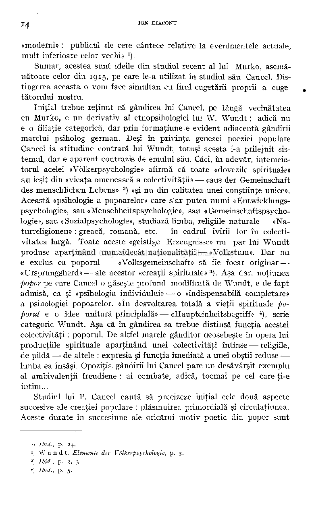

«moderni» : publicul «le cere cântece relative la evenimentele actuale, mult inferioare celor vechi» )

Sumar, acestea sunt ideile din studiul recent al lui Murko, asemă­

- nătoare celor din 1915, pe care le-a utilizat în studiul său Cancel. Distingerea aceasta o vo m face simultan cu firul cugetării proprii a cuge- .

- tătorului nostru. Iniţial trebue reţinut că gândirea lui Cancel, pe lângă vecinătatea

cu Murko, e un derivativ al etnopsihologiei lui W. Wundt ; adică nu e o filiaţie categorică, dar prin formaţiune e evident adiacentă gândirii marelui psiholog german. Deşi în privinţa genezei poeziei populare Cancel ia atitudine contrară lui Wundt, totuşi acesta i-a prilejuit sistemul, dar e aparent contrazis de emulul său. Căci, în adevăr, întemeietorul acelei «Vôlkerpsychologie» afirmă că toate «dovezile spirituale» au ieşit din «vieaţa omenească a colectivităţii» — «aus der Gemeinschaft des menschlichen Lebens» ) «şi nu din calitatea unei conştiinţe unice». Această «psihologie a popoarelor» care s'ar putea numi «Entwicklungspsychologie», sau «Menschheitspsychologie», sau « Gemeinschaftspsychologie», sau «Sozialpsychologie», studiază limba, religiile naturale — «Naturreligionen» : greacă, romană, etc.-—în cadrul ivirii lor în colectivitatea largă. Toate aceste «geistige Erzeugnisse» nu par lui Wund t produse aparţinând numaidecât naţionalităţii — «Volkstum». Dar nu e exclus ca poporul — «Volksgemeinschaft» să fie focar originar «Ursprungsherd» — ale acestor «creaţii spirituale»

). Aşa dar, noţiunea popor pe care Cancel o găseşte profund modificată de Wundt, e de fapt admisă, ca şi «psihologia individului» — o «indispensabilă completare» a psihologiei popoarelor. «în desvoltarea totală a vieţii spirituale po­

3

porul e o idee unitară principială» — «Haupteinheitsbegriff» ), scrie categoric Wundt. Aş a că în gândirea sa trebue distinsă funcţia acestei colectivităţi : poporul. De altfel marele gânditor deosebeşte în opera lui producţiile spirituale aparţinând unei colectivităţi întinse — religiile, de pildă — de altele : expresia şi funcţia imediată a unei obştii reduse limba ea însăşi. Opoziţia gândirii lui Cancel pare un desăvârşit exemplu al ambivalenţii freudiene : ai combate, adică, tocmai pe cel care ţi-e intim...

Studiul lui P. Cancel caută să precizeze iniţial cele două aspecte succesive ale creaţiei populare : plăsmuirea primordială şi circulaţiunea. Aceste durate în succesiune ale oricărui motiv poetic din popor sunt

!) Ibid., p. 24.

- 2

) W u n d t, Elemente der Vôlkerpsychologie, p. 3.

- 3

) Ibid., p. 2, 3.

- 4

) Ibid., p. 5.

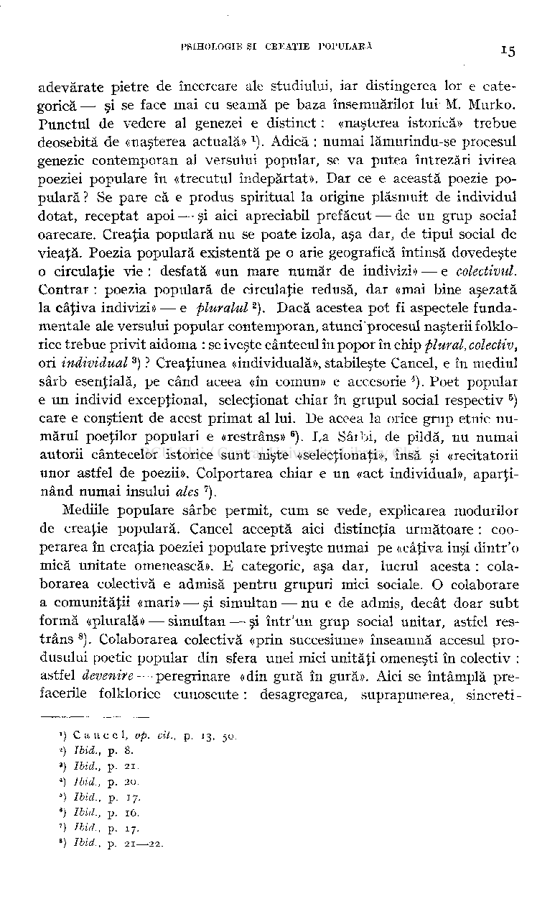

adevărate pietre de încercare ale studiului, iar distingerea lor e categorică—• şi se face mai cu seamă pe baza însemnărilor lui M. Murko. Punctul de vedere al genezei e distinct : «naşterea istorică» trebue deosebită de «naşterea actuală»

). Adică : numai lămurindu-se procesul genezic contemporan al versului popular, se v a putea întrezări ivirea poeziei populare în «trecutul îndepărtat». Dar ce e această poezie populară? Se pare că e produs spiritual la origine plăsmuit de individul dotat, receptat apoi — şi aici apreciabil prefăcut — de un grup social oarecare. Creaţia populară nu se poate izola, aşa dar, de tipul social de vieaţă. Poezia populară existentă pe o arie geografică întinsă dovedeşte

1

- o circulaţie vie : desfată «un mare număr de indivizi» — e colectivul. Contrar : poezia populară de circulaţie redusă, dar «mai bine aşezată la câţiva indivizi» — e pluralul ). Dacă acestea pot fi aspectele fundamentale ale versului popular contemporan, atunci procesul naşterii folklorice trebue privit aidoma : se iveşte cântecul în popor în chip plural, colectiv,
- ori individual

) ? Creaţiunea «individuală», stabileşte Cancel, e în mediul sârb esenţială, pe când aceea «în comun» e accesorie ). Poet popular e un individ excepţional, selecţionat chiar în grupul social respectiv

3

)

5

care e conştient de acest primat al lui. De aceea la orice grup etnic numărul poeţilor populari e «restrâns» ). L a Sârbi, de pildă, nu numai autorii cântecelor istorice sunt nişte «selecţionaţi», însă şi «recitatorii unor astfel de poezii». Colportarea chiar e un «act individual», aparţinând numai insului ales

).

7

Mediile populare sârbe permit, cum se vede, explicarea modurilor de creaţie populară. Cancel acceptă aici distincţia următoare : cooperarea în creaţia poeziei populare priveşte numai pe «câţiva inşi dintr'o mică unitate omenească». E categoric, aşa dar, lucrul acesta : colaborarea colectivă e admisă pentru grupuri mici sociale. O colaborare a comunităţii «mari» — şi simultan — nu e de admis, decât doar subt formă «plurală» — simultan — şi într'un grup social unitar, astfel restrâns

). Colaborarea colectivă «prin succesiune» înseamnă accesul produsului poetic popular din sfera unei mici unităţi omeneşti în colectiv : astfel devenire — peregrinare «din gură în gură». Aici se întâmplă prefacerile folklorice cunoscute : desagregarea, suprapunerea, sincreti-

8

•) Cancel , op. cit., p. 13, 50.

Ibid., p. 8.

) Ibid., p. 21. ") Ibid., p. 20.

3

- 5

) Ibid., p. 17.

- 6

) Ibid., p. 16. ') Ibid., p. 17.

) Ibid.., p. 21—-22.

8

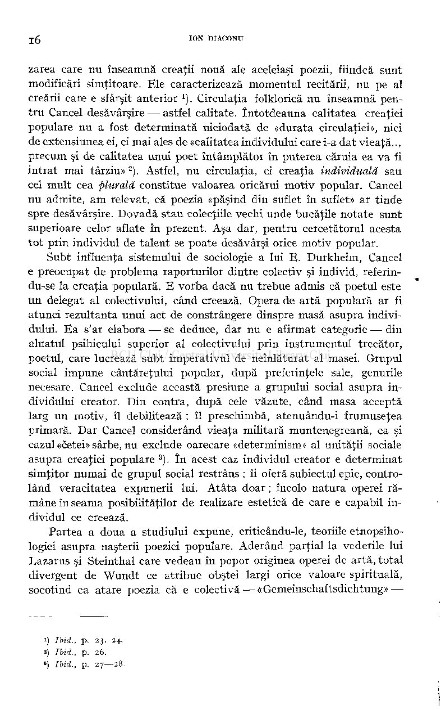

zarea care nu înseamnă creaţii nouă ale aceleiaşi poezii, fiindcă sunt modificări simţitoare. Ele caracterizează momentul recitării, nu pe al creării care e sfârşit anterior Circulaţia folklorică nu înseamnă pentru Cancel desăvârşire — astfel calitate. întotdeauna calitatea creaţiei populare nu a fost determinată niciodată de «durata circulaţiei », nici de extensiunea ei, ci mai ales de «calitatea individului care i-a dat vieaţă.., precum şi de calitatea unui poet întâmplător în puterea căruia ea v a fi intrat mai târziu»

). Astfel, nu circulaţia, ci creaţia individuală sau cel mult cea -pluralâ constitue valoarea oricărui motiv popular. Cancel nu admite, am relevat, că poezia «păşind din suflet în suflet» ar tinde spre desăvârşire. Dovad ă stau colecţiile vechi unde bucăţile notate sunt superioare celor aflate în prezent. Aşa dar, pentru cercetătorul acesta tot prin individul de talent se poate desăvârşi orice motiv popular.

2

Subt influenţa sistemului de sociologie a lui E. Durkheim, Cancel e preocupat de problema raporturilor dintre colectiv şi individ, referindu-se la creaţia populară. E vorba dacă nu trebue admis că poetul este un delegat al colectivului, când creează. Opera de artă populară ar fi atunci rezultanta unui act de constrângere dinspre masă asupra individului. E a s'ar elabora — se deduce, dar nu e afirmat categoric — din aluatul psihicului superior al colectivului prin instrumentul trecător, poetul, care lucrează subt imperativul de neînlăturat al masei. Grupul social impune cântăreţului popular, după preferinţele sale, genurile necesare. Cancel exclude această presiune a grupului social asupra individului creator. Din contra, după cele văzute, când masa acceptă larg un motiv, îl debilitează : îl preschimbă, atenuându-i frumuseţea primară. Dar Cancel considerând vieaţa militară muntenegreană, ca şi cazul «cetei» sârbe, nu exclude oarecare «determinism» al unităţii sociale asupra creaţiei populare ). î n acest caz individul creator e determinat simţitor numai de grupul social restrâns : îi oferă subiectul epic, controlând veracitatea expunerii lui. Atâta doar ; încolo natura operei rămâne în seama posibilităţilor de realizare estetică de care e capabil individul ce creează.

Partea a doua a studiului expune, criticându-le, teoriile etnopsihologiei asupra naşterii poeziei populare. Aderând parţial la vederile lui Lazarus şi Steinthal care vedeau în popor originea operei de artă, total divergent de Wundt ce atribue obştei largi orice valoare spirituală, socotind ca atare poezia că e colectivă—«Gemeinschaftsdichtung» —

) Ibid., p. 23, 24.

J

2) Ibid., p. 26.

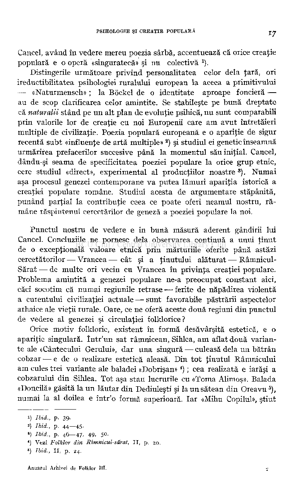

Cancel, având în vedere mereu poezia sârbă, accentuează că orice creaţie populară e o operă «singuratecă» şi nu colectivă ).

Distingerile următoare privind personalitatea celor delà ţară, ori ireductibilitatea psihologiei ruralului european la aceea a primitivului — «Naturmensch» ; la Bôckel de o identitate aproape foncieră au de scop clarificarea celor amintite. Se stabileşte pe bună dreptate că naturalii stând pe un alt plan de evoluţie psihică, nu sunt comparabili prin valorile lor de creaţie cu noi Europenii care am avut întretăieri multiple de civilizaţie. Poezia populară europeană e o apariţie de sigur recentă subt «influenţe de artă multiple»

) şi studiul ei genetic înseamnă urmărirea prefacerilor succesive până la momentul său iniţial. Cancel, dându-şi seama de specificitatea poeziei populare la orice grup etnic, cere studiul «direct», experimental al producţiilor noastre ) . Numai aşa procesul genezei contemporane v a putea lămuri apariţia istorică a creaţiei populare române. Studiul acesta de argumentare stăpânită, punând parţial la contribuţie ceea ce poate oferi neamul nostru, rămâne răspintenul cercetărilor de geneză a poeziei populare la noi.

2

Punctul nostru de vedere e în bună măsură aderent gândirii lui Cancel. Concluziile ne pornesc delà observarea continuă a unui ţinut de o excepţională valoare etnică prin mărturiile oferite până astăzi cercetătorilor — Vrancea — cât şi a ţinutului alăturat — RâmniculSărat — de multe ori vecin cu Vrancea în privinţa creaţiei populare. Problema amintită a genezei populare ne-a preocupat constant aici, căci socotim că numai regiunile retrase — ferite de năpădirea violentă a curentului civilizaţiei actuale — sunt favorabile păstrării aspectelor arhaice ale vieţii rurale. Oare, ce ne oferă aceste două regiuni din punctul de vedere al genezei şi circulaţiei folklorice?

Orice motiv folkloric, existent în formă desăvârşită estetică, e o apariţie singulară. într'un sat râmnicean, Sihlea, a m aflat două variante ale «Cântecului Gerului», dar una singură — culeasă delà un bătrân cobzar — e de o realizare estetică aleasă. Din tot ţinutul Râmnicului am cules trei variante ale baladei «Dobrişan» ) ; cea realizată e iarăşi a cobzarului din Sihlea. Tot aşa stau lucrurile cu «Toma Alimoş». Balada «Doncilă» găsită la un lăutar din Dediuleşti şi la un sătean din Oreavu

), numai la al doilea e într'o formă superioară. Iar «Mihu Copilul», ştiut

5

1) Ibid., p. 39.

') Ibid., p. 44—45>) Ibid., p. 46—47, 49. 5°-

*) Vezi Folklor din Rîmnicul-sărat, II, p. 20.

•) Ibid., II, p. 24.

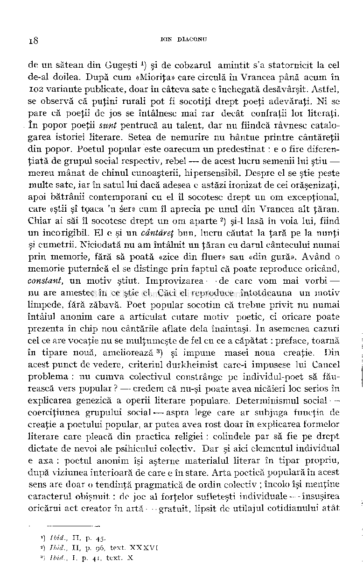

) şi de cobzarul amintit s'a statornicit la cel de-al doilea. După cum «Mioriţa» care circulă în Vrancea până acum în 102 variante publicate, doar în câteva sate e închegată desăvârşit. Astfel, se observă că puţini rurali pot fi socotiţi drept poeţi adevăraţi. Ni se pare că poeţii de jos se întâlnesc mai rar decât confraţii lor literaţi, î n popor poeţii sunt pentrucă au talent, dar nu fiindcă râvnesc catalogarea istoriei literare. Setea de nemurire nu bântue printre cântăreţii din popor. Poetul popular este oarecum un predestinat : e o fire diferenţiată de grupul social respectiv, rebel — de acest lucru semenii lui ştiu mereu mânat de chinul cunoaşterii, hipersensibil. Despre el se ştie peste multe sate, iar în satul lui dacă adesea e astăzi ironizat de cei orăşenizaţi, apoi bătrânii contemporani cu el îl socotesc drept un om excepţional, care «ştii şî toaca 'n ser» cum îl aprecia pe unul din Vrancea alt ţăran. Chiar ai săi îl socotesc drept un om aparte

de un sătean din Gugeşti

x

) şi-1 lasă în voia lui, fiind un incorigibil. El e şi un cântăreţ bun, lucru căutat la ţară pe la nunţi şi cumetrii. Niciodată nu am întâlnit un ţăran cu darul cântecului numai prin memorie, fără să poată «zice din fluer» sau «din gură». Avân d o memorie puternică el se distinge prin faptul că poate reproduce oricând, constant, un motiv ştiut. Improvizarea — de care vo m mai vorbi nu are amestec în ce ştie el. Căci el reproduce întotdeauna un motiv limpede, fără zăbavă. Poet popular socotim că trebue privit nu numai întâiul anonim care a articulat cutare motiv poetic, ci oricare poate prezenta în chip nou cântările aflate delà înaintaşi. î n asemenea cazuri cel ce are vocaţie nu se mulţumeşte de fel cu ce a căpătat : preface, toarnă în tipare nouă, ameliorează

2

) şi impune masei noua creaţie. Din acest punct de vedere, criteriul durkheimist care-i impusese lui Cancel problema : nu cumva colectivul constrânge pe individul-poet să făurească vers popular ? — credem că nu-şi poate avea nicăieri loc serios în explicarea genezică a operii literare populare. Determinismul social coerciţiunea grupului social — aspra lege care ar subjuga funcţia de creaţie a poetului popular, ar putea avea rost doar în explicarea formelor literare care pleacă din practica religiei : colindele par să fie pe drept dictate de nevoi ale psihicului colectiv. Dar şi aici elementul individual e axa : poetul anonim îşi aşterne materialul literar în tipar propriu, după viziunea interioară de care e în stare. Arta poetică populară în acest sens are doar o tendinţă pragmatică de ordin colectiv ; încolo îşi menţine caracterul obişnuit : de joc al forţelor sufleteşti individuale — însuşirea oricărui act creator în artă — gratuit, lipsit de utilajul cotidianului atât

3

i) Ibid., II, p. 45.

## Ibid., II, p. 96, text. XXXVI.

## i Ibid., I, p. 41, text. X.

3

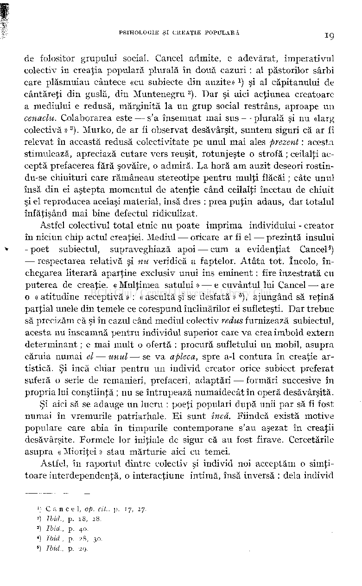

de folositor grupului social. Cancel admite, e adevărat, imperativul colectiv în creaţia populară plurală în două cazuri : al păstorilor sârbi care plăsmuiau cântece «cu subiecte din auzite» ) şi al căpitanului de cântăreţi din guslă, din Muntenegru ). Dar şi aici acţiunea creatoare a mediului e redusă, mărginită la un grup social restrâns, aproape un cenaclu. Colaborarea este — s'a însemnat mai sus — plurală şi nu «larg colectivă »

). Murko, de ar fi observat desăvârşit, suntem siguri că ar fi relevat în această redusă colectivitate pe unul mai ales prezent : acesta stimulează, apreciază cutare vers reuşit, rotunjeşte o strofă ; ceilalţi acceptă prefacerea fără şovăire, o admiră. Da horă am auzit deseori rostindu-se chiuituri care rămâneau stereotipe pentru mulţi flăcăi ; câte unul însă din ei aştepta momentul de atenţie când ceilalţi încetau de chiuit şi el reproducea acelaşi material, însă dres : prea puţin adaus, dar totalul înfăţişând mai bine defectul ridiculizat.

3

Astfel colectivul total etnic nu poate imprima individului - creator în niciun chip actul creaţiei. Mediul — oricare ar fi el — prezintă insului

- poet subiectul, supraveghiază apoi — cum a evidenţiat Cancel

) — respectarea relativă şi nu veridică a faptelor. Atâta tot. încolo, închegarea literară aparţine exclusiv unui ins eminent : fire înzestrată cu puterea de creaţie. « Mulţimea satului » — e cuvântul lui Cancel —• are o « atitudine receptivă » : « ascultă şi se desfată »

4

), ajungând să reţină parţial unele din temele ce corespund înclinărilor ei sufleteşti. Dar trebue să precizăm că şi în cazul când mediul colectiv redus furnizează subiectul, acesta nu înseamnă pentru individul superior care v a crea imbold extern determinant ; e mai mult o ofertă : procură sufletului un mobil, asupra căruia numai el — unul — se v a apleca, spre a-1 contura în creaţie artistică. Şi încă chiar pentru un individ creator orice subiect preferat suferă o serie de remanieri, prefaceri, adaptări — formări succesive în propria lui conştiinţă ; nu se întrupează numaidecât în operă desăvârşită.

5

Şi aici să se adauge un lucru : poeţi populari după unii par să fi fost numai în vremurile patriarhale. Ei sunt încă. Fiindcă există motive populare care abia în timpurile contemporane s'au aşezat în creaţii desăvârşite. Formele lor iniţiale de sigur că au fost firave. Cercetările asupra « Mioriţei » stau mărturie aici cu temei.

Astfel, în raportul dintre colectiv şi individ noi acceptăm o simţitoare interdependenţă, o interacţiune intimă, însă inversă : delà individ

) Cancel , op. cit.. p. 17, 27.

1

=) Ibid., p. 18, 28.

) Ibid., p. 40.

s

) Ibid., p. 28, 30.

4

) Ibid., p. 29.

8

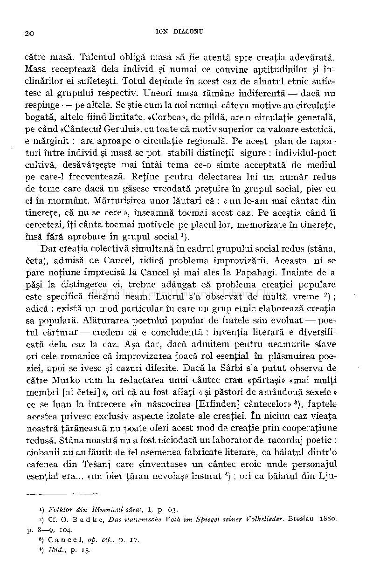

către masă. Talentul obligă masa să fie atentă spre creaţia adevărată. Masa receptează delà individ şi numai ce convine aptitudinilor şi înclinărilor ei sufleteşti. Totul depinde în acest caz de aluatul etnic sufletesc al grupului respectiv. Uneori masa rămâne indiferentă — dacă nu respinge •— pe altele. Se ştie cum la noi numai câteva motive au circulaţie bogată, altele fiind limitate. «Corbea», de pildă, are o circulaţie generală, pe când «Cântecul Gerului», cu toate că motiv superior ca valoare estetică, e mărginit : are aproape o circulaţie regională. Pe acest plan de raporturi între individ şi masă se pot stabili distincţii sigure : individul-poet cultivă, desăvârşeşte mai întâi tema ce-o simte acceptată de mediul pe care-1 frecventează. Reţine pentru delectarea lui un număr redus de teme care dacă nu găsesc vreodată preţuire în grupul social, pier cu el în mormânt. Mărturisirea unor lăutari că : « nu le-am mai cântat din tinereţe, că nu se cere », înseamnă tocmai acest caz. Pe aceştia când îi cercetezi, îţi cântă tocmai motivele pe placul lor, memorizate în tinereţe, însă fără aprobare în grupul social ).

Dar creaţia colectivă simultană în cadrul grupului social redus (stâna, ceta), admisă de Cancel, ridică problema improvizării. Aceasta ni se pare noţiune imprecisă la Cancel şi mai ales la Papahagi. înainte de a păşi la distingerea ei, trebue adăugat că problema creaţiei populare este specifică fiecărui neam. Lucrul s'a observat de multă vreme

) ;

2

adică : există un mod particular în care un grup etnic elaborează creaţia sa populară. Alăturarea poetului popular de fratele său evoluat — poetul cărturar — credem că e concludentă : invenţia literară e diversificată delà caz la caz. Aşa dar, dacă admitem pentru neamurile slave ori cele romanice că improvizarea joacă rol esenţial în plăsmuirea poeziei, apoi se ivesc şi cazuri diferite. Dac ă la Sârbi s'a putut observa de către Murko cum la redactarea unui cântec erau «părtaşi» «mai mulţi membri [ai cetei] », ori că au fost aflaţi « şi păstori de amândouă sexele » ce se luau la întrecere «în născocirea [Erfinden] cântecelor» ) , faptele acestea privesc exclusiv aspecte izolate ale creaţiei. î n niciun caz vieaţa noastră ţărănească nu poate oferi acest mod de creaţie prin cooperaţiune redusă. Stâna noastră nu a fost niciodată un laborator de racordaj poetic : ciobanii nu au făurit de fel asemenea fabricate literare, ca băiatul dintr'o cafenea din Tesanj care «inventase» un cântec eroic unde personajul esenţial era... «un biet ţăran nevoiaş» însurat ) ; ori ca băiatul din Lju-

') Folklor din Rîmnicul-sărat, I, p. 63.

- 2) Cf. O. B adke , Das italienische Volk im Spiegel seiner Volkslieder. Breslau 1880.

p. 8—9, 104. ») Cancel , op. cit., p. 17.

*) Ibid., p. 15.

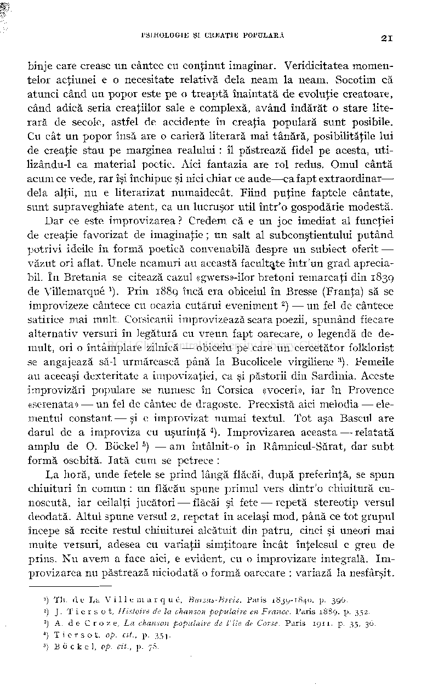

binje care crease un cântec cu conţinut imaginar. Veridicitatea momentelor acţiunei e o necesitate relativă delà neam la neam. Socotim că atunci când un popor este pe o treaptă înaintată de evoluţie creatoare, când adică seria creaţiilor sale e complexă, având îndărăt o stare literară de secole, astfel de accidente în creaţia populară sunt posibile. Cu cât un popor însă are o carieră literară mai tânără, posibilităţile lui de creaţie stau pe marginea realului : îl păstrează fidel pe acesta, utilizându-1 ca material poetic. Aici fantazia are rol redus. Omul cântă acum ce vede, rar îşi închipue şi nici chiar ce aude—ca fapt extraordinardelà alţii, nu e literarizat numaidecât. Fiind puţine faptele cântate, sunt supraveghiate atent, ca un lucruşor util într'o gospodărie modestă.

Dar ce este improvizarea ? Credem că e un joc imediat al funcţiei de creaţie favorizat de imaginaţie ; un salt al subconştientului putând potrivi ideile în formă poetică convenabilă despre un subiect oferit văzut ori aflat. Unele neamuri au această facultate într'un grad apreciabil, î n Bretania se citează cazul «g\vers»-ilor bretoni remarcaţi din 1839 de Yillemarquâ ). Prin 1889 încă era obiceiul în Bresse (Franţa) să se improvizeze cântece cu ocazia cutărui eveniment ) — un fel de cântece satirice mai mult. Corsicanii improvizează seara poezii, spunând fiecare alternativ versuri în legătură cu vreun fapt oarecare, o legendă de demult, ori o întâmplare zilnică — obiceiu pe care un cercetător folklorist se angajează să-1 urmărească până la Bucolicele virgiliene ) . Femeile au aceeaşi dexteritate a impovizaţiei, ca şi păstorii din Sardinia. Aceste improvizări populare se numesc în Corsica «voceri», iar în Provence «serenata» — un fel de cântec de dragoste. Preexistă aici melodia — elementul constant — şi e improvizat numai textul. Tot aşa Bascul are darul de a improviza cu uşurinţă ). Improvizarea aceasta — relatată amplu de O. Bôckel ) — am întâlnit-o în Râmnicul-Sărat, dar subt formă osebită. Iată cum se petrece :

Da horă, unde fetele se prind lângă flăcăi, după preferinţă, se spun chiuituri în comun : un flăcău spune primul vers dintr'o chiuitură cunoscută, iar ceilalţi jucători — flăcăi şi fete — repetă stereotip versul deodată. Altul spune versul 2, repetat în acelaşi mod, până ce tot grupul începe să recite restul chiuiturei alcătuit din patru, cinci şi uneori mai multe versuri, adesea cu variaţii simţitoare încât înţelesul e greu de prins. N u avem a face aici, e evident, cu o improvizare integrală. Improvizarea nu păstrează niciodată o formă oarecare : variază la nesfârşit.

##### ') Th. de La V i 11 e m a r q u é, Barzas-Breiz. Paris 1839-1840. p. 396.

») J. Tiersot , Histoire, de la chanson populaire en France. Paris 1889. p. 352.

- 3

) A. d e C r o z e, La chanson populaire de Vile de Corse. Paris 1911. p. 35, 30

- 4

) Tiersot , op. cit., p. 354. ») Bôckel , op. cit., p. 78.

