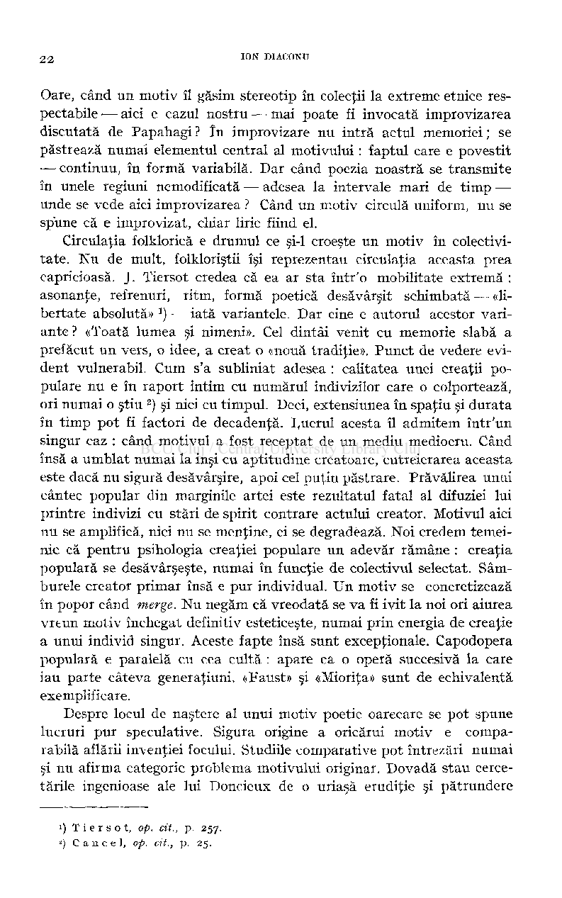

Oare, când un motiv îl găsim stereotip în colecţii la extreme etnice respectabile •— aici e cazul nostru — mai poate fi invocată improvizarea discutată de Papahagi ? î n improvizare nu intră actul memoriei ; se păstrează numai elementul central al motivului : faptul care e povestit — continuu, în formă variabilă. Dar când poezia noastră se transmite în unele regiuni nemodificată — adesea la intervale mari de timp unde se vede aici improvizarea ? Când un motiv circulă uniform, nu se spune că e improvizat, chiar liric fiind el.

Circulaţia folklorică e drumul ce şi-1 croeşte un motiv în colectivitate. N u de mult, folkloriştii îşi reprezentau circulaţia aceasta prea capricioasă. J. Tiersot credea că ea ar sta într'o mobilitate extremă : asonante, refrenuri, ritm, formă poetică desăvârşit schimbată — «libertate absolută» ) — iată variantele. Dar cine e autorul acestor variante? «Toată lumea şi nimeni». Cel dintâi venit cu memorie slabă a prefăcut un vers, o idee, a creat o «nouă tradiţie». Punct de vedere evident vulnerabil. Cu m s'a subliniat adesea : calitatea unei creaţii populare nu e în raport intim cu numărul indivizilor care o colportează, ori numai o ştiu ) şi nici cu timpul. Deci, extensiunea în spaţiu şi durata în timp pot fi factori de decadenţă. Lucrul acesta îl admitem într'un singur caz : când motivul a fost receptat de un mediu mediocru. Când însă a umblat numai la inşi cu aptitudine creatoare, cutreierarea aceasta este dacă nu sigură desăvârşire, apoi cel puţin păstrare. Prăvălirea unui cântec popular din marginile artei este rezultatul fatal al difuziei lui printre indivizi cu stări de spirit contrare actului creator. Motivul aici nu se amplifică, nici nu se menţine, ci se degradează. Noi credem temeinic că pentru psihologia creaţiei populare un adevăr rămâne : creaţia populară se desăvârşeşte, numai în funcţie de colectivul selectat. Sâmburele creator primar însă e pur individual. U n motiv se concretizează în popor când merge. N u negăm că vreodată se v a fi ivit la noi ori aiurea vreun motiv închegat definitiv esteticeşte, numai prin energia de creaţie a unui individ singur. Aceste fapte însă sunt excepţionale. Capodopera populară e paralelă cir cea cultă : apare ca o operă succesivă la care iau parte câteva generaţiuni. «Faust» şi «Mioriţa» sunt de echivalentă exemplificare.

Despre locul de naştere al unui motiv poetic oarecare se pot spune lucruri pur speculative. Sigura origine a oricărui motiv e comparabilă aflării invenţiei focului. Studiile comparative pot întrezări numai şi nu afirma categoric problema motivului originar. Dovad ă stau cercetările ingenioase ale lui Doncieux de o uriaşă erudiţie şi pătrundere

###### !) Tiersot , op. cit., p. 257.

###### ) Cancel , op. cit., p. 25.

2

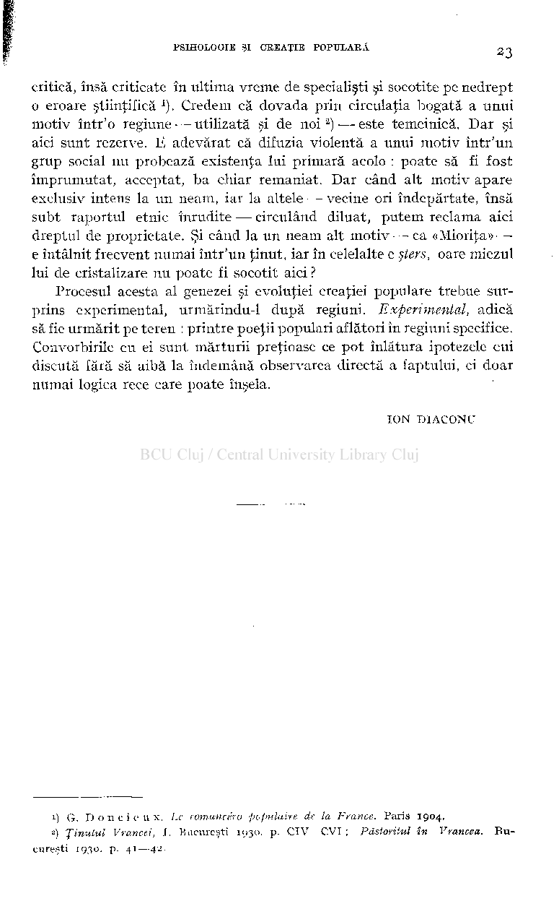

critică, însă criticate în ultima vreme de specialişti şi socotite pe nedrept o eroare ştiinţifică ). Credem că dovada prin circulaţia bogată a unui motiv într'o regiune — utilizată şi de noi ) — este temeinică. Dar şi aici sunt rezerve. E adevărat că difuzia violentă a unui motiv într'un grup social uu probează existenţa lui primară acolo : poate să fi fost împrumutat, acceptat, ba chiar remaniat. Dar când alt motiv apare exclusiv intens la un neam, iar la altele — vecine ori îndepărtate, însă subt raportul etnic înrudite — circulând diluat, putem reclama aici dreptul de proprietate. Şi când la un neam alt motiv — ca «Mioriţa» e întâlnit frecvent numai într'un ţinut, iar în celelalte e şters, oare miezul lui de cristalizare nu poate fi socotit aici ?

Procesul acesta al genezei şi evoluţiei creaţiei populare trebue surprins experimental, urmărindu-1 după regiuni. Experimental, adică să fie urmărit pe teren : printre poeţii populari aflători în regiuni specifice. Convorbirile cu ei sunt mărturii preţioase ce pot înlătura ipotezele cui discută fără să aibă la îndemână observarea directă a faptului, ci doar numai logica rece care poate înşela.

###### ION DIACONU

!) G. Doncieux , Le romancero populaire de la France. Paris 1904.

) Ţinutul Vrancei, I. Bucureşti 1930. p. CIV—CVI ; Păstoritul în Vrancea. Bucureşti 1930. p. 41—42.

2

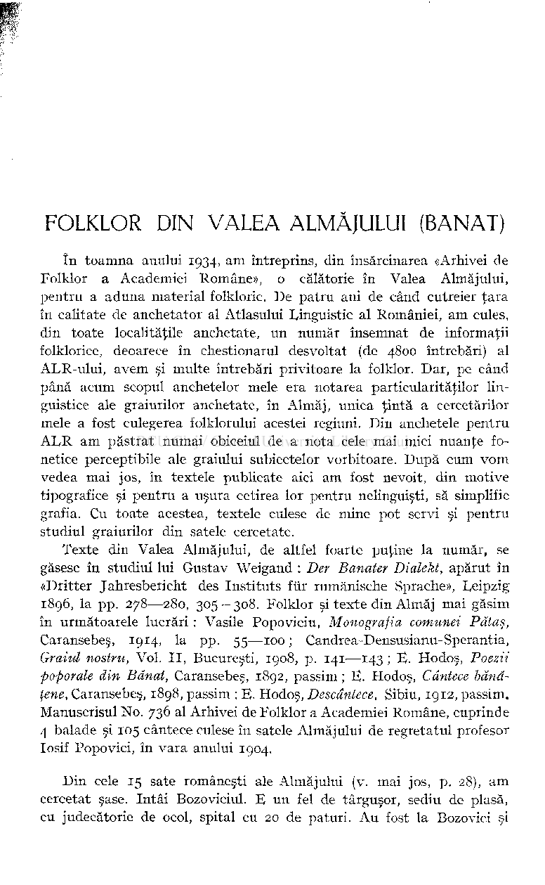

#### FOLKLOR DIN VALEA ALMĂJULUI (BANAT)

în toamna anului 1934, am întreprins, din însărcinarea «Arhivei de Folklor a Academiei Române», o călătorie în Valea Almăjului, pentru a aduna material folkloric. De patru ani de când cutreier ţara în calitate de anchetator al Atlasului Linguistic al României, am cules, din toate localităţile anchetate, un număr însemnat de informaţii folklorice, deoarece în chestionarul desvoltat (de 4800 întrebări) al ALR-ului, avem şi multe întrebări privitoare la folklor. Dar, pe când până acum scopul anchetelor mele era notarea particularităţilor linguistice ale graiurilor anchetate, în Almăj, unica ţintă a cercetărilor mele a fost culegerea folklorului acestei regiuni. Din anchetele pentru AL R am păstrat numai obiceiul de a nota cele mai mici nuanţe fonetice perceptibile ale graiului subiectelor vorbitoare. După cum vo m vedea mai jos, în textele publicate aici am fost nevoit, din motive tipografice şi pentru a uşura cetirea lor pentru nelinguişti, să simplific grafia. Cu toate acestea, textele culese de mine pot servi şi pentru studiul graiurilor din satele cercetate.

Texte din Valea Almăjului, de altfel foarte puţine la număr, se găsesc în studiul lui Gustav Weigand : Der Banater Dialekt, apărut în «Dritter Jahresbericht des Instituts fur rumănische Sprache», Leipzig 1896, la pp. 278—280, 305—308. Folklor şi texte din Almăj mai găsim în următoarele lucrări : Vasile Popoviciu, Monografia comunei Pătaş, Caransebeş, 1914, la pp. 55—100 ; Candrea-Densusianu-Sperantia, Graiul nostru, Vol. II, Bucureşti, 1908, p. 141—143 ; E. Hodoş, Poezii poporale din Bănat, Caransebeş, 1892, passim ; E. Hodoş, Cântece bănăţene, Caransebeş, 1898, passim ; E. Hodoş, Descântece, Sibiu, 1912, passim. Manuscrisul No. 736 al Arhivei de Folklor a Academiei Române, cuprinde 4 balade şi 105 cântece culese în satele Almăjului de regretatul profesor Iosif Popovici, în vara anului 1904.

Din cele 15 sate româneşti ale Almăjului (v. mai jos, p. 28), am cercetat şase. întâi Bozoviciul. E un fel de târguşor, sediu de plasă, cu judecătorie de ocol, spital cu 20 de paturi. A u fost la Bozovici şi

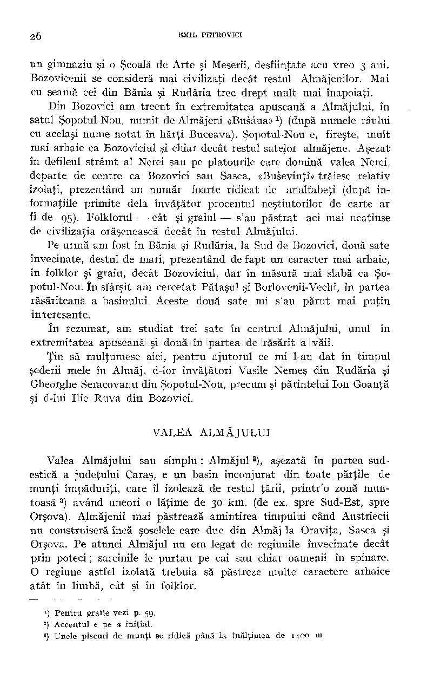

un gimnaziu şi o Şcoală de Arte şi Meserii, desfiinţate acu vreo 3 ani. Bozovicenii se consideră mai civilizaţi decât restul Almăjenilor. Mai cu seamă cei din Bănia şi Rudăria trec drept mult mai înapoiaţi.

Din Bozovici am trecut în extremitatea apuseană a Almăjului, în satul Şopotul-Nou, numit de Almăjeni «Busâua»

) (după numele râului cu acelaşi nume notat în hărţi Buceava). Şopotul-Nou e, fireşte, mult mai arhaic ca Bozoviciul şi chiar decât restul satelor almăjene. Aşezat în defileul strâmt al Nerei sau pe platourile care domină valea Nerei, departe de centre ca Bozovici sau Sasca, «Busevinţî» trăiesc relativ izolaţi, prezentând un număr foarte ridicat de analfabeţi (după informaţiile primite delà învăţător procentul neştiutorilor de carte ar fi de 95). Folklorul — cât şi graiul — s'au păstrat aci mai neatinse de civilizaţia orăşenească decât în restul Almăjului.

1

Pe urmă am fost în Bănia şi Rudăria, la Sud de Bozovici, două sate învecinate, destul de mari, prezentând de fapt un caracter mai arhaic, în folklor şi graiu, decât Bozoviciul, dar în măsură mai slabă ca Şopotul-Nou. î n sfârşit am cercetat Pătaşul şi Borlovenii-Vechi, în partea răsăriteană a basinului. Aceste două sate mi s'au părut mai puţin interesante.

în rezumat, am studiat trei sate în centrul Almăjului, unul în extremitatea apuseană şi două în partea de răsărit a văii.

Ţin să mulţumesc aici, pentru ajutorul ce mi l-au dat în timpul şederii mele în Almăj, d-lor învăţători Vasile Nemeş din Rudăria şi Gheorghe Seracovanu din Şopotul-Nou, precum şi părintelui Ion Goanţă şi d-lui Ilie Ruv a din Bozovici.

VALE A ALMĂJULU I

), aşezată în partea sudestică a judeţului Caras, e un basin înconjurat din toate părţile de munţi împăduriţi, care îl izolează de restul ţării, printr'o zonă muntoasă ) având uneori o lăţime de 30 km. (de ex. spre Sud-Est, spre Orşova). Almăjenii mai păstrează amintirea timpului când Austriecii nu construiseră încă şoselele care duc din Almăj la Oraviţa, Sasca şi Orşova. Pe atunci Almăjul nu era legat de regiunile învecinate decât prin poteci ; sarcinile le purtau pe cai sau chiar oamenii în spinare. O regiune astfel izolată trebuia să păstreze multe caractere arhaice atât în limbă, cât şi în folklor.

Valea Almăjului sau simplu : Almăjul

2

###### ') Pentru grafie vezi p. 59.

###### ) Accentul e pe a iniţial.

!

###### ) Unele piscuri de munţi se ridică până la înălţimea de 1400 m.

3

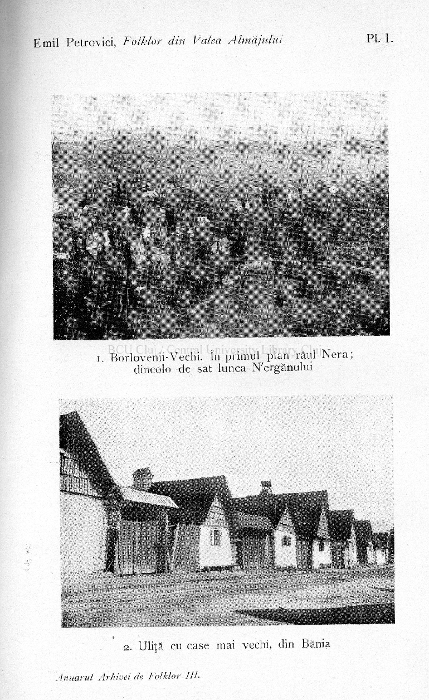

Emil Petrovici, Folklor din Valea Almăjului Pl. I.

i. Borlovenii-Vechi. în primul plan râul Nera ; dincolo de sat lunca N'ergănului

2. Uliţă cu case mai vechi, din Bănia

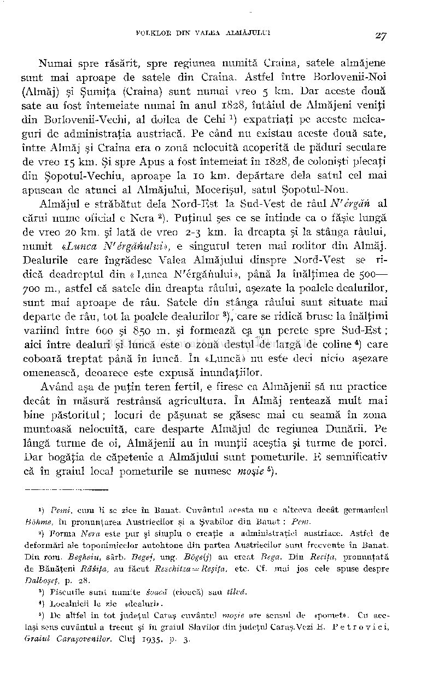

Numai spre răsărit, spre regiunea numită Craina, satele almăjene sunt mai aproape de satele din Craina. Astfel între Borlovenii-Noi (Almăj) şi Şumiţa (Craina) sunt numai vreo 5 km. Dar aceste două sate au fost întemeiate numai în anul 1828, întâiul de Almăjeni veniţi din Borlovenii-Vechi, al doilea de Cehi

) expatriaţi pe aceste melea­

x

guri de administraţia austriacă. Pe când nu existau aceste două sate, între Almăj şi Craina era o zonă nelocuită acoperită de păduri seculare de vreo 15 km. Şi spre Apus a fost întemeiat în 1828, de colonişti plecaţi din Şopotul-Vechiu, aproape la 10 km. depărtare delà satul cel mai apusean de atunci al Almăjului, Mocerişul, satul Şopotul-Nou.

Almăjul e străbătut delà Nord-Est la Sud-Vest de râul N'érgan al

cărui nume oficial e Nera ). Puţinul şes ce se întinde ca o făşie lungă de vreo 20 km. şi lată de vreo 2-3 km. la dreapta şi la stânga râului, numit «Lunca N' ergănului>>, e singurul teren mai roditor din Almăj. Dealurile care îngrădesc Valea Almăjului dinspre Nord-Vest se ridică deadreptul din « Lunca N'ergăhului», până la înălţimea de 500700 m., astfel că satele din dreapta râului, aşezate la poalele dealurilor, sunt mai aproape de râu. Satele din stânga râului sunt situate mai departe de râu, tot la poalele dealurilor

) , care se ridică brusc la înălţimi variind între 600 şi 850 m. şi formează ca un perete spre Sud-Est ; aici între dealuri şi luncă este o zonă destul de largă de coline

3

) care coboară treptat până în luncă. î n «Luncă» nu este deci nicio aşezare omenească, deoarece este expusă inundaţiilor.

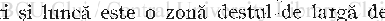

4

Avân d aşa de puţin teren fertil, e firesc ca Almăjenii să nu practice decât în măsură restrânsă agricultura. î n Almăj rentează mult mai bine păstoritul ; locuri de păşunat se găsesc mai cu seamă în zona muntoasă nelocuită, care desparte Almăjul de regiunea Dunării. Pe lângă turme de oi, Almăjenii au în munţii aceştia şi turme de porci. Dar bogăţia de căpetenie a Almăjului sunt pometurile. E semnificativ că în graiul local pometurile se numesc moşie

).

5

###### ) Petni, cum li se zice în Banat. Cuvântul acesta nu e altceva decât germanicul Bohme, în pronunţarea Austriecilor şi a Şvabilor din Banat : Pem.

1

) Forma Nera este pur şi simplu o creaţie a administraţiei austriace. Astfel de deformări ale toponimicelor autohtone din partea Austriecilor sunt frecvente în Banat. Din rom. Begheiu, sârb. Begej, ung. Bôge(j) au creat Bega. Din Recita, pronunţată de Bănăţeni Răsiţa, au făcut Reschitza = Reşiţa, etc. Cf. mai jos cele spuse despre Dalboşeţ, p. 28.

2

###### ) Piscurile sunt numite soacă (cioacă) sau tîlvă.

3

###### ) Localnicii le zic «dealuri».

l

###### ) De altfel în tot judeţul Caras cuvântul moşie are sensul de «pomet». Cu acelaşi sens cuvântul a trecut şi în graiul Slavilor din judeţul Caras. Vezi E Petrovici , Graiul Caraşovenilor. Cluj 1935, p. 3.

6

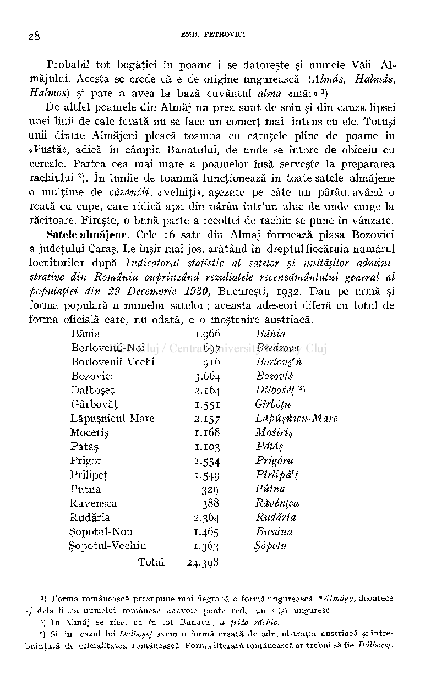

Probabil tot bogăţiei în poame i se datoreşte şi numele Văii Al măjului. Acesta se crede că e de origine ungurească (Almâs, Halmds, Halmos) şi pare a avea la bază cuvântul alma «măr» ).

De altfel poamele din Almăj nu prea sunt de soiu şi din cauza lipsei unei linii de cale ferată nu se face un comerţ mai intens cu ele. Totuşi unii dintre Almăjeni pleacă toamna cu căruţele pline de poame în «Pustă», adică în câmpia Banatului, de unde se întorc de obiceiu cu cereale. Partea cea mai mare a poamelor însă serveşte la prepararea rachiului ). în lunile de toamnă funcţionează în toate satele almăjene o mulţime de căzănzii, «velniţi», aşezate pe câte un pârâu, având o roată cu cupe, care ridică apa din pârâu într'un uluc de unde curge la

- răcitoare. Fireşte, o bună parte a recoltei de rachiu se pune în vânzare. Satele almăjene. Cele 16 sate din Almăj formează plasa Bozovici

a judeţului Caras. De înşir mai jos, arătând în dreptul fiecăruia numărul locuitorilor după Indicatorul statistic al satelor şi unităţilor administrative din România cuprinzând rezultatele recensământului general al populaţiei din 29 Decemvrie 1930, Bucureşti, 1932. Dau pe urmă şi forma populară a numelor satelor ; aceasta adeseori diferă cu totul de forma oficială care, nu odată, e o moştenire austriacă.

Bănia 1.966 Bănia Borlovenii-Noi 697 Bredzova Borlovenii-V echi 916 Borlove'n Bozovici 3.664 Bozovis Dalboşeţ 2.164 Dîlboseţ

)

3

Gârbovăţ i-55i Gîrboţu Lăpuşnicul-Mare 2.157 Lăpuşnicu-Mare Moceriş 1.168 Moeiriş Pataş 1.103 Pâtdş

Prigor 1-554 Prigôru Prilipeţ 1-549 Pîrlipă'ţ Putna 329 Putna Ravensca 388 Răvenţca Rudăria 2.364 Rudăria Şopotul-Nou M6 5 Busăua Şopotul-Vechiu 1-363 Şopolu

Total 24.398

') Forma românească presupune mai degrabă o formă ungurească *Almăgy, deoarece

-/ delà finea numelui românesc anevoie poate reda un s (ş) unguresc.

- 2

) In Almăj se zice, ca în tot Banatul, a frize răchie.

- 3

###### ) Şi în cazul lui Dalboşeţ avem o formă creată de administraţia austriacă şi întrebuinţată de oficialitatea românească. Forma literară românească ar trebui sà fie Dâlboceţ.

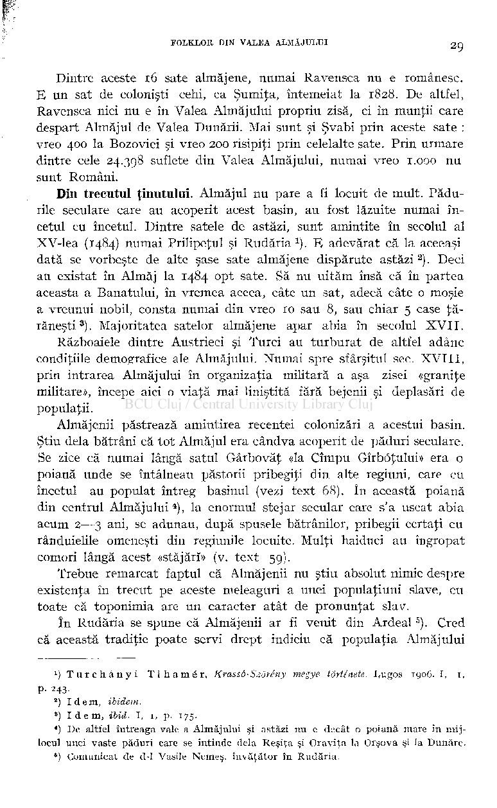

Dintre aceste 16 sate almăjene, numai Ravensca nu e românesc. E un sat de colonişti cehi, ca Şumiţa, întemeiat la 1828. De altfel, Ravensca nici nu e în Valea Almăjului propriu zisă, ci în munţii care despart Almăjul de Valea Dunării. Mai sunt şi Şvabi prin aceste sate : vreo 400 la Bozovici şi vreo 200 risipiţi prin celelalte sate. Prin urmare dintre cele 24.398 suflete din Valea Almăjului, numai vreo 1.000 nu sunt Români.

Din trecutul ţinutului. Almăjul nu pare a fi locuit de mult. Pădurile seculare care au acoperit acest basin, au fost lăzuite numai încetul cu încetul. Dintre satele de astăzi, sunt amintite în secolul al XV-lea (1484) numai Prilipeţul şi Rudăria

). E adevărat că la aceeaşi dată se vorbeşte de alte şase sate almăjene dispărute astăzi

1

). Deci au existat în Almăj la 1484 opt sate. Să nu uităm însă că în partea aceasta a Banatului, în vremea aceea, câte un sat, adecă câte o moşie a vreunui nobil, consta numai din vreo 10 sau 8, sau chiar 5 case ţă­

2

- răneşti ). Majoritatea satelor almăjene apar abia în secolul XVII . Războaiele dintre Austrieci şi Turci au turburat de altfel adânc

condiţiile demografice ale Almăjului. Numai spre sfârşitul sec. XVIII , prin intrarea Almăjului în organizaţia militară a aşa zisei «graniţe militare», începe aici o viaţă mai liniştită fără bejenii şi deplasări de populaţii.

Almăjenii păstrează amintirea recentei colonizări a acestui basin. Ştiu delà bătrâni că tot Almăjul era cândva acoperit de păduri seculare. Se zice că numai lângă satul Gârbovăţ «la Cîmpu Gîrboţului» era o poiană unde se întâlneau păstorii pribegiţi din alte regiuni, care cu încetul au populat întreg basinul (vezi text 68). în această poiană din centrul Almăjului *), la enormul stejar secular care s'a uscat abia acum 2—3 ani, se adunau, după spusele bătrânilor, pribegii certaţi cu rânduielile omeneşti din regiunile locuite. Mulţi haiduci au îngropat comori lângă acest «stăjărî» (v. text 59).

Trebue remarcat faptul că Almăjenii nu ştiu absolut nimic despre existenţa în trecut pe aceste meleaguri a unei populaţiuni slave, cu toate că toponimia are un caracter atât de pronunţat slav.

) . Cred că această tradiţie poate servi drept indiciu că populaţia Almăjului

î n Rudăria se spune că Almăjenii ar fi venit din Ardeal

5

') Tuichâny i Tihamér , Krassô-Szovény megye tôvténete. Lugos 1906. I, 1, P-

###### 43-

2

###### ) Idem, ibidem.

s

) Idem , ibid. I, 1, p. 175. ') De altfel întreaga vale a Almăjului şi astăzi nu e decât o poiană mare în mij­

s

locul unei vaste păduri care se întinde delà Reşiţa şi Oraviţa la Orşova şi la Dunăre.

*) Comunicat de d-1 Vasile Nemeş. învăţător în Rudăria.

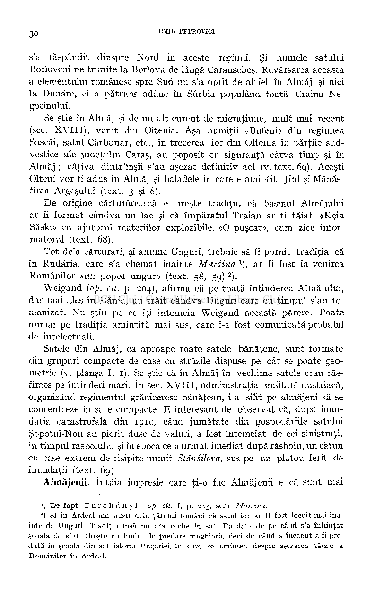

s'a răspândit dinspre Nord în aceste regiuni. Şi numele satului Borloveni ne trimite la Bor

ova de lângă Caransebeş. Revărsarea aceasta a elementului românesc spre Sud nu s'a oprit de altfel în Almăj şi nici la Dunăre, ci a pătruns adânc în Sârbia populând toată Craina Negotinului.

1

Se ştie în Almăj şi de un alt curent de migraţiune, mult mai recent (sec. XVIII) , venit din Oltenia. Aş a numiţii «Bufeni» din regiunea Sascăi, satul Cărbunar, etc., în trecerea lor din Oltenia în părţile sudvestice ale judeţului Caras, au poposit cu siguranţă câtva timp şi în Almăj ; câţiva dintr'înşii s'au aşezat definitiv aci (v. text. 69). Aceşti Olteni vor fi adus în Almăj şi baladele în care e amintit Jiul şi Mănăstirea Argeşului (text. 3 şi 8).

De origine cărturărească e fireşte tradiţia că basinul Almăjului ar fi format cândva un lac şi că împăratul Traian ar fi tăiat «Keia Săski» cu ajutorul materiilor explozibile. «O puşcat», cum zice informatorul (text. 68).

Tot delà cărturari, şi anume Unguri, trebuie să fi pornit tradiţia că în Rudăria, care s'a chemat înainte Marzina

), ar fi fost la venirea Românilor «un popor ungur» (text. 58, 59) ).

1

Weigand (op. cit. p. 204), afirmă că pe toată întinderea Almăjului, dar mai ales în Bănia, au trăit cândva Unguri care cu timpul s'au romanizat. N u ştiu pe ce îşi întemeia Weigand această părere. Poate numai pe tradiţia amintită mai sus, care i-a fost comunicată probabil de intelectuali.

Satele din Almăj, ca aproape toate satele bănăţene, sunt formate din grupuri compacte de case cu străzile dispuse pe cât se poate geometric (v. planşa I, 1). Se ştie că în Almăj în vechime satele erau răsfirate pe întinderi mari. î n sec. XVIII , administraţia militară austriacă, organizând regimentul grăniceresc bănăţean, i-a silit pe almăjeni să se concentreze în sate compacte. E interesant de observat că, după inundaţia catastrofală din 1910, când jumătate din gospodăriile satului Şopotul-Nou au pierit duse de valuri, a fost întemeiat de cei sinistraţi, în timpul răsboiului şi în epoca ce a urmat imediat după răsboiu, un cătun cu case extrem de risipite numit Stănsilova, sus pe un platou ferit de inundaţii (text. 69).

Almăjenii. întâia impresie care ţi-o fac Almăjenii e că sunt mai

###### ) De fapt Turcliânyi , op. cit. I, p. 243, scrie Marsilia.

1

) Şi în Ardeal am auzit delà ţăranii români că satul lor ar fi fost locuit mai înainte de Unguri. Tradiţia însă nu era veche în sat. Ea dată de pe când s'a înfiinţat şcoala de stat, fireşte cu limba de predare maghiară, deci de când a început a fi predată în şcoala din sat istoria Ungariei, în care se amintea despre aşezarea târzie a Românilor îu Ardeal.

2

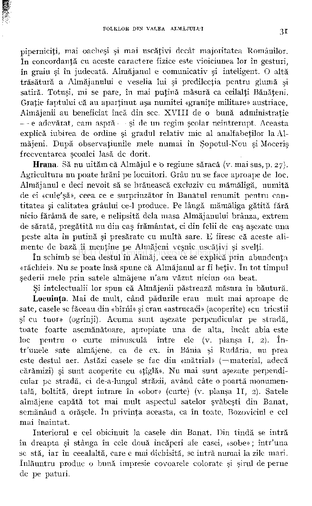

piperniciţi, mai oacheşi şi mai uscăţivi decât majoritatea Românilor, în concordanţă cu aceste caractere fizice este vioiciunea lor în gesturi, în graiu şi în judecată. Almăj anul e comunicativ şi inteligent. O altă trăsătură a Almăj anului e veselia lui şi predilecţia pentru glumă şi satiră. Totuşi, mi se pare, în mai puţină măsură ca ceilalţi Bănăţeni. Graţie faptului că au aparţinut aşa numitei «graniţe militare» austriace, Almăjenii au beneficiat încă din sec. XVII I de o bună administraţie — e adevărat, cam aspră — şi de un regim şcolar neîntrerupt. Aceasta explică iubirea de ordine şi gradul relativ mic al analfabeţilor la Al măj eni. Dup ă observaţiunile mele numai în Şopotul-Nou şi Moceriş frecventarea şcoalei lasă de dorit.

Hrana. Să nu uităm că Almăjul e o regiune săracă (v. mai sus, p. 27). Agricultura nu poate hrăni pe locuitori. Grâu nu se face aproape de loc. Almăj anul e deci nevoit să se hrănească excluziv cu mămăligă, numită de ei «cule'şă», ceea ce e surprinzător în Banatul renumit pentru cantitatea şi calitatea grâului ce-1 produce. Pe lângă mămăliga gătită fără nicio fărâmă de sare, e nelipsită delà masa Almăj anului brânza, extrem de sărată, pregătită nu din caş frământat, ci din felii de caş aşezate una peste alta în putină şi presărate cu multă sare. E firesc că aceste alimente de bază îi menţine pe Almăjeni veşnic uscăţivi şi svelţi.

î n schimb se bea destul în Almăj, ceea ce se explică prin abundenţa «răchiei». N u se poate însă spune că Almăjanul ar fi beţiv. î n tot timpul şederii mele prin satele almăjene n'am văzut niciun om beat.

Şi intelectualii lor spun că Almăjenii păstrează măsura în băutură. Locuinţa. Mai de mult, când pădurile erau mult mai aproape de

sate, casele se făceau din «bîrrii» şi erau «astrucaci» (acoperite) «cu triestii şî cu tuor» (ogrinji). Acum a sunt aşezate perpendicular pe stradă, toate foarte asemănătoare, apropiate una de alta, încât abia este loc pentru o curte minusculă între ele (v. planşa I, 2). într'unele sate almăjene, ca de ex. în Bănia şi Rudăria, nu prea este destul aer. Astăzi casele se fac din «mâtrial» (=material, adecă cărămizi) şi sunt acoperite cu «ţîglă». N u mai sunt aşezate perpendicular pe stradă, ci de-a-lungul străzii, având câte o poartă monumentală, boltită, drept intrare în «obor» (curte) (v. planşa II , 2). Satele almăjene capătă tot mai mult aspectul satelor şvăbeşti din Banat, semănând a orăşele. în privinţa aceasta, ca în toate, Bozoviciul e cel mai înaintat.

Interiorul e cel obicinuit la casele din Banat. Din tindă se intră în dreapta şi stânga în cele două încăperi ale casei, «sobe» ; într'una se stă, iar în ceealaltă, care e mai dichisită, se intră numai la zile mari. înlăuntru produc o bună impresie covoarele colorate şi şirul de perne de pe paturi.

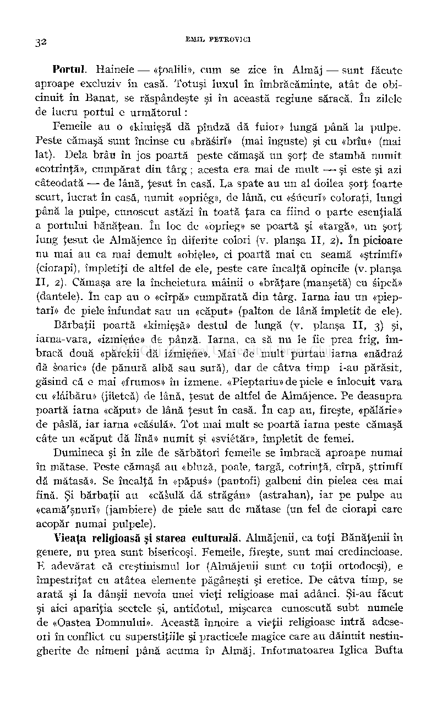

Portul. Hainele — «ţoalili», cum se zice în Almăj — sunt făcute aproape excluziv în casă. Totuşi luxul în îmbrăcăminte, atât de obicinuit în Banat, se răspândeşte şi în această regiune săracă. în zilele de lucru portul e următorul :

Femeile au o «kimieşă dă pîndză dă fuior») lungă până la pulpe. Peste cămaşă sunt încinse cu «brăsiri» (mai înguste) şi cu «brîu» (mai lat). Delà brâu în jos poartă peste cămaşă un şorţ de stambă numit «cotrinţă», cumpărat din târg ; acesta era mai de mult — şi este şi azi câteodată — de lână, ţesut în casă. L a spate au un al doilea şorţ foarte scurt, lucrat în casă, numit «opriég», de lână, cu «sucuri» coloraţi, lungi până la pulpe, cunoscut astăzi în toată ţara ca fiind o parte esenţială a portului bănăţean. î n loc de «bprieg» se poartă şi «targa», un şorţ lung ţesut de Almăjence în diferite colori (v. planşa II, 2). î n picioare nu mai au ca mai demult «obiele», ci poartă mai cu seamă «ştrimfî» (ciorapi), împletiţi de altfel de ele, peste care încalţă opincile (v. planşa II, 2). Cămaşa are la încheietura mâinii o «brăţare (manşetă) cu sipcă» (dantele). î n cap au o «cîrpă» cumpărată din târg. Iarna iau un «pieptarî» de piele înfundat sau un «căput» (palton de lână împletit de ele).

Bărbaţii poartă «kimieşă» destul de lungă (v. planşa II, 3) şi, iarna-vara, «izmiene» dt pânză. Iarna, ca să nu le fie prea frig, îmbracă două «părekii dă izmiene». Mai de mult purtau iarna «nădraz dă soaric» (de pănură albă sau sură), dar de câtva timp i-au părăsit, găsind că e mai «frumos» în izmene. «Pieptariu» de piele e înlocuit vara cu «lâibăru» (jiletcă) de lână, ţesut de altfel de Almăjence. Pe deasupra poartă iarna «căput» de lână ţesut în casă. î n cap au, fireşte, «pălărie» de pâslă, iar iarna «căsulă». Tot mai mult se poartă iarna peste cămaşă câte un «căput dă lînă» numit şi «svietăr», împletit de femei.

Dumineca şi în zile de sărbători femeile se îmbracă aproape numai în mătase. Peste cămaşă au «bluză, poale, targa, cotrinţă, cîrpă, ştrimfî

- dă mătasă». Se încalţă în «păpus» (pantofi) galbeni din pielea cea mai fină. Şi bărbaţii au «căsulă dă străgân» (astrahan), iar pe pulpe au «camă'şnurî» (jambiere) de piele sau de mătase (un fel de ciorapi care acopăr numai pulpele).

Vieaţa religioasă şi starea culturală. Almăjenii, ca toţi Bănăţenii în genere, nu prea sunt bisericoşi. Femeile, fireşte, sunt mai credincioase. E adevărat că creştinismul lor (Almăjenii sunt cu toţii ortodocşi), e împestriţat cu atâtea elemente păgâneşti şi eretice. D e câtva timp, se arată şi la dânşii nevoia unei vieţi religioase mai adânci. Şi-au făcut şi aici apariţia sectele şi, antidotul, mişcarea cunoscută subt numele de «Oastea Domnului». Această înnoire a vieţii religioase intră adeseori în conflict cu superstiţiile şi practicele magice care au dăinuit nestingherite de nimeni până acuma în Almăj. Informatoarea Iglica Bufta

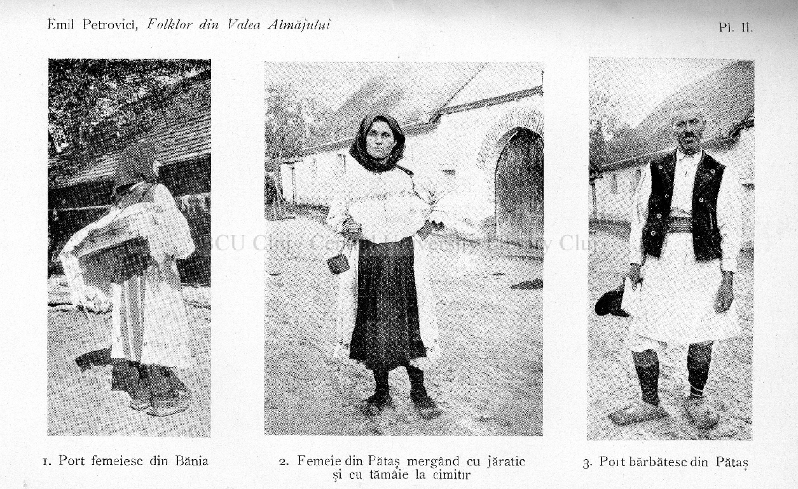

Emil Petrovici, Folklor din Valea Almăjului PI. 11.

i. Port femeiesc din Bănia 2. Femeie din Pătaş mergând cu jăratic şi cu tămâie la cimitir

3. Poi t bărbătesc din Pătaş

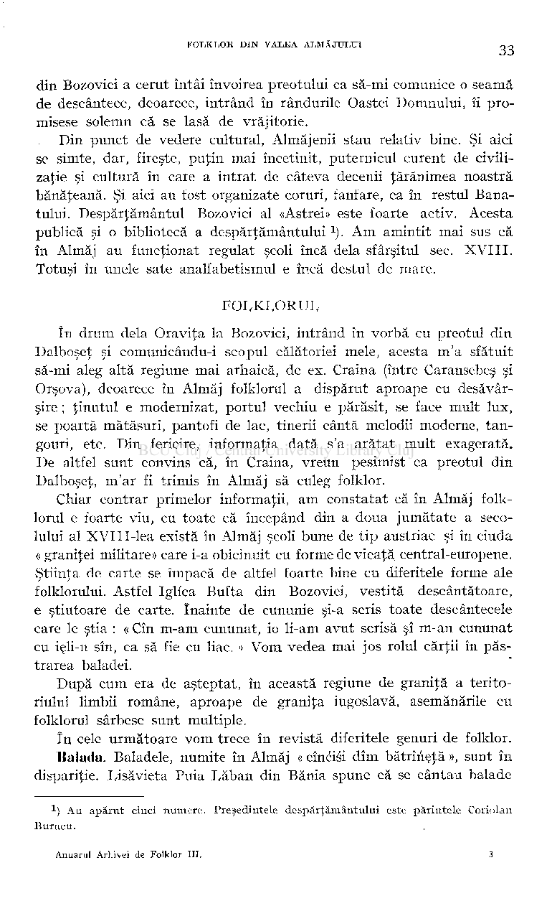

din Bozovici a cerut întâi învoirea preotului ca să-mi comunice o seamă de descântece, deoarece, intrând în rândurile Oastei Domnului, îi promisese solemn că se lasă de vrăjitorie.

Din punct de vedere cultural, Almăjenii stau relativ bine. Şi aici se simte, dar, fireşte, puţin mai încetinit, puternicul curent de civilizaţie şi cultură în care a intrat de câteva decenii ţărănimea noastră

- bănăţeană. Şi aici au fost organizate coruri, fanfare, ca în restul Banatului. Despărţământul Bozovici al «Astrei» este foarte activ. Acesta

). A m amintit mai sus că în Almăj au funcţionat regulat şcoli încă delà sfârşitul sec. XVIII . Totuşi în unele sate analfabetismul e încă destul de mare.

publică şi o bibliotecă a despărţământului

1

FOLKLORU L

în drum delà Oraviţa la Bozovici, intrând în vorbă cu preotul din Dalboşeţ şi comunicându-i scopul călătoriei mele, acesta m'a sfătuit

- să-mi aleg altă regiune mai arhaică, de ex. Craina (între Caransebeş şi Orşova), deoarece în Almăj folklorul a dispărut aproape cu desăvârşire ; ţinutul e modernizat, portul vechiu e părăsit, se face mult lux, se poartă mătăsuri, pantofi de lac, tinerii cântă melodii moderne, tangouri, etc. Din fericire, informaţia dată s'a arătat mult exagerată. De altfel sunt convins că, în Craina, vreun pesimist ca preotul din Dalboşeţ, m'ar fi trimis în Almăj să culeg folklor.

Chiar contrar primelor informaţii, am constatat că în Almăj folklorul e foarte viu, cu toate că începând din a doua jumătate a secolului al XVIII-le a există în Almăj şcoli bune de tip austriac şi în ciuda «graniţei militare» care i-a obicinuit cu forme de vieaţă central-europene. Ştiinţa de carte se împacă de altfel foarte bine cu diferitele forme ale folklorului. Astfel Igh'ca Bufta din Bozovici, vestită descântătoare,

- e ştiutoare de carte. înainte de cununie şi-a scris toate descântecele care le ştia : « Cîn m-am cununat, io li-am avut scrisă şî m-an cununat cu ieli-n sîn, ca să fie cu liac. >> Vo m vedea mai jos rolul cărţii în păstrarea baladei.

După cum era de aşteptat, în această regiune de graniţă a teritoriului limbii române, aproape de graniţa iugoslavă, asemănările cu folklorul sârbesc sunt multiple.

î n cele următoare vo m trece în revistă diferitele genuri de folklor. Balada. Baladele, numite în Almăj « cîncisi dîm bătrîrieţă », sunt în

dispariţie. L-isăvieta Puia Lăban din Bănia spune că se cântau balade

) Au apărut cinci numere. Preşedintele despărţământului este părintele Coriolan Buracu.

J

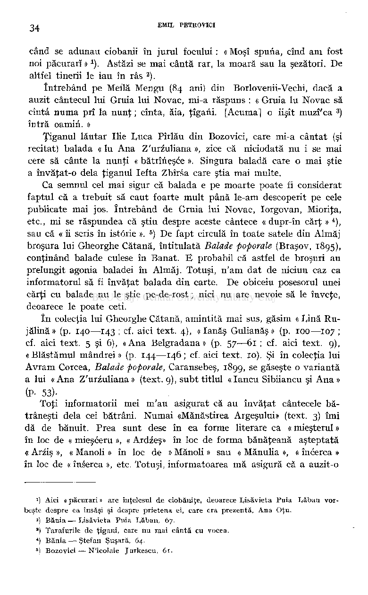

când se adunau ciobanii în jurul focului : « Moşî spună, cînd am fost noi păcurari» ). Astăzi se mai cântă rar, la moară sau la şezători. De altfel tinerii le iau în râs )

întrebând pe Meilă Mengu (84 ani) din Borlovenii-Vechi, dacă a auzit cântecul lui Gruia lui Novac, mi-a răspuns : « Gruia lu Novac să cîntâ numa prî la nunţ ; cînta, ăia, ţîgani. [Acuma] o iişît muzî'ca

) întră oamiri. »

3

Ţiganul lăutar Ilie Luca Pîrlău din Bozovici, care mi-a cântat (şi recitat) balada « lu Ana Z'urzuliana », zice că niciodată nu i se mai cere să cânte la nunţi « bătrîfieşce ». Singura baladă care o mai ştie a învăţat-o delà ţiganul Iefta Zbîrsa care ştia mai multe.

Ca semnul cel mai sigur că balada e pe moarte poate fi considerat faptul că a trebuit să caut foarte mult până le-am descoperit pe cele publicate mai jos. întrebând de Gruia lui Novac, Iorgovan, Mioriţa, etc., mi se răspundea eă ştiu despre aceste cântece « dupr-în cărţ »

) , sau că « îi scris în istorie ». ) De fapt circulă în toate satele din Almăj broşura lui Gheorghe Cătană, întitulată Balade poporale (Braşov, 1895), conţinând balade culese în Banat. E probabil că astfel de broşuri au prelungit agonia baladei în Almăj. Totuşi, n'am dat de niciun caz ca informatorul să fi învăţat balada din carte. De obiceiu posesorul unei cărţi cu balade nu le ştie pe-de-rost ; nici nu are nevoie să le înveţe, deoarece le poate ceti.

4

î n colecţia lui Gheorghe Cătană, amintită mai sus, găsim « Lină Rujălină » (p. 140—143 ; cf. aici text. 4), « Ianăş Gulianăş » (p. 100—107 ; cf. aici text. 5 şi 6), «Ana Belgradana» (p. 57—61 ; cf. aici text. 9), «Blăstămul mândrei » (p. 144—146; cf. aici text. 10). Şi în colecţia lui Avra m Corcea, Balade poporale, Caransebeş, 1899,

găseşte o variantă a lui «Ana Z'urzuliana» (text. 9), subt titlul « Iancu Sibiiancu şi An a » (P- 53).

e

Toţi informatorii mei m'au asigurat că au învăţat cântecele bătrâneşti delà cei bătrâni. Numai «Mănăstirea Argeşului» (text. 3) îmi

- dă de bănuit. Prea sunt dese în ea forme literare ca « mieşterul » în loc de « mieşceru », « Ardzeş» în loc de forma bănăţeană aşteptată « Arziş », « Manoli » în loc de » Mănoli » sau « Mănulia », << încerca » în loc de « înserca », etc. Totuşi, informatoarea mă asigură că a auzit-o

###### •) Aici « păcurari » are înţelesul de ciobănite, deoarece L,isăvieta Puia Ljăban vorbeşte despre ea însăşi şi despre prietena ei, care era prezentă, Ana Oţu.

###### ) Bănia — Lisăvieta Puia L,ăban, 67.

2

###### ) Tarafurile de ţigani, care nu mai cântă cu vocea.

s

- 4

) Bănia — Ştefan Şuşară, 64.

- 5

###### ) Bozovici — N'icolaie Jurkescu, 61.

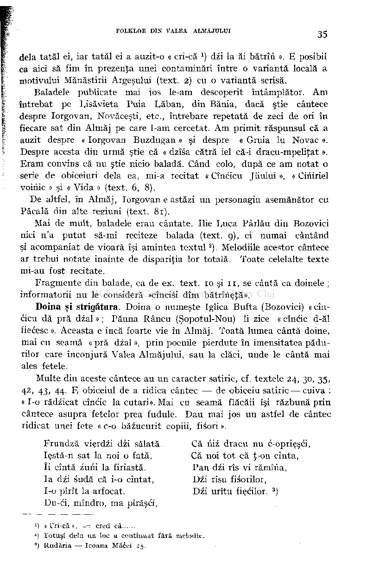

delà tatăl ei, iar tatăl ei a auzit-o « cri-că *) dzi la ăi bătrîn ». E posibil ca aici să fim în prezenţa unei contaminări între o variantă locală a motivului Mănăstirii Argeşului (text. 2) cu o variantă scrisă.

Baladele publicate mai ios le-am descoperit întâmplător. A m întrebat pe L,isăvieta Puia Lăban, din Bănia, dacă ştie cântece despre Iorgovan, Novăceşti, etc., întrebare repetată de zeci de ori în fiecare sat din Almăj pe care l-am cercetat. A m primit răspunsul că a auzit despre « Iorgovan Buzdugan » şi despre « Gruia lu Novac ». Despre acesta din urmă ştie că « dzîsa cătră iei că-i dracu-mpeliţat ». Eram convins că nu ştie nicio baladă. Când colo, după ce am notat o serie de obiceiuri delà ea, mi-a recitat « Cîncicu Jîiului », « Ciniriel voinic » şi « Vida » (text. 6, 8).

De altfel, în Almăj, Iorgovan e astăzi un personagiu asemănător cu Păcală din alte regiuni (text. 81).

Mai de mult, baladele erau cântate. Ilie Luca Pârlău din Bozovici nici n'a putut să-mi reciteze balada (text. 9), ci numai cântând şi acompaniat de vioară îşi amintea textul ) . Melodiile acestor cântece ar trebui notate înainte de dispariţia lor totală. Toate celelalte texte mi-au fost recitate.

Fragmente din balade, ca de ex. text. 10 şi 11 , se cântă ca doinele ; informatorii nu le consideră »cîncisi dîm bătrîrieţă».

Doina şi strigătura. Doina o numeşte Iglica Bufta (Bozovici) « cîncicu dă pră dzal » ; Păuna Râncu (Şopotul-Nou) îi zice « cîncic d-ăl fiecesc ». Aceasta e încă foarte vie în Almăj. Toată lumea cântă doine, mai cu seamă « pră dzal », prin poenile pierdute în imensitatea pădurilor care înconjură Valea Almăjului, sau la clăci, unde le cântă mai ales fetele.

Multe din aceste cântece au un caracter satiric, cf. textele 24, 30, 35, 42, 43, 44. E obiceiul de a ridica cântec — de obiceiu satiric — cuiva : « I-o rădzicat cîncic la cutări ». Mai cu seamă flăcăii îşi răzbună prin cântece asupra fetelor prea fudule. Da u mai jos un astfel de cântec ridicat unei fete « c-o băzucurit copiii, fisori ».

Frundză vierdzi dzi salată. C ă niz dracu nu c-oprieşci, Iestă-n sat la noi o fată, C ă noi tot că ţ-on cînta, îi cîntă zurii la firiastă. Pan dzi rîs vi rămîrîa, Ia dzi sudă că i-o cîntat, Dzi rîsu fisorilor, I-o pîrît la arfocat. Dzi urîtu fiecilor.

) Du-ci, mîndro, ma pîrăşci,

3

###### *) «Cri-că», = cred că

- 2

) Totuşi delà un loc a continuat fără melodie.

- 3

###### ) Rudăria — Icoana Măcei 25.

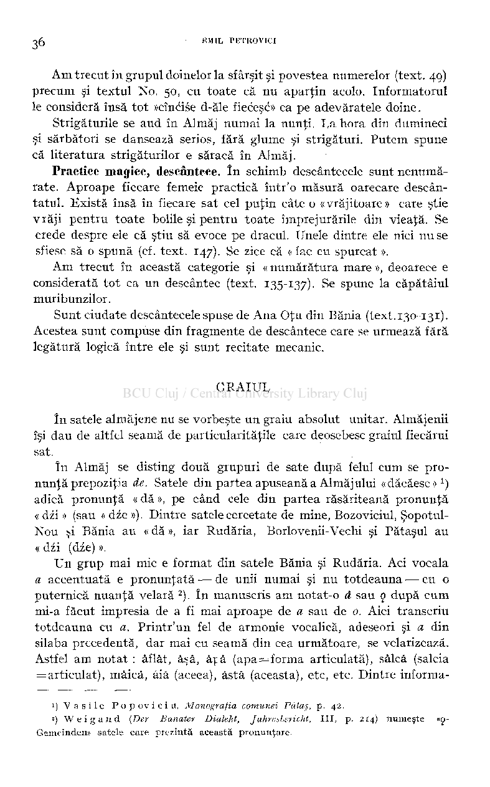

A m trecut în grupul doinelor la sfârşit şi povestea numerelor (text. 49) precum şi textul No. 50, cu toate că nu aparţin acolo. Informatorul le consideră însă tot ocîncise d-ăle fieceşc» ca pe adevăratele doine.

Strigăturile se aud în Almăj numai la nunţi. L a hora din dumineci şi sărbători se dansează serios, fără glume şi strigături. Putem spune că literatura strigăturilor e săracă în Almăj.

Practice magice, descântece. î n schimb descântecele sunt nenumărate. Aproape fiecare femeie practică într'o măsură oarecare descântatul. Există însă în fiecare sat cel puţin câte o «vrăjitoare» care ştie vrăji pentru toate bolile şi pentru toate împrejurările din vieaţă. Se

crede despre ele că ştiu să evoce pe dracul. Unele dintre ele nici nu se sfiesc să o spună (cf. text. 147). Se zice că « fac cu spurcat ».

A m trecut în această categorie şi « numărătura mare », deoarece e considerată tot ca un descântec (text. 135-137). Se spune la căpătâiul muribunzilor.

Sunt ciudate descântecele spuse de An a Oţu din Bănia (text. 130 131). Acestea sunt compuse din fragmente de descântece care se urmează fără legătură logică între ele şi sunt recitate mecanic.

GRAIU L

î n satele almăjene nu se vorbeşte un graiu absolut unitar. Almăjenii îşi dau de altfel seamă de particularităţile care deosebesc graiul fiecărui sat.

î n Almăj se disting două grupuri de sate după felul cum se pronunţă prepoziţia de. Satele din partea apuseană a Almăj ului «dăcăesc»

) adică pronunţă « dă », pe când cele din partea răsăriteană pronunţă « dzi » (sau « dze »). Dintre satele cercetate de mine, Bozoviciul, ŞopotulNou şi Bănia au « dă », iar Rudăria, Borlovenii-Vechi şi Pătaşul au « dzi (dze) ».

1

Un grup mai mic e format din satele Bănia şi Rudăria. Aci vocala a accentuată e pronunţată — de unii numai şi nu totdeauna — cu o puternică nuanţă velară ) . î n manuscris am notat-o à sau o după cu m mi-a făcut impresia de a fi mai aproape de a sau de o. Aici transcriu totdeauna cu a. Printr'un fel de armonie vocalică, adeseori şi a din silaba precedentă, dar mai cu seamă din cea următoare, se velarizează. Astfel am notat : àflàt, âşâ, âpâ (apa=forma articulată), sâlcâ (salcia = articulat), maica, âiâ (aceea), ăsta (aceasta), etc, etc. Dintre informa-

- 1) V a s i 1 e Popoviciu Monografia comunei Pătaş, p. 42.
- 2) Weigan d (Der Banater Dialekt, Jahresbericht, III, p. 214) numeşte «o-

###### Gemeinden» satele care prezintă această pronunţare.

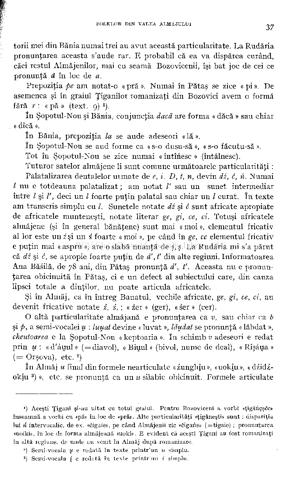

torii mei din Bănia numai trei au avut această particularitate. L a Rudăria pronunţarea aceasta s'aude rar. E probabil că ea v a dispărea curând,

- căci restul Almăjenilor, mai cu seamă Bozovicenii, îşi bat joc de cei ce pronunţă à în loc de a.

Prepoziţia pe am notat-o « pră ». Numai în Pătaş se zice « pi ». De asemenea şi în graiul Ţiganilor romanizaţi din Bozovici avem o formă fără r : « pă » (text. 9) ).

î n Şopotul-Nou şi Bănia, conjuncţia dacă are forma « dacă » sau chiar

« dîcă ». î n Bănia, prepoziţia la se aude adeseori « lă ». î n Şopotul-Nou se aud forme ca « s-o dusu-să », « s-o făcutu-să ». Tot în Şopotul-Nou se zice numai « întînesc » (întâlnesc). Tuturor satelor almăj ene li sunt comune următoarele particularităţi : Palatalizarea dentalelor urmate de e, i. D, t, n, devin dz, c, n. Numai

/ nu e totdeauna palatalizat ; am notat V sau un sunet intermediar între / şi V, deci un / foarte puţin palatal sau chiar un l curat. î n texte am transcris simplu cu /. Sunetele notate dz şi 6 sunt africate apropiate de africatele munteneşti, notate literar ge, gi, ce, ci. Totuşi africatele almăj ene (şi în general bănăţene) sunt mai « moi », elementul fricativ al lor este un z şi un s foarte « moi », pe când în ge, ce elementul fricativ

- e puţin mai « aspru », are o slabă nuanţă de j , ş. L a Rudăria mi s'a părut că dz şi c, se apropie foarte puţin de d', t' din alte regiuni. Informatoarea Ana Băsilă, de 78 ani, din Pătaş pronunţă d', t'. Aceasta nu e pronunţarea obicinuită în Pătaş, ci e un defect al subiectului care, din cauza lipsei totale a dinţilor, nu poate articula africatele.

Şi în Almăj, ca în întreg Banatul, vechile africate, ge, gi, ce, ci, au devenit fricative notate z, s, ; « zer » (ger), « ser » (cer).

O altă particularitate almăj ană e pronunţarea ca v, sau chiar ca b şip, & semi-vocalei u : luuat devine « luvat », lăudat se pronunţă « lăbdat », cheutoarea e la Şopotul-Nou « keptoaria ». î n schimb v adeseori e redat prin u : «d'âuul» ( = diavol), « Biuul » (bivol, nume de deal), « Rîşâua » ( = Orşova), etc.

)

2

î n Almăj u final din formele nearticulate «zunghiu», «uokiu», « dzidzokiu ) », etc. se pronunţă ca un u silabic obicinuit. Formele articulate

*) Aceşti Ţigani şi-au uitat cu totul graiul. Pentru Bozoviceni a vorbi «ţîgănşşce» înseamnă a vorbi cu «pă» în loc de «pră». Alte particularităţi «ţigăneşti» sunt : dispariţia lui n intervocalic, de ex. «cigaie», pe când Almăjenii zic «cigane» (=tigaie) ; pronunţarea «uoiki», în loc de forma almăjeană «uoki». E evident că aceşti Ţigani au fost romanizaţi în altă regiune, de unde au venit în Almăj după romanizare.

'') Semi-vocala « e redată în texte printr'un u simplu.

###### ) Semi-vocala i e redată în texte printr'un i simplu.

3

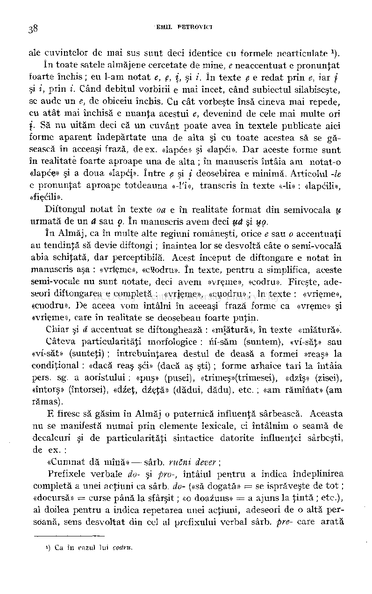

ale cuvintelor de mai sus sunt deci identice cu formele nearticulate

).

1

î n toate satele almăjene cercetate de mine, e neaccentuat e pronunţat foarte închis ; eu l-am notat e, e, i, şi i. în texte e e redat prin e, iar i şi i, prin i. Când debitul vorbirii e mai încet, când subiectul silabiseşte, se aude un e, de obiceiu închis. Cu cât vorbeşte însă cineva mai repede, cu atât mai închisă e nuanţa acestui e, devenind de cele mai multe ori i. Să nu uităm deci că un cuvânt poate avea în textele publicate aici forme aparent îndepărtate una de alta şi cu toate acestea să se găsească în aceeaşi frază, de ex. «lapce» şi «lapci». Dar aceste forme sunt în realitate foarte aproape una de alta ; în manuscris întâia am notat-o «lapce» şi a doua «lapci». între e şi i deosebirea e minimă. Articolul -le e pronunţat aproape totdeauna «-l'i», transcris în texte «-li» : «lapcili», «fiecili».

Diftongul notat în texte oa e în realitate format din semivocala u urmată de un à sau o. în manuscris avem deci uâ şi uo.

în Almăj, ca în multe alte regiuni româneşti, orice e sau o accentuaţi au tendinţă să devie diftongi ; înaintea lor se desvoltă câte o semi-vocală abia schiţată, dar perceptibilă. Acest început de diftongare e notat în manuscris aşa : «vrieme», «cHodru». în texte, pentru a simplifica, aceste semi-vocale nu sunt notate, deci avem »vreme», »codru». Fireşte, adeseori diftongarea e completă : «vrieme», «cuodru» ; în texte : «vrieme», «cuodru». De aceea vom întâlni în aceeaşi frază forme ca «vreme» şi «vrieme», care în realitate se deosebeau foarte puţin.

Chiar şi ă accentuat se diftonghează : «mîătură», în texte «mîătură». Câteva particularităţi morfologice : ni-săm (suntem), «vi-săţ» sau

«vi-săt» (sunteţi) ; întrebuinţarea destul de deasă a formei »reaş» la condiţional : «dacă reaş şei» (dacă aş şti) ; forme arhaice tari la întâia pers. sg. a aoristului : «puş» (pusei), «trimeş»(trimesei), «dzîş» (zisei), «întors» (întorsei), «dzeţ, dzeţă» (dădui, dădu), etc. ; «am rămîriat» (am rămas).

E firesc să găsim în Almăj o puternică influenţă sârbească. Aceasta nu se manifestă numai prin elemente lexicale, ci întâlnim o seamă de decalcuri şi de particularităţi sintactice datorite influenţei sârbeşti, de ex. :

«Cumnat dă mînă» — sârb. rucni dever; Prefixele verbale do- şi pro-, întâiul pentru a indica îndeplinirea completă a unei acţiuni ca sârb. do- («să dogată» = se isprăveşte de tot ; «docursă» = curse până la sfârşit ; «o doazuns» = a ajuns la ţintă ; etc.), al doilea pentru a indica repetarea unei acţiuni, adeseori de o altă persoană, sens desvoltat din cel al prefixului verbal sârb. pre- care arată

###### ') Ca în cazul lui codru.

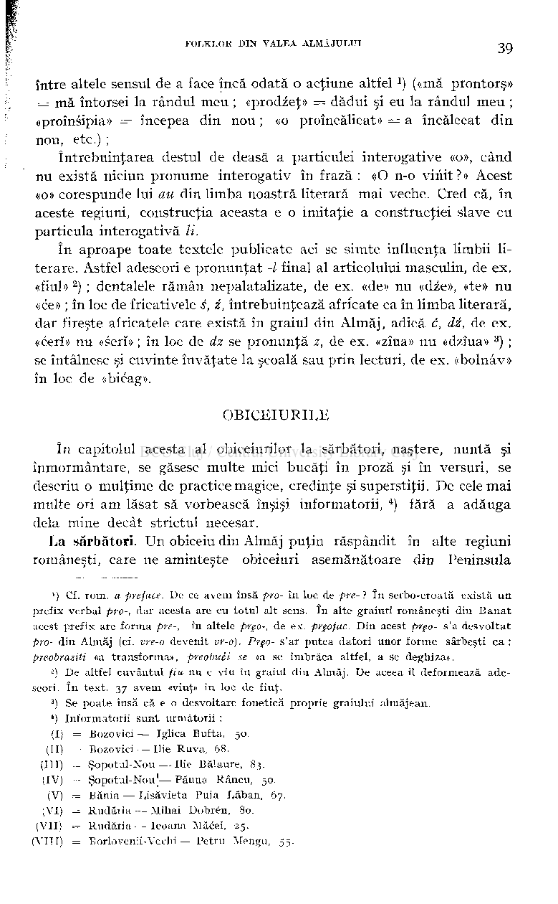

între altele sensul de a face încă odată o acţiune altfel

) («mă prontorş» = mă întorsei la rândul meu ; «prodzeţ» = dădui şi eu la rândul meu ; «proînsipia» = începea din nou ; «o proîncălicat» = a încălecat din nou, etc.) ;

x

întrebuinţarea destul de deasă a particulei interogative «o», când nu există niciun pronume interogativ în frază : «O n-o vinit?» Acest «o» corespunde lui au din limba noastră literară mai veche. Cred că, în aceste regiuni, construcţia aceasta e o imitaţie a construcţiei slave cu particula interogativă li.

în aproape toate textele publicate aci se simte influenţa limbii literare. Astfel adeseori e pronunţat -/ final al articolului masculin, de ex. «fiul»

) ; dentalele rămân nepalatalizate, de ex. «de» nu «dze», «te» nu «ce» ; în loc de fricativele s, z, întrebuinţează afrîcate ca în limba literară, dar fireşte africatele care există în graiul din Almăj, adică c, dz, de ex. «ceri» nu «seri» ; în loc de dz se pronunţă z, de ex. «zîua» nu «dzîua» ) ; se întâlnesc şi cuvinte învăţate la şcoală sau prin lecturi, de ex. «bolnav» în loc de «bicag».

2

OBICEIURIL E

î n capitolul acesta al obiceiurilor la sărbători, naştere, nuntă şi înmormântare, se găsesc multe mici bucăţi în proză şi în versuri, se descriu o mulţime de practice magice, credinţe şi superstiţii. De cele mai multe ori am lăsat să vorbească înşişi informatorii, ) fără a adăuga delà mine decât strictul necesar.

La sărbători. U n obiceiu din Almăj puţin răspândit în alte regiuni româneşti, care ne aminteşte obiceiuri asemănătoare din Peninsula

') Cf. rom. a preface. De ce avem însă pro- în loc de pre- ? în serbo-croată există un prefix verbal pro-, dar acesta are cu totul alt sens. în alte graiuri româneşti din Banat acest prefix are forma pre-, în altele preo-, de ex. preofac. Din acest preo- s'a desvoltat pro- din Almăj (cf. vre-o devenit vr-o). Preo- s'ar putea datori unor forme sârbeşti ca : preobraziti «a transforma», preobuci se «a se îmbrăca altfel, a se deghiza».

-) De altfel cuvântul fiu nu e viu în graiul din Almăj. De aceea îl deformează adeseori, în text. 37 avem «viuţ» în loc de fiuţ.

- 3

) Se poate însă că e o desvoltare fonetică proprie graiului almăjean.

- 4

) Informatorii sunt următorii :

- (I) = Bozovici — Iglica Bufta, 50.
- (II) = Bozovici — Ilie Ruva, 68.
- (III) = Şopotul-Nou — Ilie Bălaure, 83.
- (IV) == Şopotul-Nou

1

— Păuna Râucu, 50.

- (V) = Bănia — I,isăvieta Puia I,ăban, 67.
- (VI) = Rudăria — Mihai Dobrén, 80.
- (VII) •-- Rudăria — Icoana Măcei, 25.
- (VIII) = Borlovenii-Vechi — Petru Mengu, 55.

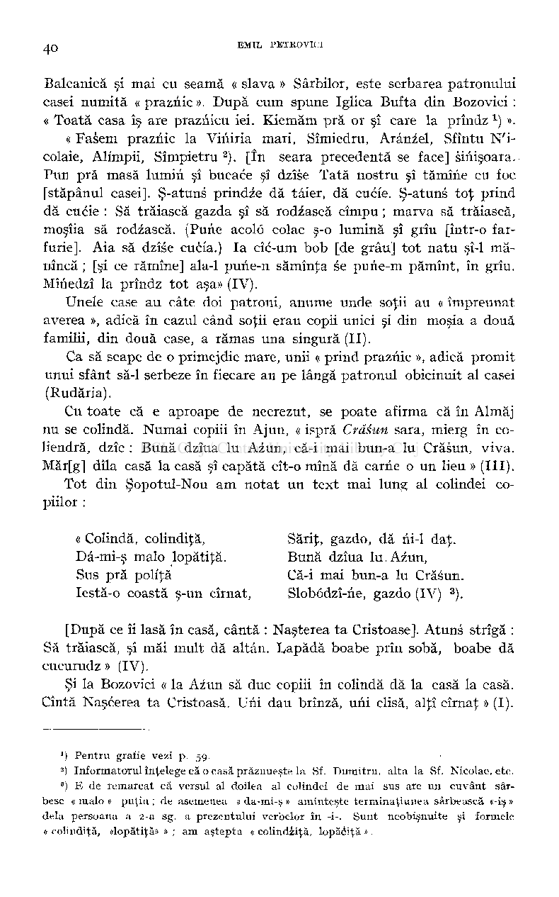

Balcanică şi mai cu seamă « slava » Sârbilor, este serbarea patronului casei numită « praznic ». Dup ă cum spune Iglica Bufta din Bozovici : « Toată casa îş are praznicu iei. Kiemă m pră or şî care la prîndz

) ».

x

« Fasem praznic la Viniria mari, Sîmiedru, Arânzel, Sfîntu N'i colaie, Alimpii, Sîmpietru

). [în seara precedentă se face] sinişoara. Pun pră masă lumin şî bucace şî dzîse Tată nostru şî tămîne cu foc [stăpânul casei]. Ş-atuns prindze dă taier, dă cucie. Ş-atuns toţ prind dă cucie : Să trăiască gazda şî să rodzască cîmpu ; marva să trăiască, moşîia să rodzască. (Pune acolo colac ş-o lumină şî grîu [într-o farfurie]. Aia să dzîse cucia.) Ia cîc-um bob [de grâu] tot natu şî-1 mănîncă ; [şi ce rămîne] ala-1 purie-n sămînţa se purie-m pămînt, în grîu. Mînedzî la prîndz tot aşa» (IV).

2

Unele case au câte doi patroni, anume unde soţii au « împreunat averea », adică în cazul când soţii erau copii unici şi din moşia a două familii, din două case, a rămas una singură (II).

Ca să scape de o primejdie mare, unii « prind praznic », adică promit unui sfânt să-1 serbeze în fiecare an pe lângă patronul obicinuit al casei (Rudăria).

Cu toate că e aproape de necrezut, se poate afirma că în Almăj nu se colindă. Numai copiii în Ajun, « ispră Crăsun sara, mierg în coliendră, dzîc : Bună dzîua lu Azun, că-i mai bun-a lu Crăsun, viva . Măr[g] dîla casă la casă şî capătă cît-o mînă dă carne o un lieu » (III).

Tot din Şopotul-Nou am notat un text mai lung al colindei copiilor :

« Colindă, colindiţă, Sărit, gazdo, dă ni-1 daţ. Dâ-mi-ş malo lopătiţă. Bună dzîua Iu. Azun,

Sus pră poliţă Iestă-o coastă ş-un cîrnat,

Că-i mai bun-a lu Crăsun. Slobodzî-ne, gazdo (IV) ).

[După ce îi lasă în casă, cântă : Naşterea ta Cristoase]. Atuns strigă : Să trăiască, şî măi mult dă altân. Lapădă boabe prîn sobă, boabe dă cucurudz » (IV).

Şi la Bozovici « la Azun să duc copiii în colindă dă la casă la casă. Cîntă Naşcerea ta Cristoasă. Uni dau brînză, uni clisă, alţî cîrnaţ » (I).

###### ') Pentru grafie vezi p. 59.

###### ) Informatorul înţelege că o casă prăznueşte la Sf. Dumitru, alta la Sf. Nicolae, etc.

2

) E de remarcat că versul al doilea al colindei de mai sus are un cuvânt sârbesc «malo» puţin; de asemenea « da-mi-ş » aminteşte terminaţiunea sârbească «-iş » delà persoana a 2-a sg. a prezentului verbelor în -i-. Sunt neobişnuite şi formele « colindiţă, «lopătiţă» » ; am aştepta « colindziţă, lopăciţă ».

3

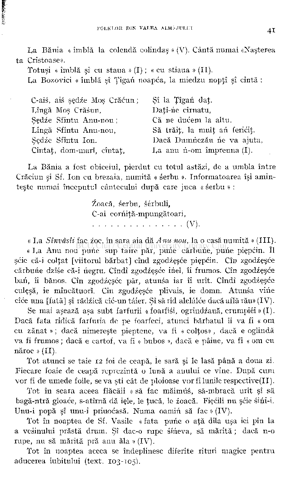

L,a Bănia « îmbla la colendă colindaş » (V). Cântă numai «Naşterea

ta Cristoase». Totuşi « îmbla şî cu staua » (I) ; « cu stiaua » (II). La Bozovici « îmbla şî Ţîgan noapca, la miedzu nopţî şî cîntă :

C-ais, ais şedze Moş Crăcim ; Şî la Ţîgaiî daţ. Lîngă Moş Crăsun, Daţî-ne cîrnatu, Şedze Sfîntu Anu-nou ; Că ne ducem la altu. Lîngă Sfîntu Anu-nou, Să trăit, la mulţ an fericit. Şedze Sfîntu Ion. Dacă Dumnezău ne v a ajuta, Cîntaţ, dom-marî, cîntaţ, L a anu n-om împreuna (I).

L a Bănia a fost obiceiul, pierdut cu totul astăzi, de a umbla între Crăciun şi Sf. Ion cu brezaia, numită « serbu ». Informatoarea îşi aminteşte numai începutul cântecului după care juca « serbu » :

Zoacă, serbu, sérbuli, C-ai corriită-mpungătoari,

' (V).

« La Sînvăsîi fac zoc, în sara aia dă Anu nou, la o casă numită » (III). « L a An u nou pune sup taire păr, pune cărbune, pune piepcin. îl

şcie că-i colţat [viitorul bărbat] cînd zgodzeşce piepcin. Cîn zgodzeşce cărbune dzîse că-i negru. Cîndî zgodzeşce inel, îi frumos. Cîn zgodzşşce ban, îi bănos. Cîn zgodzeşce păr, atunsa iar îi urît. Cîndî zgodzeşce culeşă, ie mîncătuorî. Cîn zgodzeşce plivais, ie domn. Atunsa vine cîce una [fată] şî rădzică cîc-un taier. Şîsărîd alelâlce dacă află rău» (IV).

Se mai aşează aşa subt farfurii « foarfisi, ogrindzauă, crumpiéi » (I). Dacă fata ridică farfuria de pe foarfeci, atunci bărbatul îi va fi « om cu zănat » ; dacă nimereşte pieptene, v a fi « colţos» , dacă e oglindă va fi frumos ; dacă e cartof, v a fi « bubos », dacă e pâine, v a fi « om cu năroc » (II).

Tot atunci se taie 12 foi de ceapă, le sară şi le lasă până a doua zi. Fiecare foaie de ceapă reprezintă o lună a auului ce vine. După cum vor fi de umede foile, sev a şti cât de ploioase vor fi lunile respective(II).

Tot în seara aceea flăcăii « să fac măimus, să-mbracă urît şî să bagă-ntră gloace, s-atîrnă dă iele, le ţucă, le zoacă. Fiecili nu şcie sini-i. Unu-i popă şî unu-i priuocasă. Numa oamin să fac » (IV).

Tot în noaptea de Sf. Vasile « fata pune o aţă dîla uşa iei pîn la a vesinului prăstă drum. Şî dac-o rupe sineva, să mărită ; dacă n-o rupe, nu să mărită pră anu ăla » (IV).

Tot în noaptea aceea se îndeplinesc diferite rituri magice pentru aducerea iubitului (text. 103-105).

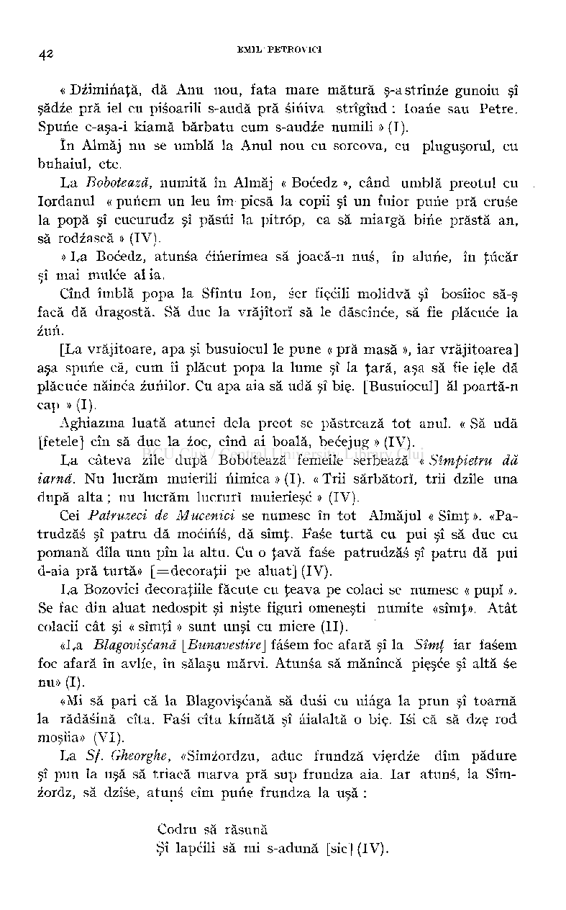

« Dzimiriaţă, dă Anu nou, fata mare mătură ş-astrînze gunoiu şî şădze pră iei cu pisoarili s-audă pră siniva strîgînd : Ioane sau Petre. Spune c-aşa-i kiamă bărbatu cum s-audze numili » (I).

în Almăj nu se umblă la Anul nou cu sorcova, cu pluguşorul, cu buhaiul, etc.

La Bobotează, numită în Almăj « Bocedz », când umblă preotul cu Iordanul « punem un leu îm piesă la copii şî un fuior pune pră eruse la popă şî cucurudz şî păsui la pitrôp, ca să miargă bine prăstă an, să rodzască » (IV).

» L a Bocedz, atunsa cinerimea să joacă-n nus, în alune, în ţucăr şî mai mulce al ia.

Cînd îmbla popa la Sfîntu Ion, ser fiecili molidvă şî bosîioc să-ş facă dă dragostă. Să duc la vrăjitori să le dăseînce, să fie plăcuce la zuri.

[La vrăjitoare, apa şi busuiocul le pune « pră masă », iar vrăjitoarea] aşa spune că, cum îi plăcut popa la lume şî la ţară, aşa să fie iele dă plăcuce năinca zuriilor. Cu apa aia să udă şî bie. [Busuiocul] ăl poartă-n cap » (I).

Aghiazma luată atunci delà preot se păstrează tot anul. « Să udă [fetele] cîn să duc la zoc, cînd ai boală, becejug » (IV).

L a câteva zile după Bobotează femeile serbează « Sîmpietru dâ iarnă. N u lucrăm muierili nimica » (I). « Trii sărbători, trii dzîle una după alta ; nu lucrăm lucruri muierieşc » (IV).

Cei Patruzeci de Mucenici se numesc în tot Almăjul « Sîmţ ». «Patrudzăs şî patru dă mocinis, dă sîmţ. Fase turtă cu pui şî să duc cu pomană dîla unu pîn la altu. Cu o tavă fase patrudzăs şî patru dă pui d-aia pră turtă» [=decoraţii pe aluat] (IV).

La Bozovici decoraţiile făcute cu ţeava pe colaci se numesc « pupi ». Se fac din aluat nedospit şi nişte figuri omeneşti numite «sîmţ». Atâ t colacii cât şi « sîmţî » sunt unşi cu miere (II).

«La Blagovişcană {Bunavestire] fâsem foc afară şî la Sîmţ iar fasem foc afară în avlie, în sălaşu mărvi. Atunsa să mănîncă picşee şî altă se nu» (I).

«Mi să pari că la Blagovişcană să dusi cu uiâga la prun şî toarnă la rădăsină cîta. Fasi cîta kimătă şî âialaltă o bie. Isi că să dze rod moşîia» (VI).

La 5/. Gheorghe, «Sîmzordzu, aduc frundză vierdze dîm pădure şî pun la uşă să triacă marva pră sup frundza aia. Iar atuns, la Sîmzordz, să dzîse, atuns eîm pune frundza la uşă :

Codru să răsună Şî lapcili să mi s-adună [sic] (IV).

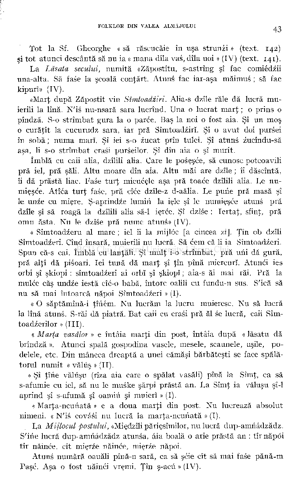

Tot la Sf. Gheorghe « să răscucăie în uşa strunzi » (text. 142) şi tot atunci descântă să nu ia « mana dîla vas, dîla uoi » (IV) (text. 141).

La Lăsata secului, numită «Zăpostîtu, s-astrîng şî fac comiédzii una-alta. Să fase la şcoală conţărt. Atuns fac iar-aşa măimus ; să fac kipurï» (IV).

«Marţ după Zăpostît vin Sîmtoadziri. Alia-s dzîle răle dă lucră muierili la lînă. N'is nu-nsară sara lucrînd. Una o lucrat marţ ; o prins o pîndză. S-o strîmbat gura la o parce. Bas la noi o fost aia. Şî un moş o curăţit la cucurudz sara, iar pră Sîmtoadziri. Şî o avut doi pursei în sobă ; numa mari. Şî iei s-o zucat prin tulei. Şî atuns zucîndu-să aşa, li s-o strîmbat crasi purseilor. Şî dîn aia o şî murit.

îmbla cu caii alia, dzîlili alia. Care le poseşce, să cunosc potcoavili pră iei, pră săli. Altu moare dîn aia. Altu măi are dzîle ; îi dăscîntă, îi dă prăstă Hac. Fase turţ micucele aşa pră toace dzîlili alia. De numieşce. Atîca turţ fase, pră cîce dzîle-z d-aălia. Le pune pră masă şî le unze cu miere. Ş-aprindze lunuri la iele şî le numieşce atuns pră dzîle şî să roagă la dzîlili alia să-1 ierce. Şî dzîse : Iertat, sfinţ, pră omu ăsta. Nu le dzîse pră nume atuns» (IV).

« Sîmtoadzeru al mare ; iei îi la mijloc [a cincea zi]. Ţîn ob dzîli Sîmtoadzeri. Cînd însară, muierili nu lucră. Să cern că li ia Sîmtoadzeri. Spun că-s cai. îmbla cu lanţăli. Şî mulţ i-o strîmbat, pră urii dă gură, pră alţî dă pisoari. Iei tună dă marţ şî ţîn pînă miercuri. Atunci ies orbi şî şkiopi : sîmtoadzeri ai orbi şî şkiopî ; aia-s ăi mai răi. Pră la mulce căş undze iestă cîc-o babă, întorc oalili cu fundu-n sus. S'ică să nu să mai întoarcă năpoi Sîmtoadzeri » (I).

« O săptămînă-i ţîriem. Nu lucrăm la lucru muieresc. Nu să lucră la lînă atuns. S-răi dă piatră. Bat caii cu crasi pră ăl se lucră, caii Sîmtoadzerilor » (III).

« Marţa vasălor » e întâia marţi din post, întâia după « lăsatu dă brîndză ». Atunci spală gospodina vasele, mesele, scaunele, uşile, podelele, etc. Din mâneca dreaptă a unei cămăşi bărbăteşti se face spălătorul numit « văluş » (II).

« Şî ţîrie văluşu (rîza aia care o spălat vasali) pînă la Sîmţ, ca să s-afumie cu iei, să nu le muske şărpi prăstă an. La Sîmţ ia văluşu şî-1 aprind şî s-afumă şî oamiri şî muieri » (I).

« Marţa-ncuriată » e a doua marţi din post. Nu lucrează absolut nimeni. « N'is covăsi nu lucră la marţa-ncuriată » (I).

La Mijlocul postului, «Miedzîli păriesîmilor, nu lucră dup-amriâdzădz. S'irie lucră dup-amriâdzădz atunsa, aia boală o arie prăstă an : tîr năpoi tîr năince, cît mierze năince, mierze năpoi.

Atuns numără oauăli pînă-n sară, ca să şcie cît să mai fase pănă-m Paşc. Aşa o fost năinci vremi. Ţîn ş-acri » (IV).

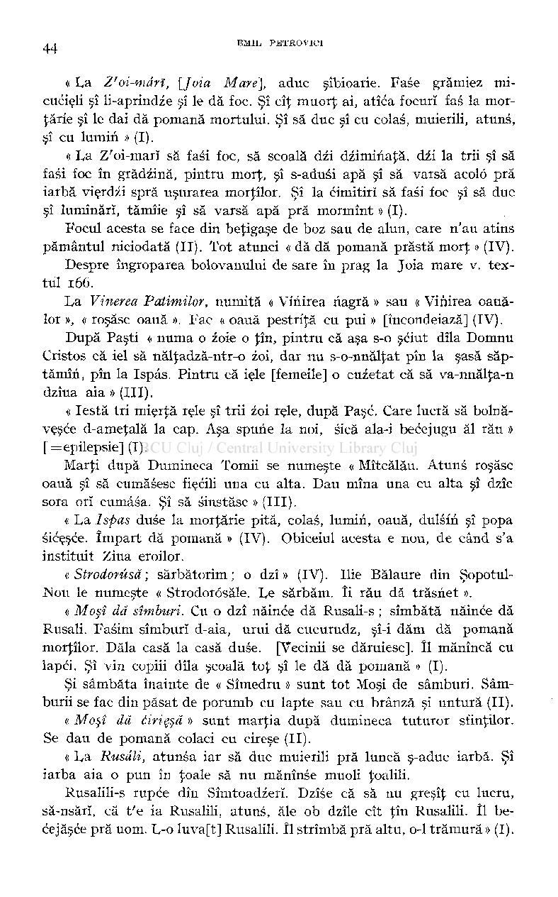

<( La Z'oi-mârl, [Joia Mare], aduc şîbioarie. F ase grămiez mi-

cucieli şî li-aprindze şî le dă foc. Şî cîţ muorţ ai, atîca focuri fas la morţărie şî le dai dă pomană mortului. Şî să duc şî cu colaé, muierili, atuns, şî cu lumin » (I).

« L a Z'oi-marî să fasi foc, să scoală dzi dzimiriaţă, dzi la trii şî să fasi foc în grădzină, pintru mort, şî s-adusi apă şî să varsă acolo pră iarbă vierdzi spră uşurarea morţilor. Şî la cimitirî să fasi foc şî să duc şî luminări, tămîie şî să varsă apă pră mormînt » (I).

Focul acesta se face din beţigaşe de boz sau de alun, care n'au atins pământul niciodată (II). Tot atunci « dă dă pomană prăstă morţ » (IV).

Despre îngroparea bolovanului de sare în prag la Joia mare v. textul 166.

Da Vinerea Patimilor, numită « Vinirea nagră » sau « Vinirea oauălor », « roşăsc oauă ». Fac « oauă pestriţă cu pui » [încondeiază] (IV).

După Paşti << numa o zoie o ţîn, pintru că aşa s-o şciut dîla Domnu

Cristos că iei să nălţadză-ntr-o zoi, dar nu s-o-nnălţat pîn la şasă săptămîn, pîn la Ispas. Pintru că iele [femeile] o cuzetat că să va-nnălţa-n dzîua aia » (III).

« lesta tri mierţă rele şî trii zoi rele, după Paşc. Care lucră să bolnăveşce d-ameţală la cap. Aşa spune la noi, sică ala-i becejugu ăl rău » [=epilepsie] (I).

Marţi după Dumineca Tomii se numeşte « Mîtcălău. Atuns roşăsc oauă şî să cumăsesc fiecili una cu alta. Dau mîna una cu alta şî dzîc sora ori cumâsa. Şî să sinstăsc » (III).

« L a Ispas duse la morţărie pită, colas, lumin, oauă, dulsin şî popa siceşce. împart dă pomană » (IV). Obiceiul acesta e nou, de când s'a instituit Ziua eroilor.

« Strodorusă ; sărbătorim; o dzî » (IV). Ilie Bălaure din ŞopotulNou le numeşte « Strodorosăle. Le sărbăm. îi rău dă trăsnet ».

« Moşi dă sîmburi. Cu o dzî năince dă Rusali-s ; sîmbătă năince dă Rusali. Fasim sîmburi d-aia, urui dă cucurudz, şî-i dăm dă pomană morţilor. Dăla casă la casă duse. [Vecinii se dăruiesc]. î l mănîncă cu lapci. Şî vin copiii dîla şcoală toţ şî le dă dă pomană » (I).

Şi sâmbăta înainte de « Sîmedru » sunt tot Moşi de sâmburi. Sâmburii se fac din păsat de porumb cu lapte sau cu brânză şi untură (II).

« Moşi dă cirieşă » sunt marţia după dumineca tuturor sfinţilor. Se dau de pomană colaci cu cireşe (II).

« L a Rusăli, atunsa iar să duc muierili pră luncă ş-aduc iarbă. Şî iarba aia o pun în ţoale să nu mănînse muoli ţoalili.

Rusalili-s rupee dîn Sîmtoadzerî. Dzîse că să nu greşîţ cu lucru, să-nsărî, că t'e ia Rusalili, atuns, ăle ob dzîle cît ţîn Rusalili. îl becejăşce pră uom. L-o luva[t] Rusalili. îl strîmbă pră altu, o-l trămură » (I).

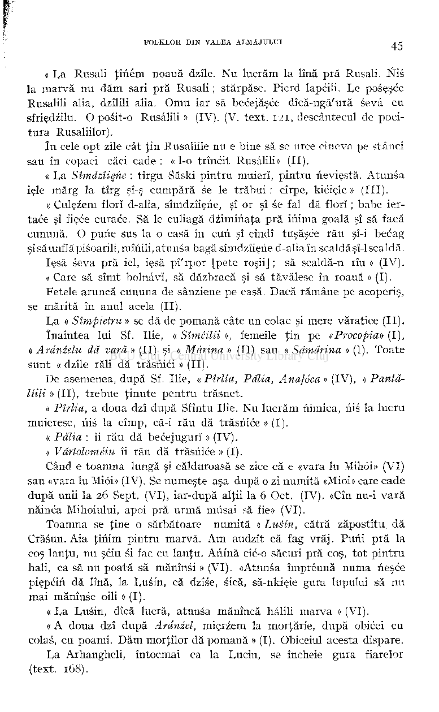

« La Rusali ţîriem noauă dzîle. N u lucrăm la lînă pră Rusali. Nis la marvă nu dăm sari pră Rusali ; stărpăsc. Pierd lapcili. Le poseşce Rusalili alia, dzîlili alia. Omu iar să becejăşce dîcă-ngă'ură seva cu sfriedzilu. O posit-o Rusalili » (IV). (V. text. 121 , descântecul de pocitura Rusaliilor).

în cele opt zile cât ţin Rusaliile nu e bine să se urce cineva pe stânci sau în copaci căci cade : « l-o trîncit Rusalili» (II).

« L a Sîmdzîiene : tîrgu Săski pintru muieri, pintru neviestă. Atunsa iele mărg la tîrg şî-ş cumpără se le trăbui : cîrpe, kiciele » (III).

« Culezem flori d-alia, sîmdzîiene, şî or şî se fal dă flori ; babe iertace şî fiece curace. Să le culiagă dzimiriaţă pră ifiima goală şî să facă cunună. O pune sus la o casă în cun şî cîndî tuşăşce rău şî-i becag şîsăunflăpisoarili,mmili, atunsa bagă sîmdzîiene d-alia în scaldăşî-lscaldă.

lesă seva pră iei, iesă pî'rpor [pete roşii] ; să scaldă-n rîu » (IV). « Care să sîmt bolnavi, să dăzbracă şî să tăvălesc în roauă » (I). Fetele aruncă cununa de sânziene pe casă. Dacă rămâne pe acoperiş,

se mărită în anul acela (II).

L a « Sîmpietru » se dă de pomană câte un colac şi mere văratice (II). înaintea lui Sf. Ilie, « Sîmcilii », femeile ţin pe «Procopia» (I),

« Ardnzelu dă vară » (II) şi « Marina » (II) sau « Sămărina » (I). Toate sunt « dzîle răii dă trăsnici » (II).

De asemenea, după Sf. Ilie, «Pîrlia, Palia, Anafôca» (IV), « Pantăliili » (II), trebue ţinute pentru trăsnet.

« Pîrlia, a doua dzî după Sfîntu Ilie. Nu lucrăm nimica, riis la lucru

muieresc, nis la cîmp, că-i rău dă trăsnice » (I). « Palia : îi rău dă bece juguri » (IV). « Vărtolomeiu îi rău dă trăsnice » (I).

Când e toamna lungă şi călduroasă se zice că e «vara lu Mihôi» (VI) sau «vara lu Miôi» (IV). Se numeşte aşa după o zi numită «Mioi» care cade după unii la 26 Sept. (VI), iar-după alţii la 6 Oct. (IV). «Cîn nu-i var ă năinca Mihoiului, apoi pră urmă musai să fie» (VI).

Toamna se ţine o sărbătoare numită « Lusin, cătră zăpostîtu. dă Crăsun. Aia ţînim pintru marvă. A m audzît că fag vrăj. Puni pră la coş lanţu, nu şciu si fac cu lanţu. Anină cîc-o săcuri pră coş, tot pintru hali, ca să nu poată să mănînsi » (VI). «Atunsa împreună numa neşce piepcin dă lînă, la Dusfn, că dzîse, sică, să-nkieie gura lupului să nu mai mănînse oili » (I).

« L a Dusin, dîcă lucră, atunsa mănîncă hâlili marva » (VI). « A doua dzî după Arâniel, mierzem la morţărie, după obicei cu

colas, cu poami. Dă m morţilor dă pomană » (I). Obiceiul acesta dispare.

La Arhangheli, întocmai ca la Lucin, se încheie gara fiarelor (text. 168).

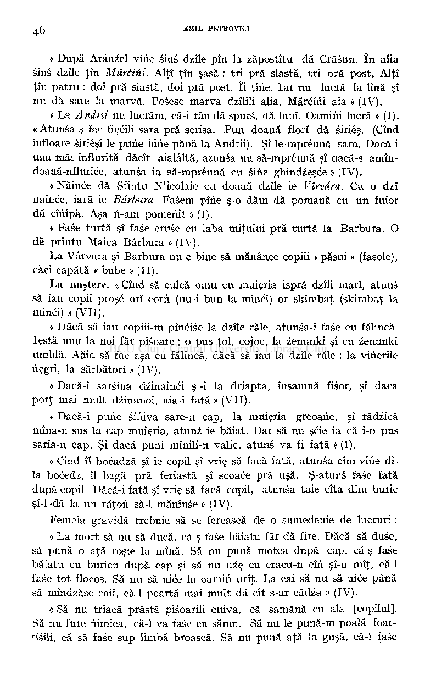

« După Arânzel vine sins dzîle pîn la zăpostîtu dă Crăsun. în alia sins dzîle ţîn Martini. Alţî ţîn şasă : tri pră slastă, tri pră post. AJţî ţîn patru : doi pră slastă, doi pră post. îi ţîne. Iar nu lucră la lînă şî nu dă sare la marvă. Posesc marva dzîlili alia, Mărcini aia » (IV).

« La Andrii nu lucrăm, că-i rău dă spurs, dă lupi. Oamini lucră » (I). « Atunsa-ş fac fiecili sara pră scrisa. Pun doauă flori dă sirieş. (Cînd înfloare sirieşî le pune bine pană la Andrii). Şî le-mpreună sara. Dacă-i una măi înflurită dăcît aialâltă, atunsa nu să-mpreună şî dacă-s amîndoauă-nflurice, atunsa ia să-mpreună cu sine ghindzeşce » (IV).

« Năince dă Sfîntu N'icolaie cu doauă dzîle ie Vîrvdra. Cu o dzî naince, iară ie Bdrbura. Fasem pîrie ş-o dăm dă pomană cu un fuior dă cînipă. Aşa n-am pomenit » (I).

« Fase turtă şî fase cruse cu laba mîţului pră turtă la Barbura. O dă prîntu Maica Barbura » (IV).

L a Vârvara şi Barbura nu e bine să mănânce copiii «păsui » (fasole), căci capătă « bube » (II).

La naştere. « Cînd să culcă omu cu muieria ispră dzîli mari, atuns să iau copii proşc ori corn (nu-i bun la minei) or skimbaţ (skimbaţ la minci) » (VII).

« Dacă să iau copiii-m pîncise la dzîle răle, atunsa-i fase cu fălincă. Iestă unu la noi făr pisoare ; o pus ţol, cojoc, la zenunki şî cu zenunki umblă. Aăia să fac aşa cu fălincă, dacă să iau la dzîle râie : la vinerile negri, la sărbători » (IV).

« Dacă-i sarsina dzinainci şî-i la driapta, însamnă fisor, şî dacă porţ mai mult dzinapoi, aia-i fată » (VII).

« Dacă-i pune éîniva sare-n cap, la muieria greoane, şî rădzică mîna-n sus la cap muieria, atunz ie băiat. Dar să nu şcie ia că i-o pus saria-n cap. Şî dacă puni mînili-n valie, atuns v a fi fată » (I).

« Cînd îl bocadză şî ie eopil şî vrie să facă fată, atunsa cîm vine dîla bocedî, îl bagă pră feriastă şî scoace pră uşă. Ş-atuns fase fată după copil. Dăcă-i fată şî vrie să facă copil, atunsa taie cîta dîm buric şî-1 -dă la un răţori să-1 mănînse » (IV).

Femeia gravidă trebuie să se ferească de o sumedenie de lucruri : « La mort să nu să ducă, că-ş fase băiatu făr dă fire. Dacă să duée,

să pună o aţă roşie la mînă. Să nu pună motca după cap, că-ş fase băiatu cu buricu după cap şî să nu dze cu cracu-n cîri şî-n mîţ, că-1 fase tot flocos. Să nu să uice la oamin urîţ. L a cai să nu să uice până să mîndzăsc caii, că-1 poartă mai mult dă cît s-ar cădza » (IV).

« Să nu triacă prăstă pisoarili cuiva, că samănă cu ala [copilul]. Să nu fure nimica, că-1 va fase cu sămn. Să nu le pună-m poală foarfisili, că să fase sup limbă broască. Să nu pună aţă la guşă, că-1 fase

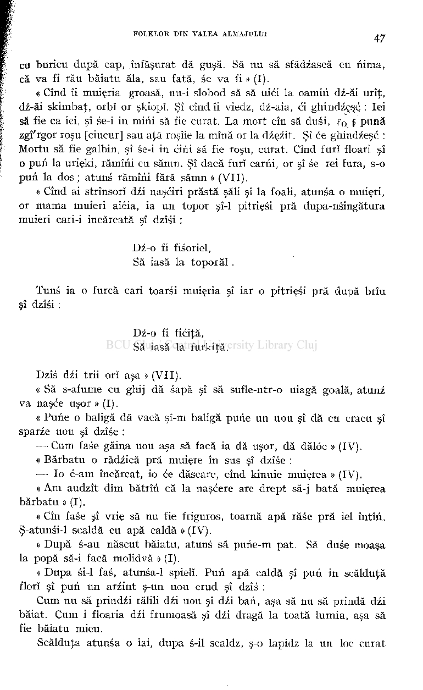

cu buricu după cap, înfăşurat dă guşă. Să nu să sfădzască cu riima, că va fi rău băiatu ăla, sau fată, se v a fi » (I).

« Cînd îi muieria groasă, nu-i slobod să să uici la oamiri dz-ăi urîţ, dz-ăi skimbaţ, orbi or şkiopî. Şî cînd îi viedz, dz-aia, ci ghindze_şc : Iei

- să fie ca iei, şî se-i in mirii să fie curat. L a mort cîn să dusi, f

ţ pună zgî'rgor roşu [ciucur] sau aţă roşîie la mînă or la dzezit. Şî ce ghindzeşc : Mortu să fie galbin, şî se-i in cirii să fie roşu, curat. Cînd furi floari şî

0

- o puri la urieki, rămîrii cu sămn. Şî dacă furi carrii, or şî se rei fura, s-o puri la dos ; atuns rămîrii fără sămn » (VII).

« Cînd ai strînsorî dzi naşciri prăstă săli şî la foali, atunsa o muieri,

- or mama muieri aiéia, ia un topor şî-1 pitriesi pră dupa-nsingătura muieri cari-i încărcată şî dzîsi :

Dz-o fi fisoriel, Să iasă la toporăl .

Tuns ia o furcă cari toarsi muieria şî iar o pitriesi pră după brîu şî dzîsi :

Dz-o fi ficiţă, Să iasă la furkiţă.

Dzîs dzi trii ori aşa » (VII). « Să s-afume cu ghij dă sapă şî să sufle-ntr-o uiagă goală, atunz

va naşce uşor » (I).

« Pune o baligă dă vacă şî-m baligă pune un uou şî dă cu cracu şî sparze uou şî dzîse :

— Cum fase găina uou aşa să facă ia dă uşor, dă dăloc » (IV). « Bărbatu o rădzică pră muiere în sus şî dzîse :

— Io c-am încărcat, io ce dăscarc, cînd kinuie muierea » (IV). « A m audzît dîm bătrîri că la naşcere are drept să-j bată muierea

bărbatu » (I).

« Cîn fase şî vrie să nu fie friguros, toarnă apă rase pră iei întîri. Ş-atunsi-1 scaldă cu apă caldă » (IV).

« După s-au născut băiatu, atuns să purie-m pat. Să duse moaşa la popă să-i facă molidvă » (I).

« Dupa si-1 fas, atunsa-1 spielî. Puri apă caldă şî puri in scălduţă flori şî puri un arzint ş-un uou crud şî dzîs :

Cum nu să prindzi rălili dzi uou şî dzi bari, aşa să nu să prindă dzi băiat. Cum i floaria dzi frumoasă şî dzi dragă la toată lumia, aşa să fie băiatu mieu.

Scălduţa atunsa o iai, dupa s-il scaldz, ş-o lapidz la un loc curat

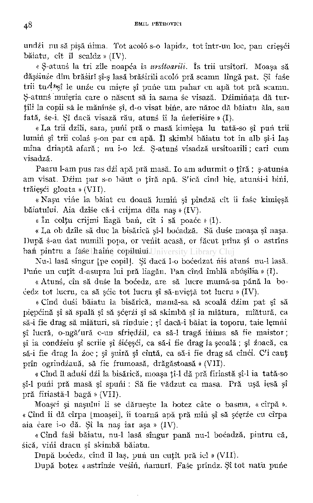

undzi nu să pişă liima. Tot acolo s-o lapidz, tot într-un loc, pan crieşci

- băiatu, cît îl scaldz » (IV). « Ş-atuns la tri zîle noapca îs ursitoarili. îs trii ursitori. Moaşa să

dăşsinze dîm brăsirî şî-ş lasă brăsirili acolo pră scamn lîngă pat. Şî fase trii tu-<4fcşî le unze cu miere şî pune um pahar cu apă tot pră scamn. Ş-atuns muieria care o născut să ia sama se visază. Dzimiriaţa dă turţîli la copii să le mănînse şî, d-o visat bine, are năroc dă băiatu ăla, sau fată, se-i. Şî dacă visază rău, atuns îi la neferisire » (I).

« L a trii dzîli, sara, puni pră o masă kimieşă lu tată-so şî pun trii lumih şî trii colas ş-on par cu apă. îl skimbî băiatu tot în alb şî-i laş mina driaptă afară ; nu i-o lez. Ş-atuns visadză ursîtoarili ; cari cum visadză.

Paaru l-am pus ras dzi apă pră masă. Io am adurmit o ţîră ; ş-atunsa am visat. Dzim par s-o băut o ţîră apă. S'ică cînd bie, atunsi-i bihi, trăieşci gloata » (VII).

« Naşu vine la băiat cu doauă lumih şî pîndză cît îi fase kimieşă

- băiatului. Aia dzîse că-i crijma dîla naş » (IV). «în colţu cri j mi liagă ban, cît i să poace » (I). « L a ob dzîle să duc la bisărică şî-1 bocadză. Să duée moaşa şî naşa.

După s-au dat numili popa, or venit acasă, or făcut prînz şî o astrîns bah pintru a fase haine copilului.

Nu-1 lasă singur [pe copil]. Şî dacă l-o bocedzat his atuns nu-1 lasă. Pune un cuţît d-asupra lui pră liagăn. Pan cînd îmbla abuşîlia » (I).

« Atuns, cîn să duse la bocedz, are să lucre mumă-sa pană la bocedz tot lucru, ca să şcie tot lucru şî să-nvieţă tot lucru » (IV).

« Cînd dusi băiatu la bisărică, mamă-sa să scoală dzim pat şî să piepcină şî să spală şî să şcerzi şî să skimbă şî ia mîătura, mîătură, ca să-i fie drag să mîături, să rînduie ; şî dacă-i băiat ia toporu, taie lemhi şî lucră, o-ngă'ură c-un sfriedzil, ca să-1 tragă inima să fie maistor ; şî ia condzeiu şî scriie şî siceşci, ca să-i fie drag la şcoală ; şî zoacă, ca să-i fie drag la zoe ; şî şuiră şî cîntă, ca să-i fie drag să cînéi. C i caut prin ogrindzauă, să fie frumoasă, drăgăstoasă » (VII).

« Cînd îl aduşi dzi la bisărică, moaşa ţî-1 dă pră firiastă şî-1 ia tată-so şî-1 purii pră masă şî spuhi : Să fie vădzut ca masa. Pră uşă iesă şî pră firiastă-1 bagă » (VII).

Moaşei şi naşului li se dărueşte la botez câte o basma, « cîrpă ». « Cînd îi dă cîrpa [moaşei], îi toarnă apă pră mîh şî să şcerze cu cîrpa aia care i-o dă. Şî la naş iar aşa » (IV).

« Cînd fasi băiatu, nu-1 lasă singur pană nu-1 bocadză, pintru că,

sică, vini dracu şî skimbă băiatu. După bocedz, cînd îl laş, pun un cuţît pră iei » (VII). După botez « astrînze vesih, hamuri. Fase prîndz. Şî tot natu pune

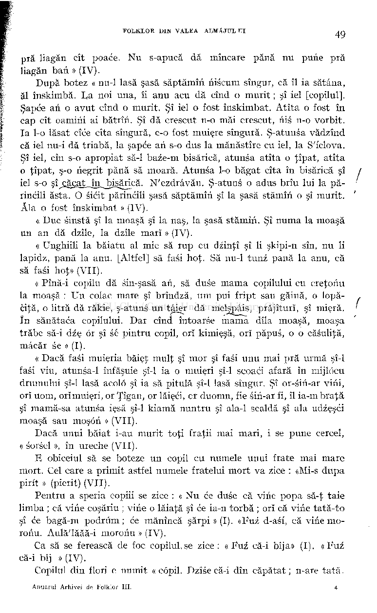

pră liagăn cît poace. N u s-apucă dă mîncare pană nu pune pră liagăn ban » (IV).

După botez « nu-1 lasă şasă săptămîn niscum singur, că îl ia sătâna, ăl înskimbă. L a noi una, îi anu acu dă cînd o murit ; şî iei [copilul]. Şapce aii o avut cînd o murit. Şî iei o fost înskimbat. Atîta o fost în cap cît oamirii ai bătrîn. Şî dă crescut n-o măi crescut, nié n-o vorbit. Ia l-o lăsat cîce cîta sîngură, c-o fost muiere singură. Ş-atunsa vădzînd

- că iei nu-i dă triabă, la şapce ari s-o dus la mănăstire cu iei, la S'iclova. Şî iei, cin s-o apropiat să-1 baze-m bisărică, atunsa atîta o ţîpat, atîta o ţîpat, ş-o negrit pană să moară. Atunsa l-o băgat cîta în bisărică şî iei s-o şî^_căcaţ_Jri^J)isă£ică. N'ezdrâvăn. Ş-atuns o adus brîu lui la părincili ăsta. O sicit părincili şasă săptămîn şî la şasă stămîn o şî murit. Ăla o fost înskimbat » (IV).

« Duc sinstă şî la moaşă şî la naş, la şasă stămîn. Şî numa la moaşă un an dă dzîle, la dzîle marï » (IV).

« Unghiili la băiatu al mic să rup cu dzinţî şî li şkipi-n sîn, nu li lapidz, pană la anu. [Altfel] să fasi hoţ. Să nu-1 tunz pană la anu, că să fasi hoţ» (VII).

« Pînă-i copilu dă sin-şasă ah, să duse mama copilului cu creţohu la moaşă : U n colac mare şî brîndză, um pui fript sau găină, o lopăciţă, o litră dă răkie, ş-atuns un taier dă melsrjâis, prăjituri, şî mieră. în sănătaca copilului. Dar cînd întoarse mama dîla moaşă, moaşa trăbe să-i dze or şî sé pintru copil, ori kimieşă, orî păpus, o o căsuliţă, mâcăr se » (I).

« Dacă fasi muieria băiet mulţ şî mor şî fasi unu mai pră urmă şî-1 fasi viu, atunsa-1 înfăşuie şî-1 ia o muieri şî-1 scoaci afară în mijlôcu drumului şî-1 lasă acolo şî ia să pitula şî-1 lasă singur. Şî or-sih-ar vini, orî uom, orîmuieri, or Ţigan, or lăieci, or duomn, fie siri-ar fi, îl ia-m braţă şî mamă-sa atunsa iesă şî-1 kiamă nuntru şî ala-1 scaldă şî ala udzeşci moaşă sau moşoh » (VII).

Dacă unui băiat i-au murit toţi fraţii mai mari, i se pune cercel, « sorsel », în ureche (VII).

E obiceiul să se boteze un copil cu numele unui frate mai mare mort. Cel care a primit astfel numele fratelui mort v a zice : «Mi-s dupa pirit » (pierit) (VII).

Pentru a speria copiii se zice : « N u ce duse că vine popa să-ţ taie limba ; că vine coşăriu ; vine o lăiaţă şî ce ia-n torbă ; ori că vine tată-to şî ce bagă-m podrum ; ce mănîncă şărpi » (I). «Fuz d-asi, că vine moroiul. Aulă'lăăă-i morohu » (IV).

Ca să se ferească de foc copilul.se zice : «Fu z că-i bîja» (I). «Fuz

- că-i bîj » (IV). Copilul din flori e numit « copil. Dzîse că-i dîn căpătat; n-are tată.

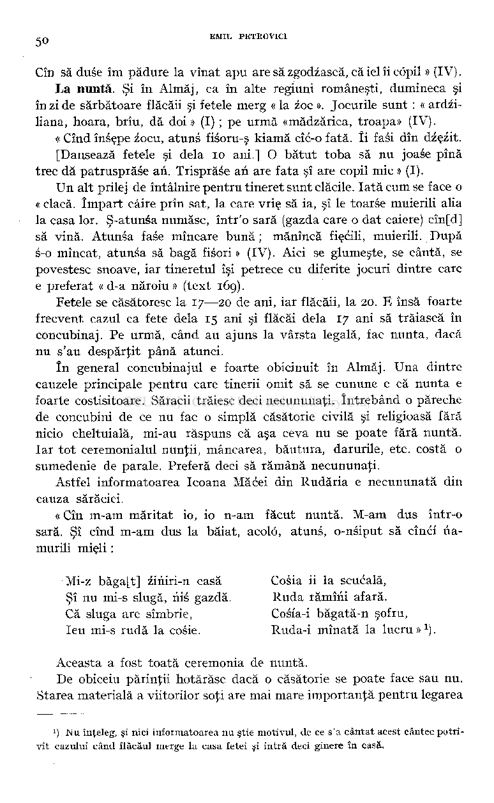

Cîn să duse îm pădure la vînat apu are să zgodzască, că iei îi copil » (IV).

La nuntă. Şi în Almăj, ca în alte regiuni româneşti, dumineca şi în zi de sărbătoare flăcăii şi fetele merg « la zoc ». Jocurile sunt : « ardziliana, hoara, brîu, dă doi» (I) ; pe urmă «mădzărica, troapa» (IV).

« Cînd înéepe zocu, atuns fisoru-ş kiamă cîc-o fată. îi fasi dîn dzezit. [Dansează fetele şi delà i o ani.] O bătut toba să nu joase pînă

trec dă patrusprăee an. Trisprăee an are fata şî are copil mic » (I).

Un alt prilej de întâlnire pentru tineret sunt clăcile. Iată cum se face o « clacă. împart câire prîn sat, la care vrie să ia, şî le toarse muierili alia la casa lor. Ş-atunea număsc, într'o sară (gazda care o dat caiere) cîn[d] să vină. Atunsa fase mîncare bună ; mănîncă fiecili, muierili. După s-o mîncat, atunsa să bagă fisori » (IV). Aici se glumeşte, se cântă, se povestesc snoave, iar tineretul îşi petrece cu diferite jocuri dintre care e preferat « d-a năroiu » (text 169).

Fetele se căsătoresc la 17—20 de ani, iar flăcăii, la 20. E însă foarte frecvent cazul ca fete delà 15 ani şi flăcăi delà 17 ani să trăiască în concubinaj. Pe urmă, când au ajuns la vârsta legală, fac nunta, dacă nu s'au despărţit până atunci.

î n general concubinajul e foarte obicinuit în Almăj. Una dintre cauzele principale pentru care tinerii omit să se cunune e că nunta e foarte costisitoare. Săracii trăiesc deci necununaţi. întrebând o păreche de concubini de ce nu fac o simplă căsătorie civilă şi religioasă fără nicio cheltuială, mi-au răspuns că aşa ceva nu se poate fără nuntă. Iar tot ceremonialul nunţii, mâncarea, băutura, darurile, etc. costă o sumedenie de parale. Preferă deci să rămână necununaţi.

Astfel informatoarea Icoana Măcei din Rudăria e necununată din cauza sărăciei.

« Cîn m-am măritat io, io n-am făcut nuntă. M-am dus într-o sară. Şî cînd m-am dus la băiat, acolô, atuns, o-néiput să cînci riamurili mieii :

Mi-z băga[t] ziriiri-n casă Cosia ii la scucală, Şî nu mi-s slugă, riis gazdă. Ruda rămîrii afară. Că sluga are simbrie, Coéia-i băgată-n şofru, leu mi-s rudă la cosie. Ruda-i minată la lucru»

).

1

Aceasta a fost toată ceremonia de nuntă. De obiceiu părinţii hotărăsc dacă o căsătorie se poate face sau nu.

Starea materială a viitorilor soţi are mai mare importanţă pentru legarea

###### ') Nu înţeleg, şi nici informatoarea nu ştie motivul, de ce s'a cântat acest cântec potri vit cazului când flăcăul merge la casa fetei şi intră deci ginere în casă.

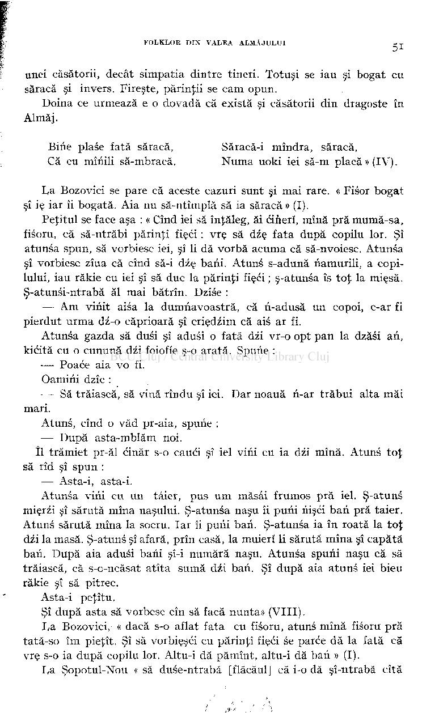

unei căsătorii, decât simpatia dintre tineri. Totuşi se iau şi bogat cu săracă şi invers. Fireşte, părinţii se cam opun.

Doina ce urmează e o dovadă că există şi căsătorii din dragoste în Almăj.

Bine plase fată săracă, Săracă-i mîndra, săracă, Că cu mîriili să-mbracă. Num a uoki iei să-m placă» (IV).

La Bozovici se pare că aceste cazuri sunt şi mai rare. « Fisor bogat şî ie iar îi bogată. Aia nu să-ntîmplă să ia săracă» (I).

Peţitul se face aşa : « Cînd iei să înţăleg, ăi cinerî, mînă pră mumă-sa, fisoru, că să-ntrăbi părinţi fişei : vre să dze fata după copilu lor. Şî atunsa spun, să vorbiesc iei, şî li dă vorbă acuma că să-nvoiesc. Atunsa şî vorbiesc zîua că cînd să-i dze bani. Atuné s-adună namurili, a copilului, iau răkie cu iei şî să duc la părinţi fieci ; ş-atunsa îs toţ la miesă. Ş-atunsi-ntrabă ăl mai bătrîn. Dzîse :

— A m vinit aisa la dumnavoastră, că n-adusă un copoi, c-ar fi pierdut urma dz-o căprioară şî eriedzim că ais ar fi.

Atunsa gazda să dusi şî aduşi o fată dzi vr-o opt pan la dzăsi ari, kicită cu o cunună dzi foiofie ş-o arată. Spune :

— Poace aia v o fi. Oamirii dzîc :

— Să trăiască, să vină rîndu şî iei. Dar noauă ri-ar trăbui alta măi mari.

Atuns, cînd o vă d pr-aia, spune :

— După asta-mblăm noi.

îl trămiet pr-ăl cinăr s-o cauci şî iei virii cu ia dzi mînă. Atuns toţ să rîd şî spun :

— Asta-i, asta-i. Atunsa virii cu un taier, pus u m măsâi frumos pră iei. Ş-atuns mierzi şî sărută mîna naşului. Ş-atunsa naşu îi purii nişei bari pră taier. Atuns sărută mîna la socru. Iar îi purii bari. Ş-atunsa ia în roată la toţ dzi la masă. Ş-atuns şî afară, prîn casă, la muieri li sărută mîna şî capătă bari. După aia aduşi barii şî-i numără naşu. Atunsa spurii naşu că să trăiască, că s-o-ncăsat atîta sumă dzi bari. Şî după aia atuns iei bieu

- răkie şî să pitrec. Asta-i peţîtu. Şî după asta să vorbesc cîn să facă nunta» (VIII). L a Bozovici, « dacă s-o aflat fata cu fisoru, atuns mînă fisoru pră

tată-so îm pieţît. Şî să vorbieşci cu părinţî fieci se parce dă la fată că vre s-o ia după copilu lor. Altu-i dă pămînt, altu-i dă bari » (I).

La Şopotul-Nou « să duse-ntrabă [flăcăul] că i-o dă şî-ntrabă cîtă

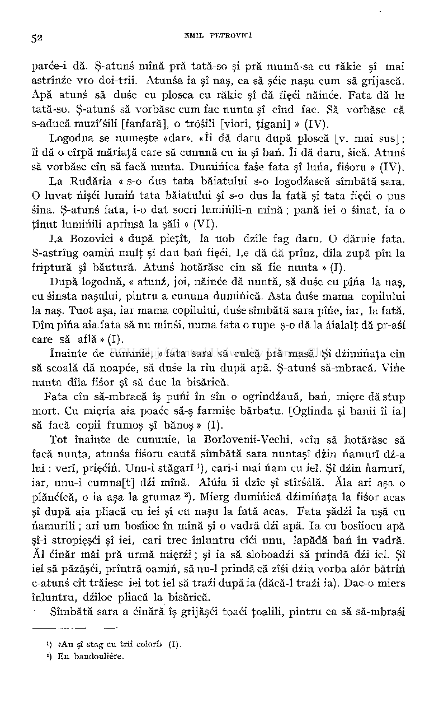

parce-i dă. Ş-atuns mînă pră tată-so şi pră nmmă-sa cu răkie şî mai astrînze vro doi-trii. Atunsa ia şî naş, ca să şcie naşu cum să grijască. Ap ă atuns să duse cu plosca cu răkie şî dă fieci năince. Fata dă lu tată-so. Ş-atuns să vorbăsc cum fac nunta şî cînd fac. Să vorbăsc că s-aducă muzî'sili [fanfară], o trôsili [viori, ţigani] » (IV).

Logodna se numeşte «dar». «îi dă daru după ploscă [v. mai sus] ; îi dă o cîrpă măriaţă care să cunună cu ia şî ban. îi dă daru, sică. Atuns să vorbăsc cîn să facă nunta. Duminica fase fata şî luna, fisoru » (IV).

L a Rudăria « s-o dus tata băiatului s-o logodzaseă sîmbătă sara. O luvat nişei lunuri tata băiatului şî s-o dus la fată şi tata fieci o pus éina. Ş-atuns fata, i-o dat socri lumiriili-n mînă ; pană iei o sinat, ia o ţînut lumiriili aprinsă la săli » (VI).

L a Bozovici « după pieţît, la uob dzîle fag daru. O dăruie fata. S-astrîng oamiri mulţ şî dau ban fieci. Le dă dă prînz, dîla zupă pîn la friptură şî băutură. Atuns hotărăsc cîn să fie nunta » (I).

Dup ă logodnă, « atunz, joi, năince dă nuntă, să duée cu pîha la naş, cu sinsta naşului, pintru a cununa duminică. Ast a duse mama copilului la naş. Tuot aşa, iar mama copilului, duse sîmbătă sara pîrie, iar, la fată. Dîm pîria aia fata să nu mînsi, numa fata o rupe ş-o dă la âialalţ dă pr-aéi care să află » (I).

înainte de cununie, « fata sara să culcă pră masă. Şî dzimiriaţa cîn să scoală dă noapee, să duse la rîu după apă. Ş-atuns să-mbracă. Vine nunta dîla fisor şî să duc la bisărică.

Fata cîn să-mbracă îş purii în sîn o ogrindzauă, bari, miere dă stup mort. C u mieria aia poace să-ş farmise bărbatu. [Oglinda şi banii îi ia] să facă copii frumos şî bănos » (I).

Tot înainte de cununie, la Borlovenii-Vechi, «cîn să hotărăsc să facă nunta, atunsa fisoru caută sîmbătă sara nuntaşi dzin riamurî dz-a lui : veri, prieciri. Unu-i stăgarî

) , cari-i mai riam cu iei. Şî dzin riamurî, iar, unu-i cumna[t] dzi mînă. Ăluia îi dzîc şî stîrsâlă. Ăla ari aşa o plăncică, o ia aşa la grumaz ). Mierg duminică dzimiriaţa la fisor acas şî după aia pliacă cu iei şî cu naşu la fată acas. Fat a şădzi la uşă cu riamurili ; ari u m bosîioc în mînă şî o vadră dzi apă. Ia cu bosîiocu apă şî-i stropieşci sî iei, cari trec înluntru cîci unu, lapădă bari în vadră. Ă l cinăr măi pră urmă mierzi ; şî ia să sloboadzi să prindă dzi iei. Şî iei să păzăşci, prîntră oamiri, să nu-1 prindă că zîsi dzin vorba alôr bătrîri c-atuns cît trăiesc iei tot iei să trazi după ia (dăcă-1 trazi ia). Dac-o miers înluntru, dziloc pliacă la bisărică.

:

Sîmbătă sara a cinară îş grijăşci toaci ţoalili, pintru ca să să-mbrasi

###### *) «Au şî stag cu trii colori» (I). ') Eu bandoulière.

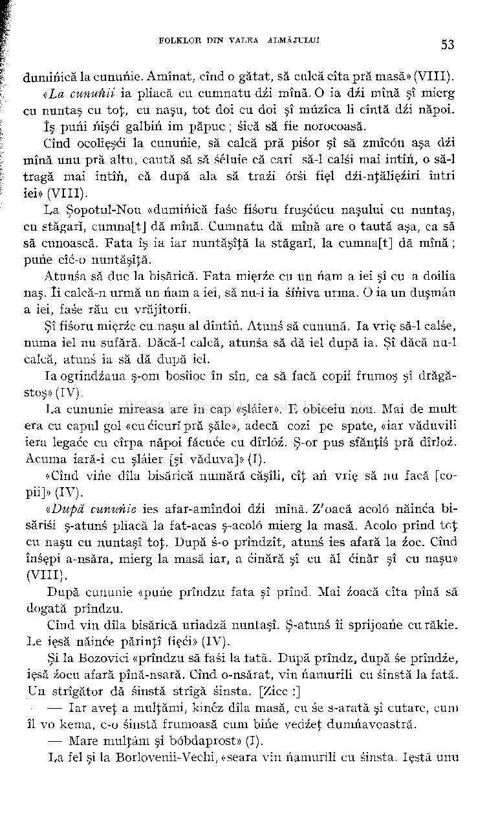

duminică la cununie. Amînat, cînd o gătat, să culcă cita pră masă» (VIII). «La cununii ia pliacă cu cumnatu dzi mină. O ia dzi mină şî mierg

cu nuntaş cu toţ, cu naşu, tot doi cu doi şî muzica li cîntă dzi năpoi. îş puni nişei galbin im papuc ; eică să fie norocoasă. Cînd ocolieşci la cununie, să calcă pră pisor şî să zmîcôn aşa dzi mînă unu pră altu, caută să să séluie că cari să-1 calsi mai intîn, o să-1 tragă mai intîn, că după ala să trazi ôrsi fiel dzi-nţălieziri întri iei» (VIII).

L a Şopotul-Nou «duminică fase fisoru fruşcucu naşului cu nuntaş, cu stăgarî, cumna[t] dă mînă. Cumnatu dă mînă are o taută aşa, ca să

- să cunoască. Fata îş ia iar nuntăşîţă la stăgarî, la cumna[t] dă mînă ; pune cîc-o nuntăşîţă.

Atunsa să duc la bisărică. Fata mierze cu un nam a iei şî cu a doilia naş. îi calcă-n urmă un ham a iei, să nu-i ia sfniva urma. O ia un duşman a iei, fase rău cu vrăjitorii.

Şî fisoru mierze cu naşu al dîntîh. Atuns să cunună. Ia vrie să-1 caise, numa iei nu sufără. Dăcă-1 calcă, atunsa să dă iei după ia. Şî dacă nu-1 calcă, atuns ia să dă după iei.

Ia ogrindzaua ş-om bosîioc în sîn, ca să facă copii frumos şî drăgăstos»^) .

L a cununie mireasa are în cap «şlâier». E obiceiu nou. Mai de mult era cu capul gol «cu cicurî pră şale», adecă cozi pe spate, «iar văduvili iera legace cu cîrpa năpoi făcuce cu dîrlôz. Ş-or pus sfănţîs pră dîrloz. Acuma iară-i cu şlâier [şi văduva]» (I).

«Cînd vine dîla bisărică numără căşîli, cîţ ari vrie să nu facă [coP"]»(IV).

«După cununie ies afar-amîndoi dzi mînă. Z'oacă acolo năinca bisărisi ş-atuns pliacă la fat-acas ş-acolo mierg la masă. Acolo prind tcţ cu naşu cu nuntaşi toţ. După s-o prîndzît, atuns ies afară la zoc. Cînd însepi a-nsăra, mierg la masă iar, a cinară şî cu ăl cinăr şî cu naşu» (VIII).

După cununie «pune prîndzu fata şî prind. Mai zoacă cîta pînă să dogată prîndzu.

Cînd vin dîla bisărică uriadză nuntaşi. Ş-atuns îi sprijoahe curăkie. Le iesă năince părinţi fieci» (IV).

Şi la Bozovici «prîndzu să fasi la fată. După prîndz, după se prîndze, iesă zocu afară pînă-nsară. Cînd o-nsărat, vin hamurili cu sinstă la fată. Un strigător dă sinstă strigă sinsta. [Zice :]

— Iar aveţ a mulţămi, kinéz dîla masă, cu se s-arată şî cutare, cum îl vo kema, c-o sinstă frumoasă cum bine vedzeţ dumhavcastră.

— Mare mulţam şî bôbdaprost» (I). L a fel şi la Borlovenii-Vechi, «seara vin hamurili cu sinsta. Iestă unu

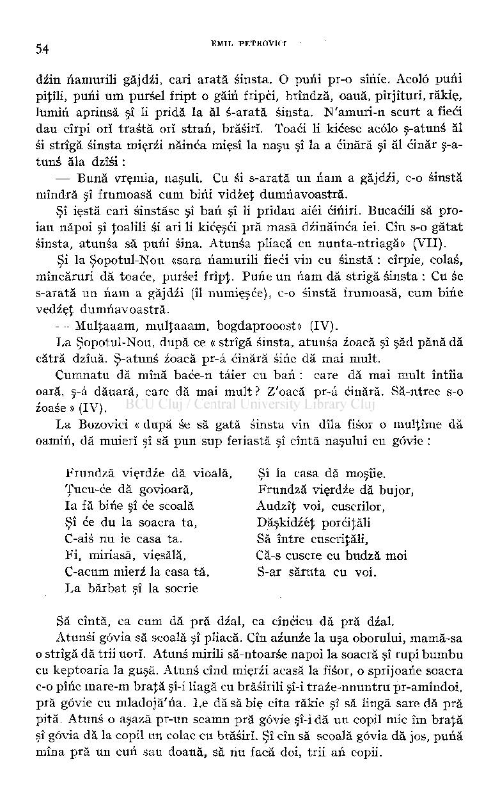

dzin riamurili găjdzi, cari arată sinsta. O puni pr-o sînie. Acolo puni piţîli, puni um pursel fript o găiri fripci, brîndză, oauă, pîrjîturi, răkie, lumiri aprinsă şî li pridă la ăl s-arată sinsta. N'amuri-n scurt a fieci dau cîrpi ori traetă ori strari, brăsirî. Toaci li kicesc acolo ş-atune ăl éi strigă sinsta mierzi năinca miesî la naşu şî la a cinară şî ăl cinăr ş-atuns ăla dzîsi :

— Bună vremia, naşuli. Cu si s-arată un nam a găjdzi, c-o einstă mîndră şî frumoasă cum birii vidzeţ dumriavoastră.

Şî iestă cari einstăsc şî bari şî li pridau aiéi ciriiri. Bucacili să proiau năpoi şî ţoalili si ari li kiceşci pră masă dzinăinca iei. Cîn s-o gătat sinsta, atunsa să purii sina. Atunsa pliacă cu nunta-ntriagă» (VII).

Şi la Şopotul-Nou «sara riamurili fieci vin cu sinstă : cîrpie, colas, mîncăruri dă toace, puréei frîpţ. Pune un nam dă strigă sinsta : Cu ée s-arată un nam a găjdzi (îl numieşce), c-o sinstă frumoasă, cum birie vedzeţ dumriavoastră.

— Mulţaaam, mulţaaam, bogdaprooost» (IV). La Şopotul-Nou, după ce « strigă sinsta, atunsa zoacă şî şăd pană dă

cătră dzîuă. Ş-atuns zoacă pr-â cinară sirie dă mai mult.

Cumnatu dă mînă bace-n taier cu bari : care dă mai mult întîia oară, ş-â dăuară, care dă mai mult ? Z'oacă pr-â cinară. Să-ntrec s-o zoase » (IV).

L a Bozovici « după se să gată sinsta vin dîla fisor o mulţime dă oamiri, dă muieri şî să pun sup feriastă şî cîntă naşului cu gôvie :

Frundză vişrdze dă vioaia, Ţucu-ce dă govioară, Ia fă birie şî ce scoală Şî ce du la soacra ta, C-ais nu ie casa ta. Fi, miriasă, viesălă, C-acum mierz la casa tă, L a bărbat şî la socrie

Şî la casa dă moşîie. Frundză vierdze dă bujor, Audzîţ voi, cuscrilor, Dăşkidzeţ porciţăli Să între cuscriţăli, Că-s cuscre cu budză moi S-ar săruta cu voi.

Să cîntă, ca cum dă pră dzal, ca cîncicu dă pră dzal. Atunsi govia să scoală şî pliacă. Cîn azunze la uşa oborului, mamă-sa o strigă dă trii uorï. Atuns mirili să-ntoaree napoi la soacră şî rupi bumbu cu keptoaria la guşă. Atuns cînd mierzi acasă la fisor, o sprijoarie soacra c-o pîrie mare-m braţă şî-i liagă cu brăsirili şî-i traze-nnuntru pr-amîndoi, pră gôvie cu mladojă'ria. L e dă săbie cîta răkie şî să lingă sare dă pră pită. Atuns o aşază pr-un scamn pră gôvie şî-i dă un copil mic îm braţă şî gôvia dă la copil un colac cu brăsirî. Şî cîn să scoală gôvia dă jos, pună mîna pră un curi sau doauă, să nu facă doi, trii ari copii.

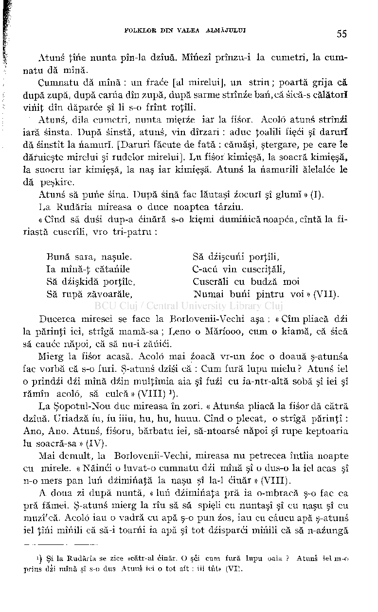

Atuns ţîhe nunta pîn-la dzîuă. Mîhezî prînzu-i la cumetri, la cumnata dă mînă.

Cumnatu dă mînă : un frace [al mirelui], un strin ; poartă grija că după zupă, după carna dîn zupă, după sârme strînze ban, că sică-s călători viriiţ dîn dăparce şî li s-o frînt roţîli.

Atuns, dîla cumetri, nunta mierze iar la fisor. Acolo atuns strînzi iară sinsta. După sinstă, atuns, vin dîrzari : aduc ţoalili fişei şî daruri dă sinstît la hamuri. [Daruri făcute de fată : cămăşi, ştergare, pe care le dăruieşte mirelui şi rudelor mirelui]. Du fisor kimieşă, la soacră kimieşă, la suocru iar kimieşă, la naş iar kimieşă. Atuns la namurili ălelalce le dă peşkire.

Atuns să pune sina. Dup ă sină fac lăutaşî zocurî şî glumi » (I). Da Rudăria mireasa o duce noaptea târziu. « Cînd să dusi dup-a cinară s-o kiemi duminică noapca, cîntă la fi-

riastă cuscrîli, vro tri-patru :

Bună sara, nasule. Să dzişcuhi porţîli, Ia mînă-ţ cătanile C-acû vin cuscriţăli, Să dzişkidă porţile, Cuscrăli cu budză moi Să rupă zăvoarăle, Numai bufii pintru voi» (VII).

Ducerea miresei se face la Borlovenii-Vechi aşa : « Cîm pliacă dzi la părinţi iei, strîgă mamă-sa ; Leno o Măriooo, cum o kiamă, că eică să cauce năpoi, că să nu-i zăuici.

Mierg la fisor acasă. Acolô mai zoacă vr-un zoc o doauă ş-atunsa fac vorbă că s-o furi. Ş-atuns dzîsi că : Cum fură lupu mielu ? Atuns iei o prindzi dzi mînă dzin mulţîmia aia şî fuzi cu ia-ntr-altă sobă şî iei şî

- rămîn acolo, să culcă » (VIII) ) Da Şopotul-Nou duc mireasa în zori. « Atunsa pliacă la fisor dă cătră

dzîuă. Uriadză iu, iu iiiu, hu, hu, huuu. Cînd o plecat, o strîgă părinţi : Ano, Ano. Atuns, fisoru, bărbatu iei, să-ntoarse năpoi şî rupe keptoaria lu soacră-sa » (IV)

Mai demult, la Borlovenii-Vechi, mireasa nu petrecea întîia noapte cu mirele. « Năinci o luvat-o cumnatu dzi mînă şî o dus-o la iei acas şî n-o mers pan luh dzimihaţă la naşu şî la-1 cinăr » (VIII).

A doua zi după nuntă, « luh dzimihaţă pră ia o-mbraeă ş-o fac ca pră fămei. Ş-atuns mierg la rîu să să spieli cu nuntaşi şî cu naşu şî cu muzî'că. Acolô iau o vadră cu apă ş-o pun zos, iau cu câucu apă ş-atuns iei ţîhi mîhili că să-i toarhi ia apă şî tot dzisparci mîhili că să n-azungă

###### Şi la Rudăria se zice «cătr-al cinăr. O şei cum fură lupu oaia ? Atuns iei m-o prins dzi mînă şî s-o dus. Atuns iei o tot ait : iii tut» (VI).

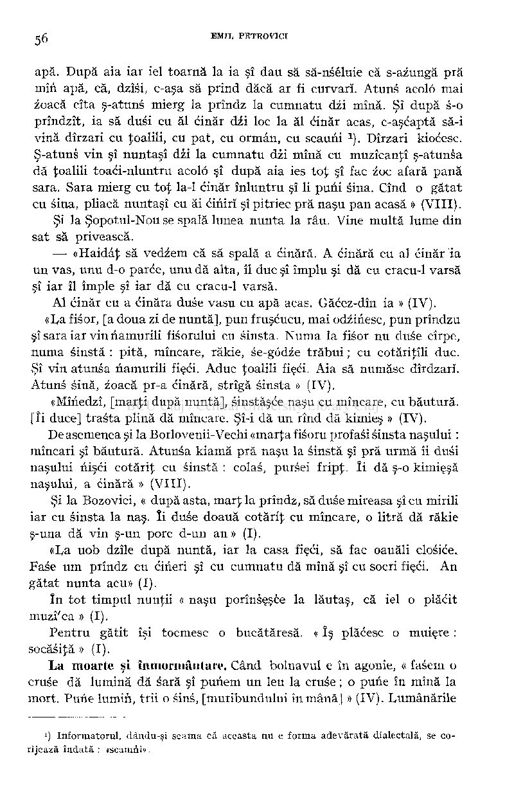

apă. Dup ă aia iar iei toarnă la ia şî dau să să-nseluie eă s-azungă pră mîn apă, că, dzîsi, c-aşa să prind dacă ar fi curvarï. Atuns acolô mai zoacă cita ş-atuns mierg la prîndz la cumnatu dzi mînă. Şî după s-o prîndzît, ia să dusi cu ăl cinăr dzi loc la ăl cinăr acas, c-aşcaptă să-i vină dîrzari cu ţoalili, cu pat, cu ormân, cu scauni ) . Dîrzari kiocesc. Ş-atuns vin şî nuntaşi dzi la cumnatu dzi mînă cu muzicanţi ş-atunsa dă ţoalili toaci-nluntru acolo şî după aia ies toţ şî fac zoc afară pană sara. Sara mierg cu toţ la-1 cinăr înluntru şî li puni sina. Cînd o gătat cu sina, pliacă nuntaşi cu ăi cinirî şîpitriec pră naşu pan acasă » (VIII).

Şi la Şopotul-Nou se spală lunea nunta la râu. Vine multă lume din sat să privească.

—• «Haidâţ să vedzem că să spală a cinară. A cinară cu al cinăr ia un vas, unu d-o parce, unu dă alta, îl duc şî împlu şi dă cu cracu-1 varsă şî iar îl împle şî iar dă cu cracu-1 varsă.

Al cinăr cu a cinăra duse vasu cu apă acas. Găcez-dîn ia » (IV).

«La fisor, [a doua zi de nuntă], pun fruşcucu, mai odzinesc, pun prîndzu şî sara iar vin riamurili fisorului cu sinsta. Num a la fisor nu duse cîrpe, numa sinstă : pită, mîncare, răkie, se-gôdze trăbui ; cu cotăriţîli duc. Şî vin atunsa namurili fieci. Adu c ţoalili fieci. Ai a să număsc dîrdzarî. Atuns sină, zoacă pr-a cinară, strigă sinsta » (IV).

«Mîiiedzî, [marţi după nuntă], sinstăşce naşu cu mîncare, cu băutură, [îi duce] trasta plină dă mîncare. Şî-i dă un rînd dă kimieş » (IV).

De asemenea şi la Borlovenii-Vechi «marţa fisoru profasi sinsta naşului : mîncari şî băutură. Atunsa kiamă pră naşu la einstă şî pră urmă îi dusi naşului nişei cotăriţ cu einstă : colas, pursei fript. îi dă ş-o kimieşă naşului, a cinară » (VIII).

Şi la Bozovici, « după asta, marţ la prîndz, să duse mireasa şî cu mirili iar cu sinsta la naş. îi duse doauă cotăriţ cu mîncare, o litră dă răkie ş-una dă vin ş-un porc d-un an » (I).

«La uob dzîle după nuntă, iar la casa fieci, să fac oauăli closice. Fase u m prîndz cu cineri şî cu cumnatu dă mînă şî cu socri fieci. A n gătat nunta acu» (I).

în tot timpul nunţii « naşu porînseşce la lăutaş, că iei o plăcit muzî'ca » (I).

Pentru gătit îşi tocmesc o bucătăresă. « îş plăcesc o muiere : socăsiţă » (I).

La moarte şi înmormântare. Când bolnavul e în agonie, « fasem o cruse dă lumină dă sară şî punem un leu la cruse ; o pune în mînă la mort. Puiîe lumih, trii o sins, [muribundului înmâna] » (IV). Lumânările

###### Informatorul, dându-şi seama că aceasta nu e forma adevărată dialectală, se corijează îndată : «scamni».

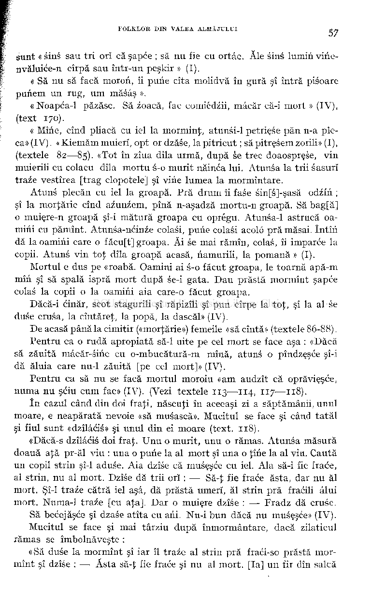

sunt « sins sau tri ori că şapce ; să nu fie cu ortac. Ăle sine lumin vinenvăluice-n cîrpă sau într-un peşkir » (I).

« Să nu să facă moron, îi pune cîta molidvă în gură şî întră pisoare punem un rug, um măsâş ».

«Noapca-1 păzăsc. Să zoacă, fac comiédzii, mâcăr că-i mort » (IV), (text 170).

« Mîne, cînd pliacă cu iei la morminţ, atunsi-1 petriese păn n-a pleca» (IV). «Kiemăm muieri, opt or dzăse, lapitricut ; să pitresemzorili» (I), (textele 82—85). «Tot în zîua dîla urmă, după se trec doaosprese, vin muierili cu colacu dîla mortu s-o murit năinca lui. Atunsa la trii sasuri traze vestirea [trag clopotele] şî vine lumea la mormîntare.

Atuns plecăn cu iei la groapă. Pră drum îi fase sin[s]-şasă odzin ; şî la morţărie cînd azunzem, pînă n-aşadză mortu-n groapă. Să bag[ă] o muiere-n groapă şî-i mătură groapa cu oprégu. Atunsa-1 astrucă oamini cu pămînt. Atunsa-ncinze colasi, pune colasi acolo pră masai. întîiî

- dă laoamirii care o făcu[t] groapa. Ăi se mai rămîn, colas, îi imparce la copii. Atuns vin toţ dîla groapă acasă, namurili, la pomană » (I).

Mortul e dus pe «roabă. Oamini ai s-o făcut groapa, le toarnă apă-m mîn şî să spală ispră mort după se-i gata. Da u prăstă mormînt şapce colas la copii o la oamini aia care-o făcut groapa.

Dăcă-i cinăr, scot stagurili şî răpizîli şî pun cîrpe la toţ, şî la al se duse crusa, la cîntăreţ, la popă, la dascăl» (IV).

De acasă până la cimitir («morţărie») femeile «să cîntă» (textele 86-88). Pentru ca o rudă apropiată să-1 uite pe cel mort se face aşa : «Dacă

- să zăuită mâcăr-sirie cu o-mbucătură-m mînă, atuns o pîndzeşce şî-i

- dă ăluia care nu-1 zăuită [pe cel mort]» (IV). Pentru ca să nu se facă mortul moroiu «am audzît că oprăvieşce,

numa nu şciu cum fac» (IV). (Vezi textele 113—114 , 117'—118).

î n cazul când din doi fraţi, născuţi în aceeaşi zi a săptămânii, unul moare, e neapărată nevoie «să musască». Mucitul se face şi când tatăl şi fiul sunt «dzîlâcis» şi unul din ei moare (text. 118).

«Dăcă-s dzîlâcis doi fraţ. Un u o murit, unu o rămas. Atunsa măsură doauă aţă pr-ăl viu : una o pune la al mort şî una o ţîne la al viu. Caută un copil strin şî-1 aduse. Aia dzîse că museşce cu iei. Ala să-i fie frace, al strin, nu al mort. Dzîse dă trii ori : — Să-ţ fie frace ăsta, dar nu ăl mort. Şî-1 traze cătră iei aşa, dă prăstă umeri, ăl strin pră fracili âlui mort. Numa-1 traze [cu aţa]. Dar o muiere dzîse : — Fradz dă cruse.

Să becejăşce şî dzase atîta cu ani. Nu-i bun dacă nu museşce» (IV). Mucitul se face şi mai târziu după înmormântare, dacă zilaticul

rămas se îmbolnăveşte :

«Să duse la mormînt şî iar îl traze al strin pră fraci-so prăstă mormînt şî dzîse : — Ăsta să-ţ fie frace şî nu al mort. [Ia] un fir dîn salcă

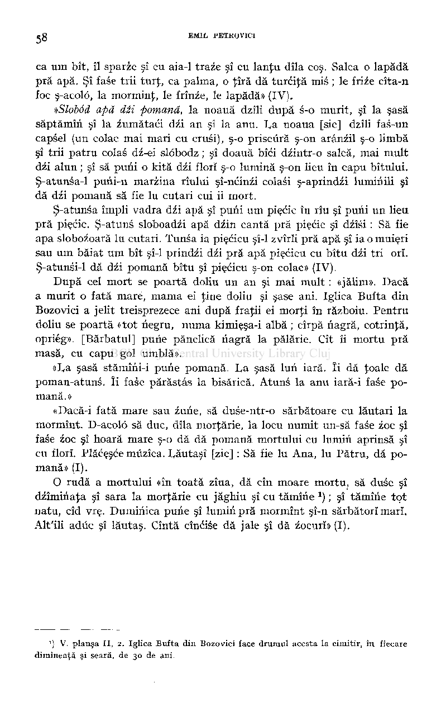

ca um bît, îl sparze şî cu aia-1 traze şî cu lanţu dîla coş. Salca o lapădă pră apă. Şî fase trii turţ, ca palma, o ţîră dă turcită mis ; le frize cîta-n foc ş-acolo, la morminţ, le frînze, le lapădă» (IV).

»Slobôd apă dzi pomană, la noauă dzîli după s-o murit, şî la şasă săptămîfi şî la zumătaci dzi an şî la anu. La noaua [sic] dzîli fas-un capsei (un colac mai mari cu crusi), ş-o priscură ş-on arânzil ş-o limbă şî trii patru colas dz-ei slôbodz ; şî doauă bîci dzintr-o salcă, mai mult dzi alun ; şî să puni o kită dzi flori ş-o lumină ş-on lieu în capu bitului. Ş-atunsa-1 purii-n marzina rîului şî-ncinzi colasi ş-aprindzi luminili şî dă dzi pomană să fie lu cutări cui ii mort.

Ş-atunsa împli vadra dzi apă şî puni um piecic în rîu şî purii un lieu pră piecic. Ş-atuns sloboadzi apă dzin cântă pră piecic şî dzîsi : Să fie apa slobozoară lu cutări. Tunsa ia piecicu şî-1 zvîrli pră apă şî ia o muieri sau um băiat u m bit şî-1 prindzi dzi pră apă piecicu cu bîtu dzi tri orï. Ş-atunsi-1 dă dzi pomană bîtu şî piecicu ş-on colac» (IV).

După cel mort se poartă doliu un an şi mai mult : «jălim». Dacă a murit o fată mare, mama ei ţine doliu şi şase ani. Iglica Bufta din Bozovici a jelit treisprezece ani după fraţii ei morţi în războiu. Pentru doliu se poartă «tot negru, numa kimieşa-i albă ; cîrpă riagră, cotrinţă, opriég». [Bărbatul] purie pănclică riagră la pălărie. Cît îi mortu pră masă, cu capu gol umblă».

«La şasă stămîrii-i purie pomană. La şasă luri iară. îi dă ţoale dă poman-atuns. îi fase parastas la bisărică. Atuns la anu iară-i fase pomană.»

«Dacă-i fată mare sau zurie, să duse-ntr-o sărbătoare cu lăutari la mormînt. D-acolô să duc, dîla morţărie, la locu numit un-să fase zoc şî faée zoc şî hoară mare ş-o dă dă pomană mortului cu lumiri aprinsă şî cu flori. Plăceşce muzica. Lăutaşî [zic] : Să fie lu Ana, Iu Patru, dă pomană» (I).

O rudă a mortului «în toată zîua, dă cîn moare mortu, să duse şî dzimiriaţa şî sara la morţărie cu jăghiu şî cu tămîrie ) ; şî tămîrie tot natu, cîd vre. Duminica purie şî lumiri pră mormînt şî-n sărbători mari. Alt'ili aduc şî lăutaş. Cîntă cînciée dă jale şî dă zocurî»(I).

) V. planşa II, 2. Iglica Bufta din Bozovici face drumul acesta la cimitir, în fiecare dimineaţă şi seară, de 30 de ani.

J

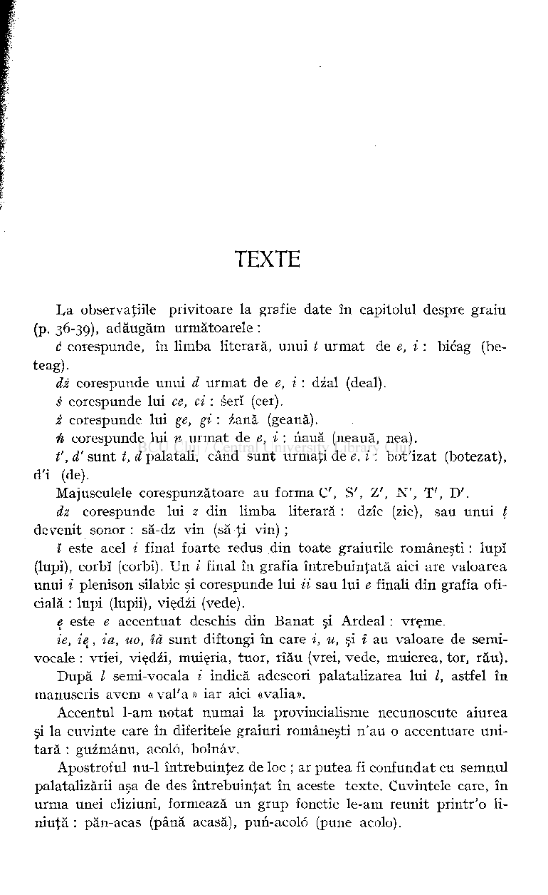

#### TEXTE

La observaţiile privitoare la grafie date în capitolul despre graiu (p. 36-39), adăugăm următoarele :

c corespunde, în limba literară, unui t urmat de e, i : bicag (be­

teag). di corespunde unui d urmat de e, i : dzal (deal). s corespunde lui ce, ci : seri (cer), i corespunde lui ge, gi : zână (geană). n corespunde lui n urmat de e, i : fiauă (neaua, nea). t', d' sunt t, d palatali, când sunt urmaţi de e, i : bot'izat (botezat),

d'i (de). Majusculele corespunzătoare au forma C , S', Z', N', f , D'. dz corespunde lui z din limba literară : dzîc (zic), sau unui t

devenit sonor : să-dz vin (să-ţi vin) ;

ï este acel i final foarte redus din toate graiurile româneşti : lupî (lupi), corbi (corbi). Un i final în grafia întrebuinţată aici are valoarea unui i plenison silabic şi corespunde lui ii sau lui e finali din grafia oficială : lupi (lupii), viedzi (vede).

e este e accentuat deschis din Banat şi Ardeal : vreme. ie, ie

, ia, uo, îâ sunt diftongi în care i, u, şi î au valoare de semivocale : vriei, viedzi, muieria, tuor, rîău (vrei, vede, muierea, tor, rău).

t

După l semi-vocala i indică adeseori palatalizarea lui l, astfel în manuscris avem « val'a » iar aici «valia».

Accentul l-am notat numai la provincialisme necunoscute aiurea şi la cuvinte care în diferitele graiuri româneşti n'au o accentuare unitară : guzmânu, acolo, bolnav.

Apostroful nu-1 întrebuinţez de loc ; ar putea fi confundat cu semnul palatalizării aşa de des întrebuinţat în aceste texte. Cuvintele care, în urma unei eliziuni, formează un grup fonetic le-am reunit printr'o liniuţă : păn-acas (până acasă), puh-acolo (pune acolo).

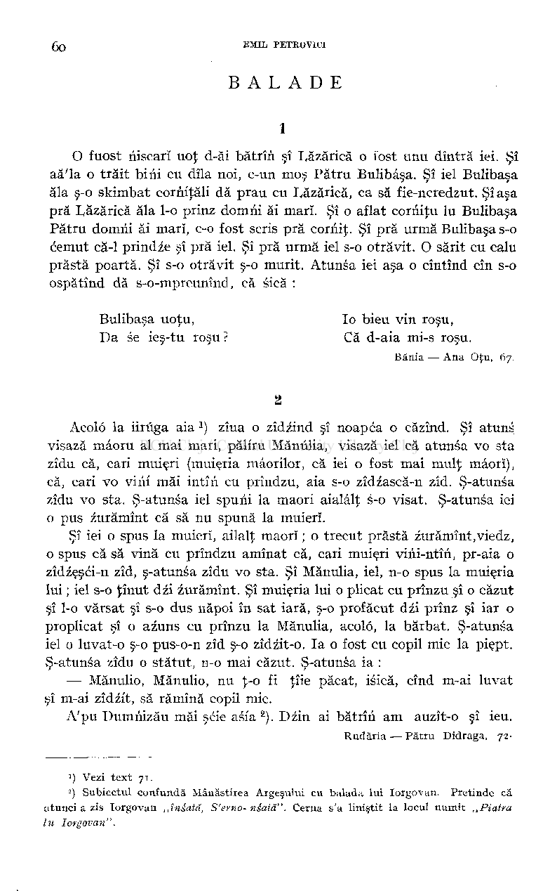

BALAD E

## 1

O fuost rïiscarï uoţ d-ăi bătrîn şî Lăzărică o i'ost unu dîntră iei. Şî aă'la o trăit bini cu dîla noi, c-un moş Patru Bulibaşa. Şî iei Bulibaşa ăla ş-o skimbat corniţăli dă prau cu Lăzărică, ca să fie-ncredzut. Şîaşa pră Lăzărică ăla l-o prinz domni ăi mari. Şî o aflat corniţu lu Bulibaşa Patru doimii ăi mari, c-o fost scris pră corriiţ. Şî pră urmă Bulibaşa s-o cernut că-1 prindze şî pră iei. Şî pră urmă iei s-o otrăvit. O sărit cu calu prăstă poartă. Şî s-o otrăvit ş-o murit. Atunsa iei aşa o cîntînd cîn s-o ospătînd dă s-o-mpreunînd, că sică :

Bulibaşa uoţu, Io bieu vin roşu, Da se ieş-tu roşu ? Că d-aia mi-s roşu.

Bănia — Ana Oţu, 67.

## 2

Acolô la iirûga aia ) zîua o zîdzind şî noapca o căzînd. Şî atuns visază mâoru al mai mari, păliru Mănulia, visază iei că atunsa vo sta zîdu că, cari muieri (muieria maorilor, că iei o fost mai mulţ mâorî), că, cari vo vini măi intîri cu prîndzu, aia s-o zîdzască-n zîd. Ş-atunsa zîdu vo sta. Ş-atunsa iei spuiii la maori aialâlţ s-o visat. Ş-atunsa iei

- o pus zurămînt că să nu spună la muieri. Şî iei o spus la muieri, ailalţ maori ; o trecut prăstă zurămînt.viedz,
- o spus că să vină cu prîndzu amînat că, cari muieri vini-ntîn, pr-aia o zîdzeşci-n zîd, ş-atunsa zîdu vo sta. Şî Mănulia, iei, n-o spus la muieria lui ; iei s-o ţînut dzi zurămînt. Şî muieria lui o plicat cu prînzu şî o căzut şî l-o vărsat şî s-o dus năpoi în sat iară, ş-o profăcut dzi prînz şî iar o proplicat şî o azuns cu prînzu la Mănulia, acolô, la bărbat. Ş-atunsa iei o luvat-o ş-o pus-o-n zîd ş-o zîdzit-o. Ia o fost cu copil mic la piept. Ş-atunsa zîdu o stătut, n-o mai căzut. Ş-atunsa ia :

— Mănulio, Mănulio, nu ţ-o fi ţîie păcat, isică, cînd m-ai luvat şî m-ai zîdzft, să rămînă copil mic.

A'pu Dumriizău măi şcie asia ). Dzin ai bătrîn am auzît-o şî ieu.

Rudăria — Patru Didraga, 72-

- 1

) Vezi text 71.

- 2

###### ) Subiectul confundă Mănăstirea Argeşului cu balada lui Iorgovan. Pretinde că atunci a zis Iorgovan ,,însată, S'erno- nsată". Cerna s'a liniştit la locul numit ,,Piatra lu Iorgovan".

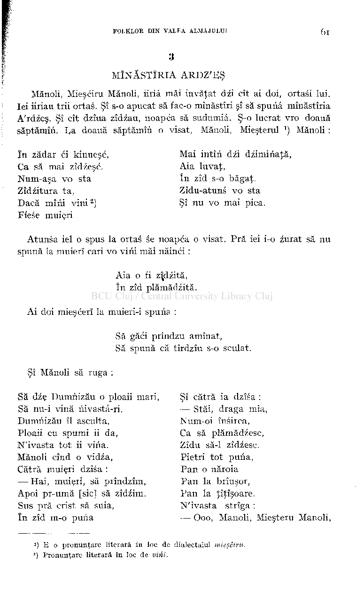

3

MÎNĂSTÎRIA ARDZ'EŞ

Mănoli, Mieşciru Mănoli, iiriâ măi invăţat dzi cit ai doi, ortasi lui. Iei iiriau trii ortas. Şî s-o apucat să fac-o mînăstîri şî să spuria mînăstîria A'rdzeş. Şî cît dzîua zîdzau, noapca să sudumiâ. Ş-o lucrat vro doauă săptămîri. La doauă săptămîrî o visat, Mănoli, Mieşterul ) Mănoli :

în zădar ci kinueşc, Mai intîri dzi dzimiriaţă, Ca să mai zîdzeşc. Aia luvaţ, Num-aşa vo sta în zîd s-o băgat. Zîdzitura ta, Zîdu-atuns vo sta Dacă mîrii vini ) Şî nu vo mai pica. Fiese muieri

Atunsa iei o spus la ortas se noapca o visat. Pră iei i-o zurat să nu spună la muieri cari vo virii măi năinci :

Aia o fi z^dzită, î n zîd plămădzită.

Ai doi mieşcerî la muieri-i spuria :

Să găci prîndzu amînat,

Să spună că tîrdzîu s-o sculat.

Şî Mănoli să ruga :

Să dze Dumnizău o ploaii mari, Şî cătră ia dzisa : Să nu-i vină riivasta-ri. — Stăi, draga mia, Dumnizău îl asculta, Num-oi însirea, Ploaii cu spumi ii da, Ca să plămădzesc, N'ivasta tot ii viria. Zîdu să-1 zîdzesc. Mănoli cînd o vidza, Pietri tot puria, Cătră muieri dzîsa : Pan o năroia

— Hai, muieri, să prîndzîm, Pan la brîuşor, Apoi pr-umă [sic] să zîdzim. Pan la ţîţîşoare. Sus pră crist să suia, N'ivasta striga :

- n zîd m-o puria — Ooo, Manoli, Mieşteru Manoli,

###### ') E o pronunţare literară in loc de dialectalul mieşciru.

) Pronunţare literară în loc de vini.

2

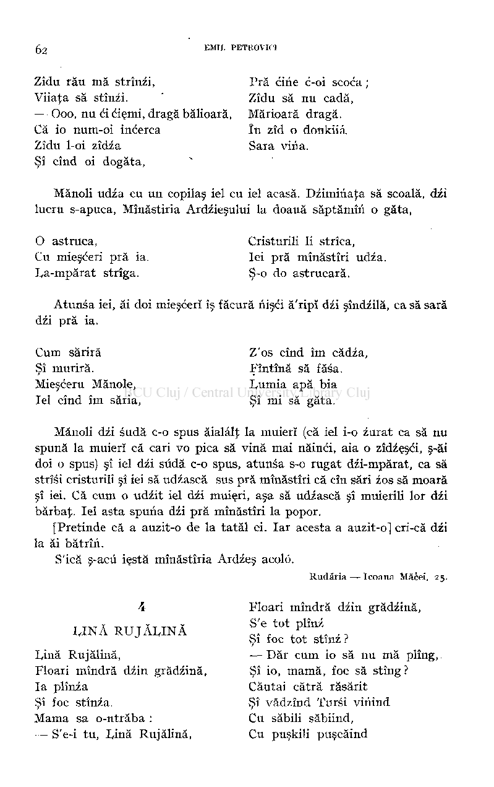

Zîdu rău mă strînzi, Pră cine c-oi scoca ; Viiaţa să stînzi. ' Zîdu să nu cadă,

— Ooo, nu ci ciemi, dragă bălioară, Mărioară dragă. Că io num-oi încerca î n zîd o donkiia. Zîdu l-oi zîdza Sara vina. Şî cînd oi dogăta,

Mănoli udza cu un copilaş iei cu iei acasă. Dziminaţa să scoală, dzi lucru s-apuca, Mînăstiria Ardzieşului la doauă săptămîn o găta,

O astruca, Cu mieşceri pră ia. La-mpărat strîgă.

Cristurili li strica, Iei pră mînăstîri udza. Ş-o do astrucară.

Atunsa iei, ăi doi mieşcerî îş făcură nişei ă'ripî dzi şîndzilă, ca să sară dzi pră ia.

Cum săriră Şî muriră. Mieşceru Mănole, Iei cînd îm săria,

Z'os cînd îm cădza,

Fîntînă să făsa. Lumia apă bia Şî mi să găta.

Mănoli dzi sudă c-o spus ăialâlţ la muieri (că iei i-o zurat ca să nu spună la muieri că cari vo pica să vină mai năinci, aia o zîdzcşci, ş-ăi doi o spus) şî iei dzi sudă c-o spus, atunsa s-o rugat dzi-mpărat, ca să strîsi cristurili şî iei să udzască sus pră mînăstîri că cîn sări zos să moară şî iei. Că cum o udzit iei dzi muieri, aşa să udzască şî muierili lor dzi bărbat. Iei asta spună dzi pră mînăstîri la popor.

[Pretinde că a auzit-o de la tatăl ei. Iar acesta a auzit-o] cri-că dzi la ăi bătrîn.

S'ică ş-acu iestă mînăstîria Ardzeş acolô.

Rudăria — Icoana Măcei, 25.

4 Floari mîndră dzin grădzină, S'e tot plînz Şî foc tot stînz ?

LIN Ă RU J ALINĂ

Lină Ruj alină,

— Dăr cum io să nu mă plîng, Şî io, mamă, foc să stîng? Căutai cătră răsărit Şî vădzînd Tursi vinind Cu săbili săbiind, Cu puşkili puşcăind

Floari mîndră dzin grădzină, Ia plînz a Şî foc stînza. Mama sa o-ntrăba :

— S'e-i tu, Lină Rujălină,

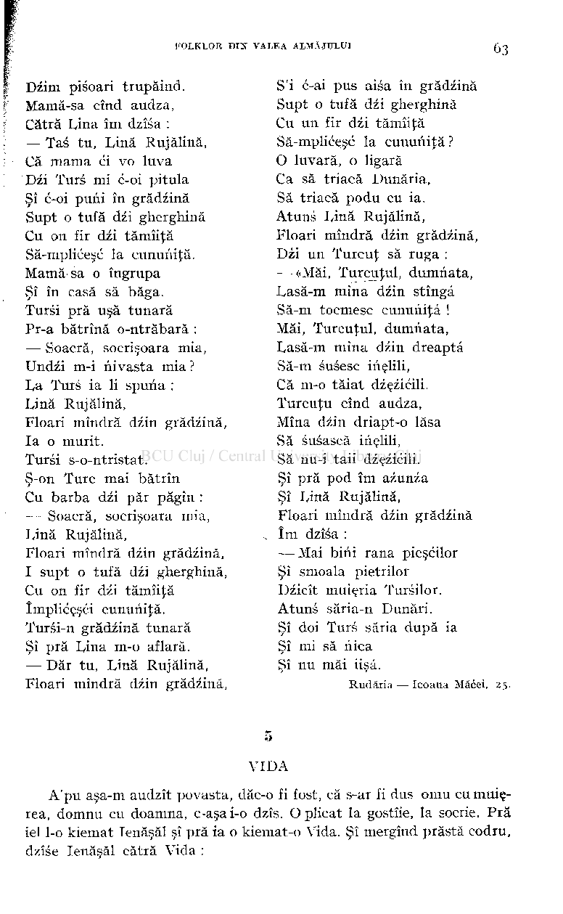

S'i é-ai pus aisa în grădzină Supt o tufă dzi gherghina Cu un fir dzi tămîiţă Să-mpliceşc la cunuriiţă ? O luvară, o ligară Ca să triacă Dunăria, Să triacă podu cu ia. Atuns Lină Ruj alină, Floari mîndră dzin grădzină, Dzi un Turcuţ să ruga :

Dzim pisoari trupăind. Mamă-sa cînd audza, Cătră Lina îm dzîsa :

— Tas tu, Lină Ruj alină,

Că mama ci vo luva Dzi Turs mi c-oi pitula Şî c-oi purii în grădzină Supt o tufă dzi gherghină Cu on fir dzi tămîiţă Să-mpliceşc la cunuriiţă. Mamă-sa o îngrupa Şî în casă să băga. Turei pră uşă tunară Pr-a bătrînă o-ntrăbară :

— «Măi, Turcuţul, dumriata, Lasă-m mîna dzin stîngâ Să-m tocmesc cunuriiţă ! Măi, Turcuţul, dumriata, Lasă-m mîna dzin dreapta Să-m susesc irielili, Că m-o tăiat dzezicili. Turcuţu cînd audza, Mîna dzin driapt-o lăsa Să susască irielili, Să nu-i taii dzezicili. Şî pră pod îm azunza Şî Lină Rujălină, Floari mîndră dzin grădzină î m dzîsa :

— Soacră, socrişoara mia, Undzi m-i rii vasta mia ? Da Turs ia li spuria :

Lină Ruj alină,

Floari mîndră dzin grădzină, Ia o murit. Turei s-o-ntristat. Ş-on Turc mai bătrîn Cu barba dzi păr păgîn :

— Soacră, socrişoara mia,

Lină Ruj alină,

— Mai birii rana pieşcilor Şî smoala pietrilor Dzicît muieria Tursilor. Atuns săria-n Dunări. Şî doi Turs săria după ia Şî mi să riica Şî nu măi iişâ.

Floari mîndră dzin grădzină, I supt o tufă dzi gherghină, Cu on fir dzi tămîiţă împliceşci cunuriiţă. Tursi-n grădzină tunară Şî pră Lina m-o aflară.

— Dăr tu, Lină Ruj alină,

Floari mîndră dzin grădzină,

Rudăria — Icoana Măcei, 25.

5 VIDA

A'pu aşa-m audzît povasta, dăc-o fi fost, că s-ar fi dus omu cu muiçrea, domnu cu doamna, c-aşai-o dzîs. O plicat la gostîie, la socrie. Pr ă iei l-o kiemat Ienăşăl şî pră ia o kiemat-o Vida. Şî mergînd prăstă codru, dzîse Ienăşăl cătră Vida :

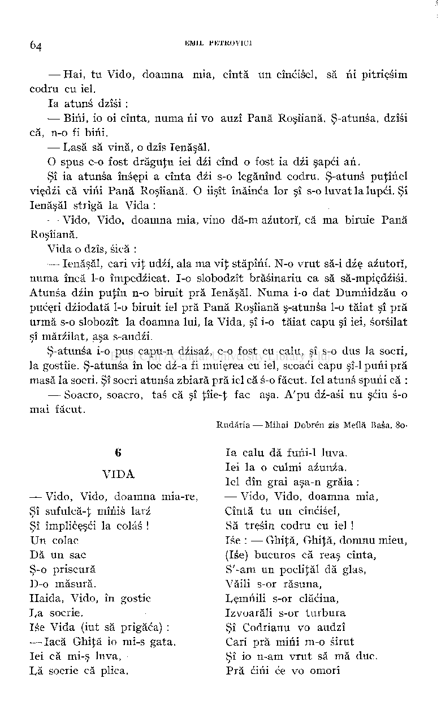

— Hai, tu Vido, doamna mia, cîntă un cîncisel, să ni pitriesim codru cu iei.

Ia atuns dzîsi :

— Birii, io oi cînta, numa ni vo auzî Pană Roşîiană. Ş-atunsa, dzîsi că, n-o fi bini.

— Lasă să vină, o dzîs Ienăşăl. O spus c-o fost drăguţu iei dzi cînd o fost ia dzi şapei an. Şî ia atunsa însepi a cînta dzi s-o legănînd codru. Ş-atuns puţîriel

viedzi că vini Pană Roşîiană. O iişît înăinca lor şî s-o luvat la lupei. Şî Ienăşăl strigă la Vida :

— Vido, Vido, doamna mia, vino dă-m azutorî, că ma biruie Pană Roşîiană.

Vida o dzîs, sică :

— Ienăşăl, cari viţ udzi, ala ma viţ stăpîni. N-o vrut să-i dze azutorî, numa încă l-o împediicat. I-o slobodzît brăsinariu ca să să-mpiedzisi. Atunsa dzin puţîn n-o biruit pră Ienăşăl. Numa i-o dat Dumriidzău o puceri dziodată l-o biruit iei pră Pană Roşîiană ş-atunsa l-o tăiat şî pră urmă s-o slobozit la doamna lui, la Vida, şî i-o tăiat capu şî iei, éorsilat şî mărzilat, aşa s-audzi.

Ş-atunea i-o pus capu-n dzisaz, c-o fost cu calu, şî s-o dus la socri, la gostîie. Ş-atunsa în loc dz-a fi muierea cu iei, scoaci capu şî-1 puni pră masă la socri. Şî socri atunéa zbiară pră iei că s-o făcut. Iei atuns spuni că :

— Soacro, soacro, tas că şî ţîie-ţ fac aşa. A'pu dz-asi nu şciu s-o mai făcut.

Rudăria — Mihai Dobrén zis Meilă Basa, 8o-

6 Ia calu dă furii-1 luva. Iei la o culmi azunza. Iei dîn grai aşa-n grăia :

VIDA

— Vido, Vido, doamna mia-re Şî sufulcă-ţ mînis larz Şî împliceşci la colâs ! Un colac Dă un sac Ş-o priscură D-o măsură. Haida, Vido, în gostie La socrie. Ise Vida (iut să prigăca) :

— Vido, Vido, doamna mia, Cîntă tu un cîncisel, Să tresin codru cu iei ! Ise : — Ghiţă, Ghiţă, domnu mieu, (Iée) bucuros că reaş cînta, vS'-am un pocliţăl dă glas, Văili s-or răsuna, Lemnili s-or clăcina, Izvoarăli s-or turbura Şî Codrianu vo audzî Cari pră mini m-o sirut Şî io n-am vrut să mă duc. Pră cini ce vo omorî

— Iacă Ghiţă io mi-s gata. Iei că mi-ş luva, Lă socrie că plica.

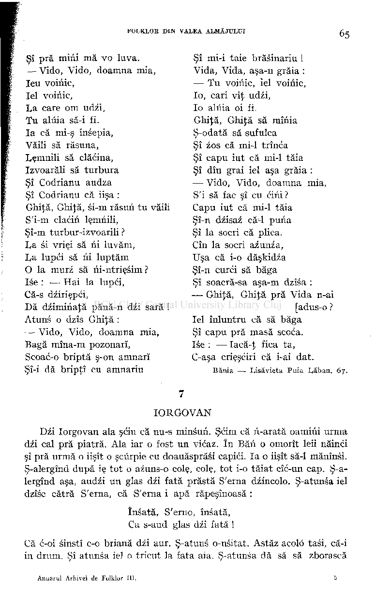

Şî pră mirii mă vo luva.

Şî mi-i taie brăsinariu ! Vida, Vida, aşa-n grăia : — Tu voinic, iei voinic, Io, cari viţ udzi, Io ăluia oi fi. Ghiţă, Ghiţă să mîhia Ş-odată să sufulca Şî zos că mi-1 trînca Şî capu iut că mi-1 tăia Şî dîn grai iei aşa grăia :

— Vido, Vido, doamna mia, leu voinic, Iei voinic, La care om udzi, Tu ăluia să-i fi. Ia că mi-ş însepia, Văili să răsuna, Lemnili să clăcina, Izvoarăli să turbura Şî Codrianu audza Şî Codrianu că iişa : Ghiţă, Ghiţă, si-m răsun tu văili S'i-m claciri lemnili, Şî-m turbur-izvoarili ? La si vriei să hi luvăm, La lupei să hi luptăm

— Vido, Vido, doamna mia, S'i să fac şî cu cirii ? Capu iut că mi-1 tăia Şî-n dzisaz că-1 puria Şî la socri că plica. Cîn la socri aiunza, Uşa că i-o dăşkidza Şî-n curci să băga Şî soacră-sa aşa-m dzîsa :

- O la murz să rii-ntriesim ? Ise : — Hai la lupei, Că-s dziriepci, Dă dzimiriaţa pănă-n dzi sară ! Atuns o dzîs Ghiţă :

— Ghiţă, Ghiţă pră Vida n-ai

[adus-o ? Iei înluntru că să băga Şî capu pră masă scoca. Ise : — Iacă-ţ fica ta, C-aşa crieşciri că i-ai dat.

— Vido, Vido, doamna mia, Bagă mîna-m pozonarî, Scoac-o briptă ş-on amnarî Şî-i dă bripţî cu amnariu

Bănia — Lisăvieta Puia L,ăban, 67 .

7 IORGOVAN

Dzi Iorgovan ala şciu că nu-s minéun. Şcim că h-arată oamihi urma dzi cal pră piatră. Ala iar o fost un vicaz. în Bări o omorît leii năinci şî pră urmă o iişît o şevirpie cu doauăsprăei capici. Ia o iişît să-1 mănînsi. Ş-alergînd după ie tot o azuns-o cole, cole, tot i-o tăiat cîc-un cap. Ş-alergînd aşa, audzi un glas dzi fată prăstă S'erna dzincolo. Ş-atunsa iei dzîse cătră S'erna, că S'erna i apă răpeşînoasă :

însată, S'erno, însată, Ca s-aud glas dzi fată !

Că c-oi sinstî c-o brianâ dzi aur. Ş-atuns o-nsitat. Astăz acolo tasi, că-i in drum. Sî atunsa iei o tricut la fata aia. S-atunsa dă să să zborască

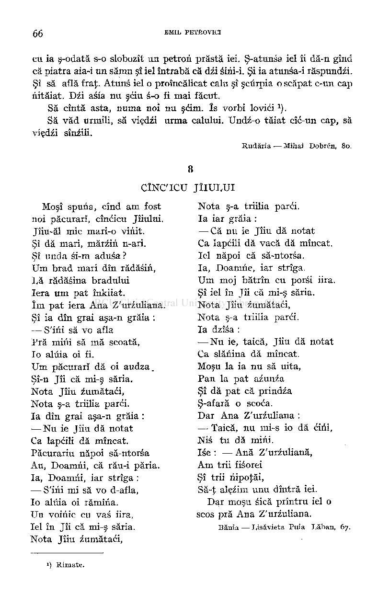

cu ia ş-odată s-o slobozit un petron prăstă iei. Ş-atunsa iei îi dă-n gînd că piatra aia-i un sămn şî iei întrabă că dzi éini-i. Şi ia atunsa-i răspundzi. Şî să află fraţ. Atuné iei o proîncălicat calu şî şcurpia o scăpat c-un cap riităiat. Dzi asia nu şciu é-o fi mai făcut.

Să cîntă asta, numa noi nu şcim. îs vorbi lovici

).

1

Să văd urmili, să viedzi urma calului. Undz-o tăiat cîc-un cap, să viedzi sînzili.

Rudăria — Mihai Dobrén, 80.

CÎNC'ICU JÎIUDU I

Nota ş-a triilia parei. Ia iar grăia :

Moşî spună, cînd am fost noi păcurari, cîncicu Jîiului. Jîiu-ăl mic mari-o vinit. Şî dă mari, mărzin n-ari. Şî unda éi-m adusa ? Um brad mari dîn rădăsin, Dă rădăsina bradului Iera u m pat înkiiat. î m pat iera Ana Z'urzuliana. Şî ia dîn grai aşa-n grăia :

— Că nu ie Jîiu dă notat Ca lapcili dă vacă dă mîncat. Iei năpoi că să-ntorea. Ia, Doamne, iar strîga. U m moj bătrîn cu porsi iira. Şî iei în Jîi că mi-ş săria. Nota Jîiu zumătaci, Nota ş-a triilia parei. Ia dzîéa :

— S'ini să vo afla Pră mini să m ă scoată, Io ăluia oi fi.

— Nu ie, taică, Jîiu dă notat Ca slănina dă mîncat. Moşu la ia nu să uita, Pan la pat azunza Şî dă pat că prindza Ş-afară o scoca. Dar Ana Z'urzuliana :

- Um păcurari dă oi audza. Şî-n Jîi că mi-ş săria. Nota Jîiu zumătaci, Nota ş-a triilia parei. Ia dîn grai aşa-n grăia :

— Nu ie Jîiu dă notat Ca lapcili dă mîncat. Păcurariu năpoi să-ntorea Au, Doamni, că rău-i paria. Ia, Doamni, iar striga : — S'ini mi să vo d-afla, Io ăluia oi rămîna.

- Un voinic cu vas iira, Iei în Jîi că mi-ş săria. Nota Jîiu zumătaci,

— Taică, nu mi-s io dă cini, Nié tu dă mini. Ise : — Ană Z'urzuliana, Am trii fiéorei Şî trii nipoţăi, Să-ţ alezim unu dîntră iei.

Dar moşu sică prîntru iei o scos pră Ana Z'urzuliana.

Bănia — Lisăvieta Puia Lăban, 67.

###### ) Rimate.

l

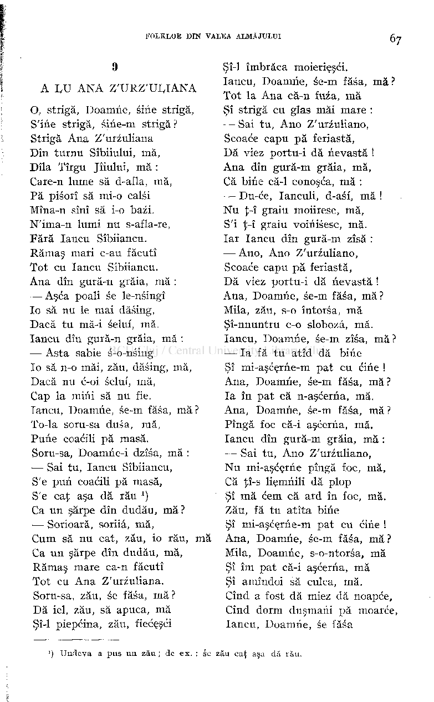

Şî-1 îmbrăca moierieşci. Iancu, Doamne, se-m făsa, mă ? Tot la Ana că-n fuza, mă Şî strigă cu glas măi mare :

A LU ANA Z'URZ'ULIANA

O, strigă, Doamne, éine strigă, S'ine strigă, sirie-m strigă? Strigă Ana Z'urzuliana Dîn turnu Sîbiiului, mă, Dîla Tîrgu Jîiului, mă : Care-n lume să â-afla, mă,

— Sai tu, Ano Z'urzuliano, Scoace capu pă feriastă, Dă viez portu-i dă nevastă ! Ana dîn gură-m grăia, mă, Că bine că-1 conoşca, mă :

- Pă pisorî să mi-o calsi Mîna-n sînî să i-o bazi. N'ima-n lumi nu s-afla-re, Fără Iancu Sîbiiancu.

— Du-ce, Ianculi, d-asi, mă ! Nu ţ-î graiu moiiresc, mă, S'i ţ-î graiu voinisesc, mă. Iar Iancu dîn gură-m zîsă :

- Rămas mari c-au făcutî Tot cu Iancu Sîbiiancu. Ana dîn gură-n grăia, mă :

— Ano, Ano Z'urzuliano, Scoace capu pă feriastă, Dă viez portu-i dă nevastă ! Ana, Doamne, se-m făsa, mă? Mila, zău, s-o întorsa, m ă Şî-nnuntru c-o slobozâ, mă. Iancu, Doamne, se-m zîsa, mă ?

— Aşca poali se le-nsingî Io să nu le mai dăsing, Dacă tu mă-i seluf, mă. Iancu dîn gură-n grăia, mă :

— Asta sabie s-o-nsing Io să n-o măi, zău, dăsing, mă, Dacă nu c-oi selui, mă, Cap la mini să nu fie. Iancu, Doamne, se-m făsa, mă? To-la soru-sa dusa, mă, Pune coacili pă masă. Soru-sa, Doamne-i dzîsa, mă :

— Ia fă tu atîd dă bine Şî mi-aşccriie-m pat cu cine ! Ana, Doamne, ée-m făsa, mă ? Ia în pat că n-aşcerna, mă. Ana, Doamne, se-m făsa, mă ? Pîngă foc că-i aşcerna, mă. Iancu dîn gură-m grăia, mă :

— Sai tu, Ano Z'urzuliano, Nu mi-aşcerhe pîngă foc, mă, Că ţî-s liemnili dă plop Şî m ă cern că ard în foc, mă. Zău, fă tu atîta bine Şî mi-aşcerrie-m pat cu cine !

•— Sai tu, Iancu Sîbiiancu, S'e pun coacili pă masă, S'e cat aşa dă rău

) Ca un şarpe dîn dudău, mă ?

1

— Sorioară, soriiâ, mă, Cum să nu cat, zău, io rău, mă Ca un şarpe dîn dudău, mă,

Ana, Doamne, ée-m făea, mă?

Mila, Doamne, s-o-ntorsa, mă Şî îm pat că-i aşcerna, mă Şî amîndoi să culca, mă. Cînd a fost dă miez dă noapce, Cînd dorm duşmani pă moarce, Iancu, Doamne, se făsa

- Rămas mare ca-n făcutî Tot cu Ana Z'urzuliana. Soru-sa, zău, se făsa, mă ? Dă iei, zău, să apuca, mă Şî-1 piepcina, zău, fieceşci

*) Undeva a pus un zău ; de ex. : se zău caţ aşa dă rău.

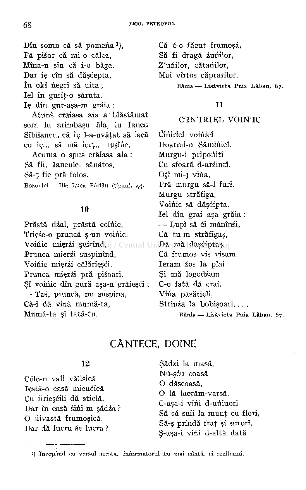

Că c-o făcut frumoşâ, Să fi dragă zunilor, Z'unilor, cătanilor, Mai vîrtos căprarilor.

Dîn somn că să pomena ), Pă pisor că mi-o călca, Mîna-n sîn că i-o băga. Dar ie cîn să dăşcepta, î n okî negri să uita ; Iei în guriţ-o săruta. Iç dîn gur-aşa-m grăia :

Bănia —• Ljsăvieta Puia L,ăban, 67

### 11

Atunè crăiasa aia a blăstămat sora lu arîmbaşu ăla, lu Iancu Sîbiiancu, că iç 1-a-nvăţat să facă cu iç... să mă iert... ruşîne.

C'IN'IRIE L VOIN'IC

Ciniriel voinici

Doarmi-n Săminicî. Murgu-i priponiţi Cu sfoară d-arzintî. Oţî mi-j vina, Pră murgu să-1 furi. Murgu străfiga, Voinic să dăşcipta. Iei dîn grai aşa grăia :

Acuma o spus crăiasa aia :

- Să fii, Iancule, sănătos, Să-ţ fie pră folos. Bozovici — Ilie laica Pârlău (ţigan), 44.

### 10

— Dupî să ci mănînei, Că tu-m străfigaş, Dă mă dăşciptaş. Că frumos vis visam. Ieram zos la plai Şî mă logodzam C-o fată dă crai. Vina păsărieli, Strînza la bobişoari.. . .

Prăstă dzal, prăstă colnic, Trieée-o pruncă ş-un voinic. Voinic miçrzi şuirînd, Prunca miçrzi suspinînd, Voinic miçrzi călărieşci, Prunca miçrzi pră pisoari. Şî voinic dîn gură aşa-n grăieşci :

— Tas, pruncă, nu suspina, Că-i dă vină mumă-ta, Mumă-ta şî tată-tu,

Bănia — Iisăvieta Puia I/ăban, 67.

CÂNTECE, DOINE

### 12

Şădzi la masă, Nu-şcu coasă O dăscoasă, O lă lacrăm-varsă. C-aşa-i vini d-uniuorî Să să suii la munţ cu flori, Să-ş prindă fraţ şî surori, Ş-aşa-i vini d-altă dată

C61o-n vali vălisică Iestă-o casă micucică Cu firieşcili dă sticlă. Dar în casă sini-m şădza? O nivastă frumoşîcă. Dar dă lucru ée lucra ?

###### ) începând cu versul acesta, informatorul nu mai cântă, ci recitează.

1

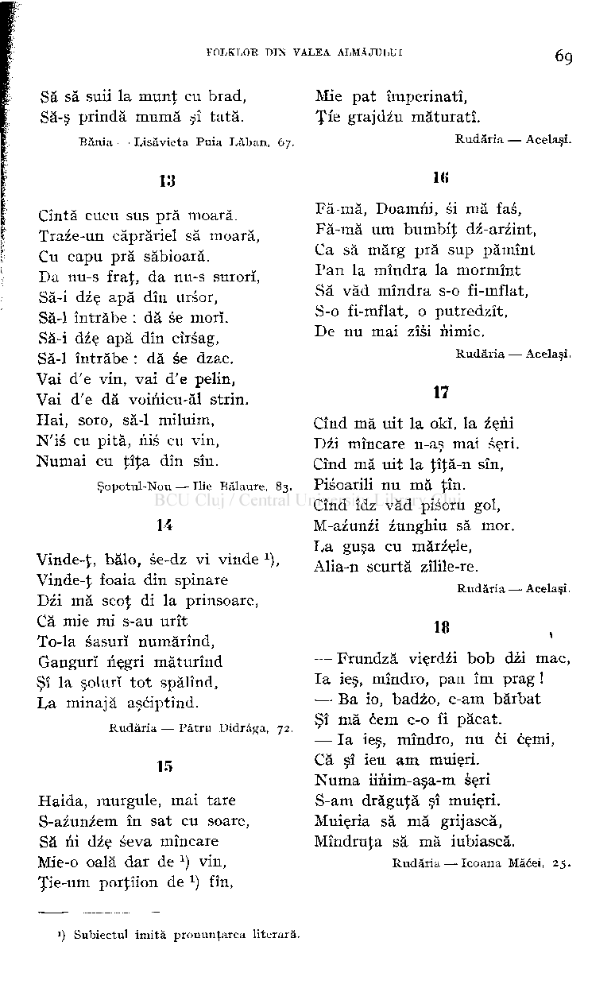

- Să să suii la munţ cu brad, Să-ş prindă mumă şî tată.

Mie pat împerinatî, Ţie grajdzu măturaţi.

Rudăria — Acelaşi.

Bănia —• Lisăvieta Puia Lăban, 67.

16

13

Fă-mă, Doamrii, si mă fas, Fă-mă um bumbiţ dz-arzint, Ca să mărg pră sup pămînt Pan la mîndră la mormînt Să văd mîndră s-o fi-mflat, S-o fi-mflat, o putredzît, De nu mai zîsi nimic.

Cîntă cucu sus pră moară. Traze-un căprăriel să moară, Cu capu pră săbioară. Da nu-s fraţ, da nu-s surori, Să-i dze apă dîn ursor, Să-1 întrăbe : dă se mori. Să-i dze apă dîn cîrsag, Să-1 întrăbe : dă ée dzac. Vai d'e vin, vai d'e pelin, Vai d'e dă voiiîicu-ăl strin. Hai, soro, să-1 miluim, N'ié cu pită, nié cu vin, Numai cu ţîţa dîn sîn.

Rudăria — Acelaşi.

17

Cînd mă uit la okî, la zeni Dzi mîncare n-aş mai seri. Cînd mă uit la ţîţă-n sîn, Pisoarili nu mă ţîn. Cînd îdz văd pisoru gol, M-azunzi zunghiu să mor. La guşa cu mărzele, Alia-n scurtă zîlile-re.

Şopotul-Nou — Ilie Bălaure, 83.

14

Vinde-ţ, bălo, se-dz vi vinde ), Vinde-ţ foaia din spinare Dzi mă scoţ di la prinsoare, Că mie mi s-au urît To-la sasuri numărînd, Ganguri negri măturînd Şî la soluri tot spălînd, La minajă aşciptînd.

Rudăria — Acelaşi.

— Frundză vierdzi bob dzi mac, Ia ieş, mîndro, pan îm prag !

— Ba io, badzo, c-am bărbat Şî mă cern c-o fi păcat.

Rudăria — Patru Didrâga, 72.

— Ia ieş, mîndro, nu ci cerni, Că şî ieu a m muicii. Numa iinim-aşa-m seri S-am drăguţă şî muieri. Muieria să mă grijască, Mîndruţa să mă iubiască.

15

Haida, murgule, mai tare S-azunzem în sat cu soare, Să ni dze seva mîncare Mie-o oală dar de ) vin, Ţie-um porţîion de ) fîn,

Rudăria — Icoana Măcei, 25.

') Subiectul imită pronunţarea literară.

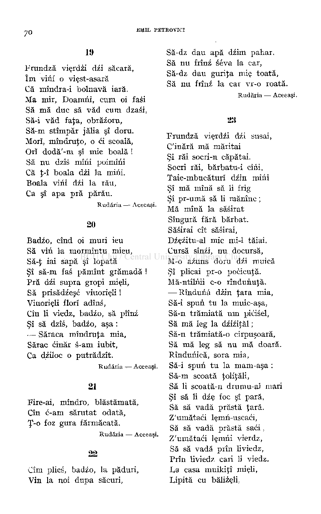

Să-dz dau apă dzim pahar. Să nu frînz séva la car, Să-dz dau guriţa mie toată, Să nu frînz la car vr-o roată.

Frundză vierdzi dzi săcară, î m vini o viest-asară Că mîndra-i bolnavă iară. Ma mir, Doamni, cum oi fasi Să mă duc să văd cum dzaéi, Să-i văd faţa, obrăzoru, Să-m stîmpăr jălia şî doru. Mori, mîndruţo, o ci scoală, Ori dodă'-m şî mie boală ! Să nu dzîs mîni poimîni Că ţ-î boala dzi la mini. Boala vini dzi la rău, Ca şî apa pră părău.

Rudăria — Aceeaşi.

23

Frundză vierdzi dzi susai, Cinară mă măritai

- Şî răi socri-n căpătai. Socri răi, bărbatu-i cîhi, Taie-mbucături dzin mini Şî mă mînă să li frig Şî pr-umă să li mănînc ; Mă mînă la săsirat Sîngură fără bărbat. Săsirai cît săsirai, Dzezitu-al mic mi-1 tăiai. Cursă sînzi, nu docursă, M-o azuns doru dzi muică Şî plicai pr-o pocicuţă. Mă-ntîlhii c-o rîndunuţă.

— Rînduhâ dzin ţara mia, Să-i spun tu la muic-aşa, Să-n trămiată um picisel, Să mă leg la dziziţăl ; Să-n trămiată-o cîrpuşoară, Să mă leg să nu mă doară. Rînduhieă, sora mia, Să-i spun tu la mam-aşa : Să-m scoată ţoliţăli, Să li scoată-n drumu-al mari

- Şî să li dze foc şî pară, Să să vadă prăstă ţară. Z'umătaci lemh-uscaci, Să să vadă prăstă saci, Z'umătaci lemrii vierdz, Să să vadă prîn liviedz, Prîn liviedz cari li viedz. Da casa muikiţî mieii, Dipită cu bălizeli,

Rudăria — Aceeaşi.

20

Badzo, cînd oi muri ieu Să vin la mormîntu mieu, Să-ţ iai sapă şî lopată Şî să-m fas pămînt grămadă ! Pră dzi supra gropi mieii, Să prisădzeşc viuorieli ! Viuorieli flori adîns, Cîn li viedz, badzo, să plînz Şî să dzîé, badzo, aşa :

— Săraca mîndruţa mia, Sărac cinăr s-am iubit, Ca dziloc o putrădzît.

Rudăria — Aceeaşi.

21

Fire-ai, mîndro, blăstămată, Cîn c-am sărutat odată, Ţ-o foz gura fărmăcată.

Rudăria — Aceeaşi.

22

Cîm plies, badzo, la păduri, Vin la noi dupa săcuri,

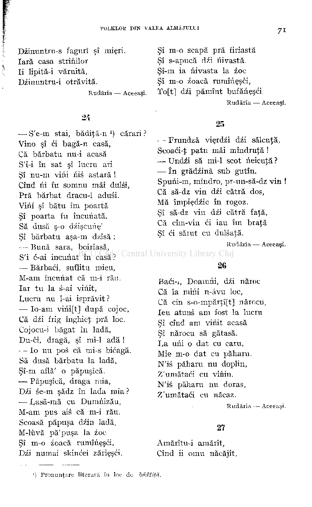

Şî m-o scapă pră firiastă Şî s-apucă dzi riivastă. Şî-m ia nivasta la ioc Şî m-o zoacă rumîneşci, To[t] dzi pămînt bufăneşci

Dzinuntru-s faguri şî mieri. Iară casa strinilor Ii lipită-i văruită, Dzinuntru-i otrăvită.

Rudăria — Aceeaşi.

Rudăria — Aceeaşi.

25

— S'e-m stai, bădiţă-n *) cărări ? Vino şî ci bagă-n casă, Că bărbatu nu-i acasă S'i-i în sat şî lucru ari Şî nu-m vini nis astară ! Cînd ni fu somnu măi dulsi, Pră bărbat dracu-1 aduşi. Vini şî bătu îm poartă Şî poarta fu încunată. Să dusă ş-o dzişcune' Şî bărbatu aşa-m dzîsă :

— Frundză vierdzi dzi sălcuţă, Scoaci-ţ patu măi mîndruţă !

— Undzi să mi-1 scot neicuţă ?

— î n grădzină sub gutîn. Spurii-m, mîndro, pr-un-să-dz vin I Că să-dz vin dzi cătră dos, Mă împiedzic în rogoz. Şî să-dz vin dzi cătră faţă, Că cîm-vin ci iau îm braţă Şî ci sărut cu dulsaţă.

Rudăria — Aceeaşi.

— Bună sara, boiriasă, S'i c-ai incunat în casă ? — Bărbaci, suflitu mieu, M-am încuriat că m-i rău. Iar t u la s-ai viriit, Lucru nu l-ai isprăvit?

26

Baci-i, Doamni, dzi năroc Că la mini n-âvu loc, Că cîn s-o-mpărţî[t] nărocu, leu atuns am fost la lucru Şî cînd am viriit acasă Şî nărocu să gătasă. Da urii o dat cu caru, Mie m-o dat cu păharu. N'is păharu nu doplin, Z'umătaci cu vinin. N'ié păharu nu doras, Z'umătaci cu năcaz.

— Io-am vini[t] după cojoc, Că dzi frig înghieţ pră loc. Cojocu-i băgat în ladă, Du-ci, dragă, şî mi-1 adă !

— Io nu pos că mi-s bicagă. Să dusă bărbatu la ladă, Şî-m află' o păpuşîcă.

— Păpuşîcă, draga mia, Dzi se-m şădz în lada mia ?

— Lasă-mă cu Dumnizău, M-am pus aie că m-i rău. Scoasă păpuşa dzin ladă, M-luvă pă'puşa la zoc Şî m-o zoacă rumîneşci, Dzi numai skincei zărieşci.

Rudăria — Aceeaşi.

27

Amărîtu-i amărît, Cînd ii omu năcăjît,

) Pronunţare literară în loc de bădiiţă.

J

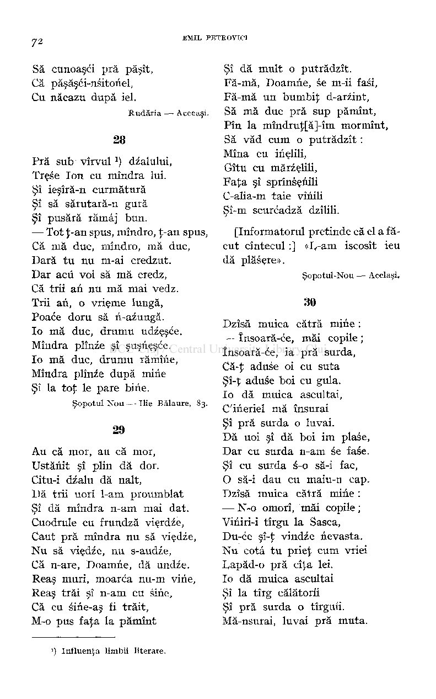

Şî dă mult o putrădzît. Fă-mă, Doamne, se m-ii faii, Fă-mă un bumbiţ d-arzint, Să mă duc pră sup pămînt, Pîn la mîndruţ[ă]-îm mormînt, Să văd cum o putrădzît : Mîna cu inelili, Gîtu cu mărzelili, Faţa şî sprînsenili C-alia-m taie vînili Şî-m scurcadză dzîlili.

Să cunoaşci pră păşît, Că păşăşci-nsitonel, Cu năcazu după iei.

Rudăria — Aceeaşi.

28

Pră sub vîrvul *) dzalului, Trese Ion cu mîndra lui. Şî ieşîră-n curmătură Şî să sărutară-n gură Şî pusără rămâj bun. — Tot ţ-an spus, mîndro, ţ-an spus, Că mă duc, mîndro, mă duc, Dară tu nu m-ai credzut. Dar acu voi să mă credz, Că trii an nu mă mai vedz. Trii an, o vrieme lungă, Poace doru să ri-azungă. Io mă duc, drumu udzeşce. Mîndra plînze şî şuşneşce. Io mă duc, drumu rămîrie, Mîndra plînze după mine Şî la toţ le pare bine.

[Informatorul pretinde că el a făcut cîntecul :] «D-am iscosît ieu dă plăsere».

Şopotul-Nou — Acelaşi.

30

Dzîsă muica cătră mine :

— însoară-ce, măi copile ; însoară-ce, ia pră surda, Că-ţ aduse oi cu suta Şî-ţ aduse boi cu gula. Io dă muica ascultai, C'ineriel mă însurai Şî pră surda o luvai. Dă uoi şî dă boi im plase, Dar cu surda n-am se fase. Şî cu surda é-o să-i fac, O să-i dau cu maiu-n cap. Dzîsă muica cătră mine : — N-o omorî, măi copile ; Viniri-i tîrgu la Sasca, Du-ce şî-ţ vindze nevasta. N u cota tu prieţ cum vriei Dapăd-o pră cîţa lei. Io dă muica ascultai Şî la tîrg călătorii Şî pră surda o tîrguii. Mă-nsurai, luvai pră muta.

Şopotul-Nou — Ilie Bălaure, 83.

29

Au că mor, au că mor, Ustănit şî plin dă dor. Cîtu-i dzalu dă nalt, Dă trii uorî l-am proumblat Şî dă mîndra n-am mai dat. Cuodrule cu frundză vierdze, Caut pră mîndra nu să viedze, N u să viedze, nu s-audze, Că n-are, Doamne, dă undze. Reaş muri, moarca nu-m vine, Reaş trăi şî n-am cu sine, Că cu sine-aş fi trăit,

- M-o pus faţa la pămînt

###### ) Influenţa limbii literare.

]

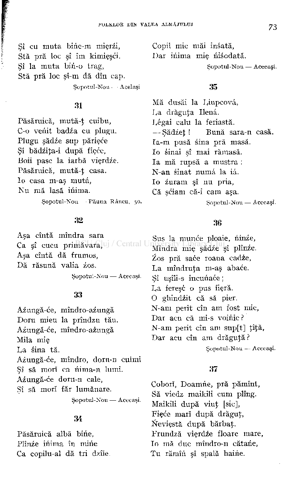

Copil mic măi insată, Dar inima miç nisodată.

Şî cu muta bine-m mierzi, Stă pră loc şî îm kimieşci. Şî la muta bin-o trag, Stă pră loc şî-m dă dîn cap.

Şopotul-Nou — Aceeaşi.

35

Şopotul-Nou — Acelaşi

Mă dusăi la Liupcovâ, La drăguţa Ilenâ. Légai calu la feriastă.

31

Păsăruică, mută-ţ cuibu, C-o venit badza cu plugu. Plugu şădze sup păriece Şî bădziţa-i după fiece, Boii pasc la iarbă vierdze. Păsăruică, mută-ţ casa. Io casa m-aş muta, Nu mă lasă inima.

— Şădzeţ ! — Bună sara-n casă. Ia-m pusă sina pră masă. Io sinai şî mai rămasă. Ia mă rupsă a mustra : N-an si nat numa la iâ. Io zuram şî nu pria, Că şciam că-i cam aşa.

Şopotul-Nou — Păuna Râncu, 50.

Şopotul-Nou — Aceeaşi.

32

3G

Aşa cîntă mîndra sara Ca şî cucu primăvara, Aşa cîntă dă frumos, Dă răsună valia zos.

Sus la munce ploaie, riinze, Mîndra miç şădze şî plînze. Zos pră sace roaua cadze, La mîndruţa m-aş abace. Şî uşîli-s încunace ; La feresc o pus ficră. O ghindzit că să pier. N-am perit cîn am fost mic, Dar acu că mi-s voinic ? N-am perit cîn am sup[t] ţîţă, Dar acu cîn am drăguţă?

Şopotul-Nou — Aceeaşi.

33

Azungă-ce, mîndro-azungă Doru mieu la prîndzu tău. Azungă-ce, mîndro-azungă Mila miç La sina tă. Azungă-ce, mîndro, doru-n culmi Şî să mori ca nima-n lumi. Azungă-ce doru-n cale, Şî să mori făr lumânare.

Şopotul-Nou — Aceeaşi.

37

Coborî, Doamne, pră pămînt, Să viedz maikili cum plîng. Maikili după viuţ [sic], Fiçce mari după drăguţ, Nevicstă după bărbat. Frundză viçrdze floare mare, Io mă duc mîndro-n cătane, Tu rămîn şî spală haine.

Şopotul-Nou — Aceeaşi.

34

Păsăruică albă bine, Plînze inima în mine Ca copilu-al dă tri dzîle.

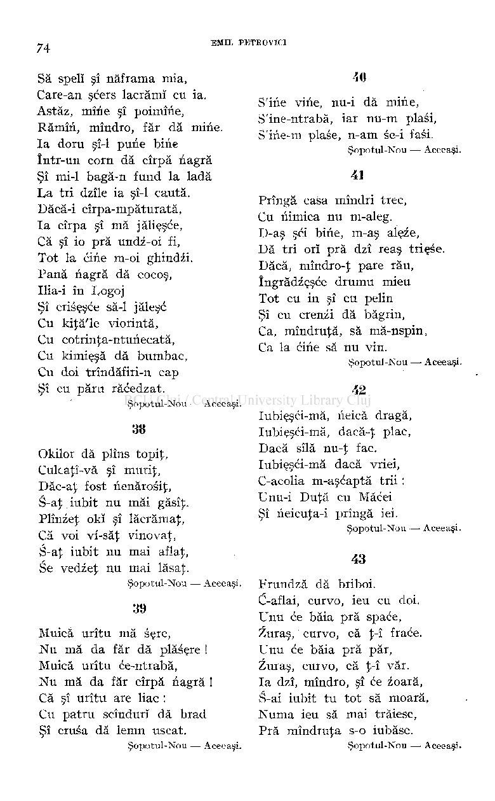

Să speli şî năframa mia, Care-an şcers lacrămî cu ia. Astăz, mîne şî poimîne,

S'irie vine, nu-i dă mine, S'ine-ntrabă, iar nu-m plasi, S'ine-m plase, n-am se-i fasi.

- Rămîn, mîndro, făr dă miiie. Ia doru şî-1 pune bine într-un corn dă cîrpă riagră Şî mi-1 bagă-n fund la ladă La tri dzîle ia şî-1 caută. Dăcă-i cîrpa-mpăturată, Ia cîrpa şî mă jălieşce, Că şî io pră undz-oi fi, Tot la cine m-oi ghindzi. Pană liagră dă cocoş, Ilia-i în Logoj Şî criseşce să-1 jăleşc Cu kiţă'le viorintă, Cu cotrinţa-nturiecată, Cu kimieşă dă bumbac, Cu doi trîndăfiri-n cap Şî cu păru răcedzat.

Şopotul-Nou — Aceeaşi.

41

Prîngă casa mîndri trec, Cu nimica nu m-aleg. D-aş şei bine, m-aş aleze, Dă tri ori pră dzî reaş triçée. Dacă, mîndro-ţ pare rău, îngrădzeşce drumu mieu Tot cu in şî cu pelin Şî cu crenzi dă băgrin, Ca, mîndruţă, să mă-nspin, Ca la cine să nu vin.

Şopotul-Nou — Aceeaşi.

42

Şopotul-Nou — Aceeaşi.

Iubieşci-mă, neică dragă, Iubieşci-mă, dacă-ţ plac, Dacă sîlă nu-ţ fac. Iubieşci-mă dacă vriei, C-acolia m-aşcaptă trii : Unu-i Duţă cu Măcei Şî iieicuţa-i prîngă iei.

38

Okilor dă plîns topit, Culcaţî-vă şî murit, Dăc-aţ fost rienărosiţ, â-aţ.iubit nu măi găsîţ. Plînzeţ okî şî lăcrămat, Că voi vi-săţ vinovat, S-aţ iubit nu mai aflat, Se vedzeţ nu mai lăsat.

Şopotul-Nou — Aceeaşi.

43

Şopotul-Nou — Aceeaşi.

Frundză dă briboi. C-aflai, curvo, ieu cu doi. Unu ce băia pră space, Zuraş, curvo, că ţ-î frace. Unu ce băia pră păr, Zuraş, curvo, că ţ-î văr. Ia dzî, mîndro, şî ce zoară, â-ai iubit tu tot să moară, Numa ieu să mai trăiesc, Pră mîndruţă s-o iubăsc.

39

Muică urîtu mă sere, Nu mă da făr dă plăsere ! Muică urîtu ce-ntrabă, N u mă da făr cîrpă nagră ! Că şî urîtu are liac : Cu patru scîndurî dă brad Şî crusa dă lemn uscat.

Şopotul-Nou — Aceeaşi.

Şopotul-Nou — Aceeaşi.

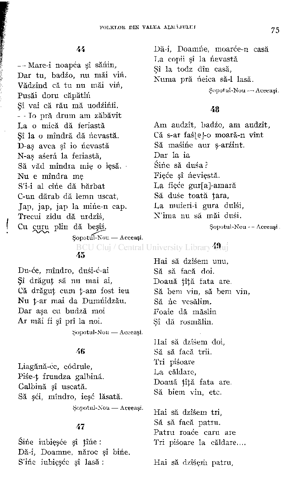

Dă-i, Doamne, moarce-n casă La copii şî la nevastă Sî la todz dîn casă, Num a pră neică să-1 lasă.

— Mare-i noapca şî săfiin, Dar tu, badzo, nu măi vin. Vădzînd că tu nu măi vin, Pusăi doru căpătîn Şî vai că rău mă uodzinii.

Şopotul-Nou — Aceeaşi.

48

— Io pră drum am zăbăvit La o mică dă feriastă Şî la o mîndră dă nevastă. D-aş avea şî io nevastă

A m audzît, badzo, a m audzît, Că s-ar fas[e]-o moară-n vînt Să masirie aur ş-arzint. Dar la ia Sine să dusa ? Fiece şî nevicstă. La fiece gur[a]-amară Să duse toată ţara, La muieri-i gura dulsi, N'ima nu să măi dusi.

- N-aş aserâ la feriastă,

- Să văd mîndră miş o iesă. Nu e mîndră me S'i-i al cîne dă bărbat C-un dărab dă lemn uscat, Jap, jap, jap la mine-n cap. Trecui zîdu dă urdzîs, Cu curu plin dă beşîs.

Şopotul-Nou — Aceeaşi.

Şopotul-Nou — Aceeaşi.

49

45

Hai să dzîsem unu, Să să facă doi. Doauă ţîţă fata are. Să bem vin, să bem vin, Să ne vesălim. Foaie dă măslin Şî dă rosmălin.

Du-ce, mîndro, dusi-c-ai Şî drăguţ să nu mai ai, Că drăguţ cum ţ-am fost ieu Nu ţ-ar mai da Dumnidzău. Dar aşa cu budză moi Ar măi fi şî prî la noi.

Şopotul-Nou — Aceeaşi.

Hai să dzîsem doi, Să să facă trii. Tri pisoare La căldare, Doauă ţîţă fata are. Să biem vin, etc.

46

Liagănă-ce, codrule, Piee-ţ frundza galbină. Galbină şî uscată. Să şei, mîndro, ieşc lăsată.

Şopotul-Nou — Aceeaşi.

Hai să dzîsem tri, Să să facă patru. Patru roace caru are Tri pisoare la căldare....

47

Sine iubieşce şî ţîne : Dă-i, Doamne, năroc şî bine. S'irie iubieşce şî lasă :

Hai să dzîsem patru,

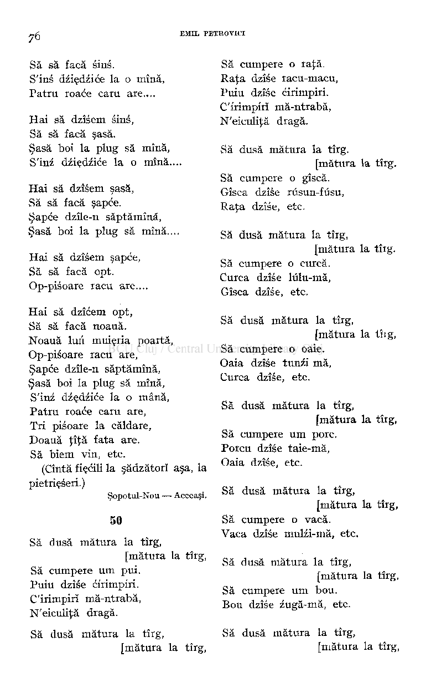

Să cumpere o raţă. Raţa dzîse racu-macu, Puiu dzîse cirimpiri. C'irimpirî mă-ntrabă, N'eiculiţă dragă.

Să să facă sins. S'iné dziedzice la o mînă, Patru roace cam are....

Hai să dzîsem sins, Să să facă şasă. Şasă boi la plug să mînă, S'inz dziedzice la o mînă....

Să dusă mătura la tîrg.

[mătura la tîrg. Să cumpere o gîscă. Gîsca dzîse rûsun-fûsu, Raţa dzîse, etc.

Hai să dzîsem şasă, Să să facă şapce. Şapce dzîle-n săptămînâ, Şasă boi la plug să mînă....

Să dusă mătura la tîrg, [mătura la tîrg.

Hai să dzîsem şapce, Să să facă opt. Op-pisoare racu are....

Să cumpere o curcă. Curca dzîse lulu-mă, Gîsca dzîse, etc.

Hai să dzîcem opt, Să să facă noauă. Noauă luri muieria poartă, Op-pisoare racu are, Şapce dzîle-n săptămînă, Şasă boi la plug să mînă,

Să dusă mătura la tîrg,

[mătura la tîig, Să cumpere o oaie. Oaia dzîse tunzi mă, Curca dzîse, etc.

S'inz dzedzice la o mână, Patru roace caru are, Tri pisoare la căldare, Doauă ţîţă fata are. Să biem vin, etc.

Să dusă mătura la tîrg,

[mătura la tîrg, Să cumpere u m porc. Porcu dzîée taie-mă, Oaia dzîse, etc.

(Cîntă fiecili la şădzătorî aşa, la pietrieéeri.)

Să dusă mătura la tîrg,

Şopotul-Nou — Aceeaşi.

[mătura la tîrg, Să cumpere o vacă. Vaca dzîse mulzi-mă, etc.

50

Să dusă mătura la tîrg,

[mătura la tîrg, Să cumpere um pui. Puiu dzîse cmmpiri. C'irimpirî mă-ntrabă, N'eiculiţă dragă.

Să dusă mătura la tîrg,

[mătura la tîrg, Să cumpere u m bou. Bou dzîse zugă-mă, etc.

Să dusă mătura la tîrg, [mătura la tîrg,

Să dusă mătura la tîrg, [mătura la tîrg,

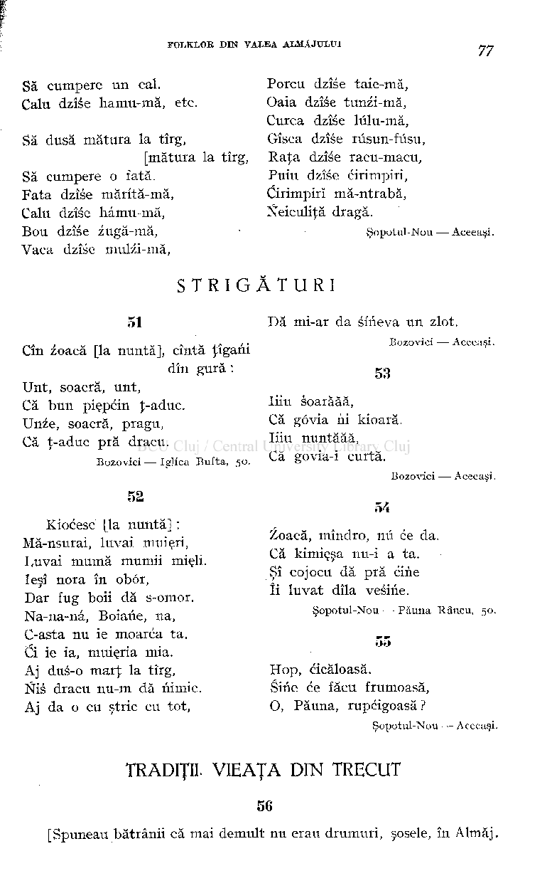

Porcu dzîse taie-mă, Oaia dzîse tunzi-mă, Curca dzîse lulu-mă, Gîsca dzîse rûsun-fûsu, Raţa dzîse racu-macu, Puiu dzîse c4rimpiri, Cirimpirî mă-ntrabă, Neiculiţă dragă.

Să cumpere un cal. Calu dzîée hamu-mă, etc.

Să dusă mătura la tîrg,

[mătura la tîrg, Să cumpere o fată. Fata dzîse mărită-mă, Calu dzîse hâmu-mă, Bou dzîse zugă-mă, Vaca dzîse mulzi-mă,

Şopotul-Nou - • Aceeaşi.

STRIGĂTUR I

Dă mi-ar da smeva un zlot.

51

Bozovici — Aceeaşi.

Cîn zoacă [la nuntă], cîntă ţigani dîn gură :

53

Unt, soacră, unt, Că bun piepcin ţ-aduc. Unze, soacră, pragu, Că ţ-aduc pră dracu.

Iiiu soarăăă, Că gôvia ni kioară. Iiiu nuntăăă, Că govia-i curta.

Bozovici — Iglica Bufta, 50.

Bozovici — Aceeaşi.

52

54

Kiocesc [la nuntă] : Mă-nsurai, luvai muieri, Luvai mumă mumii mieii. Ieşî nora în obor, Dar fug boii dă s-omor. Na-na-nâ, Boiafie, na, C-asta nu ie moarca ta, Ci ie ia, muieria mia. Aj dué-o marţ la tîrg, Nié dracu nu-m dă nimic. Aj da o cu stric cu tot,

Zoacă, mîndro, nû ce da. Că kimieşa nu-i a ta. Şî cojocu dă pră cine îi luvat dîla vesirie.

Şopotul-Nou — Păuna Râncu, 50.

55

Hop, cicăloasă. éine ce făcu frumoasă, O, Păuna, rupcigoasă ?

Şopotul-Nou — Aceeaşi.

TRADIŢII. VIEAŢA DIN TRECUT

56

[Spuneau bătrânii că mai demult nu erau drumuri, şosele, în Almăj.

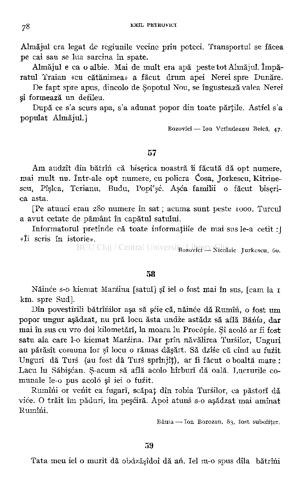

Almăjul era legat de regiunile vecine prin poteci. Transportul se făcea pe cai sau se lua sarcina în spate.

Almăjul e ca o albie. Mai de mult era apă peste tot Almăjul. împăratul Traian «cu cătănimea» a făcut drum apei Nerei spre Dunăre.

De fapt spre apus, dincolo de Şopotul Nou, se îngustează valea Nerei şi formează un defileu.

După ce s'a scurs apa, s'a adunat popor din toate părţile. Astfel s'a populat Almăjul.]

Bozovici — Ion Verindeanu Beică, 47.

57

Am audzît dîn bătrîh că biserica noastră îi făcută dă opt numere, mai mult nu. într-ale opt numere, cu policra Cosa, Jorkescu, Kitrinescu, Pîşlea, Terianu, Budu, Popî'şc. Aşca familii o făcut biserica asta.

[Pe atunci erau 280 numere în sat ; acuma sunt peste 1000. Turcul a avut cetate de pământ în capătul satului.

Informatorul pretinde că toate informaţiile de mai sus le-a cetit :] «îi scris în istorie».

Bozovici — Nicolaie Jurkescu, 60.

58

Năince s-o kiemat Marzina [satul] şî iei o fost mai în sus, [cam la 1 km. spre Sud].

Dîn povestîrili bătrînilor aşa să şcie că, năince dă Rumîn, o fost um popor ungur aşădzat, nu pră locu ăsta undze astădz să află Bănia, dar mai în sus cu vro doi kilometărî, la moara lu Procôpie. Şî acolo ar fi fost satu ala care l-o kiemat Marzina. Dar prîn năvălirea Tursilor, Unguri au părăsit comuna lor şî locu o rămas dăşărt. Să dzîse că cînd au fuzit Unguri dă Turs (au fost dă Turs sprînjîţ), ar fi făcut o boaită mare : I,acu lu Săbişcan. Ş-acum să află acolo hîrburî dă oală. Lucrurile comunale le-o pus acolô şî iei o fuzit.

Rumîhi or venit ca fugari, scăpat dîn robia Tursilor, ca păstori dă vice. O trăit îm păduri, îm peşciră. Apoi atuns s-o aşădzat mai amînat Rumîni.

Bănia — Ion Borozan, 83, fost subofiţer.

59

Tata meu iei o murit dă obdzăşîdoi dă ah. Iei m-o spus dîla bătrîhi

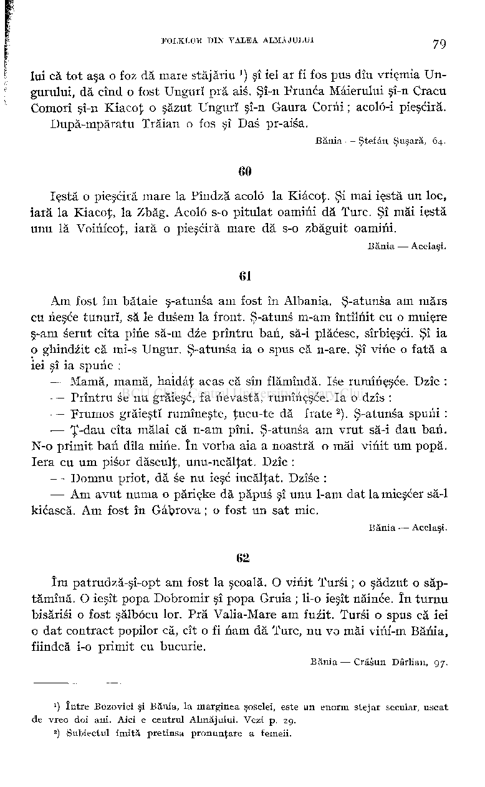

lui că tot aşa o foz dă mare stăjăriu *) şî iei ar fi fos pus dîn vriemia Ungurului, dă cînd o fost Unguri pră aie. Şî-n Prunca Mâierului şî-n Cracu Comorî şî-n Kiacoţ o şăzut Unguri şî-n Gaura Corni ; acolô-i pieşciră.

După-mpăratu Trăian o fos şî Das pr-aisa.

Bănia — Ştefan Şuşară, 64.

60

Iestă o pieşciră mare la Pîndză acolô la Kiacoţ. Şi mai iestă un loc, iară la Kiacoţ, la Zbăg. Acolô s-o pitulat oamirii dă Turc. Şî măi iestă unu lă Voiriicoţ, iară o pieşciră mare dă s-o zbăguit oamini.

Bănia — Acelaşi.

61

Am fost îm bătaie ş-atunsa am fost în Albania. Ş-atunsa am mărs cu rieşce tunuri, să le dusem la front. Ş-atuns m-am întîlnit cu o muiere ş-am serut cîta pîrie să-m dze prîntru bari, să-i plăcesc, sîrbieşci. Şî ia o ghindzit că mi-s Ungur. Ş-atunea ia o spus că n-are. Şî virie o fată a iei şî ia spurie :

— Mamă, mamă, haidâţ acas că sîn flămîndă. Ise rumîrieşce. Dzîc :

— Prîntru se nu grăiesc, fa nevastă, rumîrieşce. Ia o dzîs :

— Frumos grăieştî rumîneşte, ţucu-te dă frate

). Ş-atunsa spurii :

2

— Ţ-dau cîta mălai că n-am pîni. Ş-atunsa am vrut să-i dau bari. N-o primit bari dîla mine. î n vorba aia a noastră o măi viriit um popă. Iera cu um pisor dăsculţ, unu-ncălţat. Dzîc :

— Domnu priot, dă se nu ieşc incălţat. Dzîse :

— Am avut numa o părieke dă păpus şî unu l-am dat la mieşcer să-1 kicască. Am fost în Gâbrova ; o fost un sat mic.

Bănia — Acelaşi.

62

î m patrudză-şî-opt am fost la şcoală. O viriit Tursi ; o şădzut o săptămînă. O ieşît popa Dobromir şî popa Gruia ; li-o ieşît năince. în turnu bisărisi o fost şălbocu lor. Pră Valia-Mare am fuzit. Tursi o spus că iei o dat contract popilor că, cît o fi nam dă Turc, nu vo măi virii-m Băriia, fiindcă i-o primit cu bucurie.

Bănia — Crăsun Dârliau, 97.

') între Bozovici şi Bănia, la marginea şoselei, este un enorm stejar secular, uscat de vreo doi ani. Aici e centrul Almăjului. Vezi p. 29.

###### ) Subiectul imită pretinsa pronunţare a femeii.

2

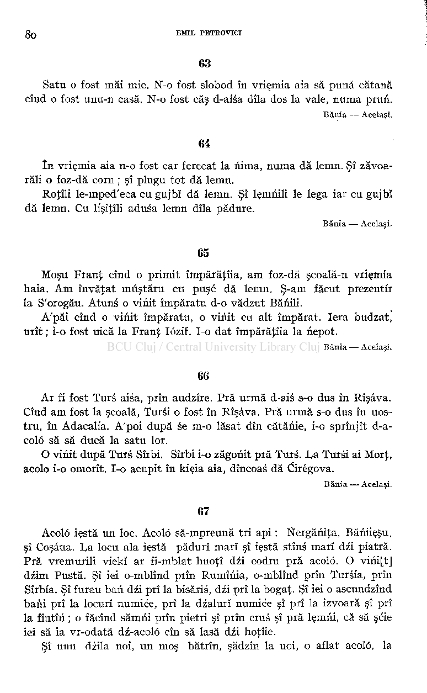

63

Satu o fost măi mic. N-o fost slobod în vriemia aia să pună cătană cînd o fost unu-n casă. N-o fost căş d-aiéa dîla dos la vale, numa prun.

Bănia — Acelaşi.

64

î n vriemia aia n-o fost car ferecat la nima, numa dă lemn. Şi zăvoarăli o foz-dă corn ; şî plugu tot dă lemn.

Roţîli le-mped'eca cu gujbî dă lemn. Şî lemnili le lega iar cu gujbî dă lemn. Cu lişîţîli aduéa lemn dîla pădure.

Bănia — Acelaşi.

65

Moşu Franţ cînd o primit împărăţîia, am foz-dă şcoală-n vriemia haia. A m învăţat muştăru cu puşc dă lemn. Ş-am făcut prezentfr la S'orogău. Atuné o vinit împăratu d-o vădzut Bănili.

A'păi cînd o vinit împăratu, o vinit cu alt împărat. Iera budzat, urît ; i-o fost uică la Franţ Iozif. I-o dat împărăţîia la nepot.

Bănia — Acelaşi.

66

Ar fi fost Turs aisa, prîn audzîre. Pră urmă d-aié s-o dus în Rîşâva. Cînd am fost la şcoală, Turei o fost în Rîşâva. Pră urmă s-o dus în uostru, în Adacalia. A'poi după ée m-o lăsat dîn cătănie, i-o sprînjît d-acolô să să ducă la satu lor.

O vinit după Turé Sîrbi. Sîrbi i-o zăgonit pră Turé. La Tursi ai Morţ, acolo i-o omorît. I-o acupit în kieia aia, dîncoas dă Ûrégova.

Bănia — Acelaşi.

67

Acolo iestă un loc. Acolo să-mpreună tri api : Nergăniţa, Băniieşu, şî Coşâua. I,a locu ala iestă păduri mari şî iestă stins mari dzi piatră. Pră vremurili viekî ar fi-mblat huoţî dzi codru pră acolo. O vini[t] dzim Pustă. Şî iei o-mblînd prîn Rumînia, o-mblînd prîn Tursia, prîn Sîrbia. Şî furau ban dzi prî la bisăris, dzi prî la bogat. Şî iei o ascundzînd bani prî la locuri numice, prî la dzalurî mimice şî prî la izvoară şî prî la fîntîn ; o făcînd sămni prîn pietri şî prîn crue şî pră lemni, că să şcie iei să ia vr-odată dz-acolô cîn să lasă dzi hoţîie.

Şî unu dzila noi, un moş bătrîn, şădzîn la uoi, o aflat acolo, la

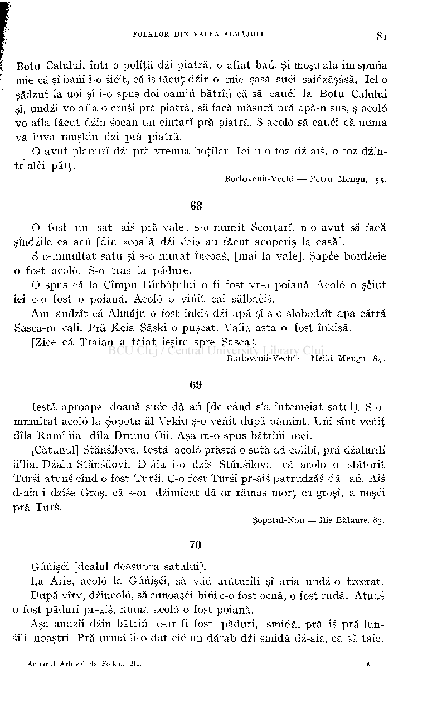

###### FOLKLOK DIN VALEA AJLMÀJULUI 8l

Botu Calului, într-o poliţă dzi piatră, o aflat ban. Şî moşu ala îm spună mie că şî bani i-o sicit, că îs făcut dzin o mie şasă suci şaidzăşâsă. Iei o şădzut la uoi şî i-o spus doi oamin bătrîn că să cauci la Botu Calului şî, undzi vo afla o crusi pră piatră, să facă măsură pră apă-n sus, ş-acolo vo afla făcut dzin socan un cîntarî pră piatră. Ş-acolo să cauci că numa va luva muşkiu dzi pră piatră.

O avut planuri dzi pră vremia hoţilor. Iei n-o foz dz-ais, o foz dzintr-alci părţ.

Borlovenii-Vechi — Petru Mengu, 55.

68

O fost un sat ais pră vale ; s-o numit Scorţarî, n-o avut să facă şîndzile ca acu [din «coajă dzi cei» au făcut acoperiş la casă].

S-o-mmultat satu şî s-o mutat încoas, [mai la vale]. Şapce bordzeie

- o fost acolo. S-o tras la pădure. O spus că la Cîmpu Gîrboţului o fi fost vr-o poiană. Acolo o şciut

iei c-o fost o poiană. Acolo o vi nit cai sălbacis.

Am audzît că Almăju o fost înkis dzi apă şî s-o slobodzît apa cătră Sasca-m vali. Pră Keia Săski o puşcat. Valia asta o fost înkisă.

[Zice că Traian a tăiat ieşire spre Sasca].

Borlovenii-Vechi — Meilă Mengu, 84.

69

Iestă aproape doauă suce dă aii [de când s'a întemeiat satul]. S-ommultat acolô la Şopotu ăl Vekiu ş-o venit după pămînt. Urii sînt venit dîla Rumînia dîla Drumu Oii. Aşa m-o spus bătrîrii mei.

[Cătunul] Stănsilova. Iestă acolô prăstă o sută dă colibî, pră dzalurili ă'lia. Dzalu Stănsilovi. D-âia i-o dzîs Stănsilova, că acolo o stătorit Tursi atuns cînd o fost Tursi. C-o fost Tursi pr-ais patrudzăs dă ari. Ais d-aia-i dzîse Groş, că s-or dzimieat dă or rămas mort ca groşî, a noşci pră Turs.

Şopotul-Nou — Ilie Bălaure, 83.

70

Guiiişci [dealul deasupra satului]. L,a Arie, acolô la Guiiişci, să văd arăturili şî aria undz-o treerat. După vîrv, dzincolô, să cunoaşci bini c-o fost ocnă, o fost rudă. Atuns

o fost păduri pr-ais, numa acolô o fost poiană.

Aşa audzîi dzin bătrîn c-ar fi fost păduri, smidă, pră is pră lunsili noaştri. Pră urmă li-o dat cîc-un dărab dzi smidă dz-aia, ca să taie,

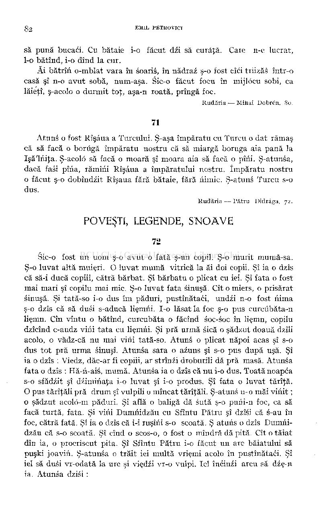

să pună bucaci. Cu bătaie i-o făcut dzi să curăţă. Care n-e lucrat, l-o bătînd, i-o dînd la cur.

Ai bătrîn o-mblat vara în soaris, în nădraz ş-o fost cîci triizăs într-o casă şî n-o avut sobă, num-aşa. Sic-o făcut focu în mijlôcu sobi, ca lăieţî, ş-acolo o durmit toţ, aşa-n roată, prîngă foc.

Rudăria — Minai Dobrén, So.

71

Atuns o fost Rîşâua a Turcului. Ş-aşa împăratu cu Turcu o dat rămas că să facă o borugă împăratu nostru că să miargă boruga aia pană la Işă'lriiţa. Ş-acolo să facă o moară şî moara aia să facă o pîrii. Ş-atunsa, dacă fasi pîiîa, rămîni Rîşâua a împăratului nostru. împăratu nostru o făcut ş-o dobîndzit Rîşâua fără bătaie, fără nimic. Ş-atuns Turcu s-o dus.

Rudăria — Patru Didrâga, 72.

POVEŞTI, LEGENDE, SNOAVE

72

âic-o fost un uom ş-o avut o fată ş-un copil. Ş-o murit mumă-sa. Ş-o luvat altă muiçri. O luvat mumă vitrică la ăi doi copii. Şî ia o dzîs că să-i ducă copiii, cătră bărbat. Şî bărbatu o plicat cu iei. Şî fata o fost mai mari şî copilu mai mic. Ş-o luvat fata sinuşă. Cît o miers, o prisărat sinuşă. Şi tată-so i-o dus îm păduri, pustînătaci, undzi n-o fost liima ş-o dzîs că să dusi s-aducă liemhi. I-o lăsat la foc ş-o pus curcubăta-n liemn. Cîn vîntu o bătînd, curcubăta o făcînd soc-soc în liemn, copilu dzîcînd c-audz vini tata cu liemni. Şi pră urmă sică o şădzut doauă dzîli acolo, o vădz-că nu mai vini tată-so. Atuns o plicat năpoi acas şî s-o dus tot pră urma sinuşî. Atunéa sara o azuns şî s-o pus după uşă. Şî ia o dzîs : Viedz, dăc-ar fi copiii, ar strînzi droburili dă pră masă. Atunsa fata o dzîs : Hă-n-ais, mumă. Atunéa ia o dzîs că nu i-o dus. Toată noapca s-o sfădzit şî dzimihaţă i-o luvat şî i-o produs. Şî fata o luvat tărîţă. O pus tărîţăli pră drum şî vulpili o mîncat tărîţăli. Ş-atuns u- o măi vinit ; o şădzut aeolô-m păduri. Şî află o baligă dă sută ş-o puiii-n foc, ca să facă turtă, fata. Şi vini Dumhidzău cu Sfîntu Patru şî dzîsi că s-au în foc, cătră fată. Şî ia o dzîs că i-i ruşîfii s-o scoată. Ş atuns o dzîs Dumhidzău că s-o scoată. Şî cînd o scos-o, o fost o mîndră dă pită. Cît o tăiat dîn ia, o procriscut pita. Şî Sfîntu Patru i-o făcut un arc băiatului să puşki joavih. Ş-atunsa o trăit iei multă vriemi acolo în pustînătaci. Şî iei să dusi vr-odată la urc şi viedzi vr-o vulpi. Iei încinzi arcu să dze-n ia. Atunsa dzisi :

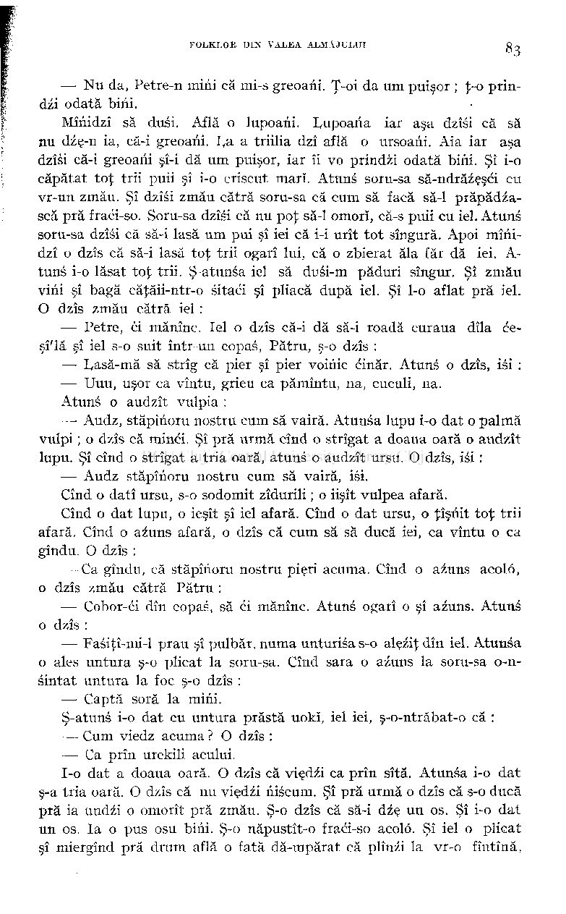

— Nu da, Petre-n mini că mi-s greoarii. Ţ-oi da um puişor ; ţ~o prindzi odată bini.

Mînidzî să dusi. Află o lupoani. Lupoaria iar aşa dzîsi că să nu dze-n ia, că-i greoarii. La a triilia dzî află o ursoatii. Aia iar aşa dzîsi că-i greoarii şî-i dă um puişor, iar îi vo prindzi odată bini. Şî i-o căpătat toţ trii puii şî i-o criscut mari. Atuns soru-sa să-ndrăzeşci cu vr-un zmău. Şî dzîsi zmău cătră soru-sa că cum să facă să-1 prăpădească pră fraci-so. Soru-sa dzîsi că nu poţ să-1 omorî, că-s puii cu iei. Atuns soru-sa dzîsi că să-i lasă um pui şî iei că i-i urît tot singură. Apoi mînidzî o dzîs că să-i lasă toţ trii ogarî lui, că o zbierat ăla făr dă iei. Atuns i-o lăsat toţ trii. Ş-atunsa iei să dusi-m păduri singur. Şî zmău vini şî bagă căţăii-ntr-o sitaci şî pliacă după iei. Şî l-o aflat pră iei. O dzîs zmău cătră iei :

— Petre, ci mănînc. Iei o dzîs că-i dă să-i roadă curaua dîla ceşî'lă şî iei s-o suit într-un copas, Patru, ş-o dzîs :

— Lasă-mă să strîg că pier şî pier voinic cinăr. Atuns o dzîs, isi :

— Uuu, uşor ca vîntu, grieu ca pămîntu, na, cuculi, na. Atuns o audzît vulpia :

— Audz, stăpîiioru nostru cum să vairă. Atunsa lupu i-o dat o palmă vulpi ; o dzîs că minei. Şî pră urmă cînd o strigat a doaua oară o audzît lupu. Şî cînd o strigat a tria oară, atuns o audzît ursu. O dzîs, isi :

— Audz stăpîiioru nostru cum să vairă, isi. Cînd o datî ursu, s-o sodomit zîdurili ; o iişît vulpea afară. Cînd o dat lupu, o ieşît şî iei afară. Cînd o dat ursu, o ţîşnit toţ trii

afară. Cînd o azuns afară, o dzîs că cum să să ducă iei, ca vîntu o ca gîndu. O dzîs :

— Ca gîndu, că stăpîrioru nostru pieri acuma. Cînd o azuns acolô,

- o dzîs zmău cătră Patru :

— Cobor-ci dîn copas, să ci mănînc. Atuns ogarî o şî azuns. Atuné

- o dzîs :

— Fasiţî-mi-1 prau şî pulbăr, numa unturiéa s-o aleziţ dîn iei. Atunsa

- o ales untura ş-o plicat la soru-sa. Cînd sara o azuns la soru-sa o-néintat untura la foc ş-o dzîs :

— Captă soră la mirii. Ş-atuns i-o dat cu untura prăstă uokî, iei iei, ş-o-ntrăbat-o că :

—- Cum viedz acuma ? O dzîs :

— Ca prîn urekili acului. I-o dat a doaua oară. O dzîs că viedzi ca prîn sîtă. Atunsa i-o dat ş-a tria oară. O dzîs că nu viedzi niscum. Şî pră urmă o dzîs că s-o ducă pră ia undzi o omorît pră zmău. Ş-o dzîs că să-i dze un os. Şî i-o dat un os. Ia o pus osu bini. Ş-o năpustît-o fraci-so acolô. Şî iei o plicat şî miergînd pră drum află o fată dă-mpărat că plînzi la vr-o fîntînă,

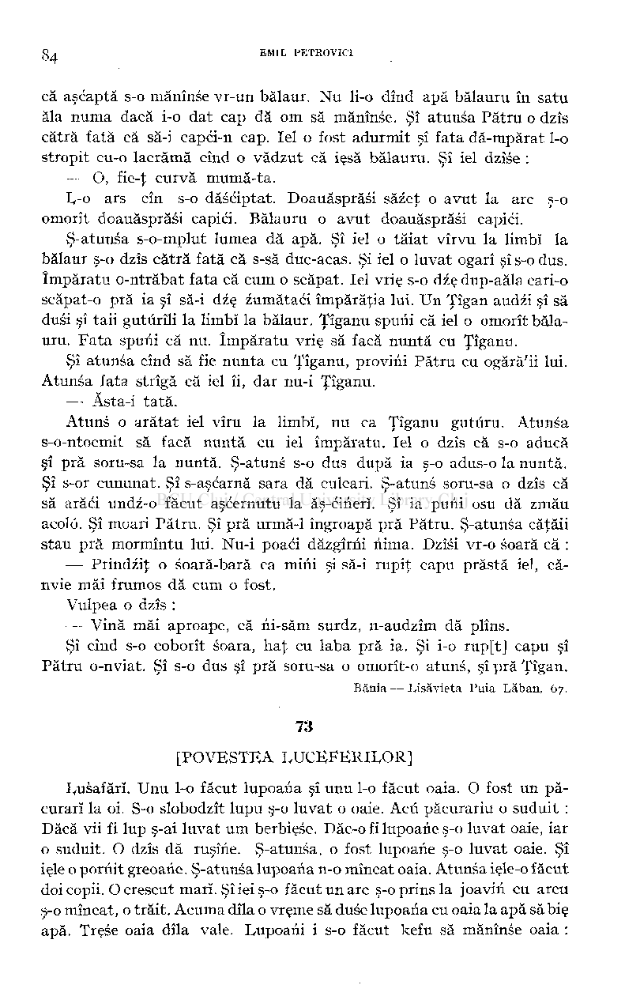

că aşcaptă s-o mănînse vr-un balaur. Nu li-o dînd apă bălauru în satu ăla numa dacă i-o dat cap dă om să mănînse. Şî atunsa Patru o dzîs cătră fată că să-i capci-n cap. Iei o fost adurmit şî fata dă-mpărat l-o stropit cu-o lăcrăma cînd o vădzut că iesă bălauru. Şî iei dzîse :

— O, fie-ţ curvă mumă-ta. L-o ars cîn s-o dăsciptat. Doauăsprăsi săzeţ o avut la arc ş-o

omorît doauăsprăsi capici. Bălauru o avut doauăsprăsi capici.

Ş-atunsa s-o-mplut lumea dă apă. Şî iei o tăiat vîrvu la limbi la balaur ş-o dzîs cătră fată că s-să duc-a cas. Şi iei o luvat ogarî şî s-o dus. împăratu o-ntrăbat fata că cum o scăpat. Iei vrie s-o dzedup-aăla cari-o scăpat-o pră ia şî să-i dze zumătaci împărăţia lui. Un Ţîgan audzi şî să dusi şî taii gutûrîli la limbi la balaur. Ţîganu spurii că iei o omorît bălauru. Fata spurii că nu. împăratu vrie să facă nuntă cu Ţîganu.

Şî atunsa cînd să fie nunta cu Ţîganu, provini Patru cu ogără'ii lui. Atunsa fata strigă că iei îi, dar nu-i Ţîganu.

— Asta-i tată. Atuns o arătat iei vîru la limbi, nu ca Ţîganu gutiiru. Atunsa s-o-ntocmit să facă nuntă cu iei împăratu. Iei o dzîs că s-o aducă şî pră soru-sa la nuntă. Ş-atuns s-o dus după ia ş-o adus-o la nuntă. Şî s-or cununat. Şî s-aşcarnă sara dă culcări. Ş-atuns soru-sa o dzîs că să araci undz-o făcut aşcernutu la ăş-cinerî. Şî ia puni osu dă zmău acolo. Şî moari Patru. Şî pră urmă-1 îngroapă pră Patru. Ş-atunsa căţăii stau pră mormîntu lui. Nu-i poaci dăzgîrni riima. Dzîsi vr-o soară că :

— Prindziţ o soară-bară ca mini şi să-i rupiţ capu prăstă iei, cănvie măi frumos dă cum o fost.

Vulpea o dzîs :

— Vină măi aproape, că ni-săm surdz, n-audzîm dă plîns. Şî cînd s-o coborît soara, haţ cu laba pră ia. Şi i-o rup[t] capu şî

Patru o-nviat. Şî s-o dus şî pră soru-sa o omorît-o atuns, şî pră Ţîgan.

Bănia — Lisăvieta Puia Lăban, 67.

73

[POVESTEA LUCEFERILOR ]

Lusafărî. Unu l-o făcut lupoafia şî unu l-o făcut oaia. O fost un păcurari la oi. S-o slobodzît lupu ş-o luvat o oaie. Acu păcurariu o suduit : Dacă vii fi lup ş-ai luvat um berbiese. Dăc-o fi lupoane ş-o luvat oaie, iar o suduit. O dzîs dă ruşîrie. Ş-atunsa, o fost lupoane ş-o luvat oaie. Şî iele o pornit greoane. Ş-atunsa lupoafia n-o mîncat oaia. Atunsa iele-o făcut doi copii. O crescut mari. Şî iei ş-o făcut un arc ş-o prins la joavin cu arcu ş-o mîncat, o trăit. Acuma dîla o vreme să duse lupoana cu oaia la apă să bie apă. Trese oaia dîla vale. Lupoani i s-o făcut kefu să mănînse oaia :

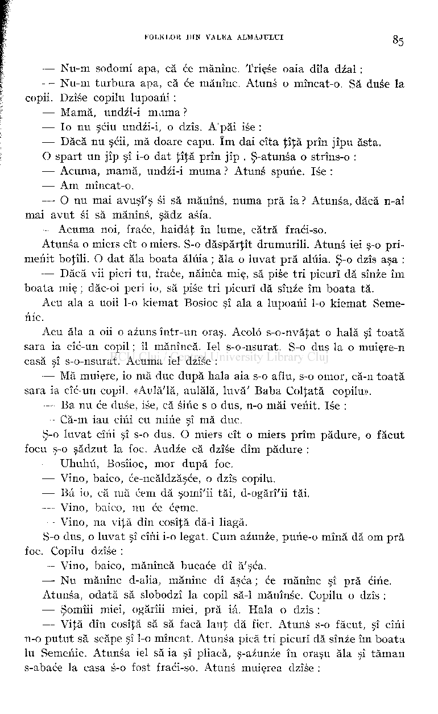

— Nu-m sodomi apa, că ce mănînc. Triese oaia dîla dzal :

— Nu-m turbura apa, că ce mănînc. Atuns o mîncat-o. Să duse la copii. Dzîse copilu lupoani :

— Mamă, undzi-i mama ?

— Io nu şciu undzi-i, o dzîs. A'păi ise :

— Dacă nu şeii, mă doare capu. î m dai cîta ţîţă prîn jîpu ăsta. O spart un jîp şî i-o dat ţîţă prîn jîp . Ş-atunsa o strîns-o :

— Acuma, mamă, undzi-i muma ? Atuns spune. Ise :

— Am mîncat-o.

— O nu mai avuşî'ş si să mănîns, numa pră ia ? Atunsa, dacă n-ai mai avut si să mănîns, şădz asia.

— Acuma noi, frace, haidâţ în lume, cătră fraci-so. Atunsa o miers cît o miers. S-o dăspărţît drumurili. Atuns iei ş-o pri­

menit boţîli. O dat ăla boata ăluia ; ăla o luvat pră ăluia. Ş-o dzîs aşa :

— Dacă vii pieri tu, frace, năinca mie, să pise tri picuri dă sînze îm boata mic ; dăc-oi peri io, să pise tri picuri dă sînze îm boata tă.

Acu ala a uoii l-o kiemat Bosioc şî ala a lupoani l-o kiemat Semeriie.

Acu ăla a oii o azuns într-un oraş. Acolo s-o-nvăţat o hală şî toată sara ia cîc-un copil ; îl mănîncă. Iei s-o-nsurat. S-o dus la o muiere-n casă şî s-o-nsurat. Acuma iei dzîse :

— Mă muiere, io mă duc după hala aia s-o aflu, s-o omor, că-n toată sara ia cîc-un copil. «Aulă'lă, aulălă, luvă' Baba Colţată copilu».

— Ba nu ce duse, ise, că sine s o dus, n-o măi venit. Ise :

— Că-m iau cîni cu mine şî mă duc. Ş-o luvat cîiîi şî s-o dus. O miers cît o miers prîm pădure, o făcut

focu ş-o şădzut la foc. Audze că dzîse dîm pădure :

— Uhuhu, Bosîioc, mor după foc.

— Vino, baico, ce-ncăldzăşce, o dzîs copilu.

— Bâ io, că mă cern dă şomî'ii tăi, d-ogărî'ii tăi.

— Vino, baico, nu ce cerne.

— Vino, na viţă dîn cosiţă dă-i liagă. S-o dus, o luvat şî cîni i-o legat. Cum azunze, pune-o mină dă om pră

foc. Copilu dzîse :

— Vino, baico, mănîncă bucace dî ă'şca.

— Nu mănînc d-alia, mănînc dî ăşca ; ce mănînc şî pră cine. Atunsa, odată să slobodzî la copil să-1 mănînse. Copilu o dzîs :

— Şomîii miei, ogărîii miei, pră iâ. Hala o dzîs :

— Viţă dîn cosiţă să să facă lanţ dă fier. Atuns s-o făcut, şî cîrii n-o putut să scape şî l-o mîncat. Atunsa pică tri picuri dă sînze îm boata Iu Semenic. Atunsa iei să ia şî pliac-ă, ş-azunze în oraşu ăla şî taman s-abace la casa s-o fost fraci-so. Atuns muierea dzîse :

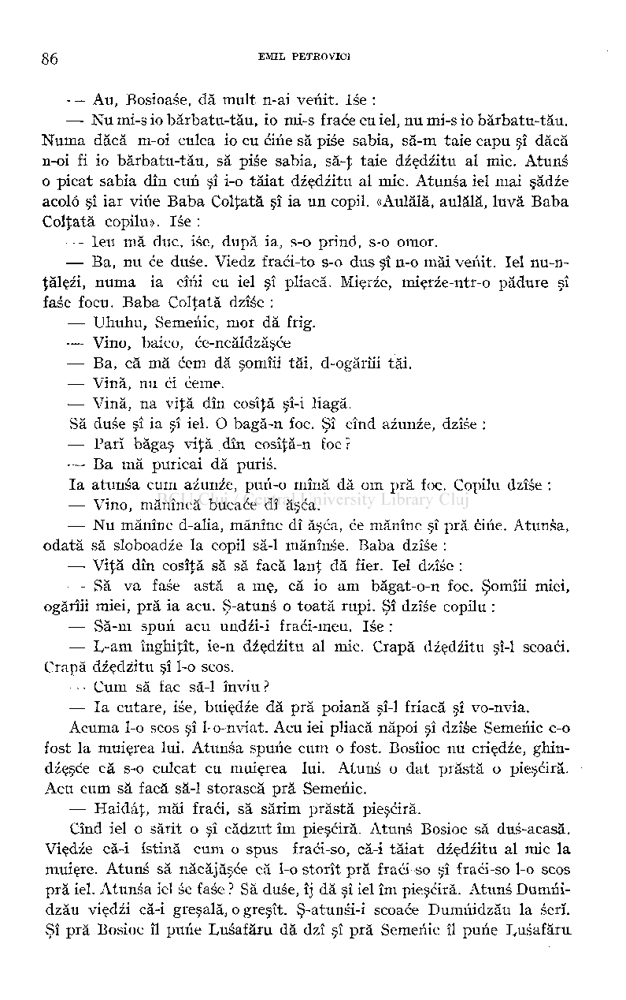

— Au, Bosioase, dă mult n-ai venit. Ise :

— Nu mi-s io bărbatu-tău, io mi-s frace cu iei, nu mi-s io bărbatu-tău. Numa dacă m-oi culca io cu cine să pise sabia, să-m taie capu şî dacă n-oi fi io bărbatu-tău, să pise sabia, să-ţ taie dzedzitu al mic. Atuns o picat sabia dîn cun şî i-o tăiat dzedzitu al mic. Atunsa iei mai şădze acolô şî iar vine Baba Colţată şî ia un copil. «Aulălă, aulălă, luvă Baba Colţată copilu». Ise :

— Ieu m ă duc, ise, după ia, s-o prind, s-o omor.

— Ba, nu ce duse. Viedz fraci-to s-o dus şî n-o măi venit. Iei nu-nţălezi, numa ia cîni cu iei şî pliacă. Mierze, mierze-ntr-o pădure şî fase focu. Baba Colţată dzîée :

— Uhuhu, Semenic, mor dă frig.

— Vino, baico, ce-ncăldzăşce

— Ba, că mă cern dă şomîii tăi, d-ogărîii tăi.

— Vină, nu ci cerne.

— Vină, na viţă dîn cosiţă şî-i liagă. Să duse şî ia şî iei. O bagă-n foc. Şî cînd azunze, dzîse :

— Pari băgaş viţă dîn cosîţă-n foc?

— Ba m ă puricai dă puris. Ia atunsa cum azunze, puri-o mînă dă om pră foc. Copilu dzîse :

— Vino, mănîncă bucace dî ăşca.

— N u mănînc d-alia, mănînc dî ăşca, ce mănînc şî pră cine. Atunsa, odată să sloboadze la copil să-1 mănînse. Baba dzîse :

— Viţă dîn cosîţă să să facă lanţ dă fier. Iei dzîse :

— Să va fase astă a me, că io a m băgat-o-n foc. Şomîii miei, ogărîii miei, pră ia acu. Ş-atuns o toată rupi. Şî dzîse copilu :

— Să-m spun acu undzi-i fraci-meu. Ise :

— L-am înghiţit, ie-n dzedzitu al mic. Crapă dzedzitu şî-1 scoaci. Crapă dzedzitu şî l-o scos.

— Cum să fac să-1 înviu ?

— Ia cutare, ise, buiedze dă pră poiană şî-1 friacă şî vo-nvia. Acuma l-o scos şî 1-o-nviat. Acu iei pliacă năpoi şî dzîse Semenic c-o fost la muierea lui. Atunsa spune cum o fost. Bosîioc nu criedze, ghindzeşce că s-o culcat cu muierea lui. Atuns o dat prăstă o pieşciră. Acu cum să facă să-1 storască pr ă Semenic.

— Haidâţ, măi fraci, să sărim prăstă pieşciră. Cînd iei o sărit o şî cădzut îm pieşciră. Atuns Bosioc să dus-acasă.

Viedze că-i istină cum o spus fraci-so, că-i tăiat dzedzitu al mic la muiere. Atuns să năcăjăşce că l-o storît pră fraci-so şî fraci-so l-o scos pră iei. Atunsa iei se fase ? Să duse, îj dă şî iei îm pieşciră. Atuns Dumnidzău viedzi că-i greşală, o greşît. Ş-atunsi-i scoace Dumriidzău la serî. Şî pră Bosioc îl puiie Lusafăru dă dzî şî pră Semenic îl pune Lusafăru

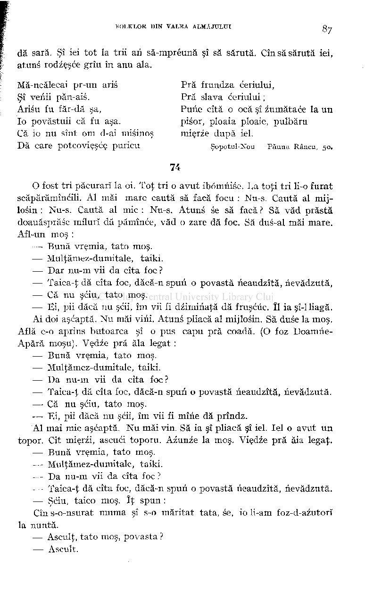

dă sară. Şî iei tot la trii ari să-mpreună şî să sărută. Cîn să sărută iei, atuns rodzeşce grîu în anu ala.

Mă-ncălecai pr-un aris Şî venii păn-ais. Arisu fu făr-dă şa, Io povăstuii că fu aşa. Că io nu sînt om d-ai misinoş Dă care potcovieşce puricu

Pră frundză ceriului, Pră slava ceriului ; Purie cîtă o ocă şî zumătace la un piéor, ploaia ploaie, pulbăru mierze după iei.

Şopotul-Nou — Păuna Râncu, 50.

74

O fost tri păcurari la oi. Toţ tri o avut ibomriise. La toţi tri li-o furat scăpărămîncili. Al măi mare caută să facă focu : Nu-s. Caută al mijlosin : Nu-s. Caută al mic : Nu-s. Atuns se să facă ? Să văd prăstă doauăsprăse miruri dă pămînce, văd o zare dă foc. Să dus-al măi mare. Afl-un moş :

— Bună vremia, tato moş.

— Mulţămez-dumitale, taiki. — Dar nu-m vii da cîta foc ? — Taica-ţ dă cîta foc, dăcă-n spun o povastă rieaudzîtă, rievădzută,

— Că nu şciu, tato moş.

— Ei, pii dacă nu şeii, îm vii fi dzimiriaţă dă fruşcuc. îl ia şî-lliagă. Ai doi aşcaptă. Nu măi vini. Atuns pliacă al mijlosin. Să duée la moş.

Află c-o aprins butoarca şî o pus capu pră coadă. (O foz DoamrieApără moşu). Vedze pră ăla legat :

— Bună vremia, tato moş.

— Mulţămez-dumitale, taiki.

— Da nu-m vii da cîta foc?

— Taica-ţ dă cîta foc, dăcă-n spun o povastă rieaudzîtă, rievădzută.

— Că nu şciu, tato moş.

—• Ei, pii dacă nu şeii, îm vii fi mîrie dă prîndz. Al mai mic aşcaptă. Nu măi vin. Să ia şî pliacă şî iei. Iei o avut un

topor. Cît mierzi, ascuci toporu. Azunze la moş. Viedze pră ăia legat.

— Bună vremia, tato moş.

— Mulţămez-dumitale, taiki.

— Da nu-m vii da cîta foc ?

— Taica-ţ dă cîta foc, dăcă-n spun o povastă rieaudzîtă, rievădzută.

— Şciu, taico moş. î ţ spun : Cîn s-o-nsurat muma şî s-o măritat tata, se, io li-am foz-d-azutorî

la nuntă.

— Ascult, tato moş, povastă ?

— Ascult.

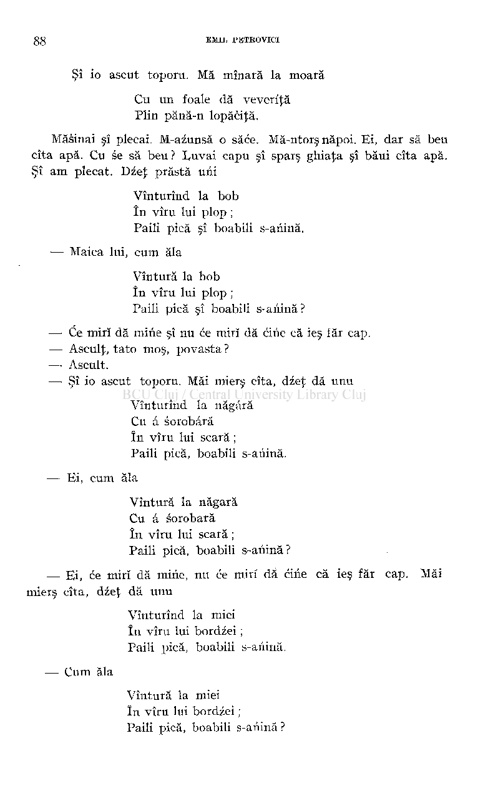

— Şî io ascut toporu. Mă mînară la moară

Cu un foaie dă veveriţă Plin pănă-n lopăciţă.

Măsinai şî plecai. M-azunsă o săce. Mă-ntorş năpoi. Ei, dar să beu cîta apă. Cu se să beu ? Luvai capu şî sparş ghiaţa şî băui cîta apă. Şî am plecat. Dzeţ prăstă uni

Vînturînd la bob în vîru lui plop ; Paili pică şî boabili s-anină.

•— Maica lui, cum ăla

Vîntură la bob î n vîru lui plop ; Paili pică şî boabili s-anină ?

— Ce miri dă mine şî nu ce miri dă cine că ieş făr cap.

— Ascult, tato moş, povasta ?

— Ascult.

— Şî io ascut toporu. Măi mierş cîta, dzeţ dă unu

Vînturînd la năgâră Cu a sorobâră î n vîru lui scară ; Paili pică, boabili s-anină.

— Ei, cum ăla

Vîntură la năgară Cu â eorobară î n vîru lui scară ; Paili pică, boabili s-anină?

— Ei, ce miri dă mine, nu ce miri dă cine că ieş făr cap. Măi mierş cîta, dzeţ dă unu

Vînturînd la miei î n vîru lui bordzei ; Paili pică, boabili s-anină.

— Cum ăla

Vîntură la miei în vîru lui bordzei ; Paili pică, boabili s-anină ?

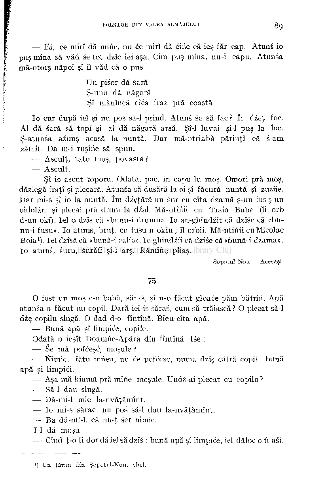

— Ei, ce miri dă tnirie, nu ce miri dă cine că ieş făr cap. Atuns io puş mina să văd se tot dzîc iei aşa. Cîm puş mina, nu-i capu. Atunsa mă-ntorş năpoi şî îl văd că o pus

Un pisor dă sară Ş-unu dă năgară Şî mănîncă cîca fraz pră coastă.

Io cur după iei şî nu pos să-1 prind. Atuns se să fac ? îi dzeţ foc. Al dă sară să topi şî al dă năgară arsă. Şî-1 luvai şî-1 puş la loc. Ş-atunsa azunş acasă la nuntă. Dar mă-ntriabă părinţi că s-am zătrit. Da m-i ruşine să spun.

— Ascult, tato moş, povasta ?

— Ascult.

— Şî io ascut toporu. Odată, poc, în capu lu moş. Omorî pră moş, dăzlegă fraţî şî plecară. Atunsa să dusără la oi şî făcură nuntă şî zuzîie. Dar mi-s şî io la nuntă. î m dzeţără un sur cu cîta dzamă ş-un fus ş-un oidolân şî plecai pră drum la dzal. Mă-ntînii cu Trăia Baba (îi orb d-un okî). Iei o dzîs că «bunu-i drumu». Io an-ghindzit că dzîse că «bunu-i fusu». Io atuns, bruţ, cu fusu n okiu ; îl orbii. Mă-ntînii cuMicolae Boia ). Iei dzîsăcă «bună-i calia».Io ghindzii că dzise că«bună-i dzama». Io atuns, suru, surăii şî-1 arş. Rămîrie pliaş.

Şopotul-Nou — Aceeaşi.

75

O fost un moş c-o babă, săras, şî n-o făcut gloace păm bătrîn. Apă atunsa o făcut un copil. Dară iei-is săras, cum să trăiască ? O plecat să-1 dze copilu slugă. O dad d-o fîntînă. Bieu cîta apă.

— Bună apă şî limpice, copile. Odată o ieşît Doamne-Apără dîn fîntînă. Ise :

— Se mă pof ceşc, moşule ?

•— Nimic, fătu mneu, nu ce pofcesc, numa dzîs cătră copil : bună apă şî limpici.

— Aşa mă kiamă pră mine, moşule. Undz-ai plecat cu copilu

5

— Să-1 dau slugă.

— Dă-mi-1 mie la-nvăţămînt.

— Io mi-s sărac, nu pos să-1 dau la-nvăţămînt.

— Ba dă-mi-1, că nu-ţ ser nimic. 1-1 dă moşu.

— Cînd ţ-o fi dor dă iei să dzîs : bună apă şî limpice, iei dăloc o fi asi.

') Un ţăran din Şopotul-Nou, chel.

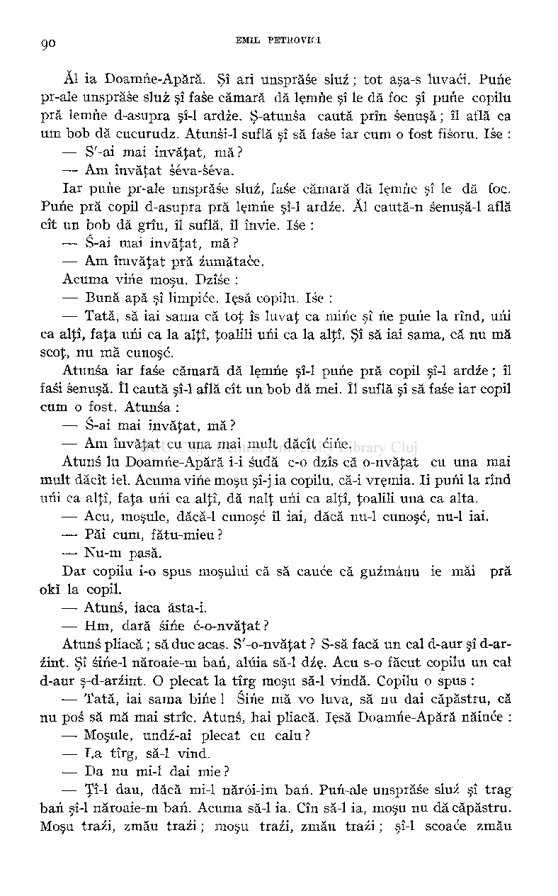

Ăl ia Doamne-Apără. Şî ari unsprăse sluz ; tot aşa-s luvaci. Pune pr-ale unsprăse sluz şî fase cămară dă lemne şî le dă foc şî pune copilu pră lemne d-asupra şî-1 ardze. Ş-atunsa caută prîn senuşă ; îl află ca u m bob dă cucurudz. Atunsi-1 suflă şî să fase iar cum o fost fisoru. Ise :

— S'-ai mai învăţat, mă ?

— A m învăţat séva-séva. Iar pune pr-ale unsprăse sluz, fase cămară dă lemne şî le dă foc.

Pune pră copil d-asupra pră lemne şî-1 ardze. Ăl caută-n senuşă-1 află cît u n bob dă grîu, îl suflă, îl învie. Ise :

— S-ai mai învăţat, mă ?

— A m îmvăţat pră zumătace. Acuma vine moşu. Dzîse :

— Bună apă şî limpice. lesă copilu. Ise :

— Tată, să iai sama că to ţ îs luvaţ ca mine şî ne pune la rînd, uni ca alţî, faţa uni ca la alţî, ţoalili uni ca la alţî. Şî să iai sama, că n u m ă scoţ, n u m ă cunosc.

Atunsa iar fase cămară d ă lemne şî-1 pune pră copil şî-1 ardze ; îl faéi senuşă. îl caută şî-1 află cît u n bob dă mei. îl suflă şî să fase iar copil cum o fost. Atunsa :

— S-ai mai invăţat, mă ?

— A m învăţat cu una mai mult dăcît cine. Atuns lu Doamrie-Apără i-i suda c-o dzîs că o-nvăţat cu una mai

mult dăcît iei. Acuma vine moşu şî-j ia copilu, că-i vremia. Ii puni la rînd uni ca alţî, faţa uni ca alţî, dă nalţ uni ca alţî, ţoalili un a ca alta.

— Acu, moşule, dăcă-1 cunosc îl iai, dacă nu-1 cunosc, nu-1 iai.

—- Păi cum, fătu-mieu ?

— Nu-m pasă. Dar copilu i-o spus moşului că să cauce că guzmânu ie măi pr ă

okî la copil.

—• Atuns, iaca ăsta-i.

— Hm , dară sine c-o-nvăţat ? Atuné pliacă ; să duc acas. S'-o-nvăţat ? S-să facă u n cal d-aur şî d-ar-

zint. Şî sine-1 năroaie-m ban, ăluia să-1 dze. Acu s-o făcut copilu u n cal d-aur ş-d-arzint. O plecat la tîrg moşu să-1 vindă. Copilu o spus :

— Tată, iai sama bine ! éine m ă vo luva, să n u dai căpăstru, că nu pos să mă mai strîc. Atuné, hai pliacă. lesă Doamrie-Apără năince :

—- Moşule, undz-ai plecat cu calu ?

— I^a tîrg, să-1 vind.

— Da n u mi-1 dai mie ?

— Ţî-1 dau, dacă mi-1 năroi-im ban. Pun-ale unsprăse sluz şî trag ban şî-1 năroaie-m ban. Acuma să-1 ia. Cîn să-1 ia, moşu n u dă căpăstru. Moşu trazi, zmău trazi ; moşu trazi, zmău trazi ; şî-1 scoace zmău

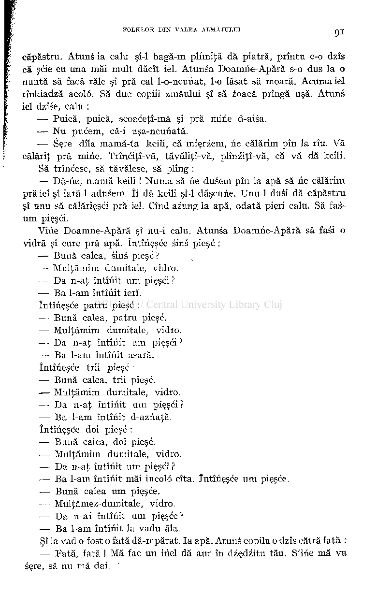

căpăstru. Atuns ia calu şî-1 bagă-m plimiţă dă piatră, prîntu c-o dzîs că şcie cu una măi mult dăcît iei. Atunsa Doamne-Apără s-o dus la o nuntă să facă răle şî pră cal 1-o-ncunat, l-o lăsat să moară. Acuma iei rînkiadză acolo. Să duc copiii zmăului şî să zoacă prîngâ uşă. Atuns iei dzîse, calu :

— Puică, puică, scoaceţî-mă şî pră mine d-aisa.

— Nu pucem, că-i uşa-ncunată.

— Sere dîla mamă-ta keili, că mierzem, ne călărim pîn la rîu. Vă călărit pră mine. Trînciţî-vă, tăvăliţî-vă, plînziţî-vă, că vă dă keili.

Să trîncesc, să tăvălesc, să plîng :

— Dă-ne, mamă keili ! Numa să ne dusem pîn la apă să ne călărim pră iei şî iară-1 adusem. îi dă keili şî-1 dăşcune. Unu-1 dusi dă căpăstru şî unu să călărieşci pră iei. Cînd azung la apă, odată pieri calu. Să fas-

um piesei.

Vine Doamrie-Apără şî nu-i calu. Atunsa Doamne-Apără să faéi o vidră şî cure pră apă. întîiieşce sins pieşc :

— Bună calea, sins pieşc?

— Mulţămim dumitale, vidro.

— Da n-aţ întînit um piesei ?

— Ba l-am întînit ieri. întîrieşce patru pieşc : — Bună calea, patru pieşc.

— Mulţămim dumitale, vidro. — Da n-aţ întînit um piesei ? — Ba l-am întînit asarâ. întîrieşce trii pieşc :

— Bună calea, trii pieşc.

— Mulţămim dumitale, vidro.

— Da n-aţ întînit um piesei?

— Ba l-am întînit d-azriaţă. întîrieşde doi pieşc :

— Bună calea, doi pieşc.

— Mulţămim dumitale, vidro.

— Da n-aţ întînit um piesei ?

— Ba l-am întînit măi incolô cîta. întîrieşce u m pieşce.

— Bună calea um pieşce.

— Mulţâmez-dumitale, vidro.

— Da n-ai întînit um pieşce?

— Ba l-am întînit la vadu ăla. Şî la vad o fost o fată dă-mpărat. Ia apă. Atuns copilu o dzîs cătră fată : — Fată, fată ! Mă fac un inel dă aur în dzedzitu tău. S'irie mă va

sere, să nu mă dai. '

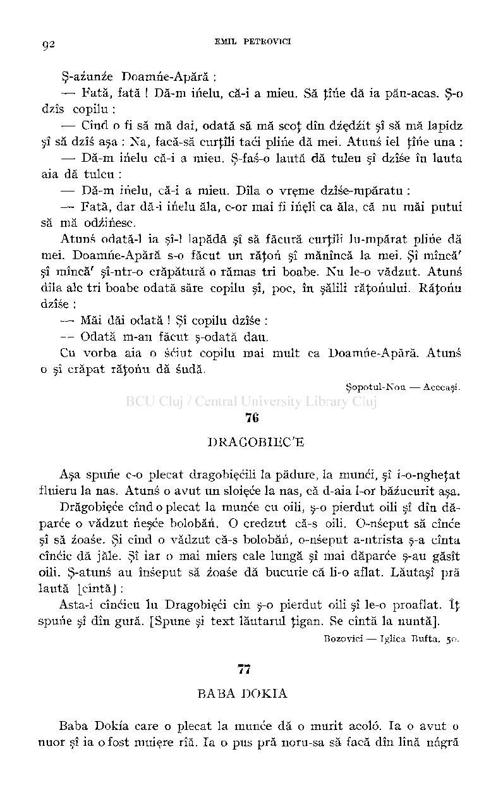

Ş-azunze Doamhe-Apără :

—• Fată, fată ! Dă-m inelu, că-i a mieu. Să ţîne dă ia păn-acas. Ş-o dzîs copilu :

- — Cînd o fi să mă dai, odată să mă scoţ dîn dzedzit şî să mă lapidz şî să dzîs aşa : Na, facă-să curţîli taci pline dă mei. Atuns iei ţîrie una :
- — Dă-m inelu că-i a mieu. Ş-fas-o lăută dă tuleu şî dzîse în lăuta aia dă tuleu :

— Dă-m inelu, că-i a mieu. Dîla o vreme dzîse-mpăratu :

— Fată, dar dă-i inelu ăla, c-or mai fi ineli ca ăla, că nu măi putui să mă odzinesc.

Atuns odată-1 ia şî-1 lapădă şî să făcură curţîli lu-mpărat pline dă mei. Doamne-Apără s-o făcut un răţon şî mănîncă la mei. Şî mîncă' şî mîncă' şî-ntr-o crăpătură o rămas tri boabe. Nu le-o vădzut. Atuns dîla ale tri boabe odată săre copilu şî, poc, în şălili răţonului. Răţoriu dzîse :

— Măi dăi odată ! Şî copilu dzîse : — Odată m-an făcut ş-odată dau. Cu vorba aia o sciut copilu mai mult ca Doamne-Apără. Atuns

o şî crăpat răţoriu dă sudă.

Şopotul-Nou — Aceeaşi.

76

DRAGOBIEC'E

Aşa spune c-o plecat dragobiecili la pădure, la munci, şî i-o-ngheţat fluieru la nas. Atuns o avut un sloiece la nas, că d-aia l-or băzucurit aşa.

Drăgobiece cînd o plecat la munce cu oili, ş-o pierdut oili şî dîn dăparce o vădzut rieşce bolobăn. O credzut că-s oili. O-nseput să cînce şî să zoase. Şi cînd o vădzut că-s bolobăn, o-nseput a-ntrista ş-a cînta cîncic dă jăle. Şî iar o mai miers cale lungă şî mai dăparce ş-au găsît oili. Ş-atuns au înseput să zoase dă bucurie că li-o aflat. Dăutaşî pră lăută [cîntă] :

Asta-i cîncicu lu Dragobieci cîn ş-o pierdut oili şî le-o proaflat. îţ spune şî dîn gură. [Spune şi text lăutarul ţigan. Se cîntă la nuntă].

Bozovici — Iglica Bufta, 50.

77

BABA DOKIA

Baba Dokia care o plecat la munce dă o murit acolô. Ia o avut o nuor şî ia o fost muiere rîă. Ia o pus pră noru-sa să facă dîn lină ndgră

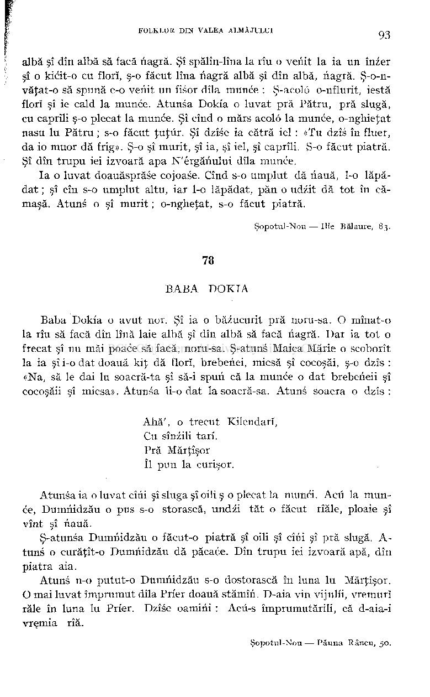

FOLKLOit DIN VALE A ALMAJULU I

albă şî dîn albă să facă iîagră. Şî spălîn-lîna la rîu o veiîit la ia un înzer şî o kicit-o cu flori, ş-o făcut lîna nagră albă şî dîn albă, nagră. Ş-o-nvăţat-o să spună c-o venit un fisor dîla munce : Ş-acolo o-nflurit, iestă flori şî ie cald la munce. Atunsa Dokia o luvat pră Patru, pră slugă, cu caprîli ş-o plecat la munce. Şî cînd o mars acolô la munce, o-nghieţat nasu Iu Patru ; s-o făcut ţuţur. Şî dzîse ia cătră iei : «Tu dzîs în fluer, da io muor dă frig». Ş-o şî murit, şî ia, şî iei, şî caprîli. S-o făcut piatră. Şî dîn trupu iei izvoară apa N'ergănului dîla munce.

Ia o luvat doauăsprăse cojoase. Cînd s-o umplut dă liauă, l-o lăpădat ; şî cîn s-o umplut altu, iar l-o lăpădat, păn o udzit dă tot în cămaşă. Atuns o şî murit ; o-ngheţat, s-o făcut piatră.

Şopotul-Nou — Ilie Bălaure, 83.

78

BABA DOKIA

Baba Dokia o avut nor. Şî ia o băzucurit pră noru-sa. O mînat-o la rîu să facă dîn lînă laie albă şî dîn albă să facă nagră. Dar ia tot o frecat şî nu măi poace să facă, noru-sa. Ş-atuns Maica Mărie o scoborît la ia şî i-o dat doauă kiţ dă flori, brebenei, micsă şî cocoşai, ş-o dzîs : «Na, să le dai lu soacră-ta şî să-i spun că la munce o dat brebeneii şî cocoşăii şî micsa». Atunsa li-o dat la soacră-sa. Atuns soacra o dzîs:

Ahă', o trecut Kilendari, Cu sînzili tari. Pră Mărţişor îl pun la curişor.

Atunsa ia o luvat cîni şî sluga şî oili ş o plecat la munci. Acu la munce, Dumnidzău o pus s-o storască, undzi tăt o făcut rîăle, ploaie şî vînt şî nauă.

Ş-atunsa Dumnidzău o făcut-o piatră şî oili şî cîni şî pră slugă. Atuns o curăţît-o Dumnidzău dă păcace. Dîn trupu iei izvoară apă, dîn piatra aia.

Atuns n-o putut-o Dumnidzău s-o dostorască în luna lu Mărţişor. O mai luvat împrumut dîla Prier doauă stămîri. D-aia vin vijulii, vremuri

- răle în luna lu Prier. Dzîse oamini : Acu-s împrumutărili, că d-aia-i vremia rîă.

Şopotul-Nou — Păuna Râncu, 50.

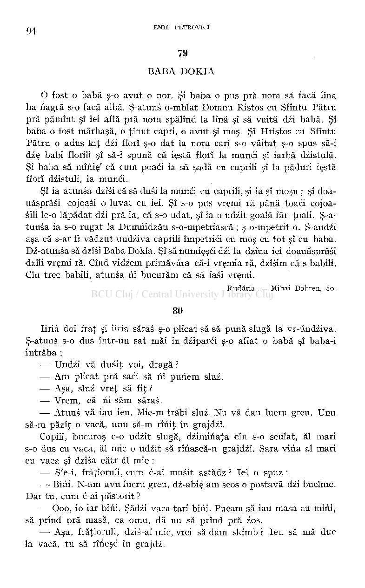

79

BABA DOKIA

O fost o babă ş-o avut o nor. Şî baba o pus pr ă nora să facă lîna ha riagră s-o facă albă. Ş-atuns o-mblat Domnu Ristos cu Sfîntu Patru pră pămînt şî iei află pră nora spălînd la lînă şî să vaită dzi babă. Şî baba o fost mărhaşă, o ţînut capri, o avut şî moş. Şî Hristos cu Sfîntu Patru o adus kiţ dzi flori ş-o dat la nora cari s-o văitat ş-o spus să-i dze babi florili şî să-i spună că iestă flori la munci şî iarbă dzistulă. Şî baba să mîhie' că cum poaci ia să şadă cu caprili şî la păduri iestă flori dzistuli, la munci.

Şî ia atunsa dzîsi că să dusi la munci cu caprili, şî ia şî moşu ; şî doauâsprăsi cojoasi o luvat cu iei. Şî s-o pus vremi ră pană toaci cojoasili le-o lăpădat dzi pră ia, că s-o udat, şî ia o udzit goală făr ţoali. Ş-atunsa ia s-o rugat la Dumhidzău s-o-mpetriască ; ş-o-mpetrit-o. S-audzi aşa că s-ar fi vădzut undziva caprili împetrici cu moş cu to t şî cu baba. Dz-atunéa să dzîéi Baba Dokia. Şî să numieşci dzi la dzîua iei doauăsprăsi dzîli vremi ră. Cînd vidzem primăvara că-i vremia ră, dzîsim că-s babili. Cîn trec babili, atunsa ni bucurăm că să fasi vremi.

Rudăria — Mihai Dobren, 80.

80

Iiriâ doi fraţ şî iiria sărae ş-o plicat să să pună slugă la vr-undziva. Ş-atuns s-o dus într-un sat măi in dziparci ş-o aflat o babă şî baba-i intrăba :

•— Undzi vă dusiţ voi, dragă ?

— A m plicat pr ă saci să ni punem sluz.

— Aşa, sluz vreţ să fiţ ?

— Vrem, că hi-săm săras.

— Atuné vă iau ieu. Mie-m trăbi sluz. N u vă da u lucru greu. Un u

- să-m păzîţ o vacă, un u să-m rîniţ în grajdzî. Copiii, bucuros c-o udzit slugă, dziminaţa cîn s-o sculat, ăl mari

s-o dus cu vaca, ăl mic o udzit să rîiîască-n grajdzî. Sara vina al mari cu vaca şî dzîéa cătr-ăl mic :

— S'e-i, frăţioruli, cum c-ai musit astădz ? Iei o spuz :

— Bini. N-am avu lucru greu, dz-abiç a m scos o postavă dzi bucliuc. Dar tu, cum c-ai păstorit ?

— Ooo, io iar bini. Şădzi vaca tari bini. Pucam să iau masa cu mini, să prînd pră masă, ca omu, d ă n u să prînd pr ă zos.

— Aşa, frăţioruli, dzîs-al mic, vrei să dăm skimb ? le u să m ă duela vacă, t u să rîneşc în grajdz.

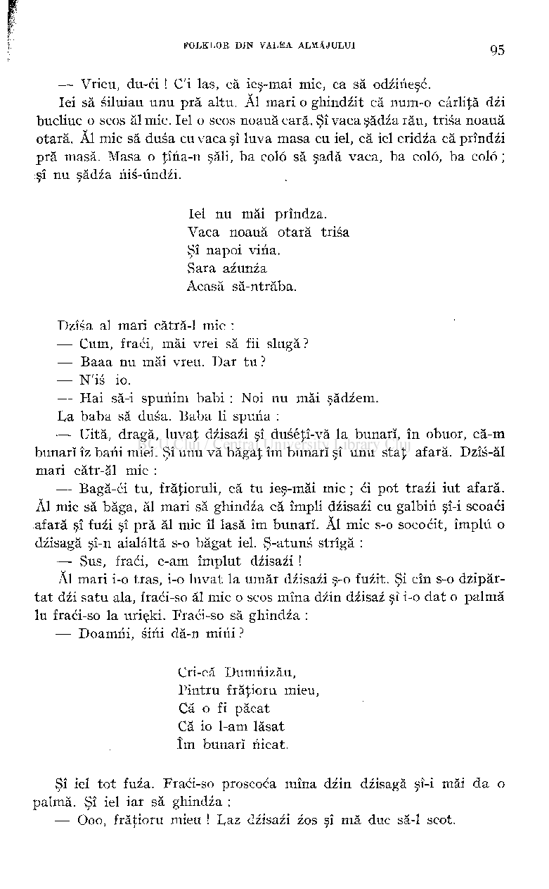

— Vrieu, du-ci ! C i las, că ieş-mai mic, ca să odzirieşc. Iei să siluiau unu pră altu. Ăl mari o ghindzit că num-o cârliţă dzi bucliuc o scos ăl mic. Iei o scos noauăcară. Şî vaca şădza rău, trişa noauă otară. Ăl mic să dusa cu vaca şî luva masa cu iei, că iei cridza căprîndzi pră masă. Masa o ţîna-n săli, ba colo să şadă vaca, ba colô, ba colo ; şî nu şădza riis-undzi.

Iei nu măi prîndza. Vaca noauă otară trişa Şî napoi vina. Sara azunza Acasă să-ntrăba.

Dzîsa al mari cătră-1 mic :

— Cum, fraci, măi vrei să fii slugă ?

— Baaa nu măi vreu. Dar tu?

— N'is io.

— Hai să-i spunim babi : Noi nu măi şădzem. Ua baba să dusa. Baba li spună :

— Uită, dragă, luvaţ dzisazi şî duseţî-vă la bunarî, în obuor, că-m bunarî îz bani miei. Şî unu vă băgat îm bunarî şî unu stat afară. Dzîs-ăl mari cătr-ăl mic :

— Bagă-ci tu, frăţioruli, că tu ieş-măi mic ; ci pot trazi iut afară. Ăl mic să băga, ăl mari să ghindza că împli dzisazi cu galbin şî-i scoaci afară şî fuzi şî pră ăl mic îl lasă îm bunarî. Ăl mic s-o sococit, împlû o dzisagă şî-n aialâltă s-o băgat iei. Ş-atuns strîgă :

— Sus, fraci, c-am împlut dzisazi ! Ăl mari i-o tras, i-o luvat la umăr dzisazi ş-o fuzit. Şi cîn s-o dzipăr-

tat dzi satu ala, fraci-so ăl mic o scos mîna dzin dzisaz şî i-o dat o palmă lu fraci-so la urieki. Fraci-so să ghindza :

— Doamrii, sini dă-n mini ?

Cri-că Dumnizău, Pintru frăţioru mieu, Că o fi păcat Că io l-am lăsat îm bunarî riicat.

Şî iei tot fuza. Fraci-so proscoca mîna dzin dzisagă şî-i măi da o palmă. Şî iei iar să ghindza :

— Ooo, frăţioru mieu ! Uaz dzisazi zos şî mă duc să-1 scot.

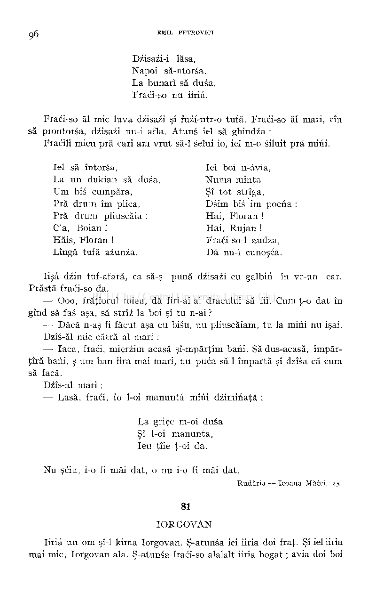

Dzisazi-i lăsa, Napoi să-ntorsa. La bunari să dusa, Fraci-so nu iiriâ.

Fraci-so ăl mic luva dzisazi şî fuzi-ntr-o tufă. Fraci-so ăl mari, cîn să prontorsa, dzisazi nu-i afla. Atuns iei să ghindza :

Fracili mieu pră cari am vrut să-1 selui io, iei m-o siluit pră mini.

Iei să întorsa, La un dukian să dusa, Um bis cumpăra, Pră drum îm plica, Pră drum pliuscăia : Ca , Boian ! Hăis, Floran ! Lingă tufă azunza.

Iei boi n-âvia, Numa minţa Şî tot striga, Dsim bis im poena Hai, Floran ! Hai, Ruj an ! Fraci-so-1 audza, Dă nu-1 cunosca.

Iişâ dzin tuf-afară, ca să-ş pună dzisazi cu galbiri în vr-un car. Prăstă fraci-so da.

— Ooo, frăţiorul mieu, dă firi-ai al dracului să fii. Cum ţ-o dat în gînd să fas aşa, să strîz la boi şî tu n-ai ?

— Dacă n-aş fi făcut aşa cu bisu, nu pliuscăiam, tu la mirii nu işai. Dzîs-ăl mic cătră al mari :

— Iaca, fraci, mierzim acasă şî-mpărţîm barii. Să dus-acasă, impartira barii, ş-um ban iira mai mari, nu puca să-1 împartă şî dzîsa că cum să facă.

Dzîs-al mari :

— Dasă, fraci, io l-oi manuntâ mîrii dzimiriaţă :

La griec m-oi dusa Şî l-oi manunta, leu ţîie ţ-oi da.

Nu şciu, i-o fi măi dat, o nu i-o fi măi dat.

Rudăria — Icoana Măcei, 25.

81

IORGOVAN

Iiriâ un om şî-1 kima Iorgovan. Ş-atunsa iei iiria doi fraţ. Şîieliiria mai mic, Iorgovan ala. Ş-atunsa fraci-so alalalt iiria bogat ; avia doi boi

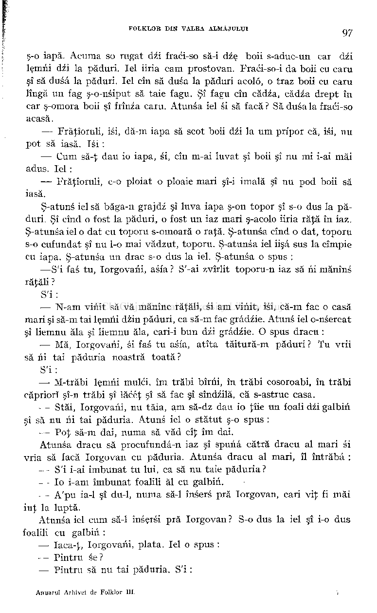

ş-o iapă. Acuma so rugat dzi fraci-so să-i dze boii s-aduc-un car dzi lemni dzi la păduri. Iei iiria cam prostovan. Fraci-so-i da boii cu caru şî să dusa la păduri. Iei cîn să dusa la păduri acolo, o traz boii cu caru lîngă un fag ş-o-nsiput să taie fagu. Şî fagu cîn cădza, cădza drept în car ş-omora boii şî frînza caru. Atunsa iei si să facă ? Să dusa la fraci-so acasă.

— Frăţîoruli, isi, dă-m iapa să scot boii dzi la um pripor că, isi, nu pot să iasă. Isi :

— Cum să-ţ dau io iapa, si, cîn m-ai luvat şî boii şî nu mi i-ai măi adus. Iei :

— Frăţîoruli, c-o ploiat o ploaie mari şî-i imală şî nu pod boii să iasă.

Ş-atuns iei să băga-n grajdz şî luva iapa ş-on topor şî s-o dus la păduri. Şî cînd o fost la păduri, o fost un iaz mari ş-acolo iiria răţă în iaz. Ş-atunsa iei o dat cu toporu s-omoară o raţă. Ş-atunsa cînd o dat, toporu s-o cufundat şî nu l-o mai vădzut, toporu. Ş-atunsa iei iişâ sus la cîmpie cu iapa. Ş-atunsa un drac s-o dus la iei. Ş-atunsa o spus :

—S'i fas tu, Iorgovani, asia ? S'-ai zvîrlit toporu-n iaz să ni mănîns

- răţăli ? S'i :

— N-am vinit să vă mănînc răţăli, éi am vinit, isi, că-m fac o casă mari şî să-m tai lemrii dzin păduri, ca să-m fac grâdzie. Atuns iei o-nsercat şî liemnu ăla şî liemnu ăla, cari-i bun dzi grâdzie. O spus dracu :

— Mă, Iorgovani, si fas tu asia, atîta tăitură-m păduri ? Tu vrii

- să ni tai păduria noastră toată? S'i :

— M-trăbi lemrii muici, îm trăbi bîrfii, în trăbi cosoroabi, în trăbi căpriori şî-n trăbi şî lăceţ şî să fac şî sîndzilă, că s-astruc casa.

— Stăi, Iorgovani, nu tăia, am să-dz dau io ţîie un foali dzi galbin şî să nu ni tai păduria. Atuns iei o stătut ş-o spus :

— Poţ să-m dai, numa să văd cîţ îm dai. Atunsa dracu să procufundâ-n iaz şî spunâ cătră dracu al mari si

vria să facă Iorgovan cu păduria. Atunsa dracu al mari, îl întrăbâ :

— S'i i-ai îmbunat tu lui, ca să nu taie păduria ?

— Io i-am îmbunat foalili ăl cu galbin.

— A'pu ia-1 şî du-1, numa să-1 însers pră Iorgovan, cari viţ fi măi iuţ la luptă.

Atunsa iei cum să-1 însersi pră Iorgovan ? S-o dus la iei şî i-o dus foalili cu galbin :

— Iaca-ţ, Iorgovani, plata. Iei o spus :

— Pintru se ?

— Pintru să nu tai păduria. S'i :

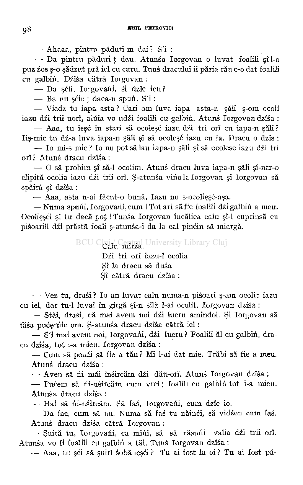

—• Ahaaa, pintru păduri-m dai? S'i :

— D a pintru păduri-ţ dau. Atunsa Iorgovan o luvat foalili şîl-o puz zos ş-o şădzut pră iei cu curu. Tuns dracului ii paria rău c-o dat foalili cu galbin. Dzîéa cătră Iorgovan :

— D a şeii, Iorgovani, si dzîc ieu?

— Ba n u şciu ; daca-n spun. S'i :

— Viedz t u iapa asta ? Cari om luva iapa asta-n săli ş-om ocoli iazu dzi trii uorî, ăluia vo udzi foalili cu galbin. Atuns Iorgovan dzîéa : -— Aaa, t u ieşc în stări să ocolesc iazu dzi tri orï cu iapa-n săli ? Iiş-mic t u dz-a luva iapa-n săli şî să ocolesc iazu cu ia. Dracu o dzîs :

-— Io mi-s mic ? Io nu pot să iau iapa-n săli şî să ocolesc iazu dzi tr orï ? Atuns dracu dzîéa :

— O să probim şî să-1 ocolim. Atuné dracu luva iapa-n săli şî-ntr-o clipită ocolia iazu dzi trii orï. Ş-atunea vina la Iorgovan şî Iorgovan să spăirâ şî dzîsa :

— Aaa, asta n-ai făcut-o bună. Iazu nu s-ocolieşc-aşa.

—Num a spuni, Iorgovani, cum ! Tot ari să fie foalili dzi galbin a meu. Ocolieşci şî t u dacă poţ ! Tunéa Iorgovan încălica calu şî-1 cuprinsă cu piéoarili dzi prăstă foali ş-atunsa-i da la cal pincin să miargă.

Calu mirza. Dzi tri orï iazu-1 ocolia Şî la dracu să dusa Şî cătră dracu dzîsa :

•— Vez tu, drasi? Io an luvat calu numa-n piéoari ş-am ocolit iazu cu iei, dar tu-1 luvai in gîrgă şî-n sîlă l-ai ocolit. Iorgovan dzîsa :

— Stăi, draéi, că mai avem noi dzi lucru amîndoi. Şi Iorgovan să făea pucernic om. Ş-atunea dracu dzîéa cătră iei :

— S'i mai avem noi, Iorgovani, dzi lucru ? Foalili ăl cu galbin, dracu dzîéa, to t i-a mieu. Iorgovan dzîéa :

— Cu m să poaci să fie a tău ? Mi l-ai dat mie. Trăbi să fie a meu. Atuné dracu dzîsa :

— Aven să ni măi însircăm dzi dău-orî. Atuns Iorgovan dzîsa :

— Pucem să ni-nsircăm cum vrei ; foalili cu galbin to t i-a mieu. Atunsa dracu dzîsa :

— Ha i să ni-neircăm. Să faé, Iorgovani, cum dzîc io.

— D a fac, cum să nu. Numa să faé t u năinci, să vidzen cum faé. Atuné dracu dzîsa cătră Iorgovan :

— Şuiră tu, Iorgovani, ca mini, să să răsuni valia dzi trii orï. Atunéa vo fi foalili cu galbin a tăi. Tuné Iorgovan dzîsa :

— Aaa, t u şei să suiri eobăiieşci ? Tu ai fost la oi ? T u ai fost pă-

# ï

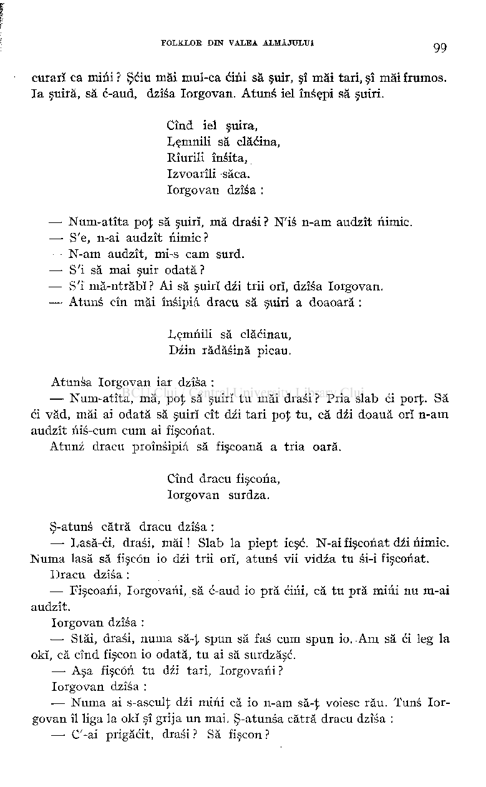

I FOLKLOR DIN VALEA ALMĂJULUI g g

cnrarï ca mini ? Şciu măi mul-ca cini să şuir, şî măi tari, şî măi frumos. Ia şuiră, să c-aud, dzîéa Iorgovan. Atuns iei înéçpi să suiri.

Cînd iei şuira, Lemnili să clăcina, Rîurili înéita, Izvoarîli saca. Iorgovan dzîsa :

—• Num-atîta poţ să şuirî, mă draéi ? N'ié n-am audzît nimic.

— S'e, n-ai audzît nimic ?

— N-am audzît, mi-s cam surd.

— S'i să mai şuir odată?

— S'i mă-ntrăbî? Ai să şuirî dzi trii orî, dzîéa Iorgovan.

— Atuns cîn măi însipiâ dracu să suiri a doaoară :

Lemnili să clăcinau, Dzin rădăsină picau.

Atunsa Iorgovan iar dzîsa :

— Num-atîta, mă, poţ să şuirî tu măi drasi ? Pria slab ci porţ. Să ci văd, măi ai odată să şuirî cît dzi tari poţ tu, că dzi doauă orî n-am audzît nié-cum cum ai fişcohat.

Atunz dracu proînsipiâ să fişcoană a tria oară.

Cînd dracu fişcona, Iorgovan surdza.

Ş-atune cătră dracu dzîéa :

— Lasă-ci, draéi, măi ! Slab la piept ieşc. N-ai fişcon at dzi nimic. Numa lasă să fişcon io dzi trii orî, atuné vii vidza tu éi-i fişconat.

Dracu dzîéa :

— Fişcoarii, Iorgovani, să c-aud io pră cini, că tu pră mini nu m-ai audzît.

Iorgovan dzîéa :

— Stăi, drasi, numa să-ţ spun să faé cum spun io. Am să ci leg la okî, că cînd fişcon io odată, tu ai să surdzăşc.

— Aşa fişcon tu dzi tari, Iorgovani ? Iorgovan dzîéa :

— Numa ai s-asculţ dzi mini că io n-am să-ţ voiesc rău. Tuns Iorgovan îl liga la okî şî grija un mai. Ş-atunea cătră dracu dzîsa :

— C'-ai prigăcit, drasi? Să fişcon?

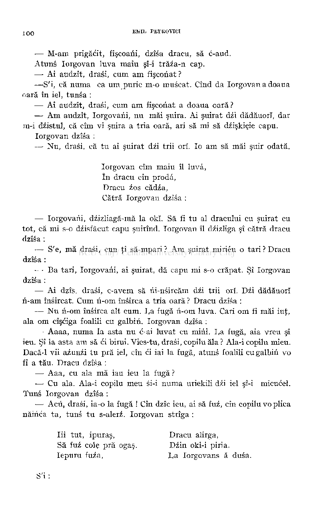

— M-am prigăcit, fişeoarii, dzîsa dracu, să c-aud. Atuns Iorgovan luva maiu şî-i trăza-n cap.

—- Ai audzît, drasi, cum am fişconat ?

—S'i, că numa ca um puric m-o muscat. Cînd da Iorgovan a doaua oară în iei, tunsa :

— Ai audzît, drasi, cum am fişconat a doaua oară?

— Am audzît, Iorgovani, nu măi şuira. Ai şuirat dzi dădăuorî, dar m-i dzistul, că cîm vi şuira a tria oară, ari să mi să dzişkieie capu.

Iorgovan dzîsa :

— Nu, drasi, că tu ai şuirat dzi trii ori. Io am să măi şuir odată.

Iorgovan cîm maiu îl luvâ, în dracu cîn prodâ, Dracu zos cădza, Cătră Iorgovan dzîsa :

— Iorgovani, dzizliagă-mă la okî. Să fi tu al dracului cu şuirat cu tot, că mi s-o dzisfăcut capu şuirînd. Iorgovan îl dzizliga şî cătră dracu dzîsa :

— S'e, mă drasi, cun ţî să-mpari ? Am şuirat miriéu o tari ? Dracu dzîsa :

— Ba tari, Iorgovani, ai şuirat, dă capu mi s-o crăpat. Şî Iorgovan

dzîéa :

— Ai dzîs, drasi, c-avem să ni-nsircăm dzi trii ori. Dzi dădăuorî ri-am însircat. Cum n-om însirca a tria oară ? Dracu dzîsa :

— N u n-om însirca alt cum. La fugă n-om luva. Cari om fi măi iuţ, ala om cîşciga foalili cu galbin. Iorgovan dzîsa :

— Aaaa, numa la asta nu c-ai luvat cu mini. La fugă, aia vreu şî ieu. Şî la asta am să ci birui. Vies-tu, drasi, copilu ăla ? Ala-i copilu mieu. Dacă-1 vii azunzi tu pră iei, cîn ci iai la fugă, atuns foalili cugalbih vo fi a tău. Dracu dzîsa :

— Aaa, cu ala mă iau ieu la fugă ?

•—• Cu ala. Ala-i copilu meu si-i numa uriekili dzi iei şî-i micucel. Tuns Iorgovan dzîsa :

— Acû, drasi, ia-o la fugă ! Cîn dzîc ieu, ai să fuz, cîn copilu vo plica năirica ta, tuns tu s-alerz. Iorgovan striga :

Iii tut, ipuraş, Să fuz cole pră ogaş. Iepuru fuza,

Dracu alirga, Dzin oki-i piria. La Iorgovans ă dusa.

S'i :

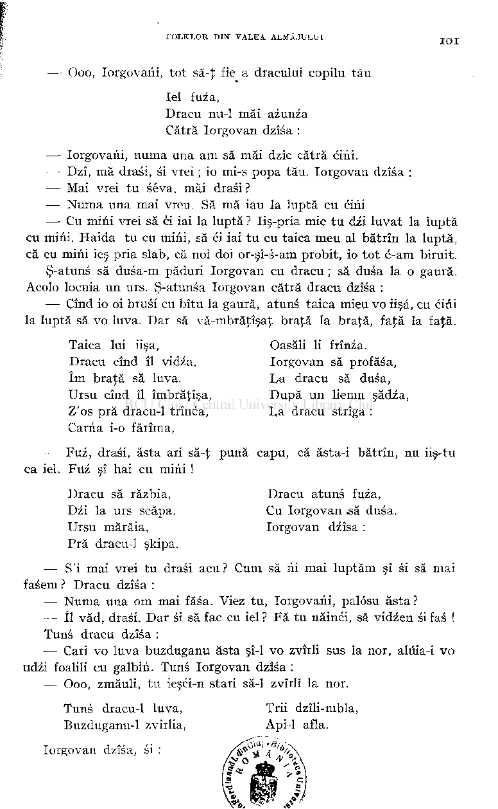

IO I

— Ooo, Iorgovani, tot să-ţ fie a dracului copilu tău.

Iei fuza, Dracu nu-1 măi azunza Cătră Iorgovan dzîsa :

— Iorgovani, numa una am să măi dzîc cătră cini.

— Dzî, mă drasi, si vrei ; io mi-s popa tău. Iorgovan dzîsa :

— Mai vrei tu séva, măi draéi ?

— Numa una mai vreu. Să mă iau la luptă cu cini

— Cu mini vrei să ci iai la luptă ? Iiş-pria mic tu dzi luvat la luptă cu mini. Haida tu cu mini, să ci iai tu cu taica meu al bătrîn la luptă, că cu mini ieş pria slab, că noi doi or-şî-s-am probit, io tot c-am biruit.

Ş-atuns să dusa-m păduri Iorgovan cu dracu ; să dusa la o gaură. Acolo locuia un urs. Ş-atunsa Iorgovan cătră dracu dzîéa :

— Cînd io oi brusi cu bîtu la gaură, atuné taica mieu vo iişâ, cu cini la luptă să vo luva. Dar să vă-mbrăţîşaţ braţă la braţă, faţă la faţă.

Taica lui iişa, Dracu cînd îl vidza, î m braţă să luva. Ursu cînd îl îmbrăţişa, Z'os pră dracu-1 trînca, Cania i-o fărîma,

Oasăli li frînza. Iorgovan să profăsa, Da dracu să dusa, După un liemn şădza, Da dracu striga :

Fuz, drasi, ăsta ari să-ţ pună capu, că ăsta-i bătrîn, nu iiş-tu ca iei. Fuz şî hai cu mini !

Dracu atuns fuza, Cu Iorgovan .să dusa. Iorgovan dzîsa :

Dracu să râzbia, Dzi la urs scăpa. Ursu mărăia, Pră dracu-1 şkipa.

— S'i mai vrei tu draéi acu ? Cum să iii mai luptăm şî éi să mai fasem ? Dracu dzîsa :

— Numa una om mai făea. Viez tu, Iorgovani, palôsu ăsta?

— îl văd, drasi. Dar éi să fac cu iei ? Fă tu năinci, să vidzen éi fas ! Tuns dracu dzîéa :

— Cari vo luva buzduganu ăsta şî-1 vo zvîrli sus la nor, aluia-i vo udzi foalili cu galbin. Tuné Iorgovan dzîéa :

— Ooo, zmăuli, tu ieşci-n stări să-1 zvîrlî la nor.

Trii dzîli-mbla, Api-1 afla.

Tuné dracu-1 luva, Buzduganu-1 zvîrlia,

Iorgovan dzîsa, si :

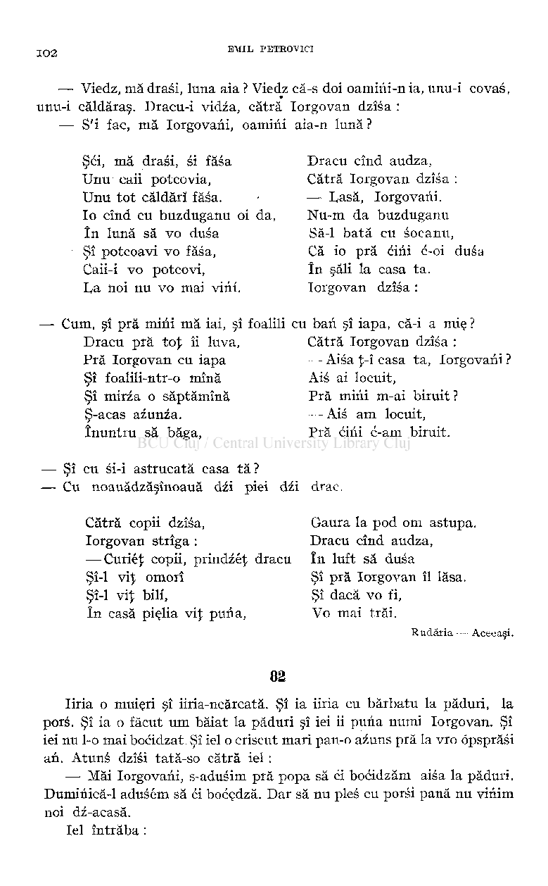

— Viedz, mă draéi, luna aia ? Viedz că-s doi oamirii-n ia, unu-i covas, unu-i căldăraş. Dracu-i vidza, cătră Iorgovan dzîéa :

— S'i fac, mă Iorgovani, oamini aia-n lună ?

Dracu cînd audza, Cătră Iorgovan dzîsa :

Şei, mă drasi, éi făsa Unu caii potcovia, Unu tot căldărî făea. Io cînd cu buzduganu oi da, î n lună să vo dusa Şî potcoavi vo făsa, Caii-i vo potcovi, I,a noi nu vo mai vini.

— Dasă, Iorgovani. Nu-m da buzduganu Să-1 bată cu éocanu, Că io pră cini c-oi dusa î n săli la casa ta. Iorgovan dzîsa :

ban şî iapa, că-i a mie ? Cătră Iorgovan dzîsa :

— Cum, şî pră mini mă iai, şî foalili Dracu pră toţ îi luva, Pră Iorgovan cu iapa Şî foalili-ntr-o mînă Şî mirza o săptămînă Ş-acas azunza. înuntru să băga,

— Aisa ţ-î casa ta, Iorgovani ? Ais ai locuit, Pră mini m-ai biruit?

— Aie am locuit, Pră cini c-am biruit.

— Şî cu si-i astrucată casa tă ?

— Cu noauădzăşînoauă dzi piei dzi drac.

Gaura la pod om astupa. Dracu cînd audza, î n luft să dusa Şî pră Iorgovan îl lăsa. Şî dacă vo fi, Vo mai trăi.

Cătră copii dzîsa, Iorgovan striga :

— Curieţ copii, prindzeţ dracu Şî-1 viţ omorî Şî-1 viţ bill, î n casă piçlia viţ puria,

Rudăria — Aceeaşi.

82

Iiria o muişri şî iiria-ncărcată. Şî ia iiria cu bărbatu la păduri, la poré. Şî ia o făcut u m băiat la păduri şî iei ii puna numi Iorgovan. Şî iei nu l-o mai bocidzat. Şî iei o criscut mari pan-o azuns pră la vro opsprăsi an. Atuné dzîsi tată-so cătră iei :

—• Măi Iorgovani, s-adusim pră popa să ci bocidzăm aisa la păduri. Duminică-1 adusém să ci bocedză. Dar să nu ples cu porsi pană nu vinim noi dz-acasă.

Iei întrăba :

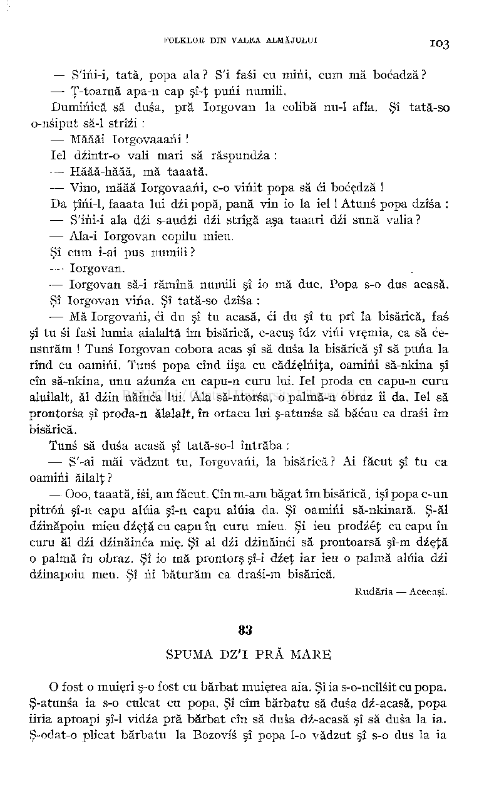

— S'irii-i, tată, popa ala ? S'i fasi cu mini, cum mă bocadză ?

— Ţ-toarnă apa-n cap şî-ţ puni numili. Duminică să dusa, pră Iorgovan la colibă nu-1 afla. Şî tată-so

o-nsiput să-1 strîzi :

— Măăăi Iorgovaaarii ! Iei dzintr-o vali mari să răspundza :

— Hăăă-hăăă, mă taaată.

— Vino, măăă Iorgovaani, c-o vinit popa să ci bocedză ! Da ţîni-1, faaata lui dzi popă, pană vin io la iei ! Atuns popa dzîsa :

— S'ini-i ala dzi s-audzi dzi strigă aşa taaari dzi sună valia ?

— Ala-i Iorgovan copilu mieu. Şî cum i-ai pus numili ?

— Iorgovan.

— Iorgovan să-i rămînă numili şî io mă duc. Popa s-o dus acasă. Şî Iorgovan vina. Şî tată-so dzîsa :

— Mă Iorgovani, ci du şî tu acasă, ci du şî tu prî la bisărică, fas şî tu si fasi lumia aialaltă îm bisărică, c-acuş îdz vini vremia, ca să censurăm ! Tuns Iorgovan cobora acas şî să dusa la bisărică şî să puria la rînd cu oamini. Tuns popa cînd iişa cu cădzelriiţa, oamini să-nkina şî cîn să-nkina, unu azunza cu capu-n curu lui. Iei proda cu capu-n curu aluilalt, ăl dzin năinca lui. Ala să-ntorsa, o palmă-n obraz îi da. Iei să prontorsa şî proda-n ălalalt, în ortacu lui ş-atunea să băcau ca drasi îm bisărică.

Tuns să dusa acasă şî tată-so-1 întrăba :

— S'-ai măi vădzut tu, Iorgovani, la bisărică? Ai făcut şî tu ca oamini ăilalţ?

— Ooo, taaată, isi, am făcut. Cîn m-am băgat îm bisărică, işî popa c-un pitrôn şî-n capu ăluia şî-n capu ăluia da. Şî oamini să-nkinară. Ş-ăl dzinăpoiu mieu dzeţă cu capu în curu mieu. Şi ieu prodzeţ cu capu în curu ăl dzi dzinăinca mie. Şî al dzi dzinăinci să prontoarsă şî-m dzeţă o palmă în obraz. Şî io mă prontorş şî-i dzeţ iar ieu o palmă ăluia dzi dzinăpoiu meu. Şî ni băturăm ca drasi-m bisărică.

Rudăria — Aceeaşi.

83

vSPUMA DZ'I PR Ă MAR E

O fost o muieri ş-o fost cu bărbat muierea aia. Şî ia s-o-ncîlsit cu popa. Ş-atunsa ia s-o culcat cu popa. Şî cîm bărbatu să dusa dz-acasă, popa iiria aproapi şî-1 vidza pră bărbat cîn să dusa dz-acasă şî să dusa la ia. Ş-odat-o plicat bărbatu la Bozovis şî popa l-o vădzut şî s-o dus la ia

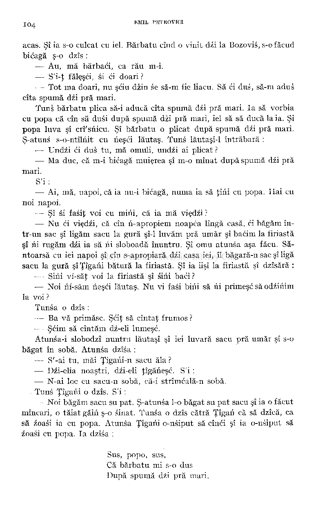

acas. Sî ia s-o culcat cu iei. Bărbatu cînd o vinit dzi la Bozovis, s-o făcud bicagă ş-o dzîs :

— Au, mă bărbaci, ca rău m-i.

— S'i-ţ făleşci, si ci doari ?

— Tot ma doari, nu şciu dzin se să-m fie liacu. Să ci dus, să-m adus cîta spumă dzi pră mari.

Tuns bărbatu plica să-i aducă cîta spumă dzi pră mari. Ia să vorbia cu popa că cîn să dusi după spumă dzi pră mari, iei să să ducă la ia. Şî popa luva şî crî'sriicu. Şî bărbatu o plicat după spumă dzi pră mari. Ş-atuns s-o-ntîlnit cu rieşci lăutaş. Tuns lăutaşî-1 întrăbară :

— Undzi ci dus tu, mă omuli, undzi ai plicat ?

— Ma duc, că m-i bicagă muierea şî m-o mînat după spumă dzi pră mari.

S'i :

— Ai, mă, napoi, că ia nu-i bicagă, numa ia să ţîrii cu popa. Hai cu noi napoi.

— Şî si fasiţ voi cu mini, că ia mă viedzi ?

— Nu ci viedzi, că cîn ri-apropiem noapca lîngă casă, ci băgăm într-un sac şî ligăm sacu la gură şî-1 luvăm pră umăr şî bacim la firiastă şî ni rugăm dzi ia să ni sloboadă înuntru. Şî omu atunsa aşa făcu. Săntoarsă cu iei napoi şî cîn s-apropiară dzi casa iei, îl băgară-n sac şî ligă sacu la gură şî Ţîgarii bătură la firiastă. Şî ia iişî la firiastă şî dzîsără :

— Sirii vi-săţ voi la firiastă şî sirii baci ?

— Noi rii-săm rieşci lăutaş. Nu vi fasi bini să rii primesc să odziriim la voi ?

Tunsa o dzîs :

— Ba vă primase. Şciţ să cîntaţ frumos ?

— Seim să cîntăm dz-eli lumesc. Atunéa-i slobodzî nuntru lăutaşî şî iei luvară sacu pră umăr şî s-o

băgat în sobă. Atunsa dzîsa :

— S'-ai tu, măi Ţîgarii-n sacu ăla ?

— Dzi-elia noaştri, dzi-eli ţîgărieşc. S'i :

— N-ai loc cu sacu-n sobă, că-i strîmcală-n sobă. Tuns Ţîgarii o dzîs. S'i :

— Noi băgăm sacu su pat. Ş-atunsa l-o băgat su pat sacu şî ia o făcut mîncari, o tăiat găiri ş-o sinat. Tunsa o dzîs cătră Ţîgari că să dzîcă, ca să zoasi ia cu popa. Atunsa Ţîgarii o-nsiput să cînci şî ia o-nsiput să zoasi cu popa. Ia dzîsa :

Sus, popo, sus, Că bărbatu mi s-o dus După spumă dzi pră mari,

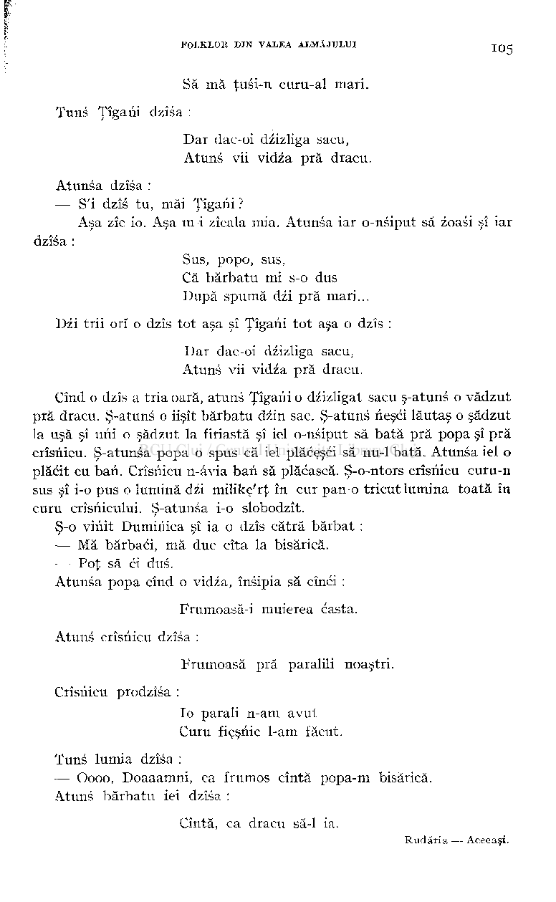

Să mă ţusi-n curu-al mari. Tuns Ţigani dzîsa :

Dar dac-oi dzizliga sacu, Atuns vii vidza pră dracu.

Atunsa dzîsa :

— S'i dzîs tu, măi Ţigării ?

— Aşa zîc io. Aşa m-i zicala mia. Atunsa iar o-nsiput să zoasi şî iar dzîsa :

Sus, popo, sus, Că bărbatu mi s-o dus După spumă dzi pră mari...

Dzi trii ori o dzîs tot aşa şî Ţigani tot aşa o dzîs :

Dar dac-oi dzizliga sacu, Atuns vii vidza pră dracu.

Cînd o dzîs a tria oară, atuns Ţîgaiii o dzizligat sacu ş-atuns o vădzut pră dracu. Ş-atuns o iişît bărbatu dzin sac. Ş-atuns neşci lăutaş o şădzut la uşă şî uni o şădzut la firiastă şî iei o-nsiput să bată pră popa şî pră crîsfiicu. Ş-atunsa popa o spus că iei plăceşci să nu-1 bată. Atunsa iei o plăcit cu ban. Crîsfiicu n-âvia ban să plăcască. Ş-o-ntors crîsriicu curu-n sus şî i-o pus o lumină dzi milike'rţ în cur pan-o tricut lumina toată în curu crîsnicului. Ş-atunsa i-o slobodzît.

Ş-o vinit Duminica şî ia o dzîs cătră bărbat :

— Mă bărbaci, mă duc cîta la bisărică.

— Poţ să ci dus. Atunsa popa cînd o vidza, însipia să cînci :

Frumoasă-i muierea casta. Atuns crîsfiicu dzîsa :

Frumoasă pră paralili noaştri. Crîsfiicu prodzîsa :

Io parali n-am avut Curu ficşnic l-am făcut.

Tuns lumia dzîsa :

— Oooo, Doaaamni, ca frumos cîntă popa-m bisărică. Atuns bărbatu iei dzîsa :

Cîntă, ca dracu să-1 ia.

Rudăria — Aceeaşi.

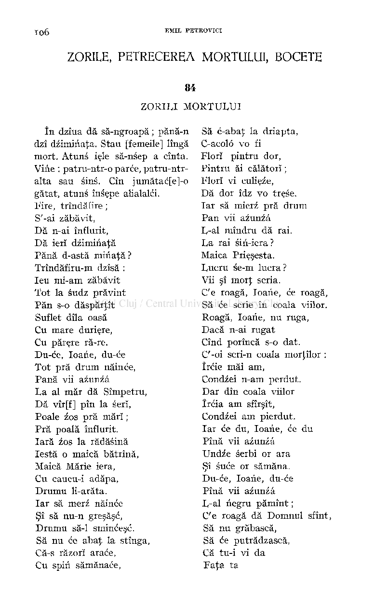

##### ZORILE, PETRECEREA MORTULUI, BOCETE

84

ZORILI MORTULUI

Să c-abaţ la driapta, C-acolô vo fi Flori pintru dor, Pintru ăi călători ; Flori vi culieze, Dă dor îdz vo trçse. Iar să mierz pră drum Pan vii azunzâ L-al mîndru dă rai. La rai sin-iera? Maica Prieşesta. Lucru se-m lucra ? Vii şî morţ scria. C e roagă, Ioane, ce roagă, Să ce scrie în coala viilor. Roagă, Ioane, nu ruga, Dacă n-ai rugat Cînd porîncă s-o dat. C-oi scri-n coala morţilor : îrcie măi am, Condiei n-am per dut. Dar dîn coala viilor îrcia am sfîrşît, Condzei am pierdut. Iar ce du, Ioane, ce du Pînă vii azunzâ Undze şerbi or ara Şî suée or sămăna. Du-ée, Ioane, du-ée Pînă vii azunzâ L-al negru pămînt ; C e roagă dă Domnul sfînt, Să nu grăbască, Să ée putrădzască, Că tu-i vi da Faţa ta

în dzîua dă să-ngroapă ; pănă-n dzî dziminaţa. Stau [femeile] lîngă mort. Atuns iele să-nsep a cînta. Vine : patru-ntr-o parée, patru-ntralta sau sins. Cîn jumătac[e]-o gătat, atuns însepe alialalci. Fire, trîndăfire ; S'-ai zăbăvit, Dă n-ai înflurit, Dă ieri dziminaţa Pană d-astă minată ? Trîndăfiru-m dzîsă : leu mi-am zăbăvit Tot la sudz prăvint Păn s-o dăspărţît Suflet dîla oasă Cu mare duriere, Cu părere ră-re. Du-ée, Ioane, du-ce Tot pră drum năince, Pană vii azunzâ La al măr dă Sîmpetru, Dă vîrff] pîn la seri, Poale zos pră mări ; Pră poală înflurit. Iară zos la rădăsină Iestă o maică bătrînă, Maică Mărie iera, Cu caucu-i adăpa, Drumu li-arăta. Iar să merz năince Şî să nu-n greşăşc, Drumu să-1 sminceşc. Să nu ce abat la stînga, Că-s răzori arace, Cu spin sămănace,

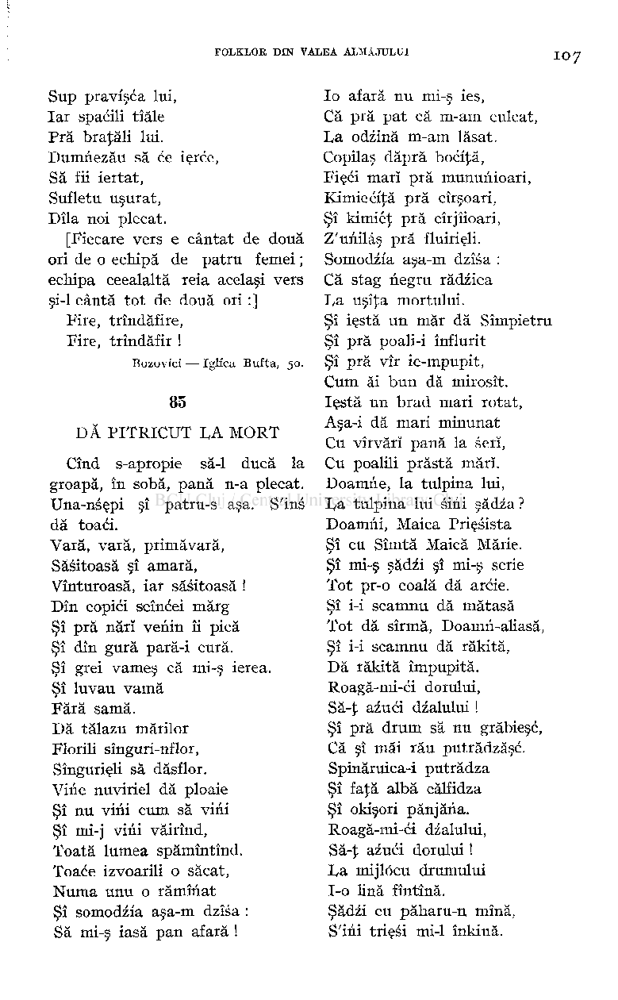

Io afară nu mi-ş ies, Că pră pat că m-am culcat, La odzină m-am lăsat. Copilaş dăpră bocită, Fişei mari pră mununioari, Kimieciţă pră cîrşoari, Şî kimieţ pră cîrjîioari, Z'unilâş pră fluirieli. Somodzia aşa-m dzîsa : Că stag negru rădzica La uşîţa mortului. Şî iestă un măr dă Sîmpietru Şî pră poali-i înflurit Şî pră vîr ie-mpupit, Cum ăi bun dă mirosît. Iestă un brad mari rotat, Aşa-i dă mari minunat Cu vîrvărî pană la seri, Cu poalili prăstă mări. Doamne, la tulpina lui, La tulpina lui sini şădza ? Doamiii, Maica Priesista Şî cu Sîmtă Maică Mărie. Şî mi-ş şădzi şî mi-ş scrie Tot pr-o coală dă arcie. Şî i-i scamnu dă mătasă Tot dă sîrmă, Doamn-aliasă, Şî i-i scamnu dă răkită, Dă răkită împupită. Roagă-mi-ci dorului, Să-ţ azuci dzalului ! Şî pră drum să nu grăbieşc, Că şî măi rău putrădzăşc. Spinăruica-i putrădza Şî faţă albă călfidza Şî okişori pănjătia. Roagă-mi-ci dzalului, Să-ţ azuci dorului ! La mijlocu drumului I-o lină fîntînă. Şădzi cu păharu-n mînă, S'ini trişsi mi-1 înkină.

Sup pravişca lui, Iar spacili tîăle Pră braţăli lui. Dumnezău să ce ierce, Să fii iertat, Sufletu uşurat, Dîla noi plecat.

[Fiecare vers e cântat de două ori de o echipă de patru femei ; echipa ceealaltă reia acelaşi vers şi-1 cântă tot de două ori :]

Fire, trîndăfire, Fire, trîndăfir !

Bozovici — Iglîca Bufta, 50.

85

D Ă PITRICUT LA MORT

Cînd s-apropie să-1 ducă la groapă, în sobă, pană n-a plecat. Una-néepi şî patru-s aşa. S'iné dă toaci.

Vară, vară, primăvară, Săsitoasă şî amară, Vînturoasă, iar săeitoasă ! Dîn copiei seîncei mărg Şî pră nări venin îi pică Şî dîn gură pară-i cură. Şî grei vameş că mi-ş ierea. Sî luvau vamă Fără samă. Dă tălazu mărilor Florili sînguri-nflor, Sîngurieli să dăsflor. Vine nuviriel dă ploaie Şî nu vini cum să vini Şî mi-j vini văirînd, Toată lumea spămîntînd. Toace izvoarili o săcat, Numa unu o rămînat Şî somodzia aşa-m dzîsa : Să mi-ş iasă pan afară !

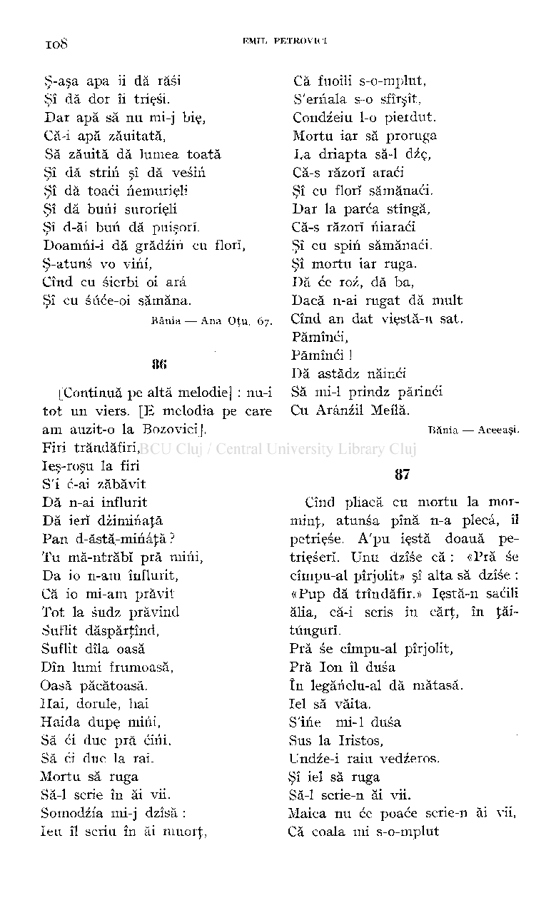

Ş-aşa apa ii dă răsi Şî dă dor îi triesi. Dar apă să nu mi-j bie, Că-i apă zăuitată, Să zăuită dă lumea toată Şî dă strin şî dă vesin Şî dă toaci riemurieli Şî dă buni surorieli Şî d-ăi bun dă puişori. Doamni-i dă grădziri cu flori, Ş-atuns vo vini, Cînd cu sierbi oi arâ Şî cu suce-oi sămăna.

Că fuoili s-o-mplut, S'erriala s-o sfîrşît, Condzeiu l-o pierdut. Mortu iar să proruga La driapta să-1 dze, Că-s răzori araci Şî cu flori sămănaci. Dar la parca stingă, Că-s răzori niaraci Şî cu spin sămănaci. Şî mortu iar ruga. Dă ce roz, dă ba, Dacă n-ai rugat dă mult Cînd an dat viestă-n sat. Pămînci, Pămînci ! Dă astădz năinci Să rni-1 prindz palinci Cu Arânzil Meilă.

Bănia — Ana Oţu, 67.

I Continuă pe altă melodie] : nu-i tot un viers. [E melodia pe care am auzit-o la BozoviciJ. Firi trandafiri, Ieş-roşu la firi S'i c-ai zăbăvit Dă n-ai influrit Dă ieri dzimiriaţă Pan d-ăstă-minâţă ? Tu mă-ntrăbî pră mini, Da io n-am înflurit, Că io mi-am prăvit Tot la sudz prăvind Suflit dăspărţînd, Suflit dîla oasă Dîn lumi frumoasă, Oasă păcătoasă. Hai, dorule, hai Haida dupe mirii, Să ci duc pră cirii, Să ci duc la rai. Mortu să ruga Să-1 scrie în ăi vii. Somodzia mi-j dzîsă : leu îl scriu în ăi muorţ,

Bănia — Aceeaşi.

87

Cînd pliacă cu mortu la mormi nţ, atunsa pînă n-a pleca, îl petriese. A'pu iestă doauă petrieserî. Unu dzîse că : «Pră se cîmpu-al pîrjolit» şî alta să dzîse : «Pup dă trîndăfir.» Iestă-n sacili alia, că-i scris în cărţ, în ţăitungurî.

Pră se cîmpu-al pîrjolit, Pră Ion îl dusa în legănelu-al dă mătasă. Iei să văita. S'ifie mi-1 dusa Sus la Iristos, Undze-i raiu vedzeros. Şî iei să ruga Să-1 scrie-n ăi vii. Maica nu ce poace scrie-n ăi vii, Că coala mi s-o-mplut

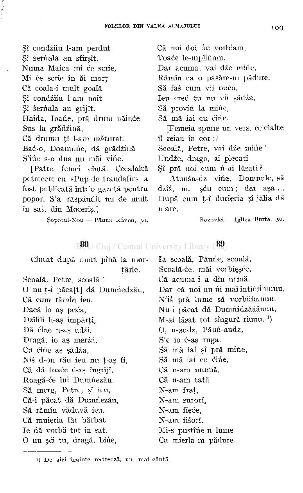

Că noi doi ne vorbiam, Toace le-mplinam. Dar acuma, vai dze mine,

Şî condziiu l-am perdut Şî sernala an sfîrşît. Numa Maica mi ce scrie, Mi ce scrie în ăi mort Că coala-i mult goală Şî condziiu l-am noit Şî sernala an grijît. Haida, Ioane, pră drum năince Sus la grădzină, Că drumu ţî l-am măturat. Bac-o, Doamnne, dă grădzină S'ine s-o dus nu măi vine.

- Rămîn ca o pasăre-m pădure.
- Să fas cum vii puca, leu cred tu nu vii şădza, Să provin la mine, Să mă iai cu cine.

[Femeia spune un vers, celelalte îl reiau în cor :] Scoală, Petre, vai dze mine ! Undze, drago, ai plecatî Şî pră noi cum n-ai lăsatî ?

[Patru femei cîntă. Ceealaltă petrecere cu «Pup de trandafir» a fost publicată într'o gazetă pentru popor. S'a răspândit nu de mult în sat, din Moceriş.]

Atunsa-dz vine, Domnule, să dzîs, nu şcu cum; dar aşa.... După cum ţ-î durieria şî jălia dă mare.

Bozovici — Igllca Bufta, 50.

Şopotul-Nou — Păuna Râncu, 50.

89

88

Ia scoală, Păune, scoală, Scoală-ce, măi vorbieşce, Că acuma-i a dîn urmă. Dar că noi nu ni mai întîriiimuuu, N'is pră lume să vorbiiimuuu. Nu-i păcat dă Dumnidzăăăuuu,

Cîntat după mort pînă la morţărie.

Scoală, Petre, scoală ! O nu ţ-î păca[t] dă Dumnedzău, Că cum rămîn ieu. Dacă io aş puca, Dzîlili li-aş împărţi, Dă cine n-aş udzi. Dragă, io aş merzâ, Cu cine aş şădza, Nis d-on rău ieu nu ţ-aş fi, Că dă toace c-aş îngriji. Roagă-ce lui Dumnezău, Să merg, Petre, şî ieu, Că-i păcat dă Dumnezău, Să rămîn văduvă ieu. Că muieria făr bărbat Ie dă vorbă tot în sat. O nu şei tu, dragă, bine,

- M-ai lăsat tot sîngură-riuuu.

1

)

O, n-audz, Păun-audz, S'e io c-aş ruga. Să mă iai şî pră mine, Să mă iai cu cine, Că n-am mumă, Că n-am tat ă

- N-am fraţ, N-am surori, N-am fiece, N-am fisori, Mi-s pustîne-n lume Ca mierla-m pădure.

') De aici înainte recitează, nu mai cântă.

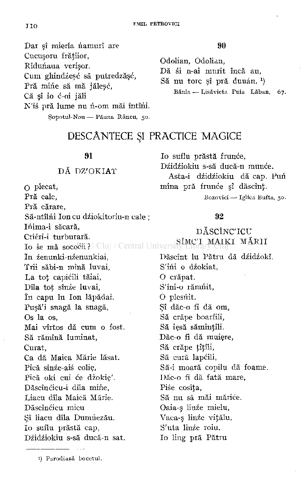

###### 11 0 EMIL PETR.0VICI

Dar şî mierla namurî are Cucuşoru frăţîior,

Odolian, Odolian, Dă si n-ai murit încă an, Să nu torc şî pră duuân.

- Rîdunaua verişor. Cum ghindzeşc să putredzăşc, Pră mine să mă jăleşc, Că şî io c-oi jăli N'is pră lume nu n-om măi întîni.

)

1

Bănia — Lisăvieta Puia Lăban,

Şopotul-Nou — Păuna Râncu, 50.

DESCÂNTECE SI PRACTICE MAGICE

91

Io suflu prăstă frunce, Dzidziokiu s-să ducă-n munce.

D Ă DZ'OKIAT

Asta-i dzidziokiu dă cap. Pun mîna pră frunce şî dăscînţ.

O plecat, Pră cale, Pră cărare, Să-ntîlni Ion cu dziokitoriu-n cale ; Iriima-i săcară, Criéri-i turburară. Io se mă sococii? î n zenunki-nzenunkiai, Trii săbi-n mînă luvai, Da toţ capicili tăiai, Dîla toţ sînze luvai, î n capu lu Ion lăpădai. Puşă'i snagă la snagă, Os la os, Mai vîrtos dă cum o fost. Să rămînă luminat, Curat, Ca dă Maica Mărie lăsat. Pică sînze-aié colie, Pică oki cui ce dzokie'. Dăscîncicu-i dîla mine, Diacu dîla Maică Mărie. Dăscîncicu mieu Şî liacu dîla Dumnezău. Io suflu prăstă cap, Dzidziokiu s-să ducă-n sat.

Bozovici — Iglica Bufta, 50.

92

DĂSCÎNCIC U SÎMC'I MAIKI MĂRI I

Dăscînt Iu Patru dă dzidzokî. S'ini o dzokiat, O crăpat. S'ini-o rămnit, O plesnit. Şî dăc-o fi dă om, Să crape boarfili, Să iesă sămînţîli. Dăc-o fi dă muiere, Să crape ţîţîli, Să cură lapcili, Să-i moară copilu dă foame. Dăc-o fi dă fată mare, Pise cosiţa, Să nu să măi mărice. Oaia-ş linze mielu, Vaca-ş linze viţălu, S'uta linze roiu.

Io ling pră Patru

!) Parodiază bocetul.

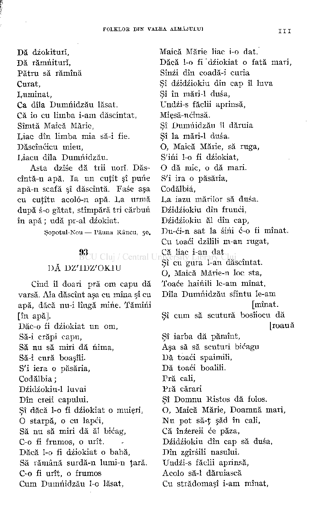

Maică Mărie liac i-o dat. Dacă l-o fi'dziokiat o fată mari, Sînzi dîn coadă-i curia Şî dzidziokiu dîn cap îl luva Şî în mări-1 dusa, Undii-s făclii aprinsă, Miesă-ncinsă. Şî Dumnidzău îl dăruia Şî la mări-1 dusa. O, Maică Mărie, să ruga, S'irii l-o fi dziokiat, O dă mic, o dă mari. S'i ira o păsăria, Codălbia, Da iazu mărilor să dusa. Dzidziokiu dîn frunci, Dzidziokiu ăl dîn cap Du-ci-n sat la sini c-o fi mînat. Cu toaci dzîlili m-an rugat, Că liac i-an dat Şî cu gura 1-an dăscîntat. O, Maică Mârie-n loc sta, Toace hainili le-am mînat, Dîla Dumnidzău sfîntu le-am

Dă dzoldturï, Dă rămfiiturî, Patru să rămînă Curat, Luminat, Ca dîla Dumnidzău lăsat. Că io cu limba i-am dăscîntat,

- Sîmtă Maică Mărie, Diac dîn limba mia să-i fie. Dăscîncicu mieu, Liacu dîla Dumnidzău.

Asta dzîse dă trii uorî. Dăscîntă-n apă. I a un cuţît şî pune apă-n scafă şî dăscîntă. Fase aşa cu cuţîtu acolô-n apă. Da urmă după s-o gătat, stîmpără tri cărbufi în apă ; udă pr-al diokiat.

Şopotul-Nou — Păuna Râncu, 50.

93

D Ă DZ'IDZ'OKIU

Cînd îl doari pră om capu dă varsă. Ala dăscînt aşa cu mîna şî cu apă, dacă nu-i lîngă mine. Tămîni [în apă].

[mînat. Şî cum să scutură bosîiocu dă [roau ă

Dăc-o fi dziokiat un om, Să-i crapi capu, Să nu să miri dă nima, Să-i cură boaşîli. S'i iera o păsăria, Codălbia ; Dzidzokiu-1 luvai Dîn creii capului. Şî dacă l-o fi dziokiat o muieri, O starpă, o cu lapci, Să n u să miri dă ăl bicag, C-o fi frumos, o urît. Dacă l-o fi dziokiat o babă, Să rămână surdă-n lumi-n ţară. C-o fi urît, o frumos Cum Dumnidzău l-o lăsat,

Şî iarba d ă pămînt, Aşa să să scuturi bicagu Dă toaci spaimili, Dă toaci boalili. Pră caii, Pră cărări Şî Domnu Ristos dă folos. O, Maică Mărie, Doamnă mari. N u pot să-ţ şăd în caii, Că înzereii ce păza, Dzidziokiu dîn cap să duéa, Dîn zgîrsili nasului. Undzi-s făclii aprinsă, Acolo să-1 dăruiască Cu strădomaşî i-am mînat,

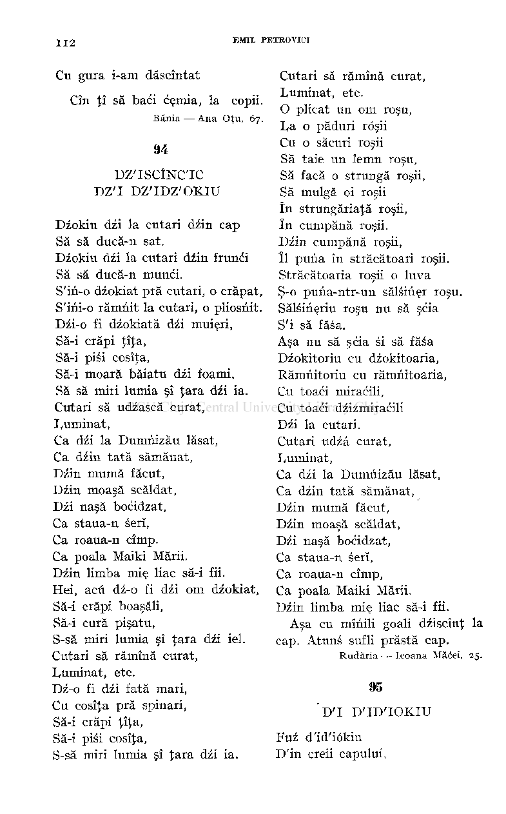

Cu gura i-am dăscîntat Cîn ţî sa baci cemia, la copii.

Cutări să rămînă curat, Luminat, etc. O plicat un om roşu, La o păduri roşii Cu o săcuri roşii Să taie un lemn roşu, Să facă o strungă roşii, Să mulgă oi roşii î n strungăriaţă roşii, î n cumpănă roşii. Dzin cumpănă roşii, îl puii a în străcătoari roşii. Străcătoaria roşii o luva Ş-o putia-ntr-un sălsiner roşu. Sălsineriu roşu nu să şcia S'i să făsa. Aşa nu să şcia si să făsa Dzokitoriu cu dzokitoaria, Rămriitoriu cu rămriitoaria, Cu toaci miracili, Cu toaci dzizmiracili Dzi la cutări. Cutări udzâ curat, Luminat, Ca dzi la Dumnizău lăsat, Ca dzin tată sămănat, Dzin mumă făcut, Dzin moaşă scăldat, Dzi naşă bocidzat, Ca staua-n seri, Ca roaua-n cîmp, Ca poala Maiki Mării. Dzin limba mie liac să-i fii.

Bănia — Ana Oţu, 67.

94

DZ'ISCÎNC'IC DZ'I DZ'IDZ'OKIU

Dzokiu dzi la cutări dzin cap Să să ducă-n sat. Dzokiu dzi la cutări dzin frunci Să să ducă-n munci. S'in-o dzokiat pră cutări, o crăpat, S'ini-o rămriit la cutări, o pliosnit. Dzi-o fi dzokiată dzi muieri,

Să-i crapi ţîţa,

Să-i pisi cosiţa, Să-i moară băiatu dzi foami, Să să miii lumia şî ţara dzi ia. Cutări să udzască curat, Luminat, Ca dzi la Dumnizău lăsat, Ca dzin tată sămănat, Dzin mumă făcut, Dzin moaşă scăldat, Dzi naşă bocidzat, Ca staua-n seri, Ca roaua-n cîmp. Ca poala Maiki Mării. Dzin limba mie liac să-i fii. Hei, acû dz-o fi dzi om dzokiat,

Să-i crapi boaşăli,

Să-i cură pişatu, S-să miri lumia şî ţara dzi iei. Cutări să rămînă curat, Duminat, etc. Dz-o fi dzi fată mari, Cu cosiţa pră spinări,

Aşa cu mînili goali dziscînţ la cap. Atuns sufli prăstă cap.

Rudăria —•- Icoana Măcei, 25.

95

D'I D'ID'IOKI U

Să-i crapi ţîţa,

Fuz d'id'iôkiu D'in creii capului,

Să-i pisi cosiţa, S-să miri lumia şî ţara dzi ia.

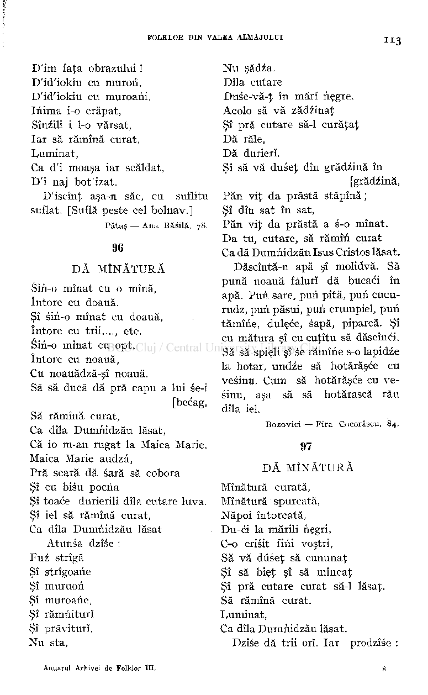

N u şădza. Dîla cutare Duse-vă-ţ în mări negre. Acolo să v ă zădzinaţ Şî pră cutare să-1 curăţat Dă răle, Dă durierî.

D'im faţa obrazului ! D'id'iokiu cu muron, D'id'iokiu cu muroani. Inima i-o crăpat, Sînzili i l-o vărsat, Iar să rămînă curat, Luminat, Ca d'i moaşa iar scăldat, D'i naj bot'izat.

Şî să vă dueeţ dîn grădzină în

[grădzină, Păn viţ da prăstă stăpînă ; Şî dîn sat în sat, Păn viţ da prăstă a s-o mînat. Da tu, cutare, să rămîn curat Ca dă Dumnidzău Isus Cristos lăsat.

D'iscînţ aşa-n săc, cu suflitu suflat. [Suflă peste cel bolnav.]

Pătaş — Ana Băeilă, 78.

96

Dăscîntă-n apă şî molidvă. Să pună noauă fâlurî dă bucaci în apă. Pun sare, pun pită, pun cucurudz, pun păsui, pun crumpiel, pu n tămîne, dulece, sapă, piparcă. Şî cu mătura şî cu cuţîtu să dăseînci. Să să spieli şî se rămîrie s-o lapidze la hotar, undze să hotărăşce cu vesinu. Cum să hotărăşce cu vesinu, aşa să să hotărască rău dîla iei.

DĂ MÎNĂTUR Ă

Sin-o minat cu o mînă, întorc cu doauă. Şî sin-o mînat cu doauă, întorc cu trii...., etc. Sin-o mînat cu opt, întorc cu noauă, Cu noauădză-şî noauă. Să să ducă dă pră capu a lui se-i

[becag,

Să rămînă curat, Ca dîla Dumnidzău lăsat, Că io m-an rugat la Maica Marie. Maica Marie audzâ, Pră scară dă sară să cobora Şî cu biéu poena Şî toace durierili dîla cutare luva. Şî iei să rămînă curat, Ca dîla Dumnidzău lăsat

Bozovici — Fira Cocorăscu, 84.

97

D Ă MÎNĂTUR Ă

Mînătură curată, Mînătură spurcată, Năpoi întorcată, Du-ci la mărili negri, C-o crisit fini voştri,

Atunsa dzîse : Fuz strigă Şî strîgoane Şî muruori Şî muroane, Şî rămniturî Şî prăviturî, Nu sta,

Să vă dueeţ să cununat

Şî să bieţ şî să mîncaţ Şî pră cutare curat să-1 lăsat. Să rămînă curat. Luminat, Ca dîla Dumnidzău lăsat.

Dzîse dă trii ori. Ia r prodzîse :

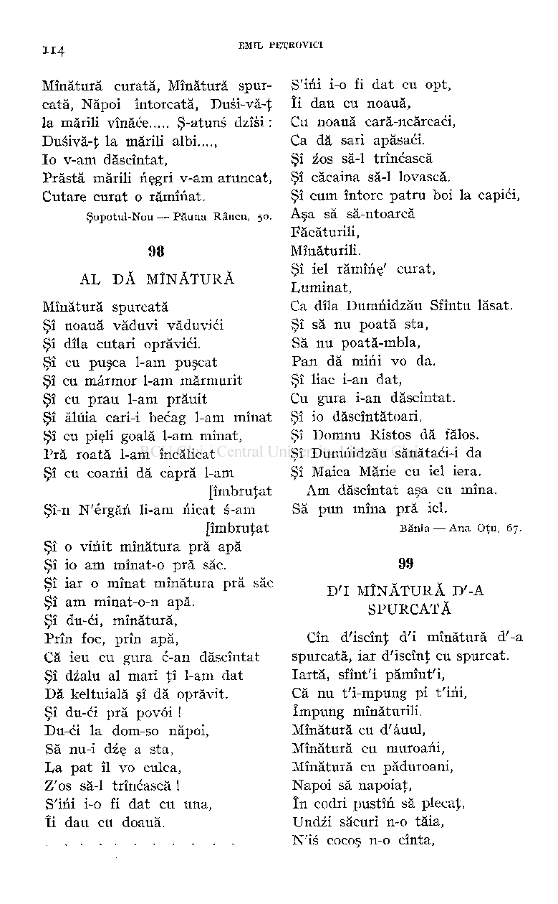

ii 4

S'ini i-o fi dat cu opt, îi dau cu noauă, Cu noauă cară-ncărcaci, Ca dă sari apăsaci. Şî zos să-1 trîncască Şî căcaina să-1 lovască. Şî cum întorc patru boi la capici, Aşa să să-ntoarcă Făcăturili, Mînăturili. Şî iei rămîrie' curat, Luminat, Ca dîla Dumnidzău Sfîntu lăsat. Şî să nu poată sta, Să nu poată-mbla, Pan dă mini vo da. Şî Hac i-an dat, Cu gura i-an dăscîntat. Şî io dăseîntătoari, Şî Domnu Ristos dă fălos. Şî Dumnidzău sănătaci-i da Şî Maica Mărie cu iei iera.

Mînătură curată, Mînătură spurcată, Năpoi întorcată, Dusi-vă-ţ la mărili vînăce Ş-atuns dzîsi : Dusivă-ţ la mărili albi...., Io v-am dăscîntat, Prăstă mărili negri v-am aruncat, Cutare curat o rămîriat.

Şopotul-Nou — Păuna Râncu, 50.

98

AL DĂ MÎNĂTUR Ă

Mînătură spurcată Şî noauă văduvi văduviei Şî dîla cutări oprăvici. Şî cu puşca l-am puşcat Şî cu marmor l-am mărmurit Şî cu prau l-am prăuit Şî ăluia cari-i becag l-am mînat Şî cu pieli goală l-am mînat, Pră roată l-am încălicat Şî cu coarrii dă capră l-am

Am dăscîntat aşa cu mîna. Să pun mîna pră iei.

[îmbruţat Şî-n N'ergăn li-am nicat s-am

[îmbruţat Şî o vin it mînătură pră apă Şî io am mînat-o pră săc. Şî iar o mînat mînătură pră săc Şî am mînat-o-n apă. Şî du-ci, mînătură, Prîn foc, prîn apă, Că ieu cu gura c-an dăscîntat Şî dzalu al mari ţî l-am dat Dă keltuială şî dă oprăvit. Şî du-ci pră povôi ! Du-ci la dom-so năpoi, Să nu-i dze a sta, La pat îl vo culca, Z'os să-1 trîncască ! S'ini i-o fi dat cu una, îi dau cu doauă.

Bănia — Ana Oţu, 67.

99

D'I MÎNĂTUR Ă D'-A SPURCATĂ

Cîn d'iscînţ d'i mînătură d'-a spurcată, iar d'iscînţ cu spurcat. Iartă, sfînt'i pămînt'i, Că nu t'i-mpung pi t'ini, împung mînăturili. Mînătură cu d'âuul, Mînătură cu muroani, Mînătură cu păduroani, Napoi să napoiaţ, î n codri pustîfi să plecat, Undzi săcuri n-o tăia, N'is cocoş n-o cînta,

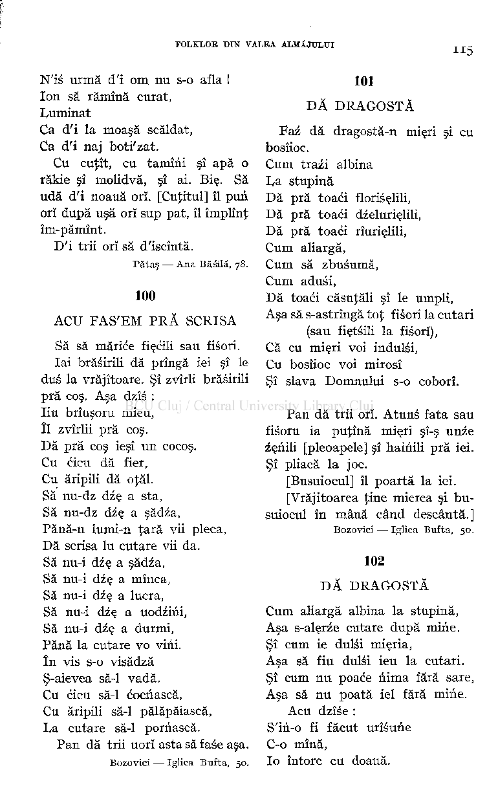

N'is urmă d'i om nu s-o afla ! Ion să rămînă curat, Luminat Ca d'i la moaşă scăldat, Ca d'i naj boti'zat.

101

D Ă DRAGOSTĂ

Faz dă dragostă-n mieri şi cu bosîioc. Cum trazi albina La stupină Dă pră toaci florieşlili, Dă pră toaci dzeluriçlili, Dă pră toaci rîurielili, Cum aliargă, Cum să zbusumă, Cum aduşi, Dă toaci căsuţăli şî le umpli, Aşa să s-astrîngă toţ fisori la cutări

Cu cuţît, cu tamîni şî apă o răkie şî molidvă, şî ai. Bie. Să udă d'i noauă orî. [Cuţitul] îl pun orî după uşă orî sup pat, îl împlînţ îm-pămînt.

D'i trii orî să d'iscîntă.

Pătaş — Ana Băsilă, 78.

100

ACU FAS'EM PR Ă SCRISA Să să mariée fiecili sau fisori. lai brăsirili dă prîngă iei şî le

(sau fietéili la fisori), Că cu mieri voi induléi, Cu bosîioc voi mirosî Şî slava Domnului s-o coborî.

dus la vrăjitoare. Şî zvîrli brăsirili pră coş. Aşa dzîs : Iiu brîuşoru mieu, îl zvîrlii pră coş. Dă pră coş ieşî un cocoş. Cu cicu dă fier, Cu ăripili dă oţăl. Să nu-dz dze a sta, Să nu-dz dze a şădza, Pănă-n lumi-n ţară vii pleca,

Pan dă trii orî. Atuné fata sau fisoru ia puţină mişri şî-ş uni e zenili [pleoapele] şî hainili pră iei. Şî pliacă la joc.

[Busuiocul] îl poartă la iei. [Vrăjitoarea ţine mierea şi bu­

suiocul în mână când descântă.]

Bozovici — Iglica Bufta, 50.

- Dă scrisa lu cutare vii da. Să nu-i dzç a şădza, Să nu-i dzç a mînca, Să nu-i dze a lucra, Să nu-i dzş a uodzini, Să nu-i dze a durmi, Pană la cutare vo vini. î n vis s-o visadză Ş-aievea să-1 vadă. Cu cicu să-1 cocnască, Cu ăripili să-1 pălăpăiască, La cutare să-1 pornască.

102

D Ă DRAGOSTĂ

Cum aliargă albina la stupină, Aşa s-alçrze cutare după mine. Şî cum ie duléi mieria, Aşa să fiu duléi ieu la cutări. Şî cum nu poace nima fără sare, Aşa să nu poată iei fără mine.

Acu dzîée : S'in-o fi făcut urîéune C-o mînă, Io întorc cu doauă.

Pan dă trii uorî asta să fase aşa.

Bozovici — Iglica Bufta, 50.

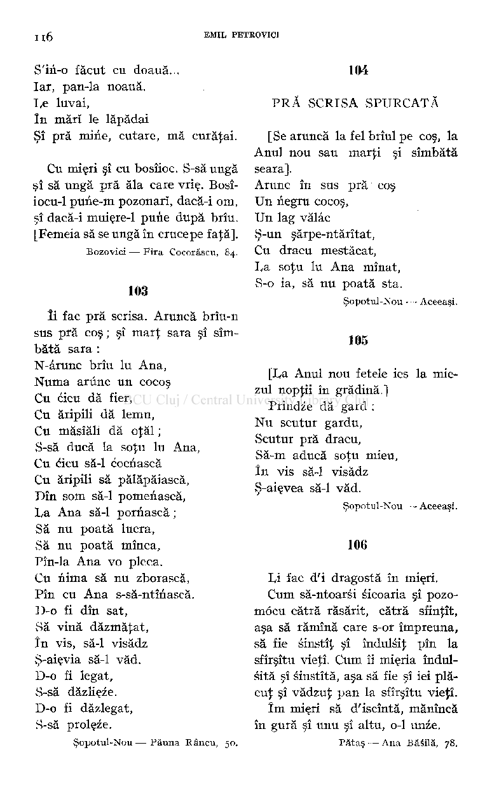

S'in-o făcut cu doauă... Iar, pan-la noauă. Le luvai, î n mări le lăpădai Şî pră mirie, cutare, mă curăţai.

PR Ă SCRISA SPURCATĂ

[Se aruncă la fel brîul pe coş, la Anul nou sau marţi şi sîmbătă seara]. Arunc în sus pră coş Un negru cocoş, Un lag vălâc Ş-un şărpe-ntărîtat, Cu dracu mestăcat, La soţu lu Ana mînat, S-o ia, să nu poată sta.

Cu mieri şî cu bosîioc. S-să ungă şî să ungă pră ăla care vrie. Bosîiocu-1 pune-m pozonarî, dacă-i om, şî dacă-i muiere-1 pune după brîu. [Femeia să se ungă în crucepe faţă].

Bozovici — Pira Cocorăscu, 84.

103

Şopotul-Nou — Aceeaşi.

îi fac pră scrisa. Aruncă brîu-n sus pră coş ; şî marţ sara şî sîmbătă sara : N-ârunc brîu lu Ana, Numa arunc un cocoş Cu cicu dă fier, Cu ăripili dă lemn, Cu măsîăli dă oţăl ; S-să ducă la soţu lu Ana, Cu cicu să-1 coenască Cu ăripili să pălăpăiască, Dîn som să-1 pomeriască, La Ana să-1 pornască ; Să nu poată lucra, Să nu poată mînca, Pîn-la Ana vo pleca. Cu nima să nu zborască, Pîn cu Ana s-să-ntînască. D-o fi dîn sat, Să vină dăzmăţat, În vis, să-1 visădz Ş-aievia să-1 văd. D-o fi legat, S-să dăzlieze. D-o fi dăzlegat, S-să proleze.

105

[La Anul nou fetele ies la miezul nopţii în grădină.] Prindze dă gard : Nu scutur gardu, Scutur pră dracu, Să-m aducă soţu mieu, î n vis să-1 visădz Ş-aievea să-1 văd.

Şopotul-Nou — Aceeaşi.

106

Li fac d'i dragostă în mieri. Cum să-ntoarei sicoaria şî pozomôcu cătră răsărit, cătră sfinţit, aşa să rămînă care s-or împreuna, să fie sinstîţ şî înduleiţ pîn la sfîrşîtu vieţî. Cum îi mieria înduleită şî sinstîtă, aşa să fie şî iei plăcut şî vădzuţ pan la sfîrşîtu vieţî.

î m mieri să d'iscîntă, mănîncă în gură şî unu şî altu, o-l unze.

Şopotul-Nou — Păuna Râncu, 50.

Pătaş — Ana Băsilă, 78.

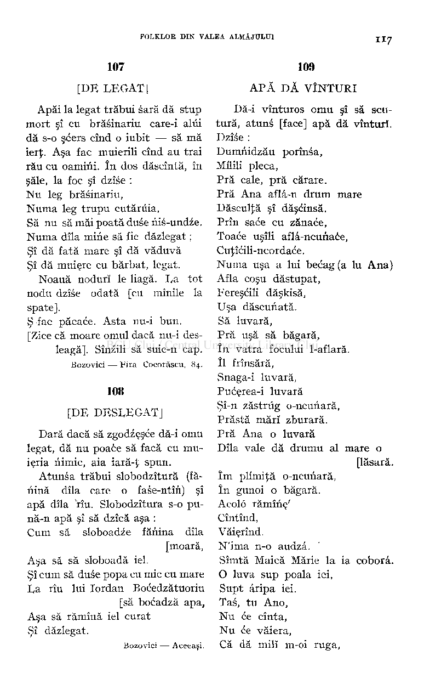

107

109

[D E DEGAT ]

AP Ă D Ă VÎNTUR I

Dă-i vînturos omu şî să scutură, atuné [face] apă dă vînturî. Dzîse : Dumnidzău porînsa, Milili pleca, Pră cale, pră cărare. Pră An a aflâ-n drum mare Dăsculţă şî dăşcinsă. Prîn sace cu zănace, Toace uşîli aflâ-ncunace, Cuţîcili-ncordace. Num a uşa a lui becag (a lu Ana ) Afla coşu dăstupat, Fereşcili dăşkisă, Uşa dăscufiată. Să luvară, Pră uşă să băgară, î n vatra focului 1-aflară. îl frînsără, Snaga-i luvară, Pucerea-i luvară vŞî-n zăstrug o-ncunară, Prăstă mări zburară. Pră An a o luvară Dîla vale dă drumu al mare o

Apăi la legat trăbui sară dă stup mort şî cu brăsinariu care-i alui dă s-o şcers cînd o iubit — să mă ierţ. Aşa fac muierili cînd au trai rău cu oamini. î n dos dăscîntă, în şale, la foc şî dzîse :

N u leg brăsinariu, Num a leg trupu cutăruia, Să nu să măi poată duse nis-undze. Num a dîla mine să fie dăzlegat ; Şî dă fată mare şî dă văduv ă Şî dă muiere cu bărbat, legat.

Noauă noduri le liagă. E a tot nodu dzîse odată [cu mînile la spate]. Ş-fac păcace. Asta nu-i bun. [Zice că moare omul dacă nu-i des-

leagă]. Sînzili să suie-n cap. Bozovici — Fira Cocorăscu, 84.

108

[D E DESLEGAT ]

Dară dacă să zgodzeşce dă-i omu legat, dă nu poace să facă cu muieria nimic, aia iară-ţ spun.

[lăsară.

Atunsa trăbui slobodzîtură (făîîină dîla care o fase-ntîn) şî apă dîla rîu. Slobodzîtură s-o pună-n apă şî să dzîcă aşa : Cu m să sloboadze făhina dîla

- î m plimiţă o-ncuiîară,
- î n gunoi o băgară. Acolo rămîne/ Cîntînd, Vaier înd. N'ima n-o audzâ. Sîmtă Maică Mărie la ia cobora. O luva sup poala iei, Supt aripa iei. Tas, tu Ano , N u ce cînta, N u ce văiera, Că dă milî m-oi ruga,

[moară,

Aşa să să sloboadă iei. Şî cum să duse popa cu mic cu mare

- E a rîu lui Iordan Bocedzătuoriu [să bocadză apa,

Aşa să rămînă iei curat Şî dăzlegat.

Bozovici — Aceeaşi.

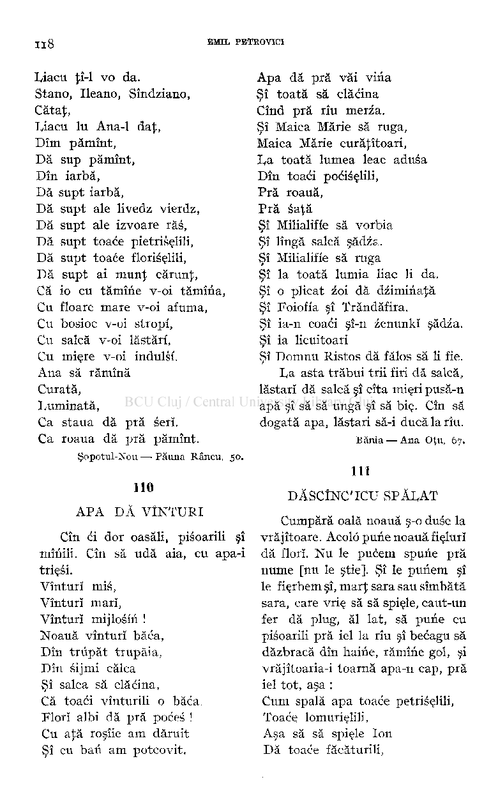

Liacu ţî-1 vo da. Stano, Ileano, Sîndziano, Cătat, liac u Iu Ana-1 daţ,

Apa dă pră văi vina Şî toată să clăcina Cînd pră rîu merza. Şî Maica Mărie să ruga, Maica Mărie curăţîtoari, La toată lumea leac aduéa Dîn toaci pociéelili, Pră roauă, Pră eaţă Şî Milialifie să vorbia Şî lîngă salcă şădza. Şî Milialifie să ruga Şî la toată lumia Hac li da. Şî o plicat zoi dă dziminaţă Şî Foiofi'a şî Trandafir a. Şî ia-n coaci şî-n zenunkî şădza. Şî ia licuitoari Şî Domnu Ristos dă fălos să li fie.

- Dîm pămînt, Dă sup pămînt,
- Dîn iarbă, Dă supt iarbă, Dă supt ale livedz vierdz, Dă supt ale izvoare răs, Dă supt toace pietriselili, Dă supt toace floriéelili, Dă supt ai munţ cărunt, Că io cu tămîrie v-oi tămîria, Cu floare mare v-oi afuma, Cu bosioc v-oi stropi, Cu salcă v-oi lăstari, Cu miere v-oi indulsf. Ana să rămînă Curată, Luminată, Ca staua dă pră éerï. Ca roaua dă pră pămînt.

La asta trăbui trii firi dă salcă, lăstari dă salcă şî cîta mieri pusă-n apă şî să să ungă şî să bie. Cîn să dogată apa, lăstari să-i ducă la rîu.

Bănia — Ana Oţu, 67.

Şopotul-Nou — Păuna Râncu, 50.

111

110

DĂSCÎNC'ICU SPĂLAT

APA DĂ VÎNTUR I

Cumpără oală noauă ş-o duse la vrăjitoare. Acolo pune noauă fişlurî dă flori. Nu le pucem spune pră nume [nu le ştie]. Şî le punem şî le fierbem şî, marţ sara sau sîmbătă sara, care vrie să să spiele, caut-un fer dă plug, ăl lat, să pune cu pisoarili pră iei la rîu şî becagu să dăzbracă dîn haine, rămîne gol, şi vrăjîtoaria-i toarnă apa-n cap, pră iei tot, aşa :

Cîn ci dor oasăli, pisoarili şî mînili. Cîn să udă aia, cu apa-i triesi. Vînturï mis, Vînturï marï, Vînturï mijloéiri ! Noauă vînturï băca, Dîn trupăt trupăia, Dîn sijmi călca Şî salca să clăcina, Că toaci vînturili o băca Flori albi dă pră poces ! Cu aţă roşîie am dăruit Şî cu ban am potcovit.

Cum spală apa toace petriselili, Toace lomurielili, Aşa să să spiele Ion Dă toace făcăturili,

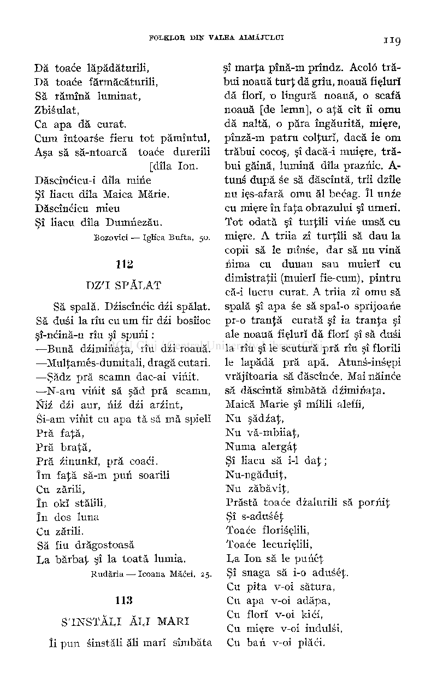

şî marţa pînă-m prîndz. Acolo trăbui noauă tur ţ dă grîu, noauă fielurî dă flori, o lingură noauă, o scafă noauă [de lemn], o aţă cît îi omu dă naltă, o păra îngăurită, miere, pînză-m patru colţuri, dacă ie om trăbui cocoş, şî dacă-i muiere, trăbui găină, lumină dîla praznic. Atuné după se să dăscîntă, trii dzîle nu ies-afară omu ăl becag. îl uni e cu miere în faţa obrazului şî umeri. Tot odată şî turţîli vine unsă cu miere. A triia zî turţîli să dau la copii să le mînse, dar să nu vină nima cu duuan sau muieri cu dimistraţii (muieri fie-cum), pintru că-i lucru curat. A triia zî omu să spală şî apa ée să spal-o sprijoane pr-o tranţă curată şî ia tranţa şî ale noauă fielurî dă flori şî să dusi la rîu şî le scutură pră rîu şî florili le lapădă pră apă. Atuns-insepi vrăjîtoaria să dăscînce. Mai năince să dăscîntă sîmbătă dziminaţa. Maică Marie şî milili alefii, N u şădzaţ, N u vă-mbiiaţ, Numa alergat Şî liacu să i-1 daţ ; Nu-ngăduiţ, Nu zăbăviţ, Prăstă toace dzalurili să porriiţ Şî s-adus eţ Toace floriselili, Toace lecurielili, La Ion să le puneţ Şî snaga să i-o aduseţ. Cu pita v-oi sătura, Cu apa v-oi adăpa, Cu flori v-oi kici, Cu miere v-oi indulsi, Cu baiî v-oi plăci.

Dă toace lăpădăturili, Dă toace fărmăcăturili, Să rămînă luminat, Zbisulat, Ca apa dă curat. Cum întoarse fieru tot pămîntul, Aşa să să-ntoarcă toace durerili

[dîla Ion.

Dăscîncicu-i dîla mine Şî liacu dîla Maica Mărie. Dăscîncicu mieu Şî liacu dîla Dumnezău.

Bozovici — IgHca Bufta, 50.

112

DZ'I SPĂLAT

Să spală. Dziscîncic dzi spălat. Să dusi la rîu cu um fir dzi bosîioc şî-ncină-n rîu şî spuni :

—Bună dziminaţa, rîu dzi roauă. —Mulţames-dumitali, dragă cutări. —Şădz pră scamn dac-ai vinit.

—N-am vinit să şăd pră scamn, Niz dzi aur, riiz dzi arzint, éi-am vinit cu apa ta să mă spielî Pră faţă, Pră braţă, Pră zinunki, pră coaci.

- î m faţă să-m pun soarili Cu zărili,
- î n okî stălili, în dos luna Cu zărili. Să fiu drăgostoasă La bărbat şî la toată lumia.

Rudăria — Icoana Măcei, 25.

113

S'INSTĂLI ĂLI MARI îi pun sinstăli ăli marî sîmbăta

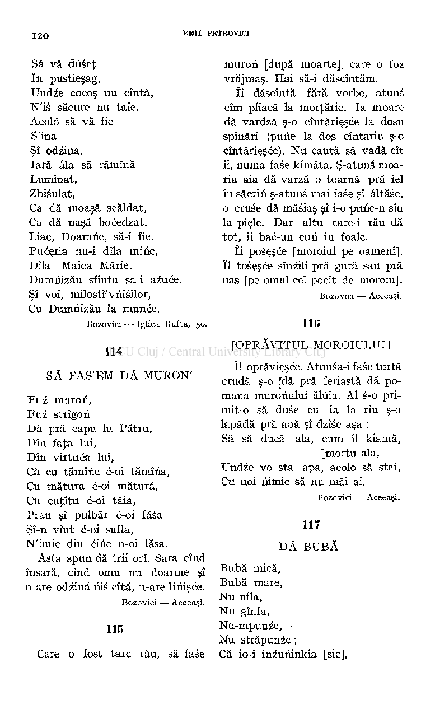

Să vă dueeţ î n pustieşag, Undze cocoş nu cîntă, N'ié săcure nu taie. Acolô să vă fie S'ina Şî odzină. Iară ala să rămînă Luminat, Zbiéulat, Ca dă moaşă scăldat, Ca dă naşă bocedzat. Liac, Doamne, să-i fie. Puceria nu-i dîla mine, Dîla Maica Mărie. Dumnizău sfîntu să-i azuce. Şî voi, milostî'vniéilor, Cu Dumnizău la munce.

muron [după moarte], care o foz vrăjmaş. Hai să-i dăscîntăm.

îi dăscîntă fără vorbe, atuns cîm pliacă la morţărie. Ia moare dă vardză ş-o cîntărieşce la dosu spinări (pune la dos cîntariu ş-o cîntărieşce). Nu caută să vadă cît ii, numa faée kimăta. Ş-atuns moaria aia dă varză o toarnă pră iei în săcrin ş-atune mai faée şî âltăee, o cruée dă măsiaş şî i-o pune-n sîn la piele. Dar altu care-i rău dă tot, ii bac-un cun in foaie.

îi poseşce [moroiul pe oameni], îl toseşce sînzili pră gură sau pră nas [pe omul cel pocit de moroiu].

Bozovici — Aceeaşi.

116

Bozovici — Iglica Bufta, 50.

[OPRĂVITUL MOROIULUI]

114

îl oprăvieşce. Atunsa-i fase turtă crudă ş-o f'dă pră feriastă dă pomana muronului ăluia. Al s-o primit-o să duse cu ia la rîu ş-o lapădă pră apă şî dzîée aşa : Să să ducă ala, cum îl kiamă,

SĂ FAS'EM D Ă MURON'

Fuz muron, Fuz strîgon Dă pră capu Iu Patru, Dîn faţa lui, Dîn virtuca lui, Că cu tămîne c-oi tămîna, Cu mătura c-oi mătură, Cu cuţîtu c-oi tăia, Prau şî pulbăr c-oi făsa Şî-n vînt c-oi sufla, N'imic dîn cine n-oi lăsa.

[mortu ala, Undze vo sta apa, acolo să stai, Cu noi nimic să nu măi ai.

Bozovici — Aceeaşi.

117

D Ă BUBĂ

Asta spun dă trii ori. Sara cînd însară, cînd omu nu doarme şî n-are odzină nié cîtă, n-are linişce.

Bubă mică, Bubă mare, Nu-nfla, N u gînfa, Nu-mpunze, N u străpunze ; Că io-i inzuninkia [sic],

Bozovici — Aceeaşi.

115

Care o fost tare rău, să faée

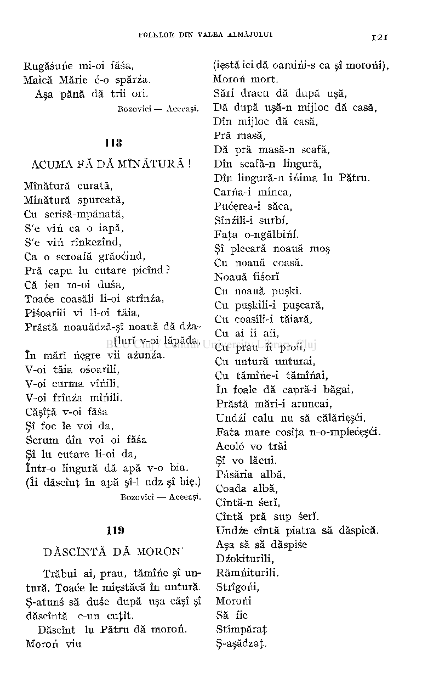

(iestăieidă oamitii-s ca şî moroni), Moroii mort. Sări dracu dă după uşă, Dă după uşă-n mijloc dă casă, Dîn mijloc dă casă, Pră masă, Dă pră masă-n scafă, Dîn scafă-n lingură, Dîn lingură-n inima Iu Patru. Carna-i mînca, Pucerea-i săca, Sînzili-i surbi, Faţa o-ngălbiiii. Şî plecară noauă moş Cu noauă coasă. Noauă fisorî Cu noauă puşkî. Cu puşkili-i puşcară, Cu coasîli-i tăiară, Cu ai ii aii, Cu prau îi proii, Cu untură unturai, Cu tămîrie-i tămîriai, î n foaie d ă capră-i băgai, Prăstă mări-i aruncai, Undzi calu n u să călărieşci, Fata mare cosiţa n-o-mpleceşci. Acolô vo trăi Şî vo lăcui. Pâsăria albă, Coada albă, Cîntă-n éerï, Cîntă pr ă sup seri. Undze cîntă piatra să dăspică. Aşa să să dăspise Dzokiturili,

Rugăsune mi-oi făsa, Maică Mărie c-o spărza.

Aşa pană dă trii ori.

Bozovici — Aceeaşi.

###### Mi!

ACUMA F Ă DĂ MÎNĂTUR Ă !

Mînătură curată, Mînătură spurcată, Cu scrisă-mpănată, S'e viri ca o iapă, S'e vi n rînkezînd, Ca o scroafă grăocind, Pră capu lu cutare picînd ? Că ieu m-oi dusa, Toace coasăli li-oi strînza, Pisoarili vi li-oi tăia, Prăstă noauădză-şî noauă dă dza-

[lurî v-oi lăpăda, în mărî negre vii azunza. V-oi tăia osoarili, V-oi curma vînili, V-oi frînza mîriili. Căşîţă v-oi făsa Şî foc le voi da, Scrum dîn voi oi făsa Şî lu cutare li-oi da, într-o lingură d ă apă v-o bia. (îi dăscînţ în apă şî-1 udz şî bie.)

Bozovici — Aceeaşi.

119

DĂSCÎNTĂ D Ă MORON'

- Rămriiturili. Strîgoni, Moroni
- Să fie Stîmpăraţ Ş-aşădzaţ.

Trăbui ai, prau, tămîrie şî un tură. Toace le miestăcă în untură. Ş-atune să duse după uşa căşî şî dăscîntă c-un cuţît.

Dăscînt Iu Patru dă moron. Moron viu

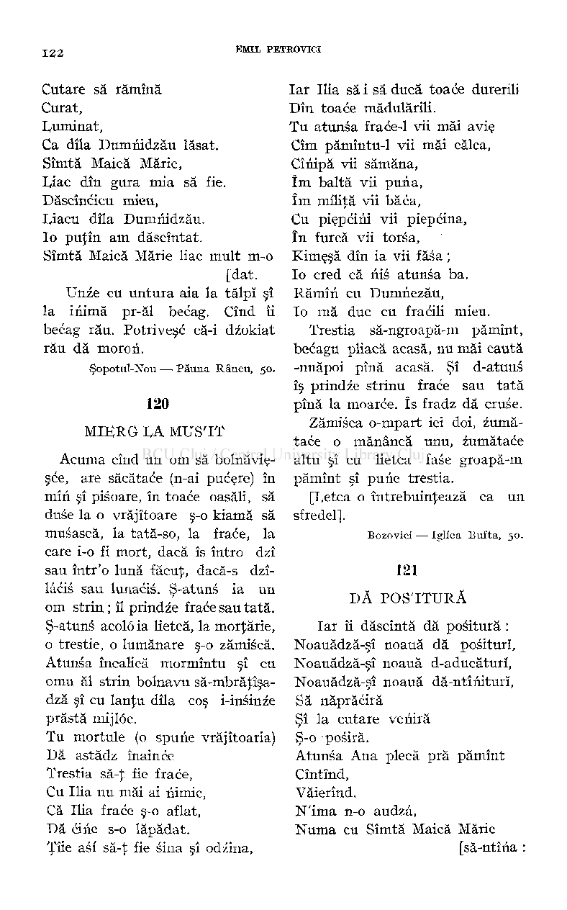

Cutare să rămînă Curat, Luminat, Ca dîla Dumnidzău lăsat. Sîmtă Maică Mărie, Liac dîn gura mia să fie. Dăscîncicu mieu, Liacu dîla Dumnidzău. Io puţîn am dăscîntat. Sîmtă Maică Mărie liac mult m-o

Iar Ilia să i să ducă toace durerili Dîn toace mădulărili. Tu atunsa frace-1 vii măi avie Cîm pămîntu-1 vii măi călca, Cînipă vii sămăna, î m baltă vii puna,

- î m miliţă vii bă ca, Cu piepcini vii piepcina,
- î n furcă vii torsa, Kimeşă dîn ia vii făsa ; Io cred că nié atunsa ba.

[dat.

- Rămîn cu Dumnezău, Io mă duc cu fracili mieu.

Trestia să-ngroapă-m pămînt, becagu pliacă acasă, nu măi caută -nnăpoi pînă acasă. Şî d-atuns îş prindze strinu frace sau tată pînă la moarce. îs fradz dă cruse.

Zămisca o-mpart iei doi, zumătace o mănâncă unu, zumătace altu şî cu lietca fase groapă-m pămînt şî purie trestia.

[Letca o întrebuinţează ca un sfredel].

Bozovici — Iglica Bufta, 50.

121

DĂ POS'ITUR Ă

Iar îi dăscîntă dă positură : Noauădză-şî noauă dă positurî, Noauădză-şî noauă d-aducăturî, Noauădză-şî noauă dă-ntîriituri,

- Să năprăciră Şî la cutare veniră Ş-o poeiră. Atunsa Ana plecă pră pămînt Cîntînd, Văierînd. N'ima n-o audzâ, Num a cu Sîmtă Maică Mărie

Unze cu untura aia la tălpi şî la inimă pr-ăl becag. Cînd îi becag rău. Potrivesc că-i dzokiat

- rău dă moron. Şopotul-Nou — Păuna Râncu, 50.

### 120

MIER G LA MUS'IT

Acuma cînd un om să bolnăvieşce, are săcătace (n-ai pucere) în mîri şî pisoare, în toace oasăli, să duse la o vrăjitoare ş-o kiamă să musască, la tată-so, la frace, la care i-o fi mort, dacă îs întro dzî sau într'o lună făcut, dacă-s dzîlâcié sau lunacis. Ş-atuns ia un om strin ; îl prindze frace sau tată. Ş-atune acolô ia lietcă, la morţărie,

- o trestie, o lumânare ş-o zămiecă. Atunsa încalică mormîntu şî cu
- omu ăl strin bolnavu să-mbrăţîşadză şî cu lanţu dîla coş i-insinze prăstă mijloc. Tu mortule (o spune vrăjîtoaria) Dă astădz înaince Trestia să-ţ fie frace, Cu Ilia nu măi ai nimic, Că Ilia frace ş-o aflat, Dă cine s-o lăpădat. Ţîie asi să-ţ fie sina şî odzina,

[să-ntîria :

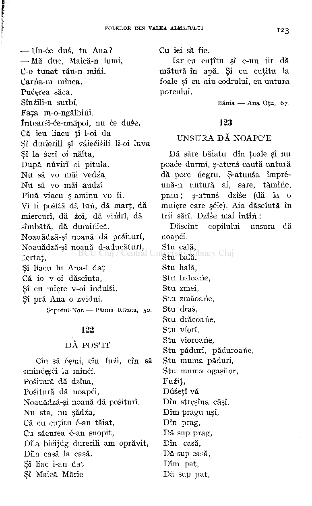

###### FOLKLOR DIN VALEA ALMĂJTJLTJI 123

Cu iei să fie.

— Un-ce dus, tu Ana?

— Mă duc, Maică-n lumi, C-o tunat rău-n mini. Carria-m mînca, Pucerea săca,

Iar cu cuţîtu şî c-un fir dă mătură în apă. Şî cu cuţîtu la foaie şî cu aiu codrului, cu untura porcului.

- Sînzili-n surbf, Faţa m-o-ngălbini. întoarsi-ce-nnăpoi, nu ce duse, Că ieu liacu ţî l-oi da Şî durierili şî vâiecisili li-oi luva Şî la éerï oi nalta, După nûvirï oi pitula. Nu să vo măi vedza,

Bănia — Ana Oţu, 67.

123

UNSURA DĂ NOAPC'E

Dă săre băiatu dîn ţoale şî nu poace durmf, ş-atuns caută untură dă porc negru. Ş-atunsa împréună-n untură ai, sare, tămîrie, prau ; ş-atuns dzîse (dă la o muiere care şcie). Aia dăscînta în trii sărî. Dzîée mai intîn :

- N u să vo măi audzî Pînă viacu ş-aminu vo fi. Vi fi posită dă lari, dă marţ, dă miercuri, dă zoi, dă viriirî, dă sîmbătă, dă dumiriică. Noauădză-şî noauă dă positurî, Noauădză-şî noauă d-aducăturî, Iertat, Şî liacu Iu Ana-1 daţ. Că io v-oi dăscînta, Şî cu miere v-oi indulsi, Şî pră Ana o zvidui.

Dăscînt copilului unsura dă noapci. Stu cală, Stu bală. Stu hală, Stu haloarie, Stu zmei, Stu zmăoarie, Stu dras, Stu drăcoarie, Stu viori, Stu vioroarie, Stu păduri, păduroarie, Stu muma păduri, Stu muma ogaşîlor, Fuziţ, Duseţî-vă Dîn streşina căşî,

Şopotul-Nou — Păuna Râncu, 50.

122

D Ă POS'IT

Cîn să cerni, cîn fuzi, cîn să sminceşci la minei. Positură dă dzîua, Positură dă noapci, Noauădză-şî noauă dă positurî. Nu sta, nu şădza, Că cu cuţîtu c-an tăiat,

- Dîm pragu uşî,
- Dîn prag, Dă sup prag, Dîn casă, Dă sup casă, Dîm pat, Dă sup pat,

- Cu săcurea c-an snopit, Dîla bici jug durerili am oprăvit, Dîla casă la casă. Şî liac i-an dat Şî Maică Mărie

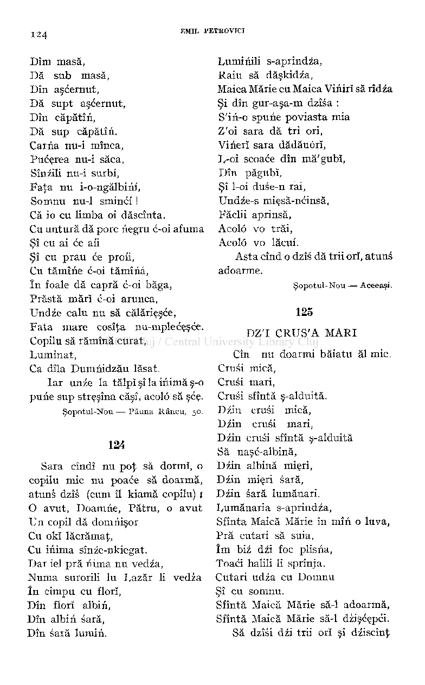

Luminili s-aprindza, Raiu să dăşkidza, Maica Mărie cu Maica Vinirî să rîdza Şi dîn gur-aşa-m dzîsa : S'in-o spune poviasta mia Z'oi sara dă tri ori, Vineri sara dâdăuori, L-oi scoace dîn mă'gubi, Dîn păgubi, Şî l-oi duse-n rai, Undze-s micsă-ncinsă, Făclii aprinsă, Acolô vo trăi, Acolô vo lăcui.

- Dîm masă, Dă sub masă,
- Dîn aşcernut, Dă supt aşcernut, Dîn căpătîn, Dă sup căpătîn. Carna nu-i mînca, Pucerea nu-i săca,

- Sînzili nu-i surbi, Faţa nu i-o-ngălbihf, Somnu nu-1 smincf ! Că io cu limba oi dăscînta. Cu untură dă porc negru c-oi afuma Şî cu ai ce aii Şî cu prau ce proii,

Asta cînd o dzîs dă trii orî, atuns" adoarme.

- Cu tămîrie c-oi tămînâ, î n foaie dă capră c-oi băga, Prăstă mărî c-oi arunca, Undze calu nu să călărieşce, Fata mare cosiţa nu-mpleccşce. Copilu să rămînă curat, Duminat, Ca dîla Dumnidzău lăsat.

Şopotul-Nou — Aceeaşi.

125

DZ'I CRUS'A MARI

Cîn nu doar mi băiatu ăl mic. Crusi mică, Crusi mari, Crusi sfîntă ş-alduită. Dzin crusi mică, Dzin crusi mari, Dzin crusi sfîntă ş-alduită Să naşc-albină, Dzin albină mieri, Dzin miçri sară, Dzin eară lumânări. Lumănaria s-aprindza, Sfîntă Maică Mărie în mîn o luva, Pră cutări să suia, î m biz dzi foc plisha, Toaci halili li sprînja. Cutări udza cu Domnu Şî cu somnu.

Iar unze la tălpi şî la inimă ş-o pune sup streşina căşî. acolo să şce.

Şopotul-Nou — Păuna Râncu, 50.

124

Sara cîndî nu poţ să dormi, o copilu mic nu poace să doarmă, atuns dzîs (cum îl kiamă copilu) î

- O avut, Doamne, Patru, o avut Un copil dă domnişor Cu oki lăcrămat, Cu inima sînze-nkiegat. Dar iei pră hima nu vedza, Numa surorili lu Lazăr li vedza î n cîmpu cu flori, Dîn flori albiri, Dîn albi h sară, Dîn sară lumin.

Sfîntă Maică Mărie să-1 adoarmă, Sfîntă Maică Mărie să-1 dzişcşpci.

Să dzîsi dzi trii ori şî dziscînţ

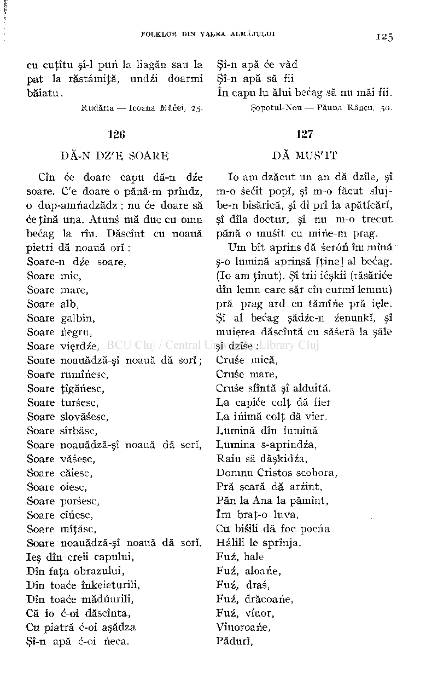

Şî-n apă ce văd Şî-n apă să fii î n capu lu ălui becag să nu măi fii.

cu cuţîtu şî-1 pun la liagăn sau la pat la răstâmiţă, undzi doarmi băiatu

Şopotul-Nou — Păuna Râncu, 50.

Rudăria — Icoana Măcei, 25.

127

126

D Ă MUS'IT

DĂ-N DZ'E SOARE

Io am dzăcut un an dă dzîle, şî m-o secit popi, şî m-o făcut slujbe-n bisărică, şî dî prî la apăticărî, şî dîla doctur, şî nu m-o trecut pană o muéit cu mine-m prag.

Cîn ce doare capu dă-n dze soare. C e doare o pănă-m prîndz,

- o dup-amnadzădz ; nu ce doare să ce ţină una. Atuns mă duc cu omu becag la rîu. Dăscînt cu noauă pietri dă noauă ori : Soare-n dze soare.. Soare mic, Soare mare, Soare alb, Soare galbin, Soare negru, Soare vierdze, Soare noauădză-şî noauă dă sori ; Soare rumînesc, Soare ţigănesc, Soare tursesc, Soare slovăeesc, Soare sîrbăsc, Soare noauădză-şî noauă dă sori, Soare văsesc, Soare căiesc, Soare oiesc, Soare porsesc, Soare cîfiesc, Soare mîţăsc, Soare noauădză-şî noauă dă sori. leş dîn creii capului, Dîn faţa obrazului, Dîn toace înkeieturili, Dîn toace măduurili, Că io c-oi dăscîntă, Cu piatră c-oi aşădza Şî-n apă c-oi neca.

U m bît aprins dă serôfï îm mînă ş-o lumină aprinsă [ţine] al becag. (Io am ţînut). Şî trii ieşkii (răsărice dîn lemn care săr cîn curmi lemnu) pră prag ard cu tămîrie pră iele. Şî al becag şădze-n zenunkî, şî muierea dăscîntă cu săseră la şale şî dzîse : Cruse mică, Cruse mare, Cruse sfîntă şî alduită. Da capice colţ dă fier Da inimă colţ dă vier. Dumină dîn lumină Dumina s-aprindza, Raiu să dăşkidza, Domnu Cristos scobora, Pră scară dă arzint, Păn la Ana la pămînt, î m braţ-o luva, Cu bisili dă foc poena Hâlili le sprînja. Fuz, hale Fuz, aloane, Fuz, dras, Fuz, drăcoahe, Fuz, vfuor, Viuoroafie, Păduri,

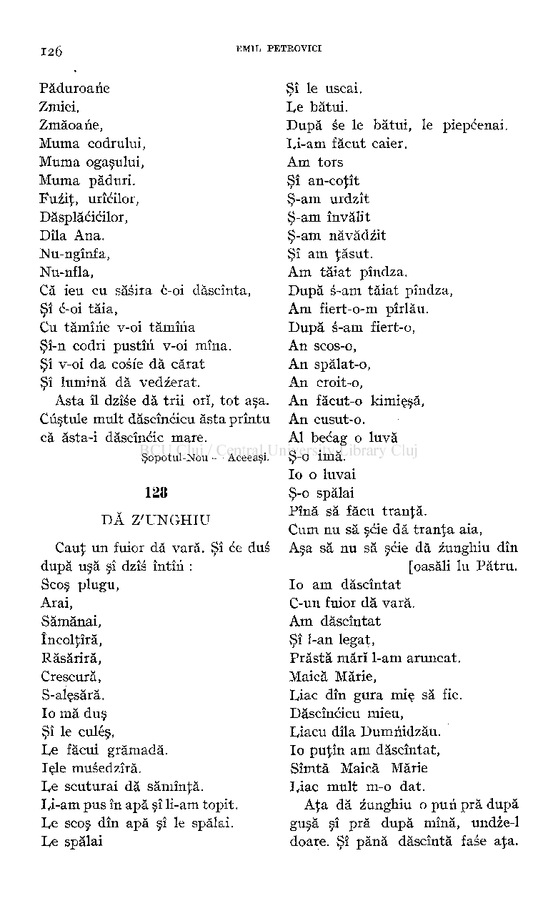

Păduroahe Zmiei, Zmăoane, Muma codrului, Muma ogaşului, Muma păduri. Fuziţ, urîcilor, Dăsplăcicilor, Dîla Ana. Nu-ngînfa, Nu-nfla, Că ieu cu săsira c-oi dăscînta, Şî c-oi tăia, Cu tămîhe v-oi tămîha Şî-n codri pustîn v-oi mîna. Şî v-oi da cosfe dă cărat Şî lumină dă vedzerat.

Şî le uscai. Le bătui. După ée le bătui, le piepcenai. Li-am făcut caier.

- Am tors Şî an-coţît Ş-am urdzît Ş-am învălit Ş-am năvădzit Şî am ţăsut.

- Am tăiat pîndza. După s-am tăiat pîndza,

- Am fiert-o-m pîrlău. După s-am fiert-o,
- An scos-o,

- An spălat-o,

- An croit-o, An făcut-o kimieşă, An cusut-o. Al becag o luvă Ş-o imă. Io o luvai Ş-o spălai Pînă să făcu tranţă. Cum nu să şcie dă tranţa aia, Aşa să nu să şcie dă zunghiu dîn

Asta îl dzîée dă trii orî, tot aşa. Cuştule mult dăscîncicu ăsta prîntu că ăsta-i dăscîncic mare.

Şopotul-Nou — Aceeaşi.

128

DĂ Z'UN GHIU

Caut un fuior dă vară. Şî ce due după uşă şî dzîs întîn : Scoş plugu, Arai, Sămănai, încolţiră, Răsăriră, Crescură, S-alesără. Io mă duş Şî le cules, De făcui grămadă. Iele musedzîră. Le scuturai dă sămînţă. Li-am pus în apă şî li-am topit. Le scoş dîn apă şî le spălai. Le spălai

[oasăli Iu Patru.

Io am dăscîntat C-un fuior dă vară. Am dăscîntat Şî 1-an legat, Prăstă mări l-am aruncat. Maică Mărie, Liac dîn gura mie să fie. Dăscîncicu mieu, Liacu dîla Dumnidzău. Io puţîn am dăscîntat, Sîmtă Maică Mărie Liac mult m-o dat.

Aţa dă zunghiu o pun pră după guşă şî pră după mînă, undze-1 doare. Şî pană dăscînta fase aţa.

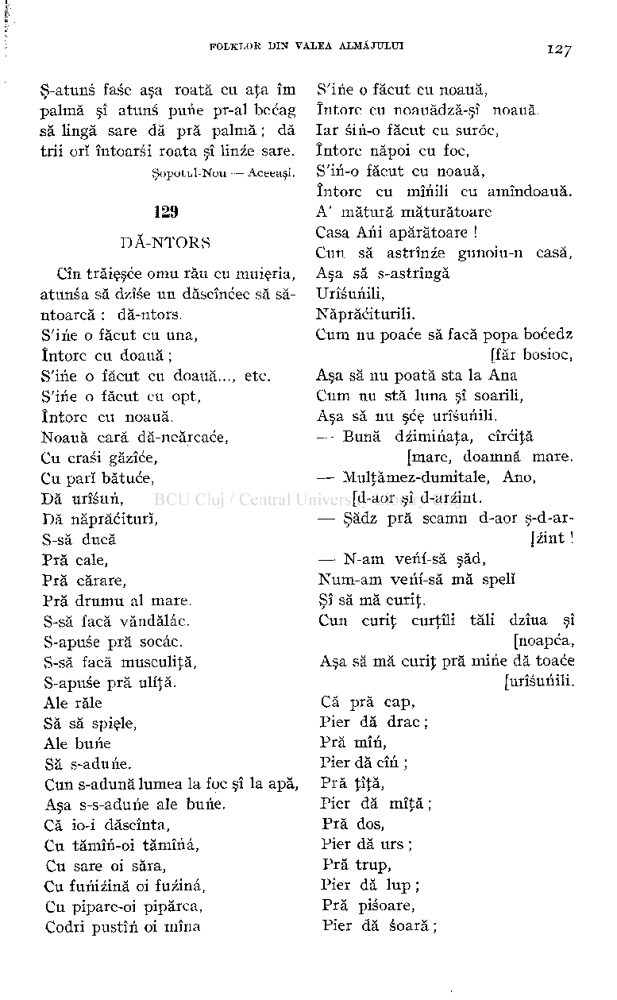

S'ine o făcut cu noauă, întorc cu noauădză-şî noauă. Iar siiî-o făcut cu surôc, întorc năpoi cu foc, S'in-o făcut cu noauă, întorc cu mîriili cu amîndoauă. A' mătură măturătoare Casa Ani apărătoare ! Cun să astrînze gunoiu-n casă, Aşa să s-astrîngă Urîsunili, Năprăciturili. Cum nu poace să facă popa bocedz

Ş-atuns fase aşa roată cu aţa îm palmă şî atuns putîe pr-al becag

- să lingă sare dă pră palmă ; dă trii ori întoarsi roata şî linze sare.

Şopotiil-Nou — Aceeaşi.

129

DĂ-NTORS

Cîn trăieşce omu rău cu muieria, atunsa să dzîse un dăscîncec să săntoarcă : dă-ntors. S'ine o făcut cu una, întorc cu doauă ; S'ine o făcut cu doauă..., etc. S'ine o făcut cu opt, întorc cu noauă. Noauă cară dă-ncărcace, Cu crasi găzîce, Cu pari bătuce, Dă urîsuri, Dă năprăciturî, S-să ducă Pră cale, Pră cărare, Pră drumu al mare. S-să facă văndălâc. S-apuse pră socâc. S-să facă musculiţă, S-apuse pră uliţă. Ale răle Să să spiele, Ale bune Să s-adune. Cun s-adună lumea la foc şî la apă, Aşa s-s-adune ale bune. Că io-i dăscînta, Cu tămîn-oi tămînâ, Cu sare oi săra, Cu funizină oi fuzinâ, Cu piparc-oi pipărca, Codri pustîn oi mîna

[făr bosioc, Aşa să nu poată sta la Ana

- Cum nu stă luna şî soarili, Aşa să nu şce urîsunili.

— Bună dziminaţa, cîrciţă [mare, doamnă mare.

— Mulţămez-dumitale, Ano, [d-aor şî d-arzint.

— Şădz pră scamn d-aor ş-d-ar[zint !

— N-am veni-să şăd, Num-am veni-să mă speli Şî să mă curiţ.

- Cun curiţ curţîli tăli dzîua şî [noapca,

Aşa să mă curiţ pră mine dă toace [urîsunili.

Că pră cap, Pier dă drac ; Pră mîn, Pier dă cîn ; Pr ă ţîţă, Pier dă mîţă ; Pră dos, Pier dă urs ; Pră trup, Pier dă lup ; Pră pisoare, Pier dă eoară;

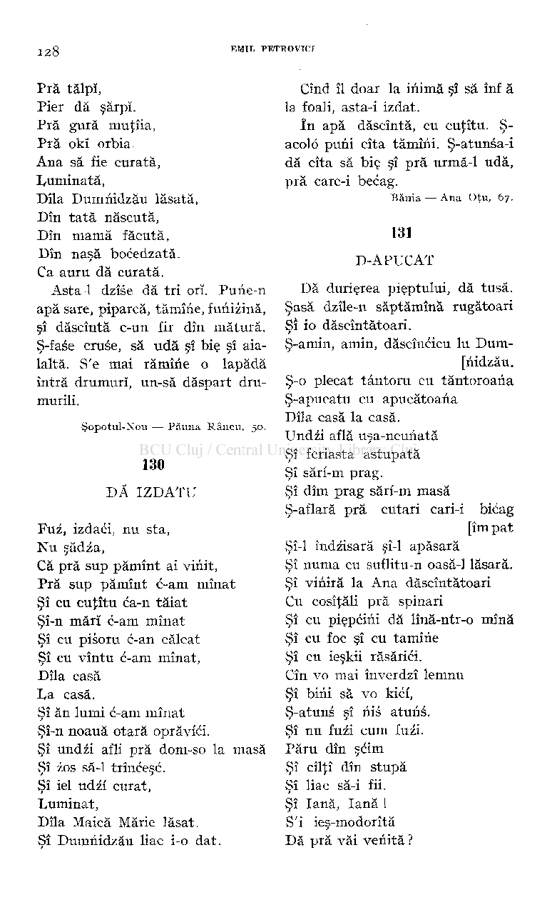

Pră tălpî, Pier dă şărpî. Pră gură muţîia, Pră okî orbia Ana să fie curată, Luminată, Dîla Dumnidzău lăsată, Dîn tată născută, Dîn mamă făcută, Dîn naşă bocedzată. Ca auru dă curată.

Cînd îl doar la inimă şî să înf ă la foali, asta-i izdat.

în apă dăscîntă, cu cuţîtu. Şacolo puni cîta tămîfii. Ş-atunsa-i dă cîta să bie şî pră urmă-1 udă, pră care-i becag.

Bănia — Ana Oţu, 67.

131

D-APUCAT

Dă durierea pieptului, dă tusă. Şasă dzîle-n săptămînă rugătoari Şî io dăscîntătoari. Ş-amin, amin, dăscîncicu lu Dum-

Asta-1 dzîse dă tri orï. Purie-n apă sare, piparcă, tămîrie, funizină, şî dăscîntă c-un fir dîn mătură. Ş-fase cruse, să udă şî bie şî aialaltă. S'e mai rămîne o lapădă întră drumuri, un-să dăspart drumurili.

[riidzău. Ş-o plecat tântoru cu tăntoroana Ş-apucatu cu apucătoana Dîla casă la casă. Undzi află uşa-ncuiiată Şî feriasta astupată Şî sări-m prag. Şî dîm prag sări-m masă Ş-aflară pră cutări cari-i bicag

Şopotul-Nou — Păuna Râncu, .50.

130

DĂ IZDATU

[îm pat

Fuz, izdaci, nu sta, Nu şădza, Că pră sup pămînt ai vinit, Pră sup pămînt c-am mînat Şî cu cuţîtu ca-n tăiat Şî-n mârî c-am mînat Şî cu pisoru c-an călcat Şî cu vîntu c-am mînat, Dîla casă La casă. Şî ăn lumi c-am mînat Şî-n noauă otară oprăvici. Şî undzi afli pră dom-so la masă Şî zos să-1 trînceşc. Şî iei udzf curat, Luminat, Dîla Maică Mărie lăsat. Şî Dumnidzău Hac i-o dat.

Şî-1 îndzisară şî-1 apăsară Şî numa cu suflitu-n oasă-1 lăsară. Şî viniră la Ana dăscîntătoari Cu cosîţăli pră spinări Şî cu piepcini dă lînă-ntr-o mînă Şî cu foc şî cu tamîiîe Şî cu ieşkii răsărici. Cîn vo mai înverdzî lemnu Şî bini să vo kici, S-atuné sî riis atuns. Şî nu fuzi cum fuzi. Păru dîn şcim Şî cîlţî dîn stupă Şî Hac să-i fii. Şî Iană, Iană ! S'i ieş-modorîtă Dă pră văi venită ?

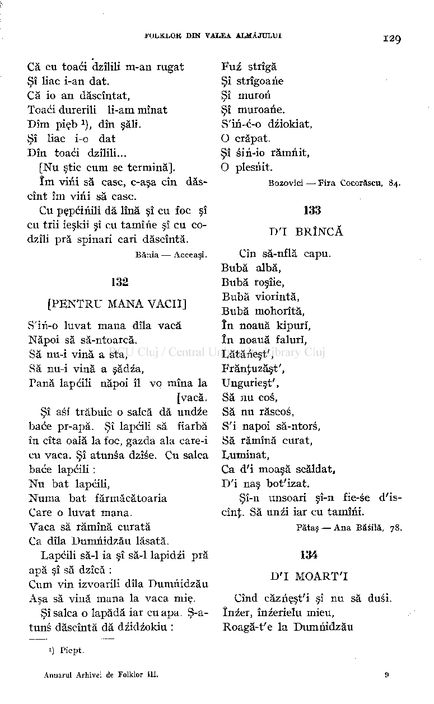

Că cu toaci dzîlili m-an rugat Şî liac i-an dat. Că io an dăscîntat, Toaci durerili li-am mînat Dîm pieb ), dîn săli. Şî liac i-o dat Dîn toaci dzîlili...

Fuz strigă Şî strîgoane Şî murori Sî muroane. S'in-c-o dziokiat, O crăpat. Şî sin-io rămnit, O plesnit.

[Nu ştie cum se termină]. î m vini să casc, c-aşa cîn dăs-

Bozovici — Fira Cocorăscu, 84.

cînt îm virii să casc.

Cu pepcinili dă lînă şî cu foc şî cu trii ieşkii şî cu tamîne şî cu codzîli pră spinări cari dăscînta.

133 D'I BRÎNCĂ

Cîn să-nflă capu. Bubă albă, Bubă roşîie, Bubă viorintă, Bubă mohorîtă, În noauă kipurî, î n noauă falurî, Lătăneşt', Frănţuzăşt', Ungurieşt', Să nu coé, Să nu răscos, S'i napoi să-ntors, Să rămînă curat, Duminat, Ca d'i moaşă scăldat, D'i naş bot'izat.

Bănia — Aceeaşi.

###### 132

[PENTRU MANA VACII]

S'iii-o luvat mana dîla vacă Năpoi să să-ntoarcă. Să nu-i vină a sta, Să nu-i vină a şădza, Pană lapcili năpoi îl vo mîna la

[vacă.

Şî asi trăbuie o salcă dă undze bace pr-apă. Şî lapcili să fiarbă în cîta oală la foc, gazda ala care-i cu vaca. Şî atunsa dzîée. Cu salca bace lapcili : Nu bat lapcili, Numa bat fărmăcătoaria Care o luvat mana. Vaca să rămînă curată Ca dîla Dumnidzău lăsată.

Şî-n unsoari şî-n fie-se d'iscînţ. Să unzi iar cu tamîni.

Pătaş — Ana BăSilă, 78.

134 D' I MOART'I

Lapcili să-1 ia şî să-1 lapidzi pră apă şî să dzîcă : Cum vin izvoarili dîla Dumnidzău Aşa să vină mana la vaca mic.

Cînd căzneşt'i şî nu să dusi. înzer, înzerielu mieu, Roagă-t'e la Dumnidzău

Şî salca o lapădă iar cu apa. Ş-atuns dăscînta dă dzidzokiu :

O Piept.

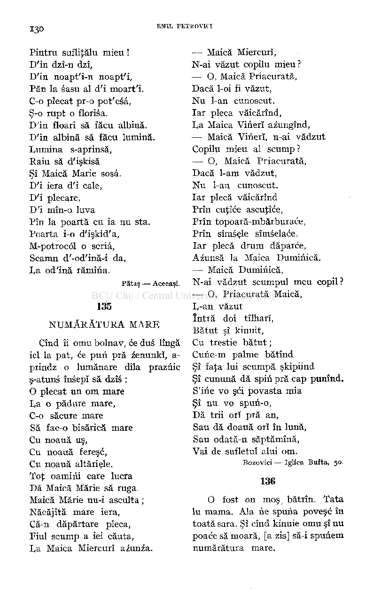

— Maică Miercuri, N-ai văzut copilu mieu?

Pintru sufliţălu mieu ! D'in dzî-n dzî, D'in noapt'i-n noapt'i, Păn la éasu al d'i moart'i. C-o plecat pr-o pot'eéâ, Ş-o rupt o floriéa. D'in floari să făcu albină. D'in albină să făcu lumină. Lumina s-aprinsă, Raiu să d'işkisă Şî Maică Marie sosâ. D'i iera d'i cale, D'i plecare, D'i mîn-o luva Pîn la poartă cu ia nu sta. Poarta i-o d'işkid'a,

— O, Maică Priacurată, Dacă l-oi fi văzut, Nu 1-an cunoscut. Iar pleca văicărind, La Maica Virierî azungînd,

— Maică Virierî, n-ai vădzut Copilu mieu al scump ?

— O, Maică Priacurată, Dacă l-am vădzut, Nu 1-an cunoscut. Iar plecă văicărind Prîn cuţîce ascuţîce, Prîn topoară-mbărburace, Prîn sîmsele sîmselace. Iar plecă drum dăparce, Azunsă la Maica Duminică.

- M-potrocôl o scria, Scamn d'-od'ină-i da, La od'ină rămîria.

— Maică Duminică, N-ai vădzut scumpul meu copil?

Pătaş — Aceeaşi.

— O, Priacurată Maică, L-an văzut întră doi tîlharî, Bătut şî kinuit, Cu trestie bătut ; Curie-m palme bătînd Şî faţa lui scumpă şkipiind Şî cunună dă spiri pră cap punînd. S'irie vo şei povasta mia Şî nu vo spuri-o, Dă trii ori pră an, Sau dă doauă ori în lună, Sau odată-n săptămînă, Vai de sufletul alui om.

135

NUMĂRĂTUR A MARE

Cînd îi omu bolnav, ce due lîngă iei la pat, ce puri pră zenunki, aprindz o lumânare dîla praznic ş-atune însepî să dzîé : O plecat un om mare La o pădure mare, C-o săcure mare Să fac-o bisărică mare Cu noauă uş, Cu noauă feresc, Cu noauă altăriele. Toţ oamini care lucra Dă Maică Mărie să ruga. Maică Mărie nu-i asculta ; Năcăjită mare iera, Că-n dăpărtare pleca, Fiul scump a iei căuta, La Maica Miercuri azunza.

Bozovici — Iglica Bufta, 50.

136

O fost on moş, bătrîn. Tata lu mama. Ala rie spuria poveşc în toată sara. Şî cînd kmuie omu şî nu poace să moară, [a zis] să-i spunem numărătura mare.

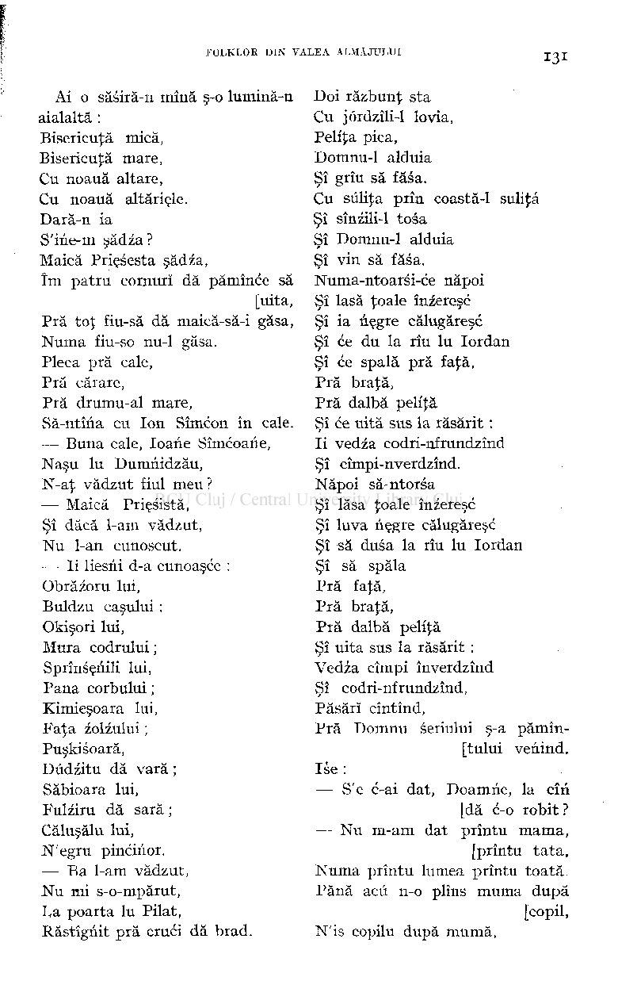

Doi răzbunţ sta Cu jôrdzîli-1 lovia, Peliţa pica, Domnu-1 alduia Şî grîu să făea. Cu suliţa prin coastă-1 suliţă Şî sînzili-1 tosa Şî Domnu-1 alduia Şî vin să făsa. Numa-ntoarsi-ce năpoi Şî lasă ţoale înzereşc Şî ia fiegre călugăresc Şî ce du la rîu lu Iordan Şî ce spală pră faţă, Pră braţă, Pră dalbă pelîţă Şî ce uită sus la răsărit : Ii vedza codri-nfrundzînd Şî cîmpi-nverdzînd. Năpoi să-ntorsa Şî lăsa ţoale înzereşc Şî luva negre călugăresc Şî să dusa la rîu lu Iordan Şî să spăla Pră faţă, Pră braţă, Pră dalbă peliţă Şî uita sus la răsărit : Vedza cîmpi înverdzînd Şî codri-nfrundzînd, Păsări cîntînd, Pră Domnu seriului ş-a pămîn-

Ai o săsiră-n mînă ş-o lumină-n aialaltă : Bisericuţă mică, Bisericuţă mare, Cu noauă altare, Cu noauă altăriele. Dară-n ia S'ine-m şădza? Maică Priesesta şădza,

- î m patru cornurî dă pămînce să [uita,

Pră toţ fiu-să dă maică-să-i găsa, Numa fiu-so nu-1 găsa. Pleca pră cale, Pră cărare, Pră drumu-al mare, Să-ntîna cu Ion Sîmcon în cale.

— Buna cale, Ioane Sîmcoane, Naşu lu Dumnidzău,

- N-aţ vădzut fiul meu ?

— Maică Priesistă,

Şî dacă l-am vădzut,

Nu 1-an cunoscut.

— Ii liesrii d-a cunoaşce : Obrăzoru lui, Buldzu caşului : Okişori lui, Mura codrului ; Sprînsenili lui, Pana corbului ; Kimieşoara lui, Faţa zolzului ; Puşkisoară, Dudzitu dă vară ; Săbioara lui, Fulziru dă sară ; Căluşălu lui, N'egru pinciiior.

[tului venind. Ise :

— S'e c-ai dat, Doamne, la cîn [dă c-o robit ? — Nu m-am dat prîntu mama,

[prîntu tata, Numa prîntu lumea prîntu toată. Pană acu n-o plîns muma după

— Ba l-am vădzut, Nu mi s-o-mpărut, La poarta lu Pilat,

[copil, N'is copilu după mumă,

- Răstignit pră cruci dă brad.

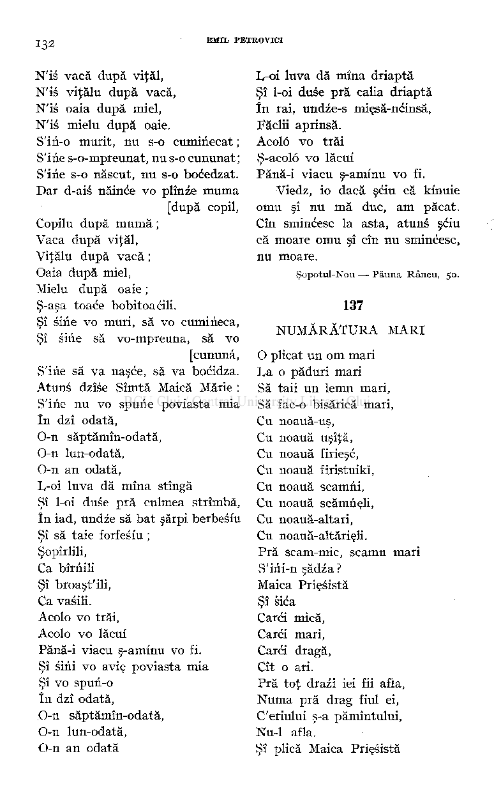

N'ié vacă după viţăl, N'ié viţălu după vacă, N'ié oaia după miel, N'ié mielu după oaie. S'in-o murit, nu s-o cuminecat ; S'ine s-o-mpreunat, nu s-o cununat ; S'ine s-o născut, nu s-o bocedzat. Dar d-aié năince vo plînze muma

D-oi luva dă mîna driaptă Şî l-oi duée pră calia driaptă î n rai, undze-s miesă-ncinsă, Făclii aprinsă. Acolo vo trăi Ş-acolo vo lăcui Pănă-i viacu ş-aminu vo fi.

Viedz, io dacă şciu că kfnuie omu şî nu mă duc, am păcat. Cîn smincesc la asta, atuné şciu că moare omu şî cîn nu smincesc, nu moare.

[după copil,

Copilu după mumă ; Vaca după viţăl, Viţălu după vacă ; Oaia după miel, Mielu după oaie ; Ş-aşa toace bobitoacili. Şî éine vo muri, să vo cumineca, Şî éihe să vo-mpreuna, să vo

Şopotul-Nou — Păuna Râncu, 50.

137

NUMĂRĂTURA MARI

[cununa, S'ine să va naşce, să va bocidza. Atuné dzîée Sîmtă Maică Mărie : S'ine nu vo spuiie poviasta mia în dzî odată, O-n săptămîn-odată, O-n lun-odată, O-n an odată, D-oi luva dă mîna stingă Şî l-oi duée pră culmea strîmbă, î n iad, undze să bat şărpi berbeéiu Şî să taie forfesfu ; Şopîrlili, Ca bîrnili Şî broaşt'ili, Ca vaéili. Acolo vo trăi, Acolo vo lăcui Pănă-i viacu ş-aminu vo fi. Şî sini vo avie poviasta mia Şî vo spun-o în dzî odată, O-n săptămîn-odată, O-n lun-odată, O-n an odată

O plicat un om mari Da o păduri mari Să taii un lemn mari, Să fac-o bisărică mari, Cu noauă-us, Cu noauă uşîţă, Cu noauă firieşc, Cu noauă firistuikî, Cu noauă scamni, Cu noauă scămneli, Cu noauă-altari, Cu noauă-altărieli. Pră scam-mic, scamn mari S'ini-n şădza ? Maica Prieeistă Şî sica Carci mică, Carci mari, Carci dragă, Cît o ari. Pră toţ drazi iei fii afia, Numa pră drag fiul ei, Ceriului ş-a pămîntului, Nu-1 afla! Şî plică Maica Prieeistă

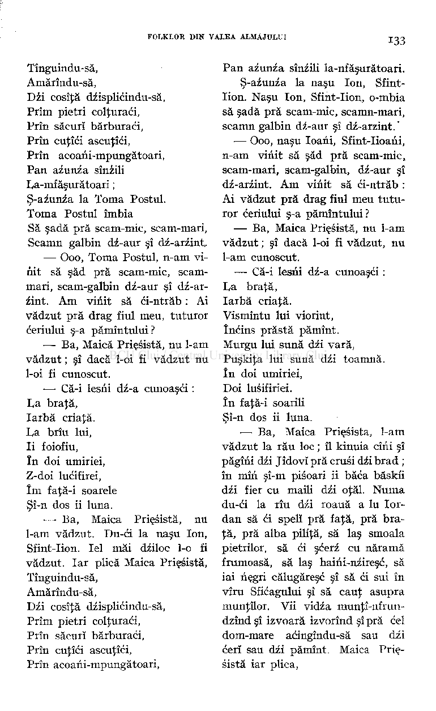

- Tînguindu-să, Amărîndu-să, Dzi cosiţă dzisplicindu-să, Prim pietri colţuraci, Prîn săcurî bărburaci, Prin cutiei ascuţîci, Prîn acoani-mpungătoari, Pan azunza sînzili La-mf ăşurătoari ; Ş-azunza la Toma Postul. Toma Postul îmbia

Pan azunza sînzili la-nfăşurătoari.

Ş-azunza la naşu Ion, SfintIion. Naşu Ion, Sfint-Iion, o-mbia să şadă pră scam-mic, scamn-mari, scamn galbin dz-aur şî dz-arzint.'

— Ooo, naşu Ioani, Sfint-Iioani, n-am vinit să şăd pră scam-mic, scam-mari, scam-galbin, dz-aur şî dz-arzint. A m vinit să ci-ntrăb : Ai vădzut pră drag fiul meu tuturor ceriului ş-a pămîntului?

- Să şadă pră scam-mic, scam-mari, Scamn galbin dz-aur şî dz-arzint,

— Ba, Maica Priesistă, nu l-am vădzut ; şî dacă l-oi fi vădzut, nu l-am cunoscut.

— Ooo, Toma Postul, n-am vinit să şăd pră scam-mic, scammari, scam-galbin dz-aur şî dz-arzint. Am vinit să ci-ntrăb : Ai vădzut pră drag fiul meu, tuturor ceriului ş-a pămîntului?

— Că-i lesni dz-a cunoaşci : La braţă, Iarbă criaţă. Vismîntu lui viorint, încins prăstă pămînt. Murgu lui sună dzi vară, Puşkiţa lui sună dzi toamnă, î n doi umiriei, Doi lusifiriei. î n faţă-i soarili Şî-n dos ii luna.

—- Ba, Maică Prieeistă, nu l-am vădzut ; şî dacă l-oi fi vădzut nu l-oi fi cunoscut.

— Că-i lesni dz-a cunoaşci : La braţă, Iarbă criaţă. La brîu lui, Ii foiofiu,

— Ba, Maica Priesistă, l-am vădzut la rău loc ; îl kinuia cîni şî păgîni dzi Jîdovî pră crusi dzi brad ; în mîn şî-m pisoari ii băca băskii dzi fier cu maili dzi oţăl. Numa du-ci la rîu dzi roauă a lu Iordan să ci speli pră faţă, pră braţă, pră alba pilită, să laş smoala pietrilor, să ci şcerz cu năramă frumoasă, să laş haini-nzireşc, să iai negri călugăresc şî să ci sui în vîru Sficagului şî să caut asupra munţîlor. Vii vidza munţî-nfrundzînd şî izvoară izvorînd şî pră cel dom-mare acingîndu-să sau dzi ceri sau dzi pămînt. Maica Prieeistă iar plica,

- î n doi umiriei, Z-doi lucifirei, î m faţă-i soarele Şî-n dos ii luna.

— Ba, Maica Priesistă, nu l-am vădzut. Du-ci la naşu Ion, Sfint-Iion. Iei măi dziloc l-o fi vădzut. Iar plică Maica Prieeistă,

- Tînguindu-să, Amărîndu-să, Dzi cosiţă dzisplicindu-să, Prîm pietri colţuraci, Prîn săcurî bărburaci, Prîn cuţîci ascuţîci, Prîn acoani-mpungătoari,

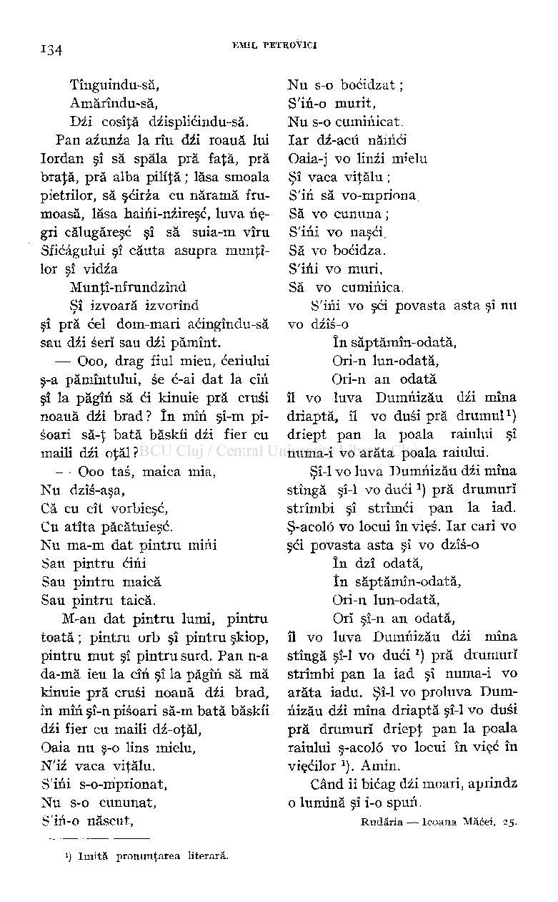

Nu s-o bocidzat ; S'in-o murit, Nu s-o cumiiiicat. Iar dz-acu năirici Oaia-j vo linzi mielu Şî vaca viţălu ; S'in să vo-mpriona Să vo cununa ; S'ini vo naşei. Să vo bocidza. S'ini vo muri, Să vo cuminica.

Tînguindu-să, Amărîndu-să, Dzi cosiţă dzisplicindu-să.

Pan azunza la rîu dzi roauă lui Iordan şî să spăla pră faţă, pră braţă, pră alba pilită ; lăsa smoala pietrilor, să şcirza cu năramă frumoasă, lăsa haini-nzireşc, luva negri călugăresc şî să suia-m vîru Sficâgului şî căuta asupra munţilor şî vidza

Munţî-nfrundzînd Şî izvoară izvorînd

S'ini vo şei povasta asta şî nu

vo dzîs-o în săptămîn-odată, Ori-n lun-odată, Ori-n an odată

şî pră cel dom-mari acingîndu-să sau dzi seri sau dii pămînt.

— Ooo, drag fiul mieu, ceriului ş-a pămîntului, ée c-ai dat la cîn şî la păgîn să ci kinuie pră cruéi noauă dzi brad? î n mîn şî-m pisoari să-ţ bată băskii dzi fier cu maili dzi oţăl?

îl vo luva Dumnizău dzi mîna driaptă, îl vo dusi pră drumul

) driept pan la poala raiului şî numa-i vo arăta poala raiului.

1

Şî-1 vo luva Dumnizău dzi mîna stîngă şî-1 vo duci ) pră drumuri strîmbi şî strîmci pan la iad. Ş-acolo vo locui în vieé. Iar cari vo şei povasta asta şî vo dzîs-o

— Ooo tas, maica mia, Nu dzîs-aşa, Că cu cît vorbieşc, Cu atîta păcătuiesc. Nu ma-m dat pintru mini Sau pintru cini Sau pintru maică Sau pintru taică.

î n dzî odată, î n săptămîn-odată, Ori-n lun-odată, Ori şî-n an odată,

M-an dat pintru lumi, pintru toată ; pintru orb şî pintru şkiop, pintru mut şî pintru surd. Pan n-a da-mă ieu la cîn şî la păgîn să mă kinuie pră cruéi noauă dzi brad, în mîn şî-n pisoari să-m bată băskii dzi fier cu maili dz-oţăl, Oaia nu ş-o lins mielu, N'iz vaca viţălu. S'ini s-o-rriprionat, Nu s-o cununat, S'iri-o născut,

îl vo luva Dumnizău dzi mîna stîngă şî-1 vo duci ) pră drumuri strîmbi pan la iad şî numa-i vo arăta iadu. Şî-1 vo proluva Dumnizău dzi mîna driaptă şî-1 vo duéi pră drumuri driepţ pan la poala raiului ş-acolo vo locui în viec în viecilor ). Amin.

Când ii bicag dzi moari, aprindz o lumină şî i-o spun.

Rudăria — Icoana Măcei, 25.

###### ) Imită pronunţarea literară.

x

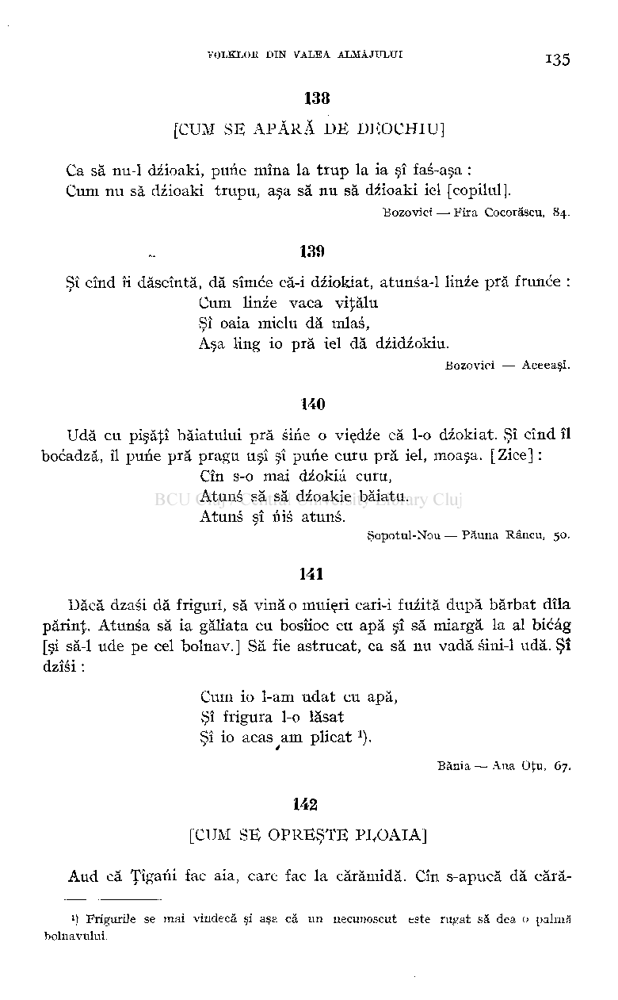

138

[CUM SE APĂR Ă D E DEOCHIU]

Ca să nu-1 dzioaki, pune mîna la trup la ia şî fas-aşa : Cum nu să dzioaki trupu, aşa să nu să dzioaki iei [copilul].

Bozovici — Fira Cocorăscu, 84.

139

Şî cînd îi dăscînta, dă sîmce că-i dziokiat, atunsa-1 linze pră frunce : Cum linze vaca viţălu Şî oaia mielu dă mlas, Aşa ling io pră iei dă dzidzokiu.

Bozovici — Aceeaşi.

140

Udă cu pişăţî băiatului pră sine o viedze că l-o dzokiat. Şî cînd îl

bocadză, îl pune pră pragu uşî şî pune curu pră iei, moaşa. [Zice] : Cîn s-o mai dzokiâ curu, Atuné să să dzoakie băiatu. Atuns şî riis atuns.

Şopotul-Nou — Păuna Râncu, 50.

141

Dacă dzasi dă friguri, să vină o muişri cari-i fuzită după bărbat dîla părinţ. Atunsa să ia găliata cu bosîioc cu apă şî să miargă la al bicâg [şi să-1 ude pe cel bolnav.] Să fie astrucat, ca să nu vadă sini-1 udă. Şî dzîsi :

Cum io l-am udat cu apă, Şî frigura l-o lăsat Şî io acas^am plicat

).

1

Bănia — Ana Oţu, 67.

142

[CUM SE OPREŞT E PDOAIA]

Aud că Ţigani fac aia, care fac la cărămidă. Cîn s-apucă dă cără-

') Frigurile se mai vindecă şi aşa că un necunoscut este rugat să dea o palmă bolnavului.

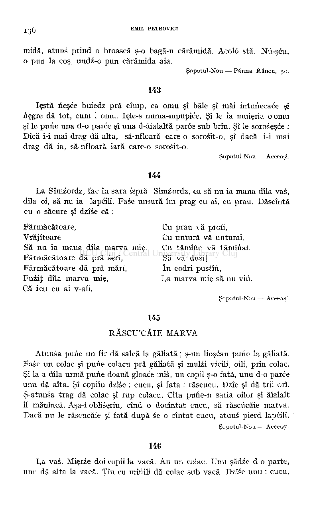

midă, atuns prind o broască ş-o bagă-n cărămidă. Acolô stă. Nu-şcu, o pun la coş, undz-o pun cărămida aia.

Şopotul-Nou — Păuna Râncu, 50.

143

Iestă rieşce buiedz pră cîmp, ca omu şî băle şî măi inturiecace şî negre dă tot, cum i omu. Iele-s numa-mpupice. Şî le ia muieria o omu şî le pune una d-o parce şî una d-âialaltă parce sub brîu. Şî le soroseşce : Dîcă i-i mai drag dă alta, să-nfloară care-o sorosit-o, şî dacă i-i mai drag dă ia, să-nfloară iară care-o sorosit-o.

Şopotul-Nou — Aceeaşi.

144

La Sîmzordz, fac în sara ispră Sîmiordz, ca să nu ia mana dîla vas, dîla oi, să nu ia lapcili. Fase unsură îm prag cu ai, cu prau. Dăscîntă cu o săcure şî dzîée că :

Fărmăcătoare, Vrăjitoare Să nu ia mana dîla marva mie. Fărmăcătoare dă pră seri, Fărmăcătoare dă pră mări, Fuziţ dîla marva mie, Că ieu cu ai v-afi,

Cu prau vă proii, Cu untură vă unturai, Cu tămîrie vă tămînai. Să vă dusiţ î n codri pustîri, La marva mie să nu vin.

Şopotul-Nou — Aceeaşi.

145

RĂSCU'CĂIE MARVA

Atunsa purie un fir dă salcă la găliată ; ş-un lioşcan purie la găliată. Fase un colac şî purie colacu pră găliată şî mulzi vicili, oili, prîn colac. Şî la a dîla urmă purie doauă gloace mis, un copil ş-o fată, unu d-o parce unu dă alta. Şî copilu dzîse : cucu, şî fata : răscucu. Dzîc şî dă trii ori. Ş-atunsa trag dă colac şî rup colacu. Cîta purie-n saria oilor şî ălalalt îl mănîncă. Aşa-i obliéeriu, cînd o docîntat cucu, să răscucăie marva. Dacă nu le răscucăie şî fată după se o cîntat cucu, atuns pierd lapcili.

Şopotul-Nou — Aceeaşi.

146

La vas. Mierze doi copii la vacă. Au un colac. Unu şădze d-o parte, unu dă alta la vacă. Ţîn cu mîriili dă colac sub vacă. Dzîse unu : cucu,

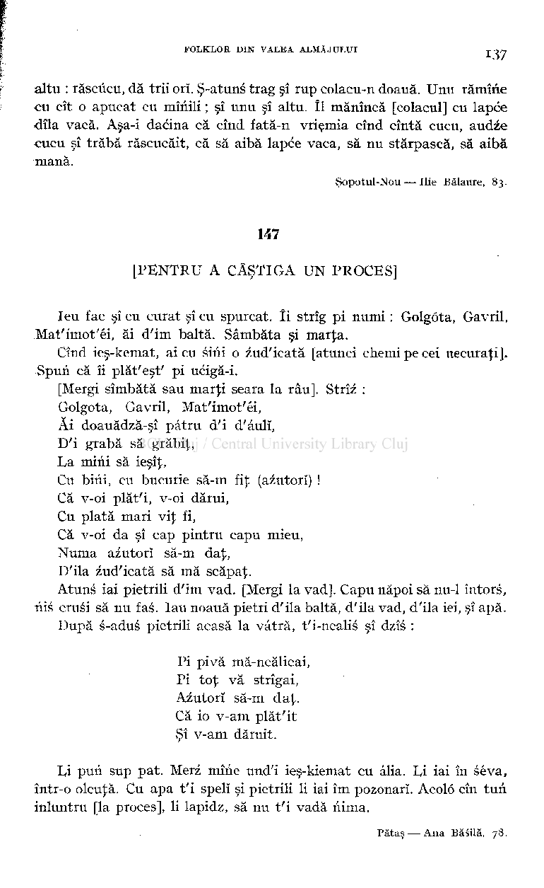

altu : răscucu, dă trii ori. Ş-atuns trag şî rup colacu-n doauă. Unu rămîne •cu cît o apucat cu mînili ; şî unu şî altu. îl mănîncă [colacul] cu lapce dîla vacă. Aşa-i dacina că cînd fată-n vriemia cînd cîntă cucu, audze cucu şî trăbă răscucăit, că să aibă lapce vaca, să nu stărpască, să aibă mană.

Şopotul-Nou — Ilie Bălaure, 83.

147

[PENTRU A CÂŞTIGA UN PROCES]

leu fac şî cu curat şî cu spurcat. îi strîg pi numi : Golgota, Gavril, Mat'imot'éi, ăi d'im baltă. Sâmbăta şi marţa.

Cînd ieş-kemat, ai cu sini o zud'icată [atunci chemi pe cei necuraţi].

Spun că îi plăt'eşt' pi ucigă-i. [Mergi sîmbătă sau marţi seara la râu]. Strîz : Golgota, Gavril, Mat'imot'éi, Ăi doauădză-şî patru d'i d'âulî, D'i grabă să grăbit, I

a mini să ieşîţ, Cu bini, cu bucurie să-m fiţ (azutorî) ! Că v-oi plăt'i, v-oi dărui, Cu plată mari viţ fi, Că v-oi da şî cap pintru capu mieu, Numa azutorî să-m daţ, D'ila zud'icată să mă scăpat. Atuns iai pietrili d'im vad. [Mergi la vad]. Capu năpoi să nu-1 întors,

y

nié cruéi să nu fas. Iau noauă pietri d'ila baltă, d'ila vad, d'ila iei, şî apă. După s-adus pietrili acasă la vatră, t'i-ncalis şî dzîs :

Pi pivă mă-ncălicai, Pi toţ vă strigai, Azutorî să-m daţ. Că io v-am plat'it Şî v-am dăruit.

Ei pun sup pat. Merz mîne und'i ieş-kiemat cu alia. Li iai în séva, într-o olcuţă. Cu apa t'i speli şi pietrili li iai îm pozonarî. Acolo cîn tun inluntru [la proces], li lapidz, să nu t'i vadă liima.

Pătaş — Ana Băsilă, 78.

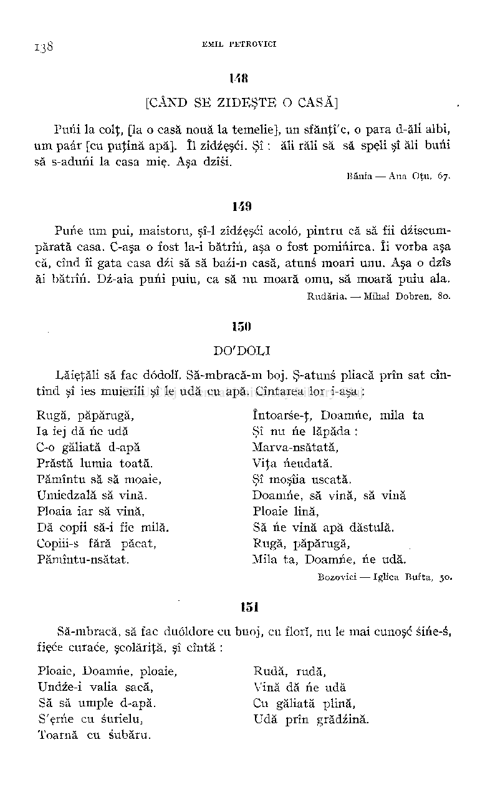

118

[CÂND SE ZIDEŞTE O CASĂ]

Puni la colţ, [la o casă nouă la temelie], un sfănţî'c, o para d-ăli albi, um paâr [cu puţină apă]. îl zîdzeşci. Şî : ăli răii să să speli şî ăli buni să s-adurii la casa mie. Aşa dzîsi.

Bănia — Ana Oţu, 67.

149

Puiîe um pui, maistoru, şî-1 zîdzeşci acolo, pintru că să fii dziscumpărată casa. C-aşa o fost la-i bătrîfi, aşa o fost pominirea. îi vorba aşa că, cînd îi gata casa dzi să să bazi-n casă, atuné moari unu. Aşa o dzîs ăi bătrîri. Dz-aia puni puiu, ca să nu moară omu, să moară puiu ala.

Rudăria. —• Minai Dobren, 80.

150

DO'DODI

Dăieţăli să fac dôdolï. Să-mbracă-m boj. Ş-atune pliacă prîn sat cîntînd şî ies muierili şî le udă cu apă. Cîntarea lor i-aşa : Rugă, păpărugă, Ia iej dă fie udă C-o găliată d-apă Prăstă lumia toată. Pămîntu să să moaie, Umiedzală să vină. Ploaia iar să vină, Dă copii să-i fie milă. Copiii-s fără păcat, Pămîntu-nsătat.

întoaree-ţ, Doamne, mila ta Şî nu ne lăpăda : Marva-nsătată, Viţa neudată. Şî moşîia uscată. Doamne, să vină, să vină Ploaie lină, Să ne vină apă dăstulă. Rugă, păpărugă, Mila ta, Doamne, ne udă.

Bozovici — Iglica Bufta, 50.

151

Să-mbracă, să fac duôldore cu buoj, cu florï, nu le mai cunosc éine-é, fiece curace, şcolăriţă, şî cîntă : Ploaie, Doamfie, ploaie, Rudă, rudă, Undze-i valia sacă, Vină dă ne udă Să să umple d-apă. Cu găliată plină, S'erfie cu éurielu, Udă prîn grădzină. Toarnă cu subăru.

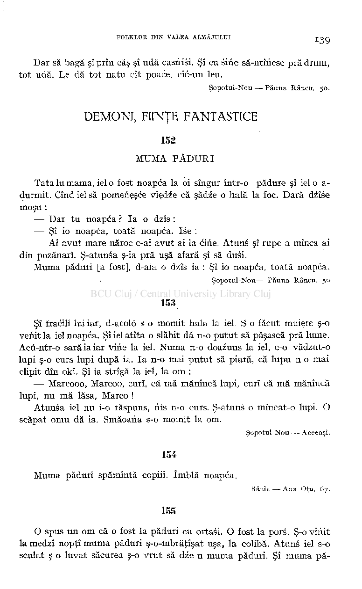

Dar să bagă şîprîn căş şî udă casnisi. Şî cu sine să-ntînesc pră drum, tot udă. De dă tot natu cît poace. cîc-un leu.

Şopotul-Nou — Păuna Râncu, 50.

DEMONI, FIINŢE FANTASTICE

152

MUMA PĂDUR I

Tata lu mama, iei o fost noapca la oi sîngur într-o pădure şî iei o adurmit. Cînd iei să pomeneşce viedze că şădze o hală la foc. Dară dzise moşu :

— Dar tu noapca ? Ia o dzîs :

— Şî io noapca, toată noapca. Ise :

— Ai avut mare năroc c-ai avut ai la cine. Atuns şî rupe a mînca ai din pozănarî. Ş-atunsa ş-ia pră uşă afară şî să dusi.

Muma păduri [a fost], d-aîa o dzîs ia : Şî io noapca, toată noapca.

Şopotul-Nou— Păuna Râncu, 50

153

Şî fracili lui iar, d-acolô s-o momit hala la iei. S-o făcut muiere ş-o venit la iei noapca. Şî iei atîta o slăbit dă n-o putut să păşască pră lume. Acu-ntr-o sară ia iar vine la iei. Numa n-o doazuns la iei, c-o vădzut-o lupi ş-o curs lupi după ia. Ia n-o mai putut să piară, că lupu n-o mai clipit dîn okî. Şî ia strîgă la iei, la om :

— Marcooo, Marcoo, curî, că mă mănîncă lupi, curî că mă mănîncă lupi, nu mă lăsa, Marco !

Atunsa iei nu i-o răspuns, his n-o curs. Ş-atuns o mîncat-o lupi. O scăpat omu dă ia. Smăoaha s-o momit la om.

Şopotul-Nou — Aceeaşi.

- 154

Muma păduri spămîntă copiii. îmblanoapca.

Bănia — Ana Oţu, 67.

- 155

O spus un om că o fost la păduri cu ortasi. O fost la pors. Ş-o vihit la medzî nopţî muma păduri ş-o-mbrăţîşat uşa, la colibă. Atuns iei s-o sculat ş-o luvat săcurea ş-o vrut să die-n muma păduri. Şî muma pă-

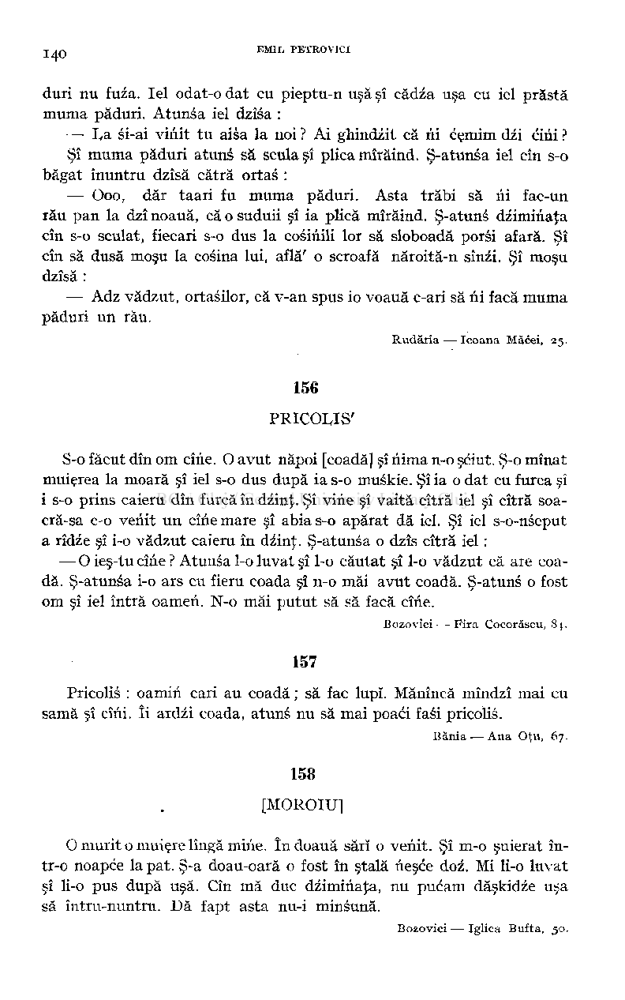

###### 140 EMIL PETR0V1CI

duri nu fuza. Iei odat-o dat cu pieptu-n uşă şî cădza uşa cu iei prăstă muma păduri. Atunsa iei dzîsa :

— La si-ai viriit tu aisa la noi ? Ai ghindzit că ni cernim dzi cirii ? Şî muma păduri atuns să scula şî plica mîrăind. Ş-atunsa iei cîn s-o

băgat înuntru dzîsă cătră ortaé :

— Ooo, dăr taari fu muma păduri. Asta trăbi să ni fac-un

- rău pan la dzî noauă, că o suduii şî ia plică mîrăind. Ş-atuns dzimiriaţă cîn s-o sculat, fiecari s-o dus la cosinili lor să sloboadă porsi afară. Şî cîn să dusă moşu la cosina lui, află' o scroafă năroită-n sînzi. Şî moşu dzîsă :

— Adz vădzut, ortasilor, că v-an spus io voauă c-ari să ni facă muma păduri un rău.

Rudăria — Icoana Măcei, 25.

156

PRICOLIS'

S-o făcut dîn om cîrie. O avut năpoi [coadă] şî riima n-o şciut. Ş-o minat muierea la moară şî iei s-o dus după ia s-o muskie. Şîia o dat cu furca şî i s-o prins caieru dîn furcă în dzinţ. Şî vine şî vaită cîtră iei şî cîtră soacră-sa c-o venit un cîne mare şî abia s-o apărat dă iei. Şî iei s-o-nseput a rîdze şî i-o vădzut caieru în dzinţ. Ş-atunsa o dzîs cîtră iei :

— O ieş-tu cîne ? Atunsa l-o luvat şî l-o căutat şî l-o vădzut că are coadă. Ş-atunsa i-o ars cu fieru coada şî n-o măi avut coadă. Ş-atuns o fost om şî iei întră oameri. N-o măi putut să să facă cîrie.

Bozovici — Fira Cocorăscu, 84.

157

Pricolis : oamiri cari au coadă ; să fac lupi. Mănîncă mîndzî mai cu samă şî cîrii. îi ardzi coada, atuné nu să mai poaci fasi pricolis.

Bănia — Ana Oţu, 67.

158

[MOROIU]

O murit o muiere lîngă mine. în doauă sărî o venit. Şî m-o şuierat într-o noapce la pat. Ş-a doau-oară o fost în ştală rieşce doz. Mi li-o luvat şî li-o pus după uşă. Cîn mă duc dzimiriaţă, nu pucam dăşkidze uşa

- să întru-nuntru. Dă fapt asta nu-i minsună.

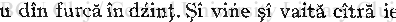

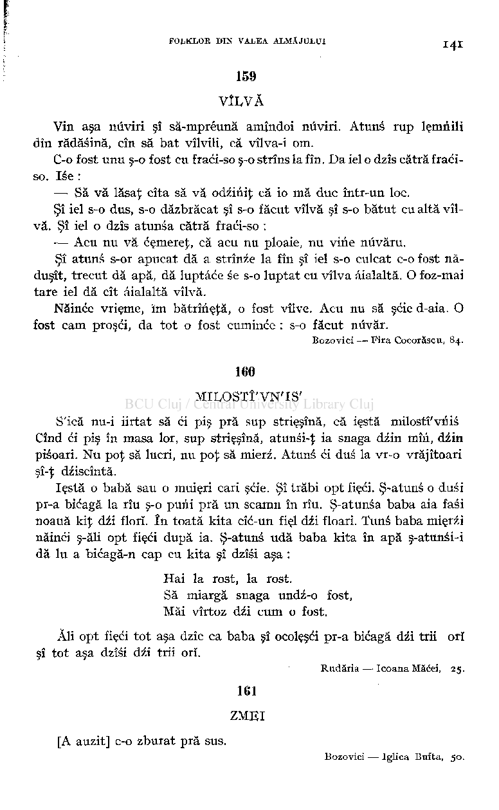

159

VÎLVĂ

Vin aşa nuviri şî să-mpreună amjndoi nûviri. Atuné rup lemnili dîn rădăeină, cîn să bat vîlvili, că vîlva-i om.

C-o fost unu ş-o fost cu fraci-so ş-o strîns la fîn. Da iei o dzîs cătră fraciso. Ise :

— Să vă lăsat cîta să vă odziniţ că io mă duc într-un loc. Şî iei s-o dus, s-o dăzbrăcat şî s-o făcut vîlvă şî s-o bătut cu altă vîl-

vă. Şî iei o dzîs atunsa cătră fraci-so :

— Acu nu vă cemereţ, că acu nu ploaie, nu vine niivăru. Şî atuné s-or apucat dă a strînze la fîn şî iei s-o culcat c-o fost nă­

duşit, trecut dă apă, dă luptâce se s-o luptat cu vîlva âialaltă. O foz-mai tare iei dă cît âialaltă vîlvă.

Năince vrieme, îm bătrîneţă, o fost vîlve. Acu nu să şcie d-aia. O fost cam proşci, da tot o fost cumince : s-o făcut niivăr.

Bozovici — Pira Cocorăscu, 84.

160

MILOSTÎ'VN'IS' S'ică nu-i iirtat să ci piş pră sup strieşînă, că iestă milostî'vriis

Cînd ci piş în masa lor, sup strieşînă, atunei-ţ ia snaga dzin mîn, dzin piéoari. N u poţ să lucri, nu poţ să mierz. Atuns ci due la vr-o vrăjîtoari şî-ţ dziscîntă.

Iestă o babă sau o muieri cari şcie. Şî trăbi opt fieci. Ş-atune o dusi pr-a bicagă la rîu ş-o purii pră un scamn în rîu. Ş-atunea baba aia fasi noauă kiţ dzi flori. î n toată kita cîc-un fiel dzi floari. Tuné baba mierzi năinci ş-ăli opt fieci după ia. Ş-atuns udă baba kita în apă ş-atunsi-i dă lu a bicagă-n cap cu kita şî dzîéi aşa :

Hai la rost, la rost. Să miargă snaga undz-o fost, Măi vîrtoz dzi cum o fost.

Ăli opt fieci tot aşa dzîc ca baba şî ocoleşci pr-a bicagă dzi trii orî şî tot aşa dzîéi dzi trii ori.

Rudăria — Icoana Măcei, 25.

161

ZMEI [A auzit] c-o zburat pră sus.

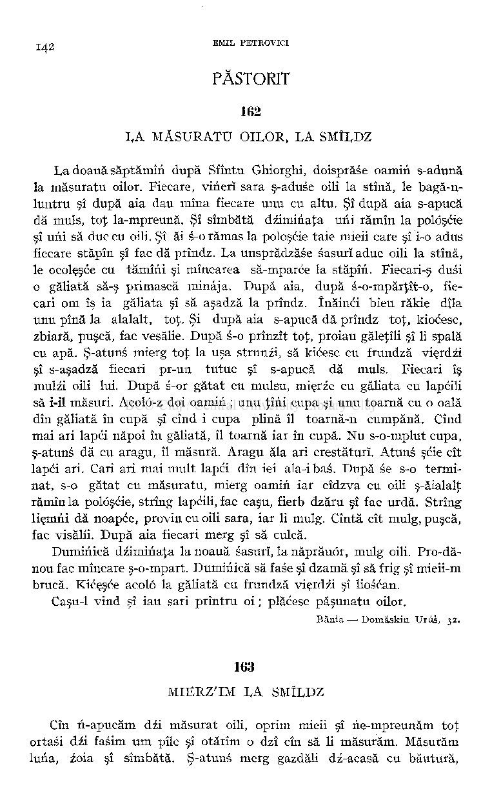

##### PĂSTORIT

162

LA MĂSURATU OILOR, LA SMÎLDZ

La doauă săptămîri după Sfîntu Ghiorghi, doisprăse oamiri s-adună la măsuratu oilor. Fiecare, vineri sara ş-aduse oili la stînă, le bagă-nluntru şî după aia dau mîna fiecare unu cu altu. Şî după aia s-apucă dă muls, toţ la-mpreună. Şî sîmbătă dziminaţa urii rămîn la poloşcie şî urii să duc cu oili. Şî ăi é-o rămas la poloşcie taie mieii care şî i-o adus fiecare stăpîn şî fac dă prîndz. La unsprădzăse sasuri aduc oili la stînă, le ocoleşce cu tămîrii şi mîncarea să-mparce la stăpîri. Fiecari-ş dusi o găliată să-ş primască minâja. După aia, după s-o-mpărţît-o, fiecari om îş ia găliata şî să aşadză la prîndz. înăinci bieu răkie dîla unu pînă la alalalt, toţ. Şi după aia s-apucă dă prîndz toţ, kiocesc, zbiară, puşcă, fac vesălie. După s-o prînzît toţ, proiau găleţîli şî li spală cu apă. Ş-atuns mierg toţ la uşa strunzi, să kicesc cu frundză vierdzi şî s-aşadză fiecari pr-un tutuc şî s-apucă dă muls. Fiecari îş mulzi oili lui. După s-or gătat cu mulsu, mierze cu găliata cu lapcili să i-il măsuri. Acolô-z doi oamin ; unu ţîrii cupa şi unu toarnă cu o oală dîn găliată în cupă şî cînd i cupa plină îl toarnă-n cumpănă. Cînd mai ari lapci năpoi în găliată, îl toarnă iar în cupă. Nu s-o-mplut cupa, ş-atuns dă cu aragu, îl măsură. Aragu ăla ari crestături. Atuns şcie cît lapci ari. Cari ari mai mult lapci dîn iei ala-ibas. După se s-o terminat, s-o gătat cu măsuratu, mierg oamiri iar cîdzva cu oili ş-ăialalţ

- rămîn la poloşcie, string lapcili, fac caşu, fierb dzăru şî fac urdă. String liemrii dă noapce, provin cu oili sara, iar li mulg. Cîntă cît mulg, puşcă, fac visălii. După aia fiecari merg şî să culcă.

Dumiriică dzimiriaţa la noauă sasuri, la năprăuor, mulg oili. Pro-dănou fac mîncare ş-o-mpart. Dumiriică să fase şî dzamă şî să frig şî mieii-m brucă. Kiceşce acolô la găliată cu frundză vierdzi şî lioscan.

Caşu-1 vind şî iau sari prîntru oi ; plăcesc păşunatu oilor.

Bănia — Domăskin Unis, 32.

163

MIERZ'IM LA SMÎLDZ

Cîn ri-apucăm dzi măsurat oili, oprim mieii şî rie-mpreunăm toţ ortasi dzi fasim u m pîlc şî otărîm o dzî cîn să li măsurăm. Măsurăm luna, zoia şî sîmbătă. Ş-atuns merg gazdăli dz-acasă cu băutură,

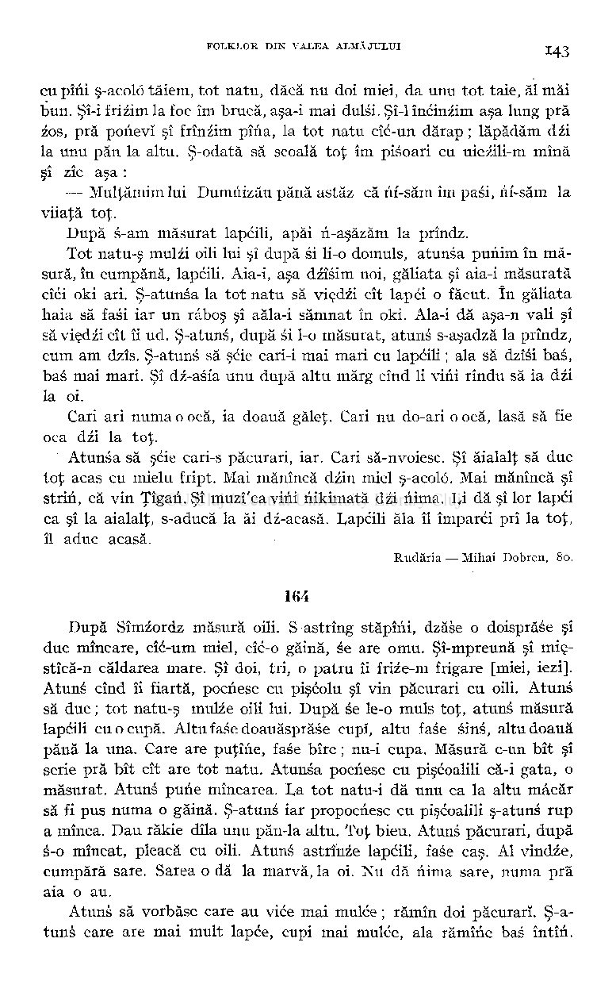

cu pîni ş-acolo tăiem, tot natu, dacă nu doi miei, da unu tot taie, ăl măi bun. Şî-i frizim la foc im brucă, aşa-i mai dulsi. Şî-1 încinzim aşa lung pră zos, pră ponevî şî frînzim pîiia, la tot natu cîc-un dărap ; lăpădăm dzi la unu păn la altu. Ş-odată să scoală toţ îm pisoari cu uiezili-m mînă şî zîc aşa :

— Mulţămim lui Dumnizău pană astăz că nf-săm îm pasi, rii-săm la

viiaţă toţ. După s-am măsurat lapcili, apăi n-aşăzăm la prîndz. Tot natu-ş mulzi oili lui şî după si li-o domuls, atunsa punim în măsură, în cumpănă, lapcili. Aia-i, aşa dzîsim noi, găliata şî aia-i măsurata cîci oki ari. Ş-atunea la tot natu să viedzi cît lapci o făcut. în găliata haia să fasi iar un râboş şî aăla-i sămnat în oki. Ala-i dă aşa-n vali şî să viedzi cît îi ud. Ş-atuns, după si l-o măsurat, atuns s-aşadză la prîndz, cum am dzîs. Ş-atuns să şcie cari-i mai mari cu lapcili ; ala să dzîsi bas, bas mai mari. Şî dz-aéia unu după altu mărg cînd li vini rîndu să ia dzi la oi.

Cari ari numaoocă, ia doauă găleţ. Cari nu do-ari o ocă, lasă să fie oca dzi la toţ.

Atunsa să şcie cari-s păcurari, iar. Cari să-nvoiesc. Şî ăialalţ să duc toţ acas cu mielu fript. Mai mănîncă dzin miel ş-acolo. Mai mănîncă şî strin, că vin Ţîgan. Şî muzî'ca vini nikimată dzi nima. Li dă şî lor lapci ca şî la aialalţ, s-aducă la ăi dz-acasă. Lapcili ăla îl împarci prî la toţ, îl aduc acasă.

Rudăria — Mihai Dobren, 80.

164

După Sîmzordz măsură oili. S-astrîng stăpîni, dzăse o doisprăse şî duc mîncare, cîc-um miel, cîc-o găină, se are omu. Şî-mpreună şî miestîcă-n căldarea mare. Şî doi, tri, o patru îi frize-m frigare [miei, iezi]. Atuné cînd îi fiartă, pocnesc cu pişcolu şî vin păcurari cu oili. Atuné să duc ; tot natu-ş mulze oili lui. După ée le-o muls toţ, atuns măsură lapcili cu o cupă. Altu f ase doauăsprăee cupï, altu faée éiné, altu doauă pană la una. Care are puţine, fase bîrc ; nu-i cupa. Măsură c-un bît şî scrie pră bît cît are tot natu. Atunéa pocnesc cu pişcoalili că-i gata, o măsurat. Atuné pune mîncarea. La tot natu-i dă unu ca la altu mâcăr să fi pus numa o găină. Ş-atune iar propocnesc cu pişcoalili ş-atune rup a mînca. Dau răkie dîla unu păn-la altu. Toţ bieu. Atuné păcurari, după é-o mîncat, pleacă cu oili. Atuné astrînze lapcili, fase caş. Al vindze, cumpără sare. Sarea o dă la marvă, la oi. Nu dă nima sare, numa pră aia o au.

Atuns să vorbăsc care au vice mai mulce ; rămîn doi păcurari. Ş-atuns care are mai mult lapce, cupi mai mulce, ala rămîne baé întîn.

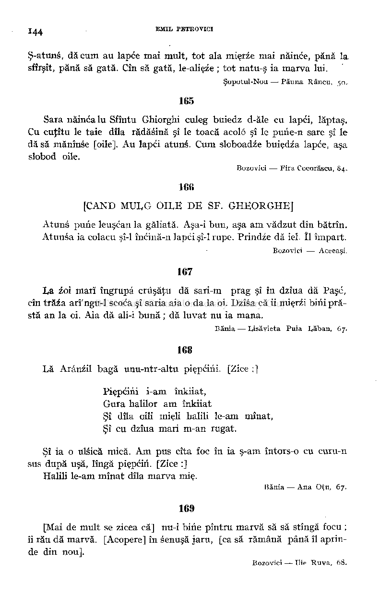

Ş-atuns, dă cum au lapce mai mult, to t ala mierze mai năince, pană la sfîrşît, pană să gată. Cîn să gată, le-alieze ; to t natu-ş ia marva lui.

Şopotul-Nou — Păuna Râncu, 50.

165

Sara năinca lu Sfîntu Ghiorghi culeg buiedz d-ăle cu lapci, lăptaş. Cu cuţîtu le taie dîla rădăeină şî le toacă acolo şî le pune-n sare şî le dă să mănînse [oile]. Au lapci atuné. Cum sloboadze buiedza lapce, aşa slobod oile.

Bozovici — Fira Cocorăscu, 84.

166

[CAND MULG OILE D E SF . GHEORGHE ]

Atuns pune leuşcan la găliată. Aşa-i bun, aşa am vădzut dîn bătrîn. Atunsa ia colacu şî-1 încină-n lapci şî-1 rupe. Prindze dă iei. îl împart.

Bozovici — Aceeaşi.

167

La zoi mari îngrupâ cruşăţu dă sari-m prag şî în dzîua dă Pasc, cîn trăza arî'ngu-1 scoca şî saria aia o da la oi. Dzîsa că ii mierzi bini prăstă an la oi. Aia dă ali-i bună ; dă luvat nu ia mana.

Bănia — Lisăvieta Puia Lăban, 67.

168

Lă Arânzil bagă unu-ntr-altu piepcini. [Zice :]

Piepcini i-am înkiiat, Gura halilor a m înkiiat Şî dîla oili micii halili le-am mînat, Şî cu dzîua mari m-an rugat.

Şî ia o uleică mică. A m pu s cîta foc în ia ş-am întors-o cu curu-n sus după uşă, lîngă piepciri. [Zice :]

Halili le-am mînat dîla marva mie.

Bănia — Ana Oţu, 67.

169

[Mai de mult se zicea că] nu-i bine pîntru marvă să să stingă focu ; îi rău d ă marvă. [Acopere] în senuşă jaru, [ca să rămână până îl aprinde din nou].

Bozovici — Ilie Ruva, 68.

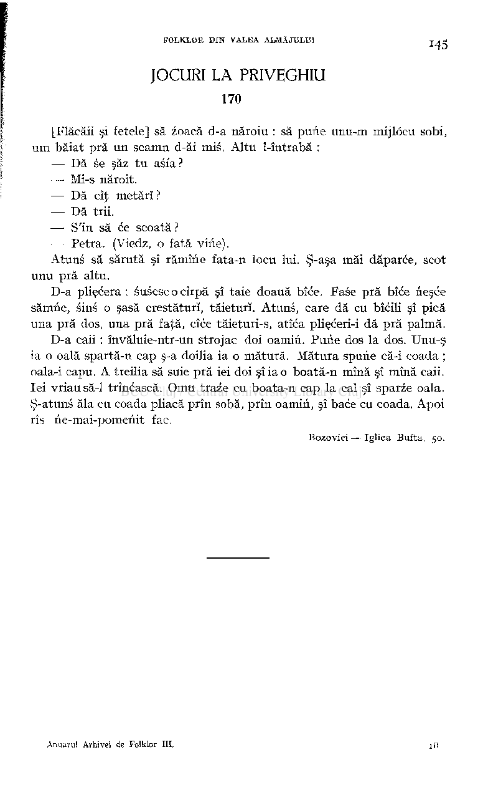

##### JOCURI LA PRIVEGHIU

170

[Flăcăii şi fetele] să zoacă d-a năroiu : să pune unu-m mijlôcu sobi, um băiat pră un scamn d-ăi mié. Altu 1-întrabă :

— Dă se şăz tu asia ?

— Mi-s năroit.

— Dă cîţ metărî ?

— Dă trii.

— S'in să ce scoată ?

— Petra. (Viedz, o fată vine). Atuns să sărută şî rămîne fata-n locu lui. Ş-aşa măi dăparce, scot

unu pră altu. D-a pliecera : susescocîrpă şî taie doauă bîce. Fase pră bîce neşce

- sămne, sins o şasă crestături, tăieturi. Atuns, care dă cu bîcili şî pică una pră dos, una pră faţă, cîce tăieturi-s, atîca plieceri-i dă pră palmă.

D-a caii : învăluie-ntr-un strojac doi oamin. Pune dos la dos. Unu-ş ia o oală spartă-n cap ş-a do ilia ia o mătură. Mătura spune că-i coada ; oala-i capu. A treilia să suie pră iei doi şîiao boată-n mînă şî mînă caii. Iei vriausă-1 trîncască. Omu traze cu boata-n cap la cal şî sparze oala. Ş-atuns ăla cu coada pliacă prîn sobă, prîn oamiii, şî bace cu coada. Apoi rîs ne-mai-pomeriit fac.

Bozovici — Iglica Bufta, 50.

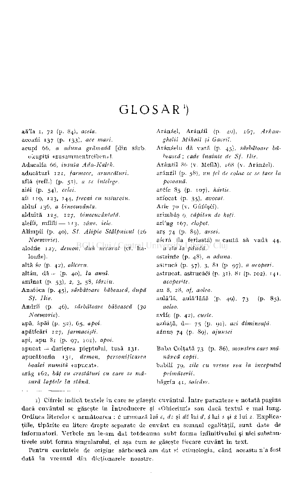

#### GLOSAR

#### )

1

###### Arânzel, Arânzil (p. 40), 167, Arhan­

- aăla i, 72 (p. 84), acela. acoani 137 (p. 133), ace mari. acupi 66, a aduna grămadă [din sârb.

ghelii Mihail şi Gavril.

###### Arânzelu dă vară (p. 45), sărbătoare bă­

bească ; cade înainte de Sf. llie. Arânzil 86 (v. Meflă), 168 (v. Arânzel). arânzil (p. 58), un fel de colac ce se tace la

okupiti «zusammentreiben»!. Adacalîa 66, insula Ada-Kaleh. aducăturî 121, farmece, aruncături. afla (refl.) (p. 51), a se înţelege. aiéi (p. 54), celei. aii 119, 123, 144, frecai cu usturoiu. aldui 136, a binecuvânta. alduită 125, 127, binecuvântată. aleffi, milili—113, zâne, iele. AHmpii (p. 40), Sf. Alipie Stâlpnicul (26

pomană. arefe 85 (p. 107), hârtie. arfocat (p. 35), avocat. Arie 70 (v. Gvmişci). arîmbâş 9, căpitan de hoţi. arî'ng 167, clopot. arş 74 (p. 89), arsei. aserâ (la feriastă) = caută să vadă 44,

Noemvrie).

aloârie 127, demon, duh -necurat (cf. ha-

a sta la pândă. astrînze (p. 48), a aduna. astrucâ (p. 57), 3, 81 (p. 97), a acoperi. astrucat, astrucâci {p. 31), 81 (p. 102), 141,

loarie). altă se (p. 42), altceva. altân, dă — (p. 40), la anul. amînat (p. 53), 2, 3, 58, târziu. Anafôca (p. 45), sărbătoare băbească, după

acoperite. au 8, 28, of, aoleo. aulă'lă, aulă'lăăă (p. 49), 73 (p. 85),

Sf. Jlie.

Andrii (p. 46), sărbătoare băbească (30

aoleo. avlie (p. 42), curte. azriâţă, d— 75 (p. 91), azi dimineaţă. azunş 74 (p. 89), ajunsei.

Noemvrie). apă, âpăi (p. 52), 65, apoi. apătfcărî 127, farmacişti. api, apu 81 (p. 97, 101), apoi. apucat = durierea pieptului, tusa 131. apucătoafia 131, demon, personificarea

Baba Colţată 73 (p. 86), monstru care mă­

nâncă copii.

boalei numită «apucat».

babili 79, zile cu vreme rea la începutul

arâg 162, băţ cu crestături cu care se mă­

primăverii.

sură laptele la stână.

băgri'n 41, salcâm.

1) Cifrele indică textele în care se găseşte cuvântul. între paranteze e notată pagina dacă cuvântul se găseşte în Introducere şi «Obiceiuri» sau dacă textul e mai lung. Ordinea literelor e următoarea : c urmează lui c, dz şi di lui d, ê lui s şi z lui z. Explicaţiile, tipărite cu litere drepte separate de cuvânt cu semnul egalităţii, sunt date de informatori. Verbele nu le-am dat totdeauna subt forma infinitivului şi nici substantivele subt forma singularului, ci aşa cum se găseşte fiecare cuvânt în text.

Pentru cuvintele de origine sârbească am dat si etimologia, când aceasta n'a fost dată în vreunul din dicţionarele noastre.

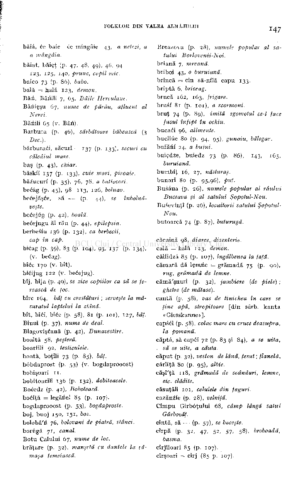

- băiâ, ce baie=ce mingâie 43, a netezi, a a mângâia.

Breazova (p. 28), numele popular al sa­

tului Borlovenii-Noi. briană 7, mreană. briboi 43, o buruiană. brîncă = cîn să-nflă capu 133. briptă 6, briceag. brucă 162, 163, irigare. bruéf 81 (p. 101), a scormoni. bruţ 74 (p. 89), imită sgomotul ce-l face

băiat, băişţ (p. 47, 48, 49), 46, 94

123, 125, 140, prunc, copil mic. baico 73 (p. 86), babo. bală = hală 123, demon. Băii, Băriili 7, 65, Băile Herculane. Băriicşu 67, nume de părdu, afluent al

Nerei. Băriili 65 (v. Bări). Barbura (p. 46), sărbătoare băbească (3

fusul înfipt în ochiu. bucaéi 96, alimente. bucliûc 80 (p. 94, 95), gunoiu, bălegar. bufării 24, a bufni. buiedze, buiedz 73 (p. 86), 143, 165,

Dec).

- bărburaci, săcuri— 137 (p. 133), securi cu
- călcâiul mare.

buruiană. bumbiţ 16, 27, năsturaş. bunari 80 (p. 95,96), puţ. Busâua (p. 26), numele popular al râului

baş (p. 43), chiar. băskîi 137 (p. 133), cuie mari, piroaie. băzucuri (p. 35), 76, 78, a batjocori. becâg (p. 45), 98 113, 126, bolnav. becejăşce, să — (p. 44), se înbolnă-

Buceava şi al satului Şopotul-Nou.

Busevinţî (p. 26), locuitorii satului Şopotul-

veşte. beéejûg (p. 42), boală. becejugu ăl rău (p. 44), epilepsia. berbesiu 136 (p. 132), ca berbecii,

Nou.

butoarcă 74 (p. 87), buturugă.

cap în cap.

căcaină 98, diaree, disenterie. cală = hală 123, demon. călfidzâ 85 (p. 107), îngălbenea la faţă. cămară dă lemne = grămadă 75 (p. 90),

bicag (p. 39), 83 (p. 104), 93. 137 (P- 134). (v. becag).

- bîce 170 (v. bît). biéijug 122 (v. becejug).

rug, grămadă de lemne.

- bîj, bîja (p. 49), se zice copiilor ca să se ferească de foc.

cămă'şnuri (p. 32), jambiere (de piele) ;

ghetre (de mătase).

- bîrc 164, băţ cu crestături ; serveşte la măsuratul laptelui la stână.

cântă (p. 58), vas de tinichea în care se ţine apă, stropitoare [din sârb. kanta «Giesskanne»].

bit, bîéi, bîée (p. 58), 81 (p. 101), 127, băţ. Biuul (p. 37), nume de deal. Blagovişcană (p. 42), Bunavestire. boaită 58, peşteră. boarfili 92, testiculele. boată, boţîli 73 (p. 85), băţ. bobdaprost (p. 53) (v. bogdaprooost) bobişoari 11. bobitoacili 136 (p. 132), dobitoacele. Bocedz (p. 42), Bobotează. bocită = legăriel 85 (p. 107). bogdaprooost (p. 53), bogdaproste. boj, buoj 150, 151, boz. bolobă'n 76, bolovani de piatră, stânci. borugă 71, canal. Botu Calului 67, nume de loc. brăţare (p. 32), manşeta cu dantele la că­

capsei (p. 58), colac mare cu cruce deasupra,

la pomană.

căptâ, să capei 72 (p. 83 şi 84), a se uita,

. să se uite, a căuta. căput (p. 32), veston de lână, ţesut; flanelă. cârliţă 80 (p. 95), albie. căşî'ţă 118, grămadă de scânduri, lemne,

ele. clădite. căsuţăli 101, celulele din faguri. cazănzfe (p. 28), velniţă. Cîmpu Gîrboţului 68, câmp lângă satul

Gărbovăţ. cîntă, să •— (p. 57), se boceşte. cîrpă (p. 32, 47, 52, 57, 58), broboadă,

basma. cîrjîioari 85 (p. 107). cîrşoari = cîrj (85 p. 107).

maşa femeiască.

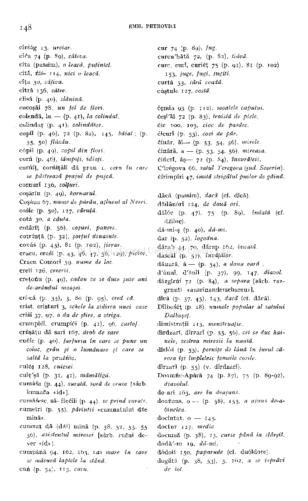

cirsâg 13, urcior.

cur 74 (p. 89), fug. curcu'bătă 72, (p. 82), tidvă. cure, curî, curieţ 75 (p. 91), 81 (p. 102)

- cîca 74 (p. 89), câteva.

- cîta (passim), o leacă, puţintel.

- cîtă, nis- 114, nici o leacă. cîţa 30, câţiva. cîtră 156, către. clisă (p. 40), slănină. cocoşai 78, un ţel de flori. colendă, la — (p. 41), la colindat. colindaş (p. 41), colindător. copil (p. 46), 72 (p. 82), 145, băiat; (p.

153, fuge, fugi, fugiţi. curta 53, fără coadă. cuştule 127, costă.

cemia 93 (p. 112), moalele capului. ceşî'lă 72 (p. 83), traistă de piele. cic 100, 103, cioc de pasăre. cicurî (p. 53), cozi de păr. einăr, ăl— (p. 53, 54, 56), mirele. cinară, a — (p. 53, 54, 56), mireasa. éirierï, ăş— 72 (p. 84), însurăţeii. C'irégova 66, satul Teregova (jud. Severin). cirimpfri 47, imită strigătul puilor de găină.

35, 50) flăcău.

copil(p.49),copil din flori. corn (p. 46), tâmpiţi, idioţi. corrifţ, corrifţăli dă prau 1, corn în care

se păstrează praful de puşcă. cornurî 136, colţuri. coşăriu (p. 49), homarul. Coşâua 67, nume de părău, afluent al Nerei. cosie (p. 50), 127, căruţă. cota 30, a căuta. cotăriţ (p. 56), coşuri, panere. cotrinţă (p. 32), şorţul dinainte. covâs (p. 43), 81 (p. 102), fierar. cracu, crasi (p. 43, 46, 47, 56, 129), picior. Cracu Comorî 59, nume de loc. creii 126, creerii. creţonu (p. 49), cadou ce se duce şase ani

dacă (passim), dacă (cf. dîcă). dădăuori 124, de două ori. dăloc (p. 47), 75 (p. 89), îndată (cf.

dziloc). dâ-mi-ş (p. 40), dă-mi. dar (p. 52), logodna. dărab 44, 70, dărap 162, bucată. dascăl (p. 57), învăţător. dăuară, â— (p. 54), a doua oară . d'âuul, d'âuli (p. 37), 99, 147, diavol. dăzgîrrii 72 (p. 84), a separa [sârb. raz-

de-arândul moaşei. cri-că (p. 35), 3, 80 (p. 95), cred că. crist, cristurî 3, schele la zidirea unei case criéi 37, 97, a da de ştire, a striga. crumpiél, crumpiéi (p. 41), 96, cartof. cruşăţu dă sari 167, drob de sare. cuéie (p. 40), farfuria în care se pune un

grnuti «auseinanderscharen»]. dîcă (p. 37, 45), 143, dacă (cl. dacă). Dîlboseţ (p. 28), numele popular al satului

Dalboşeţ. dimistraţii 113, menstruaţie. dîrdzarl, dîrzari (p. 55, 56), cei ce duc hai­

nele, zestrea miresii la nuntă.

dîrlôz (p. 53), perniţe de lână în jurul că­

colac, grâu şi o lumânare şi care se saltă la praznic,

rora îşi împletesc femeile cozile. dîrzari (p. 55) (v. dîrdzarî). Doamne-Apără 74 (p. 87), 75 (p. 89-92),

cules 128, culesei. cule'şă (p. 31, 41), mămăligă. cumâsa (p. 44), surată, soră de cruce [sârb.

diavolul. do-ari 163, are în deajuns. doazuns, o — (p. 38), 153, a ajuns de-a-

kumaca «id»].

cumăsesc, să- fiçcili (p. 44). se prind surate. cumetri (p. 55), părinţii «cumnatului dze

binelea. docîntat, o — 145. doctur 127, medic. docursă (p. 38), 23, curse până la sfârşit. dodă'-m 19, dă-mi. dôdolî 150, paparude (cf. duôldore). dogătâ (p. 38, 53), 3, 162, a se isprăvi

mînă».

cumnat dă (dzi) mină (p. 38, 52, 53, 55 56), asistentul miresei [sârb. rucni dever «id»].

cumpănă 94, 162, 163, vas mare în care

se măsură laptele la stână. curi (p. 54), 115, cuiu.

de tot.

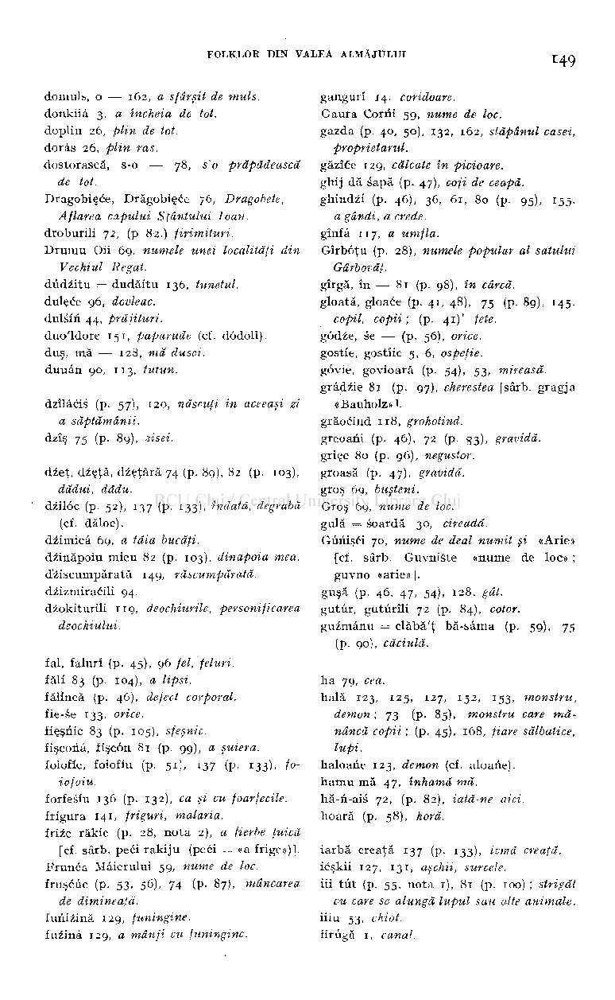

domul», o — 162, a sfârşit de muls. donkiiâ 3, a încheia de tot. doplin 26, plin de tot. dorâs 26, plin ras. dostorască, s-o — 78, s'o prăpădească

ganguri 14. coridoare. Gaura Corni 59, nume de loc. gazda (p. 40, 50), 132, 162, stăpânul casei,

proprietarul.

- găzîCe 129, călcate în picioare. ghij dă sapă (p. 47), coji de ceapă. ghindzf (p. 46), 36, 61, 80 (p. 95), 155.

a gândi, a crede. gînfâ 117, a umfla. Gîrboţu (p. 28), numele popular al satului

Gârbovit. gîrgă, în — 81 (p. 98), în cârcă. gloată, gloace (p. 41, 48), 75 (p. 89), 145.

copil, copii; (p. 41)' fete. gôdze, se — (p. 56), orice. gostie, gostîie 5, 6, ospeţie. govie, govioară (p. 54), 53, mireasă. grâdzie 81 (p. 97), cherestea [sârb. gragja

«Bauholz» grăocind 118, grohotind. greoani (p. 46), 72 (p. 83), gravidă. griec 80 (p. 96), negustor. groasă (p. 47), gravidă. groş 6g, buşteni. Groş 69, nume de loc. gulă = soardă 30, cireada. Gunişci 70, nume de deal numit şi «Arie»

[cf. sârb. Guvniste «nume de loc» ; guvno «arie»],

guşă (p. 46, 47, 54), 128, gât. gutûr, gutûrîli 72 (p. 84), cotor. guzmânu = clăbă'ţ bă-sâma (p. 59), 75

(p. 90), căciulă.

ha 79, cea. hală 123, 125, 127, 152, 153, monstru, demon ; 73 (p. 85), monstru care mănâncă copii ; (p. 45), 168, fiare sălbatice, lupi.

haloane 123, demon (cf. aloane). hamu-mă 47, înhamă-mă.

- hă-ii-ais 72, (p. 82), iată-ne aici. hoară (p. 58), horă.

de tot.

###### Dragobiece, Drăgobicce 76, Dragobete,

Aflarea capului Sfântului loan. droburili 72, (p 82.) firimituri. Drumu Oii 69, numele unei localităţi din

Vechiul Regat. dudzitu = dudăitu 136, tunetul. dulece 96, dovleac, dulsin 44, prăjituri. duo'ldore 151, paparude (cf. dodoli). duş, mă — 128, mă dusei. duuân 90, 113, tutun.

dzîlâcis (p. 57), 120, născuţi în aceeaşi zi

a săptămânii.

dzîş 75 (p. 89), zisei.

###### dzeţ, dzşţă, dzcţără 74 (p. 89), 82 (p. 103),

dădui, dădu.

dziloc (p. 52), 137 (p. 133), îndată, degrabă

(cf. dăloc). dzimicâ 69, a tăia bucăţi. dzinăpoiu mieu 82 (p. 103), dinapoia mea. d'ziscumpărată 149, răscumpărată. dzizmiracili 94. dzokiturili 119, deochiurile, personificarea

deochiului.

fal, faluri (p. 45), 96 fel, feluri. făli 83 (p. 104), a lipsi. fălincă (p. 46), defect corporal. fie-se 133, orice. ficşnic 83 (p. 105), sfeşnic. fişcoriâ, fişcon 81 (p. 99), a şuiera. foiofie, foiofiu (p. 51), 137 (p. 133), fo-

iofoiu. forfesfu 136 (p. 132), ca şi cu foarfecile. frigura 141, friguri, malaria. frize răkie (p. 28, nota 2), a fierbe ţuică

[cf. sârb. peéi rakiju (peci =-= «a frige»)]. Frunca Mâierului 59, nume de loc. fruşcuc (p. 53, 56), 74 (p. 87), mâncarea

iarbă creaţă 137 (p. 133), izmă creaţă. ieşkii 127, 131, aşchii, surcele. iii tût (p. 55, nota 1), 81 (p. 100) ; strigăt

cu care se alungă lupul sau alte animale. iiiu 53, chiot. iin'igă 1, canal.

de dimineaţă. furiizină 129, funingine. fuzina 129, a mânji cu funingine.

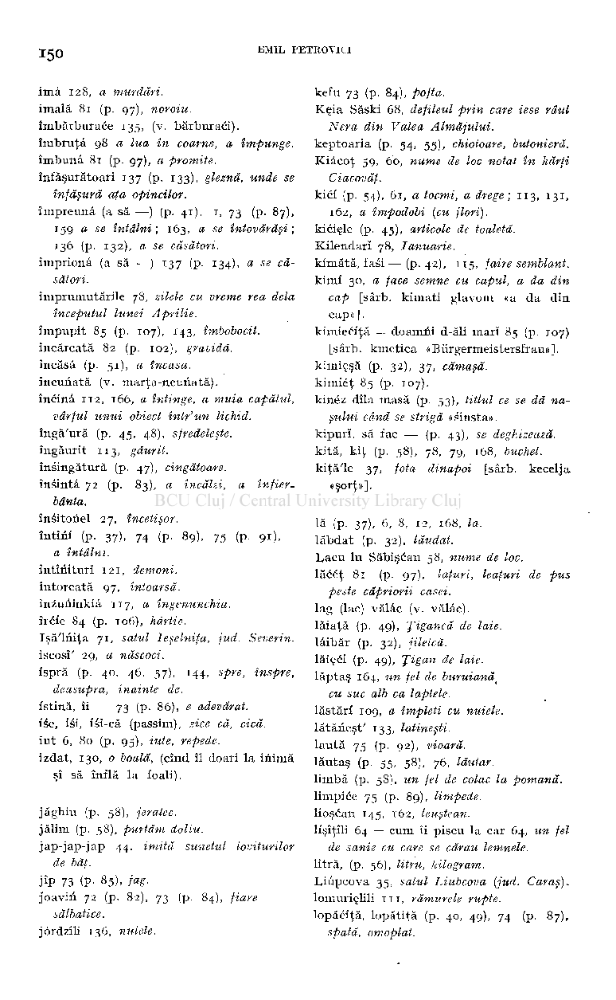

imâ 128, a murdări. imală 81 (p. 97), noroiu. îmbărburaee 135, (v. bărburaci). îmbruţâ 98 a lua în coarne, a împunge. îmbuna 81 (p. 97), a promite.

kefu 73 (p. 84), pofta. Kçia Săski 68, defileul prin care iese râul

Nera din Valea Almăjului.

keptoaria (p. 54, 55), Motoare, butonieră. Kiâcoţ 59, 60, nume de loc notat în hărţi

- înfăşurătoari 137 (p. 133), gleznă, unde se

- înfăşură aţa opincilor.

împreuna (a să —) (p. 41), 1, 73 (p. 87), 159 a se întâlni ; 163, a se întovărăşi ; 136 (p. 132), a se căsători.

împrionâ (a să —) 137 (p. 134), a se că­

sători.

împrumutările 78, zilele cu vreme rea delà

începutul lunei Aprilie. împupit 85 (p. 107), 143, îmbobocit. încărcată 82 (p. 102), gravidă. încăsâ (p. 51), a încasa. încunată (v. marţa-ncunată). încinâ 112, 166, a întinge, a muia capătul,

vârful unui obiect într'un lichid.

- îngă'ură (p. 45, 48), sfredeleşte.

- îngăurit 113, găurit. însingătură (p. 47), cingătoare. însintâ 72 (p. 83), a încălzi, a înfier­

Ciacovăţ.

kicî (p. 54), 61, a tocmi, a drege ; 113, 131,

162, a împodobi (cu flori). kiciele (p. 45), articole de toaletă. Kilendarî 78, Ianuarie. kimătă, fasi—(p. 42), 115, faire semblant. kimi 30, a face semne cu capul, a da din

cap [sârb. kimati glavom «a da din cap»].

kimieciţă = doamni d-ăli mari 85 (p. 107) [sârb. kmetica «Burgermeistersfrau»].

kimicşă (p. 32), 37, cămaşă. kimieţ 85 (p. 107).

kinéz dîla masă (p. 53), titlul ce se dă na­

şului când se strigă «sinsta». kipurî, să fac — (p. 43), se deghizează. kită, kiţ (p. 58), 78, 79, 168, buchet. kiţă'le 37, fota dinapoi [sârb. kecelja

###### «şorţ»].

bânta. însitonel 27, încetişor. întîni (p. 37), 74 (p. 89), 75 (p. 91),

lă (p. 37), 6, 8, 12, 168, la. lăbdat (p. 32), lăudat. Lacu lu Săbişean 58, nume de loc. lăceţ 81 (p. 97), laţuri, leaturi de pus

a întâlni. întîriituri 121, demoni. întorcată 97, întoarsă. înzuninkiâ 117, a îngenunchia. îrcfe 84 (p. 106), hârtie. Işă'lniţa 71 satul Ieşelniţa, jud. Severin. iscosî' 29, a născoci. îspră (p. 40, 46, 57), 144, spre, înspre,

peste căpriorii casei. lag (lac) vălâc (v. vălâc). lăiaţă (p. 49), Ţigancă de laie. lâibăr (p. 32), jiletcă. laicei (p. 49), Ţigan de laie. lăptaş 164, un fel de buruiană

deasupra, înainte de. fstină, îi — 73 (p. 86), e adevărat. ise, isi, îsi-că (passim), zice că, cică. iut 6, 80 (p. 95), iute, repede. izdat, 130, o boală, (cînd îl doari la inimă

cu suc alb ca laptele. lăstari 109, a împleti cu nuiele. lătăneşt' 133, latineşti. lăută 75 (p. 92), vioară. lăutaş (p. 55, 58), 76, lăutar. limbă (p. 58), un fel de colac la pomană. limpiée 75 (p. 89), limpede. lioşcan 145, 162, leuştean. lîşîţîli 64 = cum îi piscu la car 64, un fel

###### şî să înflă la foali).

jăghiu (p. 58), jeratec. jălim (p. 58), purtăm doliu. jap-jap-jap 44, imită sunetul loviturilor

de sanie cu care se cărau lemnele. litră, (p. 56), litru, kilogram. L/iûpcova 35, satul Liubcova (jud. Caras). lomurielili III rămurele rupte. lopăcîţă, lopătiţă (p. 40, 49), 74 (p. 87),

de băţ. jîp 73 (P- 85), fag. joaviri 72 (p. 82), 73 (p. 84), fiare

sălbatice.

jôrdzîli 136, nuiele.

spală, omoplat.

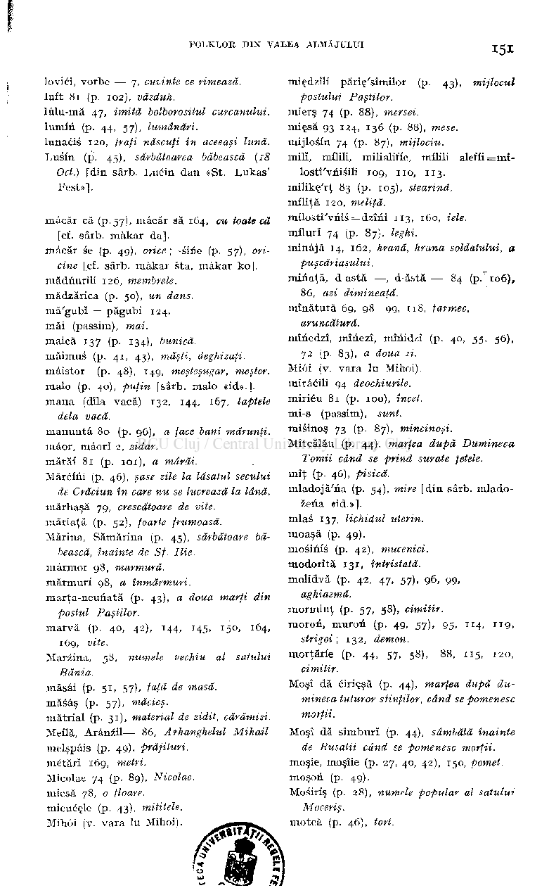

loviéi, vorbe — 7, cuvinte ce rimează. hvft Si (p. 102), văzduh. lulu-mă 47, imită bolborositul curcanului. lumfri (p. 44, 57), lumânări. lunacis 120, fraţi născuţi în aceeaşi lună. Lusîn (p. 45), sărbătoarea băbească (18

mişdzîli părie/sîmilor (p. 43), mijlocul

postului Paştilor. mierş 74 (p. 88), mersei. micsă 93 124, 136 (p. 88), mese. mijlosin 74 (p. 87), mijlociu. mill, milili, milialifie, mflili alefii=mi-

lostî'vnisili 109, 11 o, 113. milike/rţ 83 (p. 105), stearină. miliţă 120, meliţă. milostî'vnis = dzîni 113, 160, iele. milurî 74 (p. 87), leghi. minâjă 14, 162, hrană, hrana soldatului, a

Oct.) [din sârb. Luciu dan «St. Lukas' Fest»].

mâcăr că (p-57), mâcăr să 164, cu toate că [cf. sârb. măkar da].

mâcăr se (p. 49), orice ; -sine (p. 57), oricine [cf. sârb. măkar sta, màkar ko]. măduurili 126, membrele. mădzărica (p. 50), un dans.

puşcăriaşului.

###### minată, d-astă —, d-ăstă — 84 (p. 106),

86, azi dimineaţă.

mînătură 69, 98 99, 118, farmec,

- mă'gubi = păgubi 124.

aruncătură.

- măi (passim), mai. maică 137 (p. 134), bunică. rnăimus (p. 41, 43), măşti, deghizaţi. mâistor (p. 48), 149, meşteşugar, meşter. malo (p. 40), puţin [sârb. malo «id».j. mana (dîla vacă) 132, 144, 167, laptele

###### mînedzî, mînezî, mînidH (p. 40, 55. 56),

72 (p. 83), a doua zi. Miôi (v. vara Iu Mihoi). mirâcili 94 deochiurile. miriéu 81 (p. 100), încet. mi-s (passim), sunt. misinoş 73 (p. 87), mincinoşi. Mîtcălău (p. 44), marţea după Dumineca

delà vacă. manuntâ 80 (p. 96), a face bani mărunţi. mâor, maori 2, zidar.

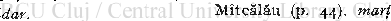

Tomii când se prind surate fetele. mîţ (p. 46), pisică. mladojă'na (p. 54), mire [din sârb. mlado-

- mărăi 81 (p. 101), a mărăi. Mărcfrii (p. 46), şase zile la lăsatul secului

de Crăciun în care nu se lucrează la lână. mărhaşă 79, crescătoare de vite.

zena «id.»]. mlas 137. lichidul uierin. moaşă (p. 49). mosinis (p. 42), mucenici. modorîtă 131, întristată. molidvă (p. 42, 47, 57), 96, 99,

- măriaţă (p. 52), foarte frumoasă. Marina, Sămărina (p. 45), sărbătoare bă­

bească, înainte de Sf. Ilie. marmor 98, marmură.

- mărmuri 98, a înmărmuri. marţa-ncuriată (p. 43), a doua marţi din

aghiazmâ. morminţ (p. 57, 58), cimitir. moron, murori (p. 49, 57), 95, 114, 119,

postul Paştilor.

marvă (p. 40, 42), 144, 145, 150, 164,

strigoi; 132, demon.

169, vite.

morţărie (p. 44, 57, 58), 88, 115, 120,

Marzina, 58, numele vechiu al satului

cimitir.

Bănia.

Moşî dă eiricşă (p. 44), marţea după dumineca tuturor sfinţilor, când se pomenesc morţii.

- măsâi (p. 51, 57), faţă de masă.

- măsâş (p. 57), măcieş.

- mătrial (p. 31), material de zidit, cărămizi. Meflă, Arânzil— 86, Arhanghelul Mihail. melşpâis (p. 49), prăjituri. metări 169, metri. Micolae 74 (p. 89), Nicolae. micsă 78, o floare. micuéçle (p. 43), mititele. Mihôi (v. vara lu Mihoi). 1 _

Moşî dă sîmburi (p. 44), sâmbătă înainte

de Rusalii când se pomenesc morţii. moşie, moşîie (p. 27, 40, 42), 150, pomet. moşon (p. 49). Mosirfş (p. 28), numele popular al satului

Moceriş.

###### motcă (p. 46), tort.

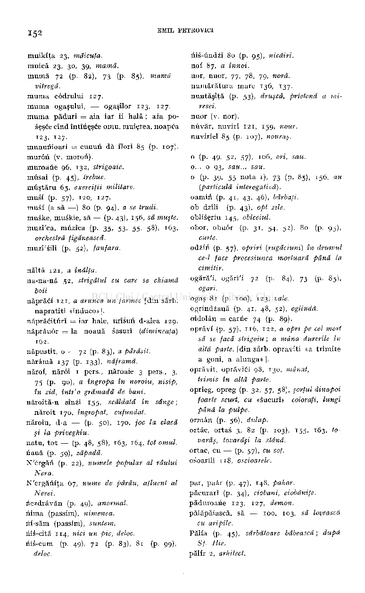

nis-undzi 80 (p. 95), nicăiri. noi 87, a înnoi. nor, nuor, 77, 78, 79, noră. numărătura mare 136, 137. nuntăşîţă (p. 53), druşcă, prietenă a mi­

muikiţa 23, măicuţa. muică 23, 30, 39, mamă. mumă 72 (p. 82), 73 (p. 85), mamă

vitregă. muma codrului 127. muma ogaşului, — ogaşîlor 123, 127. muma păduri = aia iar îi hală ; aia po-

resei. nuor (v. nor). nuvăr, nuvirî 121, 159, nour. nuviriel 85 (p. 107), nouraş.

sşşce cînd întînçsée omu, muierea, noapca 123, 127.

mununioari = cuuuri dă flori 85 (p. 107). murôn (v. moron). muroâne 96, 132, strigoaie. musai (p. 45), trebue. muştăru 65, exerciţii militare. muşi (p. 57), 120, 127. musi (a să —) 80 (p. 94), a se trudi. muske, muskie, să — (p. 43), 156, să muşte. muzî'ca, miizîca (p. 35, 53, 55, 58), 163,

- o (p. 49, 52, 57), 106, ori, sau.
- o... o 93, sau... sau. ° (P- 39. 55 nota 1), 73 (p. 85), 156, au

(particulă interogativă).

- oamin (p. 41, 43, 46), bărbaţi. ob dzîli (p. 43), opt zile. obliseriu 145, obiceiul. obor, obuor (p. 31, 54, 52), 80 (p. 95),

curte.

orchestră ţigănească.

odtfin (p. 57), opriri (rugăciuni) în drumul ce-l face procesiunea mortuară până la cimitir.

muzî'sili (p. 52), fanfara.

- năltâ 121, a înălţa. na-na-nâ 52, strigătul cu care se chiamă

###### ogără'i, ogări'i 72 (p. 84), 73 (p. 85),

ogari. ogaş 81 (p. 100), 123, vale. ogrindzauă (p. 41, 48, 52), oglindă. oidolân = carne 74 (p. 89). oprăvi (p. 57), 116, 122, a opri pe cel mort să se facă strigoiu ; a mâna durerile în altă parte, [din sârb. opraviti «a trimite a goni, a alunga» ].

boii

- năprăei 121, a arunca un farmec fdin sârb. napratiti «induco»].

- năprăeituri = iar hale, urîsuri d-alea 129.

- năprăuor = la noană sasuri (dimineaţa) 162.

- năpustit, o — 72 (p. 83), a părăsit. nărâmă 137 (p. 133), năframă.

###### oprăvit, oprăviei 98, 130, mânat,

- năroi, năroi 1 pers., năroaie 3 pers., 3, 75 (p. 90), a îngropa în noroiu, nisip, în zid, într'o grămadă de bani.

trimis în altă parte.

oprieg, opreg (p. 32, 57, 58), şorţul dinapoi foarte scurt, cu «sucuri» coloraţi, lungi până la pulpe.

- năroită-n sînzi 155, scăldată în sânge ; năroit 170, îngropat, cufundat.

ormân (p. 56), dulap. ortac, ortas 3, 82 (p. 103), 155, 163, to

- năroiu, d-a — (p. 50), 170, joc la clacă şi la priveghiu.

varăş, tovarăşi la stână. ortac, cu — (p. 57), cu soţ. osoarili 118, oscioarele.

natu, tot — (p. 48, 58), 163, 164, tot omul. riauă (p. 59), zăpadă. N'ergări (p. 22), numele popular al râului

Nera. N'ergăriiţa 67, nume de părău, afluent al

par, paâr (p. 47), 148, pahar. păcurari (p. 34), ciobani, ciobănite. păduroane 123, 127, demon. pălăpăiască, să — 100, 103, să lovească

Nerei. nezdrâvăn (p. 49), anormal. nima (passim), nimenea. ni-săm (passim), suntem. nis-cîtă 114, nici un pic, deloc. riis-cum (p. 49), 72 (p- 83), 81 (p. 99),

cu aripile.

Palia (p. 45), sărbătoare băbească; după

Sf. Ilie.

pălir 2, arhitect.

deloc.

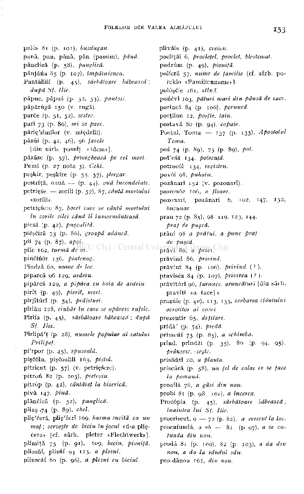

paloş 81 (p. 101), buzdugan. pană, pan, pană, păn (passim), până. pănclică (p. 58), panglică. pănjăna 85 (p. 107), împăinjenea. Pantăliili (p. 45), sărbătoare băbească. ;

plivâis (p. 41), creion. pocliţăl 6, procletei, proclet, blestemat. podrûm (p. 49), pivniţă. policră 57, nume de familie (cf. sârb. po-

reklo «Familienname»]. poloşeie 161, stîni. ponévï 163, pături mari din pânză de saci. porîncă 84 (p. 106), poruncă. porţîion 12, porţie, tain. postavă 80 (p. 94), copaie. Postul, Toma — 137 (p. 133), Apostolul

după Sf. Ilie. papuc, păpus (p. 32, 53), pantofi. păpărugă 150 (v. rugă), parée (p. 51, 52), zestre, pari 73 (p. 86), mi se pare. părie/sîmilor (v. miedzîli). păsiii (p. 42, 46), 96 fasole

To ma. pos 74 (p. 89), 75 (p. 89), pot. pot'esâ 134, potecuţă. potrocôl 134, registru. povôi 98, puhoiu. pozănarî 152 (v. pozonari). pozomôc 106, o floare. pozonari, pozănarî 6, 102, 147, 152,

|din sârb. pasulj. «idem»], păzăsc (p. 57), priveghează pe cel mori. Pemî (p. 27 nota 3), Cehi. peşkir, peşkire (p. 55. 57), ştergar. pestriţă, oauă — (p. 44), ouă încondeiate. petriese, — zorili (p. 57), 87, cântă mortului

«zorili». petriçsere 87, bocet care se cântă mortului

buzunar.

în zorile zilei când îl înmormântează. piesă (p. 42), puşculiţă. pieşciră 73 (p. 86), groapă adâncă. pii 74 (p. 87), apoi. pîlc 162, turmă de oi. pincinor 136, pintenog. Pîndză 60, nume de loc. piparcă 96 129, ardeiu. pipărcâ 129, a pipăra cu boia de ardeiu. pirit (p. 49), pierit, mort. pîrjîtûrï (p. 54), prăjituri. pîrlău 128, ciubăr în care se opăresc rufele. Pîrlia (p. 45), sărbătoare băbească; după

prau 72 (p. 83), 98 119, 123, 144,

praf de puşcă.

prăui 98 a prăfui, a pune praf

de puşcă. prăvi 86, a privi. prăvind 86, privind. prăvint 84 (p. 106). privind (?). pravfsca 84 (p. 107), privirea ( ? ) prăvituri 96, farmece, aruncături [din sârb.

praviti «a face|.« praznic (p. 40), 113, 135, serbarea sfântului

ocrotitor al casei. prezentir 65, defilare. pridă' (p. 54). predă. primeni 73 (p. 85), a schimba. prind, prîndzi (p. 35), 80 (p. 94, 95),

Sf. Ilie.

Pîrlipă'ţ (p. 28), numele popular al satului

Prilipeţ. pî'rpor (p. 45), spuzeală. pişeolu, pişcoalili 163, pistol. pitricut (p. 57) (v. petriçsere). pitroii 82 (p. 103), pietroiu. pitrôp (p. 42), cântăreţ la biserică. pivă 147, piuă. plăncică (p. 52), panglică. pliaş .74 (p. 89), chel.

prânzesc, -zeşte. prisădzî 20, a planta. priscură (p. 58), un fel de colac ce se face

la pomană. proaflâ 76, a găsi din nou. probi 81 (p. 98, 101), a încerca. Procôpia (p. 45), sărbătoare băbească;

înaintea lui Sf. Ilie.

plie/ceră, pliş'cerî 169, basma sucită ca un maţ; serveşte de biciu în jocul «d-a pliçcera» fcf. sârb. pleter «Flechtwerk»].

procriscut, o — 72 (p. 82), a crescut la loc. procufundâ, a să — 81 (p. 97), a se cu­

funda din nou.

plimiţă 75 (p. 91), 109, beciu, pivniţă. pliosrii, plisni 94 125, a plesni. pliuscăî 80 (p. 96), a plesni cu biciul.

prodâ 81 (p. 100). 82 (p. 103), a da din

nou, a da la rândul său. pro-dănou 161, din nou.

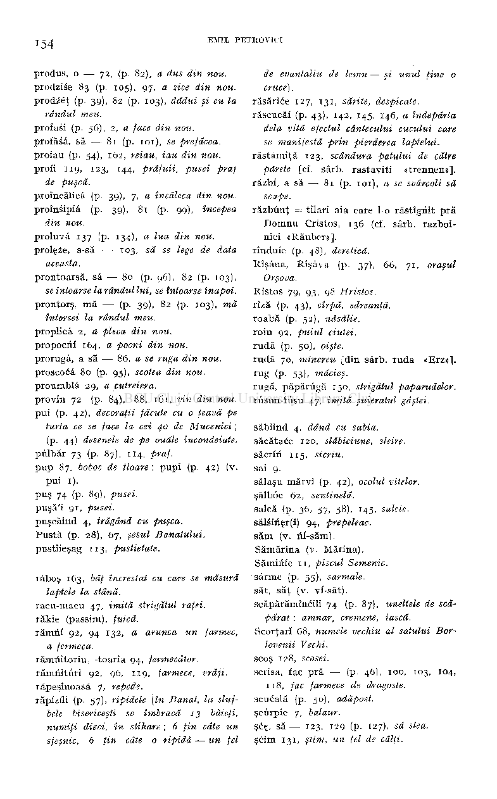

produs, o — 72, (p. 82), a dus din nou. prodzîse 83 (p. 105), 97, a zice din nou. prodzeţ (p. 39), 82 (p. 103), dădui şi eu la

de evantaliu de lemn — şi unul ţine o cruce).

- răsărice 127, 131, sărite, despicate.

- răscucăi (p. 43), 142, 145, 146, a îndepărta delà vită efectul cântecului cucului care se manifestă prin pierderea laptelui.

- răstâmiţă 123, scândura patului de către părete [cf. sârb. rastaviti «trennen»].

- răzbi, a să — 81 (p. 101), a se svârcoli să scape.

- răzbunţ = tîlari aia care l-o răstignit pră Domnu Cristos, 136 (cf. sârb. războinici «Răuber»].

rînduie (p. 48), deretică. Rîşâua, Rişâva (p. 37), 66, 71, oraşul

Orşova. Ristos 79, g3, 98 Hristos. rîză (p. 43), cîrpă, sdreanţă. roabă (p. 52), năsălie. roiu 92, puiul ciutei. rudă (p. 50), oişte. rudă 70, minereu [din sârb. ruda «Erz»]. rug (p. 53), măcieş. rugă, păpăriigă 150, strigătul paparudelor. rûsun-fûsu 47, imită şuieratul găştei.

- săbiind 4, dând cu sabia.

- săcătace 120, slăbiciune, sleire.

- săcrin 115, sicriu. sai 9.

- sălaşu mărvi (p. 42), ocolul vitelor. şălboc 62, sentinelă. salcă (p. 36, 57, 58), 145, salcie.

- sălsiner(l) 94, prepeleac. săm (v. rif-săm). Sămărina (v. Marina). Săminfc 11, piscul Semenic. sârme (p. 55), sarmale. săt, săţ (v. vî-săt). scăpărămîncili 74 (p. 87), uneltele de scă­

rândul meu. profasi (p. 56), 2, a face din nou. profăsâ, să — 81 (p. 101), se prefăcea. proiau (p. 54), 162, reiau, iau din nou. proii 119, 123, T44, prăfuii, pusei praf

de puşcă.

proîncălicâ (p. 39), 7, a încăleca din nou. proînsipiâ (p. 39), 81 (p. 99), începea

din nou. proluvâ 137 (p. 134), a lua din nou. proleie, s-să — 103, să se lege de data

aceasta.

###### prontoarsă, să — 80 (p. 96), 82 (p. 103),

se întoarse larăndullui, se întoarse înapoi. prontorş, mă — (p. 39), 82 (p. 103), mă

întorsei la rândul meu. proplicâ 2, a pleca din nou. propocrii 164, a pocni din nou. prorugâ, a sa — 86, a se ruga din nou. proscoéâ 80 (p. 95), scotea din nou. proumblâ 29, a cutreiera. provin 72 (p. 84), 88, 161, vin din nou. pui (p. 42), decoraţii făcute cu o ţeava pe

turta ce se face la cei 40 de Mucenici ; (p. 44) desenele de pe ouăle încondeiate.

pulbăr 73 (p. 87), 114, praf. pup 87, boboc de floare ; pupi (p. 42) (v.

pui 1). puş 74 (p. 89), pusei. puşă'i 91, pusei. puşcăind 4, trăgând cu puşca. Pustă (p. 28), 67, şesul Banatului. pustîieşag 113, pustietate.

râboş 163, băţ încrestat cu care se măsură

laptele la stână. racu-macu 47, imită strigătul raţei. răkie (passim), ţuică. rămrii 92, 94 132, a arunca un farmec,

părat : amnar, cremene, iască.

Scorţarî 68, numele vechiu al satului Bor-

lovenii- Vechi. scoş 128, scosei. scrisa, fac pră — (p. 46), 100, 103, 104,

a fermeca. rămriitoriu, -toaria 94, fermecător. rămnitiiri 92, 96, 119, farmece, vrăji. răpe.şînoasă 7, repede. răpfiili (p. 57), ripidele (în Banat, la slujbele bisericeşti se îmbracă 13 băieţi, numiţi dieci, în stihare ; 6 ţin câte un sfeşnic, 6 ţin câte o ripidă — un fel

118, fac farmece de dragoste. scucală (p. 50), adăpost. şcurpie 7, balaur. şcc, să — 123, 129 (p. 127), să stea. şcim 131, ştim, un fel de căiţi.

