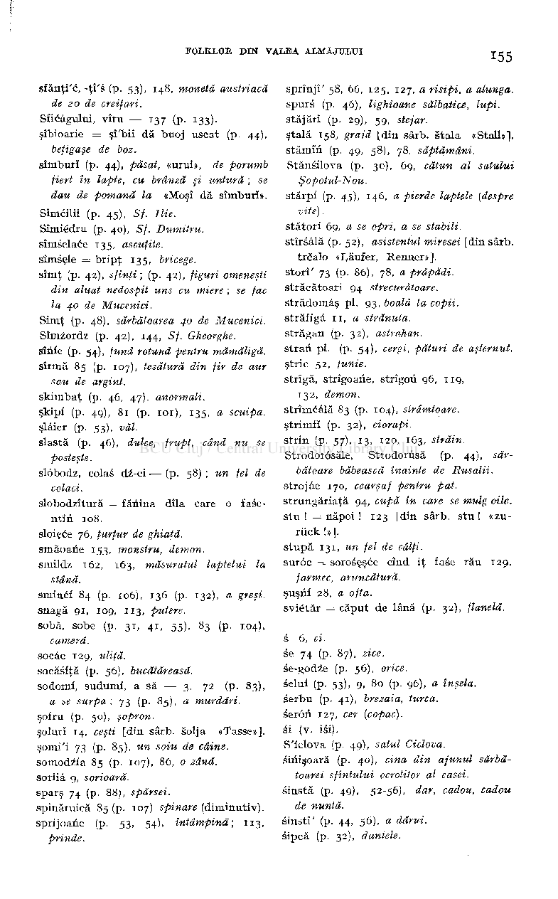

sfănţî'c, -ţî's (p. 53), 148, monetâ austriacă

sprînjî' 58, 66, 125, 127, a risipi, a alunga. spurs (p. 46), lighioane sălbatice, lupi. stăjărî (p. 29), 5g, stejar. ştală 158, graid [din sârb. ătala «Stall»"]. stămm (p. 49, 58), 78, săptămâni. Stănsilova (p. 30), 69, cătun al satului

de 20 de creiţari. Sficâgului, vîru — 137 (p. 133). şîbioarie = şî'bii dă buoj uscat (p. 44),

beţigaşe de boz.

sîmburî (p. 44), păsat, «urui», de porumb fiert în lapte, cu brânză şi untură ; se dau de pomană la «Moşî dă sîmburî».

Şopotul-Nou.

stârpi (p. 45), 146, a pierde laptele (despre

Sîmcilii (p. 45), Sf. Ilie. Sîmiédru (p. 40), 5/. Dumitru. sîmselace 135, ascuţite. sîmsşle = bripţ 135, bricege, sîmţ (p. 42), sfinţi ; (p. 42), figuri omeneşti

vite) . stători 69, a se opri, a se stabili. stîreâlă (p. 52), asistentul miresei [din sârb.

trcalo «Lâufer, Renner»]. storî' 73 (p. 86), 78, a prăpădi. străcătoari 94 strecurătoare. strădomâş pl. 93, boală la copii. străfigâ 11, a strănuta. străgan (p. 32), astrahan. stran pl. (p. 54), cergi, pături de aşternut. stric 52, ţunie. strîgă, strîgoane, strîgofi 96, 119,

din aluat nedospit uns cu miere ; se fac la 40 de Mucenici.

Sîmţ (p. 48), sărbătoarea 40 de Mucenici. Sîmzordz (p. 42), 144, Sf. Gheorghe. sînie (p. 54), fund rotund pentru mămăligă. sîrmă 85 (p. 107), ţesătură din fir de aur

sau de argint. skimbaţ (p. 46, 47), anormali. şkipf (p. 49), 81 (p. 101), 135, a scuipa. şlâier (p. 53), văl. slastă (p. 46), dulce, frupt, când nu se

132, demon. strîmcâlă 83 (p. 104), strâmtoare. ştrimfi (p. 32), ciorapi. strin (p. 57), 13, 120, 163, străin. Strodorosăle, Strodorusă (p. 44), săr­

posteşte.

bătoare băbească înainte de Rusalii. strojâc 170, cearşaf pentru pat. strungăriaţă 94, cupă în care se mulg oile. stu ! = năpoi ! 123 [din sârb. stu ! «zu-

### slôbodz, colas dz-ei — (p. 58) ; un fel de

colaci.

### slobodzîtură =1 fănina dîla care o fase-

ntin 108. sloiece 76, ţurţur de ghiaţă. smăoaiie 153, monstru, demon. smîldz 162, 163, măsuratul laptelui la

riick UI. stupă 131, un fel de căiţi. surôc = soroscşce cînd iţ fase rău 129,

farmec, aruncătură. şuşrif 28. a ofta.

stână. smincf 84 (p. 106), 136 (p. 132), a greşi. snagă 91, 109, 113, putere. sobă, sobe (p. 31, 41, 55), 83 (p. 104),

### svietăr = căput de lână (p. 32), flanelă.

cameră. socâc 129, uliţă. soeăsfţă (p. 56), bucătăreasă. sodomi, suduml, a să — 3, 72 (p. 83),

s 6, ci. se 74 (p. 87), zice. se-godze (p. 56), orice. selui (p. 53), 9, 80 (p. 96), a înşela. serbu (p. 41), brezaia, turca. serôfï 127, ii (v. iei). S'iclova (p. 49), satul Ciclova. siiiişoară (p. 40), cina din ajunul sărbă-

a se surpa; 73 (p. 85), a murdări. şofru (p. 50), şopron. şolun 14, ceşti [din sârb. Soîja «Tasse»], şomi'i 73 (p. 85), un soiu de câine. somodzia 85 (p. 107), 86, o zână. soriiâ 9, sorioară. sparş 74 (p. 88;, spărsei. spinăruică 85 (p. 107) spinare (diminutiv), sprijoane (p. 53, 54), întâmpină; 113,

toarei sfîntului ocrotitor al casei. sinstă (p. 49), 52-56),

de nuntă. sinstî' (p. 44, 56), a dărui. sipcă (p.

prinde.

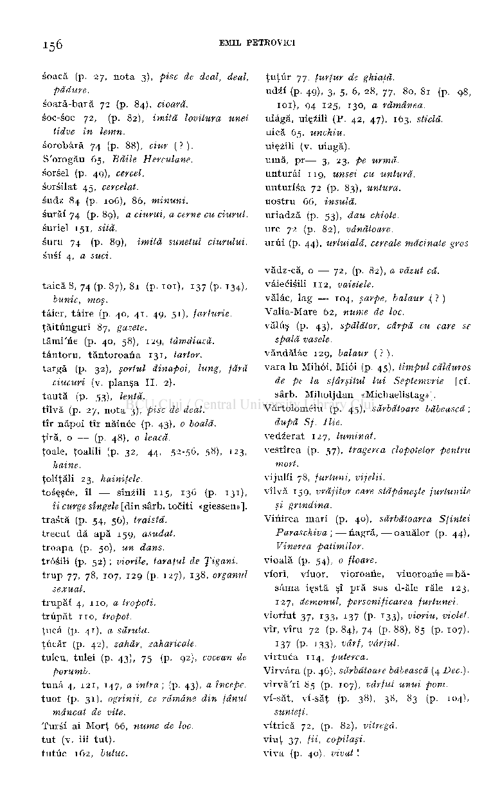

soacă (p. 27, nota 3), pisc de deal, deal,

ţuţur 77, ţurţur de ghiaţă. udzi (p. 49), 3, 5, 6, 28, 77, 80, 81 (p. 98,

pădure. soară-bară 72 (p. 84), cioară. soc-soc 72, (p. 82), imită lovitura unei

101), 94 125, 130, a rămânea. uiâgă, uiçzili (P. 42, 47), 163, sticlă. uică 65, unchiu. uiezili (v. uiagă). urnă, pr— 3, 23, pe urmă. unturâi 119, unsei cu untură. unturfsa 72 (p. 83), untura. uostru 66, insulă. uriadză (p. 53), dau chiote. urc 72 (p. 82), vânătoare. urûi (p. 44), urluială, cereale măcinate gros.

tidve în lemn. sorobâră 74 (p. 88), ciur (?). S'orogău 65, Băile Herculane. sorsel (p. 49), cercel. sorsilat 45, cercetat. sudz 84 (p. 106), 86, minuni. surăi 74 (p. 89), a ciurui, a cerne cu ciurul. suriei 151, sită. suru 74 (p. 89), imită sunetul ciurului. susi 4, a suci.

vădz-că, o — 72, (p. 82), a văzut că. vâiecisili 112, vaietele. vălâc, lag — 104, şarpe, balaur •(? ) Valia-Mare 62, nume de loc. văluş (p. 43), spălător, cârpă cu care se

taică 8, 74 (p. 87), 81 (p. IOI), 137 (p. 134),

bunic, moş. taier, tâire (p. 40, 41, 49, 51), farfurie. ţăitunguri 87, gazete. tâmî'ne (p. 40, 58), 129, tămâiază. tântoru, tăntoroana 131, tartor. targa (p. 32), şortul dinapoi, lung, fără

spală vasele. văndălâc 129, balaur (?). vara lu Mihôi, Miôi (p. 45), timpul călduros

de pe la sfârşitul lui Septemvrie [cf. sârb. Miholjdan «Michaelistag»].

ciucuri (v. planşa II , 2). taută (p. 53), lentă. tîlvă (p. 27, nota 3), pisc de deal. tîr năpoi tîr năince (p. 43), o boală. ţîră, o — (p. 48), o leacă. ţoale, ţoalili (p. 32, 44, 52-56, 58), 123,

Vărtolomeiu (p. 45), sărbătoare băbească;

după Sf. Ilie. vedzerat 127, luminat. vestirea (p. 57), tragerea clopotelor pentru

mort. vi juif i 78, furtuni, vijelii. vîlvă 159, vrăjitor care stăpâneşte furtunile

haine. ţoliţăli 23, hainiţele. toseşce, îl — sînzili 115, 136 (p. 131),

şi grindina.

îi curge sîngele [din sârb. tociţi «giessen»]. trastă (p. 54, 56), traistă. trecut dă apă 159, asudat. troapa (p. 50), un dans. trôsili (p. 52) ; viorile, taraful de Ţigani. trup 77, 78, 107, 129 (p. 127), 138, organul

Viriirea mari (p. 40), sărbătoarea Sfintei Paraschiva ; —nagră, — oauălor (p. 44), Vinerea patimilor. vioaia (p. 54), o floare. viori, viuor, vioroane, viuoroane =bă-

sâma iestă şî pră sus d-ăle răle 123, 127, demonul, personificarea furtunei. viorint 37, 133, 137 (p. 133), vioriu, violet. vîr, vîru 72 (p. 84), 74 (p. 88), 85 (p. 107),

sexual. trupăî 4, 110, a tropoti. trupăt 11 o, tropot. ţucâ (p. 41), a săruta. ţucăr (p. 42), zahăr, zaharicale. tuleu, tulei (p. 43), 75 (p. 92), cocean de

137 (p. 133), vârf, vârful. virtuca 114, puterea. Vîrvâra (p. 46), sărbătoare băbească (4 Dec). virvă'ri 85 (p. 107), vârful unui pom. vi-săt, vi-săţ (p. 38), 38, 83 (p. 104),

porumb.

tuuâ 4, 121, 147, a intra ; (p. 43), a începe. tuor (p. 31), ogrinji, ce rămâne din fânul

sunteţi. vitrică 72, (p. 82), vitregă. viuţ 37, fii, copilaşi. viva (p. 40), vivat !

mâncat de vite. Tursi ai Morţ 66, nume de loc. tut (v. iii tut), tutûc 162, butuc.

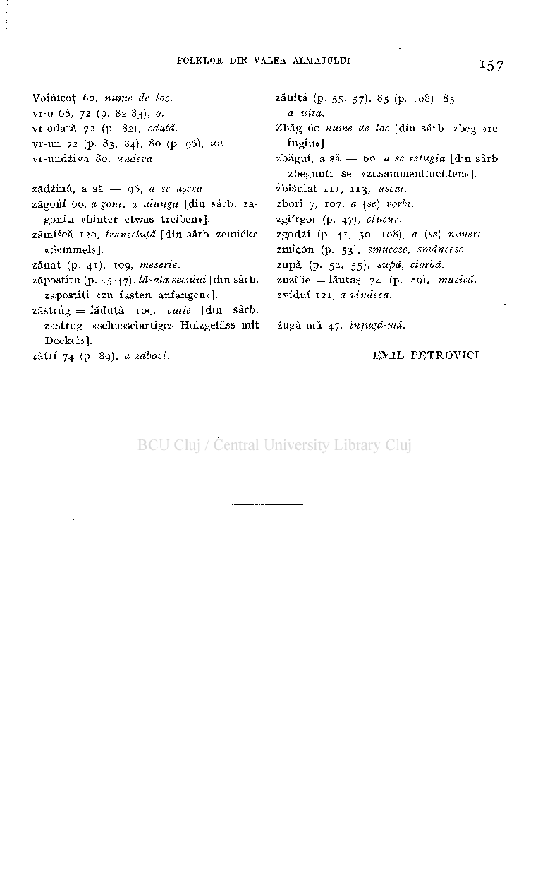

Voinicoţ 60, nume de loc. vr-o 68, 72 (p. 82-83), o. vr-odată 72 (p. 82), odată. vr-un 72 (p. 83, 84), 80 (p. 96), un. vr-undiiva 80, undeva.

zăuitâ (p. 55, 57), 85 (p. 108), 85

a uita.

Zbăg 60 nume de loc [din sârb. zbeg «refugiu»]. zbăgui, a să — 60, a se refugia [din sârb.

zbegnuti se «zubammentluchten» |. zbisulat in , 113, uscat. zborî 7, 107, a (se) vorbi. zgî'rgor (p. 47), ciucur. zgodzf (p. 41, 50, 108), a (se) nimeri. zmîcôn (p. 53), smucesc, smăncesc. zupă (p. 52, 55), supă, ciorbă. zuzî'ie = lăutaş 74 (p. 89), muzică. zvidui 121, a vindeca.

zădzinâ, a să — 96, a se aşeza. zăgorii 66, agoni, a alunga [din sârb. za-

goniti «hinter etwas treiben»]. zămiscă 120, franzeluţă [din sârb. zemicka

«Semmel»]. zănat (p. 41), 109, meserie. zăpostîtu (p. 45-47). lăsata secului [din sârb.

zapostiti «zu fasten anfangen»].

zăstrug = lăduţă 109, cutie [din sârb. zastrug «schiisselartiges Holzgefâss mit Deckel»].

zugă-mă 47, înjugă-mă.

### EMIL PETROVICI

zătrf 74 (p. 89), a zăbovi.

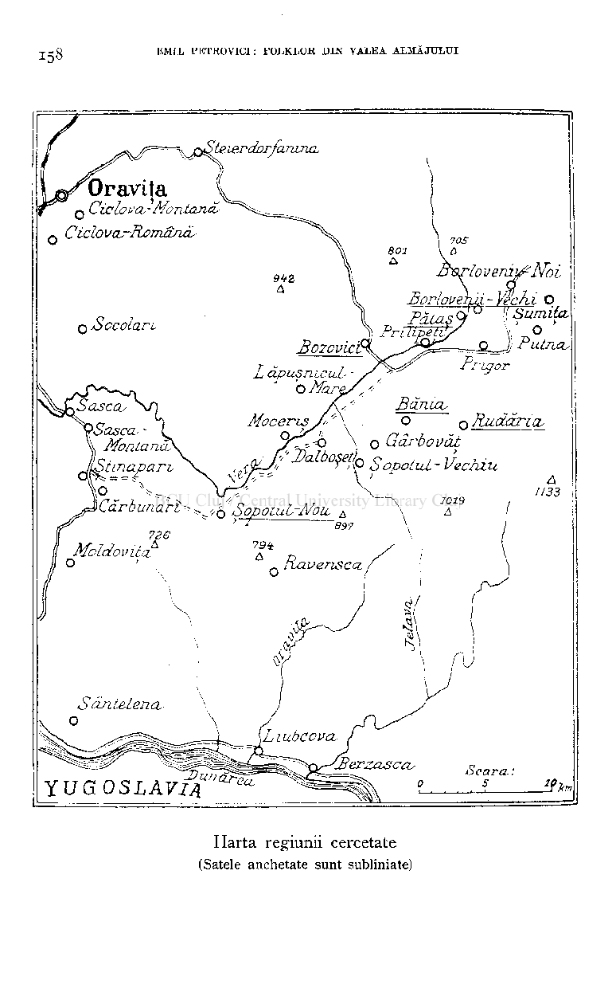

158 EMIL PETBOVICI: FOLKLOR DES VALEA ALMAJTJLTJI

BorlovemL - \echi O ,, ~ . TfO «SumiùzW

QÏl PutTIA,

## YUG OSLAVIA

Harta regiunii cercetate (Satele anchetate sunt subliniate)

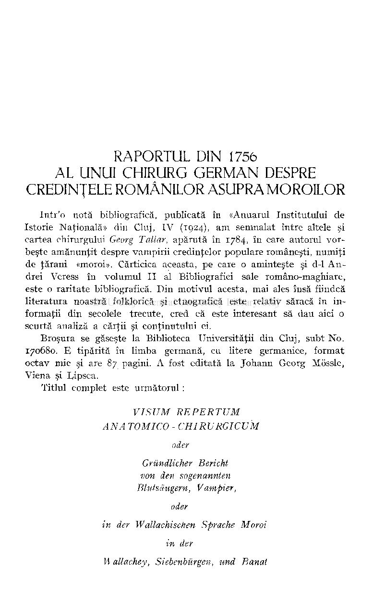

# RAPORTUL DIN 1756 AL UNUI CHIRURG GERMAN DESPRE CREDINŢELE ROMÂNILOR ASUPRA MOROILOR

Intr'o notă bibliografică, publicată în «Anuarul Institutului de Istorie Naţională» din Cluj, IV (1924), am semnalat între altele şi cartea chirurgului Georg Tallar, apărută în 1784, în care autorul vorbeşte amănunţit despre vampirii credinţelor populare româneşti, numiţi de ţărani «moroi». Cărticica aceasta, pe care o aminteşte şi d-1 Andrei Veress în volumul II al Bibliografiei sale româno-maghiare, este o raritate bibliografică. Din motivul acesta, mai ales însă fiindcă literatura noastră folklorică şi etnografică este relativ săracă în informaţii din secolele trecute, cred că este interesant să dau aici o scurtă analiză a cărţii şi conţinutului ei.

Broşura se găseşte la Biblioteca Universităţii din Cluj, subt No. 170680. E tipărită în limba germană, cu litere germanice, format octav mic şi are 87 pagini. A fost editată la Johann Georg Môssle, Viena şi Dipsca.

Titlul complet este următorul :

VISUM REPERTUM

ANA TO M ICO - CHIRURGICUM oder

Grundlicher Bericht von den sogenannten Blutstingem, Vampier,

oder in àer Wallachischen Sprache Moroi in der W'àllachey, Siebenburgen, und Banat

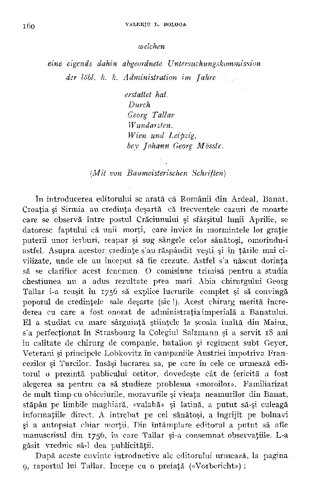

welchen eine eigends dahin abgeordnete Untersuchungskommission der lobi. k. k. Administration im Jahre ..

erstattet hat. Durch Georg Tallar Wundarzten. Wien und Leipzig, bey Johann Georg Môssle.

(Mit von Baumeisterischen Schriften)

în introducerea editorului se arată că Românii din Ardeal, Banat, Croaţia şi Sirmia au credinţa deşartă că frecventele cazuri de moarte care se observă între postul Crăciunului şi sfârşitul lunii Aprilie, se datoresc faptului că unii morţi, care înviez în mormintele lor graţie puterii unor ierburi, reapar şi sug sângele celor sănătoşi, omorîndu-i astfel. Asupra acestor credinţe s'au răspândit veşti şi în ţările mai civilizate, unde ele au început să fie crezute. Astfel s'a născut dorinţa să se clarifice acest fenomen. O comisiune trimisă pentru a studia chestiunea nu a adus rezultate prea mari. Abia chirurgului Georg Tallar i-a reuşit în 1756 să explice lucrurile complet şi să convingă poporul de credinţele sale deşarte (sic !). Acest chirurg merită încrederea cu care a fost onorat de administraţia imperială a Banatului. El a studiat cu mare sârguinţă ştiinţele la şcoala înaltă din Mainz, s'a perfecţionat în Strasbourg la Colegiul Salzmann şi a servit 18 ani în calitate de chirurg de companie, batalion şi regiment subt Geyer, Veterani şi principele Lobkovitz în campaniile Austriei împotriva Francezilor şi Turcilor. însăşi lucrarea sa, pe care în cele ce urmează editorul o prezintă publicului cetitor, dovedeşte cât de fericită a fost alegerea sa pentru ca să studieze problema «moroilor». Familiarizat de mult timp cu obiceiurile, moravurile şi vieaţa neamurilor din Banat, stăpân pe limbile maghiară, «valahă» şi latină, a putut să-şi culeagă informaţiile direct. A întrebat pe cei sănătoşi, a îngrijit pe bolnavi şi a autopsiât chiar morţii. Din întâmplare editorul a putut să afle manuscrisul din 1756, în care Tallar şi-a consemnat observaţiile. E-a găsit vrednic să-1 dea publicităţii.

După aceste cuvinte introductive ale editorului urmează, la pagina 9, raportul lui Tallar. începe cu o prefaţă («Vorbericht») :

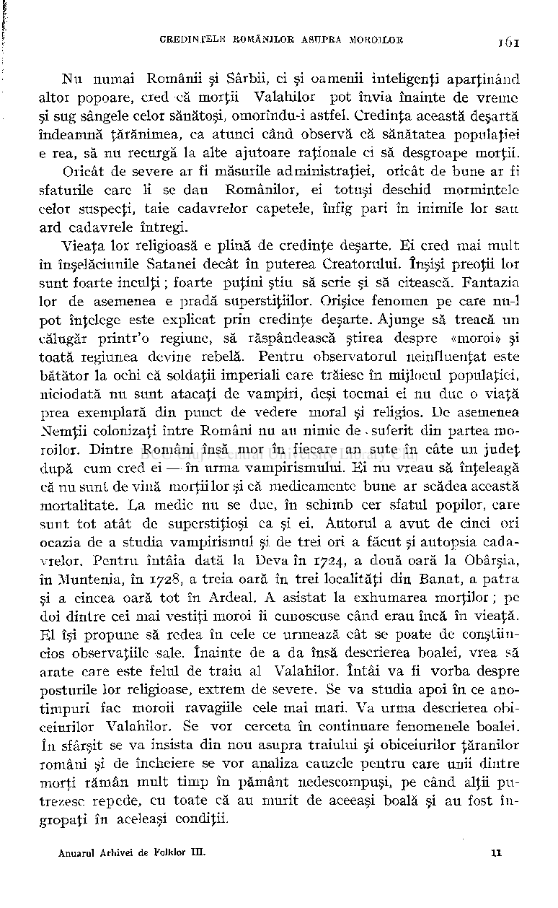

Nu numai Românii şi Sârbii, ci şi oamenii inteligenţi aparţinând altor popoare, cred că morţii Valahilor pot învia înainte de vreme şi sug sângele celor sănătoşi, omorîndu-i astfel. Credinţa această deşartă îndeamnă ţărănimea, ca atunci când observă că sănătatea populaţiei e rea, să nu recurgă la alte ajutoare raţionale ci să desgroape morţii.

Oricât de severe ar fi măsurile administraţiei, oricât de bune ar fi sfaturile care li se dau Românilor, ei totuşi deschid mormintele celor suspecţi, taie cadavrelor capetele, înfig pari în inimile lor sau ard cadavrele întregi.

Vieaţa lor religioasă e plină de credinţe deşarte. Ei cred mai mult în înşelăciunile Satanei decât în puterea Creatorului. înşişi preoţii lor sunt foarte inculţi ; foarte puţini ştiu să scrie şi să citească. Fantazia lor de asemenea e pradă superstiţiilor. Orişice fenomen pe care nu-1 pot înţelege este explicat prin credinţe deşarte. Ajunge să treacă un călugăr printr'o regiune, să răspândească ştirea despre «moroi» şi toată regiunea devine rebelă. Pentru observatorul neinfluenţat este

- bătător la ochi că soldaţii imperiali care trăiesc în mijlocul populaţiei, niciodată nu sunt atacaţi de vampiri, deşi tocmai ei nu duc o viaţă prea exemplară din punct de vedere moral şi religios. De asemenea Nemţii colonizaţi între Români nu au nimic de • suferit din partea moroilor. Dintre Români însă mor în fiecare an sute în câte un judeţ după cum cred ei — în urma vampirismului. Ei nu vreau să înţeleagă
- că nu sunt de vină morţii lor şi că medicamente bune ar scădea această mortalitate. Da medic nu se duc, în schimb cer sfatul popilor, care sunt tot atât de superstiţioşi ca şi ei. Autorul a avut de cinci ori ocazia de a studia vampirismul şi de trei ori a făcut şi autopsia cadavrelor. Pentru întâia dată la Deva în 1724, a două oară la Obârşia, în Muntenia, în 1728, a treia oară în trei localităţi din Banat, a patra şi a cincea oară tot în Ardeal. A asistat la exhumarea morţilor ; pe doi dintre cei mai vestiţi moroi îi cunoscuse când erau încă în vieaţă. El îşi propune să redea în cele ce urmează cât se poate de conştiincios observaţiile sale. înainte de a da însă descrierea boalei, vrea să arate care este felul de traiu al Valahilor. întâi va fi vorba despre posturile lor religioase, extrem de severe. Se va studia apoi în ce anotimpuri fac moroii ravagiile cele mai mari. Va urma descrierea obiceiurilor Valahilor. Se vor cerceta în continuare fenomenele boalei. în sfârşit se va insista din nou asupra traiului şi obiceiurilor ţăranilor români şi de încheiere se vor analiza cauzele pentru care unii dintre morţi rămân mult timp în pământ nedescompuşi, pe când alţii putrezesc repede, cu toate că au murit de aceeaşi boală şi au fost îngropaţi în aceleaşi condiţii.

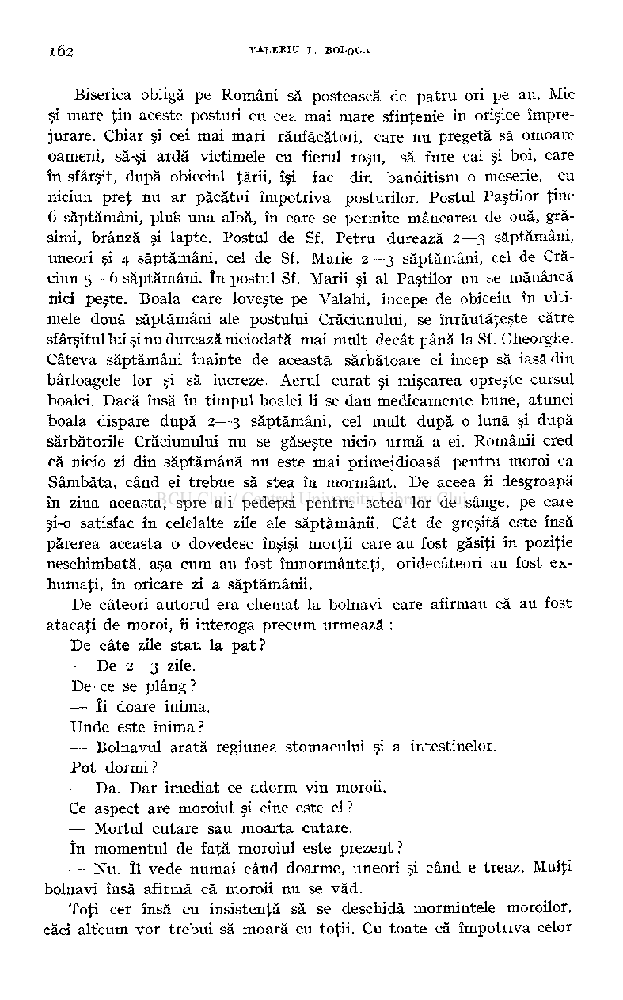

Biserica obligă pe Români să postească de patru ori pe an. Mic şi mare ţin aceste posturi cu cea mai mare sfinţenie în orişice împrejurare. Chiar şi cei mai mari răufăcători, care nu pregetă să omoare oameni, să-şi ardă victimele cu fierul roşu, să fure cai şi boi, care în sfârşit, după obiceiul ţării, îşi fac din banditism o meserie, cu niciun preţ nu ar păcătui împotriva posturilor. Postul Paştilor ţine 6 săptămâni, plus una albă, în care se permite mâncarea de ouă, grăsimi, brânză şi lapte. Postul de Sf. Petru durează 2—3 săptămâni, uneori şi 4 săptămâni, cel de Sf. Marie 2—3 săptămâni, cel de Crăciun 5— 6 săptămâni. în postul Sf. Marii şi al Paştilor nu se mănâncă nici peşte. Boala care loveşte pe Valahi, începe de obiceiu în ultimele două săptămâni ale postului Crăciunului, se înrăutăţeşte către sfârşitul lui şi nu durează niciodată mai mult decât până laSf. Gheorghe. Câteva săptămâni înainte de această sărbătoare ei încep să iasă din

- bârloagele lor şi să lucreze. Aerul curat şi mişcarea opreşte cursul boalei. Dacă însă în timpul boalei li se dau medicamente bune, atunci boala dispare după 2—3 săptămâni, cel mult după o lună şi după sărbătorile Crăciunului nu se găseşte nicio urmă a ei. Românii cred că nicio zi din săptămână nu este mai primejdioasă pentru moroi ca Sâmbăta, când ei trebue să stea în mormânt. De aceea îi desgroapă în ziua aceasta, spre a-i pedepsi pentru setea lor de sânge, pe care şi-o satisfac în celelalte zile ale săptămânii. Cât de greşită este însă părerea aceasta o dovedesc înşişi morţii care au fost găsiţi în poziţie neschimbată, aşa cum au fost înmormântaţi, oridecâteori au fost exhumaţi, în oricare zi a săptămânii.

De câteori autorul era chemat la bolnavi care afirmau că au fost atacaţi de moroi, îi interoga precum urmează :

De câte zile stau la pat ?

— De 2—3 zile. De ce se plâng ? — îi doare inima. Unde este inima ?

— Bolnavul arată regiunea stomacului şi a intestinelor. Pot dormi ?

— Da. Dar imediat ce adorm vin moroii. Ce aspect are moroiul şi cine este el ? — Mortul cutare sau moarta cutare. î n momentul de faţă moroiul este prezent ?

— Nu. îl vede numai când doarme, uneori şi când e treaz. Mulţi bolnavi însă afirmă că moroii nu se văd.

Toţi cer însă cu insistenţă să se deschidă mormintele moroilor, căci altcum vor trebui să moară cu toţii. Cu toate că împotriva celor

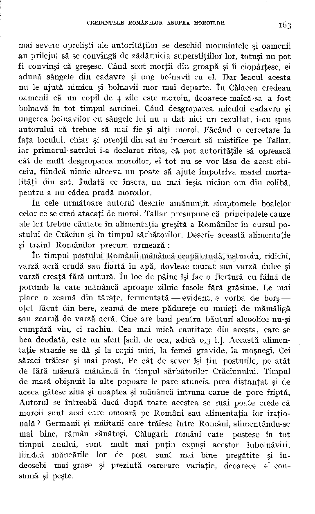

mai severe oprelişti ale autorităţilor se deschid mormintele şi oamenii au prilejul să se convingă de zădărnicia superstiţiilor lor, totuşi nu pot fi convinşi că greşesc. Când scot morţii din groapă şi îi ciopârţesc, ei adună sângele din cadavre şi ung bolnavii cu el. Dar leacul acesta nu le ajută nimica şi bolnavii mor mai departe. î n Călacea credeau oamenii că un copil de 4 zile este moroiu, deoarece maică-sa a fost bolnavă în tot timpul sarcinei. Când desgroparea micului cadavru şi ungerea bolnavilor cu sângele lui nu a dat nici un rezultat, i-au spus autorului că trebue să mai fie şi alţi moroi. Făcând o cercetare la faţa locului, chiar şi preoţii din sat au încercat să mistifice pe Tallar, iar primarul satului i-a declarat ritos, că pot autorităţile să oprească

- cât de mult desgroparea moroilor, ei tot nu se vor lăsa de acest obiceiu, fiindcă nimic altceva nu poate să ajute împotriva marei mortalităţi din sat. îndată ce însera, nu mai ieşia niciun om din colibă, pentru a nu cădea pradă moroilor.

în cele următoare autorul descrie amănunţit simptomele boalelor celor ce se cred atacaţi de moroi. Tallar presupune că principalele cauze ale lor trebue căutate în alimentaţia greşită a Românilor în cursul postului de Crăciun şi în timpul sărbătorilor. Descrie această alimentaţie şi traiul Românilor precum urmează :

î n timpul postului Românii mănâncă ceapă crudă, usturoiu, ridichi, varză acră crudă sau fiartă în apă, dovleac murat sau varză dulce şi varză creaţă fără untură. î n loc de pâine îşi fac o fiertură cu făină de porumb la care mănâncă aproape zilnic fasole fără grăsime. De mai place o zeamă din tărâţe, fermentată — evident, e vorba de borş oţet făcut din bere, zeamă de mere pădureţe cu muieţi de mămăligă sau zeamă de varză acră. Cine are bani pentru băuturi alcoolice nu-şi cumpără vin, ci rachiu. Cea mai mică cantitate din acesta, care se bea deodată, este un sfert [scil. de oca, adică 0,3 1.]. Această alimentaţie stranie se dă şi la copii mici, la femei gravide, la moşnegi. Cei săraci trăiesc şi mai prost. Pe cât de sever îşi ţin posturile, pe atât de fără măsură mănâncă în timpul sărbătorilor Crăciunului. Timpul de masă obişnuit la alte popoare le pare atuncia prea distanţat şi de aceea gătesc ziua şi noaptea şi mănâncă întruna carne de porc friptă. Autorul se întreabă dacă după toate acestea se mai poate crede că moroii sunt acei care omoară pe Români sau alimentaţia lor iraţională Germanii şi militarii care trăiesc între Români, alimentându-se mai bine, rămân sănătoşi. Călugării români care postesc în tot timpul anului, sunt mult mai puţin expuşi acestor înbolnăviii, fiindcă mâncările lor de post sunt mai bine pregătite şi îndeosebi mai grase şi prezintă oarecare variaţie, deoarece ei consumă şi peşte.

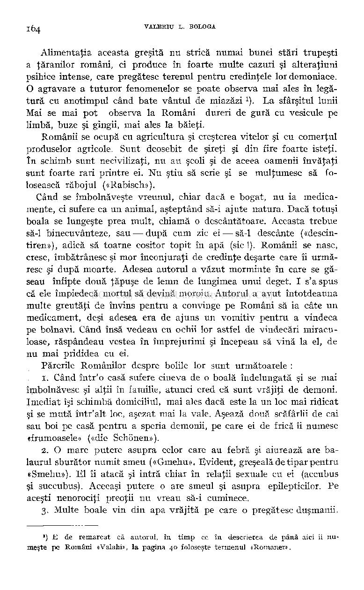

Alimentaţia aceasta greşită nu strică numai bunei stări trupeşti a ţăranilor români, ci produce în foarte multe cazuri şi alteraţiuni psihice intense, care pregătesc terenul pentru credinţele lor demoniace. O agravare a tuturor fenomenelor se poate observa mai ales în legătură cu anotimpul când bate vântul de miazăzi ). La sfârşitul lunii Mai se mai pot observa la Români dureri de gură cu vésicule pe limbă, buze şi gingii, mai ales la băieţi.

Românii se ocupă cu agricultura şi creşterea vitelor şi cu comerţul produselor agricole. Sunt deosebit de şireţi şi din fire foarte isteţi, î n schimb sunt necivilizaţi, nu au şcoli şi de aceea oamenii învăţaţi sunt foarte rari printre ei. Nu ştiu să scrie şi se mulţumesc să folosească răbojul («Rabisch»).

Când se îmbolnăveşte vreunul, chiar dacă e bogat, nu ia medicamente, ci sufere ca un animal, aşteptând să-i ajute natura. Dacă totuşi boala se lungeşte prea mult, chiamă o descântătoare. Aceasta trebue să-1 binecuvânteze, sau — după cum zic ei — să-1 descânte («descintiren»), adică să toarne cositor topit în apă (sic !). Românii se nasc, cresc, îmbătrânesc şi mor înconjuraţi de credinţe deşarte care îi urmăresc şi după moarte. Adesea autorul a văzut morminte în care se găseau înfipte două ţăpuşe de lemn de lungimea unui deget. I s'a spus că ele împiedecă mortul să devină moroiu. Autorul a avut întotdeauna multe greutăţi de învins pentru a convinge pe Români să ia câte un medicament, deşi adesea era de ajuns un vomitiv pentru a vindeca pe bolnavi. Când însă vedeau cu ochii lor astfel de vindecări miraculoase, răspândeau vestea în împrejurimi şi începeau să vină la el, de nu mai prididea cu ei.

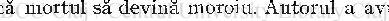

Părerile Românilor despre bolile lor sunt următoarele :

- 1. Când într'o casă sufere cineva de o boală îndelungată şi se mai înrbolnăvesc şi alţii în familie, atunci cred că sunt vrăjiţi de demoni. Imediat îşi schimbă domiciliul, mai ales dacă este la un loc mai ridicat şi se mută într'alt loc, aşezat mai la vale. Aşează două scăfârlii de cai sau boi pe casă pentru a speria demonii, pe care ei de frică îi numesc «frumoasele» («die Schônen»).
- 2. O mare putere asupra celor care au febră şi aiurează are balaurul sburător numit smeu («Gmehu». Evident, greşeală de tipar pentru «Smehu»). El îi atacă şi intră chiar în relaţii sexuale cu ei (accubus şi succubus). Aceeaşi putere o are smeul şi asupra epilepticilor. Pe aceşti nenorociţi preoţii nu vreau să-i cuminece.
- 3. Multe boale vin din apa vrăjită pe care o pregătesc duşmanii.

') E de remarcat că autorul, în timp ce în descrierea de până aici îi numeşte pe Români «Valahi», la pagina 40 foloseşte termenul «Romanei».

