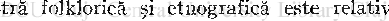

# RAPORTUL DIN 1756 AL UNUI CHIRURG GERMAN DESPRE CREDINŢELE ROMÂNILOR ASUPRA MOROILOR

Intr'o notă bibliografică, publicată în «Anuarul Institutului de Istorie Naţională» din Cluj, IV (1924), am semnalat între altele şi cartea chirurgului Georg Tallar, apărută în 1784, în care autorul vorbeşte amănunţit despre vampirii credinţelor populare româneşti, numiţi de ţărani «moroi». Cărticica aceasta, pe care o aminteşte şi d-1 Andrei Veress în volumul II al Bibliografiei sale româno-maghiare, este o raritate bibliografică. Din motivul acesta, mai ales însă fiindcă literatura noastră folklorică şi etnografică este relativ săracă în informaţii din secolele trecute, cred că este interesant să dau aici o scurtă analiză a cărţii şi conţinutului ei.

Broşura se găseşte la Biblioteca Universităţii din Cluj, subt No. 170680. E tipărită în limba germană, cu litere germanice, format octav mic şi are 87 pagini. A fost editată la Johann Georg Môssle, Viena şi Dipsca.

Titlul complet este următorul :

VISUM REPERTUM

ANA TO M ICO - CHIRURGICUM oder

Grundlicher Bericht von den sogenannten Blutstingem, Vampier,

oder in àer Wallachischen Sprache Moroi in der W'àllachey, Siebenburgen, und Banat

