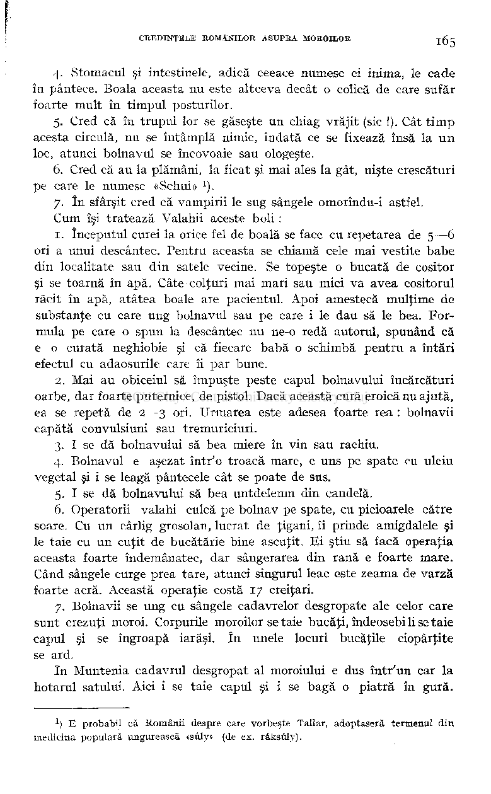

4. Stomacul şi intestinele, adică ceeace numesc ei inima, le cade în pântece. Boala aceasta nu este altceva decât o colică de care sufăr foarte mult în timpul posturilor.

- 5. Cred că în trupul lor se găseşte un chiag vrăjit (sic !). Cât tim p

acesta circulă, nu se întâmplă nimic, îndată ce se fixează însă la u n loc, atunci bolnavul se încovoaie sau ologeşte.

- 6. Cred că au la plămâni, la ficat şi mai ales la gât, nişte crescături

pe care le numesc «Schui» )

- 7. î n sfârşit cred că vampirii le sug sângele omorîndu-i astfel. Cum îşi tratează Valahii aceste boli :

- 1. începutul curei la orice fel de boală se face cu repetarea de 5—6 ori a unui descântec. Pentru aceasta se chiamă cele mai vestite babe din localitate sau din satele vecine. Se topeşte o bucată de cositor şi se toarnă în apă. Câte colţuri mai mari sau mici va avea cositorul răcit în apă, atâtea boale are pacientul. Apoi amestecă mulţime de substanţe cu care ung bolnavul sau pe care i le dau să le bea. Formula pe care o spun la descântec nu ne-o redă autorul, spunând că e o curată neghiobie şi că fiecare babă o schimbă pentru a întări efectul cu adaosurile care îi par bune.
- 2. Mai au obiceiul să împuşte peste capul bolnavului încărcături oarbe, dar foarte puternice, de pistol. Dacă această cură eroică nu ajută, ea se repetă de 2—3 ori. Urmarea este adesea foarte rea : bolnavii capătă convulsiuni sau tremuriciuri.
- 3. I se dă bolnavului să bea miere în vin sau rachiu.
- 4. Bolnavul e aşezat într'o troacă mare, e uns pe spate cu uleiu

vegetal şi i se leagă pântecele cât se poate de sus.

- 5. I se dă bolnavului să bea untdelemn din candelă.
- 6. Operatorii valahi culcă pe bolnav pe spate, cu picioarele către

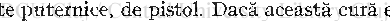

soare. Cu un cârlig grosolan, lucrat de ţigani, îi prinde amigdalele şi le taie cu un cuţit de bucătărie bine ascuţit. F i ştiu să facă operaţia aceasta foarte îndemânatec, dar sângerarea din rană e foarte mare. Când sângele curge prea tare, atunci singurul leac este zeama de varză foarte acră. Această operaţie costă 17 creiţari.

7. Bolnavii se ung cu sângele cadavrelor desgropate ale celor care sunt crezuţi moroi. Corpurile moroilor se taie bucăţi, îndeosebi li se taie capul şi se îngroapă iarăşi. în unele locuri bucăţile ciopârţite se ard.

în Muntenia cadavrul desgropat al moroiului e dus într'un car la hotarul satului. Aici i se taie capul şi i se bagă o piatră în gură.

### ) E probabil că Românii despre care vorbeşte Tallar, adoptaseră termenul din medicina populară ungurească «sûly» (de ex. râksûly).

1

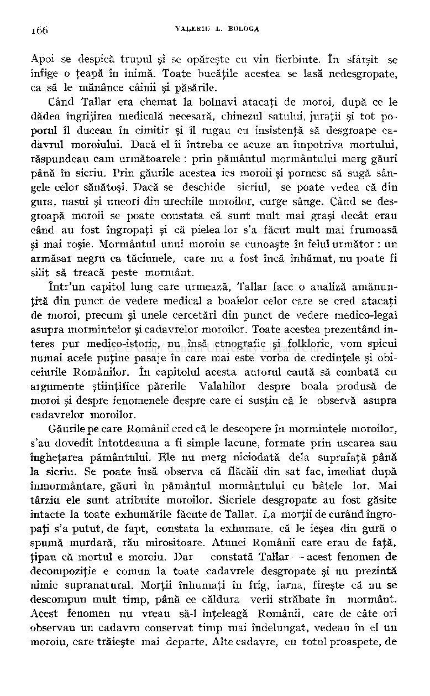

Apoi se despică trupul şi se opăreşte cu vin fierbinte. în sfârşit se înfige o ţeapă în inimă. Toate bucăţile acestea se lasă nedesgropate, ca să le mănânce câinii şi păsările.

Când Tallar era chemat la bolnavi atacaţi de moroi, după ce le dădea îngrijirea medicală necesară, chinezul satului, juraţii şi tot poporul îl duceau în cimitir şi îl rugau cu insistenţă să desgroape cadavrul moroiului. Dacă el îi întreba ce acuze au împotriva mortului, răspundeau cam următoarele : prin pământul mormântului merg găuri până în sicriu. Prin găurile acestea ies moroii şi pornesc să sugă sângele celor sănătoşi. Dacă se deschide sicriul, se poate vedea că din gura, nasul şi uneori din urechile moroilor, curge sânge. Când se desgroapă moroii se poate constata că sunt mult mai graşi decât erau când au fost îngropaţi şi că pielea lor s'a făcut mult mai frumoasă şi mai roşie. Mormântul unui moroiu se cunoaşte în felul următor : un armăsar negru ca tăciunele, care nu a fost încă înhămat, nu poate fi silit să treacă peste mormânt.

într'un capitol lung care urmează, Tallar face o analiză amănunţită din punct de vedere medical a boalelor celor care se cred atacaţi de moroi, precum şi unele cercetări din punct de vedere medico-legal asupra mormintelor şi cadavrelor moroilor. Toate acestea prezentând interes pur medico-istoric, nu însă etnografic şi folkloric, vom spicui numai acele puţine pasaje în care mai este vorba de credinţele şi obiceiurile Românilor. în capitolul acesta autorul caută să combată cu argumente ştiinţifice părerile Valahilor despre boala produsă de moroi şi despre fenomenele despre care ei susţin că le observă asupra cadavrelor moroilor.

Găurile pe care Românii cred că le descopere în mormintele moroilor, s'au dovedit întotdeauna a fi simple lacune, formate prin uscarea sau îngheţarea pământului. Ele nu merg niciodată delà suprafaţă până la sicriu. Se poate însă observa că flăcăii din sat fac, imediat după înmormântare, găuri în pământul mormântului cu bâtele lor. Mai târziu ele sunt atribuite moroilor. Sicriele desgropate au fost găsite intacte la toate exhumările făcute de Tallar. Ea morţii de curând îngropaţi s'a putut, de fapt, constata la exhumare, că le ieşea din gură o spumă murdară, rău mirositoare. Atunci Românii care erau de faţă, ţipau că mortul e moroiu. Dar — constată Tallar — acest fenomen de decompoziţie e comun la toate cadavrele desgropate şi nu prezintă nimic supranatural. Morţii înhumaţi în frig, iarna, fireşte că nu se descompun mult timp, până ce căldura verii străbate în mormânt. Acest fenomen nu vreau să-1 înţeleagă Românii, care de câte ori observau un cadavru conservat timp mai îndelungat, vedeau în el un moroiu, care trăieşte mai departe. Alte cadavre, cu totul proaspete, de

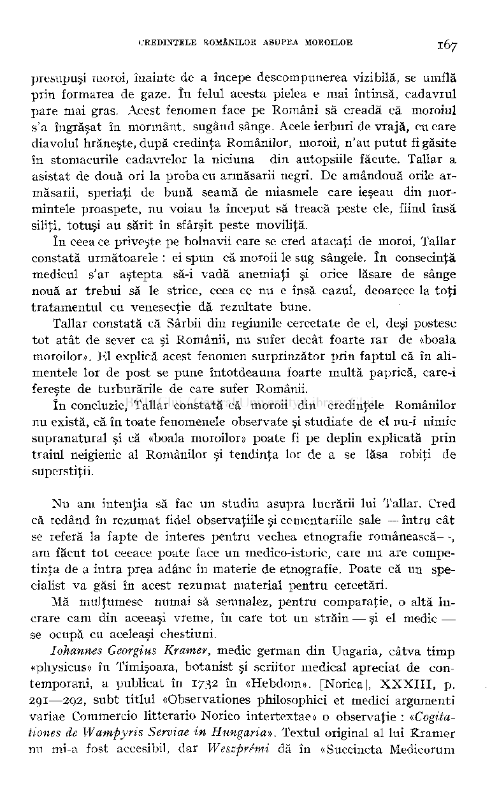

presupuşi moroi, înainte de a începe descompunerea vizibilă, se umflă prin formarea de gaze. î n felul acesta pielea e mai întinsă, cadavrul pare mai gras. Acest fenomen face pe Români să creadă că moroiul s'a îngrăşat în mormânt, sugând sânge. Acele ierburi de vrajă, cu care diavolul hrăneşte, după credinţa Românilor, moroii, n'au putut fi găsite în stomacurile cadavrelor la niciuna din autopsiile făcute. Tallar a asistat de două ori la proba cu armăsarii negri. De amândouă orile armăsarii, speriaţi de bună seamă de miasmele care ieşeau din mormintele proaspete, nu voiau la început să treacă peste ele, fiind însă siliţi, totuşi au sărit în sfârşit peste movilită.

în ceea ce priveşte pe bolnavii care se cred atacaţi de moroi, Tallar constată următoarele : ei spun că moroii le sug sângele. în consecinţă medicul s'ar aştepta să-i vadă anemiaţi şi orice lăsare de sânge nouă ar trebui să le strice, ceea ce nu e însă cazul, deoarece la toţi tratamentul cu venesecţie dă rezultate bune.

Tallar constată că Sârbii din regiunile cercetate de el, deşi postesc tot atât de sever ca şi Românii, nu sufer decât foarte rar de «boala moroilor». El explică acest fenomen surprinzător prin faptul că în alimentele lor de post se pune întotdeauna foarte multă paprică, care-i fereşte de turburările de care sufer Românii.

în concluzie, Tallar constată că moroii din credinţele Românilor nu există, că în toate fenomenele observate şi studiate de el nu-i nimic supranatural şi că «boala moroilor» poate fi pe deplin explicată prin traiul neigienic al Românilor şi tendinţa lor de a se lăsa robiţi de superstiţii.

Nu am intenţia să fac un studiu asupra lucrării lui Tallar. Cred că redând în rezumat fidel observaţiile şi comentariile sale — întru cât se referă la fapte de interes pentru vechea etnografie românească—, am făcut tot ceeace poate face un medico-istoric, care nu are competinţa de a intra prea adânc în materie de etnografie. Poate că un specialist va găsi în acest rezumat material pentru cercetări.

Mă mulţumesc numai să semnalez, pentru comparaţie, o altă lucrare cam din aceeaşi vreme, în care tot un străin — şi el medic se ocupă cu aceleaşi chestiuni.

Iohannes Georgius Kramer, medic german din Ungaria, câtva timp «physicus» în Timişoara, botanist şi scriitor medical apreciat de contemporani, a publicat în 1732 în «Hebdom». [Norica], XXXIII , p. 291—292, subt titlul «Observationes philosophic! et medici argumenti variae Commercio litterario Norico intertextae» o observaţie : «Cogitationes de Wampyris Serviae in Hungaria». Textul original al lui Kramer nu mi-a fost accesibil, dar Weszpre'mi dă în «Succincta Medicorum

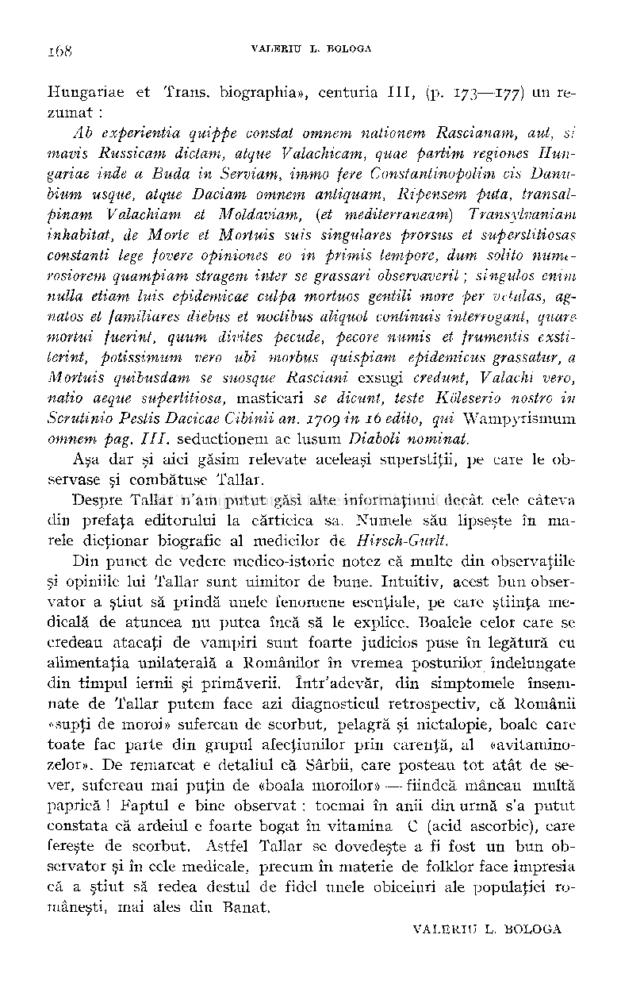

Hungariae et Trans, biographia», centuria III , (p. 173—177) un rezumat :

Ab experientia quippe constat omnem nationem Rascianam, aut, si mavis Russicam dictam, atque Valachicam, quae partim regiones Hungariae inde a Buda in Serviam, immo fere Const antinopolim cis Danubium usque, atque Daciam omnem antiquam, Ripensem puta, transalpinam Valachiam et Moldaviam, {et mediterraneam) Transylvaniam inhabitat, de Morte et Mortuis suis singulares prorsus et superstitiosas constanţi lege fovere opiniones eo in primis tempore, dum solito numerosiorem quampiam stragem inter se grassari observaverit ; singulos enim nulla etiam luis epidemicae culpa mortuos gentili more per vetulas, agnatos et ţamiliares diebus et noctibus aliquot continuis interrogate, quare mortui fuerint, quum divites pecude, pecore numis et frumentis exstiterint, potissimum vero ubi morbus quispiam epidemicus grassatur, a Mortuis quibusdam se suosque Rasciani exsugi credunt, Valachi vero, naţio aeque supertitiosa, masticari se dicunt, teste Kôleserio nostro in Scrutinio Pestis Dacicae Cibinii an. ijog in iô edito, qui Wampyrismum omnem pag. III. seductionem ac lusum Diaboli nominat.

Aşa dar şi aici găsim relevate aceleaşi superstiţii, pe care le observase şi combătuse Tallar.

Despre Tallar n'am putut găsi alte informaţiuni decât cele câteva din prefaţa editorului la cărticica sa. Numele său lipseşte în marele dicţionar biografic al medicilor de Hirsch-Gurlt.

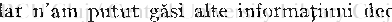

Din punct de vedere medico-istoric notez că multe din observaţiile şi opiniile lui Tallar sunt uimitor de bune. Intuitiv, acest bun observator a ştiut să prindă unele fenomene esenţiale, pe care ştiinţa medicală de atuncea nu putea încă să le explice. Boalele celor care se credeau atacaţi de vampiri sunt foarte judicios puse în legătură cu alimentaţia unilaterală a Românilor în vremea posturilor îndelungate din timpul iernii şi primăverii. într'adevăr, din simptomele însemnate de Tallar putem face azi diagnosticul retrospectiv, că Românii «supţi de moroi» sufereau de scorbut, pelagră şi nictalopie, boale care toate fac parte din grupul afecţiunilor prin carenţă, al «avitaminozelor». De remarcat e detaliul că Sârbii, care posteau tot atât de sever, sufereau mai puţin de «boala moroilor» — fiindcă mâncau multă paprică ! Faptul e bine observat : tocmai în anii din urmă s'a putut constata că ardeiul e foarte bogat în vitamina C (acid ascorbic), care fereşte de scorbut. Astfel Tallar se dovedeşte a fi fost un bun observator şi în cele medicale, precum în materie de folklor face impresia că a ştiut să redea destul de fidel unele obiceiuri ale populaţiei româneşti, mai ales din Banat.

#### VALBRIU L. BOLOGA

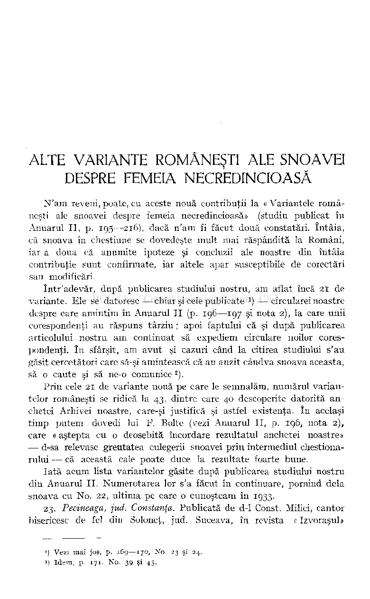

# ALTE VARIANTE ROMÂNEŞTI ALE SNOAVEI DESPRE FEMEIA NECREDINCIOASĂ

N'am reveni, poate, eu aceste nouă contribuţii la « Variantele româneşti ale snoavei despre femeia necredincioasă» (studiu publicat în Anuarul II, p. 195—216), dacă n'am fi făcut două constatări. întâia, că snoava în chestiune se dovedeşte mult mai răspândită la Români, iar a doua că anumite ipoteze şi concluzii ale noastre din întâia contribuţie sunt confirmate, iar altele apar susceptibile de corectări sau modificări.

într'adevăr, după publicarea studiului nostru, am aflat încă 21 de variante. Ele se datoresc — chiar şi cele publicate

) — circularei noastre

1

despre care amintim în Anuarul I I (p. 196—197 şi nota 2), la care unii corespondenţi au răspuns târziu ; apoi faptului că si după publicarea articolului nostru am continuat să expediem circulare noilor corespondenţi, î n sfârşit, am avut şi cazuri când la citirea studiului s'au găsit cercetători care să-şi amintească că au auzit cândva snoava aceasta, să o caute şi să ne-o comunice )

Prin cele 21 de variante nouă pe care le semnalăm, numărul variantelor româneşti se ridică la 43, dintre care 40 descoperite datorită anchetei Arhivei noastre, care-şi justifică şi astfel existenţa. în acelaşi timp putem dovedi lui F. Boite (vezi Anuarul II, p. 196, nota 2) , care « aştepta cu o deosebită încordare rezultatul anchetei noastre» — d-sa relevase greutatea culegerii snoavei prin intermediul chestionarului — că această cale poate duce la rezultate foarte bune.

Iată acum lista variantelor găsite după publicarea studiului nostru din Anuarul II. Numerotarea lor s'a făcut în continuare, pornind delà snoava cu No. 22, ultima pe care o cunoşteam în 1933.

23. Pecineaga, jud. Constanţa. Publicată de d-1 Const. Milici, cantor bisericesc de fel din Soloneţ, jud. Suceava, în revista « Izvoraşul»

!) Vezi mai jos, p. 169—170, No. 23 şi 24.

### ) Idem, p. 171, No. 39 şi 43.

a

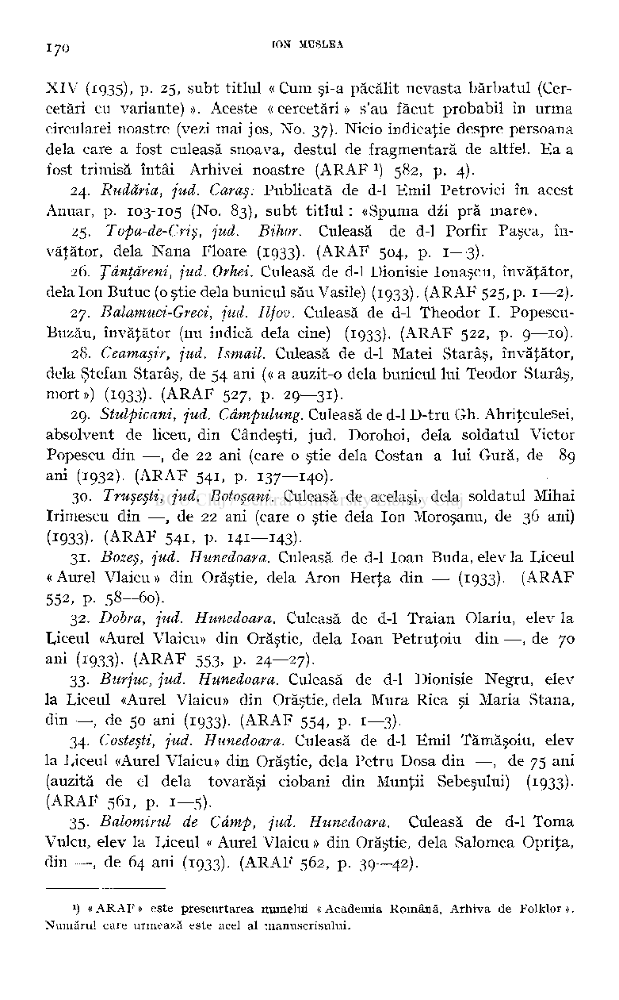

XIV (1935), p. 25, subt titlul « Cum şi-a păcălit nevasta bărbatul (Cercetări cu variante)». Aceste «cercetări» s'au făcut probabil în urma circularei noastre (vezi mai jos, No. 37). Nicio indicaţie despre persoana delà care a fost culeasă snoava, destul de fragmentară de altfel. Ea a fost trimisă întâi Arhivei noastre (ARAF ) 582, p. 4).

- 24. Rudăria, jud. Caras. Publicată de d-1 Emil Petrovici în acest

Anuar, p. 103-105 (No. 83), subt titlul : «Spuma dzi pră mare».

- 25. Topa-de-Criş, jud. Bihor. Culeasă de d-1 Porfir Pasca, în­

văţător, delà Nana Floare (1933). (ARAF 504, p. 1—3).

- 26. Ţânţăreni, jud. Orhei. Culeasă de d-1 Dionisie Ionaşcu, învăţător,

delà Ion Butuc (o ştie delà bunicul său Vasile) (1933). (ARAF 525, p. 1—2).

- 27. Balamuci-Greci, jud. Ilfov. Culeasă de d-1 Theodor I. Popescu-

Buzău, învăţător (nu indică delà cine) (1933). (ARAF 522, p. 9—10).

- 28. Ceamasir, jud. Ismail. Culeasă de d-1 Matei Starâş, învăţător,

delà Ştefan Starâş, de 54 ani (« a auzit-o delà bunicul lui Teodor Starâş, mort») (1933). (ARAF 527, p. 29—31).

29. Stulpicani, jud. Câmpulung. Culeasă de d-1 D-tru Gh. Ahriţculesei, absolvent de liceu, din Cândeşti, jud. Dorohoi, delà soldatul Victor Popescu din —, de 22 ani (care o ştie delà Costan a lui Gură, de 89

- ani (1932). (ARAF 541, p. 137—140).

30. Truşesti, jud. Botoşani. Culeasă de acelaşi, delà soldatul Mihai Irimescu din —, de 22 ani (care o ştie delà Ion Moroşanu, de 36 ani)

(1933). (ARAF 541, p. 141—143).

- 31. Bozeş, jud. Hunedoara. Culeasă de d-1 loan Buda, elev la liceul «Aurel Vlaicu» din Orăştie, delà Aron Herţa din — (1933)• (ARAF 552, p. 58—60).
- 32. Dobra, jud. Hunedoara. Culeasă de d-1 Traian Olariu, elev la Liceul «Aurel Vlaicu» din Orăştie, delà loan Petruţoiu din —, de 70

- ani (1933)- (ARAF 553, p. 24—27).

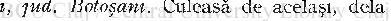

- 33. Burjuc, jud. Hunedoara. Culeasă de d-1 Dionisie Negru, elev la Liceul «Aurel Vlaicu» din Orăştie, delà Mura Rica şi Maria Stana, din —, de 50 ani (1933). (ARAF 554, p. 1—3).
- 34. Costeşti, jud. Hunedoara. Culeasă de d-1 Emil Tămăşoiu, elev la Liceul «Aurel Vlaicu» din Orăştie, delà Petru Dosa din —, de 75 ani (auzită de el delà tovarăşi ciobani din Munţii Sebeşului) (1933). (ARAF 561, p. 1—5).
- 35. Balomirul de Câmp, jud. Hunedoara. Culeasă de d-1 Toma Vulcu, elev la Liceul « Aurel Vlaicu » din Orăştie, delà Salomea Oprita, din —, de 64 ani (1933). (ARAF 562, p. 39—-42).

## *) « ARAF » este prescurtarea numelui « Academia Română, Arhiva de Folklor >> Numărul care urmează este acel al manuscrisului.

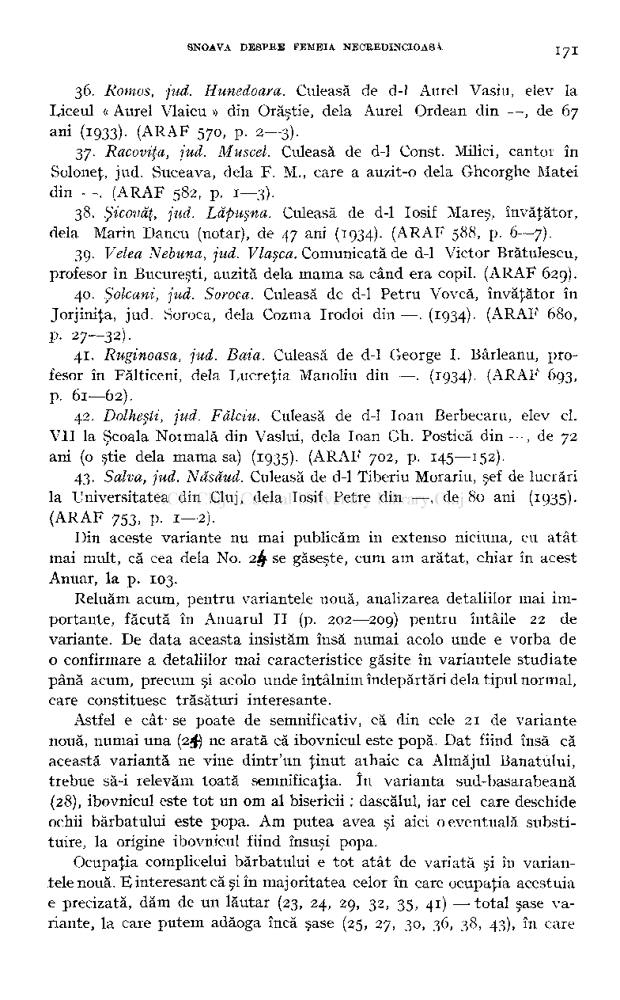

- 36. Romos, jud. Hunedoara. Culeasă de d-1 Aurel Vasiu, elev la

Liceul « Aurel Vlaicu » din Orăştie, delà Aurel Ordean din —, de 67 ani (1933)- (ARAF 570, p. 2—3).

- 37. Racoviţa, jud. Muscel. Culeasă de d-1 Const. Milici, cantor în

Soloneţ, jud. Suceava, delà F. M., care a auzit-o delà Gheorghe Matei din —. (ARAF 582, p. 1—3).

- 38. Şicovăţ, jud. Lăpuşna. Culeasă de d-1 Iosif Mareş, învăţător,

delà Marin Dancu (notar), de 47 ani (1934). (ARAF 588, p. 6—7).

- 39. Velea Nebuna, jud. Vlaşca. Comunicată de d-1 Victor Brătulescu,

profesor în Bucureşti, auzită delà mama sa când era copil. (ARAF 629).

- 40. Şolcani, jud. Soroca. Culeasă de d-1 Petru Vovcă, învăţător în Jorjiniţa, jud. Soroca, delà Cozma Irodoi din— . (1934)- (ARAF 680, p. 27—32).
- 41. Ruginoasa, jud. Baia. Culeasă de d-1 George I. Bârleanu, profesor în Fălticeni, delà Lucreţia Manoliu din —. (1934)- (ARAF 693, p. 61—62).
- 42. Dolheşti, jud. Fălciu. Culeasă de d-1 loan Berbecaru, elev cl. VII la Şcoala Normală din Vaslui, delà loan Gh. Postică din —, de 72 ani (o ştie delà mama sa) (1935)- (ARAF 702, p. 145—152).
- 43. Salva, jud. Năsâud. Culeasă de d-1 Tiberiu Morariu, şef de lucrări la Universitatea din Cluj, delà Iosif Petre din —, de 80 ani (1935). (ARAF 753, p. 1—2).

Din aceste variante nu mai publicăm in extenso niciuna, cu atât mai mult, că cea delà No. 2 ^ se găseşte, cum am arătat, chiar în acest Anuar, la p. 103.

Reluăm acum, pentru variantele nouă, analizarea detaliilor mai importante, făcută în Anuarul I I (p. 202—209) pentru întâile 22 de variante. De data aceasta insistăm însă numai acolo unde e vorba de o confirmare a detaliilor mai caracteristice găsite în variantele studiate până acum, precum şi acolo unde întâlnim îndepărtări delà tipul normal, care constituesc trăsături interesante.

Astfel e cât' se poate de semnificativ, că din cele 21 de variante nouă, numai una (24) ne arată că ibovnicul este popă. Dat fiind însă că această variantă ne vine dintr'un ţinut aihaic ca Almăjul Banatului, trebue să-i relevăm toată semnificaţia. în varianta sud-basarabeană (28), ibovnicul este tot un om al bisericii : dascălul, iar cel care deschide ochii bărbatului este popa. Am putea avea şi aici o eventuală substituire, la origine ibovnicul fiind însuşi popa.

Ocupaţia complicelui bărbatului e tot atât de variată şi în variantele nouă. E interesant că şi în majoritatea celor în care ocupaţia acestuia e precizată, dăm de un lăutar (23, 24, 29, 32, 35, 41) — total şase variante, la care putem adăoga încă şase (25, 27, 30, 36, 38, 43), în care

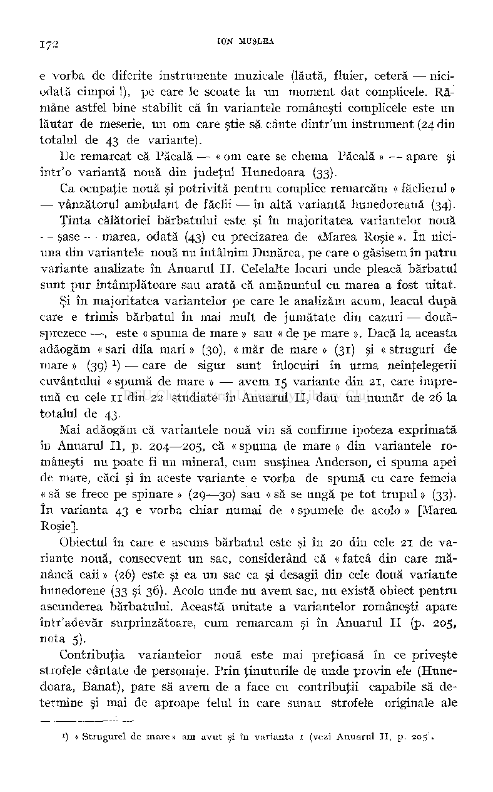

e vorba de diferite instrumente muzicale (lăută, fluier, cetera — niciodată cimpoi !), pe care le scoate la un moment dat complicele. Rămâne astfel bine stabilit că în variantele româneşti complicele este un lăutar de meserie, un om care ştie să cânte dintr'un instrument (24 din totalul de 43 de variante).

De remarcat că Păcală — « om care se chema Păcală » — apare şi într'o variantă nouă din judeţul Hunedoara (33).

Ca ocupaţie nouă şi potrivită pentru complice remarcăm « făclierul » •— vânzătorul ambulant de făclii •—în altă variantă hunedoreană (34).

Ţinta călătoriei bărbatului este şi în majoritatea variantelor nouă — şase — marea, odată (43) cu precizarea de «Marea Roşie». în niciuna din variantele nouă nu întâlnim Dunărea, pe care o găsisem în patru variante analizate în Anuarul II. Celelalte locuri unde pleacă bărbatul sunt pur întâmplătoare sau arată că amănuntul cu marea a fost uitat.

Şi în majoritatea variantelor pe care le analizăm acum, leacul după care e trimis bărbatul în mai mult de jumătate din cazuri — douăsprezece —, este « spuma de mare » sau « de pe mare ». Dacă la aceasta adăogăm «sari dila mari» (30), «măr de mare» (31) şi «struguri de mare » (39)

) — care de sigur sunt înlocuiri în urma neînţelegerii cuvântului « spumă de mare » — avem 15 variante din 21, care împreună cu cele 11 din 22 studiate în Anuarul II, dau un număr de 26 la totalul de 43.

1

Mai adăogăm că variantele nouă vin să confirme ipoteza exprimată în Anuarul II, p. 204—205, că « spuma de mare » din variantele ro­

- mâneşti nu poate fi un mineral, cum susţinea Anderson, ci spuma apei de mare, căci şi în aceste variante e vorba de spumă cu care femeia « să se frece pe spinare » (29—30) sau « să se ungă pe tot trupul » (33). în varianta 43 e vorba chiar numai de « spumele de acolo » [Marea Roşie].

Obiectul în care e ascuns bărbatul este şi în 20 din cele 21 de variante nouă, consecvent un sac, considerând că « fatcâ din care mă­

- nâncă caii » (26) este şi ea un sac ca şi desagii din cele două variante hunedorene (33 şi 36). Acolo unde nu avem sac, nu există obiect pentru ascunderea bărbatului. Această unitate a variantelor româneşti apare într'adevăr surprinzătoare, cum remarcam şi în Anuarul II (p. 205, nota 5).

Contribuţia variantelor nouă este mai preţioasă în ce priveşte strofele cântate de personaje. Prin ţinuturile de unde provin ele (Hunedoara, Banat), pare să avem de a face cu contribuţii capabile să determine şi mai de aproape felul în care sunau strofele originale ale

### *) « Strugurel de mare» am avut şi în varianta 1 (vezi Anuarul II p. 205".

