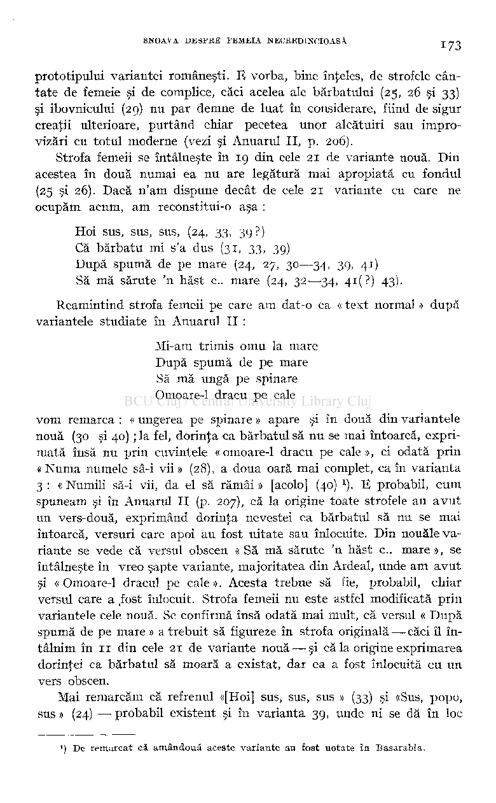
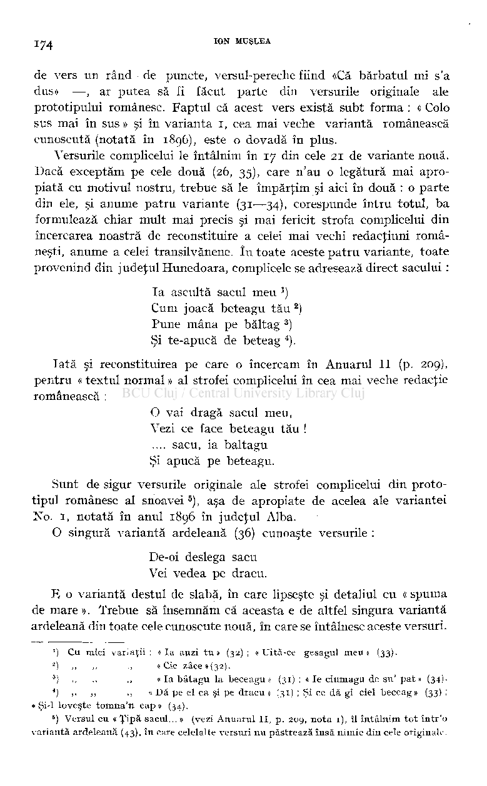
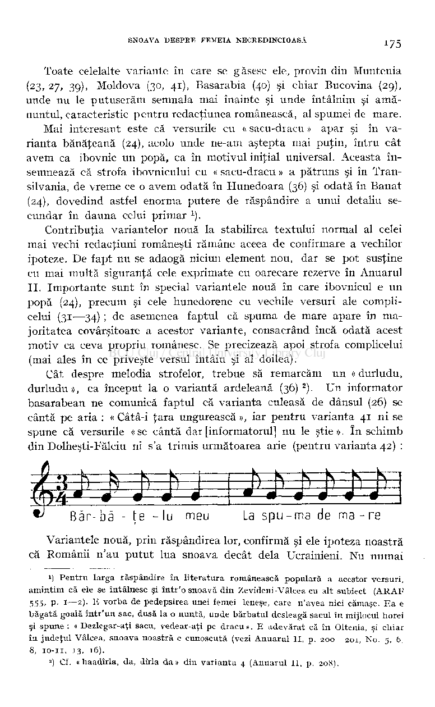
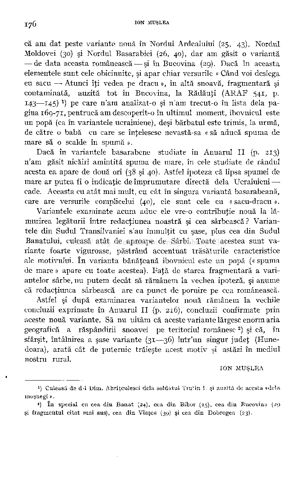
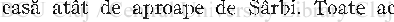
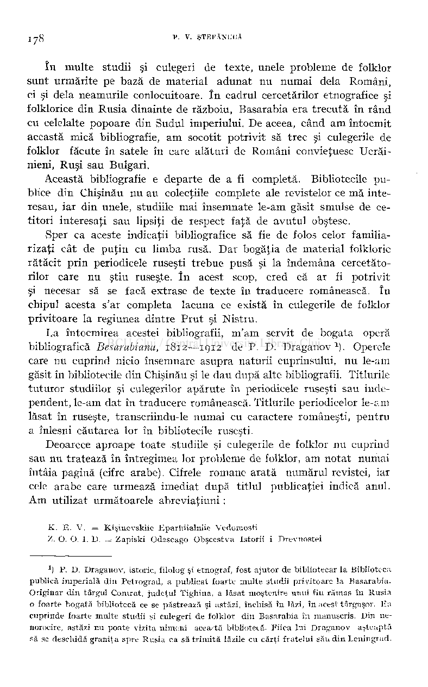
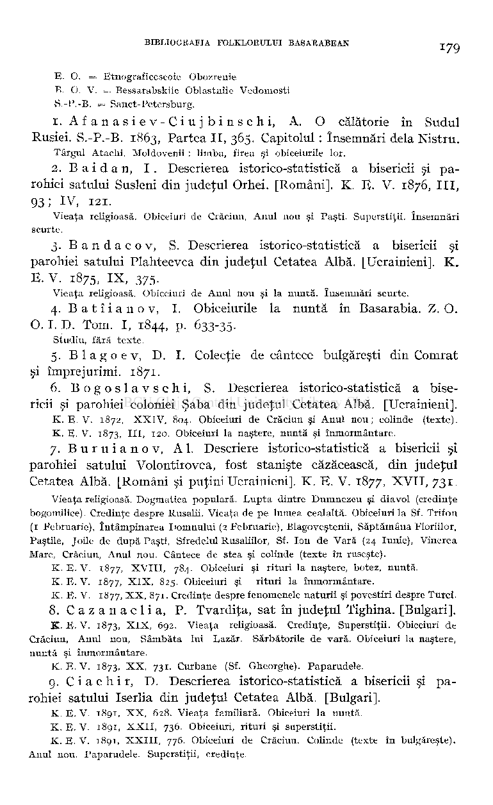
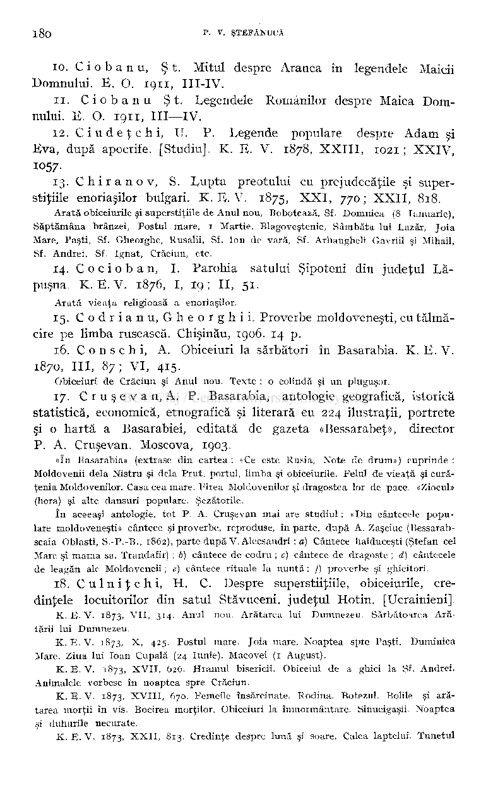
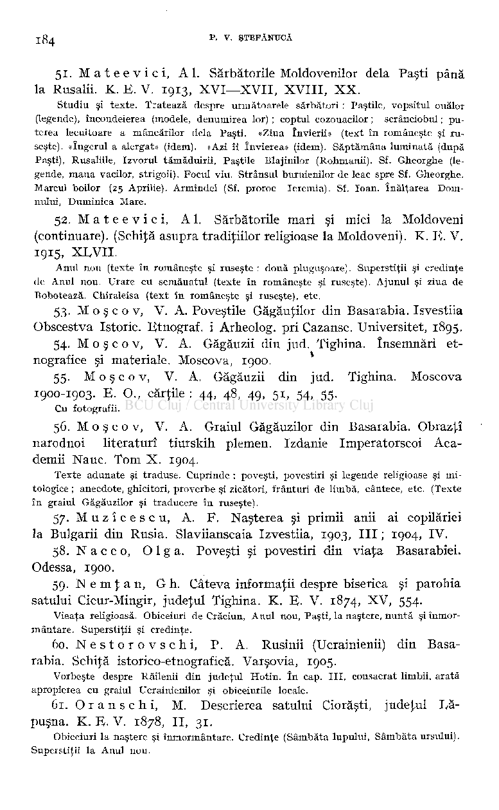

prototipului variantei româneşti. B vorba, bine înţeles, de strofele cântate de femeie şi de complice, căci acelea ale bărbatului (25, 26 şi 33) şi ibovnicului (29) nu par demne de luat în considerare, fiind de sigur creaţii ulterioare, purtând chiar pecetea unor alcătuiri sau improvizări cu totul moderne (vezi şi Anuarul II, p. 206).

Strofa femeii se întâlneşte în 19 din cele 21 de variante nouă. Din acestea în două numai ea nu are legătură mai apropiată cu fondul (25 şi 26). Dacă n'am dispune decât de cele 21 variante cu care ne ocupăm acum, am reconstitui-o aşa :

Hoi sus, sus, sus, (24, 33, 39?) Că bărbatu mi s'a dus (31, 33, 39) După spumă de pe mare (24, 27, 30—34, 39, 41) Să mă sărute 'n hăst c . mare (24, 32—34, 4i(?) 43).

Reamintind strofa femeii pe care am dat-o ca « text normal » după variantele studiate în Anuarul II :

Mi-am trimis omu la mare După spumă de pe mare Să mă ungă pe spinare Omoare-1 dracu pe cale

vom remarca : « ungerea pe spinare » apare şi în două din variantele nouă (30 şi 40) ; la fel, dorinţa ca bărbatul să nu se mai întoarcă, exprimată însă nu prin cuvintele « omoare-1 dracu pe cale », ci odată prin «Numa numele sâ-i vii » (28), a doua oară mai complet, ca în varianta 3 : « Numili să-i vii, da el să rămâi» [acolo] (40)

) E probabil, cum spuneam şi în Anuarul II (p. 207), că la origine toate strofele au avu t un vers-două, exprimând dorinţa nevestei ca bărbatul să nu se mai întoarcă, versuri care apoi au fost uitate sau înlocuite. Din nouăle variante se vede că versul obscen « Să mă sărute 'n hăst c . mare », se întâlneşte în vreo şapte variante, majoritatea din Ardeal, unde am avut şi «Omoare-1 dracul pe cale». Acesta trebue să fie, probabil, chiar versul care a ,fost înlocuit. Strofa femeii nu este astfel modificată prin variantele cele nouă. Se confirmă însă odată mai mult, că versul « După spumă de pe mare » a trebuit să figureze în strofa originală — căci îl întâlnim în 11 din cele 21 de variante nouă — şi că la origine exprimarea dorinţei ca bărbatul să moară a existat, dar ea a fost înlocuită cu un vers obscen.

1

Mai remarcăm că refrenul «[Hoi] sus, sus, sus » (33) şi «Sus, popo, sus » (24) — probabil existent şi în varianta 39, unde ni se dă în loc

!) De remarcat că amândouă aceste variante au fost notate în Basarabia.

de vers un rând de puncte, versul-pereche fiind «Că bărbatul mi s'a dus» —, ar putea să fi făcut parte din versurile originale ale prototipului românesc. Faptul că acest vers există subt forma : « Colo sus mai în sus » şi în varianta i, cea mai veche variantă românească cunoscută (notată în 1896), este o dovadă în plus.

Versurile complicelui le întâlnim în 17 din cele 21 de variante nouă. Dacă exceptăm pe cele două (26, 35), care n'au o legătură mai apropiată cu motivul nostru, trebue să le împărţim şi aici în două : o parte din ele, şi anume patru variante (31—34), corespunde întru totul, ba formulează chiar mult mai precis şi mai fericit strofa complicelui din încercarea noastră de reconstituire a celei mai vechi redacţiuni româneşti, anume a celei transilvănene. î n toate aceste patru variante, toate provenind din judeţul Hunedoara, complicele se adresează direct sacului :

) Cum joacă beteagu tău

Ia ascultă sacul meu

1

) Pune mâna pe baltag

2

) Şi te-apucă de beteag

3

).

4

Iată şi reconstituirea pe care o încercam în Anuarul II (p. 209), pentru « textul normal » al strofei complicelui în cea mai veche redacţie românească :

O vai dragă sacul meu, Vezi ce face beteagu tău !

.... sacu, ia baltagu Şi apucă pe beteagu.

Sunt de sigur versurile originale ale strofei complicelui din prototipul românesc al snoavei ), aşa de apropiate de acelea ale variantei No. 1, notată în anul 1896 în judeţul Alba.

O singură variantă ardeleană (36) cunoaşte versurile :

De-oi deslega sacu Vei vedea pe dracu.

E o variantă destul de slabă, în care lipseşte şi detaliul cu « spuma de mare ». Trebue să însemnăm că aceasta e de altfel singura variantă ardeleană din toate cele cunoscute nouă, în care se întâlnesc aceste versuri.

') Cu mici variaţii: «Ia auzi tu» (32); « Uită-ce gesagul meu» (33).

- 2

) ,, ,, ., « Cie zace»(32).

- 3

) ,, ,, ,, « Ia bâtagu la beceagu» (31) ; « Ie ciumagu de su' pat» (34).

- 4

) ,, ,, „ « Dă pe el ca şi pe dracu » (31) ; Şi ce dă gi ciel beceag» (33) ;

• Şi-l loveşte tomna'n cap» (34).

#### ) Versul cu « Ţipă sacul... » (vezi Anuarul II, p. 209, nota 1), îl întâlnim tot într'o variantă ardeleană (43), în care celelalte versuri nu păstrează însă nimic din cele originale.

6

Toate celelalte variante în care se găsesc ele, provin din Muntenia

- (23, 27, 39), Moldova (30, 41), Basarabia (40) şi chiar Bucovina (29), unde nu le putuserăm semnala mai înainte şi unde întâlnim şi amănuntul, caracteristic pentru redacţiunea românească, al spumei de mare.

Mai interesant este că versurile cu « sacu-dracu » apar şi în varianta bănăţeană (24), acolo unde ne-am aştepta mai puţin, întru cât avem ca ibovnic un popă, ca în motivul iniţial universal. Aceasta însemnează că strofa ibovnicului cu « sacu-dracu » a pătruns şi în Transilvania, de vreme ce o avem odată în Hunedoara (36) şi odată în Banat

- (24), dovedind astfel enorma putere de răspândire a unui detaliu se­

cundar în dauna celui primar

)

1

Contribuţia variantelor nouă la stabilirea textului normal al celei mai vechi redacţiuni româneşti rămâne aceea de confirmare a vechilor ipoteze. De fapt nu se adaogă niciun element nou, dar se pot susţine cu mai multă siguranţă cele exprimate cu oarecare rezerve în Anuarul II. Importante sunt în special variantele nouă în care ibovnicul e un popă (24), precum şi cele hunedorene cu vechile versuri ale complicelui (31—34) ; de asemenea faptul că spuma de mare apare în majoritatea covârşitoare a acestor variante, consacrând încă odată acest motiv ca ceva propriu românesc. Se precizează apoi strofa complicelui (mai ales în ce priveşte versul întâiu şi al doilea).

Cât despre melodia strofelor, trebue să remarcăm un « durludu, durludu», ca început la o variantă ardeleană (36) ). Un informator basarabean ne comunică faptul că varianta culeasă de dânsul (26) se cântă pe aria : « Câtâ-i ţara ungurească », iar pentru varianta 41 ni se spune că versurile « se cântă dar [informatorul] nu le ştie ». în schimb din Dolheşti-Fălciu ni s'a trimis următoarea arie (pentru varianta 42) :

Băr-bâ - te -Iu meu La spu-ma de ma-r e

Variantele nouă, prin răspândirea lor, confirmă şi ele ipoteza noastră că Românii n'au putut lua snoava decât delà Ucrainieni. Nu numai

>) Pentru larga răspândire în literatura românească populară a acestor versuri, amintim că ele se întâlnesc şi într'o snoavă din Zevideni-Vâlcea cu alt subiect (ARAP

1

555, p. 1—2). E vorba de pedepsirea unei femei leneşe, care n'avea nici cămaşe. Ea e băgată goală într'un sac, dusă la o nuntă, unde bărbatul desleagă sacul în mijlocul horei şi spune : « Dezlegar-aţi sacu, vedear-aţi pe dracu ». E adevărat că în Oltenia, şi chiar în judeţul Vâlcea, snoava noastră e cunoscută (vezi Anuarul II, p. 200—201, No. 5, 6, 8, 10-11, 13, 16).

##### ) Cf. « haadîrla, da, dirla da» din varianta 4 (Anuarul II, p. 208).

2

că am dat peste variante nouă în Nordul Ardealului (25, 43), Nordul Moldovei (30) şi Nordul Basarabiei (26, 40), dar am găsit o variantă — de data aceasta românească — şi în Bucovina (29). Dacă în aceasta elementele sunt cele obicinuite, şi apar chiar versurile « Când voi deslega eu sacu — Atunci îţi vedea pe dracu », în altă snoavă, fragmentară şi contaminată, auzită tot în Bucovina, la Rădăuţi (ARAF 541, p. 143—145)

) pe care n'am analizat-o şi n'am trecut-o în lista delà pagina 169-71, pentrucă am descoperit-o în ultimul moment, ibovnicul este un popă (ca în variantele ucrainiene), deşi bărbatul este trimis, la urmă, de către o babă cu care se înţelesese nevastă-sa « să aducă spuma de mare să o scalde în spumă ».

1

Dacă în variantele basarabene studiate în Anuarul I I (p. 213) n'am găsit nicăiri amintită spuma de mare, în cele studiate de rândul acesta ea apare de două ori (38 şi 40). Astfel ipoteza că lipsa spumei de mare ar putea fi o indicaţie de împrumutare directă delà Ucrainieni —• cade. Aceasta cu atât mai mult, cu cât în singura variantă basarabeană, care are versurile complicelui (40), ele sunt cele cu « sacu-dracu ».

Variantele examinate acum aduc ele vre-o contribuţie nouă la lămurirea legăturii între redacţiunea noastră şi cea sârbească? Variantele din Sudul Transilvaniei s'au înmulţit cu şase, plus cea din Sudul Banatului, culeasă atât de aproape de Sârbi. Toate acestea sunt variante foarte viguroase, păstrând accentuat trăsăturile caracteristice ale motivului. î n varianta bănăţeană ibovnicul este un popă (« spuma de mare » apare cu toate acestea). Faţă de starea fragmentară a variantelor sârbe, nu putem decât să rămânem la vechea ipoteză, şi anume că redacţiunea sârbească are ca punct de pornire pe cea românească.

Astfel şi după examinarea variantelor nouă rămânem la vechile concluzii exprimate în Anuarul II (p. 216), concluzii confirmate prin aceste nouă variante. Să nu uităm că aceste variante lărgesc enorm aria geografică a răspândirii snoavei pe teritoriul românesc ) şi că, în sfârşit, întâlnirea a şase variante (31—36) într'un singur judeţ (Hunedoara), arată cât de puternic trăieşte acest motiv şi astăzi în mediul nostru rural.

#### ION MUŞLEA

) Culeasă de d-1 Dim. Ahriţculesei delà soldatul Trutin 1. şi auzită de acesta «delà

l

moşnegi ».

#### ) în special cu cea din Banat (24), cea din Bihor (25), cea din Bucovina (29 şi fragmentul citat mai sus), cea din Vlaşca (39) şi cea din Dobrogea (23).

a

# CONTRIBUŢI E LA BIBLIOGRAFIA STUDIILOR'SI CULEGERILOR DE FOLKLOR PRIVITOARE LÀ ROMÂNII DIN BASARABIA SI POPOARELE CONLOCUITOARE PUBLICATE ÎN RUSEŞTE

i

Avem foarte puţine culegeri de folklor basarabean. în timpul stăpânirii ruseşti n'a existat printre intelectualii români din această provincie nicio societate cu preocupări folklorice sau etnografice.

Cel ce ar încerca să urmărească răspândirea unor motive folklorice pe întreg teritoriul locuit de Români, va întâmpina, pentru regiunea dintre Prut şi Nistru, un mare gol, tocmai din lipsa, aproape totală, a studiilor şi culegerilor româneşti de folklor. î n lipsa lor, cercetătorii vieţii noastre populare se pot folosi de studiile şi culegerile de folklor privitoare la Românii din Basarabia publicate în periodicele ruseşti. Cu gândul de a scoate la iveală şi aceste materiale, le-am adunat şi grupat într'o bibliografie.

Dintre toate revistele ruseşti, cea în care s'au publicat cele mai multe studii şi culegeri de folklore publicaţia : «Kişinevskiie Eparhii alnîie Vedomosti» ( = Buletinul Eparhiei Chişinăului), care a început să apară încă din anul 1867. Aici s'au publicat mici monografii statistice şi istorice asupra satelor din Basarabia, întocmite de preoţi, în urma unui ordin circular al Consistoriului Eparhiei Chişinăului, trimis in anul 1867, tuturor bisericilor. Consistoriul din Chişinău executa prin aceasta un ordin al Sinodului rusesc din 1866, prin care se prevedea ca parohiile tuturor bisericilor din Eparhia Chişinăului « să păstreze actele bisericeşti, cu toate însemnările vechi, şi să facă o descriere istorico-statistică a parohiei, cu toate evenimentele locale mai însemnate, cu moravurile, obiceiurile, prejudecăţile, superstiţiile şi, în general, evenimentele moral-religioase ale enoriaşilor » (K. E. V. 1870, IV, p. 335—6). Multe din aceste monografii cuprind bogat material folkloric, îndeosebi obiceiuri şi superstiţii.

î n multe studii şi culegeri de texte, unele probleme de folklor sunt urmărite pe bază de material adunat nu numai delà Români, ci şi delà neamurile conlocuitoare. î n cadrul cercetărilor etnografice şi folklorice din Rusia dinainte de războiu, Basarabia era trecută în rând cu celelalte popoare din Sudul imperiului. De aceea, când am întocmit această mică bibliografie, am socotit potrivit să trec şi culegerile de folklor făcute în satele în care alături de Români convieţuesc Ucrăinieni, Ruşi sau Bulgari.

Această bibliografie e departe de a fi completă. Bibliotecile publice din Chişinău nu au colecţiile complete ale revistelor ce mă interesau, iar din unele, studiile mai însemnate le-am găsit smulse de cetitori interesaţi sau lipsiţi de respect faţă de avutul obştesc.

Sper ca aceste indicaţii bibliografice să fie de folos celor familiarizaţi cât de puţin cu limba rusă. Dar bogăţia de material folkloric

- rătăcit prin periodicele ruseşti trebue pusă şi la îndemâna cercetătorilor care nu ştiu ruseşte. î n acest scop, cred că ar fi potrivit şi necesar să se facă extrase de texte în traducere românească. în chipul acesta s'ar completa lacuna ce există în culegerile de folklor privitoare la regiunea dintre Prut şi Nistru.

La întocmirea acestei bibliografii, m'am servit de bogata operă bibliografică Besarabiana, 1812—1912 de P. D. Draganov ). Operele care nu cuprind nicio însemnare asupra naturii cuprinsului, nu le-am găsit în bibliotecile din Chişinău şi le dau după alte bibliografii. Titlurile tuturor studiilor şi culegerilor apărute în periodicele ruseşti sau independent, le-am dat în traducere românească. Titlurile periodicelor le-am lăsat în ruseşte, transcriindu-le numai cu caractere româneşti, pentru a înlesni căutarea lor în bibliotecile ruseşti.

Deoarece aproape toate studiile şi culegerile de folklor nu cuprind sau nu tratează în întregimea lor probleme de folklor, am notat numai întâia pagină (cifre arabe). Cifrele romane arată numărul revistei, iar cele arabe care urmează imediat după titlul publicaţiei indică anul. Am utilizat următoarele abreviaţiuni :

K. F,. V. = Kişmevskiie Eparhiialnîie Vedotr.osti Z. O. O. I. D. Zapiski Odescago Obşcestva Istorii i Drevnostei

*) P. D. Dragauov, istoric, filolog şi etnograf, fost ajutor de bibliotecar la Biblioteca publica imperială din Petrograd, a publicat foarte multe studii privitoare la Basarabia. Originar din târgul Comrat, judeţul Tighina, a lăsat moştenire unui fiu rămas în Rusia o foarte bogată bibliotecă ce se păstrează şi astăzi, închisă în lăzi, în acest târguşor. Ea cuprinde foarte multe studii şi culegeri de folklor din Basarabia în manuscris. Din nenorocire, astăzi nu poate vizita nimeni acea-tă bibliotecă. Fiica lui Draganov aşteaptă

- să se deschidă graniţa spre Rusia ca să trimită lăzile cu cărţi fratelui său din Leningrad.

E. O. =.-. Etnograficescoie Obozrenie B. O. V. Bessarabskiie Oblastnîie Vedomosti S.-P.-B. = Sanct-Petersburg.

- 1. Afanasiev-Ciujbinschi , A. O călătorie în Sudul

Rusiei. S.-P.-B. 1863, Partea II , 365. Capitolul : însemnări delà Nistru.

Târgul Atachi. Moldovenii : limba, firea şi obiceiurile lor.

- 2. Baidan , I . Descrierea istorico-statistică a bisericii şi pa­

rohiei satului Susleni din judeţul Orhei. [Români]. K. E. V. 1876, III , 93 ; IV, 121 .

Vieaţa religioasă. Obiceiuri de Crăciun, Anul nou şi Paşti. Superstiţii. însemnări scurte.

3. Bandacov , S. Descrierea istorico-statistică a bisericii şi parohiei satului Plahteevca din judeţul Cetatea Albă. [Ucrainieni]. K. E. V. 1875, IX , 375.

### Vieaţa religioasă. Obiceiuri de Anul nou şi la nuntă. însemnări scurte.

- 4. B a t î i a n o v, I. Obiceiurile la nuntă în Basarabia. Z. O.

O. I. D. Tom. I, 1844, p. 633-35.

Studiu, fără texte.

- 5. B 1 a g o e v, D. I. Colecţie de cântece bulgăreşti din Comrat

şi împrejurimi. 1871.

- 6. Bogoslavschi , S. Descrierea istorico-statistică a bise­

ricii şi parohiei coloniei Şaba din judeţul Cetatea Albă. [Ucrainieni]. K. E. V. 1872, XXIV, 804. Obiceiuri de Crăciun şi Anul nou; colinde (texte). K . E. V. 1873, III, 120. Obiceiuri la naştere, nuntă şi înmormântare.

- 7. Buruianov , Al . Descriere istorico-statistică a bisericii şi

parohiei satului Volontirovca, fost stanişte căzăcească, din judeţul Cetatea Albă. [Români şi puţini Ucrainieni]. K. E. V. 1877, XVII , 731 .

Vieaţa religioasă. Dogmatica populară. Lupta dintre Dumnezeu şi diavol (credinţe bogomilice). Credinţe despre Rusalii. Vieaţa de pe lumea cealaltă. Obiceiuri la Sf. Triton (1 Februarie), întâmpinarea Domnului (2 Februarie), Blagoveştenii, Săptămâna Floriilor, Pastile, Joile de după Paşti, Sfredelul Rusaliilor, Sf. Ion de Vară (24 Iunie), Vinerea Mare, Crăciun, Anul nou. Cântece de stea şi colinde (texte în ruseşte).

K. E. V. 1877, XVIII, 784. Obiceiuri şi rituri la naştere, botez, nuntă. K . E. V. 1877, XIX, 825. Obiceiuri şi rituri la înmormântare.

K. E. V. 1877, XX, 871. Credinţe despre fenomenele naturii şi povestiri despre Turci. 8. C a z a n a c 1 i a, P. Tvardiţa, sat în judeţul Tighina. [Bulgari]. K. E. V. 1873, XIX, 692. Vieaţa religioasă. Credinţe, Superstiţii. Obiceiuri de

Crăciun, Anul nou, Sâmbăta lui L,azăr. Sărbătorile de vară. Obiceîuri la naştere, nuntă şi înmormântare.

K. E. V. 1873, XX, 731. Curbane (Sf. Gheorghe). Paparudele.

9. Ciachir , D. Descrierea istorico-statistică a bisericii şi pa­

rohiei satului Iserlia din judeţul Cetatea Albă. [Bulgari]. K. E. V. 1891, XX, 628. Vieaţa familiară. Obiceiuri la nuntă. K. E- V. 1891, XXII, 736. Obiceiuri, rituri şi superstiţii. K. E. V. 1891, XXIII, 776. Obiceiuri de Crăciun. Colinde (texte în bulgăreşte).

Anul nou. Paparudele. Superstiţii, credinţe.

## i8o P. V. ŞTEFĂNUCĂ

- 10. Ciobanu , Şt . Mitul despre Aranca în legendele Maicii

Domnului. E. O. 1911 , III-IV .

- 11. Cioban u Şt . Legendele Românilor despre Maica Dom­

nului. E. O. 1911 , III—IV .

- 12. C i u d e ţ c h i, U. P. Legende populare despre Adam şi

Eva, după apocrife. [Studiu]. K. E. V. 1878, XXIII , 1021 ; XXIV , 1057-

13. Chi r an o v, S. Lupt a preotului cu prejudecăţile şi superstiţiile enoriaşilor bulgari. K. E. V. 1875, XXI , 770 ; XXII , 818.

Arată obiceiurile şi superstiţiile de Anul nou, Bobotează, Sf. Domnica (8 Ianuarie), Săptămâna brânzei, Postul mare, 1 Martie. Blagoveştenie, Sâmbăta lui Lazăr, Joia Mare, Paşti, Sf. Gheorghe, Rusalii, Sf. Ion de vară, Sf. Arhangheli Gavriil şi Mihail, Sf. Andrei, Sf. Ignat, Crăciun, etc.

- 14. C o c i o b a n, I. Parohia satului Şipoteni din judeţul Lă-

puşna. K. E. V. 1876, I, 19 ; II , 51 . Arată vieaţa religioasă a enoriaşilor.

- 15. Codrianu , Gheorghi L Proverbe moldoveneşti, cu tălmă­

cire pe limba rusească. Chişinău, 1906. 14 p.

- 16. C o n s c h i, A. Obiceiuri la sărbători în Basarabia. K. E. V.

1870, III , 87 ; VI , 415.

Obiceiuri de Crăciun şi Anul nou. Texte : o colindă şi un pluguşor.

- 17. C r u ş e v a n, A. P. Basarabia, antologie geografică, istorică

statistică, economică, etnografică şi literară eu 224 ilustraţii, portrete şi o hart ă a Basarabiei, editată de gazeta «Bessarabeţ», director P. A. Cruşevan. Moscova, 1903.

«în Basarabia» (extrase din cartea : «Ce este Rusia, Note de drum») cuprinde : Moldovenii delà Nistru şi delà Prut, portul, limba şi obiceiurile. Felul de vieaţă şi curăţenia Moldovenilor. Casa cea mare. Firea Moldovenilor şi dragostea lor de pace. «Ziocul» (hora) şi alte dansuri populare. Şezătorile.

în aceeaşi antologie, tot P. A. Cruşevan mai are studiul : «Din cântecele populare moldoveneşti» cântece şi proverbe, reproduse, în parte, după A. Zaşciuc (Bessarabscaia Oblasti, S.-P.-B., 1862), parte după V. Alecsandri : a) Cântece haiduceşti (Ştefan cel Mare şi mama sa. Trandafir) ; b) cântece de codru ; c) cântece de dragoste ; d) cântecele de leagăn ale Moldovencii ; e) cântece rituale la nuntă ; /) proverbe şi ghicitori.

18. C u 1 n i ţ c h i, H . C. Despre superstiiţiile, obiceiurile, credinţele locuitorilor din satul Stăvuceni, judeţul Hotin. [Ucrainieni].

K. E. V. 1873, VII, 314. Anul nou. Arătarea lui Dumnezeu. Sărbătoarea Arătării lui Dumnezeu.

K. E. V. 1873, X, 425. Postul mare. Joia mare. Noaptea spre Paşti. Duminica Mare. Ziua lui loan Cupală (24 Iunie). Macovei (1 August).

- K. E. V. 1873, XVII, 626. Hramul bisericii. Obiceiul de a ghici la Sf. Andrei.

Animalele vorbesc în noaptea spre Crăciun.

- K. E. V. 1873, XVIII, 670. Femeile însărcinate. Rodina. Botezul. Bolile şi ară­

tarea morţii în vis. Bocirea morţilor. Obiceiuri la înmormântare. Sinucigaşii. Noaptea şi duhurile necurate.

K. E. V. 1873, XXII, 813. Credinţe despre lună şi soare. Calea laptelui. Tunetul

şi trăsnetul. Credinţe despre telegraf şi maşini. Originea liliacului. Dumnezeu şi vrăjitoria. Lecuitorul boalelor, etc.

- K. E. V. 1874, IV, 158. Boale molipsitoare. Comori. Credinţe despre moarte. Ve­

nirea oaspeţilor. Păcatele celor care mor.

- K. E. V. 1875, XI, 449. Semne : când îţi iese cu vadra deşartă, când îţi taie calea

preotul. Posturile, etc.

- 19. Curdinovschi , B. Obiceiurile de Paşti în Basarabia

K. E. V. 1898, VIII , 225.

Studiu. Obiceiuri la Români şi Ucrainieni.

- 20. Curdinovschi , B. Legendele în Basarabia. Odessa, 1905.
- 21. C u r d i n o v s c h i, B. Unul din obiceiurile de Paşti. K.E.V.

1909, XIII—XIV , 579-

Vopsitul ouălor şi obiceiul de a dărui ouă. Studiu.

- 22. D r ag a nov , P. D. Colinde şi urări moldoveneşti, culese

din Basarabia.

Probabil în manuscris. Vezi p. 178, nota 1.

- 23. Filatov , A. Poveşti moldoveneşti. B. O. V. 1861, XXIII . Studiu. Compară basmul «Făt-frumos» cu un basm polonez.
- 24. F 1 o r o v, P. Descrierea bisericii şi parohiei din satul Cor-

neşti, judeţul Lăpuşna. [Români]. K. E. V. 1874, VII , X I ; 1876, XIII , XIV .

Obiceiuri de Crăciun, Anul Nou, naştere şi înmormântare.

- 25. F e o d o r o v, M. Descrierea bisericii şi parohiei din satul

Zadunaevca, judeţul Cetatea Albă. [Bulgari]. K. E. V. 1876, XXI , 789 ; XXII , 859.

##### Vieaţa religioasă. Obiceiuri de Crăciun şi Anul nou.

26. F e o d o r o v, M. Boalele obişnuite în satele din Basarabia şi lecuirea lor. K. E. V. 1877,

##### > 3&

-

2

IX

Arată boalele mai obişnuite ce bântuie în satul Zadunaevca, judeţul Cetatea Albă. Plantele medicinale, zilele când se culeg ; descântece şi practice băbeşti.

27. G a 1 i n, Andrei . Gura Roşie, sat în judeţul Cetatea Albă. K.E.V . 1873, XIV , 554.

«în satul Roşia locuiesc 477 Moldoveni şi 449 Ucrainieni. Alte naţiuni nu există» (p. 557). Arată numai vieaţa religioasă.

28. Ganiţchi , M. Răileanca, sat în judeţul Cetatea Albă. K. E. V. 1879,' XIII , 497.

Vieaţa religioasă. Superstiţii şi credinţe. «Toţi locuitorii amestecă în vorbirea lor ucrainieană şi cuvinte moldoveneşti rezultând un amestec de graiu ucrainiano-moldovenesc» (p. 500).

- 29. G a usc.hi , I. Cântece moldoveneşti. B. O. V. i860, XLIII . Retipărite (1862) şi la Z a ş c i u c, I, 496-497.
- 30. G 1 i j in s c h i, Al . Parohia satului Isacova din judeţul

Orhei.

K. E- V. 1878, XII, 489. Obiceiurile la horă (dansurile vechi moldoveneşti şi pătrunderea la sate a dansurilor de salon). Obiceiurile la naştere, nuntă şi înmormântare.

K . E. V. 1881, I, 13 Obiceiurile de Crăciun şi Anul nou. O colindă cu text în ruseşte :

«Cresc doi meri înfloriţi, La vârfuri împreunaţi, La rădăcină depărtaţi».

Cântec de stea (text în ruseşte) şi Irozii (text în ruseşte). Obiceiurile Moldovenilor la sărbători : Sf. prooroc Ieremia (1 Maiu), Sf. mucenic Chirică (1 5 Iulie), Maria Magdalena (22 Iulie), Pintilie călătorul (27 Iulie). Sânzienele sau Sf. Ion de vară (29 August). Arhanghelul Mihail şi Gavriil (6 Septembrie), Sf. mucenică Varvara (4 Decemvrie), Sf. Gheorghe (23 Aprilie), Joile Rusaliilor, Rusaliile, etc.

31. G r e b e n c e a, N. C. Poveşti moldoveneşti adunate din satul Comrat şi împrejurimi. 1892.

Culegătorul, originar din Comrat, e cunoscut ca etnograf şi folklorist. Informaţia aparţine lui P. D. Draganov. Culegerile lui Grebencea nu le-am putut descoperi în uicio bibliotecă publică sau particulară din Chişinău. L>e sigur că se păstrează şi astăzi în manuscris, în biblioteca lui Draganov sau altă bibliotecă din Rusia.

- 32. Grebencea , N. C. Cântece religioase de sărbători, urări

şi colinde în graiul Moldovenilor din Basarabia. S. P. B. 1887. [Manuscris].

- 33. Grebencea , N. C. Legende moldoveneşti. 1893.
- 34. H a j d e u, Al . Cântecele populare româneşti. Telescop,

1833, XIV, 8.

- 35. Hajdeu , Al . Cântecele populare ale Moldovenilor, privite

din punct de vedere istoric. Telescop, 1833, XIV, 8.

- 36. H a j d e u, Al . Legenda despre Petriceicu Voevod, stăpâ-

nitorul Moldovei. Molva, 1843.

- 37. Hajdeu , Al . Cântecele istorice ale Moldovei. Vestnic Evropî,

1830.

- 38. Hajdeu , Al . Legenda voevodului Moldovei Duca. Moscova,

1834-

- 39. H a j d e u, Al . Credinţele Moldovenilor despre zmeii sbu-

rători. Jurnal Min. Nar. Prosv., Tom. XXI , td. VII.

- 40. H. C. Schiţe asupra obiceiurilor şi riturilor Moldovenilor.

B. O. V. 1861, VI-VII.

Studiază : locuinţa, vieaţa în familie, hrana, vieaţa populară, cârciuma sau clubul satului («derevenskii club»), petreceri la iarmaroc, adălmaşul, etc.

41. I a ţ i m i r s c h i, A. I. Haiduci basarabeni în prima ju­

- mătate a secolului XIX . E. O. 1892. O monografie excelentă asu; ra haiducilor vestiţi în vremea lor : Cârjaliu, Tobultoc,

Voron şi alţii.

42. Iaţimirschi , A. I. Povestiri şi legende româneşti despre Petru cel Mare. Istoriceschii Vestnic 1903, V.

Primirea lui Petru cel Mare la Iaşi. Ospăţul delà curtea lui D. Cantemir (după

### I. Neculce) şi legende despre călugărirea lui Petru cel Mare, împreună cu fiica sa Maria, în mănăstirile moldoveneşti Neamţul şi un schit de maici din apropierea Neamţului.

43. Jusinenco , I a c o b. Cimişlia, târg în judeţul Tighina. [Români]. K. E. V. 1874, V, 190.

Vieaţa religioasă. Obiceiuri la naştere, nuntă şi înmormântare. Superstiţii. însem­

- nări scurte.

44. Laşcov , F. Parohia bisericii Sf. Mihail din satul Chiper-

ceni, judeţul Orhei. [Români]. K. E. V.1871, XX, 482 Vieaţa familiară. Hrana, băutura, îmbrăcămintea. K. E. V. 1873, II, 59 Obiceiuri la înălţarea bisericilor. Pregătirea pentru împăr­

tăşanie. Rugăciunile de casă. Posturile. Rugăciuni pentru bolnavi, pentru muncile agricole şi pentru pomenirea celor morţi.

K. E. V. 1873, III,113 Superstiţii şi credinţe. Tunetul şi Sf. Ilie. Descântece. Strigoi. Rusalii, etc.

45. L e viţ e hi , A. Firea şi obiceiurile Bulgarilor ce trăiesc în coloniile din Basarabia. Z. O. O. I. D. i860, tom. IV.

Obiceiul de a călători la Ierusalim pentru închinare la locurile sfinte. Obiceiuri de Sf. Gheorghe (curban). Sărbătoarea meseriaşilor. Alegerea unui sfânt protector al familiei în timpul cununiei. Obiceiul de a arde tămâie şi de a aprinde lumânări la mormintele celor morţi. Ziua babelor. Obiceiurile la nuntă. Colinde. Paparudele. Cucii.

46. Mălai , C. Parohia satului Cioc-Maidan, judeţul Tighina. [Bulgari]. K.E.V . 1875, XX , 734 ; XXII , 830.

Obiceiuri, credinţe şi superstiţii de Crăciun, Anul nou, Paşti, Sf. Gheorghe (curban). Drăgaica. Rusaliile. Paparudele, etc. Obiceiuri la naştere, nuntă şi înmormântare.

47. Matfievici , H. Descriere istorico-statistică a bisericii şi parohiei satului Batâr, judeţul Tighina. [Români]. K. E. V. 1873, XXII , 824; 1874, II, 67.

Vieaţa religioasă. Superstiţii şi credinţe. Obiceiuri la Anul nou. Rusaliile. Obiceiuri la naştere, nuntă, înmormântare. Vârcolacii. Sf- Ilie, etc.

- 47. Martînovschi , B. Trăsăturile firii Moldovenilor. Etno -

graficeschii Sbornic, tom. V. S.-P.-B. 1865.

- 48. M a t e e v i c i, Al. Motive religioase în credinţele şi obiceiu­

rile Moldovenilor din Basarabia. Trudî Bessarabscago Ţercovnago Istorico-arheologhicescago Obşcestva 1911 , vol. VI, p. 40 şi K. E . V. 1911 , IX , XIII , XIV .

Sărbătorile păgâne : zilele săptămânii, Joile de după Paşti până la Rusalii, Rusaliile, Sf. Proroc Ieremia («Irmindel»), Sf. Pricopie, Sf. Chirică şi Julita, Sf. Ilie, Foca, Maria Magdalena, Pintilie Călătorul, Marina. Credinţe despre lumea cealaltă. Credinţe despre moarte şi obiceiuri la înmormântare.

- 49. Ma t e e v i ci , Al. Bocetul la Moldoveni. K. E. V. 1911 ,

XXXVIII , XXXIX , XL , XLI .

Studiu şi texte în româneşte şi ruseşte.

- 50. M a t e e v i c i, Al . Schiţă asupra tradiţiilor religioase la

Moldoveni. K. E. V. 1912, XII—XIII , XXII—XXIII .

Sărbătorile şi obiceiurile la Moldoveni. Calendarul popular. Astronomia populară.

51. Mate e viei , Al . Sărbătorile Moldovenilor delà Paşti până la Rusalii. K. E. V. 1913, XVI—XVII , XVIII , XX .

Studiu şi texte. Tratează despre următoarele sărbători : Pastile, vopsitul ouălor (legende), încondeierea (modele, denumirea lor); coptul cozonacilor; scrânciobul; puterea lecuitoare a mâncărilor delà Paşti. «Ziua învierii» (text în româneşte şi ruseşte), «îngerul a alergat» (idem). «Azi îi învierea» (idem). Săptămâna luminată (după Paşti), Rusaliile, Izvorul tămăduirii, Pastile Blajinilor (Rohmanii). Sf. Gheorghe (legende, mana vacilor, strigoii). Focul viu. Strânsul buruienilor de leac spre Sf. Gheorghe. Marcul boilor (25 Aprilie). Armindel (Sf. proroc Ieremia). Sf. loan. înălţarea Domnului, Duminica Mare.

52. M a t e e v i c i, Al . Sărbătorile mari şi mici la Moldoveni (continuare). (Schiţă asupra tradiţiilor religioase la Moldoveni). K. E. V. 1915, XLVII .

Anul nou (texte în româneşte şi ruseşte : două pluguşoare). Superstiţii şi credinţe de Anul nou. Urare cu semănatul (texte în româneşte şi ruseşte). Ajunul şi ziua de Bobotează. Chiraleisa (text în româneşte şi ruseşte), etc.

- 53. M o ş c o v, V. A. Poveştile Găgăuţilor din Basarabia. Isvestiia

Obscestva Istoric. Etnograf, i Arheolog, pri Cazansc. Universitet, 1895.

- 54. M o ş c o v, V. A. Găgăuzii din jud. Tighina. însemnări et­

nografice şi materiale. Moscova, 1900. *

- 55. M o ş c o v, V. A. Găgăuzii din jud. Tighina. Moscova

1900-1903. E. O., cărţile : 44, 48, 49, 51 , 54, 55.

Cu fotografii.

- 56. M o ş c o v, V. A. Graiul Găgăuzilor din Basarabia. Obrazţî

narodnoi literaturi tiurskih piemen. Izdanie Imperatorscoi Academii Nauc. Tom X. 1904.

Texte adunate şi traduse. Cuprinde : poveşti, povestiri şi legende religioase şi mitologice ; anecdote, ghicitori, proverbe şi zicători, frânturi de limbă, cântece, etc. (Texte în graiul Găgăuzilor şi traducere în ruseşte).

- 57. M u z î c e s c u, A. F . Naşterea şi primii anii ai copilăriei

la Bulgarii din Rusia. Slaviianscaia Izvestiia, 1903, II I ; 1904, IV.

- 58. N a c c o, O 1 g a. Poveşti şi povestiri din viaţa Basarabiei.

Odessa, 1900.

- 59. N e m ţ an , G h. Câteva informaţii despre biserica şi parohia

satului Cicur-Mingir, judeţul Tighina. K. E. V. 1874, XV, 554.

Vieaţa religioasă. Obiceiuri de Crăciun, Anul nou, Paşti, la naştere, nuntă şi înmormântare. Superstiţii şi credinţe.

60. N e s t o r o v s c h i, P. A. Ruşinii (Ucrainienii) din Basarabia. Schiţă istorico-etnografică. Varşovia, 1905.

Vorbeşte despre Răilenii din judeţul Hotin. în cap. III, consacrat limbii, arată apropierea cu graiul Ucrainienilor şi obiceiurile locale.

61. O r a n s c hi , M. Descrierea satului Ciorăşti, judeţul Lăpuşna. K. E. V. 1878, II, 31 .

Obiceiuri la naştere şi înmormântare. Credinţe (Sâmbăta lupului, Sâmbăta ursului). Superstiţii la Anul nou.

