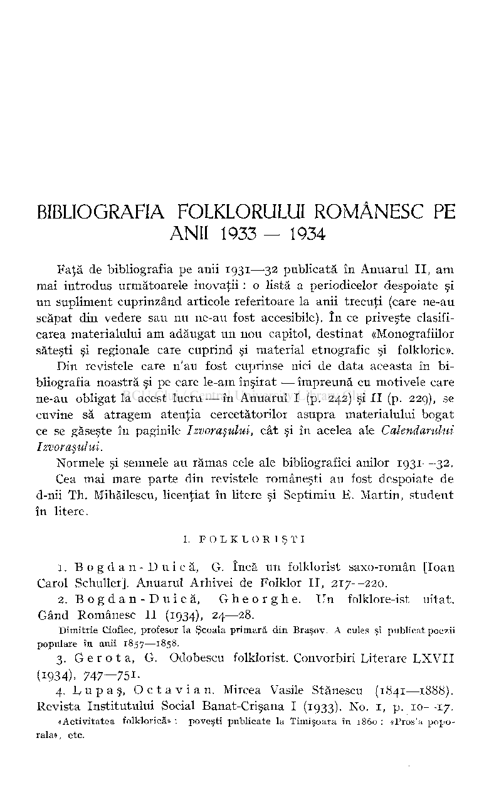

# BIBLIOGRAFIA FOLKLORULUI ROMÂNESC PE ANII 1933 — 1934

Faţă de bibliografia pe anii 1931—-32 publicată în Anuarul II, a m mai introdus următoarele inovaţii : o listă a periodicelor despoiate şi un supliment cuprinzând articole referitoare la anii trecuţi (care ne-au scăpat din vedere sau nu ne-au fost accesibile). în ce priveşte clasificarea materialului am adăugat un nou capitol, destinat «Monografiilor săteşti şi regionale care cuprind şi material etnografic şi folkloric».

Din revistele care n'au fost cuprinse nici de data aceasta în bibliografia noastră şi pe care le-am înşirat — împreună cu motivele care ne-au obligat la acest lucru — în Anuarul I (p. 242) şi I I (p. 229), se cuvine să atragem atenţia cercetătorilor asupra materialului bogat ce se găseşte în paginile Izvor asului, cât şi în acelea ale Calendarului Izvoraşului.

Normele şi semnele au rămas cele ale bibliografiei anilor 1931—32. Cea mai mare parte din revistele româneşti au fost despoiate de

d-nii Th. Mihăilescu, licenţiat în litere şi Septimiu F,. Martin, student în litere.

### 1. FOLKLORIŞÎ I

- 1. Bogdan-Duică , G. încă un folklorist saxo-român [loan

Carol Schuller]. Anuarul Arhivei de Folklor II, 217—220.

- 2. Bogdan-Duică , Gheorghe . U n folklore-ist uitat.

Gând Românesc I I (1934), 24—28.

Dimitrie Cioflec, profesor la Şcoala primară din Braşov. A cules şi publicat poezii populare în anii 1857—1858.

- 3. G e r o t a, G. Odobescu folklorist. Convorbiri Literare LXVI I

(1934), 747—751-

- 4. Lupaş , Octavian . Mircea Vasile Stănescu (1841—1888).

Revista Institutului Social Banat-Crişana I (1933). No. 1, p. 10—17.

«Activitatea folklorică» : poveşti publicate la Timişoara în i860 : «Pros'a poporala» , etc.

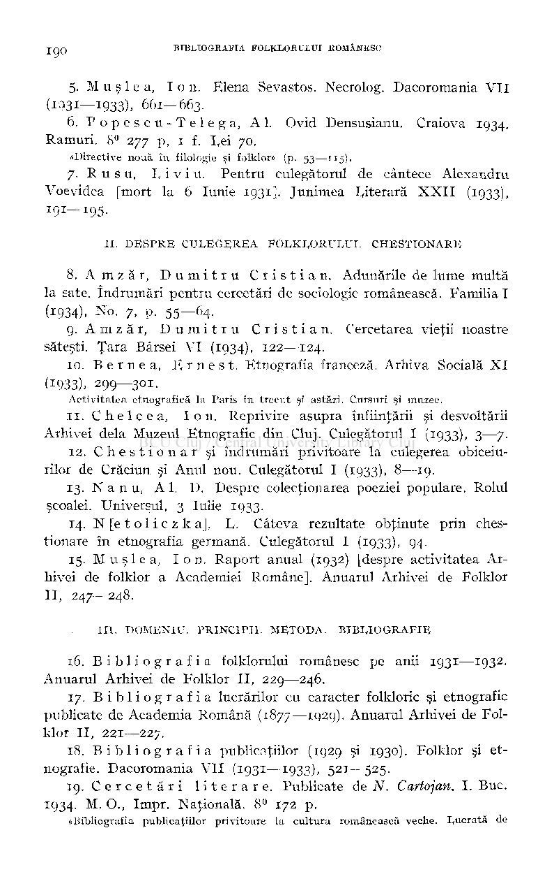

- 5. M u ş 1 e a, Ion . Elena Sevastos. Necrolog. Dacoromania VII

(1031—1933), 661—663.

- 6. Popescu-Telega , Al . Ovid Densusianu. Craiova 1934.

Ramuri. 8° 277 p, 1 f. Lei 70.

«Directive nouă în filologie şi folklor» (p.53—115).

- 7. R u s u, I. i v i u. Pentru culegătorul de cântece Alexandru

Voevidca [mort la 6 Iunie 1931]. Junimea literară XXI I (1933),

I9I—I95-

II. DESPRE CULEGEREA FOLKLORULUI. CHESTIONARE

8. Amzăr , Dumitr u Cristian . Adunările de lume multă la sate. îndrumări pentru cercetări de sociologie românească. Familial

(1934), No. 7, p. 55—64.

- 9. Amzăr , Dumitr u Cristian . Cercetarea vieţii noastre

săteşti. Ţara Bârsei VI (1934), 122—124.

- 10. B e r n e a, Ernest . Etnografia franceză. Arhiva Socială X I

- (1933), 299—301. Activitatea etnografică la Paris în trecut şi astăzi. Cursuri şi muzee. îi . Chelcea , Ion . Reprivire asupra înfiinţării şi desvoltării

Arhivei delà Muzeul Etnografic din Cluj. Culegătorul I (1933), 3—7.

- 12. Chestiona r şi îndrumări privitoare la culegerea obiceiu­

rilor de Crăciun şi Anul nou. Culegătorul I (1933), 8—19.

- 13. N a n u, A 1. D. Despre colecţionarea poeziei populare. Rolul

şcoalei. L

T

niversul, 3 Iulie 1933.

- 14. N [e t o 1 i c z k a], D. Câteva rezultate obţinute prin ches­

tionare în etnografia germană. Culegătorul I (1933), 94.

- 15. M uş i ea , Ion . Raport anual (1932) [despre activitatea Ar­

hivei de folklor a Academiei Române]. Anuarul Arhivei de Folklor II, 247—248.

### III. DOMENIU. PRINCIPII. METODA. BIBLIOGRAFIE

- 16. Bibliografi a folklorului românesc pe anii 1931—1932.

Anuarul Arhivei de Folklor II , 229—246.

- 17. Bibliografi a lucrărilor cu caracter folkloric şi etnografic

publicate de Academia Română (1877—IQ29). Anuarul Arhivei de Folklor II, 221—227.

- 18. Bibliografi a publicaţiilor (1929 şi 1930). Folklor şi et­

nografie. Dacoromania VII (1931—1933), 521— 525.

- 19. Cercetăr i literare . Publicate de N. Cartojan. I. Buc.

1934. M. O., Impr. Naţională. 8° 172 p.

### «Bibliografia publicaţiilor privitoare la cultura românească veche. Lucrată de

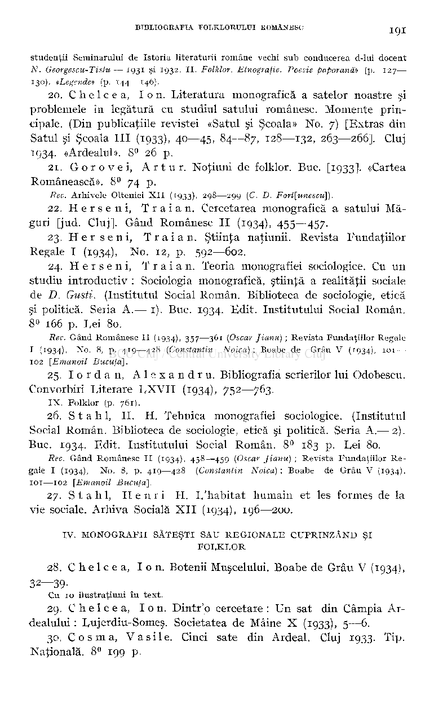

studenţii Seminarului de Istoria literaturii române vechi sub conducerea d-lui docent N. Georgescu-Tistu — 1931 şi 1932. II. Folklor. Etnografie. Poezie poporană» (p. 127130). «Legende» (p. 144—146).

20. Chelcea , Ion . literatura monografică a satelor noastre şi problemele în legătură cu studiul satului românesc. Momente principale. (Din publicaţiile revistei «Satul şi Şcoala» No. 7) [Extras din Satul şi Şcoala II I (1933), 40—45, 84—87, 128—132, 263—266]. Cluj 1934. «Ardealul». 8° 26 p.

- 21. G o r o vei , A r t u r. Noţiuni de folklor. Buc. [1933]. «Cartea

Românească». 8° 74 p.

Rec. Arhivele Olteniei XII (1933), 298—299 (C. D. Fort[unescu]).

- 22. H e r s e n i, T r a i a n. Cercetarea monografică a satului Mă­

guri [jud. Cluj]. Gând Românesc I I (1934), 455—457.

- 23. He r seni , Trăiau . Ştiinţa naţiunii. Revista Fundaţiilor

Regale I (1934), No. 12, p. 592—602.

- 24. H e r s e n i, T r a i a n. Teoria monografiei sociologice. Cu un

studiu introductiv : Sociologia monografică, ştiinţă a realităţii sociale de D. Guşti. (Institutul Social Român. Biblioteca de sociologie, etică şi politică. Seiia A.— 1). Buc. 1934. Edit. Institutului Social Român. 8° 166 p. Dei 80.

Rec. Gând Românesc II (1934), 357—361 (Oscar Jianu) ; Revista Fundaţiilor Regale I (

934). No. 8, p. 419—428 (Constantin Noica) ; Boabe de Grâu V (1934), 101 102 [Emanoil Bucuţa].

I

- 25. Iordan , Alexandru . Bibliografia scrierilor lui Odobescu.

Convorbiri literare DXVII (1934), 752—763.

IX. Folklor (p. 761).

- 26. S t a li 1, H. H. Tehnica monografiei sociologice. (Institutul

Social Român. Biblioteca de sociologie, etică şi politică. Seria A.— 2). Buc. 1934. Edit. Institutului Social Român. 8° 183 p. Dei 80.

Rec. Gând Românesc II (1934), 45§—459 (Oscar Jianu) ; Revista Fundaţiilor Regale I (1934), No. 8, p. 419—428 (Constantin Noica) ; Boabe de Grâu V (1934), 101—102 [Emanoil Bucuţa].

- 27. S t a h 1, Henr i H. D'habitat humain et les formes de la

vie sociale. Arhiva Socială XI I (1934), 196—200.

IV. MONOGRAFII SĂTEŞTI SAU REGIONALE CUPRINZÂND ŞI FOLKLOR

- 28. Chelcea , Ion . Botenii Muscelului. Boabe de Grâu V (1934),

32—39-

Cu 10 ilustraţiuni în text.

- 29. C h e 1 c e a, Ion . Dintr'o cercetare : Un sat din Câmpia Ar­

dealului : Dujerdiu-Someş. Societatea de Mâine X (1933), 5—6.

- 30. Co s m a, V a si le. Cinci sate din Ardeal. Cluj 1933. Tip.

Naţională. 8° 199 p.

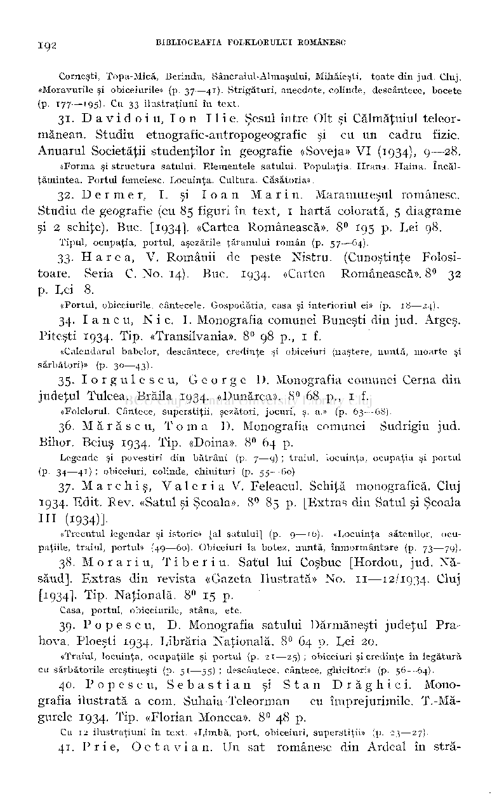

Corneşti, Topa-Mică, Berindu, Sâncraiul-Ahnaşului, Mihăieşti, toate din jud. Cluj. «Moravurile şi obiceiurile» (p. 37—41). Strigături, anecdote, colinde, descântece, bocete (p. 177—195) Cu 33 ilustraţiuni în text.

31. Davidoiu , Io n Ilie . Şesul între Olt şi Călmăţuiul teleormănean. Studiu etnografic-antropogeografic şi cu un cadru fizic. Anuarul Societăţii studenţilor în geografie «Soveja» VI (1934), 9—28.

«Forma şi structura satului. Elementele satului. Populaţia. Hrana. Haina. încălţămintea. Portul femeiesc. Locuinţa. Cultura. Căsătoria».

32. D e r m e r, I. şi loa n Marin . Maramureşul românesc. Studiu de geografie (cu 85 figuri în text, 1 hartă colorată, 5 diagrame şi 2 schiţe). Buc. [1934]. «Cartea Românească». 8° 195 p. Lei 98.

Tipul, ocupaţia, portul, aşezările ţăranului român (p. 57—64).

33. H a r e a, V. Românii de peste Nistru. (Cunoştinţe Folositoare. Seria C. No. 14). Buc. 1934. «Cartea Românească». 8° 32 p. Lei 8.

«Portul, obiceiurile, cântecele. Gospodăria, casa şi iiiterioriul ei» (p. 18—24).

34. I a n c u, N i c. I. Monografia comunei Buneşti din jud. Argeş. Piteşti 1934. Tip. «Transilvania». 8° 98 p., 1 f.

«Calendarul babelor, descântece, credinţe şi obiceiuri (naştere, nuntă, moarte şi sărbători)» (p. 30—43).

- 35. Iorgulescu , Georg e I). Monografia comunei Cerna din

judeţul Tulcea. Brăila 1934. «Dunărea». 8° 68 p., 1 f.

«Folclorul. Cântece, superstiţii, şezători, jocuri, ş. a.» (p. 63—68).

- 36. M ă r ă s c u, T o m a D. Monografia comunei Sudrigiu jud.

Bihor. Beiuş 1934. Tip. «Doina». 8° 64 p.

Legende şi povestiri din bătrâni (p. 7—9) ; traiul, locuinţa, ocupaţia şi portul (P- 34—4

) ; obiceiuri, colinde, chiuituri (p. 55—60).

1

37. M a r c h i ş, V a 1 e r i a V. Feleacul. Schiţă monografică. Cluj

1934. Edit. Rev. «Satul şi Şcoala». 8° 85 p. [Extras din Satul şi Şcoala

- H I (1934)]«Trecutul legendar şi istoric» [al satului] (p. 9—10). «Locuinţa sătenilor, ocu­

paţiile, traiul, portul» (49—60). Obiceiuri la botez, nuntă, înmormântare (p. 73—79).

38. M o r a r i u, T i b e r i u. Satul lui Coşbuc [Hordou, jud. Năsăud]. Extras din revista «Gazeta Ilustrată» No. II—12/1934. Cluj [1934]. Tip. Naţională. 8° 15 p.

Casa, portul, obiceiurile, stâna, etc.

39. P o p e s c u, D. Monografia satului Dărmăneşti judeţul Prahova. Ploeşti 1934. Librăria Naţională. 8° 64 p. Lei 20.

«Traiul, locuinţa, ocupaţiile şi portul (p. 21—25); obiceiuri şi credinţe în legătură cu sărbătorile creştineşti (p. 51—55) ; descântece, cântece, ghicitori» (p. 56—64).

40. Popes c u, Sebastia n şi Sta n Drăghici . Monografia ilustrată a corn. Suhaia-Teleorman — cu împrejurimile. T.-Măgurele 1934. Tip. «Florian Moncea». 8° 48 p.

Cu 12 ilustraţiuni în text. «Limbă, port, obiceiuri, superstiţii» (p. 23—27).

41. Prie , O c t a v i a n. Un sat românesc din Ardeal în stră-

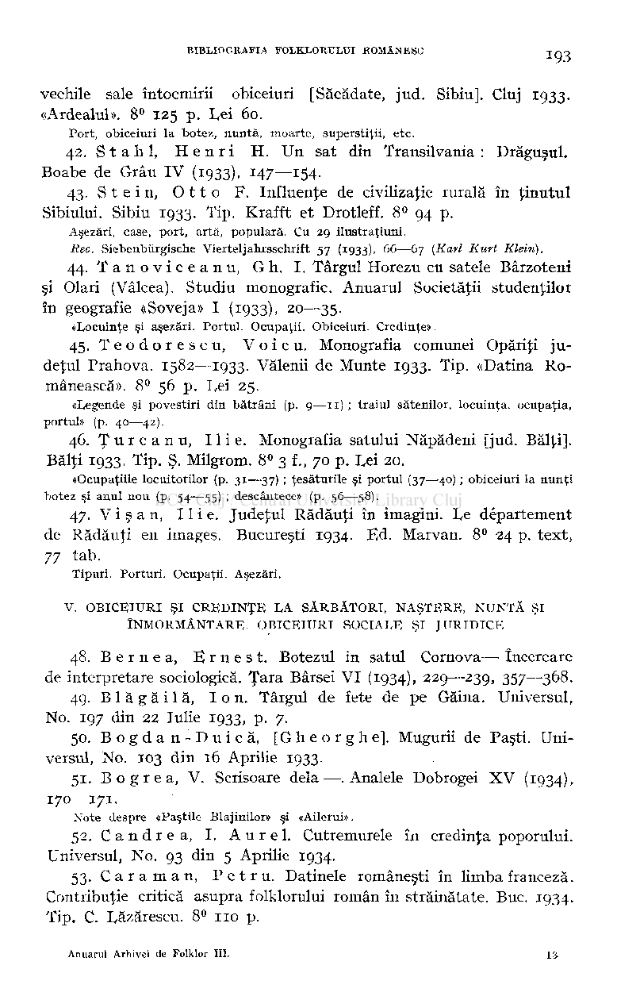

vechile sale întocmirii obiceiuri [Sacadate, jud. Sibiu]. Cluj 1933. «Ardealul». 8° 125 p. Lei 60.

### Port, obiceiuri la botez, nuntă, moarte, superstiţii, etc.

- 42. S t a h 1, Henr i H. Un sat din Transilvania: Drăguşul.

Boabe de Grâu IV (1933), 147—154.

- 43. S t e i n, O 11 o F. Influenţe de civilizaţie rurală în ţinutul

Sibiului. Sibiu 1933. Tip. Krafft et Drotleff. 8° 94 p. Aşezări, case, port, artă, populară. Cu 29 ilustraţiuni. Rec. Siebenbiirgische Vierteljahrsschrift 5 7 (1933), 66—67 (Karl Kurt Klein).

- 44. Tanoviceanu , Gh . I. Târgul Horezu cu satele Bârzoteni

şi Olari (Vâlcea). Studiu monografic. Anuarul Societăţii studenţilor în geografie «Soveja» I (1933), 20—35.

### «Locuinţe şi aşezări. Portul. Ocupaţii. Obiceiuri. Credinţe».

45. Teodorescu , Voicu . Monografia comunei Opăriţi judeţul Prahova. 1582— 1933. Vălenii de Munte 1933. Tip. «Datina Românească». 8° 56 p. Lei 25.

### «Legende şi povestiri din bătrâni (p. 9—11) ; traiul sătenilor, locuinţa, ocupaţia,

portul» (p. 40—42).

46. Ţ u r c a n u, Ilie . Monografia satului Năpădeni [jud. Bălţi]. Bălţi 1933. Tip. Ş. Milgrom. 8° 3 f., 70 p. Lei 20.

«Ocupaţiile locuitorilor (p.31—37) ; ţesăturile şi portul (37—40) ; obiceiuri la nunţi botez şi anul nou (p. 54—55) ; descântece» (p. 56—58).

47. V i ş a n, Ilie . Judeţul Rădăuţi în imagini. Le département de Rădăuţi en images. Bucureşti 1934. Ed. Marvan. 8° 24 p. text, 77 tab.

Tipuri. Porturi. Ocupaţii. Aşezări.

V. OBICEIURI ŞI CREDINŢE LA SĂRBĂTORI, NAŞTERE, NUNTĂ ŞI ÎNMORMÂNTARE. OBICEIURI SOCIALE ŞI JURIDICE

- 48. B e r n e a, Ernest . Botezul în satul Cornova—• încercare

de interpretare sociologică. Ţara Bârsei VI (1934), 229—239, 357—368.

- 49. B 1 à g ă i 1 ă, Ion . Târgul de fete de pe Găina. Universul,

No. 197 din 22 Iulie 1933, p. 7.

- 50. B o g d a n - D u i c ă, [Gheorghe] . Mugurii de Paşti. Uni­

versul, No. 103 din 16 Aprilie 1933.

- 51. B o grea , V. Scrisoare delà—.Analele Dobrogei X V (1934),

170—171.

Note despre «Pastile Blajinilor» şi «Ailerui».

- 52. C a n d r e a, I. Aurel . Cutremurele în credinţa poporului.

Universul, No. 93 din 5 Aprilie 1934.

- 53. Ca r a man , Petru . Datinele româneşti în limba franceză.

Contribuţie critică asupra folklorului român în străinătate. Buc. 1934. Tip. C. Lăzăreseu. 8° 110 p.

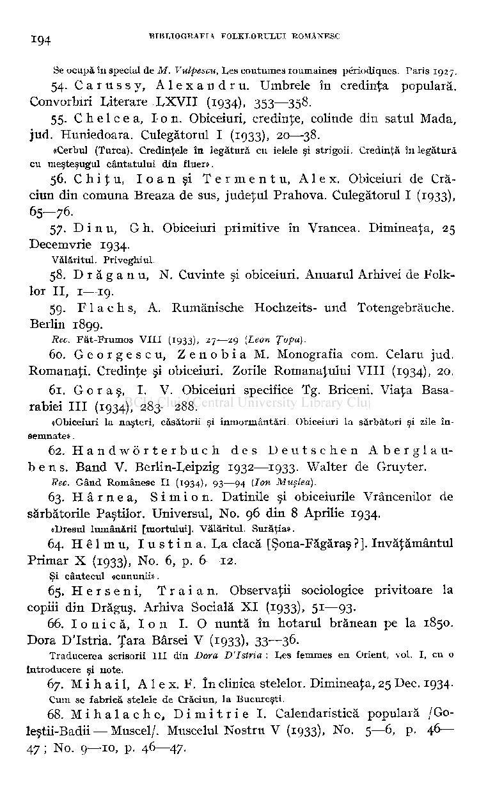

##### Se ocupă în special de M. Vulpescu, Les coutumes roumaines périodiques. Paris 1927.

- 54. C a r u s s y, Alexandru . Umbrele în credinţa populară.

Convorbiri Literare LXVI I (1934), 353—358.

- 55. C h e 1 c e a, Ion . Obiceiuri, credinţe, colinde din satul Mada,

jud. Huniedoara. Culegătorul I (1933), 20—38.

«Cerbul (Turca). Credinţele în legătură cu ielele şi strigoii. Credinţă în legătură cu meşteşugul căutatului din fluer».

56. Chi ţ u, loa n şi Termentu , Alex . Obiceiuri de Crăciun din comuna Breaza de sus, judeţul Prahova. Culegătorul I (1933), 65—76.

- 57. D i n u, G h. Obiceiuri primitive în Vrancea. Dimineaţa, 25

Decemvrie 1934.

Vălăritul. Priveghiul.

- 58. D r ă g a n u, N. Cuvinte şi obiceiuri. Anuarul Arhivei de Folk-

lor II, x—19.

- 59. F 1 a c h s, A. Rumănische Hochzeits- und Totengebràuche.

Berlin 1899. Rec. Păt-Frumos VIII (1933), 27—29 (Leon Ţopa).

- 60. Georgescu , Zenobi a M. Monografia corn. Celaru jud.

Romanaţi. Credinţe şi obiceiuri. Zorile Romanaţului VII I (1934), 20.

- 61. G o r a ş, I. V. Obiceiuri specifice Tg. Briceni. Viaţa Basa­

rabiei II I (1934), 283—288.

«Obiceiuri la naşteri, căsătorii şi înmormântări. Obiceiuri la sărbători şi zile însemnate» .

- 62. Handworterbuc h de s Deutsche n Aberglau -

b e n s. Band V. Berlin-Leipzig 1932—1933. Walter de Gruyter. Rec. Gând Românesc II (1934), 93—94 (Ion Muşlea).

- 63. H â r n e a, S i m i o n. Datinile şi obiceiurile Vrâncenilor de

sărbătorile Paştilor. Universul, No. 96 din 8 Aprilie 1934.

«Dresul lumânării [mortului]. Vălăritul. Surăţia».

- 64. H ê 1 m u, I u s t i n a. La clacă [Şona-Făgăraş ?]. învăţământul

Primar X (1933), No. 6, p. 6—12.

Şi cântecul «cununii».

- 65. H e r s e n i, T r a i a n. Observaţii sociologice privitoare la

copiii din Drăguş. Arhiva Socială X I (1933), 51-—93.

- 66. Ionică , Io n I. O nuntă în hotarul brănean pe la 1850.

Dora D'Istria. Ţara Bârsei V (1933), 33—3°-

Traducerea scrisorii III din Dora D'Istria : L,es femmes en Orient, vol. I, cu o Introducere şi note.

- 67. M i h a i 1, A 1 e x. F. î n clinica stelelor. Dimineaţa, 25 Dec. 1934Cum se fabrică stelele de Crăciun, la Bucureşti.
- 68. Mihalache , Dimitri e I. Calendaristică populară /Go-

leştii-Badii — Muscel/. Muscelul Nostru V (1933). No. 5—6, p. 4647 ; No. 9—10, p. 46—47-

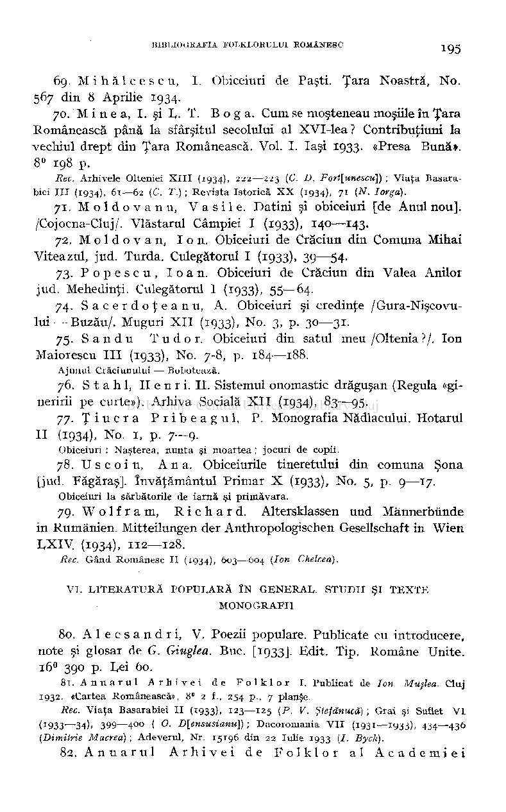

- 69. Mihălcescu , I. Obiceiuri de Paşti. Ţara Noastră, No .

567 din 8 Aprilie 1934.

- 70. M i n e a, I. şi L. T. B o g a. Cum se moşteneau moşiile în Ţara

Românească până la sfârşitul secolului al XVI-lea? Contribuţiuni la vechiul drept din Ţara Românească. Vol. I. Iaşi 1933. «Presa Bună». 8° 198 p .

Rec. Arhivele Olteniei XIII(1934), 222—223 (C. D. Fort[unescu]) ; Viaţa Basarabiei III(1934), 61—6 2 (C. T.) ; Revista Istorică XX(1934), 71 (N. Iorga).

- 71. Moldovanu , V asile . Datini şi obiceiuri [de Anul nou].

/Cojoena-Cluj/. Vlăstarul Câmpiei I (1933), 140—143.

- 72. Moldov a n, Ion . Obiceiuri de Crăciun din Comuna Mihai

Viteazul, jud. Turda. Culegătorul I (1933), 39—54-

- 73. Popescu , loan . Obiceiuri de Crăciun din Valea Anilor

jud. Mehedinţi. Culegătorul I (1933), 55-—64.

- 74. Sacerdoţeanu , A. Obiceiuri şi credinţe /Gura-Nişcovu-

lui—Buzău/ . Muguri XI I (1933), No. 3, p. 30—31.

- 75. Sand u T u d o r. Obiceiuri din satul meu /Oltenia ?/. Ion

Maiorescu II I (1933), No. 7-8, p. 184—188.

Ajunul Crăciunului — Bobotează.

- 76. S t a h 1, H e n r i. H . Sistemul onomastic drăguşan (Regula «gi-

neririi pe curte»). Arhiva Socială XI I (1934), 83—95.

- 77. Ţi u er a Pribeagul , P. Monografia Nădlacului. Hotarul

I I (1934), No. 1, p. 7—9.

Obiceiuri : Naşterea, nunta şi moartea ; jocuri de copii.

- 78. L scoiu , Ana . Obiceiurile tineretului din comuna Şona

[jud. Făgăraş]. învăţământul Primar X (1933), No. 5, p . 9—17.

Obiceiuri la sărbătorile de iarnă şi primăvara.

- 79. Wolfram , Richard . Altersklassen und Mànnerbûnde

in Rumănien. Mitteilungen der Anthropologischen Gesellschaft in Wien LXI V (1934), 112—128.

Rec. Gând Românesc II(1934), 003—604 [Ion Chelcea).

### VI. LITERATURĂ POPULARĂ ÎN GENERAL. STUDII ŞI TEXTE. MONOGRAFII

80. A 1 e c s a n d r i, V. Poezii populare. Publicate cu introducere, note şi glosar de G. Giuglea. Buc. [1933]. Edit. Tip. Române Unite. 16

390 p. Lei 60.

0

81. Anuaru l Arhive i d e Folklo r I. Publicat de Ion Muştea. Cluj

1932. «Cartea Românească», 8° 2 f., 254 p., 7 plan$e.

Rec. Viaţa Basarabiei II(1933), 123—12 5 (P. V. Ştefănucâ) ; Grai şi Suflet VI (

933—34) ' 399—4° ° ( O. D[ensusianu\) ; Dacoromania VII (1931—1933) , 434—43 6

X

(Dimitrie Macrea) ; Adeverul, Nr.15196 din 22 Iulie1933 (I. Byck).

82. Anuaru l Arhive i d e Folklo r a l Academie i

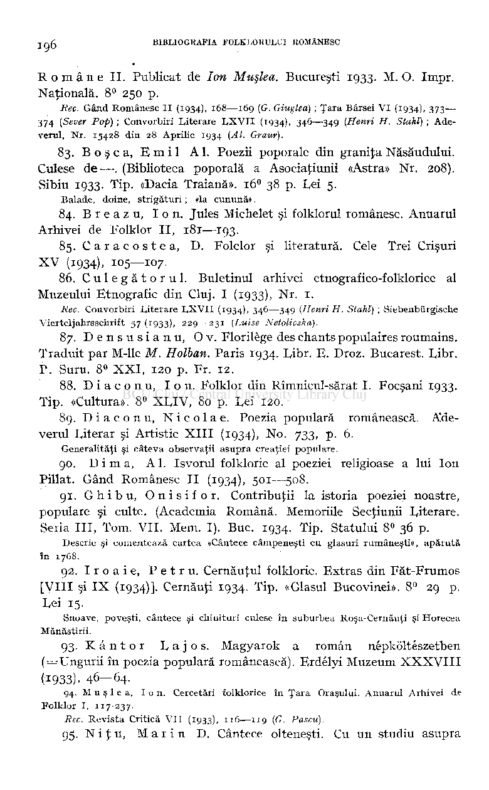

Român e II. Publicat de Ion Muşlea. Bucureşti 1933. M. O. Impr. Naţională. 8° 250 p.

Rec. Gând Românesc II (1934), 168—16 9 (G. Giuglea) ; Ţara Bârsei VI (1934), 373 374 (Sever Pop) ; Convorbiri Literare LXVII (1934), 34^—349 (Henri H. Stahl) ; Adeverul, Nr. 15428 din 28 Aprilie 1934 (Al. Graur).

83. Boşca , Emi l Al . Poezii poporale din graniţa Năsăudului. Culese de— . (Biblioteca poporală a Asociaţiunii «Astra» Nr. 208). Sibiu 1933. Tip. «Dacia Traiană». 16

38 p. Dei 5.

0

Balade, doine, strigături; «la cunună».

- 84. B r e a z u, Ion . Jules Michelet şi folklorul românesc. Anuarul

Arhivei de Folklor II, 181—193.

- 85. C a r a c o s t e a, D. Folclor şi literatură. Cele Trei Crişuri

- X V (1934). 105—107.

- 86. Culegătorul . Buletinul arhivei etnografico-folklorice al

Muzeului Etnografic din Cluj. I (1933), Nr. 1.

Rec. Convorbiri Literare LXVII (1934), 346—349 (Henri H. Stahl) ; Siebenbiirgische

Vierteljahrsschrift 5 7 (1933), 229—23 1 (Luise Netoliczka).

87. D e n s u s i a n u, O v. Florilège des chants populaires roumains. Traduit par M-lle M. Holban. Paris 1934. Dibr. E. Droz. Bucarest. Dibr. P. Suru. 8° XXI , 120 p. Fr. 12.

- 88. Diaco n u, Ion . Folklor din Rîmnicul-sărat I. Focşani 1933.

Tip. «Cultura». 8° XDIV, 80 p. Dei 120.

- 89. Diaco n u, Nicol a e. Poezia populară românească. Ade-

verul Literar şi Artistic XII I (1934), No. 733, p. 6.

Generalităţi şi câteva observaţii asupra creaţiei populare.

- 90. D i m a, Al . Isvorul folkloric al poeziei religioase a lui Ion

Pillât. Gând Românesc I I (1934), 501—508.

- 91. Ghibu , Onisifor . Contribuţii la istoria poeziei noastre,

populare şi culte. (Academia Română. Memoriile Secţiunii Literare. Seria III, Tom. VIL Mem. I). Buc. 1934. Tip. Statului 8° 36 p.

Descrie şi comentează cartea «Cântece câmpeneşti cu glasuri rumâneşti», apărută în 1768.

92. I r o a i e, Petru . Cernăuţul folkloric. Extras din Făt-Frumos [VIII şi I X (1934)]. Cernăuţi 1934. Tip. «Glasul Bucovinei». 8° 29 p. Lei 15.

Snoave, poveşti, cântece şi chiuituri culese în suburbea Roşa-Cernăuţi şi Horecea Mănăstirii.

93. Kânto r L a j o s. Magyarok a român népkôltészetben ( — Ungurii în poezia populară românească). Erdélyi Muzeum XXXVII I

- (1933). 46—64.

- 94. Muşlea , I o n. Cercetări folklorice în Ţara Oraşului. Anuarul Arhivei de

Folklor I, 11 7 237.

Rec. Revista Critică VII (1933), 116—11 9 (G. Pascu).

- 95. N i ţ u, Mari n D. Cântece olteneşti. Cu un studiu asupra

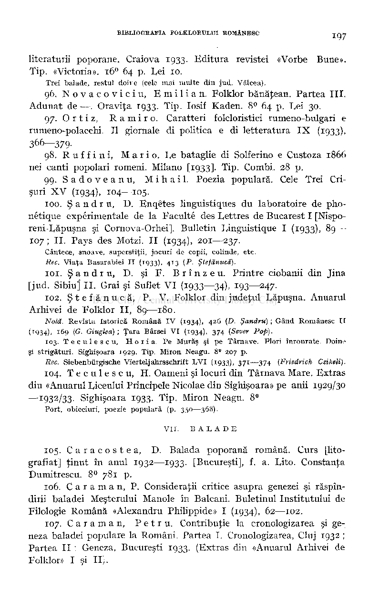

literaturii poporane. Craiova 1933. Editura revistei «Vorbe Bune». Tip. «Victoria». 16 64 p. Eei 10.

### Trei balade, restul doire (cele mai multe din jud. Vâlcea).

- 96. Novacoviciu , Emili a n. Folklor bănăţean. Partea III .

Adunat de —. Oraviţa 1933. Tip. Iosif Kaden. 8° 64 p. Eei 30.

- 97. Ortiz , R a m i r o. Caratteri folcloristici rumeno-bulgari e

rumeno-polacchi. II giornale di politica e di letteratura I X (1933), 366—379.

- 98. R u f f i n i, Mario . Le bataglie di Solferino e Custoza 1866

nei canti popolari romeni. Milano [1933]. Tip. Combi. 28 p.

- 99. Sadoveanu , Mihail . Poezia populară. Cele Trei Cri-

şuri X V (1934), 104—105.

- 100. Ş a n d r u, D. Enqêtes linguistiques du laboratoire de pho­

nétique expérimentale de la Faculté des Lettres de Bucarest I [Nisporeni-Lăpuşna şi Cornova-Orhei]. Bulletin Linguistique I (1933), 89107 ; II . Pays des Motzi. I I (1934), 201—237.

Cântece, snoave, superstiţii, jocuri de copii, colinde, etc. Rec. Viaţa Basarabiei II(1933), 41 3 [P. Ştefănucă).

- 101. Ş a n d r u, D. şi F. B r î n z e u. Printre ciobanii din Jina

[jud. Sibiu]* II . Grai şi Suflet V I (1933—34), 193—247.

- 102. Ştefănucă , P. V. Folklor din judeţul Lăpuşna. Anuarul

Arhivei de Folklor II , 89—180. Notă. Revista Istorică Română IV(1934), 426 (D. Şandru) ; Gând Românesc II

- Giuglea) ; Ţara Bârsei VI(1934), 374 (Sever Pop).

- (1934),

9 (

L6

G

### 103. Teculescu , Hor i a. Pe Murăş şi pe Târnave. Flori înrourate. Doine

şi strigături. Sighişoara 1929 Tip. Miron Neagu. 8° 207 p.

Rec. Siebenbiirgische Vierteljahrsschrift LVI (1933), 371—37 4 (Friedrich Czikeli).

#### 104. Teculescu , H. Oameni şi locuri din Târnava Mare. Extras

din «Anuarul Liceului Principele Nicolae din Sighişoara» pe anii 1929/30

—1932/33. Sighişoara 1933. Tip. Miron Neagu. 8°

Port, obiceiuri, poezie populară (p. 350—368). VII. BALAD E

- 105. Caracostea , D. Balada poporană română. Curs [litografiat] ţinut în anul 1932—1933. [Bucureşti], f. a. Lito. Constanţa Dumitrescu. 8° 781 p.
- 106. C a r a m a n, P. Consideraţii critice asupra genezei şi răspîndirii baladei Meşterului Manole în Balcani. Buletinul Institutului de Filologie Română «Alexandru Philippide» I (1934), 62—102.
- 107. Caraman , Petru . Contribuţie la cronologizarea şi geneza baladei populare la Români. Partea I. Cronologizarea, Cluj 1932 ; Partea I I : Geneza, Bucureşti 1933. (Extras din «Anuarul Arhivei de Folklor» I şi IE .

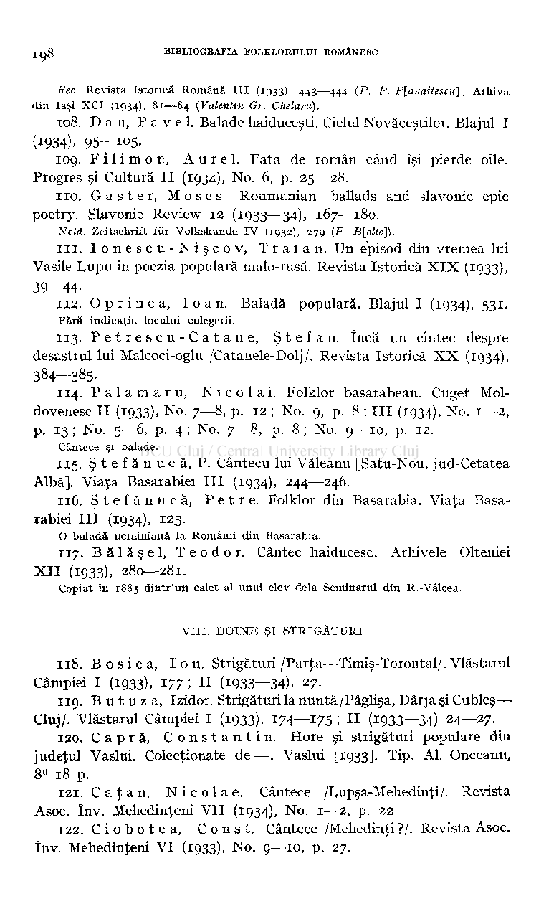

Rec. Revista Istorică Română III (1933), 443—444 (P. P. P[anaitescu] ; Arhiva din Iaşi XCI (1934), 81—84 (Valentin Gr. Chelaru).

- 108. Dan , Pavel . Balade haiduceşti. Ciclul Novăeeştilor. Blajul I

(1934). 95—105.

- 109. F i limon , Aurel . Fata de român când îşi pierde oile.

Progres şi Cultură I I (1934), No. 6, p. 25—28.

- 110. Gaster , Moses . Roumanian ballads and slavonie epic

poetry. Slavonic Review 12 (1933—34), 167—180. Notă. Zeitschrift fiir Volkskunde IV (1932), 279 (F. B[olte]).

- 111. Ionescu-Nişcov , Traian . Un episod din vremea lui

Vasile Lupu în poezia populară malo-rusă. Revista Istorică XI X (1933), 39—44-

- 112. Oprinca , loan . Baladă populară. Blajul I (1934), 531. Fără indicaţia locului culegerii.
- 113. Petrescu-Catane , Ştefan . încă un cîntec despre

desastrul lui Malcoci-oglu /Catanele-Dolj/. Revista Istorică X X (1934), 384-385-

114. Palamaru , Nicol a i. Folklor basarabean. Cuget Moldovenesc I I (1933), No. 7—8, p. 12 ; No. 9, p. 8 ; II I (1934), No. 1—2, p. 13 ; No. 5—6, p. 4 ; No. 7—8, p. 8 ; No. 9—10, p. 12.

### Cântece şi balade.

- 115. Ştefănucă , P. Cântecu lui Văleanu [Satu-Nou, jud-Cetatea

Albă]. Viaţa Basarabiei II I (1934), 244—246.

- 116. Ştefănucă , Petre . Folklor din Basarabia. Viaţa Basa­

rabiei II I (1934), 123.

O baladă ucrainiană la Românii din Basarabia.

- 117. Bălăşel , Teodor . Cântec haiducesc. Arhivele Olteniei

XI I (1933), 280—281.

Copiat în 1885 dintr'un caiet al unui elev delà Seminarul din R.-Vâlcea.

VIII. DOINE ŞI STRIGĂTURI

- 118. Bosica , Ion . Strigături /Parţa—Timiş-Torontal/. Vlăstarul

Câmpiei I (1933)- ^77 > II ^933—34). 27.

- 119. B u t u z a, Izidor Strigături la nuntă/Pâglişa, Dârja şi Cubleş—-

Cluj/. Vlăstarul Câmpiei I (1933). *74—*75 ; H (*933—34) 24—27.

- 120. Capră , Constantin . Hore şi strigături populare din

judeţul Vaslui. Colecţionate de— . Vaslui [1933]. Tip. Al. Onceanu, 8° 18 p.

- 121. Caţan , Nicolae . Cântece /Lupşa-Mehedinţi/. Revista

Asoc. înv. Mehedinţeni VII (1934), No. 1—2, p. 22.

- 122. Ciobotea , Const . Cântece /Mehedinţi?/. Revista Asoc.

înv. Mehedinţeni VI (1933), No. 9—10, p. 27.

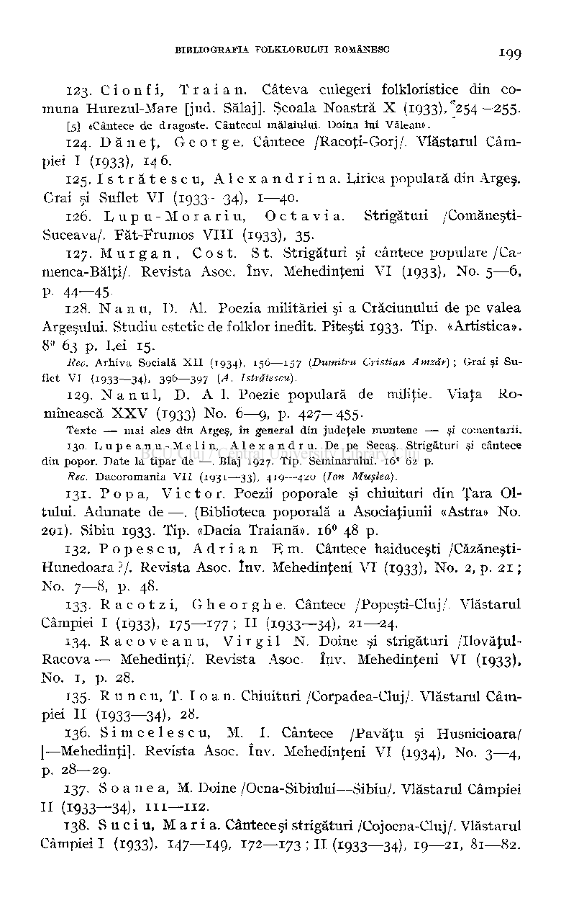

- 123. C i o n f i, T r a i a n. Câteva culegeri folkloristice din co­

muna Hurezul-Mare [jud. Sălaj]. Şcoala Noastră X (1933),"254—255. [5] «Cântece de diagoste. Cântecul mălaiului. Doina lui Vălean».

- 124. Dăneţ , George . Cântece /Racoţi-Gorj/. Vlăstarul Câm­

- piei I (1933), 146 .

- 125. Istrătescu , Alexandrina . Lirica populară din Argeş. Grai şi Suflet VI (1933—34), 1—40.
- 126. Lupu- M orar i u, Octavia . Strigături /ComăneştiSuceava/. Făt-Fnimos VIII (1933), 35.
- 127. M u r g a n , Cost . St . Strigături şi cântece populare /Camenca-Bălţi/. Revista Asoc. înv. Mehedinţeni VI (1933), No. 5—6, P- 44—45-
- 128. N a n u, I). Al. Poezia milităriei şi a Crăciunului de pe valea Argeşului. Studiu estetic de folklor inedit. Piteşti 1933. Tip. «Artistica». 8 63 p. Lei 15.

Rec. Arhiva Socială XII (1934), 156—157 [Dumitru Cristian Amzăr) ; Grai şi Suflet VJ (1933—34), 396—397 (A. Istrătescu).

- 129. Nanul , D. Al . Poezie populară de miliţie. Viaţa Ro

mînească XX V (T933) No. 6—9, p. 427—455.

Texte — mai ales din Argeş, în general din judeţele muntene — şi comentarii.

- 130. Lupeanu-Melin , Alexandru . De pe Secaş. Strigături şi cântece

din popor. Date la tipar de —. Blaj 1927. Tip. Seminarului. 16 62 p.

Rec. Dacoromania VII (1931—33), 419—420 (Ion Muşlea).

- 131. Popa , Victor . Poezii poporale şi chiuituri din Ţara Ol­

tului. Adunate de —. (Biblioteca poporală a Asociaţiunii «Astra» No.

- 201). Sibiu 1933. Tip. «Dacia Traiană». 16 48 p.

132. Popes c u, Adria n E m. Cântece haiduceşti /CăzăneştiHunedoara?/. Revista Asoc. înv. Mehedinţeni VI (1933), No. 2, p. 21 ; No. 7—8, p. 48.

- 133. Racotzi , Gheorghe . Cântece /Popeşti-Cluj/. Vlăstarul

Câmpiei I (1933), 175—177

1

(i933—34). 21—24.

- 134. Racoveanu , Virgi l N. Doine şi strigături /Ilovăţul-

Racova — Mehedinţi/. Revista Asoc. înv. Mehedinţeni VI (1933), No. 1, p. 28.

135. R u n c u, T. loan . Chiuituri /Corpadea-Cluj/. Vlăstarul Câm­

- piei II (1933—34). 28.

136. Simcelescu , M. I. Cântece /Pavăţu şi Husnicioara/ [—Mehedinţi]. Revista Asoc. înv. Mehedinţeni VI (1934), No. 3—4, p. 28-—29.

- 137. S o a n e a, M. Doine /Ocna-Sibiului—Sibiu/. Vlăstarul Câmpiei

II (1933—34). m—112 .

- 138. Suciu , Maria . Cântece şi strigături /Cojocna-Cluj/. Vlăstarul

- Câmpiei I (1933). H7—149>

72—17 3 ; II (1933—34), 19—21, 81—82.

T

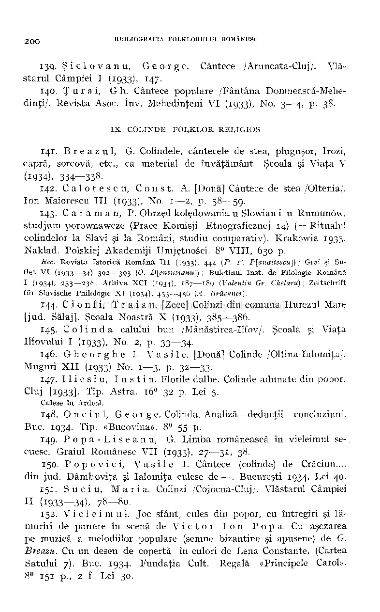

- 139. Şiclovanu , George . Cântece /Aruncata-Cluj/. Vlă­

starul Câmpiei I (1933), 147.

- 140. Ţ u r a i, G h. Cântece populare /Fântâna Domnească-Mehe-

dinţi/. Revista Asoc. înv. Mehedinţeni VI (1933), No. 3—4, p. 38.

IX. COLINDE. FOLKLOR RELIGIOS

- 141. Breazul , G. Colindele, cântecele de stea, pluguşor, Irozi,

capră, sorcovă, etc., ca material de învăţământ. Şcoala şi Viaţa V

(1934). 334—338.

- 142. C a 1 o t e s c u, Const . A. [Două] Cântece de stea /Oltenia/.

Ion Maiorescu III (1933), No. 1—2, p. 58—59.

- 143. C a r a m a n, P. Obrzed koledowania u Slowian i u Rumunôw,

studjum porownawcze (Prace Komisji Etnografieznej 14) ( = Ritualul colindelor la vSlavi şi la Români, studiu comparativ). Krakowia 1933. Naklad. Polskiej Akademiji Umjetnosei. 8° VIII, 630 p.

Rec. Revista Istorică Română III (1933), 444 (P- P- P[anaitescu]) ; Grai şi Suflet VI (1933—34) 392—393 (O. D[ensusianu]) ; Buletinul Inst. de Filologie Română I (1934), 233—238; Arhiva XCI (1934), 187—189 (Valentin Gr. Chelaru) ; Zeitschrift fiir Slavische Philologie XI (1934), 453—45° 0*4 • Bruckner).

- 144. Cionfi , Trăi a n. [Zece] Colinzi din comuna Hurezul Mare

[jud. Sălaj]. Şcoala Noastră X (1933), 385—386.

- 145. Colind a calului bun /Mânăstirea-Ilfov/. Şcoala şi Viaţa

Ilfovului I (1933), No. 2, p. 33—34-

- 146. Gheorgh e I. V asile . [Două] Colinde /Oltina-Ialomiţa/.

Muguri XI I (1933) No. 1—3, p. 32—33-

- 147. Iliesiu , Iustin . Florile dalbe. Colinde adunate din popor.

Cluj [1933]. Tip. Astra. i6° 32 p. Dei 5.

Culese în Ardeal.

- 148. Onciul , George . Colinda. Analiză—deducţii—concluziuni.

Buc. 1934. Tip. «Bucovina». 8° 55 p.

- 149. Popa-Diseanu , G. Dimba românească în vicleimul se-

cuesc. Graiul Românesc VII (1933), 27-—31, 38.

- 150. Popovici , Vasil e I. Cântece (colinde) de Crăciun....

din jud. Dâmboviţa şi Ialomiţa culese de —. Bucureşti 1934. Lei 40.

- 151. S u c i u, Maria . Colinzi /Cojocna-Cluj/. Vlăstarul Câmpiei

I I (1933—34). 78—80.

- 152. Vicleimul . Joc sfânt, cules din popor, cu întregiri şi lă­

muriri de punere în scenă de Victo r Io n Popa . Cu aşezarea pe muzică a melodiilor populare (semne bizantine şi apusene) de G. Breazu. Cu un desen de copertă în culori de Lena Constante. (Cartea Satului 7). Buc. 1934. Fundaţia Cult. Regală «Principele Carol». 8° 151 p., 2 f. Lei 30.

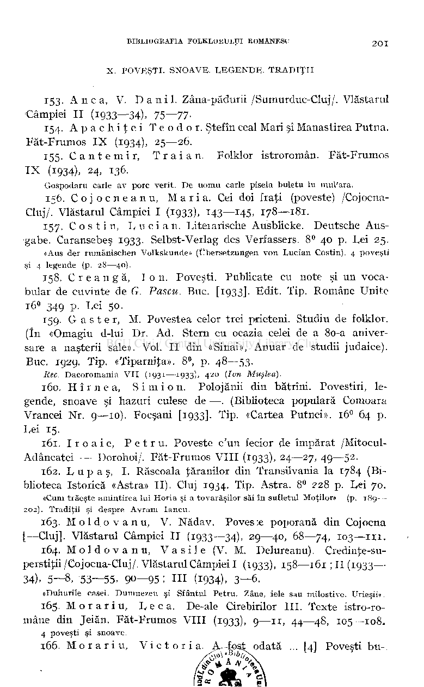

### X. POVEŞTI. SNOAVE. LEGENDE. TRADIŢII

- 153. Anca , V. Danii . Zâna-pădurii /Sumurduc-Cluj/. Vlăstarul

Câmpiei II (1933—34), 75—77-

- 154. Apachiţe i Teodor . Ştefîn ceai Mari şî Mănăstirea Putna.

Făt-Frumos I X (1934), 25—26.

- 155. Cantemir , Trăi a n. Folklor istroromân. Făt-Frumos

I X (1934). 24, 136.

Gospodaru carie av porc verit. De uomu carie piseia buletu lu mul'ara.

- 156. Cojocneanu , Maria . Cei doi fraţi (poveste) /Cojocna-

Cluj/. Vlăstarul Câmpiei I (1933), 143—145, 178—181.

- 157. C o s t i n, Lucian . Liteiarische Ausblicke. Deutsche Aus-

gabe. Caransebeş 1933. Selbst-Verlag des Verfassers. 8° 40 p. Lei 25.

«Aus der rumănischen Volkskunde» (Ûbersetzungen von Lucian Costin). 4 poveşti şi 4 legende (p. 28—40).

158. Creangă , Ion . Poveşti. Publicate cu note şi un vocabular de cuvinte de G. Pascu. Buc. [1933]- Edit. Tip. Române Unite 16

349 p. Lei 50.

0

159. G aster , M. Povestea celor trei prieteni. Studiu de folklor. (în «Omagiu d-lui Dr. Ad. Stern cu ocazia celei de a 80-a aniversare a naşterii sale». Vol. I I din «Sinai», Anuar de studii judaice).

Buc. 1929. Tip. «Tiparniţa». 8°, p. 48—53. Rec. Dacoromania VII (1931—1933), 42 0 (Ion Muşlea).

160. Hîrnea , S i m i o n. Polojănii din bătrîni. Povestiri, legende, snoave şi hazuri culese de —. (Biblioteca populară Comoara Vrancei Nr. 9—10). Focşani [1933]. Tip. «Cartea Putnei». 16

64 p. Lei 15.

0

- 161. Iroaie , Petru . Poveste c'un fecior de împărat /Mitocul-

Adâncatei — Dorohoi/. Făt-Frumos VII I (1933), 24—27, 49—52.

- 162. L u p a ş, I. Răscoala ţăranilor din Transilvania la 1784 (Bi­

blioteca Istorică «Astra» II). Cluj 1934. Tip. Astra. 8° 228 p. Lei 70.

«Cum trăeşte amintirea lui Hori a şi a tovarăşilor săi în sufletul Moţilor» (p. 189—

- 202). Tradiţii şi despre Avram Iancu.

- 163. Mold o v a n u, V. Nădav. Poves.e poporană din Cojocna l—Cluj]. Vlăstarul Câmpiei I I (1933—34), 29—40, 68—74, 103—III .
- 164. M o 1 d o v a n u, V a s i 1 e (V. M. Delureanu). Credinţe-superstiţii/Cojocna-Cluj/. Vlăstarul Câmpiei I (1933), 158—161 ; II (193334). 5—8, 53—55, 90—95 ; I U (1934), 3—6.

«Duhurile casei. Dumnezeu şi Sfântul Petru. Zâne, iele sau milostive. Lîrieşii». 165. Morar i u, Leca . De-ale Cirebirilor III. Texte istro-ro-

mâne din Jeiăn. Făt-Frumos VIII (1933), 9—11 , 44—48, 105—108. 4 poveşti şi snoave.

166. Morar i u, Victoria . A—fost odată ... [4] Povesti bu-

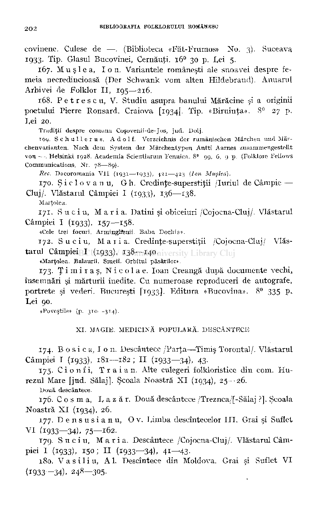

covinene. Culese de —. (Biblioteca «Făt-Frumos» No. 3). Suceava

1933. Tip. Glasul Bucovinei, Cernăuţi. 16

30 p. Lei 5.

0

- 167. M u ş 1 e a, Ion . Variantele româneşti ale snoavei despre femeia necredincioasă (Der Schwank vom alten Hildebrand). Anuarul Arhivei de Folklor II, 195—216.
- 168. Petrescu , V. Studiu asupra banului Mărăcine şi a originii poetului Pierre Ronsard. Craiova [1934]. Tip. «Biruinţa». 8° 27 p. Lei 20.

Tradiţii despre comuna Coşovenii-de-Jos, jud. Dolj.

169. S c h u 11 e r u s, Adolf . Verzeichnis der rumănischen Mărclien und Măr-

chenvarianten. Nach dem System der Mărchentypen Antti Aarnes zusammengestellt von —. Helsinki 1928. Academia Scientiaruin Fennica. 8° 99, 6. 9 p. (Folklore Fellows Communications, Nr. 78—89).

Rec.Dacoromania VII (1931—1933), 421—423 (Ion Muşlea).

- 170. Şiclovanu , Gh . Credinţe-superstiţii /Iuriul de Câmpie —•

Cluj/. Vlăstarul Câmpiei I (1933), 136—138.

Marţolea.

- 171. S u c i u, Maria . Datini şi obiceiuri /Cojocna-Cluj/. Vlăstarul

Câmpiei I (1933). *57— ^

«Cele trei focuri. Arminglfenii. Baba Dochia».

- 172. S u c i u, Maria . Credinţe-superstiţii /Cojocna-Cluj/ Vlăs­

tarul Câmpiei I (1933), 138-—140.

«Marţolea. Balaurii. Srueii. Orbitul păsărilor».

- 173. Ţimiraş , Nicolae . loan Creangă după documente vechi,

însemnări şi mărturii inedite. Cu numeroase reproduceri de autografe, portrete şi vederi. Bucureşti [1933]. Editura «Bucovina». 8° 335 p. Lei 90.

«Poveştile» (p. 310—314).

XI. MAGIE. MEDICINĂ POPULARĂ. DESCÂNTECE

- 174. Bosica , Ion . Descântece /Parţa—Timiş Torontal/. Vlăstarul

Câmpiei I (1933). 181—182 ; II (i933—34). 43-

- 175. Cionfi , Trăi a n. Alte culegeri folkloristice din corn. Hu­

rezul Mare [jud. Sălaj]. Şcoala Noastră X I (1934), 25—26.

Două descântece.

- 176. C o s m a, L a z ă r. Două descântece /Treznea/[-Sălaj ?]. Şcoala

Noastră X I (1934), 26.

- 177. Densusianu , Ov . Limba descîntecelor III. Grai şi Suflet

v i (1933—34). 75—162.

- 179. Suciu , Maria . Descântece /Cojocna-Cluj/. Vlăstarul Câm­

piei I (1933). 150 ; I I (1933—34). 41—43-

- 180. V a s i 1 i u, Al . Descîntece din Moldova. Grai şi Suflet VI

(1933—34). 248—305.

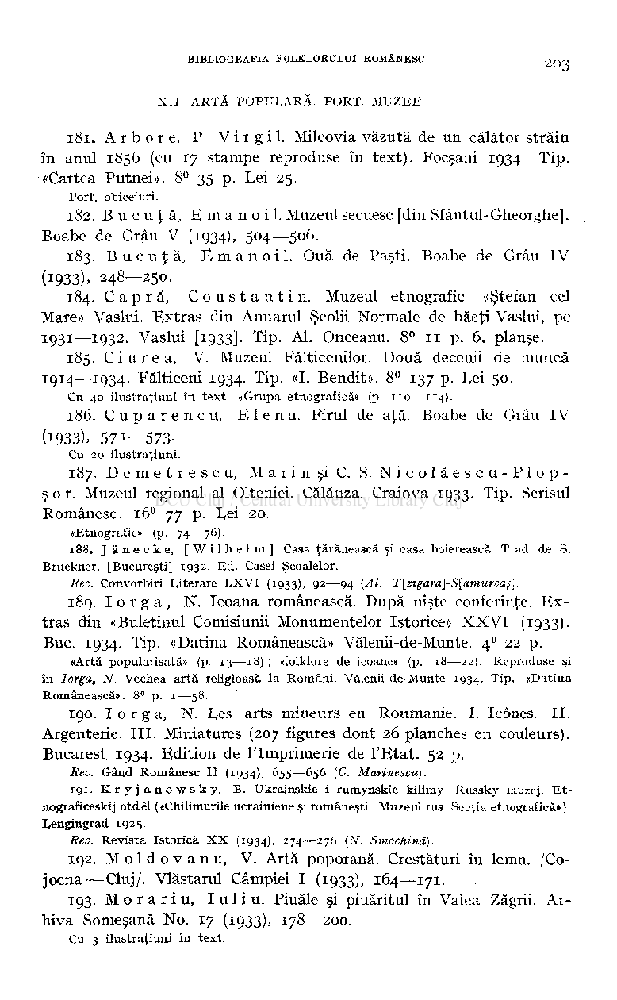

### XII. ARTĂ POPULARĂ. PORT. MUZEE

- 181. Arbore , P. Virgil . Milcovia văzută de un călător străin

în anul 1856 (cu 17 stampe reproduse în text). Focşani 1934. Tip. «Cartea Putnei». 8° 35 p. Lei 25.

### Port, obiceiuri.

- 182. Bucuţă , Emanoil . Muzeul secuesc [din Sfântul-Gheorghe].

Boabe de Grâu V (1934), 504—506.

- 183. Bucuţă , Emanoil . Ouă de Paşti. Boabe de Grâu I V

(1933), 248—250.

- 184. Capră , Constantin . Muzeul etnografic «Ştefan cel

Mare» Vaslui. Extras din Anuarul Şcolii Normale de băeţi Vaslui, pe 1931—1932. Vaslui [1933]. Tip. Al. Onceanu. 8° 1 1 p. 6. planşe.

- 185. C i urea , V. Muzeul Fălticenilor. Două decenii de muncă

1914—1934- Fălticeni 1934. Tip. «I. Bendit». 8° 137 p. I

v

ei 50. Cu 40 ilustraţiuni în text. «Grupa etnografică» (p. 110—114).

- 186. Cuparencu , Elena . Firul de aţă. Boabe de Grâu I V

- (1933). 571—573Cu 20 ilustraţiuni.

- 187. Demetreseu , Mari n şi C. S. Nicolăescu-Plop -

ş o r. Muzeul regional al Olteniei. Călăuza. Craiova 1933. Tip. Scrisul Românesc. 16 77 p. Lei 20.

«Etnografie» (p. 74—76).

### 188. Jănecke , [Wilhelm] . Casa ţărănească şi casa boierească. Trad, de S.

Bruckner. [Bucureşti] 1932. Ed. Casei Şcoalelor.

Rec. Convorbiri Literare LXVI (1933), 92—-94 (Al. T[zigara]-S[amurcaş].

#### 189. I o r g a , N. Icoana românească. După nişte conferinţe. Ex ­

tras din «Buletinul Comisiunii Monumentelor Istorice» XXV I (1933). Buc. 1934. Tip. «Datina Românească» Vălenii-de-Munte. 4

22 p.

0

«Artă popularisată» (p. 13—18) ; «folklore de icoane» (p. 18—22). Reproduse şi în Iorga, N. Vechea artă religioasă la Români. Vălenii-de-Munte 1934. Tip. «Datina Românească». 8° p. 1—58.

190. Iorga , N. Les arts mineurs en Roumanie. I. Icônes. II . Argenterie. III . Miniatures (207 figures dont 26 planches en couleurs). Bucarest 1934. Edition de l'Imprimerie de l'Etat. 52 p.

Rec. Gând Românesc II (1934), 655—656 (C. Marinescu).

191. Kryjanowsky , B. Ukrainskie i rumynskie kilimy. Russky muzej. Etnograficeskij otdêl («Chilimurile ucrainiene şi româneşti. Muzeul rus. Secţia etnografică»). Lengingrad 1925.

Rec. Revista Istorică XX (1934), 74— 7& (N. Smochină).

- 192. Moldovanu , V. Artă poporană. Crestături în lemn. /Co-

- jocna—Cluj/. Vlăstarul Câmpiei I (1933), 164—171.

- 193. Mo r ar i u, Iu l iu . Piuăle şi piuăritul în Valea Zăgrii. Ar­

hiva Someşană No. 17 (1933), 178—200.

### Cu 3 ilustraţiuni în text.

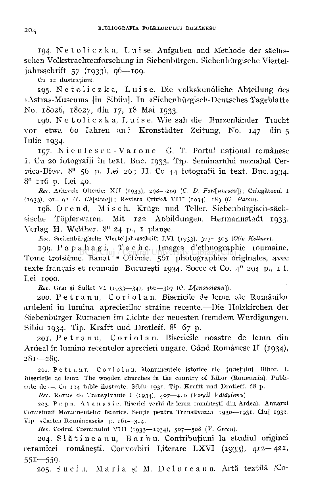

194. Netoliczka , Lu i se. Aufgaben und Méthode der săchisschen Volkstrachtenforsehung in Siebenbiirgen. Siebenburgische Vierteljahrsschrift 57 (1933), 96—109.

Cu 1 2 ilustraţiuni.

195. Netoliczka , Luise . Die volkskundliche Abteilung des «Astra»-Museums [in SibiiuJ. In «Siebenbùrgisch-Deutsches Tageblatt» No. 18026, 18027, din 17, 18 Mai 1933.

- 196. Netoliczka , Luise . Wie sah die Burzenlànder Ttacht

vor etwa 60 lahreu an ? Kronstădter Zeitung, No. 147 din 5 Iulie 1934.

- 197. Niculescu-Varone , G. T. Portul naţional românesc

I. Cu 20 fotografii în text. Buc. 1933. Tip. Seminarului monahal Cernica-Ilfov. 8° 56 p. Lei 20 ; II. Cu 44 fotografii în text. Buc. 1934. 8° 116 p. Lei 40.

Rec. Arhivele Olteniei XII (1933), 298—299 (C. D. Fort[unescu]) ; Culegătorul I (

— 9

{I- Ch[elcea\) ; Revista Critică VIII (1934), 183 (G. Pascu).

933)) 9

2

r

1

- 198. O r e n d, M i s c h. Kruge und Teller. Siebenbûrgisch-sâch-

sische Tôpferwaren. Mit 122 Abbildungen. Hermannstadt 1933. Verlag H. Werther. 8° 24 p., 1 planşe.

Rec. Siebenburgische Vierteljahrsschrift LVI (1933), 303—305 {Otto Kellner).

- 199. Papahagi , Tache . Images d'ethnographie roumaine.

Tome troisième. Banat * Oltenie. 561 photographies originales, avec texte français et roumain. Bucureşti 1934. Socec et Co. 4

294 p., 1 f. Lei 1000.

0

Rec. Grai şi Suflet VI (1933—34), 366—367 (O. D[ensusianu]).

200. Petranu , Coriolan . Bisericile de lemn ale Românilor ardeleni în lumina aprecierilor străine recente.—Die Holzkirchen der Siebenbiirger Rumănen im Lichte der neuesten fremdem Wurdigungen. Sibiu 1934. Tip. Krafft und Drotleff. 8° 67 p.

- 201. Petranu , Coriolan . Bisericile noastre de lemn din

Ardeal în lumina recentelor aprecieri ungare. Gând Românesc II (1934), 281-—289.

- 202. Petranu , Coriolan . Monumentele istorice ale judeţului Bihor. I.

Bisericile de lemn. The wooden churches in the country of Bihor (Roumania). Publicate de—. Cu 124 table ilustrate. Sibiu 1931. Tip. Krafft und Drotleff. 68 p.

Rec. Revue de Transylvanie I (1934), 4°7—4

{Virgil Vătăşianu).

1 0

###### 203. Popa , A t a 11 a s i e. Biserici vechi de lemn româneşti din Ardeal. Anuarul

Comisiunii Monumentelor Istorice. Secţia pentru Transilvania. 1930—1931. Cluj 1932. Tip. «Cartea Românească», p. 161—314.

Rec. Codrul Cosminului VIII (1933—1934), 507—508 (V. Grecu).

#### 204. Slătineanu , Barbu . Contribuţiuni la studiul originei

ceramicei româneşti. Convorbiri Literare LXV I (1933), 412—421, 551—559-

205. S u c i u, Mari a şi M. D e 1 u r e a n u. Artă textilă /Co-

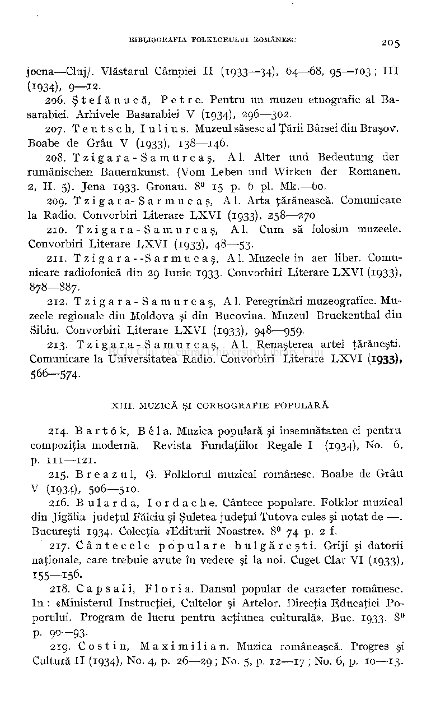

- jocna—Cluj/. Vlăstarul Câmpiei II (1933—34), 64—68, 95—103; II I

- (1934). 9—12.

- 206. Ştefănucă , Petre . Pentru un muzeu etnografic al Ba­

sarabiei. Arhivele Basarabiei V (1934), 296—302.

- 207. Teutsch , Iulius . Muzeul săsesc al Ţării Bârsei din Braşov.

Boabe de Grâu V (1933), 138—146.

- 208. Tzigara-Samurcaş , Al . Alter und Bedeutung der

rumănischen Bauernkunst. (Vom Leben und Wirken der Romanen. 2, H. 5). Jena 1933. Gronau. 8° 15 p. 6 pl. Mk.—60.

- 209. Tzigara-Sarmucaş , Al . Arta ţărănească. Comunicare

la Radio. Convorbiri Literare LXV I (1933), 258—270

- 210. Tzigara-Samurcaş , Al . Cum să folosim muzeele.

Convorbiri Literare LXV I (1933), 48—53.

- 211. Tzigara--Sarmucaş , Al . Muzeele în aer liber. Comu­

nicare radiofonică din 29 Iunie 1933. Convorbiri Literare LXV I (1933), 878—887.

- 212. Tzigara-Samurcaş , Al . Peregrinări muzeografice. Muzeele regionale din Moldova şi din Bucovina. Muzeul Bruckenthal din Sibiu. Convorbiri Literare LXV I (1933), 948—959.
- 213. Tzigara-Samurcaş , Al . Renaşterea artei ţărăneşti. Comunicare la Universitatea Radio. Convorbiri Literare LXV I (1933), 566—574XIII. MUZICĂ ŞI CORBOGRAFIE POPULARĂ
- 214. Bartok , Be l a. Muzica populară şi însemnătatea ei pentru

compoziţia modernă. Revista Fundaţiilor Regale I (1934), No. 6,

p. in— 121 .

- 215. Breazul , G. Folklorul muzical românesc. Boabe de Grâu

v (1934). 506—510.

- 216. Bularda , Iordache . Cântece populare. Folklor muzical

din Jigălia judeţul Fălciu şi Şuletea judeţul Tutova cules şi notat de —. Bucureşti 1934. Colecţia «Editurii Noastre». 8° 74 p. 2 f.

- 217. Cântecel e popular e bulgăreşti . Griji şi datorii naţionale, care trebuie avute în vedere şi la noi. Cuget Clar VI (1933), 155—156.
- 218. Capsaii , Floria . Dansul popular de caracter românesc. In : «Ministerul Instrucţiei, Cultelor şi Artelor. Direcţia Educaţiei Poporului. Program de lucru pentru acţiunea culturală». Buc. 1933. 8° P- 9°—93-
- 219. Costin , Maximilian . Muzica românească. Progres şi

Cultură II (1934), No. 4, p. 26—29 ; No. 5, p. 12 —1 7 ; No. 6, p. 10—13.

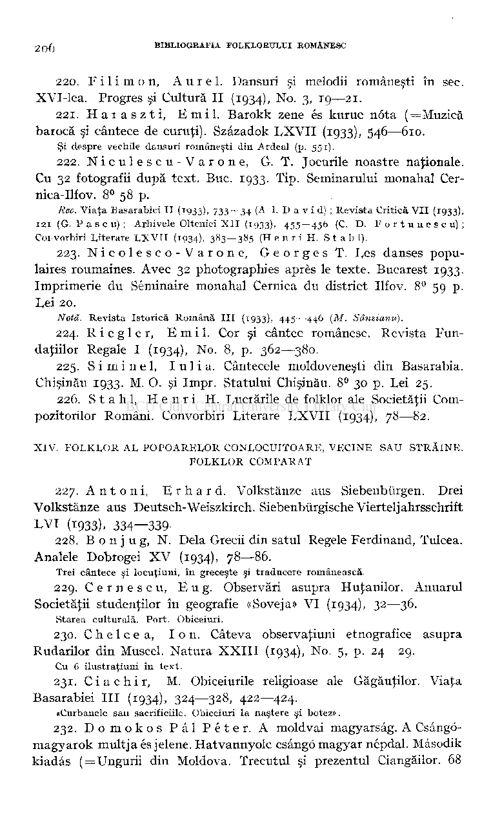

- 220. F i 1 i m o n, Aurel . Dansuri şi melodii româneşti în sec.

XVI-lea. Progres şi Cultură II (1934), No. 3, 19—21.

- 221. Haiaszti , Emil . Barokk zene es kuruc nota (=Muzică

barocă şi cântece de curuţi). Szâzadok DXVII (1933), 546-—610.

Şi despre vechile dansuri româneşti din Ardeal (p. 551).

- 222. Niculescu-Varone , G. T. Jocurile noastre naţionale.

Cu 32 fotografii după text. Buc. 1933. Tip. Seminarului monahal Cernica-Ilfov. 8° 58 p.

Rec. Viaţa Basarabiei II (1933), 733—34 (A 1. D a v i d) ; Revista Critică VII (1933), 121 (G. P a s c u) ; Arhivele Olteniei XII (1933), 455—456 (C. D. l'ortuacscu) ; Coi vorbiri Literare LXVII (1934), 383—385 (Henr i H. Stal l 1).

223. Nicolesco-Varone , George s T. Des danses populaires roumaines. Avec 32 photographies après le texte. Bucarest 1933. Imprimerie du Séminaire monahal Cernica du district Ilfov. 8° 59 p. Dei 20.

Notă. Revista Istorică Română III (1933), 445—446 (M. Sânzianu).

- 224. Riegler , Emil . Cor şi cântec românesc. Revista Fun­

daţiilor Regale I (1934), No. 8, p. 362—380.

- 225. Siminel , Iulia . Cântecele moldoveneşti din Basarabia.

Chişinău 1933. M. O. şi Impr. Statului Chişinău. 8° 30 p. Dei 25.

- 226. Stahl , Henr i H. Duciările de folklor ale Societăţii Com­

pozitorilor Români. Convorbiri Diterare LXVI I (1934), 78—82. XIV. FOLKLOR AL POPOARELOR CONLOCUITOARE, VECINE SAU STRĂINE.

FOLKLOR COMPARAT

227. Antoni , Erhard . Volkstănze aus Siebenbiirgen. Drei Volkstănze aus Deutsch-Weiszkirch. Siebenburgische Vierteljahrsschrift LVI (1933). 334—339-

- 228. B o n j u g, N. Delà Grecii din satul Regele Ferdinand, Tulcea.

Analele Dobrogei X V (1934), 78—86.

Trei cântece şi locuţiuni, în greceşte şi traducere românească.

- 229. Cernes c u, Eug . Observări asupra Huţanilor. Anuarul

Societăţii studenţilor în geografie «Soveja» VI (1934), 32—36.

Starea culturală. Port. Obiceiuri.

- 230. Chelcea , Ion . Câteva observaţiuni etnografice asupra

Rudarilor din Muscel. Natura XXII I (1934), No. 5, p. 24—29.

Cu 6 ilustraţiuni în text.

- 231. C i a chir , M. Obiceiurile religioase ale Găgăuţilor. Viaţa

Basarabiei II I (1934), 324—328, 422—424.

«Curbanele sau sacrificiile. Obiceiuri la naştere şi botez».

- 232. Domoko s Pâ l Péter . A moldvai magyarsâg. A Csângô-

magyarok multja és jelene. Hatvannyolc csângô magyar népdal. Mâsodik kiadâs (=Ungurii din Moldova. Trecutul şi prezentul Ciangăilor. 68

cântece populare. Ediţia a doua). Cluj-Kolozsvâr 1934. «Gloria» kônyvny. 8° 2 f. 267 p.

- 233. Eitel , Karl . Volkslieder aus Heltau und Almen. Sie-

benburgische Vierteljahrsschrift LVI (1933). 34°—345-

- 234. Iancs ô Elemér . Problema satului unguresc din Ardeal.

Boabe de Grâu IV (1933), 124—128.

Cu 10 ilustraţiuni privitoare la tipuri de casă, biserici, interioruri şi port.

- 235. H u s s, Richard . Ein heidnisch-christlicher Beschwôrungs-

spruch gegen Gicht aus TJngersdorf. Siebenburgische Vierteljahrsschrift 57 (1934). 205—207.

- 236. Husz , Richard . Altrômische Kindeispiele im heutigen

Siebenbùrgen. Siebenburgische Vierteljahrsschrift I,VI (1933). 3*7—3

21

-

- 237. Kânto r Lajos . Kôlcsônhatâs a magyar és român nép-

kôltészetben ( = Influenţe reciproce între poezia populară ungurească şi românească). Az Erdélyi Mûzeum-Egyesûlet ... tizenegyedik vândorgyulésének Emlékkônyve. Cluj 1933. p. 29—38.

- 238. L u k o Gâbor . Moldvai csângôk kendermunkâja ( = Lu­

crarea cânepei la Ciangăii moldoveni). A Magyar Nemzeti Muzeum Néprajzi Târânak Ertesitôje XXV I (1934), 96—101.

XV. PĂSTORIT

- 239. B u r i 1 e a n u, D i m. I). şi H. Z. D u m i t r e s c u. Păs

toritul dintre Olt şi Jiu (Studiu etnografic). Anuarul Societăţii Studenţilor în geografie «Soveja» I (1933), P- 67—76.

- 240. Herseni , Trăi a n. Stâna din munţii Făgăraşului. Boabe

de Grâu V (1934). 336—359-

- 241. Kubijovyc , Vladimir . Păstoritul în Maramureş. Bu­

letinul Societăţii Regale Române de Geografie LU I (1934), 216—293.

5 planşe, 2 hărţi, un rezumat german.

- 242. Morar i u, Tiberiu . Noui contribuţiuni la păstoritul e-

vreilor maramureşeni (Extras din revista «Stâna». An. I. No. 9 şi 10). Sibiu 1934. Tip. Vestemean 8° 32 p., 2 planşe. [Cu rezumat german].

##### Rec. Buletinul Societăţii Regale Române de Geografie LIII(1934), 43

—43 3

2

(Mara Popp).

243. Pop , Mar a N. Contribuţiuni la viaţa pastorală din Argeş şi Muscel. Origina Ungurenilor. (Cu un rezumat francez, 6 planşe şi 2 hărţi). Buletinul Societăţii Regale Române de Geografie LII (1933). 229—282.

Rec. Revista Istorică Română IV (1934), 4

5 Şandru).

2

- 244. Pavlescu , Eugen . Stâna satului. Iaşi 1934. Tip. Alexan­

dru Ţerek. 16

0

11 9 p.

- 245. Someşan , Laurian . La transhumance des bergers

transylvains dans les provinces roumaines. Revue de Transylvanie I

(1934), 465—476.

- 246. Someşan , L a u r i a n. Vieaţa pastorală în Munţii Călimării. (Cu un rezumat german, 2 planşe şi 1 hartă). Buletinul Societăţii Regale Române de Geografie LI I (1933), 283—342.
- 247. S to i an , LI . Păstoritul în Rîmnicul-Sărat. Grai şi Suflet VI (1933—34^. 41—74-

### XVI. ADDENDA LA «BIBLIOGRAFIA FOLKLORULUI ROMÂNESC 1931—1932»

248. Brăiloiu , Constantin . Esquisse d'une méthode de folklore musical (Les archives de la Société des compositeurs roumains). Extrait de la Revue de Musicologie, no. 40. Paris [1932]. Librairie Fischbacher 8° 34 p.

- 249. Chelcea , Ion . Către intelectualii satelor noastre ! Satul

şi Şcoala II (1932—33), 116—118 .

Apel pentru culegerea materialului folkloric.

- 250. Crăciun , Gheorgh e N. Monografia comunei Broşteni

din judeţul Mehedinţi. Turnu-Severin 1932. Tip. Luiza I. Niculescu şi loan N. Bojneagu. 8° 82 p.

Cu 15 ilustraţiuni şi 2 schiţe. Aşezările vechi, obiceiuri (p. 21—23). «Legende şi

tradiţii (p. 37—40) ; cântece şi doine, cântece de stea şi vicleim, descântece, proverbeşi zicători, cântecele şi horele naţionale, credinţa şi obiceiurile religioase, superstiţii, port, ocupaţia locuitorilor, industria casnică» (p. 42—71).

251. Creanga , Ion . Contes populaires de Roumanie. Traduction et notes par Stanciu Stoian et Ode de Chateauvieux Lebel. Paris, Maisonneuve, 1931. XVIII, 249. 8° 30 fr.

Notă. Schweizerisches Archiv fur Volkskunde32 (1932), 184 (E. H[offmann]-K[rayer]. 252. Cucu , Gheorghe . Colinde populare. Culese şi armoni­

zate de —-. Tipărite, cu o prefaţă şi biografia compozitorului sub îngrijirea Preotului Eugen Bărbulescu. Buc. 1932. Tip. «Cărţilor Bisericeşti». 16

32 p. Lei 30.

0

253. Luţa , Vasil e Gh . Un anuar pentru studiul cântecului poporan al Germanilor. Revista Germaniştilor Români I (1932), 184—189.

Jahrbuch fur Volksliedforschung... herausgegeben von John Meier. I-1928, II-1930, III-1932.

254. Netoliczka , Luise . Das Siebenbûrgische Volkskundemuseum in Cluj-Klausenburg (Rumănien). Mit 4 Abbildungen. Sonderabdruck aus «Museumskunde», Neue Folge IV [1932}, Heft 3. p. 125—133.

- 255. P e r e t z, I. Realităţi juridice. Cursuri la Universitatea Ate­

neului. Anuarul Ateneului Român pe 1931. Bucureşti 1932. Tip. «Bucovina», p. 163—208.

### Multe obiceiuri juridice în legătură cu nunta românească.

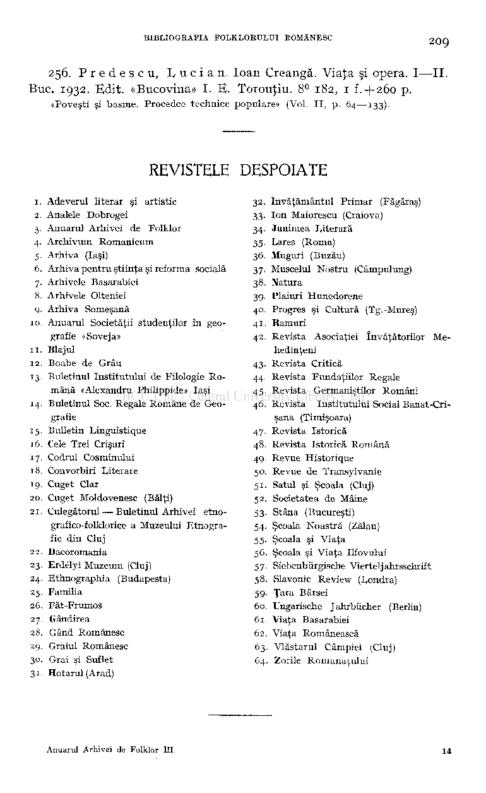

- 256. Predescu , Lucian . loan Creangă. Viaţa şi opera. I—II .

Buc. 1932. Edit. «Bucovina» I. E. Torouţiu. 8° 182, 1 f.+260 p.

«Poveşti şi basme. Procedee technice populare» (Vol. II, p. 64—133).

## REVISTELE DESPOIATE

- 1. Adeverul literar şi artistic
- 2. Analele Dobrogei
- 3. Anuarul Arhivei de Folklor
- 4. Archivum Romanicum
- 5. Arhiva (Iaşi)
- 6. Arhiva pentru ştiinţa şi reforma socială
- 7. Arhivele Basarabiei
- 8. Arhivele Olteniei
- 9. Arhiva Someşană
- 10. Anuarul Societăţii studenţilor în geografie «Soveja»
- 11. Blajul
- 12. Boabe de Grâu
- 13. Buletinul Institutului de Filologie Română «Alexandru Philippide» Iaşi
- 14. Buletinul Soc. Regale Române de Geografie
- 15. Bulletin Linguistique
- 16. Cele Trei Crişuri
- 17. Codrul Cosminului
- 18. Convorbiri Literare
- 19. Cuget Clar
- 20. Cuget Moldovenesc (Bălţi)
- 21. Culegătorul — Buletinul Arhivei etnografico-folklorice a Muzeului Etnografic din Cluj
- 22. Dacoromania
- 23. Erdélyi Muzeum (Cluj)
- 24. Ethnographia (Budapesta)
- 25. Familia
- 26. Făt-Frumos
- 27. Gândirea
- 28. Gând Românesc
- 29. Graiul Românesc
- 30. Grai şi Suflet 31- Hotarul (Arad)

- 32. învăţământul Primar (Făgăraş)
- 33. Ion Maiorescu (Craiova)
- 34. Junimea Literară
- 35. Lares (Roma)
- 36. Muguri (Buzău)
- 37. Muscelul Nostru (Câmpulung)
- 38. Natura
- 39. Plaiuri Hunedorene
- 40. Progres şi Cultură (Tg.-Mureş)
- 41. Ramuri
- 42. Revista Asociaţiei învăţătorilor Mehedinţeni
- 43. Revista Critică
- 44. Revista Fundaţiilor Regale
- 45. Revista Germaniştilor Români
- 46. Revista Institutului Social Banat-Crişana (Timişoara)
- 47. Revista Istorică
- 48. Revista Istorică Română
- 49. Revue Historique
- 50. Revue de Transylvanie
- 51. Satul şi Şcoala (Cluj)
- 52. Societatea de Mâine
- 53. Stâna (Bucureşti)
- 54. Şcoala Noastră (Zălau)
- 55. Şcoala şi Viaţa
- 56. Şcoala şi Viaţa Ilfovului
- 57. Siebenbiirgische Vierteljahrsschrift
- 58. Slavonie Review (Londra)
- 59. Ţara Bârsei
- 60. TJngarische Jahrbucher (Berlin)
- 61. Viaţa Basarabiei
- 62. Viaţa Românească
- 63. Vlăstarul Câmpiei (Cluj)
- 64. Zorile Romanaţulni

