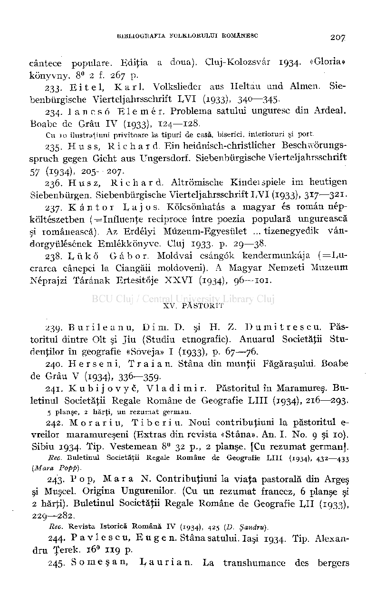
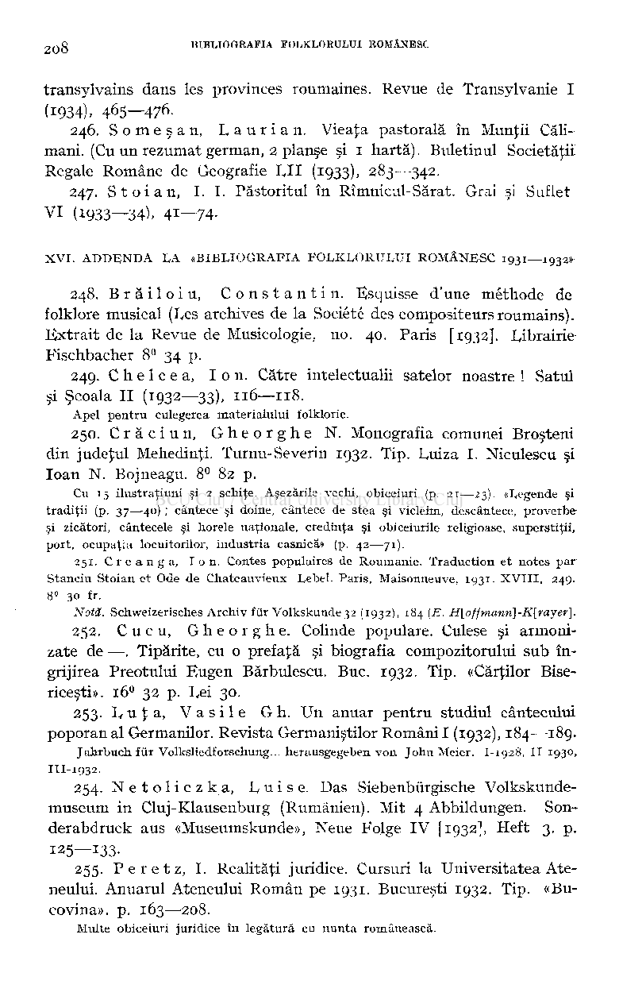

cântece populare. Ediţia a doua). Cluj-Kolozsvâr 1934. «Gloria» kônyvny. 8° 2 f. 267 p.

- 233. Eitel , Karl . Volkslieder aus Heltau und Almen. Sie-

benburgische Vierteljahrsschrift LVI (1933). 34°—345-

- 234. Iancs ô Elemér . Problema satului unguresc din Ardeal.

Boabe de Grâu IV (1933), 124—128.

Cu 10 ilustraţiuni privitoare la tipuri de casă, biserici, interioruri şi port.

- 235. H u s s, Richard . Ein heidnisch-christlicher Beschwôrungs-

spruch gegen Gicht aus TJngersdorf. Siebenburgische Vierteljahrsschrift 57 (1934). 205—207.

- 236. Husz , Richard . Altrômische Kindeispiele im heutigen

Siebenbùrgen. Siebenburgische Vierteljahrsschrift I,VI (1933). 3*7—3

21

-

- 237. Kânto r Lajos . Kôlcsônhatâs a magyar és român nép-

kôltészetben ( = Influenţe reciproce între poezia populară ungurească şi românească). Az Erdélyi Mûzeum-Egyesûlet ... tizenegyedik vândorgyulésének Emlékkônyve. Cluj 1933. p. 29—38.

- 238. L u k o Gâbor . Moldvai csângôk kendermunkâja ( = Lu­

crarea cânepei la Ciangăii moldoveni). A Magyar Nemzeti Muzeum Néprajzi Târânak Ertesitôje XXV I (1934), 96—101.

XV. PĂSTORIT

- 239. B u r i 1 e a n u, D i m. I). şi H. Z. D u m i t r e s c u. Păs

toritul dintre Olt şi Jiu (Studiu etnografic). Anuarul Societăţii Studenţilor în geografie «Soveja» I (1933), P- 67—76.

- 240. Herseni , Trăi a n. Stâna din munţii Făgăraşului. Boabe

de Grâu V (1934). 336—359-

- 241. Kubijovyc , Vladimir . Păstoritul în Maramureş. Bu­

letinul Societăţii Regale Române de Geografie LU I (1934), 216—293.

5 planşe, 2 hărţi, un rezumat german.

- 242. Morar i u, Tiberiu . Noui contribuţiuni la păstoritul e-

vreilor maramureşeni (Extras din revista «Stâna». An. I. No. 9 şi 10). Sibiu 1934. Tip. Vestemean 8° 32 p., 2 planşe. [Cu rezumat german].

## Rec. Buletinul Societăţii Regale Române de Geografie LIII(1934), 43

—43 3

2

(Mara Popp).

243. Pop , Mar a N. Contribuţiuni la viaţa pastorală din Argeş şi Muscel. Origina Ungurenilor. (Cu un rezumat francez, 6 planşe şi 2 hărţi). Buletinul Societăţii Regale Române de Geografie LII (1933). 229—282.

Rec. Revista Istorică Română IV (1934), 4

5 Şandru).

2

- 244. Pavlescu , Eugen . Stâna satului. Iaşi 1934. Tip. Alexan­

dru Ţerek. 16

0

11 9 p.

- 245. Someşan , Laurian . La transhumance des bergers

transylvains dans les provinces roumaines. Revue de Transylvanie I

(1934), 465—476.

- 246. Someşan , L a u r i a n. Vieaţa pastorală în Munţii Călimării. (Cu un rezumat german, 2 planşe şi 1 hartă). Buletinul Societăţii Regale Române de Geografie LI I (1933), 283—342.
- 247. S to i an , LI . Păstoritul în Rîmnicul-Sărat. Grai şi Suflet VI (1933—34^. 41—74-

# XVI. ADDENDA LA «BIBLIOGRAFIA FOLKLORULUI ROMÂNESC 1931—1932»

248. Brăiloiu , Constantin . Esquisse d'une méthode de folklore musical (Les archives de la Société des compositeurs roumains). Extrait de la Revue de Musicologie, no. 40. Paris [1932]. Librairie Fischbacher 8° 34 p.

- 249. Chelcea , Ion . Către intelectualii satelor noastre ! Satul

şi Şcoala II (1932—33), 116—118 .

Apel pentru culegerea materialului folkloric.

- 250. Crăciun , Gheorgh e N. Monografia comunei Broşteni

din judeţul Mehedinţi. Turnu-Severin 1932. Tip. Luiza I. Niculescu şi loan N. Bojneagu. 8° 82 p.

Cu 15 ilustraţiuni şi 2 schiţe. Aşezările vechi, obiceiuri (p. 21—23). «Legende şi

tradiţii (p. 37—40) ; cântece şi doine, cântece de stea şi vicleim, descântece, proverbeşi zicători, cântecele şi horele naţionale, credinţa şi obiceiurile religioase, superstiţii, port, ocupaţia locuitorilor, industria casnică» (p. 42—71).

- 251. Creanga , Ion . Contes populaires de Roumanie. Traduction et notes par

Stanciu Stoian et Ode de Chateauvieux Lebel. Paris, Maisonneuve, 1931. XVIII, 249. 8° 30 fr.

Notă. Schweizerisches Archiv fur Volkskunde32 (1932), 184 (E. H[offmann]-K[rayer].

- 252. Cucu , Gheorghe . Colinde populare. Culese şi armoni­

zate de —-. Tipărite, cu o prefaţă şi biografia compozitorului sub îngrijirea Preotului Eugen Bărbulescu. Buc. 1932. Tip. «Cărţilor Bisericeşti». 16

32 p. Lei 30.

0

253. Luţa , Vasil e Gh . Un anuar pentru studiul cântecului poporan al Germanilor. Revista Germaniştilor Români I (1932), 184—189.

Jahrbuch fur Volksliedforschung... herausgegeben von John Meier. I-1928, II-1930, III-1932.

- 254. Netoliczka , Luise . Das Siebenbûrgische Volkskundemuseum in Cluj-Klausenburg (Rumănien). Mit 4 Abbildungen. Sonderabdruck aus «Museumskunde», Neue Folge IV [1932}, Heft 3. p. 125—133.
- 255. P e r e t z, I. Realităţi juridice. Cursuri la Universitatea Ateneului. Anuarul Ateneului Român pe 1931. Bucureşti 1932. Tip. «Bucovina», p. 163—208.

# Multe obiceiuri juridice în legătură cu nunta românească.

