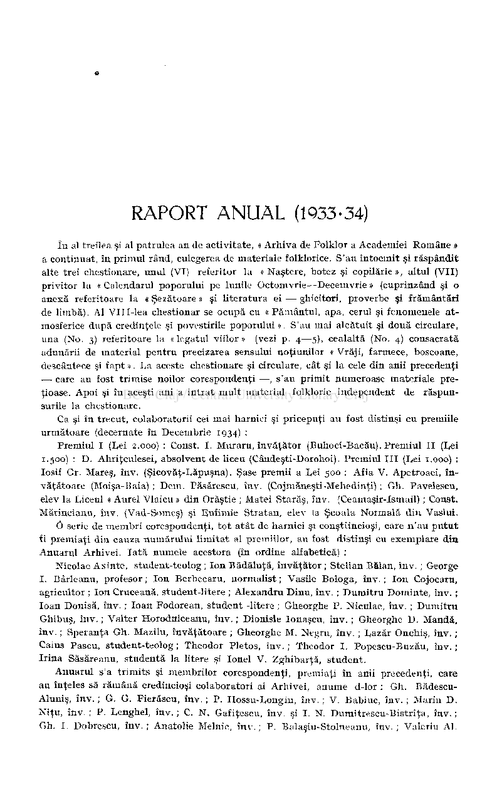
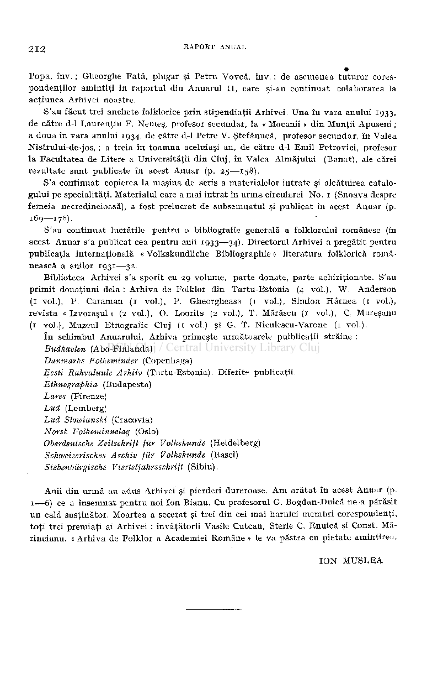
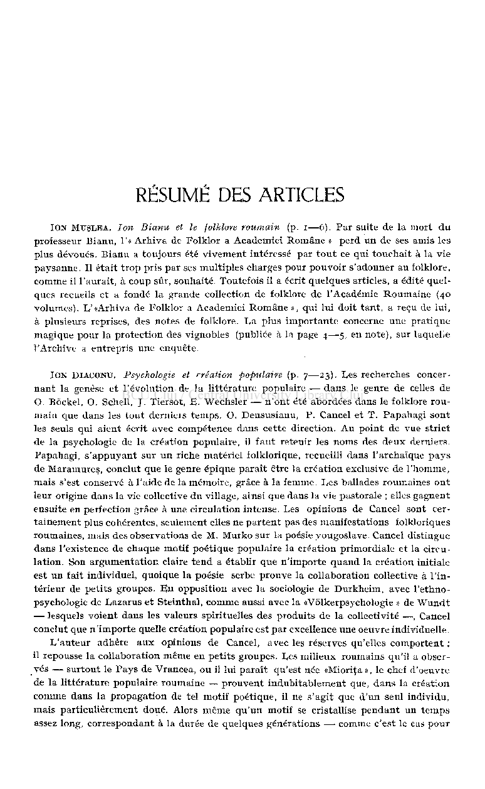
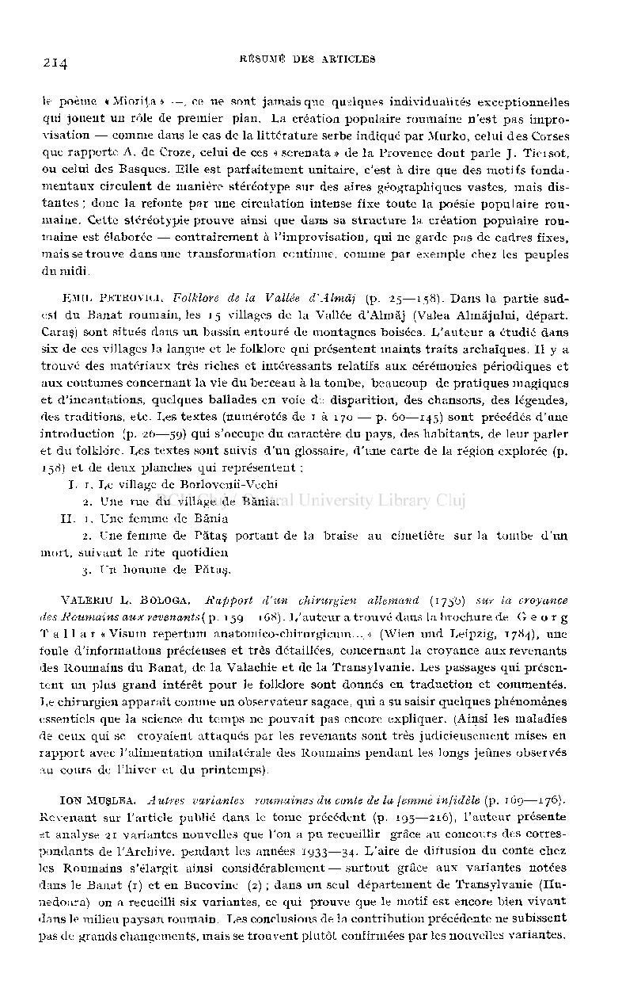
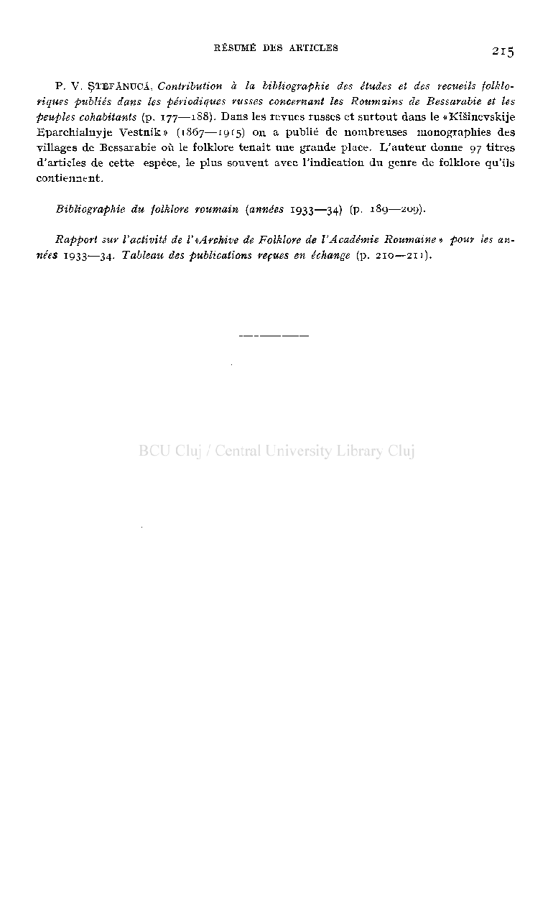

256. Predescu , Lucian . loan Creangă. Viaţa şi opera. I—II . Buc. 1932. Edit. «Bucovina» I. E. Torouţiu. 8° 182, 1 f.+260 p.

«Poveşti şi basme. Procedee technice populare» (Vol. II, p. 64—133).

### REVISTELE DESPOIATE

- 1. Adeverul literar şi artistic
- 2. Analele Dobrogei
- 3. Anuarul Arhivei de Folklor
- 4. Archivum Romanicum
- 5. Arhiva (Iaşi)
- 6. Arhiva pentru ştiinţa şi reforma socială
- 7. Arhivele Basarabiei
- 8. Arhivele Olteniei
- 9. Arhiva Someşană
- 10. Anuarul Societăţii studenţilor în geografie «Soveja»
- 11. Blajul
- 12. Boabe de Grâu
- 13. Buletinul Institutului de Filologie Română «Alexandru Philippide» Iaşi
- 14. Buletinul Soc. Regale Române de Geografie
- 15. Bulletin Linguistique
- 16. Cele Trei Crişuri
- 17. Codrul Cosminului
- 18. Convorbiri Literare
- 19. Cuget Clar
- 20. Cuget Moldovenesc (Bălţi)
- 21. Culegătorul — Buletinul Arhivei etnografico-folklorice a Muzeului Etnografic din Cluj
- 22. Dacoromania
- 23. Erdélyi Muzeum (Cluj)
- 24. Ethnographia (Budapesta)
- 25. Familia
- 26. Făt-Frumos
- 27. Gândirea
- 28. Gând Românesc
- 29. Graiul Românesc
- 30. Grai şi Suflet 31- Hotarul (Arad)

- 32. învăţământul Primar (Făgăraş)
- 33. Ion Maiorescu (Craiova)
- 34. Junimea Literară
- 35. Lares (Roma)
- 36. Muguri (Buzău)
- 37. Muscelul Nostru (Câmpulung)
- 38. Natura
- 39. Plaiuri Hunedorene
- 40. Progres şi Cultură (Tg.-Mureş)
- 41. Ramuri
- 42. Revista Asociaţiei învăţătorilor Mehedinţeni
- 43. Revista Critică
- 44. Revista Fundaţiilor Regale
- 45. Revista Germaniştilor Români
- 46. Revista Institutului Social Banat-Crişana (Timişoara)
- 47. Revista Istorică
- 48. Revista Istorică Română
- 49. Revue Historique
- 50. Revue de Transylvanie
- 51. Satul şi Şcoala (Cluj)
- 52. Societatea de Mâine
- 53. Stâna (Bucureşti)
- 54. Şcoala Noastră (Zălau)
- 55. Şcoala şi Viaţa
- 56. Şcoala şi Viaţa Ilfovului
- 57. Siebenbiirgische Vierteljahrsschrift
- 58. Slavonie Review (Londra)
- 59. Ţara Bârsei
- 60. TJngarische Jahrbucher (Berlin)
- 61. Viaţa Basarabiei
- 62. Viaţa Românească
- 63. Vlăstarul Câmpiei (Cluj)
- 64. Zorile Romanaţulni

## RAPORT ANUAL (1933-34)

în al treilea şi al patrulea an de activitate, « Arhiva de Folklor a Academiei Române » a continuat, în primul rând, culegerea de materiale folklorice. S'au întocmit şi răspândit alte trei chestionare, unul (VI) referitor la « Naştere, botez şi copilărie », altul (VII privitor la « Calendarul poporului pe lunile Octomvrie—Decemvrie » (cuprinzând şi o anexă referitoare la « Şezătoare » şi literatura ei — ghicitori, proverbe şi frământări de limbă). Al VIII-lea chestionar se ocupă cu « Pământul, apa, cerul şi fenomenele atmosferice după credinţele şi povestirile poporului ». S'au mai alcătuit şi două circulare, una (No. 3) referitoare la « legatul viilor » (vezi p. 4—5), cealaltă (No. 4) consacrată adunării de material pentru precizarea sensului noţiunilor « Vrăji, farmece, boscoane, descântece şi fapt ». La aceste chestionare şi circulare, cât şi la cele din anii precedenţi — care au fost trimise noilor corespondenţi —, s'au primit numeroase materiale preţioase. Apoi şi în aceşti ani a intrat mult material folkloric independent de răspunsurile la chestionare.

Ca şi în trecut, colaboratorii cei mai harnici şi pricepuţi au fost distinşi cu premiile următoare (decernate în Decembrie 1934) :

Premiul I (Lei 2.000) : Const. I. Muraru, învăţător (Buhoci-Bacău). Premiul II (Lei 1.500) : D. Ahriţculesei, absolvent de liceu (Cândeşti-Dorohoi). Premiul III (Lei 1.000) : Iosif Gr. Mareş, înv. (Şicovăţ-Lăpuşna). Şase premii a Lei 500 : Afia V. Apetroaei, învăţătoare (Moişa-Baia) ; Dem. Păsărescu, înv. (Cojmăneşti -Mehedinţi) ; Gh. Pavelescu, elev la Liceul « Aurel Vlaicu » din Orăştie ; Matei Starăş, îav. (Ceamaşir-Ismail) ; Const. Mărincianu, înv. (Vad-Someş) şi Fufimie Stratan, elev la Şcoala Normală din Vaslui.

0 serie de membri corespondenţi, tot atât de harnici şi conştiincioşi, care n'au putut fi premiaţi din cauza numărului limitat al premiilor, au fost distinşi cu exemplare din Anuarul Arhivei. Iată numele acestora (în ordine alfabetică) :

Nicolae Axinte, student-teolog ; Ion Bădăluţă, învăţător ; Stelian Bălan, înv. ; George I. Bârleanu, profesor ; Ion Berbecaru, normalist ; Vasile Bologa, înv. ; Ion Cojocaru, agricultor ; Ion Cruceană, student-litere ; Alexandru Dinu, înv. ; Dumitru Dominte, înv. ; loan Donisă, înv. ; loan Fodorean, student -litere ; Gheorghe P. Niculae, înv. ; Dumitru Ghibuş, înv. ; Valter Horodniceanu, înv. ; Dionisie Ionaşcu, înv. ; Gheorghe D. Mandă, înv. ; Speranţa Gh. Mazilu, învăţătoare ; Gheorghe M. Negru, înv. ; Lazăr Onchiş, înv. ; Caius Pascu, student-teolog ; Theodor Pletos, înv. ; Theodor I. Popescu-Buzău, înv. ; Irina Săsăreanu, studentă la litere şi Ionel V. Zghibarţă, student.

Anuarul s'a trimits şi membrilor corespondenţi, premiaţi în anii precedenţi, care au înţeles să rămână credincioşi colaboratori ai Arhivei, anume d-lor : Gh. BădescuAluniş, înv. ; G. G. Fierăscu, înv. ; P. Hossu-Longin, înv. ; V. Babiuc, înv. ; Marin D. Niţu, înv. ; P. Lenghel, înv. ; C. N. Gafiţescu, înv. şi I. N. Dumitrescu-Bistriţa, înv. ; Gh. I. Dobrescu, înv. ; Anatolie Melnic, înv. ; P. Balaşiu-Stolneanu, înv. ; Valeriu Al.

21 2 RAPORT ANDAI.

Popa, înv. ; Gheorghe Fată, plugar şi Petru Vovcă, înv. ; de asemenea tuturor corespondenţilor amintiţi în raportul din Anuarul II, care şi-au continuat colaborarea la acţiunea Arhivei noastre.

S'au făcut trei anchete folklorice prin stipendiaţii Arhivei. Una în vara anului 1933, de către d-1 Laurenţiu F. Nemeş, profesor secundar, la « Mocanii » din Munţii Apuseni ; a doua în vara anului 1934, de către d-1 Petre V. Ştefănucă, profesor secundar, în Valea Nistrului-de-jos, ; a treia în toamna aceluiaşi an, de către d-1 Emil Petrovici, profesor la Facultatea de Litere a Universităţii din Cluj, în Valea Almăjului (Banat), ale cărei rezultate sunt publicate în acest Anuar (p. 25—158).

S'a continuat copierea la maşina de scris a materialelor intrate şi alcătuirea catalogului pe specialităţi. Materialul care a mai intrat în urma circularei No. 1 (Snoava despre femeia necredincioasă), a fost prelucrat de subsemnatul şi publicat în acest Anuar (p.

169—176).

S'au continuat lucrările pentru o bibliografie generală a folklorului românesc (în acest Anuar s'a publicat cea pentru anii 1933—34). Directorul Arhivei a pregătit pentru publicaţia internaţională « Volkskundliche Bibliographie » literatura folklorică românească a anilor 1931—32.

Biblioteca Arhivei s'a sporit cu 29 volume, parte donate, parte achiziţionate. S'au primit donaţiuni delà : Arhiva de Folklor din Tartu-Estonia (4 vol.), W. Anderson (1 vol.), P. Caraman (1 vol.), P. Gheorgheasa (1 vol.), Simion Hârnea (1 vol.), revista « Lzvoraşul » (2 vol.), O. Loorits (2 vol.), T. Mărăscu (1 vol.), C, Mureşanu (1 vol.), Muzeul Etnografic Cluj (i voi.) şi G. T. Niculescu-Varone (1 vol.).

în schimbul Anuarului, Arhiva primeşte următoarele pulblicaţii străine : Budkavlen (Abo-Finlanda) Danmarks Folkeminder (Copenhaga) Eesti Rahvaluule Arhiiv (Tartu-Estonia). Diferite publicaţii. Ethnographia (Budapesta) Lares (Firenze) Lud (Lemberg) Lud Slowianski (Cracovia) Norsk Folkeminnelag (Oslo) Oberdeutsche Zeitschrift fur Volhskunde (Heidelberg) Schweizerisches Archiv fur Volkshunde (Basel) Siebenbûrgische Vierteljahrsschrift (Sibiu).

Anii din urmă au adus Arhivei şi pierderi dureroase. Am arătat în acest Anuar (p. 1—6) ce a însemnat pentru noi Ion Bianu. Cu profesorul G. Bogdan-Duică ne a părăsit un cald susţinător. Moartea a secerat şi trei din cei mai harnici membri corespondenţi, toţi trei premiaţi ai Arhivei : învăţătorii Vasile Cutcan, Sterie C. Enuică şi Const. Mărincianu. « Arhiva de Folklor a Academiei Române » le va păstra cu pietate amintirea.

ION MUŞLEA

# RÉSUMÉ DES ARTICLES

ION MUSLEA, Ion Bianu et le folklore roumain (p. i—6). Par suite de la mort du professeur Bianu, l'« Arhiva de Folklor a Academiei Romane » perd un de ses amis les plus dévoués. Bianu a toujours été vivement intéressé par tout ce qui touchait à la vie paysanne. Il était trop pris par ses multiples charges pour pouvoir s'adonner au folklore, comme il l'aurait, à coup sûr, souhaité Toutefois il a écrit quelques articles, a édité quelques recueils et a fondé la grande collection de folklore de l'Académie Roumaine (40 volumes). 1/«Arhiva de Folklor a Academiei Romane », qui lui doit tant, a reçu de lui, à plusieurs reprises, des notes de folklore. La plus importante concerne une pratique magique pour la protection des vignobles (publiée à la page 4—5 , en note), sur laquelle l'Archive a entrepris une enquête.

ION DIACONTJ. Psychologie et création populaire (p. 7—23) Les recherches concernant la genèse et l'évolution de la littérature populaire — dans le genre de celles de O. Bôckel, O. Schell, J. Tiersot, E. Wechsler — n'ont été abordées dans le folklore roumain que dans les tout derniers temps. O. Densusianu, P. Cancel et T. Papahagi sont les seuls qui aient écrit avec compétence dans cette direction. Au point de vue strict de la psychologie de la création populaire, il faut retenir les noms des deux derniers. Papahagi, s'appuyant sur un riche matériel folklorique, recueilli dans l'archaïque pays de Maramureş, conclut que le genre épique paraît être la création exclusive de l'homme, mais s'est conservé à l'aide de la mémoire, grâce à la femme. Les ballades roumaines ont leur origine dans la vie collective du village, ainsi que dans la vie pastorale ; elles gagnent ensuite en perfection grâce à une circulation intense. Les opinions de Cancel sont certainement plus cohérentes, seulement elles ne partent pas des manifestations folkloriques roumaines, mais des observations de M. Murko sur la poésie yougoslave. Cancel distingue dans l'existence de chaque motif poétique populaire la création primordiale et la circulation. Son argumentation claire tend a établir que n'importe quand la création initiale est un fait individuel, quoique la poésie serbe prouve la collaboration collective à l'intérieur de petits groupes. En opposition avec la sociologie de Durkheim, avec l'ethnopsychologie de Lazarus et Steinthal, comme aussi avec la «Volkerpsychologie » de Wundt — lesquels voient dans les valeurs spirituelles des produits de la collectivité —, Cancel conclut que n'importe quelle création populaire est par excellence une oeuvre individuelle.

L'auteur adhère aux opinions de Cancel, avec les réserves qu'elles comportent : il repousse la collaboration même en petits groupes. Les milieux roumains qu'il a observés — surtout le Pays de Vrancea, ou il lui paraît qu'est née «Mioriţa », le chef d'oeuvre de la littérature populaire roumaine — prouvent indubitablement que, dans la création comme dans la propagation de tel motif poétique, il ne s'agit que d'un seul individu, mais particulièrement doué. Alors même qu'un motif se cristallise pendant un temps assez long, correspondant à la durée de quelques générations — comme c'est le cas pour

le poème • Mioriţa » —, ce ne sont jamais que quelques individualités exceptionnelles qui jouent un rôle de premier plan. La création populaire roumaine n'est pas improvisation — comme dans le cas de la littérature serbe indiqué par Murko, celui des Corses que rapporte A. de Croze, celui de ces « serenata » de la Provence dont parle J. Tiersot, ou celui des Basques. Elle est parfaitement unitaire, c'est à dire que des motifs fondamentaux circulent de manière stéréotype sur des aires géographiques vastes, mais distantes ; donc la refonte par une circulation intense fixe toute la poésie populaire roumaine. Cette stereotypic prouve ainsi que dans sa structure la création populaire roumaine est é'aborée — contrairement à l'improvisation, qui ne garde pas de cadres fixes, mais se trouve dans une transformation continue, comme par exemple chez les peuples du midi.

EMIL PKTROVICI. Folklore de la Vallée d'Almàj (p. 25—158). Dans la partie sudest du Banat roumain, les 15 villages de la Vallée d'Almăj (Valea Almăjului, départ. Caras) sont situés dans un bassin entouré de montagnes boisées. L'auteur a étudié dans six de ces villages la langue et le folklore qui présentent maints traits archaïques. Il y a trouvé des matériaux très riches et intéressants relatifs aux cérémonies périodiques et aux coutumes concernant la vie du berceau à la tombe, beaucoup de pratiques magiques et d'incantations, quelques ballades en voie dt disparition, des chansons, des légendes, des traditions, etc. Les textes (numérotés de 1 à 170 — p. 60—145) sont précédés d'une introduction (p. 26—59) qui s'occupe du caractère du pays, des habitants, de leur parler et du folklore. Les textes sont suivis d'un glossaire, d'une carte de la région explorée (p. 158) et de deux planches qui représentent :

- I. 1. Le village de Borlovenii-Vechi

2. Une rue du village de Bănia.

- II. 1. Une femme de Bănia

- 2. Une femme de Pătaş portant de la braise au cimetière sur la tombe d'un

mort, suivant le rite quotidien

- 3. Un homme de Pătaş.

VALEEIU L. BOLOQA, Rapport d'un chirurgien allemand (1756) sur la croyance des Roumains aux revenants ( p. 159—168). L'auteur a trouvé dans la brochure de Geor g T a 11 a r « Visum repertum anatomico-chirurgicum... •.> (Wien und Leipzig, 1784), une foule d'informations précieuses et très détaillées, concernant la croyance aux revenants des Roumains du Banat, de la Valachie et de la Transylvanie. Les passages qui présentent un plus grand intérêt pour le folklore sont donnés en traduction et commentés. Le chirurgien apparaît comme un observateur sagace, qui a su saisir quelques phénomènes essentiels que la science du temps ne pouvait pas encore expliquer. (Ainsi les maladies de ceux qui se croyaient attaqués par les revenants sont très judicieusement mises en rapport avec l'alimentation unilatérale des Roumains pendant les longs jeûnes observés au cours de l'hiver et du printemps).

ION MUŞLEA, Autres variantes roumaines du conte de la femme infidèle (p. 169—176). Revenant sur l'article publié dans le tome précédent (p. 195—216), l'auteur présente et analyse 21 variantes nouvelles que l'on a pu recueillir grâce au concours des correspondants de l'Archive, pendant les années 1933—34. L'aire de diffusion du conte chez les Roumains s'élargit ainsi considérablement—surtout grâce aux variantes notées dans le Banat (1) et en Bucovine (2) ; dans un seul département de Transylvanie (Hunedoara) on a recueilli six variantes, ce qui prouve que le motif est encore bien vivant dans le milieu paysan roumain. Les conclusions de la contribution précédente ne subissent pas de grands changements, mais se trouvent plutôt confirmées par les nouvelles variantes.

P. V. ŞTEFĂNUCĂ, Contribution à la bibliographie des études et des recueils folkloriques publiés dans les périodiques russes concernant les Roumains de Bessarabie et les peuples cohabitants (p. 177—188) . Dans les revues russes et surtout dans le «KiSinevskije Eparchialnyje Vestnik » (1867—1915 ) on a publié de nombreuses monographies des villages de Bessarabie où le folklore tenait une grande place. D'auteur donne 97 titres d'articles de cette espèce, le plus souvent avec l'indication du genre de folklore qu'ils contiennent.

Bibliographie du folklore roumain (années 1933—34) (p. 189—209).

Rapport sur l'activité de V«Archive de Folklore de l'Académie Roumaine » pour les années 1933-—34- Tableau des publications reçues en échange (p. 210—211) .

