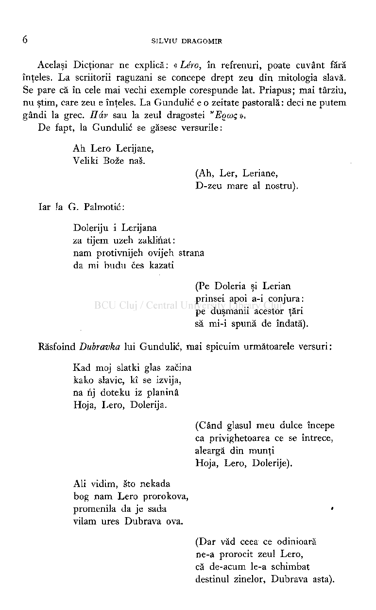
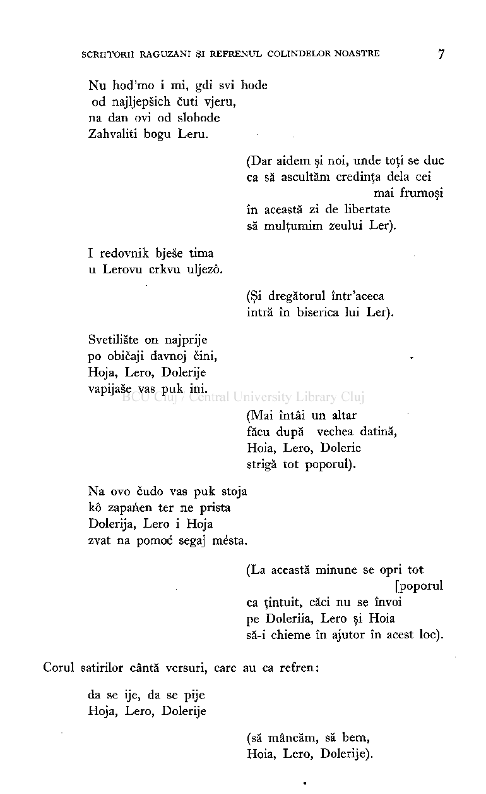
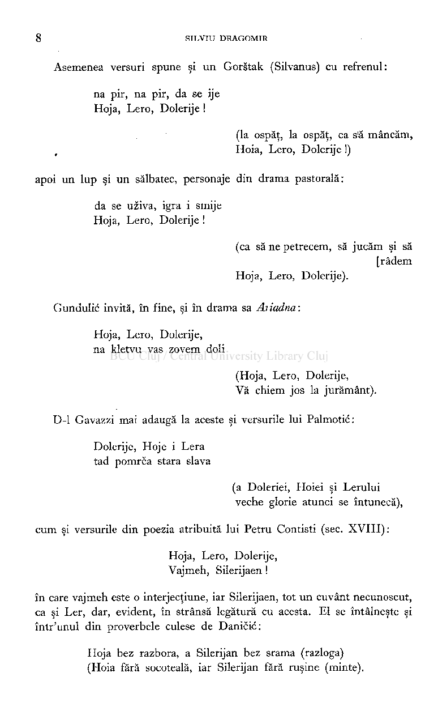
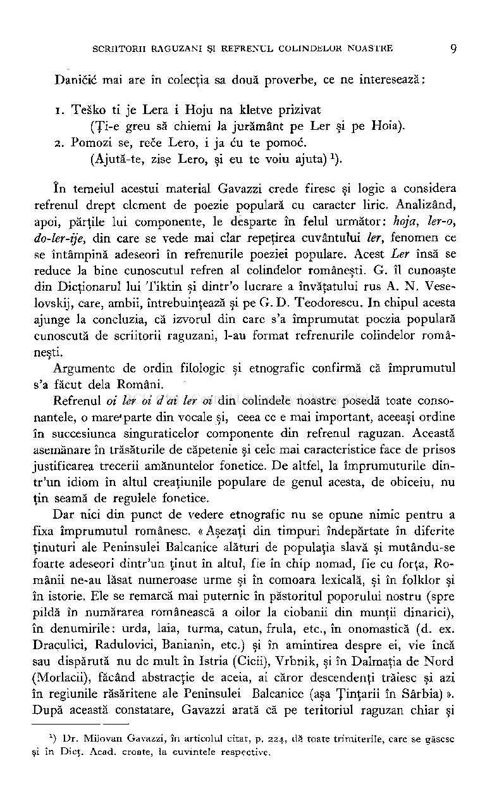
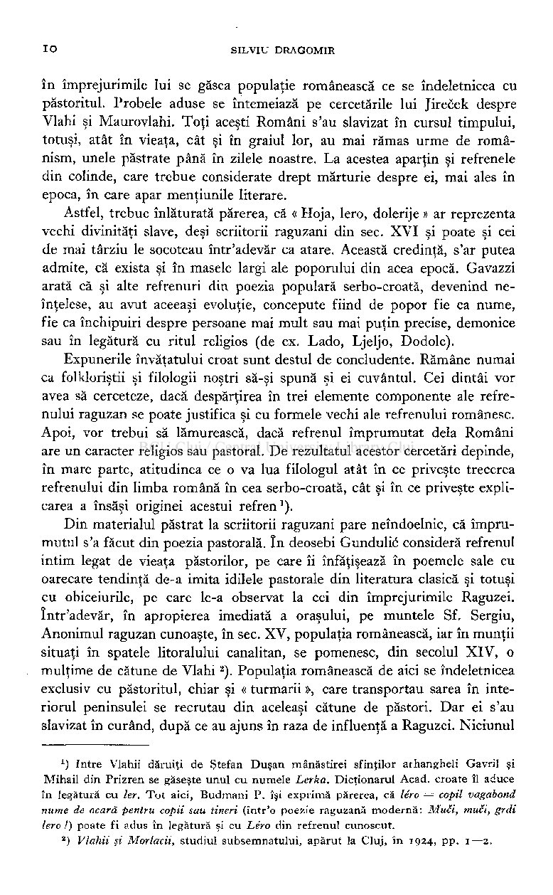
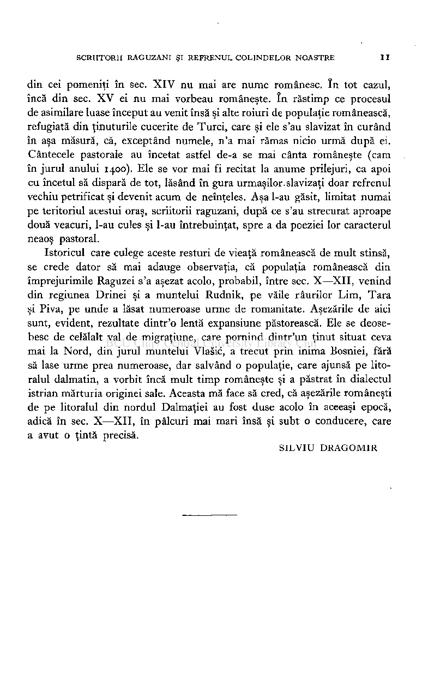
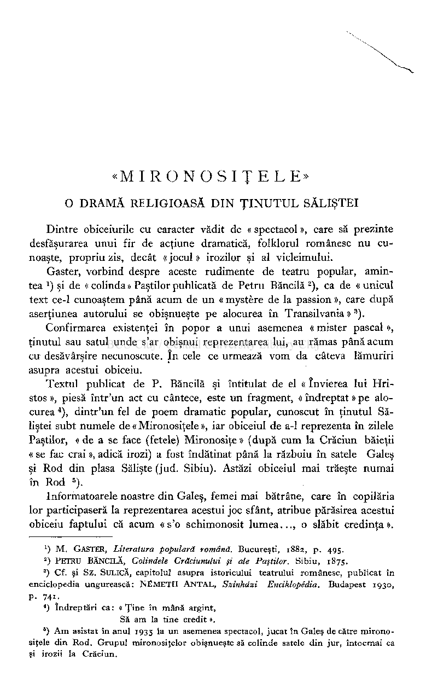
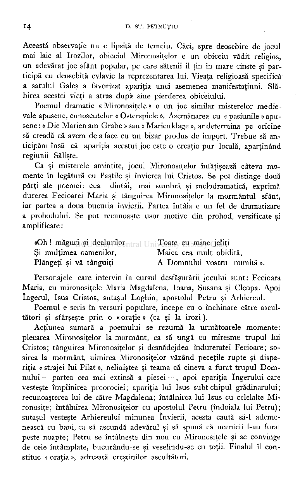

Acelaşi Dicţionar ne explică : « Léro, în refrenuri, poate cuvânt fără înţeles. La scriitorii raguzani se concepe drept zeu din mitologia slavă. Se pare că în cele mai vechi exemple corespunde lat. Priapus; mai târziu, nu ştim, care zeu e înţeles. La Gundulic e o zeitate pastorală: deci ne putem gândi la grec. Ildv sau la zeul dragostei "EQCOÇ ».

De fapt, la Gundulic se găsesc versurile:

Ah Lero Lerijane, Veliki Boze nas.

(Ah, Ler, Leriane, D-zeu mare al nostru).

Iar Ja G. Palmotic:

Doleriju i Lerijana za tijem uzeh zaklinat: nam protivnijeh ovijeh strana da mi budu ces kazati

(Pe Doleria şi Lerian prinsei apoi a-i conjura: pe duşmanii acestor ţări să mi-i spună de îndată).

Răsfoind Dubravka lui Gundulic, mai spicuim următoarele versuri :

Kad moj slatki glas zacina kako slavic, kî se izvija, na nj doteku iz pianina Hoja, Lero, Dolerija.

(Când glasul meu dulce începe ca privighetoarea ce se întrece, aleargă din munţi Hoja, Lero, Dolerije).

Aii vidim, sto nekada bog nam Lero prorokova, promenila da je sada » vilam ures Dubrava ova.

(Dar văd ceea ce odinioară ne-a prorocit zeul Lero, că de-acum le-a schimbat destinul zinelor, Dubrava asta).

Nu hod'mo i mi, gdi svi hode

od najljepsich cuti vjeru, na dan ovi od slobode Zahvaliti bogu Leru.

(Dar aidem şi noi, unde toţi se duc ca să ascultăm credinţa delà cei

mai frumoşi în această zi de libertate să mulţumim zeului Ler).

I redovnik bjese tima u Lerovu crkvu uljezô.

(Şi dregătorul într'aceea intră în biserica lui Ler).

Svetiliste on najprije po obicaji davnoj cini, Hoja, Lero, Dolerije vapijase vas puk ini.

(Mai întâi un altar făcu după vechea datină, Hoia, Lero, Dolerie strigă tot poporul).

Na ovo cudo vas puk stoja kô zapanen ter ne prista Dolerija, Lero i Hoja zvat na pomoc segaj mésta.

(La această minune se opri tot

[poporul ca ţintuit, căci nu se învoi pe Doleriia, Lero şi Hoia să-i chieme în ajutor în acest loc).

Corul satirilor cântă versuri, care au ca refren:

da se ije, da se pije Hoja, Lero, Dolerije

(să mâncăm, să bem, Hoia, Lero, Dolerije).

Asemenea versuri spune şi un Gorstak (Silvanus) cu refrenul:

na pir, na pir, da se ije Hoja, Lero, Dolerije !

(la ospăţ, la ospăţ, ca s'ă mâncăm, Hoia, Lero, Dolerije !)

apoi un lup şi un sălbatec, personaje din drama pastorală:

da se uziva, igra i smije Hoja, Lero, Dolerije !

(ca să ne petrecem, să jucăm şi să

[râdem Hoja, Lero, Dolerije).

Gundulic invită, în fine, şi în drama sa Ariadna :

Hoja, Lero, Dolerije, na kletvu vas zovem doli

(Hoja, Lero, Dolerije, Vă chiem jos la jurământ).

D-l Gavazzi mai adaugă la aceste şi versurile lui Palmotic:

Dolerije, Hoje i Lera tad pomrca stara slava

(a Doleriei, Hoiei şi Lerului veche glorie atunci se întunecă),

cum şi versurile din poezia atribuită lui Petru Contisti (sec. XVIII):

Hoja, Lero, Dolerije, Vajmeh, Silerijaen !

în care vajmeh este o interjecţiune, iar Silerijaen, tot un cuvânt necunoscut, ca şi Ler, dar, evident, în strânsă legătură cu acesta. El se întâlneşte şi într'unul din proverbele culese de Danicic:

Hoja bez razbora, a Silerijan bez srama (razloga) (Hoia fără socoteală, iar Silerijan fără ruşine (minte).

Danicic mai are în colecţia sa două proverbe, ce ne interesează:

- 1. Tesko ti je Lera i Hoju na kletve prizivat (Ţi-e greu să chiemi la jurământ pe Ler şi pe Hoia).
- 2. Pomozi se, rece Lero, i ja cu te pomoc.

(Ajută-te, zise Lero, şi eu te voiu ajuta)

).

1

în temeiul acestui material Gavazzi crede firesc şi logic a considera refrenul drept element de poezie populară cu caracter liric. Analizând, apoi, părţile lui componente, le desparte în felul următor: hoja, ler-o, do-ler-ije, din care se vede mai clar repeţirea cuvântului 1er, fenomen ce se întâmpină adeseori în refrenurile poeziei populare. Acest Ler însă se reduce la bine cunoscutul refren al colindelor româneşti. G. îl cunoaşte din Dicţionarul lui Tiktin şi dintr'o lucrare a învăţatului rus A. N. Veselovskij, care, ambii, întrebuinţează şi pe G. D. Teodorescu. In chipul acesta ajunge la concluzia, că izvorul din care s'a împrumutat poezia populară cunoscută de scriitorii raguzani, l-au format refrenurile colindelor româneşti.

Argumente de ordin filologic şi etnografic confirmă că împrumutul s'a făcut delà Români.

Refrenul oi 1er oi d ai 1er oi din colindele noastre posedă toate consonantele, o mare*parte din vocale şi, ceea ce e mai important, aceeaşi ordine în succesiunea singuraticelor componente din refrenul raguzan. Această asemănare în trăsăturile de căpetenie şi cele mai caracteristice face de prisos justificarea trecerii amănuntelor fonetice. De altfel, la împrumuturile dintr'un idiom în altul creaţiunile populare de genul acesta, de obiceiu, nu ţin seamă de regulele fonetice.

Dar nici din punct de vedere etnografic nu se opune nimic pentru a fixa împrumutul românesc. « Aşezaţi din timpuri îndepărtate în diferite ţinuturi ale Peninsulei Balcanice alături de populaţia slavă şi mutându-se foarte adeseori dintr'un ţinut în altul, fie în chip nomad, fie cu forţa, Românii ne-au lăsat numeroase urme şi în comoara lexicală, şi în folklor şi în istorie. Ele se remarcă mai puternic în păstoritul poporului nostru (spre pildă în numărarea românească a oilor la ciobanii din munţii dinarici), în denumirile: urda, laia, turma, cătun, frula, etc., în onomastică (d. ex. Draculici, Radulovici, Banianin, etc.) şi în amintirea despre ei, vie încă sau dispărută nu de mult în Istria (Cicii), Vrbnik, şi în Dalmaţia de Nord (Morlacii), făcând abstracţie de aceia, ai căror descendenţi trăiesc şi azi în regiunile răsăritene ale Peninsulei Balcanice (aşa Ţinţarii în Sârbia) ». După această constatare, Gavazzi arată că pe teritoriul raguzan chiar şi

*) Dr. Milovan Gavazzi, în articolul citat, p. 224 , dă toate trimiterile, care se găsesc şi în Dicţ. Acad. croate, la cuvintele respective.

în împrejurimile lui se găsea populaţie românească ce se îndeletnicea cu păstoritul. Probele aduse se întemeiază pe cercetările lui Jirecek despre Vlahi şi Maurovlahi. Toţi aceşti Români s'au slavizat în cursul timpului, totuşi, atât în vieaţa, cât şi în graiul lor, au mai rămas urme de românism, unele păstrate până în zilele noastre. La acestea aparţin şi refrenele din colinde, care trebue considerate drept mărturie despre ei, mai ales în epoca, în care apar menţiunile literare.

Astfel, trebue înlăturată părerea, că « Hoja, lero, dolerije » ar reprezenta vechi divinităţi slave, deşi scriitorii raguzani din sec. XV I şi poate şi cei de mai târziu le socoteau într'adevăr ca atare. Această credinţă, s'ar putea admite, că exista şi în masele largi ale poporului din acea epocă. Gavazzi arată că şi alte refrenuri din poezia populară serbo-croată, devenind neînţelese, au avut aceeaşi evoluţie, concepute fiind de popor fie ca nume, fie ca închipuiri despre persoane mai mult sau mai puţin precise, demonice sau în legătură cu ritul religios (de ex. Lado, Ljeljo, Dodole).

Expunerile învăţatului croat sunt destul de concludente. Rămâne numai ca folkloriştii şi filologii noştri să-şi spună şi ei cuvântul. Cei dintâi vor avea să cerceteze, dacă despărţirea în trei elemente componente ale refrenului raguzan se poate justifica şi cu formele vechi ale refrenului românesc. Apoi, vor trebui să lămurească, dacă refrenul împrumutat delà Români are un caracter religios sau pastoral. De rezultatul acestor cercetări depinde, în mare parte, atitudinea ce o va lua filologul atât în ce priveşte trecerea refrenului din limba română în cea serbo-croată, cât şi în ce priveşte explicarea a însăşi originei acestui refren

). Din materialul păstrat la scriitorii raguzani pare neîndoelnic, că împrumutul s'a făcut din poezia pastorală. în deosebi Gundulic consideră refrenul intim legat de vieaţa păstorilor, pe care îi înfăţişează în poemele sale cu oarecare tendinţă de-a imita idilele pastorale din literatura clasică şi totuşi cu obiceiurile, pe care le-a observat la cei din împrejurimile Raguzei. într'adevăr, în apropierea imediată a oraşului, pe muntele Sf. Sergiu, Anonimul raguzan cunoaşte, în sec. XV, populaţia românească, iar în munţii situaţi în spatele litoralului canalitan, se pomenesc, din secolul XIV, o mulţime de cătune de Vlahi ). Populaţia românească de aici se îndeletnicea exclusiv cu păstoritul, chiar şi « turmarii », care transportau sarea în interiorul peninsulei se recrutau din aceleaşi cătune de păstori. Dar ei s'au slavizat în curând, după ce au ajuns în raza de influenţă a Raguzei. Niciunul

1

) Intre Vlahii dăruiţi de Ştefan Duşan mânăstirei sfinţilor arhangheli Gavril şi

1

Mihail din Prizren se găseşte unul cu numele Lerka. Dicţionarul Acad. croate îl aduce în legătură cu 1er. Tot aici, Budmani P. îşi exprimă părerea, că léro = copil vagabond nume de ocară pentru copii sau tineri (într'o poezie raguzană modernă: Muci, muci, grdi lero !) poate fi adus în legătură şi cu Léro din refrenul cunoscut.

) Vlahii şi Morlacii, studiul subsemnatului, apărut la Cluj, în1924 , pp.1—2 .

2

din cei pomeniţi în sec. XI V nu mai are nume românesc. în tot cazul, încă din sec. X V ei nu mai vorbeau româneşte. în răstimp ce procesul de asimilare luase început au venit însă şi alte roiuri de populaţie românească, refugiată din ţinuturile cucerite de Turci, care şi ele s'au slavizat în curând în aşa măsură, că, exceptând numele, n'a mai rămas nicio urmă după ei. Cântecele pastorale au încetat astfel de-a se mai cânta româneşte (cam în jurul anului 1400). Ele se vor mai fi recitat la anume prilejuri, ca apoi cu încetul să dispară de tot, lăsând în gura urmaşilor.slavizaţi doar refrenul vechiu petrificat şi devenit acum de neînţeles. Aşa l-au găsit, limitat numai pe teritoriul acestui oraş, scriitorii raguzani, după ce s'au strecurat aproape două veacuri, l-au cules şi l-au întrebuinţat, spre a da poeziei lor caracterul neaoş pastoral.

Istoricul care culege aceste resturi de vieaţă românească de mult stinsă, se crede dator să mai adauge observaţia, că populaţia românească din împrejurimile Raguzei s'a aşezat acolo, probabil, între sec. X—XII, venind din regiunea Drinei şi a muntelui Rudnik, pe văile râurilor Lim, Tara şi Piva, pe unde a lăsat numeroase urme de romanitate. Aşezările de aici sunt, evident, rezultate dintr'o lentă expansiune păstorească. Ele se deosebesc de celălalt val de migraţiune, care pornind dintr'un ţinut situat ceva mai la Nord, din jurul muntelui Vlasic, a trecut prin inima Bosniei, fără să lase urme prea numeroase, dar salvând o populaţie, care ajunsă pe litoralul dalmatin, a vorbit încă mult timp româneşte şi a păstrat în dialectul istrian mărturia originei sale. Aceasta mă face să cred, că aşezările româneşti de pe litoralul din nordul Dalmaţiei au fost duse acolo în aceeaşi epocă, adică în sec. X—XII , în pâlcuri mai mari însă şi subt o conducere, care a avut o ţintă precisă.

SILVI U DRAGOMI R

# «MIRONOSIŢELE »

O DRAM Ă RELIGIOAS Ă DI N ŢINUTU L SĂLIŞTE I

Dintre obiceiurile cu caracter vădit de « spectacol », care să prezinte desfăşurarea unui fir de acţiune dramatică, folklorul românesc nu cunoaşte, propriu zis, decât « jocul » irozilor şi al vicleimului.

Gaster, vorbind despre aceste rudimente de teatru popular, amintea *) şi de «colinda» Paştilor publicată de Petru Băncilă ), ca de «unicul text ce-1 cunoaştem până acum de un « mystère de la passion », care după aserţiunea autorului se obişnueşte pe alocurea în Transilvania »

).

3

Confirmarea existenţei în popor a unui asemenea « mister pascal », ţinutul sau satul unde s'ar obişnui reprezentarea lui, au rămas până acum cu desăvârşire necunoscute. în cele ce urmează vom da câteva lămuriri asupra acestui obiceiu.

Textul publicat de P. Băncilă şi întitulat de el « învierea lui Hristos », piesă într'un act cu cântece, este un fragment, « îndreptat » pe alocurea ), dintr'un fel de poem dramatic popular, cunoscut în ţinutul Săliştei subt numele de « Mironosiţele », iar obiceiul de a-1 reprezenta în zilele Paştilor, « de a se face (fetele) Mironosiţe » (după cum la Crăciun băieţii « se fac crai », adică irozi) a fost îndătinat până la războiu în satele Galeş şi Rod din plasa Sălişte (jud. Sibiu). Astăzi obiceiul mai trăeşte numai în Rod ) .

Informatoarele noastre din Galeş, femei mai bătrâne, care în copilăria lor participaseră la reprezentarea acestui joc sfânt, atribue părăsirea acestui obiceiu faptului că acum « s'o schimonosit lumea..., o slăbit credinţa».

- 1

) M . GASTER, Literatura populară română. Bucureşti,1883 , p. 495 .

- 2

) PETRU BĂNCILĂ, Colindele Crăciunului şi ale Paştilor. Sibiu,1875 .

- 3

) Cf. şi Sz . SULICĂ, capitolul asupra istoricului teatrului românesc, publicat în enciclopedia ungurească: NËMETH ANTAL, Szinhdzi Enciklopédia. Budapest1930 , p. 741 .

) îndreptări ca: «Ţine în mână argint, Să am la tine credit ».

l

) A m asistat în anul193 5 l

asemenea spectacol, jucat în Galeş de către mironosiţele din Rod. Grupul mironosiţelor obişnueşte să colinde satele din jur, întocmai ca şi irozii la Crăciun.

6

a u n

Această observaţie nu e lipsită de temeiu. Căci, spre deosebire de jocul mai laic al Irozilor, obiceiul Mironosiţelor e un obiceiu vădit religios, un adevărat joc sfânt popular, pe care sătenii îl ţin în mare cinste şi participă cu deosebită evlavie la reprezentarea lui. Vieaţa religioasă specifică a satului Galeş a favorizat apariţia unei asemenea manifestaţiuni. Slăbirea acestei vieţi a atras după sine pierderea obiceiului.

Poemul dramatic « Mironosiţele » e un joc similar misterelor medievale apusene, cunoscutelor « Osterspiele ». Asemănarea cu « pasiunile » apusene : « Die Marien am Grabe » sau « Marienklage », ar determina pe oricine

- să creadă că avem de a face cu un bizar produs de import. Trebue să anticipăm însă că apariţia acestui joc este o creaţie pur locală, aparţinând regiunii Sălişte.

Ca şi misterele amintite, jocul Mironosiţelor înfăţişează câteva momente în legătură cu Pastile şi învierea lui Cristos. Se pot distinge două părţi ale poemei: cea dintâi, mai sumbră şi melodramatică, exprimă durerea Fecioarei Maria şi tânguirea Mironosiţelor la mormântul sfânt, iar partea a doua bucuria învierii. Partea întâia e un fel de dramatizare a prohodului. Se pot recunoaşte uşor motive din prohod, versificate şi amplificate :

«Oh ! măguri şi dealurilor Toate cu mine jeliţi Şi mulţimea oamenilor, Maica cea mult obidită, Plângeţi şi vă tânguiţi A Domnului vostru numită ».

Personajele care intervin în cursul desfăşurării jocului sunt: Fecioara Maria, cu mironosiţele Maria Magdalena, Ioana, Susana şi Cleopa. Apoi îngerul, Isus Cristos, sutaşul Loghin, apostolul Petru şi Arhiereul.

Poemul e scris în versuri populare, începe cu o închinare către ascul­

- tători şi sfârşeşte prin o « oraţie » (ca şi la irozi ). Acţiunea sumară a poemului se rezumă la următoarele momente:

plecarea Mironosiţelor la mormânt, ca să ungă cu miresme trupul lui Cristos; tânguirea Mironosiţelor şi desnădejdea îndureratei Fecioare; sosirea la mormânt, uimirea Mironosiţelor văzând peceţile rupte şi dispariţia « strajei lui Pilat », neliniştea şi teama că cineva a furat trupul Domnului — partea cea mai extinsă a piesei —, apoi apariţia îngerului care vesteşte împlinirea proorociei ; apariţia lui Isus subt chipul grădinarului ; recunoaşterea lui de către Magdalena; întâlnirea lui Isus cu celelalte Mironosiţe; întâlnirea Mironosiţelor cu apostolul Petru (îndoiala lui Petru); sutaşul vesteşte Arhiereului minunea învierii, acesta caută să-1 ademenească cu bani, ca să ascundă adevărul şi să spună că ucenicii l-au furat peste noapte; Petru se întâlneşte din nou cu Mironosiţele şi se convinge de cele întâmplate, bucurându-se şi veselindu-se cu toţii. Finalul îl constitue « oraţia », adresată creştinilor ascultători.

