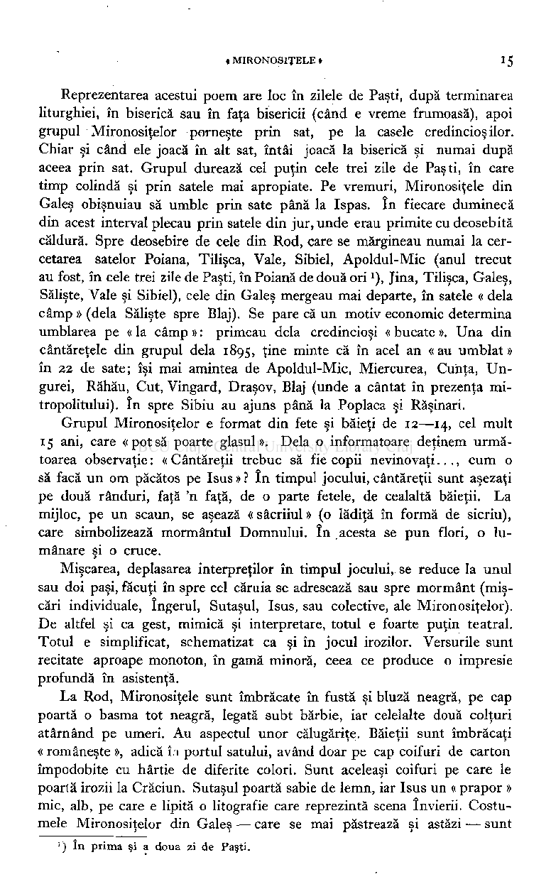

Reprezentarea acestui poem are loc în zilele de Paşti, după terminarea liturghiei, în biserică sau în faţa bisericii (când e vreme frumoasă), apoi grupul Mironosiţelor porneşte prin sat, pe la casele credincioşilor. Chiar şi când ele joacă în alt sat, întâi joacă la biserică şi numai după aceea prin sat. Grupul durează cel puţin cele trei zile de Paşti, în care timp colindă şi prin satele mai apropiate. Pe vremuri, Mironosiţele din Galeş obişnuiau să umble prin sate până la Ispas. în fiecare duminecă din acest interval plecau prin satele din jur, unde erau primite cu deosebită căldură. Spre deosebire de cele din Rod, care se mărgineau numai la cercetarea satelor Poiana, Tilişca, Vale, Sibiel, Apoldul-Mic (anul trecut au fost, în cele trei zile de Paşti, în Poiană de două ori

), Jina, Tilişca, Galeş, Sălişte, Vale şi Sibiel), cele din Galeş mergeau mai departe, în satele « delà câmp » (delà Sălişte spre Blaj). Se pare că un motiv economic determina umblarea pe «la câmp»: primeau delà credincioşi «bucate». Una din cântăreţele din grupul delà 1895, ţine minte că în acel an « au umblat » în 22 de sate; îşi mai amintea de Apoldul-Mic, Miercurea, Cuhţa, Ungurei, Răhău, Cut, Vingard, Draşov, Blaj (unde a cântat în prezenţa mitropolitului), în spre Sibiu au ajuns până la Poplaca şi Răşinari.

1

Grupul Mironosiţelor e format din fete şi băieţi de 12—14, cel mult 15 ani, care «potsă poarte glasul». Delà o informatoare deţinem următoarea observaţie: «Cântăreţii trebue să fie copii nevinovaţi..., cum o să facă un om păcătos pe Isus » ? în timpul jocului, cântăreţii sunt aşezaţi pe două rânduri, faţă 'n faţă, de o parte fetele, de cealaltă băieţii. La mijloc, pe un scaun, se aşează « sâcriiul » (o lădiţă în formă de sicriu), care simbolizează mormântul Domnului. în acesta se pun flori, o lumânare şi o cruce.

Mişcarea, deplasarea interpreţilor în timpul jocului, se reduce la unul sau doi paşi, făcuţi în spre cel căruia se adresează sau spre mormânt (mişcări individuale, îngerul, Sutaşul, Isus, sau colective, ale Mironosiţelor). De altfel şi ca gest, mimică şi interpretare, totul e foarte puţin teatral. Totul e simplificat, schematizat ca şi în jocul irozilor. Versurile sunt recitate aproape monoton, în gamă minoră, ceea ce produce o impresie profundă în asistenţă.

La Rod, Mironosiţele sunt îmbrăcate în fustă şi bluză neagră, pe cap poartă o basma tot neagră, legată subt bărbie, iar celelalte două colţuri atârnând pe umeri. Au aspectul unor călugăriţe. Băieţii sunt îmbrăcaţi « româneşte », adică Li portul satului, având doar pe cap coifuri de carton împodobite cu hârtie de diferite colori. Sunt aceleaşi coifuri pe care le poartă irozii la Crăciun. Sutaşul poartă sabie de lemn, iar Isus un « prapor » mic, alb, pe care e lipită o litografie care reprezintă scena învierii. Costumele Mironosiţelor din Galeş — care se mai păstrează şi astăzi — sunt

') în prima şi a doua zi de Paşti.

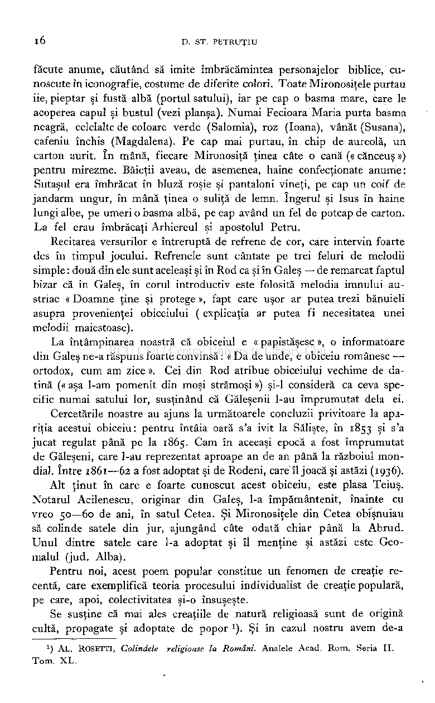

făcute anume, căutând să imite îmbrăcămintea personajelor biblice, cunoscute în iconografie, costume de diferite colori. Toate Mironosiţele purtau iie, pieptar şi fustă albă (portul satului), iar pe cap o basma mare, care le acoperea capul şi bustul (vezi planşa). Numai Fecioara Maria purta basma neagră, celelalte de coloare verde (Salomia), roz (Ioana), vânăt (Susana), cafeniu închis (Magdalena). Pe cap mai purtau, în chip de aureolă, un carton aurit. în mână, fiecare Mironosiţă ţinea câte o cană (« cănceuş ») pentru mirezme. Băieţii aveau, de asemenea, haine confecţionate anume: Sutaşul era îmbrăcat în bluză roşie şi pantaloni vineţi, pe cap un coif de

jandarm ungur, în mână ţinea o suliţă de lemn. îngerul şi Isus în haine lungi albe, pe umeri o basma albă, pe cap având un fel de potcap de carton. La fel erau îmbrăcaţi Arhiereul şi apostolul Petru.

Recitarea versurilor e întreruptă de refrene de cor, care intervin foarte des în timpul jocului. Refrenele sunt cântate pe trei feluri de melodii simple : două din ele sunt aceleaşi şi în Rod ca şi în Galeş — de remarcat faptul bizar că în Galeş, în corul introductiv este folosită melodia imnului austriac « Doamne ţine şi protege », fapt care uşor ar putea trezi bănuieli asupra provenienţei obiceiului ( explicaţia ar putea fi necesitatea unei melodii maiestoase).

La întâmpinarea noastră că obiceiul e « papistăşesc », o informatoare din Galeş ne-a răspuns foarte convinsă : « Da de unde, e obiceiu românesc ortodox, cum am zice ». Cei din Rod atribue obiceiului vechime de datină (« aşa l-am pomenit din moşi strămoşi ») şi—1 consideră ca ceva specific numai satului lor, susţinând că Găleşenii l-au împrumutat delà ei.

Cercetările noastre au ajuns la următoarele concluzii privitoare la apariţia acestui obiceiu: pentru întâia oară s'a ivit la Sălişte, în 1853 şi s'a jucat regulat până pe la 1865. Cam în aceeaşi epocă a fost împrumutat de Găleşeni, care l-au reprezentat aproape an de an până la războiul mondial, între 1861—62 a fost adoptat şi de Rodeni, care îl joacă şi astăzi (1936).

Alt ţinut în care e foarte cunoscut acest obiceiu, este plasa Teiuş. Notarul Acilenescu, originar din Galeş, 1-a împământenit, înainte cu vreo 50—60 de ani, în satul Cetea. Şi Mironosiţele din Cetea obişnuiau să colinde satele din jur, ajungând câte odată chiar până la Abrud. Unul dintre satele care 1-a adoptat şi îl menţine şi astăzi este Geomalul (jud. Alba).

Pentru noi, acest poem popular constitue un fenomen de creaţie recentă, care exemplifică teoria procesului individualist de creaţie populară, pe care, apoi, colectivitatea şi-o însuşeşte.

Se susţine că mai ales creaţiile de natură religioasă sunt de origină cultă, propagate şi adoptate de popor ). Şi în cazul nostru avem de-a

AL. ROSETTI, Colindele religioase la Români. Analele Acad. Rom. Seria II . Tom. XL .

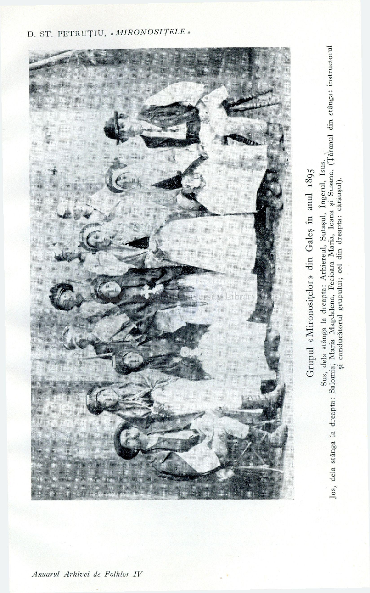

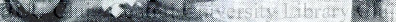

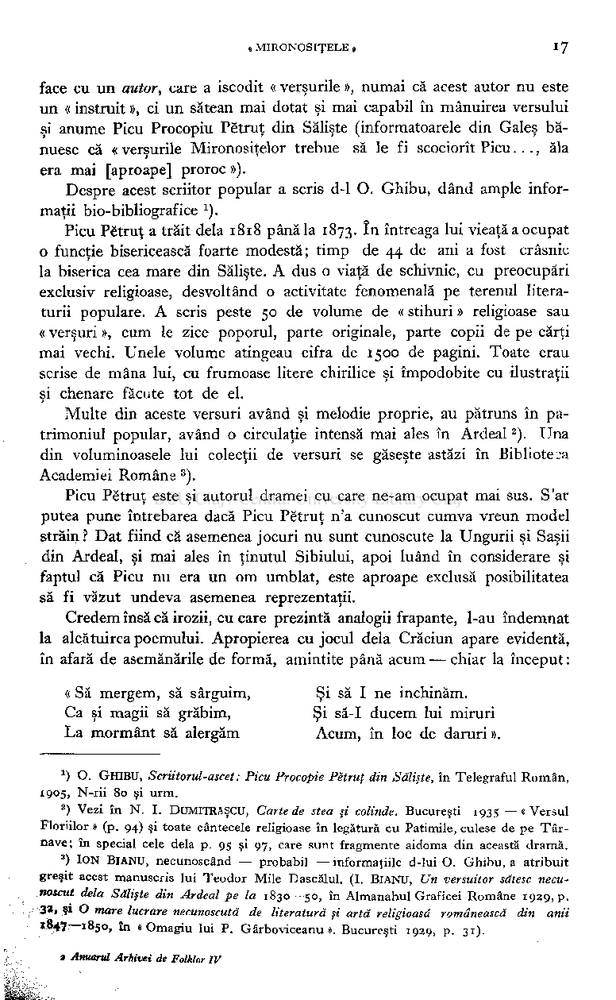

face cu un autor, care a iscodit « versurile », numai că acest autor nu este un « instruit », ci un sătean mai dotat şi mai capabil în mânuirea versului şi anume Picu Procopiu Petruţ din Sălişte (informatoarele din Galeş bănuesc că « versurile Mironosiţelor trebue să le fi scociorît Picu..., ăla era mai [aproape] proroc »).

Despre acest scriitor popular a scris d-1 O. Ghibu, dând ample informaţii bio-bibliografice ).

Picu Petruţ a trăit delà 1818 până la 1873. în întreaga lui vieaţă a ocupat o funcţie bisericească foarte modestă; timp de 44 de ani a fost crâsnic la biserica cea mare din Sălişte. A dus o viaţă de schivnic, cu preocupări exclusiv religioase, desvoltând o activitate fenomenală pe terenul literaturii populare. A scris peste 50 de volume de « stihuri » religioase sau « versuri », cum le zice poporul, parte originale, parte copii de pe cărţi mai vechi. Unele volume atingeau cifra de 1500 de pagini. Toate erau scrise de mâna lui, cu frumoase litere chirilice şi împodobite cu ilustraţii si chenare făcute tot de el.

Multe din aceste versuri având şi melodie proprie, au pătruns în patrimoniul popular, având o circulaţie intensă mai ales în Ardeal

). Una din voluminoasele lui colecţii de versuri se găseşte astăzi în Biblioteca Academiei Române ).

2

Picu Petruţ este şi autorul dramei cu care ne-am ocupat mai sus. S'ar putea pune întrebarea dacă Picu Petruţ n'a cunoscut cumva vreun model străin? Dat fiind că asemenea jocuri nu sunt cunoscute la Ungurii şi Saşii din Ardeal, şi mai ales în ţinutul Sibiului, apoi luând în considerare şi faptul că Picu nu era un om umblat, este aproape exclusă posibilitatea să fi văzut undeva asemenea reprezentaţii.

Credem însă că irozii, cu care prezintă analogii frapante, l-au îndemnat la alcătuirea poemului. Apropierea cu jocul delà Crăciun apare evidentă, în afară de asemănările de formă, amintite până acum — chiar la început:

« Să mergem, să sârguim, Şi să I ne închinăm. Ca şi magii să grăbim, Şi să-I ducem lui miruri La mormânt să alergăm Acum, în loc de daruri ».

) O. GHIBU, Scriitorul-ascet: Picu Procopie Petruţ din Sălişte, în Telegraful Român, 1905 N-rii 8 0 şi urm.

1

) Vezi în N . I. DUMITRAŞCU, Carte de stea şi colinde. Bucureşti193 5 — «Versul Floriilor » (p. 94 ) şi toate cântecele religioase în legătură cu Patimile, culese de pe Târ nave; în special cele delà p. 9 5 şi 97 care sunt fragmente aidoma din această dramă.

2

) ION BlANU, necunoscând — probabil —informaţiile d-lui O. Ghibu, a atribuit greşit acest manuscris lui Teodor Mile Dascălul. (I. BlANU, Un versuitor sătesc necunoscut delà Sălişte din Ardeal pe la 1830—50 , în Almanahul Graficei Române 1929 , p. 33, Şi O mare lucrare necunoscută de literatură şi artă religioasă românească din anii 184 7 1850 , în «Omagiu lui P. Gârboviceanu ». Bucureşti1929 , p.31) .

3

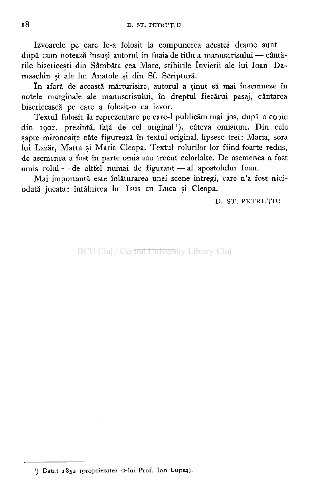

Izvoarele pe care le-a folosit la compunerea acestei drame sunt după cum notează însuşi autorul în foaia de titlu a manuscrisului — cântările bisericeşti din Sâmbăta cea Mare, stihirile învierii ale lui loan Damaschin şi ale lui Anatole şi din Sf. Scriptură.

în afară de această mărturisire, autorul a ţinut să mai însemneze în notele marginale ale manuscrisului, în dreptul fiecărui pasaj, cântarea bisericească pe care a folosit-o ca izvor.

Textul folosit la reprezentare pe care-1 publicăm mai jos, după o copie din 1902, prezintă, faţă de cel original

), câteva omisiuni. Din cele şapte mironosiţe câte figurează în textul original, lipsesc trei : Maria, sora lui Lazăr, Marta şi Maria Cleopa. Textul rolurilor lor fiind foarte redus, de asemenea a fost în parte omis sau trecut celorlalte. De asemenea a fost omis rolul — de altfel numai de figurant — al apostolului loan.

1

Mai importantă este înlăturarea unei scene întregi, care n'a fost niciodată jucată: întâlnirea lui Isus cu Luca şi Cleopa.

D. ST . PETRUŢI U

Datat185 2 (proprietatea d-lui Prof. Ion Lupaş).

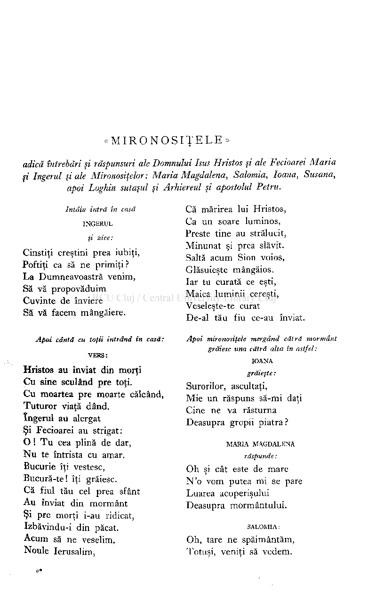

## «MIRONOSIŢELE »

adică întrebări şi răspunsuri ale Domnului Isus Hristos şi ale Fecioarei Maria şi îngerul şi ale Mironosiţelor: Maria Magdalena, Salomia, Ioana, Susana,

apoi Loghin sutaşul şi Arhiereul şi apostolul Petru.

Că mărirea lui Hristos, Ca un soare luminos, Preste tine au strălucit, Minunat şi prea slăvit. Saltă acum Sion voios, Glăsuieşte mângăios. Iar tu curată ce eşti, Maica luminii cereşti, Veseleşte-te curat De-al tău fiu ce-au înviat.

Intâiu intră în casă

### ÎNGERUL

şi zice:

Cinstiţi creştini prea iubiţi, Poftiţi ca să ne primiţi ? La Dumneavoastră venim, Să vă propovăduim Cuvinte de înviere Să vă facem mângâiere.

Apoi mironosiţele mergând cătră mormânt grăiesc una cătră alta în astfel:

Apoi cântă cu toţii intrând în casă:

### VERS :

### IOANA

Hristos au înviat din morţi Cu sine sculând pre toţi. Cu moartea pre moarte călcând, Tuturor viaţă dând. îngerul au alergat Şi Fecioarei au strigat: O ! Tu cea plină de dar, Nu te întrista cu amar. Bucurie îţi vestesc, Bucură-te! îţi grăiesc. Că fiul tău cel prea sfânt Au înviat din mormânt Şi pre morţi i-au ridicat, Izbăvindu-i din păcat. Acum să ne veselim, Noule Ierusalim,

grăieşte :

Surorilor, ascultaţi, Mie un răspuns să-mi daţi Cine ne va răsturna Deasupra gropii piatra ?

### MARIA MAGDALEN A

răspunde :

Oh şi cât este de mare N'o vom putea mi se pare Luarea acoperişului Deasupra mormântului.

### SALOMIA:

Oh, tare ne spăimântăm, Totuşi, veniţi să vedem.

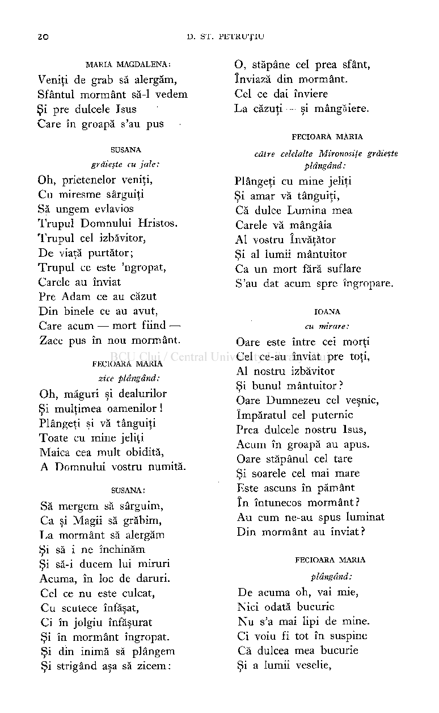

O, stăpâne cel prea sfânt, înviază din mormânt. Cel ce dai înviere La căzuţi — şi mângâiere.

### MARIA MAGDALEN A :

Veniţi de grab să alergăm, Sfântul mormânt să-1 vedem Şi pre dulcele Isus Care în groapă s'au pus

### FECIOARA MARI A

### SUSANA

către celelalte Mironosiţe grăieşte plângând:

grăieşte cu jale:

Oh, prietenelor veniţi, Cu miresme sârguiţi Să ungem evlavios Trupul Domnului Hristos. Trupul cel izbăvitor, De viaţă purtător; Trupul ce este 'ngropat, Carele au înviat Pre Adam ce au căzut Din binele ce au avut, Care acum — mort fiind Zace pus în nou mormânt.

Plângeţi cu mine jeliţi Şi amar vă tânguiţi, Că dulce Lumina mea Carele vă mângâia Al vostru învăţător Şi al lumii mântuitor Ca un mort fără suflare S'au dat acum spre îngropare.

### IOANA

eu mirare:

Oare este între cei morţi Cel ce-au înviat pre toţi, Al nostru izbăvitor Şi bunul mântuitor? Oare Dumnezeu cel veşnic, împăratul cel puternic Prea dulcele nostru Isus, Acum în groapă au apus. Oare stăpânul cel tare Şi soarele cel mai mare Este ascuns în pământ în întunecos mormânt? Au cum ne-au spus luminat Din mormânt au înviat?

### FECIOARA MARI A

zice plângând:

Oh, măguri şi dealurilor Şi mulţimea oamenilor ! Plângeţi şi vă tânguiţi Toate cu mine jeliţi Maica cea mult obidită, A Domnului vostru numită.

### SUSANA :

Să mergem să sârguim, Ca şi Magii să grăbim, La mormânt să alergăm Şi să i ne închinăm Şi să-i ducem lui miruri Acuma, în loc de daruri. Cel ce nu este culcat, Cu scutece înfăşat, Ci în jolgiu înfăşurat Şi în mormânt îngropat. Şi din inimă să plângem Şi strigând aşa să zicem:

### FECIOARA MARIA

plângând:

De acuma oh, vai mie, Nici odată bucurie Nu s'a mai lipi de mine. Ci voiu fi tot în suspine Că dulcea mea bucurie Şi a lumii veselie,

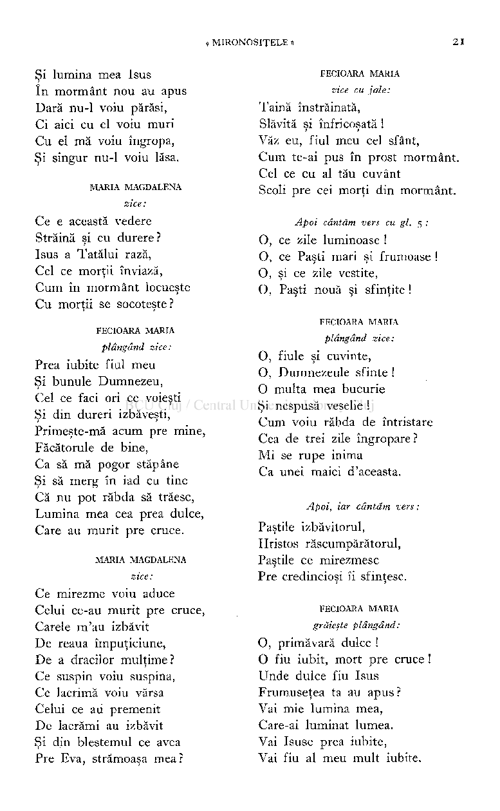

Şi lumina mea Isus în mormânt nou au apus Dară nu-1 voiu părăsi, Ci aici cu el voiu muri Cu el mă voiu îngropa, Şi singur nu-1 voiu lăsa.

### FECIOARA MARIA

zice cu jale:

Taină înstrăinată, Slăvită şi înfricoşată ! Văz eu, fiul meu cel sfânt, Cum te-ai pus în prost mormânt. Cel ce cu al tău cuvânt Scoli pre cei morţi din mormânt.

### MARIA MAGDALENA

zice :

Ce e această vedere Străină şi cu durere ? Isus a Tatălui rază, Cel ce morţii înviază, Cum în mormânt locueşte Cu morţii se socoteşte ?

Apoi cântăm vers cu gl. 5 ;

O, ce zile luminoase ! O, ce Paşti mari şi frumoase ! O, şi ce zile vestite, O, Paşti nouă şi sfinţite !

### FECIOARA MARIA

### FECIOARA MARIA

plângând zice:

plângând zice:

O, fiule şi cuvinte, O, Dumnezeule sfinte ! O multa mea bucurie Şi nespusă veselie ! Cum voiu răbda de întristare Cea de trei zile îngropare? Mi se rupe inima Ca unei maici d'aceasta.

Prea iubite fiul meu Şi bunule Dumnezeu, Cel ce faci ori ce voieşti Şi din dureri izbăveşti, Primeşte-mă acum pre mine, Făcătorule de bine, Ca să mă pogor stăpâne Şi să merg în iad cu tine Că nu pot răbda să trăesc, Lumina mea cea prea dulce, Care au murit pre cruce.

Apoi, iar cântăm vers :

Pastile izbăvitorul, Hristos răscumpărătorul, Pastile ce mirezmesc Pre credincioşi îi sfinţesc.

### MARIA MAGDALENA

zice :

Ce mirezme voiu aduce Celui ce-au murit pre cruce, Carele m'au izbăvit De reaua împuţiciune, De a dracilor mulţime ? Ce suspin voiu suspina, Ce lacrimă voiu vărsa Celui ce aii premenit De lacrămi au izbăvit Şi din blestemul ce avea Pre Eva, strămoaşa mea ?

### FECIOARA MARI A

grăieşte plângând:

O, primăvară dulce ! O fiu iubit, mort pre cruce ! Unde dulce fiu Isus Frumuseţea ta au apus ? Vai mie lumina mea, Care-ai luminat lumea. Vai Isuse prea iubite, Vai fiu al meu mult iubite.

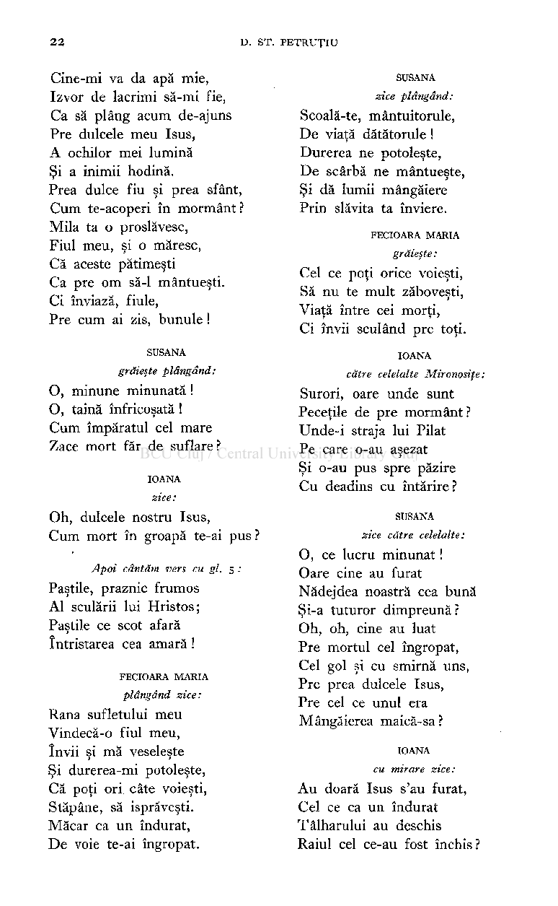

Cine-mi va da apă mie, Izvor de lacrimi să-mi fie, Ca să plâng acum de-ajuns Pre dulcele meu Isus, A ochilor mei lumină Şi a inimii hodină. Prea dulce fiu şi prea sfânt, Cum te-acoperi în mormânt? Mila ta o proslăvesc, Fiul meu, şi o măresc, Că aceste pătimeşti Ca pre om să-1 mântueşti. Ci înviază, fiule, Pre cum ai zis, bunule !

### SUSANA

zice plângând:

Scoală-te, mântuitorule, De viaţă dătătorule ! Durerea ne potoleşte, De scârbă ne mântueşte, Şi dă lumii mângâiere Prin slăvită ta înviere.

### FECIOARA MARIA

grăieşte :

Cel ce poţi orice voieşti, Să nu te mult zăboveşti, Viaţă între cei morţi, Ci învii sculând pre toţi.

### SUSANA

### IOANA

grăieşte plângând:

către celelalte Mironosiţe:

O, minune minunată ! O, taină înfricoşată ! Cum împăratul cel mare Zace mort făr de suflare ?

Surori, oare unde sunt Peceţile de pre mormânt? Unde-i straja lui Pilat Pe care o-au aşezat Şi o-au pus spre păzire Cu deadins cu întărire?

### IOANA

zice :

Oh, dulcele nostru Isus, Cum mort în groapă te-ai pus?

### SUSANA

zice către celelalte:

O, ce lucru minunat ! Oare cine au furat Nădejdea noastră cea bună Şi-a tuturor dimpreună? Oh, oh, cine au luat Pre mortul cel îngropat, Cel gol şi cu smirnă uns, Pre prea dulcele Isus, Pre cel ce unul era Mângâierea maică-sa?

Apoi cântăm vers cu gl. 5 :

Pastile, praznic frumos Al sculării lui Hristos; Pastile ce scot afară întristarea cea amară !

### FECIOARA MARI A

plângând zice:

Rana sufletului meu Vindecă-o fiul meu, învii şi mă veseleşte Şi durerea-mi potoleşte, Că poţi ori câte voieşti, Stăpâne, să isprăveşti. Măcar ca un îndurat, De voie te-ai îngropat.

### IOANA

cu mirare zice:

Au doară Isus s'au furat, Cel ce ca un îndurat Tâlharului au deschis Raiul cel ce-au fost închis?

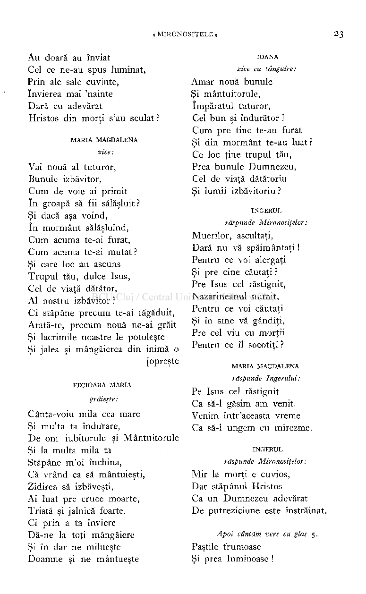

Au doară au înviat Cel ce ne-au spus luminat, Prin ale sale cuvinte, învierea mai 'nainte Dară cu adevărat Hristos din morţi s'au sculat ?

### IOANA

zice cu tânguire:

Amar nouă bunule Şi mântuitorule, împăratul tuturor, Cel bun şi îndurător ! Cum pre tine te-au furat Şi din mormânt te-au luat? Ce loc ţine trupul tău, Prea bunule Dumnezeu, Cel de viaţă dătătoriu Şi lumii izbăvitoriu ?

### MARIA MAGDALENA

zice :

Vai nouă al tuturor, Bunule izbăvitor, Cum de voie ai primit în groapă să fii sălăşluit? Şi dacă aşa voind, în mormânt sălăşluind, Cum acuma te-ai furat, Cum acuma te-ai mutat ? Şi care loc au ascuns Trupul tău, dulce Isus, Cel de viaţă dătător, Al nostru izbăvitor? Ci stăpâne precum te-ai făgăduit, Arată-te, precum nouă ne-ai grăit Şi lacrimile noastre le potoleşte Şi jalea şi mângâierea din inimă o

### ÎNGERUL

răspunde Mironosiţelor:

Muerilor, ascultaţi, Dară nu vă spăimântaţi ! Pentru ce voi alergaţi Şi pre cine căutaţi ? Pre Isus cel răstignit, Nazarineanul numit, Pentru ce voi căutaţi Şi în sine vă gândiţi, Pre cel viu cu morţii Pentru ce îl socotiţi ?

[opreşte

### MARIA MAGDALENA

răspunde îngerului:

### FECIOARA MARIA

Pe Isus cel răstignit Ca să-1 găsim am venit. Venim într'aceasta vreme Ca să-1 ungem cu mirezme.

grăieşte :

Cânta-voiu mila cea mare Şi multa ta îndurare, De om iubitorule şi Mântuitorule Şi la multa mila ta Stăpâne m'oi închina, Că vrând ca să mântuieşti, Zidirea să izbăveşti, Ai luat pre cruce moarte, Tristă şi jalnică foarte. Ci prin a ta înviere Dă-ne la toţi mângâiere Şi în dar ne milueşte Doamne şi ne mântueşte

### ÎNGERUL

răspunde Mironosiţelor :

Mir la morţi e cuvios, Dar stăpânul Hristos Ca un Dumnezeu adevărat De putreziciune este înstrăinat.

Apoi cântăm vers cu glas 5.

Pastile frumoase Şi prea luminoase !

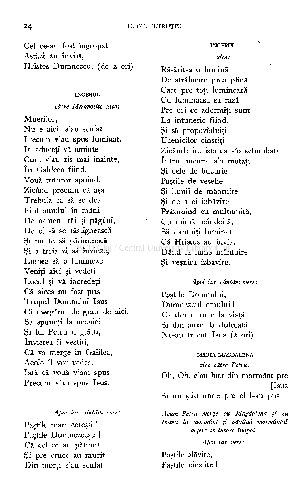

Cel ce-au fost îngropat Astăzi au înviat, Hristos Dumnezeu, (de 2 ori)

### ÎNGERUL

zice:

- Răsărit-a o lumină De strălucire prea plină, Care pre toţi luminează Cu luminoasa sa rază Pre cei ce adormiţi sunt La întuneric fiind. Şi să propovăduiţi. Ucenicilor cinstiţi Zicând: întristarea s'o schimbaţi întru bucurie s'o mutaţi Şi cele de bucurie Pastile de veselie Şi lumii de mântuire Şi de a ei izbăvire, Prăznuind cu mulţumită, Cu inimă neîndoită,
- Să dănţuiţi luminat Că Hristos au înviat, Dând la lume mântuire Şi veşnică izbăvire.

### ÎNGERUL

către Mironosiţe zice:

Muerilor, Nu e aici, s'au sculat Precum v'au spus luminat. Ia aduceţi-vă aminte Cum v'au zis mai înainte, în Galileea fiind, Vouă tuturor spuind, Zicând precum că aşa Trebuia ca să se dea Fiul omului în mâni De oameni răi şi păgâni, De ei să se răstignească Şi multe să pătimească Şi a treia zi să învieze, Lumea să o lumineze. Veniţi aici şi vedeţi Locul şi vă încredeţi Că aicea au fost pus Trupul Domnului Isus. Ci mergând de grab de aici, Să spuneţi la ucenici Şi lui Petru îi grăiţi, învierea îi vestiţi, Că va merge în Galilea, Acolo îl vor vedea. Iată că vouă v'am spus Precum v'au spus Isus.

Apoi iar cântăm vers:

Pastile Domnului, Dumnezeul omului ! Că din moarte la viaţă Şi din amar la dulceaţă Ne-au trecut Isus (2 ori)

### MARIA MAGDALEN A

zice către Petru:

Oh, Oh, c'au luat din mormânt pre

[Isus Şi nu ştiu unde pre el l-au pus !

Apoi iar cântăm vers:

Acum Petru merge cu Magdalena şi cu Ioana la mormânt şi văzând mormântul deşert se întorc înapoi.

Pastile mari cereşti ! Pastile Dumnezeeşti ! Că cel ce au pătimit Şi pre cruce au murit Din morţi s'au sculat.

Apoi iar vers:

Pastile slăvite, Pastile cinstite !

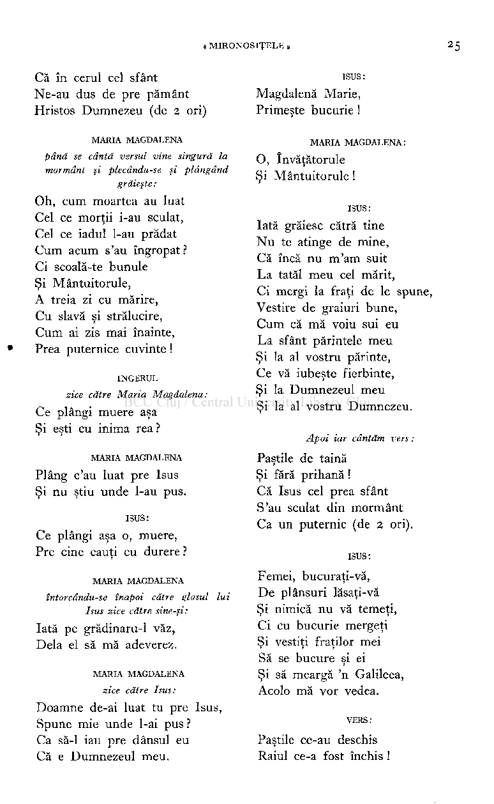

Că în cerul cel sfânt Ne-au dus de pre pământ Hristos Dumnezeu (de 2 ori)

### ISUS:

Magdalena Marie, Primeşte bucurie !

### MARIA MAGDALENA

### MARI A MAGDALENA :

până se cântă versul vine singură la mormânt şi plecându-se şi plângând

O, învăţătorule Şi Mântuitorule !

grăieşte:

Oh, cum moartea au luat Cel ce morţii i-au sculat, Cel ce iadul l-au prădat Cum acum s'au îngropat? Ci scoală-te bunule Şi Mântuitorule, A treia zi cu mărire, Cu slavă şi strălucire, Cum ai zis mai înainte, Prea puternice cuvinte !

### ISUS :

Iată grăiesc cătră tine Nu te atinge de mine, Că încă nu m'am suit La tatăl meu cel mărit, Ci mergi la fraţi de le spune, Vestire de graiuri bune, Cum că mă voiu sui eu La sfânt părintele meu Şi la al vostru părinte, Ce vă iubeşte fierbinte, Şi la Dumnezeul meu Şi la al vostru Dumnezeu.

### ÎNGERUL

zice către Maria Magdalena:

Ce plângi muere aşa Şi eşti cu inima rea?

Apoi iar cântăm vers :

Pastile de taină Şi fără prihană ! Că Isus cel prea sfânt S'au sculat din mormânt Ca un puternic (de 2 ori).

### MARIA MAGDALENA

Plâng c'au luat pre Isus Şi nu ştiu unde l-au pus.

### ISUS:

Ce plângi aşa o, muere, Pre cine cauţi cu durere?

### ISUS:

Femei, bucuraţi-vă, De plânsuri lăsaţi-vă Şi nimica nu vă temeţi, Ci cu bucurie mergeţi Şi vestiţi fraţilor mei Să se bucure şi ei Şi să meargă 'n Galileea, Acolo mă vor vedea.

### MARIA MAGDALEN A

întorcăndu-se înapoi către glasul lui Isus zice către sine-şi:

Iată pe grădinaru-1 văz, Delà el să mă adeverez.

### MARIA MAGDALEN A

zice către Isus:

Doamne de-ai luat tu pre Isus, Spune mie unde l-ai pus ? Ca să-1 iau pre dânsul eu Că e Dumnezeul meu.

### VERS:

Pastile ce-au deschis Raiul ce-a fost închis !

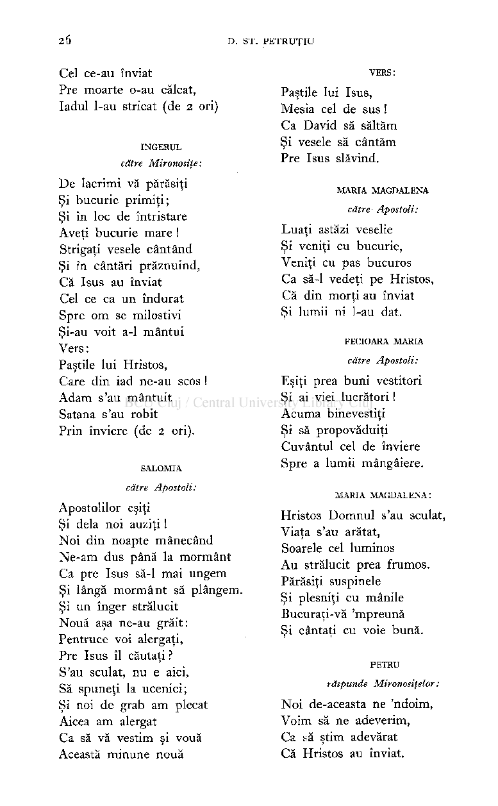

Cel ce-au înviat Pre moarte o-au călcat, Iadul l-au stricat (de 2 ori)

### VERS :

Pastile lui Isus, Mesia cel de sus ! Ca David să săltăm Şi vesele să cântăm Pre Isus slăvind.

### ÎNGERUL

către Mironosiţe:

De lacrimi vă părăsiţi Şi bucurie primiţi; Şi în loc de întristare Aveţi bucurie mare ! Strigaţi vesele cântând Şi în cântări prăznuind, Că Isus au înviat Cel ce ca un îndurat Spre om se milostivi Şi-au voit a-1 mântui Vers: Pastile lui Hristos, Care din iad ne-au scos ! Adam s'au mântuit Satana s'au robit Prin înviere (de 2 ori).

### MARIA MAGDALENA

către Apostoli:

Luaţi astăzi veselie Şi veniţi cu bucurie, Veniţi cu pas bucuros Ca să-1 vedeţi pe Hristos, Că din morţi au înviat Şi lumii ni l-au dat.

### FECIOARA MARIA

către Apostoli:

Eşiţi prea buni vestitori Şi ai viei lucrători ! Acuma binevestiţi Şi să propovăduiţi Cuvântul cel de înviere Spre a lumii mângâiere.

### SALOMIA

către Apostoli:

### MARIA MAGDALENA :

Apostolilor eşiţi Şi delà noi auziţi ! Noi din noapte mânecând Ne-am dus până la mormânt Ca pre Isus să-1 mai ungem Şi lângă mormânt să plângem. Şi un înger strălucit Nouă aşa ne-au grăit: Pentruce voi alergaţi, Pre Isus îl căutaţi ? S'au sculat, nu e aici, Să spuneţi la ucenici; Şi noi de grab am plecat Aicea am alergat Ca să vă vestim şi vouă Această minune nouă

Hristos Domnul s'au sculat, Viaţa s'au arătat, Soarele cel luminos Au strălucit prea frumos. Părăsiţi suspinele Şi plesniţi cu manile Bucuraţi-vă 'mpreună Şi cântaţi cu voie bună.

### PETRU

răspunde Mironosiţelor :

Noi de-aceasta ne 'ndoim, Voim să ne adeverim, Ca să ştim adevărat Că Hristos au înviat.

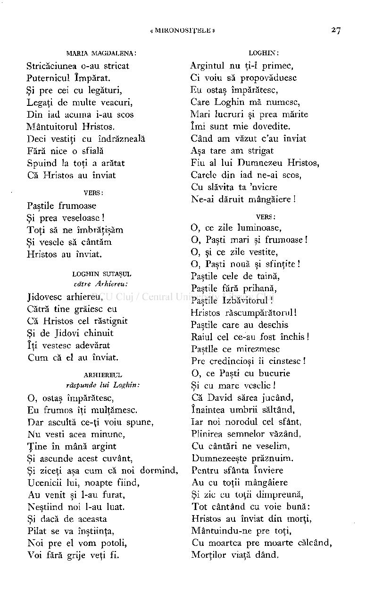

### LOGHIN :

### MARIA MAGDALENA :

Argintul nu ţi—1 primée, Ci voiu să propovăduesc Eu ostaş împărătesc, Care Loghin mă numesc, Mari lucruri şi prea mărite îmi sunt mie dovedite. Când am văzut c'au înviat Aşa tare am strigat Fiu al lui Dumnezeu Hristos, Carele din iad ne-ai scos, Cu slăvită ta 'nviere Ne-ai dăruit mângâiere !

Stricăciunea o-au stricat Puternicul împărat. Şi pre cei cu legături, Legaţi de multe veacuri, Din iad acuma i-au scos Mântuitorul Hristos. Deci vestiţi cu îndrăzneală Fără nice o sfială Spuind la toţi a arătat Că Hristos au înviat

### VERS :

Pastile frumoase Şi prea veseloase ! Toţi să ne îmbrăţişăm Şi vesele să cântăm Hristos au înviat.

### VERS :

O, ce zile luminoase, O, Paşti mari şi frumoase ! O, şi ce zile vestite, O, Paşti nouă şi sfinţite ! Pastile cele de taină, Pastile fără prihană, Pastile Izbăvitorul ! Hristos răscumpărătorul ! Pastile care au deschis Raiul cel ce-au fost închis ! Pastile ce mirezmesc Pre credincioşi îi cinstesc ! O, ce Paşti cu bucurie Şi cu mare veselie ! Că David sărea jucând, înaintea umbrii săltând, Iar noi norodul cel sfânt, Plinirea semnelor văzând, Cu cântări ne veselim, Dumnezeeşte prăznuim. Pentru sfânta înviere Au cu toţii mângâiere Şi zic cu toţii dimpreună, Tot cântând cu voie bună: Hristos au înviat din morţi, Mântuindu-ne pre toţi, Cu moartea pre moarte călcând, Morţilor viaţă dând.

### LOGHIN SUTAŞUL

către Arhiereu:

Jidovesc arhiereu, Cătră tine grăiesc eu Că Hristos cel răstignit Şi de Jidovi chinuit îţi vestesc adevărat Cum că el au înviat.

### ARHIEREUL

răspunde lui Loghin:

O, ostaş împărătesc, Eu frumos îţi mulţămesc. Dar ascultă ce-ţi voiu spune, Nu vesti acea minune, Ţine în mână argint Şi ascunde acest cuvânt, Şi ziceţi aşa cum că noi dormind, Ucenicii lui, noapte fiind, Au venit şi l-au furat, Neştiind noi l-au luat. Şi dacă de aceasta Pilat se va înştiinţa, Noi pre el vom potoli, Voi fără grije veţi fi.

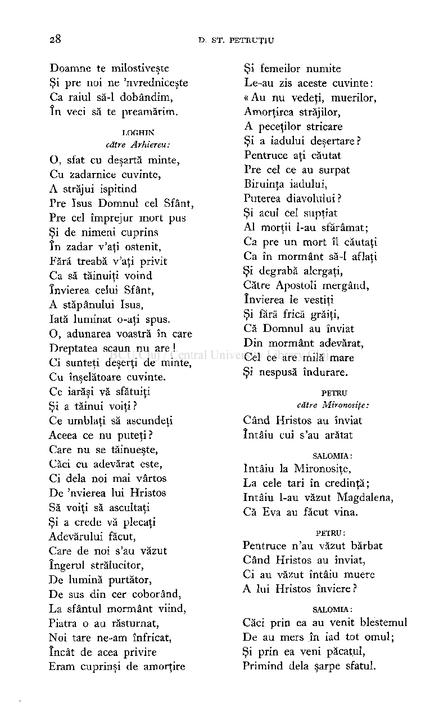

Doamne te milostiveste Şi pre noi ne 'nvredniceşte Ca raiul să-1 dobândim, în veci să te preamărim.

Şi femeilor numite Le-au zis aceste cuvinte: « Au nu vedeţi, muerilor, Amorţirea străjilor, A peceţilor stricare Şi a iadului deşertare? Pentruce aţi căutat Pre cel ce au surpat Biruinţa iadului, Puterea diavolului? Şi acul cel supţiat Al morţii l-au sfărâmat; Ca pre un mort îl căutaţi Ca în mormânt să-1 aflaţi Şi degrabă alergaţi, Către Apostoli mergând, învierea le vestiţi Şi fără frică grăiţi, Că Domnul au înviat Din mormânt adevărat, Cel ce are milă mare Şi nespusă îndurare.

### LOGHI N

către Arhiereu:

O, sfat cu deşartă minte, Cu zadarnice cuvinte, A străjui ispitind Pre Isus Domnul cel Sfânt, Pre cel împrejur mort pus Şi de nimeni cuprins în zadar v'aţi ostenit, Fără treabă v'aţi privit Ca să tăinuiţi voind învierea celui Sfânt, A stăpânului Isus, Iată luminat o-aţi spus. O, adunarea voastră în care Dreptatea scaun nu are ! Ci sunteţi deşerţi de minte, Cu înşelătoare cuvinte. Ce iarăşi vă sfătuiţi Şi a tăinui voiţi? Ce umblaţi să ascundeţi Aceea ce nu puteţi? Care nu se tăinueşte, Căci cu adevărat este, Ci delà noi mai vârtos De 'nvierea lui Hristos Să voiţi să ascultaţi Şi a crede vă plecaţi Adevărului făcut, Care de noi s'au văzut îngerul strălucitor, De lumină purtător, De sus din cer coborând, La sfântul mormânt viind, Piatra o au răsturnat, Noi tare ne-am înfricat, încât de acea privire Eram cuprinşi de amorţire

### PETRU

către Mironosiţe:

Când Hristos au înviat întâiu cui s'au arătat

### SALOMIA:

întâiu la Mironosiţe, La cele tari în credinţă; întâiu l-au văzut Magdalena, Că Eva au făcut vina.

### PETRU :

Pentruce n'au văzut bărbat Când Hristos au înviat, Ci au văzut întâiu muere A lui Hristos înviere ?

### SALOMIA:

Căci prin ea au venit blestemul De au mers în iad tot omul; Şi prin ea veni păcatul, Primind delà şarpe sfatul.

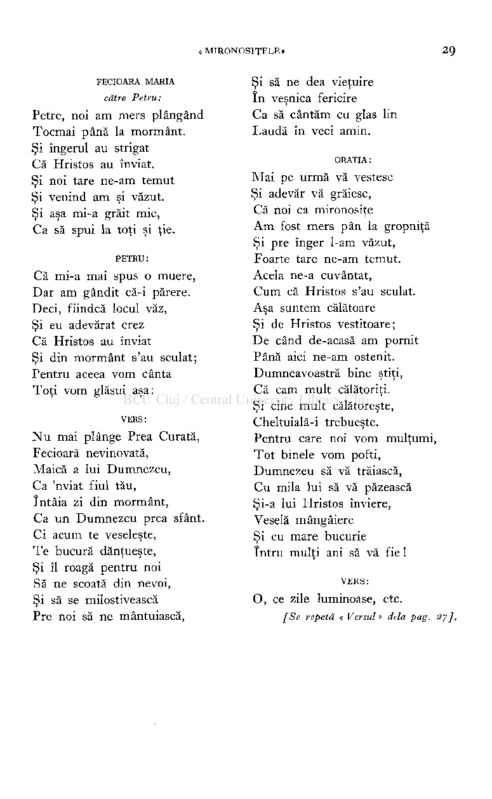

Şi să ne dea vieţuire în veşnica fericire Ca să cântăm cu glas lin Laudă în veci amin.

### FECIOARA MARIA

către Petru:

Petre, noi am mers plângând Tocmai până la mormânt. Şi îngerul au strigat Că Hristos au înviat. Şi noi tare ne-am temut Şi venind am şi văzut. Şi aşa mi-a grăit mie, Ca să spui la toţi şi ţie.

### ORAŢIA :

Mai pe urmă vă vestesc Şi adevăr vă grăiesc,

Că noi ca mironosiţe Am fost mers pân la gropniţă Şi pre înger l-am văzut, Foarte tare ne-am temut. Acela ne-a cuvântat, Cum că Hristos s'au sculat. Aşa suntem călătoare Şi de Hristos vestitoare; De când de-acasă am pornit Până aici ne-am ostenit. Dumneavoastră bine ştiţi, Că cam mult călătoriţi. Şi cine mult călătoreşte, Cheltuială-i trebueşte. Pentru care noi vom mulţumi. Tot binele vom pofti, Dumnezeu să vă trăiască, Cu mila lui să vă păzească Şi-a lui Hristos înviere, Veselă mângâiere Şi cu mare bucurie întru mulţi ani să vă fie !

### PETRU :

Că mi-a mai spus o muere, Dar am gândit că-i părere. Deci, fiindcă locul văz, Şi eu adevărat crez Că Hristos au înviat Şi din mormânt s'au sculat; Pentru aceea vom cânta Toţi vom glăsui aşa:

### VERS :

Nu mai plânge Prea Curată, Fecioară nevinovată, Maică a lui Dumnezeu, Ca 'nviat fiul tău, întâia zi din mormânt, Ca un Dumnezeu prea sfânt. Ci acum te veseleşte, Te bucură dănţueşte, Şi îl roagă pentru noi Să ne scoată din nevoi, Şi să se milostivească Pre noi să ne mântuiască,

### VER S :

O, ce zile luminoase, etc.

[Se repetă « Versul » delà pag.

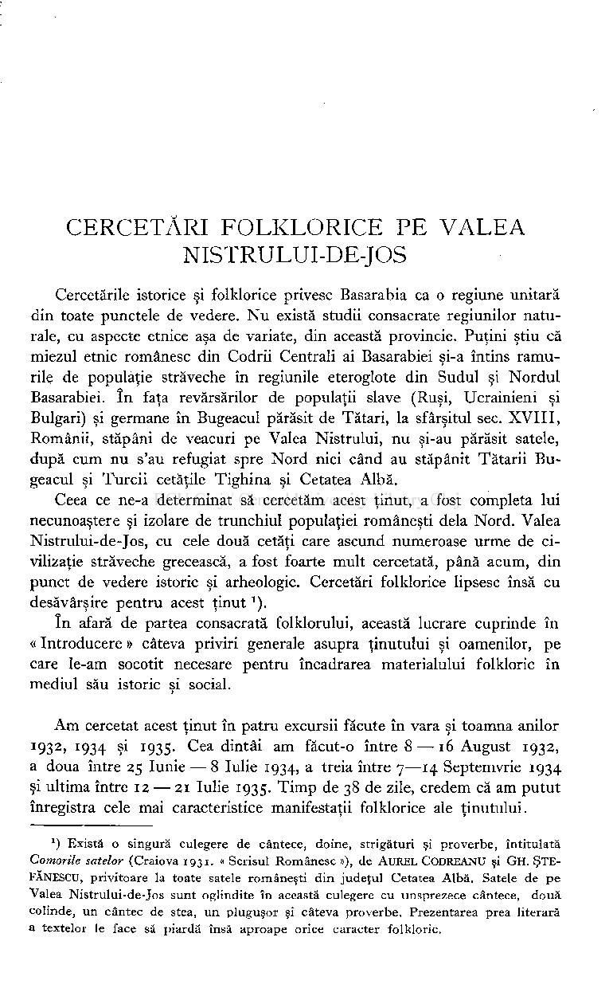

# CERCETĂRI FOLKLORICE PE VALEA NISTRULUI-DE-JOS

Cercetările istorice şi folklorice privesc Basarabia ca o regiune unitară din toate punctele de vedere. Nu există studii consacrate regiunilor naturale, cu aspecte etnice aşa de variate, din această provincie. Puţini ştiu că miezul etnic românesc din Codrii Centrali ai Basarabiei şi-a întins ramurile de populaţie străveche în regiunile eteroglote din Sudul şi Nordul Basarabiei. în faţa revărsărilor de populaţii slave (Ruşi, Ucrainieni şi Bulgari) şi germane în Bugeacul părăsit de Tătari, la sfârşitul sec. XVIII , Românii, stăpâni de veacuri pe Valea Nistrului, nu şi-au părăsit satele, după cum nu s'au refugiat spre Nord nici când au stăpânit Tătarii Bugeacul şi Turcii cetăţile Tighina şi Cetatea Albă.

Ceea ce ne-a determinat să cercetăm acest ţinut, a fost completa lui necunoaştere şi izolare de trunchiul populaţiei româneşti delà Nord. Valea Nistrului-de-Jos, cu cele două cetăţi care ascund numeroase urme de civilizaţie străveche grecească, a fost foarte mult cercetată, până acum, din punct de vedere istoric şi arheologic. Cercetări folklorice lipsesc însă cu desăvârşire pentru acest ţinut

).

1

în afară de partea consacrată folklorului, această lucrare cuprinde în « Introducere » câteva priviri generale asupra ţinutului şi oamenilor, pe care le-am socotit necesare pentru încadrarea materialului folkloric în mediul său istoric şi social.

Am cercetat acest ţinut în patru excursii făcute în vara şi toamna anilor 1932, 1934 şi 1935. Cea dintâi am făcut-o între 8 —1 6 August 1932, a doua între 25 Iunie — 8 Iulie 1934, a treia între 7—14 Septemvrie 1934 şi ultima între 12 — 21 Iulie 1935. Timp de 38 de zile, credem că am putut înregistra cele mai caracteristice manifestaţii folklorice ale ţinutului.

) Există o singură culegere de cântece, doine, strigături şi proverbe, întitulată Comorile satelor (Craiova 1931 « Scrisul Românesc »), de AURE L CODREANU şi GH. ŞTE FANESCU, privitoare la toate satele româneşti din judeţul Cetatea Albă. Satele de pe Valea Nistrului-de-Jos sunt oglindite în această culegere cu unsprezece cântece, două colinde, un cântec de stea, un pluguşor şi câteva proverbe. Prezentarea prea literară a textelor le face să piardă însă aproape orice caracter folkloric.

l

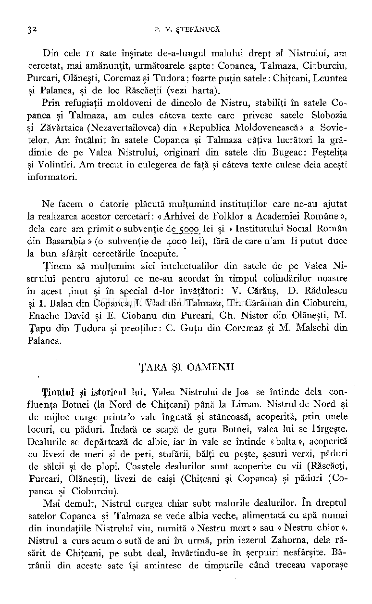

Din cele II sate înşirate de-a-lungul malului drept al Nistrului, am cercetat, mai amănunţit, următoarele şapte: Copanca, Talmaza, Cicburciu, Purcari, Olăneşti, Corcmaz şi Tudora ; foarte puţin satele : Chiţcani, Leuntea şi Palanca, şi de loc Răscăeţii (vezi harta).

Prin refugiaţii moldoveni de dincolo de Nistru, stabiliţi în satele Copanca şi Talmaza, am cules câteva texte care privesc satele Slobozia şi Zăvărtaica (Nezavertailovca) din «Republica Moldovenească» a Sovietelor. Am întâlnit în satele Copanca şi Talmaza câţiva lucrători la grădinile de pe Valea Nistrului, originari din satele din Bugeac: Feşteliţa şi Volintiri. Am trecut în culegerea de faţă şi câteva texte culese delà aceşti informatori.

Ne facem o datorie plăcută mulţumind instituţiilor care ne-au ajutat la realizarea acestor cercetări : « Arhivei de Folklor a Academiei Române », delà care am primit o subvenţie de 5000 lei şi « Institutului Social Român din Basarabia » (o subvenţie de 4000 lei), fără de care n'am fi putut duce la bun sfârşit cercetările începute.

Ţinem să mulţumim aici intelectualilor din satele de pe Valea Nistrului pentru ajutorul ce ne-au acordat în timpul colindărilor noastre în acest ţinut şi în special d-lor învăţători: V. Cărăuş, D. Rădulescu şi I. Bălan din Copanca, I. Vlad din Talmaza, Tr. Cărăman din Cioburciu, Enache David şi E. Ciobanu din Purcari, Gh. Nistor din Olăneşti, M. Ţapu din Tudora şi preoţilor: C. Guţu din Corcmaz şi M. Malschi din Palanca.

ŢAR A ŞI OAMENII

Ţinutul şi istoricul lui. Valea Nistrului-de-Jos se întinde delà con­

fluenţa Botnei (la Nord de Chiţcani) până la Liman. Nistrul de Nord şi de mijloc curge printr'o vale îngustă şi stâncoasă, acoperită, prin unele locuri, cu păduri. îndată ce scapă de gura Botnei, valea lui se lărgeşte. Dealurile se depărtează de albie, iar în vale se întinde « balta », acoperită cu livezi de meri şi de peri, stufării, bălţi cu peşte, şesuri verzi, păduri de sălcii şi de plopi. Coastele dealurilor sunt acoperite cu vii (Răscăeţi, Purcari, Olăneşti), livezi de caişi (Chiţcani şi Copanca) şi păduri (Copanca şi Cioburciu).

Mai demult, Nistrul curgea chiar subt malurile dealurilor. în dreptul satelor Copanca şi Talmaza se vede albia veche, alimentată cu apă numai din inundaţiile Nistrului viu, numită « Nestru mort » sau « Nestru chior ». Nistrul a curs acum o sută de ani în urmă, prin iezerul Zahorna, delà răsărit de Chiţcani, pe subt deal, învârtindu-se în şerpuiri nesfârşite. Bătrânii din aceste sate îşi amintesc de timpurile când treceau vaporaşe

