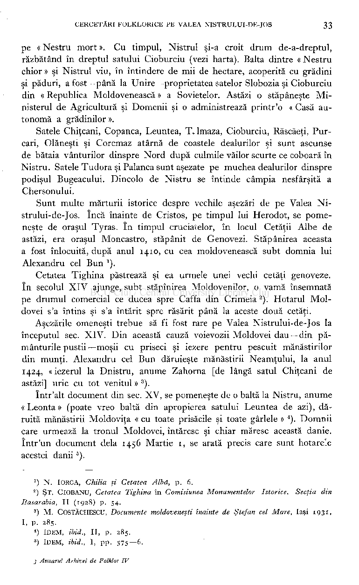

pe « Nestru mort ». Cu timpul, Nistrul şi-a croit drum de-a-dreptul, răzbătând în dreptul satului Cioburciu (vezi harta). Balta dintre « Nestru chior » şi Nistrul viu, în întindere de mii de hectare, acoperită cu grădini şi păduri, a fost-până la Unire—proprietatea satelor Slobozia şi Cioburciu din « Republica Moldovenească » a Sovietelor. Astăzi o stăpâneşte Ministerul de Agricultură şi Domenii şi o administrează printr'o « Casă autonomă a grădinilor ».

Satele Chiţcani, Copanca, Leuntea, Tdmaza, Cioburciu, Răscăeţi, Purcari, Olăneşti şi Corcmaz atârnă de coastele dealurilor şi sunt ascunse de bătaia vânturilor dinspre Nord după culmile văilor scurte ce coboară în Nistru. Satele Tudora şi Palanca sunt aşezate pe muchea dealurilor dinspre podişul Bugeacului. Dincolo de Nistru se întinde câmpia nesfârşită a Chersonului.

Sunt multe mărturii istorice despre vechile aşezări de pe Valea Nistrului-de-Jos. încă înainte de Cristos, pe timpul lui Herodot, se pomeneşte de oraşul Tyras. în timpul cruciatelor, în locul Cetăţii Albe de astăzi, era oraşul Moncastro, stăpânit de Genovezi. Stăpânirea aceasta a fost înlocuită, după anul 1410, cu cea moldovenească subt domnia lui Alexandru cel Bun ).

Cetatea Tighina păstrează şi ea urmele unei vechi cetăţi genoveze. în secolul XI V ajunge, subt stăpînirea Moldovenilor, o vamă însemnată pe drumul comercial ce ducea spre Caffa din Crimeia

). Hotarul Moldovei s'a întins şi s'a întărit spre răsărit până la aceste două cetăţi.

2

Aşezările omeneşti trebue să fi fost rare pe Valea Nistrului-de-Jos la începutul sec. XIV. Din această cauză voievozii Moldovei dau -din pământurile pustii —moşii cu priseci şi iezere pentru pescuit mănăstirilor din munţi. Alexandru cel Bun dăruieşte mănăstirii Neamţului, la anul 1424, « iezerul la Dnistru, anume Zahorna [de lângă satul Chiţcani de astăzi] uric cu tot venitul »

).

3

într'alt document din sec. XV, se pomeneşte de o baltă la Nistru, anume « Leonta » (poate vreo baltă din apropierea satului Leuntea de azi), dăruită mănăstirii Moldoviţa « cu toate prisăcile şi toate gârlele » ). Domnii care urmează la tronul Moldovei, întăresc şi chiar măresc această danie, într'un document delà 1456 Martie 1, se arată precis care sunt hotarele acestei danii ).

) N . IORGA, Chilia şi Cetatea Albă, p. 6.

J

) ŞT. ClOBANU, Cetatea Tighina în Comisiunea Monumentelor Istorice. Secţia din Basarabia, II (1928 ) p. 54 .

2

) M . COSTĂCHESCU, Documente moldoveneşti înainte de Ştefan cel Mare, Iaşi1931 , I, P. 285 .

3

- 4

) IDEM, ibid., II , p. 285 .

- 5

) IDEM, ibid., I, pp.575—6 .

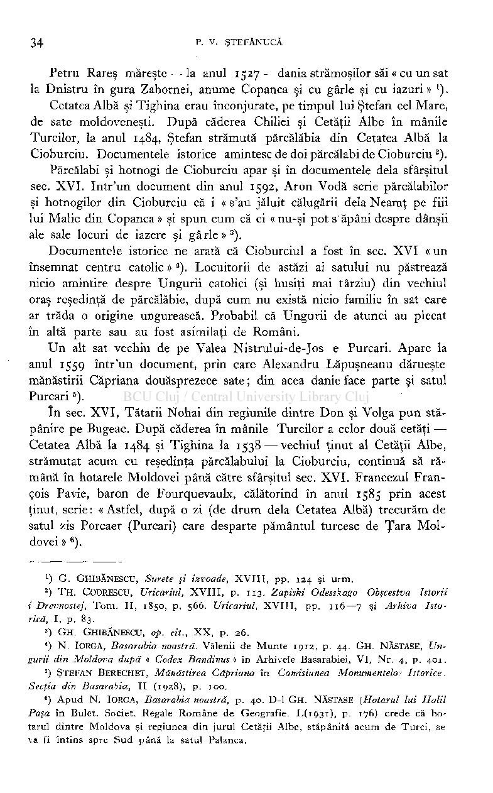

Petru Rares măreşte — la anul 1527 — dania strămoşilor săi « cu un sat la Dnistru în gura Zahornei, anume Copanca şi cu gârle şi cu iazuri »

) .

x

Cetatea Alba şi Tighina erau înconjurate, pe timpul lui Ştefan cel Mare, de sate moldoveneşti. După căderea Chiliei şi Cetăţii Albe în manile Turcilor, la anul 1484, Ştefan strămută părcălăbia din Cetatea Albă la Cioburciu. Documentele istorice amintesc de doi pârcălabi de Cioburciu ).

Pârcălabi şi hotnogi de Cioburciu apar şi în documentele delà sfârşitul sec. XVI . Intr'un document din anul 1592, Aron Vodă scrie pârcălabilor şi hotnogilor din Cioburciu că i « s'au jăluit călugării delà Neamţ pe fiii lui Malic din Copanca » şi spun cum că ei « nu-şi pot s ăpâni despre dânşii ale sale locuri de iazere şi gârle»

).

3

Documentele istorice ne arată că Cioburciul a fost în sec. XV I « un însemnat centru catolic »

). Locuitorii de astăzi ai satului nu păstrează nicio amintire despre Ungurii catolici (şi husiţi mai târziu) din vechiul oraş reşedinţă de părcălăbie, după cum nu există nicio familie în sat care ar trăda o origine ungurească. Probabil că Ungurii de atunci au plecat în altă parte sau au fost asimilaţi de Români.

4

Un alt sat vechiu de pe Valea Nistrului-de-Jos e Purcari. Apare la anul 1559 într'un document, prin care Alexandru Lăpuşneanu dărueşte mănăstirii Căpriana douăsprezece sate ; din acea danie face parte şi satul Purcari

).

5

în sec. XVI , Tătarii Nohai din regiunile dintre Don şi Volga pun stăpânire pe Bugeac. După căderea în manile Turcilor a celor două cetăţi Cetatea Albă la 1484 şi Tighina la 1538 — vechiul ţinut al Cetăţii Albe, strămutat acum cu reşedinţa pârcălabului la Cioburciu, continuă să rămână în hotarele Moldovei până către sfârşitul sec. XVI . Francezul François Pavie, baron de Fourquevaulx, călătorind în anul 1585 prin acest ţinut, scrie: «Astfel, după o zi (de drum delà Cetatea Albă) trecurăm de satul zis Porcaer (Purcari) care desparte pământul turcesc de Ţara Moldovei »

).

6

') G . GHIBĂNESCU, Surete şi izvoade, XVIII , pp. 12 4 şi urm.

) TH . CODRESCU, Uricariul, XVIII , p. 113 Zapiski Odesskago Obşcestva Istorii i Drevnostej, Tom. II , 1850 p. 566. Uricariul, XVIII , pp. 116— 7 şi Arhiva Istorică, I, p. 83 .

2

) GH. GHIBĂNESCU, op. cit., XX , p. 26 .

3

") N . IORGA, Basarabia noastră. Vălenii de Munte 1912 p. 44 GH. NĂSTASE, Ungurii din Moldova după « Codex Bandinus » în Arhivele Basarabiei, VI , Nr. 4 , p. 401 .

) ŞTEFAN BERECHET, Mănăstirea Căpriana în Comisiunea Monumentelor Istorice. Secţia din Basarabia, I I (1928) p. 100 .

5

) Apud N . IORGA, Basarabia noastră, p. 40 D-l GH. NĂSTASE {Hotarul lui Halii

6

Paşa în Bulet. Societ. Regale Române de Geografie. L (i93i) , p. 176) crede că hotarul dintre Moldova şi regiunea din jurul Cetăţii Albe, stăpânită acum de Turci, se va fi întins spre Sud până la satul Palanca.

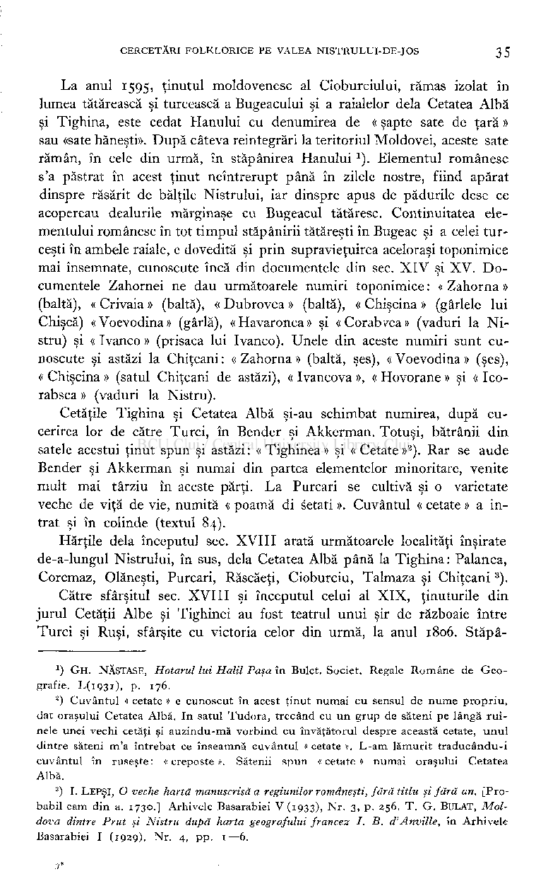

La anul 1595, ţinutul moldovenesc al Cioburciului, rămas izolat în lumea tătărească şi turcească a Bugeacului şi a raialelor delà Cetatea Albă şi Tighina, este cedat Hanului cu denumirea de « şapte sate de ţară » sau «sate hăneşti». După câteva reintegrări la teritoriul Moldovei, aceste sate rămân, în cele din urmă, în stăpânirea Hanului *). Elementul românesc s'a păstrat în acest ţinut neîntrerupt până în zilele nostre, fiind apărat dinspre răsărit de bălţile Nistrului, iar dinspre apus de pădurile dese ce acopereau dealurile mărginaşe cu Bugeacul tătăresc. Continuitatea elementului românesc în tot timpul stăpânirii tătăreşti în Bugeac şi a celei turceşti în ambele raiale, e dovedită şi prin supravieţuirea aceloraşi toponimice mai însemnate, cunoscute încă din documentele din sec. XI V şi XV. Documentele Zahornei ne dau următoarele numiri toponimice : « Zahorna » (baltă), « Crivaia » (baltă), « Dubrovca » (baltă), « Chişcina » (gârlele lui Chişcă) «Voevodina» (gârlă), «Havaronea» şi «Corabrca» (vaduri la Nistru) şi « Ivanco » (prisaca lui Ivanco). Unele din aceste numiri sunt cunoscute şi astăzi la Chiţcani : « Zahorna » (baltă, şes), « Voevodina » (şes), « Chişcina » (satul Chiţcani de astăzi), « Ivancova », « Hovorane » şi « Icorabsca » (vaduri la Nistru).

Cetăţile Tighina şi Cetatea Albă şi-au schimbat numirea, după cucerirea lor de către Turci, în Bender şi Akkerman. Totuşi, bătrânii din satele acestui ţinut spun şi astăzi : « Tighinea » şi « Cetate »

). Rar se aude Bender şi Akkerman şi numai din partea elementelor minoritare, venite mult mai târziu în aceste părţi. La Purcari se cultivă şi o varietate veche de viţă de vie, numită « poamă di setaţi ». Cuvântul « cetate » a intrat şi în colinde (textul 84).

2

Hărţile delà începutul sec. XVIII arată următoarele localităţi înşirate de-a-lungul Nistrului, în sus, delà Cetatea Albă până la Tighina: Palanca, Corcmaz, Olăneşti, Purcari, Răscăeţi, Cioburciu, Talmaza şi Chiţcani

).

3

Către sfârşitul sec. XVII I şi începutul celui al XIX , ţinuturile din jurul Cetăţii Albe şi Tighinei au fost teatrul unui şir de războaie între Turci şi Ruşi, sfârşite cu victoria celor din urmă, la anul 1806. Stăpâ-

) GH. NĂSTASE, Hotarul lui Halii Paşa în Bulet. Societ. Regale Române de Geografie. L(i93i) , p. 176.

1

) Cuvântul « cetate » e cunoscut în acest ţinut numai cu sensul de nume propriu, dat oraşului Cetatea Albă. In satul Tudora, trecând cu un grup de săteni pe lângă ruinele unei vechi cetăţi şi auzindu-mă vorbind cu învăţătorul despre această cetate, unul dintre săteni m'a întrebat ce înseamnă cuvântul « cetate ». L-am lămurit traducându-i cuvântul în ruseşte: « creposte ». Sătenii spun «cetate» numai oraşului Cetatea Albă.

2

) I. LEPŞI, O veche hartă manuscrisă a regiunilor româneşti, fără titlu şi fără an. [Probabil cam din a. 1730.] Arhivele Basarabiei V(i933) , Nr. 3, p. 256. T . G . BULAT, Moldova dintre Prut şi Nistru după harta geografului francez I. B. d'Anville, în Arhivele Basarabiei I (1929), Nr. 4, pp. 1—6.

3

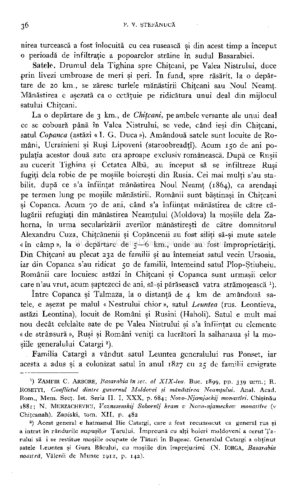

nirea turcească a fost înlocuită cu cea rusească şi din acest timp a început o perioadă de infiltraţie a popoarelor străine în sudul Basarabiei.

Satele. Drumul delà Tighina spre Chiţcani, pe Valea Nistrului, duce prin livezi umbroase de meri şi peri. în fund, spre răsărit, la o depărtare de 20 km., se zăresc turlele mănăstirii Chiţcani sau Noul Neamţ. Mănăstirea e aşezată ca o cetăţuie pe ridicătura unui deal din mijlocul satului Chiţcani.

La o depărtare de 3 km., de Chiţcani, pe ambele versante ale unui deal ce se coboară până în Valea Nistrului, se vede, când ieşi din Chiţcani, satul Copanca (astăzi « I. G. Duca »). Amândouă satele sunt locuite de Români, Ucrainieni şi Ruşi Lipoveni (staroobreadţî). Acum 150 de ani populaţia acestor două sate era aproape exclusiv românească. După ce Ruşii au cucerit Tighina şi Cetatea Albă, au început să se infiltreze Ruşi fugiţi delà robie de pe moşiile boiereşti din Rusia. Cei mai mulţi s'au stabilit, după ce s'a înfiinţat mănăstirea Noul Neamţ (1864), ca arendaşi pe termen lung pe moşiile mănăstirii. Românii sunt băştinaşi în Chiţcani şi Copanca. Acum 70 de ani, când s'a înfiinţat mănăstirea de către călugării refugiaţi din mănăstirea Neamţului (Moldova) la moşiile delà Zahorna, în urma secularizării averilor mănăstireşti de către domnitorul Alexandru Cuza, Chiţcănenii şi Copăncenii au fost siliţi să-şi mute satele « în câmp », la o depărtare de 5—6 km., unde au fost împroprietăriţi. Din Chiţcani au plecat 232 de familii şi au întemeiat satul vecin Ursoaia, iar din Copanca s'au ridicat 50 de familii, întemeind satul Plop-Ştiubeiu. Românii care locuiesc astăzi în Chiţcani şi Copanca sunt urmaşii celor care n'au vrut, acum şaptezeci de ani, să-şi părăsească vatra strămoşească ).

între Copanca şi Talmaza, la o distanţă de 4 km de amândouă satele, e aşezat pe malul « Nestrului chior », satul Leuntea (rus. Leontieva, astăzi Leontina), locuit de Români şi Rusini (Haholi). Satul e mult mai nou decât celelalte sate de pe Valea Nistrului şi s'a înfiinţat cu elemente « de strânsură », Ruşi şi Români veniţi ca lucrători la salhanaua şi la moşiile generalului Catargi

).

2

Familia Catargi a vândut satul Leuntea generalului rus Ponset, iar acesta a adus şi a colonizat satul în anul 1827 cu 25 de familii emigrate

) ZAMFIR C. ARBORE, Basarabia în sec. al XIX-lea. Buc. 1899 , pp. 33 9 urm.; R . ROSETTI, Conflictul dintre guvernul Moldovei şi mănăstirea Neamţului. Anal. Acad. Rom., Mem. Secţ. 1st. Seria II . I , XXX , p. 684 Novo-Njamjackij monasttri. Chişinău 1881 ; N . MURZACHEVICI, Voznesenskij Sobornîj hram v Novo-njameckov monastîre (v Chiţcanah). Zapiski, tom. XII , p. 48 2

X

) Acest general e hatmanul Hie Catargi, care a fost recunoscut ca general rus şi a intrat în rândurile supuşilor Ţarului. împreună cu alţi boieri moldoveni a cerut Ţa rului să i se restitue moşiile ocupate de Tătari în Bugeac. Generalul Catargi a obţinut satele Leuntea şi Gura Bacului, cu moşiile din împrejurimi (N . IORGA, Basarabia noastră, Vălenii de Munte 1912 p. 142) .

2

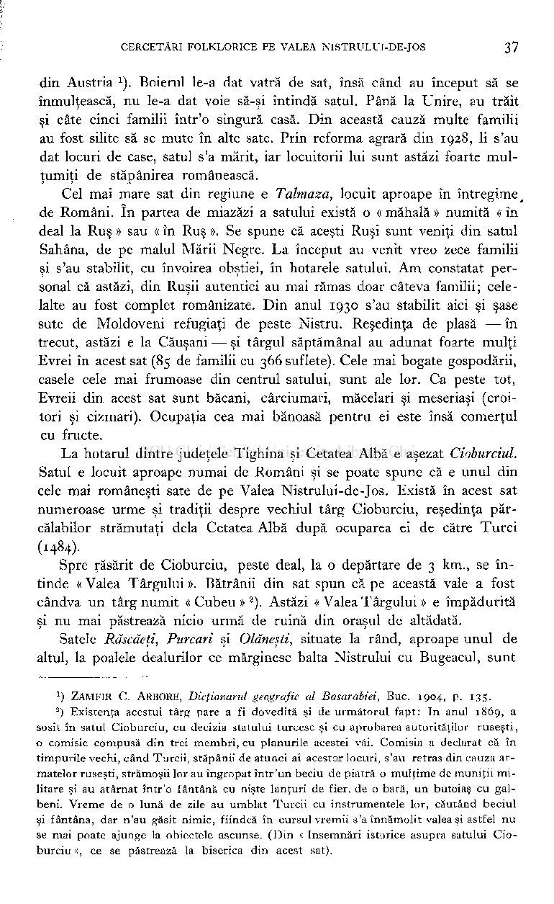

din Austria ). Boierul le-a dat vatră de sat, însă când au început să se înmulţească, nu le-a dat voie să-şi întindă satul. Până la Unire, au trăit şi câte cinci familii într'o singură casă. Din această cauză multe familii au fost silite să se mute în alte sate. Prin reforma agrară din 1928, li s'au dat locuri de case, satul s'a mărit, iar locuitorii lui sunt astăzi foarte mulţumiţi de stăpânirea românească.

Cel mai mare sat din regiune e Talmaza, locuit aproape în întregime

#

de Români. In partea de miazăzi a satului există o « măhală » numită « în deal la Rus » sau « în Rus ». Se spune că aceşti Ruşi sunt veniţi din satul Sahâna, de pe malul Mării Negre. La început au venit vreo zece familii şi s'au stabilit, cu învoirea obştiei, în hotarele satului. Am constatat personal că astăzi, din Ruşii autentici au mai rămas doar câteva familii; celelalte au fost complet românizate. Din anul 1930 s'au stabilit aici şi şase sute de Moldoveni refugiaţi de peste Nistru. Reşedinţa de plasă — în trecut, astăzi e la Căuşani — şi târgul săptămânal au adunat foarte mulţi Evrei în acest sat (85 de familii cu 366 suflete). Cele mai bogate gospodării, casele cele mai frumoase din centrul satului, sunt ale lor. Ca peste tot, Evreii din acest sat sunt băcani, cârciumari, măcelari şi meseriaşi (croitori şi cizmari). Ocupaţia cea mai bănoasă pentru ei este însă comerţul cu fructe.

La hotarul dintre judeţele Tighina şi Cetatea Albă e aşezat Cioburciul. Satul e locuit aproape numai de Români şi se poate spune că e unul din cele mai româneşti sate de pe Valea Nistrului-de-Jos. Există în acest sat numeroase urme şi tradiţii despre vechiul târg Cioburciu, reşedinţa pârcălabilor strămutaţi delà Cetatea Albă după ocuparea ei de către Turci (1484).

Spre răsărit de Cioburciu, peste deal, la o depărtare de 3 km., se întinde « Valea Târgului ». Bătrânii din sat spun că pe această vale a fost cândva un târg numit « Cubeu » ). Astăzi « Valea Târgului » e împădurită şi nu mai păstrează nicio urmă de ruină din oraşul de altădată.

Satele Răscăeţi, Purcari şi Olăneşti, situate la rând, aproape unul de altul, la poalele dealurilor ce mărginesc balta Nistrului cu Bugeacul, sunt

- 1

) ZAMFIR C. ARBORE, Dicţionarul geografic al Basarabiei, Buc. 1904 , p. 135 .

- 2

) Existenţa acestui târg pare a fi dovedită şi de următorul fapt: In anul 1869 , a sosit în satul Cioburciu, cu decizia statului turcesc şi cu aprobarea autorităţilor ruseşti,

- o comisie compusă din trei membri, cu planurile acestei văi. Comisia a declarat că în timpurile vechi, când Turcii, stăpânii de atunci ai acestor locuri, s'au retras din cauza armatelor ruseşti, strămoşii lor au îngropat într'un beciu de piatră o mulţime de.muniţii militare şi au atârnat într'o fântână cu nişte lanţuri de fier, de o bară, un butoiaş cu galbeni. Vreme de o lună de zile au umblat Turcii cu instrumentele lor, căutând beciul şi fântâna, dar n'au găsit nimic, fiindcă în cursul vremii s'a înnămolit valea şi astfel nu se mai poate ajunge la obiectele ascunse. (Din « însemnări istorice asupra satului Cioburciu », ce se păstrează la biserica din acest sat).

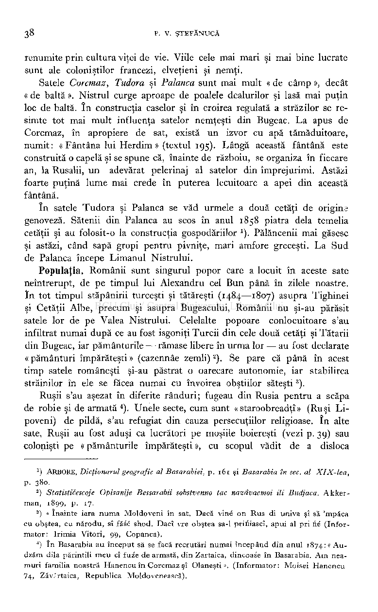

renumite prin cultura viţei de vie. Viile cele mai mari şi mai bine lucrate sunt ale coloniştilor francezi, elveţieni şi nemţi.

Satele Corcmaz, Tudora şi Palanca sunt mai mult « de câmp », decât « de baltă ». Nistrul curge aproape de poalele dealurilor şi lasă mai puţin loc de baltă. în construcţia caselor şi în croirea regulată a străzilor se resimte tot mai mult influenţa satelor nemţeşti din Bugeac. La apus de Corcmaz, în apropiere de sat, există un izvor cu apă tămăduitoare, numit: « Fântâna lui Herdim » (textul 195). Lângă această fântână este construită o capelă şi se spune că, înainte de războiu, se organiza în fiecare an, la Rusalii, un adevărat pelerinaj al satelor din împrejurimi. Astăzi foarte puţină lume mai crede în puterea lecuitoare a apei din această fântână.

în satele Tudora şi Palanca se văd urmele a două cetăţi de origine genoveză. Sătenii din Palanca au scos în anul 1858 piatra delà temelia cetăţii şi au folosit-o la construcţia gospodăriilor ). Pălăncenii mai găsesc şi astăzi, când sapă gropi pentru pivniţe, mari amfore greceşti. La Sud de Palanca începe Limanul Nistrului.

Populaţia. Românii sunt singurul popor care a locuit în aceste sate neîntrerupt, de pe timpul lui Alexandru cel Bun până în zilele noastre, în tot timpul stăpânirii turceşti şi tătăreşti (1484—1807) asupra Tighinei şi Cetăţii Albe, precum şi asupra Bugeacului, Românii nu şi-au părăsit satele lor de pe Valea Nistrului. Celelalte popoare conlocuitoare s'au infiltrat numai după ce au fost isgoniţi Turcii din cele două cetăţi şi Tătarii din Bugeac, iar pământurile — rămase libere în urma lor — au fost declarate « pământuri împărăteşti » (cazennâe zemli)

). Se pare că până în acest timp satele româneşti şi-au păstrat o oarecare autonomie, iar stabilirea străinilor în ele se făcea numai cu învoirea obştiilor săteşti

2

).

3

Ruşii s'au aşezat în diferite rânduri; fugeau din Rusia pentru a scăpa de robie şi de armată ). Unele secte, cum sunt « staroobreadţî » (Ruşi Lipoveni) de pildă, s'au refugiat din cauza persecuţiilor religioase. în alte sate, Ruşii au fost aduşi ca lucrători pe moşiile boiereşti (vezi p. 39) sau colonişti pe « pământurile împărăteşti », cu scopul vădit de a disloca

') ARBORE, Dicţionarul geografic al Basarabiei, p. 16 1 şi Basarabia în sec. al XIX-lea,

- p- 380.

) Statisticescoje Opisanije Bessarabii sobstvenno tac nazâvaemoi Ui Budjaca. Akkerman, 1899, p. 17 .

2

) « înainte iara numa Moldoveni în sat. Dacă vine on Rus di univa şî să 'mpăca cu obştea, cu nărodu, sî făse shod. Dacî vre obştea sa-1 priniascî, apui al pri lié (Informator: Irimia Vitori, 99, Copanca).

3

) în Basarabia au început să se facă recrutări numai începând din anul 1874: « Au dzăm dila părintili meu cî fuze de armată, din Zartaica, dincoase în Basarabia. A m neamuri familia noastră Hanencu în Corcmaz şî Olăneşti». (Informator: Moisei Hanencu 74, Zăv.'rtaica, Republica Moldovenească).

4

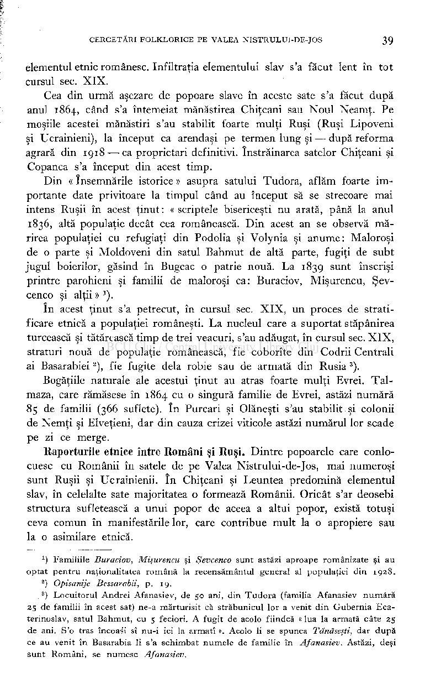

elementul etnic românesc. Infiltraţia elementului slav s'a făcut lent în tot cursul sec. XIX .

Cea din urmă aşezare de popoare slave în aceste sate s'a făcut după anul 1864, când s'a întemeiat mănăstirea Chiţcani sau Noul Neamţ. Pe moşiile acestei mănăstiri s'au stabilit foarte mulţi Ruşi (Ruşi Lipoveni şi Ucrainieni), la început ca arendaşi pe termen lung şi — după reforma agrară din 1918 — ca proprietari definitivi. înstrăinarea satelor Chiţcani şi Copanca s'a început din acest timp.

Din « însemnările istorice » asupra satului Tudora, aflăm foarte importante date privitoare la timpul când au început să se strecoare mai intens Ruşii în acest ţinut: «scriptele bisericeşti nu arată, până la anul 1836, altă populaţie decât cea românească. Din acest an se observă mărirea populaţiei cu refugiaţi din Podolia şi Volynia şi anume: Maloroşi de o parte şi Moldoveni din satul Bahmut de altă parte, fugiţi de subt jugul boierilor, găsind în Bugeac o patrie nouă. La 1839 sunt înscrişi printre parohieni şi familii de maloroşi ca: Buraciov, Mişurencu, Şevcenco şi alţii » *).

în acest ţinut s'a petrecut, în cursul sec. XIX , un proces de stratificare etnică a populaţiei româneşti. La nucleul care a suportat stăpânirea turcească şi tătărească timp de trei veacuri, s'au adăugat, în cursul sec. XIX , straturi nouă de populaţie românească, fie coborîte din Codrii Centrali ai Basarabiei

), fie fugite delà robie sau de armată din Rusia ).

2

Bogăţiile naturale ale acestui ţinut au atras foarte mulţi Evrei. Talmaza, care rămăsese în 1864 cu o singură familie de Evrei, astăzi numără 85 de familii (366 suflete). în Purcari şi Olăneşti s'au stabilit şi colonii de Nemţi şi Elveţieni, dar din cauza crizei viticole astăzi numărul lor scade pe zi ce merge.

Raporturile etnice între Români şi Ruşi. Dintre popoarele care conlocuesc cu Românii în satele de pe Valea Nistrului-de-Jos, mai numeroşi sunt Ruşii şi Ucrainienii. în Chiţcani şi Leuntea predomină elementul slav, în celelalte sate majoritatea o formează Românii. Oricât s'ar deosebi structura sufletească a unui popor de aceea a altui popor, există totuşi ceva comun în manifestările lor, care contribue mult la o apropiere sau la o asimilare etnică.

) Familiile Buraciov, Mişurencu şi Şevcenco sunt astăzi aproape românizate şi au optat pentru naţionalitatea română la recensământul general al populaţiei din1928 .

x

) Opisanije Bessarabii, p. 19 .

2

) Locuitorul Andrei Afanasiev, de 5 0 ani, din Tudora (familia Afanasiev numără 2 5 de familii în acest sat) ne-a mărturisit că străbunicul lor a venit din Gubernia Ecaterinoslav, satul Bahmut, cu 5 feciori. A fugit de acolo fiindcă « lua la armată câte 2 5 de ani. S'o tras încoasi sî nu-i iei la armatî ». Acolo li se spunea Tănăseşti, dar după ce au venit în Basarabia li s'a schimbat numele de familie în Afanasiev. Astăzi, deşi sunt Români, se numesc Afanasiev.

.

3

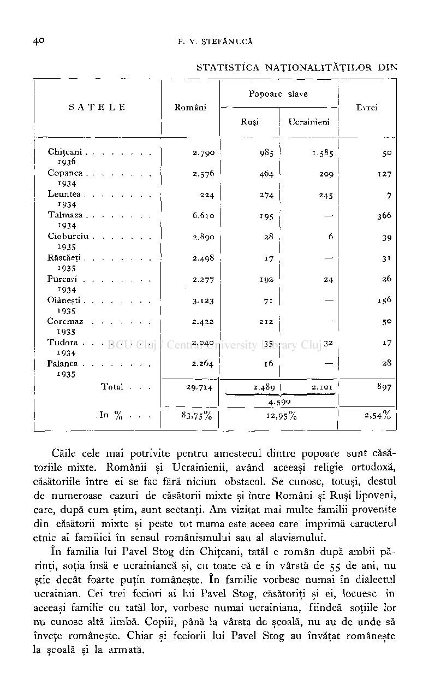

STATISTIC A NAŢIONALITĂŢILO R DI N

Popoare slave

C A T C T >~ . \ 1 f. 1j 1. Komani Jc.vrei

Ruşi Ucrainieni

2.79 0 98 5 1-58 5 5 0 I93 6

2.57 6 46 4 20 9 12 7 I93 4

22 4 27 4 24 5 7

- I93 4 6.61O 19 5 — 36 6

- I93 4 2.89 0 2 8 6 3 9
- I93 5

2.49 8 1 7 — 3 1

- I93 5

- 2.27 7 19 2 2 4 2 6 I93 4
- 3-12 3 7 1 15 6

###### 193 5

2.42 2 21 2 5 ° 193 5

2.04 0 3 5 3 2 1 7

- 193 4 2.26 4 1 6 — 2 8
- 193 5 Total . . . 29.71 4 2.48 9 2.10 1 89 7

4-59 0

In % - - - 83,75 % 12,95 % 2,54 %

Căile cele mai potrivite pentru amestecul dintre popoare sunt căsătoriile mixte. Românii şi Ucrainienii, având aceeaşi religie ortodoxă, căsătoriile între ei se fac fără niciun obstacol. Se cunosc, totuşi, destul de numeroase cazuri de căsătorii mixte şi între Români şi Ruşi lipoveni, care, după cum ştim, sunt sectanţi. Am vizitat mai multe familii provenite din căsătorii mixte şi peste tot mama este aceea care imprimă caracterul etnic al familiei în sensul românismului sau al slavismului.

în familia lui Pavel Stog din Chiţcani, tatăl e român după ambii părinţi, soţia însă e ucrainiancă şi, cu toate că e în vârstă de 55 de ani, nu ştie decât foarte puţin româneşte. în familie vorbesc numai în dialectul ucrainian. Cei trei feciori ai lui Pavel Stog, căsătoriţi şi ei, locuesc în aceeaşi familie cu tatăl lor, vorbesc numai ucrainiana, fiindcă soţiile lor nu cunosc altă limbă. Copiii, până la vârsta de şcoală, nu au de unde să înveţe româneşte. Chiar şi feciorii lui Pavel Stog au învăţat româneşte la şcoală şi la armată.

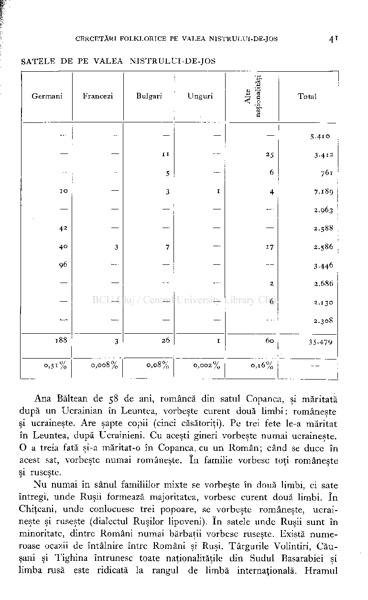

SATEL E D E P E VALE A NISTRULUI-DE-JO S

naţionalităţi

Alte

Germani Francezi Bulgari Unguri

Total

###### 5 -4I O

11

3-412

25

6

761

5

3

###### IO

i

4

7-189

- 2-963

2.588

2.586

- 3-446

42

40

3

7

17

96

2.686

2

2.130

6

2.308

188 3 26 i 60 35-479

°,5i % 0,008% °,o8% 0,002% 0,16% —

Ana Băltean de 58 de ani, româncă din satul Copanca, şi măritată după un Ucrainian în Leuntea, vorbeşte curent două limbi: româneşte şi ucraineşte. Are şapte copii (cinci căsătoriţi). Pe trei fete le-a măritat în Leuntea, după Ucrainieni. Cu aceşti gineri vorbeşte numai ucraineşte. O a treia fată şi-a măritat-o în Copanca, cu un Român; când se duce în acest sat, vorbeşte numai româneşte. în familie vorbesc toţi româneşte şi ruseşte.

Nu numai în sânul familiilor mixte se vorbeşte în două limbi, ci sate întregi, unde Ruşii formează majoritatea, vorbesc curent două limbi. în Chiţcani, unde conlocuesc trei popoare, se vorbeşte româneşte, ucraineşte şi ruseşte (dialectul Ruşilor lipoveni). în satele unde Ruşii sunt în minoritate, dintre Români numai bărbaţii vorbesc ruseşte. Există numeroase ocazii de întâlnire între Români şi Ruşi. Târgurile Volintiri, Căuşani şi Tighina întrunesc toate naţionalităţile din Sudul Basarabiei şi limba rusă este ridicată la rangul de limbă internaţională. Hramul

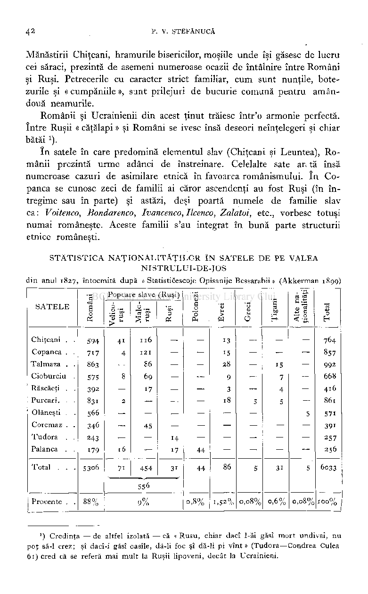

Mănăstirii Chiţcani, hramurile bisericilor, moşiile unde îşi găsesc de lucru cei săraci, prezintă de asemeni numeroase ocazii de întâlnire între Români şi Ruşi. Petrecerile cu caracter strict familiar, cum sunt nunţile, botezurile şi « cumpăniile », sunt prilejuri de bucurie comună pentru amândouă neamurile.

Românii şi Ucrainienii din acest ţinut trăiesc într'o armonie perfectă, între Ruşii « căţălapi » şi Români se ivesc însă deseori neînţelegeri şi chiar

- bătăi în satele în care predomină elementul slav (Chiţcani şi Leuntea), Ro­

mânii prezintă urme adânci de înstreinare. Celelalte sate an tă însă numeroase cazuri de asimilare etnică în favoarea românismului. în Copanca se cunosc zeci de familii ai căror ascendenţi au fost Ruşi (în întregime sau în parte) şi astăzi, deşi poartă numele de familie slav

ca: Voitenco, Bondarenco, Ivancenco,Ilcenco, Zalatoi, etc., vorbesc totuşi

numai româneşte. Aceste familii s'au integrat în bună parte structurii etnice româneşti.

STATISTIC A NAŢIONALITĂŢILO R Î N SATEL E D E P E VALE A NISTRULUI-DE-JO S din anul 1827, întocmită după « Statisticescoje Opisanije Bessarabii » (Akkerman 1899)

'5 Popcare slave (Ruşi) '5 1 SATEL E

Polon.

iAlte

Ţigan

Roma

ţionali

Malo-

Velico-

Greci

Total

Evrei

Ruşi

ruşi

ruşi

Chiţcani . . 594 41 116 — — 13 — — — 764 Copanca . . 717 4 121 — — 15 — — — 857 Talmaza . . 863 — 86 — — 28 — 15 — 992 Cioburciu 575 8 69 — — 9 — 7 — 668 Răscăeţi . . 392 — 17 — — 3 — 4 — 416 Purcari. . 831 2 — — — 18 5 5 — 861 Olăneşti . . 566 5 571 Corcmaz . . 346 -- 45 391 Tudora . . 243 — — 14 — — — — — 257 Palanca . . 179 16 — 17 44 — — — — 256

Total . . . 5306 71 454 31 44 86 5 31 5 6033

556

Procente . . 88% 9% 0.8% I>52% 0,08% 0,6% 0,08% 100 %

) Credinţa — de altfel izolată — că « Rusu, chiar dacî 1-ăi găsî mort undivai, nu poţ să-1 crez; şî dacî-i găsî oasîle, dă-li foc şî dă-li pi vînt » (Tudora—Condrea Culea

x

61) cred că se referă mai mult la Ruşii lipoveni, decât la Ucrainieni.

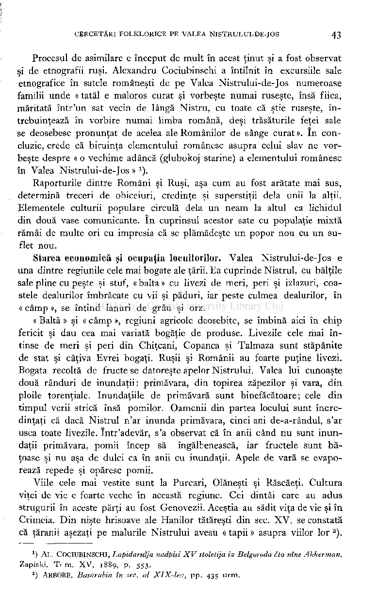

Procesul de asimilare e început de mult în acest ţinut şi a fost observat şi de etnografii ruşi. Alexandru Cociubinschi a întîlnit în excursiile sale etnografice în satele româneşti de pe Valea Nistrului-de-Jos numeroase familii unde « tatăl e maloros curat şi vorbeşte numai ruseşte, însă fiica, măritată într'un sat vecin de lângă Nistru, cu toate că ştie ruseşte, întrebuinţează în vorbire numai limba română, deşi trăsăturile feţei sale se deosebesc pronunţat de acelea ale Românilor de sânge curat ». în concluzie, crede că biruinţa elementului românesc asupra celui slav ne vorbeşte despre « o vechime adâncă (glubokoj starine) a elementului românesc în Valea Nistrului-de-Jos »

).

1

Raporturile dintre Români şi Ruşi, aşa cum au fost arătate mai sus, determină treceri de obiceiuri, credinţe şi superstiţii delà unii la alţii. Elementele culturii populare circulă delà un neam la altul ca lichidul din două vase comunicante. în cuprinsul acestor sate cu populaţie mixtă rămâi de multe ori cu impresia că se plămădeşte un popor nou cu un suflet nou.

Starea economică şi ocupaţia locuitorilor. Valea Nistrului-de-Jos e una dintre regiunile cele mai bogate ale ţării. Ea cuprinde Nistrul, cu bălţile sale pline cu peşte şi stuf, « balta » cu livezi de meri, peri şi izlazuri, coastele dealurilor îmbrăcate cu vii şi păduri, iar peste culmea dealurilor, în « câmp », se întind lanuri de grâu şi orz.

« Baltă » şi « câmp », regiuni agricole deosebite, se îmbină aici în chip fericit şi dau cea mai variată bogăţie de produse. Livezile cele mai întinse de meri şi peri din Chiţcani, Copanca şi Talmaza sunt stăpânite de stat şi câţiva Evrei bogaţi. Ruşii şi Românii au foarte puţine livezi. Bogata recoltă de fructe se datoreşte apelor Nistrului. Valea lui cunoaşte două rânduri de inundaţii: primăvara, din topirea zăpezilor şi vara, din ploile torenţiale. Inundaţiile de primăvară sunt binefăcătoare; cele din timpul verii strică însă pomilor. Oamenii din partea locului sunt încredinţaţi că dacă Nistrul n'ar inunda primăvara, cinci ani de-a-rândul, s'ar usca toate livezile. într'adevăr, s'a observat că în anii când nu sunt inundaţii primăvara, pomii încep să îngălbenească, iar fructele sunt băţoase şi nu aşa de dulci ca în anii cu inundaţii. Apele de vară se evaporează repede şi opăresc pomii.

Viile cele mai vestite sunt la Purcari, Olăneşti şi Răscăeţi. Cultura viţei de vie e foarte veche în această regiune. Cei dintâi care au adus strugurii în aceste părţi au fost Genovezii. Aceştia au sădit viţa de vie şi în Crimeia. Din nişte hrisoave ale Hanilor tătăreşti din sec. XV, se constată

- că ţăranii aşezaţi pe malurile Nistrului aveau « ţapii » asupra viilor lor ).

*) AL . COCIUBINSCHI, Lapidarnîja nadpisi XV stoletija iz Belgoroda cto nine Akkerman. Zapiski. Tem . XV , 1889, p. 553.

) ARBORE, Basarabia în sec. al XIX-lea, pp. 435 urm.

2

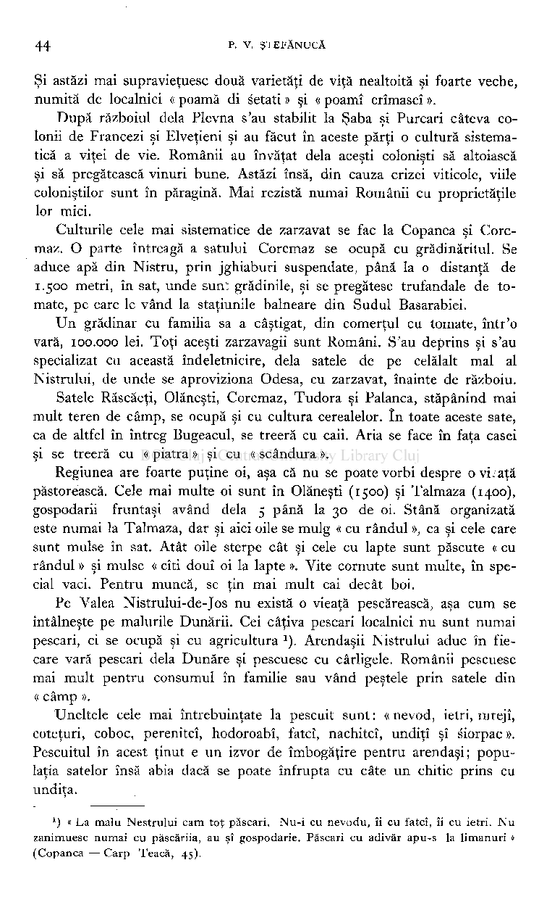

Şi astăzi mai supravieţuesc două varietăţi de viţă nealtoită şi foarte veche, numită de localnici « poamă di setaţi » şi « poamî crîmascî ».

După războiul delà Plevna s'au stabilit la Şaba şi Purcari câteva colonii de Francezi şi Elveţieni şi au făcut în aceste părţi o cultură sistematică a viţei de vie. Românii au învăţat delà aceşti colonişti să altoiască şi să pregătească vinuri bune. Astăzi însă, din cauza crizei viticole, viile coloniştilor sunt în paragină. Mai rezistă numai Românii cu proprietăţile lor mici.

Culturile cele mai sistematice de zarzavat se fac la Copanca şi Corcmaz. O parte întreagă a satului Corcmaz se ocupă cu grădinăritul. Se aduce apă din Nistru, prin jghiaburi suspendate, până la o distanţă de 1.500 metri, în sat, unde sun: grădinile, şi se pregătesc trufandale de tomate, pe care le vând la staţiunile balneare din Sudul Basarabiei.

Un grădinar cu familia sa a câştigat, din comerţul cu tomate, într'o vară, 100.000 lei. Toţi aceşti zarzavagii sunt Români. S'au deprins şi s'au specializat cu această îndeletnicire, delà satele de pe celălalt mal al Nistrului, de unde se aproviziona Odesa, cu zarzavat, înainte de războiu.

Satele Răscăeţi, Olăneşti, Corcmaz, Tudora şi Palanca, stăpânind mai mult teren de câmp, se ocupă şi cu cultura cerealelor. în toate aceste sate, ca de altfel în întreg Bugeacul, se treeră cu caii. Aria se face în faţa casei şi se treeră cu « piatra » şi cu « scândura ».

Regiunea are foarte puţine oi, aşa că nu se poate vorbi despre o vi:aţă păstorească. Cele mai multe oi sunt în Olăneşti (1500) şi Talmaza (1400), gospodarii fruntaşi având delà 5 până la 30 de oi. Stână organizată este numai la Talmaza, dar şi aici oile se mulg « cu rândul », ca şi cele care sunt mulse în sat. Atât oile sterpe cât şi cele cu lapte sunt păscute « cu rândul » şi mulse « cîti douî oi la lapte ». Vite cornute sunt multe, în special vaci. Pentru muncă, se ţin mai mult cai decât boi.

Pe Valea Nistrului-de-Jos nu există o vieaţă pescărească, aşa cum se întâlneşte pe malurile Dunării. Cei câţiva pescari localnici nu sunt numai pescari, ci se ocupă şi cu agricultura ). Arendaşii Nistrului aduc în fiecare vară pescari delà Dunăre şi pescuesc cu cârligele. Românii pescuesc mai mult pentru consumul în familie sau vând peştele prin satele din « câmp ».

Uneltele cele mai întrebuinţate la pescuit sunt : « nevod, ietri, mrejî, coteţuri, coboc, perenitcî, hodoroabî, fatcî, nachitcî, undiţi şî siorpac ». Pescuitul în acest ţinut e un izvor de îmbogăţire pentru arendaşi; populaţia satelor însă abia dacă se poate înfrupta cu câte un chitic prins cu undiţa.

) « L a malu Nestrului cam toţ păscari. Nu-i cu nevodu, îi cu fatcî, îi cu ietri. N u zanimuesc numai cu păscăriia, au şî gospodărie. Păscari cu adivăr apu-s la limanuri » (Copanca — Carp Teacă, 45).

x

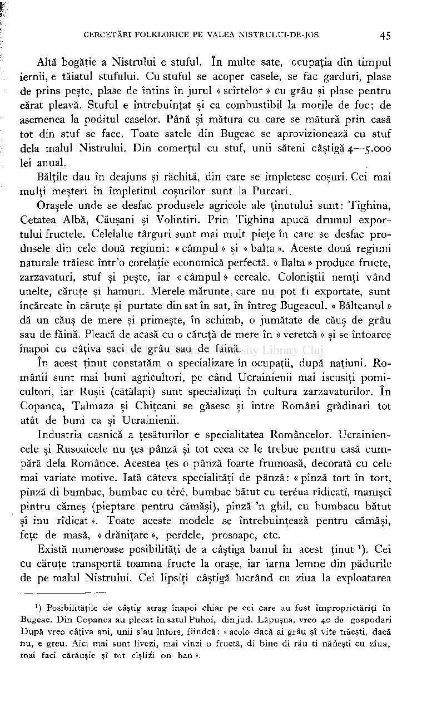

Altă bogăţie a Nistrului e stuful. în multe sate, ocupaţia din timpul iernii, e tăiatul stufului. Cu stuful se acoper casele, se fac garduri, plase de prins peşte, plase de întins în jurul « scîrtelor » cu grâu şi plase pentru cărat pleavă. Stuful e întrebuinţat şi ca combustibil la morile de foc; de asemenea la poditul caselor. Până şi mătura cu care se mătură prin casă tot din stuf se face. Toate satele din Bugeac se aprovizionează cu stuf delà malul Nistrului. Din comerţul cu stuf, unii săteni câştigă 4—5.000 lei anual.

Bălţile dau în deajuns şi răchită, din care se împletesc coşuri. Cei mai mulţi meşteri în împletitul coşurilor sunt la Purcari.

Oraşele unde se desfac produsele agricole ale ţinutului sunt: Tighina, Cetatea Albă, Căuşani şi Volintiri. Prin Tighina apucă drumul exportului fructele. Celelalte târguri sunt mai mult pieţe în care se desfac produsele din cele două regiuni : « câmpul » şi « balta ». Aceste două regiuni naturale trăiesc într'o corelaţie economică perfectă. « Balta » produce fructe, zarzavaturi, stuf şi peşte, iar « câmpul » cereale. Coloniştii nemţi vând unelte, căruţe şi hamuri. Merele mărunte, care nu pot fi exportate, sunt încărcate în căruţe şi purtate din sat în sat, în întreg Bugeacul. « Bălteanul »

- dă un căuş de mere şi primeşte, în schimb, o jumătate de căuş de grâu sau de făină. Pleacă de acasă cu o căruţă de mere în « veretcă » şi se întoarce înapoi cu câţiva saci de grâu sau de făină.

în acest ţinut constatăm o specializare în ocupaţii, după naţiuni. Românii sunt mai buni agricultori, pe când Ucrainienii mai iscusiţi pomicultori, iar Ruşii (căţălapi) sunt specializaţi în cultura zarzavaturilor. în Copanca, Talmaza şi Chiţcani se găsesc şi între Români grădinari tot atât de buni ca şi Ucrainienii.

Industria casnică a ţesăturilor e specialitatea Româncelor. Ucrainiencele şi Rusoaicele nu ţes pânză şi tot ceea ce le trebue pentru casă cumpără delà Românce. Acestea ţes o pânză foarte frumoasă, decorată cu cele mai variate motive. Iată câteva specialităţi de pânză: « pînză tort în tort, pînză di bumbac, bumbac cu téré, bumbac bătut cu teréua rîdicatî, manişcî pintru cămeş (pieptare pentru cămăşi), pînză 'n ghil, cu bumbacu bătut şî inu ridicat ». Toate aceste modele se întrebuinţează pentru cămăşi, feţe de masă, « drăniţare », perdele, prosoape, etc.

Există numeroase posibilităţi de a câştiga banul în acest ţinutCe i cu căruţe transportă toamna fructe la oraşe, iar iarna lemne din pădurile

- de pe malul Nistrului. Cei lipsiţi câştigă lucrând cu ziua la exploatarea

) Posibilităţile de câştig atrag înapoi chiar pe cei care au fost împroprietăriţi în Bugeac. Din Copanca au plecat în satul Puhoi, dinjud. Lăpuşna, vreo 40 de gospodari După vreo câţiva ani, unii s'au întors, fiindcă: «acolo dacă ai grâu şî vite trăeşti, dacă nu, e greu. Aici mai sunt livezi, mai vinzi o fructă, di bine di rău ti năneşti cu zîua, mai faci cărăuşie şî tot cîşlizi on ban ».

1

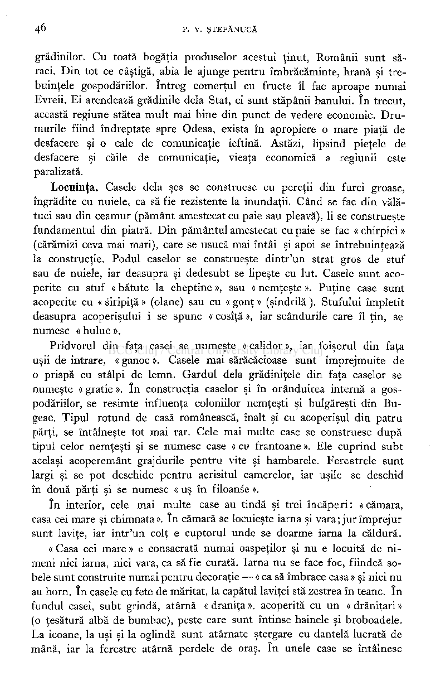

grădinilor. Cu toată bogăţia produselor acestui ţinut, Românii sunt săraci. Din tot ce câştigă, abia le ajunge pentru îmbrăcăminte, hrană şi trebuinţele gospodăriilor. întreg comerţul cu fructe îl fac aproape numai Evreii. Ei arendează grădinile delà Stat, ei sunt stăpânii banului. în trecut, această regiune stătea mult mai bine din punct de vedere economic. Drumurile fiind îndreptate spre Odesa, exista în apropiere o mare piaţă de desfacere şi o cale de comunicaţie ieftină. Astăzi, lipsind pieţele de desfacere şi căile de comunicaţie, vieaţa economică a regiunii este paralizată.

Locuinţa. Casele delà şes se construesc cu pereţii din furci groase, îngrădite cu nuiele, ca să fie rezistente la inundaţii. Când se fac din vălătuci sau din ceamur (pământ amestecat cu paie sau pleavă), li se construeşte fundamentul din piatră. Din pământul amestecat cu paie se fac «chirpici» (cărămizi ceva mai mari), care se usucă mai întâi şi apoi se întrebuinţează la construcţie. Podul caselor se construeşte dintr'un strat gros de stuf sau de nuiele, iar deasupra şi dedesubt se lipeşte cu lut. Casele sunt acoperite cu stuf « bătute la cheptine », sau « nemţeşte ». Puţine case sunt acoperite cu « siripiţă » (olane) sau cu « gonţ » (şindrilă ). Stufului împletit deasupra acoperişului i se spune « cosîţă », iar scândurile care îl ţin, se numesc « huluc ».

Pridvorul din faţa casei se numeşte « calidor », iar foişorul din faţa uşii de intrare, « ganoc ». Casele mai sărăcăcioase sunt împrejmuite de o prispă cu stâlpi de lemn. Gardul delà grădiniţele din faţa caselor se numeşte « gratie ». în construcţia caselor şi în orânduirea internă a gospodăriilor, se resimte influenţa coloniilor nemţeşti şi bulgăreşti din Bugeac. Tipul rotund de casă românească, înalt şi cu acoperişul din patru părţi, se întâlneşte tot mai rar. Cele mai multe case se construesc după tipul celor nemţeşti şi se numesc case « cu frantoane ». Ele cuprind subt acelaşi acoperemânt grajdurile pentru vite şi hambarele. Ferestrele sunt largi şi se pot deschide pentru aerisitul camerelor, iar uşile se deschid în două părţi şi se numesc « uş în filoanse ».

în interior, cele mai multe case au tindă şi trei încăperi: «cămara, casa cei mare şi chimnata». în cămară se locuieşte iarna şi vara; jur împrejur sunt laviţe, iar într'un colţ e cuptorul unde se doarme iarna la căldură.

« Casa cei mare » e consacrată numai oaspeţilor şi nu e locuită de nimeni nici iarna, nici vara, ca să fie curată. Iarna nu se face foc, fiindcă sobele sunt construite numai pentru decoraţie — « ca să îmbrace casa » şi nici nu au horn. în casele cu fete de măritat, la capătul laviţei stă zestrea în teanc. în fundul casei, subt grindă, atârnă « draniţa », acoperită cu un « drăniţari » (o ţesătură albă de bumbac), peste care sunt întinse hainele şi broboadele. La icoane, la uşi şi la oglindă sunt atârnate ştergare cu dantelă lucrată de mână, iar la ferestre atârnă perdele de oraş. în unele case se întâlnesc

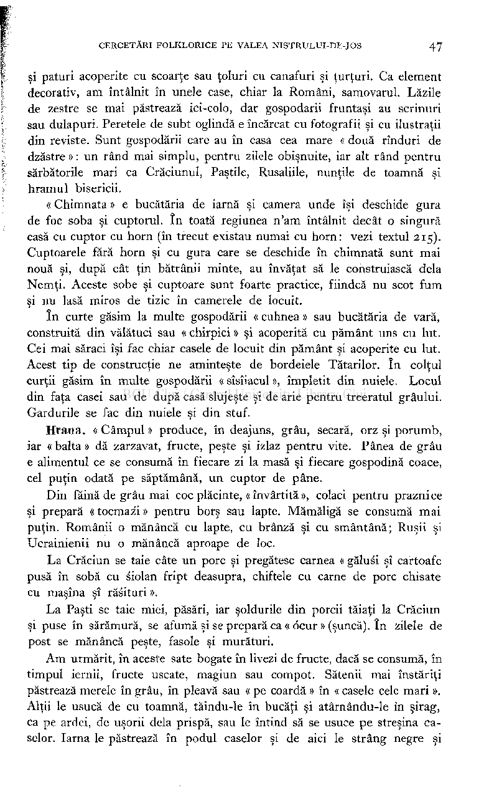

şi paturi acoperite cu scoarţe sau ţoluri cu canafuri şi ţurţuri. Ca element decorativ, am întâlnit în unele case, chiar la Români, samovarul. Lăzile de zestre se mai păstrează ici-colo, dar gospodarii fruntaşi au scrinuri sau dulapuri. Peretele de subt oglindă e încărcat cu fotografii şi cu ilustraţii din reviste. Sunt gospodării care au în casa cea mare « două rînduri de dzăstre » : un rând mai simplu, pentru zilele obişnuite, iar alt rând pentru sărbătorile mari ca Crăciunul, Pastile, Rusaliile, nunţile de toamnă şi hramul bisericii.

« Chimnata » e bucătăria de iarnă şi camera unde îşi deschide gura de foc soba şi cuptorul. în toată regiunea n'am întâlnit decât o singură casă cu cuptor cu horn (în trecut existau numai cu horn: vezi textul 215). Cuptoarele fără horn şi cu gura care se deschide în chimnată sunt mai nouă şi, după cât ţin bătrânii minte, au învăţat să le construiască delà Nemţi. Aceste sobe şi cuptoare sunt foarte practice, fiindcă nu scot fum şi nu lasă miros de tizic în camerele de locuit.

în curte găsim la multe gospodării « cuhnea » sau bucătăria de vară, construită din vălătuci sau « chirpici » şi acoperită cu pământ uns cu lut. Cei mai săraci îşi fac chiar casele de locuit din pământ şi acoperite cu lut. Acest tip de construcţie ne aminteşte de bordeiele Tătarilor. în colţul curţii găsim în multe gospodării « sîsîiacul », împletit din nuiele. Locul din faţa casei sau de după casă slujeşte şi de arie pentru treeratul grâului. Gardurile se fac din nuiele şi din stuf.

Hrana. «Câmpul» produce, îndeajuns, grâu, secară, orz şi porumb, iar « balta » dă zarzavat, fructe, peşte şi izlaz pentru vite. Pânea de grâu

- e alimentul ce se consumă în fiecare zi la masă şi fiecare gospodină coace, cel puţin odată pe săptămână, un cuptor de pâne.

Din făină de grâu mai coc plăcinte, « învârtită », colaci pentru praznice

şi prepară « tocmazi » pentru borş sau lapte. Mămăligă se consumă mai puţin. Românii o mănâncă cu lapte, cu brânză şi cu smântână; Ruşii şi Ucrainienii nu o mănâncă aproape de loc.

La Crăciun se taie câte un porc şi pregătesc carnea « gălusi şî cartoafe pusă în sobă cu siolan fript deasupra, chiftele cu carne de porc chisate cu maşina şî răsituri ».

La Paşti se taie miei, păsări, iar şoldurile din porcii tăiaţi la Crăciun şi puse în saramură, se afumă şi se prepară ca « dcur » (şuncă). în zilele de post se mănâncă peşte, fasole şi murături.

Am urmărit, în aceste sate bogate în livezi de fructe, dacă se consumă, în timpul iernii, fructe uscate, magiun sau compot. Sătenii mai înstăriţi păstrează merele în grâu, în pleavă sau « pe coardă » în « casele cele mari ». Alţii le usucă de cu toamnă, tăindu-le în bucăţi şi atârnându-le în şirag, ca pe ardei, de uşorii delà prispă, sau le întind să se usuce pe streşina caselor. Iarna le păstrează în podul caselor şi de aici le strâng negre şi

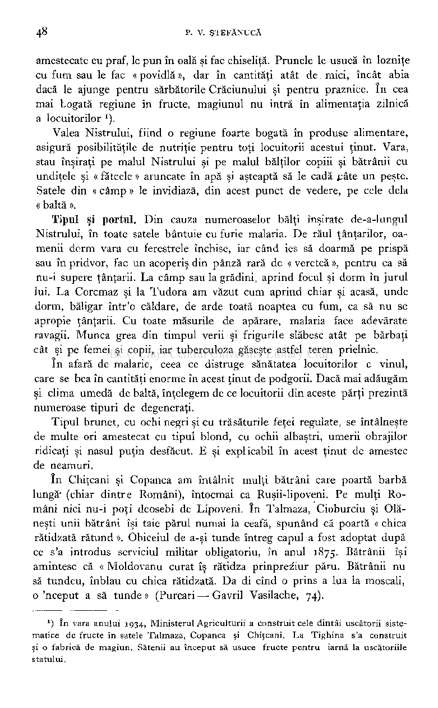

##### 8 P. V. STEFÄNUCA

4

amestecate cu praf, le pun în oală şi fac chiseliţă. Prunele le usucă în lozniţe cu fum sau le fac « povidlă », dar în cantităţi atât de mici, încât abia dacă le ajunge pentru sărbătorile Crăciunului şi pentru praznice. în cea mai bogată regiune în fructe, magiunul nu intră în alimentaţia zilnică a locuitorilor

Valea Nistrului, fiind o regiune foarte bogată în produse alimentare, asigură posibilităţile de nutriţie pentru toţi locuitorii acestui ţinut. Vara, stau înşiraţi pe malul Nistrului şi pe malul bălţilor copiii şi bătrânii cu undiţele şi « fătcele » aruncate în apă şi aşteaptă să le cadă pâte un peşte. Satele din « câmp » le invidiază, din acest punct de vedere, pe cele delà « baltă ».

Tipul şi portul. Din cauza numeroaselor bălţi înşirate de-a-lungul Nistrului, în toate satele bântuie cu furie malaria. De răul ţânţarilor, oamenii derm vara cu ferestrele închise, iar când ies să doarmă pe prispă sau în pridvor, fac un acoperiş din pânză rară de « veretcă », pentru ca să nu-i supere ţânţarii. La câmp sau la grădini, aprind focul şi dorm în jurul lui. La Corcmaz şi la Tudora am văzut cum aprind chiar şi acasă, unde dorm, băligar într'o căldare, de arde toată noaptea cu fum, ca să nu se apropie ţânţarii. Cu toate măsurile de apărare, malaria face adevărate ravagii. Munca grea din timpul verii şi frigurile slăbesc atât pe bărbaţi cât şi pe femei şi copii, iar tuberculoza găseşte astfel teren prielnic.

în afară de malarie, ceea ce distruge sănătatea locuitorilor e vinul, care se bea în cantităţi enorme în acest ţinut de podgorii. Dacă mai adăugăm şi clima umedă de baltă, înţelegem de ce locuitorii din aceste părţi prezintă numeroase tipuri de degeneraţi.

Tipul brunet, cu ochi negri şi cu trăsăturile feţei regulate, se întâlneşte de multe ori amestecat cu tipul blond, cu ochii albaştri, umerii obrajilor ridicaţi şi nasul puţin desfăcut. E şi explicabil în acest ţinut de amestec de neamuri.

în Chiţcani şi Copanca am întâlnit mulţi bătrâni care poartă barbă lungă" (chiar dintre Români), întocmai ca Ruşii-lipoveni. Pe mulţi Români nici nu-i poţi deosebi de Lipoveni. în Talmaza, Cioburciu şi Olăneşti unii bătrâni îşi taie părul numai la ceafă, spunând că poartă « chica

- rătidzată rătund ». Obiceiul de a-şi tunde întreg capul a fost adoptat după ce s'a introdus serviciul militar obligatoriu, în anul 1875. Bătrânii îşi amintesc că « Moldovanu curat îş rătidza prinpreziur păru. Bătrânii nu
- să tundeu, înblau cu chica rătidzată. Da di cînd o prins a lua la moscali, o 'nceput a să tunde » (Purcari — Gavril Vasilache, 74).

) în vara anului 1934, Ministerul Agriculturii a construit cele dintâi uscătorii sistematice de fructe în satele Talmaza, Copanca şi Chiţcani. L a Tighina s'a construit şi o fabrică de magiun. Sătenii au început să usuce fructe pentru iarnă la uscătoriile statului.

1

## f

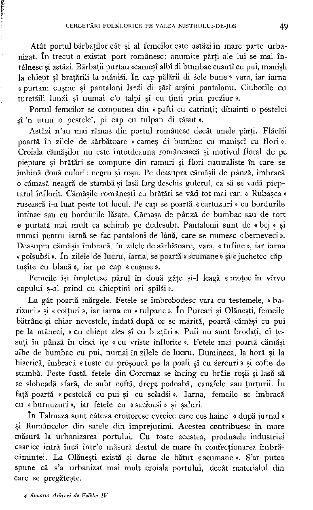

Atât portul bărbaţilor cât şi al femeilor este astăzi în mare parte urbanizat, în trecut a existat port românesc; anumite părţi ale lui se mai întâlnesc şi astăzi. Bărbaţii purtau «cameşî albî di bumbac cusutî cu pui, manişli la chiept şî braţărili la mânisi. în cap pălării di sele bune » vara, iar iarna « purtam cuşme şî pantaloni larzi di şăsî arşîni pantalonu. Ciubotile cu turetsili lunzi şî numai c'o talpî şî cu ţînti prin preziur ».

Portul femeilor se compunea din « pafti cu catrinţî; dinainti o pestelci şî 'n urmî o pestelci, pi cap cu tulpan di ţăsut ».

Astăzi n'au mai rămas din portul românesc decât unele părţi. Flăcăii poartă în zilele de sărbătoare « cameş di bumbac cu manişcî cu flori ». Croiala cămăşilor nu este întotdeauna românească şi motivul floral de pe pieptare şi brăţări se compune din ramuri şi flori naturaliste în care se îmbină două culori: negru şi roşu. Pe deasupra cămăşii de pânză, îmbracă o cămaşă neagră de stambă şi Iasă larg deschis gulerul, ca să se vadă pieptarul înflorit. Cămăşile româneşti cu brăţări se văd tot mai rar. « Rubaşca » rusească i-a luat peste tot locul. Pe cap se poartă « cartuzuri » cu bordurile întinse sau cu bordurile lăsate. Cămaşa de pânză de bumbac sau de tort e purtată mai mult ca schimb pe dedesubt. Pantalonii sunt de « bej » şi numai pentru iarnă se fac pantaloni de lână, care se numesc « berneveci ». Deasupra cămăşii îmbracă, în zilele de sărbătoare, vara, « tufine », iar iarna «polşubsi». în zilele de lucru, iarna, se poartă « scumane » şi « juchetce căptuşite cu blană », iar pe cap « cuşme ».

Femeile îşi împletesc părul în două gâţe şi-1 leagă « motoc în vîrvu capului ş-al prind cu chieptini ori şpilsi ».

La gât poartă mărgele. Fetele se îmbrobodesc vara cu testemele, « barizuri » şi « colţuri », iar iarna cu « tulpane ». în Purcari şi Olăneşti, femeile

- bătrâne şi chiar nevestele, îndată după ce se mărită, poartă cămăşi cu pui pe Ia mâneci, « cu chiept ales şî cu brăţări ». Puii nu sunt brodaţi, ci ţesuţi în pânză în cinci iţe « cu vrîste înflorite ». Fetele mai poartă cămăşi albe de bumbac cu pui, numai în zilele de lucru. Dumineca, la horă şi la biserică, îmbracă « fuste cu proşoucă pe la poali şî cu sercuri » şi cofte de stambă. Peste fustă, fetele din Corcmaz se încing cu brâie roşii şi lasă să se sloboadă afară, de subt coftă, drept podoabă, canafele sau ţurţurii. în faţă poartă « pestelcă cu pui şî cu scladsi ». Iarna, femeile se îmbracă cu « burnuzuri », iar fetele cu « sacioasi » şi şaluri.

în Talmaza sunt câteva croitorese evreice care cos haine « după jurnal » şi Româncelor din satele din împrejurimi. Acestea contribuesc în mare măsură la urbanizarea portului. Cu toate acestea, produsele industriei casnice intră încă într'o măsură destul de mare în confecţionarea îmbră­

- cămintei. La Olăneşti există şi darac de bătut «scumane». S'ar putea spune că s'a urbanizat mai mult croiala portului, decât materialul din care se pregăteşte.

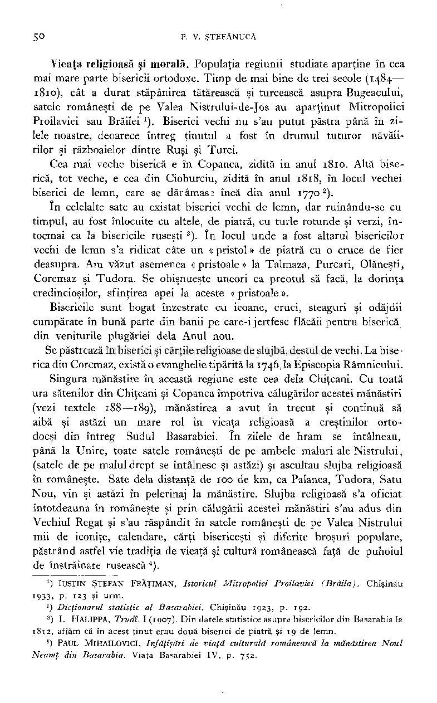

##### 5° P. V. STEFÄNUCÄ

Vieaţa religioasă şi morală. Populaţia regiunii studiate aparţine în cea mai mare parte bisericii ortodoxe. Timp de mai bine de trei secole (14841810), cât a durat stăpânirea tătărească şi turcească asupra Bugeacului, satele româneşti de pe Valea Nistrului-de-Jos au aparţinut Mitropoliei Proilaviei sau Brăilei Biserici vechi nu s'au putut păstra până în zilele noastre, deoarece întreg ţinutul a fost în drumul tuturor năvălirilor şi războaielor dintre Ruşi şi Turci.

Cea mai veche biserică e în Copanca, zidită in anul 1810. Altă biserică, tot veche, e cea din Cioburciu, zidită în anul 1818, în locul vechei biserici de lemn, care se dărâmas; încă din anul 1770

).

2

în celelalte sate au existat biserici vechi de lemn, dar ruinându-se cu timpul, au fost înlocuite cu altele, de piatră, cu turle rotunde şi verzi, întocmai ca la bisericile ruseşti ). în locul unde a fost altarul bisericilor vechi de lemn s'a ridicat câte un « pristol » de piatră cu o cruce de fier deasupra. Am văzut asemenea « pristoale » la Talmaza, Purcari, Olăneşti, Corcmaz şi Tudora. Se obişnueşte uneori ca preotul să facă, la dorinţa credincioşilor, sfinţirea apei la aceste « pristoale ».

Bisericile sunt bogat înzestrate cu icoane, cruci, steaguri şi odăjdii cumpărate în bună parte din banii pe care-i jertfesc flăcăii pentru biserică, din veniturile plugăriei delà Anul nou.

Se păstrează în biserici şi cărţile religioase de slujbă, destul de vechi. La biserica din Corcmaz, există o evanghelie tipărită la 1746, la Episcopia Râmnicului.

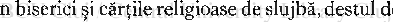

Singura mănăstire în această regiune este cea delà Chiţcani. Cu toată ura sătenilor din Chiţcani şi Copanca împotriva călugărilor acestei mănăstiri (vezi textele 188—189), mănăstirea a avut în trecut şi continuă să aibă şi astăzi un mare rol în vieaţa religioasă a creştinilor ortodocşi din întreg Sudul Basarabiei. în zilele de hram se întâlneau, până la Unire, toate satele româneşti de pe ambele maluri ale Nistrului, (satele de pe malul drept se întâlnesc şi astăzi) şi ascultau slujba religioasă în româneşte. Sate delà distanţă de 100 de km, ca Palanca, Tudora, Satu Nou, vin şi astăzi în pelerinaj la mănăstire. Slujba religioasă s'a oficiat întotdeauna în româneşte şi prin călugării acestei mănăstiri s'au adus din Vechiul Regat şi s'au răspândit în satele româneşti de pe Valea Nistrului mii de iconiţe, calendare, cărţi bisericeşti şi diferite broşuri populare, păstrând astfel vie tradiţia de vieaţă şi cultură românească faţă de puhoiul de înstrăinare rusească ).

) IUSTIN ŞTEFA N FRĂŢIMAN, Istoricul Mitropoliei Proilaviei (Brăila). Chişinău

X

1933. P- 123 Şi urm.

) Dicţionarul statistic al Basarabiei. Chişinău 1923, p. 192 .

z

) I. HALIPPA Trudi. I (1907). Din datele statistice asupra bisericilor din Basarabia la 1812, aflăm că în acest ţinut erau două biserici de piatră şi 19 de lemn.

3

) PAUL MIHAILOVICI, înfăţişări de viaţă culturală românească la mănăstirea Noul Neamţ din Basarabia. Viaţa Basarabiei IV, p. 752.

4

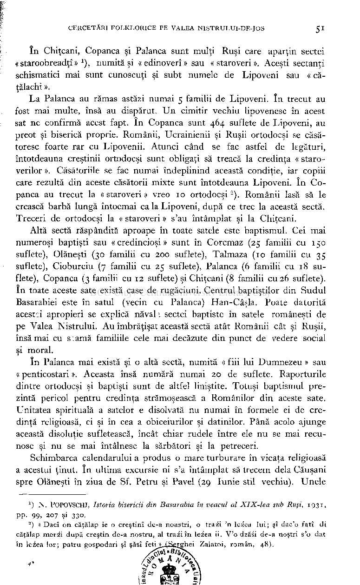

în Chiţcani, Copanca şi Palanca sunt mulţi Ruşi care aparţin sectei « staroobreadţî » *), numită şi « edinoverî » sau « staroveri ». Aceşti sectanţi schismatici mai sunt cunoscuţi şi subt numele de Lipoveni sau « căţălachi ».

La Palanca au rămas astăzi numai 5 familii de Lipoveni. în trecut au fost mai multe, însă au dispărut. Un cimitir vechiu lipovenesc în acest sat ne confirmă acest fapt. în Copanca sunt 464 suflete de Lipoveni, au preot şi biserică proprie. Românii, Ucrainienii şi Ruşii ortodocşi se căsătoresc foarte rar cu Lipovenii. Atunci când se fac astfel de legături, întotdeauna creştinii ortodocşi sunt obligaţi să treacă la credinţa « staroverilor ». Căsătoriile se fac numai îndeplinind această condiţie, iar copiii care rezultă din aceste căsătorii mixte sunt întotdeauna Lipoveni. în Copanca au trecut la «staroveri» vreo 10 ortodocşi

). Românii lasă să le crească barbă lungă întocmai ca la Lipoveni, după ce trec la această sectă. Treceri de ortodocşi la « staroveri » s'au întâmplat şi la Chiţcani.

2

Altă sectă răspândită aproape în toate satele este baptismul. Cei mai numeroşi baptişti sau « credincioşi » sunt în Corcmaz (25 familii cu 150 suflete), Olăneşti (30 familii cu 200 suflete), Talmaza (10 familii cu 35 suflete), Cioburciu (7 familii cu 25 suflete), Palanca (6 familii cu 18 suflete), Copanca (3 familii cu 1 2 suflete) şi Chiţcani (8 familii cu 26 suflete), în toate aceste sate există case de rugăciuni. Centrul baptiştilor din Sudul Basarabiei este în satul (vecin cu Palanca) Han-Câşla. Poate datorită acestei apropieri se explică năvăli sectei baptiste în satele româneşti de pe Valea Nistrului. Au îmbrăţişat această sectă atât Românii cât şi Ruşii, însă mai cu samă familiile cele mai decăzute din punct de vedere social şi moral.

în Palanca mai există şi o altă sectă, numită « fiii lui Dumnezeu » sau « penticostari ». Aceasta însă numără numai 20 de suflete. Raporturile dintre ortodocşi şi baptişti sunt de altfel liniştite. Totuşi baptismul prezintă pericol pentru credinţa strămoşească a Românilor din aceste sate. Unitatea spirituală a satelor e disolvată nu numai în formele ei de credinţă religioasă, ci şi în cea a obiceiurilor şi datinilor. Până acolo ajunge această disoluţie sufletească, încât chiar rudele între ele nu se mai recunosc şi nu se mai întâlnesc la sărbători şi la petreceri.

Schimbarea calendarului a produs o mare turburare în vieaţa religioasă a acestui ţinut. în ultima excursie ni s'a întâmplat să trecem delà Căuşani spre Olăneşti în ziua de Sf. Petru şi Pavel (29 Iunie stil vechiu). Unele

*) N . POPOVSCHI, Istoria bisericii din Basarabia în veacul al XIX-lea sub Ruşi, 1931 , pp. 99, 207 şi 330.

) « Daci on căţălap ie o creştini de-a noastri, o trazi 'n Iezea Iui; şî dac'o fatî di căţălap merzi după creştin de-a nostru, al trazi în Iezea ii. V'o dzăsi de-a noştri s'o dat în Iezea lor; patru gospodari şî şăsî feti(üejghe i Zalatoi, român, 48).

2

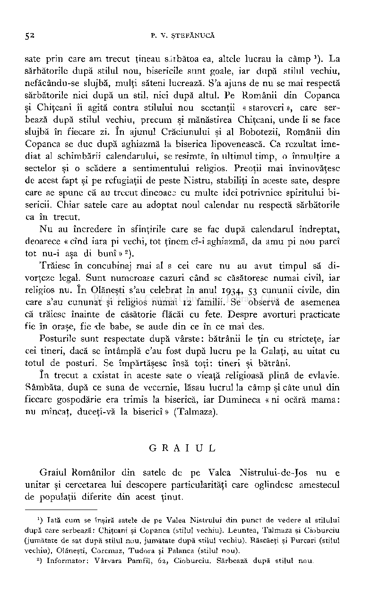

sate prin care am trecut ţineau s.irbătoa ea, altele lucrau la câmp ) . La sărbătorile după stilul nou, bisericile sunt goale, iar după stilul vechiu, nefăcându-se slujbă, mulţi săteni lucrează. S'a ajuns de nu se mai respectă sărbătorile nici după un stil, nici după altul. Pe Românii din Copanca şi Chiţcani îi agită contra stilului nou sectanţii « staroveri », care serbează după stilul vechiu, precum şi mănăstirea Chiţcani, unde li se face slujbă în fiecare zi. în ajunul Crăciunului şi al Bobotezii, Românii din Copanca se duc după aghiazmă la biserica lipovenească. Ca rezultat imediat al schimbării calendarului, se resimte, în ultimul timp, o înmulţire a sectelor şi o scădere a sentimentului religios. Preoţii mai învinovăţesc de acest fapt şi pe refugiaţii de peste Nistru, stabiliţi în aceste sate, despre care se spune că au trecut dincoac; cu multe idei potrivnice spiritului bisericii. Chiar satele care au adoptat noul calendar nu respectă sărbătorile ca în trecut.

Nu au încredere în sfinţirile care se fac după calendarul îndreptat, deoarece « cînd iara pi vechi, tot ţînem cî-i aghiazmă, da amu pi nou parcî tot nu-i aşa di bunî »

).

2

Trăiesc în concubinaj mai al s cei care nu au avut timpul să divorţeze legal. Sunt numeroase cazuri când se căsătoresc numai civil, iar religios nu. în Olăneşti s'au celebrat în anul 1934, 53 cununii civile, din care s'au cununat şi religios numai 12 familii. Se observă de asemenea că trăiesc înainte de căsătorie flăcăi cu fete. Despre avorturi practicate fie în oraşe, fie -de babe, se aude din ce în ce mai des.

Posturile sunt respectate după vârste: bătrânii le ţin cu stricteţe, iar cei tineri, dacă se întâmplă c'au fost după lucru pe la Galaţi, au uitat cu totul de posturi. Se împărtăşesc însă toţi: tineri şi bătrâni.

în trecut a existat în aceste sate o vieaţă religioasă plină de evlavie. Sâmbăta, după ce suna de vecernie, lăsau lucrul la câmp şi câte unul din fiecare gospodărie era trimis la biserică, iar Dumineca « ni ocară mama : nu mîncaţ, duceţî-vă la biserici » (Talmaza).

GRAIU L

Graiul Românilor din satele de pe Valea Nistrului-de-Jos nu e unitar şi cercetarea lui descopere particularităţi care oglindesc amestecul de populaţii diferite din acest ţinut.

') Iată cum se înşiră satele de pe Valea Nistrului din punct de vedere al stilului după care serbează: Chiţcani şi Copanca (stilul vechiu). Leuntea, Talmaza şi Cioburciu (jumătate de sat după stilul nou, jumătate după stilul vechiu). Răscăeţi şi Purcari (stilul vechiu), Olăneşti, Corcmaz, Tudora şi Palanca (stilul nou).

) Informator: Vârvara Pamfil, 62, Cioburciu. Sărbează după stilul nou

2

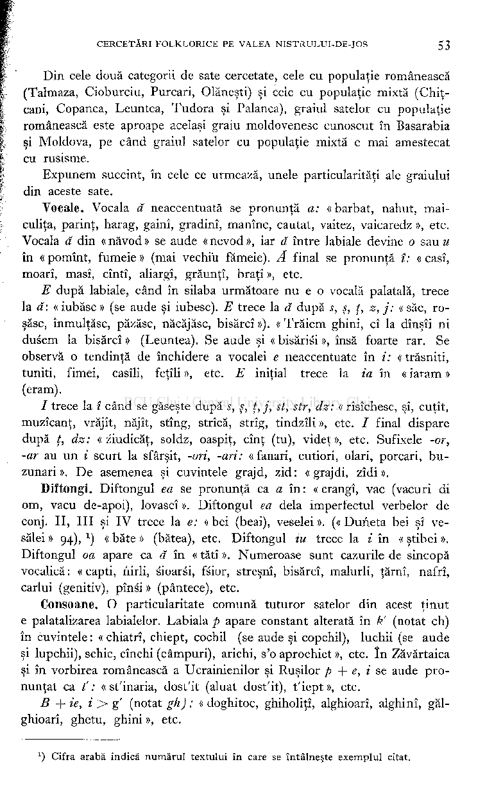

Din cele două categorii de sate cercetate, cele cu populaţie românească (Talmaza, Cioburciu, Purcari, Olăneşti) şi cele cu populaţie mixtă (Chiţcani, Copanca, Leuntea, Tudora şi Palanca), graiul satelor cu populaţie românească este aproape acelaşi graiu moldovenesc cunoscut în Basarabia şi Moldova, pe când graiul satelor cu populaţie mixtă e mai amestecat cu rusisme.

Expunem succint, în cele ce urmează, unele particularităţi ale graiului din aceste sate.

Vocale. Vocala ă neaccentuată se pronunţă a: « bărbat, nahut, maiculiţa, parinţ, harag, gainî, gradinî, manînc, căutat, vaitez, vaicaredz », etc. Vocala ă din « năvod » se aude « nevod », iar ă între labiale devine o sau u în « pomînt, fumeie » (mai vechi'u fămeie). Ă final se pronunţă î: « casî, moarî, masî, cîntî, aliargî, grăunţî, braţî », etc.

E după labiale, când în silaba următoare nu e o vocală palatală, trece la ă: « iubăsc » (se aude şi iubesc). E trece la ă după s, ş, ţ, z, j : « săc, roşăsc, înmulţăsc, păzăsc, năcăjăsc, bisărcî »). « Trăiem ghini, cî la dînşîi ni dusem la bisărcî » (Leuntea). Se aude şi « bisărisi », însă foarte rar. Se observă o tendinţă de închidere a vocalei e neaccentuate în i: « trăsniţi, tuniti, fimei, casîli, feţîli », etc. E iniţial trece la ia în « iaram » (eram).

/ trece la î când se găseşte după s, ş, ţ,j, st, str, dz: << rîsîchesc, şî, cuţît,

muzicant, vrăjit, năjît, stîng, strică, strîg, tindzîli », etc. / final dispare după ţ, dz: « ziudicăţ, soldz, oaspiţ, cînţ (tu), videţ », etc. Sufixele -or, -ar au un i scurt la sfârşit, -ori, -ari: « fanari, cutiori, olari, porcari, buzunari ». De asemenea şi cuvintele grajd, zid : « grajdi, zîdi ».

Diftongi. Diftongul ea se pronunţă ca a în : « crangî, vac (vacuri di om, vacu de-apoi), lovascî ». Diftongul ea delà imperfectul verbelor de conj. II, III şi IV trece la e: «bei (beai), veselei». (« Duneta bei şî vesălei » 94), ) « băte » (bătea), etc. Diftongul tu trece la i în « ştibei ». Diftongul oa apare ca ă în « tătî ». Numeroase sunt cazurile de sincopă vocalică : « capti, nirli, sioarsi, fsior, streşnî, bisărcî, malurli, ţărnî, nafrî, carlui (genitiv), pînsi » (pântece), etc.

Consoane. O particularitate comună tuturor satelor din acest ţinut e palatalizarea labialelor. Labiala p apare constant alterată în k' (notat ch) în cuvintele : « chiatrî, chiept, cochil (se aude şi copchil), luchii (se aude şi lupchii), schic, cînchi (câmpuri), arichi, s'o aprochiet », etc. în Zăvărtaica şi în vorbirea românească a Ucrainienilor şi Ruşilor p + e, i se aude pronunţat ca t': « st'inaria, dost'it (aluat dost'it), t'iept», etc.

B + ie, i > g' (notat gh) : « doghitoc, ghiholiţî, alghioarî, alghinî, gălghioarî, ghetu, ghini », etc.

Cifra arabă indică numărul textului în care se întâlneşte exemplul citat.

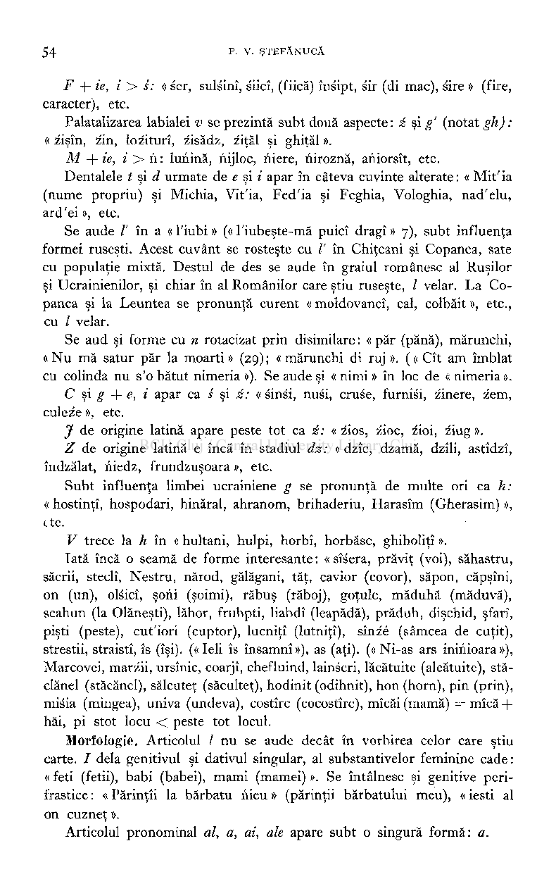

F + ie, i > s: « ser, sulsinî, siicî, (fiică) însipt, sir (di mac), sire » (fire, caracter), etc.

Palatalizarea labialei v se prezintă subt două aspecte: z şi g' (notat gh) :

« zişîn, zin, loziturî, zisădz, ziţăl şi ghiţăl ». M + ie, i > rï : lunină, nijloc, rïiere, fiiroznă, aniorsît, etc. Dentalele t şi d urmate de e şi i apar în câteva cuvinte alterate: « Mit'ia

(nume propriu) şi Michia, Vit'ia, Fed'ia şi Feghia, Vologhia, nad'elu, ard'ei », etc.

Se aude /' în a « l'iubi » (« l'iubeşte-mă puicî dragî » 7), subt influenţa formei ruseşti. Acest cuvânt se rosteşte cu /' în Chiţcani şi Copanca, sate cu populaţie mixtă. Destul de des se aude în graiul românesc al Ruşilor şi Ucrainienilor, şi chiar în al Românilor care ştiu ruseşte, / velar. La Copanca şi la Leuntea se pronunţă curent « moldovancî, cal, colbăit », etc., cu / velar.

Se aud şi forme cu n rotacizat prin disimilare : « păr (pană), mărunchi, «Nu mă satur păr la moarti » (29); «mărunchi di ruj ». (« Cît am îmbiat cu colinda nu s'o bătut nimeria »). Se aude şi « nimi » în loc de « nimeria».

C şi g + e, i apar ca s şi z: « sinsi, nusi, cruse, furnisi, zinere, zem,

culeze », etc. J de origine latină apare peste tot ca z: « zios, zioc, zioi, ziug ». Z de origine latină e încă în stadiul dz: « dzîc, dzamă, dzîli, astîdzî,

îndzălat, niedz, frundzuşoara », etc.

Subt influenţa limbei ucrainiene g se pronunţă de multe ori ca h: « hostinţî, hospodari, hinăral, ahranom, brihaderiu, Harasîm (Gherasirn) », ttc.

V trece la h în « hultani, hulpi, horbî, horbăsc, ghiholiţî ».

Iată încă o seamă de forme interesante: « sîsera, prăviţ (voi), săhastru, sacrii, steclî, Nestru, nărod, gălăgani, tăţ, cavior (covor), săpon, căpşîni, on (un), olsicî, soni (şoimi), răbuş (răboj), goţule, măduhă (măduvă), scahun (la Olăneşti), lăhor, fruhpti, liabdî (leapădă), prăduh, dişchid, şfarî, pişti (peste), cut'iori (cuptor), lucniţî (lutniţî), sînze (sâmcea de cuţit), strestii, straistî, îs (îşi). («Ieli îs însamnî»), as (aţi). (« Ni-as ars ininioara»), Marcovei, marzii, ursînic, coarjî, chefluind, lainseri, lăcătuite (alcătuite), stăclănel (stacanei), sălcuteţ (săculteţ), hodinit (odihnit), hon (horn), pin (prin), misia (mingea), univa (undeva), costîrc (cocostîrc), mîcăi(mamă) =mîc ă + hăi, pi stot locu < peste tot locul.

Morfologie. Articolul / nu se aude decât în vorbirea celor care ştiu carte. / delà genitivul şi dativul singular, al substantivelor feminine cade: « feti (fetii), babi (babei), mami (mamei) ». Se întâlnesc şi genitive perifrastice : « Părinţii la bărbatu nieu » (părinţii bărbatului meu), « ieşti al on cuzneţ ».

Articolul pronominal al, a, ai, ale apare subt o singură formă: a.

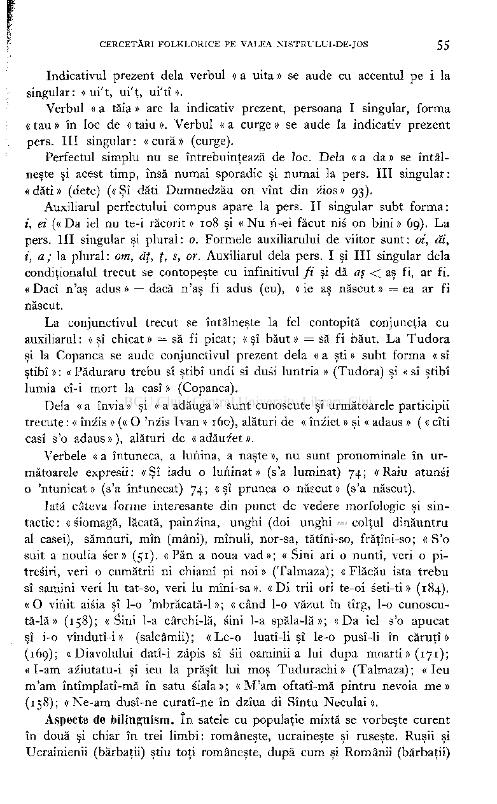

Indicativul prezent delà verbul « a uita » se aude cu accentul pe i la singular: « ui't, ui'ţ, ui'tî ».

Verbul « a tăia » are la indicativ prezent, persoana I singular, forma « tau » în loc de « taiu ». Verbul « a curge » se aude la indicativ prezent pers. III singular : « cură » (curge).

Perfectul simplu nu se întrebuinţează de loc. Delà « a da » se întâlneşte şi acest timp, însă numai sporadic şi numai la pers. III singular: « dăti » (dete) (« Şî dăti Dumnedzău on vînt din zios » 93).

Auxiliarul perfectului compus apare la pers. II singular subt forma: i, ei (« Da iei nu te-i răcorit » 108 şi « Nu ri-ei făcut nis on bini » 69). La pers. III singular şi plural: o. Formele auxiliarului de viitor sunt: oi, ăi, i, a; la plural: om, ăţ, ţ, s, or. Auxiliarul delà pers. I şi III singular delà condiţionalul trecut se contopeşte cu infinitivul fi şi dă aş < aş fi, ar fi. « Dacî n'aş adus » = dacă n'aş fi adus (eu), « ie aş născut » = ea ar fi născut.

La conjunctivul trecut se întâlneşte la fel contopită conjuncţia cu auxiliarul: « şî chicat » = să fi picat; « şî băut» = să fi băut. La Tudora şi la Copanca se aude conjunctivul prezent delà « a şti » subt forma « sî ştibî » : « Păduraru trebu sî ştibî undi sî dusi luntria » (Tudora) şi « sî ştibî lumia cî-i mort la casî » (Copanca).

Delà « a învia » şi « a adăuga » sunt cunoscute şi următoarele participii trecute : « înzis » (« O 'nzis Ivan » 160), alături de « înziet » şi « adaus » ( « cîti casî s'o adaus»), alături de « adăuzet ».

Verbele « a întuneca, a lunina, a naşte », nu sunt pronominale în următoarele expresii: «Şî iadu o luninat » (s'a luminat) 74; « Raiu atunsi o 'ntunicat » (s'a întunecat) 74; « şî prunca o născut» (s'a născut).

Iată câteva forme interesante din punct de vedere morfologic şi sintactic : « siomagă, lăcată, painzina, unghi (doi unghi = colţul dinăuntru al casei), sămnuri, mîn (mâni), mînuli, nor-sa, tătîni-so, frăţîni-so; « S'o suit a noulia ser» (51). « Păn a noua vad»; « Sini ari o nuntî, veri o pitresiri, veri o cumătrii ni chiamî pi noi» (Talmaza); «Flăcău ista trebu sî samini veri lu tat-so, veri lu mîni-sa ». «Di trii ori te-oi seti-ti » (184). «O vinit aisia şî l-o 'mbrăcată-1 »; «când l-o văzut în tîrg, l-o cunoscută-lă » (158); « Sini 1-a cârchi-lă, sini 1-a spăla-lă»; «Da iei s'o apucat şî i-o vîndutî-i » (salcâmii) ; « Le-o luatî-li şî le-o pusî-li în căruţî » (169); «Diavolului datî-i zâpis sî sii oaminii a lui dupa moarti » (171); « I-am aziutatu-i şî ieu la prăşît lui moş Tudurachi » (Talmaza) ; « leu m'am întîmplatî-mă în satu siala»; « M'am oftatî-mă pintru nevoia me» (158); « Ne-am dusî-ne curatî-ne în dzîua di Sîntu Neculai ».

Aspecte de bilinguism. în satele cu populaţie mixtă se vorbeşte curent în două şi chiar în trei limbi: româneşte, ucraineşte şi ruseşte. Ruşii şi Ucrainienii (bărbaţii) ştiu toţi româneşte, după cum şi Românii (bărbaţii)

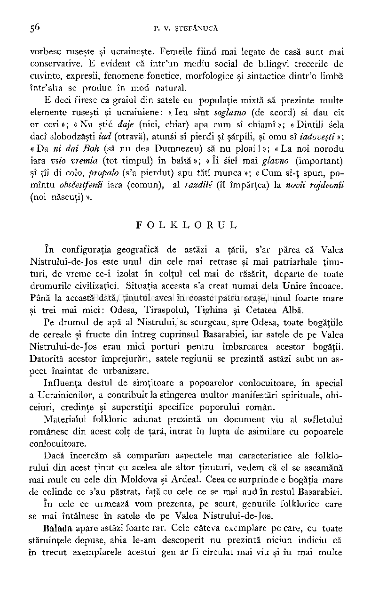

vorbesc ruseşte şi ucraineşte. Femeile fiind mai legate de casă sunt mai conservative. E evident că într'un mediu social de bilingvi trecerile de cuvinte, expresii, fenomene fonetice, morfologice şi sintactice dintr'o limbă într'alta se produc în mod natural.

E deci firesc ca graiul din satele cu populaţie mixtă să prezinte multe elemente ruseşti şi ucrainiene : « leu sînt soglasno (de acord) sî dau cît or ceri » ; « Nu ştie daje (nici, chiar) apa cum sî chiamî » ; « Dintili sela dacî slobodzăşti iad (otravă), atunsi sî pierdi şî şărpili, şî omu sî iadoveşti»; « Da ni dai Boh (să nu dea Dumnezeu) să nu ploai !» ; « La noi norodu iara vsio vretnia (tot timpul) în baltă»; «îi siel mai glavno (important) şî ţîi di colo, propah (s'a pierdut) apu tătî munca »; « Cum sî-ţ spun, pomîntu obscestfenîi iara (comun), al razdilé (îl împărţea) la novîi rojdeonîi (noi născuţi) ».

FOLKLORU L

în configuraţia geografică de astăzi a ţării, s'ar părea că Valea Nistrului-de-Jos este unul din cele mai retrase şi mai patriarhale ţinuturi, de vreme ce-i izolat în colţul cel mai de răsărit, departe de toate drumurile civilizaţiei. Situaţia aceasta s'a creat numai delà Unire încoace. Până la această dată, ţinutul avea în coaste patru oraşe, unul foarte mare şi trei mai mici: Odesa, Tiraspolul, Tighina şi Cetatea Albă.

Pe drumul de apă al Nistrului, se scurgeau, spre Odesa, toate bogăţiile de cereale şi fructe din întreg cuprinsul Basarabiei, iar satele de pe Valea Nistrului-de-Jos erau mici porturi pentru îmbarcarea acestor bogăţii. Datorită acestor împrejurări, satele regiunii se prezintă astăzi subt un aspect înaintat de urbanizare.

Influenţa destul de simţitoare a popoarelor conlocuitoare, în special a Ucrainienilor, a contribuit la stingerea multor manifestări spirituale, obiceiuri, credinţe şi superstiţii specifice poporului român.

Materialul folkloric adunat prezintă un document viu al sufletului românesc din acest colţ de ţară, intrat în lupta de asimilare cu popoarele conlocuitoare.

Dacă încercăm să comparăm aspectele mai caracteristice ale folklorului din acest ţinut cu acelea ale altor ţinuturi, vedem că el se aseamănă mai mult cu cele din Moldova şi Ardeal. Ceea ce surprinde e bogăţia mare de colinde ce s'au păstrat, faţă cu cele ce se mai aud în restul Basarabiei.

în cele ce urmează vom prezenta, pe scurt, genurile folklorice care se mai întâlnesc în satele de pe Valea Nistrului-de-Jos.

Balada apare astăzi foarte rar. Cele câteva exemplare pe care, cu toate stăruinţele depuse, abia le-am descoperit nu prezintă niciun indiciu că în trecut exemplarele acestui gen ar fi circulat mai viu şi în mai multe

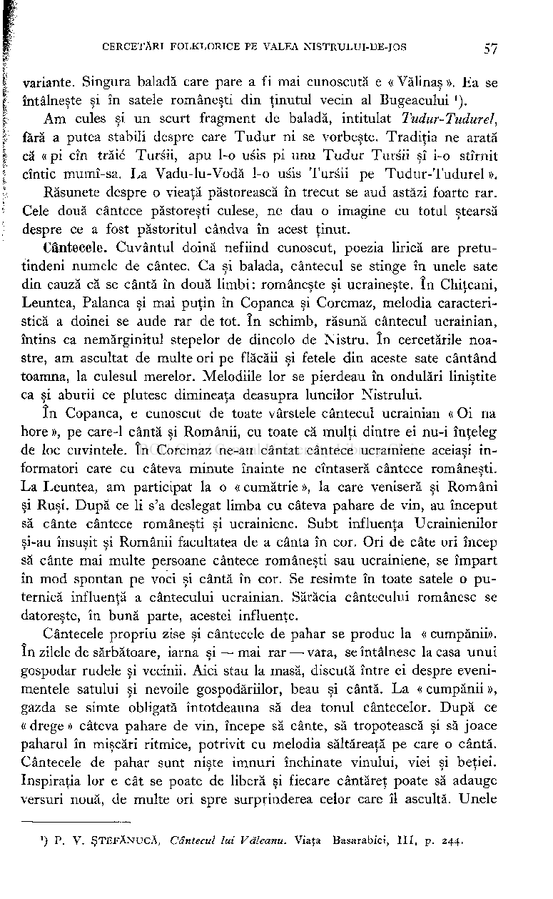

variante. Singura baladă care pare a fi mai cunoscută e « Vălinaş ». Ea se întâlneşte şi în satele româneşti din ţinutul vecin al Bugeacului

).

1

Am cules şi un scurt fragment de baladă, intitulat Tudur-Tudurel, fără a putea stabili despre care Tudur ni se vorbeşte. Tradiţia ne arată că « pi cîn trăie Tursii, apu l-o usis pi unu Tudur Tursii şî i-o stîrnit cîntic mumî-sa. La Vadu-lu-Vodă l-o usis Tursii pe Tudur-Tudurel ».

Răsunete despre o vieaţă păstorească în trecut se aud astăzi foarte rar. Cele două cântece păstoreşti culese, ne dau o imagine cu totul ştearsă despre ce a fost păstoritul cândva în acest ţinut.

Cântecele. Cuvântul doină nefiind cunoscut, poezia lirică are pretutindeni numele de cântec. Ca şi balada, cântecul se stinge în unele sate din cauză că se cântă în două limbi: româneşte şi ucraineşte. în Chiţcani, Leuntea, Palanca şi mai puţin în Copanca şi Corcmaz, melodia caracteristică a doinei se aude rar de tot. în schimb, răsună cântecul ucrainian, întins ca nemărginitul stepelor de dincolo de Nistru. în cercetările noastre, am ascultat de multe ori pe flăcăii şi fetele din aceste sate cântând toamna, la culesul merelor. Melodiile lor se pierdeau în ondulări liniştite ca şi aburii ce plutesc dimineaţa deasupra luncilor Nistrului.

în Copanca, e cunoscut de toate vârstele cântecul ucrainian « Oi na hore », pe care-1 cântă şi Românii, cu toate că mulţi dintre ei nu-i înţeleg de loc cuvintele. în Corcmaz ne-au cântat cântece ucramiene aceiaşi informatori care cu câteva minute înainte ne cîntaseră cântece româneşti. La Leuntea, am participat la o « cumătrie », la care veniseră şi Români şi Ruşi. După ce li s'a deslegat limba cu câteva pahare de vin, au început să cânte cântece româneşti şi ucrainiene. Subt influenţa Ucrainienilor şi-au însuşit şi Românii facultatea de a cânta în cor. Ori de câte ori încep să cânte mai multe persoane cântece româneşti sau ucrainiene, se împart în mod spontan pe voci şi cântă în cor. Se resimte în toate satele o puternică influenţă a cântecului ucrainian. Sărăcia cântecului românesc se datoreşte, în bună parte, acestei influenţe.

Cântecele propriu zise şi cântecele de pahar se produc la « cumpănii», în zilele de sărbătoare, iarna şi — mai rar —• vara, se întâlnesc la casa unui gospodar rudele şi vecinii. Aici stau la masă, discută între ei despre evenimentele satului şi nevoile gospodăriilor, beau şi cântă. La « cumpănii », gazda se simte obligată întotdeauna să dea tonul cântecelor. După ce « drege » câteva pahare de vin, începe să cânte, să tropotească şi să joace paharul în mişcări ritmice, potrivit cu melodia săltăreaţă pe care o cântă. Cântecele de pahar sunt nişte imnuri închinate vinului, viei şi beţiei. Inspiraţia lor e cât se poate de liberă şi fiecare cântăreţ poate să adauge versuri nouă, de multe ori spre surprinderea celor care îl ascultă. Unele

) P. V. STEFÄNUCÄ, Cântecul lui Văleanu. Viaţa Basarabiei, III , p. 244.

J

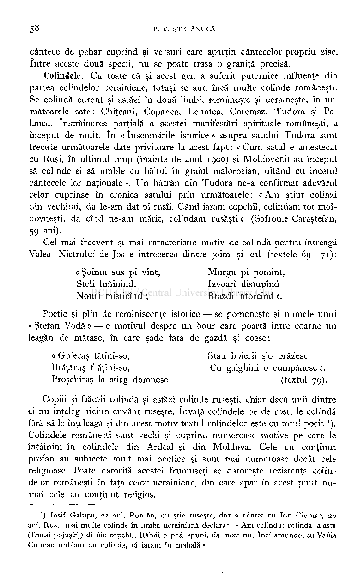

cântece de pahar cuprind şi versuri care aparţin cântecelor propriu zise. între aceste două specii, nu se poate trasa o graniţă precisă.

Colindele. Cu toate că şi acest gen a suferit puternice influenţe din partea colindelor ucrainiene, totuşi se aud încă multe colinde româneşti. Se colindă curent şi astăzi în două limbi, româneşte şi ucraineşte, în următoarele sate: Chiţcani, Copanca, Leuntea, Corcmaz, Tudora şi Palanca, înstrăinarea parţială a acestei manifestări spirituale româneşti, a început de mult. în « însemnările istorice » asupra satului Tudora sunt trecute următoarele date privitoare la acest fapt : « Cum satul e amestecat cu Ruşi, în ultimul timp (înainte de anul 1900) şi Moldovenii au început să colinde şi să umble cu hăitui în graiul malorosian, uitând cu încetul cântecele lor naţionale ». Un bătrân din Tudora ne-a confirmat adevărul celor cuprinse în cronica satului prin următoarele : « Am ştiut colinzi din vechimi, da le-am dat pi rusîi. Când iaram copchil, colindam tot moldovneşti, da cînd ne-am mărit, colindam rusăşti » (Sofronie Caraştefan, 59 ani).

Cel mai frecvent şi mai caracteristic motiv de colindă pentru întreagă Valea Nistrului-de-Jos e întrecerea dintre şoim şi cal (textele 69—71):

« Şoimu sus pi vînt, Murgu pi pomînt, Steli luninînd, Izvoarî distupînd Nouri misticînd ; Brazdi 'ntorcînd ».

Poetic şi plin de reminiscenţe istorice — se pomeneşte şi numele unui « Ştefan Vodă » — e motivul despre un bour care poartă între coarne un leagăn de mătase, în care sade fata de gazdă şi coase:

« Guleraş tătîni-so, Stau boierii ş'o prăzesc Brăţăruş frăţîni-so, Cu galghini o cumpănesc ». Proşchiraş la stiag domnesc (textul 79).

Copiii şi flăcăii colindă şi astăzi colinde ruseşti, chiar dacă unii dintre ei nu înţeleg niciun cuvânt ruseşte. învaţă colindele pe de rost, le colindă fără să le înţeleagă şi din acest motiv textul colindelor este cu totul pocit *). Colindele româneşti sunt vechi şi cuprind numeroase motive pe care le întâlnim în colindele din Ardeal şi din Moldova. Cele cu conţinut profan au subiecte mult mai poetice şi sunt mai numeroase decât cele religioase. Poate datorită acestei frumuseţi se datoreşte rezistenţa colindelor româneşti în faţa celor ucrainiene, din care apar în acest ţinut numai cele cu conţinut religios.

) Iosif Galupa, 22 ani, Român, nu ştie ruseşte, dar a cântat cu Ion Ciomac, 20

1

ani, Rus, mai multe colinde în limba ucrainiană declară: « A m colindat colinda aiasta (Dnesi pojuşcij) di riic copchil. Răbdi o posi spuni, da 'ncet nu. Incî amundoi cu Vania Ciumac îmblam cu colinda, cî iaram în mahala ».

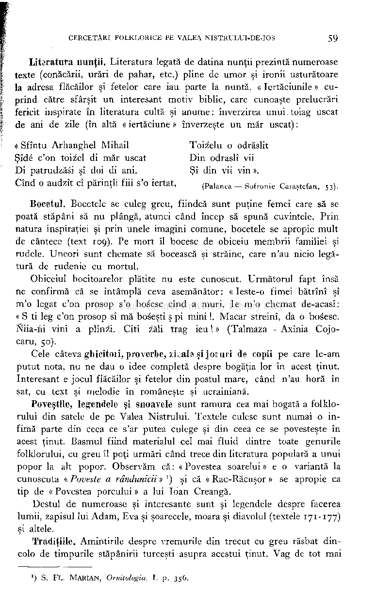

Literatura nunţii. Literatura legată de datina nunţii prezintă numeroase texte (conăcării, urări de pahar, etc.) pline de umor şi ironii usturătoare la adresa flăcăilor şi fetelor care iau parte la nuntă. « Iertăciunile » cuprind către sfârşit un interesant motiv biblic, care cunoaşte prelucrări fericit inspirate în literatura cultă şi anume : înverzirea unui. toiag uscat de ani de zile (în altă « iertăciune » înverzeşte un măr uscat) :

« Sfîntu Arhanghel Mihail Şîde c'on toizel di măr uscat Di patrudzăsi şî doi di ani. Cînd o audzît cî părinţii fiii s'o iertat,

Toizelu o odrăslit Din odraslî vii Şî din vii vin ».

(Palanca — Sofronie Caraştefan, 53).

Bocetul. Bocetele se culeg greu, fiindcă sunt puţine femei care să se poată stăpâni să nu plângă, atunci când încep să spună cuvintele. Prin natura inspiraţiei şi prin unele imagini comune, bocetele se apropie mult de cântece (text 109). Pe mort îl bocesc de obiceiu membrii familiei şi rudele. Uneori sunt chemate să bocească şi străine, care n'au nicio legătură de rudenie cu mortul.

Obiceiul bocitoarelor plătite nu este cunoscut. Următorul fapt însă ne confirmă că se întâmplă ceva asemănător: «Ieste-o fimei bătrînî şî m'o legat c'on prosop s'o bosesc cînd a muri. Ie m'o chemat de-acasî: « S ti leg c'on prosop sî mă boseşti ş pi mini !. Măcar streinî, da o bosesc. Niia-rii vini a plînzi. Cîtî zali trag ieu ! » (Talmaza — Axînia Cojocaru, 50).

Cele câteva ghicitori, proverbe, zicale şi joturi de copii pe care le-am putut nota, nu ne dau o idee completă despre bogăţia lor în acest ţinut. Interesant e jocul flăcăilor şi fetelor din postul mare, când n'au horă în sat, cu text şi melodie în româneşte şi ucrainiană.

Poveştile, legendele şi snoavele sunt ramura cea mai bogată a folklorului din satele de pe Valea Nistrului. Textele culese sunt numai o infimă parte din ceea ce s'ar putea culege şi din ceea ce se povesteşte în acest ţinut. Basmul fiind materialul cel mai fluid dintre toate genurile folklorului, cu greu îl poţi urmări când trece din literatura populară a unui popor la alt popor. Observăm că : « Povestea soarelui » e o variantă la cunoscuta « Poveste a rândunicii » ) şi că « Rac-Răcuşor » se apropie ca tip de « Povestea porcului » a lui loan Creangă.

Destul de numeroase şi interesante sunt şi legendele despre facerea lumii, zapisul lui Adam, Eva şi şoarecele, moara şi diavolul (textele 171-177) şi altele.

Tradiţiile. Amintirile despre vremurile din trecut cu greu răsbat dincolo de timpurile stăpânirii turceşti asupra acestui ţinut. Vag de tot mai

) S. FL. MARIAN, Ornitologia. I. p. 356.

x

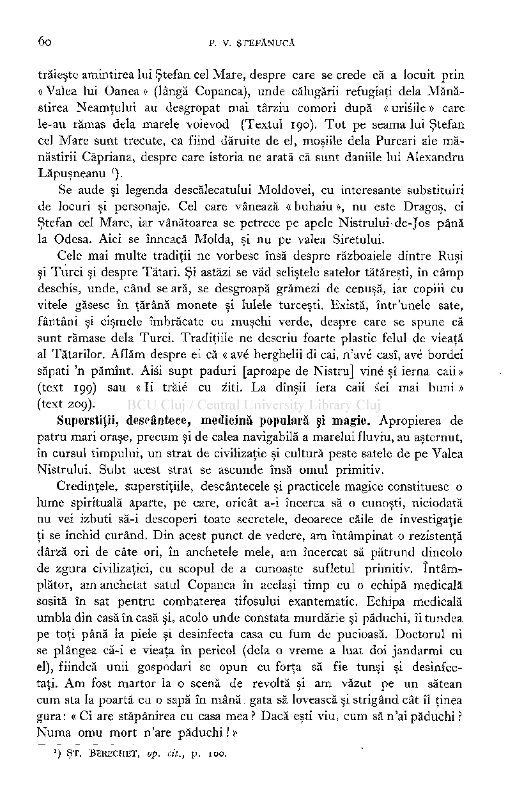

trăieşte amintirea lui Ştefan cel Mare, despre care se crede că a locuit prin « Valea lui Oanea » (lângă Copanca), unde călugării refugiaţi delà Mănăstirea Neamţului au desgropat mai târziu comori după « urisile » care le-au rămas delà marele voievod (Textul 190). Tot pe seama lui Ştefan cel Mare sunt trecute, ca fiind dăruite de el, moşiile delà Purcari ale mănăstirii Căpriana, despre care istoria ne arată că sunt daniile lui Alexandru Lăpuşneanu *).

Se aude şi legenda descălecatului Moldovei, cu interesante substituiri de locuri şi personaje. Cel care vânează « buhaiu », nu este Dragoş, ci Ştefan cel Mare, iar vânătoarea se petrece pe apele Nistrului de-Jos până la Odesa. Aici se înneacă Molda, şi nu pe valea Şiretului.

Cele mai multe tradiţii ne vorbesc însă despre războaiele dintre Ruşi şi Turci şi despre Tătari. Şi astăzi se văd seliştele satelor tătăreşti, în câmp deschis, unde, când se ară, se desgroapă grămezi de cenuşă, iar copiii cu vitele găsesc în ţărână monete şi lulele turceşti. Există, într'unele sate, fântâni şi cişmele îmbrăcate cu muşchi verde, despre care se spune că sunt rămase delà Turci. Tradiţiile ne descriu foarte plastic felul de vieaţă al Tătarilor. Aflăm despre ei că « avé herghelii di cai, n'avé casî, avé bordei săpaţi 'n pămînt. Aisi supt păduri [aproape de Nistru] vine şî ierna caii » (text 199) sau « Ii trăie cu ziti. La dînşii iera caii sei mai buni » (text 209).

Superstiţii, descântece, medicină populară şi magie. Apropierea de patru mari oraşe, precum şi de calea navigabilă a marelui fluviu, au aşternut, în cursul timpului, un strat de civilizaţie şi cultură peste satele de pe Valea Nistrului. Subt acest strat se ascunde însă omul primitiv.

Credinţele, superstiţiile, descântecele şi practicele magice constituesc o lume spirituală aparte, pe care, oricât a-i încerca să o cunoşti, niciodată nu vei izbuti să-i descoperi toate secretele, deoarece căile de investigaţie ţi se închid curând. Din acest punct de vedere, am întâmpinat o rezistenţă dârză ori de câte ori, în anchetele mele, am încercat să pătrund dincolo de zgura civilizaţiei, cu scopul de a cunoaşte sufletul primitiv. întâmplător, am anchetat satul Copanca în acelaşi timp cu o echipă medicală sosită în sat pentru combaterea tifosului exantematic. Echipa medicală umbla din casă în casă şi, acolo unde constata murdărie şi păduchi, îitundea pe toţi până la piele şi desinfecta casa cu fum de pucioasă. Doctorul ni se plângea că-i e vieaţa în pericol (delà o vreme a luat doi jandarmi cu el), fiindcă unii gospodari se opun cu forţa să fie tunşi şi desinfectaţi. Am fost martor la o scenă de revoltă şi am văzut pe un sătean cum sta la poartă cu o sapă în mână gata să lovească şi strigând cât îl ţinea gura: « Ci are stăpânirea cu casa mea? Dacă eşti viu, cum să n'ai păduchi ? Numa omu mort n'are păduchi ! »

) ŞT . BERECHET , op. cit., p. 100.

J

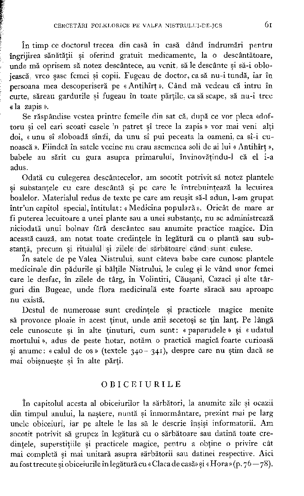

în timp ce doctorul trecea din casă în casă dând îndrumări pentru îngrijirea sănătăţii şi oferind gratuit medicamente, la o descântătoare, unde mă oprisem să notez descântece, au venit, să le descânte şi să-i oblojească, vreo şase femei şi copii. Fugeau de doctor, ca să nu-i tundă, iar în persoana mea descoperiseră pe « Antihîrţ ». Când mă vedeau că intru în curte, săreau gardurile şi fugeau în toate părţile, ca să scape, să nu-i trec « la zapis ».

Se răspândise vestea printre femeile din sat că, după ce vor pleca «doftoru şi cel cari scoati casele 'n patret şî trece la zapis » vor mai veni alţi doi, « unu sî sloboadă sînzi, da unu sî pui peceata la oameni, ca sî-i cunoască ». Fiindcă în satele vecine nu erau asemenea soli de ai lui « Antihîrţ », babele au sărit cu gura asupra primarului, învinovăţindu-1 că el i-a adus.

Odată cu culegerea descântecelor, am socotit potrivit să notez plantele şi substanţele cu care descântă şi pe care le întrebuinţează la lecuirea boalelor. Materialul redus de texte pe care am reuşit să-1 adun, l-am grupat într'un capitol special, întitulat: «Medicina populară». Oricât de mare ar fi puterea lecuitoare a unei plante sau a unei substanţe, nu se administrează niciodată unui bolnav fără descântec sau anumite practice magice. Din această cauză, am notat toate credinţele în legătură cu o plantă sau substanţă, precum şi ritualul şi zilele de sărbătoare când sunt culese.

în satele de pe Valea Nistrului, sunt câteva babe care cunosc plantele medicinale din pădurile şi bălţile Nistrului, le culeg şi le vând unor femei care le desfac, în zilele de târg, în Volintiri, Căuşani, Cazaci şi alte târguri din Bugeac, unde flora medicinală este foarte săracă sau aproape nu există.

Destul de numeroase sunt credinţele şi practicele magice menite să provoace ploaie în acest ţinut, unde anii secetoşi se ţin lanţ. Pe lângă cele cunoscute şi în alte ţinuturi, cum sunt : « paparudele » şi « udatul mortului », adus de peste hotar, notăm o practică magică foarte curioasă şi anume: «calul de os» (textele 340—341), despre care nu ştim dacă se mai obişnueşte şi în alte părţi.

OBICEIURIL E

în capitolul acesta al obiceiurilor la sărbători, la anumite zile şi ocazii din timpul anului, la naştere, nuntă şi înmormântare, prezint mai pe larg unele obiceiuri, iar pe altele le las să le descrie înşişi informatorii. Am socotit potrivit să grupez în legătură cu o sărbătoare sau datină toate credinţele, superstiţiile şi practicele magice, pentru a obţine o privire cât mai completă şi mai unitară asupra sărbătorii sau datinei respective. Aici au fost trecute şi obiceiurile în legătură cu « Claca de casă» şi « Hora » (p. 76 —78).

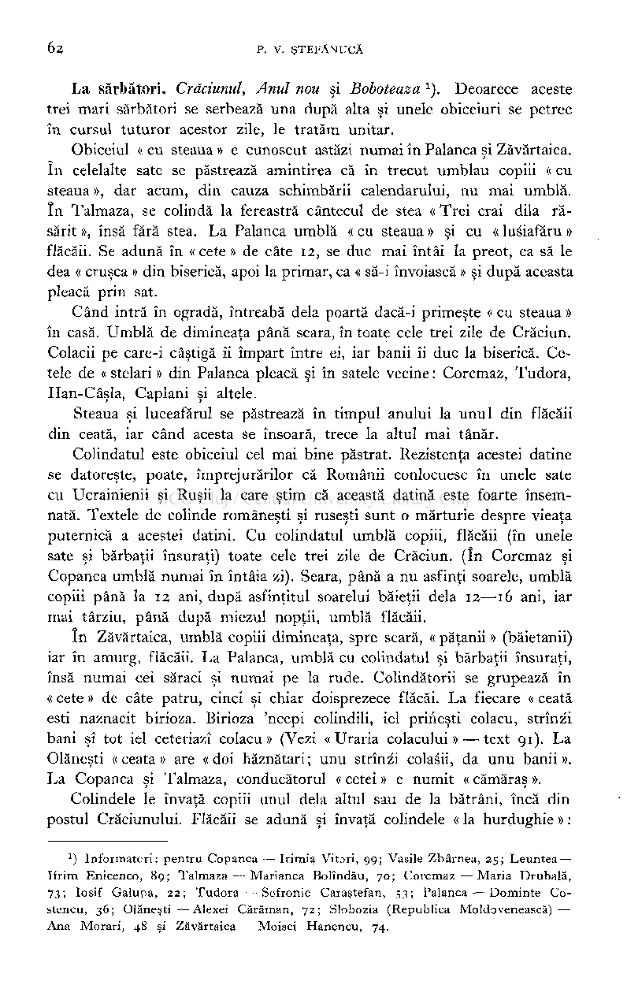

La sărbători. Crăciunul, Anul nou şi Bobotează Deoarece aceste trei mari sărbători se serbează una după alta şi unele obiceiuri se petrec în cursul tuturor acestor zile, le tratăm unitar.

Obiceiul « cu steaua » e cunoscut astăzi numai în Palanca şi Zăvărtaica. în celelalte sate se păstrează amintirea că în trecut umblau copiii « cu steaua », dar acum, din cauza schimbării calendarului, nu mai umblă, în Talmaza, se colindă la fereastră cântecul de stea « Trei crai dila răsărit », însă fără stea. La Palanca umblă « cu steaua » şi cu « lusiafăru » flăcăii. Se adună în « cete » de câte 12, se duc mai întâi la preot, ca să le dea « cruşca » din biserică, apoi la primar, ca « să-i învoiască » şi după aceasta pleacă prin sat.

Când intră în ogradă, întreabă delà poartă dacă-i primeşte « cu steaua » în casă. Umblă de dimineaţa până seara, în toate cele trei zile de Crăciun. Colacii pe care-i câştigă îi împart între ei, iar banii îi duc la biserică. Cetele de « stelari » din Palanca pleacă şi în satele vecine : Corcmaz, Tudora, Han-Câşla, Caplani şi altele.

Steaua şi luceafărul se păstrează în timpul anului la unul din flăcăii din ceată, iar când acesta se însoară, trece la altul mai tânăr.

Colindatul este obiceiul cel mai bine păstrat. Rezistenţa acestei datine se datoreşte, poate, împrejurărilor că Românii conlocuesc în unele sate cu Ucrainienii şi Ruşii la care ştim că această datină este foarte însemnată. Textele de colinde româneşti şi ruseşti sunt o mărturie despre vieaţa puternică a acestei datini. Cu colindatul umblă copiii, flăcăii (în unele sate şi bărbaţii însuraţi) toate cele trei zile de Crăciun. (în Corcmaz şi Copanca umblă numai în întâia zi). Seara, până a nu asfinţi soarele, umblă copiii până la 12 ani, după asfinţitul soarelui băieţii delà 12—16 ani, iar mai târziu, până după miezul nopţii, umblă flăcăii.

în Zăvărtaica, umblă copiii dimineaţa, spre seară, « păţanii » (băietanii) iar în amurg, flăcăii. La Palanca, umblă cu colindatul şi bărbaţii însuraţi, însă numai cei săraci şi numai pe la rude. Colindătorii se grupează în « cete » de câte patru, cinci şi chiar doisprezece flăcăi. La fiecare « ceată esti naznacit birioza. Birioza 'ncepi colindili, iei prineşti colacu, strînzi bani şî tot iei ceteriazî colacu » (Vezi « Uraria colacului » — text 91). La Olăneşti «ceata» are «doi hăznătari; unu strînzi colasii, da unu banii». La Copanca şi Talmaza, conducătorul « cetei » e numit « cămăraş ».

Colindele le învaţă copiii unul delà altul sau de la bătrâni, încă din postul Crăciunului. Flăcăii se adună şi învaţă colindele « la hurdughie » :

') Informatori: pentru Copanca — Irimia Vitari, 99; Vasile Zbârnea, 25 ; Leuntea Ifrim Enicenco, 89; Talmaza —Marianca Bolîndău, 70; Corcmaz — Maria Drubală, 73; Iosif Galupa, 22 ; Tudora —Sofronie Caraştefan, 53 ; Palanca —Dominte Costencu, 36; Olăneşti —Alexei Cărăman, 72 ; Slobozia (Republica Moldovenească) Ana Morari, 48 şi Zăvărtaica — Moisei Hanencu, 74.

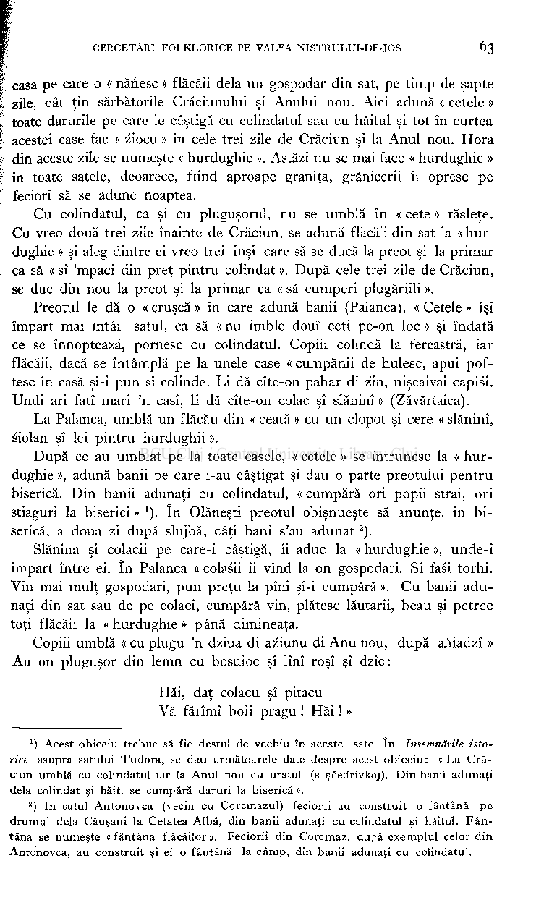

casa pe care o « năfîesc » flăcăii delà un gospodar din sat, pe timp de şapte zile, cât ţin sărbătorile Crăciunului şi Anului nou. Aici adună « cetele » toate darurile pe care le câştigă cu colindatul sau cu hăitui şi tot în curtea acestei case fac « ziocu » în cele trei zile de Crăciun şi la Anul nou. Hora din aceste zile se numeşte « hurdughie ». Astăzi nu se mai face « hurdughie » în toate satele, deoarece, fiind aproape graniţa, grănicerii îi opresc pe feciori să se adune noaptea.

Cu colindatul, ca şi cu pluguşorul, nu se umblă în « cete » răsleţe. Cu vreo două-trei zile înainte de Crăciun, se adună flăcăi din sat la « hurdughie » şi aleg dintre ei vreo trei inşi care să se ducă la preot şi la primar ca să « sî 'mpaci din preţ pintru colindat ». După cele trei zile de Crăciun, se duc din nou la preot şi la primar ca « să cumperi plugăriili ».

Preotul le dă o « cruşcă » în care adună banii (Palanca). « Cetele » îşi împart mai întâi satul, ca să « nu îmbie douî ceti pe-on loc » şi îndată ce se înnoptează, pornesc cu colindatul. Copiii colindă la fereastră, iar flăcăii, dacă se întâmplă pe la unele case « cumpănii de hulesc, apui poftesc în casă şî-i pun sî colinde. Li dă cîte-on pahar di zin, nişcaivai capisi. Undi ari fatî mari 'n casî, li dă cîte-on colac şî slănini » (Zăvărtaica).

La Palanca, umblă un flăcău din « ceată » cu un clopot şi cere « slănini, siolan şî lei pintru hurdughii ».

După ce au umblat pe la toate casele, « cetele » se întrunesc la « hurdughie », adună banii pe care i-au câştigat şi dau o parte preotului pentru biserică. Din banii adunaţi cu colindatul, « cumpără ori popii strai, ori stiaguri la biserici » ). în Olăneşti preotul obişnueşte să anunţe, în biserică, a doua zi după slujbă, câţi bani s'au adunat

).

2

Slănina şi colacii pe care-i câştigă, îi aduc la « hurdughie », unde-i împart între ei. în Palanca « colasii îi vînd la on gospodari. Sî fasi torhi. Vin mai mulţ gospodari, pun preţu la pîni şî-i cumpără ». Cu banii adunaţi din sat sau de pe colaci, cumpără vin, plătesc lăutarii, beau şi petrec toţi flăcăii la « hurdughie » până dimineaţa.

Copiii umblă « cu plugu 'n dzîua di aziunu di Anu nou, după aiiiadzî » Au on pluguşor din lemn cu bosuioc şî lînî roşî şî dzîc:

Hăi, daţ colacu şî pitacu Vă fărîmî boii pragu ! Hăi ! »

) Acest obiceiu trebue să fie destul de vechiu în aceste sate. în însemnările istorice asupra satului Tudora, se dau următoarele date despre acest obiceiu : « L a Crăciun umblă cu colindatul iar la Anul nou cu uratul (s şcedrivkoj). Din banii adunaţi delà colindat şi hăit, se cumpără daruri la biserică ».

x

) In satul Antonovca (vecin cu Corcmazul) feciorii au construit o fântână pe drumul delà Căuşani la Cetatea Albă, din banii adunaţi cu colindatul şi hăitui. Fân tâna se numeşte « fântâna flăcăilor ». Feciorii din Corcmaz, după exemplul celor din Antonovca, au construit şi ei o fântână, la câmp, din banii adunaţi cu colindatu'.

2

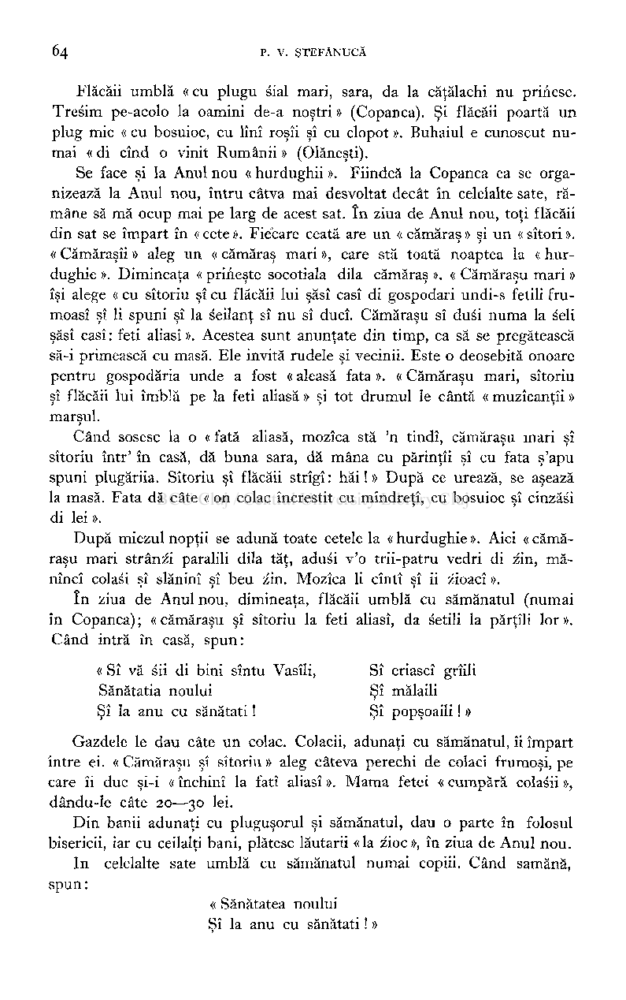

Flăcăii umblă « cu plugu sial mari, sara, da la căţălachi nu prinesc. Tresim pe-acolo la oamini de-a noştri » (Copanca). Şi flăcăii poartă un plug mic « cu bosuioc, cu lînî roşii şî cu clopot ». Buhaiul e cunoscut numai « di cînd o vinit Rumânii » (Olăneşti).

Se face şi la Anul nou <( hurdughii ». Fiindcă la Copanca ea se orga­

nizează la Anul nou, întru câtva mai desvoltat decât în celelalte sate, rămâne să mă ocup mai pe larg de acest sat. în ziua de Anul nou, toţi flăcăii din sat se împart în « cete ». Fiecare ceată are un « cămăraş » şi un « sîtori ». « Cămăraşîi » aleg un « cămăraş mari », care stă toată noaptea la « hurdughie ». Dimineaţa « prineşte socotiala dila cămăraş ». « Cămăraşu mari » îşi alege « cu sîtoriu şî cu flăcăii lui şăsî casî di gospodari undi-s fetili frumoasî şî li spuni şî la seilanţ sî nu sî ducî. Cămăraşu sî dusi numa la seli şăsî casî: feti aliasî ». Acestea sunt anunţate din timp, ca să se pregătească să-i primească cu masă. Ele invită rudele şi vecinii. Este o deosebită onoare pentru gospodăria unde a fost « aleasă fata ». « Cămăraşu mari, sîtoriu şî flăcăii lui îmbla pe la feti aliasă » şi tot drumul le cântă « muzicanţii » marşul.

Când sosesc la o « fată aliasă, mozîca stă 'n tindî, cămăraşu mari şî sîtoriu într' în casă, dă buna sara, dă mâna cu părinţii şî cu fata ş'apu spuni plugăriia. Sîtoriu şî flăcăii strîgî: hăi ! » După ce urează, se aşează la masă. Fata dă câte « on colac încrestit cu mîndreţî, cu bosuioc şî cinzăsi di lei ».

După miezul nopţii se adună toate cetele la « hurdughie ». Aici « cămăraşu mari strânzi paralili dila tăţ, aduşi v'o trii-patru vedri di zin, mănîncî colasi sî slănini sî beu zin. Mozîca li cîntî sî ii zioacî ».

în ziua de Anul nou, dimineaţa, flăcăii umblă cu sămănatul (numai în Copanca) ; « cămăraşu şî sîtoriu la feti aliasî, da setili la părţîli lor ». Când intră în casă, spun:

« Sî vă sii di bini sîntu Vasîli, Sî criascî grîili Sănătatia noului Şî mălaili Şî Ia anu cu sănătăţi ! Şî popşoaili ! »

Gazdele le dau câte un colac. Colacii, adunaţi cu sămănatul, îi împart între ei. « Cămăraşu şî sîtoriu » aleg câteva perechi de colaci frumoşi, pe care îi duc şi-i « închinî la fatî aliasî ». Mama fetei « cumpără colasii », dându-le câte 20—30 lei.

Din banii adunaţi cu pluguşorul şi sămănatul, dau o parte în folosul bisericii, iar cu ceilalţi bani, plătesc lăutarii «la zioc», în ziua de Anul nou.

In celelalte sate umblă cu sămănatul numai copiii. Când samănă, spun:

« Sănătatea noului Şî la anu cu sănătăţi ! »

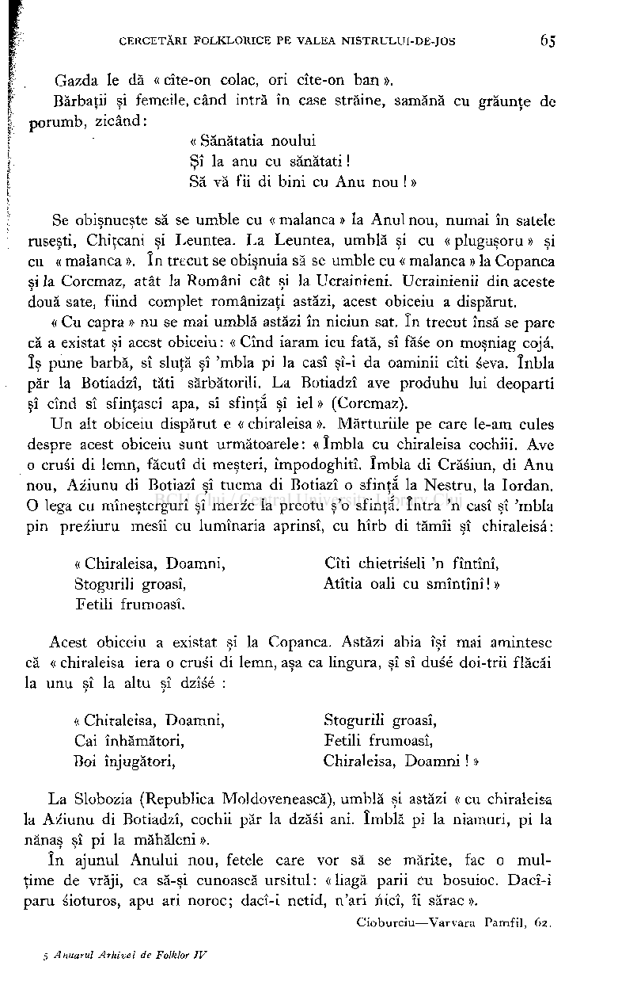

##### CERCETĂRI FOLKLORICE PE VALEA NISTRULUI-DE-JOS 65

Gazda le dă « cîte-on colac, ori cîte-on ban ». Bărbaţii şi femeile, când intră în case străine, samănă cu grăunţe de

porumb, zicând:

« Sănătatia noului Şî la anu cu sănătăţi ! Să vă fii di bini cu Anu nou ! »

Se obişnueşte să se umble cu « malanca » la Anul nou, numai în satele ruseşti, Chiţcani şi Leuntea. La Leuntea, umblă şi cu « pluguşoru » şi cu « malanca ». în trecut se obişnuia să se umble cu « malanca » la Copanca şi la Corcmaz, atât la Români cât şi la Ucrainieni. Ucrainienii din aceste două sate, fiind complet românizaţi astăzi, acest obiceiu a dispărut.

« Cu capra » nu se mai umblă astăzi în niciun sat. în trecut însă se pare că a existat şi acest obiceiu : « Cînd iaram ieu fată, sî făse on moşniag cojâ. îş pune barbă, sî slută şî 'mbla pi la casî şî-i da oaminii cîti seva. înbla păr la Botiadzî, tăti sărbătorili. La Botiadzî ave produhu lui deoparti şî cînd sî sfinţascî apa, sî sfinţă şî iei » (Corcmaz).

Un alt obiceiu dispărut e « chiraleisa ». Mărturiile pe care le-am cules despre acest obiceiu sunt următoarele : « îmbla cu chiraleisa cochiii. Ave o crusi di lemn, făcutî di meşteri, împodoghitî. îmbla di Crăsiun, di Anu nou, Aziunu di Botiazî şî tucma di Botiazî o sfinţă la Nestru, la Iordan. O lega cu mîneştergurî şî merze la preotu ş'o sfinţă. întră 'n casî şî 'mbla pin preziuru mesîi cu lumînaria aprinsî, cu hîrb di tămîi şî chiraleisa:

« Chiraleisa, Doamni, Cîti chietriseli 'n fîntînî, Stogurili groasî, Atîtia oali cu smîntînî ! » Fetili frumoasî.

Acest obiceiu a existat şi la Copanca. Astăzi abia îşi mai amintesc că « chiraleisa iera o crusi di lemn, aşa ca lingura, şî sî dusé doi-trii flăcăi la unu şî la altu şî dzîsé :

« Chiraleisa, Doamni, Stogurili groasî, Cai înhămători, Fetili frumoasî, Boi înjugători, Chiraleisa, Doamni ! »

La Slobozia (Republica Moldovenească), umblă şi astăzi « cu chiraleiss la Aziunu di Botiadzî, cochii păr la dzăsi ani. îmbla pi la niamuri, pi la nănaş şî pi la măhăleni ».

în ajunul Anului nou, fetele care vor să se mărite, fac o mulţime de vrăji, ca să-şi cunoască ursitul : « liagă parii cu bosuioc. Dacî-i paru sioturos, apu ari noroc; dacî-i netid, n'ari riicî, îi sărac».

Cioburciu—Varvara Pamfil, 62.

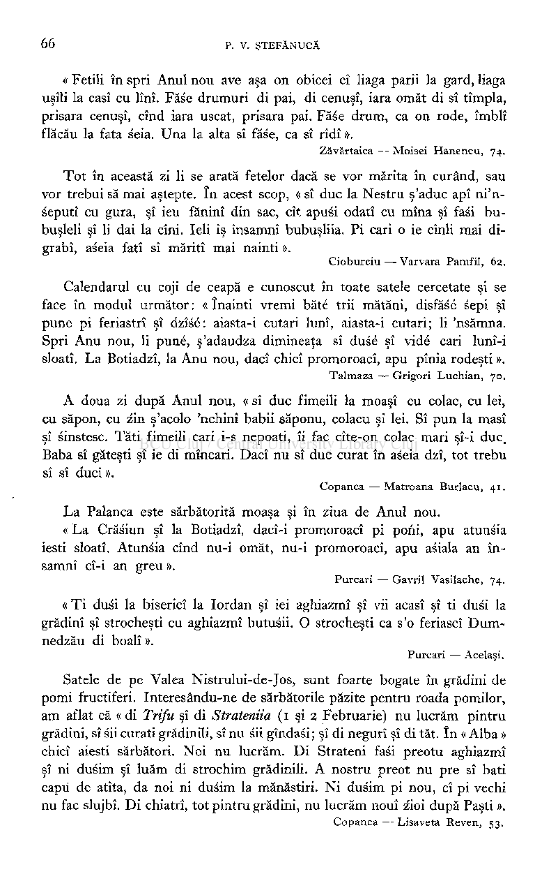

##### 66 p. v. ŞTEFANUCA

« Fetili în spri Anul nou ave aşa on obicei cî liaga parii la gard, liaga uşîli la casî cu lînî. Făse drumuri di pai, di cenuşi, iara omăt di sî tîmpla, prisara cenuşî, cînd iara uscat, prisara pai. Făse drum, ca on rode, îmblî flăcău la fata seia. Una la alta sî făse, ca sî rîdî ».

Zăvărtaica — Moisei Hanencu, 74.

Tot în această zi li se arată fetelor dacă se vor mărita în curând, sau vor trebui să mai aştepte. în acest scop, « sî duc la Nestru ş'aduc apî ni'nseputî cu gura, şî ieu făninî din sac, cît apusi odatî cu mîna şî fasi bubuşleli şî li dai la cîni. Ieli îş însamnî bubuşliia. Pi cari o ie cînli mai digrabî, aseia fatî sî măritî mai nainti ».

Cioburciu — Varvara Pamfil, 62.

Calendarul cu coji de ceapă e cunoscut în toate satele cercetate şi se face în modul următor : « înainti vremi băte trii mătăni, disfăse sepi şî pune pi feriastrî şî dzîsé: aiasta-i cutări lunî, aiasta-i cutări; li 'nsămna. Spri Anu nou, li puné, ş'adaudza dimineaţa si dusé şî vidé cari lunî-i sloatî. La Botiadzî, la Anu nou, dacî chicî promoroacî, apu pînia rodeşti ».

Talmaza — Grigori Luchian, 70.

A doua zi după Anul nou, « sî duc fimeili la moaşî cu colac, cu lei, cu săpon, cu zin ş'acolo 'nchinî babii săponu, colacu şî lei. Sî pun la masî şî sinstesc. Tăti fimeili cari i-s nepoati, îi fac cîte-on colac mari şî-i duc. Baba sî găteşti şî ie di mîncari. Dacî nu sî duc curat în aseia dzî, tot trebu sî sî ducî ».

Copanca — Matroana Burlacu, 41 .

La Palanca este sărbătorită moaşa şi în ziua de Anul nou. « La Crăsiun şî la Botiadzî, dacî-i promoroacî pi porii, apu atunsia

ieşti sloatî. Atunsia cînd nu-i omăt, nu-i promoroacî, apu asiala an însamnî cî-i an greu ».

Purcari — Gavril Vasilache, 74.

« Ti dusi la biserici la Iordan şî iei aghiazmî şî vii acasî şî ti dusi la grădini şî strocheşti cu aghiazmî butusii. O strocheşti ca s'o feriascî Dumnedzău di boalî ».

Purcari — Acelaşi.

Satele de pe Valea Nistrului-de-Jos, sunt foarte bogate în grădini de pomi fructiferi. Interesându-ne de sărbătorile păzite pentru roadă pomilor, am aflat că « di Trifu şî di Strateniia (1 şi 2 Februarie) nu lucrăm pintru grădini, sî sii curaţi grădinili, sî nu sii gîndasi; şî di negurî şî di tăt. în « Alba » chicî aiesti sărbători. Noi nu lucrăm. Di Strateni fasi preotu aghiazmî şî ni dusim şî luăm di strochim grădinili. A nostru preot nu pre sî bati capii de atîta, da noi ni dusim la mănăstiri. Ni dusim pi nou, cî pi vechi nu fac slujbî. Di chiatrî, tot pintru grădini, nu lucrăm nouî zioi după Paşti ».

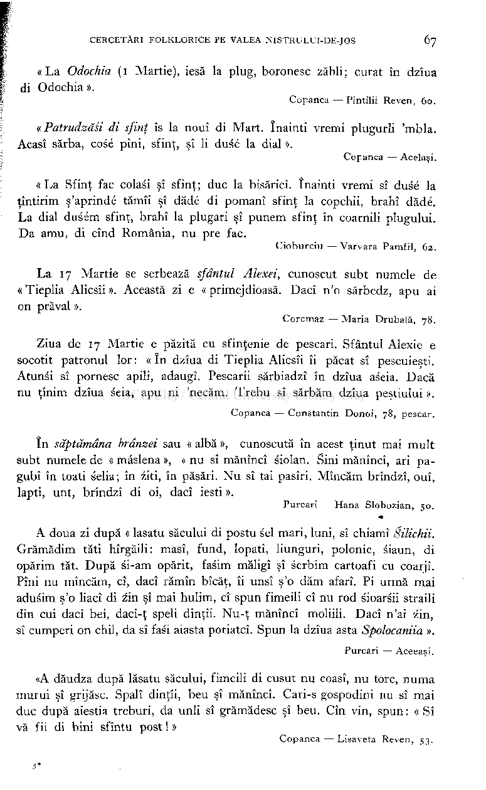

«La Odochia (i Martie), iesă la plug, boronesc zăbli; curat în dzîua di Odochia ».

Copanca — Pintilii Reven, 60.

«Patrudzăsi di sfinţ îs la nouî di Mart. înainti vremi plugurli 'mbla. Acasî sărba, cosé pîni, sfinţ, şî li dusé la dial ».

Copanca —Acelaşi.

«La Sfinţ fac colasi şî sfinţ; duc la bisăricî. înainti vremi sî dusé la ţîntirim ş'aprinde tămîi şî dade di pomanî sfinţ la copchii, brahî dăde. La dial dusém sfinţ, brahî la plugari şî punem sfinţ în coarnili plugului. Da amu, di cînd România, nu pre fac.

Cioburciu—Varvara Pamfil, 62.

La 17 Martie se serbează sfântul Alexei, cunoscut subt numele de « Tieplia Alicsîi ». Această zi e « primejdioasă. Dacî n'o sărbedz, apu ai on prăval ».

Corcmaz — Maria Drubală, 78.

Ziua de 17 Martie e păzită cu sfinţenie de pescari. Sfântul Alexie e socotit patronul lor : « în dzîua di Tieplia Alicsîi îi păcat sî pescuieşti. Atunsi sî pornesc apili, adaugi. Pescarii sărbiadzî în dzîua aseia. Dacă nu ţînim dzîua seia, apu ni 'necăm. Trebu sî sărbăm dzîua peştiului ».

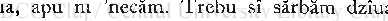

Copanca — Constantin Donoi, 78, pescar.

în săptămâna brânzei sau « albă », cunoscută în acest ţinut mai mult subt numele de « mâslena », « nu sî mănîncî siolan. Sini mănîncî, ari pagubî în toati selia; în ziti, în păsări. Nu sî tai pasîri. Mîncăm brîndzî, ouî, lapti, unt, brîndzî di oi, dacî ieşti ».

Purcari — Hana Slobozian, 50.

A doua zi după « lasatu sacului di postu sel mari, luni, sî chiamî Silichii. Grămădim tăti hîrgăili: masî, fund, lopatî, liunguri, polonic, siaun, di opărim tăt. După si-am opărit, fasim măligî şî serbim cartoafi cu coarjî. Pîni nu mîncăm, cî, dacî rămîn bîcăţ, îi unsî ş'o dăm afarî. Pi urmă mai adusim ş'o liacî di zin şî mai hulim, cî spun fimeili cî nu rod sioarsii straili din cui dacî bei, dacî-ţ speli dinţîi. Nu-ţ mănîncî moliili. Dacî n'ai zin, sî cumperi on chil, da sî fasi aiasta poriatcî. Spun la dzîua asta Spolocaniia ».

Purcari —Aceeaşi.

«A dăudza după lăsatu sacului, fimeili di cusut nu coasî, nu torc, numa murui şî grijăsc. Spalî dinţîi, beu şî mănîncî. Cari-s gospodini nu sî mai duc după aiestia treburi, da unii sî grămădesc şî beu. Cîn vin, spun : « Sî vă fii di bini sfîntu post ! »

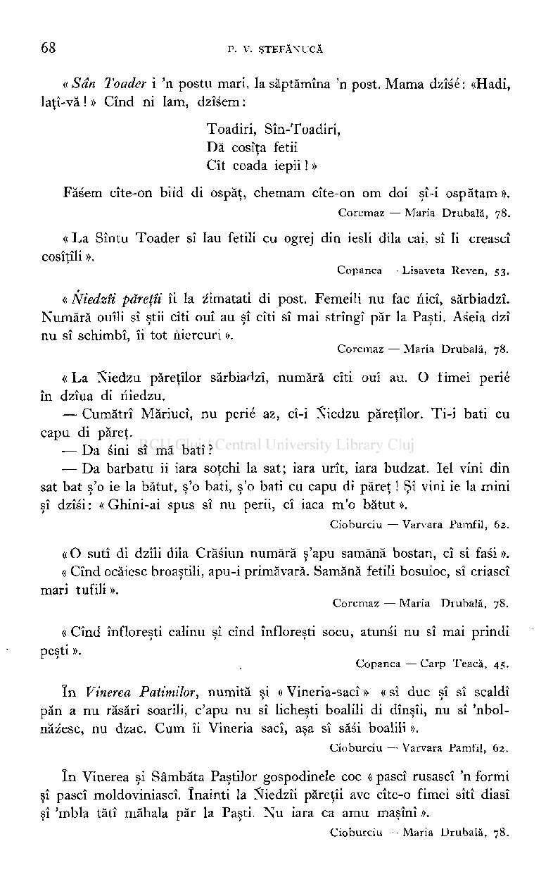

« Sân Toader i 'n postu mari, la săptămîna 'n post. Mama dzîsé: «Hadi, laţî-vă ! » Cînd ni lam, dzîsem:

Toadiri, Sîn-Toadiri, Dă cosiţa fetii Cit coada iepii ! »

Făsem cîte-on biid di ospăţ, chemam cîte-on om doi şî-i ospătam».

Corcmaz — Maria Drubală, 78.

« La Sîntu Toader sî Iau fetili cu ogrej din iesli dila cai, si li creascî cosîţîli ».

Copanca —Lisaveta Reven, 53.

« Niedzîi păreţîi îi la zimatati di post. Femeili nu fac hicî, sărbiadzî. Numără ouîli sî ştii cîti ouî au şî cîti sî mai strîngî păr la Paşti. Aseia dzî nu sî schimbi, îi tot niercuri ».

Corcmaz — Maria Drubală, 78.

« La Niedzu păreţîlor sărbiadzî, numără cîti ouî au. O fimei perie în dzîua di riiedzu.

— Cumătrî Măriucî, nu perie az, cî-i Niedzu păreţîlor. Ti-i bati cu capu di păreţ.

— Da sini sî mă batî ?

— Da barbatu ii iara soţchi la sat; iara urît, iara budzat. Iei vini din sat bat ş'o ie la bătut, ş'o bati, ş'o bati cu capu di păreţ ! Şî vini ie la mini şî dzîsi : « Ghini-ai spus sî nu perii, cî iaca m'o bătut ».

Cioburciu — Varvara Pamfil, 62.

« O sutî di dzîli dila Crăsiun numără ş'apu samănă bostan, cî sî fasi ». « Cînd ocăiesc broaştili, apu-i primăvară. Samănă fetili bosuioc, sî criascî

mari tufili ».

Corcmaz — Maria Drubală, 78.

« Cînd înfloreşti calinu şî cînd înfloreşti socu, atunsi nu sî mai prindi peşti ».

Copanca — Carp Teacă, 45.

în Vinerea Patimilor, numită şi « Vineria-sacî » « sî duc şî sî scaldî păn a nu răsări soarili, c'apu nu sî licheşti boalili di dînşîi, nu sî 'nbolnăzesc, nu dzac. Cum îi Vineria sacî, aşa sî săsi boalili ».

Cioburciu—Varvara Pamfil, 62.

în Vinerea şi Sâmbăta Paştilor gospodinele coc « pascî rusascî 'n formi şî pascî moldoviniascî. înainti la Niedzîi păreţîi ave cîte-o fimei sîtî diasî şî 'mbla tătî mahala păr la Paşti. Nu iara ca amu maşînî ».

Cioburciu — Maria Drubală, 78.

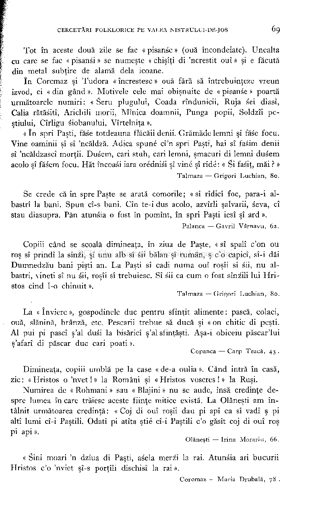

Tot în aceste două zile se fac « pisanse » (ouă încondeiate). Unealta cu care se fac « pisansi » se numeşte « chişîţî di 'ncrestit ouî » şi e făcută din metal subţire de alamă delà icoane.

în Corcmaz şi Tudora « încrestesc » ouă fără să întrebuinţeze vreun izvod, ci « din gând ». Motivele cele mai obişnuite de « pisanse » poartă următoarele numiri: « Seru plugului, Coada rîndunicii, Ruja sei diasî, Calia rătăsitî, Arichili morii, Mînica doamnii, Punga popii, Soldzîi peştiului, Cîrligu siobanului, Vîrtelniţa ».

«în spri Paşti, făse totdeauna flăcăii denii. Grămăde lemni şî făse focu. Vine oaminii şî sî 'ncăldză. Adică spune cî'n spri Paşti, hai sî fasim denii sî 'ncăldzascî morţii. Dusem, cari stuh, cari lemni, şmacuri di lemni dusem acolo şî făsem focu. Hăt încoasi iara orédnisi şî vine şî rîdé: « Si fasiţ, măi ? »

Talmaza — Grigori Luchian, 80.

Se crede că în spre Paşte se arată comorile ; « sî rîdicî foc, para-i albaştri la bani. Spun cî-s bani. Cîn te-i dus acolo, azvîrli şalvarii, seva, cî stau diasupra. Păn atunsia o fost în pomînt, în spri Paşti iesî şî ard ».

Palanca—Gavril Vârnavu, 62.

Copiii când se scoală dimineaţa, în ziua de Paşte, « sî spalî c'on ou roş sî prindî la sînzi, şî unu alb sî sii bălan şî rumăn, ş c'o capicî, sî-i dăi Dumnedzău bani pişti an. La Paşti sî cadi numa ouî roşîi sî sii, nu albaştri, vineţi sî nu sii, roşîi sî trebuiesc. Sî sii ca cum o fost sînzili lui Hristos cînd l-o chinuit ».

Talmaza — Grigori Luchian, 80.

La « înviere », gospodinele duc pentru sfinţit alimente : pască, colaci, ouă, slănină, brânză, etc. Pescarii trebue să ducă şi « on chitic di peşti. Al pui pi pascî ş'al dusi la bisăricî ş'al sfinţăşti. Aşa-i obiceiu păscar'lui ş'afarî di păscar duc cari poati ».

Copanca — Carp Teacă, 45 .

Dimineaţa, copiii umblă pe la case « de-a oulia ». Când intră în casă, zic : « Hristos o 'nvet ! » la Români şi « Hristos voscres ! » la Ruşi.

Numirea de « Rohmani » sau « Blajini » nu se aude, însă credinţe despre lumea în care trăiesc aceste fiinţe mitice există. La Olăneşti am întâlnit următoarea credinţă : « Coj di ouî roşîi dau pi apî ca sî vadî ş pi altî lumi cî-i Paştili. Odatî pi atîta ştie cî-i Paştili c'o găsît coj di ouî roş pi api ».

Olăneşti — Irina Morariu, 66.

« Sini moari 'n dzîua di Paşti, asela merzi la rai. Atunsia ari bucurii Hristos c'o 'nviet şî-s porţîli dischisî la rai ».

Corcmaz — Maria Drubală, 78 .

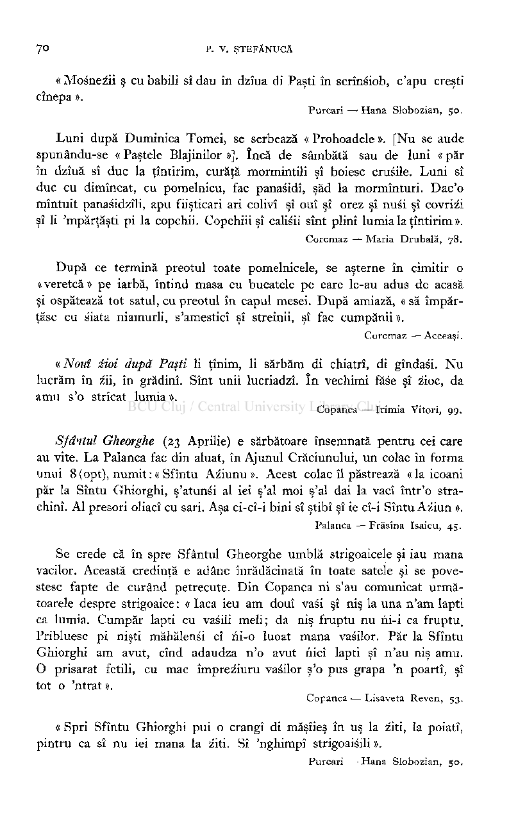

« Mosnezii ş cu babili sî dau în dzîua di Paşti în scrînsiob, c'apu creşti cînepa ».

Purcari —• Hana Slobozian, 50.

Luni după Duminica Tomei, se serbează « Prohoadele ». [Nu se aude spunându-se « Pastele Blajinilor »]. încă de sâmbătă sau de luni « păr în dzîuă sî duc la ţîntirim, curăţă mormintili şî boiesc crusile. Luni sî duc cu dimîncat, cu pomelnicu, fac panasidî, şăd la mormînturi. Dac'o mîntuit panasidzîli, apu fiişticari ari colivî şî ouî şî orez şî nusi şî covrizi şî li 'mpărţăşti pi la copchii. Copchiii şî calisii sînt plinî lumia la ţîntirim ».

Corcmaz — Maria Drubală, 78.

După ce termină preotul toate pomelnicele, se aşterne în cimitir o « veretcă » pe iarbă, întind masa cu bucatele pe care le-au adus de acasă şi ospătează tot satul, cu preotul în capul mesei. După amiază, « să împărţăsc cu siata niamurli, s'amesticî şî streinii, şî fac cumpănii ».

Corcmaz — Aceeaşi.

« Nouî zioi după Paşti li ţînim, li sărbăm di chiatrî, di gîndasi. Nu lucrăm în zii, în grădini. Sînt unii lucriadzî. în vechimi făse şî zioc, da amu s'o strîcat lumia ».

Copanca — Irimia Vitori, 99.

Sfântul Gheorghe (23 Aprilie) e sărbătoare însemnată pentru cei care au vite. La Palanca fac din aluat, în Ajunul Crăciunului, un colac în forma unui 8 (opt), numit: « Sfîntu Aziunu ». Acest colac îl păstrează « la icoani păr la Sîntu Ghiorghi, ş'atunsi al iei ş'al moi ş'al dai la vacî într'o străchini. Al presori oliacî cu sari. Aşa ci-cî-i bini sî ştibî şî ie cî-i Sîntu Aziun ».

Palanca — Frăsîna Isaicu, 45.

Se crede că în spre Sfântul Gheorghe umblă strigoaicele şi iau mana vacilor. Această credinţă e adânc înrădăcinată în toate satele şi se povestesc fapte de curând petrecute. Din Copanca ni s'au comunicat următoarele despre strigoaice : « Iaca ieu am douî vasi şî niş la una n'am lapti ca lumia. Cumpăr lapti cu vasili meii; da niş fruptu nu ni-i ca fruptu, Pribluesc pi nişti măhălensi cî iii-o luoat mana vasilor. Păr la Sfîntu Ghiorghi am avut, cînd adaudza n'o avut iiicî lapti şî n'au niş amu. O prisarat fetili, cu mac împreziuru vasilor ş'o pus grapa 'n poartî, şî tot o 'ntrat ».

Copanca—Lisaveta Reven, 53.

« Spri Sfîntu Ghiorghi pui o crangî di măşîieş în uş la ziti, la poiatî, pintru ca sî nu iei mana la ziti. Sî 'nghimpî strigoaisili ».

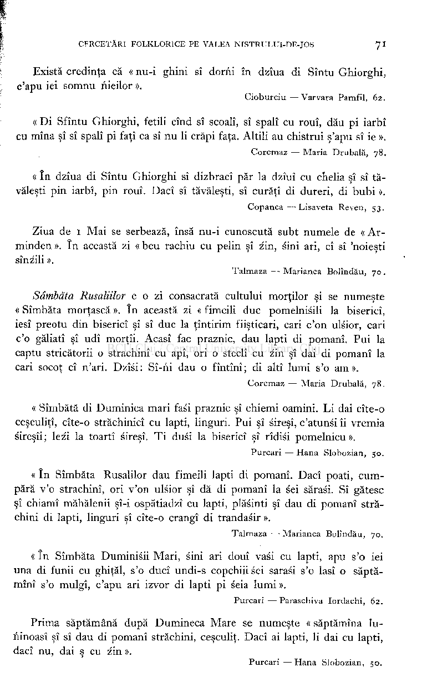

Există credinţa că « nu-i ghini sî dorrîi în dzîua di Sîntu Ghiorghi, c'apu iei somnu nieilor ».

Cioburciu — Varvara Pamfil, 62.

« Di Sfîntu Ghiorghi, fetili cînd sî scoalî, sî spalî cu rouî, dău pi iarbî cu mîna şî sî spalî pi faţî ca sî nu li crapi faţa. Altili au chistrui ş'apu sî ie ».

Corcmaz — Maria Drubală, 78.

« în dzîua di Sîntu Ghiorghi sî dizbracî păr la dzîuî cu chelia şî sî tăvăleşti pin iarbî, pin rouî. Dacî sî tăvăleşti, sî curăţî di dureri, di bubi ».

Copanca—Lisaveta Reven, 53.

Ziua de i Mai se serbează, însă nu-i cunoscută subt numele de « Arminden ». în această zi « beu rachiu cu pelin şî zin, sini ari, cî sî 'noiesti sînzili ».

Talmaza — Marianca Bolîndău, 70 .

Sâmbăta Rusaliilor e o zi consacrată cultului morţilor şi se numeşte « Sîmbăta morţască ». în această zi « fimeili duc pomelnisili la biserici, iesî preotu din biserici şî sî duc la ţîntirim fiişticari, cari c'on ulsior, cari c'o găliatî şî udî morţîi. Acasî fac praznic, dau lapti di pomanî. Pui la captu stricătorii o străchini cu apî, ori o steclî cu zin şî dai di pomanî la cari socoţ cî n'ari. Dzîsi: Sî-hi dau o fîntînî; di altî lumi s'o am».

Corcmaz — Maria Drubală, 78.

« Sîmbătă di Duminica mari fasi praznic şî chiemi oamini. Li dai cîte-o ceşculiţî, cîte-o străchinicî cu lapti, linguri. Pui şî sireşî, c'atunsi îi vremia sireşîi; Iezi la toartî sireşî. Ti dusi la biserici şî rîdisi pomelnicu ».

Purcari — Hana Slobozian, 50.

« în Sîmbăta Rusalilor dau fimeili lapti di pomanî. Dacî poati, cumpără v'o străchini, ori v'on ulsior şî dă di pomanî la sei săraşi. Sî gătesc şî chiamî măhălenii şî-i ospătiadzî cu lapti, plăsinti şî dau di pomanî străchini di lapti, linguri şî cîte-o crangî di trandasir ».

Talmaza — Marianca Bolîndău, 70.

« în Sîmbăta Duminisii Mari, sini ari douî vasi cu lapti, apu s'o iei una di funii cu ghiţăl, s'o ducî undi-s copchiiisei sarasi s'o lasî o săptămînî s'o mulgî, c'apu ari izvor di lapti pi seia lumi ».

Purcari — Paraschiva Iordachi, 62.

Prima săptămână după Dumineca Mare se numeşte « săptămîna luninoasî şî sî dau di pomanî străchini, ceşculiţ. Dacî ai lapti, li dai cu lapti, dacî nu, dai ş cu zin ».

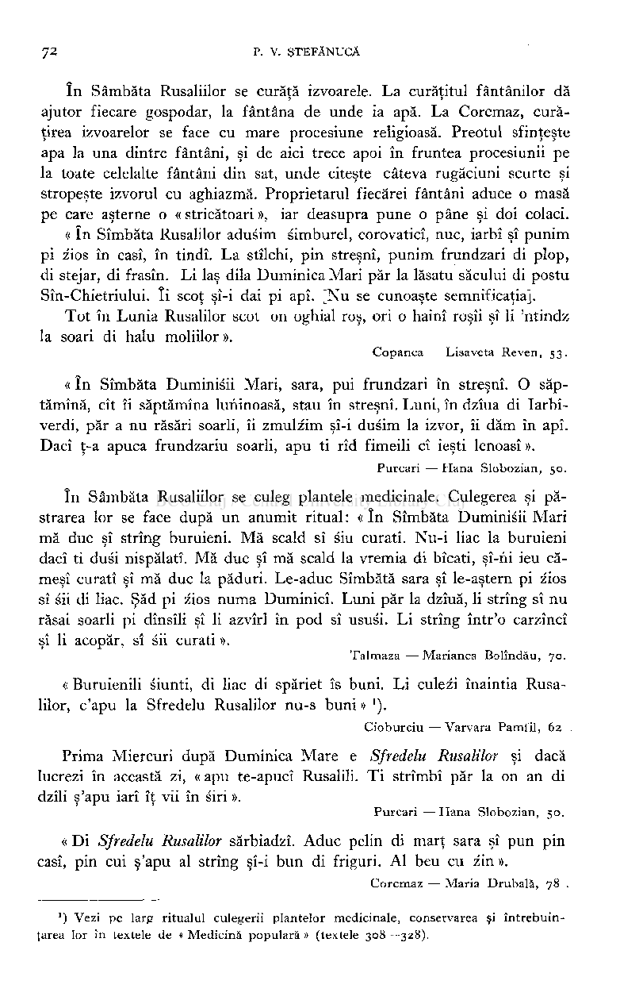

în Sâmbăta Rusaliilor se curăţă izvoarele. La curăţitul fântânilor dă ajutor fiecare gospodar, la fântâna de unde ia apă. La Corcmaz, curăţirea izvoarelor se face cu mare procesiune religioasă. Preotul sfinţeşte apa la una dintre fântâni, şi de aici trece apoi în fruntea procesiunii pe la toate celelalte fântâni din sat, unde citeşte câteva rugăciuni scurte şi stropeşte izvorul cu aghiazmă. Proprietarul fiecărei fântâni aduce o masă pe care aşterne o « stricătoari », iar deasupra pune o pâne şi doi colaci.

« în Sîmbăta Rusalilor adusim simburel, corovaticî, nuc, iarbî şî punim pi zios în casî, în tindî. La stîlchi, pin streşnî, punim frundzari di plop, di stejar, di frasin. Li laş dila Duminica Mari păr la lăsatu sacului di postu Sîn-Chietriului. îi scoţ şî-i dai pi apî. [Nu se cunoaşte semnificaţia].

Tot în Lunia Rusalilor scot on oghial roş, ori o hainî roşîi şî li 'ntindz la soari di halu moliilor ».

Copanca—Lisaveta Reven, 53 .

« în Sîmbăta Duminisii Mari, sara, pui frundzari în streşnî. O săptămînă, cît îi săptămîna luninoasă, stau în streşnî. Luni, în dzîua di Iarbîverdi, păr a nu răsări soarli, îi zmulzim şî-i dusim la izvor, îi dăm în apî. Dacî ţ-a apuca frundzariu soarli, apu ti rîd fimeili cî ieşti lenoasî ».

Purcari — Hana Slobozian, 50.

în Sâmbăta Rusaliilor se culeg plantele medicinale. Culegerea şi păstrarea lor se face după un anumit ritual : « în Sîmbăta Duminisii Mari mă duc şî strîng buruieni. Mă scald sî siu curatî. Nu-i liac la buruieni dacî ti dusi nispălatî. Mă duc şî mă scald la vremia di bîcati, şî-ni ieu cămeşi curatî şî mă duc la păduri. Le-aduc Sîmbăta sara şî le-aştern pi zios sî sii di liac. Şăd pi zios numa Duminici. Luni păr la dzîuă, li strîng sî nu

- răsai soarli pi dînsîli şî li azvîrl în pod sî ususi. Li strîng într'o carzîncî

şî li acopăr, sî sii curaţi ».

Talmaza — Marianca Bolîndău, 70.

« Buruienili siunti, di liac di spăriet îs buni. L i culezi înaintia Rusalilor, c'apu la Sfredelu Rusalilor nu-s buni » ).

Cioburciu — Varvara Pamfil, 62 .

Prima Miercuri după Duminica Mare e Sfredelu Rusalilor şi dacă lucrezi în această zi, « apu te-apucî Rusalili. Ti strîmbî păr la on an di dzîli ş'apu iarî îţ vii în siri ».

Purcari — Hana Slobozian, 50.

« Di Sfredelu Rusalilor sărbiadzî. Aduc pelin di marţ sara şî pun pin casî, pin cui ş'apu al strîng şî-i bun di friguri. Al beu cu zin ».

Corcmaz — Maria Drubală, 78 .

*) Vezi pe larg ritualul culegerii plantelor medicinale, conservarea şi întrebuinţarea lor în textele de « Medicină populară » (textele 308—328).

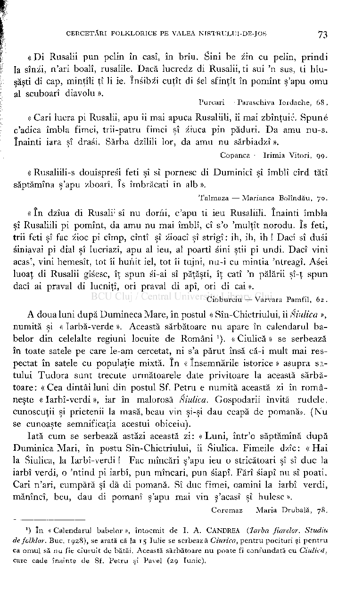

« Di Rusalii pun pelin în casî, în brîu. Sini be zin cu pelin, prindi la sînzi, n'ari boalî, rusalile. Dacă lucredz di Rusalii, ti sui 'n sus, ti hlu-

- săsti di cap, minţîli ţî li ie. Insibzi cuţît di sel sfinţit în pomînt ş'apu omu

al scuboarî diavolu ».

Purcari — Paraschiva Iordache, 68 .

« Cari lucra pi Rusalii, apu îi mai apuca Rusaliili, îi mai zbînţuie. Spune c'adica îmbla fimei, trii-patru fimei şî ziuca pin păduri. Da amu nu-s. înainti iara şî drasi. Sărba dzîlili lor, da amu nu sărbiadzî ».

Copanca — Irimia Vitori, 99.

« Rusaliili-s douîspresi feti şî sî pornesc di Duminici şî îmblî cîrd tătî săptămîna ş'apu zboarî. îs îmbrăcaţi în alb ».

Talmaza — Marianca Bolîndău, 70.

« în dzîua di Rusalii sî nu dorrii, c'apu ti ieu Rusaliili. înainti îmbla şî Rusaliili pi pomînt, da amu nu mai îmblî, cî s'o 'mulţît norodu. îs feti, trii feti şî fac zioc pi cîmp, cîntî şî zioacî şî strîgî: ih, ih, ih ! Dacî sî dusi siniavai pi dial şî Iucriazî, apu al ieu, al poartî sini ştii pi undi. Dacî vini acas", vini hemesît, tot îi huiiit iei, tot îi tujni, nu-i cu mintia 'ntreagî. Asei luoaţ di Rusalii gîsesc, îţ spun si-ai sî păţăşti, îţ catî 'n pălării şî-ţ spun dacî ai praval di lucniţî, ori praval di apî, ori di cai ».

Cioburciu — Varvara Pamfil, 62 .

A doua luni după Dumineca Mare, în postul « Sîn-Chietriului, îi Sudica », numită şi « Iarbă-verde ». Această sărbătoare nu apare în calendarul babelor din celelalte regiuni locuite de Români ). « Ciulică » se serbează în toate satele pe care le-am cercetat, ni s'a părut însă că-i mult mai respectat în satele cu populaţie mixtă. în « însemnările istorice » asupra satului Tudora sunt trecute următoarele date privitoare la această sărbătoare : « Cea dintâi luni din postul Sf. Petru e numită această zi în româneşte « Iarbî-verdi », iar în malorosă Sudica. Gospodarii învită rudele, cunoscuţii şi prietenii la masă, beau vin şi-şi dau ceapă de pomană». (Nu se cunoaşte semnificaţia acestui obiceiu).

Iată cum se serbează astăzi această zi: «Luni, într'o săptămîna după Duminica Mari, în postu Sîn-Chietriului, îi Siulica. Fimeile dzîc: «Hai la Siulica, la Iarbî-verdi ! Fac mîncări ş'apu ieu o stricătoari şî sî duc la iarbî verdi, o 'ntind pi iarbî, pun mîncari, pun siapî. Fărî siapî nu sî poati. Cari n'ari, cumpără şî dă di pomană. Sî duc fimei, oamini la iarbî verdi, mănîncî, beu, dau di pomanî ş'apu mai vin ş'acasî şî hulesc ».

Corcmaz — Maria Drubală, 78.

) în « Calendarul babelor », întocmit de I. A. CANDREA (Iarba fiarelor. Studiu de folklor. Buc. 1928), se arată că la 15 Iulie se serbează Ciurica, pentru pocituri şi pentru ca omul să nu fie ciuruit de bătăi. Această sărbătoare nu poate fi confundată cu Ciulică. care cade înainte de Sf. Petru şi Pavel (29 Iunie).

1

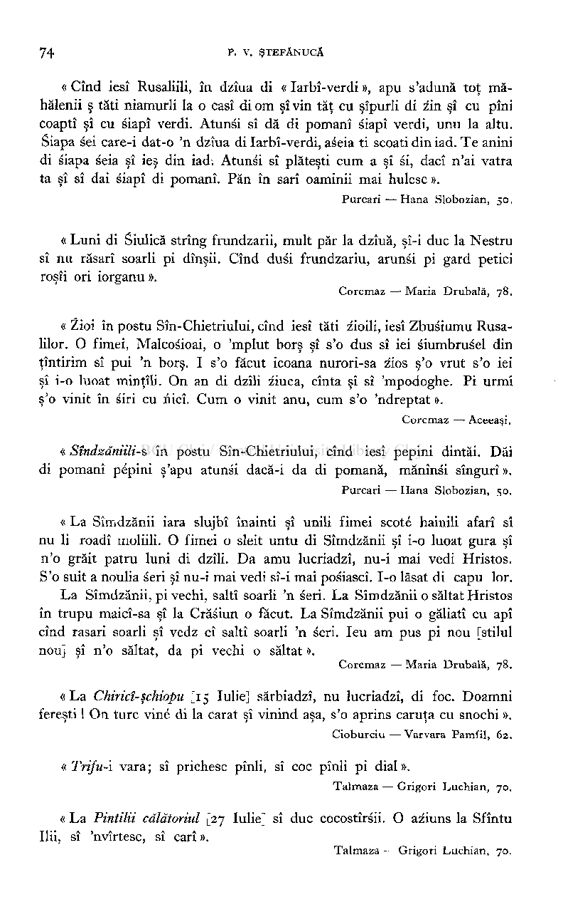

« Cînd iesî Rusaliili, în dzîua di « Iarbî-verdi », apu s'adună toţ măhălenii ş tăti niamurli la o casî di om şî vin tăţ cu şîpurli di zin şî cu pîni coaptî şî cu siapî verdi. Atunsi sî dă di pomanî siapî verdi, unu la altu. Siapa sei care-i dat-o 'n dzîua di Iarbî-verdi, aseia ti scoati din iad. Te anini di siapa seia şî ieş din iad. Atunsi sî plăteşti cum a şî si, dacî n'ai vatra ta şî sî dai siapî di pomanî. Păn în sarî oaminii mai hulesc ».

Purcari—Hana Slobozian, 50,

« Luni di Siulică strîng frundzarii, mult păr la dzîuă, şî-i duc la Nestru sî nu răsarî soarli pi dînşii. Cînd dusi frundzariu, arunsi pi gard petici roşîi ori iorganu ».

Corcmaz — Maria Drubală, 78.

« Zioi în postu Sîn-Chietriului, cînd iesî tăti zioili, iesî Zbusiumu Rusalilor. O fimei, Malcosioai, o 'mplut borş şî s'o dus sî iei siumbrusel din ţîntirim sî pui 'n borş. I s'o făcut icoana nurori-sa zios ş'o vrut s'o iei şî i-o luoat minţîli. On an di dzîli ziuca, cînta şî sî 'mpodoghe. Pi urmî ş'o vinit în siri cu riicî. Cum o vinit anu, cum s'o 'ndreptat ».

Corcmaz — Aceeaşi.

« Sîndzăniili-s în postu Sîn-Chietriului, cînd iesî pepini dintâi. Dăi di pomanî pepini ş'apu atunsi dacă-i da di pomană, mănînsi sîngurî ».

Purcari — Hana Slobozian, 50,

« La Sîmdzănii iara slujbî înainti şî unili fimei scote hainili afarî sî nu li roadî moliili. O fimei o sleit untu di Sîmdzănii şî i-o luoat gura şî n'o grăit patru luni di dzîli. Da amu lucriadzî, nu-i mai vedi Hristos. S'o suit a noulia seri şî nu-i mai vedi sî-i mai posiascî. I-o lăsat di capu lor.

La Sîmdzănii, pi vechi, saltî soarli 'n seri. La Sîmdzănii o săltat Hristos în trupu maicî-sa şî la Crăsiun o făcut. La Sîmdzănii pui o găliatî cu apî cînd rasari soarli şî vedz cî saltî soarli 'n seri. leu am pus pi nou [stilul nou] şî n'o săltat, da pi vechi o săltat ».

Corcmaz — Maria Drubală, 78.

« La Chiriei-şchiopii [15 Iulie] sărbiadzî, nu lucriadzî, di foc. Doamni fereşti ! On turc vine di la carat şî vinind aşa, s'o aprins căruţa cu snochi ».

Cioburciu — Varvara Pamfil, 62.

« Trifu-i vara; sî prichesc pînli, sî coc pînli pi dial ».

Talmaza — Grigori Luchian, 70.

« La Pintilii călătoriul [27 Iulie] sî duc cocostîrsii. O aziuns la Sfîntu Ilii, sî 'nvîrtesc, sî carî ».

Talmaza — Grigori Luchian, 70.

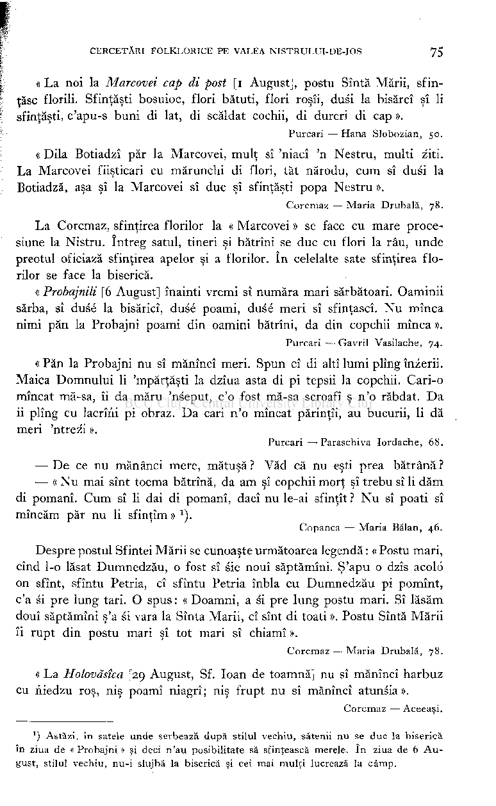

« La noi la Marcovei cap di post [i August], postu Sîntă Mării, sfinţăsc florili. Sfinţăşti bosuioc, flori bătuţi, flori roşii, dusi la bisărcî şî li sfinţăşti, c'apu-s buni di lat, di scăldat cochii, di dureri di cap ».

Purcari — Hana Slobozian, 50.

« Dila Botiadzî păr la Marcovei, mulţ sî 'niacî 'n Nestru, mulţi ziti. La Marcovei fiişticari cu mărunchi di flori, tăt nărodu, cum sî dusi la Botiadză, aşa şî la Marcovei sî duc şî sfinţăşti popa Nestru ».

Corcmaz — Maria Drubală, 78.

La Corcmaz, sfinţirea florilor la « Marcovei » se face cu mare procesiune la Nistru. întreg satul, tineri şi bătrîni se duc cu flori la râu, unde preotul oficiază sfinţirea apelor şi a florilor. în celelalte sate sfinţirea florilor se face la biserică.

« Probajnili [6 August] înainti vremi sî număra mari sărbătoari. Oaminii sărba, sî dusé la bisăricî, dusé poami, dusé meri sî sfinţascî. Nu mînca nimi păn la Probajni poami din oamini bătrîni, da din copchii mînca ».

Purcari — Gavril Vasilache, 74.

« Păn la Probajni nu sî mănîncî meri. Spun cî di altî lumi plîng înzerii. Maica Domnului li 'mpărţăşti la dzîua asta di pi tepsii la copchii. Cari-o mîncat mă-sa, îi da măru 'nseput, c'o fost mă-sa scroafî ş n'o răbdat. Da ii plîng cu lacrîni pi obraz. Da cari n'o mîncat părinţii, au bucurii, li dă meri 'ntrezi ».

Purcari — Paraschiva lordache, 68.

— De ce nu mănânci mere, mătuşă ? Văd că nu eşti prea bătrână ? — « Nu mai sînt tocma bătrînă, da am şî copchii morţ şî trebu sî li dăm

di pomanî. Cum sî li dai di pomanî, dacî nu le-ai sfinţit ? Nu sî poati sî mîncăm păr nu li sfinţim » ).

Copanca — Maria Bălan, 46.

Despre postul Sfintei Mării se cunoaşte următoarea legendă : « Postu mari, cînd l-o lăsat Dumnedzău, o fost sî sie nouî săptămîni. Ş'apu o dzîs acolo on sfînt, sfîntu Petria, cî sfîntu Petria înbla cu Dumnedzău pi pomînt, c'a si pre lung tari. O spus : « Doamni, a si pre lung postu mari. Sî lăsăm douî săptămîni ş'a si vara la Sînta Marii, cî sînt di toati ». Postu Sîntă Mării îi rupt din postu mari şî tot mari sî chiamî ».

Corcmaz — Maria Drubală, 78.

« La Holovăsîca [29 August, Sf. loan de toamnă] nu sî mănîncî harbuz cu niedzu roş, niş poamî niagrî; niş frupt nu sî mănîncî atunsia ».

Corcmaz — Aceeaşi.

) Astăzi, în satele unde serbează după stilul vechiu, sătenii nu se duc la biserică în ziua de « Probajni » şi deci n'au posibilitate să sfinţească merele. în ziua de 6 Au gust, stilul vechiu, nu-i slujbă la biserică şi cei mai mulţi lucrează la câmp.

1

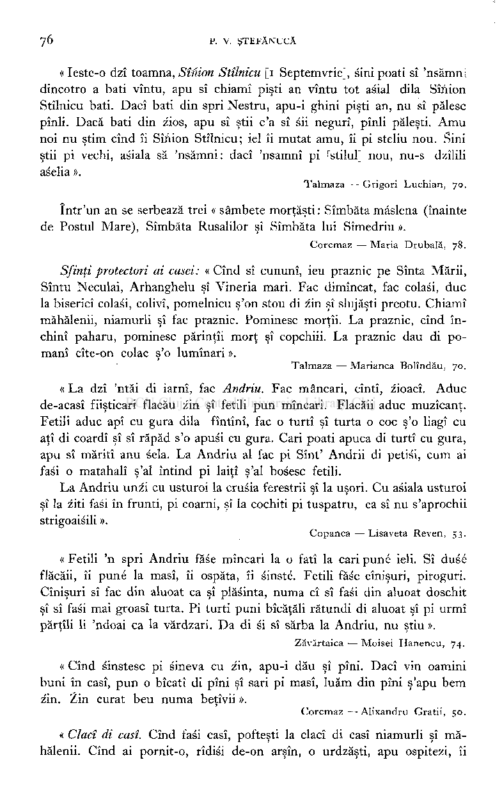

« Ieste-o dzî toamna, Sînion Stîlnicu [i Septemvrie], sini poati sî 'nsămni dincotro a bati vîntu, apu sî chiamî pişti an vîntu tot asial dila Sînion Stîlnicu bati. Dacî bati din spri Nestru, apu-i ghini pişti an, nu sî pălesc pînli. Dacă bati din zios, apu sî ştii c'a sî sii neguri, pînli păleşti. Amu noi nu ştim cînd îi Sînion Stîlnicu; iei îi mutat amu, îi pi steliu nou. Sini ştii pi vechi, asiala să 'nsămni: dacî 'nsamnî pi [stilul] nou, nu-s dzîlili aselia ».

Talmaza — Grigori Luchian, 70.

într'un an se serbează trei « sâmbete morţăşti : Sîmbăta mâslena (înainte de Postul Mare), Sîmbăta Rusalilor şî Sîmbăta lui Sîmedriu ».

Corcmaz — Maria Drubală, 78.

Sfinţi protectori ai casei: « Cînd sî cununi, ieu praznic pe Sînta Mării, Sîntu Neculai, Arhanghelu şî Vineria mari. Fac dimîncat, fac colasi, duc la biserici colasi, colivî, pomelnicu ş'on stou di zin şî slujăşti preotu. Chiamî măhălenii, niamurli şî fac praznic. Pominesc morţii. La praznic, cînd închini paharu, pominesc părinţii morţ şî copchiii. La praznic dau di pomanî cîte-on colac ş'o luminări ».

Talmaza — Marianca Bolîndău, 70.

« La dzî 'ntăi di iarnî, fac Andriu. Fac mâncări, cîntî, zioacî. Aduc de-acasî fiişticari flăcău zin şî fetili pun mîncari. Flăcăii aduc muzicant. Fetili aduc apî cu gura dila fîntînî, fac o turtî şî turta o coc ş'o liagî cu aţî di coardî şî sî răpăd s'o apusi cu gura. Cari poati apuca di turtî cu gura, apu sî măritî anu sela. La Andriu al fac pi Sînt' Andrii di petisi, cum ai fasi o matahalî ş'al întind pi laiţî ş'al bosesc fetili.

La Andriu unzi cu usturoi la crusia ferestrii şî la uşori. Cu asiala usturoi şî la ziti fasi în frunţi, pi coarni, şî la cochiti pi tuspatru, ca sî nu s'aprochii strigoaisili ».

Copanca — Lisaveta Reven, 53.

« Fetili 'n spri Andriu făse mîncari la o fatî la cari puné ieli. Sî dusé flăcăii, îi puné la masî, îi ospăta, îi sinsté. Fetili făse cînişuri, piroguri. Cînişuri sî fac din aluoat ca şî plăsinta, numa cî sî fasi din aluoat doschit şî sî fasi mai groasî turta. Pi turti puni bîcăţăli rătundi di aluoat şî pi urmî părţîli li 'ndoai ca la vărdzari. Da di si sî sărba la Andriu, nu ştiu ».

Zăvărtaica — Moisei Hanencu, 74.

« Cînd sinstesc pi sineva cu zin, apu-i dău şî pîni. Dacî vin oamini buni în casî, pun o bîcatî di pîni şî sari pi masî, luăm din pîni ş'apu bem zin. Zin curat beu numa beţivii ».

Corcmaz—Alixandru Gratii, 50.

« Clacî di casî. Cînd fasi casî, pofteşti la clacî di casî niamurli şî măhălenii. Cînd ai pornit-o, rîdisi de-on arşîn, o urdzăşti, apu ospitezi, îi

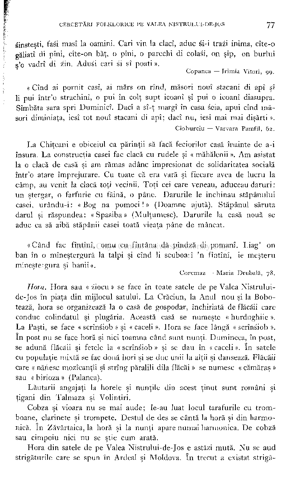

sinsteşti, fasi masî la oamini. Cari vin la clacî, aduc si-i trazi inima, cîte-o găliatî di pîni, cîte-on băţ, o pini, o parechi di colasi, on şip, on burlui s'o vadrî di zin. Aduşi cari si sî poati ».

Copanca — Irimia Vitori, 99.

« Cînd ai pornit casî, ai mars on rînd, masori nouî stacani di apî şî li pui într'o străchini, o pui în colţ supt icoanî şî pui o icoanî diasupra. Sîmbăta sara spri Duminici. Dacî a sî-ţ margî în casa seia, apui cînd masori diminiaţa, iesî tot nouî stacani di apî; dacî nu, iesî mai mai dişărti >>.

Cioburciu — Varvara Pamfil, 62.

La Chiţcani e obiceiul ca părinţii să facă feciorilor casă înainte de a-i însura. La construcţia casei fac clacă cu rudele şi « măhălenii ». Am asistat la o clacă de casă şi am rămas adânc impresionat de solidaritatea socială într'o atare împrejurare. Cu toate că era vară şi fiecare avea de lucru la câmp, au venit la clacă toţi vecinii. Toţi cei care veneau, aduceau daruri : un ştergar, o farfurie cu făină, o pâne. Darurile le închinau stăpânului casei, urându-i: «Bog na pomoci ! » (Doamne ajută). Stăpânul săruta darul şi răspundea: « Spasiba » (Mulţumesc). Darurile la casă nouă se aduc ca să aibă stăpânii casei toată vieaţa pâne de mâncat.

«Când fac fîntînî, omu cu fîntâna dă pîndză di pomanî. Liag' on ban în o mîneştergură la tălpi şi cînd li scuboatî 'n fîntînî, ie meşteru m'neştergura şî banii».

Corcmaz — Maria Drubală, 78.

Hora. Hora sau « ziocu » se face în toate satele de pe Valea Nistruluide-Jos în piaţa din mijlocul satului. La Crăciun, la Anul nou şi la Bobotează, hora se organizează la o casă de gospodar, închiriată de flăcăii care conduc colindatul şi plugăria. Această casă se numeşte « hurdughiie ». La Paşti, se face « scrînsiob » şi « caceli ». Hora se face lângă « scrînsiob ». In post nu se face horă şi nici toamna când sunt nunţi. Dumineca, în post, se adună flăcăii şi fetele la « scrînsiob » şi se dau în « caceli ». în satele cu populaţie mixtă se fac două hori şi se duc unii la alţii şi dansează. Flăcăii care « năîîesc mozîcanţîi şî string păralili dila flăcăi » se numesc « cămăraş » sau « birioza » (Palanca).

Lăutarii angajaţi la horele şi nunţile din acest ţinut sunt români şi ţigani din Talmaza şi Volintiri.

Cobza şi vioara nu se mai aude; le-au luat locul tarafurile cu tromboane, clarinete şi trompete. Destul de des se cântă la horă şi din harmonica, în Zăvârtaica, la horă şi la nunţi apare numai harmonica. De cobză sau cimpoiu nici nu se ştie cum arată.

Hora din satele de pe Valea Nistrului-de-Jos e astăzi mută. Nu se aud strigăturile care se spun în Ardeal şi Moldova. în trecut a existat strigă-

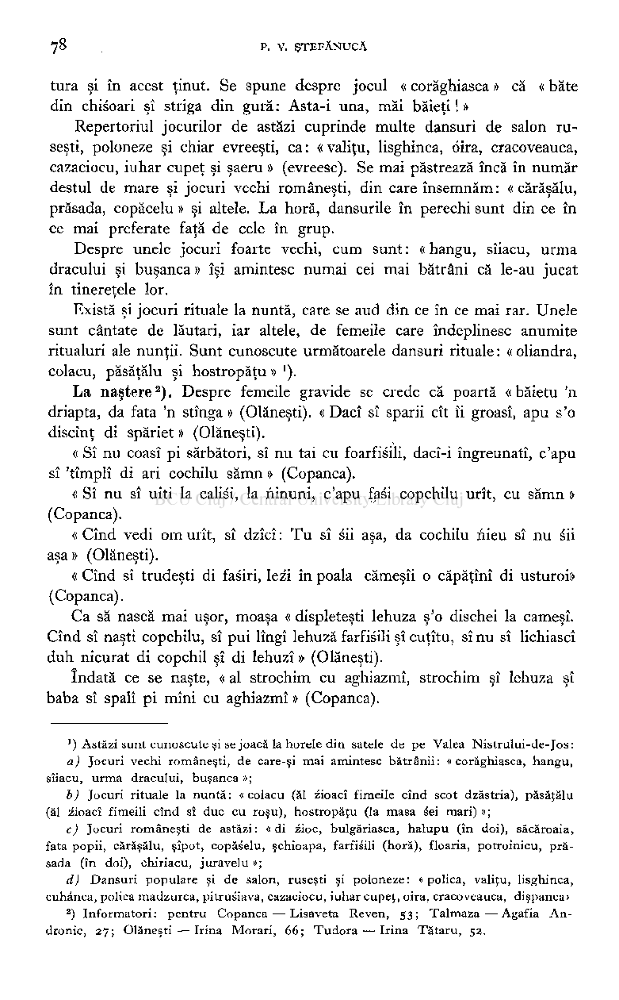

tura şi în acest ţinut. Se spune despre jocul « corăghiasca » că « băte din chisoari şî striga din gură: Asta-i una, măi băieţi ! »

Repertoriul jocurilor de astăzi cuprinde multe dansuri de salon ruseşti, poloneze şi chiar evreeşti, ca : « valiţu, lisghinca, öira, cracoveauca, cazaciocu, iuhar cupeţ şi şaeru » (evreesc). Se mai păstrează încă în număr destul de mare şi jocuri vechi româneşti, din care însemnăm : « cărăşălu, prăsada, copăcelu » şi altele. La horă, dansurile în perechi sunt din ce în ce mai preferate faţă de cele în grup.

Despre unele jocuri foarte vechi, cum sunt : « hangu, sîiacu, urma dracului şi buşanca » îşi amintesc numai cei mai bătrâni că le-au jucat în tinereţele lor.

Există şi jocuri rituale la nuntă, care se aud din ce în ce mai rar. Unele sunt cântate de lăutari, iar altele, de femeile care îndeplinesc anumite ritualuri ale nunţii. Sunt cunoscute următoarele dansuri rituale : « oliandra, colacu, păsăţălu şi hostropăţu » ).

). Despre femeile gravide se crede că poartă « băietu 'n driapta, da fata 'n stînga » (Olăneşti). « Dacî sî sparii cît îi groasî, apu s'o discînţ di spăriet » (Olăneşti).

La naştere

2

« Sî nu coasî pi sărbători, sî nu tai cu foarfisili, dacî-i îngreunaţi, c'apu sî 'tîmplî di ari cochilu sămn » (Copanca).

« Sî nu sî uiti la calisi, la ninuni, c'apu fasi copchilu urît, cu sămn » (Copanca).

« Cînd vedi om urît, sî dzîcî : Tu sî sii aşa, da cochilu nieu sî nu sii aşa » (Olăneşti).

« Cînd sî trudeşti di fasiri, Iezi în poala cămeşii o căpăţînî di usturoi» (Copanca).

Ca să nască mai uşor, moaşa « displeteşti lehuza ş'o dischei la cameşî. Cînd sî naşti copchilu, sî pui lîngî lehuză farfisili şî cuţîtu, sî nu sî lichiascî duh nicurat di copchil şî di lehuzî » (Olăneşti).

îndată ce se naşte, « al strochim cu aghiazmî, strochim şî lehuza şî baba sî spalî pi mîni cu aghiazmî » (Copanca).

*) Astăzi sunt cunoscute şi se joacă la horele din satele de pe Valea Nistrului-de-Jos :

- a) Jocuri vechi româneşti, de care-şi mai amintesc bătrânii: «corăghiasca, hangu,

sîiacu, urma dracului, buşanca»;

- b) Jocuri rituale la nuntă : « colacu (ăl iioacî fimeile cînd scot dzăstria), păsăţălu

(ăl zioacî fimeili cînd sî duc cu roşu), hostropăţu (la masa sei mari) »;

- c) Jocuri româneşti de astăzi: «di zioc, bulgăriasca, halupu (în doi), săcăroaia,

fata popii, cărăşălu, şîpot, copăselu, şchioapa, farfisili (horă), floaria, potroinicu, prăsada (în doi), chiriacu, juravelu»;

- d) Dansuri populare şi de salon, ruseşti şi poloneze: « polica, valiţu, lisghinca,

cuhânca, polica madzurca, pitrusiava, cazaciocu, iuhar cupeţ, oira, cracoveauca, dişpanca»

) Informatori: pentru Copanca — Lisaveta Reven, 53 ; Talmaza—Agafi a An dronic, 27; Olăneşti — Irina Morari, 66; Tudora — Irina Tătaru, 52.

2

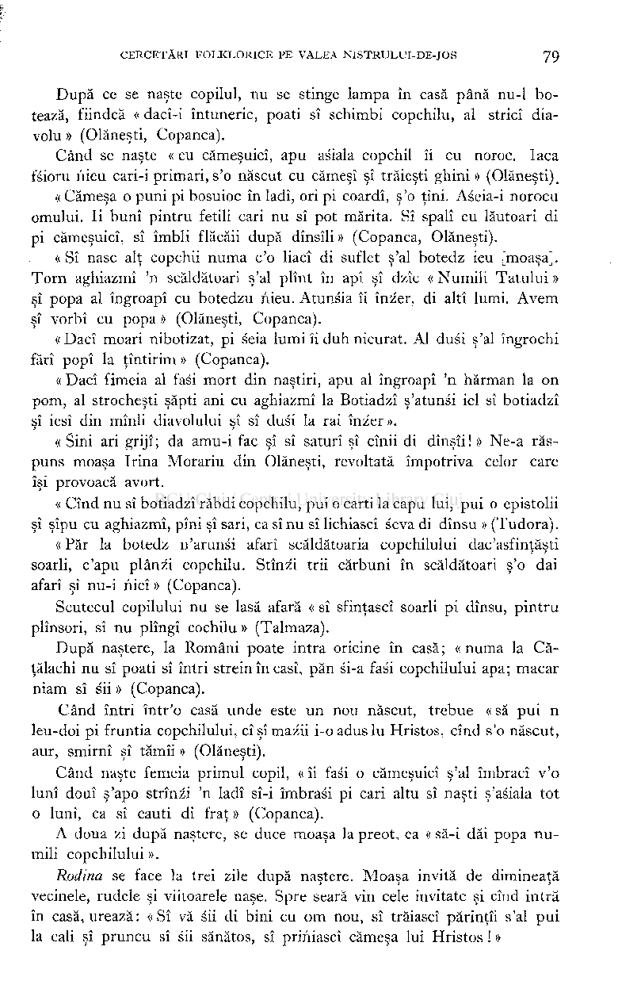

După ce se naşte copilul, nu se stinge lampa în casă până nu-1 botează, fiindcă « dacî-i întuneric, poati sî schimbi copchilu, al strici diavolu » (Olăneşti, Copanca).

Când se naşte « cu cămeşuicî, apu asiala copchii îi cu noroc. Iaca fsioru meu cari-i primari, s'o născut cu cămeşi şî trăieşti ghini » (Olăneşti).

« Cămeşa o puni pi bosuioc în ladî, ori pi coardî, ş'o ţîni. Aseia-i norocu omului. Ii buni pintru fetili cari nu sî pot mărita. Sî spalî cu lăutoari di pi cămeşuicî, sî îmbli flăcăii după dînsîli » (Copanca, Olăneşti).

« Sî nasc alţ copchii numa c'o liacî di suflet ş'al botedz ieu [moaşa]. Torn aghiazmî 'n scăldătoari ş'al plînt în apî şî dzîc « Numili Tatului » şî popa al îngroapî cu botedzu nieu. Atunsia îi înzer, di altî lumi. Avem şî vorbî cu popa » (Olăneşti, Copanca).

«Dacî moari nibotizat, pi seia lumi îi duh nicurat. Al dusi ş'al îngrochi fărî popî la ţîntirim » (Copanca).

« Dacî fimeia al fasi mort din naştiri, apu al îngroapî 'n hărman la on pom, al strocheşti şăpti ani cu aghiazmî la Botiadzî ş'atunsi iei sî botiadzî şî iesî din mînli diavolului şî sî dusi la rai înzer ».

« Sini ari grijî; da amu-i fac şî sî saturi şî cînii di dînşîi! » Ne-a răspuns moaşa Irina Morariu din Olăneşti, revoltată împotriva celor care îşi provoacă avort.

« Cînd nu sî botiadzî răbdi copchilu, pui o cârti la capu lui, pui o epistolii şî şîpu cu aghiazmî, pîni şî sari, ca sî nu sî lichiascî seva di dînsu » (Tudora).

« Păr la botedz n'arunsi afarî scăldătoaria copchilului dac'asfinţăşti soarli, c'apu plânzi copchilu. Stînzi trii cărbuni în scăldătoari ş'o dai afarî şî nu-i îiicî » (Copanca).

Scutecul copilului nu se lasă afară « sî sfinţascî soarli pi dînsu, pintru plînsori, sî nu plîngî cochilu » (Talmaza).

După naştere, la Români poate intra oricine în casă; «numa la Căţălachi nu sî poati sî întri strein în casî, păn si-a fasi copchilului apa; măcar niam sî sii » (Copanca).

Când întri într'o casă unde este un nou născut, trebue « să pui n leu-doi pi fruntia copchilului, cîşîmazii i-oaduslu Hristos, cînd s'o născut, aur, smirnî şî tămîi » (Olăneşti).

Când naşte femeia primul copil, « îi fasi o cămeşuicî ş'al îmbraci v'o lunî douî ş'apo strînzi 'n ladî sî-i îmbrasi pi cari altu sî naşti ş'asiala tot o lunî, ca sî cauţi di fraţ » (Copanca).

A doua zi după naştere, se duce moaşa la preot, ca « să-i dăi popa numili copchilului ».

Rodina se face la trei zile după naştere. Moaşa invită de dimineaţă vecinele, rudele şi viitoarele naşe. Spre seară vin cele invitate şi cînd intră în casă, urează: « Sî vă sii di bini cu om nou, sî trăiascî părinţii s'al pui la caii şî pruncu sî sii sănătos, sî priniascî cămeşa lui Hristos ! »

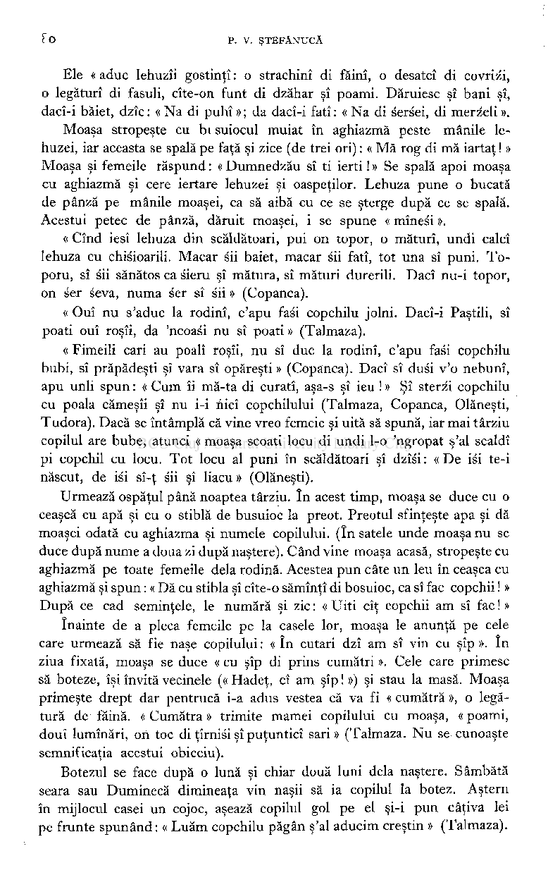

Ele « aduc lehuzîi gostinţî : o străchini di făinî, o desatcî di covrizi, o legături di fasuli, cîte-on funt di dzăhar şî poami. Dăruiesc şî bani şî, dacî-i băiet, dzîc : « Na di puhî » ; da dacî-i fatî : « Na di sersei, di merzeli ».

Moaşa stropeşte cu busuiocul muiat în aghiazmă peste manile lehuzei, iar aceasta se spală pe faţă şi zice (de trei ori) : « Mă rog di mă iartaţ ! » Moaşa şi femeile răspund : « Dumnedzău sî ti ierţi ! » Se spală apoi moaşa cu aghiazmă şi cere iertare lehuzei şi oaspeţilor. Lehuza pune o bucată de pânză pe manile moaşei, ca să aibă cu ce se şterge după ce se spală. Acestui petec de pânză, dăruit moaşei, i se spune « mînesi ».

« Cînd iesî lehuza din scăldătoari, pui on topor, o măturî, undi calcî lehuza cu chisioarili. Măcar sii băiet, măcar sii fatî, tot una sî puni. Toporu, sî sii sănătos ca sieru şî mătura, sî mături durerili. Dacî nu-i topor, on ser seva, numa ser sî sii » (Copanca).

« Ouï nu s'aduc la rodini, c'apu fasi copchilu jolni. Dacî-i Paştili, sî poati ouî roşîi, da 'ncoasi nu sî poati » (Talmaza).

« Fimeili cari au poalî roşîi, nu sî duc la rodini, c'apu fasi copchilu bubi, sî prăpădeşti şî vara sî opăreşti » (Copanca). Dacî sî dusi v'o nebuni, apu unii spun : « Cum îi mă-ta di curaţi, aşa-s şî ieu ! » Şî sterzi copchilu cu poala cămeşii şî nu i-i riicî copchilului (Talmaza, Copanca, Olăneşti, Tudora). Dacă se întâmplă că vine vreo femeie şi uită să spună, iar mai târziu copilul are bube, atunci « moaşa scoati locu di undi l-o 'ngropat ş'al scaldî pi copchil cu locu. Tot locu al puni în scăldătoari şî dzîsi: «De isi te-i născut, de isi sî-ţ sii şî liacu » (Olăneşti).

Urmează ospăţul până noaptea târziu. în acest timp, moaşa se duce cu o ceaşcă cu apă şi cu o stiblă de busuioc la preot. Preotul sfinţeşte apa şi dă moaşei odată cu aghiazmă şi numele copilului. (în satele unde moaşa nu se duce după nume a doua zi după naştere). Când vine moaşa acasă, stropeşte cu aghiazmă pe toate femeile delà rodină. Acestea pun câte un leu în ceaşca cu aghiazmă şi spun : « Dă cu stibla şî cîte-o sămînţî di bosuioc, ca sî fac copchii ! » După ce cad seminţele, le numără şi zic : « Uiti cîţ copchii am sî fac ! »

înainte de a pleca femeile pe la casele lor, moaşa le anunţă pe cele care urmează să fie naşe copilului : « în cutări dzî am sî vin cu şîp ». în ziua fixată, moaşa se duce « cu şîp di prins cumătri ». Cele care primesc să boteze, îşi învită vecinele (« Hadeţ, cî am şîp ! ») şi stau la masă. Moaşa primeşte drept dar pentrucă i-a adus vestea că va fi « cumătră », o legătură de făină. « Cumătră » trimite mamei copilului cu moaşa, « poami, douî luminări, on toc di ţîrnisi şî puţunticî sari » (Talmaza. Nu se cunoaşte semnificaţia acestui obiceiu).

Botezul se face după o lună şi chiar două luni delà naştere. Sâmbătă seara sau Duminecă dimineaţa vin naşii să ia copilul la botez. Aştern în mijlocul casei un cojoc, aşează copilul gol pe el şi-i pun câţiva lei pe frunte spunând : « Luăm copchilu păgân ş'al aducim creştin » (Talmaza).

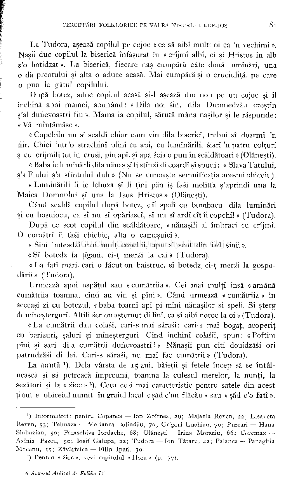

La Tudora, aşează copilul pe cojoc « ca să aibî mulţi oi ca 'n vechimi ». Naşii duc copilul la biserică înfăşurat în « crîjmî albî, cî şî Hristos în alb s'o botidzat ». La biserică, fiecare naş cumpără câte două luminări, una

- o dă preotului şi alta o aduce acasă. Mai cumpără şi o cruciuliţă, pe care
- o pun la gâtul copilului. După botez, aduc copilul acasă şi-1 aşează din nou pe un cojoc şi îl

închină apoi mamei, spunând : « Dila noi sin, dila Dumnedzău creştin ş'al dunevoastrî fiu ». Mama ia copilul, sărută mâna naşilor şi le răspunde: « Vă mînţămăsc ».

« Copchilu nu sî scaldî chiar cum vin dila biserici, trebui sî doarmî 'n riir. Chicî 'ntr'o străchini plinî cu apî, cu lumînărili, siarî 'n patru colţuri ş cu crîjmili tot în crusi, pin apî, şî apa seia o pun în scăldătoari » (Olăneşti).

« Baba ie luminării dila nănaş şî li stînzi di coardî şî spuni : « Slava Tatului, ş'a Fiului ş'a sfîntului duh» (Nu se cunoaşte semnificaţia acestui obiceiu).

« Lumînărili li ie lehuza şî li ţîni păn îş fasi molitfa ş'aprindi una la Maica Domnului şî una la Isus Hristos » (Olăneşti).

Când scaldă copilul după botez, « îl spalî cu bumbacu dila luminări şî cu bosuiocu, ca sî nu sî opăriascî, sî nu sî ardî cît îi copchil » (Tudora).

După ce scot copilul din scăldătoare, « nănaşîli al îmbraci cu crîjmî.

O cumătrî îi fasi chichie, alta o cameşuicî ». « Sini boteadzî mai mulţ copchii, apu al scot din iad sinii ». « Sî botedz la ţigani, cî-ţ merzi la cai » (Tudora). «La fatî mari, cari o făcut on baistruc, sî botedz, cî-ţ merzi la gospo­

dării » (Tudora).

Urmează apoi ospăţul sau « cumătriia ». Cei mai mulţi însă « amână cumătriia toamna, cînd au vin şî pîni ». Când urmează « cumătriia » în aceeaşi zi cu botezul, « baba toarnî apî pi mîni nănaşîlor sî speli. Sî şterg di mîneşterguri. Altili ser on aşternut di lînî, ca sî aibî noroc la oi » (Tudora).

«La cumătrii dau colasi, cari-s mai săraşi; cari-s mai bogat, acoperit cu barizuri, şaluri şî mîneşterguri. Cînd închini colasii, spun : « Poftim pîni şî sari dila cumătrii dunevoastrî i » Nănaşîi pun cîti douîdzăsi ori patrudzăsi di lei. Cari-s săraşi, nu mai fac cumătrii » (Tudora).

La mmtă ). Delà vârsta de 15 ani, băieţii şi fetele încep să se întâlnească şi să petreacă împreună, toamna la culesul merelor, la nunţi, la şezători şi la « zioc »

). Ceea ce-i mai caracteristic pentru satele din acest ţinut e obiceiul numit în graiul local « şăd c'on flăcău » sau « şăd c'o fatî ».

2

') Informatori: pentru Copanca — Ion Zbîrnea, 29; Malania Reven, 22; Lisaveta Reven, 53 ; Talmaza — Marianca Bolîndău, 70; Grigori Luchian, 70; Purcari —Han a Slobozian, 50; Paraschiva Iordache, 68; Olăneşti — Irina Morariu, 66; Corcmaz Axînia Pascu, 50; Iosif Galupa, 22 ; Tudora —Ion Tătaru, 42; Palanca —Panaghia Mocanu, 55 ; Zăvărtaica —Filip Ipati, 39.

) Pentru «zioc», vezi capitolul «Hora» (p. 77).

2

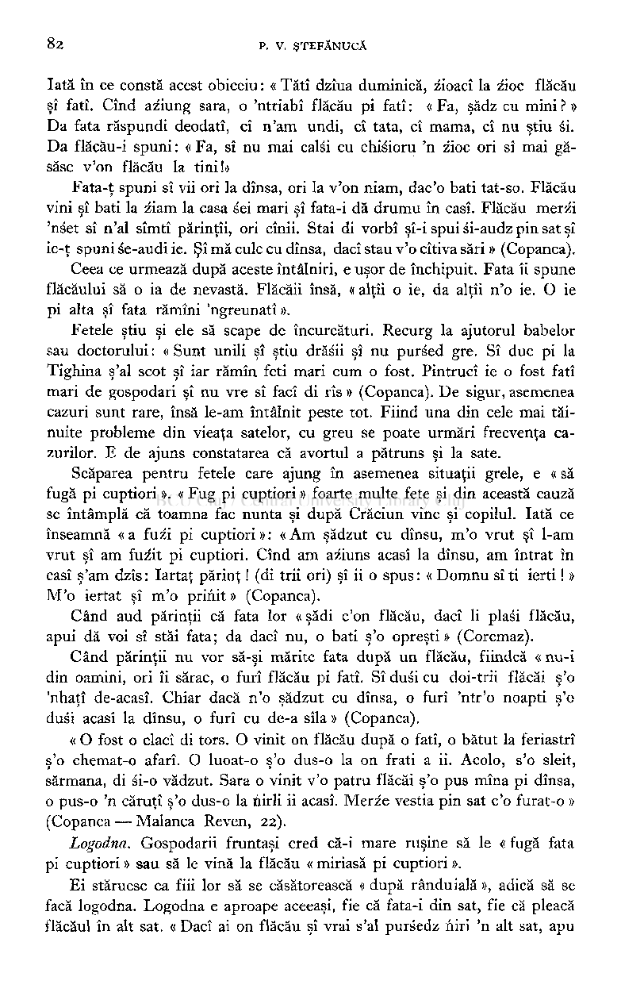

Iată în ce constă acest obiceiu : « Tătî dzîua duminică, zioacî la zioc flăcău şî fatî. Cînd aziung sara, o 'ntriabî flăcău pi fatî : « Fa, şădz cu mini ? » Da fata răspundi deodatî, cî n'am undi, cî tata, cî mama, cî nu ştiu si. Da flăcău-i spuni : « Fa, sî nu mai calsi cu chisioru 'n zioc ori sî mai găsăsc v'on flăcău la tini!>>

Fata-ţ spuni sî vii ori la dînsa, ori la v'on niam, dac'o bati tat-so. Flăcău vini şî bati la ziam la casa sei mari şî fata-i dă drumu în casî. Flăcău merzi 'nset sî n'al sîmtî părinţii, ori cînii. Stai di vorbî şî-i spui si-audz pin sat şî ie-ţ spuni se-audi ie. Şî mă culc cu dînsa, dacî stau v'o cîtiva sări » (Copanca).

Ceea ce urmează după aceste întâlniri, e uşor de închipuit. Fata îi spune flăcăului să o ia de nevastă. Flăcăii însă, « alţîi o ie, da alţîi n'o ie. O ie pi alta şî fata rămîni 'ngreunatî ».

Fetele ştiu şi ele să scape de încurcături. Recurg la ajutorul babelor sau doctorului : « Sunt unili şî ştiu drăsii şî nu pursed gre. Sî duc pi la Tighina ş'al scot şî iar rămîn feti mari cum o fost. Pintrucî ie o fost fatî mari de gospodari şî nu vre sî facî di rîs » (Copanca). De sigur, asemenea cazuri sunt rare, însă le-am întâlnit peste tot. Fiind una din cele mai tăinuite probleme din vieaţa satelor, cu greu se poate urmări frecvenţa cazurilor. E de ajuns constatarea că avortul a pătruns şi la sate.

Scăparea pentru fetele care ajung în asemenea situaţii grele, e « să fugă pi cuptiori ». « Fug pi cuptiori » foarte multe fete şi din această cauză se întâmplă că toamna fac nunta şi după Crăciun vine şi copilul. Iată ce înseamnă «a fuzi pi cuptiori»: «Am şădzut cu dînsu, m'o vrut şî l-am vrut şî am fuzit pi cuptiori. Cînd am aziuns acasî la dînsu, am întrat în casî ş'am dzîs: Iartaţ părinţ ! (di trii ori) şî ii o spus: « Domnu sîti ierţi ! » M'o iertat şî m'o prihit » (Copanca).

Când aud părinţii că fata lor « sădi c'on flăcău, dacî li plasi flăcău, apui dă voi sî stăi fata; da dacî nu, o bati ş'o opreşti» (Corcmaz).

Când părinţii nu vor să-şi mărite fata după un flăcău, fiindcă « nu-i din oamini, ori îi sărac, o furî flăcău pi fatî. Sî dusi cu doi-trii flăcăi ş'o 'nhaţî de-acasî. Chiar dacă n'o şădzut cu dînsa, o furî 'ntr'o noapti ş'o dusi acasî la dînsu, o furî cu de-a sîla » (Copanca).

« O fost o clacî di tors. O vinit on flăcău după o fatî, o bătut la feriastrî ş'o chemat-o afarî. O luoat-o ş'o dus-o la on fraţi a ii. Acolo, s'o sleit, sărmana, di si-o vădzut. Sara o vinit v'o patru flăcăi ş'o pus mîna pi dînsa, o pus-o 'n căruţî ş'o dus-o la nirli ii acasî. Merze vestia pin sat c'o furat-o » (Copanca — Malanca Reven, 22).

Logodna. Gospodarii fruntaşi cred că-i mare ruşine să le « fugă fata pi cuptiori » sau să le vină la flăcău « miriasă pi cuptiori ».

Ei stăruesc ca fiii lor să se căsătorească « după rânduială », adică să se facă logodna. Logodna e aproape aceeaşi, fie că fata-i din sat, fie că pleacă flăcăul în alt sat. « Dacî ai on flăcău şî vrai s'al pursedz niri 'n alt sat, apu

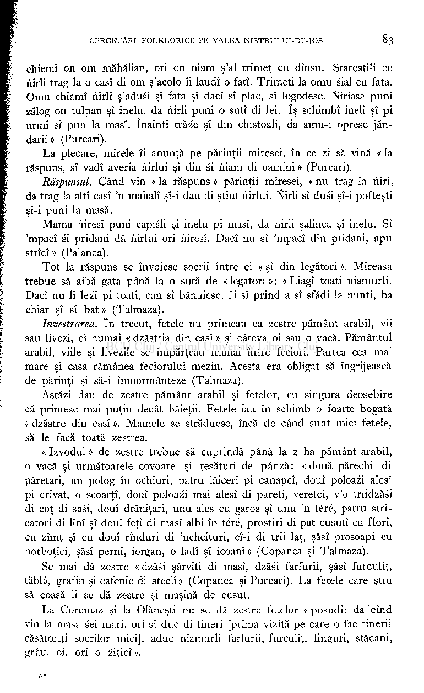

chiemi on om măhălian, ori on niam ş'al trimet cu dînsu. Starostili cu nirli trag la o casî di om ş'acolo îi laudî o fatî. Trimeti la omu sial cu fata. Omu chiamî nirli ş'adusi şî fata şî dacî sî plac, sî logodesc. Niriasa puni zălog on tulpan şî inelu, da nirli puni o sutî di lei. îş schimbi ineli şî pi urmî sî pun la masî. înainti trăze şî din chistoali, da amu-i opresc jăndarii » (Purcari).

La plecare, mirele îi anunţă pe părinţii miresei, în ce zi să vină « la

- răspuns, sî vadî averia nirlui şî din si niam di oamini » (Purcari). Răspunsul. Când vin « la răspuns » părinţii miresei, « nu trag la hiri,

da trag la altî casî 'n mahalî şî-i dau di ştiut nirlui. Nirli sî duşi şî-i pofteşti şî-i puni la masă.

Mama îiiresî puni capisli şî inelu pi masî, da nirli şalinca şî inelu. Sî 'mpacî si pridani dă nirlui ori niresî. Dacî nu sî 'mpacî din pridani, apu strîcî » (Palanca).

Tot la răspuns se învoiesc socrii între ei « şî din legători ». Mireasa trebue să aibă gata până la o sută de «legători»: « Liagî toati niamurli. Dacî nu li Iezi pi toati, can sî bănuiesc. Ii sî prind a sî sfădi la nuntî, ba chiar şî sî bat » (Talmaza).

înzestrarea. în trecut, fetele nu primeau ca zestre pământ arabil, vii sau livezi, ci numai « dzăstria din casî » şi câteva oi sau o vacă. Pământul arabil, viile şi livezile se împărţeau numai între feciori. Partea cea mai mare şi casa rămânea feciorului mezin. Acesta era obligat să îngrijească de părinţi şi să-i înmormânteze (Talmaza).

Astăzi dau de zestre pământ arabil şi fetelor, cu singura deosebire că primesc mai puţin decât băieţii. Fetele iau în schimb o foarte bogată « dzăstre din casî ». Mamele se străduesc, încă de când sunt mici fetele,

- să le facă toată zestrea. « Izvodul » de zestre trebue să cuprindă până la 2 ha pământ arabil,

o vacă şi următoarele covoare şi ţesături de pânză: «două părechi di păretari, un polog în ochiuri, patru lăiceri pi canapcî, douî poloazi alesî pi crivat, o scoarţî, douî poloazi mai alesî di pareti, veretcî, v'o triidzăsi di coţ di sasi, douî drăniţari, unu ales cu garos şî unu 'n téré, patru stricători di lînî şî douî feţî di masî albi în téré, prostiri di pat cusutî cu flori, cu zîmţ şî cu douî rînduri di 'ncheituri, cî-i di trii laţ, şăsî prosoapi cu horboţîcî, şăsî perni, iorgan, o ladî şî icoanî » (Copanca şi Talmaza).

Se mai dă zestre « dzăsi şărviti di masî, dzăsi farfurii, şăsî furculiţ,

- tăblâ, grafin şi cafenie di steclî» (Copanca şi Purcari). La fetele care ştiu să coasă li se dă zestre şi maşină de cusut.

La Corcmaz şi la Olăneşti nu se dă zestre fetelor « posudî ; da cînd vin la masa sei mari, ori sî duc di tineri [prima vizită pe care o fac tinerii căsătoriţi socrilor mici], aduc niamurli farfurii, furculiţ, linguri, stacani, grâu, oi, ori o ziţîcî ».

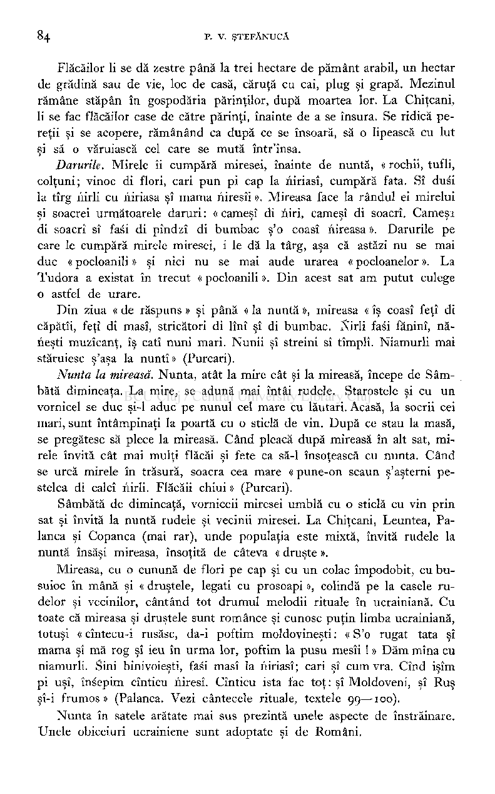

Flăcăilor li se dă zestre până la trei hectare de pământ arabil, un hectar de grădină sau de vie, loc de casă, căruţă cu cai, plug şi grapă. Mezinul

- rămâne stăpân în gospodăria părinţilor, după moartea lor. La Chiţcani, li se fac flăcăilor case de către părinţi, înainte de a se însura. Se ridică pereţii şi se acopere, rămânând ca după ce se însoară, să o lipească cu lut şi să o văruiască cel care se mută într'însa.

Darurile. Mirele îi cumpără miresei, înainte de nuntă, « rochii, tufli, colţuni; vinoc di flori, cari pun pi cap la niriasî, cumpără fata. Sî dusi la tîrg nirli cu iiiriasa şî mama niresîi ». Mireasa face la rândul ei mirelui şi soacrei următoarele daruri : « cameşî di niri, cameşî di soacrî. Cămeşa di soacrî sî fasi di pîndzî di bumbac ş'o coasî rtireasa ». Darurile pe care le cumpără mirele miresei, i le dă la târg, aşa că astăzi nu se mai duc « pocloanili » şi nici nu se mai aude urarea « pocloanelor ». La Tudora a existat în trecut « pocloanili ». Din acest sat am putut culege o astfel de urare.

Din ziua « de răspuns » şi până « la nuntă », mireasa « îş coasî feţî di căpătîi, feţî di masî, stricători di lînî şî di bumbac. Nirli fasi făninî, năneşti muzicant, îş catî nuni mari. Nunii şî streini sî tîmplî. Niamurli mai stăruiesc ş'aşa la nuntî» (Purcari).

Nunta la mireasă. Nunta, atât la mire cât şi la mireasă, începe de Sâmbătă dimineaţa. La mire, se adună mai întâi rudele. Starostele şi cu un vornicel se duc şi—1 aduc pe nunul cel mare cu lăutari. Acasă, la socrii cei mari, sunt întâmpinaţi la poartă cu o sticlă de vin. După ce stau la masă, se pregătesc să plece la mireasă. Când pleacă după mireasă în alt sat, mirele în vită cât mai mulţi flăcăi şi fete ca să-1 însoţească cu nunta. Când se urcă mirele în trăsură, soacra cea mare « pune-on scaun ş'aşterni pestelca di calcî riirli. Flăcăii chiui » (Purcari).

Sâmbătă de dimineaţă, vorniceii miresei umblă cu o sticlă cu vin prin sat şi învită la nuntă rudele şi vecinii miresei. La Chiţcani, Leuntea, Palanca şi Copanca (mai rar), unde populaţia este mixtă, învită rudele la nuntă însăşi mireasa, însoţită de câteva « druşte ».

Mireasa, cu o cunună de flori pe cap şi cu un colac împodobit, cu busuioc în mână şi « druştele, legaţi cu prosoapi », colindă pe la casele rudelor şi vecinilor, cântând tot drumul melodii rituale în ucrainiană. Cu toate că mireasa şi druştele sunt românce şi cunosc puţin limba ucrainiană, totuşi « cîntecu-i rusăsc, da-i poftim moldovineşti : «S'o rugat tata şî mama şî mă rog şî ieu în urma lor, poftim la pusu mesîi ! » Dăm mîna cu niamurli. Sini binivoieşti, fasi masî la niriasî; cari şî cumvra. Cînd işîm pi uşî, însepim cînticu niresî. Cînticu ista fac toţ: şî Moldoveni, şî Ruş şî-i frumos » (Palanca. Vezi cântecele rituale, textele 99—100).

Nunta în satele arătate mai sus prezintă unele aspecte de înstrăinare. Unele obiceiuri ucrainiene sunt adoptate şi de Români.

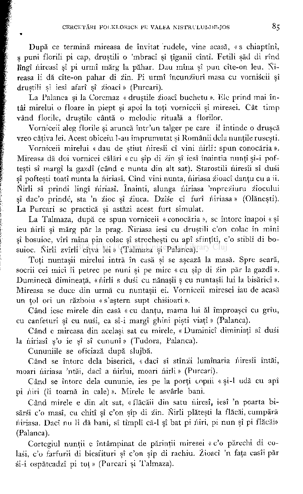

După ce termină mireasa de invitat rudele, vine acasă, « s chiaptînî, ş puni florili pi cap, druştili o 'mbracî şî ţiganii cîntî. Fetili şăd di rînd lîngî iiireasî şî pi urmî mărg la pahar. Dau mîna şî pun cîte-on leu. Nireasa li dă cîte-on pahar di zin. Pi urmî încunziurî masa cu vorniseii şî druştili şî iesî afarî şî zioacî » (Purcari).

La Palanca şi la Corcmaz « druştile zioacî buchetu ». Ele prind mai întâi mirelui o floare în piept şi apoi la toţi vorniceii şi miresei. Cât timp vând florile, druştile cântă o melodie rituală a florilor.

Vorniceii aleg florile şi aruncă într'un talger pe care il întinde o druşcă vreo câţiva lei. Acest obiceiu l-au împrumutat şi Românii delà nunţile ruseşti.

Vorniceii mirelui «dau de ştiut hiresîi cî vini nirli: spun cono caria ». Mireasa dă doi vornicei călări « cu şîp di zin şî iesî înaintia nunţi şî-i pofteşti sî margî la gazdî (când e nunta din alt sat). Starostili niresîi sî dusi şî pofteşti toatî nunta la niriasî. Cînd vini nunta, niriasa zioacî danţu cu a ii. Nirli sî prindi lingi niriasî. înainti, alunga niriasa 'mpreziuru ziocului şî dac'o prinde, sta 'n zioc şî ziuca. Dzîse cî furî niriasa » (Olăneşti). La Purcari se practică şi astăzi acest furt simulat.

La Talmaza, după ce spun vorniceii « conocăria », se întorc înapoi « şî

ieu nirli şî mărg păr la prag. Niriasa iesî cu druştili c'on colac în mînî şî bosuioc, vîrî mîna pin colac şî strocheşti cu apî sfinţiţi, c'o stiblî di bosuioc. Nirli zvîrli cîţva lei » (Talmaza şi Palanca).

Toţi nuntaşii mirelui intră în casă şi se aşează la masă. Spre seară, socrii cei mici îi petrec pe nuni şi pe mire « cu şîp di zin păr la gazdî ». Duminecă dimineaţă, « nirli s dusi cu nănaşîi ş cu nuntaşii lui la bisăricî ». Mireasa se duce din urmă cu nuntaşii ei. Vorniceii miresei iau de acasă un ţol ori un războiu « s'aştern supt chisioari ».

Când iese mirele din casă « cu danţu, mama lui ăl împroaşcî cu grîu, cu canfeturi şî cu nusi, ca sî-i margî ghini pişti viaţî » (Palanca).

Când e mireasa din acelaşi sat cu mirele, « Duminici diminiaţî sî dusi

la niriasî ş'o ie şî sî cununî » (Tudora, Palanca). Cununiile se oficiază după slujbă. Când se întorc delà biserică, « dacî sî stînzi lumînaria hiresîi întăi,

moari niriasa 'ntăi, dacî a nirlui, moari nirli » (Purcari).

Când se întorc delà cununie, ies pe la porţi copiii « şi-1 udă cu apî pi lîiri (îi toarnă în cale) ». Mirele le asvârle bani.

Când mirele e din alt sat, « flăcăii din satu hiresî, iesî 'n poarta bi-

- sărsi c'o masî, cu chiti şî c'on şîp di zin. Nirli plăteşti la flăcăi, cumpără niriasa. Dacî nu li dă bani, sî tîmplî că-1 şî bat pi niri, pi nun şî pi flăcăi» (Palanca).

Cortegiul nunţii e întâmpinat de părinţii miresei « c'o părechi di colasi, c'o farfurii di bicsfituri şî c'on şîp di rachiu. Zioacî 'n faţa casîi păr si-i ospăteadzî pi toţ » (Purcari şi Talmaza).

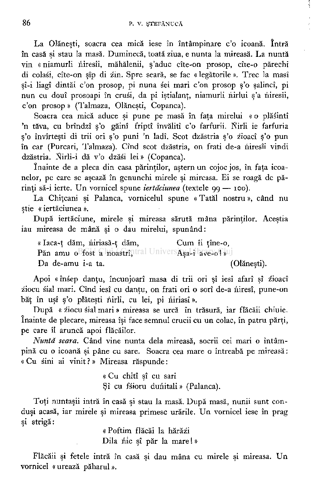

La Olăneşti, soacra cea mică iese în întâmpinare c'o icoană. întră în casă şi stau la masă. Duminecă, toată ziua, e nunta la mireasă. La nuntă vin « niamurli niresîi, măhălenii, ş'aduc cîte-on prosop, cîte-o părechi di colasi, cîte-on şîp di zin. Spre seară, se fac « legătorile ». Trec la masî şî-i liagî dintâi c'on prosop, pi nuna sei mari c'on prosop ş'o şalincî, pi nun cu douî prosoapi în crusi, da pi iştialanţ, niamurli nirlui ş'a niresîi, c'on prosop » (Talmaza, Olăneşti, Copanca).

Soacra cea mică aduce şi pune pe masă în faţa mirelui « o plăsintî 'n tava, cu brîndzî ş'o găinî friptî învălitî c'o farfurii. Nirli ie farfuria ş'o învîrteşti di trii ori ş'o puni 'n ladî. Scot dzăstria ş'o zioacî ş'o pun în car (Purcari, Talmaza). Cînd scot dzăstria, on fraţi de-a niresîi vindi dzăstria. Nirli-i dă v'o dzăsi lei » (Copanca).

înainte de a pleca din casa părinţilor, aştern un cojoc jos, în faţa icoanelor, pe care se aşează în genunchi mirele şi mireasa. Ei se roagă de părinţi să-i ierte. Un vornicel spune iertăciunea (textele 99 — 100).

La Chiţcani şi Palanca, vornicelul spune « Tatăl nostru », când nu ştie « iertăciunea ».

După iertăciune, mirele şi mireasa sărută mâna părinţilor. Aceştia iau mireasa de mână şi o dau mirelui, spunând:

« Iaca-ţ dăm, niriasă-ţ dăm, Cum îi ţîne-o, Păn amu o fost a noastrî, Aşa-i a^e-o ! » Da de-amu i-a ta. (Olăneşti).

Apoi « însep danţu, încunjoarî masa di trii ori şî iesî afarî şî zioacî ziocu sial mari. Cînd iesî cu danţu, on fraţi ori o sorî de-a niresî, pune-on băţ în uşî ş'o plăteşti hirli, cu lei, pi niriasî ».

După « ziocu sial mari » mireasa se urcă în trăsură, iar flăcăii chiuie, înainte de plecare, mireasa îşi face semnul crucii cu un colac, în patru părţi, pe care îl aruncă apoi flăcăilor.

Nuntă seara. Când vine nunta delà mireasă, socrii cei mari o întâmpină cu o icoană şi pâne cu sare. Soacra cea mare o întreabă pe mireasă: « Cu sini ai vinit ? » Mireasa răspunde :

« Cu chitî şî cu sari Şî cu fsioru dunitali » (Palanca).

Toţi nuntaşii intră în casă şi stau la masă. După masă, nunii sunt conduşi acasă, iar mirele şi mireasa primesc urările. Un vornicel iese în prag şi strigă:

« Poftim flăcăi la hărăzi Dila nie şî păr la mare ! »

Flăcăii şi fetele intră în casă şi dau mâna cu mirele şi mireasa. Un vornicel « urează paharul ».

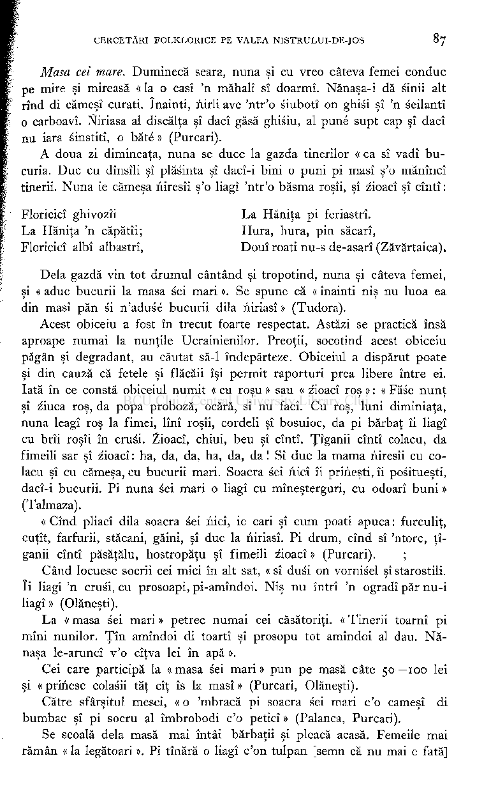

Masa cei mare. Duminecă seara, nuna şi cu vreo câteva femei conduc pe mire şi mireasă « la o casî 'n măhalî sî doarmî. Nănaşa-i dă sinii alt rînd di cameşî curaţi. înainti, nirli ave 'ntr'o siubotî on ghisi şî 'n seilantî o carboavî. Niriasa al discălţa şî dacî găsă ghisiu, al puné supt cap şî dacî nu iara sinstitî, o băte » (Purcari).

A doua zi dimineaţa, nuna se duce la gazda tinerilor « ca sî vadî bucuria. Duc cu dînsîli şî plăsinta şî dacî-i bini o puni pi masî ş'o mănîncî tinerii. Nuna ie cămeşa niresîi ş'o liagî 'ntr'o basma roşîi, şî zioacî şî cîntî:

Floricicî ghivozîi La Hăniţa 'n căpătîi; Floricicî albî albaştri,

La Hăniţa pi feriastrî. Hura, hura, pin săcarî, Douî roati nu-s de-asarî (Zăvărtaica).

Delà gazdă vin tot drumul cântând şi tropotind, nuna şi câteva femei, şi « aduc bucurii la masa sei mari ». Se spune că « înainti niş nu luoa ea din masî păn si n'adusé bucurii dila niriasî » (Tudora).

Acest obiceiu a fost în trecut foarte respectat. Astăzi se practică însă aproape numai la nunţile Ucrainienilor. Preoţii, socotind acest obiceiu păgân şi degradant, au căutat să-1 îndepărteze. Obiceiul a dispărut poate şi din cauză că fetele şi flăcăii îşi permit raporturi prea libere între ei. Iată în ce constă obiceiul numit « cu roşu » sau « zioacî roş » : « Făse nunţ şî ziuca roş, da popa proboză, ocăra, sî nu facî. Cu roş, luni diminiaţa, nuna leagî roş la fimei, lînî roşîi, cordeli şî bosuioc, da pi bărbat îi liagî cu brii roşîi în crusi. Zioacî, chiui, beu şî cîntî. Ţiganii cîntî colacu, da fimeili sar şî zioacî : ha, da, da, ha, da, da ! Sî duc la mama niresîi cu colacu şî cu cămeşa, cu bucurii mari. Soacra sei nicî îi prineşti, îi positueşti, dacî-i bucurii. Pi nuna sei mari o liagî cu mîneşterguri, cu odoarî buni » (Talmaza).

« Cînd pliacî dila soacra sei nicî, ie cari şî cum poati apuca : furculiţ, cuţît, farfurii, stăcani, găini, şî duc la niriasî. Pi drum, cînd sî 'ntorc, ţiganii cîntî păsăţălu, hostropăţu şî fimeili zioacî » (Purcari). ;

Când locuesc socrii cei mici în alt sat, « sî dusi on vornisel şî starostili. îi liagî 'n crusi, cu prosoapi, pi-amîndoi. Niş nu mtrî 'n ogradî păr nu-i liagî » (Olăneşti).

La « masa sei mari » petrec numai cei căsătoriţi. « Tinerii toarnî pi mîni nunilor. Ţîn amîndoi di toartî şî prosopu tot amîndoi al dau. Nănaşa le-aruncî v'o cîţva lei în apă ».

Cei care participă la «masa sei mari» pun pe masă câte 50—100 lei şi « priiiesc colasii tăţ cîţ îs la masî » (Purcari, Olăneşti).

Către sfârşitul mesei, « o 'mbracă pi soacra sei mari c'o cameşî di bumbac şî pi socru al îmbrobodi c'o petici » (Palanca, Purcari).

Se scoală delà masă mai întâi bărbaţii şi pleacă acasă. Femeile mai rămân « la legătoari ». Pi tînără o liagî c'on tulpan [semn că nu mai e fată]

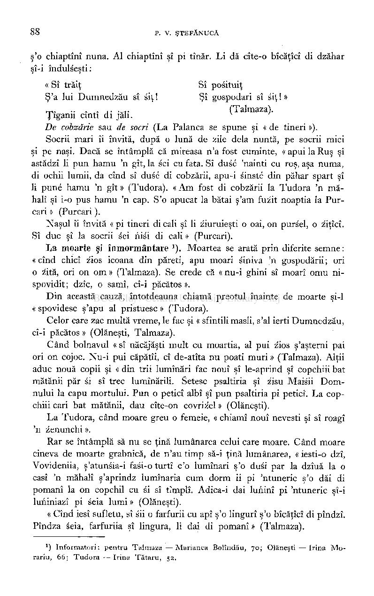

##### 88 p. v. ŞTEFANUCĂ

ş'o chiaptînî nuna. Al chiaptînî şî pi tînăr. Li dă cîte-o bîcăţîcî di dzăhar şî-i îndulseşti:

« Sî trăit Ş'a lui Dumnedzău sî siţ! Ţiganii cîntî di jăli.

Sî posituiţ Şî gospodari sî siţ ! »

(Talmaza).

De cobzar ie sau de socri (La Palanca se spune şi « de tineri »).

Socrii mari îi învită, după o lună de zile delà nuntă, pe socrii mici şi pe naşi. Dacă se întâmplă că mireasa n'a fost cuminte, « apui la Ruş şî astădzî li pun hamu 'n gît, la sei cu fata. Sî dusé 'nainti cu roş, aşa numa, di ochii lumii, da cînd sî dusé di cobzarii, apu-i sinsté din pahar spart şî li puné hamu 'n gît » (Tudora). « Am fost di cobzarii la Tudora 'n măhalî şî i-o pus hamu 'n cap. S'o apucat la bătăi ş'am fuzit noaptia la Purcari )> (Purcari ).

Naşul îi învită « pi tineri di caii şî li ziuruieşti o oai, on pursel, o ziţîcî. Sî duc şî la socrii sei nisi di caii » (Purcari).

La moarte şi înmormântare *). Moartea se arată prin diferite semne: « cînd chicî zios icoana din păreţi, apu moari siniva 'n gospodării ; ori o zită, ori on om » (Talmaza). Se crede că « nu-i ghini sî moarî omu nispovidit; dzîc, o samî, cî-i păcătos».

Din această cauză, întotdeauna chiamă preotul înainte de moarte şi-1 « spovidesc ş'apu al pristuesc » (Tudora).

Celor care zac multă vreme, le fac şi « sfintili masli, s'al ierţi Dumnedzău, cî-i păcătos » (Olăneşti, Talmaza).

Când bolnavul « sî năcăjăşti mult cu moartia, al pui zios ş'aşterni pai ori on cojoc. Nu-i pui căpătîi, cî de-atîta nu poati muri » (Talmaza). Alţii aduc nouă copii şi « din trii luminări fac nouî şî le-aprind şî copchiii bat mătănii păr si sî trec lumînărili. Setesc psaltiria şî zisu Maisii Domnului la capu mortului. Pun o peticî albî şî pun psaltiria pi petici. La copchiii cari bat mătănii, dau cîte-on covrizel » (Olăneşti).

La Tudora, când moare greu o femeie, « chiamî nouî nevesti şî sî roagî 'n zenunchi ».

Rar se întâmplă să nu se ţină lumânarea celui care moare. Când moare cineva de moarte grabnică, de n'au timp să-i ţină lumânarea, « iesti-o dzî, Vovideniia, ş'atunsia-i fasi-o turtî c'o luminări ş'o dusi par la dzîuă la o casî 'n măhalî ş'aprindz lumînaria cum dorm ii pi 'ntuneric ş'o dăi di pomanî la on copchil cu si sî tîmplî. Adica-i dai luninî pi 'ntuneric şî-i luniniazî pi seia lumi » (Olăneşti).

« Cînd iesî sufletu, sî sii o farfurii cu apî ş'o linguri ş'o bîcăţîcî di pîndzî. Pîndza seia, farfuriia şî lingura, li dai di pomanî » (Talmaza).

) Informatori: pentru Talmaza—Marianca Bolîndău, 70; Olăneşti—Irina Mo rariu, 66; Tudora — Irina Tătaru, 52.

1

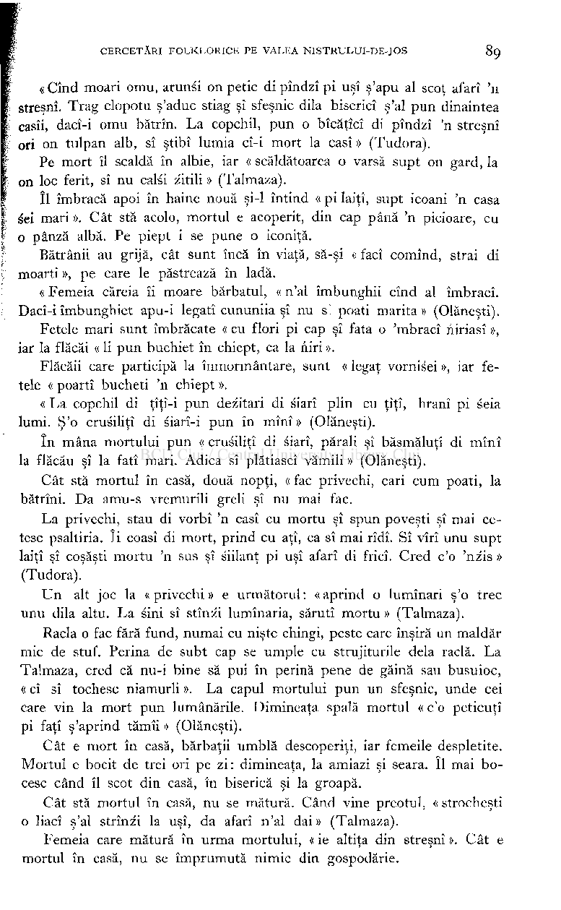

«Cînd moari omu, arunsi on petic di pîndzî pi uşî ş'apu al scoţ afarî 'n streşnî. Trag clopotu ş'aduc stiag şî sfeşnic dila biserici ş'al pun dinaintea casîi, dacî-i omu bătrîn. La copchil, pun o bîcăţîcî di pîndzî 'n streşnî ori on tulpan alb, sî ştibî lumia cî-i mort la casî » (Tudora).

Pe mort îl scaldă în albie, iar « scăldătoarea o varsă supt on gard, la on loc ferit, sî nu calsi zitili » (Talmaza).

îl îmbracă apoi în haine nouă şi-1 întind « pi laiţî, supt icoani 'n casa sei mari ». Cât stă acolo, mortul e acoperit, din cap până 'n picioare, cu o pânză albă. Pe piept i se pune o iconiţă.

Bătrânii au grijă, cât sunt încă în viaţă, să-şi « faci comînd, strai di moarti », pe care le păstrează în ladă.

« Femeia căreia îi moare bărbatul, « n'al îmbunghii cînd al îmbraci. Dacî-i îmbunghiet apu-i legatî cununiia şî nu s' poati mărita» (Olăneşti).

Fetele mari sunt îmbrăcate « cu flori pi cap şî fata o 'mbracî ruriasî », iar la flăcăi « li pun buchiet în chiept, ca la niri ».

Flăcăii care participă la înmormântare, sunt « legat vornisei », iar fetele « poartî bucheti 'n chiept ».

« La copchil di ţîţî-i pun dezitari di siarî plin cu ţîţî, hranî pi seia lumi. S'o crusilitî di siarî-i pun în mînî » (Olăneşti).

în mâna mortului pun « crusilitî di siarî, părali şî băsmăluţî di mînî la flăcău şî la fatî mari. Adică sî plătiascî vămili » (Olăneşti).

Cât stă mortul în casă, două nopţi, « fac privechi, cari cum poati, la bătrîni. Da amu-s vremurili greii şî nu mai fac.

La privechi, stau di vorbî 'n casî cu mortu şî spun poveşti şî mai cetesc psaltiria. li coasî di mort, prind cu aţî, ca sî mai rîdî. Sî vîrî unu supt laiţî şî coşăşti mortu 'n sus şî siilanţ pi uşî afarî di fricî. Cred c'o 'nzis » (Tudora).

Un alt joc la « privechi » e următorul : « aprind o luminări ş'o trec unu dila altu. La sini sî stînzi lumînaria, sărutî mortu » (Talmaza).

Racla o fac fără fund, numai cu nişte chingi, peste care înşiră un maldăr mic de stuf. Perina de subt cap se umple cu strujiturile delà raclă. La Talmaza, cred că nu-i bine să pui în perină pene de găină sau busuioc, « cî sî tochesc niamurli ». La capul mortului pun un sfeşnic, unde cei care vin la mort pun lumânările. Dimineaţa spală mortul « c'o peticuţî pi faţî ş'aprind tămîi » (Olăneşti).

Cât e mort în casă, bărbaţii umblă descoperiţi, iar femeile despletite. Mortul e bocit de trei ori pe zi: dimineaţa, la amiazi şi seara. II mai bocesc când îl scot din casă, în biserică şi la groapă.

Cât stă mortul în casă, nu se mătură. Când vine preotul, « strocheşti o liacî ş'al strînzi la uşî, da afarî n'al dai » (Talmaza).

Femeia care mătură în urma mortului, « ie altiţa din streşnî ». Cât e mortul în casă, nu se împrumută nimic din gospodărie.

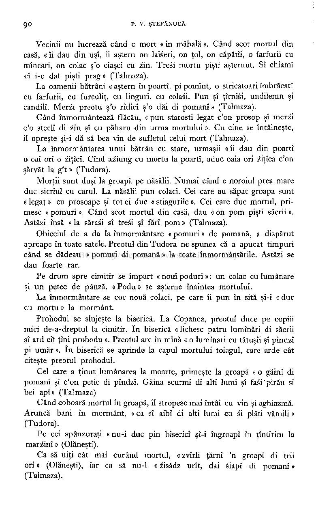

Vecinii nu lucrează când e mort « în măhală ». Când scot mortul din casă, « îi dau din uşî, îi aştern on laiseri, on ţol, on căpătîi, o farfurii cu mîncari, on colac ş'o ciaşcî cu zin. Tresi mortu pişti aşternut. Sî chiamî cî i-o dat pişti prag » (Talmaza).

La oamenii bătrâni « aştern în poartî, pi pomînt, o stricatoari îmbrăcaţi cu farfurii, cu furculiţ, cu linguri, cu colasi. Pun şî ţîrnisi, undilemn şî candilî. Merzi preotu ş'o rîdicî ş'o dăi di pomanî » (Talmaza).

Când înmormântează flăcău, « pun starosti legat c'on prosop şî merzi c'o steclî di zin şî cu păharu din urma mortului ». Cu cine se întâlneşte, îl opreşte şi-i dă să bea vin de sufletul celui mort (Talmaza).

La înmormântarea unui bătrân cu stare, urmaşii « îi dau din poartî o oai ori o ziţîcî. Cînd aziung cu mortu la poartî, aduc oaia ori ziţîca c'on şărvăt la gît » (Tudora).

Morţii sunt duşi la groapă pe năsălii. Numai când e noroiul prea mare duc sicriul cu carul. La năsălii pun colaci. Cei care au săpat groapa sunt « legat » cu prosoape şi tot ei duc « stiagurile ». Cei care duc mortul, primesc « pomuri ». Când scot mortul din casă, dau « on pom pişti sacrii ». Astăzi însă « la săraşi sî tresi şî fărî pom » (Talmaza).

Obiceiul de a da la înmormântare « pomuri » de pomană, a dispărut aproape în toate satele. Preotul din Tudora ne spunea că a apucat timpuri când se dădeau « pomuri di pomană » la toate înmormântările. Astăzi se dau foarte rar.

Pe drum spre cimitir se împart « nouî poduri » : un colac cu lumânare şi un petec de pânză. « Podu » se aşterne înaintea mortului.

La înmormântare se coc nouă colaci, pe care îi pun în sită şi-i « duc cu mortu » la mormânt.

Prohodul se slujeşte la biserică. La Copanca, preotul duce pe copiii mici de-a-dreptul la cimitir. în biserică « lichesc patru luminări di sacrii şî ard cît ţîni prohodu ». Preotul are în mînă « o luminări cu tătuşîi şî pîndzî pi umăr ». în biserică se aprinde la capul mortului toiagul, care arde cât citeşte preotul prohodul.

Cel care a ţinut lumânarea la moarte, primeşte la groapă « o găinî di pomanî şî c'on petic di pîndzî. Găina scurmî di altî lumi şî fasi'pîrău sî bei apî» (Talmaza).

Când coboară mortul în groapă, îl stropesc mai întâi cu vin şi aghiazmă. Aruncă bani în mormânt, « ca sî aibî di altî lumi cu si plăti vămili » (Tudora).

Pe cei spânzuraţi « nu-i duc pin biserici şî-i îngroapî în ţîntirim la marzinî » (Olăneşti).

Ca să uiţi cât mai curând mortul, « zvîrli ţărnî 'n groapî di trii ori » (Olăneşti), iar ca să nu-1 « zisădz urît, dai siapî di pomanî » (Talmaza).

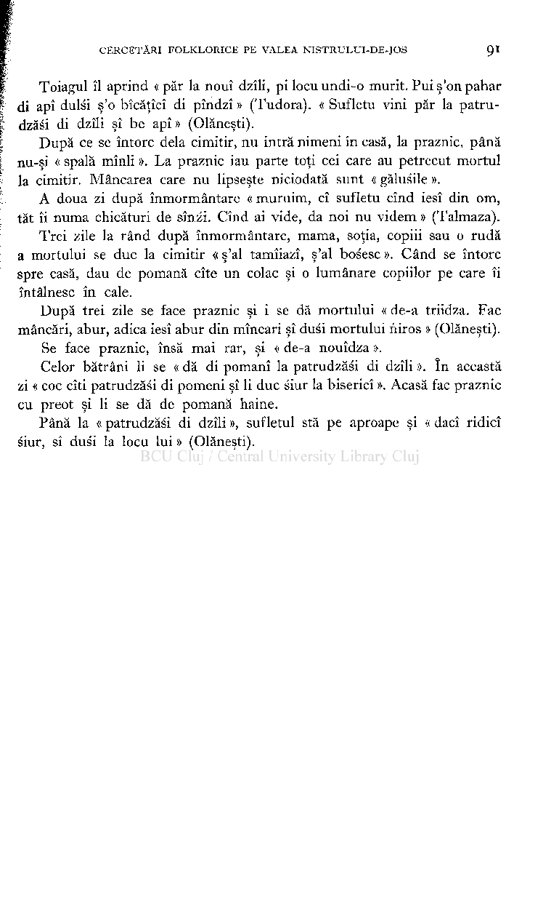

Toiagul îl aprind « păr la nouî dzîli, pi locu undi-o murit. Pui ş'on pahar di apî dulsi ş'o bîcăţîcî di pîndzî » (Tudora). « Sufletu vini păr la patrudzăsi di dzîli şî be apî » (Olăneşti).

După ce se întorc delà cimitir, nu intră nimeni în casă, la praznic, până nu-şi « spală mînli ». La praznic iau parte toţi cei care au petrecut mortul la cimitir. Mâncarea care nu lipseşte niciodată sunt « gălusile ».

A doua zi după înmormântare « muruim, cî sufletu cînd iesî din om,

- tăt îi numa chicături de sînzi. Cînd ai vide, da noi nu videm » (Talmaza). Trei zile la rând după înmormântare, mama, soţia, copiii sau o rudă

a mortului se duc la cimitir « ş'al tamîiazî, ş'al bosesc ». Când se întorc spre casă, dau de pomană cîte un colac şi o lumânare copiilor pe care îi întâlnesc în cale.

După trei zile se face praznic şi i se dă mortului « de-a triidza. Fac

mâncări, abur, adică iesî abur din mîncari şî duşi mortului niros » (Olăneşti). Se face praznic, însă mai rar, şi « de-a nouîdza ». Celor bătrâni li se « dă di pomanî la patrudzăsi di dzîli ». în această

zi « coc cîti patrudzăsi di pomeni şî li duc siur la biserici ». Acasă fac praznic cu preot şi li se dă de pomană haine.

Până la « patrudzăsi di dzîli », sufletul stă pe aproape şi « dacî ridici siur, si dusi la locu lui » (Olăneşti).

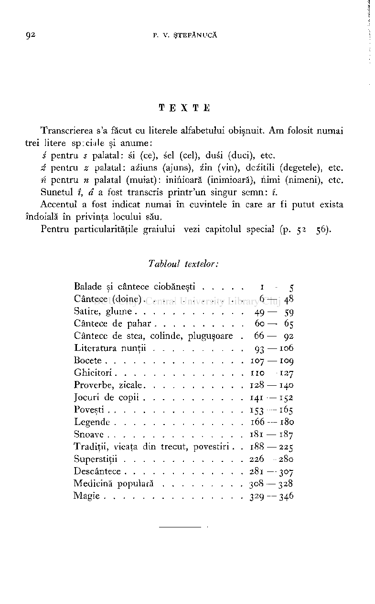

# TEXT

Transcrierea s'a făcut cu literele alfabetului obişnuit. Am folosit numai trei litere speciale şi anume:

s pentru i palatal: si (ce), sel (cel), dusi (duci), etc. z pentru z palatal: aziuns (ajuns), zin (vin), dezitili (degetele), etc. n pentru n palatal (muiat): ininioară (inimioară), îiimi (nimeni), etc. Sunetul î, â a fost transcris printr'un singur semn: î. Accentul a fost indicat numai în cuvintele în care ar fi putut exista

îndoială în privinţa locului său. Pentru particularităţile graiului vezi capitolul special (p. 52—56).

Tabloul textelor:

Balade şi cântece ciobăneşti 1 — 5 Cântece (doine) 6 — 48 Satire, glume 49 — 59 Cântece de pahar 60 — 65 Cântece de stea, colinde, pluguşoare . 66 — 92 Literatura nunţii 93 — 106 Bocete 107 — 109 Ghicitori 110 — 127 Proverbe, zicale 128 — 140 Jocuri de copii 141 — 152 Poveşti 153 — 165 Legende 166 — 180 Snoave 181 — 187 Tradiţii, vieaţa din trecut, povestiri. . 188 — 225 Superstiţii 226 — 280 Descântece 281 —307 Medicină populară 308—328 Magie 329—346

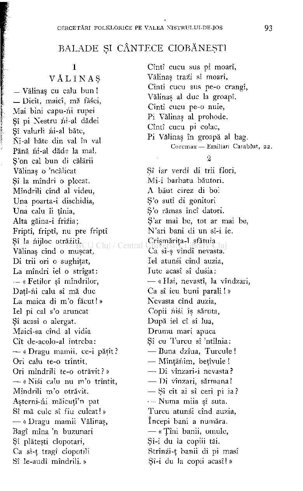

BALADE SI CÂNTECE CIOBĂNEŞTI

## 1

Cîntî cucu sus pi moarî, Vălinaş trazi sî moarî, Cîntî cucu sus pe-o crangî, Vălinaş al duc la groapî. Cîntî cucu pe-o nuie, Pi Vălinaş al prohode. Cîntî cucu pi colac, Pi Vălinaş în groapă al bag.

VÄLINA Ş — Vălinaş cu calu bun !

— Dicît, maicî, mă fasei, Mai bini capu-iii rupei Şî pi Nestru ni-al dadei Şî valurli ni-al băte, Ni-al băte din val în val Pană ni-al dade la mal. Ş'on cal bun di călării Vălinaş o 'ncălicat Şî la mîndri o plecat. Mîndrili cînd al videu, Una poarta-i dischidia, Una calu îi ţînia, Alta găina-i frizia; Fripţi, friptî, nu pre friptî Şî la riijloc otrăzitî. Vălinaş cînd o muşcat, Di trii ori o sughiţat, La mîndri iei o strigat: — « Feţilor şî mîndrilor, Daţî-fii calu sî mă duc La maica di m'o făcut ! » Iei pi cal s'o aruncat Şî acasî o alergat. Maicî-sa cînd al vidia Cît de-acolo-al întreba:

Corcmaz — Emijian Carablut, 22 .

2

Şî iar verdi di trii flori, Mi-i barbatu băutori. A băut cirez di boi Ş'o sutî di gonitori Ş'o rămas încî datori. Ş'ar mai be, tot ar mai be, N'ari bani di un sî-i ie. Crîşmăriţa-1 sfătuia Ca sî-ş vîndî nevasta. Iei atunsi cînd auzia, Iute acasî sî dusia:

— « Hai, nevastî, la vîndzari, Ca sî ieu buni parali ! » Nevasta cînd auzia, Copii nisi îş săruta, După iei cî sî lua, Drumu mari apuca Şî cu Turcu sî 'ntîlnia:

— Buna dzîua, Turcule !

— « Dragu mamii, ce-i păţit ? Ori calu te-o trîntit, Ori mîndrili te-o otrăvit ? »

— Mînţănim, beţîvule !

— Di vînzari-i nevasta ? — Di vînzari, sărmana ! — Şî cît ai sî ceri pi ia ?

— « Nisi calu nu m'o trîntit, Mîndrili m'o otrăvit. Aşterni-ni măicuţî'n pat Sî mă culc sî fiu culcat ! » — « Dragu mamii Vălinaş, Bagî mîna 'n buzunari Şî plăteşti clopotari, Ca sî-ţ tragî clopotili Sî le-audî mîndrili. »

— Numa miia şî suta. Turcu atunsi cînd auzia, începi bani a număra. — « Ţîni banii, omule, Şî-i du la copiii tăi. Strînzi-ţ banii di pi masî Şî-i du la copii acasî ! »

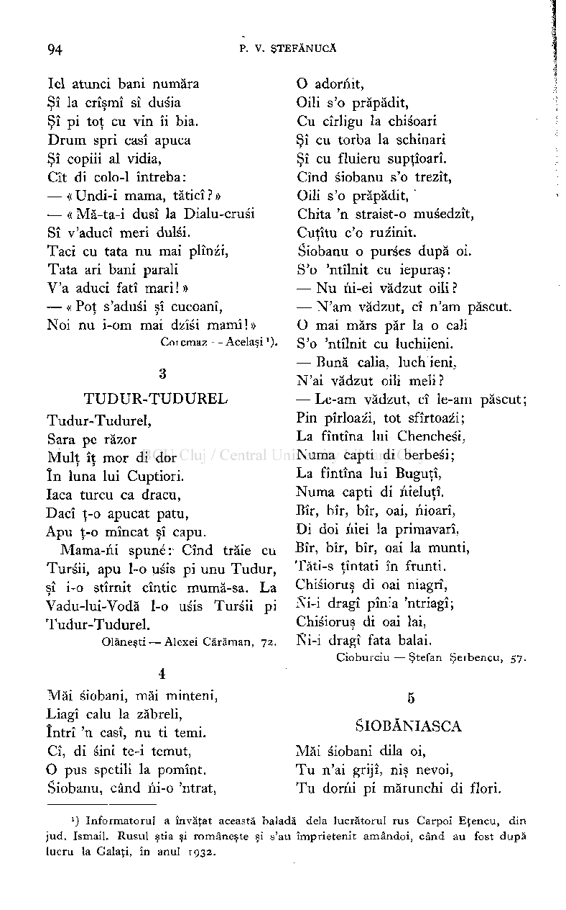

Iei atunci bani număra Şî la crîşmî sî dusia Şî pi toţ cu vin îi bia. Drum spri casî apuca Şî copiii al vidia, Cît di colo-1 întreba:

O adorhit, Oili s'o prăpădit, Cu cîrligu la chisoari Şî cu torba la schinari Şî cu fluieru supţîoarî. Cînd siobanu s'o trezit, Oili s'o prăpădit, ' Chita 'n straist-o musedzît, Cuţîtu c'o ruzinit. Siobanu o purées după oi. S'o 'ntîlnit cu iepuraş:

— « Undi-i mama, tăticî ? »

— « Mă-ta-i dusî la Dialu-crusi Sî v'aducî meri dulsi. Taci cu tata nu mai plînzi, Tata ari bani parali V a aduci fatî mari! »

— Nu ûi-ei vădzut oili ?

— « Poţ s'adusi şî cucoanî, Noi nu i-om mai dzîsi mamî ! »

— N'am vădzut, cî n'am păscut. O mai mărs păr la o caii S'o 'ntîlnit cu luchiieni.

Corcmaz — Acelaşi

).

1

## 3

— Bună calia, luch ieni, N'ai vădzut oili meii?

TUDUR-TUDURE L Tudur-Tudurel, Sara pe răzor Mulţ îţ mor di dor în luna lui Cuptiori. Iaca turcu ca dracu, Dacî ţ-o apucat patu, Apu ţ-o mîncat şî capu.

— Le-am vădzut, cî le-am păscut ; Pin pîrloazi, tot sfîrtoazi; La fîntîna lui Chenchesi, Numa capti di berbesi; La fîntîna lui Buguţî, Numa capti di nieluţî. Bîr, bîr, bîr, oai, nioarî, Di doi niei la primavarî, Bîr, bîr, bîr, oai la munţi, Tăti-s ţîntati în frunţi. Chisioruş di oai niagrî, Ni-i dragî pînia 'ntriagî; Chisioruş di oai lai, Ni-i dragî fata balai.

Mama-ni spune: Cînd trăie cu Tursii, apu l-o usis pi unu Tudur, şî i-o stîrnit cîntic mumă-sa. La Vadu-lui-Vodă l-o usis Tursii pi Tudur-Tudurel.

Olăneşti — Alexei Cărăman, 72.

Cioburciu — Ştefan Şerbencu, 57.

4 Măi siobani, măi minteni, Liagî calu la zăbreli, întrî 'n casî, nu ti temi. Cî, di sini te-i temut, O pus spetili la pomînt. Siobanu, când ni-o 'ntrat,

## 5

SIOBÄNIASCA

Măi siobani dila oi, Tu n'ai griji, niş nevoi, Tu dorfîi pi mărunchi di flori.

) Informatorul a învăţat această baladă delà lucrătorul rus Carpoi Eţencu, din jud. Ismail. Rusul ştia şi româneşte şi s'au împrietenit amândoi, când au fost după lucru la Galaţi, în anul 1932 .

J

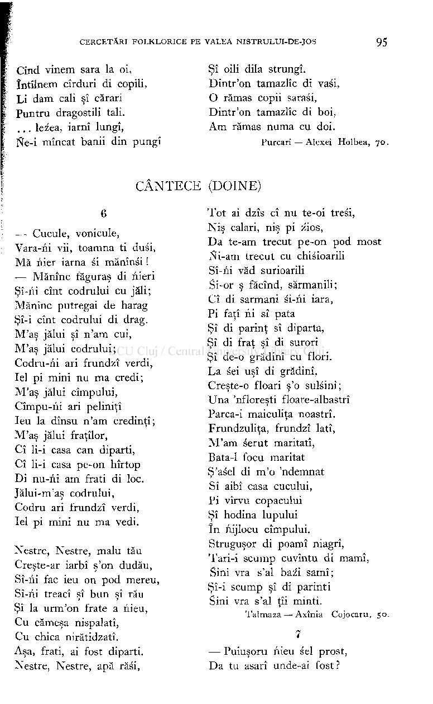

Şî oili dila strungi. Dintr'on tamazlîc di vasi, O rămas copii sarasi, Dintr'on tamazlîc di boi, Am rămas numa cu doi.

Cînd vinem sara la oi, întîlnem cîrduri di copiii, Li dam caii şî cărări Puntru dragostili tali. .. . Iezea, iarnî lungî, Ne-i mîncat banii din pungî

Purcari — Alexei Holbea, 70.

### CÂNTECE

### (DOINE)

Tot ai dzîs cî nu te-oi tresi, Niş calări, niş pi zios, Da te-am trecut pe-on pod most Ni-am trecut cu chisioarili Sî-ni văd surioarili Si-or ş făcînd, sărmanili; Cî di sărmani si-ni iara, Pi faţî iii sî pata Şî di parinţ sî diparta, Şî di fraţ şî di surori Şî de-o grădini cu flori. La sei uşî di grădinî, Creşte-o floari ş'o sulsinî; Una 'nfloreşti floare-albastrî Parca-i maiculiţa noastrî. Frundzuliţa, frundzî latî, M'am serut maritatî, Bata-1 focu măritat Ş'asel di m'o 'ndemnat Sî aibî casa cucului, Pi vîrvu copacului Şî hodina lupului In iiijlocu cîmpului. Struguşor di poamî niagrî, Tari-i scump cuvîntu di mamî, Sini vra s'al bazi samî;

6

— Cucuie, vonicule, Vara-îii vii, toamna ti dusi, Mă nier iarna si mănînsi !

— Mănînc făguraş di nieri Şî-iîi cînt codrului cu jăli; Mănînc putregai de harag Şî-i cînt codrului di drag. M'aş jălui şî n'am cui, M'aş jălui codrului; Codru-tîi ari frundzî verdi, Iei pi mini nu ma credi; M'aş jălui cîmpului, Cîmpu-rîi ari peliniţî leu la dînsu n'am credinţi; M'aş jălui fraţilor, Cî li-i casa can diparti, Cî li-i casa pe-on hîrtop Di nu-iii am fraţi di loc. Jălui-m'aş codrului, Codru ari frundzî verdi, Iei pi mini nu ma vedi.

Nestre, Nestre, malu tău Creşte-ar iarbî ş'on dudău, Sî-ni fac ieu on pod mereu, Sî-rii treacî şî bun şî rău Şî la urm'on frate a iiieu, Cu cămeşa nispalatî, Cu chica nirătidzatî. Aşa, fraţi, ai fost diparti. Nestre, Nestre, apă răsi,

Şî-i scump şî di părinţi Sini vra s'al ţîi minţi.

Talmaza — Axînia Cojocaru, 50.

7

— Puiuşoru iiieu sel prost, Da tu asarî unde-ai fost ?

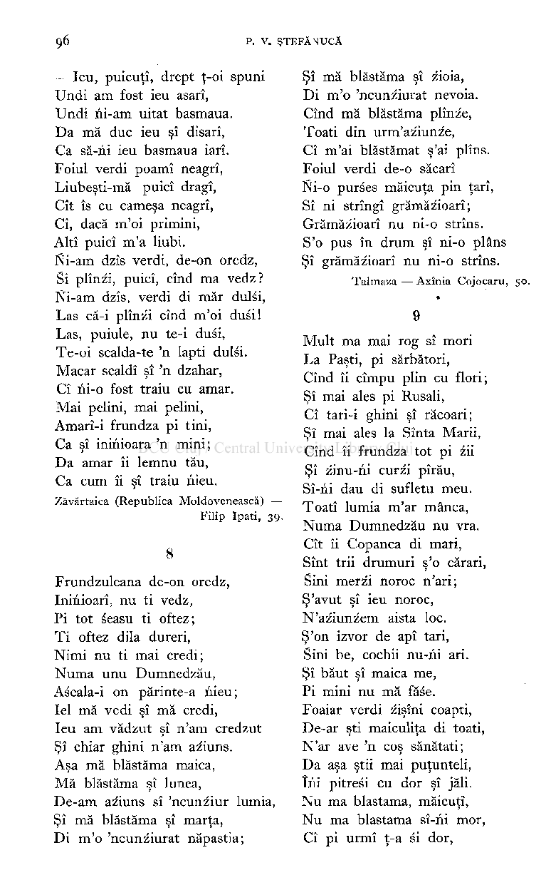

Şî mă blăstăma şî zioia, Di m'o 'ncunziurat nevoia. Cînd mă blăstăma plînze, Toati din urm'aziunze, Cî m'ai blăstămat ş'ai plîns. Foiul verdi de-o săcarî Ni-o purses măicuţa pin ţarî, Sî ni strîngî grămăzioarî; Grămăzioarî nu ni-o strîns. S'o pus în drum şî ni-o plâns Şî grămăzioarî nu ni-o strîns.

- Ieu, puicuţî, drept ţ-oi spuni Undi am fost ieu asarî, Undi ni-am uitat basmaua. Da mă duc ieu şî disarî, Ca să-ni ieu basmaua iarî. Foiul verdi poamî neagrî, Liubeşti-mă puicî dragî, Cît îs cu cămeşa neagrî, Cî, dacă m'oi primini, Altî puicî m'a liubi. Ni-am dzîs verdi, de-on oredz, Si plînzi, puicî, cînd ma vedz? Ni-am dzîs, verdi di măr dulsi, Las că-i plînzi cînd m'oi dusi! Las, puiule, nu te-i dusi, Te-oi scalda-te 'n lapti dulsi. Măcar scaldî şî 'n dzahar, Cî fîi-o fost traiu cu amar. Mai pelini, mai pelini, Amarî-i frundza pi tini, Ca şî ininioara 'n mini; Da amar îi lemnu tău, Ca cum îi şî traiu rîieu.

Talmaza — Axînia Cojocaru, 50.

*

## 9

Mult ma mai rog sî mori La Paşti, pi sărbători, Cînd îi cîmpu plin cu flori; Şî mai ales pi Rusali, Cî tari-i ghini şî răcoari; Şî mai ales la Sînta Marii, Cînd îi frundza tot pi zii Şî zinu-ni curzi pîrău, Sî-ni dau di sufletu meu. Toati lumia m'ar mânca, Numa Dumnedzău nu vra. Cît îi Copanca di mari, Sînt trii drumuri ş'o cărări, Sini merzi noroc n'ari; Ş'avut şî ieu noroc, N'aziunzem aista loc. Ş'on izvor de apî tari, Sini be, cochii nu-ni ari. Şî băut şî maica me, Pi mini nu mă făse. Foaiar verdi zişîni coapti, De-ar şti maiculiţa di toati, N'ar ave 'n coş sănătăţi; Da aşa ştii mai puţunteli, Ini pitresi cu dor şî jăli. Nu ma blastama, măicuţî, Nu ma blastama sî-rii mor, Cî pi urmî ţ-a si dor,

Zăvărtaica (Republica Moldovenească) Filip Ipati, 39.

8

Frundzuleana de-on oredz, Ininioarî, nu ti vedz, Pi tot seasu ti oftez; Ti oftez dila dureri, Nimi nu ti mai credi; Numa unu Dumnedzău, Aseala-i on părinte-a rîieu; Iei mă vedi şî mă credi, leu am vădzut şî n'am credzut Şî chiar ghini n'am aziuns. Aşa mă blăstăma maica, Mă blăstăma şî lunea, De-am aziuns sî 'ncunziur lumia, Şî mă blăstăma şî marţa, Di m'o 'ncunziurat năpastia;

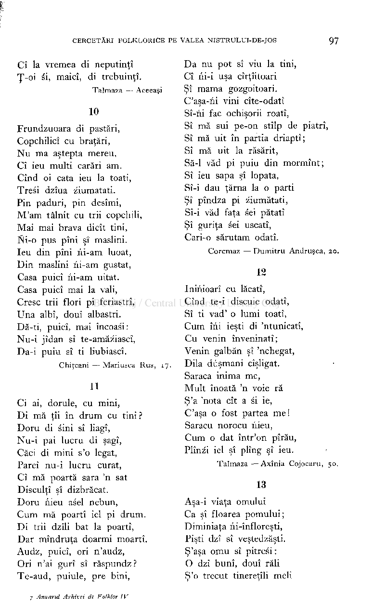

97

Da nu pot sî viu la tini, Cî ni-i uşa cîrţîitoari Şî mama gozgoitoari. C'aşa-ni vini cîte-odatî Sî-ni fac ochişorii roatî, Sî mă sui pe-on stîlp de piatrî, Sî mă uit în pârtia driaptî; Sî mă uit la răsărit, Să-1 văd pi puiu din mormînt; Sî ieu sapa şî lopata, Sî-i dau ţărna la o parti Şî pîndza pi ziumatati, Sî-i văd faţa sei pătatî Şî guriţa sei uscatî, Cari-o sărutam odatî.

Cî la vremea di neputinţî T-oi si, maici, di trebuinţî.

Talmaza — Aceeaşi

## 10

Frundzuoara di pastări, Copchilicî cu brăţări, Nu ma aştepta mereu, Cî ieu mulţi cărări am. Cînd oi cata ieu la toati, Tresi dzîua ziumatati. Pin păduri, pin desimi, M'am tâlnit cu trii copchili, Mai mai brava dicît tini, Ni-o pus pîni şî măslini. Ieu din pîni ni-am luoat, Din măslini ni-am gustat, Casa puicî ni-am uitat. Casa puicî mai la vali, Cresc trii flori pi feriastrî, Una albî, douî albaştri. Dă-ti, puicî, mai încoasi: Nu-i jîdan sî te-amăziascî, Da-i puiu sî ti liubiascî.

Corcmaz — Dumitru Andruşca, 20.

## 12

Ininioarî cu lăcatî, Cînd te-i discuie odatî, Sî ti vad' o lumi toatî, Cum îhi ieşti di 'ntunicatî, Cu venin înveninaţi; Venin galbăn şî 'nchegat, Dila duşmani cîşligat. Săraca inima me, Mult înoată 'n voie ră Ş'a 'nota cît a si ie, C'aşa o fost partea me! Saracu norocu nieu, Cum o dat într'on pîrău, Plînzi iei şî plîng şî ieu.

Chiţcani —Mariusca Rus, 17 .

## 11

Ci ai, dorule, cu mini, Di mă ţîi în drum cu tini ? Doru di sini sî liagî, Nu-i pai lucru di şagî, Căci di mini s'o legat, Parcî nu-i lucru curat, Cî mă poartă sara 'n sat Discuiţi şî dizbrăcat. Doru nieu asel nebun, Cum mă poartî iei pi drum. Di trii dzîli bat la poartî, Dar mîndruţa doarmi moartî. Audz, puicî, ori n'audz, Ori n'ai gurî sî răspundz ? Te-aud, puiule, pre bini,

Talmaza — Axînia Cojocarii, 50.

## 13

Aşa-i viaţa omului Ca şî floarea pomului; Diminiaţa ni-înfloreşti, Pişti dzî sî veştedzăşti. Ş'aşa omu sî pitresi : O dzî bunî, douî răii Ş'o trecut tinereţîli meii

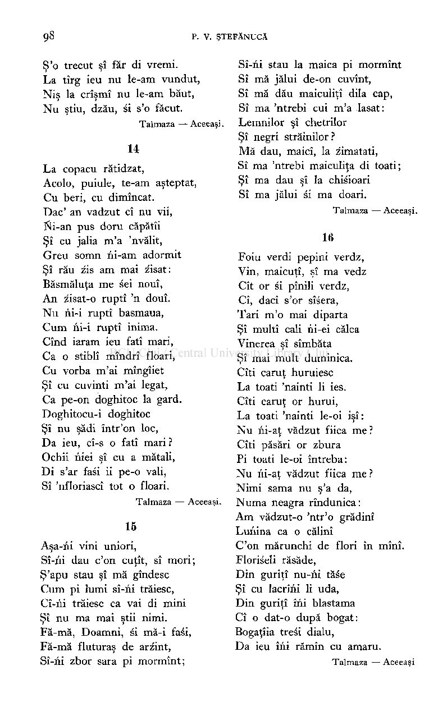

Sî-ni stau la maica pi mormînt Sî mă jălui de-on cuvînt, Sî mă dău maiculiţî dila cap, Sî ma 'ntrebi cui m'a lăsat: Lemnilor şî chetrilor Şî negri străinilor? Mă dau, maicî, la zimatati, Sî ma 'ntrebi maiculiţa di toati; Şî ma dau şî la chisioari Sî ma jălui si ma doari.

Ş'o trecut şî făr di vremi. La tîrg ieu nu le-am vundut, Niş la crîşmî nu le-am băut, Nu ştiu, dzău, si s'o făcut.

Talmaza — Aceeaşi.

## 14

La copacu rătidzat, Acolo, puiule, te-am aşteptat, Cu beri, cu dimîncat. Dac' an vadzut cî nu vii, Ni-an pus doru căpătîi Şî cu jalia m'a 'nvălit, Greu somn ni-am adormit Şî rău zis am mai zisat: Băsmăluţa me sei nouî, An zisat-o ruptî 'n douî. Nu hi-i ruptî basmaua, Cum ni-i ruptî inima. Cînd iaram ieu fatî mari, Ca o stiblî mîndrî floari, Cu vorba m'ai mîngîiet Şî cu cuvinti m'ai legat, Ca pe-on doghitoc la gard. Doghitocu-i doghitoc Şî nu sădi într'on loc, Da ieu, cî-s o fatî mari ? Ochii niei şî cu a mătali, Di s'ar fasi ii pe-o vali, Sî 'nfloriascî tot o floari.

Talmaza — Aceeaşi.

## 16

Foiu verdi pepini verdz, Vin, maicuţî, şî ma vedz Cît or si pînili verdz, Cî, dacî s'or sîsera, Tari m'o mai diparta Şî multî caii ni-ei călca Vinerea şî sîmbăta Şî mai mult duminica. Cîti căruţ huruiesc La toati 'nainti li ies. Cîti căruţ or hurui, La toati 'nainti le-oi işî: Nu ni-aţ vădzut fiica me? Cîti păsări or zbura Pi toati le-oi întreba: Nu ni-aţ vădzut fiica me ? Nimi sama nu ş'a da, Numa neagra rîndunica: Am vădzut-o 'ntr'o grădini Lunina ca o călini C'on mărunchi de flori în mînî. Floriseli răsăde, Din guriţî nu-hi tăse Şî cu lacrîni li uda, Din guriţî îni blastama Cî o dat-o după bogat: Bogaţîia tresi dialu, Da ieu îni rămîn cu amaru.

Talmaza — Aceeaşi.

## 15

Aşa-iii vini uniori, Sî-îii dau c'on cuţît, sî mori; Ş'apu stau şî mă gîndesc Cum pi lumi sî-ni trăiesc, Cî-ni trăiesc ca vai di mini Şî nu ma mai ştii nimi. Fă-mă, Doamni, si mă-i fasi, Fă-mă fluturaş de arzint, Sî-ni zbor sara pi mormînt;

Talmaza — Aceeaşi

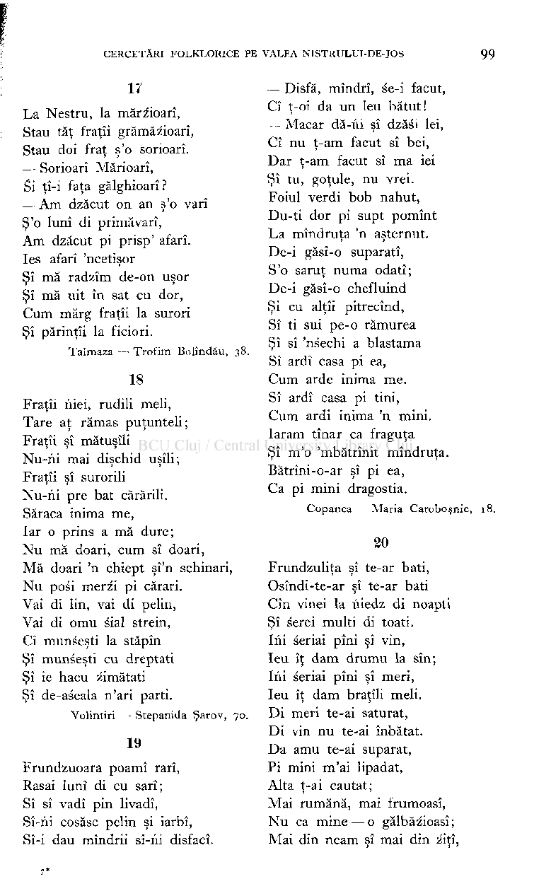

## 17

— Disfă, mîndrî, se-i făcut, Cî ţ-oi da un leu bătut!

La Nestru, la mărzioarî, Stau tăţ fraţii grămăzioarî, Stau doi fraţ ş'o sorioarî.

- Măcar dă-ni şî dzăsi lei, Cî nu ţ-am făcut sî bei, Dar ţ-am făcut sî ma iei Şî tu, goţule, nu vrei. Foiul verdi bob nahut, Du-ti dor pi supt pomînt La mîndruţa 'n aşternut. De-i găsî-o suparatî, S'o saruţ numa odatî; De-i găsî-o chefluind Şi cu alţîi pitrecînd, Sî ti sui pe-o rămurea Şî si 'nsechi a blastama Sî ardî casa pi ea, Cum arde inima me. Sî ardî casa pi tini, Cum ardi inima 'n mini. Iaram tînar ca fraguţa Şî m'o 'mbătrînit mîndruţa. Bătrîni-o-ar şî pi ea, Ca pi mini dragostia.

— Sorioarî Mărioarî, Si ţî-i faţa gălghioarî ?

— Am dzăcut on an ş'o vârî Ş'o lunî di primă vârî,

- Am dzăcut pi prisp' afarî. Ies afarî 'ncetişor Şî mă radzîm de-on uşor Şî mă uit în sat cu dor, Cum mărg fraţii la surori Şî părinţii la ficiori.

Talmaza — Trofim Bolîndău, 38.

## 18

Fraţii rîiei, rudili meii, Tare aţ rămas puţunteli; Fraţii şî mătuşîli Nu-ni mai dişchid uşîli; Fraţii şî surorili Nu-rîi pre bat cărărili. Săraca inima me, Iar o prins a mă dure; Nu mă doari, cum sî doari, Mă doari 'n chiept şî'n schinari, Nu posi merzi pi cărări. Vai di lin, vai di pelin, Vai di omu sial strein, Cî munseşti la stăpîn Şî munseşti cu dreptăţi Şî ie hacu zimătati Şî de-aseala n'ari parti.

Copanca — Maria Caroboşnic, 18 .

## 20

Frundzuliţa şî te-ar bati, Osîndi-te-ar şî te-ar bati Cin vinei la niedz di noapti Şî serei mulţi di toati. Ini sériai pîni şî vin, leu îţ dam drumu la sîn; Ini sériai pîni şî meri, leu îţ dam braţîli meii. Di meri te-ai saturat, Di vin nu te-ai înbătat. Da amu te-ai supărat, Pi mini m'ai lipadat, Alta ţ-ai căutat; Mai rumănă, mai frumoasî, Nu ca mine — o gălbăzioasî ; Mai din neam şî mai din ziţî,

Volintiri — Stepanida Şarov, 70.

## 19

Frundzuoara poamî rarî, Rasai lunî di cu sari; Sî sî vadî pin livadî, Sî-ni cosăsc pelin şi iarbî, Sî-i dau mîndrii sî-ni disfacî.

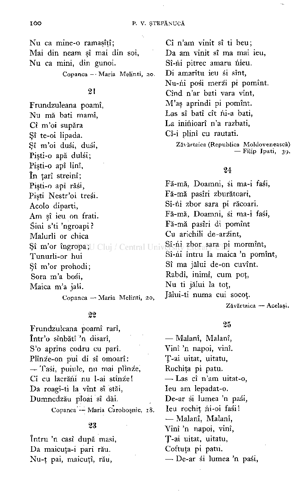

Nu ca mine-o rămăşiţi; Mai din neam şî mai din soi, Nu ca mini, din gunoi.

Cî n'am vinit sî ti beu; Da am vinit sî ma mai ieu, Sî-ni pitrec amaru nieu. Di amarîtu ieu si sînt, Nu-ni posi merzi pi pomînt. Cînd n'ar bati vara vînt, M'aş aprindi pi pomînt. Las sî batî cît ni-a bati, La ininioarî n'a răzbaţi, Cî-i plinî cu rautati.

Copanca — Maria Melinti, 20.

## 21

Frundzuleana poami, Nu mă bati mamî, Cî m'oi supăra Şî te-oi lipada. Şî m'oi dusi, dusi, Pişti-o apă dulsi; Pişti-o apî linî, în ţarî streini; Pişti-o apî răsi, Pişti Nestr'oi tresi. Acolo diparti, Am şî ieu on fraţi. Sini s'ti 'ngroapi ? Malurli or chica Şî m'or îngropa; Tunurli-or hui Şî m'or prohodi; Sora m'a bosi, Maica m'a jali.

Zăvărtaica (Republica Moldovenească) — Filip Ipati, 39.

## 24

Fă-mă, Doamni, si ma-i fasi, Fă-mă pasîri zburătoari, Sî-hi zbor sara pi răcoari. Fă-mă, Doamni, si ma-i fasi, Fă-mă pasîri di pomînt Cu arichili de-arzint, Sî-ni zbor sara pi mormînt, Sî-ni întru la maica 'n pomînt, Sî ma jălui de-on cuvînt. Rabdî, inimî, cum poţ, Nu ti jălui la toţ, Jălui-ti numa cui socoţ.

Copanca — Maria Melinti, 20,

Zăvărtaica — Acelaşi.

## 22

## 25

Frundzuleana poamî rarî, într'o sînbătî 'n disarî, S'o aprins codru cu parî. Plînze-on pui di sî omoarî:

— Malanî, Malanî, Vinî 'n napoi, vinî. Ţ-ai uitat, uitatu, Rochiţa pi patu.

— Tasi, puiule, nu mai plînze, Cî cu lacrăni nu l-ai stînze! Da roagî-ti la vînt sî stăi, Dumnedzău ploai sî dăi.

— Las cî n'am uitat-o, leu am lepadat-o. De-ar si lumea 'n pasi, leu rochiţ hi-oi fasi!

Copanca — Maria Caroboşnic, 18.

## 23

— Malanî, Malanî, Vinî 'n napoi, vinî, Ţ-ai uitat, uitatu, Coftuţa pi patu.

întru 'n casî după masî, Da maicuţa-i pari rău. Nu-ţ pai, maicuţî, rău,

— De-ar si lumea 'n pasi,

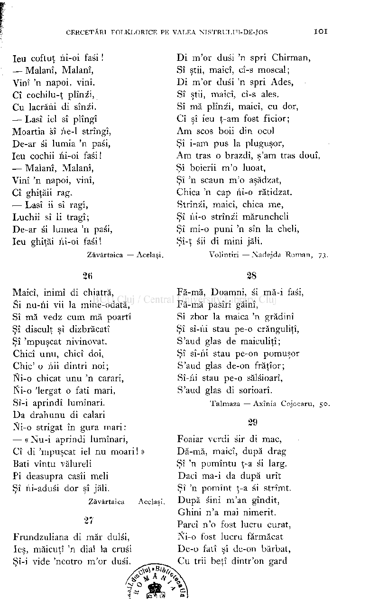

Di m'or dusi 'n spri Chirman, Sî ştii, maicî, cî-s moscal; Di m'or dusi 'n spri Ades, Sî ştii, maicî, cî-s ales. Sî mă plînzi, maicî, cu dor, Cî şî ieu ţ-am fost ficior; Am scos boii din ocol Şî i-am pus la pluguşor, Am tras o brazdî, ş'am tras douî, Şî boierii m'o luoat, Şî 'n scaun m'o aşădzat, Chica 'n cap rii-o rătidzat. Strînzi, maicî, chica me, Şî ni-o strînzi măruncheli Şî mi-o puni 'n sîn la cheli, Şî-ţ sii di mini jăli.

leu coftuţ ni-oi fasi !

— Malanî, Malanî, Vini 'n napoi, vini. Cî cochilu-ţ plînzi, Cu lacrăni di sin zi. — Lasî iei sî plîngî Moartia sî ne-1 strîngî, De-ar si lumia 'n pasi, leu cochii ni-oi fasi!

— Malanî, Malanî, Vinî 'n napoi, vinî, Cî ghiţăii rag.

— Lasî ii sî ragî, Luchii sî li tragi; De-ar si lumea 'n pasi, leu ghiţăi ni-oi fasi!

Volintiri — Nadejda Roman, 73.

Zăvărtaica — Acelaşi.

## 26 28

Fă-mă, Doamni, si mă-i fasi, Fă-mă pasîri găinî, Sî zbor la maica 'n grădini Şî sî-ni stau pe-o crănguliţî, S'aud glas de maiculiţî; Şî sî-ni stau pe-on pomuşor S'aud glas de-on frăţior; Sî-iîi stau pe-o sălsioarî, S'aud glas di sorioarî.

Maicî, inimî di chiatră, Si nu-hi vii la mine-odată, Sî mă vedz cum mă poartî Şî discuit şî dizbrăcatî Şî 'mpuşcat nivinovat. Chici unu, chicî doi, Chic' o nii dintri noi; Ni-o chicat unu 'n carari, Ni-o 'lergat o fatî mari, Sî-i aprindî luminări. Da drahunu di calări Ni-o strigat în gura mari : — « Nu-i aprindi luminări, Cî di 'mpuşcat iei nu moari ! » Bati vîntu vălureli Pi deasupra casîi meii Şî ni-adusi dor şî jăli.

Talmaza — Axînia Cojocaru, 50.

## 29

Foaiar verdi sir di mac, Dă-mă, maicî, după drag Şî 'n pomîntu ţ-a si larg. Dacî ma-i da după urît Şî 'n pomînt ţ-a si strimt. După sini m'an gîndit, Ghini n'a mai nimerit. Parcî n'o fost lucru curat, Ni-o fost lucru fărmăcat De-o fatî şî de-on bărbat, Cu trii beţî dintr'on gard

Zăvărtaica — Acelaşi.

Frundzuliana di măr dulsi, leş, măicuţî 'n dial la crusi Şî-i vide 'ncotro m'or dusi.

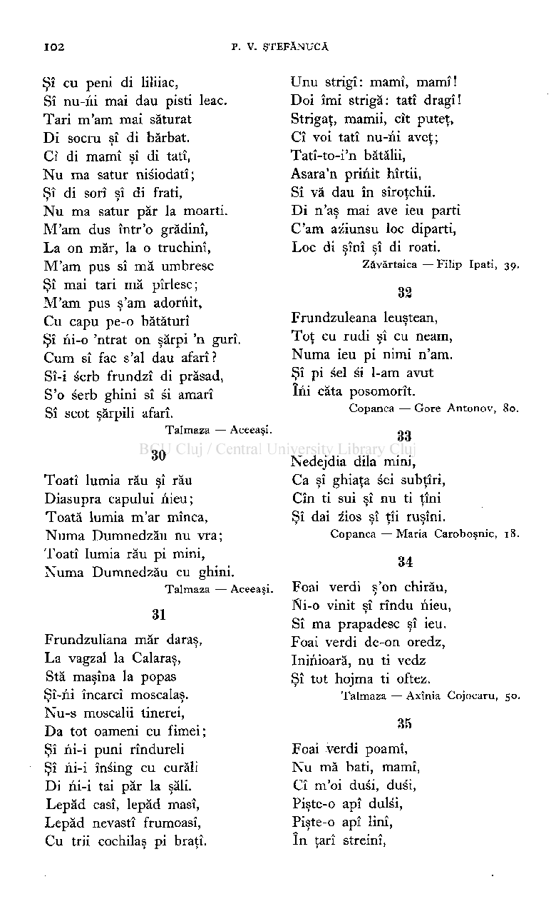

Unu strigi: mamî, mamî! Doi îmi strigă: tatî dragî! Strigat, mamii, cît puteţ, Cî voi tatî nu-ni aveţ; Tatî-to-i'n bătălii, Asara'n pririit hîrtii, Sî vă dau în sîroţchii. Di n'aş mai ave ieu parti Ca m aziunsu loc diparti, Loc di şînî şî di roati.

Şî cu peni di liliiac, Sî nu-iii mai dau pişti leac. Tari m'am mai săturat Di socru şî di bărbat. Ci di mamî şî di tatî, Nu ma satur nisiodatî; Şî di sorî şî di fraţi, Nu ma satur păr la moarti. M'am dus într'o grădini, La on măr, la o truchinî, M'am pus sî mă umbresc Şî mai tari mă pîrlesc; M'am pus ş'am adortiit, Cu capu pe-o bătături Şî fii-o 'ntrat on şărpi 'n gurî. Cum sî fac s'al dau afarî? Sî-i serb frundzî di prăsad, S'o serb ghini sî si amarî Sî scot şărpili afarî.

Zăvărtaica — Filip Ipati, 3

## 32

Frundzuleana leuştean, Toţ cu rudi şî cu neam, Numa ieu pi nimi n'am. Şî pi sel si l-am avut îni căta posomorit.

Copanca — Gore Antonov, 8

## 33

Talmaza — Aceeaşi.

## 30

Nedejdia dila mini, Ca şî ghiaţa sei subţiri, Cîn ti sui şî nu ti ţîni Şî dai zios şî ţîi ruşîni.

Toatî lumia rău şî rău Diasupra capului iiieu; Toată lumia m'ar mînca, Numa Dumnedzău nu vra; Toatî lumia rău pi mini, Numa Dumnedzău cu ghini.

Copanca — Maria Caroboşnic, 1

## 34

Foai verdi ş'on chirău, Ni-o vinit şî rîndu nieu, Si ma prăpădesc şî ieu. Foai verdi de-on oredz, Iniiiioară, nu ti vedz Şî tot hojma ti oftez.

Talmaza — Aceeaşi.

## 31

Frundzuliana măr daraş, La vagzal la Călăraş, Stă maşina la popas Şî-ni încarci moscalaş. Nu-s moscalii tinerei, Da tot oameni cu fimei; Şî ni-i puni rîndureli Şî ni-i însing cu curăli Di ni-i tai păr la săli. Lepăd casî, lepăd masî, Lepăd nevastî frumoasî, Cu trii cochilaş pi braţî.

Talmaza — Axînia Cojocaru, 5

## 35

Foai verdi poamî, Nu mă bati, mamî, Cî m'oi dusi, dusi, Pişte-o apî dulsi, Piste-o apî linî, în tari streini,

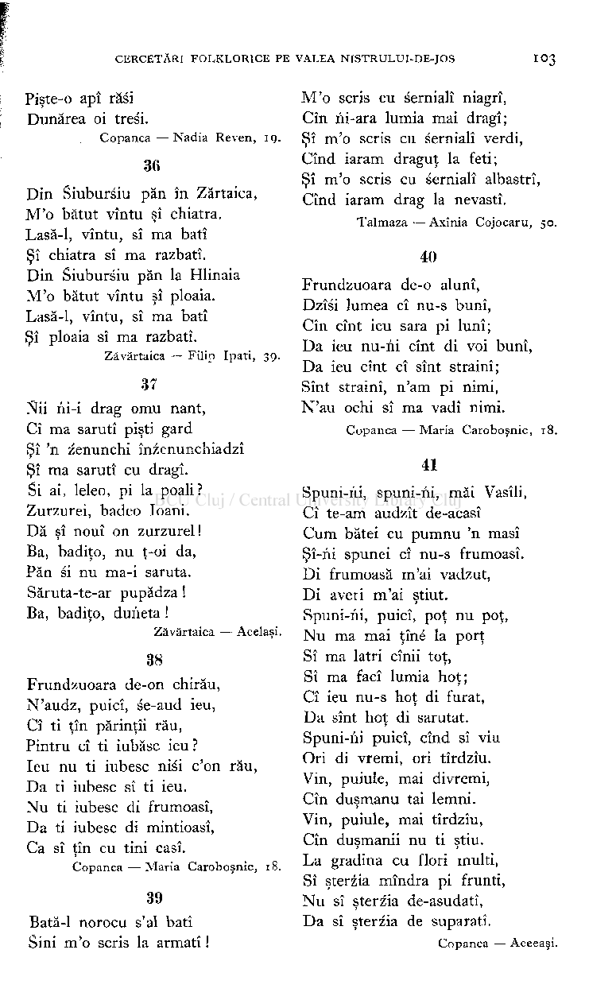

- M'o scris cu sernialî niagrî, Cîn ni-ara lumia mai dragî; Şî m'o scris cu sernialî verdi, Cînd iaram drăguţ la feti; Şî m'o scris cu sernialî albaştri, Cînd iaram drag la nevastî.

Talmaza — Axînia Cojocarii, 50.

40

Frundzuoara de-o alunî, Dzîsi lumea cî nu-s bunî, Cîn cînt ieu sara pi lunî; Da ieu nu-hi cînt di voi bunî, Da ieu cînt cî sînt strainî; Sînt strainî, n'am pi nimi,

- N'au ochi sî ma vadî nimi. Copanca — Maria Caroboşnic, 18 .

Pişte-o apî răsi Dunărea oi tresi.

Copanca—Nadi a Reven, 19 .

## 36

Din Siubursiu păn în Zărtaica, M'o bătut vîntu şî chiatra. Lasă-1, vîntu, sî ma batî Şî chiatra sî ma razbatî. Din Siubursiu păn la Hlinaia

- M'o bătut vîntu şî ploaia. Lasă-1, vîntu, sî ma batî Şî ploaia sî ma razbatî.

Zăvărtaica — Filip Ipati, 39.

37

Nii rîi-i drag omu nant, Cî ma sarutî pişti gard Şî 'n zenunchi înzenunchiadzî Şî ma sarutî cu dragî. Si ai, leleo, pi la poali? Zurzurei, badeo Ioani. Dă şî nouî on zurzurei! Ba, badiţo, nu ţ-oi da, Păn si nu ma-i săruta. Săruta-te-ar pupădza ! Ba, badiţo, durîeta !

Zăvărtaica — Acelaşi.

38

Frundzuoara de-on chirău,

- N'audz, puicî, se-aud ieu, Cî ti ţîn părinţii rău, Pintru cî ti iubăsc ieu ? Ieu nu ti iubesc nisi c'on rău, Da ti iubesc sî ti ieu. Nu ti iubesc di frumoasî, Da ti iubesc di mintioasî, Ca sî ţîn cu tini casî.

## 41

Spuni-ni, spuni-ni, măi Vasîli, Cî te-am audzît de-acasî Cum bătei cu pumnu 'n masî Şî-ni spunei cî nu-s frumoasî. Di frumoasă m'ai vadzut, Di averi m'ai ştiut. Spuni-ni, puicî, poţ nu poţ, Nu ma mai ţine la porţ Sî ma latri cînii toţ, Sî ma facî lumia hoţ; Cî ieu nu-s hoţ di furat, Da sînt hoţ di sărutat. Spuni-iîi puicî, cînd sî viu Ori di vremi, ori tîrdzîu. Vin, puiule, mai divremi, Cîn duşmanu tai lemni. Vin, puiule, mai tîrdzîu, Cîn duşmanii nu ti ştiu. La gradina cu flori mulţi, Sî şterzia mîndra pi frunţi, Nu sî şterzia de-asudatî, Da sî şterzia de suparatî.

Copanca — Maria Caroboşnic, 18.

## 39

Bată-1 norocu s'al batî Sini m'o scris la armatî !

Copanca — Aceeaşi.

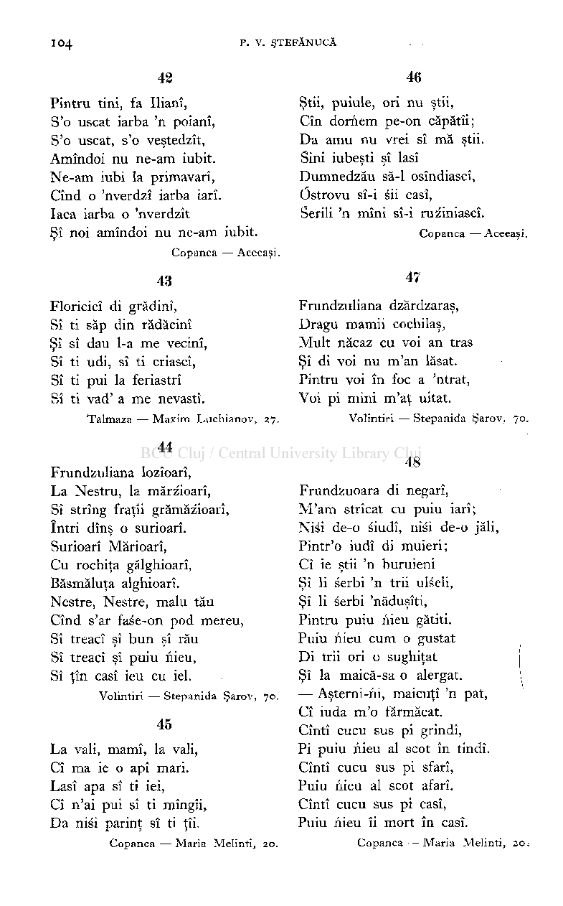

## 42

## 46

Pintru tini, fa Ilianî, S'o uscat iarba 'n poianî, S'o uscat, s'o veştedzît, Amîndoi nu ne-am iubit. Ne-am iubi la primavarî, Cînd o 'nverdzî iarba iarî. Iaca iarba o 'nverdzît Şî noi amîndoi nu ne-am iubit.

Ştii, puiule, ori nu ştii, Cîn dornem pe-on căpătîi; Da amu nu vrei sî mă ştii. Sini iubeşti şî lasî Dumnedzău să-1 osîndiascî, Östrovu sî-i sii casî, Serili 'n mini sî-i ruziniascî.

Copanca —Aceeaşi.

Copanca —Aceeaşi.

## 47

## 43

Frundzuliana dzărdzaraş, Dragu mamii cochilaş, Mult năcaz cu voi an tras Şî di voi nu m'an lăsat. Pintru voi în foc a 'ntrat, Voi pi mini m'aţ uitat.

Floricicî di grădinî, Sî ti săp din rădăcini Şî sî dau 1-a me vecini, Sî ti udi, sî ti criascî, Sî ti pui la feriastrî Sî ti vad' a me nevastî.

Volintiri — Stepanida Şarov, 70.

Talmaza — Maxim Luchianov, 27.

## 44

## 48

Frundzuliana lozîoarî, La Nestru, la mărzioarî, Sî string fraţîi grămăzioarî, întri dînş o surioarî. Surioarî Mărioarî, Cu rochiţa gălghioarî, Băsmăluţa alghioarî. Nestre, Nestre, malu tău Cînd s'ar fase-on pod mereu, Sî treacî şî bun şî rău Sî treacî şî puiu nieu, Sî ţîn casî ieu cu iei.

Frundzuoara di negarî, M'am stricat cu puiu iarî; Nisi de-o siudî, nisi de-o jăli, Pintr'o iudî di muieri; Cî ie ştii 'n buruieni Şî li şerbi 'n trii ulseli, Şî li şerbi 'năduşiţi, Pintru puiu hieu gătiţi. Puiu nieu cum o gustat Di trii ori o sughiţat Şî la maică-sa o alergat. ^

— Aşterni -ni, maicuţî 'n pat, Cî iuda m'o fărmăcat. Cîntî cucu sus pi grindî, Pi puiu nieu al scot în tindî. Cîntî cucu sus pi sfarî, Puiu fîieu al scot afarî. Cîntî cucu sus pi casî, Puiu nieu îi mort în casî.

Volintiri — Stepanida Şarov, 70.

## 45

La vali, mamî, la vali, Cî ma ie o apî mari. Lasî apa sî ti iei, Cî n'ai pui sî ti mîngîi, Da nisi parinţ sî ti ţîi.

Copanca — Maria Melinti, 20

Copanca — Maria Melinti, 20.

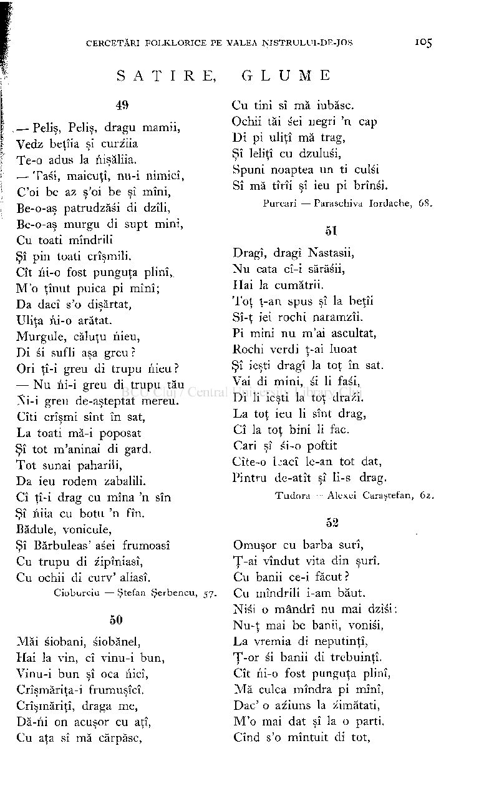

SATIRE , GLUM E

## 49

Cu tini sî mă iubăsc. Ochii tăi sei negri 'n cap Di pi uliţî mă trag, Şî leliţî cu dzulusi, Spuni noaptea un ti culsi Sî mă tîrîi şî ieu pi brînsi.

.— Peliş, Peliş, dragu mamii, Vedz beţîia şi curziia Te-o adus la nişăliia. — Tasi, maieu ţi, nu-i nimici, C'oi be az ş'oi be şî mini, Be-o-aş patrudzăsi di dzîli, Be-o-aş murgu di supt mini, Cu toati mîndrili Şî pin toati crîşmili. Cît ni-o fost punguţa plinî, M'o ţînut puica pi mini; Da dacî s'o dişărtat, Uliţa ni-o arătat. Murgule, căluţu nieu, Di si sufli aşa greu ? Ori ţî-i greu di trupu nieu ?

Purcari — Paraschiva Iordache,

## 51

Dragi, dragi Nastasii, Nu cata cî-i sărăsii, Hai la cumătră. Toţ ţ-an spus şî la beţii Sî-ţ iei rochi naramzîi. Pi mini nu m'ai ascultat, Rochi verdi ţ-ai luoat Şî ieşti dragi la toţ în sat. Vai di mini, si li fasi, Di li ieşti la toţ drazi. La toţ ieu li sînt drag, Cî la toţ bini li fac. Cari şî si-o poftit Cîte-o l:acî le-an tot dat, Pintru de-atît şî li-s drag.

— Nu rii-i greu di trupu tău Ni-i greu de-aşteptat mereu. Cîti crîşmi sînt în sat, La toati mă-i poposat Şî tot m'aninai di gard. Tot sunai paharili, Da ieu rodem zabalili. Cî ţî-i drag cu mîna 'n sîn Şî îiiia cu botu 'n fin. Bădule, vonicule, Şî Bărbuleas' asei frumoasî Cu trupu di zipîniasî, Cu ochii di curv' aliasî.

Tudora — Alexei Caraştefan,

## 52

Omuşor cu barba suri, Ţ-ai vîndut vita din şurî. Cu banii ce-i făcut ? Cu mîndrili i-am băut. Nisi o mândri nu mai dzîsi: Nu-ţ mai be banii, vonisi, La vremia di neputinţî, Ţ-or si banii di trebuinţî. Cît iii-o fost punguţa plinî, Mă culca mîndra pi mînî, Dac' o aziuns la zimătati, M'o mai dat şî la o parti. Cînd s'o mîntuit di tot,

Cioburciu — Ştefan Şerbencu, 57.

## 50

Măi siobani, siobănel, Hai la vin, cî vinu-i bun, Vinu-i bun şî oca nicî, Crîşmăriţa-i frumuşîcî. Crîşmăriţî, draga me, Dă-rii on acuşor cu aţî, Cu aţa sî mă cărpăsc,

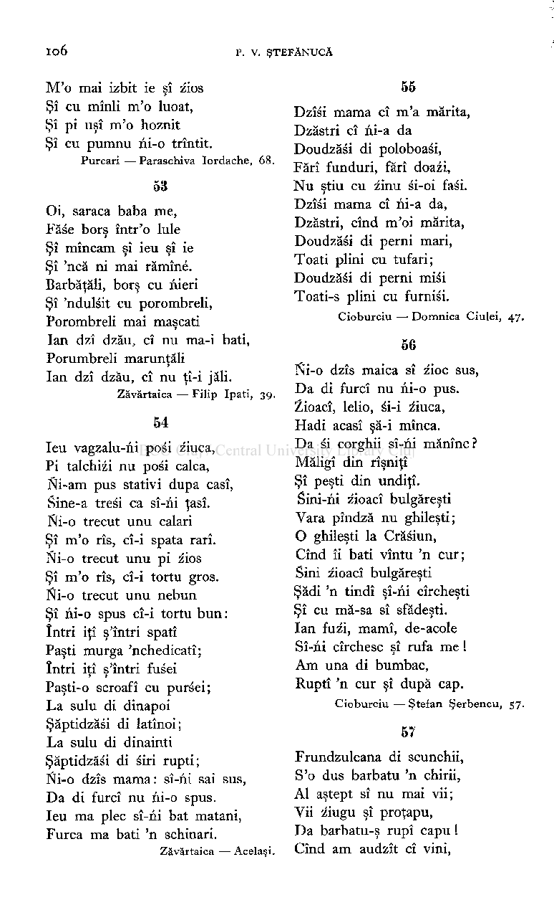

M'o mai izbit ie şî zios Şî cu mînli m'o luoat, Şî pi uşî m'o hoznit Şî cu pumnu ni-o trîntit.

Dzîsi mama cî m'a mărita, Dzăstri cî ni-a da Doudzăsi di poloboasi, Fărî funduri, fărî doazi, Nu ştiu cu zinu si-oi fasi. Dzîsi mama cî ni-a da, Dzăstri, cînd m'oi mărita, Doudzăsi di perni mari, Toati plini cu tufari; Doudzăsi di perni misi Toati-s plini cu furnisi.

Purcari — Paraschiva Iordache, 68.

## 53

Oi, săraca baba me, Făse borş într'o lule Şî mîncăm şî ieu şî ie Şî 'ncă ni mai rămîne. Barbăţăli, borş cu nieri Şî 'ndulsit cu porombreli, Porombreli mai mascaţi Ian dzî dzău, cî nu ma-i bati, Porumbreli marunţăli Ian dzî dzău, cî nu ţî-i jăli.

Cioburciu — Domnica Ciulei, 47.

## 56

Ni-o dzîs maica sî zioc sus, Da di furcî nu ni-o pus. Zioacî, lelio, si-i ziuca, Hadi acasî şă-i mînca. Da si corghii sî-ni mănînc? Măligî din rîşniţî Şî peşti din undiţi.

Zăvărtaica — Filip Ipati, 39.

## 54

leu vagzalu-ni posi ziuca, Pi talchizi nu posi calea, Ni-am pus stativi dupa casî, Sine-a tresi ca sî-ni ţasî. Ni-o trecut unu calări Şî m'o rîs, cî-i spata rarî. Ni-o trecut unu pi zios Şî m'o rîs, cî-i tortu gros. Ni-o trecut unu nebun Şî ni-o spus cî-i tortu bun: întri iţî ş'întri spatî Paşti murga 'nchedicatî; întri iţî ş'întri fusei Paşti-o scroafî cu pursei; La sulu di dinapoi Şăptidzăsi di latînoi; La sulu di dinainti Şăptidzăsi di siri rupţi; Ni-o dzîs mama: sî-ni sai sus, Da di furcî nu ni-o spus. Ieu ma plec sî-ni bat matani, Furca ma bati 'n schinari.

Sini-ni zioacî bulgăreşti Vara pîndză nu ghileşti; O ghileşti la Crăsiun, Cînd îi bati vîntu 'n cur; Sini zioacî bulgăreşti Sădi 'n tindî şî-ni cîrcheşti Şî cu mă-sa sî sfădeşti. Ian fuzi, mamî, de-acole Sî-ni cîrchesc şî rufa me ! Am una di bumbac, Ruptî 'n cur şî după cap.

Cioburciu — Ştefan Şerbencu, 57.

## 57

Frundzuleana di scunchii, S'o dus barbatu 'n chirii, Al aştept sî nu mai vii; Vii ziugu şî proţapu, Da barbatu-ş rupî capu ! Cînd am audzît cî vini,

Zăvărtaica — Acelaşi.

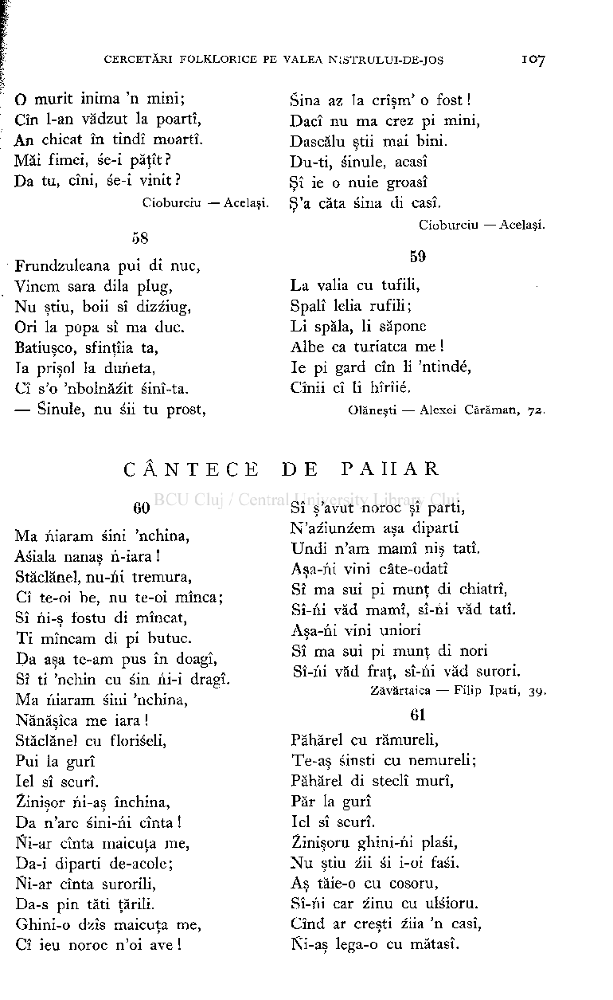

0 murit inima 'n mini; Cîn 1-an vădzut la poartî,

- An chicat în tindî moartî.

- Măi fimei, se-i păţît? Da tu, cîni, se-i vinit ?

Cioburciu — Acelaşi.

58

Frundzuleana pui di nuc, Vinem sara dila plug, Nu ştiu, boii sî dizziug, Ori la popa sî ma duc. Batiuşco, sfinţîia ta, Ia prişol la durîeta, Cî s'o 'nbolnăzit sinî-ta.

— Sinule, nu sii tu prost,

Sina az la crîşm' o fost ! Dacî nu ma crez pi mini, Dascălu ştii mai bini. Du-ti, sinule, acasî Şî ie o nuie groasî Ş'a căta sina di casî.

Cioburciu —Acelaşi.

59

La valia cu tufili, Spalî lelia ruf iii; Li spăla, li săpone Albe ca turiatca me ! Ie pi gard cîn li 'ntindé, Cînii cî li hîrîié.

Olăneşti — Alexei Cărăman, 72.

CÂNTEC E D E PAHA R

60

Ma niaram sini 'nchina, Asiala nanaş n-iara ! Stăclănel, nu-ni tremura, Ci te-oi be, nu te-oi mînca; Sî ni-ş fostu di mîncat, Ti mîncam di pi butuc. Da aşa te-am pus în doagî, Sî ti 'nchin cu sin îii-i dragî. Ma niaram sini 'nchina,

- Nănăşîca me iara ! Stăclănel cu floriseli, Pui la gurî Iei sî scurî. Zinişor rîi-aş închina, Da n'are sini-îii cînta ! Ni-ar cînta măicuţa me, Da-i diparti de-acole; Ni-ar cînta surorili, Da-s pin tăti ţărili. Ghini-o dzîs măicuţa me, Cî ieu noroc n'oi ave !

Sî ş'avut noroc şî parti, N'aziunzem aşa diparti Undi n'am mamî niş tatî. Aşa-ni vini câte-odatî Sî ma sui pi munţ di chiatrî, Sî-ni văd mamî, sî-ni văd tatî. Aşa-îii vini uniori Sî ma sui pi munţ di nori Sî-fîi văd fraţ, sî-ni văd surori.

Zăvărtaica — Filip Ipati, 39.

## 61

Păhărel cu rămureli, Te-aş sinsti cu nemureli; Păhărel di steclî murî, Păr la gurî Iei sî scurî. Zinişoru ghini-ni plasi, Nu ştiu zii si i-oi fasi. Aş tăie-o cu cosoru, Sî-fîi car zinu cu ulsioru. Cînd ar creşti ziia 'n casî, Ni-aş lega-o cu mătasî.

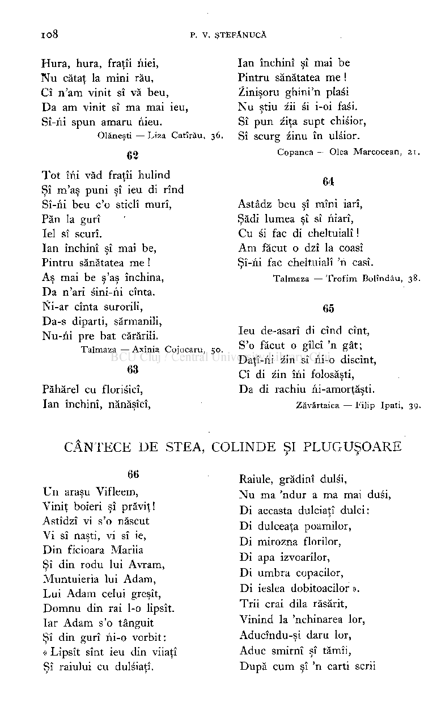

Ian închini şî mai be Pintru sănătatea me ! Zinişoru ghini'n plasi Nu ştiu zii si i-oi fasi. Sî pun ziţa supt chisior, Sî scurg zinu în ulsior.

Hura, hura, fraţii niei, Nu cătat la mini rău, Cî n'am vinit sî vă beu, Da am vinit sî ma mai ieu, Sî-ni spun amaru rîieu.

Olăneşti — Liza Catîrău, 36.

## 62

Copanca — Olea Marcocean,

## 64

Tot îhi văd fraţii hulind Şî m'aş puni şî ieu di rînd Sî-ni beu c'o sticli muri, Păn la gurî Iei sî scurî. Ian închini şî mai be, Pintru sănătatea me ! Aş mai be ş'aş închina, Da n'ari sini-hi cînta. Ni-ar cînta surorili, Da-s diparti, sărmanili, Nu-fîi pre bat cărărili.

Astâdz beu şî mîni iarî, Sădi lumea şî sî rîiarî, Cu si fac di cheltuiau ! Am făcut o dzî la coasî Şî-ni fac cheltuiau 'n casî.

Talmaza — Trofim Bolîndău,

## 65

leu de-asarî di cînd cînt, S'o făcut o gîlcî 'n gât; Daţî-hi zin sî ni-o discînt, Cî di zin îni folosăşti, Da di rachiu ni-amorţăşti.

Talmaza — Axînia Cojocaru, 50.

## 63

Păhărel cu florisicî, Ian închini, nănăşîcî,

Zăvărtaica — Filip Ipati,

CÂNTECE DE STEA, COLINDE ŞI PLUGUŞOARE

## 66

Raiule, grădini dulsi, Nu ma 'ndur a ma mai dusi, Di aceasta dulciaţî dulci: Di dulceaţa poamilor, Di mirozna florilor, Di apa izvoarîlor, Di umbra copacilor, Di ieslea dobitoacilor ». Trii crai dila răsărit, Vinind la 'nchinarea lor, Aducîndu-şi daru lor, Aduc smirnî şî tămîi, După cum şî 'n cârti scrii

Un araşu Vifleem, Viniţ boieri şî prăviţ! Astîdzî vi s'o născut Vi sî naşti, vi sî ie, Din ficioara Mariia Şî din rodu lui Avram, Muntuieria lui Adam, Lui Adam celui greşit, Domnu din rai l-o lipsit. Iar Adam s'o tânguit Şî din gurî hi-o vorbit: « Lipsit sînt ieu din viiaţî Şî raiului cu dulsiaţî.

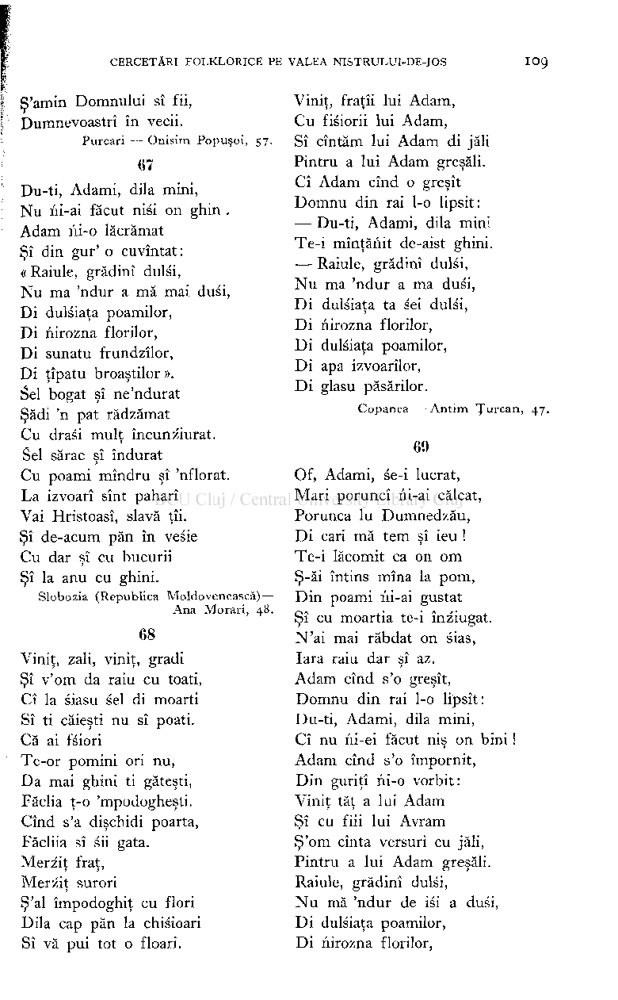

Viniţ, fraţii lui Adam, Cu fisiorii lui Adam, Sî cîntăm lui Adam di jăli Pintru a lui Adam gresăli. Ci Adam cînd o greşît Domnu din rai l-o lipsit:

Ş'amin Domnului sî fii, Dumnevoastrî în vecii.

Purcari — Onisim Popuşoi, 57.

## 67

Du-ti, Adami, dila mini, Nu ni-ai făcut nisi on ghin . Adam ni-o lăcrămat Şî din gur' o cuvîntat: « Raiule, grădini dulsi, Nu ma 'ndur a mă mai dusi, Di dulsiaţa poamilor, Di nirozna florilor, Di sunatu frundzîlor, Di ţîpatu broaştilor ». £el bogat şî ne'ndurat Sădi 'n pat rădzămat Cu drasi mulţ încunziurat. Sel sărac şî îndurat Cu poami mîndru şî 'nflorat. La izvoarî sînt paharî Vai Hristoasî, slavă ţîi. Şî de-acum păn în vesie Cu dar şî cu bucurii Şî la anu cu ghini.

— Du-ti, Adami, dila mini Te-i mînţănit de-aist ghini. — Raiule, grădini dulsi, Nu ma 'ndur a ma dusi, Di dulsiaţa ta sei dulsi, Di nirozna florilor, Di dulsiaţa poamilor, Di apa izvoarîlor, Di glasu păsărilor.

Copanca —Anti m Ţurcan, 47.

## 69

Of, Adami, se-i lucrat, Mari porunci hi-ai călcat, Porunca lu Dumnedzău, Di cari mă tem şî ieu ! Te-i lăcomit ca on om Ş-ăi întins mina la pom, Din poami ni-ai gustat Şî cu moartia te-i înziugat. N'ai mai răbdat on sias, Iara raiu dar şî az. Adam cînd s'o greşît, Domnu din rai l-o lipsit : Du-ti, Adami, dila mini, Cî nu iii-ei făcut niş on bini ! Adam cînd s'o împornit, Din guriţî iii-o vorbit: Viniţ tăţ a lui Adam Şî cu fiii lui Avram Ş'om cînta versuri cu jăli, Pintru a lui Adam greşăli. Raiule, grădini dulsi, Nu mă 'ndur de isi a dusi, Di dulsiaţa poamilor, Di nirozna florilor,

Slobozia (Republica Moldovenească) Ana Morari, 48.

## 68

Viniţ, zali, viniţ, gradi Şî v'om da raiu cu toati, Cî la siasu sel di moarti Sî ti căieşti nu sî poati. Că ai fsiori Te-or pomini ori nu, Da mai ghini ti găteşti, Făclia ţ-o 'mpodogheşti. Cînd s'a dişchidi poarta, Făcliia sî sii gata. Merziţ fraţ, Merziţ surori Ş'al împodoghiţ cu flori Dila cap păn la chisioari Sî vă pui tot o floari.

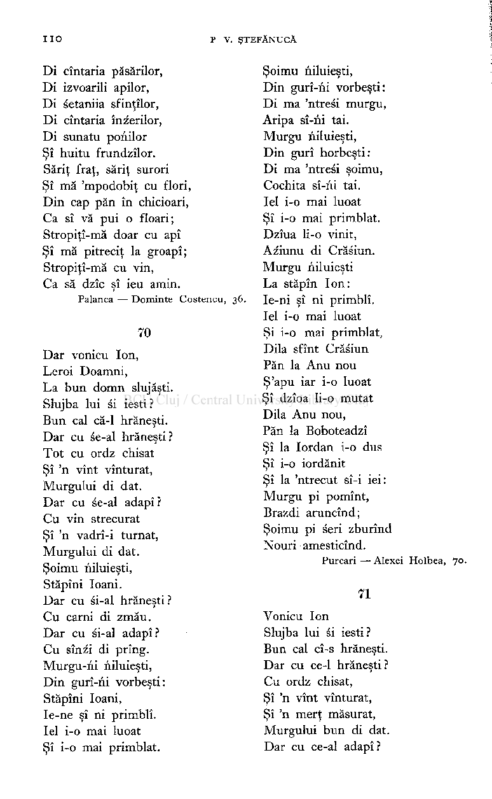

Di cîntaria păsărilor, Di izvoarili apilor, Di setaniia sfinţilor, Di cîntaria înzerilor, Di sunatu ponilor Şî huitu frundzîlor. Sărit fraţ, sărit surori Şî mă 'mpodobiţ cu flori, Din cap păn în chicioari, Ca sî vă pui o floari; Stropiţî-mă doar cu apî Şî mă pitreciţ la groapî; Stropiţî-mă cu vin, Ca să dzîc şî ieu amin.

Şoimu niluieşti, Din gurî-ni vorbeşti: Di ma 'ntresi murgu, Aripa sî-ni tai. Murgu niluieşti, Din gurî horbeşti: Di ma 'ntresi şoimu, Cochita sî-ni tai. Iei i-o mai luoat Şî i-o mai primblat. Dzîua li-o vinit, Aziunu di Crăsiun. Murgu niluieşti La stăpîn Ion: Ie-ni şî ni primblî. Iei i-o mai luoat Şi i-o mai primblat, Dila sfînt Crăsiun Păn la Anu nou Ş'apu iar i-o luoat Şî dzîoa li-o mutat Dila Anu nou, Păn la Boboteadzî Şî la Iordan i-o dus Şî i-o iordănit Şî la 'ntrecut sî-i iei: Murgu pi pomînt, Brazdi aruncînd; Şoimu pi seri zburînd Nouri amesticînd.

Palanca — Dominte Costencu, 36.

## 70

Dar vonicu Ion, Leroi Doamni, La bun domn slujăşti. Slujba lui si ieşti? Bun cal că-1 hrăneşti. Dar cu se-al hrăneşti? Tot cu ordz chisat Şî 'n vînt vînturat, Murgului di dat. Dar cu se-al adapî? Cu vin strecurat Şî 'n vadrî-i turnat, Murgului di dat. Şoimu niluieşti, Stăpîni Ioani. Dar cu si-al hrăneşti ? Cu carni di zmău. Dar cu si-al adapî? Cu sînzi di prîng. Murgu-ni niluieşti, Din gurî-ni vorbeşti: Stăpîni Ioani, Ie-ne şî ni primblî. Iei i-o mai luoat Şî i-o mai primblat.

Purcari — Alexei Holbea, 70.

## 71

Vonicu Ion Slujba lui si ieşti ? Bun cal cî-s hrăneşti. Dar cu ce-1 hrăneşti? Cu ordz chisat, Şî 'n vînt vînturat, Şî 'n merţ măsurat, Murgului bun di dat. Dar cu ce-al adapî ?

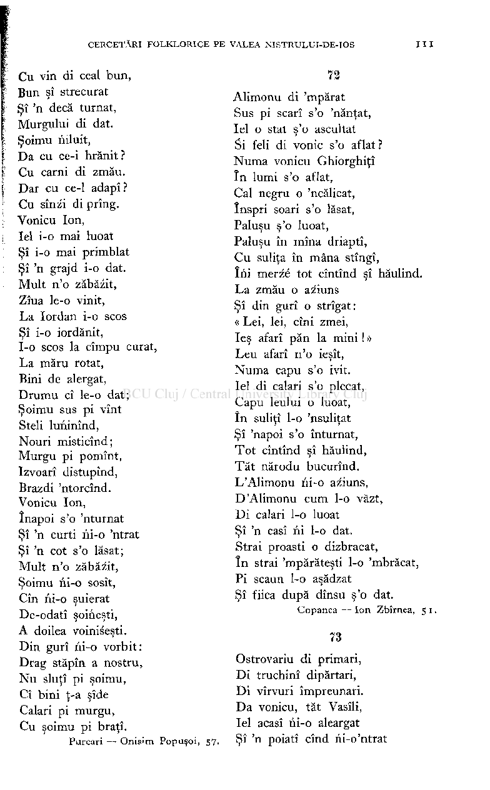

## 72

Cu vin di ceai bun, Bun şî strecurat Şî 'n decă turnat, Murgului di dat. Şoimu niluit, Da cu ce-i hrănit? Cu carni di zmău. Dar cu ce-1 adapî? Cu sînzi di prîng. Vonicu Ion, Iei i-o mai luoat Şî i-o mai primblat Şî 'n grajd i-o dat. Mult n'o zăbăzit, Zîua le-o vinit, La Iordan i-o scos Şî i-o iordănit, I-o scos la cîmpu curat, La măru rotat, Bini de alergat, Drumu cî le-o dat; Şoimu sus pi vînt Steli luhinînd, Nouri misticînd; Murgu pi pomînt, Izvoarî distupînd, Brazdi 'ntorcînd. Vonicu Ion, înapoi s'o 'nturnat Şî 'n curţi ni-o 'ntrat Şî 'n cot s'o lăsat; Mult n'o zăbăzit, Şoimu ni-o sosît, Cîn ni-o şuierat De-odatî şoineşti, A doilea voiniseşti. Din gurî ni-o vorbit: Drag stăpîn a nostru, Nu sluţî pi şoimu, Cî bini ţ-a şîde Calări pi murgu, Cu şoimu pi braţî.

Alimonu di 'mpărat Sus pi scarî s'o 'nănţat, Iei o stat ş'o ascultat Si feli di vonic s'o aflat? Numa vonicu Ghiorghiţî în lumi s'o aflat, Cal negru o 'ncălicat, înspri soari s'o lăsat, Paluşu ş'o luoat, Paluşu în mîna driaptî, Cu suliţa în mâna stîngî, îni merze tot cîntînd şî hăulind. La zmău o aziuns Şî din gurî o strigat: « Lei, lei, cîni zmei, leş afarî păn la mini ! » Leu afarî n'o ieşît, Numa capu s'o ivit. Iei di calări s'o plecat, Capu leului o luoat, în suliţî l-o 'nsuliţat Şî 'napoi s'o înturnat, Tot cîntînd şî hăulind, Tăt nărodu bucurînd. L'Alimonu ni-o aziuns, D'Alimonu cum l-o văzt, Di calări l-o luoat Şî 'n casî ni l-o dat. Strai proasti o dizbracat, în strai 'mpărăteşti l-o 'mbrăcat, Pi scaun l-o aşădzat Şî fiica după dînsu ş'o dat.

Copanca — Ion Zbîrnea, 5

## 73

Ostrovariu di primari, Di truchinî dipărtari, Di vîrvuri împreunări. Da vonicu, tăt Vasîli, Iei acasî hi-o aleargat Şî 'n poiatî cînd ni-o'ntrat

Purcari — Onis'm Popuşoi, 57.

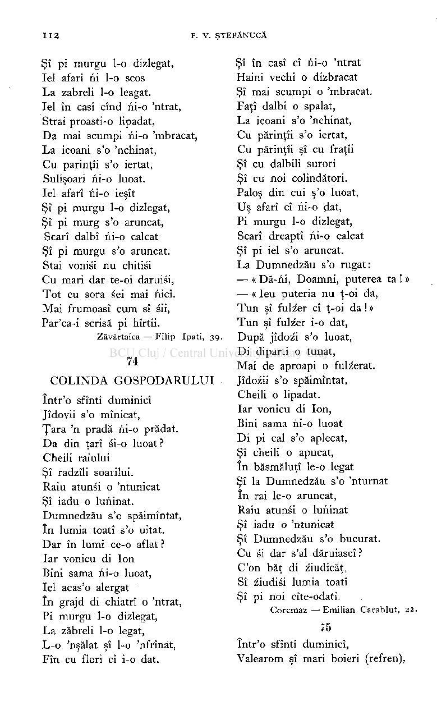

Şî în casî cî iii-o 'ntrat Haini vechi o dizbracat Şî mai scumpi o 'mbracat. Faţî dalbi o spălat, La icoani s'o 'nchinat, Cu părinţii s'o iertat, Cu părinţii şî cu fraţii Şî cu dalbili surori Şî cu noi colindători. Paloş din cui ş'o luoat, Uş afarî cî hi-o dat, Pi murgu l-o dizlegat, Scarî dreaptî hi-o călcat Şî pi iei s'o aruncat. La Dumnedzău s'o rugat:

Şî pi murgu l-o dizlegat, Iei afarî hi l-o scos La zăbreli l-o leagat. Iei în casî cînd ni-o 'ntrat, Strai proasti-o lipadat, Da mai scumpi ni-o 'mbracat, La icoani s'o 'nchinat, Cu părinţii s'o iertat, Sulişoari hi-o luoat. Iei afarî ni-o ieşit Şî pi murgu l-o dizlegat, Şî pi murg s'o aruncat, Scarî dalbî ni-o călcat Şî pi murgu s'o aruncat. Stai vonisi nu chitişi Cu mari dar te-oi daruisi, Tot cu sora sei mai hicî. Mai frumoasî cum sî sii, Par'ca-i scrisă pi hîrtii.

— « Dă-hi, Doamni, puterea ta ! »

— « leu puteria nu ţ-oi da, Tun şî fulzer cî ţ-oi da ! » Tun şî fulzer i-o dat, După jîdozi s'o luoat, Di diparti o tunat, Mai de aproapi o fulzerat. Jîdozii s'o spăimîntat, Cheili o lipadat. Iar vonicu di Ion, Bini sama hi-o luoat Di pi cal s'o aplecat, Şî cheili o apucat, în băsmăluţî le-o legat Şî la Dumnedzău s'o 'nturnat în rai le-o aruncat, Raiu atunsi o luninat Şî iadu o 'ntunicat Şî Dumnedzău s'o bucurat. Cu si dar s'al dăruiascî ? C'on băţ di ziudicăţ, Sî ziudisi lumia toatî Şî pi noi cîte-odatî.

Zăvărtaica—Filip Ipati, 39.

## 74

COLINDA GOSPODARULUI într'o sfîntî duminici Jidovii s'o mînicat, Ţara 'n pradă hi-o prădat. Da din ţari si-o luoat? Cheili raiului Şî radzîli soarilui. Raiu atunsi o 'ntunicat Şî iadu o luninat. Dumnedzău s'o spăimîntat, în lumia toati s'o uitat. Dar în lumi ce-o aflat ? Iar vonicu di Ion Bini sama ni-o luoat, Iei acas'o alergat în grajd di chiatrî o 'ntrat, Pi murgu l-o dizlegat, La zăbreli l-o legat, L-o 'nşălat şî l-o 'nfrînat, Fîn cu flori cî i-o dat.

Corcmaz — Emilian Carablut, 22.

## 75

într'o sfîntî duminici, Valearom şî mari boieri (refren),

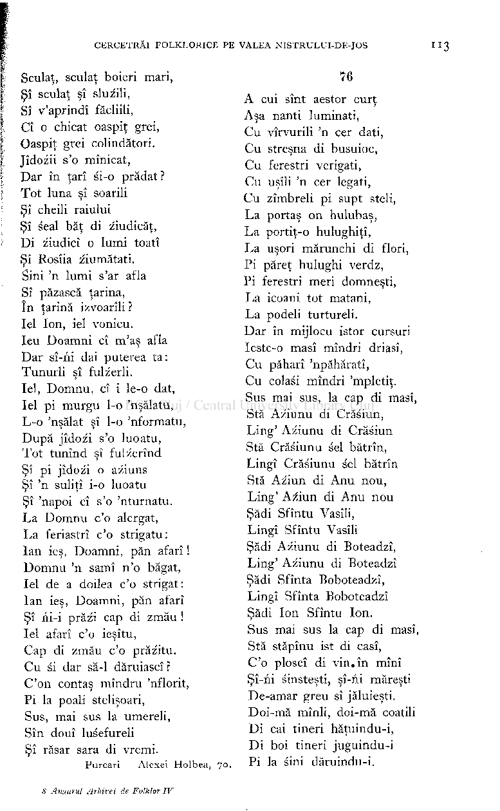

## 76

Sculat, sculat boieri mari, Şî sculat şî sluzili, Sî v'aprindî făcliili, Cî o chicat oaspiţ grei, Oaspiţ grei colindători. Jîdozii s'o mînicat, Dar în ţarî si-o prădat ? Tot luna şî soarili Şî cheili raiului Şî seal băţ di ziudicăţ, Di ziudicî o lumi toatî Şî Rosîia ziumătati. Sini 'n lumi s'ar afla Sî păzască ţarina, în ţarină izvoarîli ? Iei Ion, iei vonicu. leu Doamni cî m'aş afla Dar sî-ni dai puterea ta: Tunurli şî fulzerli. Iei, Domnu, cî i le-o dat, Iei pi murgu l-o 'nşălatu, L-o 'nşălat şî l-o 'nformatu, După jîdozi s'o luoatu, Tot tunînd şî fulzerînd Şî pi jîdozi o aziuns Şî 'n suliţî i-o luoatu Şî 'napoi cî s'o 'nturnatu. La Domnu c'o alergat, La feriastrî c'o strigatu: Ian ieş, Doamni, păn afarî ! Domnu 'n samî n'o băgat, Iei de a doilea c'o strigat: Ian ieş, Doamni, păn afarî Şî ni-i prăzi cap di zmău ! Iei afarî c'o ieşîtu, Cap di zmău c'o prăzitu. Cu si dar să-1 dăruiascî ? C'on contas mîndru 'nflorit, Pi la poali stelişoari, Sus, mai sus la umereli, Sîn douî lusefureli Şî răsar sara di vremi.

A cui sînt aestor curţ Aşa nanti luminaţi, Cu vîrvurili 'n cer dati, Cu streşna di busuioc, Cu ferestri verigati, Cu uşîli 'n cer legaţi, Cu zîmbreli pi supt steli, La portas on hulubaş, La portiţ-o hulughiţî, La uşori mărunchi di flori, Pi păreţ hulughi verdz, Pi ferestri meri domneşti, La icoani tot matani, La podeli turtureli. Dar în mijlocu istor cursuri Ieste-o masî mîndri driasî, Cu păharî 'npăhăratî, Cu colasi mîndri 'mpletiţ. Sus mai sus, la cap di masî, Stă Aziunu di Crăsiun, Ling' Aziunu di Crăsiun Stă Crăsiunu sel bătrîn, Lingî Crăsiunu sel bătrîn Stă Aziun di Anu nou, Ling' Aziun di Anu nou Sădi Sfîntu Vasîli, Lingî Sfîntu Vasîli Sădi Aziunu di Boteadzî, Ling' Aziunu di Boteadzî Sădi Sfînta Boboteadzî, Lingî Sfînta Boboteadzî Sădi Ion Sfîntu Ion. Sus mai sus la cap di masî, Stă stăpînu ist di casî, C'o ploscî di vin. în mînî Şî-ni sinsteşti, şi-iii măreşti De-amar greu sî jăluieşti. Doi-mă mînli, doi-mă coatili Di cai tineri hăţuindu-i, Di boi tineri juguindu-i Pi la sini dăruindu-i.

Purcari —Alcxe i Holbea, 70.

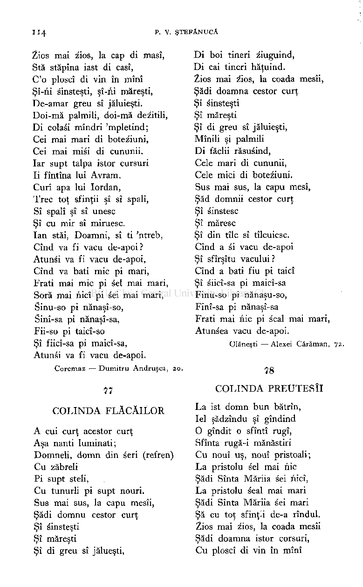

Di boi tineri iiuguind, Di cai tineri hăţuind. Zios mai zios, la coada mesîi, Sădi doamna cestor curţ Şî sinsteşti Şî măreşti Şî di greu sî jăluieşti, Mînili şi palmili Di făclii răsusind, Cele mari di cununii, Cele mici di boteziuni. Sus mai sus, la capu mesî, Şăd domnii cestor curţ Şî sinstesc Şî măresc Şî din tîlc sî tîlcuiesc. Cînd a si vacu de-apoi Şî sfîrşîtu vacului ? Cînd a bati fiu pi taicî Şî siicî-sa pi maicî-sa Finu-so pi nănaşu-so, Finî-sa pi nănaşî-sa Fraţi mai nie pi seal mai mari, Atunsea vacu de-apoi.

Zios mai zios, la cap di masî, Stă stăpîna iast di casî, C'o ploscî di vin în mînî Şî-ni sinsteşti, şî-ni măreşti, De-amar greu sî jăluieşti. Doi-mă palmili, doi-mă dezitili, Di colasi mîndri 'mpletind; Cei mai mari di boteziuni, Cei mai misi di cununii. Iar supt talpa istor cursuri Ii fîntina lui Avram. Curî apa lui Iordan, Trec toţ sfinţii şî sî spalî, Sî spalî şî sî unesc Şî cu mir sî miruesc. Ian stăi, Doamni, sî ti 'ntreb, Cînd va fi vacu de-apoi ? Atunsi va fi vacu de-apoi, Cînd va bati mic pi mari, Fraţi mai mic pi sel mai mari, Soră mai nicî pi sei mai mari, Sinu-so pi nănaşî-so, Sinî-sa pi nănaşî-sa, Fii-so pi taicî-so Şî fiicî-sa pi maicî-sa, Atunsi va fi vacu de-apoi.

Olăneşti—Alexei Cărăman, 72.

## 78

Corcmaz — Dumitru Andruşca, 20 .

## 77

COLINDA PREUTESÎ I

La ist domn bun bătrîn, Iei şădzîndu şî gîndind O gîndit o sfîntî rugî, Sfînta rugă-i mănăstiri Cu nouî uş, nouî pristoali; La pristolu sel mai nie Sădi Sînta Măriia sei nicî, La pristolu seal mai mari Sădi Sînta Măriia sei mari Şă cu toţ sfinţii de-a rîndul. Zios mai zios, la coada mesîi Sădi doamna istor corsuri, Cu ploscî di vin în mînî

COLINDA FLĂCĂILO R

A cui curţ acestor curţ Aşa nanti luminaţi; Domneli, domn din seri (refren) Cu zăbreli Pi supt steli, Cu tunurli pi supt nouri. Sus mai sus, la capu mesîi, Sădi domnu cestor curţ Şî Cinsteşti Şî măreşti Şî di greu sî jălueşti,

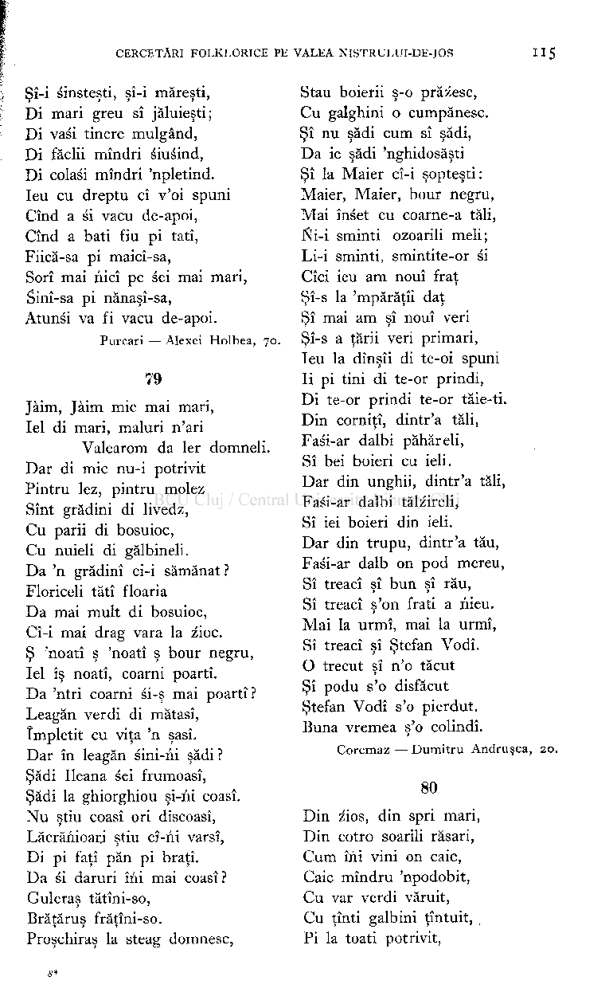

Stau boierii ş-o prăzesc, Cu galghini o cumpănesc. Şî nu sădi cum sî sădi, Da ie sădi 'nghidosăşti Şî la Maier cî-i şopteşti : Maier, Maier, bour negru, Mai înset cu coarne-a tăli, Ni-i sminti ozoarili meii; Li-i sminti, smintite-or si Cîci ieu am nouî fraţ Şî-s la 'mpărăţîi daţ Şî mai am şî nouî veri Şî-s a ţării veri primari, leu la dînşîi di te-oi spuni Ii pi tini di te-or prindi, Di te-or prindi te-or tăie-ti. Din corniţî, dintr'a tăli, Fasi-ar dalbi păhăreli, Sî bei boieri cu ieli. Dar din unghii, dintr'a tăli, Fasi-ar dalbi tălzireli, Sî iei boieri din ieli. Dar din trupu, dintr'a tău, Fasi-ar dalb on pod mereu, Sî treacî şî bun şî rău, Sî treacî ş'on fraţi a nieu. Mai la urmî, mai la urmi, Sî treacî şî Ştefan Vodî. O trecut şî n'o tăcut Şî podu s'o disfăcut Ştefan Vodî s'o pierdut. Buna vremea ş'o colindî.

Şî-i sinsteşti, şî-i măreşti, Di mari greu sî jăluieşti; Di vasi tinere mulgând, Di făclii mîndri siusind, Di colasi mîndri 'npletind. Ieu cu dreptu cî v'oi spuni Cînd a si vacu de-apoi, Cînd a bati fiu pi tatî, Fiică-sa pi maicî-sa, Sorî mai nici pe sei mai mari, Sinî-sa pi nănaşî-sa, Atunsi va fi vacu de-apoi.

Purcari — Alexei Holbea, 70.

## 79

Jàim, Jàim mic mai mari, Iei di mari, maluri n'ari

Valearom da 1er domneli. Dar di mic nu-i potrivit Pintru lez, pintru molez Sînt grădini di livedz, Cu parii di bosuioc, Cu nuieli di gălbineli. Da 'n grădini ci-i sămănat? Floriceli tăti floaria Da mai mult di bosuioc, Cî-i mai drag vara la zioc. Ş 'noatî ş 'noatî ş bour negru, Iei îş noatî, coarni poartî. Da 'ntri coarni si-ş mai poartî ? Leagăn verdi di mătasî, împletit cu viţa 'n şasî. Dar în leagăn sini-ni sădi ? Sădi Ileana sei frumoasî, Sădi la ghiorghiou şi-îii coasî. Nu ştiu coasî ori discoasî, Lăcrănioar.i ştiu cî-îii varsî, Di pi faţî păn pi braţî. Da si daruri îni mai coasî? Guleraş tătîni-so, Brăţăruş frăţîni-so. Proşchiraş la steag domnesc,

Corcmaz — Dumitru Andruşca, 20.

## 80

Din zios, din spri mari, Din cotro soarili răsări, Cum ini vini on caic, Caic mîndru 'npodobit, Cu var verdi văruit, Cu ţînti galbini ţintuit, . Pi la toati potrivit,

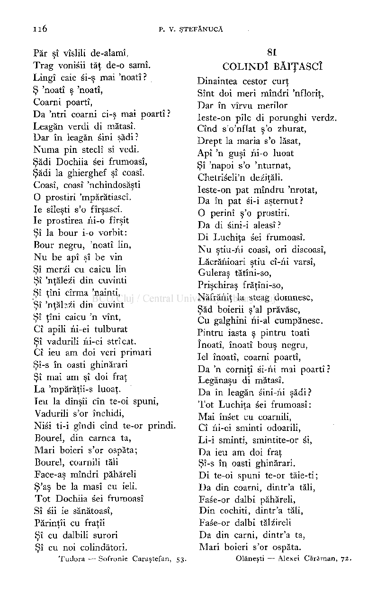

## n 6

###### P. V. ŞTEFĂNUC Ă

Păr şî vîslili de-alamî, Trag vonisii tăţ de-o samî. Lingî caic si-ş mai 'noatî? Ş 'noatî ş 'noatî, Coarni poartî, Da 'ntri coarni ci-ş mai poartî ? Leagăn verdi di mătasî. Dar în leagăn sini sădi? Numa pin steclî sî vedi. Sădi Dochiia sei frumoasî, Sădi la ghierghef şî coasî. Coasî, coasî 'nchindosăşti O prostiri 'mpărătiascî. Ie sileşti s'o fîrşascî. Ie prostirea ni-o fîrşît Şî la bour i-o vorbit: Bour negru, 'noatî lin, Nu be api şî be vin Şî mer zi cu caicu lin Şî 'nţălezi din cuvinti Şî ţîni cîrma 'nainti, Şî 'nţăkzi din cuvînt Şî ţîni caicu 'n vînt, Cî apili ni-ei tulburat Şî vadurili ni-ei stricat. Cî ieu am doi veri primari Şî-s în oasti ghinărari Şî mai am şî doi fraţ La 'mpărăţîi-s luoaţ. Ieu la dînşîi cîn te-oi spuni, Vadurili s'or închidi, Nisi ti-i gîndi cînd te-or prindi. Bourel, din carnea ta, Mari boieri s'or ospăta; Bourel, coarnili tăli Face-aş mîndri păhăreli Ş'aş be la masî cu ieli. Tot Dochiia sei frumoasî Sî sii ie sănătoasî, Părinţii cu fraţii Şî cu dalbili surori Şî cu noi colindători.

COLINDÎ BAIŢASCÎ Dinaintea cestor curţ Sînt doi meri mîndri 'nfloriţ, Dar în vîrvu merilor Ieste-on pîlc di porunghi verdz. Cînd s'o'nflat ş'o zburat, Drept la maria s'o lăsat, Apî 'n guşi ni-o luoat Şî 'napoi s'o 'nturnat, Chetriseli'n deziţăli. Ieste-on pat mîndru 'nrotat, Da în pat si-i aşternut? O perinî ş'o prostiri. Da di sini-i aleasî? Di Luchiţa sei frumoasî. Nu ştiu-ni coasî, ori discoasî, Lăcrănioari ştiu cî-ni varsî, Guleraş tătîni-so, Prişchiraş frăţîni-so, Năfrăniţ la steag domnesc, Şăd boierii ş'al prăvăsc, Cu galghini ni-al cumpănesc. Pintru iasta ş pintru toati înoatî, înoatî bouş negru, Iei înoatî, coarni poartî, Da 'n comiţi si-ni mai poartî ? Legănaşu di mătasî. Da în leagăn sini-ni sădi ? Tot Luchiţa sei frumoasî: Mai inset cu coarnili, Cî ni-ei sminti odoarili, Li-i sminti, smintite-or si, Da ieu am doi fraţ Şî-s în oasti ghinărari. Di te-oi spuni te-or tăie-ti; Da din coarni, dintr'a tăli, Fase-or dalbi păhăreli, Din cochiti, dintr'a tăli, Fase-or dalbi tălzireli Da din carni, dintr'a ta, Mari boieri s'or ospăta.

Olăneşti —Alexei Cărăman, 72 .

Tudora — Sofronie Caraştefan, 53.

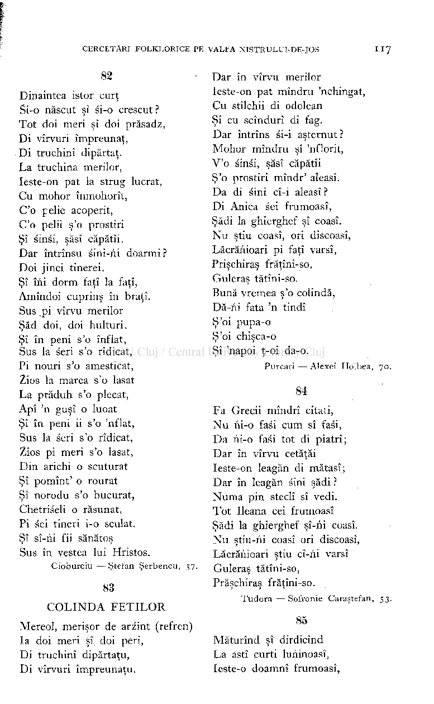

## 82

Dar în vîrvu merilor Ieste-on pat mîndru 'nchingat, Cu stîlchii di odolean Şî cu scîndurî di fag. Dar întrîns si-i aşternut? Mohor mîndru şî 'nflorit, V'o sinsi, şăsî căpătîi Ş'o prostiri mîndr' aleasî. Da di sini cî-i aleasî ? Di Anica sei frumoasî, Sădi la ghierghef şî coasî. Nu ştiu coasî, ori discoasî, Lăcrănioari pi faţî varsî, Prişchiraş frăţîni-so, Guleraş tătîni-so. Bună vremea ş'o colindă, Dă-iîi fata 'n tindî Ş'oi pupa-o Ş'oi chişca-o Şî 'napoi ţ-oi da-o.

Dinaintea istor curţ Si-o născut şî si-o crescut ? Tot doi meri şî doi prăsadz, Di vîrvuri împreunat,

. Di truchinî dipărtaţ. La truchina merilor, Ieste-on pat la strug lucrat, Cu mohor înmohorît, C'o pelie acoperit, C'o pelii ş'o prostiri Şî sinsi, şăsî căpătîi. Dar întrînsu sini-ni doarmi ? Doi jinei tinerei. Şî îni dorm faţî la faţî, Amîndoi cuprins în braţî. Sus pi vîrvu merilor Şăd doi, doi huituri. Şî în peni s'o înfiat, Sus la seri s'o ridicat, Pi nouri s'o amesticat, Zios la marea s'o lăsat La prăduh s'o plecat, Apî 'n guşi o luoat Şî în peni ii s'o 'nflat, Sus la seri s'o ridicat, Zios pi meri s'o lăsat, Din arichi o scuturat Şî pomînt' o rourat Şî norodu s'o bucurat, Chetriseli o răsunat, Pi sei tineri i-o sculat. Şî sî-iîi fii sănătos Sus în vestea lui Hristos.

Purcari — Alexei Holbea, 70.

## 84

Fa Grecii mîndri citaţi, Nu ni-o fasi cum sî fasi, Da ni-o fasi tot di piatrî; Dar în vîrvu cetăţăi Ieste-on leagăn di mătasî; Dar în leagăn sini sădi ? Numa pin steclî sî vedi. Tot Ileana cei frumoasî Sădi la ghierghef şî-ni coasî. Nu ştiu-rii coasî ori discoasî, Lăcrănioari ştiu cî-iii varsî Guleraş tătîni-so, Prăşchiraş frăţîni-so.

Cioburciu — Ştefan Şerbencu, 57.

## 83

Tudora — Sofronie Caraştefan, 53.

COLINDA FEŢILO R

## 85

Mereol, merişor de arzint (refren) Ia doi meri şî doi peri, Di truchinî dipărtaţu, Di vîrvuri împreunaţu.

Măturînd şî dirdicînd La astî curţi lurîinoasî, Ieste-o doamnî frumoasî,

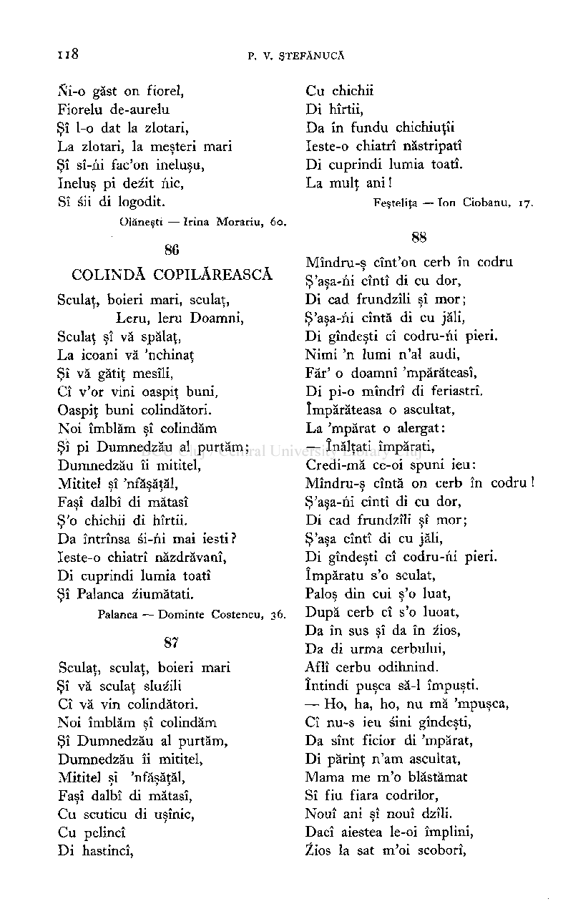

Ni-o găst on fiorel, Fiorelu de-aurelu Şî l-o dat la zlotari, La zlotari, la meşteri mari Şî sî-ni fac'on ineluşu, Ineluş pi dezit nie, Sî sii di logodit.

Cu chichii Di hîrtii, Da în fundu chichiuţîi Ieste-o chiatrî năstripatî Di cuprindi lumia toatî. La mulţ ani !

Feşteliţa — Ion Ciobanu, 17 .

## 88

Olăneşti — Irina Morariu, 60.

## 86

Mîndru-ş cînt'on cerb în codru Ş'aşa-hi cîntî di cu dor, Di cad frundzîli şî mor; Ş'aşa-hi cîntă di cu jăli, Di gîndeşti cî codru-hi pieri. Nimi 'n lumi n'al audi, Făr' o doamnî 'mpărăteasî, Di pi-o mîndrî di feriastrî. împărăteasa o ascultat, La 'mpărat o alergat :

COLINDĂ COPILĂREASCĂ Sculat, boieri mari, sculat,

Leru, leru Doamni, Sculat şî vă spălat, La icoani vă 'nchinat Şî vă gătit mesîli, Cî v'or vini oaspiţ buni, Oaspiţ buni colindători. Noi îmblăm şî colindăm Şî pi Dumnedzău al purtăm; Dumnedzău îi mititel, Mititel şî 'nfăşăţăl, Faşî dalbî di mătasî Ş'o chichii di hîrtii. Da întrînsa si-ni mai ieşti? Ieste-o chiatrî năzdrăvani, Di cuprindi lumia toatî Şî Palanca ziumătati.

— înălţaţi împăraţi, Credi-mă ce-oi spuni ieu: Mîndru-ş cîntă on cerb în codru ! Ş'aşa-ni cîntî di cu dor, Di cad frundzîli şî mor; Ş'aşa cîntî di cu jăli, Di gîndeşti cî codru-hi pieri, împăratu s'o sculat, Paloş din cui ş'o luat, După cerb cî s'o luoat, Da în sus şî da în zios, Da di urma cerbului, Aflî cerbu odihnind, întindi puşca să-1 împuşti.

Palanca — Dominte Costencu, 36.

## 87

Sculat, sculat, boieri mari Şî vă sculat sluzili Cî vă vin colindători. Noi îmblăm şî colindăm Şî Dumnedzău al purtăm, Dumnedzău îi mititel, Mititel şi 'nfăşăţăl, Faşî dalbî di mătasî, Cu scuticu di uşînic, Cu pelinci Di hastincî,

— Ho, ha, ho, nu mă 'mpuşca, Cî nu-s ieu sini gîndeşti, Da sînt ficior di 'mpărat, Di părinţ n'am ascultat, Mama me m'o blăstămat Sî fiu fiara codrilor, Nouî ani şî nouî dzîli. Dacî aiestea le-oi împlini, Zios la sat m'oi scoborî,

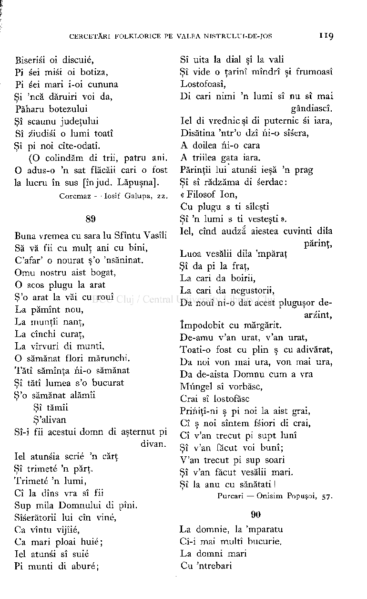

Sî uita la dial şî la vali Şî vide o ţarini mîndrî şi frumoasî Lostofoasî, Di cari nimi 'n lumi sî nu sî mai

Biserisi oi discuié, Pi sei misi oi botiza, Pi sei mari i-oi cununa Şi 'ncă dăruiri voi da, Păharu botezului Şî scaunu judeţului Sî ziudisi o lumi toatî Şî pi noi cîte-odatî.

gândiascî. Iei di vrednic şî di puternic si iara, Disătina 'ntr'o dzî ni-o sîsera, A doilea ni-o cara A triilea gata iara. Părinţii lui atunsi ieşă 'n prag Şî sî rădzăma di serdac: « Filosof Ion, Cu plugu s ti sileşti Şî 'n lumi s ti vesteşti ». Iei, cînd audză aiestea cuvinti dila

(O colindăm di trii, patru ani. O adus-o 'n sat flăcăii cari o fost la lucru în sus [înjud. Lăpuşna].

Corcmaz — Iosif Galupa, 22 .

## 89

Buna vremea cu sara lu Sfîntu Vasîli

părinţ,

- Să vă fii cu mulţ ani cu bini, C'afar' o nourat ş'o 'nsăninat. Omu nostru aist bogat, O scos plugu la arat Ş'o arat la văi cu rouî La pămînt nou, La munţii nanţ, La cînchi curăţ, La vîrvuri di munţi, O sămănat flori mărunchi.
- Tătî sămînţa ni-o sămănat Şî tătî lumea s'o bucurat Ş'o sămănat alămii

Luoa vesălii dila 'mpăraţ Şî da pi la fraţ, La cari da boirii, La cari da negustorii, Da nouî ni-o dat acest pluguşor de-

arzint,

împodobit cu mărgărit. De-amu v'an urat, v'an urat, Toati-o fost cu plin ş cu adivărat, Da noi von mai ura, von mai ura, Da de-aista Domnu cum a vra Müngel sî vorbăsc, Crai sî lostofăsc Priniţî-ni ş pi noi la aist grai, Cî ş noi sîntem fsiori di crai, Cî v'an trecut pi supt luni Şî v'an făcut voi bunî; V'an trecut pi sup soari Şî v'an făcut vesălii mari. Şî la anu cu sănătăţi !

Şî tămîi Ş'alivan

Sî-i fii acestui domn di aşternut pi divan.

Iei atunsia scrie 'n cărţ Şî trimeté 'n părţ. Trimeté 'n lumi, Cî la dins vra sî fii Sup mila Domnului di pîni. Sîserătorii lui cîn vine, Ca vîntu vîjîié, Ca mari ploai huié; Iei atunsi sî suie Pi munţi di aburé;

Purcari — Onisim Popuşoi, 57.

## 90

La domnie, la 'mparatu Cî-i mai mulţi bucurie, La domni mari Cu 'ntrebari

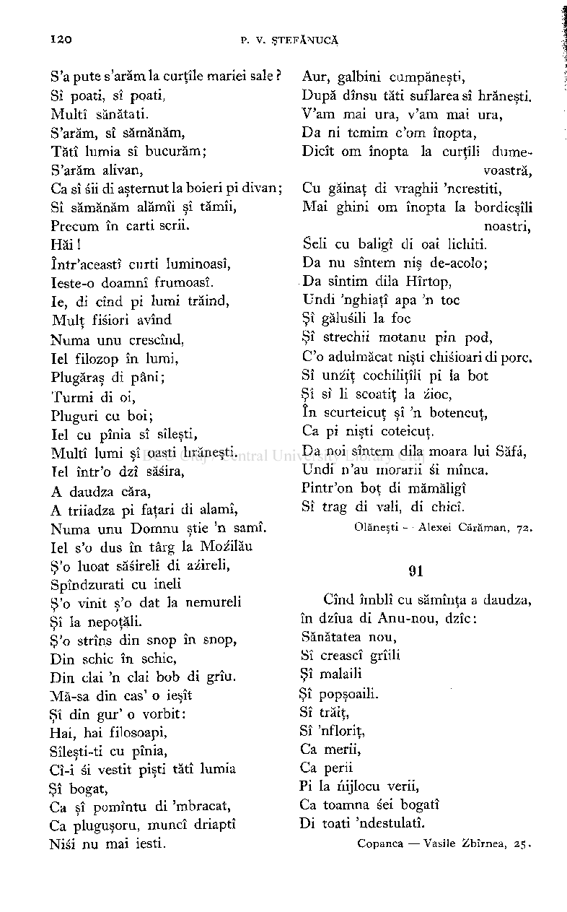

S'a pute s'arăm la curţile măriei sale ? Sî poati, sî poati, Multî sănătăţi. S'arăm, sî sămănăm, Tătî lumia sî bucurăm; S'arăm alivan, Ca sî sii di aşternut la boieri pi divan ; Sî sămănăm alămii şî tămîi, Precum în cârti scrii. Hăi! într'aceastî curţi luminoasî, Ieste-o doamnî frumoasî. Ie, di cînd pi lumi trăind, Mulţ fisiori avînd Numa unu crescînd, Iei filozop în lumi, Plugăraş di pâni; Turmi di oi, Pluguri cu boi; Iei cu pînia sî sileşti, Multî lumi şî oasti hrăneşti. Iei într'o dzî săsira, A daudza căra, A triiadza pi faţari di alamî, Numa unu Domnu ştie 'n samî. Iei s'o dus în târg la Mozilău Ş'o luoat săsireli di azireli, Spîndzurati cu ineli Ş'o vinit ş'o dat la nemureli Şî la nepoţăli. Ş'o strîns din snop în snop, Din schic în schic, Din clai 'n clai bob di grîu. Mă-sa din cas' o ieşît Şî din gur' o vorbit: Hai, hai filosoapi, Sîleşti-ti cu pînia, Cî-i si vestit pişti tătî lumia Şî bogat, Ca şî pomîntu di 'mbracat, Ca pluguşoru, muncî driaptî Nisi nu mai ieşti.

Aur, galbini cumpăneşti, După dînsu tăti suflarea sî hrăneşti. V'am mai ura, v'am mai ura, Da ni temim c'om înopta, Dicît om înopta la curţîli dume-

voastră, Cu găinaţ di vraghii 'ncrestiti, Mai ghini om înopta la bordieşîli

noastri,

Seli cu baligî di oai lichiti. Da nu sîntem niş de-acolo; Da sîntim dila Hîrtop, Undi 'nghiaţî apa 'n toc Şî gălusili la foc Şî strechii motanu pin pod, C'o adulmăcat nişti chisioari di porc. Sî unziţ cochiliţîli pi ia bot Şî sî li scoatiţ la zioc, în scurteicuţ şî 'n botencuţ, Ca pi nişti coteicuţ. Da noi sîntem dila moara lui Săfâ, Undi n'au morarii si mînca. Pintr'on boţ di mămăligî Sî trag di vali, di chicî.

Olăneşti —Alexei Cărăman, 72.

## 91

Cînd îmblî cu sămînţa a daudza, în dzîua di Anu-nou, dzîc: Sănătatea nou, Sî creascî grîili Şî malaili Şî popşoaili. Sî trăit, Sî 'nfloriţ, Ca merii, Ca perii Pi la iîijlocu verii, Ca toamna sei bogatî Di toati 'ndestulatî.

Copanca — Vasile Zbîrnea, 25 .

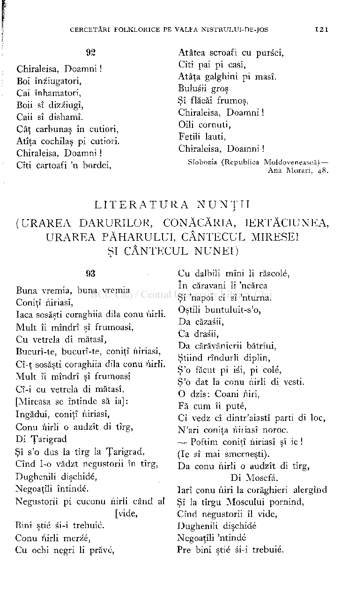

## 92

Atâtea scroafi cu pursei, Cîti pai pi casî, Aţâţa galghini pi masî. Bulusii groş Şî flăcăi frumos, Chiraleisa, Doamni ! Oili cornuţi, Fetili lauti, Chiraleisa, Doamni !

Chiraleisa, Doamni ! Boi înziugatori, Cai înhamatori, Boii sî dizziugî, Caii sî dishamî. Câţ carbunaş în cutiori, Atîţa cochilaş pi cutiori. Chiraleisa, Doamni ! Cîti cartoafi 'n bordei,

Slobozia (Republica Moldovenească) Ana Morari, 48.

LITERATUR A NUNŢI I (URAREA DARURILOR, CONĂCĂRIA, IERTĂCIUNEA, URAREA PAHARULUI, CÂNTECUL MIRESEI SI CÂNTECUL NUNEI)

## 93

Cu dalbili mîni li răscole, în caravani li 'ncărca Şî 'napoi ci sî 'nturna. Ostili buntuluit-s'o, Da căzasii, Ca drasii, Da cărăvănierii bătrîni, Ştiind rîndurli diplin, Ş'o făcut pi isi, pi colé, Ş'o dat la conu nirli di vesti. O dzîs: Coani niri, Fă cum îi puté, Ci vedz cî dintr'aiastî parti di loc, N'ari coniţa hiriasî noroc.

Buna vremia, buna vremia Coniţî niriasî, Iaca sosăşti coraghiia dila conu nirli. Mult îi mîndrî şî frumoasî, Cu vetrela di mătasî, Bucurî-te, bucurî-te, coniţî hiriasî, Cî-ţ sosăşti coraghiia dila conu nirli. Mult îi mîndrî şî frumoasî Cî-i cu vetrela di mătasî. [Mireasa se întinde să ia]: îngădui, coniţî niriasî, Conu nirli o audzît di tîrg, Di Ţarigrad Şî s'o dus la tîrg la Ţarigrad. Cînd l-o vădzt negustorii în tîrg, Dughenili dişchide, Negoaţîli întinde. Negustorii pi cuconu nirli când al

— Poftim coniţî niriasî şî ie ! (Ie sî mai smerneşti). Da conu nirli o audzît di tîrg,

Di Moscfâ. Iarî conu rîiri la corăghieri alergînd Şî la tîrgu Moscului pornind, Cînd negustorii îl vide, Dughenili dişchide Negoaţîli 'ntindé Pre bini stié si-i trebuie.

[vide,

Bini ştie si-i trebuie.

Conu nirli merzé, Cu ochi negri li prăve,

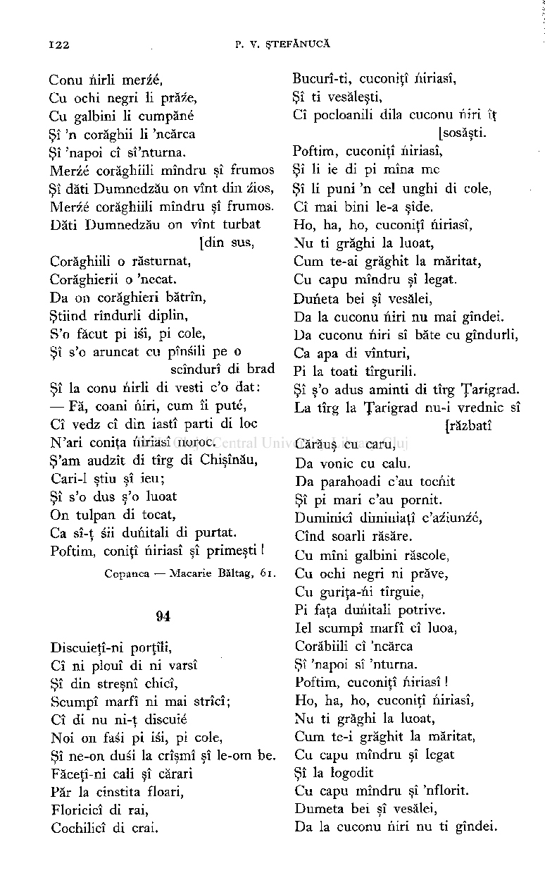

###### 12 2 P. V. STEFÄNUCÄ

Bucurî-ti, cuconiţi niriasî, Şî ti vesăleşti, Cî pocloanili dila cuconu niri îţ

Conu nirli merzé, Cu ochi negri li prăze, Cu galbini li cumpăne Şî 'n corăghii li 'ncărca Şî 'napoi cî sî'nturna. Merzé corăghiili mîndru şî frumos Şî dăti Dumnedzău on vînt din zios, Merzé corăghiili mîndru şî frumos. Dăti Dumnedzău on vînt turbat

[sosăşti.

Poftim, cuconiţi niriasî, Şî li ie di pi mîna me Şî li puni 'n cel unghi di cole, Cî mai bini le-a şîde. Ho, ha, ho, cuconiţi niriasî, Nu ti grăghi la luoat, Cum te-ai grăghit la măritat, Cu capu mîndru şî legat. Duneta bei şî vesălei, Da la cuconu niri nu mai gîndei. Da cuconu niri sî băte cu gîndurli, Ca apa di vînturi, Pi la toati tîrgurili. Şî ş'o adus aminti di tîrg Ţarigrad. La tîrg la Ţarigrad nu-i vrednic sî

[din sus,

Corăghiili o răsturnat, Corăghierii o 'necat. Da on corăghieri bătrîn, Ştiind rîndurli diplin, S'o făcut pi isi, pi cole, Şî s'o aruncat cu pînsili pe o

scîndurî di brad Şî la conu nirli di vesti c'o dat:

— Fă, coani hiri, cum îi puté, Cî vedz cî din iastî parti di loc N'ari coniţa niriasî noroc. Ş'am audzît di tîrg di Chişinău, Cari-1 ştiu şî ieu; Şî s'o dus ş'o luoat On tulpan di tocat, Ca sî-ţ sii dunitali di purtat. Poftim, coniţî niriasî şî primeşti !

[răzbatî

Cărăuş cu caru, Da vonic cu calu. Da parahoadi c'au tochit Şî pi mari c'au pornit. Duminici diminiaţî c'aziunzé, Cînd soarli răsare. Cu mîni galbini răscole, Cu ochi negri ni prăve, Cu guriţa-ni tîrguie, Pi faţa dunitali potrive. Iei scumpi marfî cî luoa, Corăbiili cî 'ncărca Şî 'napoi sî 'nturna. Poftim, cuconiţi niriasî ! Ho, ha, ho, cuconiţi niriasî, Nu ti grăghi la luoat, Cum te-i grăghit la măritat, Cu capu mîndru şî legat Şî la logodit

Copanca —Macarie Baltag, 61 .

## 94

Discuieţî-ni porţîli, Cî ni plouî di ni varsî Şî din streşnî chicî, Scumpi marfî ni mai strîcî; Cî di nu ni-ţ discuié Noi on fasi pi isi, pi cole, Şî ne-on dusi la crîşmî şî le-om be. Făceţî-ni caii şî cărări Păr la cinstita floari, Floricicî di rai, Cochiliei di crai.

Cu capu mîndru şî 'nflorit. Dumeta bei şî vesălei, Da la cuconu niri nu ti gîndei.

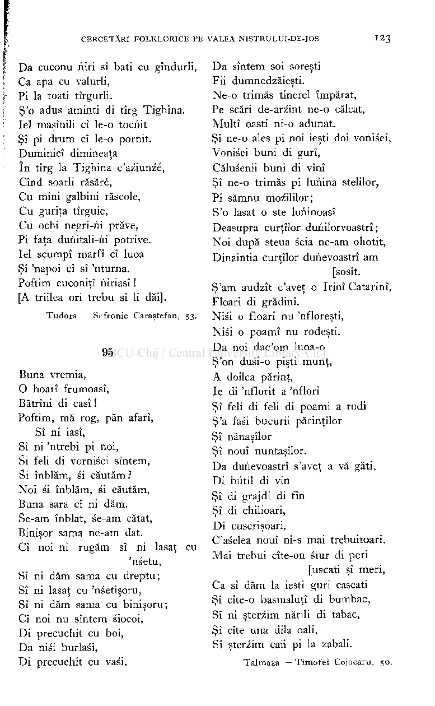

Da sîntem soi soreşti Fii dumnedzăieşti. Ne-o trimăs tinerel împărat, Pe scări de-arzint ne-o călcat, Multî oasti ni-o adunat. Şî ne-o ales pi noi ieşti doi vonisei, Vonisei buni di gurî, Călusenii buni di vînî Şî ne-o trimăs pi luhina stelilor, Pi sămnu mozililor; S'o lăsat o ste luhinoasî Deasupra curţilor duhilorvoastrî ; Noi după steua seia ne-am ohotit, Dinaintia curţilor duhevoastrî am

Da cuconu niri sî bati cu gîndurli, Ca apa cu valurli, Pi la toati tîrgurli. Ş'o adus aminti di tîrg Tighina. Iei maşînili cî le-o tochit Şî pi drum cî le-o pornit. Duminici dimineaţa în tîrg la Tighina c'aziunzé, Cînd soarli răsare, Cu mini galbini răscole, Cu guriţa tîrguie, Cu ochi negri-hi prăve, Pi faţa duhitali-hi potrive. Iei scumpi marfî cî luoa Şî 'napoi cî sî 'nturna. Poftim cuconiţi hiriasî ! [A triilea ori trebu sî li dai].

[sosît. Ş'am audzît c'aveţ o Irinî Catarinî, Floari di grădini. Nisi o floari nu 'nfloreşti, Nisi o poami nu rodeşti. Da noi dac'om luoa-o Ş'on dusi-o pişti munţ, A doilea părinţ, Ie di 'nflorit a 'nflori Şî feli di feli di poami a rodi Ş'a fasi bucurii părinţilor Şî nănaşîlor Şî nouî nuntaşilor. Da duhevoastrî s'aveţ a vă găti, Di butii di vin Şî di grajdi di fin Şî di chilioari, Di cuscrişoari, C'aselea nouî ni-s mai trebuitoari. Mai trebui cîte-on siur di peri

Tudora — Scfronie Caraştefan, 53.

## 95

Buna vremia, O hoarî frumoasî, Bătrîni di casî ! Poftim, mă rog, păn afarî,

Sî ni iasî, Sî ni 'ntrebi pi noi, Si feli di vornisei sîntem, Si înblăm, si căutăm? Noi si înblăm, si căutăm, Buna sara cî ni dăm. Se-am înblat, se-am cătat, Binişor sama ne-am dat. Cî noi ni rugăm sî ni lasaţ cu

'nsetu, Sî ni dăm sama cu dreptu; Sî ni lasaţ cu 'nsetişoru, Sî ni dăm sama cu binişoru; Cî noi nu sîntem siocoi, Di precuchit cu boi, Da nisi burlasi, Di precuchit cu vasi.

[uscaţi şî meri, Ca sî dăm la ieşti guri căscaţi Şî cîte-o basmaluţî di bumbac, Sî ni şterzim nărili di tabac, Şî cîte una dila oali, Sî şterzim caii pi la zabali.

Talmaza — Timofei Cojocaru, 50.

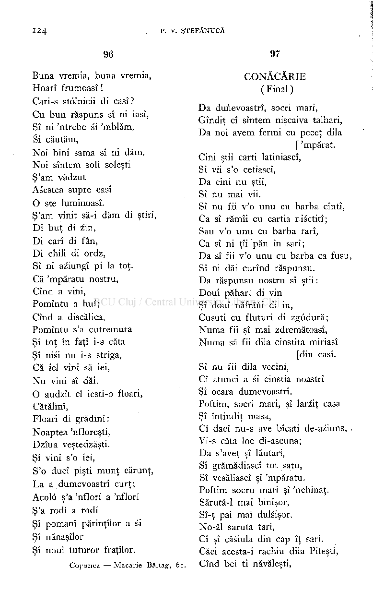

## 97

## 96

CONÄCÄRIE ( Final )

Buna vremia, buna vremia, Hoarî frumoasî ! Cari-s stolnicii di casî? Cu bun răspuns sî ni iasî, Sî ni 'ntrebe si 'mblăm, âi căutăm, Noi bini sama sî ni dăm. Noi sîntem soli soleşti Ş'am vădzut Asestea supre casî O ste luminoasî. Ş'am vinit să-i dăm di ştiri, Di buţ di zin, Di carî di fân, Di chili di ordz, Sî ni aziungî pi la toţ. Că 'mpăratu nostru, Cînd a vini, Pomîntu a hui; Cînd a discălica, Pomîntu s'a cutremura Şî toţ în faţî i-s căta Şî nisi nu i-s striga, Că iei vini să iei, Nu vini sî dăi. O audzît cî iesti-o floari, Cătălini, Floari di grădini: Noaptea 'nfloreşti, Dzîua veştedzăşti. Şî vini s'o iei, S'o ducî pişti munţ cărunt, La a dumevoastrî curţ; Acolo ş'a 'nflori a 'nflori Ş'a rodi a rodi Şî pomanî părinţilor a si Şî nănaşîlor Şî nouî tuturor fraţilor.

Da durievoastrî, socri mari, Gîndiţ cî sîntem niscaiva tâlhari, Da noi avem fermi cu peceţ dila

[ 'mpărat. Cini ştii cârti latiniascî, Sî vii s'o cetiascî, Da cini nu ştii, Si nu mai vii. Sî nu fii v'o unu cu barba cîntî, Ca sî rămîi cu cartia msetitî; Sau v'o unu cu barba rarî, Ca sî ni ţii păn în sarî; Da sî fii v'o unu cu barba ca fusu, Sî ni dăi curînd răspunsu. Da răspunsu nostru sî ştii: Douî pahar, di vin Şî douî năfrăhi di in, Cusuţi cu fluturi di zgudură; Numa fii şî mai zdremătoasî, Numa să fii dila cinstita miriasî

[din casî.

Sî nu fii dila vecini, Cî atunci a si cinstia noastrî Şî ocara dumevoastrî. Poftim, socri mari, şî larziţ casa Şî întindiţ masa, Cî dacî nu-s ave bîcati de-aziuns, Vi-s căta loc di-ascuns; Da s'aveţ şî lăutari, Sî grămădiascî tot satu, Sî vesăliascî şî 'mpăratu. Poftim socru mari şî 'nchinaţ. Sărută-1 mai binişor, Sî-ţ pai mai dulsişor. No-ăl săruta tari, Cî şî căsiula din cap îţ sari. Căci acesta-i rachiu dila Piteşti, Cînd bei ti năvăleşti,

Copanca —Macarie Baltag, 61 .

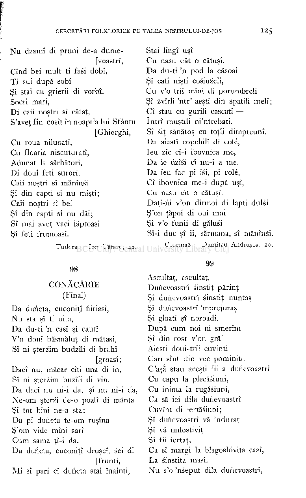

Stai lingî uşî Cu nasu cât o cătuşî. Da du-ti 'n pod la căsoai Şî catî nişti cosiuzeli, Cu v'o trii mîni di porumbreli Şî zvîrli 'ntr' aeşti din spatili meii ; Cî stau cu gurili căscaţi întrî muştili ni'ntrebati. Sî siţ sănătos cu toţîi dimpreunî. Da aiastî copchilî di colé, leu zîc cî-i ibovnica me, Da ie dzîsi cî nu-i a me. Da ieu fac pi isi, pi colé, Cî ibovnica me-i după uşî, Cu nasu cît o cătuşî. Daţî-îii v'on dîrmoi di lapti dulsi Ş'on ţăpoi di ouî moi Şî v'o funii di gălusi Sî-i duc şî ii, sărmana, sî mănînsi.

Nu dzamî di pruni de-a dume-

[voastrî, Cînd bei mult ti fasi dobî, Ti sui după sobî Şî stai cu grierii di vorbî. Socri mari, Di caii noştri sî cătat, S'aveţ fîn cosît în noaptia lui Sfântu

[Ghiorghi,

Cu roua niluoatî, Cu floaria niscuturatî, Adunat la sărbători, Di douî feti surori. Caii noştri sî mănînsi Şî din capti sî nu mişti; Caii noştri sî bei Şî din capti sî nu dăi; Sî mai aveţ vaci lăptoasî Şî feti frumoasî.

Corcmaz — Dumitru Andruşca, 20.

Tudora — Ion Tătarii, 42.

## 99

## 98

Ascultat, ascultat, Dunevoastrî sinstiţ părinţ Şî dunevoastrî sinstiţ nuntaş Şî dunevoastrî 'mprejuraş Şî gloati şî noroadi. După cum noi ni smerim Şî din rost v'on grăi Aiesti douî-trii cuvinti Cari sînt din vec pominiti. Casa stau aceşti fii a dunevoastrî Cu capu la plecăsiuni, Cu inima la rugăsiuni, Ca să iei dila dunevoastrî Cuvînt di iertăsiuni; Şî dunevoastrî vă 'nduraţ Şî vă milostivit Sî fii iertat, Ca sî margî la blagoslovita casî, La sinstita masî. Nu s'o 'nseput dila dunevoastrî,

CONÄCÄRIE (Final)

Da duneta, cuconiţi niriasî, Nu sta şî ti uita, Da du-ti 'n casî şî cautî V'o douî băsmăluţ di mătasî, Sî ni şterzim budzîli di brahî

[groasî; Dacî nu, măcar cîti una di in, Sî ni şterzim buzîli di vin. Da dacî nu ni-i da, şî nu ni-i da, Ne-om şterzi de-o poalî di manta Şî tot bini ne-a sta; Da pi duneta te-om ruşîna Ş'om vide mîni sarî Cum sama ţî-i da. Da duneta, cuconiţi druşcî, sei di

[frunţi, Mi sî pari cî duneta stai înainti,

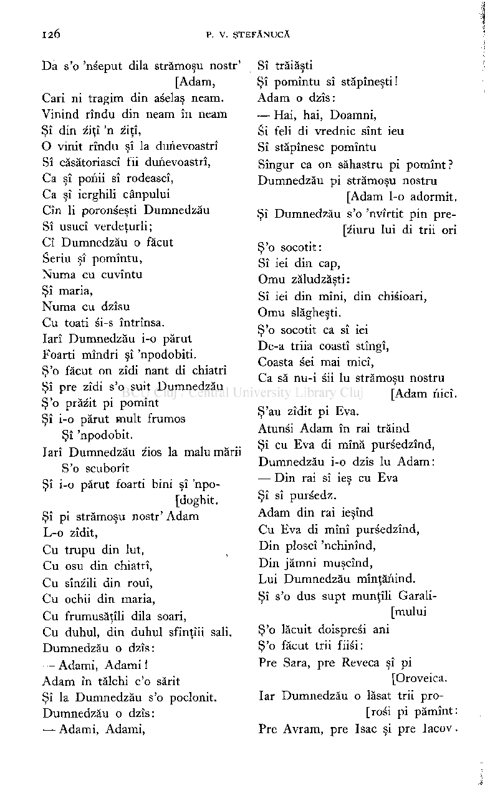

# Das'o 'nseput dila strămoşu nostr'

# Sî trăiăşti Şî pomîntu sî stăpîneşti! Adam o dzîs:

# [Adam, Cari ni tragim din aselaş neam. Vinind rîndu din neam în neam Şî din ziţî 'n ziţî, O vinit rîndu şî la dunevoastrî Sî căsătoriascî fii dunevoastrî, Ca şî ponii sî rodeascî, Ca şî ierghili cânpului Cîn li poronseşti Dumnedzău Sî usucî verdeţurii; Cî Dumnedzău o făcut Seriuşî pomîntu, Numa cu cuvîntu Şî maria, Numa cudzîsu Cu toati si-s întrînsa. lari Dumnedzău i-o părut Foarti mîndri şî 'npodobiti. Ş'o făcut on zîdi nant di chiatrî Şî pre zîdi s'o suit Dumnedzău Ş'o prăzit pi pomînt Şî i-o părut mult frumos

# — Hai, hai, Doamni, Sifeli di vrednic sînt ieu Sî stăpînesc pomîntu Singur ca on săhastru pi pomînt? Dumnedzău pi strămoşu nostru

# [Adam l-o adormit. Şî Dumnedzău s'o 'nvîrtit pin pre-

# [ziuru lui di trii ori

# Ş'o socotit: Sî iei din cap, Omu zăludzăşti: Sî iei din mîni, din chisioari, Omu slăgheşti. Ş'o socotit ca sî iei De-a triia coastî stîngî, Coasta sei mai mici, Ca să nu-i sii lu strămoşu nostru

# [Adam nicî.

# Ş'au zîdit pi Eva. Atunsi Adam în rai trăind Şî cu Eva di mină pursedzînd, Dumnedzău i-o dzîs lu Adam: — Din rai sî ieş cu Eva Şî sî pursedz. Adam din rai ieşînd Cu Eva di mînî pursedzînd, Din ploscî 'nchinînd, Din jămni muşcînd, Lui Dumnedzău mînţănind. Şî s'o dus supt munţîli Garali-

# Şî 'npodobit. Iarî Dumnedzău zios la malu mării S'o scuborît Şî i-o părut foarti bini şî 'npo-

# [doghit. Şî pi strămoşu nostr' Adam L-o zîdit, Cu trupu din lut, Cu osu din chiatrî, Cu sînzili din roui, Cu ochii din maria, Cu frumusăţîli dila soari, Cu duhul, din duhul sfinţîii sali. Dumnedzău o dzîs:

# [mului

# Ş'o lăcuit doispresi ani Ş'o făcut trii fiisi: Pre Sara, pre Reveca şî pi

# — Adami, Adami ! Adam în tălchi c'o sărit Şî la Dumnedzău s'o poclonit. Dumnedzău o dzîs:

# [Oroveica. Iar Dumnedzău o lăsat trii pro-

# — Adami, Adami,

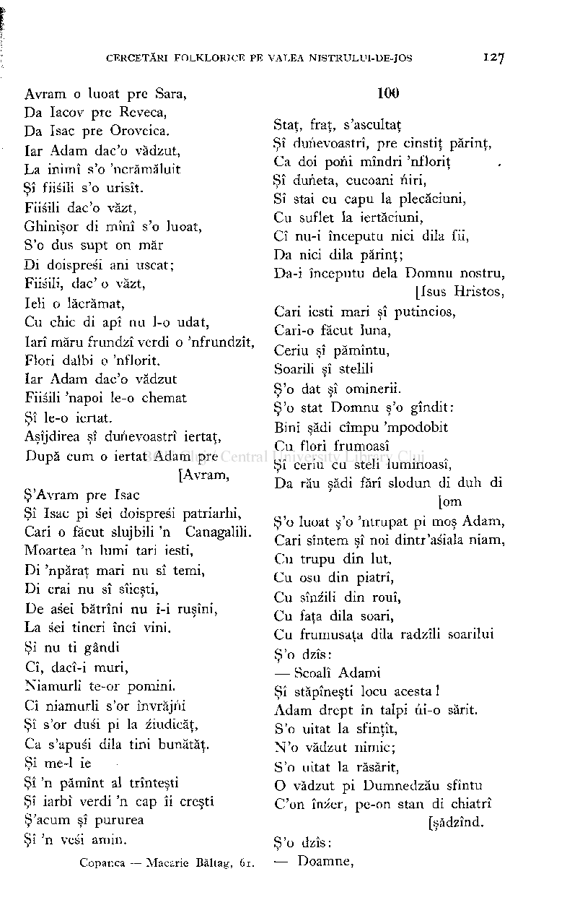

# Avram o luoat pre Sara, Da Iacov pre Reveca, Da Isac pre Oroveica. Iar Adam dac'o vădzut, La inimî s'o 'ncrămăluit Şî fiisili s'o urisît. Fiisili dac'o văzt, Ghinişor di mînî s'o luoat, S'o dus supt on măr Di doispresi ani uscat; Fiisili, dac' o văzt, Ieli o lăcrămat, Cu chic di apî nu l-o udat, Iarî măru frundzî verdi o 'nfrundzît, Flori dalbi o 'nflorit. Iar Adam dac'o vădzut Fiisili 'napoi le-o chemat Şî le-o iertat. Aşîjdirea şî duiîevoastrî iertat, După cum o iertat Adam pre

# 100 Stat, fraţ, s'ascultaţ Şî duiîevoastrî, pre cinstit părinţ, Ca doi porii mîndri 'nfloriţ Şî duiieta, cucoani niri, Sî stai cu capu la plecăciuni, Cu suflet la iertăciuni, Cî nu-i începutu nici dila fii, Da nici dila părinţ; Da-i începutu delà Domnu nostru,

# [Isus Hristos, Cari ieşti mari şî putincios, Cari-o făcut luna, Ceriu şî pămîntu, Soarili şî stelili Ş'o dat şî ominerii. Ş'o stat Domnu ş'o gîndit: Binisădicîmpu 'mpodobit Cu flori frumoasî Şî ceriu cu steli luminoasî, Da răusădifărî slodun di duh di

# [Avram,

# Ş'Avram pre Isac Şî Isac pi sei doispresi patriarhi, Cari o făcut slujbili 'n Canagalili. Moartea 'n lumi tari ieşti, Di 'npăraţ mari nu sî temi, Di crai nu sî sîieşti, De asei bătrîni nu i-i ruşîni, La sei tineri încî vini. Şî nu ti gândi Cî, dacî-i muri, Niamurli te-or pomini. Cî niamurli s'or învrăjîii Şî s'or dusi pi la ziudicăţ, Ca s'apusi dila tini bunătăţ. Şîme-1ie Şî 'n pămînt al trînteşti Şî iarbî verdi 'n cap îi creşti Ş'acum şî pururea Şî 'n vesi amin.

# [om Ş'o luoat ş'o 'ntrupat pi moş Adam, Cari sîntem şî noi dintr'asiala niam, Cu trupu din lut, Cu osu din piatrî, Cu sînzili din roui, Cu faţa dila soari, Cu frumusaţa dila radzîli soarilui Ş'o dzîs:

# — Scoalî Adami Şî stăpîneşti locu acesta ! Adam drept în tălpi ni-o sărit. S'o uitat la sfinţit, N'o vădzut nimic; S'o uitat la răsărit, O vădzut pi Dumnedzău sfîntu C'on înzer, pe-on stan di chiatrî

# [şădzînd. Ş'o dzîs:

Copanca — Macarie Baltag, 61.

# — Doamne,

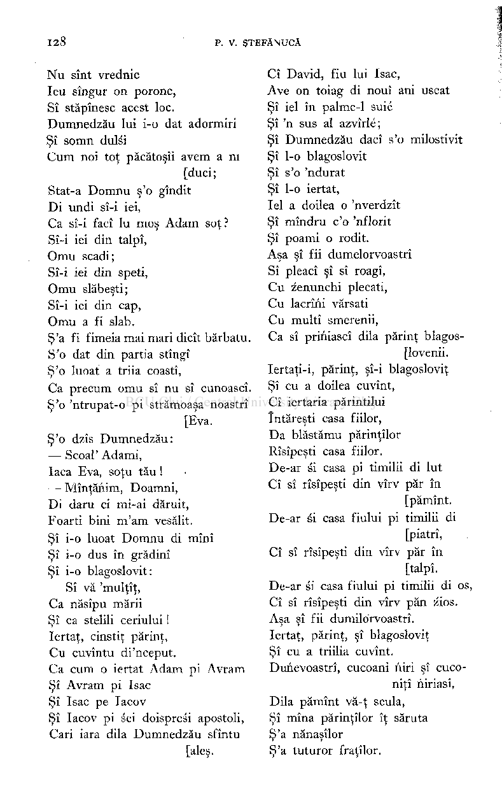

128 P. V. STEFÄNUCÄ

# Cî David, fiu lui Isac, Ave on toiag di nouî ani uscat

# Nu sînt vrednic leu singur on poronc, Sî stăpînesc acest loc. Dumnedzău lui i-o dat adormiri Şî somn dulsi Cum noi toţ păcătoşii avem a m

# Şî 'n sus al azvîrlé;Şî iei înpalme-1suie Şî Dumnedzău dacî s'o milostivit Şî l-o blagoslovit Şî s'o 'ndurat Şî l-o iertat, Iei a doilea o 'nverdzît Şî mîndru c'o 'nflorit Şî poami o rodit. Aşa şî fii dumelorvoastrî Sî pleacî şî sî roagî, Cu zenunchi plecaţi, Cu lacrîfii vărsaţi Cu mulţi smerenii, Ca sî priniascî dila părinţ blagos-

# [duci ;

# Stat-a Domnu ş'o gîndit Di undi sî-i iei, Ca sî-i facî lu moş Adam soţ? Sî-i iei din talpî, Omu scadi; Sî-i iei din speti, Omu slăbeşti; Sî-i iei din cap, Omu a fi slab. Ş'a fi fimeia mai mari dicît bărbatu. S'o dat din pârtia stingi Ş'o luoat a triia coastî, Ca precum omu sî nu sî cunoascî. Ş'o 'ntrupat-o pi strămoaşa noastrî

# [lovenii. Iertaţi-i, părinţ, şî-i blagoslovit Şî cu a doilea cuvînt, Cî iertaria părintilui întăreşti casa fiilor, Da blăstămu părinţilor Rîsîpeşti casa fiilor. De-ar si casa pi timilii di lut Cî sî rîsîpeşti din vîrv păr în

# [Eva. Ş'o dzîs Dumnedzău:

# — Scoal' Adami, Iaca Eva, soţu tău !

# — Mînţănim, Doamni, Di daru ci mi-ai dăruit, Foarti bini m'am vesălit. Şî i-o luoat Domnu di mînî Şî i-o dus în grădini Şî i-o blagoslovit:

# [pămînt. De-ar si casa fiului pi timilii di

# [piatrî, Cî sî rîsîpeşti din vîrv păr în

# [talpî. De-ar si casa fiului pi timilii di os, Cî sî rîsîpeşti din vîrv păn zios. Aşa şî fii dumilorvoastrî. Iertat, părinţ, şî blagoslovit Şî cu a triilia cuvînt. Dunevoastrî, cucoani rîiri şî cuco­

# — Sî vă 'mulţîţ, Ca năsîpu mării Şî ca stelili ceriului ! Iertat, cinstit părinţ, Cu cuvîntu di'nceput. Ca cum o iertat Adam pi Avram Şî Avram pi Isac Şî Isac pe Iacov Şî Iacov pi sei doispresi apostoli, Cari iara dila Dumnedzău sfîntu

# niţi niriasî, Dila pămînt vă-ţ scula, Şî mîna părinţilor îţ săruta Ş'a nănaşîlor Ş'a tuturor fraţilor.

# [aleş.

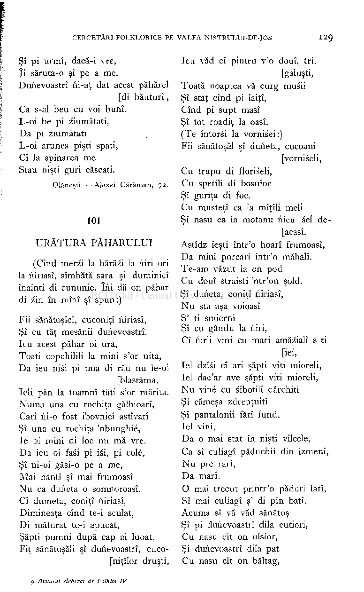

# Şî pi urmi, dacă-i vre, îi săruta-o şî pe a me. Dunevoastrî ni-aţ dat acest păhărel

# leu văd cî pintru v'o douî, trii

# [galuşti, Toată noaptea vă curg muşii Şî stat cînd pi laiţî, Cînd pi supt masî Şî tot roadiţ la oasî. (Te întorşi la vornisei:) Fii sănătoşăl şî duîieta, cucoani

# [di băuturi, Ca s-al beu cu voi bunî. L-oi be pi ziumătati, Da pi ziumătati L-oi arunca pişti spati, Cî la spinarea me Stau nişti guri căscaţi.

# [vorniseli,

# Cu trupu di floriseli, Cu spetili di bosuioc Şî guriţa di foc. Cu musteţî ca la mîţîli meii Şî nasu ca la motanu nieu sel de-

Olăneşti —Alexei Cărăman, 72.

# 101 URĂTURA PAHARULUI

# [acasî. Astîdz ieşti într'o hoarî frumoasî, Da mîni porcari într'o măhalî. Te-am văzut la on pod Cu douî straisti 'ntr'on şold. Şî duîieta, coniţî niriasî, Nu sta aşa voioasî Ş' ti smierni Şî cu gându la riiri, Cî nirli vini cu mari amăzialî sti

# (Cînd merzi la hărăzi la îiiri ori la hiriasî, sîmbătă sara şi duminici înainti di cununie. îiii dă on pahar di zin în mînî şî spun:)

# Fii sănătoşîcî, cuconiţî niriasî, Şî cu tăţ mesănii dunevoastrî. leu acest pahar oi ura, Toati copchilili la mini s'or uita, Da ieu nisi pi una di rău nu le-oi

# [iei, Iei dzîsi cî ari şăpti viti mioreli, Iei dac'ar ave şăpti viti mioreli, Nuvinecu sibotili cârchiti Şî cămeşa zdrenţuiţi Şî pantalonii fărî fund. Iei vini, Da o mai stat în nişti vîlcele, Ca sî culiagî păduchii din izmeni, Nu pre rari, Da mari. O mai trecut printr'o păduri latî, Sî mai culiagî ş' di pin bati. Acuma sî vă văd sănătos Şî pi dunevoastrî dila cutiori, Cu nasu cit on ulsior, Şi dunevoastrî dila pat Cu nasu cît onbaltag,

# [blastăma, leii păn la toamnî tăti s'or mărita. Numa una cu rochiţa gălbioarî, Cari ni-o fost ibovnici astîvarî Şî una cu rochiţa 'nbunghié, Ie pi mini di loc nu mă vre. Da ieu oi fasi pi isi, pi colé, Şî îîi-oi găsî-o pe a me, Mai nantî şî mai frumoasî Nu ca duîieta o somnoroasî. Cî dumeta, coniţî riiriasî, Dimineaţa cînd te-i sculat, Di măturat te-i apucat, Şăpti pumni după cap ai luoat. Fiţ sănătoşăli şî dunevoastrî, cuco-

# [niţîlor druşti,

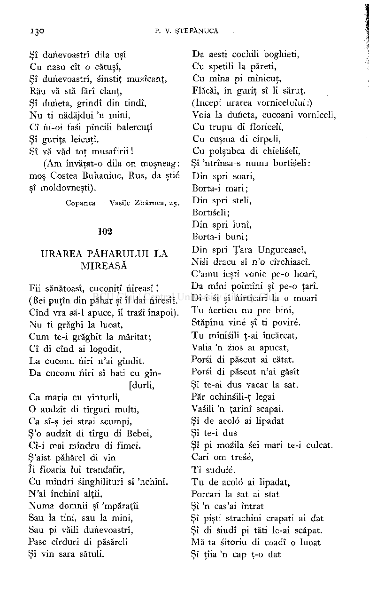

# Da aesti cochili boghieti, Cu spetili la păreţi, Cu mîna pi mînicuţ, Flăcăi, în guriţ sî li sărut. (Începi urarea vornicelului :) Voia la duiieta, cucoani vorniceli, Cu trupu di floriceli, Cu cuşma di cîrpeli, Cu polşubca di chieliseli, Şî 'ntrînsa-s numa bortiéeli: Din spri soari, Borta-i mari; Din spri steli, Bortiseli; Din spri lunî, Borta-i bunî; Din spri Ţara Ungureascî, Nisi dracu sî n'o cîrchiascî. C'amu ieşti vonic pe-o hoarî, Da mîni poimîni şî pe-o ţarî. Di-i si şî hirticari la o moarî Tu iierticu nu pre bini, Stăpînuvineşî ti poviré. Tu mînisili ţ-ai încărcat, Valia 'n zios ai apucat, Porsi di păscut ai cătat. Porsi di păscut n'ai găsît Şî te-ai dus văcar la sat. Păr ochinsili-ţ legai Vasili 'n ţarinî scăpai. Şî de acolo ai lipadat Şî te-i dus Şî pi mozila sei mari te-i culcat.

- Şî duiîevoastrî dila uşî Cu nasu cît o cătuşî, Şî duiievoastrî, sinstiţ muzicant, Rău vă stă fărî clanţ,
- Şî dujîeta, grindî din tindî, Nu ti nădăjdui 'n mini, Cî ni-oi fasi pîncili balercuţî Şî guriţa leicuţî. Sî vă văd toţ musafirii !

# (Am învăţat-o dila on moşneag: moş Costea Buhaniuc, Rus, daşî moldovneşti). ştie

Copanca — Vasile Zbârnea, 25.

# 102 URAREA PAHARULUI L A MIREASĂ

# Fii sănătoasî, cuconiţi nireasî ! (Bei puţîn din pahar şî îl dai niresîi. Cînd vra să-1apuce, îl trazi înapoi). Nu ti grăghi la luoat, Cum te-i grăghit la măritat; Cî di cînd ai logodit, La cuconu niri n'ai gîndit. Da cuconu hiri sî bati cu gîn-

# [durli,

# Ca maria cu vînturli, O audzît di tîrguri mulţi, Ca sî-ş iei strai scumpi, Ş'o audzît di tîrgu di Bebei, Cî-i mai mîndru di fimei. Ş'aist păhărel di vin Ii floaria lui trandafir, Cu mîndri singhilituri sî 'nchinî. N'al închinî alţîi, Numa domnii şî 'mpăraţîi Sau la tini, sau la mini, Sau pi văili duiîevoastrî, Pasc cîrduri di păsăreli Şî vin sara sătuli.

# Ti suduie.Cari omtrese, Tu de acolo ai lipadat, Porcari la sat ai stat Şî 'n cas'ai întrat Şî pişti străchini crăpaţi ai dat Şî di siudî pi tăti le-ai scăpat. Mă-ta sitoriu di coadî o luoat Şî ţîia 'n cap ţ-o dat

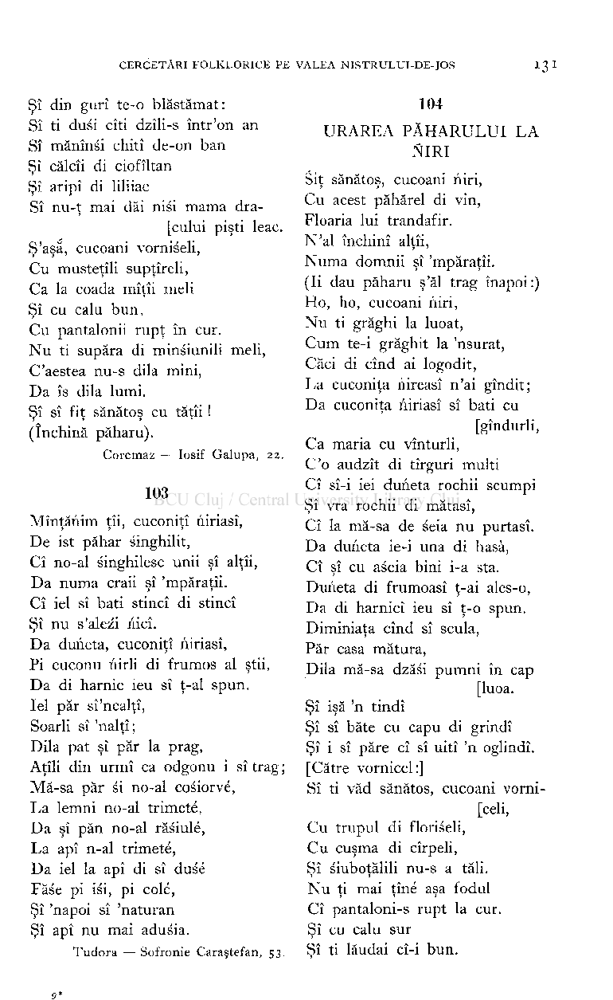

# Sî din gurî te-o blăstămat : Sîtidusi cîti dzîli-s într'on an Sî mănînsi chitî de-on ban Şîcălcîidiciofîltan Şîaripidililiiac Sî nu-ţ maidăinisi mama dra-

# 104 URAREA PAHARULUI L A NIRI Siţsănătos,cucoani hiri, Cu acest păhărel di vin, Floaria lui trandafir. N'al închini alţîi, Numa domnii şî 'mpăraţîi. (Ii dau păharu ş'ăl trag înapoi:) Ho, ho, cucoani hiri, Nu ti grăghi la luoat, Cum te-i grăghit la 'nsurat, Căci di cînd ai logodit, La cuconiţa hireasî n'ai gîndit; Da cuconiţa hiriasî sî bati cu

# [cului pişti leac. Ş'aşă, cucoani vorniseli,

# Cu musteţîli supţîreli, Ca la coada mîţîi meii Şîcu calu bun,

# Cu pantalonii rupt în cur. Nutisupăradiminsiunili meii, C'aestea nu-s dila mini, Da îs dila lumi. Şîsîfiţsănătos cutaţii ! (închină păharu).

# [gin durii,

# Ca maria cu vînturli, C'o audzît di tîrguri mulţi Cî sî-i iei duheta rochii scumpi Şî vra rochii di mătasî, Cî la mă-sa de seia nu purtasî. Da duheta ie-i una di hasà, Cî şî cu aseia bini i-a sta. Duheta di frumoasî ţ-ai ales-o, Da di harnici ieu sî ţ-o spun. Diminiaţa cînd sî scula, Păr casa mătura, Dila mă-sa dzăsi pumni în cap

Corcmaz — Iosif Galupa, 22.

# 103 Mînţănimţîi,cuconiţi hiriasî, De ist pahar singhilit, Cî no-al singhilesc uniişîalţîi, Da numa craiişî'mpăraţîi. Cî iei sî bati stincîdistincî Şînu s'alezi hicî. Da duheta, cuconiţi hiriasî, Pi cuconu hirlidifrumos alştii, Dadiharnic ieu sî ţ-al spun. Iei păr sî'ncalţî, Soarli sî 'nalţî; Dila patşîpăr la prag, Aţîli din urmî ca odgonu i sî trag ; Mă-sa păr si no-al cosiorvé, La lemni no-al trimeté, Daşîpăn no-al răsiule, La apî n-al trimeté, Da iei la apîdisi dusé Făse pi isi,picolé, Şî'napoi sî 'naturan Şîapî nu mai adusia.

# [luoa.

# Şî işă 'n tindî Şî sî băte cu capu di grindî Şî i sî păre cî sî uitî 'n oglindi. [Către vornicel:] Sî ti văd sănătos, cucoani vorni

# [celi,

# Cu trupul di floriseli, Cu cuşma di cîrpeli, Şî siuboţălili nu-s a tăli. Nu ţi maiţîneaşa fodul Cî pantaloni-s rupt la cur. Şî cu calu sur Şî ti lăudai cî-i bun.

Tudora — Sofronie Caraştefan, 53.

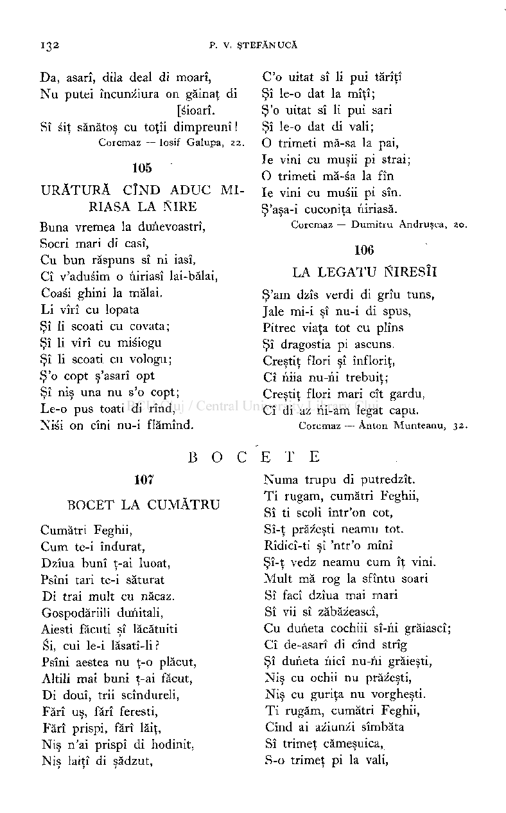

# C'o uitat sî li pui tărîţî Şî le-o dat la mîţî; Ş'o uitat sî li pui sari Şî le-o dat di vali; O trimeti mă-sa la pai, Ie vini cu muşii pi strai; O trimeti mă-sa la fîn Ie vini cu muşii pi sîn. Ş'aşa-i cuconiţa niriasă.

# Da, asarî, dila deal di moarî, Nu putei încunziura on găinaţ di

# [sioarî. Sî siţsănătoscu toţîi dimpreunî !

Corcmaz — Iosif Galupa, 22.

# 105 URÄTURÄ CÎND ADU C MIRIASA L A NIRE Buna vremea la dunevoastrî, Socri mari di casî, Cu bun răspuns sî ni iasî, Cî v'adusim o niriasî lai-bălai, Coasi ghini la mălai. Li vîrî cu lopata Şî li scoati cu covată; Şî li vîrî cu misiogu Şî li scoati cu vologu; Ş'o copt ş'asarî opt Şî niş una nu s'o copt; Le-o pus toati di rînd, Nisi on cîni nu-i flămînd.

Corcmaz — Dumitru Andruşca, 20.

# 106

# LA LEGATU NIRESÎI Ş'am dzîs verdi di grîu tuns, Jale mi-i şî nu-i di spus, Pitrec viaţa tot cu plîns Şî dragostia pi ascuns. Creştiţ flori şî înflorit, Cî fiiia nu-ni trebuit; Creştiţ flori mari cît gardu, Cî di az rîi-am legat capu.

Corcmaz — Anton Munteanu, 32 .

# ET

BO

# Numa trupu di putredzît. Ti rugam, cumătri Feghii, Sî ti scoli într'on cot, Sî-ţ prăzeşti neamu tot.

# 107

# BOCE T L A CUMÄTR U Cumătri Feghii, Cum te-i îndurat, Dzîua bunî ţ-ai luoat, Psîni tari te-i săturat Di trai mult cu năcaz. Gospodăriili dunitali, Aiesti făcuţi şî lăcătuiti Si,cui le-i lăsatî-li ? Psîni aestea nu ţ-o plăcut, Altili mai buni ţ-ai făcut, Di douî, trii scîndureli, Fărî uş, fărî fereşti, Fărî prispi, fărî lăiţ, Niş n'ai prispî di hodinit, Niş laiţî di şădzut,

- Rîdicî-ti şî 'ntr'o mînî Şî-ţ vedz neamu cum îţ vini. Mult mă rog la sfîntu soari
- Sî facî dzîua mai mari Sî vii sî zăbăzeascî, Cu duneta cochiii sî-ni grăiascî; Cî de-asarî di cînd strîg Şî durîeta nici nu-hi grăieşti, Niş cu ochii nu prăzeşti, Niş cu guriţa nu vorgheşti. Ti rugăm, cumătri Feghii, Cînd ai aziunzi sîmbăta Sî trimet cămeşuica, S-o trimet pi la vali,

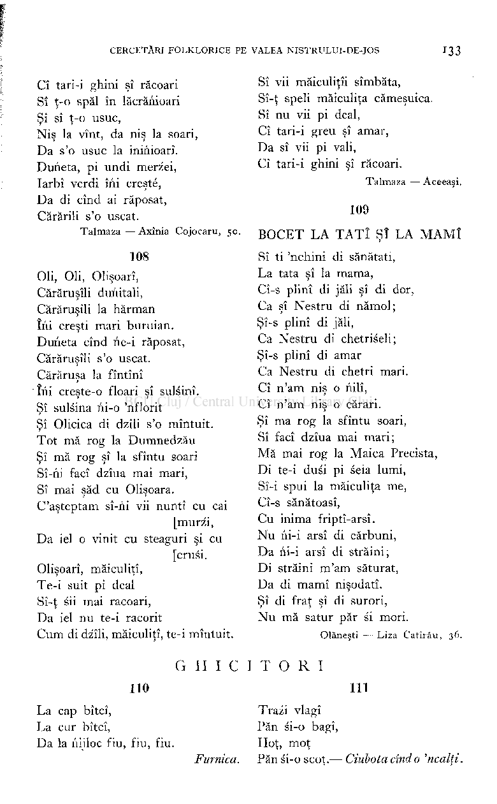

# Sî vii măiculiţîi sîmbăta, Sî-ţ speli măiculiţa cămeşuica. Sî nu vii pi deal, Cî tari-i greu şî amar, Da sî vii pi vali, Cî tari-i ghini şî răcoari.

# Cî tari-i ghini şî răcoari Sî ţ-o spăl în lăcrăhioari Şî sî ţ-o usuc, Niş la vînt, da niş la soari, Da s'o usuc la inihioarî. Duheta, pi undi merzei,

# Da di cînd ai răposat,Iarbî verdi îhicreşte, Cărăruis'o uscat.

Talmaza — Aceeaşi.

# 109

# BOCET L A TATÎ Şî L A MAMÎ Sî ti 'nchini di sănătăţi, La tata şî la mama, Cî-s plinî di jăli şî di dor, Ca şî Nestru di nămol; Şî-s plinî di jăli, Ca Nestru di chetriseli; Şî-s plinî di amar Ca Nestru di chetri mari. Cî n'am niş o hilî, Cî n'am niş o cărări. Şî ma rog la sfîntu soari, Sî facî dzîua mai mari; Mă mai rog la Maica Precista, Di te-i dusi pi seia lumi, Sî-i spui la măiculiţa me, Cî-s sănătoasî, Cu inima friptî-arsî. Nu hi-i arsî di cărbuni, Da hi-i arsî di străini; Di străini m'am săturat, Da di mamî nişodatî. Şî di fraţ şî di surori, Nu mă satur păr si mori.

Talmaza — Axînia Cojocarii, 50.

# 108

# Oii, Oii, Olişoarî, Cărăruşîli duhitali, Cărăruşîli la hărman

# îhicreşti mari buruian. Duheta cînd he-i răposat, Cărăruşîli s'o uscat. Cărăruşa la fîntînî îhicreşte-o floari şî sulsinî. Şî sulsina hi-o 'nflorit Şî Olicica di dzîli s'o mîntuit. Tot mă rog la Dumnedzău Şî mă rog şî la sfîntu soari Sî-hi facî dzîua mai mari, Sî mai şăd cu Olişoara. C'aşteptam sî-hi vii nuntî cu cai

# [murii, Da iei o vinit cu steaguri şi cu [crusi.

# Olişoarî, măiculiţî, Te-i suit pi deal Sî-ţ sii mai racoari, Da iei nu te-i răcorit Cum di dzîli, măiculiţî, te-i mîntuit.

Olăneşti — Liza Catîrău, 36.

# GHICITOR I 110

# 111

# Trazi vlagî Păn si-o bagî, Hoţ, moţ Păn si-o scoţ.—Ciubota cînd o 'ncalţi.

# La cap bîtcî, La cur bîtcî, Da la îiiiloc fiu, fiu, fiu.

Furnica.

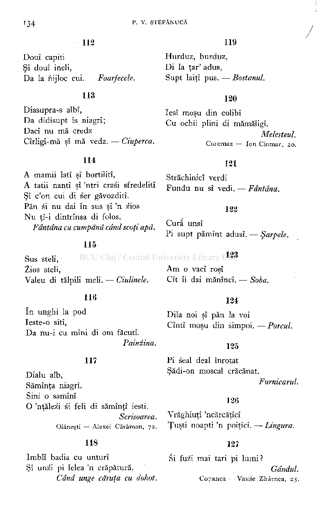

# 119

# 112

# Hurduz, burduz, Di la ţar' adus, Supt laiţî pus. —Bostanul.

# Douî capiti Şî douî ineli,

# Da la nijloc cui. 113

# 120 Iesî moşu din colibî Cu ochii plini di mămăligi.

# Diasupra-s albî, Da didisupt îs niagrî; Dacî nu mă credz Cîrligî-mă şî mă vedz. —Ciuperca.

Melesteul.

Coicmaz — Ion Ciomac, 20.

# 121

# 114 A mamii latî şî bortilitî, A tatii nantî şî 'ntri crasi sfredeliţi Şî c'on cui di ser găvozditî. Păn si nu dai în sus şî 'n zios Nu ţî-i dintrînsa di folos.

Străchinicî verdi Fundu nu sî vedi. —

# 122

Fântâna cu cumpănă când scoţi apă.

# Cură unsî Pi supt pămînt adusî. —

# 115

# Sus steli, Zios steli,

# 123

# Valeu di tălpili meii. —Ciulinele. 116

# înunghi la pod Ieste-o sîtî, Da nu-i cu mini di om făcutî.

Cît îi dai mănîncî. —Soba.

# 124

Painzina.

# Dila noi şî păn la voi Cîntî moşu din simpoi. —Porcul.

# 117

# Dialu alb, Sămînţa niagrî. Sinio samînî O 'nţălezi si feli di sămînţî ieşti.

# 125 Pi seal deal înrotat Şădi-on moscal crăcănat.

Scrisoarea.

Furnicarul.

Olăneşti — Alexei Cărăman, 72.

# 118

# 126 Vrăghiuţî 'ncărcăţîcî Ţuşti noapti 'n poiţîcî. —Lingura.

# Imblî badia cu unturî Şî unzi pi lelea 'n crăpătură.

Când unge căruţa cu dohot.

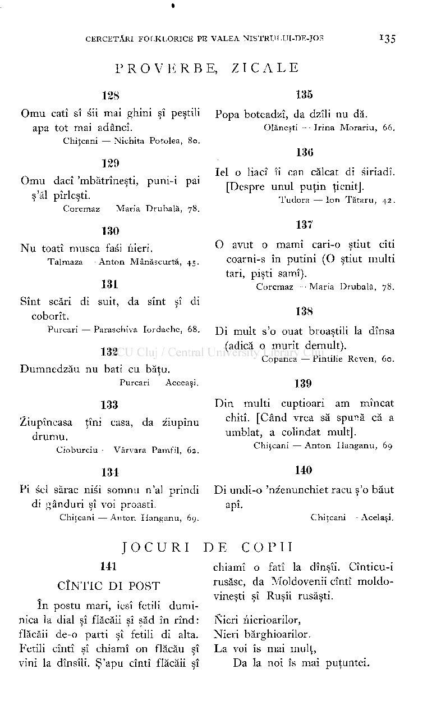

# PROVERBE , ZICAL E 128 135

# Omu catî sî sii mai ghini şî peştili p pa boteadzî, da dzîli nu dă. apa tot mai adânci.

Olăneşti — Irina Morariu, 66.

# 136 Iei o liacî îi can călcat di siriadî.

# 129 Omu daci 'mbătrîneşti, puni-i pai

# [Despre unul puţin ţicnit].

# ş'ăl pîrleşti.

Tudora — Ion Tătaru, 42.

# 137

Corcmaz — Maria Drubală, 78.

# 130 Nu toatî musca fasi nieri.

# O avut o mamî cari-o ştiut citi coarni-s în putini (O ştiut mulţi tari, pişti samî).

Talmaza —Anto

Corcmaz — Maria Drubală, 78.

# 131 Sînt scări di suit, da sînt şî di

# 138 T)i

# coborît.

# ult s'o Ouat broaştili la dînsa (adică o murit demult).

m

# 132

Dumnedzău nu bati cu băţu.

Copanca — Pintilie Reven, 60.

# 139 Din mulţi cuptioari am mîncat chitî. [Când vrea să spună că a umblat, a colindat mult].

# 133

# Ziupîneasa ţîni casa, da ziupînu drumu.

Chiţcani — Anton Hanganu, 69

Cioburciu — Vârvara Pamfil, 62.

# 140 Pi sel sărac nisi somnu n'al prindi Di undi-o 'nzenunchiet racu ş'o băut di gânduri şî voi proastî. apî.

# 134

Chiţcani — Anton Hanganu, 69. Chiţcani — Acelaşi.

# JOCUR I D E COPI I

# 141 chiamî o fatî la dînşîi. Cînticu-i CÎNTIC DI POST rusăsc, da Moldovenii cîntî moldo-

# vineşti şî Ruşîi rusăşti.

# In postu mari, iesî fetili duminica la dial şî flăcăii şî săd în rînd: Nieri nierioarilor, flăcăii de-o parti şî fetili di alta. Nieri bărghioarilor. Fetili cîntî şî chiamî on flăcău şî La voi îs mai mulţ, vini la dînsîli. Ş'apu cîntî flăcăii şî Da la noi îs mai puţuntei.

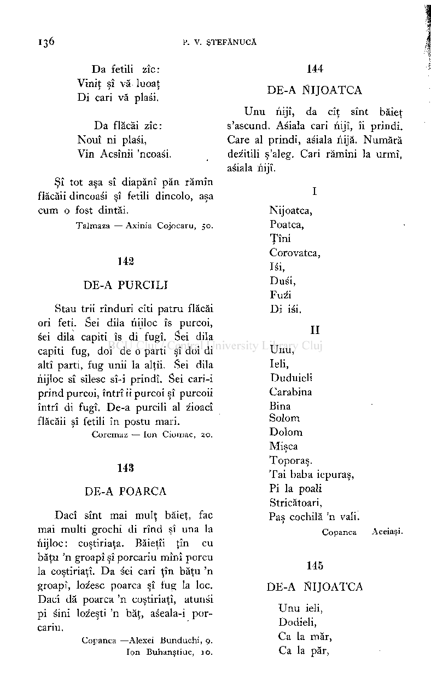

# Da fetili zîc: Viniţ şî vă luoaţ Di cari vă plasi.

# DE-A NIJOATCA

# Unu iîijî, da cîţ sînt băiet s'ascund. Asiala cari riijî, îi prindi. Care al prindi, asiala nijă. Numără dezitili ş'aleg. Cari rămîni la urmî, asiala nijî.

# Da flăcăi zîc: Nouî ni plasi, Vin Acsînii 'ncoasi.

# Şî tot aşa sî diapănî păn rămîn flăcăii dincoasi şî fetili dincolo, aşa cum o fost dintăi.

# I

# Nijoatca, Poatca, Ţîni Corovatca, Isi, Dusi, Fuzi Di isi.

Talmaza — Axinia Cojocarii, 50.

# 142 DE-A PURCILI

# Stau trii rînduri cîti patru flăcăi ori feti.Seidila nijloc îs purcoi, sei dila capiti îs di fugi.Seidila capiti fug, doi de o parti şî doi di altî parti, fug unii la alţîi.Seidila nijloc sî silesc sî-i prindî.Seicari-i prind purcoi, întrî ii purcoi şî purcoii întrî di fugî. De-a purcili al zioacî flăcăii şî fetili în postu mari.

# II

# Unu, leii, Duduieli Carabina Bina Solom Dolom Mişca Toporaş. Tai baba iepuraş, Pi la poali Stricătoari, Pas cochilă 'n vali.

Corcmaz — Ion Ciomac, 20.

# 143 DE-A POARCA

# Dacî sînt mai mulţ băiet, fac mai mulţi grochi di rînd şî una la nijloc: coştiriaţa. Băieţii ţîn cu bătu 'n groapî şî porcariu mînî porcu la coştiriaţî. Da sei cari ţîn bătu 'n groapî, lozesc poarca şî fug la loc. Dacî dă poarca 'n coştiriaţî, atunsi pi sini lozeşti 'n băţ, aseala-i porcariu.

Copanca — Aceiaşi.

# 145

# DE-A NIJOATCA Unu ieli, Dodieli, Ca la măr, Ca la păr,

Copanca —Alexei Bunduchi, 9. Ion Buhanştiuc, 10 .

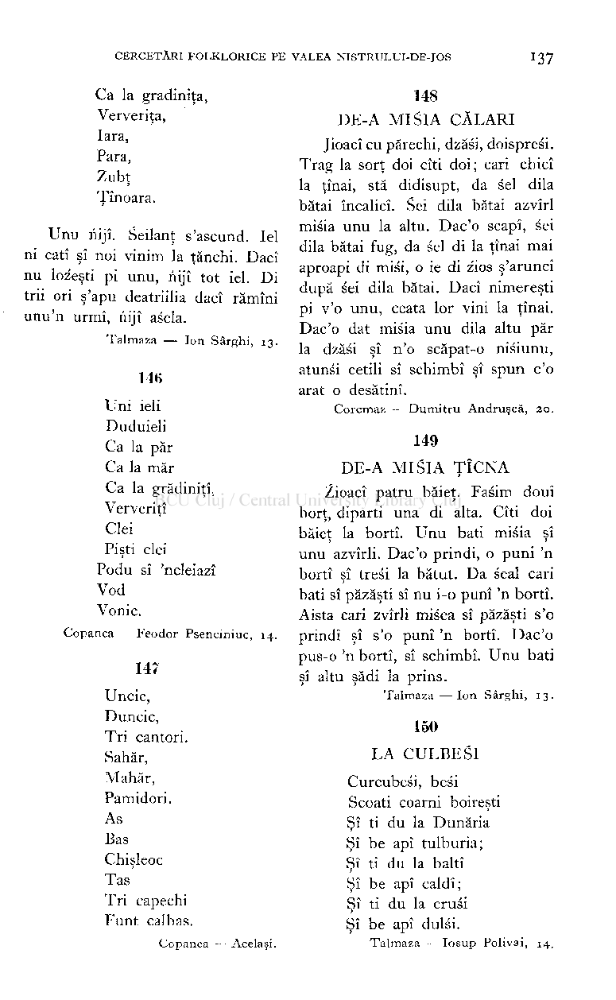

# Ca la grădiniţa, Ververiţa, Iara, Para, Zubţ Ţînoara.

# 148 DE-A MISIA CĂLĂRI

# Jioacî cu părechi, dzăsi, doispresi. Trag la sorţ doi cîti doi; cari chicî la ţînai, stă didisupt, da sel dila bătăi încalicî. Sei dila bătăi azvîrl misia unu la altu. Dac'o scapî, sei dila bătăi fug, da sel di la ţînai mai aproapi di misi, o ie di zios ş'aruncî după sei dila bătăi. Dacî nimereşti pi v'o unu, ceata lor vini la ţînai. Dac'o dat misia unu dila altu păr la dzăsi şî n'o scăpat-o nisiunu, atunsi cetili sî schimbi şî spun c'o arat o desătinî.

# Unu riijî. Seilanţ s'ascund. Iei ni catî şî noi vinim la ţănchi. Dacî nu lozeşti pi unu, riijî tot iei. Di trii ori ş'apu deatriilia dacî rămîni unu'n urmî, riijî asela.

Talmaza — Ion Sârghi, 13 .

# 14«

# Uni ieli Duduieli Ca la păr Ca la măr Ca la grădiniţî. Ververiţî Clei Pişti clei

Corcmaz — Dumitru Andruşcă, 20.

# 149 DE-A MISIA ŢÎCNA

# Zioacî patru băiet. Fasim douî borţ, diparti una di alta. Cîti doi băiet la bortî. Unu bati misia şî unu azvîrli. Dac'o prindi, o puni 'n bortî şî tresi la bătut. Da seal cari bati sî păzăşti sî nu i-o punî 'n bortî. Aista cari zvîrli misea sî păzăşti s'o prindi şî s'o punî 'n bortî. Dac'o pus-o 'n bortî, sî schimbi. Unu bati şî altu sădi la prins.

# Podu sî 'ncleiazî Vod Vonic.

Co panca — Feodor Psenciniuc, 14.

# 147

# Uncie, Duncic, Tri cantori. Sahăr, Mahăr, Pamidori. As Bas Chişleoc Tas Tri capechi Funt calbas.

Talmaza —Io n Sârghi, 13 .

# 150

# LA CULBESI Curcubesi, besi Scoati coarni boireşti Şî ti du la Dunăria Şî be apî tulburia; Şî ti du la baltî Şî be apî caldî; Şî ti du la crusi Şî be apî dulsi.

Copanca — Acelaşi.

Talmaza — Iosup Polivai, 14 .

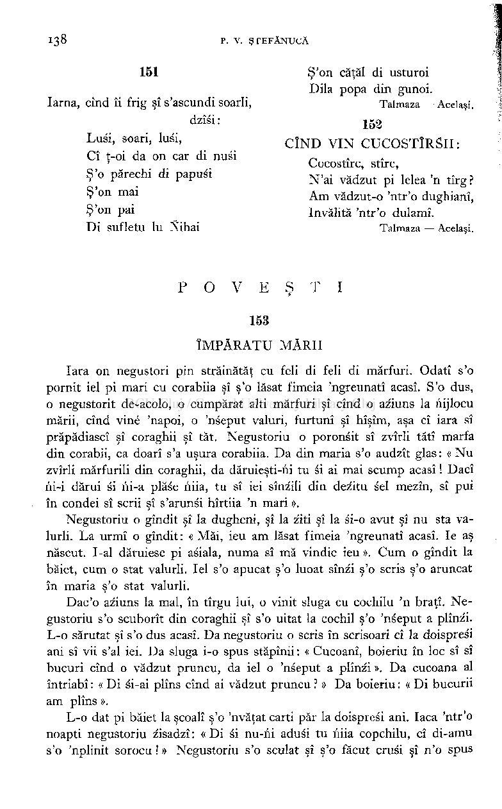

# Ş'on căţăl di usturoi Dila popa din gunoi.

# Iarna, cînd îi frig şî s'ascundi soarli,

# Lusi, soari, lusi, dzîsi : Cî ţ-oi da on car di nusi Ş'o părechi di papusi Ş'on mai Ş'on pai Di sufletu lu Nihai

# CÎND VI N CUCOSTÎRSlI: Cocostîrc, stîrc, N'ai vădzut pi lelea 'n tîrg? Am vădzut-o 'ntr'o dughianî, Invălită 'ntr'o dulamî.

Talmaza — Acelaşi.

# P O V E Ş T I 153 ÎMPĂRATU MĂRII

# Iara on negustori pin străinătăţ cu feli di feli di mărfuri. Odatî s'o pornit iei pi mari cu corabiia şî ş'o lăsat fimeia 'ngreunatî acasî. S'o dus, o negustorit de-acolo, o cumpărat alti mărfuri şî cînd o aziuns la nijlocu

# mării, cînd vine 'napoi, o 'nseput valuri, furtuni şî hîşîm, aşa cî iara sîprăpădiascî şî coraghii şî tăt. Negustoriu o poronsit sî zvîrli tătî marfadin corăbii, ca doarî s'a uşura corabiia. Da din maria s'o audzît glas: « Nuzvîrli mărfurili din coraghii, da dăruieşti-ni tu si ai mai scump acasî ! Dacîni-i dărui si ni-a plase niia, tu sî iei sînzili din dezitu sel mezîn, sî puiîn condei sî scrii şî s'arunsi hîrtiia 'n mari ».

Negustoriu o gîndit şî la dugheni, şî la ziti şî la si-o avut şî nu sta valurli. La urmî o gîndit: «Măi, ieu am lăsat fimeia 'ngreunatî acasî. Ie aş

# născut. I-al dăruiesc pi asiala, numa sî mă vindic ieu ». Cum o gîndit labăiet, cum o stat valurli. Iei s'o apucat ş'o luoat sînzi ş'o scris ş'o aruncatîn maria ş'o stat valurli.

# Dac'o aziuns la mal, în tîrgu lui, o vinit sluga cu cochilu 'n braţî. Negustoriu s'o scuborît din coraghii şî s'o uitat la cochil ş'o 'nseput a plînzi. L-o sărutat şî s'o dus acasî. Da negustoriu o scris în scrisoari cî la doispresi ani sî vii s'al iei. Da sluga i-o spus stăpînii : « Cucoanî, boieriu în loc sî sî bucuri cînd o vădzut pruncu, da iei o 'nseput a plînzi ». Da cucoana al întriabî : « Di si-ai plîns cînd ai vădzut pruncu ? » Da boieriu : « Di bucurii am plîns ».

# L-o dat pi băiet la şcoalî ş'o 'nvăţat cârti păr la doispresi ani. Iaca 'ntr'o noapti negustoriu zisadzî: «Di si nu-ni aduşi tu niia copchilu, cî di-amu s'o 'nplinit sorocu ! » Negustoriu s'o sculat şî ş'o făcut crusi şî n'o spus

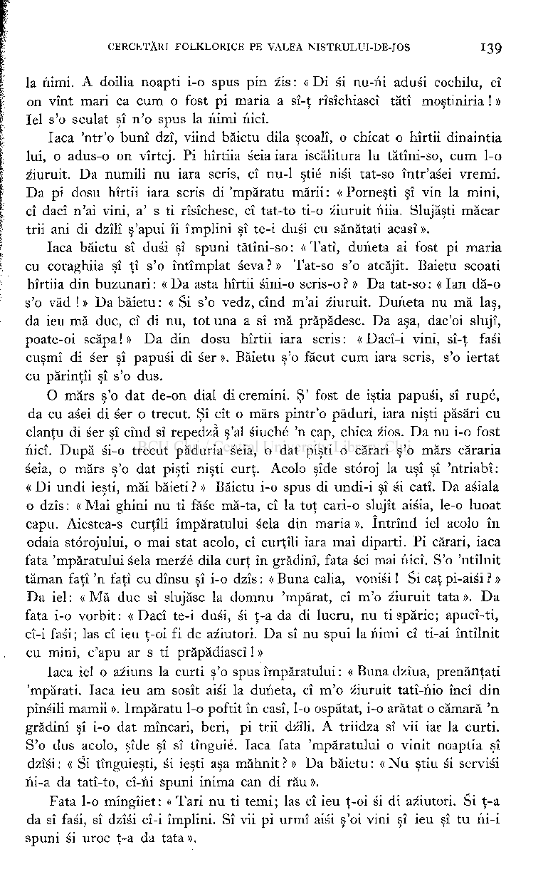

# la nimi. A doilia noapti i-o spus pin zis : « Di si nu-iîi aduşi cochilu, cî on vînt mari ca cum o fost pi maria a sî-ţ rîsîchiascî tătî moştiniria ! » Iei s'o sculat şî n'o spus la nimi nicî.

# Iaca 'ntr'o bunî dzî, viind băietu dila şcoalî, o chicat o hîrtii dinaintia lui, o adus-o on vîrtej. Pi hîrtiia seia iara iscălitura lu tătîni-so, cum l-o ziuruit. Da numili nu iara scris, cî nu-1 ştie nisi tat-so într'asei vremi. Da pi dosu hîrtii iara scris di 'mpăratu mării : « Porneşti şî vin la mini, cî dacî n'ai vini, a' s ti rîsîchesc, cî tat-to ti-o ziuruit riiia. Slujăşti măcar trii ani di dzîlî ş'apui îi împlini şî te-i dusi cu sănătăţi acasî ».

# Iaca băietu sî dusi şî spuni tătîni-so : « Tatî, duneta ai fost pi maria cu coraghiia şî ţî s'o întîmplat seva?» Tat-so s'o atcăjît. Băietu scoati hîrtiia din buzunari : « Da asta hîrtii sini-o scris-o ? » Da tat-so : « Ian dă-o s'o văd ! » Da băietu: «Sis'o vedz, cînd m'ai ziuruit. Duneta nu mă laş, da ieu mă duc, cî di nu, tot una a sî mă prăpădesc. Da aşa, dac'oi slujî, poate-oi scăpa ! » Da din dosu hîrtii iara scris : « Dacî-i vini, sî-ţ fasi cuşmî di ser şî papusi di ser ». Băietu ş'o făcut cum iara scris, s'o iertat cu părinţii şî s'o dus.

# O mărs ş'o dat de-on dial di cremini. Ş' fost de iştia papusi, sî rupé, da cu asei di ser o trecut. Şî cît o mărs pintr'o păduri, iara nişti păsări cu clanţu di ser şî cînd sî repedză ş'al siuché 'n cap, chica zios. Da nu i-o fost nicî. După si-o trecut păduria seia, o dat pişti o cărări ş'o mărs căraria seia, o mărs ş'o dat pişti nişti curţ. Acolo şîde störoj la uşî şî 'ntriabî: « Di undi ieşti, măi băieţi ? » Băietu i-o spus di undi-i şî si catî. Da asiala

- o dzîs : « Mai ghini nu ti făse mă-ta, cî la toţ cari-o slujît aisia, le-o luoat capu. Aiestea-s curţîli împăratului seia din maria ». Intrînd iei acolo în
- odaia störojului, o mai stat acolo, cî curţîli iara mai diparti. Pi cărări, iaca fata 'mpăratului seia merzé dila curţ în grădini, fata sei mai nicî. S'o 'ntîlnit taman faţî 'n faţî cu dînsu şî i-o dzîs : « Buna calia, vonisi !Sicaţ pi-aisi ? » Da iei : « Mă duc sî slujăsc la domnu 'mpărat, cî m'o ziuruit tata ». Da fata i-o vorbit: «Dacî te-i dusi, si ţ-a da di lucru, nu tispărie; apucî-ti, cî-i fasi; las cî ieu ţ-oi fi de aziutori. Da sî nu spui la nimi cî ti-ai întîlnit cu mini, c'apu ar s ti prăpădiascî ! »

# Iaca iei o aziuns la curţi ş'o spus împăratului : « Buna dzîua, prenănţati 'mpărati. Iaca ieu am sosît aisi la duneta, cî m'o ziuruit tatî-nio încî din pînsili mamii ». Impăratu l-o poftit în casî, l-o ospătat, i-o arătat o cămară 'n grădini şî i-o dat mîncari, beri, pi trii dzîli. A triidza sî vii iar la curţi. S'o dus acolo, şîde şî sî tînguié. Iaca fata 'mpăratului o vinit noaptia şî dzîsi : « Si tînguieşti, si ieşti aşa măhnit ? » Da băietu : « Nu ştiu si servişi ni-a da tatî-to, cî-ni spuni inima can di rău ».

# Fata l-o mîngîiet: « Tari nu ti temi; las cî ieu ţ-oi si di aziutori.Siţ-a da sî fasi, sî dzîsi cî-i împlini. Sî vii pi urmî aisi ş'oi vini şî ieu şî tu ni-i spuni si uroc ţ-a da tata ».

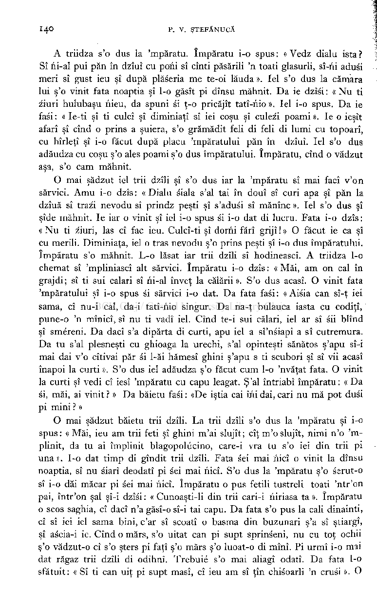

# A triidza s'o dus la 'mpăratu. împăratui-o spus : « Vedz dialu ista ? Siiii-alpui păn în dzîuî cu poni sî cînti păsărili 'n toati glasurli, sî-ni aduşi meri sî gust ieu şî după plăseria me te-oi lăuda ». Iei s'o dus la cămara lui ş'o vinit fata noaptia şî l-o găsît pi dînsu măhnit. Da ie dzîsi : « Nu ti ziuri hulubaşu nieu, da spuni si ţ-o pricăjit tatî-nio ». Ieii-o spus. Da ie fasi : « Ie-ti şî ti culcî şî diminiaţî sî iei coşu şî culezi poami ». Ie o ieşît afarî şî cînd o prins a şuiera, s'o grămădit feli di feli di lumi cu topoarî, cu hîrleţî şîi-o făcut după plăcu 'mpăratului păn în dzîuî. Iei s'o dus adăudza cu coşu ş'o ales poami ş'o dus împăratului. împăratu, cînd o vădzut aşa, s'o cam măhnit.

# O mai şădzut iei trii dzîli şî s'o dus iar la 'mpăratu sî mai facî v'on sărvici. Amui-o dzîs : « Dialu siala s'al tai în douî sî curi apa şî păn la dzîuă sî trazi nevodu sî prindz peşti şî s'adusi sî mănînc ». Iei s'o dus şî şîde măhnit. Ie iar o vinit şî ieii-o spus sii-o dat di lucru. Fatai-o dzîs: « Nu ti ziuri, las cî fac ieu. Culcî-ti şî dorni fărî grijî ! » O făcut ie ca şî cu merili. Diminiaţa, iei o tras nevodu ş'o prins peşti şîi-o dus împăratului, împăratu s'o măhnit. L-o lăsat iar trii dzîli sî hodineascî. A triidza l-o chemat sî 'mpliniascî alt sărvici. împăratui-o dzîs : « Măi, am on cal în grajdi; sî ti sui calări sî ni-al înveţ la călării ». S'o dus acasî. O vinit fata 'mpăratului şîi-o spus si sărvicii-o dat. Da fata fasi : « Aisia can sî-ţ iei sama, cî nu-ical, da-itatî-nio singur. Da na-ţ bulauca iasta cu codiţi, pune-o 'n mînicî, sî nu ti vadî iei. Cînd te-isui călări, iei ar sî sii blînd şî sméreni. Da dacî s'a dipărta di curţi, apu iei a sî'nsiapî a sî cutremura. Da tu s'al plesneşti cu ghioaga la urechi, s'al opinteşti sănătos ş'apu sî-i mai dai v'o cîtivai păr si1-ăi hămesi ghini ş'apu s ti scubori şî sî vii acasî înapoi la curţi ». S'o dus iei adăudza ş'o făcut cum l-o 'nvăţat fata. O vinit la curţi şî vedi cî iesî 'mpăratu cu capu leagat. Ş'al întriabî împăratu: « Da si, măi, ai vinit ? » Da băietu fasi : «De iştia cai îni dai, cari nu mă pot duşi pi mini ? »

# O mai şădzut băietu trii dzîli. La trii dzîli s'o dus la 'mpăratu şîi-o spus: « Măi, ieu am trii feti şî ghini m'ai slujit; cîţ m'oslujit, nimi n'o 'mplinit, da tu ai împlinit blagopolücino,care-ivra tu s'o iei din trii pi una>:. I-o dat timp di gîndit trii dzîli. Fata sei mai îîicî o vinit la dînsu noaptia, sî nu siarî deodatî pi sei mai hicî. S'o dus la 'mpăratu ş'o serut-o sîi-o dăi măcar pi sei mai nicî. împăratu o pus fetili tustreli toati 'ntr'on pai, într'on şalşî-idzîsi : « Cunoaşti-li din triicari-irîiriasa ta ». împăratu o scos saghia, cî dacî n'a găsî-o sî-itai capu. Da fata s'o pus la caii dinainti, cî sî iei iei sama bini, c'ar sî scoatî o basma din buzunari ş'a sî ştiargî, şîaseia-iie. Cînd o mărs, s'o uitat can pi supt sprinseni, nu cu toţ ochii ş'o vădzut-o cî s'o şters pi faţî ş'o mărs ş'o luoat-o di mînî. Pi urmii-o mai dat răgaz trii dzîli di odihni.Trebuies'o mai aliagî odatî. Da fata l-o sfătuit: « Sî ti can uiţ pi supt masî, cî ieu am sî ţîn chisoarli 'n crusi ». O

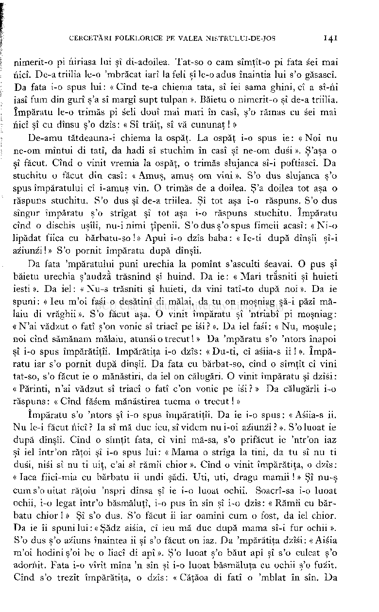

# nimerit-o pi niriasa lui şî di-adoilea. Tat-so o cam sîmţît-o pi fata sei mai nicî. De-a triilia le-o 'mbrăcat iarî la feli şî le-o adus înaintia lui s'o găsascî.

# iasî fum din gurî ş'a sî margî supt tulpan ». Băietu o nimerit-o şî de-a triilia.Da fatai-ospus lui : « Cînd te-a chiema tata, sî iei sama ghini, cî asî-rii împăratu le-o trimăs pi seli douî mai mari în casî, ş'o rămas cu sei mai nicî şî cu dînsu ş'o dzîs: « Sî trăit, sî vă cununat ! »

# De-amu tătdeauna-ichiema la ospăţ. La ospăţi-o spus ie : « Noi nu ne-om mîntui di tatî, da hadi sî stuchim în casî şî ne-om dusi ». Ş'aşa o şî făcut. Cînd o vinit vremia la ospăţ, o trimăs slujanca sî-ipoftiascî. Da stuchitu o făcut din casî: « Amuş, amuş om vini». S'o dus slujanca ş'o spus împăratului cîi-amuş vin.Otrimăs de a doilea. Ş'a doilea tot aşa o răspuns stuchitu. S'o dus şî de-a triilea. Şî tot aşai-o răspuns. S'o dus singur împăratu ş'o strigat şî tot aşai-o răspuns stuchitu. împăratu cînd o dischis uşîli, nu-inimi ţipenii. S'o dus ş'o spus fimeii acasî: « Ni-o lipădat fiica cu bărbatu-so ! » Apuii-o dzîs baba : « Ie-ti după dînşîi şî-i aziunzi!» S'o pornit împăratu după dînşîi.

# Da fata 'mpăratului puni urechia la pomînt s'asculţi seavai.Opus şî băietu urechia ş'audză trăsnind şî huind. Da ie: « Mari trăsniţi şî huieti ieşti ». Da iei : « Nu-s trăsniţi şî huieti, da vini tatî-to după noi ». Da ie spuni : « leu m'oi fasi o desătinî di mălai, da tu on moşniag şă-ipăzî mălaiu di vrăghii ». S'o făcut aşa.Ovinit împăratu şî 'ntriabî pi moşniag: « N'ai vădzut o fatî ş'on vonic sî triacî pe isi? ». Da iei fasi: « Nu, moşule; noi cînd sămănam mălaiu, atunsi o trecut ! » Da 'mpăratu s'o 'ntors înapoi şîi-o spus împărătiţîi. Impărătiţai-o dzîs: « Du-ti, cî asiia-sii!».împăratu iar s'o pornit după dînşîi. Da fata cu bărbat-so, cînd o sîmţît cî vini tat-so, s'o făcut ie o mănăstiri, da iei on călugări.Ovinit împăratu şî dzîsi: « Părinţi, n'ai vădzut sî triacî o fatî c'on vonic pe isi ? » Da călugăriii-o răspuns : « Cînd făsem mănăstirea tucma o trecut ! »

# împăratu s'o 'ntors şîi-o spus împărătiţîi. Da iei-o spus: «Asiia-sii. Nu le-ifăcut nicî ? Ia sî mă duc ieu, sî videm nui-oi aziunzi ? ». S'o luoat ie după dînşîi. Cînd o sîmţît fata, cî vini mă-sa, s'o prifăcut ie 'ntr'on iaz şî iei într'on răţoi şîi-o spus lui : « Mama o striga la tini, da tu sî nu ti dusi, nisi sî nu ti uiţ, c'ai sî rămîi chior ». Cînd o vinit împărătiţa, o dzîs : « Iaca fiicî-mia cu bărbatuiiundisădi.Uti, uti, dragu mamii ! » Şî nu-ş cum s'o uitat răţoiu 'nspri dînsa şî iei-o luoat ochii. Soacrî-sai-o luoat ochii,i-o legat într'o băsmăluţî, i-o pus în sîn şîi-o dzîs: « Rămîi cu bărbatu chior ! » Şî s'o dus. S'o făcutiiiar oamini cum o fost, da iei chior. Da ie îi spuni lui : « Şădz aisia, cî ieu mă duc după mama sî-ifur ochii ». S'o dus ş'o aziuns înainteaiişî s'o făcut on iaz. Da 'mpărătiţa dzîsi: « Aisia m'oi hodini ş'oi be o liacî di apî ». Ş'o luoat ş'o băut apî şî s'o culcat ş'o adornit. Fatai-o vîrît mîna 'n sîn şîi-o luoat băsmăluţa cu ochii ş'o fuzit. Cînd s'o trezit împărătiţa, o dzîs: « Căţăoa di fatî o 'mblat în sîn. Da

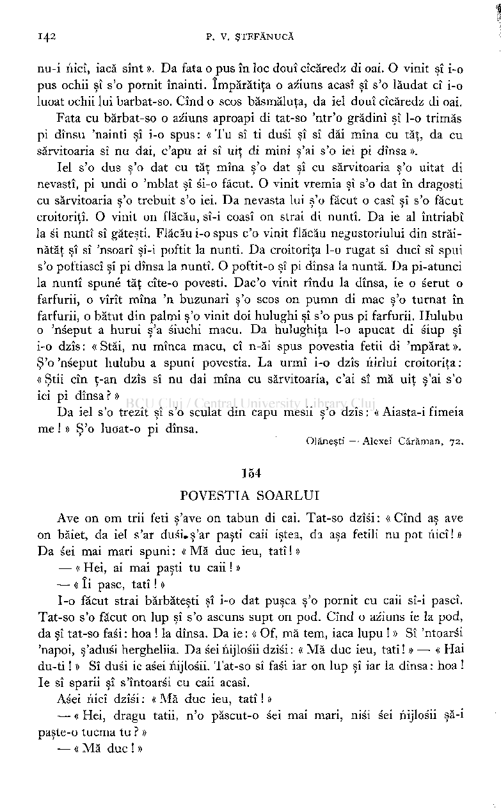

# nu-i nicî, iacă sînt ». Da fata o pus în loc douî cîcăredz di oai. O vinit şî i-o pus ochii şî s'o pornit înainti. împărătiţa o aziuns acasî şî s'o lăudat cî i-o luoat ochii lui barbat-so. Cînd o scos băsmăluţa, da iei douî cîcăredz di oai.

# Fata cu bărbat-so o aziuns aproapi di tat-so 'ntr'o grădini şî l-o trimăs pi dînsu 'nainti şî i-o spus : « Tu sî ti dusi şî sî dăi mina cu tăţ, da cu nevastî, pi undi o 'mblat şî si-o făcut. O vinit vremia şî s'o dat în dragosti cu sărvitoaria ş'o trebuit s'o iei. Da nevasta lui ş'o făcut o casî şî s'o făcut croitoriţî. O vinit on flăcău, sî-i coasî on strai di nunti. Da ie al întriabî la si nuntî sî găteşti. Flăcău i-o spus c'o vinit flăcău negustoriului din străinătăţ şî sî 'nsoarî şî-i poftit la nuntî. Da croitoriţa l-o rugat si ducî sî spui s'o poftiascî şî pi dînsa la nuntî. O poftit-o şî pi dînsa la nuntă. Da pi-atunci la nuntî spune tăţ cîte-o povesti. Dac'o vinit rîndu la dînsa, ie o serut o farfurii, o vîrît mîna 'n buzunari ş'o scos on pumn di mac ş'o turnat în farfurii, o bătut din palmi ş'o vinit doi hulughi şî s'o pus pi farfurii. Hulubu o 'nseput a hurui ş'a siuchi macu. Da hulughiţa l-o apucat di siup şî i-o dzîs : « Stăi, nu mînca macu, cî n-ăi spus povestia fetii di 'mpărat ». Ş'o'nseput hulubu a spuni povestia. La urmî i-o dzîs nirlui croitoriţa: « Ştii cin ţ-an dzîs sî nu dai mîna cu sărvitoaria, c'ai sî mă uiţ ş'ai s'o iei pi dînsa ? »

# sărvitoaria sî nu dai, c'apu ai sî uiţ di mini ş'ai s'o iei pi dînsa ».Iei s'o dus ş'o dat cu tăţ mîna ş'o dat şî cu sărvitoaria ş'o uitat di

# Da iei s'o trezit şî s'o sculat din capu mesii ş'o dzîs : « Aiasta-i fimeia me !» Ş'o luoat-o pi dînsa.

Olăneşti — Alexei Cărăman, 72.

# 154 POVESTIA SOARLUI

# Ave on om trii feti ş'ave on tabun di cai. Tat-so dzîsi : « Cînd aş ave on băiet, da iei s'ar dusi.ş'ar paşti caii iştea, da aşa fetili nu pot nicî!» Da sei mai mari spuni : « Mă duc ieu, tatî ! »

# — « Hei, ai mai paşti tu caii ! »

# — « îi pasc, tatî ! » I-o făcut strai bărbăteşti şî i-o dat puşca ş'o pornit cu caii sî-i pascî.

# Tat-so s'o făcut on lup şî s'o ascuns supt on pod. Cînd o aziuns ie la pod, da şî tat-so fasi : hoa ! la dînsa. Da ie : « Of, mă tem, iaca lupu ! » Sî 'ntoarsi 'napoi, ş'adusi hergheliia. Da sei nijlosii dzîsi : « Mă duc ieu, tatî !» —• « Hai du-ti ! » Sî dusi ie asei nijlosii. Tat-so sî fasi iar on lup şî iar la dînsa: hoa ! Ie sî sparii şî s'întoarsi cu caii acasî.

# Asei nici dzîsi : « Mă duc ieu, tatî ! »

# — « Hei, dragu tatii, n'o păscut-o sei mai mari, nisi sei nijlosii şă-i paşte-o tucma tu ? »

# — « Mă duc ! »

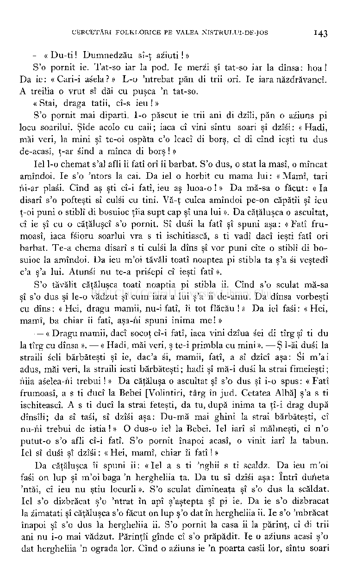

# — « Du-ti ! Dumnedzău sî-ţ aziuti ! » S'o pornit ie. Tat-so iar la pod. Ie merzi şî tat-so iar la dînsa: hoa !

# Da ie : « Cari-i aseia ? » L-o 'ntrebat păn di trii ori. Ie iara năzdrăvanei. A treilia o vrut sî dăi cu puşca 'n tat-so.

# « Stai, draga tatii, cî-s ieu ! » S'o pornit mai diparti. I-o păscut ie trii ani di dzîli, păn o aziuns pi locu soarilui. Şîde acolo cu caii; iaca cî vini sîntu soari şî dzîsi: « Hadi, măi veri, la mini şî te-oi ospăta c'o leacî di borş, cî di cînd ieşti tu dus de-acasî, ţ-ar sind a mînca di borş ! »

# Iei l-o chemat s'al afli îi fatî orî îi bărbat. S'o dus, o stat la masî, o mîncat amîndoi. Ie s'o 'ntors la cai. Da iei o horbit cu mama lui : « Mamî, tari hi-ar plasi. Cînd aş şti cî-i fatî, ieu aş luoa-o ! » Da mă-sa o făcut: «Ia disarî s'o pofteşti sî culsi cu tini. Vă-ţ culca amîndoi pe-on căpătîi şî ieu ţ-oi puni o stiblî di bosuioc ţîia supt cap şî una lui ». Da căţăluşca o ascultat, cî ie şî cu o căţăluşcî s'o pornit. Sî dusi la fatî şî spuni aşa: «Fatî frumoasî, iaca fsioru soarlui vra s ti ischitiască, s ti vadî dacî ieşti fatî ori

# bărbat. Te-a chema disarî s ti culsi la dins şî vor puni cite o stiblî di bo­suioc la amîndoi. Da ieu m'oi tăvăli toatî noaptea pi stibla ta ş'a si veştedîc'a ş'a lui. Atunsi nu te-a prisepi cî ieşti fatî ».

# S'o tăvălit căţăluşca toatî noaptia pi stibla ii. Cînd s'o sculat mă-sa şî s'o dus şî le-o vădzut şî cum iara a lui ş'a ii de-amu. Da dînsa vorbeşti cu dîns: «Hei, dragu mamii, nu-i fatî, îi tot flăcău!» Da iei fasi: «Hei, mamî, ba chiar îi fatî, aşa-hi spuni inima me! »

# — « Dragu mamii, dacî socoţ cî-i fatî, iaca vini dzîua sei di tîrg şî ti du la tîrg cu dînsa ». — « Hadi, măi veri, ş te-i primbla cu mini ». — Ş 1-ăi dusi la straili seli bărbăteşti şî ie, dac'a si, mamii, fatî, a sî dzîcî aşa: Si m'ai adus, măi veri, la straili ieşti bărbăteşti; hadi şî mă-i dusi la strai fimeieşti; hiia aselea-hi trebui ! » Da căţăluşa o ascultat şî s'o dus şî i-o spus: « Fatî frumoasî, a s ti duci la Bebei [Volintiri, târg în jud. Cetatea Albă] ş'a s ti ischiteascî. A s ti ducî la strai feteşti, da tu, după inima ta ţî-i drag după dînsîli; da sî tasi, sî dzîsi aşa: Du-mă mai ghini la strai bărbăteşti, cî nu-hi trebui de istia ! » O dus-o iei la Bebei. Iei iarî sî mâhneşti, cî n'o putut-o s'o afli cî-i fatî. S'o pornit înapoi acasî, o vinit iarî la tabun. Iei sî dusi şî dzîsi : « Hei, mamî, chiar îi fatî ! »

# Da căţăluşca îi spuni ii : « Iei a s ti 'nghii s ti scaldz. Da ieu m'oi fasi on lup şî m'oi baga 'n hergheliia ta. Da tu sî dzîsi aşa : întri duheta 'ntăi, cî ieu nu ştiu locurli ». S'o sculat dimineaţa şî s'o dus la scăldat. Iei s'o dizbrăcat ş'o 'ntrat în apî ş'aştepta şî pi ie. Da ie s'o dizbracat la zimatati şî căţăluşca s'o făcut on lup ş'o dat în hergheliia ii. Ie s'o 'mbracat înapoi şî s'o dus la hergheliia ii. S'o pornit la casa ii la părinţ, cî di trii ani nu i-o mai vădzut. Părinţii gînde cî s'o prăpădit. Ie o aziuns acasî ş'o dat hergheliia 'n ograda lor. Cînd o aziuns ie 'n poarta casîi lor, sîntu soari

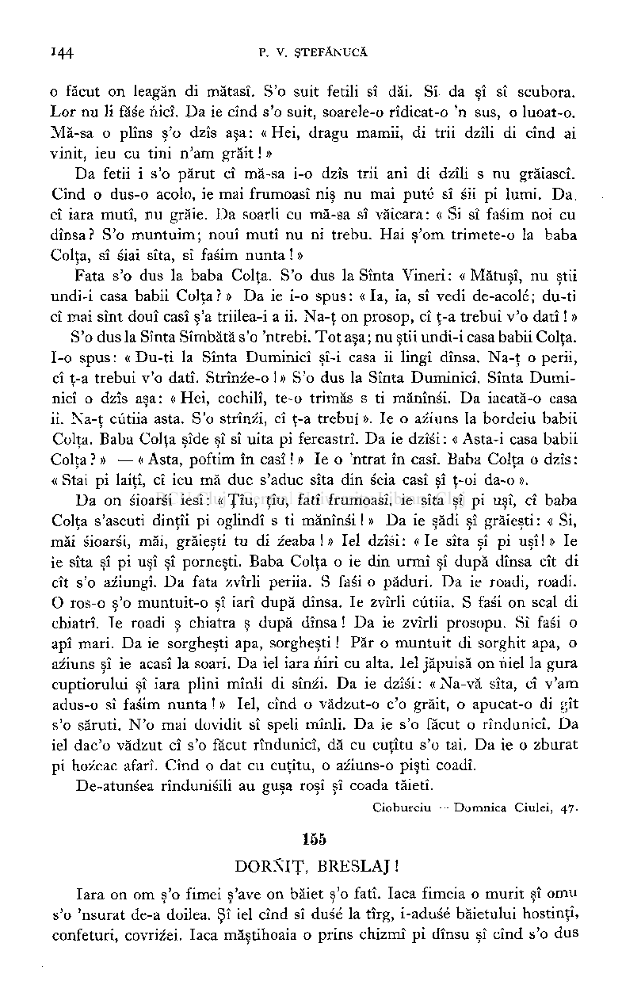

# o făcut on leagăn di mătasî. S'o suit fetili sî dăi. Sî da şî sî scubora. Lor nu li făse nicî. Da ie cînd s'o suit, soarele-o rîdicat-o 'n sus, o luoat-o. Mă-sa o plîns ş'o dzîs aşa: «Hei, dragu mamii, di trii dzîli di cînd ai vinit, ieu cu tini n'am grăit ! »

# Da fetii i s'o părut cî mă-sa i-o dzîs trii ani di dzîli s nu grăiascî. Cînd o dus-o acolo, ie mai frumoasî niş nu mai puté sî sii pi lumi. Da cî iara mutî, nu grăie. Da soarli cu mă-sa sî văicara: « Si sî fasim noi cu dînsa? S'o muntuim; nouî mutî nu ni trebu. Hai ş'om trimete-o la baba Colţa, sî siai sîta, sî fasim nunta ! »

# Fata s'o dus la baba Colţa. S'o dus la Sînta Vineri: « Mătuşî, nu ştii undi-i casa babii Colţa ? » Da ie i-o spus : « Ia, ia, si vedi de-acolé ; du-ti cî mai sînt douî casî ş'a triilea-i a ii. Na-ţ on prosop, cî ţ-a trebui v'o datî ! »

# S'o dus la Sînta Sîmbăta s'o 'ntrebi. Tot aşa; nu ştii undi-i casa babii Colţa. I-o spus : « Du-ti la Sînta Duminici şî-i casa ii lingî dînsa. Na-ţ o perii, cî ţ-a trebui v'o datî. Strînze-o !» S'o dus la Sînta Duminici. Sînta Duminici o dzîs aşa: «Hei, cochilî, te-o trimăs s ti mănînsi. Da iacată-o casa ii. Na-ţ cütiia asta. S'o strînzi, cî ţ-a trebui». Ie o aziuns Ia bordeiu babii Colţa. Baba Colţa şîde şî sî uita pi fereastrî. Da ie dzîsi : « Asta-i casa babii Colţa ? » — « Asta, poftim în casî ! » Ie o 'ntrat în casî. Baba Colţa o dzîs : « Stai pi laiţî, cî ieu mă duc s'aduc sîta din seia casî şî ţ-oi da-o ».

# Da on sioarsi iesî: « Ţîu, ţîu, fatî frumoasî, ie sîta şî pi uşî, cî baba Colţa s'ascuti dinţii pi oglindi s ti mănînsi ! » Da ie sădi şî grăieşti : « Si, măi sioarsi, măi, grăieşti tu di zeaba ! » Iei dzîsi: «Ie sîta şî pi uşî!» Ie ie sîta şî pi uşî şî porneşti. Baba Colţa o ie din urmî şî după dînsa cît di cît s'o aziungî. Da fata zvîrli periia. S fasi o păduri. Da ie roadi, roadi. O ros-o ş'o muntuit-o şî iarî după dînsa. Ie zvîrli cûtiia. S fasi on scai di chiatrî. Ie roadi ş chiatra ş după dînsa ! Da ie zvîrli prosopu. Sî fasi o apî mari. Da ie sorgheşti apa, sorgheşti ! Păr o muntuit di sorghit apa, o aziuns şî ie acasî la soari. Da iei iara niri cu alta. Iei jăpuisă on tiiel la gura cuptiorului şî iara plini mînli di sînzi. Da ie dzîsi : « Na-vă sîta, cî v'am adus-o sî fasim nunta ! » Iei, cînd o vădzut-o c'o grăit, o apucat-o di gît s'o săruţi. N'o mai dovidit sî speli mînli. Da ie s'o făcut o rîndunicî. Da iei dac'o vădzut cî s'o făcut rîndunicî, dă cu cuţîtu s'o tai. Da ie o zburat pi hozeac afarî. Cînd o dat cu cuţîtu, o aziuns-o pişti coadî.

# De-atunsea rîndunisili au guşa roşî şî coada tăietî.

Cioburciu — Domnica Ciulei, 47.

# 155 DORNIŢ, BRESLAJ !

# Iara on om ş'o fimei ş'ave on băiet ş'o fatî. Iaca fimeia o murit şî omu s'o 'nsurat de-a doilea. Şî iei cînd sî dusé la tîrg, i-adusé băietului hostinţî, confeturi, covrizei. Iaca măştihoaia o prins chizmî pi dînsu şî cînd s'o dus

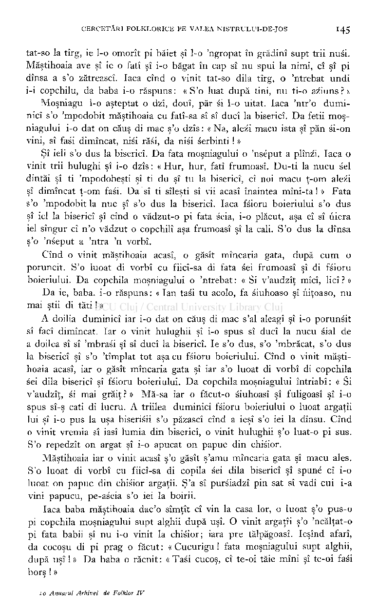

# tat-so la tîrg, ie l-o omorît pi băiet şî l-o 'ngropat în grădinî supt trii nusi. Măştihoaia ave şî ie o fatî şî i-o băgat în cap sî nu spui la nimi, cî şî pi dînsa a s'o zătreascî. Iaca cînd o vinit tat-so dila tîrg, o 'ntrebat undi i-i copchilu, da baba i-o răspuns: «S'o luat după tini, nu ti-o aziuns ? >,

# Moşniagu l-o aşteptat o dzî, douî, păr si l-o uitat. Iaca 'ntr'o duminici s'o 'mpodobit măştihoaia cu fatî-sa sî sî ducî la biserici. Da fetii moşniagului i-o dat on căuş di mac s'o dzîs: « Na, alezi macu ista şî păn si-on vini, sî fasi dimîncat, nisi răsi, da nisi serbinti ! »

# Şî ieli s'o dus la biserici. Da fata moşniagului o 'nséput a plînzi. Iaca o vinit trii hulughi şî i-o dzîs : « Hur, hur, fatî frumoasî. Du-ti la nucu sel dintăi şî ti 'mpodobeşti şî ti du şî tu la biserici, cî noi macu ţ-om alezi şî dimîncat ţ-om fasi. Da sî ti sileşti sî vii acasî înaintea mîni-ta ! » Fata s'o 'mpodobit la nuc şî s'o dus la biserici. Iaca fsioru boieriului s'o dus şî iei la biserici şî cînd o vădzut-o pi fata seia, i-o plăcut, aşa cî sî niera iei sîngur cî n'o vădzut o copchilî aşa frumoasî şî la caii. S'o dus la dînsa ş'o 'nseput a 'ntra 'n vorbî.

# Cînd o vinit măştihoaia acasî, o găsît mîncaria gata, după cum o poruncit. S'o luoat di vorbî cu fiicî-sa di fata sei frumoasî şî di fsioru boieriului. Da copchila moşniagului o 'ntrebat: « Si v'audzîţ mîcî, licî ? »

# Da ie, baba. i-o răspuns : « Ian tasi tu acolo, fa siuhoaso şî niţoaso, nu mai ştii di tăti ! »

# A doilia duminici iar i-o dat on căuş di mac s'al aleagî şî i-o porunsit sî facî dimîncat. Iar o vinit hulughii şî i-o spus sî ducî la nucu sial de a doilea sî sî 'mbrasi şî sî ducî la biserici. Ie s'o dus, s'o 'mbrăcat, s'o dus la biserici şî s'o 'tîmplat tot aşa cu fsioru boieriului. Cînd o vinit măştihoaia acasî, iar o găsît mîncaria gata şî iar s'o luoat di vorbî di copchila sei dila biserici şî fsioru boieriului. Da copchila moşniagului întriabî : « Si v'audzîţ, si mai grăit ? » Mă-sa iar o făcut-o siuhoasî şî fuligoasî şî i-o spus sî-ş cati di lucru. A triilea duminici fsioru boieriului o luoat argaţii lui şî i-o pus la uşa biserisii s'o păzascî cînd a ieşî s'o iei la dînsu. Cînd o vinit vremia sî iasî lumia din biserici, o vinit hulughii ş'o luat-o pi sus. S'o repedzît on argat şî i-o apucat on papuc din chisior.

# Măştihoaia iar o vinit acasî ş'o găsît ş'amu mîncaria gata şî macu ales. S'o luoat di vorbî cu fiicî-sa di copila sei dila bisericî şî spune cî i-o luoat on papuc din chisior argaţii. Ş'a sî pursiadzî pin sat sî vadî cui i-a vini papucu, pe-aseia s'o iei la boirii.

# Iaca baba măştihoaia dac'o sîmţît cî vin la casa lor, o luoat ş'o pus-o pi copchila moşniagului supt alghii după uşî. O vinit argaţii ş'o 'ncălţat-o pi fata babii şî nu i-o vinit la chisior; iara pre tălpăgoasî. Ieşind afarî, da cocoşu di pi prag o făcut : « Cucurigu ! fata moşniagului supt alghii, după uşî ! » Da baba o răcnit : « Tasi cucoş, cî te-oi tăie mîni şî te-oi fasi borş ! »

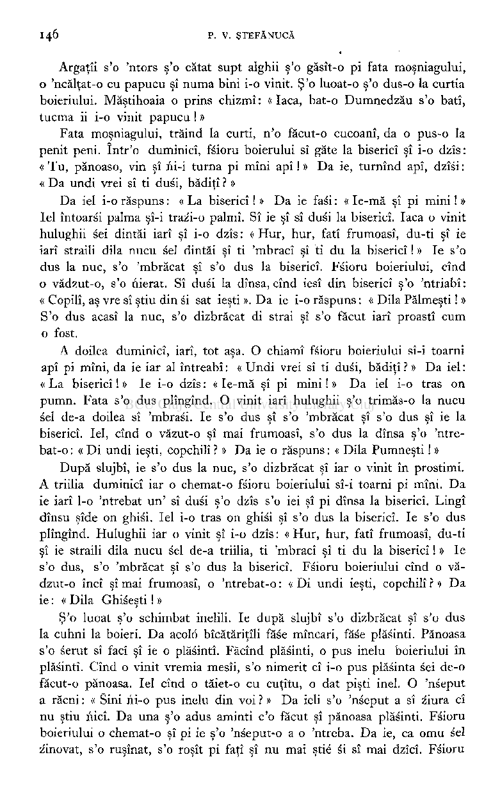

I46 P. V. STEFÄNUCÄ

# Argaţîi s'o 'ntors ş'o cătat supt alghii ş'o găsît-o pi fata moşniagului, o 'ncălţat-o cu papucu şî numa bini i-o vinit. Ş'o luoat-o ş'o dus-o la curtia boieriului. Măştihoaia o prins chizmî: «Iaca, bat-o Dumnedzău s'o batî, tucma ii i-o vinit papucu ! »

# Fata moşniagului, trăind la curţi, n'o făcut-o cucoanî, da o pus-o la penit peni. într'o duminici, fsioru boierului sî găte la biserici şî i-o dzîs: « Tu, pănoaso, vin şî ni—i turna pi mîni apî ! » Da ie, turnînd apî, dzîsi : « Da undi vrei sî ti dusi, bădiţi ? »

# Da iei i-o răspuns : « La biserici ! » Da ie fasi : « le-mă şî pi mini ! » Iei întoarsi palma şî-i trazi-o palmî. Sî ie şî sî dusi la biserici. Iaca o vinit hulughii sei dintâi iarî şî i-o dzîs : « Hur, hur, fatî frumoasî, du-ti şî ie iarî straili dila nucu sel dintăi şî ti 'mbracî şî ti du la biserici ! » Ie s'o dus la nuc, s'o 'mbrăcat şî s'o dus la biserici. Fsioru boieriului, cînd

- o vădzut-o, s'o nierat. Si dusi la dînsa, cînd iesî din biserici ş'o 'ntriabî: « Copilî, aş vre sî ştiu din si sat ieşti ». Da ie i-o răspuns : « Dila Pălmeşti ! » S'o dus acasî la nuc, s'o dizbrăcat di strai şî s'o făcut iarî proastî cum
- o fost. A doilea duminici, iarî, tot aşa. O chiamî fsioru boieriului sî-i toami

# apî pi mîni, da ie iar al întreabî : « Undi vrei sî ti dusi, bădiţi ? » Da iei : « La biserici ! » Ie i-o dzîs : « le-mă şî pi mini ! » Da iei i-o tras on pumn. Fata s'o dus plîngînd. O vinit iarî hulughii ş'o trimăs-o la nucu sel de-a doilea sî 'mbrasi. Ie s'o dus şî s'o 'mbrăcat şî s'o dus şî ie la biserici. Iei, cînd o văzut-o şî mai frumoasî, s'o dus la dînsa ş'o 'ntrebat-o : « Di undi ieşti, copchilî ? » Da ie o răspuns : « Dila Pumneşti ! »

# După slujbî, ie s'o dus la nuc, s'o dizbrăcat şî iar o vinit în prostimi. A triilia duminici iar o chemat-o fsioru boieriului sî-i toarni pi mini. Da ie iarî l-o 'ntrebat un' sî dusi ş'o dzîs s'o iei şî pi dînsa la biserici. Lingî dînsu şîde on ghisi. Iei i-o tras on ghisi şî s'o dus la biserici. Ie s'o dus plîngînd. Hulughii iar o vinit şî i-o dzîs : « Hur, hur, fatî frumoasî, du-ti şî ie straili dila nucu sel de-a triilia, ti 'mbracî şî ti du la biserici ! » Ie s'o dus, s'o 'mbrăcat şî s'o dus la biserici. Fsioru boieriului cînd o vădzut-o încî şî mai frumoasî, o 'ntrebat-o : « Di undi ieşti, copchilî ? » Da ie : « Dila Ghiseşti ! »

# Ş'o luoat ş'o schimbat inelili. Ie după slujbî s'o dizbrăcat şî s'o dus la cuhni la boieri. Da acolo bîcătăriţîli făse mîncari, făse plăsinti. Pănoasa s'o serut sî facî şî ie o plăsintî. Făcînd plăsinti, o pus inelu boieriului în plăsintî. Cînd o vinit vremia mesîi, s'o nimerit cî i-o pus plăsinta sei de-o

# făcut-o pănoasa. Iei cînd o tăiet-o cu cuţîtu, o dat pişti inel. O 'nseputa răcni :« Sinirii-o pus inelu din voi ? » Da ieli s'o 'nseput a sî ziura cînu ştiu nicî. Da una ş'o adus aminti c'o făcut şî pănoasa plăsinti. Fsioruboieriului o chemat-o şî pi ie ş'o 'nseput-o a o 'ntreba. Da ie, ca omu selzinovat, s'o ruşinat, s'o roşît pi faţî şî nu maiştiesi sî mai dzîcî. Fsioru

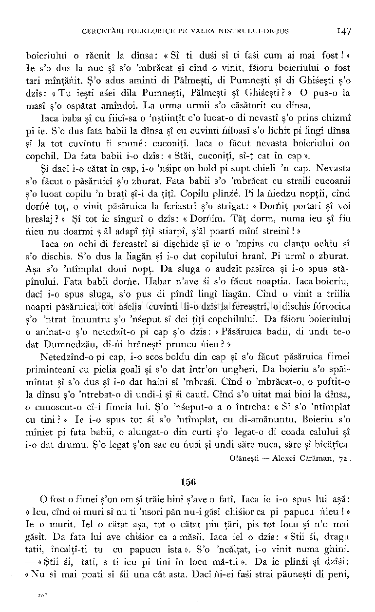

# boieriului o răcnit la dînsa : « Sî ti dusi sî ti fasi cum ai mai fost ! >> Ie s'o dus la nuc şî s'o 'mbrăcat şî cînd o vinit, fsioru boieriului o fost tari mînţăuit. Ş'o adus aminti di Pălmeşti, di Pumneşti şî di Ghiseşti ş'o dzîs : « Tu ieşti asei dila Pumneşti, Pălmeşti şî Ghiseşti ? » O pus-o la masî ş'o ospătat amîndoi. La urma urmii s'o căsătorit cu dînsa.

# Iaca baba şî cu fiicî-sa o 'nştiinţît c'o luoat-o di nerastî ş'o prins chizmî pi ie. S'o dus fata babii la dînsa şî cu cuvinti niloasî s'o lichit pi lingî dînsa şî la tot cuvîntu îi spune : cuconiţi. Iaca o făcut nevasta boieriului on copchil. Da fata babii i-o dzîs: « Stăi, cuconiţi, sî-ţ cat în cap».

# Şî dacî i-o cătat în cap, i-o 'nsipt on bold pi supt chieli 'n cap. Nevasta s'o făcut o păsăruicî ş'o zburat. Fata babii s'o 'mbrăcat cu straili cucoanii ş'o luoat copilu 'n braţî şî-i da ţîţî. Copilu plînzé. Pi la niedzu nopţii, cînd dorne toţ, o vinit păsăruica la feriastrî ş'o strigat: « Dorniţ portari şî voi breslaj ? » Şî tot ie sîngurî o dzîs : « Dornim. Tăţ dorm, numa ieu şî fiu nieu nu doarmi ş'ăl adapî ţîţî stiarpî, ş'ăl poartî mînî streini ! »

# Iaca on ochi di fereastrî sî dişchide şî ie o 'mpins cu clanţu ochiu şî s'o dischis. S'o dus la liagăn şî i-o dat copilului hranî. Pi urmî o zburat. Aşa s'o 'ntîmplat douî nopţ. Da sluga o audzît pasîrea şî i-o spus stăpînului. Fata babii dorne. Habar n'ave si s'o făcut noaptia. Iaca boieriu, dacî i-o spus sluga, s'o pus di pîndî lingî liagăn. Cînd o vinit a triilia noapti păsăruica, tot aselia cuvinti li-o dzîs la fereastrî, o dischis förtocica ş'o 'ntrat înnuntru ş'o 'nseput sî dei ţîţî copchilului. Da fsioru boieriului o aninat-o ş'o netedzît-o pi cap ş'o dzîs: «Păsăruica badii, di undi te-o dat Dumnedzău, di-iîi hrăneşti pruncu nieu ? »

# Netedzînd-o pi cap, i-o scos boldu din cap şî s'o făcut păsăruica fimei priminteanî cu pielia goalî şî s'o dat într'on ungheri. Da boieriu s'o spăimîntat şî s'o dus şî i-o dat haini sî 'mbrasi. Cînd o 'mbrăcat-o, o poftit-o la dînsu ş'o 'ntrebat-o di undi-i şî si cautî. Cînd s'o uitat mai bini la dînsa, o cunoscut-o cî-i fimeia lui. Ş'o 'nseput-o a o întreba: «Sis'o 'ntîmplat cu tini ? » Ie i-o spus tot si s'o 'ntîmplat, cu di-amănuntu. Boieriu s'o mîniet pi fata babii, o alungat-o din curţi ş'o legat-o di coada calului şî i-o dat drumu. Ş'o legat ş'on sac cu lîusi şî undi săre nuca, săre şî bîcăţîca

Olăneşti — Alexei Cărăman, 72 .

# 156

# O fost o fimei ş'on om şî trăie bini ş'ave o fatî. Iaca ie i-o spus lui aşă: « leu, cînd oi muri sî nu ti 'nsori păn nu-i găsî chisior ca pi papucu nieu ! » Ie o murit. Iei o cătat aşa, tot o cătat pin ţări, pis tot locu şî n'o mai — « Ştii si, tati, s ti ieu pi tini în locu mă-tii ». Da ie plînzi şî dzîsi : « Nu sî mai poati sî sil una cât asta. Dacî hi-ei fasi strai păuneşti di peni,

# găsit. Da fata lui ave chisior ca amăsîi. Iaca iei o dzîs: «Ştii si, dragutatii, încalţî-ti tu cu papucu ista». S'o 'ncălţat, i-o vinit numa ghini.

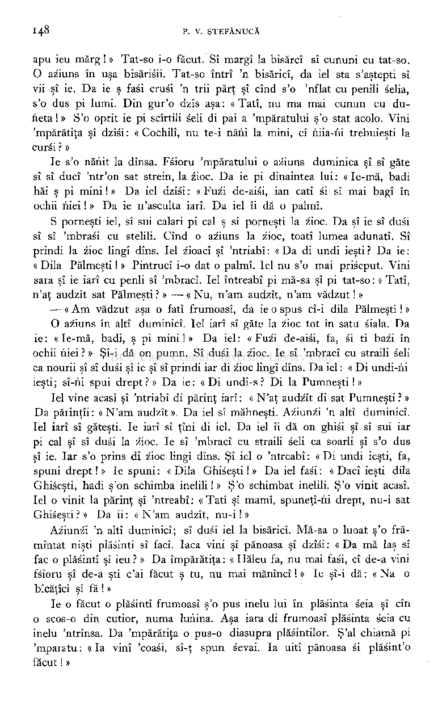

# apu ieu mărg ! » Tat-so i-o făcut. Si margî la bisărcî si cununi cu tat-so. O aziuns în uşa bisărisii. Tat-so intri 'n bisăricî, da iei sta s'aştepti sî vii şî ie. Da ie ş fasi crusi 'n trii părţ şî cînd s'o 'nflat cu penili selia, s'o dus pi lumi. Din gur'o dzîs aşa: «Tatî, nu ma mai cunun cu duneta ! » S'o oprit ie pi scîrtili seli di pai a 'mpăratului ş'o stat acolo. Vini 'mpărătiţa şî dzîsi : « Cochilî, nu te-i nani la mini, cî niia-ni trebuieşti la curşi ? »

# Ie s'o nănit la dînsa. Fsioru 'mpăratului o aziuns duminica şî sî găte sî sî ducî 'ntr'on sat strein, la zioc. Da ie pi dinaintea lui : « le-mă, badi

# hăi ş pi mini ! » Da iei dzîsi : « Fuzi de-aisi, ian catî si sî mai bagî înochii niei ! » Da ie n'asculta iarî. Da iei îi dă o palmî.

# S porneşti iei, sî sui calări pi cal ş sî porneşti la zioc. Da şî ie sî dusi si sî 'mbrasi cu stelili. Cînd o aziuns la zioc, toatî lumea adunatî. Sî prindi la zioc lingi dins. Iei zioacî şî 'ntriabî : « Da di undi ieşti ? Da ie : « Dila Pălmeşti ! » Pintrucî i-o dat o palmî. Iei nu s'o mai priseput. Vini sara şî ie iarî cu penii sî 'mbracî. Iei întreabî pi mă-sa şî pi tat-so : « Tatî, n'aţ audzît sat Pălmeşti ?» — « Nu, n'am audzît, n'am vădzut ! »

# — « Am vădzut aşa o fatî frumoasî, da ie o spus cî-i dila Pălmeşti ! » O aziuns în altî duminici. Iei iarî sî găte la zioc tot în satu siala. Da ie : « le-mă, badi, ş pi mini ! » Da iei : « Fuzi de-aisi, fa, si ti bazi în ochii niei ? » Şî-i dă on pumn. Sî dusi la zioc. Ie sî 'mbracî cu straili seli ca nourii şî sî dusi şî ie şî sî prindi iar di zioc lingi dins. Da iei : « Di undi-ni ieşti; sî-ni spui drept?» Da ie: «Di undi-s? Di la Pumneşti ! »

# Iei vine acasî şî 'ntriabî di părinţ iarî : « N'aţ audzît di sat Pumneşti ? » Da păiinţîi: « N'am audzît ». Da iei sî mâhneşti. Aziunzi 'n altî duminici. Iei iarî sî găteşti. Ie iarî sî ţîni di iei. Da iei îi dă on ghisi şî sî sui iar pi cal şî sî dusi la zioc. Ie sî 'mbracî cu straili seli ca soarli şî s'o dus şî ie. Iar s'o prins di zioc lingi dîns. Şî iei o 'ntreabî : « Di undi ieşti, fa, spuni drept ! » Ie spuni : « Dila Ghiseşti ! » Da iei fasi : « Dacî ieşti dila Ghiseşti, hadi ş'on schimba inelili !» Ş'o schimbat inelili. Ş'o vinit acasî. Iei o vinit la părinţ şî 'ntreabî : « Tatî şî mamî, spuneţî-ni drept, nu-i sat Ghiseşti?» Da ii: «N'am audzît, nu-i!»

# Aziunzi 'n altî duminici; sî dusi iei la bisăricî. Mă-sa o luoat ş'o frămîntat nişti plăsinti sî facî. Iaca vini şî pănoasa şî dzîsi : « Da mă laş sî fac o plăsintî şî ieu ? » Da împărătiţa : « Hăleu fa, nu mai fasi, cî de-a vini fsioru şî de-a şti c'ai făcut ş tu, nu mai mănîncî ! » Ie şî-i dă : « Na o

# bîcăţîcî şî fă ! »Ie o făcut o plăsintî frumoasî ş'o pus inelu lui în plăsinta seia şî cîn

# o scos-o din cutior, numa lunina. Aşa iara di frumoasî plăsinta seia cu inelu 'ntrînsa. Da 'mpărătiţa o pus-o diasupra plăsintilor. Ş'al chiamă pi 'mparatu : « Ia vinî 'coasi, sî-ţ spun sevai. Ia uitî pănoasa si plăsint'o făcut ! »

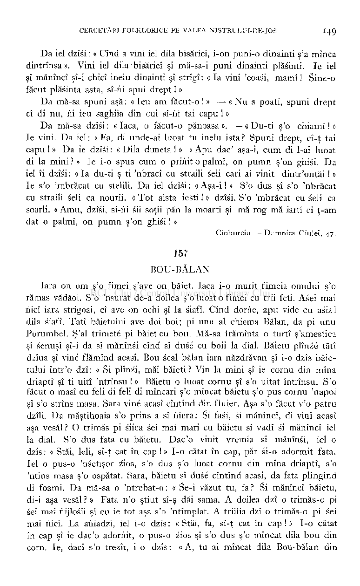

# Da iei dzîsi: « Cînd a vini iei dila bisăricî,i-on puni-o dinainti ş'a mînca dintrînsa ». Vini iei dila bisăricî şîmă-sa-ipuni dinainti plăsinti. Ie iei şî mănîncî şî-ichicî inelu dinainti şî strîgî : « Ia vinî 'coasi, mamî ! Sine-o făcut plăsinta asta, sî-hi spui drept ! »

# Da mă-sa spuni aşă : « leu am făcut-o !» — « Nu s poati, spuni drept

# cî di nu, hi ieu saghiia din cui sî-hi tai capu ! »Da mă-sa dzîsi : « Iaca, o făcut-o pănoasa ». — « Du-ti ş'o chiamî ! »

# Ie vini. Da iei : « Fa, di unde-ai luoat tu inelu ista ? Spuni drept, cî-ţ tai capu ! » Da ie dzîsi: « Dila duheta ! » « Apu dac'aşa-i,cum di l-ai luoat di la mini ? » Iei-o spus cum o prihit o palmî, on pumn ş'on ghisi. Da iei îi dzîsi : « Ia du-ti ş ti 'nbracî cu straili seli cari ai vinit dintr'ontăi ! » Ie s'o 'mbracat cu stelili. Da iei dzîsi : «Aşa-i! » S'o dus şî s'o 'nbrăcat cu straili seli ca nourii. «Tot aista ieşti!» dzîsi. S'o 'mbracat cu seli ca soarli. « Amu, dzîsi, sî-hi sii soţîi păn la moarti şî mă rog mă iartî cî ţ-am dat o palmî, on pumn ş'on ghisi ! »

Cioburciu —Dcmnica Ciu!ei, 47.

157

# BOU-BÄLAN

# Iara on om ş'o fimei ş'ave on băiet. Iacai-o murit fimeia omului ş'o rămas vădăoi. S'o 'nsurat de-a doilea ş'o luoat o fimei cu trii feti. Asei mai nici iara strigoai, cî ave on ochi şî la siafî. Cînd dorne, apu vide cu asial dila siafî. Tatî băietului ave doi boi; pi unu al chiema Bălan, da pi unu Porumbel. Ş'al trimeté pi băiet cu boii. Mă-sa frămînta o turtî ş'amestici şî senuşî şî-ida sî mănînsi cînd si dusé cu boii la dial. Băietu plînzé tătî dzîua şîvineflămînd acasî. Bou seal bălan iara năzdrăvan şîi-odzîs băietului într'o dzî :« Siplînzi, măi băieţi ? Vin la mini şî ie cornu din mîna driaptî şî ti uitî 'ntrînsu ! » Băietu o luoat cornu şî s'o uitat întrînsu. S'o făcut o masî cu feli di feli di mîncari ş'o mîncat băietu ş'o pus cornu 'napoi şî s'o strîns masa. Saravineacasî cîntînd din fluier. Aşa s'o făcut v'o patru dzîli. Da măştihoaia s'o prins a sî niera:Sifasi, si mănîncî, di vini acasî aşa vesăl ? O trimăs pi siica sei mai mari cu băietu si vadî si mănîncî iei la dial. S'o dus fata cu băietu. Dac'o vinit vremia sî mănînsi, iei o dzîs: « Stăi, leii, sî-ţ cat în cap ! » I-o cătat în cap, păr si-o adormit fata. Iei o pus-o 'nsetişor zios, s'o dus ş'o luoat cornu din mîna driaptî, s'o 'ntins masa ş'o ospătat. Sara, băietu si dusé cîntînd acasî, da fata plîngînd di foami. Da mă-sa o 'ntrebat-o :« Se-ivăzut tu, fa ?Simănîncî băietu, di-iaşa vesăl ? » Fatan'o ştiut sî-ş dăi sama. A doilea dzî o trimăs-o pi sei mai iîijlosii şî cu ie tot aşa s'o 'ntîmplat. A triilia dzî o trimăs-o pi sei mai hicî. La ahiadzî, ieii-o dzîs : « Stăi, fa, sî-ţ cat în cap ! » I-o cătat în cap şî ie dac'o adorhit, o pus-o zios şî s'o dus ş'o mîncat dila bou din corn. Ie, dacî s'o trezît,i-o dzîs : « A, tu ai mîncat dila Bou-bălan din

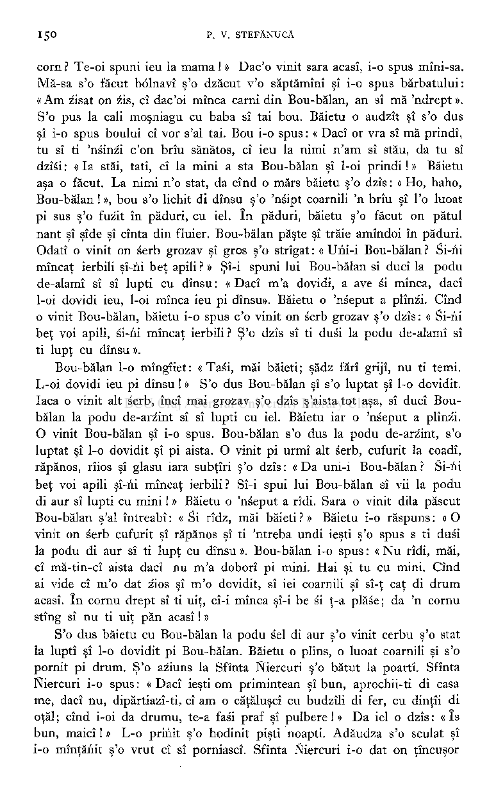

# corn ? Te-oi spuni ieu la mama ! » Dac'o vinit sara acasî, i-o spus mîni-sa. Mă-sa s'o făcut bolnavi ş'o dzăcut v'o săptămînî şî i-o spus bărbatului: «Am zisat on zis, cî dac'oi mînca carni din Bou-bălan, an sî mă 'ndrept ». S'o pus la caii moşniagu cu baba sî tai bou. Băietu o audzît şî s'o dus şî i-o spus boului cî vor s'al tai. Bou i-o spus: « Dacî or vra sî mă prindî, tu sî ti 'nsinzi c'on brîu sănătos, cî ieu la nimi n'am sî stău, da tu sî dzîsi : « Ia stăi, tatî, cî la mini a sta Bou-bălan şî l-oi prindi ! » Băietu aşa o făcut. La nimi n'o stat, da cînd o mărs băietu ş'o dzîs : « Ho, haho, Bou-bălan ! », bou s'o lichit di dînsu ş'o 'nsipt coarnili 'n brîu şî l'o luoat pi sus ş'o fuzit în păduri, cu iei. în păduri, băietu ş'o făcut on patul nant şî side şî cînta din fluier. Bou-bălan paşte şî trăie amîndoi în păduri.

# mîncaţ ierbili şî-ni beţ apili ? » Şî-i spuni lui Bou-bălan sî duci la poduOdatî o vinit on serb grozav şî gros ş'o strigat: «Uni-i Bou-bălan?Si-ni de-alamî sî sî lupţi cu dînsu : « Dacî m'a dovidi, a ave si mînca, dacî l-oi dovidi ieu, l-oi mînca ieu pi dînsu». Băietu o 'nseput a plînzi. Cînd

# beţ voi apili, si-ni mîncaţ ierbili ? Ş'o dzîs sî ti dusi la podu de-alamî sîo vinit Bou-bălan, băietu i-o spus c'o vinit on serb grozav ş'o dzîs: «Si-ni ti lupt cu dînsu ».

# Bou-bălan l-o mîngîiet: « Tasi, măi băieţi; şădz fărî grijî, nu ti temi. L-oi dovidi ieu pi dînsu !» S'o dus Bou-bălan şî s'o luptat şî l-o dovidit. Iaca o vinit alt serb, încî mai grozav ş'o dzîs ş'aista tot aşa, sî ducî Bou-

# bălan la podu de-arzint sî sî lupţi cu iei. Băietu iar o 'nseput a plînzi.O vinit Bou-bălan şî i-o spus. Bou-bălan s'o dus la podu de-arzint, s'oluptat şî l-o dovidit şî pi aista. O vinit pi urmî alt serb, cufurit la coadî,

# răpănos, rîios şî glasu iara subţiri ş'o dzîs: «Dbeţ voi apili şî-ni mîncaţ ierbili ? Sî-i spui lui Bou-bălan sî vii la podua uni-i Bou-bălan?Si-ni di aur sî lupţi cu mini ! » Băietu o 'nseput a rîdi. Sara o vinit dila păscut Bou-bălan ş'al întreabî :« Sirîdz, măi băieţi ? » Băietu i-o răspuns : « O vinit on serb cufurit şî răpănos şî ti 'ntreba undi ieşti ş'o spus s ti dusi la podu di aur sî ti lupt cu dînsu ». Bou-bălan i-o spus : « Nu rîdi, măi, cî mă-tin-cî aista dacî nu m'a doborî pi mini. Hai şi tu cu mini. Cînd ai vide cî m'o dat zios şî m'o dovidit, sî iei coarnili şî sî-ţ caţ di drum acasî. în cornu drept sî ti uiţ, cî-i mînca şî-i be si ţ-a plase; da 'n cornu sting sî nu ti uiţ păn acasî ! »

# S'o dus băietu cu Bou-bălan la podu sel di aur ş'o vinit cerbu ş'o stat la luptî şî l-o dovidit pi Bou-bălan. Băietu o plîns, o luoat coarnili şî s'o pornit pi drum. Ş'o aziuns la Sfînta Niercuri ş'o bătut la poartî. Sfînta Niercuri i-o spus : « Dacî ieşti om primintean şî bun, aprochii-ti di casa me, dacî nu, dipărtiazî-ti, cî am o căţăluşcî cu budzîli di fer, cu dinţii di

# oţăl ; cînd i-oi da drumu, te-a fasi praf şî pulbere ! » Da iei o dzîs : « îsbun, maicî ! » L-o prinit ş'o hodinit pişti noapti. Adăudza s'o sculat şîi-o mînţănit ş'o vrut cî sî porniascî. Sfînta Niercuri i-o dat on ţîncuşor

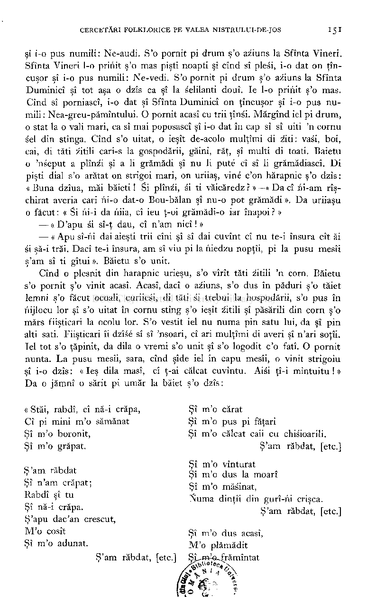

# şî i-o pus numili: Ne-audi. S'o pornit pi drum ş'o az'iuns la Sfînta Vineri. Sfînta Vineri l-o prirîit ş'o mas pişti noapti şî cînd sî plesi, i-o dat on ţîncuşor şî i-o pus numili: Ne-vedi. S'o pornit pi drum ş'o aziuns la Sfînta Duminici şî tot aşa o dzîs ca şî la selilanti douî. Ie l-o prinit ş'o mas. Cînd sî porniascî, i-o dat şî Sfînta Duminici on ţîncuşor şî i-o pus numili: Nea-greu-pămîntului. O pornit acasî cu trii ţînsi. Mărgînd iei pi drum,

- o stat la o vali mari, ca sî mai poposascî şî i-o dat în cap si sî uiti 'n cornu sel din stînga. Cînd s'o uitat, o ieşit de-acolo mulţimi di ziti: vasi, boi, cai, di tăti zitili cari-s la gospodării, găini, răţ, şî mulţi di toati. Băietu
- o 'nseput a plînzi şî a li grămădi şî nu li puté cî sî li grămădiascî. Di pişti dial s'o arătat on strigoi mari, on uriiaş,vinec'on harapnic ş'o dzîs: « Buna dzîua, măi băieţi !Siplînzi, si ti văicăredz ? »—« Da cî ni-am rîşchirat averia cari ni-o dat-o Bou-bălan şî nu-o pot grămădi ». Da uriiaşu
- o făcut :« Si hi-i da niia, cî ieu ţ-oi grămădi-o iar înapoi ? »

# — « D'apu si sî-ţ dau, cî n'am nici!»

# — « Apu sî-ni dai aieşti trii cîni şî sî dai cuvînt cî nu te-i însura cît ăi si şă-i trăi. Dacî te-i însura, am sî viu pi la niedzu nopţii, pi la pusu mesîi ş'am sî ti gîtui ». Băietu s'o unit.

# Cînd o plesnit din harapnic urieşu, s'o vîrît tăti zitili 'n corn. Băietu s'o pornit ş'o vinit acasî. Acasî, dacî o aziuns, s'o dus în păduri ş'o tăiet lemni ş'o făcut ocoali, curiiesi, di tăti si trebui la hospodării, s'o pus în nijlocu lor şî s'o uitat în cornu stîng ş'o ieşît zitili şî păsărili din corn ş'o mărs fiişticari la ocolu lor. S'o vestit iei nu numa pin satu lui, da şî pin alti sati. Fiişticari îi dzîse sî sî 'nsoari, cî ari mulţimi di averi şî n'ari soţii. Iei tot s'o ţăpinit, da dila o vremi s'o unit şî s'o logodit c'o fatî. O pornit nunta. La pusu mesîi, sara, cînd şîde iei în capu mesîi, o vinit strigoiu şî i-o dzîs: «Ieş dila masî, cî ţ-ai călcat cuvîntu. Aisi ţî-i mîntuitu ! » Da o jămnî o sărit pi umăr la băiet ş'o dzîs:

# « Stăi, rabdî, cî nă-i crăpa, Şî m'o cărat Cî pi mini m'o sămănat Şî m'o pus pi făţari Şî m'o boronit, Şî m'o călcat caii cu chisioarili.

- Şî m'o grăpat. Ş'am răbdat, [etc.] Ş'am răbdat
- Şî n'am crăpat; Rabdî şî tu Şî nă-i crăpa. Ş'apu dac'an crescut,

# Şî m'o vînturat Şî m'o dus la moarî Şî m'o măsinat,

# Numa dinţii din gurî-ni crişca.Ş'am răbdat, [etc.]

# M'o cositŞî m'o adunat.

# Şî m'o dus acasî, M'o plămădit

ŞL-H^a-frămîntat

# Ş'am răbdat, [etc.] Şj.

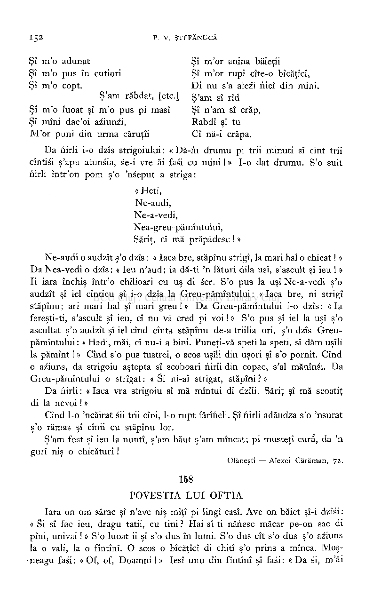

# Şî m'o adunat Şî m'or anina băieţii Şî m'o pus în cutiori Şî m'or rupi cîte-o bîcăţîcî, Şî m'o copt. Di nu s'a alezi rîicî din mini.

# îd Şî m'o luoat şî m'o pus pi masî Şî n'am sî crap, Şî mîni dac'oi aziunzi, Rabdî şî tu

# Ş'am răbdat, [etc.] ş>

# j

a m s

r

# M'or puni din urma căruţîi Cî nă-i crăpa.

# Da nirli i-o dzîs strigoiului : « Dă-rii drumu pi trii minuti sî cînt trii cîntisi ş'apu atunsia, se-i vre ăi fasi cu mini ! » I-o dat drumu. S'o suit nirli într'on pom ş'o 'nseput a striga:

# « Heti, Ne-audi, Ne-a-vedi, Nea-greu-pămîntului, Sărit, cî mă prăpădesc ! »

# Ne-audi o audzît ş'o dzîs : « Iaca bre, stăpînu strigî, la mari hal o chicat ! » Da Nea-vedi o dzîs : « leu n'aud ; ia dă-ti 'n lături dila uşî, s'ascult şî ieu ! » Ii iara închis într'o chilioari cu uş di ser. S'o pus la uşî Ne-a-vedi ş'o audzît şî iei cînticu şî i-o dzîs la Greu-pămîntului : « Iaca bre, ni strigî stăpînu ; ari mari hal şî mari greu ! » Da Greu-pămîntului i-o dzîs : « Ia fereşti-ti, s'ascult şî ieu, cî nu vă cred pi voi ! » S'o pus şî iei la uşî ş'o ascultat ş'o audzît şî iei cînd cînta stăpînu de-a triilia ori, ş'o dzîs Greupămîntului: « Hadi, măi, cî nu-i a bini. Puneţi-vă speti la speti, sî dăm uşîli la pămînt ! » Cînd s'o pus tustrei, o scos uşîli din uşori şî s'o pornit. Cînd o aziuns, da strigoiu aştepta sî scoboari nirli din copac, s'al mănînsi. Da Greu-pămîntului o strîgat :« Sini-ai strigat, stăpîni ? »

# Da nirli : « Iaca vra strigoiu sî mă mîntui di dzîli. Sărit şî mă scoatiţ di la nevoi ! »

# Cînd l-o 'ncăirat sii trii cîni, l-o rupt fărîneli. Şî nirli adăudza s'o 'nsurat ş'o rămas şî cînii cu stăpînu lor.

# Ş'am fost şî ieu la nuntî, ş'am băut ş'am mîncat; pi musteţî cură, da 'n gurî niş o chicăturî !

Olăneşti —Alexei Cărăman, 72.

# 158 POVESTIA LU I OFTIA

# Iara on om sărac şî n'ave niş mîţî pi lingî casî. Ave on băiet şî-i dzîsi: « Sisî fac ieu, dragu tatii, cu tini ? Hai sî ti nănesc măcar pe-on sac di pîni, univai ! » S'o luoat ii şî s'o dus în lumi. S'o dus cît s'o dus ş'o aziuns la o vali, la o fîntînî. O scos o bîcăţîcî di chitî ş'o prins a mînca. Moşneagu fasi : « Of, of, Doamni ! » Iesî unu din fîntînî şî fasi : « Da si, m'ăi

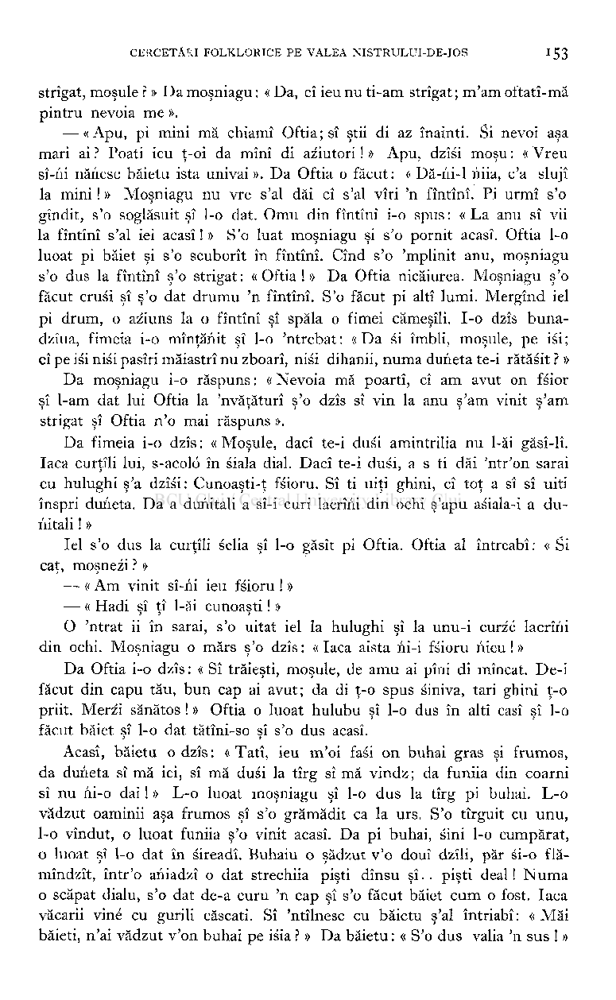

# strigat, moşule ? » Da moşniagu : « Da, cî ieu nu ti-am strigat; m'am oftatî-mă pintru nevoia me ».

# — «Apu, pi mini mă chiamî Oftia; sî ştii di az înainti. Si nevoi aşa mari ai ? Poati ieu ţ-oi da mînî di aziutori ! » Apu, dzîsi moşu : « Vreu sî-ni nănesc băietu ista univai ». Da Oftia o făcut: «Dă-îii-1niia, c'a sluji la mini ! » Moşniagu nu vre s'al dăi cî s'al vîri 'n fîntînî. Pi urmî s'o gîndit, s'o soglăsuit şî l-o dat. Omu din fîntînî i-o spus: « La anu sî vii la fîntînî s'al iei acasî !» S'o luat moşniagu şi s'o pornit acasî. Oftia l-o luoat pi băiet şi s'o scuborît în fîntînî. Cînd s'o 'mplinit anu, moşniagu s'o dus la fîntînî ş'o strigat: «Oftia!» Da Oftia nicăiurea. Moşniagu ş'o făcut crusi şî ş'o dat drumu 'n fîntînî. S'o făcut pi altî lumi. Mergînd iei pi drum, o aziuns la o fîntînî şî spăla o fimei cămeşîli. I-o dzîs bunadzîua, fimeia i-o mînţănit şî l-o 'ntrebat: «Da si îmbli, moşule, pe isi; cî pe isi nisi pasîri măiastrî nu zboarî, nisi dihănii, numa duiieta te-i rătăsit ? »

# Da moşniagu i-o răspuns : « Nevoia mă poartî, cî am avut on fsior şî l-am dat lui Oftia la 'nvăţăturî ş'o dzîs sî vin la anu ş'am vinit ş'am strigat şî Oftia n'o mai răspuns ».

# Da fimeia i-o dzîs : « Moşule, dacî te-i dusi amintrilia nu1-ăi găsî-lî. Iaca curţîli lui, s-acolö în siala dial. Dacî te-i dusi, a s ti dăi 'ntr'on sărai cu hulughi ş'a dzîsi: Cunoaşti-ţ fsioru. Sî ti uiţi ghini, cî toţ a sî sî uiti înspri duneta. Da a dunitali a sî-i curi lacrîni din ochi ş'apu asiala-i a dunitali ! »

# Iei s'o dus la curţîli selia şî l-o găsît pi Oftia. Oftia al întreabî: « Si caţ, moşnezi ? »

# — « Am vinit sî-ni ieu fsioru ! »

# — « Hadi şî ţî1-ăi cunoaşti ! » O 'ntrat ii în sărai, s'o uitat iei la hulughi şî la unu-i curzé lacrîni

# din ochi. Moşniagu o mărs ş'o dzîs: «Iaca aista rii-i fsioru nieu!»

# Da Oftia i-o dzîs : « Sî trăieşti, moşule, de amu ai pîni di mîncat. De-i făcut din capu tău, bun cap ai avut; da di ţ-o spus siniva, tari ghini ţ-o priit. Merzi sănătos ! » Oftia o luoat hulubu şî l-o dus în altî casî şî l-o făcut băiet şî l-o dat tătîni-so şî s'o dus acasî.

# Acasî, băietu o dzîs : « Tatî, ieu m'oi fasi on buhai gras şi frumos, da duneta sî mă iei, sî mă dusi la tîrg sî mă vindz; da funiia din coarni sî nu ni-o dai ! » L-o luoat moşniagu şî l-o dus la tîrg pi buhai. Lvădzut oaminii aşa frumos şî s'o grămădit ca la urs. S'o tîrguit cu unu, l-o vîndut, o luoat funiia ş'o vinit acasî. Da pi buhai, sini l-o cumpărat,

- o luoat şî l-o dat în sireadî. Buhaiu o şădzutv'o douî dzîli, păr si-o flămîndzît, într'o ahiadzî o dat strechiia pişti dînsu şî.. pişti deal ! Numa
- o scăpat dialu, s'o dat de-a cum 'n cap şî s'o făcut băiet cum o fost. Iaca văcariivinecu gurili căscaţi. Sî 'ntîlnesc cu băietu ş'al întriabî: « Măi

# băieţi, n'ai vădzut v'on buhai pe isia? » Da băietu: « S'o dus valia 'n sus ! »

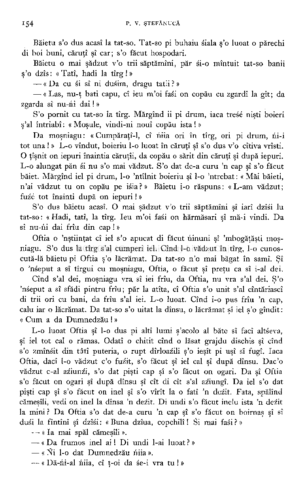

# Băietu s'o dus acasî la tat-so. Tat-so pi buhaiu siala ş'o luoat o părechi di boi buni, căruţî şî car; s'o făcut hospodari.

# Băietu o mai şădzut v'o trii săptămîni, păr si-o mîntuit tat-so banii ş'o dzîs: « Tatî, hadi la tîrg ! »

# — « Da cu si sî ni dusim, dragu tatii ? »

# — « Las, nu-ţ bati capu, cî ieu m'oi fasi on copău cu zgardî la gît; da zgarda sî nu-rii dai ! »

# S'o pornit cu tat-so la tîrg. Mărgînd ii pi drum, iaca trese nişti boieri ş'al întriabî : « Moşule, vindi-ni nouî copău ista ! »

# Da moşniagu : «Cumpăraţî-1,cî niia ori în tîrg, ori pi drum, ni-i tot una ! » L-o vîndut, boieriu l-o luoat în căruţî şî s'o dus v'o cîtiva vrîsti. O ţîşnit on iepuri înaintia căruţîi, da copău o sărit din căruţî şî după iepuri. L-o alungat păn si nu s'o mai vădzut. S'o dat de-a curu 'n cap şî s'o făcut

# băiet. Mărgînd iei pi drum, l-o 'ntîlnit boieriu şî l-o 'ntrebat : « Măi băieţi,

- n'ai vădzut tu on copău pe isia?» Băietu i-o răspuns: «L-am vădzut; fuzé tot înainti după on iepuri ! »

S'o dus băietu acasî. O mai şădzut v'o trii săptămîni şî iarî dzîsi lu tat-so : « Hadi, tatî, la tîrg. Ieu m'oi fasi on hărmăsari şî mă-i vindi. Da sî nu-ni dai frîu din cap ! »

Oftia o 'nştiinţat cî iei s'o apucat di făcut ninuni şî 'mbogăţăşti moşniagu. S'o dus la tîrg s'al cumperi iei. Cînd l-o vădzut în tîrg, l-o cunoscută-lă băietu pi Oftia ş'o lăcrămat. Da tat-so n'o mai băgat în samî. Şî

- o 'nseput a sî tîrgui cu moşniagu, Oftia, o făcut şî preţu ca sî i-al dei. Cînd s'al dei, moşniagu vra sî iei frîu, da Oftia, nu vra s'al dei. Ş'o

'nseput a sî sfădi pintru frîu; păr la atîta, cî Oftia s'o unit s'al cîntăriascî di trii ori cu bani, da frîu s'al iei. L-o luoat. Cînd i-o pus frîu 'n cap, calu iar o lăcrămat. Da tat-so s'o uitat la dînsu, o lăcrămat şî iei ş'o gîndit : « Cum a da Dumnedzău ! »

L-o luoat Oftia şî l-o dus pi altî lumi ş'acolo al băte sî facî altseva, şî iei tot cal o rămas. Odatî o chitit cînd o lăsat grajdu dischis şî cînd s'o zmînsit din tâtî puteria, o rupt dîrloazili ş'o ieşît pi uşî sî fugî. Iaca Oftia, dacî l-o vădzut c'o fuzit, s'o făcut şî iei cal şî după dînsu. Dac'o vădzut c-al aziunzi, s'o dat pişti cap şî s'o făcut on ogari. Da şî Oftia s'o făcut on ogari şî după dînsu şî cît di cît s'al aziungî. Da iei s'o dat pişti cap şî s'o făcut on inel şî s'o vîrît la o fatî 'n dezit. Fata, spălînd

# cămeşîli, vedi on inel la dînsa 'n dezit. Di undi s'o făcut inelu ista 'n dezitla mini ? Da Oftia s'o dat de-a curu 'n cap şî s'o făcut on boirnaş şî sîdusi la fîntînî şî dzîsi : « Buna dzîua, copchilî !Simai fasi ? »

# — « Ia mai spăl cămeşîli ».

# — « Da frumos inel ai ! Di undi l-ai luoat ? »

# — « Nil-o dat Dumnedzău hiia ».

# — « Dă-ni-al niia, cî ţ-oi da se-i vra tu ! »

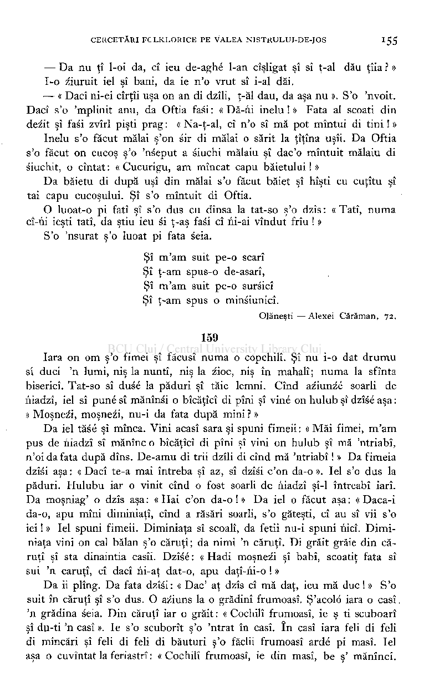

# — Da nu ţî l-oi da, ci ieu de-aghé 1-an cîşligat şî sî ţ-al dău ţîia ? » I-o ziuruit iei şî bani, da ie n'o vrut sî i-al dăi.

# — « Dacî ni-ei cîrţîi uşa on an di dzîli, ţ-ăl dau, da aşa nu ». S'o 'nvoit.

# Dacî s'o 'mplinit anu, da Oftia fasi : « Dă-ni inelu ! » Fata al scoati din dezit şî fasi zvîrl pişti prag: « Na-ţ-al, cî n'o sî mă pot mîntui di tini ! »

# Inelu s'o făcut mălai ş'on sir di mălai o sărit la ţîţîna uşîi. Da Oftia s'o făcut on cucoş ş'o 'nseput a siuchi mălaiu şî dac'o mîntuit mălaiu di siuchit, o cîntat : « Cucurigu, am mîncat capu băietului ! »

# Da băietu di după uşî din mălai s'o făcut băiet şî hîşti cu cuţîtu şî tai capu cucoşului. Şî s'o mîntuit di Oftia.

# O luoat-o pi fatî şî s'o dus cu dînsa la tat-so ş'o dzîs: «Tatî, numa cî-ni ieşti tatî, da ştiu ieu si ţ-aş fasi cî ni-ai vîndut frîu ! »

# S'o 'nsurat ş'o luoat pi fata seia. Şî m'am suit pe-o scarî Şî ţ-am spus-o de-asarî, Şî m'am suit pe-o sursicî Şî ţ-am spus o minsiunicî.

Olăneşti — Alexei Cărăman, 72.

# 159

# Iara on om ş'o fimei şî fâcusî numa o copchilî. Şî nu i-o dat drumu si duci 'n lumi, niş la nuntî, niş la zioc, niş în mahalî; numa la sfînta biserici. Tat-so sî dusé la păduri şî tăie lemni. Cînd aziunzé soarli de niadzî, iei sî puné sî mănînsi o bîcăţîcî di pîni şî vine on hulub şî dzîsé aşa : » Moşnezi, moşnezi, nu-i da fata după mini ? »

# Da ieităseşî mînca. Vini acasî sara şi spuni fimeii : « Măi fimei, m'am pus de niadzî sî mănînc o bîcăţîcî di pîni şî vini on hulub şî mă 'ntriabî, n'oi da fata după dîns. De-amu di trii dzîli di cînd mă 'ntriabî ! » Da fimeia dzîsi aşa: «Dacî te-a mai întreba şî az, sî dzîsi c'on da-o». Iei s'o dus la

# păduri. Hulubu iar o vinit cînd o fost soarli de niadzî şî-1 întreabî iarî.Da moşniag' o dzîs aşa: «Hai c'on da-o!» Da iei o făcut aşa: « Daca-ida-o, apu mîni diminiaţî, cînd a răsări soarli, s'o găteşti, cî au sî vii s'oiei ! » Iei spuni fimeii. Diminiaţa sî scoalî, da fetii nu-i spuni nici. Dimi-niaţa vini on cal bălan ş'o căruţî; da nimi 'n căruţî. Di grăit grăie din că-ruţî şî sta dinaintia casîi. Dzîsé : « Hadi moşnezi şî babî, scoatiţ fata sîsui 'n căruţî, cî dacî ni-aţ dat-o, apu daţî-ni-o ! »

# Da ii plîng. Da fata dzîsi: « Dac' aţ dzîs cî mă daţ, ieu mă duc ! » S'o suit în căruţî şî s'o dus. O aziuns la o grădini frumoasî.Ş'acoloiara o casî. 'n grădina seia. Din căruţî iar o grăit : « Cochilî frumoasî, ie ş ti scuboarî şî du-ti 'n casî ». Ie s'o scuborît ş'o 'ntrat în casî. în casî iara feli di feli di mîncari şî feli di feli di băuturi ş'o făclii frumoasî ardé pi masî. Iei aşa o cuvîntat la feriastrî : «Cochilî frumoasî, ie din masî, be ş' mănîncî.

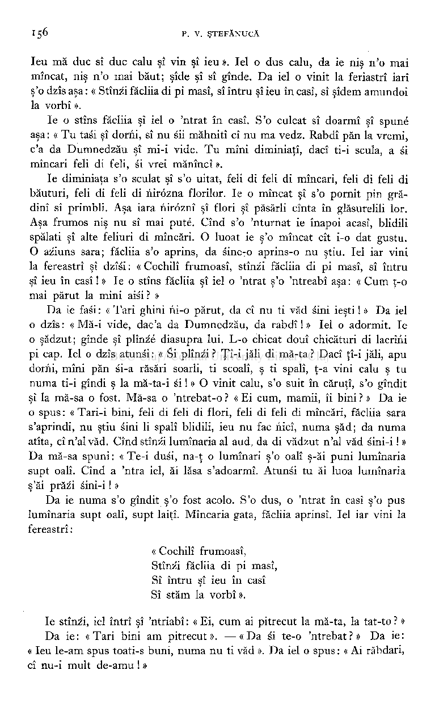

# leu mă duc sî duc calu şî vin şî ieu ». Iei o dus calu, da ie niş n'o mai mîncat, niş n'o mai băut; şîde şî sî gînde. Da iei o vinit la feriastrî iarî ş'o dzîs aşa : « Stînzi făcliia di pi masî, sî întru şî ieu în casî, sî şîdem amundoi la vorbî ».

# Ie o stîns făcliia şî iei o 'ntrat în casî. S'o culcat sî doarmî şî spune aşa : « Tu tasi şî domi, sî nu sii măhnitî cî nu ma vedz. Rabdî păn la vremi, c'a da Dumnedzău şî mi-i vide. Tu mîni diminiaţî, dacî ti-i scula, a si mîncari feli di feli, si vrei mănîncî ».

# Ie diminiaţa s'o sculat şî s'o uitat, feli di feli di mîncari, feli di feli di

# băuturi, feli di feli di nirozna florilor. Ie o mîncat şî s'o pornit pin gră­dini sî primbli. Aşa iara rîiroznî şî flori şî păsării cînta în glăsurelili lor.Aşa frumos niş nu si mai puté. Cînd s'o 'nturnat ie înapoi acasî, blidilispălaţi şî alte feliuri di mîncari. O luoat ie ş'o mîncat cît i-o dat gustu.O aziuns sara; făcliia s'o aprins, da sine-o aprins-o nu ştiu. Iei iar vinila fereastrî şî dzîsi : « Cochilî frumoasî, stînzi făcliia di pi masî, sî întruşî ieu în casî !» Ie o stîns făcliia şî iei o 'ntrat ş'o 'ntreabî aşa: « Cum ţ-omai părut la mini aisi? »

# Da ie fasi : « Tari ghini hi-o părut, da cî nu ti văd sini ieşti ! » Da iei

- o dzîs : « Mă-i vide, dac'a da Dumnedzău, da rabdî ! » Iei o adormit. Ie
- o şădzut; gînde şî plînzé diasupra lui. L-o chicat douî chicături di lacrîhi pi cap. Iei o dzîs atunsi :« Siplînzi ? Ţî-i jăli di mă-ta ? Dacî ţî-i jăli, apu dorhi, mini păn si-a răsări soarli, ti scoalî, ş ti spalî, ţ-a vini calu ş tu numa ti-i gîndi ş la mă-ta-i si ! » O vinit calu, s'o suit în căruţî, s'o gîndit şî la mă-sa o fost. Mă-sa o 'ntrebat-o ? « Ei cum, mamii, îi bini ? » Da ie
- o spus : « Tari-i bini, feli di feli di flori, feli di feli di mîncari, făcliia sara s'aprindi, nu ştiu sini li spalî blidili, ieu nu fac hicî, numa şăd; da numa atîta, cî n'al văd. Cînd stînzi lumînaria al aud, da di vădzut n'al văd sini-i ! » Da mă-sa spuni: «Te-i dusi, na-ţ o luminări ş'o oalî ş-ăi puni lumînaria supt oalî. Cînd a 'ntra iei, ăi lăsa s'adoarmî. Atunsi tu ăi luoa lumînaria ş'ăi prăzi sini-i ! »

# Da ie numa s'o gîndit ş'o fost acolo. S'o dus, o 'ntrat în casî ş'o pus lumînaria supt oalî, supt laiţî. Mîncaria gata, făcliia aprinsî. Iei iar vini la fereastrî :

# « Cochilî frumoasî, Stînzi făcliia di pi masî, Sî întru şî ieu în casî Sî stăm la vorbî ».

# Ie stînzi, iei întrî şî 'ntriabî : « Ei, cum ai pitrecut la mă-ta, la tat-to ? » Da ie: «Tari bini am pitrecut». —«D a si te-o 'ntrebat?» Da ie:

# « leu le-am spus toati-s buni, numa nu ti văd ». Da iei o spus : « Ai răbdări, cî nu-i mult de-amu ! »

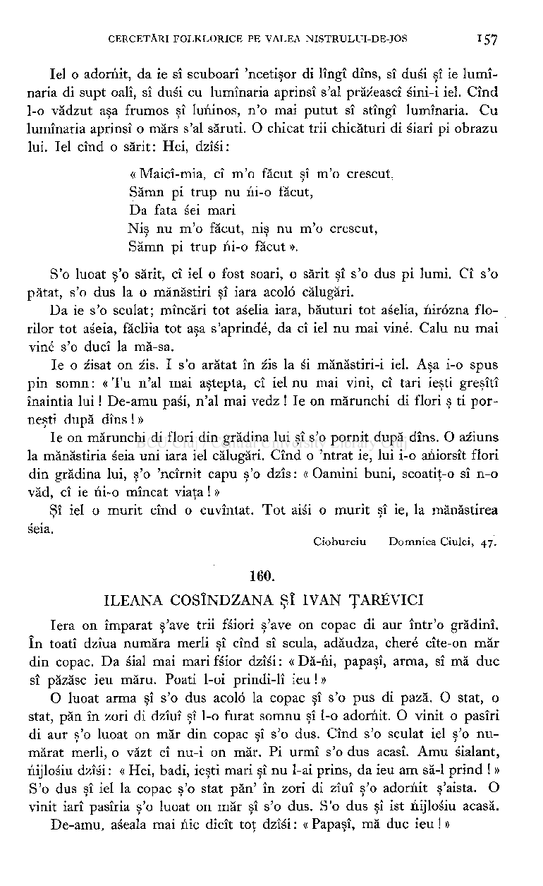

# Iei o adornit, da ie sî scuboarî 'ncetişor di lîngî dîns, sî dusi şî ie lumînaria di supt oalî, sî dusi cu lumînaria aprinsî s'al prăzeascî sini-i iei. Cînd l-o vădzut aşa frumos şî luninos, n'o mai putut sî stîngî lumînaria. Cu

# lumînaria aprinsî o mărs s'al săruţi. O chicat trii chicături di siarî pi obrazului. Iei cînd o sărit: Hei, dzîsi:

# « Maicî-mia, cî m'o făcut şî m'o crescut. Sămn pi trup nu ni-o făcut, Da fata sei mari Niş nu m'o făcut, niş nu m'o crescut, Sămn pi trup ni-o făcut ».

# S'o luoat ş'o sărit, cî iei o fost soari, o sărit şî s'o dus pi lumi. Cî s'o pătat, s'o dus la o mănăstiri şî iaraacolocălugări.

# Da ie s'o sculat; mîncări tot aselia iara, băuturi tot aselia, nirözna florilor tot aseia, făcliia tot aşa s'aprindé, da cî iei nu mai viné. Calu nu mai viné s'o ducî la mă-sa.

# Ie o zisat on zis. I s'o arătat în zis la si mănăstiri-i iei. Aşa i-o spus pin somn: «Tu n'ai mai aştepta, cî iei nu mai vini, cî tari ieşti greşîtî înaintia lui ! De-amu pasi, n'ai mai vedz ! Ie on mărunchi di flori ş ti porneşti după dîns ! »

# Ie on mărunchi di flori din grădina lui şî s'o pornit după dîns. O aziuns la mănăstiria seia uni iara iei călugări. Cînd o 'ntrat ie, lui i-o aniorsît flori din grădina lui, ş'o 'ncîrnit capu ş'o dzîs : « Oamini buni, scoatiţ-o sî n-o văd, cî ie ni-o mîncat viaţa ! »

# Şî iei o murit cînd o cuvîntat. Tot aisi o murit şî ie, la mănăstirea seia.

Cioburciu — Domnica Ciulei, 47.

# 160. ILEANA COSÎNDZANA ŞÎ IVAN TARÉVICI

# Iera on împărat ş'ave trii fsiori ş'ave on copac di aur într'o grădinî. în toatî dzîua număra merii şî cînd sî scula, adăudza, cheré cîte-on măr din copac. Da sial mai mari fsior dzîsi : « Dă-fîi, papaşî, arma, sî mă duc sî păzăsc ieu măru. Poati l-oi prindi-lî ieu ! »

# O luoat arma şî s'o dus acolo la copac şî s'o pus di pază. O stat, o stat, păn în zori di dzîuî şî l-o furat somnu şî l-o adornit. O vinit o pasîri di aur ş'o luoat on măr din copac şî s'o dus. Cînd s'o sculat iei ş'o numărat merii, o văzt cî nu-i on măr. Pi urmî s'o dus acasî. Amu sialant, nijlosiu dzîsi : « Hei, badi, ieşti mari şî nu l-ai prins, da ieu am să-1 prind ! » S'o dus şî iei la copac ş'o stat păn' în zori di zîuî ş'o adornit ş'aista. O vinit iarî pasîria ş'o luoat on măr şî s'o dus. S'o dus şî ist nijlosiu acasă.

# De-amu, aseala mai nie dicît toţ dzîsi : « Papaşî, mă duc ieu ! »

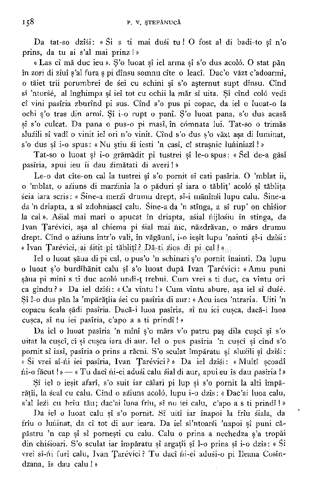

# Da tat-so dzîsi :« Si s ti mai dusi tu ! O fost al di badi-to şî n'o prins, da tu ai s'al mai prinz ! »

# « Las cî mă duc ieu ». Ş'o luoat şî iei arma şî s'o dusacolo.O stat păn în zori di zîuî ş'al fura ş pi dînsu somnu cîte o leacî. Dac'o văzt c'adoarmi,

- o tăiet trii porumbrei de sei cu schini şî s'o aşternut supt dînsu. Cînd si 'ntorsé, al înghimpa şî iei tot cu ochii la măr sî uita. Şî cînd colö vedi cî vini pasîria zburînd pi sus. Cînd s'o pus pi copac, da iei o luoat-o la
- ochi ş'o tras din armî. Şî i-o rupt o panî. Ş'o luoat pana, s'o dus acasă şî s'o culcat. Da pana o pus-o pi masî, în comnata lui. Tat-so o trimăs sluzili sî vadî o vinit iei ori n'o vinit. Cînd s'o dus ş'o văzt aşa di luminat, s'o dus şî i-o spus : « Nu ştiu si ieşti 'n casî, cî straşnic luniniazî ! »

# Tat-so o luoat şî i-o grămădit pi tustrei şî le-o spus :« Selde-a găsî pasîria, apui ieu îi dau zimătati di averi ! »

# Le-o dat cîte-on cal la tustrei şî s'o pornit sî cati pasîria. O 'mblat ii,

# o 'mblat, o aziuns di marzinia la o păduri şî iara o tăbliţ' acolo şî tăbliţa

seia iara scris: «da 'n driapta, a sî zdohniascî calu.Sine-amerzi drumu drept, sî-i mănînsi lupu calu.Sine-ada 'n stînga, a sî rup' on chisiorSine-a la cal ». Asial mai mari o apucat în driapta, asial riijlosiu în stînga, da Ivan Ţarevici, aşa al chiema pi sial mai îiic, năzdrăvan, o mărs drumu drept. Cînd o aziuns într'o vali, în văgăuni, i-o ieşît lupu 'nainti şî-i dzîsi : « Ivan Ţarevici, ai sitit pi tăbliţî ? Dă-ti zios di pi cal ! »

Iei o luoat şaua di pi cal, o pus'o 'n schinari ş'o pornit înainti. Da lupu

# o luoat ş'o burdîhănit calu şî s'o luoat după Ivan Ţarevici: «Amu punişaua pi mini s ti duc acolo undi-ţ trebui. Cum vrei s ti duc, ca vîntu orica gîndu ? » Da iei dzîsi : « Ca vîntu ! » Cum vîntu abure, aşa iei sî dusé.Şî l-o dus păn la 'mpărăţîia sei cu pasîria di aur: « Acu iaca 'ntraria. Uiti 'ncopacii sealasădipasîria. Dacă-i luoa pasîria, sî nu iei cuşca, dacă-i luoacuşca, sî nu iei pasîria, c'apo a s ti prindi ! »

# Da iei o luoat pasîria 'n mînî ş'o mărs v'o patru paş dila cuşcî şî s'o uitat la cuşcî, cî şî cuşca iara di aur. Iei o pus pasîria 'n cuşcî şî cînd s'o pornit sî iasî, pasîria o prins a răcni. S'o sculat împăratu şî sluzili şî dzîsi: « Sivrei sî-ni iei pasîria, Ivan Ţarevici ? » Da iei dzîsi : « Multî şcoadî iii-o făcut !» — « Tu dacî ni-ei aduşi calu sial di aur, apui eu îs dau pasîria ! » Şî iei o ieşit afarî, s'o suit iar călări pi lup şi s'o pornit la alti împă­

# răţii,la seal cu calu. Cînd o aziuns acolo, lupu i-o dzîs : « Dac'ai luoa calu, s'al Iezi cu brîu tău; dac'ai luoa frîu, sî nu iei calu, c'apo a s ti prindî ! »

# Da iei o luoat calu şî s'o pornit. Sî uitî iar înapoi la frîu siala, da frîu o luîiinat, da cî tot di aur ieara. Da iei sî'ntoarsi 'napoi şî puni căpăstru 'n cap şî sî porneşti cu calu. Calu o prins a nechedza ş'a tropăi din chisioari. S'o sculat iar împăratu şî argaţii şî l-o prins şî i-o dzîs: «Si vrei sî-ni furi calu, Ivan Ţarevici ? Tu dacî ni-ei adusi-o pi Ileana Cosîndzana, îs dau calu ! »

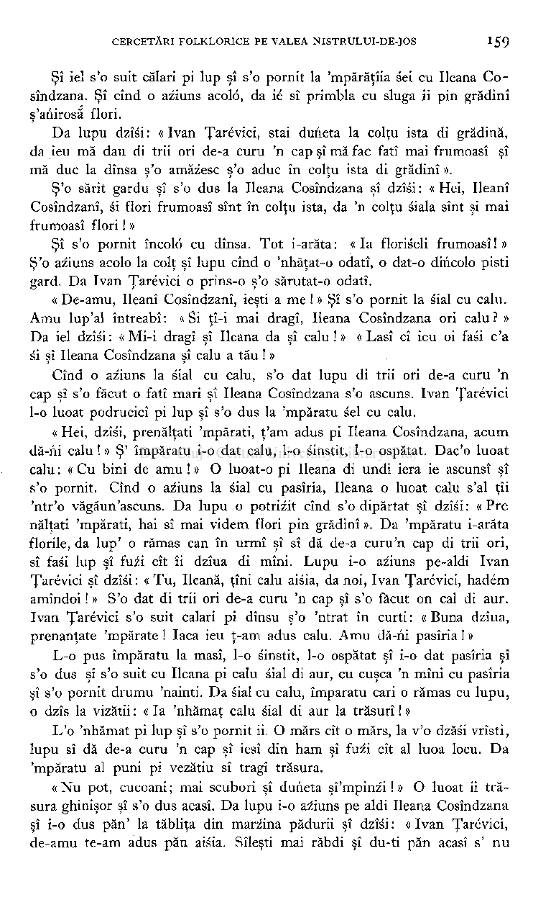

# Şî iei s'o suit călări pi lup şî s'o pornit la 'mpărăţîia sei cu Ileana Cosîndzana. Şî cînd o aziuns acolo, da ié sî primbla cu sluga ii pin grădini ş'anirosă flori.

# Da lupu dzîsi : « Ivan Ţarevici, stai duneta la colţu ista di grădină, da ieu mă dau di trii ori de-a curu 'n cap şî mă fac fatî mai frumoasî şî

# mă duc la dînsa ş'o amăzesc ş'o aduc în colţu ista di grădini ».Ş'o sărit gardu şî s'o dus la Ileana Cosîndzana şî dzîsi: «Hei, Ileanî

Cosîndzanî, si flori frumoasî sînt în colţu ista, da 'n colţu siala sînt şi mai frumoasî flori ! »

Şî s'o pornitîncolocu dînsa. Tot i-arăta: «Ia floriseli frumoasî!» Ş'o aziuns acolo la colţ şî lupu cînd o 'nhăţat-o odatî, o dat-o dincolo pişti gard. Da Ivan Ţarevici o prins-o ş'o sărutat-o odatî.

« De-amu, Ileanî Cosîndzanî, ieşti a me ! » Şî s'o pornit la sial cu calu. Amu lup'al întreabî :« Siţî-i mai dragî, Ileana Cosîndzana ori calu ? » Da iei dzîsi : « Mi-i dragî şî Ileana da şî calu ! » « Lasî cî ieu oi fasi c'a si şî Ileana Cosîndzana şî calu a tău ! »

Cînd o aziuns la sial cu calu, s'o dat lupu di trii ori de-a curu 'n cap şî s'o făcut o fatî mari şî Ileana Cosîndzana s'o ascuns. Ivan Ţarevici l-o luoat podrucicî pi lup şî s'o dus la 'mpăratu sel cu calu.

« Hei, dzîsi, prenălţati 'mpărati, ţ'am adus pi Ileana Cosîndzana, acum dă-ni calu ! » Ş' împăratu i-o dat calu, l-o sinstit, l-o ospătat. Dac'o luoat calu : « Cu bini de amu ! » O luoat-o pi Ileana di undi iera ie ascunsî şî s'o pornit. Cînd o aziuns la sial cu pasîria, Ileana o luoat calu s'al ţîi 'ntr'o văgăun'ascuns. Da lupu o potrizit cînd s'o dipărtat şî dzîsi : « Pre

# nălţaţi 'mpărati, hai sî mai videm flori pin grădini ». Da 'mpăratu i-arătaflorile, da lup' o rămas can în urmî şî sî dă de-a curu'n cap di trii ori,sî fasi lup şî fuzi cît îi dzîua di mîni. Lupu i-o aziuns pe-aldi IvanŢarevici şî dzîsi : « Tu, Ileana, ţîni calu aisia, da noi, Ivan Ţarevici, hadémamîndoi !» S'o dat di trii ori de-a curu 'n cap şî s'o făcut on cal di aur.Ivan Ţarevici s'o suit calări pi dînsu ş'o 'ntrat în curţi: «Buna dzîua,prenanţate 'mpărate ! Iaca ieu ţ-am adus calu. Amu dă-ni pasîria ! »

# L-o pus împăratu la masî, l-o sinstit, l-o ospătat şî i-o dat pasîria şî s'o dus şî s'o suit cu Ileana pi calu sial di aur, cu cuşca 'n mîni cu pasîria şî s'o pornit drumu 'nainti. Da sial cu calu, împăratu cari o rămas cu lupu, o dzîs lavizaţii : « Ia 'nhămaţ calu sial di aur la trăsuri ! »

# L'o 'nhămat pi lup şî s'o pornit ii. O mărs cît o mărs, la v'o dzăsi vrîsti, lupu sî dă de-a curu 'n cap şî iesî din ham şî fuzi cît al luoa locu. Da 'mpăratu al puni pi vezătiu sî tragî trăsura.

# «Nu pot, cucoani; mai scubori şî duneta şî'mpinzi ! » O luoat ii tră­

# sura ghinişor şî s'o dus acasî. Da lupu i-o aziuns pe aldi Ileana Cosîndzana şî i-o dus păn' la tăbliţa din marzina pădurii şî dzîsi : « Ivan Ţarevici,

# de-amu te-am adus păn aisia. Sileşti mai răbdi şî du-ti păn acasî s' nu

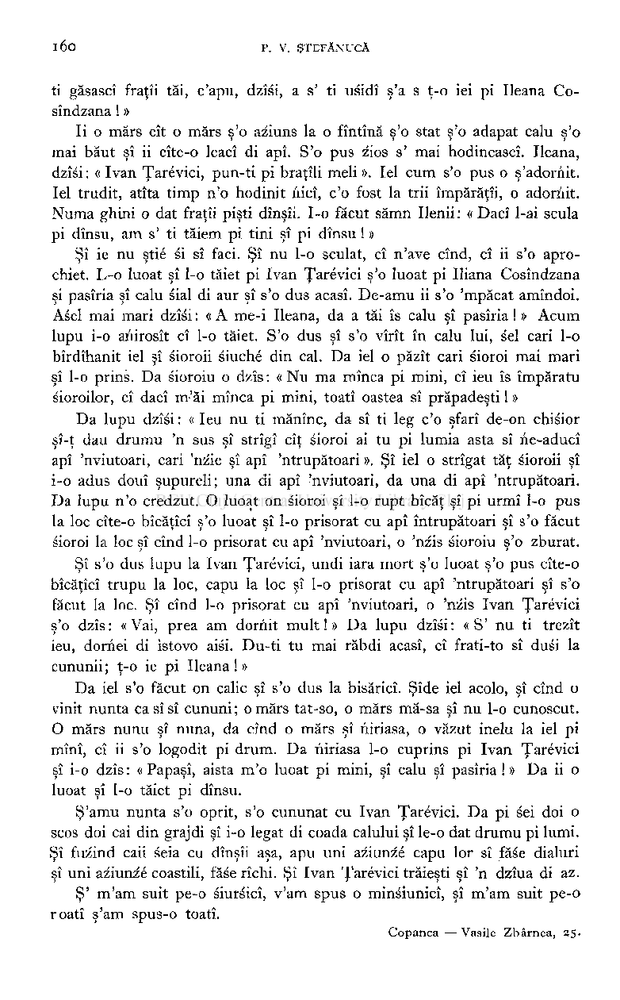

# tigăsascî fraţii tăi, c'apu, dzîsi, a s' ti usidî ş'a s ţ-o iei pi Ileana Cosîndzana ! »

# Ii o mărs cît o mărs ş'o aziuns la o fîntîna ş'o stat ş'o adăpat calu ş'o mai băut şî ii cîte-o leacî di apî. S'o pus zios s' mai hodineascî. Ileana, dzîsi : « Ivan Ţarevici, pun-ti pi braţîli meii ». Iei cum s'o pus o ş'adornit. Iei trudit, atîta timp n'o hodinit nicî, c'o fost la trii împărăţii, o adornit. Numa ghini o dat fraţîi pişti dînşîi. I-o făcut sămn Ilenii: « Dacî l-ai scula pi dînsu, am s' ti tăiem pi tini şî pi dînsu ! »

# Şî ie nuştiesi sî faci. Şî nu l-o sculat, cî n'ave cînd, cî ii s'o aprochiet. L-o luoat şî l-o tăiet pi Ivan Ţarevici ş'o luoat pi Uiana Cosîndzana şi pasîria şî calu sial di aur şî s'o dus acasî. De-amu ii s'o 'mpăcat amîndoi. Asel mai mari dzîsi : « A me-i Ileana, da a tăi îs calu şî pasîria ! » Acum lupu i-o aiiirosît cî l-o tăiet. S'o dus şî s'o vîrît în calu Iui, sel cari l-o

# bîrdîhanit iei şî sioroii siuché din cal. Da iei o păzît cari sioroi mai marişî l-o prins. Da sioroiu o dzîs : « Nu ma mînca pi mini, cî ieu îs împăratusioroilor, cî dacî m'ăi mînca pi mini, toatî oastea sî prăpădeşti ! »

# Da lupu dzîsi : « leu nu ti mănînc, da sî ti leg c'o şfarî de-on chisior şî-ţ dau drumu 'n sus şî strîgî cîţ sioroi ai tu pi lumia asta sî ne-aducî apî 'nviutoari, cari 'nzie şî apî 'ntrupătoari ». Şî iei o strigat tăţ sioroii şî i-o adus douî şupureli; una di apî 'nviutoari, da una di apî 'ntrupătoari. Da lupu n'o credzut. O luoat on sioroi şî l-o rupt bîcăţ şî pi urmi l-o pus la loc cîte-o bîcăţîcî ş'o luoat şî l-o prisorat cu apî întrupătoari şî s'o făcut sioroi la loc şî cînd l-o prisorat cu apî 'nviutoari, o 'nzis sioroiu ş'o zburat.

# Şî s'o dus lupu la Ivan Ţarevici, undi iara mort ş'o luoat ş'o pus cîte-o

# bîcăţîcî trupu la loc, capu la loc şî l-o prisorat cu apî 'ntrupătoari şî s'ofăcut la loc. Şî cînd l-o prisorat cu apî 'nviutoari, o 'nzis Ivan Ţareviciş'o dzîs: «Vai, prea am dorrîit mult!» Da lupu dzîsi: « S' nu ti trezitieu, dortiei di istovo aisi. Du-ti tu mai răbdi acasî, cî frati-to sî dusi lacununii; ţ-o ie pi Ileana ! »

# Da iei s'o făcut on calic şî s'o dus la bisăricî.Sideiei acolo, şî cînd o vinit nunta casîsî cununi; o mărs tat-so, o mărs mă-sa şî nu l-o cunoscut. O mărs nunu şî nuna, da cînd o mărs şî niriasa, o văzut inelu la iei pi mînî, cî ii s'o logodit pi drum. Da niriasa l-o cuprins pi Ivan Ţarevici şî i-o dzîs : « Papaşî, aista m'o luoat pi mini, şî calu şî pasîria ! » Da ii o luoat şî l-o tăiet pi dînsu.

# Ş'amu nunta s'o oprit, s'o cununat cu Ivan Ţarevici. Da pi sei doi o scos doi cai din grajdi şî i-o legat di coada calului şî le-o dat drumu pi lumi. Şî fuzind caii seia cu dînşîi aşa, apu uni aziunze capu lor sî făse dialuri şî uni aziunzé coastili, făse rîchi. Şî Ivan Ţarevici trăieştişî'n dzîua di az.

# Ş' m'am suit pe-o siursicî, v'am spus o minsiunicî, şî m'am suit pe-o roatî ş'am spus-o toatî.

Copanca—Vasile Zbârnea, 25.

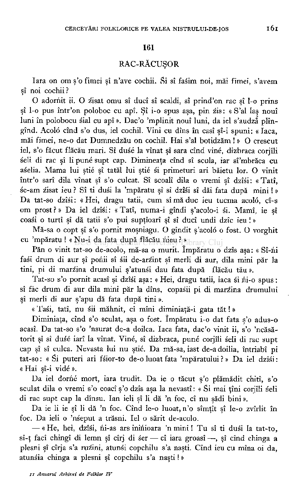

# 161 RAC-RACUŞOR

# Iara on om ş'o fimei şî n'ave cochii.Sisî fasim noi, măi fimei, s'avem şî noi cochii?

# O adornit ii. O zisat omu sî ducî sî scaldi, sî prind'on rac şî l-o prins şî l-o pus într'on poloboc cu apî. Şî i-o spus aşa, pin zis: « S'al laş nouî luni în polobocu sial cu apî ». Dac'o 'mplinit nouî luni, da iei s'audza plîngînd.Acolocînd s'o dus, iei cochii. Vini cu dîns în casî şî-i spuni: « Iaca, măi fimei, ne-o dat Dumnedzău on cochii. Hai s'al botidzăm ! » O crescut iei, s'o făcut flăcău mari. Sî dusé la vînat şî sara cîndvine,dizbraca corjîli seli di rac şî li puné supt cap. Dimineaţa cînd sî scula, iar sî'mbrăca cu aselia. Mama lui ştieşî tatăl lui ştiesi primeturi ari băietu lor. O vinit într'o sarî dila vînat şî s'o culcat. Sî scoalî dila o vremi şî dzîsi: « Tatî, se-am zisat ieu ? Sî ti dusi la 'mpăratu şî sî dzîsi sî dăi fata după mini ! » Da tat-so dzîsi : « Hei, dragu tatii, cum sî mă duc ieu tucmaacolo,cî-s

# om prost?» Da iei dzîsi: «Tatî, numa-i gîndi ş'acolo-i si. Mamî, ie şîcoasi o turtî şî dă tatii s'o pui supţîoarî şî sî ducî undi dzîc ieu ! »

# Mă-sa o copt şî s'o pornit moşniagu. O gînditş'acoloo fost. O vorghit cu 'mpăratu ! « Nu-i da fata după flăcău nieu ? »

# Păn o vinit tat-so de-acolo, mă-sa o murit. împăratu o dzîs aşa: « Sî-ni fasi drum di aur şî ponii sî sii de-arzint şî merii di aur, dila mini păr la tini, pi di marzina drumului ş'atunsi dau fata după flăcău tău ».

# Tat-so s'o pornit acasî şi dzîsi aşa: « Hei, dragu tatii, iaca sifîi-ospus: sî fàc drum di aur dila mini păr la dîns, copasii pi di marzina drumului şî merii di aur ş'apu dă fata după tini ».

# « Tasi, tatî, nu sii măhnit, cî mîni diminiaţă-i gata tăt ! » Diminiaţa, cînd s'o sculat, aşa o fost. împăratu i-o dat fata ş'o adus-o acasî. Da tat-so s'o 'nsurat de-a doilea. Iaca fata, dac'o vinit ii, s'o 'ncăsătorit şî sî dusé iarî la vînat.Vine,sî dizbraca, puné corjîli seli di rac supt cap şî sî culca. Nevasta lui nu ştie.Da mă-sa, iast de-a doilia, întriabî pi tat-so :« Siputeri ari fsior-to de-o luoat fata 'mpăratului ? » Da iei dzîsi : « Hai şî-i vidé ».

# Da iei domemort, iara trudit. Da ie o tăcut ş'o plămădit chitî, s'o sculat dila o vremi s'o coacî ş'o dzîs aşa la nevastî: «Simai ţîni corjîli seli di rac supt cap la dînsu. Ian ieli şî li dă 'n foc, cî nu sădibini ».

# Da ie li ie şî li dă 'n foc. Cînd le-o luoat, n'o sîmţît şî le-o zvîrlit în foc. Da ieli o 'nseput a trăsni. Iei o sărit de-acolo.

# — « He, hei, dzîsi, ni-as ars ininioara 'n mini ! Tu sî ti dusi la tat-to,

# sî-ţ facî chingî di lemn şî cîrj di ser — cî iara groasî —, şî cînd chinga a plesni şî cîrja s'a ruzini, atunsi copchilu s'a naşti. Cînd ieu cu mîna oi da, atunsia chinga a plesni şî copchilu s'a naşti ! »

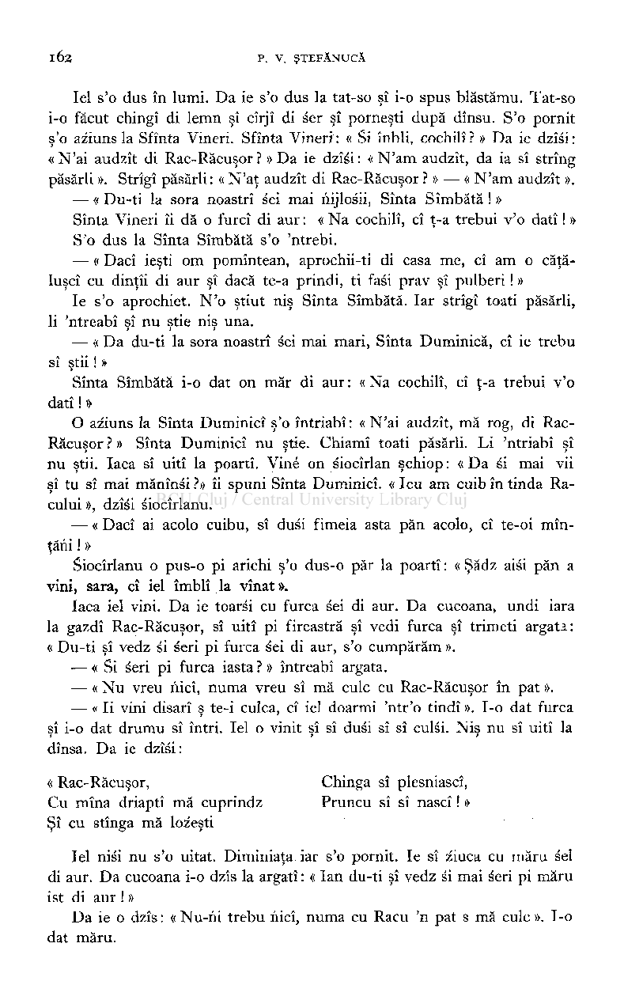

# Iei s'o dus în lumi. Da ie s'o dus la tat-so şî i-o spus blăstămu. Tat-so i-o făcut chingi di lemn şî cîrjî di ser şî porneşti după dînsu. S'o pornit ş'o aziuns la Sfînta Vineri. Sfînta Vineri: «Siînbli, cochilî? » Da ie dzîsi: « N'ai audzît di Rac-Răcuşor ? » Da ie dzîsi: « N'am audzît, da ia sî string păsării ». Strîgî păsării : « N'aţ audzît di Rac-Răcuşor ?» — « N'am audzît ».

# — «Du-tila sora noastrî sei mai nijlosii, Sînta S îmbată ! » Sînta Vineri îi dă o furcî di aur : « Na cochilî, cî ţ-a trebui v'o datî ! » S'o dus la Sînta Sîmbătă s'o 'ntrebi.

# — « Dacî ieşti om pomîntean, aprochii-ti di casa me, ci am o căţăluşcî cu dinţii di aur şî dacă te-a prindi, ti fasi prav şî pulberi ! »

# Ie s'o aprochiet. N'o ştiut niş Sînta Sîmbătă. Iar strîgî toati păsării, li'ntreabî şî nu ştie niş una.

# — « Da du-ti la sora noastrî sei mai mari, Sînta Duminică, cî ie trebu sî ştii ! »

# Sînta Sîmbătă i-o dat on măr di aur : « Na cochilî, cî ţ-a trebui v'o datî ! »

# O aziuns la Sînta Duminici ş'o întriabî: « N'ai audzît, mă rog, di RacRăcuşor ? » Sînta Duminici nu ştie. Chiamî toati păsării. Li 'ntriabî şî nu ştii. Iaca sî uitî la poartî. Viné on siocîrlan şchiop : « Da si mai vii şî tu sî mai mănînsi ?» îi spuni Sînta Duminici. « leu am cuib în tinda Racului », dzîsi siocîrlanu.

# — « Dacî ai acolo cuibu, sî dusi fimeia asta păn acolo, cî te-oi mînţăni ! »

# Siocîrlanuo pus-o piarichiş'o dus-o păr la poartî: « Şădz aisi păn a vini,sara,cî iei îmblîlavînat».

# Iaca iei vini. Da ie toarsi cu furca sei di aur. Da cucoana, undi iara la gazdî Rac-Răcuşor, sî uitî pi fireastră şî vedi furca şî trimeti argata: « Du-ti şî vedzsiseri pi furca sei di aur, s'o cumpărăm ».

# — « Siseri pi furca iasta ? » întreabî argata.

# — « Nu vreu nicî, numa vreu sî mă culc cu Rac-Răcuşor în pat ».

# — « Ii vini disarî ş te-i culca, cî iei doarmi 'ntr'o tindî ». I-o dat furca şî i-o dat drumu sî întri. Iei o vinit şî sî dusi sî sî culsi. Niş nu sî uitî la dînsa. Da ie dzîsi:

# « Rac-Răcuşor, Chinga sî plesniascî, Cu mîna driaptî mă cuprindz Pruncu sî sî nascî ! » Şî cu stînga mă lozeşti

# Iei nisi nu s'o uitat. Diminiaţa iar s'o pornit. Ie sî ziuca cu măru sel di aur. Da cucoana i-o dzîs la argatî: « Ian du-ti şî vedz si mai seri pi măru ist di aur ! »

# Da ie o dzîs: « Nu-rii trebu nicî, numa cu Racu 'n pat s mă culc ». I-o

# dat măru.

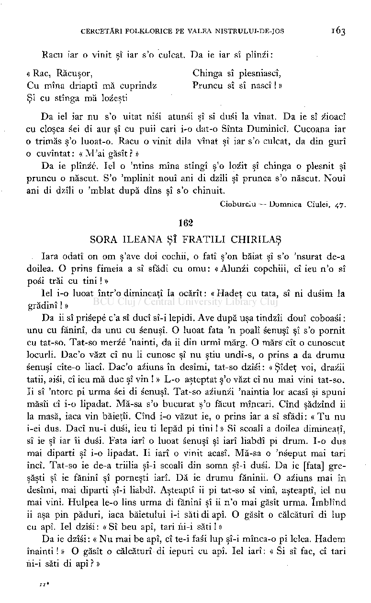

# Racu iar o vinit şî iar s'o culcat. Da ie iar sî plînzi: « Rac, Răcuşor, Chinga sî plesniascî, Cu mîna driaptî mă cuprindz Pruncu sî sî nascî ! » Şî cu stînga mă lozeşti

# Da iei iar nu s'o uitat nisi atunsi şî sî dusi la vînat. Da ie sî zioacî cu cloşca sei di aur şî cu puii cari i-o dat-o Sînta Duminici. Cucoana iar

- o trimăs ş'o luoat-o. Racu o vinit dila vînat şî iar s'o culcat, da din guri
- o cuvîntat: « M'ai găsît? >> Da ie plînzé. Iei o 'ntins mîna stîngî ş'o lozit şî chinga o plesnit şî

# pruncu o născut. S'o 'mplinit nouî ani di dzîli şî prunca s'o născut. Nouî ani di dzîli o 'mblat după dîns şî s'o chinuit.

Cioburciu — Domnica Ciulei, 47.

# 162 SORA ILEANA ŞÎ FRATILI CHIRILAŞ

# Iara odatî on om ş'ave doi cochii, o fatî ş'on băiat şî s'o 'nsurat de-a doilea. O prins fimeia a sî sfădi cu omu : « Alunzi copchiii, cî ieu n'o sî posi trăi cu tini ! »

# Iei i-o luoat într'o dimineaţî la ocărit : « Hadeţ cu tata, sî ni dusim la grădini ! »

# Da ii sî prisepé c'a sî ducî sî-i lepidi. Ave după uşa tindzîi douî coboasi : unu cu făninî, da unu cu senuşî. O luoat fata 'n poalî senuşî şî s'o pornit cu tat-so. Tat-so merzé 'nainti, da ii din urmî mărg. O mărs cît o cunoscut locurli. Dac'o văzt cî nu li cunosc şî nu ştiu undi-s, o prins a da drumu senuşî cîte-o liacî. Dac'o aziuns în desimi, tat-so dzîsi : « Şîdeţ voi, drazii tatii, aisi, cî ieu mă duc şî vin ! » L-o aşteptat ş'o văzt cî nu mai vini tat-so. Ii sî 'ntorc pi urma sei di senuşî. Tat-so aziunzi 'naintia lor acasî şi spuni măsîi cî i-o lipadat. Mă-sa s'o bucurat ş'o făcut mîncari. Cînd şădzînd ii la masă, iaca vin băieţii. Cînd i-o văzut ie, o prins iar a sî sfădi: « Tu nu i-ei dus. Dacî nu-i dusi, ieu ti lepăd pi tini ! » Sî scoalî a doilea dimineaţî, sî ie şî iar îi dusi. Fata iarî o luoat senuşî şî iarî liabdî pi drum. I-o dus mai diparti şî i-o lipadat. Ii iarî o vinit acasî. Mă-sa o 'nseput mai tari încî. Tat-so ie de-a triilia şî-i scoalî din somn şî-i dusi. Da ie [fata] greşăşti şî ie făninî şî porneşti iarî. Dă ie drumu făninii. O aziuns mai în desimi, mai diparti şî-i liabdî. Aşteaptî ii pi tat-so sî vinî, aşteaptî, iei nu mai vini. Hulpea le-o lins urma di făninî şî ii n'o mai găsît urma. îmblînd ii aşa pin păduri, iaca băietului i-i săti di apî. O găsît o călcaturi di lup cu apî. Iei dzîsi : « Sî beu apî, tari rii-i săti ! »

# Da ie dzîsi : « Nu mai be apî, cî te-i fasi lup şî-i mînca-o pi lelea. Hadem înainti ! » O găsît o călcaturi di iepuri cu apî. Iei iarî : « Si sî fac, cî tari hi-i săti di apî ? »

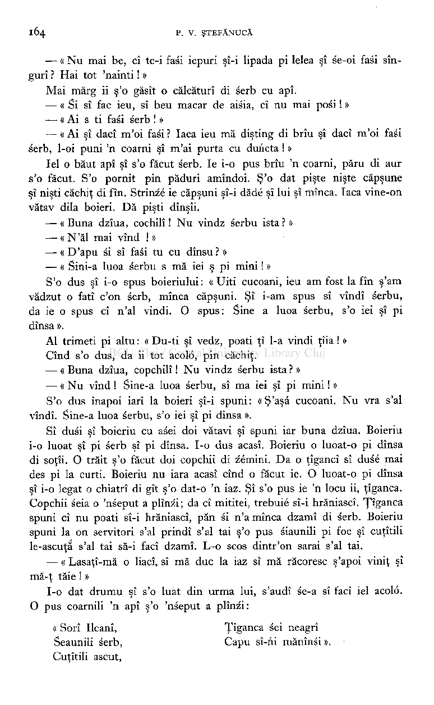

# — « Nu mai be, cî te-i fasi iepuri şî-i lipada pi lelea şî se-oi fasi singuri ? Hai tot 'nainti ! »

# Mai mărg ii ş'o găsît o călcaturi di serb cu apî.

# — « Si sî fac ieu, sî beu măcar de aisia, cî nu mai posi ! »

# — « Ai s ti fasi serb ! »

# — « Ai şî dacî m'oi fasi ? Iaca ieu mădistingdi brîu şî dacî m'oi fasi serb, l-oi puni 'n coarni şî m'ai purta cu duheta ! »

# Iei o băut apî şî s'o făcut serb. Ie i-o pus brîu 'n coarni, păru di aur s'o făcut. S'o pornit pin păduri amîndoi. Ş'o dat pişte nişte căpşune şî nişti căchiţ di fîn. Strînzé ie căpşuni şî-idadeşî lui şî mînca. Iaca vine-on vătav dila boieri. Dă pişti dînşîi.

# — « Buna dzîua, cochilî ! Nu vindz serbu ista ? »

# — « N'ăl mai vînd ! »

# — « D'apu si sî fasi tu cu dînsu?»

# — « Sini-a luoa serbu s mă iei ş pi mini ! » S'o dus şî i-o spus boieriului: « Uiti cucoani, ieu am fost la fin ş'am vădzut o fatî c'on serb, mînca căpşuni. Şî i-am spus sî vîndî serbu, da ie o spus cî n'al vindi. O spus: Sine a luoa serbu, s'o iei şî pi dînsa ».

# Al trimeti pi altu : « Du-ti şî vedz, poati ţî1-a vindi ţîia ! » Cînd s'o dus, da ii totacolo,pin căchiţ.

# — « Buna dzîua, copchilî ! Nu vindz serbu ista ? »

# — « Nu vînd ! Sine-a luoa serbu, sî ma iei şî pi mini ! » S'o dus înapoi iarî la boieri şî-i spuni: « Ş'aşâ cucoani. Nu vra s'al

# vîndî. Sine-a luoa serbu, s'o iei şî pi dînsa ».

# Sî dusi şî boieriu cu asei doi vătavi şî spuni iar buna dzîua. Boieriu i-o luoat şî pi serb şî pi dînsa. I-o dus acasî. Boieriu o luoat-o pi dînsa di soţîi. O trăit ş'o făcut doi copchii di zémini. Da o ţîgancî sî dusé mai des pi la curţi. Boieriu nu iara acasî cînd o făcut ie. O luoat-o pi dînsa şî i-o legat o chiatrî di gît ş'o dat-o 'n iaz. Şî s'o pus ie 'n locu ii, ţîganca. Copchii seia o 'nseput a plînzi; da cî mititei, trebuie sî-i hrăniascî. Ţîganca spuni cî nu poati sî-i hrăniascî, păn si n'a mînca dzamî di serb. Boieriu spuni la on servitori s'al prindî s'al tai ş'o pus siaunili pi foc şî cuţîtili le-ascuţă s'al tai să-i facî dzamî. L-o scos dintr'on sărai s'al tai.

# — « Lasaţî-mă o liacî, sî mă duc la iaz sî mă răcoresc ş'apoi viniţ şî mă-ţ tăie ! »

# I-o dat drumu şî s'o luat din urma lui, s'audî se-a sî facî iei acolo. O pus coarnili 'n apî ş'o 'nseput a plînzi:

# « Sorî Ileanî, Ţîganca sei neagrî Seaunili serb, Capu sî-hi mănînsi ». Cuţîtili ascut,

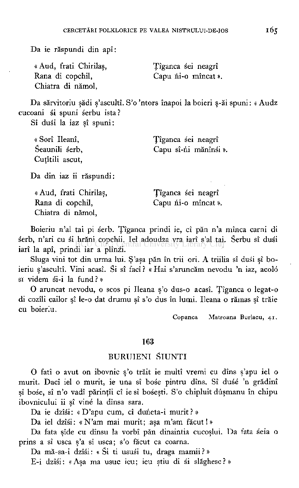

# Da ie răspundi din apî: « Aud, fraţi Chirilaş, Ţiganca sei neagrî Rana di copchil, Capu ni-o mîncat ». Chiatra di nămol,

# Da sărvitoriusădiş'ascultî. S'o 'ntors înapoi la boieri ş-ăi spuni : « Audz cucoani si spuni serbu ista?

# Sî dusi la iaz şî spuni:

# « Sorî Ileanî, Ţiganca sei neagrî Seaunili serb, Capu sî-ni mănînsi ». Cuţîtili ascut,

# Da din iaz îi răspundi:

# « Aud, fraţi Chirilaş, Ţiganca sei neagrî Rana di copchil, Capu ni-o mîncat ». Chiatra di nămol,

# Boieriu n'al tai pi serb. Ţiganca prindi ie, cî păn n'a mînca carni di serb, n'ari cu si hrăni copchii. Iei adoudza vra iarî s'al tai. Serbu sî dusi iarî la apî, prindi iar a plînzi.

# Sluga vini tot din urma lui. Ş'aşa păn în trii ori. A triilia sî dusi şî boieriu ş'ascultî. Vini acasî. Si sî facî ? « Hai s'aruncăm nevodu 'n iaz,acolo si videm si-i la fund ? »

# O aruncat nevodu, o scos pi Ileana ş'o dus-o acasî. Ţiganca o legat-o di cozîli cailor şî le-o dat drumu şî s'o dus în lumi. Ileana o rămas şî trăie cu boieriu.

Copanca — Matroana Burlacu, 41 .

# 163 BURUIENI SIUNTI

# O fatî o avut on ibovnic ş'o trăit ie multî vremi cu dins ş'apu iei o murit. Dacî iei o murit, ie una sî bose pintru dins. Si dusé 'n grădini şî bose, si n'o vadî părinţii cî ie sî boseşti. S'o chipluit duşmanu în chipu ibovnicului ii şî viné la dînsa sara.

# Da ie dzîsi: « D'apu cum, cî duneta-i murit?» Da iei dzîsi: «N'am mai murit; aşa m'am făcut!» Da fatasidecu dînsu la vorbî păn dinaintia cucoşlui. Da fata seia o

# prins a sî usca ş'a sî usca; s'o făcut ca coarna. Da mă-sa-i dzîsi : « Si ti ususi tu, draga mamii ? » E-i dzîsi : « Aşa ma usuc ieu ; ieu ştiu di si slăghesc ? »

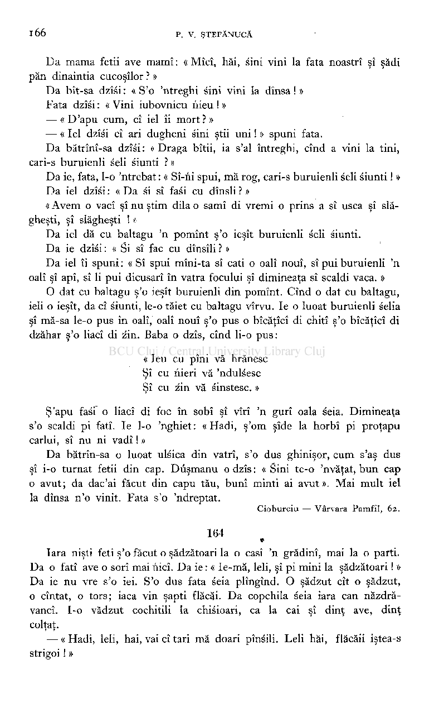

# păn dinaintia cucoşîlor ? »Da mama fetii ave mamî : « Mîcî, hăi, sini vini la fata noastrî şîsădi

# Da bît-sa dzîsi: «S'o 'ntreghi sini vini la dînsa!»Fata dzîsi : « Vini iubovnicu nieu ! »

# — « D'apu cum, cî iei îi mort?»

# — « Iei dzîsi cî ari dugheni sini ştii uni ! » spuni fata. Da bătrînî-sa dzîsi: «Draga biţii, ia s'al întreghi, cînd a vini la tini,

# cari-s buruienii seli siunti ? » Da ie, fata, l-o 'ntrebat : « Sî-ni spui, mă rog, cari-s buruienii seli siunti ! » Da iei dzîsi : « Da si sî fasi cu dînsli ? » « Avem o vacî şî nu ştim dila o samî di vremi o prins a sî usca şî slă-

# gheşti, şî slăgheşti ! » Da iei dă cu baltagu 'n pomînt ş'o ieşit buruienii seli siunti. Da ie dzîsi : « Si sî fac cu dînsîli ? » Da iei îi spuni : « Sî spui mîni-ta sî cati o oalî nouî, sî pui buruienii 'n

# oalî şî apî, sî li pui dicusarî în vatra focului şî dimineaţa sî scaldi vaca. »

# O dat cu baltagu ş'o ieşît buruienii din pomînt. Cînd o dat cu baltagu, ieli o ieşît, da cî siunti, le-o tăiet cu baltagu vîrvu. Ie o luoat buruienii selia şî mă-sa le-o pus în oalî, oalî nouî ş'o pus o bîcăţîcî di chitî ş'o bîcăţîcî di dzăhar ş'o liacî di zin. Baba o dzîs, cînd li-o pus:

# « leu cu pini vă hrănesc Şî cu nieri vă 'ndulsesc Şî cu zin vă sinstesc. »

# Ş'apu fasi o liacî di foc în sobî şî vîrî 'n gurî oala seia. Dimineaţa s'o scaldi pi fatî. Ie l-o 'nghiet : « Hadi, ş'om şîde la horbî pi proţapu carlui, si nu ni vadî ! »

# Da bătrîn-sa o luoat ulsica din vatrî, s'o dus ghinişor, cum s'aş dus şî i-o turnat fetii din cap. Duşmanu o dzîs: «Sini te-o 'nvăţat, bun cap o avut; da dac'ai făcut din capu tău, bunî minţi ai avut». Mai mult iei la dînsa n'o vinit. Fata s'o 'ndreptat.

Cioburciu — Varvara Pamfil, 62.

# 164

# Iara nişti feti ş'o făcut o şădzătoari la o casî 'n grădini, mai la o parti, Da o fatî ave o sorî mai nicî. Da ie : « le-mă, leii, şî pi mini la şădzătoari ! » Da ie nu vre s'o iei. S'o dus fata seia plîngînd. O şădzut cît o şădzut, o cîntat, o tors; iaca vin şapti flăcăi. Da copchila seia iara can năzdrăvanei. I-o vădzut cochitili la chisioari, ca la cai şî dinţ ave, dinţ colţaţ.

# — « Hadi, leii, hai, vai cî tari mă doari pînsili. Leii hăi, flăcăii iştea-s strigoi ! »

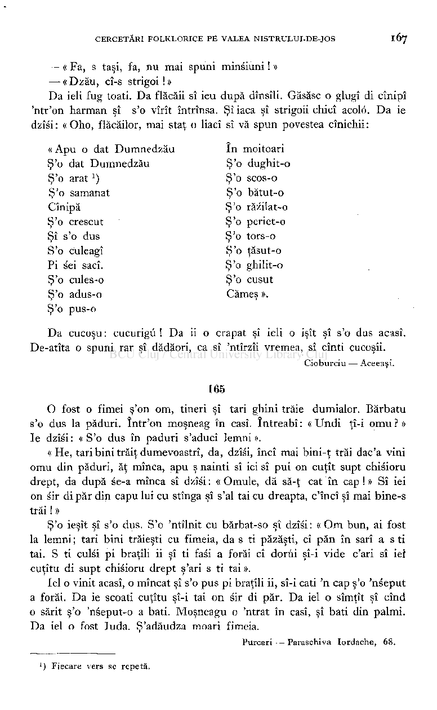

# — « Fa, s taşi, fa, nu mai spuni minsiuni ! »

# — «Dzău, cî-s strigoi!» Da ieli fug toati. Da flăcăii sî ieu după dînsîli. Găsăsc o glugî di cînipî

# 'ntr'on harman şî s'o vîrît întrînsa. Şî iaca şî strigoii chicî acolö. Da ie dzîsi: « Oho, flăcăilor, mai stat o liacî sî vă spun povestea cînichii:

# în moitoari Ş'o dughit-o Ş'o scos-o Ş'o bătut-o Ş'o răzilat-o Ş'o periet-o Ş'o tors-o Ş'o ţăsut-o Ş'o ghilit-o Ş'o cusut Cămes ».

# « Apu o dat Dumnedzău Ş'o dat Dumnedzău Ş'o arat *) Ş'o samanat Cînipă Ş'o crescut Şî s'o dus S'o culeagî Pi sei sacî. Ş'o cules-o Ş'o adus-o Ş'o pus-o

# Da cucoşu : cucurigu ! Da ii o crăpat şî ieli o işît şî s'o dus acasî. De-atîta o spuni rar şî dădăori, ca sî 'ntîrzîi vremea, sî cînti cucoşîi.

Cioburciu — Aceeaşi.

# 165

# O fost o fimei ş'on om, tineri şî tari ghini trăie dumialor. Bărbatu s'o dus la păduri. într'on moşneag în casî. întreabî: «Undi ţî-i omu?» Ie dzîsi: «S'o dus în păduri s'aducî lemni ».

# « He, tari bini trăit dumevoastrî, da, dzîsi, încî mai bini-ţ trăi dac'a vini omu din păduri, ăţ mînca, apu ş nainti sî iei sî pui on cuţît supt chisioru drept, da după se-a mînca sî dzîsi : « Omule, dă să-ţ cat în cap ! » Sî iei

# on sir di păr din capu lui cu stingă şî s'al tai cu dreapta, c'încî şî mai bine-străi ! »

# Ş'o ieşit şî s'o dus. S'o 'ntîlnit cu bărbat-so şî dzîsi: « Om bun, ai fost la lemni ; tari bini trăieşti cu f imeia, da s ti păzăşti, cî păn în sari a s ti tai. S ti culsi pi braţîli ii şî ti fasi a forai cî dorni şî-i vide c'ari sî iei cuţîtu di supt chisioru drept ş'ari s ti tai ».

# Iei o vinit acasî, o mîncat şî s'o pus pi braţîli ii, sî-i cati 'n cap ş'o 'nseput a forai. Da ie scoati cuţîtu şî-i tai on sir di păr. Da iei o sîmţît şî cînd o sărit ş'o 'néeput-o a bati. Moşneagu o 'ntrat în casî, şî bati din palmi. Da iei o fost Iuda. Ş'adăudza moari fimeia.

Purcari — Paraschiva Iordache, 68. ) Fiecare vers se repetă.

- l

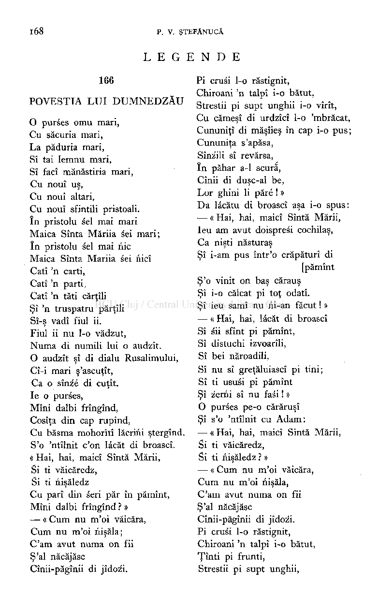

LEGEND E

# Pi crusi l-o răstignit, Chiroani 'n talpî i-o bătut, Strestii pi supt unghii i-o vîrît, Cu cămeşî di urdzîcî l-o 'mbrăcat, Cununiţî di măşîieş în cap i-o pus; Cununiţa s'apăsa, Sînzili sî revărsa, în pahar a-1scură, Cînii di duşc-al be, Lor ghini li paré ! » Da lacătu di broascî aşa i-o spus:

# POVESTIA LU I DUMNEDZÄ U O purses omu mari,

# Cu săcuria mari, La păduria mari, Sî tai lemnu mari, Sî facî mănăstiria mari, Cu nouî uş, Cu nouî altari, Cu nouî sfintili pristoali. în pristolu sel mai mari Maica Sînta Măriia sei mari; în pristolu sel mai nie Maica Sînta Mariia sei nicî Catî 'n cârti, Catî 'n parti, Catî 'n tăti cărţîli Şî 'n truspatru părţîli Sî-ş vadî fiul ii. Fiul ii nu l-o vădzut, Numa di numili lui o audzît. O audzît şî di dialu Rusalimului, Cî-i mari ş'ascuţît, Ca o sînzé di cuţît. Ie o purses, Mîni dalbi frîngînd, Cosiţa din cap rupînd, Cu basma mohorîtî lăcrini ştergînd. S'o 'ntîlnit c'on lacăt di broascî. « Hai, hai, maicî Sîntă Mării, Siti văicăredz, Siti nişăledz Cu parî din seri păr în pămînt, Mîni dalbi frîngînd ? »

# — « Hai, hai, maicî Sîntă Mării, leu am avut doispresi cochilaş, Ca nişti năsturaş Şî i-am pus într'o crăpături di

# [pămînt

# Ş'o vinit on baş cărăuş Şî i-o călcat pi toţ odatî. Şî ieu samî nu ni-an făcut ! »

# — « Hai, hai, lacăt di broascî Sî sii sfînt pi pămînt, Sî distuchi izvoarîli, Sî bei năroadili, Sî nu sî greţăluiascî pi tini; Sî ti ususi pi pămînt Şî zerni sî nu fasi ! » O purses pe-o cărăruşî Şî s'o 'ntîlnit cu Adam:

# — « Hai, hai, maicî Sîntă Mării, Siti văicăredz, Siti nişăledz ? »

# — « Cum nu m'oi văicăra, Cum nu m'oi nişăla, Cam avut numa on fii Ş'al năcăjăsc Cînii-păgînii di jîdozi. Pi crusi l-o răstignit, Chiroani 'n talpî i-o bătut, Ţînti pi frunţi, Strestii pi supt unghii,

# — « Cum nu m'oi văicăra, Cum nu m'oi nişăla; Cam avut numa on fii Ş'al năcăjăsc Cînii-păgînii di jîdozi.

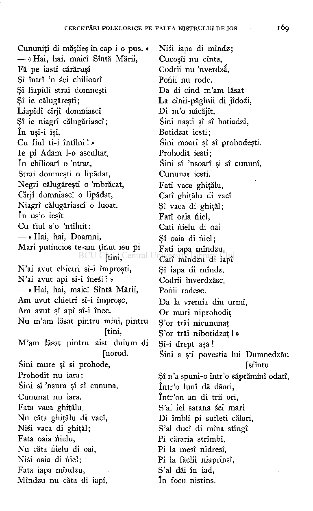

# Cununiţî di măşîieş în cap i-o pus. »

# Nisi iapa di mîndz; Cucoşîi nu cînta, Codrii nu 'nverdză, Ponii nu rode. Da di cînd m'am lăsat La cînii-păgînii di jîdozi, Di m'o năcăjit, Sini naşti şî sî botiadzî, Botidzat ieşti; Sini moari şî sî prohodeşti, Prohodit ieşti; Sini sî 'nsoarî şi sî cununi, Cununat ieşti. Fatî vaca ghiţălu, Catî ghiţălu di vacî Şi vaca di ghiţăl; Fatî oaia niel, Catî nielu di oai Şî oaia di niel; Fatî iapa mîndzu, Catî mîndzu di iapî Şî iapa di mîndz. Codrii înverdzăsc, Ponii rodesc. Da la vremia din urmi, Or muri niprohodiţ Ş'or trăi nicununaţ Ş'or trăi nibotidzaţ ! » Şî-i drept aşa ! Sini a şti povestia lui Dumnedzău

# — « Hai, hai, maicî Sîntă Mării, Fă pe iastî cărăruşî Şî întrî 'n sei chilioarî Şî liapîdî strai domneşti Şî ie călugăreşti; Liapîdî cîrjî domniascî Şî ie niagrî călugăriascî ; în uşî-i işî, Cu fiul ti-i întîlni ! » Ie pi Adam l-o ascultat, în chilioarî o 'ntrat, Strai domneşti o lipădat, Negri călugăreşti o 'mbrăcat, Cîrjî domniascî o lipădat, Niagrî călugăriascî o luoat. în uş'o ieşît Cu fiul s'o 'ntîlnit:

# — « Hai, hai, Doamni, Mari putincios te-am ţînut ieu pi

# [tini,

# N'ai avut chietri sî-i împroşti,

# N'ai avut apî sî-i înesi?»

# — « Hai, hai, maicî Sîntă Mării, Am avut chietri sî-i împroşc, Am avut şî apî sî-i înec. Nu m'am lăsat pintru mini, pintru

# [tini,

# M'am lăsat pintru aist duium di[norod.

# Sini mure şî sî prohode, Prohodit nu iara; Sini sî 'nsura şî sî cununa, Cununat nu iara. Fata vaca ghiţălu, Nu căta ghiţălu di vacî, Nisi vaca di ghiţăl; Fata oaia nielu, Nu căta nielu di oai, Nisi oaia di niel; Fata iapa mîndzu, Mîndzu nu căta di iapî,

# [sfîntu Şî n'a spuni-o într'o săptămînî odatî, într'o lunî dă dăori, într'on an di trii ori, S'al iei satana sei mari Di îmblî pi sufleti călări, S'al ducî di mîna stîngî Pi căraria strîmbî, Pi la mesî nidresî, Pi la făclii niaprinsî, S'al dăi în iad, în focu nistîns.

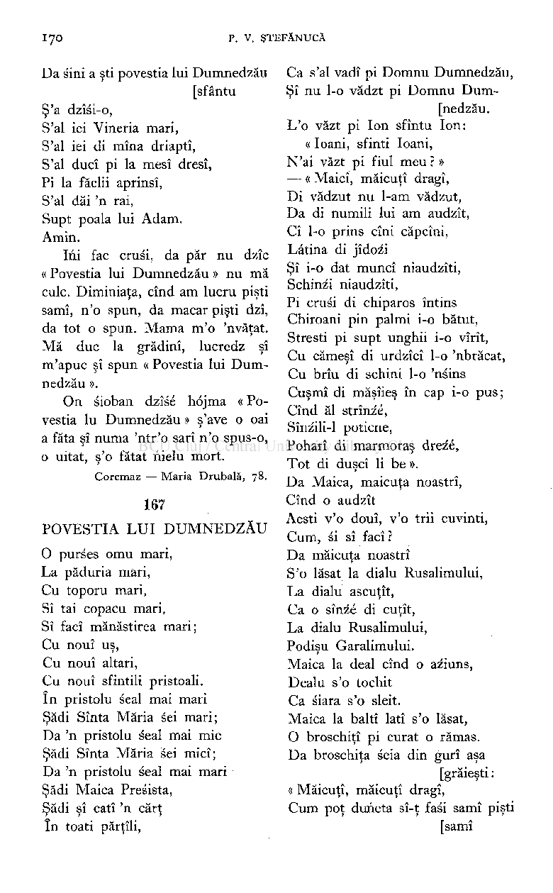

# Ca s'al vadî pi Domnu Dumnedzău, Şî nu l-o vădzt pi Domnu Dum-

# Da sini a şti povestialuiDumnedzău [sfântu

# [nedzău. L'o văzt pi Ion sfîntu Ion:

# Ş'a dzîsi-o, S'al iei Vineria mari, S'al iei di mîna driaptî, S'al ducî pi la mesî dresî, Pi la făclii aprinsî, S'al dăi 'n rai, Supt poala lui Adam. Amin.

# — « Ioani, sfinţi Ioani, N'ai văzt pi fiul meu ? » — « Maici, măicuţî dragî, Di vădzut nu l-am vădzut, Da di numili lui am audzît, Cî l-o prins cîni căpcîni, Latina di jîdozi Şî i-o dat muncî niaudzîti, Schinzi niaudzîti, Pi crusi di chiparos întins Chiroani pin palmi i-o bătut, Stresti pi supt unghii i-o vîrît, Cu cămeşi di urdzîcî l-o 'nbrăcat, Cu brîu di schini l-o 'nsins Cuşmî di măşîieş în cap i-o pus; Cînd ăl strînzé, Sînzili-1poticne, Poharî di marmoraş drezé, Tot di duşcî li be ». Da Maica, măicuţa noastrî, Cînd o audzît Aesti v'o douî, v'o trii cuvinti, Cum, si sî facî ? Da măicuţa noastrî S'o lăsat la dialu Rusalimului, La dialu ascuţit, Ca o sînzé di cuţît, La dialu Rusalimului, Podişu Garalimului. Maica la deal cînd o aziuns, Dealu s'o tochit Ca siara s'o sleit. Maica la baltî latî s'o lăsat, O broschiţî pi curat o rămas. Da broschiţa seia din gurî aşa

# Ini fac crusi, da păr nu dzîc « Povestia lui Dumnedzău » nu mă culc. Diminiaţa, cînd am lucru pişti samî, n'o spun, da măcar pişti dzî, da tot o spun. Mama m'o 'nvăţat. Mă duc la grădini, lucredz şî

# m'apuc şî spun « Povestia lui Dum­nedzău ».

# On sioban dzîse höjma « Povestia lu Dumnedzău » ş'ave o oai a făta şî numa 'ntr'o sarî n'o spus-o, o uitat, ş'o fătat nielu mort.

Corcmaz — Maria Drubală, 78.

# 167 POVESTIA LU I DUMNEDZĂ U O purses omu mari,

# La păduria mari, Cu toporu mari, Sî tai copacu mari, Sî facî mănăstirea mari; Cu nouî uş, Cu nouî altari, Cu nouî sfintili pristoali. în pristolu seal mai mari

# SădiSînta Măria sei mari; Da 'n pristolu seal mai mic SădiSînta Măria sei micî; Da 'n pristolu seal mai mari

# [grăieşti :

# SădiMaica Presista,

# « Măicuţî, măicuţî dragî, Cum poţ duheta sî-ţ fasi samî pişti

# Sădişî catî 'n cărţîn toati părţîli,

# [samî

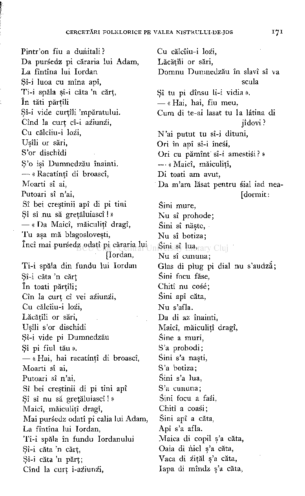

171

# Cu călcîiu-i lozi, Lăcăţîli or sări, Domnu Dumnedzău în slavî sî va

# Pintr'on fiu a dunitali ? Da pursedz pi căraria lui Adam, La fîntîna lui Iordan Şî-i luoa cu mina apî, Ti-i spăla şî-i căta 'n cărţ, în tăti părţîli Şî-i vide curţîli 'mpăratului. Cînd la curţ cî-i aziunzi, Cu călcîiu-i lozi, Uşîli or sări, S'or dischidi Ş'o işî Dumnedzău înainti.

# scula Şî tu pi dînsu li-i vidia ».

# — « Hai, hai, fiu meu, Cum di te-ai lăsat tu la latina di

# jidovi ? N'ai putut tu sî-i dituni, Ori în apî sî-i înesi, Ori cu pămînt sî-i amestisi ? »

# — « Maicî, măiculiţî, Di toati am avut, Da m'am lăsat pentru sial iad nea-

# — « Racatinţî di broascî, Moarti sî ai, Putoari sî n'ai, Sî bei creştinii apî di pi tini Şî sî nu să greţăluiascî ! »

# [dormit :

# Sinimure, Nu sî prohode;

# — « Da Maicî, măiculiţî dragî, Tu aşa mă blagosloveşti, încî mai pursedz odatî pi căraria lui

# Sinisî naşte, Nu sî botiza;

# NSiniu sî cununa;sî lua, Glas di plug pi dial nu s'audză;

# [Iordan,

# Ti-i spăla din fundu lui Iordan Şî-i căta 'n cărţ în toati părţîli; Cîn la curţ cî vei aziunzi, Cu călcîiu-i lozi, Lăcăţîli or sări, Uşîli s'or dischidi Şî-i vide pi Dumnedzău Şî pi fiul tău ».

# Sinifocu făse, Chitî nu cosé; Sini apî căta,

# Nu s'afla. Da di az înainti, Maicî, măiculiţî dragî,

# Sinea muri, S'a prohodi; Sinis'a naşti,

# — « Hai, hai racatinţî di broascî, Moarti sî ai, Putoari sî n'ai, Sî bei creştinii di pi tini apî Şî sî nu să greţăluiascî ! » Maicî, măiculiţî dragî, Mai pursedz odatî pi calia lui Adam, La fîntîna lui Iordan, Ti-i spăla în fundu Iordanului Şî-i căta 'n cărţ, Şî-i căta 'n părţ; Cînd la curţ i-aziunzi,

# S'a botiza; S'a cununa;Sinis'a lua, Sinifocu a fasi, Chitî a coasi; Siniapî a căta, Apî s'a afla. Maica di copil ş'a căta, Oaia di niel ş'a căta, Vaca di ziţăl ş'a căta, Iapa di mîndz ş'acata>

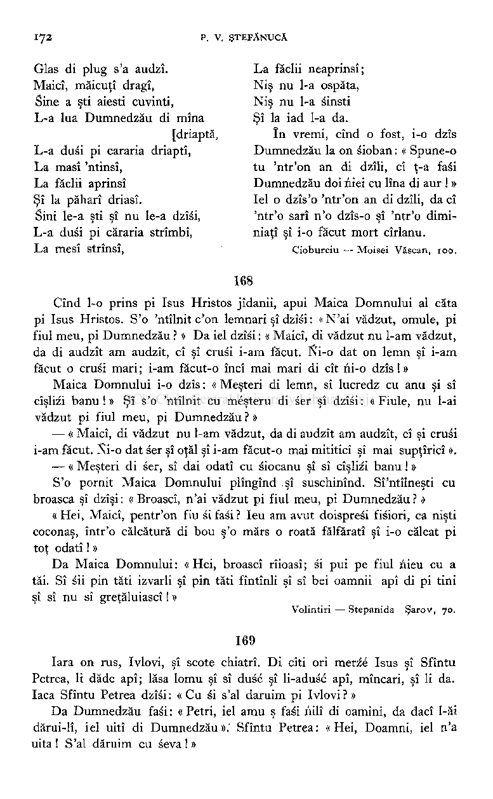

# La făclii neaprinsî; Niş nu l-a ospăta, Nis nu l-a sinsti Şî la iad l-a da.

# Glas di plug s'a audzî. Maicî, măicuţî dragi, Sine a şti aiesti cuvinti, L-a lua Dumnedzău di mîna

# [driaptă, în vremi, cînd o fost, i-o dzîs Dumnedzău la on sioban : « Spune-o tu 'ntr'on an di dzîli, cî ţ-a fasi Dumnedzău doi niei cu lîna di aur ! » Iei o dzîs'o 'ntr'on an di dzîli, da cî 'ntr'o sarî n'o dzîs-o şî 'ntr'o diminiaţî şî i-o făcut mort cîrlanu.

# L-a dusi pi cararia driaptî, La masî 'ntinsî, La făclii aprinsî Şî la păharî driasî. Sini le-a şti şî nu le-a dzîsi, L-a dusi pi căraria strîmbî, La mesî strînsî,

Cioburciu — Moisei Văscan, 100.

# Cînd l-o prins pi Isus Hristos jidanii, apui Maica Domnului al căta168 pi Isus Hristos. S'o 'ntîlnit c'on lemnari şî dzîsi : «N'ai vădzut, omule, pi fiul meu, pi Dumnedzău ? » Da iei dzîsi : « Maicî, di vădzut nu l-am vădzut, da di audzît am audzît, cî şî crusi i-am făcut. Ni-o dat on lemn şî i-am

# făcut o crusi mari ; i-am făcut-o încî mai mari di cît fii-o dzîs ! »Maica Domnului i-o dzîs : « Meşteri di lemn, sî lucredz cu anu şi sî

# cîşlizi banu ! » Şî s'o 'ntîlnit cu meşteru di ser şî dzîsi: «Fiule, nu l-ai vădzut pi fiul meu, pi Dumnedzău ? »

# — « Maicî, di vădzut nu l-am vădzut, da di audzît am audzît, cî şi crusi i-am făcut. Ni-o dat ser şî oţăl şî i-am făcut-o mai mititicî şî mai supţîricî ».

# — « Meşteri di ser, sî dai odatî cu siocanu şî sî cîşlizi banu ! » S'o pornit Maica Domnului plîngînd şî suschinînd. Sî'ntîlneşti cu

# broasca şî dzîşi: « Broascî, n'ai vădzut pi fiul meu, pi Dumnedzău? <>

# « Hei, Maicî, pentr'on fiu si fasi ? Ieu am avut doispresi fisiori, ca nişti coconaş, într'o călcătură di bou ş'o mărs o roată fălfăratî şî i-o călcat pi toţ odatî ! »

# Da Maica Domnului : « Hei, broascî rîioasî ; si pui pe fiul riieu cu a tăi. Sî sii pin tăti izvarli şî pin tăti fîntînli şî sî bei oamnii apî di pi tini şî sî nu sî greţăluiascî ! »

Volintiri — Stepanida Şarov, 70.

# 169

# Iara on rus, Ivlovi, şî scote chiatrî. Di citi ori merze Isus şî Sfîntu Petrea, li dade apî; lăsa lomu şî sî dusé şî li-adusé apî, mîncari, şî li da. Iaca Sfîntu Petrea dzîsi: « Cu si s'al daruim pi Ivlovi? »

# Da Dumnedzău fasi: «Petri, iei amu ş fasi fiilî di oamini, da dacî 1-ăi dărui-lî, iei uitî di Dumnedzău».' Sfîntu Petrea: «Hei, Doamni, iei n'a uita ! S'al dăruim cu seva ! »

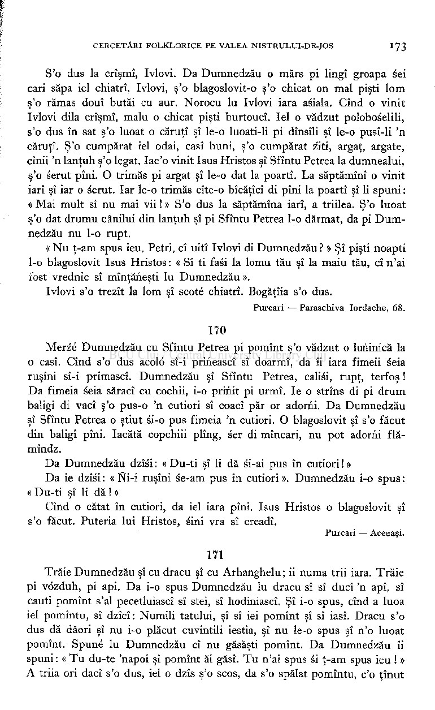

# S'o dus la crîşmî, Ivlovi. Da Dumnedzău o mars pi lingî groapa sei cari săpa iei chiatrî, Ivlovi, ş'o blagoslovit-o ş'o chicat on mal pişti lom ş'o rămas douî butăi cu aur. Norocu lu Ivlovi iara asiala. Cînd o vinit Ivlovi dila crîşmî, malu o chicat pişti burtoucî. Iei o vădzut poloboselili, s'o dus în sat ş'o luoat o căruţî şî le-o luoati-li pi dînsîli şî le-o pusî-li 'n

# căruţî. Ş'o cumpărat iei odai, casî buni, ş'o cumpărat ziti, argat, argate,

# cînii 'n lanţuh ş'o legat. Iac'o vinit Isus Hristos şî Sfîntu Petrea la dumnealui,ş'o serut pîni. O trimăs pi argat şî le-o dat la poartî. La săptămînî o vinitiarî şî iar o serut. Iar le-o trimăs cîte-o bîcăţîcî di pîni la poartî şî li spuni :« Mai mult sî nu mai vii ! » S'o dus la săptămîna iarî, a triilea. Ş'o luoatş'o dat drumu cânilui din lanţuh şî pi Sfîntu Petrea l-o dărmat, da pi Dum­nedzău nu l-o rupt.

# « Nu ţ-am spus ieu, Petri, cî uitî Ivlovi di Dumnedzău ? » Şî pişti noapti l-o blagoslovit Isus Hristos : « Sî ti fasi la lomu tău şî la maiu tău, cî n'ai fost vrednic sî mînţăneşti lu Dumnedzău ».

# Ivlovi s'o trezit la lom şî scote chiatrî. Bogăţîia s'o dus.

Purcari — Paraschiva Iordache, 68.

# 170

# Merzé Dumnedzău cu Sfîntu Petrea pi pomînt ş'o vădzut o luninică la o casî. Cînd s'o dus acolo sî-i prineascî sî doarmî, da îi iara fimeii seia ruşîni sî-i primascî. Dumnedzău şî Sfîntu Petrea, calisi, rupt, terfoş ! Da fimeia seia săracî cu cochii, i-o prinit pi urmî. Ie o strîns di pi drum baligi di vacî ş'o pus-o 'n cutiori sî coacî păr or adorni. Da Dumnedzău şî Sfîntu Petrea o ştiut si-o pus fimeia 'n cutiori. O blagoslovit şî s'o făcut din baligî pîni. Iacătă copchiii plîng, ser di mîncari, nu pot adorni flămîndz.

# Da Dumnedzău dzîsi : « Du-ti şî li dă si-ai pus în cutiori ! » Da ie dzîsi : « Ni-i ruşîni se-am pus în cutiori ». Dumnedzău i-o spus :

# « Du-ti şî li dă ! »

# Cînd o cătat în cutiori, da iei iara pîni. Isus Hristos o blagoslovit şî s'o făcut. Puteria lui Hristos, sini vra sî creadî.

Purcari — Aceeaşi.

# 171

# Trăie Dumnedzău şî cu dracu şî cu Arhanghelu; ii numa trii iara. Trăie pi vözduh, pi api. Da i-o spus Dumnedzău Iu dracu sî sî ducî 'n apî, sî cauţi pomînt s'al pecetluiascî sî stei, sî hodiniascî. Şî i-o spus, cînd a luoa iei pomîntu, sî dzîcî: Numili tatului, şî sî iei pomînt şî sî iasî. Dracu s'o dus dă dăori şî nu i-o plăcut cuvintili iestia, şî nu le-o spus şî n'o luoat pomînt. Spuné lu Dumnedzău cî nu găsăşti pomînt. Da Dumnedzău îi spuni: « Tu du-te 'napoi şî pomînt ăi găsî. Tu n'ai spus si ţ-am spus ieu ! » A triia ori dacî s'o dus, iei o dzîs ş'o scos, da s'o spălat pomîntu, c'o tînut

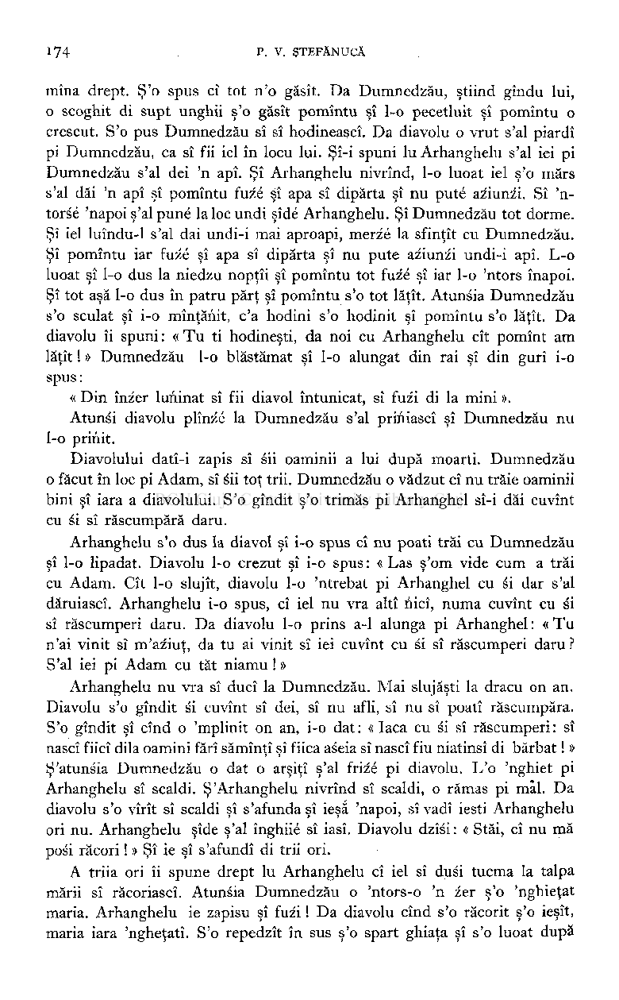

174 P. V. STEFÄNUCÄ

# mîna drept. Ş'o spus cî tot n'o găsît. Da Dumnedzău, ştiind gîndu lui, o scoghit di supt unghii ş'o găsît pomîntu şî l-o pecetluit şî pomîntu o crescut. S'o pus Dumnedzău sî sî hodineascî. Da diavolu o vrut s'al piardî pi Dumnedzău, ca sî fii iei în locu lui. Şî-i spuni lu Arhanghelu s'al iei pi Dumnedzău s'al dei 'n apî. Şî Arhanghelu nivrînd, l-o luoat iei ş'o mărs s'al dăi 'n apî şî pomîntu fuzé şî apa sî dipărta şî nu puté aziunzi. Sî 'ntorsé 'napoi ş'al puné la loc undisideArhanghelu. Şî Dumnedzău tot dorme. Şî ieiluîndu-1s'al dai undi-i mai aproapi, merzé la sfinţit cu Dumnedzău. Şî pomîntu iar fuzé şî apa sî dipărta şî nu pute aziunzi undi-i apî. L-o luoat şî l-o dus la niedzu nopţii şî pomîntu tot fuzé şî iar l-o 'ntors înapoi. Şî tot aşă l-o dus în patru părţ şî pomîntu s'o tot lăţît. Atunsia Dumnedzău s'o sculat şî i-o mînţănit, c'a hodini s'o hodinit şî pomîntu s'o lăţît. Da diavolu îi spuni : « Tu ti hodineşti, da noi cu Arhanghelu cit pomînt am lăţît ! >> Dumnedzău l-o blăstămat şî l-o alungat din rai şî din guri i-o spus:

# « Din înzer luninat sî fii diavol întunicat, sî fuzi di la mini ». Atunsi diavolu plînzé la Dumnedzău s'al priniascî şî Dumnedzău nu

# l-o prinit.

# Diavolului datî-i zapis sî sii oaminii a lui după moarti. Dumnedzău o făcut în loc pi Adam, si sii toţ trii. Dumnedzău o vădzut cî nu trăie oaminii bini şî iara a diavolului. S'o gîndit ş'o trimăs pi Arhanghel sî-i dăi cuvînt cu si sî răscumpără daru.

# Arhanghelu s'o dus la diavol şî i-o spus cî nu poati trăi cu Dumnedzău şî l-o lipădat. Diavolu l-o crezut şî i-o spus : « Las ş'om vide cum a trăi cu Adam. Cît l-o slujit, diavolu l-o 'ntrebat pi Arhanghel cu si dar s'al dăruiascî. Arhanghelu i-o spus, cî iei nu vra altî nicî, numa cuvînt cu si sî răscumperi daru. Da diavolu l-o prins a-1alunga pi Arhanghel : « Tu n'ai vinit sî m'aziuţ, da tu ai vinit sî iei cuvînt cu si sî răscumperi daru ? S'al iei pi Adam cu tăt niamu ! »

# Arhanghelu nu vra sî ducî la Dumnedzău. Mai slujăşti la dracu on an. Diavolu s'o gîndit si cuvînt sî dei, sî nu afli, sî nu sî poatî răscumpăra. S'o gîndit şî cînd o 'mplinit on an, i-o dat: «Iaca cu si sî răscumperi: sî nascî fiicî dila oamini fărî sămînţî şî fiica aseia sî nascî fiu niatinsî di bărbat ! » Ş'atunsia Dumnedzău o dat o arşiţî ş'alfrizepi diavolu. L'o 'nghiet pi Arhanghelu sî scaldi. Ş'Arhanghelu nivrînd sî scaldi, o rămas pi mâl. Da diavolu s'o vîrît sî scaldi şî s'afunda şî ieşă 'napoi, sî vadî ieşti Arhanghelu ori nu. Arhanghelusideş'al înghiié sî iasî. Diavolu dzîsi: « Stăi, cî nu mă posi răcori ! » Şî ie şî s'afundî di trii ori.

# A triia ori îi spune drept lu Arhanghelu cî iei sî dusi tucma la talpa mării sî răcoriascî. Atunsia Dumnedzău o 'ntors-o 'n zer ş'o 'nghieţat maria. Arhanghelu ie zapisu şî fuzi ! Da diavolu cînd s'o răcorit ş'o ieşît, maria iara 'ngheţatî. S'o repedzît în sus ş'o spart ghiaţa şî s'o luoat după

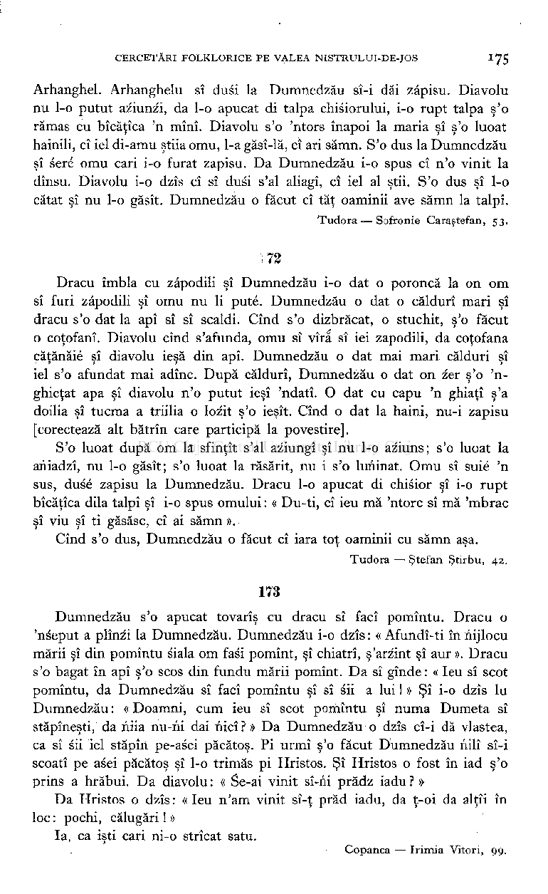

# Arhanghel. Arhanghelu sî dusi la Dumnedzău sî-i dăi zâpisu. Diavolu nu l-o putut aziunzi, da l-o apucat di talpa chisiorului, i-o rupt talpa ş'o rămas cu bîcăţîca 'n mînî. Diavolu s'o 'ntors înapoi la maria şî ş'o luoat hainili, cî iei di-amu ştiia omu, 1-a găsî-lă, cî ari sămn. S'o dus la Dumnedzău şî seré omu cari i-o furat zapisu. Da Dumnedzău i-o spus cî n'o vinit la

# dînsu. Diavolu i-o dzîs cî sî dusi s'al aliagî, cî iei al ştii. S'o dus şî l-o

# cătat şî nu l-o găsît. Dumnedzău o făcut cî tăţ oaminii ave sămn la talpî.

Tudora — Sofronie Caraştefan, 53 .

# Dracu îmbla cu zâpodili şî Dumnedzău i-o dat o poroncă la on om sî furi zâpodili şî omu nu li puté. Dumnedzău o dat o călduri mari şî dracu s'o dat la apî sî sî scaldi. Cînd s'o dizbrăcat, o stuchit, ş'o făcut o coţofanî. Diavolu cînd s'afunda, omu sî vîră sî iei zâpodili, da coţofana

# căţănăie şî diavolu ieşă din apî. Dumnedzău o dat mai mari călduri şîiei s'o afundat mai adine. După călduri, Dumnedzău o dat on zer ş'o 'n-ghieţat apa şî diavolu n'o putut iesî 'ndatî. O dat cu capu 'n ghiaţî ş'adoilia şî tucma a triilia o lozit ş'o ieşît. Cînd o dat la haini, nu-i zapisu[corectează alt bătrîn care participă la povestire].

# S'o luoat după om lâ sfinţit s'al aziungî şî nu l-o aziuns; s'o luoat la ahiadzî, nu l-o găsît; s'o luoat la răsărit, nu i s'o luninat. Omu sîsuie'n sus, dusé zapisu la Dumnedzău. Dracu l-o apucat di chisior şî i-o rupt

# bîcăţîca dila talpî şî i-o spus omului : « Du-ti, cî ieu mă 'ntorc sî mă 'mbracşî viu şî ti găsăsc, cî ai sămn ».

# Cînd s'o dus, Dumnedzău o făcut cî iara toţ oaminii cu sămn aşa.

Tudora — Ştefan Ştirbu, 42.

# 173

# Dumnedzău s'o apucat tovarîş cu dracu sî facî pomîntu. Dracu o 'nseput a plînzi la Dumnedzău. Dumnedzău i-o dzîs: « Afundî-ti în hijlocu mării şî din pomîntu siala om fasi pomînt, şî chiatrî, ş'arzint şî aur ». Dracu s'o băgat în apî ş'o scos din fundu mării pomînt. Da sî gînde: « leu sî scot pomîntu, da Dumnedzău sî facî pomîntu şî sî sii a lui ! » Şî i-o dzîs lu Dumnedzău : « Doamni, cum ieu sî scot pomîntu şî numa Dumeta sî stăpîneşti, da hiia nu-hi dai hicî ? » Da Dumnedzău o dzîs cî-i dă vlastea, ca sî sii iei stăpîn pe-asei păcătos. Pi urmî ş'o făcut Dumnedzău hilî sî-i scoatî pe asei păcătos şî l-o trimăs pi Hristos. Şî Hristos o fost în iad ş'o prins a hrăbui. Da diavolu: «Se-aivinit sî-hi prădz iadu? »

# Da Hristos o dzîs : « leu n'am vinit sî-ţ prad iadu, da ţ-oi da alţîi în loc : pochi, călugări ! »

# Ia, ca işti cari ni-o stricat satu.

Copanca — Irimia Vitori, 99.

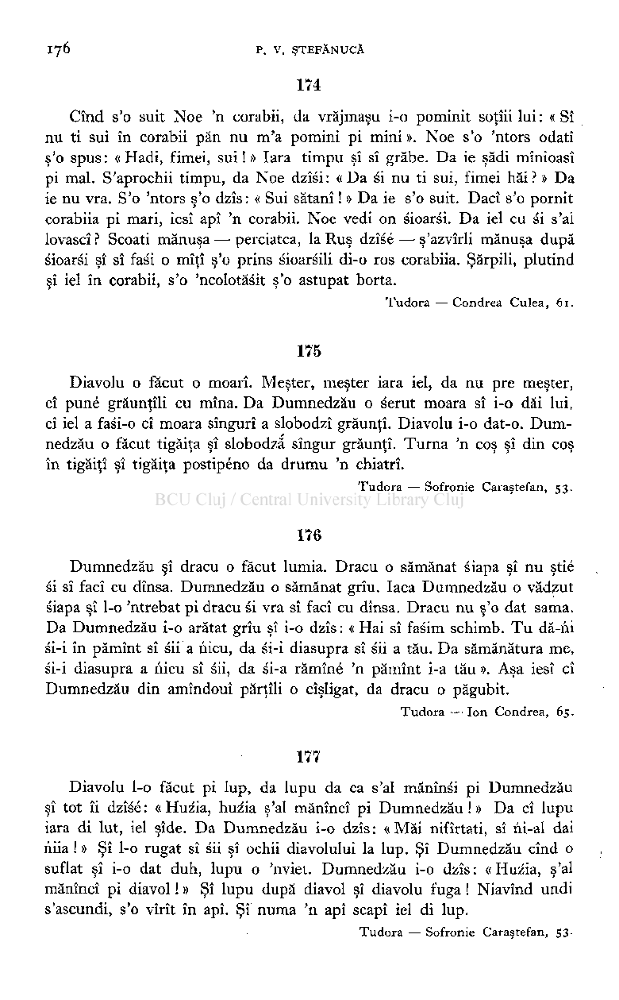

176 P. V. ŞTEFANUCÄ

# 174

# Cînd s'o suit Noe 'n corăbii, da vrăjmaşu i-o pominit soţîii lui : « Sî nu ti sui în corăbii păn nu m'a pomini pi mini ». Noe s'o 'ntors odatî ş'o spus: « Hadi, fimei, sui ! » Iara timpu şî sî grabe. Da ie sădi mînioasî pi mal. S'aprochii timpu, da Noe dzîsi: « Da si nu ti sui, fimei hăt ? » Da ie nu vra. S'o 'ntors ş'o dzîs: « Sui sătanî ! » Da ie s'o suit. Dacî s'o pornit corabiia pi mari, iesî apî 'n corăbii. Noe vedi on sioarsi. Da iei cu si s'ai lovascî? Scoati mănuşa — perciatca, la Rus dzîsé — ş'azvîrli mănuşa după sioarsi şî sî fasi o mîţî ş'o prins sioarsili di-o ros corabiia. Şărpili, plutind şî iei în corăbii, s'o 'ncolotăsit ş'o astupat borta.

Tudora—Condre a Culea, 61 .

# 175

# Diavolu o făcut o moarî. Meşter, meşter iara iei, da nu pre meşter, cî puné grăunţîli cu mîna. Da Dumnedzău o serut moara sî i-o dăi lui, ci iei a fasi-o cî moara sîngurî a slobodzî grăunţi. Diavolu i-o dat-o. Dumnedzău o făcut tigăiţa şî slobodză singur grăunţi. Turna 'n coş şî din coş în tigăiţî şî tigăiţa postipéno da drumu 'n chiatrî.

Tudora — Sofronie Caraştefan, 53 .

# 176

# Dumnedzău şî dracu o făcut lumia. Dracu o sămănat siapa şî nu ştie si sî facî cu dînsa. Dumnedzău o sămănat grîu. Iaca Dumnedzău o vădzut siapa şî l-o 'ntrebat pi dracu si vra sî facî cu dînsa. Dracu nu ş'o dat sama. Da Dumnedzău i-o arătat grîu şî i-o dzîs : « Hai sî fasim schimb. Tu dă-ni si-i în pămînt sî sii a nieu, da si-i diasupra sî sii a tău. Da sămănătura me, si-i diasupra a nieu sî sii, da si-a rămîne 'n pămînt i-a tău ». Aşa iesî cî Dumnedzău din amîndouî părţîli o cîşligat, da dracu o păgubit.

Tudora — Ion Condrea, 65.

# 177

# Diavolu l-o făcut pi lup, da lupu da ca s'al mănînsi pi Dumnedzău şî tot îi dzîsé : « Huzia, huzia ş'al mănîncî pi Dumnedzău ! » Da cî lupu iara di lut, iei şîde. Da Dumnedzău i-o dzîs: «Măi nifîrtati, sî ni-al dai niia ! » Şî l-o rugat sî sii şî ochii diavolului la lup. Şî Dumnedzău cînd o suflat şî i-o dat duh, lupu o 'nviet. Dumnedzău i-o dzîs : « Huzia, ş'al

# mănîncî pi diavol ! » Şî lupu după diavol şî diavolu fuga ! Niavînd undis'ascundi, s'o vîrît în apî. Şî numa 'n apî scapî iei di lup.

Tudora — Sofronie Caraştefan, 53.

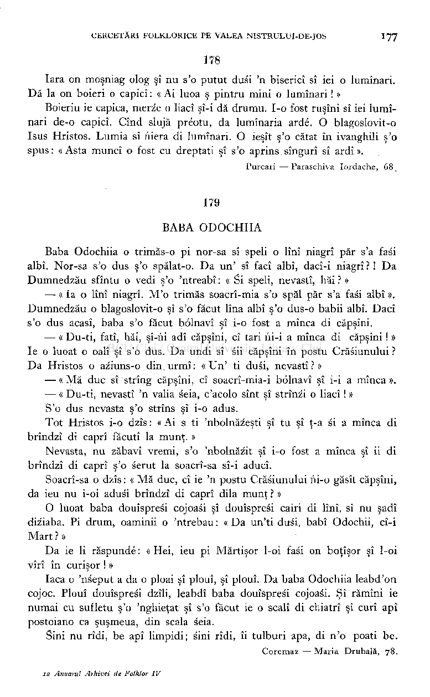

# 178

# Iara on moşniag olog şî nu s'o putut dusi 'n biserici sî iei o luminări. Dă la on boieri o capicî : « Ai luoa ş pintru mini o luminări ! >>

# Boieriu ie capica, merze o liacî şî-i dă drumu. I-o fost ruşîni sî iei lumispus : « Asta muncî o fost cu dreptăţi şî s'o aprins singuri sî ardî ».

# nări de-o capicî. Cînd slujă préotu, da lumînaria ardé. O blagoslovit-oIsus Hristos. Lumia sî niera di luminări. O ieşît ş'o cătat în ivanghili ş'o

Purcari —Paraschiva Iordache, 68.

# 179 BABA ODOCHIIA

# Baba Odochiia o trimăs-o pi nor-sa sî speli o lînî niagrî păr s'a fasi albî. Nor-sa s'o dus ş'o spălat-o. Da un' sî facî albî, dacî-i niagrî ? ! Da Dumnedzău sfîntu o vedi ş'o 'ntreabî: «Sispeli, nevastî, hăi ? »

# — « Ia o lînî niagrî. M'o trimăs soacrî-mia s'o spăl păr s'a fasi albî ». Dumnedzău o blagoslovit-o şî s'o făcut lîna albî ş'o dus-o babii albî. Dacî s'o dus acasî, baba s'o făcut bolnavi şî i-o fost a mînca di căpşîni.

# — « Du-ti, fatî, hăi, şî-ni adî căpşîni, cî tari ni-i a mînca di căpşîni ! » Ie o luoat o oalî şî s'o dus. Da undi sî sii căpşîni în postu Crăsiunului ? Da Hristos o aziuns-o din.urmî: «Un' ti dusi, nevastî?»

# — « Mă duc sî string căpşîni, cî soacrî-mia-i bolnavi şî i-i a mînca ».

# — « Du-ti, nevastî 'n valia seia, c'acolo sînt şî strînzi o liacî ! » S'o dus nevasta ş'o strîns şî i-o adus. Tot Hristos i-o dzîs : « Ai s ti 'nbolnăzeşti şî tu şî ţ-a si a mînca di

# brîndzî di caprî făcutî la munţ. »

# Nevasta, nu zăbavî vremi, s'o 'nbolnăzit şî i-o fost a mînca şî ii di brîndzî di caprî ş'o serut la soacrî-sa sî-i aduci.

# Soacrî-sa o dzîs : « Mă duc, cî ie 'n postu Crăsiunului ni-o găsit căpşîni, da ieu nu i-oi aduşi brîndzî di caprî dila munţ ? »

# O luoat baba douîspresi cojoasi şî douîspresi cairi di lînî, sî nu şadî diziaba. Pi drum, oaminii o 'ntrebau : « Da un'ti dusi, babî Odochii, cî-i Mart ? »

# Da ie li răspunde : « Hei, ieu pi Mărţişor l-oi fasi on boţîşor şî l-oi vîrî în curişor ! »

# Iaca o 'nseput a da o ploai şî plouî, şî plouî. Da baba Odochiia leabd'on cojoc. Plouî douîspresi dzîli, leabdî baba douîspresi cojoasi. Şî rămîni ie numai cu sufletu ş'o 'nghieţat şî s'o făcut ie o scalî di chiatrî şî curî apî postoiano ca şuşmeua, din scala seia.

# Sininu rîdi, be apî limpidi; sini rîdi, îi tulburi apa, di n'o poati be.

Corcmaz — Maria Drubală, 78.

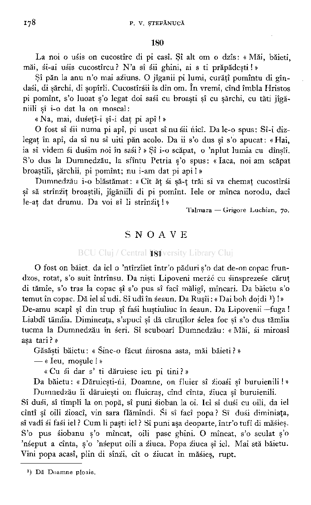

# 180

# La noi o usis on cucostîrcdipi casî. Şî alt om o dzîs : « Măi, băieţi, măi, si-ai usis cucostîrcu ? N'a sî sii ghini, ai s ti prăpădeşti ! »

# Şî păn la anu n'o mai aziuns. O jîganii pi lumi, curăţî pomîntu di gîndasi, di şărchi, di şopîrli. Cucostîrsii îs din om.învremi, cînd îmbla Hristos pi pomînt, s'o luoat ş'o legat doi sasi cu broaşti şî cu şărchi, cu tăti jîgăniili şî i-o dat la on moscal:

# « Na, mai, duseţî-i şî-i daţ pi apî ! » O fost sî sii numa pi apî, pi uscat sî nu sii nicî. Da le-o spus: Sî-i dizlegaţ în apî, da sî nu sî uiti păn acolo. Da ii s'o dus şî s'o apucat: «Hai, ia si videm si dusim noi în sasi ? » Şî i-o scăpat, o 'nplut lumia cu dînşîi. S'o dus la Dumnedzău, la sfîntu Petria ş'o spus: «Iaca, noi am scăpat broaştili, şărchii, pi pomînt; nu i-am dat pi api ! »

# Dumnedzău i-o blăstămat : « Cît ăţ si şă-ţ trăi sî va chemat cucostîrsi şî să strînziţ broaştili, jîgăniili di pi pomînt. Iele or mînca norodu, dacî le-aţ dat drumu. Da voi sî li strînziţ ! »

Talmaza — Grigore Luchian, 70.

SNOAV E

# 181

# O fost on băiet, da iei o 'ntîrzîiet într'o păduri ş'o dat de-on copac frundzos, rotat, s'o suit întrînsu. Da nişti Lipoveni merzé cu sinsprezese căruţ di tămîe, s'o tras la copac şî s'o pus sî faci măligî, mîncari. Da băietu s'o temut în copac. Dă iei sî udi. Sî udî în seaun. Da Ruşîi : « Dai boh dojdi

# ) ! » De-amu scapî şî din trup şî fasi huştiuliuc în seaun. Da Lipovenii—fuga ! Liabdî tămîia. Dimineaţa, s'apucî şî dă căruţîlor selea foc şî s'o dus tămîia tucma la Dumnedzău în seri. Sî scuboarî Dumnedzău : « Măi, si miroasî aşa tari ? »

1

# Găsăşti băietu :«Sine-ofăcut nirosna asta, măi băieţi ? »

# — « leu, moşule ! »

# — «Cu si dar s' ti dăruiesc ieu pi tini?» Da băietu : « Dăruieşti-ni, Doamne, on fluier sî zioasi şî buruienili ! » Dumnedzău îi dăruieşti on fluieraş, cînd cînta, ziuca şî buruienili. Si dusi, si tîmplî la on popă, si puni sioban la oi. Iei sî dusi cu oili, da iei

# cîntî şî oili zioacî, vin sara flămîndi.Sisî facî popa ? Sî dusi diminiaţa,sî vadî si fasi iei ? Cum li paşti iei ? Sî puni aşa deoparte, într'o tufî di măsieş.S'o pus siobanu ş'o mîncat, oili pasc ghini. O mîncat, s'o sculat ş'o'nseput a cînta, ş'o 'nseput oili a ziuca. Popa ziuca şî iei. Mai stă băietu.Vini popa acasî, plin di sînzi, cît o ziucat în măsieş, rupt.

') Dă Doamne ploaie.

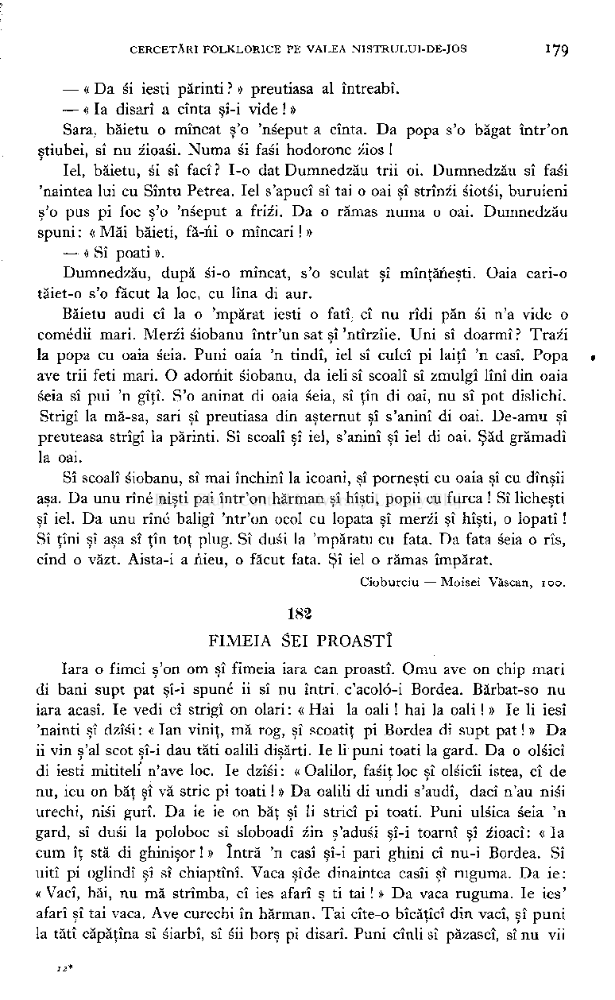

# — « Da si ieşti părinţi ? » preutiasa al întreabî.

# — « Ia disarî a cînta şî-i vide ! » Sara, băietu o mîncat ş'o 'nseput a cînta. Da popa s'o băgat într'on

# ştiubei, sî nu zioasi. Numa si fasi hodoronc zios !

# Iei, băietu, si sî facî ? I-o dat Dumnedzău trii oi. Dumnedzău sî fasi 'naintea lui cu Sîntu Petrea. Iei s'apucî sî tai o oai şî strînzi siotsi, buruieni ş'o pus pi foc ş'o 'nseput a frizi. Da o rămas numa o oai. Dumnedzău spuni : « Măi băieţi, fă-ni o mîncari ! »

# — « Sî poati ». Dumnedzău, după si-o mîncat, s'o sculat şî mînţăneşti. Oaia cari-o

# tăiet-o s'o făcut la loc, cu lîna di aur.

# Băietu audi cî la o 'mpărat ieşti o fatî, cî nu rîdi păn si n'a vide o

# comedii mari. Merzi siobanu într'un sat şî 'ntîrzîie. Uni sî doarmî ? Trazi la popa cu oaia seia. Puni oaia 'n tindî, iei sî culcî pi laiţî 'n casî. Popa * ave trii feti mari. O adorriit siobanu, da ieli sî scoalî sî zmulgî lînî din oaia seia sî pui 'n gîţî. S'o aninat di oaia seia, sî ţîn di oai, nu sî pot dislichi. Strigi la mă-sa, sari şî preutiasa din aşternut şî s'aninî di oai. De-amu şî preuteasa strîgî la părinţi. Sî scoalî şî iei, s'aninî şî iei di oai. Şăd grămădi la oai.

# Sî scoalî siobanu, sî mai închini la icoani, şî porneşti cu oaia şî cu dînşîi

# aşa. Da unu rîné nişti pai într'on hărman şî hîşti, popii cu furca ! Sî licheşti şî iei. Da unu rîné baligi 'ntr'on ocol cu lopata şî merzi şî hîşti, o lopatî ! Sî ţîni şî aşa sî ţîn toţ plug. Sî dusi la 'mpăratu cu fata. Da fata seia o rîs,

# cînd o văzt. Aista-i a nieu, o făcut fata. Şî iei o rămas împărat.

Cioburciu — Moisei Văscan, 100 .

# 182 FIMEIA SEI PROASTÎ

# Iara o fimei ş'on om şî fimeia iara can proastî. Omu ave on chip mari di bani supt pat şî-i spune ii sî nu întri, c'acolö-i Bordea. Bărbat-so nu iara acasî. Ie vedi cî strigi on olari : « Hai la oali ! hai la oali ! » Ie li iesî 'nainti şî dzîsi: « Ian viniţ, mă rog, şî scoatiţ pi Bordea di supt pat ! » D ii vin ş'al scot şî-i dau tăti oalili dişărti. Ie li puni toati la gard. Da o olsicî di ieşti mititeii n'ave loc. Ie dzîsi : « Oalilor, fasiţ loc şî olsicîi istea, cî de nu, ieu on băţ şî vă stric pi toati ! » Da oalili di undi s'audî, dacî n'au nisi urechi, nisi gurî. Da ie ie on băţ şî li strici pi toati. Puni ulsica seia 'n gard, sî dusi la poloboc sî sloboadî zin ş'adusi şî-i toarnî şî zioacî: « Ia cum îţ stă di ghinişor ! » întră 'n casî şî-i pari ghini cî nu-i Bordea. Sî uitî pi oglindi şî sî chiaptînî. Vaca şîde dinaintea casîi şî ruguma. Da ie: « Vacî, hăi, nu mă strîmba, cî ies afarî ş ti tai ! » Da vaca ruguma. Ie ies' afarî şî tai vaca. Ave curechi în hărman. Tai cîte-o bîcăţîcî din vacî, şî puni la tătî căpăţîna sî siarbî, sî sii borş pi disarî. Puni cînli sî păzascî, sî nu vii

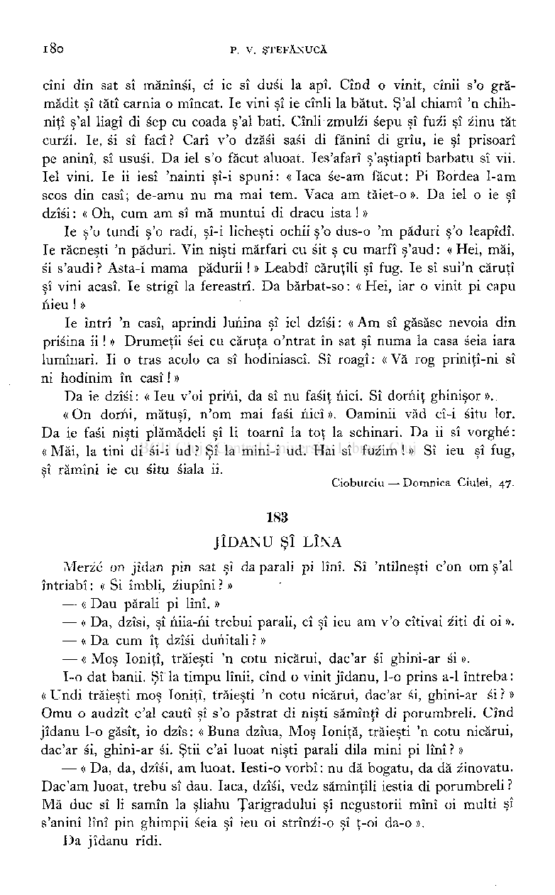

# cîni din sat sî mănînsi, cî ie sî dusi la apî. Cînd o vinit, cînii s'o grămădit şî tătî carnia o mîncaţ. Ie vini şî ie cînli la bătut. Ş'al chiamî 'n chihniţî ş'al liagî di sep cu coada ş'al bati. Cînli zmulzi sepu şî fuzi şî zinu tăt curzi. Ie, si sî facî? Carî v'o dzăsi sasi di făninî di grîu, ie şî prisoarî pe anini, sî ususi. Da iei s'o făcut aluoat. Ies'afarî ş'aştiaptî barbatu sî vii. Iei vini. Ie ii iesî 'nainti şî-i spuni : « Iaca se-am făcut : Pi Bordea l-am scos din casî ; de-amu nu ma mai tem. Vaca am tăiet-o ». Da iei o ie şî dzîsi : « Oh, cum am sî mă muntui di dracu ista ! »

# Ie ş'o tundi ş'o radi, şî-i licheşti ochii ş'o dus-o 'm păduri ş'o leapîdî. Ie răcneşti 'n păduri. Vin nişti mărfari cu sit ş cu mărfi ş'aud : « Hei, măi, si s'audi ? Asta-i mama pădurii ! » Leabdî căruţîli şî fug. Ie sî sui'n căruţî şî vini acasî. Ie strigi la fereastrî. Da bărbat-so : « Hei, iar o vinit pi capu hieu ! »

# Ie întrî 'n casî, aprindi lunina şî iei dzîsi : « Am sî găsăsc nevoia din prisina ii ! » Drumeţii sei cu căruţa o'ntrat în sat şî numa la casa seia iara luminări. Ii o tras acolo ca sî hodiniascî. Sî roagî: «Vă rog priniţî-ni sî ni hodinim în casî ! »

# Da ie dzîsi: « leu v'oi prini, da sî nu fasiţ nicî. Sî dorniţ ghinişor ».. « On dorni, mătuşî, n'om mai fasi nici ». Oaminii văd cî-i situ lor.

# Da ie fasi nişti plămădeli şî li toarnî la toţ la schinari. Da ii si vorghé: « Măi, la tini di si-i ud ? Şî la mini-i ud. Hai sî fuzim ! » Sî ieu şî fug, şî rămîni ie cu situ siala ii.

Cioburciu — Domnica Ciulei, 47.

# 183 JÎDANU Şî LÎNA

# Merzé on jidan pin sat şî da parali pi lînî. Sî 'ntîlneşti c'on om ş'al întriabî : « Si îmbli, ziupîni ? » — « Dau părali pi lînî. »

# — « Da, dzîsi, şî niia-ni trebui parali, cî şî ieu am v'o cîtivai ziti di oi ».

# — « Da cum îţ dzîsi duhitali ? »

# — « Moş Ioniţî, trăieşti 'n cotu nicărui, dac'ar si ghirii-ar si ». I-o dat banii. Şî la timpu lînii, cînd o vinit jîdanu, l-o prins a-1întreba : « Undi trăieşti moş Ioniţî, trăieşti 'n cotu nicărui, dac'ar si, ghini-ar si ? » Omu o audzît c'al cautî şî s'o păstrat di nişti sămînţî di porumbreli. Cînd jîdanvi l-o găsît, io dzîs : « Buna dzîua, Moş Ioniţă, trăieşti 'n cotu nicărui, dac'ar si, ghini-ar si. Ştii c'ai luoat nişti parali dila mini pi lînî? »

# — « Da, da, dzîsi, am luoat. Iesti-o vorbi : nu da bogatu, da dă zinovatu.

# Dac'am luoat, trebu sî dau. Iaca, dzîsi, vedz sămînţîli iestia di porumbreli ? Mă duc sî li samîn la şliahu Ţarigradului şî negustorii mînî oi mulţi şî s'aninî lînî pin ghimpii seia şî ieu oi strînzi-o şî ţ-oi da-o ».

# Da jîdanu rîdi.

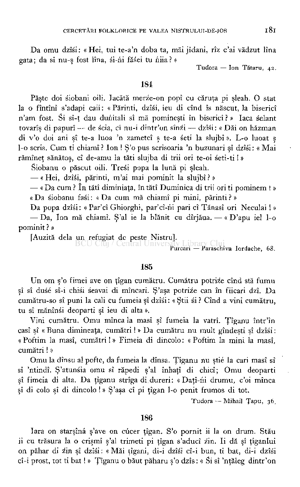

# Da omu dzîsi: « Hei, tui te-a'n doba ta, măi jîdani, rîz c'ai vădzut lîna gata ; da sî nu-ş fost lina, si-îii făsei tu niia ? »

Tudora — Ion Tătaru, 42.

# 184

# Paşte doi siobani oili. Iacătă merze-on popî cu căruţa pi şleah. O stat la o fîntînî s'adapi caii: «Părinţi, dzîsi, ieu di cînd îs născut, la biserici

# n'am fost. Si sî-ţ dau dunitali sî mă pomineşti în biserici ? » Iaca selanttovarîş di papuri — de seia, cî nu-i dintr'on sînzi — dzîsi : « Dăi on hăzmandi v'o doi ani şî te-a luoa 'n zametcî ş te-a seti la slujbî ». L-o luoat şl-o scris. Cum ti chiamî ? Ion ! Ş'o pus scrisoaria 'n buzunari şî dzîsi: « Mairămîneţ sănătos, cî de-amu la tăti slujba di trii ori te-oi seti-ti ! »

# Siobanu o păscut oili. Tresi popa la lună pi şleah.

# — « Hei, dzîsi, părinţi, m'ai mai pominit la slujbî ? »

# — « Da cum ? în tătî diminiaţa, în tătî Duminica di trii ori ti pominem ! » « Da siobanu fasi : « Da cum mă chiamî pi mini, părinţi ? » Da popa dzîsi: « Par'cî Ghiorghi, par'cî-ni pari cî Tănasî ori Neculai ! »

# — Da, Ion mă chiamî. Ş'al ie la blănit cu dîrjăua. — « D'apu iei l-o pominit ? »

# [Auzită delà un refugiat de peste Nistru].

Purcari — Paraschiva Iordache, 68.

# 185

# Un om ş'o fimei ave on ţîgan cumătru. Cumătru potrize cînd stă fumu şî sî dusé sî-i chisi seavai di mîncari. Ş'aşa potrize can în fiicari dzî. Da cumătru-so sî puni la caii cu fumeia şî dzîsi: « Ştii si ? Cînd a vini cumătru, tu sî mănînsi deoparti şî ieu di alta ».

# Vini cumătru. Omu mînca la masî şî fumeia la vatrî. Ţîganu într'în casî şî « Buna dimineaţa, cumătri ! » Da cumătru nu mult gîndeşti şî dzîsi : « Poftim la masî, cumătri ! » Fimeia di dincolo : « Poftim la mini la masî, cumătri ! »

# Omu la dînsu al pofte, da fumeia la dînsa. Ţîganu nu ştie la cari masî sî sî 'ntindî. Ş'atunsia omu sî răpedi ş'al înhaţî di chicî; Omu deoparti şî fimeia di alta. Da ţîganu striga di dureri: « Daţî-iii drumu, c'oi mînca şî di colo şî di dincolo ! » Ş'aşa cî pi ţîgan l-o penit frumos di tot.

Tudora — Mihail Ţapu, 36.

# 186

# Iara on starşînâ ş'ave on cûcer ţîgan. S'o pornit ii la on drum. Stău ii cu trăsura la o crişmî ş'al trimeti pi ţîgan s'aducî zin. Ii dă şî ţîganlui on pahar di zin şî dzîsi : « Măi ţigani, di-i dzîsi cî-i bun, ti bat, di-i dzîsi cî-i prost, tot ti bat ! » Ţîganu o băut păharu ş'o dzîs : « Si sî 'nţăleg dintr'on

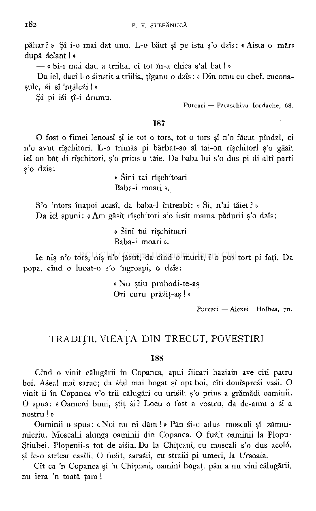

# pahar? » Şîi-o mai dat unu. L-o băut şî pe ista ş'o dzîs: «Aista o mărs după selant ! »

# — « Sî-i mai dau a triilia, cî tot ni-a chica s'al bat ! » Da iei, dacî1-o sinstit a triilia, ţîganu o dzîs : « Din omu cu chef, cucona-

# şule, si sî 'nţălezi ! » Şî pi isi ţî-i drumu.

Purcari — Paraschiva lordache, 68.

# 187

# O fost o fimei lenoasî şî ie tot o tors, tot o tors şî n'o făcut pîndzî, cî n'o avut rîşchitori. L-o trimăs pi bărbat-so sî tai-on rîşchitori ş'o găsît iei on băţ di rîşchitori, ş'o prins a tăie. Da baba lui s'o dus pi di altî parti ş'o dzîs :

# « Sinitai rîşchitoari Baba-i moari ».

# S'o 'ntors înapoi acasî, dababa-1întreabî: «Si,n'ai tăiet?» Da iei spuni : « Am găsît rîşchitori ş'o ieşît mama pădurii ş'o dzîs :

# « Sinitai rîşchitoari Baba-imoari ».

# Ie niş n'o tors, niş n'o ţăsut, da cînd o murit, i-o pus tort pi faţî. Da popa, cînd o luoat-o s'o 'ngroapi, o dzîs:

# « Nu ştiu prohodi-te-aş Ori curu prăziţ-aş ! »

Purcari — Alexei Hoîbea, 70.

TRADIŢII, VIEAŢA DIN TRECUT, POVESTIRI

# 188

# Cînd o vinit călugării în Copanca, apui fiicari haziain ave cîti patru boi. Aseal mai sărac; da sial mai bogat şî opt boi, cîti douîspresi vasi. O vinit ii în Copanca v'o trii călugări cu urisili ş'o prins a grămădi oaminii. O spus : « Oameni buni, ştiţ si ? Locu o fost a vostru, da de-amu a si a nostru ! »

# Oaminii o spus : « Noi nu ni dăm ! » Păn si-o adus moscali şî zămni-

# mieriu. Moscalii alunga oaminii din Copanca. O fuzit oaminii la PlopuŞtiubei. Plopenii-s tot de aisia. Da la Chiţcani, cu moscali s'o dus acolo, şî le-o stricat casîli. O fuzit, sarasii, cu straili pi umeri, la Ursoaia.

# Cît ca 'n Copanca şî 'n Chiţcani, oamini bogat, păn a nu vini călugării, nu iera 'n toată ţara !

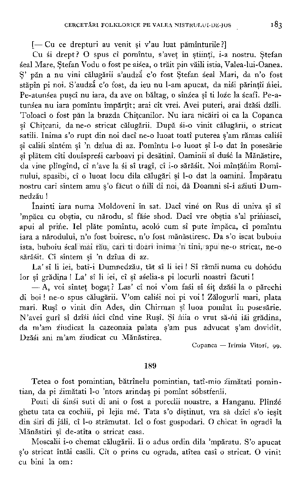

# [— Cu ce drepturi au venit şi v'au luat pămînturile ?] Cu si drept ? O spus cî pomîntu, s'aveţ în ştiinţî, i-a nostru. Ştefan seal Mare, Ştefan Vodu o fost pe aisea, o trăit pin văili istia, Valea-lui-Oanea. Ş' păn a nu vini călugării s'audză c'o fost Ştefan seal Mari, da n'o fost stăpîn pi noi. S'audză c'o fost, da ieu nu l-am apucat, da nisi părinţii niei. Pe-atunsea puşcî nu iara, da ave onbaltag,o sînzea şî ti loze la seafî. Pe-atunsea nu iara pomîntu împărţit; arai cît vrei. Avei puteri, arai dzăsi dzîli. Toloacî o fost păn la brazda Chiţcanilor. Nu iara nicăiri oi ca la Copanca şî Chiţcani, da ne-o stricat călugării. După si-o vinit călugării, o stricat satili. Inima s'o rupt din noi dacî ne-o luoat toatî puterea ş'am rămas calisi şî calisi sîntém şî 'n dzîua di az. Pomîntu l-o luoat şî l-o dat în posesărie şî plătem cîti douîspresi carboavi pi desătinî. Oaminii sî dusé la Mănăstire, da vine plîngînd, cî n'ave la si sî tragî, cî i-o sărăsit. Noi mînţănim Romînului, spasibi, cî o luoat locu dila călugări şî l-o dat la oamini. împăratu nostru cari sîntem amu ş'o făcut o nilî di noi, dă Doamni sî-i aziuti Dumnedzău !

# înainti iara numa Moldoveni în sat. Dacîvineon Rus di univa şî sî 'mpăca cu obştia, cu nărodu, sî făse shod. Dacî vre obştia s'al priniascî, apui al prine.Ieiplate pomîntu, acolö cum sî pute împăca, cî pomîntu iara a nărodului, n'o fost boiresc, n'o fost mănăstiresc. Da s'o iscat buboiu ista, buboiu seal mai rău, cari ti doari inima 'n tini, apu ne-o stricat, ne-o sărăsit. Cî sîntem şî 'n dzîua di az.

# La' sî li iei, batî-i Dumnedzău, tăt sî li iei ! Sî rămîi numa cu dohödu lor şî grădina ! La' sî li iei, cî şî aselia-s pi locurli noastri făcuţi !

# — A, voi sînteţ bogat? Las' cî noi v'om fasi sî siţ dzăsi la o părechi di boi ! ne-o spus călugării. V'om calisi noi pi voi ! Zălogurli mari, plata mari. Ruşî o vinit din Ades, din Chirman şî luoa pomînt în posesărie.

# N'avei gurî sî dzîsi nici cînd vine Ruşî. Şî îiiia o vrut să-ni iăi grădina,da m'am ziudicat la cazeonaia paiaţa ş'am pus advucat ş'am dovidit.

# Dzăsi ani m'am ziudicat cu Mănăstirea.

Copanca — Irimia Vitori, 99.

# 189

# Tetea o fost pomintian, bătrînelu pomintian, tatî-mio zimătati pomintian, da pi zimătati l-o 'ntors arindaş pi pomînt sobstfenîi.

# Poati di sinsi suti di ani o fost a poreclii noastre, a Hanganu. Plînzé ghetu tata ca cochiii, pi lejia mé. Tata s'o diştinut, vra să dzîcî s'o ieşît din siri di jăli, cî l-o strămutat. Iei o fost gospodari. O chicat în ogradî la Mănăstiri şî de-atîta o stricat casa.

# Moscalii i-o chemat călugării.Iio adus ordin dila 'mpăratu. S'o apucat ş'o stricat întăi casîli. Cit o prins cu ograda, atîtea casî o stricat. O vinii; cu bini la om:

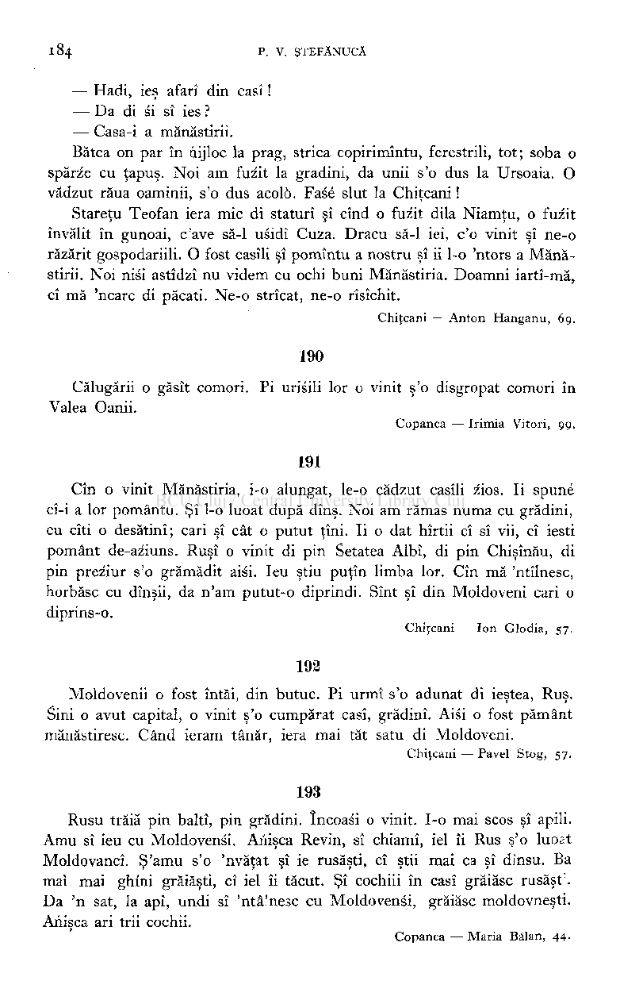

184

# — Hadi, ies afarî dincasî !

# — Da di si sî ies ?

# — Casa-i a mănăstirii.

# Bătea on par în oijloclaprag, strica copirimîntu, ferestrili, tot; soba o

# spărze cu ţapuş. Noi am fuzit la grădini, da unii s'o dus la Ursoaia. O vădzut răua oaminii, s'o dus acolö. Fasé slut la Chiţcani !

# Stareţu Teofan iera mic di staturi şî cînd o fuzit dila Niamţu, o fuzit învălit în gunoai, c'ave să-1 usidî Cuza. Dracu să-1 iei, c'o vinit şî ne-o

# răzărit gospodariili. O fost casîli şî pomîntu a nostru şî ii l-o 'ntors a Mănă­stirii. Noi nisi astîdzî nu videm cu ochi buni Mănăstiria. Doamni iartî-mă,cî mă 'ncarc di păcati. Ne-o stricat, ne-o rîsîchit.

Chiţcani —Anton Hanganu, 69.

# 190

# Călugării o găsit comori. Pi urisili lor o vinit ş'o disgropat comori în Valea Oanii.

Copanca — Irimia Vitori, 99.

# 191

# Cîn o vinit Mănăstiria, i-o alungat, le-o cădzut casîli zios. Ii spune cî-i a lor pomântu. Şî l-o luoat după dînş. Noi am rămas numa cu grădini, cu cîti o desătinî; cari şî cât o putut ţîni. Ii o dat hîrtii cî sî vii, cî ieşti pomânt de-aziuns. Ruşi o vinit di pinSetateaAlbî, di pin Chişinău, di pin preziur s'o grămădit aisi. Ieu ştiu puţîn limba lor. Cîn mă 'ntîlnesc, horbăsc cu dînşii, da n'am putut-o diprindi. Sînt şî din Moldoveni cari o diprins-o.

Chiţcani — Ion Glodia, 57.

# 192

# Moldovenii o fost întăi, din butuc. Pi urmî s'o adunat di ieştea, Ruş. Sinio avut capital, o vinit ş'o cumpărat casî, grădini. Aisi o fost pământ

# mănăstiresc. Când ieram tânăr, iera mai tăt satu di Moldoveni.

Chiţcani — Pavel Stog, 57.

# 193

# Rusu trăia pin baltî, pin grădini. încoasi o vinit. I-o mai scos şî apili. Amu sî ieu cu Moldovensi. Aiiişca Revin, sî chiamî, iei îi Rus ş'oluo2t Moldovancî. Ş'amu s'o 'nvăţat şî ie rusăşti, cî ştii mai ca şî dinsu. Ba mai mai ghini grăiăşti, cî iei îi tăcut. Şî cochiii în casî grăiăsc rusăşt. Da 'n sat, la apî, undi sî 'ntâlnesc cu Moldovensi, grăiăsc moldovneşti. Anişca ari trii cochii.

Copanca — Maria Bălan, 44.

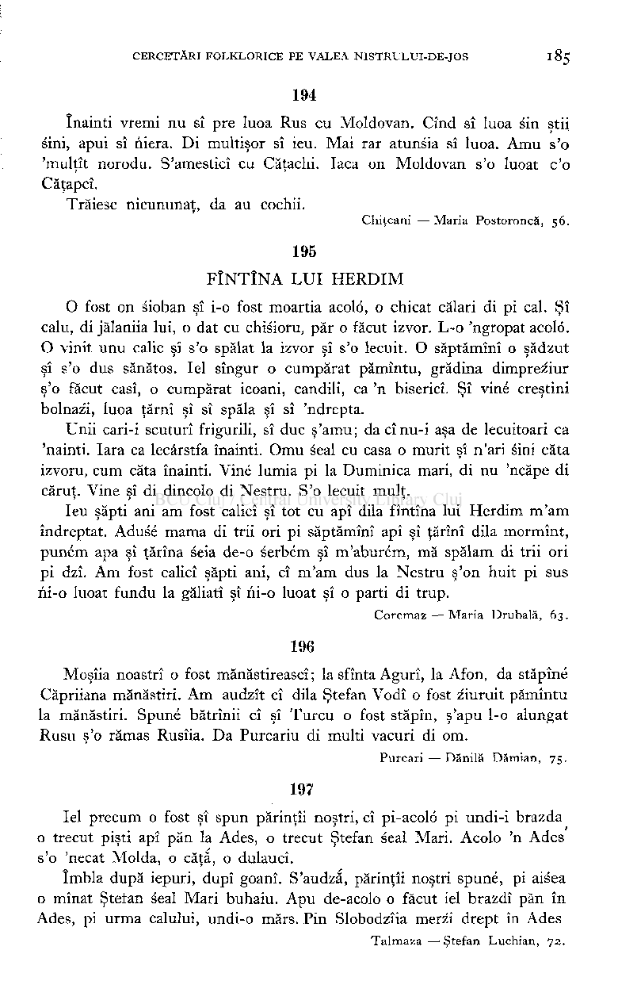

# 194

# înainti vremi nu sî pre luoa Rus cu Moldovan. Cînd sî luoa sin ştii sini, apui sî niera. Di multişor sî ieu. Mai rar atunsia sî luoa. Amu s'o 'mulţît norodu. S'amesticî cu Căţachi. Iaca on Moldovan s'o luoat c'o

# Căţapcî.

# Trăiesc nicununaţ, da au cochii.

Chiţcani — Maria Postoroncă, 56.

# 195 FÎNTÎNA LU I HERDIM

# O fost on sioban şî i-o fost moartia acolo, o chicat călări di pi cal. Şî calu, di jălaniia lui, o dat cu chisioru, păr o făcut izvor. L-o 'ngropat acolo. O vinit unu calic şî s'o spălat la izvor şî s'o lecuit. O săptămînî o şădzut şî s'o dus sănătos. Iei singur o cumpărat pămîntu, grădina dimpreziur ş'o făcut casî, o cumpărat icoani, candili, ca 'n biserici. Şîvinecreştini bolnazi, luoa ţărnî şî sî spăla şî sî 'ndrepta.

# Unii cari-i scuturi frigurili, sî duc ş'amu; dacî nu-i aşa de lecuitoari ca 'nainti. Iara ca lecârstfa înainti. Omu seal cu casa o murit şî n'ari sini căta izvoru, cum căta înainti.Vinelumia pi la Duminica mari, di nu 'ncăpe di căruţ. Vine şî di dincolo di Nestru. S'o lecuit mulţ.

# Ieu şăpti ani am fost calici şî tot cu apî dila fîntîna lui Herdim m'am îndreptat.Adusemama di trii ori pi săptămînî apî şî ţărînî dila mormînt, punem apa şî ţărîna seia de-o serbém şî m'aburém, mă spălam di trii ori pi dzî. Am fost calici şăpti ani, cî m'am dus la Nestru ş'on huit pi sus ni-o luoat fundu la găliatî şî ni-o luoat şî o parti di trup.

Corcmaz — Maria Drubală, 63.

# 196

# Căpriiana mănăstiri. AMoşîia noastrî o fost mănăstireascî ; la sfînta Agurî, la Afon, dam audzît cî dila Ştefan Vodî o fost ziuruit pămîntustăpînela mănăstiri.Spunebătrînii cî şî Turcu o fost stăpîn, ş'apu l-o alungat

# Rusu ş'o rămas Rusîia. Da Purcariu di mulţi vacuri di om.

Purcari — Dănilă Damian, 75.

# 197 Iei precum o fost şî spun părinţii noştri, cî pi-acol6 pi undi-i brazda

# o trecut pişti apî păn la Ades, o trecut Ştefan seal Mari. Acolo 'n Adess'o 'necat Molda, o căţă, o dulaucî.

îmbla după iepuri, dupî goanî. S'audză, părinţii noştrispune,pi aisea

# o mînat Ştefan seal Mari buhaiu. Apu de-acolo o făcut iei brazdî păn înAdes, pi urma calului, undi-o mărs. Pin Slobodzîia merzi drept în Ades

Talmaza—Ştefan Luchian, 72.

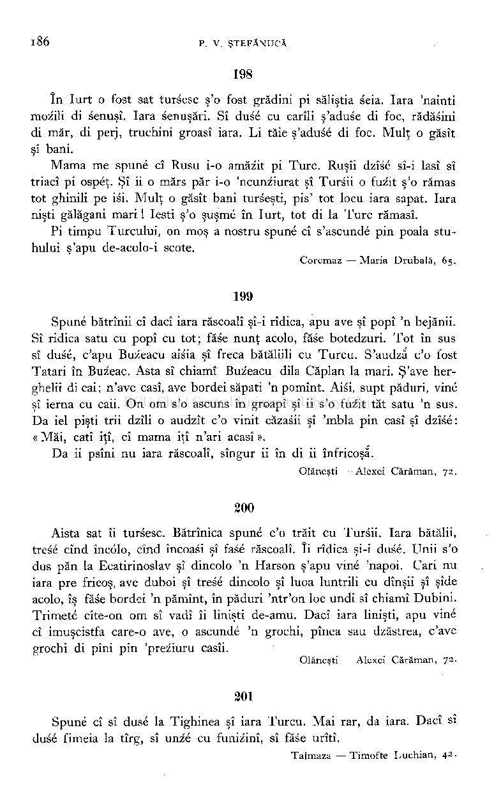

i86 P. V. ŞTEFANUCA

# 198

# înIurt o fost sat tursesc ş'o fost grădini pi săliştia seia. Iara 'nainti mozili di senuşî. Iara senuşări. Si dusé cu carîli ş'aduse di foc, rădăsini di măr, di perj, truchini groasî iara. Li tăie ş'aduse di foc. Mulţ o găsît şî bani.

# Mama me spuné cî Rusu i-o amăzit pi Turc. Ruşîi dzîse sî-i lasî sî triacî piospeţ.Şî ii o mărs păr i-o 'ncunziurat şî Tursii o fuzit ş'o rămas tot ghinili pe isi. Mulţ o găsît bani turseşti, pis' tot locu iara săpat. Iara nişti gălăgani mari ! Ieşti ş'oşuşmeîn Iurt, tot di la Turc rămasî.

# Pi timpu Turcului, on moş a nostru spuné ci s'ascundé pin poala stuhului ş'apu de-acolo-i scote.

Corcmaz — Maria Drubală, 65.

# 199

# Spuné bătrînii cî dacî iara răscoalî şî-i ridica, apu ave şî popî 'n bejănii. Sî ridica satu cu popî cu tot; făse nunţ acolo, făse botedzuri. Tot în sus sî dusé, c'apu Buzeacu aisia şî freca bătăliili cu Turcu. S'audză c'o fost

# Tătari în Buzeac. Asta sî chiamî Buzeacu dila Căplan la mari. Ş'ave her­

# ghelii di cai; n'ave casî, ave bordei săpaţi 'n pomînt. Aisi, supt păduri,şî ierna cu caii. On om s'o ascuns în groapî şî ii s'o fuzit tăt satu 'n sus.vine Da iei pişti trii dzîli o audzît c'o vinit căzasii şî 'mbla pin casî şî dzîsé: « Măi, catî iţî, cî mama iţi n'ari acasî ».

# Da ii psîni nu iara răscoalî, singur ii în di ii înfricoşa.

Olăneşti — Alexei Cărăman, 72.

# 200

# Aista sat îi tursesc. Bătrînica spuné c'o trăit cu Tursii. Iara bătălii, tresecînd încolo, cînd încoasi şî fase răscoalî.îiridica şi-i dusé. Unii s'o dus păn la Ecatirinoslav şî dincolo 'n Harson ş'apuvine'napoi. Cari nu iara pre fricos, ave duboi şîtresedincolo şî luoa luntrili cu dînşii şî şîde acolo, îş făse bordei 'n pămînt, în păduri 'ntr'on loc undi sî chiamî Dubini.

# Trimeté cîte-on om sî vadî îi linişti de-amu. Dacî iara linişti, apucî imuşcistfa care-o ave, o ascunde 'n grochi, pînea sau dzăstrea, c'avevine grochi di pini pin 'preziuru casîi.

Olăneşti — Alexei Cărăman, 72.

# 201

# Spuné cî sî dusé la Tighinea şî iara Turcu. Mai rar, da iara. Dacî si dusé fimeia la tîrg, sî unze cu funizinî, sî făse urîtî.

Talmaza — Timofte Luchian, 42.

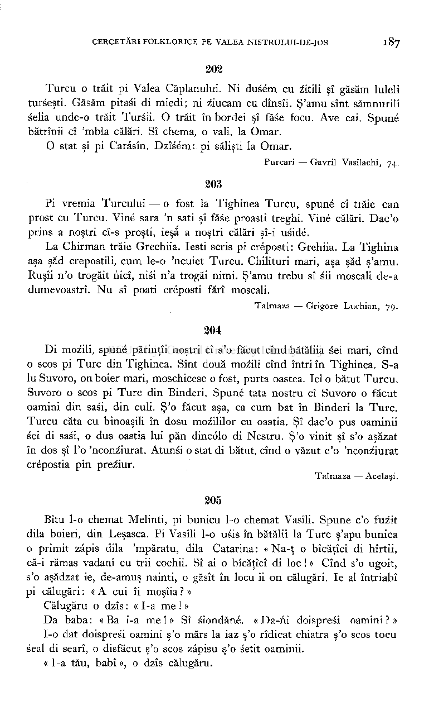

# 202

# Turcu o trăit pi Valea Căplanului. Ni dusém cu zitili şî găsăm luleli turseşti. Găsăm pitasi di miedi; ni ziucam cu dînşîi. Ş'amu sînt sămnurili selia unde-o trăit Tursii. O trăit în bordei şî făse focu. Ave cai.bătrînii cî 'mbla călări. Sî chema, o vali, la Omar. Spune

# O stat şî pi Cardsîn. Dzîsem: pi sălişti la Omar.

Purcari — Gavril Vasilachi, 74.

# 203

# Pi vremia Turcului — o fost la Tighinea Turcu,spunecî trăie can prost cu Turcu.Vinesara 'n sati şî făse proasti treghi.Vinecălări. Dac'o prins a noştri cî-s proşti, ieşă a noştri călări şî-i usidé.

# La Chirman trăie Grechiia. Ieşti scris pi créposti: Grehiia. La Tighina aşa şăd crepostili, cum le-o 'ncuiet Turcu. Chilituri mari, aşa şăd ş'amu. Ruşîi n'o trogăit nicî, nisi n'a trogăi nimi. Ş'amu trebu sî sii moscali de-a dumevoastrî. Nu sî poati créposti fărî moscali.

Talmaza — Grigore Luchian, 79.

# 204 Di mozili, spune părinţii noştri cî s'o făcut cînd bătăliia sei mari, cînd

- o scos pi Turc din Tighinea. Sînt două mozili cînd întri în Tighinea. S-a lu Suvoro, on boier mari, moschicesc o fost, purta oastea. Iei o bătut Turcu. Suvoro o scos pi Turc din Binderi. Spune tata nostru cî Suvoro o făcut
- oamini din sasi, din culi. Ş'o făcut aşa, ca cum bat în Binderi la Turc. Turcu căta cu binoaşili în dosu mozililor cu oastia. Şî dac'o pus oaminii sei di sasi, o dus oastia lui păndincolodi Nestru. Ş'o vinit şî s'o aşăzat în dos şî l'o 'nconziurat. Atunsi o stat di bătut, cînd o văzut c'o 'nconziurat crépostia pin preziur.

Talmaza — Acelaşi.

# 205

# Bîtu l-o chemat Melinti, pi bunicu l-o chemat Vasîli. Spune c'o fuzitdila boieri, din Leşasca. Pi Vasîli l-o usis în bătălii la Turc ş'apu bunicao primit zâpis dila 'mpăratu, dila Catarina : « Na-ţ o bîcăţîcî di hîrtii,

- că-i rămas vădani cu trii cochii. Sî ai o bîcăţîcî di loc ! » Cînd s'o ugoit, s'o aşădzat ie, de-amuş nainti, o găsît în locu ii on călugări. Ie al întriabî pi călugări : « A cui îi moşîia ? »

# Călugăru o dzîs: « I-a me ! »Da baba : « Ba i-a me ! » Sî siondăne. « Da-ni doispresi oamini ? »I-o dat doispresi oamini ş'o mărs la iaz ş'o ridicat chiatra ş'o scos tocu

# seal di searî, o disfăcut ş'o scos zâpisu ş'o setit oaminii. « I-a tău, babî », o dzîs călugăru.

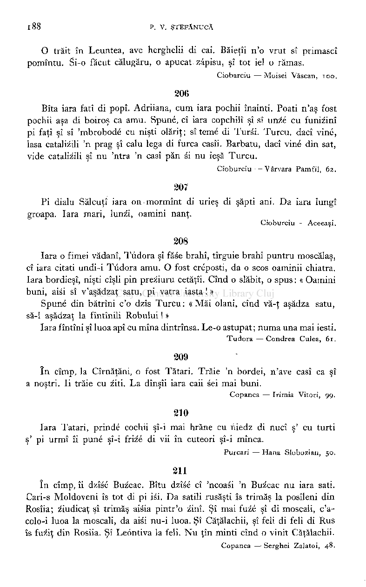

# O trăit în Leuntea, ave herghelii di cai. Băieţii n'o vrut sî primascî pomîntu.Si-o făcut călugăru, o apucat zapisu, şî tot iei o rămas.

Ciobarciu — Moisei Vâscan, ioo.

# 206 pochii aşa di boiroş ca amu.Spune,cî iara copchilî şî sî unze cu funizinî lasa catalizili 'n prag şî calu lega di furca casîi. Barbatu, dacîpi faţî şî sî 'mbrobodé cu nişti olărit; sîtemé di Tursi. Turcu, dacîvinedin sat,vine, vide catalizili şî nu 'ntra 'n casî păn si nu ieşă Turcu.

# Bîta iara fatî di popî. Adriiana, cum iara pochii înainti. Poati n'aş fost

Cioburciu—Vârvara Pamfil, 62.

# 207

# Pi dialu Sălcuţî iara on mormînt di urieş di şăpti ani. Da iara lungî groapa. Iara mari, lunzi, oamini nanţ.

Cioburciu —Aceeaşi.

# 208

# Iara o fimei vădani, Tüdora şî făse brahî, tîrguie brahî puntru moscălaş, cî iara citaţi undi-i Tüdora amu. O fost créposti, da o scos oaminii chiatra. Iara bordieşî, nişti cîşli pin preziuru cetăţii. Cînd o slăbit, o spus : « Oamini buni, aisi sî v'aşădzaţ satu, pi vatra iasta ! »

# Spunedin bătrîni c'o dzîs Turcu: «Măi olani, cînd vă-ţ aşădza satu,

# să-1aşădzaţ la fîntînili Robului ! »Iara fîntînî şî luoa apî cu mîna dintrînsa. Le-o astupat; numa una mai ieşti.

Tudora—Condrea Culea, 61 .

# 209

# încîmp, la Cîrnăţăni, o fost Tătari. Trăie 'n bordei, n'ave casî ca şî a noştri. Ii trăie cu ziti. La dînşîi iara caii sei mai buni.

Copanca — Irimia Vitori, 99.

# 210

# Iara Tătari,prindecochii şî-i mai hrăne cu hiedz di nucî ş' cu turti ş' pi urmî îi puné şî-ifrizedi vii în cuteori şî-i mînca.

Purcari — Hana Slobozian, 50.

# 211

# încîmp, îi dzîse Buzeac. Bîtu dzîsé cî 'ncoasi 'n Buzeac nu iara sati. Cari-s Moldoveni îs tot di pi isi. Da satili rusăşti îs trimăs la posîleni din Rosîia; ziudicaţ şî trimăs aisia pintr'o zinî. Şî mai fuzé şî di moscali, c'acolo-i luoa la moscali, da aisi nu-i luoa. Şî Căţălachii, şî feli di feli di Rus îs fuziţ din Rosîia. Şî Leôntiva la feli. Nu ţîn minţi cînd o vinit Căţălachii.

Copanca — Serghei Zalatoi, 48.

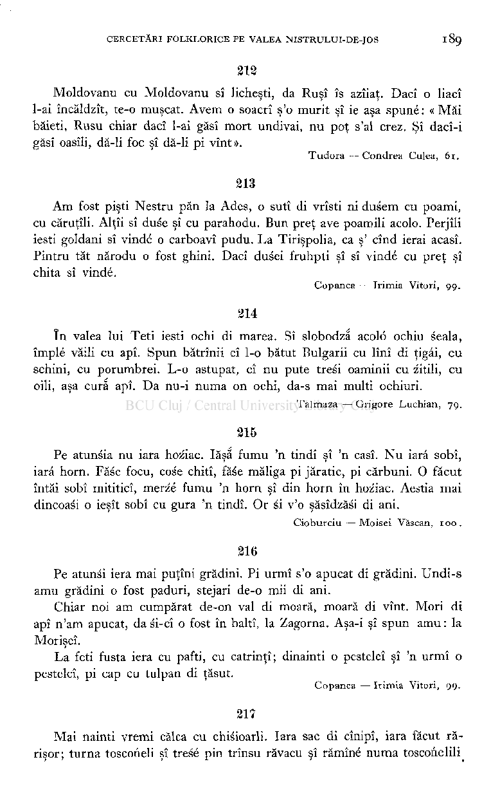

# 212

# Moldovanu cu Moldovanu sî licheşti, da Ruşî îs azîiaţ. Dacî o liacî l-ai încăldzît, te-o muşcat. Avem o soacrî ş'o murit şî ie aşa spune: « Măi băieţi, Rusu chiar dacî l-ai găsî mort undivai, nu poţ s'al crez. Şî dacî-i

# găsî oasîli, dă-li foc şî dă-li pi vînt».

Tudora — Condrea Cuiea, 61 .

# 213

# Am fost pişti Nestru păn la Ades, o sutî di vrîsti ni dusem cu poami, cu căruţîli. Alţii sî duse şî cu parahodu. Bun preţ ave poamili acolo. Perjîli ieşti goldani sî vindé o carboavî pudu. La Tirişpolia, ca ş' cînd ierai acasî. Pintru tăt nărodu o fost ghini. Dacî dusei fruhpti şî sî vindé cu preţ şî chita si vindé.

Copanca — Irimia Vitori, 99.

# 214

# în valea lui Teti ieşti ochi di marea. Sî slobodzăacoloochiu seala, împle văili cu apî. Spun bătrînii cî l-o bătut Bulgarii cu lînî di ţigâi, cu schini, cu porumbrei. L-o astupat, cî nu pute tresi oaminii cu zitili, cu oili, aşa cură apî. Da nu-i numa on ochi, da-s mai mulţi ochiuri.

Talmaza — Grigore Luchian, 79.

# 215

# Pe atunsia nu iara hoziac. Iăşă fumu 'n tindî şî 'n casî. Nu iarâ sobî, iară horn. Făse focu, cose chitî, făse măliga pi jăratic, pi cărbuni. O făcut întăi sobî mititicî, merzé fumu 'n horn şî din horn în hoziac. Aestia mai dincoasi o ieşît sobî cu gura 'n tindî. Or si v'o şăsîdzăsi di ani.

Cioburciu—Moisei Văscan, 100 .

# 216

# Pe atunsi iera mai puţini grădini. Pi urmî s'o apucat di grădini. Undi-s amu grădini o fost păduri, stejari de-o mii di ani.

# Chiar noi am cumpărat de-on val di moară, moară di vînt. Mori di apî n'am apucat, da si-cî o fost în baltî, la Zagorna. Aşa-i şî spun amu : la Morişcî.

# La feti fusta iera cu pafti, cu catrinţî; dinainti o pestelci şî 'n urmî o pestelcî, pi cap cu tulpan di ţăsut.

Copanca — Irimia Vitori, 99.

# 217

# Mai nainti vremi călca cu chisioarli. Iara sac di cînipî, iara făcut rărişor; turna tosconeli şî trese pin trînsu răvacu şî rămîne numa toscohelili^

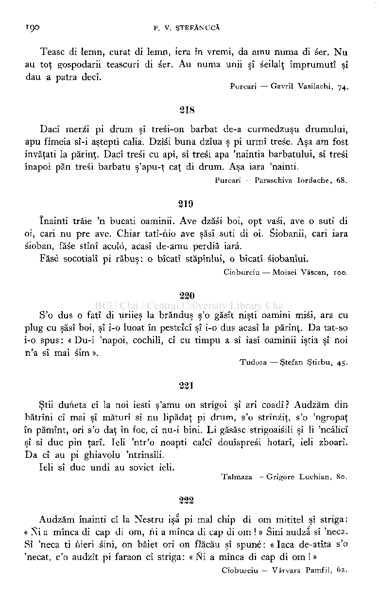

# Teasc di lemn, curat di lemn, iera în vremi, da amu numa di ser. Nu au toţ gospodarii teascuri di ser. Au numa unii şî seilalţ împrumuţi şî

# dau a patra decî.

Purcari — Gavril Vasilachi, 74.

# 218

# Dacî merzi pi drum şî tresi-on bărbat de-a curmedzuşu drumului, apu fimeia sî-i aştepţi calia. Dzîsi buna dzîua ş pi urmi trese. Aşa am fost învăţaţilapărinţ. Dacî tresi cu apî, sî tresi apa 'naintia bărbatului, sî tresi înapoi păn tresi barbatu ş'apu-ţ caţ di drum. Aşa iara 'nainti.

Purcari — Paraschiva Iordache, 68.

# 219

# înainti trăie 'n bucati oaminii. Ave dzăsi boi, opt vasi, ave o sutî di oi, cari nu pre ave. Chiar tatî-nio ave şăsî suti di oi.Siobanii,cari iara sioban, făse stînî acolo, acasî de-amu perdiă iarâ.

# Făsesocotialî pi răbuş: o bîcatî stăpînlui, o bîcatî siobanlui.

Cioburciu — Moisei Văscan, 100.

# 220

# S'o dus o fatî di uriieş la brănduş ş'o găsît nişti oamini misi, ara cu plug cu şăsî boi, şî i-o luoat în pestelci şî i-o dus acasî la părinţ. Da tat-so i-o spus : « Du-i 'napoi, cochilî, cî cu timpu a sî iasî oaminii iştia şî noi n'a sî mai sim ».

Tudora —Ştefan Ştirbu, 45.

# 221 Ştii duiieta cî la noi ieşti ş'amu on strigoi şî ari coadî ? Audzăm din

# bătrîni cî mai şî măturî sî nu lipădaţ pi drum, s'o strînziţ, s'o 'ngropaţîn pămînt, ori s'o daţ în foc, cî nu-i bini. Li găsăsc strigoaisili şî li 'ncâlicîşî sî duc pin ţarî. Ieli 'ntr'o noapti calci douîspresi hotărî, ieli zboarî.

# Da cî au pi ghiavolu 'ntrînsîli.

# Ieli sî duc undi au soviet ieli.

Talmaza — Grigore Luchian, 80.

# 222

# Audzăm înainti cî la Nestru işă pi mal chip di om mititel şî striga: « Ni a mînca di cap di om, ni a mînca di cap di om !» Siniaudză sî 'neca. Sî 'neca ti hieri sini, on băiet ori on flăcău şîspune : « Iaca de-atîta s'o 'necat, c'o audzît pi faraon cî striga: «Nia mînca di cap di om ! »

Cioburciu —Vârvara Pamfil, 62.

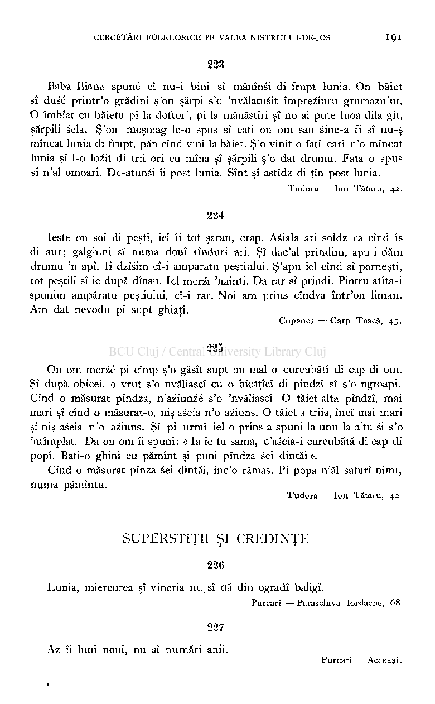

# 223

# Baba Iliana spuné cî nu-i bini sî mănînsi di frupt lunia. On băiet sî dusé printr'o grădini ş'on şărpi s'o 'nvălatusit împreziuru grumazului. O îmbiat cu băietu pi la doftori, pi la mănăstiri şî no al pute luoa dila gît, şărpili seia. Ş'on moşniag le-o spus sî cati on om sau sine-a fi sî nu-ş mîncat lunia di frupt, păn cînd vini la băiet. Ş'o vinit o fatî cari n'o mîncat lunia şî l-o lozit di trii ori cu mîna şî şărpili ş'o dat drumu. Fata o spus si n'al omoari. De-atunsi îi post lunia. Sînt şî astîdz di ţîn post lunia.

Tudora — Ion Tătaru, 42.

# 224

# Ieste on soi di peşti, iei îi tot şaran, crap. Asiala ari soldz ca cînd îs di aur; galghini şî numa douî rînduri ari. Şî dac'al prindim, apu-i dăm drumu 'n apî. Ii dzîsim cî-i amparatu peştiului. Ş'apu iei cînd sî porneşti, tot peştili sî ie după dînsu. Iei merzi 'nainti. Da rar sî prindi. Pintru atîta-i spunim ampăratu peştiului, cî-i rar. Noi am prins cîndva într'on liman. Am dat nevodu pi supt ghiaţî.

Copanca — Carp Teacă, 45.

# 225

# On om merzé pi cîmp ş'o găsît supt on mal o curcubătî di cap di om. Şî după obicei, o vrut s'o nvăliascî cu o bîcăţîcî di pîndzî şî s'o ngroapi.

# Cînd o măsurat pîndza, n'aziunzé s'o 'nvăliascî. O tăiet alta pîndzî, maimari şî cînd o măsurat-o, niş aseia n'o aziuns. O tăiet a triia, încî mai marişî niş aseia n'o aziuns. Şî pi urmî iei o prins a spuni la unu la altu si s'o'ntîmplat. Da on om îi spuni: « Ia ie tu sama, c'aseia-i curcubătă di cap dipopî. Bati-o ghini cu pămînt şi puni pîndza sei dintăi ».

# Cînd o măsurat pînza sei dintăi, înc'o rămas. Pi popa n'ăl saturi nimi, numa pămîntu.

Tudora — Ion Tătaru, 42.

SUPERSTIŢII ŞI CREDINŢE

# 226

Lunia, miercurea şî vineria nu sî dă din ogradî baligi.

Purcari — Paraschiva Iordache, 68.

# 227

# Az îi lunî nouî, nu sî numărî anii. Purcari — Aceeaşi.

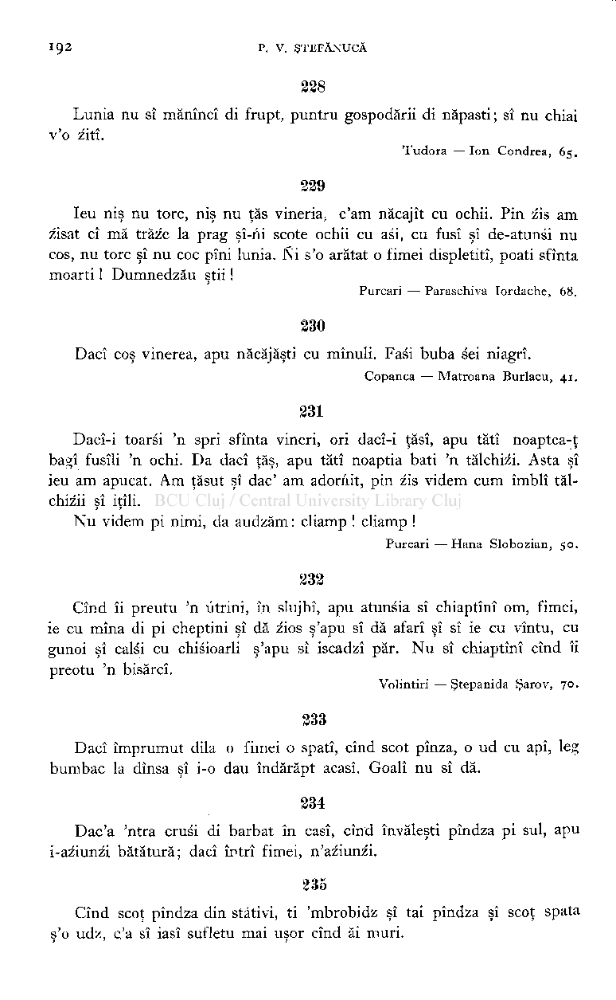

# 228

# Lunia nu sî mănîncî di frupt, puntru gospodării di năpasti; sî nu chiai v'o zitî.

Tudora — Ion Condrea, 65.

# 229

# leu niş nu torc, niş nu ţăs vineria, c'am năcăjit cu ochii. Pin zis am zisat cî mă trăze la prag şî-ni scote ochii cu asi, cu fusî şî de-atunsi nu cos, nu torc şî nu coc pîni lunia. Ni s'o arătat o fimei displetitî, poati sfînta moarti ! Dumnedzău ştii !

Purcari — Paraschiva Iordache, 68.

# 230

Dacî coş vinerea, apu năcăjăşti cu mînuli. Fasi buba sei niagrî.

Copanca — Matroana Burlacu, 41 .

# 231

# Dacî-i toarsi 'n spri sfînta vineri, ori dacî-i ţăsî, apu tătî noaptea-ţ bagî fusîli 'n ochi. Da dacî ţăş, apu tătî noaptia bati 'n tălchizi. Asta şî ieu am apucat. Am ţăsut şî dac' am adornit, pin zis videm cum îmblî tălchizii şî iţîli.

# Nu videm pi nimi, da audzăm : cliamp ! cliamp !

Purcari — Hana Slobozian, 50.

# 232

# Cînd îi preutu 'n ütrini, în slujbî, apu atunsia sî chiaptînî om, fimei, ie cu mina di pi cheptini şî dă zios ş'apu sî dă afarî şî sî ie cu vîntu, cu gunoi şî calsi cu chisioarli ş'apu sî iscadzî păr. Nu sî chiaptînî cînd îi preotu 'n bisărcî.

Volintiri — Ştepanida Şarov, 70.

# 233

# Dacî împrumut dila o fimei o spatî, cînd scot pînza, o ud cu apî, leg bumbac la dînsa şî i-o dau îndărăpt acasî. Goalî nu sî dă.

# 234

# Dac'a 'ntra crusi di bărbat în casî, cînd învăleşti pîndza pi sul, apu i-aziunzi bătătură; dacî îrtrî fimei, n'aziunzi.

# 235

# Cînd scoţ pîndza din stâtivi, ti 'mbrobidz şî tai pîndza şî scoţ spata ş'o udz, c'a si iasî sufletu mai uşor cînd ăi muri.

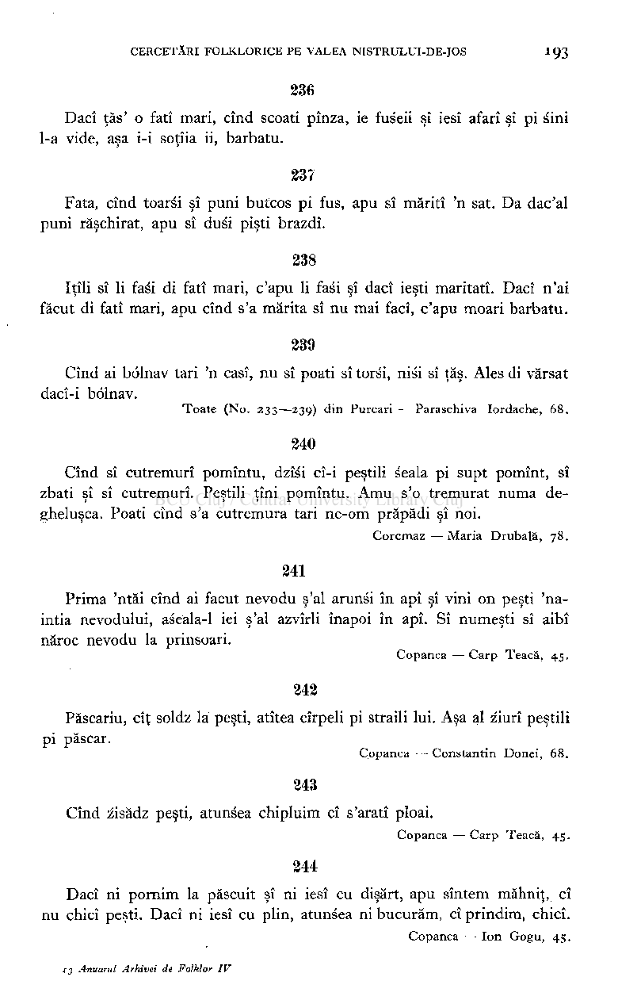

# 236

# Dacî ţăs' o fatî mari, cînd scoati pînza, ie fuseii şî iesî afarî şî pi sini 1-a vide, aşa i-i soţîia ii, barbatu.

# 237

# Fata, cînd toarsi şî puni butcos pi fus, apu sî măritî 'n sat. Da dac'al puni răşchirat, apu sî dusi pişti brazdî.

# 238

# Iţîli sî li fasi di fatî mari, c'apu li fasi şî dacî ieşti măritaţi. Dacî n'ai făcut di fatî mari, apu cînd s'a mărita sî nu mai facî, c'apu moari barbatu.

# 239

# Cînd aibolnavtari 'n casî, nu sî poati sî torsi, nisi sî ţăş. Ales di vărsat dacî-ibolnav.

Toate (No. 233—239) din Purcari — Paraschiva Iordache, 68.

# 240

# Cînd sî cutremuri pomîntu, dzîsi cî-i peştili seala pi supt pomînt, sî zbaţi şî sî cutremuri. Peştili ţîni pomîntu. Amu s'o tremurat numa degheluşca. Poati cînd s'a cutremura tari ne-om prăpădi şî noi.

Corcmaz — Maria Drubală, 78.

# 241

# Prima 'ntăi cînd ai făcut nevodu ş'al arunsi în apî şî vini on peşti 'naintia nevodului,aseala-1iei ş'al azvîrli înapoi în apî. Sî numeşti sî aibî

# năroc nevodu la prinsoari.

Copanca — Carp Teacă, 45.

# 242

# Păscariu, cîţ soldz la peşti, atîtea cîrpeli pi straili lui. Aşa al ziurî peştili pi păscar.

Copanca — Constantin Donei, 68.

# 243

Cînd zisădz peşti, atunsea chipluim cî s'aratî ploai.

Copanca — Carp Teacă, 45.

# 244

# Dacî ni pornim la păscuit şî ni iesî cu dişărt, apu sîntem măhniţ, cî nu chicî peşti. Dacî ni iesî cu plin, atunsea ni bucurăm, cî prindim, chicî.

Copanca — Ion Gogu, 45.

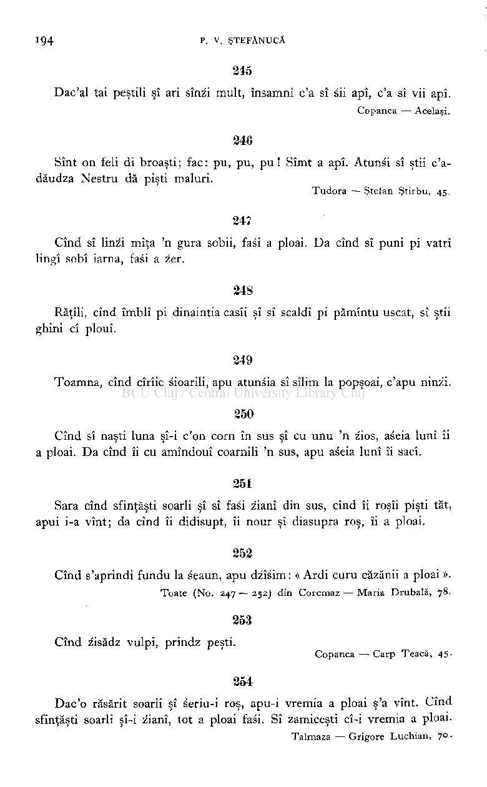

# 245

Dac'ai tai peştili şî ari sînzi mult, însamnî c'a sî sii apî, c'a sî vii apî.

# 246

# Sînt on feli di broaşti; fac: pu, pu, pu ! Simt a apî. Atunsi sî ştii c'a-

# dăudza Nestru dă pişti maluri.

Tudora — Ştefan Ştirbu, 45.

# 247

# Cînd sî linzi mîţa 'n gura sobii, fasi a ploai. Da cînd sî puni pi vatrî lingî sobî iarna, fasi a zer.

# 248

# Răţîli, cînd îmblî pi dinaintia casîi şî sî scaldî pi pămîntu uscat, sî ştii ghini cî plouî.

# 249 Toamna, cînd cîrîie sioarili, apu atunsia sî sîlim la popşoai, c'apu ninzi. 250

# Cînd sî naşti luna şî-i c'on corn în sus şî cu unu 'n zios, aseia luni îi a ploai. Da cînd îi cu amîndouî coarnili 'n sus, apu aseia luni îi sacî.

# 251

# Sara cînd sfinţăşti soarli şî sî fasi zianî din sus, cînd îi roşîi pişti tăt, apui i-a vînt; da cînd îi didisupt, îi nour şî diasupra roş, îi a ploai.

# 252 Cînd s'aprindi fundu la seaun, apu dzîsim : « Ardi curu cazanii a ploai ».

Toate (No. 247 — 252) din Corcmaz — Maria Drubală, 78.

- 253 Cînd zisădz vulpi, prindz peşti.
- 254

# Dac'o răsărit soarli şî seriu-i roş, apu-i vremia a ploai ş'a vînt. Cînd sfinţăşti soarli şî-i zianî, tot a ploai fasi. Sî zamiceşti cî-i vremia a ploai.

Talmaza — Grigore Luchian, 70.

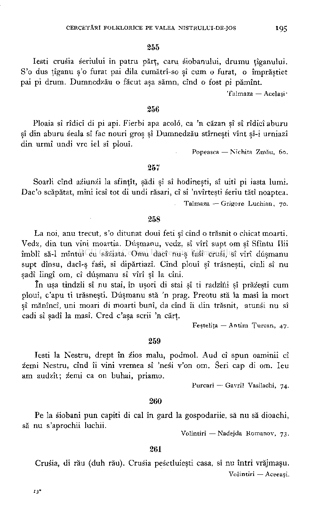

# 255

# Ieşti crusia seriului în patru părţ, caru siobanului, drumu ţiganului. S'o dus ţîganu ş'o furat pai dila cumătrî-so şî cum o furat, o împrăştiet pai pi drum. Dumnedzău o făcut aşa sămn, cînd o fost pi pămînt.

Taîmaza — Acelaşi'

# 256

# Ploaia sî rîdicî di pi api. Fierbi apa acolo, ca 'n cazan şî sî rîdicî aburu şî din aburu seala sî fac nouri groş şî Dumnedzău stîrneşti vînt şî-i urniazî din urmî undi vre iei sî plouî.

Popeasca — Nichita Zmàu, 60.

# 257

# Soarli cînd aziunzi la sfinţit, sădişî sî hodineşti, sî uitî pi iasta lumi. Dac'o scăpătat, mîni iesî tot di undi răsări, cî sî 'nvîrteşti seriu tătî noaptea.

Talmaza — Grigore Luchian, 70.

# 258

# La noi, anu trecut, s'o ditunat douî feti şî cînd o trăsnit o chicat moarti. Vedz, din tun vini moartia. Duşmanu, vedz, sî vîrî supt om şî Sfîntu11ii îmblî să-1mîntui cu săziata. Omu dacî nu-ş fasi crusi, sî vîrî duşmanu supt dînsu, dacî-ş fasi, sî dipărtiazî. Cînd plouî şî trăsneşti, cînli sî nu sadî lingî om, cî duşmanu sî vîrî sî la cîni.

# în uşa tindzîi sî nu stai, în uşori di stai şî ti radzîrii şî prăzeşti cum plouî, c'apu ti trăsneşti. Duşmanu stă 'n prag. Preotu stă la masî la mort şî mănîncî, uni moari di moarti bunî, da cînd îi din trăsnit, atunsi nu sî cadi sî şadî la masî. Cred c'aşa scrii 'n cărţ.

Feşteliţa —Antim Ţurcan, 47.

# 259

# Ieşti la Nestru, drept în zios malu, podmol. Aud cî spun oaminii cî zemi Nestru, cînd îi vini vremea sî 'nesi v'on om.Sericap di om. Ieu am audzît; zemi ca on buhai, priamo.

Purcari — Gavril Vasilachi, 74.

# 260

# Pe la siobani pun capiti di cal în gard la gospodariie, să nu să dioachi, să nu s'aprochii luchii.

Volintiri—Nadejda Romanov, 73 .

# 261

# Crusia, di rău (duh rău). Crusia pesetluieşti casa, sî nu întri vrăjmaşu.

Volintiri — Aceeaşi.

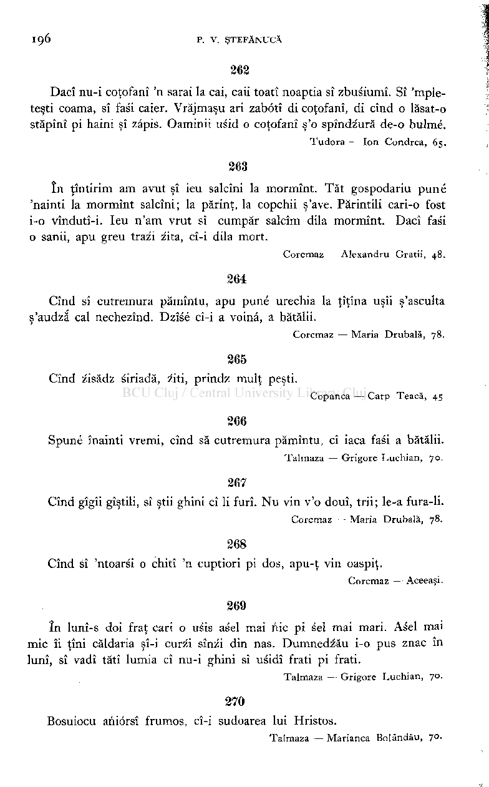

# 262

# Dacî nu-i coţofanî 'n sărai Ia cai, caii toatî noaptia sî zbusiumî. Sî 'mpleteşti coama, sî fasi caier. Vrăjmaşu ari zabotî di coţofanî, di cînd o lăsat-o

# stăpînî pi haini şî zâpis. Oaminii usid o coţofanî ş'o spîndzură de-o bulmé.

Tudora — Ion Condrea, 65.

# 263

# în ţîntirim am avut şî ieu salcîni la mormînt. Tăt gospodariu puné 'nainti la mormînt salcîni; la părinţ, la copchii ş'ave. Părintili cari-o fost i-o vîndutî-i. Ieu n'am vrut sî cumpăr salcîm dila mormînt. Dacî fasi o sânii, apu greu trazi zita, cî-i dila mort.

Corcmaz—Alexandru Gratii, 48.

# 264

# Cînd sî cutremura pămîntu, apu puné urechia la ţîţîna uşîi ş'asculta ş'audză cal nechezînd. Dzîsé cî-i a voind, a bătălii.

Corcmaz — Maria Drubală, 78.

# 265

Cînd zisădz siriadă, ziti, prindz mulţ peşti.

Copanca — Carp Teacă, 45

# 266

Spune înainti vremi, cînd să cutremura pămîntu, cî iaca fasi a bătălii.

# 267

Cînd gîgîi gîştili, sî ştii ghini cî li furi. Nu vin v'o douî, trii; le-a fura-li.

# 268

Cînd sî 'ntoarsi o chitî 'n cuptiori pi dos, apu-ţ vin oaspiţ.

# 269

# în lunî-s doi fraţ cari o usis asel mai rïic pi sel mai mari. Asel mai mic îi ţîni căldaria şî-i curzi sînzi din nas. Dumnedzău i-o pus znac în

# lunî, sî vadî tătî lumia cî nu-i ghini sî usidî fraţi pi fraţi.

# 270

# Bosuiocu aniorsî frumos, cî-i sudoarea lui Hristos.

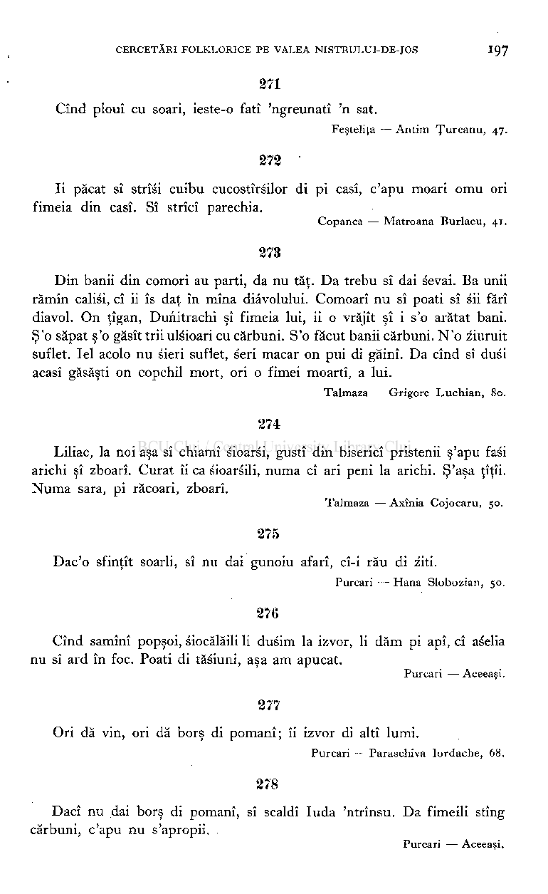

# 271

Cînd plouî cu soari, ieste-o fatî 'ngreunatî 'n sat.

# 272 '

# Ii păcat sî strîsi cuibu cucostîrsilor di pi casî, c'apu moari omu ori fimeia din casî. Sî strîcî parechia.

Copanca — Matroana Burlacu, 41 .

# 273

# Din banii din comori au parti, da nu tăţ. Da trebu sî dai sevai. Ba unii rămîn calisi, cî ii îs daţ în mîna diavolului. Comoarî nu sî poati sî sii fărî diavol. On ţîgan, Dunitrachi şî fimeia lui, ii o vrăjit şî i s'o arătat bani. Ş'o săpat ş'o găsît trii ulsioari cu cărbuni. S'o făcut banii cărbuni. N'o ziuruit suflet. Iei acolo nu sieri suflet, seri măcar on pui di găinî. Da cînd sî dusi acasî găsăşti on copchil mort, ori o fimei moartî, a lui.

Talmaza — Grigore Luchian, 80.

# 274

# Liliac, la noi aşa sî chiamî sioarsi, gustî din biserici pristenii ş'apu fasi arichi şî zboarî. Curat îi ca sioarsili, numa cî ari peni la arichi. Ş'aşa ţîţîi. Numa sara, pi răcoari, zboarî.

Talmaza — Axînia Cojocarii, 50.

# 275

Dac'o sfinţit soarli, sî nu dai gunoiu afarî, cî-i rău di ziti.

Purcari — Hana Slobozian, 50.

# 276

# Cînd samînî popşoi, siocălăili li dusim la izvor, li dăm pi apî, cî aselia nu sî ard în foc. Poati di tăsiuni, aşa am apucat.

Purcari —Aceeaşi.

# 277

Ori dă vin, ori dă borş di pomanî; îi izvor di altî lumi.

Purcari — Paraschiva lordache, 68.

# 278

# Dacî nu dai borş di pomanî, sî scaldî Iuda 'ntrînsu. Da fimeili stîng

# cărbuni, c'apu nu s'apropii.

Purcari — Aceeaşi.

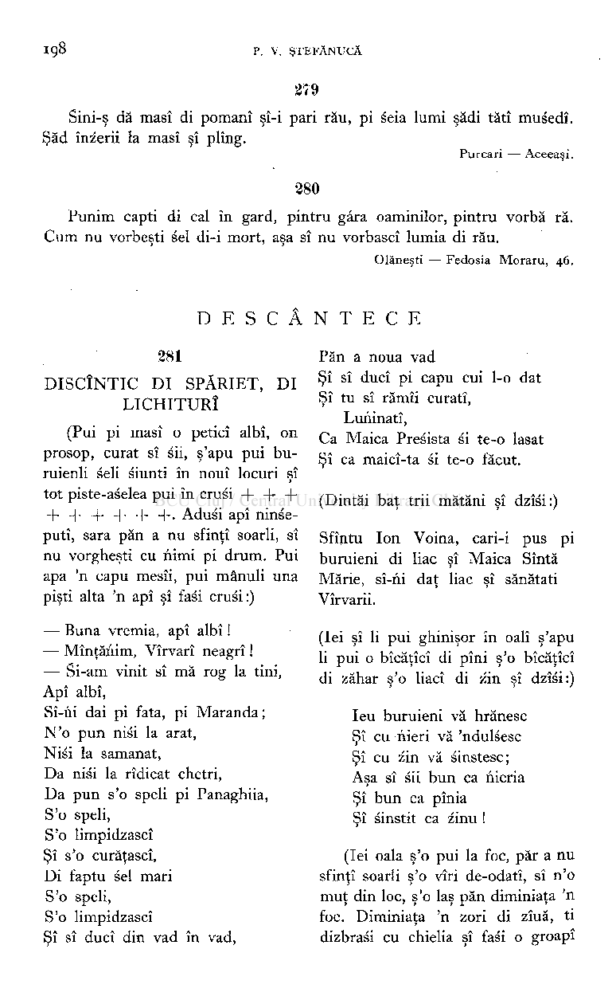

# 279

# Sini-ş dă masî di pomanî şî-i pari rău, pi seia lumisăditătî musedî. Şăd înzerii la masî şî plîng.

Purcari — Aceeaşi.

# 280

# Punim capti di cal în gard, pintru gara oaminilor, pintru vorbă ră. Cum nu vorbeşti sel di-i mort, aşa sî nu vorbascî lumia di rău.

Olăneşti — Fedosia Moraru, 46.

DESCÂNTEC E

# Păn a noua vad Şî sî ducî pi capu cui l-o dat Şî tu sî rămîi curatî,

# 281 DISCÎNTIC DI SPÄRIET, DI LICHITURÎ

# Luninatî, Ca Maica Presista si te-o lăsat Şî ca maicî-ta si te-o făcut.

# (Pui pi masî o peticî albî, on prosop, curat sî sii, ş'apu pui buruienii seli siunti în nouî locuri şî tot piste-aselea pui în crusi + + + + + + + + + . Aduşi apî ninseputî, sara păn a nu sfinţî soarli, sî nu vorgheşti cu nimi pi drum. Pui apa 'n capu mesîi, pui mânuli una pişti alta 'n apî şî fasi crusi:) — Buna vremia, apî albî ! — Mînţănim, Vîrvarî neagrî !

# (Dintăi baţ trii mătăni şî dzîsi:) Sfîntu Ion Voina, cari-i pus pi buruieni di liac şî Maica Sîntă Mărie, sî-ni daţ liac şî sănătăţi Vîrvarii.

# (Iei şî li pui ghinişor în oalî ş'apu li pui o bîcăţîcî di pini ş'o bîcăţîcî di zăhar ş'o liacî di zin şî dzîsi:)

# —Si-amvinit sî mă rog la tini, Apî albî, Sî-ni dai pi fata, pi Maranda; N'o pun nisi la arat, Nisi la samanat, Da nisi la ridicat chetri, Da pun s'o speli pi Panaghiia, S'o speli, S'o limpidzascî Şî s'o curăţascî. Di faptu sel mari S'o speli, S'o limpidzascî Şî sî ducî din vad în vad,

# leu buruieni vă hrănesc Şî cu nieri vă 'ndulsesc Şî cu zin vă sinstesc; Aşa sî sii bun ca nieria Şî bun ca pînia Şî sinstit ca zinu !

# (Iei oala ş'o pui la foc, păr a nu sfinţî soarli ş'o vîri de-odatî, sî n'o muţ din loc, ş'o laş păn diminiaţa 'n foc. Diminiaţa 'n zori di zîuă, ti dizbrasi cu chielia şî fasi o groapî

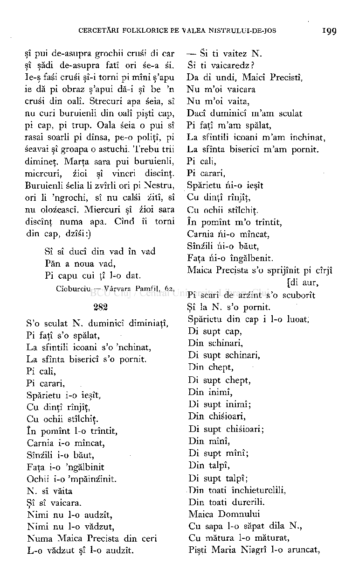

# — Siti vaitez N. Siti vaicaredz ? Da di undi, Maicî Precistî, Nu m'oi vaicara Nu m'oi vaită, Dacî duminici m'am sculat Pi faţî m'am spălat, La sfintili icoani m'am închinat, La sfînta biserici m'am pornit. Pi caii, Pi carari, Spărietu ni-o ieşît Cu dinţî rînjîţ, Cu ochii stîlchiţ. în pomînt m'o trîntit, Carnia ni-o mîncat, Sînzili iii-o băut, Faţa ni-o îngălbenit. Maica Precista s'o sprijinit pi cîrjî

# şî pui de-asupra grochii crusi di car şîsădide-asupra fatî ori se-a si. Ie-ş fasi crusi şî-i torni pi mîni ş'apu ie dă pi obraz ş'apui dă-i şî be 'n crusi din oalî. Strecuri apa seia, sî nu curi buruienii din oalî pişti cap, pi cap, pi trup. Oala seia o pui sî rasai soarli pi dînsa, pe-o poliţî, pi sea vai şî groapa o astuchi. Trebu trii dimineţ. Marţa sara pui buruienii, miercuri, zioi şî vineri discînţ. Buruienii selia li zvîrli ori pi Nestru, ori li 'ngrochi, sî nu calsi zitî, sî nu olozeascî. Miercuri şî zioi sara discînţ numa apa. Cînd îi torni din cap, dzîsi:)

# Sî sî ducî din vad în vad Păn a noua vad, Pi capu cui ţî l-o dat.

# [di aur, Pi scări de arzint s'o scuborît Şî la N. s'o pornit. Spărietu din cap i l-o luoat, Di supt cap, Din schinari, Di supt schinari, Din chept, Di supt chept, Din inimî, Di supt inimî; Din chisioari, Di supt chisioari; Din mînî, Di supt mînî; Din talpî, Di supt talpî; Din toati închieturelili, Din toati durerili. Maica Domnului Cu sapa l-o săpat dila N., Cu mătura l-o măturat, Pişti Maria Niagrî l-o aruncat,

Cioburciu — Varvara Pamfil, 62.

# 282

# S'o sculat N. duminici diminiaţî, Pi faţî s'o spălat, La sfintili icoani s'o 'nchinat, La sfînta biserici s'o pornit. Pi caii, Pi carari, Spărietu i-o ieşît, Cu dinţî rînjîţ, Cu ochii stîlchiţ. în pomînt l-o trîntit, Carnia i-o mîncat, Sînzili i-o băut, Faţa i-o 'ngălbinit Ochii i-o 'mpăinzinit.

# N. sî văitaŞî sî vaicara.Nimi nu l-o audzît,Nimi nu l-o vădzut,Numa Maica Precista din ceriL-o vădzut şî l-o audzît.

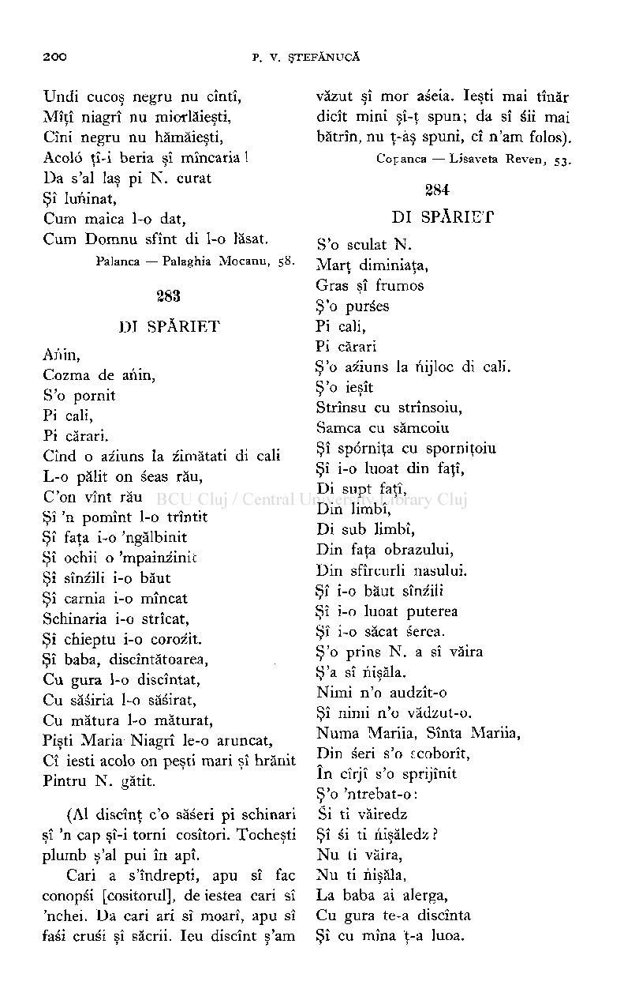

# văzut şî mor aseia. Ieşti mai tînăr dicît mini şî-ţ spun; da sî sii mai bătrîn, nu ţ-aş spuni, cî n'am folos).

# Undi cucoş negru nu cîntî, Mîţî niagrî nu miorlăieşti, Cîni negru nu hămăieşti, Acoloţî-i beria şî mîncaria ! Da s'al laş pi N. curat Şî luninat, Cum maica l-o dat, Cum Domnu sfînt di l-o lăsat.

Copanca — Lisaveta Reven, 53.

# 284

# DI SPÄRIET S'o sculat N. Marţ diminiaţa, Gras şî frumos Ş'o purses Pi caii, Pi cărări Ş'o aziuns la hijloc di caii. Ş'o ieşit Strînsu cu strînsoiu, Samca cu sămcoiu Şî sporniţa cu sporniţoiu Şî i-o luoat din faţî, Di supt faţî, Din limbi, Di sub limbî, Din faţa obrazului, Din sfîrcurli nasului. Şî i-o băut sînzili Şî i-o luoat puterea Şî i-o săcat serea. Ş'o prins N. a sî văira Ş'a sî hişăla. Nimi n'o audzît-o Şî nimi n'o vădzut-o. Numa Mariia, Sînta Mariia, Din seri s'o îxoborît, în cîrjî s'o sprijinit Ş'o 'ntrebat-o: Si ti văiredz Şî si ti hişăledz ? Nu ti văira, Nu ti hişăla, La baba ai alerga, Cu gura te-a discînta Şî cu mîna ţ-a luoa.

Palanca — Palaghia Mocanu, 58.

# 283 DI SPÄRIET

# Anin, Cozma de anin, S'o pornit Pi caii, Pi cărări. Cînd o aziuns la zimătati di caii L-o pălit on seas rău, C'on vînt rău Şî 'n pomînt l-o trîntit Şî faţa i-o 'ngălbinit Şî ochii o 'mpainzinic Şî sînzili i-o băut Şî carnia i-o mîncat Schinaria i-o stricat, Şî chieptu i-o corozit. Şî baba, discîntătoarea, Cu gura l-o discîntat, Cu săsiria l-o săsirat, Cu mătura l-o măturat, Pişti Maria Niagrî le-o aruncat, Cî ieşti acolo on peşti mari şî hrănit Pintru N. gătit.

# (Al discînţ c'o săseri pi schinari şî 'n cap şî-i torni cositori. Tocheşti plumb ş'al pui în apî.

# Cari a s'îndrepti, apu sî fac conopsi [cositorul], de iestea cari sî 'nchei. Da cari ari sî moarî, apu sî fasi crusi şî sacrii. Ieu discînt ş'am

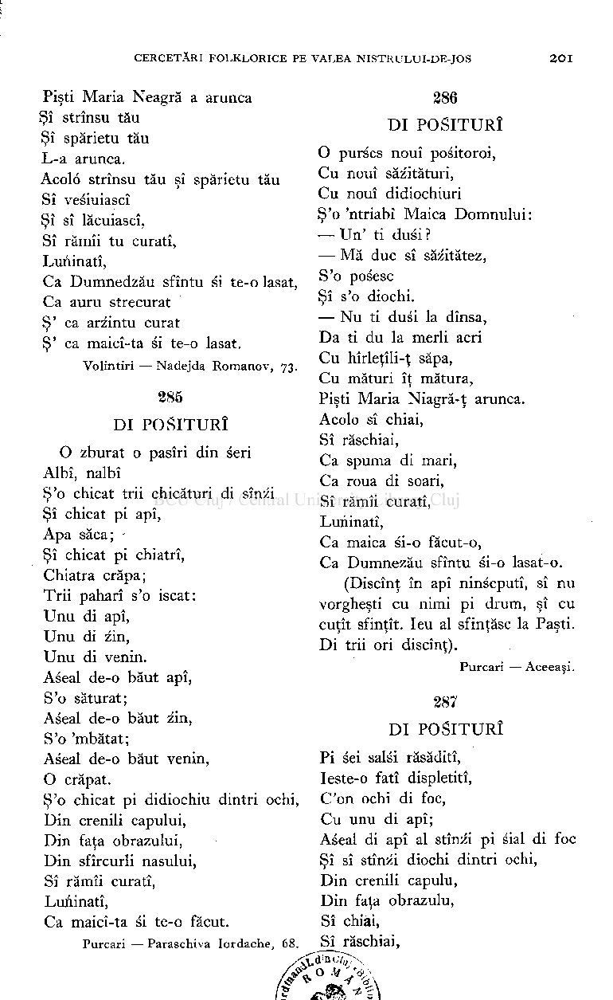

# Pişti Maria Neagră a arunca Şî strînsu tău Şî spărietu tău L-a arunca. Acolo strînsu tău şî spărietu tău Sî vesiuiascî Şî sî lăcuiascî, Sî rămîi tu curaţi, Lufîinatî, Ca Dumnedzău sfîntu si te-o lăsat, Ca auru strecurat Ş' ca arzintu curat Ş' ca maicî-ta si te-o lăsat.

# 286

# DI POSITURÎ O purses nouî positoroi, Cu nouî săzitături, Cu nouî didiochiuri Ş'o 'ntriabî Maica Domnului:

# — Un' ti duşi?

# — Mă duc sî săzitătez, S'o posesc Şî s'o diochi.

# — Nu ti dusi la dînsa, Da ti du la merii acri Cu hîrleţîli-ţ săpa, Cu mături îţ mătura, Pişti Maria Niagră-ţ arunca. Acolo sî chiai, Sî răschiai, Ca spuma di mari, Ca roua di soari, Sî rămîi curatî, Luninatî, Ca maica si-o făcut-o, Ca Dumnezău sfîntu si-o lasat-o.

Volintiri — Nadej'da Romanov, 73.

# 285 DI POSITURÎ

# O zburat o pasîri din seri Aibî, nălbi Ş'o chicat trii chicături di sînzi Şî chicat pi apî, Apa săca; Şî chicat pi chiatrî, Chiatra crăpa; Trii paharî s'o iscat: Unu di apî, Unu di zin, Unu di venin. Aseal de-o băut apî, S'o săturat; Aseal de-o băut zin, S'o 'mbătat; Aseal de-o băut venin,

# (Discînţ în apî ninseputî, sî nu vorgheşti cu nimi pi drum, şî cu cuţît sfinţit. Ieu al sfinţăsc la Paşti. Di trii ori discînţ).

Purcari —Aceeaşi.

# 287

# DI POSITURÎ Pi sei saisi răsădiţi, Ieste-o fatî displetitî, C'on ochi di foc, Cu unu di apî; Aseal di apî al stînzi pi sial di foc Şî sî stînzi diochi dintri ochi, Din crenili capulu, Din faţa obrazulu, Sî chiai, Sî răschiai,

# O crăpat.Ş'o chicat pi didiochiu dintri ochi,Din crenili capului,Din faţa obrazului,Din sfîrcurli nasului,Sî rămîi curatî,Luninatî,Ca maicî-ta si te-o făcut.

Purcari — Paraschiva Iordache, 68.

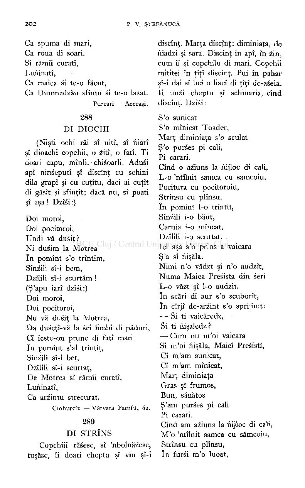

# Ca spuma di mari, Ca roua di soari. Sî rămîi curatî, Luîiinatî, Ca maica si te-o făcut, Ca Dumnedzău sfîntu si te-o lăsat.

# discînţ. Marţa discînţ: diminiaţa, de niadzî şî sara. Discînţ în apî, în zin, cum îi şî copchilu di mari. Copchii mititei în ţîţî discînţ. Pui în pahar şî-i dai sî bei o liacî di ţîţî de-aseia. Ii unzi cheptu şî schinaria, cînd discînţ. Dzîsi:

Purcari — Aceeaşi.

# 288 DI DIOCHI

# S'o sunicat S'o mînicat Toader, Marţ diminiaţa s'o sculat Ş'o purses pi caii, Pi carari. Cînd o aziuns la nijloc di caii, L-o 'ntîlnit samca cu sameoiu, Pocitura cu pocitoroiu, Strînsu cu plînsu. în pomînt l-o trîntit, Sînzili i-o băut, Carniai-o mîncat, Dzîlilii-o scurtat. Iei aşa s'o prins a vaicara Ş'a sî nişăla. Nimi n'o vădzt şî n'o audzît, Numa Maica Presista din seri L-o văzt şî l-o audzît. în scări di aur s'o scuborît, în cîrjî de-arzint s'o sprijinit:

# (Nişti ochi răi sî uitî, sî niarî şî dioachi copchii, o zitî, o fatî. Ti doari capu, mînli, chisoarli. Aduşi apî ninseputî şî discînţ cu schini dila grapî şî cu cuţîtu, dacî ai cuţît di găsît şî sfinţit; dacă nu, sî poati şî aşa ! Dzîsi :)

# Doi moroi, Doi pocitoroi, Undi vă dusiţ? Ni dusim la Motrea în pomînt s'o trîntim, Sînzili sî-i bem, Dzîlili sî-i scurtăm ! (Ş'apu iarî dzîsi:) Doi moroi, Doi pocitoroi, Nu vă dusiţ la Motrea, Da duseţî-vă la sei limbî di păduri, Cî ieste-on prunc di fatî mari în pomînt s'al trîntiţ, Sînzili sî-i beţ, Dzîlili sî-i scurtat, Da Motrea sî rămîi curatî, Lufiinatî, Ca arzintu strecurat.

# — Siti vaicăredz, Siti nişaledz?

# — Cum nu m'oi vaicara Şî m'oi nişăla, Maicî Presistî, Cî m'am sunicat, Cî m'am mînicat, Marţ diminiaţa Gras şî frumos, Bun, sănătos Ş'am purses pi caii Pi carari. Cînd am aziuns la nijloc di caii, M'o 'ntîlnit samca cu sămeoiu, Strînsu cu plînsu, în fursi m'o luoat,

Cioburciu — Vârvara Pamfil, 62.

# 289 DI STRÎNS

# Copchiii răsese, sî 'nbolnăzesc, tuşăsc, îi doari cheptu şî vin şî-i

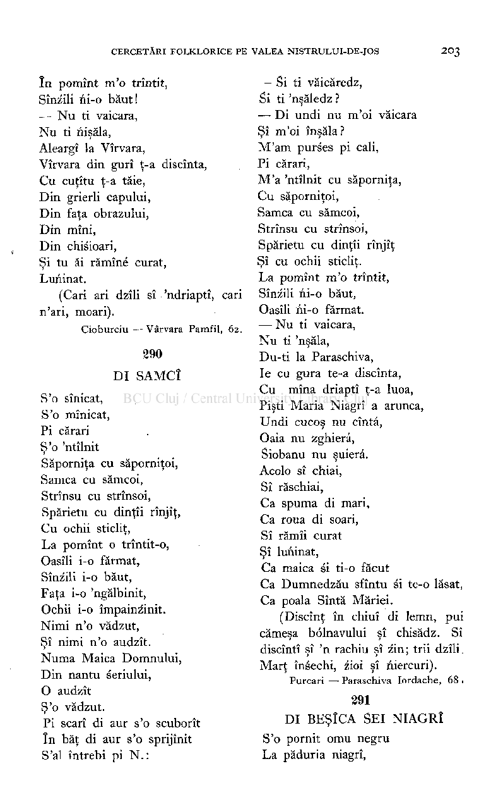

# — Siti văicăredz, Siti 'nşăledz ?

# în pomînt m'o trîntit, Sînzili ni-o băut! — Nu ti vaicara, Nu ti nişăla, Aleargî la Vîrvara, Vîrvara din guri ţ-a discînta, Cu cuţîtu ţ-a tăie, Din grierii capului, Din faţa obrazului, Din mîni, Din chisioari, Şi tu ăi rămîne curat, Luninat.

# —• Di undi nu m'oi văicara Şî m'oi înşăla ? M'ampurées pi caii, Pi cărări, M'a 'ntîlnit cu săporniţa, Cu săporniţoi, Samca cu sămcoi, Strînsu cu strînsoi, Spărietu cu dinţii rînjîţ Şî cu ochii sticlit. La pomînt m'o trîntit, Sînzili hi-o băut, Oasîli ni-o fărmat. — Nu ti vaicara, Nu ti 'nşăla, Du-ti la Paraschiva, Ie cu gura te-a discînta, Cu mîna driaptî ţ-a luoa, Pişti Maria Niagrî a arunca, Undi cucoş nu cîntâ, Oaia nu zghierâ, Siobanunu şuieră. Acolo sî chiai, Sî răschiai, Ca spuma di mari, Ca roua di soari, Sî rămîi curat Şî luninat, Ca maica si ti-o făcut Ca Dumnedzău sfîntu si te-o lăsat, Ca poala Sîntă Măriei.

# (Cari ari dzîli sî 'ndriaptî, cari n'ari, moari).

Cioburciu — Vârvara Pamfil, 62.

# 290 DI SAMCÎ

# S'o sînicat, S'o mînicat, Pi cărări Ş'o 'ntîlnit

# Săporniţa cu săporniţoi,Samca cu sămcoi,Strînsu cu strînsoi,Spărietu cu dinţii rînjîţ,Cu ochii sticlit,La pomînt o trîntit-o,Oasîli i-o fărmat,Sînzili i-o băut,Faţa i-o 'ngălbinit,Ochii i-o împainzinit.Nimi n'o vădzut,Şî nimi n'o audzît.Numa Maica Domnului,Din nantu seriului,O audzîtŞ'o vădzut.Pi scări di aur s'o scuborîtÎn băţ di aur s'o sprijinitS'al întrebi pi N.:

# (Discînţ în chiuî di lemn, pui cămeşa bolnavului şî chisădz. Sî discîntî şî 'n rachiu şî zin; trii dzîli. Marţ însechi, zioi şî niercuri).

Purcari — Paraschiva lordache, 68 .

# 291

# DI BEŞÎCA S'o pornit omu negru La păduria niagrî,

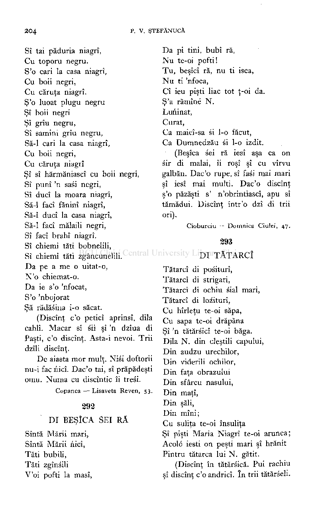

# Da pi tini, bubî ră, Nu te-oi pofti! Tu, beşîcî ră, nu ti isca, Nu ti 'nfoca, Cî ieu pişti liac tot ţ-oi da.

# Sî tai păduria niagrî, Cu toporu negru. S'o cari la casa niagrî, Cu boii negri, Cu căruţa niagrî. Ş'o luoat plugu negru Şî boii negri Şî grîu negru, Sî samini grîu negru,

# Ş'aLuninat,rămîneN . Curat, Ca maicî-sa si l-o făcut, Ca Dumnedzău si l-o izdit.

# Să-1 cari la casa niagrî,Cu boii negri,Cu căruţa niagrîŞî sî hărmăniascî cu boii negri,Sî puni 'n sasi negri,Sî duci la moara niagrî,

# (Beşîca sei ră iesî aşa ca on sir di mălai, îi roşi şî cu vîrvu galbăn. Dac'o rupe, sî fasi mai mari şî iesî mai mulţi. Dac'o discînţ ş'o păzăşti s' n'obrintiascî, apu sî tămădui. Discînţ într'o dzî di trii ori).

# Să-1 facî făninî niagrî,

# Să-1 ducî la casa niagrî,

- Să-1 facî mălaili negri, Sî facî brahî niagrî. Sî chiemi tăti bobnelili, Sî chiemî tăti zgâncunelili. Da pe a me o uitat-o, N'o chiemat-o. Da ie s'o 'nfocat, S'o 'nbojorat Şă rădăsina i-o săcat.

(Discînţ c'o petici aprinşi, dila cahlî. Măcar sî sii şî 'n dzîua di Paşti, c'o discînţ. Asta-i nevoi. Trii dzîli discînţ.

De aiasta mor mulţ. Nisi doftorii nu-i fac nicî. Dac'o tai, sî prăpădeşti omu. Numa cu discîntic îi tresi.

Copanca — Lisaveta Reven, 53.

292

DI BEŞÎCA SEI RA Sîntă Mării mari, Sîntă Mării nici,

- Tăti bubili,

Cioburciu — Domnica Ciulei, 47.

# 293 DI TĂTARCÎ Tătarei di positurî, Tătarei di strigări, Tătarei di ochiu sial mari, Tătarei di loziturî, Cu hîrleţu te-oi săpa, Cu sapa te-oi drăpăna Şî 'n tătărsicî te-oi băga. Dila N. din cleştili capului, Din audzu urechilor, Din viderili ochilor, Din faţa obrazului Din sfârcu nasului, Din maţi, DinDin mîni;săli, Cu suliţa te-oi insuliţa Şî pişti Maria Niagrî te-oi arunca; Acolô ieşti on peşti mari şî hrănit Pintru tătarca lui N. gătit.

# (Discînţ în tătărsică. Pui rachiu şî discînţ c'o andricî. în trii tătărseli.

# Tăti zgînsiliVoi pofti la masî,

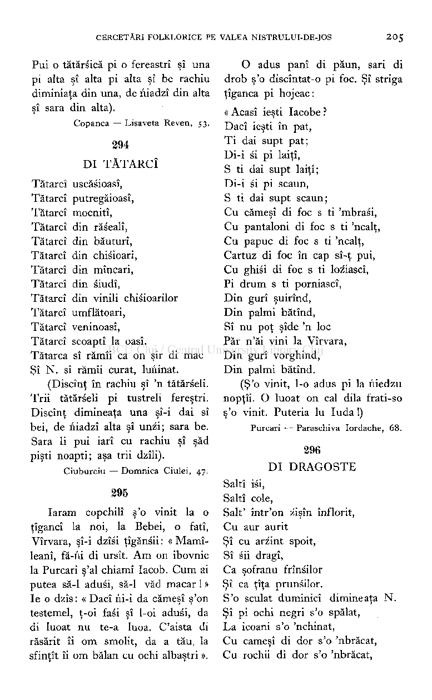

# O adus panî di păun, sari di drob ş'o discîntat-o pi foc. Şî striga ţiganca pi hojeac: « Acasî ieşti Iacobe ? Dacî ieşti în pat, Ti dai supt pat; Di-i si pi laiţî, S ti dai supt laiţî; Di-i si pi scaun, S ti dai supt scaun; Cu cămeşi di foc s ti 'mbrasi, Cu pantaloni di foc s ti 'ncalţ, Cu papuc di foc s ti 'ncalţ, Cartuz di foc în cap sî-ţ pui, Cu ghisi di foc s ti loziascî, Pi drum s ti porniascî, Din gurî şuirînd, Din palmi bătînd, Sî nu poţ şîde 'n loc Păr n'ăi vini la Vîrvara, Din gurî vorghind, Din palmi bătînd.

# Pui o tătărsică pi o fereastrî şî una pi alta şî alta pi alta şî be rachiu diminiaţa din una, de niadzî din alta şî sara din alta).

Copanca — Lisaveta Reven, 53.

# 294 DI TATARCÎ

# Tătarcî uscăsioasî,

# Tătarcî putregăioasî,

# Tătarcî mocnitî,Tătarcî din răsealî,Tătarcî din băuturi,Tătarcî din chisioari,Tătarcî din mîncari,Tătarcî din siudî,Tătarcî din vinili chisioarilorTătarcî umflătoari,Tătarcî veninoasî,Tătarcî scoaptî la oasî.Tătarca sî rămîi ca on şir di macŞî N. sî rămîi curat, luîiinat.

# (Ş'o vinit, l-o adus pi la niedzu nopţîi. O luoat on cal dila frati-so ş'o vinit. Puteria lu Iuda !)

# (Discînţ în rachiu şî 'n tătărseli. Trii tătărseli pi tustreli fereştri. Discînţ dimineaţa una şî-i dai sî bei, de niadzî alta şî unzi; sara be. Sara li pui iarî cu rachiu şî şăd pişti noapti; aşa trii dzîli).

Purcari — Paraschiva Iordache, 68.

# 296 DI DRAGOSTE

Ciuburciu — Domnica Ciulei, 47.

# Saltî isi, Saltî cole, Salt' într'on zişîn înflorit, Cu aur aurit Şî cu arzint spoit, Sî sii dragî, Ca şofranu frînsilor Şî ca ţîţa prunsilor. S'o sculat duminici dimineaţa N. Şî pi ochi negri s'o spălat, La icoani s'o 'nchinat, Cu cameşî di dor s'o 'nbrăcat, Cu rochii di dor s'o 'nbrăcat,

# 295

# Iaram copchilî ş'o vinit la o ţîgancî la noi, la Bebei, o fatî, Vîrvara, şî-i dzîsi ţîgănsii : « Mamîleanî, fă-hi di ursît. Am on ibovnic la Purcari ş'al chiamî Iacob. Cum ai putea să-1aduşi, să-1văd măcar ! » Ie o dzîs: « Dacî ni-i da cămeşi ş'on testemel, ţ-oi fasi şî l-oi aduşi, da di luoat nu te-a luoa. C'aista di răsărit îi om smolit, da a tău, la sfinţit îi om bălan cu ochi albaştri ».

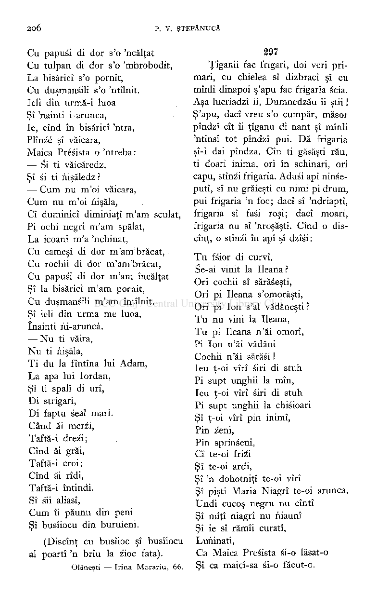

# 297

# Cu papusi di dor s'o 'ncălţat Cu tulpan di dor s'o 'mbrobodit, La bisăricî s'o pornit, Cu duşmansili s'o 'ntîlnit. Ieli din urmă-i luoa Şî 'nainti i-arunca, Ie, cînd în bisăricî 'ntra, Plînze şî vaicara, Maica Présista o 'ntreba:

# Ţiganii fac frigări, doi veri primari, cu chielea sî dizbracî şî cu mînli dinapoi ş'apu fac frigaria seia. Aşa lucriadzî ii, Dumnedzău îi ştii ! Ş'apu, dacî vreu s'o cumpăr, măsor pîndzî cît îi ţîganu di nant şî mînli 'ntinsî tot pîndzî pui. Dă frigaria şî-i dai pîndza. Cîn ti găsăşti rău, ti doari inima, ori în schinari, ori capu, stînzi frigaria. Aduşi apî ninseputî, sî nu grăieşti cu nimi pi drum, pui frigaria 'n foc; dacî sî 'ndriaptî, frigaria sî fasi roşî; dacî moari, frigaria nu sî 'nroşăşti. Cînd o discînţ, o stînzi în apî şî dzîsi:

# — Si ti văicăredz, Şî si ti riişăledz ?

# — Cum nu m'oi vaicara, Cum nu m'oi riişăla, Cî duminici diminiaţî m'am sculat, Pi ochi negri m'am spălat, La icoani m'a 'nchinat, Cu cameşî di dor m'ambrăcat, Cu rochii di dor m'am'brăcat, Cu papusi di dor m'am încălţat Şî la bisăricî m'am pornit, Cu duşmansili m'am întîlnit. Şî ieli din urma me luoa, înainti rii-aruncâ. — Nu ti văira, Nu ti riişăla, Ti du la fîntîna lui Adam, La apa lui Iordan, Şî ti spalî di urî, Di strigări, Di faptu seal mari. Când ăi merzi, Taftă-i drezi; Cînd ăi grăi, Taftă-i croi; Cînd ăi rîdi, Taftă-i întindi. Sî sii aliasî, Cum îi păunu din peni Şî busîiocu din buruieni.

# Tu fsior di curvî, Se-aivinit la Ileana ? Ori cochii sî sărăseşti, Ori pi Ileana s'omorăşti, Ori pi Ion s'al vădăneşti ? Tu nu vini la Ileana, Tu pi Ileana n'ăi omorî, Pi Ion n'ăi vădani Cochii n'ăi sărăsi ! Ieu ţ-oi vîrî siri di stuh Pi supt unghii la mîn, leu ţ-oi vîrî siri di stuh Pi supt unghii la chisioari Şî ţ-oi vîrî pin inimî, Pin zeni, Pin sprinseni, Cî te-oi frizi Şî te-oi ardi, Şî 'n dohotniţî te-oi vîrî Şî pişti Maria Niagrî te-oi arunca, Undi cucoş negru nu cîntî Şî mîţî niagrî nu riiaunî Şî ie sî rămîi curatî, Luriinatî, Ca Maica Presista si-o lăsat-o Şî ca maicî-sa si-o făcut-o.

# (Discînţ cu busîioc şî busîiocu al poartî 'n brîu la zioc fata).

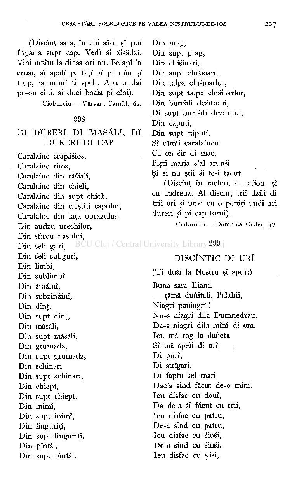

# (Discînţ sara, în trii sări, şî pui frigaria supt cap. Vedi si zisădzî. Vini ursîtu la dînsa ori nu. Be apî 'n crusi, sî spalî pi faţî şî pi mîn şî trup, la inimî ti speli. Apa o dai pe-on cîni, sî ducî boala pi cîni).

# Din prag, Din supt prag, Din chisioari, Din supt chisioari, Din talpa chisioarlor, Din supt talpa chisioarlor, Din burisili dezitului, Di supt burisili dezitului, Din căputî, Din supt căputî, Sî rămîi caralaincu Ca on sir di mac, Pişti maria s'al arunsi Şî sî nu ştii si te-i făcut.

Cioburciu—Varvara Pamfil, 62.

# 298 DI DURERI DI MÄSÄLI, DI DURERI DI CAP

# Caralainc crăpăsios, Caralainc rîios, Caralainc din rasiali, Caralainc din chieli, Caralainc din supt chieli, Caralainc din cleştili capului, Caralainc din faţa obrazului, Din audzu urechilor, Din sfîrcu nasului, Din seli guri, Din seli subguri, Din limbî, Din sublimbî, Din zinzinî, Din subzinzinî, Din dinţ, Din supt dinţ, Din măsăli, Din supt măsăli, Din grumadz, Din supt grumadz, Din schinari Din supt schinari, Din chiept, Din supt chiept, Din inimî, Din supt inimî, Din linguriţî, Din supt linguriţî, Din pîntsi, Din supt pîntsi,

# (Discînţ în rachiu, cu afion, şî cu andreua, Al discînţ trii dzîli di trii ori şî unzi cu o peniţî undi ari dureri şî pi cap torni).

Cioburciu — Domnica Ciulei, 47.

# 299 DISCÎNTIC DI URÎ (Ti dusi la Nestru şî spui:) Buna sara Ilianî,

# .. .ţămă dunitali, Palahii, Niagrî paniagrî ! Nu-s niagrî dila Dumnedzău, Da-s niagrî dila mînî di om. Ieu mă rog la duneta Sî mă speli di urî, Di purî, Di strigări, Di faptu sel mari. Dac'a sind făcut de-o mînî, leu disfac cu douî, Da de-a si făcut cu trii, leu disfac cu patru, De-a sind cu patru, leu disfac cu sinsi, De-a sind cu sinsi, leu disfac cu şăsî,

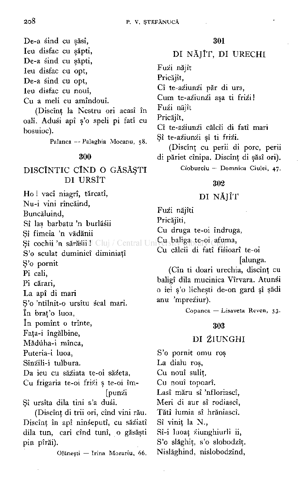

# De-a sind cu şăsî, leu disfac cu şăpti, De-a sind cu şăpti, leu disfac cu opt, De-a sind cu opt, leu disfac cu nouî, Cu a meii cu amîndouî.

# DI NAJÎT, DI URECHI Fuzi năjît Pricăjit, Cî te-aziunzi păr di urs, Cum te-aziunzi aşa ti frizi! Fuzi năjît Pricăjit, Cî te-aziunzi călcîi di fatî mari Şî te-aziunzi şîtifrizi.

# (Discînţ la Nestru ori acasî în oalî. Aduşi apî ş'o speli pi fatî cu bosuioc).

# (Discînţ cu perii di porc, perii di păriet cînipa. Discînţ di şăsî ori).

Palanca — Palaghia Mocanu, 58.

# 300 DISCÎNTIC CÎND O GÄSÄSTI DI URSÎT

Cioburciu — Domnica Ciulei, 47.

# 302 DI NĂJÎT

# Ho ! vacî niagrî, tărcatî, Nu-i vini rîncăind, Buncăluind, Sî laş barbatu 'n burlăsii Şî fimeia 'n vădanii Şî cochii 'n sărăsii ! S'o sculat duminici diminiaţî Ş'o pornit Pi caii, Pi cărări, La apî di mari Ş'o 'ntîlnit-o ursîtu seal mari. în brat'o luoa, în pomînt o tnnte, Faţa-i îngălbine, Măduha-i mînca, Puteria-i luoa, Sînzili-i tulbura. Da ieu cu săziata te-oi săzeta, Cu frigaria te-oi frizi ş te-oi îm-

# Fuzi năjîti Pricăjiţi, Cu druga te-oi îndruga, Cu baliga te-oi afuma, Cu călcîi di fatî fisioarî te-oi

# [alunga.

# (Cîn ti doari urechia, discînţ cu baligi dila mucinica Vîrvara. Atunsi anu 'mpreziur).o iei ş'o licheşti de-on gard şî sădi

Copanca — Lisaveta Reven, 53.

# 303 DI ZIUNGHI S'o pornit omu roş La dialu roş, Cu nouî suliţ, Cu nouî topoarî. Lasî măru sî 'nfloriascî, Meri di aur sî rodiascî, Tătî lumia sî hrăniascî. Sî viniţ la N., Sî-i luoaţ ziunghiurli ii, S'o slăghiţ, s'o slobodzîţ. Nislăghind, nislobodzînd,

# [punzi Şî ursita dila tini s'a dusi.

# (Discînţ di trii ori, cînd vini rău. Discînţ în apî ninseputî, cu săziatî dila tun, cari cînd tunî, o găsăşti pin pîrăi).

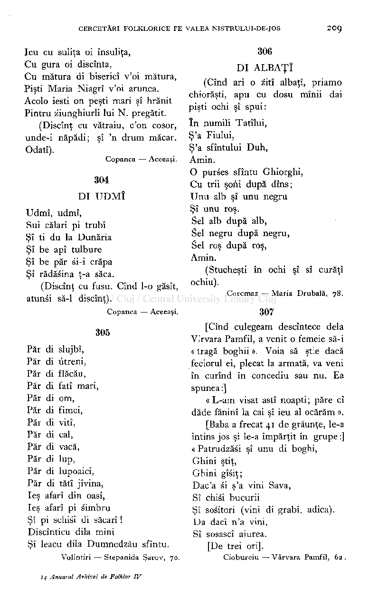

# leu cu suliţa oi insuliţa, Cu gura oi discînta, Cu mătura di biserici v'oi mătura, Pişti Maria Niagrî v'oi arunca. Acolo ieşti on peşti mari şî hrănit Pintru ziunghiurli lui N. pregătit.

# 306 DI ALBAŢÎ

# (Cînd ari o zitî albaţî, priamo chiorăşti, apu cu dosu mînii dai pişti ochi şî spui: în numili Tatîlui, Ş'a Fiului, Ş'a sfîntului Duh, Amin. O purses sfîntu Ghiorghi, Cu trii şoni după dîns; Unu alb şî unu negru Şî unu roş. Selalb după alb, Selnegru după negru, Selroş după roş, Amin.

# (Discînţ cu vătraiu, c'on cosor, unde-i năpădi; şî 'n drum măcar. Odatî).

Copanca — Aceeaşi.

# 304 DI UDM Î

# Udmî, udmî, Sui călări pi trubî Şî ti du la Dunăria Şî be apî tulbure Şî be păr si-i crăpa Şî rădăsina ţ-a săca.

# (Stucheşti în ochi şî sî curaţi ochiu).

# (Discînţ cu fusu. Cînd l-o găsît, atunsi să-1 discînţ).

Corcmaz — Maria Drubală, 78.

# 307

Copanca — Aceeaşi.

# [Cînd culegeam descîntece delà Vîrvara Pamfil, a venit o femeie să-i « tragă boghii ». Voia să ştie dacă feciorul ei, plecat la armată, va veni în curînd în concediu sau nu. Ea spunea :]

# 305

# Păr di slujbî, Păr di utreni, Păr di flăcău, Păr di fatî mari, Păr di om, Păr di fimei, Păr di vitî, Păr di cal, Păr di vacă, Păr di lup, Păr di lupoaicî, Păr di tătî jivina, leş afarî din oasî, leş afarî pi simbru Şî pi schisi di săcarî ! Discînticu dila mini Şî leacu dila Dumnedzău sfîntu.

# « L-am visat asti noapti ; păre cî dadefanini la cai şî ieu al ocăram ».

# [Baba a frecat 41 de grăunţe, le-a întins jos şi le-a împărţit în grupe :] « Patrudzăsi şî unu di boghi, Ghini ştiţ, Ghini gîsiţ; Dac'a si ş'a vini Sava, Sî chisi bucurii Şî sositori (vinidigrabî, adică). Da dacî n'a vini, Sî sosascî aiurea.

# [De trei ori].

Cioburciu — Vârvara Pamfil, 62.

Volintiri — Stepanida Şarov, 70.

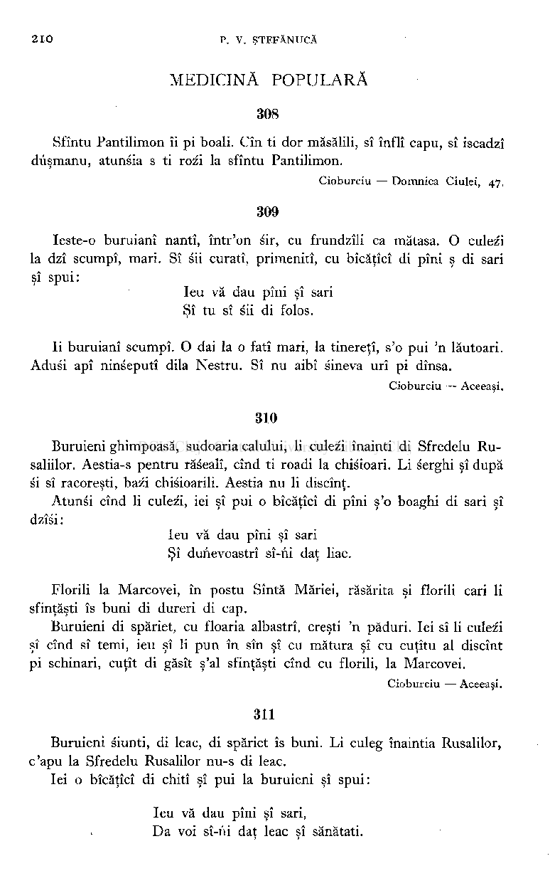

MEDICINĂ POPULARĂ

# 308

# Sfîntu Pantilimon îi pi boali. Cin ti dor măsălili, sî înflî capu, sî iscadzî duşmanu, atunsia s ti rozi la sfîntu Pantilimon.

Cioburciu — Domnica Ciulei, 47.

# 309

# Ieste-o buruianî nanti, într'on sir, cu frundzîli ca mătasa. O culezi la dzî scumpi, mari. Sî sii curatî, primeniţi, cu bîcăţîcî di pîni ş di sari şî spui:

# leu vă dau pîni şî sari Şî tu sî sii di folos.

# Ii buruianî scumpî. O dai la o fatî mari, la tinereţi, s'o pui 'n lăutoari. Aduşi apî ninseputî dila Nestru. Sî nu aibî sineva urî pi dînsa.

Cioburciu — Aceeaşi.

# 310

# Buruieni ghimpoasă, sudoaria calului, li culezi înainti di Sfredelu Rusaliilor. Aestia-s pentru răsealî, cînd ti roadi la chisioari. Li serghi şî după si sî răcoreşti, bazi chisioarili. Aestia nu li discînţ.

# Atunsi cînd li culezi, iei şî pui o bîcăţîcî di pîni ş'o boaghi di sari şî dzîsi :

# leu vă dau pîni şî sari Şî dunevoastrî sî-ni daţ liac.

# Florili la Marcovei, în postu Sîntă Măriei, răsărita şi florili cari li sfinţăşti îs buni di dureri di cap.

# Buruieni di spăriet, cu floaria albaştri, creşti 'n păduri. Iei sî li culezi şî cînd sî temi, ieu şî li pun în sîn şî cu mătura şî cu cuţîtu al discînt pi schinari, cuţit di găsît ş'al sfinţăşti cînd cu florili, la Marcovei.

Cioburciu — Aceeaşi.

# 311

# Buruieni siunti, di leac, di spăriet îs buni. Li culeg înaintia Rusalilor, c'apu la Sfredelu Rusalilor nu-s di leac.

# Iei o bîcăţîcî di chitî şî pui la buruieni şî spui: leu vă dau pîni şî sari, Da voi sî-hi daţ leac şî sănătăţi.

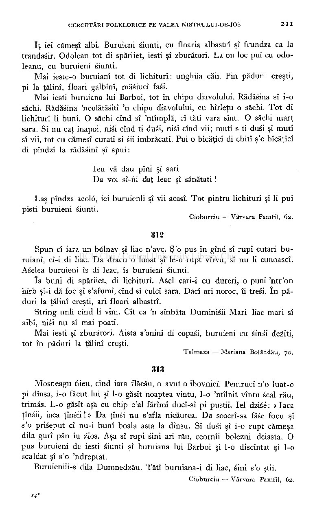

# îţ iei cămeşi albi. Buruieni siunti, cu floaria albaştri şî frundza ca la trandasir. Odolean tot di spăriiet, ieşti şî zburători. La on loc pui cu odoleanu, cu buruieni siunti.

# Mai ieste-o buruianî tot di lichiturî: unghiia căii. Pin păduri creşti, pi la ţălinî, floari galbînî, măsiucî fasi.

# Mai ieşti buruiana lui Bărboi, tot în chipu diavolului. Rădăsina sî i-o săchi. Rădăsina 'ncolătăsitî 'n chipu diavolului, cu hîrleţu o săchi. Tot di lichiturî îi bunî. O săchi cînd sî 'ntîmplă, cî tătî vara sînt. O săchi marţ sara. Sî nu caţ înapoi, nisi cînd ti dusi, nisi cînd vii; mutî s ti dusi şî mutî sî vii, tot cu cămeşi curatî sî sii îmbrăcaţi. Pui o bîcăţîcî di chitî ş'o bîcăţîcî di pîndzî la rădăsinî şî spui:

# leu vă dau pîni şî sari Da voi sî-rii daţ leac şî sănătăţi !

# Laş pîndza acolo, iei buruienii şî vii acasî. Tot pintru lichiturî şî li pui pişti buruieni siunti.

Cioburciu — Vârvara Pamfil, 62.

# 312

# Spun cî iara un bolnav şî liac n'ave. Ş'o pus în gînd sî rupî cutări buruianî, cî-i di liac. Da dracu o luoat şî le-o rupt vîrvu, sî nu li cunoascî. Aselea buruieni îs di leac, îs buruieni siunti.

# îs buni di spăriiet, di lichiturî. Asel cari-i cu dureri, o puni 'ntr'on hîrb şî-i dă foc şî s'afumî, cînd sî culci sara. Dacî ari noroc, îi tresi. în păduri la ţălinî creşti, ari floari albaştri.

# String unii cînd li vini. Cit ca 'n sînbăta Duminisii-Mari liac mari sî aibî, nisi nu sî mai poati.

# Mai ieşti şî zburători. Aista s'aninî di copaci, buruieni cu sinsi deziti, tot în păduri la ţălinî creşti.

Talmaza — Mariana Bolândău, 70.

# 313

# Moşneagu nieu, cînd iara flăcău, o avut o ibovnici. Pentrucî n'o luat-o pi dînsa, i-o făcut lui şî l-o găsît noaptea vîntu, l-o 'ntîlnit vîntu seal rău, trimăs. L-o găsît aşa cu chip c'al fărîmî ducî-sî pi pustii. Iei dzîse: « Iaca ţînsii, iaca ţînsii ! » Da ţînsi nu s'afla nicăurea. Da soacrî-sa făse focu sî s'o priseput cî nu-i bunî boala asta la dînsu. Sî dusi sî i-o rupt cămeşa dila guri păn in zios. Aşa si rupi sini ari rău, ceornîi bolezni deiasta. O pus buruieni de ieşti siunti şî buruiana lui Bărboi şî l-o discîntat şî l-o scăldat şî s'o 'ndreptat.

# Buruienili-s dila Dumnedzău. Tătî buruiana-i di liac, sini s'o ştii.

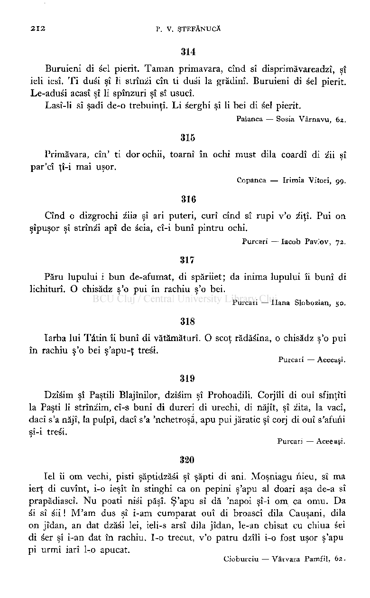

# 314

# Buruieni di sel pierit. Taman primăvara, cînd sî disprimăvareadzî, şî ieli iesî. Ti dusi şî li strînzi cîn ti dusi la grădini. Buruieni di sel pierit. Le-adusi acasî şî li spînzuri şî sî usucî.

# Lasî-li sî şadî de-o trebuinţî. Li serghi şî li bei di sel pierit.

Palanca — Sosia Vârnavu, 62.

# 315

# Primăvara, cîn' ti dor ochii, toarnî în ochi must dila coardî di zii sî par'cî ţî-i mai uşor.

Copanca — Irimia Vitori, 99.

# 316

# Cînd o dizgrochi ziia şî ari puteri, curî cînd sî rupi v'o ziţî. Pui on şîpuşor şî strînzi apî de seia, cî-i bunî pintru ochi.

Purcari — Iacob Pavlov, 72.

# 317

# Păru lupului i bun de-afumat, di spăriiet; da inima lupului îi bunî di lichiturî. O chisădz ş'o pui în rachiu ş'o bei.

Purcari — Hana Slobozian, 50 .

# 318

# Iarba lui Tătin îi bunî di vătămăturî. O scoţ rădăsina, o chisădz ş'o pui în rachiu ş'o bei ş'apu-ţ tresi.

Purcari — Aceeaşi.

# 319

# Dzîsim şî Paştili Blajinilor, dzîsim şî Prohoadili. Corjîli di ouî sfinţiţi la Paşti li strînzim, cî-s buni di dureri di urechi, di năjît, şî zita, la vacî, dacî s'a năjî, la pulpî, dacî s'a 'nchetroşă, apu pui jăratic şî corj di ouî s'afuni şî-i tresi.

Purcari —Aceeaşi.

# 320

# Iei îi om vechi, pişti şăptidzăsi şî şăpti di ani. Moşniagu hieu, sî ma ierţ di cuvînt, i-o ieşît în stinghi ca on pepini ş'apu al doari aşa de-a sî prapădiascî. Nu poati nisi păşî. Ş'apu sî dă 'napoi şî-i om ca omu. Da si sî sii ! M'am dus şî i-am cumpărat ouî di broascî dila Cauşani, dila on jîdan, an dat dzăsi lei, ieli-s arsî dila jîdan, le-an chisat cu chiua sei di ser şî i-an dat în rachiu. I-o trecut, v'o patru dzîli i-o fost uşor ş'apu pi urmî iarî l-o apucat.

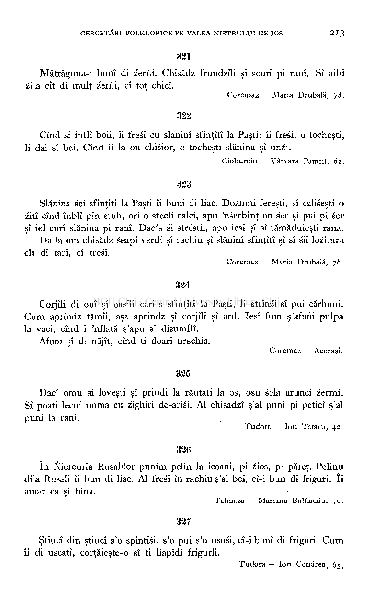

# 321

# Mătrăguna-i bunî di zerni. Chisădz frundzîli şî scuri pi ranî. Sî aibî zita cît di mulţ zerîii, cî toţ chici.

Corcmaz — Maria Drubală, 78.

# 322 Cînd sî înflî boii, îi fresi cu slănini sfinţîtî la Paşti; îi fresi, o tocheşti,

# li dai sî bei. Cînd îi la on chisior, o tocheşti slănina şî unzi.

Cioburciu — Vârvara Pamfil, 62.

# 323

# Slănina sei sfinţiţi la Paşti îi bunî di liac. Doamni fereşti, sî caliseşti o zitî cînd înblî pin stuh, ori o steclî calcî, apu 'nserbinţ on ser şî pui pi ser şî iei curî slănina pi ranî. Dac'a si strestii, apu iesî şî sî tămăduieşti rana.

# Da la om chisădz seapî verdi şî rachiu şî slăninî sfinţîtî şî sî sii lozitura cît di tari, cî tresi.

Corcmaz — Maria Drubală, 78.

# 324

# Corjîli di ouî şî oasîli cari-s sfinţiţi la Paşti, li strînzi şî pui cărbuni. Cum aprindz tămîi, aşa aprindz şî corjîli şî ard. Iesî fum ş'afuiii pulpa la vacî, cînd i 'nflată ş'apu sî disumflî.

# Afurii şî di năjît, cînd ti doari urechia.

Corcmaz — Aceeaşi.

# 325

# Dacî omu sî loveşti şî prindi la răutăţi la os, osu sela arunci zermi. Sî poati lecui numa cu zighiri de-arisi. Al chisadzî ş'al puni pi peticî ş'al puni la ranî.

Tudora — Ion Tătaru, 42

# 326

# în Niercuria Rusalilor punim pelin la icoani, pi zios, pi păreţ. Pelinu dila Rusali îi bun di liac. Al fresi în rachiu ş'al bei, cî-i bun di friguri. îi amar ca şî hina.

Talmaza — Mariana Bolândău, 70.

# 327

# Ştiucî din ştiucî s'o spintisi, s'o pui s'o ususi, cî-i bunî di friguri. Cum îi di uscatî, corţăieşte-o şî ti liapîdî frigurli.

###### Tudora — Ion Condrea

65.

j

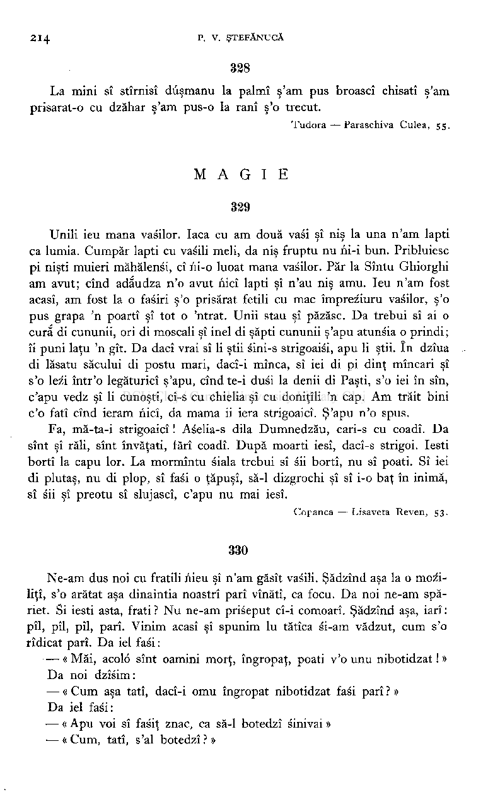

328

# La mini sî stîrnisî duşmanu la palmî ş'am pus broascî chisatî ş'am prisarat-o cu dzăhar ş'am pus-o la ranî ş'o trecut.

Tudora—Paraschiva Culea, 55.

MAGI

329

# Unili ieu mana vasilor. Iaca eu am două vasi şî niş la una n'am lapti ca lumia. Cumpăr lapti cu vasili meii, da niş fruptu nu hi-i bun. Pribluiesc pi nişti muieri măhălensi, cî hi-o luoat mana vasilor. Păr la Sîntu Ghiorghi am avut; cînd adăudza n'o avut nici lapti şî n'au niş amu. Ieu n'am fost acasî, am fost la o fasiri ş'o prisărat fetili cu mac împreziuru vasilor, ş'o pus grapa 'n poartî şî tot o 'ntrat. Unii stau şî păzăsc. Da trebui sî ai o cură di cununii, ori di moscali şî inel di şăpti cununii ş'apu atunsia o prindi; îi puni laţu 'n git. Da dacî vrai sî li ştii sini-s strigoaisi, apu li ştii. în dzîua di lăsatu sacului di postu mari, dacî-i mînca, sî iei di pi dinţ mîncari şî s'o Iezi într'o legăturici ş'apu, cînd te-i dusi la denii di Paşti, s'o iei în sîn, c'apu vedz şî li cunoşti, cî-s cu chielia şî cu doniţîli 'n cap. Am trăit bini c'o fatî cînd ieram hicî, da mama ii iera strigoaicî. Ş'apu n'o spus.

# Fa, mă-ta-i strigoaicî ! Aselia-s dila Dumnedzău, cari-s cu coadî. Da

# sînt şî răii, sînt învăţaţi, iărî coadî. După moarti iesî, dacî-s strigoi. Ieşti borti la capu lor. La mormîntu siala trebui sî sii bortî, nu sî poati. Sî iei di plutaş, nu di plop, sî fasi o ţăpuşî, să-1 dizgrochi şî sî i-o baţ în inimă, sî sii şî preotu sî slujascî, c'apu nu mai iesî.

Copanca—Lisaveta Reven, 53.

330

# Ne-am dus noi cu fratili hieu şî n'am găsît vasili. Şădzînd aşa la o moziliţî, s'o arătat aşa dinaintia noastrî parî vînătî, ca focu. Da noi ne-am spăriet. Si ieşti asta, fraţi ? Nu ne-am priseput cî-i comoarî. Şădzînd aşa, iarî : pîl, pîl, pîl, parî. Vinim acasî şî spunim Iu tătîca si-am vădzut, cum s'o ridicat parî. Da iei fasi:

# — « Măi, acolo sînt oamini morţ, îngropat, poati v'o unu nibotidzat ! » Da noi dzîsim:

# — « Cum aşa tatî, dacî-i omu îngropat nibotidzat fasi pari ? » Da iei fasi:

# — « Apu voi sî fasiţ znac, ca să-1 botedzî sinivai »

# — « Cum, tatî, s'al botedzî ? »

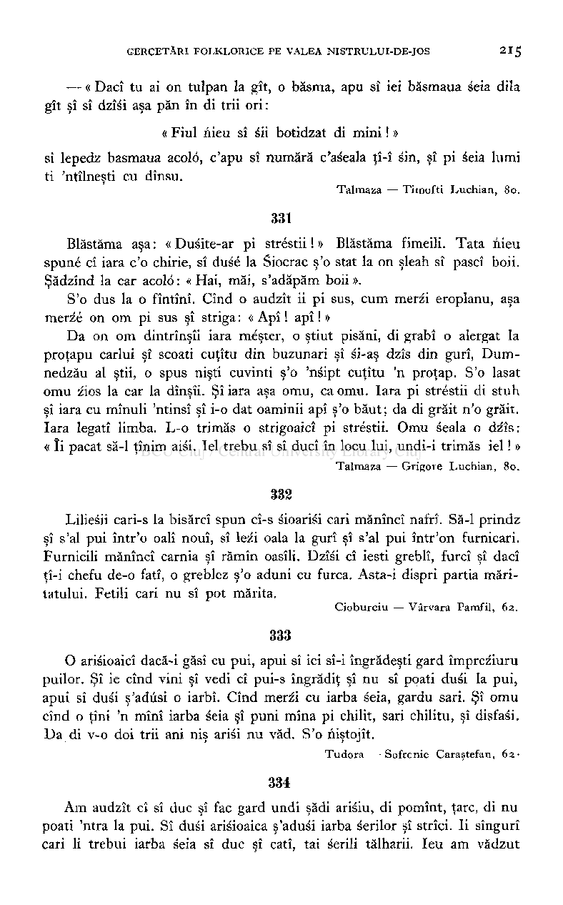

# — « Dacî tu ai on tulpan la gît, o basma, apu sî iei basmaua seia dila

# gît şî sî dzîsi aşa păn în di trii ori:

# « Fiul nieu sî sii botidzat di mini ! » sî lepedz basmaua acolo, c'apu sî numără c'aseala ţî-î sin, şî pi seia lumi ti 'ntîlneşti cu dînsu.

Talmaza — Timofti Luchian, 80.

# 331

# Blăstăma aşa : « Dusite-ar pi stréstii ! » Blăstăma fimeili. Tata nieu spuné cî iara c'o chirie, sî dusé la Siocrac ş'o stat la on şleah sî pascî boii. Şădzînd la car acolo: «Hai, măi, s'adăpăm boii».

# S'o dus la o fîntînî. Cînd o audzît ii pi sus, cum merzi eroplanu, aşa merzé on om pi sus şî striga : « Apî ! apî ! »

# Da on om dintrînşîi iara meşter, o ştiut pisăni, di grăbi o alergat la proţapu carlui şî scoati cuţîtu din buzunari şî si-aş dzîs din gurî, Dumnedzău al ştii, o spus nişti cuvinti ş'o 'nsipt cuţîtu 'n proţap. S'o lăsat omu zios la car la dînşîi. Şî iara aşa omu, ca omu. Iara pi stréstii di stuh şî iara cu mînuli 'ntinsî şî i-o dat oaminii apî ş'o băut; da di grăit n'o grăit.

# Iara legatî limba. L-o trimăs o strigoaicî pi stréstii. Omu seala o dzîs:« îi păcat să-1 ţînim aisi. Iei trebu sî sî ducî în locu lui, undi-i trimăs iei ! »

Talmaza — Grigore Luchian, 80.

# 332

# Liliesii cari-s la bisărcî spun cî-s sioarisi cari mănîncî nafrî. Să-1 prindz şî s'al pui într'o oalî nouî, sî Iezi oala la gurî şî s'al pui într'on furnicari. Furnicili mănîncî carnia şî rămîn oasîli. Dzîsi cî ieşti greblî, furcî şî dacî ţî-i chefu de-o fatî, o greblez ş'o aduni cu furca. Asta-i dispri pârtia măritatului. Fetili cari nu sî pot mărita.

Cioburciu — Vârvara Pamfil, 62.

# 333

# O arisioaicî dacă-i găsi cu pui, apui sî iei sî-i îngrădeşti gard împreziuru puilor. Şî ie cînd vini şî vedi cî pui-s îngrădit şî nu sî poati dusi la pui, apui sî dusi ş'aduşi o iarbî. Cînd merzi cu iarba seia, gardu sari. Şî omu cînd o ţîni 'n mînî iarba seia şî puni mîna pi chilit, sari chilitu, şî disfasi. Da di v-o doi trii ani niş arisi nu văd. S'o niştojît.

Tudora—Sofronie Caraştefan, 62-

# 334

# Am audzît cî sî duc şî fac gard undi sădi arisiu, di pomînt, ţarc, di nu poati 'ntra la pui. Sî dusi arisioaica ş'adusi iarba serilor şî strici. Ii sîngurî cari li trebui iarba seia sî duc şî catî, tai serili tâlharii. Ieu am vădzut

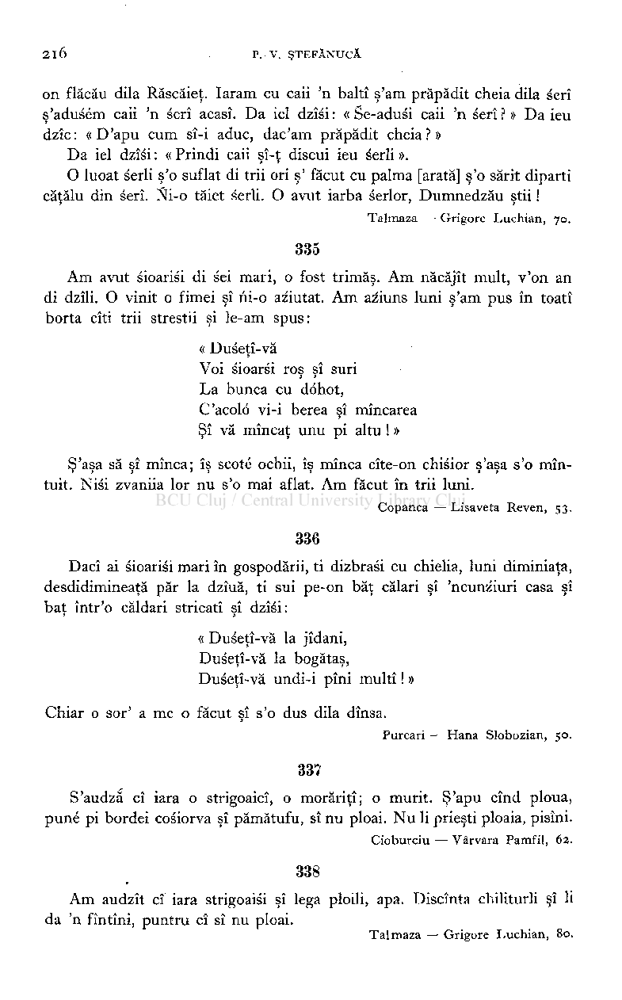

# on flăcău dila Răscăieţ. Iaram cu caii 'n bălti ş'am prăpădit cheia dila seri ş'adusem caii 'n seri acasî. Da iei dzîsi: « Se-adusi caii 'n serî?» Da ieu dzîc: « D'apu cum sî-i aduc, dac'am prăpădit cheia?» Da iei dzîsi : « Prindi caii şî-ţ discui ieu serii ». O luoat serii ş'o suflat di trii ori ş' făcut cu palma [arată] ş'o sărit diparti

# căţălu din serî. Ni-o tăiet serii. O avut iarba serlor, Dumnedzău ştii !

Talmaza — Grigore Luchian, 70.

# 335

# Am avut sioarisi di sei mari, o fost trimăş. Am năcăjit mult, v'on an di dzîli. O vinit o fimei şî ni-o aziutat. Am aziuns luni ş'am pus în toatî borta cîti trii strestii şi le-am spus:

# « Duseţî-vă Voi sioarsi ros sî suri La bunca cu dôhot, C'acolô vi-i berea şî mîncarea Şî vă mîncaţ unu pi altu ! »

# Ş'aşa să şî mînca; îşscoteochii, îş mînca cîte-on chisior ş'aşas'omîntuit. Nisi zvaniia lor nu s'o mai aflat. Am făcut în trii luni.

Copanca — Lisaveta Reven, 53.

# 336

# Dacî ai sioarisi mari în gospodării, ti dizbrasi cu chielia, luni diminiaţa, desdidimineaţă păr la dzîuă, ti sui pe-on băţ călări şî 'ncunziuri casa şî baţ într'o căldări stricaţi şî dzîsi:

# « Duseţî-vă la jidani, Duseţî-vă la bogătaş, Duseţî-vă undi-i pîni mulţi ! »

# Chiar o sor' a me o făcut şî s'o dus dila dînsa.

Purcari — Hana Slobozian, 50.

# 337

# S'audză cî iara o strigoaicî, o morăriţî; o murit. Ş'apu cînd ploua, puné pi bordei cosiorva şî pămătufu, sî nu ploai. Nu li prieşti ploaia, pisîni.

Cioburciu — Vârvara Pamfil, 62.

# 338

# Am audzît cî iara strigoaisi şî lega ploili, apa. Discînta chiliturli şî li da 'n fîntîni, puntru cî sî nu ploai.

Talmaza — Grigore Luchian, 80.

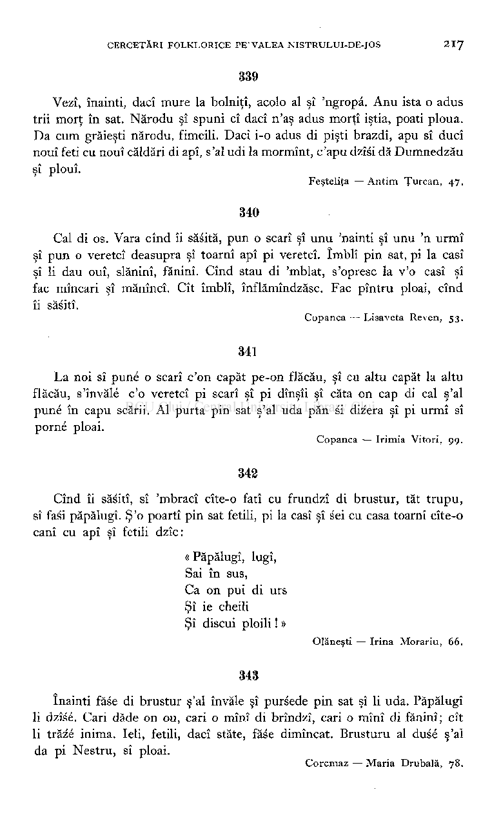

# 339

# Vezî, înainti, dacî mure la bolniţî, acolo al şî 'ngropâ. Anu ista o adus trii mort în sat. Nărodu şî spuni cî dacî n'aş adus morţî iştia, poati ploua. Da cum grăieşti nărodu, fimeili. Dacî i-o adus di pişti brazdî, apu sî ducî nouî feti cu nouî căldări di apî, s'al udi la mormînt, c'apu dzîsi dă Dumnedzău şî plouî.

Feşteliţa — Antim Ţurcan, 47.

# 340

# Cal di os. Vara cînd îi săsită, pun o scarî şî unu 'nainti şî unu 'n urmî şî pun o veretcî deasupra şî toarnî apî pi veretcî. îmblî pin sat, pi la casî şî li dau ouî, slăninî, făninî. Cînd stau di 'mblat, s'opresc la v'o casî şî fac mîncari şî mănîncî. Cît îmblî, înflămîndzăsc. Fac pîntru ploai, cînd îi săsitî.

Copanca — Lisaveta Reven, 53 .

# 341

# La noi sî puné o scarî c'on capăt pe-on flăcău, şî cu altu capăt la altu flăcău, s'învăle c'o veretcî pi scarî şî pi dînşîi şî căta on cap di cal ş'al puné în capu scării. Al purta pin sat ş'al uda păn si dizera şî pi urmî sî porné ploai.

Copanca — Irimia Vitori, 99.

# 342

# Cînd îi săsitî, sî 'mbracî cîte-o fatî cu frundzî di brustur, tăt trupu, sî fasi păpălugî. Ş'o poartî pin sat fetili, pi la casî şî sei cu casa toarnî cîte-o canî cu apî şî fetili dzîc:

# « Păpălugî, lugî, Sai în sus, Ca on pui di urs Şî ie cheili Şî discui ploili ! »

Olăneşti — Irina Morariu, 66.

# 343

# înainti făse di brustur ş'al învăle şî pursede pin sat şî li uda. Păpălugî li dzîse. Cari dade on ou, cari o mînî di brîndzî, cari o mînî di făninî; cît li trăze inima. Ieli, fetili, dacî state, făse dimîncat. Brusturu al dusé ş'al da pi Nestru, sî ploai.

Corcmaz — Maria Drubală, 78.

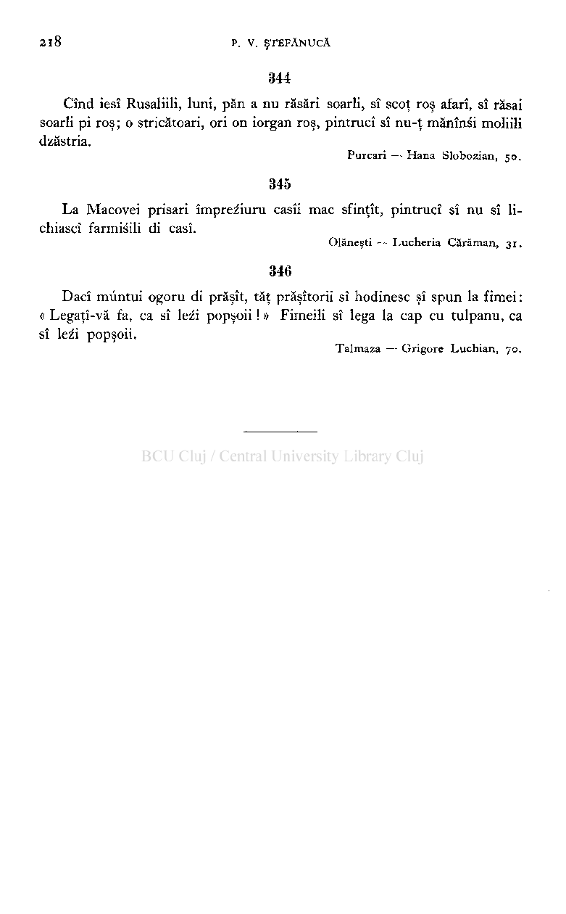

# 344

# Cînd iesî Rusaliili, luni, păn a nu răsări soarli, sî scoţ roş afarî, sî răsai soarli pi roş; o stricătoari, ori on iorgan roş, pintrucî sî nu-ţ mănînsi moliili dzăstria.

Purcari — Hana Slobozian, 50.

# 345

# La Macovei prisari împreziuru casîi mac sfinţit, pintrucî sî nu sî lichiascî farmisili di casî.

Olăneşti — Lucheria Cărăman, 31 .

# 346

# Dacî muntui ogoru di prăşit, tăţ prăsitorii sî hodinesc şî spun la fimei: « Legaţî-vă fa, ca sî Iezi popşoii ! » Fimeili sî lega la cap cu tulpanu, ca sî Iezi popşoii.

Talmaza — Grigore Luchian, 70.

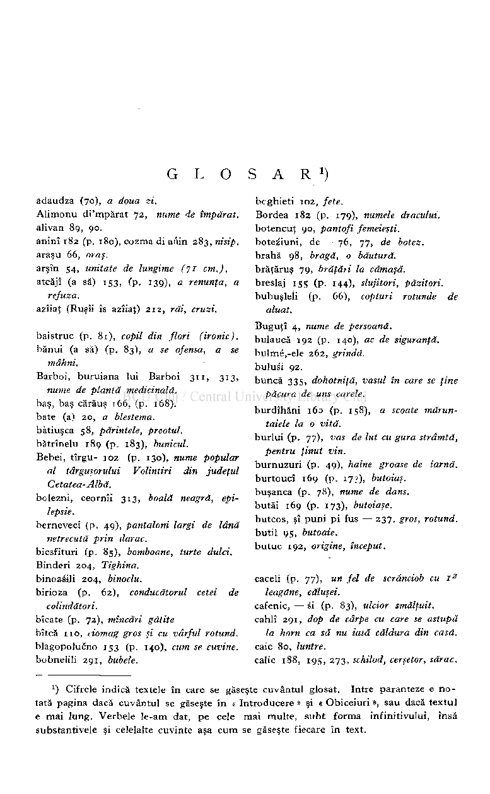

#### GLOSAR

adaudza (70), a doua si. Alimonu di'mpărat 72, nume de împărat. alivan 89, 90. aninî 182 (p. 180), cozma di anin 283, nisip. araşu 66, oraş. arşîn 54, unitate de lungime (71 cm.). atcăjî (a să) 153 (p. 139) a renunţa, a

bcghieti 102, fete. Bordea 182 (p. 179) numele dracului. botencuţ 90, pantofi femeieşti. boteziuni, de — 76, 77, de botez. brahă 98, braga, o băutură. brăţăruş 79, brăţări la cămaşă. breslaj 15 5 (p. 144) slujitori, păzitori. bubuşleli (p. 66), copturi rotunde de

refuza. azîiaţ (Ruşîi îs azîiaţ) 212, răi, cruzi.

aluat. Buguţî 4, nume de persoană. bulaucă 192 (p. 140), ac de siguranţă. bu!mé,-ele 262, grindă. bulusi 92. buncă 33S dohotniţă, vasul în care se fine

baistruc (p. 81) copil din flori (ironic).

- bănui (a să) (p. 83), a se ofensa, a se mâhni.

- Bărboi, buruiana lui Bărboi 311 , 313 nume de plantă medicinală.

păcura de uns carele. burdîhăni 160 (p. 158), a scoate măruntaiele la o vită. burlui (p. 77), vas de lut cu gura strâmtă,

baş, baş cărăuş T66, (p. 168). bate (a) 20, a blestema. batiuşca 58, părintele, preotul.

- bătrînelu 189 (p. 183) bunicul. Bebei, tîrgu- 102 (p. 130), nume popular

pentru ţinut vin. burnuzuri (p. 49), haine groase de iarnă. burtoucî 169 (p. 172), butoiaş. buşanca (p. 78), nume de dans. butăi 169 (p. 173), butoiaşe. butcos, şî puni pi fus — 237, gros, rotund. butii 95, butoaie. butuc 192 origine, început.

al tărguşorului Volintiri din judeţul Cetatea-Albă.

bolezni, ceornîi 313 boală neagră, epilepsie. berneveci (p. 49), pantaloni largi de lână

netrecută prin darac. bicsfituri (p. 85), bomboane, turte dulci. Binderi 204, Tighina. binoasili 204, binoclu. birioza (p. 62), conducătorul cetei de

caceli (p. 77), un fel de scrânciob cu i

2

leagăne, căluşei. cafenie, — si (p. 83), ulcior smălţuit. cahlî 291 dop de cârpe cu care se astupă

colindători. bîcate (p. 72), mîncări gătite bîtcă 110 , ciomag gros şi cu vârful rotund. blagopolucno 15 3 (p. 140), cum se cuvine. bobnelili 291 bubele.

la horn ca să nu iasă căldura din casă. caic 8o, luntre. calic 188, 195, 273, schilod, cerşetor, sărac.

*) Cifrele indică textele în care se găseşte cuvântul glosat. Intre paranteze e notată pagina dacă cuvântul se găseşte în « Introducere » şi « Obiceiuri », sau dacă textul e mai lung. Verbele le-am dat, pe cele mai multe, subt forma infinitivului, însă substantivele şi celelalte cuvinte aşa cum se găseşte fiecare în text.

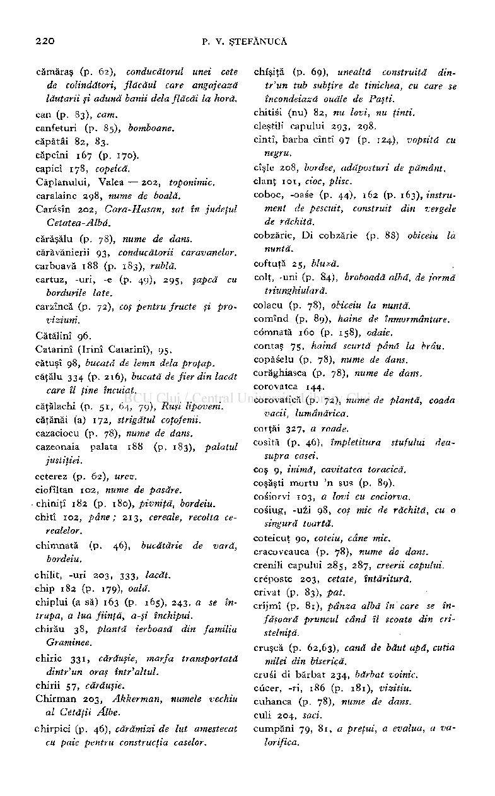

- cămăraş (p. 62), conducătorul unei cete de colindători, flăcăul care angajează lăutarii şi adună banii delà flăcăi la horă.

chîşiţă (p. 69), unealtă construită dintr'un tub subţire de tinichea, cu care se încondeiază ouăle de Paşti.

chitişi (nu) 82, nu lovi, nu ţinti. cleştili capului 293, 298. cîntî, barba cîntî 97 (p. 124) vopsită cu

can (p. 83), cam. canfeturi (p. 85), bomboane.

- căpătâi 82, 83. căpcîni 167 (p. 170). capicî 178 copeică.

negru. cîşle 208, bordée, adăposturi de pământ. clanţ 101, cioc, plisc. coboc, -oase (p. 44), 162 (p. 163), instru­

- Căplanului, Valea — 202, toponimic. caralainc 298, nume de boală. Carâsîn 202, Cara-Hasan, sat în judeţul

ment de pescuit, construit din vergele de răchită.

Cetatea-Albă. cărăşălu (p. 78), nume de dans. cărăvănierii 93, conducătorii caravanelor. carboavă 188 (p. 183), rublă. cartuz, -uri, -e (p. 49), 295 şapcă cu

cobzărie, Di cobzărie (p. 88) obiceiu la

nuntă. coftută 25 bluză. colţ, -uni (p. 84), broboadă albă, de formă

bordurile late. carzîncă (p. 72), coş pentru fructe şi pro-

triunghiulară. colacu (p. 78), obiceiu la nuntă. comînd (p. 89), haine de înmormântare. comnată 160 (p. 158) odaie. contaş 75 haină scurtă până la brâu. copăselu (p. 78), nume de dans. corăghiasca (p. 78), nume de dans. corovatca 144. corovatică (p. 72), nume de plantă, coada

viziuni. Cătălini 96. Catarinî (Irinî Catarinî), 95. cătuşî 98, bucată de lemn delà proţap. căţălu 334 (p. 216), bucată de fier din lacăt

care îl ţine încuiat. căţălachi (p. 51 , 64, 79), Ruşi lipoveni. căţănăi (a) 172 strigătul coţofenii. cazaciocu (p. 78), nume de dans. cazeonaia paiaţa 188 (p. 183) palatul

vacii, lumânărica.

- corţăi 327, a roade.
- cosîţă (p. 46), împletitura stufului deasupra casei.

justiţiei. ceterez (p. 62), urez. ciofîltan 102 nume de pasăre.

coş 9, inimă, cavitatea toracică. coşăşti mortu 'n sus (p. 89). cosiorvi 103 a lovi cu cociorva. cosiug, -uzi 98, coş mic de răchită, cu o

• chiniţî 182 (p. 180), pivniţă, bordeiu. chitî 102 pâne; 213 cereale, recolta cerealelor. chimnată (p. 46), bucătărie de vară,

singură toartă. coteicuţ 90, coteiu, câne mic. cracoveauca (p. 78), nume de dans. crenili capului 285, 287, creerii capului. créposte 203 cetate, întăritură. crivat (p. 83), pat. crîjmî (p. 81), pânza albă în care se în­

bordeiu. chilit, -uri 203, 333 lacăt. chip 182 (p. 179), oală. chiplui (a să) 163 (p. 165), 243, a se întrupa, a lua fiinţă, a-şi închipui. chirău 38, plantă ierboasă din familia

făşoară pruncul când îl scoate din cristelniţă.

Graminee. chirie 331 cărăuşie, marfa transportată

cruşcă (p. 62,63), cană de băut apă, cutia

milei din biserică. crusi di bărbat 234, bărbat voinic. cücer, -ri, 186 (p. 181), vizitiu. cuhanca (p. 78), nume de dans. culi 204, saci. cumpăni 79, 81 a preţui, a evalua, a va­

dintr'un oraş într'altul. chirii 57, cărăuşie. Chirman 203 Akkerman, numele vechiu

al Cetăţii Albe. chirpici (p. 46), cărămizi de lut amestecat cu paie pentru construcţia caselor.

lorifica.

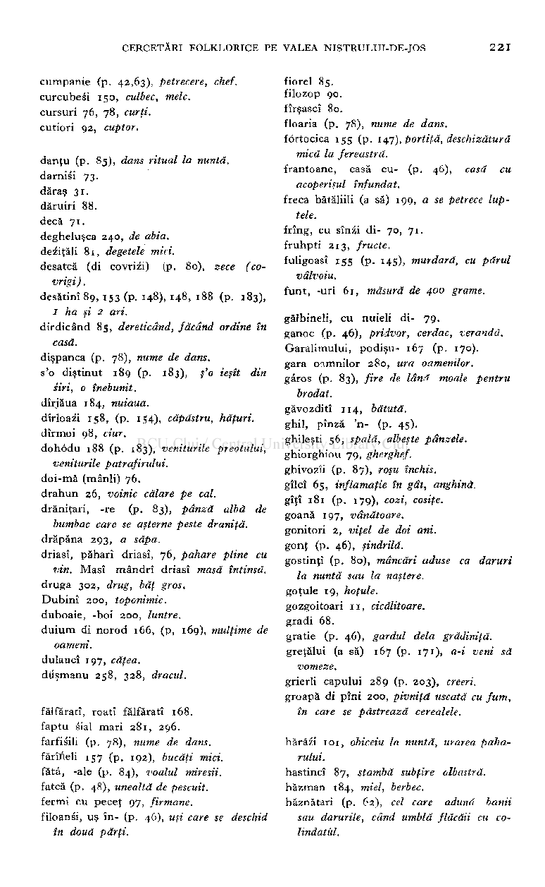

fiorel 85. filozop 90.

cumpanie (p. 42,63), petrecere, chef. curcubesi 150 culbec, melc. cursuri 76, 78, curţi. cutiori 92, cuptor.

- fîrşascî 80. floaria (p. 78), nume de dans. förtocica 15 5 (p. 147), portiţă, deschizătură

mică la fereastră. frantoane, casă cu- (p. 46), casă cu acoperişul înfundat. freca bătăliili (a să) 199 a se petrece lup­

tele. frîng, cu sînzi di- 70, 71 fruhpti 213, fructe. fuligoasî 15 5 (p. 145), murdară, cu părul

vâlvoiu. funt, -uri 61 măsură di 400 grame.

- gălbineli, cu nuieli di- 79. ganoc (p. 46), pridvor, cerdac, verandă. Garalimului, podişu- 167 (p. 170). gara onmnilor 280, ura oamenilor. gâros (p. 83), fire de lânr> moale pentru

brodat.

- găvozditî 114 bătută. ghil, pînză 'n- (p. 45). ghileşti 56, spală, albeşte pânzele. ghiorghiou 79, gherghef. ghivozîi (p. 87), roşu închis.

gîlcî 65, inflamaţie în gât, anghina. gîţî 18 1 (p. 179), cozi, cosiţe. goană 197 vânătoare. gonitori 2, viţel de doi ani. gonţ (p. 46), şindrilă. gostinţî (p. 80), mâncări aduse ca daruri

la nuntă sau la naştere. goţule 19 hoţule. gozgoitoari11 cicălitoare. gradi 68. gratie (p. 46), gardul delà grădiniţă. greţălui (a să) 167 (p. 171) , a-i veni să

vomeze. grierii capului 289 (p. 203) creeri. groapă di pîni 200, pivniţă uscată cu fum,

în care se păstrează cerealele.

- hărăzi 101, obiceiu la nuntă, urarea paharului.

hastincî 87, stambă subţire albastră.

- hăzman 184, miel, berbec. hăznâtari (p. 62), cel care adună banii

danţu (p. S5), dans ritual la nuntă. darnisi 73. dăraş 31 . dăruiri 88. decă 71 . degheluşca 240, de abia. deiiţăli 81 degetele mici. desatcă (di covrizi) (p. 80), zece (co­

vrigi) . desătinî 89, 153 (p. 148), 148, 188 (p. 183), i ha şi 2 ari. dirdicând 85, dereticând, făcând ordine în

casă. dişpanca (p. 78), nume de dans. s'o diştinut 189 (p. 183) ş'o ieşît din

siri, o înebunit. dîrjăua 184 nuiaua. dîrloazi 158 (p. 154), căpăstru, hăţuri. dîrmoi 98, ciur. dohodu 188 (p. 183), veniturile preotului,

veniturile patrafirului. doi-mă (mânii) 76. drahun 26, voinic călare pe cal. drăniţari, -re (p. 83), pânză albă de

bumbac care se aşterne peste draniţd. drăpăna 293, a săpa. driasî, păharî driasî, 76, pahare pline cu

vin. Masî mândri driasî masă întinsă. druga 302, drug, băţ gros. Dubinî 200, toponimic. duboaie, -boi 200, luntre. duium di norod 166 (p, 169), mulţime de

oameni. dulaucî 197, căţea. dlişmanu 258, 328, dracul.

fălfăratî, roatî fălfăratî 168. faptu sial mari 281 , 296. farfisili (p. 78), nume de dans. fărîneli 157 (p. 192) bucăţi mici. făta, -ale (p. 84), voalul miresii. fatcă (p. 48), unealtă de pescuit. fermi cu peceţ 97, firmane. filoansi, uş în- (p. 46), uşi care se deschid

sau darurile, când umblă flăcăii cu colindatul.

în două părţi.

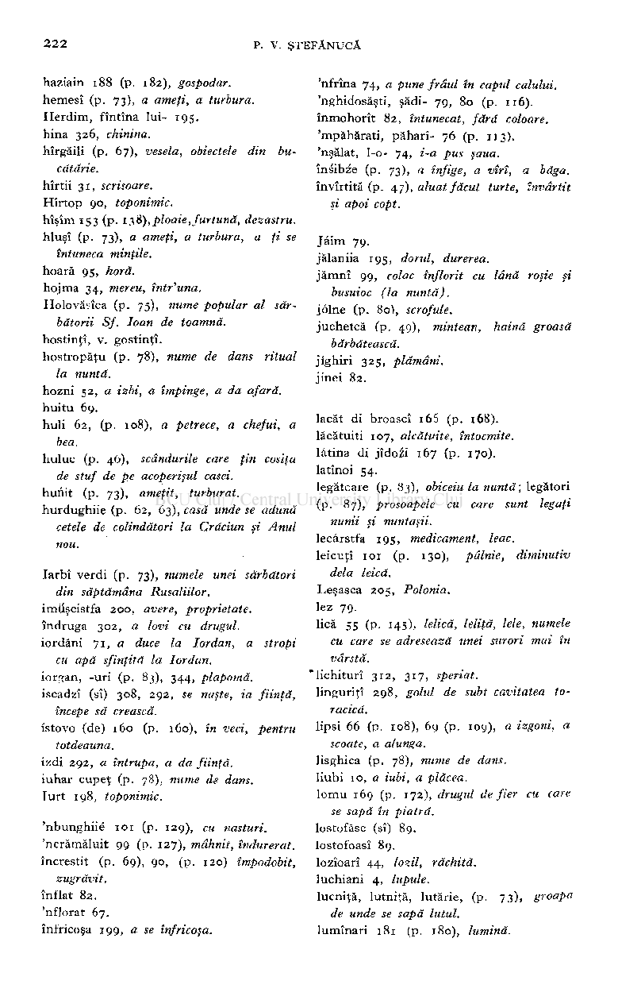

haziain 188 (p. 182), gospodar. hemesî (p. 73) a ameţi, a turbura. Herdim, fîntîna lui- 195 . hina 326, chinina.

'nfrîna 74, a pune frâul în capul calului. 'nghidosăşti, sădi- 79, 80 (p. 116). înmohorît 82, întunecat, fără coloare. 'mpăhărati, păharî- 76 (p. 113). 'nşălat, l-o- 74, i-a pus şaua. însibze (p. 73), a înfige, a vîrî, a băga. învîrtită (p. 47), aluat făcut turte, învârtit

- hîrgăili (p. 67), vesela, obiectele din bucătărie.

hîrtii 31 scrisoare. Hîrtop 90, toponimic.

şi apoi copt.

hîşîm 153 (p. 138),ploaie, furtună, dezastru. hluşî (p. 73), a ameţi, a turbura, a ţi se

Jâim 79. jălaniia 195 dorul, durerea. jămnî 99, colac înflorit cu lână roşie şi

întuneca minţile. hoară 95, horă. hojma 34, mereu, într'una. Holovăîîca (p. 75), nume popular al săr­

busuioc (la nuntă). jôlne (p. 80), scrofule. juchetcă (p. 49), niintean, haină groasă

bătorii Sf. loan de toamnă. hostinţî, v. gostinţî. hostropăţu (p. 78), nume de dans ritual

bărbătească. jighiri 325 plămâni. jinei 82.

la nuntă. hozni 52, a izbi, a împinge, a da afară. huitu 69. huli 62, (p. 108), a petrece, a chefui, a

lacăt di broascî i65 (p. 168). lăcătuiti 107 alcătuite, întocmite. latina di jîdozi 167 (p. 170). latînoi 54. legătcare (p. 83), obiceiu la nuntă; legători (p. 87), prosoapele cu care sunt legaţi

bea. huluc (p. 46), scândurile care ţin cosiţa

de stuf de pe acoperişul casei. huiîit (p. 73), ameţit, turburat. hurdughiie (p. 62, 63), casă unde se adună

nunii şi nuntaşii. lecârstfa 195 medicament, leac. leicuţî 101 (p. 130) pâlnie, diminutiv

cetele de colindători la Crăciun şi Anul nou.

delà leică. Leşasca 205, Polonia. lez 79. lică 55 (p. 145) lelică, leliţă, lele, numele

- Iarbî verdi (p. 73), numele unei sărbători din săptămâna Rusaliilor.

imuşcistfa 200, avere, proprietate. îndruga 302 a lovi cu drugul. iordăni 71 a duce la Iordan, a stropi

cu care se adresează unei surori mai în vârstă.

cu apă sfinţită la Iordan. iorgan, -uri (p. 83), 344, plapomă. iscadzî (sî) 308, 292, se naşte, ia fiinţă,

Michiturî 312 , 317 speriat. linguriţî 298, golul de subt cavitatea toracică. lipsi 66 (p. 108), 69 (p. 109), a izgoni, a

începe să crească. îstovo (de) 160 (p. 160), în veci, pentru

scoate, a alunga. lisghica (p. 78), nume de dans. liubi 10 a iubi, a plăcea. lomu 169 (p. 172), drugul de fier cu care

totdeauna. izdi 292, a întrupa, a da fiinţă. iuhar cupeţ (p. 78), nume de dans. Iurt 198, toponimic.

se sapă în piatră. lostofăsc (sî) 89. lostofoasî 89. lozîoarî 44, lozil, răchită. luchiani 4, lupule. lucniţă, lutniţă, lutărie, (p. 73) groapa

'nbunghiié 10 1 (p. 129) cu nasturi. 'ncrămăluit 99 (p. 127), mâhnit, îndurerat. încrestit (p. 69), 90, (p. 120) împodobit,

zugrăvit. înfiat 82. 'nflorat 67. înfricoşa 199 a se înfricoşa.

de unde se sapă lutul. lumînari 181 (p. 180) lumină.

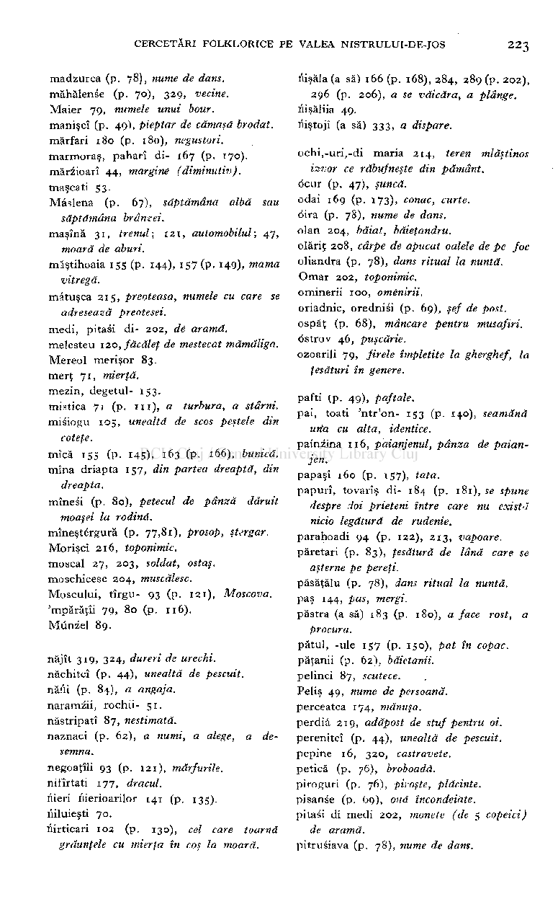

madzurca (p. 78), nume de dans. măhălense (p. 70), 329, vecine. Maier 79, numele unui bour. manişcî (p. 49), pieptar de cămaşă brodat.

riişăla (a să) 166 (p. 168), 284, 289 (p. 202), 296 (p. 206), a se văicăra, a plânge. nişăliia 49. riiştojî (a să) 333 a dispare.

- mărfari 180 (p. 180), negustori. marmoraş, paharî di- 167 (p. 170).

- mărzioarî 44, margine (diminutiv). mascaţi 53. Mâslena (p. 67), săptămâna albă sau

săptămâna brânzei. maşină 31 trenul; 121 , automobilul; 47, moară de aburi.

- măştihoaia 155 (p. 144), 157 (p. 149), mama vitregă.

mâtuşca 215, preoteasa, numele cu care se

adresează preotesei. medi, pitasi di- 202, dé aramă. melesteu 120, făcăleţ de mestecat mămăliga. Mereol merişor 83. merţ 71 mierţă. mezin, degetul- 153. mistica 71 (p. m) , a turbura, a stârni. misiogu 105 unealtă de scos peştele din

coteţe.

mică 155 (p. 145), 163 (p. 166), bunică. mina driapta 157, din partea dreaptă, din

dreapta. mînesi (p. 80), petecul de pânză dăruit

moaşei la rodină. mîneştergură (p. 77,81), prosop, ştergar. Morişcî 216 toponimic. moscal 27, 203, soldat, ostaş. moschicesc 204, muscălesc. Moscului, tîrgu- 93 (p. 121) Moscova. 'mpărăţîi 79, 80 (p. 116). Munzel 89.

- năjît 319, 324, dureri de urechi.

- năchitcî (p. 44), unealtă de pescuit. nani (p. 84), a angaja. naramzii, rochii- 51 .

- năstripatî 87, nestimată. naznaci (p. 62), a numi, a alege, a de­

ochi,-uri,-di maria 214 teren mlăştinos

izvor ce răbufneşte din pământ. öcur (p. 47), şuncă. odai 169 (p. 173), conac, curte. öira (p. 78), nume de dans. olan 204, băiat, băieţandru. olărit 208, cârpe de apucat oalele de pe foc oliandra (p. 78), dans ritual la nuntă. Omar 202, toponimic. ominerii 100 omenirii. oriadnic, orednisi (p. 69), şef de post. ospăţ (p. 68), mâncare pentru musafiri. ostrov 46, puşcărie. ozoarili 79, firele împletite la gherghef, la

ţesături în genere.

pafti (p. 49), paftale. pai, toati 'ntr'on- 153 (p. 140), seamănă

urta cu alta, identice. painzina 116 , păianjenul, pânza de păian­

jen. papaşî 160 (p. 157), tata. papuri, tovarîş di- 184 (p. 181), se spune

despre doi prieteni între care nu există nicio legătură de rudenie.

parahoadi 94 (p. 122), 213 , vapoare. păretari (p. 83), ţesătură de lână care se

aşterne pe pereţi. păsăţălu (p. 78), dans ritual la nuntă. paş 144, pas, mergi. păstra (a să) 183 (p. 180) a face rost, a

procura. patul, -ule 15 7 (p. 150), pat în copac. păţanii (p. 62), băietanii. pelinci 87, scutece. Peliş 49, nume de persoană. perceatca 174 mănuşa. perdiâ 219 adăpost de stuf pentru oi. perenitcî (p. 44), unealtă de pescuit. pepine 16 , 320 castravete. petică (p. 76), broboadă. piroguri (p. 76), piroşte, plăcinte. pisanse (p. 69), ouă încondeiate. pitasi di medi 202, monete (de $ copeici)

semna. negoaţîli 93 (p. 121) mărfurile. nifîrtati 177 dracul. nieri îiierioarilor 141 (p. 135) . l'liluieşti 70. riirticari 102 (p. 130) cel care toarnă

de aramă. pitrusiava (p. 78), nume de dans.

grăunţele cu mierţa în coş la moară.

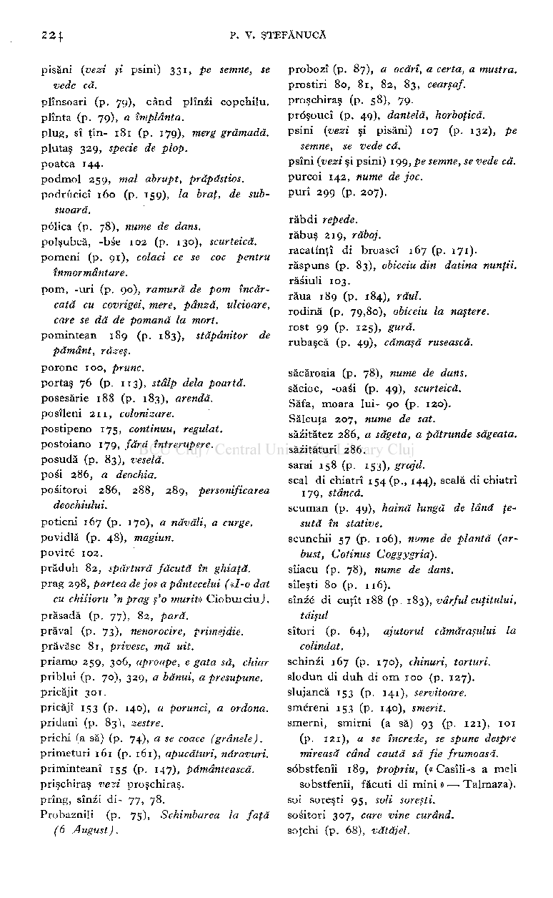

probozî (p. 87), a ocărî, a certa, a mustra. prostiri 80, 81 , 82, 83, cearşaf. proşchiraş (p. 58), 79. proşoucî (p. 49), dantelă, horboţică. psini (vèzi şi pisăni) 107 (p. 132), pe

pisăni (vezi şi psini) 331 , pe semne, se

vede că. plînsoari (p. 79), când plînzi copchilu. plînta (p. 79), a împlânta. plug, sî ţîn- 181 (p. 179) merg grămadă. plutaş 329, specie de plop. poatca 144. podmol 259, mal abrupt, prăpăstios. podriicicî 160 (p. 159), la braţ, de sub­

semne, se vede că. psîni (vezi şi psini) 199, pe semne, se vede că. purcoi 142 nume de joc. purî 299 (p. 207).

suoară. pölica (p. 78), nume de dans. polşubcă, -bse 102 (p. 130) scurteică. pomeni (p. 91) colaci ce se coc pentru

- răbdi repede.

- răbuş 219 răboj. racatinţî di broascî 167 (p. 171) .

- răspuns (p. 83), obiceiu din datina nunţii.

- răsiuli 103 .

- răua 189 (p. 184) răul. rodină (p. 79,80), obiceiu la naştere. rost 99 (p. 125), gură. rubaşcă (p. 49), cămaşă rusească.
- săcăroaia (p. 78), nume de dans.

- săcioc, -oasi (p. 49), scurteică. Săfa, moara lui- 90 (p. 120). Sălcuţa 207, nume de sat.

- săzitătez 286, a săgeta, a pătrunde săgeata.

- săzitături 286.

- sărai 158 (p. 153), grajd.

înmormântare.

pom, -uri (p. 90), ramură de pom încărcată cu covrigii, mere, pânză, ulcioare, care se dă de pomană la mort.

pomintean 189 (p. 183) stăpânitor de

pământ, răzeş. poronc 100 prunc. portas 76 (p. 113) stâlp delà poartă. posesărie 188 (p. 183) arendă. posîleni 211 , colonizare. postipeno 175 continuu, regulat. postoiano 179, fără întrerupere. posudă (p. 83), veselă. posi 286, a deochia. positoroi 286, 288, 289, personificarea

scai di chiatrî 154 (p., 144), scală di chiatrî

179, stâncă.

deochiului. poticni 167 (p. 170), a năvăli, a curge. povidlă (p. 48), magiun. poviré 102 . prăduh 82, spărtură făcută în ghiaţă. prag 298, partea de jos a pântecelui («I-o dat

scuman (p. 49), haină lungă de lână ţesută în stative. scunchii 57 (p. 106) nume de plantă (ar­

bust, Cotinus Coggygria). sîiacu Cp. 78), nume de dans. sîleşti 80 (p. 116). sînzé di cuţît 188 (p 183), vârful cuţitului,

cu chisioru 'n prag ş'o murit» CiobuiciuJ. prăsadă (p. 77), 82, pară. prăval (p. 73) nenorocire, primejdie. prăvăsc 81 privesc, mă uit. priamo 259, 306, aproape, e gata să, chiar priblui (p. 70), 329, a bănui, a presupune. pricăjit 301 . pricăji 153 (p. 140), a porunci, a ordona. pridani (p. 83), zestre. prichi fa să) (p. 74), a se coace (granele). primeturi 161 (p. 161), apucături, năravuri. priminteanî 155 (p. 147), pământească. prişchiraş vezi proşchiraş. prîng, sînzi di- 77, 78. Probaznüi (p. 75), Schimbarea la faţă

tăişul sîtori (p. 64), ajutorul cămăraşului la

colindat. schinzi 167 (p. 170), chinuri, torturi. slodun di duh di om 100 (p. 127). slujancă 153 (p. 141), servitoare. sméreni 153 (p. 140) smerit. smerni, smirni (a să) 93 (p. 121) , 10 1

(p. 121) , a se încrede, se spune despre mireasă când caută să fie frumoasă.

sobstfenîi 189 propriu, (« Casîii-s a meii

sobstfenîi, făcuţi di mini » —• Talmaza). soi soreşti 95, soli soreşti. sositori 307, care vine curând. soţchi (p. 68), vătăjel.

(6 August ) .

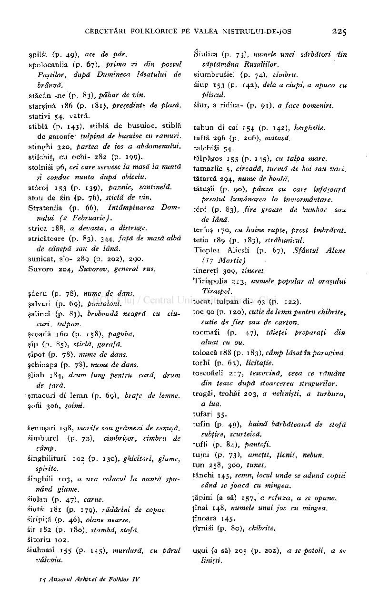

âiulica (p. 73) numele unei sărbători din

şpilsi (p. 49), ace de păr. spolocaniia (p. 67), prima zi din postul

săptămâna Rusaliilor. siumbrusiel (p. 74), cimbru. siup 153 (p. 142), delà a ciupi, a apuca cu

Paştilor, după Dumineca lăsatului de brânză.

pliscul. siur, a ridica- (p. 91), a face pomeniri.

stăcân -ne (p. 83), pahar de vin. starşînâ 186 (p. 181), preşedinte de plasă. stativi 54, vatră. stiblă (p. 143) stiblă de busuioc, stiblă

tabun di cai 15 4 (p. 142), herghelie. tafta 296 (p. 206), mătasd. talchizi 54. tălpăgos 155 (p. 145), cu talpa mare. tamazlîc 5, cireada, turmă de boi sau vaci. tătarcă 294, nume de boală. tătuşîi (p. 90), pânza cu care înfăşoară

de garoafe : tulpină de busuioc cu ramuri. stinghi 320, partea de jos a abdomenului. stîlchiţ, cu ochi- 282 (p. 199). stolnisi 96, cei care servesc la masă la nuntă

şi conduc nunta după obiceiu. stôroj 15 3 (p. 139) paznic, santinelă. stou de zin (p. 76), sticlă de vin. Strateniia (p. 66), întâmpinarea Dom­

preotul lumânarea la înmormântare. téré (p. 83), fire groase de bumbac sau

nului ( 2 Februarie ) . strica 188, a devasta, a distruge. stricătoare (p. 83), 344, faţă de masă albă

de lână. terfoş 170, cu haine rupte, prost îmbrăcat. tetia 189 (p. 183), străbunicul. Tieplea Alicsîi (p. 67), Sfântul Alexe

de cânepă sau de lână. sunicat, s'o- 289 (p. 202), 290. Suvoro 204, Suvorov, general rus.

(17 Martie) tinereţi 309, tineret. Tirişpolia 213 numele popular al oraşului

Tiraspol. tocat, tulpan di- 93 (p. 122) . toc 90 (p. 120), cutie de lemn pentru chibrite,

şâeru (p. 78), nume de dans. şalvari (p. 69), pantaloni. şalincî (p. 83), broboadă neagră cu ciu­

cutie de fier sau de carton. tocmaéi (p. 47), tăieţei preparaţi din

curi, tulpan. şcoadă 160 (p. 158), pagubă. şîp (p. 85), sticlă, garafă. şîpot (p. 78), nume de dans. şchioapa (p. 78), nume de dans. şliah 184 drum lung pentru cară, drum

aluat cu ou. toloacă 188 (p. 183), câmp lăsat în paragină. torhi (p. 63), licitaţie. tosconeli 217 tescovină, ceea ce rămâne din teasc după stoarcerea strugurilor. trogăi, trohăi 203 a nelinişti, a turbura,

de ţară. şmacuri di lemn (p. 69), braţe de lemne. şoni 306, şoimi.

a lua. tufari 55. tufin (p. 49), haină bărbătească de stofă

senuşari 198 movile sau grămezi de cenuşă. simburei (p. 72) cimbrişor, cimbru de

subţire, scurteică. tufli (p. 84), pantofi. tujni (p. 73) ameţit, ţicnit, nebun. tun 258, 300, tunet. ţănchi 14s, semn, locul unde se adună copiii

câmp. singhilituri 102 (p. 130), ghicitori, glume, spirite. singhili 103 a ura colacul la nuntă spu­

când se joacă cu mingea. ţăpini (a să) 157 , a refuza, a se opune. ţînai 148 numele unui joc cu mingea. ţînoara 145 . ţîrnisi (p. 80), chibrite.

nând glume. siolan (p. 47), carne. siotsi 181 (p. 179) rădăcini de copac. siripiţă (p. 46), olane nearse. sit 182 (p. 180) stambă, stofă. sitoriu 102 . siuhoasî 15 5 (p. 145) murdară, cu părid

ugoi (a să) 205 (p. 202), a se potoli, a se linişti.

vâlvoiu.

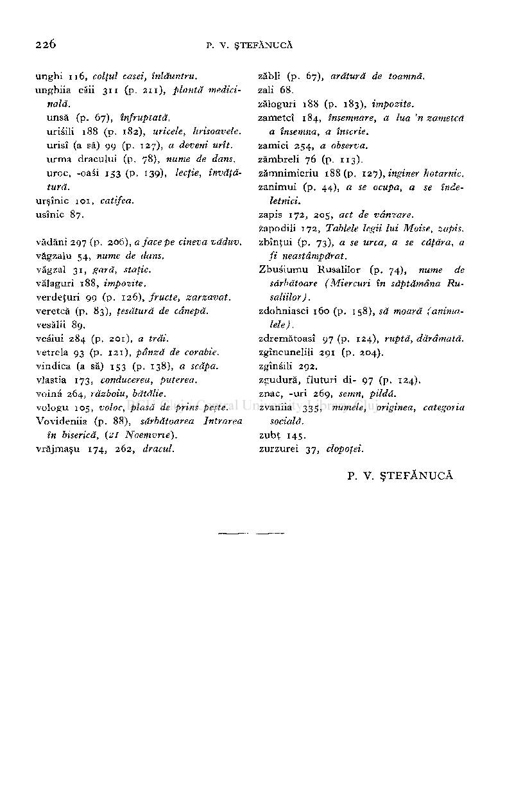

zăbli (p. 67), arătură de toamnă. zali 68. zăloguri 188 (p. 183), impozite. zametcî 184 însemnare, a lua 'n zametcă

unghi 116, colţul casei, înlăuntru. unghiia căii 31 (p. 211) , plantă medici­

nală. unsă (p. 67), înfruptată. urisili 188 (p. 182) uricele, hrisoavele. urisî (a să) 99 (p. 127), a deveni urît. urma dracului (p. 78), nume de dans. uroc, -oasi 153 (p. 139), lecţie, învăţătură.

a însemna, a înscrie. zamici 254, a observa. zămbreli 76 (p. 113) .

zămnimieriu 188 (p. 127), inginer hotarnic. zanimui (p. 44), a se ocupa, a se înde­

letnici. zapis 172, 205, act de vânzare. zapodili 172, Tablele legii lui Moise, zapis. zbînţui (p. 73) a se urca, a se căţăra, a

- urşînic 101 catifea.
- usînic 87.

vădani 297 (p. 206), a face pe cineva văduv. văgzalu 54, nume de dans. văgzal 31 gară, staţie. vălaguri 188 impozite. verdeţuri 99 (p. 126), fructe, zarzavat. veretcă (p. 83), ţesătură de cânepă. vesălii 89. vesiui 284 (p. 201), a trăi. vetrela 93 (p. 121) pânză de corabie. vindica (a să) 15 3 (p. 138), a scăpa. vlastia 173 conducerea, puterea. voinâ 264, războiu, bătălie. vologu 105 voloc, plasă de prins peşte. Vovideniia (p. 88), sărbătoarea Intrarea

fi neastâmpărat.

Zbusiumu Rusalilor (p. 74), nume de sărbătoare (Miercuri în săptămâna Rusaliilor) .

zdohniascî 160 (p. 158), să moară (anima­

lele). zdremătoasî 97 (p. 124) ruptă, dărâmată. zgîncunelili 291 (p. 204). zgînsili 292. zgudură, fluturi di- 97 (p. 124). znac, -uri 269, semn, pildă. zvaniia 335, numele, originea, categoria

socială. zubţ 145 . zurzurei 37 clopoţei.

în biserică, (21 Noemvrie). vrăjmaşu 174, 262, dracul.

P. V. ŞTEFĂNUCĂ

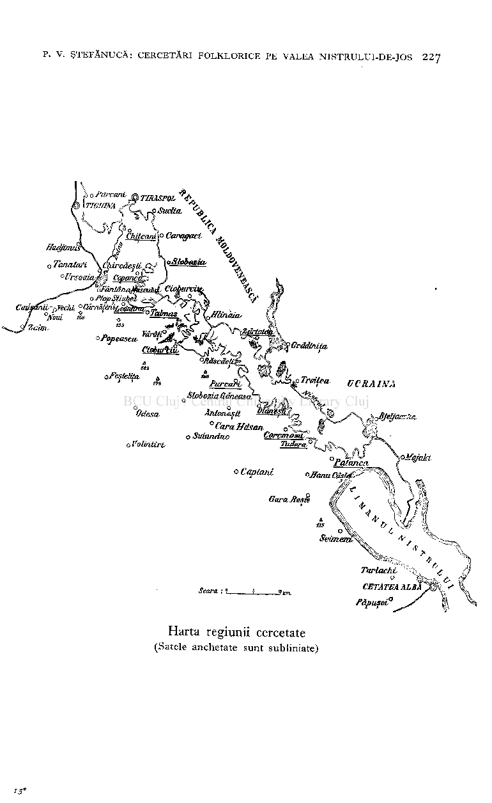

P. V. ŞTEFĂNUC Ă : CERCETĂR I FOLKLORIC E P E VALE A NISTRULUI-DE-JO S

# Harta regiunii cercetate

(Satele anchetate sunt subliniate)

CONTRIBUŢIUNI LA APRINDEREA «FOCULUI VIU» ÎN ARDEAL, MARAMUREŞ ŞI BUCOVINA

# « A existat până în trecutul recent, un obiceiu păstoresc care a fost pe cât de frumos şi ales, pe atât de vechiu — atât de vechiu, încât de sigur trece de vremea naşterii neamului nostru şi îşi are originile în adâncimea timpurilor preistorice. Era obiceiul ca la urcarea în stâne, primăvara, primul foc să se facă, nu cu chibriturile sau nici chiar cu amnarul — care probabil e o unealtă preistorică — ci prin frecarea a două lemne atât de mult şi cu atât meşteşug până ce aceste lemne se aprind. Obiceiul există la popoarele cele mai primitive

# ) şi s'a mai păstrat la noi azi numai în Munţii Bucovinei, unde a fost descris în ultimii ani de părintele Morariu (înainte pomenit deWislowski,Das rumänische Bauernhaus in der Bukowina, Wien1912).Delà acest « foc viu » şi nestins se aprindeau toate focurile stânei ».

J

# Astfel scria, acum exact un sfert de veac(1911),mult regretatul nostru profesor George Vâlsan

# ), arătând că « e o adevărată nenorocire că nu s'a putut observa şi înregistra [obiceiul] în vremuri când era în floare ».

2

# Literatura focului viu, aprins în ţinuturile româneşti, s'a mai îmbogăţit după articolul profesorului Vâlsan şi a fost adunată şi publicată de Ion Muşlea în « Cercetări folklorice în Ţara Oaşului »

# ). D-sa dă şi o descriere destul de amănunţită a felului cum se aprinde acest foc în cinci sate din Ţara Oaşului.

3

# Ascultând îndemnul marelui nostru profesor, am urmărit aprinderea focului viu mai mulţi ani de-a-rândul, în cercetări întreprinse subt auspiciile « Arhivei de Folklor a Academiei Române ». Fenomenul

###### ) Cf. monumentala monografie a lui HERBERT FREUDENTHAL, Das Feuer im G laube und Brauch. Berlin-Leipzig 1931.

x

) G.VALSAN, O ştiinţă nouă: Etnografia (« Astra » Biblioteca Secţiunii geograficoetnografice Nr. 2) Cluj 1927, p. 20—21 Conferinţă publicată întâiu în anul 1912, subt titlul: Pentru minţile şi inimile ostaşilor noştri, Seria I. Şcoalele militare de infanterie, Bucureşti.

2

###### ) Anuarul Arhivei de Folklor I (1932), pp. 146—147.

3

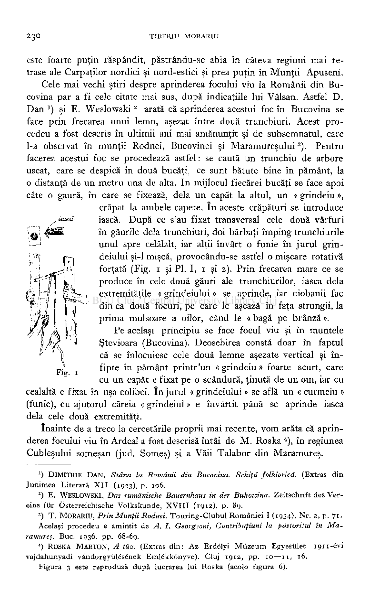

# este foarte puţin răspândit, păstrându-se abia în câteva regiuni mai retrase ale Carpaţilor nordici şi nord-estici şi prea puţin în Munţii Apuseni.

# Cele mai vechi ştiri despre aprinderea focului viu la Românii din Bucovina par a fi cele citate mai sus, după indicaţiile lui Vâlsan. Astfel D. Dan !) şi E. Weslowski

# arată că aprinderea acestui foc în Bucovina se face prin frecarea unui lemn, aşezat între două trunchiuri. Acest procedeu a fost descris în ultimii ani mai amănunţit şi de subsemnatul, care 1-a observat în munţii Rodnei, Bucovinei şi Maramureşului ). Pentru facerea acestui foc se procedează astfel: se caută un trunchiu de arbore uscat, care se despică în două bucăţi, ce sunt bătute bine în pământ, la o distanţă de un metru una de alta. In mijlocul fiecărei bucăţi se face apoi câte o gaură, în care se fixează, delà un capăt la altul, un « grindeiu »,

2

# crăpat la ambele capete. în aceste crăpături se introduce

# iasca'iască. După ce s'au fixat transversal cele două vârfuri în găurile delà trunchiuri, doi bărbaţi împing trunchiurile unul spre celălalt, iar alţii învârt o funie în jurul grindeiului şi—1mişcă, provocându-se astfel o mişcare rotativă forţată (Fig. i şi Pl. I, i şi2).Prin frecarea mare ce se produce în cele două găuri ale trunchiurilor, iasca delà extremităţile « grindeiului » se aprinde, iar ciobanii fac din ea două focuri, pe care le aşează în faţa strungii, la prima mulsoare a oilor, când le « bagă pe brânză ».

# Pe acelaşi principiu se face focul viu şi în muntele Ştevioara (Bucovina). Deosebirea constă doar în faptul că se înlocuiesc cele două lemne aşezate vertical şi înfipte în pământ printr'un « grindeiu » foarte scurt, care cu un capăt e fixat pe o scândură, ţinută de un om, iar cu

# cealaltă e fixat în uşa colibei. în jurul « grindeiului » se află un « curmeiu » (funie), cu ajutorul căreia « grindeiul » e învârtit până se aprinde iasca delà cele două extremităţi.

# înainte de a trece la cercetările proprii mai recente, vom arăta că aprinderea focului viu în Ardeal a fost descrisă întâi de M. Roska

# ), în regiunea Cubleşului someşan (jud. Someş) şi a Văii Talabor din Maramureş.

4

###### ) DlMITRIE DAN, Stâna la Românii din Bucovina. Schiţă folkloricd. (Extras din Junimea Literară XII (1923), p. 106.

x

###### ) E. WESLOWSKI, Das rumänische Bauernhaus in der Bukowina. Zeitschrift des Vereins für Österreichische Volkskunde, XVIII (1912), p. 89.

2

) T. MORARIU, Prin Munţii Rodnei. Touring-Clubul României I (1934), Nr. 2, p. 71 .

3

Acelaşi procedeu e amintit de A. I. Georgjoni, Contribuţiuni la păstoritul în Maramureş. Buc. 1936. pp. 68-69.

) ROSKA MARTON, A tüz. (Extras din: Az Erdélyi Müzeum Egyesület 1911-évi vajdahunyadi vândorgyulésének Emlékkonyve). Cluj 1912 pp.10— 11 16.

4

Figura 3 este reprodusă după lucrarea lui Roska (acolo figura 6).

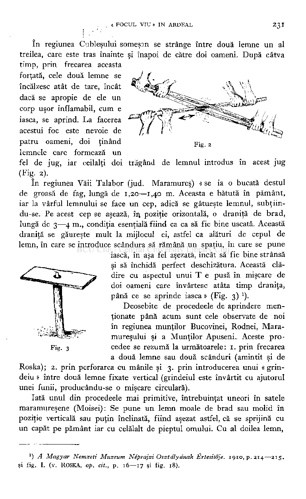

# în regiunea Cubleşului someşan se strânge între două lemne un al treilea, care este tras înainte şi înapoi de către doi oameni. După câtva timp, prin frecarea aceasta forţată, cele două lemne se încălzesc atât de tare, încât dacă se apropie de ele un corp uşor inflamabil, cum e iasca, se aprind. La facerea acestui foc este nevoie de patru oameni, doi ţinând lemnele care formează un

Fig. 2

# fel de jug, iar ceilalţi doi trăgând de lemnul introdus în acest jug (Fig.2).

# în regiunea Văii Talabor (jud. Maramureş) « se ia o bucată destul de groasă de fag, lungă de1,20—1,40m. Aceasta e bătută în pământ, iar la vârful lemnului se face un cep, adică se gâtueşte lemnul, subţiindu-se. Pe acest cep se aşează, în poziţie orizontală, o draniţă de brad, lungă de3—4m., condiţia esenţială fiind ca ea să fie bine uscată. Această draniţă se găureşte mult la mijlocul ei, astfel ca alături de cepul de lemn, în care se introduce scândura să rămână un spaţiu, în care se pune

# iască, în aşa fel aşezată, încât să fie bine strânsă şi să închidă perfect deschizătura. Această clădire cu aspectul unui T e pusă în mişcare de doi oameni care învârtesc atâta timp draniţă, până ce se aprinde iasca » (Fig.3) *).

# Deosebite de procedeele de aprindere menţionate până acum sunt cele observate de noi în regiunea munţilor Bucovinei, Rodnei, Maramureşului şi a Munţilor Apuseni. Aceste procedee se rezumă la următoarele:1.prin frecarea a două lemne sau două scânduri (amintit şi de

###### Fig. 3

# Roska);2.prin perforarea cu manile şi3.prin introducerea unui « grindeiu » între două lemne fixate vertical (grindeiul este învârtit cu ajutorul unei funii, producându-se o mişcare circulară).

# Iată unul din procedeele mai primitive, întrebuinţat uneori în satele maramureşene (Moisei): Se pune un lemn moale de brad sau molid în poziţie verticală sau puţin înclinată, fiind aşezat astfel, că se sprijină cu un capăt pe pământ iar cu celălalt de pieptul omului. Cu al doilea lemn,

###### ) A Magyar Nemzeti Museum Néprajzi Osztdlydnak Ertesitöje.1910, p. 314—215 . şi fig. I. (v. ROSKA, op. cit., p.16—17 şi fig. 18).

x

