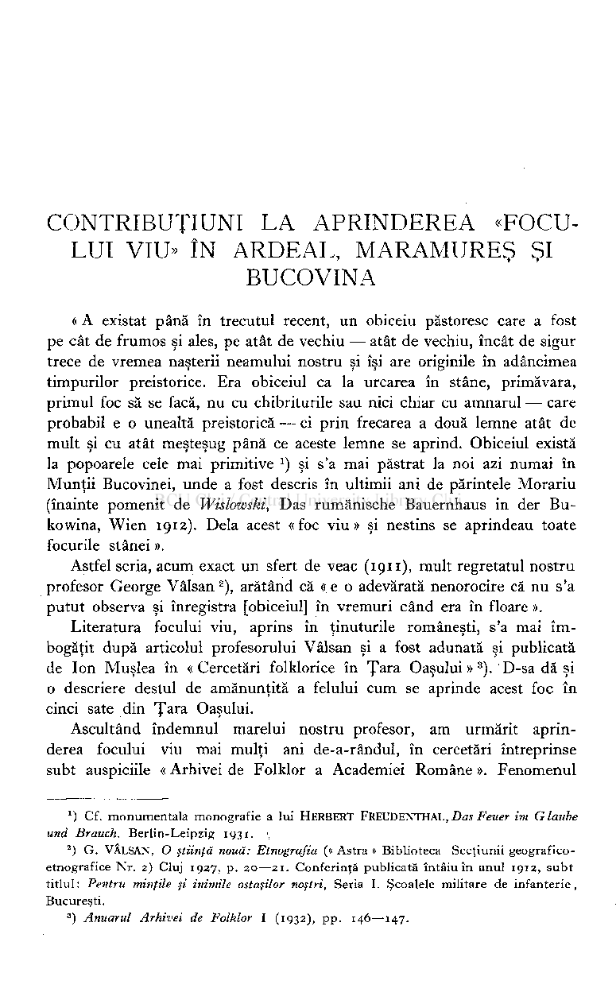
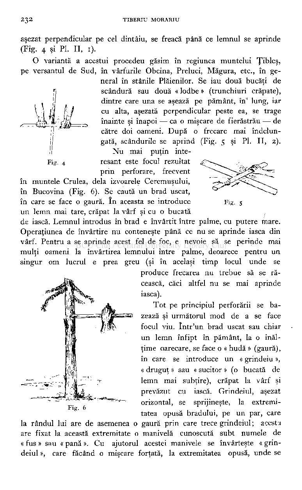
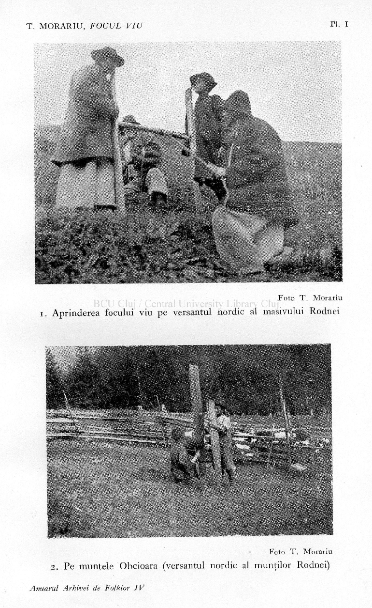
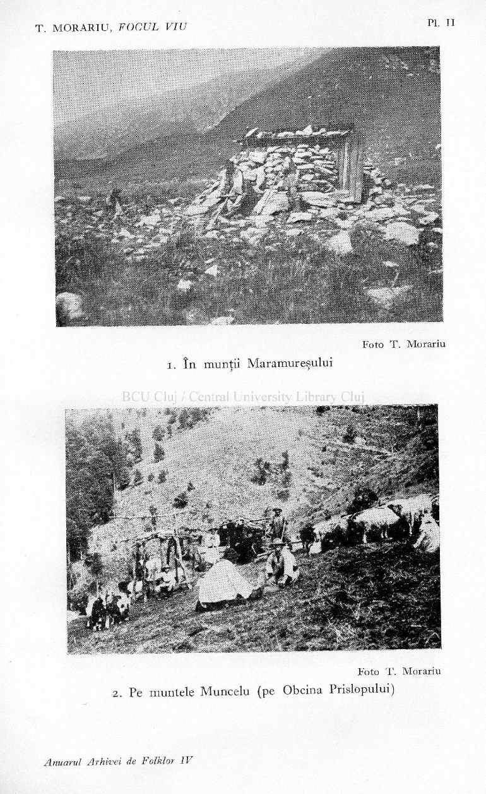
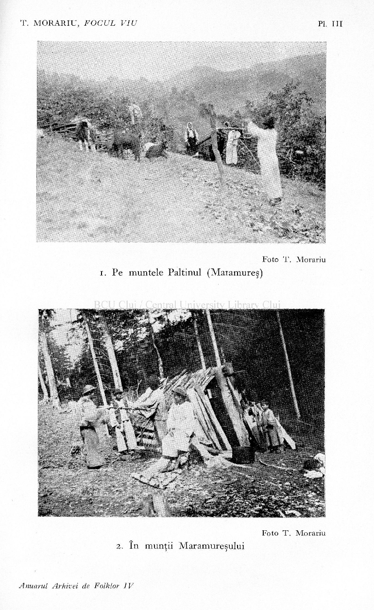
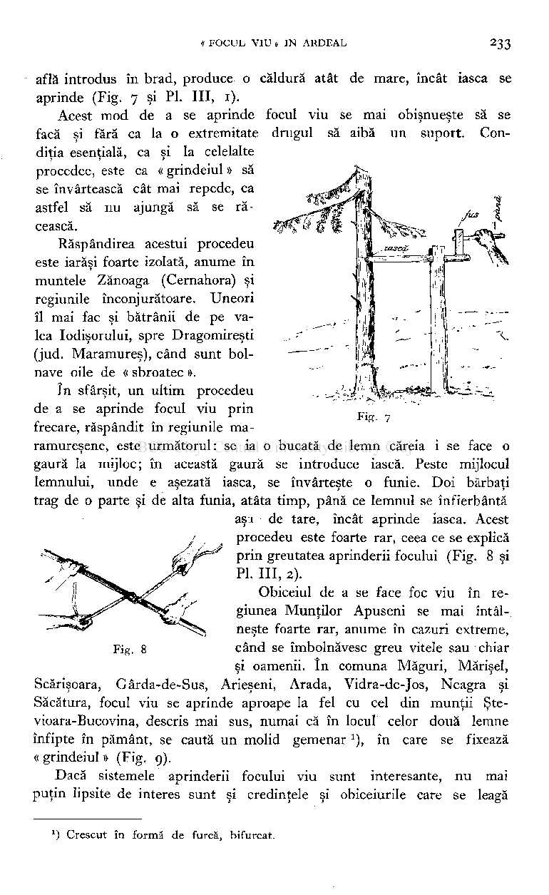
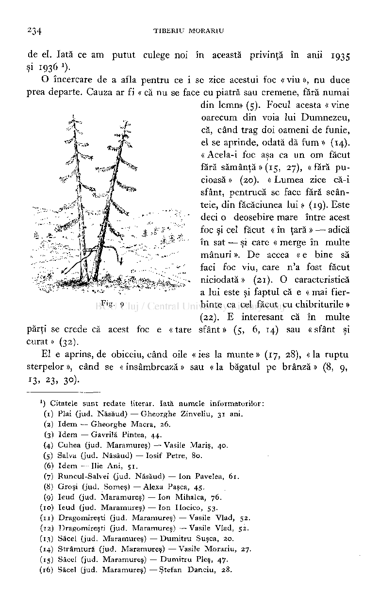
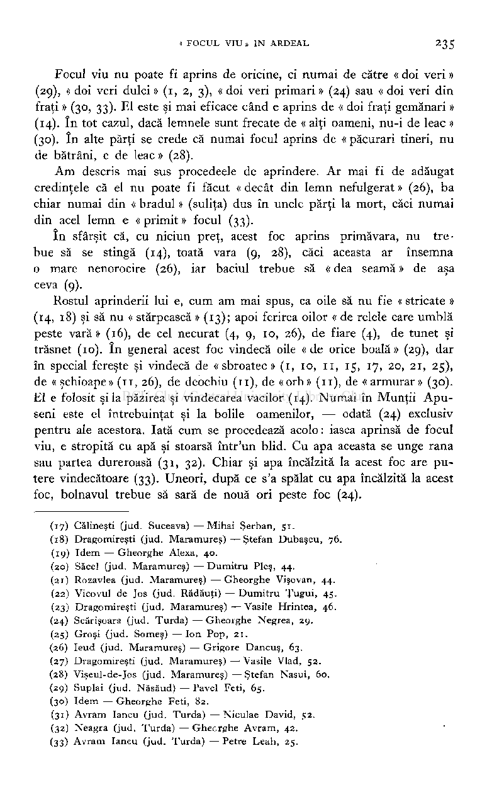
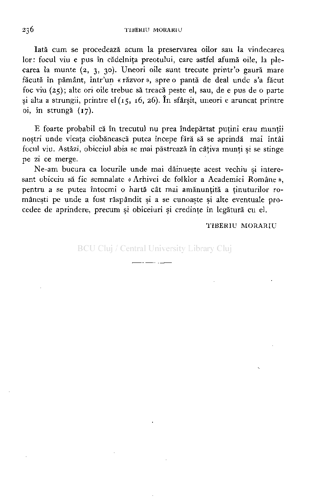

CONTRIBUŢIUNI LA APRINDEREA «FOCULUI VIU» ÎN ARDEAL, MARAMUREŞ ŞI BUCOVINA

# « A existat până în trecutul recent, un obiceiu păstoresc care a fost pe cât de frumos şi ales, pe atât de vechiu — atât de vechiu, încât de sigur trece de vremea naşterii neamului nostru şi îşi are originile în adâncimea timpurilor preistorice. Era obiceiul ca la urcarea în stâne, primăvara, primul foc să se facă, nu cu chibriturile sau nici chiar cu amnarul — care probabil e o unealtă preistorică — ci prin frecarea a două lemne atât de mult şi cu atât meşteşug până ce aceste lemne se aprind. Obiceiul există la popoarele cele mai primitive

# ) şi s'a mai păstrat la noi azi numai în Munţii Bucovinei, unde a fost descris în ultimii ani de părintele Morariu (înainte pomenit deWislowski,Das rumänische Bauernhaus in der Bukowina, Wien1912).Delà acest « foc viu » şi nestins se aprindeau toate focurile stânei ».

J

# Astfel scria, acum exact un sfert de veac(1911),mult regretatul nostru profesor George Vâlsan

# ), arătând că « e o adevărată nenorocire că nu s'a putut observa şi înregistra [obiceiul] în vremuri când era în floare ».

2

# Literatura focului viu, aprins în ţinuturile româneşti, s'a mai îmbogăţit după articolul profesorului Vâlsan şi a fost adunată şi publicată de Ion Muşlea în « Cercetări folklorice în Ţara Oaşului »

# ). D-sa dă şi o descriere destul de amănunţită a felului cum se aprinde acest foc în cinci sate din Ţara Oaşului.

3

# Ascultând îndemnul marelui nostru profesor, am urmărit aprinderea focului viu mai mulţi ani de-a-rândul, în cercetări întreprinse subt auspiciile « Arhivei de Folklor a Academiei Române ». Fenomenul

## ) Cf. monumentala monografie a lui HERBERT FREUDENTHAL, Das Feuer im G laube und Brauch. Berlin-Leipzig 1931.

x

) G.VALSAN, O ştiinţă nouă: Etnografia (« Astra » Biblioteca Secţiunii geograficoetnografice Nr. 2) Cluj 1927, p. 20—21 Conferinţă publicată întâiu în anul 1912, subt titlul: Pentru minţile şi inimile ostaşilor noştri, Seria I. Şcoalele militare de infanterie, Bucureşti.

2

## ) Anuarul Arhivei de Folklor I (1932), pp. 146—147.

3

# este foarte puţin răspândit, păstrându-se abia în câteva regiuni mai retrase ale Carpaţilor nordici şi nord-estici şi prea puţin în Munţii Apuseni.

# Cele mai vechi ştiri despre aprinderea focului viu la Românii din Bucovina par a fi cele citate mai sus, după indicaţiile lui Vâlsan. Astfel D. Dan !) şi E. Weslowski

# arată că aprinderea acestui foc în Bucovina se face prin frecarea unui lemn, aşezat între două trunchiuri. Acest procedeu a fost descris în ultimii ani mai amănunţit şi de subsemnatul, care 1-a observat în munţii Rodnei, Bucovinei şi Maramureşului ). Pentru facerea acestui foc se procedează astfel: se caută un trunchiu de arbore uscat, care se despică în două bucăţi, ce sunt bătute bine în pământ, la o distanţă de un metru una de alta. In mijlocul fiecărei bucăţi se face apoi câte o gaură, în care se fixează, delà un capăt la altul, un « grindeiu »,

2

# crăpat la ambele capete. în aceste crăpături se introduce

# iasca'iască. După ce s'au fixat transversal cele două vârfuri în găurile delà trunchiuri, doi bărbaţi împing trunchiurile unul spre celălalt, iar alţii învârt o funie în jurul grindeiului şi—1mişcă, provocându-se astfel o mişcare rotativă forţată (Fig. i şi Pl. I, i şi2).Prin frecarea mare ce se produce în cele două găuri ale trunchiurilor, iasca delà extremităţile « grindeiului » se aprinde, iar ciobanii fac din ea două focuri, pe care le aşează în faţa strungii, la prima mulsoare a oilor, când le « bagă pe brânză ».

# Pe acelaşi principiu se face focul viu şi în muntele Ştevioara (Bucovina). Deosebirea constă doar în faptul că se înlocuiesc cele două lemne aşezate vertical şi înfipte în pământ printr'un « grindeiu » foarte scurt, care cu un capăt e fixat pe o scândură, ţinută de un om, iar cu

# cealaltă e fixat în uşa colibei. în jurul « grindeiului » se află un « curmeiu » (funie), cu ajutorul căreia « grindeiul » e învârtit până se aprinde iasca delà cele două extremităţi.

# înainte de a trece la cercetările proprii mai recente, vom arăta că aprinderea focului viu în Ardeal a fost descrisă întâi de M. Roska

# ), în regiunea Cubleşului someşan (jud. Someş) şi a Văii Talabor din Maramureş.

4

## ) DlMITRIE DAN, Stâna la Românii din Bucovina. Schiţă folkloricd. (Extras din Junimea Literară XII (1923), p. 106.

x

## ) E. WESLOWSKI, Das rumänische Bauernhaus in der Bukowina. Zeitschrift des Vereins für Österreichische Volkskunde, XVIII (1912), p. 89.

2

) T. MORARIU, Prin Munţii Rodnei. Touring-Clubul României I (1934), Nr. 2, p. 71 .

3

Acelaşi procedeu e amintit de A. I. Georgjoni, Contribuţiuni la păstoritul în Maramureş. Buc. 1936. pp. 68-69.

) ROSKA MARTON, A tüz. (Extras din: Az Erdélyi Müzeum Egyesület 1911-évi vajdahunyadi vândorgyulésének Emlékkonyve). Cluj 1912 pp.10— 11 16.

4

Figura 3 este reprodusă după lucrarea lui Roska (acolo figura 6).

# în regiunea Cubleşului someşan se strânge între două lemne un al treilea, care este tras înainte şi înapoi de către doi oameni. După câtva timp, prin frecarea aceasta forţată, cele două lemne se încălzesc atât de tare, încât dacă se apropie de ele un corp uşor inflamabil, cum e iasca, se aprind. La facerea acestui foc este nevoie de patru oameni, doi ţinând lemnele care formează un

Fig. 2

# fel de jug, iar ceilalţi doi trăgând de lemnul introdus în acest jug (Fig.2).

# în regiunea Văii Talabor (jud. Maramureş) « se ia o bucată destul de groasă de fag, lungă de1,20—1,40m. Aceasta e bătută în pământ, iar la vârful lemnului se face un cep, adică se gâtueşte lemnul, subţiindu-se. Pe acest cep se aşează, în poziţie orizontală, o draniţă de brad, lungă de3—4m., condiţia esenţială fiind ca ea să fie bine uscată. Această draniţă se găureşte mult la mijlocul ei, astfel ca alături de cepul de lemn, în care se introduce scândura să rămână un spaţiu, în care se pune

# iască, în aşa fel aşezată, încât să fie bine strânsă şi să închidă perfect deschizătura. Această clădire cu aspectul unui T e pusă în mişcare de doi oameni care învârtesc atâta timp draniţă, până ce se aprinde iasca » (Fig.3) *).

# Deosebite de procedeele de aprindere menţionate până acum sunt cele observate de noi în regiunea munţilor Bucovinei, Rodnei, Maramureşului şi a Munţilor Apuseni. Aceste procedee se rezumă la următoarele:1.prin frecarea a două lemne sau două scânduri (amintit şi de

### Fig. 3

# Roska);2.prin perforarea cu manile şi3.prin introducerea unui « grindeiu » între două lemne fixate vertical (grindeiul este învârtit cu ajutorul unei funii, producându-se o mişcare circulară).

# Iată unul din procedeele mai primitive, întrebuinţat uneori în satele maramureşene (Moisei): Se pune un lemn moale de brad sau molid în poziţie verticală sau puţin înclinată, fiind aşezat astfel, că se sprijină cu un capăt pe pământ iar cu celălalt de pieptul omului. Cu al doilea lemn,

### ) A Magyar Nemzeti Museum Néprajzi Osztdlydnak Ertesitöje.1910, p. 314—215 . şi fig. I. (v. ROSKA, op. cit., p.16—17 şi fig. 18).

x

# aşezat perpendicular pe cel dintâiu, se freacă până ce lemnul se aprinde (Fig.4şi Pl. II, i).

# O variantă a acestui procedeu găsim în regiunea muntelui Ţibleş,

# pe versantul de Sud, în vârfurile Obcina, Preluci, Măgura, etc., în general în stânile Plăienilor. Se iau două bucăţi de scândură sau două « lodbe » (trunchiuri crăpate), dintre care una se aşează pe pământ, în

# lung, iar cu alta, aşezată perpendicular peste ea, se trage înainte şi înapoi — ca o mişcare de fierăstrău — de către doi oameni. După o frecare mai îndelungată, scândurile se aprind (Fig.5şi Pl. II, 2).

n

# Nu mai puţin inteFig. 4 resant este focul rezultat

# prin perforare, frecvent în muntele Crulea, delà izvoarele Ceremuşului, în Bucovina (Fig. 6). Se caută un brad uscat, în care se face o gaură. în aceasta se introduce Fig. 5 un lemn mai tare, crăpat la vârf şi cu o bucată de iască. Lemnul introdus în brad e învârtit între palme, cu putere mare. Operaţiunea de învârtire nu conteneşte până ce nu se aprinde iasca din vârf. Pentru a se aprinde acest fel de foc, e nevoie să se perinde mai mulţi oameni la învârtirea lemnului între palme, deoarece pentru un singur om lucrul e prea greu (şi în acelaşi timp locul unde se

# produce frecarea nu trebue să se răcească, căci altfel nu se mai aprinde iasca).

# Tot pe principiul perforării se bazează şi următorul mod de a se face focul viu. într'un brad uscat sau chiar un lemn înfipt în pământ, la o înălţime oarecare, se face o « hudă » (gaură), în care se introduce un « grindeiu », « druguţ » sau « sucitor » (o bucată de lemn mai subţire), crăpat la vârf şi prevăzut cu iască. Grindeiul, aşezat orizontal, se sprijineşte, la extremitatea opusă bradului, pe un par, care

# la rândul lui are de asemenea o gaură prin care trece grindeiul ; acesta are fixat la această extremitate o manivelă cunoscută subt numele de « fus » sau « pană ». Cu ajutorul acestei manivele se învârteşte « grindeiul », care făcând o mişcare forţată, la extremitatea opusă, unde se

Foto T . Morariu

I. Aprinderea focului viu pe versantul nordic al masivului Rodnei

Foto T . Morariu

2. Pe muntele Obcioara (versantul nordic al munţilor Rodnei)

Foto T. Morariu

# 2.Pe muntele Muncelu (pe Obcina Prislopului)

Foto T. Morariu

I. Pe muntele Paltinul (Maramureş)

Foto T. Morariu

2. în munţii Maramureşului

# află introdus în brad, produce o căldură atât de mare, încât iasca se aprinde (Fig.7şi Pl. III, 1).

# Acest mod de a se aprinde focul viu se mai obişnueşte să se facă şi fără ca la o extremitate drugul să aibă un suport. Condiţia esenţială, ca şi la celelalte procedee, este ca « grindeiul » să se învârtească cât mai repede, ca astfel să nu ajungă să se răcească.

# Răspândirea acestui procedeu

este iarăşi foarte izolată, anume în muntele Zănoaga (Cernahora) şi regiunile înconjurătoare. Uneori îl mai fac şi bătrânii de pe valea Iodişorului, spre Dragomireşti (jud. Maramureş), când sunt bolnave oile de « sbroatec ».

în sfârşit, un ultim procedeu de a se aprinde focul viu prin frecare, răspândit în regiunile maramureşene, este următorul: se ia o bucată de lemn căreia i se face o gaură la mijloc; în această gaură se introduce iască. Peste mijlocul lemnului, unde e aşezată iasca, se învârteşte o funie. Doi bărbaţi trag de o parte şi de alta funia, atâta timp, până ce lemnul se înfierbântă

Fia

aşa de tare, încât aprinde iasca. Acest procedeu este foarte rar, ceea ce se explică prin greutatea aprinderii focului (Fig. 8 şi Pl. III,2).

Obiceiul de a se face foc viu în regiunea Munţilor Apuseni se mai întâlneşte foarte rar, anume în cazuri extreme, când se îmbolnăvesc greu vitele sau chiar si oamenii, în comuna Măguri, Mărişel,

Fig. 8

Scărişoara, Gârda-de-Sus, Arieşeni, Arada, Vidra-de-Jos, Neagra şi

# Săcătura, focul viu se aprinde aproape la fel cu cel din munţii Şte-vioara-Bucovina, descris mai sus, numai că în locul celor două lemne

# înfipte în pământ, se caută un molid gemenar

# ), în care se fixează « grindeiul » (Fig.9).

1

# Dacă sistemele aprinderii focului viu sunt interesante, nu mai puţin lipsite de interes sunt şi credinţele şi obiceiurile care se leagă

*) Crescut în formă de furcă, bifurcat.

# de el. Iată ce am putut culege noi în această privinţă în anii1935 şi1936!).

# O încercare de a afla pentru ce i se zice acestui foc « viu », nu duce

# prea departe. Cauza ar fi « că nu se face cu piatră sau cremene, fără numai din lemn»(5).Focul acesta « vine oarecum din voia lui Dumnezeu, că, când trag doi oameni de funie, el se aprinde, odată dă fum »(14). « Acela-i foc aşa ca un om făcut fără sămânţă»(15, 27),«fără pucioasă »(20).« Lumea zice că-i sfânt, pentrucă se face fără scânteie, din făcăciunea lui »(19).Este deci o deosebire mare între acest foc şi cel făcut « în ţară » — adică în sat — şi care « merge în multe mânuri ». De aceea « e bine să faci foc viu, care n'a fost făcut niciodată»(21).O caracteristică a lui este şi faptul că e « mai fierbinte ca cel făcut cu chibriturile » (22).E interesant că în multe

Fig. g

# « tare sfânt »(5, 6, 14)sau « sfânt şi

# părţi se crede că acest foc e curat »(32).

# El e aprins, de obiceiu, când oile « ies la munte »(17, 28),« la ruptu sterpelor », când se « însâmbrează » sau « la băgatul pe brânză »(8, 9,

!3. 23, 30).

*) Citatele sunt redate literar. Iată numele informatorilor:

- (1) Plai (jud. Năsăud) —Gheorghe Zinveliu, 31 ani.
- (2) Idem — Gheorghe Macra, 26.
- (3) Idem — Gavrilă Pintea, 44.
- (4) Cuhea (jud. Maramureş) — Vasile Mariş, 40. (s) Salva (jud. Năsăud) — Iosif Petre, 80.

- (6) Idem — Ilie Ani, 51 .
- (7) Runcul-Salvei (jud. Năsăud) — Ion Pavelea, 61 .
- (8) Groşi (jud. Someş) —Alexa Pasca, 45.
- (9) Ieud (jud. Maramureş) — Ion Mihalca, 76.
- (10) Ieud (jud. Maramureş) — Ion Hocico, 53.
- (11) Dragomireşti (jud. Maramureş) —Vasile Vlad, 52.
- (12) Dragomireşti (jud. Maramureş) —Vasile Vlad, 52.
- (13) Săcel (jud. Maramureş) — Dumitru Suşca, 20.
- (14) Strâmtură (jud. Maramureş) — Vasile Morariu, 27.
- (15) Săcel (jud. Maramureş) — Dumitru Pleş, 47.
- (16) Săcel (jud. Maramureş)—Ştefan Danciu, 28.

# Focul viu nu poate fi aprins de oricine, ci numai de către « doi veri »

# (29),« doi veri dulci »(1, 2, 3),« doi veri primari »(24)sau « doi veri dinfraţi »(30, 33).El este şi mai eficace când e aprins de « doi fraţi gemănari »

(14).în tot cazul, dacă lemnele sunt frecate de « alţi oameni, nu-i de leac »

# (30).în alte părţi se crede că numai focul aprins de « păcurari tineri, nude bătrâni, e de leac »(28).

# Am descris mai sus procedeele de aprindere. Ar mai fi de adăugat credinţele că el nu poate fi făcut « decât din lemn nefulgerat »(26),ba chiar numai din « bradul » (suliţa) dus în unele părţi la mort, căci numai din acel lemn e « primit » focul(33).

# în sfârşit că, cu niciun preţ, acest foc aprins primăvara, nu trebue să se stingă(14),toată vara(9, 28),căci aceasta ar însemna o mare nenorocire(26),iar baciul trebue să « dea seamă » de aşa ceva(9).

# Rostul aprinderii lui e, cum am mai spus, ca oile să nu fie « stricate » (14, 18)şi să nu « stârpească »(13);apoi ferirea oilor « de relele care umblă peste vară »(16),de cel necurat(4, 9, 10, 26),de fiare(4),de tunet şi trăsnet(10).în general acest foc vindecă oile « de orice boală »(29),dar în special fereşte şi vindecă de « sbroatec »(1, 10, 11, 15, 17, 20, 21, 25), de «şchioape»(11, 26),de deochiu(11),de «orb»(11),de «armurar»(30). El e folosit şi la păzirea şi vindecarea vacilor(14).Numai în Munţii Apuseni este el întrebuinţat şi la bolile oamenilor, — odată(24)exclusiv pentru ale acestora. Iată cum se procedează acolo: iasca aprinsă de focul viu, e stropită cu apă şi stoarsă într'un blid. Cu apa aceasta se unge rana sau partea dureroasă(31, 32).Chiar şi apa încălzită la acest foc are putere vindecătoare(33).Uneori, după ce s'a spălat cu apa încălzită la acest foc, bolnavul trebue să sară de nouă ori peste foc(24).

- (17) Călineşti (jud. Suceava) —Mihai Şerban, 51 .
- (18) Dragomireşti (jud. Maramureş)—Ştefan Dubaşcu, 76.
- (19) Idem — Gheorghe Alexa, 40.
- (20) Săcel (jud. Maramureş) — Dumitru Pleş, 44.
- (21) Rozavlea (jud. Maramureş) —Gheorghe Vişovan, 44.
- (22) Vicovul de Jos (jud. Rădăuţi) — Dumitru Ţugui, 45.
- (23) Dragomireşti (jud. Maramureş) — Vasile Hrintea, 46.
- (24) Scărişoara (jud. Turda) — Gheorghe Negrea, 29.
- (25) Groşi (jud. Someş) —Ion Pop, 21 .
- (26) Ieud (jud. Maramureş) — Grigore Dancuş, 63.
- (27) Dragomireşti (jud. Maramureş) — Vasile Vlad, 52.
- (28) Vişeul-de-Jos (jud. Maramureş) — Ştefan Nasui, 60.
- (29) Suplai (jud. Năsăud)—Pavel Feti, 65.
- (30) Idem — Gheorghe Feti, 82.
- (31) Avram Iancu (jud. Turda) —Niculae David, 52.
- (32) Neagra (jud. Turda) — Ghecrghe Avram, 42.
- (33) Avram Iancu (jud. Turda) —Petre Leah, 25.

# Iată cum se procedează acum la preservarea oilor sau la vindecarea lor: focul viu e pus în cădelniţa preotului, care astfel afumă oile, la plecarea la munte(2, 3, 30).Uneori oile sunt trecute printr'o gaură mare făcută în pământ, într'un « răzvor », spre o pantă de deal unde s'a făcut foc viu(25); alte ori oile trebue să treacă peste el, sau, de e pus de o parte şi alta a strungii, printre el(15, 16, 26).în sfârşit, uneori e aruncat printre oi, în strungă(17).

# E foarte probabil că în trecutul nu prea îndepărtat puţini erau munţii noştri unde vieaţa ciobănească putea începe fără să se aprindă mai întâi focul viu. Astăzi, obiceiul abia se mai păstrează în câţiva munţi şi se stinge pe zi ce merge.

# Ne-am bucura ca locurile unde mai dăinueşte acest vechiu şi interesant obiceiu să fie semnalate « Arhivei de folklor a Academiei Române », pentru a se putea întocmi o hartă cât mai amănunţită a ţinuturilor româneşti pe unde a fost răspândit şi a se cunoaşte şi alte eventuale procedee de aprindere, precum şi obiceiuri şi credinţe în legătură cu el.

TIBERIU MORARIU

