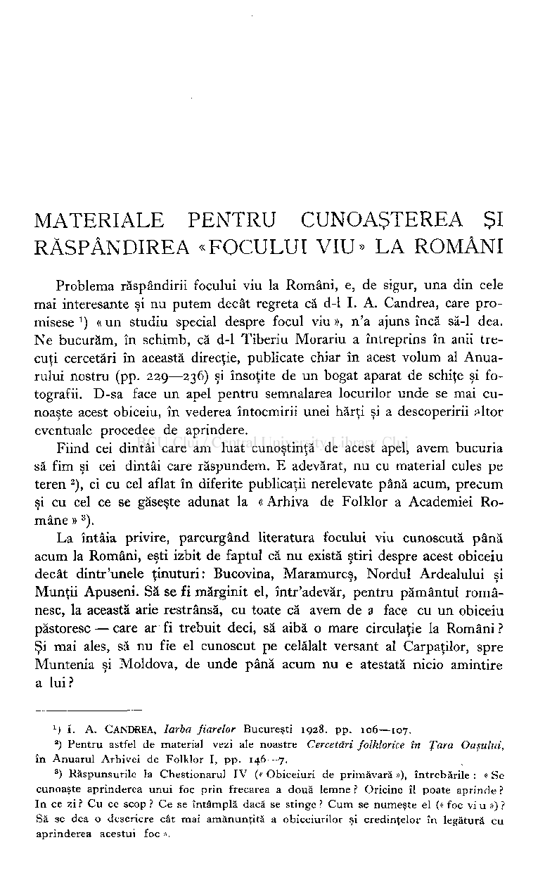
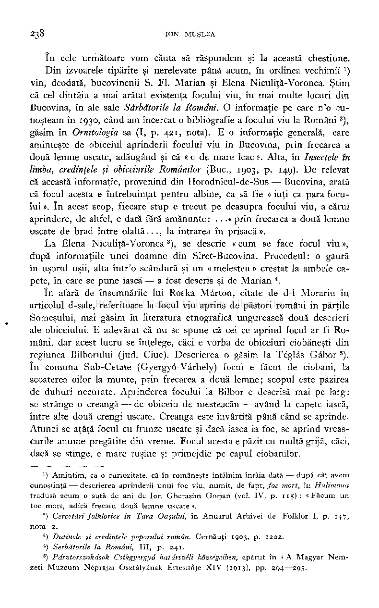
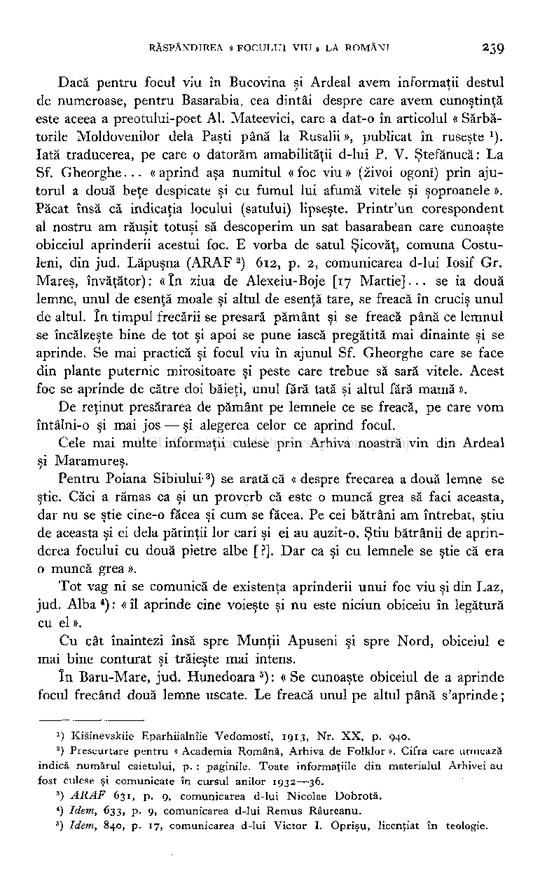
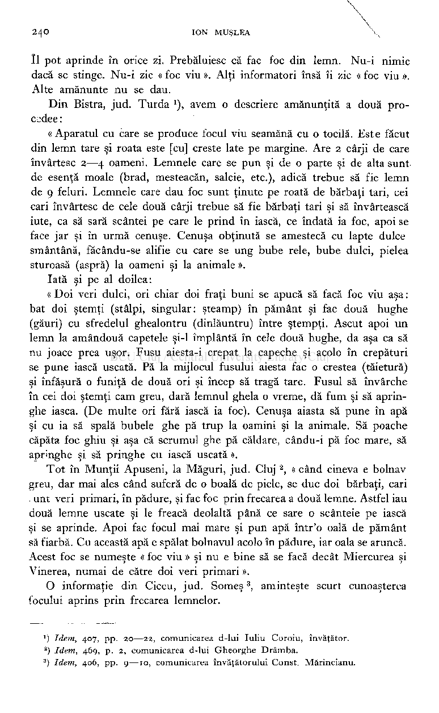
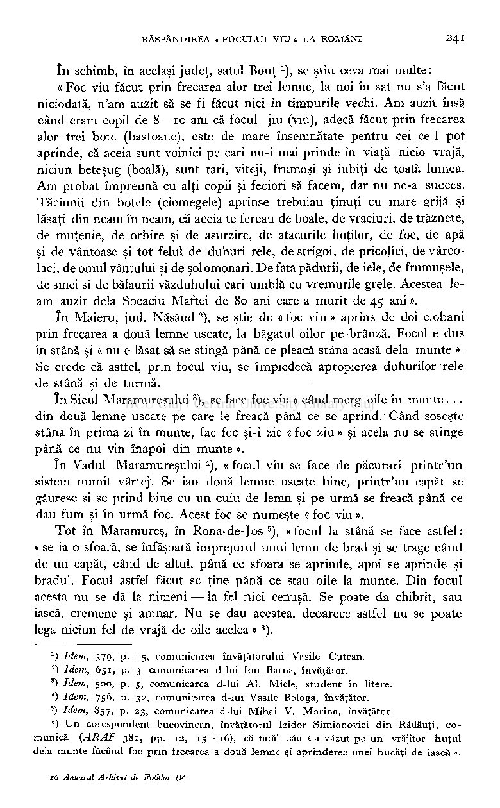
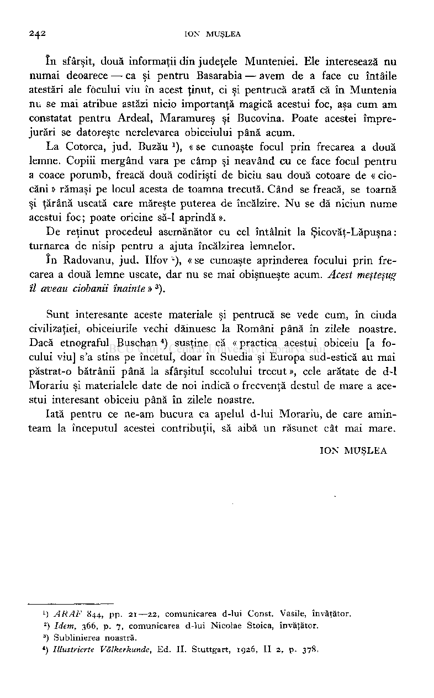

MATERIALE PENTRU CUNOAŞTEREA ŞI RĂSPÂNDIREA «FOCULUI VIU» LA ROMÂNI

# Problema răspândirii focului viu la Români, e, de sigur, una din cele mai interesante şi nu putem decât regreta că d-1I. A. Candrea, care promisese') «un studiu special despre focul viu», n'a ajuns încă să-1dea. Ne bucurăm, în schimb, că d-1Tiberiu Morariu a întreprins în anii trecuţi cercetări în această direcţie, publicate chiar în acest volum al Anuarului nostru (pp.229—236)şi însoţite de un bogat aparat de schiţe şi fotografii. D-sa face un apel pentru semnalarea locurilor unde se mai cunoaşte acest obiceiu, în vederea întocmirii unei hărţi şi a descoperirii fdtor eventuale procedee de aprindere.

# Fiind cei dintâi care am luat cunoştinţă de acest apel, avem bucuria să fim şi cei dintâi care răspundem. E adevărat, nu cu material cules pe teren

# ), ci cu cel aflat în diferite publicaţii nerelevate până acum, precum şi cu cel ce se găseşte adunat la « Arhiva de Folklor a Academiei Române »

2

# ).

3

# La întâia privire, parcurgând literatura focului viu cunoscută până acum la Români, eşti izbit de faptul că nu există ştiri despre acest obiceiu decât dintr'unele ţinuturi: Bucovina, Maramureş, Nordul Ardealului şi Munţii Apuseni. Să se fi mărginit el, într'adevăr, pentru pământul românesc, la această arie restrânsă, cu toate că avem de a face cu un obiceiu păstoresc — care ar fi trebuit deci, să aibă o mare circulaţie la Români ? Şi mai ales, să nu fie el cunoscut pe celălalt versant al Carpaţilor, spre Muntenia şi Moldova, de unde până acum nu e atestată nicio amintire a lui?

) I. A. CANDREA, Iarba fiarelor Bucureşti 1928. pp. 106—107.

L

## ) Pentru astfel de material vezi ale noastre Cercetări folklorice în Ţara Oaşului, în Anuarul Arhivei de Folklor I, pp. 146—7.

2

) Răspunsurile la Chestionarul IV (« Obiceiuri de primăvară »), întrebările : « Se cunoaşte aprinderea unui foc prin frecarea a două lemne ? Oricine îl poate aprinde ? In ce zi ? Cu ce scop ? Ce se întâmplă dacă se stinge ? Cum se numeşte el (« foc vi u ») ?

3

- Să se dea o descriere cât mai amănunţită a obiceiurilor şi credinţelor în legătură cu aprinderea acestui foc ».

# în cele următoare vom căuta să răspundem şi la această chestiune. Din izvoarele tipărite şi nerelevate până acum, în ordinea vechimii *)

# vin, deodată, bucovinenii S. FI. Marian şi Elena Niculiţă-Voronca. Ştim că cel dintâiu a mai arătat existenţa focului viu, în mai multe locuri din Bucovina, în ale saleSărbătorile la Români.O informaţie pe care n'o cunoşteam în1930,când am încercat o bibliografie a focului viu la Români

# ), găsim înOrnitologiasa (I, p.421 nota). E o informaţie generală, care aminteşte de obiceiul aprinderii focului viu în Bucovina, prin frecarea a două lemne uscate, adăugând şi că « e de mare leac ». Alta, înInsectele în limba, credinţele şi obiceiurile Românilor(Buc,1903,p.149).De relevat că această informaţie, provenind din Horodnicul-de-Sus — Bucovina, arată că focul acesta e întrebuinţat pentru albine, ca să fie « iuţi ca para focului ». în acest scop, fiecare stup e trecut pe deasupra focului viu, a cărui aprindere, de altfel, e dată fără amănunte: . ..« prin frecarea a două lemne uscate de brad între olaltă..., la intrarea în prisacă ».

2

# La Elena Niculiţă-Voronca ), se descrie « cum se face focul viu », după informaţiile unei doamne din Siret-Bucovina. Procedeul: o gaură în uşorul uşii, alta într'o scândură şi un « melesteu » crestat la ambele capete, în care se pune iască — a fost descris şi de Marian *.

# în afară de însemnările lui Roska Mârton, citate de d-1Morariu în articolul d-sale, referitoare la focul viu aprins de păstori români în părţile Someşului, mai găsim în literatura etnografică ungurească două descrieri ale obiceiului. E adevărat că nu se spune că cei ce aprind focul ar fi Români, dar acest lucru se înţelege, căci e vorba de obiceiuri ciobăneşti din regiunea Bilborului (jud. Ciuc). Descrierea o găsim la Téglâs Gâbor

# ). în comuna Sub-Cetate (Gyergyô-Vârhely) focul e făcut de ciobani, la scoaterea oilor la munte, prin frecarea a două lemne; scopul este păzirea de duhuri necurate. Aprinderea focului la Bilbor e descrisă mai pe larg: se strânge o creangă — de obiceiu de mesteacăn — având la capete iască, între alte două crengi uscate. Creanga este învârtită până când se aprinde. Atunci se aţâţă focul cu frunze uscate şi dacă iasca ia foc, se aprind vreascurile anume pregătite din vreme. Focul acesta e păzit cu multă grijă, căci, dacă se stinge, e mare ruşine şi primejdie pe capul ciobanilor.

5

) Amintim, ca o curiozitate, că în româneşte întâlnim întâia dată — după cât avem cunoştinţă — descrierea aprinderii unui foc viu, numit, de fapt, foc mort, în Halimaua tradusă acum o sută de ani de Ion Gherasim Gorjan (vol. IV, p.115) : « Făcum un foc mort, adică frecaiu două lemne uscate ».

1

## ) Cercetări folklorice în Ţara Oaşului, în Anuarul Arhivei de Folklor I, p. 147, nota 2.

2

- 3

) Datinele şi credinţele poporului român. Cernăuţi 1903, p. 1202.

- 4

) Serbătorile Ia Români, III, p. 241 .

- 5

## ) Pdsztorszokdsok Csikgyergyo hatdrszéli kâzsegeiben, apărut în « A Magyar Nemzeti Mûzeum Néprajzi Osztâlyânak Értesitô'je XIV (1913), pp. 294—295.

# Dacă pentru focul viu în Bucovina şi Ardeal avem informaţii destul de numeroase, pentru Basarabia, cea dintâi despre care avem cunoştinţă este aceea a preotului-poet Al. Mateevici, care a dat-o în articolul « Sărbătorile Moldovenilor delà Paşti până la Rusalii », publicat în ruseşte *). Iată traducerea, pe care o datorăm amabilităţii d-lui P. V. Ştefănucă: La Sf. Gheorghe... «aprind aşa numitul «foc viu» (zivoi ogonî) prin ajutorul a două beţe despicate şi cu fumul lui afumă vitele şi şoproanele ». Păcat însă că indicaţia locului (satului) lipseşte. Printr'un corespondent al nostru am răuşit totuşi să descoperim un sat basarabean care cunoaşte obiceiul aprinderii acestui foc. E vorba de satul Şicovăţ, comuna Costuleni, din jud. Lăpuşna (ARAF

# )612,p.2,comunicarea d-lui Iosif Gr. Mareş, învăţător): «în ziua de Alexeiu-Boje[17Martie]... se ia două lemne, unul de esenţă moale şi altul de esenţă tare, se freacă în cruciş unul de altul. în timpul frecării se presară pământ şi se freacă până ce lemnul se încălzeşte bine de tot şi apoi se pune iască pregătită mai dinainte şi se aprinde. Se mai practică şi focul viu în ajunul Sf. Gheorghe care se face din plante puternic mirositoare şi peste care trebue să sară vitele. Acest foc se aprinde de către doi băieţi, unul fără tată şi altul fără mamă ».

2

# De reţinut presărarea de pământ pe lemnele ce se freacă, pe care vom întâlni-o şi mai jos — şi alegerea celor ce aprind focul.

# Cele mai multe informaţii culese prin Arhiva noastră vin din Ardeal şi Maramureş.

# ) se arată că « despre frecarea a două lemne se ştie. Căci a rămas ca şi un proverb că este o muncă grea să faci aceasta, dar nu se ştie cine-o făcea şi cum se făcea. Pe cei bătrâni am întrebat, ştiu de aceasta şi ei delà părinţii lor cari şi ei au auzit-o. Ştiu bătrânii de aprinderea focului cu două pietre albe [?]. Dar ca şi cu lemnele se ştie că era o muncă grea ».

# Pentru Poiana Sibiului'

3

# Tot vag ni se comunică de existenţa aprinderii unui foc viu şi din Laz, jud. Alba

# ) : « îl aprinde cine voieşte şi nu este niciun obiceiu în legătură cu el ».

4

# Cu cât înaintezi însă spre Munţii Apuseni şi spre Nord, obiceiul e mai bine conturat şi trăieşte mai intens.

# ) : « Se cunoaşte obiceiul de a aprinde focul frecând două lemne uscate. Le freacă unul pe altul până s'aprinde ;

# în Baru-Mare, jud. Hunedoara

5

## *) Kisinevskiie Eparhiialnîie Vedomosti,1913, Nr. XX, p. 940.

) Prescurtare pentru « Academia Română, Arhiva de Folklor ». Cifra care urmează indică numărul caietului, p. : paginile. Toate informaţiile din materialul Arhivei au fost culese şi comunicate în cursul anilor 1932—36.

2

- 3

) ARAF 631 p. 9, comunicarea d-lui Nicolae Dobrotă.

- 4

) Idem, 633 p. 9, comunicarea d-lui Remus Râureanu.

- 5

## ) Idem, 840, p. 17 comunicarea d-lui Victor I. Oprişu, licenţiat în teologie.

# îl pot aprinde în orice zi. Prebăluiesc că fac foc din lemn. Nu-i nimic dacă se stinge. Nu-i zic « foc viu ». Alţi informatori însă îi zic « foc viu ». Alte amănunte nu se dau.

# ), avem o descriere amănunţită a două procsdee:

# Din Bistra, jud. Turda

1

# «Aparatul cu care se produce focul viu seamănă cu o tocilă. Este făcut din lemn tare şi roata este [cu] creste late pe margine. Are2cârji de care învârtesc2—4oameni. Lemnele care se pun şi de o parte şi de alta sunt de esenţă moale (brad, mesteacăn, salcie, etc.), adică trebue să fie lemn de9feluri. Lemnele care dau foc sunt ţinute pe roată de bărbaţi tari, cei cari învârtesc de cele două cârji trebue să fie bărbaţi tari şi să învârtească iute, ca să sară scântei pe care le prind în iască, ce îndată ia foc, apoi se face jar şi în urmă cenuşe. Cenuşa obţinută se amestecă cu lapte dulce smântână, făcându-se alifie cu care se ung bube rele, bube dulci, pielea sturoasă (aspră) la oameni şi la animale ».

# Iată şi pe al doilea: « Doi veri dulci, ori chiar doi fraţi buni se apucă să facă foc viu aşa : bat doi ştemţi (stâlpi, singular: şteamp) în pământ şi fac două hughe (găuri) cu sfredelul ghealontru (dinlăuntru) între ştempţi. Ascut apoi un lemn la amândouă capetele şi—1împlântă în cele două hughe, da aşa ca să nu joace prea uşor. Fusu aiesta-i crepat la capeche şi acolo în crepături se pune iască uscată. Pă la mijlocul fusului aiesta fac o creştea (tăietură) şi înfăşură o funiţă de două ori şi încep să tragă tare. Fusul să învârche în cei doi ştemţi cam greu, dară lemnul ghela o vreme, dă fum şi să apringhe iasca. (De multe ori fără iască ia foc). Cenuşa aiasta să pune în apă şi cu ia să spală bubele ghe pă trup la oamini şi la animale. Să poache căpăta foc ghiu şi aşa că scrumul ghe pă căldare, cându-i pă foc mare, să apringhe şi să pringhe cu iască uscată ».

# , « când cineva e bolnav greu, dar mai ales când suferă de o boală de piele, se duc doi bărbaţi, cari . unt veri primari, în pădure, şi fac foc prin frecarea a două lemne. Astfel iau două lemne uscate şi le freacă deolaltă până ce sare o scânteie pe iască şi se aprinde. Apoi fac focul mai mare şi pun apă într'o oală de pământ să fiarbă. Cu această apă e spălat bolnavul acolo în pădure, iar oala se aruncă. Acest foc se numeşte « foc viu » şi nu e bine să se facă decât Miercurea şi Vinerea, numai de către doi veri primari ».

# Tot în Munţii Apuseni, la Măguri, jud. Cluj

2

# , aminteşte scurt cunoaşterea focului aprins prin frecarea lemnelor.

# O informaţie din Ciceu, jud. Someş

3

- 1

) Idem, 407, pp. 20—22, comunicarea d-lui Iuliu Coroiu, învăţător.

- 2

) Idem, 469, p. 2, comunicarea d-lui Gheorghe Drâmba.

- 3

## ) Idem, 406, pp. 9—10 comunicarea învăţătorului Const. Mărincianu.

RĂSPÂNDIREA « FOCULUI VIU » L A ROMÂNI 24I

# în schimb, în acelaşi judeţ, satul Bonţ se ştiu ceva mai multe: « Foc viu făcut prin frecarea alor trei lemne, la noi în sat nu s'a făcut niciodată, n'am auzit să se fi făcut nici în timpurile vechi. Ani auzii însă când eram copil de8—10ani că focul jiu (viu), adecă făcut prin frecarea alor trei bote (bastoane), este de mare însemnătate pentru cei ce-1pot aprinde, că aceia sunt voinici pe cari nu-i mai prinde în viaţă nicio vrajă, niciun beteşug (boală), sunt tari, viteji, frumoşi şi iubiţi de toată lumea. Am probat împreună cu alţi copii şi feciori să facem, dar nu ne-a succes.

# Tăciunii din botele (ciomegele) aprinse trebuiau ţinuţi cu mare grijă şilăsaţi din neam în neam, că aceia te fereau de boale, de vraciuri, de trăznete,de muţenie, de orbire şi de asurzire, de atacurile hoţilor, de foc, de apăşi de vântoase şi tot felul de duhuri rele, de strigoi, de pricolici, de vârco­laci, de omul vântului şi de solomonari. De fata pădurii, de iele, de frumuşele,de smei şi de balaurii văzduhului cari umblă cu vremurile grele. Acestea le-am auzit delà Socaciu Maftei de80ani care a murit de45ani ».

# ), se ştie de « foc viu » aprins de doi ciobani prin frecarea a două lemne uscate, la băgatul oilor pe brânză. Focul e dus în stână şi « nu e lăsat să se stingă până ce pleacă stâna acasă delà munte ». Se crede că astfel, prin focul viu, se împiedecă apropierea duhurilor rele de stână şi de turmă.

# în Maieru, jud. Năsăud

2

# în Şieul Maramureşului ), se face foc viu « când merg oile în munte. .. din două lemne uscate pe care le freacă până ce se aprind. Când soseşte stâna în prima zi în munte, fac foc şi-i zic « foc ziu » şi acela nu se stinge până ce nu vin înapoi din munte ».

# ), « focul viu se face de păcurari printr'un sistem numit vârtej. Se iau două lemne uscate bine, printr'un capăt se găuresc şi se prind bine cu un cuiu de lemn şi pe urmă se freacă până ce dau fum şi în urmă foc. Acest foc se numeşte « foc viu ».

# în Vadul Maramureşului

4

# ), « focul la stână se face astfel : « se ia o sfoară, se înfăşoară împrejurul unui lemn de brad şi se trage când de un capăt, când de altul, până ce sfoara se aprinde, apoi se aprinde şi bradul. Focul astfel făcut se ţine până ce stau oile la munte. Din focul acesta nu se dă la nimeni — la fel nici cenuşă. Se poate da chibrit, sau iască, cremene şi amnar. Nu se dau acestea, deoarece astfel nu se poate lega niciun fel de vrajă de oile acelea »

# Tot în Maramureş, în Rona-de-Jos

6

# ).

6

## *) Idem, 379, p. 15 comunicarea învăţătorului Vasile Cutcan.

- 2

) Idem, 651 p. 3 comunicarea d-lui Ion Bârna, învăţător.

- 3

) Idem, 500, p. 5, comunicarea d-lui Al. Miele, student în litere.

- 4

) Idem, 756, p. 32 comunicarea d-lui Vasile Bologa, învăţător.

- 5

) Idem, 857, p. 23 comunicarea d-lui Mihai V. Marina, învăţător.

- 6

## ) Un corespondent bucovinean, învăţătorul Izidor Simionovici din Rădăuţi, comunică (ARAF 381 pp. 12 , 15—16) , că tatăl său « a văzut pe un vrăjitor huţul delà munte făcând foc prin frecarea a două lemne şi aprinderea unei bucăţi de iască ».

# în sfârşit, două informaţii din judeţele Munteniei. Ele interesează nu numai deoarece — ca şi pentru Basarabia — avem de a face cu întâile atestări ale focului viu în acest ţinut, ci şi pentrucă arată că în Muntenia nu se mai atribue astăzi nicio importanţă magică acestui foc, aşa cum am constatat pentru Ardeal, Maramureş şi Bucovina. Poate acestei împrejurări se datoreşte nerelevarea obiceiului până acum.

# ), « se cunoaşte focul prin frecarea a două lemne. Copiii mergând vara pe câmp şi neavând cu ce face focul pentru a coace porumb, freacă două codirişti de biciu sau două cotoare de « ciocăni » rămaşi pe locul acesta de toamna trecută. Când se freacă, se toarnă şi ţărână uscată care măreşte puterea de încălzire. Nu se dă niciun nume acestui foc ; poate oricine să-1aprindă ».

# La Cotorca, jud. Buzău

1

# De reţinut procedeul asemănător cu cel întâlnit la Şicovăţ-Lăpuşna : turnarea de nisip pentru a ajuta încălzirea lemnelor.

# în Radovanu, jud. Ilfov '"), « se cunoaşte aprinderea focului prin frecarea a două lemne uscate, dar nu se mai obişnueşte acum.Acest meşteşug

îl aveau ciobanii înainte »

).

3

# Sunt interesante aceste materiale şi pentrucă se vede cum, în ciuda civilizaţiei, obiceiurile vechi dăinuesc la Români până în zilele noastre. Dacă etnograful Buschan

# ) susţine că « practica acestui obiceiu [a focului viu] s'a stins pe încetul, doar în Suedia şi Europa sud-estică au mai păstrat-o bătrânii până la sfârşitul secolului trecut », cele arătate de d-1 Morariu şi materialele date de noi indică o frecvenţă destul de mare a acestui interesant obiceiu până în zilele noastre.

4

# Iată pentru ce ne-am bucura ca apelul d-lui Morariu, de care aminteam la începutul acestei contribuţii, să aibă un răsunet cât mai mare.

## ION MUŞLEA

- 1

) ARAF 844, pp. 21—22 , comunicarea d-lui Const. Vasile, învăţător.

- 2

) Idem, 366, p. 7, comunicarea d-lui Nicolae Stoica, învăţător.

- 3

) Sublinierea noastră.

- 4

## ) Illustrierte Völkerkunde, Ed. II. Stuttgart, 1926, II 2, p. 378.

