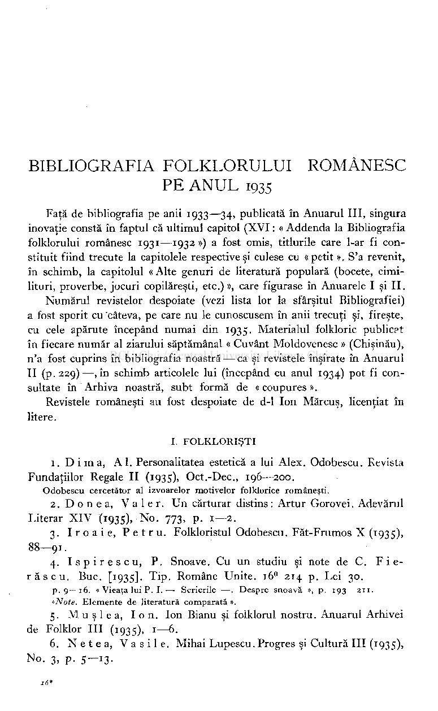

BIBLIOGRAFIA FOLKLORULUI ROMÂNESC PE ANUL 1935

# Faţă de bibliografia pe anii1933—34,publicată în Anuarul III, singura inovaţie constă în faptul că ultimul capitol (XVI : « Addenda la Bibliografia folklorului românesc1931—1932») a fost omis, titlurile care l-ar fi constituit fiind trecute la capitolele respective şi culese cu « petit ». S'a revenit, în schimb, la capitolul « Alte genuri de literatură populară (bocete, cimilituri, proverbe, jocuri copilăreşti, etc.) », care figurase în Anuarele I şi II.

# Numărul revistelor despoiate (vezi lista lor la sfârşitul Bibliografiei) a fost sporit cu'câteva, pe care nu le cunoscusem în anii trecuţi şi, fireşte, cu cele apărute începând numai din1935.Materialul folkloric publicat în fiecare număr al ziarului săptămânal « Cuvânt Moldovenesc » (Chişinău), n'a fost cuprins în bibliografia noastră — ca şi revistele înşirate în Anuarul II (p.229)—,în schimb articolele lui (începând cu anul1934)pot fi consultate în Arhiva noastră, subt formă de « coupures ».

# Revistele româneşti au fost despoiate de d-1 Ion Marcus, licenţiat în litere.

I. FOLKLORIŞTI

# 1. Di ma, Al. Personalitatea estetică a lui Alex. Odobescu. Revista Fundaţiilor Regale II(1935),Oct.-Dec,196—200.

Odobescu cercetător al izvoarelor motivelor folklorice româneşti.

# 2.D o n e a, Vaier . Un cărturar distins : Artur Gorovei. Adevărul

Literar XIV(1935),No.773,p.1—2.

# 3.Iroaie , Petru . Folkloristul Odobescu. Făt-Frumos X(1935),

88—91.

# 4.Ispirescu , P, Snoave. Cu un studiu şi note de C. F i e-

răscu . Buc.[1935].Tip. Române Unite.16

214p. Lei30. p. 9—16. « Vieaţa lui P. I.— Scrierile —. Despre snoavă », p. 193—211 . «Note. Elemente de literatură comparată ».

0

# 5.Muşlea , Ion. Ion Bianu şi folklorul nostru. Anuarul Arhivei

de Folklor III(1935), 1—6.

# 6.N e t e a, V a s i1e. Mihai Lupescu. Progres şi Cultură III(1935),

- No.3,p.5—13.

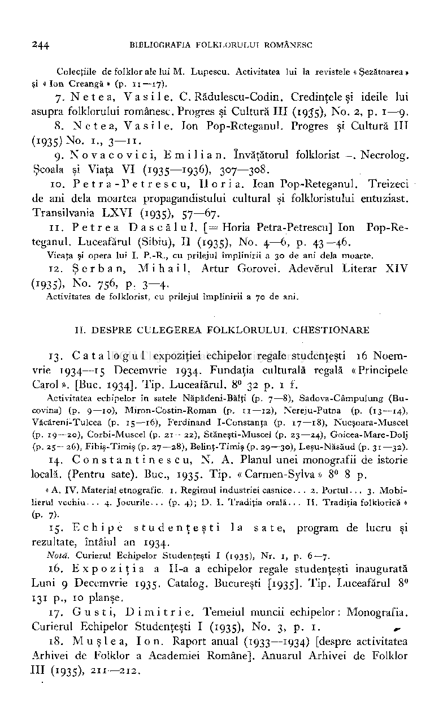

Colecţiile de folklor ale lui M. Lupescu. Activitatea lui la revistele « Şezătoareat> şi «Ion Creangă» (p. II— 17) .

# 7.N e tea, Vasile . C. Rădulescu-Codin. Credinţele şi ideile lui

asupra folklorului românesc. Progres şi Cultură III(193*5),No.2,p.1—9.

# 8.N e t e a, V a s i1e. Ion Pop-Reteganul. Progres şi Cultură III

(1935) No . i. , 3—11 .

# 9.Novacovici , Emilian . învăţătorul folklorist—. Necrolog.

Şcoala şi Viaţa VI(1935—1936), 307—308.

# 10.Petra-Petrescu , H ori a. loan Pop-Reteganul. Treizeci

de ani delà moartea propagandistului cultural şi folkloristului entuziast. Transilvania LXVI(1935), 57—67.

# 11.Petre a Dascălul . [ = Horia Petra-Petrescu] Ion Pop-Re­

teganul. Luceafărul (Sibiu), II(1935),No.4—6,p.43—46.

Vieaţa şi opera lui I. P.-R., cu prilejul împlinirii a 30 de ani delà moarte.

# 12.Ş e r b a n, M iha il. Artur Gorovei. Adevërul Literar XI V

(1935), No 756, p . 3—4.

Activitatea de folklorist, cu prilejul împlinirii a 70 de ani.

II. DESPRE CULEGEREA FOLKLORULUI. CHESTIONARE

# 13.Catalogu l expoziţiei echipelor regale studenţeşti16Noem-

# vrie1934—15Decemvrie1934.Fundaţia culturală regală «Principele Carol ». [Buc.1934].Tip. Luceafărul.8° 32p.1 f.

Activitatea echipelor în satele Năpădeni-Bălţi (p. 7—8), Sadova-Câmpulung (Bucovina) (p. 9—10), Miron-Costin-Roman (p.11—12) , Nereju-Putna (p. (13—14) , Văcăreni-Tulcea (p. 15—16) , Ferdinand l-Constanţa (p. 17—18) , Nucşoara-Muscel (p. 19—20), Corbi-Muscel (p. 21—22), Stăneşti-Muscel (p. 23—24), Goicea-Mare-Dolj (p. 25—26), Fibiş-Timiş (p. 27—28), Belinţ-Timiş (p. 29—30), Leşu-Năsăud (p. 31—32) .

# 14.Constantinescu , N. A. Planul unei monografii de istorie locală. (Pentru sate). Buc,1935.Tip. « Carmen-Sylva »8° 8p.

« A. IV. Material etnografic. 1 Regimul industriei casnice. . . 2. Portul. . . 3. Mobilierul vechiu. . . 4. Jocurile. . . (p. 4); D. I. Tradiţia orală. . . II. Tradiţia folklorică » (P. 7).

# 15.Echip e studenţeşt i l a sate, program de lucru şi

rezultate, întâiul an1934.

Notă. Curierul Echipelor Studenţeşti I (1935), Nr. 1 p. 6—7.

# 16.Expoziţi a a Il-a a echipelor regale studenţeşti inaugurată

# Luni9Decemvrie1935 Catalog. Bucureşti[1935].Tip. Luceafărul8° 131p.,10planşe.

# 17.Guşti , Dimitrie . Temeiul muncii echipelor : Monografia.

Curierul Echipelor Studenţeşti I(1935),No.3,p.1.

# 18.M u ş1e a, Ion. Raport anual(1933—1934)[despre activitatea

# Arhivei de Folklor a Academiei Române]. Anuarul Arhivei de Folklor

II I (1935), 211—212 .

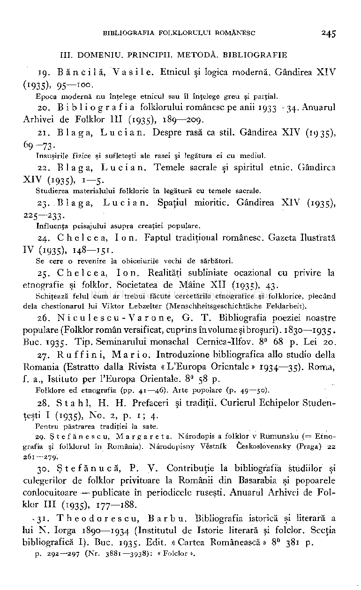

III. DOMENIU. PRINCIPII. METODĂ. BIBLIOGRAFIE

# 19.Băncilă , Vasile . Etnicul şi logica modernă. Gândirea XI V

(

93S). 95—

° -

- I

10

Epoca modernă nu înţelege etnicul sau îl înţelege greu şi parţial.

# 20.Bibliografi a folklorului românesc pe anii1933—34.Anuarul

Arhivei de Folklor III(1935), 189—209.

# 21. B1a g a, Lucian . Despre rasă ca stil. Gândirea XIV(19 35),

69—73-

însuşirile fizice şi sufleteşti ale rasei şi legătura ei cu mediul.

# 22.Bl aga, Lucian . Temele sacrale şi spiritul etnic. Gândirea

XIV (1935), i-s . Studierea materialului folkloric în legătură cu temele sacrale.

# 23.Blaga , Lucian . Spaţiul mioritic. Gândirea XIV(1935),

225—233.

Influenţa peisajului asupra creaţiei populare.

# 24.Chelcea , Ion. Faptul tradiţional românesc. Gazeta Ilustrată

!V(1935)»148—iS

-

1

Se cere o revenire la obiceiurile vechi de sărbători.

# 25.Chelcea , Ion. Realităţi subliniate ocazional cu privire la

# etnografie şi folklor. Societatea de Mâine XII(1935), 43.

Schiţează felul cum ar trebui făcute cercetările etnografice şi folklorice, plecând delà chestionarul lui Viktor Lebzelter (Menschheitsgeschichtliche Feldarbeit).

- 26.Niculescu-Varone , G. T. Bibliografia poeziei noastre populare (Folklor român versificat, cupnns în volume şi broşuri).1830—1935. Buc.1935.Tip. Seminarului monachal Cernica-Ilfov.8° 68p. Lei20.
- 27.Ruffini , Mario . Introduzione bibliografica alio studio della Romania (Estratto dalia Rivista «L'Europa Orientale» Roma, f. a., Istituto per l'Europa Orientale.8° 58p.

Folklore ed etnografia (pp. 41—46). Arte popolare (p. 49—50).

# 28.Stahl , H. H. Prefaceri şi tradiţii. Curierul Echipelor Studen­

ţeşti I(1935),No.2,p.1; 4.

Pentru păstrarea tradiţiei la sate.

#### 29. Ştefănescu , Margareta . Nârodopis a folklor v Rumunsku (= Etno­

#### grafia şi folklorul

# 30.Ştefănucă , P. V. Contribuţie la bibliografia studiilor şi culegerilor de folklor privitoare la Românii din Basarabia şi popoarele conlocuitoare — publicate în periodicele ruseşti. Anuarul Arhivei de Folklor III(1935), 177-188.

261 —279.

# -31. Theodorescu , Barbu . Bibliografia istorică şi literară a lui N. Iorga1890—1934(Institutul de Istorie literară şi folclor. Secţia bibliografică I). Buc.1935.Edit. «Cartea Românească»8° 381p.

p. 292—297 (Nr. 3881—3938) «Folclor».

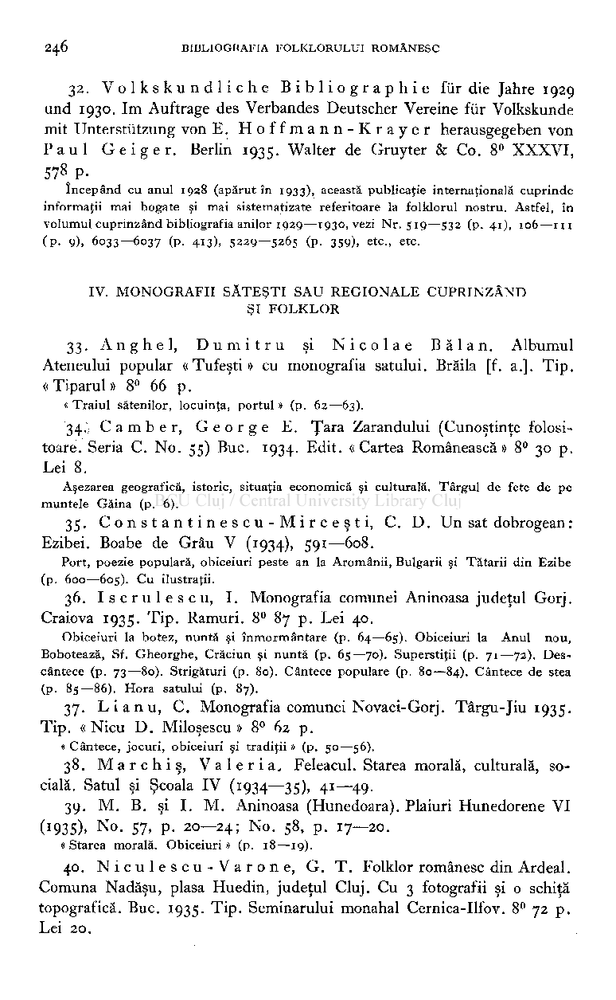

# 32.Volkskundlich e Bibliographi e für die Jahre1929 und1930.Im Auftrage des Verbandes Deutscher Vereine für Volkskunde mit Unterstützung von E. Hof f mann-Kraye r herausgegeben von Pau l Geiger . Berlin1935.Walter de Gruyter & Co.8°XXXVI, 578p.

începând cu anul 1928 (apărut în 1933), această publicaţie internaţională cuprinde informaţii mai bogate şi mai sistematizate referitoare la folklorul nostru. Astfel, în volumul cuprinzând bibliografia anilor 1929—1930, vezi Nr. 519—532 (p. 41), 106 — m (p. 9), 6033—6037 (p. 413), 5229—5265 (p. 359), etc., etc.

IV. MONOGRAFII SĂTEŞTI SAU REGIONALE CUPRINZÂND ŞI FOLKLOR

# 33.Anghel , Dumitr u şi Nicola e Bălan . Albumul Ateneului popular «Tufeşti» cu monografia satului. Brăila [f. a.]. Tip. « Tiparul »8° 66p.

« Traiul sătenilor, locuinţa, portul » (p. 62—63).

# 34.Camber , Georg e E. Ţara Zarandului (Cunoştinţe folositoare. Seria C. No.55)Buc.1934.Edit. «Cartea Românească»8° 30p. Lei8.

Aşezarea geografică, istoric, situaţia economică şi culturală. Târgul de fete de pe muntele Găina (p. 6).

# 35.Constantinescu-Mirceşti , C. D. Un sat dobrogean : Ezibei. Boabe de Grâu V(1934), 591—608.

Port, poezie populară, obiceiuri peste an la Aromânii, Bulgarii şi Tătarii din Ezibe (p. 600—605). Cu ilustraţii.

# 36.Iscrulescu , I. Monografia comunei Aninoasa judeţul Gorj. Craiova1935.Tip. Ramuri.8° 87p. Lei40.

Obiceiuri la botez, nuntă şi înmormântare (p. 64—65). Obiceiuri la Anul nou, Bobotează, Sf. Gheorghe, Crăciun şi nuntă (p. 65—70). Superstiţii (p. 71—72) . Descântece (p. 73—80). Strigături (p. 80). Cântece populare (p. 80—84). Cântece de stea (p. 85—86). Hora satului (p. 87).

# 37.L i a n u, C. Monografia comunei Novaci-Gorj. Târgu-Jiu1935.

Tip. « Nieu D. Miloşescu »8° 62p.

« Cântece, jocuri, obiceiuri şi tradiţii » (p. 50—56).

# 38.M a r c h i ş, Valeria , Feleacul. Starea morală, culturală, so­

cială. Satul şi Şcoala IV(1934—35), 41—49.

# 39.M. B. şi I. M. Aninoasa (Hunedoara). Plaiuri Hunedorene VI

(1935), No 57, p . 20—24;

- 58, P - 17—20.

No

«Starea morală. Obiceiuri» (p. 18—19) .

# 40.Niculescu-Varone , G. T. Folklor românesc din Ardeal.

# Comuna Nadăşu, plasa Huedin, judeţul Cluj. Cu3fotografii şi o schiţă topografică. Buc.1935.Tip. Seminarului monahal Cernica-Ufov.8° 72p. Lei20.

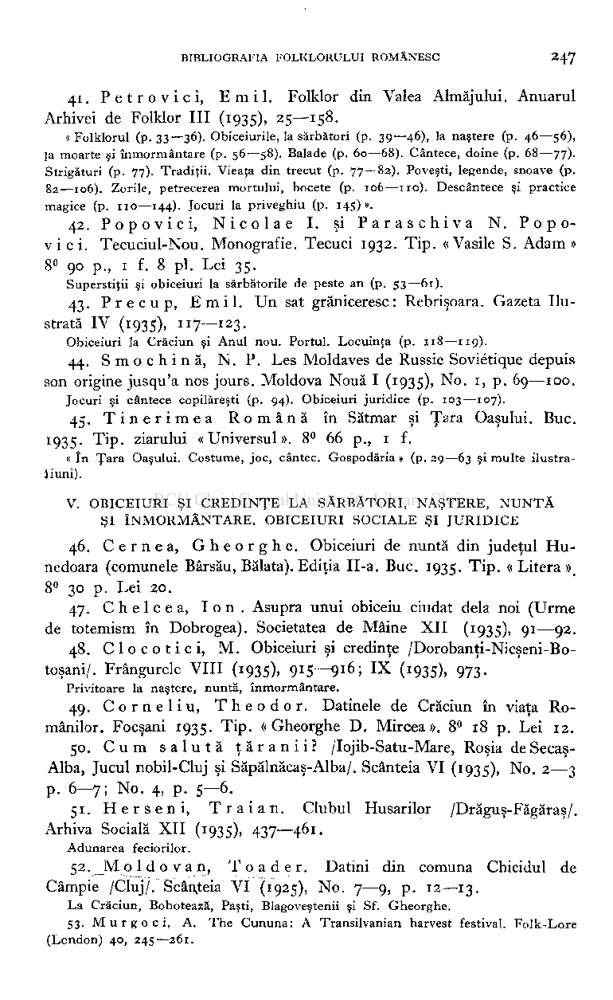

# 41.Petrovici , Emil . Folklor din Valea Almăjului. Anuarul Arhivei de Folklor III(1935), 25—158.

« Folklorul (p. 33—36). Obiceiurile, la sărbători (p. 39—46), la naştere (p. 46—56), ]a moarte şi înmormântare (p. 56—58). Balade (p. 60—68). Cântece, doine (p. 68—77). Strigături (p. 77). Tradiţii. Vieaţa din trecut (p. 77—82). Poveşti, legende, snoave (p. 82—106). Zorile, petrecerea mortului, bocete (p. 106—110). Descântece şi practice magice (p. 110—144) . Jocuri la priveghiu (p. 145)'».

# 42.Popovici , Nicola e I. şi Paraschiv a N. Popo vici. Tecuciul-Nou. Monografie. Tecuci1932.Tip. «Vasile S. Adam» 8° 90p.,I f.8pl. Lei35.

Superstiţii şi obiceiuri la sărbătorile de peste an (p. S3—61).

# 43.Precup , Emil . Un sat grăniceresc: Rebrişoara. Gazeta Ilu­

strată IV(1935), 117—123.

Obiceiuri la Crăciun şi Anul nou. Portul. Locuinţa (p. 118—119) .

# 44.Smochină , N. P. Les Moldaves de Russie Soviétique depuis

son origine jusqu'à nos jours. Moldova Nouă I(1935),No.1,p.69—100.

Jocuri şi cântece copilăreşti (p. 94). Obiceiuri juridice (p. 103—107).

# 45.Tinerime a Român ă în Sătmar şi Ţara Oaşului. Buc.

# 1935.Tip. ziarului «Universul».8° 66p., 1 f.

« în Ţara Oaşului. Costume, joc, cântec. Gospodăria» (p. 29—63 şi multe ilustraiiuni).

V. OBICEIURI ŞI CREDINŢE LA SĂRBĂTORI, NAŞTERE, NUNTĂ ŞI ÎNMORMÂNTARE. OBICEIURI SOCIALE ŞI JURIDICE

# 46.Cernea , Gheorghe . Obiceiuri de nuntă din judeţul Hunedoara (comunele Bârsău, Bălata). Ediţia Il-a. Buc.1935.Tip. « Litera » 8° 30p. Lei20.

# 47.Chelcea , Ion . Asupra unui obiceiu ciudat delà noi (Urme

de totemism în Dobrogea). Societatea de Mâine XII(1935), 91—92.

# 48.Clocotici , M. Obiceiuri şi credinţe /Dorobanţi-Nicşeni-Bo-

toşani/. Frângurele VIII(1935), 915—916;IX(1935), 973.

Privitoare la naştere, nuntă, înmormântare.

# 49.Cornel i u, Theodor . Datinele de Crăciun în viaţa Ro­

mânilor. Focşani1935.Tip. «Gheorghe D. Mir cea ».8° 18p. Lei12.

# 50.Cu m salut ă ţăranii ? /Iojib-Satu-Mare, Roşia de Secaş-

# Alba, Jucul nobil-Cluj şi Săpălnăcaş-Alba/. Scânteia VI(1935),No.2—3 p.6—7;No.4,p.5—6.

# 51.Herseni , Traian . Clubul Husarilor /Drăguş-Făgăraş/.

Arhiva Socială XII(1935), 437—461.

Adunarea feciorilor.

# 52.Mo l do van, Toader , Datini din comuna Chicidul de

Câmpie /Cluj/. Scân,teia VI(1925),No.7—9,p.12—13

La Crăciun, Bobotează, Paşti, Blagoveştenii şi Sf. Gheorghe.

#### 53. Murg o ci, A. The Cununa: A Transilvanian harvest festival. Folk-Lore

(London) 40, 245—261.

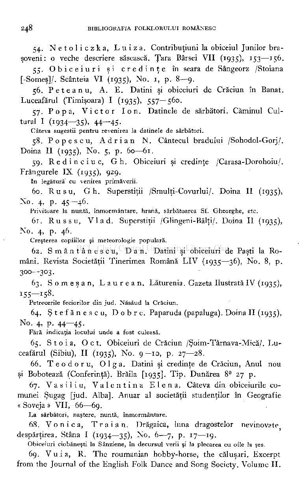

# 54.Netoliczka , Luiza . Contribuţiuni la obiceiul Junilor bra­

şoveni: o veche descriere săsească. Ţara Bârsei VII(1935), 153—156.

# 55.Obiceiur i şi credinţ e în seara de Sângeorz /Stoiana

[-Someş]/. Scânteia VI(1935),No.1,p.8—9.

# 56.P e t e a n u, A. E. Datini şi obiceiuri de Crăciun în Banat.

Luceafărul (Timişoara) I(1935), 557—560.

# 57.Popa, Victo r Ion. Datinele de sărbători. Căminul Cul­

tural I(1934—35). 44—45-

Câteva sugestii pentru revenirea la datinele de sărbători.

# 58.Popes c u, Adria n N. Cântecul bradului /Sohodol-Gorj/.

Doina II(1935),No.5,p.60—61.

# 59.Redinciuc , Gh . Obiceiuri şi credinţe /Carasa-Dorohoiu/.

Frângurele IX(1935), 929.

In legătură cu venirea primăverii.

# 60.Rusu , G h. Superstiţii /Smulţi-Covurlui/. Doina II

- 4. P- 45—4

-

6

Privitoare la nuntă, înmormântare, hrană, sărbătoarea Sf. Gheorghe, etc.

# 61.Ru s su, V I ad. Superstiţii /Glingeni-Bălţi/. Doina II

No.4,p.46.

Creşterea copailor şi meteorologie populară.

# 62.Smântânescu , Dan. Datini şi obiceiuri de Paşti la Ro­

# mâni. Revista Societăţii Tinerimea Română LI V(1935—36),No. p.

300—303.

# 63.Someşan , Laurean . Lătur enia. Gazeta Ilustrată IV(1935),

155—^S-

Petrecerile feciorilor din jud. Năsăud la Crăciun.

# 64.Ştefănescu , Dobre . Paparuda (papaluga). Doina II

4, p . 44—45.

Fără indicaţia locului unde a fost culeasă.

# 65.S t o i a, Oct. Obiceiuri de Crăciun /Şoim-Târnava-Mică/. Lu­

ceafărul (Sibiu), II(1935),No.9—10,p.27—28.

# 66.Teodoru , Olga . Datini şi credinţe de Crăciun, Anul nou

şi Bobotează (Conferinţă). Brăila[1935].Tip. Dunărea8° 27p.

# 67.Vasiliu , Valentin a Elena . Câteva din obiceiurile co­

munei Şugag [jud. Alba]. Anuar al societăţii studenţilor în Geografie « Soveja » VII,66—69.

La sărbători, naştere, nuntă, înmormântare.

# 68.Vonica , Traian . Drăgaica, luna dragostelor nevinovate

despărţirea. Stâna I(1934—35),No.6—7,p.17—19.

Obiceiuri ciobăneşti la Sânziene, în decursul verii şi la plecarea cu oile la şes.

# 69.Vuia , R. The roumanian hobby-horse, the căluşari. Excerpt

# from the Journal of the English Folk Dance and Song Society. Volume II.

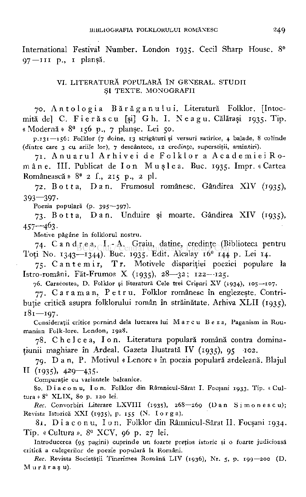

# International Festival Number. London1935.Cecil Sharp House.8° 97—inp.,Iplanşă.

VI. LITERATURĂ POPULARĂ ÎN GENERAL. STUDII ŞI TEXTE. MONOGRAFII

# 70.Antologi a Bărăganului . Literatură Folklor. [întocmită de] C. Fierăsc u [şi] G h. I. Neagu . Călăraşi1935.Tip. «Modernă»8° 156p., 7planşe. Lei50.

p .131—156 : Folklor (7 doine, 1 3 strigături şi versuri satirice, 4 balade, 8 colinde (dintre care 3 cu ariile lor), 7 descântece, 1 2 credinţe, superstiţii, amintiri).

# 71.Anuaru l Arhive i de Folklo r a AcademieiRo mâne . III. Publicat de Io n Muşlea . Buc.1935.Impr. « Cartea Românească»8° 2f.,215p., 2pl.

- 72.Botta, Dan . Frumosul românesc. Gândirea XI V(1935),

393—397-

Poezia populară (p. 395—397).

- 73.Botta, Dan . Unduire şi moarte. Gândirea XI V(1935),

457—4 3-

Motive păgâne în folklorul nostru.

- 74.C a n d r e a, I.-A . Graiu, datine, credinţe (Biblioteca pentru

Toţi No.1343—1344).Buc.1935.Edit. Alcalay16 144p. Lei14.

- 75.Cantemir , Tr . Motivele dispariţiei poeziei populare la

Istro-români. Făt-Frumos X(1935), 28—32; 122—125.

- 76. Caracostea, D. Folklor şi literatură Cele trei Crişuri XV (1934), 105—107.
- 77.Caraman , Petru . Folklor românesc în englezeşte. Contri­

# buţie critică asupra folklorului român în străinătate. Arhiva XLII(1935),

181—197.

Consideraţii critice pornind delà lucrarea lui M a r c u Beza manian Folk-lore. London, 1928.

# 78.Chelcea , Ion. Literatura populară română contra domina-

ţiunii maghiare în Ardeal. Gazeta Ilustrată IV(1935), 95—102.

# 79.Dan, P. Motivul « Lenore » în poezia populară ardeleană. Blajul

(1935), 429—435-

Comparaţie cu variantele balcanice.

#### 80. Diaco n u, Ion . Folklor din Râmnicul-Sărat I. Focşani 1933. Tip. «Cul­

tura » 8° XLIX, 80 p. 120 Iei.

Rec. Convorbiri Literare LXVIII (1935), 268—269 (Da n Simo n eseu) ; Revista Istorică XXI (1935), p. 155 (N. I o r g a).

# 81.Diaco n u, Ion. Folklor din Râmnicul-Sărat II. Focşani1934. Tip. « Cultura ».8°XCV,96p.27lei.

Introducerea (95 pagini) cuprinde un foarte preţios istoric şi o foarte judicioasă critică a culegerilor de poezie populară la Români.

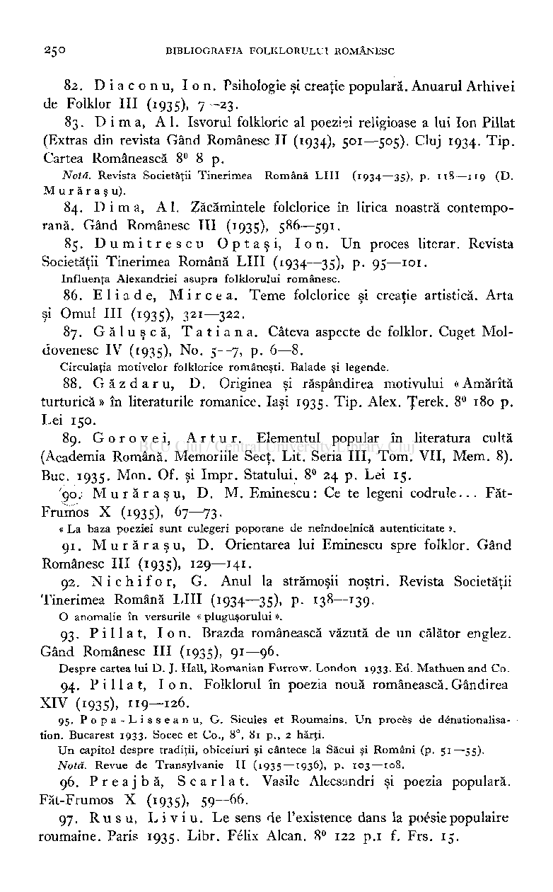

# 82.Diaco n u, Ion. Psihologie şi creaţie populară. Anuarul Arhivei

de Folklor III(1935), 7—23.

# 83.D i m a, Al. Isvorul folkloric al poeziei religioase a lui Ion Pillât

# (Extras din revista Gând Românesc II(1934), 501—505).Cluj1934.Tip. Cartea Românească8° 8p.

Notă. Revista Societăţii Tinerimea Română LIII (1934—35), p. 118—11 9 (D. M u r ă r a ş u).

# 84.D i m a, Al. Zăcămintele folclorice în lirica noastră contempo­

rană. Gând Românesc III(1935), 586—591.

# 85.Dumitresc u Optaşi , Ion. Un proces literar. Revista

Societăţii Tinerimea Română LIII(1934—35),p.95—101

Influenţa Alexandriei asupra folklorului românesc.

# 86.E1i a d e, M i r c e a. Teme folclorice şi creaţie artistică. Arta

şi Omul III(1935), 321—322.

# 87.Găluşcă , Tatiana . Câteva aspecte de folklor. Cuget Mol­

dovenesc IV(1935),No.5—7,p.6—8.

Circulaţia motivelor folklorice româneşti. Balade şi legende.

# 88.Găzdaru , D. Originea şi răspândirea motivului «Amărîtă

# turturică» în literaturile romanice. Iaşi1935.Tip. Alex. Ţerek.8° 180p. Lei150.

# 89.Gorovei , Artur . Elementul popular în literatura cultă (Academia Română. Memoriile Sect. Lit. Seria III, Tom. VII, Mem.8). Buc.1935.Mon. Of. şi Impr. Statului.8° 24p. Lei15.

# '90.Murăraşu , D. M . Eminescu : Ce te legeni codrule... FătFrurnos X(1935), 67—73.

« La baza poeziei sunt culegeri poporane de neîndoelnică autenticitate ».

# 91.Murăraşu , D. Orientarea lui Eminescu spre folklor. Gând

Românesc III(1935), 129—141.

# 92.N i c h i f o r, G. Anul la strămoşii noştri. Revista Societăţii

Tinerimea Română LIII(1934—35),p.138—139

O anomalie în versurile « pluguşorului ».

# 93.Pillât, Ion. Brazda românească văzută de un călător englez.

Gând Românesc III(1935), 91—96.

Despre cartea lui D. J. Hall, Romanian Furrow. London 1933. Ed. Mathuen and Co.

# 94.P i11a t, Ion. Folklorul în poezia nouă românească. Gândirea

XIV (1935), 119—126 .

##### 95. Popa-Lisseanu , G. Sicules et Roumains. Un procès de dénationalisa­

tion. Bucarest 1933. Socec et Co., 8°, 81 p., 2 hărţi. Un capitol despre tradiţii, obiceiuri şi cântece la Săcui şi Români (p. 51—55) . Notă. Revue de Transylvanie II (1935—1936), p. 103—108.

# 96.Preajbă , Scarlat . Vasile Alecsandri şi poezia populară.

Făt-Frumos X(1935), 59—66.

# 97.Rusu , L i viu. Le sens de l'existence dans la poésie populaire

# roumaine. Paris1935.Libr. Félix Alean.8° 122p.i f. Frs.15.

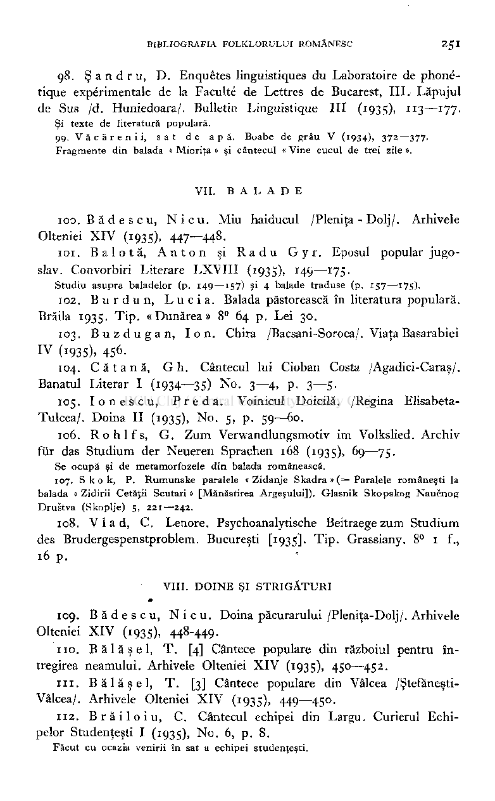

# 98.Şandru , D. Enquêtes linguistiques du Laboratoire de phoné­

# tique expérimentale de la Faculté de Lettres de Bucarest, III. Lăpujul de Sus /d. Huniedoara/, Bulletin Linguistique III(1935), 113—177.

Şi texte de literatură populară.

- 99. Văcărenii , sa t d e apă . Boabe de grâu V (1934), 372—377. Fragmente din balada « Mioriţa » şi cântecul « Vine cucul de trei zile ».

VII. BALAD E

- 100.Bădescu , Nicu . Miu haiducul /Pleniţa - Dolj/. Arhivele

Olteniei XIV(1935), 447—448.

- 101. Balotă , Anto n şi Rad u Gyr . Eposul popular Jugo­

slav. Convorbiri Literare LXVIII(1935), 149—175

Studiu asupra baladelor (p. 149—157) şi 4 balade traduse (p. 157—175) .

- 102.Burdun , Lucia . Balada păstorească în literatura populară.

Brăila1935.Tip. «Dunărea»8° 64p. Lei30.

- 103.Buzdugan , Ion. Chira /Bacsani-Soroca/. Viaţa Basarabiei

IV (1935), 456.

- 104.C ă t a n ă, G h. Cântecul lui Cioban Costa /Agadici-Caraş/.

Banatul Literar I(1934—35)

No

- 3—4»P-3~5-

- 105.Ionescu , Preda . Voinicul Doicilă. /Regina Elisabeta-

Tulcea/. Doina II(1935),No.5,p.59—60.

- 106.Rohlfs , G. Zum Verwandlungsmotiv im Volkslied. Archiv

für das Studium der Neueren Sprachen168 (1935), 69—75.

Se ocupă şi de metamorfozele din balada românească.

- 107. S k o k, P. Rumunske paralele « Zidanje Skadra »( = Paralele româneşti la

balada « Zidirii Cetăţii Scutari » [Mănăstirea Argeşului]). Glasnik Skopskog Naucnog Drustva (Skoplje) 5, 221—242.

# 108.V1a d, C. Lenore. Psychoanalytische Beitraegezum Studium des Brudergespenstproblem. Bucureşti[1935].Tip. Grassiany.8° 1 f., 16p.

#### VIII. DOINE ŞI STRIGĂTURI

m

# 109.Bădescu , Nicu . Doina păcurarului /Pleniţa-Dolj/. Arhivele

Olteniei XI V(1935), 44

"449-

8

# 110.Bălăşel , T.[4]Cântece populare din războiul pentru în­

tregirea neamului. Arhivele Olteniei XI V(1935), 450—452.

# 111.Bălăşel , T.[3]Cântece populare din Vâlcea /Ştefăneşti-

Vâlcea/. Arhivele Olteniei XI V(1935), 449—450.

# 112.Brăiloiu , C. Cântecul echipei din Largu. Curierul Echi­

# pelor Studenţeşti I(1935),No.6,p.8.

Făcut cu ocazia venirii în sat a echipei studenţeşti.

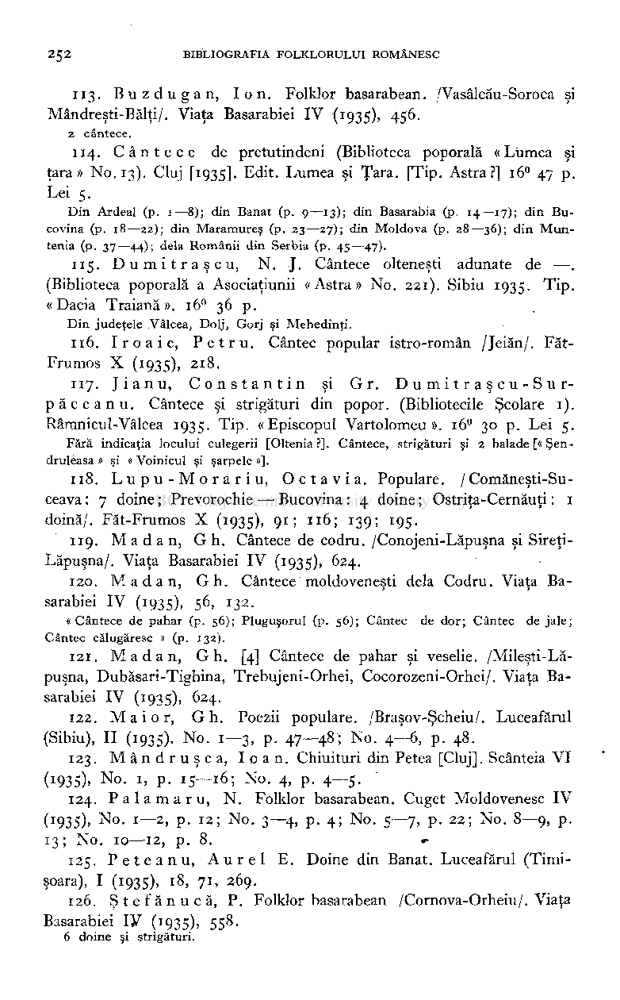

# 113.Buzdugan , Ion. Folklor basarabean. /Vasâlcău-Soroca şi

Mândreşti-Bălţi/. Viaţa Basarabiei IV(1935), 456.

2 cântece.

# 114.Cântec e de pretutindeni (Biblioteca poporală «Lumea şi

# ţara» No.13).Cluj[1935].Edit. Lumea şi Ţara. [Tip. Astra?]i6° 47p. Lei5.

Din Ardeal (p. 1—8) din Banat (p. 9—13) din Basarabia (p. 14—17) din Bucovina (p. 18—22) din Maramureş (p. 23—27); din Moldova (p. 28—36); din Muntenia (p. 37—44); delà Românii din Serbia (p. 45—47).

# 115.D u m i t r a ş c u, N. J. Cântece olteneşti adunate de —. (Biblioteca poporală a Asociaţiunii « Astra » No.221).Sibiu1935.Tip. «Dacia Traiană ».16

# 36p.

0

Din judeţele Vâlcea, Dolj, Gorj şi Mehedinţi.

# 116.Iroaie , Petru . Cântec popular istro-român /Jeiăn/. Făt-

Frumos X(1935), 218.

# 117.Jianu , Constanti n şi Gr . Dumitraşcu-Sur -

# păceanu . Cântece şi strigături din popor. (Bibliotecile Şcolare1). Râmnicul-Vâlcea1935.Tip. «Episcopul Vartolomeu ».16

# 30p. Lei5.

0

Fără indicaţia locului culegerii [Oltenia?]. Cântece, strigături şi 2 balade [« Şendruleasa » şi « Voinicul şi şarpele »].

# 118.Lupu-Morariu , Octavia . Populare. /Comăneşti-Su-

ceava : 7doine ; Prevorochie — Bucovina : 4doine ; Ostriţa-Cernăuţi : doină/. Făt-Frumos X(1935), 91; 116; 139; 195.

# 119.Madan , Gh . Cântece de codru. /Conojeni-Lăpuşna şi Sireţi-

Lăpuşna/. Viaţa Basarabiei IV(1935), 624.

# 120.Madan , G h. Cântece moldoveneşti delà Codru. Viaţa Ba­

sarabiei IV(1935), 56, 132.

«Cântece de pahar (p. 56); Pluguşorul (p. 56); Cântec de dor; Cântec de jale; Cântec călugăresc » (p. 132)

# 121.Madan , Gh.[4]Cântece de pahar şi veselie. /Mileşti-Lă-

puşna, Dubăsari-Tighina, Trebujeni-Orhei, Cocorozeni-Orhei/. Viaţa Basarabiei IV(1935), 624.

# 122.Maior , G h. Poezii populare. /Braşov-Şcheiu/. Luceafărul

(Sibiu), II(1935),No.1—3,p.47—48;No.4—6,p.48.

# 123.Mândruşca , loan. Chiuituri din Petea [Cluj]. Scânteia V

(1935), No . i, p . 15—16 No . 4, p . 4—5.

# 124.Palamaru , N. Folklor basarabean. Cuget Moldovenesc IV

(1935), No . 1—2, p . 12 ; No . 3—4, p . 4; No . 5—7, p . 22; No . 8—9, p . 13 No . 10—12 , p . 8.

# 125.Peteanu , Aure l E. Doine din Banat. Luceafărul (Timi­

şoara), I(1935), 18, 71, 269.

# 126.Ştefănucă , P. Folklor basarabean /Cornova-Orheiu/. Viaţa

Basarabiei D7(1935), 558.

#### 6 doine şi strigături.

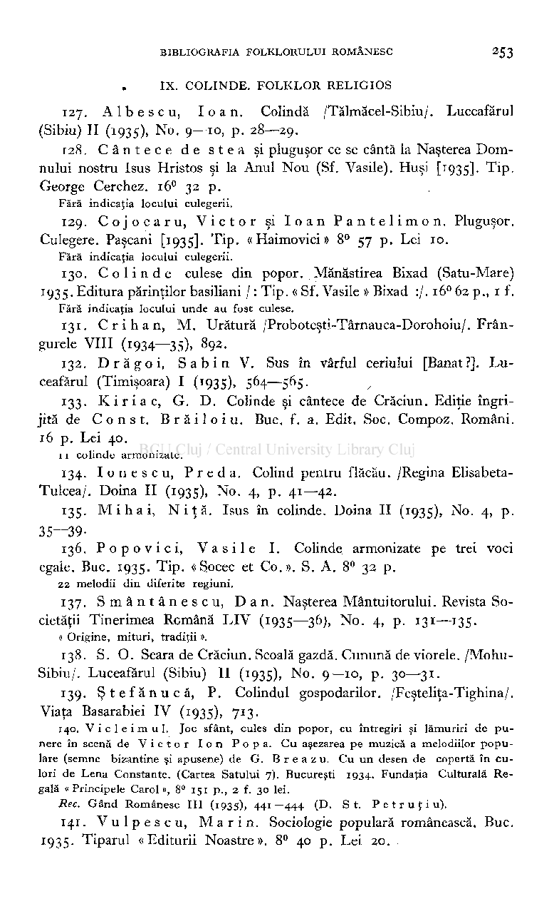

IX. COLINDE. FOLKLOR RELIGIOS

# 127.Al b es cu, loan . Colindă /Tălmăcel-Sibiu/. Luceafărul

(Sibiu) II(1935),No.9—10,p.28—29.

# 128.Cântec e de ste a şi pluguşor ce se cântă la Naşterea Dom­

# nului nostru Isus Hristos şi la Anul Nou (Sf. Vasile). Huşi[1935].Tip. George Cerchez.16

# 32p.

0

Fără indicaţia locului culegerii.

# 129.Cojoca r u, Victo r şi loa n Pantelimon . Pluguşor.

Culegere. Paşcani[1935].Tip. « Haimovici »8° 57p. Lei10.

Fără indicaţia locului culegerii.

# 130.Colind e culese din popor. Mănăstirea Bixad (Satu-Mare)

1935.Editura părinţilor basiliani / : Tip. « Sf. Vasile » Bixad :/.16 62p.,1

Fără indicaţia locului unde au fost culese.

# 131.Crihan , M. Urătură /Proboteşti-Târnauca-Dorohoiu/. Frân-

gurele VIII(1934—35), 892.

# 132.Drag o i, Sabi n V. Sus în vârful ceriului [Banat?]. Lu­

ceafărul (Timişoara) I(1935), 564—565.

# 133.K i r i a c, G. D. Colinde şi cântece de Crăciun. Ediţie îngri­

# jită de Const . Brăiloiu . Buc. f. a. Edit. Soc. Compoz. Români. 16p. Lei40.

11 colinde armonizate.

- 134.Ionescu , Preda . Colind pentru flăcău. /Regina ElisabetaTulcea/. Doina II(1935),No.4,p.41—42.
- 135 M i h a i, N i ţ ă. Isus în colinde. Doina II(1935),No.4,p. 35—39-

# 136.Popovici , Vasil e I. Colinde armonizate pe trei voci

egale. Buc.1935.Tip. «Socec et Co.». S. A.8° 32p.

22 melodii din diferite regiuni.

# 137.Smântânes c u, Dan . Naşterea Mântuitorului. Revista So­

cietăţii Tinerimea Română LI V(1935—36),No.4,p.131—135.

« Origine, mituri, tradiţii ».

# 138.S. O. Seara de Crăciun. Scoală gazdă. Cunună de viorele./Mohu-

Sibiu/. Luceafărul (Sibiu) II(1935),No.9—10,p.30—31.

# 139.Ştefănucâ , P. Colindul gospodarilor. /Feşteliţa-Tighina/.

Viaţa Basarabiei IV(1935), 713.

#### 140. Vicleimul . Joc sfânt, cules din popor, cu întregiri şi lămuriri de pu­

nere în scenă de Victo r Io n Popa . Cu aşezarea pe muzică a melodiilor populare (semne bizantine şi apusene) de G. B r e a z u. Cu un desen de copertă în culori de Lena Constante. (Cartea Satului 7). Bucureşti 1934 Fundaţia Culturală Regală « Principele Carol », 8° 151 p., 2 f. 30 lei.

Rec. Gând Românesc III (1935), 441—444 (D. St . P e t r u ţ i u).

# 141.Vulpes c u, Marin . Sociologie populară românească. Buc. 1935.Tiparul «Editurii Noastre».8° 40p. Lei20.

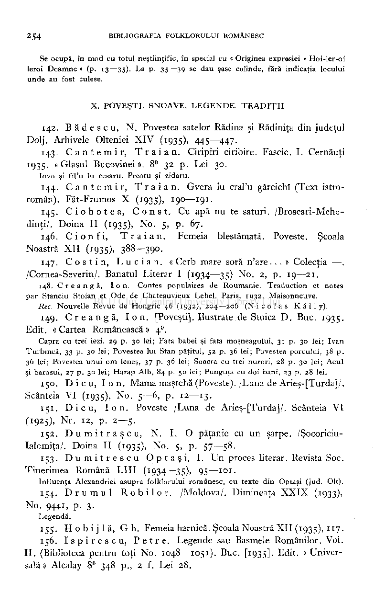

Se ocupă, în mod cu totul neştiinţific, în special cu « Originea exprasiei « Hoi-ler-oi Ieroi Doamne » (p. 13—35) La p. 35—39 se dau şase colinde, fără indicaţia locului unde au fost culese.

X. POVEŞTI. SNOAVE. LEGENDE. TRADIŢII

# 142.Bădescu , N. Povestea satelor Radina şi Radiniţa din judeţul

Dolj. Arhivele Olteniei XIV(1935), 445—447.

# 143.Cantemir , Traian . Ciripiri ciribire. Fascie. I. Cernăuţi

1935.«Glasul Bucovinei».8° 32p. Lei30.

Iovo şi fil'u lu cesaru. Preotu şi zidaru.

# 144.Cantemir , Traian . Gvera lu cral'u gărcichî (Text istro­

român). Făt-Frumos X(1935), 190—191.

# 145.Ciobotea , Const . Cu apă nu te saturi. /Broscari-Mehe-

dinţi/. Doina II(1935),No.5,p.67.

# 146.Cionfi , Traian . Femeia blestămată. Poveste. Şcoala

Noastră XII(1935), 388—-390.

# 147.C o s t i n, Lucian . « Cerb mare soră n'are...» Colecţia —.

/Cornea-Severin/. Banatul Literar I(1934—35)No.2,p.19—21.

#### 148. Creangă , Ion . Contes populaires de Roumanie. Traduction et notes

par Stanciu Stoian et Ode de Chateauvieux Lebel. Paris, 1932. Maisonneuve. Rec. Nouvelle Revue de Hongrie 46 (1932), 204—206 (Nicola s K â 1 1 y).

# 149.Creangă , Ion. [Poveşti]. Ilustrate de Stoica D. Buc.1935.

# Edit. «Cartea Românească»4.

Capra cu trei iezi. 29 p. 30 lei; Fata babei şi fata moşneagului, 31 p. 30 lei; Ivan Turbincă, 33 p. 30 lei; Povestea lui Stan păţitul, 52 p. 36 lei; Povestea porcului, 38 p. 36 lei; Povestea unui om leneş, 37 p. 36 lei; Soacra cu trei nurori, 28 p. 30 lei; Acul şi barosul, 27 p. 30 lei; Harap Alb, 84 p. 50 lei; Punguţa cu doi bani, 23 p. 28 lei.

- 150.Dieu, Ion. Mama maştehă (Poveste). /Luna de Arieş-[Turda]/.

Scânteia VI(1935),No.5—6,p.12—13.

- 151.Dieu, Ion. Poveste /Luna de Arieş-[Turda]/. Scânteia VI

(1925), Nr . 12, p . 2—5.

- 152.Dumitraşcu , N. I. O păţanie cu un şarpe. /Şocoriciu-

Ialcmiţa/. Doina II(1935),No.5,p.57—58.

- 153.Dumitresc u Optaşi , I. Un proces literar. Revista Soc.

Tinerimea Română LIII(1934—35), 95—101

Influenţa Alexandriei asupra folklorului românesc, cu texte din Optaşi (jud. Olt).

- 154.Drumu l Robilor . /Moldova/. Dimineaţa XXIX(1933),

No.9441,p.3.

Legendă.

- 155.Hobijlă , Gh . Femeia harnică. Şcoala Noastră XII(1935), 117.
- 156.Ispirescu , Petre . Legende sau Basmele Românilor. Voi.

# II. (Biblioteca pentru toţi No.1048—1051) Buc.[1935].Edit. «Univer­sală » Alcalay8° 348p.,2f. Lei28.

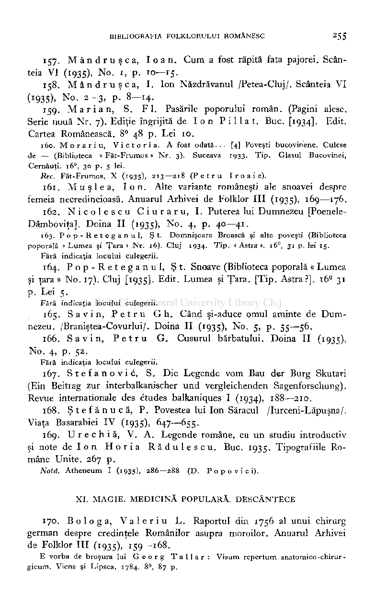

# 157.Mândruşca , loan. Cum a fost răpită fata pajorei. Scân­

teia VI(1935),No. i, p.10—15.

# 158.Mândruşca , I. Ion Năzdrăvanul /Petea-Cluj/. Scânteia VI

(1935), No . 2—3, p . 8—14.

# 159.Marian , S. FI. Pasările poporului român. (Pagini alese.

# Serie nouă Nr.7).Ediţie îngrijită de Ion Pillât. Buc.[1934].Edit. Cartea Românească.8° 48p. Lei10.

160. Morar i u, Victoria . A fost odată... [4] Poveşti bucovinene. Culese de — (Biblioteca « Făt-Frumos » Nr. 3). Suceava 1933 Tip. Glasul Bucovinei, Cernăuţi. i6°, 30 p. 5 lei.

Rec. Făt-Frumos, X (1935),

% (Petr u I r o a i e).

3 —

# 161.M u ş1e a, Ion. Alte variante româneşti ale snoavei despre

2I

2I

femeia necredincioasă. Anuarul Arhivei de Folklor III(1935), 169—176.

# 162.Nicole s cu C i u r a r u, I. Puterea lui Dumnezeu [Poenele-

Dâmboviţa]. Doina II(1935),No.4,p.40—41.

##### 163. Pop-Reteganul , Şt. Domnişoara Broască şi alte poveşti (Biblioteca

poporală «Lumea şi Ţara» Nr. 16) Cluj 1934 Tip. « Astra ». i6°, 31 p. lei 15 . Fără indicaţia locului culegerii.

# 164.Pop-Reteganul , Şt. Snoave (Biblioteca poporală « Lumea

# şi ţara » No.17).Cluj[1935].Edit. Lumea şi Ţara. [Tip. Astra?].i6° 31 p. Lei5.

Fără indicaţia locului culegerii.

# 165.Savin , Petr u Gh . Când şi-aduce omul aminte de Dum­

nezeu. /Braniştea-Covurlui/. Doina II(1935),No.5,p.55—56.

# 166.Savin , Petr u G. Cusurul bărbatului. Doina II(1935),

- No.4,p.52.

Fără indicaţia locului culegerii.

# 167.Stefanovic , S. Die Legende vom Bau der Burg Skutari

# (Ein Beitrag zur interbalkanischer und vergleichenden Sagenforschung). Revue internationale des etudes balkaniques I(1934), 188—210.

# 168.Ştefănucă , P. Povestea lui Ion Săracul /Iurceni-Lăpuşna/.

Viaţa Basarabiei IV(1935), 647—655.

# 169.U r e c h i ă, V. A. Legende române, cu un studiu introductiv

# si note de Io n Hori a Rădulescu . Buc.1935.Tipografiile Române Unite.267p.

Nota. Atheneum I (1935), 286—288 (D. P o p o v i c i).

XI. MAGIE. MEDICINĂ POPULARĂ. DESCÂNTECE

# 170.Bologa , Valeri u L . Raportul din1756al unui chirurg german despre credinţele Românilor asupra moroilor. Anuarul Arhivei de Folklor III(1935), 159—168.

E vorba de broşura lui Geor g Tallar : Visum repertum anatomico-chirurgicum. Viena şi Lipsea, 1784. 8°, 87 p.

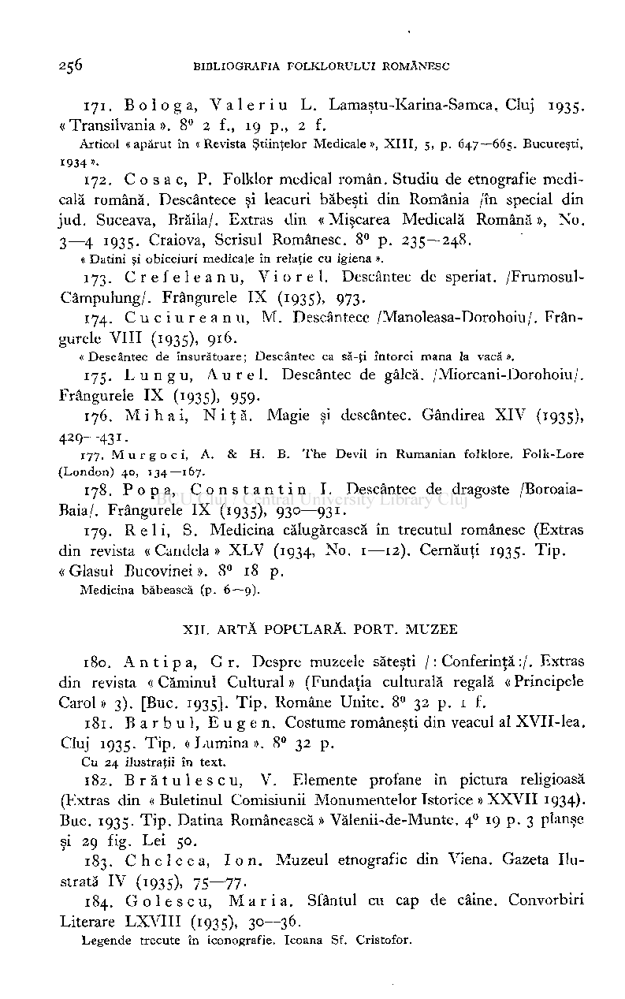

# 171. B o1o g a, Valeri u L . Lamaştu-Karina-Samca, Cluj1935. «Transilvania».8° 2f.,19p.,2f.

### Articol «apărut în «Revista Ştiinţelor Medicale», XIII, 5, p. 647—665. Bucureşti,

# 172.C o s a c, P. Folklor medical român. Studiu de etnografie medicală română. Descântece şi leacuri băbeşti din Romania /în special din jud. Suceava, Brăila/. Extras din «Mişcarea Medicală Română», No. 3—4 1935.Craiova, Scrisul Românesc.8°p.235—248.

1934 »•

« Datini şi obiceiuri medicale în relaţie cu igiena ».

# 173.Crefeleanu , Viorel . Descântec de speriat. /Frumosul-

Câmpulung/. Frângurele IX(1935), 973.

# 174.Cuciureanu , M. Descântece /Manoleasa-Dorohoiu/. Frân­

- gurele VIII(1935), 916.

«Descântec de însurătoare; Descântec ca să-ţi întorci mana la vacă».

# 175.L u n g u, Aurel . Descântec de gâlcă. /Miorcani-Dorohoiu/.

Frângurele IX(1935), 959.

# 176.M i h a i, N i ţ ă. Magie şi descântec. Gândirea XIV

429—43I-

### 177. M u r g o c i, A. & H. B. The Devil in Rumanian folklore. Folk-Lore

(London) 40, 134—167.

# 178.Popa , Constanti n I. Descântec de dragoste /Boroaia-

Baia/. Frângurele IX(1935), 930—931.

# 179.R e1i, S. Medicina călugărească în trecutul românesc (Extras

din revista «Candela» XL V(1934,No. Cernăuţi Tip. « Glasul Bucovinei ».8° 18p.

XII. ARTĂ POPULARĂ. PORT. MUZEE

# 180.A n t i p a, Gr . Despre muzeele săteşti /: Conferinţă :/'. Extras

# din revista « Căminul Cultural » (Fundaţia culturală regală « Principele Carol »3).[Buc.1935].Tip. Române Unite.8° 32p.1 f.

# 181. Barb u 1, Eugen . Costume româneşti din veacul al XVII-lea.

Cluj1935.Tip. «Lumina».8° 32p.

Cu 24 ilustraţii în text.

# 182.Brătulescu , V. Elemente profane în pictura religioasă

# (Extras din «Buletinul Comisiunii Monumentelor Istorice » XXVII1934). Buc.1935.Tip. Datina Românească» Vălenii-de-Munte.4

# 19p.3planşe şi29fig. Lei50.

0

# 183.Chelcea , Ion. Muzeul etnografic din Viena. Gazeta Ilu­

strată IV(1935), 75—77-

# 184.Golescu , Maria . Sfântul cu cap de câine. Convorbiri

# Literare LXVIII

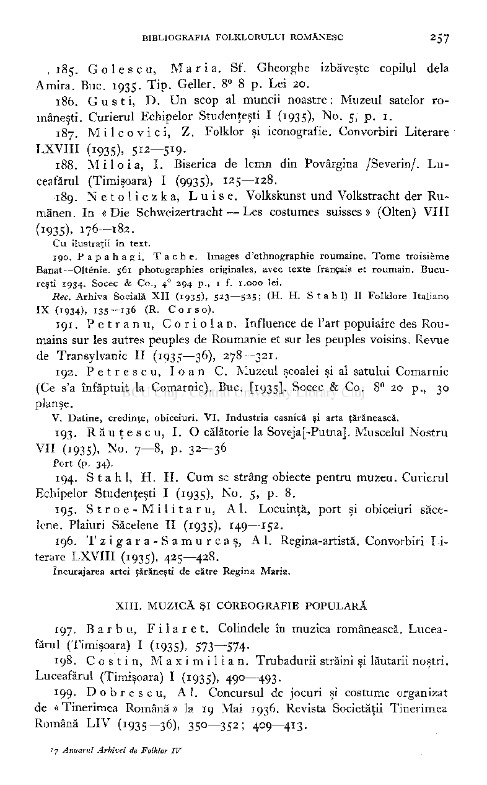

# , 185.Golescu , Maria . Sf. Gheorghe izbăveşte copilul delà Amira. Buc.1935.Tip. Geller.8° 8p. Lei20.

# 186.Guşti , D. Un scop al muncii noastre: Muzeul satelor ro­

mâneşti. Curierul Echipelor Studenţeşti I(1935),No.5,p.1.

# 187.Milcovici , Z. Folklor şi iconografie. Convorbiri Literare

LXVIII(1935), 512-519

# 188.M i 1 o i a, I. Biserica de lemn din Povârgina /Severin/. Lu­

ceafărul (Timişoara) I(9935), 125—128.

# 189.Netoliczka , Luise . Volkskunst und Volkstracht der Ru­

mänen. In «Die Schweizertracht — Les costumes suisses» (Ölten) VIII

(1935). 176—182.

Cu ilustraţii în text.

#### 190. Papahagi , Tache . Images d'ethnographie roumaine. Tome troisième

Banat—Oltenie. 561 photographies originales, avec texte français et roumain. Bucureşti 1934 Socec & Co., 4° 294 p., i f. 1.000 lei.

Rec. Arhiva Socială XII (1935), 523—525 (H. H. Stahl ) II Folklore Italiano IX (1934), 135 — 136 (R. Corso) .

- 191. Petranu , Coriolan . Influence de l'art populaire des Roumains sur les autres peuples de Roumanie et sur les peuples voisins. Revue de Transylvanie II(1935—36), 278—321.
- 192.Petrescu , loa n C. Muzeul şcoalei şi al satului Comarnic (Ce s'a înfăptuit la Comarnic). Buc.[1935].Socec & Co.8° 20p.,30 planşe.

V. Datine, credinţe, obiceiuri. VI. Industria casnică şi arta ţărănească.

# 193.Răuţescu , I. O călătorie la Soveja[-Putna]. Muscelul Nostru

VII (1935), No . 7—8, p . 32—36 Port (p. 34).

# 194.Stahl , H. H. Cum se strâng obiecte pentru muzeu. Curierul

Echipelor Studenţeşti I(1935),No.5,p.8.

# 195.Stroe-Militaru , Al. Locuinţă, port şi obiceiuri săce-

lene. Plaiuri Săcelene II(1935), 149—152.

# 196.Tzigara-Samurcaş , Al. Regina-artistă. Convorbiri I,i-

terare LXVIII(1935), 425—428.

încurajarea artei ţărăneşti de către Regina Maria.

XIII. MUZICĂ ŞI COREOGRAFIE POPULARĂ

# 197.Barbu , Filar e t. Colindele în muzica românească. Lucea­

fărul (Timişoara) I(1935), 573—574-

# 198.Costin , Maximilian . Trubadurii străini şi lăutarii noştri.

Luceafărul (Timişoara) I(1935), 490—493.

# 199.Dobrescu , Al. Concursul de jocuri şi costume organizat

# de «Tinerimea Română» la19Mai1936.Revista Societăţii Tinerimea Română LI V(1935—36), 350—352; 409—413.

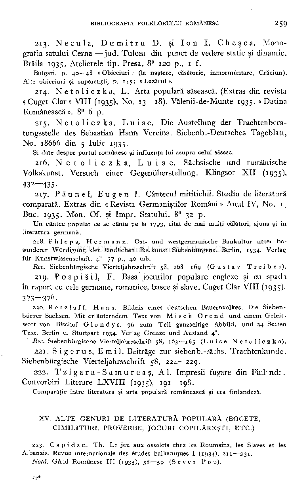

# 213.Necula , Dumitr u D. şi Ion I. Cheşca . Monografia satului Cerna —jud. Tulcea din punct de vedere static şi dinamic. Brăila1935.Atelierele tip. Presa.8° 120p.,1f.

Bulgari, p. 40—48 « Obiceiuri » (la naştere, căsătorie, înmormântare, Crăciun). Alte obiceiuri şi superstiţii, p. 115 : « Lazărul ».

- 214.Netoliczka , L . Arta populară săsească. (Extras din revista « Cuget Clar » VIII(1935),No.13—18).Vălenii-de-Munte1935.« Datina Românească ».8° 6p.
- 215.Netoliczka , Luise . Die Austeilung der Trachtenberatungsstelle des Sebastian Hann Vereins. Siebenb.-Deutsches Tageblatt, No.18666din5Iulie1935.

Şi date despre portul românesc şi influenţa lui asupra celui săsesc.

# 216.Netoliczka , Luise . Sächsische und rumänische

Volkskunst. Versuch einer Gegenüberstellung. Klingsor XII(1935),

432—435-

# 217.Păunei , Euge n I. Cântecul mititichii. Studiu de literatură

# comparată. Extras din «Revista Germaniştilor Români» Anul IV, No.1. Buc.1935.Mon. Of. şi Impr. Statului.8° 32p.

Un cântec popular ce se cânta pe la 1793, citat de mai mulţi călători, ajuns şi în literatura germană.

218. Phleps , Hermann . Ost- und westgermanische Baukultur unter besonderer Würdigung der ländlichen Baukunst Siebenbürgens. Berlin, 1934. Verlag für Kunstwissenschaft. 4° 77 p., 40 tab.

Rec. Siebenbürgische Vierteljahrsschrift 58, 168—169 (Gusta v Treiber) .

# 219.Pospiăil , F. Basa jocurilor populare engleze şi cu spadi în raport cu cele germane, romanice, basce şi slave. Cuget Clar VIII(1935)»

373-376 .

220. Retzlaff , Hans . Bildnis eines deutschen Bauernvolkes. Die Siebenbürger Sachsen. Mit erläuterndem Text von Misc h Oren d und einem Geleitwort von Bischof G1 o n d y s. 96 zum Teil ganzseitige Abbild, und 24 Seiten Text. Berlin u. Stuttgart 1934. Verlag Grenze und Ausland 4

. Ree. Siebenbürgische Vierteljahrsschrift 58, 163—165 (Luis e Netoliczka) .

0

# 221. Sigerus , Emil . Beiträge zur siebenb.-sächs. Trachtenkunde.

Siebenbürgische Vierteljahrsschrift58, 224—229.

# 222.Tzigara-Samurcaş , Al. Impresii fugare din Finirnd?.

Convorbiri Literare LXVIII(1935), 191—198

Comparaţie între literatura şi arta populară românească şi cea finlandeză.

XV. ALTE GENURI DE LITERATURĂ POPULARĂ (BOCETE, CIMILITURI, PROVERBE, JOCURI COPILĂREŞTI, ETC.)

##### 223. C a p i d a n, Th. Le jeu aux osselets chez les Roumains, les Slaves et les

Albanais. Revue internationale des études balkaniques I (1934), 2ii—231 . Notă. Gând Românesc III (1935), 58—59 (Seve r Pop) .

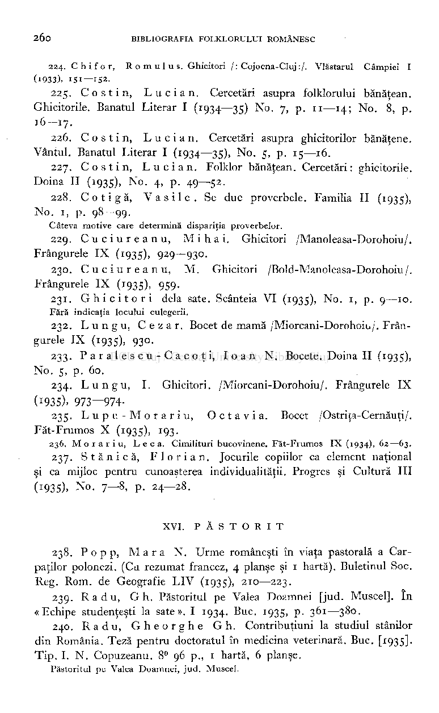

#### 224. Chifor , Romulus . Ghicitori /: Cojocna-Cluj:/. Vlăstarul Câmpiei I

(1933), 151—152 .

# 225.Costin , Lucian . Cercetări asupra folklorului bănăţean. Ghicitorile. Banatul Literar I(1934—35)No.7,p.11—14;No.8,p.

16—17.

# 226.Costin , Lucian . Cercetări asupra ghicitorilor bănăţene.

Vântul. Banatul Literar I(1934—35),No.5,p.15—16.

# 227.Costin , Lucian . Folklor bănăţean. Cercetări: ghicitorile.

Doina II(1935),No.4,p.49—^52.

# 228.Cotigă , Vasile . Se duc proverbele. Familia II(1935),

No. i, p . 98—99.

Câteva motive care determină dispariţia proverbelor.

# 229.Cuciureanu , Mihai . Ghicitori /Manoleasa-Dorohoiu/.

Frângurele IX(1935), 929—930.

# 230.Cuciureanu , M.Ghicitori /Bold-Manoleasa-Dorohoiu/.

Frângurele IX(1935), 959.

# 231.Ghicitor i delà sate. Scânteia VI(1935),No.1,p.9—10.

Fără indicaţia locului culegerii.

# 232.Lungu , Cezar . Bocet de mamă /Miorcani-Dorohoiu/. Frân­

gurele IX(1935), 930.

# 233.Paralescu-Cacoţi , loa n N. Bocete. Doina II(1935),

No.5,p.60.

# 234.Lungu , I . Ghicitori. /Miorcani-Dorohoiu/. Frângurele IX

(

35)> 973—974-

IQ

- 235.L u pv.- M o r a r i u, Octavia . Bocet /Ostrka-Cernăuţi/.

Făt-Frumos X(1935), 193.

- 236. Morar i u, Leca . Cimilituri bucovinene. Făt-Frumos IX (1934), 62—63.
- 237.Stanică , Florian . Jocurile copiilor ca element naţional

# şi ca mijloc pentru cunoaşterea individualităţii. Progres şi Cultură III

C^) . No 7—8, p . 24—28.

XVI. PĂSTORI T

# 238.Popp , Mar a N. Urme româneşti în viaţa pastorală a Carpaţilor polonezi. (Cu rezumat francez,4planşe şi1hartă). Buletinul Soc. Reg. Rom. de Geografie LIV(1935), 210—223.

# 239.Radu , Gh . Păstoritul pe Valea Doamnei [jud. Muscel]. în

«Echipe studenţeşti la sate». I1934.Buc.1935,p.361—380.

# 240.Radu , Gheorgh e Gh. Contribuţiuni la studiul stânUor

# din România. Teză pentru doctoratul în medicina veterinară. Buc.[1935]. Tip. I. N. Copuzeanu.8° 96p.,1hartă,6planşe.

Păstoritul pe Valea Doamnei, jud. Muscel.

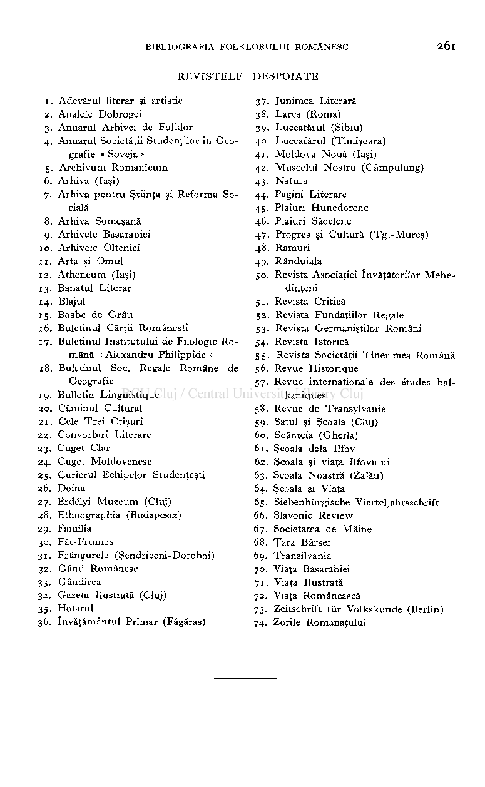

REVISTELE DESPOIATE

- 1. Adevărul literar şi artistic
- 2. Analele Dobrogei
- 3. Anuarul Arhivei de Folklor
- 4. Anuarul Societăţii Studenţilor în Geografie « Soveja »
- 5. Archivum Romanicum
- 6. Arhiva (Iaşi)
- 7. Arhiva pentru Ştiinţa şi Reforma Socială
- 8. Arhiva Someşană
- 9. Arhivele Basarabiei
- 10. Arhivele Olteniei
- 11 . Arta şi Omul
- 12. Atheneum (Iaşi)
- 13. Banatul Literar
- 14. Blajul
- 15. Boabe de Grâu
- 16. Buletinul Cărţii Româneşti
- 17. Buletinul Institutului de Filologie Română « Alexandru Philippide »
- 18. Buletinul Soc. Regale Române de Geografie
- 19. Bulletin Linguistique
- 20. Căminul Cultural
- 21. Cele Trei Crişuri
- 22. Convorbiri Literare
- 23. Cuget Clar
- 24. Cuget Moldovenesc
- 25. Curierul Echipelor Studenţeşti
- 26. Doina
- 27. Erdélyi Muzeum (Cluj)
- 28. Ethnographia (Budapesta)
- 29. Familia
- 30. Făt-Frumos
- 31. Frângurele (Şendriceni-Dorohoi)
- 32. Gând Românesc
- 33. Gândirea
- 34. Gazeta Ilustrată (Cluj)
- 35. Hotarul
- 36. învăţământul Primar (Făgăraş)

- 37. Junimea Literară
- 38. Lares (Roma)
- 39. Luceafărul (Sibiu)
- 40. Luceafărul (Timişoara)
- 41. Moldova Nouă (Iaşi)
- 42. Muscelul Nostru (Câmpulung)
- 43. Natura
- 44. Pagini Literare
- 45. Plaiuri Hunedorene
- 46. Plaiuri Săcelene
- 47. Progres şi Cultură (Tg.-Mureş)
- 48. Ramuri
- 49. Rânduiala
- 50. Revista Asociaţiei învăţătorilor Mehedinţeni
- 51. Revista Critică
- 52. Revista Fundaţiilor Regale
- 53. Revista Germaniştilor Români
- 54. Revista Istorică
- 55. Revista Societăţii Tinerimea Română
- 56. Revue Historique
- 57. Revue internationale des études balkaniques
- 58. Revue de Transylvanie
- 59. Satul şi Şcoala (Cluj)
- 60. Scânteia (Gherla)
- 61. Şcoala delà Ilfov
- 62. Şcoala şi viaţa Ilfovului
- 63. Şcoala Noastră (Zalău)
- 64. Şcoala şi Viaţa
- 65. Siebenbürgische Vierteljahrsschrift
- 66. Slavonie Review
- 67. Societatea de Mâine
- 68. Ţara Bârsei
- 69. Transilvania
- 70. Viaţa Basarabiei
- 71 Viaţa Ilustrată
- 72. Viaţa Românească
- 73. Zeitschrift für Volkskunde (Berlin)
- 74. Zorile Romanaţului

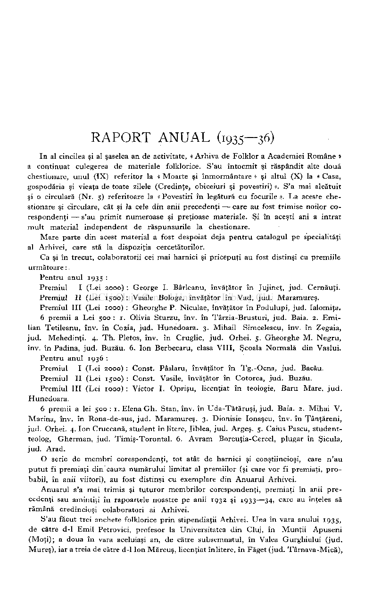

## RAPORT ANUAL(1935—36)

In al cincilea şi al şaselea an de activitate, « Arhiva de Folklor a Academiei Române » a continuat culegerea de materiale folklorice. S'au întocmit şi răspândit alte două chestionare, unul (IX) referitor la « Moarte şi înmormântare » şi altul (X) la « Casa, gospodăria şi vieaţa de toate zilele (Credinţe, obiceiuri şi povestiri) ». S'a mai alcătuit şi o circulară (Nr. 5) referitoare la « Povestiri în legătură cu focurile ». La aceste chestionare şi circulare, cât şi la cele din anii precedenţi — care au fost trimise noilor corespondenţi — s'au primit numeroase şi preţioase materiale. Şi în aceşti ani a intrat mult material independent de răspunsurile la chestionare.

Mare parte din acest material a fost despoiat deja pentru catalogul pe specialităţi al Arhivei, care stă la dispoziţia cercetătorilor.

Ca şi în trecut, colaboratorii cei mai harnici şi pricepuţi au fost distinşi cu premiile următoare :

Pentru anul 1935 :

- Premiul I (Lei 2000) : George I. Bârleanu, învăţător în Jujineţ, jud. Cernăuţi.
- Premiul II (Lei 1500) : Vasile Bologa, învăţător în Vad, jud. Maramureş.
- Premiul III (Lei 1000) : Gheorghe P. Niculae, învăţător în Podulupi, jud. Ialomiţa. 6 premii a Lei 500 : 1 Olivia Sturzu, înv. în Târzia-Brusturi, jud. Baia. 2. Emi-

lian Tetileanu, înv. în Cozia, jud. Hunedoara. 3. Mihail Simcelescu, înv. în Zegaia, jud. Mehedinţi. 4. Th. Pletos, înv. în Cruglic, jud. Orhei. 5. Gheorghe M. Negru, înv. în Padina, jud. Buzău. 6. Ion Berbecaru, clasa VIII, Şcoala Normală din Vaslui.

Pentru anul 1936 :

- Premiul I (Lei 2000) : Const. Pâslaru, învăţător în Tg.-Ocna, jud. Bacău.
- Premiul II (Lei 1500) : Const. Vasile, învăţător în Cotorca, jud. Buzău.
- Premiul III (Lei 1000) : Victor I. Oprişu, licenţiat în teologie, Baru Mare, jud.

Hunedoara.

6 premii a lei 500 : 1 Elena Gh. Stan, înv. în Uda-Tatăruşi, jud. Baia. 2. Mihai V. Marina, înv. în Rona-de-sus, jud. Maramureş. 3. Dionisie Ionaşcu, înv. în Ţânţăreni, jud. Orhei. 4. Ion Cruceană, student în litere, Jiblea, jud. Argeş. 5. Caius Pascu, student teolog, Gherman, jud. Timiş-Torontal. 6. Avram Borcuţia-Cercel, plugar în Şicula, jud. Arad.

O serie de membri corespondenţi, tot atât de harnici şi conştiincioşi, care n'au putut fi premiaţi din cauza numărului limitat al premiilor (şi care vor fi premiaţi, probabil, în anii viitori), au fost distinşi cu exemplare din Anuarul Arhivei.

Anuarul s'a mai trimis şi tuturor membrilor corespondenţi, premiaţi în anii precedenţi sau amintiţi în rapoartele noastre pe anii 1932 şi 1933—34 care au înţeles să rămână credincioşi colaboratori ai Arhivei.

S'au făcut trei anchete folklorice prin stipendiaţii Arhivei. Una în vara anului 1935, de către d-1 Emil Petrovici, profesor la Universitatea din Cluj, în Munţii Apuseni (Moţi); a doua în vara aceluiaşi an, de către subsemnatul, în Valea Gurghiului (jud. Mureş), iar a treia de către d-1 Ion Mărcuş, licenţiat în litere, în Făget (jud. Târnava-Mică),

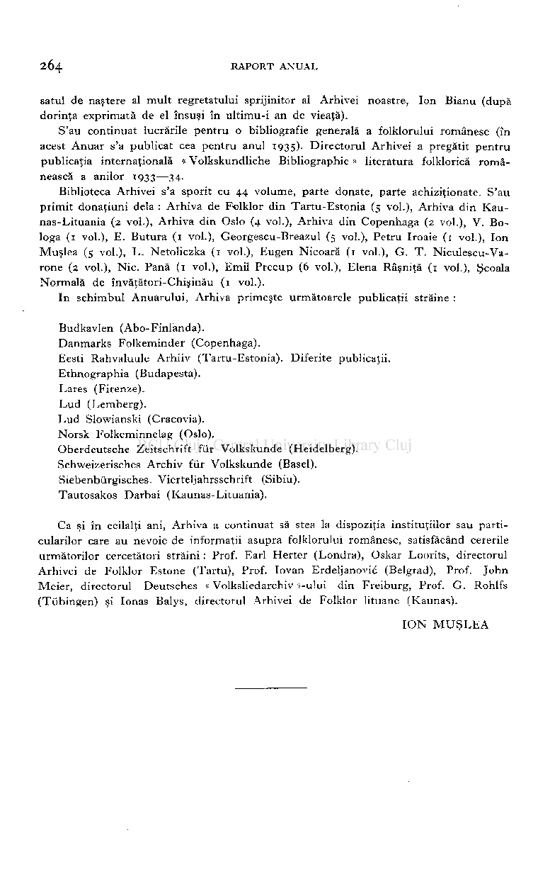

264 RAPORT ANUA L

satul de naştere al mult regretatului sprijinitor al Arhivei noastre, Ion Bianu (după dorinţa exprimată de el însuşi în ultimu-i an de vieaţă).

S'au continuat lucrările pentru o bibliografie generală a folklorului românesc (în acest Anuar s'a publicat cea pentru anul 1935). Directorul Arhivei a pregătit pentru publicaţia internaţională « Volkskundliche Bibliographie » literatura folklorică românească a anilor 1933—34.

Biblioteca Arhivei s'a sporit cu 44 volume, parte donate, parte achiziţionate. S'au primit donaţiuni delà : Arhiva de Folklor din Tartu-Estonia (5 vol.), Arhiva din Kaunas-Lituania (2 vol.), Arhiva din Oslo (4 vol.), Arhiva din Copenhaga (2 vol.), V. Bologa (1 vol.), E. Butura (1 vol.), Georgescu-Breazul (5 vol.), Petru Iroaie (1 vol.), Ion Muşlea (5 vol.), L. Netoliczka (1 vol.), Eugen Nicoară (1 vol.), G. T. Niculescu-Varone (2 vol.), Nie. Pană (1 vol.), Emil Precup (6 vol.), Elena Râşniţă (1 vol.), Şcoala Normală de învăţători-Chişinău (1 vol.).

In schimbul Anuarului, Arhiva primeşte următoarele publicaţii străine :

Budkavlen (Abo-Finlanda). Danmarks Folkeminder (Copenhaga). Eesti Rahvaluule Arhiiv (Tartu-Estonia). Diferite publicaţii. Ethnographia (Budapesta). Lares (Firenze). Lud (Lemberg). Lud Slowianski (Cracovia). Norsk Folkeminnelag (Oslo). Oberdeutsche Zeitschrift für Volkskunde (Heidelberg). Schweizerisches Archiv für Volkskunde (Basel). Siebenbürgisches. Vierteljahrsschrift (Sibiu). Tautosakos Darbai (Kaunas-Lituania).

Ca şi în ceilalţi ani, Arhiva a continuat să stea la dispoziţia instituţiilor sau particularilor care au nevoie de informaţii asupra folklorului românesc, satisfăcând cererile următorilor cercetători străini : Prof. Earl Herter (Londra), Oskar Loorits, directorul Arhivei de Folklor Estone (Tartu), Prof. Iovan Erdeljanovic (Belgrad), Prof. John Meier, directorul Deutsches « Volksliedarchiv »-ului din Freiburg, Prof. G. Rohlfs (Tübingen) şi Ionas Balys, directorul Arhivei de Folklor lituane (Kaunas).

ION MUŞLEA

