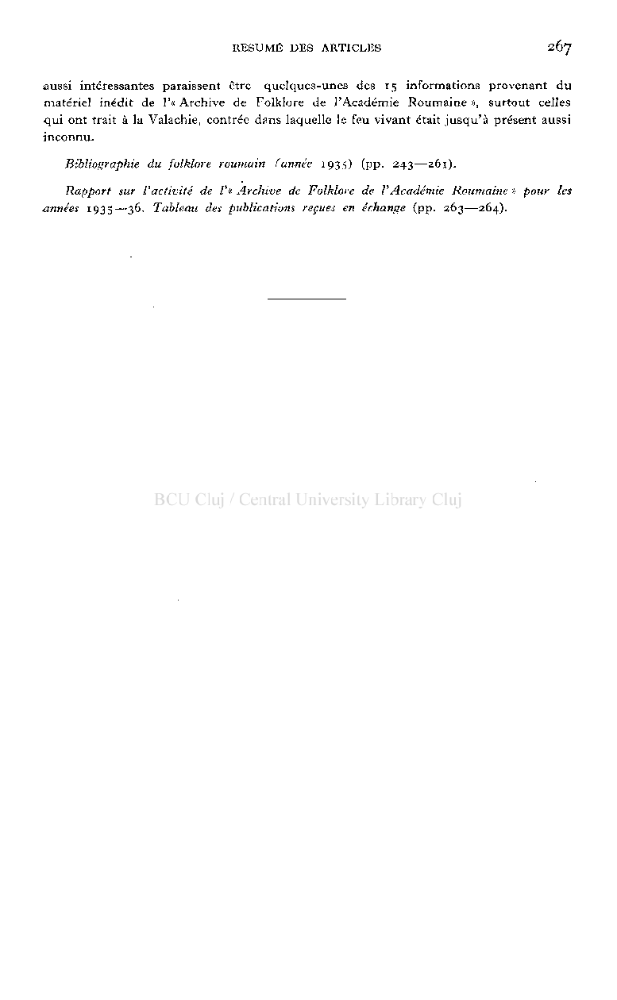

# RESUME DES ARTICLES 267

aussi intéressantes paraissent être quelques-unes des 1 5 informations provenant du matériel inédit de 1'« Archive de Folklore de l'Académie Roumaine », surtout celles qui ont trait à la Valachie, contrée dans laquelle le feu vivant était jusqu'à présent aussi inconnu.

Bibliographie du folklore roumain (année 1935) (pp. 243—261). Rapport sur l'activité de /'« Archive de Folklore de VAcadémie Roumaine » pour les

années 1935—36. Tableau des publications reçues en échange (pp. 263—264).

