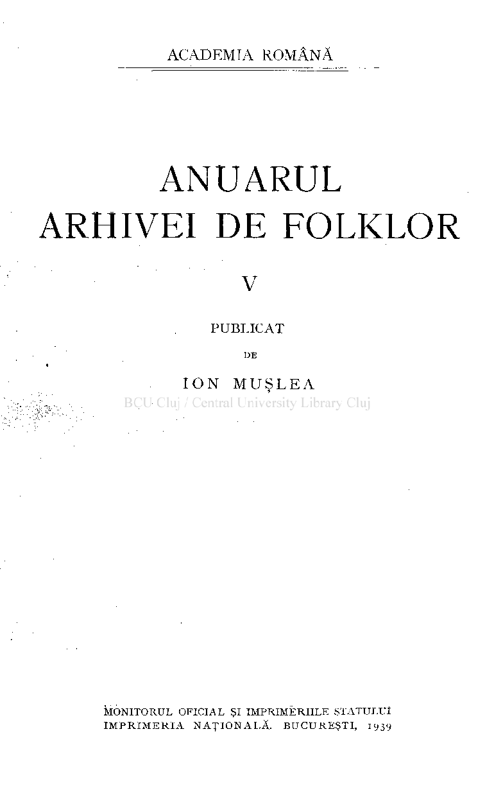
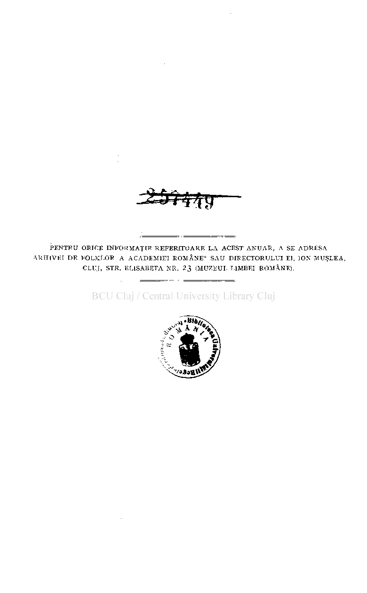
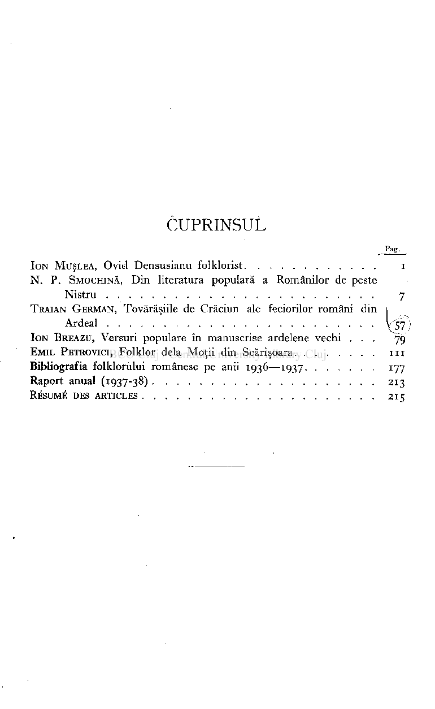
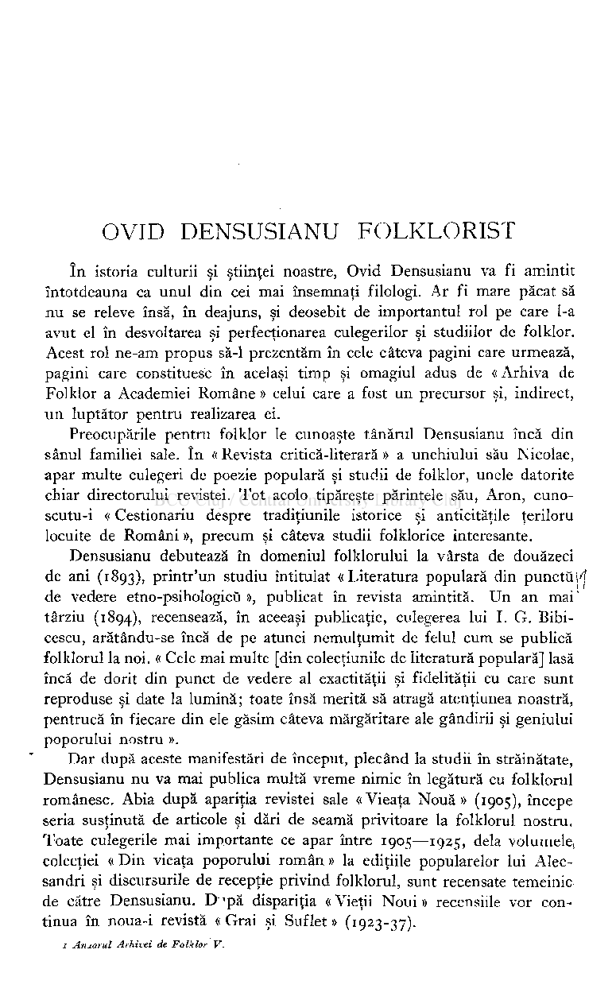
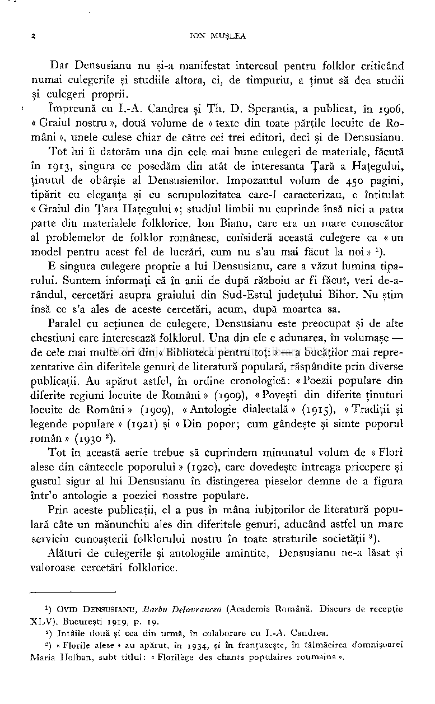
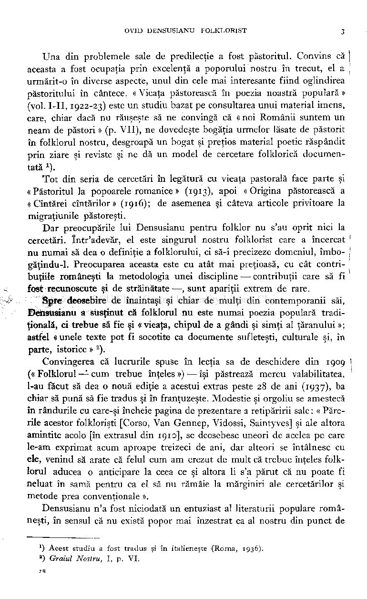

# ANUARUL ARHIVEI DE FOLKLOR

v

PUBLICAT

DE

### IO N MUŞLE A

MONITORU L OFICIA L ŞI IMPRIMERIIL E STATULU I IMPRIMERI A NAŢIONALĂ . BUCUREŞTI , 1939

##### PENTRU ORICE INFORMAŢIE REFERITOARE L A ACEST ANUAR , A SE ADRESA ARHIVEI DE FOLKLOF A ACADEMIEI ROMÂNE" SAU DIRECTORULUI EI, ION MUŞLEA, CLUJ, STR. ELISABETA NE 23 (MUZEUL LIMBEI ROMÂNE).

## CUPRINSUL

Pag.

ION MUŞLEA, Ovid Densusianu folklorist i N. P. SMOCHINĂ, Din literatura populară a Românilor de peste

Nistru 7 TRAIAN GERMAN, Tovărăşiile de Crăciun ale feciorilor români din i

Ardeal

ION BREAZU, Versuri populare în manuscrise ardelene vechi .. . 79 EMIL PETROVICI, Folklor delà Moţii din Scărişoara II I Bibliografia folklorului românesc pe anii 1936—1937 177 Raport anual (1937-38) 213

RÉSUMÉ DES ARTICLES 215

## OVID DENSUSIANU FOLKLORIST

în istoria culturii şi ştiinţei noastre, Ovid Densusianu va fi amintit întotdeauna ca unul din cei mai însemnaţi filologi. Ar fi mare păcat să nu se releve însă, în deajuns, şi deosebit de importantul rol pe care 1-a avut el în desvoltarea şi perfecţionarea culegerilor şi studiilor de folklor. Acest rol ne-am propus să-1 prezentăm în cele câteva pagini care urmează, pagini care constituesc în acelaşi timp şi omagiul adus de « Arhiva de Folklor a Academiei Române » celui care a fost un precursor şi, indirect, un luptător pentru realizarea ei.

Preocupările pentru folklor le cunoaşte tânărul Densusianu încă din

- sânul familiei sale. în « Revista critică-literară » a unchiului său Nicolae, apar multe culegeri de poezie populară şi studii de folklor, unele datorite chiar directorului revistei. Tot acolo tipăreşte părintele său, Aron, cunoscutu-i << Cestionariu despre tradiţiunile istorice şi anticităţile ţeriloru locuite de Români », precum şi câteva studii folklorice interesante.

Densusianu debutează în domeniul folklorului la vârsta de douăzeci de ani (1893), printr'un studiu întitulat « Literatura populară din punctüj'f de vedere etno-psihologicü », publicat în revista amintită. Un an mai '

- târziu (1894), recensează, în aceeaşi publicaţie, culegerea lui I. G. Bibicescu, arătându-se încă de pe atunci nemulţumit de felul cum se publică folklorul la noi. « Cele mai multe [din colecţiunile de literatură populară] lasă încă de dorit din punct de vedere al exactităţii şi fidelităţii cu care sunt reproduse şi date la lumină; toate însă merită să atragă atenţiunea noastră, pentrucă în fiecare din ele găsim câteva mărgăritare ale gândirii şi geniului poporului nostru ».

Dar după aceste manifestări de început, plecând la studii în străinătate, Densusianu nu va mai publica multă vreme nimic în legătură cu folklorul românesc. Abia după apariţia revistei sale « Vieaţa Nouă » (1905), începe seria susţinută de articole şi dări de seamă privitoare la folklorul nostru. Toate culegerile mai importante ce apar între 1905—1925, delà volumele, colecţiei « Din vieaţa poporului român » la ediţiile popularelor lui Alecsandri şi discursurile de recepţie privind folklorul, sunt recensate temeinic de către Densusianu. D *pă dispariţia «Vieţii Noui » recensiile vor continua în noua-i revistă «Grai şi Suflet» (1923-37).

1 Anuarul Arhivei de Folklor V.

Dar Densusianu nu şi-a manifestat interesul pentru folklor criticând numai culegerile şi studiile altora, ci, de timpuriu, a ţinut să dea studii şi culegeri proprii.

împreună cu I.-A. Candrea şi Th. D. Sperantia, a publicat, în 1906, « Graiul nostru », două volume de « texte din toate părţile locuite de Români », unele culese chiar de către cei trei editori, deci şi de Densusianu.

Tot lui îi datorăm una din cele mai bune culegeri de materiale, făcută în 1913, singura ce posedăm din atât de interesanta Ţară a Haţegului, ţinutul de obârşie al Densusienilor. Impozantul volum de 450 pagini, tipărit cu eleganţa şi cu scrupulozitatea care-1 caracterizau, e întitulat « Graiul din Ţara Haţegului »; studiul limbii nu cuprinde însă nici a patra parte din materialele folklorice. Ion Bianu, care era un mare cunoscător al problemelor de folklor românesc, consideră această culegere ca « un model pentru acest fel de lucrări, cum nu s'au mai făcut la noi »

E singura culegere proprie a lui Densusianu, care a văzut lumina tiparului. Suntem informaţi că în anii de după războiu ar fi făcut, veri de-arândul, cercetări asupra graiului din Sud-Estul judeţului Bihor. Nu ştim însă ce s'a ales de aceste cercetări, acum, după moartea sa.

Paralel cu acţiunea de culegere, Densusianu este preocupat şi de alte chestiuni care interesează folklorul. Una din ele e adunarea, în volumaşe de cele mai multe ori din « Biblioteca pentru toţi » — a bucăţilor mai reprezentative din diferitele genuri de literatură populară, răspândite prin diverse publicaţii. Au apărut astfel, în ordine cronologică: «Poezii populare din diferite regiuni locuite de Români » (1909), « Poveşti din diferite ţinuturi locuite de Români» (1909), «Antologie dialectală» (1915), «Tradiţii şi legende populare » (1921) şi « Din popor; cum gândeşte şi simte poporul român » (1930 ).

Tot în această serie trebue să cuprindem minunatul volum de « Flori alese din cântecele poporului » (1920), care dovedeşte întreaga pricepere şi gustul sigur al lui Densusianu în distingerea pieselor demne de a figura într'o antologie a poeziei noastre populare.

Prin aceste publicaţii, el a pus în mâna iubitorilor de literatură populară câte un mănunchiu ales din diferitele genuri, aducând astfel un mare serviciu cunoaşterii folklorului nostru în toate straturile societăţii

).

3

Alături de culegerile şi antologiile amintite, Densusianu ne-a lăsat şi valoroase cercetări folklorice.

#### ) OVID DENSUSIANU, Barbu Delavrancea (Academia Română. Discurs de recepţie XLV) . Bucureşti 1919, p. 19.

1

- 2

) Intâile două şi cea din urmă, în colaborare cu I.-A. Candrea.

- 3

#### ) « Florile alese » au apărut, în 1934, şi în franţuzeşte, în tălmăcirea domnişoarei Maria Holban, subt titlul: «Florilège des chants populaires roumains».

Una din problemele sale de predilecţie a fost păstoritul. Convins că aceasta a fost ocupaţia prin excelenţă a poporului nostru în trecut, el a urmărit-o în diverse aspecte, unul din cele mai interesante fiind oglindirea păstoritului în cântece. « Vieaţa păstorească în poezia noastră populară » (vol. I-II, 1922-23) este un studiu bazat pe consultarea unui material imens, care, chiar dacă nu răuşeşte să ne convingă că « noi Românii suntem un neam de păstori » (p. VII), ne dovedeşte bogăţia urmelor lăsate de păstorit în folklorul nostru, desgroapă un bogat şi preţios material poetic răspândit prin ziare şi reviste şi ne dă un model de cercetare folklorică documentată ).

Tot din seria de cercetări în legătură cu vieaţa pastorală face parte şi « Păstoritul la popoarele romanice » (1913), apoi « Origina păstorească a « Cîntărei cîntărilor » (1916); de asemenea şi câteva articole privitoare la migraţiunile păstoreşti.

Dar preocupările lui Densusianu pentru folklor nu s'au oprit nici la cercetări. într'adevăr, el este singurul nostru folklorist care a încercat nu numai să dea o definiţie a folklorului, ci să-i precizeze domeniul, îmbogăţindu-1. Preocuparea aceasta este cu atât mai preţioasă, cu cât contribuţiile româneşti la metodologia unei discipline —• contribuţii care să fi fost recunoscute şi de străinătate —, sunt apariţii extrem de rare.

Spre deosebire de înaintaşi şi chiar de mulţi din contemporanii săi, Densusianu a susţinut că folklorul nu este numai poezia populară tradiţională, ci trebue să fie şi «vieaţa, chipul de a gândi şi simţi al ţăranului »; astfel « unele texte pot fi socotite ca documente sufleteşti, culturale şi, în parte, istorice » ).

Convingerea că lucrurile spuse în lecţia sa de deschidere din 1909 (« Folklorul — cum trebue înţeles ») — îşi păstrează mereu valabilitatea, l-au făcut să dea o nouă ediţie a acestui extras peste 28 de ani (1937), ba chiar să pună să fie tradus şi în franţuzeşte. Modestie şi orgoliu se amestecă în rândurile cu care-şi încheie pagina de prezentare a retipăririi sale : « Părerile acestor folklorişti [Corso, Van Gennep, Vidossi, Saintyves] şi ale altora amintite acolo [în extrasul din 1910], se deosebesc uneori de acelea pe care le-am exprimat acum aproape treizeci de ani, dar alteori se întâlnesc cu ele, venind să arate că felul cum am crezut de mult că trebue înţeles folklorul aducea o anticipare la ceea ce şi altora li s'a părut că nu poate fi neluat în samă pentru ca el să nu rămâie la mărginiri ale cercetărilor şi metode prea convenţionale ».

Densusianu n'a fost niciodată un entuziast al literaturii populare româneşti, în sensul că nu există popor mai înzestrat ca al nostru din punct de

#### *) Acest studiu a fost tradus şi în italieneşte (Roma, 1936). ') Graiul Nostru, I, p. VI .

