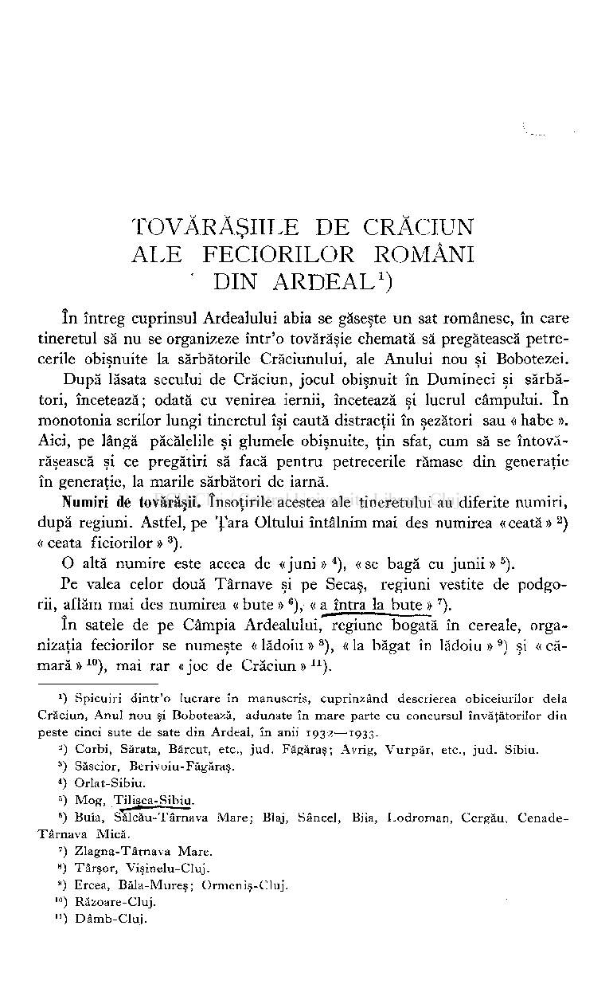
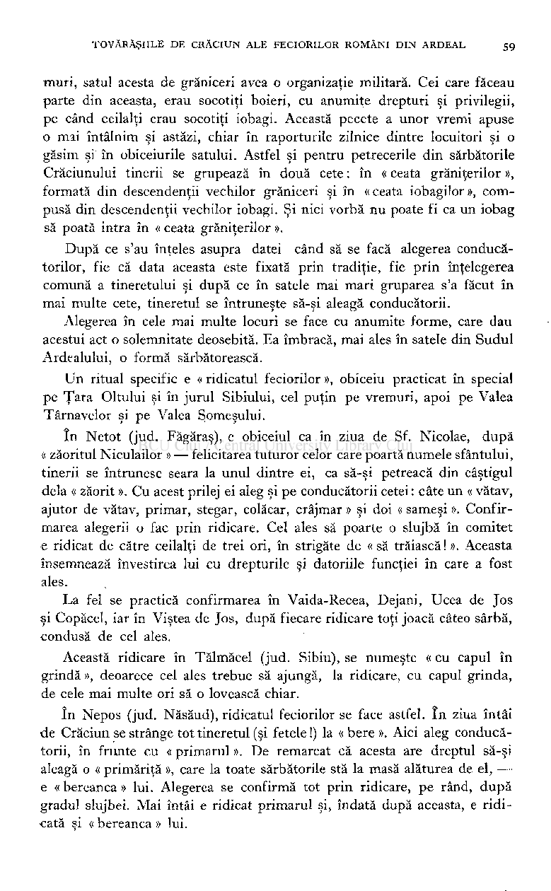
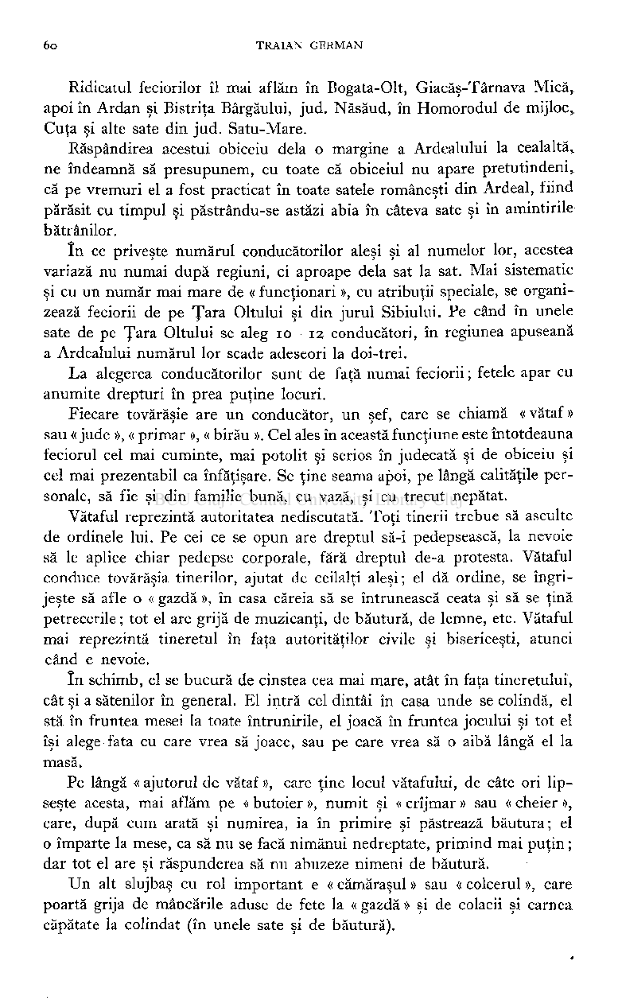
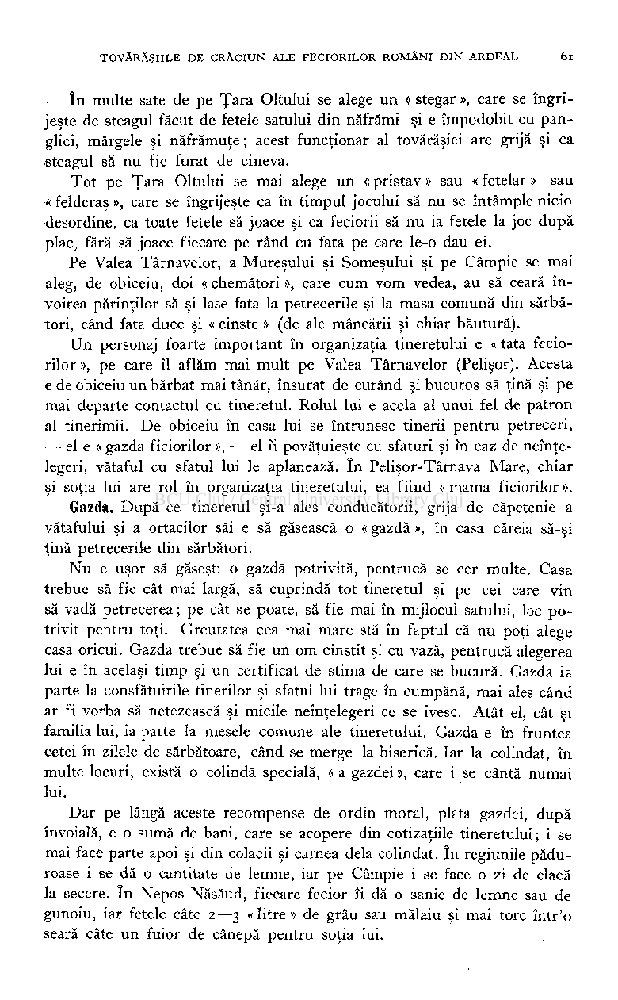
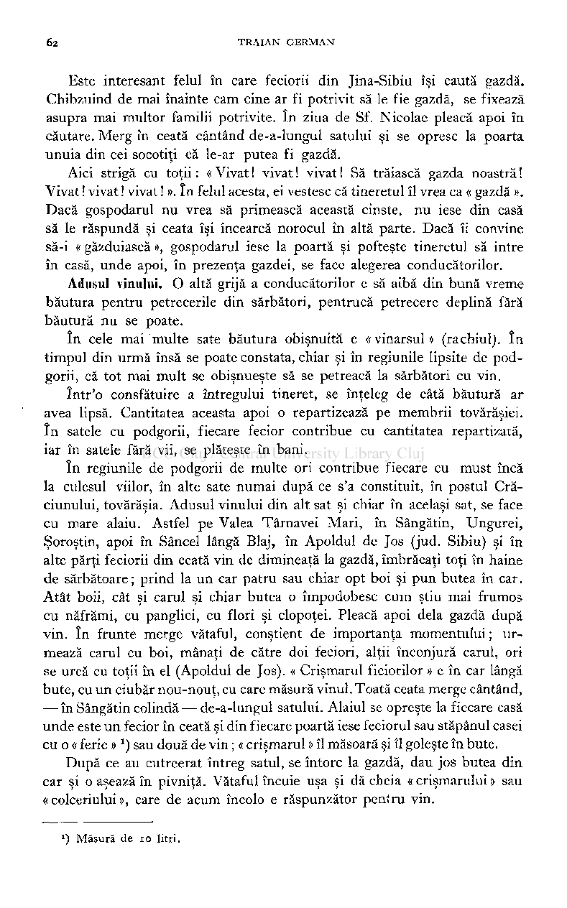
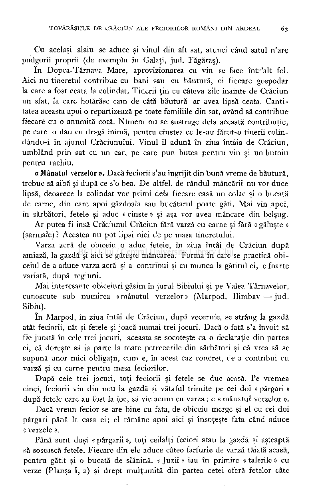
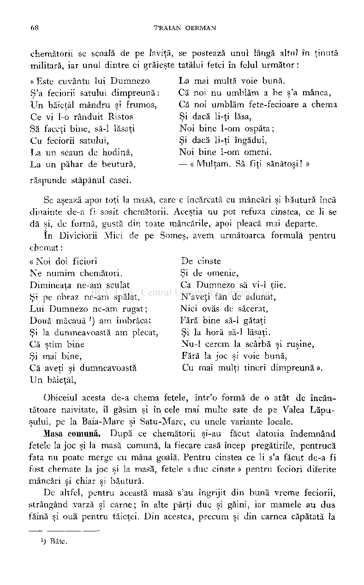
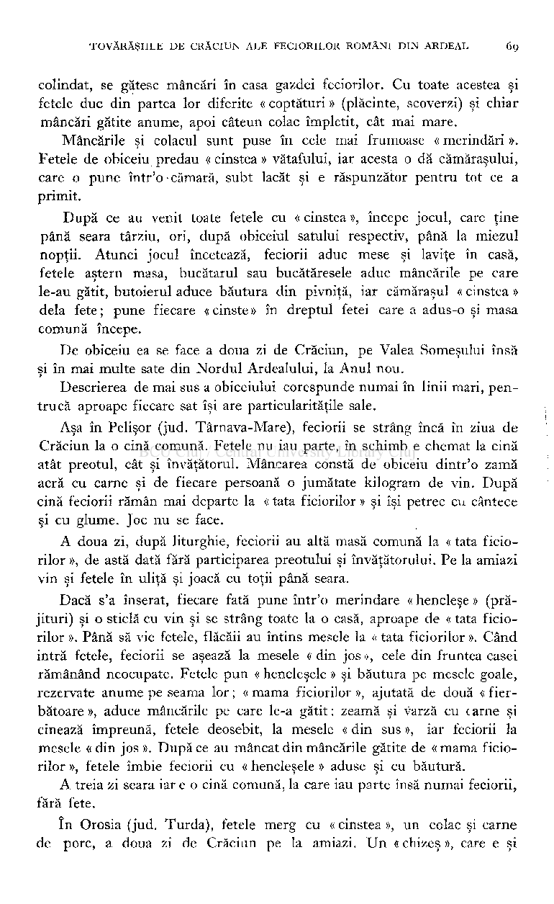
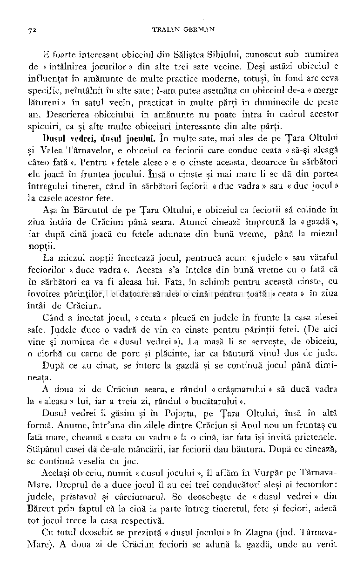
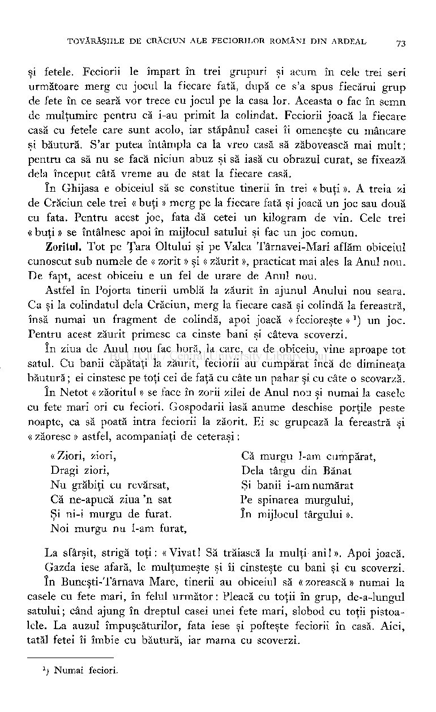

Sufleţăli, O fost vremi măi dimult, Nu amu cînd h-ei murit ! E-ţ on drum ş'o cărări Şî ti porneşti la iad măi tari !

145

MOARTEA

Vini moartea mînioasî Şî mă catî pi acasî, Cu cuţîti şî cu coasî. Eu la cîşmî, după masî, Cu ocaua plini rasî:

—• Of, Hristos, Cel frumos. Am vinit la rai cîntînd, Mă pornesc la iad plîngînd. Of, săraci trup di lut Nici on ghini n-ăi făcut, Cît pi lumi h-ei trăit ! îhi duci sufletu la năcăjit. Of, în iad cînd am întrat Tari m'am măi spăimîntat. Cî 'n hijlocu iadului, în hijlocu focului, Sădi Iuda cei măi mari Pi toati sufletili călări.

— Poftim, moarti, şî cinsteşti Şî din dzîli măi lungeşti ! Moartea-hi dzîci:

—• Eu păharu ţ'oi cinsti, Da din dzî nu ţ'oi lungi. Ţ'o vinit vremea sî mergi, Săcrieşu sî ţ-al dregi ! Of, cînd hi-o spus maica, c'am sî mor După Paşti, în sărbători ! Sărit fraţ, sărit surori, Şî mă 'mpodoghiţi cu flori, Cî la tîrg nu mă duc, Da 'n pomînt mă arunc, La mogila cei cu cruci, Di-acolo nu mî-ţ aduci. — E-ţ on drum ş'o cărări Şî ti du la rai măi tari. Of, la rai cînd am agiuns. Of, în rai cînd am întrat, L-am vădzut pi Hristos, Auraşu cel frumos; Şî din guri hi-o grăit:

Mahala (r. Dubăsar) —b. , 27 (1934).

146

RUGĂCIUNI DI CULCĂRI

Cînd creştinu sî culci, după ci s'o închinat la icoani, faci cruci la cap, pi căpătîi, la hijloc şî la chicioari, dzîcînd : Cruci 'n ceri, Cruci 'n pomînt, Cruci 'n locu ist di mă culc. Cruci 'n casî, Cruci 'n masî, Cruci 'n hijloc di fereastrî. Cruci 'n truspatru unghiureli A casîi heli.

— Sufleti, la ce-i vinit ?

— Of, Hristos, Am vinit La spovidit. Of, Hristos Cel frumos, îhi răspundi hia: De, săraci

Butuceni (r. Rîbniţa) — f., 33 (1934). (Foarte răspândită şi în alte sate).

## GLOSAR

e-ţ 145, ia-ţi.

Ades 38, oraşul Odesa. anadză, o dzî ş'o—130 (p. 43). aninî 2, nisip. aş cind putrădzîti 130 (p. 44), vor fi fiind

falon 133 (p. 46), felon (veşmânt preo­

ţesc ). Fănari 113. ferşal 40, felcer, chirurg.

putrezit;. aştonţîi 87 (titlu).

gălghigioarî 16, gălbioară. ghermăneascî (rana) 40, nemţească. ghimpi di lînâ 89. gimătati 1, jumătate. gisădz 37, gisedz 32, visez.

bălaia, o vinit şî—13 3 (p. 46). Binderi 38, oraşul Bender ( Tighina).

- bîtcî 130 (p. 43), ciomag gros. blenduindu-sî 130 (p. 43). Bolboca 83, Golgota. bolniţî 41, spital, infirmerie. borona 88, grapă. buga 103, taurul. buhni 132, a năvăli. butelcî 84, sticlă, b.itelie.

carbovi 130 (p. 43), ruble, bani. Călăraş 30, sat în jud. Chişinău. chiroşci 133 (p. 46), găluşte, plăcinte. chitoragî 133 (p. 46), piftie. cii, sî nu — 9 (p. 17), să nu fie. cichit, l-o — dila ochi 130 (p. 44). cir 36, fir. cistelnicu 131 (p. 45).

- cîşliga 15, a căpăta, câştiga. cîşmî 131 (p. 45), cârciumă. cocniti (coamili) 93 (p. 39). cotigeascî, sî 134 (p. 135). cotigit, malu tău îi — 48. covaşî 92.

- gîţîli 96, cozi, cosiţe. goga cuptiorului 131 (p. 45). golova 70, primarul. Gospodi pomilui 143 (p. 52), Doamne mi-

luieşte. grosureli (şi-ni cîntî) 90.

hâdiţ 8, haideţi.

- hîrtia 39, scrisoarea. hoarî 90, horă, adunare de lume. holerci 84, rachiu. hrana 141, laptele (femeii).

iaşcic 130 (p. 43), ladă.

îngiet (apî d') 130 (p. 44), apă de înviat. îngietoare (apî) 130 (p. 44), apă vie. îngis, o 130 (p. 44), a înviat.

jămni 90, colaci la nuntă.

crîngu ceriului 92 (p. 39). leafî 92.

lipsî 78, a scoate. discununa 58, a desface cununia. listuri 57, scrisori. dreasî (paharî) 90, pline cu vin. livărant 134 (p. 47), negustor (?)

*) Cifrele indică textele în care se găseşte cuvântul. Intre parenteze e notată pagina, dacă cuvântul se găseşte în « Introducere » sau dacă textul e mai lung.

pureatcî (sî faci) 134 (p. 47); a tocni 134 (p. 48), ordine, rânduială.

Macicăuţu 5. madamă 78, cucoană. Mana, Mani 66, Mania, nume femeiesc. miniştergurî 143 (p. 52), ştergar. mînţăni 134 (p. 47), a mulţumi. Moici, Moisăi 134 (p. 48), Moise. moscal, moscălaş 36, soldat.

raion 1, plasă, judeţ. răsai 32, tresări. rîm'ne 8, rămâne. rodu (lui Adam) 85, neamul lui A.

schimosalî 92. schindosăşti 81. schinui 26, a închide cu spini. scofî 133 (p. 46), potcap. sestriţî 41, soră de caritate, infirmieră. sminti 48. smolitî (pîne) 42, neagră. spolocani 133 (p. 46), prima zi din postul

nainti 45, apoi, după aceea. nălogu (p. 9, vers). nanti 134 (p. 47), apoi, după aceea. nera, a să 32, a se mira. rierticu 134 (p. 48), o măsură. riiata 90, dumneata. riică 131 (p. 45), nimic. nicum 91, nicidecum. hirozna 78, mirosul, mireasma. nohai 92. nohut 6, năut ( ?)

Paştilor, după Dumineca lăsatului de brânză.

stănoc 32, scaun ( ?)

şanti 134 (p. 47), de-a-dreptul, direct. şîneli 36. ştibî, sî 132, să ştie. ştie 83, şticuşoru 34, suliţă, baionetă.

ocrug (p. 8), judeţ, gubernie. ostrov 134 (p. 48), închisoare, puşcărie;

140, insulă.

toloacî 66, câmp în paragină. tot amu 54, îndată ( ?)

păşîcă 136, mototol de cânepă. pihota 40, infanteria. pisăraş 57, scriitor. pitac 73, gologan, ban. pocuta 133 (p. 46). pohod 26. pohoarî 87, pahară ( ?) praporaş 81. prăgi 8, a privi, a se uita. priiom 37, p. 9, garnizoană^ (cerc de)

unelu 53, inelu. uoat-o, o 133 (p. 46).

vădanii 57, văduvie. vazonu 3. văgzal, văgzălaş 35, gară. vonic 1, 35, fecior, voinic, soldat. vizie 50.

recrutare. priveascî 41, operaţie (?) privuschie 32. p'săni 28, pe semne, se vede că.

zălughe 90, înnebunia. zăludzîie 134 (p. 48), nebunie.

N. P. SMOCHIN Ă

TOVĂRĂŞIILE DE CRĂCIUN ALE FECIORILOR ROMÂNI

' DIN ARDEAL

# )

1

în întreg cuprinsul Ardealului abia se găseşte un sat românesc, în care tineretul să nu se organizeze într'o tovărăşie chemată să pregătească petrecerile obişnuite la sărbătorile Crăciunului, ale Anului nou şi Bobotezei.

După lăsata secului de Crăciun, jocul obişnuit în Dumineci şi sărbători, încetează; odată cu venirea iernii, încetează şi lucrul câmpului. în monotonia serilor lungi tineretul îşi caută distracţii în şezători sau « habe ». Aici, pe lângă păcălelile şi glumele obişnuite, ţin sfat, cum să se întovă­

- răşească şi ce pregătiri să facă pentru petrecerile rămase din generaţie în generaţie, la marile sărbători de iarnă.

Numiri dé tovărăşii. însoţirile acestea ale tineretului au diferite numiri, după regiuni. Astfel, pe Ţara Oltului întâlnim mai des numirea « ceată »

) « ceata ficiorilor » ).

2

O altă numire este aceea de «juni» ), «se bagă cu junii»

).

5

Pe valea celor două Târnave şi pe Secaş, regiuni vestite de podgorii, aflăm mai des numirea « bute »

), « a întră la bute » ).

6

în satele de pe Câmpia Ardealului, regiune bogată în cereale, organizaţia feciorilor se numeşte « lădoiu » ), « la băgat în lădoiu » ) şi « cămară »

), mai rar « joc de Crăciun » ) .

10

') Spicuiri dintr'o lucrare în manuscris, cuprinzând descrierea obiceiurilor delà Crăciun, Anul nou şi Bobotează, adunate în mare parte cu concursul învăţătorilor din peste cinci sute de sate din Ardeal, în anii 1932—1933-

- 2

) Corbi, Sărata, Bărcut, etc., jud. Făgăraş; Avrig, Vurpăr, etc., jud. Sibiu.

- 3

) Săscior, Berivoiu-Făgăraş.

- 4

) Orlat-Sibiu.

- 5

) Mog, Tilişca-Sibiu.

- 6

) Buia, Sălcău-Târnava Mare; Blaj, Sâncel, Biia, Lodroman, Cergău, CenadeTârnava Mică.

') Zlagna-Târnava Mare.

- 8

) Târşor, Vişinelu-Cluj.

- 9

) Ercea, Băla-Mureş; Ormeniş-Cluj.

- 10

### ) Răzoare-Cluj. ") Dâmb-Cluj.

58 TRAIAN GERMAN

Pe Valea Someşului remarcăm faptul interesant că în unele sate centrul petrecerilor e în sărbătorile Crăciunului, în altele la Anul nou. Potrivit acestei deosebiri şi tovărăşia tineretului are numiri deosebite.

Astfel în satele unde miezul petrecerilor e la Crăciun, aflăm mai des numirea « bere » ), iar în satele, unde petrecerea se face la Anul Nou, de obiceiu aflăm numirea « vergel » ).

într'unele sate găsim şi numiri pe care nu le întâlnim în alte sate din regiunea respectivă decât foarte rar. Astfel sunt numirile « oleghină » ) şi « olăhină »

) şi apoi « cergalăi » ) şi « a se înbăni » ). în judeţul Hunedoara întâlnim şi numirea « dobă » ) şi « dubaşi

4

) », delà toba tradiţională, cu care se umblă la colindat, apoi numirea « căluşeri »

8

), pentrucă în seara ajunului de Crăciun tinerii în loc să colinde, joacă jocul căluşerilor.

9

Alegerea conducătorilor. Odată înţeleşi că vor ţinea şi în anul respectiv obiceiul moştenit din bătrâni, feciorii hotărăsc o zi în care să se întrunească spre a-şi alege conducătorii tovărăşiei, care la rândul lor să facă toate, pregătirile, aşa ca petrecerile să reuşească cât mai bine şi să nu păţească ruşine.

), există o dată fixă la care se întrunesc feciorii : e ziua de Sf. Nicolae, când deşi e post, în multe sate e obiceiul să se joace.

Pe Ţara Bârsei

) şi Ţara Oltului ) , apoi în părţile Sibiului

10

12

), ori în cea dintâi duminecă din post

în alte părţi, feciorii se întrunesc chiar la lăsata secului

13

), mai rar în dumineca dinainte de Crăciun

).

14

ls

De obiceiu, în fiecare sat se face o singură ceată. în satele mai mari, cu tineret mai numeros, se organizează mai multe cete.

în Avrig tineretul se constitue, fără nicio discuţie, în nouă cete, fiecare parte de sat cu ceata sa şi fiecare ceată cu numirea sa (după numele părţii respective a satului: «Gruieni», « Veştemeni », etc.).

în câteva sate de pe Ţara Oltului, ca de exemplu în Scorei, găsim două cete. E foarte caracteristic criteriul după care se formează ele. Pe vre-

') Mintiul Gherlei, Strâmbu, Ciceu-Someş.

- 2

) Cupşeni, Borcut-Sameş.

- 3

) Arpaşul de sus-Făgăraş.

- 4

### ) Cohalm-Târnava Mare.

### ) Poşaga de jos-Turda.

s

### ) Ernea-Târnava Mică.

6

### ) Veţel.

;

) Mintia-Hunedoara.

s

*) Galaţi-Hunedoara.

### ) Dârste, Râşnov, Poiana Mărului-Braşov. ) Beclean, Dejani, Corbi, N^to', Vaida-Recea, etc.,-Făgăraş.

lc

- n

- 12

) Tilişca, Sălişte, Poplaca, Nocrich, etc.,-Sibiu.

- 13

) Bogata-Olt (j. Târnava-Mare).

- 14

) Blăjel, Soroştin-Târnava Mică.

- 15

### ) Odverem-Alba ; Copalnic, Trestia-Satu Mare.

muri, satul acesta de grăniceri avea o organizaţie militară. Cei care făceau parte din aceasta, erau socotiţi boieri, cu anumite drepturi şi privilegii, pe când ceilalţi erau socotiţi iobagi. Această pecete a unor vremi apuse

- o mai întâlnim şi astăzi, chiar în raporturile zilnice dintre locuitori şi o găsim şi în obiceiurile satului. Astfel şi pentru petrecerile din sărbătorile Crăciunului tinerii se grupează în două cete : în « ceata grăniţerilor », formată din descendenţii vechilor grăniceri şi în «ceata iobagilor», compusă din descendenţii vechilor iobagi. Şi nici vorbă nu poate fi ca un iobag să poată intra în « ceata grăniţerilor ».

După ce s'au înţeles asupra datei când să se facă alegerea conducătorilor, fie că data aceasta este fixată prin tradiţie, fie prin înţelegerea comună a tineretului şi după ce în satele mai mari gruparea s'a făcut în mai multe cete, tineretul se întruneşte să-şi aleagă conducătorii.

Alegerea în cele mai multe locuri se face cu anumite forme, care dau acestui act o solemnitate deosebită. Ea îmbracă, mai ales în satele din Sudul Ardealului, o formă sărbătorească.

Un ritual specific e « ridicatul feciorilor », obiceiu practicat în special pe Ţara Oltului şi în jurul Sibiului, cel puţin pe vremuri, apoi pe Valea Târnavelor şi pe Valea Someşului.

în Netot (jud. Făgăraş), e obiceiul ca în ziua de Sf. Nicolae, după « zăoritul Niculailor » — felicitarea tuturor celor care poartă numele sfântului, tinerii se întrunesc seara la unul dintre ei, ca să-şi petreacă din câştigul delà « zăorit ». Cu acest prilej ei aleg şi pe conducătorii cetei : câte un « vătav, ajutor de vătav, primar, stegar, colăcar, crâjmar » şi doi « sameşi ». Confirmarea alegerii o fac prin ridicare. Cel ales să poarte o slujbă în comitet e ridicat de către ceilalţi de trei ori, în strigăte de « să trăiască ! ». Aceasta însemnează învestirea lui cu drepturile şi datoriile funcţiei în care a fost ales.

La fel se practică confirmarea în Vaida-Recea, Dejani, Ucea de Jos şi Copăcel, iar în Viştea de Jos, după fiecare ridicare toţi joacă câteo sârbă, condusă de cel ales.

Această ridicare în Tălmăcel (jud. Sibiu), se numeşte « cu capul în grindă », deoarece cel ales trebue să ajungă, la ridicare, cu capul grinda, de cele mai multe ori să o lovească chiar.

în Nepos (jud. Năsăud), ridicatul feciorilor se face astfel. în ziua întâi de Crăciun se strânge tot tineretul (şi fetele !) la « bere ». Aici aleg conducătorii, în frunte cu « primarul ». De remarcat că acesta are dreptul să-şi aleagă o « primăriţă », care la toate sărbătorile stă la masă alăturea de el, e « bereanca » lui. Alegerea se confirmă tot prin ridicare, pe rând, după gradul slujbei. Mai întâi e ridicat primarul şi, îndată după aceasta, e ridicată şi « bereanca » lui.

Ridicatul feciorilor îl mai aflăm în Bogata-Olt, Giacăş-Târnava Mică,, apoi în Ardan şi Bistriţa Bârgăului, jud. Năsăud, în Homorodul de mijloc, Cuţa şi alte sate din jud. Satu-Mare.

Răspândirea acestui obiceiu delà o margine a Ardealului la cealaltă, ne îndeamnă să presupunem, cu toate că obiceiul nu apare pretutindeni, că pe vremuri el a fost practicat în toate satele româneşti din Ardeal, fiind părăsit cu timpul şi păstrându-se astăzi abia în câteva sate şi în amintirile

- bătrânilor. în ce priveşte numărul conducătorilor aleşi şi al numelor lor, acestea

variază nu numai după regiuni, ci aproape delà sat la sat. Mai sistematic şi cu un număr mai mare de « funcţionari », cu atribuţii speciale, se organizează feciorii de pe Ţara Oltului şi din jurul Sibiului. Pe când în unele sate de pe Ţara Oltului se aleg io—12 conducători, în regiunea apuseană a Ardealului numărul lor scade adeseori la doi-trei.

La alegerea conducătorilor sunt de faţă numai feciorii ; fetele apar cu anumite drepturi în prea puţine locuri.

Fiecare tovărăşie are un conducător, un şef, care se chiamă « vătaf » sau « jude », « primar », « birău ». Cel ales în această funcţiune este întotdeauna feciorul cel mai cuminte, mai potolit şi serios în judecată şi de obiceiu şi cel mai prezentabil ca înfăţişare. Se ţine seama apoi, pe lângă calităţile personale, să fie şi din familie bună, cu vază, şi cu trecut nepătat.

Vătaful reprezintă autoritatea nediscutată. Toţi tinerii trebue să asculte de ordinele lui. Pe cei ce se opun are dreptul să-i pedepsească, la nevoie să le aplice chiar pedepse corporale, fără dreptul de-a protesta. Vătaful conduce tovărăşia tinerilor, ajutat de ceilalţi aleşi ; el dă ordine, se îngrijeşte să afle o « gazdă », în casa căreia să se întrunească ceata şi să se ţină petrecerile; tot el are grijă de muzicanţi, de băutură, de lemne, etc. Vătaful mai reprezintă tineretul în faţa autorităţilor civile şi bisericeşti, atunci când e nevoie.

în schimb, el se bucură de cinstea cea mai mare, atât în faţa tineretului, cât şi a sătenilor în general. El intră cel dintâi în casa unde se colindă, el stă în fruntea mesei la toate întrunirile, el joacă în fruntea jocului şi tot el îşi alege fata cu care vrea să joace, sau pe care vrea să o aibă lângă el la masă.

Pe lângă « ajutorul de vătaf », care ţine locul vătafului, de câte ori lipseşte acesta, mai aflăm pe « butoier », numit şi « crîjmar » sau « cheier », care, după cum arată şi numirea, ia în primire şi păstrează băutura; el o împarte la mese, ca să nu se facă nimănui nedreptate, primind mai puţin ; dar tot el are şi răspunderea să nu abuzeze nimeni de băutură.

Un alt slujbaş cu rol important e « cămăraşul » sau « colcerul », care poartă grija de mâncările aduse de fete la « gazdă » şi de colacii şi carnea

- căpătate la colindat (în unele sate şi de băutură).

în multe sate de pe Ţara Oltului se alege un « stegar », care se îngrijeşte de steagul făcut de fetele satului din năfrămi şi e împodobit cu panglici, mărgele şi năfrămuţe; acest funcţionar al tovărăşiei are grijă şi ca steagul să nu fie furat de cineva.

Tot pe Ţara Oltului se mai alege un « pristav » sau « fetelar » sau « felderaş », care se îngrijeşte ca în timpul jocului să nu se întâmple nicio desordine, ca toate fetele să joace şi ca feciorii să nu ia fetele la joc după plac, fără să joace fiecare pe rând cu fata pe care le-o dau ei.

Pe Valea Târnavelor, a Mureşului şi Someşului şi pe Câmpie se mai aleg, de obiceiu, doi « chemători », care cum vom vedea, au să ceară învoirea părinţilor să-şi lase fata la petrecerile şi la masa comună din sărbători, când fata duce şi « cinste » (de ale mâncării şi chiar băutură).

Un personaj foarte important în organizaţia tineretului e « tata feciorilor », pe care îl aflăm mai mult pe Valea Târnavelor (Pelişor). Acesta e de obiceiu un bărbat mai tânăr, însurat de curând şi bucuros să ţină şi pe mai departe contactul cu tineretul. Rolul lui e acela al unui fel de patron al tinerimii. De obiceiu în casa lui se întrunesc tinerii pentru petreceri, — el e « gazda ficiorilor », — el îi povăţuieşte cu sfaturi şi în caz de neînţelegeri, vătaful cu sfatul lui le aplanează. în Pelişor-Târnava Mare, chiar şi soţia lui are rol în organizaţia tineretului, ea fiind « mama ficiorilor ».

Gazda. După ce tineretul şi-a ales conducătorii, grija de căpetenie a vătafului şi a ortacilor săi e să găsească o « gazdă », în casa căreia să-şi ţină petrecerile din sărbători.

Nu e uşor să găseşti o gazdă potrivită, pentrucă se cer multe. Casa trebue să fie cât mai largă, să cuprindă tot tineretul şi pe cei care vin să vadă petrecerea ; pe cât se poate, să fie mai în mijlocul satului, loc potrivit pentru toţi. Greutatea cea mai mare stă în faptul că nu poţi alege casa oricui. Gazda trebue să fie un om cinstit şi cu vază, pentrucă alegerea lui e în acelaşi timp şi un certificat de stima de care se bucură. Gazda ia parte la consfătuirile tinerilor şi sfatul lui trage în cumpănă, mai ales când ar fi vorba să netezească şi micile neînţelegeri ce se ivesc. Atât el, cât si familia lui, ia parte la mesele comune ale tineretului. Gazda e în fruntea cetei în zilele de sărbătoare, când se merge la biserică. Iar la colindat, în multe locuri, există o colindă specială, « a gazdei », care i se cântă numai lui.

Dar pe lângă aceste recompense de ordin moral, plata gazdei, după învoială, e o sumă de bani, care se acopere din cotizaţiile tineretului; i se mai face parte apoi şi din colacii şi carnea delà colindat. în regiunile păduroase i se dă o cantitate de lemne, iar pe Câmpie i se face o zi de clacă la secere. în Nepos-Năsăud, fiecare fecior îi dă o sanie de lemne sau de gunoiu, iar fetele câte 2—3 « litre » de grâu sau mălaiu şi mai torc într'o seară câte un fuior de cânepă pentru soţia lui.

Este interesant felul în care feciorii din Jina-Sibiu îşi caută gazdă. Chibzuind de mai înainte cam cine ar fi potrivit să le fie gazdă, se fixează asupra mai multor familii potrivite. în ziua de Sf. Nicolae pleacă apoi în căutare. Merg în ceată cântând de-a-lungul satului şi se opresc la poarta unuia din cei socotiţi că le-ar putea fi gazdă.

Aici strigă cu toţii : « Vivat ! vivat ! vivat ! Să trăiască gazda noastră ! Vivat ! vivat ! vivat ! ». în felul acesta, ei vestesc că tineretul îl vrea ca « gazdă ». Dacă gospodarul nu vrea să primească această cinste, nu iese din casă să le răspundă şi ceata îşi încearcă norocul în altă parte. Dacă îi convine să-i « găzduiască », gospodarul iese la poartă şi pofteşte tineretul să intre în casă, unde apoi, în prezenţa gazdei, se face alegerea conducătorilor.

Adusul vinului. O altă grijă a conducătorilor e să aibă din bună vreme băutura pentru petrecerile din sărbători, pentrucă petrecere deplină fără băutură nu se poate.

în cele mai multe sate băutura obişnuită e « vinarsul » (rachiul). în timpul din urmă însă se poate constata, chiar şi în regiunile lipsite de podgorii, că tot mai mult se obişnueşte să se petreacă la sărbători cu vin.

într'o consfătuire a întregului tineret, se înţeleg de câtă băutură ar avea lipsă. Cantitatea aceasta apoi o repartizează pe membrii tovărăşiei, în satele cu podgorii, fiecare fecior contribue cu cantitatea repartizată, iar în satele fără vii, se plăteşte în bani.

în regiunile de podgorii de multe ori contribue fiecare cu must încă la culesul viilor, în alte sate numai după ce s'a constituit, în postul Crăciunului, tovărăşia. Adusul vinului din alt sat şi chiar în acelaşi sat, se face cu mare alaiu. Astfel pe Valea Târnavei Mari, în Sângătin, Ungurei, Şoroştin, apoi în Sâncel lângă Blaj, în Apoldul de Jos (jud. Sibiu) şi în alte părţi feciorii din ceată vin de dimineaţă la gazdă, îmbrăcaţi toţi în haine de sărbătoare ; prind la un car patru sau chiar opt boi şi pun butea în car. Atât boii, cât şi carul şi chiar butea o împodobesc cum ştiu mai frumos cu năfrămi, cu panglici, cu flori şi clopoţei. Pleacă apoi delà gazdă după vin. în frunte merge vătaful, conştient de importanţa momentului; urmează carul cu boi, mânaţi de către doi feciori, alţii înconjură carul, ori se urcă cu toţii în el (Apoldul de Jos). « Crişmarul ficiorilor » e în car lângă bute, cu un ciubăr nou-nouţ, cu care măsură vinul. Toată ceata merge cântând, — în Sângătin colindă — de-a-lungul satului. Alaiul se opreşte la fiecare casă unde este un fecior în ceată şi din fiecare poartă iese feciorul sau stăpânul casei cu o « ferie »

) sau două de vin ; « crişmarul » îl măsoară şi îl goleşte în bute. După ce au cutreerat întreg satul, se întorc la gazdă, dau jos butea din

a

- car şi o aşează în pivniţă. Vătaful încuie uşa şi dă cheia « crişmarului » sau « colceriului », care de acum încolo e răspunzător pentru vin.

*) Măsură de io litri.

Cu acelaşi alaiu se aduce şi vinul din alt sat, atunci când satul n'are podgorii proprii (de exemplu în Galaţi, jud. Făgăraş).

în Dopca-Târnava Mare, aprovizionarea cu vin se face într'alt fel. Aici nu tineretul contribue cu bani sau cu băutură, ci fiecare gospodar la care a fost ceata la colindat. Tinerii ţin cu câteva zile înainte de Crăciun un sfat, la care hotărăsc cam de câtă băutură ar avea lipsă ceata. Cantitatea aceasta apoi o repartizează pe toate familiile din sat, având să contribue fiecare cu o anumită cotă. Nimeni nu se sustrage delà această contribuţie, pe care o dau cu dragă inimă, pentru cinstea ce le-au făcut-o tinerii colindându-i în ajunul Crăciunului. Vinul îl adună în ziua întâia de Crăciun, umblând prin sat cu un car, pe care pun butea pentru vin şi un butoiu pentru rachiu.

« Mânatul verzelor ». Dacă feciorii s'au îngrijit din bună vreme de băutură, trebue să aibă şi după ce s'o bea. De altfel, de rândul mâncării nu vor duce lipsă, deoarece la colindat vor primi delà fiecare casă un colac şi o bucată de carne, din care apoi găzdoaia sau bucătarul poate găti. Mai vin apoi, în sărbători, fetele şi aduc « cinste » şi aşa vor avea mâncare din belşug.

Ar putea fi însă Crăciunul Crăciun fără varză cu carne şi fără « găluşte » (sarmale) ? Acestea nu pot lipsi nici de pe masa tineretului.

Varza acră de obiceiu o aduc fetele, în ziua întâi de Crăciun după amiază, la gazdă şi aici se găteşte mâncarea. Forma în care se practică obiceiul de a aduce varza acră şi a contribui şi cu munca la gătitul ei, e foarte variată, după regiuni.

Mai interesante obiceiuri găsim în jurul Sibiului şi pe Valea Târnavelor, cunoscute sub numirea «mânatul verzelor» (Marpod, Ilimbav—jud. Sibiu).

în Marpod, în ziua întâi de Crăciun, după vecernie, se strâng la gazdă atât feciorii, cât şi fetele şi joacă numai trei jocuri. Dacă o fată s'a învoit să fie jucată în cele trei jocuri, aceasta se socoteşte ca o declaraţie din partea ei, că doreşte să ia parte la toate petrecerile din sărbători şi că vrea să se supună unor mici obligaţii, cum e, în acest caz concret, de a contribui cu varză şi cu carne pentru masa feciorilor.

După cele trei jocuri, toţi feciorii şi fetele se duc acasă. Pe vremea cinei, feciorii vin din nou la gazdă şi vătaful trimite pe cei doi « pârgari » după fetele care au fost la joc, să vie acum cu varza : e « mânatul verzelor ».

Dacă vreun fecior se are bine cu fata, de obiceiu merge şi el cu cei doi pârgari până la casa ei; el rămâne apoi aici şi însoţeşte fata când aduce « verzele ».

Până sunt duşi « pârgarii », toţi ceilalţi feciori stau la gazdă şi aşteaptă să sosească fetele. Fiecare din ele aduce câteo farfurie de varză tăiată acasă, pentru gătit şi o bucată de slănină. « Juzii » iau în primire « tăierile » cu verze (Planşa I, 2) şi drept mulţumită din partea cetei oferă fetelor câte

un pahar de vin. Dacă au sosit toate fetele, începe jocul, care ţine până pe la miezul nopţii.

Aproape la fel se practică « mânatul verzelor » şi în Nocrich şi în Ilimbav, unde fetele duc curechiul gătit şi nu numai verze pentru fiert, iar seara tinerii cinează din această mâncare oferită şi gătită acasă de fete.

în Gusu-Sibiu e obiceiul ca în ziua întâi de Crăciun « judele » şi « juratul » cetei să cheme fetele la « tăiatul verzelor » (Planşa II, 3). Fiind satul mare, se întâmplă ca uneori să se facă mai multe cete. Fata poate alege deci la care din ele să se ducă. Fiecare ceată cheamă toate fetele şi e o vrednicie pentru ceata care are cât mai multe fete la joc. Seara, după cină, fata pleacă la ceata care îi convine şi duce şi câteva căpăţâni de varză acră. Când s'au strâns destule fete, încep să taie verze, altele să « toace » carnea, să umple sarmalele. Cum şi feciorii sunt de faţă, se mai face din când în când şi câte un joc.

Colindatul. în timpul cât tineretul face pregătirile amintite mai sus, aproape seară de seară se adună la gazdă, ca să înveţe colindele pe care au să le cânte în noaptea din ajunul Crăciunului. Colindele le învaţă sau delà unul dintre ei, sau delà un om mai bătrân, angajat anume în acest scop. învăţatul colindelor nu e lucru uşor, pentrucă nu pot pleca numai cu una ori două; într'adevăr, alta e colinda preotului, alta a primarului, alta a fetei, sau a feciorului ; apoi (pe Ţara Oltului), la casă de « boier » nu poţi să colinzi colinda iobagului, ci fiecăruia colinda ce i se potriveşte. De altă parte, cu cât e colinda mai lungă, cu atâta e şi cinstea mai mare pentru colindători.

Nu vom insista asupra felului colindatului, cam acelaşi în toate satele din Ardeal. Vom aminti numai câteva obiceiuri pe care nu le găsim în toate regiunile, ci numai în anumite sate.

Astfel, într'unele sate din părţile Sibiului colindătorii mai primesc şi o lumânare de ceară. în Cacova, când starostele mulţumeşte pentru darurile primite, referindu-se la lumânarea primită spune :

« Ş'o lumină de stupină, Ca Dumnezeu să-i ţină ».

în câteva sate de pe Ţara Oltului, e obiceiul ca feciorii să umble la colindat cu o icoană înfăţişând naşterea Mântuitorului. în timpul cât colindă în casă, vătaful pune icoana pe masă (Seleuş-Târnava Mare), ori o ţine în mână (Şomărtin-Olt), iar ai casei vin pe rând şi sărută icoana.

Un alt obiceiu interesant e colindatul în turnul bisericii. Tinerii, în seara Ajunului, înainte de-a începe colindatul pe la familii, iar în alte sate pe la miezul nopţii, se urcă în turnul bisericii şi colindă patru colinde în cele patru părţi ale văzduhului, vestind astfel lumii întregi naşterea cea minunată şi dând de ştire în acelaş timp şi sătenilor, că de-acum le vin

colindători. Obiceiul de-a colinda seara în turnul bisericii îl găsim în CârţaFăgăraş, Chirpăr-Sibiu, etc.

în Biertan şi Bratei (jud. Târnava-Mare) era obiceiul până prin anul 1900 să înceapă să colinde de cu seara, iar pe vremea cinii să întrerupă colindatul pela familii, să urce în turnul bisericii şi să cânte patru colinde.

în Inoc, aproape de Ocnele Mureşului, e obiceiul ca tineretul să meargă în ajun la vecernie. Seara, pe vremea cinei, se adună la gazdă, de unde pleacă apoi la biserică, unde fac cerc în jurul vătafului şi zic rugăciunile obişnuite, iar preotul dă fiecăruia câteo lumânare. Cu ele aprinse merg la casa preotului şi îi cântă la fereastră trei colinde. Preotul îi pofteşte în casă, le face cinste cu bani, vin şi colac. Delà preot merg din nou la biserică, tot cu lumânările aprinse şi mai cântă o colindă. Acum lasă lumânările pe seama bisericii şi încep colindatul la familiile din sat.

în satele din jurul Hunedoarei, e obiceiul ca în loc de muzicanţii cu cetera, care însoţesc de regulă aproape în toate satele pe colindători, să fie un « fluieraş » ori un « dobaş », care mergând cu ceata pe drum să dea de ştire din fluier sau tobă că sosesc colindătorii.

Astfel în Almaşul de mijloc colindătorii, mergând pe drum, cântă, joacă şi chiuie, iar fluieraşul zice din fluier. înainte de a intra în casă, unul dă de ştire cu vorbele :

« La uşiţa mândrii mele Răsărit'or două stele ; Două stele luminoase, Ca şi mândra de frumoase ».

Ori, dacă e ploaie şi lapoviţă, strigă :

« Slobozi-ne lele 'n casă, C'afară ploauă de varsă!»

Iar dacă s'ar întâmpla să sosească târziu noaptea :

« Descuie leliţă uşa, Că răsare găinuşa ! »

Dacă colindătorii sunt obosiţi, o spun şi aceasta cu cuvintele :

« Ieşi afară cu colacu, Că pe noi ne doare capu ! »

în Găunoasa, tot în jud. Hunedoara, e obiceiul ca în ajun să se strângă la o casă atât feciorii, cât şi căsătoriţii mai tineri şi să facă sfat, să angajeze un «fluieraş », un « dobaş » şi un « cimpoier ». Fac apoi cu aceştia o « probă »

- să vadă cam ce fel de sgomot pot să producă instrumentele lor. Apoi, în dupăamiaza zilei de Crăciun ies la o margine de sat feciori, fete, bărbaţii

5 Anuarul Arhivei de Folklor V.

cu soţiile şi toată ceata aceasta, căreia i se mai alătură şi altă lume, însoţită de cimpoier, fluieraş şi dobaş, pleacă de-a-lungul satului chiuind şi jucând. Intră în fiecare curte şi joacă, fără niciun rost. Acest joc înlocuieşte colindatul propriu zis, pentru care gazda le dă « cinstea » tradiţională ; colindatul obişnuit lipseşte.

în Lucăceştii de lângă Baia-Mare întâlnim obiceiul numit « a răspunde colacul ». Se colindă numai la casele cu fete mari. După ce au colindat la fereastră, feciorii intră în casă şi se aşează în jurul mesei, pe care e aşezat un colac mare şi o « iagă » (sticlă) cu băutură. Vătaful scoate cuţitul delà brâu, ia colacul în mână şi « răspunde », adecă mulţumeşte pentru colac :

« Când eram mai mititel Tata a zis să împing de cârceie, Eram harnic plugărel. Io am tras de heteie. M'am dus cu tata la plug Tăt am împins şi am tras Pe baltă ; Şi iată cu ce am rămas ! » S'o arat rău.

Şi arată o bucată tăiată din colac. După ce a tăiat colacul felii, ia sticla şi, întorcându-se către fată, îi

închină astfel :

« Să trăieşti Mărie, Tri şi patru-i dobândi ; Dumnezeu te ţie! De mi-i şti închina, De mi-i ştii mulţămi, Tri şi patru-i căpăta ».

(E vorba de pahare cu băutură). Acum fata ia paharul delà fecior şi îi răspunde astfel :

« Io frumos ţi-aş mulţămi, De pe marginea rîului Da mă tem că nu ţi-oi şti ; Şi spicu săcării Mulţămească-ţi spicu grâului De pe marginea mării ! »

Apoi, gustă din băutură şi după ea, toţi colindătorii pe rând. Chematul fetelor. După ce tineretul s'a îngrijit de toate cele de lipsă pentru petrecerile din sărbători: de casă potrivită, de muzicanţi, băutură şi mâncări şi în multe sate de lemne şi chiar şi de gazul pentru luminat, vine rândul petrecerii în înţelesul adevărat al cuvântului, cu joc, mese şi voie bună, care în unele sate ţine zile întregi aproape fără întrerupere.

Fetele, deşi au şi ele partea lor de contribuţie la pregătirile ce s'au făcut până acum, şi toate acestea cu învoirea părinţilor, totuşi nu pot să meargă aşa, numai de capul lor. Se cuvine ca feciorii să ceară învoirea părinţilor şi să le « cheme » la aceste petreceri.

Chematul fetelor nu e un lucru de toate zilele, de aceea i se şi dă o importanţă deosebită. în cele mai multe sate se aleg doi feciori, numiţi « chemători », care au rolul de-a cere învoirea părinţilor ca să-şi lase fetele să meargă la petrecerea tineretului. Cei aleşi trebue să fie feciori de cinste şi omenie, din familii mai bune.

în ziua ştiută: întâia sau a doua zi de Crăciun, după obiceiul satului, chemătorii se îmbracă în hainele cele mai frumoase ; ei poartă următoarele semne distinctive : pălăria ori căciula împodobită cu muşcată şi flori artificiale ; peste umărul stâng, trecută pe subsuoara dreaptă, au câte o năframă, sau chiar două; unul dintre ei, ori chiar amândoi, poartă câteo ploscă cu băutură şi în mână fiecare ţine câteo « bâtă » de chemători, împodobită cu fel de fel de panglici şi flori artificiale.

Intrând în casă îşi spun gândul cu care au venit, închină din ploscă pentru stăpânul casei, care primeşte închinatul în semn de învoire, apoi tinerii sunt poftiţi la masă.

Chematul fetelor e cunoscut mai ales pe Valea Târnavelor, pe Valea Mureşului, pe « Câmpie » şi pe Valea Someşului.

în Valea Sasului (jud. Târnava-Mică), chematul se face a doua zi de Crăciun dimineaţa. Intrând chemătorii în casă, se adresează cu următoarele versuri părinţilor fetei :

«Ieri a fost vremea ce-o trecut, De veselie ne-am apucat. S'o născut Domnu sfânt pe pământ; Faceţi bine şi iertaţi, Oamenii s'or bucurat, Fătuţa să ne-o lăsaţi De veselie s'or apucat, Pân' la noi să s'ostinească Şi noi de dimineaţă ne-am sculat, Şi cu noi să se veselească».

Amândoi părinţii răspund : « Mulţam ! », apoi unul dintre chemători închină cu plosca spre tatăl fetei.

în Sâmboleni, pe Câmpie, e obiceiul să se aleagă patru chemători. A doua zi de Crăciun, doi merg pe la fetele care locuiesc în cătunuri, iar doi prin sat.

Intrând în casă, are loc următorul dialog între unul din chemători şi tatăl fetei :

— « Cu pace sunteţi ?

— Cu pace. Da, Dumneavoastră ?

— Şi noi cu pace!

— Noa, şădeţi la noi !

— Mulţămim, că mult n'om zăbovi » !

Şed apoi amândoi chemătorii pe laviţă, însă nu la masă. Şederea e numai de formă, ca « să şadă peţitorii » ce i-ar veni fetei « în dulce »; apoi

se postează unul lângă altul în ţinută tatălui fetei în felul următor :

chemătorii se scoală de pe laviţă, militară, iar unul dintre ei grăieşte

La mai multă voie bună. Că noi nu umblăm a be ş'a mânca, Că noi umblăm fete-fecioare a chema Şi dacă li-ţi lăsa, Noi bine l-om ospăta ; Şi dacă li-ţi îngădui, Noi bine l-om omeni.

« Este cuvântu lui Dumnezo Ş'a feciorii satului dimpreună : Un băieţăl mândru şi frumos, Ce vi l-o rânduit Ristos Să faceţi bine, să-1 lăsaţi Cu feciorii satului, La un scaun de hodină, La un pahar de beutură,

— « Mulţam. Să fiti sănătoşi ! »

răspunde stăpânul casei.

Se aşează apoi toţi la masă, care e încărcată cu mâncări şi băutură încă dinainte de-a fi sosit chemătorii. Aceştia nu pot refuza cinstea, ce li se dă şi, de formă, gustă din toate mâncările, apoi pleacă mai departe.

în Diviciorii Mici de pe Someş, avem următoarea formulă pentru chemat : « Noi doi ficiori Ne numim chemători. Dimineaţa ne-am sculat Şi pe obraz ne-am spălat, Lui Dumnezo ne-am rugat; Două măcauă ) am îmbrăcat Şi la dumneavoastă am plecat, Că ştim bine Şi mai bine, Că aveţi şi dumneavoastă Un băietăl,

De cinste Şi de omenie, Ca Dumnezo să vi-1 ţiie. N'aveţi fân de adunat, Nici ovăs de săcerat, Fără bine să-1 gătaţi Şi la horă să-1 lăsaţi. Nu-1 cerem la scârbă şi ruşine, Fără la joc şi voie bună, Cu mai mulţi tineri dimpreună ».

Obiceiul acesta de-a chema fetele, într'o formă de o atât de încântătoare naivitate, îl găsim şi în cele mai multe sate de pe Valea Lăpuşului, pe la Baia-Mare şi Satu-Mare, cu unele variante locale.

Masa comună. După ce chemătorii şi-au făcut datoria îndemnând fetele la joc şi la masă comună, la fiecare casă încep pregătirile, pentrucă fata nu poate merge cu mâna goală. Pentru cinstea ce li s'a făcut de-a fi fost chemate la joc şi la masă, fetele « duc cinste » pentru feciori diferite mâncări şi chiar şi băutură.

De altfel, pentru această masă s'au îngrijit din bună vreme feciorii, strângând varză şi carne ; în alte părţi duc şi găini, iar mamele au dus făină şi ouă pentru tăieţei. Din acestea, precum şi din carnea căpătată la

### ) Bâte.

l

colindat, se gătesc mâncări în casa gazdei feciorilor. Cu toate acestea şi fetele duc din partea lor diferite « coptături » (plăcinte, scoverzi) şi chiar mâncări gătite anume, apoi câteun colac împletit, cât mai mare.

Mâncările şi colacul sunt puse în cele mai frumoase « merindări ». Fetele de obiceiu predau « cinstea » vătafului, iar acesta o dă cămăraşului, care o pune într'o cămară, subt lacăt şi e răspunzător pentru tot ce a primit.

După ce au venit toate fetele cu « cinstea », începe jocul, care ţine până seara târziu, ori, după obiceiul satului respectiv, până la miezul nopţii. Atunci jocul încetează, feciorii aduc mese şi laviţe în casă, fetele aştern masa, bucătarul sau bucătăresele aduc mâncările pe care le-au gătit, butoierul aduce băutura din pivniţă, iar cămăraşul « cinstea » delà fete; pune fiecare «cinste» în dreptul fetei care a adus-o şi masa comună începe.

De obiceiu ea se face a doua zi de Crăciun, pe Valea Someşului însă şi în mai multe sate din Nordul Ardealului, la Anul nou.

Descrierea de mai sus a obiceiului corespunde numai în linii mari, pentrucă aproape fiecare sat îşi are particularităţile sale.

Aşa în Pelişor (jud. Târnava-Mare), feciorii se strâng încă în ziua de Crăciun la o cină comună. Fetele nu iau parte, în schimb e chemat la cină atât preotul, cât şi învăţătorul. Mâncarea constă de obiceiu dintr'o zamă acră cu carne şi de fiecare persoană o jumătate kilogram de vin. După cină feciorii rămân mai departe la « tata ficiorilor » şi îşi petrec cu cântece şi cu glume. Joc nu se face.

A doua zi, după liturghie, feciorii au altă masă comună la « tata ficiorilor », de astă dată fără participarea preotului şi învăţătorului. Pe la amiazi vin şi fetele în uliţă şi joacă cu toţii până seara.

Dacă s'a înserat, fiecare fată pune într'o merindare « hencleşe » (prăjituri) şi o sticlă cu vin şi se strâng toate la o casă, aproape de « tata ficiorilor ». Până să vie fetele, flăcăii au întins mesele la « tata ficiorilor ». Când intră fetele, feciorii se aşează la mesele «din jos», cele din fruntea casei rămânând neocupate. Fetele pun « hencleşele » şi băutura pe mesele goale, rezervate anume pe seama lor ; « mama ficiorilor », ajutată de două « fierbătoare », aduce mâncările pe care le-a gătit : zeamă şi varză cu carne şi cinează împreună, fetele deosebit, la mesele « din sus », iar feciorii la mesele « din jos ». După ce au mâncat din mâncările gătite de « mama ficiorilor », fetele îmbie feciorii cu « hencleşele » aduse şi cu băutură.

A treia zi seara iar e o cină comună, la care iau parte însă numai feciorii, fără fete.

în Orosia (jud. Turda), fetele merg cu « cinstea », un colac şi carne de porc, a doua zi de Crăciun pe la amiazi. Un « chizeş », care e şi

staroste, când primeşte cinstea, o ridică în văzul tuturor şi o « starosteşte » astfel: « Uitaţi, ficiori, cu ce ne cinsteşte Cutare ! Da nu-i porcu 'ntreg, C'un colac mare, frumos, De-ar fi un porc întreg, Ca peliţa lui Ristos Cu nasu v'ar rîma, Şi cu o pecie mare de porc. Cu coada la dracu v'ar da, Nouă ni se pare că-i porcu 'ntreg, Numai pe mine şi pe gazda — ba ! »

După ce au venit toate fetele, se aşează la masă. Mamele feciorilor au pregătit încă înainte cu o zi totul pentru acest prânz comun. Au frământat pături de aluat pentru tăieţei, au tăiat varza şi au pus sarmalele la foc, au jumulit găinile. A doua zi în zori vin din nou la gazdă să gătească mâncările.

Când au venit toate fetele cu « cinstea », se pun la masă, însă numai fetele, iar mamele feciorilor le servesc zeamă de tăieţei cu càrne de găină, curechiu cu găluşte şi carne de porc, iar « chizeşii » aduc vin.

O fată mai isteaţă închină feciorilor un pahar de vin în numele fetelor :

« Uită, vere, ce-ţi închin : Un pahar frumos de vin Ce-i din măr de păltină ( ?), Unde-i pasărea vrăjită. Să trăieşti, vere, drăguţă ! »

La această închinare feciorii răspund toţi deodată, cu paharele pline în mân ă :

«Să trăiţi, fete drăguţe!»

Fetele mănâncă şi nu prea, pentrucă se simt stânjenite ş'apoi nici nu le este atâta de mâncare, cât mai mult de joc, care ţine până seara.

Pe cum vedem, în Orosia e obiceiul ca tinerii să dea o masă în cinstea fetelor, iar ei numai asistă şi chiar mamele lor le servesc pe fete.

în Mintiul Gherlei de asemenea aduc fetele « cinstea » a doua zi de Crăciun, anume un colac mare şi « pancove » (gogoşi). Fiecare fată e însoţită de un frate, văr, o rudă mai apropiată sau un vecin. Acesta aduce colacul şi « cinstea », nu fata.

La poartă se postează de-a dreapta şi de-a stânga, cei doi « comarnici » (vătaful şi ajutorul său), cu câte-o sticlă de băutură. Când soseşte fata cu însoţitorul, « comarnicii » închină acestuia de bun sosit şi iau colacul, iar « cinstea » o duce fata în casă.

După ce « au venit toţi colacii », se găteşte masa. Toţi colacii se pun pe masă, în fruntea mesei aşez.ndu-se colacul cel mai frumos; de-a dreapta şi de-a stânga alţi doi colaci, care sunt socotiţi mai frumoşi şi

aşa mai departe se aşează toţi colacii. Acum fiecare fată îşi cunoaşte colacul şi se aşează la masă la locul unde i-a venit colacul. Fetele pun pe colac şi « cinstea » adusă şi se aşează la masă cu feciorii, care s'au îngrijit de băutură. Mâncarea e « cinstea » delà fete.

în Remetea din Chioar începe « vergelul » a doua zi de Crăciun. După

amiază fetele merg la vergel, fiecare ducând un colac mare, apoi « coptături » (plăcinte) şi « horincă » (rachiu). Toate se păstrează într'o cămară până la miezul nopţii. Atunci jocul încetează, toţi se aşează la mese, în fruntea mesei stând un staroste. Un fecior aduce din cămară, pe rând, « cinstea » delà fete şi o dă starostelui, care le starosteşte.

Când ia colacul în mână, el spune astfel :

«Cutare a adus un colac de grâu frumos, Să aiv'a se bucura. Trupul lui Domnu Ristos. Să strigăm toţi : Cine din el a gusta, Să aivă fata noroc ! »

Starosteşte apoi plăcintele şi băutura :

«Plăcintele şi scoverzile, Şi iară mă 'ntorc înapoi, Toţi cu manile prin ele. Să ne hie până Joi; Şi nişte glăji cu beutură, Iar din glaja vânătă, Să ne facem voie bună ; Să bem până Sâmbătă ; Legate cu fir de cercuri, Tăte-s astupate cu stupuşuri de hârtie, Să tăt bem de Marţi pân' Miercuri ; Ca să-mi ajungă şi mie ».

După ce au fost starostite toate « cinsturile », începe masa, cu glume şi cu voie bună. Acum vine rândul să se umple paharele şi datoria unei fete de-a închina în cinstea starostelui din fruntea mesei. Deşi mai anevoie, totuşi se găseşte o fată mai îndrăzneaţă, care cu paharul în mână închină astfel :

« îţi închin, staroste, Păharu nu ţi 1-oiu da, C'un pahar galbin, Pân'ce nu mi-i săruta, Dintr'un vârf de paltin, Nici 'mneata nu li-i primi, Paltin din mlădiţă, Pân' ce nu mi-i şi 'nvârti ; Delà dalba coconită. Aşa să mă 'nvârteşti de tare, De'nchinat ţi-oiu închina, Că bumbii de pe piept să-mi saie ».

După închinatul fetei, toţi închină cu paharele, apoi începe jocul, care ţine până dimineaţa.

în Bucium (pe Valea Lăpuşului), la « cinstea » adusă de fete i se zice : « fetele răspund ». Masa comună e la miezul nopţii, a doua zi de Crăciun, după care joacă un « ştaier » (un fel de vals). Dimineaţa jocul se sfârşeşte, toţi se împrăştie şi rămân numai « chizeşii » cu câţiva prieteni, care îşi petrec cu ce a mai rămas delà cină.

E foarte interesant obiceiul din Săliştea Sibiului, cunoscut sub numirea de « întâlnirea jocurilor » din alte trei sate vecine. Deşi astăzi obiceiul e influenţat în amănunte de multe practice moderne, totuşi, în fond are ceva specific, neîntâlnit în alte sate ; l-am putea asemăna cu obiceiul de-a « merge lătureni » în satul vecin, practicat în multe părţi în duminecile de peste an. Descrierea obiceiului în amănunte nu poate intra în cadrul acestor spicuiri, ca şi alte multe obiceiuri interesante din alte părţi.

Dusul vedrei, dusul jocului. în multe sate, mai ales de pe Ţara Oltului şi Valea Târnavelor, e obiceiul ca feciorii care conduc ceata « să-şi aleagă câteo fată ». Pentru « fetele alese » e o cinste aceasta, deoarece în sărbători ele joacă în fruntea jocului. însă o cinste şi mai mare li se dă din partea întregului tineret, când în sărbători feciorii « duc vadra » sau « duc jocul » la casele acestor fete.

Aşa în Bărcutul de pe Ţara Oltului, e obiceiul ca feciorii să colinde în ziua întâia de Crăciun până seara. Atunci cinează împreună la « gazdă », iar după oină joacă cu fetele adunate din bună vreme, până la miezul nopţii.

La miezul nopţii încetează jocul, pentrucă acum «judele» sau vătaful feciorilor « duce vadra ». Acesta s'a înţeles din bună vreme cu o fată că în sărbători ea va fi aleasa lui. Fata, în schimb pentru această cinste, cu învoirea părinţilor, e datoare să dea o cină pentru toată « ceata » în ziua întâi de Crăciun.

Când a încetat jocul, « ceata » pleacă cu judele în frunte la casa alesei sale. Judele duce o vadră de vin ca cinste pentru părinţii fetei. (De aici vine şi numirea de « dusul vedrei »). La masă li se serveşte, de obiceiu, o ciorbă cu carne de porc şi plăcinte, iar ca băutură vinul dus de jude.

După ce au cinat, se întorc la gazdă şi se continuă jocul până dimineaţa.

A doua zi de Crăciun seara, e rândul « crâşmarului » să ducă vadra la « aleasa » lui, iar a treia zi, rândul « bucătarului ».

Dusul vedrei îl găsim şi în Pojorta, pe Ţara Oltului, însă în altă formă. Anume, într'una din zilele dintre Crăciun şi Anul nou un fruntaş cu fată mare, cheamă « ceata cu vadra » la o cină, iar fata îşi invită prietenele. Stăpânul casei dă de-ale mâncării, iar feciorii dau băutura. După ce cinează, se continuă veselia cu joc.

Acelaşi obiceiu, numit « dusul jocului », îl aflăm în Vurpăr pe TârnavaMare. Dreptul de a duce jocul îl au cei trei conducători aleşi ai feciorilor : judele, pristavul şi cârciumarul. Se deosebeşte de « dusul vedrei » din Bărcut prin faptul că la cină ia parte întreg tineretul, fete şi feciori, adecă tot jocul trece la casa respectivă.

Cu totul deosebit se prezintă « dusul jocului » în Zlagna (jud. TârnavaMare). A doua zi de Crăciun feciorii se adună la gazdă, unde au venit

şi fetele. Feciorii le împart în trei grupuri şi acum în cele trei seri următoare merg cu jocul la fiecare fată, după ce s'a spus fiecărui grup de fete în ce seară vor trece cu jocul pe la casa lor. Aceasta o fac în semn de mulţumire pentru că i-au primit la colindat. Feciorii joacă la fiecare

- casă cu fetele care sunt acolo, iar stăpânul casei îi omeneşte cu mâncare şi băutură. S'ar putea întâmpla ca la vreo casă să zăbovească mai mult; pentru ca să nu se facă niciun abuz şi să iasă cu obrazul curat, se fixează delà început câtă vreme au de stat la fiecare casă.

în Ghijasa e obiceiul să se constitue tinerii în trei « buţi ». A treia zi de Crăciun cele trei « buţi » merg pe la fiecare fată şi joacă un joc sau două cu fata. Pentru acest joc, fata dă cetei un kilogram de vin. Cele trei « buţi » se întâlnesc apoi în mijlocul satului şi fac un joc comun.

Zoritul. Tot pe Ţara Oltului şi pe Valea Târnavei-Mari aflăm obiceiul cunoscut sub numele de « zorit » şi « zăurit », practicat mai ales la Anul nou. De fapt, acest obiceiu e un fel de urare de Anul nou.

Astfel în Pojorta tinerii umblă la zăurit în ajunul Anului nou seara. Ca şi la colindatul delà Crăciun, merg la fiecare casă şi colindă la fereastră, însă numai un fragment de colindă, apoi joacă « fecioreşte »

) un joc. Pentru acest zăurit primesc ca cinste bani şi câteva scoverzi.

1

în ziua de Anul nou fac horă, la care, ca de obiceiu, vine aproape tot satul. Cu banii căpătaţi la zăurit, feciorii au cumpărat încă de dimineaţa băutură ; ei cinstesc pe toţi cei de faţă cu câte un pahar şi cu câte o scovarză.

în Netot « zăoritul » se face în zorii zilei de Anul nou şi numai la casele cu fete mari ori cu feciori. Gospodarii lasă anume deschise porţile peste noapte, ca să poată intra feciorii la zăorit. Ei se grupează la fereastră şi « zăoresc » astfel, acompaniaţi de ceteraşi :

« Ziori, ziori, Că murgu l-am cumpărat, Dragi ziori, Delà târgu din Bănat Nu grăbiţi cu revărsat, Şi banii i-am numărat Că ne-apucă ziua 'n sat Pe spinarea murgului, Şi ni-i murgu de furat. în mijlocul târgului ». Noi murgu nu l-am furat,

La sfârşit, strigă toţi : « Vivat ! Să trăiască la mulţi ani ! ». Apoi joacă. Gazda iese afară, le mulţumeşte şi îi cinsteşte cu bani şi cu scoverzi. în Buneşti-Târnava Mare, tinerii au obiceiul să « zorească » numai la

casele cu fete mari, în felul următor : Pleacă cu toţii în grup, de-a-lungul satului ; când ajung în dreptul casei unei fete mari, slobod cu toţii pistoalele. La auzul împuşcăturilor, fata iese şi pofteşte feciorii în casă. Aici, tatăl fetei îi îmbie cu băutură, iar mama cu scoverzi.

### ) Numai feciori.

1

Un fel de zorit aflăm şi în Budacul de Sus, lângă Bistriţa, deşi nu i se dă numele acesta. în ajunul Anului nou seara e obiceiul ca feciorii să se colinde unii pe alţii, prieteni pe prieteni, neamuri pe neamuri şi feciorii pe fete, şi în tot locul să fie cinstiţi cu mâncare şi băutură.

Obiceiuri la Anul nou. Seara din ajunul Anului nou e un adevărat caleidoscop de obiceiuri şi credinţe. în pragul anului ce vine, în special tineretul încearcă să pătrundă tainele viitorului prin o mulţime de practice interesante.

Nu voiu aminti variatele forme ale « vrăjitului », care tinde să descopere cine va fi viitorul soţ şi ce calităţi va avea el, obiceiu practicat în fiecare sat din Ardeal, subt numele « de-a ulcelele » (Avrig), « vărgelat » (VidrasăuMureş), « a se învăsui » (Tiur-Târnava-Mică), « a se năsăvăi » (pe Valea Mureşului), etc., nici obiceiul fetelor de-a ghici din grohăitul porcului ori din lătratul cânilor, din care parte le va veni norocul şi peste câţi ani se vor mărita, obiceiuri cunoscute mai ales pe Valea Mureşului şi Câmpia Ardealului. De asemenea nici obiceiul de-a afla dacă viitorul soţ va fi bogat ori sărac, de pe « florile de ghiaţă » ce se aşează pe un spin împlântat în ţărmurele unui pârâu, obiceiu cunoscut pe Valea Arieşului.

Voiu aminti totuşi câteva obiceiuri, care deşi răspândite, sunt prea puţin cunoscute.

în noaptea din ajunul Anului nou şi chiar în ziua de Anul nou, feciorii au o libertate aproape nestăvilită. Multe lucruri care sunt interzise în mod firesc, le sunt îngăduite în ziua aceea şi oricât de neplăcute ar fi pentru cineva, nimeni n'are dreptul să se supere.

Un astfel de obiceiu, pe care îl găsim în întreg Ardealul, delà Dejani (Tara Oltului) până la Lipău (lângă Satu-Mare), e «furatul porţilor».

în noaptea Anului nou tinerii au voie să intre, bine înţeles pe furiş, în gospodăria oricui şi dacă nu sunt observaţi, să fure porţile delà ogradă ori diferite unelte cum e carul, plugul, grapa, etc., — pe care apoi le ascund, fie în curţile altor gospodari, fie prin poduri ori prin văi. în ziua de Anul nou dimineaţa e mare forfoteală în întreg satul ; toţi îşi caută uneltele furate, pe care adeseori le găsesc abia după umblat de două trei zile.

în Dejani e obiceiul să se fure porţile numai delà cei certaţi între ei. Ele sunt schimbate, ca astfel cei certaţi să fie nevoiţi în ziua de Anul nou să meargă unul la altul să-şi ia poarta, — prilej de împăcare.

în Hopârta (jud. Alba), e obiceiul ca din porţile furate să se facă o strungă (ocol de oi) în mijlocul satului, ca cei păcăliţi a doua zi « să meargă la strungă » în văzul satului întreg.

Pe Valea Arieşului şi a Someşului, se schimbă porţile delà casele cu fete de măritat şi cu feciori de însurat, făcându-se cunoscute în felul acesta unele legături mai intime dintre anumiţi tineri.

Un alt obiceiu, tot atât de generalizat ca şi furatul porţilor, e « legatul

•drumului ».

în noaptea de Anul nou tinerii au obiceiul să facă funii din paie răsucite ori din rogoz şi cu acestea închid drumurile delà intrările în sat ori

- răspântiile din mijlocul satului. Dimineaţa, cine vrea să intre ori să iasă din sat, e nevoit să rupă mai întâi aceste funii.

în multe sate legatul drumurilor e numai simbolic, întru cât tinerii, se suie noaptea, bine înţeles pe furiş, pe arbori înalţi, ori pe acoperişul caselor şi le leagă peste drum cu astfel de funii (Murăş-Uioara şi TurdaşAlba).

Un alt obiceiu din noaptea de Anul nou e cel cunoscut subt numele « pune moşi la fete ». îl întâlnim mai des pe Valea Mureşului şi a Someşului. Se pun « moşi » mai ales la fetele mai înaintate în vârstă, care nu mai au nădejde de măritat.

în noaptea de Anul nou tinerii se întrunesc la o casă. Aici, din haine rele umplute cu paie, fac o figură de om, numită « moş », pe care în mare taină îl pun la poarta fetelor bătrâne, — « care au întors », cum se zice în Lucăceşti-Satu-Mare, — simbolizând peţitorul pe care îl mai pot aştepta.

în multe sate însă se pun « moşi » la casele fetelor, fără ca să fie supărare pentru aceasta, deoarece nu se face nicio deosebire între fete, ci feciorii încearcă să pună pentru fiecare fată câte un astfel de peţitor. Aşa în Hopârta, « moşii » sunt numiţi « peţitori » şi se fac din tuleu de cucuruz. îmbracă în zdrenţe, imitând figura unui om, un tuleu cam de 30 cm lungime şi îl pun într'un loc mai dosit, în gard, ori în straşina casei în aşa fel, ca fata

- să nu-1 vadă cu uşurinţă din curte, în schimb trecătorii de pe drum să-1 vadă cât mai bine.

în Filea de Jos-Turda, « moşul » poartă numirea « cârlicus » şi e pus la casa fetelor, dacă se poate într'un pom cât mai înalt, ca să nu poată fi luat uşor.

Pe Valea Someşului nici fetele nu se lasă mai pe jos şi dacă feciorii le pun din batjocură « moşi » pe casă, şi ele pun « babe » în poarta feciorilor. (Chizeni).

Spartul butii. Organizaţia tineretului în « ceată », « lădoiu » sau « bute »

încetează de obiceiu la Bobotează, în multe sate la Anul nou ori chiar a patra zi de Crăciun. Atunci se « sparge butea », prilej pentru diferite obiceiuri.

în Şona-Făgăraş, a doua zi de Bobotează feciorii, însoţiţi de ceteraşi merg cântând de-a-lungul satului, oprindu-se la fiecare poartă şi jucând câte un joc. Prin aceasta dau de ştire că se « desface ceata ». Stăpânul casei îi cinsteşte cu bani şi cu câte un pahar de băutură.

