Una din problemele sale de predilecţie a fost păstoritul. Convins că aceasta a fost ocupaţia prin excelenţă a poporului nostru în trecut, el a urmărit-o în diverse aspecte, unul din cele mai interesante fiind oglindirea păstoritului în cântece. « Vieaţa păstorească în poezia noastră populară » (vol. I-II, 1922-23) este un studiu bazat pe consultarea unui material imens, care, chiar dacă nu răuşeşte să ne convingă că « noi Românii suntem un neam de păstori » (p. VII), ne dovedeşte bogăţia urmelor lăsate de păstorit în folklorul nostru, desgroapă un bogat şi preţios material poetic răspândit prin ziare şi reviste şi ne dă un model de cercetare folklorică documentată ).

Tot din seria de cercetări în legătură cu vieaţa pastorală face parte şi « Păstoritul la popoarele romanice » (1913), apoi « Origina păstorească a « Cîntărei cîntărilor » (1916); de asemenea şi câteva articole privitoare la migraţiunile păstoreşti.

Dar preocupările lui Densusianu pentru folklor nu s'au oprit nici la cercetări. într'adevăr, el este singurul nostru folklorist care a încercat nu numai să dea o definiţie a folklorului, ci să-i precizeze domeniul, îmbogăţindu-1. Preocuparea aceasta este cu atât mai preţioasă, cu cât contribuţiile româneşti la metodologia unei discipline —• contribuţii care să fi fost recunoscute şi de străinătate —, sunt apariţii extrem de rare.

Spre deosebire de înaintaşi şi chiar de mulţi din contemporanii săi, Densusianu a susţinut că folklorul nu este numai poezia populară tradiţională, ci trebue să fie şi «vieaţa, chipul de a gândi şi simţi al ţăranului »; astfel « unele texte pot fi socotite ca documente sufleteşti, culturale şi, în parte, istorice » ).

Convingerea că lucrurile spuse în lecţia sa de deschidere din 1909 (« Folklorul — cum trebue înţeles ») — îşi păstrează mereu valabilitatea, l-au făcut să dea o nouă ediţie a acestui extras peste 28 de ani (1937), ba chiar să pună să fie tradus şi în franţuzeşte. Modestie şi orgoliu se amestecă în rândurile cu care-şi încheie pagina de prezentare a retipăririi sale : « Părerile acestor folklorişti [Corso, Van Gennep, Vidossi, Saintyves] şi ale altora amintite acolo [în extrasul din 1910], se deosebesc uneori de acelea pe care le-am exprimat acum aproape treizeci de ani, dar alteori se întâlnesc cu ele, venind să arate că felul cum am crezut de mult că trebue înţeles folklorul aducea o anticipare la ceea ce şi altora li s'a părut că nu poate fi neluat în samă pentru ca el să nu rămâie la mărginiri ale cercetărilor şi metode prea convenţionale ».

Densusianu n'a fost niciodată un entuziast al literaturii populare româneşti, în sensul că nu există popor mai înzestrat ca al nostru din punct de

###### *) Acest studiu a fost tradus şi în italieneşte (Roma, 1936). ') Graiul Nostru, I, p. VI .

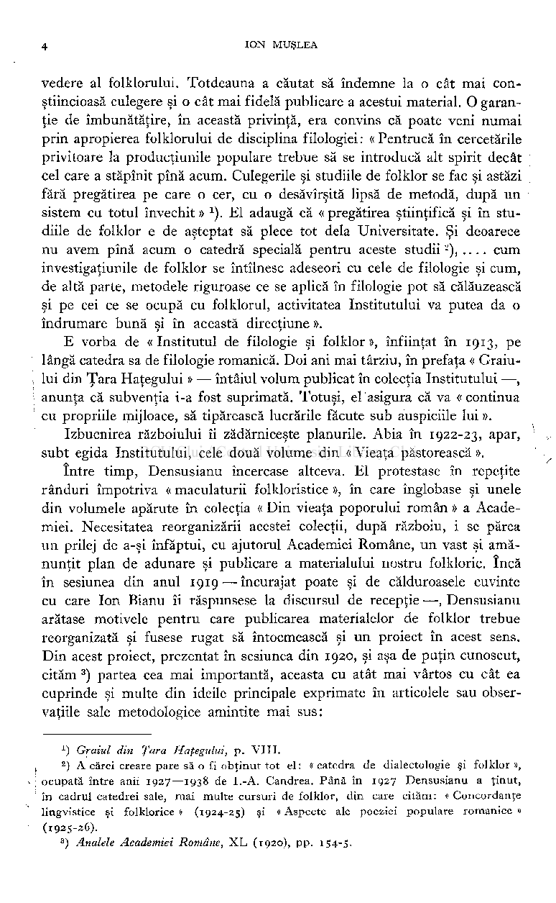

vedere al folklorului. Totdeauna a căutat să îndemne la o cât mai conştiincioasă culegere şi o cât mai fidelă publicare a acestui material. O garanţie de îmbunătăţire, în această privinţă, era convins că poate veni numai prin apropierea folklorului de disciplina filologiei: «Pentrucă în cercetările privitoare la producţiunile populare trebue să se introducă alt spirit decât cel care a stăpînit pînă acum. Culegerile şi studiile de folklor se fac şi astăzi fără pregătirea pe care o cer, cu o desăvîrşită lipsă de metodă, după un sistem cu totul învechit »

). El adaugă că « pregătirea ştiinţifică şi în studiile de folklor e de aşteptat să plece tot delà Universitate. Şi deoarece nu avem pînă acum o catedră specială pentru aceste studii

1

), ... . cum investigaţiunile de folklor se întîlnesc adeseori cu cele de filologie şi cum, de altă parte, metodele riguroase ce se aplică în filologie pot să călăuzească şi pe cei ce se ocupă cu folklorul, activitatea Institutului va putea da o îndrumare bună şi în această direcţiune ».

2

E vorba de «Institutul de filologie şi folklor», înfiinţat în 1913, pe lângă catedra sa de filologie romanică. Doi ani mai târziu, în prefaţa « Graiului din Ţara Haţegului » — întâiul volum publicat în colecţia Institutului —, anunţa că subvenţia i-a fost suprimată. Totuşi, er asigura că va «continua cu propriile mijloace, să tipărească lucrările făcute sub auspiciile lui ».

Izbucnirea războiului îi zădărniceşte planurile. Abia în 1922-23, apar, subt egida Institutului, cele două volume din «Vieaţa păstorească».

între timp, Densusianu încercase altceva. El protestase în repeţite rânduri împotriva « maculaturii folkloristice », în care înglobase şi unele din volumele apărute în colecţia « Din vieaţa poporului român » a Academiei. Necesitatea reorganizării acestei colecţii, după războiu, i se părea un prilej de a-şi înfăptui, cu ajutorul Academiei Române, un vast şi amănunţit plan de adunare şi publicare a materialului nostru folkloric. încă în sesiunea din anul 1919-—• încurajat poate şi de călduroasele cuvinte cu care Ion Bianu îi răspunsese la discursul de recepţie —-, Densusianu arătase motivele pentru care publicarea materialelor de folklor trebue reorganizată şi fusese rugat să întocmească şi un proiect în acest sens. Din acest proiect, prezentat în sesiunea din 1920, şi aşa de puţin cunoscut, cităm ) partea cea mai importantă, aceasta cu atât mai vârtos cu cât ea cuprinde şi multe din ideile principale exprimate în articolele sau observaţiile sale metodologice amintite mai sus:

###### *) Graiul din Ţara Haţegului, p. VIII . I

) A cărei creare pare să o fi obţinut tot el : « catedra de dialectologie şi folklor »,

2

! ocupată între anii 1927—1938 de I.-A. Candrea. Până în 1927 Densusianu a ţinut, în cadrul catedrei sale, mai multe cursuri de folklor, din care cităm: « Concordanţe lingvistice şi folklorice » (1924-25) şi « Aspecte ale poeziei populare romanice » (1925-26).

) Analele Academiei Române, X L (1920), pp. 154-5.

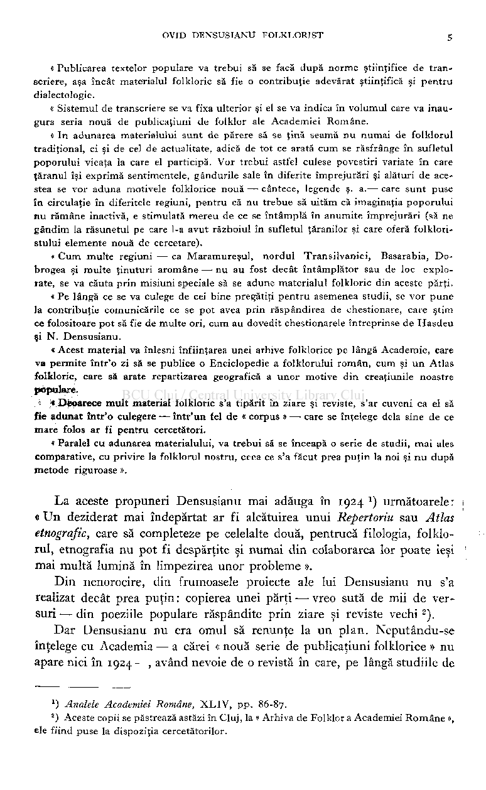

« Publicarea textelor populare va trebui să se facă după norme ştiinţifice de transcriere, aşa încât materialul folkloric să fie o contribuţie adevărat ştiinţifică şi pentru dialectologie.

« Sistemul de transcriere se va fixa ulterior şi el se va indica în volumul care va inaugura seria nouă de publicaţiuni de folklor ale Academiei Române.

« In adunarea materialului sunt de părere să se ţină seamă nu numai de folklorul tradiţional, ci şi de cel de actualitate, adică de tot ce arată cum se răsfrânge în sufletul poporului vieaţa la care el participă. Vor trebui astfel culese povestiri variate în care ţăranul îşi exprimă sentimentele, gândurile sale în diferite împrejurări şi alături de acestea se vor aduna motivele folklorice nouă — cântece, legende ş. a.— care sunt puse în circulaţie în diferitele regiuni, pentru că nu trebue să uităm că imaginaţia poporului nu rămâne inactivă, e stimulată mereu de ce se întâmplă în anumite împrejurări (să ne gândim la răsunetul pe care 1-a avut războiul în sufletul ţăranilor şi care oferă folkloristului elemente nouă de cercetare).

« Cu m multe regiuni — ca Maramureşul, nordul Transilvaniei, Basarabia, Dobrogea şi multe ţinuturi aromâne — nu au fost decât întâmplător sau de loc explorate, se va căuta prin misiuni speciale să se adune materialul folkloric din aceste părţi.

« Pe lângă ce se va culege de cei bine pregătiţi pentru asemenea studii, se vor pune la contribuţie comunicările ce se pot avea prin răspândirea de chestionare, care ştim ce folositoare pot să fie de multe ori, cum au dovedit chestionarele întreprinse de Hasdeu şi N. Densusianu.

« Acest material va înlesni înfiinţarea unei arhive folklorice pe lângă Academie, care va permite într'o zi să se publice o Enciclopedie a folklorului român, cum şi un Atlas folkloric, care să arate repartizarea geografică a unor motive din creaţiunile noastre

### populare.

s :*:Déoarece mult material folkloric s'a tipărit în ziare şi reviste, s'ar cuveni ca el să fie adunat într'o culegere — într'un fel de « corpus » — care se înţelege delà sine de ce mare folos ar fi pentru cercetători.

« Paralel cu adunarea materialului, va trebui să se înceapă o serie de studii, mai ales comparative, cu privire la folklorul nostru, ceea ce s'a făcut prea puţin la noi şi nu după metode riguroase ».

La aceste propuneri Densusianu mai adăuga în 1924 *) următoarele: « Un deziderat mai îndepărtat ar fi alcătuirea unui Repertoriu sau Atlas etnografic, care să completeze pe celelalte două, pentrucă filologia, folklorul, etnografia nu pot fi despărţite şi numai din colaborarea lor poate ieşi mai multă lumină în limpezirea unor probleme ».

Din nenorocire, din frumoasele proiecte ale lui Densusianu nu s'a realizat decât prea puţin: copierea unei părţi-—vreo sută de mii de versuri — din poeziile populare răspândite prin ziare şi reviste vechi

).

2

Dar Densusianu nu era omul să renunţe la un plan. Neputându-se înţelege cu Academia — a cărei « nouă serie de publicaţiuni folklorice » nu apare nici în 1924—, având nevoie de o revistă în care, pe lângă studiile de

- 1

) Analele Academiei Române, XLIV , pp. 86-87.

- 2

###### ) Aceste copii se păstrează astăzi în Cluj, la « Arhiva de Folklor a Academiei Române », ele fiind puse la dispoziţia cercetătorilor.

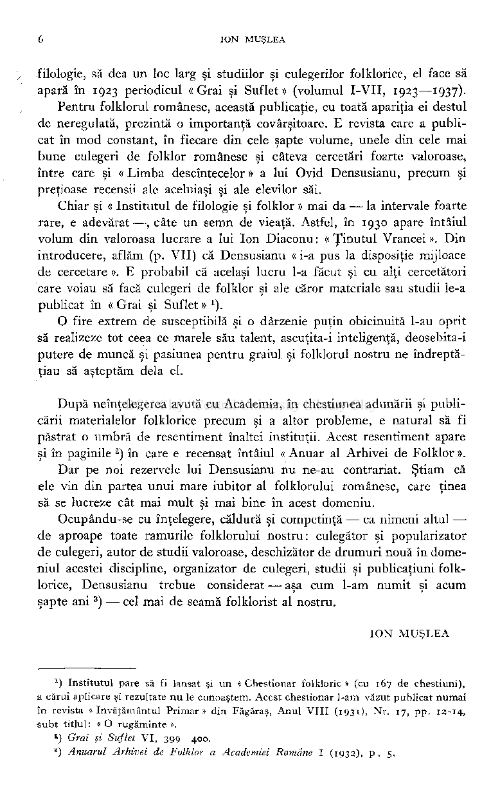

filologie, să dea un loc larg şi studiilor şi culegerilor folklorice, el face să apară în 1923 periodicul «Grai şi Suflet» (volumul I-VII, 1923—1937)-

Pentru folklorul românesc, această publicaţie, cu toată apariţia ei destul de neregulată, prezintă o importanţă covârşitoare. E revista care a publicat în mod constant, în fiecare din cele şapte volume, unele din cele mai bune culegeri de folklor românesc şi câteva cercetări foarte valoroase, între care şi << Limba descîntecelor » a lui Ovid Densusianu, precum şi preţioase recensa ale aceluiaşi şi ale elevilor săi.

Chiar şi « Institutul de filologie şi folklor » mai da — la intervale foarte rare, e adevărat —, câte un semn de vieaţă. Astfel, în 1930 apare întâiul volum din valoroasa lucrare a lui Ion Diaconu: «Ţinutul Vrancei ». Din introducere, aflăm (p. VII) că Densusianu « i-a pus la disposiţie mijloace de cercetare ». E probabil că acelaşi lucru 1-a făcut şi cu alţi cercetători care voiau să facă culegeri de folklor şi ale căror materiale sau studii le-a publicat în « Grai şi Suflet » ).

O fire extrem de susceptibilă şi o dârzenie puţin obicinuită l-au oprit să realizeze tot ceea ce marele său talent, ascuţita-i inteligenţă, deosebita-i putere de muncă şi pasiunea pentru graiul şi folklorul nostru ne îndreptăţi au să aşteptăm delà el.

După neînţelegerea avută cu Academia, în chestiunea adunării şi publicării materialelor folklorice precum şi a altor probleme, e natural să fi păstrat o umbră de resentiment înaltei instituţii. Acest resentiment apare şi în paginile ) în care e recensât întâiul « Anuar al Arhivei de Folklor ».

Dar pe noi rezervele lui Densusianu nu ne-au contrariat. Ştiam că ele vin din partea unui mare iubitor al folklorului românesc, care ţinea să se lucreze cât mai mult şi mai bine în acest domeniu.

Ocupându-se cu înţelegere, căldură şi competinţă — ca nimeni altul de aproape toate ramurile folklorului nostru: culegător şi popularizator de culegeri, autor de studii valoroase, deschizător de drumuri nouă în domeniul acestei discipline, organizator de culegeri, studii şi publicaţiuni folklorice, Densusianu trebue considerat — aşa cum l-am numit şi acum şapte ani

) — cel mai de seamă folklorist al nostru.

3

###### IO N MUŞLE A

) Institutul pare să fi lansat şi un «Chestionar folkloric » (cu 167 de chestiuni), a cărui aplicare şi rezultate nu le cunoaştem. Acest chestionar l-am văzut publicat numai în revista «învăţământul Primar» din Făgăraş, Anul VII I (1931), Nr. 17, pp. 12-14, subt titlul : « O rugăminte ».

1

###### ) Grai şi Suflet VI , 399—400. ) Anuarul Arhivei de Folklor a Academiei Române I (1932), p . 5.

2

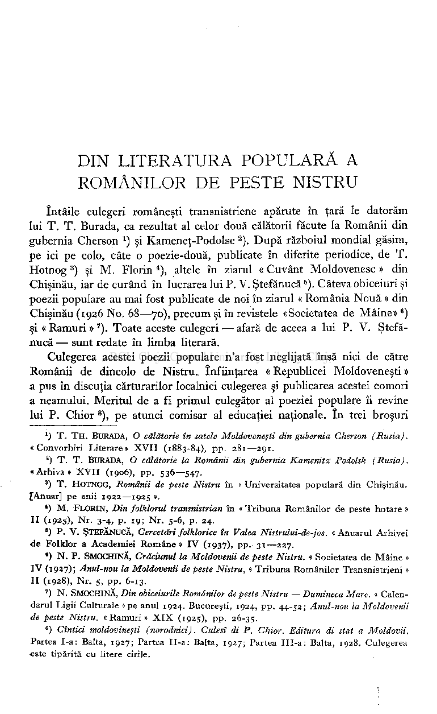

# DIN LITERATURA POPULARĂ A ROMÂNILOR DE PESTE NISTRU

întâile culegeri româneşti transnistriene apărute în ţară le datorăm lui T. T. Burada, ca rezultat al celor două călătorii făcute la Românii din gubernia Cherson şi Kameneţ-Podolsc

). După războiul mondial găsim, pe ici pe colo, câte o poezie-două, publicate în diferite periodice, de T. Hotnog

2

), altele în ziarul « Cuvânt Moldovenesc » din Chişinău, iar de curând în lucrarea lui P. V. Ştefănucă

) şi M. Florin

3

4

). Câteva obiceiuri şi poezii populare au mai fost publicate de noi în ziarul « România Nouă » din Chişinău (1926 No. 68—70), precum şi în revistele «Societatea de Mâine»

5

) şi « Ramuri »

6

). Toate aceste culegeri — afară de aceea a lui P. V. Ştefănucă — sunt redate în limba literară.

7

Culegerea acestei poezii populare n'a fost neglijată însă nici de către Românii de dincolo de Nistru. înfiinţarea « Republicei Moldoveneşti » a pus în discuţia cărturarilor localnici culegerea şi publicarea acestei comori a neamului. Meritul de a fi primul culegător al poeziei populare îi revine lui P. Chior ), pe atunci comisar al educaţiei naţionale. în trei broşuri

###### ) T . TH. BURADA, O călătorie în satele Moldoveneşti din gubernia Cherson (Rusia). «Convorbiri Literare» XVI I (1883-84), pp. 281—291.

x

) T . T . BURADA, O călătorie la Românii din gubernia Kamenitz Podolsk (Rusia).

2

•«Arhiva» XVI I (1906), pp. 536—547.

) T . HOTNOG, Românii de peste Nistru în « Universitatea populară din Chişinău. [Anuar] pe anii 1922—1925 ».

s

*) M . FLORIN, Din folklorul transnistrian în « Tribuna Românilor de peste hotare » II (1925), Nr. 3-4, p. 19; Nr. s-6, p. 24.

) P. V . ŞTEFĂNUCĂ, Cercetări folklorice în Valea Nistrului-de-jos. « Anuarul Arhivei de Folklor a Academiei Române » I V (1937), pp. 31—227.

6

•) N . P. SMOCHTNĂ, Crăciunul la Moldovenii de peste Nistru. « Societatea de Mâine »

- I V (1927); Anul-nou la Moldovenii de peste Nistru, « Tribuna Românilor Transnistrieni »
- II (1928), Nr. s, pp. 6-13. ') N. SMOCHINĂ, Din obiceiurile Românilor de peste Nistru — Dumineca Mare. « Calen­

darul Ligii Culturale » pe anul 1924. Bucureşti, 1924, pp. 44-52; Anul-nou la Moldovenii de peste Nistru. « Ramuri » XI X (1925), pp. 26-35.

) Cîntici moldovineşti (norodnici). Culesî di P. Chior. Editura di stat a Moldovii. Partea I-a: Balta, 1927; Partea Il-a: Balta, 1927; Partea IlI-a: Balta, 1928. Culegerea este tipărită cu litere cirile.

8

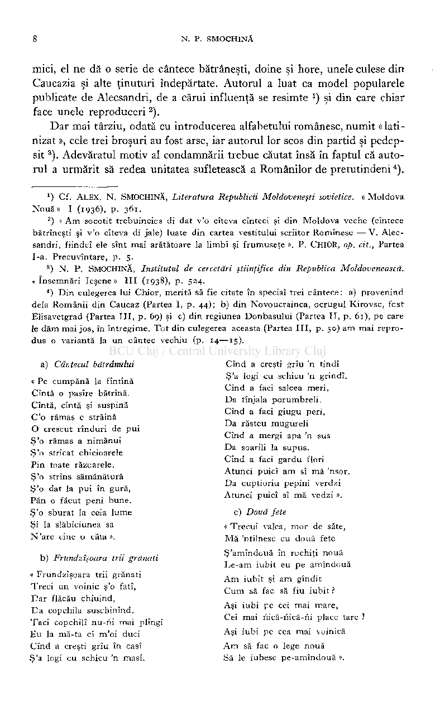

mici, el ne dă o serie de cântece bătrâneşti, doine şi hore, unele culese din Caucazia şi alte ţinuturi îndepărtate. Autorul a luat ca model popularele publicate de Alecsandri, de a cărui influenţă se resimte ) şi din care chiar face unele reproduceri

).

2

Dar mai târziu, odată cu introducerea alfabetului românesc, numit « latinizat », cele trei broşuri au fost arse, iar autorul lor scos din partid şi pedepsit

). Adevăratul motiv al condamnării trebue căutat însă în faptul că autorul a urmărit să redea unitatea sufletească a Românilor de pretutindeni

3

).

4

###### *) Cf. ALEX. N. SMOCHINĂ, Literatura Republicii Moldoveneşti sovietice. « Moldova Nouă» I (1936), p. 361.

) «A m socotit trebuincios di dat v'o cîteva cînteci şi din Moldova veche (cîntece

2

- bătrîneşti şi v'o cîteva di jale) luate din cartea vestitului scriitor Romînesc — V. Alecsandri, fiindcî ele sînt mai arătătoare la limbî şi frumuseţe ». P. CHIOR, op. cit., Partea

I-a. Precuvîntare, p. 5.

###### ) N. P. SMOCHINĂ, Institutul de cercetări ştiinţifice din Republica Moldovenească. «însemnări Ieşene» III (1938), p. 524.

3

) Din culegerea lui Chior, merită să fie citate în special trei cântece: a) provenind delà Românii din Caucaz (Partea I, p. 44); b) din Novoucrainca, ocrugul Kirovsc, fest Elisavetgrad (Partea III , p. 69) şi c) din regiunea Donbasului (Partea II, p. 61), pe care le dăm mai jos, în întregime. Tot din culegerea aceasta (Partea III, p. 50) am mai reprodus o variantă la un cântec vechiu (p. 14—15).

4

Cînd a creşti grîu 'n tindî Ş'a logi cu schicu 'n grindî. Cînd a faci salcea meri, Da tînjala porumbreli. Cînd a faci giugu peri, Da răsteu mugureii Cînd a mergi apa 'n sus Da soarili la supus. Cînd a faci gardu flori Atunci puicî am sî mă 'nsor. Da cuptioriu pepini verdzi Atunci puicî sî mă vedzi ».

a) Cântecul bătrânului

« Pe cumpănă la fîntînă Cîntă o pasîre bătrînă. Cîntă, cîntă şi suspină C'o rămas e străină O crescut rînduri de pui Ş'o rămas a nimănui Ş'o stricat chicioarele Pin toate răzoarele. Ş'o strîns sămănătură Ş'o dat la pui în gură, Păn o făcut peni bune. Ş'o sburat Ia ceia lume Şi Ia slăbiciunea sa N'are cine o căta ».

c) Două fete « Trecui valea, mor de săte, Mă 'ntîlnesc cu două fete Ş'amîndouă în rochiţi nouă Le-am iubit eu pe amîndcuă A m iubit şi am gîndit Cu m să fac să fiu iubit ? Aşi iubi pe cei mai mare, Cei mai nică-nică-ni place tare F Aşi iubi pe cea mai voinică A m să fac o lege nouă Să le iubesc pe-amîndouă ».

b) Frundzîşoara trii grănati

« Frundzîşoara trii grănati Treci un voinic ş'o fatî, Dar flăcău chiuind, Da copehila suschinînd. Taci copchilî nu-ni mai plîngi Eu la mă-ta cî m'oi duci Cînd a creşti grîu în casî Ş'a logi cu schicu 'n masî.

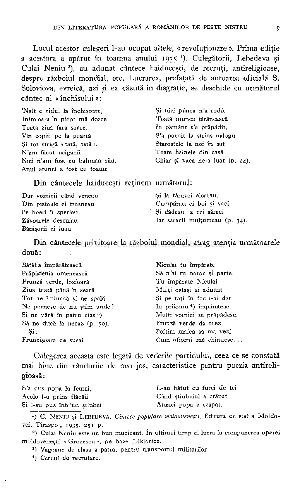

Locul acestor culegeri l-au ocupat altele, « revoluţionare ». Prima ediţie a acestora a apărut în toamna anului 1935 ). Culegătorii, Lebedeva şi Culai Neniu ), au adunat cântece haiduceşti, de recruţi, antireligioase, despre războiul mondial, etc. Lucrarea, prefaţată de autoarea oficială S. Soloviova, evreică, azi şi ea căzută în disgraţie, se deschide cu următorul cântec al «închisului»:

Şi nici pânea n'a rodit Toată munca ţărănească In pământ s'a prăpădit. S'a pornit la strîns nălogu Starostele la noi în sat Toate hainele din casă Chiar şi vaca ne-a luat (p. 24).

'Nalt e zidul la închisoare, Inimioara 'n piept mă doare Toată ziua fără soare. Vin copiii pe la poartă Şi tot strigă « tată, tată ». N'am făcut ucigănii Nici n'am fost eu bahman rău. Anul atunci a fost cu foame

Din cântecele haiduceşti reţinem următorul:

Şi la târguri alerşau. Cumpărau ei boi şi vaci Şi dădeau la cei săraci Iar săracii mulţumeau (p. 34).

Dar voinicii când veneau Din pistoale ei trosneau Pe boeri îi speriau Zăvoarele descuiau Bănisorii ei luau

Din cântecele privitoare la războiul mondial, atrag atenţia următoarele două :

Niculai tu împărate

- Bătălia împărătească Prăpădenia omenească Frunză verde, lozioară Ziua toată până 'n seară To t ne îmbracă şi ne spală Ne pornesc de nu ştim unde !

- Să n'ai tu noroc şi parte.
- T u împărate Niculai Mulţi ostaşi ai adunat Şi pe toţi în foc i-ai dat. In priiomu ) împărătesc Mulţi voinici se prăpădesc. Frunză verde de orez Poftim maică să mă vezi Cum ofiţerii mă chinuesc .

Şi ne vâră în patru clas

) Să ne ducă la necaz (p. 50). Şi: Frunzişoara de susai

3

Culegerea aceasta este legată de vederile partidului, ceea ce se constată mai bine din rândurile de mai jos, caracteristice pentru poezia antireligioasă :

L-au bătut cu furci de tei Când ştiubeiul a crăpat Atunci popa a scăpat.

S'a dus popa la femei, Acolo l-o prins flăcăii Şi l-au pus într'un ştiubei

*) C. NENIU şi LEBEDEVA, Cîntece populare moldoveneşti. Editura de stat a Moldovei. Tiraspol, 1935. 251 p.

###### ) Culai Neniu este un bun muzicant. în ultimul timp el lucra la compunerea operei moldoveneşti « Grozescu », pe baze folklorice.

%

- 3

) Vagoane de clasa a patra, pentru transportul militarilor.

- 4

) Cercul de recrutare.

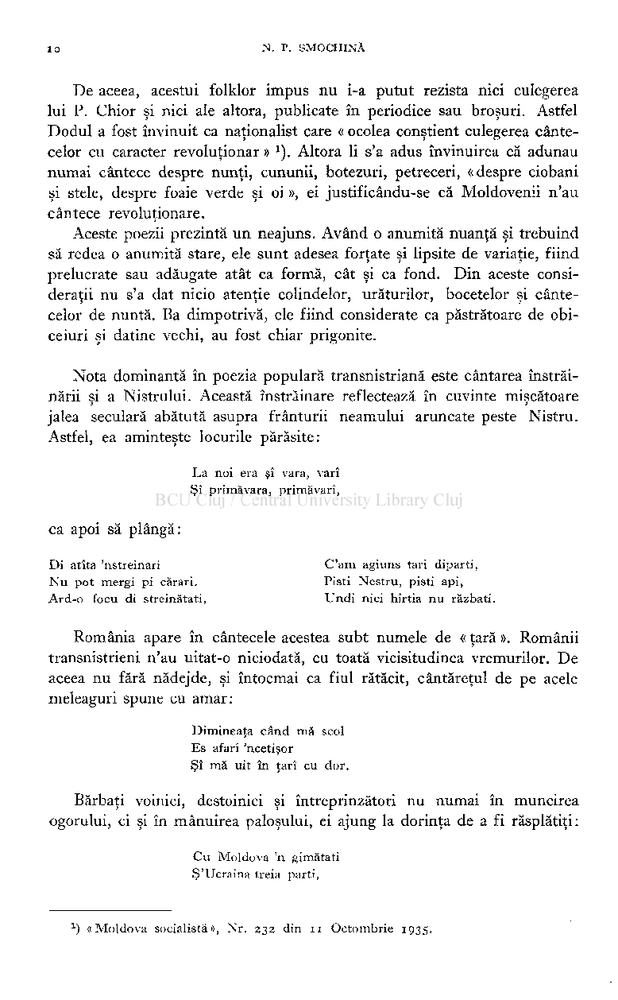

De aceea, acestui folklor impus nu i-a putut rezista nici culegerea lui P. Chior şi nici ale altora, publicate în periodice sau broşuri. Astfel Dodul a fost învinuit ca naţionalist care « ocolea conştient culegerea cântecelor cu caracter revoluţionar » ). Altora li s'a adus învinuirea că adunau numai cântece despre nunţi, cununii, botezuri, petreceri, «despre ciobani şi stele, despre foaie verde şi oi », ei justificându-se că Moldovenii n'au cântece revoluţionare.

Aceste poezii prezintă un neajuns. Având o anumită nuanţă şi trebuind

- să redea o anumită stare, ele sunt adesea forţate şi lipsite de variaţie, fiind prelucrate sau adăugate atât ca formă, cât şi ca fond. Din aceste consideraţii nu s'a dat nicio atenţie colindelor, uraturilor, bocetelor şi cântecelor de nuntă. Ba dimpotrivă, ele fiind considerate ca păstrătoare de obiceiuri şi datine vechi, au fost chiar prigonite.

Nota dominantă în poezia populară transnistriană este cântarea înstrăinării şi a Nistrului. Această înstrăinare reflectează în cuvinte mişcătoare jalea seculară abătută asupra frânturii neamului aruncate peste Nistru. Astfel, ea aminteşte locurile părăsite:

La noi era şî vara, vârî Şî primăvara, primăvarî,

ca apoi să plângă:

Ca m agiuns tari diparti, Pişti Nestru, pişti api, Undi nici hîrtia nu răzbaţi.

Di atîta 'nstreinari

- N u pot mergi pi cărări. Ard-o focu di streinătati,

România apare în cântecele acestea subt numele de « ţară ». Românii transnistrieni n'au uitat-o niciodată, cu toată vicisitudinea vremurilor. De aceea nu fără nădejde, şi întocmai ca fiul rătăcit, cântăreţul de pe acele meleaguri spune cu amar:

Dimineaţa când mă scol Es afarî 'ncetişor Şî mă uit în ţarî cu dor.

Bărbaţi voinici, destoinici şi întreprinzători nu numai în muncirea ogorului, ci şi în mânuirea paloşului, ei ajung la dorinţa de a fi răsplătiţi:

C u Moldova 'n gimătati Ş'Ucraina treia parti,

*) «Moldova socialistă», Nr. 232 din 11 Octombrie 1935.

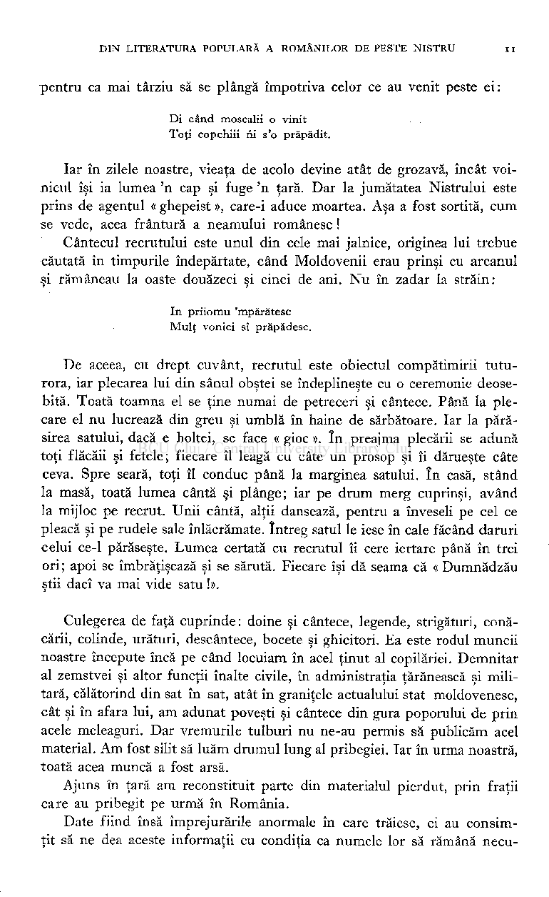

pentru ca mai târziu să se plângă împotriva celor ce au venit peste ei:

Di când moscalii o vinit Toţi copchiii hi s'o prăpădit.

Iar în zilele noastre, vieaţa de acolo devine atât de grozavă, încât voinicul îşi ia lumea 'n cap şi fuge 'n ţară. Dar la jumătatea Nistrului este prins de agentul « ghepeist », care-i aduce moartea. Aşa a fost sortită, cum se vede, acea frântură a neamului românesc !

Cântecul recrutului este unul din cele mai jalnice, originea lui trebue

- căutată în timpurile îndepărtate, când Moldovenii erau prinşi cu arcanul şi rămâneau la oaste douăzeci şi cinci de ani. Nu în zadar la străin:

In priiomu 'mpărătesc Mulţ vonici sî prăpădesc.

De aceea, cu drept cuvânt, recrutul este obiectul compătimirii tuturora, iar plecarea lui din sânul obştei se îndeplineşte cu o ceremonie deosebită. Toată toamna el se ţine numai de petreceri şi cântece. Până la plecare el nu lucrează din greu şi umblă în haine de sărbătoare. Iar la părăsirea satului, dacă e holtei, se face « gioc ». în preajma plecării se adună toţi flăcăii şi fetele; fiecare îl leagă cu câte un prosop şi îi dărueşte câte ceva. Spre seară, toţi îl conduc până la marginea satului. în casă, stând la masă, toată lumea cântă şi plânge; iar pe drum merg cuprinşi, având la mijloc pe recrut. Unii cântă, alţii dansează, pentru a înveseli pe cel ce pleacă şi pe rudele sale înlăcrămate. întreg satul le iese în cale făcând daruri celui ce-1 părăseşte. Lumea certată cu recrutul îi cere iertare până în trei ori; apoi se îmbrăţişează şi se sărută. Fiecare îşi dă seama că « Dumnădzău ştii dacî va mai vide satu !».

Culegerea de faţă cuprinde: doine şi cântece, legende, strigături, conăcării, colinde, uraturi, descântece, bocete şi ghicitori. Ea este rodul muncii noastre începute încă pe când locuiam în acel ţinut al copilăriei. Demnitar al zemstvei şi altor funcţii înalte civile, în administraţia ţărănească şi militară, călătorind din sat în sat, atât în graniţele actualului stat moldovenesc, cât şi în afara lui, am adunat poveşti şi cântece din gura poporului de prin acele meleaguri. Dar vremurile tulburi nu ne-au permis să publicăm acel material. Am fost silit să luăm drumul lung al pribegiei. Iar în urma noastră, toată acea muncă a fost arsă.

Ajuns în ţară am reconstituit parte din materialul pierdut, prin fraţii care au pribegit pe urmă în România.

Date fiind însă împrejurările anormale în care trăiesc, ei au consimţit să ne dea aceste informaţii cu condiţia ca numele lor să rămână necu-

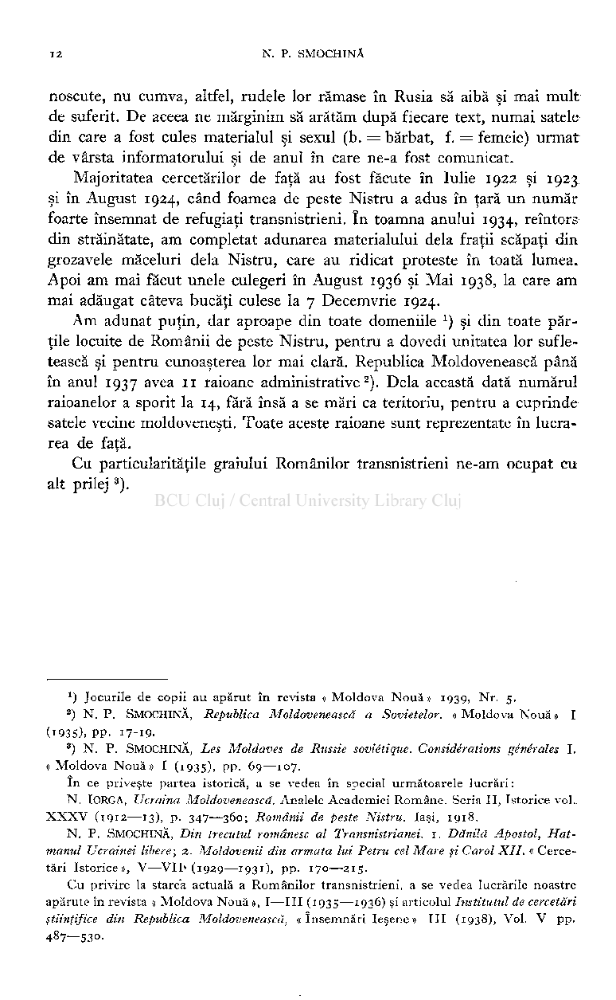

noscute, nu cumva, altfel, rudele lor rămase în Rusia să aibă şi mai mult de suferit. De aceea ne mărginim să arătăm după fiecare text, numai satele din care a fost cules materialul şi sexul (b. = bărbat, f. = femeie) urmat de vârsta informatorului şi de anul în care ne-a fost comunicat.

Majoritatea cercetărilor de faţă au fost făcute în Iulie 1922 şi 1923 şi în August 1924, când foamea de peste Nistru a adus în ţară un număr foarte însemnat de refugiaţi transnistrieni. în toamna anului 1934, reîntors din străinătate, am completat adunarea materialului delà fraţii scăpaţi din grozavele măceluri delà Nistru, care au ridicat proteste în toată lumea. Apoi am mai făcut unele culegeri în August 1936 şi Mai 1938, la care am mai adăugat câteva bucăţi culese la 7 Decemvrie 1924.

Am adunat puţin, dar aproape din toate domeniile şi din toate părţile locuite de Românii de peste Nistru, pentru a dovedi unitatea lor sufletească şi pentru cunoaşterea lor mai clară. Republica Moldovenească până în anul 1937 avea 11 raioane administrative

). Delà această dată numărul raioanelor a sporit la 14, fără însă a se mări ca teritoriu, pentru a cuprinde satele vecine moldoveneşti. Toate aceste raioane sunt reprezentate în lucrarea de faţă.

2

Cu particularităţile graiului Românilor transnistrieni ne-am ocupat cu alt prilej

).

3

###### *) Jocurile de copii au apărut în revista « Moldova Nouă» 1939, Nr. 5.

###### ) N. P. SMOCHINĂ, Republica Moldovenească a Sovietelor. « Moldova Nouă » I (i93S). PP- 17-19-

2

) N. P. SMOCHINĂ, Les Moldaves de Russie soviétique. Considérations générales I.

3

« Moldova Nouă» I (1935), pp. 69—107. în ce priveşte partea istorică, a se vedea în special următoarele lucrări: N. IORGA, Ucraina Moldovenească. Analele Academiei Române. Seria II, Istorice voi.

XXX V (1912—13), p. 347—360; Românii de peste Nistru. Iaşi, 1918.

N. P. SMOCHINĂ, Din trecutul românesc al Transnistrianei. 1. Dănilă Apostol, Hatmanul Ucrainei libere; 2. Moldovenii din armata lui Petru cel Mare şi Carol XII. « Cerce­

- tări Istorice», V—VII» (1929—1931), pp. 170—215. Cu privire la starea actuală a Românilor transnistrieni, a se vedea lucrările noastre

apărute în revista « Moldova Nouă », I—III (1935—1936) şi articolul Institutul de cercetări ştiinţifice din Republica Moldovenească, «însemnări Ieşene» III (1938), Vol. V pp. 487—530.

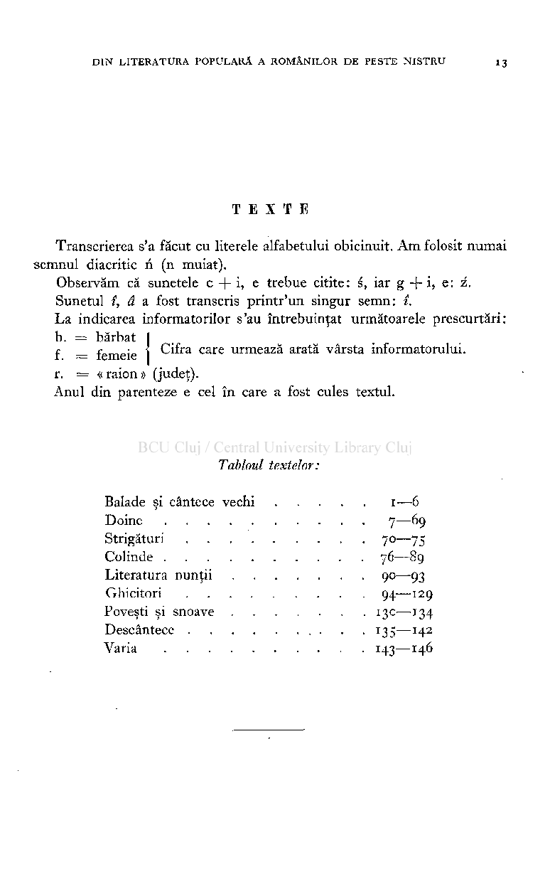

TEXT E

Transcrierea s'a făcut cu literele alfabetului obicinuit. Am folosit numai

semnul diacritic fi (n muiat). Observăm că sunetele c + i, e trebue citite: s, iar g + i, e: z. Sunetul î, â a fost transcris printr'un singur semn: î. La indicarea informatorilor s'au întrebuinţat următoarele prescurtări: b. = bărbat I f = femeie I Cifra

urmează arată vârsta informatorului,

car

r. = «raion» (judeţ). Anul din parenteze e cel în care a fost cules textul.

Tabloul textelor:

Balade şi cântece vechi 1—6 Doine 7—69 Strigături 70—75 Colinde 76—89 Literatura nunţii 90—93 Ghicitori 94—-129 Poveşti şi snoave 130—134 Descântece 135—142 Varia 143—146

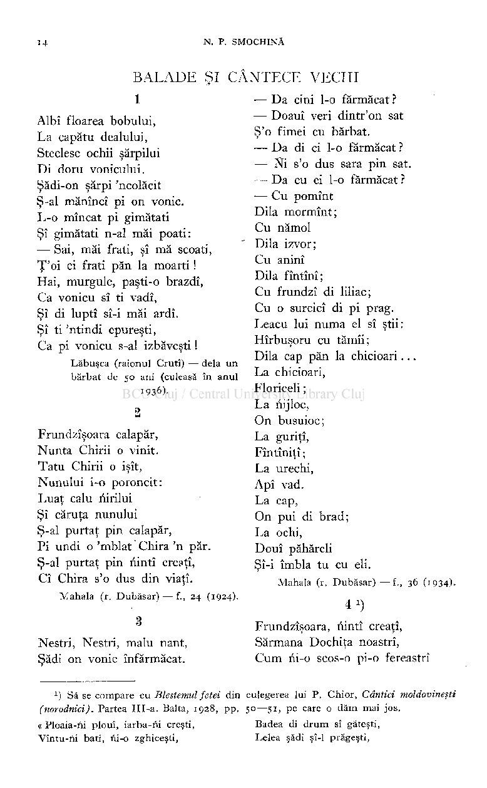

#### BALAD E Ş I CÂ 1

#### >JTEC E VECH I

-— Da cini l-o fărmăcat ?

— Doauî veri dintr'on sat Ş'o fimei cu bărbat.

Albî floarea bobului, La capătu dealului, Steclesc ochii şărpilui Di doru vonicului. Şădi-on şărpi 'ncolăcit Ş-al mănîncî pi on vonic. L-o mîncat pi gimătati Şî gimătati n-al măi poati:

— Da di ci l-o fărmăcat ?

— Ni s'o dus sara pin sat.

— Da cu ci l-o fărmăcat ?

— Cu pomînt Dila mormînt; Cu nămol Dila izvor; Cu aninî Dila fîntînî; Cu frundzî di liliac; Cu o surcicî di pi prag. Leacu lui numa el sî ştii: Hîrbuşoru cu tămîi; Dila cap păn la chicioari... La chicioari, Floriceli ; La riijloc, On busuioc; La guriţî, Fîntîniţî ; La urechi, Apî vad. La cap, On pui di brad; La ochi, Douî păhăreli Şî-i îmbla tu cu eli.

— Sai, măi fraţi, şî mă scoati, Ţ'oi ci fraţi păn la moarti ! Hai, murgule, paşti-o brazdî, Ca vonicu sî ti vadî, Şî di luptî sî-i măi ardî. Şî ti 'ntindi epureşti, Ca pi vonicu s-al izbăveşti !

Lăbuşca (raionul Crutî) — delà un bărbat de 50 ani (culeasă în anul 1936).

2

Frundzîşoara calapăr, Nunta Chirii o vinit. Tatu Chirii o işît, Nunului i-o poroncit: Luat calu riirilui Şî căruţa nunului Ş-al purtat pin calapăr, Pi undi o 'mblat Chira 'n păr. Ş-al purtat pin nintî creaţi, Cî Chira s'o dus din viaţî.

Mahala (r. Dubăsar) —f., 36 (1934).

Mahala (r. Dubăsar) — f., 24 (1924).

4 )

3

Frundzîşoara, nintî creaţi, Sărmana Dochiţa noastrî, Cum ni-o scos-o pi-o fereastrî

Nestri, Nestri, malu nant, Sădi on vonic înfărmăcat.

) Să se compare cu Blestemul fetei din culegerea lui P. Chior, Cântici moldovineşti

x

(narodnici). Partea IlI-a. Balta, 1928, pp. 50—51, pe care o dăm mai jos. « Ploaia-ni plouî, iarba-hi creşti, Badea di drum sî găteşti, Vîntu-rii bati, ni-o zghiceşti, Lelea sădi şî-1 prăgeşti,

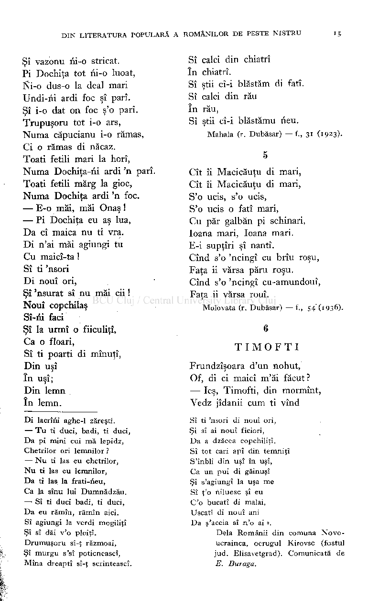

Sî calci din chiatrî în chiatrî. Sî ştii cî-i blăstăm di fatî. Sî calci din rău în rău, Sî ştii cî-i blăstămu neu.

Şî vazonu fii-o stricat. Pi Dochiţa tot rii-o luoat, Ni-o dus-o la deal mari Undi-rii ardi foc şî parî. Şî i-o dat on foc ş'o parî. Trupuşoru tot i-o ars, Numa căpucianu i-o rămas, Ci o rămas di năcaz. Toati fetili mari la horî, Numa Dochiţa-ni ardi 'n parî. Toati fetili mărg la gioc, Numa Dochiţa ardi 'n foc.

Mahala (r. Dubăsar) — f., 31 (1923)-

5

Cît îi Macicăuţu di mari, Cît îi Macicăuţu di mari, S'o ucis, s'o ucis, S'o ucis o fatî mari, Cu păr galbăn pi schinari, Ioana mari, Ioana mari. E-i supţîri şî nantî. Cînd s'o 'ncingî cu brîu roşu, Faţa ii vărsa păru roşu. Cînd s'o 'ncingî cu-amundouî, Faţa ii vărsa rouî.

— E-o măi, măi Onaş !

— Pi Dochiţa eu aş lua, Da cî maica nu ti vra. Di n'ai măi agiungi tu Cu maicî-ta ! Sî ti 'nsori Di nouî ori, Şî 'nsurat sî nu măi cii ! Nouî copchilaş Sî-ni faci Şî la urmî o fiiculiţî, Ca o floari, Sî ti poarti di mînuţî, Din uşî în uşî; Din lemn în lemn.

Molovata (r. Dubăsar) —f., 54" (1936).

6

TIMOFT I

Frundzîşoara d'un nohut, Of, di ci maicî m'ăi făcut?

— leş, Timofti, din mormînt, Vedz jidanii cum ti vînd

Sî ti 'nsori di nouî ori, Şi sî ai nouî ficiori, Da a dzăcea copchiliţî. Sî tot cari apî din temniţî S'înbli din uşî în uşî, Ca un pui di găinuşî Şî s'agiungî la uşa me Sî ţ'o niluesc şî eu C'o bucatî di mălai, Uscatî di nouî ani Da ş'aceia sî n'o ai ».

Di lacrîhi aghe-1 zăreşti.

— T u ti duci, badi, ti duci, Da pi mini cui mă lepidz, Chetrilor ori lemnilor ?

— N u ti las eu chetrilor,

- N u ti las eu lemnilor, Da ti las la frati-neu, Ca la sînu lui Dumnădzău.

—• Sî ti duci badi, ti duci, Da eu rămîn, rămîn aici. Sî agiungi la verdi mogiliţî Şî sî dăi v'o ploiţî. Drumuşoru sî-ţ răzmoai, Şî murgu s'sî poticneascî, Mîna dreaptî sî-ţ scrinteascî.

Delà Românii din comuna Novo ucrainca, ocrugul Kirovsc (fostul

jud. Elisavetgrad). Comunicată de E. Buraga.

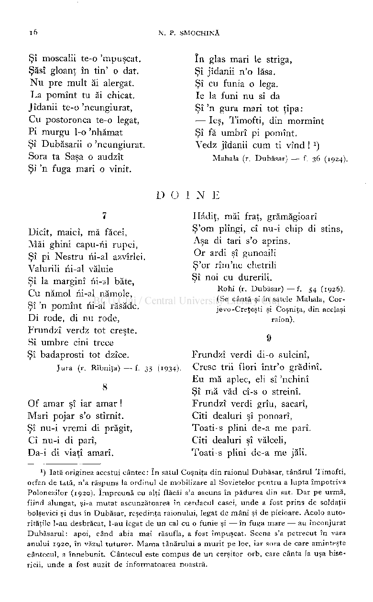

Şî moscalii te-o 'mpuşcat. Şăsî gloanţ în tin' o dat. Nu pre mult ăi alergat. La pomînt tu ăi chicat.

în glas mari le striga, Şî jidanii n'o lăsa. Şî cu funia o lega. Ie la funi nu sî da Şî 'n gura mari tot ţîpa :

Jidanii te-o 'ncungiurat, Cu postoronca te-o legat, Pi murgu l-o 'nhămat Şî Dubăsarii o 'ncungiurat. Sora ta Saşa o audzît Şi 'n fuga mari o vinit.

— leş, Timofti, din mormînt Şî fă umbrî pi pomînt. Vedz jidanii cum ti vînd !

)

x

Mahala (r. Dubăsar) — f. 36 (1924).

DOIN

Hâdiţ, măi fraţ, grămăgioarî Ş'om plîngi, cî nu-i chip di stins, Aşa di tari s'o aprins. Or ardi şî gunoaili Ş'or rîm'ne chetrili Şî noi cu durerili.

7

Dicît, maicî, mă făcei, Măi ghini capu-ni rupei, Şî pi Nestru rii-al azvîrlei. Valurili rii-al văluie Şî la margini rii-al băte, Cu nămol rii-al nămole, Şî 'n pomînt rii-al răsăde. Di rode, di nu rode, Frundzî verdz tot creşte. Sî umbre cini trece Şî badaprosti tot dzîce.

Rohi (r. Dubăsar) —f. 54 (1926). (Se cântă şi în satele Mahala, Corjevo-Creţeşti şi Coşniţa, din acelaşi

raion).

9

Frundzî verdi di-o sulcinî, Cresc trii flori într'o grădini. Eu mă aplec, eli sî 'nchinî Şî mă văd cî-s o streinî. Frundzî verdi grîu, sacarî, Cîti dealuri şî ponoarî, Toati-s plini de-a me parî. Cîti dealuri şî vălceli, Toati-s plini de-a me jăli.

Jura (r. Rîbniţa) —f. 35 (I934-).

8

Of amar şî iar amar ! Mari pojar s'o stîrnit. Şî nu-i vremi di prăgit, Cî nu-i di parî, Da-i di viaţî amarî.

) Iată originea acestui cântec: în satul Coşniţa din raionul Dubăsar, tânărul Timofti, orfan de tată, n'a răspuns Ia ordinul de mobilizare al Sovietelor pentru a lupta împotriva Polonezilor (1920). împreună cu alţi flăcăi s'a ascuns în pădurea din sat. Dar pe urmă, fiind alungat, şi-a mutat ascunzătoarea în cerdacul casei, unde a fost prins de soldaţii bolşevici şi dus în Dubăsar, reşedinţa raionului, legat de mâni şi de picioare. Acolo autorităţile l-au desbrăcat, l-au legat de un cal cu o funie şi — în fuga mare — au înconjurat Dubăsarul: apoi, când abia mai răsufla, a fost împuşcat. Scena s'a petrecut în vara anului 1920, în văzul tuturor. Mama tânărului a murit pe loc, iar sora de care aminteşte cântecul, a înnebunit. Cântecul este compus de un cerşitor orb, care cânta la uşa bisericii, unde a fost auzit de informatoarea noastră.

x

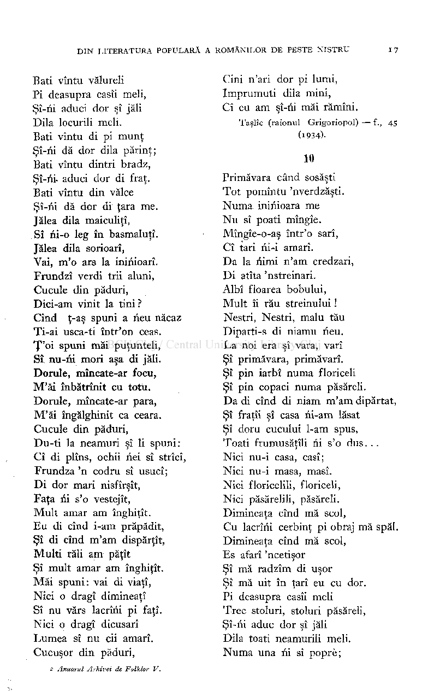

Cini n'ari dor pi lumi, împrumuţi dila mini, Cî eu am şî-ni măi rămîni.

Bati vîntu vălureli Pi deasupra casîi meii, Şî-rii aduci dor şî jăli Dila locurili meii. Bati vîntu di pi munţ Şî-ni dă dor dila părinţ; Bati vîntu dintri bradz, Şî-ni- aduci dor di fraţ. Bati vîntu din vălce Şî-ni dă dor di ţara me. Jalea dila maiculiţî, Sî rii-o leg în basmaluţî. Jalea dila sorioarî, Vai, m'o ars la ininioarî. Frundzî verdi trii aluni, Cucuie din păduri, Dici-am vinit la tini ? Cînd ţ-aş spuni a neu năcaz Ti-ai usca-ti într'on ceas. Ţ'oi spuni măi puţunteli, Sî nu-ni mori aşa di jăli. Dorule, mîncate-ar focu, M'ăi înbătrînit cu totu. Dorule, mîncate-ar para, M'ăi îngălghinit ca ceara. Cucuie din păduri, Du-ti la neamuri şî li spuni: Cî di plîns, ochii hei sî strîcî, Frundza 'n codru sî usucî; Di dor mari nisfîrşît, Faţa ni s'o vestejit, Mult amar am înghiţit. Eu di cînd i-am prăpădit, Şî di cînd m'am dispărţît, Mulţi răii am păţît Şî mult amar am înghiţit. Măi spuni: vai di viaţî, Nici o dragî dimineaţî Sî nu vărs lacrîni pi faţî. Nici o dragî dicusarî Lumea sî nu cii amarî. Cucuşor din păduri,

Taşlîc (raionul Grigoriopol) — f., 45 (i934)-

10

Primăvara când sosăşti Tot pomîntu 'nverdzăşti. Numa. ininioara me Nu sî poati mîngîe. Mîngîe-o-aş într'o sari, Cî tari rii-i amarî. Da la nimi n'am credzari, Di atîta 'nstreinari. Albî floarea bobului, Mult îi rău streinului ! Nestri, Nestri, malu tău Diparti-s di niamu neu. La noi era şî vara, vârî Şî primăvara, primăvarî. Şî pin iarbî numa floriceli Şî pin copaci numa păsăreli. Da di cînd di niam m'am dipărtat, Şî fraţii şî casa ni-am lăsat Şî doru cucului l-am spus, Toati frumusăţîli hi s'o dus... Nici nu-i casa, casî; Nici nu-i masa, masî. Nici floricelili, floriceli, Nici păsărelili, păsăreli. Dimineaţa cînd mă scol, Cu lacrîhi cerbinţ pi obraj mă spăl. Dimineaţa cînd mă scol, Es afarî 'ncetişor Şî mă radzîm di uşor Şî mă uit în ţari eu cu dor. Pi deasupra casîi meii Trec stoluri, stoluri păsăreli, Şî-hi aduc dor şî jăli Dila toati neamurili meii. Numa una hi sî poprè;

2 Anuarul Arhivei de Folklor V.

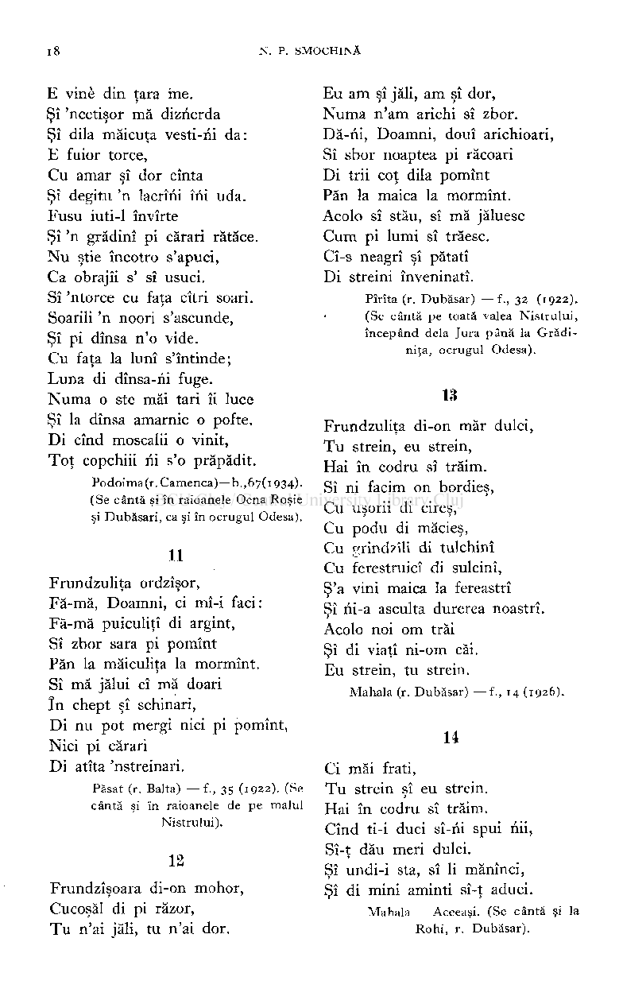

Eu am şî jăli, am şî dor, Numa n'am arichi sî zbor. Dă-ni, Doamni, douî arichioari, Sî sbor noaptea pi răcoari Di trii coţ dila pomînt Păn la maica la mormînt. Acolo sî stău, sî mă jăluesc Cum pi lumi sî trăesc. Cî-s neagrî şî pătatî Di streini înveninaţi.

E vinè din ţara me. Şî 'ncetişor mă dizrierda Şî dila măicuţa vesti-ni da: E fuior torce, Cu amar şî dor cînta Şî degitu 'n lacrîfii îrii uda. Fusu iuti-1 învîrte Şî 'n grădini pi cărări rătăce. Nu ştie încotro s'apuci, Ca obrajii s' sî usuci. Sî 'ntorce cu faţa cîtri soari. Soarili 'n noori s'ascunde, Şî pi dînsa n'o vide. Cu faţa la lunî s'întinde; Luna di dînsa-ni fuge. Numa o ste măi tari îi luce Şî la dînsa amarnic o pofte. Di cînd moscalii o vinit, Toţ copchiii ni s'o prăpădit.

Pîrîta (r. Dubăsar) —f., 32 (1922). (Se cântă pe toată valea Nistrului, începând delà Jura până la Grădiniţa, ocrugul Odesa).

13

Frundzuliţa di-on măr dulci, Tu strein, eu strein, Hai în codru sî trăim. Si ni facim on bordieş, Cu uşorii di cireş, Cu podu di măcieş, Cu grind7Îli di tulchinî Cu ferestruici di sulcinî, Ş'a vini maica la fereastrî Şî ni-a asculta durerea noastrî. Acolo noi om trăi Şî di viaţî ni-om căi. Eu strein, tu strein.

Podoima(r.Camenca)—b., 67(1934). (Se cântă şi în raioanele Ocna Roşie şi Dubăsari, ca şi în ocrugul Odesa).

11

Frundzuliţa ordzîşor, Fă-mă, Doamni, ci mî-i faci: Fă-mă puiculiţî di argint, Sî zbor sara pi pomînt Păn la măiculiţa la mormînt. Sî mă jălui cî mă doari în chept şî schinari, Di nu pot mergi nici pi pomînt, Nici pi cărări Di atîta 'nstreinari.

Mahala (r. Dubăsar) —f., 14 (1926).

14

Ci măi fraţi, Tu strein şî eu strein. Hai în codru sî trăim. Cînd ti-i duci sî-ni spui fiii, Sî-ţ dău meri dulci. Şî undi-i sta, sî li mănînci, Şî di mini aminti sî-ţ aduci.

Păsat (r. Balta) — f., 35 (1922). (Se cântă şi în raioanele de pe malul

Nistrului).

12

Frundzîşoara di-on mohor, Cucoşăl di pi răzor, Tu n'ai jăli, tu n'ai dor.

Mahala—Aceeaşi. (Se cântă şi la Rohi, r. Dubăsar).

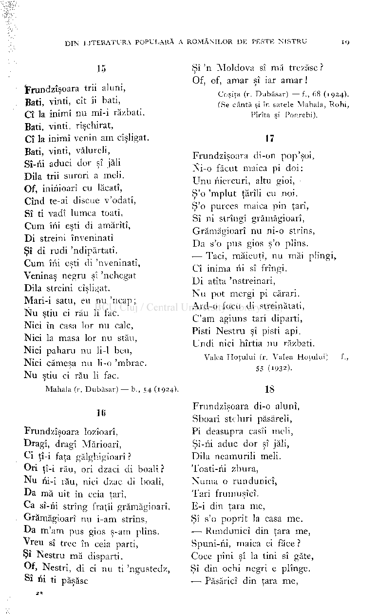

Şî 'n Moldova sî mă trezăsc ? Of, of, amar şî iar amar !

15

Frundzîşoara trii aluni, Bati, vinti, cît îi bati, Cî la inimî nu mî-i răzbaţi. Bati, vinti, rîşchirat, Cî la inimî venin am cîşligat. Bati, vinti, vălureli, Sî-ni aduci dor şî jăli Dila trii surori a meii. Of, iniriioarî cu lăcatî, Cînd te-ai discue v'odatî, Sî ti vadî lumea toatî, Cum îiîi eşti di amărîtî, Di streini înveninat! Şî di rudi 'ndipărtatî. Cum îni eşti di 'nveninatî, Veninaş negru şî 'nchegat Dila streini cîşligat. Mari-i satu, eu nu 'ncap ; Nu ştiu ci rău li fac. Nici în casa lor nu calc, Nici la masa lor nu stău, Nici paharu nu li-1 beu, Nici cămeşa nu li-o 'mbrac. Nu ştiu ci rău li fac.

Cosiţa (r. Dubăsar) — f., 68 (1924). (Se cântă şi în satele Mahala, Rohi, Pîrîta şi Pogrebi).

17

Frundzîşoara di-on pop'şoi, Ni-o făcut maica pi doi: Unu iîiercuri, altu gioi, Ş'o 'mplut ţărîli cu noi. Ş'o purces maica pin ţari, Sî ni strîngî grămăgioarî, Grămăgioarî nu ni-o strîns, Da s'o pus gios ş'o plîns.

— Taci, măicuţî, nu măi plîngi, Cî inima ni sî frîngi. Di atîta 'nstreinari, Nu pot mergi pi cărări. Ard-o focu di streinătati, Cam agiuns tari diparti, Pişti Nestru şî pişti api, Undi nici hîrtia nu răzbaţi.

Valea Hoţului l'r. Valea Hoţului) — f.,

SS (1932).

Mahala (r. Dubăsar) — b., 54 (1924).

18

Frundzîşoara di-o alunî, Sboarî stcluri păsăreli, Pi deasupra casîi meii, Şî-ni aduc dor şî jăli, Dila neamurili meii. Toati-iîi zbura, Numa o rundunicî, Tari frumuşîcî. E-i din ţara me, Şî s'o poprit la casa me.

16

Frundzîşoara lozîoarî, Dragî, dragî Mărioarî, Ci ţî-i faţa gălghigioarî ? Ori ţî-i rău, ori dzaci di boalî ? Nu iîi-i rău, nici dzac di boali, Da mă uit în ceia ţari, Ca sî-ni strîng fraţii grămăgioarî. Grămăgioarî nu i-am strîns, Da m'am pus gios ş-am plîns. Vreu sî trec în ceia parti, Şî Nestru mă disparti. Of, Nestri, di ci nu ti 'ngustedz, Sî ni ti păşăsc

— Rundunicî din ţara me, Spuni-ni, maica ci face ? Coce pîni şî la tini sî găte, Şî din ochi negri e plînge.

— Păsăricî din ţara me,

2*

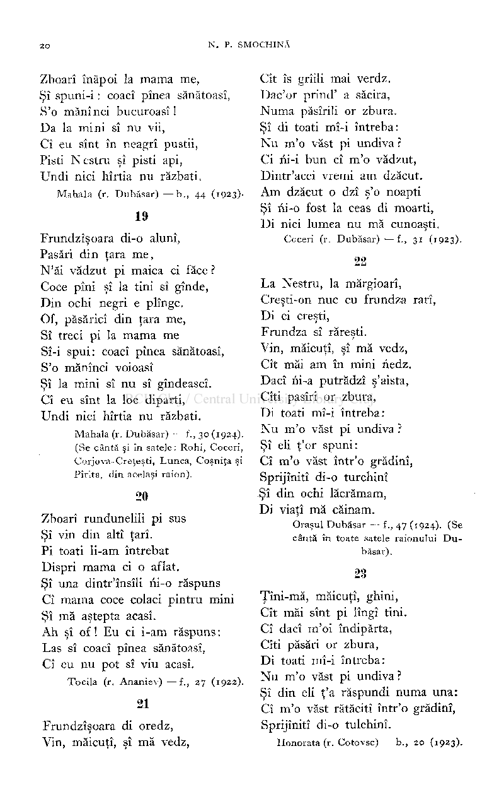

Cit îs grîili mai verdz. Dac'or prind' a săcira, Numa păsîrili or zbura. Şî di toati mî-i întreba: Nu m'o văst pi undiva ? Ci hi-i bun cî m'o vădzut, Dintr'acei vremi am dzăcut. Am dzăcut o dzî ş'o noapti Şî rii-o fost la ceas di moarti, Di nici lumea nu mă cunoaşti.

Zboarî înapoi la mama me, Şî spuni-i : coacî pînea sănătoasî, S'o mănînci bucuroasî ! Da la mini sî nu vii, Cî eu sînt în neagrî pustii, Pişti Nestru şî pişti api, Undi nici hîrtia nu răzbaţi.

Mahala (r. Dubăsar) —b. , 44 (1923)-

1 9

Frundzîşoara di-o alunî, Pasări din ţara me, N'ăi vădzut pi maica ci face ? Coce pîni şî la tini sî gînde, Din ochi negri e plînge. Of, păsăricî din ţara me, Sî treci pi la mama me Sî-i spui: coacî pînea sănătoasî, S'o mănînci voioasî Şî la mini sî nu sî gîndeascî. Cî eu sînt la loc diparti, Undi nici hîrtia nu răzbaţi.

Coceri (r. Dubăsar) —f., 31 (1923).

22

La Nestru, la mărgioarî, Creşti-on nuc cu frundza rarî, Di ci creşti, Frundza sî răreşti. Vin, măicuţî, şî mă vedz, Cît măi am în mini hedz. Dacî hi-a putrădzî ş'aista, Cîti pasîri or zbura, Di toati mî-i întreba: Nu m'o văst pi undiva ? Şî eli ţ'or spuni: Cî m'o văst într'o grădini, Sprijiniţi di-o turchinî Şî din ochi lăcrămam, Di viaţî mă căinam.

Mahala (r. Dubăsar) — f., 30 (1924). (Se cântă şi în satele: Rohi, Coceri, Corjova-Creţeşti, Lunca, Coşniţa şi Pîrlta, din acelaşi raion).

20

Zboarî rundunelili pi sus Şî vin din altî ţarî. Pi toati li-am întrebat Dispri mama ci o aflat. Şî una dintr'însîli hi-o răspuns Cî mama coce colaci pintru mini Şî mă aştepta acasî. Ah şî of ! Eu ci i-am răspuns : Las sî coacî pînea sănătoasî, Cî eu nu pot sî viu acasî.

Oraşul Dubăsar — f., 47 (1924). (Se cântă în toate satele raionului Du băsar).

23

Ţîni-mă, măicuţî, ghini, Cît măi sînt pi lîngî tini. Cî dacî m'oi îndipărta, Cîti păsări or zbura, Di toati mî-i întreba: Nu m'o văst pi undiva ? Şî din eli ţ'a răspundi numa una: Cî m'o văst rătăciţi într'o grădini, Sprijiniţi di-o tulchinî.

Tocila (r. Ananiev) —f., 27 (1922).

21

Frundzîşoara di oredz, Vin, măicuţî, şî mă vedz,

Honorata (r. Cotovsc) —b. , 20 (1923).

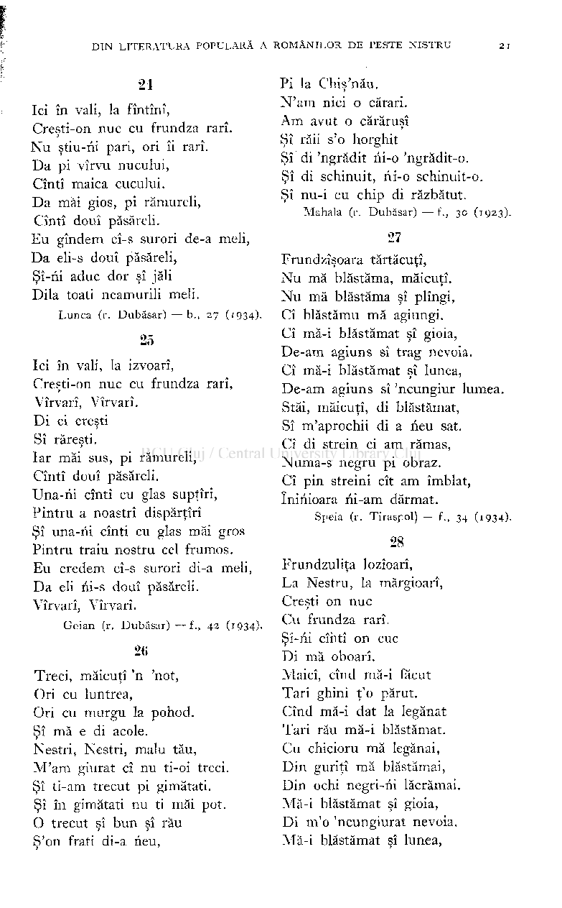

Pi la Chiş'nău. N'am nici o cărări. Am avut o cărăruşî Şî răii s'o horghit Şî di 'ngrădit rii-o 'ngrădit-o. Şî di schinuit, rii-o schinuit-o. Şî nu-i cu chip di răzbătut.

24

Ici în vali, la fîntînî, Creşti-on nuc cu frundza rarî. Nu ştiu-rii pari, ori îi rarî. Da pi vîrvu nucului, Cîntî maica cucului. Da măi gios, pi rămureli, Cîntî douî păsăreli.

Mahala (r. Dubăsar) —f., 3c (1923).

Eu gîndem cî-s surori de-a meii, Da eli-s douî păsăreli, Şî-rii aduc dor şî jăli Dila toati neamurili meii.

27

Frundzîşoara tărtăcuţî, Nu mă blăstăma, măicuţî. Nu mă blăstăma şî plîngi, Cî blăstămu mă agiungi. Cî mă-i blăstămat şî gioia, De-am agiuns sî trag nevoia. Cî mă-i blăstămat şî lunea, De-am agiuns sî 'ncungiur lumea. Stăi, măicuţî, di blăstămat, Sî m'aprochii di a rieu sat. Cî di strein ci am rămas, Numa-s negru pi obraz. Cî pin streini cît am îmbiat, îniriioara rii-am dărmat.

Lunca (r. Dubăsar) —b. , 27 (1934).

25

Ici în vali, la izvoarî, Creşti-on nuc cu frundza rarî, Vîrvarî, Vîrvarî. Di ci creşti Sî răreşti. Iar măi sus, pi rămureli, Cîntî douî păsăreli. Una-rii cîntî cu glas supţîri, Pintru a noastrî dispărţîrî Şî una-iîi cînti cu glas măi gros Pintru traiu nostru cel frumos. Eu credem cî-s surori di-a meii, Da eli rii-s douî păsăreli. Vîrvarî, Vîrvarî.

Speia (r. Tirasr.ol) — f., 34 (1934).

28

Frundzuliţa lozîoarî, La Nestru, la mărgioarî, Creşti on nuc Cu frundza rarî. Şî-rii cîntî on cuc Di mă oboarî. Maicî, cînd mă-i făcut Tari ghini ţ'o părut. Cînd mă-i dat la legănat Tari rău mă-i blăstămat. Cu chicioru mă legănai, Din guriţî mă blăstămai, Din ochi negri-rii lăcrămai. Mă-i blăstămat şî gioia, Di m'o 'ncungiurat nevoia. Mă-i blăstămat şî lunea,

Goian (r. Dubăsar) —f., 42 (1934).

##### 2G

Treci, măicuţî 'n 'not, Ori cu luntrea, Ori cu murgu la pohod. Şî mă e di acole. Nestri, Nestri, malu tău, M'am giurat cî nu ti-oi treci. Şî ti-am trecut pi gimătati. Şî în gimătati nu ti măi pot.

- O trecut şî bun şî rău Ş'on fraţi di-a neu,

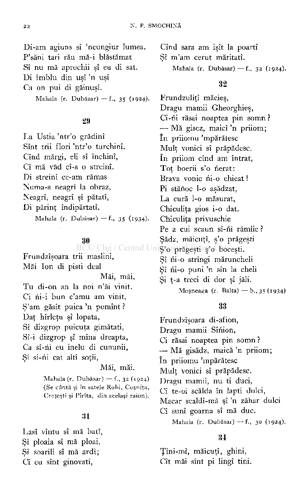

Di-am agiuns sî 'ncungiur lumea. P'săni tari rău mă-i blăstămat Sî nu mă aprochii şî eu di sat. Di îmblu din uşî 'n uşî Ca on pui di găinuşî.

Cînd sara am işît la poartî Şî m'am cerut măritatî.

Mahala (r. Dubăsar) —f., 32 (1924).

32

Frundzuliţî măcieş, Dragu mamii Gheorghieş, Ci-rii răsai noaptea pin somn ?

Mahala (r. Dubăsar) —f., 35 (1924).

29

•— Mă gisez, maicî 'n priiom; în priiomu 'mpărătesc Mulţ vonici sî prăpădesc, în priiom cînd am întrat, Toţ boerii s'o rierat: Brava vonic ni-o chicat ! Pi stănoc l-o aşădzat, La cură l-o măsurat, Chiculiţa gios i-o dat. Chiculiţa privuschie Pe a cui scaun sî-ni rămîie ? Şădz, măicuţî, ş'o prăgeşti Ş'o prăgeşti ş'o boceşti. Şî ni-o strîngi măruncheli Şî ni-o puni 'n sîn la cheli Şi ţ-a treci di dor şî jăli.

La Ustia 'ntr'o grădini Sînt trii flori 'ntr'o turchinî. Cînd mărgi, eli sî închini, Cî mă văd cî-s o streinî. Di streinî ce-am rămas Numa-s neagrî la obraz, Neagrî, neagrî şî pătatî, Di părinţ îndipărtatî.

Mahala (r. Dubăsar) —f., 35 (1934).

30

Frundzîşoara trii măslini, Măi Ion di pişti deal

Măi, măi, Tu di-on an la noi n'ăi vinit. Ci rii-i bun c'amu am vinit, Ş'am găsît puica 'n pomînt ? Daţ hîrleţu şî lopata, Sî dizgrop puicuţa gimătati, Sî-i dizgrop şî mîna dreapta, Ca sî-rii eu inelu di cununii, Şî sî-hi cat altî soţîi,

Moşneaga (r. Balta) —b. , 35(1934)

33

Frundzîşoara di-afion, Dragu mamii Sînion, Ci răsai noaptea pin somn ?

— Mă gisădz, maică 'n priiom; în priiomu 'mpărătesc Mulţ vonici sî prăpădesc. Dragu mamii, nu ti duci, Cî te-oi scălda în lapti dulci, Măcar scaldî-mă şî 'n zăhar dulci Cî sunî goarna sî mă duc.

Măi, măi.

Mahala (r. Dubăsar) — f., 32 (1924) (Se cântă şi în satele Rohi, Coşniţa, Creţeşti şi Pîrîta, din acelaşi raion).

31

Mahala (r. Dubăsar) —f., 30 (1924).

Lasî vîntu sî mă batî, Şî ploaia sî mă ploai, Şî soarili sî mă ardî; Cî eu sînt ginovatî,

34

Ţîni-mî, măicuţî, ghini, Cît măi sînt pi lingî tini.

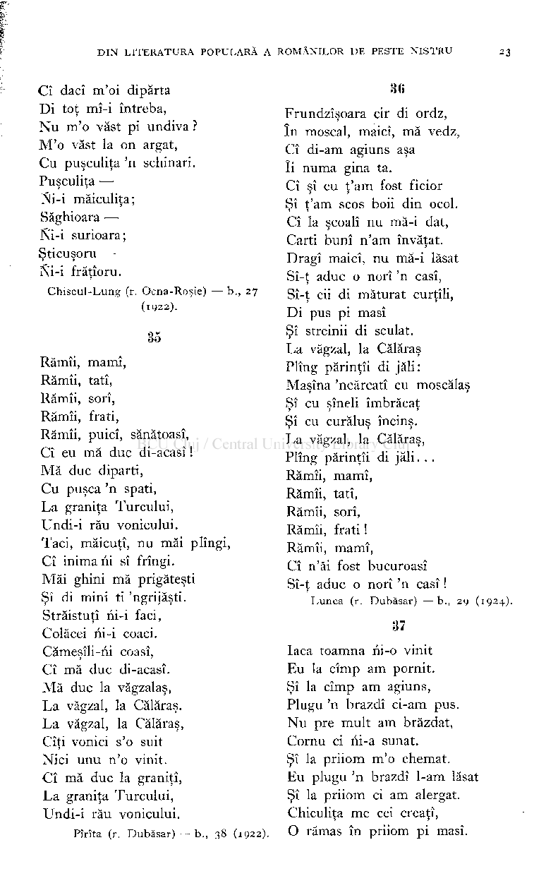

Cî dacî m'oi dipărta Di toţ mî-i întreba, Nu m'o văst pi undiva ? M'o văst la on argat, Cu puşculiţa 'n schinari. Puşculiţa —• Ni-i măiculiţa; Săghioara •Ni-i surioara; Şticuşoru Ni-i frăţîoru.

36

Frundzîşoara cir di ordz, în moscal, maicî, mă vedz, Cî di-am agiuns aşa îi numa gina ta. Cî şî eu ţ'am fost ficior Şî ţ'am scos boii din ocol. Cî la şcoalî nu mă-i dat, Cârti bunî n'am învăţat. Dragî maicî, nu mă-i lăsat Sî-ţ aduc o norî 'n casî, Sî-ţ cii di măturat curţîli, Di pus pi masî Şî streinii di sculat. La văgzal, la Călăraş Plîng părinţii di jăli : Maşina 'ncărcatî cu moscălaş Şî cu şîneli îmbrăcat Şî cu curăluş încins. La văgzal, la Călăraş, Plîng părinţii di jăli. . . Rămîi, mamî, Rămîi, tatî, Rămîi, sorî, Rămîi, fraţi ! Rămîi, mamî, Cî n'ăi fost bucuroasî Sî-ţ aduc o norî 'n casî !

Chiscul-Lung (r. Ocna-Roşie) — b., 27

(1922).

35

Rămîi, mamî, Rămîi, tatî, Rămîi, sorî, Rămîi, fraţi, Rămîi, puicî, sănătoasî, Cî eu mă duc di-acasî ! Mă duc diparti, Cu puşca 'n spati, La graniţa Turcului, Undi-i rău vonicului. Taci, măicuţî, nu măi plîngi, Cî inima ni sî frîngi. Măi ghini mă prigăteşti Şî di mini ti 'ngriiăşti. Străistuţî ni-i faci, Colăcei ni-i coaci. Cămeşîli-ni coasî, Cî mă duc di-acasî. Mă duc la văgzalaş, La văgzal, la Călăraş. La văgzal, la Călăraş, Cîţi vonici s'o suit Nici unu n'o vinit. Cî mă duc la graniţî, La graniţa Turcului, Undi-i rău vonicului.

Lunca (r. Dubăsar) —b. , 29 (1924).

37

Iaca toamna ni-o vinit Eu la cîmp am pornit. Şî la cîmp am agiuns, Plugu 'n brazdî ci-am pus. Nu pre mult am brăzdat, Cornu ci rii-a sunat. Şî la priiom m'o chemat. Eu plugu 'n brazdî l-am lăsat Şî la priiom ci am alergat. Chiculiţa me cei creaţî, O rămas în priiom pi masî.

Pîrîta (r. Dubăsar) —b. , 38 (1922).

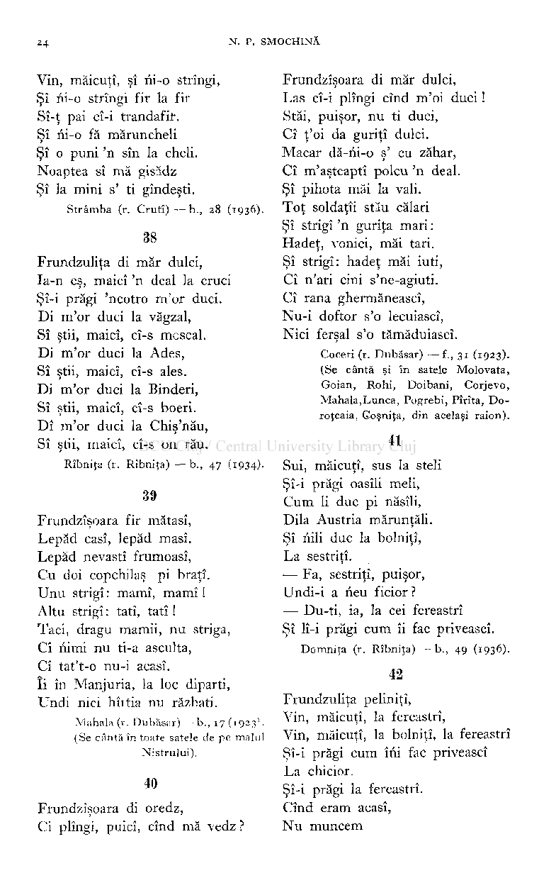

Vin, măicuţî, şî rii-o strîngi, Şî rii-o strîngi fir la fir Sî-ţ pai cî-i trandafir. Şî rii-o fă măruncheli Şî o puni 'n sîn la cheli. Noaptea sî mă gisldz Şî la mini s' ti gîndeşti.

Frundzîşoara di măr dulci, Las cî-i plîngi cînd m'oi duci ! Stăi, puişor, nu ti duci, Cî ţ'oi da guriţî dulci. Măcar dă-rii-o ş' cu zăhar,

- Cî m'aşteaptî polcu 'n deal. Şî pihota măi la vali. Toţ soldaţii stău călări Şî strigî 'n guriţa mari: Hadeţ, vonici, măi tari. Şî strigî: hadeţ măi iuti,
- Cî n'ari cini s'ne-agiuti. Cî rana ghermăneascî, Nu-i doftor s'o lecuiascî, Nici ferşal s'o tămăduiascî.

Strâmba (r. Crutî) — b., 28 (1936).

38

Frundzuliţa di măr dulci, Ia-n eş, maicî 'n deal la cruci Şî-i prăgi 'ncotro m'or duci. Di m'or duci la văgzal, Sî ştii, maicî, cî-s mcscal. Di m'or duci la Ades, Sî ştii, maicî, cî-s ales. Di m'or duci la Binderi, Sî ştii, maicî, cî-s boeri. Dî m'or duci la Chiş'nău, Sî ştii, maicî, cî-s on rău.

Coceri (r. Dubăsar) —f., 31 (1923). (Se cântă şi în satele Molovata, Goian, Rohi, Doibani, Corjevo, Mahala,Lunca, Pogrebi, Pîrîta, Doroţcaia, Goşniţa, din acelaşi raion).

41

Sui, măicuţî, sus la steli Şî-i prăgi oasîli meii, Cum li duc pi năsîli, Dila Austria mărunţăli. Şî riili duc la bolniţî, La sestriţî.

Rîbniţa (1. Rîbniţa) —b. , 47 (1934).

39

Frundzîşoara fir mătasî, Lepăd casî, lepăd masî. Lepăd nevastî frumoasî, Cu doi copchilaş pi braţî. Unu strigî : mamî, mamî ! Altu strigî : tatî, tatî ! Taci, dragu mamii, nu striga, Cî riimi nu ti-a asculta, Cî tat't-o nu-i acasî. îi în Manjuria, la loc diparti, Undi nici hîitia nu răzbaţi.

— Fa, sestriţî, puişor, Undi-i a neu ficior ?

— Du-ti, ia, la cei fereastrî Şî lî-i prăgi cum îi fac priveascî.

Domniţa (r. Rîbniţa) —b. , 49 (1936).

42

Frundzuliţa peliniţî, Vin, măicuţî, la fereastrî, Vin, măicuţî, la bolniţî, la fereastrî Şî-i prăgi cum îrii fac priveascî La chicior. Şî-i prăgi la fereastrî. Cînd eram acasî, Nu muncem

Mahala (r. Dubăsar)— b., 17 (1923'. (Se cântă în toate satele de pe malul Nistrului).

40

Frundzîşoara di oredz, Ci plîngi, puicî, cînd mă vedz ?

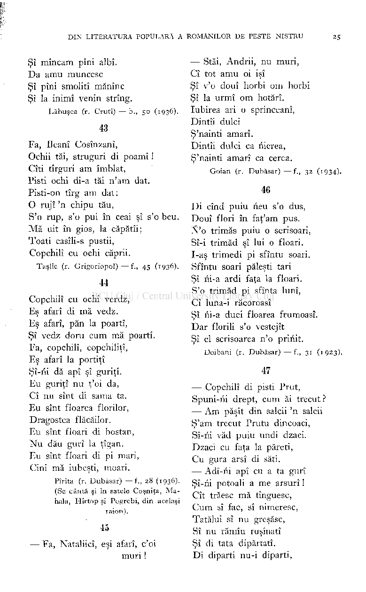

25

— Stăi, Andrii, nu muri, Cî tot amu oi işî Şî v'o douî horbi om horbi Şî la urmî om hotărî. Iubirea ari o sprinceanî, Dintîi dulci Ş'nainti amarî. Dintîi dulci ca hierea, Ş'nainti amarî ca cerea.

Şî mîncam pîni albî. Da amu muncesc Şî pîni smoliţi mănînc Şî la inimi venin strîng.

Lăbuşca (r. Crutî) — b., 50 (1936).

43

Fa, Ueanî Cosînzanî, Ochii tăi, struguri di poamî ! Cîti tîrguri am îmbiat, Pişti ochi di-a tăi n'am dat. Pisti-on tîrg am dat: O rujî 'n chipu tău, S'o rup, s'o pui în ceai şî s'o beu. Mă uit în gios, la căpătîi; Toati casîli-s pustii, Copchilî cu ochi căprii.

Goian (r. Dubăsar)—f., 32 (1934).

46

Di cînd puiu heu s'o dus, Douî flori în faţ'am pus. N'o trimăs puiu o scrisoari, Sî-i trimăd şî lui o floari. I-aş trimedi pi sfîntu soari. Sfîntu soari păleşti tari Şî hi-a ardi faţa la floari. S'o trimăd pi sfînta lunî, Cî luna-i răcoroasî Şî hi-a duci floarea frumoasî. Dar florili s'o vestejit Şî el scrisoarea n'o prihit.

Taşlîc (r. Grigoriopol)—f., 45 (1936).

44

Copchilî cu ochi verdz, Eş afarî di mă vedz. Eş afarî, păn la poartî, Şî vedz doru cum mă poartî. Fa, copchilî, copchiliţî, Eş afarî la portiţî Şî-hi dă apî şî guriţî. Eu guriţî nu ţ'oi da, Cî nu sînt di sama ta. Eu sînt floarea florilor, Dragostea flăcăilor. Eu sînt floari di bostan, Nu dău guri la ţîgan. Eu sînt floari di pi mari, Cini mă iubeşti, moari.

Doibani (r. Dubăsar) —f., 31 (1923).

47

— Copchilî di pişti Prut, Spuni-hi drept, cum ăi trecut ?

— Am păşît din sălcii 'n sălcii Ş'am trecut Prutu dincoaci, Sî-hi văd puiu undi dzaci. Dzaci cu faţa la păreţi, Cu gura arsî di săti.

— Adî-ni apî cu a ta guri Şî-hi potoali a me arsuri ! Cît trăesc mă tînguesc, Cum sî fac, sî nimeresc, Tatălui sî nu greşăsc, Sî nu rămîu ruşinaţi Şî di tata dipărtatî. Di diparti nu-i diparti,

Pîrîta (r. Dubăsar) —f., 28 (1936). (Se cântă şi în satele Coşniţa, Mahala, Hîrtop şi Pogrebi, din acelaşi raion).

45

— Fa, Nataliicî, eşi afarî, c'oi muri !

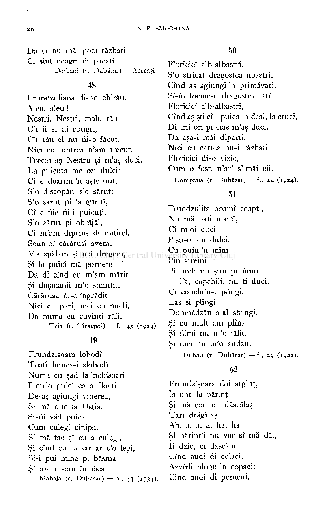

Da cî nu măi poci răzbaţi, Cî sînt neagrî di păcati.

Floricicî alb-albastrî, S'o stricat dragostea noastrî. Cînd aş agiungi 'n primăvarî, Sî-rii tocmesc dragostea iarî. Floricicî alb-albastrî, Cînd aş şti cî-i puica 'n deal, la cruci, Di trii ori pi cias m'aş duci. Da aşa-i măi diparti, Nici cu cartea nu-i răzbaţi. Floricicî di-o vizie, Cum o fost, n'ar' s' măi cii.

Doibani (r. Dubăsar) — Aceeaşi.

48

Frundzuliana di-on chirău, Aleu, aleu ! Nestri, Nestri, malu tău Cit îi el di cotigit, Cît rău el nu rii-o făcut, Nici cu luntrea n'am trecut. Trecea-aş Nestru şî m'aş duci, La puicuţa me cei dulci; Cî e doarmi 'n aşternut, S'o discopăr, s'o sărut; S'o sărut pi la guriţî, Cî e nie ni-i puicuţî. S'o sărut pi obrăjăl, Cî m'am diprins di mititel. Scumpi cărăruşî avem, Mă spălam şî mă dregem, Şî la puicî mă pornem. Da di cînd eu m'am mărit Şî duşmanii m'o smintit, Cărăruşa fii-o 'ngrădit Nici cu pari, nici cu nueli, Da numa cu cuvinti răii.

Doroţcaia (r. Dubăsar) —f., 24 (1924).

51

Frundzuliţa poamî coaptî, Nu mă bati maici, Cî m'oi duci Pisti-o apî dulci. Cu puiu 'n mîni Pin streini. Pi undi nu ştiu pi riimi.

— Fa, copchilî, nu ti duci, Cî copchilu-ţ plîngi. Las sî plîngî, Dumnădzău s-al strîngî. Şî eu mult am plîns Şî riimi nu m'o jălit, Şî nici nu m'o audzît.

Teia (r. Tiraspol) —f., 45 (1924).

49

Frundzîşoara lobodî, Toatî lumea-i slobodî. Numa eu şăd la 'nchisoari Pintr'o puicî ca o floari. De-aş agiungi vinerea, Sî mă duc la Ustia, Sî-rii văd puica Cum culegi cînipa. Sî mă fac şî eu a culegi, Şî cînd cir la cir ar s'o legi, Sî-i pui mîna pi basma Şî aşa ni-om împăca.

Duhău (r. Dubăsar) —f., 29 (1922).

52

Frundzîşoara doi argint, îs una la părinţ Şî mă ceri on dăscălaş Tari drăgălaş. Ah, a, a, a, ha, ha. Şî părinţii nu vor sî mă dăi, Ii dzîc, cî dascălu Cînd audi di colaci, Azvîrli plugu 'n copaci; Cînd audi di pomeni,

Mahala (r. Dubăsar) —b. , 43 (1934).

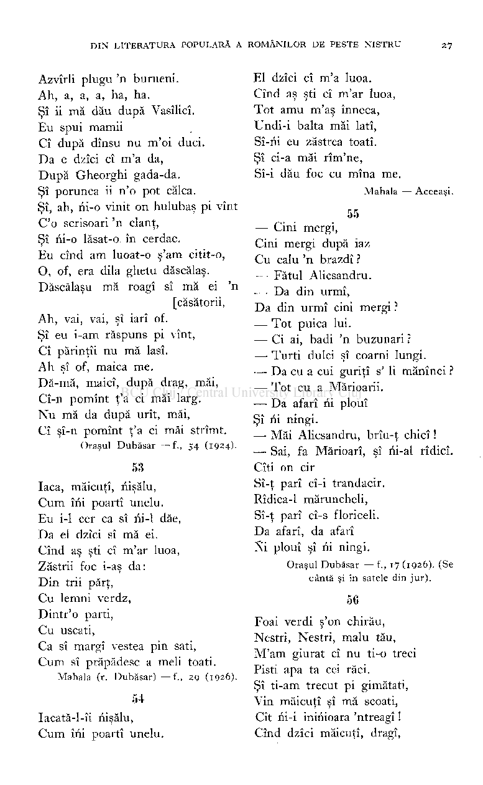

El dzîci cî m'a luoa. Cînd aş şti cî m'ar luoa, Tot amu m'aş înneca, Undi-i balta măi latî, Sî-ni eu zăstrea toatî. Şî ci-a măi rîm'ne, Sî-i dău foc cu mîna me.

Azvîrli plugu 'n burueni. Ah, a, a, a, ha, ha. Şî ii mă dău după Vasîlicî. Eu spui mamii Cî după dînsu nu m'oi duci. Da e dzîci cî m'a da, După Gheorghi gada-da. Şî porunca ii n'o pot călca. Şî, ah, iii-o vinit on hulubaş pi vînt C o scrisoari 'n clanţ, Şî iii-o lăsat-o în cerdac. Eu cînd am luoat-o ş'am citit-o, O, of, era dila ghetu dăscălaş. Dăscălaşu mă roagî sî mă ei 'n

Mahala — Aceeaşi.

— Cini mergi, Cini mergi după iaz Cu calu 'n brazdî ?

— Fătul Alicsandru.

— Da din urmî, Da din urmî cini mergi ?

[căsătorii,

Ah, vai, vai, şî iarî of. Şî eu i-am răspuns pi vînt, Cî părinţii nu mă lasî. Ah şî of, maica me.

— Tot puica lui.

— Ci ai, badi 'n buzunari ?

— Turti dulci şî coarni lungi.

— Da cu a cui guriţî s' li mănînci ?

- Dă-mă, maicî, după drag, măi, Cî-n pomînt ţ'a ci măi larg. Nu mă da după urît, măi, Cî şî-n pomînt ţ'a ci măi strimt.

— Tot cu a Mărioarii.

— Da afarî hi plouî Şî hi ningi.

— Măi Alicsandru, brîu-ţ chicî !

Oraşul Dubăsar —f., 54 (1924).

— Sai, fa Mărioarî, şî hi-al rîdicî. Cîti on cir Sî-ţ parî cî-i trandacir.

53

Iaca, măicuţî, hişălu, Cum îni poartî unelu. Eu i-1 cer ca sî hi-1 dăe, Da el dzîci sî mă ei. Cînd aş şti cî m'ar luoa, Zăstrii foc i-aş da: Din trii părţ, Cu lemni verdz, Dintr'o parti, Cu uscaţi, Ca sî margî vestea pin sati, Cum sî prăpădesc a meii toati.

- Rîdica-1 măruncheli,
- Sî-ţ parî cî-s floriceli. Da afarî, da afarî Ni plouî şî hi ningi.

Oraşul Dubăsar — f., 17 (1926). (Se cântă şi în satele din jur).

50

Foai verdi ş'on chirău, Nestri, Nestri, malu tău, M'am giurat cî nu ti-o treci Pişti apa ta cei răci. Şî ti-am trecut pi gimătati, Vin măicuţî şî mă scoati, Cît hi-i inihioara 'ntreagî ! Cînd dzîci măicuţî, dragî,

Mahala (r. Dubăsar) —f., 29 (1926).

54

Iacată-l-îi riişălu, Cum îni poartî unelu.

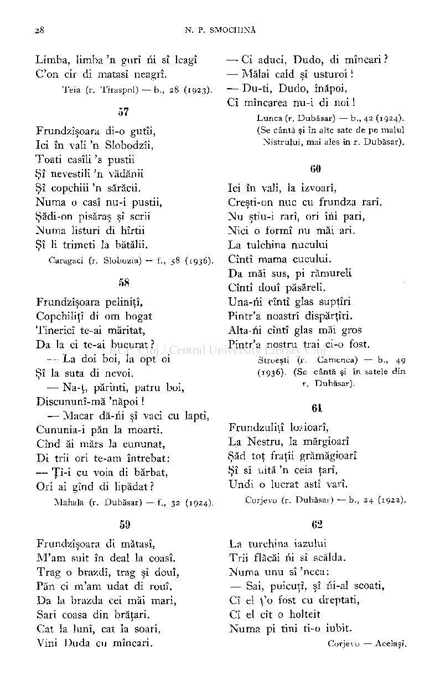

— Ci aduci, Dudo, di mîncari ?

Limba, limba 'n guri fii sî leagî Con cir di matasî neagrî.

— Mălai cald şî usturoi !

— Du-ti, Dudo, înapoi, Cî mîncarea nu-i di noi !

Teia (r. Tiraspol) —b. , 28 (1923).

57

Lunca (r. Dubăsar) — b., 42 (1924). (Se cântă şi în alte sate de pe malul

Frundzîşoara di-o gutîi,

Nistrului, mai ales în r. Dubăsar).

- Ici în vali 'n Slobodzîi, Toati casîli 's pustii Şî nevestili 'n vădanii Şî copchiii 'n sărăcii. Numa o casî nu-i pustii, Şădi-on pisăraş şî scrii Numa Usturi di hîrtii Şî li trimeti la bătălii.

60

Ici în vali, la izvoarî, Creşti-on nuc cu frundza rari. Nu ştiu-i rari, ori ini pari, Nici o formî nu măi ari. La tulchina nucului Cîntî mama cucului. Da măi sus, pi rămureli Cîntî douî păsăreli. Una-rii cîntî glas supţîri Pintr'a noastrî dispărţîri. Alta-fii cîntî glas măi gros Pintr'a nostru trai ci-o fost.

Caragaci (r. Slobozia) —f., 58 (1936).

58

Frundzîşoara peliniţî, Copchiliţî di om bogat Tinericî te-ai măritat, Da la ci te-ai bucurat ?

- •— La doi boi, la opt oi Şî la suta di nevoi.
- •— Na-ţ, părinţi, patru boi, Discununî-mă 'năpoi !

Stroeşti (r. Camenca) — b., 49 (1936). (Se cântă şi în satele din

r. Dubăsar).

61

— Măcar dă-rii şî vaci cu lapti, Cununia-i păn la moarti. Cînd ăi mărs la cununat, Di trii ori te-am întrebat:

Frundzuliţî lo^ioarî, La Nestru, la mărgioarî Şăd toţ fraţii grămăgioarî Şî sî uită 'n ceia ţarî, Undi o lucrat astî vârî.

— Ţî-i cu voia di bărbat, Ori ai gînd di lipădat ?

Corjevo (r. Dubăsar) —b. , 24 (1922).

Mahala (r. Dubăsar)—f., 32 (1924).

62

59

La turchina iazului Trii flăcăi hi sî scălda. Numa unu sî'neca:

Frundzîşoara di mătasî, M'am suit în deal la coasî. Trag o brazdî, trag şî douî, Păn ci m'am udat di rouî. Da la brazda cei măi mari, Sari coasa din brăţări. Cat la lunî, cat la soari, Vini Duda cu mîncari.

— Sai, puicuţî, şî hi-al scoati, Cî el ţ'o fost cu dreptăţi, Cî el cît o holteit Numa pi tini ti-o iubit.

Corjevo — Acelaşi.

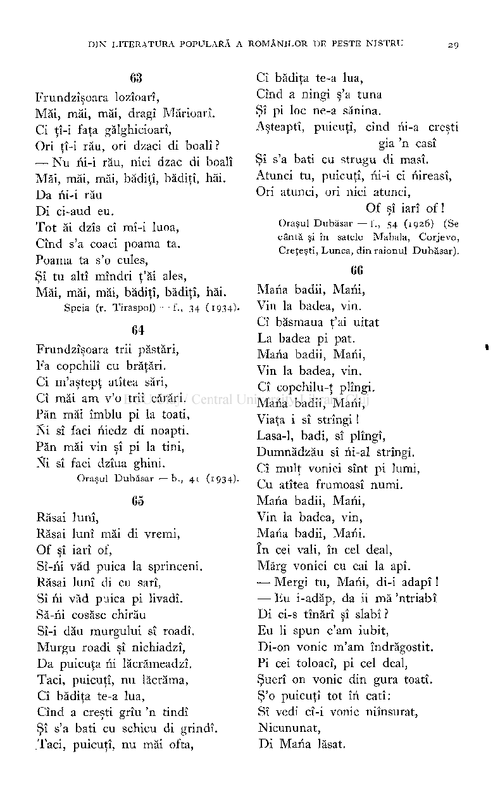

Cî bădiţa te-a lua, Cînd a ningi ş'a tuna Şî pi loc ne-a sănina. Aşteaptî, puicuţî, cînd hi-a creşti

03

Frundzîşoara lozîoarî, Măi, măi, măi, dragî Mărioarî.

- Ci ţî-i faţa gălghicioarî, Ori ţî-i rău, ori dzaci di boalî ?

gia 'n casî Şî s'a bati cu strugu di masî. Atunci tu, puicuţî, hi-i ci hireasî, Ori atunci, ori nici atunci,

— Nu hi-i rău, nici dzac di boalî Măi, măi, măi, bădiţi, bădiţi, hăi. Da hi-i rău Di ci-aud eu. Tot ăi dzîs cî mî-i luoa, Cînd s'a coaci poama ta. Poama ta s'o cules, Şî tu altî mîndri ţ'ăi ales,

Of şî iarî of !

Oraşul Dubăsar—f., 54 (1926) (Se cântă şi în satele Mahala, Corjevo, Creţeşti, Lunca, din raionul Dubăsar).

66

Mafia badii, Mani, Vin la badea, vin. Cî basmaua ţ'ai uitat La badea pi pat. Mana badii, Mani, Vin la badea, vin. Cî copchilu-ţ plîngi. Mana badii, Mani, Viaţa i sî strîngi ! Lasa-1, badi, sî plîngî, Dumnădzău sî hi-al strîngî. Cî mulţ vonici sînt pi lumi, Cu atîtea frumoasî numi. Mana badii, Mani, Vin la badea, vin, Mana badii, Mani. în cei vali, în cel deal, Mărg vonici cu cai la apî.

- Măi, măi, măi, bădiţî, bădiţî, hăi. Speia (r. Tiraspol)—f., 34 (1934).

64

Frundzîşoara trii păstări, Fa copchilî cu brăţări. Ci m'aştepţ atîtea sări, Cî măi am v'o trii cărări. Păn măi îmblu pi la toati, Ni sî faci hiedz di noapti. Păn măi vin şî pi la tini, Ni sî faci dzîua ghini.

Oraşul Dubăsar—b. , 41 (1934).

65

Răsai lunî,

- Răsai lunî măi di vremi, Of şî iarî of, Sî-hi văd puica la sprinceni.

—• Mergi tu, Mani, di-i adapî !

- Răsai lunî di cu sarî, Sî-ni văd puica pi livadî.
- Să-hi cosăsc chirău Sî-i dău murgului sî roadî. Murgu roadi şî nichiadzî, Da puicuţa ni lăcrămeadzî. Taci, puicuţî, nu lăcrăma, Cî bădiţa te-a lua, Cînd a creşti grîu 'n tindî Şî s'a bati cu schicu di grindî. Taci, puicuţî, nu măi ofta,

— Eu i-adăp, da ii mă 'ntriabî Di ci-s tînărî şî slabî ? Eu li spun c'am iubit, Di-on vonic m'am îndrăgostit. Pi cei toloacî, pi cel deal, Şuerî on vonic din gura toatî. Ş'o puicuţî tot îh catî: Sî vedi cî-i vonic niînsurat, Nicununat, Di Mana lăsat.

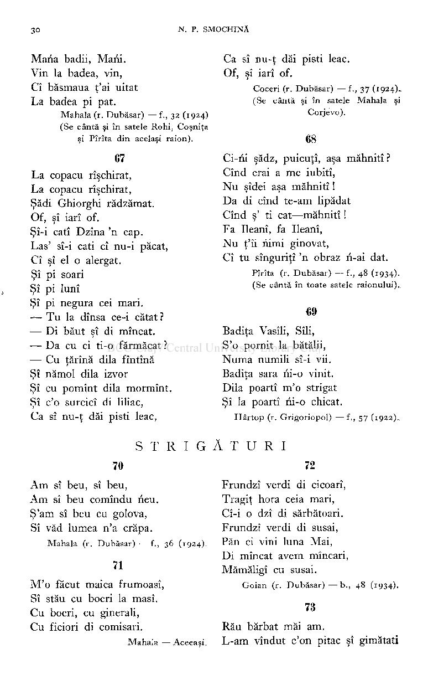

Mafia badii, Mafii. Vin la badea, vin, Cî basmaua ţ'ai uitat La badea pi pat.

Ca sî nu-ţ dăi pişti leac. Of, şî iarî of.

Coceri (r. Dubăsar) — f., 37 (1924). (Se cântă şi în satele Mahala şi Corjevo).

Mahala (r. Dubăsar) — f., 32 (1924) (Se cântă şi în satele Rohi, Coşniţa şi Pîrîta din acelaşi raion).

68

Ci-hi şădz, puicuţî, aşa măhnitî ? Cînd erai a me iubiţi, Nu şîdei aşa măhnitî ! Da di cînd te-am lipădat Cînd ş' ti cat—măhnitî ! Fa Ileanî, fa Ileanî, Nu ţ'îi himi ginovat, Cî tu sînguriţî 'n obraz h-ai dat.

67

La copacu rîşchirat, La copacu rîşchirat,

- Sădi Ghiorghi rădzămat. Of, şî iarî of. Şî-i catî Dzîna 'n cap. Las' sî-i cati cî nu-i păcat, Cî şî el o alergat. Şî pi soari Şî pi lunî Şî pi negura cei mari.

Pîrîta (r. Dubăsar) — f., 48 (1934). (Se cântă în toate satele raionului).

€9

-

— Tu la dînsa ce-i cătat ?

1

Bădiţa Vasîli, Sili, S'o pornit la bătălii, Numa numili sî-i vii. Bădiţa sara hi-o vinit. Dila poartî m'o strigat Şî la poartî hi-o chicat.

— Di băut şî di mîncat.

-— Da cu ci ti-o fărmăcat ?

— Cu ţărînă dila fîntînă Şî nămol dila izvor Şî cu pomînt dila mormînt. Şî c'o surcicî di liliac, Ca sî nu-ţ dăi pişti leac,

Hârtop (r. Grigoriopol) —f., 57 (1922)-

#### STRIGATUR 70

72

Frundzî verdi di cicoarî, Tragiţ hora ceia mari, Cî-i o dzî di sărbătoari. Frundzî verdi di susai, Păn ci vini luna Mai, Di mîncat avem mîncari, Mămăligi cu susai.

Am sî beu, sî beu, Am sî beu comîndu neu. Ş'am sî beu cu golova, Sî văd lumea n'a crăpa.

Mahala (r. Dubăsar) —f., 36 (1924).

71

M'o făcut maica frumoasî, Sî stău cu boeri la masî. Cu boeri, cu ginerali, Cu ficiori di comisari.

Goian (r. Dubăsar) —b. , 48 (1934).

73

Rău bărbat măi am. L-am vîndut c'on pitac şî gimătati

Mahala — Aceeaşi.

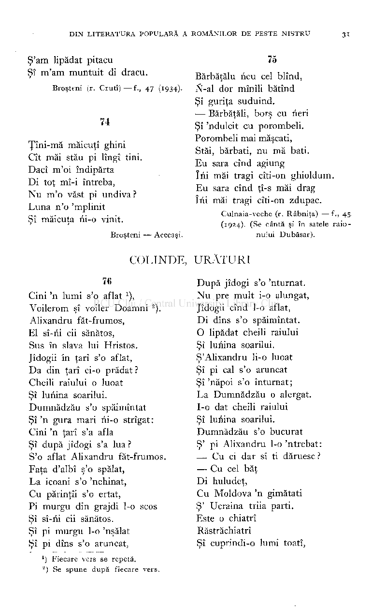

Ş'am lipădat pitacu Sî m'am muntuit di dracu.

75

Bărbăţălu neu cel blînd, N-al dor mînîli bătînd Şî guriţa suduind.

Broşteni (r. Crutî)—f., 47 (1934).

— Bărbăţăli, borş cu fieri Şî 'ndulcit cu porombeli. Porombeli mai măşcati, Stăi, bărbaţi, nu mă bati. Eu sara cînd agiung îrii măi tragi cîti-on ghioldum. Eu sara cînd ţî-s măi drag Ini măi tragi cîti-on zdupac.

74

Ţîni-mă măicuţî ghini Cît măi stău pi lîngî tini. Daci m'oi îndipărta Di toţ mî-i întreba, Nu m'o văst pi undiva ? Luna n'o 'mplinit Şî măicuţa rii-o vinit.

Culnaia-veche (r. Râbniţa) — f., 45 (1924). (Se cântă şi în satele raionului Dubăsar).

Broşteni — Aceeaşi.

COLINDE , URATUR I

7G

După jîdogi s'o 'nturnat. Nu pre mult i-o alungat, Jîdogii cînd l-o aflat, Di dîns s'o spăimîntat. O lipădat cheili raiului Şî lunina soarilui. Ş'Alixandru li-o luoat Şî pi cal s'o aruncat Şî 'năpoi s'o înturnat; La Dumnădzău o alergat. I-o dat cheili raiului Şî lunina soarilui. Dumnădzău s'o bucurat Ş' pi Alixandru l-o 'ntrebat: — Cu ci dar sî ti dăruesc ? — Cu cel băţ Di huludeţ, Cu Moldova 'n gimătati Ş' Ucraina triia parti. Este o chiatrî Răstrăchiatrî Şî cuprindi-o lumi toatî,

Cini 'n lumi s'o aflat ), Voilerom şî voiler Doamni

).

2

Alixandru făt-frumos, El sî-rii cii sănătos, Sus în slava lui Hristos. Jîdogii în ţarî s'o aflat, Da din ţarî ci-o prădat ? Cheili raiului o luoat Şî luriina soarilui. Dumnădzău s'o spăimîntat Şî 'n gura mari fii-o strigat: Cini 'n ţarî s'a afla Şî după jîdogi s'a lua ? S'o aflat Alixandru făt-frumos. Faţa d'albî ş'o spălat, La icoani s'o 'nchinat, Cu părinţii s'o ertat, Pi murgu din grajdi l-o scos Şî sî-rii cii sănătos. Şî pi murgu l-o 'nşălat Şî pi dîns s'o aruncat,

- 1

) Fiecare vers se repetă.

- 2

) Se spune după fiecare vers.

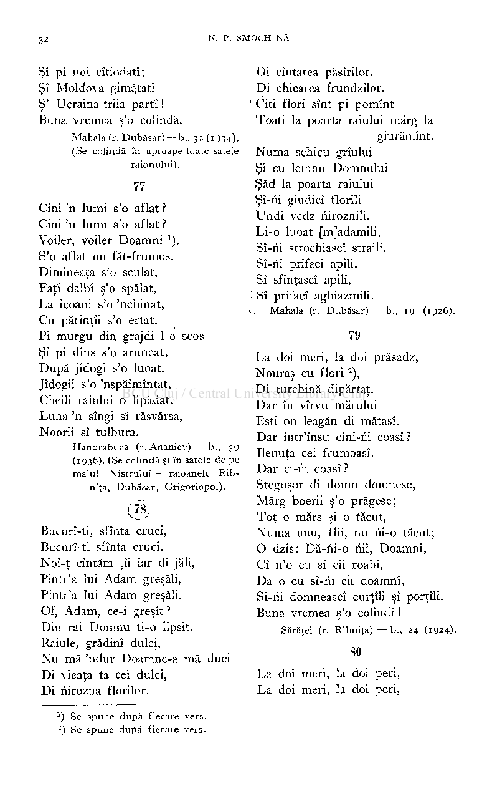

Şî pi noi cîtiodatî; Şî Moldova gimătati Ş' Ucraina triia partî ! Buna vremea ş'o colindă.

Di cîntarea păşirilor, Di chicarea frundzîlor. ' Cîti flori sînt pi pomînt

Toati la poarta raiului mărg la giurămînt.

Mahala (r. Dubăsar)— b., 32 (1934). (Se colindă în aproape toate satele raionului).

Numa schicu griului Şî cu lemnu Domnului Şăd la poarta raiului Şî-rii giudicî florili Undi vedz riiroznili. Li-o luoat [mjadamili, Sî-rii strochiascî straili. Sî-rii prifacî apili. Sî sfinţascî apili, Sî prifacî aghiazmili.

77

Cini 'n lumi s'o aflat ? Cini 'n lumi s'o aflat ? Voiler, voiler Doamni ). S'o aflat on făt-frumos. Dimineaţa s'o sculat, Faţî dalbî ş'o spălat, La icoani s'o 'nchinat, Cu părinţii s'o ertat, Pi murgu din grajdi l-o scos Şî pi dîns s'o aruncat, După jîdogi s'o luoat. Jîdogii s'o 'nspăimîntat, Cheili raiului o lipădat. Luna 'n sîngi sî răsvărsa, Noorii sî tulbura.

^_ Mahala (r. Dubăsar)—b. , 19 (1926).

79

La doi meri, la doi prăsadz, Nouraş cu flori -), Di turchină dipărtaţ. Dar în vîrvu mărului Esti on leagăn di mătasî. Dar într'însu cini-rii coasî ? Ilenuţa cei frumoasî. Dar ci-rii coasî ? Steguşor di domn domnesc, Mărg boerii ş'o prăgesc; Toţ o mărs şî o tăcut, Numa unu, Ilii, nu rii-o tăcut; O dzîs: Dă-rii-o riii, Doamni, Cî n'o eu sî cii roabî, Da o eu sî-rii cii doamnî, Sî-rii domneascî curţîli şî porţîli. Buna vremea ş'o colindî !

Handrabuia (r. Ananiev) —b. , 39 (1936). (Se colindă şi în satele de pe malul Nistrului — raioanele Rîbniţa, Dubăsar, Grigoriopol).

Bucurî-ti, sfînta cruci, Bucurî-ti sfînta cruci. Noi-ţ cîntăm ţîi iar di jăli, Pintr'a lui Adam greşăli, Pintr'a lui Adam greşăli. Of, Adam, ce-i greşit ? Din rai Domnu ti-o lipsit. Raiule, grădini dulci, Nu mă 'ndur Doamne-a mă duci Di vieaţa ta cei dulci, Di riirozna florilor,

Săratei (r. Rîbniţa) —b. , 24 (1924).

80

La doi meri, la doi peri, La doi meri, la doi peri,

- 1

) Se spune după fiecare vers.

- 2

) Se spune după fiecare vers.

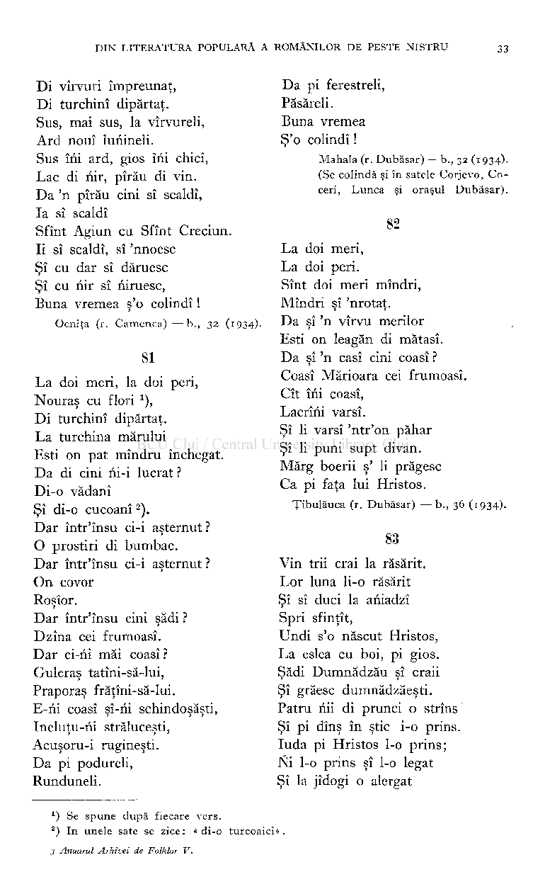

Da pi ferestreli, Păsăreli. Buna vremea Ş'o colindî !

Di vîrvuri împreunat, Di turchinî dipărtaţ. Sus, mai sus, la vîrvureli, Ard nouî luriineli. Sus îrii ard, gios îrii chicî, Lac di riir, pîrău di vin. Da 'n pîrău cini sî scaldî, Ia sî scaldî Sfînt Agiun cu Sfînt Creciun. Ii sî scaldî, sî 'nnoesc Şî cu dar sî dăruesc Şî cu riir sî riiruesc, Buna vremea ş'o colindî !

Mahala (r. Dubăsar) — b., 32 (1934). (Se colindă şi în satele Corjevo, Co ceri, Lunca şi oraşul Dubăsar).

82

La doi meri, La doi peri. Sînt doi meri mîndri, Mîndri şî 'nrotaţ. Da şî 'n vîrvu merilor Esti on leagăn di mătasî. Da şî 'n casî cini coasî ? Coasî Mărioara cei frumoasî. Cît îrii coasî, Lacrîrii varsî. Şî li varsî 'ntr'on pahar Şî li puni supt divan. Mărg boerii ş' li prăgesc Ca pi faţa lui Hristos.

Ocniţa (r. Camenca) —b. , 32 (1934).

81

La doi meri, la doi peri, Nouraş cu flori ), Di turchinî dipărtaţ. La turchina mărului Esti on pat mîndru închegat. Da di cini rii-i lucrat ? Di-o vădani Şî di-o cucoanî

Ţibulăuca (r. Dubăsar) —b. , 36 (1934).

). Dar într'însu ci-i aşternut?

2

83

- O prostiri di bumbac. Dar într'însu ci-i aşternut ? On covor Roşior. Dar într'însu cini sădi ? Dzîna cei frumoasî. Dar ci-rii măi coasî ? Guleraş tatîni-să-lui, Praporaş frăţîni-să-lui.

Vin trii crai la răsărit. Lor luna li-o răsărit Şî sî duci la ariiadzî Spri sfinţit, Undi s'o născut Hristos, La eslea cu boi, pi gios. Sădi Dumnădzău şî craii Şî grăesc dumnădzăeşti. Patru riii di prunci o strîns Şî pi dînş în ştie i-o prins. Iuda pi Hristos l-o prins; Ni l-o prins şî l-o legat Şî la jîdogi o alergat

- E-rii coasî şî-ni schindoşăşti, Ineluţu-rii străluceşti, Acuşoru-i rugineşti. Da pi podureli, Runduneli.

###### ) Se spune după fiecare vers.

x

- 2

) In unele sate se zice : « di-o turcoaicî» .

- 3 Anuarul Arhivei de Folklor V.

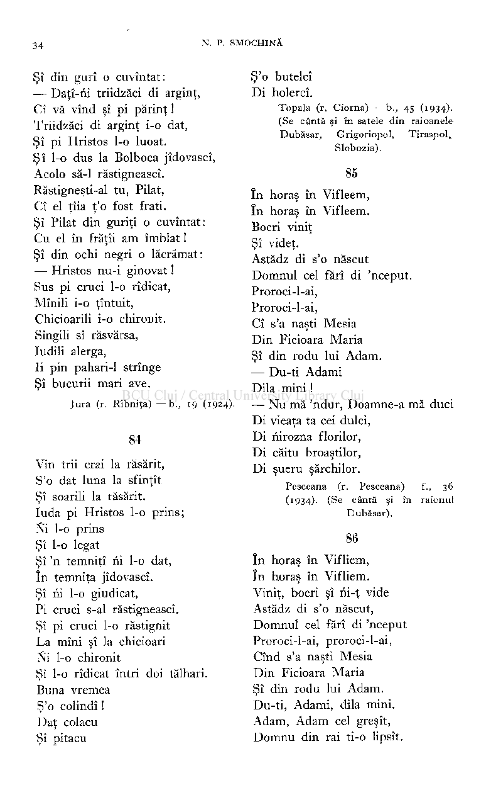

Ş'o butelcî Di holerci.

Şî din gurî o cuvîntat:

— Daţî-rii triidzăci di argint, Cî vă vînd şî pi părinţ ! Triidzăci di argint i-o dat, Şî pi Hristos l-o luoat. Şî l-o dus la Bolboca jîdovascî, Acolo să-1 răstigneascî. Răstigneşti-al tu, Pilat, Cî el ţîia ţ'o fost fraţi. Şî Pilat din guriţî o cuvîntat: Cu el în frăţii am îmbiat ! Şî din ochi negri o lăcrămat:

Topala (r. Ciorna)—b. , 45 (1934). (Se cântă şi în satele din raioanele Dubăsar, Grigoriopol, Tiraspol,

Slobozia).

85

în horaş în Vifleem, în horaş în Vifleem. Boeri viniţ Şî videţ. Astădz di s'o născut Domnul cel fărî di 'nceput. Proroci-l-ai, Proroci-l-ai, Cî s'a naşti Mesia Din Ficioara Maria Şî din rodu lui Adam.

•— Hristos nu-i ginovat ! Sus pi cruci l-o ridicat, Mînili i-o ţîntuit, Chicioarili i-o chironit. Sîngili sî răsvărsa, Iudili alerga, Ii pin pahari-1 strînge Şî bucurii mari ave.

— Du-ti Adami Dila mini !

— Nu mă 'ndur, Doamne-a mă duci Di vieaţa ta cei dulci, Di nirozna florilor, Di căitu broaştilor, Di şueru şărchilor.

Jura (r. Rîbniţa) —b. , 19 (1924).

84

Vin trii crai la răsărit, S'o dat luna la sfinţit Şî soarili la răsărit. Iuda pi Hristos l-o prins; Ni l-o prins Şî l-o legat Şî 'n temniţî ni l-o dat, în temniţa jîdovascî. Şî ni l-o giudicat, Pi cruci s-al răstigneascî. Şî pi cruci l-o răstignit La mîni şî la chicioari Ni l-o chironit Şî l-o ridicat întri doi tâlhari. Buna vremea Ş'o colindî ! Daţ colacu Şî pitacu

Pesceana (r. Pesceana) — f., 36 (

34)- (Se cântă şi în raionul Dubăsar).

I0

86

în horaş în Vifliem, în horaş în Vifliem. Viniţ, boeri şî rii-ţ vide Astădz di s'o născut, Domnul cel fărî di 'nceput Proroci-l-ai, proroci-l-ai, Cînd s'a naşti Mesia Din Ficioara Maria Şî din rodu lui Adam. Du-ti, Adami, dila mini. Adam, Adam cel greşit, Domnu din rai ti-o lipsît.

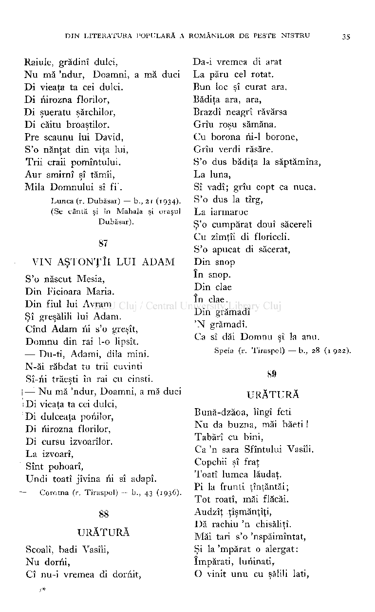

Da-i vremea di arat La păru cel rotat. Bun loc şî curat ara. Bădiţa ara, ara, Brazdî neagrî răvărsa Grîu roşu sămăna. Cu borona ni-1 borone, Grîu verdi răsare. S'o dus bădiţa la săptămîna, La luna, Sî vadî; grîu copt ca nuca. S'o dus la tîrg, La iarmaroc Ş'o cumpărat douî săcereli Cu zîmţîi di floriceli. S'o apucat di săcerat, Din snop în snop. Din clae în clae. Din grămadî 'N grămadî. Ca sî dăi Domnu şî la anu.

Raiule, grădini dulci, Nu mă 'ndur, Doamni, a mă duci Di vieaţa ta cei dulci. Di riirozna florilor, Di şueratu şărchilor, Di căitu broaştilor. Pre scaunu lui David, S'o nănţat din viţa lui, Trii craii pomintului. Aur smirnî şî tămîi, Mila Domnului sî fi'.

Lunca (r. Dubăsar) — b., 21 (1934). (Se cântă şi în Mahala şi oraşul Dubăsar).

87

VIN AŞTONŢÎI LUI ADAM

S'o născut Mesia, Din Ficioara Maria. Din fiul lui Avram Şî greşălili lui Adam. Cînd Adam fii s'o greşit, Domnu din rai l-o lipsit. — Du-ti, Adami, dila mini.

Speia (r. Tiraspol) —b. , 28 (1922).

- N-ăi răbdat tu trii cuvinti Sî-rii trăeşti în rai cu cinsti,

89

i — Nu mă 'ndur, Doamni, a mă duci i Di vieaţa ta cei dulci, Di dulceaţa ponilor, Di riirozna florilor, Di cursu izvoarîlor. La izvoarî, Sînt pohoarî, Undi toatî jivina ni sî adapî.

URÄTURÄ

Bună-dzăoa, lîngî feti Nu da buzna, măi băeti ! Tăbărî cu bini, Ca 'n sara Sf în tului Vasîli. Copchii şî fraţ Toatî lumea lăudat. Pi la frunţi ţînţăntăi; Tot roatî, măi flăcăi. Audzîţ ţîşmănţîţi, Dă rachiu 'n chisăliţî. Măi tari s'o 'nspăimîntat, Şi la 'mpărat o alergat : împăraţi, luhinati, O vinit unu cu şălili lati,

— Corotna (r. Tiraspol) — b., 43 (1936).

88

URÄTURÄ

Scoalî, badi Vasîli, Nu dorhi, Cî nu-i vremea di dorfiit,

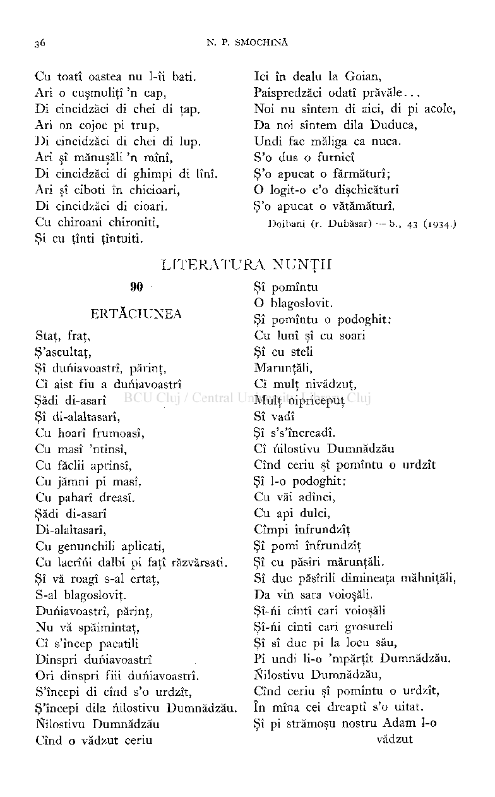

Ici în dealu la Goian, Paispredzăci odatî prăvăle... Noi nu sîntem di aici, di pi acole, Da noi sîntem dila Duduca, Undi fac măliga ca nuca. S'o dus o furnici Ş'o apucat o farmături; O logit-o c'o dişchicăturî Ş'o apucat o vătămăturî.

Cu toatî oastea nu 1-ü bati. Ari o cuşmuliţî 'n cap, Di cincidzăci di chei di ţap. Ari on cojoc pi trup, Di cincidzăci di chei di lup. Ari şî mănuşăli 'n mînî, Di cincidzăci di ghimpi di lînî. Ari şî ciboti în chicioari, Di cincidzăci di cioari. Cu chiroani chironiti, Şi cu ţînti ţîntuiti.

Doibani (r. Dubăsar) —b. , 43 (1934.)

#### LITERATUR A NUNŢI I

Şî pomîntu O blagoslovit. Şî pomîntu o podoghit: Cu lunî şî cu soari Şî cu steli Marunţăli, Cî mulţ nivădzuţ, Mulţ nipricepuţ Sî vadî Şî s's'încreadî. Cî hilostivu Dumnădzău Cînd ceriu şî pomîntu o urdzît Şî l-o podoghit: Cu văi adinei, Cu api dulci, Cîmpi înfrundzîţ Şî pomi înfrundzîţ Şî cu păsîri marunţăli. Sî duc păsîrili dimineaţa măhniţăli, Da vin sara voioşăli. Şî-hi cîntî cari voioşăli Şî-hi cîntî cari grosureli Şî sî duc pi la locu său, Pi undi li-o 'mpărţît Dumnădzău. Nilostivu Dumnădzău, Cînd ceriu şî pomîntu o urdzît, în mîna cei dreaptî s'o uitat. Şî pi strămoşu nostru Adam l-o

90

ERTÄCIUNEA

Stat, fraţ, Ş'ascultat, Şî duhiavoastrî, părinţ, Cî aist fiu a duhiavoastrî Sădi di-asarî Şî di-alaltasarî, Cu hoarî frumoasî, Cu masî 'ntinsî, Cu făclii aprinsî, Cu jămni pi masî. Cu paharî dreasî. Sădi di-asarî Di-alaltasarî, Cu genunchili aplicaţi, Cu lacrîhi dalbi pi faţî răzvărsati. Şî vă roagî s-al ertaţ, S-al blagoslovit. Duhiavoastrî, părinţ, Nu vă spăimîntaţ, Cî s'încep pacatili Dinspri duhiavoastrî Ori dinspri fiii duhiavoastrî. S'începi di cînd s'o urdzît, Ş'începi dila hilostivu Dumnădzău. Nilostivu Dumnădzău Cînd o vădzut ceriu

vădzut

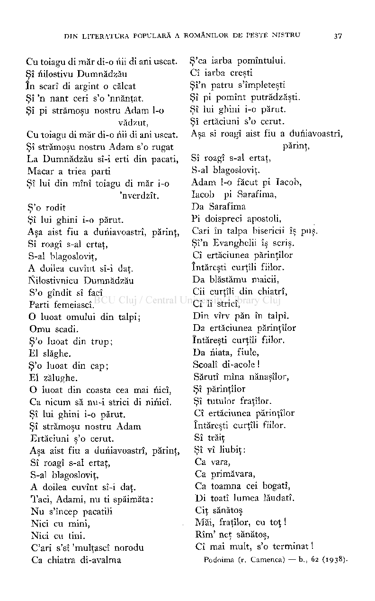

Ş'ca iarba pomîntului. Cî iarba creşti Şî'n patru s'împleteşti Şî pi pomînt putrădzăşti. Şî lui ghini i-o părut. Şî ertăciuni s'o cerut. Aşa sî roagî aist fiu a duniavoastrî,

Cu toiagu di măr di-o fiii di ani uscat. Şî hilostivu Dumnădzău în scări di argint o călcat Şî 'n nant ceri s'o 'nnănţat. Şî pi strămoşu nostru Adam l-o

vădzut, Cu toiagu di măr di-o fiii di ani uscat. Şî strămoşu nostru Adam s'o rugat La Dumnădzău sî-i erti din pacati, Măcar a triea parti Şî lui din mînî toiagu di măr i-o

părinţ,

Sî roagî s-al ertaţ, S-al blagoslovit. Adam l-o făcut pi Iacob, Iacob pi Sarafima, Da Sarafima Pi doispreci apostoli, Cari în talpa bisericii îş puş. Şî'n Evanghelii îş scris. Cî ertăciunea părinţilor întăreşti curţîli fiilor. Da blăstămu maicii, Cii curţîli din chiatrî, Cî li strici, Din vîrv păn în talpî. Da ertăciunea părinţilor întăreşti curţîli fiilor. Da hiata, fiule, Scoalî di-acole ! Săruţi mina nănaşîlor, Şî părinţilor Şî tutulor fraţilor. Cî ertăciunea părinţilor întăreşti curţîli fiilor. Sî trăit Şî vi liubiţ: Ca vara, Ca primăvara, Ca toamna cei bogatî, Di toatî lumea lăudatî. Ciţ sănătos Măi, fraţilor, cu toţ ! Rîm' neţ sănătos, Cî mai mult, s'o terminat !

'nverdzît.

Ş'o rodit Şî lui ghini i-o părut. Aşa aist fiu a duniavoastrî, părinţ, Sî roagî s-al ertaţ, S-al blagoslovit, A doilea cuvînt sî-i daţ. Nilostivnicu Dumnădzău S'o gîndit sî facî Parti femeiascî. O luoat omului din tălpi; Omu scadi. Ş'o luoat din trup; El slăghe. Ş'o luoat din cap; El zălughe. O luoat din coasta cea mai nicî, Ca nicum să nu-i strici di ninicî. Şî lui ghini i-o părut. Şî strămoşu nostru Adam Ertăciuni ş'o cerut. Aşa aist fiu a duniavoastrî, părinţ, Sî roagî s-al ertaţ, S-al blagoslovit, A doilea cuvînt sî-i daţ. Taci, Adami, nu ti spăimăta: Nu s'încep pacatili Nici cu mini, Nici cu tini. Cari s'sî 'mulţascî norodu Ca chiatra di-avalma

Podoima (r. Camenca) —b. , 62 (1938)

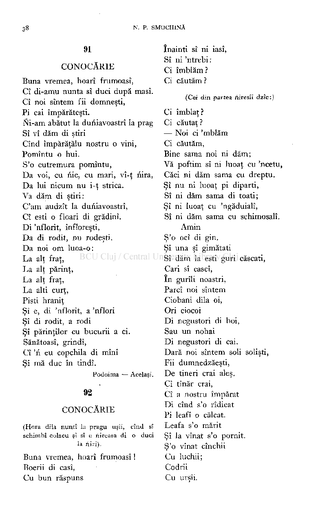

înainti sî ni iasî, Sî ni 'ntrebi : Ci îmblăm ? Ci căutăm ?

91

CONOCÄRIE

Buna vremea, hoarî frumoasî, Cî di-amu nunta sî duci după masî. Cî noi sîntem fii domneşti, Pi cai împărăteşti. Ni-am abătut la dufiiavoastrî la prag Sî vî dăm di ştiri Cînd împărăţălu nostru o vini, Pomîntu o hui. S'o cutremura pomîntu, Da voi, cu nie, cu mari, vî-ţ nira, Da lui nicum nu i-ţ strica. Va dăm di ştiri: Cam audzît la dufiiavoastrî, Cî esti o floari di grădini. Di 'nflorit, înfloreşti, Da di rodit, nu rodeşti. Da noi om luoa-o: La alţ fraţ, La alţ părinţ, La alţ fraţ, La alti curţ, Pişti hraniţ Şî e, di 'nflorit, a 'nflori Şî di rodit, a rodi Şî părinţilor cu bucurii a ci. Sănătoasî, grindî, Cî 'h eu copehila di mînî Şî mă duc în tindî.

(Cei din partea hiresîi dzîc:)

Ci îmbiat? Ci căutat ? — Noi ci 'mblăm Ci căutăm, Bine sama noi ni dăm; Vă poftim sî ni luoaţ cu 'ncetu, Căci ni dăm sama cu dreptu. Şî nu ni luoaţ pi diparti, Sî ni dăm sama di toati; Şî ni luoaţ cu 'ngăduialî, Sî ni dăm sama cu schimosalî.

Amin Ş'o ocî di gin. Şî una şî gimătati Sî dăm la esti guri căscaţi, Cari sî cascî, în gurîli noastri, Parcî noi sîntem Ciobani dila oi, Ori ciocoi Di negustori di boi, Sau un nohai Di negustori di cai. Dară noi sîntem soli solişti, Fii dumnedzăeşti, De tineri crai aleş. Cî tînăr crai, Ci a nostru împărat Di cînd s'o ridicat Pi leafî o călcat. Leafa s'o mărit Şî la vînat s'o pornit. Ş'o vînat cînchii Cu luchii; Codrii Cu urşîi.

Podoima — Acelaşi.

92

CONOCÄRIE

(Hora dila nuntî la pragu uşii, cînd sî schimbî colacu şî sî e nireasa di o duci

la riiri).

Buna vremea, hoarî frumoasî ! Boerii di casî, Cu bun răspuns

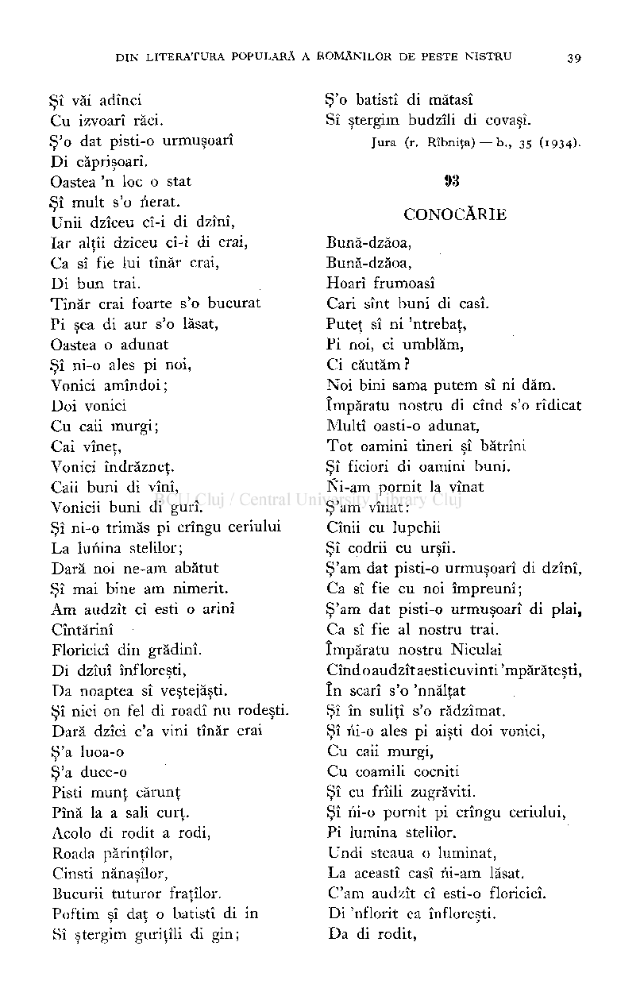

Ş'o batistî di mătasî Sî ştergim budzîli di covaşî.

Şî văi adînci Cu izvoarî răci. Ş'o dat pisti-o urmuşoarî Di căprişoarî. Oastea 'n loc o stat Şî mult s'o rierat. Unii dzîceu cî-i di dzînî, Iar alţîi dzîceu cî-i di crai, Ca sî fie lui tînăr crai, Di bun trai. Tînăr crai foarte s'o bucurat Pi şea di aur s'o lăsat, Oastea o adunat Şî ni-o ales pi noi, Vonici amîndoi ; Doi vonici Cu caii murgi; Cai vîneţ, Vonici îndrăzneţ. Caii buni di vînî, Vonicii buni di guri. Şî ni-o trimăs pi crîngu ceriului La lufiina stelilor; Dară noi ne-am abătut Şî mai bine am nimerit. Am audzît cî esti o arinî Cîntărinî Floricicî din grădini. Di dzîuî înfloreşti, Da noaptea sî veştejăşti. Şî nici on fel di roadî nu rodeşti. Dară dzîci c'a vini tînăr crai Ş'a luoa-o Ş'a duce-o Pişti munţ cărunt Pînă la a sali curţ. Acolo di rodit a rodi, Roadă părinţilor, Cinsti nănaşîlor, Bucurii tuturor fraţilor. Poftim şî daţ o batistî di in Sî ştergim guriţîli di gin;

Jura (r. Rîbniţa) — b., 35 (i934>-

93

CONOCĂRIE

Bună-dzăoa, Bună-dzăoa, Hoarî frumoasî Cari sînt buni di casî. Puteţ sî ni 'ntrebaţ, Pi noi, ci umblăm, Ci căutăm ? Noi bini sama putem sî ni dăm. împăratu nostru di cînd s'o ridicat Multî oasti-o adunat, Tot oamini tineri şî bătrîni Şî ficiori di oamini buni. Ni-am pornit la vînat Ş'am vînat: Cînii cu lupchii Şî codrii cu urşîi. Ş'am dat pisti-o urmuşoarî di dzînî, Ca sî fie cu noi împreunî; Ş'am dat pisti-o urmuşoarî di plai, Ca sî fie al nostru trai. împăratu nostru Niculai Cînd o audzît aesti cuvinti 'mpărăteşti, în scarî s'o 'nnălţat Şî în suliţî s'o rădzîmat. Şî rii-o ales pi aişti doi vonici, Cu caii murgi, Cu coamili cocniti Şî cu frîili zugrăviţi. Şî rii-o pornit pi crîngu ceriului, Pi lumina stelilor. Undi steaua o luminat, La aceastî casî ni-am lăsat. Cam audzît cî esti-o floricicî. Di 'nflorit ea înfloreşti. Da di rodit,

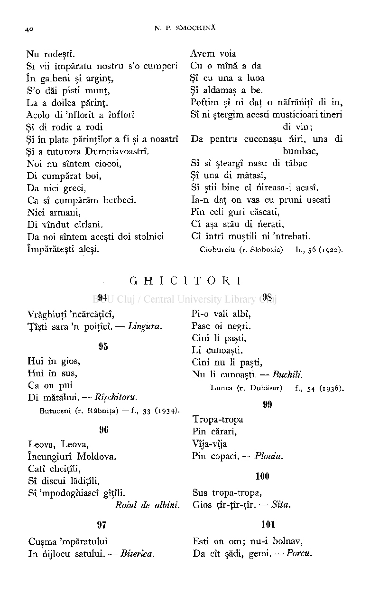

Avem voia Cu o mînă a da Şî cu una a luoa Şî aldamaş a be. Poftim şî ni daţ o năfrăiîiţî di in, Sî ni ştergim aceşti musticioari tineri

Nu rodeşti. Sî vii împăratu nostru s'o cumperi în galbeni şî argint, S'o dăi pişti munţ, La a doilea părinţ. Acolo di 'nflorit a înflori Şî di rodit a rodi Şî în plata părinţilor a fi şi a noastrî Şî a tuturora Dumniavoastrî. Noi nu sîntem ciocoi, Di cumpărat boi, Da nici greci, Ca sî cumpărăm berbeci. Nici armâni, Di vîndut cîrlani. Da noi sîntem aceşti doi stolnici împărăteşti aleşi.

di vin; Da pentru cuconaşu hiri, una di

bumbac, Sî sî şteargî nasu di tabac Şî una di mătasî, Sî ştii bine cî riireasa-i acasî. Ia-n daţ on vas cu pruni uscaţi Pin celi guri căscaţi, Cî aşa stău di fierati, Cî întrî muştili ni 'ntrebati.

Cioburciu (r. Slobozia) — b., 56 (1922).

G H I C

I T O R I

98

94

Pi-o vali albî, Pasc oi negri. Cini li paşti, Li cunoaşti. Cini nu li paşti, Nu li cunoaşti. — Buchili.

Vrăghiuţî 'ncărcăţîcî, Ţîşti sara 'n poiţîcî. — Lingura.

95

Hui în gios, Hui în sus, Ca on pui Di mătăhui. — Rîşchitoru.

Lunca (r. Dubăsar)—f., 54 (1936).

99

Butuceni (r. Râbniţa) — f., 33 (1934)-

Tropa-tropa Pin cărări, Vîja-vîja Pin copaci. — Ploaia.

##### 9G

Leova, Leova, încungiurî Moldova. Catî cheiţîli, Sî discui lădiţîli, Sî 'mpodoghiascî gîţîli.

- 100

Sus tropa-tropa, Gios ţîr-ţîr-ţîr. — Sita.

- 101

Roiul de albini.

97

Esti on om; nu-i bolnav, Da cît sădi, gemi. — Porcu.

Cuşma 'mpăratului In hijlocu satului. — Biserica.

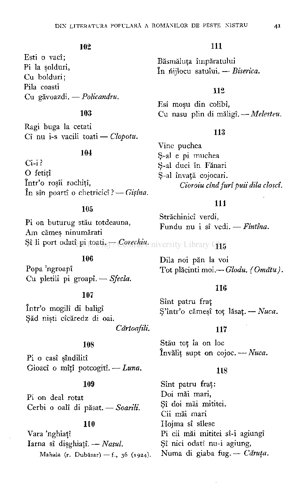

111

102

Esti o vaci; Pi la şolduri, Cu bolduri; Pila coasti

Băsmăluţa împăratului în riijlocu satului. — Biserica.

112

Cu găvoazdi. — Policandru.

Esî moşu din colibî, Cu nasu plin di măligî. —• Melesteu.

103

Ragi buga la cetati Cî nu i-s vacili toati — Clopotu.

113

Vine puchea Ş-al e pi muchea Ş-al duci în Fanari Ş-al învaţă cojocari.

104

Ci-i? O fetiţî într'o roşii rochiţî, în sîn poartî o chetricicî ? — Gişîna.

Cioroiu cînd furi puii dila cloşcî.

114

105

Străchinicî verdi, Fundu nu i sî vedi.—Fîntîna.

Pi on buturug stău totdeauna, Am cămeş ninumărati Şî li port odatî pi toati. — Corechiu.

- 115

Dila noi păn la voi Tot plăcinti moi.— Glodu. (Omătu).

- 116

106

Popa 'ngroapî Cu pletili pi groapî. — Sfecla.

- 107

într'o mogilî di baligi Şăd nişti cîcăredz di oai.

Cărtoafili.

- 108

Sînt patru fraţ Ş'într'o cămeşi toţ lăsat. — Nuca.

117

Stău toţ la on loc învăliţ supt on cojoc. — Nuca.

Pi o casî şîndilitî Gioacî o mîţî potcogitî. — Luna.

118

Sînt patru fraţ: Doi măi mari, Şî doi măi mititei. Cii măi mari Hojma sî sîlesc Pi cii măi mititei sî-i agiungî Şî nici odatî nu-i agiung, Numa di giaba fug. — Căruţa.

109

Pi on deal rotat Cerbi o oalî di păsat. — Soarili.

110

Vara 'nghiaţî Iarna sî dişghiaţî. — Nasul.

Mahala (r. Dubăsar)—f., 36 (1924).

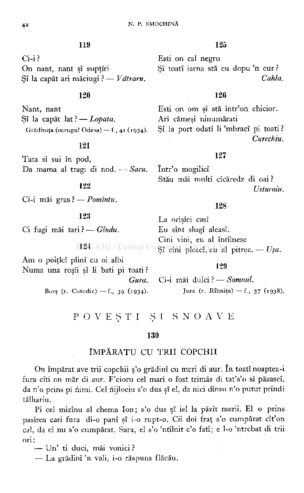

125

119

Esti on cal negru Şî toatî iarna stă cu dopu 'n cur ?

Ci-i? On nant, nant şî supţîri Şî la capăt ari măciugî ? — Vătraru.

Cahla.

126

120

Esti on om şî stă într'on chicior. Ari cămeşi ninumărati Şî la port odatî li 'mbracî pi toati ?

Nant, nant Şî la capăt lat ? — Lopata.

Grădiniţa (ocrugul Odesa) —f., 41 (1934).

Curechiu.

121

127

Tata sî sui în pod, Da mama al tragi di nod. •— Sacu.

într'o mogilicî Stău măi mulţi cîcăredz di oai ?

- 122

Ci-i măi gras? — Pomîntu.

- 123

- Ci fugi măi tari ? — Gîndu.

- 124

Usturoiu.

128

La orişîci casî Eu sînt slugî aleasî. Cini vini, eu al întîlnesc Şî cini pleacî, eu al pitrec. — Uşa.

Am o poiţîcî plini cu oi albi Numa una roşîi şî li bati pi toati ?

129

Ci-i măi dulci ? —• Somnul.

Gura.

Jura (r. Rîbniţa) — f., 37 (1938).

Borş (r. Cotodic) —f., 39 (1934).

POVEŞT I Ş I S N O A V E

130

ÎMPĂRATU CU TRII COPCHII

On împărat ave trii copchii ş'o grădini cu meri di aur. în toatî noaptea-i fura cîti on măr di aur. F'cioru cel mari o fost trimăs di tat's'o sî păzascî, da n'o prins pi nimi. Cel hijlociu s'o dus şî el, da nici dînsu n'o putut prindi tălhariu.

Pi cel mizînu al chema Ion; s'o dus şî iei la păzit merii. El o prins păşirea cari fura di-o pani şî i-o rupt-o. Cii doi fraţ s'o cumpărat cît'on cal, da el nu s'o cumpărat. Sara, el s'o 'ntîlnit c'o fatî; e l-o 'ntrebat di trii ori :

— Un' ti duci, măi vonici ?

— La grădini 'n vali, i-o răspuns flăcău.

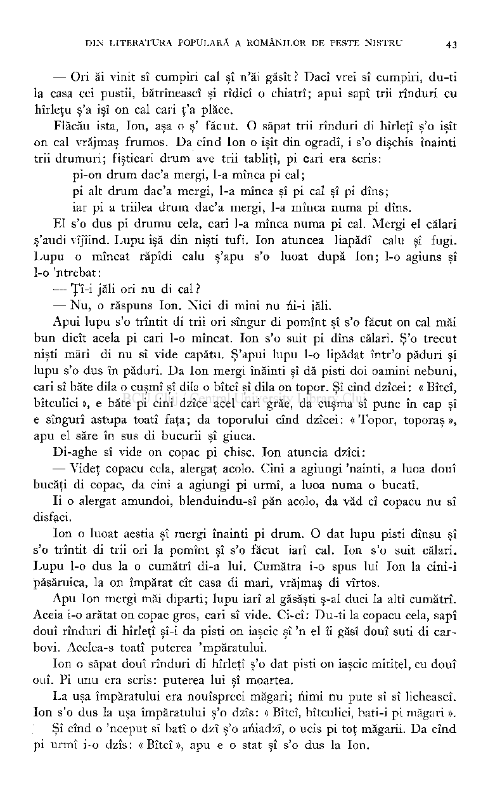

— Ori ăi vinit sî cumpiri cal şî n'ăi găsît ? Dacî vrei sî cumpiri, du-ti la casa cei pustii, bătrîneascî şi rîdicî o chiatrî; apui sapî trii rînduri cu hîrleţu ş'a işî on cal cari ţ'a place.

Flăcău ista, Ion, aşa o ş' făcut. O săpat trii rînduri di hîrleţî ş'o işît on cal vrăjmaş frumos. Da cînd Ion o işît din ogradî, i s'o dişchis înainti trii drumuri; fişticari drum ave trii tabliţî, pi cari era scris:

pi-on drum dac'a mergi, 1-a mînca pi cal; pi alt drum dac'a mergi, 1-a mînca şî pi cal şî pi dîns; iar pi a triilea drum dac'a mergi, 1-a mînca numa pi dîns.

El s'o dus pi drumu cela, cari 1-a mînca numa pi cal. Mergi el călări ş'audi vîjîind. Lupu işă din nişti tufi. Ion atuncea liapădî calu şî fugi. Lupu o mîncat răpîdi calu ş'apu s'o luoat după Ion; l-o agiuns şî l-o 'ntrebat:

— Ţî-i jăli ori nu di cal ?

— Nu, o răspuns Ion. Nici di mini nu hi-i jăli. Apui lupu s'o trîntit di trii ori singur di pomînt şî s'o făcut on cal măi bun dicît acela pi cari l-o mîncat. Ion s'o suit pi dîns călări. Ş'o trecut nişti mări di nu sî vide capătu. Ş'apui lupu l-o lipădat într'o păduri şî lupu s'o dus în păduri. Da Ion mergi înăinti şî dă pişti doi oamini nebuni, cari sî băte dila o cuşmî şî dila o bîtcî şî dila on topor. Şî cînd dzîcei : « Bîtcî,

- bîtculici », e băte pi cini dzîce acel cari grăe, da cuşma sî pune în cap şî e sîngurî astupa toatî faţa ; da toporului cînd dzîcei : « Topor, toporaş », apu el săre în sus di bucurii şî giuca.

Di-aghe sî vide on copac pi chisc. Ion atuncia dzîci:

— Videţ copacu cela, alergat acolo. Cini a agiungi 'nainti, a luoa douî bucăţi di copac, da cini a agiungi pi urmî, a luoa numa o bucatî.

Ii o alergat amundoi, blenduindu-sî păn acolo, da văd cî copacu nu sî disfaci.

Ion o luoat aestia şî mergi înainti pi drum. O dat lupu pişti dînsu şî s'o trîntit di trii ori la pomînt şî s'o făcut iarî cal. Ion s'o suit călări. Lupu l-o dus la o cumătrî di-a lui. Cumătră i-o spus lui Ion la cini-i păsăruica, la on împărat cît casa di mari, vrăjmaş di vîrtos.

Apu Ion mergi măi diparti; lupu iarî al găsăşti ş-al duci la altî cumătrî. Aceia i-o arătat on copac gros, cari sî vide. Ci-cî: Du-ti la copacu cela, sapî douî rînduri di hîrleţî şî-i da pişti on iaşcic şî 'n el îi găsî douî suti di carbovi. Acelea-s toatî puterea 'mpăratului.

Ion o săpat douî rînduri di hîrleţî ş'o dat pişti on iaşcic mititel, cu douî ouî. Pi unu era scris: puterea lui şî moartea.

La uşa împăratului era nouîspreci măgari; himi nu pute sî sî licheascî. Ion s'o dus la uşa împăratului ş'o dzîs: « Bîtcî, bîtculici, bati-i pi măgari ».

Şî cînd o 'nceput sî batî o dzî ş'o ahiadzî, o ucis pi toţ măgarii. Da cînd pi urmî i-o dzîs : « Bîtcî », apu e o stat şî s'o dus la Ion.

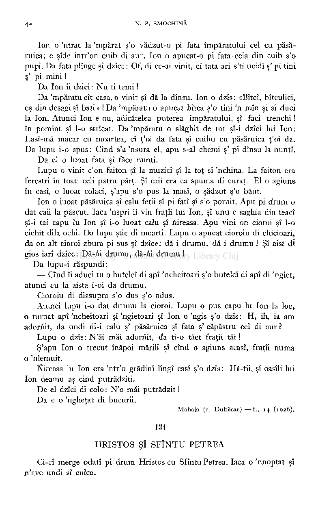

Ion o 'ntrat la 'mpărat ş'o vădzut-o pi fata împăratului cel cu păsăruica; e şîde într'on cuib di aur. Ion o apucat-o pi fata ceia din cuib s'o pupi. Da fata plînge şî dzîce : Of, di ce-ai vinit, cî tata ari s'ti ucidî ş' pi tini ş' pi mini !

Da Ion îi dzici: Nu ti temi ! Da 'mpăratucît casa, o vinit şî dă la dînsu. Ion o dzîs: «Bîtcî, bîtculici,

eş din desagi şî bati » ! Da 'mpăratu o apucat bîtca ş'o ţîni 'n mîn şî sî duci la Ion. Atunci Ion e ou, adicătelea puterea împăratului, şî faci trenchi ! în pomînt şî l-o stricat. Da'mpăratu o slăghit de tot şî-i dzîci lui Ion: Lasî-mă măcar cu moartea, cî ţ'oi da fata şî cuibu cu păsăruica ţ'oi da. Da lupu i-o spus: Cînd s'a 'nsura el, apu s-al chemi ş' pi dînsu la nuntî.

Da el o luoat fata şî face nuntî. Lupu o vinit c'on faiton şî la muzîcî şî la toţ sî 'nchina. La faiton era

ferestri în toati celi patru părţ. Şî caii era ca spuma di curăţ. El o agiuns în casî, o luoat colaci, ş'apu s'o pus la masî, o şădzut ş'o băut.

Ion o luoat păsăruica şî calu fetii şî pi fatî şî s'o pornit. Apu pi drum o dat caii la păscut. Iaca 'nspri ii vin fraţii lui Ion, şî unu e saghia din teacî şî-i tai capu lu Ion şî i-o luoat calu şî riireasa. Apu vini on cioroi şî l-o cichit dila ochi. Da lupu ştie di moarti. Lupu o apucat cioroiu di chicioari, da on alt cioroi zbura pi sus şî dzîce: dă-i drumu, dă-i drumu ! Şî aist di gios iarî dzîce: Dă-rii drumu, dă-fii drumu !

Da lupu-i răspundi:

— Cînd îi aduci tu o butelcî di apî 'ncheitoari ş'o butelcî di apî di 'ngiet,

atunci eu la aista i-oi da drumu. Cioroiu di diasupra s'o dus ş'o adus. Atunci lupu i-o dat drumu la cioroi. Lupu o pus capu lu Ion la loc,

- o turnat apî 'ncheitoari şî 'ngietoari şî Ion o 'ngis ş'o dzîs : H, ih, ia am adorfiit, da undi ni-i calu ş' păsăruica şî fata ş' căpăstru cel di aur ?

Lupu o dzîs: N'ăi măi adorfiit, da ti-o tăet fraţîi tăi ! Ş'apu Ion o trecut înapoi mărili şî cînd o agiuns acasî, fraţîi numa

- o 'nlemnit. Nireasa lu Ion era 'ntr'o grădini lîngî casî ş'o dzîs: Hă-tii, şî oasîli lui

Ion deamu aş cind putrădzîti. Da el dzîci di colo : N'o măi putrădzît ! Da e o 'ngheţat di bucurii.

Mahala (r. Dubăsar) —f., 14 (1926).

131

HRISTOS Şî SFÎNTU PETREA

Ci-cî merge odatî pi drum Hristos cu Sfîntu Petrea. Iaca o 'nnoptat şî n'ave undi sî culca.

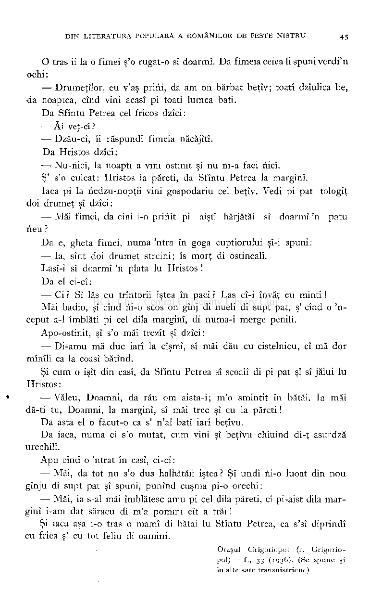

O tras ii la o fimei ş'o rugat-o sî doarmî. Da fimeia ceiea li spuni verdi'n ochi:

— Drumeţilor, eu v'aş prihi, da am on bărbat beţiv; toatî dzîulica be, da noaptea, cînd vini acasî pi toatî lumea bati.

Da Sfîntu Petrea cel fricos dzîci:

— Ăi veţ-cî ?

- •— Dzău-cî, îi răspundi fimeia năcăjîtî. Da Hristos dzîci:
- •— Nu-nicî, la noapti a vini ostinit şî nu ni-a faci nici. Ş' s'o culcat: Hristos la păreţi, da Sfîntu Petrea la marginî. Iaca pi la hedzu-nopţîi vini gospodariu cel beţîv. Vedi pi pat tologiţ

doi drumeţ şî dzîci:

— Măi fimei, da cini i-o pririit pi aişti hărjătăi sî doarmî 'n patu neu ?

Da e, gheta fimei, numa 'ntra în goga cuptiorului şî-i spuni:

— Ia, sînt doi drumeţ streini; îs morţ di ostinealî. Lasî-i sî doarmî 'n plata lu Hristos ! Da el ci-cî:

— Ci ? Sî lăs eu trîntorii iştea în paci ? Las cî-i învăţ eu minţi ! Măi badio, şî cînd rii-o scos on gînj di nueli di supt pat, ş' cînd o 'n-

ceput a-1 îmblăti pi cel dila marginî, di numa-i merge penili. Apo-ostinit, şî s'o măi trezit şî dzîci:

— Di-amu mă duc iarî la cîşmî, sî măi dău cu cistelnicu, cî mă dor mînîli ca la coasî bătînd.

Şi cum o işît din casî, da Sfîntu Petrea sî scoalî di pi pat şî sî jălui lu Hristos :

— Valeu, Doamni, da rău om aista-i; m'o smintit în bătăi. Ia măi

dă-ti tu, Doamni, la marginî, sî măi trec şî eu la păreţi ! Da asta el o făcut-o ca s' n'al batî iarî beţîvu. Da iaca, numa ci s'o mutat, cum vini şî beţîvu chiuind di-ţ asurdză

urechili. Apu cînd o 'ntrat în casî, ci-cî:

— Măi, da tot nu s'o dus halhătăii iştea ? Şî undi hi-o luoat din nou gînju di supt pat şî spuni, punînd cuşma pi-o orechi:

— Măi, ia s-al măi îmblătesc amu pi cel dila păreţi, cî pi-aist dila marginî i-am dat săracu di m'a pomini cît a trăi !

Şi iaca aşa i-o tras o mamî di bătăi lu Sfîntu Petrea, ca s'sî diprindî cu frica ş' cu tot feliu di oamini.

Oraşul Grigoriopol (r. Grigoriopol) — f., 33 (1936). (Se spune şi în alte sate transnistriene).

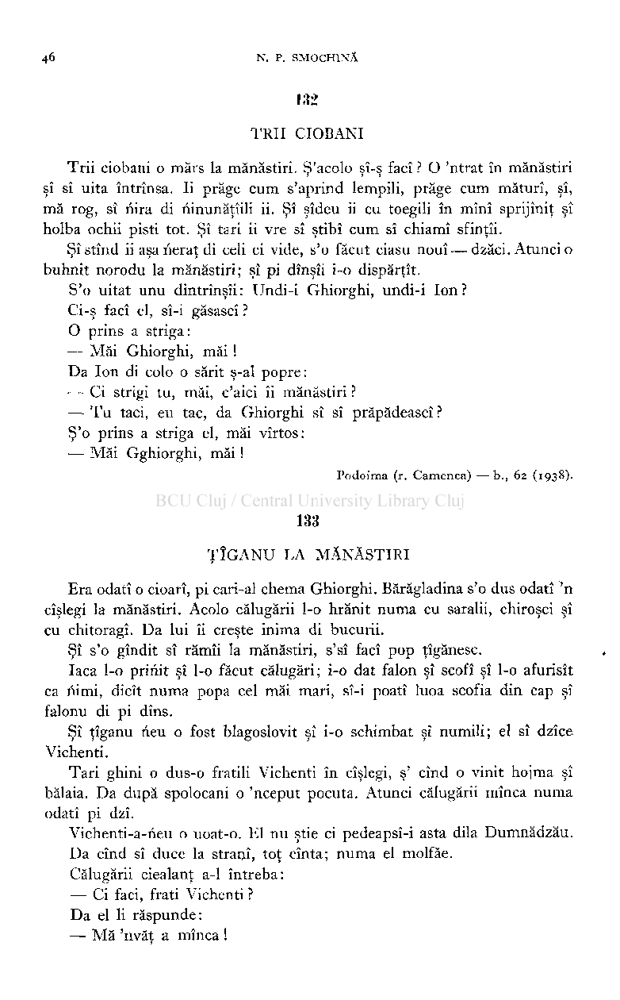

132

TRII CIOBANI

Trii ciobani o mărs la mănăstiri. Ş'acolo şî-ş faci ? O 'ntrat în mănăstiri şî sî uita întrînsa. Ii präge cum s'aprind lempili, präge cum măturî, şî, mă rog, sî hira di iîinunăţîili ii. Şî şîdeu ii cu toegili în mînî sprijinit şî holba ochii pişti tot. Şî tari ii vre sî ştibî cum sî chiamî sfinţii.

Şî stînd ii aşa heraţ di celi ci vide, s'o făcut ciasu nouî — dzăci. Atunci o

buhnit norodu la mănăstiri; şî pi dînşîi i-o dispărţît. S'o uitat unu dintrînşîi: Undi-i Ghiorghi, undi-i Ion? Ci-ş facî el, sî-i găsascî ? O prins a striga:

— Măi Ghiorghi, măi ! Da Ion di colo o sărit ş-al popre:

— Ci strigi tu, măi, c'aici îi mănăstiri ?

— Tu taci, eu tac, da Ghiorghi sî sî prăpădeascî ? Ş'o prins a striga el, măi vîrtos:

— Măi Gghiorghi, măi !

Podoima (r. Camenca) —b. , 62 (1938).

133

ŢÎGANU LA MĂNĂSTIRI Era odatî o cioarî, pi cari-al chema Ghiorghi. Baragladina s'o dus odatî 'n

- cîşlegi la mănăstiri. Acolo călugării l-o hrănit numa cu saralii, chiroşci şî cu chitoragî. Da lui îi creşte inima di bucurii.

Şî s'o gîndit sî rămîi la mănăstiri, s'sî facî pop ţigănesc. Iaca l-o prihit şî l-o făcut călugări; i-o dat falon şî scofî şî l-o afurisit

ca himi, dicît numa popa cel măi mari, sî-i poatî luoa scofia din cap şî falonu di pi dîns.

Şî ţîganu neu o fost blagoslovit şî i-o schimbat şî numili; el sî dzîce Vichenti.

Tari ghini o dus-o fratili Vichenti în cîşlegi, ş' cînd o vinit hojma şî bălaia. Da după spolocani o 'nceput pocuta. Atunci călugării mînca numa odatî pi dzî.

Vichenti-a-heu o uoat-o. El nu ştie ci pedeapsî-i asta dila Dumnădzău. Da cînd sî duce la stranî, toţ cînta; numa el molfăe. Călugării ciealanţ a-1 întreba:

— Ci faci, fraţi Vichenti ? Da el li răspunde:

— Mă 'nvăţ a mînca !

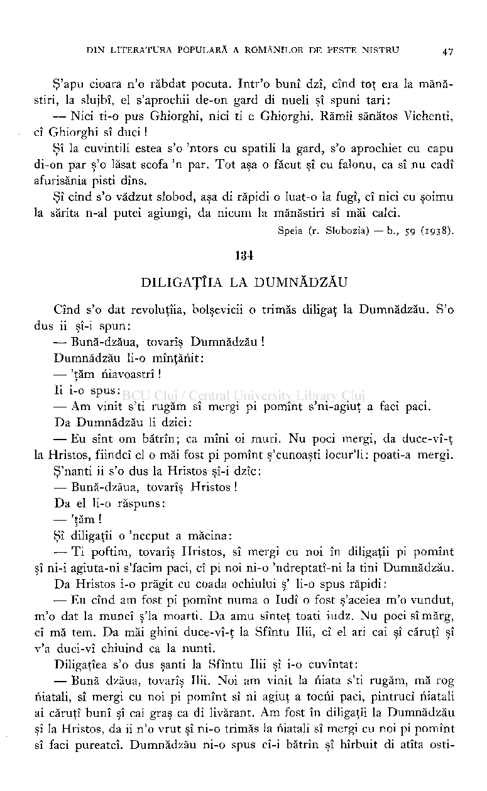

Ş'apu cioara n'o răbdat pocuta. Intr'o buni dzî, cînd toţ era la mănăstiri, la slujbî, el s'aprochii de-on gard di nueli şî spuni tari:

— Nici ti-o pus Ghiorghi, nici ti e Ghiorghi. Rămîi sănătos Vichenti, cî Ghiorghi sî duci !

Şî la cuvintili estea s'o 'ntors cu spatili la gard, s'o aprochiet cu capu di-on par ş'o lăsat scofa 'n par. Tot aşa o făcut şî cu falonu, ca sî nu cadî afurisănia pişti dîns.

Şî cînd s'o vădzut slobod, aşa di răpidi o luat-o la fugî, cî nici cu şoimu la sărita n-al putei agiungi, da nicum la mănăstiri sî măi calci.

Speia (r. Slobozia) —b. , 59 (1938).

134

DILIGAŢÎIA LA DUMNĂDZĂU

Cînd s'o dat revoluţîia, bolşevicii o trimăs diligaţ la Dumnădzău. S'o dus ii şî-i spun:

—• Bună-dzăua, tovarîş Dumnădzău ! Dumnădzău li-o mînţăhit:

— 'ţăm hiavoastrî ! Ii i-o spus:

— Am vinit s'ti rugăm sî mergi pi pomînt s'ni-agiuţ a faci paci. Da Dumnădzău li dzici:

— Eu sînt om bătrîn; ca mîni oi muri. Nu poci mergi, da duce-vî-ţ la Hristos, fiindcî el o măi fost pi pomînt ş'cunoaşti locur'li: poati-a mergi.

Ş'nanti ii s'o dus la Hristos şî-i dzîc:

— Bună-dzăua, tovarîş Hristos ! Da el li-o răspuns:

— 'ţăm ! Şî diligaţîi o 'nceput a măcina:

— Ti poftim, tovarîş Hristos, sî mergi cu noi în diligaţîi pi pomînt şî ni-i agiuta-ni s'facim paci, cî pi noi ni-o 'ndreptatî-ni la tini Dumnădzău.

Da Hristos i-o prăgit cu coada ochiului ş' li-o spus răpidi:

— Eu cînd am fost pi pomînt numa o Iudî o fost ş'aceiea m'o vundut, m'o dat la muncî ş'la moarti. Da amu sînteţ toati iudz. Nu pocisîmărg, cî mă tem. Da măi ghini duce-vî-ţ la Sfîntu Ilii, cî el ari cai şî căruţî şî v'a duci-vî chiuind ca la nuntî.

Diligaţîea s'o dus şanti la Sfîntu Ilii şî i-o cuvîntat:

— Bună dzăua, tovarîş Ilii. Noi am vinit la hiata s'ti rugăm, mă rog hiatali, sî mergi cu noi pi pomînt sî ni agiuţ a tochi paci, pintrucî hiatali ai căruţî bunî şî cai graş ca di livărant. Am fost în diligaţîi la Dumnădzău şî la Hristos, da ii n'o vrut şî ni-o trimăs la hiatali sî mergi cu noi pi pomînt sî faci pureatcî. Dumnădzău ni-o spus cî-i bătrîn şî hîrbuit di atîta osti-

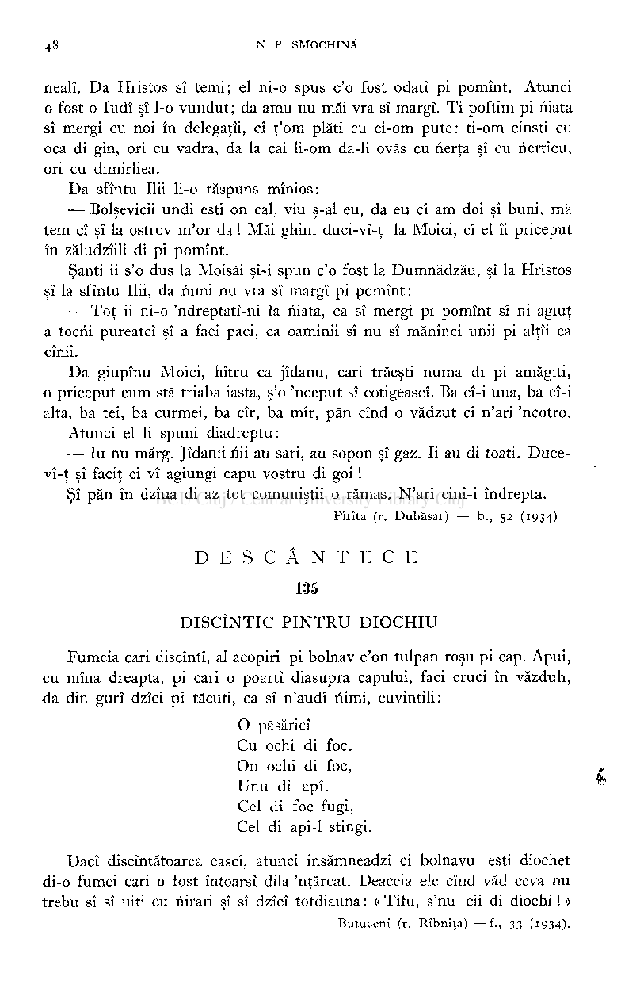

nealî. Da Hristos sî terni; el ni-o spus c'o fost odatî pi pomînt. Atunci

- o fost o Iudî şî l-o vundut; da amu nu măi vra sî margî. Ti poftim pi riiata sî mergi cu noi în delegaţii, cî ţ'om plăti cu ci-om pute: ti-om cinsti cu
- oca di gin, ori cu vadra, da la cai li-om da-li ovăs cu rierţa şî cu nerticu, ori cu dimirliea.

Da sfîntu Ilii li-o răspuns mînios:

— Bolşevicii undi esti on cal, viu ş-al eu, da eu cî am doi şî buni, mă tem cî şî la ostrov m'or da ! Măi ghini duci-vî-ţ la Moici, cî el îi priceput în zăludzîili di pi pomînt.

Şanti ii s'o dus la Moisăi şî-i spun c'o fost la Dumnădzău, şî la Hristos şî la sfîntu Ilii, da riimi nu vra sî margî pi pomînt:

— Toţ ii ni-o 'ndreptatî-ni la riiata, ca sî mergi pi pomînt sî ni-agiuţ a tocrii pureatcî şî a faci paci, ca oaminii sî nu sî mănînci unii pi alţii ca cînii.

Da giupînu Moici, hîtru ca jîdanu, cari trăeşti numa di pi amăgiţi, o priceput cum stă triaba iasta, ş'o 'nceput sî cotigeascî. Ba cî-i una, ba cî-i alta, ba tei, ba curmei, ba cîr, ba mîr, păn cînd o vădzut cî n'ari 'ncotro.

Atunci el li spuni diadreptu:

—• Iu nu mărg. Jidanii riii au sari, au sopon şî gaz. Ii au di toati. Ducevî-ţ şî faciţ ci vî agiungi capu vostru di goi !

Şî păn în dzîua di az tot comuniştii o rămas. N'ari cini-i îndrepta.

Pîrîta (r. Dubăsar) — b., 52 (1934)

DESCÂNTEC

135

DISCÎNTIC PINTRU DIOCHIU

Fumeia cari discîntî, al acopiri pi bolnav c'on tulpan roşu pi cap. Apui, cu mina dreapta, pi cari o poartî diasupra capului, faci cruci în văzduh, da din gurî dzîci pi tăcuţi, ca sî n'audî riimi, cuvintili:

O păsăricî Cu ochi di foc. On ochi di foc, Unu di apî. Cel di foc fugi, Cel di apî-1 stingi.

Dacî discîntătoarea cascî, atunci însămneadzî cî bolnavu esti diochet di-o fumei cari o fost întoarsî dila 'nţărcat. Deaceia ele cînd văd ceva nu trebu sî sî uiti cu riirari şî sî dzîcî totdiauna : « Tifu, s'nu cii di diochi ! »

Butuceni (r. Rîbniţa) —f., 33 (1934).

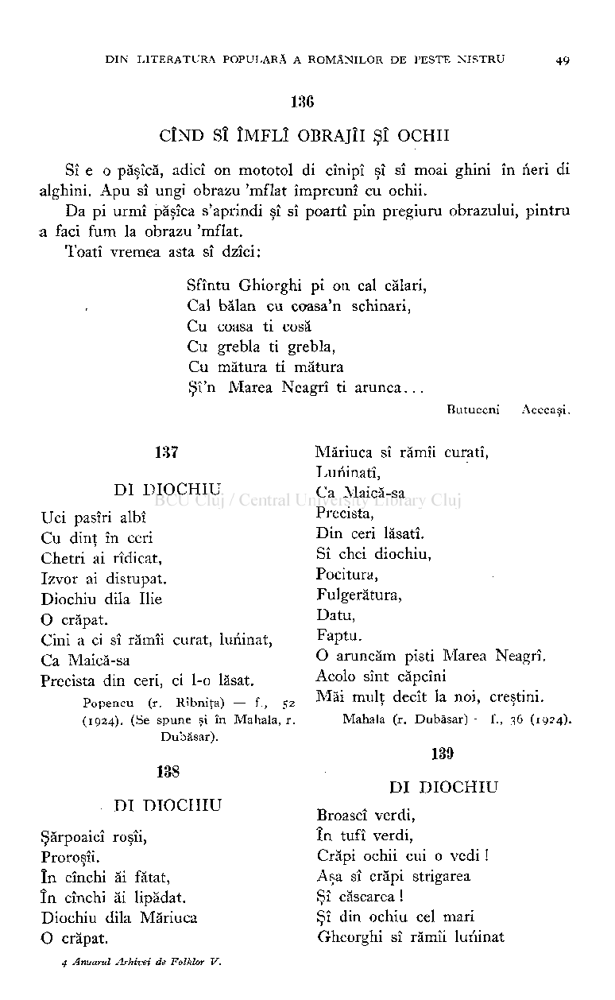

136

CÎND Sî ÎMFLÎ OBRAJÎI ŞÎ OCHII

Sî e o păşîcă, adicî on mototol di cînipî şî sî moai ghini în heri di alghini. Apu sî ungi obrazu 'mflat împreunî cu ochii.

Da pi urmî păşîca s'aprindi şî sî poartî pin pregiuru obrazului, pintru a faci fum la obrazu 'mflat.

Toatî vremea asta sî dzîci:

Sfîntu Ghiorghi pi on cal călări, Cal bălan cu coasa'n schinari, Cu coasa ti cosă Cu grebla ti grebla, Cu mătura ti mătura Şî'n Marea Neagrî ti arunca...

Butuceni —Aceeaşi.

Măriuca sî rămîi curatî, Luriinatî, Ca Maică-sa Precista, Din ceri lăsatî. Sî chei diochiu, Pocitura, Fulgerătura, Datu, Faptu. O aruncăm pişti Marea Neagrî. Acolo sînt căpcîni Măi mulţ decît la noi, creştini.

137

DI DIOCHIU

Uci pasîri albî Cu dinţ în ceri Chetri ai ridicat, Izvor ai distupat. Diochiu dila Ilie O crăpat. Cini a ci sî rămîi curat, lufiinat, Ca Maică-sa Precista din ceri, ci l-o lăsat.

Popencu (r. Rîbniţa) — f., 52 (1924). (Se spune şi în Mahala, r. Dubăsar).

Mahala (r. Dubăsar) —f., 36 (1924).

139

138

DI DIOCHIU

DI DIOCHIU

Broascî verdi, în tufî verdi, Crapi ochii cui o vedi ! Aşa sî crapi strigarea Şî căscarea ! Şî din ochiu cel mari Gheorghi sî rămîi luninat

Şărpoaicî roşîi, Proroşîi. în cînchi ăi fătat, în cînchi ăi lipădat. Diochiu dila Măriuca O crăpat.

4 Anuarul Arhivei de Folklor V.

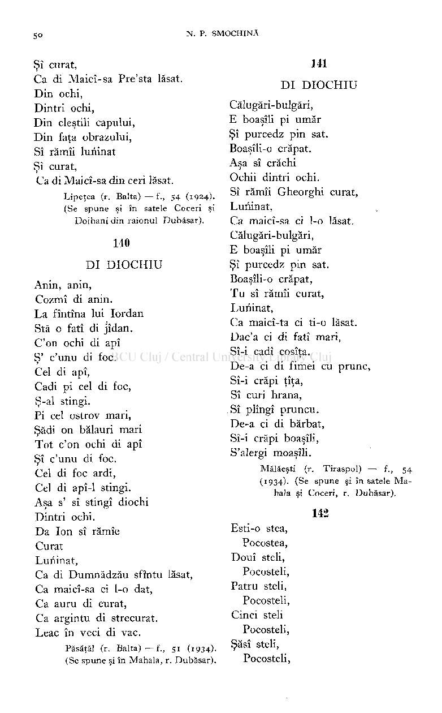

Şî curat, Ca di Maicî-sa Pre'sta lăsat. Din ochi, Dintri ochi, Din cleştili capului, Din faţa obrazului, Sî rămîi luhinat Şî curat,

DI DIOCHIU Călugări- bulgări, E boaşîli pi umăr Şî purcedz pin sat. Boaşîli-o crăpat. Aşa sî crăchi Ochii dintri ochi. Sî rămîi Gheorghi curat, Luhinat, Ca maicî-sa ci l-o lăsat. Călugări-bulgări, E boaşîli pi umăr Şî purcedz pin sat. Boaşîli-o crăpat, Tu sî rămîi curat, Luhinat, Ca maicî-ta ci ti-o lăsat. Dac'a ci di fatî mari, Sî-i cadî cosiţa. De-a ci di fimei cu prunc, Sî-i crapi ţîţa, Sî curi hrana, Sî plîngî pruncu. De-a ci di bărbat, Sî-i crapi boaşîli, S'alergi moaşîli.

Ca di Maicî-sa din ceri lăsat.

Lipeţca (r. Balta) —f., 54 (1924). (Se spune şi în satele Coceri şi Doibani din raionul Dubăsar).

140

DI DIOCHIU

Anin, anin, Cozmî di anin. La fîntîna lui Iordan Stă o fatî di jîdan. Con ochi di apî Ş' c'unu di foc. Cel di apî, Cadi pi cel di foc, Ş-al stingi. Pi cel ostrov mari, Sădi on balauri mari Tot c'on ochi di apî Şî c'unu di foc. Cel di foc ardi, Cel di apî-1 stingi. Aşa s' sî stingi diochi Dintri ochi. Da Ion sî rămîe Curat Luhinat, Ca di Dumnădzău sfîntu lăsat, Ca maicî-sa ci l-o dat, Ca auru di curat, Ca argintu di strecurat. Leac în veci di vac.

Mălăeşti (r. Tiraspol) —• f., 54 (i934)- (Se spune şi în satele Ma hala şi Coceri, r. Dubăsar).

142

Esti-o stea,

Pocostea, Douî steli,

Pocosteli, Patru steli,

Pocosteli, Cinci steli

Pocosteli, Şăsî steli,

Păsăţăl (r. Balta)—f., 51 (i934>(Se spune şi în Mahala, r. Dubăsar).

Pocosteli,

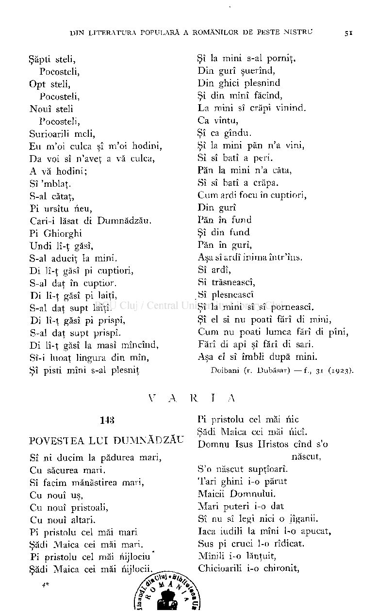

Şî la mini s-al pornit. Din gurî şuerînd, Din ghici plesnind Şî din mînî făcînd, La mini sî crapi vinind. Ca vîntu, Şî ca gîndu. Şî la mini păn n'a vini, Si sî batî a peri. Păn la mini n'a căta, Si si batî a crăpa. Cum ardi focu în cuptiori, Din gurî Păn în fund Şî din fund Păn în gurî, Aşa sî ardî inima într'îns. Sî ardî, Sî trăsneascî, Sî plesneascî Şî la mini sî sî porneascî. Şî el sî nu poatî fărî di mini, Cum nu poati lumea fărî di pîni, Fărî di apî şî fărî di sari. Aşa el sî îmbli după mini.

Şăpti steli,

Pocosteli, Opt steli,

Pocosteli, Nouî steli

Pocosteli, Surioarili meii, Eu m'oi culca şî m'oi hodini, Da voi sî n'aveţ a vă culca, A vă hodini; Sî 'mblaţ. S-al cătat, Pi ursîtu neu, Cari-i lăsat di Dumnădzău. Pi Ghiorghi Undi lî-ţ găsî, S-al aduciţ la mini. Di lî-ţ găsî pi cuptiori, S-al daţ în cuptior. Di lî-ţ găsî pi laiţî, S-al daţ supt laiţî. Di lî-ţ găsî pi prispî, S-al daţ supt prispî. Di lî-ţ găsî la masî mîncînd, Sî-i luoaţ lingura din mîn, Şî pişti mîni s-al plesnit

Doibani (r. Dubăsar) —f., 31 (1923).

V A R I A

Pi pristolu cel măi riic Sădi Maica cei măi nicî. Domnu Isus Hristos cînd s'o

143

POVESTEA LUI DUMNĂDZĂU

născut,

Sî ni ducim la pădurea mari, Cu săcurea mari. Sî facim mănăstirea mari, Cu nouî uş, Cu nouî pristoali, Cu nouî altari. Pi pristolu cel măi mari Sădi Maica cei măi mari. Pi pristolu cel măi riijlociu Sădi Maica cei măi nijlocii

S'o născut supţîoarî. Tari ghini i-o părut Maicii Domnului. Mari puteri i-o dat Sî nu sî legi nici o jîganii. Iaca iudili la mîni l-o apucat, Sus pi cruci l-o ridicat. Mînili i-o lănţuit, Chicioarili i-o chironit,

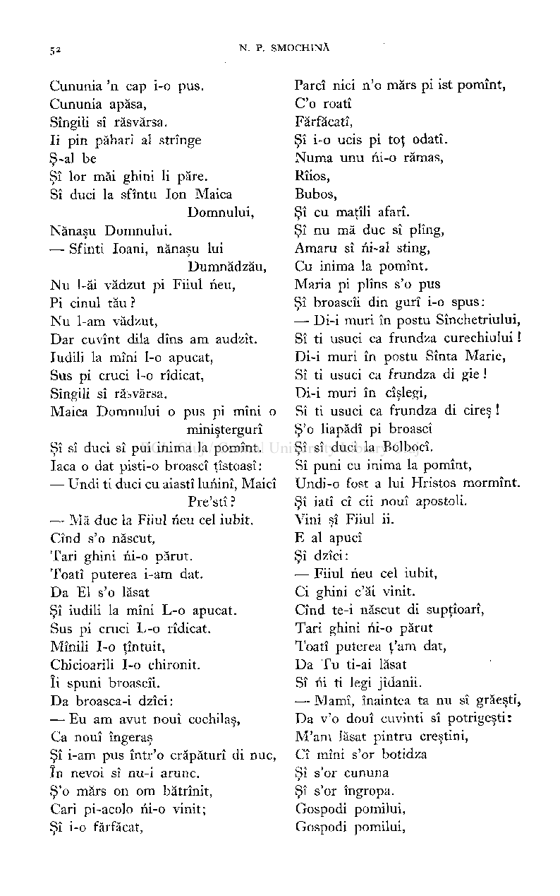

Parcî nici n'o mărs pi ist pomînt, C'o roatî Fărfăcatî, Şî i-o ucis pi toţ odatî. Numa unu hi-o rămas,

Cununia 'n cap i-o pus. Cununia apăsa, Sîngili sî răsvărsa. Ii pin păhari al strînge Ş-al be Şî lor măi ghini li păre. Sî duci la sfîntu Ion Maica

- Rîios, Bubos, Şî cu maţîli afarî. Şî nu mă duc sî plîng, Amaru sî hi-al sting, Cu inima la pomînt. Maria pi plîns s'o pus Şî broascîi din gurî i-o spus:

— Di-i muri în postu Sînchetriului,

- Sî ti usuci ca frundza curechiului ! Di-i muri în postu Sînta Marie, Sî ti usuci ca frundza di gie ! Di-i muri în cîşlegi, Sî ti usuci ca frundza di cireş ! Ş'o liapădî pi broascî Şî sî duci la Bolbocî. Sî puni cu inima la pomînt, Undi-o fost a lui Hristos mormînt. Şî iatî cî cii nouî apostoli. Vini şî Fiiul ii. E al apucî Şî dzîci:

Domnului, Nănaşu Domnului.

— Sfinţi Ioani, nănaşu lui

Dumnădzău, Nu 1-ăi vădzut pi Fiiul neu, Pi cinul tău ? Nu l-am vădzut, Dar cuvînt dila dîns am audzît. Iudili la mîni I-o apucat, Sus pi cruci l-o ridicat, Sîngili sî răavărsa. Maica Domnului o pus pi mîni o

miniştergurî Şî sî duci sî pui inima la pomînt. Iaca o dat pisti-o broascî ţîstoasî: — Undi ti duci cu aiastî luhinî, Maici

Pre'stî ?

— Mă duc la Fiiul neu cel iubit. Cînd s'o născut, Tari ghini hi-o părut. Toatî puterea i-am dat. Da El s'o lăsat Şî iudili la mîni L-o apucat. Sus pi cruci L-o ridicat. Mînili I-o ţintuit, Chicioarili I-o chironit. îi spuni broascîi. Da broasca-i dzîci:

— Fiiul neu cel iubit, Ci ghini c'ăi vinit. Cînd te-i născut di supţîoarî, Tari ghini hi-o părut Toatî puterea ţ'am dat, Da Tu ti-ai lăsat Sî hi ti legi jidanii.

•— Mamî, înaintea ta nu sî grăeşti, Da v'o douî cuvinti sî potrigeşti: M'am iăsat pintru creştini, Cî mîni s'or botidza Şî s'or cununa Şî s'or îngropa. Gospodi pomilui, Gospodi pomilui,

— Eu am avut nouî cochilaş, Ca nouî îngeraş Şî i-am pus într'o crăpături di nuc, în nevoi sî nu-i arunc. Ş'o mars on om bătrînit, Cari pi-acolo hi-o vinit; Şî i-o fărfăcat,

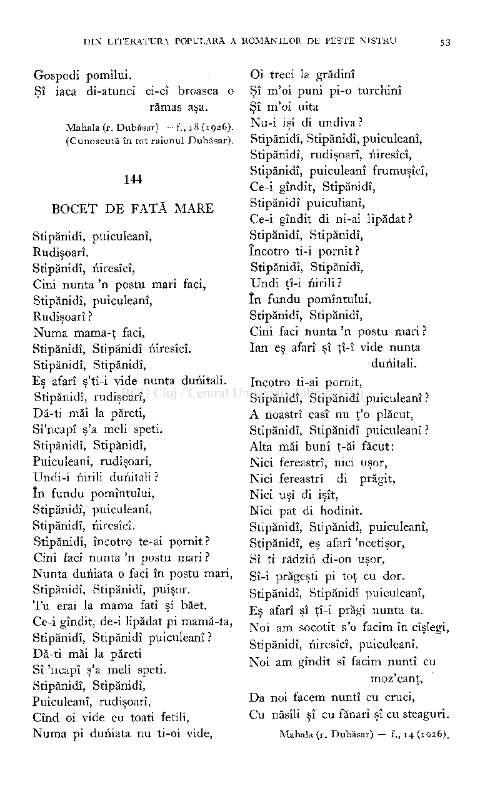

Oi treci la grădini Şî m'oi puni pi-o turchinî Şî m'oi uita Nu-i işî di undiva ? Stipănidî, Stipănidî, puiculeanî, Stipănidî, rudişoarî, niresîcî, Stipănidî, puiculeanî frumuşîcî, Ce-i gîndit, Stipănidî, Stipănidî puiculianî, Ce-i gîndit di ni-ai lipădat ? Stipănidî, Stipănidî, încotro ti-i pornit ? Stipănidî, Stipănidî, Undi ţî-i nirili ? în fundu pomîntului. Stipănidî, Stipănidî, Cini faci nunta 'n postu mari ? Ian eş afarî şî ţî-î vide nunta

Gospodi pomilui. Şî iaca di-atunci ci-cî broasca o

rămas aşa.

Mahala (r. Dubăsar) — f., 18 (1926). (Cunoscută în tot raionul Dubăsar).

144

BOCET DE FATĂ MARE

Stipănidî, puiculeanî, Rudişoarî. Stipănidî, niresîcî, Cini nunta 'n postu mari faci, Stipănidî, puiculeanî, Rudişoarî ? Numa mama-ţ faci, Stipănidî, Stipănidî niresîcî. Stipănidî, Stipănidî, Eş afarî ş'ţî-i vide nunta dunitali. Stipănidî, rudişoarî, Dă-ti măi la păreţi, Sî'ncapî ş'a meii speti. Stipănidî, Stipănidî, Puiculeanî, rudişoarî, Undi-i nirili dunitali ? în fundu pomîntului, Stipănidî, puiculeanî, Stipănidî, niresîcî. Stipănidî, încotro te-ai pornit ? Cini faci nunta 'n postu mari ? Nunta duniata o faci în postu mari, Stipănidî, Stipănidî, puişor. Tu erai la mama fatî şî băet. Ce-i gîndit, de-i lipădat pi mamă-ta, Stipănidî, Stipănidî puiculeanî ? Dă-ti măi la păreţi Sî 'ncapî ş'a meii speti. Stipănidî, Stipănidî, Puiculeanî, rudişoarî, Cînd oi vide eu toati fetili, Numa pi duniata nu ti-oi vide,

dunitali.

încotro ti-ai pornit, Stipănidî, Stipănidî puiculeanî ? A noastrî casî nu ţ'o plăcut, Stipănidî, Stipănidî puiculeanî ? Alta măi buni ţ-ăi făcut: Nici fereastrî, nici uşor, Nici fereastrî di prăgit, Nici uşi di işît, Nici pat di hodinit. Stipănidî, Stipănidî, puiculeanî, Stipănidî, eş afarî 'ncetişor, Sî ti rădzîfi di-on uşor, Sî-i prăgeşti pi toţ cu dor. Stipănidî, Stipănidî puiculeanî, Eş afarî şî ţî-i prăgi nunta ta. Noi am socotit s'o facim în cîşlegi, Stipănidî, niresîcî, puiculeanî. Noi am gîndit sî facim nuntî cu

moz'canţ, Da noi facem nuntî cu cruci, Cu năsîli şî cu fănari şî cu steaguri.

Mahala (r. Dubăsar) — f., 14 (1926).

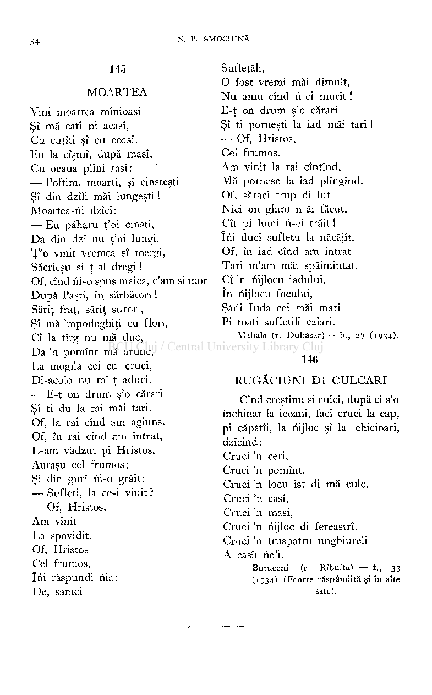

Sufleţăli, O fost vremi măi dimult, Nu amu cînd h-ei murit ! E-ţ on drum ş'o cărări Şî ti porneşti la iad măi tari !

145

MOARTEA

Vini moartea mînioasî Şî mă catî pi acasî, Cu cuţîti şî cu coasî. Eu la cîşmî, după masî, Cu ocaua plini rasî:

—• Of, Hristos, Cel frumos. Am vinit la rai cîntînd, Mă pornesc la iad plîngînd. Of, săraci trup di lut Nici on ghini n-ăi făcut, Cît pi lumi h-ei trăit ! îhi duci sufletu la năcăjit. Of, în iad cînd am întrat Tari m'am măi spăimîntat. Cî 'n hijlocu iadului, în hijlocu focului, Sădi Iuda cei măi mari Pi toati sufletili călări.

— Poftim, moarti, şî cinsteşti Şî din dzîli măi lungeşti ! Moartea-hi dzîci:

—• Eu păharu ţ'oi cinsti, Da din dzî nu ţ'oi lungi. Ţ'o vinit vremea sî mergi, Săcrieşu sî ţ-al dregi ! Of, cînd hi-o spus maica, c'am sî mor După Paşti, în sărbători ! Sărit fraţ, sărit surori, Şî mă 'mpodoghiţi cu flori, Cî la tîrg nu mă duc, Da 'n pomînt mă arunc, La mogila cei cu cruci, Di-acolo nu mî-ţ aduci. — E-ţ on drum ş'o cărări Şî ti du la rai măi tari. Of, la rai cînd am agiuns. Of, în rai cînd am întrat, L-am vădzut pi Hristos, Auraşu cel frumos; Şî din guri hi-o grăit:

Mahala (r. Dubăsar) —b. , 27 (1934).

146

RUGĂCIUNI DI CULCĂRI

Cînd creştinu sî culci, după ci s'o închinat la icoani, faci cruci la cap, pi căpătîi, la hijloc şî la chicioari, dzîcînd : Cruci 'n ceri, Cruci 'n pomînt, Cruci 'n locu ist di mă culc. Cruci 'n casî, Cruci 'n masî, Cruci 'n hijloc di fereastrî. Cruci 'n truspatru unghiureli A casîi heli.

— Sufleti, la ce-i vinit ?

— Of, Hristos, Am vinit La spovidit. Of, Hristos Cel frumos, îhi răspundi hia: De, săraci

Butuceni (r. Rîbniţa) — f., 33 (1934). (Foarte răspândită şi în alte sate).

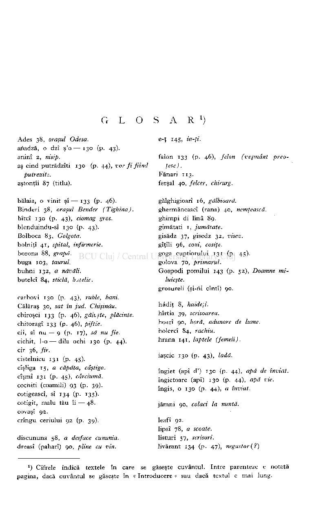

## GLOSAR

e-ţ 145, ia-ţi.

Ades 38, oraşul Odesa. anadză, o dzî ş'o—130 (p. 43). aninî 2, nisip. aş cind putrădzîti 130 (p. 44), vor fi fiind

falon 133 (p. 46), felon (veşmânt preo­

ţesc ). Fănari 113. ferşal 40, felcer, chirurg.

putrezit;. aştonţîi 87 (titlu).

gălghigioarî 16, gălbioară. ghermăneascî (rana) 40, nemţească. ghimpi di lînâ 89. gimătati 1, jumătate. gisădz 37, gisedz 32, visez.

bălaia, o vinit şî—13 3 (p. 46). Binderi 38, oraşul Bender ( Tighina).

- bîtcî 130 (p. 43), ciomag gros. blenduindu-sî 130 (p. 43). Bolboca 83, Golgota. bolniţî 41, spital, infirmerie. borona 88, grapă. buga 103, taurul. buhni 132, a năvăli. butelcî 84, sticlă, b.itelie.

carbovi 130 (p. 43), ruble, bani. Călăraş 30, sat în jud. Chişinău. chiroşci 133 (p. 46), găluşte, plăcinte. chitoragî 133 (p. 46), piftie. cii, sî nu — 9 (p. 17), să nu fie. cichit, l-o — dila ochi 130 (p. 44). cir 36, fir. cistelnicu 131 (p. 45).

- cîşliga 15, a căpăta, câştiga. cîşmî 131 (p. 45), cârciumă. cocniti (coamili) 93 (p. 39). cotigeascî, sî 134 (p. 135). cotigit, malu tău îi — 48. covaşî 92.

- gîţîli 96, cozi, cosiţe. goga cuptiorului 131 (p. 45). golova 70, primarul. Gospodi pomilui 143 (p. 52), Doamne mi-

luieşte. grosureli (şi-ni cîntî) 90.

hâdiţ 8, haideţi.

- hîrtia 39, scrisoarea. hoarî 90, horă, adunare de lume. holerci 84, rachiu. hrana 141, laptele (femeii).

iaşcic 130 (p. 43), ladă.

îngiet (apî d') 130 (p. 44), apă de înviat. îngietoare (apî) 130 (p. 44), apă vie. îngis, o 130 (p. 44), a înviat.

jămni 90, colaci la nuntă.

crîngu ceriului 92 (p. 39). leafî 92.

lipsî 78, a scoate. discununa 58, a desface cununia. listuri 57, scrisori. dreasî (paharî) 90, pline cu vin. livărant 134 (p. 47), negustor (?)

*) Cifrele indică textele în care se găseşte cuvântul. Intre parenteze e notată pagina, dacă cuvântul se găseşte în « Introducere » sau dacă textul e mai lung.

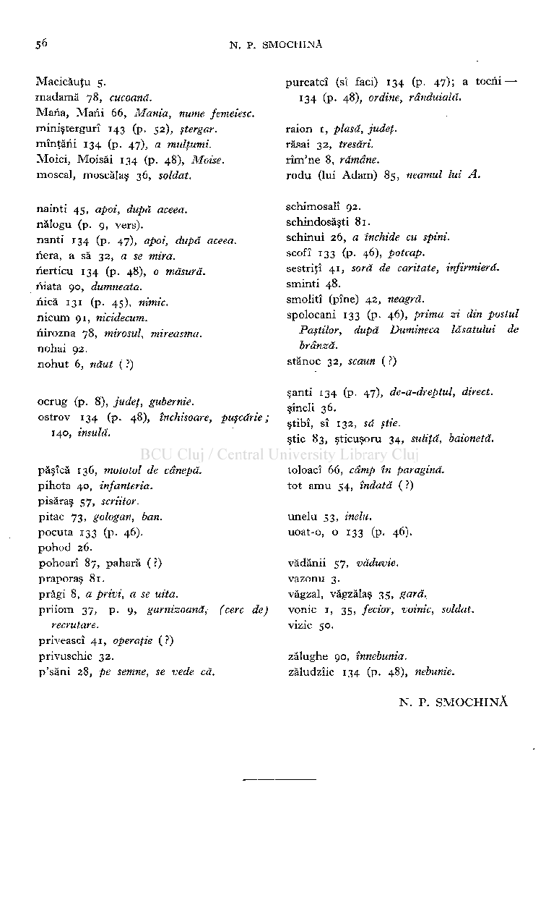

pureatcî (sî faci) 134 (p. 47); a tocni 134 (p. 48), ordine, rânduială.

Macicăuţu 5. madamă 78, cucoană. Mana, Mani 66, Mania, nume femeiesc. miniştergurî 143 (p. 52), ştergar. mînţăni 134 (p. 47), a mulţumi. Moici, Moisăi 134 (p. 48), Moise. moscal, moscălaş 36, soldat.

raion 1, plasă, judeţ. răsai 32, tresări. rîm'ne 8, rămâne. rodu (lui Adam) 85, neamul lui A.

schimosalî 92. schindosăşti 81. schinui 26, a închide cu spini. scofî 133 (p. 46), potcap. sestriţî 41, soră de caritate, infirmieră. sminti 48. smolitî (pîne) 42, neagră. spolocani 133 (p. 46), prima zi din postul

nainti 45, apoi, după aceea. nălogu (p. 9, vers). nanti 134 (p. 47), apoi, după aceea. nera, a să 32, a se mira. rierticu 134 (p. 48), o măsură. riiata 90, dumneata. riică 131 (p. 45), nimic. nicum 91, nicidecum. hirozna 78, mirosul, mireasma. nohai 92. nohut 6, năut ( ?)

Paştilor, după Dumineca lăsatului de brânză.

stănoc 32, scaun ( ?)

şanti 134 (p. 47), de-a-dreptul, direct. şîneli 36. ştibî, sî 132, să ştie. ştie 83, şticuşoru 34, suliţă, baionetă.

ocrug (p. 8), judeţ, gubernie. ostrov 134 (p. 48), închisoare, puşcărie;

140, insulă.

toloacî 66, câmp în paragină. tot amu 54, îndată ( ?)

păşîcă 136, mototol de cânepă. pihota 40, infanteria. pisăraş 57, scriitor. pitac 73, gologan, ban. pocuta 133 (p. 46). pohod 26. pohoarî 87, pahară ( ?) praporaş 81. prăgi 8, a privi, a se uita. priiom 37, p. 9, garnizoană^ (cerc de)

unelu 53, inelu. uoat-o, o 133 (p. 46).

vădanii 57, văduvie. vazonu 3. văgzal, văgzălaş 35, gară. vonic 1, 35, fecior, voinic, soldat. vizie 50.

recrutare. priveascî 41, operaţie (?) privuschie 32. p'săni 28, pe semne, se vede că.

zălughe 90, înnebunia. zăludzîie 134 (p. 48), nebunie.

N. P. SMOCHIN Ă

TOVĂRĂŞIILE DE CRĂCIUN ALE FECIORILOR ROMÂNI

' DIN ARDEAL

# )

1

în întreg cuprinsul Ardealului abia se găseşte un sat românesc, în care tineretul să nu se organizeze într'o tovărăşie chemată să pregătească petrecerile obişnuite la sărbătorile Crăciunului, ale Anului nou şi Bobotezei.

După lăsata secului de Crăciun, jocul obişnuit în Dumineci şi sărbători, încetează; odată cu venirea iernii, încetează şi lucrul câmpului. în monotonia serilor lungi tineretul îşi caută distracţii în şezători sau « habe ». Aici, pe lângă păcălelile şi glumele obişnuite, ţin sfat, cum să se întovă­

- răşească şi ce pregătiri să facă pentru petrecerile rămase din generaţie în generaţie, la marile sărbători de iarnă.

Numiri dé tovărăşii. însoţirile acestea ale tineretului au diferite numiri, după regiuni. Astfel, pe Ţara Oltului întâlnim mai des numirea « ceată »

) « ceata ficiorilor » ).

2

O altă numire este aceea de «juni» ), «se bagă cu junii»

).

5

Pe valea celor două Târnave şi pe Secaş, regiuni vestite de podgorii, aflăm mai des numirea « bute »

), « a întră la bute » ).

6

în satele de pe Câmpia Ardealului, regiune bogată în cereale, organizaţia feciorilor se numeşte « lădoiu » ), « la băgat în lădoiu » ) şi « cămară »

), mai rar « joc de Crăciun » ) .

10

') Spicuiri dintr'o lucrare în manuscris, cuprinzând descrierea obiceiurilor delà Crăciun, Anul nou şi Bobotează, adunate în mare parte cu concursul învăţătorilor din peste cinci sute de sate din Ardeal, în anii 1932—1933-

- 2

) Corbi, Sărata, Bărcut, etc., jud. Făgăraş; Avrig, Vurpăr, etc., jud. Sibiu.

- 3

) Săscior, Berivoiu-Făgăraş.

- 4

) Orlat-Sibiu.

- 5

) Mog, Tilişca-Sibiu.

- 6

) Buia, Sălcău-Târnava Mare; Blaj, Sâncel, Biia, Lodroman, Cergău, CenadeTârnava Mică.

') Zlagna-Târnava Mare.

- 8

) Târşor, Vişinelu-Cluj.

- 9

) Ercea, Băla-Mureş; Ormeniş-Cluj.

- 10

###### ) Răzoare-Cluj. ") Dâmb-Cluj.

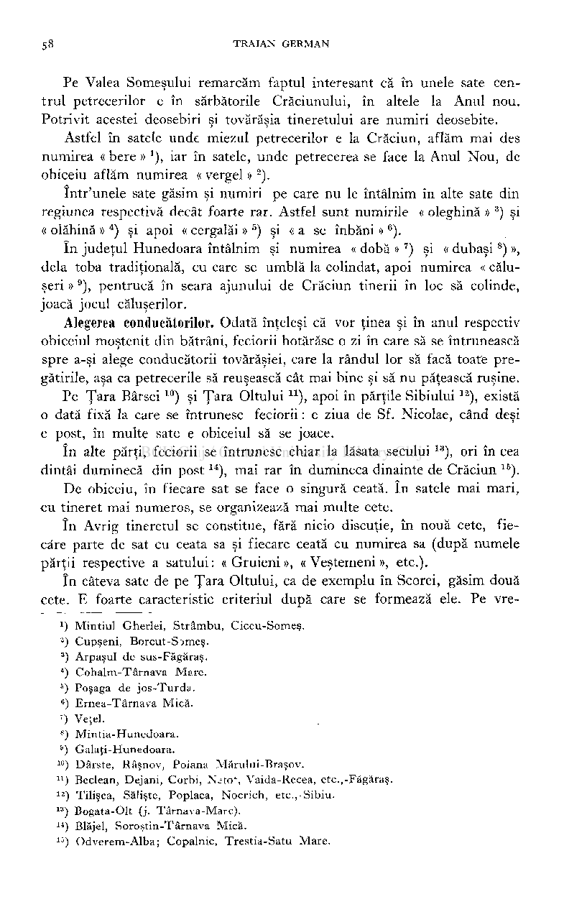

58 TRAIAN GERMAN

Pe Valea Someşului remarcăm faptul interesant că în unele sate centrul petrecerilor e în sărbătorile Crăciunului, în altele la Anul nou. Potrivit acestei deosebiri şi tovărăşia tineretului are numiri deosebite.

Astfel în satele unde miezul petrecerilor e la Crăciun, aflăm mai des numirea « bere » ), iar în satele, unde petrecerea se face la Anul Nou, de obiceiu aflăm numirea « vergel » ).

într'unele sate găsim şi numiri pe care nu le întâlnim în alte sate din regiunea respectivă decât foarte rar. Astfel sunt numirile « oleghină » ) şi « olăhină »

) şi apoi « cergalăi » ) şi « a se înbăni » ). în judeţul Hunedoara întâlnim şi numirea « dobă » ) şi « dubaşi

4

) », delà toba tradiţională, cu care se umblă la colindat, apoi numirea « căluşeri »

8

), pentrucă în seara ajunului de Crăciun tinerii în loc să colinde, joacă jocul căluşerilor.

9

Alegerea conducătorilor. Odată înţeleşi că vor ţinea şi în anul respectiv obiceiul moştenit din bătrâni, feciorii hotărăsc o zi în care să se întrunească spre a-şi alege conducătorii tovărăşiei, care la rândul lor să facă toate, pregătirile, aşa ca petrecerile să reuşească cât mai bine şi să nu păţească ruşine.

), există o dată fixă la care se întrunesc feciorii : e ziua de Sf. Nicolae, când deşi e post, în multe sate e obiceiul să se joace.

Pe Ţara Bârsei

) şi Ţara Oltului ) , apoi în părţile Sibiului

10

12

), ori în cea dintâi duminecă din post

în alte părţi, feciorii se întrunesc chiar la lăsata secului

13

), mai rar în dumineca dinainte de Crăciun

).

14

ls

De obiceiu, în fiecare sat se face o singură ceată. în satele mai mari, cu tineret mai numeros, se organizează mai multe cete.

în Avrig tineretul se constitue, fără nicio discuţie, în nouă cete, fiecare parte de sat cu ceata sa şi fiecare ceată cu numirea sa (după numele părţii respective a satului: «Gruieni», « Veştemeni », etc.).

în câteva sate de pe Ţara Oltului, ca de exemplu în Scorei, găsim două cete. E foarte caracteristic criteriul după care se formează ele. Pe vre-

') Mintiul Gherlei, Strâmbu, Ciceu-Someş.

- 2

) Cupşeni, Borcut-Sameş.

- 3

) Arpaşul de sus-Făgăraş.

- 4

###### ) Cohalm-Târnava Mare.

###### ) Poşaga de jos-Turda.

s

###### ) Ernea-Târnava Mică.

6

###### ) Veţel.

;

) Mintia-Hunedoara.

s

*) Galaţi-Hunedoara.

###### ) Dârste, Râşnov, Poiana Mărului-Braşov. ) Beclean, Dejani, Corbi, N^to', Vaida-Recea, etc.,-Făgăraş.

lc

- n

- 12

) Tilişca, Sălişte, Poplaca, Nocrich, etc.,-Sibiu.

- 13

) Bogata-Olt (j. Târnava-Mare).

- 14

) Blăjel, Soroştin-Târnava Mică.

- 15

###### ) Odverem-Alba ; Copalnic, Trestia-Satu Mare.

muri, satul acesta de grăniceri avea o organizaţie militară. Cei care făceau parte din aceasta, erau socotiţi boieri, cu anumite drepturi şi privilegii, pe când ceilalţi erau socotiţi iobagi. Această pecete a unor vremi apuse

- o mai întâlnim şi astăzi, chiar în raporturile zilnice dintre locuitori şi o găsim şi în obiceiurile satului. Astfel şi pentru petrecerile din sărbătorile Crăciunului tinerii se grupează în două cete : în « ceata grăniţerilor », formată din descendenţii vechilor grăniceri şi în «ceata iobagilor», compusă din descendenţii vechilor iobagi. Şi nici vorbă nu poate fi ca un iobag să poată intra în « ceata grăniţerilor ».

După ce s'au înţeles asupra datei când să se facă alegerea conducătorilor, fie că data aceasta este fixată prin tradiţie, fie prin înţelegerea comună a tineretului şi după ce în satele mai mari gruparea s'a făcut în mai multe cete, tineretul se întruneşte să-şi aleagă conducătorii.

Alegerea în cele mai multe locuri se face cu anumite forme, care dau acestui act o solemnitate deosebită. Ea îmbracă, mai ales în satele din Sudul Ardealului, o formă sărbătorească.

Un ritual specific e « ridicatul feciorilor », obiceiu practicat în special pe Ţara Oltului şi în jurul Sibiului, cel puţin pe vremuri, apoi pe Valea Târnavelor şi pe Valea Someşului.

în Netot (jud. Făgăraş), e obiceiul ca în ziua de Sf. Nicolae, după « zăoritul Niculailor » — felicitarea tuturor celor care poartă numele sfântului, tinerii se întrunesc seara la unul dintre ei, ca să-şi petreacă din câştigul delà « zăorit ». Cu acest prilej ei aleg şi pe conducătorii cetei : câte un « vătav, ajutor de vătav, primar, stegar, colăcar, crâjmar » şi doi « sameşi ». Confirmarea alegerii o fac prin ridicare. Cel ales să poarte o slujbă în comitet e ridicat de către ceilalţi de trei ori, în strigăte de « să trăiască ! ». Aceasta însemnează învestirea lui cu drepturile şi datoriile funcţiei în care a fost ales.

La fel se practică confirmarea în Vaida-Recea, Dejani, Ucea de Jos şi Copăcel, iar în Viştea de Jos, după fiecare ridicare toţi joacă câteo sârbă, condusă de cel ales.

Această ridicare în Tălmăcel (jud. Sibiu), se numeşte « cu capul în grindă », deoarece cel ales trebue să ajungă, la ridicare, cu capul grinda, de cele mai multe ori să o lovească chiar.

în Nepos (jud. Năsăud), ridicatul feciorilor se face astfel. în ziua întâi de Crăciun se strânge tot tineretul (şi fetele !) la « bere ». Aici aleg conducătorii, în frunte cu « primarul ». De remarcat că acesta are dreptul să-şi aleagă o « primăriţă », care la toate sărbătorile stă la masă alăturea de el, e « bereanca » lui. Alegerea se confirmă tot prin ridicare, pe rând, după gradul slujbei. Mai întâi e ridicat primarul şi, îndată după aceasta, e ridicată şi « bereanca » lui.

Ridicatul feciorilor îl mai aflăm în Bogata-Olt, Giacăş-Târnava Mică,, apoi în Ardan şi Bistriţa Bârgăului, jud. Năsăud, în Homorodul de mijloc, Cuţa şi alte sate din jud. Satu-Mare.

Răspândirea acestui obiceiu delà o margine a Ardealului la cealaltă, ne îndeamnă să presupunem, cu toate că obiceiul nu apare pretutindeni, că pe vremuri el a fost practicat în toate satele româneşti din Ardeal, fiind părăsit cu timpul şi păstrându-se astăzi abia în câteva sate şi în amintirile

- bătrânilor. în ce priveşte numărul conducătorilor aleşi şi al numelor lor, acestea

variază nu numai după regiuni, ci aproape delà sat la sat. Mai sistematic şi cu un număr mai mare de « funcţionari », cu atribuţii speciale, se organizează feciorii de pe Ţara Oltului şi din jurul Sibiului. Pe când în unele sate de pe Ţara Oltului se aleg io—12 conducători, în regiunea apuseană a Ardealului numărul lor scade adeseori la doi-trei.

La alegerea conducătorilor sunt de faţă numai feciorii ; fetele apar cu anumite drepturi în prea puţine locuri.

Fiecare tovărăşie are un conducător, un şef, care se chiamă « vătaf » sau « jude », « primar », « birău ». Cel ales în această funcţiune este întotdeauna feciorul cel mai cuminte, mai potolit şi serios în judecată şi de obiceiu şi cel mai prezentabil ca înfăţişare. Se ţine seama apoi, pe lângă calităţile personale, să fie şi din familie bună, cu vază, şi cu trecut nepătat.

Vătaful reprezintă autoritatea nediscutată. Toţi tinerii trebue să asculte de ordinele lui. Pe cei ce se opun are dreptul să-i pedepsească, la nevoie să le aplice chiar pedepse corporale, fără dreptul de-a protesta. Vătaful conduce tovărăşia tinerilor, ajutat de ceilalţi aleşi ; el dă ordine, se îngrijeşte să afle o « gazdă », în casa căreia să se întrunească ceata şi să se ţină petrecerile; tot el are grijă de muzicanţi, de băutură, de lemne, etc. Vătaful mai reprezintă tineretul în faţa autorităţilor civile şi bisericeşti, atunci când e nevoie.

în schimb, el se bucură de cinstea cea mai mare, atât în faţa tineretului, cât şi a sătenilor în general. El intră cel dintâi în casa unde se colindă, el stă în fruntea mesei la toate întrunirile, el joacă în fruntea jocului şi tot el îşi alege fata cu care vrea să joace, sau pe care vrea să o aibă lângă el la masă.

Pe lângă « ajutorul de vătaf », care ţine locul vătafului, de câte ori lipseşte acesta, mai aflăm pe « butoier », numit şi « crîjmar » sau « cheier », care, după cum arată şi numirea, ia în primire şi păstrează băutura; el o împarte la mese, ca să nu se facă nimănui nedreptate, primind mai puţin ; dar tot el are şi răspunderea să nu abuzeze nimeni de băutură.

Un alt slujbaş cu rol important e « cămăraşul » sau « colcerul », care poartă grija de mâncările aduse de fete la « gazdă » şi de colacii şi carnea

- căpătate la colindat (în unele sate şi de băutură).

în multe sate de pe Ţara Oltului se alege un « stegar », care se îngrijeşte de steagul făcut de fetele satului din năfrămi şi e împodobit cu panglici, mărgele şi năfrămuţe; acest funcţionar al tovărăşiei are grijă şi ca steagul să nu fie furat de cineva.

Tot pe Ţara Oltului se mai alege un « pristav » sau « fetelar » sau « felderaş », care se îngrijeşte ca în timpul jocului să nu se întâmple nicio desordine, ca toate fetele să joace şi ca feciorii să nu ia fetele la joc după plac, fără să joace fiecare pe rând cu fata pe care le-o dau ei.

Pe Valea Târnavelor, a Mureşului şi Someşului şi pe Câmpie se mai aleg, de obiceiu, doi « chemători », care cum vom vedea, au să ceară învoirea părinţilor să-şi lase fata la petrecerile şi la masa comună din sărbători, când fata duce şi « cinste » (de ale mâncării şi chiar băutură).

Un personaj foarte important în organizaţia tineretului e « tata feciorilor », pe care îl aflăm mai mult pe Valea Târnavelor (Pelişor). Acesta e de obiceiu un bărbat mai tânăr, însurat de curând şi bucuros să ţină şi pe mai departe contactul cu tineretul. Rolul lui e acela al unui fel de patron al tinerimii. De obiceiu în casa lui se întrunesc tinerii pentru petreceri, — el e « gazda ficiorilor », — el îi povăţuieşte cu sfaturi şi în caz de neînţelegeri, vătaful cu sfatul lui le aplanează. în Pelişor-Târnava Mare, chiar şi soţia lui are rol în organizaţia tineretului, ea fiind « mama ficiorilor ».

Gazda. După ce tineretul şi-a ales conducătorii, grija de căpetenie a vătafului şi a ortacilor săi e să găsească o « gazdă », în casa căreia să-şi ţină petrecerile din sărbători.

Nu e uşor să găseşti o gazdă potrivită, pentrucă se cer multe. Casa trebue să fie cât mai largă, să cuprindă tot tineretul şi pe cei care vin să vadă petrecerea ; pe cât se poate, să fie mai în mijlocul satului, loc potrivit pentru toţi. Greutatea cea mai mare stă în faptul că nu poţi alege casa oricui. Gazda trebue să fie un om cinstit şi cu vază, pentrucă alegerea lui e în acelaşi timp şi un certificat de stima de care se bucură. Gazda ia parte la consfătuirile tinerilor şi sfatul lui trage în cumpănă, mai ales când ar fi vorba să netezească şi micile neînţelegeri ce se ivesc. Atât el, cât si familia lui, ia parte la mesele comune ale tineretului. Gazda e în fruntea cetei în zilele de sărbătoare, când se merge la biserică. Iar la colindat, în multe locuri, există o colindă specială, « a gazdei », care i se cântă numai lui.

Dar pe lângă aceste recompense de ordin moral, plata gazdei, după învoială, e o sumă de bani, care se acopere din cotizaţiile tineretului; i se mai face parte apoi şi din colacii şi carnea delà colindat. în regiunile păduroase i se dă o cantitate de lemne, iar pe Câmpie i se face o zi de clacă la secere. în Nepos-Năsăud, fiecare fecior îi dă o sanie de lemne sau de gunoiu, iar fetele câte 2—3 « litre » de grâu sau mălaiu şi mai torc într'o seară câte un fuior de cânepă pentru soţia lui.

Este interesant felul în care feciorii din Jina-Sibiu îşi caută gazdă. Chibzuind de mai înainte cam cine ar fi potrivit să le fie gazdă, se fixează asupra mai multor familii potrivite. în ziua de Sf. Nicolae pleacă apoi în căutare. Merg în ceată cântând de-a-lungul satului şi se opresc la poarta unuia din cei socotiţi că le-ar putea fi gazdă.

Aici strigă cu toţii : « Vivat ! vivat ! vivat ! Să trăiască gazda noastră ! Vivat ! vivat ! vivat ! ». în felul acesta, ei vestesc că tineretul îl vrea ca « gazdă ». Dacă gospodarul nu vrea să primească această cinste, nu iese din casă să le răspundă şi ceata îşi încearcă norocul în altă parte. Dacă îi convine să-i « găzduiască », gospodarul iese la poartă şi pofteşte tineretul să intre în casă, unde apoi, în prezenţa gazdei, se face alegerea conducătorilor.

Adusul vinului. O altă grijă a conducătorilor e să aibă din bună vreme băutura pentru petrecerile din sărbători, pentrucă petrecere deplină fără băutură nu se poate.

în cele mai multe sate băutura obişnuită e « vinarsul » (rachiul). în timpul din urmă însă se poate constata, chiar şi în regiunile lipsite de podgorii, că tot mai mult se obişnueşte să se petreacă la sărbători cu vin.

într'o consfătuire a întregului tineret, se înţeleg de câtă băutură ar avea lipsă. Cantitatea aceasta apoi o repartizează pe membrii tovărăşiei, în satele cu podgorii, fiecare fecior contribue cu cantitatea repartizată, iar în satele fără vii, se plăteşte în bani.

în regiunile de podgorii de multe ori contribue fiecare cu must încă la culesul viilor, în alte sate numai după ce s'a constituit, în postul Crăciunului, tovărăşia. Adusul vinului din alt sat şi chiar în acelaşi sat, se face cu mare alaiu. Astfel pe Valea Târnavei Mari, în Sângătin, Ungurei, Şoroştin, apoi în Sâncel lângă Blaj, în Apoldul de Jos (jud. Sibiu) şi în alte părţi feciorii din ceată vin de dimineaţă la gazdă, îmbrăcaţi toţi în haine de sărbătoare ; prind la un car patru sau chiar opt boi şi pun butea în car. Atât boii, cât şi carul şi chiar butea o împodobesc cum ştiu mai frumos cu năfrămi, cu panglici, cu flori şi clopoţei. Pleacă apoi delà gazdă după vin. în frunte merge vătaful, conştient de importanţa momentului; urmează carul cu boi, mânaţi de către doi feciori, alţii înconjură carul, ori se urcă cu toţii în el (Apoldul de Jos). « Crişmarul ficiorilor » e în car lângă bute, cu un ciubăr nou-nouţ, cu care măsură vinul. Toată ceata merge cântând, — în Sângătin colindă — de-a-lungul satului. Alaiul se opreşte la fiecare casă unde este un fecior în ceată şi din fiecare poartă iese feciorul sau stăpânul casei cu o « ferie »

) sau două de vin ; « crişmarul » îl măsoară şi îl goleşte în bute. După ce au cutreerat întreg satul, se întorc la gazdă, dau jos butea din

a

- car şi o aşează în pivniţă. Vătaful încuie uşa şi dă cheia « crişmarului » sau « colceriului », care de acum încolo e răspunzător pentru vin.

*) Măsură de io litri.

Cu acelaşi alaiu se aduce şi vinul din alt sat, atunci când satul n'are podgorii proprii (de exemplu în Galaţi, jud. Făgăraş).

în Dopca-Târnava Mare, aprovizionarea cu vin se face într'alt fel. Aici nu tineretul contribue cu bani sau cu băutură, ci fiecare gospodar la care a fost ceata la colindat. Tinerii ţin cu câteva zile înainte de Crăciun un sfat, la care hotărăsc cam de câtă băutură ar avea lipsă ceata. Cantitatea aceasta apoi o repartizează pe toate familiile din sat, având să contribue fiecare cu o anumită cotă. Nimeni nu se sustrage delà această contribuţie, pe care o dau cu dragă inimă, pentru cinstea ce le-au făcut-o tinerii colindându-i în ajunul Crăciunului. Vinul îl adună în ziua întâia de Crăciun, umblând prin sat cu un car, pe care pun butea pentru vin şi un butoiu pentru rachiu.

« Mânatul verzelor ». Dacă feciorii s'au îngrijit din bună vreme de băutură, trebue să aibă şi după ce s'o bea. De altfel, de rândul mâncării nu vor duce lipsă, deoarece la colindat vor primi delà fiecare casă un colac şi o bucată de carne, din care apoi găzdoaia sau bucătarul poate găti. Mai vin apoi, în sărbători, fetele şi aduc « cinste » şi aşa vor avea mâncare din belşug.

Ar putea fi însă Crăciunul Crăciun fără varză cu carne şi fără « găluşte » (sarmale) ? Acestea nu pot lipsi nici de pe masa tineretului.

Varza acră de obiceiu o aduc fetele, în ziua întâi de Crăciun după amiază, la gazdă şi aici se găteşte mâncarea. Forma în care se practică obiceiul de a aduce varza acră şi a contribui şi cu munca la gătitul ei, e foarte variată, după regiuni.

Mai interesante obiceiuri găsim în jurul Sibiului şi pe Valea Târnavelor, cunoscute sub numirea «mânatul verzelor» (Marpod, Ilimbav—jud. Sibiu).

în Marpod, în ziua întâi de Crăciun, după vecernie, se strâng la gazdă atât feciorii, cât şi fetele şi joacă numai trei jocuri. Dacă o fată s'a învoit să fie jucată în cele trei jocuri, aceasta se socoteşte ca o declaraţie din partea ei, că doreşte să ia parte la toate petrecerile din sărbători şi că vrea să se supună unor mici obligaţii, cum e, în acest caz concret, de a contribui cu varză şi cu carne pentru masa feciorilor.

După cele trei jocuri, toţi feciorii şi fetele se duc acasă. Pe vremea cinei, feciorii vin din nou la gazdă şi vătaful trimite pe cei doi « pârgari » după fetele care au fost la joc, să vie acum cu varza : e « mânatul verzelor ».

Dacă vreun fecior se are bine cu fata, de obiceiu merge şi el cu cei doi pârgari până la casa ei; el rămâne apoi aici şi însoţeşte fata când aduce « verzele ».

Până sunt duşi « pârgarii », toţi ceilalţi feciori stau la gazdă şi aşteaptă să sosească fetele. Fiecare din ele aduce câteo farfurie de varză tăiată acasă, pentru gătit şi o bucată de slănină. « Juzii » iau în primire « tăierile » cu verze (Planşa I, 2) şi drept mulţumită din partea cetei oferă fetelor câte

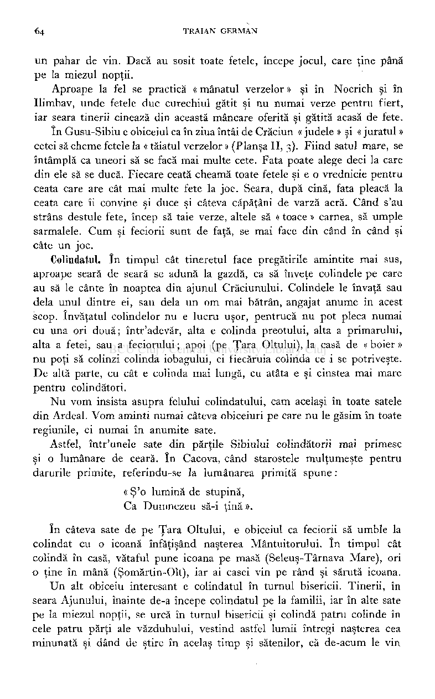

un pahar de vin. Dacă au sosit toate fetele, începe jocul, care ţine până pe la miezul nopţii.

Aproape la fel se practică « mânatul verzelor » şi în Nocrich şi în Ilimbav, unde fetele duc curechiul gătit şi nu numai verze pentru fiert, iar seara tinerii cinează din această mâncare oferită şi gătită acasă de fete.

în Gusu-Sibiu e obiceiul ca în ziua întâi de Crăciun « judele » şi « juratul » cetei să cheme fetele la « tăiatul verzelor » (Planşa II, 3). Fiind satul mare, se întâmplă ca uneori să se facă mai multe cete. Fata poate alege deci la care din ele să se ducă. Fiecare ceată cheamă toate fetele şi e o vrednicie pentru ceata care are cât mai multe fete la joc. Seara, după cină, fata pleacă la ceata care îi convine şi duce şi câteva căpăţâni de varză acră. Când s'au strâns destule fete, încep să taie verze, altele să « toace » carnea, să umple sarmalele. Cum şi feciorii sunt de faţă, se mai face din când în când şi câte un joc.

Colindatul. în timpul cât tineretul face pregătirile amintite mai sus, aproape seară de seară se adună la gazdă, ca să înveţe colindele pe care au să le cânte în noaptea din ajunul Crăciunului. Colindele le învaţă sau delà unul dintre ei, sau delà un om mai bătrân, angajat anume în acest scop. învăţatul colindelor nu e lucru uşor, pentrucă nu pot pleca numai cu una ori două; într'adevăr, alta e colinda preotului, alta a primarului, alta a fetei, sau a feciorului ; apoi (pe Ţara Oltului), la casă de « boier » nu poţi să colinzi colinda iobagului, ci fiecăruia colinda ce i se potriveşte. De altă parte, cu cât e colinda mai lungă, cu atâta e şi cinstea mai mare pentru colindători.

Nu vom insista asupra felului colindatului, cam acelaşi în toate satele din Ardeal. Vom aminti numai câteva obiceiuri pe care nu le găsim în toate regiunile, ci numai în anumite sate.

Astfel, într'unele sate din părţile Sibiului colindătorii mai primesc şi o lumânare de ceară. în Cacova, când starostele mulţumeşte pentru darurile primite, referindu-se la lumânarea primită spune :

« Ş'o lumină de stupină, Ca Dumnezeu să-i ţină ».

în câteva sate de pe Ţara Oltului, e obiceiul ca feciorii să umble la colindat cu o icoană înfăţişând naşterea Mântuitorului. în timpul cât colindă în casă, vătaful pune icoana pe masă (Seleuş-Târnava Mare), ori o ţine în mână (Şomărtin-Olt), iar ai casei vin pe rând şi sărută icoana.

Un alt obiceiu interesant e colindatul în turnul bisericii. Tinerii, în seara Ajunului, înainte de-a începe colindatul pe la familii, iar în alte sate pe la miezul nopţii, se urcă în turnul bisericii şi colindă patru colinde în cele patru părţi ale văzduhului, vestind astfel lumii întregi naşterea cea minunată şi dând de ştire în acelaş timp şi sătenilor, că de-acum le vin

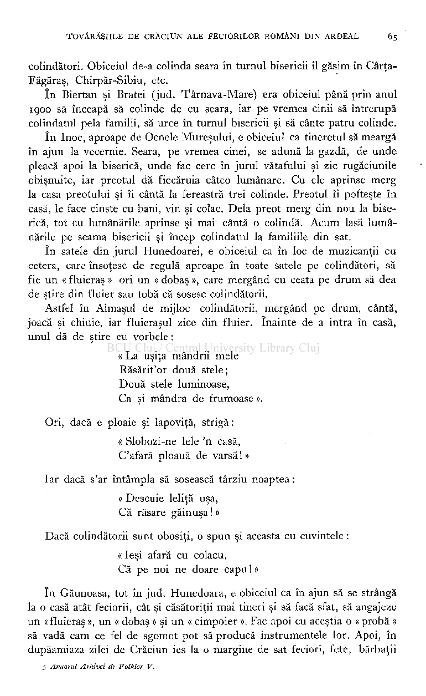

colindători. Obiceiul de-a colinda seara în turnul bisericii îl găsim în CârţaFăgăraş, Chirpăr-Sibiu, etc.

în Biertan şi Bratei (jud. Târnava-Mare) era obiceiul până prin anul 1900 să înceapă să colinde de cu seara, iar pe vremea cinii să întrerupă colindatul pela familii, să urce în turnul bisericii şi să cânte patru colinde.

în Inoc, aproape de Ocnele Mureşului, e obiceiul ca tineretul să meargă în ajun la vecernie. Seara, pe vremea cinei, se adună la gazdă, de unde pleacă apoi la biserică, unde fac cerc în jurul vătafului şi zic rugăciunile obişnuite, iar preotul dă fiecăruia câteo lumânare. Cu ele aprinse merg la casa preotului şi îi cântă la fereastră trei colinde. Preotul îi pofteşte în casă, le face cinste cu bani, vin şi colac. Delà preot merg din nou la biserică, tot cu lumânările aprinse şi mai cântă o colindă. Acum lasă lumânările pe seama bisericii şi încep colindatul la familiile din sat.

în satele din jurul Hunedoarei, e obiceiul ca în loc de muzicanţii cu cetera, care însoţesc de regulă aproape în toate satele pe colindători, să fie un « fluieraş » ori un « dobaş », care mergând cu ceata pe drum să dea de ştire din fluier sau tobă că sosesc colindătorii.

Astfel în Almaşul de mijloc colindătorii, mergând pe drum, cântă, joacă şi chiuie, iar fluieraşul zice din fluier. înainte de a intra în casă, unul dă de ştire cu vorbele :

« La uşiţa mândrii mele Răsărit'or două stele ; Două stele luminoase, Ca şi mândra de frumoase ».

Ori, dacă e ploaie şi lapoviţă, strigă :

« Slobozi-ne lele 'n casă, C'afară ploauă de varsă!»

Iar dacă s'ar întâmpla să sosească târziu noaptea :

« Descuie leliţă uşa, Că răsare găinuşa ! »

Dacă colindătorii sunt obosiţi, o spun şi aceasta cu cuvintele :

« Ieşi afară cu colacu, Că pe noi ne doare capu ! »

în Găunoasa, tot în jud. Hunedoara, e obiceiul ca în ajun să se strângă la o casă atât feciorii, cât şi căsătoriţii mai tineri şi să facă sfat, să angajeze un «fluieraş », un « dobaş » şi un « cimpoier ». Fac apoi cu aceştia o « probă »

- să vadă cam ce fel de sgomot pot să producă instrumentele lor. Apoi, în dupăamiaza zilei de Crăciun ies la o margine de sat feciori, fete, bărbaţii

5 Anuarul Arhivei de Folklor V.

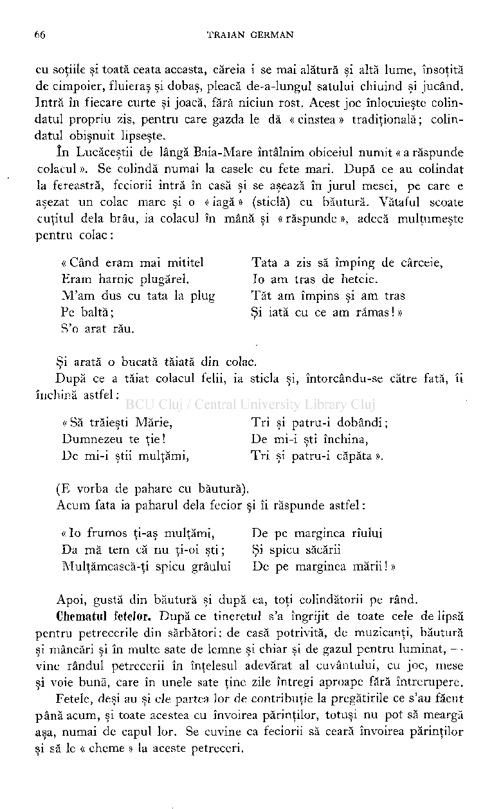

cu soţiile şi toată ceata aceasta, căreia i se mai alătură şi altă lume, însoţită de cimpoier, fluieraş şi dobaş, pleacă de-a-lungul satului chiuind şi jucând. Intră în fiecare curte şi joacă, fără niciun rost. Acest joc înlocuieşte colindatul propriu zis, pentru care gazda le dă « cinstea » tradiţională ; colindatul obişnuit lipseşte.

în Lucăceştii de lângă Baia-Mare întâlnim obiceiul numit « a răspunde colacul ». Se colindă numai la casele cu fete mari. După ce au colindat la fereastră, feciorii intră în casă şi se aşează în jurul mesei, pe care e aşezat un colac mare şi o « iagă » (sticlă) cu băutură. Vătaful scoate cuţitul delà brâu, ia colacul în mână şi « răspunde », adecă mulţumeşte pentru colac :

« Când eram mai mititel Tata a zis să împing de cârceie, Eram harnic plugărel. Io am tras de heteie. M'am dus cu tata la plug Tăt am împins şi am tras Pe baltă ; Şi iată cu ce am rămas ! » S'o arat rău.

Şi arată o bucată tăiată din colac. După ce a tăiat colacul felii, ia sticla şi, întorcându-se către fată, îi

închină astfel :

« Să trăieşti Mărie, Tri şi patru-i dobândi ; Dumnezeu te ţie! De mi-i şti închina, De mi-i ştii mulţămi, Tri şi patru-i căpăta ».

(E vorba de pahare cu băutură). Acum fata ia paharul delà fecior şi îi răspunde astfel :

« Io frumos ţi-aş mulţămi, De pe marginea rîului Da mă tem că nu ţi-oi şti ; Şi spicu săcării Mulţămească-ţi spicu grâului De pe marginea mării ! »

Apoi, gustă din băutură şi după ea, toţi colindătorii pe rând. Chematul fetelor. După ce tineretul s'a îngrijit de toate cele de lipsă pentru petrecerile din sărbători: de casă potrivită, de muzicanţi, băutură şi mâncări şi în multe sate de lemne şi chiar şi de gazul pentru luminat, vine rândul petrecerii în înţelesul adevărat al cuvântului, cu joc, mese şi voie bună, care în unele sate ţine zile întregi aproape fără întrerupere.

Fetele, deşi au şi ele partea lor de contribuţie la pregătirile ce s'au făcut până acum, şi toate acestea cu învoirea părinţilor, totuşi nu pot să meargă aşa, numai de capul lor. Se cuvine ca feciorii să ceară învoirea părinţilor şi să le « cheme » la aceste petreceri.

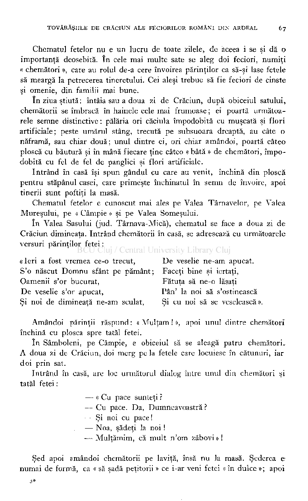

Chematul fetelor nu e un lucru de toate zilele, de aceea i se şi dă o importanţă deosebită. în cele mai multe sate se aleg doi feciori, numiţi « chemători », care au rolul de-a cere învoirea părinţilor ca să-şi lase fetele să meargă la petrecerea tineretului. Cei aleşi trebue să fie feciori de cinste şi omenie, din familii mai bune.

în ziua ştiută: întâia sau a doua zi de Crăciun, după obiceiul satului, chemătorii se îmbracă în hainele cele mai frumoase ; ei poartă următoarele semne distinctive : pălăria ori căciula împodobită cu muşcată şi flori artificiale ; peste umărul stâng, trecută pe subsuoara dreaptă, au câte o năframă, sau chiar două; unul dintre ei, ori chiar amândoi, poartă câteo ploscă cu băutură şi în mână fiecare ţine câteo « bâtă » de chemători, împodobită cu fel de fel de panglici şi flori artificiale.

Intrând în casă îşi spun gândul cu care au venit, închină din ploscă pentru stăpânul casei, care primeşte închinatul în semn de învoire, apoi tinerii sunt poftiţi la masă.

Chematul fetelor e cunoscut mai ales pe Valea Târnavelor, pe Valea Mureşului, pe « Câmpie » şi pe Valea Someşului.

în Valea Sasului (jud. Târnava-Mică), chematul se face a doua zi de Crăciun dimineaţa. Intrând chemătorii în casă, se adresează cu următoarele versuri părinţilor fetei :

«Ieri a fost vremea ce-o trecut, De veselie ne-am apucat. S'o născut Domnu sfânt pe pământ; Faceţi bine şi iertaţi, Oamenii s'or bucurat, Fătuţa să ne-o lăsaţi De veselie s'or apucat, Pân' la noi să s'ostinească Şi noi de dimineaţă ne-am sculat, Şi cu noi să se veselească».

Amândoi părinţii răspund : « Mulţam ! », apoi unul dintre chemători închină cu plosca spre tatăl fetei.

în Sâmboleni, pe Câmpie, e obiceiul să se aleagă patru chemători. A doua zi de Crăciun, doi merg pe la fetele care locuiesc în cătunuri, iar doi prin sat.

Intrând în casă, are loc următorul dialog între unul din chemători şi tatăl fetei :

— « Cu pace sunteţi ?

— Cu pace. Da, Dumneavoastră ?

— Şi noi cu pace!

— Noa, şădeţi la noi !

— Mulţămim, că mult n'om zăbovi » !

Şed apoi amândoi chemătorii pe laviţă, însă nu la masă. Şederea e numai de formă, ca « să şadă peţitorii » ce i-ar veni fetei « în dulce »; apoi

se postează unul lângă altul în ţinută tatălui fetei în felul următor :

chemătorii se scoală de pe laviţă, militară, iar unul dintre ei grăieşte

La mai multă voie bună. Că noi nu umblăm a be ş'a mânca, Că noi umblăm fete-fecioare a chema Şi dacă li-ţi lăsa, Noi bine l-om ospăta ; Şi dacă li-ţi îngădui, Noi bine l-om omeni.

« Este cuvântu lui Dumnezo Ş'a feciorii satului dimpreună : Un băieţăl mândru şi frumos, Ce vi l-o rânduit Ristos Să faceţi bine, să-1 lăsaţi Cu feciorii satului, La un scaun de hodină, La un pahar de beutură,

— « Mulţam. Să fiti sănătoşi ! »

răspunde stăpânul casei.

Se aşează apoi toţi la masă, care e încărcată cu mâncări şi băutură încă dinainte de-a fi sosit chemătorii. Aceştia nu pot refuza cinstea, ce li se dă şi, de formă, gustă din toate mâncările, apoi pleacă mai departe.

în Diviciorii Mici de pe Someş, avem următoarea formulă pentru chemat : « Noi doi ficiori Ne numim chemători. Dimineaţa ne-am sculat Şi pe obraz ne-am spălat, Lui Dumnezo ne-am rugat; Două măcauă ) am îmbrăcat Şi la dumneavoastă am plecat, Că ştim bine Şi mai bine, Că aveţi şi dumneavoastă Un băietăl,

De cinste Şi de omenie, Ca Dumnezo să vi-1 ţiie. N'aveţi fân de adunat, Nici ovăs de săcerat, Fără bine să-1 gătaţi Şi la horă să-1 lăsaţi. Nu-1 cerem la scârbă şi ruşine, Fără la joc şi voie bună, Cu mai mulţi tineri dimpreună ».

Obiceiul acesta de-a chema fetele, într'o formă de o atât de încântătoare naivitate, îl găsim şi în cele mai multe sate de pe Valea Lăpuşului, pe la Baia-Mare şi Satu-Mare, cu unele variante locale.

Masa comună. După ce chemătorii şi-au făcut datoria îndemnând fetele la joc şi la masă comună, la fiecare casă încep pregătirile, pentrucă fata nu poate merge cu mâna goală. Pentru cinstea ce li s'a făcut de-a fi fost chemate la joc şi la masă, fetele « duc cinste » pentru feciori diferite mâncări şi chiar şi băutură.

De altfel, pentru această masă s'au îngrijit din bună vreme feciorii, strângând varză şi carne ; în alte părţi duc şi găini, iar mamele au dus făină şi ouă pentru tăieţei. Din acestea, precum şi din carnea căpătată la

###### ) Bâte.

l

colindat, se gătesc mâncări în casa gazdei feciorilor. Cu toate acestea şi fetele duc din partea lor diferite « coptături » (plăcinte, scoverzi) şi chiar mâncări gătite anume, apoi câteun colac împletit, cât mai mare.

Mâncările şi colacul sunt puse în cele mai frumoase « merindări ». Fetele de obiceiu predau « cinstea » vătafului, iar acesta o dă cămăraşului, care o pune într'o cămară, subt lacăt şi e răspunzător pentru tot ce a primit.

După ce au venit toate fetele cu « cinstea », începe jocul, care ţine până seara târziu, ori, după obiceiul satului respectiv, până la miezul nopţii. Atunci jocul încetează, feciorii aduc mese şi laviţe în casă, fetele aştern masa, bucătarul sau bucătăresele aduc mâncările pe care le-au gătit, butoierul aduce băutura din pivniţă, iar cămăraşul « cinstea » delà fete; pune fiecare «cinste» în dreptul fetei care a adus-o şi masa comună începe.

De obiceiu ea se face a doua zi de Crăciun, pe Valea Someşului însă şi în mai multe sate din Nordul Ardealului, la Anul nou.

Descrierea de mai sus a obiceiului corespunde numai în linii mari, pentrucă aproape fiecare sat îşi are particularităţile sale.

Aşa în Pelişor (jud. Târnava-Mare), feciorii se strâng încă în ziua de Crăciun la o cină comună. Fetele nu iau parte, în schimb e chemat la cină atât preotul, cât şi învăţătorul. Mâncarea constă de obiceiu dintr'o zamă acră cu carne şi de fiecare persoană o jumătate kilogram de vin. După cină feciorii rămân mai departe la « tata ficiorilor » şi îşi petrec cu cântece şi cu glume. Joc nu se face.

A doua zi, după liturghie, feciorii au altă masă comună la « tata ficiorilor », de astă dată fără participarea preotului şi învăţătorului. Pe la amiazi vin şi fetele în uliţă şi joacă cu toţii până seara.

Dacă s'a înserat, fiecare fată pune într'o merindare « hencleşe » (prăjituri) şi o sticlă cu vin şi se strâng toate la o casă, aproape de « tata ficiorilor ». Până să vie fetele, flăcăii au întins mesele la « tata ficiorilor ». Când intră fetele, feciorii se aşează la mesele «din jos», cele din fruntea casei rămânând neocupate. Fetele pun « hencleşele » şi băutura pe mesele goale, rezervate anume pe seama lor ; « mama ficiorilor », ajutată de două « fierbătoare », aduce mâncările pe care le-a gătit : zeamă şi varză cu carne şi cinează împreună, fetele deosebit, la mesele « din sus », iar feciorii la mesele « din jos ». După ce au mâncat din mâncările gătite de « mama ficiorilor », fetele îmbie feciorii cu « hencleşele » aduse şi cu băutură.

A treia zi seara iar e o cină comună, la care iau parte însă numai feciorii, fără fete.

în Orosia (jud. Turda), fetele merg cu « cinstea », un colac şi carne de porc, a doua zi de Crăciun pe la amiazi. Un « chizeş », care e şi

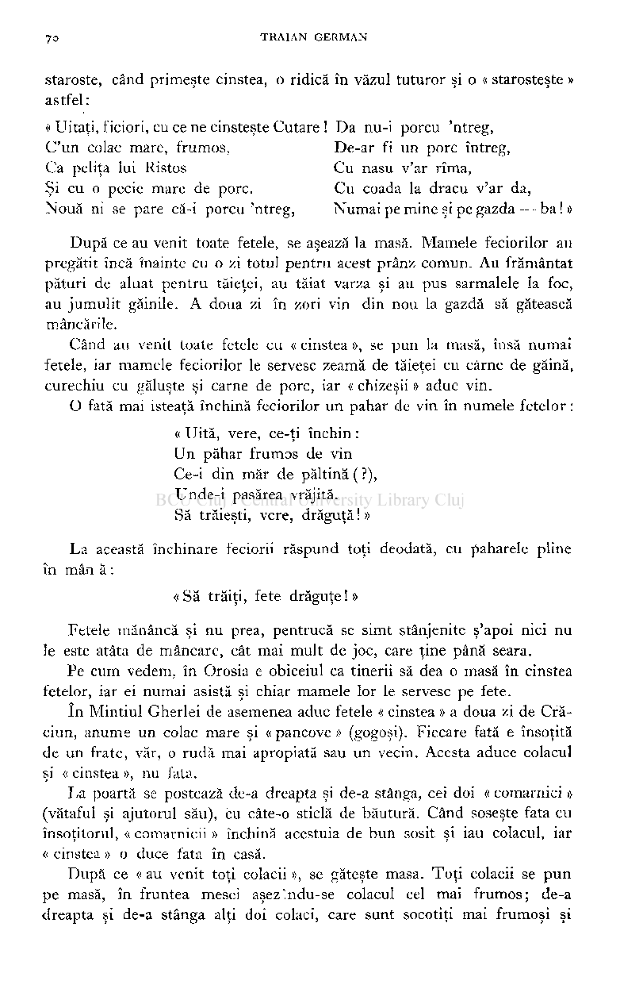

staroste, când primeşte cinstea, o ridică în văzul tuturor şi o « starosteşte » astfel: « Uitaţi, ficiori, cu ce ne cinsteşte Cutare ! Da nu-i porcu 'ntreg, C'un colac mare, frumos, De-ar fi un porc întreg, Ca peliţa lui Ristos Cu nasu v'ar rîma, Şi cu o pecie mare de porc. Cu coada la dracu v'ar da, Nouă ni se pare că-i porcu 'ntreg, Numai pe mine şi pe gazda — ba ! »

După ce au venit toate fetele, se aşează la masă. Mamele feciorilor au pregătit încă înainte cu o zi totul pentru acest prânz comun. Au frământat pături de aluat pentru tăieţei, au tăiat varza şi au pus sarmalele la foc, au jumulit găinile. A doua zi în zori vin din nou la gazdă să gătească mâncările.

Când au venit toate fetele cu « cinstea », se pun la masă, însă numai fetele, iar mamele feciorilor le servesc zeamă de tăieţei cu càrne de găină, curechiu cu găluşte şi carne de porc, iar « chizeşii » aduc vin.

O fată mai isteaţă închină feciorilor un pahar de vin în numele fetelor :

« Uită, vere, ce-ţi închin : Un pahar frumos de vin Ce-i din măr de păltină ( ?), Unde-i pasărea vrăjită. Să trăieşti, vere, drăguţă ! »

La această închinare feciorii răspund toţi deodată, cu paharele pline în mân ă :

«Să trăiţi, fete drăguţe!»

Fetele mănâncă şi nu prea, pentrucă se simt stânjenite ş'apoi nici nu le este atâta de mâncare, cât mai mult de joc, care ţine până seara.

Pe cum vedem, în Orosia e obiceiul ca tinerii să dea o masă în cinstea fetelor, iar ei numai asistă şi chiar mamele lor le servesc pe fete.

în Mintiul Gherlei de asemenea aduc fetele « cinstea » a doua zi de Crăciun, anume un colac mare şi « pancove » (gogoşi). Fiecare fată e însoţită de un frate, văr, o rudă mai apropiată sau un vecin. Acesta aduce colacul şi « cinstea », nu fata.

La poartă se postează de-a dreapta şi de-a stânga, cei doi « comarnici » (vătaful şi ajutorul său), cu câte-o sticlă de băutură. Când soseşte fata cu însoţitorul, « comarnicii » închină acestuia de bun sosit şi iau colacul, iar « cinstea » o duce fata în casă.

După ce « au venit toţi colacii », se găteşte masa. Toţi colacii se pun pe masă, în fruntea mesei aşez.ndu-se colacul cel mai frumos; de-a dreapta şi de-a stânga alţi doi colaci, care sunt socotiţi mai frumoşi şi

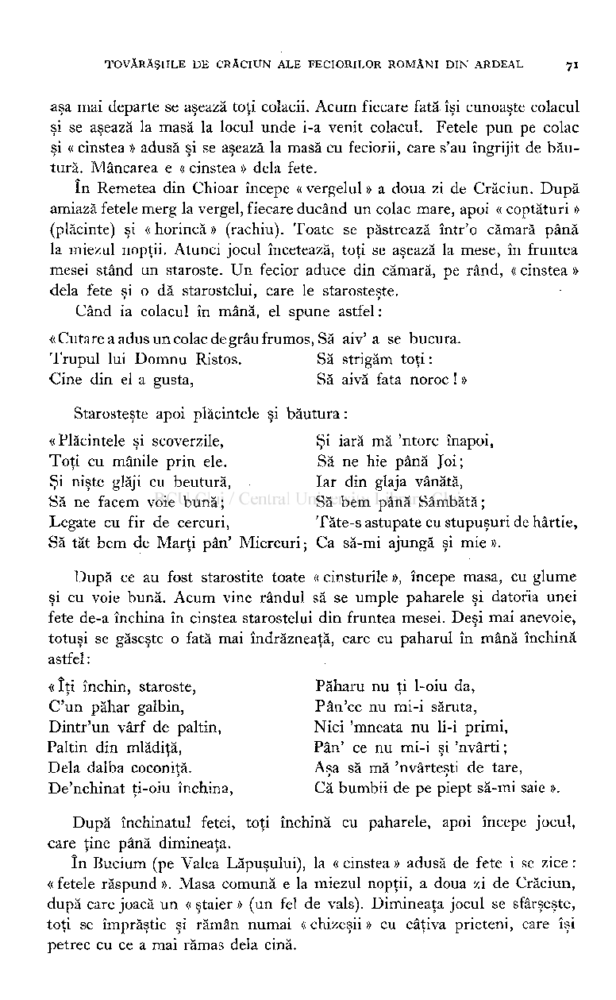

aşa mai departe se aşează toţi colacii. Acum fiecare fată îşi cunoaşte colacul şi se aşează la masă la locul unde i-a venit colacul. Fetele pun pe colac şi « cinstea » adusă şi se aşează la masă cu feciorii, care s'au îngrijit de băutură. Mâncarea e « cinstea » delà fete.

în Remetea din Chioar începe « vergelul » a doua zi de Crăciun. După

amiază fetele merg la vergel, fiecare ducând un colac mare, apoi « coptături » (plăcinte) şi « horincă » (rachiu). Toate se păstrează într'o cămară până la miezul nopţii. Atunci jocul încetează, toţi se aşează la mese, în fruntea mesei stând un staroste. Un fecior aduce din cămară, pe rând, « cinstea » delà fete şi o dă starostelui, care le starosteşte.

Când ia colacul în mână, el spune astfel :

«Cutare a adus un colac de grâu frumos, Să aiv'a se bucura. Trupul lui Domnu Ristos. Să strigăm toţi : Cine din el a gusta, Să aivă fata noroc ! »

Starosteşte apoi plăcintele şi băutura :

«Plăcintele şi scoverzile, Şi iară mă 'ntorc înapoi, Toţi cu manile prin ele. Să ne hie până Joi; Şi nişte glăji cu beutură, Iar din glaja vânătă, Să ne facem voie bună ; Să bem până Sâmbătă ; Legate cu fir de cercuri, Tăte-s astupate cu stupuşuri de hârtie, Să tăt bem de Marţi pân' Miercuri ; Ca să-mi ajungă şi mie ».

După ce au fost starostite toate « cinsturile », începe masa, cu glume şi cu voie bună. Acum vine rândul să se umple paharele şi datoria unei fete de-a închina în cinstea starostelui din fruntea mesei. Deşi mai anevoie, totuşi se găseşte o fată mai îndrăzneaţă, care cu paharul în mână închină astfel :

« îţi închin, staroste, Păharu nu ţi 1-oiu da, C'un pahar galbin, Pân'ce nu mi-i săruta, Dintr'un vârf de paltin, Nici 'mneata nu li-i primi, Paltin din mlădiţă, Pân' ce nu mi-i şi 'nvârti ; Delà dalba coconită. Aşa să mă 'nvârteşti de tare, De'nchinat ţi-oiu închina, Că bumbii de pe piept să-mi saie ».

După închinatul fetei, toţi închină cu paharele, apoi începe jocul, care ţine până dimineaţa.

în Bucium (pe Valea Lăpuşului), la « cinstea » adusă de fete i se zice : « fetele răspund ». Masa comună e la miezul nopţii, a doua zi de Crăciun, după care joacă un « ştaier » (un fel de vals). Dimineaţa jocul se sfârşeşte, toţi se împrăştie şi rămân numai « chizeşii » cu câţiva prieteni, care îşi petrec cu ce a mai rămas delà cină.

E foarte interesant obiceiul din Săliştea Sibiului, cunoscut sub numirea de « întâlnirea jocurilor » din alte trei sate vecine. Deşi astăzi obiceiul e influenţat în amănunte de multe practice moderne, totuşi, în fond are ceva specific, neîntâlnit în alte sate ; l-am putea asemăna cu obiceiul de-a « merge lătureni » în satul vecin, practicat în multe părţi în duminecile de peste an. Descrierea obiceiului în amănunte nu poate intra în cadrul acestor spicuiri, ca şi alte multe obiceiuri interesante din alte părţi.

Dusul vedrei, dusul jocului. în multe sate, mai ales de pe Ţara Oltului şi Valea Târnavelor, e obiceiul ca feciorii care conduc ceata « să-şi aleagă câteo fată ». Pentru « fetele alese » e o cinste aceasta, deoarece în sărbători ele joacă în fruntea jocului. însă o cinste şi mai mare li se dă din partea întregului tineret, când în sărbători feciorii « duc vadra » sau « duc jocul » la casele acestor fete.

Aşa în Bărcutul de pe Ţara Oltului, e obiceiul ca feciorii să colinde în ziua întâia de Crăciun până seara. Atunci cinează împreună la « gazdă », iar după oină joacă cu fetele adunate din bună vreme, până la miezul nopţii.

La miezul nopţii încetează jocul, pentrucă acum «judele» sau vătaful feciorilor « duce vadra ». Acesta s'a înţeles din bună vreme cu o fată că în sărbători ea va fi aleasa lui. Fata, în schimb pentru această cinste, cu învoirea părinţilor, e datoare să dea o cină pentru toată « ceata » în ziua întâi de Crăciun.

Când a încetat jocul, « ceata » pleacă cu judele în frunte la casa alesei sale. Judele duce o vadră de vin ca cinste pentru părinţii fetei. (De aici vine şi numirea de « dusul vedrei »). La masă li se serveşte, de obiceiu, o ciorbă cu carne de porc şi plăcinte, iar ca băutură vinul dus de jude.

După ce au cinat, se întorc la gazdă şi se continuă jocul până dimineaţa.

A doua zi de Crăciun seara, e rândul « crâşmarului » să ducă vadra la « aleasa » lui, iar a treia zi, rândul « bucătarului ».

Dusul vedrei îl găsim şi în Pojorta, pe Ţara Oltului, însă în altă formă. Anume, într'una din zilele dintre Crăciun şi Anul nou un fruntaş cu fată mare, cheamă « ceata cu vadra » la o cină, iar fata îşi invită prietenele. Stăpânul casei dă de-ale mâncării, iar feciorii dau băutura. După ce cinează, se continuă veselia cu joc.

Acelaşi obiceiu, numit « dusul jocului », îl aflăm în Vurpăr pe TârnavaMare. Dreptul de a duce jocul îl au cei trei conducători aleşi ai feciorilor : judele, pristavul şi cârciumarul. Se deosebeşte de « dusul vedrei » din Bărcut prin faptul că la cină ia parte întreg tineretul, fete şi feciori, adecă tot jocul trece la casa respectivă.

Cu totul deosebit se prezintă « dusul jocului » în Zlagna (jud. TârnavaMare). A doua zi de Crăciun feciorii se adună la gazdă, unde au venit

şi fetele. Feciorii le împart în trei grupuri şi acum în cele trei seri următoare merg cu jocul la fiecare fată, după ce s'a spus fiecărui grup de fete în ce seară vor trece cu jocul pe la casa lor. Aceasta o fac în semn de mulţumire pentru că i-au primit la colindat. Feciorii joacă la fiecare

- casă cu fetele care sunt acolo, iar stăpânul casei îi omeneşte cu mâncare şi băutură. S'ar putea întâmpla ca la vreo casă să zăbovească mai mult; pentru ca să nu se facă niciun abuz şi să iasă cu obrazul curat, se fixează delà început câtă vreme au de stat la fiecare casă.

în Ghijasa e obiceiul să se constitue tinerii în trei « buţi ». A treia zi de Crăciun cele trei « buţi » merg pe la fiecare fată şi joacă un joc sau două cu fata. Pentru acest joc, fata dă cetei un kilogram de vin. Cele trei « buţi » se întâlnesc apoi în mijlocul satului şi fac un joc comun.

Zoritul. Tot pe Ţara Oltului şi pe Valea Târnavei-Mari aflăm obiceiul cunoscut sub numele de « zorit » şi « zăurit », practicat mai ales la Anul nou. De fapt, acest obiceiu e un fel de urare de Anul nou.

Astfel în Pojorta tinerii umblă la zăurit în ajunul Anului nou seara. Ca şi la colindatul delà Crăciun, merg la fiecare casă şi colindă la fereastră, însă numai un fragment de colindă, apoi joacă « fecioreşte »

) un joc. Pentru acest zăurit primesc ca cinste bani şi câteva scoverzi.

1

în ziua de Anul nou fac horă, la care, ca de obiceiu, vine aproape tot satul. Cu banii căpătaţi la zăurit, feciorii au cumpărat încă de dimineaţa

- băutură ; ei cinstesc pe toţi cei de faţă cu câte un pahar şi cu câte o scovarză. în Netot « zăoritul » se face în zorii zilei de Anul nou şi numai la casele

cu fete mari ori cu feciori. Gospodarii lasă anume deschise porţile peste noapte, ca să poată intra feciorii la zăorit. Ei se grupează la fereastră şi « zăoresc » astfel, acompaniaţi de ceteraşi :

« Ziori, ziori, Că murgu l-am cumpărat, Dragi ziori, Delà târgu din Bănat Nu grăbiţi cu revărsat, Şi banii i-am numărat Că ne-apucă ziua 'n sat Pe spinarea murgului, Şi ni-i murgu de furat. în mijlocul târgului ». Noi murgu nu l-am furat,

La sfârşit, strigă toţi : « Vivat ! Să trăiască la mulţi ani ! ». Apoi joacă. Gazda iese afară, le mulţumeşte şi îi cinsteşte cu bani şi cu scoverzi. în Buneşti-Târnava Mare, tinerii au obiceiul să « zorească » numai la

casele cu fete mari, în felul următor : Pleacă cu toţii în grup, de-a-lungul satului ; când ajung în dreptul casei unei fete mari, slobod cu toţii pistoalele. La auzul împuşcăturilor, fata iese şi pofteşte feciorii în casă. Aici, tatăl fetei îi îmbie cu băutură, iar mama cu scoverzi.

###### ) Numai feciori.

1

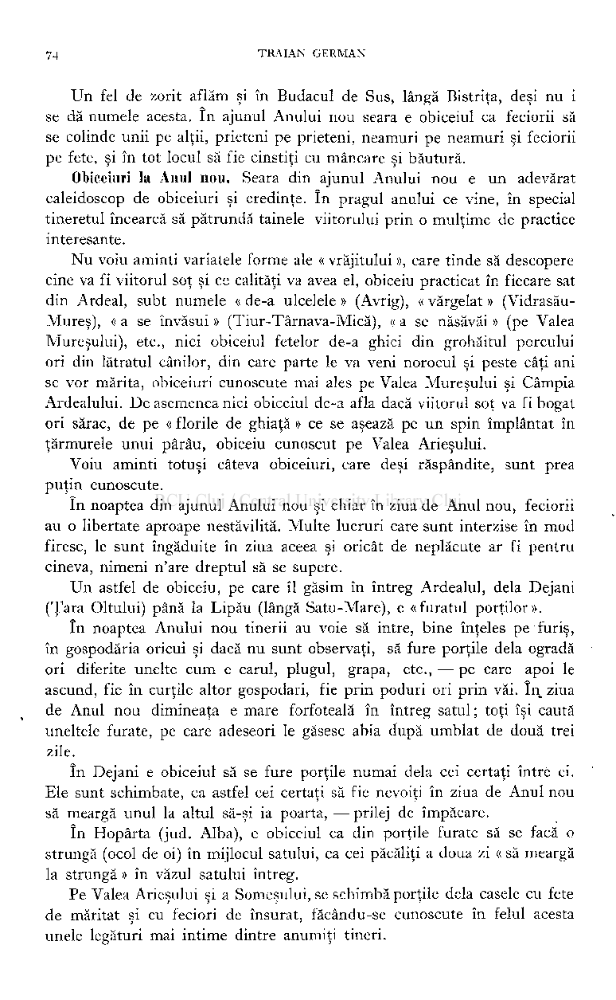

Un fel de zorit aflăm şi în Budacul de Sus, lângă Bistriţa, deşi nu i se dă numele acesta. în ajunul Anului nou seara e obiceiul ca feciorii să se colinde unii pe alţii, prieteni pe prieteni, neamuri pe neamuri şi feciorii pe fete, şi în tot locul să fie cinstiţi cu mâncare şi băutură.

Obiceiuri la Anul nou. Seara din ajunul Anului nou e un adevărat caleidoscop de obiceiuri şi credinţe. în pragul anului ce vine, în special tineretul încearcă să pătrundă tainele viitorului prin o mulţime de practice interesante.

Nu voiu aminti variatele forme ale « vrăjitului », care tinde să descopere cine va fi viitorul soţ şi ce calităţi va avea el, obiceiu practicat în fiecare sat din Ardeal, subt numele « de-a ulcelele » (Avrig), « vărgelat » (VidrasăuMureş), « a se învăsui » (Tiur-Târnava-Mică), « a se năsăvăi » (pe Valea Mureşului), etc., nici obiceiul fetelor de-a ghici din grohăitul porcului ori din lătratul cânilor, din care parte le va veni norocul şi peste câţi ani se vor mărita, obiceiuri cunoscute mai ales pe Valea Mureşului şi Câmpia Ardealului. De asemenea nici obiceiul de-a afla dacă viitorul soţ va fi bogat ori sărac, de pe « florile de ghiaţă » ce se aşează pe un spin împlântat în ţărmurele unui pârâu, obiceiu cunoscut pe Valea Arieşului.

Voiu aminti totuşi câteva obiceiuri, care deşi răspândite, sunt prea puţin cunoscute.

în noaptea din ajunul Anului nou şi chiar în ziua de Anul nou, feciorii au o libertate aproape nestăvilită. Multe lucruri care sunt interzise în mod firesc, le sunt îngăduite în ziua aceea şi oricât de neplăcute ar fi pentru cineva, nimeni n'are dreptul să se supere.

Un astfel de obiceiu, pe care îl găsim în întreg Ardealul, delà Dejani (Tara Oltului) până la Lipău (lângă Satu-Mare), e «furatul porţilor».

în noaptea Anului nou tinerii au voie să intre, bine înţeles pe furiş, în gospodăria oricui şi dacă nu sunt observaţi, să fure porţile delà ogradă ori diferite unelte cum e carul, plugul, grapa, etc., — pe care apoi le ascund, fie în curţile altor gospodari, fie prin poduri ori prin văi. în ziua de Anul nou dimineaţa e mare forfoteală în întreg satul ; toţi îşi caută uneltele furate, pe care adeseori le găsesc abia după umblat de două trei zile.

în Dejani e obiceiul să se fure porţile numai delà cei certaţi între ei. Ele sunt schimbate, ca astfel cei certaţi să fie nevoiţi în ziua de Anul nou să meargă unul la altul să-şi ia poarta, — prilej de împăcare.

în Hopârta (jud. Alba), e obiceiul ca din porţile furate să se facă o strungă (ocol de oi) în mijlocul satului, ca cei păcăliţi a doua zi « să meargă la strungă » în văzul satului întreg.

Pe Valea Arieşului şi a Someşului, se schimbă porţile delà casele cu fete de măritat şi cu feciori de însurat, făcându-se cunoscute în felul acesta unele legături mai intime dintre anumiţi tineri.

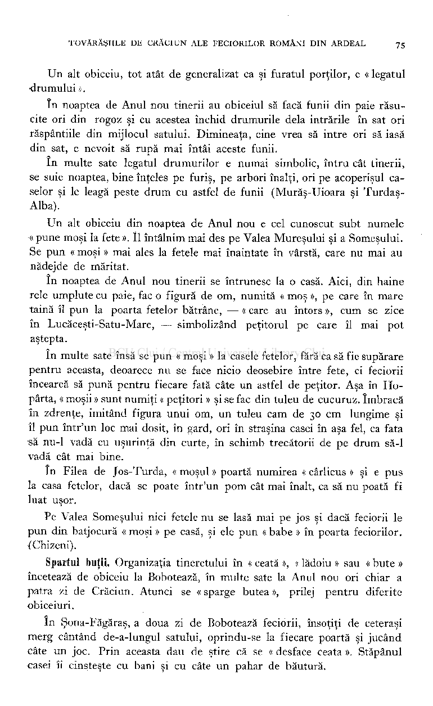

Un alt obiceiu, tot atât de generalizat ca şi furatul porţilor, e « legatul

•drumului ».

în noaptea de Anul nou tinerii au obiceiul să facă funii din paie răsucite ori din rogoz şi cu acestea închid drumurile delà intrările în sat ori

- răspântiile din mijlocul satului. Dimineaţa, cine vrea să intre ori să iasă din sat, e nevoit să rupă mai întâi aceste funii.

în multe sate legatul drumurilor e numai simbolic, întru cât tinerii, se suie noaptea, bine înţeles pe furiş, pe arbori înalţi, ori pe acoperişul caselor şi le leagă peste drum cu astfel de funii (Murăş-Uioara şi TurdaşAlba).

Un alt obiceiu din noaptea de Anul nou e cel cunoscut subt numele « pune moşi la fete ». îl întâlnim mai des pe Valea Mureşului şi a Someşului. Se pun « moşi » mai ales la fetele mai înaintate în vârstă, care nu mai au nădejde de măritat.

în noaptea de Anul nou tinerii se întrunesc la o casă. Aici, din haine rele umplute cu paie, fac o figură de om, numită « moş », pe care în mare taină îl pun la poarta fetelor bătrâne, — « care au întors », cum se zice în Lucăceşti-Satu-Mare, — simbolizând peţitorul pe care îl mai pot aştepta.

în multe sate însă se pun « moşi » la casele fetelor, fără ca să fie supărare pentru aceasta, deoarece nu se face nicio deosebire între fete, ci feciorii încearcă să pună pentru fiecare fată câte un astfel de peţitor. Aşa în Hopârta, « moşii » sunt numiţi « peţitori » şi se fac din tuleu de cucuruz. îmbracă în zdrenţe, imitând figura unui om, un tuleu cam de 30 cm lungime şi îl pun într'un loc mai dosit, în gard, ori în straşina casei în aşa fel, ca fata

- să nu-1 vadă cu uşurinţă din curte, în schimb trecătorii de pe drum să-1 vadă cât mai bine.

în Filea de Jos-Turda, « moşul » poartă numirea « cârlicus » şi e pus la casa fetelor, dacă se poate într'un pom cât mai înalt, ca să nu poată fi luat uşor.

Pe Valea Someşului nici fetele nu se lasă mai pe jos şi dacă feciorii le pun din batjocură « moşi » pe casă, şi ele pun « babe » în poarta feciorilor. (Chizeni).

Spartul butii. Organizaţia tineretului în « ceată », « lădoiu » sau « bute »

încetează de obiceiu la Bobotează, în multe sate la Anul nou ori chiar a patra zi de Crăciun. Atunci se « sparge butea », prilej pentru diferite obiceiuri.

în Şona-Făgăraş, a doua zi de Bobotează feciorii, însoţiţi de ceteraşi merg cântând de-a-lungul satului, oprindu-se la fiecare poartă şi jucând câte un joc. Prin aceasta dau de ştire că se « desface ceata ». Stăpânul casei îi cinsteşte cu bani şi cu câte un pahar de băutură.

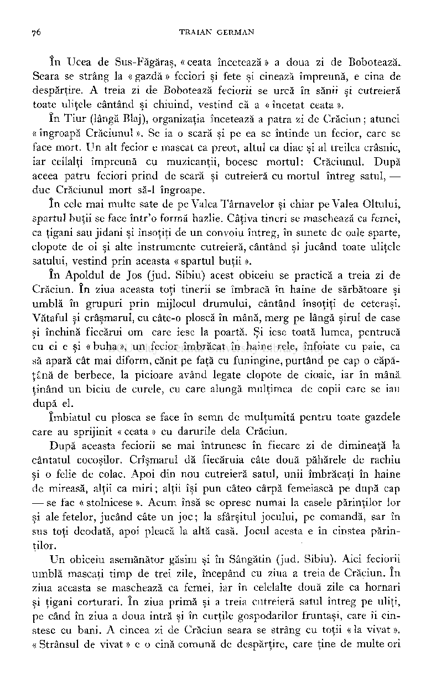

în Ucea de Sus-Făgăraş, « ceata încetează » a doua zi de Bobotează. Seara se strâng la « gazdă » feciori şi fete şi cinează împreună, e cina de despărţire. A treia zi de Bobotează feciorii se urcă în sănii şi cutreieră toate uliţele cântând şi chiuind, vestind că a « încetat ceata ».

în Tiur (lângă Blaj), organizaţia încetează a patra zi de Crăciun ; atunci « îngroapă Crăciunul ». Se ia o scară şi pe ea se întinde un fecior, care se face mort. Un alt fecior e mascat ca preot, altul ca diac şi al treilea crâsnic, iar ceilalţi împreună cu muzicanţii, bocesc mortul: Crăciunul. După aceea patru feciori prind de scară şi cutreieră cu mortul întreg satul, duc Crăciunul mort să-1 îngroape.

în cele mai multe sate de pe Valea Târnavelor şi chiar pe Valea Oltului, spartul butii se face într'o formă hazlie. Câţiva tineri se maschează ca femei, ca ţigani sau jidani şi însoţiţi de un convoiu întreg, în sunete de oale sparte, clopote de oi şi alte instrumente cutreieră, cântând şi jucând toate uliţele satului, vestind prin aceasta « spartul butii ».

în Apoldul de Jos (jud. Sibiu) acest obiceiu se practică a treia zi de Crăciun. în ziua aceasta toţi tinerii se îmbracă în haine de sărbătoare şi umblă în grupuri prin mijlocul drumului, cântând însoţiţi de ceteraşi. Vătaful şi crâşmarul, cu câte-o ploscă în mână, merg pe lângă şirul de case şi închină fiecărui om care iese la poartă. Şi iese toată lumea, pentrucă cu ei e şi « buha », un fecior îmbrăcat în haine rele, înfoiate cu paie, ca

- să apară cât mai diform, cănit pe faţă cu funingine, purtând pe cap o căpăţ£nă de berbece, la picioare având legate clopote de cioaie, iar în mână ţinând un biciu de curele, cu care alungă mulţimea de copii care se iau după el.

îmbiatul cu plosca se face în semn de mulţumită pentru toate gazdele care au sprijinit « ceata » cu darurile delà Crăciun.

După aceasta feciorii se mai întrunesc în fiecare zi de dimineaţă la cântatul cocoşilor. Crişmarul dă fiecăruia câte două păhărele de rachiu şi o felie de colac. Apoi din nou cutreieră satul, unii îmbrăcaţi în haine de mireasă, alţii ca miri ; alţii îşi pun câteo cârpă femeiască pe după cap — se fac « stolnicese ». Acum însă se opresc numai la casele părinţilor lor şi ale fetelor, jucând câte un joc ; la sfârşitul jocului, pe comandă, sar în sus toţi deodată, apoi pleacă la altă casă. Jocul acesta e în cinstea părinţilor.

Un obiceiu asemănător găsim şi în Sângătin (jud. Sibiu). Aici feciorii umblă mascaţi timp de trei zile, începând cu ziua a treia de Crăciun. în ziua aceasta se maschează ca femei, iar în celelalte două zile ca homari şi ţigani corturari. în ziua primă şi a treia cutreieră satul întreg pe uliţi, pe când în ziua a doua intră şi în curţile gospodarilor fruntaşi, care îi cinstesc cu bani. A cincea zi de Crăciun seara se strâng cu toţii « la vivat ». « Strânsul de vivat » e o cină comună de despărţire, care ţine de multe ori

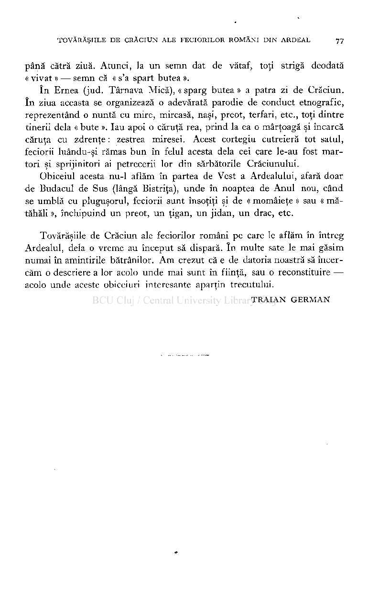

până cătră ziuă. Atunci, la un semn dat de vătaf, toţi strigă deodată « vivat » — semn că « s'a spart butea ».

în Ernea (jud. Târnava Mică), « sparg butea » a patra zi de Crăciun, în ziua aceasta se organizează o adevărată parodie de conduct etnografic, reprezentând o nuntă cu mire, mireasă, naşi, preot, terfari, etc., toţi dintre tinerii delà « bute ». Iau apoi o căruţă rea, prind la ea o mârţoagă şi încarcă căruţa cu zdrenţe : zestrea miresei. Acest cortegiu cutreieră tot satul, feciorii luându-şi rămas bun în felul acesta delà cei care le-au fost martori şi sprijinitori ai petrecerii lor din sărbătorile Crăciunului.

Obiceiul acesta nu-1 aflăm în partea de Vest a Ardealului, afară doar de Budacul de Sus (lângă Bistriţa), unde în noaptea de Anul nou, când se umblă cu pluguşorul, feciorii sunt însoţiţi şi de « momâieţe » sau « mă-

- tăhăli », închipuind un preot, un ţigan, un jidan, un drac, etc.

Tovărăşiile de Crăciun ale feciorilor români pe care le aflăm în întreg Ardealul, delà o vreme au început să dispară. în multe sate le mai găsim numai în amintirile bătrânilor. Am crezut că e de datoria noastră să încer­

- căm o descriere a lor acolo unde mai sunt în fiinţă, sau o reconstituire acolo unde aceste obiceiuri interesante aparţin trecutului.

TRAIA N GERMA N

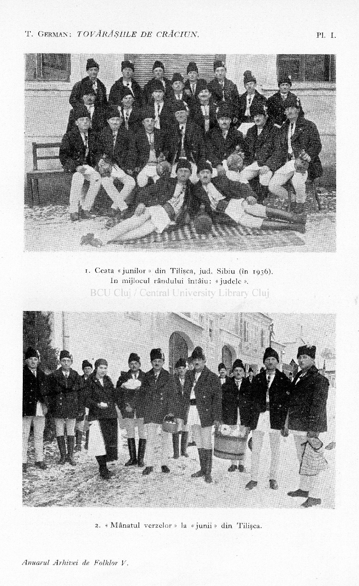

T . GERMAN: TOVĂRĂŞIILE DE CRĂCIUN. Pl. I.

2. « Mânatu l verzelor » la «junii» din Tilişca.

Anuarul Arhivei de Folklor V.

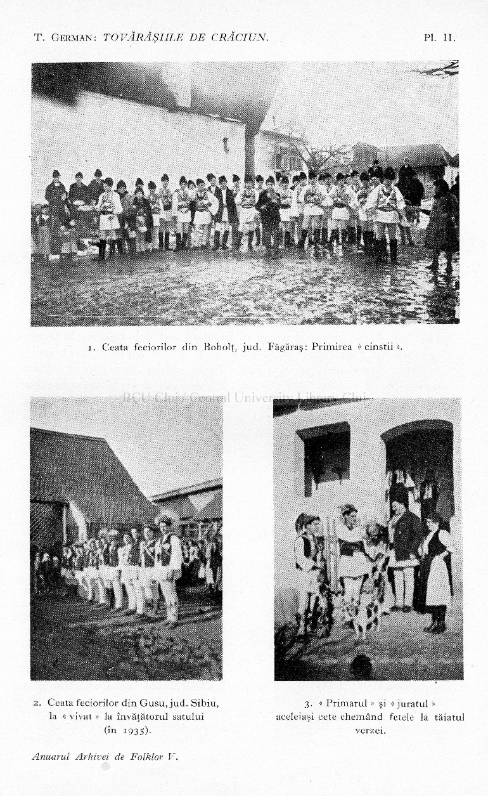

T . GERMAN TOVĂRĂŞIILE DE CRĂCIUN. Pl. II.

i. Ceata feciorilor din Boholţ, jud. Făgăraş: Primirea «cinstii».

