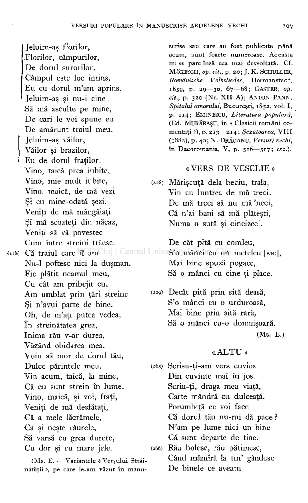

Jeluim-aş florilor, Florilor, câmpurilor, De dorul surorilor. Câmpul este loc întins, Eu cu dorul m'am aprins. Jeluim-aş şi nu-i cine Să mă asculte pe mine, De cari le voi spune eu De amărunt traiul meu. Jeluim-aş văilor, Văilor şi brazilor,

scrise sau care au fost publicate până acum, sunt foarte numeroase. Aceasta mi se pare însă cea mai desvoltată. Cf.

MÖKESCH , op. cit., p. 20; J. K. SCHÜLLER ,

Romanische Volkslieder, Hermanstadt, 1859, p. 29—30, 67—68; GASTER, op. cit., p. 320 (Nr. XI I A) ; ANTON PANN, Spitalul amorului, Bucureşti, 1852, vol. I, p. 114; EMINESCU, Literatura populară, (Ed. MURĂRAŞU, în « Clasicii români comentaţi »), p. 213—214; Şezătoarea, VII I (1882), p. 40; N. DRĂGANU, Versuri vechi, în Dacoromania, V, p. 516—517; etc.).

' Eu de dorul fraţilor. Vino, taică prea iubite, Vino, mie mult iubite, Vino, maică, de mă vezi Şi cu mine-odată şezi. Veniţi de mă mângâiaţi Şi mă scoateţi din năcaz, Veniţi să vă povestec Cum între streini trăesc.

« VERS DE VESELIE »

(228) Mărişcuţă delà beciu, trala, Vin cu luntrea de mă treci. De mă treci să nu mă 'neci, Că n'ai bani să mă plăteşti, Numa o sută şi cincizeci.

De cât pită cu comleu, S'o mânci cu un meteleu [sic], Mai bine spuză pogace, Să o mânci cu cine-ţi place.

<ti8) Că traiul care îl am Nu-1 poftesc nici la duşman. Fie plătit neamul meu, Cu cât am pribejit eu. Am umblat prin ţări streine Şi n'avui parte de bine. Oh, de m'aţi putea vedea, în streinătatea grea, Inima rău v-ar durea, Văzând obidarea mea. Voiu să mor de dorul tău, Dulce părintele meu. Vin acum, taică, la mine, Că eu sunt strein în lume. Vino, maică, şi voi, fraţi, Veniţi de mă desfătaţi, Că a mele lăcrămele, Ca şi neşte râurele, Să varsă cu grea durere, Cu dor şi cu mare jele.

(229) Decât pită prin sită deasă, S'o mânci cu o urduroasă, Mai bine prin sită rară, Să o mânci cu-o domnişoară.

(Ms. E. )

«ALT U »

- (265) Scrisu-ţi-am vers cuvios Din cuvinte mai în jos. Scriu-ţi, draga mea viaţă, Carte mândră cu dulceaţă. Porumbiţă ce voi face Că dorul tău nu-mi dă pace ? N'am pe lume nici un bine Că sunt departe de tine.
- (266) Rău bolesc, rău pătimesc, Când mândră la tin' gândesc De binele ce aveam

(Ms. E . •—• Variantele « Versului Străinătăţii », pe care le-am văzut în manu­

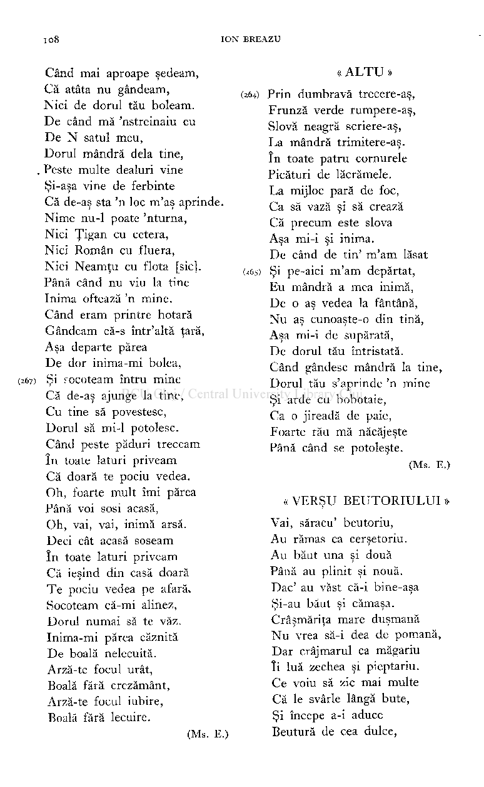

« ALTU »

Când mai aproape şedeam, Că atâta nu gândeam, Nici de dorul tău boleam. De când mă "nstreinaiu eu De N satul meu, Dorul mândră delà tine,

- (264) Prin dumbravă trecere-aş, Frunză verde rumpere-aş, Slovă neagră scriere-aş, La mândră trimitere-aş. în toate patru cornurele Picături de lăcrămele. La mijloc pară de foc, Ca să vază şi să crează Că precum este slova Aşa mi-i şi inima. De când de tin' m'am lăsat
- (265) Şi pe-aici m'am depărtat, Eu mândră a mea inimă, De o aş vedea la fântână, Nu aş cunoaşte-o din tină, Aşa mi-i de supărată, De dorul tău întristată. Când gândesc mândră la tine, Dorul tău s'aprinde 'n mine Şi arde cu bobotaie, Ca o jireadă de paie, Foarte rău mă năcăjeşte Până când se potoleşte.

. Peste multe dealuri vine Şi-aşa vine de ferbinte Că de-aş sta 'n loc m'aş aprinde. Nime nu-1 poate 'nturna, Nici Ţigan cu cetera, Nici Român cu fluera, Nici Neamţu cu flota [sic]. Până când nu viu la tine Inima oftează 'n mine. Când eram printre hotară Gândeam că-s într'altă ţară, Aşa departe părea De dor inima-mi bolea,

(267) Şi socoteam întru mine Că de-aş ajunge la tine, Cu tine să povestesc, Dorul să mi-1 potolesc. Când peste păduri treceam în toate laturi priveam Că doară te pociu vedea. Oh, foarte mult îmi părea Până voi sosi acasă, Oh, vai, vai, inimă arsă. Deci cât acasă soseam în toate laturi priveam Că ieşind din casă doară Te pociu vedea pe afară. Socoteam că-mi alinez, Dorul numai să te văz. Inima-mi părea căznită De boală nelecuită. Arză-te focul urât, Boală fără crezământ, Arză-te focul iubire, Boală fără lecuire.

(Ms. E.)

« VERŞU BEUTORIULUI »

Vai, săracu' beutoriu, Au rămas ca cerşetoriu. Au băut una şi două Până au plinit şi nouă. Dac' au văst că-i bine-aşa Şi-au băut şi cămaşa. Crâşmăriţa mare duşmană Nu vrea să-i dea de pomană, Dar crâjmarul ca măgariu îi luă zechea şi pieptariu. Ce voiu să zic mai multe Că le svârle lângă bute, Şi începe a-i aduce Beutură de cea dulce,

(Ms. E.)

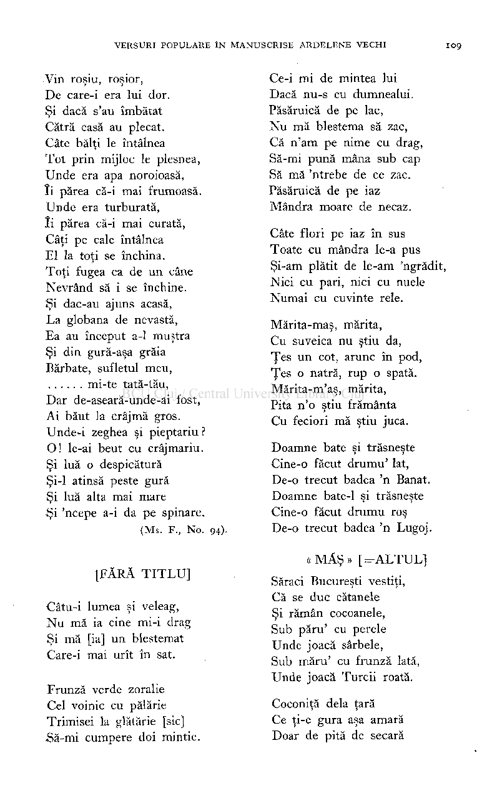

Ce-i mi de mintea lui Dacă nu-s cu dumnealui. Păsăruică de pe lac, Nu mă blestema să zac, Că n'am pe nime cu drag, Să-mi pună mâna sub cap Să mă 'ntrebe de ce zac. Păsăruică de pe iaz Mândra moare de necaz.

Vin roşiu, roşior, De care-i era lui dor. Şi dacă s'au îmbătat Cătră casă au plecat. Câte bălţi le întâlnea Tot prin mijloc le plesnea, Unde era apa noroioasă, îi părea că-i mai frumoasă. Unde era turburată, îi părea că-i mai curată, Câţi pe cale întâlnea El la toţi se închina. Toţi fugea ca de un câne Nevrând să i se închine. Şi dac-au ajuns acasă, La globana de nevastă, Ea au început a-1 mustra Şi din gură-aşa grăia Bărbate, sufletul meu,

Câte flori pe iaz în sus Toate cu mândra le-a pus Şi-am plătit de le-am 'ngrădit, Nici cu pari, nici cu nuele Numai cu cuvinte rele.

Mărita-maş, mărita, Cu suveica nu ştiu da, Ţes un cot, arunc în pod, Ţes o natră, rup o spată. Mărita-m'aş, mărita, Pita n'o ştiu frământa Cu feciori mă ştiu juca.

mi-te tată-tău, Dar de-aseară-unde-ai fost, Ai băut la crâjmă gros. Unde-i zeghea şi pieptariu ? O! le-ai beut cu crâjmariu. Şi luă o despicătură Şi-1 atinsă peste gură Şi luă alta mai mare Şi 'ncepe a-i da pe spinare.

Doamne bate şi trăsneşte Cine-o făcut drumu' lat, De-o trecut badea 'n Banat. Doamne bate-1 şi trăsneşte Cine-o făcut drumu roş De-o trecut badea 'n Lugoj.

(Ms. F., No. 94).

«MĂŞ» [ = ALTUL]

[FĂRĂ TITLU]

Săraci Bucureşti vestiţi, Că se duc cătanele Şi rămân cocoanele, Sub păru' cu perele Unde joacă sârbele, Sub măru' cu frunză lată, Unde joacă Turcii roată.

Câtu-i lumea şi veleag, Nu mă ia cine mi-i drag Şi mă [ia] un blestemat Care-i mai urît în sat.

Frunză verde zoralie Cel voinic cu pălărie Trimisei la glătărie [sic] Să-mi cumpere doi mintie.

Coconită delà ţară Ce ţi-e gura aşa amară Doar de pită de secară

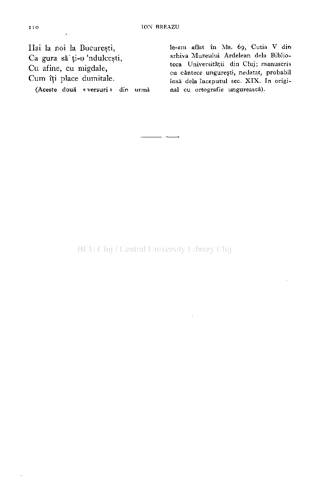

ION BREAZU

Hai la noi la Bucureşti, Ca gura să ţi-o'ndulceşti, Cu afine, cu migdale, Cum îţi place dumitale.

le-am aflat în Ms. 69, Cutia V din arhiva Muzeului Ardelean delà Biblioteca Universităţii din Cluj ; manuscris cu cântece ungureşti, nedatat, probabil însă delà începutul sec. XIX . In original cu ortografie ungurească).

(Aceste două « versuri » din urmă

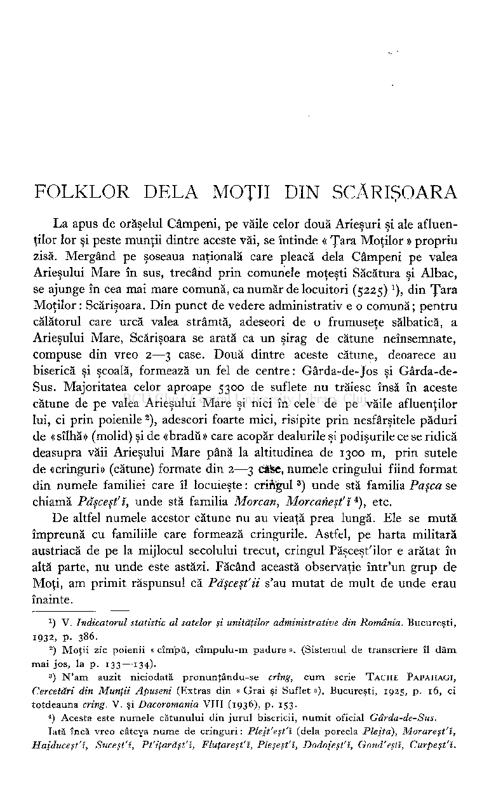

# FOLKLOR DELA MOŢII DIN SCĂRIŞOARA

La apus de orăşelul Câmpeni, pe văile celor două Arieşuri şi ale afluenţilor lor şi peste munţii dintre aceste văi, se întinde « Ţara Moţilor » propriu zisă. Mergând pe şoseaua naţională care pleacă delà Câmpeni pe valea Arieşului Mare în sus, trecând prin comunele moţeşti Săcătura şi Albac, se ajunge în cea mai mare comună, ca număr de locuitori (5225)

), din Ţara Moţilor : Scărişoara. Din punct de vedere administrativ e o comună ; pentru călătorul care urcă valea strâmtă, adeseori de o frumuseţe sălbatică, a Arieşului Mare, Scărişoara se arată ca un şirag de cătune neînsemnate, compuse din vreo 2—3 case. Două dintre aceste cătune, deoarece au biserică şi şcoală, formează un fel de centre : Gârda-de-Jos şi Gârda-deSus. Majoritatea celor aproape 5300 de suflete nu trăiesc însă în aceste cătune de pe valea Arieşului Mare şi nici în cele de pe văile afluenţilor lui, ci prin poienile

1

), adeseori foarte mici, risipite prin nesfârşitele păduri de «sîlhă» (molid) şi de «bradü» care acopăr dealurile şi podişurile ce se ridică deasupra văii Arieşului Mare până la altitudinea de 1300 m, prin sutele de «cringuri» (cătune) formate din 2—3 càfee, numele cringului fiind format din numele familiei care îl locuieşte : cringul

2

) unde stă familia Pasca se chiamă Păşceşt'î, unde stă familia Morcan, Morcaiîeşt'î*), etc.

3

De altfel numele acestor cătune nu au vieaţă prea lungă. Ele se mută împreună cu familiile care formează cringurile. Astfel, pe harta militară austriacă de pe la mijlocul secolului trecut, cringul Păşceşt'ilor e arătat în altă parte, nu unde este astăzi. Făcând această observaţie într'un grup de Moţi, am primit răspunsul că Păşceşt'ii s'au mutat de mult de unde erau înainte.

*) V. Indicatorul statistic al satelor şi unităţilor administrative din România. Bucureşti, 1932, p. 386.

###### ) Moţii zic poienii « cîm'pu, cîmpulu-m pădure ». (Sistemul de transcriere îl dăm mai jos, la p. 133—134).

2

###### ) N'a m auzit niciodată pronunţându-se crîng, cum scrie TACH E PAPAHAQI, Cercetări din Munţii Apuseni (Extras din « Grai şi Suflet »), Bucureşti, 1925, p. 16, ci totdeauna cring. V . şi Dacoromania VIII (1936), p. 153.

3

) Acesta este numele cătunului din jurul bisericii, numit oficial Gârda-de-Sus.

4

Iată încă vreo câteva nume de cringuri : Pleit'eşt'î (delà porecla Pleita), Morareşt'î, Haiduceşt'î, Suceşt'l, Pt'iţardşt'î, Fluţareşt'î, Pleşeşt'î, Dodoieşt'î, Gond'eşti, Curpeşt't.

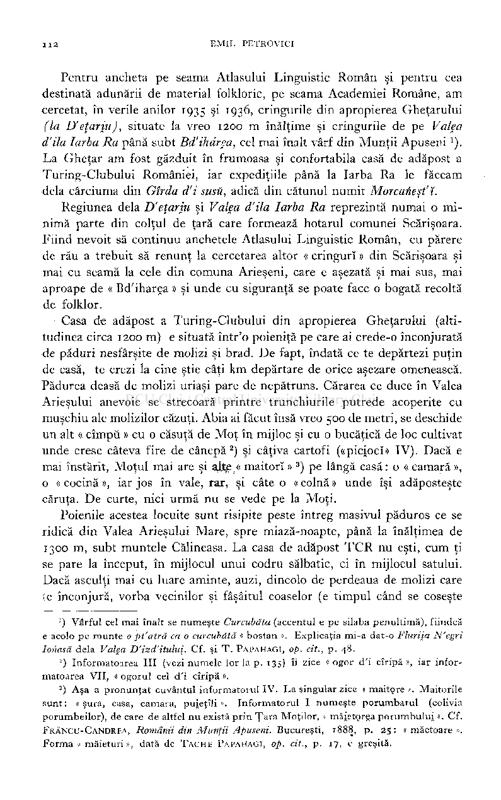

Pentru ancheta pe seama Atlasului Linguistic Român şi pentru cea destinată adunării de material folkloric, pe seama Academiei Române, am cercetat, în verile anilor 1935 şi 1936, cringurile din apropierea Gheţarului

(la D'eţariu), situate la vreo 1200 m înălţime şi cringurile de pe Valea d'ila Iarba Ra până subt Bd'ihârm, cel mai înalt vârf din Munţii Apuseni

La Gheţar am fost găzduit în frumoasa şi confortabila casă de adăpost a Turing-Clubului României, iar expediţiile până la Iarba Ra le făceam delà cârciuma din Gir da d'i susii, adică din cătunul numit Morcaneşt' î.

Regiunea delà D'eţariu şi Valea d'ila Iarba Ra reprezintă numai o minimă parte din colţul de ţară care formează hotarul comunei Scărişoara. Fiind nevoit să continuu anchetele Atlasului Linguistic Român, cu părere de rău a trebuit să renunţ la cercetarea altor « cringurî » din Scărişoara şi mai cu seamă la cele din comuna Arieşeni, care e aşezată şi mai sus, mai aproape de « Bd'iharea » şi unde cu siguranţă se poate face o bogată recoltă de folklor.

Casa de adăpost a Turing-Clubului din apropierea Gheţarului (altitudinea circa 1200 m) e situată într'o poieniţă pe care ai crede-o înconjurată de păduri nesfârşite de molizi şi brad. De fapt, îndată ce te depărtezi puţin de casă, te crezi la cine ştie câţi km depărtare de orice aşezare omenească. Pădurea deasă de molizi uriaşi pare de nepătruns. Cărarea ce duce în Valea Arieşului anevoie se strecoară printre trunchiurile putrede acoperite cu muşchiu ale molizilor căzuţi. Abia ai făcut însă vreo 500 de metri, se deschide un alt « cîmpu » cu o căsuţă de Moţ în mijloc şi cu o bucăţică de loc cultivat unde cresc câteva fire de cânepă

#### ) şi câţiva cartofi («piciocï» IV). Dacă e mai înstărit, Moţul mai are şi alte,« maitorï »

2

) pe lângă casă: o « cămară », o « cocină », iar jos în vale, rar, şi câte o « colnă » unde îşi adăposteşte căruţa. De curte, nici urmă nu se vede pe la Moţi.

3

Poienile acestea locuite sunt risipite peste întreg masivul păduros ce se ridică din Valea Arieşului Mare, spre miază-noapte, până la înălţimea de 1300 m, subt muntele Călineasa. La casa de adăpost TCR nu eşti, cum ţi se pare la început, în mijlocul unui codru sălbatic, ci în mijlocul satului. Dacă asculţi mai cu luare aminte, auzi, dincolo de perdeaua de molizi care te înconjură, vorba vecinilor şi fâsâitul coaselor (e timpul când se coseşte

) Vârful cel mai înalt se numeşte Curcubăta (accentul e pe silaba penultimă), fiindcă e acolo pe munte o pt'atră ca o curcubăta « bostan ». Explicaţia mi-a dat-o Fluriia N'egri Ionasă delà Valea D'izd'itului. Cf. şi T . PAPAHAGI, op. cit., p. 48.

J

*) Informatoarea III (vezi numele lor la p. 135) îi zice « ogor d'i cîripă », iar informatoarea VII, « ogorul cel d'i cîripă ».

) Aşa a pronunţat cuvântul informatorul IV. La singular zice « maitore >\ Maitorile sunt: «şura, casa, camata, puieţîli r. Informatorul I numeşte porumbarul (colivia porumbeilor), de care de altfel nu există prin Ţara Moţilor, > măietcrea porumbului ». Cf. FRÂNCU-CANDREA , Românii din Munţii Apuseni. Bucureşti, 1888, p. 25: « măetoare ». Forma « măieturi », dată de TACH E PAPAHAGI, op. cit., p. 17, e greşită.

3

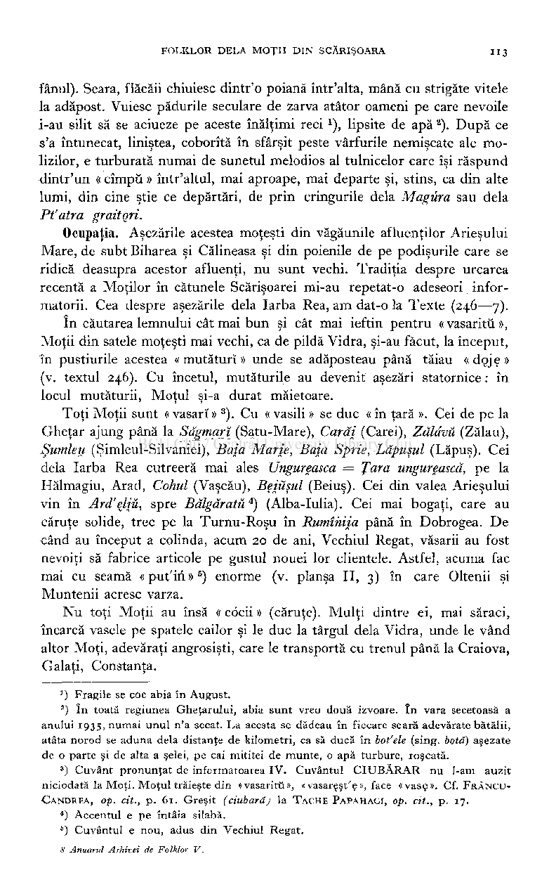

#### fânul). Seara, flăcăii chiuiesc dintr'o poiană într'alta, mână cu strigăte vitele la adăpost. Vuiesc pădurile seculare de zarva atâtor oameni pe care nevoile i-au silit să se aciueze pe aceste înălţimi reci *), lipsite de apă

). După ce s'a întunecat, liniştea, coborîtă în sfârşit peste vârfurile nemişcate ale molizilor, e turburată numai de sunetul melodios al tulnicelor care îşi răspund dintr'un « cîmpu » într'altul, mai aproape, mai departe şi, stins, ca din alte lumi, din cine ştie ce depărtări, de prin cringurile delà Măgura sau delà

2

Pt'atra graitçri.

Ocupaţia. Aşezările acestea moţeşti din văgăunile afluenţilor Arieşului Mare, de subt Biharea şi Călineasa şi din poienile de pe podişurile care se ridică deasupra acestor afluenţi, nu sunt vechi. Tradiţia despre urcarea recentă a Moţilor în cătunele Scărişoarei mi-au repetat-o adeseori informatorii. Cea despre aşezările delà Iarba Rea, am dat-o la Texte (246—7).

în căutarea lemnului cât mai bun şi cât mai ieftin pentru « vasaritü », Moţii din satele moţeşti mai vechi, ca de pildă A^idra, şi-au făcut, la început, în pustiurile acestea « mutături » unde se adăposteau până tăiau « doje » (v. textul 246). Cu încetul, mutăturile au devenit aşezări statornice : în locul mutăturii, Moţul şi-a durat măietoare.

). Cu « vasili » se duc « în ţară ». Cei de pe la Gheţar ajung până la Săgmarî (Satu-Mare), Carat (Cărei), Zăldvu (Zălau), Şumleu (Şimleul-Silvaniei), Baia Marie, Baia Sprie, Lăpuşul (Lăpuş). Cei delà Iarba Rea cutreeră mai ales Ungureasca = Ţara ungurească, pe la Hălmagiu, Arad, Cohul (Vaşcău), Beiuşul (Beiuş). Cei din valea Arieşului vin în Ard'cliü, spre Bălgâratu

Toţi Moţii sunt « vasarî »

3

) (Alba-Iulia). Cei mai bogaţi, care au căruţe solide, trec pe la Turnu-Roşu în Rumîhiia până în Dobrogea. De când au început a colinda, acum 20 de ani, Vechiul Regat, văsarii au fost nevoiţi să fabrice articole pe gustul nouei lor clientele. Astfel, acuma fac mai cu seamă «put'iri»

i

) enorme (v. planşa II, 3) în care Oltenii şi Muntenii acresc varza.

6

Nu toţi Moţii au însă « cocii » (căruţe). Mulţi dintre ei, mai săraci, încarcă vasele pe spatele cailor şi le duc la târgul delà Vidra, unde le vând altor Moţi, adevăraţi angrosişti, care le transportă cu trenul până la Craiova, Galaţi, Constanţa.

*) Fragile se coc abia în August.

###### ) în toată regiunea Gheţarului, abia sunt vreo două izvoare. în vara secetoasă a anului 1935, numai unul n'a secat. La acesta se dădeau în fiecare seară adevărate bătălii, atâta norod se aduna delà distanţe de kilometri, ca să ducă în bot'ele (sing, botă) aşezate de o parte şi de alta a şelei, pe cai mititei de munte, o apă turbure, roşcată.

2

###### ) Cuvânt pronunţat de informatoarea IV . Cuvântul CIUBARA R nu l-am auzit niciodată la Moţi. Moţul trăieşte din «vasaritü», «vasareşt'e», face «vase». Cf. FRÂNCU -

3

###### CANDREA , op. cit., p. 61. Greşit (ciubară) la TACH E PAPAHAGI , op. cit., p. 17.

- 4

) Accentul e pe întâia silabă.

- 5

###### ) Cuvântul e nou, adus din Vechiul Regat.

S Anuarul Arhivei de Folklor V.

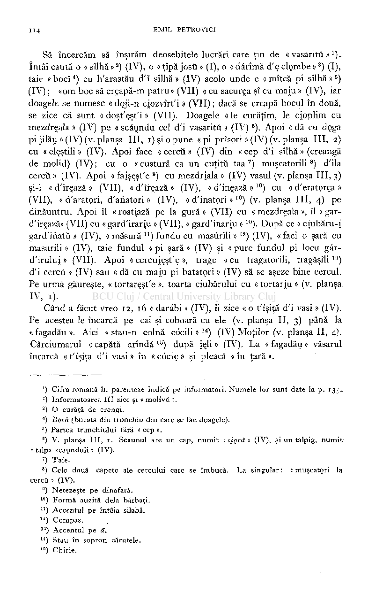

##### Să încercăm să înşirăm deosebitele lucrări care ţin de « vasaritü » întâi caută o « sîlhă »

##### ) (I), taie «bocî

##### ) (IV), o « ţîpă josü » (I), o « dârîmă d'e clombe »

2

3

) (IV) ; «om boc să creapă-m patru» (VII) « cu sacurea şî cu maiu » (IV), iar doagele se numesc « doji-n ciozvîrt'i » (VII) ; dacă se creapă bocul în două, se zice că sunt « doşt'est'i » (VII). Doagele « le curăţim, le cioplim cu mezdreala » (IV) pe « scâundu cel d'i vasaritü » (IV)

##### ) cu h'arastău d'î sîlhă» (IV) acolo unde e « mîtcă pi sîlhă»

4

5

##### ). Apoi « dă cu doga pi jilău » (IV) (v. planşa III, i) şi o pune «pi prïsori » (IV) (v. planşa III, 2) cu « clestili » (IV). Apoi face « cercii » (IV) din « cep d'i sîlhă » (creangă de molid) (IV); cu o «custura ca un cuţitii taa

6

##### ) muşcatorili ) d'ila cercu » (IV). Apoi « faişest'e ) cu mezdriala » (IV) vasul (v. planşa III, 3) şi-1 « d'irează » (VII), «d'îfează» (IV), « d'inează »

7

##### ) cu « d'eratorea » (VII), « d'aratori, d'ahatori » (IV), « d'inatori »

10

##### ) (v. planşa III, 4) pe dinăuntru. Apoi îl « rostiază pe la gură » (VII) cu « mezdreala », îl « gard'irează» (VII) cu «gard'irariu » (VII), « gard'inariu »

10

##### ). După ce « ciubăru-i gard'ihatü » (IV), « măsură ) fundu cu masürili »

10

##### ) (IV), «faci o sară cu masurili » (IV), taie fundul « pi şară » (IV) şi « pure fundul pi locu gârd'irului » (VII). Apoi « cercuiest'e », trage «cu tragatorili, tragăşîli

12

) d'i cercü » (IV) sau « dă cu maiu pi bătători » (IV) să se aşeze bine cercul. Pe urmă găureşte, « tortarest'e », toarta ciubărului cu « tortariu » (v. planşa IV, 1).

13

Când a făcut vreo 12, 16 « darâbi » (IV), îi zice « o t'işiţă d'i vasi » (IV). Pe acestea le încarcă pe cai şi coboară cu ele (v. planşa II, 3) până la « fagadău ». Aici « stau-n colnă cöcili »

##### ) (IV) Moţilor (v. planşa II, 4). Cârciumarul «capătă arîndă

14

##### ) după içli » (IV). La «fagadău» văsarul încarcă « t'işiţa d'i vasi » în « cöcie » şi pleacă « în ţară ».

16

*) Cifra romană în parenteze indică pe informatori. Numele lor sunt date la p. 135..

-) Informatoarea III zice şi « molivü ».

###### ) O curăţă de crengi. ') Bocu (bucata din trunchiu din care se fac doagele).

3

###### ) Partea trunchiului fără « cep ».

6

###### ) V. planşa III, 1. Scaunul are un cap, numit « cigcă » (IV), şi un talpig, numit « talpa scaunduli » (IV).

6

- 7

) Taie.

- 8

###### ) Cele două capete ale cercului care se îmbucă. La singular : « muşcători la cercü » (IV).

- 9

) Netezeşte pe dinafară.

- 10

) Formă auzită delà bărbaţi.

- 11

) Accentul pe întâia silabă.

- 12

) Compas.

- 13

###### ) Accentul pe â.

###### ) Stau în şopron căruţele. ") Chirie.

1}

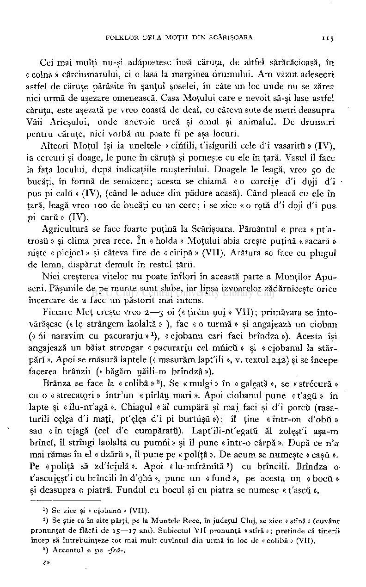

Cei mai mulţi nu-şi adăpostesc însă căruţa, de altfel sărăcăcioasă, în « colna » cârciumarului, ci o lasă la marginea drumului. Am văzut adeseori astfel de căruţe părăsite în şanţul şoselei, în câte un loc unde nu se zărea nici urmă de aşezare omenească. Casa Moţului care e nevoit să-şi lase astfel căruţa, este aşezată pe vreo coastă de deal, cu câteva sute de metri deasupra Văii Arieşului, unde anevoie urcă şi omul şi animalul. De drumuri pentru căruţe, nici vorbă nu poate fi pe aşa locuri.

Alteori Moţul îşi ia uneltele « ciriiili, t'isigurili cele d'i vasaritü » (IV), ia cercuri şi doage, le pune în căruţă şi porneşte cu ele în ţară. Vasul îl face la faţa locului, după indicaţiile muşteriului. Doagele le leagă, vreo 50 de bucăţi, în formă de semicerc; acesta se chiamă «o corciie d'i doji d'i pus pi calü » (IV), (când le aduce din pădure acasă). Când pleacă cu ele în ţară, leagă vreo 100 de bucăţi cu un cerc; i se zice « o rotă d'i doji d'i pus pi carü » (IV).

Agricultură se face foarte puţină la Scărişoara. Pământul e prea « pt'a-

trosü » şi clima prea rece. în « holda » Moţului abia creşte puţină « sacară » nişte « picioci » şi câteva fire de « cîripă » (VII). Arătura se face cu plugul de lemn, dispărut demult în restul ţării.

Nici creşterea vitelor nu poate înflori în această parte a Munţilor Apuseni. Păşunile de pe munte sunt slabe, iar lipsa izvoarelor zădărniceşte orice încercare de a face un păstorit mai intens.

Fiecare Moţ creşte vreo 2—3 oi (« ţirem uoi » VII) ; primăvara se întovărăşesc (« le strângem laolaltă » ), fac « o turmă » şi angajează un cioban (« ni naravim cu pacurariu »

), « ciobanu cari faci brîndza »). Acesta îşi angajează un băiat strungar « pacurariu cel mnicü » şi « ciobanul la stărpărî ». Apoi se măsură laptele (« măsurăm lapt'ili », v. textul 242) şi se începe facerea brânzii (« băgăm uăili-m brîndzâ »).

x

Brânza se face la « coliba »

). Se « mulgi » în « găleată », se « strecură »

2

cu o « strecatori » într'un « pîrlău mari ». Apoi ciobanul pune « t'agü » în lapte şi « îlu-nt'agă ». Chiagul « ăl cumpără şî mai faci şî d'i porcü (rasaturili cçlea d'i maţi, pt'çlça d'i pi burtuşu ») ; îl ţine « într-on d'obü » sau « în uiagă (cel d'e cumpărată). Lapt'ili-nt'egatü ăl zolcşt'i aşa-m brîncî, îl strîngi laolaltă cu pumni » şi îl pune « într-o cârpă ». După ce n'a mai rămas în el « dzăru », îl pune pe « poliţa ». De acum se numeşte « caşu ». Pe « poliţa să zd'iciulă ». Apoi « lu-mfrămîtă

##### ) cu brîncili. Brîndza o t'ascuicşt'i cu brîncili în d'obă », pune un « fund », pe acesta un « bocü » şi deasupra o piatră. Fundul cu bocul şi cu piatra se numesc « t'ascü ».

3

###### ') Se zice şi « ciobanü » (VII).

###### ) Se ştie că în alte părţi, pe la Muntele Rece, în judeţul Cluj, se zice « stînă » (cuvânt pronunţat de flăcăi de 15—1 7 ani). Subiectul VII pronunţă «stîră»; pretinde că tinerii încep să întrebuinţeze tot mai mult cuvîntul din urmă în loc de « colibă » (VII).

2

###### ) Accentul e pe -fră-,

3

8*

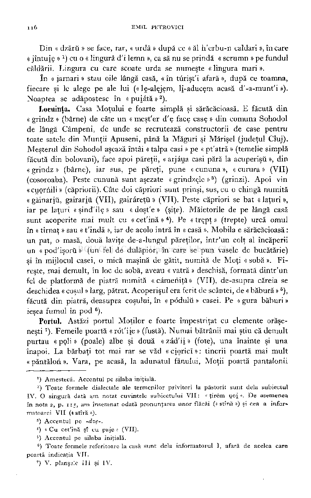

Din « dzăru » se face, rar, « urda » după ce « ăl h'erbu-n căldări », în care « jîntuie »

) cu o « lingura d'i lemn », ca să nu se prindă « scrumn » pe fundul căldării. Lingura cu care scoate urda se numeşte « lingura mari ».

J

în « iarnari » stau oile lângă casă, « în tiirişt'i afară », după ce toamna, fiecare şi le alege pe ale lui (« le-alejem, li-aducem acasă d'-a-munt'i »). Noaptea se adăpostesc în « puiâtă »

). Locuinţa. Casa Moţului e foarte simplă şi sărăcăcioasă. E făcută din « grindz » (bârne) de câte un « meşt'er d'e face case » din comuna Sohodol de lângă Câmpeni, de unde se recrutează constructorii de case pentru toate satele din Munţii Apuseni, până la Măguri şi Mărişel (judeţul Cluj). Meşterul din Sohodol aşează întâi « talpa casi » pe « pt'atră » (temelie simplă făcută din bolovani), face apoi păreţii, « arjâua casi pără la acuperişu », din « grindz » (bârne), iar sus, pe păreţi, pune « cununa », « curura » (VII) (cosoroaba). Peste cunună sunt aşezate « grindzçle »

2

) (grinzi). Apoi vin «cuornili » (căpriorii). Câte doi căpriori sunt prinşi, sus, cu o chingă numită « găinariu, gairariü (VII), gairâreţu » (VII). Peste căpriori se bat « laţuri », iar pe laţuri « şind'ile » sau « doşt'e » (şiţe). Măietorile de pe lângă casă sunt acoperite mai mult cu « cet'ină » ). Pe « tre_pţ » (trepte) urcă omul în « tîrnaţ » sau « t'indă », iar de acolo intră în « casă ». Mobila e sărăcăcioasă : un pat, o masă, două laviţe de-a-lungul păreţilor, într'un colţ al încăperii un « pod'işoru » (un fel de dulăpior, în care se pun vasele de bucătărie) şi în mijlocul casei, o mică maşină de gătit, numită de Moţi « sobă ». Fireşte, mai demult, în loc de sobă, aveau « vatră » deschisă, formată dintr'un fel de platformă de piatră numită « câmeniţă » (VII), de-asupra căreia se deschidea « coşul » larg, pătrat. Acoperişul era ferit de scântei, de « băbură »

3

##### ) făcută din piatră, deasupra coşului, în « pödulü » casei. Pe « gura băburi » ieşea fumul în pod

s

).

6

Portul. Astăzi portul Moţilor e foarte împestriţat cu elemente orăşeneşti ). Femeile poartă « rôt'iie » (fustă). Numai bătrânii mai ştiu că demult purtau « poli » (poale) albe şi două « zâd'ii » (fote), una înainte şi una înapoi. La bărbaţi tot mai rar se văd «ciçrici»: tinerii poartă mai mult « pantalon ». Vara, pe acasă, la adunatul fânului, Moţii poartă pantalonii

###### ) Amestecă. Accentul pe silaba iniţială.

x

###### ) Toate formele dialectale ale termenilor privitori la păstorit sunt delà subiectul IV. O singură dată am notat cuvintele subiectului VII : « ţirem uoi ». De asemenea în nota 2, p. 115, am însemnat odată pronunţarea unor flăcăi (« stînă »>) şi cea a infor~ matoarei VI I (« stîră »).

2

- 3

) Accentul pe -dzç-.

- 4

) « C u cet'ină şî cu paie » (VII).

- 5

) Accentul pe silaba iniţială.

- 6

) Toate formele referitoare la casă sunt delà informatorul I, afară de acelea care poartă indicaţia VII .

') V. planşele III şi IV.

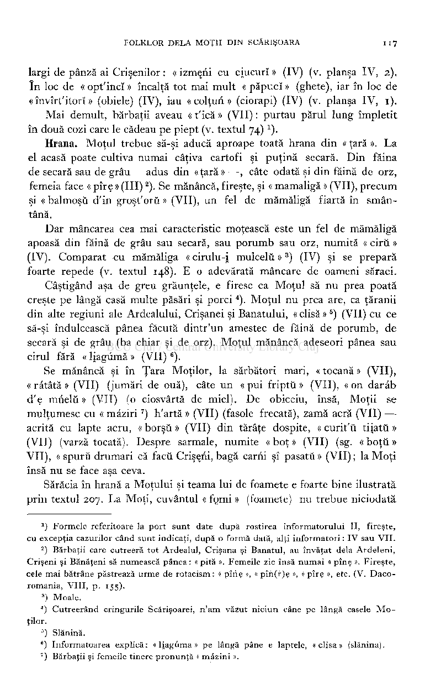

largi de pânză ai Crişenilor : « izmçni cu ciucuri » (IV) (v. planşa IV, 2). în loc de « opt'incî » încalţă tot mai mult « papuci » (ghete), iar în loc de « învîrt'itori » (obiele) (IV), iau « colţuri » (ciorapi) (IV) (v. planşa IV, 1).

Mai demult, bărbaţii aveau « t'ică » (VII) : purtau părul lung împletit în două cozi care le cădeau pe piept (v. textul 74) ).

Hrana. Moţul trebue să-şi aducă aproape toată hrana din « ţară ». La el acasă poate cultiva numai câţiva cartofi şi puţină secară. Din făina de secară sau de grâu — adus din « ţară » —, câte odată şi din făină de orz, femeia face « pîre » (III)

). Se mănâncă, fireşte, şi « mămăligă » (VII), precum şi « balmoşu d'in groşt'oru » (VII), un fel de mămăligă fiartă în smântână.

2

Dar mâncarea cea mai caracteristic moţească este un fel de mămăligă apoasă din făină de grâu sau secară, sau porumb sau orz, numită « cirü » (IV). Comparat cu mămăliga « cirulu-i mulcelü »

) (IV) şi se prepară foarte repede (v. textul 148). E o adevărată mâncare de oameni săraci.

3

Câştigând aşa de greu grăunţele, e firesc ca Moţul să nu prea poată creşte pe lângă casă multe păsări şi porci ). Moţul nu prea are, ca ţăranii din alte regiuni ale Ardealului, Crişanei şi Banatului, « clisă »

) (VII) cu ce să-şi îndulcească pânea făcută dintr'un amestec de făină de porumb, de secară şi de grâu (ba chiar şi de orz). Moţul mănâncă adeseori pânea sau cirul fără « liagumă » (VII) ).

5

Se mănâncă şi în Ţara Moţilor, la sărbători mari, « tocană » (VII), « râtâtă » (VII) (jumări de ouă), câte un « pui friptü » (VII), « on darâb d'e mnelü » (VII) (o ciosvârtă de miel). De obiceiu, însă, Moţii se mulţumesc cu « mâziri ) h'artă » (VII) (fasole frecată), zamă acră (VII) acrită cu lapte acru, « borşu » (VII) din tărâţe dospite, « curit'ü tiiatü » (VII) (varză tocată). Despre sarmale, numite «boţ» (VII) (sg. « boţu » VII), « spurü drumari că facü Crişcni, bagă carrii şî pasatü » (VII) ; la Moţi însă nu se face aşa ceva.

Sărăcia în hrană a Moţului şi teama lui de foamete e foarte bine ilustrată prin textul 207. La Moţi, cuvântul « fç>mi » (foamete) nu trebue niciodată

*) Formele referitoare la port sunt date după rostirea informatorului II, fireşte, cu excepţia cazurilor când sunt indicaţi, după o formă dată, alţi informatori : IV sau VII .

###### ) Bărbaţii care cutreeră tot Ardealul, Crişana şi Banatul, au învăţat delà Ardeleni, Crişeni şi Bănăţeni să numească pânea : « pită ». Femeile zic însă numai « pîne ». Fireşte, cele mai bătrâne păstrează urme de rotacism : « pîrie », « pîh(r)e », « pîre », etc. (V. Daco romania, VIII, p. 155).

2

- 3

) Moale.

- 4

) Cutreerând cringurile Scărişoarei, n'am văzut niciun câne pe lângă casele Mo ţilor.

°) Slănină.

###### ) Informatoarea explică: « liagüma » pe lângă pâne e laptele, «clisa» (slănina). ') Bărbaţii şi femeile tinere pronunţă « mâzini ».

6

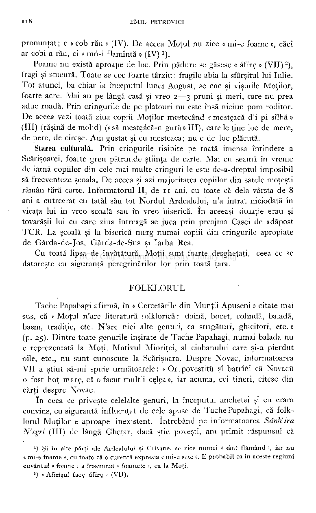

pronunţat; e « cob rău » (IV). De aceea Moţul nu zice « mi-e foame », căci ar cobi a rău, ci « mri-i flamîntă » (IV) *).

), fragi şi smeură. Toate se coc foarte târziu ; fragile abia la sfârşitul lui Iulie. Tot atunci, ba chiar la începutul lunei August, se coc şi vişinile Moţilor, foarte acre. Mai au pe lângă casă şi vreo 2—3 pruni şi meri, care nu prea aduc roadă. Prin cringurile de pe platouri nu este însă niciun pom roditor. De aceea vezi toată ziua copiii Moţilor mestecând « mesteacă d'i pi sîlhă »

Poame nu există aproape de loc. Prin pădure se găsesc « âfire » (VII)

2

- (III) (răşină de molid) («să mesteâcă-n gură» III), care le ţine loc de mere, de pere, de cireşe. Am gustat şi eu mesteaca; nu e de loc plăcută.

Starea culturală. Prin cringurile risipite pe toată imensa întindere a Scărişoarei, foarte greu pătrunde ştiinţa de carte. Mai cu seamă în vreme de iarnă copiilor din cele mai multe cringuri le este de-a-dreptul imposibil să frecventeze şcoala. De aceea şi azi majoritatea copiilor din satele moţeşti

- rămân fără carte. Informatorul II, de 11 ani, cu toate că delà vârsta de 8 ani a cutreerat cu tatăl său tot Nordul Ardealului, n'a intrat niciodată în vieaţa lui în vreo şcoală sau în vreo biserică. în aceeaşi situaţie erau şi tovarăşii lui cu care ziua întreagă se juca prin preajma Casei de adăpost TCR. La şcoală şi la biserică merg numai copiii din cringurile apropiate de Gârda-de-Jos, Gârda-de-Sus şi Iarba Rea.

Cu toată lipsa de învăţătură, Moţii sunt foarte desgheţaţi, ceea ce se datoreşte cu siguranţă peregrinărilor lor prin toată ţara.

FOLKLORUL

Tache Papahagi afirmă, în « Cercetările din Munţii Apuseni » citate mai sus, că « Moţul n'are literatură folklorică : doină, bocet, colindă, baladă, basm, tradiţie, etc. N'are nici alte genuri, ca strigături, ghicitori, etc. » (p. 25). Dintre toate genurile înşirate de Tache Papahagi, numai balada nu e reprezentată la Moţi. Motivul Mioriţei, al ciobanului care şi-a pierdut oile, etc., nu sunt cunoscute la Scărişoara. Despre Novac, informatoarea VII a ştiut să-mi spuie următoarele : « Or povestitü şî batrîhi că Novacü o fost hoţ măre, că o făcut mult'i cejea », iar acuma, cei tineri, citesc din cărţi despre Novac.

în ceea ce priveşte celelalte genuri, la începutul anchetei şi eu eram convins, cu siguranţă influenţat de cele spuse de Tache Papahagi, că folklorul Moţilor e aproape inexistent. întrebând pe informatoarea Sănh'ira N'egri (III) de lângă Gheţar, dacă ştie poveşti, am primit răspunsul că

###### ) Şi în alte părţi ale Ardealului şi Crişanei se zice numai << sânt flămând », iar nu « mi-e foame », cu toate că e curentă expresia « mi-e sete ». E probabil că în aceste regiuni cuvântul « foame » a însemnat « foamete », ca la Moţi.

1

###### ) «Afirîşul face âfirç » (VII).

2

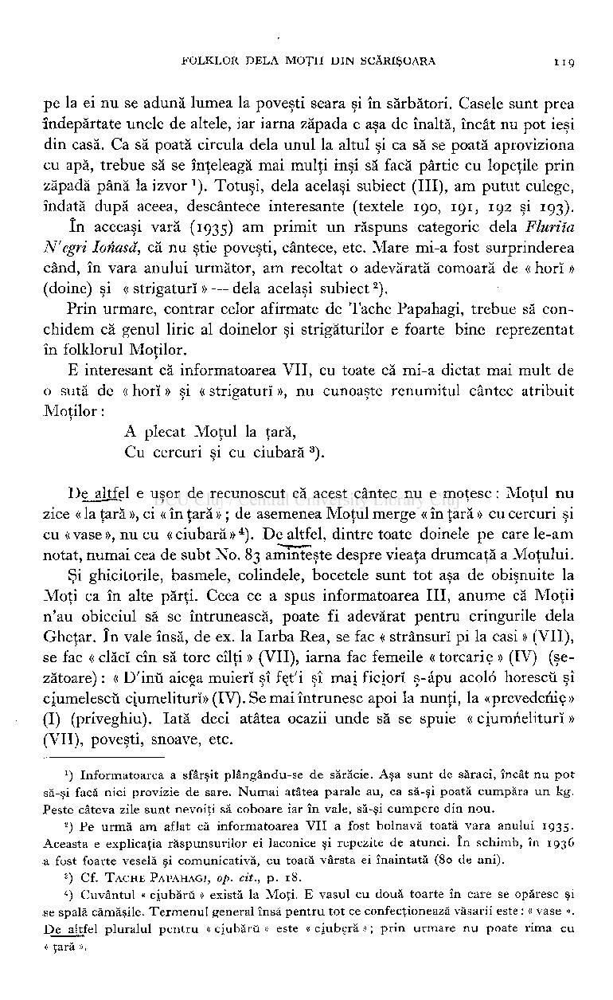

pe la ei nu se adună lumea la poveşti seara şi în sărbători. Casele sunt prea îndepărtate unele de altele, iar iarna zăpada e aşa de înaltă, încât nu pot ieşi din casă. Ca să poată circula delà unul la altul şi ca să se poată aproviziona cu apă, trebue să se înţeleagă mai mulţi inşi să facă pârtie cu lopeţile prin zăpadă până la izvor ). Totuşi, delà acelaşi subiect (III), am putut culege, îndată după aceea, descântece interesante (textele 190, 191, 192 şi 193).

în aceeaşi vară (1935) am primit un răspuns categoric delà Fluriïa N'egri IoÉasâ, că nu ştie poveşti, cântece, etc. Mare mi-a fost surprinderea când, în vara anului următor, am recoltat o adevărată comoară de « horî » (doine) şi « strigaturi » — delà acelaşi subiect

).

2

Prin urmare, contrar celor afirmate de Tache Papahagi, trebue să conchidem că genul liric al doinelor şi strigăturilor e foarte bine reprezentat în folklorul Moţilor.

E interesant că informatoarea VII, cu toate că mi-a dictat mai mult de

- o sută de « horî » şi « strigaturi », nu cunoaşte renumitul cântec atribuit Moţilor :

A plecat Moţul la ţară, Cu cercuri şi cu ciubară ).

De_altfel e uşor de recunoscut că acest cântec nu e moţesc : Moţul nu zice « la ţară », ci « în ţară » ; de asemenea Moţul merge « în ţară » cu cercuri şi cu « vase », nu cu «ciubară»

). Dealtfel, dintre toate doinele pe care le-am notat, numai cea de subt No. 83 aminteşte despre vieaţa drumeaţă a Moţului.

4

Şi ghicitorile, basmele, colindele, bocetele sunt tot aşa de obişnuite la Moţi ca în alte părţi. Ceea ce a spus informatoarea III, anume că Moţii n'au obiceiul să se întrunească, poate fi adevărat pentru cringurile delà Gheţar. în vale însă, de ex. la Iarba Rea, se fac « strânsuri pi la casi » (VII), se fac « clăcî cîn să torc cîlţi » (VII), iarna fac femeile « torcarie » (IV) (şezătoare) : « D'inü aicea muieri şî fçt'i şî mai ficiori ş-âpu acolö horescü şî ciumelescü ciumeliturï» (IV). Se mai întrunesc apoi la nunţi, la «prevedehie» (I) (priveghiu). Iată deci atâtea ocazii unde să se spuie « ciumheliturî » (VII), poveşti, snoave, etc.

*) Informatoarea a sfârşit plângându-se de sărăcie. Aşa sunt de săraci, încât nu pot

- să-şi facă nici provizie de sare. Numai atâtea parale au, ca să-şi poată cumpăra un kg.

Peste câteva zile sunt nevoiţi să coboare iar în vale, să-şi cumpere din nou.

###### ) Pe urmă am aflat că informatoarea VI I a fost bolnavă toată vara anului 1935. Aceasta e explicaţia răspunsurilor ei laconice şi repezite de atunci. în schimb, în 1936 a fost foarte veselă şi comunicativă, cu toată vârsta ei înaintată (80 de ani).

2

- 3 ) Cf. TACH E PAPAHAGI , op. cit., p. 18.
- 4

) Cuvântul « ciubăru » există la Moţi. E vasul cu două toarte în care se opăresc şi se spală cămăşile. Termenul general însă pentru tot ce confecţionează văsarii este : « vase ». D e altfel pluralul pentru « ciubăru » este « ciuberă » ; prin urmare nu poate rima cu « ţară ».

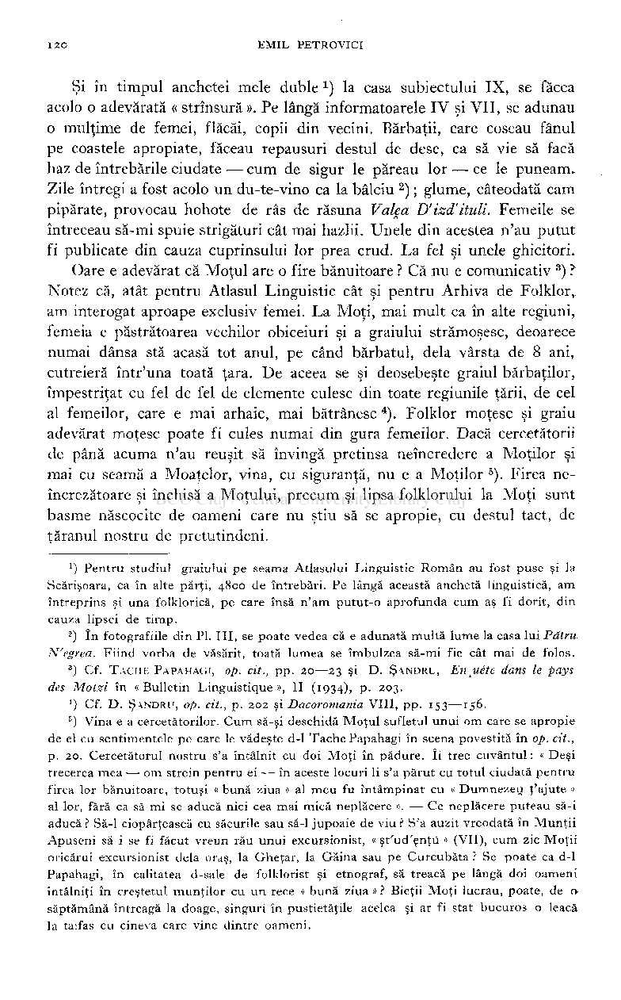

Şi în timpul anchetei mele duble ) la casa subiectului IX, se făcea acolo o adevărată « strînsură ». Pe lângă informatoarele IV şi VII, se adunau

- o mulţime de femei, flăcăi, copii din vecini. Bărbaţii, care coseau fânul pe coastele apropiate, făceau repausuri destul de dese, ca să vie să facă haz de întrebările ciudate — cum de sigur le păreau lor — ce le puneam.

Zile întregi a fost acolo un du-te-vino ca la bâlciu

2

) ; glume, câteodată cam pipărate, provocau hohote de râs de răsuna Valea D'izd'ituli. Femeile se întreceau să-mi spuie strigături cât mai hazlii. Unele din acestea n'au putut fi publicate din cauza cuprinsului lor prea crud. La fel şi unele ghicitori.

Oare e adevărat că Moţul are o fire bănuitoare ? Că nu e comunicativ ) ? Notez că, atât pentru Atlasul Linguistic cât şi pentru Arhiva de Folklor, am interogat aproape exclusiv femei. La Moţi, mai mult ca în alte regiuni, femeia e păstrătoarea vechilor obiceiuri şi a graiului strămoşesc, deoarece numai dânsa stă acasă tot anul, pe când bărbatul, delà vârsta de 8 ani, cutreieră într'una toată ţara. De aceea se şi deosebeşte graiul bărbaţilor, împestriţat cu fel de fel de elemente culese din toate regiunile ţării, de cel al femeilor, care e mai arhaic, mai bătrânesc ). Folklor moţesc şi graiu adevărat moţesc poate fi cules numai din gura femeilor. Dacă cercetătorii de până acuma n'au reuşit să învingă pretinsa neîncredere a Moţilor şi mai cu seamă a Moaţelor, vina, cu siguranţă, nu e a Moţilor ). Firea neîncrezătoare şi închisă a Moţului, precum şi lipsa folklorului la Moţi sunt basme născocite de oameni care nu ştiu să se apropie, cu destul tact, de ţăranul nostru de pretutindeni.

1

) Pentr u studiu l graiulu i p e seam a Atlasulu i Linguisti c Româ n a u fost pus e şi la Scărişoara , c a î n alte părţi , 4800 d e întrebări . P e lâng ă aceast ă anchet ă linguistică , a m întreprin s şi un a folklorică, p e car e îns ă n'a m putut- o aprofund a cu m a ş fi dorit , di n cauz a lipsei d e timp .

2

) î n fotografiil e di n Pl . III , s e poat e vede a c ă e adunat ă mult ă lum e l a casa lu i Patru N'egrea. Fiin d vorb a d e văsărit , toat ă lume a s e îmbulze a să-m i fie câ t ma i d e folos .

3

) Cf TACH E PAPAHAGI, op. cit., pp 20—23 şi D Ş\NDRU , Enuète dans le pays des Motzi î n « Bulleti n Linguistiqu e », I I (1934), p . 203.

- 4

) Cf. D . ŞXNDRI', op. cit., p . 202 şi Dacoromania VIII , pp 153—156.

- 5

) Vin a e a cercetătorilor . Cu m să-ş i deschid ă Moţu l sufletu l unu i o m car e s e apropi e

- d e el c u sentimentel e p e car e l e vădeşt e d-1 Tach e Papahag i î n scen a povestit ă î n op. cit.,

- p 20. Cercetătoru l nostr u s' a întâlni t c u do i Moţ i î n pădure . I i tre c cuvântu l : « Deş i trecere a me a — o m strei n pentr u e i — î n acest e locur i li s'a păru t c u totu l ciudat ă pentr u firea lo r bănuitoare , totuş i « bun ă ziu a » al me u f u întâmpina t c u « Dumneze u ţ'ajut e >> al lor , fără c a s ă m i s e aduc ă nic i ce a ma i mic ă neplăcer e ». — C e neplăcer e putea u să- i aduc ă ? Să-1 ciopârţeasc ă c u săcuril e sa u să-1 jupoai e d e vi u ? S' a auzi t vreodat ă î n Munţi i Apusen i s ă i s e fi făcu t vreu n ră u unu i excursionist , « şt'ud'enţ u » (VII) , cu m zi c Moţi i oricăru i excursionis t del à oraş , la Gheţar , la Găin a sa u p e Curcubăt a ? S e poat e c a d-1 Papahagi , î n calitate a d-sal e d e folklorist şi etnograf , s ă treac ă p e lâng ă do i oamen i întâlniţ i î n creştetu l munţilo r c u u n rec e « bun ă ziu a » ? Bieţi i Moţ i lucrau , poate , d e o săptămân ă întreag ă l a doage , singur i î n pustietăţil e acele a şi a r fi sta t bucuro s o leac ă la taifas c u cinev a car e vin e dintr e oameni .

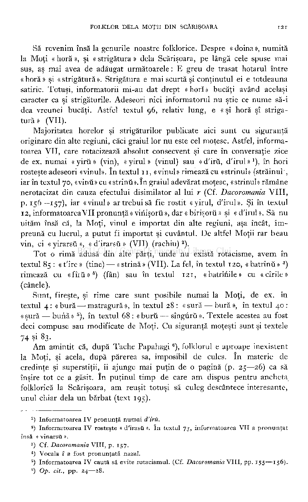

Să revenim însă la genurile noastre folklorice. Despre « doina », numită la Moţi « horă », şi « strigătura » delà Scărişoara, pe lângă cele spuse mai sus, aş mai avea de adăugat următoarele : E greu de trasat hotarul între « horă » şi « strigătura ». Strigătura e mai scurtă şi conţinutul ei e totdeauna satiric. Totuşi, informatorii mi-au dat drept « hori » bucăţi având acelaşi caracter ca şi strigăturile. Adeseori nici informatorul nu ştie ce nume să-i dea vreunei bucăţi. Astfel textul 96, relativ lung, e « şî horă şî strigătura » (VII).

Majoritatea horelor şi strigăturilor publicate aici sunt cu siguranţă originare din alte regiuni, căci graiul lor nu este cel moţesc. Astfel, informatoarea VII, care rotacizează absolut consecvent şi care în conversaţie zice de ex. numai « yirü » (vin), « yirul » (vinul) sau « d'irü, d'irul »

), în hori rosteşte adeseori «vinul». în textul 11, «vinul» rimează cu «strinul» (străinul , iar în textul 70, «vinü» cu «strinu».în graiul adevărat moţesc, «strinul» rămâne nerotacizat din cauza efectului disimilator al lui r (Cf. Dacoromania VIII,

1

- p. 156—157), iar «vinul» ar trebui să fie rostit «yirul, d'irul». Şi în textul 12, informatoarea VII pronunţă « viriişoru », dar « birişoru » şi «d'irul». Să nu uităm însă că, la Moţi, vinul e importat din alte regiuni, aşa încât, împreună cu lucrul, a putut fi importat şi cuvântul. De altfel Moţii rar beau

vin, ci « yirarsü », « d'irarsü » (VII) (rachiu)

).

2

Tot o rimă adusă din alte părţi, unde nu există rotacisme, avem în textul 85 : « t'ire » (tine) — « strină » (VII). La fel, în textul 120, « batrînu »

3

rimează cu «fîiu» ) (fân) sau în textul 121, «batrînile» cu « cîrile » (cânele).

Sunt, fireşte, şi rime care sunt posibile numai la Moţi, de ex. în textul 4 : « bură —• matragură », în textul 28 : « sură — bură », în textul 40 : « şură — bună »

), în textul 68 : « burii — sînguru ». Textele acestea au fost deci compuse sau modificate de Moţi. Cu siguranţă moţeşti sunt şi textele 74 Şi 83-

5

), folklorul e aproape inexistent la Moţi, şi acela, după părerea sa, imposibil de cules. în materie de credinţe şi superstiţii, îi ajunge mai puţin de o pagină (p. 25—26) ca să înşire tot ce a găsit. în puţinul timp de care am dispus pentru ancheta folklorică la Scărişoara, am reuşit totuşi să culeg descântece interesante, unul chiar delà un bărbat (text 195).

Am amintit că, după Tache Papahagi

6

) Informatoare a I V pronunţ ă numa i d'irü.

1

) Informatoare a I V rosteşt e « d'iras ü ». î n textu l 73, informatoare a VI I a pronunţa t îns ă « vinars ü ».

2

- 3

) Cf. Dacoromania VIII , p . 157.

- 4

) Vocal a î a fost pronunţat ă nazal .

- 5

###### ) Informatoare a I V caut ă s ă evit e rotacismul . (Cf Dacoromania VIII , pp 155—156). °) Op. cit., pp 24—28.

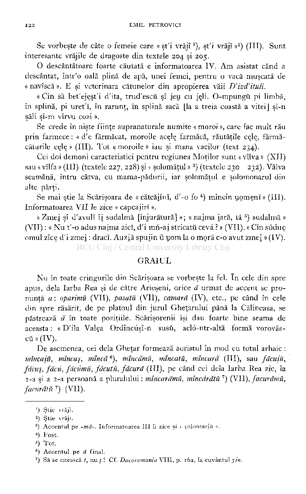

) (III). Sunt interesante vrăjile de dragoste din textele 204 şi 205.

#### Se vorbeşte de câte o femeie care « şt'i vrăji

#### ), şt'i vrăji »

1

2

O descântătoare foarte căutată e informatoarea IV. Am asistat când a descântat, într'o oală plină de apă, unei femei, pentru o vacă muşcată de « navîscă ». E şi veterinara cătunelor din apropierea văii D'izd'ituli.

« Cin să bet'ejest'i d'ita, trud'escü şî jeu cu ieji. O-mpungü pi limbă, în splină, pi uret'î, în rarunţ, în splină sacâ [la a treia coastă a vitei] şî-n săli şî-m vîrvu cozi ».

Se crede în nişte fiinţe supranaturale numite « moroi », care fac mult rău prin farmece : « d'e fărmăcat, moroile acejç farmăcă, răutăţile cçle_, fărmăcăturile ce_le_ » (III). Tot « moroile » iau şi mana vacilor (text 234).

Cei doi demoni caracteristici pentru regiunea Moţilor sunt « vîlva » (XII) sau « vîlfa » (III) (textele 227, 228) şi v şolomăţul »

) (textele 230—232). Vâlva seamănă, întru câtva, cu mama-pădurii, iar şolomăţul e solomonarul din alte părţi.

3

Se mai ştie la Scărişoara de « cătcăiini, d'-o fo ) mîncîn uomeni» (III). Informatoarea VII le zice << capcaiirî ».

) sudalmă » (VII) : « Nu t'-o adus naima aici, d'i mn-ai stricatü ceva ? » (VII). « Cîn südue omul zîce d'i zmei : draci. Auzià spuiin ü uom la o moră c-o avut zmei » (IV).

« Zmei şî d'avulî îi sudalmă [înjurătură] »; « naima iară, tă

5

GRAIUL

Nu în toate cringurile din Scărişoara se vorbeşte la fel. In cele din spre apus, delà Iarba Rea şi de către Arieşeni, orice â urmat de accent se pronunţă a : oparimă (VII), pasatü (VII), cămară (IV), etc., pe când în cele din spre răsărit, de pe platoul din jurul Gheţarului până la Călineasa, se păstrează ă în toate poziţiile. Scărişorenii îşi dau foarte bine seama de aceasta : « D'ila Valea Ordîncuşî-n susü, aclo-ntr-altă formă vorovăscü » (IV).

De asemenea, cei delà Gheţar formează aoristul în mod cu totul arhaic :

), mîncămu, mîncată, mîncară (III), sau făcută,

mîncaiă, mîncaş, mîncă

6

făcuş, făcu, facümü, făcută, făcură (III), pe când cei delà Iarba Rea zic, la i-a şi a 2-a persoană a pluralului : mîncarămu, mîncârătă ) (VII), facurătnu, facurată ) (VII).

) Şti e vrăji.

) Şti e vrăji.

2

) Accentu l p e -mă-. Informatoare a II I îi zice ş i « şolomari u ».

2

) Fost .

4

) Tot .

6

) Accentu l p e ă final . ' ) S ă s e citeasc ă n u ţ ! Cf. Dacoromania VIII , p . 162, l a cuvântu yin.

6

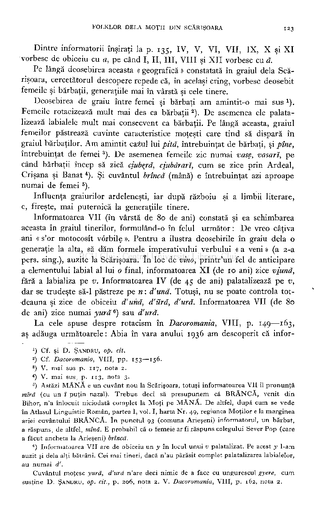

Dintre informatorii înşiraţi la p. 135, IV, V, VI, VII, IX, X şi XI vorbesc de obiceiu cu a, pe când I, II, III, VIII şi XII vorbesc cu ă.

Pe lângă deosebirea aceasta « geografică » constatată în graiul delà Scărişoara, cercetătorul descopere repede că, în acelaşi cring, vorbesc deosebit femeile şi bărbaţii, generaţiile mai în vârstă şi cele tinere.

Deosebirea de graiu între femei şi bărbaţi am amintit-o mai sus Femeile rotacizează mult mai des ca bărbaţii

). De asemenea ele palatalizează labialele mult mai consecvent ca bărbaţii. Pe lângă aceasta, graiul femeilor păstrează cuvinte caracteristice moţeşti care tind să dispară în graiul bărbaţilor. Am amintit cazul lui pită, întrebuinţat de bărbaţi, şi pîne, întrebuinţat de femei

2

#### ). De asemenea femeile zic numai vase, vasarï, pe când bărbaţii încep să zică ciuberă, ciubărarî, cum se zice prin Ardeal, Crişana şi Banat ). Şi cuvântul brîncă (mână) e întrebuinţat azi aproape numai de femei

3

). Influenţa graiurilor ardeleneşti, iar după războiu şi a limbii literare,

5

- e, fireşte, mai puternică la generaţiile tinere. Informatoarea VII (în vârstă de 80 de ani) constată şi ea schimbarea

aceasta în graiul tinerilor, formulând-o în felul următor : De vreo câţiva ani « s'or motocosit vörbile ». Pentru a ilustra deosebirile în graiu delà o generaţie la alta, să dăm formele imperativului verbului « a veni » (a 2-a pers. sing.), auzite la Scărişoara. în loc de vino, printr'un fel de anticipare a elementului labial al lui o final, informatoarea XI (de 10 ani) zice viună, fără a labializa pe v. Informatoarea IV (de 45 de ani) palatalizează pe v, dar se trudeşte să-1 păstreze pe n: d'ună. Totuşi, nu se poate controla totdeauna şi zice de obiceiu d'ună, d'ură, d'ură. Informatoarea VII (de 80 de ani) zice numai yură

) sau d'ură. La cele spuse despre rotacism în Dacoromania, VIII, p. 149—163, aş adăuga următoarele : Abia în vara anului 1936 am descoperit că infor-

8

*) Cf. ş i D . ŞANDRU , op. cit.

- 2

) Cf. Dacoromania, VIII , pp 153—156.

- 3

) V . ma i su s p . 117 not a 2.

- 4

) V . ma i sus , p . 113 not a 3.

- 5

) Astăz i MÂN Ă e u n cuvân t no u la Scărişoara , totuş i informatoare a VI I îl pronunţ ă miră (c u u n î puţi n nazal) . Trebu e dec i s ă presupune m c ă BRÂNCA , veni t di n Bihor , n' a înlocui t niciodat ă comple t l a Moţ i p e MÂNĂ . D e altfel, dup ă cu m s e ved e î n Atlasu l Linguisti c Român , parte a I, vol . I , hart a Nr 49, regiune a Moţilo r e la margine a ariei cuvântulu i BRÂNCĂ . î n punctu l 93 (comun a Arieşeni ) informatorul , u n bărbat , a răspuns , d e altfel, mină. E probabi l că o femei e a r fi răspun s colegulu i Seve r Po p (car e a făcu t anchet a la Arieşeni ) brîncă.

) Informatoare a VI I ar e d e obicei u u n y î n locu l unu i v palatalizat . P e aces t y l-a m auzi t ş i del à alţi bătrâni . Ce i ma i tineri , dac ă n'a u părăsi t comple t palatalizare a labialelor , a u numa i a".

6

Cuvântu l moţes c yură, d'ură n'ar e dec i nimi c d e a fac e c u ungurescu l gyere, cu m susţin e D . ŞANDRU, op. cit., p . 206, not a 2. V . Dacoromania, VIII , p . 162, not a 2.

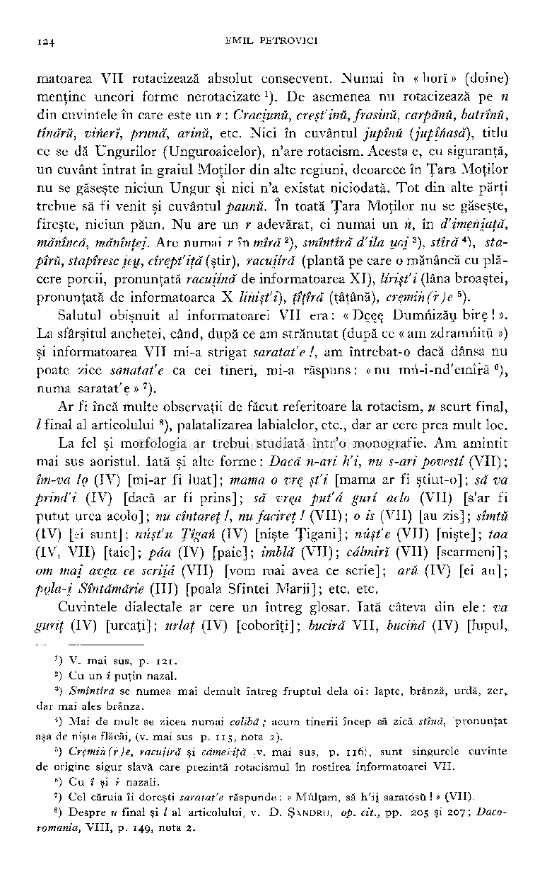

matoarea VII rotacizează absolut consecvent. Numai în « hori » (doine) menţine uneori forme nerotacizate ). De asemenea nu rotacizează pe n din cuvintele în care este un r : Craciunü, creşt'inu, frasinii, carpănu, batrînu, tînăru, viûerï, prună, arinü, etc. Nici în cuvântul jupînu (jupinasa), titlu ce se dă Ungurilor (Unguroaicelor), n'are rotacism. Acesta e, cu siguranţă, un cuvânt intrat în graiul Moţilor din alte regiuni, deoarece în Ţara Moţilor nu se găseşte niciun Ungur şi nici n'a existat niciodată. Tot din alte părţi trebue să fi venit şi cuvântul paunü. în toată Ţara Moţilor nu se găseşte, fireşte, niciun păun. Nu are un r adevărat, ci numai un n, în d'imeniaţă, măhîncă, mănînţei. Are numai r mmîră

##### ), smintiră d'ila uoi ), stîră*), stapîrîi, stapîresc ieu, cîrcpt'iţă (ştir), racuiiră (plantă pe care o mănâncă cu plăcere porcii, pronunţată racuiină de informatoarea XI), Urişt'i (lâna broaştei, pronunţată de informatoarea X lihişt'i), ţîţîră (ţâţână), cremihfr)e

2

).

5

Salutul obişnuit al informatoarei VII era : « Deee_ Dumnizău bire ! ».

La sfârşitul anchetei, când, după ce am strănutat (după ce « am zdramnitü ») şi informatoarea VII mi-a strigat saratat'e !, am întrebat-o dacă dânsa nu poate zice sanatat'e ca cei tineri, mi-a răspuns: «nu mri-i-nd'emîră ) , numa saratat'e »

).

7

Ar fi încă multe observaţii de făcut referitoare la rotacism, u scurt final, /final al articolului ), palatalizarea labialelor, etc., dar ar cere prea mult loc.

La fel şi morfologia ar trebui studiată într'o monografie. Am amintit mai sus aoristul. Iată şi alte forme : Dacă n-ari h'i, nu s-ari povesti (VII) ; îm-va Iq (IV) [mi-ar fi luat] ; mama o vrq şt'i [mama ar fi ştiut-o] ; să va prind'i (IV) [dacă ar fi prins] ; să vrea put'à guri aclo (VII) [s'ar fi

putut urca acolo] ; nu cîntareţ !, nu fachet ! (VII) ; o is (VII) [au zis] ; simţii

- (IV) [ei sunt] ; mişt'u ŢîgaA (IV) [nişte Ţigani] ; nûst'e (VII) [nişte] ; taa (IV, VII) [taie] ; pâa (IV) [paie] ; imblă (VII) ; câlmirî (VII) [scarmeni] ; om mai avea ce scriiâ (VII) [vom mai avea ce scrie]; arü (IV) [ei au]; pola-i Sîntămărie (III) [poala Sfintei Marii] ; etc. etc.

Cuvintele dialectale ar cere un întreg glosar. Iată câteva din ele : va guriţ (IV) [urcaţi] ; urlat (IV) [coborîţi] ; buciră VII, bucină (IV) [lupul,

*) V . ma i sus , p 121

- 2 ) C u u n î puţi n nazal .
- 3 ) Smîntîră s e nume a ma i demul t între g fruptu l del à o i : lapte , brânză , urdă , zer, ,

da r ma i ales brânza .

) Ma i d e mul t s e zice a numa i colibă ; acu m tineri i înce p s ă zică stînă, pronunţa t aş a d e nişt e flăcăi, (v . ma i sus , p . 115 not a 2).

4

) Cremih(r)e, racuiiră şi cdmekiţă ,v . ma i sus , p . 116), sun t singurel e cuvint e d e origin e sigu r slavă car e prezint ă rotacismu l î n rostire a informatoare i VII .

3

) C u î ş i r nazali . ' ) Ce l cărui a îi doreşt i saratat'e răspunde : « Mulţam , s ă h'i j saratös ü ! » (VII) .

B

) Despr e u final şi / a l articolului , v . D . Ş\NDRU op. cit., pp 205 ş i 207; Dacoromania, VIII , p . 149, not a 2.

8

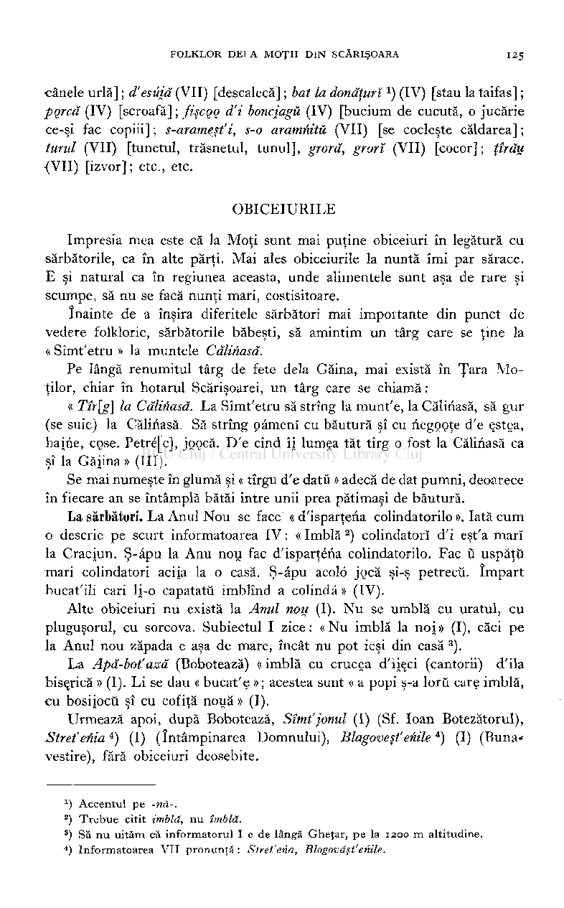

##### cânele urlă] ; d'esiiiă (VII) [descăleca] ; bat la donăţurî

) (IV) [stau la taifas] ;

l

j>qrcă (IV) [scroafă] ; fişcgc d'i bonciagü (IV) [bucium de cucută, o jucărie ce-şi fac copiii] ; s-arameşt'i, s-o aramnitü (VII) [se cocleşte căldarea] ; turul (VII) [tunetul, trăsnetul, tunul], groră, grorï (VII) [cocor] ; ţîrău {VII) [izvor] ; etc., etc.

OBICEIURILE Impresia mea este că la Moţi sunt mai puţine obiceiuri în legătură cu

- sărbătorile, ca în alte părţi. Mai ales obiceiurile la nuntă îmi par sărace. E şi natural ca în regiunea aceasta, unde alimentele sunt aşa de rare şi scumpe, să nu se facă nunţi mari, costisitoare.

înainte de a înşira diferitele sărbători mai importante din punct de vedere folkloric, sărbătorile băbeşti, să amintim un târg care se ţine la « Sîmt'etru » la muntele Călinasă.

Pe lângă renumitul târg de fete delà Găina, mai există în Ţara Mo ţilor, chiar în hotarul Scărişoarei, un târg care se chiamă :

« Tîr[g] la Călihasă. La Sîmt'etru să strîng la munt'e, la Călinasă, să gur

{se suie) la Călihasă. Să strîng oameni cu băutură şî cu hegooţe d'e çstea, haine, cose. Petré[c], joocă. D'e cînd îi lumea tăt tîrg o fost la Călihasă ca şî la Găiina » (III).

Se mai numeşte în glumă şi « tîrgu d'e datü » adecă de dat pumni, deoarece în fiecare an se întâmplă bătăi între unii prea pătimaşi de băutură.

La sărbători. La Anul Nou se face « d'isparţeha colindatorilo ». Iată cum o descrie pe scurt informatoarea IV : « Imblă

) colindători d'i eşt'a marî

2

la Crăciun. Ş-âpu la Anu nou fac d'isparţeha colindatorilo. Fac ü uspăţu mari colindători aciia la o casă. Ş-âpu acolo jocă şî-ş petrecu. împart bucat'ili cari li-o capatatü imblînd a colinda » (IV).

Alte obiceiuri nu există la Anul nou (I). N u se umblă cu uratul, cu pluguşorul, cu sorcova. Subiectul I zice : « Nu imblă la noi » (I), căci pe la Anul nou zăpada e aşa de mare, încât nu pot ieşi din casă

).

3

La Apă-bot'ază (Bobotează) « imblă cu crucea d'iiçci (cantorii) d'ila biserică » (I). Li se dau « bucat'e »; acestea sunt « a popi ş-a lorii care imblă, cu bosiiocü şî cu cofiţă nouă » (I).

Urmează apoi, după Bobotează, Sîmt'ionul (I) (Sf. Ioan Botezătorul), Stret'enia

##### ) (I) (întâmpinarea Domnului), Blagove şt' enile ) (I) (Buna* vestire), fără obiceiuri deosebite.

4

- 1 ) Accentu l p e -na-.
- 2 ) Trebu e citit imblă, n u îmbla.
- 3 ) S ă n u uită m c ă informatoru l I e d e lâng ă Gheţar , p e la 1200 m altitudine .
- 4 ) Informatoare a VI I pronunţ ă : Stret'ena, Blogovăşt'enile.

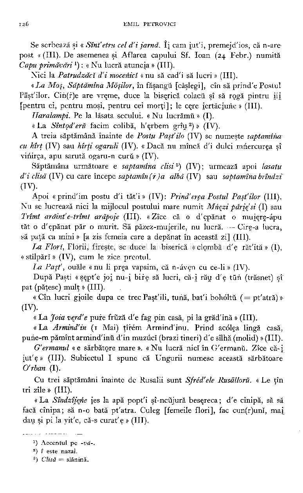

#### Se serbează şi « Sînt'etru cel d'i iarnă. îi cam iut'i, premejd'ios, că n-are post « (III). De asemenea şi Aflarea capului Sf. Ioan (24 Febr.) numită Capu primăvări

) : « Nu lucră atuncia » (III). Nici la Patrudzăcî d'i moceéicï « nu să cad'i să lucri » (III). «La Moş, Săptămîna Moşilor, în făşangu [câşlegi], cîn să prind'e Postul

1

Păşt'ilor. Cin(f)e are vreme, duce la biserică colacii şî să rogă pintru iii [pentru ei, pentru moşi, pentru cei morţi] ; le cere iertăciune » (III).

Haralampi. Pe la lăsata secului. « Nu lucrămu » (I). « La Sîntçd'eru facim colibă, h'erbem grîu

) » (IV).

2

A treia săptămână înainte de Postu Paşt'ilo (IV) se numeşte saptamîna cu hîrţ (IV) sau hîrţi ogaruli (IV). « Dacă nu mîncă d'i dulci mnercurea şî viriirea, apu sărută ogaru-n curii » (IV).

) (IV) ; urmează apoi lasatu d'i clisă (IV) cu care începe saptamîn(r )a albă (IV) sau saptamîna brîndzi (IV).

Săptămâna următoare e saptamîna clisi

3

Apoi « prind'im postu d'i tăt'i » (IV): Prind'erea Postul Păşt'ilor (III). Nu se lucrează nici la mijlocul postului mare numit Mnezi părie'si (I) sau Trîmt arăint'e-trîmt arăpoie (III). «Zice că o d'epănat o muiere-âpu

- tăt o d'epănat păr o murit. Să păzez-muierile, nu lucră. —Cire-a lucra, să pată ca mini » [a zis femeia care a depănat în această zi] (III).

La Flori, Florii, fireşte, se duce la biserică « clombă d'e răt'ită » (I),

« stîlpărî » (IV), cum le zice preotul. La Fast', ouăle «nu li prea vapsim, că n-âven cu ce-li » (IV). După Paşti « şept'e joi nu-i bire să lucri, că-i rău d'e tun (trăsnet) şî

pat (păţesc) mulţ » (III). « Cîn lucri gioile dupa ce trec Past'ili, tună, bat'i bohöltü ( = pt'atră) »

(IV). « La Joia verd'e pure fruză d'e fag pin casă, pi la grăd'ină » (III). « La Armind'in (1 Mai) ţîrem Armind'inu. Prind acölea lingă casă,

puiie-m pămînt armind'inu d'in muzûcï (brazi tineri) d'e sîlhă (molid) » (III).

Germanul « e sărbătore mare ». « Nu lucră nici în G'ermanü. Zîce că-i iut'e » (III). Subiectul I spune că Ungurii numesc această sărbătoare O'rban (I).

Cu trei săptămâni înainte de Rusalii sunt Sfréd'ele Rusălloru. « Le ţin tri zîle » (III).

« La SîndzîieAe ies la apă popt'i şî-ncujură besereca ; d'e cînipă, să să facă cînipa; să n-o bată pt'atra. Culeg [femeile flori], fac cun(r)unî, mai dau şi pi la yit'e, că-s curat'e » (III).

*) Accentu l p e -vă-.

- 2 ) î est e nazal.
- 3 ) Clisă = slănină .

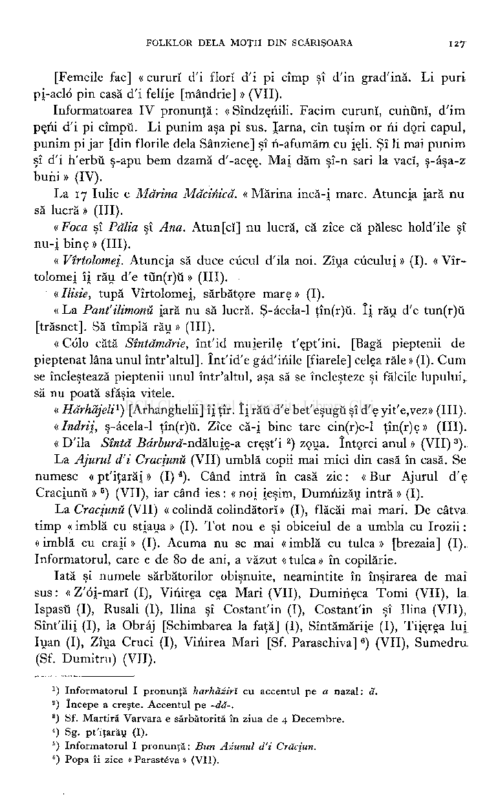

[Femeile fac] « cururi d'i flori d'i pi cîmp şî d'in grad'ină. Li puri pi-aclö pin casă d'i feliie [mândrie] » (VII).

Informatoarea IV pronunţă : « Sîndzenili. Facim curunî, cununi, d'im peni d'i pi cîmpu. Li punim aşa pi sus. Iarna, cîn tuşim or ni dori capul, punim pi jar [din florile delà Sânziene] şî ri-afumăm cu ieji. Şî li mai punim şî d'i h'erbü ş-apu bem dzamă d'-acçç. Mai dăm şî-n sari la vaci, ş-âşa-z bufii » (IV).

La 17 Iulie e Marina Măcinică. « Marina incă-i mare. Atuncia iară nu să lucră » (III).

«Foca şî Palia şî Ana. Atunfcî] nu lucră, că zîce că pălesc hold'ile şî nu-i bine » (III).

« Vîrtolomei. Atuncia să duce cucul d'ila noi. Zîua cucului » (I). « Vîr­

tolomei îi rău d'e tün(r)ü » (III). «Ilisie, tupă Vîrtolomei, sărbătore mare» (I). « La Pant'ilimonü iară nu să lucră. Ş-âcela-1 ţîn(r)u. îi rău d'e tun(r)ü

[trăsnet]. Să tîmplă rău » (III).

« Colo cătă Sîntămărie, înt'id muierile t'ept'ini. [Bagă pieptenii de pieptenat lâna unul într'altul]. înt'id'e gâd'iriile [fiarele] celea răle » (I). Cum se încleştează pieptenii unul într'altul, aşa să se încleşteze şi fălcile lupului, să nu poată sfăşia vitele.

#### ) [Arhanghelii] îi ţîr. îi rău d'e bet'eşugu şî d'e yit'e,vez» (III). «Indrii, ş-âcela-1 ţîn(r)u. Zîce că-i bine tare cin(r)e-l ţîn(r)e» (III). « D'ila Sîntă Bärburä-nda\uie-a. crçst'i ) zçua. întorci anul » (VII)

« Hărhăjeli

1

).

3

La Ajurul d'i Craciunü (VII) umblă copii mai mici din casă în casă. Se numesc « pt'iţarăi » (I)

#### ). Când intră în casă zic: « Bur Ajurul d'e Craciunü »

4

) (VII), iar când ies : « noi ieşim, Dumnizău intră » (I).

6

La Craciunü (VII) « colindă colindători » (I), flăcăi mai mari. De câtva timp « imblă cu stiaua » (I). Tot nou e şi obiceiul de a umbla cu Irozii : « imblă cu craii » (I). Acuma nu se mai « imblă cu tulea » [brezaia] (I). Informatorul, care e de 80 de ani, a văzut « tulea » în copilărie.

Iată şi numele sărbătorilor obişnuite, neamintite în înşirarea de mai sus : « Z'öi-mari (I), Viiiirea cea Mari (VII), Dumineca Torni (VII), la Ispasü (I), Rusali (I), Ilina şî Costant'in (I), Costant'in şî Ilina (VII), Sînt'ilii (I), la Obrâj [Schimbarea la faţă] (I), Sîntămăriie (I), Tiiçrea lui Iuan (I), Zîua Cruci (I), Vifiirea Mari [Sf. Paraschiva]

#### ) (VII), Sumedru (Sf. Dumitru) (VII).

6

) Informatoru l I pronunţ ă harhăzirî c u accentu l p e a naza l : ă.

x

) încep e a creşte . Accentu l p e -dă-.

2

) Sf. Martir ă Varvar a e sărbătorit ă î n ziu a d e 4 Decembre .

8

- 4 ) Sg . pt'iţară y (I) .
- 5 ) Informatoru l I pronunţă Bun Azunul d'i Crăciun.

' ) Pop a îi zic e « Parastév a » (VII) .

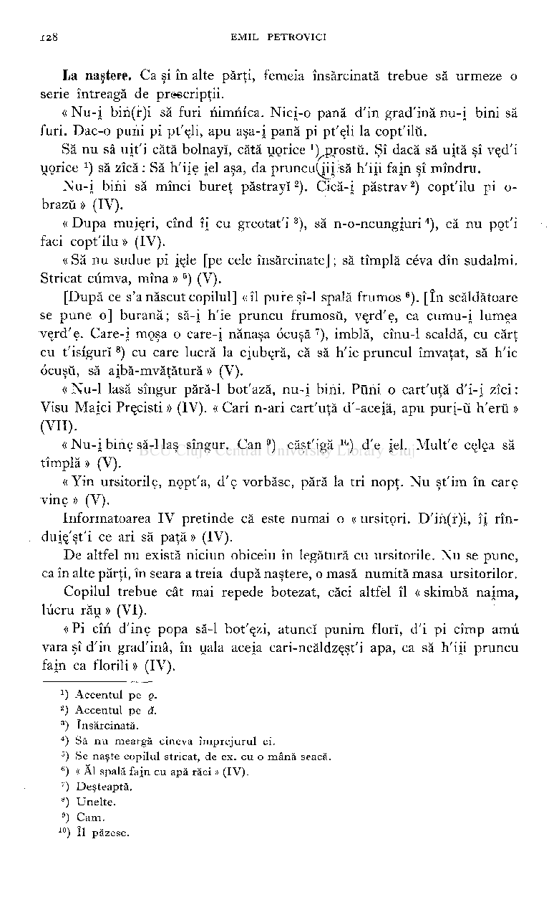

La naştere. Ca şi în alte părţi, femeia însărcinată trebue să urmeze o serie întreagă de prescripţii.

« Nu-i biri(r)i să furi himhica. Nici-o pană d'in grad'ină nu-i bini să furi. Dac-o puni pi pt'çli, apu aşa-i pană pi pt'çli la copt'ilü.

Să nu sâ uit'i cătă bolnayî, cătă ugrice ) prostü. Şî dacă să uită şî vçd'i yorice *) să zîcă : Să h'iie iei aşa, da pruncu(iii să h'iii fain şî mîndru.

) copt'ilu pi obrazü » (IV).

Nu-i bini să mînci bureţ păstrayî

##### ). Cică-i păstrăv

2

2

« Dupa muiçri, cînd îi cu greotat'i ), să n-o-ncungiuri ), că nu pot'i faci copt'ilu » (IV).

« Să nu sudue pi içle [pe cele însărcinate] ; să tîmplă céva dîn sudalmi. Stricat cumva, mîna » ) (V).

[După ce s'a născut copilul] «îl pureşî-1 spală frumos ). [în scăldătoare se pune o] burană; să-i h'ie pruncu frumosü, vçrd'e, ca cumu-i lumea vçrd'e. Care-i moşa o care-i nănaşa ocuşă ), imblă, cînu-1 scaldă, cu cărţ cu t'isigurî

) cu care lucră la ciuberă, că să h'ie pruncul îmvaţat, să h'ie ocuşu, să aibă-mvăţătură » (V).

8

« Nu-1 lasă singur pără-1 bot'ază, nu-i bini. Puni o cart'uţă d'i-j zîci : Visu Maici Prçcisti » (IV). « Cari n-ari cart'uţă d'-aceiä, apu puri-ü h'erü » (VII).

) d'e iei. Mult'e cçlea să tîmplă » (V).

« Nu-i bine să-1 laş sîngur. Can ) căşt'igă

lfc

« Yin ursitorile, ngpt'a, d'e vorbăsc, pără la tri nopţ. Nu şt'im în care vine » (V).

Informatoarea IV pretinde că este numai o « ursitori. D'ih(r)i, îi rînduie/şt'i ce ari să pată » (IV).

De altfel nu există niciun obiceiu în legătură cu ursitorile. Nu se pune, ca în alte părţi, în seara a treia după naştere, o masă numită masa ursitorilor.

Copilul trebue cât mai repede botezat, căci altfel îl « skimbă naima, lucru rău » (VI).

«Pi cîh d'ine popa să-1 bot'çzi, atunci punim flori, d'i pi cîmp amü vara şî d'in grad'inâ, în uala aceia cari-ncăldzcşt'i apa, ca să h'iii pruncu fain ca florili » (IV).

) Accentu l p e g.

J

- 2 ) Accentu l p e ă.
- 3 ) însărcinată .
- 4 ) S ă n u mearg ă cinev a împrejuru l ei.
- 5 ) S e naşt e copilu l stricat , d e ex . c u o mân ă seacă .
- 6 ) « A l spal ă fai n c u ap ă răci » (IV) .

) Deşteaptă .

;

) Unelte .

s

) Cam .

9

) II păzesc .

10

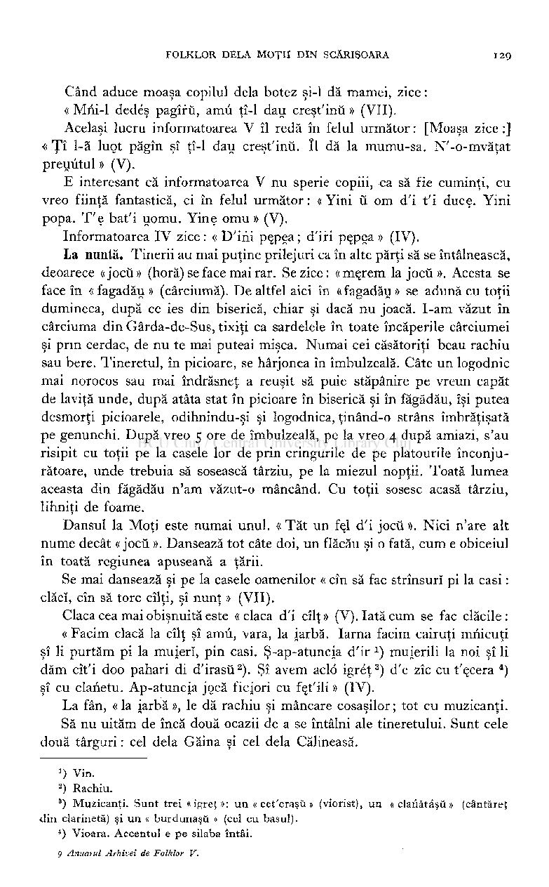

Când aduce moaşa copilul delà botez şi-1 dă mamei, zice : « Mrii-1 dedeş pagîru, arnii ţî-1 dau creşt'inu » (VII). Acelaşi lucru informatoarea V îl redă în felul următor: [Moaşa zice:]

« Ţî 1-â luQt păgîn şî ţî-1 dau creşt'inu. îl dă la mumu-sa. N'-o-mvăţat preuütul » (V).

E interesant că informatoarea V nu sperie copiii, ca să fie cuminţi, cu vreo fiinţă fantastică, ci în felul următor : « Yini ü om d'i t'i duce. Yini popa. T'e bat'i uomu. Yine omu » (V).

Informatoarea IV zice: « D'ini pçpea; d'iri pçpea » (IV). La nuntă. Tinerii au mai puţine prilejuri ca în alte părţi să se întâlnească, deoarece «jocü» (horă) se face mai rar. Se zice: «merem la jocü ». Acesta se face în « fagadău » (cârciumă). De altfel aici în «fagadău » se adună cu toţii dumineca, după ce ies din biserică, chiar şi dacă nu joacă. I-am văzut în cârciuma din Gârda-de-Sus, tixiţi ca sardelele în toate încăperile cârciumei şi prin cerdac, de nu te mai puteai mişca. Numai cei căsătoriţi beau rachiu sau bere. Tineretul, în picioare, se hârjonea în îmbulzeală. Câte un logodnic mai norocos sau mai îndrăsneţ a reuşit să puie stăpânire pe vreun capăt de laviţă unde, după atâta stat în picioare în biserică şi în făgădău, îşi putea desmorţi picioarele, odihnindu-şi şi logodnica, ţinând-o strâns îmbrăţişată pe genunchi. După vreo 5 ore de îmbulzeală, pe la vreo 4 după amiazi, s'au risipit cu toţii pe la casele lor de prin cringurile de pe platourile înconjurătoare, unde trebuia să sosească târziu, pe la miezul nopţii. Toată lumea aceasta din făgădău n'am văzut-o mâncând. Cu toţii sosesc acasă târziu, lihniţi de foame.

Dansul la Moţi este numai unul. « Tăt un fe_l d'i jocü ». Nici n'are alt nume decât «jocü ». Dansează tot câte doi, un flăcău şi o fată, cum e obiceiul în toată regiunea apuseană a ţării.

Se mai dansează şi pe la casele oamenilor « cîn să fac strînsurï pi la casi : clăcî, cîn să torc cîlţi, şî nunţ » (VII).

Claca cea mai obişnuită este «claca d'i cîlţ» (V). Iată cum se fac clăcile : « Facim clacă la cîlţ şî amu, vara, la iarbă. Iarna facim cairuţi mnicuţi

şî li purtăm pi la muieri, pin casi. Ş-ap-atuncia d'ir ) muierili la noi şî li dăm cît'i doo pahari di d'irasü

) d'e zîc cu t'ecera *) şî cu clahetu. Ap-atuncia jocă ficiori cu fçt'ili » (IV).

#### ). Şî avem aclâ igreţ

2

3

La fân, «la iarbă», le dă rachiu şi mâncare cosaşilor; tot cu muzicanţi. Să nu uităm de încă două ocazii de a se întâlni ale tineretului. Sunt cele

două târguri : cel delà Găina şi cel delà Călineasă.

) Vin .

J

- 2 ) Rachiu .
- 3 ) Muzicanţi . Sun t tre i «igreţ» : u n « cet'eraş u » (viorist) , u n « clanătâş u » (cântăre ţ

di n clarinetă ) şi u n « burdunaş u » (cel c u basul) .

) Vioara . Accentu l e p e silab a întâi . g Anuarul Arhivei de Folklor V.

4

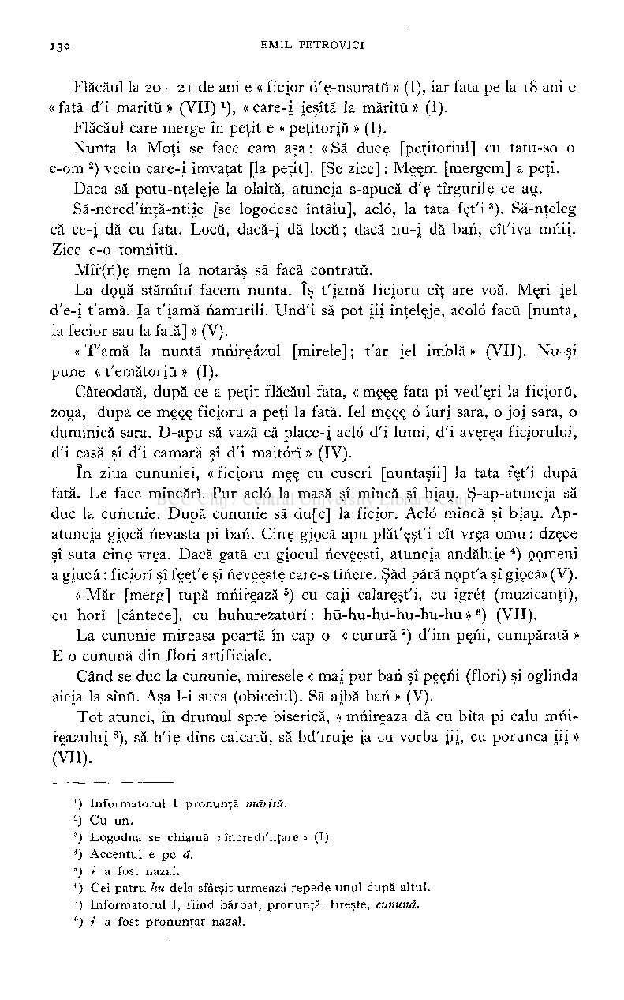

Flăcăul la 20—21 de ani e « ficior d'e-nsuratü » (I), iar fata pe la 18 ani e

«fată d'i maritü » (VII)«care- i ieşită la măritu » (I). Flăcăul care merge în petit e « petitoriu » (I). Nunta la Moţi se face cam aşa : « Să duce [petitoriul] cu tatu-so o

c-om ) vecin care-i imvaţat [la petit]. [Se zice] : Mee_m [mergem] a peţi. Daca să potu-nţeleje la olaltă, atuncia s-apucă d'e tîrgurile ce au. Să-ncred'inţă-ntiie [se logodesc întâiu], aclô, la tata fçt'i

). Să-nţeleg că ce-i dă cu fata. Locü, dacă-i dă locü; dacă nu-i dă ban, cît'iva mnii. Zice c-o tomnitü.

3

Mîr(ri)e mçm la notarăş să facă contratü. La două stămînî facem nunta. îş t'iamă ficioru cîţ are voă. Meri iei

d'e-i t'amă. Ia t'iamă namurili. Und'i să pot iii înţeleje, acolö facü [nunta, la fecior sau la fată] » (V).

« T'amă la nuntă mriireâzul [mirele] ; t'ar iei imblă » (VII). Nu-şi pune « t'emätoriü » (I).

Câteodată, după ce a petit flăcăul fata, « mee_e_ fata pi ved'çri la ficiorü, zoua, dupa ce mee_ç ficioru a peţi la fată. Iei mee_e_ 6 luri sara, o joi sara, o duminică sara. D-apu să vază că place-j aclô d'i lumi, d'i avçrea ficiorului, d'i casă sî d'i cămară sî d'i maitöri » (IV).

în ziua cununiei, « ficioru meç cu cuscri [nuntaşii] la tata fe_t'i după fată. Le face mîncări. Pur aclô la masă şî mîncă şî biau. Ş-ap-atuncia să duc la cununie. După cununie să du[c] la ficior. Aclô mîncă şî biau. Apatuncia giocă nevasta pi ban. Cine giccă apu plăt'est'i cît vrea omu : dzçce şî suta cine vrea. Dacă gată cu giocul neveçsti, atuncia andăluie ) oomeni a giucâ : ficiori şî fee_t'e şî neveeste care-s tinere. Şăd pără nopt'a şî giccă» (V).

) cu caii calarcşt'i, cu igreţ (muzicanţi), cu hori [cântece], cu huhurezaturî : hü-hu-hu-hu-hu-hu » ) (VII).

« Măr [merg] tupă mriirează

5

) d'im pçni, cumpărată » E o cunună din flori artificiale.

La cununie mireasa poartă în cap o « curură

7

Când se duc la cununie, miresele « mai pur ban şî peçrii (flori) şî oglinda aicia la sînu. Aşa 1-i suca (obiceiul). Să aibă ban » (V).

Tot atunci, în drumul spre biserică, « mnireaza dă cu bîta pi calu mnifeazului

#### ), să h'ie dîns calcatü, să bd'iruie ia cu vorba iii, cu porunca iii » (VII). "

8

' ) Informatoru l I pronunţ ă măritu.

-) C u un .

) Logodn a s e chiam ă « încredi'nţar e » (I) .

s

- 4 ) Accentu l e p e ă.
- 5 ) r a fost nazal .

' ) Ce i patr u hu del à sfârşit urmeaz ă reped e unu l dup ă altul .

) Informatoru l I, fiin d bărbat , pronunţă , fireşte , cunună.

;

) r a fost pronunţa t nazal .

8

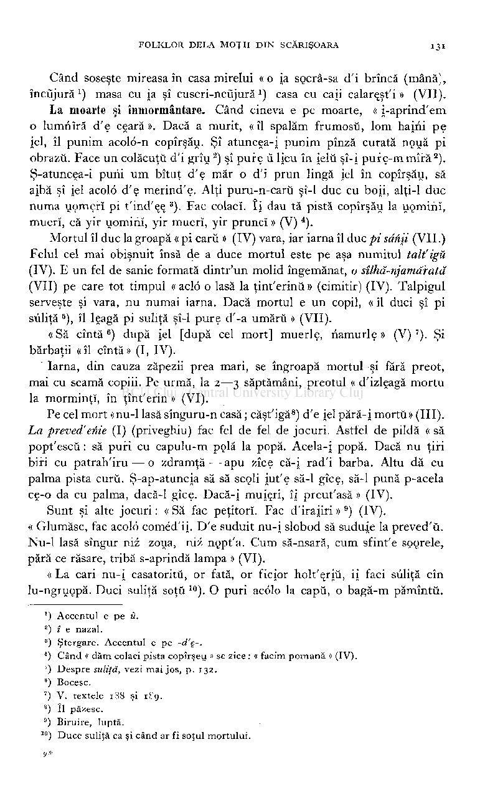

#### Când soseşte mireasa în casa mirelui «o ia socrâ-sa d'i brîncă (mână), încujură

) masa cu ia şî cuscri-ncujură *) casa cu caii calarcşt'i » (VII). La moarte şi înmormântare. Când cineva e pe moarte, « i-aprind'em

1

- o lumnîră d'e ceară». Dacă a murit, «îl spălăm frumosü, lom haini pe iei, îl punim acolö-n copîrşău. Şî atuncea-i punim pînză curată nouă pi
- obrazü. Face un colăcuţu d'i grîu

#### ) şî pure ü lieu în ielü şî-i pure-mmiră

).

2

2

Ş-atuncea-i puni um bîtuţ d'e măr o d'i prun lingă iei în copîrşău, să aibă şî iei acolo d'e merind'e. Alţi puru-n-carü şî-1 duc cu boii, alţi-1 duc numa uomerî pi t'ind'e_e_

#### ). Fac colaci. îi dau tă pistă copîrşău la uomiriî, muerï, că yir uomihî, yir mueri, yir prunci » (V)

3

). Mortul îl duc la groapă « pi carü » (IV) vara, iar iarna îl duc pi sănii (VII.)

4

Felul cel mai obişnuit însă de a duce mortul este pe aşa numitul talt'igü (IV). E un fel de sanie formată dintr'un molid îngemănat, o sîlhă-njamărată (VII) pe care tot timpul « aclö o lasă la ţint'erinu » (cimitir) (IV). Talpigul serveşte şi vara, nu numai iarna. Dacă mortul e un copil, « îl duci şî pi suliţă ), îl leagă pi suliţă şî-1 pure d'-a umăru » (VII).

) după iei [după cel mort] muerle, hamuri e » (V) ). Şi bărbaţii «îl cîntă» (I, IV).

«Să cîntă

6

Iarna, din cauza zăpezii prea mari, se îngroapă mortul şi fără preot, mai cu seamă copiii. Pe urmă, la 2—3 săptămâni, preotul « d'izleagă mortu la morminţî, în ţînt'erin » (VI).

Pe cel mort «nu-1 lasă sînguru-n casă ; căşt'igă

) d'e iei pără-i mortü» (III).

8

La preved'eûie (I) (priveghiu) fac fel de fel de jocuri. Astfel de pildă « să

popt'escu : să puri cu capulu-m polă la popă. Acela-i popă. Dacă nu ţifi bifi cu patrah'iru — o zdramţă —- apu zîce că-i rad'i barba. Altu dă cu palma pista curii. Ş-ap-atuncia să să secii iut'e să-1 gîce, să-1 pună p-acela ce-o da cu palma, dacă-1 gîce. Dacă-i muieri, îi preut'asă » (IV).

Sunt şi alte jocuri : « Să fac peţitori. Fac d'iraiiri » ) (IV).

« Glumăsc, fac acolo coméd'ii. D'e suduit nu-i slobod să suduie la preved'ü. Nu-1 lasă singur niz zoua, niz nçpt'a. Cum să-nsară, cum sfint'e soorele, pără ce răsare, tribă s-aprindă lampa » (VI).

« La cari nu-i casatoritü, or fată, or ficior holt'eriü, ii faci suliţă cîn lu-ngruşpă. Duci suliţă soţu

#### ) . O puri acolo la capă, o bagă-m pămîntu.

10

) Accentu l e p e ii.

J

) î e nazal .

!

) Ştergare . Accentu l e p e -d'e-.

a

) Cân d « dă m colaci pist a copîrşe u » s e zice : « faci m poman ă » (IV) ') Despr e suliţă, vez i ma i jos , p . 132.

4

) Bocesc . ' ) V . textel e i3 8 şi iPo .

6

) II păzesc .

s

- 9 ) Biruire , luptă .
- 10 ) Duc e suliţ ă c a şi cân d a r fi soţu l mortului .

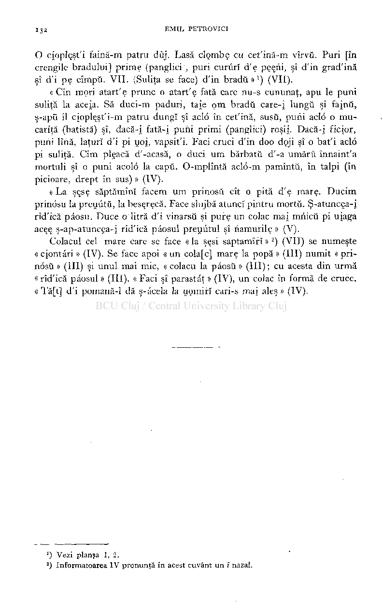

##### O cioplest'i faină-m patru düj. Lasă clombe cu cet'ină-m vîrvu. Puri [în crengile bradului] prime (panglici , puri cururi d'e peeni, şî d'in grad'ină şî d'i pe cimpü. VIL (Suliţa se face) d'in bradü »

) (VII).

x

«Cin mori atart'e prunc o atart'e fată care nu-s cununat, apu le puni suliţă la aceia. Să duci-m păduri, taie om bradü care-i lungü şî fainü, s-apü îl cioplest'i-m patru dungi şî aclo în cet'ină, susü, puni aclö o mucariţă (batistă) şî, dacă-i fată-i puni primi (panglici) roşii. Dacă-i ficior, puni lînă, laţuri d'i pi uoi, vapsit'i. Faci cruci d'in doo doji şî o bat'i aclö pi suliţă. Cîm pleacă d'-acasă, o duci um bărbatu d'-a umăru înnaint'a mortuli şî o puni acolo la capü. O-mplîntă aclö-m pamîntu, în tălpi (în picioare, drept în sus) » (IV).

«La şe_se săptămînî facem um prinosü cit o pită d'e mare. Ducim prinôsu la preuütü, la bescrecă. Face slujbă atunci pintru mortü. Ş-atuncea-i rîd'ică pâosu. Duce o litră d'i vinarsü şi pure un colac mai mriicü pi uiaga acçç ş-ap-atuncea-i rîd'ică pàosul preyütul şî namurile » (V).

) (VII) se numeşte « ciontâri » (IV). Se face apoi « un cola[c] mare la popă » (III) numit « prinosü » (III) şi unul mai mic, « colacu la pâosu » (III) ; cu acesta din urmă « rîd'ică pâosul » (III). « Faci şî parastâţ » (IV), un colac în formă de cruce. « Tă[t] d'i pomană-1 dă ş-âcela la uomiri cari-s mai aies » (IV).

Colacul cel mare care se face « la sçsi saptamîfï »

2

Vez i planş a I, 2.

) Informatoare a I V pronunţ ă î n aces t cuvân t u n î nazal .

2

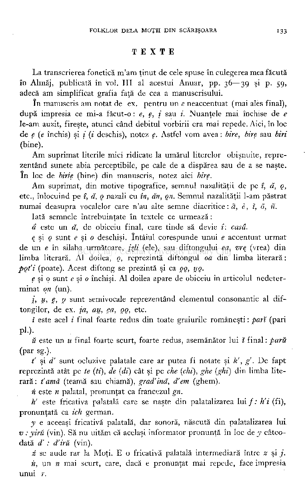

TEXT E

La transcrierea fonetică m'am ţinut de cele spuse în culegerea mea făcută în Almăj, publicată în vol. III al acestui Anuar, pp. 36—39 şi p. 59, adecă am simplificat grafia faţă de cea a manuscrisului.

în manuscris am notat de ex. pentru un e neaccentuat (mai ales final), după impresia ce mi-a făcut-o : e, e, i sau i. Nuanţele mai închise de e le-am auzit, fireşte, atunci când debitul vorbirii era mai repede. Aici, în loc de e (e închis) şi i (i deschis), notez e. Astfel vom avea : bire, bire sau birt (bine).

Am suprimat literile mici ridicate la umărul literelor obişnuite, reprezentând sunete abia perceptibile, pe cale de a dispărea sau de a se naşte, în loc de birie (bine) din manuscris, notez aici bire.

Am suprimat, din motive tipografice, semnul nazalităţii de pe î, ă, q, etc., înlocuind pe î, ă, q nazali cu în, ăn, qn. Semnul nazalităţii l-am păstrat numai deasupra vocalelor care n'au alte semne diacritice : ă, è, ï, 5, ü.

Iată semnele întrebuinţate în textele ce urmează : â este un ă, de obiceiu final, care tinde să devie î: casâ.

ç şi q sunt e şi o deschişi. întâiul corespunde unui e accentuat urmat de un e în silaba următoare, iţu (ele), sau diftongului ea, (vrea) din limba literară. Al doilea, q, reprezintă diftongul oa din limba literară : pqt'i (poate). Acest diftong se prezintă şi ca oq, uq.

e şi o sunt e şi o închişi. Al doilea apare de obiceiu în articolul nedeterminat qn (un).

i, u, e, o sunt semivocale reprezentând elementul consonantic al diftongilor, de ex. ia, au, ea, oq, etc.

ï este acel i final foarte redus din toate graiurile româneşti : pari (pari Pi-)-

ü este un u final foarte scurt, foarte redus, asemănător lui ï final : pară (par sg.).

t' şi a" sunt ocluzive palatale care ar putea fi notate şi k', g'. De fapt reprezintă atât pe te (ti), de (di) cât şi pe che (chi), ghe (ghi) din limba literară : t'amă (teamă sau chiamă), grad'ină, d'em (ghem).

û este n palatal, pronunţat ca francezul gn. h' este fricativa palatală care se naşte din palatalizarea lui / : h'i (fi),

pronunţată ca ich german.

- y e aceeaşi fricativa palatală, dar sonoră, născută din palatalizarea lui v : yirü (vin). Să nu uităm că acelaşi informator pronunţă în loc de y câteodată d' : d'irît. (vin).
- z se aude rar la Moţi. E o fricativa palatală intermediară între z şi 7. h, un n mai scurt, care, dacă e pronunţat mai repede, face impresia

unui r.

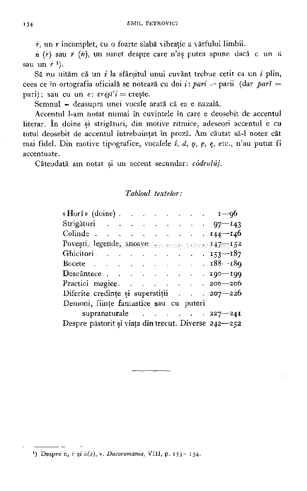

r, un r incomplet, cu o foarte slabă vibraţie a vârfului limbii. h (r) sau r («), un sunet despre care n'aş putea spune dacă e un n

sau un r

).

1

Să nu uităm că un i la sfârşitul unui cuvânt trebue cetit ca un i plin, ceea ce în ortografia oficială se notează cu doi i : pari = parii (dar parî = pari); sau cu un e: crest'i = creşte.

Semnul ~ deasupra unei vocale arată că ea e nazală. Accentul l-am notat numai în cuvintele în care e deosebit de accentul literar. în doine şi strigături, din motive ritmice, adeseori accentul e cu totul deosebit de accentul întrebuinţat în proză. Am căutat să-1 notez cât mai fidel. Din motive tipografice, vocalele î, ă, Q, e, ç, etc., n'au putut fi accentuate.

Câteodată am notat şi un accent secundar: codrului.

Tabloul textelor:

«Hori» (doine) i—96 Strigături 97—143 Colinde 144—146 Poveşti, legende, snoave 147—152 Ghicitori 153—187 Bocete 188—189 Descântece 190—199 Practici magice 200—206 Diferite credinţe şi superstiţii . . . 207—226 Demoni, fiinţe fantastice sau cu puteri

supranaturale 227—241 Despre păstorit şi viaţa din trecut. Diverse 242—252

*) Despr e ri, r şi u(r) , v. Dacoromania, VIII , p . 153—154.

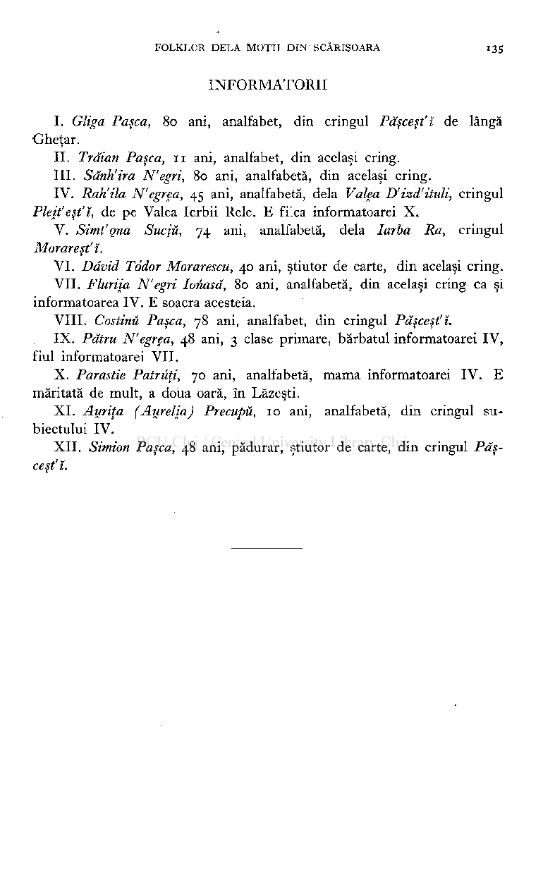

INFORMATORII

- I. Gliga Pasca, 80 ani, analfabet, din cringul Păşceşt'î de lângă

Gheţar.

- II. Trăian Pasca, 11 ani, analfabet, din acelaşi cring.
- III. Sänh'ira N'egri, 80 ani, analfabetă, din acelaşi cring.
- IV. Rah'ila N'egrea, 45 ani, analfabetă, delà Valea D'izd'ituli, cringul

Pleit'eşt'î, de pe Valea Ierbii Rele. E fixa informatoarei X.

- V. Simt'ona Suciü, 74 ani, analfabetă, delà Iarba Ra, cringul

Mor arest' î.

- VI. David Todor Morarescu, 40 ani, ştiutor de carte, din acelaşi cring.
- VII. Fluriia N'egri IoAasă, 80 ani, analfabetă, din acelaşi cring ca şi

informatoarea IV. E soacra acesteia.

- VIII. Costinü Pasca, 78 ani, analfabet, din cringul Păşceşt'î.
- IX. Patru N'egrea, 48 ani, 3 clase primare, bărbatul informatoarei IV,

fiul informatoarei VIL

- X. Parasite Patruţi, 70 ani, analfabetă, mama informatoarei IV. E

măritată de mult, a doua oară, în Lăzeşti.

- XI. Aurita (Aurelia) Precupü, 10 ani, analfabetă, din cringul su­

biectului IV.

- XII. Simion Pasca, 48 ani, pădurar, ştiutor de carte, din cringul Păş­

ceşt'î.

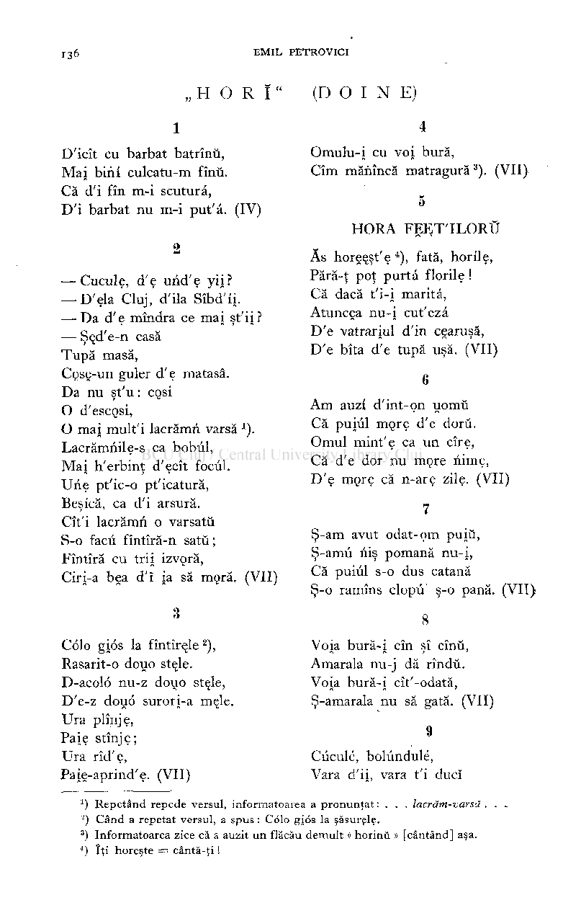

„HORI " (DOINE )

- 1

D'icît cu bărbat batrînu, Mai bini culcatu-m fînu. Că d'i fin m-i scutura, D'i bărbat nu m-i put'à. (IV)

- 2

#### Omulu-i cu voi bură, Cîm măhîncă matragură

#### ). (VII)

3

5

#### HORA FEET'ILORÜ Ăs horecşt'e

), fată, horile, Pără-ţ poţ purtă florile ! Că dacă t'i-i mărita, Atuncea nu-i cut'ezâ D'e vatrariul d'in cearuşă, D'e bîta d'e tupă uşă. (VII)

4

— Cucuie, d'e urid'e yii?

— D'ela Cluj, d'ila Sîbd'ii.

— Da d'e mîndra ce mai şt'ii?

— Şed'e-n casă Tupă masă, Cose-un guler d'e matasâ. Da nu şt'u : cosi O d'escosi, O mai mult'i lacrămn varsă ). Lacrămriile-s ca bobul, Mai h'erbinţ d'ecît focul. Une pt'ic-o pt'icatură, Beşică, ca d'i arsură. Cît'i lacrămn o var sa tu S-o făcu fîntîră-n satü ; Fîntîră cu trii izvora, Ciri-a bea d'î ia să moră. (VII)

6

Am auzi d'int-on uomü Că puiul more d'e doru. Omul mint'e ca un cîre, Că d'e dor nu more hime, D'e more că n-are zile. (VII)

7

Ş-am avut odat-om puiü, Ş-amii niş pomană nu-i, Că puiul s-o dus catană Ş-o ramîns clopü ş-o pană. (VII)

3

8

#### Colo giös la fîntîreje

),

Voia bură-i cîn şî cînu, Amarala nu-j dă rîndu. Voia bură-i cît'-odată, Ş-amarala nu să gată. (VII)

2

Rasarit-o douo stçle. D-acolö nu-z douo stçle, D'e-z douö surori-a mçle. Ura plînje, Paie stînje; Ura rîd'e, Paie-aprind'e. (VII)

9

#### Ciiculé, bolûndulé, Vara d'ii, vara t'i duci

- 1 ) Repetân d reped e versul , informatoare a a pronunţat : . . . lacrăm-varsă . . .
- 2 ) Cân d a repeta t versul , a spu s : Cöl o giö s l a şăsurele .
- 3 ) Informatoare a zic e c ă a auzi t u n flăcă u demul t « horin ü » [cântând ] aşa .
- 4 ) îţ i horeşt e = cântă-ţ i !

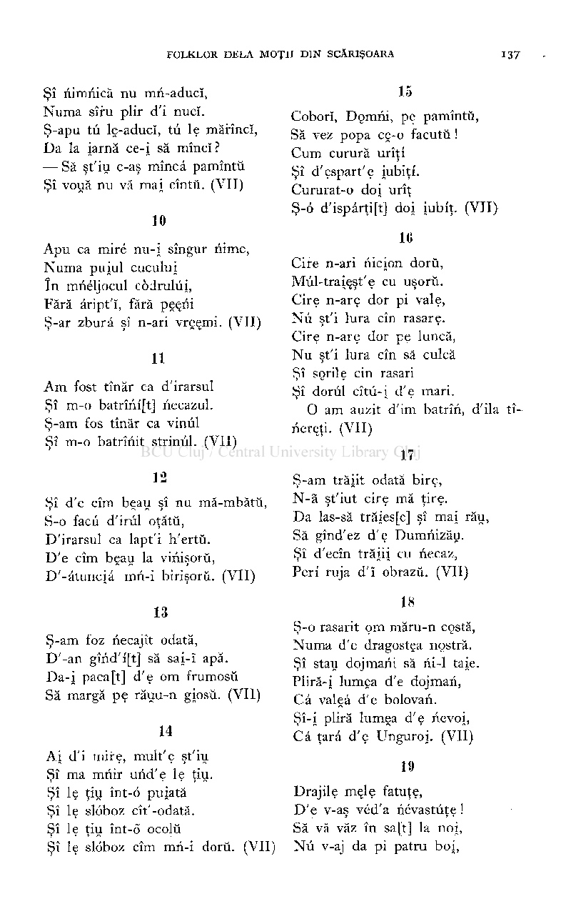

Şî nimnică nu mn-aducî, Numa sîru plir d'i nuci. Ş-apu tu le-aduci, tü le mărîncî, Da la iarnă ce-i să mîncî ?

15

Coborî, Domni, pe pamîntu, Să vez popa ce-o facutü ! Cum curură urîţi Şî d'espart'e iubiţi. Cururat-o doi urîţ Ş-6 d'ispârţi[t] doi iubit. (VII)

— Să şt'iu c-aş mîncâ pamîntu Şî vouă nu vă mai cîntu. (VII)

10

10

Apu ca miré nu-i singur riime, Numa puiul cucului în mriéljocul codrului, Fără âript'î, fără peçfïi Ş-ar zbura şî n-ari vreçmi. (VII)

Cire n-ari riicion doru, Mul-traicşt'e cu uşorii. Cire n-are dor pi vale, Nu şt'i Iura cîn răsare. Cire n-are dor pe luncă, Nu şt'i Iura cîn să culcă Şî sorii e cîn rasari Şî dorul cîtu-i d'e mari.

11

Am fost tînăr ca d'irarsul Şî m-o batrîriift] necazul. Ş-am fos tînăr ca vinul Şî m-o batrînit strinul. (VII)

O am auzit d'im batrîiî, d'ila tînercţi. (VII)

17

12

Ş-am trăiit odată bire, N-ă şt'iut cire mă ţire. Da las-să trăiesfc] şî mai rău, Să gînd'ez d'e Dumnizău. Şî d'ecîn trăiii cu necaz, Peri ruja d'î obrazü. (VII)

Şî d'e cîm beau şî nu mă-mbătu, S-o facii d'irûl oţătu, D'irarsul ca lapt'i h'ertü. D'e cîm beau la vinişoru, D'-atuncia mh-i birişoru. (VII)

18

13

Ş-o răsărit om măru-n costă, Numa d'e dragostea nostră. Şî stau dojmani să rii-1 taie. Pliră-i lumea d'e dojman, Câ valea d'e bolovan. Şî-i pliră lumea d'e nevoi, Câ ţara d'e Unguroi. (VII)

Ş-am foz necajît odată, D'-an gînd'i[t] să sai-î apă. Da-i paca[t] d'e om frumosü Să margă pe răuu-n giosü. (VII)

14

Ai d'i mire, mult'e şt'iu Şî ma mnir urid'e le ţiu. Şî le ţiu înt-6 puiată Şî le sloboz cît'-odată. Şî le ţiu înt-ô ocolu Şî le slôboz cîm mri-i dorü. (VII)

19

Drajile mçle fatuţe, D'e v-aş véd'a névastûte ! Să vă văz în sa[t] la noi, Nu v-aj da pi patru boi,

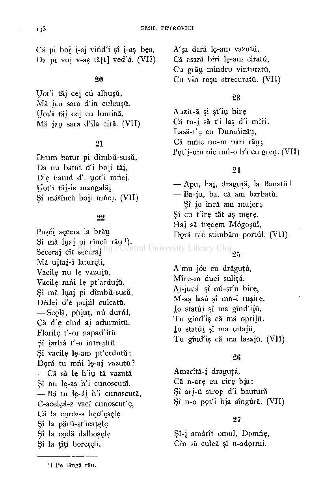

A'şa dară le-am vazutü, Că asară biri le-am ciratü, Cu grăy mîndru vînturatu, Cu vin roşu strecuratü. (VII)

#### Că pi boi i-aj virid'i şî i-aş bea, Da pi voi v-aş tă[t] ved'ä. (VII)

20

Uot'i tăi cei cii albuşu, Mă iau sara d'in culcuşu. Uot'i tăi cei cu lumină, Mă iau sara d'ila ciră. (VII)

23

Auzit-à şi şt'iu bire Că tu-i să t'i laş d'i miri. Lasă-t'e cu Dumfiizău, Că mriie nu-m pari rău; Pot'i-um pic mfi-o h'i cu greu. (VII)

21

Drum bătut pi dîmbu-susu, Da nu bătut d'i boii tăi, D'e batud d'i uot'i mnei. Uot'i tăi-is mangalăi Şi mărincă boii mnei. (VII)

24

— Apu, hai, drăguţă, la Banatü !

— Ba-iu, ba, că am barbatü.

— Şî io încă am muiere Şî cu t'ire tăt aş mere. Hai să trecem Mogoşul, Doră n'é stimbăm portul. (VII)

22

#### Pusei secera la brău Şî mă luai pi rîncă rău

) .

l

Secerai cît secerai Mă uitai-î laturçli, Vacile nu le văzuiü, Vacile mni le pt'arduiü. Şî mă luai pi dîmbu-susu, Dédei d'é puiul culcatü.

25

A'mu jöc cu drăguţa, Mîre-m duci suliţa. Aj-jucâ şî mi-şt'u bire, M-aş lasă şî mh-i ruşire. Io statui şî ma gînd'iiu, Tu gînd'iş că mă opriiü. Io statui şî ma uitaiü, Tu gînd'iş că ma lasaiü. (VII)

— Scolă, puiuţ, nu durfii, Că d'e cînd ai adurmitü, Florile t'-or napad'itü Şî iarba t'-o întrejitu Şî vacile le-am pt'erdutü; Doră tu mni le-ai vazutü?

26

Amarîtă-i drăguţă, Că n-are cu cire bia; Şî ari-ü strop d'i băutură Şî n-o pot'i bia singură. (VII)

— Că să le h'iu tă văzută Şî nu le-aş h'i cunoscută. — Bâ tu le-ii h'i cunoscută, C-aceleâ-z vaci cunoscut'e, Că la corrii-s hed'eseje Şî la păru-st'icaţe.le Şî la codă dalboşcle Şî la ţîţi boreţeh.

27

#### Şî-i amârît omul, Domne, Cîn să culcă şî n-adQrmi.

*) P e lâng ă râu .

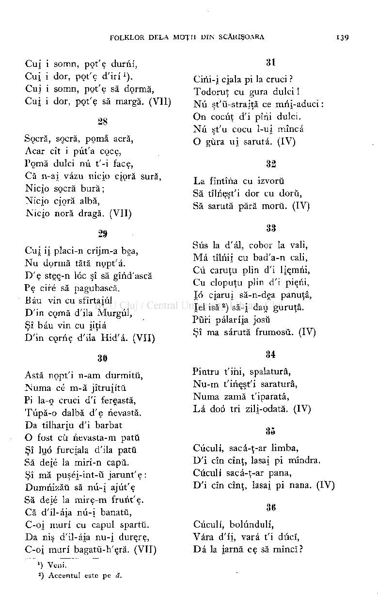

#### Cui i somn, pot'e durni, Cui i dor, pot'e d'iri

31

). Cui i somn, pot'e să dormă,

x

Cilii-i ciala pi la cruci ? Todoruţ cu gura dulci ! Nü şt'u-straiţă ce miii-aduci : On cociiţ d'i pîhi dulci.

- Cui i dor, pot'e să margă. (VII)

28

Socră, sQcră, poma acră, Acar cit i piit'aCQCÇ, Pomă dulci mi t'-i face, Că n-ai văzu nicio cioră sură, Nicio socră bură; Nicio cioră albă, Nicio noră dragă. (VII)

29

- Cui ii placi-n crîjm-a bea, Nu dormă tătă nrjpt'â. D'e steç-n löc şî să gînd'ască Pe ciré să pagubască.

- Nü şt'u cocu 1-ui mîncâ
- O gura ui sarutâ. (IV)

32

#### La fîntîha cu izvorü Să tîlricşt'i dor cu dorii, Să sărută pără moru. (IV)

33

Siis la d'al, cobor la vali, Mâ tîliiii cu bad'a-n caii, C\i caruţu plin d'i liçmni, Cu clopuţu plin d'i piçrii, 16 ciarui să-n-dea panuţâ, Iei isă

- Bău vin cu sfîrtaiiil D'in comă d'ila Murgul, Şî bău vin cu iiţiâ D'in corne d'ila Hid'â. (VII)

30

Astă nopt'i n-am durmitü, Numa cé m-à jîtruiitu Pi la-o cruci d'i fereastă, Tupă-o dalbă d'e nevastă. Da tîlhariu d'i bărbat O fost cù nevasta-m patü Şî luö furciala d'ila patü Să deié la miri-n capü. Şî mă puşei-int-u jarunt'e: Dumnizău să nü-i ajüt'e Să deié la mire-m frunt'e.

- Că d'il-aia nü-i banatü, C-oi muri cu capul spartü. Da niş d'il-âia nu-i durçre, C-oi muri bagatu-h'cră. (VII)

#### ) să-i dau guruţâ. Püri pàlariia josü Şî ma sărută frumosü. (IV)

2

34

Pintru t'ihi, spalaturâ, Nu-m t'iiicşt'i saraturâ, Numa zamă t'iparatâ, Lâ doo tri zili-odată. (IV)

- 35

Ciiculi, sacâ-ţ-ar limba, D'i cîn cînţ, lasai pi mîndra. Ciiculi sacâ-ţ-ar pana, D'i cîn cînţ, lasai pi nana. (IV)

- 36

#### Ciiculi, bolünduli, Vâra d'ii, vară t'i duci, Dâ la iarnă ce să mîncî?

Veni

) Accentu l est e p e ă.

2

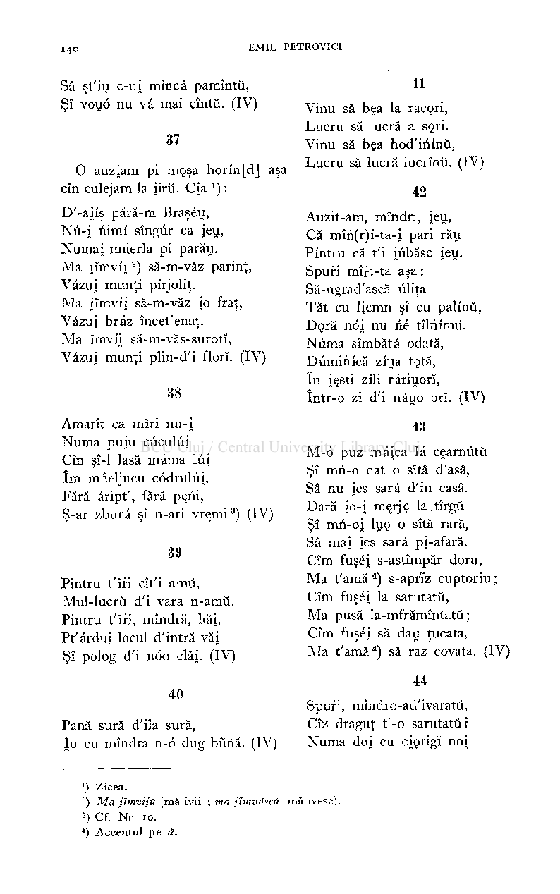

Sâ şt'iu c-ui mîncâ pamîntu, Şî vouo nu vâ mai cîntu. (IV)

Vinu să bea la răcori, Lucru să lucră a sçri. Vinu să bea hod'ininü, Lucru să lucră lucrînu. (IV)

37

O auziam pi mcşa horin[d] aşa cîn culejam la iirü. Cia *) : D'-aiiş pără-m Braşeu, Nû-i nimi singur ca jeu, Numai mrierla pi pârău. Ma iïmvii

42

Auzit-am, mîndri, jeu, Că mîri(r)i-ta-i pari rău Pintru că t'i iubăsc jeu. Spufi mîri-ta aşa :

) să-m-văz parinţ, Văzui munţi pîrjoliţ. Ma iîmvii să-m-văz io fraţ, Văzui brâz încet'enaţ. Ma ïmvii să-m-văs-surorî, Văzui munţi plin-d'i flori. (IV)

2

- Să-ngrad'ască uliţa
- Tăt cu liemn şî cu palinü, Doră noi nu né tîlnimu, Nüma sîmbătâ odată, Duminică ziua totă, în ieşti zili râriuorî, într-o zi d'i nâuo ori. (IV)

38

Amarît ca miri nu-i Numa puiu cucului Cîn şî-1 lasă mama lui îm mneljucu codrului, Fără âript', fără peni, Ş-ar zbura şî n-ari vremi

43

M-6 puz maica lâ cearnütü Şî mii-o dat o sîtâ d'asâ, Sâ nu ies sară d'in casâ. Dară io-i merje la tîrgu Şî mh-oi lyo o sîtă rară, Sâ mai ies sară pi-afară. Cîm fuşei s-astîmpăr doru, Ma t'amă

) (IV)

3

39

) s-apriz cuptoriu ; Cîm fuşei la sarutatü, Ma pusă la-mfrămîntatu ; Cîm fuşei să dau ţucata, Ma t'amă

4

Pintru t'îfi cît'i amu, Mul-lucrù d'i vara n-amü. Pintru t'îri, mîndră, băi, Pt'ârdui locul d'intră văi Şî polog d'i nöo clăi. (IV)

) să raz covată. (IV)

4

44

40

Spufi, mîndro-ad'ivaratu, Cîz drăguţ t'-o sarutatü ? Numa doi cu ciorigî noi

Pană sură d'ila şură, Io cu mîndra n-6 dug büriä. (IV)

!) Zicea .

###### -) Ma iïmviiû (m ă ivii ; ma iîmvăscu m ă ivesc) .

) Cf. Nr . io

3

) Accentu l p e a .

4

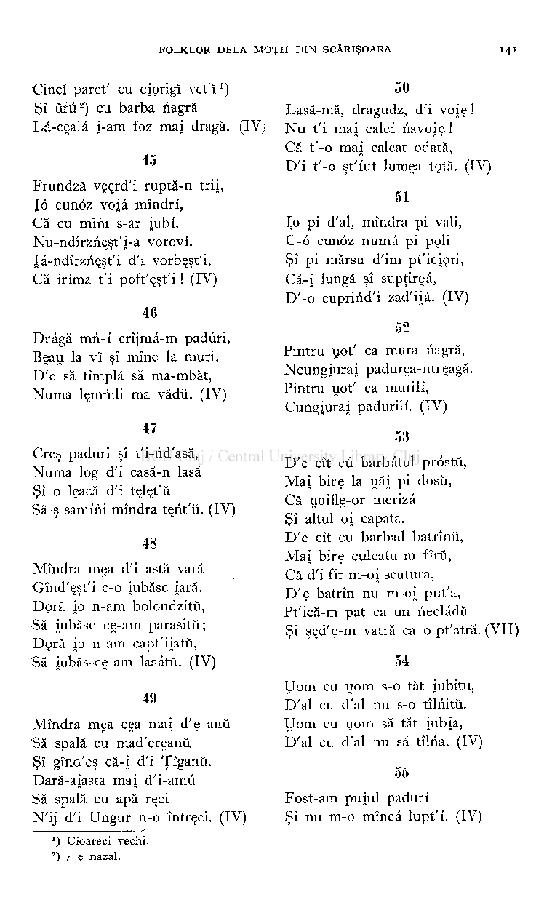

#### Cincï paret' cu ciorigï vet'ï

#### ) Şî ürü

50

1

#### ) cu barba nagră Lâ-ceala i-am foz mai dragă. (IVj

Lasă-mă, dragudz, d'i voie ! Nu t'i mai calci navoie ! Că t'-o mai călcat odată, D'i t'-o şt'iut lumea totă. (IV)

2

45

Frundză veerd'i ruptă-n trii, Iö cunöz voia mîndri, Că cu mini s-ar iubi. Nu-ndîrzne_şt'i-a vorovi. Iâ-ndîrzne_şt'i d'i vorbcşt'i, Că irima t'i poft'ejät'i ! (IV)

51

Io pi d'al, mîndra pi vali, C-6 cunöz numa pi poli Şî pi mărsu d'im pt'iciori, Că-i lungă şî supţirea, D'-o cuprifid'i zad'iiâ. (IV)

46

52

Dragă mn-i crîjmâ-m păduri, Beau la vî şî mînc la muri. D'e să tîmplă să ma-mbăt, Numa lçmnili ma vădii. (IV)

Pintru yot' ca mura nagră, Ncungiurai padurea-ntreagă. Pintru uot' ca murili, Cungiurai padurili. (IV)

47

53

Creş păduri şî t'i-nd'asă, Numa log d'i casă-n lasă Şî o leacă d'i tçlçt'u Sâ-ş samiiii mîndra tçnt'u. (IV)

D'e cît cü bărbatul pröstü, Mai bire la uăi pi dosu, Că uoiile-or merizâ Şî altul oi capata. D'e cît cu barbad batrînu, Mai bire culcatu-m fîru, Că d'i fîr m-oi scutura, D'e batrîn nu m-oi put'a, Pt'ică-m pat ca un neclâdu Şî şe_d'e-m vatră ca o pt'atră. (VII)

48

Mîndra mea d'i astă vară Gînd'cşt'i c-o iubăsc iară. Doră io n-am bolondzitü, Să iubăsc ce-am parasitü; Doră io n-am capt'iiatü, Să iubăs-ce-am lasatü. (IV)

54

Uom cu uom s-o tăt iubiţii, D'al cu d'al nu s-o tîlnitu. Uom cu uom să tăt iubia, D'al cu d'al nu să tîlna. (IV)

49

Mîndra mea cea mai d'e anü Să spală cu mad'ereanü Şî gînd'eş că-i d'i Ţîganu. Dară-aiasta mai d'i-amu Să spală cu apă reci N'ij d'i Ungur n-o întreci. (IV)

55

#### Fost-am puiul păduri Şî nu m-o mîncâ lupt'i. (IV)

Cioarec i vechi .

) r e nazal .

z

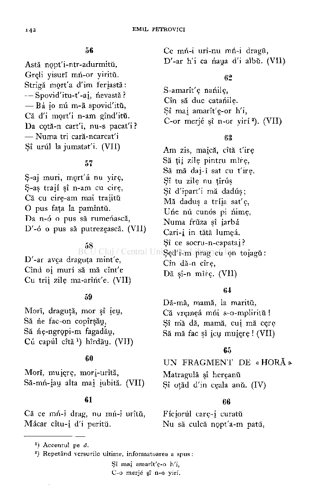

###### Ce mri-i urî-nu mii-i dragu, D'-ar h'i ca naya d'i albu. (VII)

Astă nopt'i-ntr-adurmitü, GreK yisurî mfi-or yiritü. Strigă mort'a d'im feriastă: — Spovid'itu-t'-ai, nevastă? — Bâ io mi m-ä spovid'itü, Că d'i mort'i n-am gînd'itu. Da CQtă-n cart'i, nu-s pacat'i ?

62

S-amarît'e nariile, Cîn să duc cataiiile. Şî mai amarît'e-or h'i, C-or merjé şî n-or yiri

###### ). (VII)

2

— Numa tri cară-ncarcat'i Şî unii la jumatat'i. (VII)

63

Am zis, maică, cîtă t'ire Să ţii zile pintru mire, Să mă dai-î sat cu t'ire. Şî tu zile nu ţîriiş Şî d'ipart'i mă dadiiş; Mă daduş a trija sat'e, Une mi cunös pi riime, Numa früza şî iarbă Cari-i in tătă lumea. Şî ce socru-n-capatai? Şed'i-m prag cu on toiagü : Cîn dă-n cîre, Dă şî-n mïfe. (VII)

57

Ş-aj muri, mort'â nu yire, Ş-aş traii şî n-am cu cire, Că cu cire-am mai traiitü O pus faţa la pamîntu. Da n-ö o pus să rumefiască, D'-o o pus să putrezească. (VII)

58

###### D'-ar avea drăguţa mint'e, Cînd oi muri să mă cînt'e Cu trii zile ma-arîfit'e. (VII)

64

59

Dă-mă, mamă, la maritü, Că vrçmeâ mni s-o-mpliritu ! Şî mă dă, mamă, cui mă cere Să mă fac şî jeu muiere ! (VII)

Morî, drăguţă, mor şî jeu, Să fie fac-on copîrşău, Să ne-ngrrjpi-m fagadău, Cii capiii cîtă

###### ) hîrdău. (VII)

a

65

60

###### U N FRAGMENT DE « HORĂ » Matragulă şî hereanü Şî oţăd d'in ceala anü. (IV)

###### Mori, muiere, mori-urîtă, Să-mn-iau alta mai iubită. (VII)

61

66

###### Că ce mii-i drag, nu mii-i urîtu, Măcar cîtu-i d'i peritü.

###### Ficiorul care-i curatü Nu să culcă nopt'a-m patü,

- 1 ) Accentu l p e ă.
- 2 ) Repetân d versuril e ultime , informatoare a a spu s :

Şî ma i amarît'g- o h'i , C- o merj é şî n- o yiri .

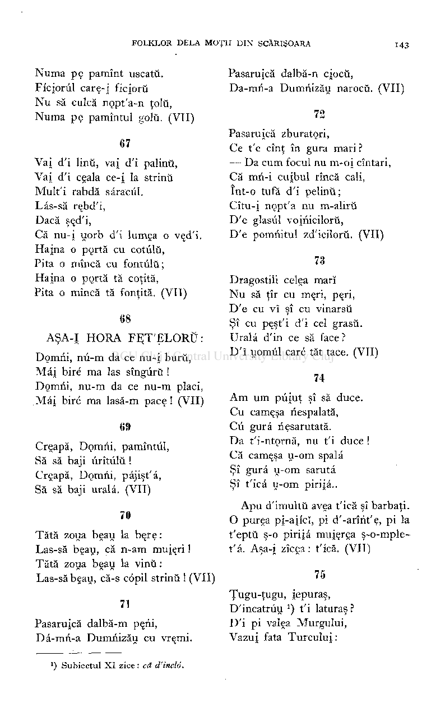

Numa pe pamînt uscatü. Ficiorul care-i ficiorü Nu să culcă nopt'a-n ţolu, Numa pe pamîntul golü. (VII)

Pasaruică dalbă-n ciocü, Da-mn-a Dumriizău narocü. (VII)

72

Pasaruică zburători, Ce t'e cînţ în gura mari ?

67

— Da cum focul nu m-oi cîntari, Că mfi-i cuibul rîncă caii, înt-o tufă d'i pelinü; Cîtu-i nopt'a nu m-alirü D'e glasul voiriicilorü, D'e pomnitul zd'icilorü. (VII)

Vai d'i linü, vai d'i palinü, Vai d'i ceala ce-i la strinü Mult'i rabdă săracul. Lâs-să rebd'i, Dacă şed'i, Că nu-i uorb d'i lumea o vçd'i. Haina o portă cu cotülü, Pita o mîncă cu fontülü; Haina o portă tă cotită, Pita o mîncă tă fonţită. (VII)

73

Dragostili celea mari Nu să ţîr cu me_ri, pçri, D'e cu vî şî cu vinarsü Şî cu pcşt'i d'i cel grasü. Uralâ d'in ce să face? D'î uomul caré tăt tace. (VII)

68

AŞA-I HORA FF^T'ELORU:

Doimii, nü-m da ce nu-i burü, Mai biré ma las sîngûru ! Domni, nu-m da ce nu-m placi, Mâi biré ma lasă-m pace ! (VII)

74

Am um puiuţ şî să duce. Cu camcşa nespălată, Cu gură iîesarutată. Da t'i-ntornă, nu t'i duce ! Că camcşa u-om spalâ Şî gură u-om săruta Şî t'icâ u-om piriiâ..

69

Creapă, Domni, pamîntul,

- Să să baji urîtulu ! Creapă, Domni, pâjişt'â,

- Să să baji uralâ. (VII)

70

- Tătă zoua beau la be_re: Las-să beau, că n-am muieri !

- Tătă zoua beau la vinu : Las-să beau, că-s cöpil strinü ! (VII)

Apu d'imultü avea t'ică şî bărbaţi. O purea pi-aiicî, pi d'-arînt'e, pi la t'eptü ş-o piriiâ muiçrea ş-o-mplet'â. Aşa-i zîcea: t'ică. (VII)

75

Ţugu-ţugu, iepuraş, D'incatrüu *) t'i lăturaş ? D'i pi valea Murgului, Văzui fata Turcului:

71

Pasaruică dalbă-m peni, Dâ-mn-a Dumriizău cu vremi.

) Subiectu l X I zic e : că d'inclo.

J

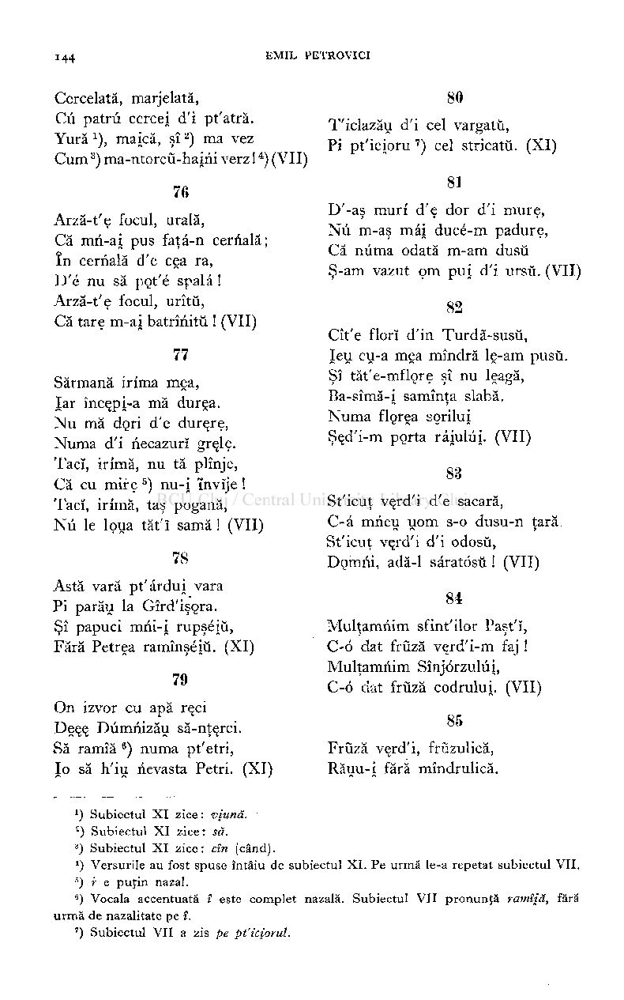

#### Cercelată, marjelată, Cü patru cercei d'i pt'atră. Yură maică, şî

#### T'iclazău d'i cel vargatü, Pi pt'icioru

#### ) ma vez Cum

2

) cel stricată. (XI)

7

#### ) ma-ntorcü-hairii verz !

) (VII) 76

3

4

81

D'-aş muri d'e dor d'i mure, Nü m-aş mâi ducé-m pădure, Că mima odată m-am dusü Ş-am văzut om pui d'i ursu. (VII)

Arză-t'e focul, urală, Că mn-ai pus faţâ-n ceriîală; în ceriială d'e cea ra, D'é nu să pçt'é spalâ ! Arză-t'e focul, urîtu, Că tare m-ai batrînitu ! (VII)

82

Cît'e flori d'in Turdă-susu, leu cu-a mea mîndră le-am pusü. Şî tăt'e-mflore şî nu leagă, Ba-sîmă-i samînţa slabă. Numa florea sorilui Şcd'i-m pQrta raiului. (VII)

77

Sărmană irima mea, Iar începi-a mă durea. Nu mă drjri d'e dure_re, Numa d'i necazuri greje. Taci, irimă, nu tă plînje, Că cu mire ) nu-i învîje ! Taci, irimă, taş pogană, Nii le loua tăt'î samă ! (VII)

83

St'icuţ vçrd'i d'e sacară, C-â miieu uom s-o dusu-n ţară St'icuţ vçrd'i d'i odosü, Domni, adă-1 saratösü ! (VII)

78

Astă vară pt'ârdui vara Pi pârău la Gîrd'işcra. Şî papuci mni-i rupşeiu, Fără Petrea ramînşeiu. (XI)

84

Mulţamnim sfint'ilor Paşt'î, C-6 dat fruză vçrd'i-m faj ! Mulţamnim Sînjorzuliii, C-6 dat fruză codrului. (VII)

79

On izvor cu apă rçci Deçç Diimnizău să-nţcrci. Să ramîă

85

#### ) numa pt'etri, Io să h'iu nevasta Petri. (XI)

Fruză vejd'i, fruzulică, Răuu-i fără mîndrulică.

6

) Subiectu l X I zic e : viună.

x

) Subiectu l X I zic e : să.

£

) Subiectu l X I zice : cîn (când) .

3

) Versuril e a u fos t spus e întâi u d e subiectu l XI . P e urm ă le- a repeta t subiectu l VII .

4

) r e puţi n nazal .

6

) Vocal a accentuat ă î est e comple t nazală . Subiectu l VI I pronunţ ă ramîiă, fără urm ă d e nazalitat e p e î.

6

' ) Subiectu l VI I a zi s pe pt'iciorul.

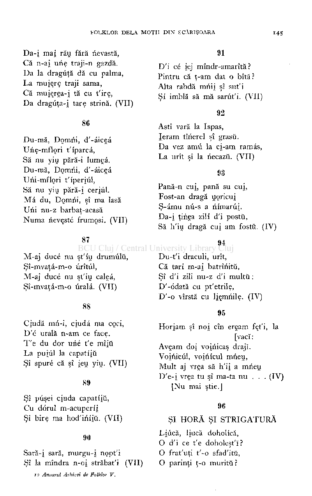

Da-i mai rău fără nevastă, Că n-ai une traji-n gazdă. Da la drăguţă dă cu palma, La muiere traji sama, Că mujerea-i tă cu t'ire, Da draguţa-i tare strină. (VII)

91

D'i cé iej mîndr-amarîtă ? Pintru că ţ-am dat o bîtă? Alta rabdă mnii şî sut'i Şi imblă să mă sarüt'i. (VII)

92

86

Astî vară la Ispas, Ieram tinerel sî grasü. Da vez amii la ci-am ramâs, La urît şî la necazü. (VII)

Du-mă, Domni, d'-âiced Une-mflori t'iparcâ, Să nu yiu pără-i lumea. Du-mă, Domni, d'-âiced Uni-mflori t'iperiul, Să nu yiu pără-i ceriul. Mâ du, Domni, şî ma lasă Uni nu-z barbaţ-acasă Numa rievçsté frumoşi. (VII)

93

Pană-n cui, pană su cui, Fost-an dragă uoricui Ş-âmu mi-s a nimarui. Da-i ţinea zili d'i postii, Să h'iu dragă cui am fostü. (IV)

87

94

Du-t'i draculi, urît, Că tari m-ai batrîhitu, Şî d'i zili nu-z d'i multü : D'-6dată cu pt'etrile, D'-o vîrstă cu liçmnile. (IV)

M-aj ducé nu şt'iu drumulü, Şî-mvaţâ-m-o üritül, M-aj ducé nu şt'iu calea, Şî-mvaţâ-m-o ürala. (VII)

88

95 Horiam şî noi cîn ergam fet'i, la

Ciudă mri-i, ciudă ma coci, D'é urală n-am ce face. T'e du dor une t'e mîiu La puiul la capa ti iü Şî spuré că şî jeu yiu. (VII)

[vacî : Aveam doi voinicaş drajî. Voinicul, voinicul mney, Mult aj vrea să h'ii a mneu D'e-i vrea tu şî ma-ta nu . . . (IV)

89

[Nu mai ştie.]

Şî pusei ciuda capatiiü, Cu dorul m-acuperii Şî bire ma hod'ifiiiü. (VII)

96 ŞI HORĂ ŞI STRIG ATU RĂ

Liucă, liucă doholică, O d'i ce t'e doholeşt'î? O frat'uţi t'-o sfad'itü, O părinţi ţ-o muritü ?

90

Sară-i sară, murgu-i nopt'i Şî la mîndra n-oi străbat'i (VII)

10 Anuarul Arhivei de Folklor V.

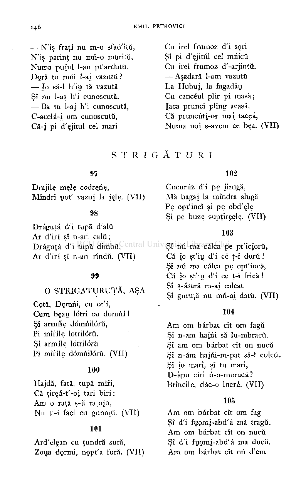

Cu irel frumoz d'i sori Şî pi d'ejitül cel mriicü Cu irel frumoz d'-arjintü.

— N'iş fraţi nu m-o sfad'itü, N'iş parinţ nu mn-o muritü, Numa puiul 1-an pt'ardutü. Doră tu miii l-ai văzutü?

— Aşadară l-am vazutü La Huhui, la fagadău Cu cancéul plir pi masă; Iaca prunci plîng acasă. Că pruncuţi-or mai taceâ, Numa noi s-avem ce bea. (VII)

— Io să-1 h'iu tă văzută Şî nu l-aş h'i cunoscută. — Ba tu l-ai h'i cunoscută, C-acelâ-i om cunoscută, Că-i pi d'ejitul cel mari

STRIGATUR I

102

- 97

Drajile meje codrçrie, Mîndri uot' văzui la içle. (VII)

- 98

Cucuruz d'i pe jirugă, Mă bagaj la mîndra slugă Pe opt'incî şi pe obd'çle Şî pe buze supţirecle. (VII)

Drăguţă d'i tupă d'alü Ar d'iri şî n-ari calü; Drăguţa d'i tupă dîmbu, Ar d'iri şî n-ari rîndù. (VII)

103

Şî mi ma călca pe pt'iciorü, Că io şt'iu d'i cé ţ-i dorü ! Şî nü ma călca pe opt'incă, Că io şt'iu d'i ce ţ-i frică ! Şî ş-âsară m-ai călcat Şî guruţă nu mn-ai datü. (VII)

99 O STRIGATURUŢĂ, AŞA

Cotă, Domni, cu ot'i, Cum beau lotri cu domni ! Şî armii e dömnilörü, Pi mîrile lotrilörü. Şî armii e lotrilörü Pi mîrile dömnilörü. (VII)

104

- Am om bărbat cît om fagü Şî n-am haini să lu-mbracü. Şî am om bărbat cît on nucü Şî n-âm haini-m-pat să-1 culcü. Şî io mari, şî tu mari, D-àpu ciri n-o-mbracâ? Brîncile, dàc-o lucra. (VII)

105

- Am om bărbat cît om fag Şî d'i fuomi-abd'â mă tragü.
- Am om bărbat cît on nucü Şî d'i fuomi-abd'â ma ducü.

- Am om bărbat cît on d'em

100

Haidă, fată, tupă mîfi, Că ţireâ-t'-oi tari biri : Am o raţă ş-u raţoiu, Nu t'-i faci cu gunoiü. (VII)

101

Ard'elean cu tundră sură, Zoua dormi, nopt'a fură. (VII)

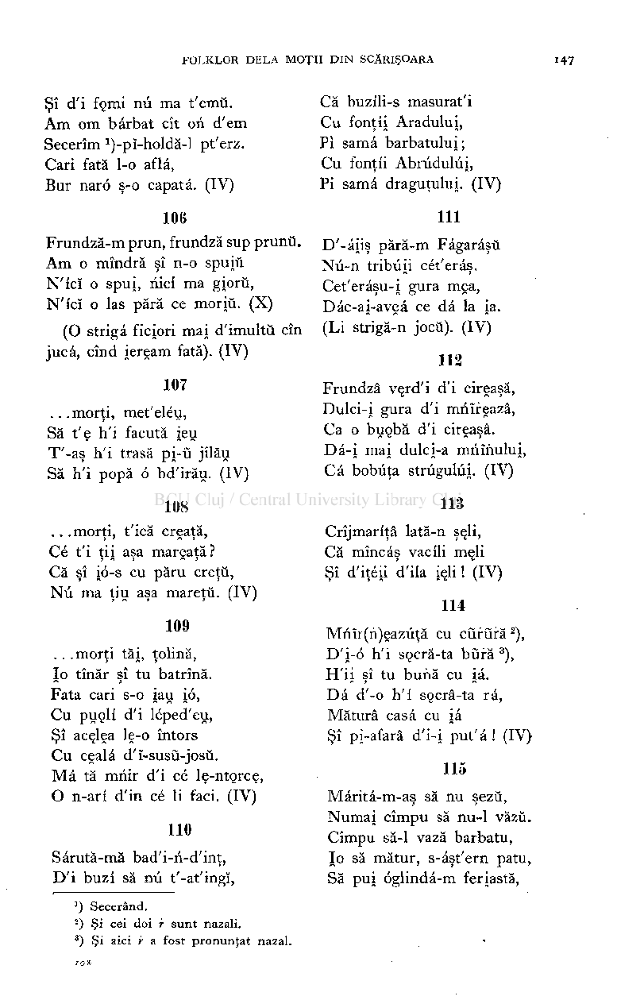

Că buzili-s masurat'i Cu fontii Aradului, Pi sama bărbatului; Cu fontii Abrudului, Pi sama drăguţului. (IV)

Şî d'i fomi nü ma t'emü. Am om bărbat cît on d'em Secerîm )-pî-holdă-l pt'erz. Cari fată l-o aflâ, Bur narö ş-o capătă. (IV)

111

106 Frundză-m prun, frundză sup prunu. Am o mîndra şî n-o spuiü N'icï o spui, nici ma giorü, N'icï o las pără ce moriü. (X)

D'-âiiş pără-m Fâgarâşu Nii-n tribüii cet'erâş. Cet'erâşu-i gura mea, Dâc-ai-aveâ ce dâ la ia. (Li strigă-n jocü). (IV)

(O striga ficiori mai d'imultü cîn juca, cînd ieream fată). (IV)

112

107

Frundzâ vçrd'i d'i cireaşă, Dulci-i gura d'i mfiîfeazâ, Ca o buQbă d'i cireaşă. Dâ-i mai dulci-a mfiînului, Câ bobiiţa strügului. (IV)

.. .morţi, met'eléu, Să t'e h'i făcută jeu T'-aş h'i trasă pi-ü jîlău Să h'i popă 6 bd'irău. (IV)

113

108

...morţi, t'ică creaţă, Cé t'i ţii aşa măreaţă? Că şî iö-s cu păru creţu,

Crîjmariţâ lată-n şe_li, Că mîncâş vacili mçli Şî d'itéii d'ila içli ! (IV)

- Nü ma ţiu aşa mareţu. (IV)

109

. . .morţi tăi, ţolină, Io tînăr şî tu batrînă. Fata cari s-o iau iö, Cu pyoli d'i léped'eu, Şî acelea le-o întors Cu cealâ d'i-susü-josü. Mâ tă mnir d'i cé le-ntorce,

- O n-ari d'in cé li faci. (IV) 110

114 Mnîr(h)eazuţă cu cüfüra

),

2

D'i-6 h'i sQcră-ta bură ), H'ii şî tu bună cu ia. Dd d'-o h'i SQcrâ-ta râ, Mătura casa cu ia Şî pi-afarâ d'i-i put'â ! (IV)

115

Mâritâ-m-aş să nu şezu, Numai cîmpu să nu-1 văzu. Cîmpu să-1 vază barbatu, Io să mătur, s-âşt'ern patu, Să pui oglindâ-m feriastă,

- Sârută-mă bad'i-n-d'inţ, D'i buzi să nü t'-at'ingï,

' ) Secerând .

) Ş i cei do i r sun t nazali .

2

) Ş i aici r a fost pronunţa t nazal .

3

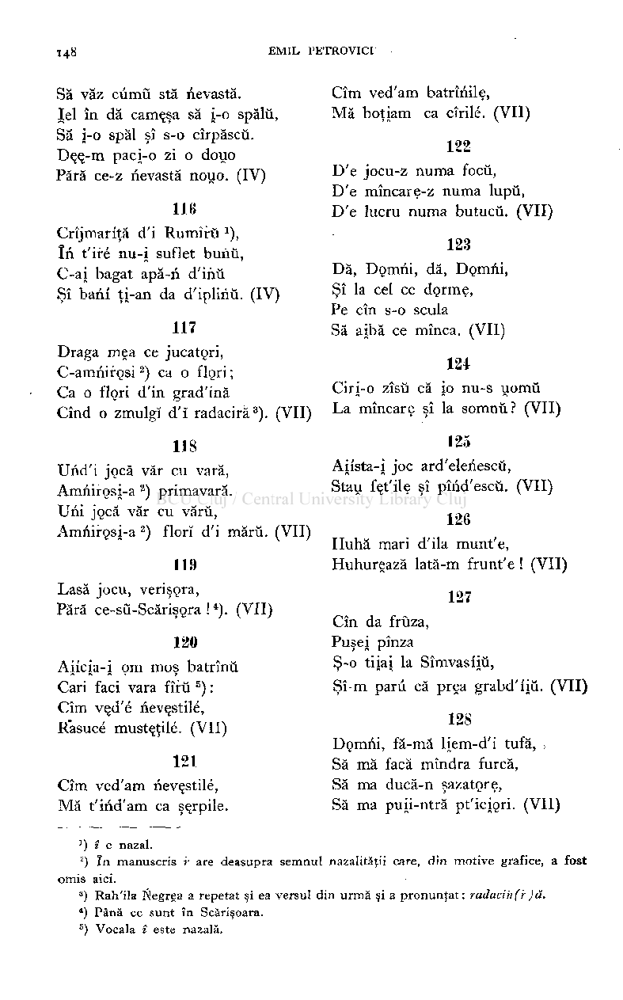

- Cîm ved'am batrîfiile, Mă boţiam ca cîrilé. (VII)

- 122 D'e jocu-z numa focu, D'e mîncare-z numa lupu, D'e lucru numa butucii. (VII)
- 123 Dă, Domni, dă, Domni, Şî la cel ce dorme, Pe cîn s-o scula Să aibă ce mînca. (VII)
- 124 Ciri-o zîsu că io nu-s uomü La mîncare şî la somnii? (VII)
- 125 Aiista-i joc ard'elenescü, Stau fet'ile şî pînd'escu. (VII)
- 126

Huhă mari d'ila munt'e, Huhurează lată-m frunt'e ! (VII)

- 127

- Cîn da früza, Pusei pînza Ş-o tiiai la Sîmvasiiu, Şî-m pani că prea grabd'iiü. (VII)

Să văz cumü stă nevastă. Iei în dă camesa să i-o spălu, Să i-o spăl şî s-o cîrpăscu. De_e_-m paci-o zi o douo Pără ce-z nevastă nouo. (IV)

ne

Crîjmariţă d'i Rumîru *), în t'iré nu-i suflet bunü, C-ai băgat apă-ii d'ihü Şî bani ţi-an da d'ipliriü. (IV)

117 Draga mea ce jucători, C-amnirosi

##### ) ca o flori ; Ca o flçri d'in grad'ină Cînd o zmulgi d'î radaciră

2

). (VII)

3

- 118 Und'i jocă văr cu vară, Amnirosi-a ) primăvară. Uni jocă văr cu varii, Amiiirosi-a ) flori d'i măru. (VII)
- 119 Lasă jocu, verişora, Pără ce-su-Scărişora !

). (VII)

4

- 120

Aiicia-i om moş batrînu Cari faci vara fîru ) : Cîm vçd'é rievçstilé, Rasucé mustăţile. (VII)

- 121

128 Domni, fă-mă liem-d'i tufă, Să mă facă mîndra furcă, Să ma ducă-n şazatcre, Să ma puii-ntră pt'icirjri. (VII)

Cîm ved'am rievestilé, Mă t'ifid'am ca şcrpile.

' ) î e nazal .

) î n manuscri s r ar e deasupr a semnu l nazalităţii care, di n motiv e grafice, a fost omi s aici.

2

- 3 ) Rah'il a Negre a a repeta t şi e a versu l di n urm ă ş i a pronunţat : radacihfr)ă.
- 4 ) Pân ă c e sun t î n Scărişoara .
- 5 ) Vocal a î est e nazală .

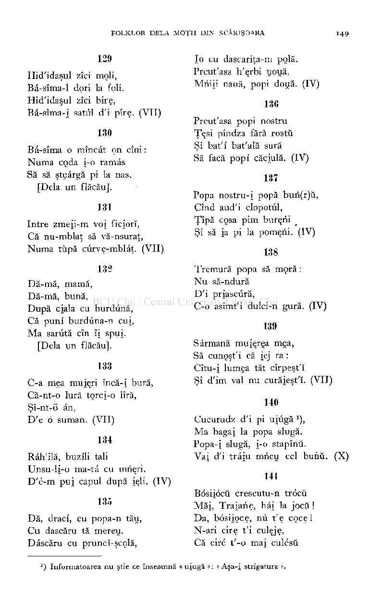

Io cu dascariţa-m polă. Preut'asa h'çrbi uouă, Mniii nauă, popi două. (IV)

Hid'idaşul zîci moli, Bâ-sîma-1 dori la foii. Hid'idaşul zîci bire,

13fi

- Bâ-sîma-i satul d'i pire. (VII) 130

Preut'asa popi nostru Ţcsipîndza fără rostii Şî bat'i bat'ală sură Să facă popi căciulă. (IV)

- Bâ-sîma o mîncat on cîni : Numa coda i-o ramds Să să şteargă pi la nas.

[Delà un flăcău]. 131

Intre zmeii-m voi ficiori, Că nu-mblaţ să vă-nsuraţ, Numa tupă curve-mblâţ. (VII)

132

Dă-mă, mamă, Dă-mă, bună, După ciala cu burdună, Că puni burdüna-n cui, Ma sărutăcîn îi spui. [Delà un flăcău].

133

- C-a mea muiçri încă-i bură, Că-nt-o lură torci-o liră, Şî-nt-o ân, D'e o suman. (VII)

137

Popa nostru-i popă buh(r)ü, Cînd aud'i clopotul, Ţîpă cosa pim burçni Şî să ia pi la pomçiii. (IV)

138

Tremură popa să moră : Nu să-ndură D'i priascură,

C-o asîmt'i dulci-n gură. (IV)

- 139 Sărmană muierea mea, Să cunoşt'i că iej ra : Cîtu-i lumea tăt cîrpeşt'î Şî d'im val nu curăieşt'î. (VII)
- 140

Cucurudz d'i pi uiugă ), Ma bagaj la popa slugă. Popa-i slugă, i-o stapîriu. Vai d'i trâiu mheu cel buhü. (X)

- 134

Râh'ilă, buzili tali Unsu-li-o ma-tâ cu mheri. D'é-m pui capul după içli. (IV)

- 135

141

Bösiiocü crescutu-n tröcü Măi, Traiahe, hai la jocü ! Da, bösiioce, mi t'e coce ! N-ari cire t'i culeje, Că ciré t'-o mai culésu

Dă, draci, cu popa-n tău, Cu dascăru tă mereu. Dâscăru cu pruncî-şcolă,

- ) Informatoare a n u ştie ce înseamn ă « uiug ă »: « Aşa- i strigatur a ».

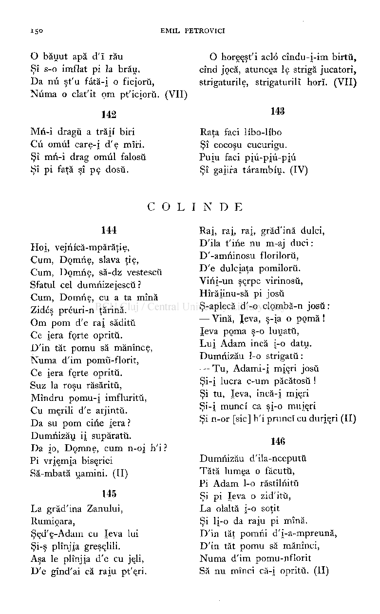

O băuut apă d'î rău Şî s-o imflat pi la brăy. Da nu şt'u fată-i o ficiorü, Nüma o clat'it om pt'iciorü. (VII)

O horecşt'i aclö cîndu-i-im birtü, cînd JQcă, atuncea le strigă jucători, strigaturile, strigaturilï horï. (VII)

143

142

Mn-i dragu a trăii biri Cu omiil care-i d'e miri. Şî mn-i drag omül falosü Şî pi faţă şî pe dosü.

Raţa faci libo-libo Şî cocoşu cucurigu. Pu iu faci piü-piü-piü Şî gaiifa târambiu. (IV)

COLIND

144

Rai, rai, rai, grăd'ina dulci, D'ila t'ine nu m-aj duci : D'-amninosu florilorü, D'e dulciaţa pomilorü. Vini-un şcrpe virinosü, Hîrăiinu-să pi josü Ş-aplecă d'-o clombă-n josü :

Hoi, vejnică-mpărăţie, Cum, Domne, slava ţie, Cum, Domne, să-dz vestescü Sfatul cel dumnizeiescü ? Cum, Domne, cu a ta mînă Zideş préuri-n ţarină.

— Vină, leva, ş-ia o pomă ! leva pçma ş-o luuatü, Lui Adam incă i-o datu. Dumnizău l-o strigatü :

- Om pom d'e rai săditu Ce iera forte opritü. D'in tăt pomu să mănînce, Numa d'im pomü-florit, Ce iera forte opritü. Suz la roşu răsăritu, Mîndru pomu-i imfluritü, Cu mçrili d'e arjintü. Da su pom cine iera? Dumnizău ii supăratu. Da io, Domne, cum n-oi h'i ? Pi vriçmia biserici Să-mbată uamini. (II)

— Tu, Adami-i miejri josü Şi-i lucra c-um păcătosu ! Şi tu, leva, incă-i miçri Şi-i munci ca şi-o mujçri Şi n-or [sic] h'i prunci cu duriçri (II)

146

Dumnizău d'ila-nceputü Tătă lumea o făcutu, Pi Adam l-o răstîlriitu Şi pi leva o zid'itü, La olaltă i-o soţit Şi li-o da raiu pi mînă. D'in tăţ pomhi d'i-a-mpreună, D'in tăt pomu să mănînci, Numa d'im pomu-nflorit Să nu mînci că-i opritü. (II)

145 La grăd'ina Zanului, Rumioara, Şcd'e-Adam cu leva lui Şi-ş plînjja greşejili. Aşa le plînjja d'e cu je_li, D'e gînd'ai că raiu pt'çri.

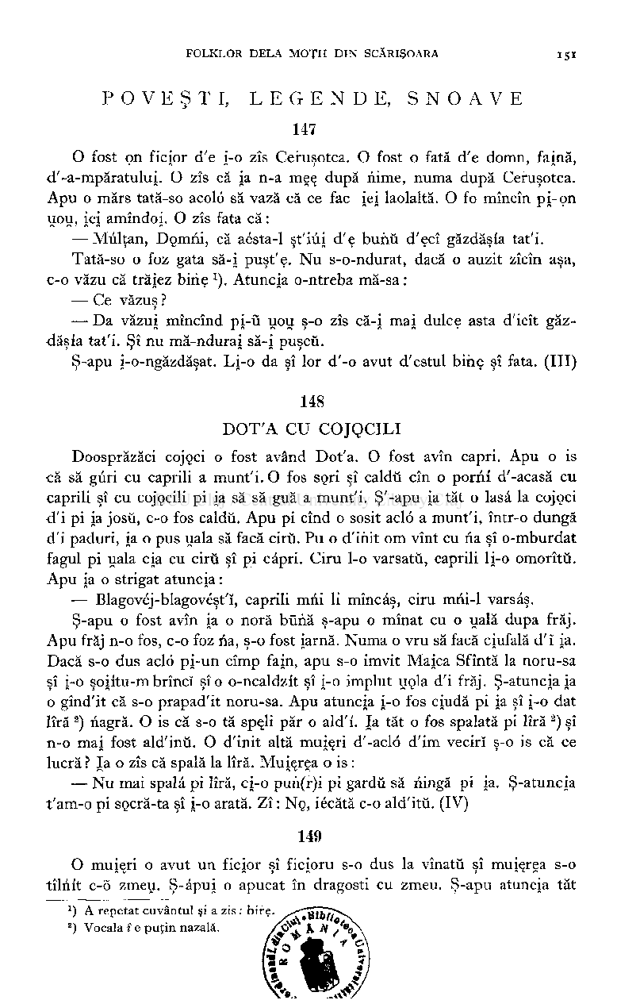

POVEŞTI , LEGENDE , SNOAV E

147

O fost on ficior d'e i-o zîs Ceruşotca. O fost o fată d'e domn, faină, d'-a-mpăratului. O zîs că ia n-a meç după hime, numa după Ceruşotca. Apu o mărs tată-so acolo să vază că ce fac iei laolaltă. O fo mîncîn pi-on uou, iei amîndoi. O zîs fata că :

— Miilţan, Domni, că aésta-1 şt'iui d'e bunu d'ecî găzdăşia tat'i. Tată-so o foz gata să-i puşt'e. Nu s-o-ndurat, dacă o auzit zîcîn aşa,

- c-o văzu că trăiez birie *). Atuncia o-ntreba mă-sa :

— Ce văzuş ?

— Da văzui mîncînd pi-ü uou ş-o zîs că-i mai dulce asta d'icît găzdăşia tat'i. Şî nu mă-ndurai să-i puşcu.

Ş-apu i-o-ngăzdăşat. Li-o da şî lor d'-o avut d'estul bine şî fata. (III)

148 DOT'A CU COJOCILI

Doosprăzăci cojoci o fost având Dot'a. O fost avîn capri. Apu o is că să güri cu caprili a munt'i. O fos sori şî caldü cîn o porni d'-acasă cu caprili şî cu cojocili pi ia să să guă a munt'i. Ş'-apu ia tăt o lasă la cojoci d'i pi ia josü, c-o fos caldü. Apu pi cînd o sosit aclô a munt'i, într-o dungă d'i păduri, ia o pus uala să facă cirü. Pu o d'init om vînt cu na şî o-mburdat fagul pi uala cia cu cirü şî pi câpri. Ciru l-o varsatü, caprili li-o omorîtu. Apu ia o strigat atuncia :

— Blagovéj-blagovést'ï, caprili mni li mîncăş, ciru mhi-1 varsâş. Ş-apu o fost avîn ia o noră bună ş-apu o minat cu o uală dupa frăj. Apu frăj n-o fos, c-o foz na, ş-o fost iarnă. Numa o vru să facă ciufală d'î ia. Dacă s-o dus aclô pi-un cîmp fain, apu s-o imvit Maica Sfîntă la noru-sa şî i-o şoiitu-m brîncî şîo o-ncaldzit şî i-o implut uola d'i frăj. Ş-atuncia ia o gînd'it că s-o prapad'it noru-sa. Apu atuncia i-o fos ciudă pi ia şî i-o dat lîră ) riagră. O is că s-o tă spe_li păr o ald'i. Ia tăt o fos spălată pi lîră ) şî n-o mai fost ald'inü. O d'init altă muiçri d'-acl6 d'im vecirî ş-o is că ce lucră ? Ia o zîs că spală la lîră. Muierea o is :

— Nu mai spală pi lîră, ci-o pun(r)i pi gardü să ningă pi ia. Ş-atuncia t'am-o pi SQcră-ta şî i-o arată. Zî : NQ, iecătă c-o ald'itü. (IV)

149

O muieri o avut un ficior şî ficioru s-o dus la vînatu şî muierea s-o tîlriit c-ö zmeu. Ş-âpui o apucat în dragosti cu zmeu. Ş-apu atuncia tăt

*) A repeta t cuvântu l şi a zis : bi:

) Vocal a î e puţi n nazală .

2

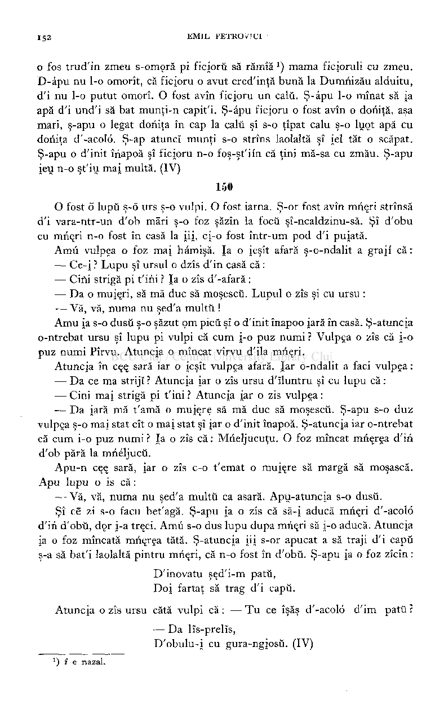

o fos trud'in zmeu s-omoră pi ficioru să rămîă ) mama ficioruli cu zmeu. D-âpu nu l-o omorît, că ficioru o avut cred'inţă bună la Dumnizău alduitu, d'i nu l-o putut omorî. O fost avîn ficioru un calü. Ş-âpu l-o mînat să ia apă d'i und'i să bat munţi-n capit'i. Ş-âpu ficioru o fost avîn o doniţă, aşa mari, ş-apu o legat doniţa în cap la calü şî s-o ţîpat calu ş-o luot apă cu doniţa d'-acolö. Ş-ap atunci munţi s-o strîns laolaltă şî iei tăt o scăpat. Ş-apu o d'init îriapoă şî ficioru n-o foş-şt'iin că ţini mă-sa cu zmău. Ş-apu jeu n-o şt'iu mai multă. (IV)

150

O fost ö lupü ş-o urs ş-o vulpi. O fost iarna. Ş-or fost avîn mrieri strînsă d'i vara-ntr-un d'ob mări ş-o foz şăzîn la focü şî-ncaldzinu-să. Şî d'obu cu mrieri n-o fost în casă la iii, ci-o fost într-um pod d'i puiată.

Amu vulpea o foz mai hâmişă. Ia o ieşît afară ş-o-ndalit a graii că:

— Ce-i ? Lupu şî ursul o dzîs d'in casă că :

— Cini strigă pi t'ini ? Ia o zîs d'-afară :

— Da o muieri, să mă duc să moşescu. Lupul o zîs şi cu ursu :

— Vă, vă, numa nu şed'a multü ! Amu ia s-o dusü ş-o şăzut om picü şî o d'init înapoo iară în casă. Ş-atuncia

o-ntrebat ursu şî lupu pi vulpi că cum i-o puz numi ? Vulpea o zîs că i-o puz numi Pîrvu. Atuncia o mîncat vîrvu d'ila mrieri.

Atuncia în cçe_ sară iar o ieşît vulpea afară. Iar o-ndalit a faci vulpea :

— Da ce ma strijï ? Atuncia iar o zîs ursu d'îluntru şî cu lupu că :

— Cini mai strigă pi t'ini ? Atuncia iar o zis vulpea :

— Da iară mă t'amă o muiere să mă duc să moşescu. Ş-apu s-o duz vulpea ş-o mai stat cît o mai stat şî iar o d'init înapoă. Ş-atuncia iar o-ntrebat că cum i-o puz numi ? Ia o zîs că : Mrieljucuţu. O foz mîncat mrierea d'in d'ob pără la mfieljucü.

Apu-n cçç sară, iar o zîs c-o t'emat o muiere să margă să moşască. Apu lupu o is că :

— Vă, vă, numa nu şed'a multü ca asară. Apu-atuncia s-o dusü. Şî ce zi s-o facu bet'agă. Ş-apu ia o zîs că să-i aducă mneri d'-acolö d'in d'obü, dor i-a treci. Amu s-o dus lupu dupa mrieri să i-o aducă. Atuncia ia o foz mîncată mrierea tătă. Ş-atuncia iii s-or apucat a să traji d'i capü ş-a să bat'i laolaltă pintru mrieri, că n-o fost în d'obü. Ş-apu ia o foz zîcîn :

D'inovatu şcd'i-m patü, Doi fartaţ să trag d'i capü.

Atuncia o zîs ursu cătă vulpi că : — Tu ce îşăş d'-acolö d'im patü ?

— Da lîs-prelîs, D'obulu-i cu gura-ngiosü. (IV)

' ) î e nazal .

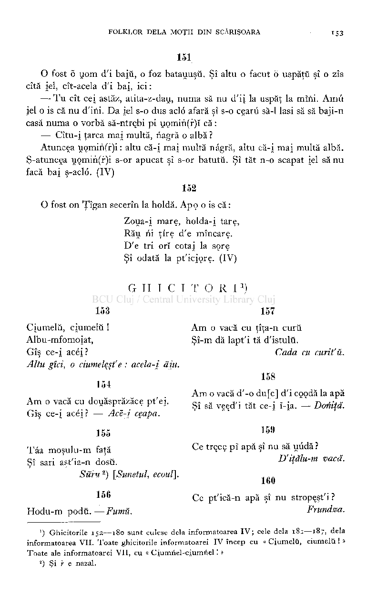

151

O fost ö uom d'i baiü, o foz batauuşu. Şî altu o făcut ö uspăţu şî o zîs cîtă iei, cît-acela d'i bai, ici :

— Tu cît cei astăz, atita-z-dau, numa să nu d'ii la uspăţ la mïiïi. Amü iei o is că nu d'ini. Da iei s-o dus aclô afară şî s-o cearu să-1 lasi să să baji-n casă numa o vorbă să-ntre_bi pi uomiri(r)î că :

— Cîtu-i ţarcă mai multă, hagră o albă ? Atuncea uţ>mirîfr)i : altu că-i mai multă nâgră, altu că-i mai multă albă.

Ş-atuncea uomin(r)i s-or apucat şî s-or batutü. Şî tăt n-o scăpat iei să nu facă bai ş-aclo. (IV)

152 O fost on Ţîgan secerîn la holdă. Apo o is că :

Zoua-i mare, holda-i tare, Rău hi ţire d'e mîncare. D'e tri ori cotai la sore Şî odată la pt'iciçre. (IV)

GHICITORI

153

157

Ciumelü, cjumelü ! Albu-mfomoiat, Gîş ce-i acéi?

Am o vacă cu ţîţa-n curu Şî-m dă lapt'i tă d'istulü.

Cada cu curit'ü.

Altu gîci, o ciumeleşt'e : acela-i ăiu.

158

- 154 Am o vacă cu douăsprăzăce pt'ei. Gîş ce-i acéi? — Acë-i ceapa.
- 155

Am o vacă d'-o du[c] d'i coodă la apă Şî să veçd'i tăt ce-i î-ia. — Doniţă.

- 159

Ce trçce pî apă şî nu să uudă ?

D'iţălu-m vacă.

- 160

- Tâa moşulu-m faţă Şî sari ast'ia-n dosü.

Suhl

) \Sunetul, ecoul]. 156

2

Ce pt'ică-n apă şî nu stropcşt'i ?

Frundza.

Hodu-m podü. —Fumü.

') Ghicitoril e 152—180 sun t cules e del à informatoare a IV ; cele del à 18-—187, del à informatoare a VII . Toat e ghicitoril e informatoare i I V înce p c u « Ciumelü , ciumel ü ! » Toat e al e informatoare i VII , c u « Cjumnel-ciumne l ! »

) Ş i r e nazal .

2

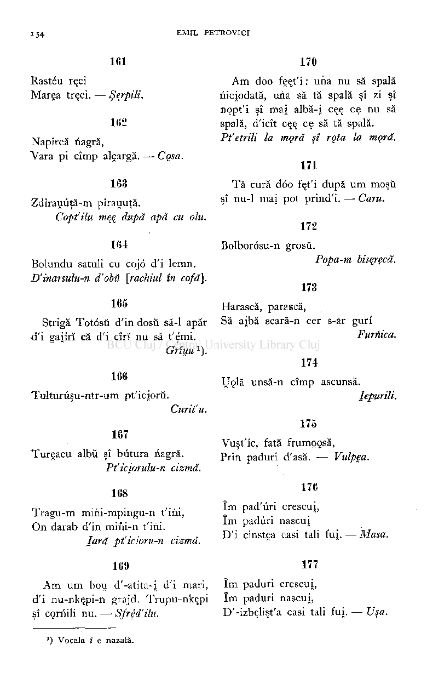

161 170

Rastéu reci Marea treci. — Şerpili.

Am doo feet'i : una nu să spală niciodată, uiia să tă spală şî zi şî nopt'i şî mai albă-i cçç ce nu să spală, d'icît cçç ce să tă spală.

162 Napîrcă nagră,

Pt'etrili la mqră şî rqta la mcră.

171

Vara pi cîmp aleargă. — Cosa.

Tă cură doo fet'i după um moşu şî nu-1 mai pot prind'i. — Caru.

Zdîrauuţă-m pîrauuţă.

Copt'ilu me% după apă cu olu.

- 172

Bolborösu-n grosü.

Popa-m biserecă.

- 173

#### 164

Bolundu sătuli cu cojö d'i lemn. D'inarsulu-n d'obü [rachiul în cofă].

165

Harască, parască, Să aibă scară-n cer s-ar guri

Strigă Totösü d'in dosü să-1 apăr d'i gaiirî că d'i cîrî nu să t'émi.

Furnica.

Grîuu

).

1

- 174

TJolă unsă-n cîmp ascunsă.

Iepurili.

- 175

- 166

Tulturiişu-ntr-um pt'iciorü.

Curit'u.

- 167

Vuşt'ic, fată frumoşsă, Prin păduri d'asă. — Vulpea.

Tureacu albu şî bütura nagră.

Pt'iciorulu-n cizmă.

176

- 168 Tragu-m mini-mpingu-n t'ini,

- On darab d'in mihi-n t'ini. Iară pt'icjoru-n cizmă.

- 169

îm pad'iiri crescui, îm păduri născu i D'i cinstea casi tali fui. — Masa.

177

îm păduri crescui, îm păduri nascui, D'-izbe_lişt'a casi tali fui. Usa.

Am um bou d'-atita-i d'i mari, d'i nu-nkçpi-n grajd. Trupu-nkçpi şî cgrnili nu. — Sfrêd'ilu.

) Vocal a î e nazală .

J

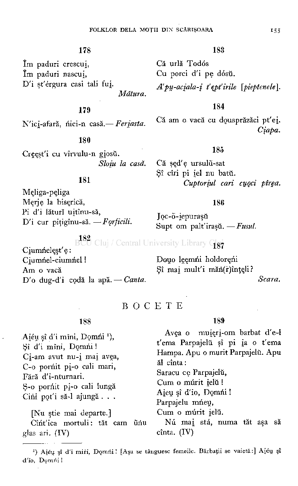

183

Că urlă Todös Cu porci d'i pe dösü.

î m păduri crescui, î m păduri nascui, D'i şt'ergura casi tali fui.

Äpu-aciala-i t'çpt'irile \pieptenele].

Mătura.

- 179

N'ici-afară, riici-n casă.— Feriasta.

- 180

Crecşt'i cu vîrvulu-n giosü.

Sloiu la casă.

- 181

- 184

Că am o vacă cu dousprăzăci pt'ei.

Ciapa.

- 185

Că şed'e ursulü-sat Şî cîri pi iei nu batü.

Cuptoriul cari cucei pîrea.

Mçliga-pçliga Merje la biserică, Pi d'i lături uitînu-să, D'i cur piţigînu-să. —Fçrficili.

186

Joc-o-iepuraşu Supt om palt'iraşu. —Fusul.

182

187

Ciumnelcşt'e : Ciumnel-ciumnel !

Doyo leçmni holdorçrii Şî mai mult'i măn(r)înţeji ?

- Am o vacă D'o dug-d'i codă la apă. — Cânta.

Scara.

BOCET E

189

188 Aiéu şî d'i mîni, Domni

Avea o muieri-om bărbat d'e-1 t'ema Parpajelü şî pi ia o t'ema Hampa. Apu o murit Parpajelü. Apu ăl cînta : Saracu ce Parpajelü, Cum o mürit ielü ! Aieu şî d'io, Domni ! Parpajelü mneu, Cum o murit ielü.

), Şî d'i mîni, Dsrnni !

J

- Ci-am avut nu-i mai avea,

- C-o pornit pi-o caii mari, Fără d'i-nturnari. Ş-o pornit pi-o caii lungă Cirii pot'i să-1 ajungă . . .

[Nu ştie mai departe.] Cînt'ica mortuli : tăt cam unu

Nü mai stă, numa tăt aşa să cînta. (IV)

glas ari. (IV)

) Aié u şî d'i miri , Domn i ! [Aş a se tângues c femeile . Bărbaţi i s e văietă: ] Aié u şî

x

•d'io, Domn i !

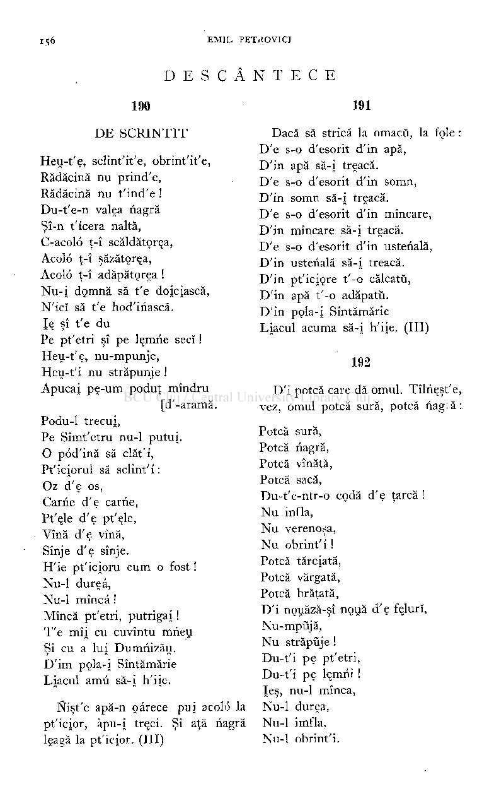

DESCÂNTEC E

191

190 DE SCRINTIT

Dacă să strică la omacü, la fole : D'e s-o d'esorit d'in apă, D'in apă să-i treacă. D'e s-o d'esorit d'in somn, D'in somn să-i treacă. D'e s-o d'esorit d'in mîncare, D'in mîncare să-i treacă. D'e s-o d'esorit d'in ustehală, D'in ustehală să-i treacă. D'in pt'iciore t'-o călcatu, D'in apă t'-o adăpatu. D'in pçla-i Sîntămărie Liacul acuma să-i h'iie. (III)

Heu-t'e, sclint'it'e, obrint'it'e, Rădăcină nu prind'e, Rădăcină nu t'ind'e ! Du-t'e-n valea hagră Şî-n t'icera naltă, C-acolö ţ-î scăldătorca, Acolo ţ-î şăzătorca, Acolo ţ-î adăpătorea ! Nu-i dcţmnă să t'e doiciască, N'icî să t'e hod'iriască. Iç şî t'e du

Pe pt'etri şî pe lernrie seri ! Heu-t'e, nu-mpunje, Heu-t'i nu străpunje ! Apucai pe-um poduţ mîndru

192

D'i potcă care dă omul. Tîlhcşt'e, vez, omul potcă sură, potcă hag;ă: Potcă sură, Potcă hagră, Potcă vînătă, Potcă sacă, Du-t'e-ntr-o codă d'e ţarcă ! Nu infla, Nu verenoşa, Nu obrint' i ! Potcă tărciată, Potcă vărgată, Potcă brăţată, D'i nouăză-şî nouă d'e fçlurï, Nu-mpujă, Nu străpuje ! Du-t'i pe pt'etri, Du-t'i pe lçmhi ! leş, nu-1 mînca, Nu-1 durea, Nu-1 imfla, Nu-1 obrint'i.

[d'-aramă.

Podu-1 trecui, Pe Sîmt'etru nu-1 putui. O pod'ină să clăt'i, Pt'iciorul să sclint'i: Oz d'e os, Carne d'e carne, Pt'çle d'e pt'eje, Vînă d'e vînă, Sînje d'e sînje. H'ie pt'icioru cum o fost ! Nu-1 durea, Nu-1 mînca ! Mîncă pt'etri, putrigai ! T'e mîi cu cuvîntu mrieu Şî cu a lui Dumhizău. D'im pola-i Sîntămărie Liacul amu să-i h'iie.

Nişt'e apă-n oarece pui acolo la pt'icior, àpu-i trçci. Şî aţă hagră leagă la pt'icior. (III)

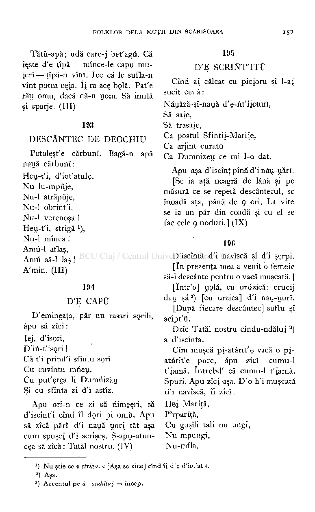

195 D'E SCRlftTTTÜ

Tătu-apă; udă care-i bet'agü. Că içste d'e ţîpă — mînce-le capu muieri— ţîpă-n vînt. Ice că le suflă-n vînt potca ceja. îi ra acç bolă. Pat'e

Cînd ai călcat cu picioru şî l-ai sucit ceva : Nâuăză-şî-nauă d'e-nt'iieturî, Să saie, Să trasaie, Ca postul Sfintii-Mariie, Ca arjint curatü Ca Dumnizeu ce mi l-o dat.

- rău omu, dacă dă-n uom. Să imflă şî sparje. (III)

193 DESCÂNTEC DE DEOCHIU Potolcşt'e cărbuni. Bagă-n apă

nauă cărbuni : Heu-t'i, d'iot'atule, Nu lu-mpüje, Nu-1 străpuje, Nu-1 obrint'i, Nu-1 verenoşa ! Heu-t'i, strigă ), Nu-1 mînca ! Amü-1 aflaş, Amii să-1 laş ! A'min. (III)'

194 D'E CAPÜ

D'emineaţa, păr nu rasari sorili, apu să zîci : lej, d'isori, D'in-t'isori ! Că t'i prind'i sfîntu sori Cu cuvîntu mneu, Cu put'e/ea li Dumnizău Şi cu sfînta zi d'i astîz.

Apu ori-n ce zi să riimeçri, să d'iscînt'i cînd îl dori pi omü. Apu

- să zîcâ pără d'i nauă uori tăt aşa cum spusei d'i scrişeş. Ş-apu-atuncea să zîcă : Tatăl nostru. (IV)

Apu aşa d'iscînţ pînă d'i nâu-uărî. [Se ia aţă neagră de lână şi pe

măsură ce se repetă descântecul, se înoadă aţa, până de 9 ori. La vite se ia un păr din coadă şi cu el se fac cele 9 noduri.] (IX)

196

D'iscîntă d'i navîscă şî d'i şţrpi. [în prezenţa mea a venit o femeie

să-i descânte pentru o vacă muşcată.]

[într'o] uolă, cu urdzică; crucij dau şâ

) [cu urzica] d'i nau-uori. [După fiecare descântec] suflu şî

2

## scîpt'u.

) a d'iscîntă.

### Dzîc Tatăl nostru cîndu-ndălui

3

Cîm muşcă pi-atarit'e vacă o piatârit'e porc, apu zîci cumu-1 t'iamă. întrebd' că cumu-1 t'iarnă. Spuri. Apu zîci-aşa. D'o h'i muşcată d'i navîscă, îi zîci : Hëi Mariţă, Pîrpariţă, Cu guşîli tali nu ungi, Nu-mpungi, Nu-mfla,

N u ştie c e e striga. « [Aş a s e zice ] cîn d î i d' e d'iot'a t ».

- 2 ) Aşa .
- 3 ) Accentu l p e ă: cndălui = încep .

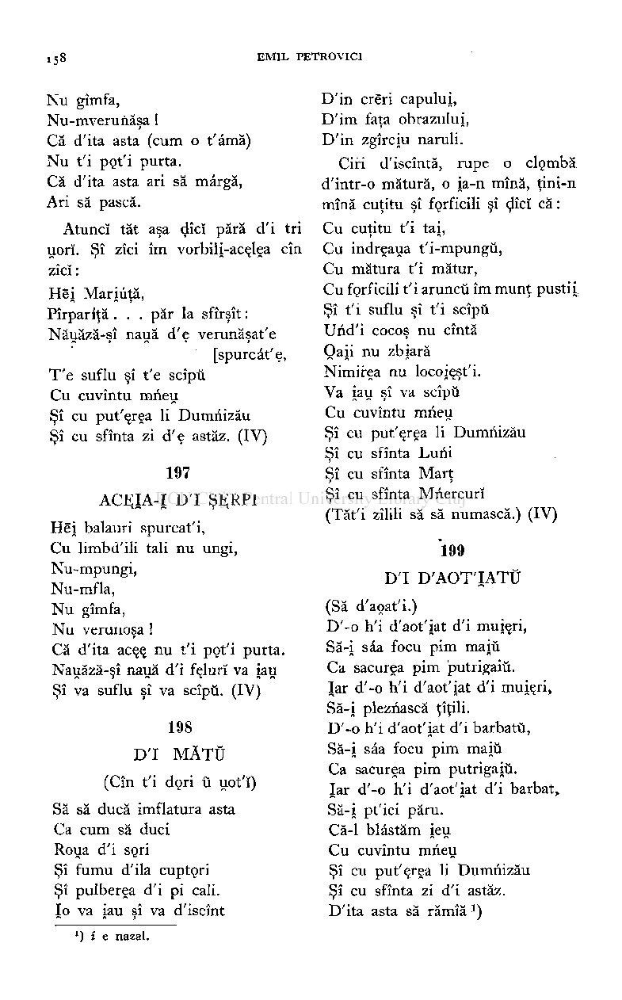

D'in crëri capului, D'im faţa obrazului, D'in zgîrciu naruli.

Nu gîmfa, Nu-mverunăşa ! Că d'ita asta (cum o t'âmă) Nu t'i pot'i purta. Că d'ita asta ari să mârgă, Ari să pască.

Ciri d'iscîntă, rupe o clombă d'intr-o mătură, o ia-n mînă, ţini-n mînă cuţitu şî forficili şî dîcî că: Cu cuţitu t'i tai, Cu indreaua t'i-mpungü, Cu mătura t'i mătur, Cu forficili t'i aruncü îm munţ pustii Şî t'i suflu şî t'i scîpu Uhd'i cocoş nu cîntă Oaii nu zbiară Nimirea nu locoicşt'i. Va iau şî va scîpu Cu cuvîntu mneu Şî cu put'crea li Dumnizău Şî cu sfînta Luni Şî cu sfînta Marţ Şî cu sfînta Mriercurî (Tăt'i zîlili să să numască.) (IV)

Atunci tăt aşa dîcî pără d'i tri uorî. Şî zîci îm vorbili-acejea cîn zîcî : Hëi Mariuţă, Pîrpariţă . . . păr la sfîrşît : Năuăză-şî nauă d'e verunăşat'e

[spurcat'e,

T'e suflu şî t'e scîpu Cu cuvîntu mneu Şî cu put'e/ea li Dumiiizău Şî cu sfînta zi d'e astăz. (IV)

197 ACFJA-I DT ŞERPI

Hëi balauri spurcat'i, Cu limbd'ili tali nu ungi, Nu-mpungi, Nu-mfla, Nu gîmfa, Nu verunoşa ! Că d'ita acçç nu t'i pot'i purta. Nauăză-şî nauă d'i feluri va iau Şî va suflu şî va scîpu. (IV)

199 D'I D'AOT'IATÜ (Să d'aoat'i.) D'-o h'i d'aot'iat d'i muie/i, Să-i sâa focu pim maiü Ca sacurea pim 'putrigaiü. Iar d'-o h'i d'aot'iat d'i muiçri, Să-i plezhască ţîţili. D'-o h'i d'aot'iat d'i barbatü, Să-i sâa focu pim maiü Ca sacurea pim putrigaiü. Iar d'-o h'i d'aot'iat d'i bărbat, Să-i pt'ici păru. Că-1 blâstăm ieu Cu cuvîntu mneu Şî cu put'erea li Dumnizău Şî cu sfînta zi d'i astăz. D'ita asta să rămîă

198 D'I MÄTÜ (Cîn t'i dori ü yot'ï) Să să ducă imflatura asta Ca cum să duci Rouă d'i sori Şî fumu d'ila cuptori Şî pulberea d'i pi caii. Io va iau şî va d'iscînt

##### )

x

' ) ! e nazal .

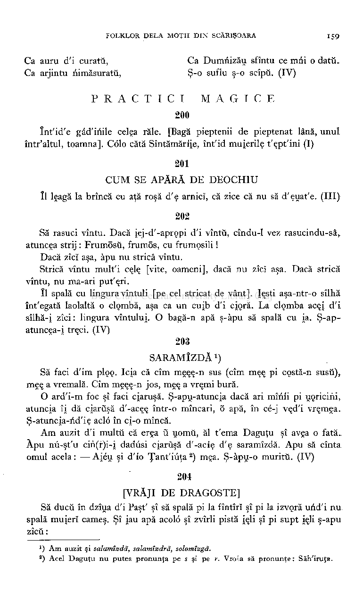

Ca auru d'i curatü, Ca Dumnizău sfîntu ce mrii o dattL Ca arjintu nimăsuratu, Ş-o suflu ş-o scîpu. (IV)

PRACTIC I MAGIC E

200

înt'id'e gâd'inile celea răle. [Bagă pieptenii de pieptenat lână, unul într'altul, toamna]. Colo cătă Sîntămăriie, înt'id muierile t'ept'ini (I)

201 CUM SE APĂRĂ D E DEOCHIU

îl leagă la brîncă cu aţă roşă d'e arnicî, că zice că nu să d'euat'e. (III) 202 Să răsuci vîntu. Dacă iej-d'-aprç-pi d'i vîntu, cîndu-1 vez rasucindu-sâ,

atuncea strij : Frumösü, frumos, cu frumosili ! Dacă zîcî aşa, àpu nu strica vîntu. Strică vîntu mult'i cejç [vite, oameni], dacă nu zîcî aşa. Dacă strică

vîntu, nu ma-ari put'çri.

îl spală cu lingura vîntuli [pe cel stricat de vânt]. Içsti aşa-ntr-o sîlhă înt'egată laolaltă o clombă, aşa ca un cuib d'i cicră. La clomba acej d'i sîlhă-i zîci : lingura vîntului. O bagă-n apă ş-âpu să spală cu ia. Ş-apatuncea-i trçci. (IV)

203 SĂRAM ÎZDĂ

#### ) Să faci d'im ploç. Icia că cîm meçç-n sus (cîm mçç pi ccstă-n susü)

x

f

meç a vremală. Cîm meçç-n jos, meç a vrerni bură.

O ard'i-m foc şî faci ciaruşă. Ş-apu-atuncia dacă ari mînii pi uçricini, atuncia îi dă ciaruşă d'-acçç într-o mîncari, 5 apă, în cé-j vçd'i vrçmea. Ş-atuncia-nd'ie aclö în ci-o mîncă.

Am auzit d'i multü că erea ü uomü, ăl t'ema Daguţu şî avea o fată.. Àpu mi-şt'u cin(r)i-i dadüsi ciaruşă d'-acie d'e saramîzdă. Apu să cînta omul acela: —Aieu şi d'io Ţant'fuţa

) mea. Ş-apu-o muritü. (IV) 204

2

[VRĂJI D E DRAGOSTE]

Să ducü în dzîya d'i Paşt' şî să spală pi la fîntîrî şî pi la izvora ufid'i nu spală muieri cameş. Şî iau apă acolo şî zvîrli pistă ieji şî pi supt içli ş-apu zîcu :

###### ) A m auzi t ş i salamîzdă, salamîzdră, solomîzgă.

J

) Ace l Daguţ u n u pute a pronunţ a p e s şi p e r. Vroi a s ă pronunţe : Sâh'iruţa

2

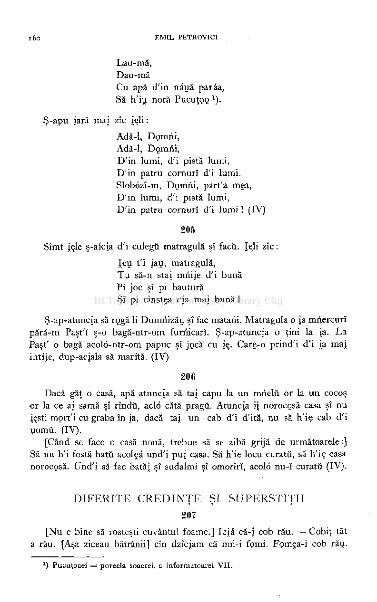

Lau-mă, Dau-mă Cu apă d'in nâuă parâa, Să h'iu noră PucuţQQ ).

Ş-apu iară mai zic iţii :

Adă-1, Domni, Adă-1, Domni, D'in lumi, d'i pistă lumi, D'in patru cornurî d'i lumi. Slobozî-m, Domni, part'a mea, D'in lumi, d'i pistă lumi, D'in patru cornurî d'i lumi ! (IV)

205

Simt içle ş-aicia d'i culegü matragulă şî facü. Iţii zîc : leu t'i iau, matragulă, Tu să-n stai mnije d'i bună Pi joc şî pi băutură Şî pi cinstea cia mai bună !

Ş-ap-atuncia să rogă li Dumnizău şî fac matani. Matragulă o ia mnercurî pără-m Paşt'î ş-o bagă-ntr-om furnicari. Ş-ap-atuncia o ţini la ia. La Paşt' o bagă acolô-ntr-om papuc şî jocă cu iç. Care-o prind'i d'i ia mai intiie, dup-aciala să mărită. (IV)

206

Dacă găţ o casă, apă atuncia să tai capu la un mrielü or la un cocoş or la ce ai samă şî rîndu, aclö cătă pragü. Atuncia ii norocosă casa şî nu içsti mçrt'i cu graba în ia, dacă tai un cab d'i d'ită, nu să h'ie cab d'i uomü. (IV).

[Când se face o casă nouă, trebue să se aibă grijă de următoarele :] Să nu h'i fostă hatü acoleâ und'i pui casa. Să h'ie locu curatü, să h'ie casa norocosă. Und'i să fac bătăi şî sudalmi şî omorîrî, acolo nu-î curatü (IV).

DIFERIT E CREDINŢ E Ş I SUPERSTIŢI I

207

[Nu e bine să rosteşti cuvântul foame.] Iciâ că-i cob rău. — Cobit tăt a rău. [Aşa ziceau bătrânii] cîn dzîciam că mri-i fomi. Fomea-i cob răy.

) Pucuţoae i = porecl a soacrei , a informatoare i VII .

l

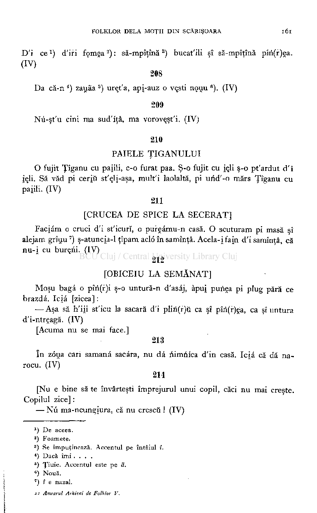

) bucat'ili şî să-mpîţînă pîri(r)ea. (IV)

##### D'i ce*) d'iri fomea

##### ) : să-mpîţînă

2

3

- 208

Da că-n ) zauàa ) urçt'a, api-auz o vesti nçmu

6

). (IV)

- 209

Nu-şt'u cini ma sud'iţâ, ma vorovçst'i. (IV)

- 210

PAIELE ŢIGANULUI

O fujit Ţîganu cu pajili, c-o furat paa. Ş-o fujit cu jeli ş-o pt'ardut d'i ieK. Să văd pi cerjü st'eH-aşa, mult'i laolaltă, pi urid'-o mărs Ţîganu cu paiili. (IV)

211 [CRUCEA DE SPICE LA SECERAT]

Facjâm o cruci d'i st'icuri, o pureâmu-n casă. O scuturam pi masă sî alejam grîuu

) ş-atuncja-1 ţîpam aclö în samînţâ. Acela-j fajn d'i samînţâ, că nu-j cu bureni. (IV)

7

212 [OBICEIU LA SEMĂNAT]

Moşu baga o pîn(r)i ş-o untură-n d'asâj, âpuj punea pi plug pără ce brazdă. Icjâ [zicea] :

•— Aşa să h'iji st'icu la sacară d'i pliri(r)u ca şî pîri(r)ea, ca sî untura d'i-ntreagă. (IV)

[Acuma nu se mai face.]

213

în zöua cari samanâ sacâra, nu dâ nimhica d'in casă. Icjâ că dă narocu. (IV)

214

[Nu e bine să te învârteşti împrejurul unui copil, căci nu mai creşte. Copilul zice] :

— Nu ma-ncungjura, că nu crescu ! (IV)

) D e aceea .

x

- 2 ) Foamete .
- 3 ) S e împuţinează . Accentu l p e întâiu l î.
- 4 ) Dac ă îm i ... .
- 5 ) Ţiuie . Accentu l est e p e ă.
- 6 ) Nouă .

###### ' ) î e nazal . II Anuarul Arhivei de Folklor V.

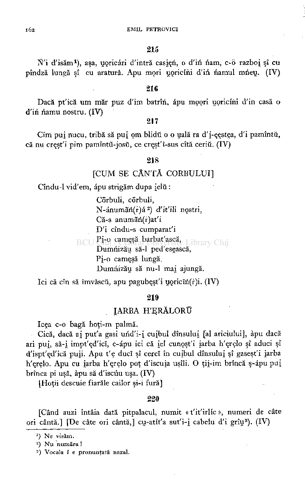

##### 215 N'i d'isăm

), aşa, uoricâri d'intră casiçn, o d'in nam, c-o război şî cu

1

pîndză lungă şî cu arătura. Apu mori uoricini d'in namul mrieu. (IV) 216

Dacă pt'ică um măr puz d'im batrîh, âpu moori uoricifii d'in casă o d'in riamu nostru. (IV)

217

Cîm pui nucu, tribă să pui om blidü o o uală ra d'i-ççstea, d'i pamîntu, că nu crcşt'i pim pamîntù-josu, ce crcşt'î-sus cîtă ceriü. (IV)

218 [CUM SE CÂNTĂ CORBULUI] Cîndu-1 vid'em, âpu strigăm dupa ielü :

Cörbuli, côrbuli, N-ânumăii(f)â ) d'it'ili noştri, Că-s anumări(r)at'i D'i cîndu-s cumparat'i Pi-o camcşă barbat'ască, Dumnizău să-1 ped'esească, Pi-o camcşă lungă, Dumnizău să nu-1 mai ajungă.

Ici că cîn să îmvăscu, apu pagubcşt'i uçricîn(r)i. (IV)

219 IARBA H'EJRÄLORÜ Icea c-o bagă hoţi-m palmă.

Cică, dacă ai put'a gasi und'i-i cuibul dînsului [al ariciului], apu dacă ari pui, să-i impt'çd'icï, c-âpu ici că iei cunoşt'i iarba h'çrelo şî aduci şî d'ispt'cd'ică puii. Apu t'e duci şî cerci în cuibul dînsului şî gaseşt'i iarba h'crelo. Apu cu iarba h'crelo poţ d'iscuia uşîli. O ţii-im brîncă ş-âpu pui brînca pi uşâ, apu să d'iscüu uşa. (IV)

[Hoţii descuie fiarăle cailor şi-i fură] 220

[Când auzi întâia dată pitpalacul, numit « t'it'irlic », numeri de câte ori cântă.] [De câte ori cântă,] cu-atit'a sut'i-i cabelu d'i grîu

##### ). (IV)

3

*) N e visăm .

) N u număr a !

2

) Vocal a î e pronunţat ă nazal .

3

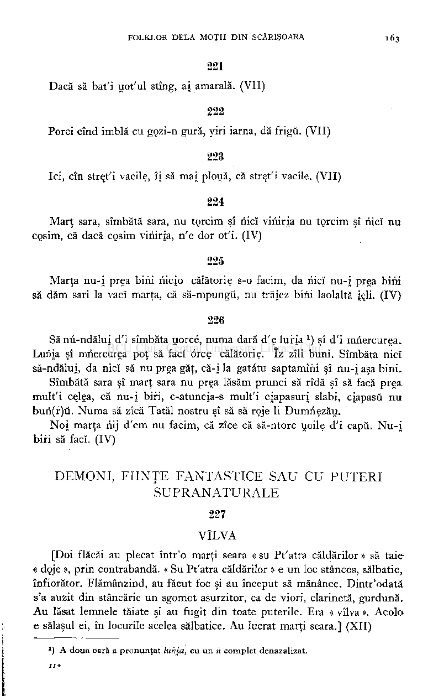

- 221

Dacă să bat'i uot'ul stîng, ai amarală. (VII)

- 222

Porci cînd imblă cu gozi-n gură, yiri iarna, dă frigü. (VII)

- 223

Ici, cîn strçt'i vacile, îi să mai plouă, că stret'i vacile. (VII)

- 224

Marţ sara, sîmbătă sara, nu torcim şî riicî vihiria nu torcim şî hicî nu cosim, că dacă cosim viniria, n'e dor ot'i. (IV)

225

Marţa nu-i prea bihi hicio călătorie s-o facim, da riicî nu-i prea bini să dăm sari la vacî marţa, că să-mpungu, nu trăiez bini laolaltă ieji. (IV)

226

Sănu-ndălui d'i sîmbăta uorcé, numa dară d'e luria ) şî d'i mhercurea. Luiiia şî mhercurea poţ să facî örce călătorie. îz zîli buni. Sîmbăta nici să-ndălui, da nicî să nu prea găţ, că-i la gatâtu saptamîhi şî nu-i aşa bini.

Sîmbătă sara şî marţ sara nu prea lăsăm prunci să rîdă şî să facă prea mult'i cçlea, că nu-i biri, c-atuncia-s mult'i ciapasuri slabi, ciapasü nu buii(r)ü. Numa să zîcă Tatăl nostru şî să să rçje li Dumhezău.

Noi marţa hij d'em nu facim, că zîce că să-ntorc uoile d'i capă. Nu-i biri să facî. (IV)

DEMONI , FIINŢ E FANTASTIC E SA U C U PUTER I SUPRANATURAL E

227 VÎLVA

[Doi flăcăi au plecat într'o marţi seara « su Pt'atra căldărilor » să taie « doje », prin contrabandă. « Su Pt'atra căldărilor » e un loc stâncos, sălbatic, înfiorător. Flămânzind, au făcut foc şi au început să mănânce. Dintr'odată s'a auzit din stâncărie un sgomot asurzitor, ca de viori, clarinetă, gurdună. Au lăsat lemnele tăiate şi au fugit din toate puterile. Era « vîlva ». Acola e sălaşul ei, în locurile acelea sălbatice. Au lucrat marţi seara.] (XII)

) A dou a oar ă a pronunţa t luhia, c u u n h comple t denazalizat .

J

###### II*

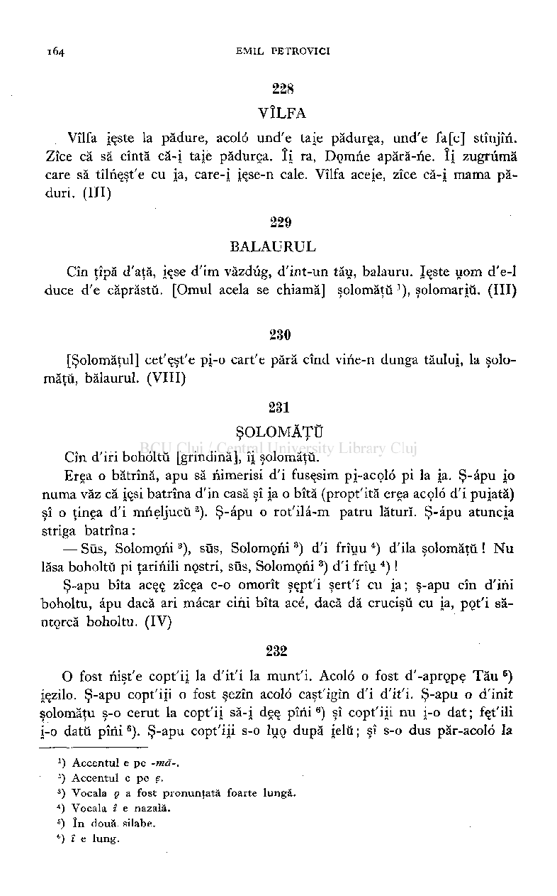

228 VÎLFA

Vîlfa içste la pădure, acolo und'e taie pădurea, und'e fa[c] stînjîn. Zîce că să cîntă că-i taie pădurea. îi ra, Domne apără-he. îi zugrumă care să tîlncşt'e cu ia, care-i içse-n cale. Vîlfa aceie, zîce că-i mama păduri. (III)

229 BALAURUL

Cîn ţîpă d'aţă, ie.se d'im văzdug, d'int-un tău, balauru. Içste uom d'e-1 duce d'e căprăstu. [Omul acela se chiamă] şolomăţu ), şolomariu. (III)

230

[Şolomăţul] cet'cşt'e pi-o cart'e pără cînd vihe-n dunga tăului, la şolomăţu, balaurul. (VIII)

231 ŞOLOMĂŢU Cîn d'iri bohöltü [grindină], îi şolomăţu. Erea o bătrînă, apu să nimerişi d'i fusçsim pi-acolö pi la ia. Ş-âpu io

numa văz că içsi batrîna d'in casă şî ia o bîtă (propt'ită erea acolo d'i pu iată) şî o ţinea d'i mrieljucü

). Ş-âpu o rot'ilâ-m patru lături. Ş-âpu atuncia striga batrîna :

2

##### ) d'i frîuu ) d'ila şolomăţu ! Nu lăsa boholtü pi ţarinili noştri, süs, Solomohi ) d'i frîu

— Süs, Solomohi

##### ), sus, Solomohi

3

3

) !

4

Ş-apu bîta acçç zîcea c-o omorît şcpt'i şert'î cu ia; ş-apu cîn d'ihi boholtu, âpu dacă ari mâcar cini bîta acé, dacă dă crucişu cu ia, pot'i săntorcă boholtu. (IV)

232 O fost hişt'e copt'ii la d'it'i la munt'i. Acolo o fost d'-aprçpe Tău

##### ) içzilo. Ş-apu copt'iii o fost şezîn acolo caşt'igîn d'i d'it'i. Ş-apu o d'init şolomăţu ş-o cerut la copt'ii să-i deç pîhi

5

##### ) şî copt'iii nu i-o dat; fçt'ili i-o datü pîhi ). Ş-apu copt'iii s-o IUQ după ielü ; şî s-o dus păr-acolo la

6

###### Accentu l e p e -mă-.

) Accentu l e p e e.

2

) Vocal a g a fost pronunţat ă foart e lungă .

3

) Vocal a î e nazală .

4

) î n dou ă silabe .

5

) î e lung .

6

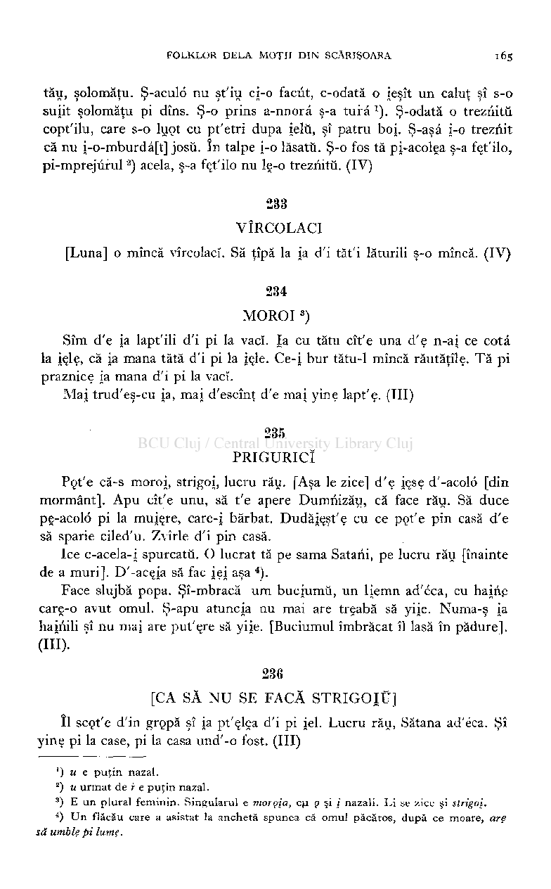

tău, şolomăţu. Ş-aculo nu şt'iu ci-o făcut, c-odată o ieşit un căluţ şî s-o suiit şolomăţu pi dîns. Ş-o prins a-nnorâ ş-a tură *). Ş-odată o treznitü copt'ilu, care s-o luot cu pt'etri dupa ielü, şî patru boi. Ş-aşâ i-o trezfiit că nu i-o-mburdâ[t] josü. în talpe i-o lăsatu. Ş-o fos tă pi-acolea ş-a fet'ilo, pi-mprejürul

) acela, ş-a fet'ilo nu le-o treznitü. (IV)

2

233 VÎRCOLACI

[Luna] o mîncă vîrcolacî. Să ţîpă la ia d'i tăt'i lăturili ş-o mîncă. (IV)

234 MOROI )

Sîm d'e ia lapt'ili d'i pi la vacî. Ia cu tătu cît'e una d'e n-ai ce cota la içle, că ia mana tătă d'i pi la ieje. Ce-i bur tătu-1 mîncă răutăţile. Tă pi praznice ia mana d'i pi la vacî.

Mai trud'eş-cu ia, mai d'escînţ d'e mai yine lapt'e. (III)

235 PRIGURICÎ

Pot'e că-s moroi, strigoi, lucru rău. [Aşa le zice] d'e içse d'-acol6 [din mormânt]. Apu cît'e unu, să t'e apere Dumriizău, că face rău. Să duce pe-acolö pi la muiere, care-i bărbat. Dudăicşt'e cu ce pot'e pin casă d'e să sparie ciled'u. Zvîrle d'i pin casă.

Ice c-acela-i spurcatü. O lucrat tă pe sama Satani, pe lucru rău [înainte de a muri]. D'-aceja să fac iei aşa

).

4

Face slujbă popa. Şî-mbracă um buciumă, un liemn ad'éca, cu haine care-o avut omul. Ş-apu atuncia nu mai are treabă să yiie. Numa-ş ia hainili şî nu mai are put'ere să yiie. [Buciumul îmbrăcat îl lasă în pădure]. (III).

236 [CA SÄ N U SE FACÄ STRIGOIÜ]

îl scot'e d'in gropă şî ia pt'çlea d'i pi iei. Lucru rău, Satana ad'éca. Şî yine pi la case, pi la casa und'-o fost. (III)

') u e puţi n nazal .

- 2 ) u urma t d e r e puţi n nazal .
- 3 ) E u n plura l feminin . Singularu l e morçia, c u p şi i nazali . L i se zic e şi strigoi.
- 4 ) U n flăcă u car e a asista t la anchet ă spune a c ă omu l păcătos , dup ă c e moare , are

###### să umble pi lume.

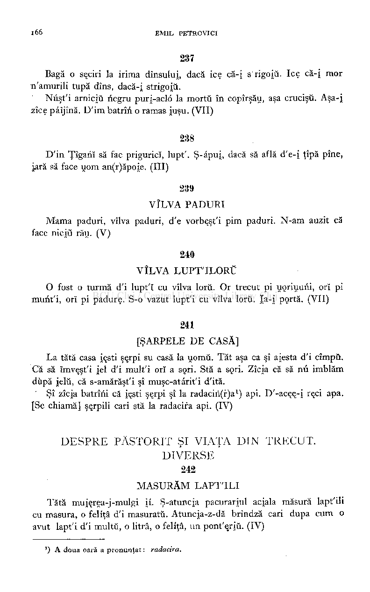

237

Bagă o seciri la irima dînsului, dacă ice că-i s rigoiü. Ice că-i mor n'amurili tupă dîns, dacă-i strigoiü.

Nuşt'i arniciu negru puri-aclö la mortü în copîrşău, aşa crucişu. Aşa-i zîce pâîjînă. D'im batrîn o rămas iuşu. (VII)

238

D'in Ţîganî să fac priguricî, lupt'. Ş-âpui, dacă să află d'e-i ţîpă pîne, iară să face uom an(r)ăpoie. (III)

239 VÎLVA PĂDURI

Mama păduri, vîlva păduri, d'e vorbcşt'i pim păduri. N-am auzit că face niciü rău. (V)

240 VÎLVA LUPT'ILORÜ

O fost o turmă d'i lupt'î cu vîlva lorü. Or trecut pi uoriuurii, ori pi munt'i, ori pi pădure. S-o văzut Iupt'i cu vîlva lom. Ia-i pcrtă. (VII)

241 [ŞARPELE DE CASĂ]

La tătă casa ie_sti şerpi su casă la uomü. Tăt aşa ca şî aiesta d'i cîmpu. Că să îmvcşt'i iei d'i mult'i orï a sori. Stă a sori. Zîcia că să nü imblăm după ielü, că s-amărăşt'i şî muşc-atârit'i d'ită.

) api. D'-acçç-i re_ci apa. [Se chiamă] şcrpili cari stă la radacifa api. (IV)

Şî zîcia batrîni că içsti şcrpi şî la radaciri(f)a

1

DESPRE PĂSTORIT ŞI VIAŢA DIN TRECUT. DIVERSE

242 MĂSURĂM LAPTTLI

Tătă muierea-j-mulgi ii. Ş-atuncia pacurariul aciala măsură lapt'ili cu măsura, o feliţâ d'i masuratü. Atuncia-z-dă brîndză cari dupa cum o avut lapt'i d'i multü, o litra, o feliţâ, un pont'eriü. (IV)

) A dou a oar ă a pronunţa t : radacira.

x

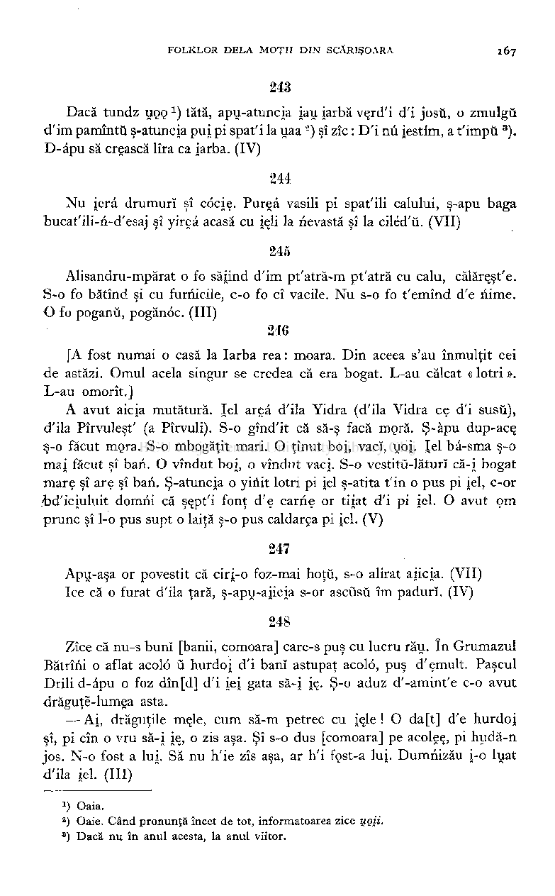

##### 243 Dacă tundz UQQ

##### ) tătă, apu-atuncia iau iarbă vçrd'i d'i josü, o zmulgü d'im pamîntu ş-atuncia pui pi spat'i la yaa

1

). D-âpu să crească lîra ca iarba. (IV)

##### ) şî zîc : D'i nü iestim, a t'impü

2

3

244

Nu ierâ drumuri şî cöcie. Pureâ vasili pi spat'ili calului, ş-apu baga bucat'ili-ii-d'esaj şî yireâ acasă cu iţii la nevastă şî la ciléd'ù. (VII)

245

Alisandru-mpărat o fo săiind d'im pt'atră-m pt'atră cu calu, călărcşt'e. S-o fo bătînd şi cu furnicile, c-o fo cî vacile. Nu s-o fo t'emînd d'e riime. O fo poganü, pogănoc. (III)

246

[A fost numai o casă la Iarba rea : moara. Din aceea s'au înmulţit cei de astăzi. Omul acela singur se credea că era bogat. L-au călcat « lotri ». L-au omorît.]

A avut aicia mutătură. Iei areä d'ila Yidra (d'ila Vidra ce d'i susü), d'ila Pîrvuleşt' (a Pîrvuli). S-o gînd'it că să-ş facă moră. Ş-apu dup-acç ş-o făcut mora. S-o mbogăţit mari. O ţînut boi, vacî, yoi. Iei bâ-sma ş-o mai făcut şî ban. O vîndut boi, o vîndut vaci. S-o vestitu-lăturî că-i bogat mare şî are şî ban. Ş-atuncia o yiiiit lotri pi iei ş-atita t'in o pus pi iei, c-or bd'iciuluit domni că şe_pt'i fonţ d'e carne or tiiat d'i pi iei. O avut om prunc şî l-o pus supt o laiţă ş-o pus căldarea pi iei. (V)

- 247

Apy-aşa or povestit că ciri-o foz-mai hoţu, s-o alirat aiicia. (VII) Ice că o furat d'ila ţară, ş-apy-aiicia s-or ascüsü îm păduri. (IV)

- 248

Zîce că nu-s buni [banii, comoara] care-s puş cu lucru rău. în Grumazul Bătrîrii o aflat acolö ü hurdoi d'i bani astupat acolo, puş d'emult. Paşcul Drili d-âpu o foz dîn[d] d'i iei gata să-i iç. Ş-o aduz d'-amint'e c-o avut drăguţe-lumea asta.

— Ai, drăguţile meje, cum să-m petrec cu içle ! O da[t] d'e hurdoi şî, pi cîn o vru să-i iç, o zis aşa. Şî s-o dus [comoara] pe acoleç, pi hudă-n jos. N-o fost a lui. Să nu h'ie zîs aşa, ar h'i fost-a lui. Dumnizău i-o luat d'ila iei. (III)

) Oaia .

x

) Oaie . Cân d pronunţ ă înce t d e tot , informatoare a zic e ygii.

z

) Dac ă n u î n anu l acesta , la anu l viitor .

3

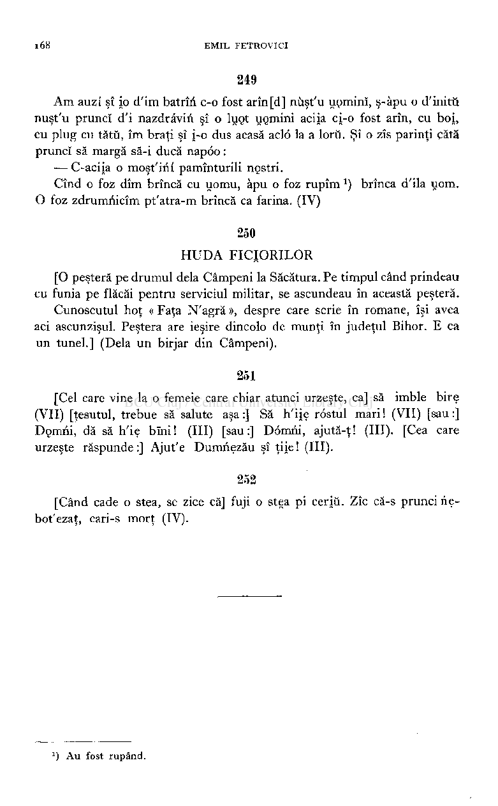

249

Am auzi şî io d'im batrîri c-o fost arîn[d] nuşt'u uornini, ş-apu o d'initü nuşt'u prunci d'i nazdrâvin şî o lugt uomini aciia ci-o fost arîn, cu boi, cu plug cu tătu, îm braţi şî i-o dus acasă aclö la a lorü. Şî o zîs părinţi cată prunci să margă să-i ducă napöo :

— C-aciia o moşt'ini pamînturili noştri. Cînd o foz dîm brîncă cu uomu, àpu o foz rupîm*) brînca d'ila uom.

O foz zdrumfiicîm pt'atra-m brîncă ca farina. (IV)

250 HUDA FICIORILOR

[O peşteră pe drumul delà Câmpeni la Săcătura. Pe timpul când prindeau cu funia pe flăcăi pentru serviciul militar, se ascundeau în această peşteră.

Cunoscutul hoţ « Faţa N'agră », despre care scrie în romane, îşi avea aci ascunzişul. Peştera are ieşire dincolo de munţi în judeţul Bihor. E ca un tunel.] (Delà un birjar din Câmpeni).

251

[Cel care vine la o femeie care chiar atunci urzeşte, ca] să imble bire (VII) [ţesutul, trebue să salute aşa:] Să h'iie rostul mari! (VII) [sau:] Domni, dă să h'ie bini! (III) [sau:] Domni, ajută-ţ! (III). [Cea care urzeşte răspunde:] Ajut'e Dumriezău şî ţiie! (III).

252

[Când cade o stea, se zice că] fuji o stea pi ceriu. Zîc că-s prunci riebot'ezaţ, cari-s morţ (IV).

) A u fost rupând .

x

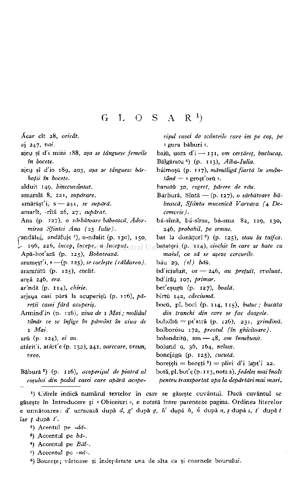

GLOSAR )

Acar cî 28, oricât.

rişul casei de scânteile care ies pe coş, pe « gur a băbur i ».

ai 247, vai. aieu şî d' i mirii 188, aşa se tânguesc femeile

baiü, uo m d' i — 151, om certăreţ, buclucaş. Bălgărat u ") (p 113), Alba-Iulia. bâlmoş u (p 117), mămăligă fiartă în smân­

în bocete.

aieu şî d'i o 189, 203, aşa se tânguesc băr­

baţii în bocete. alduit 149, binecuvântat. amaral ă 8, 221, supărare. amărăşt'i , S'—241, se supără. amarît , -rîtă 26, 27; supărat.

tână — « groşt'or u ». banat ü 30, regret, părere de rău. Bârbură , Sînt ă — (p . 127), o sărbătoare bă­

bească, Sfânta mucenică Varvara (4 Decemvrie ).

- An a (p 127), o sărbătoare băbească, Adormirea Sfintei Ana (25 Iulie).

bâ-sîmă , bâ-sîma , bâ-sm a 82, 129, 130,

246, probabil, pe semne. ba t la donăţur i

) , o-ndali t (p . 130), 150,

(-"andălui, andălui e

) (p . 125), stau la taifas. bătător i (p . 114), ciochie în care se bate cu

2

5

U 196, 226, încep, începe, a început. Apă-bot'az ă (p 125), Bobotează. arameşt'i , s — (p . 125), se cocleşte (căldarea). aramriitü (p 125), coclit. are â 246, era. ar?ndă (p 114), chirie. arjaua casi păr ă la acuperiş u (p 116), pă-

maiul, ca să se aşeze cercurile. bă u 29, (el) bău. bd'iciuluit , o r — 246, au preţuit, evaluat. bd'iră u 107, primar. bet'eşug u (p 127), boală. birt ü 142, cârciumă. bocü , pl . boci (p 114, 115), butuc ; bucata

reţii casei fără acoperiş.

Armind'i n (p 126), ziua de 1 Mai ; molidul tânăr ce se înfige în pământ în ziua de 1 Mai.

din trunchi din care se fac doagele. bohölt ü = pt'atr ă (p 126), 231, grindină. bolborös u 172, preotul (în ghicitoare). bolondzitü , a m — 48, am înnebunit. bolun d 9, 36, 164, nebun. bonciâg u (p 125), cucută. boreţeli = boreţ i

ar ü (p 124), ei au. atârit'i, atârt' e (p . 132), 241, oarecare, vreun,

vreo.

) = pliri d' i lapt'i 22.

6

botă,pl.bot'e(p . 113, not a 2), fedeleş mai înalt pentru transportat apa la depărtări mai mari.

) (p . 116), acoperişul de piatră al coşului din podul casei care apără acope­

Băbur ă

3

) Cifrele indică număru l textelor î n care s e găseşte cuvântul . Dac ă cuvântu l s e găseşte î n Introducer e şi « Obiceiur i », e notat ă într e parentez e pagina . Ordine a literelo r e următoarea d' urmeaz ă dup ă d, g' dup ă g, h' dup ă h, n dup ă n, ş dup ă s, t' dup ă t iar ţ dup ă t'.

1

- 2

) Acentu l p e -dă-.

- 3

) Accentu l p e bă-.

- 4

) Accentu l p e Băl-.

- 5

) Accentu l p e -nă-.

- 6

###### )Boureţe ; vârtoas e şi îndepărtat e un a d e alta ca şi coarnel e bourului .

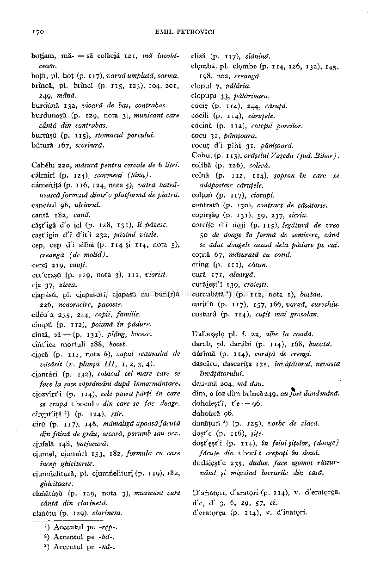

boţjam , mă - = s ă colăciâ 121 mă încolă­

clisă (p 117), slănină. clombă , pl . clomb e (p 114, 126, 132), 145.

ceam.

boţii, pl . bo ţ (p 117), varză umplută, sarma. brîncă , pl . brîncï (p 115, 123), 104, 201,

198, 202, creangă. clopu l 7, pălăria. clopuţ u 33, pălărioara, code (p 114), 244, căruţă. cöcili (p 114), căruţele. cocin ă (p 112), coteţul porcilor. coc u 31, pânişoara. cocu ţ d' i pîn i 31, pânişoara. Cohu l (p . 113), orăşelul Vaşcău (jud. Bihor). colibă (p 126), colivă. coln ă (p 112, 114), şopron în care se

249, mână. burdun ă 132, vioară de bas, contrabas. burdunaş u (p 129, not a 3), muzicant care

cântă din contrabas. burtuş u (p 115), stomacul porcului. butur ă 167, scorbură.

Cabél u 220, măsură pentru cereale de 6 litri. câlmir î (p 124), scarmeni (lâna). câmehiţ ă (p . 116, 124, not a 5), vatră bătrâ­

adăpostesc căruţele. colţu n (p 117) ciorapi. contrat ü (p 130), contract de căsătorie. copîrşă u (p 131), 59, 237, sicriu. corcîie d' i doji (p 115) legătură de vreo 50 de doage în formă de semicerc, când se aduc doagele acasă delà pădure pe cai.

nească formată dintr'o platformă de piatră. cancéu l 96, ulciorul. cânt ă 182, cană. căşt'ig ă d' e iei (p 128, 131), îl păzesc. caşt'igîn d' i d'it'i 232, păzind vitele. cep , ce p d' i sîlhă (p 114 şi 114 not a 5),

cotită 67, măsurată cu cotul. crin g (p III) , cătun. cur ă 171 aleargă. curăieşt' 139, croieşti. curcubătă ) (p . 112, not a 1), bostan. curit' ü (p 117), 157, 166, varză, curechiu. custur a (p 114), cuţit mai grosolan.

creangă (de molid). cerci 219, cauţi. cet'eraş u (p 129, not a 3), III , viorist. cia 37, zicea. ciapâsu , pl . ciapasurî, ciapas ü n u buri(r)u

226, nenorocire, pacoste. cüed' ü 235, 244, copii, familie. cîmp u (p 112), poiană în pădure. cîntă, s ă — (p. 131) plâng, bocesc. cînt'ica mortul i 188, bocet. ciocă (p 114 not a 6), capul scaunului de

Dalboşel e pl . f. 22, albe la coadă. darab , pl . darâb i (p 114), 168, bucată. dârîm ă (p 114), curăţă de crengi. dascăru , dascariţ a 135, învăţătorul, nevasta

văsărit (v. planşa III, 1, 2, 3, 4).

învăţătorului. dau-m ă 204, mă dau, dîm , o foz dî m brînc ă 249, auf\st dândmână. doholeşt'i , t' e — 96. doholîc ă 96. donăţur î

ciontâr i (p 132), colacul cel mare care se

face la şase săptămâni după înmormântare. ciozvîrt' i (p 114), cele patru părţi în care

se crapă « bocu l » din care se fac doage.

•cîrept'iţă ) (p . 124), ştir. cir û (p 117), 148, mămăligă apoasă făcută

) (p . 125), vorbe de clacă. doşt' e (p 116), şiţe. doşt'eşt' i (p 114), în felul sitelor, (doage)

3

din făină de grâu, secară, porumb sau orz. cjufală 148, batjocură. cjumel , ciumriel 153, 182, formula cu care

făcute din « boc i » crepaţi în două.

dudăieşt' e 235, dudue, face sgomot răstur-

încep ghiciturile.

nând şi mişcând lucrurile din casă.

ciumnelitură , pl . ciumnelitur i (p . 119), 182,

ghicitoare.

D'ahatori , d'arator i (p . 114), v . d'eratorea . d'e , d ' 3, 6, 29, 57, ci. d'eratore a (p 114), v . d'inatori .

clanătaş u (p 129, not a 3), muzicant care

cântă din clarinetă.

clanét u (p 129), clarinetă.

*) Accentu l p e -rep-.

- 2

) Accentu l p e -bă-.

- 3

) Accentu l p e -nă-.

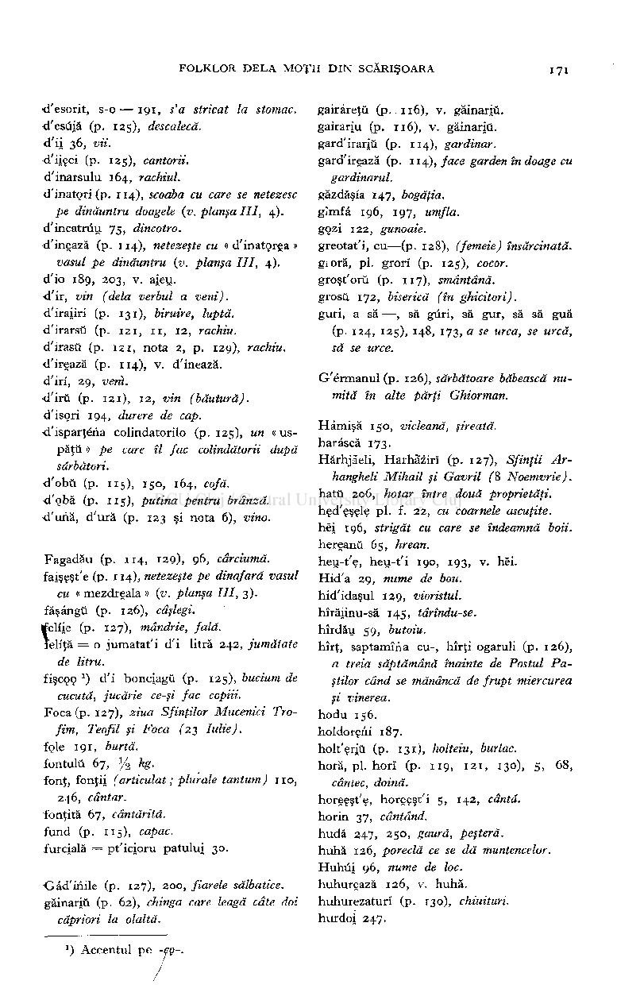

d'esorit , s- o — 191, s'a stricat la stomac. d'esui ă (p 125), descăleca. d'ii 36, vii. d'ijeci (p 125), cantorii. d'inarsul u 164, rachiul. d'inatçr i (p . 114), scoaba cu care se netezesc pe dinăuntru doagele (v. planşa III, 4). d'incatra u 75, dincotro. d'ineaz ă (p 114), netezeşte cu « d'inatore a » vasul pe dinăuntru (v. planşa III, 4). d'i o 189, 203, v . aiey. d'ir , vin (delà verbul a veni). d'irajiri (p 131), biruire, luptă. d'irars ü (p 121, 11 , 12, rachiu. d'iras ü (p 121 not a 2, p . 129), rachiu. d'ireaz ă (p 114), v . d'inează . d'iri, 29, vent. d'ir ü (p 121), 12, vin (băutură). d'isçr i 194, durere de cap. d'ispartéh a colindatoril o (p 125), un « us -

gairâreţ u (p 116), v . găinariu . gairariu (p 116), v . găinariu . gard'irari ü (p 114), gardinar. gard'ireaz ă (p 114), face garden în doage cu

gardinarul.

găzdăşia 147, bogăţia.

- gîmf â 196, 197, umfla. goz i 122, gunoaie. greotat'i , cu—(p 128), (femeie) însărcinată. gioră , pl . gror ï (p 125), cocor. groşt'or u (p 117) smântână. gros ü 172, biserică (în ghicitori). guri , a să — , s ă güri , s ă gur , să s ă gu ă

(p. 124, 125), 148, 173, a se urca, se urcă, să se urce.

G'érmanu l (p . 126), sărbătoare băbească nu­

mită în alte părţi Ghiorman.

Hâmiş ă 150, vicleană, şireată. harâsc ă 173. Hărhjăeli , Harhăzir î (p 127), Sfinţii Ar­

hangheli Mihail şi Gavril (& Noemvrie). hat ü 206, hotar între două proprietăţi. hed'eşel e pl . f. 22, cu coarnele ascuţite. hëi 196, strigăt cu care se îndeamnă boii. herean ü 65, hrean. heu-t'e , heu-t' i 190, 193, v . hëi . Hid' a 29, nume de bou. hid'idaşu l 129, vioristul.

- hîrăiinu-s ă 145, târîndu-se. hîrdă u 59, butoiu. hîrţ , saptamîn a cu- , hîrţ i ogaruli (p 126),

păţ u » pe care îl fac colindătorii după sărbători.

d'ob ü (p 115), 150, 164, cofă. d'ob ă (p 115), putina pentru brânză. d'ună , d'ur ă (p 123 şi not a 6), vino.

Fagadă u (p 114, 129), 96, cârciumă. faişeşt'e (p . 114), netezeşte pe dinafară vasul

cu « mezdreal a » (v. planşa III, 3).

- făşâng u (p 126), câşlegi. tfeh'ie (p. 127), mândrie, fală.

leliţă = o jumatat' i d' i litră 242, jumătate

de litru. fişcoo

1

) d' i bonciag ü (p . 125), bucium de cucută, jucărie ce-şi fac copiii.

Foc a (p . 127), ziua Sfinţilor Mucenici Tro-

fim, Teofil şi Foca ^23 Iulie). fole 191, burtă. fontul ü 67, y

2

kg.

fonţ, fontii (articulat ; plurale tantum) 110,

246, cântar. fonţită 67, cântărită. fun d (p 115), capac. furcială = pt'icior u patulu i 30.

•Gâd'inile (p 127), 200, fiarele sălbatice.

- găinări a (p 62), chinga care leagă câte doi căpriori la olaltă.

a treia săptămână înainte de Postul Paştilor când se mănâncă de frupt miercurea şi vinerea.

hod u 156. holdoren i 187. holt'eri ü (p 131), holteiu, burlac. horă , pl . hor î (p 119, 121 , 130), 5, 68,

cântec, doină. horeeşt'e , horeeşt' i 5, 142, cântă. hori n 37, cântând. hud ă 247, 250, gaură, peşteră. huh ă 126, poreclă ce se dă muntencelor. Huhü i 96, nume de loc. huhureaz ă 126, v. huhă . huhurezatur î (p 130), chiuituri. hurdo i 247.

) Accentu l p e -ÇQ-.

x

/

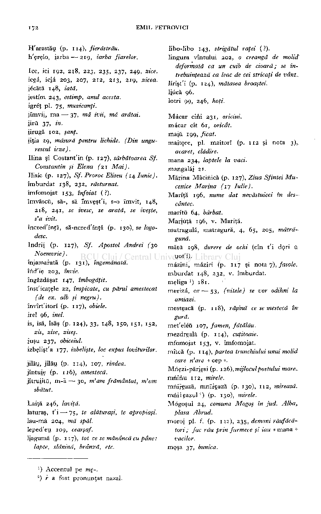

H'arastă u (p 114), fierăstrău, h'şrelo , iarb a — 219, iarba fiarelor.

libo-libo 143, strigătul raţei ( ?). lingur a vîntulu i 202, o creangă de molid

deformată ca un cuib de cioară; se întrebuinţează ca leac de cei stricaţi de vânt..

Ice, ici 192, 218, 223, 235, 237, 249, zice. iceă, icjâ 203, 207, 212, 213, 219, zicea. iecătă 148, iată. iestîm 243, estimp, anul acesta. igreţ pl 75, muzicanţi. ifmvii, m a — 37, mă ivii, mă arătai. iiru 37, in. iirugă 102, şanţ. iiţia 29, măsură pentru lichide. (Din ungu­

lîrişt'i (p 124), mătasea broaştei. liucă 96. lotri 99, 246, hoţi.

Măca r cini 231, oricini. măca r cî t 61, oricât. rnaiu 199, ficat. maitçre , pl . maitor ï (p 112 şi not a 3),

rescul icze).

acaret, clădire. man a 234, laptele la vaci. mangală i 21. Marin a Măcinic ă (p 127), Ziua Sfintei Mu­

Ilina şî Costant'i n (p 127), sărbătoarea Sf.

Constantin şi Elena (21 Mai). Ilisie (p 127), Sf. Proroc Elisen ( 14 Iunie). îmburda t 138, 232, răsturnat. îmfomoia t 153, înfoiat ( ?). îmvăscu , să- , s ă îmveşt'i , s- o îmvit , 148,

cenice Marina (17 Iulie ).

Mariţ ă 196, nume dat nevăstuicei în des­

cântec. marit ü 64, bărbat. Mariuţ ă 196, v . Mariţă . matragulă , matragură , 4, 65, 205, mătră­

218, 241, se ivesc, se arată, se iveşte, s'a ivit.

încred'fnţă , să-ncred'înţ â (p 130), se logo­

desc.

gună.

Indri j (p 127), Sf. Apostol Andrei (30

măt u 198, durere de ochi (cî n t' i dor i a

Noemvrie ). înjamarat ă (p 131), îngemănată. înd'i e 203, învie. îngăzdăşa t 147, îmbogăţit. înst'icaţele 22, înspicate, cu părul amestecat

uot'î). mezini , mâzir i (p 117 şi not a 7), fasole. mburda t 148, 232, v . îmburdat . melig a *) 181. merizâ , o r — 53, (vitele) se vor odihni la

(de ex. alb şi negru ). învîrt'itorî (p 117) obiele. irel 96, inel. is, isă, îsăş (p 124), 33, 148, 150, 151, 152,

amiazi.

mesteac ă (p 118), răşină ce se mestecă în

gură. met'eleu 107, famen, fătălău. mezdreal ă (p 114), cuţitoaie. mfomoia t 153, v . îmfomoiat . mîtc ă (p 114), partea trunchiului unui molid

zis, zise, ziseş. juşu 237, obiceiul. izbelişt'a 177, izbelişte, loc expus loviturilor.

care n'are « ce p ». Mhezi-păries i (p . 126), mijlocul postului mare. mnîn u 112, mirele. mnirgază , mnîreaz ă (p 130), 112 mireasă. mriireazu l '') (p 130), mirele. Mogoşu l 24, comuna Mogoş în jud. Alba,,

jilău, jîlău (p 114), 107, rindea. jîntui e (p 116), amestecă. jîtruiitu, m- ă — 30, m'am frământat, m'am

sbătut.

Laiţ ă 246, laviţă. lăturaş, t' i — 75, te alăturaşi, te apropiaşi. lau-m ă 204, mă spăl. leped'e u 109, cearşaf. liagum ă (p 1:7), tot ce se mănâncă cu pane :

plasa Abrud.

moro i pl . f. (p 122), 235, demoni răufăcători ; fac rău prin farmece şi iau « man a »• vacilor.

lapte, slănină, brânză, etc.

mcş a 37, bunica.

*) Accentu l p e me-.

) r a fost pronunţa t nazal.

2

