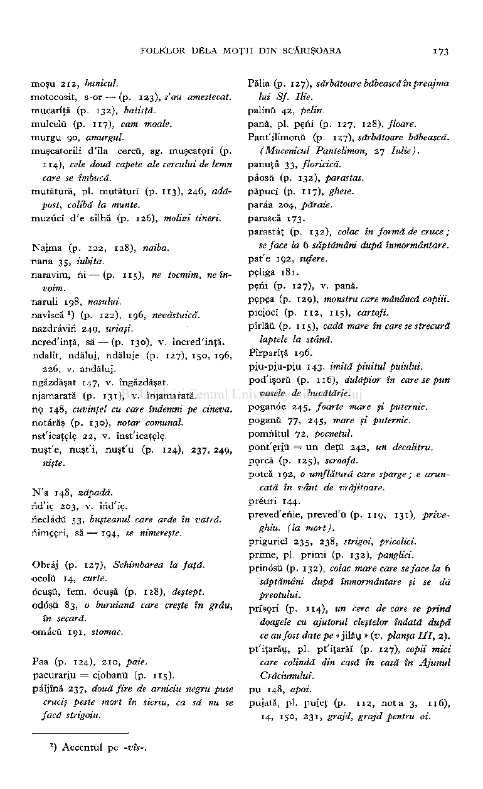

Palia (p 127), sărbătoare băbească în preajma

moş u 212, bunicul. motocosit , s-or — (p. 123), s'au amestecat. mucarîţ ă (p 132), batistă. mulcel ü (p 117) cam moale. murg u 90, amurgul. muşcatoril i d'il a cercii, sg . muşcător i (p .

lui Sf. Ilie. palmi i 42, pelin. pană , pl . pen i (p 127, 128), floare. Pant'ilimon ü (p 127), sărbătoare băbească.

(Mucenicul Pantelimon, 27 Iulie). panuţ â 33, floricică. pâos u (p 132), parastas. păpuc î (p 117) ghete. parâ a 204, păraie. parasc ă 173. parastâ ţ (p 132), colac în formă de cruce ;

114), cele două capete ale cercului de lemn care se îmbucă.

mutătură , pl . mutătur î (p 113), 246, adă­

###### post, colibă la munte.

muzüc i d' e sîlhă (p 126), molizi tineri.

se face la 6 săptămâni după înmormântare. pat e 192, sufere. peliga 181. pen i (p 127), v . pană . pepe a (p 129), monstru care mănâncă copiii. piciocî (p 112, 115), cartofi. pîrlău (p 115) cadă mare în care se strecură

Naim a (p 122, 128), naiba. nan a 35, iubita. naravim , n i — (p. 115), ne tocmim, neîn-

voim. narul i 198, nasului. navîscă ) (p . 122), 196, nevăstuică. nazdrâvi n 249, uriaşi. ncred'inţă , s ă — (p . 130), v . încred'inţă . ndalit, ndălui , ndălui e (p 127), 150, 196,

laptele la stână. Pîrpariţ ă 196. piu-piu-pi u 143, imită piuitul puiului. pod'işorii (p 116), dulăpior în care se pun

226, v . andălui . ngăzdăşa t 147, v . îngăzdăşat . njamarat ă (p 131), v . înjamafată . n o 148, cuvinţel cu care îndemni pe cineva. notâră ş (p 130), notar comunal. nst'icaţele 22, v . înst'icaţele. nuşt'e , nuşt'i , nuşt' u (p 124), 237, 249,

vasele de bucătărie. poganö c 245, foarte mare şi puternic. pogani i 77, 245, mare şi puternic. pomriitu l 72, pocnetul. pont'şriu = u n deţ u 242, un decalitru. porc ă (p 125), scroafă. potc ă 192, o umflătură care sparge ; e arun­

nişte.

cată în vânt de vrăjitoare. préur i 144. preved'ehie , preved' ü (p 119, 131), prive-

N' a 148, zăpadă. rid'ie 203, v . îrid'ie. neclâd u 53, buşteanul care arde în vatră. nimeeri , să— 194 , se nimereşte.

ghiu. (la mort). priguricî 235, 238, strigoi, pricolici. prime , pl . prim i (p 132), panglici. prinös ü (p. 132), colac mare care se face la 6

Obrâ j (p 127), Schimbarea la faţă. ocol u 14, curte. ocuşu, fem . âcuş ă (p 128), deştept. odös ü 83, o buruiană care creşte în grâu,

săptămâni după înmormântare şi se dă preotului.

prîsçr i (p 114) un cerc de care se prind doagele cu ajutorul deştelor îndată după ce au fost date pe « jilău » (v. planşa III, 2).

în secară.

omâc u 191, stomac.

pt'iţarău , pl . pt'iţarăî (p 127), copii mici care colindă din casă în casă în Ajunul Crăciunului.

Pa a (p 124), 210, paie. pacurari u = cioban ü (p 115). pâîjînă 237, două fire de arniciu negru puse

p u 148, apoi. puiată , pl . puie t (p 112 not a 3, 116),

cruciş peste mort în sicriu, ca să nu se facă strigoiu.

14, 150, 231, grajd, grajd pentru oi.

*) Accentu l p e -vîs-.

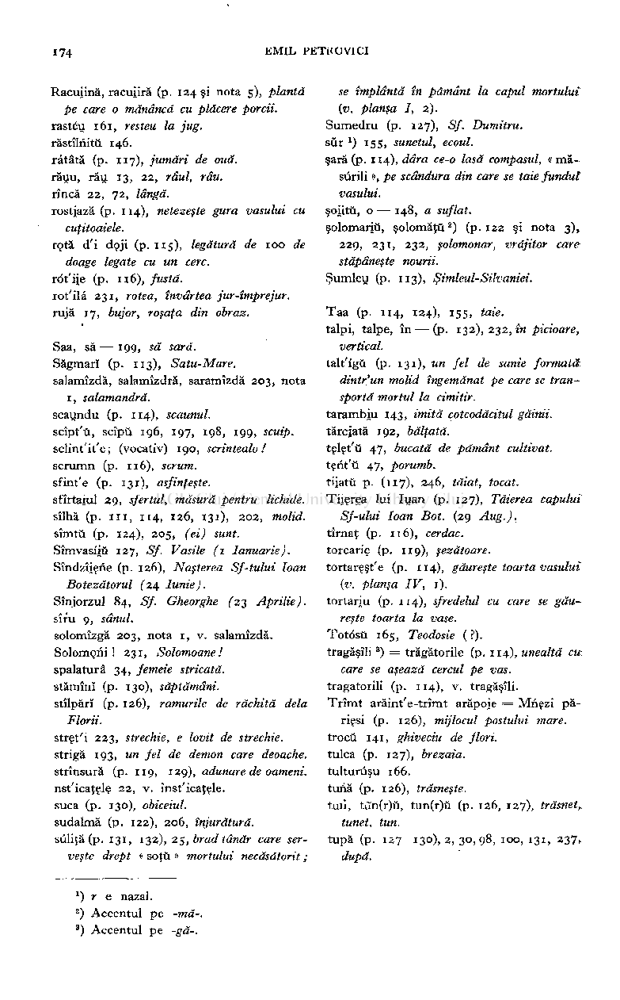

se împlântă în pământ la capul mortului (v. planşa I, 2).

Racuiină , racuiir ă (p 124 şi not a 5), plantă

pe care o mănâncă cu plăcere porcii. rasté y 161 resteu la jug. răstîlnitu 146. ratat ă (p 117), jumări de ouă. răuu , ră u 13, 22, râul, râu. rincă 22, 72, lângă. rostiază (p 114), netezeşte gura vasului cu

Sumedr u (p 127), Sf. Dumitru. sür ) 155, sunetul, ecoul. şară (p . 114), dâra ce-o lasă compasul, « mă -

surili », pe scândura din care se taie fundul vasului.

şoiitu, o — 148, a suflat.

şolomariu , şolomăţu ) (p 122 şi not a 3), 229, 231, 232, solomonar, vrăjitor care stăpâneşte nourii.

cuţitoaiele.

rotă d' i doji (p 115) legătură de 100 de

doage legate cu un cerc. röt'ije (p 116), fustă. rot'il ă 231, rotea, învârtea jur-împrejur. rujă 17, bujor, roşaţa din obraz.

Şumle y (p 113), Şimleul-Silvaniei.

Ta a (p 114, 124), 155, taie. tălpi, talpe , î n — (p . 132), 232, în picioare

vertical.

Saa, să— 19g , să sară. Săgmar î (p 113), Satu-Mare. salamîzdă , salamîzdră , saramîzd ă 203, not a

talt'fgù (p 131) un fel de sanie formată dintr'un molid îngemănat pe care se transportă mortul la cimitir.

1, salamandră. scaund u (p 114), scaunul. scîpt'u , scîp u 196, 197, 198, 199, scuip. sclint'it'e ; (vocativ) 190, scrintealo ! scrum n (p n6) , scrum. sfint'e (p 131), asfinţeşte. sfîrtaiul 29, sfertul, măsură pentru lichide. sîlhă (p . in , 114, 126, 131), 202, molid. sîmt u (p 124), 205, (ei) sunt. Sîmvasîi u 127, Sf. Vasile (1 Ianuarie). Sîndzîien e (p 126), Naşterea Sf-tului Ioan

tarambi u 143, imită cotcoddcitul găinii. tărcjată 192, bălţată. telet' ü 47, bucată de pământ cultivat. teht' ü 47, porumb. tiiatü p . (117), 246, tăiat, tocat. Tiiere a lu i Iua n (p . 127), Tăierea capului

Sf-ului Ioan Bot. (29 Aug.). tîrna ţ (p 116), cerdac. torcari e (p 119), şezătoare. tortareşt' e (p 114), găureşte toarta vasului

(v. planşa IV, 1).

Botezătorul (24 Iunie).

tortari u (p 114), sfredelul cu care se gău­

Sînjorzul 84, Sf. Gheorghe (23 Aprilie).

reşte toarta la vase. Totös ü 165, Teodosie ( ?). tragăşîli ) = trăgătorile (p . 114), unealtă cu

- sîfu 9, sânul. solomîzg ă 203, not a 1, v . salamîzdă . Solomon i ! 231, Solomoane ! spalatur â 34, femeie stricată. stămîn î (p 130), săptămâni. stîlpărî (p 126), ramurile de răchită delà

care se aşează cercul pe vas. tragatorili (p 114), v . tragăşîli. Trîm t arăint'e-trîm t arăpoi e = Mriezi pă riesi (p 126), mijlocul postului mare. troc ü 141, ghiveciu de flori. tule a (p 127), brezaia. tulturuş u 166. tufiă (p 126), trăsneşte. tuii, tün(r)ü , tun(r) ü (p 126, 127), trăsnet

Florii. stret' i 223, strechie, e lovit de strechie. strigă 193, un fel de demon care deoache. strînsur ă (p 119, 129), adunare de oameni. nst'icaţel e 22, v . înst'icaţele. suc a (p 130), obiceiul. sudalm ă (p 122), 206, înjurătură. suliţă (p . 131, 132), 25, brad tânăr care ser­

y

tunet, tun.

tup ă (p 127 130), 2, 30,98, 100, 131, 237,

veşte drept « soţ u » mortului necăsătorit ;

după.

) r e nazal.

x

- 2

) Accentu l p e -mă-.

- 3

###### ) Accentu l p e -gă-.

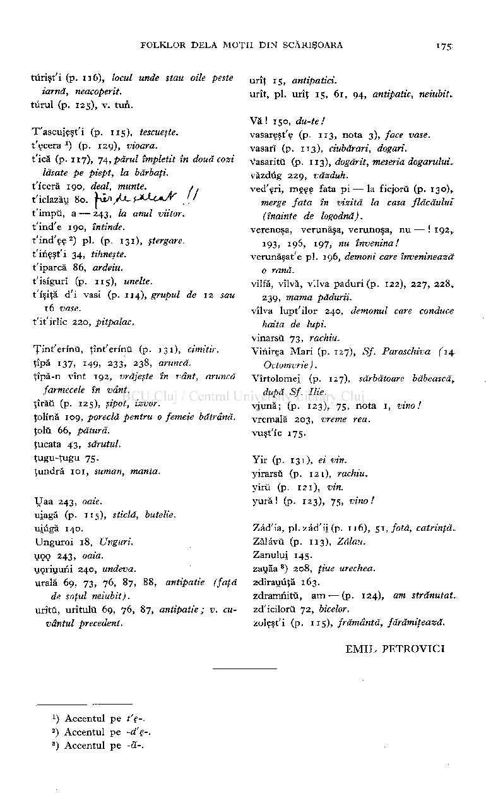

turişt'i (p. 116), locul unde stau oile peste

urîţ 15, antipatici.

iarnă, neacoperit. turul (p. 125), v. tun.

urit, pl. urîţ 15, 61, 94, antipatic, neiubit.

Vă ! 150, du-te ! vasareşt'e (p. 113, nota 3), face vase. vasarî (p. 113), ciubărari, dogari. vasaritü (p. 113), dogărit, meseria dogarului. văzdug 229, văzduh. ved'eri, meee fata pi — la ficiorù (p. 130),

T'ascuieşt'i (p. 115), tescueşte. t'ecera ) (p. 129), vioara. t'ică (p. 117), 74, părul împletit în două cozi

lăsate pe piept, la bărbaţi. t'iceră 190, deal, munte. 1 . t'iclazău 80. ^i/x.>J(XtA> ' / t'impü, a — 243, la anul viitor. t'ind'e 190, întinde.

merge fata în vizită la casa flăcăului (înainte de logodnă). verenoşa, verunăşa, verunoşa, nu — ! 192,

- t'ind'şe

2

) pl. (p. 131), ştergare.

- t'ineşt'i 34, tihneşte. t'iparcă 86, ardeiu. t'isigurî (p. 115), unelte.

193, 196, 197, nu învenina! verunăşat'e pl. 196,

o rană. vîlfă, vîlvă, v'.lva păduri (p. 122), 227, 228,

- t'îşiţă d'i vasi (p. 114), grupul de 12 sau 16 vase.

239, mama pădurii. vîlva lupt'ilor 240,

t'it'irlîc 220, pitpalac.

haita de lupi. vinarsü 73, rachiu. Viriirea Mari (p. 127), Sf. Paraschiva ( 14.

Tint'erinü, ţînt'erînu (p. 131), cimitir. ţipă 137, 149, 233, 238, aruncă. ţîpă-n vînt 192, vrăjeşte în vânt, aruncă

Octomvrie ). Vîrtolomei (p. 127), sărbătoare băbească,

farmecele în vânt. ţîrău (p. 125), şipot, izvor. ţolînă 109, poreclă pentru o femeie bătrână.

după Sf. Ilie. viună; (p. 123), 75, nota 1, vino ! vremală 203, vuşt'îc 175.

ţolu 66, pătură.

ţucata 43, sărutul. ţugu-ţugu 75. tundră 101, suman, manta.

Yir (p. 131), ei vin. yirarsü (p. 121), rachiu. yirü (p. 121) vin. yură ! (p. 123), 75, vino!

Uaa 243, oaie. uiagă (p. 115), sticlă, butelie. uiugă 140. Unguroi 18, Unguri. UOQ 243, oaia. uoriuurii 240, undeva. urală 69, 73, 76, 87, 88, antipatie (faţă

Zâd'ia, pl. zâd'ii(p. 116), 51, fotă, catrinţă. Zălâvu (p. 113), Zălau. Zanului 145. zauăa ) 208, ţiue urechea. zdîrauuţă 163. zdramnitü, am — (p. 124), am strănutat, zd'icilorù 72, bicelor. zoleşt'i (p. 115) frământă, fărâmiţează.

de soţul neiubit). urîtu, uritulü 69, 76, 87, antipatie ; v. cuvântul precedent.

EMI L PETROVIC I

###### ) Accentul pe t'e-.

x

###### ) Accentul pe -d'e-,

2

###### ) Accentul pe -ă-.

8

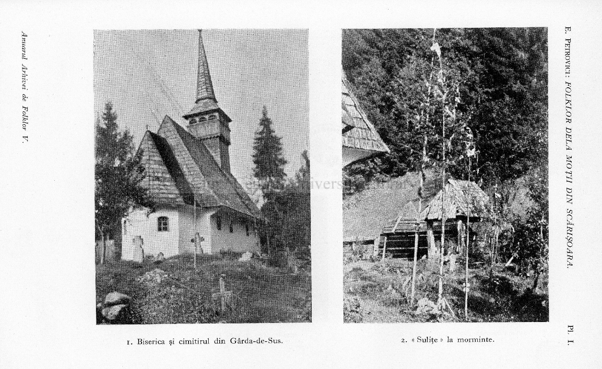

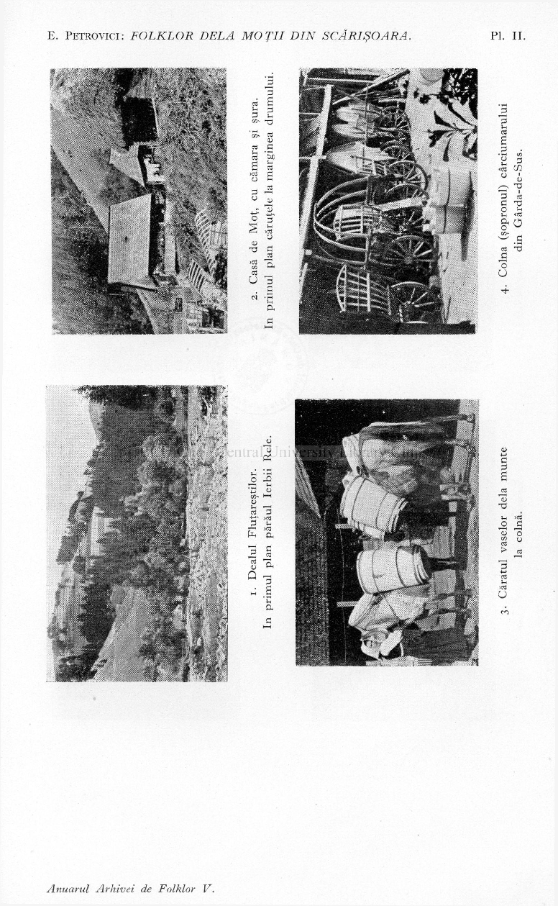

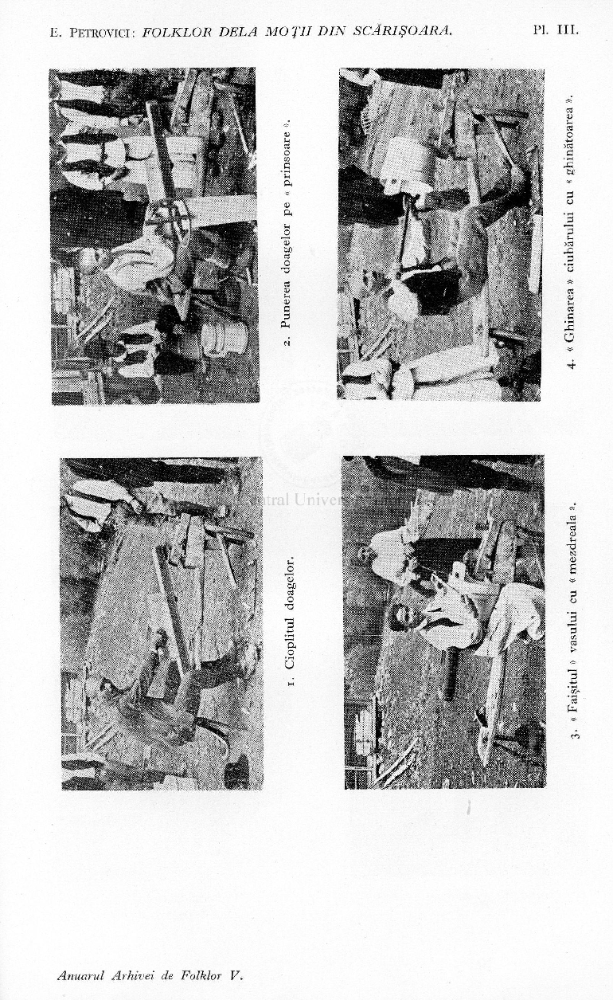

###### E . PETROVICI: FOLKLOR DELA MOŢII DIN SCĂRIŞOARA. Pl . III .

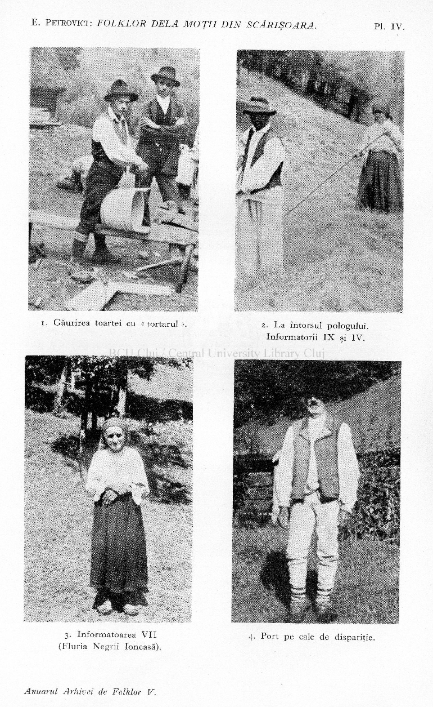

E . PETROVICI: FOLKLOR DELA MOŢII DIN SCĂRIŞOARA. Pl. IV.

###### 3. Informatoarea VI I 4. Port pe cale de dispariţie. (Fluria Negrii Ioneasă).

Anuarul Arhivei de Folklor V.

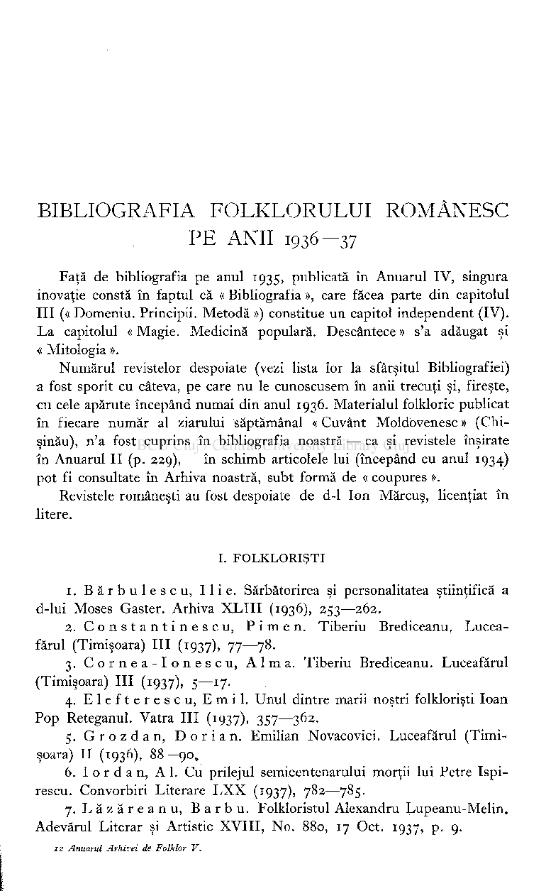

# BIBLIOGRAFIA FOLKLORULUI ROMÂNESC PE ANII 1936—37

Faţă de bibliografia pe anul 1935, publicată în Anuarul IV, singura inovaţie constă în faptul că « Bibliografia », care făcea parte din capitolul III (« Domeniu. Principii. Metodă ») constitue un capitol independent (IV). La capitolul « Magie. Medicină populară. Descântece » s'a adăugat şi « Mitologia ».

Numărul revistelor despoiate (vezi lista lor la sfârşitul Bibliografiei) a fost sporit cu câteva, pe care nu le cunoscusem în anii trecuţi şi, fireşte, cu cele apărute începând numai din anul 1936. Materialul folkloric publicat în fiecare număr al ziarului săptămânal « Cuvânt Moldovenesc » (Chişinău), n'a fost cuprins în bibliografia noastră — ca şi revistele înşirate în Anuarul II (p. 229), —î n schimb articolele lui (începând cu anul 1934) pot fi consultate în Arhiva noastră, subt formă de « coupures ».

Revistele româneşti au fost despoiate de d-1 Ion Mărcuş, licenţiat în litere.

I. FOLKLORIŞT I

- 1. Bărbulescu , Ilie . Sărbătorirea şi personalitatea ştiinţifică a

d-lui Moses Gaster. Arhiva XLIII (1936), 253—262.

- 2. Constantinescu , Pimen . Tiberiu Brediceanu, Lucea­

fărul (Timişoara) III (1937), 77—78.

- 3. Cornea-Ionescu , Alma . Tiberiu Brediceanu. Luceafărul

(Timişoara) III (1937), 5—17.

- 4. Elefterescu , Emil . Unul dintre marii noştri folklorişti Ioan

Pop Reteganul. Vatra III (1937), 357—362.

- 5. Grozdan , Dorian . Emilian Novacovici. Luceafărul (Timi­

şoara) II (1936), 88—90»

- 6. Iordan , Al . Cu prilejul semicentenarului morţii lui Petre Ispi-

rescu. Convorbiri Literare LX X (1937), 782—785.

- 7. Lăzăreanu , Barbu . Folkloristul Alexandru Lupeanu-Melin.

Adevărul Literar şi Artistic XVIII, No. 880, 17 Oct. 1937, p. 9.

12 Anuarul Arhivei de Folklor V.

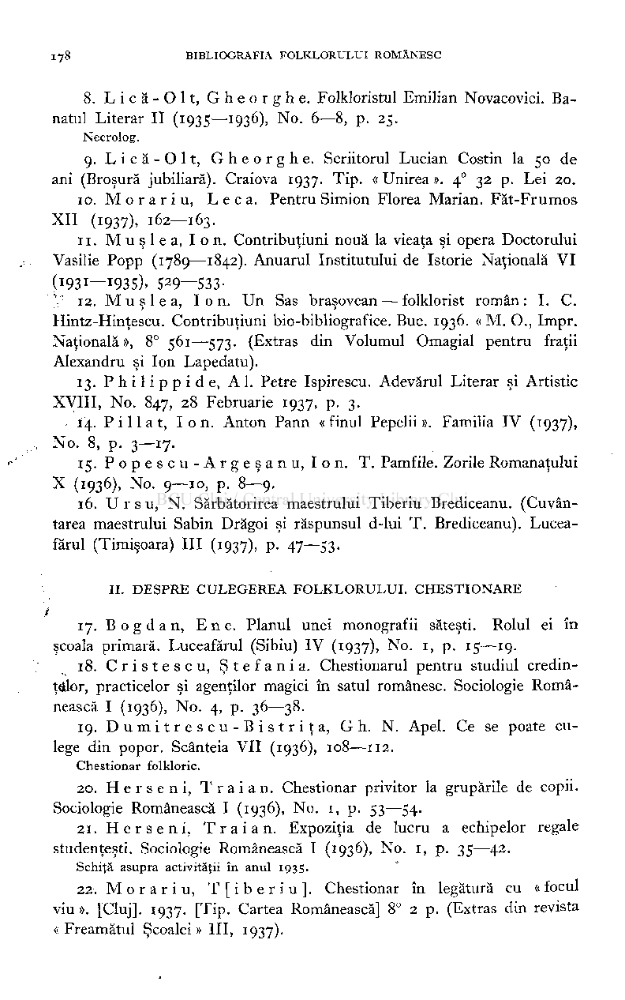

- 8. Lică-Olt , Gheorghe . Folkloristul Emilian Novacovici. Ba­

natul Literar II (1935—1936), No. 6—8, p. 25.

Necrolog .

- 9. Lică-Olt , Gheorghe . Scriitorul Lucian Costin Ia 50 de

ani (Broşură jubiliară). Craiova 1937. Tip. « Unirea ». 4

0

32 p. Lei 20.

- 10. M o r a r i u, L e c a. Pentru Simion Florea Marian. Făt-Frumos

XII (1937), 162—163.

- 11. Muşlea , Ion . Contribuţiuni nouă la vieaţa şi opera Doctorului

Vasilie Popp (1789—1842). Anuarul Institutului de Istorie Naţională VI (1931—1935), 529—533.

.V 12. M u ş 1 e a, Ion . Un Sas braşovean — folklorist român: I. C. Hintz-Hinţescu. Contribuţiuni bio-bibliografice. Buc. 1936. « M. O., Impr. Naţională», 8° 561—573. (Extras din Volumul Omagial pentru fraţii Alexandru şi Ion Lapedatu).

- 13. Philippi d e, Al. Petre Ispirescu. Adevărul Literar şi Artistic

XVIII, No. 847, 28 Februarie 1937, p. 3.

- 14. Pillât , Ion . Anton Pann « finul Pepelii ». Familia IV (1937),

No. 8, p. 3—17.

- 15. Popescu-Argeşanu , Ion . T. Pamfile. Zorile Romanaţului

X (1936), No. 9—10, p. 8—9.

- 16. U r s u, N. Sărbătorirea maestrului Tiberiu Brediceanu. (Cuvân­

tarea maestrului Sabin Drăgoi şi răspunsul d-lui T. Brediceanu). Luceafărul (Timişoara) III (1937), p. 47—53.

II . DESPR E CULEGERE A FOLKLORULUI . CHESTIONAR E

/ .... .

A

- 17. Bogdan , E n e. Planul unei monografii săteşti. Rolul ei in

şcoala primară. Luceafărul (Sibiu) IV (1937), No. 1, p. 15—19.

- 18. Cristescu , Ştefan i a. Chestionarul pentru studiul credin­

ţelor, practicelor şi agenţilor magici în satul românesc. Sociologie Românească I (1936), No. 4, p. 36—38.

- 19. Dumitrescu-Bistriţa , Gh . N. Apel. Ce se poate cu­

lege din popor. Scânteia VII (1936), 108—112.

Chestiona r folkloric .

- 20. H e r s e n i, T r a i a n. Chestionar privitor la grupările de copii.

Sociologie Românească I (1936), No. 1, p. 53—54.

- 21. He r seni , Trăi a n. Expoziţia de lucru a echipelor regale

studenţeşti. Sociologie Românească I (1936), No. 1, p. 35—42.

Schiţ ă asupr a activităţi i î n anu l 1935.

- 22. M o r a r i u, T[iberiu] . Chestionar în legătură cu «focul

viu ». [Cluj]. 1937. [Tip. Cartea Românească] 8° 2 p. (Extras din revista « Freamătul Şcoalei » III, 1937).

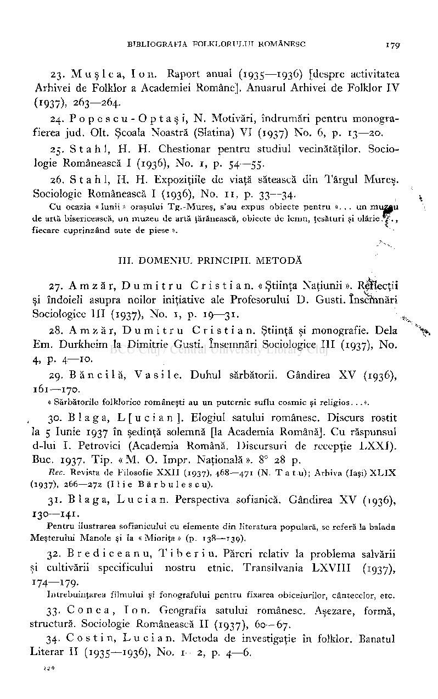

##### 23. M u ş 1 e a, Ion . Raport anual (1935—1936) [despre activitatea Arhivei de Folklor a Academiei Române]. Anuarul Arhivei de Folklor IV

(1937), 263—264.

- 24. Popescu-Optaşi , N. Motivări, îndrumări pentru monogra-

fierea jud. Olt. Şcoala Noastră (Slatina) VI (1937) No. 6, p. 13—20.

- 25. Stahl , H. H. Chestionar pentru studiul vecinătăţilor. Socio­

- logie Românească I (1936), No 1, p. 54—55.

- 26. Stahl , H. H. Expoziţiile de viaţă sătească din Târgul Mureş.

Sociologie Românească I (1936), No. 11, p. 33—34.

C u ocazi a «luni i » oraşulu i Tg.-Mureş , s'a u expu s obiect e pentr u «.. . u n mi^ u d e art ă bisericească , u n muze u d e art ă ţărănească , obiect e d e lemn , ţesătur i şi olărie *f., fiecar e cuprinzân d sut e d e pies e ».

III . DOMENIU . PRINCIPII . METOD Ă

- 27. Amzăr , Dumitr u Cristian . « Ştiinţa Naţiunii ». Reflecţii şi îndoieli asupra noilor iniţiative ale Profesorului D. Guşti. însemnări Sociologice III (1937), No 1, p. 19—31.
- 28. Amzăr , Dumitr u Cristian . Ştiinţă şi monografie. Delà Em. Dürkheim la Dimitrie Guşti. însemnări Sociologice III (1937), No. 4, p. 4—10.
- 29. Bănci i ă, Vasile . Duhul sărbătorii. Gândirea XV (1936),

161—170.

« Sărbătoril e folkloric e româneşt i a u u n puterni c sufl u cosmi c şi religios.. . ».

- 30. B 1 a g a, L [ u c i a n ]. Elogiul satului românesc. Discurs rostit

la 5 Iunie 1937 în şedinţă solemnă [la Academia Română]. Cu răspunsul d-lui I. Petrovici (Academia Română. Discursuri de recepţie LXXI). Buc. 1937. Tip. « M. O. Impr. Naţională ». 8° 28 p.

Rec. Revist a d e Filosofi e XXI I (1937), 468—471 (N . T atu) ; Arhiv a (Iaşi) XLI X

(1937), 266—272 (Ili e Bărbulescu) .

##### 31. B 1 a g a, Lucian . Perspectiva sofianică. Gândirea X V (1936), 130—141.

Pentr u ilustrare a sofianiculu i c u element e di n literatur a populară , se refer ă la balad a Meşterulu i Manol e şi la «Mioriţa » (p . 138—139).

32. Brediceanu , Tiberiu . Păreri relativ la problema salvării şi cultivării specificului nostru etnic. Transilvania LXVIII (1937),

I74—I79-

întrebuinţare a filmulu i şi fonografulu i pentr u fixare a obiceiurilor , cântecelor , etc .

##### 33. C o n e a , Ion . Geografia satului românesc. Aşezare, formă,

structură. Sociologie Românească II (1937), 60—67.

##### 34. C o s t i n, Lucian . Metoda de investigaţie în folklor. Banatul

- Literar II (1935—1936), No 1—2, p. 4—6. 12*

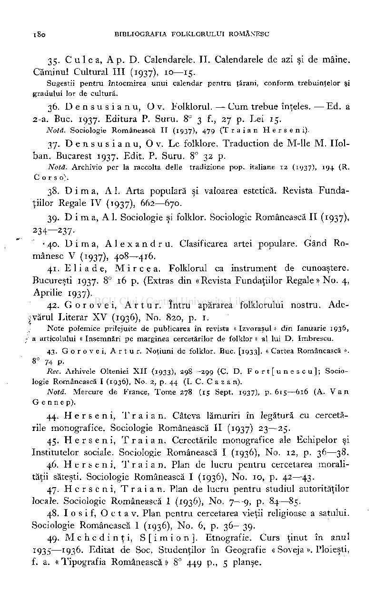

##### 35. C u 1 e a, Ap . D. Calendarele. II. Calendarele de azi şi de mâine. Căminul Cultural III (1937), 10—15.

Sugesti i pentr u întocmire a unu i calenda r pentr u ţărani , confor m trebuinţelo r şi gradulu i lo r d e cultură .

- 36. D e n s u s i a n u, O v. Folklorul. —• Cum trebue înţeles. — Ed. a

2-a. Buc. 1937. Editura P. Suru. 8° 3 f., 27 p. Lei 15.

Notă. Sociologi e Româneasc ă I I (1937), 479 (Traia n Herseni) .

- 37. D e n s u s i a n u, O v. Le folklore. Traduction de M-lle M. Hol­

bam Bucarest 1937. Edit. P. Suru. 8° 32 p.

Notă. Archivi o pe r la raccolt a dell e tradizion e pop . italian e 12 (1937), 194 (R . C o r s o) .

##### 38. D i m a, A 1. Arta populară şi valoarea estetică. Revista Funda­

ţiilor Regale IV (1937), 662—670.

##### 39. D i m a, A 1. Sociologie şi folklor. Sociologie Românească II (1937),

234—237-

'40. D i m a, Alexandru . Clasificarea artei populare. Gând Românesc V (1937), 408—416.

- 41. El i a de, M i r c e a. Folklorul ca instrument de cunoaştere. Bucureşti 1937. 8° 16 p. (Extras din «Revista Fundaţiilor Regale» No. 4, Aprilie 1937).
- 42. G o r o v e i, A r t u r. întru apărarea folklorului nostru. Adevărul Literar XV (1936), No. 820, p. 1.

Not e polemic e prilejuit e d e publicare a î n revist a « Izvoraşu l » di n Ianuari e 1936, a articolulu i « însemnăr i p e margine a cercetărilo r d e folklo r » al lu i D . Imbrescu .

43. Gorovei , Artur . Noţiun i d e folklor . Buc . [1933]. « Carte a Româneasc ă ». 8° 74 p.

Rec. Arhivel e Oltenie i XI I (1933), 298—299 (C . D . Fort[unescu] ; Socio logie Româneasc ă I (1936), No . 2, p . 44 (I . C . C a z a n) .

Notă. Mercur e d e France , Tom e 278 (15 Sept . 1937), p . 615—616 (A . Va n G e n n e p) .

- 44. Herseni , Traian . Câteva lămuriri în legătură cu cercetă­

rile monografice. Sociologie Românească II (1937) 23—25.

- 45. Herseni , Traian . Cercetările monografice ale Echipelor şi

Institutelor sociale. Sociologie Românească I (1936), No. 12, p. 36—38.

- 46. Herseni , Traian . Plan de lucru pentru cercetarea morali­

tăţii săteşti. Sociologie Românească I (1936), No. 10, p. 42—43.

- 47. Herseni , Traian . Plan de lucru pentru studiul autorităţilor

locale. Sociologie Românească I (1936), No. 7—9, p. 84—85.

- 48. I o s i f, O c t a v. Plan pentru cercetarea vieţii religioase a satului.

Sociologie Românească I (1936), No. 6, p. 36—39.

- 49. Mehedinţi , S [i m i on] . Etnografie. Curs ţinut în anul

- 1935—1936. Editat de Soc. Studenţilor în Geografie « Soveja ». Ploieşti, f. a. « Tipografia Românească » 8° 449 p., 5 planşe.

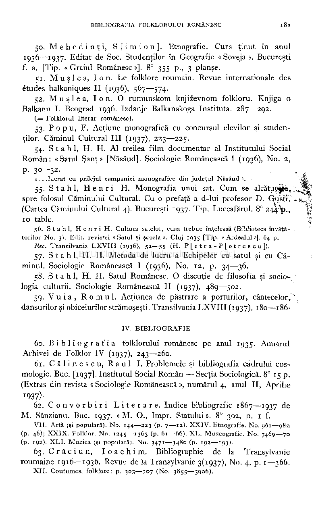

50. Mehedinţi , Sfimion] . Etnografie. Curs ţinut în anul

- 1936—1937. Editat de Soc. Studenţilor în Geografie « Soveja ». Bucureşti f. a. [Tip. «Graiul Românesc»]. 8° 355 p., 3 planşe.

- 51. M u ş 1 e a, Ion . Le folklore roumain. Revue internationale des

études balkaniques II (1936), 567—574.

- 52. M u ş 1 e a, Ion . O rumunskom knjizevnom folkloru. Knjiga 0

Baikanu I. Beograd 1936. Izdanje Balkanskoga Instituta. 287—292.

( = Folkloru l litera r românesc) .

- 53. P o p u, F. Acţiune monografică cu concursul elevilor şi studen­

ţilor. Căminul Cultural III (1937), 223—225.

- 54. Stahl , H. H. Al treilea film documentar al Institutului Social

Român: «Satul Şanţ» [Năsăud]. Sociologie Românească I (1936), No. 2, P- 3

—32-

0

«.. . lucra t c u prileju l campanie i monografic e di n judeţu l Năsău d ».

##### 55. S t a h 1, H e n r i H. Monografia unui sat. Cum se alcătue^e„ spre folosul Căminului Cultural. Cu o prefaţă a d-lui profesor D. Guşti." (Cartea Căminului Cultural 4). Bucureşti 1937. Tip. Luceafărul. 8° 244^., 10 table.

- 56. Stahl , Henr i H . Cultur a satelor , cu m trebu e înţeleas ă (Bibliotec a învăţă ­

torilo r No . 3). Edit . reviste i « Satu l şi şcoala ». Clu j 1935 [Tip . «Ardealu l »]. 64 p .

Rec. Transilvani a LXVII I (1936), 52—55 (H . P[etra-P[etrescu]) .

- 57. Stahl , H. H. Metoda de lucru a Echipelor cu satul şi cu Că­

minul. Sociologie Românească I (1936), No. 12, p. 34—36.

- 58. Stahl , H. H. Satul Românesc. O discuţie de filosofia şi socio­

logia culturii. Sociologie Românească II (1937), 489—502.

- 59. Vuia , Romul . Acţiunea de păstrare a porturilor, cântecelor,

dansurilor şi obiceiurilor strămoşeşti. Transilvania LXVIII (1937), 180—186-

IV . BIBLIOGRAFI E

- 60. Bibliografi a folklorului românesc pe anul 1935. Anuarul

Arhivei de Folklor IV (1937), 243—260.

- 61. Călinescu , Rau l I. Problemele şi bibliografia cadrului cos­

mologic. Buc. [1937]. Institutul Social Român — Secţia Sociologică. 8° 15 p. (Extras din revista « Sociologie Românească », numărul 4, anul II, Aprilie

!937)-

##### 62. Convorbir i Literare . Indice bibliografic 1867—1937 de M. Sânzianu. Buc. 1937. « M. O., Impr. Statului ». 8° 302, p. 1 f.

VII . Art ă (şi populară) . No . 144—223 (p . 7—12). XXIV . Etnografie . No . 961—982 (p 48); XXIX . Folklor . No . 1245—1363 (p . 61—66). XL . Muzeografie . No . 3469—70 (p . 192). XLI . Muzic a (şi populară) . No . 3471—3480 (p . 192—193).

##### 63. Crăciun , Ioachim . Bibliographie de la Transylvanie roumaine 1916—1936. Revue de la Transylvanie 3(1937), No. 4, p. 1—366.

XII . Coutumes , folklore : p . 303—307 (No . 3855—3906).

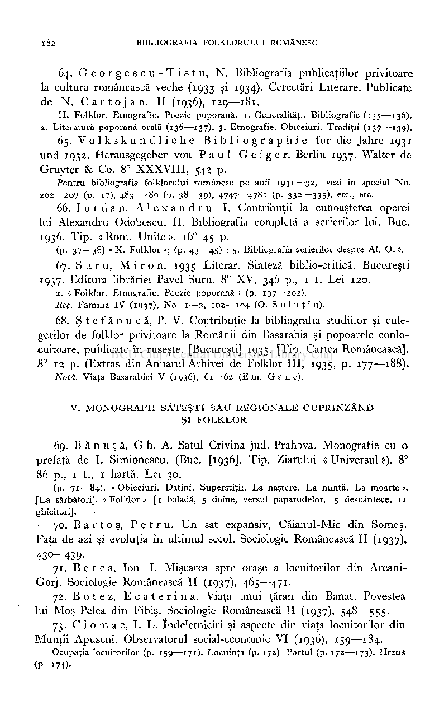

##### 64. Georgescu-Tistu , N. Bibliografia publicaţiilor privitoare la cultura românească veche (1933 şi 1934)- Cercetări Literare. Publicate de N. Cartojan . II (1936), 129—181.

II . Folklor . Etnografie . Poezi e poporană . 1. Generalităţi . Bibliografi e (135—136). 2. Literatur ă poporan ă oral ă (136—137). 3. Etnografie . Obiceiuri . Tradiţi i (137—139).

##### 65. Volkskundlich e Bibliographi e für die Jahre 1931 und 1932. Herausgegeben von Pau l Geiger . Berlin 1937. Walter de Gruyter & Co. 8° XXXVIII, 542 p.

Pentr u bibliografi a folklorulu i românes c p e ani i 1931—32, vez i î n specia l No . 202—207 (p 17), 483—489 (p 38—39), 4747—4781 (p 332—335), etc. , etc

66. Iordan , Alexandr u I. Contribuţii la cunoaşterea operei

lui Alexandru Odobescu. II. Bibliografia completă a scrierilor lui. Buc.

- 1936. Tip. « Rom. Unite ». 16 45 p. (P- 37—38) «X . Folklor» ; (p 43—45) « 5. Bibliografi a scrierilo r despr e Al . O . ».

- 67. S u r u, M i r o n. 1935 Literar. Sinteză biblio-critică. Bucureşti

1937. Editura librăriei Pavel Suru. 8° XV, 346 p., 1 f. Lei 120.

2. « Folklor . Etnografie . Poezi e poporan ă » (p . 197—-202). Rec. Famili a I V (1937), No . 1—2, 102—104 (O . Ş u 1 u ţ i u) .

- 68. Ş t e f ă n u c ă, P. V. Contribuţie la bibliografia studiilor şi cule­

##### gerilor de folklor privitoare la Românii din Basarabia şi popoarele conlocuitoare, publicate în ruseşte. [Bucureşti] 1935. [Tip. Cartea Românească]. 8° 12 p. (Extras din Anuarul Arhivei de Folklor III, 1935, p. 177—188).

Notă. Viaţ a Basarabie i V (1936), 61—62 (Em . G a n e) .

V . MONOGRAFI I SĂTEŞT I SA U REGIONAL E CUPRINZÂN D Ş I FOLKLO R

##### 69. B ă n u ţ ă, G h. A. Satul Crivina jud. Prahova. Monografie cu o prefaţă de I. Simionescu. (Buc. [1936]. Tip. Ziarului « Universul »). 8° 86 p., 1 f., i hartă. Lei 30.

(p 71—84). « Obiceiuri . Datini . Superstiţii . L a naştere . L a nuntă . L a moart e ». [L a sărbători] . « Folklo r » [1 baladă , 5 doine , versu l paparudelor , 5 descântece , 11 ghicitori] .

70. Bartoş , Petru . Un sat expansiv, Căianul-Mic din Someş. Faţa de azi şi evoluţia în ultimul secol. Sociologie Românească II (1937), 430—439-

- 71. Berea , Ion I. Mişcarea spre oraşe a locuitorilor din Arcani-

Gorj. Sociologie Românească II (1937), 465—471.

- 72. B o t e z, E c a t e r i n a. Viaţa unui ţăran din Banat. Povestea

lui Moş Pelea din Fibiş. Sociologie Românească II (1937), 548—555.

- 73. C i o m a c, I. L. îndeletniciri şi aspecte din viaţa locuitorilor din

Munţii Apuseni. Observatorul social-economic VI (1936), 159—184.

Ocupaţi a locuitorilo r (p . 159—171). Locuinţ a (p . 172). Portu l (p . 172—173). Hran a (P 174)-

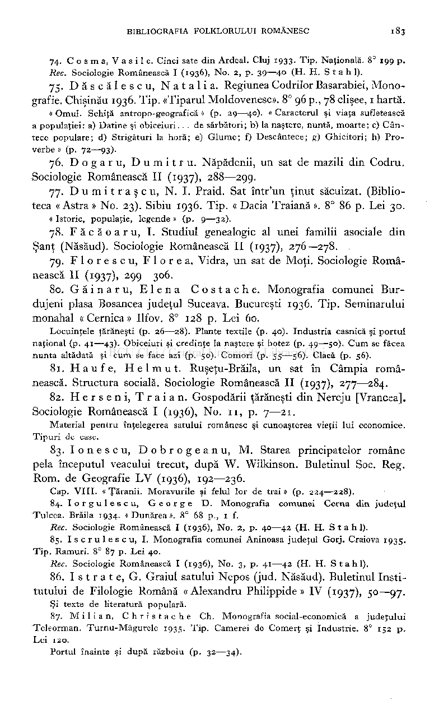

- 74. C o s m a, V a s i 1 e. Cinc i sat e di n Ardeal . Clu j 1933. Tip . Naţională . 8° 199 p . Rec. Sociologi e Româneasc ă I (1936), No 2, p . 39—40 (H . H . Stahl) .
- 75. Dăscăles c u, Natal i a. Regiunea Codrilor Basarabiei, Mono­

##### grafie. Chişinău 1936. Tip. «Tiparul Moldovenesc». 8° 96 p., 78 clişee, 1 hartă.

« Omul . Schiţ ă antropo-geografic ă » (p . 29—40). « Caracteru l şi viaţ a sufleteasc ă a populaţiei : a) Datin e şi obiceiuri . . . d e sărbători ; b ) la naştere , nuntă , moarte ; c) Cân tec e populare ; d ) Strigătur i la horă ; e ) Glume ; f) Descântece g) Ghicitori ; h ) Pro verb e » (p 72—93).

- 76. Doga r u, Dumitru . Năpădenii, un sat de mazili din Codru.

Sociologie Românească II (1937), 288—299.

- 77. D u m i t r a ş c u, N. I. Praid. Sat într'un ţinut săcuizat. (Biblio­

teca « Astra » No 23). Sibiu 1936. Tip. « Dacia Traiană ». 8° 86 p. Lei 30.

« Istoric , populaţie , legend e » (p . 9—32).

- 78. Făcăoaru , I. Studiul genealogic al unei familii asociale din

Şanţ (Năsăud). Sociologie Românească II (1937), 276—278.

- 79. Florescu , Flor e a. Vidra, un sat de Moţi. Sociologie Româ­

nească II (1937), 299—306.

- 80. Găina r u, Elen a Costache . Monografia comunei Bur-

dujeni plasa Bosancea judeţul Suceava. Bucureşti 1936. Tip. Seminarului monahal « Cernica » Ilfov. 8° 128 p. Lei 60.

Locuinţel e ţărăneşt i (p 26—28). Plant e textil e (p . 40). Industri a casnic ă şi portu l naţiona l (p . 41—43). Obiceiur i şi credinţ e la naşter e şi bote z (p . 49—50). Cu m s e făce a nunt a altădat ă şi cu m s e face az i (p . 50). Comor i (p . 55—56). Clac ă (p 56).

- 81. Haufe , Helmut . Ruşeţu-Brăila, un sat în Câmpia româ­

nească. Structura socială. Sociologie Românească II (1937), 277—284.

- 82. Herseni , Trăi a n. Gospodării ţărăneşti din Nereju [Vrancea].

Sociologie Românească I (1936), No. 11 p. 7—21.

Materia l pentr u înţelegere a satulu i românes c şi cunoaştere a vieţii lu i economice . Tipur i d e case.

##### 83. Ionescu , Dobrogea n u, M. Starea principatelor române pela începutul veacului trecut, după W. Wilkinson. Buletinul Soc. Reg. Rom. de Geografie LV (1936), 192—236.

Cap . VIII . « Ţăranii . Moravuril e şi felul lo r d e trai » (p . 224—228).

- 84. Iorgulescu , Georg e D . Monografi a comune i Cern a di n judeţu l

Tulcea . Brăil a 1934. « Dunăre a ». 8° 68 p. , 1 f.

Rec. Sociologi e Româneasc ă I (1936), No . 2, p . 40—42 (H . H . Stahl) .

- 85. Iscrulescu , I . Monografi a comune i Aninoas a judeţu l Gorj . Craiov a 1935.

Tip . Ramuri . 8° 87 p . Le i 40.

Rec. Sociologi e Româneasc ă I (1936), No . 3, p . 41—42 (H . H . Stahl) .

- 86. I s t r a t e, G. Graiul satului Nepos (jud. Năsăud). Buletinul Insti­

tutului de Filologie Română «Alexandru Philippide» IV (1937), 50—97.

Şi text e d e literatur ă populară .

- 87. Milian , Christach e Ch . Monografi a social-economic ă a judeţulu i

Teleorman . Turnu-Măgurel e 1935. Tip . Camere i d e Comer ţ şi Industrie . 8° 152 p . Le i 120.

Portu l înaint e şi dup ă război u (p . 32—34).

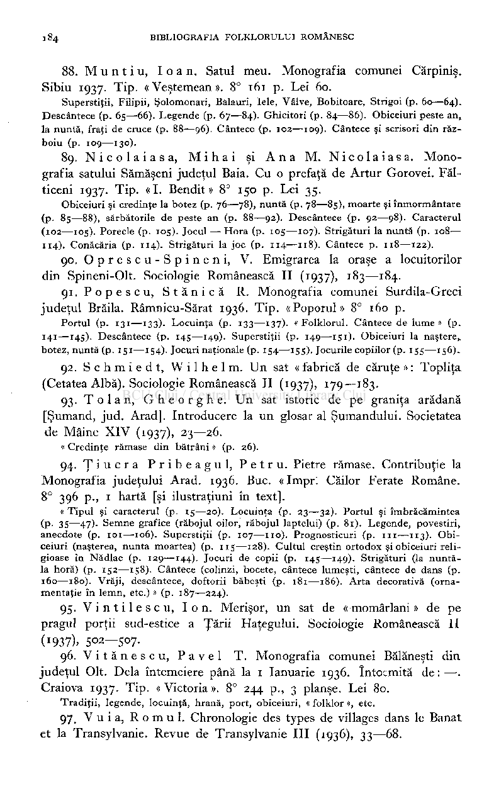

##### 88. M u n t i u, I o a n. Satul meu. Monografia comunei Cărpiniş. Sibiu 1937. Tip. « Veştemean ». 8° 161 p. Lei 60.

Superstiţii, Filipii, Solomonari, Balauri, Iele, Vâlve, Bobitoare, Strigoi (p . 60—64). Descântec e (p . 65—66). Legend e (p . 67—84). Ghicitor i (p . 84—86). Obiceiur i pest e an , la nuntă , fraţi d e cruce (p . 88—96). Cântec e (p . 102—109). Cântec e şi scrisori di n răz boi u (p . 109—130).

##### 89. Nicolaiasa , Miha i şi An a M. Nicolaiasa . Monografia satului Sămăşeni judeţul Baia. Cu o prefaţă de Artur Gorovei. Fălticeni 1937. Tip. «I. Bendit » 8° 150 p. Lei 35.

Obiceiur i şi credinţ e l a bote z (p . 76—78), nunt ă (p . 78—85), moart e şi înmormântar e (p . 85—88), sărbătoril e d e pest e a n (p . 88—92). Descântec e (p . 92—98). Caracteru l (102—105). Porecl e (p . 105). Jocu l — Hor a (p . 105—107). Strigătur i la nunt ă (p . 108114). Conăcări a (p . 114). Strigătur i la jo c (p . 114—118). Cântec e p . 118—122).

- 90. Oprescu-Spineni , V. Emigrarea la oraşe a locuitorilor

din Spineni-Olt. Sociologie Românească II (1937), 183—184.

- 91. Popes c u, Stanic ă R. Monografia comunei Surdila-Greci

judeţul Brăila. Râmnicu-Sărat 1936. Tip. «Poporul» 8° 160 p.

Portu l (p . 131—133). Locuinţ a (p . 133—137). « Folklorul . Cântec e d e lum e » (p . 141—145). Descântec e (p . 145—149). Superstiţi i (p . 149—151) Obiceiur i la naştere ^ botez , nunt ă (p . 151—154). Jocur i naţional e (p . 154—155). Jocuril e copiilo r (p . 155—156).

- 92. Schmie d t, Wilhelm . Un sat « fabrică de căruţe » : Topliţa

(Cetatea Albă). Sociologie Românească II (1937), 179—183.

- 93. Tolan , Gheorghe . Un sat istoric de pe graniţa arădană

[Şumand, jud. Arad]. Introducere la un glosar al Şumandului. Societatea de Mâine XIV (1937), 23—26.

« Credinţ e rămas e di n bătrân i » (p . 26).

##### 94. Ţiucr a Pribeagul , Petru . Pietre rămase. Contribuţie la Monografia judeţului Arad. 1936. Buc. « Imprl Căilor Ferate Române. 8° 396 p., 1 hartă [şi ilustraţiuni în text].

« Tipu l şi caracteru l (p . 15—20). Locuinţ a (p . 23—32). Portu l şi îmbrăcăminte a (p . 35—47). Semn e grafic e (răboju l oilor, răboju l laptelui ) (p . 81). Legende , povestiri , anecdot e (p . 101—106). Superstiţi i (p . 107—110). Prognosticur i (p . III—113) . Obi ceiur i (naşterea , nunt a moartea ) (p . 115—128). Cultu l creşti n ortodo x şi obiceiur i reli gioas e î n Nădla c (p . 129—144). Jocur i d e copi i (p . 145—149). Strigătur i (la minta la horă ) (p . 152—158). Cântec e (colinzi , bocete , cântec e lumeşti , cântec e d e dan s (p . 160—180). Vrăji , descântece , doftori i băbeşt i (p . 181—186). Art a decorativ ă (orna mentaţi e î n lemn , etc. ) » (p . 187—224).

- 95. Vintilescu , Ion . Merişor, un sat de « momârlani » de pe pragul porţii sud-estice a Ţării Haţegului. Sociologie Românească II 0937), S02—507-
- 96. Vitănescu , Pave l T. Monografia comunei Bălăneşti din judeţul Olt. Delà întemeiere până la 1 Ianuarie 1936. întocmită de : —. Craiova 1937. Tip. « Victoria ». 8° 244 p., 3 planşe. Lei 80.

Tradiţii , legende , locuinţă , hrană , port , obiceiuri , « folklo r », etc .

##### 97. Vuia , Romul . Chronologie des types de villages dans le Banat, et la Transylvanie. Revue de Transylvanie III (1936), 33—68.

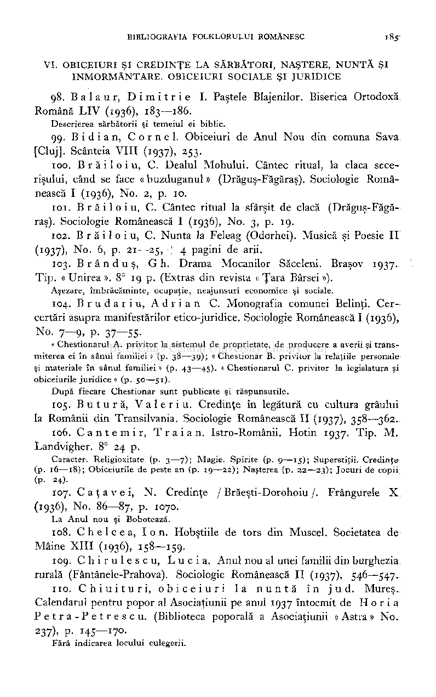

VI . OBICEIUR I Ş I CREDINŢ E L A SĂRBĂTORI , NAŞTERE , NUNT Ă Ş I ÎNMORMÂNTARE . OBICEIUR I SOCIAL E Ş I JURIDIC E

- 98. Balaur , D i m i t r i e I. Pastele Blajenilor. Biserica Ortodoxă

Română LIV (1936), 183—186.

Descriere a sărbători i şi temeiu l ei biblic .

- 99. Bidian , Cornel . Obiceiuri de Anul Nou din comuna Sava

[Cluj]. Scânteia VIII (1937), 253.

- 100. B r ă i 1 o i u, C. Dealul Mohului. Cântec ritual, la claca sece­

rişului, când se face « buzduganul » (Drăguş-Făgăraş). Sociologie Românească I (1936), No. 2, p. 10.

- 101. B r ă i 1 o i u, C. Cântec ritual la sfârşit de clacă (Drăguş-Făgă­

raş). Sociologie Românească I (1936), No. 3, p. 19.

- 102. B r ă i 1 o i u, C. Nunta la Feleag (Odorhei). Musică şi Poesie II

(1937), No. 6, p. 21—25, + 4 pagini de arii.

- 103. Brânduş , Gh . Drama Mocanilor Săceleni. Braşov 1937.

Tip. « Unirea ». 8° 19 p. (Extras din revista Ţara Bârsei »).

Aşezare , îmbrăcăminte , ocupaţie , neajunsur i economic e şi sociale.

- 104. Brudariu , Adria n C. Monografia comunei Belinţi. Cer-

certări asupra manifestărilor etico-juridice. Sociologie Românească I (1936), No. 7—9, p. 37—55.

« Chestionaru l A . privito r la sistemu l d e proprietate , d e producer e a averi i şi trans mitere a e i î n sânu l familie i »> (p . 38—39); « Chestiona r B . privito r la relaţiil e personal e şi material e î n sânu l familie i » (p . 43—45). « Chestionaru l C . privito r l a legislatur a şi obiceiuril e juridic e » (p . 50—51).

Dup ă fiecar e Chestiona r sun t publicat e ş i răspunsurile .

- 105. Butu r ă, Valeriu . Credinţe în legătură cu cultura grâului

la Românii din Transilvania. Sociologie Românească II (1937), 358—362.

- 106. Cantemir , Traian . Istro-Românii. Hotin 1937. Tip. M.

Landvigher. 8° 24 p.

Caracter . Religiozitat e (p . 3—7); Magie . Spirit e (p . 9—15); Superstiţii . Credinţ e (p . 16—18); Obiceiuril e d e pest e a n (p . 19—22); Naştere a (p . 22—23); Jocur i d e copi i (P- 24)-

- 107. C a ţ a v e i, N. Credinţe / Brăeşti-Dorohoiu /. Frângurele X

(1936), No. 86—87, p. 1070.

L a Anu l no u şi Bobotează .

- 108. Chelcea , Ion . Hobştiile de tors din Muscel. Societatea de

Mâine XIII (1936), 158—159.

- 109. Chirulescu , Lucia . Anul nou al unei familii din burghezia

rurală (Fântânele-Prahova). Sociologie Românească II (1937), 546—547.

- 110. Chiuituri , obiceiur i l a nunt ă î n jud . Mureş.

Calendarul pentru popor al Asociaţiunii pe anul 1937 întocmit de H o r i a Petra-Petrescu . (Biblioteca poporală a Asociaţiunii << Astra » No 237). P- H5—17°-

Făr ă indicare a loculu i culegerii .

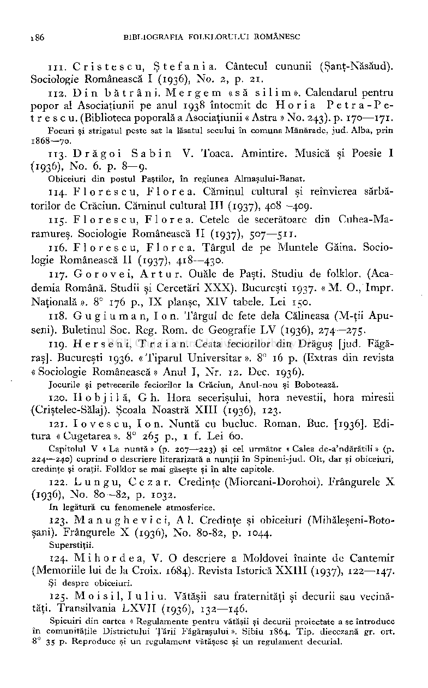

- 111. Cristescu , Ştefan i a. Cântecul cununii (Şanţ-Năsăud). Sociologie Românească I (1936), No 2, p. 21.
- 112. Di n bătrâni . Merge m «s ă silim» . Calendarul pentru popor al Asociaţiunii pe anul 1938 întocmit de Hori a Petra-Pe t r e s c u. (Biblioteca poporală a Asociaţiunii « Astra » No. 243). p. 170—171.

Focur i şi strigatu l pest e sa t l a lăsatu l seculu i î n comun a Mănărade , jud . Alba , pri n 1868—70.

- 113. Drăgo i Sabi n V. Toaca. Amintire. Musică şi Poesie I

(1936), No 6. p. 8-9 .

Obiceiur i di n postu l Paştilor , î n regiune a Almaşului-Banat .

- 114. F 1 o r e s c u, F 1 o r e a. Căminul cultural şi reînvierea sărbă­

torilor de Crăciun. Căminul cultural III (1937), 408—409.

- 115. Florescu , Flor e a. Cetele de secerătoare din Cuhea-Ma-

ramureş. Sociologie Românească II (1937), 507—511.

- 116. Florescu , Flor e a. Târgul de pe Muntele Găina. Socio­

logie Românească II (1937), 418—430.

- 117. G o r o v e i, A r t u r. Ouăle de Paşti. Studiu de folklor. (Aca­

demia Română. Studii şi Cercetări XXX). Bucureşti 1937. « M. O., Impr. Naţională ». 8° 176 p., IX planşe, XIV tabele. Lei 150.

- 118. G u g i u m a n, I o n. Târgul de fete delà Călineasa (M-ţii Apu­

seni). Buletinul Soc. Reg. Rom. de Geografie LV (1936), 274—275.

- 119. Herseni , Trăi a n. Ceata feciorilor din Drăguş [jud. Făgă­

raş]. Bucureşti 1936. «Tiparul Universitar». 8° 16 p. (Extras din revista «Sociologie Românească» Anul I, Nr. 12. Dec. 1936).

Jocuril e ş i petreceril e feciorilo r l a Crăciun , Anul-no u şi Bobotează .

- 120. Hobjilă , Gh . Hora secerişului, hora nevestii, hora miresii (Criştelec-Sălaj). Şcoala Noastră XIII (1936), 123.
- 121. loves c u, Ion . Nuntă cu bucluc. Roman. Buc. [1936]. Editura « Cugetarea ». 8° 265 p., 1 f. Lei 60.

Capitolu l V « L a nunt ă » (p 207—223) şi ce l următo r « Caie a de-a'ndărătil i » (p . 224—240) cuprin d o descrier e literarizat ă a nunţi i î n Spineni-jud . Olt , da r şi obiceiuri , credinţ e şi oraţii . Folklo r s e ma i găseşt e şi î n alt e capitole .

- 122. Lungu , Cezar . Credinţe (Miorcani-Dorohoi). Frângurele X

(1936), No 80—82, p. 1032.

I n legătur ă c u fenomenel e atmosferice .

- 123. Manughevici , Al . Credinţe şi obiceiuri (Mihăleşeni-Boto-

şani). Frângurele X (1936), No 80-82, p. 1044.

Superstiţii .

- 124. M i h o r d e a, V. O descriere a Moldovei înainte de Cantemir

(Memoriile lui de la Croix. 1684). Revista Istorică XXIII (1937), 122—147.

Şi despr e obiceiuri .

- 125. M o i s i 1, I u 1 i u. Vătăşii sau fraternităţi şi decurii sau vecină­

tăţi. Transilvania LXVII (1936), 132—146.

Spicuir i di n carte a « Regulament e pentr u vătăşi i şi decuri i proiectat e a s e introduc e î n comunităţil e Districtulu i Ţări i Făgăraşulu i ». Sibi u 1864. Tip . diecezan ă gr . ort . S° 35 p . Reproduc e şi u n regulamen t vătăşes c şi u n regulamen t decurial .

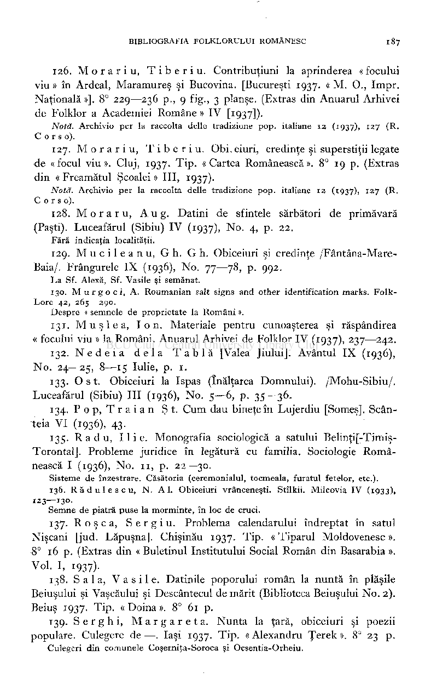

##### 126. M orar i u, Tiberiu . Contribuţiuni la aprinderea «focului viu » în Ardeal, Maramureş şi Bucovina. [Bucureşti 1937. « M. O., Impr. Naţională »]. 8° 229—236 p., 9 fig., 3 planşe. (Extras din Anuarul Arhivei de Folklor a Academiei Române » IV [1937]).

Notă. Archivi o pe r la raccolt a dell e tradizion e pop . italian e 12 (1937), 127 (R . C o r s o) .

##### 127. M o r a r i u, Tiberiu . Obi.eiuri, credinţe şi superstiţii legate de « focul viu ». Cluj, 1937. Tip. « Cartea Românească ». 8° 19 p. (Extras din « Freamătul Şcoalei » III, 1937).

Notă. Archivi o pe r la raccolt a dell e tradizion e pop . italian e 12 (1937), 127 (R . C o r s o) .

- 128. Moraru , Aug . Datini de sfintele sărbători de primăvară

(Paşti). Luceafărul (Sibiu) IV (1937), No 4, p. 22.

Făr ă indicaţi a localităţii.

- 129. M u c i 1 e a n u, G h. Gh . Obiceiuri şi credinţe /Fântâna-Mare-

Baia/. Frângurele IX (1936), No 77—78, p. 992.

L a Sf. Alexă , Sf. Vasil e şi semănat .

- 130. Murg o ci , A . Roumania n salt sign s an d othe r identificatio n marks . Folk -

Lor e 42, 265—290. Despr e « semnel e d e proprietat e la Român i ».

- 131. M u ş 1 e a, Ion . Materiale pentru cunoaşterea şi răspândirea

« focului viu » la Români. Anuarul Arhivei de Folklor IV (1937), 237—242.

- 132. Nedei a del à Tabl ă [Valea Jiului]. Avântul IX (1936),

No. 24—25, 8—15 Iulie, p. 1.

- 133. Ost . Obiceiuri la Ispas (înălţarea Domnului). /Mohu-Sibiu/.

Luceafărul (Sibiu) III (1936), No 5—6, p. 35 —36.

- 134. Pop , Traia n Şt . Cum dau bineţe în Lujerdiu [Someş]. Scân­

- teia VI (1936), 43.

- 135. Radu , 11 i e. Monografia sociologică a satului Belinţi[-Timiş-

Torontal]. Probleme juridice în legătură cu familia. Sociologie Românească I (1936), No 11, p. 22—30.

Sistem e d e înzestrare . Căsători a (ceremonialul , tocmeala , furatu l fetelor , etc.) .

- 136. Rădulescu , N . Al . Obiceiur i vrânceneşti . Stîlkii . Milcovi a I V (1933),

123—130.

Semn e d e piatr ă pus e la morminte , î n lo c d e cruci .

- 137. Roşea , Sergiu . Problema calendarului îndreptat în satul

Nişcani [jud. Lăpuşna]. Chişinău 1937. Tip. « Tiparul Moldovenesc ». 8° 16 p. (Extras din « Buletinul Institutului Social Român din Basarabia ». Vol. I, 1937).

- 138. Sala , Vasile . Datinile poporului român la nuntă în plăşile

Beiuşului şi Vaşcăului şi Descântecul de mărit (Biblioteca Beiuşului No. 2). Beiuş 1937. Tip. « Doina ». 8° 61 p.

- 139. Serghi , Margareta . Nunta la ţară, obiceiuri şi poezii

populare. Culegere de —. Iaşi 1937. Tip. « Alexandru Ţerek ». 8° 23 p.

Culeger i di n comunel e Coşerniţa-Soroc a şi Ocsentia-Orheiu .

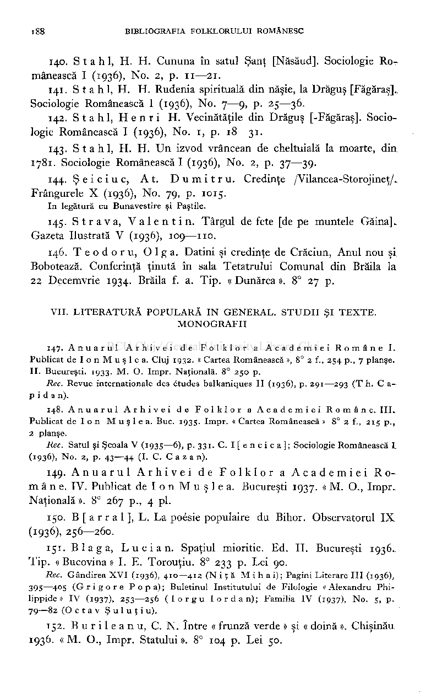

- 140. Stahl , H. H. Cununa în satul Şanţ [Năsăud]. Sociologie Ro­

mânească I (1936), No 2, p. 11—21.

- 141. S t a h 1, H. H. Rudenia spirituală din năşie, la Drăguş [Făgăraş]..

Sociologie Românească I (1936), No 7—9, p. 25—36.

- 142. Stahl , Henr i H. Vecinătăţile din Drăguş [-Făgăraş]. Socio­

logie Românească I (1936), No 1, p. 18—31.

- 143. Stahl , H. H. Un izvod vrâncean de cheltuială la moarte, din

1781. Sociologie Românească I (1936), No. 2, p. 37—39.

- 144. Şeiciuc , At . Dumitru . Credinţe /Vilancea-Storojineţ/.

Frângurele X (1936), No 79, p. 1015.

I n legătură c u Bunavestire şi Pastile.

- 145. Strava , Valentin . Târgul de fete [de pe muntele Găina]..

Gazeta Ilustrată V (1936), 109—110.

- 146. Teodo r u, Olga . Datini şi credinţe de Crăciun, Anul nou şi

Bobotează. Conferinţă ţinută în sala Tetatrului Comunal din Brăila la 22 Decemvrie 1934. Brăila f. a. Tip. « Dunărea ». 8° 27 p.

VII . LITERATUR Ă POPULAR Ă I N GENERAL . STUDI I Ş I TEXTE . MONOGRAFI I

147. Anuaru l Arhive i d e Folklo r a Academie i Român e I . Publica t delonMuşlea . Clu j 1932. « Carte a Româneasc ă », 8° 2 f., 254 p. , 7 planşe . II . Bucureşti . 1933. M . O . Impr . Naţională . 8° 250 p .

Rec. Revu e international e de s étude s balkanique s I I (1936), p . 291—293 (Th . C a p i d a n) .

148. Anuaru l Arhive i d e Folklo r a Academie i Române . III . Publica t d e Io n Muşlea . Buc 1935. Impr . « Carte a Româneasc ă » 8° 2 f., 215 p. , 2 planşe .

Rec. Satu l şi Şcoal a V (1935—6), p . 331. C . I[encica] ; Sociologi e Româneasc ă L

(1936), No . 2, p . 43—44 (I . C . Caz a n) .

149. Anuaru l Arhive i d e Folklo r a Academie i Ro mâne . IV. Publicat delonMuşlea . Bucureşti 1937. « M. O., Impr. Naţională ». 8° 267 p., 4 pl.

- 150. B [ a r r a 1 ], L. La poésie populaire du Bihor. Observatorul IX

C^

6

) . 256—260.

- 151. Blaga , Lucian . Spaţiul mioritic. Ed. II. Bucureşti 1936.

Tip. «Bucovina» I. E. Torouţiu. 8° 233 p. Lei 90.

Rec. Gândire a XV I (1936), 410—412 ( N i ţ ă M i h a i) ; Pagin i Literar e II I (1936), 395—405 (Grigor e Popa) ; Buletinu l Institutulu i d e Filologi e «Alexandr u Phi lippid e » I V (1937), 253—256 (Iorg u Iordan) ; Famili a I V (1937), No . 5, p ~ 79—82 (Octa v Şuluţiu) .

- 152. B u r i 1 e a n u, C. N. între « frunză verde » şi « doină ». Chişinău

- 1936. « M. O., Impr. Statului ». 8° 104 p. Lei 50.

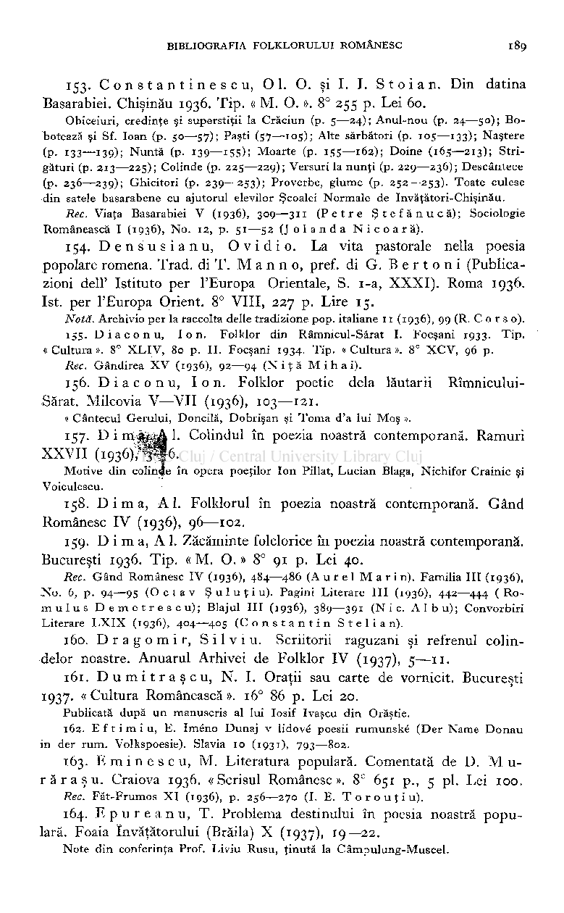

- 153. Constantinescu , Ol . O. şi I. I. Stoian . Din datina

Basarabiei. Chişinău 1936. Tip. « M. O. ». 8° 255 p. Lei 60.

Obiceiuri , credinţ e şi superstiţi i la Crăciu n (p . 5—24); Anul-no u (p 24—50); Bo boteaz ă şi Sf. Ioa n (p . 50—57); Paşt i (57—105); Alt e sărbător i (p 105—133); Naşter e (p . 133—139); Nunt ă (p 139—155); Moart e (p . 155—162); Doin e (165—213); Stri gătur i (p 213—225); Colind e (p 225—229); Versur i la nunţ i (p . 229—236); Descântec e (p . 236—239); Ghicitor i (p 239—253); Proverbe , glum e (p . 252—253). Toat e cules e di n satel e basaraben e c u ajutoru l elevilo r Şcoale i Normal e d e Invăţători-Chişinău .

Rec. Viaţ a Basarabie i V (1936), 309—311 (Petr e Ştefănucă) ; Sociologi e Româneasc ă I (1936), No . 12, p . 51—5 2 (Joland a Nicoară) .

## 154. Densusianu , Ovidio . La vita pastorale nella poesia popolare romena. Trad. di T. Man n o, pref. di G. B e r t o n i (Publicazioni deir Istituto per l'Europa Orientale, S. i-a, XXXI). Roma 1936. Ist. per l'Europa Orient. 8° VIII, 227 p. Lire 15.

Notă. Archivi o pe r la raccolt a dell e tradizion e pop . italian e 11 (1936), 99 (R . C o r s o) .

- 155. Diaco n u , Ion . Folklo r di n Râmnicul-Săra t I . Focşan i 1933. Tip .

« Cultur a ». 8° XLIV , 80 p . II . Focşan i 1934. Tip . « Cultur a ». 8° XCV 96 p .

Rec. Gândire a X V (1936), 92—94 ( N i ţ ă M i h a i) .

- 156. Diaco n u, Ion . Folklor poetic delà lăutarii Rîmnicului-

Sărat. Milcovia V—VII (1936), 103—121.

« Cântecu l Gerului , Doncilă , Dobrişa n şi Torn a d' à lu i Mo ş ».

- 157. D i 1. Colindul în poezia noastră contemporană. Ramuri

##### XXVII (i

6)Äit6 .

93

Motiv e di n colind e î n oper a poeţilo r Io n Pillât, Lucia n Blaga, Nichifo r Craini c şi Voiculescu .

- 158. D i m a, Al . Folklorul în poezia noastră contemporană. Gând

Românesc IV (1936), 96—102.

- 159. D i m a, A 1. Zăcăminte folclorice în poezia noastră contemporană.

Bucureşti 1936. Tip. « M. O. » 8° 91 p. Lei 40.

Rec. Gân d Românes c I V (1936), 484—486 (Aure l Marin) . Famili a II I (1936), No . 6, p . 94—95 ( O c t a v Ş u 1 u ţ i u) . Pagin i Literar e II I (1936), 442—444 ( Ro mu l u s Demetrescu) ; Blaju l II I (1936), 389—391 (Nie . A l bu) ; Convorbir i Literar e LXI X (1936), 404—405 (Constanti n Stelian) .

- 160. D r a g o m i r, Silviu . Scriitorii raguzani şi refrenul colin­

delor noastre. Anuarul Arhivei de Folklor IV (1937), 5—11.

- 161. D u m i t r a ş c u, N. I. Oraţii sau carte de vornicit. Bucureşti

1937. «Cultura Românească». 16 86 p. Lei 20.

Publicat ă dup ă u n manuscri s al lu i Iosi f Ivaşc u di n Orăştie .

- 162. Ef t i m iu , E . Imén o Duna j v lidov é poesi i rumunsk é (De r Nam e Dona u

i n de r rum . Volkspoesie) . Slavi a 10 (1931), 793—802.

- 163. E m i n e s c u, M. Literatura populară. Comentată de D. M u-

răraşu . Craiova 1936. «Scrisul Românesc». 8° 651 p., 5 pl. Lei 100.

Rec. Făt-Frumo s X I (1936), p . 256—270 (I . E . T o r o u ţ i u) .

- 164. Epureanu , T. Problema destinului în poesia noastră popu­

lară. Foaia învăţătorului (Brăila) X (1937), 19—22.

Not e di n conferinţ a Prof. Livi u Rusu , ţinut ă la Câmpulung-Muscel .

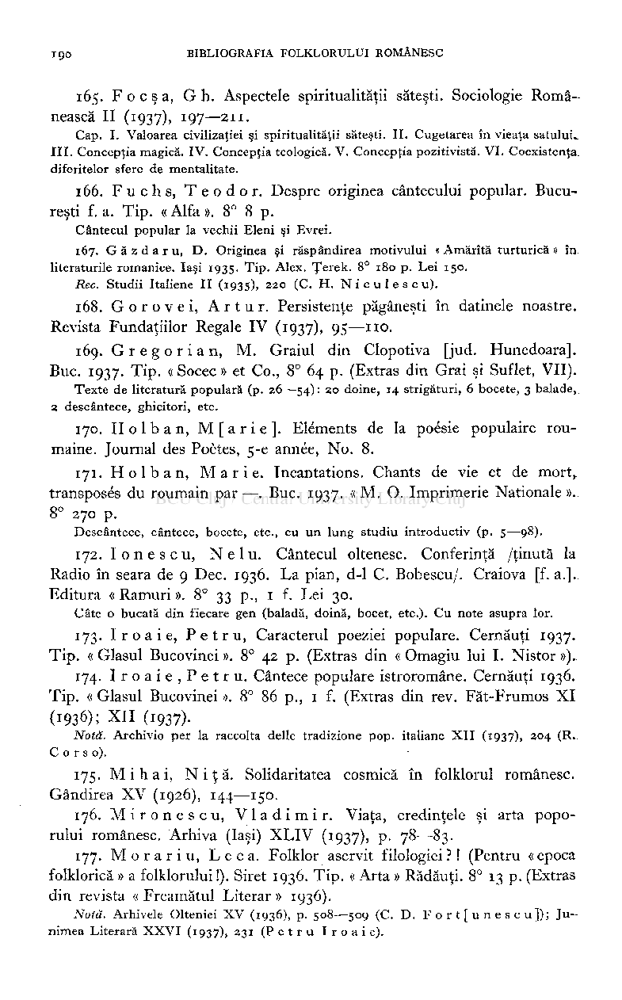

##### 165. F o c ş a, G h. Aspectele spiritualităţii săteşti. Sociologie Românească II (1937), 197—211.

Cap . I . Valoare a civilizaţiei şi spiritualităţi i săteşti . II . Cugetare a î n vieaţ a satulu u III . Concepţi a magică . IV . Concepţi a teologică . V . Concepţi a pozitivistă . VI . Coexistenţa , diferitelo r sfere d e mentalitate .

- 166. Fuchs , Teodor . Despre originea cântecului popular. Bucu­

reşti f. a. Tip. « Alfa ». 8° 8 p.

Cântecu l popula r l a vechi i Elen i şi Evrei .

- 167. G ă z d a r u , D . Origine a şi răspândire a motivulu i « Amărît ă turturic ă » în ,

literaturil e romanice . Iaş i 1935. Tip . Alex . Ţerek . 8° 180 p . Le i 150.

Rec. Studi i Italien e I I (1935), 220 (C . H . N i c u 1 e s c u)

- 168. Gorovei , Artur . Persistenţe păgâneşti în datinele noastre.

Revista Fundaţiilor Regale IV (1937), 95—no.

- 169. Gregorian , M. Graiul din Clopotiva [jud. Hunedoara].

Buc. 1937. Tip. « Socec » et Co., 8° 64 p. (Extras din Grai şi Suflet, VII).

Text e d e literatur ă popular ă (p 26—54) : 20 doine , 14 strigături , 6 bocete , 3 balade , 2 descântece , ghicitori , etc .

- 170. Holb a n, M[arie] . Eléments de la poésie populaire rou­

maine. Journal des Poètes, 5-e année, No 8.

- 171. Holban , Marie . Incantations. Chants de vie et de mort,

transposés du roumain par —. Bue. 1937. « M. O. Imprimerie Nationale ». 8° 270 p.

Descântece , cântece , bocete , etc. , c u u n lun g studi u introducti v (p 5—98).

##### 172. Ionescu , Nelu . Cântecul oltenesc. Conferinţă /ţinută la Radio în seara de 9 Dec. 1936. La pian, d-1 C. Bobescu/. Craiova [f. a.]. Editura « Ramuri ». 8° 33 p., 1 f. Lei 30.

Cât e o bucat ă di n fiecar e ge n (baladă , doină , bocet , etc.) . C u not e asupr a lor .

- 173. Iroaie , Petru , Caracterul poeziei populare. Cernăuţi 1937. Tip. « Glasul Bucovinei ». 8° 42 p. (Extras din « Omagiu lui I. Nistor »).
- 174. Iroaie , Petru . Cântece populare istroromâne. Cernăuţi 1936. Tip. « Glasul Bucovinei 8° 86 p., 1 f. (Extras din rev. Făt-Frumos XI

###### (1936); XII (1937).

Notă. Archivi o pe r l a raccolt a dell e tradizion e pop . italian e XI I (1937), 204 (R . C o r s o) .

- 175. M i h a i, N i ţ ă. Solidaritatea cosmică în folklorul românesc. Gândirea XV (1926), 144—150.
- 176. Mironescu , Vladimir . Viaţa, credinţele şi arta poporului românesc. Arhiva (Iaşi) XLIV (1937), p. 78—83.
- 177. Morar i u, Leca . Folklor aservit filologiei?! (Pentru «epoca folklorică » a folklorului !). Şiret 1936. Tip. « Arta » Rădăuţi. 8° 13 p. (Extras din revista « Freamătul Literar » 1936).

Notă. Arhivel e Oltenie i X V (1936), p . 508—509 (C . D . Fort[unescu]) ; Ju nime a Literar ă XXV I (1937), 231 (Petr u Iroaie) .

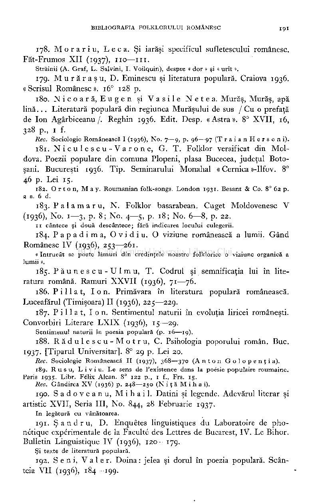

- 178. Morariu , L e c a. Şi iarăşi specificul sufletescului românesc.

Făt-Frumos XII (1937), 110 —III .

Străini i (A . Graf , L . Salvini , I . Voilquin) , despr e « do r » şi « urî t ».

- 179. Murăraşu , D. Eminescu şi literatura populară. Craiova 1936.

«Scrisul Românesc». 16 128 p.

- 180. Nicoară , Euge n şi Vasil e Net e a. Murăş, Murăş, apă

lină... Literatură populară din regiunea Murăşului de sus / Cu o prefaţă de Ion Agârbiceanu/. Reghin 1936. Edit. Desp. «Astra». 8° XVII, 16, 328 p., 1 f.

Rec. Sociologi e Româneasc ă I (1936), No 7—9, p . 96—97 (TraianHerseni) .

#### 181. Niculescu-Varone , G. T. Folklor versificat din Moldova. Poezii populare din comuna Plopeni, plasa Bucecea, judeţul Botoşani. Bucureşti 1936. Tip. Seminarului Monahal « Cernica »-Ilfov. 8° 46 p. Lei 15.

- 182. O r t o n , May . Roumania n folk-songs . Londo n 1931 Besan t & Co 8° 62 p .

2 s. 6 d .

- 183. Palamaru , N. Folklor basarabean. Cuget Moldovenesc V

(1936), No. i—3, p. 8; No. 4—5, p. 18; No. 6—8, p. 22.

11 cântec e şi dou ă descântece ; făr ă indicare a loculu i culegerii .

- 184. Papadima , Ovidiu . O viziune românească a lumii. Gând

Românesc IV (1936), 253—261.

« întrucâ t s e poat e lămur i di n credinţel e noastr e folkloric e o viziun e organic ă a lumi i ».

- 185. Păunescu-Ulmu , T. Codrul şi semnificaţia lui în lite­

ratura română. Ramuri XXVII (1936), 71—76.

- 186. P i 11 a t, Ion . Primăvara în literatura populară românească.

Luceafărul (Timişoara) II (1936), 225—229.

- 187. Pillât , Ion . Sentimentul naturii în evoluţia liricei româneşti.

Convorbiri Literare LXIX (1936), 15—29.

Sentimenu l naturi i î n poesi a popular ă (p 16—19).

- 188. Rădulescu-Motru , C. Psihologia poporului român. Buc.

1937. [Tiparul Universitar]. 8° 29 p. Lei 20.

Rec. Sociologi e Româneasc ă I I (1937), 368—370 (Anto n Golopenţia) .

- 189. R u s u , L i v i u . L e sen s d e l'existenc e dan s l a poési e populair e roumaine .

Pari s 1935. Libr . Féli x Alean . 8° 122 p. 1 f., Frs 15.

Rec. Gândire a X V (1936) p . 248—250 ( N i ţ ă M i h a i) .

- 190. Sadoveanu , Mihail . Datini şi legende. Adevărul literar şi

artistic XVII, Seria III, No 844, 28 Februarie 1937.

I n legătur ă c u vânătoarea .

- 191. Şandru , D. Enquêtes linguistiques du Laboratoire de pho­

nétique expérimentale de la Faculté des Lettres de Bucarest, IV. Le Bihor. Bulletin Linguistique IV (1936), 120—179.

Şi text e d e literatur ă populară .

##### 192. Seni , Vaier . Doina : jelea şi dorul în poezia populară. Scân­

- teia VII (1936), 184—199.

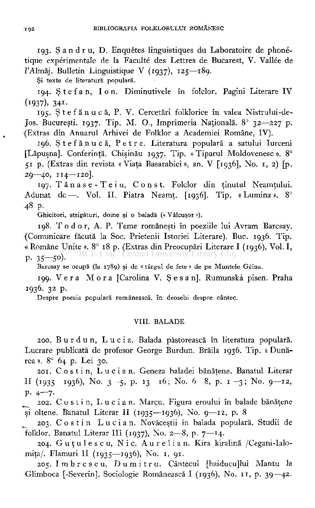

- 193. Ş a n d r u, D. Enquêtes linguistiques du Laboratoire de phoné­

tique expérimentale de la Faculté des Lettres de Bucarest, V. Vallée de PAlmăj. Bulletin Linguistique V (1937), 125—189.

Ş i text e d e literatur ă populară .

- 194. Ştefan , Ion . Diminutivele în folclor. Pagini Literare IV

0937). 341-

- 195. Ş t e f ă n u c ă, P. V. Cercetări folklorice în valea Nistrului-de-

Jos. Bucureşti. 1937. Tip. M. O., Imprimeria Naţională. 8° 32—227 p. (Extras din Anuarul Arhivei de Folklor a Academiei Române, IV).

196. Ştefănucă , Petre . Literatura populară a satului Iurceni [Lăpuşna]. Conferinţă. Chişinău 1937. Tip. «Tiparul Moldovenesc». 8° 51 p. (Extras din revista «Viaţa Basarabiei», an. V [1936], No. 1, 2) [p. 29—40, 114—120].

- 197. Tănase-Teiu , Const . Folclor din ţinutul Neamţului.

Adunat de—. Vol. II. Piatra Neamţ. [1936]. Tip. «Lumina». 8°

Ghicitori , strigături , doin e şi o balad ă (« Vâlcuşo r »).

- 198. T o d o r, A. P. Teme româneşti în poeziile lui Avram Barcsay.

(Comunicare făcută la Soc. Prietenii Istoriei Literare). Buc. 1936. Tip. « Române Unite ». 8° 18 p. (Extras din Preocupări Literare I (1936), Vol. I, P- 35—5°)-

Barcsa y s e ocup ă (la 1789) şi d e «târgu l d e fete » d e p e Muntel e Găina .

- 199. Ver a Mor a [Carolina V. Ş e s a n]. Rumunskâ pisen. Praha

1936. 32 p.

Despr e poezi a popular ă românească , î n deoseb i despr e cântec .

VIII . BALAD E

- 200. Burdun , Lucia . Balada păstorească în literatura populară.

Lucrare publicată de profesor George Burdun. Brăila 1936. Tip. « Dunărea ». 8° 64 p. Lei 30.

201. Costin , Lucian . Geneza baladei bănăţene. Banatul Literar II (1935—1936), No. 3—5, p. 13—16; No. 6—8, p. 1—3; No. 9—12, p. 4—7.

- 202. Costin , Lucian . Marcu. Figura eroului în balade bănăţene

şi oltene. Banatul Literar II (1935—1936), No. 9—12, p. 8

- 203. Costi n Lucian . Novăceştii în balada populară. Studii de

folklor. Banatul Literar III (1937), No. 2—8, p. 7—14.

- 204. Guţulescu , Nie . Aurelian . Kira kiralină /Cegani-Ialo-

miţa/. Flamuri II (1935—1936), No. 1, 91.

- 205. Imbrescu , Dumitru . Cântecul [haiducujlui Mantu la

Glimboca [-Severin]. Sociologie Românească I (1936), No. 11, p. 39—42.

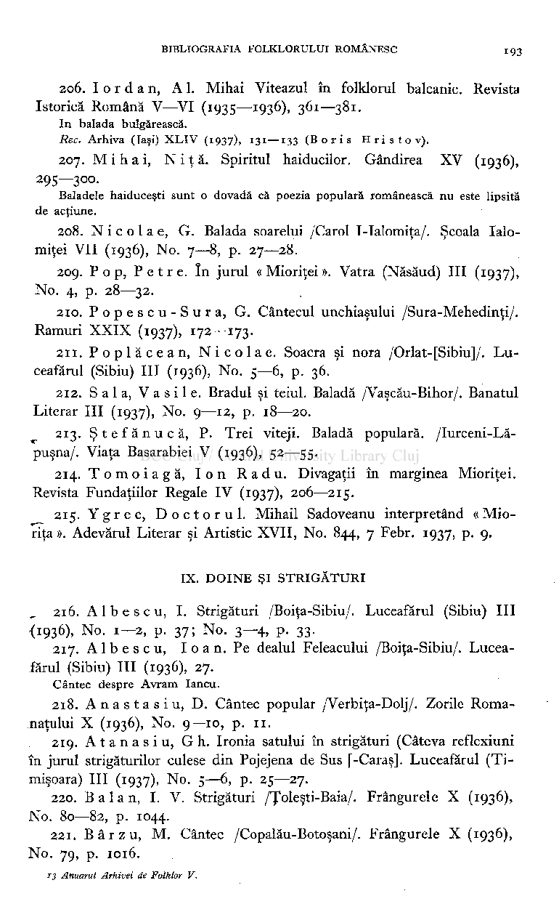

##### 206. Iordan , Al. Mihai Viteazul în folklorul balcanic. Revista

Istorică Română V—VI (1935—1936), 361—381.

I n balad a bulgărească . Rec. Arhiv a (Iaşi ) XLI V (1937), 131—133 (Bori s Hristov) .

##### 207. Mihai , N i ţ ă. Spiritul haiducilor. Gândirea XV (1936),

95—3°°-

2

Baladel e haiduceşt i sun t o dovad ă c ă poezi a popular ă româneasc ă n u est e lipsit ă d e acţiune .

- 208. N i c o 1 a e, G. Balada soarelui /Carol l-Ialomiţa/. Şcoala Ialo-

miţei VII (1936), No. 7—8, p. 27—28.

- 209. Pop , Petre . în jurul « Mioriţei ». Vatra (Năsăud) III (1937),

No. 4, p. 28—32.

- 210. Popescu-Sura , G. Cântecul unchiaşului /Sura-Mehedinţi/.

Ramuri XXIX (1937), 172—173.

- 211. Poplăcean , Nicol a e. Soacra şi nora /Orlat-[Sibiu]/. Lu­

ceafărul (Sibiu) III (1936), No. 5—6, p. 36.

- 212. Sala , V a s i 1 e. Bradul şi teiul. Baladă /Vaşcău-Bihor/. Banatul

Literar III (1937), No. 9—12, p. 18—20.

- 213. Ştefănucă , P. Trei viteji. Baladă populară. /Iurceni-Lă-

puşna/. Viaţa Basarabiei V (1936), 52—55.

- 214. Tomoiagă , Io n Radu . Divagaţii în marginea Mioriţei.

Revista Fundaţiilor Regale IV (1937), 206—215.

- 215. Ygrec , Doctorul . Mihail Sadoveanu interpretând «Mio­

riţa ». Adevărul Literar şi Artistic XVII, No. 844, 7 Febr. 1937, p. 9.

IX . DOIN E Ş I STRIGĂTUR I

- 216. A 1 b e s c u, I. Strigături /Boiţa-Sibiu/. Luceafărul (Sibiu) III

{1936), No. 1—2, p. 37; No. 3—4, p. 33.

- 217. A1 b e s c u, I o a n. Pe dealul Feleacului /Boiţa-Sibiu/. Lucea­

fărul (Sibiu) III (1936), 27.

Cânte c despr e Avra m Iancu .

- 218. Anastasiu , D. Cântec popular /Verbiţa-Dolj/. Zorile Roma-

naţului X (1936), No. 9—10, p. 11.

- 219. Atanasiu , Gh . Ironia satului în strigături (Câteva reflexiuni în jurul strigăturilor culese din Pojejena de Sus [-Caras]. Luceafărul (Timişoara) III (1937), No. 5—6, p. 25—27.
- 220. Bălan , I. V. Strigături /Ţoleşti-Baia/. Frângurele X (1936), No. 80—82, p. 1044.
- 221. Bârzu , M. Cântec /Copalău-Botoşani/. Frângurele X (1936), No. 79, p. 1016.

13 Anuarul Arhivei de Folklor V.

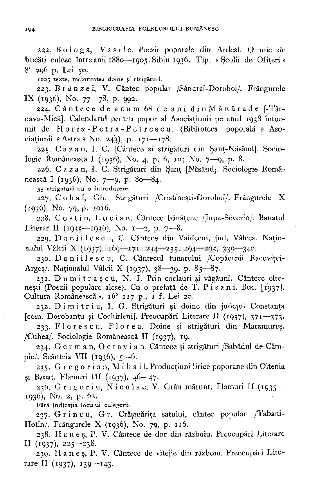

- 222. Bologa , Vasile . Poezii poporale din Ardeal. O mie de

bucăţi culese între anii 1880—1905. Sibiu 1936. Tip. «Şcolii de Ofiţeri» 8° 296 p. Lei 50.

1025 texte , majoritate a doin e şi strigături .

- 223. Brânzei , V. Cântec popular /Sâncrai-Dorohoi/. Frângurele

- IX (1936), No. 77—78, p. 992.

- 224. Cântec e d e acu m 68 d e an i dinMănărad e [-Târ-

nava-Mică]. Calendarul pentru popor al Asociaţiunii pe anul 1938 întocmit de Horia-Petra-Petrescu . (Biblioteca poporală a Asociaţiunii « Astra » No. 243), p. 171—178.

- 225. Cazan , I. C. [Cântece şi strigături din Şanţ-Năsăud]. Socio­

logie Românească I (1936), No. 4, p. 6, 10; No. 7—9, p. 8.

- 226. Cazan , I. C. Strigături din Şanţ [Năsăud]. Sociologie Româ­

nească I (1936), No. 7—9, p. 80—84.

35 strigătur i c u o introducere .

- 227. C o h a I, Gh. Strigături /Cristineşti-Dorohoi/. Frângurele X

- (1936), No. 79, p. 1016.

- 228. Costin , Lucian . Cântece bănăţene /Jupa-Severin/. Banatul

Literar II (1935—1936), No. 1—2, p. 7—8.

- 229. D a n i i 1 e s c u, C. Cântece din Vaideeni, jud. Vâlcea. Naţio­

nalul Vâlcii X (1937), 169—171, 234—235, 294—295, 339—340.

- 230. D a n i i 1 e s c u, C. Cântecul tunarului /Copăcenii Racoviţei-

Argeş/. Naţionalul Vâlcii X (1937), 38—39, p. 85—87.

- 231. Dumitraşcu , N. I. Prin coclauri şi văgăuni. Cântece olte­

neşti (Poezii populare alese). Cu o prefaţă de T. P i s a n i. Buc. [1937]. Cultura Românească». 16

117 p., 1 f. Lei 20.

0

##### 232. D i m i t r i u, I. G. Strigături şi doine din judeţul Constanţa

[corn. Dorobanţu şi Cochirleni]. Preocupări Literare II (1937), 371—373.

##### 233. Florescu , Flor e a. Doine şi strigături din Maramureş.

/Cuhea/. Sociologie Românească II (1937), 19.

##### 234. German , Octavian . Cântece şi strigături /Sabădul de Câm­

pie/. Scânteia VII (1936), 5—6.

##### 235. Gregorian , Mihail . Producţiuni lirice poporane din Oltenia

şi Banat. Flamuri III (1937), 46—47.

##### 236. Grigoriu , Nicol a e, V. Grâu mărunt. Flamuri II (1935—

1936), No. 2, p. 62.

Făr ă indicaţi a loculu i culegerii .

##### 237. G r i n c u, Gr. Crâşmăriţa satului, cântec popular /Tabani-

Hotin/. Frângurele X (1936), No. 79, p. 116.

##### 238. H a n e ş, P. V. Cântece de dor din războiu. Preocupări Literare

II (1937), 225—238.

##### 239. H a n e ş, P. V. Cântece de vitejie din războiu. Preocupări Lite­

rare II (i937). 39—H3•

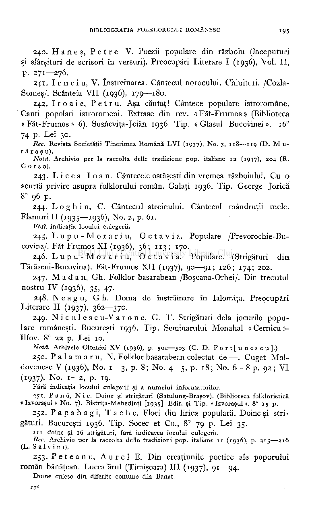

- 240. Haneş , Petr e V. Poezii populare din războiu (începuturi

şi sfârşituri de scrisori în versuri). Preocupări Literare I (1936), Vol. II, p. 271—276.

- 241. I e n c i u, V. înstreinarea. Cântecul norocului. Chiuituri. /Cozla-

Someş/. Scânteia VII (1936), 179—180.

- 242. Iroaie , Petru . Aşa căntaţ! Cântece populare istroromâne.

Canti popolari istroromeni. Extrase din rev. « Făt-Frumos » (Biblioteca « Făt-Frumos » 6). Susneviţa-Jeiăn 1936. Tip. «Glasul Bucovinei». 16

0

##### 74 P- Lei 3°-

Rec. Revist a Societăţi i Tinerime a Român ă LV I (1937), No . 3, 118—11 9 (D . M li ­

- r ă r a ş u) . Notă. Archivi o pe r la raccolt a dell e tradizion e pop . italian e 12 (1937), 204 (R .

C o r s o)

243. Lice a Ioan . Cântecele ostăşeşti din vremea războiului. Cu o scurtă privire asupra folklorului român. Galaţi 1936. Tip. George Jorică 8° 96 p.

- 244. L o g h i n, C. Cântecul streinului. Cântecul mândruţii mele.

Flamuri II (1935—1936), No. 2, p. 61.

Făr ă indicaţi a loculu i culegerii .

- 245. Lupu-Morariu , Octavia . Populare /Prevorochie-Bu-

covina/. Făt-Frumos XI (1936), 36; 113; 170.

- 246. Lupu-Morariu , Octavia . Populare. (Strigături din

Tărăseni-Bucovina). Făt-Frumos XII (1937), 90—91; 126; 174; 202.

- 247. M a d a n, Gh. Folklor basarabean /Boşcana-Orhei/. Din trecutul

nostru IV (1936), 35, 47.

- 248. N e a g u, G h. Doina de înstrăinare în Ialomiţa. Preocupări

Literare II (1937), 362—370.

- 249. Ni e u les e u-V a r o n e, G. T. Strigături delà jocurile popu­

lare româneşti. Bucureşti 1936. Tip. Seminarului Monahal « Cernica »Ilfov. 8° 22 p. Lei 10.

Notă. Arhivel e Oltenie i X V (1936), p . 502—503 (C . D . F o r t [ u n e s c u ].)

- 250. P a 1 a m a r u, N. Folklor basarabean colectat de —. Cuget Moldovenesc V (1936), No. 1—3, p. 8; No. 4—5, p. 18; No. 6—8 p. 92; VI

- (1937), No. 1—2, p. 19. Făr ă indicaţi a loculu i culegeri i şi a numelu i informatorilor .

- 251. Pană , Nie . Doin e şi strigătur i (Satulung-Braşov) . (Bibliotec a folkloristic ă « Izvoraşu l » No . 7). Bistriţa-Mehedinţ i [1935]. Edit . şi Tip . « Izvoraşu l ». 8° 15 p .
- 252. Papahagi , Tache . Flori din lirica populară. Doine şi strigături. Bucureşti 1936. Tip. Socec et Co., 8° 79 p. Lei 35.

m doin e şi 16 strigături , făr ă indicare a loculu i culegerii . Rec. Archivi o pe r la raccolt a dell e tradizion i pop . italian e 11 (1936), p . 215—21 6

(L . S a 1 v i n i)

##### 253. Peteanu , Aure l E. Din creaţiunile poetice ale poporului român bănăţean. Luceafărul (Timişoara) III (1937), 91—94.

Doin e cules e di n diferit e comun e di n Banat .

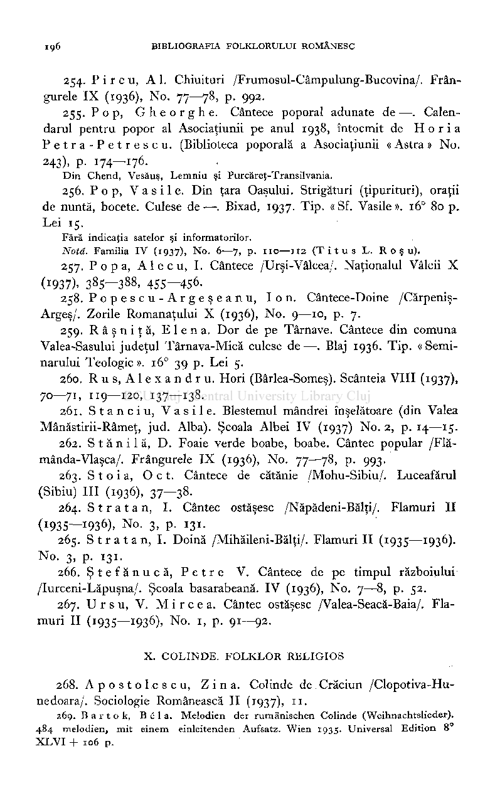

254 . Pireu , Al . Chiuituri /Frumosul-Câmpulung-Bucovina/. Frân-

- gurele IX(1936) , No.77—78 , p.992 . 255 . Pop , Gheorghe . Cântece poporal adunate de —. Calen­

darul pentru popor al Asociaţiunii pe anul 1938 , întocmit de H o r i a Petra-Petrescu . (Biblioteca poporală a Asociaţiunii « Astra » No.

243) . P- !74—17

###### -

6

Di n Chend , Vesăuş , Lemni u şi Purcăreţ-Transilvania .

###### 256 . Pop , Vasile . Din ţara Oaşului. Strigături (ţipurituri), oraţii

de nuntă, bocete. Culese de—. Bixad, 1937 . Tip. «Sf. Vasile». 16 8 0 p. Lei15 .

Făr ă indicaţi a satelo r şi informatorilor . Notă. Famili a I V (1937), No . 6—7, p . 110—11 2 (Titu s L . Roşu) .

###### 257 . Popa , A1 e c u, I. Cântece /Urşi-Vâlcea/. Naţionalul Vâlcii X

(1937) . 385—388 , 455—456 -

###### 258 . Popescu-Argeşeanu , Ion . Cântece-Doine /Cărpeniş-

Argeş/. Zorile Romanaţului X(1936) No.9—10 , p.7 .

###### 259 . Râşniţă , Elena . Dor de pe Târnave. Cântece din comuna

Valea-Sasului judeţul Târnava-Mică culese de —. Blaj 1936 . Tip. « Seminarului Teologic ». 16

3 9 p. Lei 5 .

0

###### 260 . Rus , Alexandru . Hori (Bârlea-Someş). Scânteia VIII(1937) ,

70—71 , 119—120 , 137—138 .

###### 261 . Stane i u, Vasile . Blestemul mândrei înşelătoare (din Valea

Mânăstirii-Râmeţ, jud. Alba). Şcoala Albei IV(1937 ) No.2 , p.14—15 .

###### 262 . S t ă n i 1 ă, D. Foaie verde boabe, boabe. Cântec popular /Flă­

mânda-Vlaşca/. Frângurele IX(1936) , No.77—78 , p.993 .

###### 263 . S t o i a, Oct . Cântece de cătănie /Mohu-Sibiu/. Luceafărul

(Sibiu) III(1936) , 37-38 .

###### 264 . S t r a t a n, I. Cântec ostăşesc /Năpădeni-Bălţi/. Flamuri II

(!935—Ï93 ) .

- 3 ' P-

3

NO

I

###### 265 S t r a t a n, I. Doină /Mihăileni-Bălţi/. Flamuri II(1935—1936) -

No.3 , p.131 .

###### 266 . Ştefănucă , Petr e V. Cântece de pe timpul războiului

/Iurceni-Lăpuşna/. Şcoala basarabeană. IV(1936) , No.7—8 , p.52 .

###### 267 . U r s u, V. M i r c e a. Cântec ostăşesc /Valea-Seacă-Baia/. Fla­

muri II(1935—1936) , No.1, p.91—92 .

X . COLINDE . FOLKLO R RELIGIO S

###### 268 . Apostolescu , Zina . Colinde de Crăciun /Clopotiva-Hu-

nedoara/. Sociologie Românească II(1937) , 11 .

###### 269. Bartok , Be l a. Melodie n de r rumänische n Colind e (Weihnachtslieder) .

484 melodien , mi t eine m einleitende n Aufsatz . Wie n 1935- Universa l Editio n 8 XLV I + 106 p .

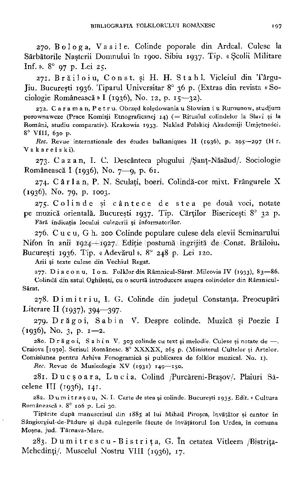

- 270. Bologa , Vasile . Colinde poporale din Ardeal. Culese la Sărbătorile Naşterii Domnului în 1900. Sibiu 1937. Tip. « Şcolii Militare Inf. ». 8° 97 p. Lei 25.
- 271. Brăiloiu , C o n s t. şi H. H. Stahl . Vicleiul din TârguJiu. Bucureşti 1936. Tiparul Universitar 8° 36 p. (Extras din revista « Sociologie Românească» I (1936), No 12, p. 15—32).
- 272. Caraman , Petru . Obrze d koledowani a u Slowia n i u Rumunow , studju m porownawcz e (Prac e Komisj i Etnograficzne j 14) ( = Ritualu l colindelo r la Slav i ş i l a Români , studi u comparativ) . Krakowi a 1933. Nakla d Polskie j Akademij i Umjştnosci . 8° VIII 630 p .

Rec. Revu e international e de s étude s balkanique s I I (1936), p . 295—297 ( H r . Vakarelski) .

- 273. Cazan , I. C. Descânteca plugului /Şanţ-Năsăud/. Sociologie

Românească I (1936), No. 7—9, p. 61.

- 274. Cârlan , P. N. Sculaţi, boeri. Colindă-cor mixt. Frângurele X

(1936), No 79, p. 1003.

- 275. Colind e şi cântec e d e ste a pe două voci, notate

pe muzică orientală. Bucureşti 1937. Tip. Cărţilor Bisericeşti 8° 32 p.

Făr ă indicaţi a loculu i culegeri i şi informatorilor .

- 276. C u c u, G h. 200 Colinde populare culese delà elevii Seminarului

Nifon în anii 1924—1927. Ediţie postumă îngrijită de Const. Brăiloiu. Bucureşti 1936. Tip. «Adevărul». 8° 248 p. Lei 120.

Ari i şi text e cules e di n Vechiu l Regat .

277. Diaco n u , Ion . Folklo r di n Râmnicul-Sărat . Milcovi a I V (1933), 83—86. Colind ă di n satu l Oghileşti , c u o scurt ă introducer e asupr a colindelo r di n Râmnicul -

Sărat .

##### 278. D i m i t r i u, I. G. Colinde din judeţul Constanţa. Preocupări

Literare II (1937), 394—397-

##### 279. Drăgoi , Sabi n V. Despre colinde. Muzică şi Poezie I

(1936), No 3, p. 1—2.

###### 280. Drăgoi , Sabi n V . 303 colind e c u tex t şi melodie . Cules e şi notat e d e — .

Craiov a [1930]. Scrisu l Românesc . 8° XXXXX , 265 p . (Ministeru l Cultelo r şi Artelor . Comisiune a pentr u Arhiv a Fonogramic ă şi publicare a d e folklo r muzical . No 1).

Rec. Revu e d e Musicologi e X V (1931) 149—150.

##### 281. Ducşoara , Lucia . Colind /Purcăreni-Braşov/. Plaiuri Să-

celene III (1936), 141.

###### 282. Dumitraşcu , N . I . Cart e d e stea şi colinde . Bucureşt i 1935. Edit . « Cultur a

Româneasc ă ». 8° 106 p . Le i 30.

Tipărit e dup ă manuscrisu l di n 1885 a l lu i Mihai l Piroşca , învăţăto r şi canto r î n Sângiorgiul-de-Pădur e şi dup ă culegeril e făcut e d e învăţătoru l Io n Urdea , î n comun a Moşna , jud . Târnava-Mare .

- 283. Dumitrescu-Bistriţa , G. în cetatea Vitleem /Bistriţa-

Mehedinţi/. Muscelul Nostru VIII (1936), 17.

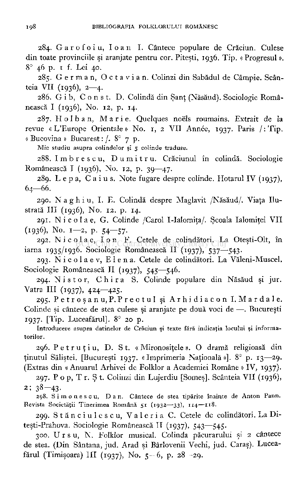

- 284. Garofoiu , Ioa n I. Cântece populare de Crăciun. Culese

din toate provinciile şi aranjate pentru cor. Piteşti, 1936. Tip. « Progresul ». 8° 46 p. 1 f. Lei 40.

- 285. German , O c t a v i a n. Colinzi din Sabădul de Câmpie. Scân­

teia VII (1936), 2—4.

- 286. Gib , C o n s t. D. Colindă din Şanţ (Năsăud). Sociologie Româ­

nească I (1936), No. 12, p. 14.

- 287. PI o 1 b a n, Marie . Quelques noëls roumains. Extrait de la

revue « L'Europe Orientale » No. 1, 2 VII Année, 1937. Paris / : Tip. « Bucovina » Bucarest : /. 8° 7 p.

Mi c studi u asupr a colindelo r şi 5 colind e traduse .

- 288. Imbrescu , Dumitru . Crăciunul în colindă. Sociologie

Românească I (1936), No. 12, p. 39—47.

- 289. L e p a, C a i u s. Note fugare despre colinde. Hotarul IV (1937),

64—66.

- 290. N a ghiu , I. E. Colindă despre Maglavit /Năsăud/. Viaţa Ilu­

strată III (1936), No. 12. p. 14.

- 291. N i c o 1 a e, G. Colinde /Carol l-Ialomiţa/. Şcoala Ialomiţei VII

- (1936), No. 1—2, p. 54—57.

- 292. Nicol a e, Io n F. Cetele de colindători. La Oteşti-Olt, în

iarna 1935/1936. Sociologie Românească II (1937), 537—543.

- 293. Nicolaev , Elena . Cetele de colindători. La Văleni-Muscel.

Sociologie Românească II (1937), 545—546.

- 294. Nistor , Chir a S. Colinde populare din Năsăud şi jur.

Vatra III (1937), 424—425.

- 295. Petroşanu , P. Preotu l şi Arhidiaco n I. Mardale .

Colinde şi cântece de stea culese şi aranjate pe două voci de —. Bucureşti

- 1937. [Tip. Luceafărul]. 8° 20 p. Introducer e asupr a datinelo r d e Crăciu n şi text e fără indicaţi a loculu i şi informa ­

torilor .

- 296. P e t r u ţ i u, D. St. «Mironosiţele». O dramă religioasă din

ţinutul Săliştei. [Bucureşti 1937. «Imprimeria Naţională»]. 8° p. 13—29. (Extras din « Anuarul Arhivei de Folklor a Academiei Române » IV, 1937)-

- 297. P o p, T r. Ş t. Colinzi din Lujerdiu [Someş]. Scânteia VII (1936),

2; 3

8

—43-

- 298. S i m o n e s c u , Dan . Cântec e d e ste a tipărit e înaint e d e Anto n Pann .

Revist a Societăţi i Tinerime a Român ă 51 (1932—33), 114—118 .

- 299. Stănciulescu , Valeri a C. Cetele de colindători. La Di-

teşti-Prahova. Sociologie Românească II (1937), 543—545.

- 300. U r s u, N. Folklor musical. Colinda păcurarului şi 2 cântece

de stea. (Din Sântana, jud. Arad şi Bârlovenii Vechi, jud. Caras). Luceafărul (Timişoara) III (1937), No. 5—6, p. 28—29.

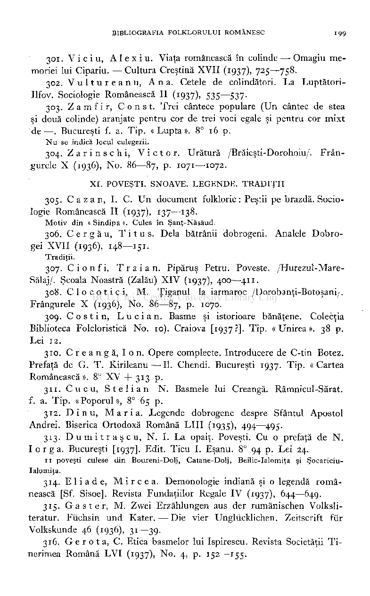

- 301. Viciu , A 1 e x i u. Viaţa românească în colinde — Omagiu me­

moriei lui Cipariu. — Cultura Creştină XVII (1937), 725—758.

- 302. Vultureanu , Ana . Cetele de colindători. La Luptători-

Ilfov. Sociologie Românească II (1937), 535—537.

- 303. Zamfir , Const . Trei cântece populare (Un cântec de stea

şi două colinde) aranjate pentru cor de trei voci egale şi pentru cor mixt de —. Bucureşti f. a. Tip. « Lupta ». 8° 16 p.

N u s e indic ă locu l culegerii .

- 304. Zarinschi , Victor . Urătură /Brăieşti-Dorohoiu/. Frân­

gurele X (1936), No. 86—87, p. 1071—1072.

XI . POVEŞTI . SNOAVE . LEGENDE . TRADIŢI I

- 305. Cazan , I. C. Un document folkloric: Peştii pe brazdă. Socio­

logie Românească II (1937), 137—138.

Moti v di n « Sindip a ». Cule s î n Şanţ-Năsăud .

- 306. Cerg ă u, Titus . Delà bătrânii dobrogeni. Analele Dobro-

gei XVII (1936), 148—151.

Tradiţii .

- 307. Cionfi , Trăi a n. Pipăruş Petru. Poveste. /Hurezul-Mare-

Sălaj/. Şcoala Noastră (Zalău) XIV (1937), 400—411.

- 308. Clocotici , M. Ţiganul la iarmaroc /Dorobanţi-Botoşani/.

Frângurele X (1936), No. 86—87, p. 1070.

- 309. Costin , Lucian . Basme şi istorioare bănăţene. Colecţia

Biblioteca Folcloristică No. 10). Craiova [1937?]. Tip. «Unirea». 38 p. Lei 12.

310. C r e a n g ă, I o n. Opere complecte. Introducere de C-tin Botez. Prefaţă de G. T. Kirileanu—II. Chendi. Bucureşti 1937. Tip. «Cartea Românească». 8° XV + 313 p-

- 311. C u cu, Stelia n N. Basmele lui Creangă. Râmnicul-Sărat.

f. a. Tip. «Poporul», 8° 65 p.

- 312. Dinu , Maria . Legende dobrogene despre Sfântul Apostol

Andrei. Biserica Ortodoxă Română LIII (1935), 494—495.

- 313. D u m i t r a ş c u, N. I. La opaiţ. Poveşti. Cu o prefaţă de N.

I o r g a. Bucureşti [1937]. Edit. Ticu I. Eşanu. 8° 94 p. Lei 24.

n poveşt i cules e di n Boureni-Dolj , Catane-Dolj , Beilic-Ialomiţ a şi Şocariciu Ialomiţa .

- 314. E 1 i a d e, M i r c e a. Demonologie indiană şi o legendă româ­

nească [Sf. Sisoe]. Revista Fundaţiilor Regale IV (1937), 644—649.

- 315. Gast e r, M. Zwei Erzählungen aus der rumänischen Volksli­

teratur. Füchsin und Kater. — Die vier Unglücklichen. Zeitscrift für Volkskunde 46 (1936), 31—39.

- 316. G e r o t a, C. Etica basmelor lui Ispirescu. Revista Societăţii Ti­

nerimea Română LVI (1937), No. 4, p. 152—155.

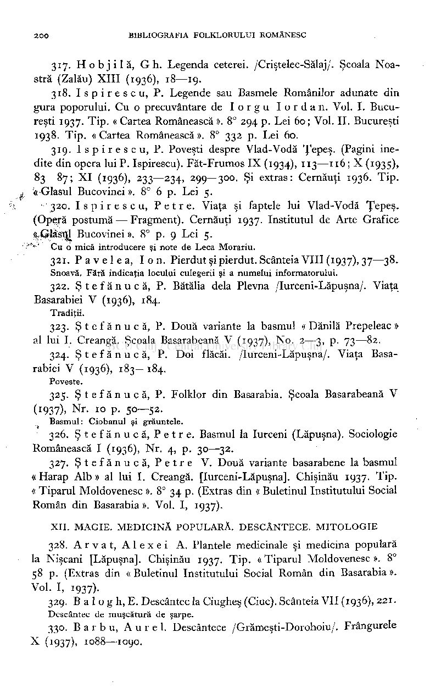

- 317. Hobjilă , G h. Legenda ceterei. /Criştelec-Sălaj/. Şcoala Noa­

stră (Zalău) XIII (1936), 18—19.

- 318. Ispirescu , P. Legende sau Basmele Românilor adunate din

gura poporului. Cu o precuvântare de Iorg u Iordan . Vol. I. Bucureşti 1937. Tip. « Cartea Românească ». 8° 294 p. Lei 60; Vol. II. Bucureşti

- 1938. Tip. « Cartea Românească ». 8° 332 p. Lei 60.

319. Ispirescu , P. Poveşti despre Vlad-Vodă Ţepeş. (Pagini inedite din opera Iui P. Ispirescu). Făt-Frumos IX (1934), 113—116 ; X (1935), 83—87; XI (1936), 233—234, 299—300. Şi extras: Cernăuţi 1936. Tip. «Glasul Bucovinei ». 8° 6 p. Lei 5.

•320. Ispirescu , Petre . Viaţa şi faptele lui Vlad-Vodă Ţepeş. (Operă postumă — Fragment). Cernăuţi 1937. Institutul de Arte Grafice SjjQlastjl Bucovinei ». 8° p. 9 Lei 5.

C u o mic ă introducer e şi not e d e Lec a Morariu .

- 321. Pavel e a, Ion . Pierdut şi pierdut. Scânteia VIII (1937), 37—38. Snoavă . Făr ă indicaţi a loculu i culegeri i şi a numelu i informatorului .
- 322. Ştefănucă , P. Bătălia delà Plevna /Iurceni-Lăpuşna/. Viaţa

Basarabiei V (1936), 184.

Tradiţii .

- 323. Ştefănucă , P. Două variante la basmul « Dănilă Prepeleac »

al lui I. Creangă. Şcoala Basarabeană V (1937), No. 2—3, p. 73—82.

- 324. Ştefănucă , P. Doi flăcăi. /Iurceni-Lăpuşna/. Viaţa Basa­

rabiei V (1936), 183—184.

Poveste .

- 325. Ştefănucă , P. Folklor din Basarabia. Şcoala Basarabeană V

(

##### -37),

- 10 P- 50—52-

IO

Nr

Basmul : Ciobanu l şi grăuntele .

- 326. Ştefănucă , Petre . Basmul la Iurceni (Lăpuşna). Sociologie

Românească I (1936), Nr. 4, p. 30—32.

- 327. Ştefănucă , Petr e V. Două variante basarabene la basmul

« Harap Alb » al lui I. Creangă. [Iurceni-Lăpuşna]. Chişinău 1937. Tip. « Tiparul Moldovenesc ». 8° 34 p. (Extras din « Buletinul Institutului Social Român din Basarabia ». Vol. I, 1937).

XII . MAGIE . MEDICIN Ă POPULARĂ . DESCÂNTECE . MITOLOGI E

328. Arvat , Alexe i A. Plantele medicinale şi medicina populară la Nişcani [Lăpuşna]. Chişinău 1937. Tip. «Tiparul Moldovenesc». 8° 58 p. (Extras din « Buletinul Institutului Social Român din Basarabia ». Vol. I, 1937).

- 329. B a 1 o g h, E. Descântec la Ciugheş (Ciuc). Scânteia VII (1936), 221. Descânte c d e muşcătur ă d e şarpe .
- 330. Barbu , Aurel . Descântece /Grămeşti-Dorohoiu/. Frângurele

- X (1937), 1088—1090.

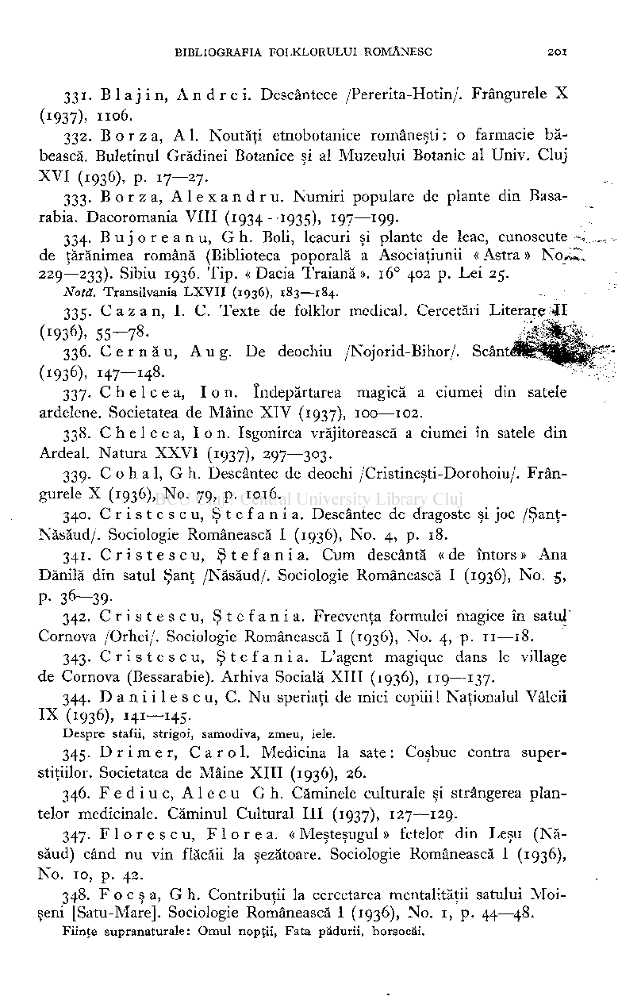

- 331. Blajin , Andrei . Descântece /Pererita-Hotin/. Frângurele X

(1937), 1106.

- 332. Borza , Al. Noutăţi etnobotanice româneşti : o farmacie bă­

bească. Buletinul Gradinei Botanice şi al Muzeului Botanic al Univ. Cluj XVI (1936), p. 17—27.

- 333. Borza , Alexandru . Numiri populare de plante din Basa­

rabia. Dacoromania VIII (1934—1935), 197—199-

- 334. Bujoreanu , Gh . Boli, leacuri şi plante de leac, cunoscute < ,„ .

de ţărănimea română (Biblioteca poporală a Asociaţiunii « Astra » No«^!, 229—233). Sibiu 1936. Tip. «Dacia Traiană ». 16

402 p. Lei 25.

0

Notă. Transilvani a LXVI I (1936), 183—184.

- 335. Cazan , I. C. Texte de folklor medical. Cercetări Literare 11
- 336. Cernău , Aug . De deochiu /Nojorid-Bihor/. Scântéfllfe^BH

(1936), 147—148.

- 337. Chelcea , Ion . îndepărtarea magică a ciumei din satele

ardelene. Societatea de Mâine XIV (1937), 100—102.

- 338. Chelcea , Ion . Isgonirea vrăjitorească a ciumei în satele din

Ardeal. Natura XXVI (1937), 297—303.

- 339. C o h a 1, G h. Descântec de deochi /Cristineşti-Dorohoiu/. Frân­

gurele X (1936), No. 79, p. 1016.

- 340. Cristescu , Ştefan i a. Descântec de dragoste şi joc /Şanţ-

Năsăud/. Sociologie Românească I (1936), No. 4, p. 18.

- 341. Cristescu , Ştefan i a. Cum descântă «de întors» Ana

(!93

)- 55—78.

6

Dănilă din satul Şanţ /Năsăud/. Sociologie Românească I (1936), No. 5, P- 3

—39-

6

##### 342. Cristescu , Ştefan i a. Frecvenţa formulei magice în satul*

Cornova /Orhei/. Sociologie Românească I (1936), No. 4, p. 11—18.

##### 343. Cristescu , Ştefan i a. L'agent magique dans le village

de Cornova (Bessarabie). Arhiva Socială XIII (1936), 119—137.

##### 344. D a n i i 1 e s c u, C. Nu speriaţi de mici copiii ! Naţionalul Vâlcii

(!93

### )> H

### —H5-

I X

6

1

Despr e stafii, strigoi , samodiva , zmeu , iele.

- 345. Drimer , Carol . Medicina la sate: Coşbuc contra super­

stiţiilor. Societatea de Mâine XIII (1936), 26.

- 346. Fediuc , Alec u Gh . Căminele culturale şi strângerea plan­

telor medicinale. Căminul Cultural III (1937), 127—129.

- 347. Florescu , Flor e a. « Meşteşugul » fetelor din Leşu (Nă­

- săud) când nu vin flăcăii la şezătoare. Sociologie Românească I (1936), No. 10, p. 42.

348. F o c ş a, G h. Contribuţii la cercetarea mentalităţii satului Moişeni [Satu-Mare]. Sociologie Românească I (1936), No. 1, p. 44—48.

Fiinţ e supranaturale : Omu l nopţii , Fat a pădurii , borsocăi .

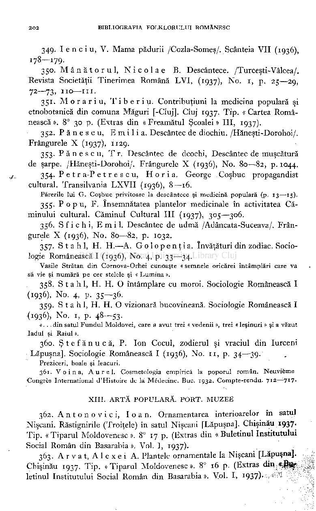

- 349. I e n c i u, V. Mama pădurii /Cozla-Someş/. Scânteia VII (1936), 178—179.
- 350. Mănătorul , Nicola e B. Descântece. /Turceşti-Vâlcea/. Revista Societăţii Tinerimea Română LVI, (1937), No. 1, p. 25—29, 72—73, 110 —III .
- 351. M o r a r i u, T i b e r i u. Contribuţiuni la medicina populară şi

etnobotanică din comuna Măguri [-Cluj]. Cluj 1937. Tip. « Cartea Românească ». 8° 30 p. (Extras din «Freamătul Şcoalei » III, 1937).

- 352. P ă n e s c u, Emilia . Descântec de diochiu. /Haneşti-Dorohoi/.

Frângurele X (1937), 1129.

- 353. Pănescu , Tr . Descântec de deochi, Descântec de muşcătură

de şarpe. /Haneşti-Dorohoi/. Frângurele X (1936), No. 80—82, p. 1044.

- 354. P e t r a-P etrescu , Hor i a. George Coşbuc propagandist

cultural. Transilvania LXVII (1936), 8—16.

Păreril e lu i G . Coşbu c privitoar e la descântec e şi medicin ă popular ă (p . 13—15).

- 355. P o p u, F. însemnătatea plantelor medicinale în activitatea Că­

minului cultural. Căminul Cultural III (1937), 305—306.

- 356. S f i c h i, Emil . Descântec de udmă /Adâncata-Suceava/. Frân­

gurele X (1936), No. 80—82, p. 1032.

- 357. Stahl , H. H.—A. Golopenţia . învăţături din zodiac. Socio­

- logie Românească I (1936), No. 4, p. 33—34. Vasil e Străta n di n Cornova-Orhe i cunoaşt e « semnel e oricăre i întâmplăr i car e v a

s ă vi e şi număr ă p e ce r stelele şi « Lumin a ».

##### 358. Stahl , H. H. O întâmplare cu moroi. Sociologie Românească I

(1936), No. 4, p. 35—36.

##### 359. S t a h 1, H. H. O vizionară bucovineană. Sociologie Românească I

- (1936), No. 1, p. 48—53. «.. . di n satu l Fundu l Moldovei , car e a avu t tre i « vedeni i », tre i « leşinur i » şi a văzu t

Iadu l şi Raiu l ».

- 360. Ştefănucă , P. Ion Cocul, zodierul şi vraciul din Iurceni

Lăpuşna], Sociologie Românească I (1936), No. 11, p. 34—39.

Preziceri , boal e şi leacuri .

- 361. Voina , Aurel . Cosmetologi a empiric ă la poporu l român . Neuvièm e

Congrè s Internationa l d'Histoir e d e la Médecine . Buc . 1932. Compte-rendu . 712—717 .

XIII . ART Ă POPULARĂ . PORT . MUZE E

- 362. Antonovici , Ioan . Ornamentarea interioarelor în satul

Nişcani. Răstignirile (Troiţele) în satul Nişcani [Lăpuşna]. Chişinău 1937. Tip. « Tiparul Moldovenesc ». 8° 17 p. (Extras din « Buletinul Institutului Social Român din Basarabia ». Vol. I, 1937).

363. A r v a t, A 1 e x e i A. Plantele ornamentale la Nişcani [Lăpuşna]. Chişinău 1937. Tip. «Tiparul Moldovenesc». 8° 16 p. (Extras din letinul Institutului Social Român din Basarabia». Vol. I, 1937)- -

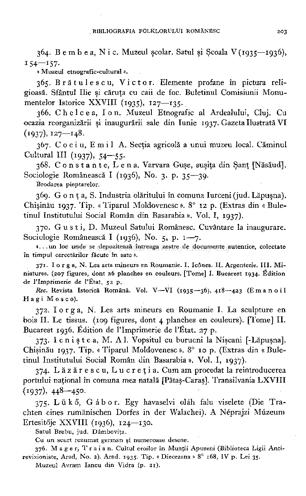

##### 364. B e m b e a, Nie . Muzeul şcolar. Satul şi Şcoala V(i935—1936),

54—157-

1

« Muzeu l etnografic-cultura l ».

- 365. Brătulescu , Victor . Elemente profane în pictura religioasă. Sfântul Ilie şi căruţa cu caii de foc. Buletinul Comisiunii Monumentelor Istorice XXVIII (1935), 127—135.
- 366. Chelcea , Ion . Muzeul Etnografic al Ardealului, Cluj. Cu ocazia reorganizării şi inaugurării sale din Iunie 1937. Gazeta Ilustrată VI

- (1937), 127—148.

- 367. C o c i u, E m i 1 A. Secţia agricolă a unui muzeu local. Căminul

Cultural III (1937), 54—55-

- 368. Constante , Lena . Varvara Guşe, suşiţa din Şanţ [Năsăud].

Sociologie Românească I (1936), No 3. p. 35—39.

Brodare a pieptarelor .

- 369. G o n ţ a, S. Industria olăritului în comuna Iurceni (jud. Lăpuşna).

Chişinău 1937. Tip. « Tiparul Moldovenesc ». 8° 12 p. (Extras din « Buletinul Institutului Social Român din Basarabia ». Vol. I, 1937).

370. Guşti , D. Muzeul Satului Românesc. Cuvântare la inaugurare. Sociologie Românească I (1936), No 5, p. 1—7.

«.. . u n lo c und e s e depoziteaz ă întreag a zestr e d e document e autentice , colectat e î n timpu l cercetărilo r făcut e î n sat e ».

371 I o r g a, N . Le s art s mineur s e n Roumanie . I . Icônes . II . Argenterie . III . Mi niatures . (207 figures , don t 26 planche s e n couleurs . [Tome ] I . Bucares t 1934. Éditio n d e l'Imprimeri e d e l'État , 52 p .

Rec. Revist a Istoric ă Română . Vol . V—V I (1935—36), 418—423 ( E m a n o i 1 H a g i M o s c o) .

- 372. I o r g a, N. Les arts mineurs en Roumanie I. La sculpture en bois II. Le tissus. (109 figures, dont 4 planches en couleurs). [Tome] IL Bucarest 1936. Édition de l'Imprimerie de l'État. 27 p.
- 373. I e n i ş t e a, M. Al . Vopsitul cu burueni la Nişcani [-Lăpuşna]. Chişinău 1937. Tip. « Tiparul Moldovenesc ». 8° 10 p. (Extras din « Buletinul Institutului Social Român din Basarabia ». Vol. I, 1937).
- 374. Lăzărescu , Lucreţia . Cum am procedat la reintroducerea portului naţional în comuna mea natală [Pătaş-Caraş]. Transilvania LXVIII <i937)> 448—450.
- 375. Lüko , Gâbor . Egy havaselvi olâh falu viselete (Die Tra­

chten eines rumänischen Dorfes in der Walachei). A Néprajzi Müzeum Ertesitôje XXVIII (1936), 124—130.

Satu l Brebu , jud . Dâmboviţa . C u u n scur t rezuma t germa n şi numeroas e desene .

- 376. Mager , Trăi a n . Cultu l eroilo r î n Munţi i Apusen i (Bibliotec a Ligi i Anti -

revizioniste , Arad , No 2). Arad 1935. Tip . « Diecezan a » 8° 168, I V p . Le i 35. Muzeu l Avra m Ianc u di n Vidr a (p 21).

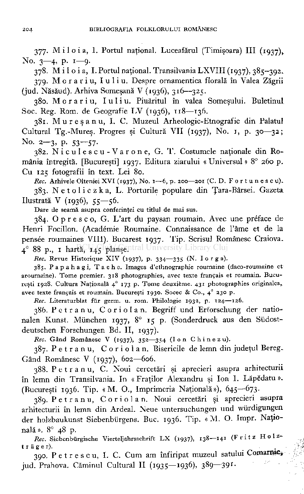

- 377. M i 1 o i a, I. Portul naţional. Luceafărul (Timişoara) III (1937),

No. 3—4, p. 1—9.

- 378. M i 1 o i a, I. Portul naţional. Transilvania LXVIII (1937), 385—392.
- 379. Morar i u, Iuliu . Despre ornamentica florală în Valea Zăgrii

(jud. Năsăud). Arhiva Someşană V (1936), 316—325.

- 380. Morar i u, Iuliu . Piuăritul în valea Someşului. Buletinul

Soc. Reg. Rom. de Geografie LV (1936), 118—136.

- 381. Mureşanu , I. C. Muzeul Arheologic-Etnografic din Palatul

Cultural Tg.-Mureş. Progres şi Cultură VII (1937), No. 1, p. 30—32; No. 2—3, p. 53—57.

- 382. Niculescu-Varone , G. T. Costumele naţionale din Ro­

mânia întregită. [Bucureşti] 1937. Editura ziarului « Universul » 8° 260 p. Cu 125 fotografii în text. Lei 80.

Rec. Arhivel e Oltenie i XV I (1937), No . 1—6, p . 200—201 (CD . Fortunescu) .

- 383. Netoliczka , L. Porturile populare din Ţara-Bârsei. Gazeta

Ilustrată V (1936), 55—56.

Dar e d e seam ă asupr a conferinţe i c u titlu l d e ma i sus .

- 384. O p r e s c o, G. L'art du paysan roumain. Avec une préface de

Henri Focillon. (Académie Roumaine. Connaissance de l'âme et de la pensée roumaines VIII). Bucarest 1937. Tip. Scrisul Românesc Craiova. 4

##### 88 p., 1 hartă, 145 planşe.

0

Rec.Revu e Historique XI V (1937), p . 334—33s (N . I o r g a).

- 385. Papahagi , Tache . Image s d'ethnographi e roumain e (daco-roumain e e t

aroumaine) . Tom e premier . 318 photographies , ave c text e françai s e t roumain . Bucu reşt i 1928. Cultur a Naţional ă 4° 173 p . Tom e deuxième . 431 photographie s originales , ave c text e françai s e t roumain . Bucureşt i 1930. Soce c & Co. 4

0

230 p . Rec. Literaturbla t fu r germ . u . rom . Philologi e 1932, p . 124—126.

- 386. Petranu , Coriolan . Begriff und Erforschung der natio­

##### nalen Kunst. München 1937, 8° 15 p. (Sonderdruck aus den Südostdeutschen Forschungen Bd. II, 1937).

Rec. Gân d Românes c V (1937), 352—354 (Io n C h i n e z u) .

- 387. Petranu , Coriolan . Bisericile de lemn din judeţul Bereg.

Gând Românesc V (1937), 602—606.

- 388. Petranu , C. Noui cercetări şi aprecieri asupra arhitecturii

în lemn din Transilvania. In « Fraţilor Alexandru şi Ion I. Lăpedatu ». (Bucureşti 1936. Tip. « M. O., Imprimeria Naţională»), 645—673.

- 389. Petranu , Coriolan . Noui cercetări şi aprecieri asupra

arhitecturii în lemn din Ardeal. Neue Untersuchungen und Würdigungen der holzbaukunst Siebenbürgens. Buc. 1936. Tip. « M. O. Impr. Naţională ». 8° 48 p.

Rec. Siebenbürgisch e Vierteljahrsschrif t L X (1937), 138—141 (Frit z Holz träger) . .

- 390. Petrescu , I. C. Cum am înfiripat muzeul satului Comarnic,,

jud. Prahova. Căminul Cultural II (1935—1936), 389—391-

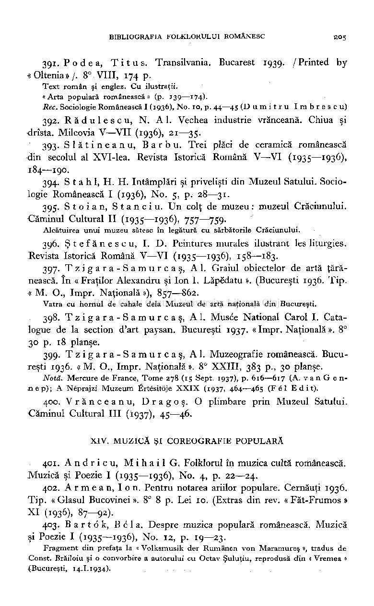

- 391. Podea , Titus . Transilvania. Bucarest 1939. /Printed by

«Oltenia» /. 8° VIII, 174 p.

Tex t româ n şi englez . C u ilustraţii . «Art a popular ă românească » (p . 139—174) . Rec. Sociologi e Româneasc ă I (1936), No . io , p . 44—45 (Dumitr u Imbrescu )

- 392. R ă d u 1 e s c u, N. Al . Vechea industrie vrânceană. Chiua şi

drîsta. Milcovia V—VII (1936), 21—35.

- 393. Slătineanu , Barbu . Trei plăci de ceramică românească

din secolul al XVI-lea. Revista Istorică Română V—VI (1935—1936), 184—190.

- 394. S t a h 1, H. H. întâmplări şi privelişti din Muzeul Satului. Socio­

logie Românească I (1936), No. 5, p. 28—31.

- 395. Stoian , Stane i u. Un colţ de muzeu : muzeul Crăciunului.

- Căminul Cultural II (1935—1936), 757—759. Alcătuire a unu i muze u sătes c î n legătur ă c u sărbătoril e Crăciunului .

- 396. Ştefănescu , I. D. Peintures murales ilustrant les liturgies. Revista Istorică Română V—VI (1935—1936), 158—183.
- 397. Tzigara-Samurcaş , Al . Graiul obiectelor de artă ţărănească, în « Fraţilor Alexandru şi Ion I. Lăpedatu ». (Bucureşti 1936. Tip. « M. O., Impr. Naţională »), 857—862.

Vatr a c u hornu l d e cahal e del à Muzeu l d e art ă naţional ă di n Bucureşti .

- 398. Tzigara-Samurcaş , Al . Musée National Carol I. Catalogue de la section d'art paysan. Bucureşti 1937. «Impr. Naţională». 8° 30 p. 18 planşe.
- 399. Tzigara-Samurcaş , Al . Muzeografie românească. Bucureşti 1936. « M. O., Impr. Naţională ». 8° XXIII, 383 p., 30 planşe.

Notă. Mercur e d e France , Tom e 278 (15 Sept . 1937), p . 616—61 7 (A . v a n G e n i i ep) ; A Néprajz i Muzeu m Értésitoj e XXI X (1937, 464—465 ( F é 1 E d i t) .

- 400. Vrănceanu , Drag o ş. O plimbare prin Muzeul Satului.

Căminul Cultural III (1937), 45—46.

XIV . MUZIC Ă Ş I COREOGRAFI E POPULAR Ă

- 401. Andricu , MihailG . Folklorul în muzica cultă românească.

Muzică şi Poezie I (1935—1936), No. 4, p. 22—24.

- 402. Armean , Ion . Pentru notarea ariilor populare. Cernăuţi 1936.

Tip. « Glasul Bucovinei ». 8° 8 p. Lei 10. (Extras din rev. « Făt-Frumos » XI (1936), 87-92).

- 403. Bartok , Be l a. Despre muzica populară românească. Muzică

şi Poezie I (1935—1936), No. 12, p. 19—23.

Fragmen t di n prefaţ a la « Volksmusi k de r Rumäne n vo n Maramure ş », tradu s d e Const . Brăiloi u şi o convorbir e a autorulu i c u Octa v Şuluţiu , reprodus ă di n « Vreme a » {Bucureşti , 14.1.1934).

