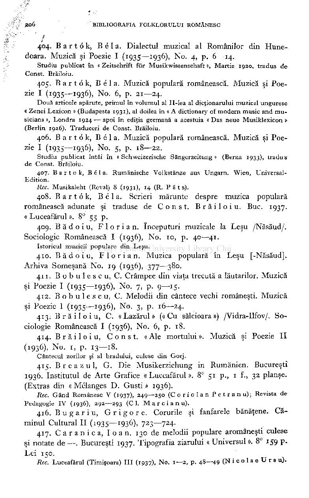
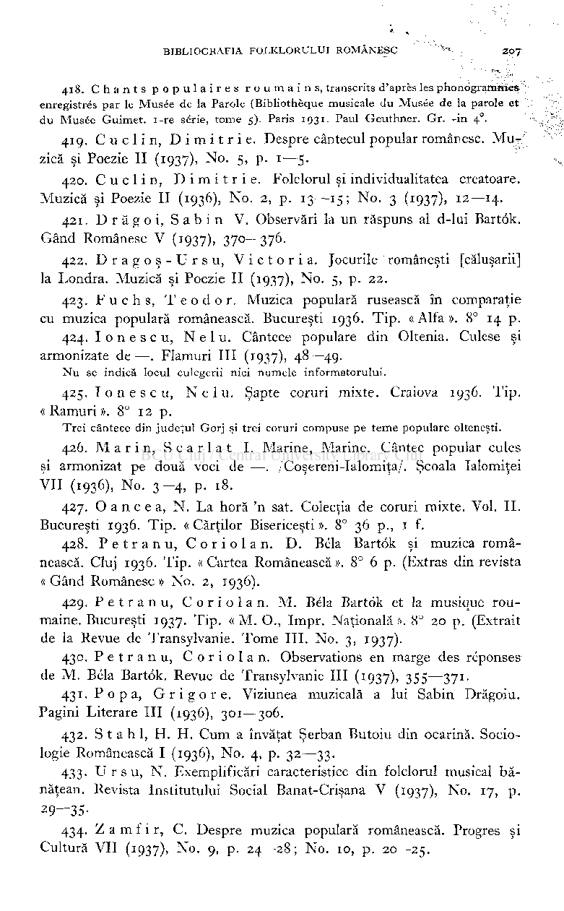

i;

# 404. Bartok , Bel a. Dialectul muzical al Românilor din Hunedoara. Muzică şi Poezie I (1935—1936), No 4, p. 6—14.

Studi u publica t î n « Zeitschrif t fü r Musikwissenschaf t », Marti e 1920, tradu s d e Const . Brăiloiu .

# 405. Bartok , Be l a. Muzică populară românească. Muzică şi Poezie

(Î935—

# -

> P- 21—24.

93

)>

1

No

6

1

6

Dou ă articol e apărute , primu l î n volumu l al II-le a a l dicţionarulu i muzica l ungures c « Zene i Lexico n » (Budapest a 1931), a l doile a î n « A dictionar y o f moder n musi c an d mu sician s », Londr a 1924 —apo i î n ediţi a german ă a acestui a «Da s neu e Musiklexico n » (Berli n 1926). Traducer i d e Const . Brăiloiu .

# 406. Bartok , Be l a. Muzică populară românească. Muzică şi Poezie (!935— 93

## - 5> P- 18—22.

)>

6

No

Studi u publica t întâ i î n «Schweizerisch e Sängerzeitung » (Bern a 1933), tradu s e Const . Brăiloiu

- 407. Bartok , Be l a. Rumänisch e Volkstänz e au s Ungarn . Wien , Universal -

Edition .

Ree. Musikaleh t (Reval ) 8 (1931), 14 (R . P ä t s)

- 408. Bartök , Béla . Scrieri mărunte despre muzica populară

românească adunate şi traduse de Const . Brăiloiu . Buc. 1937. « Luceafărul ». 8° 55 p.

- 409. Bădoiu , Florian . începuturi muzicale la Leşu /Năsăud/.

Sociologie Românească I (1936), No 10, p. 40—41.

Istoricu l muzici i popular e di n Leşu .

- 410. Bădoiu , Florian . Muzica populară în Leşu [-Năsăud].

Arhiva Someşană No. 19 (1936), 377—380.

- 411. B o b u 1 e s c u, C. Crâmpee din viaţa trecută a lăutarilor. Muzică

şi Poezie I (1935—1936), No. 7, p. 9—15.

- 412. Bobulescu , C. Melodii din cântece vechi româneşti. Muzică

şi Poezie I (1935—1936), No. 3, p. 16—24.

- 413. Brăiloiu , C. « Lazărul » («Cu sălcioara ») /Vidra-Ilfov/. So­

ciologie Românească I (1936), No. 6, p. 18.

- 414. Brăiloiu , Const . « Ale mortului ». Muzică şi Poezie II

(1936), No. 1, p. 13—18.

Cântecu l zorilo r şi a l bradului , cules e di n Gorj .

- 415. Breazul , G. Die Musikerziehung in Rumänien. Bucureşti

# 1936. Institutul de Arte Grafice «Luceafărul». 8° 51 p., 1 f., 32 planşe. (Extras din « Mélanges D. Guşti » 1936).

Rec. Gân d Românes c V (1937), 249—250 (Coriola n Petranu) ; Revist a d e Pedagogi e I V (1936), 292-—293 (Cl . M a r c i a n u) .

- 416. B u ga r iu, G r i g o r e. Corurile şi fanfarele bănăţene. Că­

minul Cultural II (1935—1936), 723—724.

- 417. C a r a n i c a, I o a n. 130 de melodii populare aromâneşti culese

şi notate de —. Bucureşti 1937. Tipografia ziarului « Universul ». 8° 159 p Lei 150.

Rec. Luceafăru l (Timişoara ) II I (1937), No 1—2, p . 48—49 (Nicola UTSU)

- 418. Chant s populaire s roumains , transcrit s d'aprè s les Phonogramme »

enregistré s pa r le Musé e d e la Parol e (Bibliothèqu e musical e d u Musé e d e la parol e e t d u Musé e Guimet . i-r e série, tom e 5). Pari s 1931. Pau l Geuthner . Gr . -i n 4 .

- 419. C u c 1 i n, D i m i t r i e. Despre cântecul popular românesc. Mu*

zică şi Poezie II (1937), No. 5, p. 1—5.

- 420. Cuci i n, Dimitrie . Folclorul şi individualitatea creatoare.

Muzică şi Poezie II (1936), No. 2, p. 13—15; No. 3 (1937), 12—14.

- 421. D r ă g o i, S a b i n V. Observări la un răspuns al d-lui Bartok.

Gând Românesc V (1937), 370—376.

- 422. Dragoş-Ursu , Victoria . Jocurile româneşti [căluşarii]

la Londra. Muzică şi Poezie II (1937), No. 5, p. 22.

- 423. Fuchs , Teodor . Muzica populară rusească în comparaţie

cu muzica populară românească. Bucureşti 1936. Tip. « Alfa ». 8° 14 p.

- 424. Ionescu , Nelu . Cântece populare din Oltenia. Culese şi

armonizate de —. Flamuri III (1937), 48—49.

N u se indic ă locu l culegeri i nic i numel e informatorului .

- 425. Ionescu , Nelu . Şapte coruri mixte. Craiova 1936. Tip.

« Ramuri ». 8° 12 p.

Tre i cântec e di n judeţu l Gor j şi tre i corur i compus e p e tem e popular e olteneşti .

- 426. Marin , Scarla t I. Marine, Marine. Cântec popular cules

şi armonizat pe două voci de —. /Coşereni-Ialomiţa/. Şcoala Ialomiţei VII (1936), No. 3-4, p. 18.

- 427. O a n c e a, N. La horă 'n sat. Colecţia de coruri mixte. Vol. II.

Bucureşti 1936. Tip. « Cărţilor Bisericeşti ». 8° 36 p., 1 f.

- 428. Petranu , Coriolan . D. Béla Bartok şi muzica româ­

nească. Cluj 1936. Tip. «Cartea Românească». 8° 6 p. (Extras din revista « Gând Românesc » No. 2, 1936).

429. Petranu , Coriolan . M. Béla Bartok et la musique roumaine. Bucureşti 1937. Tip. « M. O., Impr. Naţională ». 8° 20 p. (Extrait de la Revue de Transylvanie. Tome III. No. 3, 1937).

- 430. Petranu , Coriolan . Observations en marge des réponses

de M. Béla Bartok. Revue de Transylvanie III (1937), 355—371.

- 431. Popa , Grigore . Viziunea muzicală a lui Sabin Drăgoiu.

Pagini Literare III (1936), 301—306.

- 432. Stahl , H. H. Cum a învăţat Şerban Butoiu din ocarină. Socio­

logie Românească I (1936), No. 4, p. 32—33.

- 433. U r s u, N. Exemplificări caracteristice din folclorul musical bă­

năţean. Revista Institutului Social Banat-Crişana V (1937), No. 17, p. 29—35-

434. Zamfir , C. Despre muzica populară românească. Progres şi Cultură VII (1937), No. 9, p. 24—28; No. 10, p. 20—25.

