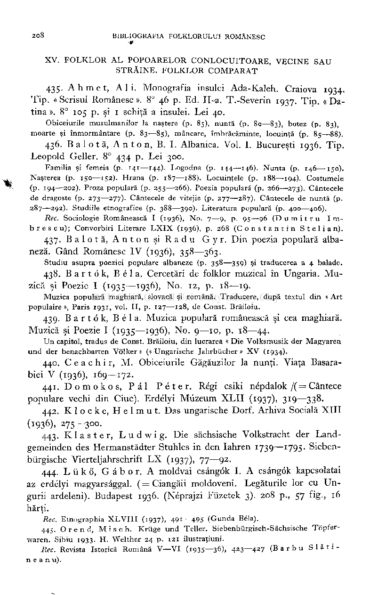
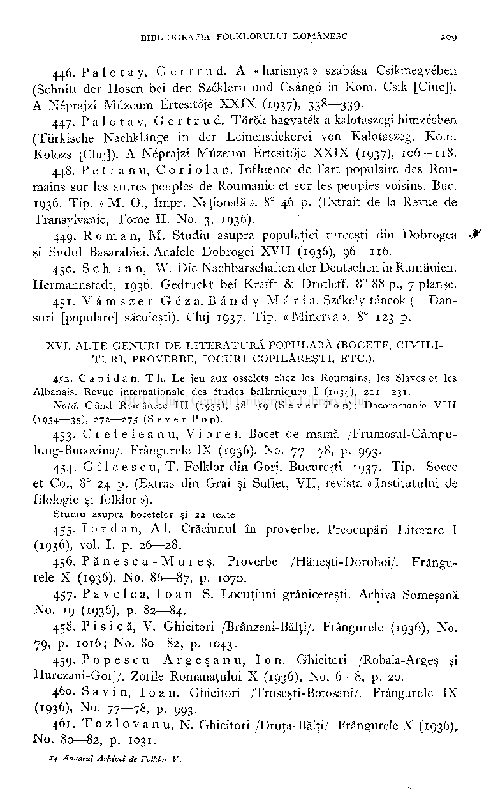
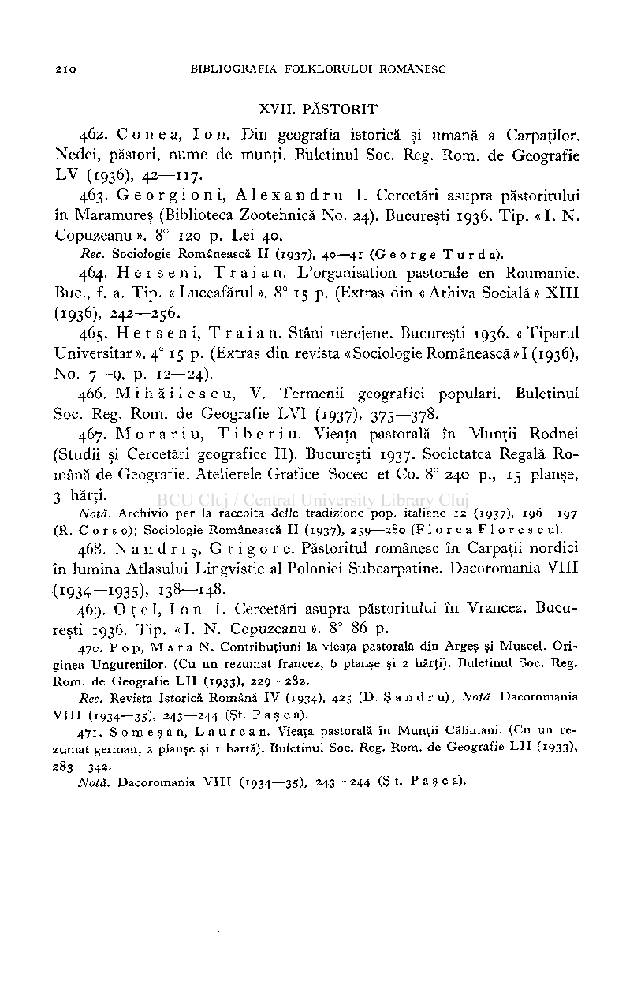
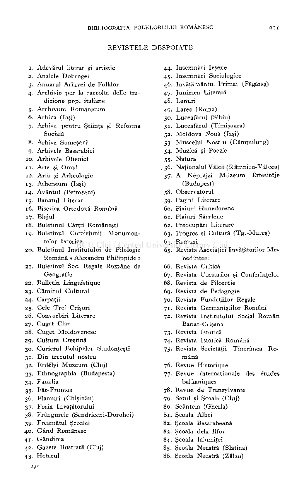
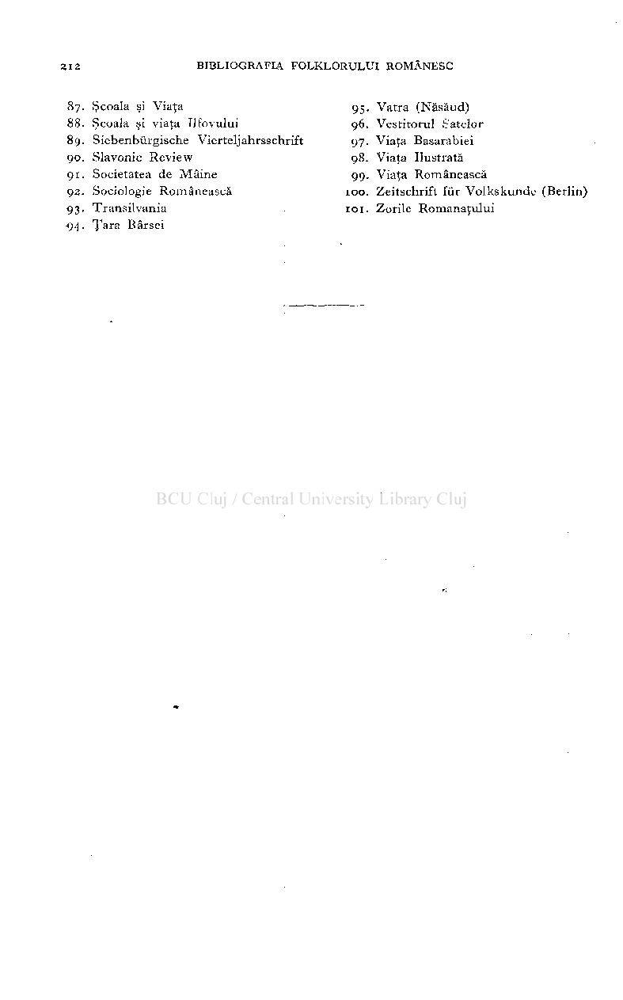
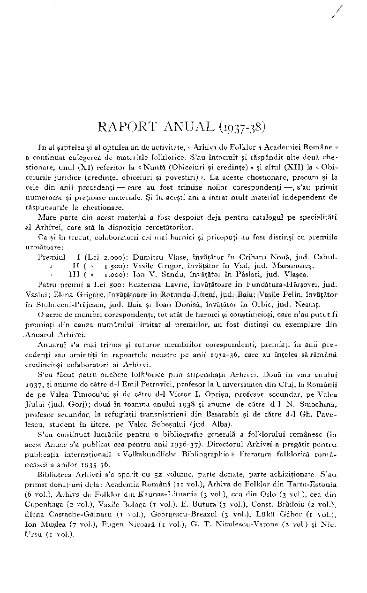
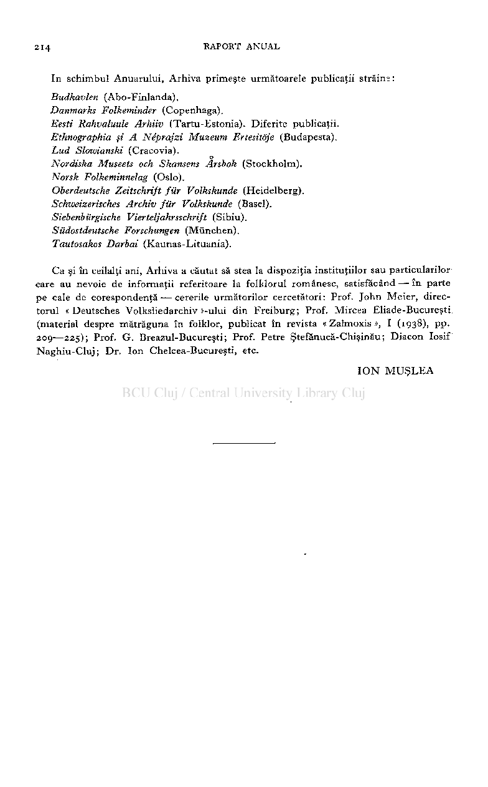
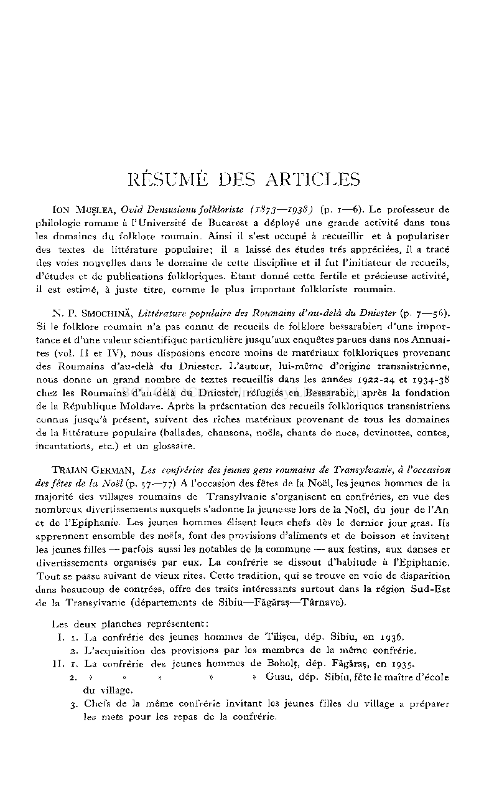
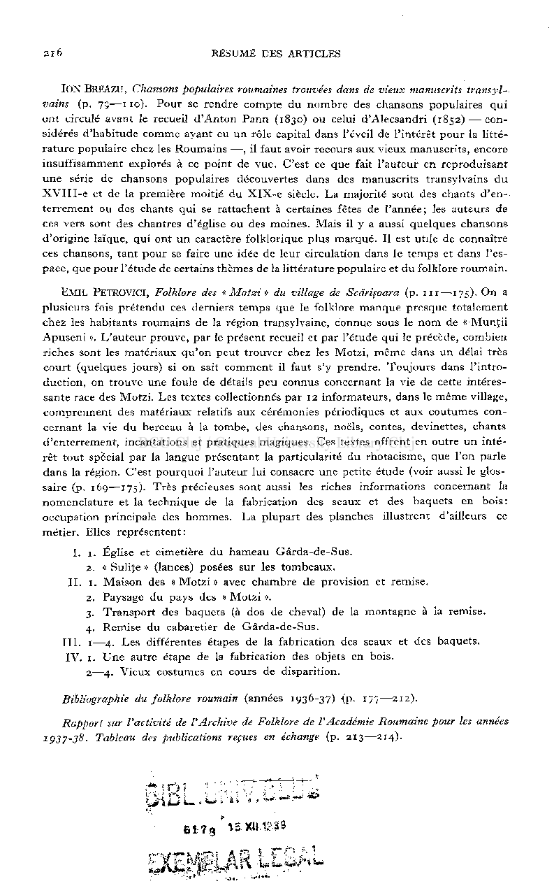

XV . FOLKLO R A L POPOARELO R CONLOCUITOARE , VECIN E SA U STRĂINE . FOLKLO R COMPARA T

## 435. Ahmet , Ali . Monografia insulei Ada-Kaleh. Craiova 1934. Tip. « Scrisul Românesc ». 8° 46 p. Ed. II-a. T.-Severin 1937. Tip. « Datina ». 8° 105 p. şi 1 schiţă a insulei. Lei 40.

Obiceiuril e musulmanilo r la naşter e (p . 85) , nunt ă (p . 80—83) , bote z (p . 83) , moart e şi înmormântar e (p . 83—85) , mâncare , îmbrăcăminte , locuinţ ă (p . 85—88) .

## 436. Balotă , Anton , B. I. Albanica. Vol. I. Bucureşti 1936. Tip. Leopold Geller. 8° 434 p. Lei 300.

Famili a şi femei a (p . 141—144) . Logodn a (p . 144—146) . Nunt a (p . 146—150) . Naştere a (p . 150—152) . Hran a (p . 187—188) . Locuinţel e (p . 188—-194) . Costumel e (p . 194—202) . Proz a popular ă (p . 255—266) . Poezi a popular ă (p . 266—273) . Cântecel e d e dragost e (p . 273—277) . Cântecel e d e vitejie (p . 277—287) . Cântecel e d e nunt ă (p . 287—292) . Studiil e etnografic e (p . 388—390) . Literatur a popular ă (p . 400—406) .

Rec. Sociologi e Româneasc ă I (1936) , No . 7—9 , p . 95—9 6 (Dumitr u Im b re s cu) ; Convorbir i Literar e LXI X (1936) , p . 26 8 (Constanti n Stelian) .

## 437. Balotă , Anto n şi Rad u Gyr . Din poezia populară alba­

neză. Gând Românesc IV (1936), 358—363.

Studi u asupr a poezie i popular e albanez e (p . 358—359 ) şi traducere a a 4 balade .

## 438. Bartok , Bel a. Cercetări de folklor muzical în Ungaria. Mu­

zică şi Poezie I (1935—1936), No. 12, p. 18—19.

Muzic a popular ă maghiară , slovac ă şi română . Traducere , dup ă textu l di n « Ar t populair e », Pari s 1931 , vol . II , p . 127—128 , d e Const . Brăiloiu .

## 439. Bartök , Béla . Muzica populară românească şi cea maghiară. Muzică şi Poezie I (1935—1936), No. 9—10, p. 18—44.

U n capitol , tradu s d e Const . Brăiloiu , di n lucrare a « Di e Volksmusi k de r Magyare n un d de r benachbarte n Völker » («Ungarisch e Jahrbücher » X V (1934) .

- 440. C e a c h i r, M. Obiceiurile Găgăuzilor la nunţi. Viaţa Basara­

biei V (1936), 169—172.

- 441. Domokos , Pa l Péter . Régi csiki népdalok/(= Cântece

populare vechi din Ciuc). Erdélyi Müzeum XLII (1937), 319—338.

- 442. Klocke , Helmut . Das ungarische Dorf. Arhiva Socială XIII

(1936), 275—300.

- 443. Klaster , Ludwig . Die sächsische Volkstracht der Land­

gemeinden des Hermanstädter Stuhles in den Iahren 1739—1795. Siebenbürgische Vierteljahrschrift LX (1937), 77—92.

- 444. Lükö , Gâbor . A moldvai csângôk I. A csângôk kapcsolatai

az erdélyi magyarsâggal. ( = Ciangăii moldoveni. Legăturile lor cu Ungurii ardeleni). Budapest 1936. (Néprajzi Füzetek 3). 208 p., 57 fig., 16 hărţi.

Rec. Etnographi a XLVII I (i937) , 491^49 5 (Gund a Béla) .

445 . Orend , Misch . Krüg e un d Teller . Siebenbürgisch-Sächsisch e Töpfer waren . Sibi u 1933 . H . Welthe r 2 4 p . 121 ilustraţiuni .

Rec. Revist a Istoric ă Român ă V—V I (1935—36) , 423—42 7 (Barb u Slati n e a n u) .

- 446. Palotay , Gertrud . A « harisnya » szabâsa Csikmegyében (Schnitt der Hosen bei den Széklern und Csangö in Kom. Csik [Chic]). A Néprajzi Müzeum Értesitôje XXIX (1937), 338—339.
- 447. Palotay , Gertrud . Török hagyaték a kalotaszegi himzésben (Türkische Nachklänge in der Leinenstickerei von Kalotaszeg, Kom. Kolozs [Cluj]). A Néprajzi Müzeum Ertesitöje XXIX (1937), 106—118.
- 448. Petranu , Coriolan . Influence de l'art populaire des Roumains sur les autres peuples de Roumanie et sur les peuples voisins. Bue. 1936. Tip. « M. ()., Impr. Naţională ». 8° 46 p. (Extrait de la Revue de Transylvanie, Tome II. No. 3, 1936).
- 449. Roman , M. Studiu asupra populaţiei turceşti din Dobrogea

şi Sudul Basarabiei. Analele Dobrogei XVII (1936), 96—116.

- 450. S c h u n n, W. Die Nachbarschaften der Deutschen in Rumänien.

Hermannstadt, 1936. Gedruckt bei Krafft & Drotleff. 8° 88 p., 7 planşe.

- 451. Vâmsze r Géza , Bând y Maria . Székely tâncok ( =Dan-

suri [populare] săcuieşti). Cluj 1937. Tip. «Minerva». 8° 123 p.

XVI . ALT E GENUR I D E LITERATUR Ă POPULAR Ă (BOCETE , CIMILI TURI , PROVERBE , JOCUR I COPILĂREŞTI , ETC.) .

452. Capidan , Th . L e jeu aux osselets chez les Roumains, les Slaves et les Albanais. Revue internationale des études balkaniques I (1934), 211—231.

Notă. Gând Românesc III (1935), 58—59 (Seve r Pop) ; Dacoromania VII I (1934—35), 272—275 (Seve r Pop) .

- 453. Crefeleanu , Vi o r el . Bocet de mamă /Frumosul-Câmpu-

lung-Bucovina/. Frângurele IX (1936), No. 77—78, p. 993.

- 454. G î 1 c e s c u, T. Folklor din Gorj. Bucureşti 1937. Tip. Socec

et Co., 8° 24 p. (Extras din Grai şi Suflet, VII, revista « Institutului de filologie şi folklor »).

Studiu asupra bocetelor şi 22 texte.

## 455. Iordan , Al . Crăciunul în proverbe. Preocupări Literare I

(1936), voi. I. p. 26—28.

## 456. Pănesc u -Mureş . Proverbe /Hăneşti-Dorohoi/. Frângu­

rele X (1936), No. 86—87, p. 1070.

## 457. Pavel e a, Ioa n S. Locuţiuni grănicereşti. Arhiva Someşană

No. 19 (1936), p. 82—84.

## 458. Pisică , V. Ghicitori /Brânzeni-Bălţi/. Frângurele (1936), No.

79, p. 1016; No. 80—82, p. 1043.

## 459. Popesc u Argeşanu , Ion . Ghicitori /Robaia-Argeş şi

Hurezani-Gorj/. Zorile Romanaţului X (1936), No. 6—8, p. 20.

## 460. S a v i n, Ioan . Ghicitori /Truseşti-Botoşani/. Frângurele IX

(1936), No. 77—78, p. 993.

## 461. T o z 1 o v a n u, N. Ghicitori /Druţa-Bălţi/. Frângurele X (1936),

No. 80—82, p. 1031.

14 Anuarul Arhivei de Folklor V.

XVII . PĂSTORI T

## 462. C o n e a, Ion . Din geografia istorică şi umană a Carpaţilor. Nedei, păstori, nume de munţi. Buletinul Soc. Reg. Rom. de Geografie

(

93

)> 42—"7-

L V

I

6

- 463. Georgioni , Alexandr u I. Cercetări asupra păstoritului

în Maramureş (Biblioteca Zootehnică No. 24). Bucureşti 1936. Tip. « I. N . Copuzeanu ». 8° 120 p. Lei 40.

Rec. Sociologi e Româneasc ă I I (1937), 40—41 ( G eorg e Turda) .

- 464. Herseni , Trăi a n. L'organisation pastorale en Roumanie.

Buc, f. a. Tip. « Luceafărul ». 8° 15 p. (Extras din « Arhiva Socială » XIII (i^

6

) . 242—256.

- 465. Herseni , Trăi a n. Stâni nerejene. Bucureşti 1936. « Tiparul

Universitar». 4

15 p. (Extras din revista «SociologieRomânească»I(1936), No. 7—9, p. 12—24).

0

- 466. M i h ă i 1 e s c u, V. Termenii geografici populari. Buletinul

Soc. Reg. Rom. de Geografie LVI (1937), 375—378.

- 467. Morar i u, Tiberiu . Vieaţa pastorală în Munţii Rodnei

(Studii şi Cercetări geografice II). Bucureşti 1937. Societatea Regală Română de Geografie. Atelierele Grafice Socec et Co. 8° 240 p., 15 planşe, 3 hărţi.

Notă. Archivi o pe r la raccolt a dell e tradizion e pop . italian e 12 (1937), 196—197 (R . C o r s o) ; Sociologi e Româneasc ă I I (1937), 259—280 (Flore a Florescu) .

- 468. Nandriş , Grigore . Păstoritul românesc în Carpaţii nordici

în lumina Atlasului Lingvistic al Poloniei Subcarpatine. Dacoromania VIII (1934—1935), 138—148.

- 469. O ţ e 1, I o n I. Cercetări asupra păstoritului în Vrancea. Bucu­

reşti 1936. Tip. « I. N. Copuzeanu ». 8° 86 p.

47c. Pop , M a r a N . Contribuţiun i la vieaţ a pastoral ă di n Arge ş şi Muscel . Ori gine a Ungurenilor . (C u u n rezuma t francez , 6 planş e şi 2 hărţi) . Buletinu l Soc . Reg Rom . d e Geografi e LI I (1933), 229—282.

Rec. Revist a Istoric ă Român ă I V (1934), 425 (D . Şandru) Notă. Dacoromani a VII I (1934—3S). 243—244 (Şt . Pasca) .

471 Someşan , Laurean . Vieaţ a pastoral ă î n Munţi i Călimani . (C u u n re zuma t german , 2 planş e şi 1 hartă) . Buletinu l Soc . Reg . Rom . d e Geografi e LI I (1933), 283—342.

Notă. Dacoromani a VII I (1934—35), 243—244 (Şt . Pasca) .

REVISTEL E DESPOIAT E

- 44. însemnăr i Ieşen e
- 45. însemnăr i Sociologic e
- 46. învăţământu l Prima r (Făgăraş )
- 47. Junime a Literar ă
- 48. Lanur i
- 49. Lare s (Roma )
- 50. Luceafăru l (Sibiu )
- 51. Luceafăru l (Timişoara )
- 52. Moldov a Nou ă (Iaşi )
- 53. Muscelu l Nostr u (Câmpulung )
- 54. Muzic ă şi Poezi e
- 55. Natur a
- 56. Naţionalu l Vâlci i (Râmnicu-Vâlcea )
- 57. A Néprajz i Müzeu m Ertesitöje (Budapest )
- 58. Observatoru l
- 59. Pagin i Literar e
- 60. Plaiur i Hunedoren e
- 61. Plaiur i Săcelen e
- 62. Preocupăr i Literar e
- 63. Progre s şi Cultur ă (Tg.-Mureş )
- 64. Ramur i
- 65. Revist a Asociaţie i învăţătorilo r Me hedinţen i
- 66. Revist a Critic ă
- 67. Revist a Cursurilo r şi Conferinţelo r
- 68. Revist a d e Filosoli e
- 69. Revist a d e Pedagogi e
- 70. Revist a Fundaţiilo r Regal e
- 71. Revist a Germaniştilo r Român i
- 72. Revist a Institutulu i Socia l Româ n Banat-Crişan a
- 73. Revist a Istoric ă
- 74. Revist a Istoric ă Român ă
- 75. Revist a Societăţi i Tinerime a Ro mân ă
- 76. Revu e Historiqu e
- 77. Revu e international e de s étude s balkanique s
- 78. Revu e d e Transylvani e
- 79. Satu l şi Şcoal a (Cluj )
- 80. Scântei a (Gherla )
- 81. Şcoal a Albe i
- 82. Şcoal a Basarabean ă
- 83. Şcoal a del à Ilfo v
- 84. Şcoala lalomiţei
- 85. Şcoal a Noastr ă (Slatina )
- 86. Şcoal a Noastr ă (Zălau )

- 1. Adevăru l litera r şi artisti c
- 2. Analel e Dobroge i
- 3. Anuaru l Arhive i d e Folklo r
- 4. Archivi o pe r la raccolt a dell e tra dizion e pop . italian e
- 5. Archivu m Romanicu m
- 6. Arhiv a (Iaşi )
- 7. Arhiv a pentr u Ştiinţ a şi Reform a Social ă
- 8. Arhiv a Someşan ă
- 9. Arhivel e Basarabie i
- 10. Arhivel e Oltenie i
- 11. Art a şi Omu l
- 12. Art ă şi Arheologi e
- 13. Atheneu m (Iaşi )
- 14. Avântu l (Petroşani )
- 15. Banatu l litera r
- 16. Biseric a Ortodox ă Român ă
- 17. Blajul
- 18. Buletinu l Cărţi i Româneşt i
- 19. Buletinu l Comisiuni i Monumen telo r Istoric e
- 20. Buletinu l Institutulu i d e Filologi e Român ă « Alexandr u Philippid e »
- 21. Buletinu l Soc . Regal e Român e d e Geografi e
- 22. Bulleti n Linguistiqu e
- 23. Căminu l Cultura l
- 24. Carpaţi i
- 25. Cel e Tre i Crişur i
- 26. Convorbir i Literar e
- 27. Cuge t Cla r
- 28. Cuge t Moldovenes c
- 29. Cultur a Creştin ă
- 30. Curieru l Echipelo r Studenţeşt i
- 31. Di n trecutu l nostr u
- 32. Erdély i Muzeu m (Cluj )
- 33. Ethnographi a (Budapesta )
- 34. Famili a
- 35. Făt-Frumo s
- 36. Flamur i (Chişinău )
- 37. Foai a învăţătorulu i
- 38. Frângurel e (Şendriceni-Dorohoi )
- 39. Freamătu l Şcoale i
- 40. Gân d Românes c
- 41. Gândire a
- 42. Gazet a Ilustrat ă (Cluj )
- 43. Hotaru l 14*

- 87. Şcoal a şi Viaţ a
- 88. Şcoal a şi viaţ a Ilfovulu i
- 89. Siebenbürgisch e Vierteljahrsschrif t
- 90. Slavoni e Revie w
- 91. Societate a d e Mâin e
- 92. Sociologi e Româneasc ă
- 93. Transilvani a

- 95. Vatr a (Năsăud )
- 96. Vestitoru l Satelo r
- 97. Viaţ a Basarabie i
- 98. Viaţ a Ilustrat ă
- 99. Viaţ a Româneasc ă
- 100. Zeitschrif t fü r Volkskund e (Berlin )
- 101. Zoril e Romanaţulu i

434. Ţar a Bârse i

# RAPORT ANUAL (1937-38)

I n al şaptele a şi al optule a a n d e activitate , « Arhiv a d e Folklo r a Academie i Român e » a continua t culegere a d e material e folklorice . S'a u întocmi t ş i răspândi t alte dou ă che stionare , unu l (XI ) referito r l a « Nunt ă (Obiceiur i şi credinţe ) » şi altu l (XII ) la « Obi ceiuril e juridic e (credinţe , obiceiur i şi povestiri ) ». L a acest e chestionare , precu m şi l a cele di n ani i precedenţ i — car e a u fost trimis e noilo r corespondenţ i — , s'a u primi t numeroas e şi preţioas e materiale . Ş i î n aceşt i an i a intra t mul t materia l independen t d e răspunsuril e l a chestionare .

Mar e part e di n aces t materia l a fost despoia t deja pentr u catalogu l p e specialităţ i al Arhivei , car e st ă l a dispoziţi a cercetătorilor .

C a şi î n trecut , colaboratori i ce i ma i harnic i şi pricepuţ i a u fost distinş i c u premiil e următoar e :

Premiu l I (Le 2.000): Dumitr u Vlase , învăţăto r î n Crihana-Nouă , jud . Cahul .

- » I I ( » 1.500): Vasil e Grigor , învăţăto r î n Vad , jud . Maramureş .
- » II I ( » 1.000): Io n V . Sandu , învăţăto r î n Pâslari , jud . Vlaşca .

Patr u premi i a Le i 500: Ecaterin a Lavric , învăţătoar e î n Fundătura-Hârşovei , jud . Vaslui ; Elen a Grigore , învăţătoar e î n Rotunda-Liteni , jud . Baia ; Vasil e Pelin , învăţăto r în Stolniceni-Prăjescu , jud . Bai a şi Ioa n Donisă , învăţăto r î n Orbie , jud . Neamţ .

O serie d e membr i corespondenţi , to t atâ t d e harnic i şi conştiincioşi , car e n'a u putu t fi premiaţ i di n cauz a numărulu i limita t al premiilor , a u fost distinş i c u exemplar e di n Anuaru l Arhivei .

Anuaru l s' a ma i trimi s şi tuturo r membrilo r corespondenţi , premiaţ i î n anii pre cedenţ i sa u amintiţ i î n rapoartel e noastr e p e ani i 1932-36, car e a u înţele s s ă rămân ă credincioş i colaborator i ai Arhivei .

S'a u făcu t patr u anchet e folkloric e pri n stipendiaţi i Arhivei . Dou ă î n var a anulu i 1937, şi anum e d e cătr e d-1 Emi l Petrovici , profeso r l a Universitate a di n Cluj , la Români i d e p e Vale a Timoculu i şi d e cătr e d-1 Victo r I . Oprişu , profeso r secundar , p e Vale a Jiulu i (jud . Gorj) ; dou ă î n toamn a anulu i 1938 ş i anum e d e cătr e d-1 N . Smochină , profeso r secundar , la refugiaţi i transnistrien i di n Basarabi a ş i d e cătr e d-1 Gh . Pave lescu , studen t î n litere, p e Vale a Sebeşulu i (jud . Alba) .

S'a u continua t lucrăril e pentr u o bibliografi e general ă a folklorulu i românes c (î n aces t Anua r s' a publica t ce a pentr u ani i 1936-37). Directoru l Arhive i a pregăti t pentr u publicaţi a internaţional ă « Volkskundlich e Bibliographi e » literatur a folkloric ă româ neasc ă a anilo r 1935-36.

Bibliotec a Arhive i s' a spori t c u 52 volume , part e donate , part e achiziţionate . S'a u primi t donaţiun i delà : Academi a Român ă (11 vol.) , Arhiv a d e Folklo r di n Tartu-Estoni a (6 vol.) , Arhiv a d e Folklo r di n Kaunas-Lituani a (3 vol.), ce a di n Osl o (3 vol.), ce a di

Copenhag a (2 vol.), Vasil e Bolog a (1 vol.), E . Butur a (3 vol.) , Const . Brăiloi u (2 vol.) , Elen a Costache-Găinar u (1 vol.), Georgescu-Breazu l (3 vol.) , Lük ö Gâbo r (1 vol.) , Io n Muşle a (7 vol.), Euge n Nicoar ă (1 vol.), G . T . Niculescu-Varon e (2 vol. ) şi Nie Urs u (1 vol.).

214 RAPORT ANUA L

I n schimbu l Anuarului , Arhiv a primeşt e următoarel e publicaţi i străin e :

Budkavlen (Abo-Finlanda) . Danmarks Folkeminder (Copenhaga) . Eesti Rahvaluule Arhiiv (Tartu-Estonia) . Diferit e publicaţii . Ethnographia şi A Néprajzi Museum Ertesitöje (Budapesta) . Lud Slowianski (Cracovia) .

o Nordiska Museets och Skansens Arsbok (Stockholm) Norsk Folkeminnelag (Oslo) . Oberdeutsche Zeitschrift für Volkskunde (Heidelberg) Schweizerisches Archiv für Volkskunde (Basel) Siebenbürgische Vierteljahrsschrift (Sibiu) . Südostdeutsche Forschungen (München) . Tautosakos Darbai (Kaunas-Lituania) .

C a şi î n ceilalţi ani , Arhiv a a căuta t s ă ste a la dispoziţi a instituţiilo r sa u particularilo r car e a u nevoi e d e informaţi i referitoar e la folkloru l românesc , satisfăcân d — î n part e p e cal e d e corespondenţă-—cereril e următorilo r cercetători : Prof. Joh n Meier , direc toru l «Deutsche s Volksliedarchi v »-ului di n Freiburg ; Prof. Mirce a Eliade-Bucureşt i (materia l despr e mătrăgun a î n folklor, publica t î n revist a « Zalmoxi s », I (1938), pp . 209—225); Prof . G . Breazul-Bucureşt i ; Prof . Petr e Ştefănucă-Chişinău ; Diaco n Iosi f Naghiu-Cluj ; Dr . Io n Chelcea-Bucureşti , etc .

IO N MUŞLE A

# RÉSUMÉ DES ARTICLES

ION MUŞLEA, Ovid Densusianu folkloriste (i8j3—IQ38) (p 1—6). L e professeu r d e philologi e roman e à l'Universit é d e Bucares t a déploy é un e grand e activit é dan s tou s les domaine s d u folklor e roumain . Ains i il s'es t occup é à recueilli r e t à popularise r de s texte s d e littératur e populaire ; il a laissé de s étude s trè s appréciées , il a trac é de s voie s nouvelle s dan s le domain e d e cett e disciplin e e t il fu t l'initiateu r d e recueils , d'étude s e t d e publication s folkloriques . Etan t donn é cett e fertile e t précieus e activité , il es t estimé , à just e titre , comm e l e plu s importan t folklorist e roumain .

N . P . SMOCHINĂ, Littérature populaire des Roumains d'au-delà du Dniester (p . 7—56). Si le folklor e roumai n n' a pa s conn u d e recueil s d e folklor e bessarabie n d'un e impor tanc e e t d'un e valeu r scientifiqu e particulièr e jusqu'au x enquête s parue s dan s no s Annuai re s (vol. I I e t IV) , nou s disposion s encor e moin s d e matériau x folklorique s provenan t de s Roumain s d'au-del à d u Dniester . L'auteur , lui-mêm e d'origin e transnistrienne , nou s donn e u n gran d nombr e d e texte s recueilli s dan s le s année s 1922-34 e t 1934-38 che z le s Roumain s d'au-del à d u Dniester , réfugié s e n Bessarabie , aprè s l a fondatio n d e l a Républiqu e Moldave . Aprè s l a présentatio n de s recueil s folklorique s transnistrien s connu s jusqu' à présent , suiven t de s riche s matériau x provenan t d e tou s les domaine s

- d e l a littératur e populair e (ballades , chansons , noëls , chant s d e noce , devinettes , contes , incantations , etc. ) e t u n glossaire

TRAIAN GERMAN, Les confréries des jeunes gens roumains de Transylvanie, à l'occasion

des fêtes de la Noël (p. 57—77) A l'occasio n de s fêtes d e la Noël , les jeune s homme s d e l a

majorit é de s villages roumain s d e Transylvani e s'organisen t e n confréries , e n vu e de nombreu x divertissement s auxquel s s'adonn e l a jeuness e lor s d e la Noël , d u jou r d e l'A n

- e t d e l'Epiphanie . Le s jeune s homme s élisen t leur s chef s dè s le dernie r jou r gras . Il s apprennen t ensembl e de s noëls , fon t de s provision s d'aliment s e t d e boisso n e t inviten t les jeune s filles — parfoi s auss i le s notable s d e l a commun e — au x festins , au x danse s e t divertissement s organisé s pa r eux . L a confréri e s e dissou t d'habitud e à l'Epiphanie . Tou t s e pass e suivan t d e vieu x rites . Cett e tradition , qu i s e trouv e e n voi e d e disparitio n dan s beaucou p d e contrées , offre de s trait s intéressant s surtou t dan s l a régio n Sud-Es t d e l a Transylvani e (département s d e Sibiu—Făgăraş—Târnave) .

Le s deu x planche s représentent :

- I. 1. L a confréri e de s jeune s homme s d e Tilişca , dép . Sibiu , e n 1936.

2. L'acquisitio n de s provision s pa r le s membre s d e l a mêm e confrérie .

- II 1. L a confréri e de s jeune s homme s d e Boholţ , dép . Făgăraş , e n 1935.

- 2. » » » » » Gusu , dép . Sibiu , fêt e l e maîtr e d'écol e d u village.
- 3. Chef s d e la mêm e confréri e invitan t le s jeune s filles d u villag e a prépare r les met s pou r le s repa s d e la confrérie .

2l 6 RÉSUMÉ DE S ARTICLE S

ION BREAZU, Chansons populaires roumaines trouvées dans de vieux manuscrits transylvains (p 75—110). Pou r s e rendr e compt e d u nombr e de s chanson s populaire s qu i on t circul é avan t l e recuei l d'Anto n Pan n (1830) o u celui d'Alecsandr i (1852) — con sidéré s d'habitud e comm e ayan t e u u n rôl e capita l dan s l'éveil d e l'intérê t pou r l a litté ratur e populair e che z le s Roumain s — , il fau t avoi r recour s au x vieu x manuscrits , encor e insuffisammen t exploré s à c e poin t d e vue . C'es t c e qu e fait l'auteu r e n reproduisan t un e série d e chanson s populaire s découverte s dan s de s manuscrit s transylvain s d u XVIII- e e t d e l a premièr e moiti é d u XlX- e siècle. L a majorit é son t de s chant s d'en terremen t o u de s chant s qu i se rattachen t à certaine s fêtes d e l'année ; le s auteur s d e ce s ver s son t de s chantre s d'églis e o u de s moines . Mai s il y a auss i quelque s chanson s d'origin e laïque , qu i on t u n caractèr e folkloriqu e plu s marqué . I l es t util e d e connaîtr e ce s chansons , tan t pou r se faire un e idé e d e leu r circulatio n dan s l e temp s e t dan s l'es pace , qu e pou r l'étud e d e certain s thème s d e la littératur e populair e e t d u folklor e roumain .

EMI L PETROVICI, Folklore des «Motzt» du village de Scărişoara (p 111—175). O n a plusieur s fois prétend u ce s dernier s temp s qu e l e folklor e manqu e presqu e totalemen t che z le s habitant s roumain s d e la régio n transylvaine , connu e sou s le no m d e « Munţi i Apusen i ». L'auteu r prouve , pa r le présen t recuei l e t pa r l'étud e qu i le précède , combie n riche s son t le s matériau x qu'o n peu t trouve r che z le s Motzi , mêm e dan s u n déla i trè s cour t (quelque s jours ) si o n sait commen t il fau t s' y prendre . Toujour s dan s l'intro duction , o n trouv e un e foul e d e détail s pe u connu s concernan t la vi e d e cett e intéres sant e rac e de s Motzi . Le s texte s collectionné s pa r 12 informateurs , dan s l e mêm e village , comprennen t de s matériau x relatifs au x cérémonie s périodique s e t au x coutume s con cernan t la vi e d u bercea u à l a tombe , de s chansons , noëls , contes , devinettes , chant s d'enterrement , incantation s e t pratique s magiques . Ce s texte s offrent e n outr e u n inté rê t tou t specia l pa r l a langu e présentan t la particularit é d u rhotacisme , qu e l'o n parl e dan s la région . C'es t pourquo i l'auteu r lu i consacr e un e petit e étud e (voi r auss i l e glos sair e (p 169—175). Trè s précieuse s son t auss i le s riche s information s concernan t la nomenclatur e e t la techniqu e d e la fabricatio n de s seau x e t de s baquet s e n bois : occupatio n principal e de s hommes . L a plupar t de s planche s illustren t d'ailleur s c e métier . Elles représentent :

I. 1. Églis e e t cimetièr e d u hamea u Gârda-de-Sus .

2. « Suliţ e » (lances ) posée s su r le s tombeaux .

I L 1. Maiso n de s «Motzi » ave c chambr e d e provisio n e t remise .

- 2. Paysag e d u pay s de s « Motz i ».
- 3. Transpor t de s baquet s (à do s d e cheval ) d e la montagn e à la remise .
- 4. Remis e d u cabaretie r d e Gârda-de-Sus .

- III . 1—4. Le s différente s étape s d e la fabricatio n de s seau x e t de s baquets .
- IV . 1. Un e autr e étap e d e la fabricatio n de s objet s e n bois . 2—4. Vieu x costume s e n cour s d e disparition .

Bibliographie du folklore roumain (année s 1936-37) {p 177—212).

Rapport sur l'activité de l'Archive de Folklore de l'Académie Roumaine pour les années I937-3S- Tableau des publications reçues en échange (p 213—214).

617g

### 15XU.1£3 9

