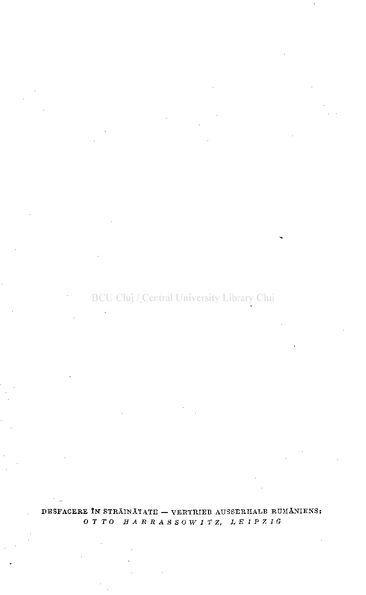
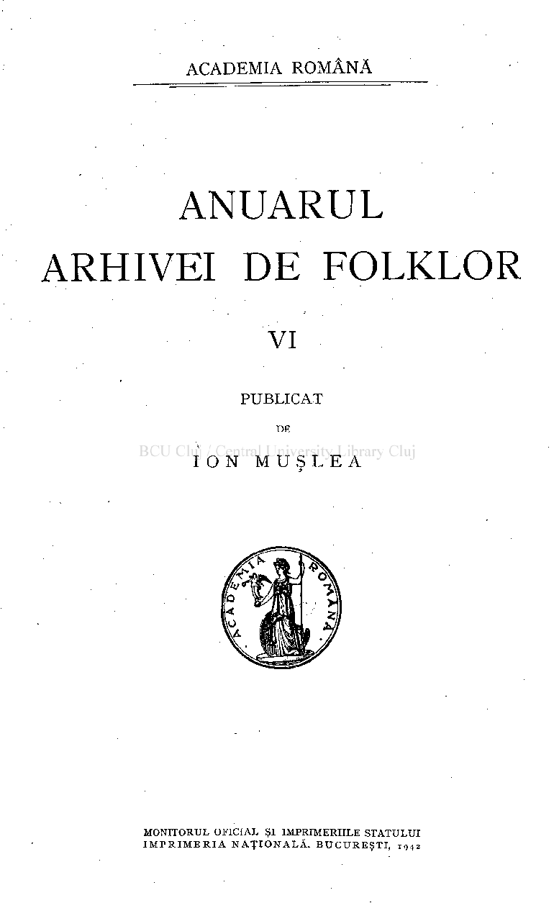
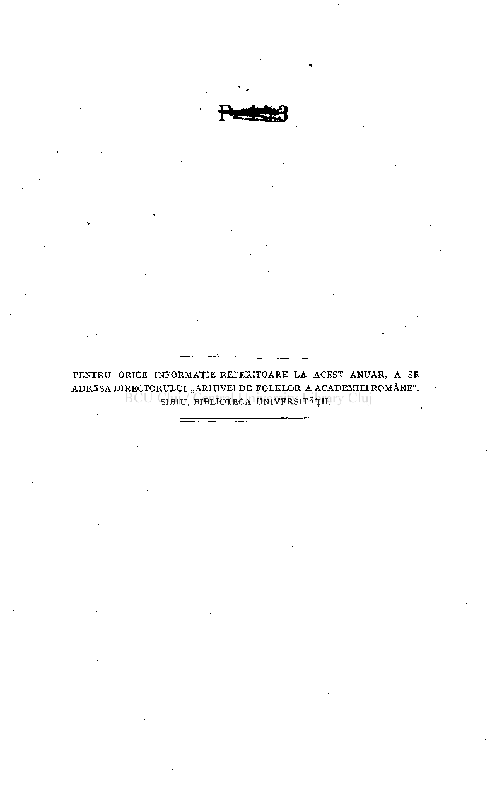
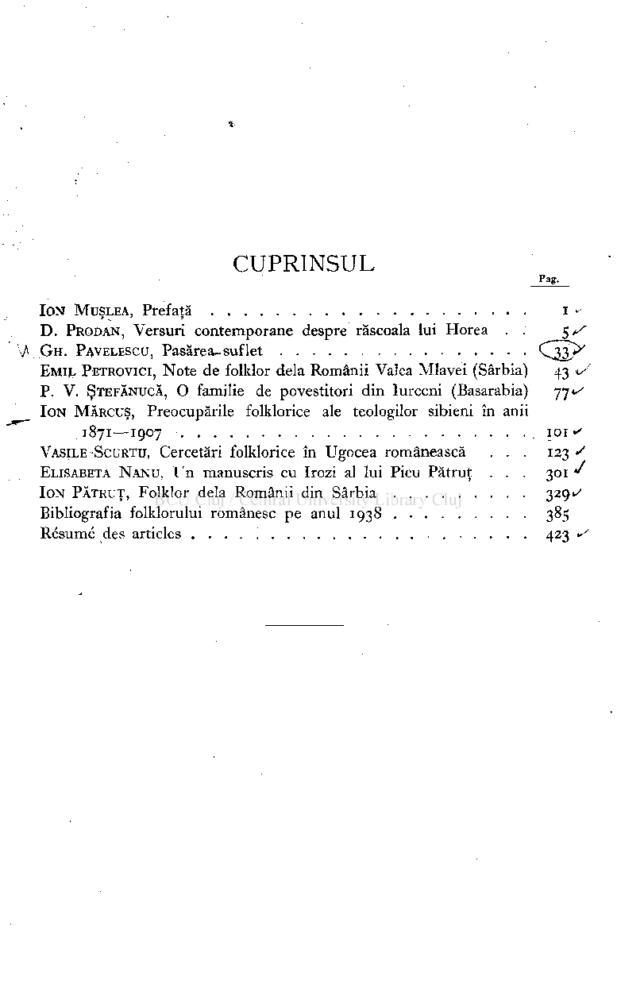

#### DESFACERE ÎN STRĂINĂTATE — VERTRIE B AUSSERHALB RUMÄNIENS: OTTO HARRASSOWITZ, LEIPZIG

ACADEMIA ROMÂNĂ

# ANUARUL ARHIVEI DE FOLKLOR

## vi

PUBLICAT

DE

IO N MUŞLE A

MONITORUL OFICIAL ŞI IMPRIMERIILE STATULUI IMPRIMERI A NAŢIONALĂ . BUCUREŞTI , ig

#### 2

4

#### PENTRU ORICE INFORMAŢIE REFERITOARE LA ACEST ANUAR, A SE ADRESA DIRECTORULUI „ARHIVEI DE FOLKLOR A ACADEMIEI ROMÂNE", SIBIU, BIBLIOTECA UNIVERSITĂŢII.

### CUPRINSUL

Pag.

ION MUŞLEA, Prefaţă i • D .PRODAN, Versuri contemporane despre răscoala lui Horea . . 5 s

VGH. PAVELESCU, Pasărea-suflet C^jD^ EMI L PETROVICI, Note de folklor delà Românii Valea Mlavei (Sârbia) 43 v' P. V.ŞTEFĂNUCĂ, O familie de povestitori din Iurceni (Basarabia) 77«^ IO N MĂRCUŞ, Preocupările folklorice ale teologilor sibieni în anii

1871—1907 101 <s VASILE SCURTU, Cercetări folklorice în Ugocea românească . . . 123 S ELISABETA NANU , Un manuscris cu Irozi al lui Picu Pătruţ . . . 301 J ION PĂTRUŢ, Folklor delà Românii din Sârbia 329^ Bibliografia folklorului românesc pe anul 1938 385 Résumé des articles 423 </

