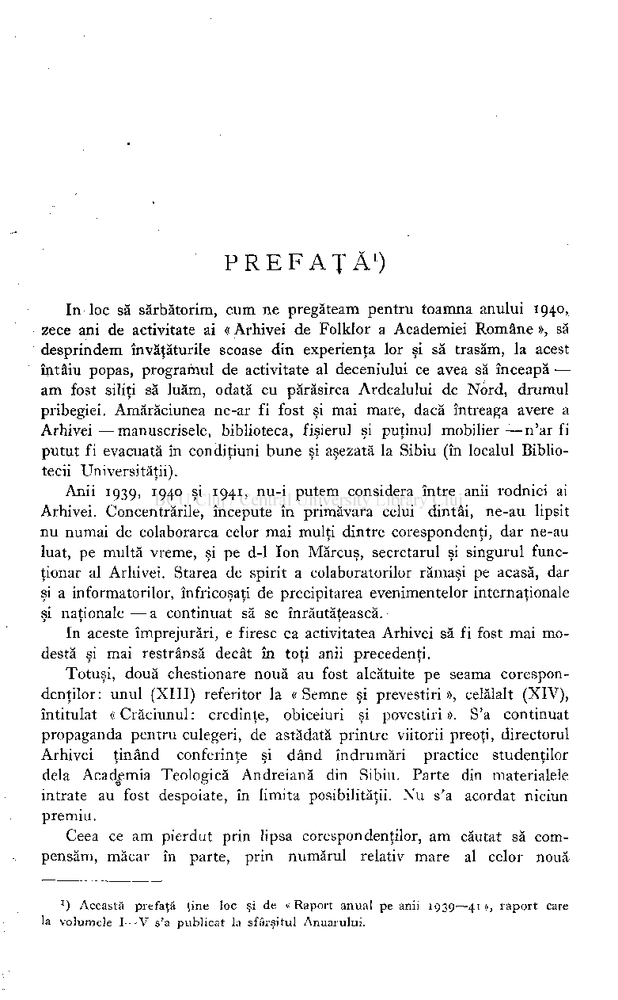

# PREFAŢA

# )

1

In loc să sărbătorim, cum ne pregăteam pentru toamna anului 1940, zece ani de activitate ai « Arhivei de Folklor a Academiei Române », să desprindem învăţăturile scoase din experienţa lor şi să trasăm, la acest întâiu popas, programul de activitate al deceniului ce avea să înceapă •am fost siliţi să luăm, odată cu părăsirea Ardealului de Nord, drumul pribegiei. Amărăciunea ne-ar fi fost şi mai mare, dacă întreaga avere a Arhivei —manuscrisele, biblioteca, fişierul şi puţinul mobilier —n'ar fi putut fi evacuată în condiţiuni bune şi aşezată la Sibiu (în localul Bibliotecii Universităţii).

Anii 1939, 1940 şi 1941, nu-i putem considera între anii rodnici ai Arhivei. Concentrările, începute în primăvara celui dintâi, ne-au lipsit nu numai de colaborarea celor mai mulţi dintre corespondenţi, dar ne-au luat, pe multă vreme, şi pe d-1 Ion Mărcuş, secretarul şi singurul funcţionar al Arhivei. Starea de spirit a colaboratorilor rămaşi pe acasă, dar şi a informatorilor, înfricoşaţi de precipitarea evenimentelor internaţionale şi naţionale—a continuat să se înrăutăţească.

In aceste împrejurări, e firesc ca activitatea Arhivei să fi fost mai modestă şi mai restrânsă decât în toţi anii precedenţi.

Totuşi, două chestionare nouă au fost alcătuite pe seama corespondenţilor: unul (XIII) referitor la «Semne şi prevestiri», celălalt (XIV), întitulat «Crăciunul: credinţe, obiceiuri şi povestiri». S'a continuat propaganda pentru culegeri, de astădată printre viitorii preoţi, directorul Arhivei ţinând conferinţe şi dând îndrumări practice studenţilor delà Academia Teologică Andreiană din Sibiu. Parte din materialele intrate au fost despoiate, în limita posibilităţii. Nu s'a acordat niciun premiu.

Ceea ce am pierdut prin lipsa corespondenţilor, am căutat să compensăm, măcar în parte, prin numărul relativ mare al celor nouă

) Această prefaţă ţine loc şi de « Raport anual pe anii 1939—41 », raport care la volumele I— V s'a publicat la sfârşitul Anuarului.

x

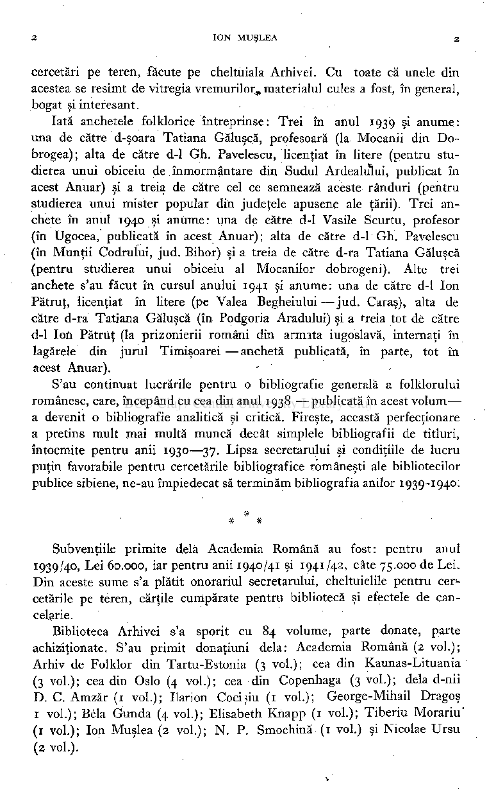

cercetări pe teren, făcute pe cheltuiala Arhivei. Cu toate că unele din acestea se resimt de vitregia vremurilor^ materialul cules a fost, în general, bogat şi interesant.

Iată anchetele folklorice întreprinse: Trei în anul 1939 şi anume: una de către d-şoara Tatiana Găluşcă, profesoară (la Mocanii din Dobrogea); alta de către d-1 Gh. Pavelescu, licenţiat în litere (pentru studierea unui obiceiu de înmormântare din Sudul Ardealului, publicat în acest Anuar) şi a treia de către cel ce semnează aceste rânduri (pentru studierea unui mister popular din judeţele apusene ale ţării). Trei anchete în anul 1940 şi anume: una de către d-1 Vasile Scurtu, profesor (în Ugocea, publicată în acest Anuar); alta de către d-1 Gh. Pavelescu (în Munţii Codrului, jud. Bihor) şi a treia de către d-ra Tatiana Găluşcă (pentru studierea unui obiceiu al Mocanilor dobrogeni). Alte trei anchete s'au făcut în cursul anului 1941 şi anume: una de către d-1 Ion Pătruţ, licenţiat în litere (pe Valea Begheiului —jud. Caras), alta de către d-ra Tatiana Găluşcă (în Podgoria Aradului) şi a treia tot de către d-1 Ion Pătruţ (la prizonierii români din armata iugoslavă, internaţi în lagărele din jurul Timişoarei —anchetă publicată, în parte, tot în acest Anuar).

S'au continuat lucrările pentru o bibliografie generală a folklorului românesc, care, începând cu cea din anul 1938 — publicată în acest voluma devenit o bibliografie analitică şi critică. Fireşte, această perfecţionare a pretins mult mai multă muncă decât simplele bibliografii de titluri, întocmite pentru anii 1930—37. Lipsa secretarului şi condiţiile de lucru puţin favorabile pentru cercetările bibliografice româneşti ale bibliotecilor publice sibiene, ne-au împiedecat să terminăm bibliografia anilor 1939-1940.

*

# *

Subvenţiile primite delà Academia Română au fost: pentru anul 1939/40, Lei 60.000, iar pentru anii 1940/41 şi 1941/42, câte 75.000 de Lei. Din aceste sume s'a plătit onorariul secretarului, cheltuielile pentru cercetările pe teren, cărţile cumpărate pentru bibliotecă şi efectele de cancelarie.

Biblioteca Arhivei s'a sporit cu 84 volume, parte donate, parte achiziţionate. S'au primit donaţiuni delà: Academia Română (2 vol.); Arhiv de Folklor din Tartu-Estonia (3 vol.); cea din Kaunas-Lituania (3 vol.); cea din Oslo (4 vol.); cea din Copenhaga (3 vol.); delà d-nii D. C. Amzăr (1 vol.); Ilarion Coci jiu (1 vol.); George-Mihail Dragoş 1 vol.); Béla Gunda (4 vol.); Elisabeth Knapp (1 vol.); Tiberiu Morariu*

- (1 vol.); Ion Muşlea (2 vol.); N. P. Smochină (1 vol.) şi Nicolae Ursu
- (2 vol.).

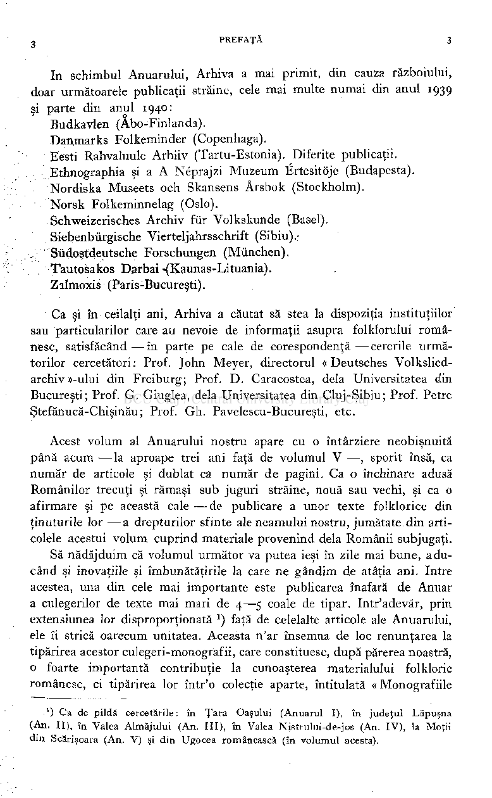

PREFAŢĂ 3

- 3

In schimbul Anuarului, Arhiva a mai primit, din cauza războiului, doar următoarele publicaţii străine, cele mai multe numai din anul 1939 şi parte din anul 1940:

Budkavlen (Abo-Finlanda). Danmarks Folkeminder (Copenhaga). Eesti Rahvaluule Arhiiv (Tartu-Estonia). Diferite publicaţii. Ethnographia şi a A Néprajzi Muzeum Értesitoje (Budapesta). Nordiska Museets och Skansens Ârsbok (Stockholm). Norsk Folkeminnelag (Oslo). Schweizerisches Archiv für Volkskunde (Basel). Siebenbürgische Vierteljahrsschrift (Sibiu).-

, Südostdeutsche Forschungen (München). Tautosakos Darbai-(Kaunas-Lituania). Zalmoxis (Paris-Bucureşti).

Ca şi în ceilalţi ani, Arhiva a căutat să stea la dispoziţia instituţiilor sau particularilor care au nevoie de informaţii asupra folklorului românesc, satisfăcând —în parte pe cale de corespondenţă —cererile următorilor cercetători : Prof. John Meyer, directorul « Deutsches Volksliedarchiv »-ului din Freiburg; Prof. D. Caracostea, delà Universitatea din Bucureşti; Prof. G. Giuglea, delà Universitatea din Cluj-Sibiu; Prof. Petre Ştefănucă-Chişinău ; Prof. Gh. Pavelescu-Bucureşti, etc.

Acest volum al Anuarului nostru apare cu o întârziere neobişnuită până acum —la aproape trei ani faţă de volumul V —, sporit însă, ca număr de articole şi dublat ca număr de pagini. Ca o închinare adusă Românilor trecuţi şi rămaşi sub juguri străine, nouă sau vechi, şi ca o afirmare şi pe această cale —de publicare a unor texte folklorice din ţinuturile lor —a drepturilor sfinte ale neamului nostru, jumătate din articolele acestui volum cuprind materiale provenind delà Românii subjugaţi.

Să nădăjduim că volumul următor va putea ieşi în zile mai bune, aducând şi inovaţiile şi îmbunătăţirile la care ne gândim de atâţia ani. Intre acestea, una din cele mai importante este publicarea înafară de Anuar a culegerilor de texte mai mari de 4—5 coaie de tipar. Intr'adevăr, prin extensiunea lor disproporţionată

) faţă de celelalte articole ale Anuarului, ele îi strică oarecum unitatea. Aceasta n'ar însemna de loc renunţarea la tipărirea acestor culegeri-monogrâfii, care constituesc, după părerea noastră, o foarte importantă contribuţie la cunoaşterea materialului folkloric românesc, ci tipărirea lor într'o colecţie aparte, întitulată « Monografiile

1

') Ca de pildă cercetările : în Tara Oaşului (Anuarul I), în judeţul Lăpuşna (An. II), în Valea Almăjului (An. III), în Valea Nistrului-de-jos (An. IV), la Moţii din Scărişoara (An. V) şi din Ugocea românească (în volumul acesta).

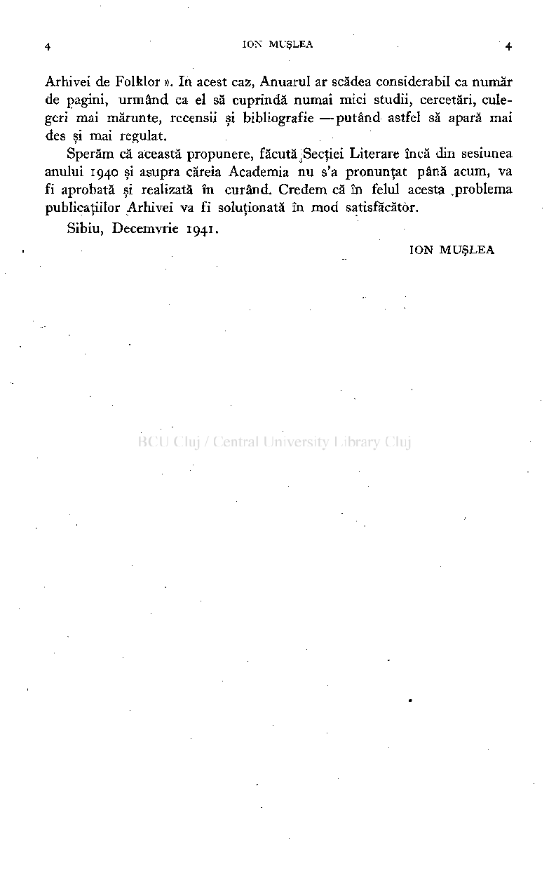

Arhivei de Folklor ». In acest caz, Anuarul ar scădea considerabil ca număr de pagini, urmând ca el să cuprindă numai mici studii, cercetări, culegeri mai mărunte, recensa şi bibliografie —putând astfel să apară mai des şi mai regulat.

Sperăm că această propunere, făcutăjSecţiei Literare încă din sesiunea anului 1940 şi asupra căreia Academia nu s'a pronunţat până acum, va fi aprobată şi realizată în curând. Credem că în felul acesta .problema publicaţiilor Arhivei va fi soluţionată în mod satisfăcător.

Sibiu, Decemvrie 1941.

ION MUŞLE A

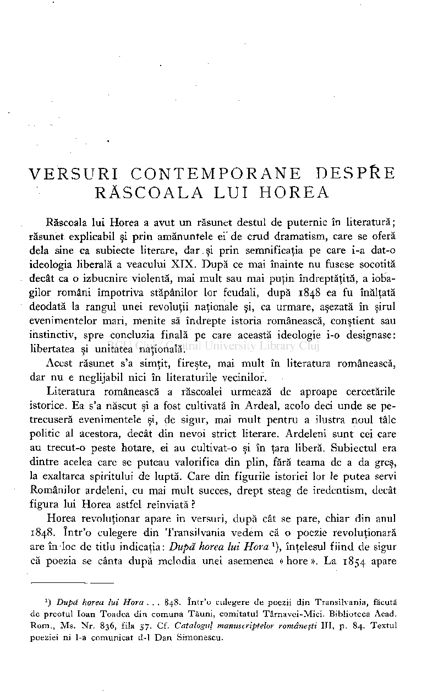

# VERSUR I CONTEMPORAN E DESPftE RĂSCOAL A LUI HOREA.

Răscoala lui Horea a avut un răsunet destul de puternic în literatură; răsunet, explicabil şi prin amănuntele ei* de crud dramatism, care se oferă delà sine ca subiecte literare, dar.şi prin semnificaţia pe care i-a dat-o ideologia liberală a veacului XIX. După ce mai înainte nu fusese socotită decât ca o izbucnire violentă, mai mult sau mai puţin îndreptăţită, a iobagilor români împotriva stăpânilor lor feudali, după 1848 ea fu înălţată deodată la rangul unei revoluţii naţionale şi, ca urmare, aşezată în şirul evenimentelor mari, menite să îndrepte istoria românească, conştient sau instinctiv, spre concluzia finală pe care această ideologie i-o designase: libertatea şi unitatea naţională.

Acest răsunet s'a simţit, fireşte, mai mult în literatura românească, dar nu e neglijabil nici în literaturile vecinilor.

Literatura românească a răscoalei urmează de aproape cercetările istorice. Ea s'a născut şi a fost cultivată în Ardeal, acolo deci unde se petrecuseră evenimentele şi, de sigur, mai mult pentru a ilustra noul tâlc politic al acestora, decât din nevoi strict literare. Ardeleni sunt cei care au trecut-o peste hotare, ei au cultivat-o şi în ţara liberă. Subiectul era dintre acelea care se puteau valorifica din plin, fără teama de a da greş, la exaltarea spiritului de luptă. Care din figurile istoriei lor le putea servi Românilor ardeleni, cu mai mult succes, drept steag de iredentism, decât figura lui Horea astfel reînviată ?

Horea revoluţionar apare în versuri, după cât se pare, chiar din anul

1848. într'o culegere din Transilvania vedem că o poezie revoluţionară are în loc de titlu indicaţia: După horea lui Hora

), înţelesul fiind de sigur că poezia se cânta după melodia unei asemenea « hore ». La 1854 apare

1

) După horea lui Hora . . . 848. într'o culegere de poezii din Transilvania, făcută de preotul Ioan Toadea din comuna Tăuni, comitatul Târnavei-Mici. Biblioteca Acad. Rom., Ms. Nr. 836, fila 57. Cf. Catalogul manuscriptelor româneşti III, p. 84. Textul poeziei ni 1-a comunicat d-1 Dan Simonescu.

x

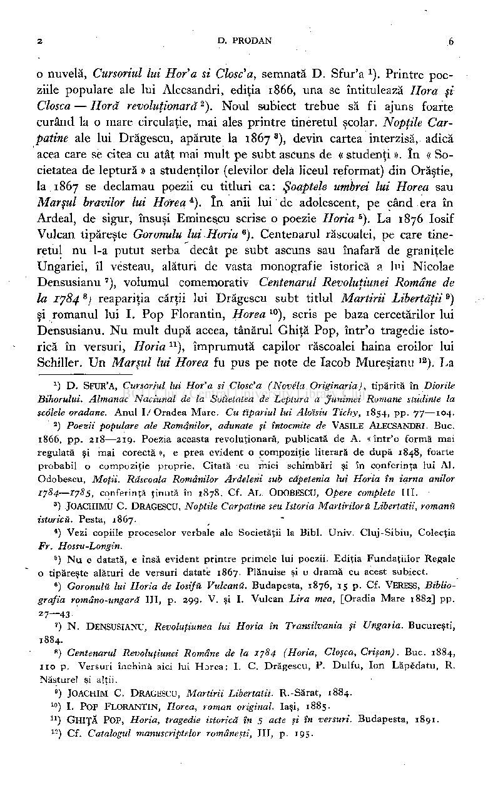

o nuvelă, Cursoriul lui Hor'a si Closc'a, semnată D. Sfur'a

). Printre poeziile populare ale lui Alecsandri, ediţia 1866, una se întitulează Hora şi Cloşca — Horă revoluţionară*). Noul subiect trebue să fi ajuns foarte curând la o mare circulaţie, mai ales printre tineretul şcolar. Nopţile Carpatine ale lui Drăgescu, apărute la 1867

1

), devin cartea interzisă, adică acea care se citea cu aţâţ mai mult pe subt ascuns de « studenţi ». în « Societatea de leptură » a studenţilor (elevilor delà liceul reformat) din Orăştie, la 1867 se declamau poezii cu titluri ca: Şoaptele umbrei lui Horea sau Marşul bravilor lui Horea ). în anii lui de adolescent, pe când era în Ardeal, de sigur, însuşi Eminescu scrise o poezie Horia ). La 1876 Iosif Vulcan tipăreşte Goronulu lui Horia ). Centenarul răscoalei, pe care tineretul nu 1-a putut serba decât pe subt ascuns sau înafară de graniţele Ungariei, îl vesteau, alături de vasta monografie istorică a lui Nicolae Densusianu '), volumul comemorativ Centenarul Revoluţiunei Române de la 1784 ) reapariţia cărţii lui Drăgescu subt titlul Martirii Libertăţii

8

) şi romanul lui I. Pop Florantin, Horea ), scris pe baza cercetărilor lui Densusianu. Nu mult după aceea, tânărul Ghiţă Pop, într'o tragedie istorică în versuri, Horia ) , împrumută capilor răscoalei haina eroilor lui Schiller. Un Marşul lui Horea fu pus pe note de Iacob Mureşianu

9

). La

12

) D . SFUR'A, Cursoriul lui Hor'a si Closc'a (Novela Originariaj, tipărită în Diorile Bihorului. Almanac Naciunal de la Soùetatea de Leptura a Junimei Romane studinte la scalele oradane. Anul 1/Oradea Mare. Cu tîpariul lui Aloisiu Tichy, 1854, pp. 77—104.

1

) Poezii populare ale Românilor, adunate şi întocmite de VASILE ALECSANDRI. Buc. 1866, pp. 218—319. Poezia aceasta revoluţionară, publicată de A. «într'o formă mai regulată şi mai corectă », e prea evident o compoziţie literară de după 1848, foarte probabil o compoziţie proprie. Citată cu mici schimbări şi în conferinţa lui Al. Odobescu, Moţii. Răscoala Românilor Ardeleni sub căpetenia lui Horia în iarna anilor 1784—1785, conferinţă ţinută în 1878. Cf. AL . ODOBESCU, Opere complete III.

2

) JOACHIMU C. DRĂGESCU, Nopţile Carpatine seu Istoria Martirilorü Libertăţii, romanii istoricu. Pesta, 1867.

3

) Vezi copiile proceselor verbale ale Societăţii la Bibi. Univ. Cluj-Sibiu, Colecţia Fr. Hossu-Longin.

4

) Nu e datată, e însă evident printre primele lui poezii. Ediţia Fundaţiilor Regale o tipăreşte alături de versuri datate 1867. Plănuise şi o dramă cu acest subiect.

5

) Goronulü lui Horia de Iosifü Vulcanii. Budapesta, 1876, 15 p. Cf. VERESS, Bibliografia romăno-ungară III, p. 299. V. şi I. Vulcan Lira mea, [Oradia Mare 1882] pp. 27—43-

e

) N. DENSUSIANU, Revoluţiunea lui Horia în Transilvania şi Ungaria. Bucureşti, 1884.

7

) Centenarul Revoluţiunei Române de la 1784 (Horia, Cloşca, Crişan). Buc. 1884, 110 p. Versuri închină aici lui Horea : I. C. Drăgescu, P. Dulfu, Ion Lăpedatu, R. Năsturel şi alţii.

8

- 9

) JOACHIM C. DRĂGESCU, Martirii Libertăţii. R.-Sărat, 1884.

- 10

) I. PO P FLORANTIN, Horea, roman original. Iaşi, 1885.

- 11

) GHIŢĂ POP, Horia, tragedie istorică în 5 acte şi în versuri. Budapesta, 1891.

- 12

) Cf. Catalogul manuscriptelor româneşti, III, p. 195.

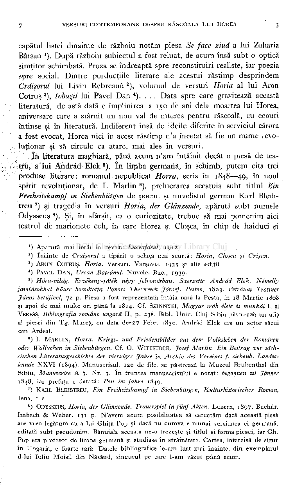

capătul listei dinainte de războiu notăm piesa Se face ziuă a lui Zaharia Bârsan După războiu subiectul a fost reluat, de acum însă subt o optică simţitor schimbată. Proza se îndreaptă spre reconstituiri realiste, iar poezia spre social. Dintre porducţiile literare ale acestui răstimp desprindem Crăişorul lui Liviu Rebreanu

), volumul de versuri Horia al lui Aron Cotruş ), Iobagii lui Pavel Dan ). .. . Data spre care gravitează această literatură, de astă dată e împlinirea a 150 de ani delà moartea lui Horea, aniversare care a stârnit un nou val de interes pentru răscoală, cu ecouri întinse şi în literatură. Indiferent însă de ideile diferite în serviciul cărora a fost evocat, Horea nici în acest răstimp n'a încetat să fie un nume revoluţionar şi să circule ca atare, mai ales în versuri.

2

în literatura maghiară, până acum n'am întâlnit decât o piesă de teatru, a lui Andrâd Elek ). în limba germană, în schimb, putem cita trei produse literare: romanul nepublicat Horra, scris în 1848—49, în noul spirit revoluţionar, de I. Marlin ), prelucrarea acestuia subt titlul Ein Freiheitskampf in Siebenbürgen de poetul şi nuvelistul german Karl Bleibtreu

) şi tragedia în versuri Horia, der Glänzende, apărută subt numele Odysseus ). Şi, în sfârşit, ca o curiozitate, trebue să mai pomenim aici teatrul de marionete ceh, în care Horea şi Cloşca, în chip de haiduci şi

7

') Apărută mai întâi în revista Luceafărul, 1912.

- 2

) înainte de Crăişorul a tipărit o schiţă mai scurtă: Horia, Cloşca şi Crişan.

- 3

) ARON COTRUŞ, Horia. Versuri. Varşovia, 1935 şi alte ediţii.

- 4

) PAVEL DAN , Urcan Bătrânul. Nuvele. Buc , 1939.

- 5

) Hdra-vilăg. Erzékeny-jdték négy felvondsban. Szerzette Andräd Elek. Némelly javitdsokkal közre bocsdtotta Ponori Thewrewk Jözsef. Pesten, 1823. Petrozai Trattner Jdnos betüjivel, 72 p. Piesa a fost reprezentată întâia oară la Pesta, în 18 Martie 1808 şi apoi de mai multe ori până la 1814. Cf. SzîNNYEI, Magyar irak élete és munkdi I, şi VERESS, Bibliografia româno-ungară II, p. 238. Bibi. Univ. Cluj-Sibiu păstrează un afiş al piesei din Tg.-Mureş, cu data de»27 Febr. 1830. Andrâd Elek era un actor săcui din Ardeal.

) I. MARLIN, Horra. Kriegs- und Friedensbilder aus dem Volksleben der Romanen oder Wallachen in Siebenbürgen. Cf. O . WITTSTOCK, Josef Marlin. Ein Beitrag zur sächsischen Litteraturgeschichle der vierziger Jahre în Archiv des Vereines f. siebenb. Landeskunde XXV I (1894). Manuscrisul, 120 de file, se păstrează la Muzeul Brukenthal din Sibiu, Manuscrise A 7, Nr. 3. în fruntea manuscrisului e notat: begonnen ist Jänner 1848, iar prefaţa e datată: Pest im iahre 1849.

6

') KARL BLEIBTREU, Ein Freiheitskampf in Siebenbürgen, Kulturhistorischer Roman, lena, f. a.

) ODYSSEUS, Horia, der Glänzende. Trauerspiel in fünf Akten. Luzern, 1897. Buchdr. Imbach & Weber. 131 p. N'avem acum posibilitatea să cercetăm dacă această piesă are vreo legătură cu a lui Ghiţă Pop şi dacă nu cumva e numai versiunea ei germană, editată subt pseudonim. Bănuiala aceasta ne-o trezeşte şi titlul şi forma piesei, iar Gh. Pop era profesor de limba germană şi studiase în străinătate. Cartea, interzisă de sigur în Ungaria, e foarte rară. Datele bibliografice le-am luat mai înainte, din exemplarul d-lui Iuliu Moisil din Năsăud, singurul pe care l-am văzut până acum.

8

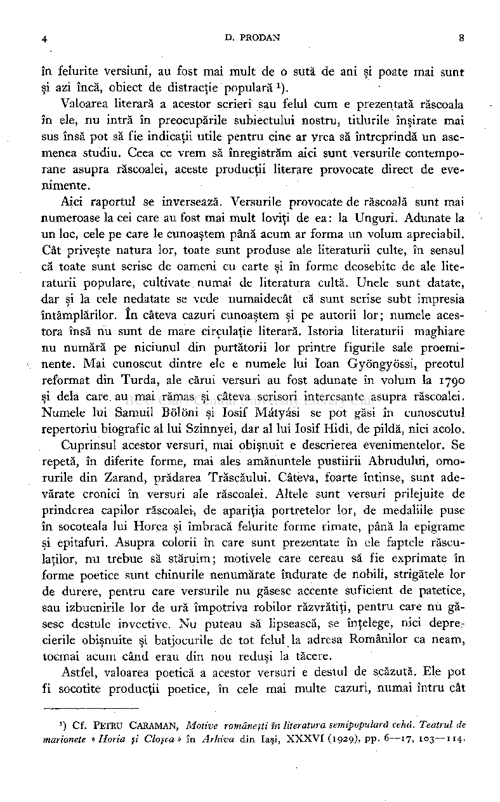

în felurite versiuni, au fost mai mult de o sută de ani şi poate mai sunt şi azi încă, obiect de distracţie populară ).

Valoarea literară a acestor scrieri sau felul cum e prezentată răscoala în ele, nu intră în preocupările subiectului nostru, titlurile înşirate mai sus însă pot să fie indicaţii utile pentru cine ar yrea să întreprindă un asemenea studiu. Ceea ce vrem să înregistrăm aici sunt versurile contemporane asupra răscoalei, aceste producţii literare provocate direct de evenimente.

Aici raportul se inversează. Versurile provocate de răscoală sunt mai numeroase la cei care au fost mai mult loviţi de ea: la Unguri. Adunate la un loc, cele pe care le cunoaştem până acum ar forma un volum apreciabil. Cât priveşte natura lor, toate sunt produse ale literaturii culte, în sensul că toate sunt scrise de oameni cu carte şi în forme deosebite de ale literaturii populare, cultivate _ numai de literatura cultă. Unele sunt datate, dar şi la cele nedatate se vede numaidecât că sunt scrise subt impresia întâmplărilor. în câteva cazuri cunoaştem şi pe autorii lor; numele acestora însă nu sunt de mare circulaţie literară. Istoria literaturii maghiare nu numără pe niciunul din purtătorii lor printre figurile sale proeminente. Mai cunoscut dintre ele e numele lui Ioan Gyöngyössi, preotul reformat din Turda, ale cărui versuri au fost adunate în volum la 1790 şi delà care. au mai rămas şi câteva scrisori interesante asupra răscoalei. Numele lui Samuil Bölöni şi Iosif Mâtyâsi se pot găsi în cunoscutul repertoriu biografic al lui Szinnyei, dar al lui Iosif Hidi, de pildă, nici acolo.

Cuprinsul acestor versuri, mai obişnuit e descrierea evenimentelor. Se repetă, în diferite forme, mai ales amănuntele pustiirii Abrudului, omorurile din Zarand, prădarea Trascăului. Câteva, foarte întinse, sunt adevărate cronici în versuri ale răscoalei. Altele sunt versuri prilejuite de prinderea capilor răscoalei-, de apariţia portretelor lor, de medaliile puse în socoteala lui Horea şi îmbracă felurite forme rimate, până la epigrame şi epitafuri. Asupra colorii în care sunt prezentate în ele faptele răsculaţilor, nu trebue să stăruim; motivele care cereau să fie exprimate în forme poetice sunt chinurile nenumărate îndurate de nobili, strigătele lor de durere, pentru care versurile nu găsesc accente suficient de patetice, sau izbucnirile lor de ură împotriva robilor răzvrătiţi, pentru care nu găsesc destule invective. Nu puteau să lipsească, se înţelege, nici deprecierile obişnuite şi batjocurile de tot felul la adresa Românilor ca neam, tocmai acum când erau din nou reduşi la tăcere.

Astfel, valoarea poetică a acestor versuri e destul de scăzută. Ele pot fi socotite producţii poetice, în cele mai multe cazuri, numai întru cât

) Cf. PETRU CARAMAN, Motive româneşti în literatura semipopulară cehă. Teatrul de marionete « Horia şi Cloşca» în Arhiva din Iaşi, XXXV I (1929), pp. 6—17, 103—114.

]

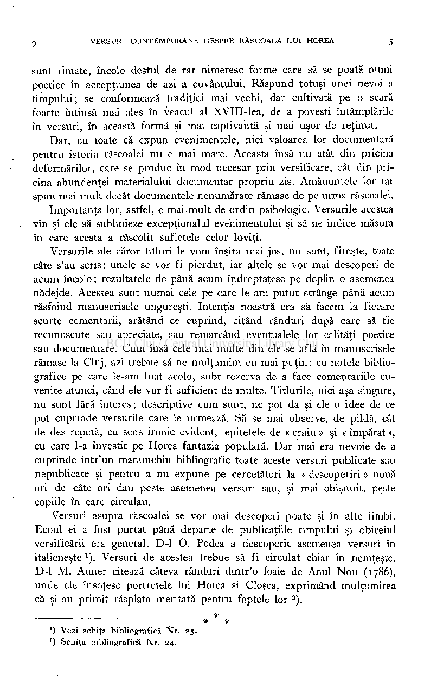

sunt rimate, încolo destul de rar nimeresc forme care să se poată numi poetice în accepţiunea de azi a cuvântului. Răspund totuşi unei nevoi a timpului; se conformează tradiţiei mai vechi, dar cultivată pe o scară foarte întinsă mai ales în veacul al XVIII-lea, de a povesti întâmplările în versuri, în această formă şi mai captivantă şi mai uşor de reţinut.

Dar, cu toate că expun evenimentele, nici valoarea lor documentară pentru istoria răscoalei nu e mai mare. Aceasta însă nu atât din pricina deformărilor, care se produc în mod necesar prin versificare, cât din pricina abundenţei materialului documentar propriu zis. Amănuntele lor rar spun mai mult decât documentele nenumărate rămase de pe urma răscoalei.

Importanţa lor, astfel, e mai mult de ordin psihologic. Versurile acestea vin şi ele să sublinieze excepţionalul evenimentului şi să ne indice măsura în care acesta a răscolit sufletele celor loviţi.

Versurile ale căror titluri le vom înşira mai jos, nu sunt, fireşte, toate câte s'au scris: unele se vor fi pierdut, iar altele se vor mai descoperi de acum încolo; rezultatele de până acum îndreptăţesc pe deplin o asemenea nădejde. Acestea sunt numai cele pe care le-am putut strânge până acum

- răsfoind manuscrisele ungureşti. Intenţia noastră era să facem la fiecare scurte comentarii, arătând ce cuprind, citând rânduri după care să fie recunoscute sau apreciate, sau remarcând eventualele lor calităţi poetice sau documentare. Cum însă cele mai multe din ele se află în manuscrisele

- rămase la Cluj, azi trebue să ne mulţumim cu mai puţin: cu notele bibliografice pe care le-am luat acolo, subt rezerva de a face comentariile cuvenite atunci, când ele vor fi suficient de multe. Titlurile, nici aşa singure, nu sunt fără interes; descriptive cum sunt, ne pot da şi ele o idee de ce pot cuprinde versurile care le urmează. Să se mai observe, de pildă, cât de des repetă, cu sens ironic evident, epitetele de « craiu » şi « împărat », cu care 1-a învestit pe Horea fantazia populară. Dar mai era nevoie de a cuprinde într'un mănunchiu bibliografic toate aceste versuri publicate sau nepublicate şi pentru a nu expune pe cercetători la « descoperiri » nouă ori de câte ori dau peste asemenea versuri sau, şi mai obişnuit, peste copiile în care circulau.

Versuri asupra răscoalei se vor mai descoperi poate şi în alte limbi. Ecoul ei a fost purtat până departe de publicaţiile timpului şi obiceiul versificării era general. D-l O. Podea a descoperit asemenea versuri în italieneşte

). Versuri de acestea trebue să fi circulat chiar în nemţeşte. D-l M. Auner citează câteva rânduri dintr'o foaie de Anul Nou (1786), unde ele însoţesc portretele lui Horea şi Cloşca, exprimând mulţumirea că şi-au primit răsplata meritată pentru faptele lor ).

1

## . #

###### # #

- 1

) Vezi schiţa bibliografică Nr. 25.

- 2

##### ) Schiţa bibliografică Nr. 24.

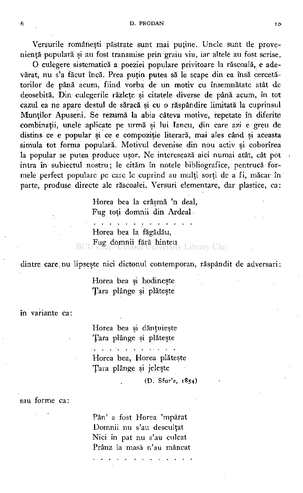

Versurile româneşti păstrate sunt mai puţine. Unele sunt tie provenienţă populară şi au fost transmise pringraiu viu, iar altele au fost scrise.

O culegere sistematică a poeziei populare privitoare la răscoală, e adevărat, nu s'a făcut încă. Prea puţin putea să le scape din ea însă cercetătorilor de până acum, fiind vorba de un motiv cu însemnătate atât de deosebită. Din culegerile răzleţe şi citatele diverse de până acum, în tot cazul ea ne apare destul de săracă şi cu o răspândire limitată la cuprinsul Munţilor Apuseni. Se rezumă la abia câteva motive, repetate în diferite combinaţii, unele aplicate pe urmă şi lui Iancu, din care azi e greu de distins ce e popular şi ce e compoziţie literară, mai ales când şi aceasta simula tot forma populară. Motivul devenise din nou activ şi coborîrea la popular se putea produce uşor. Ne interesează aici numai atât, cât pot intra în subiectul nostru; le cităm în notele bibliografice, pentrucă formele perfect populare pe care le cuprind au mulţi sorţi de a fi, măcar în parte, produse directe ale răscoalei. Versuri elementare, dar plastice, ca:

Horea bea la crâşmă 'n deal, Fug toţi domnii din Ardeal •

Horea bea la făgădău, Fug domnii fără hinteu

dintre care.nu lipseşte nici dictonul contemporan, răspândit de adversari:

Horea bea şi hodineşte Ţara plânge şi plăteşte

în variante ca:

Horea bea şi dănţuieşte Ţara plânge şi plăteşte

Horea bea, Horea plăteşte Ţara plânge şi jeleşte

(D. Sfur'a, 1854)

sau forme ca:

Pân' a fost Horea 'mpărat Domnii nu s'au desculţat Nici în pat nu s'au culcat Prânz la masă n'au mâncat

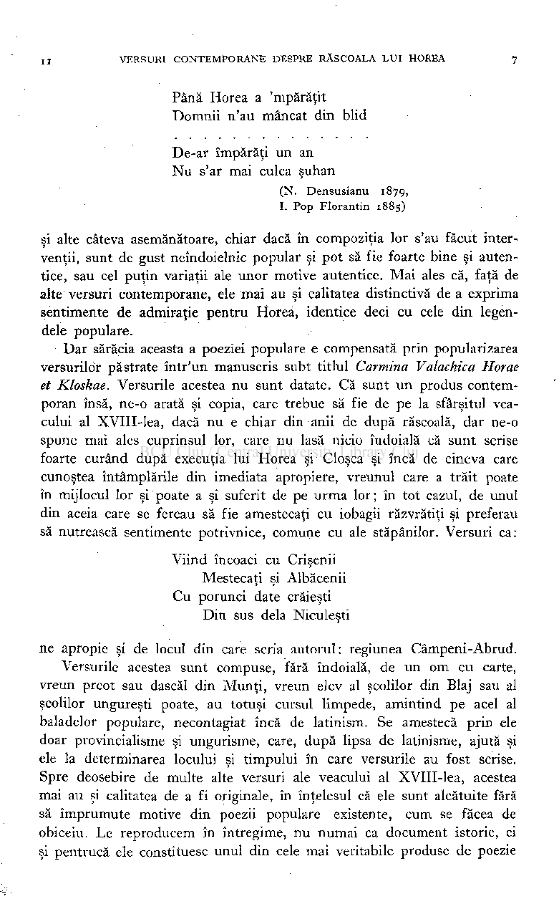

Până Horea a 'mpărăţit Domnii n'au mâncat din blid

De-ar împăraţi un an Nu s'ar mai culca şuhan

(N. Densusianu 1879,

I. Pop Florantin 1885)

şi alte câteva asemănătoare, chiar dacă în compoziţia lor s'au făcut intervenţii, sunt de gust neîndoielnic popular şi pot să fie foarte bine şi autentice, sau cel puţin variaţii ale unor motive autentice. Mai ales că, faţă de alte versuri contemporane, ele mai au şi calitatea distinctivă de a exprima sentimente de admiraţie pentru Horea, identice deci cu cele din legendele populare.

Dar sărăcia aceasta a poeziei populare e compensată prin popularizarea versurilor păstrate într'un manuscris subt titlul Carmina Valachica Horae et Kloskae. Versurile acestea nu sunt datate. Că sunt un produs contemporan însă, ne-o arată şi copia, care trebue să fie de pe la sfârşitul veacului al XVIII-Iea, dacă nu e chiar din anii de după răscoală, dar ne-o spune mai ales cuprinsul lor, care nu lasă nicio îndoială că sunt scrise foarte curând după execuţia lui Horea şi Cloşca şi încă de cineva care cunoştea întâmplările din imediata apropiere, vreunul care a trăit poate în mijlocul lor şi poate a şi suferit de pe urma lor; în tot cazul, de unul din aceia care se fereau să fie amestecaţi cu iobagii răzvrătiţi şi preferau

- să nutrească sentimente potrivnice, comune cu ale stăpânilor. Versuri ca:

Viind încoaci cu Crişenii

Mestecaţi şi Albăcenii Cu porunci date crăieşti

Din sus delà Niculeşti ne apropie şi de locul din care scria autorul: regiunea Câmpeni-Abrud.

Versurile acestea sunt compuse, fără îndoială, de un om cu carte, vreun preot sau dascăl din Munţi, vreun elev al şcolilor din Blaj sau al şcolilor ungureşti poate, au totuşi cursul limpede, amintind pe acel al baladelor populare, necontagiat încă de latinism. Se amestecă prin ele doar provincialisme şi ungurisme, care, după lipsa de latinisme, ajută şi ele la determinarea locului şi timpului în care versurile au fost scrise. Spre deosebire de multe alte versuri ale veacului al XVIII-lea, acestea mai au şi calitatea de a fi originale, în înţelesul că ele sunt alcătuite fără

- să împrumute motive din poezii populare existente, cum se făcea de obiceiu. Le reproducem în întregime, nu numai ca document istoric, ci şi pentrucă ele constituesc unul din cele mai veritabile produse de poezie

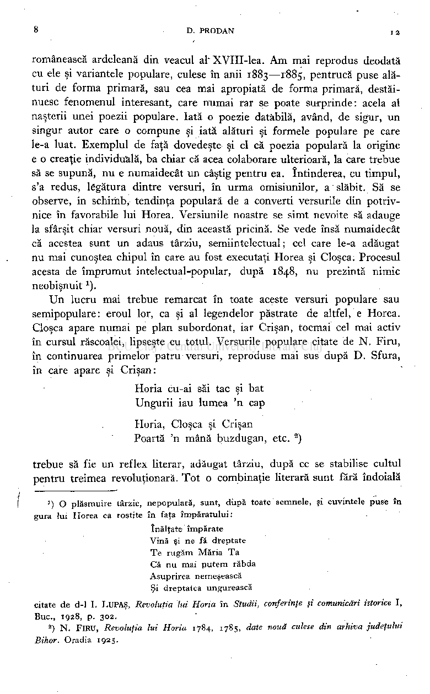

românească ardeleană din veacul al" XVIII-lea. Am mai reprodus deodată cu ele şi variantele populare, culese în anii 1883—1885, pentrucă puse alături de forma primară, sau cea mai apropiată de forma primară, destăinuesc fenomenul interesant, care numai rar se poate surprinde: acela al naşterii unei poezii populare. Iată o poezie databilă, având, de sigur, un singur autor care o compune şi iată alături şi formele populare pe care le-a luat. Exemplul de faţă dovedeşte şi el că poezia populară la origine e o creaţie individuală, ba chiar că acea colaborare ulterioară, la care trebue să se supună, nu e numaidecât un câştig pentru ea. întinderea, cu timpul, s'a redus, legătura dintre versuri, în urma omisiunilor, a slăbit. Să se observe, în schimb, tendinţa populară de a converti versurile din potrivnice în favorabile lui Horea. Versiunile noastre se simt nevoite să adauge la sfârşit chiar versuri nouă, din această pricină. Se vede însă numaidecât că acestea sunt un adaus târziu, semiintelectual ; cel care le-a adăugat nu mai cunoştea chipul în care au fost executaţi Horea şi Cloşca. Procesul acesta de împrumut intelectual-popular, după 1848, nu prezintă nimic neobişnuit

).

1

Un lucru mai trebue remarcat în toate aceste versuri populare sau semipopulare: eroul lor, ca şi al legendelor păstrate de altfel, e Horea. Cloşca apare numai pe plan subordonat, iar Crişan, tocmai cel mai activ în cursul răscoalei, lipseşte cu totul. Versurile populare citate de N. Firu, în continuarea primelor patru versuri, reproduse mai sus după D. Sfura, în care apare şi Crişan:

Horia cu-ai săi tac şi bat Ungurii iau lumea 'n cap

Horia, Cloşca şi Crişan Poartă 'n mână buzdugan, etc.

)

2

trebue să fie un reflex literar, adăugat târziu, după ce se stabilise cultul pentru treimea revoluţionară. Tot o combinaţie literară sunt fără îndoială

) O plăsmuire târzie, nepopulară, sunt, după toate semnele, şi cuvintele puse în

x

gura lui Horea ca rostite în faţa împăratului: înălţate împărate Vină şi ne fă dreptate Te rugăm Măria Ta Că nu mai putem răbda Asuprirea nemeşească Şi dreptatea ungurească

citate de d-1 I. LUPAŞ, Revoluţia lui Horia în Studii, conferinţe şi comunicări istorice I, Buc , 1928, p. 302.

) N. FlRU, Revoluţia lui Horia 1784, 1785, date nouă culese din arhiva judeţului Bihor. Oradia 1925.

2

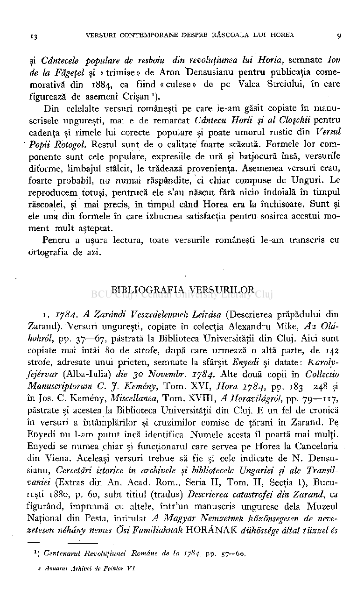

şi Cântecele populare de resboiu din revoluţiunea lui Horia, semnate Ion de la Făgeţel şi «trimise» de Aron Densusianu pentru publicaţia comemorativă din 1884, ca fiind « culese » de pe Valea Streiului, în care figurează de asemeni Crişan

Din celelalte versuri româneşti pe care le-am găsit copiate în manuscrisele ungureşti, mai e de remarcat Cântecu Horii şi al Cloşchii pentru cadenţa şi rimele lui corecte populare şi poate umorul rustic din Versul Popii Rotogol. Restul sunt de o calitate foarte scăzută. Formele lor componente sunt cele populare, expresiile de ură şi batjocură însă, versurile diforme, limbajul stâlcit, le trădează provenienţa. Asemenea versuri erau, foarte probabil, nu numai răspândite, ci chiar compuse de Unguri. Le reproducem totuşi, pentrucă ele s'au născut fără nicio îndoială în timpul răscoalei, şi mai precis, în timpul când Horea era la închisoare. Sunt şi ele una din formele în care izbucnea satisfacţia pentru sosirea acestui moment mult aşteptat.

Pentru a uşura lectura, toate versurile româneşti le-am transcris cu ortografia de azi.

BIBLIOGRAFIA VERSURILOR

1. 1784. A Zarăndi Veszedelemnek Leirdsa (Descrierea prăpădului din Zarand). Versuri ungureşti, copiate în colecţia Alexandru Mike, Az Oldhokrôl, pp. 37—67, păstrată la Biblioteca Universităţii din Cluj. Aici sunt copiate mai întâi 80 de strofe, după care urmează o altă parte, de 142 strofe, adresate unui prieten, semnate la sfârşit Enyedi şi datate: Karolyfejérvar (Alba-Iulia) die 30 Novembr. 1784. Alte două copii în Collectio Manuscriptorum C. J. Kemény, Tom. XVI, Hora 1784, pp. 183—248 şi în Jos. C. Kemény, Miscellanea, Tom. XVIII, A Horavildgrôl, pp. 79—117, păstrate şi acestea la Biblioteca Universităţii din Cluj. E un fel de cronică în versuri a întâmplărilor şi cruzimilor comise de ţărani în Zarand. Pe Enyedi nu l-am putut încă identifica. Numele acesta îl poartă mai mulţi. Enyedi se numea chiar şi funcţionarul care servea pe Horea la Cancelaria din Viena. Aceleaşi versuri trebue să fie şi cele indicate de N. Densusianu, Cercetări istorice în archivele şi bibliotecele Ungariei şi ale Transilvaniei (Extras din An. Acad. Rom., Seria II, Tom. II, Secţia I), Bucureşti 1880, p. 60, subt titlul (tradus) Descrierea catastrofei din Zarand, ca figurând, împreună cu altele, într'un manuscris unguresc delà Muzeul Naţional din Pesta, întitulat A. Magyar Nemzetnek közönsegesen de nevezetesen nehâny nemeş Ösi Familiaknak HORÂNAK dühössege âltal tüzzel és

- 1

) Centenarul Revoluţiunei Române de la 1784, pp. 57—60.

- 2 Anuarul Arhivei de Folklor VI

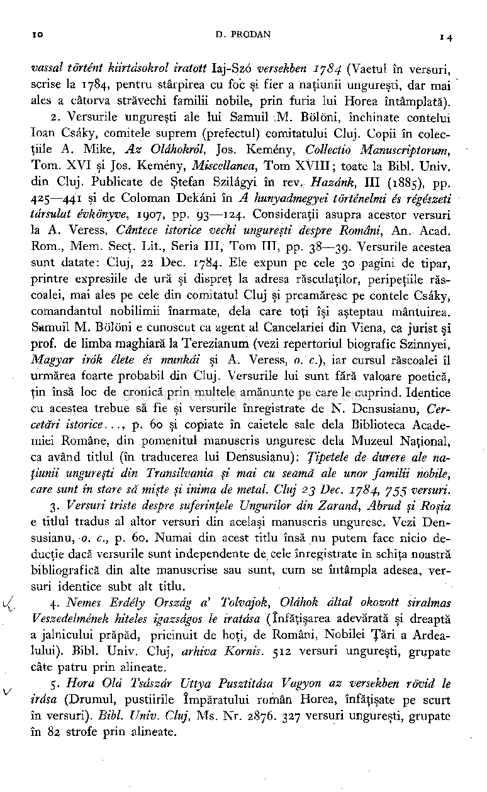

•vassal tortént kiirtdsokrol iratott Iaj-Szô versekben 1784 (Vaetul în versuri,

scrise la 1784, pentru stârpirea cu foc şi fier a naţiunii ungureşti, dar mai ales a câtorva străvechi familii nobile, prin furia lui Horea întâmplată).

- 2. Versurile ungureşti ale lui Samuil M. Bölöni, închinate contelui Ioan Csâky, corniţele suprem (prefectul) comitatului Cluj. Copii în colecţiile A. Mike, Az Oldhokrol, Jos. Kemény, Collectio Manuscriptorum, Tom. XVI şi Jos. Kemény, Miscellanea, Tom XVIII; toate la Bibi. Univ. din Cluj. Publicate de Ştefan Szilâgyi în rev. Hazdnk, III (1885), pp. 425—441 şi de Coloman Dekâni în A hunyadmegyei torténelmi és régészeti tdrsulat évkonyve, 1907, pp. 93—124. Consideraţii asupra acestor versuri la A. Veress, Cântece istorice vechi ungureşti despre Români, An. Acad. Rom., Mem. Secţ. Lit., Seria III, Tom III, pp. 38—39. Versurile acestea sunt datate: Cluj, 22 Dec. 1784. Ele expun pe cele 30 pagini de tipar, printre expresiile de ură şi dispreţ la adresa răsculaţilor, peripeţiile răscoalei, mai ales pe cele din comitatul Cluj şi preamăresc pe contele Csâky, comandantul nobilimii înarmate, delà care toţi îşi aşteptau mântuirea. Samuil M. Bölöni e cunoscut ca agent al Cancelariei din Viena, ca jurist si prof, de limba maghiară la Terezianum (vezi repertoriul biografic Szinnyei, Magyar irak élete és munkăi şi A. Veress, o. c), iar cursul răscoalei îl urmărea foarte probabil din Cluj. Versurile lui sunt fără valoare poetică, ţin însă loc de cronică prin multele amănunte pe care le cuprind. Identice cu acestea trebue să fie şi versurile înregistrate de N. Densusianu, Cercetări istorice..., p. 60 şi copiate în caietele sale delà Biblioteca Academiei Române, din pomenitul manuscris unguresc delà Muzeul Naţional, ca având titlul (în traducerea lui Densusianu): Ţipetele de durere ale naţiunii ungureşti din Transilvania şi mai cu seamă ale unor familii nobile, care sunt în stare să mişte şi inima de metal. Cluj 23 Dec. 1784, 755 versuri.
- 3. Versuri triste despre suferinţele Ungurilor din Zar and, Abrud şi Roşia e titlul tradus al altor versuri din acelaşi manuscris unguresc. Vezi Densusianu, o. c, p. 60. Numai din acest titlu însă nu putem face nicio deducţie dacă versurile sunt independente de cele înregistrate în schiţa noastră bibliografică din alte manuscrise sau sunt, cum se întâmpla adesea, versuri identice subt alt titlu.
- 4. Nemeş Erde'ly Orszdg a' Tolvajok, Oldhok ditai okozott siralmas Veszedelmének hiteles igazsdgos le iratăsa (înfăţişarea adevărată şi dreaptă a jalnicului prăpăd, pricinuit de hoţi, de Români, Nobilei Ţări a Ardealului). Bibi. Univ. Cluj, arhiva Komis. 512 versuri ungureşti, grupate câte patru prin alineate.
- 5. Hora Old Tsdszdr Uttya Pusztitdsa Vagyon az versekben rövid le irdsa (Drumul, pustiirile împăratului român Horea, înfăţişate pe scurt în versuri). Bibi. Univ. Cluj, Ms. Nr. 2876. 327 versuri ungureşti, grupate în 82 strofe prin alineate.

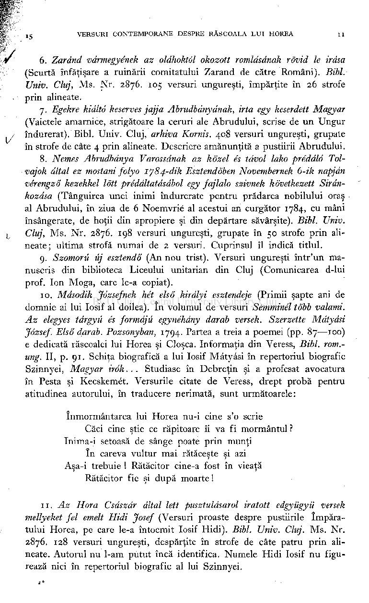

- 6. Zardnd vàrmegyének az oldhoktöl okozott romldsdnak rövid le irdsa (Scurtă înfăţişare a ruinării comitatului Zarand de către Români). Bibi. Univ. Cluj, Ms. Nr. 2876. 105 versuri ungureşti, împărţite în 26 strofe prin alineate.
- 7. Egekre kidltâ keserves jajja Abrudbănydnak, irta egy keserdett Magyar (Vaietele amarnice, strigătoare la ceruri ale Abrudului, scrise de un Ungur îndurerat). Bibi. Univ. Cluj, arhiva Komis. 408 versuri ungureşti, grupate în strofe de câte 4 prin alineate. Descriere amănunţită a pustiirii Abrudului.
- 8. Nemeş Abrudbdnya Varossdnak az közel és tdvol lako pre'ddlö Tolvajok ditai ez mostani folyo 1784-dîk Esztendöben Novembernek 6-ik napjdn vérengzô' kezekkel lött prédàltatdsâbol egy fajlalo szivnek következett Sirdnkozăsa (Tânguirea unei inimi îndurerate pentru prădarea nobilului oraş al Abrudului, în ziua de 6 Noemvrië al acestui an curgător 1784, cu mâni însângerate, de hoţii din apropiere şi din depărtare săvârşite). Bibi. Univ. Cluj, Ms. Nr. 2876. 198 versuri ungureşti, grupate în 50 strofe prin alineate; ultima strofă numai de 2 versuri. Cuprinsul îl indică titlul.
- 9. Szomorû üj esztendö (An nou trist). Versuri ungureşti într'un ma­

nuscris din biblioteca Liceului unitarian din Cluj (Comunicarea d-lui prof. Ion Moga, care le-a copiat).

- 10. Mdsodik Jôzsefnek hét elsö kirdlyi esztendeje (Primii şapte ani de

domnie ai lui Iosif al doilea). în volumul de versuri Sèmminél több valami. Az elegyes tdrgyû és formdjû egynéhâny dar ab versek. Szerzette Mdtydsi Jözsef. Elsö darab. Pozsonyban, 1794. Partea a treia a poemei (pp. 87—100) e dedicată răscoalei lui Horea şi Cloşca. Informaţia din Veress, Bibi. rom.ung. II, p. 91. Schiţa biografică a lui Iosif Mâtyâsi în repertoriul biografic Szinnyei, Magyar irak... Studiase în Debreţin şi a profesat avocatura în Pesta şi Kecskemét. Versurile citate de Veress, drept probă pentru atitudinea autorului, în traducere nerimată, sunt următoarele:

înmormântarea lui Horea nu-i cine s'o scrie

Căci cine ştie ce răpitoare îi va fi mormântul ? Inima-i setoasă de sânge poate prin munţi

în careva vultur mai rătăceşte si azi Aşa-i trebuie ! Rătăcitor cine-a fost în vieaţă Rătăcitor fie şi după moarte !

11. Az Hora Csdszdr ditai lett pusztuldsarol iratott edgyügyü versek mellyeket fel emelt Hidi Josef (Versuri proaste despre pustiirile împăratului Horea, pe care le-a întocmit Iosif Hidi). Bibi. Univ. Cluj. Ms. Nr. 2876. 128 versuri ungureşti, despărţite în strofe de câte patru prin alineate. Autorul nu l-am putut încă identifica. Numele Hidi Iosif nu figurează nici în repertoriul biografic al lui Szinnyei.

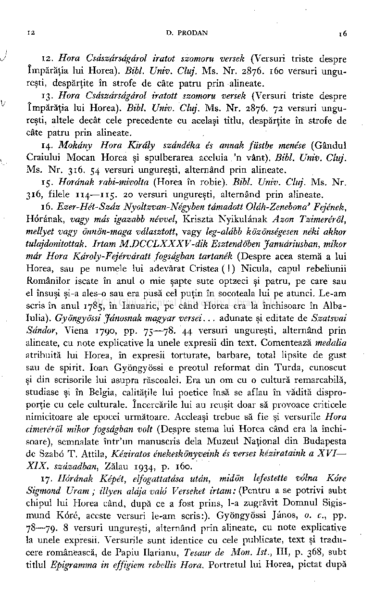

- 12. Hora Csdszârsdgărol iratot szomoru versek (Versuri triste despre împărăţia lui Horea). Bibi. Univ. Cluj. Ms. Nr. 2876. 160 versuri ungureşti, despărţite în strofe de câte patru prin alineate.
- 13. Hora Csdszârsdgărol iratott szomoru versek (Versuri triste despre împărăţia lui Horea). Bibi. Univ. Cluj. Ms. Nr. 2876. 72 versuri ungureşti, altele decât cele precedente cu acelaşi titlu, despărţite în strofe de câte patru prin alineate.
- 14. Mokdny Hora Kirâly szândéka és annak füstbe menése (Gândul Craiului Mocan Horea şi spulberarea aceluia.'n vânt). Bibi. Univ. Cluj. Ms. Nr. 316. 54 versuri ungureşti, alternând prin alineate.
- 15. Horănak rabi-mivolta (Horea în robie). Bibi. Univ. Cluj. Ms. Nr.

316, filele 114—115. 20 versuri ungureşti, alternând prin alineate.

- 16. Ezer-Hét-Szdz Nyoltzvan-Négyben tâmadott Olâh-Zenebona' Feje'nek,

Horănak, vagy mâs igazabb névvel, Kriszta Nyikulânak Azon Tzimerérol, mellyet vagy önnön-maga vdlasztott, vagy leg-alâbb közönsegesen néki akkor tulajdonitottak. Irtam M.DCCLXXXV-dik Esztendôben Janudriusban, mikor măr Hora Kdroly-Fejérvdratt fogsdgban tartanék (Despre acea stemă a lui Horea, sau pe numele lui adevărat Cristea ( ! ) Nicula, capul rebeliunii Românilor iscate în anul o mie şapte sute optzeci şi patru, pe care sau el însuşi şi-a ales-o sau era pusă cel puţin în socoteala lui pe atunci. Le-am scris în anul 1785, în Ianuarie, pe când Horea era la închisoare în AlbaIulia). Gyöngyössi Jânosnak magyar ver sei... adunate şi editate de Szatsvai Sdndor, Viena 1790, pp. 75—78. 44 versuri ungureşti, alternând prin alineate, cu note explicative la unele expresii din text. Comentează medalia atribuită lui Horea, în expresii torturate, barbare, total lipsite de gust sau de spirit. Ioan Gyöngyössi e preotul reformat din Turda, cunoscut şi din scrisorile lui asupra răscoalei. Era un om cu o cultură remarcabilă, studiase şi în Belgia, calităţile lui poetice însă se aflau în vădită disproporţie cu cele culturale. încercările lui au reuşit doar să provoace criticele nimicitoare ale epocei următoare. Aceleaşi trebue să fie şi versurile Hora cimerérol mikor fogsdgban volt (Despre stema lui Horea când era la închisoare), semnalate într'un manuscris delà Muzeul Naţional din Budapesta de Szabö T. Attila, Kéziratos énekeskânyveink és verses kézirataink a XVIXIX. szdzadban, Zălau 1934, p. 160.

17. Hôrdnak Képét, elfogattatàsa utân, midön lefestette vôlna Köre Sigmond Uram ; Uly en aldja valà Versehet irtam: (Pentru a se potrivi subt chipul lui Horea când, după ce a fost prins, 1-a zugrăvit Domnul Sigismund Köre, aceste versuri le-am scris:). Gyöngyössi Jânos, o. c, pp. 78—79. 8 versuri ungureşti, alternând prin alineate, cu note explicative la unele expresii. Versurile sunt identice cu cele publicate, text şi traducere românească, de Papiu Ilarianu, Tesaur de Mon. Ist., III, p. 368, subt titlul Epigramma in effigiem rebellis Hora. Portretul lui Horea, pictat după

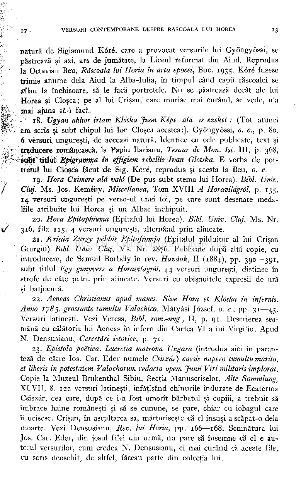

natură de Sigismund Köre, care a provocat versurile lui Gyöngyössi, se păstrează şi azi, ars de jumătate, la Liceul reformat din Aiud. Reprodus la Octavian Beu, Răscoala lui Horia în arta epocei, Buc. 1935. Köre fusese trimis anume delà Aiud la Alba-Iulia, în timpul când capii răscoalei se aflau la închisoare, să le facă portretele. Nu se păstrează decât ale lui Horea şi Cloşca ; pe al lui Crişan, care murise mai curând, se vede, n'a mai ajuns să-1 facă.

- 18. Ugyan akkor irtam Klâska Juon Képe alà is ezeket : (Tot atunci am scris şi subt chipul lui Ion Cloşca acestea:). Gyöngyössi, o. c, p. 80. 6 versuri ungureşti, de aceeaşi natură. Identice cu cele publicate, text şi traducere românească, là Papiu Ilarianu, Tesaur de Mon. Ist. III, p. 368, subt titlul Epigramma in effigiem rebella Ivan Glotska. E vorba de portretul lui Cloşca făcut de Sig. Köre, reprodus şi acesta la Beu, o. c.

19. Hora Czimere alä valö (De pus subt stema lui Horea). Bibi. Univ. Cluj. Ms. Jos. Kemény, Miscellanea, Tom XVIII A Horavildgröl, p. 155. 14 versuri ungureşti pe verso-ul unei foi, pe care sunt desenate medaliile atribuite lui Horea şi un Albac închipuit.

- 20. Hora Epitaphiuma (Epitaful lui Horea). Bibi. Univ. Cluj, Ms. Nr.

316, fila 115. 4 versuri ungureşti, alternând prin alineate.

- 21. Krisen Zurgy példâs Epitafiumja (Epitaful pilduitor al lui Crişan Giurgiu). Bibi. Univ. Cluj, Ms. Nr. 2876. Publicate după altă copie, cu introducere, de Samuil Borbély în rev. Hazânk, II (1884), pp. 390—391,, subt titlul Egy gunyvers a Horavildgröl. 44 versuri ungureşti, distinse în strofe de câte patru prin alineate. Versuri cu obişnuitele expresii de ură şi batjocură.
- 22. Aeneas Christianus apud manes. Sive Hora et Kloska in infernis. Anno 1^85. grassante tumultu Valachico. Mâtyâsi Jözsef, o. c, pp. 31—45. Versuri latineşti. Vezi Veress, Bibi. rom.-ung., II, p. 91. Descrierea seamănă cu călătoria lui Aeneas în infern din Cartea VI a lui Virgiliu. Apud N. Densusianu, Cercetări istorice, p. 71.
- 23. Epistola poetica. Lucretia matrona Ungara (introdus aici în paranteză de către Ios. Car. Eder numele Csiszdr) caesis nupero tumultu marito, et liberis in potestatem Valachorum redacta opem Junii Viri militaris implorat. Copie la Muzeul Brukenthal Sibiu, Secţia Manuscriselor, Alte Sammlung, XLVII, 8. 122 versuri latineşti, înfăţişând chinurile îndurate de Ecaterina Csiszâr, cea care, după ce i-a fost omorît bărbatul şi copiii, a trebuit să îmbrace haine româneşti şi să se cunune, se pare, chiar cu iobagul care îi ucisese. Crişan, în ascultarea sa, mărturiseşte că el însuşi a scăpat-o delà moarte. Vezi Densusianu, Rev. lui Horia, pp. 166—168. Semnătura lui Jos. Car. Eder, din josul filei din urmă, nu pare să însemne că el e autorul versurilor, cum credea N. Densusianu, ci mai curând că aceste file, cu scris deosebit, de altfel, făceau parte din colecţia lui.

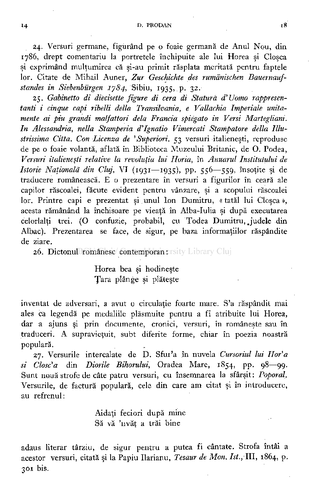

- 24. Versuri germane, figurând pe o foaie germană de Anul Nou, din 1786, drept comentariu la portretele închipuite ale lui Horea şi Cloşca şi exprimând mulţumirea că şi-au primit răsplata meritată pentru faptele lor. Citate de Mihail Auner, Zur Geschichte des rumänischen Bauernaufstandes in Siebenbürgen 1784, Sibiu, 1935, p. 32.
- 25. Gabinetto di diecisette figure di cer a di Statura d'Uomo rappresentanti i cinque capi ribelli délia Transilvania, e Vallachia Imperiale unitamente ai pin grandi malfattori delà Francia spiègato in Versi Martegliani. In Alessandria, nella Stamperia d'Ignatio Vimercati Stampatore délia Illustrissima Citta. Con Licenza de 'Superiori. 53 versuri italieneşti, reproduse de pe o foaie volantă, aflată în Biblioteca Muzeului Britanic, de O. Podea, Versuri italieneşti relative la revoluţia lui Horia, în Anuarul Institutului de Istorie Naţională din Cluj, VI (1931—1935), pp- 556—559, însoţite şi de traducere românească. E o prezentare în versuri a figurilor în ceară ale capilor răscoalei, făcute evident pentru vânzare, şi a scopului răscoalei lor. Printre capi e prezentat şi unul Ion Dumitru, « tatăl lui Cloşca », acesta rămânând la închisoare pe vieaţă în Alba-Iulia şi după executarea celorlalţi trei. (O confuzie, probabil, cu Todea Dumitru, judele din Albac). Prezentarea se face, de sigur, pe baza informaţiilor răspândite de ziare.
- 26. Dictonul românesc contemporan:

Horea bea şi hodineşte Ţara plânge şi plăteşte

inventat de adversari, a avut o circulaţie foarte mare. S'a răspândit mai ales că legendă pe medaliile plăsmuite pentru a fi atribuite lui Horea, dar a ajuns şi prin documente, cronici, versuri, în româneşte sau în traduceri. A supravieţuit, subt diferite forme, chiar în poezia noastră populară.

27. Versurile intercalate de D. Sfui'a în nuvela Cursoriid lui Hor'a si Closc'a din Diorile Bihorului, Oradea Mare, 1854, pp. 98—99. Sunt nouă strofe de câte patru versuri, cu însemnarea la sfârşit : Poporal. Versurile, de factură populară, cele din care am citat şi în introducere, au refrenul:

Aidaţi feciori după mine Să vă 'nvăţ a trăi bine

adaus literar târziu, de sigur pentru a putea fi cântate. Strofa întâi a acestor versuri, citată şi la Papiu Ilarianu, Tesaur de Mon. Ist., UI, 1864, p. 301 bis.

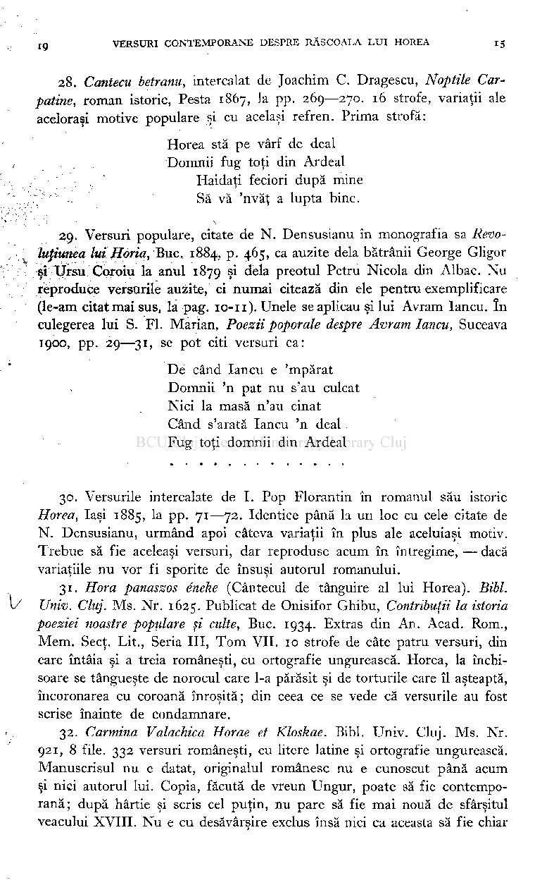

28. Cantecu betranu, intercalat de Joachim C. Dragescu, Nopţile Carpatine, roman istoric, Pesta 1867, la pp. 269—270. 16 strofe, variaţii ale aceloraşi motive populare şi cu acelaşi refren. Prima strofă:

Horea stă pe vârf de deal Domnii fug toţi din Ardeal

Haidaţi feciori după mine Să vă 'nvăţ a lupta bine.

29. Versuri populare, citate de N. Densusianu în monografia sa Revoluţiunea lui Horia, Buc, 1884, p. 465, ca auzite delà bătrânii George Gligor şi Uirsu Cproiu la anul 1879 şi delà preotul Petru Nicola din Albac. Nu reproduce versurile auzite, ci numai citează din ele pentru exemplificare (le-am citat mai sus, la pag. 10-11). Unele se aplicau şi lui Avram Iancu. în culegerea lui S. FI. Marian, Poezii poporale despre Avram Iancu, Suceava 1900, pp. 29—31, se pot citi versuri ca:

De când Iancu e 'mpărat Domnii 'n pat nu s'au culcat Nici la masă n'au cinat Când s'arată Iancu 'n deal Fug toţi domnii din Ardeal

- 30. Versurile intercalate de I. Pop Florantin în romanul său istoric Horea, Iaşi 1885, la pp. 71—-72. Identice până la un loc cu cele citate de N. Densusianu, urmând apoi câteva variaţii în plus ale aceluiaşi motiv. Trebue să fie aceleaşi versuri, dar reproduse acum în întregime, — dacă variaţiile nu vor fi sporite de însuşi autorul romanului.
- 31. Hora panaszos éneke (Cântecul de tânguire al lui Horea). Bibi.

Univ. Cluj. Ms. Nr. 1625. Publicat de Onisifor Ghibu, Contribuţii la istoria poeziei noastre populare şi culte, Buc. 1934. Extras din An. Acad. Rom., Mem. Secţ. Lit., Seria III, Tom VII. 10 strofe de câte patru versuri, din care întâia şi a treia româneşti, cu ortografie ungurească. Horea, la închisoare se tângueşte de norocul care 1-a părăsit şi de torturile care îl aşteaptă, încoronarea cu coroană înroşită; din ceea ce se vede că versurile au fost scrise înainte de condamnare.

32. Carmina Valachica Horae et Kloskae. Bibi. Univ. Cluj. Ms. Nr. 921, 8 file. 332 versuri româneşti, cu litere latine şi ortografie ungurească. Manuscrisul nu e datat, originalul românesc nu e cunoscut până acum şi nici autorul lui. Copia, făcută de vreun Ungur, poate să fie contemporană; după hârtie şi scris cel puţin, nu pare să fie mai nouă de sfârşitul veacului XVIII. Nu e cu desăvârşire exclus însă nici ca aceasta să fie chiar

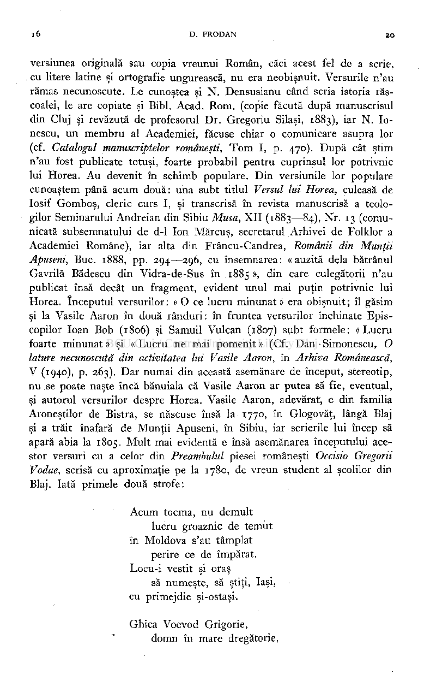

versiunea originală sau copia vreunui Român, căci acest fel de a scrie, cu litere latine şi ortografie ungurească, nu era neobişnuit. Versurile n'au

- rămas necunoscute. Le cunoştea şi N. Densusianu când scria istoria răscoalei, le are copiate şi Bibi. Acad. Rom. (copie făcută după manuscrisul din Cluj şi revăzută de profesorul Dr. Gregoriu Silaşi, 1883), iar N. Ionescu, un membru al Academiei, făcuse chiar o comunicare asupra lor (cf. Catalogul manuscriptelor româneşti, Tom I, p. 470). După cât ştim n'au fost publicate totuşi, foarte probabil pentru cuprinsul lor potrivnic lui Horea. Au devenit în schimb populare. Din versiunile lor populare cunoaştem până acum două: una subt titlul Versul lui Horea, culeasă de Iosif Gomboş, cleric curs I, şi transcrisă în revista manuscrisă a teologilor Seminarului Andreian din Sibiu Musa, XII (1883—84), Nr. 13 (comunicată subsemnatului de d-1 Ion Marcus, secretarul Arhivei de Folklor a Academiei Române), iar alta din Frâncu-Candrea, Românii din Munţii Apuseni, Buc. 1888, pp. 294—296, cu însemnarea: «auzită delà bătrânul Gavrilă Bădescu din Vidra-de-Sus în 1885 », din care culegătorii n'au publicat însă decât un fragment, evident unul mai puţin potrivnic lui Horea. începutul versurilor: « O ce lucru minunat» era obişnuit; îl găsim şi la Vasile Aaron în două rânduri: în fruntea versurilor închinate Episcopilor Ioan Bob (1806) şi Samuil Vulcan (1807) subt formele: «Lucru foarte minunat » şi « Lucru ne mai pomenit » (Cf. Dan • Simonescu, O lăture necunoscută din activitatea lui Vasile Aaron, în Arhiva Românească, V (1940), p. 263). Dar numai din această asemănare de început, stereotip, nu se poate naşte încă bănuiala că Vasile Aaron ar putea să fie, eventual, şi autorul versurilor despre Horea. Vasile Aaron, adevărat, e din familia Aroneştilor de Bistra, se născuse însă la 1770, în Glogovăţ, lângă Blaj şi a trăit înafară de Munţii Apuseni, în Sibiu, iar scrierile lui încep să apară abia la 1805. Mult mai evidentă e însă asemănarea începutului acestor versuri cu a celor din Preambulul piesei româneşti Occisio Gregorii Vodae, scrisă cu aproximaţie pe la 1780, de vreun student al şcolilor din Blaj. Iată primele două strofe:

Acum tocma, nu demult

lucru groaznic de temut în Moldova s'au tâmplat

perire ce de împărat. Locu-i vestit şi oraş

să numeşte, să ştiţi, Iaşi, cu primejdie şi-ostaşi-.

Ghica Voevod Grigorie, domn în mare dregătorie,

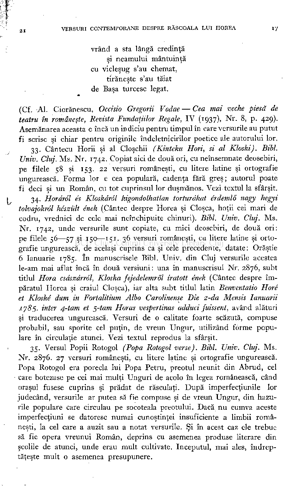

vrând a sta lângă credinţă

şi neamului mântuinţă cu vicleşug s'au chemat,

tirăneşte s'au tăiat de Başa turcesc legat.

m

(Cf. Al. Ciorănescu, Occisio Gregorii Vodae — Cea mai veche piesă de teatru în româneşte, Revista Fundaţiilor Regale, IV (1937), Nr. 8, p. 429). Asemănarea aceasta e încă un indiciu pentru timpul în care versurile au putut fi scrise şi chiar pentru originile îndeletnicirilor poetice ale autorului lor.

- 33. Cântecu Horii şi al Cloşchii (Kinteku Hori, si al Kloski). Bibi. Univ. Cluj. Ms. Nr. 1742. Copiat aici de două ori, cu neînsemnate deosebiri, pe filele 58 şi 153. 22 versuri româneşti, cu litere latine şi ortografie ungurească. Forma lor e cea populară, cadenţa fără greş; autorul poate fi deci şi un Român, cu tot cuprinsul lor duşmănos. Vezi textul la sfârşit.
- 34. Horàrèl és Kloskdrôl kigondolhatlan torturdkat érdemlo nagy hegyi tolvajokrôl készùlt ének (Cântec despre Horea şi Cloşca, hoţii cei mari de codru, vrednici de cele mai neînchipuite chinuri). Bibi. Univ. Cluj. Ms. Nr. 1742, unde versurile sunt copiate, cu mici deosebiri, de două ori: pe filele 56—57 şi 150—151. 36 versuri româneşti, cu litere latine şi ortografie ungurească, de acelaşi cuprins ca şi cele precedente, datate : Orăştie 6 Ianuarie 1785. în manuscrisele Bibi. Univ. din Cluj versurile acestea le-am mai aflat încă în două versiuni: una în manuscrisul Nr. 2876, subt titlul Hora csdszdrröl, Kloska fejedelemröl iratott ének (Cântec despre împăratul Horea şi craiul Cloşca), iar alta subt titlul latin Benventatio Horé et Kloské dum in Fortalitium Albo Carolinense Die 2-da Mensis Ianuarii 1785. inter 4-tam et 5-tam Horas vespertinas adduci fuissent, având alături şi traducerea ungurească. Versuri de o calitate foarte scăzută, compuse probabil, sau sporite cel puţin, de vreun Ungur, utilizând forme populare în circulaţie atunci. Vezi textul reprodus la sfârşit.
- 35. Versul Popii Rotogol (Popa Rotogol verse). Bibi. Univ. Cluj. Ms. Nr. 2876. 27 versuri româneşti, cu litere latine şi ortografie ungurească. Popa Rotogol era porecla lui Popa Petru, preotul neunit din Abrud, cel care botezase pe cei mai mulţi Unguri de acolo în legea românească, când oraşul fusese cuprins şi prădat de răsculaţi. După imperfecţiunile lor judecând, versurile ar putea să fie compuse şi de vreun Ungur, din hazurile populare care circulau pe socoteala preotului. Dacă nu cumva aceste imperfecţiuni se datoresc numai cunoştinţei insuficiente a limbii româneşti, la cel care a auzit sau a notat versurile. Şi în acest caz ele trebue

- să fie opera vreunui Român, deprins cu asemenea produse literare din şcolile de atunci, unde erau mult cultivate. începutul, mai ales, îndrep­
- tăţeşte mult o asemenea presupunere.

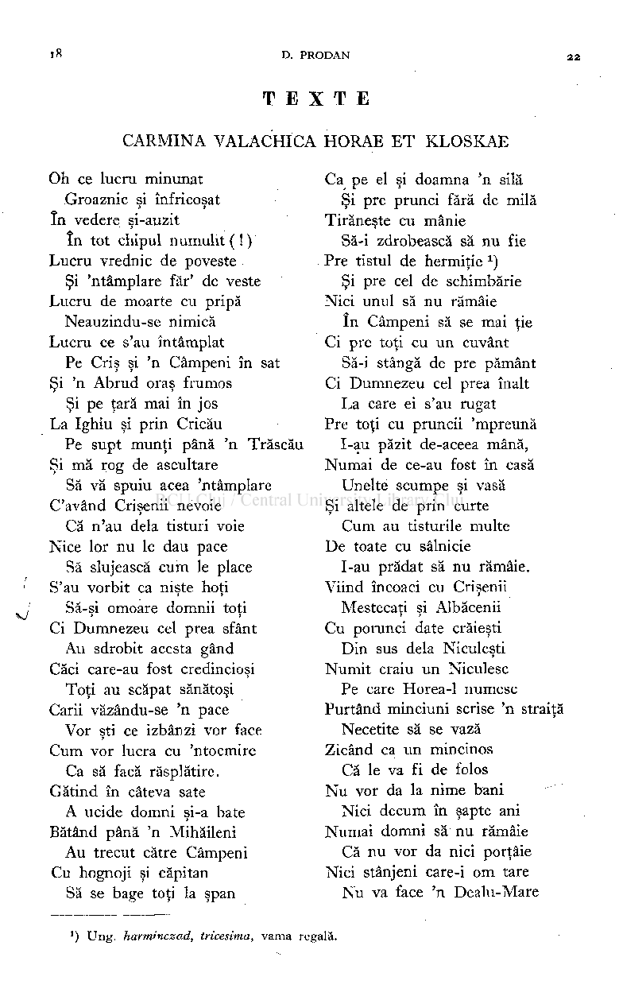

### TE S

#### : T E

CARMINA VALACHICA

HORAE E T KLOSKAE

Oh ce lucru minunat

Ca pe el şi doamna 'n silă

Groaznic şi înfricoşat în vedere şi-auzit

Şi pre prunci fără de milă Tirăneşte cu mânie

în tot chipul numuht (!) Lucru vrednic de poveste

Să-i zdrobească să nu fie Pre tistul de hermiţie *)

Şi 'ntâmplare făr' de veste Lucru de moarte cu pripă

Şi pre cel de schimbărie Nici unul să nu rămâie

Neauzindu-se nimica Lucru ce s'au întâmplat

în Câmpeni să se mai ţie Ci pre toţi cu un cuvânt

Pe Criş şi 'n Câmpeni în sat Şi 'n Abrud oraş frumos Şi pe ţară mai în jos

Să-i stângă de pre pământ Ci Dumnezeu cel prea înalt

La care ei s'au rugat Pre toţi cu pruncii 'mpreună l-au păzit de-aceea mână, Numai de ce-au fost în casă

La Ighiu şi prin Cricău

Pe supt munţi până 'n Trăscău Şi mă rog de ascultare

Să vă spuiu acea 'ntâmplare C'având Crişenii nevoie

Unelte scumpe şi vasă Şi altele de prin curte

Că n'au delà tisturi voie Nice lor nu le dau pace

Cum au tisturile multe De toate cu sâlnicie

I-au prădat să nu rămâie. Viind încoaci cu Crişenii

Să slujească cum le place S'au vorbit ca nişte hoţi

Mestecaţi şi Albăcenii Cu porunci date crăieşti

Să-şi omoare domnii toţi Ci Dumnezeu cel prea sfânt

Din sus delà Niculeşti Numit craiu un Niculesc Pe care Horea-1 numesc Purtând minciuni scrise 'n straiţă

Au sdrobit acesta gând Căci care-au fost credincioşi Toţi au scăpat sănătoşi Carii văzându-se 'n pace

Necetite să se vază Zicând ca un mincinos

Vor şti ce izbânzi vor face Cum vor lucra cu 'ntocmire

Că le va fi de folos Nu vor da la nime bani

Ca să facă răsplătire. Gătind în câteva sate

Nici decum în şapte ani Numai domni să nu rămâie

A ucide domni şi-a bate

- Bătând până 'n Mihăileni Au trecut către Câmpeni

Că nu vor da nici porţâie Nici stânjeni care-i om tare

Cu hognoji şi căpitan Să se bage toţi la şpan

Nu va face 'n Dealu-Mare

) Ung. harminczad, tricesima, vama rei

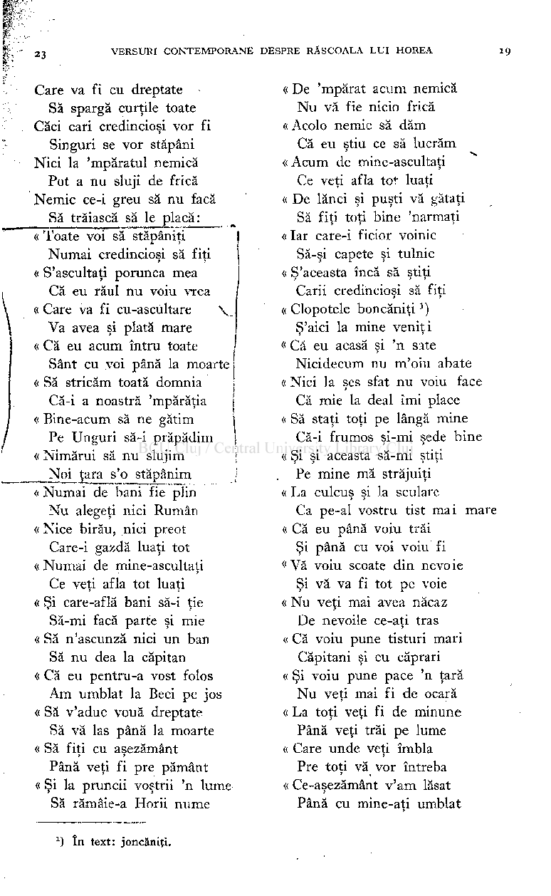

« De 'mpărat acum nemică

Care va fi cu dreptate Să spargă curţile toate

Nu vă fie nicio frică « Acolo nemic să dăm

- Căci cari credincioşi vor fi Singuri se vor stăpâni

Că eu ştiu ce să lucrăm « Acum de mine-ascultaţi Ce veţi afla to<- luaţi

Nici la 'mpăratul nemică

Pot a nu sluji de frică Nemic ce-i greu să nu facă Să trăiască să le placă : « Toate voi să stăpâniţi

« De lănci şi puşti vă gătaţi

Să fiţi toţi bine 'narmaţi « Iar care-i ficior voinic

Să-şi capete şi tulnic « Ş'aceasta încă să ştiţi

Numai credincioşi să fiţi « S'ascultaţi porunca mea

Carii credincioşi să fiţi « Clopotele boncăniţi

Că eu răul nu voiu vrea « Care va fi cu-ascultare \

) Ş'aici la mine veniţi

l

Va avea şi plată mare « Că eu acum întru toate

« Că eu acasă şi 'n sate

Nicidecum nu m'oiu abate « Nici la şes sfat nu voiu face

Sânt cu voi până la moarte j « Să stricăm toată domnia ,

Că mie la deal îmi place « Să staţi toţi pe lângă mine

Că-i a noastră 'mpărăţia \

« Bine-acum să ne gătim j Pe Unguri să-i prăpădim | « Nimărui să nu slujim j

Că-i frumos şi-mi şede bine « Şi şi aceasta să-mi ştiţi Pe mine mă străjuiţi « La culcuş şi la sculare

Noi ţara s'o stăpânim / « Numai de bani fie plin

Ca pe-al vostru tist mai mare « Că eu până voiu trăi

Nu alegeţi nici Rumân « Nice birău, nici preot

Şi până cu voi voiu fi « Vă voiu scoate din nevo ie Şi vă va fi tot pe voie

Care-i gazdă luaţi tot « Numai de mine-ascultaţi Ce veţi afla tot luaţi « Şi care-află bani să-i ţie

« Nu veţi mai avea năcaz De nevoile ce-aţi tras « Că voiu pune tisturi mari Căpitani şi cu căprari « Şi voiu pune pace 'n ţară Nu veţi mai fi de ocară

Să-mi facă parte şi mie « Să n'ascunză nici un ban Să nu dea la căpitan « Că eu pentru-a vost folos

Am umblat la Beci pe jos « Să v'aduc vouă dreptate

« La toţi veţi fi de minune Până veţi trăi pe lume « Care unde veţi îmbla

Să vă las până la moarte « Să fiţi cu aşezământ

Până veţi fi pre pământ « Şi la pruncii voştrii 'n lume Să rămâie-a Horii nume

Pre toţi vă vor întreba « Ce-aşezământ v'am lăsat Până cu mine-aţi umblat

) în text: joncăniţi.

x

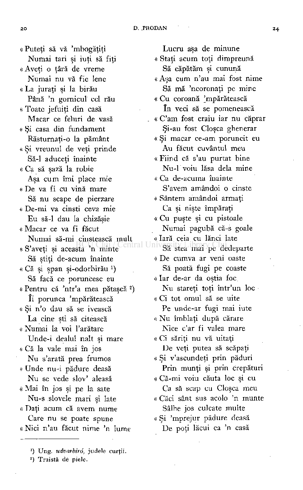

Lucru aşa de minune « Staţi acum toţi dimpreună Să căpătăm şi cunună

Puteţi să vă 'mbogăţiţi

Numai tari şi iuţi să fiţi Aveţi o ţâră de vreme

« Aşa cum n'au mai fost nime Să mă 'ncoronaţi pe mine « Cu coroană 'mpărătească

Numai nu vă fie lene La juraţi şi la birău

Până 'n gornicul cel rău Toate jefuiţi din casă

în veci să se pomenească « Cam fost craiu iar nu căprar Şi-au fost Cloşca ghenerar

Măcar ce feluri de vasă Şi casa din fundament

« Şi măcar ce-am poruncit eu Au făcut cuvântul meu « Fiind că s'au purtat bine

- Răsturnaţi-o la pământ

Şi vreunul de veţi prinde

- Să-1 aduceţi înainte

Nu-lvoiu lăsa delà mine « Ca de-acuma înainte

Ca să şază la robie

Aşa cum îmi place mie De va fi cu vină mare

S'avem amândoi o cinste « Sântem amândoi armaţi Ca şi nişte împăraţi « Cu puste şi cu pistoale

Să nu scape de pierzare

De-mi va cinsti ceva mie Eu să-1 dau la chizăşie Măcar ce va fi făcut

Numai pagubă că-s goale « Iară ceia cu lănci late

Numai să-mi cinstească mult S'aveţi şi aceasta 'n minte Să ştiţi de-acum înainte Că şi şpan şi-odorbirău *) Să facă ce poruncesc eu

Să stea mai pe dedeparte « De cumva ar veni oaste

Să poată fugi pe coaste « Iar de-ar da ostia foc

Nu stareţi toţi într'un loc « Ci tot omul să se uite

Pentru că 'ntr'a mea pătaşcă

) îi porunca 'mpărătească

2

Pe unde-ar fugi mai iute « Nu îmbiaţi după cărare

Şi n'o dau să se ivească La cine şti să citească Numai la voi l'arătare

Nice c'ar fi valea rnare « Ci săriţi nu vă uitaţi

Unde-i dealul nalt şi mare Că la vale mai în jos

De veţi putea să scăpaţi « Şi v'ascundeţi prin păduri

Nu s'arată prea frumos Unde nu-i pădure deasă

Prin munţi şi prin crepături « Că-mi voiu căuta loc şi eu

Nu se vede slov' aleasă Mai în jos şi pe la sate

Ca să scap cu Cloşca meu « Căci sânt sus acolo 'n munte

Nu-s slovele mari şi late

Sâlhe jos culcate multe

Daţi acum că avem nume Care nu se poate spune

« Şi 'mprejur pădure deasă De poţi lăcui ca 'n casă

Nici n'au făcut nime 'n lume

*) Ung. udvarbird, judele curţii.

) Traistă de piele.

2

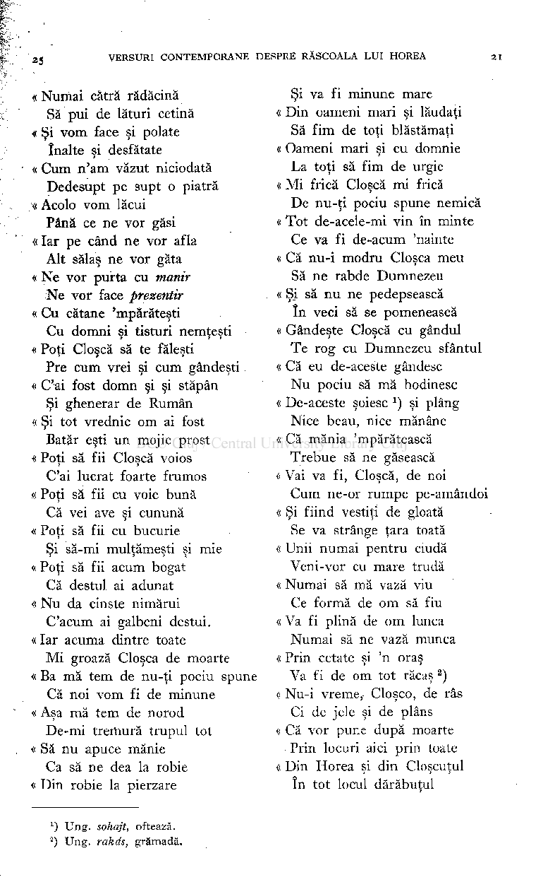

Şi va fi minune mare

« Nuniai cătră rădăcină

Din oameni mari şi lăudaţi Să fim de toţi blăstămaţi Oameni mari şi cu domnie

Să pui de lături cetină « Şi vom face şi polate înalte şi desfătate

La toţi să fim de urgie Mi frică Cloşcă mi frică

« Cum n'am văzut niciodată

Dedesupt pe supt o piatră « Acolo vom lăcui

De nu-ţi pociu spune nemică Tot de-acele-mi vin în minte

Până ce ne vor găsi <( Iar pe când ne vor afla

Ce va fi de-acum 'nainte Că nu-i modru Cloşca meu

Alt sălaş ne vor găta « Ne vor purta cu manir

Să ne rabde Dumnezeu Şi să nu ne pedepsească

Ne vor face prezentir « Cu cătane 'mparăteşti

în veci să se pomenească Gândeşte Cloşcă cu gândul

Cu domni şi tisturi nemţeşti « Poţi Cloşcă să te făleşti

Te rog cu Dumnezeu sfântul Că eu de-aceste gândesc

Pre cum vrei şi cum gândeşti « Cai fost domn şi şi stăpân

Nu pociu să mă hodinesc De-aceste şoiesc *) şi plâng

Şi ghenerar de Rumân « Şi tot vrednic om ai fost

Nice beau, nice mănânc Că mania 'mpărătească

Batăr eşti un mojic prost « Poţi să fii Cloşcă voios

Trebue să ne găsească Vai va fi, Cloşcă, de noi

Cai lucrat foarte frumos « Poţi să fii cu voie bună Că vei ave şi cunună « Poţi să fii cu bucurie

Cum ne-or rumpe pe-amândoi Şi fiind vestiţi de gloată

Se va strânge ţara toată Unii numai pentru ciudă

Şi să-mi mulţămeşti şi mie « Poţi să fii acum bogat Că destul ai adunat

Veni-vor cu mare trudă Numai să mă vază viu

Ce formă de om să fiu Va fi plină de om lunca

« Nu da cinste nimărui

Cacum ai galbeni destui. « Iar acuma dintre toate

Numai să ne vază munca Prin cetate şi 'n oraş

Mi groază Cloşca de moarte « Ba mă tem de nu-ţi pociu spune

) Nu-i vreme,- Cloşco, de râs Ci de jele şi de plâns Că vor pune după moarte

Va fi de om tot răcaş

2

Că noi vom fi de minune « Aşa mă tem de norod

De-mi tremură trupul tot « Să nu apuce manie

Prin locuri aici prin toate Din Horea şi din Cloşcuţul

Ca să ne dea la robie « Din robie la pierzare

în tot locul dărăbuţul

) Ung. sohajt, oftează.

x

) Ung. rakds, grămadă.

2

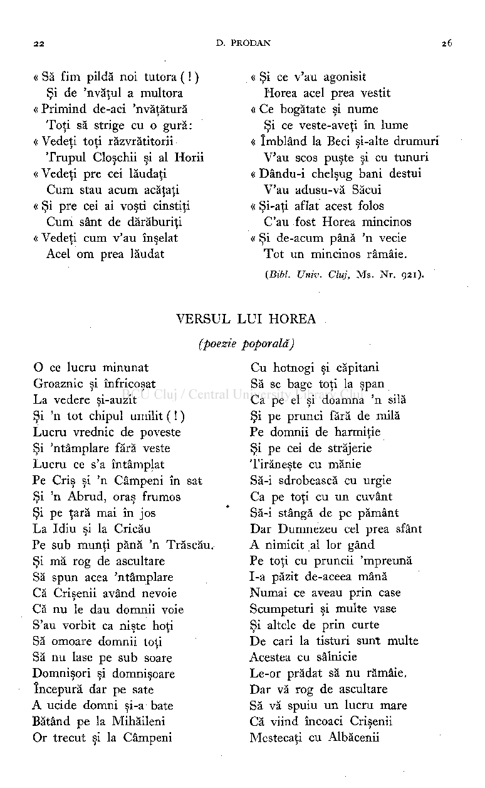

« Să fim pildă noi tutora ( ! ) Şi de 'nvăţul a multora « Primind de-aci 'nvăţătură

« Şi ce v'au agonisit

Horea acel prea vestit « Ce bogătate şi nume

Toţi să strige cu o gură: « Vedeţi toţi răzvrătitorii

Şi ce veste-aveţi în lume

« îmblând la Beci şi-alte drumuri Vau scos puste şi cu tunuri « Dându-i chelşug bani destui

Trupul Cloşchii şi al Horii « Vedeţi pre cei lăudaţi

Cum stau acum acăţaţi « Şi pre cei ai voşti cinstiţi Cum sânt de dărăburiţi « Vedeţi cum v'au înşelat Acel om prea lăudat

Vau adusu-vă Săcui « Şi-aţi aflat acest folos

C'au fost Horea mincinos « Şi de-acum până 'n vecie

Tot un mincinos râmâie.

(Bibi. Univ. Cluj, Ms. Nr. 921).

VERSUL LUI HOREA (poezie poporală)

Cu hotnogi şi căpitani Să se bage toţi la şpan Ca pe el şi doamna 'n silă Şi pe prunci fără de milă Pe domnii de harmiţie Şi pe cei de străjerie Tirăneşte cu manie Să-i sdrobească cu urgie Ca pe toţi cu un cuvânt Să-i stângă de pe pământ Dar Dumnezeu cel prea sfânt A nimicit al lor gând Pe toţi cu pruncii 'mpreună I-a păzit de-aceea mână Numai ce aveau prin case Scumpeturi şi multe vase Şi altele de prin curte De cari la tisturi sunt multe Acestea cu sâlnicie Le-or prădat să nu rămâie. Dar vă rog de ascultare Să vă spuiu un lucru mare Că viind încoaci Crişenii Mestecaţi cu Albăcenii

O ce lucru minunat Groaznic şi înfricoşat La vedere şi-auzit Şi 'n tot chipul umilit ( ! ) Lucru vrednic de poveste Şi 'ntâmplare fără veste Lucru ce s'a întâmplat Pe Criş şi 'n Câmpeni în sat Şi 'n Abrud, oraş frumos Şi pe ţară mai în jos La Idiu şi la Cricău Pe sub munţi pană'n Trăscău. Şi mă rog de ascultare Să spun acea 'ntâmplare Că Crişenii având nevoie Că nu le dau domnii voie S'au vorbit ca nişte hoţi Să omoare domnii toţi Să nu lase pe sub soare Domnişori şi domnişoare începură dar pe sate A ucide domni şi-a bate

- Bătând pe la Mihăileni Or trecut şi la Câmpeni

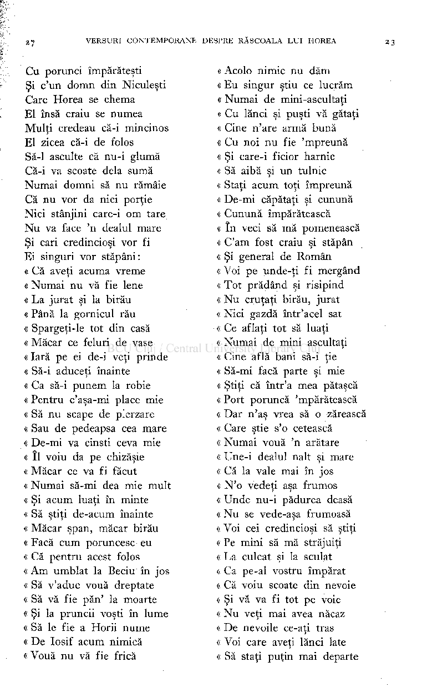

Acolo nimic nu dăm Eu singur ştiu ce lucrăm Numai de mini-ascultaţi Cu lănci şi puşti vă gătaţi Cine n'are armă bună Cu noi nu fie 'mpreună Şi care-i ficior harnic Să aibă şi un tulnic Staţi acum toţi împreună De-mi căpătaţi şi cunună Cunună împărătească în veci să mă pomenească Cam fost craiu şi stăpân Şi general de Român Voi pe unde-ţi fi mergând Tot prădând şi risipind Nu cruţaţi birău, jurat Nici gazdă într'acel sat Ce aflaţi tot să luaţi Numai de mini ascultaţi Cine află bani să-i ţie Să-mi facă parte şi mie Ştiţi că într'a mea pătaşcă Port poruncă 'mpărătească Dar n'aş vrea să o zărească Care ştie s'o cetească Numai vouă 'n arătare Une-i dealul nalt şi mare Că la vale mai în jos N'o vedeţi aşa frumos Unde nu-i pădurea deasă Nu se vede-aşa frumoasă Voi cei credincioşi să ştiţi Pe mini să mă străjuiţi La culcat şi la sculat Ca pe-al vostru împărat Că voiu scoate din nevoie Şi vă va fi tot pe voie Nu veţi mai avea năcaz De nevoile ce-aţi tras Voi care aveţi lănci late Să staţi puţin mai departe

Cu porunci împărăteşti Şi c'un domn din Niculeşti Care Horea se chema El însă craiu se numea Mulţi credeau că-i mincinos El zicea că-i de folos Să-1 asculte că nu-i glumă

- Că-i va scoate delà sumă Numai domni să nu rămâie Că nu vor da nici porţie Nici stânjini care-i om tare Nu va face 'n dealul mare Şi cari credincioşi vor fi Ei singuri vor stăpâni: « Că aveţi acuma vreme « Numai nu vă fie lene « La jurat şi la birău « Până la gornicul rău « Spargeţi-le tot din casă « Măcar ce feluri de vase « Iară pe ei de-i veţi prinde « Să-i aduceţi înainte « Ca să-i punem la robie « Pentru c'aşa-mi place mie « Să nu scape de pierzare « Sau de pedeapsa cea mare « De-mi va cinsti ceva mie « îl voiu da pe chizăşie « Măcar ce va fi făcut « Numai să-mi dea mie mult « Şi acum luaţi în minte « Să ştiţi de-acum înainte « Măcar şpan, măcar birău « Facă cum poruncesc eu « Că pentru acest folos « Am umblat la Beciu în jos « Să v'aduc vouă dreptate « Să vă fie păn' la moarte « Şi la pruncii voşti în lume « Să le fie a Horii nume « De Iosif acum nimica « Vouă nu vă fie frică

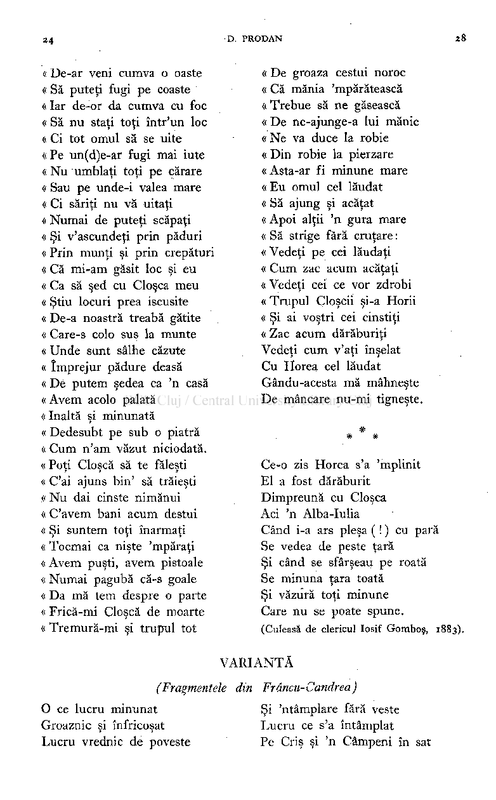

« De groaza cestui noroc « Că mania 'mpărătească « Trebue să ne găsească « De ne-ajunge-a lui manie « Ne va duce la robie « Din robie la pierzare « Asta-ar fi minune mare « Eu omul cel lăudat « Să ajung şi acăţat « Apoi alţii 'n gura mare « Să strige fără cruţare : « Vedeţi pe cei lăudaţi « Cum zac acum acăţaţi « Vedeţi cei ce vor zdrobi « Trupul Cloşcii şi-a Horii « Şi ai voştri cei cinstiţi « Zac acum dărăburiţi Vedeţi cum v'aţi înşelat Cu Horea cel lăudat Gându-acesta mă mâhneşte De mâncare nu-mi tigneşte.

De-ar veni cumva o oaste Să puteţi fugi pe coaste Iar de-or da cumva cu foc Să nu staţi toţi într'un loc Ci tot omul să se uite Pe un(d)e-ar fugi mai iute Nu umblaţi toţi pe cărare Sau pe unde-i valea mare Ci săriţi nu vă uitaţi Numai de puteţi scăpaţi Şi v'ascundeţi prin păduri Prin munţi şi prin crepături Că mi-am găsit loc şi eu Ca să şed cu Cloşca meu Ştiu locuri prea iscusite De-a noastră treabă gătite Care-s colo sus la munte Unde sunt sâlhe căzute împrejur pădure deasă Dé putem şedea ca 'n casă Avem acolo paiaţă înaltă şi minunată Dedesubt pe sub o piatră Cum n'am văzut niciodată. Poţi Cloşcă să te făleşti Cai ajuns bin' să trăieşti Nu dai cinste nimănui C'avem bani acum destui Şi suntem toţi înarmaţi Tocmai ca nişte 'mpăraţi Avem puşti, avem pistoale Numai pagubă că-s goale Da mă tem despre o parte Frică-mi Cloşcă de moarte Tremură-mi şi trupul tot

#

# #

Ce-o zis Horea s'a 'mplinit El a fost dărăburit Dimpreună cu Cloşca Aci 'n Alba-Iulia Când i-a ars pleşa (!) cu pară Se vedea de peste ţară Şi când se sfârşeau pe roată Se minuna ţara toată Şi văzură toţi minune Care nu se poate spune.

(Culeasă de clericul Iosif Gomboş, 1883).

VARIANTĂ (Fragmentele din Frâncu-Candrea)

O ce lucru minunat Şi 'ntâmplare fără veste Groaznic şi înfricoşat Lucru ce s'a întâmplat Lucru vrednic de poveste Pe Criş şi 'n Câmpeni în sat

