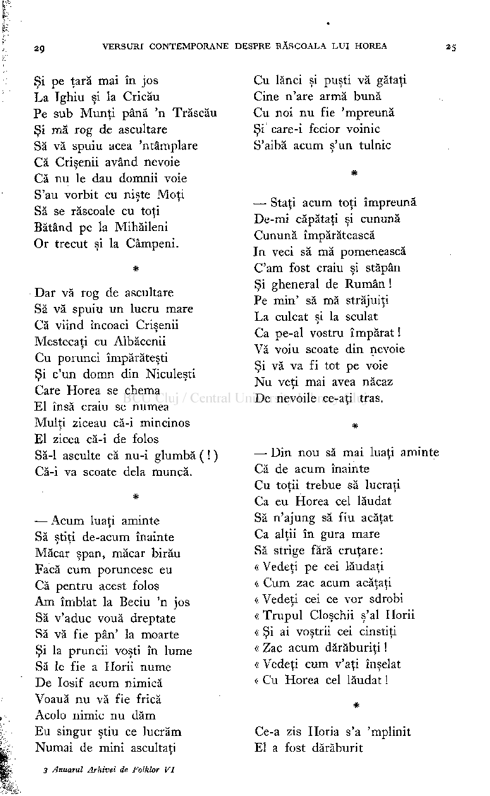

Cu lănci şi puşti vă gătaţi Cine n'are armă bună Cu noi nu fie 'mpreună Şi care-i fecior voinic S'aibă acum ş'un tulnic

Şi pe ţară mai în jos La Tghiu şi la Cricău Pe sub Munţi până 'n Trăscău Şi mă rog de ascultare Să vă spuiu acea 'ntâmplare Că Crişenii având nevoie Că nu le dau domnii voie S'au vorbit cu nişte Moţi Să se răscoale cu toţi

## *

— Staţi acum toţi împreună De-mi căpătaţi şi cunună Cunună împărătească In veci să mă pomenească Cam fost craiu şi stăpân Şi gheneral de Rumân ! Pe min' să mă străjuiţi La culcat şi la sculat Ca pe-al vostru împărat ! Vă voiu scoate din nevoie Şi vă va fi tot pe voie Nu veţi mai avea năcaz De nevoile ce-aţi tras.

- Bătând pe la Mihăileni Or trecut şi la Câmpeni.

#

Dar vă rog de ascultare Să vă spuiu un lucru mare

- Că viind încoaci Crişenii Mestecaţi cu Albăcenii Cu porunci împărăteşti Şi c'un domn din Niculeşti Care Horea se chema El însă craiu se numea Mulţi ziceau că-i mincinos El zicea că-i de folos Să-1 asculte că nu-i glumbă ( ! ) Că-i va scoate delà muncă.

#

— Din nou să mai luaţi aminte Că de acum înainte Cu toţii trebue să lucraţi Ca eu Horea cel lăudat Să n'ajung să fiu acăţat Ca alţii în gura mare Să strige fără cruţare: « Vedeţi pe cei lăudaţi « Cum zac acum acăţaţi « Vedeţi cei ce vor sdrobi « Trupul Cloşchii ş'al Horii « Şi ai voştrii cei cinstiţi « Zac acum dărăburiţi ! « Vedeţi cum v'aţi înşelat « Cu Horea cel lăudat !

#

— Acum luaţi aminte Să ştiţi de-acum înainte Măcar şpan, măcar birău Facă cum poruncesc eu Că pentru acest folos Am îmbiat la Beciu 'n jos Să v'aduc vouă dreptate Să vă fie pân' la moarte Şi la pruncii voşti în lume Să le fie a Horii nume De Iosif acum nimica Voauă nu vă fie frică Acolo nimic nu dăm Eu singur ştiu ce lucrăm Numai de mini ascultaţi

Ce-a zis Horia s'a 'mplinit El a fost dărăburit

3 Anuarul Arhivei de Folklor VI

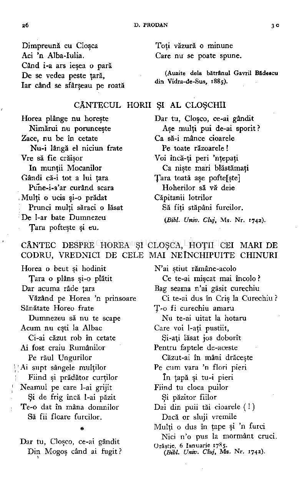

Toţi văzură o minune Care nu se poate spune.

Dimpreună cu Cloşca Aci 'n Alba-Iulia. Când i-a ars ieşea o pară De se vedea peste ţară, Iar când se sfârşeau pe roată

(Auzite delà bătrânul Gavril Bădescu din Vidra-de-Sus, 1885).

HORII ŞI A L CLOŞCHII Dar tu, Cloşco, ce-ai gândit

CÂNTECUL Horea plânge nu horeşte

Aşe mulţi pui de-ai sporit? Ca să-i mance cioarele Pe toate răzoarele ! Voi încă-ţi peri 'nţepaţi

Nimărui nu porunceşte Zace, nu be în cetate

Nu-i lângă el niciun frate Vre să fie crăişor

In munţii Mocanilor Gândi că-i tot a lui ţara

Ca nişte mari blăstămaţi Ţara toată aşe pofte [şte] Hoherilor să vă- deie Căpitanii lotrilor

Puhe-i-s'ar curând scara Mulţi o ucis şi-o prădat

Să fiţi stăpâni furcilor.

Prunci mulţi săraci o lăsat De l-ar bate Dumnezeu Ţara pofteşte şi eu.

{Bibi. Univ. Cluj, Ms. Nr. 1742).

CLOŞCA, HOŢII CEI MARI DE MAI NEÎNCHIPUITE CHINURI

CÂNTEC DESPRE HOREA ŞI CODRU, VREDNICI DE CELE

N'ai ştiut rămâne-acolo

Horea o beut şi hodinit

Ce te-ai mişcat mai încolo ? Bag seama n'ai găsit curechiu

Ţara o plâns şi-o plătit Dar acuma râde ţara

Ci te-ai dus în Criş la Curechiu ? Ţ-o fi curechiu amaru

Văzând pe Horea 'n prinsoare Sănătate Horeo frate

Dumnezeu să nu te scape Acum nu eşti la Albac

Nu te-ai uitat la hotaru Care voi l-aţi pustiit,

Şi-aţi lăsat jos doborît Pentru faptele de-aceste

Ci-ai căzut rob în cetate Ai fost craiu Rumânilor

Căzut-ai în mâni drăceşte Pe cum vara 'n flori pieri

Pe răul Ungurilor \ ' Ai supt sângele mulţilor

Fiind şi prădător curţilor Neamul pe care l-ai grijit

în ţapă şi tu-i pieri Fiind tu cloca puilor

Şi păzitor fiilor Dai din puii tăi cioarele ( ! ) Dacă or sluji vremile Mulţi o dus în ţape şi 'n furci Nici n'o pus la mormânt cruci.

Şi de frig încă l-ai păzit Te-o dat în mâna domnilor Să fii floare furcilor.

#

Dar tu, Cloşco, ce-ai gândit Din Mogoş când ai fugit ?

Orăştie, 6 Ianuarie 1785.

(Bibi. Univ. Cluj, Ms . Nr. 1742)-

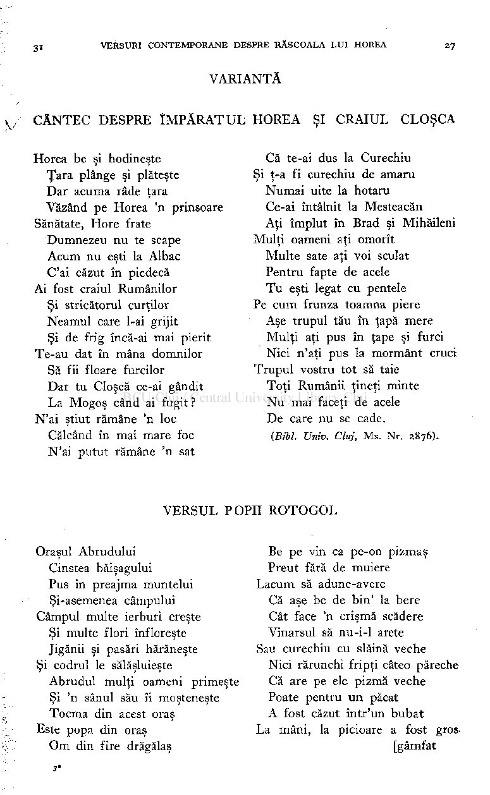

VARIANTĂ

CÂNTEC DESPRE ÎMPĂRATUL HOREA ŞI CRAIUL CLOŞCA

Că te-ai dus la Curechiu

Horea be şi hodineşte Ţara plânge şi plăteşte Dar acuma râde ţara Văzând pe Horea 'n prinsoare

Şi ţ-a fi curechiu de amaru Numai uite la hotăra Ce-ai întâlnit la Mesteacăn Aţi împlut în Brad şi Mihăileni

Sănătate, Hore frate

Mulţi oameni aţi omorît Multe sate aţi voi sculat Pentru fapte de acele Tu eşti legat cu pentele Pe cum frunza toamna piere Aşe trupul tău în ţapă mere Mulţi aţi pus în ţape şi furci Nici n'aţi pus la mormânt cruci

Dumnezeu nu te scape Acum nu eşti la Albac Cai căzut în piedecă

Ai fost craiul Rumânilor Şi stricătorul curţilor Neamul care l-ai grijit Şi de frig încă-ai mai pierit

Te-au dat în mâna domnilor Să fii floare furcilor Dar tu Cloşcă ce-ai gândit La Mogoş când ai fugit ?

Trupul vostru tot să taie Toţi Rumânii ţineţi minte Nu mai faceţi de acele De care nu se cade.

N'ai ştiut rămâne 'n loc

Călcând în mai mare foc N'ai putut rămâne 'n sat

(Bibi. Univ. Cluj, Ms. Nr. 2876).

VERSUL POPII ROTOGOL

Be pe vin ca pe-on pizmaş Preut fără de muiere

Oraşul Abrudului Cinstea băişagului Pus în preajma muntelui Şi-asemenea câmpului

Lacum să adune-avere Că aşe be de bin' la bere Cât face 'n crişmă scădere Vinarsul să nu-i-1 arete

Câmpul multe ierburi creşte Şi multe flori înfloreşte Jigănii şi pasări hărăneşte

Sau curechiu cu slăină veche Nici rărunchi fripţi câteo păreche Că are pe ele pizmă veche Poate pentru un păcat A fost căzut într'un bubat

Şi codrul le sălăşluieşte Abrudul mulţi oameni primeşte Şi 'n sânul său îi moşteneşte Tocma din acest oraş

La mâni, la picioare a fost gros [gâmfat

Este popa din oraş Om din fire drăgălaş

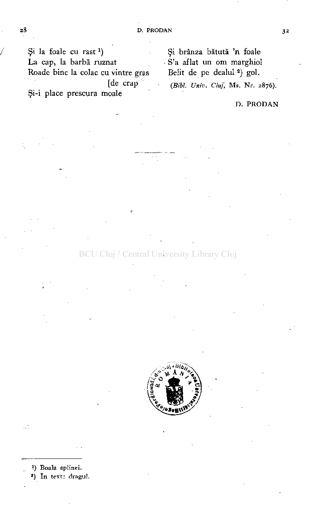

Şi la foaie cu rast

) Şi brânza bătută 'n foaie La cap, la barbă ruznat S'a aflat un om marghiol Roade bine la colac cu vintre gras Belit de pe dealul ) gol.

x

[de crap ^

i j

Bib L UniV t C

t M s Nr > 287o )

Şi-i place prescura moale

### D . PRODA N

ţ) Boala splinei.

) în text: dragul.

2

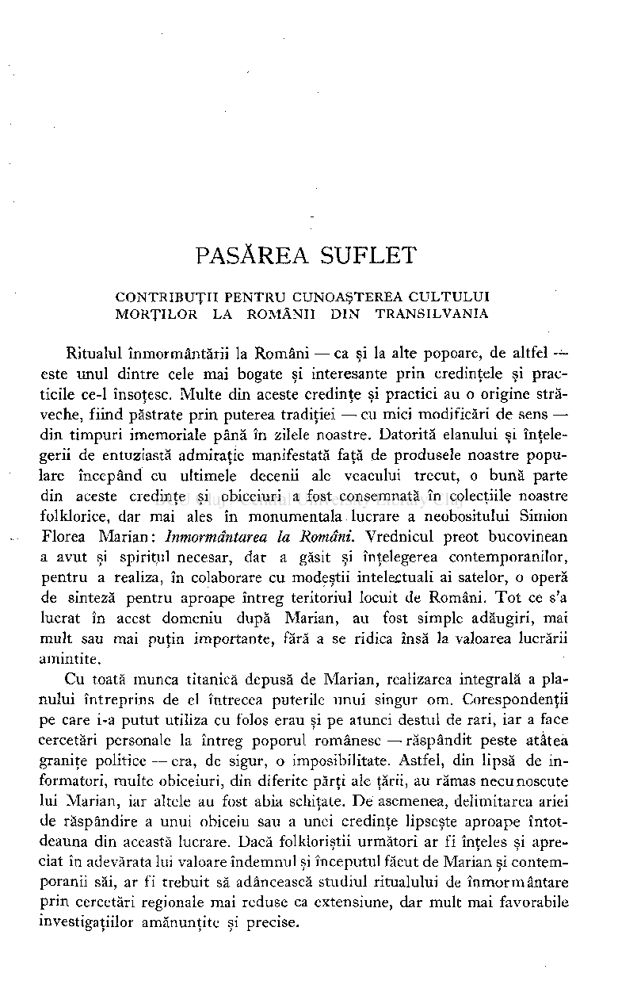

# PASĂREA SUFLET

CONTRIBUŢI I PENTR U CUNOAŞTERE A CULTULU I MORŢILO R L A ROMÂNI I DI N TRANSILVANI A

Ritualul înmormântării la Români — ca şi la alte popoare, de altfel este unul dintre cele mai bogate şi interesante prin credinţele şi practicile ce-1 însoţesc. Multe din aceste credinţe şi practici au o origine străveche, fiind păstrate prin puterea tradiţiei — cu mici modificări de sens din timpuri imemoriale până în zilele noastre. Datorită elanului şi înţelegerii de entuziastă admiraţie manifestată faţă de produsele noastre populare începând cu ultimele decenii ale veacului trecut, o bună parte din aceste credinţe şi obiceiuri a fost consemnată în colecţiile noastre folklorice, dar mai ales în monumentala lucrare a neobositului Simion Florea Marian: înmormântarea la Români. Vrednicul preot bucovinean a avut şi spiritul necesar, dar a găsit şi înţelegerea contemporanilor, pentru a realiza, în colaborare cu modeştii intelectuali ai satelor, o operă de sinteză pentru aproape întreg teritoriul locuit de Români. Tot ce s'a lucrat în acest domeniu după Marian, au fost simple adăugiri, mai mult sau mai puţin importante, fără a se ridica însă la valoarea lucrării amintite.

Cu toată munca titanică depusă de Marian, realizarea integrală a planului întreprins de el întrecea puterile unui singur om. Corespondenţii pe care i-a putut utiliza cu folos erau şi pe atunci destul de rari, iar a face cercetări personale la întreg poporul românesc —• răspândit peste atâtea graniţe politice — era, de sigur, o imposibilitate. Astfel, din lipsă de informatori, multe obiceiuri, din diferite părţi ale ţării, au rămas necunoscute lui Marian, iar altele au fost abia schiţate. De asemenea, delimitarea ariei de răspândire a unui obiceiu sau a unei credinţe lipseşte aproape întotdeauna din această lucrare. Dacă folkloriştii următori ar fi înţeles şi apreciat în adevărata lui valoare îndemnul şi începutul făcut de Marian şi contemporanii săi, ar fi trebuit să adâncească studiul ritualului de înmormântare prin cercetări regionale mai reduse ca extensiune, dar mult mai favorabile investigaţiilor amănunţite şi precise.

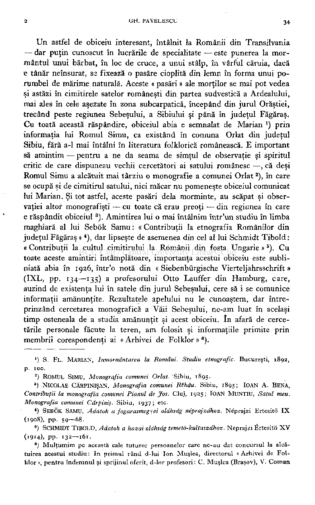

Un astfel de obiceiu interesant, întâlnit la Românii din Transilvania — dar puţin cunoscut în lucrările de specialitate — este punerea la mormântul unui bărbat, în loc de cruce, a unui stâlp, în vârful căruia, dacă e tânăr neînsurat, se fixează o pasăre cioplită din lemn în forma unui porumbel de mărime naturală. Aceste « pasări » ale morţilor se mai pot vedea şi astăzi în cimitirele satelor româneşti din partea sudvestică a Ardealului, mai ales în cele aşezate în zona subcarpatică, începând din jurul Orăştiei, trecând peste regiunea Sebeşului, a Sibiului şi până în judeţul Făgăraş. Cu toată această răspândire, obiceiul abia e semnalat de Marian *) prin informaţia lui Romul Simu, ca existând în comuna Orlat din judeţul Sibiu, fără a-1 mai întâlni în literatura folklorică românească. E important

- să amintim — pentru a ne da seama de simţul de observaţie şi spiritul critic de care dispuneau vechii cercetători ai satului românesc —, că deşi

Romul Simu a alcătuit mai târziu o monografie a comunei Orlat

2

), în care se ocupă şi de cimitirul satului, nici măcar nu pomeneşte obiceiul comunicat lui Marian. Şi tot astfel, aceste pasări delà morminte, au scăpat şi observaţiei altor monograf işti — cu toate că erau preoţi — din regiunea în care e răspândit obiceiul

3

). Amintirea lui o mai întâlnim într'un studiu în limba maghiară al lui Sebök Samu : « Contribuţii la etnografia Românilor din judeţul Făgăraş » ), dar lipseşte de asemenea din cel al lui Schmidt Tibold : « Contribuţii la cultul cimitirului la Românii din fosta Ungarie »

5

). Cu toate aceste amintiri întâmplătoare, importanţa acestui obiceiu este subliniată abia în 1926, într'o notă din « Siebenbürgische Vierteljahrsschrift » (IXL, pp. 134—135) a profesorului Otto Lauffer din Hamburg, care, auzind de existenţa lui în satele din jurul Sebeşului, cere să i se comunice informaţii amănunţite. Rezultatele apelului nu le cunoaştem, dar întreprinzând cercetarea monografică a Văii Sebeşului, ne-am luat în acelaşi timp osteneala de a studia amănunţit şi acest obiceiu. In afară de cerce­

- tările personale făcute la teren, am folosit şi informaţiile primite prin membrii corespondenţi ai « Arhivei de Folklor » ).

) S. FL. MARIAN, Inmormîntarea la Români. Studiu etnografic. Bucureşti, 1892, p. 100.

1

- 2

) ROMUL SIMU, Monografia comunei Orlat. Sibiu, 1895.

- 3

) NlCOLAE CĂRPINIŞAN, Monografia comunei Rîhău. Sibiu, 1895; IOAN A. BENA,

Contribuţii la monografia comunei Pianul de Jos. Cluj, 1925; IOAN MUNTIU, Satul meu. Monografia comunei Cărpiniş. Sibiu, 1937 ; etc.

) SEBÖK SAMU, Adatok a fogarasmegyei olăhsdg néprajzdhoz. Néprajzi Ertesitö I X

4

(1908), pp. 59—68.

) SCHMIDT TIBOLD, Adatok a hazai olâhsdg temeto-kultuszdhoz. Néprajzi Ertesitö X V

6

(1914). PP- 132—161.

### ) Mulţumim pe această cale tuturor persoanelor care ne-au dat concursul la alcătuirea acestui studiu: In primul rând d-lui Ion Muşlea, directorul «Arhivei de Folklor », pentru îndemnul şi sprijinul oferit, d-lor profesori: C. Muşlea (Braşov), V. Coman

6

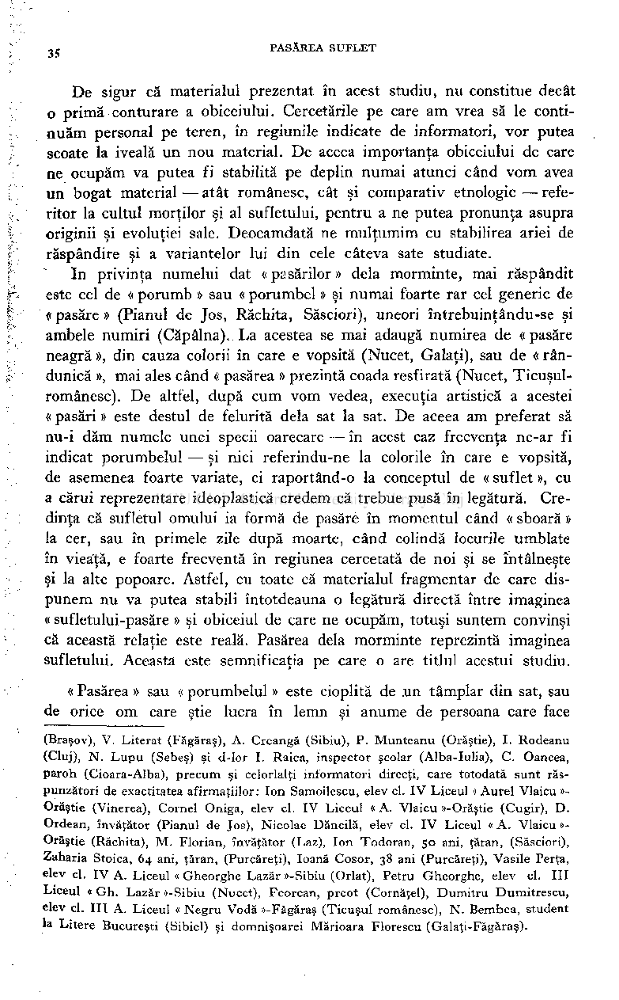

De sigur că materialul prezentat în acest studiu, nu constitue decât

- o primă conturare a obiceiului. Cercetările pe care am vrea să le continuăm personal pe teren, în regiunile indicate de informatori, vor putea scoate la iveală un nou material. De aceea importanţa obiceiului de care ne ocupăm va putea fi stabilită pe deplin numai atunci când vom avea un bogat material — atât românesc, cât şi comparativ etnologic — referitor la cultul morţilor şi al sufletului, pentru a ne putea pronunţa asupra
- originii şi evoluţiei sale. Deocamdată ne mulţumim cu stabilirea ariei de

- răspândire şi a variantelor lui din cele câteva sate studiate. In privinţa numelui dat «pasărilor» delà morminte, mai răspândit

este cel de « porumb » sau « porumbel » şi numai foarte rar cel generic de « pasăre » (Pianul de Jos, Răchita, Săsciori), uneori întrebuinţându-se şi ambele numiri (Căpâlna). La acestea se mai adaugă numirea de «pasăre neagră », din cauza colorii în care e vopsită (Nucet, Galaţi), sau de « rândunică », mai ales când « pasărea » prezintă coada resfirată (Nucet, Ticuşulromânesc). De altfel, după cum vom vedea, execuţia artistică a acestei « pasări » este destul de felurită delà sat la sat. De aceea am preferat să nu-i dăm numele unei specii oarecare — în acest caz frecvenţa ne-ar fi indicat porumbelul — şi nici referindu-ne la colorile în care e vopsită, de asemenea foarte variate, ci raportând-o la conceptul de « suflet », cu a cărui reprezentare ideoplastică credem că trebue pusă în legătură. Credinţa că sufletul omului ia formă de pasăre în momentul când « sboară » la cer, sau în primele zile după moarte, când colindă locurile umblate în vieaţă, e foarte frecventă în regiunea cercetată de noi şi se întâlneşte şi la alte popoare. Astfel, cu toate că materialul fragmentar de care dispunem nu va putea stabili întotdeauna o legătură directă între imaginea « sufletului-pasăre » şi obiceiul de care ne ocupăm, totuşi suntem convinşi că această relaţie este reală. Pasărea delà morminte reprezintă imaginea sufletului. Aceasta este semnificaţia pe care o are titlul acestui studiu.

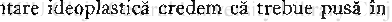

« Pasărea » sau « porumbelul » este cioplită de .un tâmplar din sat, sau de orice om care ştie lucra în lemn şi anume de persoana care face

(Braşov), V. Literat (Făgăraş), A. Creangă (Sibiu), P. Munteanu (Orăştie), I. Rodeanu (Cluj), N. Lupu (Sebeş) şi d-lor I. Raica, inspector şcolar (Alba-Iulia), C. Oancea, paroh (Cioara-Alba), precum şi celorlalţi informatori direcţi, care totodată sunt răspunzători de exactitatea afirmaţiilor: Ion Samoilescu, elev cl. IV Liceul « Aurel Vlaicu »Orăştie (Vinerea), Cornel Oniga, elev cl. IV Liceul « A. Vlaicu »-Orästie (Cugir), D. Ordean, învăţător (Pianul de Jos), Nicolae Dăncilă, elev cl. IV Liceul « A . Vlaicu »Orăştie (Răchita), M . Florian, învăţător (Laz), Ion Todoran, 50 ani, ţăran, (Săsciori), Zaharia Stoica, 64 ani, ţăran, (Purcăreţi), Ioană Cosor, 38 ani (Purcăreţi), Vasile Perţa, elev cl. IV A. Liceul « Gheorghe Lazăr «-Sibiu (Orlat), Petru Gheorghe, elev cl. III Liceul « Gh. Lazăr «-Sibiu (Nucet), Feorcan, preot (Cornăţel), Dumitru Dumitrescu, elev cl. III A. Liceul « Negru Vodă »-Făgăraş (Ticuşul românesc), N. Bembea, student la Litere Bucureşti (Sibiel) şi domnişoarei Mărioara Florescu (Galaţi-Făgăraş).

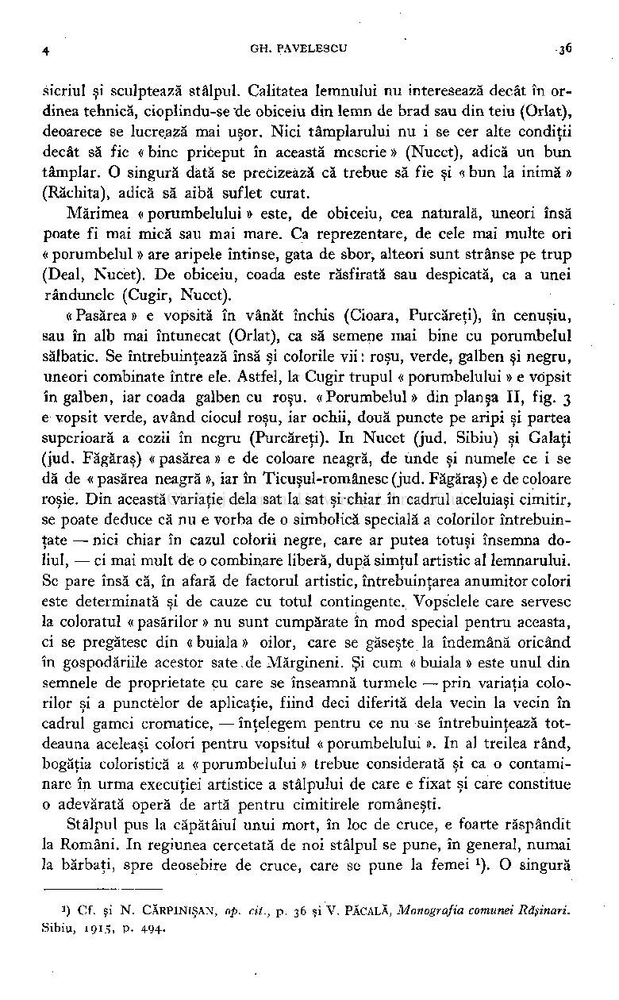

sicriul şi sculptează stâlpul. Calitatea lemnului nu interesează decât în ordinea tehnică, cioplindu-se "de obiceiu din lemn de brad sau din teiu (Orlat), deoarece se lucrează mai uşor. Nici tâmplarului nu i se cer alte condiţii decât să fie « bine priceput în această meserie » (Nucet), adică un bun tâmplar. O singură dată se precizează că trebue să fie şi « bun la inimă » (Răchita), adică să aibă suflet curat.

Mărimea « porumbelului » este, de obiceiu, cea naturală, uneori însă poate fi mai mică sau mai mare. Ca reprezentare, de cele mai multe ori « porumbelul » are aripele întinse, gata de sbor, alteori sunt strânse pe trup (Deal, Nucet). De obiceiu, coada este răsfirată sau despicată, ca a unei rândunele (Cugir, Nucet).

« Pasărea » e vopsită în vânăt închis (Cioara, Purcăreţi), în cenuşiu, sau în alb mai întunecat (Orlat), ca să semene mai bine cu porumbelul

- sălbatic. Se întrebuinţează însă şi colorile vii: roşu, verde, galben şi negru, uneori combinate între ele. Astfel, la Cugir trupul « porumbelului » e vopsit în galben, iar coada galben cu roşu. «Porumbelul» din planşa II, fig. 3 e vopsit verde, având ciocul roşu, iar ochii, două puncte pe aripi şi partea superioară a cozii în negru (Purcăreţi). In Nucet (jud. Sibiu) şi Galaţi (jud. Făgăraş) « pasărea » e de coloare neagră, de unde şi numele ce i se dă de « pasărea neagră », iar în Ticuşul-românesc (jud. Făgăraş) e de coloare roşie. Din această variaţie delà sat la sat şi chiar în cadrul aceluiaşi cimitir, se poate deduce că nu e vorba de o simbolică specială a colorilor întrebuinţate — nici chiar în cazul colorii negre, care ar putea totuşi însemna doliul, — ci mai mult de o combinare liberă, după simţul artistic al lemnarului. Se pare însă că, în afară de factorul artistic, întrebuinţarea anumitor colori este determinată şi de cauze cu totul contingente. Vopselele care servesc la coloratul « pasărilor » nu sunt cumpărate în mod special pentru aceasta, ci se pregătesc din « buiala » oilor, care se găseşte la îndemână oricând în gospodăriile acestor sate.de Mărgineni. Şi cum «buiala» este unul din semnele de proprietate cu care se înseamnă turmele — prin variaţia colorilor şi a punctelor de aplicaţie, fiind deci diferită delà vecin la vecin în cadrul gamei cromatice, — înţelegem pentru ce nu se întrebuinţează totdeauna aceleaşi colori pentru vopsitul « porumbelului ». In al treilea rând, bogăţia coloristică a « porumbelului » trebue considerată şi ca o contaminare în urma execuţiei artistice a stâlpului de care e fixat şi care constitue o adevărată operă de artă pentru cimitirele româneşti.

Stâlpul pus la căpătâiul unui mort, în loc de cruce, e foarte răspândit la Români. In regiunea cercetată de noi stâlpul se pune, în general, numai la bărbaţi, spre deosebire de cruce, care se pune la femei ). O singură

!) Cf. şi N. CĂRPINIŞAN, op. cit., p. 36 şi V. PĂCALĂ, Monografia comunei Răşinari.

Sibiu, 1915, p. 494.

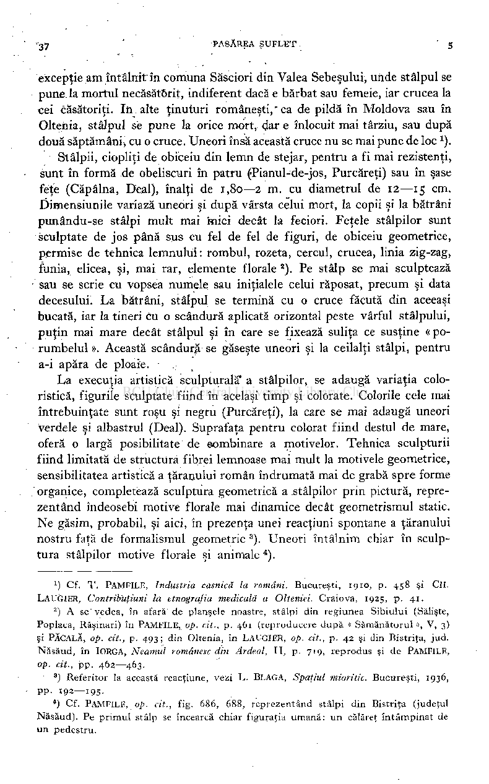

excepţie am întâlnit în coiîiuna Săsciori din Valea Sebeşului, unde stâlpul se pune la mortul necăsătorit, indiferent dacă e bărbat sau femeie, iar crucea la cei căsătoriţi. In alte ţinuturi româneşti," ca de pildă în Moldova sau în Oltenia, stâlpul se pune la orice mort, dar e înlocuit mai târziu, sau după două săptămâni, cu o cruce. Uneori însă această cruce nu se mai pune de loc ).

Stâlpii, ciopliţi de obiceiu din lemn de stejar, pentru a fi mai rezistenţi, sunt în formă de obeliscuri în patru (Pianul-de-jos, Purcăreţi) sau în şase feţe (Căpâlna, Deal), înalţi de 1,80—2 m. cu diametrul de 12—15 cm. Dimensiunile variază uneori şi după vârsta celui mort, la copii şi la bătrâni punându-se stâlpi mult mai mici decât la feciori. Feţele stâlpilor sunt sculptate de jos până sus cu fel de fel de figuri, de obiceiu geometrice, permise de tehnica lemnului: rombul, rozeta, cercul, crucea, linia zig-zag, funia, elicea, şi, mai rar, elemente florale ). Pe stâlp se mai sculptează sau se scrie cu vopsea numele sau iniţialele celui răposat, precum şi data decesului. La bătrâni, stâlpul se termină cu o cruce făcută din aceeaşi bucată, iar la tineri cu o scândură aplicată orizontal peste vârful stâlpului, puţin mai mare decât stâlpul şi în care se fixează suliţa ce susţine « porumbelul ». Această scândură se găseşte uneori şi la ceilalţi stâlpi, pentru a-i apăra de ploaie.

La execuţia artistică sculpturală* a stâlpilor, se adaugă variaţia coloristică, figurile sculptate fiind în acelaşi timp şi colorate. Colorile cele mai întrebuinţate sunt roşu şi negru (Purcăreţi), la care se mai adaugă uneori verdele şi albastrul (Deal). Suprafaţa pentru colorat fiind destul de mare, oferă o largă posibilitate de ©ombinare a motivelor. Tehnica sculpturii fiind limitată de structura fibrei lemnoase mai mult la motivele geometrice, sensibilitatea artistică a ţăranului român îndrumată mai de grabă spre forme organice, completează sculptura geometrică a stâlpilor prin pictură, reprezentând îndeosebi motive florale mai dinamice decât geometrismul static. Ne găsim, probabil, şi aici, în prezenţa unei reacţiuni spontane a ţăranului nostru faţă de formalismul geometric

). Uneori întâlnim chiar în sculptura stâlpilor motive florale şi animale ).

3

') Cf. T . PAMFILE, Industria casnică la români. Bucureşti, 1910, p. 458 şi CH. LAUGIER, Contrib'uţiuni la etnografia medicală a Olteniei. Craiova, 1925, p. 41.

) A se" vedea, în afară de planşele noastre, stâlpi din regiunea Sibiului (Sălişte, Poplaca, Răşinari) în PAMFILE, op. cit., p. 461 (reproducere după « Sămănătorul », V, 3) şi PĂCALĂ, op. cit., p. 493; din Oltenia, în LAUGIER, op. cit., p. 42 şi din Bistriţa, jud. Năsăud, în IORGA, Neamul românesc din Ardeal, II , p. 719, reprodus şi de PAMFILE, op. cit., pp. 462—463.

2

) Referitor la această reacţiune, vezi L . BLAGA, Spaţiul mioritic. Bucureşti, 1936, pp. 192—195.

3

*) Cf. PAMFILE, op. cit., fig. 686, 688, reprezentând stâlpi din Bistriţa (judeţul Năsăud). Pe primul stâlp se încearcă chiar figuraţia umană: un călăreţ întâmpinat de un pedestru.

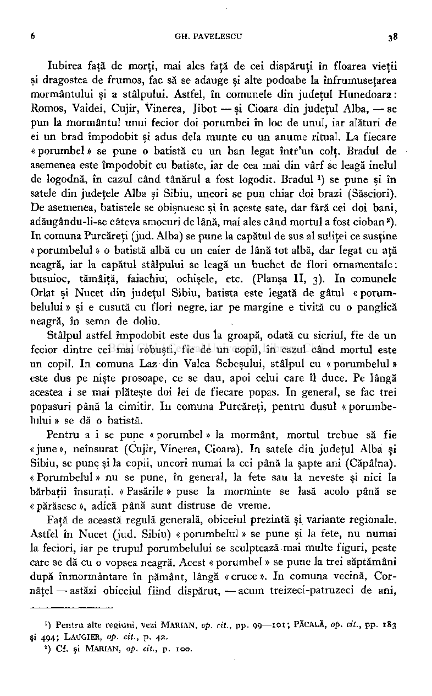

Iubirea faţă de morţi, mai ales faţă de cei dispăruţi în floarea vieţii şi dragostea de frumos, fac să se adauge şi alte podoabe la înfrumuseţarea mormântului şi a stâlpului. Astfel, în comunele din judeţul Hunedoara : Romos, Vaidei, Cujir, Vinerea, Jibot — şi Cioara din judeţul Alba, — se pun la mormântul unui fecior doi porumbei în loc de unul, iar alături de ei un brad împodobit şi adus delà munte cu un anume ritual. La fiecare « porumbel » se pune o batistă cu un ban legat într'un colţ. Bradul de asemenea este împodobit cu batiste, iar de cea mai din vârf se leagă inelul de logodnă, în cazul.când tânărul a fost logodit. Bradul*) se pune şi în satele din judeţele Alba şi Sibiu, uneori se pun chiar doi brazi (Săsciori). De asemenea, batistele se obişnuesc şi în aceste sate, dar fără cei doi bani, adăugându-li-se câteva smocuri de lână, mai ales când mortul a fost cioban

). In comuna Purcăreţi (jud. Alba) se pune la capătul de sus al suliţei ce susţine « porumbelul » o batistă albă cu un caier de lână tot albă, dar legat cu aţă neagră, iar la capătul stâlpului se leagă un buchet de flori ornamentale: busuioc, tămâiţă, faiachiu, ochişele, etc. (Planşa II, 3). In comunele Orlat şi Nucet din judeţul Sibiu, batista este legată de gâtul « porumbelului » şi e cusută cu flori negre, iar pe margine e tivită cu o panglică neagră, în semn de doliu.

2

Stâlpul astfel împodobit este dus îa groapă, odată cu sicriul, fie de un fecior dintre cei mai robuşti, fie de un copil, în cazul când mortul este un copil. In comuna Laz din Valea Sebeşului, stâlpul cu «porumbelul» este dus pe nişte prosoape, ce se dau, apoi celui care îl duce. Pe lângă acestea i se mai plăteşte doi lei de fiecare popas. In general, se fac trei popasuri până la cimitir. In comuna Purcăreţi, pentru dusul « porumbelului » se dă o batistă.

Pentru a i se pune « porumbel » la mormânt, mortul trebue să fie «june», neînsurat (Cujir, Vinerea, Cioara). In satele din judeţul Alba şi Sibiu, se pune şi la copii, uneori numai la cei până la şapte ani (Căpâlna). « Porumbelul » nu se pune, în general, la fete sau la neveste şi nici la bărbaţii însuraţi. « Pasările » puse la morminte se lasă acolo până se «părăsesc», adică până sunt distruse de vreme.

Faţă de această regulă generală, obiceiul prezintă şi variante regionale. Astfel în Nucet (jud. Sibiu) « porumbelul » se pune şi la fete, nu numai la feciori, iar pe trupul porumbelului se sculptează mai multe figuri, peste care se dă cu o vopsea neagră. Acest « porumbel » se pune la trei săptămâni după înmormântare în pământ, lângă « cruce ». In comuna vecină, Cornăţel — astăzi obiceiul fiind dispărut, — acum treizeci-patruzeci de ani,

) Pentru alte regiuni, vezi MARIAN, op. cit., pp. 99—101; PĂCALĂ, op. cit., pp. 183

J

şi 494; LAUGIER, op. cit., p. 42.

) Cf. şi MARIAN , op. cit., p. 100.

2

