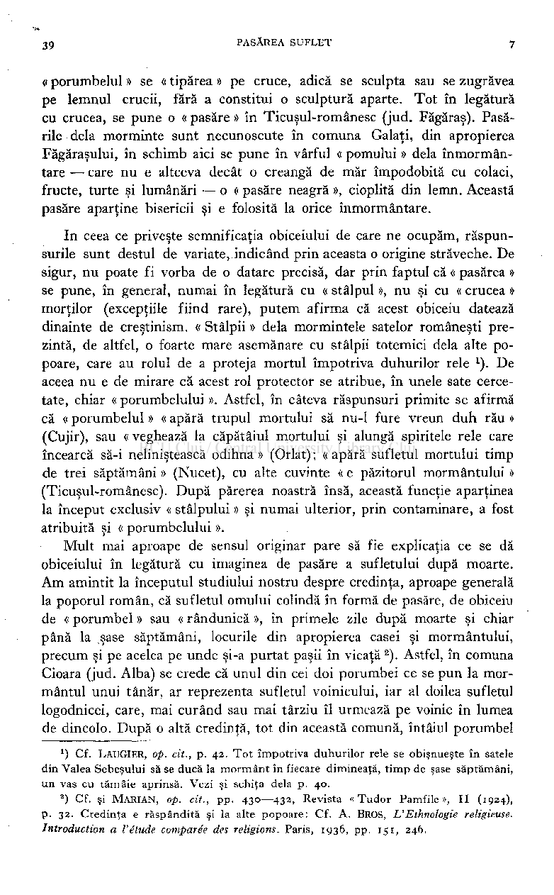

« porumbelul » se « tipărea » pe cruce, adică se sculpta sau se zugrăvea pe lemnul crucii, fără a constitui o sculptură aparte. Tot în legătură cu crucea, se pune o « pasăre » în Ticuşul-românesc (jud. Făgăraş). Pasările delà morminte sunt necunoscute în comuna Galaţi, din apropierea Făgăraşului, în schimb aici se pune în vârful « pomului » delà înmormântare — care nu e altceva decât o creangă de măr împodobită cu colaci, fructe, turte şi lumânări — o « pasăre neagră », cioplită din lemn. Această pasăre aparţine bisericii şi e folosită la orice înmormântare.

In ceea ce priveşte semnificaţia obiceiului de care ne ocupăm, răspunsurile sunt destul de variate, indicând prin aceasta o origine străveche. De sigur, nu poate fi vorba de o datare precisă, dar prin faptul că « pasărea » se pune, în general, numai în legătură cu « stâlpul », nu şi cu « crucea » morţilor (excepţiile fiind rare), putem afirma că acest obiceiu datează dinainte de creştinism. « Stâlpii » delà mormintele satelor româneşti prezintă, de altfel, o foarte mare asemănare cu stâlpii totemici delà alte popoare, care au rolul de a proteja mortul împotriva duhurilor rele ). De aceea nu e de mirare că acest rol protector se atribue, în unele sate cercetate, chiar « porumbelului ». Astfel, în câteva răspunsuri primite se afirmă că « porumbelul » « apără trupul mortului să nu-1 fure vreun duh rău » (Cujir), sau « veghează la căpătâiul mortului şi alungă spiritele rele care încearcă să-i neliniştească odihna » (Orlat) ; « apără sufletul mortului timp de trei săptămâni » (Nucet), cu alte cuvinte « e păzitorul mormântului » (Ticuşul-românesc). După părerea noastră însă, această funcţie aparţinea la început exclusiv « stâlpului » şi numai ulterior, prin contaminare, a fost atribuită şi « porumbelului ».

Mult mai aproape de sensul originar pare să fie explicaţia ce se dă obiceiului în legătură cu imaginea de pasăre a sufletului după moarte. Am amintit la începutul studiului nostru despre credinţa, aproape generală la poporul român, că sufletul omului colindă în formă de pasăre, de obiceiu de « porumbel » sau « rândunică », în primele zile după moarte şi chiar până la şase săptămâni, locurile din apropierea casei şi mormântului, precum şi pe acelea pe unde şi-a purtat paşii în vieaţă

). Astfel, în comuna Cioara (jud. Alba) se crede că unul din cei doi porumbei ce se pun la mormântul unui tânăr, ar reprezenta sufletul voinicului, iar al doilea sufletul logodnicei, care, mai curând sau mai târziu îl urmează pe voinic în lumea de dincolo. După o altă credinţă, tot din această comună, întâiul porumbel

2

) Cf. LAUGIER, op. cit., p. 42. Tot împotriva duhurilor rele se obişnueşte în satele din Valea Sebeşului să se ducă la mormânt în fiecare dimineaţă, timp de şase săptămâni, un vas cu tămâie aprinsă. Vezi şi schiţa delà p. 40.

1

) Cf. şi MARIAN, op. cit., pp. 430—432, Revista « Tudor Pamfile », II (1924), p. 32. Credinţa e răspândită şi la alte popoare: Cf. A. BROS, L'Ethnologie religieuse. Introduction a l'étude comparée des religions. Paris, 1936, pp. 151, 246.

2

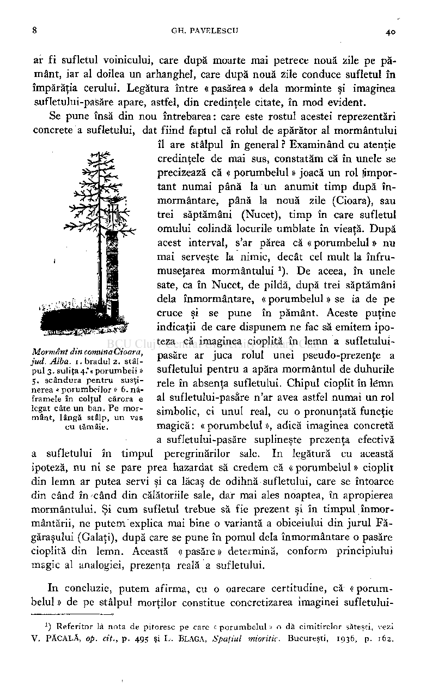

ar fi sufletul voinicului, care după moarte mai petrece nouă zile pe pământ, iar al doilea un arhanghel, care după nouă zile conduce sufletul în împărăţia cerului. Legătura între « pasărea » delà morminte şi imaginea sufletului-pasăre apare, astfel, din credinţele citate, în mod evident.

Se pune însă din nou întrebarea: care este rostul acestei reprezentări

concrete a sufletului, dat fiind faptul că rolul de apărător al mormântului îl are stâlpul în general ? Examinând cu atenţie credinţele de mai sus, constatăm că în unele se precizează că « porumbelul » joacă un rol [important numai până la un anumit timp după înmormântare, până la nouă zile (Cioara), sau trei săptămâni (Nucet), timp în care sufletul omului colindă locurile umblate în vieaţă. După acest interval, s'ar părea că « porumbelul » nu mai serveşte la nimic, decât cel mult la înfrumuseţarea mormântului

). De aceea, în unele

x

sate, ca în Nucet, de pildă, după trei săptămâni delà înmormântare, « porumbelul » se ia de pe

J^^^^H^&I L cruce şi se pune în pământ. Aceste puţine

mHIUBPISSw indicaţii de care dispunem ne fac să emitem ipoteza că imaginea cioplită în lemn a sufletuluipasăre ar juca rolul unei pseudo-prezenţe a sufletului pentru a apăra mormântul de duhurile rele în absenţa sufletului. Chipul cioplit în lemn al sufletului-pasăre n'ar avea astfel numai un rol simbolic, ci unul real, cu o pronunţată funcţie magică : « porumbelul », adică imaginea concretă a sufletului-pasăre suplineşte prezenţa efectivă

Mormânt din corminaCioara,

jud. Alba. 1. bradul 2. stâlpul 3. suliţa 4."« porumbeii » 5. scândura pentru susţinerea « porumbeilor » 6. năframele în colţul cărora e legat câte un ban. Pe mormânt, lângă stâlp, un vas cu tămâie.

a sufletului în timpul peregrinărilor sale. In legătură cu această ipoteză, nu ni se pare prea hazardat să credem că « porumbelul » cioplit din lemn ar putea servi şi ca lăcaş de odihnă sufletului, care se întoarce din când în-când din călătoriile sale, dar mai ales noaptea, în apropierea mormântului. Şi cum sufletul trebue să fie prezent şi în timpul înmormântării, ne putem explica mai bine o variantă a obiceiului din jurul Făgăraşului (Galaţi), după care se pune în pomul delà înmormântare o pasăre cioplită din lemn. Această « pasăre » determină, conform principiului magic al analogiei, prezenţa reală a sufletului.

In concluzie, putem afirma, cu o oarecare certitudine, că « porumbelul » de pe stâlpul morţilor constitue concretizarea imaginei sufletului-

) Referitor là nota de pitoresc pe care « porumbelul » o dă cimitirelor săteşti, vezi V. PĂCALĂ, op. cit., p. 495 şi L. BLAGA, Spaţiul mioritic. Bucureşti, 1936, p. 162.

J

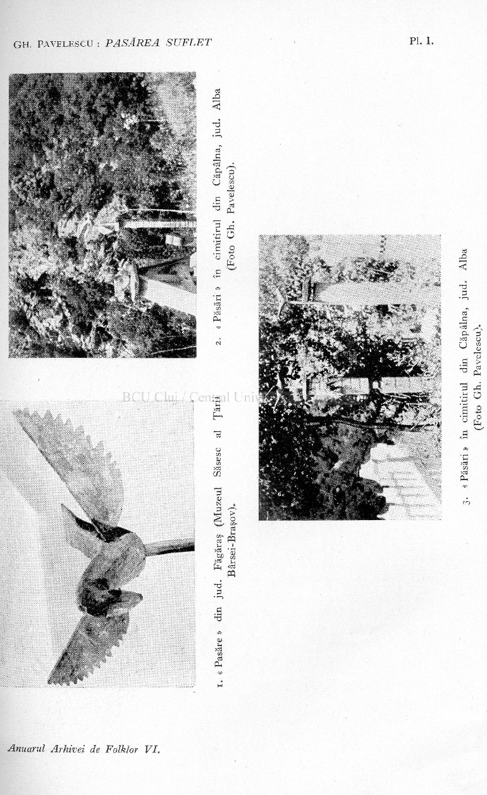

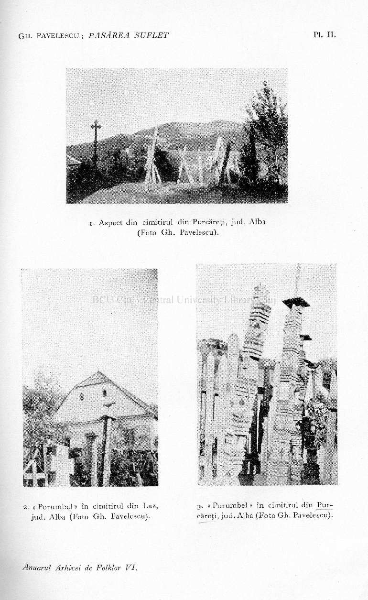

i. Aspect din cimitirul din Purcăreţi, jud. Albi (Foto Gh. Pavelescu).

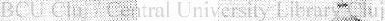

2. «Porumbel» în cimitirul din Laz, 3. «Porumbel» în cimitirul din Purjud. Alba (Foto Gh. Pavelescu). careţi, jud. Alba (Foto Gh. Pavelescu).

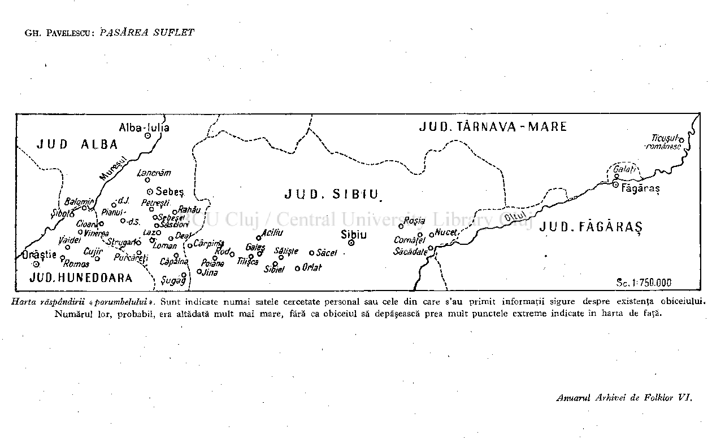

### JUD. TÂRNAVA -MARE

Alba-lulia o

Ticuşuh

JU D ALBA

0

-românesc.

'Galaţi\

Lencrămo I

Făgăraş

1

©Sebeş { JUD . SIBI U

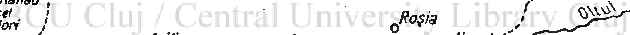

### JUD . FÀGÂRAS

Nucet.'' Cornăţel

o

Q Vinerea LazO

###### ng

y'

Sibiu o

0

n

a

Sàcàdate°Ji

° 7?/ < jh>J5*

î

i^râştie

s

m osàce i

p

J %»os \ C&ţ *&. ^ JUD.HUNEDOARA \ ^J ] ^

Sc. 1=750.000

Harta răspândirii « porumbelului ». Sunt indicate numai satele cercetate personal sau cele din care s'au primit informaţii sigure despre existenţa obiceiului. Numărul lor, probabil, era altădată mult mai mare, fără ca obiceiul să depăşească prea mult punctele extreme indicate în harta de faţă.

Anuarul Arhivei de Folklor VI.

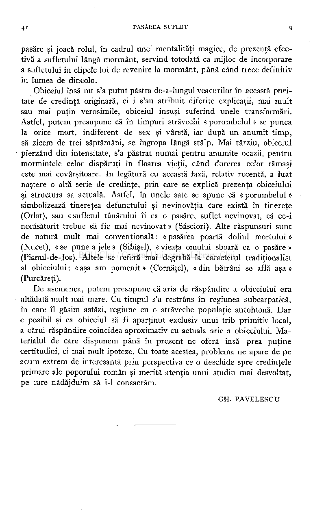

pasăre şi joacă rolul, în cadrul unei mentalităţi magice, de prezenţă efectivă a sufletului lângă mormânt, servind totodată ca mijloc de încorporare a sufletului în clipele lui de revenire la mormânt, până când trece definitiv în lumea de dincolo.

Obiceiul însă nu s'a putut păstra de-a-lungul veacurilor în această puritate de credinţă originară, ci i s'au atribuit diferite explicaţii, mai mult sau mai puţin verosimile, obiceiul însuşi suferind unele transformări. Astfel, putem presupune că în timpuri străvechi « porumbelul » se punea la orice mort, indiferent de sex şi vârstă, iar după un anumit timp, să zicem de trei săptămâni, se îngropa lângă stâlp. Mai târziu, obiceiul pierzând din intensitate, s'a păstrat numai pentru anumite ocazii, pentru mormintele celor dispăruţi în floarea vieţii, când durerea celor rămaşi este mai covârşitoare. In legătură cu această fază, relativ recentă, a luat naştere o altă serie de credinţe, prin care se explică prezenţa obiceiului şi structura sa actuală. Astfel, în unele sate se spune că « porumbelul » simbolizează tinereţea defunctului şi nevinovăţia care există în tinereţe (Orlat), sau « sufletul tânărului îi ca o pasăre, suflet nevinovat, că ce-i necăsătorit trebue să fie mai nevinovat » (Săsciori). Alte răspunsuri sunt de natură mult mai convenţională : « pasărea poartă doliul mortului » (Nucet), « se pune a jele » (Sibişel), « vieaţa omului sboară ca o pasăre » (Pianul-de-Jos). Altele se referă mai degrabă la caracterul tradiţionalist al obiceiului : « aşa am pomenit » (Cornăţel), « din bătrâni se află aşa » (Purcăreţi).

De asemenea, putem presupune că aria de răspândire a obiceiului era altădată mult mai mare. Cu timpul s'a restrâns în regiunea subcarpatică, în care îl găsim astăzi, regiune cu o străveche populaţie autohtonă. Dar e posibil şi ca obiceiul să fi aparţinut exclusiv unui trib primitiv local, a cărui răspândire coincidea aproximativ cu actuala arie a obiceiului. Materialul de care dispunem până în prezent ne oferă însă prea puţine certitudini, ci mai mult ipoteze. Cu toate acestea, problema ne apare de pe acum extrem de interesantă prin perspectiva ce o deschide spre credinţele primare ale poporului român şi merită atenţia unui studiu mai desvoltat, pe care nădăjduim să i-1 consacram.

GH . PAVELESC U

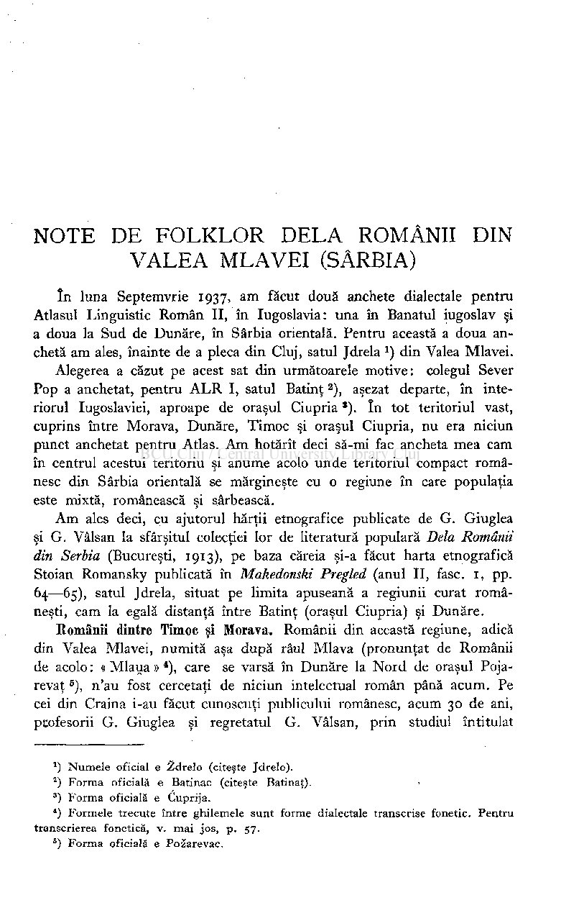

# NOTE DE FOLKLOR DELA ROMÂNII DIN VALEA MLAVEI (SÂRBIA)

în luna Septemvrie 1937, am făcut două anchete dialectale pentru Atlasul Linguistic Român II, în Iugoslavia: una în Banatul iugoslav şi a doua la Sud de Dunăre, în Sârbia orientală. Pentru această a doua anchetă am ales, înainte de a pleca din Cluj, satul Jdrela ) din Valea Mlavei.

Alegerea a căzut pe acest sat din următoarele motive: colegul Sever Pop a anchetat, pentru ALR I, satul Batinţ ), aşezat departe, în interiorul Iugoslaviei, aproape de oraşul Ciupria

). în tot teritoriul vast, cuprins între Morava, Dunăre, Timoc şi oraşul Ciupria, nu era niciun punct anchetat pentru Atlas. Am hotărît deci să-mi fac ancheta mea cam în centrul acestui teritoriu şi anume acolo unde teritoriul compact românesc din Sârbia orientală se mărgineşte cu o regiune în care populaţia este mixtă, românească şi sârbească.

8

Am ales deci, cu ajutorul hărţii etnografice publicate de G. Giuglea şi G. Vâlsan Ia sfârşitul colecţiei lor de literatură populară Delà Românii din Serbia (Bucureşti, 1913), pe baza căreia şi-a făcut harta etnografică Stoian Romansky publicată în Makedonski Pregled (anul II, fasc. 1, pp. 64—65), satul Jdrela, situat pe limita apuseană a regiunii curat româneşti, cam la egală distanţă între Batinţ (oraşul Ciupria) şi Dunăre.

Românii dintre Timoc şi Morava. Românii din această regiune, adică din Valea Mlavei, numită aşa după râul Mlava (pronunţat de Românii de acolo : « Miaua » ), care se varsă în Dunăre la Nord de oraşul Pojarevaţ

), n'au fost cercetaţi de niciun intelectual român până acum. Pe cei din Craina i-au făcut cunoscuţi publicului românesc, acum 30 de ani, profesorii G. Giuglea şi regretatul G. Vâlsan, prin studiul întitulat

B

') Numele oficial e 2drelo (citeşte Jdrelo).

- 2

) Forma oficială e Batinac (citeşte Batinaţ).

- 3

) Forma oficială e (Üuprija.

- 4

) Formele trecute între ghilemele sunt forme dialectale transcrise fonetic. Pentru transcrierea fonetică, v. mai jos, p. 57.

) Forma oficială e Pozarevac.

5

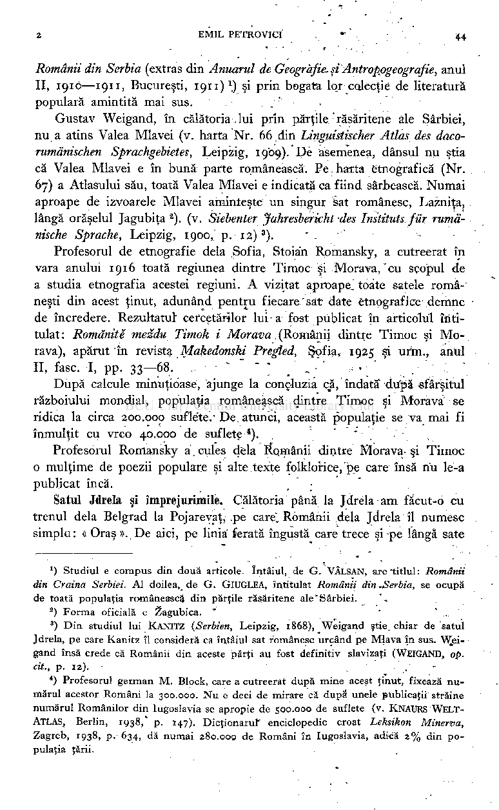

Românii din Serbia (extras din Anuarul de Geografie, şi Antropogeografie, anul II, 1910—1911, Bucureşti, 1911) ,) şi prin bogata lor colecţie de literatură populară amintită mai sus.

Gustav Weigand, în călătoria. lui prin părţile răsăritene âle Sârbiei, nu a atins Valea Mlavei (v. harta Nr. 66 .din Linguistischer Atlas des dacorumänischen Sprachgebietes, Leipzig, 1909). Dè asemenea, dânsul nu ştia că Valea Mlavei e în bună parte românească. Pe. harta etnografică (Nr. .

67) a Atlasului său, toată Valea Mlavei e indicată ca fiind sârbească. Numai aproape de izvoarele Mlavei aminteşte un singur sat românesc, Lazniţa, lângă orăşelul Jagubiţa

). (v. Siebenter Jahresbericht des Instituts für rumänische Sprache, Leipzig, 1900, p. 12)

2

).

3

Profesorul de etnografie delà ;Sofia, Stoia'n Romansky, a cutreerat în vara anului 1916 toată regiunea dintre Timoc şi Morava, "cu scopul de a studia etnografia acestei regiuni. A vizitat aproape, toate satele româneşti din acest ţinut, adunând pentru fiecare "sat date etnografice demne de încredere. Rezultatul cercetărilor lui-a fost publicat în articolul întitulat : Românite mezdu Timok i Morava. (Românii dintre Timoc şi Morava), apărut în revista Makedonski Pregled, Sofia, 1925 şi urm., anul ii, fasc. i, pp. 33—68. " ; _ ' - '

După calcule minuţioase, ajunge la concluzia că, îndată după sfârşitul războiului mondial, populaţia românească dintre Timoc şi Morava se ridica la circa 200.000 sufle'te. De. atunci, această populaţie se va mai fi înmulţit cu vreo 40.000 de suflete ). '

Profesorul Romansky a.cules delà Şamanii dintre Morava-şi Timoc o mulţime de poezii populare şi alte texte folklorice,"pe care însă nu le-a publicat încă. _

Satul Jdrela şi împrejurimile. Călătoria până la Jdrela am făeut-o cu trenul delà Belgrad la Pojareyaţ, .pe carel Românii delà Jdrela îl numesc simplu: « Oraş ». De aici, pe linia ferată îngustă care trece şi-pe lângă sate

*) Studiul e compus din două articole. întâiul, de G . VÂLSAN, are titlul : Românii din Craina Serbiei. Al doilea, de G . GIUGLEA, întitulat Românii din JSerbia, se ocupă de toată populaţia românească din părţile răsăritene ale'Sârbiei.

- 2

) Forma oficială e 2agubica. ' '

- 3

) Din studiul lui KANITZ {Serbien, Leipzig, 1868), Weigand ştie. chiar de satul Jdrela, pe care Kanitz îl consideră ca întâiul sat românesc urcând pe Mlava în sus. W„eigand însă crede că Românii din aceste părţi au fost definitiv slavizaţi (WEIGAND, oprit., p. 12). •

) Profesorul german M. Block, care a cutreerat după mine acest ţinut, fixează numărul acestor Români la 300.000. N u e deci de mirare că după unele publicaţii străine numărul Românilor din Iugoslavia se apropie de 500.000 de suflete (v. KNAURS WELT ATLAS, Berlin, 1938,* p. 147). Dicţionaruf enciclopedic croat Leksikon Minerva, Zagreb, 1938, p. 634, dă numai 280.000 de Români în Iugoslavia, adică 2 % din populaţia ţării.

4

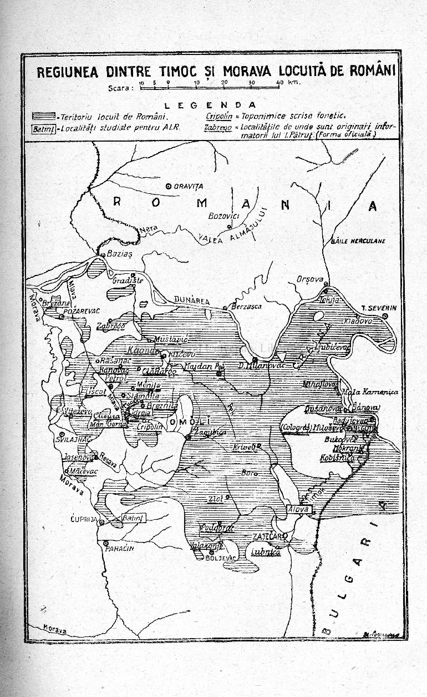

REGIUNEA DINTRE TIMOC Şl MORAVA LOCUITA DE ROMANI

Scara: i 1 1 ..—I10 5 O 10 20 30- ! I . Jt*o km.

LEGEND A

%-Teritoriu locuit de Români. Cripolin = Toponimice scrisa fonetic. Bätint\-Localităţi studiate pentru AIR. ZSèHS92- * Localităţile de unde sunt originari infor' ~ matorh lui iPâtruţ .{Forma oficiala)

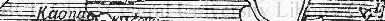

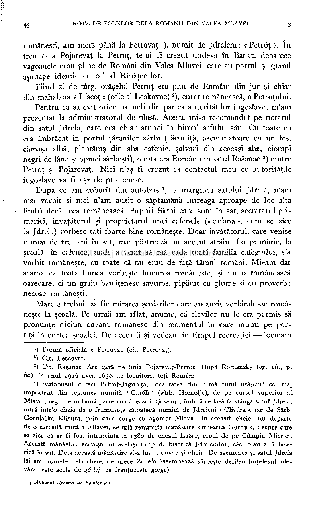

româneşti, am mers până la Petrovaţ ), numit de Jdreleni: « Petroţ ». în tren delà Pojarevaţ la Petroţ, te-ai fi crezut undeva în Banat, deoarece vagoanele erau pline de Români din Valea Mia vei, care au portul şi graiul aproape identic cu cel al Bănăţenilor.

Fiind zi de târg, orăşelul Petroţ era plin de Români din jur şi chiar din mahalaua « Liscoţ » (oficial Leskovac)

), curat românească, a Petroţului.

2

Pentru ca să evit orice bănueli din partea autorităţilor iugoslave, m'am prezentat la administratorul de plasă. Acesta mi-a recomandat pe notarul din satul Jdrela, care era chiar atunci în biroul şefului său. Cu toate că era îmbrăcat în portul ţăranilor sârbi (căciulită, asemănătoare cu un fes, cămaşă albă, pieptăraş din aba cafenie, şalvari din aceeaşi aba, ciorapi negri de lână şi opinci sârbeşti), acesta era Român din satul Rasanac ) dintre Petroţ şi Pojarevaţ. Nici n'aş fi crezut că contactul meu cu autorităţile iugoslave va fi aşa de prietenesc.

După ce am coborît din autobus ) la marginea satului Jdrela, n'am mai vorbit şi nici n'am auzit o săptămână întreagă aproape de loc altă limbă decât cea românească. Puţinii Sârbi care sunt în sat, secretarul primăriei, învăţătorul şi proprietarul unei cafenele (« căfână », cum se zice la Jdrela) vorbesc toţi foarte bine româneşte. Doar învăţătorul, care venise numai de trei ani în sat, mai păstrează un accent străin. La primărie, la şcoală, în cafenea, unde a venit să mă vadă toată familia cafegiului, s'a vorbit româneşte, cu toate că nu erau de faţă ţărani români. Mi-am dat seama că toată lumea vorbeşte bucuros româneşte, şi nu o românească oarecare, ci un graiu bănăţenesc savuros, pipărat cu glume şi cu proverbe neaoşe româneşti.

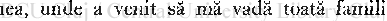

Mare a trebuit să fie mirarea şcolarilor care au auzit vorbindu-se româneşte la şcoală. Pe urmă am aflat, anume, că elevilor nu le era permis să pronunţe niciun cuvânt românesc din momentul în care intrau pe portiţă în curtea şcoalei. De aceea îi şi vedeam în timpul recreaţiei — locuiam

) Formă oficială e Petrovac (cit. Petro vaţ).

1

) Cit. Lescovaţ.

2

) Cit. Raşanaţ. Are gară pe linia Pojarevaţ-Petroţ. După Romansky (op. cit., p. 60), în anul 1916 avea 1630 de locuitori, toţi Români.

3

) Autobusul cursei Petroţ-Jagubiţa, localitatea din urmă fiind orăşelul cel ma; important din regiunea numită <« Omolï » (sârb. Homolje), de pe cursul superior al Mlavei, regiune în bună parte românească. Şoseaua, îndată ce lasă la stânga satul Jdrela, intră într'o cheie de o frumuseţe sălbatecă numită de Jdreleni « Clisüra », iar de Sârbi Gornjacka Klisura, prin care curge cu sgomot Mlava. în această cheie, nu departe de o cascadă mică a Mlavei, se află renumita mănăstire sârbească Gornjak, despre care se zice că ar fi fost întemeiată la 1380 de cnezul Lazar, eroul de pe Câmpia Mierlei. Această mănăstire serveşte în acelaşi timp de biserică Jdrelenilor, căci n'au altă biserică în sat. Delà această mănăstire şi-a luat numele şi cheia. De asemenea şi satul Jdrela îşi are numele delà cheie, deoarece 2drelo însemnează sârbeşte defileu (înţelesul adevărat este acela de gâtlej, ca franţuzeşte gorge).

4

4 Anuarul Arhivei de Folklor VI

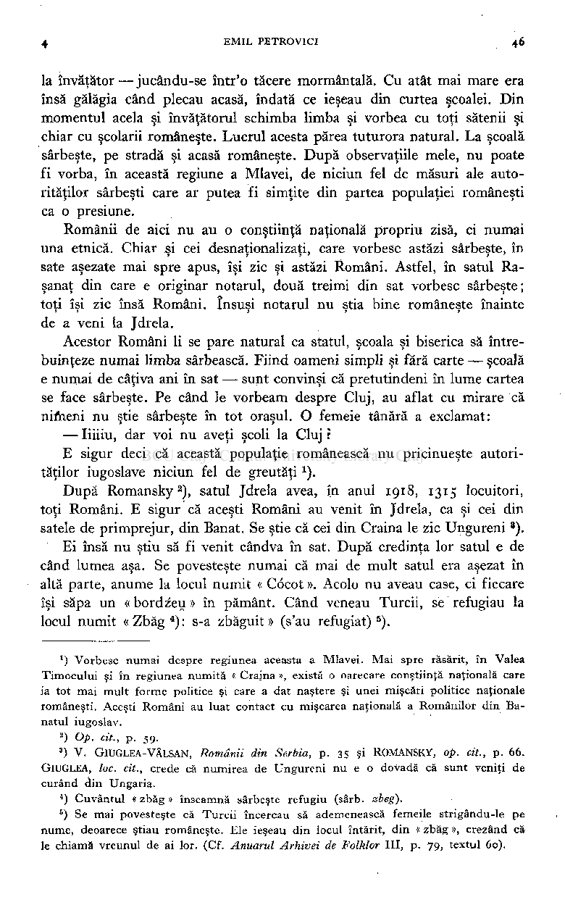

la învăţător — jucându-se într'o tăcere mormântală. Cu atât mai mare era însă gălăgia când plecau acasă, îndată ce ieşeau din curtea şcoalei. Din momentul acela şi învăţătorul schimba limba şi vorbea cu toţi sătenii şi chiar cu şcolarii româneşte. Lucrul acesta părea tuturora natural. La şcoală sârbeşte, pe stradă şi acasă româneşte. După observaţiile mele, nu poate fi vorba, în această regiune a Mlavei, de niciun fel de măsuri ale autorităţilor sârbeşti care ar putea fi simţite din partea populaţiei româneşti ca o presiune.

Românii de aici nu au o conştiinţă naţională propriu zisă, ci numai una etnică. Chiar şi cei desnaţionalizaţi, care vorbesc astăzi sârbeşte, în sate aşezate mai spre apus, îşi zic şi astăzi Români. Astfel, în satul Raşanaţ din care e originar notarul, două treimi din sat vorbesc sârbeşte; toţi îşi zic însă Români. însuşi notarul nu ştia bine româneşte înainte de a veni la Jdrela.

Acestor Români li se pare natural ca statul, şcoala şi biserica să întrebuinţeze numai limba sârbească. Fiind oameni simpli şi fără carte — şcoală e numai de câţiva ani în sat — sunt convinşi că pretutindeni în lume cartea se face sârbeşte. Pe când le vorbeam despre Cluj, au aflat cu mirare că nimeni nu ştie sârbeşte în tot oraşul. O femeie tânără a exclamat:

— Iiiiiu, dar voi nu aveţi şcoli la Cluj ? E sigur deci că această populaţie românească nu pricinueşte autori­

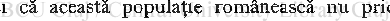

tăţilor iugoslave niciun fel de greutăţi

). După Romansky

1

), satul Jdrela avea, în anul 1918, 1315 locuitori, toţi Români. E sigur că aceşti Români au venit în Jdrela, ca şi cei din satele de primprejur, din Banat. Se ştie că cei din Craina le zic Ungureni ).

2

Ei însă nu ştiu să fi venit cândva în sat. După credinţa lor satul e de când lumea aşa. Se povesteşte numai că mai de mult satul era aşezat în altă parte, anume la locul numit « Cocoţ ». Acolo nu aveau case, ci fiecare îşi săpa un « bordzeu » în pământ. Când veneau Turcii, se refugiau la locul numit «Zbăg

): s-a zbăguit » (s'au refugiat) ).

4

*) Vorbesc numai despre regiunea aceasta a Mlavei. Mai spre răsărit, în Valea Timocului şi în regiunea numită « Craina », există o oarecare conştiinţă naţională care ia tot mai mult forme politice şi care a dat naştere şi unei mişcări politice naţionale româneşti. Aceşti Români au luat contact cu mişcarea naţională a Românilor din Banatul iugoslav.

- 2

) Op. cit., p. 59.

- 3

) V. GlUGLEA-VÂLSAN, Românii din Serbia, p. 35 şi ROMANSKY, op. cit., p. 66. GlUGLEA, loc. cit., crede că numirea de Ungureni nu e o dovadă că sunt veniţi de curând din Ungaria.

) Cuvântul « zbăg » înseamnă sârbeşte refugiu (sârb. zbeg).

4

) Se mai povesteşte că Turcii încercau să ademenească femeile strigându-le pe nume, deoarece ştiau româneşte. Ele ieşeau din locul întărit, din « zbăg », crezând că le chiamă vreunul de ai lor. (Cf. Anuarul Arhivei de Folklor III, p. 79, textul 60).

6

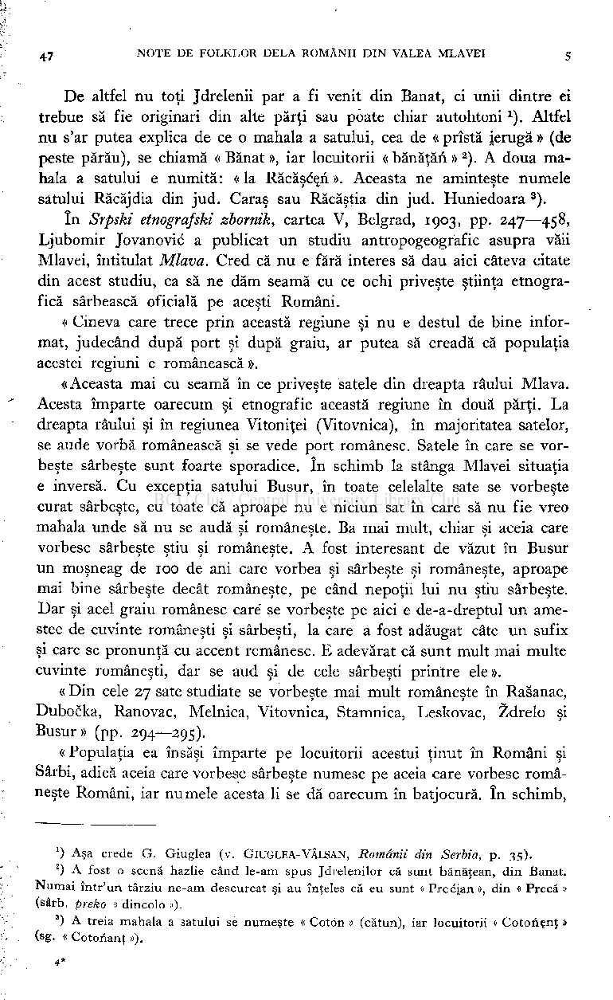

De altfel nu toţi Jdrelenii par a fi venit din Banat, ci unii dintre ei trebue să fie originari din alte părţi sau poate chiar autohtoni

). Altfel nu s'ar putea explica de ce o mahala a satului, cea de « prîstă ierugă » (de peste părău), se chiamă « Bănat », iar locuitorii « bănăţăn » ). A doua mahala a satului e numită : « la Răcăşccn ». Aceasta ne aminteşte numele satului Răcăjdia din jud. Caras sau Răcăştia din jud. Huniedoara ).

1

în Srpski etnograf ski zbornik, cartea V, Belgrad, 1903, pp. 247—458, Ljubomir Jovanovié a publicat un studiu antropogeografic asupra văii Mlavei, întitulat Mlava. Cred că nu e fără interes să dau aici câteva citate din acest studiu, ca să ne dăm seamă cu ce ochi priveşte ştiinţa etnografică sârbească oficială pe aceşti Români.

« Cineva care trece prin această regiune şi nu e destul de bine informat, judecând după port şi după graiu, ar putea să creadă că populaţia acestei regiuni e românească ».

«Aceasta mai cu seamă în ce priveşte satele din dreapta râului Mlava. Acesta împarte oarecum şi etnografic această regiune în două părţi. La dreapta râului şi în regiunea Vitoniţei (Vitovnica), în majoritatea satelor, se aude vorbă românească şi se vede port românesc. Satele în care se vorbeşte sârbeşte sunt foarte sporadice. în schimb la stânga Mlavei situaţia e inversă. Cu excepţia satului Busur, în toate celelalte sate se vorbeşte curat sârbeşte, cu toate că aproape nu e niciun sat în care să nu fie vreo mahala unde să nu se audă şi româneşte. Ba mai mult, chiar şi aceia care vorbesc sârbeşte ştiu şi româneşte. A fost interesant de văzut în Busur un moşneag de 100 de ani care vorbea şi sârbeşte şi româneşte, aproape mai bine sârbeşte decât româneşte, pe când nepoţii lui nu ştiu sârbeşte. Dar şi acel graiu românesc care se vorbeşte pe aici e de-a-dreptul un amestec de cuvinte româneşti şi sârbeşti, la care a fost adăugat câte un sufix şi care se pronunţă cu accent românesc. E adevărat că sunt mult mai multe cuvinte româneşti, dar se aud şi de cele sârbeşti printre ele ».

« Din cele 27 sate studiate se vorbeşte mai mult româneşte în Rasanac, Dubocka, Ranovac, Melnica, Vitovnica, Stamnica, Leskovac, Zdrelo şi Busur » (pp. 294—295).

« Populaţia ea însăşi împarte pe locuitorii acestui ţinut în Români şi Sârbi, adică aceia care vorbesc sârbeşte numesc pe aceia care vorbesc româneşte Români, iar numele acesta li se dă oarecum în batjocură. în schimb,

) Aşa crede G. Giuglea (v. GlUGLEA-VÂLSAN, Românii din Serbia, p. 35). ) A fost o scenă hazlie când le-am spus Jdrelenilor că sunt bănăţean, din Banat.

x

Numai într'un târziu ne-am descurcat şi au înţeles că eu sunt « Precian », din « Precă » (sârb. preko « dincolo »).

) A treia mahala a satului se numeşte « Coton » (cătun), iar locuitorii « Cotonenţ » (sg. « Cotonanţ »).

3

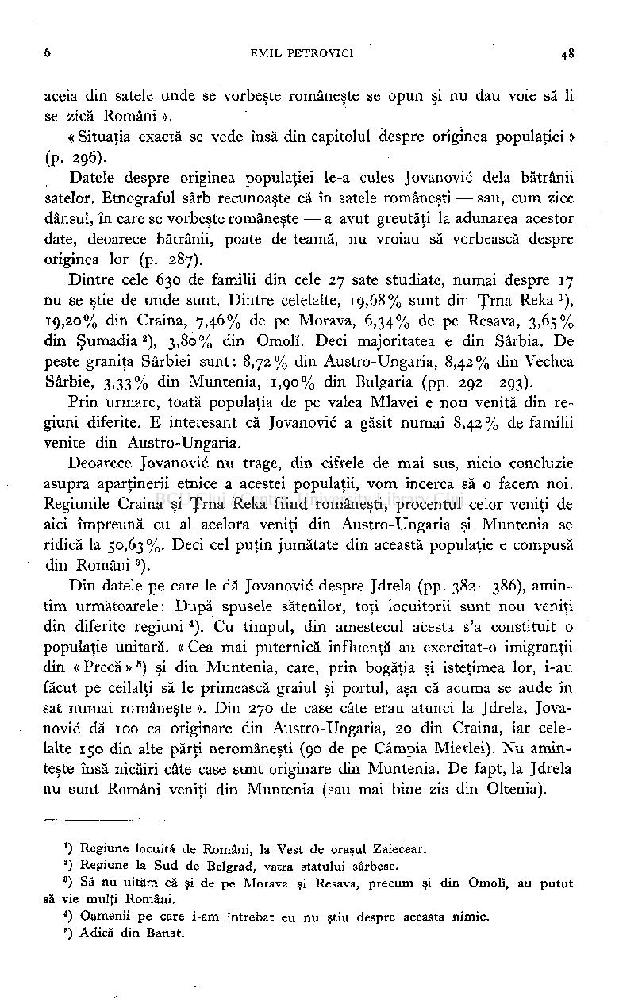

aceia din satele unde se vorbeşte româneşte se opun şi nu dau voie să li se zică Români ».

« Situaţia exactă se vede însă din capitolul despre originea populaţiei » (p. 296).

Datele despre originea populaţiei le-a cules Jovanovic delà bătrânii satelor. Etnograful sârb recunoaşte că în satele româneşti — sau, cum zice dânsul, în care se vorbeşte româneşte — a avut greutăţi la adunarea acestor date, deoarece bătrânii, poate de teamă, nu vroiau să vorbească despre originea lor (p. 287).

Dintre cele 630 de familii din cele 27 sate studiate, numai despre 17 nu se ştie de unde sunt. Dintre celelalte, 19,68% sunt din Ţrna Reka ), 19,20% dui Craina, 7,46% de pe Morava, 6,34% de pe Resava, 3,65% din Şumadia

), 3,80% din Omolî. Deci majoritatea e din Sârbia. De peste graniţa Sârbiei sunt: 8,72% din Austro-Ungaria, 8,42% din Vechea Sârbie, 3,33% din Muntenia, 1,90% din Bulgaria (pp. 292—293).

2

Prin urmare, toată populaţia de pe valea Mlavei e nou venită din regiuni diferite. E interesant că Jovanovic a găsit numai 8,42% de familii venite din Austro-Ungaria.

Deoarece Jovanovic nu trage, din cifrele de mai sus, nicio concluzie asupra aparţinerii etnice a acestei populaţii, vom încerca să o facem noi. Regiunile Craina şi Ţrna Reka fiind româneşti, procentul celor veniţi de aici împreună cu al acelora veniţi din Austro-Ungaria şi Muntenia se ridică la 50,63 %. Deci cel puţin jumătate din această populaţie e compusă din Români ).

Din datele pe care le dă Jovanovic despre Jdrela (pp. 382—386), amintim următoarele: După spusele sătenilor, toţi locuitorii sunt nou veniţi din diferite regiuni *). Cu timpul, din amestecul acesta s'a constituit o populaţie unitară. « Cea mai puternică influenţă au exercitat-o imigranţii din « Precă »

) şi din Muntenia, care, prin bogăţia şi isteţimea lor, i-au făcut pe ceilalţi să le primească graiul şi portul, aşa că acuma se aude în sat numai româneşte ». Din 270 de case câte erau atunci la Jdrela, Jovanovic dă 100 ca originare din Austro-Ungaria, 20 din Craina, iar celelalte 150 din alte părţi neromâneşti (90 de pe Câmpia Mierlei). Nu aminteşte însă nicăiri câte case sunt originare din Muntenia. De fapt, la Jdrela nu sunt Români veniţi din Muntenia (sau mai bine zis din Oltenia).

5

*) Regiune locuită de Români, la Vest de oraşul Zaiecear.

) Regiune la Sud de Belgrad, vatra statului sârbesc.

s

) Să nu uităm că şi de pe Morava şi Resava, precum şi din Omolî, au putut să vie mulţi Români.

3

) Oamenii pe care i-am întrebat eu nu ştiu despre aceasta nimic.

4

) Adică din Banat.

6

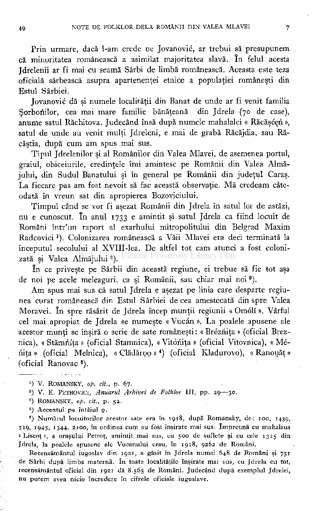

Prin urmare, dacă l-am crede pe Jovanovic, ar trebui să presupunem că minoritatea românească a asimilat majoritatea slavă. în felul acesta Jdrelenii ar fi mai cu seamă Sârbi de limbă românească. Aceasta este teza oficială sârbească asupra apartenenţei etnice a populaţiei româneşti din Estul Sârbiei.

Jovanovic dă şi numele localităţii din Banat de unde ar fi venit familia Şorbofiilor, cea mai mare familie bănăţeană din Jdrela (70 de case), anume satul Răchitova. Judecând însă după numele mahalalei « Răcăşcen », satul de unde au venit mulţi Jdreleni, e mai de grabă Răcăjdia, sau Răcăştia, după cum am spus mai sus.

Tipul Jdrelenilor şi al Românilor din Valea Mlavei, de asemenea portul, graiul, obiceiurile, credinţele îmi amintesc pe Românii din Valea Almăjului, din Sudul Banatului şi în general pe Românii din judeţul Caras. La fiecare pas am fost nevoit să fac această observaţie. Mă credeam câteodată în vreun sat din apropierea Bozoviciului.

Timpul când se vor fi aşezat Românii din Jdrela în satul lor de astăzi, nu e cunoscut. în anul 1733 e amintit şi satul Jdrela ca fiind locuit de Români într'un raport al exarhului mitropolitului din Belgrad Maxim Radcovici

). Colonizarea românească a Văii Mlavei era deci terminată la începutul secolului al XVIII-lea. De altfel tot cam atunci a fost colonizată şi Valea Almăjului

1

).

2

în ce priveşte pe Sârbii din această regiune, ei trebue să fie tot aşa de noi pe acele meleaguri, ca şi Românii, sau chiar mai noi

).

3

Am spus mai sus că satul Jdrela e aşezat pe linia care desparte regiunea curat românească din Estul Sârbiei de cea amestecată din spre Valea Moravei. în spre răsărit de Jdrela încep munţii regiunii « Omolî ». Vârful cel mai apropiat de Jdrela se numeşte « Vucân ». La poalele apusene ale acestor munţi se înşiră o serie de sate româneşti : « Brezhiţa » (oficial Breznica), « Stămfiiţa » (oficial Stamnica), « Vitoniţa » (oficial Vitovnica), « Me nita » (oficial Melnica), « Clădăroo » ) (oficial Kladurovo), « Ranouăţ » (oficial Ranovac ).

V. ROMANSKY, op. cit., p. 67.

- 2

) V. E. PETROVICI, Anuarul Arhivei de Folklor III, pp. 29—30.

- 3

) ROMANSKY, op. cit., p. 52.

- 4

) Accentul pe întâiul Q.

") Numărul locuitorilor acestor sate era în 1918, după Romansky, de: 100, 1439, 519, 1945, 1344, 2ioo, în ordinea cum au fost înşirate mai sus. împreună cu mahalaua « Liscoţ », a oraşului Petroţ, amintit mai sus, cu 500 de suflete şi cu cele 1315 din Jdrela, la poalele apusene ale Vucanului erau, în 1918, 9262 de Români.

Recensământul iugoslav din 1921, a găsit în Jdrela numai 648 de Români şi 751 de Sârbi după limba maternă. în toate localităţile înşirate mai sus, cu Jdrela cu tot, recensământul oficial din 1921 dă 8.565 de Români. Judecând după exemplul Jdrelei, nu putem avea nicio încredere în cifrele oficiale iugoslave.

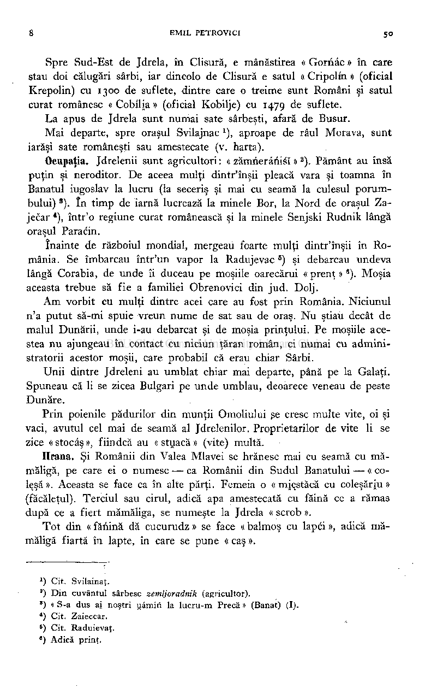

Spre Sud-Est de Jdrela, în Clisură, e mănăstirea « Gornâc » în care stau doi călugări sârbi, iar dincolo de Clisură e satul « Cripolfn » (oficial Krepolin) cu 1300 de suflete, dintre care o treime sunt Români şi satul curat românesc « Cobilia » (oficial Kobilje) cu 1479 de suflete.

La apus de Jdrela sunt numai sate sârbeşti, afară de Busur. Mai departe, spre oraşul Svilajnac ), aproape de râul Morava, sunt

iarăşi sate româneşti sau amestecate (v. harta). Ocupaţia. Jdrelenii sunt agricultori: << zămnerâriisî »

). Pământ au însă

2

puţin şi neroditor. De aceea mulţi dintr'înşii pleacă vara şi toamna în Banatul iugoslav la lucru (la seceriş şi mai cu seamă la culesul porumbului) ). în timp de iarnă lucrează la minele Bor, la Nord de oraşul Zajecar *), într'o regiune curat românească şi la minele Senjski Rudnik lângă oraşul Paracin.

înainte de războiul mondial, mergeau foarte mulţi dintr'înşii în România. Se îmbarcau într'un vapor la Radujevac ) şi debarcau undeva lângă Corabia, de unde îi duceau pe moşiile oarecărui « prent »

). Moşia aceasta trebue să fie a familiei Obrenovici din jud. Dolj.

6

Am vorbit cu mulţi dintre acei care au fost prin România. Niciunul n'a putut să-mi spuie vreun nume de sat sau de oraş. Nu ştiau decât de malul Dunării, unde i-au debarcat şi de moşia prinţului. Pe moşiile acestea nu ajungeau în contact cu niciun ţăran român, ci numai cu administratorii acestor moşii, care probabil că erau chiar Sârbi.

Unii dintre Jdreleni au umblat chiar mai departe, până pe la Galaţi. Spuneau că li se zicea Bulgari pe unde umblau, deoarece veneau de peste Dunăre.

Prin poienile pădurilor din munţii Omoliului ße cresc multe vite, oi şi vaci, avutul cel mai de seamă al Jdrelenilor. Proprietarilor de vite li se zice « stocâş », fiindcă au « stuacă » (vite) multă.

Hrana. Şi Românii din Valea Mlavei se hrănesc mai cu seamă cu mămăligă, pe care ei o numesc — ca Românii din Sudul Banatului — « colcşă ». Aceasta se face ca în alte părţi. Femeia o « micstăcă cu coleşăriu » (făcăleţul). Terciul sau cirul, adică apa amestecată cu făină ce a rămas după ce a fiert mămăliga, se numeşte la Jdrela « scrob ».

Tot din « fănină dă cucurudz » se face « balmoş cu lapci », adică mămăligă fiartă în lapte, în care se pune « caş ».

- *) Cit. Svilainaţ.

s

) Din cuvântul sârbesc zemljoradnik (agricultor).

- *) « S-a dus ai noştri uâmin la lucru-m Precă » (Banat) (I).

) Cit. Zaiecear.

4

) Cit. Raduievaţ. ') Adică prinţ.

6

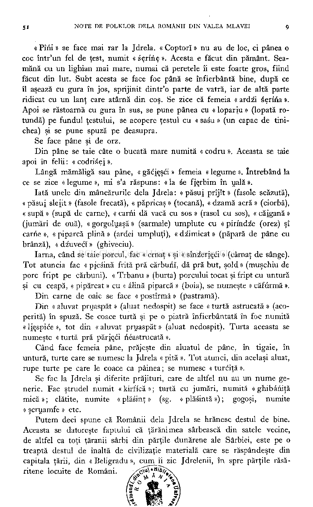

« Pîni » se face mai rar la Jdrela. « Coptorï » nu au de loc, ci pânea o coc într'un fel de ţest, numit « serine ». Acesta e făcut din pământ. Seamănă cu un lighian mai mare, numai că peretele îi este foarte gros, fiind făcut din lut. Subt acesta se face foc până se înfierbântă bine, după ce îl aşează cu gura în jos, sprijinit dintr'o parte de vatră, iar de altă parte ridicat cu un lanţ care atârnă din coş. Se zice că femeia « ardii ăerina ». Apoi se răstoarnă cu gura în sus, se pune pânea cu « lopariu » (lopată rotundă) pe fundul ţestului, se acopere ţestul cu « sasu » (un capac de tinichea) şi se pune spuză pe deasupra.

Se face pâne şi de orz. Din pâne se taie câte o bucată mare numită « codru ». Aceasta se taie

apoi în felii : « codrisei ».

Lângă mămăligă sau pâne, « găcicşci » femeia « legume ». întrebând la ce se zice « legume », mi s'a răspuns : « la se f ierbim în uală ».

Iată unele din mâncărurile delà Jdrela: «păsui prîjît » (fasole scăzută), « păsui sleiit » (fasole frecată), « papricaş » (tocană), « dzamă acră » (ciorbă), « supă » (supă de carne), « carfii dă vacă cu sos » (rasol cu sos), « căigană » (jumări de ouă), « gorgolyaşă » (sarmale) umplute cu « pirîndz'e (orez) şî carne », « piparcă plină » (ardei umpluţi), « dzimicat » (papară de pâne cu brânză), « dzuvecî » (ghiveciu).

Iarna, când se taie porcul, fac « crnaţ » şi « sînzerieci » (cârnaţ de sânge). Tot atuncia fac « piesină frită pră cărbuni, dă pră but, şold » (muşchiu de porc fript pe cărbuni). « Trbanu » (burta) porcului tocat şi fript cu untură şi cu ceapă, « pipărcat » cu « alină piparcă » (boia), se numeşte « căfurmă ».

Din carne de oaie se face « postîrmă » (pastrama). Din « aluvat pruaspăt » (aluat nedospit) se face « turtă astrucată » (acoperită) în spuză. Se coace turtă şi pe o piatră înfierbântată în foc numită « liţspice », tot din « aluvat pruaspăt » (aluat nedospit). Turta aceasta se numeşte « turtă pră păricci fîeastrucată ».

Când face femeia pâne, prăjeşte din aluatul de pâne, în tigaie, în untură, turte care se numesc la Jdrela « pită ». Tot atunci, din acelaşi aluat, rupe turte pe care le coace ca pâinea; se numesc «turcită».

Se fac la Jdrela şi diferite prăjituri, care de altfel nu au un nume generic. Fac ştrudel numit «kirfică»; turtă cu jumări, numită « ghibâniţă mică » ; clătite, numite « plăsinţ » (sg. « plăsintă ») ; gogoşi, numite « şcruamfe » etc.

Putem deci spune că Românii delà Jdrela se hrănesc destul de bine. Aceasta se datoreşte faptului că ţărănimea sârbească din satele vecine, de altfel ca toţi ţăranii sârbi din părţile dunărene ale Sârbiei, este pe o treaptă destul de înaltă de civilizaţie materială care se răspândeşte din capitala ţării, din « Beligradu », cum îi zic Jdrelenii, în spre părţile răsăritene

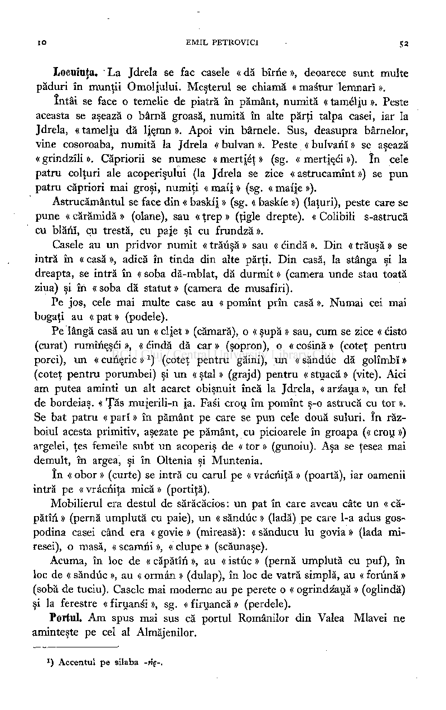

Locuinţa. La Jdrela se fac casele « dă bîrne », deoarece sunt multe păduri în munţii Omoliului. Meşterul se chiamă « mastur lemnari ».

întâi se face o temelie de piatră în pământ, numită « taméliu ». Peste aceasta se aşează o bârnă groasă, numită în alte părţi talpa casei, iar la Jdrela, « tameliu dă liçmn ». Apoi vin bârnele. Sus, deasupra bârnelor, vine cosoroaba, numită la Jdrela « bulvan ». Peste « bulvahï » se aşează « grindzîli ». Căpriorii se numesc « mertieţ » (sg. « mertieci »). în cele patru colţuri ale acoperişului (la Jdrela se zice « astrucamînt ») se pun patru căpriori mai groşi, numiţi « maii » (sg. « maîie »).

Astrucământul se face din « baskii » (sg. « baskie ») (laţuri), peste care se pune « cărămidă » (olane), sau « ţrep » (ţigle drepte). « Colibili s-astrucă cu blăhî, cu trestă, cu paie şî cu frundză ».

Casele au un pridvor numit « trăuşă » sau « cindă ». Din « trăuşă » se intră în « casă », adică în tinda din alte părţi. Din casă, la stânga şi la dreapta, se intră în « soba dă-mblat, dă durmit » (camera unde stau toată ziua) şi în « soba da statut » (camera de musafiri).

Pe jos, cele mai multe case au « pomînt prîn casă ». Numai cei mai bogaţi au « pat » (podele).

Pe lângă casă au un « cliet » (cămară), o « supă » sau, cum se zice « cistö (curat) rumîriesci », « cindă dă car » (şopron), o « cosină » (coteţ pentru porci), un « cuneric »

) (coteţ pentru găini), un « sănduc dă golîmbî » (coteţ pentru porumbei) şi un « ştal » (grajd) pentru « stuacă » (vite). Aici am putea aminti un alt acaret obişnuit încă la Jdrela, « arzaua », un fel de bordeiaş. « Ţăs mujerili-n ia. Fasi erou îm pomînt ş-o astrucă cu tor ». Se bat patru « pari » în pământ pe care se pun cele două suluri. în războiul acesta primitiv, aşezate pe pământ, cu picioarele în groapa (« erou ») argelei, ţes femeile subt un acoperiş de « tor » (gunoiu). Aşa se ţesea mai demult, în argea, şi în Oltenia şi Muntenia.

1

în « obor » (curte) se intră cu carul pe « vrâcfiiţă » (poartă), iar oamenii intră pe « vrâcfiiţă mică » (portiţă).

Mobilierul era destul de sărăcăcios: un pat în care aveau câte un «căpătîn » (pernă umplută cu paie), un « sănduc » (ladă) pe care 1-a adus gospodina casei când era « govie » (mireasă) : « sănducu lu govia » (lada miresei), o masă, « scamni », « clupe » (scăunaşe).

Acuma, în loc de « căpătîn », au « istiic » (pernă umplută cu puf), în loc de « sănduc », au « ormân » (dulap), în loc de vatră simplă, au « forună » (sobă de tuciu). Casele mai moderne au pe perete o « ogrindz"auă » (oglindă) şi la ferestre « firuansi », sg. « firuancă » (perdele).

Portul. Am spus mai sus că portul Românilor din Valea Mlavei ne aminteşte pe cel al Almăjenilor.

###### ) Accentul pe silaba -ne-.

l

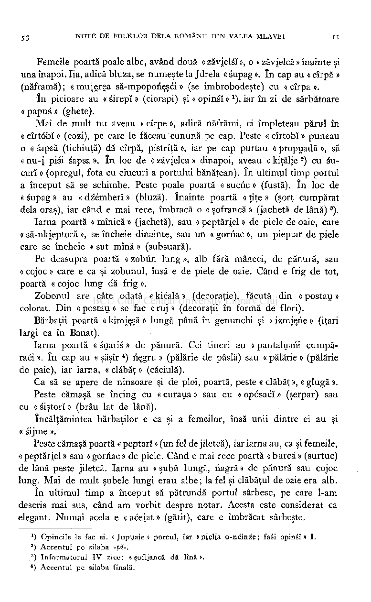

Femeile poartă poale albe, având două «zăvielsî», o « zăvielcă » înainte şi una înapoi. lia, adică bluza, se numeşte la Jdrela « supag ». în cap au « cîrpă » (năframă) ; « muierea să-mpoponesci » (se îmbrobodeşte) cu « cîrpa ».

), iar în zi de sărbătoare « papus » (ghete).

în picioare au « sirepî » (ciorapi) şi « opinsî »

x

Mai de mult nu aveau « cîrpe », adică năfrămi, ci împleteau părul în « cîrtobî » (cozi), pe care le făceau cunună pe cap. Peste « cîrtobî » puneau o « sapsă (tichiuţă) dă cîrpă, pistn'ţă », iar pe cap purtau « propuadă », să « nu-i pisi sapsa ». în loc de « zăvielca » dinapoi, aveau « kiţălie

) cu sucuri » (opregul, fota cu ciucuri a portului bănăţean). în ultimul timp portul a început să se schimbe. Peste poale poartă « sucne » (fustă). în loc de « supag » au « dzémberï » (bluză). înainte poartă « ţiţe » (şorţ cumpărat delà oraş), iar când e mai rece, îmbracă o « şofrancă » (jachetă de lână)

2

).

3

Iarna poartă « mînică » (jachetă), sau « peptăriel » de piele de oaie, care « să-nkieptoră », se încheie dinainte, sau un « gornac », un pieptar de piele care se încheie « sut mînă » (subsuară).

Pe deasupra poartă « zobün lung », alb fără mâneci, de pănură, sau « cojoc » care e ca şi zobunul, însă e de piele de oaie. Când e frig de tot, poartă « cojoc lung dă frig ».

Zobonul are câte odată « kicală » (decoraţie), făcută din « postau » colorat. Din « postau » se fac « ruj » (decoraţii în formă de flori).

Bărbaţii poartă « kimicşă » lungă până în genunchi şi « izmiçrie » (iţari largi ca în Banat).

Iarna poartă « suaris » de pănură. Cei tineri au « pantaluani cumpăraci ». în cap au « şăşîr

) nçgru » (pălărie de pâslă) sau « pălărie » (pălărie de paie), iar iarna, « clăbăţ » (căciulă).

4

Ca să se apere de ninsoare şi de ploi, poartă, peste « clăbăţ », « glugă ». Peste cămaşă se încing cu « curaua » sau cu « opôsacï » (şerpar) sau

cu « siştorî » (brâu lat de lână).

încălţămintea bărbaţilor e ca şi a femeilor, însă unii dintre ei au şi « sijme ».

Peste cămaşă poartă « peptarî » (un fel de jiletcă), iar iarna au, ca şi femeile, « peptăriel » sau « gornac » de piele. Când e mai rece poartă « burcă » (surtuc) de lână peste jiletcă. Iarna au « şubă lungă, nagră » de pănură sau cojoc lung. Mai de mult şubele lungi erau albe; la fel şi clăbăţul de oaie era alb.

în ultimul timp a început să pătrundă portul sârbesc, pe care l-am descris mai sus, când am vorbit despre notar. Acesta este considerat ca elegant. Numai acela e « aceiat » (gătit), care e îmbrăcat sârbeşte.

*) Opincile le fac ei. « Jupuaie » porcul, iar « pielia o-ncinze; fasi opinai» I.

- 2

) Accentul pe silaba -ţă-.

- 3

) Informatorul IV zice: « şofljancă dă lînă ».

- 4

###### ) Accentul pe silaba finală.

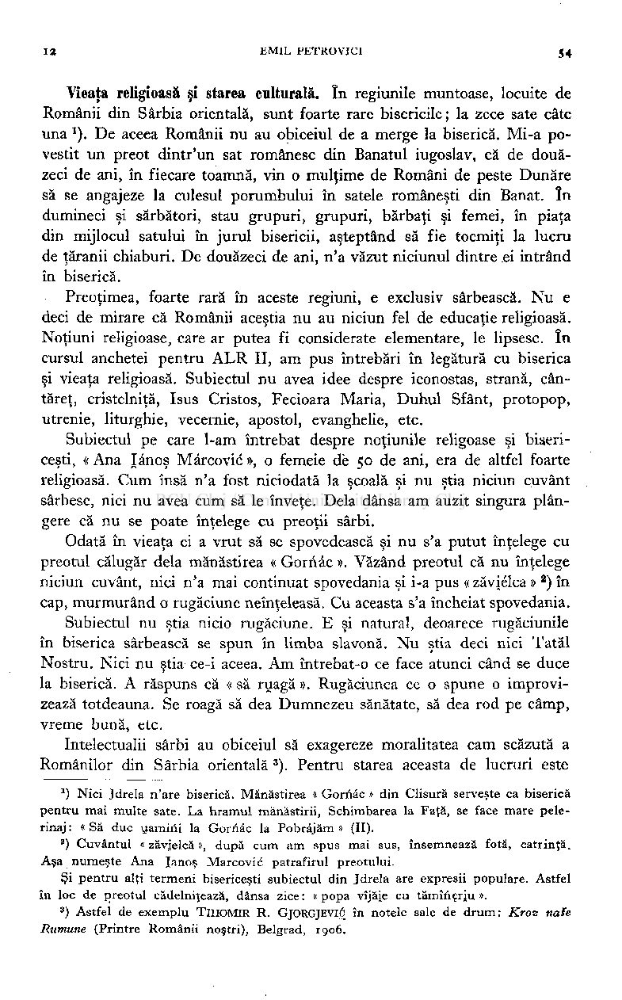

Vieaţa religioasă şi starea culturală. în regiunile muntoase, locuite de Românii din Sârbia orientală, sunt foarte rare bisericile; la zece sate câte una ). De aceea Românii nu au obiceiul de a merge la biserică. Mi-a povestit un preot dintr'un sat românesc din Banatul iugoslav, că de douăzeci de ani, în fiecare toamnă, vin o mulţime de Români de peste Dunăre

- să se angajeze la culesul porumbului în satele româneşti din Banat. în dumineci şi sărbători, stau grupuri, grupuri, bărbaţi şi femei, în piaţa din mijlocul satului în jurul bisericii, aşteptând să fie tocmiţi la lucru de ţăranii chiaburi. De douăzeci de ani, n'a văzut niciunul dintre ei intrând în biserică.

Preoţimea, foarte rară în aceste regiuni, e exclusiv sârbească. Nu e deci de mirare că Românii aceştia nu au niciun fel de educaţie religioasă. Noţiuni religioase, care ar putea fi considerate elementare, le lipsesc. în cursul anchetei pentru ALR II, am pus întrebări în legătură cu biserica şi vieaţa religioasă. Subiectul nu avea idee despre iconostas, strană, cân­

- tăreţ, cristelniţă, Isus Cristos, Fecioara Maria, Duhul Sfânt, protopop, utrenie, liturghie, vecernie, apostol, evanghelie, etc.

Subiectul pe care l-am întrebat despre noţiunile religoase şi bisericeşti, « Ana Iânoş Mârcovic », o femeie de 50 de ani, era de altfel foarte religioasă. Cum însă n'a fost niciodată la şcoală şi nu ştia niciun cuvânt sârbesc, nici nu avea cum să le înveţe. Delà dânsa am auzit singura plângere că nu se poate înţelege cu preoţii sârbi.

Odată în vieaţa ei a vrut să se spovedească şi nu s'a putut înţelege cu preotul călugăr delà mănăstirea « Gornâc ». Văzând preotul că nu înţelege niciun cuvânt, nici n'a mai continuat spovedania şi i-a pus « zăvielca »

) în cap, murmurând o rugăciune neînţeleasă. Cu aceasta s'a încheiat spovedania.

2

Subiectul nu ştia nicio rugăciune. E şi natural, deoarece rugăciunile în biserica sârbească se spun în limba slavonă. Nu ştia deci nici Tatăl Nostru. Nici nu ştia ce-i aceea. Am întrebat-o ce face atunci când se duce la biserică. A răspuns că « să ryagă ». Rugăciunea ce o spune o improvizează totdeauna. Se roagă să dea Dumnezeu sănătate, să dea rod pe câmp, vreme bună, etc.

Intelectualii sârbi au obiceiul să exagereze moralitatea cam scăzută a Românilor din Sârbia orientală ). Pentru starea aceasta de lucruri este

*) Nici Jdrela n'are biserică. Mănăstirea « Gornâc >> din Clisură serveşte ca biserică pentru mai multe sate. La hramul mănăstirii, Schimbarea la Faţă, se face mare pelerinaj: «Să duc uamirii la Gornâc la Pobrâjăm » (II).

) Cuvântul « zăvielca », după cum am spus mai sus, însemnează fotă, catrinţă. Aşa numeşte Ana Janoş Marcovic patrafirul preotului.

a

Şi pentru alţi termeni bisericeşti subiectul din Jdrela are expresii populare. Astfel în loc de preotul cădelniţează, dânsa zice : « popa vîjăie cu tămîneriu ».

) Astfel de exemplu TlHOMIR R. GJORGJEVIÖ în notele sale de drum: Kroz naU Rumäne (Printre Românii noştri), Belgrad, 1906.

3

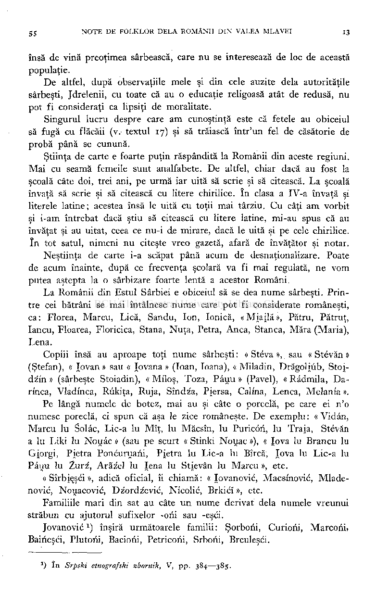

ss NOT E D E FOLKLO R DELA ROMÂNII DI N VALEA MLAVE I 13

însă de vină preoţimea sârbească, care nu se interesează de loc de această populaţie.

De altfel, după observaţiile mele şi din cele auzite delà autorităţile sârbeşti, Jdrelenii, cu toate că au o educaţie religoasă atât de redusă, nu pot fi consideraţi ca lipsiţi de moralitate.

Singurul lucru despre care am cunoştinţă este că fetele au obiceiul să fugă cu flăcăii (v.- textul 17) şi să trăiască într'un fel de căsătorie de probă până se cunună.

Ştiinţa de carte e foarte puţin răspândită la Românii din aceste regiuni. Mai cu seamă femeile sunt analfabete. De altfel, chiar dacă au fost la şcoală câte doi, trei ani, pe urmă iar uită să scrie şi să citească. La şcoală învaţă să scrie şi să citească cu litere chirilice. în clasa a IV-a învaţă şi literele latine; acestea însă le uită cu toţii mai târziu. Cu câţi am vorbit şi i-am întrebat dacă ştiu să citească cu litere latine, mi-au spus că au învăţat şi au uitat, ceea ce nu-i de mirare, dacă le uită şi pe cele chirilice, în tot satul, nimeni nu citeşte vreo gazetă, afară de învăţător şi notar.

Neştiinţa de carte i-a scăpat până acum de desnaţionalizare. Poate de acum înainte, după ce frecvenţa şcolară va fi mai regulată, ne vom putea aştepta la o sârbizare foarte lentă a acestor Români.

La Românii din Estul Sârbiei e obiceiul să se dea nume sârbeşti. Printre cei bătrâni se mai întâlnesc nume care pot fi considerate româneşti, ca: Florea, Marcu, Lică, Sandu, Ion, Ionică, «Miailă», Patru, Pătruţ, Iancu, Floarea, Floricica, Stana, Nuţa, Petra, Anca, Stanca, Măra (Maria), Lena.

Copiii însă au aproape toţi nume sârbeşti : « Stéva », sau « Stevăn » (Ştefan), « Iovan » sau « Iovana » (Ioan, Ioana), « Miladin, Drăgoliiib, Stoidzîn » (sârbeşte Stoiadin), « Milos, Toza, Pâuu » (Pavel), « Râdmila, Darinca, Vladi'nca, Rukiţa, Ruja, Sîndza, Piersa, Calina, Lenea, Melania ».

Pe lângă numele de botez, mai au şi câte o poreclă, pe care ei n'o numesc poreclă, ci spun că aşa le zice româneşte. De exemplu: « Vidân, Marcu lu Solâc, Lic-a lu Mîţ, lu Măcsîn, lu Puricöii, lu Trăia, Stevăn

- a lu Liki lu Nouâc » (sau pe scurt « Stinki Nouac »), « Iova lu Brancu lu Giorgi, Pietra Poncuruani, Pietra lu Lic-a lu Bîrcă, Iova lu Lic-a lu Pâyu Iu Zurz, Arăzel lu lena lu Stievân lu Marcu », etc.

« Sîrbiesci », adică oficial, îi chiamă: «Jovanovic, Macsînovic, Mladenovic, Nouacovic, Dzordz'evic, Nicolic, Brkicî », etc.

Familiile mari din sat au câte un nume derivat delà numele vreunui străbun cu ajutorul sufixelor -oni sau -eşci.

) înşiră următoarele familii: Şorbofii, Curioni, Marconi, Baineşci, Plutoni, Bacioni, Petriconi, Srborii, Brculeşci.

Jovanovic

1

##### *) în Srpski etnografski zbornik, V, pp. 384—385.

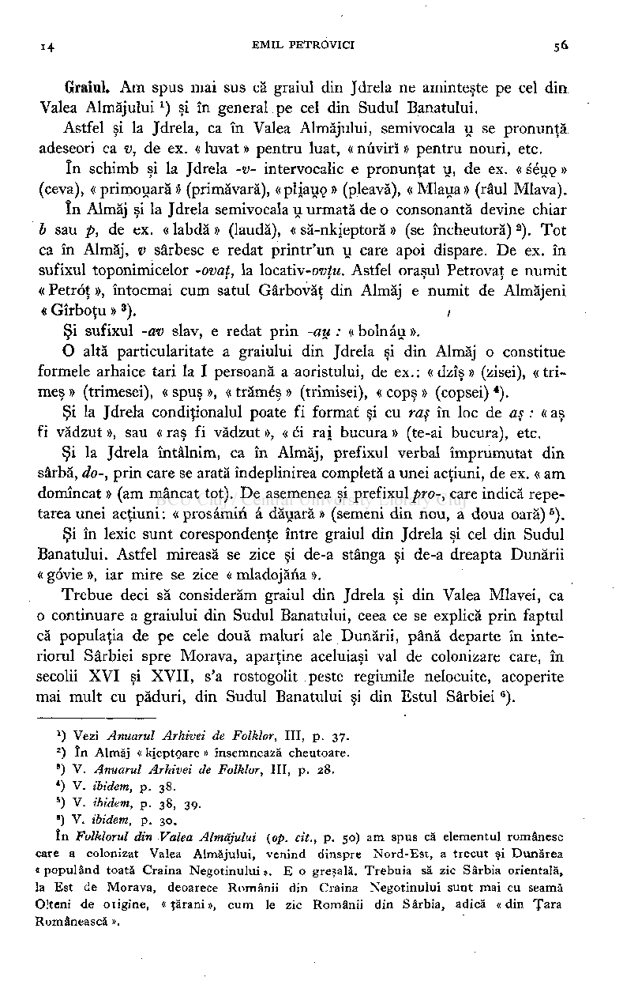

Graiul. Am spus mai sus că graiul din Jdrela ne aminteşte pe cel din Valea Almăjului*) şi în general pe cel din Sudul Banatului.

Astfel şi la Jdrela, ca în Valea Almăjului, semivocala u se pronunţă adeseori ca v, de ex. « luvat » pentru luat, « nuvirî » pentru nouri, etc.

în schimb şi la Jdrela -v- intervocalic e pronunţat y, de ex. « séyo » (ceva), « primouară >> (primăvară), «pljauo » (pleavă), « Miaua» (râul Mlava). în Almăj şi la Jdrela semivocala u urmată de o consonantă devine chiar

- b sau p, de ex. « labdă » (laudă), « să-nkieptoră » (se încheutoră)

2

). Tot ca în Almăj, v sârbesc e redat printr'un u care apoi dispare. De ex. în sufixul toponimicelor -oval, la locativ-fwto. Astfel oraşul Petrovaţ e numit « Petroţ », întocmai cum satul Gârbovăţ din Almăj e numit de Almăjeni « Gîrboţu » ). / Şi sufixul -av slav, e redat prin -au : « bolnâu ». O altă particularitate a graiului din Jdrela şi din Almăj o constitue

formele arhaice tari la I persoană a aoristului, de ex. : « dzîş » (zisei), « trimes » (trimesei), « spuş », « tramés » (trimisei), « cops » (copsei) *).

Şi la Jdrela condiţionalul poate fi format şi cu ras în loc de aş : « aş fi vădzut », sau « raş fi vădzut », « ci rai bucura » (te-ai bucura), etc.

Şi la Jdrela întâlnim, ca în Almăj, prefixul verbal împrumutat din

sârbă, do-, prin care se arată îndeplinirea completă a unei acţiuni, de ex. « am domîncat » (am mâncat tot). De asemenea şi prefixul pro-, care indică repetarea unei acţiuni: « prosâmin â dăuară» (semeni din nou, a doua oară)

5

).

Şi în lexic sunt corespondenţe între graiul din Jdrela şi cel din Sudul Banatului. Astfel mireasă se zice şi de-a stânga şi de-a dreapta Dunării « gövie », iar mire se zice « mladojăna ».

Trebue deci să considerăm graiul din Jdrela şi din Valea Mlavei, ca o continuare a graiului din Sudul Banatului, ceea ce se explică prin faptul

- că populaţia de pe cele două maluri ale Dunării, până departe în interiorul Sârbiei spre Morava, aparţine aceluiaşi val de colonizare care, în secolii XVI şi XVII, s'a rostogolit peste regiunile nelocuite, acoperite

mai mult cu păduri, din Sudul Banatului şi din Estul Sârbiei

).

6

- 1

) Vezi Anuarul Arhivei de Folklor, III, p. 37.

- 2

) în Almăj « kieptoare » însemnează cheutoare.

###### ) V. Anuarul Arhivei de Folklor, III, p. 28.

s

- 4

) V. ibidem, p. 38.

- 5

) V . ibidem, p. 38, 39.

*) V. ibidem, p. 30. în Folklorul din Valea Almăjului (op. cit., p. 50) am spus că elementul românesc care a colonizat Valea Almăjului, venind dinspre Nord-Est, a trecut şi Dunărea «populând toată Craina Negotinului ». E o greşală. Trebuia să zic Sârbia orientală, la Est de Morava, deoarece Românii din Craina Negotinului sunt mai cu seamă Olteni de oiigine, «ţărani», cum le zic Românii din Sârbia, adică «din Ţara Românească ».

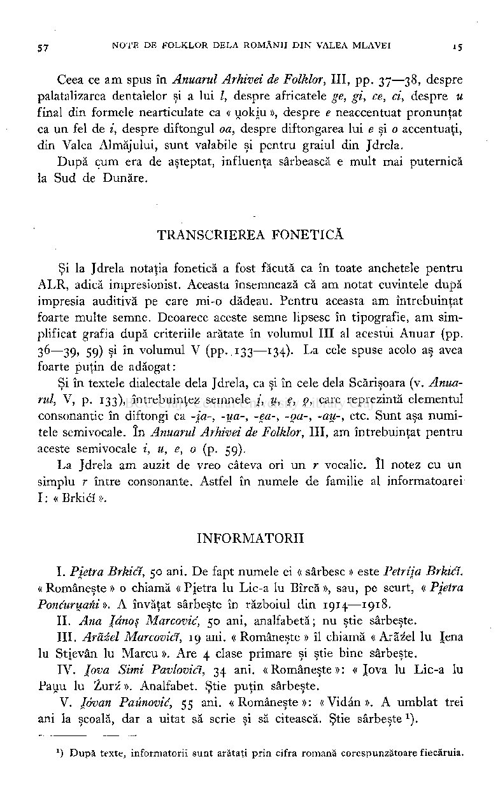

Ceea ce am spus în Anuarul Arhivei de Folklor, III, pp. 37—38, despre palatalizarea dentalelor şi a lui l, despre africatele ge, gi, ce, ci, despre u final din formele nearticulate ca « yokiu », despre e neaccentuat pronunţat ca un fel de i, despre diftongul oa, despre diftongarea lui e şi o accentuaţi, din Valea Almăjului, sunt valabile şi pentru graiul din Jdrela.

După cum era de aşteptat, influenţa sârbească e mult mai puternică la Sud de Dunăre.

TRANSCRIEREA FONETICĂ

Şi la Jdrela notaţia fonetică a fost făcută ca în toate anchetele pentru ALR, adică impresionist. Aceasta însemnează că am notat cuvintele după impresia auditivă pe care mi-o dădeau. Pentru aceasta am întrebuinţat foarte multe semne. Deoarece aceste semne lipsesc în tipografie, am simplificat grafia după criteriile arătate în volumul III al acestui Anuar (pp. 36—39, 59) şi în volumul V (pp. .133—134). La cele spuse acolo aş avea foarte puţin de adăogat:

Şi în textele dialectale delà Jdrela, ca şi în cele delà Scărişoara (v. Anuarul, V, p. 133), întrebuinţez semnele i, u, e, o, care reprezintă elementul consonantic în diftongi ca -ia-, -ua-, -ea-, -oa-, -au-, etc. Sunt aşa numitele semivocale. în Anuarul Arhivei de Folklor, III, am întrebuinţat pentru aceste semivocale i, u, e, o (p. 59).

La Jdrela am auzit de vreo câteva ori un r vocalic. îl notez cu un simplu r între consonante. Astfel în numele de familie al informatoarei I : « Brkicî ».

INFORMATORII

I. Pietra Brkicî, 50 ani. De fapt numele ei « sârbesc » este Petriia Brkicî. « Româneşte » o chiamă « Pietra lu Lic-a lu Bîrcă », sau, pe scurt, « Pietra Poncuruani ». A învăţat sârbeşte în războiul din 1914—1918.

- II. Ana Idnoş Marcovic, 50 ani, analfabetă; nu ştie sârbeşte.
- III. Arăzel Marcovicî, 19 ani. « Româneşte » îl chiamă « Arăzel lu lena

lu Stievân lu Marcu ». Are 4 clase primare şi ştie bine sârbeşte.

- IV. Iova Sinii Pavlovicî, 34 ani. «Româneşte»: << Iova lu Lic-a lu

Pauu lu Zurz ». Analfabet. Ştie puţin sârbeşte.

- V. lôvan Paùnovic, 55 ani. «Româneşte»: «Vidân». A umblat trei

ani la şcoală, dar a uitat să scrie şi să citească. Ştie sârbeşte ).

*) După texte, informatorii sunt arătaţi prin cifra romană corespunzătoare fiecăruia.

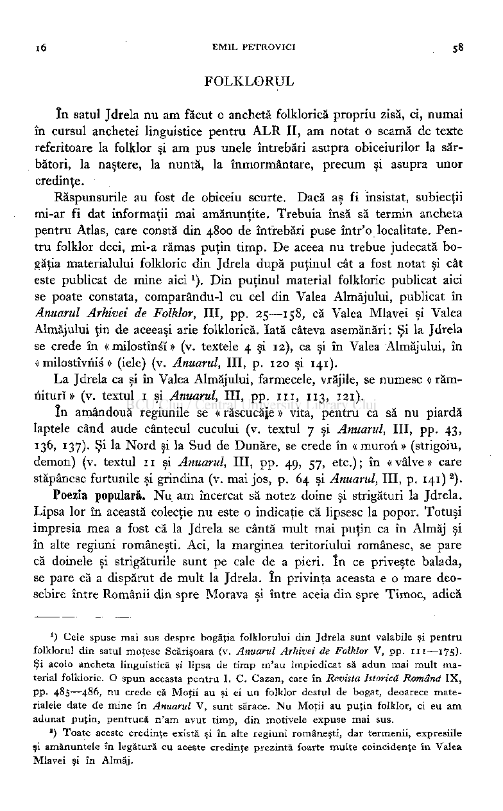

FOLKLORU L

în satul Jdrela nu am făcut o anchetă folklorică propriu zisă, ci, numai în cursul anchetei linguistice pentru ALR II, am notat o seamă de texte referitoare la folklor şi am pus unele întrebări asupra obiceiurilor la săr­

- bători, la naştere, la nuntă, la înmormântare, precum şi asupra unor credinţe.

Răspunsurile au fost de obiceiu scurte. Dacă aş fi insistat, subiecţii mi-ar fi dat informaţii mai amănunţite. Trebuia însă să termin ancheta pentru Atlas, care constă din 4800 de întrebări puse într'o localitate. Pentru folklor deci, mi-a rămas puţin timp. De aceea nu trebue judecată bogăţia materialului folkloric din Jdrela după puţinul cât a fost notat şi cât este publicat de mine aici

1

). Din puţinul material folkloric publicat aici se poate constata, comparându-1 cu cel din Valea Almăjului, publicat în Anuarul Arhivei de Folklor, III, pp. 25—158, că Valea Mlavei şi Valea Almăjului ţin de aceeaşi arie folklorică. Iată câteva asemănări: Şi la Jdrela se crede în « milostînsî » (v. textele 4 şi 12), ca şi în Valea Almăjului, în « milostîvnis » (iele) (v. Anuarul, III, p. 120 şi 141).

La Jdrela ca şi în Valea Almăjului, farmecele, vrăjile, se numesc « rămriiturî » (v. textul 1 şi Anuarul, III, pp. III 113, 121).

în amândouă regiunile se « răscucăie » vita, pentru ca să nu piardă laptele când aude cântecul cucului (v. textul 7 şi Anuarul, III, pp. 43, 136, 137). Şi la Nord şi la Sud de Dunăre, se crede în « muron » (strigoiu, demon) (v. textul 11 şi Anuarul, III, pp. 49, 57, etc.) ; în « vâlve » care stăpânesc furtunile şi grindina (v. mai jos, p. 64 şi Anuarul, III, p. 141)

2

).

Poezia populară. Nu am încercat să notez doine şi strigături la Jdrela. Lipsa lor în această colecţie nu este o indicaţie că lipsesc la popor. Totuşi impresia mea a fost că la Jdrela se cântă mult mai puţin ca în Almăj şi în alte regiuni româneşti. Aci, la marginea teritoriului românesc, se pare

- că doinele şi strigăturile sunt pe cale de a pieri. în ce priveşte balada, se pare că a dispărut de mult la Jdrela. în privinţa aceasta e o mare deosebire între Românii din spre Morava şi între aceia din spre Timoc, adică

*) Cele spuse mai sus despre bogăţia folklorului din Jdrela sunt valabile şi pentru folklorul din satul moţesc Scărişoara (v. Anuarul Arhivei de Folklor V, pp. m—175) . Şi acolo ancheta linguistică şi lipsa de timp m'au împiedicat să adun mai mult material folkloric. O spun aceasta pentru I. C. Cazan, care în Revista Istorică Română IX, pp. 485—486, nu crede că Moţii au şi ei un folklor destul de bogat, deoarece materialele date de mine în Anuarul V, sunt sărace. Nu Moţii au puţin folklor, ci eu am adunat puţin, pentrucă n'am avut timp, din motivele expuse mai sus.

) Toate aceste credinţe există şi în alte regiuni româneşti, dar termenii, expresiile şi amănuntele în legătură cu aceste credinţe prezintă foarte multe coincidenţe în Valea Mlavei şi în Almăj.

a

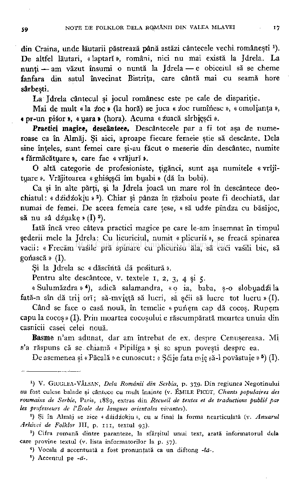

). De altfel lăutari, « lăptari », români, nici nu mai există la Jdrela. La nunţi — am văzut însumi o nuntă la Jdrela — e obiceiul să se cheme fanfara din satul învecinat Bistriţa, care cântă mai cu seamă hore sârbeşti.

din Craina, unde lăutarii păstrează până astăzi cântecele vechi româneşti

1

La Jdrela cântecul şi jocul românesc este pe cale de dispariţie. Mai de mult « la zoc » (la horă) se juca « zoc rumînesc », « omolianţa »,

« pr-un piéor », « yara » (hora). Acuma « zÂiacă sîrbicşci ».

Practici magice, descântece. Descântecele par a fi tot aşa de numeroase ca în Almăj. Şi aici, aproape fiecare femeie ştie să descânte. Delà sine înţeles, sunt femei care şi-au făcut o meserie din descântec, numite « fărmăcătuare », care fac « vrăjuri ».

O altă categorie de profesioniste, ţigănci, sunt aşa numitele « vrîjîtuare ». Vrăjitoarea « ghiseséi îm buabi » (dă în bobi).

Ca şi în alte părţi, şi la Jdrela joacă un mare rol în descântece deochiatul: « dzidzokiu »

). Chiar şi pânza în războiu poate fi deochiată, dar numai de femei. De aceea femeia care ţese, « să udze pîndza cu băsîioc, să nu sâ dzuake » (I) ).

2

Iată încă vreo câteva practici magice pe care le-am însemnat în timpul şederii mele la Jdrela : Cu licuriciul, numit « plicurîs », se freacă spinarea vacii: «Frecăm vasile pră spinare cu plicurisu ăla, să caci vasili bic, să gonască » (I).

Şi la Jdrela se « dăscîrită dă positură ». Pentru alte descântece, v. textele i, 2, 3, 4 şi 5. « Sulumăzdra »

), adică salamandra, « o ia, baba, ş-o slobuadii la fată-n sîn dă trii ori; să-mvietă să lucri, să şeii să lucre tot lucru » (I).

4

Când se face o casă nouă, în temelie « punem cap dă cocoş. Rupem capu la cocoş» (I). Prin moartea cocoşului e răscumpărată moartea unuia din casnicii casei celei nouă.

Basme n'am adunat, dar am întrebat de ex. despre Cenuşereasa. Mi s'a răspuns că se.chiamă « Pipiliga » şi se spun poveşti despre ea.

De asemenea şi « Păcală » e cunoscut : « Şciie fata mie să-1 povăstuie »

#### ) (I).

6

###### ) V. GlUGLEA-VÂLSAN, Delà Românii din Serbia, p. 37.9. Din regiunea Negotinului au fost culese balade şi cântece cu mult înainte (v. EMILE PICOT, Chants populaires des roumains de Serbie, Paris, 1889, extras din Recueil de textes et de traductions publié par les professeurs de l'École des langues orientales vivantes).

x

) Şi în Almăj se zice « dzidzokiu », cu u final la forma nearticulată (v. Anuarul Arhivei de Folklor III, p. ni , textul 93).

2

) Cifra romană dintre paranteze, la sfârşitul unui text, arată informatorul delà care provine textul (v. lista informatorilor la p. 57).

3

- 4

) Vocala ă accentuată a fost pronunţată ca un diftong -îă-.

- 5

###### ) Accentul pe -ă-.

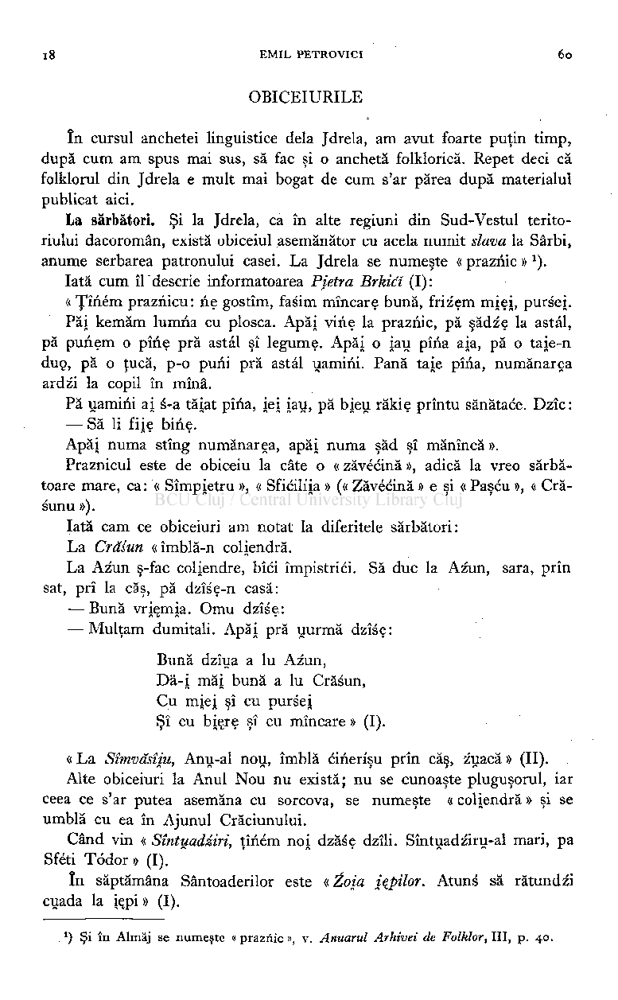

OBICEIURILE

în cursul anchetei linguistice delà Jdrela, am avut foarte puţin timp, după cum am spus mai sus, să fac şi o anchetă folklorică. Repet deci că folklorul din Jdrela e mult mai bogat de cum s'ar părea după materialul publicat aici.

La sărbători. Şi la Jdrela, ca în alte regiuni din Sud-Vestul teritoriului dacoromân, există obiceiul asemănător cu acela numit slava la Sârbi, anume serbarea patronului casei. La Jdrela se numeşte « praznic »

).

J

Iată cum îl'descrie informatoarea Pietra Brkicî (I): « Tîném prazfiicu: he gostîm, fasim mîncare bună, frizem miei, pursei. Păi kemăm lumna cu plosca. Apăi vine la praznic, pă şădze la astâl,

pă punem o pîne pră astâl şî legume. Apăi o iau pîha aia, pă o taie-n duo, pă o ţucă, p-o puni pră astâl uamihi. Pană taie pîha, numănarea ardzi la copil în mînâ.

Pă uamihi ai s-a tăiat pîha, iei iau, pă bieu răkie prîntu sănătace. Dzîc:

— Să li fiie bine. Apăi numa stîng numănarea, apăi numa şăd şî mănîncă ». Praznicul este de obiceiu la câte o « zăvecină », adică la vreo sărbă­

toare mare, ca: « Sîmpietru », « Sficilîia » (« Zăvecină » e şi « Paşcu », « Crăsunu »).

Iată cam ce obiceiuri am notat la diferitele sărbători: La Crăiun «îmblă-n coliendră. La Azun ş-fac coliendre, bîci împistrici. Să duc la Azun, sara, prîn

sat, prî la căş, pă dzîse-n casă:

— Bună vriçmia. Omu dzîse:

— Mulţam dumitali. Apăi pră uurmă dzîse:

Bună dzîya a lu Azun, Dä-i măi bună a lu Crăsun, Cu miei şî cu pursei Şî cu biçre şî cu mîncare » (I).

« LaSîmvăsîiu,Any-al nou, îmblaciherişu prîn căş, zyacă » (II).

Alte obiceiuri la Anul Nou nu există; nu se cunoaşte pluguşorul, iar ceea ce s'ar putea asemăna cu sorcova, se numeşte « coliendră » şi se umblă cu ea în Ajunul Crăciunului.

Când vin «Sîntuadâiri, ţîhem noi dzăse dzîli. Sîntyadziru-al mari, pa

Sféti Tödor» (I).

în săptămâna Sântoaderilor este «Éoia iqpilor. Atuns să rătundzi cyada la ie.pi » (I).

) Şi în Almăj se numeşte « praznic », v. Anuarul Arhivei de Folklor, III, p. 40.

l

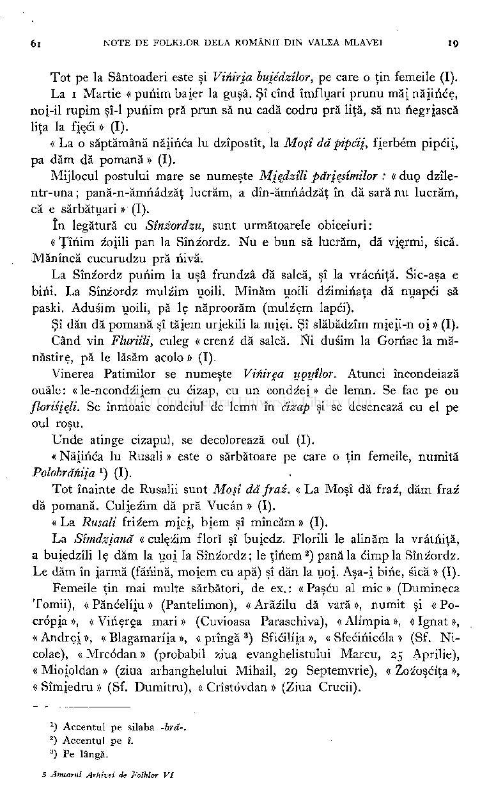

Tot pe la Sântoaderi este şi Viûiria buiédzttor, pe care o ţin femeile (I). La 1 Martie « punim baier la guşâ. Şî cînd îmfluari prunu măi năiirice,

noi-il rupim şî-1 punim pră prun să nu cadă codru pră liţă, să nu negr iască liţa la fieci » (I).

« La o săptămână năiinca lu dzîpostît, la Moşî dă pipăi, fierbem pipcii, pa dăm dă pomană » (I).

Mijlocul postului mare se numeşte Miedzili păriesîmilor : « duc dzîlentr-una ; pană-n-ămriâdzăţ lucrăm, a dîn-ămnâdzăţ în dă sară nu lucrăm, că e sărbătuari » (I).

în legătură cu Sînzordzu, sunt următoarele obiceiuri: « Ţîriim zoiili pan la Sînzordz. Nu e bun să lucrăm, dă viermi, sică.

Mănîncă cucurudzu pră riivă.

La Sînzordz punim la uşâ frundzâ dă salcă, şî la vrâcfiiţă. Sic-aşa e bihi. La Sînzordz mulzim uoili. Mînăm uoili dziminaţa dă nuapci să paski. Adusim uoili, pă le năproorăm (mulzem lapci).

Şî dăn dă pomană şî tăiem uriekili la miei. Şî slăbădzîm mieii-n oi » (I). Când vin Fluriili, culeg « crenz dă salcă. Ni dusim la Gorriac la mă­

năstire, pă le lăsăm acolo » (I).

Vinerea Patimilor se numeşte Vinirea uoijîlor. Atunci încondeiază ouăle: « le-ncondziiem cu cizap, cu un condzei » de lemn. Se fac pe ou florisieli. Se înmoaie condeiul de lemn în cizap şi se desenează cu el pe oul roşu.

Unde atinge cizapul, se decolorează oul (I). « Năiinca lu Rusali » este o sărbătoare pe care o ţin femeile, numită

Polobrăâiia

) (I). Tot înainte de Rusalii sunt Moşî dă fraz. « La Moşî dă fraz, dăm fraz

J

- dă pomană. Culiezim dă pră Vucân » (I). « La Rusali frizem miei, biem şî mîncăm » (I). La Sîmdziană « culezim florî şî buiedz. Florili le alinăm la vrâtniţă,

a buiedzîli le dăm la uoi la Sînzordz; le ţînem

) pană la cimp la Sînzordz. Le dăm în iarmă (fănină, moiem cu apă) şî dăn la uoi. Aşa-i bine, sică » (I).

2

Femeile ţin mai multe sărbători, de ex. : « Paşcu al mic» (Dumineca Tomii), « Pănceliiu » (Pantelimon), « Arâzilu dă vară », numit şi « Pocropia », « Vinerea mari » (Cuvioasa Paraschiva), « Alîmpia », « Ignat », « Andrei », « Blagamariia », « prîngă ) Sficiliia », « Sfeéinicôla » (Sf. Nicolae), « Mrcodan » (probabil ziua evanghelistului Marcu, 25 Aprilie), « Mioioldan » (ziua arhanghelului Mihail, 29 Septemvrie), « Zozoşci'ţa », « Sîmiedru » (Sf. Dumitru), « Crîstovdan » (Ziua Crucii).

) Accentul pe silaba -bră-.

J

- 2

) Accentul pe î.

- 3

) Pe lângă.

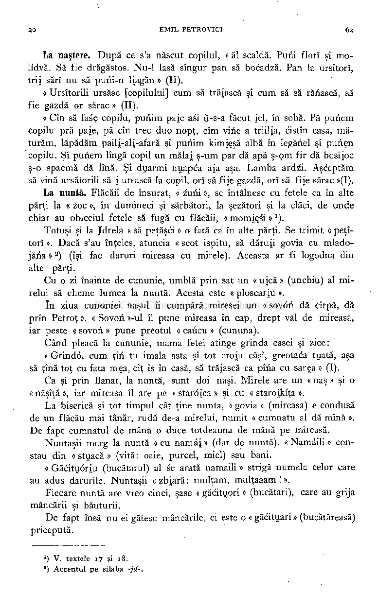

La naştere. După ce s'a născut copilul, « ăl scaldă. Puni flori şî molidvă. Să fie drăgăstos. Nu-1 lasă singur pan să bocadză. Pan la ursitori, tri i sări nu să puni-n liagăn » (II),

« Ursîtorili ursăsc [copilului] cum să trăiască şî cum să să răriască, să fie gazdă or sărac » (II).

« Cîn să fase copilu, punim paie asi ü-s-a făcut iei, în sobă. Pă punem copilu pră paie, pă cîn trec duc nopţ, cîm vine a triilia, cistîn casa, măturăm, lăpădăm paili-ali-afară şî puhim kimiesă albă în legănel şî punen copilu. Şî punem lîngă copil un mălai ş-um par dă apă ş-om fir dă bosîioc ş-o spacmă dă lînă. Şî duarmi nuapca aia aşa. Lamba ardzi. Aşceptăm să vină ursătorili să-i ursască la copil, ori să fiie gazdă, orî să fiie sărac »(I).

La nuntă. Flăcăii de însurat, « zuni », se întâlnesc cu fetele ca în alte părţi la « zoc », în dumineci şi sărbători, la şezători şi la clăci, de unde chiar au obiceiul fetele să fugă cu flăcăii, « momiesi »

).

1

Totuşi şi la Jdrela « să peţăşci » o fată ca în alte părţi. Se trimit « peţitori ». Dacă s'au înţeles, atuncia « scot ispitu, să dăruii govia cu mladojăria »

) (îşi fac daruri mireasa cu mirele). Aceasta ar fi logodna din alte părţi.

a

Cu o zi înainte de cununie, umblă prin sat un « uică » (unchiu) al mirelui să cheme lumea la nuntă. Acesta este « ploscariu ».

în ziua cununiei naşul îi cumpără miresei un << sovon dă cîrpă, dă prin Petroţ ». « Sovon »-ul îl pune mireasa în cap, drept văl de mireasă, iar peste « sovon » pune preotul « caücu » (cununa).

Când pleacă la cununie, mama fetei atinge grinda casei şi zice: « Grindo, cum ţîh tu imala asta şî tot croiu căşî, greotaca tuată, aşa

să ţînă toţ cu fata mea, cîţ îs în casă, să trăiască ca pîna cu sarea » (I).

Ca şi prin Banat, la nuntă, sunt doi naşi. Mirele are un « naş » şi o « năşîţă », iar mireasa îl are pe « staroica » şi cu « staroiki'ţa ».

La biserică şi tot timpul cât ţine nunta, « govia » (mireasa) e condusă de un flăcău mai tânăr, rudă de-a mirelui, numit « cumnatu al dă mînă ». De fapt cumnatul de mână o duce totdeauna de mână pe mireasă.

Nuntaşii merg la nuntă « cu namâi » (dar de nuntă). « Namâili » constau din « stuacă » (vită: oaie, purcel, miel) sau bani.

« Găcituoriu (bucătarul) al se arată namaili » strigă numele celor care au adus darurile. Nuntaşii «zbiară: mulţam, mulţaaam ! ».

Fiecare nuntă are vreo cinci, şase « găcituori » (bucătari), care au grija mâncării şi băuturii.

De fapt însă nu ei gătesc mâncările, ci este o « găcituari » (bucătăreasă) pricepută.

) V. textele 17 şi 18.

1

) Accentul pe silaba -jă-.

2

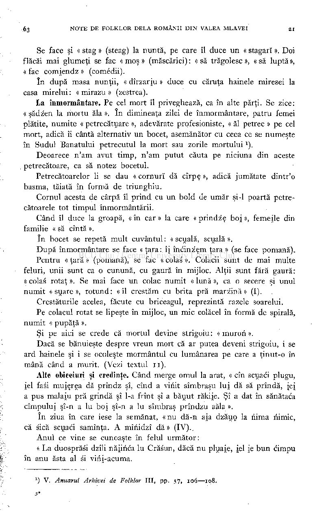

Se face şi « stag » (steag) la nuntă, pe care îl duce un « stagarî ». Doi flăcăi mai glumeţi se fac « moş » (măscărici) : « să trăgolesc », « să luptă », « fac comiendz » (comedii).

în după masa nunţii, « dîrzariu » duce cu căruţa hainele miresei la casa mirelui: « mirazu » (zestrea).

La înmormântare. Pe cel mort îl priveghează, ca în alte părţi. Se zice: « şădzen la mortu ăla ». în dimineaţa zilei de înmormântare, patru femei plătite, numite « petrecătuare », adevărate profesioniste, « ăl petrec » pe cel mort, adică îi cântă alternativ un bocet, asemănător cu ceea ce se numeşte în Sudul Banatului petrecutul la mort sau zorile mortului

).

x

Deoarece n'am avut timp, n'am putut căuta pe niciuna din aceste petrecătoare, ca să notez bocetul.

Petrecătoarelor li se dau « cornurî dă cîrpe », adică jumătate dintr'o basma, tăiată în formă de triunghiu.

Cornul acesta de cârpă îl prind cu un bold de umăr şi—1 poartă petrecătoarele tot timpul înmormântării.

Când îl duce la groapă, « în car » la care « prindze boi », femeile din

familie « să cîntă ». în bocet se repetă mult cuvântul : « scuală, scuală ». După înmormântare se face « ţara: îi încinzem ţara » (se face pomană). Pentru « ţară » (pomană), se fac « colas ». Colacii sunt de mai multe

feluri, unii sunt ca o cunună, cu gaură în mijloc. Alţii sunt fără gaură: «colas rotat». Se mai face un colac numit «lună», ca o secere şi unul numit « suare », rotund: «îl crestăm cu brita pră marzină » (I).

Crestăturile acelea, făcute cu briceagul, reprezintă razele soarelui. Pe colacul rotat se lipeşte în mijloc, un mic colăcel în formă de spirală,

numit « pupăţă ». Şi pe aici se crede că mortul devine strigoiu : « murofi ». Dacă se bănuieşte despre vreun mort că ar putea deveni strigoiu, i se

ard hainele şi i se ocoleşte mormântul cu lumânarea pe care a ţinut-o în mână când a murit. (Vezi textul îi).

Alte obiceiuri şi credinţe. Când merge omul la arat, « cîn scuaci plugu, iei fasi muie/ea dă prîndz şî, cînd a viriit sîmbraşu lui dă să prindă, iei a pus malaiu pră grindă şî 1-a frînt şî a băuut răkiie. Şî a dat în sănătaca cîmpului şî-n a lu boi şî-n a lu sîmbraş prîndzu aăla ».

în ziua în care iese la semănat, « nu dă-n aia dzăuc» la nima nimic,

că sică scuaci samînţa. A mînidzî dă» (IV).. Anul ce vine se cunoaşte în felul următor: « La duosprăsi dzîli năiinca lu Crăsun, dacă nu pluaie, iei ie bun cimpu

în anu ăsta al si vini-acuma.

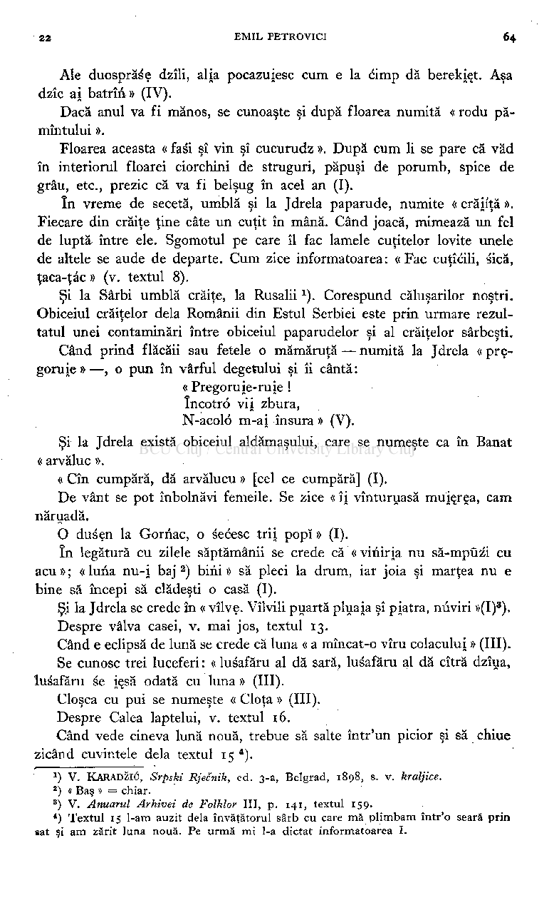

Ale duosprăse dzîli, alia pocazuiesc cum e la cimp dă berekiçt. Aşa dzîc ai batrîn » (IV).

Dacă anul va fi mănos, se cunoaşte şi după floarea numită « rodu pămîntului ».

Floarea aceasta « fasi şî vin şî cucurudz ». După cum li se pare că văd în interiorul floarei ciorchini de struguri, păpuşi de porumb, spice de grâu, etc., prezic că va fi belşug în acel an (I).

în vreme de secetă, umblă şi la Jdrela paparude, numite « crăiiţă ». Fiecare din crăiţe ţine câte un cuţit în mână. Când joacă, mimează un fel

- de luptă între ele. Sgomotul pe care îl fac lamele cuţitelor lovite unele de altele se aude de departe. Cum zice informatoarea: «Fac cuţîcili, sică, ţaca-ţac » (v. textul 8).

Şi la Sârbi umblă crăiţe, la Rusalii*). Corespund căluşarilor noştri. Obiceiul crăiţelor delà Românii din Estul Serbiei este prin urmare rezultatul unei contaminări între obiceiul paparudelor şi al crăiţelor sârbeşti.

Când prind flăcăii sau fetele o mămăruţă — numită la Jdrela « pre-

goruie »—, o pun în vârful degetului şi îi cântă: « Pregoruie-ruie ! încotro vii zbura, N-acolö m-ai însura » (V).

Şi la Jdrela există obiceiul aldămaşului, care se numeşte ca în Banat

« arvăluc ». « Cîn cumpără, dă arvălucu » [cel ce cumpără] (I). De vânt se pot înbolnăvi femeile. Se zice « îi vînturuasă muiçrea, cam

năryadă. O dusen la Gorhac, o seéesc trii popï » (I). în legătură cu zilele săptămânii se crede că « viniria nu să-mpuzi cu

acu»; «luna nu-i baj ) birii » să pleci la drum, iar joia şi marţea nu e bine să începi să clădeşti o casă (I).

Şi la Jdrela se crede în « vîlve. Vîlvili puartă pluaia şî piatra, nûviri »(I)

).

3

Despre vâlva casei, v. mai jos, textul 13. Când e eclipsă de lună se crede că luna « a mîncat-o vîru colacului » (III). Se cunosc trei luceferi : « lusafăru al dă sară, lusafăru al dă cîtră dzîua,

lusafăru se icsăodată cu luna » (III). Cloşca cu pui se numeşte « Cloţa » (III). Despre Calea laptelui, v. textul 16. Când vede cineva lună nouă, trebue să salte într'un picior şi să chiue

zicând cuvintele delà textul 15 ).

*) V. KARADZIC, Srpski Rjecnik, ed. 3-a, Belgrad, 1898, s. v. kraljice.

- 2

) « Baş » = chiar.

- 3

) V. Anuarul Arhivei de Folklor III, p. 141, textul 159.

- 4

###### ) Textul 15 l-am auzit delà învăţătorul sârb cu care mă plimbam într'o seară prin sat şi am zărit luna nouă. Pe urmă mi 1-a dictat informatoarea I.

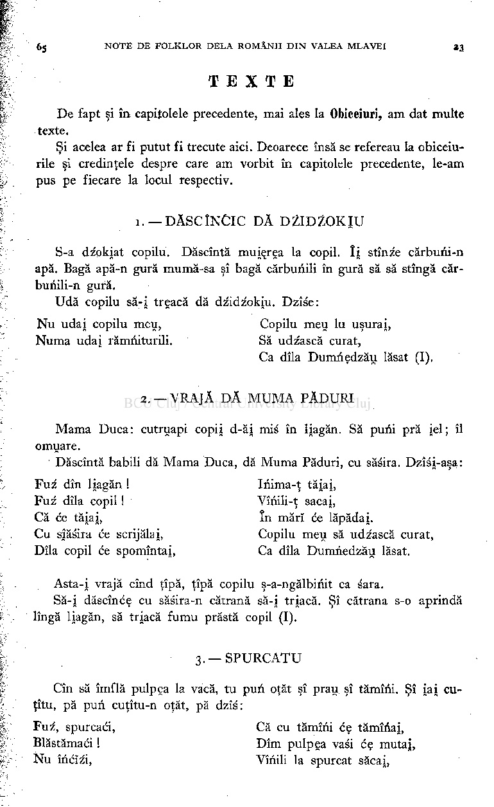

## TEXT E

De fapt şi în capitolele precedente, mai ales la Obiceiuri, am dat multe texte.

Şi acelea ar fi putut fi trecute aici. Deoarece însă se refereau la obiceiurile şi credinţele despre care am vorbit în capitolele precedente, le-am pus pe fiecare la locul respectiv.

i. — DĂSCÎNCIC DĂ DZIDZOKIU

S-a dzokiat copilu. Dăscîntă muie/ea la copil. îi stînze cărbuni-n apă. Bagă apă-n gură mumă-sa şî bagă cărbuhili în gură să să stîngă cărbunili-n gură.

Udă copilu să-i treacă dă dzidzokiu. Dzîse:

Nu udai copilu meu, Copilu meu lu uşurai, Numa udai rămniturili. Să udzască curat,

Ca dîla Dumnedzău lăsat (I).

2. —VRAJĂ DĂ MUMA PĂDURI

Mama Duca: cutryapi copii d-ăi mis în liagăn. Să puni pră iei; îl omuare.

Dăscîntă babili dă Mama Duca, dă Muma Păduri, cu săsira. Dzîei-aşa:

Fui dîn liagăn ! Inima-ţ tăiai, Fui dîla copil ! Vînili-ţ sacai, Că ce tăiai, în mări ce lăpădai.

- Cu sîăsira ce scrijălai, Copilu meu să udzască curat, Dîla copil ce spomîntai, Ca dîla Dumnedzău lăsat.

Asta-i vrajă cînd ţîpă, ţîpă copilu ş-a-ngălbinit ca sara. Să-i dăscînce cu săsira-n cătrană să-i triacă. Şî cătrana s-o aprindă

lîngă liagăn, să triacă fumu prăstă copil (I).

3. —SPURCAT U

Cîn să îmflă pulpea la vacă, tu pun oţăt şî prau şî tămîni. Şî iai cuţîtu, pă pun cuţîtu-n oţăt, pă dzîs: Fuz", spurcaci, Că cu tămîni ce tămînai, Blăstămaci ! Dîm pulpea vasi ce mutai, Nu încîzi, Vînili la spurcat săcai,

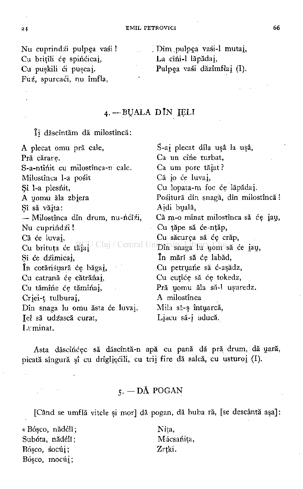

Nu cuprindzi pulpea vasi ! Cu briţîli ce spincicai, Cu puşkili ci puşcai. Fuz, spurcaci, nu îmfla,

- Dîm pulpea vasi-1 mutai, La cîni-1 lăpădai, Pulpea vasi dăzîmflai (I).

DÎ N IELI

S-ai plecat dîla uşâ la uşâ, Ca un cîne turbat, Ca um porc tăiat? Că io ce luvai, Cu lopata-m foc ce lăpădai. Poeitură dîn snagă, dîn milostîncă ! Aidi buală, Că m-o mînat milostîncă să ce iau, Cu ţăpe să ce-nţăp, Cu săcurca să ce crap,

- Dîn snaga lu uom să ce iau, în mări să ce labăd,

4. — BUALA

îi dăscîntăm dă milostîncă:

A plecat omu pră cale, Pră cărare. S-a-ntîriit cu milostînca-n cale. Milostîncă 1-a posit Şî 1-a plesnit, A uomu ăla zbiera Şî să văita:

— Milostîncă dîn drum, nu-ncîzi, Nu cuprindzi ! Că ce luvai, Cu brituţa ce tăiai Şî ce dzimicai, în cotărisuară ce băgai, Cu catrană ce cătrănai,

Cu petruarie să c-aşădz, Cu cuţîce să ce tokedz, Pră uomu ăla să-1 uşuredz. A milostîncă Mila sS-ş întuarcă, Liacu să-i aducă.

- Cu tămîne ce tămînai, Criei-ţ tulburai, Dîn snaga Iu omu ăsta ce luvai. Iei să udzască curat, Luminat.

Asta dăscîncec să dăscîntă-n apă cu pană dă pră drum, dă uară, picată singură şî cu drîglie„cili, cu trii fire dă salcă, cu usturoi (I).

5. — DÄ POGAN

[Când se umflă vitele şi mor] dă pogan, dă buba ră, [se descântă aşa] :

« Boşco, nădelî ; Niţa, Suböta, nădelî; Macsaniţa, Boşco, socüi; Zrţki. Boşco, mociii;

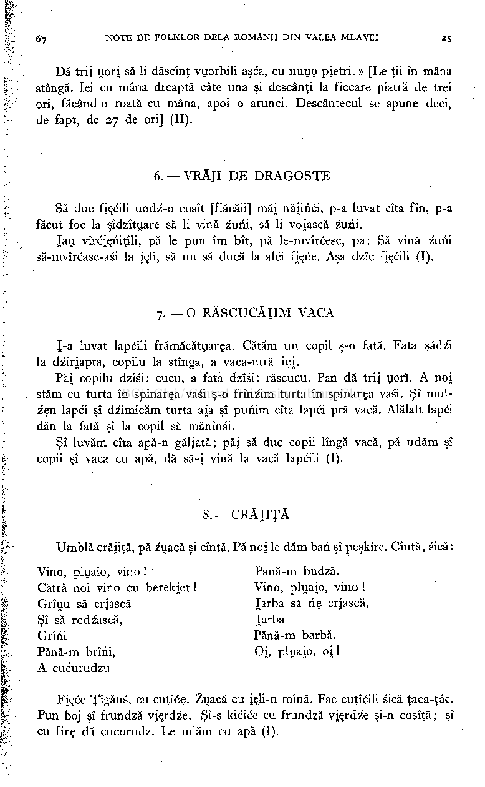

Dă trii uori să li dăscînţ vuorbili aşca, cu nuuo pietri. » [Le ţii în mâna stângă. Iei cu mâna dreaptă câte una şi descânţi la fiecare piatră de trei ori, făcând o roată cu mâna, apoi o arunci. Descântecul se spune deci, de fapt, de 27 de ori] (II).

- 6. — VRĂJI DE DRAGOSTE
- 7- O RÄSCUCÄIIM VACA

Să duc fjçcili undz-o cosît [flăcăii] măi năiinci, p-a luvat cîta fîn, p-a făcut foc la şîdzîtuare să li vină zuni, să li voiască zuni.

Iau vîrcicniţîli, pă le pun îm bît, pă le-mvîrcesc, pa: Să vină zuni să-mvîrcasc-asi la ieH, să nu să ducă la aici fiexe. Aşa dzîc fiecili (I).

I-a luvat lapcili frămăcătuarea. Cătăm un copil ş-o fată. Fata şădzi la dziriapta, copilu la stînga, a vaca-ntră iei.

Păi copilu dzîsi: cucu, a fata dzîsi: răscucu. Pan dă trii uori. A noi stăm cu turta în spinarea vasi ş-o frînzim turta în spinarea vasi. Şî mulzen lapci şî dzimicăm turta aia şî puhim cîta lapci pră vacă. Alălalt lapci dăn la fată şî la copil să mănînsi.

Şî luvăm cîta apă-n găliată; păi să duc copii lîngă vacă, pă udăm şî copii şî vaca cu apă, dă să-i vină la vacă lapcili (I).

8. —CRĂIIŢ Ă

Umblă crăiiţă, pă zuacă şî cîntă. Pă noi le dăm ban şî peşkîre. Cîntă, sică:

Pană-m budză. Vino, pluaio, vino ! Iarba să ne criască, Iarba Pănă-m barbă. Oi, pluaio, oi !

Vino, plyaio, vino ! Cătrâ noi vino cu berekiet ! Grîuu să criască Şî să rodzască, Grîni Pănă-m brîhi, A cucurudzu

Fiç_ce Ţîgăns, cu cuţîce. Zuacă cu içli-n mînă. Fac cuţîcili sică ţaca-ţâc. Pun boj şî frundză viçrdze. Şî-s kicice cu frundză viçrdze şî-n cosiţă; şî cu fire dă cucurudz. Le udăm cu apă (I).

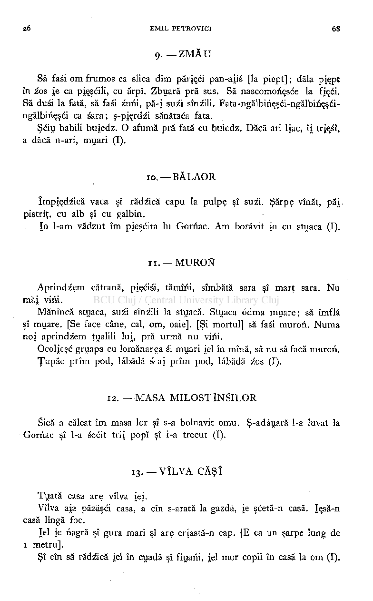

9. —ZMĂ U

Să faéi om frumos ca slica dîm păricci pan-aiis [la piept] ; dăla pie.pt în zos ie ca piescili, cu ărpî. Zbuară pră sus. Să nascomonçsce la fiçci. Să dusi la fată, să faéi zuni, pă-i suzi sînzili. Fata-ngălbiricşci-ngălbinescingălbinesci ca sara; ş-pie/dzi sănătaca fata.

Şciu babili buiedz. O afumă pră fată cu buiedz. Dacă ari liac, îi triesi, a dacă n-ari, muari (I).

10. —BÄLAO R

împicdzică vaca şî rădzică capu la pulpe şî suzi. Şarpe vînăt, păi, pistriţ, cu alb şî cu galbin.

Io l-am vădzut îm pieşcira lu Gornac. Am borăvit io cu stuaca (I).

11. —MURO N

Aprindzem cătrană, piçcisi, tămîni, sîmbătă sara şî marţ sara. Nu măi vini.

Mănîncă stuaca, suzi sînzili la stuacă. Stuaca 6dma muare; să îmflă şî muare. [Se face câne, cal, om, oaie]. [Şi mortul] să fasi muron. Numa noi aprindzem ţualili lui, pră urmă nu vini.

Ocolieşc gryapa cu lomănarea si muari iei în mînă, sâ nu sâ facă muron. Ţupăe prîm pod, lâbădă s-ai prun pod, lâbădă zos (I).

12. —MAS A MILOSTÎNSILOR

Sică a călcat îm masa lor şî s-a bolnăvit omu. Ş-adâuară 1-a luvat la Gornac şî 1-a seéit trii popi şî i-a trecut (I).

13. — VÎLVA CAŞÎ

Tuată casa are vîlva iei. Vîlva aia păzăşci casa, a cîn s-arată la gazdă, ie şcetă-n casă. Içsa-n

casă lîngă foc.

Iei ie nagră şî gura mari şî are criastă-n cap. [E ca un şarpe lung de 1 metru].

Şî cîn să rădzică iei în cuadă şî fiuahi, iei mor copii în casă la om (I).

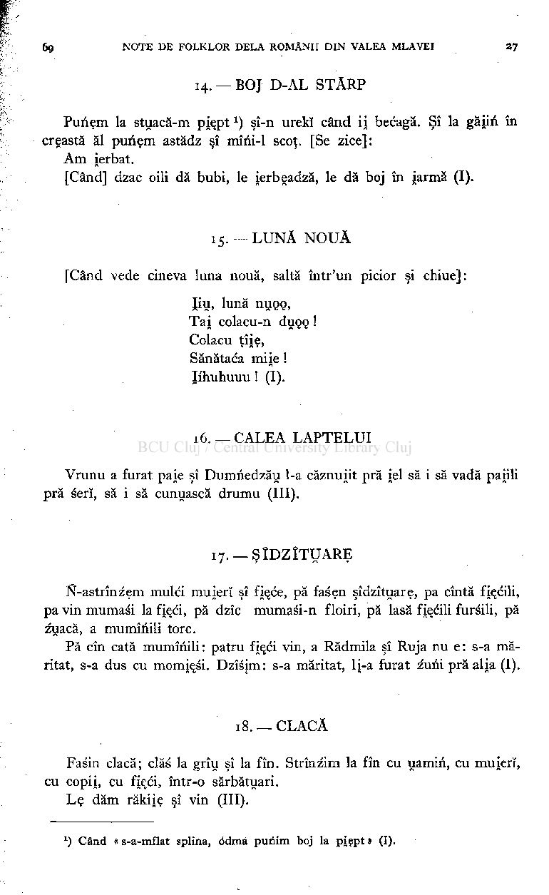

14. — BOJ D-AL STÄRP

Punem la stuacă-m piept

) şî-n urekî când ii becagă. Şî la găiin în

x

creastă ăl punem astădz şî mîrii-1 scoţ. [Se zice]: Am ierbat. [Când] dzac oili dă bubi, le ierbeadză, le dă boj în iarmă (I).

15. — LUNĂ NOUĂ

[Când vede cineva luna nouă, saltă într'un picior şi chiue]:

Iiu, lună nurjç, Tai colacu-n duQQ ! Colacu ţîie, Sănătaca mi ie ! Iihuhuuu ! (I).

16. —CALE A LAPTELUI

Vrunu a furat paie şî Dumnedzău 1-a căznuiit pră iei să i să vadă paiili pră seri, să i să cunuască drumu (III).

17. —ŞÎDZÎTUAR E

N-astrînzem muici muieri şî fiece, pă fasen şîdzîtuare, pa cîntă fiecili, pa vin mumasi la fiçci, pă dzîc mumasi-n floiri, pă lasă fiecili fursili, pă iuacă, a mumîfiili torc.

Pă cîn cată mumînili: patru fiçci vin, a Rădmila şî Ruja nu e: s-a măritat, s-a dus cu momiesi. Dzîsim: s-a măritat, li-a furat zufii pră alia (I).

18. — CLACĂ

Fasin clacă; clas la grîu şî la fîn. Strînzim la fîn cu uamin, cu muieri, cu copii, cu fieci, într-o sărbătuari.

Le dăm răkiie şî vin (III).

) Când « s-a-mflat splina, ödma punim boj la piept » (I).

x

