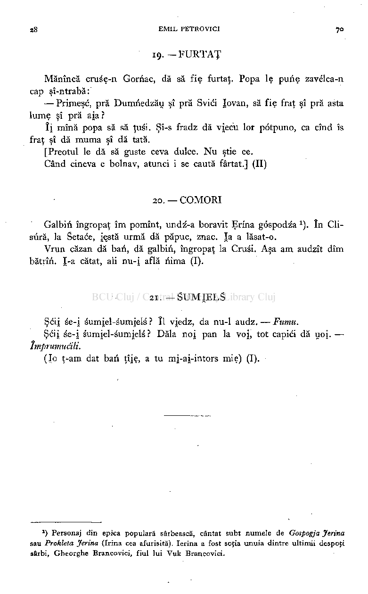

19. — FURTAŢ

Mănîncă cruse-n Gornac, dă să fie furtaţ. Popa le pune zavélca-n cap şî-ntrabă:

— Primesc, pră Dumnedzău şî pră Svici Iovan, să fie fraţ şî pră asta lume şî pră aia ?

îi mînă popa să să ţusi. Şî-s fradz dă viecu lor potpuno, ca cînd îs

fraţ şî dă muma şî dă tată. [Preotul le dă să guste ceva dulce. Nu ştie ce. Când cineva e bolnav, atunci i se caută fârtat.] (II)

20. — COMORI

Galbifi îngropat îm pomînt, undz-a boravit En'na göspodza ). în Cli-

sură, la Setace, iestă urmă dă papuc, znac. Ia a lăsat-o.

Vrun cazan dă ban, dă galbin, îngropat la Crusi. Aşa am audzît dîm bătrîn. I-a cătat, aii nu-i află nima (I).

21.—SUMIEL S

Şeii se-i sumiel-sumiels ? îl viedz, da nu-1 audz. — Fumu. Şeii se-i sumiel-sumiels? Dăla noi pan la voi, tot capici dă uoi. —

Imprumuăli. (Io ţ-am dat ban ţîie, a tu mi-ai-intors mie) (I).

*) Personaj din epica populară sârbească, cântat subt numele de Gospogja Jerina sau Prokleta Jerina (Irina cea afurisită). Ierina a fost soţia unuia dintre ultimii despoţi sârbi, Gheorghe Brancovici, fiul lui Vuk Brancovici.

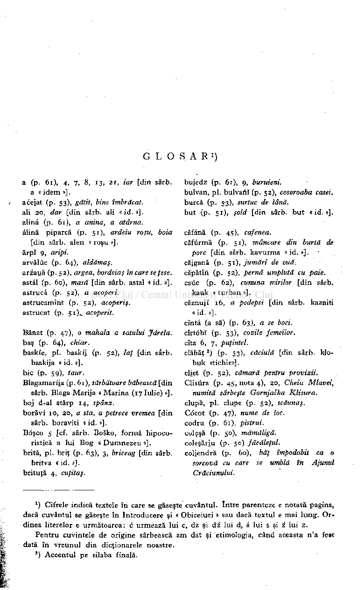

##### GLOSAR

)

1

a (p. 61), 4, 7, 8, 13, 21, iar [din sârb.

buiedz (p. 61), 9, buruieni. bulvan, pl. bulvahï (p. 52), cosoroaba casei. burcă (p. 53), surtuc de lână. but (p. 51), şold [din sârb. but « id. »].

a « idem »]. aceiat (p. 53), gătit, bine îmbrăcat. aii 20, dar [din sârb. aii « id. »]. alina (p. 61), a anina, a atârna. alină piparcă (p. 51), ardeiu roşu, boia

căfână (p. 45), cafenea. căfurmă (p. 51), mâncare din burtă de

[din sârb. alen «roşu»], ărpî 9, aripi. arvăluc (p. 64), aldămaş. arzauă (p. 52), argea, bordeiaş în care se ţese. astâl (p. 60), masă [din sârb. astal « id. »]. astrucâ (p. 52), a acoperi. astrucamînt (p. 52), acoperiş. astrucat (p. 51),. acoperit.

porc [din sârb. kavurma « id. »]. " căjgană (p. 51), jumări de ouă. căpătîri (p. 52), pernă umplută cu paie. caüc (p. 62), cununa mirilor [din sârb.

kauk « turban »]. căznujî 16, a pedepsi [din sârb. kazniti

« id. »]. cîntă (a să) (p. 63), a se boci. cîrtobî (p. 53), cozile femeilor. cîta 6, 7, puţintel. clăbăţ ) (p. 53), căciulă [din sârb. klo-

Bănat (p. 47), o mahala a satului Jdrela. baş (p. 64), chiar. baskfe, pl. baskîi (p. 52), laţ [din sârb.

baskija « id. »]. bic (p. 59), taur. Blagamariia (p. 61), sărbătoare băbească [din sârb. Blaga Marija « Marina (17 Iulie) »]. boj d-al stărp 14, spănz. borăvi 10, 20, a sta, a petrece vremea [din

buk «tichie»], cliet (p. 52), cămară pentru provizii. Clisûra (p. 45, nota 4), 20, Cheia Mlavei,

numită sârbeşte Gornjacka Klisura. clupă, pl. clupe (p. 52), scăunaş. Cocoţ (p. 47), nume de loc. codru (p. 61), pistrui. coleşă (p. 50), mămăligă. coleşărju (p. 50) făcăleţul. coliendră (p. 60), băţ împodobit ca o

sârb. boraviti «id. »]. Boşco 5 [cf. sârb. Bosko, formă hipocoristică a lui Bog « Dumnezeu »]. brită, pl. briţ (p. 63), 3, briceag [din sârb.

sorcovă cu care se umblă în Ajunul Crăciunului.

britva « id. »]. brituţă 4, cuţitaş.

) Cifrele indică textele în care se găseşte cuvântul. între parenteze e notată pagina, dacă cuvântul se găseşte în Introducere şi « Obiceiuri » sau dacă textul e mai lung. Ordinea literelor e următoarea: c urmează lui c, dz şi di.Iui d, s lui s şi z lui z.

l

Pentru cuvintele de origine sârbească am dat şi etimologia, când aceasta n'a fost dată în vreunul din dicţionarele noastre.

) Accentul pe silaba finală.

s

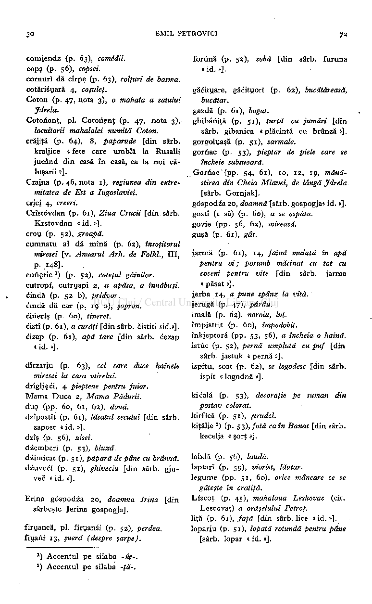

comiendz (p. 63), comedii. cops (p. 56), copsei. cornurî dă cîrpe (p. 63), coifuri de basma. cotărisuară 4, coşulef. Coton (p. 47, nota 3), o mahala a satului

forună (p. 52), sobă [din sârb. furuna « id. »].

găcituare, găcituorî (p. 62), bucătăreasă,

bucătar. gazdă (p. 61), bogat. ghibâniţă (p. 51), turtă cu jumări [din-

###### Jdrela.

Cotonanţ, pl. Cotonşnţ (p. 47, nota 3),

###### locuitorii mahalalei numită Coton.

sârb. gibanica « plăcintă cu brânză »]. gorgolyaşă (p. 51), sarmale. gornac (p. 53), pieptar de piele care se

crăjiţă (p. 64), 8, paparude [din sârb. kraljice « fete care umblă la Rusalii jucând din casă în casă, ca la noi căluşarii »].

încheie subsuoară.

Gornac"(pp. 54, 61), 10, iz, 19, mănăstirea din Cheia Mlavei, de lângă Jdrela [sârb. Gornjak].

Crajna (p. 46, nota 1), regiunea din extre­

mitatea de Est a Iugoslaviei. crjei 4, creeri. Crîstovdan (p. 61), Ziua Crucii [din sârb.

göspodza 20, doamnă [sârb. gospogja« id. »]. gostî (a să) (p. 60), a se ospăta. govie (pp. 56, 62), mireasă. guşă (p. 61), gât.

Krstovdan « id. »]. erou (p. 52), groapă. cumnatu al dă mînă (p. 62), însoţitorul

iarmă (p. 61), 14, făină muiată în apă pentru oi; porumb măcinat cu tot cu coceni pentru vite [din sârb. jarma « păsat »].

miresei [v. Anuarul Arh. de Folkl., III, p. 148].

cunçric *) (p. 52), coteţul găinilor. cutropf, cutruapi 2, a apăsa, a înnăbuşi. cmdă (p. 52 b), pridvor. cindă dă car (p. 19 b), şopron. «Sineriş (p. 60), tineret. cistî (p. 61), a curaţi [din sârb. cistiti »id.»]. éizap (p. 61), apă tare [din sârb. cezap

jerba 14, a pune spânz la vită. jerugă (p. 47), pârâu. imală (p. 62), noroiu, lut. împistrit (p. 60), împodobit. înkieptorâ (pp. 53, 56), a încheia o haină. istüc (p. 52), pernă umplută cu puf [din

« id. »].

sârb. jastuk « pernă »]. ispitu, scot (p. 62), se logodesc [din sârb. ispit « logodnă »].

dîrzariu (p. 63), cel care duce hainele

miresei la casa mirelui. drîglieci, 4 pieptene pentru fuior. Mama Duca 2, Mama Pădurii. duo (pp. 60, 61, 62), două. dzîpostît (p. 61), lăsatul secului [din sârb.

###### kicală (p. 53), decoraţie pe suman din

postav colorat. kirffcă (p. 51), Strudel. kiţălie ) (p. 53), fotă ca în Banat [din sârb.

zapost « id. »]. dzîş (p. 56), zisei. diemberî (p. 53), bluză. dumicat (p. 51), papară de pâne cu brânză. dzuvecî (p. 51), ghiveciu [din sârb. gju-

kecelja « şorţ »].

labdă (p. 56), laudă. lăptari (p. 59), viorist, lăutar. legume (pp. 51, 60), orice mâncare ce se

vec « id. »].

###### găteşte în cratiţă.

Lîscoţ (p. 45), mahalaua Leskovac (cit.

Erina göspodza 20, doamna Irina [din sârbeşte Jerina gospogja].

Lescovaţ) a orăşelului Petroţ. liţă (p. 61), faţă [din sârb. lice « id. »]. lopariu (p. 51), lopată rotundă pentru pâne

firuancă, pl. firuansi (p. 52), perdea. fiuani 13 şueră (despre şarpe).

[sârb. lopar « id. »].

- 1

) Accentul pe silaba -ne-,

- 2

) Accentul pe silaba -ţă-.

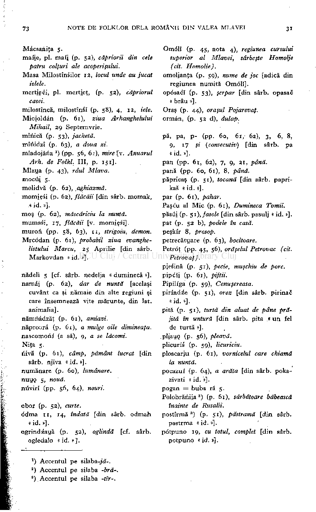

Omolî (p. 45, nota 4), regiunea cursului superior al Mlavei, sârbeşte Homolje ( cit. Homolie ).

Mâcsaniţa 5. mafie, pl. mafi (p. 53), căpriorii din cele

###### patru colţuri ale acoperişului.

Masa Milostînsilor 12, locul unde au jucat

omolianţa (p. 59), nume de joc [adică din regiunea numită Omolî]. oposacî (p. 53), şerpar [din sârb. opasac

###### ielele.

mertieci, pl. mertieţ, (p. 52), căpriorul

###### casei.

« brâu »]. Oraş (p. 44), oraşul Pojarevaţ. ormân, (p. 52 d), dulap.

milostîncă, milostînsî (p. 58), 4, 12, iele. Mioioldan (p. 61), ziua Arhanghelului

Mihail, 29 Septemvrie, mînică (p. 53), jachetă. mînidzî (p. 63), a doua zi. mladojăna *) (pp. 56, 62), mire [v. Anuarul

pă, pa, p- (pp. 60, 61, 62), 3, 6, 8, 9, 17 ţi (consecutiv) [din sârb. pa « id. »].

Arh. de Folkl. III, p. 151]. Miaua (p. 43), râul Mlava. mocuj 5. molidvă (p. 62), aghiazmă. momiesi (p. 62), flăcăii [din sârb. momak,

pan (pp. 61, 62), 7, 9, 21, până. pană (pp. 60, 61), 8, până. papricaş (p. 51), tocană [din sârb. papri­

kas « id. »]. par (p. 61), pahar. Paşcu al Mic (p. 61), Dumineca Tomii. păsui (p. 51), fasole [din sârb. pasulj « id. »]. pat (p. 52 b), podele în casă. peşkir 8, prosop. petrecătuare (p. 63), bocitoare. Petroţ (pp. 45, 56), orăşelul Petrovac (cit.

« id. »]. moş (p. 62), tnăscăriciu la nuntă. mumasi, 17, flăcăii [v. momiesi]. muron (pp. 58, 63), 11 strigoiu, demon. Mrcödan (p. 61), probabil ziua evanghe­

listului Marcu, 25 Aprilie [din sârb. Markovdan « id. »].

Petrovaţ ). pjesină (p. 51), pecie, muşchiu de porc. pipe ii (p. 61), piftii. Pipilfga (p. 59), Cenuşereasa. pirindze (p. 51), orez [din sârb. pirinaé

nădelî 5 [cf. sârb. nedelja « duminecă »]. namai (p. 62), dar de nuntă [acelaşi

cuvânt ca şi nămaie din alte regiuni şi care însemnează vite mărunte, din lat. animalia].

« id. »].

pită (p. 51), turtă din aluat de pâne prăjită în untură [din sârb. pita « un fel

nămnâdzăţ (p. 61), amiazi. năproorâ (p. 61), a mulge oile dimineaţa. nascomonj' (a să), 9, a se lacomi. Niţa 5. tiivă (p. 61), câmp, pământ lucrat [din

de turtă »]. pljauo (p. 56), pleavă. plicuris (p. 59), licuriciu. ploscariu (p. 61), vornicelul care chiamd

###### la nuntă.

sârb. njiva « id. »]. numănare (p. 60), lumânare. nuyo 5, nouă. nûvirï (pp. 56, 64), nouri.

pocazul (p. 64), a arăta [din sârb. poka-

zivati « id. »]. pogan = buba ră 5. Polobrăniia

) (p. 61), sărbătoare băbească înainte de Rusalii.

z

obor (p. 52), curte. ddrna 11 , 14, îndată [din sârb. odmah

) (p. 51), pastrama [din sârb. pastrma « id. »].

postîrmă

3

« id. »]. ogrindzayă (p. 52), oglindă [cf. sârb. ogledalo « id. »].

pötpuno 19, cu totul, complet [din sârb. potpuno « id. »].

) Accentul pe silaba-ja-.

J

) Accentul pe silaba -bră-. ") Accentul pe silaba -tîr-.

2

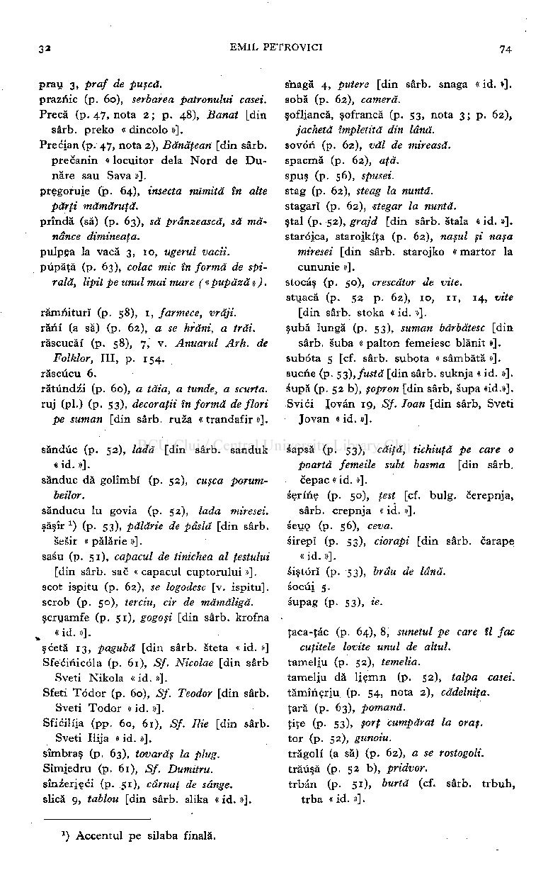

pray 3, praf de puşcă. praznic (p. 60), serbarea patronului casei. Precă (p. 47, nota 2 ; p. 48), Banat [din

snagă 4, putere [din sârb. snaga « id. »]. sobă (p. 62), cameră. şofliancă, şofrancă (p. 53, nota 3 ; p. 62),

jachetă împletită din lână. so von (p. 62), văl de mireasă. spacmă (p. 62), aţă. spuş (p. 56), spusei. stag (p. 62), steag la nuntă. stagarî (p. 62), stegar la nuntă. ştal (p. 52), grajd [din sârb. stala « id. »]. staröica, staroikiţa (p. 62), naşul şi naşa

sârb. preko « dincolo »].

Precian (p. 47, nota 2), Bănăţean [din sârb. precanin « locuitor delà Nord de Du năre sau Sava »].

pregoruie (p. 64), insecta numită în alte

părţi mămăruţă.

prindă (să) (p. 63), să prânzească, să mă­

nânce dimineaţa. pulpea la vacă 3, 10, ugerul vacii. pupăţă (p. 63), colac mic în formă de spi­

miresei [din sârb. starojko « martor la cununie »].

stocâş (p. 50), crescător de vite. stuacă (p. 52 p. 62), 10, 11 , 14, vite

rală, lipit pe unul mai mare ( « pupăză » ).

rămniturî (p. 58), 1, farmece, vrăji. răni (a să) (p. 62), a se hrăni, a trăi.

[din sârb. stoka « id. »]. şubă lungă (p. 53), suman bărbătesc [din

sârb. suba « palton femeiesc blănit »]. suböta s [cf. sârb. subota « sâmbătă »]. suche (p. 53), fustă [din sârb. suknja « id. »]. eupă (p. 52 b), şopron [din sârb, supa «id.»]. Svici Jovân 19, Sf. loan [din sârb, Sveti

- răscucăi (p. 58), 7, v. Anuarul Arh. de Folklor, III, p. 154.

- răscucu 6.

- rătundirj (p. 60), a tăia, a tunde, a scurta. ruj (pl.) (p. 53), decoraţii informă de flori

pe suman [din sârb. ruza «trandafir»].

- sănduc (p. 52), ladă [din sârb. sanduk « id. »].

- sănduc dă golîmbî (p. 52), cuşca porumbeilor.

- sănducu lu govia (p. 52), lada miresei.

Jovan « id. »].

eapsă (p. 53), căiţă, tichiuţă pe care o poartă femeile subt basma [din sârb.

cepac « id. »]. serine (p. 50), ţest [cf. bulg. cerepnja,

sârb. crepnja « id. »]. seuo (p. 56), ceva. sirepi (p. 53), ciorapi [din sârb. carape

) (p. 53), pălărie de pâslă [din sârb. sesir « pălărie »].

şăşîr

x

« id. »]. siştori (p. 53), brâu de lână. socui 5. supag (p. 53), ie.

sasu (p. 51), capacul de tinichea al ţestului [din sârb. sac «capacul cuptorului»], scot ispitu (p. 62), se logodesc [v. ispitu]. scrob (p. 50), terciu, cir de mămăligă. şcruamfe (p. 51), gogoşi [din sârb. krofna

###### ţaca-ţâc (p. 64), 8, sunetul pe care îl fac

« id. »]. şcetă 13 pagubă [din sârb. steta « id. »] Sfecinicöla (p. 61), Sf. Nicolae [din sârb

cuţitele lovite unul de altul. tameliu (p. 52), temelia. tameliu dă liemn (p. 52), talpa casei. tămîheriu (p. 54, nota 2), cădelniţa. ţară (p. 63), pomană. ţiţe (p. 53), şorţ cumpărat la oraş. tor (p. 52), gunoiu. trăgoli (a să) (p. 62), a se rostogoli. trăuşă (p. 52 b), pridvor. trbân (p. 51), burtă (cf. sârb. trbuh,

Sveti Nikola « id. »]. Sfeti Tödor (p. 60), Sf. Teodor [din sârb. Sveti Todor « id. »]. Sfiéilfia (pp. 60, 61), Sf. Ilie [din sârb.

Sveti Uija « id. »]. sîmbraş (p. 63), tovarăş la plug. Sîmiedru (p. 61), Sf. Dumitru. sînzerjeci (p. 51), cârnaţ de sânge. slică 9, tablou [din sârb. slika « id. »].

trba « id. »].

) Accentul pe silaba finală.

x

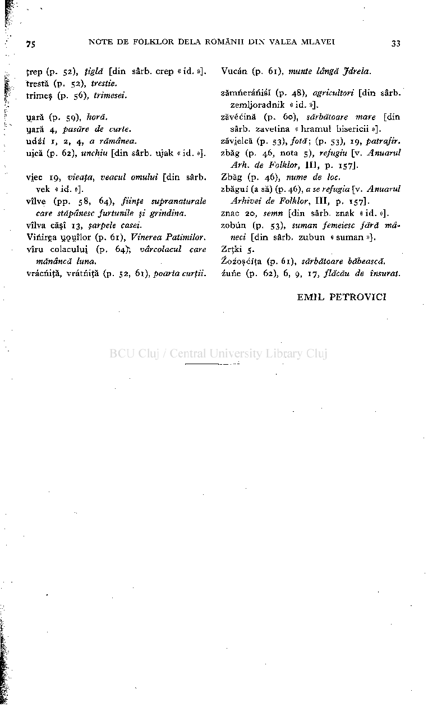

###### Vucân (p. 61), munte lângă Jdrela.

ţrep (p. 52), ţiglă [din sârb. crep « id. »]. trestă (p. 52), trestie. trimes (p. 56), trimesei.

zămnerânisî (p. 48), agricultori [din sârb. zemljoradnik « id. »]. zăveeină (p. 60), sărbătoare mare [din

yară (p. 59), horă. uară 4, pasăre de curte. udzi i, 2, 4, a rămânea. ujcă (p. 62), unchiu [din sârb. ujak « id. »].

sârb. zavetina « hramul bisericii »]. zăvielcă (p. 53), fotă; (p. 53), 19, patrafir. zbăg (p. 46, nota 5), refugiu [v. Anuarul

Arh. de Folklor, III, p. 157]. Zbăg (p. 46), nume de loc. zbăguî (a să) (p. 46), a se refugia [v. Anuarul

vjec 19, vieaţa, veacul omului [din sârb. vek « id. »]. vîlve (pp. 58, 64), fiinţe supranaturale

Arhivei de Folklor, III, p. 157]. znac 20, semn [din sârb. znak « id. »]. zobûn (p. 53), suman femeiesc fără mâ­

care stăpânesc furtunile şi grindina. vîlva căşî 13, şarpele casei. Vinirga uçuîlor (p. 61), Vinerea Patimilor. vîru colacului (p. 64)", vârcolacul care

neci [din sârb. zubun « suman »]. Zrţki s. Zozoşcfţa (p. 61), sărbătoare băbească. zune (p. 62), 6, 9, 17, flăcău de însurat.

mănâncă luna.

vrâcriiţă, vrâtniţă (p. 52, bl), poarta curţii.

EMI L PETROVIC I

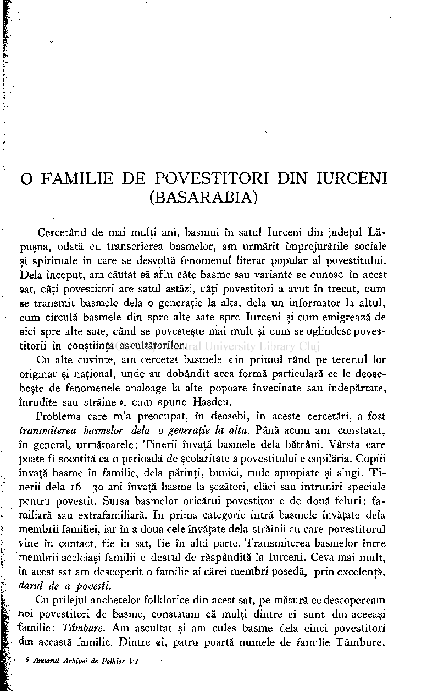

# O FAMILIE DE POVESTITORI DIN IURCÊNI (BASARABIA)

Cercetând de mai mulţi ani, basmul în satul Iurceni din judeţul Lăpuşna, odată cu transcrierea basmelor, am urmărit împrejurările sociale şi spirituale în care se desvoltă fenomenul literar popular al povestitului. Delà început, am căutat să aflu câte basme sau variante se cunosc în acest sat, câţi povestitori are satul astăzi, câţi povestitori a avut în trecut, cum se transmit basmele delà o generaţie la alta, delà un informator la altul, cum circulă basmele din spre alte sate spre Iurceni şi cum emigrează de aici spre alte sate, când se povesteşte mai mult şi cum se oglindesc povestitorii în conştiinţa ascultătorilor.

Cu alte cuvinte, am cercetat basmele « în primul rând pe terenul lor originar şi naţional, unde au dobândit acea formă particulară ce le deosebeşte de fenomenele analoage la alte popoare învecinate sau îndepărtate, înrudite sau străine », cum spune Hasdeu.

Problema care m'a preocupat, în deosebi, în aceste cercetări, a fost transmiterea basmelor delà o generaţie la alta. Până acum am constatat, în general, următoarele: Tinerii învaţă basmele delà bătrâni. Vârsta care poate fi socotită ca o perioadă de şcolaritate a povestitului e copilăria. Copiii învaţă basme în familie, delà părinţi, bunici, rude apropiate şi slugi. Tinerii delà 16—30 ani învaţă basme la şezători, clăci sau întruniri speciale pentru povestit. Sursa basmelor oricărui povestitor e de două feluri: familiară sau extrafamiliară. In prima categorie intră basmele învăţate delà membrii familiei, iar în a doua cele învăţate delà străinii cu care povestitorul vine în contact, fie în sat, fie în altă parte. Transmiterea basmelor între membrii aceleiaşi familii e destul de răspândită la Iurceni. Ceva mai mult, în acest sat am descoperit o familie ai cărei membri posedă, prin excelenţă, darul de a povesti.

Cu prilejul anchetelor folklorice din acest sat, pe măsură ce descopeream noi povestitori de basme, constatam că mulţi dintre ei sunt din aceeaşi familie: Tambure. Am ascultat şi am cules basme delà cinci povestitori din această familie. Dintre ei, patru poartă numele de familie Tambure,

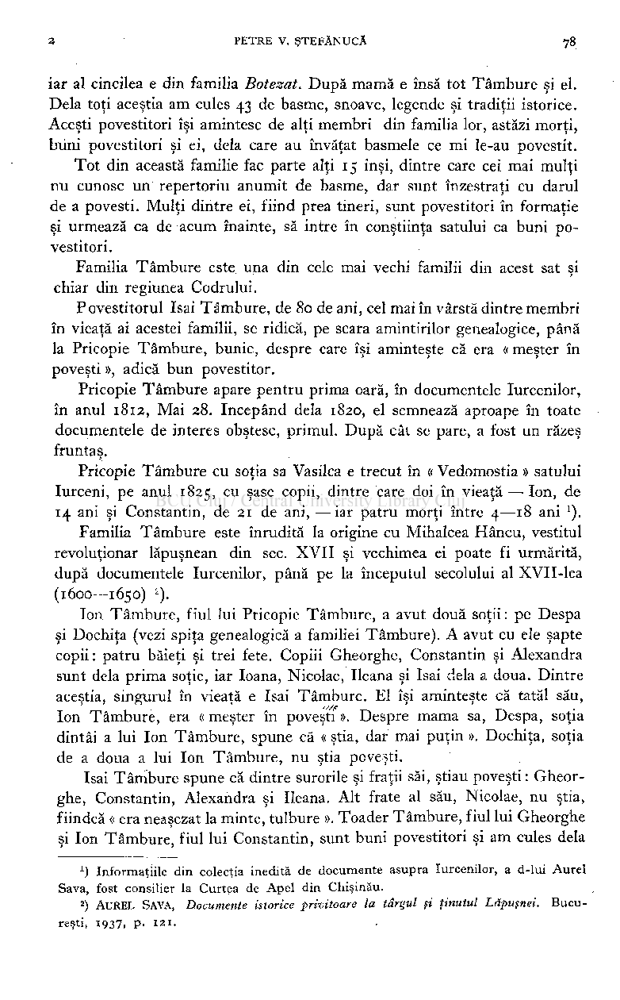

iar al cincilea e din familia Botezat. După mamă e însă tot Tambure şi el. Delà toţi aceştia am cules 43 de basme, snoave, legende şi tradiţii istorice. Aceşti povestitori îşi amintesc de alţi membri din familia lor, astăzi morţi, buni povestitori şi ei, delà care au învăţat basmele ce mi le-au povestit.

Tot din această familie fac parte alţi 15 inşi, dintre care cei mai mulţi nu cunosc un repertoriu anumit de basme, dar sunt înzestraţi cu darul de a povesti. Mulţi dintre ei, fiind prea tineri, sunt povestitori în formaţie şi urmează ca de acum înainte, să intre în conştiinţa satului ca buni povestitori.

Familia Tambure este una din cele mai vechi familii din acest sat şi chiar din regiunea Codrului.

Povestitorul Isai Tambure, de 80 de ani, cel mai în vârstă dintre membri în vieaţă ai acestei familii, se ridică, pe scara amintirilor genealogice, până la Pricopie Tambure, bunic, despre care îşi aminteşte că era « meşter în poveşti », adică bun povestitor.

Pricopie Tambure apare pentru prima oară, în documentele Iurcenilor, în anul 1812, Mai 28. începând delà 1820, el semnează aproape în toate documentele de interes obştesc, primul. După cât se pare, a fost un răzeş fruntaş.

Pricopie Tambure cu soţia sa Vasilca e trecut în « Vedomostia » satului Iurceni, pe anul 1825, cu şase copii, dintre care doi în vieaţă—-Ion, de 14 ani şi Constantin, de 21 de ani, —iar patru morţi între 4—18 ani

).

x

Familia Tambure este înrudită Ia origine cu Mihalcea Hâncu, vestitul revoluţionar lăpuşnean din sec. XVII şi vechimea ei poate fi urmărită, după documentele Iurcenilor, până pe la începutul secolului al XVII-lea (1600—1650) '<•).

Ion Tambure, fiul lui Pricopie Tambure, a avut două soţii : pe Despa şi Dochiţa (vezi spiţa genealogică a familiei Tambure). A avut cu ele şapte copii: patru băieţi şi trei fete. Copiii Gheorghe, Constantin şi Alexandra sunt delà prima soţie, iar Ioana, Nicolae, Ileana şi Isai delà a doua. Dintre aceştia, singurul în vieaţă e Isai Tambure. El îşi aminteşte că tatăl său, Ion Tambure, era « meşter în poveşti ». Despre mama sa, Despa, soţia dintâi a lui Ion Tambure, spune că « ştia, dar mai puţin ». Dochiţa, soţia de a doua a lui Ion Tambure, nu ştia poveşti.

Isai Tambure spune că dintre surorile şi fraţii săi, ştiau poveşti: Gheorghe, Constantin, Alexandra şi Ileana. Alt frate al său, Nicolae, nu ştia, fiindcă « era neaşezat la minte, tulbure ». Toader Tambure, fiul lui Gheorghe şi Ion Tambure, fiul lui Constantin, sunt buni povestitori şi am cules delà

) Informaţiile din colecţia inedită de documente asupra Iurcenilor, a d-lui Aurel Sava, fost consilier la Curtea de Apel din Chişinău.

###### ) AUREL SAVA, Documente istorice privitoare la târgul şi ţinutul Lăpuşnei. Bucureşti, 1937, p. 121

2

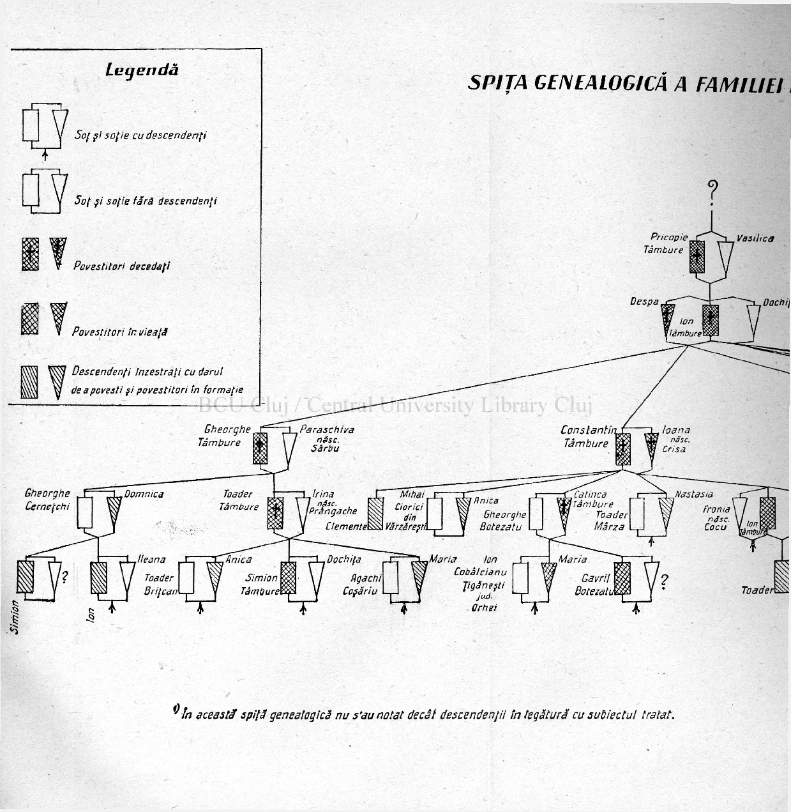

## SPIŢA GENEALOGICA A FAMILIEI

PricapiejÇ^ "^i Vă silica Tambure

această spiţă genealogică nu s'au notat decât descendenţii în legătură cu subiectul tratat.

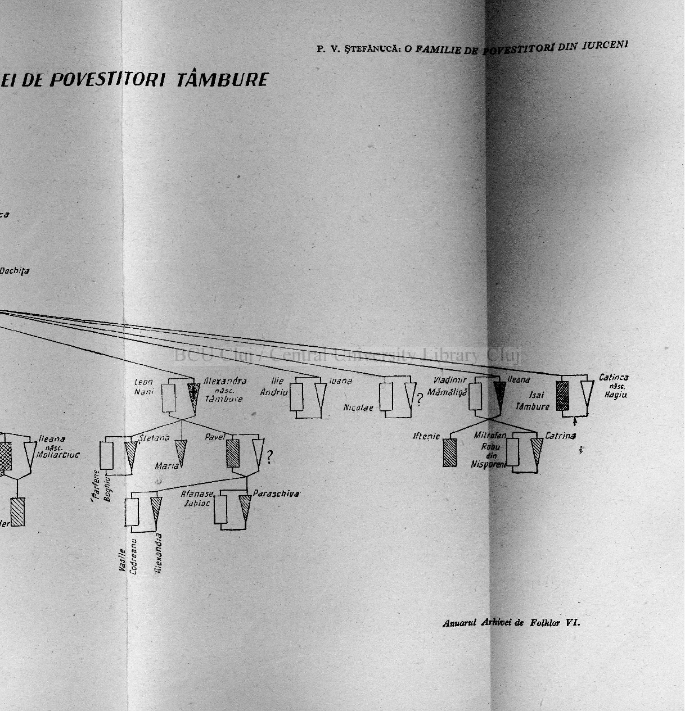

P. V. ŞTEFANUCA: o

Oachiţa

Calinca nise. Hagiu

Anuarul Arhivei de Folklor VI.

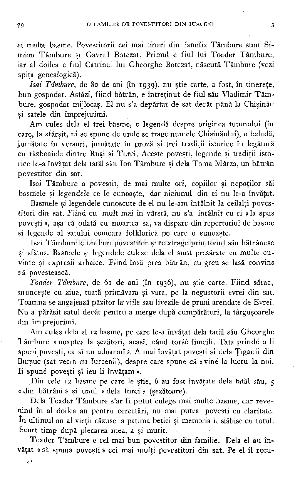

ei multe basme. Povestitorii cei mai tineri din familia Tambure sunt Simion Tambure şi Gavriil Botezat. Primul e fiul lui Toader Tambure, iar al doilea e fiul Catrinei lui Gheorghe Botezat, născută Tambure (vezi spiţa genealogică).

Isai Tambure, de 80 de ani (în 1939), nu ştie carte, a fost, în tinereţe, bun gospodar. Astăzi, fiind bătrân, e întreţinut de fiul său Vladimir Tambure, gospodar mijlocaş. El nu ş'a depărtat de sat decât până la Chişinău şi satele din împrejurimi.

Am cules delà el trei basme, o legendă despre originea tutunului (în care, la sfârşit, ni se spune de unde se trage numele Chişinăului), o baladă, jumătate în versuri, jumătate în proză şi trei tradiţii istorice în legătură cu războaiele dintre Ruşi şi Turci. Aceste poveşti, legende şi tradiţii istorice le-a învăţat delà tatăl său Ion Tambure şi delà Torna Mârza, un bătrân povestitor din sat.

Isai Tambure a povestit, de mai multe ori, copiilor şi nepoţilor săi basmele şi legendele ce le cunoaşte, dar niciunul din ei nu le-a învăţat.

Basmele şi legendele cunoscute de el nu le-am întâlnit la ceilalţi povestitori din sat. Fiind cu mult mai în vârstă, nu s'a întâlnit cu ei « la spus poveşti », aşa că odată cu moartea sa, va dispare din repertoriul de basme şi legende al satului comoara folklorică pe care o cunoaşte.

Isai Tambure e un bun povestitor şi te atrage prin tonul său bătrânesc şi sfătos. Basmele şi legendele culese delà el sunt presărate cu multe cuvinte şi expresii arhaice. Fiind însă prea bătrân, cu greu se lasă convins să povestească.

Toader Tambure, de 61 de ani (în 1936), nu ştie carte. Fiind sărac, munceşte cu ziua, toată primăvara şi vara, pe la negustorii evrei din sat. Toamna se angajează păzitor la viile sau livezile de pruni arendate de Evrei. Nu a părăsit satul decât pentru a merge după cumpărături, la târguşoarele din împrejurimi.

Am cules delà el 12 basme, pe care le-a învăţat delà tatăl său Gheorghe

Tambure « noaptea la şezători, acasî, când torse fimeili. Tata prindea li

spuni poveşti, ca sî nu adoarmî ». A mai învăţat poveşti şi delà Ţiganii din Bursuc (sat vecin cu Iurcenii), despre care spune că « viné la lucru la noi. Ii spunepoveşti şî ieu li învăţam ».

Din cele 12 basme pe care le ştie, 6 au fost învăţate delà tatăl său, 5 « din bătrâni » şi unul « delà furci » (şezătoare).

Delà Toader Tambure s'ar fi putut culege mai multe basme, dar revenind în al doilea an pentru cercetări, nu mai putea povesti cu claritate, în ultimul an al vieţii căzuse la patima beţiei şi memoria îi slăbise cu totul. Scurt timp după plecarea mea, a şi murit.

Toader Tambure e cel mai bun povestitor din familie. Delà el au învăţat « să spună poveşti » cei mai mulţi povestitori din sat. Pe el îl recu-

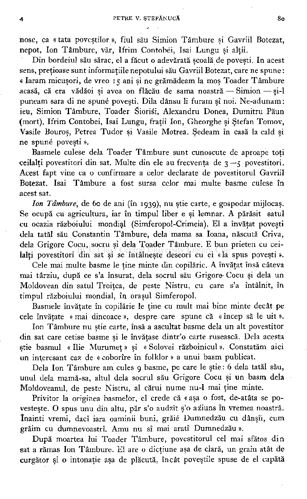

•4 PETRE V. STEFÄNUC Ä 80

Tiosc, ca «tata poveştilor », fiul său Simion Tambure şi Gavriil Botezat, nepot, Ion Tambure, văr, Ifrim Contobèi, Isai Lungu şi alţii.

Din bordeiul său sărac, el a făcut o adevărată şcoală de poveşti. In acest sens, preţioase sunt informaţiile nepotului său Gavriil Botezat, care ne spune : « Iaram micuşori, de vreo 15 ani şi ne grămădeam la moş Toader Tambure acasă, că era vădăoi şi avea on flăcău de sama noastră —• Simion — şipuneam sara di ne spune poveşti. Dila dânsu li furam şî noi. Ne-adunam : ieu, Simion Tambure, Toader Siorisi, Alexandru Donea, Dumitru Păun (mort), Ifrim Contobei, Isai Lungu, fraţii Ion, Gheorghe şi Ştefan To mov, Vasile Bouroş, Petrea Tudor şi Vasile Motrea. Şedeam în casă la cald şi ne spune poveşti ».

Basmele culese delà Toader Tambure sunt cunoscute de aproape toţi ceilalţi povestitori din sat. Multe din ele au frecvenţa de 3—5 povestitori. Acest fapt vine ca o confirmare a celor declarate de povestitorul Gavriil Botezat. Isai Tambure a fost sursa celor mai multe basme culese în acest sat.

Ion Tambure, de 60 de ani (în 1939), nu ştie carte, e gospodar mijlocaş. Se ocupă cu agricultura, iar în timpul liber e şi lemnar. A părăsit satul cu ocazia războiului mondial (Simferopol-Crimeia). El a învăţat poveşti delà tatăl său Constantin Tambure, delà mama sa Ioana, născută Criva, delà Grigore Cocu, socru şi delà Toader Tambure. E bun prieten cu ceilalţi povestitori din sat şi se întâlneşte deseori cu ei « la spus poveşti ».

Cele mai multe basme le ţine minte din copilărie. A învăţat însă câteva mai târziu, după ce s'a însurat, delà socrul său Grigore- Cocu şi delà un Moldovean din satul Troiţca, de peste Nistru, cu care s'a întâlnit, în timpul războiului mondial, în oraşul Simferopol.

Basmele învăţate în copilărie le ţine cu mult mai bine minte decât pe cele învăţate « mai dincoace », despre care spune că « încep să le uit ».

Ion Tambure nu ştie carte, însă a ascultat basme delà un alt povestitor din sat care cetise basme şi le învăţase dintr'o carte rusească. Delà acesta ştie basmul « Ilie Murumeţ » şi « Solovei războinicul ». Constatăm aici un interesant caz de « coborîre în folklor » a unui basm publicat.

Delà Ion Tambure am cules 9 basme, pe care le ştie : 6 delà tatăl său, unul delà mamă-sa, altul delà socrul său Grigore Cocu şi un basm delà Moldoveanul, de peste Nistru, al cărui nume nu-1 mai ţine minte.

Privitor la originea basmelor, el crede că «aşa o fost, de-atâta se povesteşte. O spus unu din altu, păr s'o audzît ş'o aziuns în vremea noastră,

înainti vremi, dacî iara oaminii buni, grăieDumnedzău cu dânşîi, cum

grăim cu dumnevoastrî. Amu nu sî mai aratî Dumnedzău ». După moartea lui Toader Tambure, povestitorul cel mai sfătos din

- sat a rămas Ion Tambure. El are o dicţiune aşa de clară, un graiu atât de curgător şi o intonaţie aşa de plăcută, încât poveştile spuse de el capătă

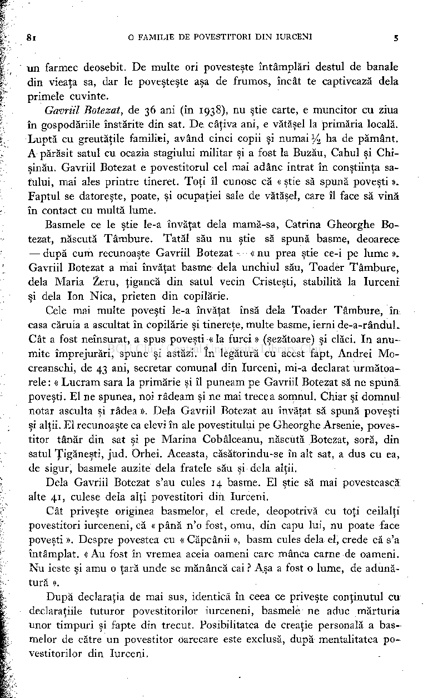

un farmec deosebit. De multe ori povesteşte întâmplări destul de banale din vieaţa sa, dar le povesteşte aşa de frumos, încât te captivează delà primele cuvinte.

Gavriil Botezat, de 36 ani (în 1938), nu ştie carte, e muncitor cu ziua în gospodăriile înstărite din sat. De câţiva ani, e vătăşel la primăria locală. Luptă cu greutăţile familiei, având cinci copii şi numai % ha de pământ. A părăsit satul cu ocazia stagiului militar şi a fost la Buzău, Cahul şi Chişinău. Gavriil Botezat e povestitorul cel mai adânc intrat în conştiinţa satului, mai ales printre tineret. Toţi îl cunosc că « ştie să spună poveşti ». Faptul se datoreşte, poate, şi ocupaţiei sale de vătăşel, care îl face să vină în contact cu multă lume.

Basmele ce le ştie le-a învăţat delà mamă-sa, Catrina Gheorghe Botezat, născută Tambure. Tatăl său nu ştie să spună basme, deoarece — după cum recunoaşte Gavriil Botezat — « nu prea ştie ce-i pe lume». Gavriil Botezat a mai învăţat basme delà unchiul său, Toader Tambure,, delà Maria Zeru, ţigancă din satul vecin Cristeşti, stabilită la Iurceni şi delà Ion Nica, prieten din copilărie.

Cele mai multe poveşti le-a învăţat însă delà Toader Tambure, în casa căruia a ascultat în copilărie şi tinereţe, multe basme, ierni de-a-rânduL Cât a fost neînsurat, a spus poveşti « la furci » (şezătoare) şi clăci. In anumite împrejurări, spune şi astăzi. în legătură cu acest fapt, Andrei Mocreanschi, de 43 ani, secretar comunal din Iurceni, mi-a declarat următoarele : « Lucram sara la primărie şi îl puneam pe Gavriil Botezat să ne spună poveşti. El ne spunea, noi râdeam şi ne mai trecea somnul. Chiar şi domnul notar asculta şi râdea ». Delà Gavriil Botezat au învăţat să spună poveşti şi alţii. El recunoaşte ca elevi în ale povestitului pe Gheorghe Arsenie, povestitor tânăr din sat şi pe Marina Cobâlceanu, născută Botezat, soră, din satul Ţigăneşti, jud. Orhei. Aceasta, casatorindu-se în alt sat, a dus cu ea, de sigur, basmele auzite delà fratele său şi delà alţii.

Delà Gavriil Botezat s'au cules 14 basme. El ştie să mai povestească alte 41, culese delà alţi povestitori din Iurceni.

Cât priveşte originea basmelor, el crede, deopotrivă cu toţi ceilalţi povestitori iurceneni, că « până n'o fost, omu, din capu lui, nu poate face poveşti ». Despre povestea cu « Căpcânii », basm cules delà el, crede că s'a întâmplat. « Au fost în vremea aceia oameni care mânca carne de oameni. Nu ieste şi amu o ţară unde se mănâncă cai ? Aşa a fost o lume, de adunătură ».

După declaraţia de mai sus, identică în ceea ce priveşte conţinutul cu declaraţiile tuturor povestitorilor iurceneni, basmele ne aduc mărturia unor timpuri şi fapte din trecut. Posibilitatea de creaţie personală a basmelor de către un povestitor oarecare este exclusă, după mentalitatea povestitorilor din Iurceni.

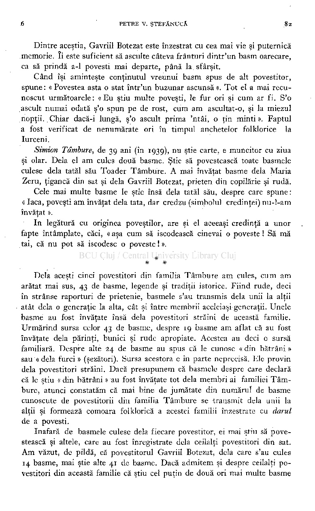

6 PETR E V . STEFÄNUC Ä 8z

Dintre aceştia, Gavriil Botezat este înzestrat cu cea mai vie şi puternică memorie. îi este suficient să asculte câteva frânturi dintr'un basm oarecare, ca să prindă a-1 povesti mai departe, până la sfârşit.

Când îşi aminteşte conţinutul vreunui basm spus de alt povestitor, spune : « Povestea asta o stat într'un buzunar ascunsă ». Tot el a mai recunoscut următoarele: «Eu ştiu multe poveşti, le fur ori şi cum ar fi. S'o ascult numai odată ş'o spun pe de rost, cum am ascultat-o, şi la miezul nopţii. Chiar dacă-i lungă, ş'o ascult prima 'ntâi, o ţin minţi». Faptul a fost verificat de nenumărate ori în timpul anchetelor folklorice la Iurceni.

Simion Tambure, de 39 ani (în 1939), nu ştie carte, e muncitor cu ziua şi olar. Delà el am cules două basme. Ştie să povestească toate basmele culese delà tatăl său Toader Tambure. A mai învăţat basme delà Maria Zeru, ţigancă din sat şi delà Gavriil Botezat, prieten din copilărie şi rudă.

Cele mai multe basme le ştie însă delà tatăl său, despre care spune: « Iaca, poveşti am învăţat delà tata, dar credzu (simbolul credinţei) nu-l-am învăţat ».

In legătură cu originea poveştilor, are şi el aceeaşi credinţă a unor fapte întâmplate, căci, « aşa cum să iscodească cinevai o poveste ! Să mă tai, că nu pot să iscodesc o poveste ! ».

#

#### * #

Delà aceşti cinci povestitori din familia Tambure am cules, cum am arătat mai sus, 43 de basme, legende şi tradiţii istorice. Fiind rude, deci în strânse raporturi de prietenie, basmele s'au transmis delà unii la alţii atât delà o generaţie la alta, cât şi între membrii aceleiaşi generaţii. Unele basme au fost învăţate însă delà povestitori străini de aceasta familie. Urmărind sursa celor 43 de basme, despre 19 basme am aflat că au fost învăţate delà părinţi, bunici şi rude apropiate. Acestea au deci o sursă familiară. Despre alte 24 de basme au spus că le cunosc « din bătrâni »

- sau « delà furci » (şezători). Sursa acestora e în parte neprecisă. Ele provin delà povestitori străini. Dacă presupunem că basmele despre care declară că le ştiu « din bătrâni » au fost învăţate tot delà membri ai familiei Tambure, atunci constatăm că mai bine de jumătate din numărul de basme cunoscute de povestitorii din familia Tambure se transmit delà unii la alţii şi formează comoara folklorică a acestei familii înzestrate cu darul de a povesti.

Inafară de basmele culese delà fiecare povestitor, ei mai ştiu să povestească şi altele, care au fost înregistrate delà ceilalţi povestitori din sat. Am văzut, de pildă, că povestitorul Gavriil Botezat, delà care s'au cules 14 basme, mai ştie alte 41 de basme. Dacă admitem şi despre ceilalţi povestitori din această familie că ştiu cel puţin de două ori mai multe basme

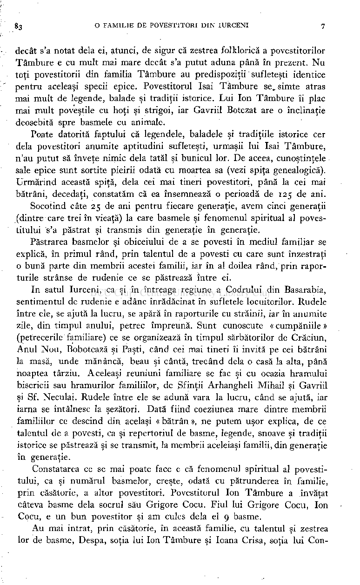

decât s'a notat delà ei, atunci, de sigur că zestrea folklorică a povestitorilor Tambure e cu mult mai mare decât s'a putut aduna până în prezent. Nu toţi povestitorii din familia Tambure au predispoziţii sufleteşti identice pentru aceleaşi specii epice. Povestitorul Isai Tambure se. simte atras mai mult de legende, balade şi tradiţii istorice. Lui Ion Tambure îi plac mai mult poveştile cu hoţi şi strigoi, iar Gavriil Botezat are o înclinaţie deosebită spre basmele cu animale.

Poate datorită faptului că legendele, baladele şi tradiţiile istorice cer delà povestitori anumite aptitudini sufleteşti, urmaşii lui Isai Tambure, n'au putut să înveţe nimic delà tatăl şi bunicul lor. De aceea, cunoştinţele sale epice sunt sortite pieirii odată cu moartea sa (vezi spiţa genealogică). Urmărind această spiţă, delà cei mai tineri povestitori, până la cei mai bătrâni, decedaţi, constatăm că ea însemnează o perioadă de 125 de ani.

Socotind câte 25 de ani pentru fiecare generaţie, avem cinci generaţii (dintre care trei în vieaţă) la care basmele şi fenomenul spiritual al povestitului s'a păstrat şi transmis din generaţie în generaţie.

Păstrarea basmelor şi obiceiului de a se povesti în mediul familiar se explică, în primul rând, prin talentul de a povesti cu care sunt înzestraţi o bună parte din membrii acestei familii, iar în al doilea rând, prin raporturile strânse de rudenie ce se păstrează între ei.

In satul Iurceni, ca şi în întreaga regiune a Codrului din Basarabia, sentimentul de rudenie e adânc înrădăcinat în sufletele locuitorilor. Rudele între ele, se ajută la lucru, se apără în raporturile cu străinii, iar în anumite zile, din timpul anului, petrec împreună. Sunt cunoscute « cumpăniile » (petrecerile familiare) ce se organizează în timpul sărbătorilor de Crăciun, Anul Nou, Bobotează şi Paşti, când cei mai tineri îi invită pe cei bătrâni la masă, unde mănâncă, beau şi cântă, trecând delà o casă la alta, până noaptea târziu. Aceleaşi reuniuni familiare se fac şi cu ocazia hramului bisericii sau hramurilor familiilor, de Sfinţii Arhangheli Mihail şi Gavriil şi Sf. Neculai. Rudele între ele se adună vara la lucru, când se ajută, iar iarna se întâlnesc la şezători. Dată fiind coeziunea mare dintre membrii familiilor ce descind din acelaşi « bătrân », ne putem uşor explica, de ce talentul de a povesti, ca şi repertoriul de basme, legende, snoave şi tradiţii istorice se păstrează şi se transmit, la membrii aceleiaşi familii, din generaţie în generaţie.

Constatarea ce se mai poate face e că fenomenul spiritual al povestitului, ca şi numărul basmelor, creşte, odată cu pătrunderea în familie, prin căsătorie, a altor povestitori. Povestitorul Ion Tambure a învăţat câteva basme delà socrul său Grigore Cocu. Fiul lui Grigore Cocu, Ion Cocu, e un bun povestitor şi am cules delà el 9 basme.

Au mai intrat, prin căsătorie, în această familie, cu talentul şi zestrea lor de basme, Despa, soţia lui Ion Tambure şi Ioana Crisa, soţia lui Con-

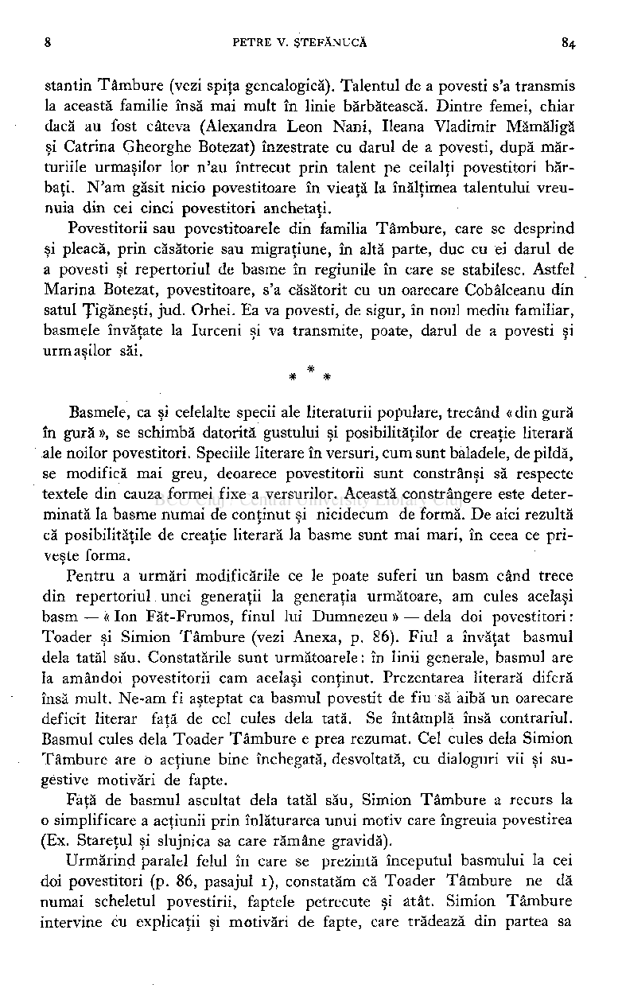

stantin Tambure (vezi spiţa genealogică). Talentul de a povesti s'a transmis la această familie însă mai mult în linie bărbătească. Dintre femei, chiar dacă au fost câteva (Alexandra Leon Nani, Ileana Vladimir Mămăligă şi Catrina Gheorghe Botezat) înzestrate cu darul de a povesti, după mărturiile urmaşilor lor n'au întrecut prin talent pe ceilalţi povestitori bărbaţi. N'am găsit nicio povestitoare în vieaţă la înălţimea talentului vreunuia din cei cinci povestitori anchetaţi.

Povestitorii sau povestitoarele din familia Tambure, care se desprind şi pleacă, prin căsătorie sau migraţiune, în altă parte, duc cu ei darul de a povesti şi repertoriul de basme în regiunile în care se stabilesc. Astfel Marina Botezat, povestitoare, s'a căsătorit cu un oarecare Cobâlceanu din satul Ţigăneşti, jud. Orhei. Ea va povesti, de sigur, în noul mediu familiar, basmele învăţate la Iurceni şi va transmite, poate, darul de a povesti şi urmaşilor săi.

#

Basmele, ca şi celelalte specii ale literaturii populare, trecând « din gură în gură », se schimbă datorită gustului şi posibilităţilor de creaţie literară ale noilor povestitori. Speciile literare în versuri, cum sunt baladele, de pildă, se modifică mai greu, deoarece povestitorii sunt constrânşi să respecte textele din cauza formei fixe a versurilor. Această constrângere este determinată la basme numai de conţinut şi nicidecum de formă. De aici rezultă că posibilităţile de creaţie literară la basme sunt mai mari, în ceea ce priveşte forma.

Pentru a urmări modificările ce le poate suferi un basm când trece din repertoriul. unei generaţii la generaţia următoare, am cules acelaşi basm — << Ion Făt-Frumos, finul lui Dumnezeu » — delà doi povestitori : Toader şi Simion Tambure (vezi Anexa, p. 86). Fiul a învăţat basmul delà tatăl său. Constatările sunt următoarele: în linii generale, basmul are la amândoi povestitorii cam acelaşi conţinut. Prezentarea literară diferă însă mult. Ne-am fi aşteptat ca basmul povestit de fiu să aibă un oarecare deficit literar faţă de cel cules delà tată. Se întâmplă însă contrariul. Basmul cules delà Toader Tambure e prea rezumat. Cel cules delà Simion Tambure are 0 acţiune bine închegată, desvoltată, cu dialoguri vii şi sugestive motivări de fapte.

Faţă de basmul ascultat delà tatăl său, Simion Tambure a recurs la

- o simplificare a acţiunii prin înlăturarea unui motiv care îngreuia povestirea (Ex. Stareţul şi slujnica sa care rămâne gravidă).

Urmărind paralel felul în care se prezintă începutul basmului la cei doi povestitori (p. 86, pasajul 1), constatăm că Toader Tambure ne dă numai scheletul povestirii, faptele petrecute şi atât. Simion Tambure intervine cu explicaţii şi motivări de fapte, care trădează din partea sa

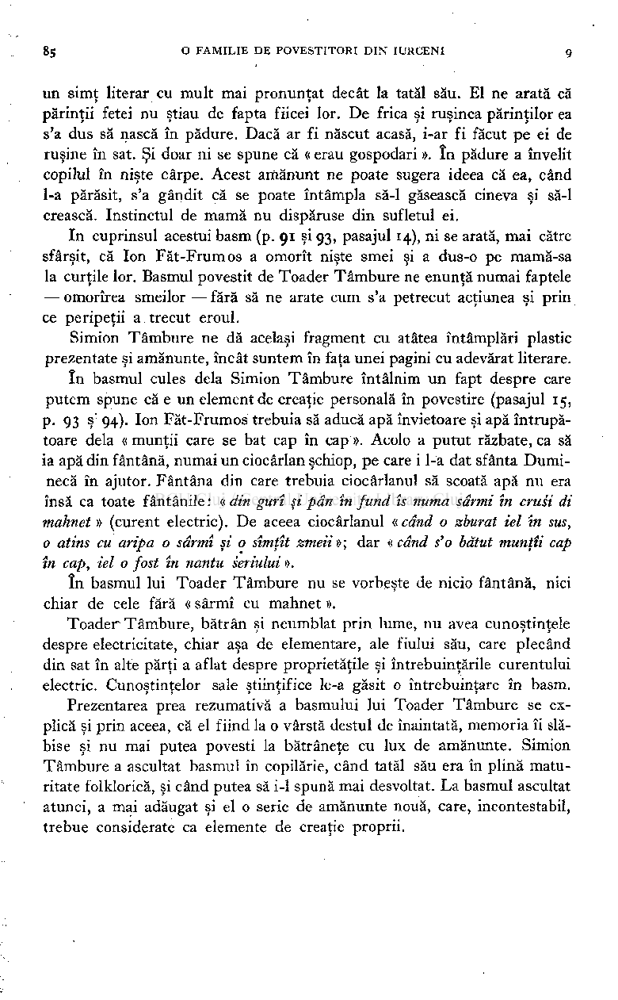

un simţ literar cu mult mai pronunţat decât la tatăl său. El ne arată că părinţii fetei nu ştiau de fapta fiicei lor. De frica şi ruşinea părinţilor ea s'a dus să nască în pădure. Dacă ar fi născut acasă, i-ar fi făcut pe ei de ruşine în sat. Şi doar ni se spune că « erau gospodari ». în pădure a învelit copilul în nişte cârpe. Acest amănunt ne poate sugera ideea că ea, când 1-a părăsit, s'a gândit că se poate întâmpla să-1 găsească cineva şi să-1

crească. Instinctul de mamă nu dispăruse din sufletul ei.

In cuprinsul acestui basm (p. 91 şi 93, pasajul 14), ni se arată, mai către sfârşit, că Ion Făt-Frumos a omorît nişte smei şi a dus-o pe mamă-sa la curţile lor. Basmul povestit de Toader Tambure ne enunţă numai faptele — omorîrea smeilor — fără să ne arate cum s'a petrecut acţiunea şi prin ce peripeţii a trecut eroul.

Simion Tambure ne dă acelaşi fragment cu atâtea întâmplări plastic prezentate şi amănunte, încât suntem în faţa unei pagini cu adevărat literare. în basmul cules delà Simion Tambure întâlnim un fapt despre care putem spune că e un element de creaţie personală în povestire (pasajul 15,

94). Ion Făt-Frumos trebuia să aducă apă învietoare şi apă întrupătoare delà « munţii care se bat cap în cap ». Acolo a putut răzbate, ca să ia apă din fântână, numai un ciocârlan şchiop, pe care i 1-a dat sfânta Dumi­

- p. 93 ş

:

necă în ajutor. Fântâna din care trebuia ciocârlanul să scoată apă nu era însă ca toate fântânile: «din gurî şipân în fund îs numa sârmi în crusi di mahnet » (curent electric). De aceea ciocârlanul « când o zburat iei în sus, o atins cu aripa o sârmî şi o sîmţît zmeii » ; dar « când s'o bătut munţii cap în cap, tel o fost în nantu seriului ».

în basmul lui Toader Tambure nu se vorbeşte de nicio fântână, nici chiar de cele fără « sârmî cu mahnet ».

Toader Tambure, bătrân şi neumblat prin lume, nu avea cunoştinţele despre electricitate, chiar aşa de elementare, ale fiului său, care plecând din sat în alte părţi a aflat despre proprietăţile şi întrebuinţările curentului electric. Cunoştinţelor sale ştiinţifice le-a găsit o întrebuinţare în basm.

Prezentarea prea rezumativă a basmului lui Toader Tambure se explică şi prin aceea, că el fiind la o vârstă destul de înaintată, memoria îi slăbise şi nu mai putea povesti la bătrâneţe cu lux de amănunte. Simion Tambure a ascultat basmul în copilărie, când tatăl său era în plină maturitate folklorică, şi când putea să i-1 spună mai desvoltat. La basmul ascultat atunci, a mai adăugat şi el o serie de amănunte nouă, care, incontestabil, trebue considerate ca elemente de creaţie proprii.

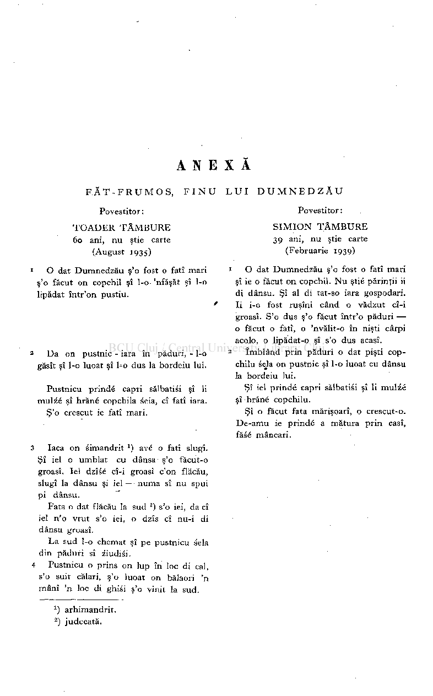

### ANEX Ă

FĂT- F R U M O S, F I N U LU I DUMNEDZĂ U Povestitor :

Povestitor :

SIMIO N TAMBUR E 39 ani, nu ştie carte (Februarie 1939)

TOADE R TAMBUR E 60 ani, nu ştie carte (August 1935)

O dat Dumnedzău ş'o fost o fatî mari ş'o făcut on copchil şî l-o- 'nfăşăt şî l-o lipădat într'on pustiu.

- 1

O dat Dumnedzău ş'o fost o fatî mari şî ie o făcut on copchil. Nu ştie părinţii ii di dânsu. Şî al di tat-so iara gospodari. Ii i-o fost ruşîni când o vădzut cî-i groasî. S'o dus ş'o făcut într'o păduri o făcut o fatî, o 'nvălit-o în nişti cârpi acolo, o lipădat-o şî s'o dus acasî.

- 2

îmblând prin păduri o dat pişti copchilu sela on pustnic şî l-o luoat cu dânsu la bordeiu lui.

Da on pustnic - iara în păduri, - l-o găsît şî l-o luoat şî l-o dus la bordeiu lui.

Şî iei prinde capri sălbatisi şî li mulzé şî hrăne copchilu.

Pustnicu prinde capri sălbatisi şî li mulzé şî hrăne copchila seia, cî fatî iara.

Şî o făcut fata mărişoarî, o crescut-o. De-amu ie prinde a mătura prin casî, făse mâncări.

Ş'o crescut ie fatî mari.

) avé o fatî slugî. Şî iei o umblat cu dânsa ş'o făcut-o groasî. Iei dzîse cî-i groasî c'on flăcău, slugî la dânsu şi iei — numa sî nu spui pi dânsu.

Iaca on simandrit

x

Fata o dat flăcău Ia sud ) s'o iei, da cî iei n'o vrut s'o iei, o dzîs cî nu-i di dânsu groasî.

La sud l-o chemat şî pe pustnicu sela din păduri sî ziudisi.

Pustnicu o prins on lup în loc di cal, s'o suit călări, ş'o luoat on bălaori 'n mânî 'n loc di ghisi ş'o vinit la sud.

) arhimandrit.

x

) judecată.

2

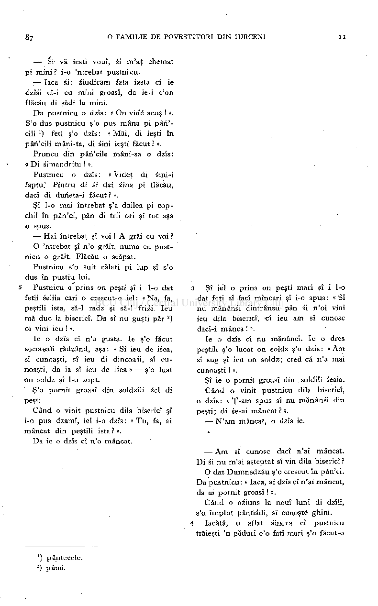

— âi vă ieşti vouî, si m'aţ chemat pi mini ? i-o 'ntrebat pustnicu.

,— Iaca si : ziudicăm fata iasta cî ie dzîsi cî-i cu mini groasî, da ie-i c'on flăcău di sădi la mini.

Da pustnicu o dzîs : « On vidé acuş ! ». S'o dus pustnicu ş'o pus mâna pi pâh'cili *) feti ş'o dzîs : « Măi, di ieşti în pâh'cili mâni-ta, di sini ieşti făcut ? ».

Pruncu din pân'cile mâni-sa o dzîs: <« Di simandritu ! ».

Pustnicu o dzîs : « Videţ di sini-i faptu.' Pintru di si dai zina pi flăcău, dacî di duneta-i făcut ? ».

Şî l-o mai întrebat ş'a doilea pi copchil în pân'ci, păn di trii ori şî tot aşa 0 spus.

— Hai întrebat şî voi ! A grăi cu voi ? O 'ntrebat şî n'o grăit, numa cu pust­

nicu o grăit. Flăcău o scăpat.

Pustnicu s'o suit călări pi lup şî s'o dus în pustiu lui.

- 5 Pustnicu o prins on peşti şî i l-o dat fetii seliia cari o crescut-o iei : « Na, fa, peştili ista, să-1 radz şi să-1 frizi. leu

- 3 Şî iei o prins on peşti mari şî i l-o dat feti sî facî mîncari şî i-o spus: « Sî nu mănânsi dintrânsu păn si n'oi vini ieu dila bisericî, -cî ieu am sî cunosc dacî-i mânca ! ».

Ie o dzîs cî nu mănâncî. Ie o dres peştili ş'o luoat on soldz ş'o dzîs : « Am sî sug şî ieu on soldz; cred că n'a mai cunoaşti ! ».

Şî ie o pornit groasî din soldili seala. Când o vinit pustnicu dila bisericî,

o dzîs : « Ţ-am spus sî nu mănânsi din peşti; di se-ai mâncat?».

—• N'am mâncat, o dzîs ie.

— A m sî cunosc dacî n'ai mâncat. Di si nu m'ai aşteptat sî vin dila bisericî ?

O dat Dumnedzău ş'o crescut în pân'ci. Da pustnicu : « Iaca, ai dzîs cî n'ai mâncat, da ai pornit groasî ! ».

Când o aziuns la nouî luni di dzîli, s'o împlut pântisili, sî cunoşte ghini.

- 4 Iacătă, o aflat sineva cî pustnicu trăieşti 'n păduri c'o fatî mari ş'o făcut-o

mă duc la biserici. Da sî nu guşti păr

) 01 vini ieu ! ».

s

Ie o dzîs cî n'a gusta. Ie ş'o făcut socotealî rădzând, aşa: « Sî ieu de isea, sî cunoaşti, sî ieu di dincoasi, sî cunoaşti, da ia sî ieu de isea » — ş'o luat on soldz şî l-o supt.

Ş'o pornit groasî din soldzîli sel di peşti.

Când o vinit pustnicu dila bisericî şî i-o pus dzamî, iei i-o dzîs : « Tu, fa, ai mâncat din peştili ista ? ».

Da ie o dzîs cî n'o mâncat.

*) pântecele.

) până.

2

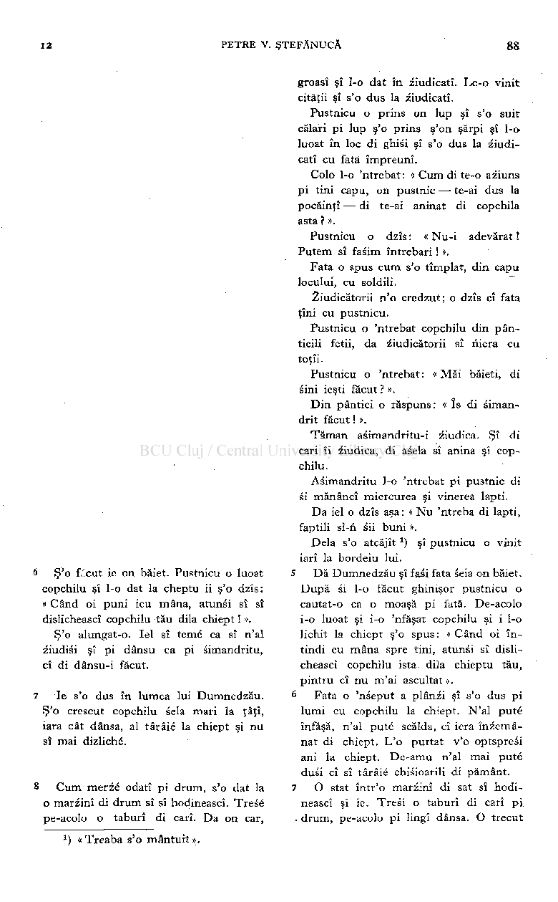

groasî şî l-o dat în ziudicatî. Le-o vinit citaţii şî s'o dus la ziudicatî.

Pustnicu o prins on lup şî s'o suit călări pi lup ş'o prins ş'on şărpi şî l-o luoat în loc di ghisi şî s'o dus la ziudicatî cu fată împreunî.

Colo l-o 'ntrebat: « Cum di te-o aziuns pi tini capu, on pustnic — te-ai dus la pocăinţî •— di te-ai aninat di copchila asta ? ».

Pustnicu o dzîs : « Nu-i adevărat t Putem sî fasim întrebări ! ».

Fata o spus cum s'o tîmplat, din capu locului, cu soldili.

Ziudicătorii n'o credzut; o dzîs cî fata ţîni cu pustnicu.

Pustnicu o 'ntrebat copchilu din pânticili fetii, da ziudicătorii sî niera cu toţîi.

Pustnicu o 'ntrebat: «Măi băieţi, di sini ieşti făcut ? ».

Din pantici o răspuns: « îs di simandrit făcut ! ».

Taman asimandritu-i ziudica. Şî di cari îi ziudica, di asela sî anina şî copchilu .

Asimandritu l-o 'ntrebat pi pustnic di si mănânci miercurea şi vinerea lapti.

Da iei o dzîs aşa: « Nu 'ntreba di lapti, faptili sî-n sii buni ».

Delà s'o atcăjît *) şî pustnicu o vinit iarî la bordeiu lui.

- 5 Dă Dumnedzău şî fasi fata seia on băiet. După si l-o făcut ghinişor pustnicu o cautat-o ca o moaşă pi fată. De-acolo i-o luoat şi î-o 'nfăşat copchilu şi i l-o lichit la chiept ş'o spus: « Când oi întindi eu mâna spre tini, atunsi sî dislicheascî copchilu ista dila chieptu tău, pintru cî nu m'ai ascultat».
- 6 Fata o 'nseput a plânzi şî s'o dus pi lumi cu copchilu la chiept. N'ai puté înfăşa, n'ai puté scălda, cî iera înzemânat di chiept. L'o purtat v'o optspresi ani la chiept. De-amu n'ai mai puté dusi cî sî târâie chisioarili di pământ.
- 7 O stat într'o marzinî di sat sî hodineascî şi ie. Tresi o taburî di carî pi

- 6 Ş'o f>lcut ie on băiet. Pustnicii o luoat copchilu şî l-o dat la cheptu ii ş'o dzîs: « Când oi puni ieu mâna, atunsi sî sî dislicheascî copchilu tău dila chiept ! ».

Ş'o alungat-o. Iei sî terne ca sî n'al

ziudisi şî pi dânsu ca pi simandritu, cî di dânsu-i făcut.

- 7 Ie s'o dus în lumea lui Dumnedzău. Ş'o crescut copchilu sela mari la ţâţî, iara cât dânsa, al târâie la chiept şi nu sî mai dizliché.
- 8

Cum merzé odatî pi drum, s'o dat la o marzinî di drum sî sî hodineascî. Trese pe-acolo o taburî di carî. Da on car,

• drum, pe-acolo pi lingî dânsa. O trecut

') «Treaba s'o mântuit».

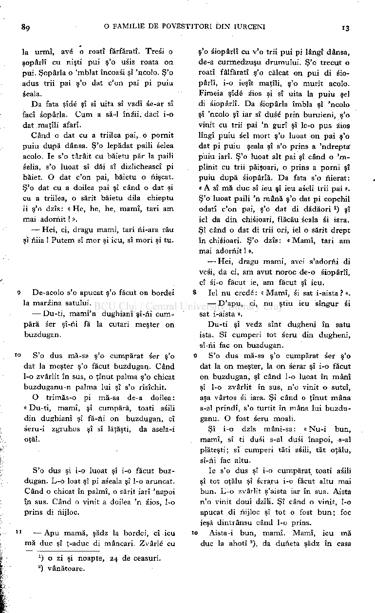

la urmî, avé o roatî fărfăratî. Tresi o şopârlî cu nişti pui ş'o usis roata on pui. Şopârla o 'mblat încoasi şî 'ncolo. Ş'o adus trii pai ş'o dat c'on pai pi puiu seala.

ş'o siopârlî cu v'o trii pui pi lângî dânsa, de-a curmedzuşu drumului. Ş'o trecut o roatî fâlfăratî ş'o călcat on pui di siopârlî, i-o ieşît maţîli, ş'o murit acolo. Fimeia şîde zios şi sî uita la puiu şei di siopârlî. Da siopârla îmbla şî 'ncolo şî 'ncolo şî iar sî dusé prin buruieni, ş'o vinit cu trii pai 'n gurî şî le-o pus iios lîngî puiu sel mort ş'o luoat on pai ş'o dat pi puiu şeala şî s'o prins a 'ndrepta' puiu iarî. Ş'o luoat alt pai şî când o 'mplinit cu trii păişoari, o prins a porni şî puiu după siopârlă. Da fata s'o nierat: « A sî mă duc sî ieu şî ieu aseli trii pai ». Ş'o luoat paili 'n mână ş'o dat pi copchil odatî c'on pai, ş'o dat di dădăori

Da fata şîde şî sî uita sî vadî se-ar sî facî sopârla. Cum a să-1 înzii, dacî i-o dat maţîli afarî.

Când o dat cu a triilea pai, o pornit puiu după dânsa. Ş'o lepădat paili selea acolo. Ie s'o târâit cu băietu păr la paili selia, s'o luoat sî dăi sî dizlicheascî pi băiet. O dat c'on pai, băietu o hişcat. Ş'o dat cu a doilea pai şî când o dat şi cu a triilea, o sărit băietu dila chieptu ii ş'o dzîs: « He, he, he, mamî, tari am mai adornit ! ».

) şî iei da din chisioari, flăcău seala si iara. Şî când o dat di trii ori, iei o sărit drept în chiéioari. Ş'o dzîs: «Mamî, tari am mai adornit ! ».

l

— Hei, ci, dragu mami, tari ni-ara rău şî niia ! Putem sî mor şi ieu, sî mori şi tu.

— Hei, dragu mami, avei s'adorni di vesi, da ci, am avut noroc de-o siopârlî, cî si-o făcut ie, am făcut şî ieu.

- 8 Iei nu credé : « Mamî, si sat i-aista ? ».

— D'apu, ci, nu ştiu ieu sîngur si sat i-aista ».

Du-ti şî vedz sînt dugheni în satu ista. Sî cumperi tot seru din dugheni, sî-ni fac on buzdugan.

- 9 S'o dus mă-sa ş'o cumpărat ser ş'o dat la on meşter, la on serar şî i-o făcut on buzdugan, şî când l-o luoat în mânî şî l-o zvârlit în sus, n'o vinit o sutcî, aşa vârtos si iara. Şî când o ţînut mâna s-al prindî, s'o turtit în mâna lui buzduganu. O fost seru moali.

Şî i-o dzîs mâni-sa: « Nu-i bun, mamî, sî ti dusi s-al dusi înapoi, s-al plăteşti; sî cumperi tăti asili, tăt oţălu, sî-hi fac altu.

Ie s'o dus şî i-o cumpărat toati asili şî tot oţălu şî seraru i-o făcut altu mai bun. L-o zvârlit ş'aista iar în sus. Aista n'o vinit douî dzîli. Şî când o vinit, l-o apucat di hijloc şî tot o fost bun; foc ieşă dintrânsu când l-o prins.

- 10 Aista-i bun, mamî. Mamî, ieu mă duc la ahotî ), da duheta şădz în casa

- 9 De-acolo s'o apucat ş'o făcut on bordei la marzina satului.

— Du-ti, mamî'n dughianî şî-ni cumpără ser şî-ni fă la cutări meşter on buzdugan.

- 1 0

S'o dus mă-sa ş'o cumpărat ser ş'o dat la meşter ş'o făcut buzdugan. Când l-o zvârlit în sus, o ţînut palma ş'o chicat buzduganu-n palma lui şî s'o rîsîchit.

O trimăs-o pi mă-sa de-a doilea: « Du-ti, mamî, şî cumpără, toati asili din dughianî şî fă-ni on buzdugan, cî seru-i zgruhos şî sî lăţăşti, da asela-i oţăl.

S'o dus şi i-o luoat şî i-o făcut buzdugan. L-o loat şî pi aseala şî l-o aruncat. Când o chicat în palmî, o sărit iarî 'napoi în sus. Când o vinit a doilea 'n zios, l-o prins di hijloc.

- 1 1

—Ap u mamă, şădz la bordei, cî ieu mă duc şî ţ-aduc di mâncări. Zvârle cu

) o zi şi noapte, 24 de ceasuri.

x

) vânătoare.

2

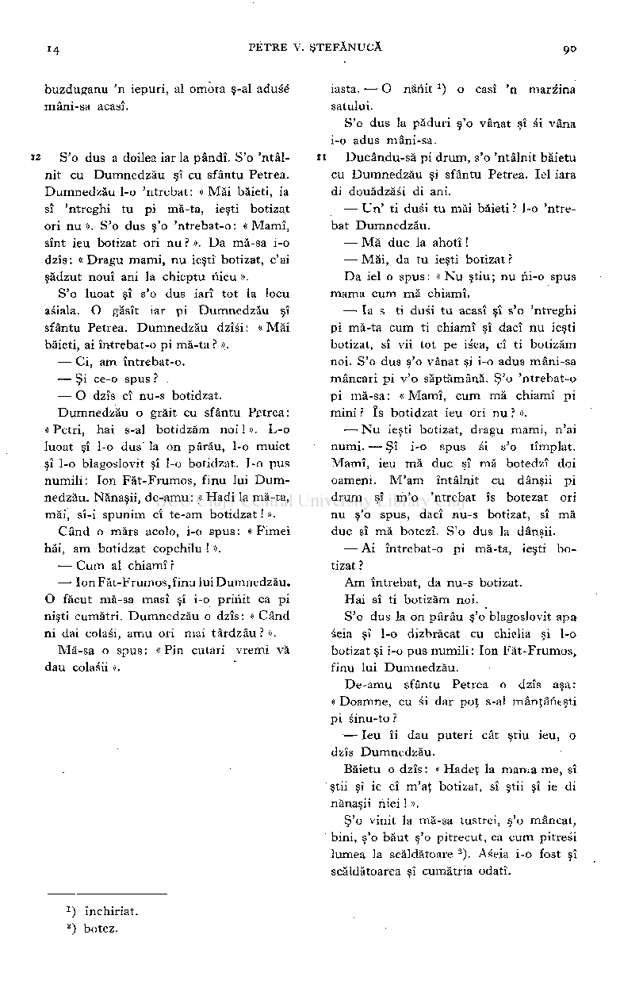

14 PÉTRE V. STEFÄNUC Ä 90

iasta. — O nănit *) o casî 'n marzina satului.

buzduganu 'n iepuri, al omora ş-al aduse mâni-sa acasî.

S'o dus la păduri ş'o vânat şî si vâna i-o adus mâni-sa.

it Ducându-să pi drum, s'o 'ntâlnit băietu cu Dumnedzău şi sfântu Petrea. Iei iara di douădzăsi di ani.

12 S'o dus a doilea iar la pândî. S'o 'ntâlnit cu Dumnedzău şî cu sfântu Petrea. Dumnedzău l-o 'ntrebat : « Măi băieţi, ia sî 'ntreghi tu pi mă-ta, ieşti botizat ori nu ». S'o dus ş'o 'ntrebat-o : « Mamî, sînt ieu botizat ori nu ? ». Da mă-sa i-o dzîs: « Dragu mami, nu ieşti botizat, c'ai şădzut nouî ani la chieptu nieu ».

— Un' ti dusi tu măi băieţi ? l-o 'ntrebat Dumnedzău.

— Mă duc la ahotî !

— Măi, da tu ieşti botizat ? Da iei o spus: « Nu ştiu; nu ni-o spus

mama cum mă chiamî.

S'o luoat şî s'o dus iarî tot la locu asiala. O găsît iar pi Dumnedzău şî sfântu Petrea. Dumnedzău dzîsi: «Măi băieţi, ai în-trebat-o pi mă-ta ? ».

— Ia s ti dusi tu acasî şî s'o 'ntreghi pi mă-ta cum ti chiamî şî dacî nu ieşti botizat, sî vii tot pe isea, cî ti botizăm noi. S'o dus ş'o vânat şi i-o adus mâni-sa mâncări pi v'o săptămână. Ş'o 'ntrebat-o pi mă-sa : « Mamî, cum mă chiamî pi mini ? îs botidzat ieu ori nu ? ».

— Ci, am întrebat-o.

— Şi ce-o spus ?

— O dzîs cî nu-s botidzat. Dumnedzău o grăit cu sfântu Petrea: « Petri, hai s-al botidzăm noi ! ». L-o luoat şî l-o dus la on pârău, l-o muiet şî l-o blagoslovit şî l-o botidzat. I-o pus numili: Ion Făt-Frumos, finu lui Dumnedzău. Nănaşii, de-amu : « Hadi la mă-ta, măi, sî-i spunim cî te-am botidzat ! ».

•— Nu ieşti botizat, dragu mami, n'ai numi. — Şî i-o spus si s'o tîmplat. Mamî, ieu mă duc sî mă botedzî doi oameni. M'am întâlnit cu dânşii pi drum şî m'o 'ntrebat îs botezat ori nu ş'o spus, dacî nu-s botizat, sî mă duc sî mă botezi. S'o dus la dânşii.

Când o mărs acolo, i-o spus: « Fimei hăi, am botidzat copchilu ! ».

— Ai întrebat-o pi mă-ta, ieşti bo­

tizat ? Am întrebat, da nu-s botizat. Hai sî ti botizăm noi. S'o dus la on pârâu ş'o blagoslovit apa seia şî l-o dizbrăcat cu chielia şi l-o botizat şi i-o pus numili: Ion Făt-Frumos, finu lui Dumnedzău.

— Cum al chiamî ?

—• Ion Făt-Frumos,finu lui Dumnedzău. O făcut mă-sa masî şî i-o prihit ca pi nişti cumătri. Dumnedzău o dzîs: « Când ni dai colasi, amu ori mai târdzâu? ».

Mă-sa o spus : « Pin cutări vremi vă dau colasii ».

De-amu sfântu Petrea o dzîs aşa: « Doamne, cu si dar poţ s-al mânţâneşti pi sinu-to ?

— Ieu îi dau puteri cât ştiu ieu, o dzîs Dumnedzău.

Băietu o dzîs : « Hadeţ la mania me, sî ' ştii şî ie cî m'aţ botizat, sî ştii şî ie di

nănaşii hiei ! ».

Ş'o vinit la mă-sa tustrei, ş'o mâncat, bini, ş'o băut ş'o pitrecut, ca cum pitresi lumea la scăldătoare

). Aseia i-o fost şî scăldătoarea şî cumătria odatî.

2

*) închiriat.

) botez.

2

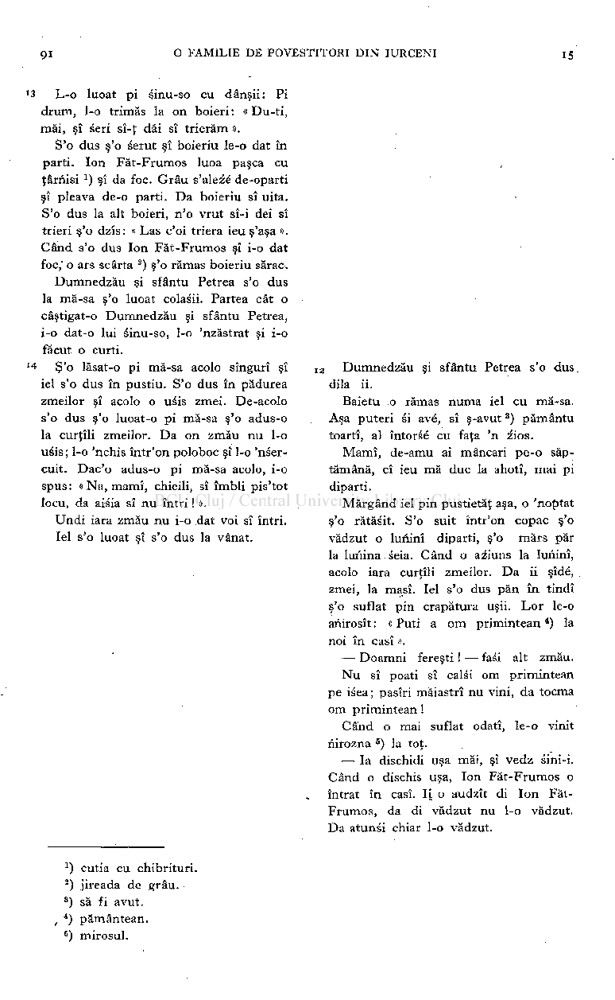

- '3 L-o luoat pi sinu-so cu dânşii: Pi drum, l-o trimăs la on boieri : « Du-ti, măi, şî seri sî-ţ dăi sî trierăm ».

S'o dus ş'o serut şî boieriu le-o dat în parti. Ion Făt-Frumos luoa pasca cu ţârhisi *) şî da foc. Grâu s'aleze de-oparti şî pleava de-o parti. Da boieriu sî uita. S'o dus la alt boieri, n'o vrut sî-i dei sî trieri ş'o dzîs: « Las c'oi triera ieu ş'aşa ». Când s'o dus Ion Făt-Frumos şî i-o dat foc,' o ars scârta ) ş'o rămas boieriu sărac.

Dumnedzău şi sfântu Petrea s'o dus la mă-sa ş'o luoat colasii. Partea cât o câştigat-o Dumnedzău şi sfântu Petrea, i-o dat-o lui sinu-so, l-o 'nzăstrat şi i-o făcut o curţi.

- '4 Ş'o lăsat-o pi mă-sa acolo sîngurî şî iei s'o dus în pustiu. S'o dus în pădurea zmeilor şî acolo o usis zmei. De-acolo s'o dus ş'o luoat-o pi mă-sa ş'o adus-o la curţîli zmeilor. Da on zmău nu l-o usis ; l-o 'nchis într'on poloboc şî l-o 'nserCuit. Dac'o adus-o pi mă-sa acolo, i-o spus: «Na,mamî, chieili, sî îmbli pis'tot locu, da aisia sî nu întri ! ».

Dumnedzău şi sfântu Petrea s'o dus dila ii.

I 3

Baietu o rămas numa iei cu mă-sa. Aşa puteri si avé, sî ş-avut

) pământu toartî, al întorsé cu faţa 'n zios.

3

Mamî, de-amu ai mâncări pe-o săptămână, cî ieu mă duc la ahotî, mai pi diparti.

Mărgând iei pin pustietăţ aşa, o 'noptat ş'o rătăsit. S'o suit într'on copac ş'o vădzut o luninî diparti, ş'o mărs păr la lunina seia. Când o aziuns la luninî, acolo iara curţîli zmeilor. Da ii şîde, zmei, la masî. Iei s'o dus păn în tindî ş'o suflat pin crăpătura uşii. Lor le-o anirosît : « Puti a om primintean

Undi iara zmău nu i-o dat voi sî întri. Iei s'o luoat şî s'o dus la vânat.

) la noi în casî ».

4

— Doamni fereşti ! — fasi alt zmău. Nu sî poati sî calsi om primintean

pe isea; pasîri măiastrî nu vini, da tocma om primintean !

Când o mai suflat odatî, le-o vinit nirozna

) la toţ.

5

—• Ia dischidi uşa măi, şî vedz sini-i. Când o dischis uşa, Ion Făt-Frumos o întrat în casî. Ii o audzît di Ion FătFrumos, da di vădzut nu l-o vădzut. Da atunsi chiar l-o vădzut.

') cutia cu chibrituri.

- 2

) jireada de grâu.

- 3

) să fi avut. ,

) pământean.

4

) mirosul.

6

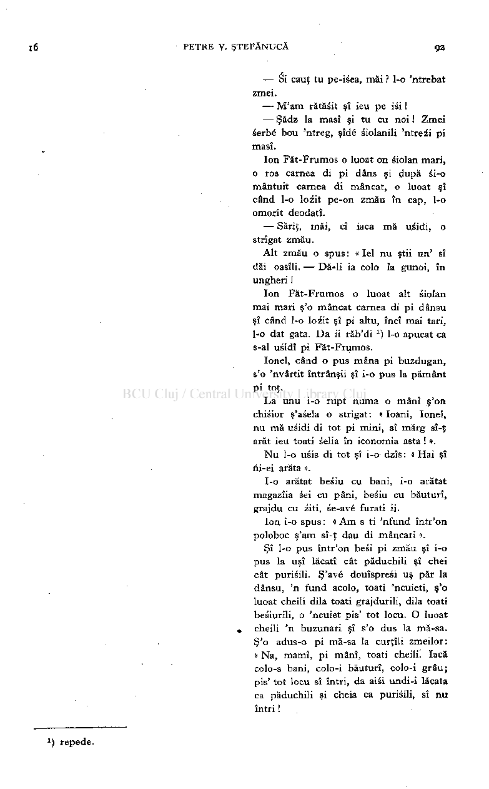

— ăi caut tu pe-isea, măi ? l-o 'ntrebat zmei.

— M'am rătăsit şî ieu pe isi !

— Şădz la masî şi tu cu noi ! Zmei serbe bou 'ntreg, şîde siolanili 'ntrezi pi masî.

Ion Făt-Frumos o luoat on siolan mari,

- o ros carnea di pi dâns şi după si-o mântuit carnea di mâncat, o luoat şî când l-o lozit pe-on zmău în cap, l-o
- omorît deodatî.

— Sărit, măi, cî iaca mă usidi, o strigat zmău.

Alt zmău o spus : « Iei nu ştii un' sî dăi oasîli. — Dă»li ia colo la gunoi, în ungheri !

Ion Făt-Frumos o luoat alt siolan mai mari ş'o mâncat carnea di pi dânsu şî când l-o loiit şî pi altu, încî mai tari, l-o dat gata. Da ii răb'di ) l-o apucat ca s-al usidî pi Făt-Frumos.

Ionel, când o pus mâna pi buzdugan, s'o 'nvârtit întrânşii şî i-o pus la pământ pi toţ.

La unu i-o rupt numa o mânî ş'on chisior ş'asela o strigat: « Ioani, Ionel, nu mă usidi di tot pi mini, sî mărg sî-ţ arăt ieu toati selia în iconomia asta ! ».

Nu l-o usis di tot şî i-o dzîs: «Hai şî hi-ei arăta ».

I-o arătat besiu cu bani, i-o arătat magazîia sei cu pâni, besiu cu băuturi, grajdu cu ziti, se-avé furaţi ii.

Ion i-o spus: « A m s ti 'nfund într'on poloboc ş'am sî-ţ dau di mâncări ».

Şî l-o pus într'on besi pi zmău şî i-o pus la uşî lăcatî cât păduchili şî chei cât purisili. Ş'ave douîspresi uş păr la dânsu, 'n fund acolo, toati 'ncuieti, ş'o luoat cheili dila toati grajdurili, dila toati besiurili, o 'ncuiet pis' tot locu. O luoat

. cheili 'n buzunari şî s'o dus la mă-sa. Ş'o adus-o pi mă-sa la curţîli zmeilor: « Na, mamî, pi mânî, toati cheili. Iacă colo-s bani, colo-i băuturî, colo-i grâu; pis' tot locu sî întri, da aisi undi-i lăcata ca păduchili şi cheia ca purisili, sî nu întri !

*) repede.

