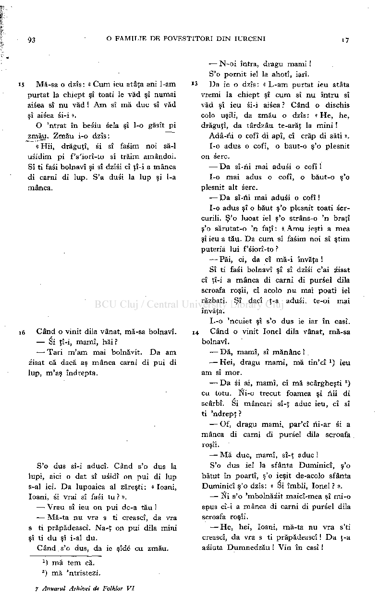

— N-oi întră, dragu mami ! S'o pornit iei la ahotî, iarî.

îs Mă-sa o dzîs: « Cum ieu aţâţa ani l-am purtat la chiept şî toati le văd şî numai aisea sî nu văd ! A m sî mă duc sî văd şî aisea si-i ».

>3 Da ie o dzîs: «L-am purtat ieu atâta vremi la chiept şî cum sî nu întru sî văd şî ieu si-i aisea ? Când o dischis colo uşili, da zmău o dzîs: « He, he, drăguţi, da târdzâu te-arăţ la mini !

O 'ntrat în besiu sela şî l-o găsît pi zmău. Zmău i-o dzîs:

Adâ-ni o cofî di apî, cî crap di săti ». I-o adus o cofî, o baut-o ş'o plesnit

« Hii, drăguţi, si sî fasim noi să-1 usidim pi f's'iorî-to sî trăim amândoi. Sî ti fasi bolnavi şi sî dzîsi cî ţî-i a mânca di carni di lup. S'a dusi la lup şi 1-a mânca.

on sere.

— Da sî-hi mai aduşi o cofî ! I-o mai adus o cofî, o băut-o ş'o

plesnit alt sere.

— Da sî-ni mai aduşi o cofî ! I-o adus şî o băut ş'o plesnit toati sercurili. Ş'o luoat iei ş'o strâns-o 'n braţî ş'o sărutat-o 'n faţî : « Amu ieşti a mea şî ieu a tău. Da cum sî fasim noi sî ştim puteria lui f'siorî-to ?

— Păi, ci, da cî mă-i învăţa ! Sî ti fasi bolnavî şî sî dzîsi c'ai zisat cî ţî-i a mânca di carni di pursel dila scroafa roşîi, cî acolo nu mai poati iei răzbaţi. Şî dacî ţ-a aduşi, te-oi mai învăţa.

L-o 'ncuiet şî s'o dus ie iar în casî. 14 Când o vinit Ionel dila vânat, mă-sa

16 Când o vinit dila vânat, mă-sa bolnavi.

bolnavî.

— & ţî-i, mamî, hăi ?

— Dă, mamî, sî mănânc !

— Tari m'am mai bolnăvit. Da am zisat că dacă aş mânca carni di pui di lup, m'aş îndrepta.

— Hei, dragu mami, mă tin'cî ) ieu am sî mor.

) cu totu. Ni-o trecut foamea şi hii di scârbi. & mâncări sî-ţ aduc ieu, ci sî ti 'ndrepţ ?

— Da si ai, mamî, cî mă scârgheşti

2

— Of, dragu mami, par'cî ni-ar si a mânca di carni di pursel dila scroafa roşîi.

— Mă duc, mamî, sî-ţ aduc ! S'o dus iei la sfânta Duminici, ş'o

S'o dus sî-i aducî. Când s'o dus la lupi, aici o dat si usidî on pui di lup s-al iei. Da lupoaica al zăreşti: « Ioani, Ioani, si vrai sî fasi tu ? ».

bătut în poartî, ş'o ieşit de-acolo sfânta Duminici ş'o dzîs : « âi îmbli, Ionel ? ».

— Ni s'o 'mbolnăzit maicî-mea şî mi-o spus cî-i a mânca di carni di pursel dila scroafa roşîi.

— Vrau sî ieu on pui de-a tău !

— Mă-ta nu vra s ti creascî, da vra s ti prăpădeascî. Na-ţ on pui dila mini şî ti du şî i-al du.

— He, hei, Ioani, mă-ta nu vra s'ti creascî, da vra s ti prăpădeascî ! Da ţ-a aziuta Dumnedzău ! Vin în casî !

Când s'o dus, da ie şîde cu zmău.

) mă tem că.

J

) mă 'ntristezi.

2

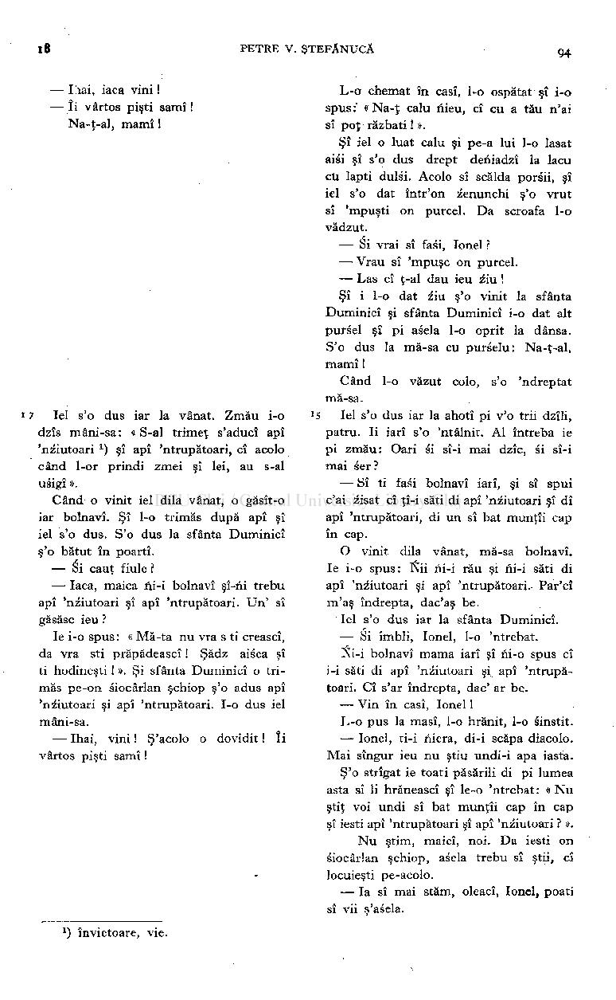

— liai, iaca vini !

L-o chemat în casî, l-o ospătat şî i-o spus :' « Na-ţ calu nieu, cî cu a tău n'ai sî poţ răzbaţi ! ».

— îi vârtos pişti samî !

— Na-ţ-al, mamî !

Şî iei o luat calu şi pe-a lui l-o lăsat aisi şî s'o dus drept deniadzî la lacu cu lapti dulsi. Acolo sî scălda porsii, şî iei s'o dat într'on ienunchi ş'o vrut sî 'mpuşti on purcel. Da scroafa l-o vădzut.

— âi vrai sî fasi, Ionel ?

— Vrau sî 'mpuşc on purcel.

— Las cî ţ-al dau ieu iiu ! Şî i l-o dat ziu ş'o vinit la sfânta Duminicî şi sfânta Duminici i-o dat alt pursel şî pi asela l-o oprit la dânsa. S'o dus la mă-sa cu purselu: Na-ţ-al. mamî !

Când l-o văzut colo, s'o 'ndreptat mă-sa.

•5 Iei s'o dus iar la ahotî pi v'o trii dzîli, patru. Ii iarî s'o 'ntâlnit. Al întreba ie pi zmău : Oari si sî-i mai dzîc, si sî-i mai ser ?

t 7 Iei s'o dus iar la vânat. Zmău i-o dzîs mâni-sa: « S-al trimet s'aducî apî 'niiutoari ) şî apî 'ntrupătoari, cî acolo când l-or prindi zmei şî lei, au s-al uéigî ».

— Sî ti fasi bolnavî iarî, şi sî spui c'ai äsat cî ţî-i săti di apî 'nziutoari şî dî apî 'ntrupătoari, di un sî bat munţii cap în cap.

Când o vinit iei dila vânat, o găsît-o iar bolnavî. Şî l-o trimăs după apî şî iei s'o dus. S'o dus la sfânta Duminici ş'o bătut în poartî.

O vinit dila vânat, mă-sa bolnavî. Ie i-o spus: Nii ni-i rău şi ni-i săti di apî 'nziutoari şi apî 'ntrupătoari. Par'cî m'aş îndrepta, dac'aş be.

— ei caut fiule ?

— Iaca, maica hi-i bolnavî şî-ni trebu apî 'nziutoari şî apî 'ntrupătoari. Un' sî găsăsc ieu ?

Iei s'o dus iar la sfânta Duminicî.

Ie i-o spus : « Mă-ta nu vra s ti creascî, da vra sti prăpădeascî ! Şădz aisea şî ti hodineşti ! ». Şi sfânta Duminici o trimăs pe-on siocârlan şchiop ş'o adus apî 'nziutoari şi apî 'ntrupătoari. I-o dus iei mâni-sa.

— âi îmbli, Ionel, l-o 'ntrebat. Ni-i bolnavî mama iarî şî ni-o spus cî

i-i săti di apî 'nziutoari şi apî 'ntrupătoari. Cî s'ar îndrepta, dac' ar be.

— Vin în casî, Ionel ! L-o pus la masî, l-o hrănit, l-o smstit. — Ionel, ti-i niera, di-i scăpa diacolo.

— Ihai, vini ! Ş'acolo o dovidit ! îi vârtos pişti samî !

Mai sîngur ieu nu ştiu undi-i apa iasta.

Ş'o strigat ie toati păsărili di pi lumea asta sî li hrăneascî şî le-o 'ntrebat: «Nu ştiţ voi undi sî bat munţii cap în cap şî ieşti apî 'ntrupătoari şî apî 'nziutoari ? ».

— Nu ştim, maicî, noi. Da ieşti on siocârlan şchiop, asela trebu sî ştii, cî locuieşti pe-acolo.

— Ia sî mai stăm, oleacî, Ionel, poati sî vii ş'asela.

*) învietoare, vie.

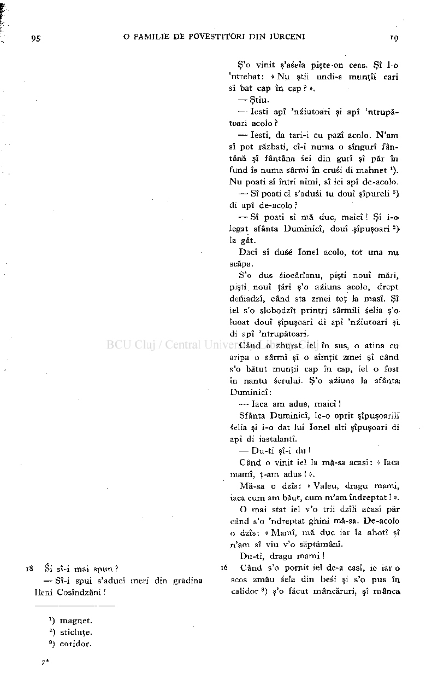

Ş'o vinit ş'asela pişte-on ceas. Şî l-o 'ntrebat : « Nu ştii undi-s munţii cari sî bat cap în cap ? ».

— Ştiu.

— Ieşti apî 'nziutoari şi apî 'ntrupătoari acolo ?

— Ieşti, da tari-i cu pazî acolo. N'am sî pot răzbaţi, cî-i numa o sîngurî fântână şî fântâna sei din gurî şî păr în fund îs numa sârmi în crusi di mahnet

).

1

Nu poati sî întri nimi, sî iei apî de-acolo. — Sî poati cî s'adusi tu douî şîpureli

) di apî de-acolo ?

2

-— Sî poati sî mă duc, maîcî ! Şî i-o legat sfânta Duminici, douî şîpuşoari

) la gât.

2

Dacî sî dusé Ionel acolo, tot una nu scăpa.

S'o dus siocârlanu, pişti nouî mări„ pişti nouî ţări ş'o aziuns acolo, drept deniadzî, când sta zmei toţ la masî. Şî. iei s'o slobodzît printri sârmili selia ş'oluoat douî şîpuşoari di apî 'nziutoari şî. di apî 'ntrupătoari.

Când o zburat iei în sus, o atins cui aripa o sârmî şî o simţit zmei şî când s'o bătut munţii cap în cap, iei o fost în nantu serului. Ş'o aziuns la sfânta Duminici :

— Iaca am adus, maicî ! Sfânta Duminici, le-o oprit şîpuşoarilî

selia şi i-o dat lui Ionel alti şîpuşoari di apî di iastalantî.

— Du-ti şî-i du ! Când o vinit iei la mă-sa acasî: « Iaca

mamî, ţ-am adus ! ». Mă-sa o dzîs : « Valeu, dragu mami, iaca cum am băut, cum m'am îndreptat ! ».

O mai stat iei v'o trii dzîli acasî păr când s'o 'ndreptat ghini mă-sa. De-acolo o dzîs: « Mamî, mă duc iar la ahotî şî n'am sî viu v'o săptămâni.

Du-ti, dragu mami !

16 Când s'o pornit iei de-a casî, ie iar o scos zmău sela din besi şi s'o pus în calidor ) ş'o făcut mâncăruri, şî mânca,

18 éi sî-i mai spun ?

— Sî-i spui s'aducî meri din grădina Ileni Cosîndzăni !

') magnet.

- 2

) sticluţe.

- 3

##### ) coridor.

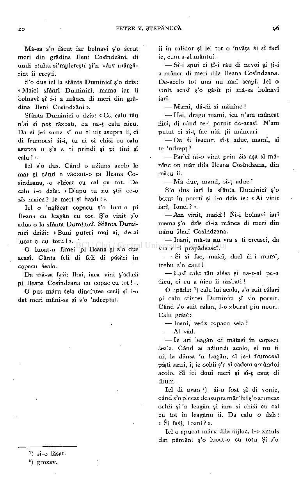

ii în calidor şî iei tot o 'nvăţa si sî faci ie, cum s-al mântui.

Mă-sa s'o făcut iar bolnavî ş'o serut meri din grădina Ileni Cosîndzăni, di undi stuhu sî'mpleteşti şî'n vârv mărgărint îi creşti.

—• Sî-i spui cî ţî-i rău di nevoi şi ţî-i a mânca di meri dila Ileana Cosîndzana. De-acolo tot una nu mai scapf. Iei o vinit acasî ş'o găsît pi mă-sa bolnavî iarî.

S'o dus iei la sfânta Duminici ş'o dzîs: « Maicî sfântî Duminici, mama iar îi bolnavî şî i-i a mânca di meri din grădina Ileni Cosîndzăni ».

— Mamî, dă-ni sî mănînc !

—• Hei, dragu mami, ieu n'am mâncat nicî, di când te-i pornit de-acasî. N'am putut ci sî-ţ fac nisi ţîi mâncări.

Sfânta Duminici o dzîs : « Cu calu tău n'ai sî poţ răzbaţi, da na-ţ calu hieu. Da sî iei sama sî nu ti uiţ asupra ii, cî di frumoasî si-i, tu ai sî chisi cu calu asupra ii ş'a s ti prindî şî pi tini şî calu ! ».

— Da si leacuri sî-ţ aduc, mamî, sî te 'ndrepţ ?

— Par'cî hi-o vinit prin zis aşa sî mănînc on măr dila Ileana Cosîndzana, din măru ii.

Iei s'o dus. Când o aziuns acolo la măr şi când o vădzut-o pi Ileana Cosîndzana, -o chicat cu cal cu tot. Da calu i-o dzîs : « D'apu tu nu ştii ce-o zîs maica ? Ie meri şî haidi ! ».

— Mă duc, mamî, sî-ţ aduc ! S'o dus iarî la sfânta Duminici ş'o

bătut în poartî şi i-o dzîs ie : « Ai vinit iarî, Ionel ? ».

Iei o 'nşfăcat copacu ş'o luat-o pi Ileana cu leagăn cu tot. Ş'o vinit ş'o adus-o la sfânta Duminici. Sfânta Duminici dzîsi : « Buni puteri mai ai, de-ai luoat-o cu totu ! ».

— A m vinit, maicî ! Ni-i bolnavî iarî mama ş'o dzîs cî-ia mânca di meri din măru Ileni Cosîndzana.

— Ioani, mă-ta nu vra s ti creascî, da vra s ti prăpădeascî.

O luoat-o fimei pi Ileana şi s'o dus acasî. Cânta feli di feli di păsări în copacu seala.

— âi sî fac, maicî, dacî hi-i mamî, trebu s'o caut !

— Lasî calu tău aisea şi na-ţ-al pe-a nieu, cî cu a nieu îi răzbaţi !

Da mă-sa fasi: Ihai, iaca vini ş'adusi pi Ileana Cosîndzana cu copac cu tot ! ».

O lipădat *) calu lui acolo, s'o suit călări pi calu sfintei Duminici şî s'o pornit. Când s'o suit călări, l-o zburat pin nouri. Calu grăie:

O pus măru sela dinaintea casii şî i-o dat meri mâni-sa şî s'o 'ndreptat.

— Ioani, vedz copacu sela ?

— Al văd.

— Ie ari leagăn di mătasî în copacu seala. Când ai aziunzi acolo, sî nu ti uiţ la dânsa 'n leagăn, cî ie-i frumoasî pişti samî, îţ ie ochii ş'a sî cădem amândoi acolo. Sî iei douî meri şî sî-ţ caut di drum.

Iei di avan ) si-o fost şî di vonic, când s'o plecat deasupra măr'lui ş'o aruncat ochii şî 'n leagăn şî iara sî chisi cu cal cu tot în leagănu ii. Da calu o dzîs: « &i fasi, Ioani ? ».

Iei o apucat măru dila nijloc, l-o zmuls din pământ ş'o luoat-o cu totu. Şî s'o

1 si-o lăsat. ') grozav.

L

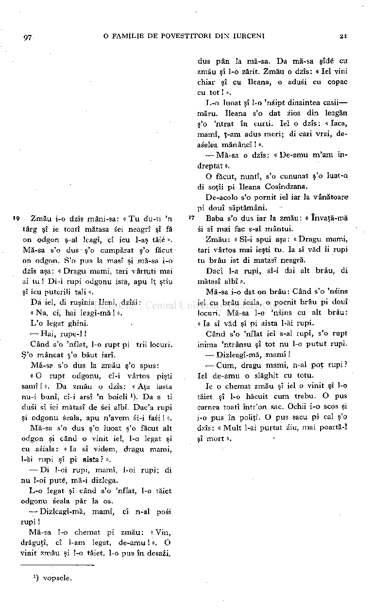

dus pân la mă-sa. Da mă-sa şîde cu zmău şî l-o zărit. Zmău o dzîs : « Iei vini chiar şî cu Ileana, o aduşi cu copac cu tot ! ».

L-o luoat şî l-o 'nsipt dinaintea casiimăru. Ileana s'o dat zios din leagăn ş'o 'ntrat în curţi. Iei o dzîs: «Iaca, mamî, ţ-am adus meri; di cari vrai, deaselea mănânci ! ».

— Mă-sa o dzîs : « De-amu m'am îndreptat ».

O făcut, nuntî, s'o cununat ş'o luat-a di soţîi pi Ileana Cosîndzana.

De-acolo s'o pornit iei iar la vânătoare pi douî săptămâni.

'7 Baba s'o dus iar la zmău: « învaţă-mă si sî mai fac s-al mântui.

•9 Zmău i-o dzîs mâni-sa: « T u du-ti 'n târg şî ie toatî mătasa sei neagrî şî fă on odgon ş-al leagî, cî ieu l-aş tăie ». Mă-sa s'o dus - ş'o cumpărat ş'o făcut on odgon. S'o pus la masî şi mă-sa i-o dzîs aşa: « Dragu mami, tari vârtuti mai ai tu ! Di-i rupi odgonu ista, apu îţ ştiu şî ieu puterili tali ».

Zmău: « Sî-i spui aşa: «Dragu mami, tari vârtos mai ieşti tu. Ia sî văd îi rupi tu brâu ist di matasî neagră.

Dacî 1-a rupi, sî-i dai alt brâu, di mătasî albî ».

Mă-sa i-o dat on brâu: Când s'o 'nsins iei cu brâu seala, o pocnit brâu pi douî locuri. Mă-sa l-o 'nsins cu alt brâu: « Ia sî văd şî pi aista 1-ăi rupi.

Da iei, di ruşînia Ileni, dzîsi: « Na, ci, hai leagî-mă ! ». L'o legat ghini.

Când s'o 'nflat iei s-al rupî, s'o rupt inima 'ntrânsu şî tot nu l-o putut rupi.

— Hai, rupe-1 ! Când s'o 'nflat, l-o rupt pi trii locuri.

— Dizleagî-mă, mamî !

Ş'o mâncat ş'o băut iarî. Mă-sa s'o dus la zmău ş'o spus: « O rupt odgonu, cî-i vârtos pişti samî ! ». Da zmău o dzîs: «Aţa iasta nu-i bunî, cî-i arsî 'n boieli ). Da s ti dusi sî iei mătasî de sei albî. Dac'a rupi şi odgonu seala, apu n'avem si-i fasi ! ».

— Cum, dragu mami, n-al poţ rupi? Iei de-amu o slăghit cu totu.

Ie o chemat zmău şî iei o vinit şî l-o tăiet şî l-o hăcuit cum trebu. O pus carnea toatî într'on sac. Ochii i-o scos şi i-o pus în poliţî. O pus sacu pi cal ş'o dzîs: «Mult l-ai purtat ziu, mai poartă-1 şî mort ».

Mă-sa s'o dus ş'o luoat ş'o făcut alt odgon şi când o vinit iei, l-o legat şi cu asiala : « Ia sî videm, dragu mami, 1-ăi rupi şî pi aista ? ».

— Di l-oi rupi, mamî, l-oi rupi ; di nu l-oi puté, mă-i dizlega.

L-o legat şî când s'o 'nflat, l-o tăiet odgonu seala păr la os.

— Dizleagî-mă, mamî, cî n-al posi rupi !

Mă-sa l-o chemat pi zmău: «Vin, drăguţi, cî l-am legat, de-amu ! ». O vinit zmău şi l-o tăiet, l-o pus în desazi,

') vopsele.

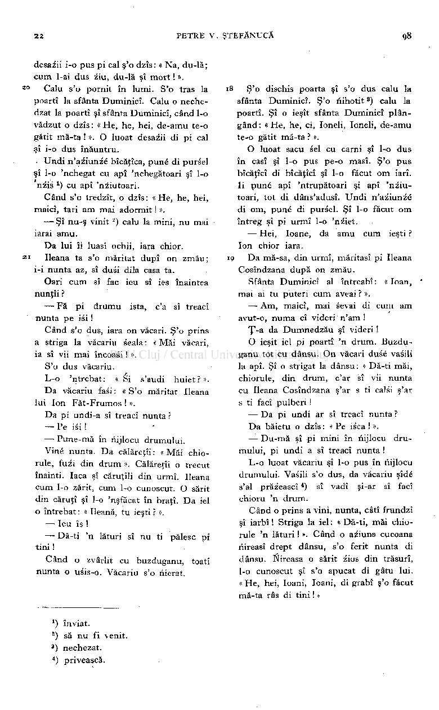

desazii i-o pus pi cal ş'o dzîs: « Na, du-lă; cum l-ai dus ziu, du-lă şî mort ! ».

Calu s'o pornit în lumi. S'o tras la poartî la sfânta Duminicî. Calu o nechedzat la poartî şî sfânta Duminicî, când l-o vădzut o dzîs : « He, he, hei, de-amu te-o gătit mă-ta ! ». O luoat desazii di pi cal şî i-o dus înăuntru.

- 18 Ş'o dischis poarta şî s'o dus calu la

sfânta Duminicî. Ş'o nihotit

8

) calu la poartî. Şî o ieşît sfânta Duminicî plângând : « He, he, ci, Ioneli, Ioneli, de-amu te-o gătit mă-ta ? ».

O luoat sacu sel cu carni şî l-o dus în casî şî l-o pus pe-o masî. Ş'o pus bîcăţîcî di bîcăţîcî şî l-o făcut om iarî. Ii puné apî 'ntrupătoari şi apî 'nziutoari, tot di dâns'adusî. Undi n'aziunze di om, puné di pursei. Şî l-o făcut om întreg şî pi urmî l-o 'nziet.

— Hei, Ioane, da amu cum ieşti ? Ion chior iara.

- 19 Da mă-sa, din urmî, măritaşi pi Ileana Cosîndzana după on zmău.

. Undi n'aziunze bîcăţîca, puné di pursei şî l-o 'nchegat cu apî 'nchegătoari şî l-o

nzis *) cu apî 'niiutoari.

Când s'o tredzît, o dzîs: « He, he, hei, maicî, tari am mai adormit ! ».

— Şî nu-ş vinit ) calu la mini, nu mai

iarai amu. Da lui îi luasî ochii, iara chior. Ileana ta s'o măritat dupî on zmău;

i-i nunta az, sî dusi dila casa ta.

Sfânta Duminicî al întreabî: « Ioan, ' mai ai tu puteri cum aveai ? ».

Oari cum sî fac ieu sî ies înaintea nunţii ?

— Am, maicî, mai sevai di cum am

— Fă pi drumu ista, c'a sî treacî nunta pe i si !

avut-o, numa cî videri n'am ! Ţ-a da Dumnedzău şî videri ! O ieşit iei pi poartî 'n drum. Buzduganu tot cu dânsu. On văcari dusé vasili la apî. Şî o strigat la dânsu : « Dă-ti măi, chiorule, din drum, c'ar sî vii nunta cu Ileana Cosîndzana ş'ar s ti calsi ş'ar s ti facî pulberi !

Când s'o dus, iara on văcari. Ş'o prins a striga la văcariu seala: «Măi văcari, ia sî vii mai încoasi ! ».

S'o dus văcariu. L-o 'ntrebat: « ăi s'audi huiet?». Da văcariu fasi : « S'o măritat Ileana

lui Ion Făt-Frumos ! ». Da pi undi-a sî treacî nunta ?

— Da pi undi ar sî treacî nunta ? Da băietu o dzîs: «Pe isea!».

— Pe isi !

— Du-mă şî pi mini în nijlocu drumului, pi undi a sî treacî nunta !

— Pune-mă în nijlocu drumului. Viné nunta. Da călăreţii: «Măi chiorule, fuzi din drum ». Călăreţii o trecut înainti. Iaca şî căruţîli din urmî. Ileana cum l-o zărit, cum l-o cunoscut. O sărit din căruţî şî l-o 'nşfăcat în braţî. Da iei o întrebat : « Ileana, tu ieşti ? ».

L-o luoat văcariu şî l-o pus în nijlocu drumului. Vasili s'o dus, da văcariu şîde s'al prăzeascî

) sî vadî şi-ar sî facî chioru 'n drum.

4

Când o prins a vini, nunta, câtî frundzî şî iarbî ! Striga la iei: «Dă-ti, măi chiorule 'n lături ! ». Când o aiiuns cucoana nireasî drept dânsu, s'o ferit nunta di dânsu. Nireasa o sărit zios din trăsuri, l-o cunoscut şî s'o apucat di gâtu lui. « He, hei, Ioani, Ioani, di grabî ş'o făcut mă-ta râs di tini ! »

— Ieu îs !

— Dă-ti 'n lături sî nu ti pălesc pi tini !

Când o zvârlit cu buzduganu, toatî nunta o usis-o. Văcariu s'o nierat.

) înviat.

x

) să nu fi venit.

2

) nechezat.

J

) privească.

4

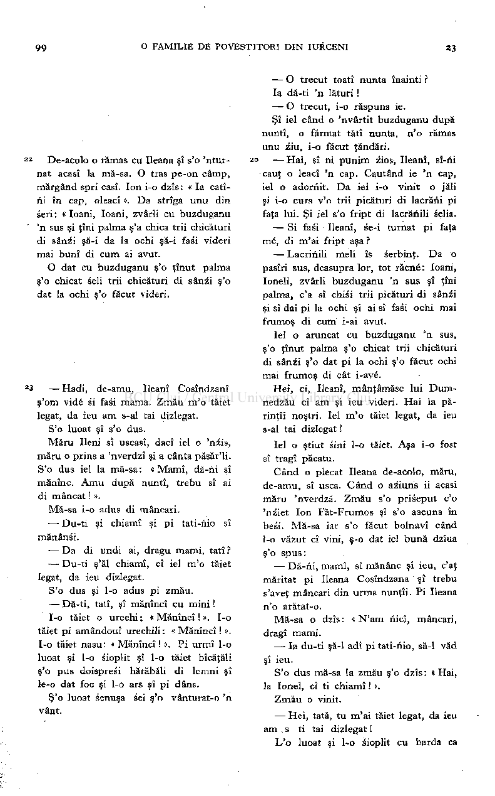

— O trecut toati nunta înainti ? Ia dă-ti 'n lături !

— O trecut, i-o răspuns ie. Şî iei când o 'nvârtit buzduganu după

nuntî, o fărmat tătî nunta, n'o rămas unu ziu, i-o făcut ţăndări.

2o — Hai, sî ni punim zios, Ileanî, sî-hi caut o leacî 'n cap. Căutând ie 'n cap, iei o adornit. Da iei i-o vinit o jăli şi i-o curs v'o trii picături di lacrăhi pi faţa lui. Şi iei s'o fript di lacrăhili éelia.

De-acolo o rămas cu Ileana şî s'o 'nturnat acasî la mă-sa. O tras pe-on câmp, mărgând spri casî. Ion i-o dzîs : « Ia cătini în cap, oleacî ». Da striga unu din seri: « Ioani, Ioani, zvârli cu buzduganu 'n sus şi ţîni palma ş'a chica trii chicături di sânzi şă-i da la ochi şă-i fasi videri mai buni di cum ai avut.

— Si fasi Ileanî, se-i turnat pi faţa mé, di m'ai fript aşa ?

— Lacrinili meii îs serbinţ. Da o pasîri sus, deasupra lor, tot răcne: Ioani, Ioneli, zvârli buzduganu 'n sus şî ţîni palma, c'a sî chisi trii picături di sânzi şi sî dai pi la ochi şî ai sî fasi ochi mai frumos di cum i-ai avut.

O dat cu buzduganu ş'o ţînut palma ş'o chicat seli trii chicături di sânzi ş'o dat la ochi ş'o făcut videri.

Iei o aruncat cu buzduganu 'n sus, ş'o ţînut palma ş'o chicat trii chicături di sânzî ş'o dat pi la ochi ş'o făcut ochi mai frumos di cât i-avé.

Hei, ci, Ileanî, mânţâmăsc lui Dumnedzău cî am şi ieu videri. Hai la părinţii noştri. Iei m'o tăiet legat, da ieu s-al tai dizlegat !

— Hadi, de-amu, Ileanî Cosîndzanî ş'om vidé si fasi mama. Zmău m'o tăiet legat, da ieu am s-al tai dizlegat.

S'o luoat şî s'o dus. Măru Ileni sî uscasî, dacî iei o 'nzis, măru o prins a 'nverdzî şi a cânta păsăr'li. S'o dus iei la mă-sa : « Mamî, dă-hi sî mănînc. Amu după nunti, trebu sî ai di mâncat ! ».

Iei o ştiut sini l-o tăiet. Aşa i-o fost sî tragî păcatu.

Când o plecat Ileana de-acolo, măru, de-amu, sî usca. Când o aziuns ii acasî măru 'nverdză. Zmău s'o priseput c'o 'nziet Ion Făt-Frumos şî s'o ascuns în besi. Mă-sa iar s'o făcut bolnavî când l-o văzut cî vini, ş-o dat iei bună dzîua ş'o spus:

Mă-sa i-o adus di mâncări.

— Du-ti şi chiamî şi pi tati-hio sî mănânsi.

— Da di undi ai, dragu mami, tatî ? —• Du-ti ş'ăl chiamî, cî iei m'o tăiet

— Dă-ni, mamî, sî mănânc şî ieu, c'aţ măritat pi Ileana Cosîndzana şî trebu s'aveţ mâncări din urma nunţii. Pi Ileana n'o arătat-o.

legat, da ieu dizlegat. S'o dus şi l-o adus pi zmău.

— Dă-ti, tatî, şî mănîncî cu mini ! I-o tăiet o urechi : « Mănîncî ! ». I-o tăiet pi amândouî urechili : « Mănîncî ! ». I-o tăiet nasu: « Mănîncî ! ». Pi urmî l-o luoat şi l-o sioplit şî l-o tăiet bîcăţăli ş'o pus doispresi hărăbăli di lemni şî le-o dat foc şi l-o ars şî pi dâns.

Mă-sa o dzîs : « N'arn hicî, mâncări, dragi mami.

— Ia du-ti şă-1 adî pi tati-hio, să-1 văd şî ieu.

S'o dus mă-sa la zmău ş'o dzîs: « Hai, la Ionel, cî ti chiamî ! ».

Ş'o luoat senuşa sei ş'o vânturat-o 'n vânt.

Zmău o vinit.

— Hei, tată, tu m'ai tăiet legat, da ieu am , s ti tai dizlegat !

L'o luoat şi l-o âioplit cu barda ca

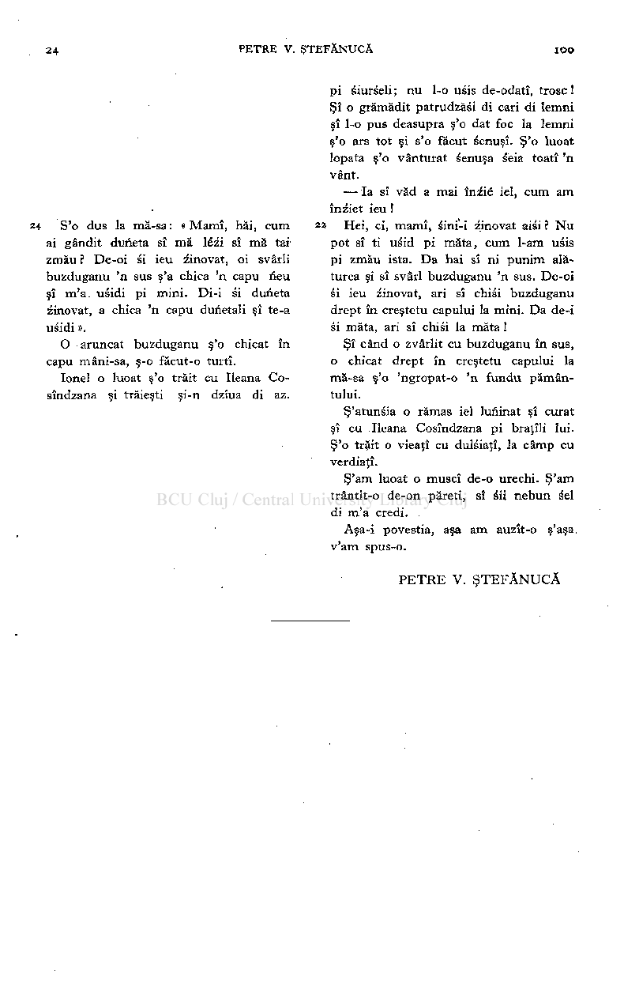

pi éiurseli ; nu l-o uéis de-odatî, trosc ! Şî o grămădit patrudzăsi di cari di lemni şî l-o pus deasupra ş'o dat foc la lemni ş'o ars tot şi s'o făcut senuşî. Ş'o luoat lopata ş'o vânturat senuşa seia toatî 'n vânt.

— Ia sî văd a mai înzié iei, cum am înziet ieu !

22 Hei, ci, mamî, éini'-i zinovat aisi ? N u pot sî ti usid pi măta, cum l-am usis pi zmău ista. Da hai sî ni punim alăturea şi sî svârl buzduganu 'n sus. De-oi si ieu iinovat, ari sî chisi buzduganu drept în creştetu capului la mini. Da de-i si măta, ari sî chisi la măta !

S'o dus la mă-sa : « Mamî, hăi, cum ai gândit duneta sî mă Iezi sî mă tai zmău ? De-oi si ieu zmovat, oi svârli buzduganu 'n sus ş'a chica 'n capu neu şî m'a. usidi pi mini. Di-i si duheta zinovat, a chica 'n capu duhetali şî te-a usidi ».

Şî când o zvârlit cu buzduganu în sus, o chicat drept în creştetu capului la mă-sa ş'o 'ngropat-o 'n fundu pământului.

O aruncat buzduganu ş'o chicat în capu mâni-sa, ş-o făcut-o turtî.

Ionel o luoat ş'o trăit cu Ileana Cosîndzana şi trăieşti şi-n dzîua di az.

Ş'atunsia o rămas iei luninat şî curat şî cu Ileana Cosîndzana pi braţîli lui. Ş'o trăit o vieaţî cu duleiaţî, la câmp cu verdiaţî.

Ş'am luoat o muscî de-o urechi. Ş'am trântit-o de-on păreţi, sî sii nebun sel di m'a credi.

Aşa-i povestia, aşa am auzît-o ş'aşa. v'am spus-o.

PETR E V. ŞTEFĂNUC Ă

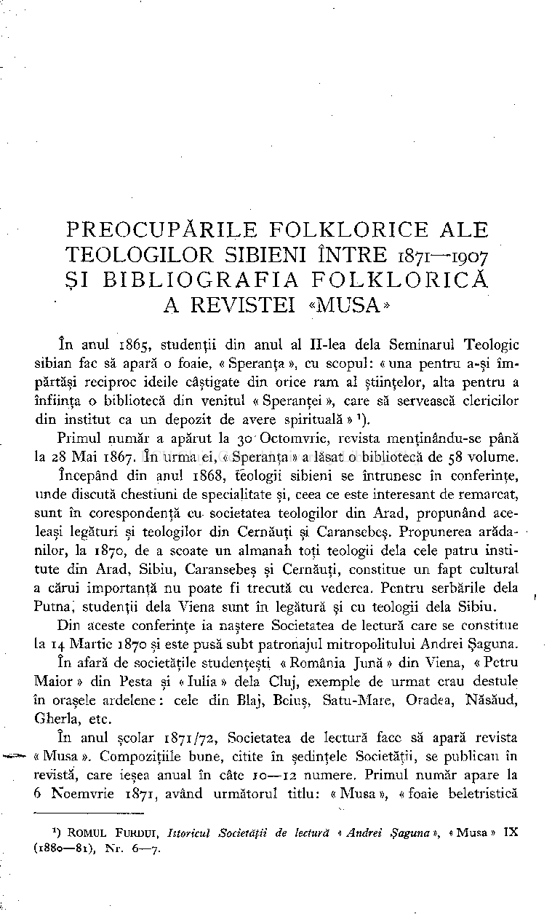

# PREOCUPĂRILE FOLKLORICE ALE TEOLOGILOR SIBIENI ÎNTRE 1871—1907 ŞI BIBLIOGRAFI A FOLKLORIC Ă A REVISTEI «MUSA»

în anul 1865, studenţii din anul al II-lea delà Seminarul Teologic sibian fac să apară o foaie, « Speranţa », cu scopul : « una pentru a-şi împărtăşi reciproc ideile câştigate din orice ram al ştiinţelor, alta pentru a înfiinţa o bibliotecă din venitul « Speranţei », care să servească clericilor din institut ca un depozit de avere spirituală »

).

1

Primul număr a apărut la 30 Octomvrie, revista menţinându-se până la 28 Mai 1867. în urma ei, « Speranţa » a lăsat o bibliotecă de 58 volume.

începând din anul 1868, teologiisibieni se întrunesc în conferinţe, unde discută chestiuni de specialitate şi, ceea ce este interesant de remarcat, sunt în corespondenţă cu societatea teologilor din Arad, propunând aceleaşi legături şi teologilor din Cernăuţi şi Caransebeş. Propunerea arădanilor, la 1870, de a scoate un almanah toţi teologii delà cele patru institute din Arad, Sibiu, Caransebeş şi Cernăuţi, constitue un fapt cultural a cărui importanţă nu poate fi trecută cu vederea. Pentru serbările delà Putna, studenţii delà Viena sunt în legătură şi cu teologii delà Sibiu.

Din aceste conferinţe ia naştere Societatea de lectură care se constitue la 14 Martie 1870 şi este pusă subt patronajul mitropolitului Andrei Şaguna.

în afară de societăţile studenţeşti « România Jună » din Viena, « Petru Maior » din Pesta şi « Iulia » delà Cluj, exemple de urmat erau destule în oraşele ardelene : cele din Blaj, Beiuş, Satu-Mare, Oradea, Năsăud, Gherla, etc.

în anul şcolar 1871/72, Societatea de lectură face să apară revista « Musa ». Compoziţiile bune, citite în şedinţele Societăţii, se publicau în revistă, care ieşea anual în câte 10—12 numere. Primul număr apare la 6 Noemvrie 1871, având următorul titlu: «Musa», «foaie beletristică

*) ROMUL FURDUI, Istoricul Societăţii de lectură « Andrei Şaguna », « Musa » I X (1880—81), Nr. 6—7.

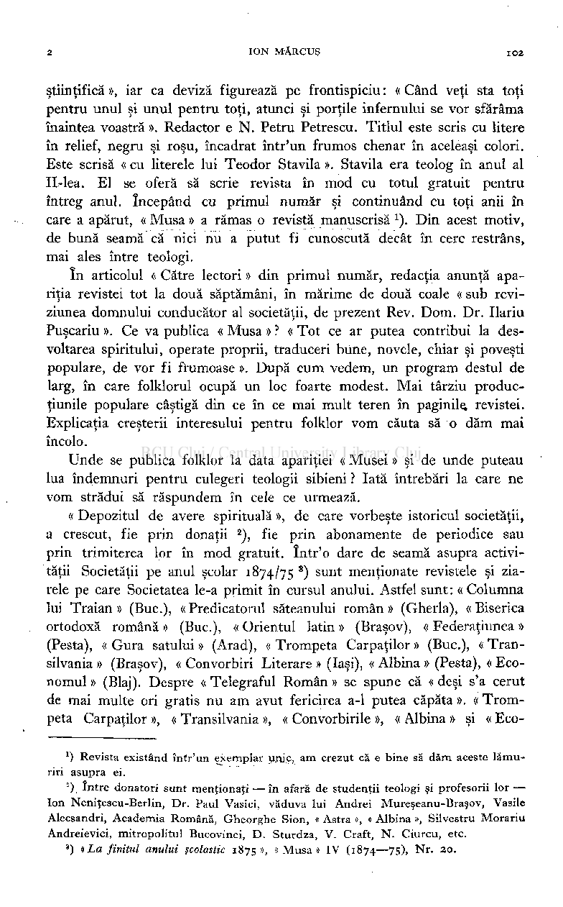

ştiinţifică», iar ca deviză figurează pe frontispiciu: «Când veţi sta toţi pentru unul şi unul pentru toţi, atunci şi porţile infernului se vor sfărâma înaintea voastră ». Redactor e N. Petru Petrescu. Titlul este scris cu litere în relief, negru şi roşu, încadrat într'un frumos chenar în aceleaşi colori. Este scrisă « cu literele lui Teodor Stavila ». Stavila era teolog în anul al II-lea. El se oferă să scrie revista în mod cu totul gratuit pentru întreg anul. începând cu primul număr şi continuând cu toţi anii în care a apărut, « Musa » a rămas o revistă manuscrisă ). Din acest motiv, de bună seamă că nici nu a putut fi cunoscută decât în cerc restrâns, mai ales între teologi.

în articolul « Către lectori » din primul număr, redacţia anunţă apariţia revistei tot la două săptămâni, în mărime de două coaie « sub reviziunea domnului conducător al societăţii, de prezent Rev. Dom. Dr. Ilariu Puşcariu ». Ce va publica « Musa » ? « Tot ce ar putea contribui la desvoltarea spiritului, operate proprii, traduceri bune, novele, chiar şi poveşti populare, de vor fi frumoase ». După cum vedem, un program destul de larg, în care folklorul ocupă un loc foarte modest. Mai târziu producţiunile populare câştigă din ce în ce mai mult teren în paginile, revistei. Explicaţia creşterii interesului pentru folklor vom căuta să o dăm mai încolo.

Unde se publica folklor la data apariţiei « Musei » şi de unde puteau lua îndemnuri pentru culegeri teologii sibieni ? Iată întrebări la care ne vom strădui să răspundem în cele ce urmează.

« Depozitul de avere spirituală », de care vorbeşte istoricul societăţii, a crescut, fie prin donaţii

), fie prin abonamente de periodice sau prin trimiterea lor în mod gratuit. într'o dare de seamă asupra activităţii Societăţii pe anul şcolar 1874/75 )

2

menţionate revistele şi zia­

sun t

rele pe care Societatea le-a primit în cursul anului. Astfel sunt: « Columna lui Traian » (Buc), «Predicatorul săteanului român» (Gherla), «Biserica ortodoxă română » (Buc), « Orientul latin » (Braşov), « Federaţiunea » (Pesta), « Gura satului » (Arad), « Trompeta Carpaţilor » (Buc), « Transilvania » (Braşov), « Convorbiri Literare » (Iaşi), « Albina » (Pesta), « Economul » (Blaj). Despre « Telegraful Român » se spune că « deşi s'a cerut de mai multe ori gratis nu am avut fericirea a-1 putea căpăta ». « Trompeta Carpaţilor », « Transilvania », « Convorbirile », « Albina » şi « Eco-

*) Revista existând într'un exemplar unic, am crezut că e bine să dăm aceste lămuriri asupra ei.

), între donatori sunt menţionaţi — în afară de studenţii teologi şi profesorii lor Ion Neniţescu-Berlin, Dr. Paul Vasici, văduva lui Andrei Mureşeanu-Braşov, Vasile Alecsandri, Academia Română, Gheorghe Sion, « Astra », « Albina », Silvestru Morariu Andreievici, mitropolitul Bucovinei, D. Sturdza, V. Craft, N . Ciurcu, etc.

2

') «La finitul anului scolastic 1875 », « Musa » IV (1874—75), Nr. 20.

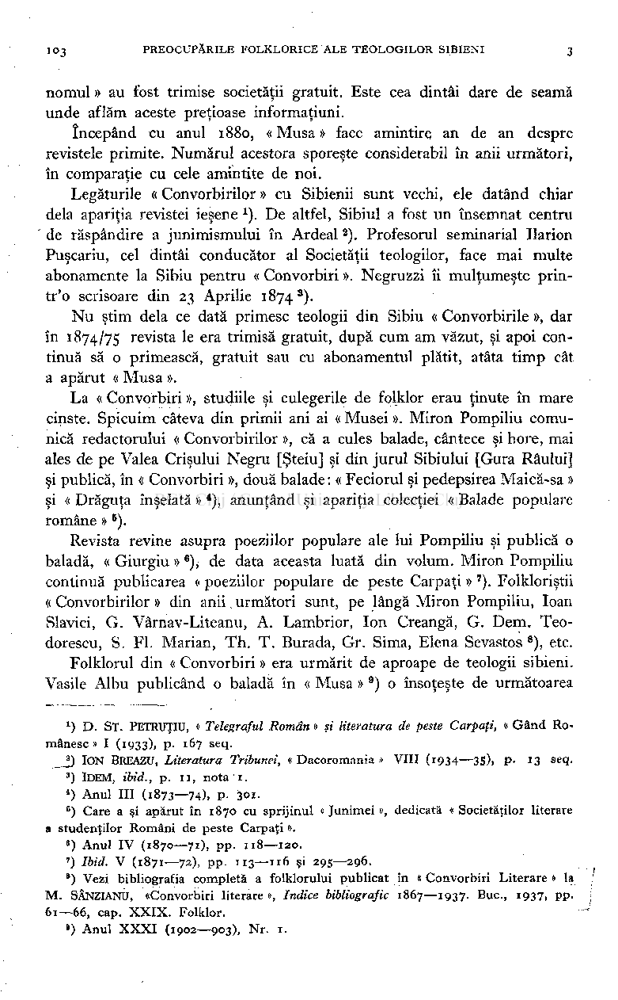

nomul » au fost trimise societăţii gratuit. Este cea dintâi dare de seamă unde aflăm aceste preţioase informaţiuni.

începând cu anul 1880, « Musa » face amintire an de an despre revistele primite. Numărul acestora sporeşte considerabil în anii următori, în comparaţie cu cele amintite de noi.

Legăturile « Convorbirilor » cu Sibienii sunt vechi, ele datând chiar delà apariţia revistei ieşene ). De altfel, Sibiul a fost un însemnat centru de răspândire a junimismului în Ardeal

). Profesorul seminarial Ilarion Puşcariu, cel dintâi conducător al Societăţii teologilor, face mai multe abonamente la Sibiu pentru « Convorbiri ». Negruzzi îi mulţumeşte printr'o scrisoare din 23 Aprilie 1874

2

).

3

Nu ştim delà ce dată primesc teologii din Sibiu « Convorbirile », dar în 1874/75 revista le era trimisă gratuit, după cum am văzut, şi apoi continuă să o primească, gratuit sau cu abonamentul plătit, atâta timp cât a apărut « Musa ».

La « Convorbiri », studiile şi culegerile de folklor erau ţinute în mare cinste. Spicuim câteva din primii ani ai « Musei ». Miron Pompiliu comunică redactorului « Convorbirilor », că a cules balade, cântece şi hore, mai ales de pe Valea Crişului Negru [Şteiu] şi din jurul Sibiului [Gura Râului] şi publică, în « Convorbiri », două balade : « Feciorul şi pedepsirea Maică-sa » şi « Drăguţa înşelată » *), anunţând şi apariţia colecţiei « Balade populare române »

).

6

Revista revine asupra poeziilor populare ale lui Pompiliu şi publică o baladă, « Giurgiu »

), de data aceasta luată din volum. Miron Pompiliu continuă publicarea « poeziilor populare de peste Carpaţi » '). Folkloriştii « Convorbirilor » din anii. următori sunt, pe lângă Miron Pompiliu, Ioan Slavici, G. Vârnav-Liteanu, A. Lambrior, Ion Creangă, G. Dem. Teodorescu, S. FI. Marian, Th. T. Burada, Gr. Sima, Elena Sevastos ), etc.

6

Folklorul din « Convorbiri » era urmărit de aproape de teologii sibieni. Vasile Albu publicând o baladă în « Musa »

) o însoţeşte de următoarea

9

) D . ST . PETRUŢIU, « Telegraful Român » şi literatura de peste Carpaţi, « Gând Românesc » I (1933), p. 167 seq.

l

_f) ION BREAZU, Literatura Tribunei, « Dacoromania » VIII (1934—35). P- 13 seq.

- 3

) IDEM, ibid., p. 11, notai .

- 4

) Anul III (1873—74), P - 3°i

- 5

) Care a şi apărut în 1870 cu sprijinul « Junimei », dedicată « Societăţilor literare

a studenţilor Români de peste Carpaţi ». ") Anul I V (1870—71), pp. 118—120. ') Ibid. V (1871—72), pp. 113—116 şi 295—296.

) Vezi bibliografia completă a folklorului publicat în « Convorbiri Literare » la

8

- M. SÂNZIANÛ, «Convorbiri literare », Indice bibliografic 1867—1937. Buc , 1937, pp. 61—66, cap. XXIX . Folklor.

») Anul XXX I (1902—903), Nr. 1.

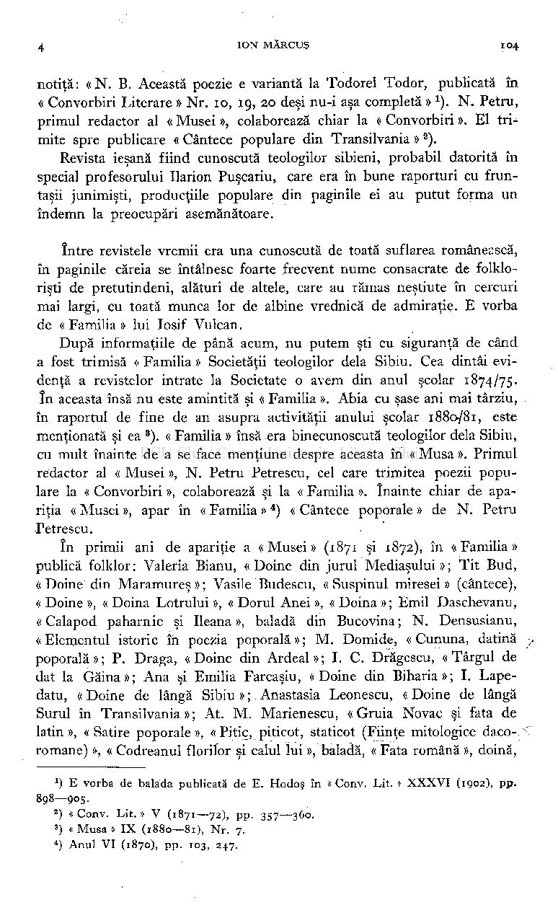

notiţă: « N. B. Această poezie e variantă la Todorel Todor, publicată în « Convorbiri Literare » Nr. 10, 19, 20 deşi nu-i aşa completă » ). N. Petru, primul redactor al « Musei », colaborează chiar la « Convorbiri ». El trimite spre publicare « Cântece populare din Transilvania »

).

2

Revista ieşană fiind cunoscută teologilor sibieni, probabil datorită în special profesorului Ilarion Puşcariu, care era în bune raporturi cu fruntaşii junimişti, producţiile populare din paginile ei au putut forma un îndemn la preocupări asemănătoare.

între revistele vremii era una cunoscută de toată suflarea românească, în paginile căreia se întâlnesc foarte frecvent nume consacrate de folklorişti de pretutindeni, alături de altele, care au rămas neştiute în cercuri mai largi, cu toată munca lor de albine vrednică de admiraţie. E vorba de « Familia » lui Iosif Vulcan.

După informaţiile de până acum, nu putem şti cu siguranţă de când a fost trimisă « Familia » Societăţii teologilor delà Sibiu. Cea dintâi evidenţă a revistelor intrate la Societate o avem din anul şcolar 1874/75. în aceasta însă nu este amintită şi « Familia ». Abia cu şase ani mai târziu,

în raportul de fine de an asupra activităţii anului şcolar 1880-/81, este menţionată şi ea ). « Familia » însă era binecunoscută teologilor delà Sibiu, cu mult înainte de a se face menţiune despre aceasta în « Musa ». Primul redactor al « Musei », N. Petru Petrescu, cel care trimitea poezii populare la « Convorbiri », colaborează şi la « Familia ». înainte chiar de apariţia « Musei », apar în « Familia » ) « Cântece poporale » de N. Petru Petrescu.

în primii ani de apariţie a «Musei» (1871 şi 1872), în «Familia» publică folklor: Valeria Bianu, «Doine din jurul Mediaşului»; Tit Bud, « Doine din Maramureş»; Vasile Budescu, «Suspinul miresei» (cântece), « Doine », « Doina Lotrului », « Dorul Anei », « Doina »; Emil Daschevanu, « Calapod paharnic şi Ileana », baladă din Bucovina ; N. Densusianu, « Elementul istoric în poezia poporală » ; M. Domide, « Cununa, datină > poporală»; P. Draga, «Doine din Ardeal»; I. C. Drăgescu, «Târgul de dat la Găina»; Ana şi Emilia Farcaşiu, «Doine din Biharia»; I. Lapedatu, « Doine de lângă Sibiu » ; Anastasia Leonescu, « Doine de lângă Surul în Transilvania»; At. M. Marienescu, «Gruia Novac şi fata de latin », « Satire poporale », « Pitic, piticot, staticot (Fiinţe mitologice daco-. *'•'• romane) », « Codreanul florilor şi calul lui », baladă, « Fata română », doină,

*) E vorba de balada publicată de E. Hodoş în « Conv. Lit. » XXXV I (1902), pp. 898—905.

- 2

) « Conv. Lit. » V (1871—72), pp. 357—360.

- 3

) «Musa» IX (1880—81), Nr. 7.

- 4

##### ) Anul VI (1870), pp. 103, 247.

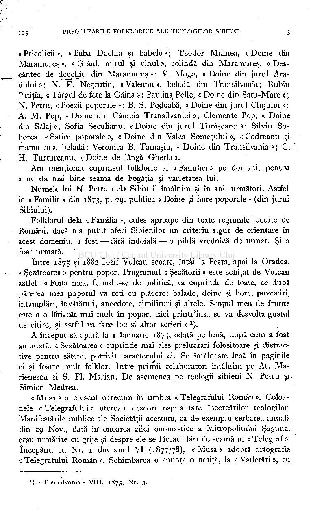

« Pricolicii », « Baba Dochia şi babele » ; Teodor Mihnea, « Doine din Maramureş », « Grâul, mirul şi vinul », colindă din Maramureş, « Descântec de deochiu din Maramureş » ; V. Moga, « Doine din jurul Aradului » ; N. F. Negruţiu, « Văleanu », baladă din Transilvania ; Rubin Patiţia, « Târgul de fete la Găina » ; Paulina Pelle, « Doine din Satu-Mare » ;

- N. Petru, «Poezii poporale »; B. S. Podoabă, « Doine din jurul Clujului »; A. M. Pop, « Doine din Câmpia Transilvaniei » ; Clemente Pop, « Doine din Sălaj » ; Sofia Seculianu, « Doine din jurul Timişoarei » ; Silviu Sohorca, « Satire poporale », « Doine din Valea Someşului », « Codreanu şi mama sa », baladă ; Veronica B. Tamaşiu, « Doine din Transilvania » ; C. H. Turtureanu, « Doine de lângă Gherla ».

Am menţionat cuprinsul folkloric al « Familiei » pe doi ani, pentru a ne da mai bine seama de bogăţia şi varietatea lui.

Numele lui N. Petru delà Sibiu îl întâlnim şi în anii următori. Astfel în « Familia » din 1873, p. 79, publică « Doine şi hore poporale » (din jurul Sibiului).

Folklorul delà « Familia », cules aproape din toate regiunile locuite de Români, dacă n'a putut oferi Sibienilor un criteriu sigur de orientare în acest domeniu, a fost — fără îndoială — o pildă vrednică de urmat. Şi a fost urmată.

între 1875 şi 1882 Iosif Vulcan scoate, întâi la Pesta, apoi la Oradea, « Şezătoarea » pentru popor. Programul « Şezătorii » este schiţat de Vulcan astfel : « Foiţa mea, ferindu-se de politică, va cuprinde de toate, ce după părerea mea poporul va ceti cu plăcere: balade, doine şi hore, povestiri, întâmplări, învăţături, anecdote, cimilituri şi altele. Scopul meu de frunte este a o lăţi. cât mai mult în popor, căci printr'însa se va desvolta gustul de citire, şi astfel va face loc şi altor scrieri »

).

1

A început să apară la 1 Ianuarie 1875, odată pe lună, după cum a fost anunţată. « Şezătoarea » cuprinde mai ales prelucrări folositoare şi distractive pentru săteni, potrivit caracterului ei. Se întâlneşte însă în paginile ei şi foarte mult folklor. între primii colaboratori întâlnim pe At. Marienescu şi S. FI. Marian. De asemenea pe teologii sibieni N. Petru şi Simion Medrea.

« Musa » a crescut oarecum în umbra « Telegrafului Român ». Coloanele « Telegrafului » ofereau deseori ospitalitate încercărilor teologilor. Manifestările publice ale Societăţii acestora, ca de exemplu serbarea anuală din 29 Nov., dată în' onoarea zilei onomastice a Mitropolitului Şaguna, erau urmărite cu grije şi despre ele se făceau dări de- seamă în « Telegraf ». începând cu Nr. 1 din anul VI (1877/78), « Musa » adoptă ortografia « Telegrafului Român ». Schimbarea o anunţă o notiţă, la « Varietăţi », cu

*) «Transilvania» VIII, 1875, Nr. 3.

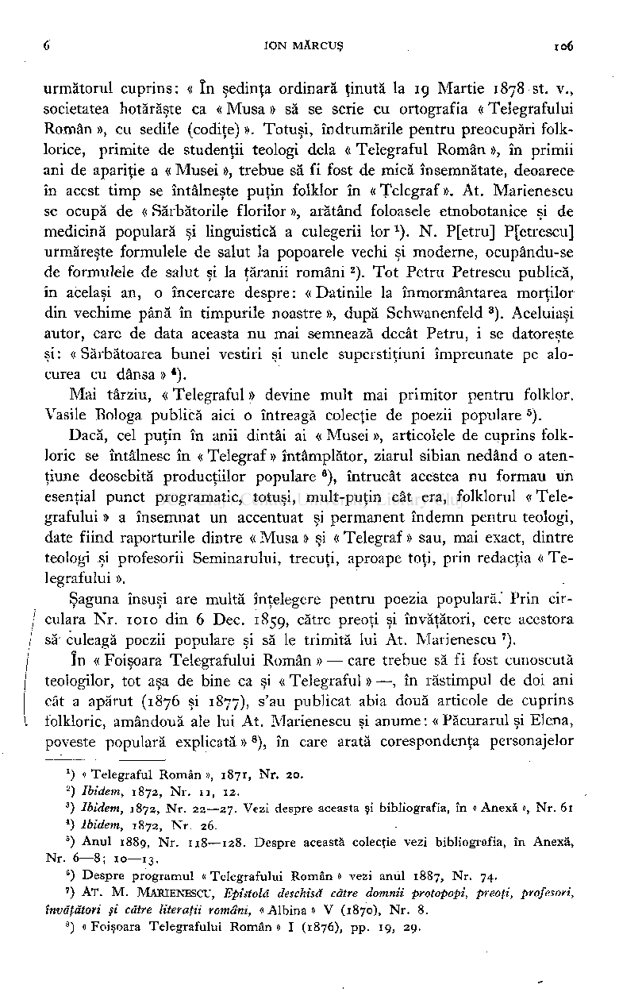

următorul cuprins: « în şedinţa ordinară ţinută la 19 Martie 1878 st. v., societatea hotărăşte ca « Musa » să se scrie cu ortografia « Telegrafului Român », cu sedile (codiţe) ». Totuşi, îndrumările pentru preocupări folklorice, primite de studenţii teologi delà « Telegraful Român », în primii ani de apariţie a « Musei », trebue să fi fost de mică însemnătate, deoarece în acest timp se întâlneşte puţin folklor în « Telegraf ». At. Marienescu se ocupă de « Sărbătorile florilor », arătând foloasele etnobotanice şi de medicină populară şi linguistică a culegerii lor ). N. P[etru] Pfetrescu] urmăreşte formulele de salut la popoarele vechi şi moderne, ocupându-se de formulele de salut şi la ţăranii români

). Tot Petru Petrescu publică, în acelaşi an, o încercare despre: «Datinile la înmormântarea morţilor din vechime până în timpurile noastre », după Schwanenfeld ). Aceluiaşi autor, care de data aceasta nu mai semnează decât Petru, i se datoreşte şi : « Sărbătoarea bunei vestiri şi unele superstiţiuni împreunate pe alocurea cu dânsa » *).

2

Mai târziu, « Telegraful » devine mult mai primitor pentru folklor. Vasile Bologa publică aici o întreagă colecţie de poezii populare ).

Dacă, cel puţin în anii dintâi ai « Musei », articolele de cuprins folkloric se întâlnesc în « Telegraf » întâmplător, ziarul sibian nedând o atenţiune deosebită producţiilor populare ), întrucât acestea nu formau un esenţial punct programatic, totuşi, mult-puţin cât era, folklorul « Telegrafului » a însemnat un accentuat şi permanent îndemn pentru teologi, date fiind raporturile dintre « Musa » şi « Telegraf » sau, mai exact, dintre teologi şi profesorii Seminarului, trecuţi, aproape toţi, prin redacţia « Telegrafului ».

Şaguna însuşi are multă înţelegere pentru poezia populară.' Prin circulara Nr. 1010 din 6 Dec. 1859, către preoţi şi învăţători, cere acestora să culeagă poezii populare şi să le trimită lui At. Marienescu ).

în « Foişoara Telegrafului Român » — care trebue să fi fost cunoscută teologilor, tot aşa de bine ca şi « Telegraful » —, în răstimpul de doi ani cât a apărut (1876 şi 1877), s'au publicat abia două articole de cuprins folkloric, amândouă ale lui At. Marienescu şi anume: «Păcurarul şi Elena, poveste populară explicată »

), în care arată corespondenţa personajelor

8

') « Telegraful Român », 1871, Nr. 20.

- 2

) Ibidem, 1872, Nr. 11, 12.

- 3

) Ibidem, 1872, Nr. 22—27. Vezi despre aceasta şi bibliografia, în « Anexă », Nr. 61

- 4

) Ibidem, 1872, Nr. 26.

- 5

) Anul 1889, Nr. 118—128. Despre această colecţie vezi bibliografia, în Anexă,

Nr. 6—8; 10—13. ') Despre programul « Telegrafului Român » vezi anul 1887, Nr. 74. ') AT. M . MARIENESCU, Epistolă deschisă către domnii protopopi, preoţi, profesori,

### învăţători şi către literaţii români, «Albina» V (1870), Nr. 8.

) « Foişoara Telegrafului Român » I (1876), pp. 19, 29.

8

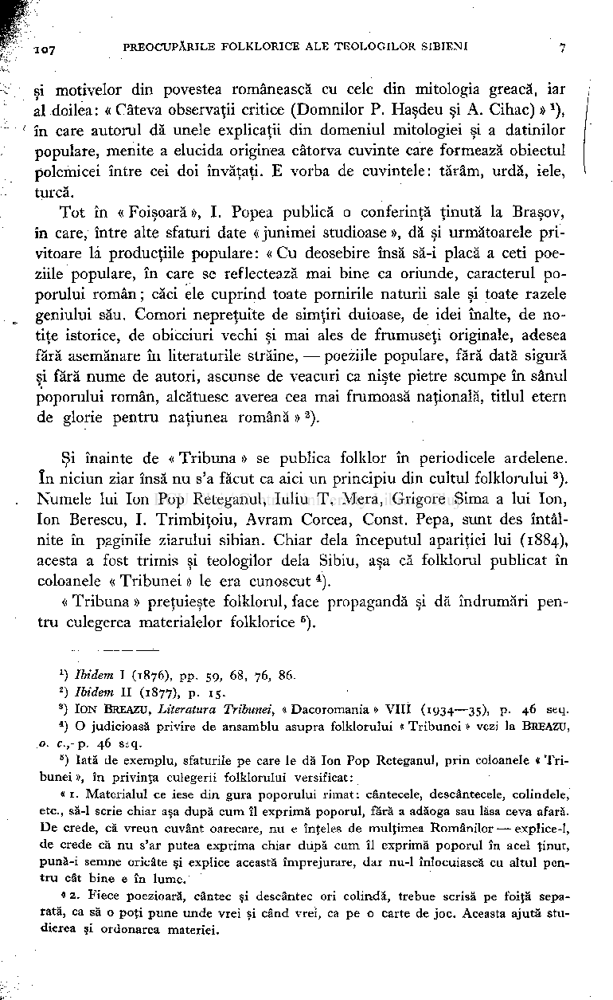

si motivelor din povestea românească cu cele din mitologia greacă, iar al doilea : « Câteva observaţii critice (Domnilor P. Haşdeu şi A. Cihac) » ), în care autorul dă unele explicaţii din domeniul mitologiei şi a datinilor populare, menite a elucida originea câtorva cuvinte care formează obiectul polemicei între cei doi învăţaţi. E vorba de cuvintele: tărâm, urdă, iele, turcă.

Tot în « Foişoară », I. Popea publică o conferinţă ţinută la Braşov, în care, între alte sfaturi date « junimei studioase », dă şi următoarele privitoare là producţiile populare : « Cu deosebire însă să-i placă a ceti poeziile populare, în care se reflectează mai bine ca oriunde, caracterul poporului român; căci ele cuprind toate pornirile naturii sale şi toate razele geniului său. Comori nepreţuite de simţiri duioase, de idei înalte, de notiţe istorice, de obiceiuri vechi şi mai ales de frumuseţi originale, adesea fără asemănare în literaturile străine, — poeziile populare, fără dată sigură şi fără nume de autori, ascunse de veacuri ca nişte pietre scumpe în sânul poporului român, alcătuesc averea cea mai frumoasă naţională, titlul etern de glorie pentru naţiunea română »

).

2

Şi înainte de « Tribuna » se publica folklor în periodicele ardelene, în niciun ziar însă nu s'a făcut ca aici un principiu din cultul folklorului

). Numele lui Ion Pop Reteganul, Iuliu T, Mera, Grigore Sima a lui Ion, Ion Berescu, I. Trimbiţoiu, Avram Corcea, Const. Pepa, sunt des întâlnite în paginile ziarului sibian. Chiar delà începutul apariţiei lui (1884), acesta a fost trimis şi teologilor delà Sibiu, aşa că folklorul publicat în coloanele « Tribunei » le era cunoscut ).

3

« Tribuna » preţuieşte folklorul, face propagandă şi dă îndrumări pentru culegerea materialelor folklorice

).

5

- ) Ibidem I (1876), pp. 59, 68, 76, 86.

- 2

) Ibidem II (1877), p. 15.

- 3

) ION BREAZU, Literatura Tribunei, « Dacoromania » VIII (1934—35), p. 46 seq.

- 4

x

) O judicioasă privire de ansamblu asupra folklorului « Tribunei » vezi la BREAZU, o. c, p. 46 s;q.

) Iată de exemplu, sfaturile pe care le dă Ion Pop Reteganul, prin coloanele « Tribunei », în privinţa culegerii folklorului versificat:

6

« 1. Materialul ce iese din gura poporului rimat: cântecele, descântecele, colindele, etc., să-1 scrie chiar aşa după cum îl exprimă poporul, fără a adăoga sau lăsa ceva afară. De crede, că vreun cuvânt oarecare, nu e înţeles de mulţimea Românilor — explice-1, de crede că nu s'ar putea exprima chiar după cum îl exprimă poporul în acel ţinut, pună-i semne oricâte şi explice această împrejurare, dar nu-1 înlocuiască cu altul pentru cât bine e în lume.

« a. Fiece poezioară, cântec şi descântec ori colindă, trebue scrisă pe foiţă separată, ca să o poţi pune unde vrei şi când vrei, ca pe o carte de joc. Aceasta ajută studierea şi ordonarea materiei.

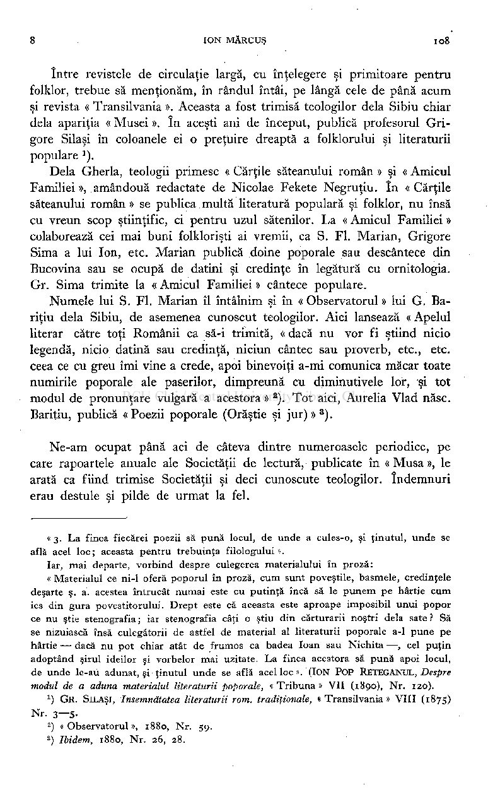

între revistele de circulaţie largă, cu înţelegere şi primitoare pentru folklor, trebue să menţionăm, în rândul întâi, pe lângă cele de până acum şi revista « Transilvania ». Aceasta a fost trimisă teologilor delà Sibiu chiar delà apariţia « Musei ». în aceşti ani de început, publică profesorul Grigore Silaşi în coloanele ei o preţuire dreaptă a folklorului şi literaturii populare ).

Delà Gherla, teologii primesc « Cărţile săteanului român » şi « Amicul Familiei », amândouă redactate de Nicolae Fekete Negruţiu. în « Cărţile săteanului român » se publica multă literatură populară şi folklor, nu însă cu vreun scop ştiinţific, ci pentru uzul sătenilor. La « Amicul Familiei » colaborează cei mai buni folklorişti ai vremii, ca S. FI. Marian, Grigore Sima a lui Ion, etc. Marian publică doine poporale sau descântece din Bucovina sau se ocupă de datini şi credinţe în legătură cu ornitologia. Gr. Sima trimite la « Amicul Familiei » cântece populare.

Numele lui S. FI. Marian îl întâlnim şi în « Observatorul » lui G. Ba-

riţiu delà Sibiu, de asemenea cunoscut teologilor. Aici lansează « Apelul literar către toţi Românii ca să-i trimită, « dacă nu vor fi ştiind nicio legendă, nicio datină sau credinţă, niciun cântec sau proverb, etc., etc. ceea ce cu greu îmi vine a crede, apoi binevoiţi a-mi comunica măcar toate numirile poporale ale paserilor, dimpreună cu diminutivele lor, şi tot modul de pronunţare vulgară a acestora »

). Tot aici, Aurelia Vlad născ. Baritiu, publică «Poezii poporale (Orăştie şi jur)»

2

).

8

Ne-am ocupat până aci de câteva dintre numeroasele periodice, pe care rapoartele anuale ale Societăţii de lectură, publicate în « Musa », le arată ca fiind trimise Societăţii şi deci cunoscute teologilor. îndemnuri erau destule şi pilde de urmat la fel.

« 3. La finea fiecărei poezii să pună locul, de unde a cules-o, şi ţinutul, unde se

află acel loc; aceasta pentru trebuinţa filologului». Iar, mai departe, vorbind despre culegerea materialului în proză: « Materialul ce ni-1 oferă poporul în proză, cum sunt poveştile, basmele, credinţele deşarte ş. a. acestea întrucât numai este cu putinţă încă să le punem pe hârtie cum ies din gura povestitorului. Drept este că aceasta este aproape imposibil unui popor ce nu ştie stenografia ; iar stenografia câţi o ştiu din cărturarii noştri delà sate ? Să se nizuiască însă culegătorii de astfel de material al literaturii poporale a-1 pune pe hârtie — dacă nu pot chiar atât de frumos ca badea Ioan sau Nichita —, cel puţin adoptând şirul ideilor şi vorbelor mai uzitate. La finea acestora să pună apoi locul, de unde le-au adunat, şi ţinutul unde se află acel loc ». (ION POP RETEGANUL, Despre modul de a aduna materialul literaturii poporale, « Tribuna » VII (1890), Nr. 120).

### ) GR. SlLAŞI, însemnătatea literaturii rom. tradiţionale, « Transilvania » VIII (1875) Nr. 3—5-

1

- 2

) « Observatorul », 1880, Nr. 59.

- 3

#### ) Ibidem, 1880, Nr. 26, 28.

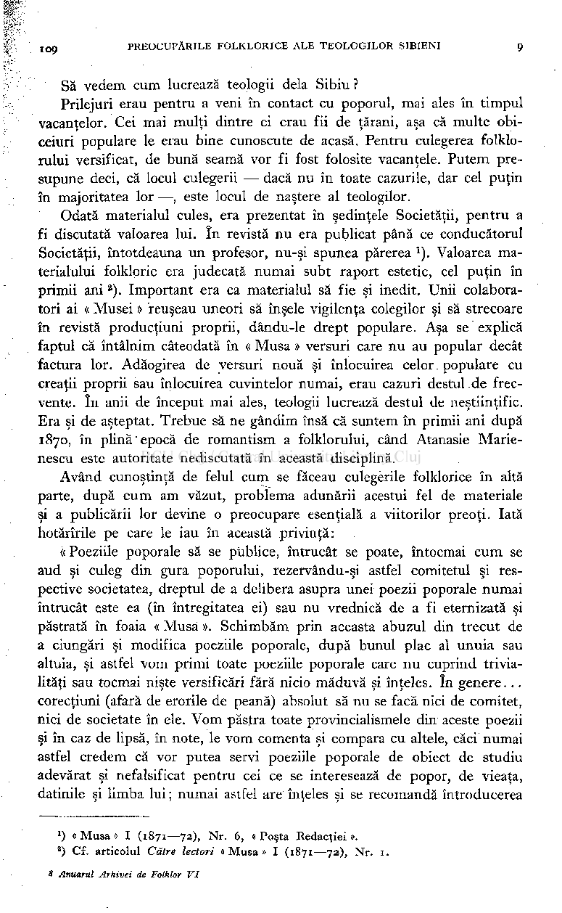

Să vedem cum lucrează teologii delà Sibiu ? Prilejuri erau pentru a veni în contact cu poporul, mai ales în timpul vacanţelor. Cei mai mulţi dintre ei erau fii de ţărani, aşa că multe obiceiuri populare le erau bine cunoscute de acasă. Pentru culegerea folklorului versificat, de bună seamă vor fi fost folosite vacanţele. Putem presupune deci, că locul culegerii — dacă nu în toate cazurile, dar cel puţin în majoritatea lor —, este locul de naştere al teologilor.

Odată materialul cules, era prezentat în şedinţele Societăţii, pentru a fi discutată valoarea lui. în revistă nu era publicat până ce conducătorul Societăţii, întotdeauna un profesor, nu-şi spunea părerea

). Valoarea materialului folkloric era judecată numai subt raport estetic, cel puţin în primii ani

1

). Important era ca materialul să fie şi inedit. Unii colaboratori ai « Musei » reuşeau uneori să înşele vigilenţa colegilor şi să strecoare în revistă producţiuni proprii, dându-le drept populare. Aşa se explică faptul că întâlnim câteodată în « Musa » versuri care nu au popular decât factura lor. Adăogirea de versuri nouă şi înlocuirea celor populare cu creaţii proprii sau înlocuirea cuvintelor numai, erau cazuri destul de frecvente, în anii de început mai ales, teologii lucrează destul de neştiinţific. Era şi de aşteptat. Trebue să ne gândim însă că suntem în primii ani după 1870, în plină epocă de romantism a folklorului, când Atanasie Marienescu este autoritate nediscutată în această disciplină.

2

Având cunoştinţă de felul cum se făceau culegerile folklorice în altă parte, după cum am văzut, problema adunării acestui fel de materiale şi a publicării lor devine o preocupare esenţială a viitorilor preoţi. Iată hotărîrile pe care le iau în această privinţă:

< Poeziile poporale să se publice, întrucât se poate, întocmai cum se

aud şi culeg din gura poporului, rezervându-şi astfel comitetul şi respective societatea, dreptul de a delibera asupra unei poezii poporale numai întrucât este ea (în întregitatea ei) sau nu vrednică de a fi eternizată şi păstrată în foaia « Musa ». Schimbăm prin aceasta abuzul din trecut de a ciungări şi modifica poeziile poporale, după bunul plac al unuia sau altuia, şi astfel vom primi toate poeziile poporale care nu cuprind trivialităţi sau tocmai nişte versificări fără nicio măduvă şi înţeles. în genere... corecţiuni (afară de erorile de peana) absolut să nu se facă nici de comitet, nici de societate în ele. Vom păstra toate provincialismele din aceste poezii şi în caz de lipsă, în note, le vom comenta şi compara cu altele, căci numai astfel credem că vor putea servi poeziile poporale de obiect de studiu adevărat şi nefalsificat pentru cei ce se interesează de popor, de vieaţa, datinile şi limba lui ; numai astfel are înţeles şi se recomandă introducerea

) « Musa » I (1871—73), Nr. 6, « Poşta Redacţiei ».

l

) Cf. articolul Către lectori « Musa » I (1871—72), Nr. 1.

a

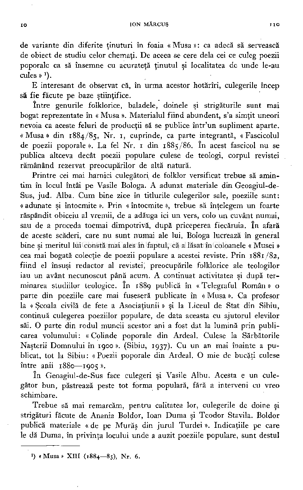

de variante din diferite ţinuturi în foaia « Musa » : ca adecă să servească de obiect de studiu celor chemaţi. De aceea se cere delà cei ce culeg poezii poporale ca să însemne cu acurateţa ţinutul şi localitatea de unde le-au cules » ').

E interesant de observat că, în urma acestor hotărîri, culegerile încep să fie făcute pe baze ştiinţifice.

între genurile folklorice, baladele, doinele şi strigăturile sunt mai bogat reprezentate în « Musa ». Materialul fiind abundent, s'a simţit uneori nevoia ca aceste feluri de producţii să se publice într'un supliment aparte. «Musa» din 1884/85, Nr. 1, cuprinde, ca parte integrantă, «Fascicolul de poezii poporale». La fel Nr. 1 din 1885/86. în acest fascicol nu se publica altceva decât poezii populare culese de teologi, corpul revistei rămânând rezervat preocupărilor de altă natură.

Printre cei mai harnici culegători de folklor versificat trebue să amintim în locul întâi pe Vasile Bologa. A adunat materiale din Geoagiul-deSus, jud. Alba. Cum bine zice în titlurile culegerilor sale, poeziile sunt: « adunate şi întocmite ». Prin « întocmite », trebue să înţelegem un foarte

- răspândit obiceiu al vremii, de a adăuga ici un vers, colo un cuvânt numai, sau de a proceda tocmai dimpotrivă, după priceperea fiecăruia. în afară de aceste scăderi, care nu sunt numai ale lui, Bologa lucrează în general bine şi meritul lui constă mai ales în faptul, că a lăsat în coloanele « Musei » cea mai bogată colecţie de poezii populare a acestei reviste. Prin 1881/82, fiind el însuşi redactor al revistei, preocupările folklorice ale teologilor iau un avânt necunoscut până acum. A continuat activitatea şi după terminarea studiilor teologice. în 1889 publică în «Telegraful Român» o parte din poeziile care mai fuseseră publicate în « Musa ». Ca profesor la « Şcoala civilă de fete a Asociaţiunii » şi la Liceul de Stat din Sibiu, continuă culegerea poeziilor populare, de data aceasta cu ajutorul elevilor
- săi. O parte din rodul muncii acestor ani a fost dat la lumină prin publicarea volumului: «Colinde poporale din Ardeal. Culese la Sărbătorile Naşterii Domnului în 1900 ». (Sibiu, 1937). Cu un an mai înainte a publicat, tot la Sibiu: «Poezii poporale din Ardeal. O mie de bucăţi culese între anii 1880—1905 ».

în Geoagiul-de-Sus face culegeri şi Vasile Albu. Acesta e un culegător bun, păstrează peste tot forma populară, fără a interveni cu vreo schimbare.

Trebue să mai remarcăm, pentru calitatea lor, culegerile de doine şi strigături făcute de Anania Boldor, Ioan Duma şi Teodor Stavila. Boldor publică materiale « de pe Murăş din jurul Turdei ». Indicaţiile pe care le dă Duma, în privinţa locului unde a auzit poeziile populare, sunt destul

« Musa » XIII (1884—85), Nr. 6.

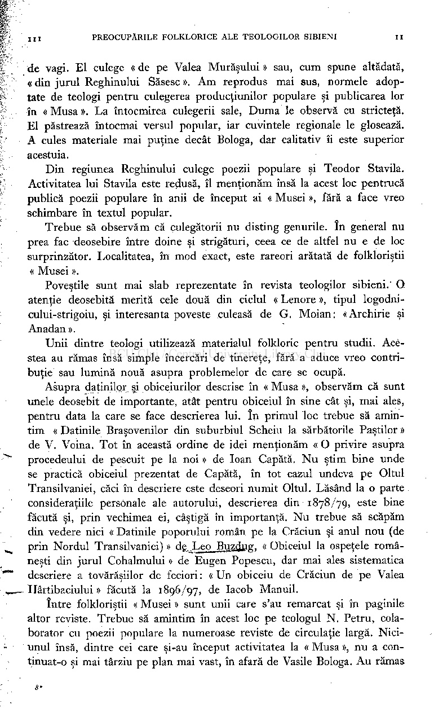

de vagi. El culege « de pe Valea Murăşului » sau, cum spune altădată, « din jurul Reghinului Săsesc ». Am reprodus mai sus, normele adoptate de teologi pentru culegerea producţiunilor populare şi publicarea lor în « Musa ». La întocmirea culegerii sale, Duma le observă cu stricteţă. El păstrează întocmai versul popular, iar cuvintele regionale le glosează. A cules materiale mai puţine decât Bologa, dar calitativ îi este superior acestuia.

Din regiunea Reghinului culege poezii populare şi Teodor Stavila. Activitatea lui Stavila este redusă, îl menţionăm însă la acest loc pentrucă publică poezii populare în anii de început ai « Musei », fără a face vreo schimbare în textul popular.

Trebue să observăm că culegătorii nu disting genurile. în general nu prea fac deosebire între doine şi strigături, ceea ce de altfel nu e de loc surprinzător. Localitatea, în mod exact, este rareori arătată de folkloriştii

« Musei ».

Poveştile sunt mai slab reprezentate în revista teologilor sibieni. O atenţie deosebită merită cele două din ciclul « Lenore », tipul logodnicului-strigoiu, şi interesanta poveste culeasă de G. Moian: «Archirie şi Anadan ».

Unii dintre teologi utilizează materialul folkloric pentru studii. Acestea au rămas însă simple încercări de tinereţe, fără a aduce vreo contribuţie sau lumină nouă asupra problemelor de care se ocupă.

Asupra datinilor si obiceiurilor descrise în «Musa», observăm că sunt unele deosebit de importante, atât pentru obiceiul în sine cât şi, mai ales, pentru data la care se face descrierea lui. în primul loc trebue să amintim « Datinile Braşovenilor din suburbiul Scheiu la sărbătorile Paştilor » de V. Voina. Tot în această ordine de idei menţionăm « O privire asupra procedeului de pescuit pe la noi » de Ioan Capătă. Nu ştim bine unde se practică obiceiul prezentat de Capătă, în tot cazul undeva pe Oltul Transilvaniei, căci în descriere este deseori numit Oltul. Lăsând la o parte consideraţiile personale ale autorului, descrierea din 1878/79, este bine făcută şi, prin vechimea ei, câştigă în importanţă. Nu trebue să scăpăm din vedere nici « Datinile poporului român pe la Crăciun şi anul nou (de prin Nordul Transilvaniei) » de. Leo Buzjjug, « Obiceiul la ospeţele româneşti din jurul Cohalmului » de Eugen Popescu, dar mai ales sistematica descriere a tovărăşiilor de feciori : « Un obiceiu de Crăciun de pe Valea

_ Hârtibaciului » făcută la 1896/97, de Iacob Manuil.

între folkloriştii « Musei » sunt unii care s'au remarcat şi în paginile altor reviste. Trebue să amintim în acest loc pe teologul N. Petru, colaborator cu poezii populare la numeroase reviste de circulaţie largă. Niciunul însă, dintre cei care şi-au început activitatea la « Musa », nu a continuat-o şi mai târziu pe plan mai vast, în afară de Vasile Bologa. Au rămas

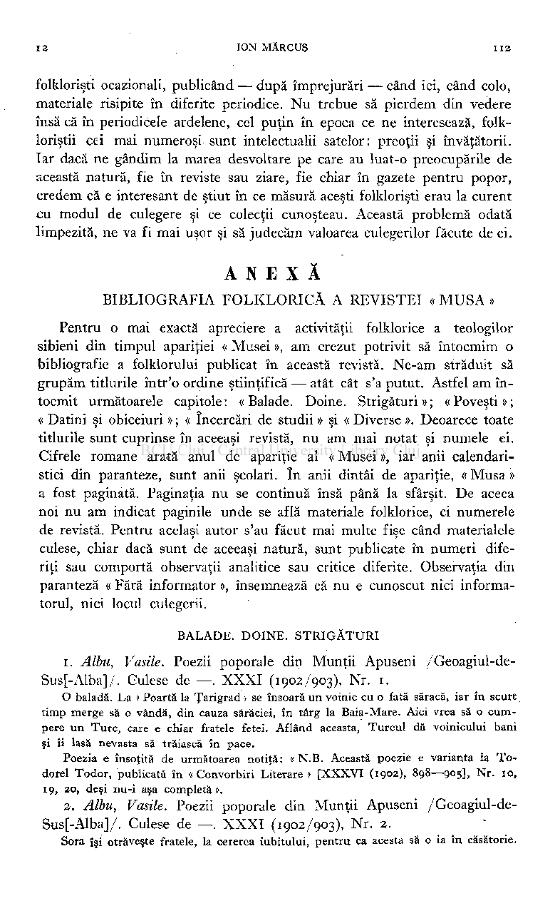

folklorişti ocazionali, publicând — după împrejurări — când ici, când colo, materiale risipite în diferite periodice. Nu trebue să pierdem din vedere însă că în periodicele ardelene, cel puţin în epoca ce ne interesează, folkloriştii cei mai numeroşi sunt intelectualii satelor: preoţii şi învăţătorii. Iar dacă ne gândim la marea desvoltare pe care au luat-o preocupările de această natură, fie în reviste sau ziare, fie chiar în gazete pentru popor, credem că e interesant de ştiut în ce măsură aceşti folklorişti erau la curent cu modul de culegere şi ce colecţii cunoşteau. Această problemă odată limpezită, ne va fi mai uşor şi să judecăm valoarea culegerilor făcute de ei.

## ANEX Ă

BIBLIOGRAFIA FOLKLORICÄ A REVISTEI « MUSA »

Pentru o mai exactă apreciere a activităţii folklorice a teologilor sibieni din timpul apariţiei « Musei », am crezut potrivit să întocmim o bibliografie a folklorului publicat în această revistă. Ne-am străduit să grupăm titlurile într'o ordine ştiinţifică — atât cât s'a putut. Astfel am întocmit următoarele capitole: «Balade. Doine. Strigături»; «Poveşti»; « Datini şi obiceiuri » ; « încercări de studii » şi « Diverse ». Deoarece toate titlurile sunt cuprinse în aceeaşi revistă, nu am mai notat şi numele ei. Cifrele romane arată anul de apariţie al « Musei », iar anii calendaristici din paranteze, sunt anii şcolari. în anii dintâi de apariţie, « Musa » a fost paginată. Paginaţia nu se continuă însă până la sfârşit. De aceea noi nu am indicat paginile unde se află materiale folklorice, ci numerele de revistă. Pentru acelaşi autor s'au făcut mai multe fişe când materialele culese, chiar dacă sunt de aceeaşi natură, sunt publicate în numeri diferiţi sau comportă observaţii analitice sau critice diferite. Observaţia din paranteză « Fără informator », însemnează că nu e cunoscut nici informatorul, nici locul culegerii.

BALADE . DOINE . STRIGĂTUR I

1. Albu, Vasile. Poezii poporale din Munţii Apuseni /Geoagiul-de-

- Sus[-Alba]/. Culese de —. XXXI (1902/903), Nr. 1. O baladă. La « Poartă la Ţarigrad > se însoară un voinic cu o fată săracă, iar în scurt

timp merge să o vândă, din cauza sărăciei, în târg la Baia-Mare. Aici vrea să o cumpere un Turc, care e chiar fratele fetei. Aflând aceasta, Turcul dă voinicului bani şi îi lasă nevasta să trăiască în pace.

Poezia e însoţită de următoarea notiţă: «N.B. Această poezie e varianta la To dorel Todor, publicată în « Convorbiri Literare » [XXXVI (1902), 898—905], Nr. 10, 19, 20, deşi nu-i aşa completă ».

2. Albu, Vasile. Poezii poporale din Munţii Apuseni /Geoagiul-de-

- Sus[-Alba]/. Culese de —. XXXI (1902/903), Nr. 2. Sora îşi otrăveşte fratele, la cererea iubitului, pentru ca acesta să o ia în căsătorie.

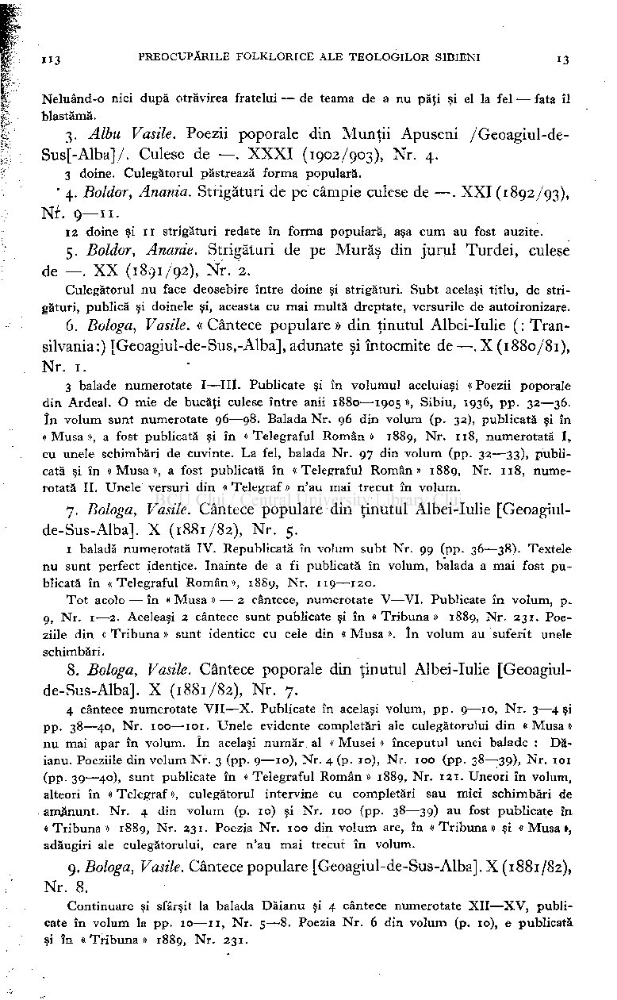

Neluând-o nici după otrăvirea fratelui — de teama de a nu păţi şi el la fel — fata îl blastămă.

3. Albu Vasile. Poezii poporale din Munţii Apuseni /Geoagiul-deSus[-Alba]/. Culese de —. XXXI (1902/903), Nr. 4.

3 doine. Culegătorul păstrează forma populară.

' 4. Boldor, Anania. Strigături de pe câmpie culese de —. XXI (1892/93), Nr. 9—11.

12 doine şi 11 strigături redate în forma populară, aşa cum au fost auzite.

5. Boldor, Ananie. Strigături de pe Murăş din jurul Turdei, culese de —. XX (1891/92), Nr. 2.

Culegătorul nu face deosebire între doine şi strigături. Subt acelaşi titlu, de strigături, publică şi doinele şi, aceasta cu mai multă dreptate, versurile de autoironizare.

6. Bologa, Vasile. «Cântece populare» din ţinutul Albei-Iulie (: Transilvania:) [Geoagiul-de-Sus,-Alba], adunate şi întocmite de—.X (1880/81), Nr. 1.

3 balade numerotate I—III. Publicate şi în volumul aceluiaşi « Poezii poporale din Ardeal. O mie de bucăţi culese între anii 1880—1905 », Sibiu, 1936, pp. 32—36. în volum sunt numerotate 96—98. Balada Nr. 96 din volum (p. 32), publicată şi în « Musa >>, a fost publicată şi în «Telegraful Român» 1889, Nr. 118, numerotată I, cu unele schimbări de cuvinte. La fel, balada Nr. 97 din volum (pp. 32—33), publicată şi în «Musa», a fost publicată în «Telegraful Român» 1889, Nr. 118, numerotată II. Unele versuri din « Telegraf » n'au mai trecut în volum.

7. Bologa, Vasile. Cântece populare din ţinutul Albei-Iulie [Geoagiulde-Sus-Alba]. X (1881 /8z), Nr. 5.

1 baladă numerotată IV. Republicată în volum subt Nr. 99 (pp. 36—38). Textele nu sunt perfect identice. înainte de a fi publicată în volum, balada a mai fost publicată în «Telegraful Român», 1889, Nr. 119—120.

Tot acolo—în «Musa» — 2 cântece, numerotate V—VI . Publicate în volum, p. 9, Nr. i-—2. Aceleaşi 2 cântece sunt publicate şi în « Tribuna » 1889, Nr. 231. Poeziile din « Tribuna » sunt identice cu cele din « Musa ». în volum au suferit unele schimbări.

8. Bologa, Vasile. Cântece poporale din ţinutul Albei-Iulie [Geoagiulde-Sus-Alba]. X (1881/82), Nr. 7.

4 cântece numerotate VII—X. Publicate în acelaşi volum, pp. 9—10, Nr. 3—4 şi pp. 38—40, Nr. 100—101. Unele evidente completări ale culegătorului din «Musa» nu mai apar în volum. în acelaşi număr al « Musei » începutul unei balade : Dăianu. Poeziile din volum Nr. 3 (pp. 9—10), Nr. 4 (p. 10), Nr. 100 (pp. 38—-39), Nr.'ioi (pp. 39—40), sunt publicate în « Telegraful Român » 1889, Nr. 121. Uneori în volum, alteori în « Telegraf », culegătorul intervine cu completări sau mici schimbări de amănunt. Nr. 4 din volum (p. 10) şi Nr. 100 (pp. 38—39) au fost publicate în «Tribuna» 1889, Nr. 231. Poezia Nr. 100 din volum are, în «Tribuna» şi « Musa », adăugiri ale culegătorului, care n'au mai trecut în volum.

9. Bologa, Vasile. Cântece populare [Geoagiul-de-Sus-Alba]. X (1881/82), Nr. 8.

Continuare şi sfârşit la balada Dăianu şi 4 cântece numerotate XII—XV, publicate în volum la pp. 10—11, Nr. s—'8. Poezia Nr. 6 din volum (p. 10), e publicată şi în «Tribuna» 1889, Nr. 231.

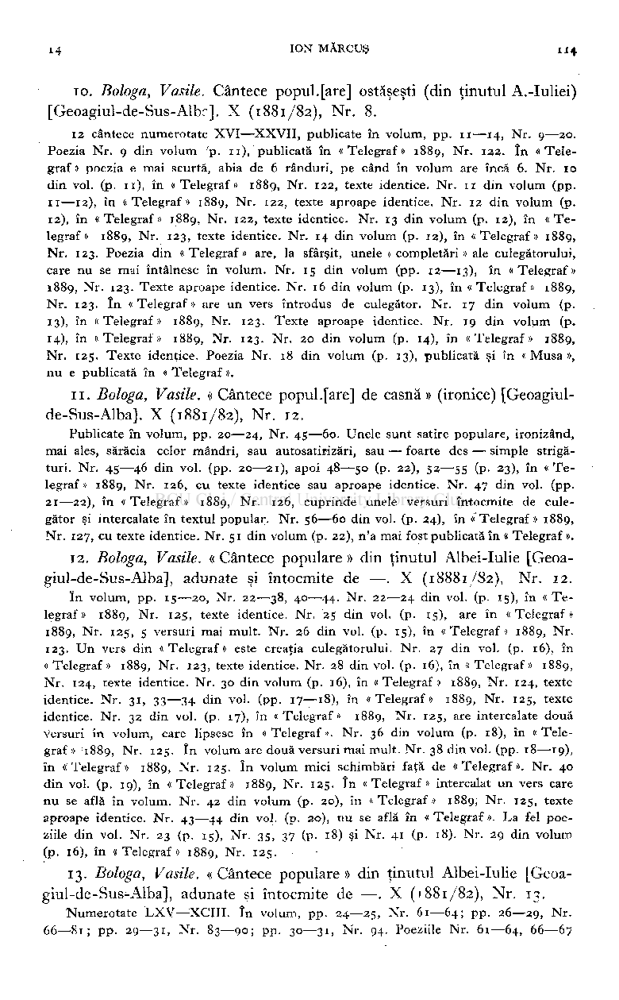

10. Bologa, Vasile. Cântece popul.[are] ostăşeşti (din ţinutul A.-Iuliei) [Geoagiul-de-Sus-Albr]. X (1881/82), Nr. 8.

12 cântece numerotate XVI—XXVII , publicate în volum, pp. 11—14, Nr. 9—20. Poezia Nr. 9 din volum p. 11), publicată în «Telegraf» 1889, Nr. 122. în «Telegraf » poezia e mai scurtă, abia de 6 rânduri, pe când în volum are încă 6. Nr. 10 din voi. (p. 11), în «Telegraf» 1889, Nr. 122, texte identice. Nr. 11 din volum (pp. 11—12), în «Telegraf» 1889, Nr. 122, texte aproape identice. Nr. 12 din volum (p.

- 12), în «Telegraf» 1889, Nr. 122, texte identice. Nr. 13 din volum (p. 12), în «Te legraf» 1889, Nr. 123, texte identice. Nr. 14 din volum (p. 12), în «Telegraf» 1889, Nr. 123. Poezia din « Telegraf » are, la sfârşit, unele « completări » ale culegătorului, care nu se mai întâlnesc în volum. Nr. 15 din volum (pp. 12—13), în «Telegraf» 1889, Nr. 123. Texte aproape identice. Nr. 16 din volum (p. 13), în « Telegraf » 1889, Nr. 123. în « Telegraf » are un vers introdus de culegător. Nr. 17 din volum (p.
- 13), în « Telegraf » 1889, Nr. 123. Texte aproape identice. Nr. 19 din volum (p.
- 14), în «Telegraf» 1889, Nr. 123. Nr. 20 din volum (p. 14), în «Telegraf» 1889, Nr. 125. Texte identice. Poezia Nr. 18 din volum (p. 13), publicată şi în « Musa », nu e publicată în « Telegraf ».

11. Bologa, Vasile. « Cântece popul.[are] de casnă » (ironice) [Geoagiulde-Sus-Alba]. X (1881/82), Nr. 12.

Publicate în volum, pp. 20—24, Nr. 45—60. Unele sunt satire populare, ironizând, mai ales, sărăcia celor mândri, sau autosatifizări, sau — foarte des — simple strigături. Nr. 45—46 din vol. (pp. 20—21), apoi 48—50 (p. 22), 52—55 (p. 23), în « Te legraf » 1889, Nr. 126, cu texte identice sau aproape identice. Nr. 47 din vol. (pp. 21—22), în « Telegraf » 1889, Nr. 126, cuprinde unele versuri întocmite de culegător şi intercalate în textul popular. Nr. 56—60 din voi. (p. 24), în « Telegraf » 1889, Nr. 127, cu texte identice. Nr. 51 din volum (p. 22), n'a mai fost publicată în « Telegraf ».

12. Bologa, Vasile. « Cântece populare » din ţinutul Albei-Iulie [Geoagiul-de-Sus-Alba], adunate şi întocmite de —. X (18881/S2), Nr. 12.

în volum, pp. 15—20, Nr. 22—38, 40—-44. Nr. 22—24 din vol. (p. 15), în «Te legraf» 1889, Nr. 125, texte identice. Nr. 25 din vol. (p. 15), are în «Telegraf» 1889, Nr. 125, 5 versuri mai mult. Nr. 26 din vol. (p. 15), în « Telegraf » 1889, Nr. 123. Un vers din « Telegraf » este creaţia culegătorului. Nr. 27 din vol. (p. 16), în « Telegraf» 1889, Nr. 123, texte identice. Nr. 28 din vol. (p. 16), în « Telegraf» 1889, Nr. 124, texte identice. Nr. 30 din volum (p. 16), în « Telegraf » 1889, Nr. 124, texte

- identice. Nr. 31, 33—34 din vol. (pp. 17—18), în « Telegraf » 1889, Nr. 125, texte
- identice. Nr. 32 din voi. (p. 17), în «Telegraf» 1889, Nr. 125, are intercalate două versuri în volum, care lipsesc în «Telegraf». Nr. 36 din volum (p. 18), în «Telegraf» 1889, Nr. 125. în volum are două versuri mai mult. Nr. 38 din vol. (pp. 18—-19), în «Telegraf» 1889, Nr. 125. în volum mici schimbări faţă de «Telegraf». Nr. 40 din voi. (p. 19), în «Telegraf» 1889, Nr. 125. în «Telegraf» intercalat un vers care nu se află în volum. Nr. 42 din volum (p. 20), în « Telegraf » 1889, Nr. 125, texte aproape identice. Nr. 43—44 din voi. (p. 20), nu se află în « Telegraf ». La fel poeziile din voi. Nr. 23 (p. 15), Nr. 35, 37 (p. 18) şi Nr. 41 (p. 18). Nr. 29 din volum (p. 16), în «Telegraf» 1889, Nr. 125.

13. Bologa, Vasile. « Cântece populare » din ţinutul Albei-Iulie [Geoagiul-de-Sus-Alba], adunate şi întocmite de —. X (1881/82), Nr. 13.

Numerotate LXV—XCIII . în volum, pp. 24—25, Nr. 61—64; pp. 36—29, Nr. 66—81; pp. 29—31, Nr. 83—90; pp. 30—31, Nr. 94. Poeziile Nr. 61—64, 66—67

