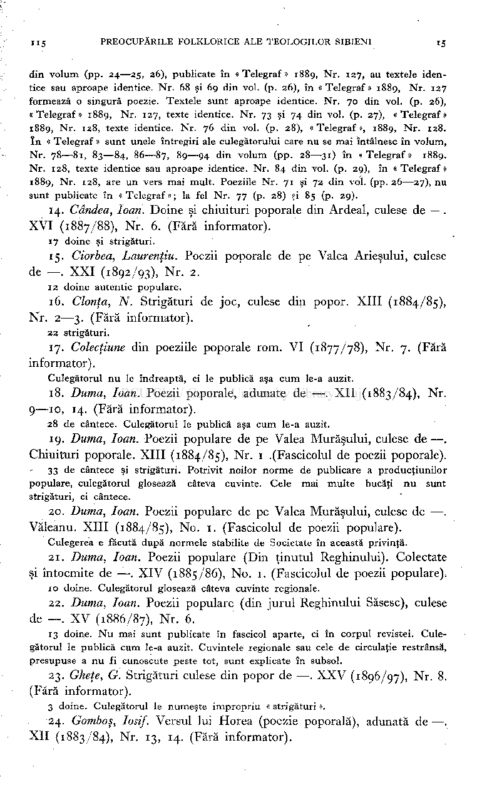

din volum (pp. 24—25, 26), publicate în « Telegraf » 1889, Nr. 127, au textele identice sau aproape identice. Nr. 68 şi 69 din voi. (p. 26), în « Telegraf » 1889, Nr. 127 formează o singură poezie. Textele sunt aproape identice. Nr. 70 din voi. (p. 26), «Telegraf» 1889, Nr. 127, texte identice. Nr. 73 şi 74 din voi. (p. 27), «Telegraf» 1889, Nr. 128, texte identice. Nr. 76 din voi. (p. 28), «Telegraf», 1889, Nr. 128. în « Telegraf » sunt unele întregiri ale culegătorului care nu se mai întâlnesc în volum, Nr. 78—81, 83—84, 86—87, 89—94 din volum (pp. 28—31) în «Telegraf» 1889. Nr. 128, texte identice sau aproape identice. Nr. 84 din voi. (p. 29), în «Telegraf» 1889, Nr. 128, are un vers mai mult. Poeziile Nr. 71 şi 72 din vol. (pp. 26—27), nu sunt publicate în «Telegraf»; la fel Nr. 77 (p. 28) şi 85 (p. 29).

- 14. Cândea, loan. Doine şi chiuituri poporale din Ardeal, culese de —.

XVI (1887/88), Nr. 6. (Fără informator).

17 doine şi strigături.

- 15. Ciorbea, Laurenţiu. Poezii poporale de pe Valea Arieşului, culese

de —. XXI (1892/93),'Nr. 2.

12 doine autentic populare.

- 16. Ciontă, N. Strigături de joc, culese din popor. XIII (1884/85),

Nr. 2—3. (Fără informator).

22 strigături.

- 17. Colecţiune din poeziile poporale rom. VI (1877/78), Nr. 7. (Fără

informator).

Culegătorul nu le îndreaptă, ci le publică aşa cum le-a auzit.

- 18. Duma, loan. Poezii poporale, adunate de —. XII (1883/84), Nr.

9—10, 14. (Fără informator).

28 de cântece. Culegătorul le publică aşa cum le-a auzit.

- 19. Duma, loan. Poezii populare de pe Valea Murăşului, culese de —.

Chiuituri poporale. XIII (1884/85), Nr. 1 .(Fascicolul de poezii poporale).

33 de cântece şi strigături. Potrivit noilor norme de publicare a producţiunilor populare, culegătorul glosează câteva cuvinte. Cele mai multe bucăţi nu sunt strigături, ci cântece.

- 20. Duma, loan. Poezii populare de pe Valea Murăşului, culese de —.

Văleanu. XIII (1884/85), No. 1. (Fascicolul de poezii populare).

Culegerea e făcută după normele stabilite de Societate în această privinţă.

- 21. Duma, loan. Poezii populare (Din ţinutul Reghinului). Colectate

şi întocmite de —. XIV (1885/86), No. 1. (Fascicolul de poezii populare).

10 doine. Culegătorul glosează câteva cuvinte regionale.

- 22. Duma, loan. Poezii populare (din jurul Reghinului Săsesc), culese

de —. XV (1886/87), Nr. 6.

13 doine. Nu mai sunt publicate în fascicol aparte, ci în corpul revistei. Culegătorul le publică cum le-a auzit. Cuvintele regionale sau cele de circulaţie restrânsă, presupuse a nu fi cunoscute peste tot, sunt explicate în subsol.

- 23. Ghete, G. Strigături culese din popor de —. XXV (1896/97), Nr. 8.

(Fără informator).

3 doine. Culegătorul le numeşte impropriu « strigături ».

- 24. Gomboş, Iosif. Versul lui Horea (poezie poporală), adunată de —.

XII (1883/84), Nr. 13, 14. (Fără informator).

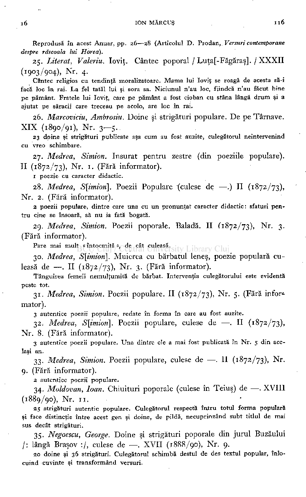

l6 IO N MARCU S Il 6

Reprodusă în acest Anuar, pp. 26—28 (Articolul D . Prodan, Versuri contemporane

despre răscoala lui Horea).

25. Literat, Valeriu. Ioviţ. Cântec poporal / Luţa[-Făgăraş]. / XXXII (1903/904), Nr. 4.

Cântec religios cu tendinţă moralizatoare. Mama lui Ioviţ se roagă de acesta să-i facă loc în rai. L a fel tatăl lui şi sora sa. Niciunul n'au loc, fiindcă n'au făcut bine pe pământ. Fratele lui Ioviţ, care pe pământ a fost cioban cu stâna lângă drum şi a ajutat pe săracii care treceau pe acolo, are loc în rai.

26. Marcoviciu, Ambrosiu. Doine şi strigături populare. De pe Târnave.

- XIX (1890/91), Nr. 3-5 . 23 doine şi strigături publicate aşa cum au fost auzite, culegătorul neintervenind

cu vreo schimbare.

- 27. Medrea, Simion. însurat pentru zestre (din poeziile populare).

II (1872/73), Nr. 1. (Fără informator).

1 poezie cu caracter didactic.

- 28. Medrea, S[imion]. Poezii Populare (culese de —.) II (1872/73),

Nr. 2. (Fără informator).

2 poezii populare, dintre care una cu un pronunţat caracter didactic: sfaturi pentru cine se însoară, să nu ia fată bogată.

- 29. Medrea, Simion. Poezii poporale. Baladă. II C1872/73), Nr. 3.

(Fără informator).

Pare mai mult « întocmită », de cât culeasă.

- 30. Medrea, S[imion]. Muierea cu bărbatul leneş, poezie populară cu­

leasă de —. II (1872/73), Nr. 3. (Fără informator).

Tânguirea femeii nemulţumită de bărbat. Intervenţia culegătorului este evidentă peste tot.

- 31. Medrea, Simion. Poezii populare. II (1872/73), Nr. 5. (Fără infor*

mator).

3 autentice poezii populare, redate în forma în care au fost auzite.

- 32. Medrea, S[imion]. Poezii populare, culese de —. II (1872/73),

- Nr. 8. (Fără informator). 3 autentice poezii populare. Una dintre ele a mai fost publicată în Nr. 5 din ace­

laşi an.

- 33. Medrea, Simion. Poezii populare, culese de —. II (1872/73), Nr.

9. (Fără informator).

2 autentice poezii populare.

- 34. Moldovan, Ioan. Chiuituri poporale (culese în Teiuş) de —. XVIII

(1889/90), Nr. 11

25 strigături autentic populare. Culegătorul respectă întru totul forma populară şi face distincţie între acest gen şi doine, de pildă, necuprinzând subt titlul de mai sus decât strigături.

35. Negoescu, George. Doine şi strigături poporale din jurul Buzăului /: lângă Braşov :/, culese de —. XVII (1888/90), Nr. 9.

20 doine şi 36 strigături. Culegătorul schimbă destul de des textul popular, înlocuind cuvinte şi transformând versuri.

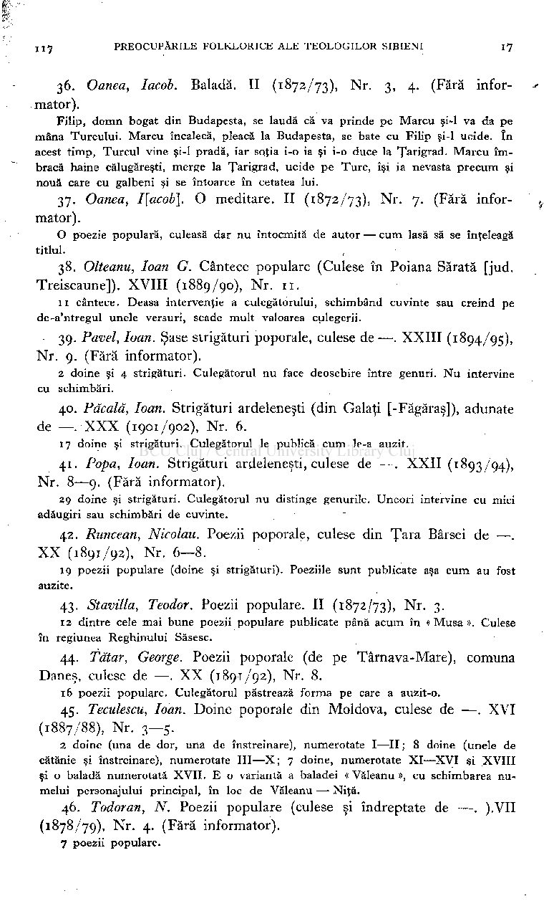

ii7 PREOCUPĂRILE FOLKLORIC E AL E TEOLOGILO R SIBIENI 17

36. Oanea, Iacob. Baladă. II (1872/73), Nr. 3, 4. (Fără informator).

Filip, domn bogat din Budapesta, se laudă că va prinde pe Marcu şi-1 va da pe mâna Turcului. Marcu încalecă, pleacă la Budapesta, se bate cu Filip şi-1 ucide. în acest timp, Turcul vine şi-1 pradă, iar soţia i-o ia şi i-o duce la Ţarigrad. Marcu îmbracă haine călugăreşti, merge la Tarigrad, ucide pe Turc, îşi ia nevasta precum şi nouă care cu galbeni şi se întoarce în cetatea lui.

37. Oanea, I[acob]. O meditare. II (1872/73), Nr. 7. (Fără informator).

O poezie populară, culeasă dar nu întocmită de autor — cum lasă să se înţeleagă titlul.

38. Olteana, Ioan G. Cântece populare (Culese în Poiana Sărată [jud. Treiscaune]). XVIII (1889/90), Nr. 11

11 cântece. Deasa intervenţie a culegătorului, schimbând cuvinte sau creind pe de-a'ntregul unele versuri, scade mult valoarea culegerii.

39. Pavel, Ioan. Şase strigături poporale, culese de —. XXIII (1894/95),

- Nr. 9. (Fără informator). 2 doine şi 4 strigături. Culegătorul nu face deosebire între genuri. N u intervine

cu schimbări.

40. Păcală, Ioan. Strigături ardeleneşti (din Galaţi [-Făgăraş]), adunate de —.XX X (1901/902), Nr. 6.

17 doine şi strigături. Culegătorul le publică cum le-a auzit.

41. Popa, Ioan. Strigături ardeleneşti, culese de —. XXII (1893/94), Nr. 8—9. (Fără informator).

29 doine şi strigături. Culegătorul nu distinge genurile. Uneori intervine cu mici adăugiri sau schimbări de cuvinte.

42. Runcean, Nicolau. Poezii poporale, culese din Ţara Bârsei de —.

- XX (1891/92), Nr. 6—8. 19 poezii populare (doine şi strigături). Poeziile sunt publicate aşa cum au fost

auzite.

43. Stavilla, Teodor. Poezii populare. II (1872/73), Nr. 3.

12 dintre cele mai bune poezii populare publicate până acum în « Musa ». Culese în regiunea Reghinului Săsesc.

44. Tătar, George. Poezii poporale (de pe Târnava-Mare), comuna Daneş, culese de —. X X (1891/92), Nr. 8.

16 poezii populare. Culegătorul păstrează forma pe care a auzit-o.

45. Teculescu, Ioan. Doine poporale din Moldova, culese de —. XVI (1887/88), Nr. 3-5 .

2 doine (una de dor, una de înstreinare), numerotate I—II ; 8 doine (unele de cătănie şi înstreinare), numerotate III—X ; 7 doine, numerotate XI—XV I şi XVII I şi o baladă numerotată XVII . E o variantă a baladei « Văleanu », cu schimbarea numelui personajului principal, în loc de Văleanu — Niţă.

46. Todoran, N. Poezii populare (culese şi îndreptate de —. ).VII (1878/79), Nr. 4. (Fără informator).

7 poezii populare.

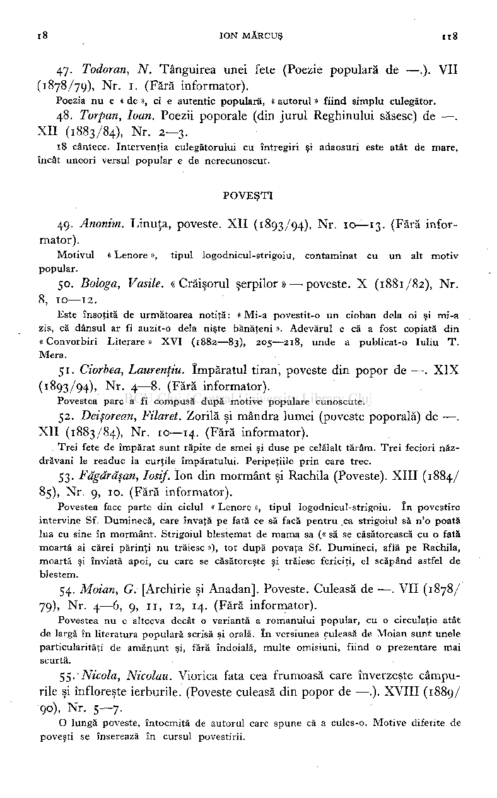

- 47. Todoran, N. Tânguirea unei fete (Poezie populară de —.). VII

(1878/79), Nr. 1. (Fără informator).

Poezia nu e « de », ci e autentic populară, « autorul » fiind simplu culegător.

- 48. Torpan, loan. Poezii poporale (din jurul Reghinului săsesc) de —.

XII (1883/84), Nr. 2—3.

18 cântece. Intervenţia culegătorului cu întregiri şi adaosuri este atât de mare, încât uneori versul popular e de nerecunoscut.

###### POVEŞT I

49. Anonim. Linuţa, poveste. XII (1893/94), Nr. 10—13. (Fără informator).

Motivul « Lenore », tipul logodnicul-strigoiu, contaminat cu un alt motiv popular.

50. Bologa, Vasile. « Crăişorul şerpilor» — poveste. X (1881/82), Nr. 8, 10—12.

Este însoţită de următoarea notiţă: « Mi-a povestit-o un cioban delà oi şi mi-a zis, că dânsul ar fi auzit-o delà nişte bănăţeni ». Adevărul e că a fost copiată din « Convorbiri Literare » XV I (1882—83), 205—218, unde a publicat-o Iuliu T . Mera.

- 51. Ciorbea, Laurenţiu. împăratul tiran, poveste din popor de —. XIX

(1893/94), Nr. 4—8. (Fără informator).

Povestea pare a fi compusă după motive populare cunoscute.

- 52. Deişorean, Filaret. Zorilă şi mândra lumei (poveste poporală) de —.

XII (1883/84), Nr. 10—14. (Fără informator).

Trei fete de împărat sunt răpite de smei şi duse pe celălalt tărâm. Trei feciori năzdrăvani le readuc la curţile împăratului. Peripeţiile prin care trec.

53. Făgărăşan, Iosif. Ion din mormânt şi Rachila (Poveste). XIII (1884/ 85), Nr. 9, 10. (Fără informator).

Povestea face parte din ciclul « Lenore », tipul logodnicul-strigoiu. în povestire intervine Sf. Duminecă, care învaţă pe fată ce să facă pentru ca strigoiul să n'o poată lua cu sine în mormânt. Strigoiul blestemat de mama sa (« să se căsătorească cu o fată moartă ai cărei părinţi nu trăiesc »), tot după povaţa Sf. Dumineci, află pe Rachila, moartă şi înviată apoi, cu care se căsătoreşte şi trăiesc fericiţi, el scăpând astfel de blestem.

54. Moian, G. [Archirie şi Anadan]. Poveste. Culeasă de —. VII (1878/ 79), Nr. 4—6, 9, 11, 12, 14. (Fără informator).

Povestea nu e altceva decât o variantă a romanului popular, cu o circulaţie atât de largă în literatura populară scrisă şi orală. în versiunea culeasă de Moian sunt unele particularităţi de amănunt şi, fără îndoială, multe omisiuni, fiind o prezentare mai scurtă.

55. Nicola, Nicolau. Viorica fata cea frumoasă care înverzeşte câmpurile şi înfloreşte ierburile. (Poveste culeasă din popor de —.). XVIII (1889/ 90), Nr. 5—7.

O lungă poveste, întocmită de autorul care spune că a cules-o. Motive diferite de poveşti se înserează în cursul povestirii.

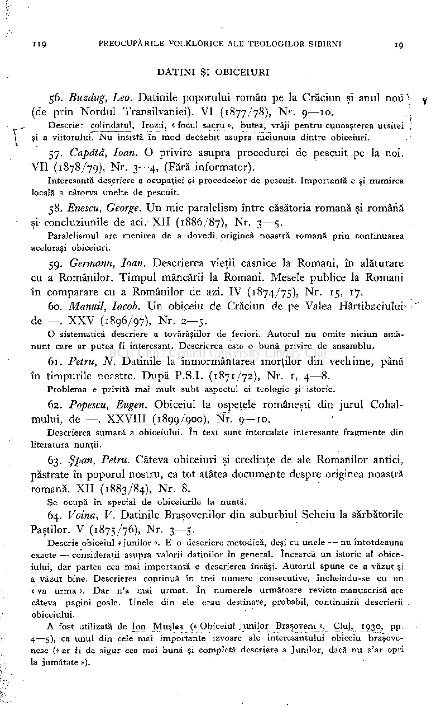

###### DATIN I ŞI OBICEIUR I

56. Buzdug, Leo. Datinile poporului român pe la Crăciun şi anul nou' (de prin Nordul Transilvaniei). VI (1877/78), N

. 9—10.

r

Descrie : colindatul, Irozii, « focul sacru », butea, vrăji pentru cunoaşterea ursitei şi a viitorului. N u insistă în mod deosebit asupra niciunuia dintre obiceiuri.

57. Capătă, Ioan. O privire asupra procedurei de pescuit pe la noi. VII (1878/79), Nr. 3—4, (Fără informator).

Interesantă descriere a ocupaţiei şi procedeelor de pescuit. Importantă e şi numirea locală a câtorva unelte de pescuit.

58. Enescu, George. Un mic paralelism între căsătoria romană şi română şi concluziunile de aci. XII (1886/87), Nr. 3—5.

Paralelismul are menirea de a dovedi, originea noastră romană prin continuarea aceloraşi obiceiuri.

- 59. Germann, Ioan. Descrierea vieţii casnice la Romani, în alăturare cu a Românilor. Timpul mâncării la Romani. Mesele publice la Romani în comparare cu a Românilor de azi. IV (1874/75), Nr. 15, 17.
- 60. Manuil, Iacob. Uh obiceiu de Crăciun de pe Valea Hârtibaciului de —. XX V (1896/97), Nr. 2—5.

O sistematică descriere a tovărăşiilor de feciori. Autorul nu omite niciun amănunt care ar putea fi interesant. Descrierea este o bună privire de ansamblu.

- 61. Petru, N. Datinile la înmormântarea morţilor din vechime, până

în timpurile r.orstre. După P.S.I. (1871/72), Nr. 1, 4—8.

Problema e privită mai mult subt aspectul ei teologic şi istoric.

- 62. Popescu, Eugen. Obiceiul la ospeţele româneşti din jurul Cohal-

mului, de —. XXVIII (1899/900), Nr. 9—10.

Descrierea sumară a obiceiului. în text,sunt intercalate interesante fragmente din literatura nunţii.

63. Şpan, Petru. Câteva obiceiuri şi credinţe de ale Romanilor antici, păstrate în poporul nostru, ca tot atâtea documente despre originea noastră romană. XII (1883/84), Nr. 8.

Se ocupă în special de obiceiurile la nuntă.

64. Voina, V. Datinile Braşovenilor din suburbiul Scheiu la sărbătorile Paştilor. V (1875/76), Nr. 3—5.

Descrie obiceiul « junilor ». E o descriere metodică, deşi cu unele — nu întotdeauna exacte — consideraţii asupra valorii datinilor în general. încearcă un istoric al obiceiului, dar partea cea mai importantă e descrierea însăşi. Autorul spune ce a văzut şi a văzut bine. Descrierea continuă în trei numere consecutive, încheindu-se cu un « va urma ». Dar n'a mai urmat. în numerele următoare revista-manuscrisă are câteva pagini goale. Unele din ele erau destinate, probabil, continuării descrierii obiceiului.

A fost utilizată de Ion Muşl«a (« Obiceiul Junilor Braşoveni », Cluj, 1930, pp. 4—5), ca unul din cele mai importante izvoare ale interesantului obiceiu braşovenesc (« ar fi de sigur cea mai bună şi completă descriere a Junilor, dacă nu s'ar opri la jumătate »).

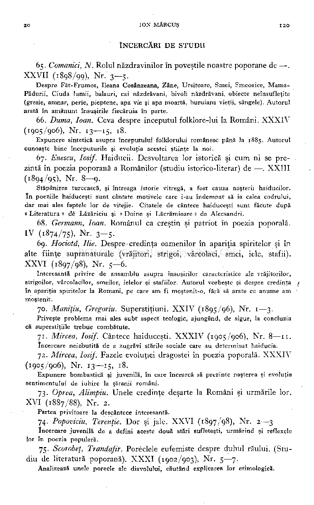

###### ÎNCERCĂR I D E STUDI I

65. Comanici, N. Rolul năzdravinilor în poveştile noastre poporane de —. XXVII (1898/99), Nr. 3—5.

Despre Făt-Frumos, Ileana Cosânzeana, Zâne, Ursitoare, Smei, Smeoaice, MamaPădurii, Ciuda lumii, balauri, cai năzdrăvani, bivoli năzdrăvani, obiecte neînsufleţite (gresie, amnar, perie, pieptene, apa vie şi apa moartă, buruiana vieţii, sângele). Autorul arată în amănunt însuşirile fiecăruia în parte.

66. Duma, Ioan. Ceva despre începutul folklore-lui la Români. XXXIV (1905/906), Nr. 13—15, 18.

Expunere sintetică asupra începutului folklorului românesc până la 1885. Autorul cunoaşte bine începuturile şi evoluţia acestei ştiinţe la noi.

67. Enescu, Iosif. Haiducii. Desvoltarea lor istorică şi cum ni se prezintă în poezia poporană a Românilor (studiu istorico-literar) de —. XXIII (1894/95), Nr. 8—9.

Stăpânirea turcească, şi întreaga istorie vitregă, a fost cauza naşterii haiducilor, în poeziile haiduceşti sunt cântate motivele care i-au îndemnat să ia calea codrului, dar mai ales faptele lor de vitejie. Citatele de cântece haiduceşti sunt făcute după « Literatura » de Lăzăriciu şi « Doine şi Lăcrămioare » de Alecsandri.

- 68. Germann, Ioan. Românul ca creştin si patriot în poezia poporală.

IV (1874/75), Nr. 3-5 .

- 69. Hociotă, Ilie. Despre • credinţa oamenilor în apariţia spiritelor şi în

alte fiinţe supranaturale (vrăjitori, strigoi, vârcolaci, smei, iele, stafii). XXVI (1897/98), Nr. 5—6.

Interesantă privire de ansamblu asupra însuşirilor caracteristice ale vrăjitorilor, strigoilor, vârcolacilor, smeilor, ielelor şi stafiilor. Autorul vorbeşte şi despre credinţa / în apariţia spiritelor la Romani, pe care am fi moştenit-o, fără să arate ce anume am • moştenit.

70. Maniţiu, Gregoriu. Superstiţiuni. XXIV (1895/96), Nr. 1—3.

Priveşte problema mai ales subt aspect teologic, ajungând, de sigur, la concluzia că superstiţiile trebue combătute.

- 71. Mircea, Iosif. Cântece haiduceşti. XXXIV (1905/906), Nr. 8—11. încercare neizbutită de a zugrăvi stările sociale care au determinat haiducia.
- 72. Mircea, Iosif. Fazele evoluţiei dragostei în poezia poporală. XXXIV

(1905/906), Nr. 13—15, 18.

Expunere bombastică şi juvenilă, în care încearcă să prezinte naşterea şi evoluţia sentimentului de iubire la ţăranii români.

- 73. Oprea, Alimpiu. Unele credinţe deşarte la Români şi urmările lor.

XVI (1887/88), Nr. 2.

Partea privitoare la descântece interesantă.

- 74. Popoviciu, Terenţie. Dor şi jale. XXVI (1897/98), Nr. 2—3 încercare juvenilă de a defini aceste două stări sufleteşti, urmărind şi reflexele

lor în poezia populară.

- 75. Scorobeţ, Trandafir. Poreclele eufemiste despre duhul răului. (Stu­

diu de literatură poporană). XXXI (1902/903), Nr. 5—7.

Analizează unele porecle ale diavolului, căutând explicarea lor etimologică.

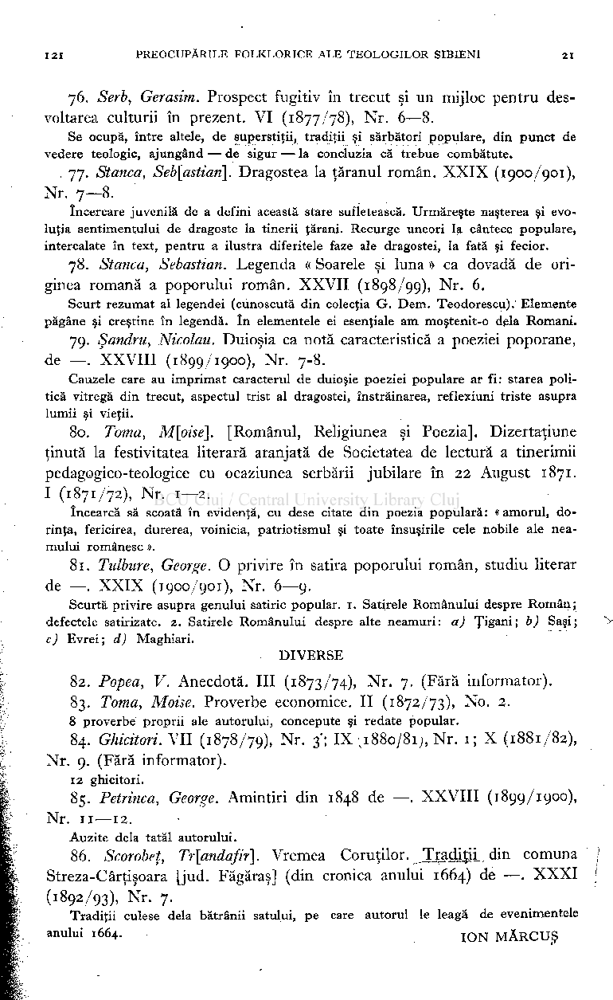

- 76. Serb, Gerasim. Prospect fugitiv în trecut şi un mijloc pentru des-

voltarea culturii în prezent. VI (1877/78), Nr. 6—8.

Se ocupă, între altele, de superstiţii, tradiţii şi sărbători populare, din punct de vedere teologic, ajungând — de sigur — la concluzia că trebue combătute.

. 77. Stanca, Seb[astiari\. Dragostea la ţăranul român. XXIX (1900/901), Nr. 7—8.

încercare juvenilă de a defini această stare sufletească. Urmăreşte naşterea şi evoluţia sentimentului de dragoste la tinerii ţărani. Recurge uneori la cântece populare, intercalate în text, pentru a ilustra diferitele faze ale dragostei, la fată şi fecior.

78. Stanca, Sebastian. Legenda « Soarele şi luna » ca dovadă de originea romană a poporului român. XXVII (1898/99), Nr. 6.

Scurt rezumat al legendei (cunoscută din colecţia G . Dem. Teodorescu). Elemente păgâne şi creştine în legendă. în elementele ei esenţiale am moştenit-o delà Romani.

79. Şandru, Nicolau. Duioşia ca notă caracteristică a poeziei poporane,

- de —. XXVIII ( 1899/1900), Nr. 7-8. Cauzele care au imprimat caracterul de duioşie poeziei populare ar fi: starea poli­

tică vitregă din trecut, aspectul trist al dragostei, înstrăinarea, refiexiuni triste asupra lumii şi vieţii.

80. Torna, M[oise]. [Românul, Religiunea şi Poezia]. Dizertaţiune ţinută la festivitatea literară aranjată de Societatea de lectură a tinerimii pedagogico-teologice cu ocaziunea serbării jubilare în 22 August 1871. I (1871/72), Nr. 1—2.

încearcă să scoată în evidenţă, cu dese citate din poezia populară: «amorul, dorinţa, fericirea, durerea, voinicia, patriotismul şi toate însuşirile cele nobile ale neamului românesc ».

81. Tidbure, George. O privire în satira poporului român, studiu literar

- de —. XXIX (1900/901), Nr. 6—9. Scurtă privire asupra genului satiric popular. 1. Satirele Românului despre Român;

defectele satirizate. 2. Satirele Românului despre alte neamuri: a) Ţigani; b) Saşi; c) Evrei; d) Maghiari.

DIVERS E

- 82. Popea, V. Anecdotă. III (1873/74), Nr. 7. (Fără informator).
- 83. Tonta, Moise. Proverbe economice. II (1872/73), No. 2. 8 proverbe proprii ale autorului, concepute şi redate popular.
- 84. Ghicitori. VII (1878/79), Nr. 3; IX > 1880/81;, Nr. 1; X (1881/82),

Nr. 9. (Fără informator).

12 ghicitori.

- 85. Petrinca, George. Amintiri din 1848 de —. XXVIII (1899/1900),

Nr. 11—12.

Auzite delà tatăl autorului.

- 86. Scorobeţ, Tr[andafir]. Vremea Corurilor. Tradiţii din comuna

Streza-Cârţişoara [jud. Făgăraş] (din cronica anului 1664) de —. XXXI (1892/93), Nr. 7.

Tradiţii culese delà bătrânii satului, pe care autorul le leagă de evenimentele anului 1664.

###### MARCU S

IO N

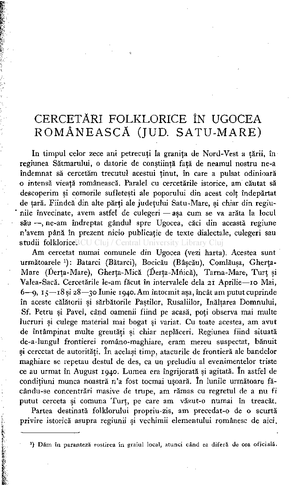

### CERCETĂRI FOLKLORICE ÎN UGOCEA ROMÂNEASCĂ (JUD. SATU-MARE)

In timpul celor zece ani petrecuţi la graniţa de Nord-Vest a ţării, în regiunea Sătmarului, o datorie de conştiinţă faţă de neamul nostru ne-a îndemnat să cercetăm trecutul acestui ţinut, în care a pulsat odinioară o intensă vieaţă românească. Paralel cu cercetările istorice, am căutat să descoperim şi comorile sufleteşti ale poporului din acest colţ îndepărtat de ţară. Fiindcă din alte părţi ale judeţului Satu-Mare, şi chiar din regiunile învecinate, avem astfel de culegeri — aşa cum se va arăta la locul său —, ne-am îndreptat gândul spre Ugocea, căci din această regiune n'avem până în prezent nicio publicaţie de texte dialectale, culegeri sau studii folklorice.

Am cercetat numai comunele din Ugocea (vezi harta). Acestea sunt următoarele

): Batarci (Bătarci), Bocicău (Bâşcău), Comlăuşa, GherţaMare (Derţa-Mare), Gherţa-Mică (Derţa-Mriică), Tarna-Mare, Turţ şi Valea-Sacă. Cercetările le-am făcut în intervalele delà 21 Aprilie—10 Mai, 6—9, 15—18 şi 28—30 Iunie 1940. Am întocmit aşa, încât am putut cuprinde în aceste călătorii şi sărbătorile Paştilor, Rusaliilor, înălţarea Domnului, Sf. Petru şi Pavel, când oamenii fiind pe acasă, poţi observa mai multe

1

lucruri şi culege material mai bogat şi variat. Cu toate acestea, am avut de întâmpinat multe greutăţi şi chiar neplăceri. Regiunea fiind situată de-a-lungul frontierei româno-maghiare, eram mereu suspectat, bănuit şi cercetat de autorităţi. în acelaşi timp, atacurile de frontieră ale bandelor maghiare se repetau destul de des, ca un preludiu al evenimentelor triste ce au urmat în August 1940. Lumea era îngrijorată şi agitată. în astfel de condiţiuni munca noastră n'a fost tocmai uşoară. în lunile următoare făcându-se concentrări masive de trupe, am rămas cu regretul de a nu fi putut cerceta şi comuna Turţ, pe care am văzut-o numai în treacăt.

Partea destinată folklorului propriu-zis, am precedat-o de o scurtă privire istorică asupra regiunii şi vechimii elementului românesc de aici.

###### *) Dăm în paranteză rostirea în graiul local, atunci când ea diferă de cea oficială.

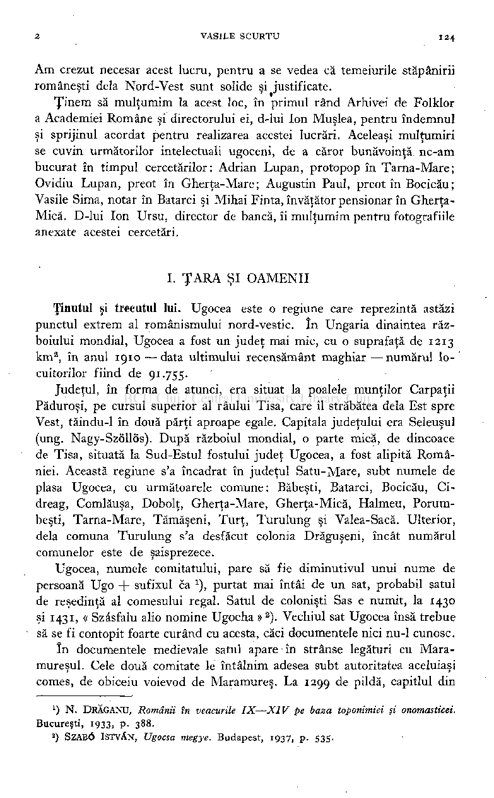

Am crezut necesar acest lucru, pentru a se vedea că temeiurile stăpânirii româneşti delà Nord-Vest sunt solide şi justificate.

Ţinem să mulţumim la acest loc, în primul rând Arhivei de Folklor a Academiei Române şi directorului ei, d-lui Ion Muşlea, pentru îndemnul şi sprijinul acordat pentru realizarea acestei lucrări. Aceleaşi mulţumiri se cuvin următorilor intelectuali ugoceni, de a căror bunăvoinţă ne-am bucurat în timpul cercetărilor: Adrian Lupan, protopop în Tarna-Mare; Ovidiu Lupan, preot în Gherţa-Mare; Augustin Paul, preot în Bocicău; Vasile Sima, notar în Batarci şi Mihai Finta, învăţător pensionar în GherţaMică. D-lui Ion Ursu, director de bancă, îi mulţumim pentru fotografiile anexate acestei cercetări.

I. ŢARA ŞI OAMENII

Ţinutul şi trecutul lui. Ugocea este o regiune care reprezintă astăzi punctul extrem al românismului nord-vestic. în Ungaria dinaintea războiului mondial, Ugocea a fost un judeţ mai mic, cu o suprafaţă de 1213 km , în anul 1910 — data ultimului recensământ maghiar—numărul locuitorilor fiind de 91.755.

Judeţul, în forma de atunci, era situat la poalele munţilor Carpaţii Păduroşi, pe cursul superior al râului Tisa, care îl străbătea delà Est spre Vest, tăindu-1 în două părţi aproape egale. Capitala judeţului era Seleuşul (ung. Nagy-Szöllös). După războiul mondial, o parte mică, de dincoace de Tisa, situată la Sud-Estul fostului judeţ Ugocea, a fost alipită României. Această regiune s'a încadrat în judeţul Satu-Mare, subt numele de plasa Ugocea, cu următoarele comune: Băbeşti, Batarci, Bocicău, Cidreag, Comlăuşa, Dobolţ, Gherţa-Mare, Gherţa-Mică, Halmeu, Porumbeşti, Tarna-Mare, Tămăşeni, Turţ, Turulung şi Valea-Sacă. Ulterior, delà comuna Turulung s'a desfăcut colonia Drăguşeni, încât numărul comunelor este de şaisprezece.

Ugocea, numele comitatului, pare să fie diminutivul unui nume de persoană Ugo + sufixul ca ), purtat mai întâi de un sat, probabil satul de reşedinţă al comesului regal. Satul de colonişti Sas e numit, la 1430 şi 1431, « Szâsfalu alio nomine Ugocha »

). Vechiul sat Ugocea însă trebue să se fi contopit foarte curând cu acesta, căci documentele nici nu-1 cunosc.

2

în documentele medievale satul apare în strânse legături cu Maramureşul. Cele două comitate le întâlnim adesea subt autoritatea aceluiaşi comes, de obiceiu voievod de Maramureş. La 1299 de pildă, capitlul din

###### *) N . DRĂGANU, Românii în veacurile IX—XIV pe baza toponimiei şi onomasticei.

###### Bucureşti, 1933, p. 388.

###### ) SZAB Ö ISTVÄN, Ugocsa megye. Budapest, 1937, p. 535.

2

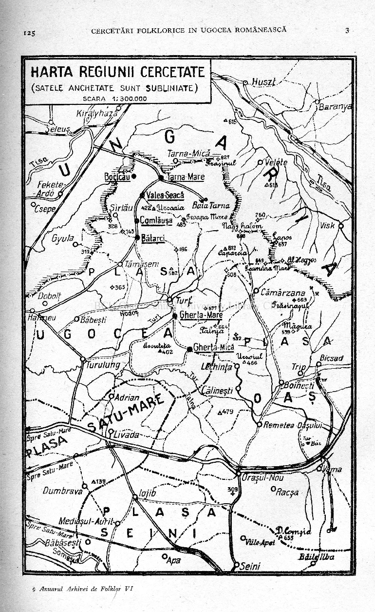

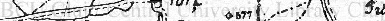

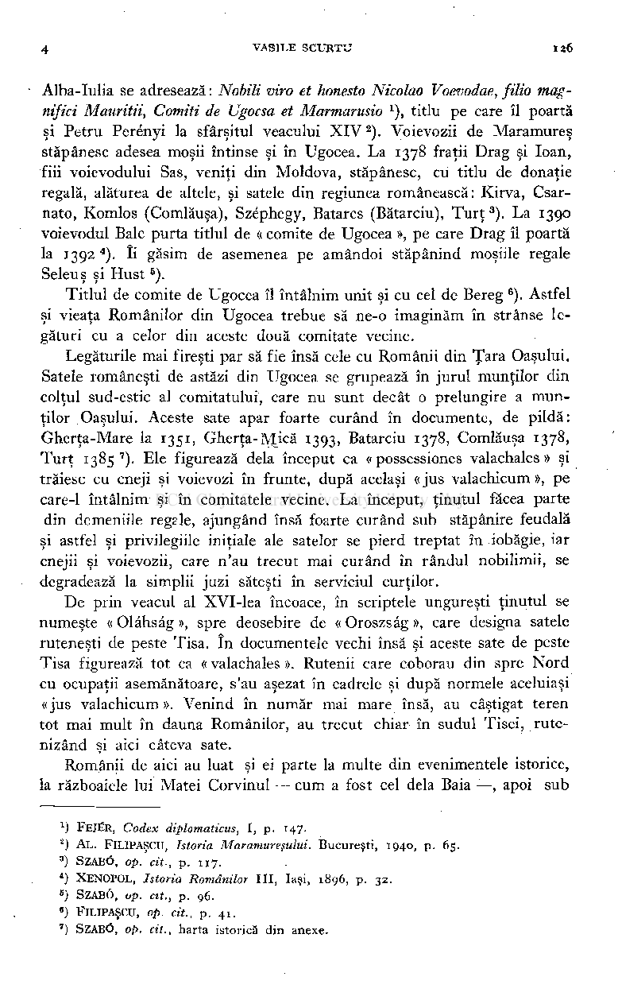

Alba-Iulia se adresează : Nobili viro et honesto Nicoiao Voevodae, filio magnifici Mauritii, Comiti de Ugocsa et Marmarusio

), titlu pe care îl poartă şi Petru Perényi la sfârşitul veacului XIV ). Voievozii de Maramureş stăpânesc adesea moşii întinse şi în Ugocea. La 1378 fraţii Drag şi Ioan, fiii voievodului Sas, veniţi din Moldova, stăpânesc, cu titlu de donaţie regală, alăturea de altele, şi satele din regiunea românească: Kirva, Csarnato, Komlos (Comlăuşa), Széphegy, Batarcs (Bătarciu), Turţ ). La 1390 voievodul Bale purta titlul de « comite de Ugocea », pe care Drag îl poartă la 1392 ). îi găsim de asemenea pe amândoi stăpânind moşiile regale Seleuş şi Hust ).

1

Titlul de comite de Ugocea îl întâlnim unit şi cu cel de Bereg ). Astfel şi vieaţa Românilor din Ugocea trebue să ne-o imaginăm în strânse legături cu a celor din aceste două comitate vecine.

Legăturile mai fireşti par să fie însă cele cu Românii din Ţara Oaşului. Satele româneşti de astăzi din Ugocea se grupează în jurul munţilor din colţul sud-estic al comitatului, care nu sunt decât o prelungire a munţilor Oaşului. Aceste sate apar foarte curând în documente, de pildă: Gherţa-Mare la 1351, Gherţa-Mică 1393, Batarciu 1378, Comlăuşa 1378, Turţ 1385 ). Ele figurează delà început ca « possessiones valachales » şi trăiesc cu cneji şi voievozi în frunte, după acelaşi «jus valachicum », pe care-1 întâlnim şi în comitatele vecine. La început, ţinutul făcea parte

din domeniile regele, ajungând însă foarte curând sub stăpânire feudală şi astfel şi privilegiile iniţiale ale satelor se pierd treptat în iobăgie, iar cnejii şi voievozii, care n'au trecut mai curând în rândul nobilimii, se degradează la simplii juzi săteşti în serviciul curţilor.

De prin veacul al XVI-lea încoace, în scriptele ungureşti ţinutul se numeşte «Olâhsâg», spre deosebire de « Oroszsâg », care designa satele ruteneşti de peste Tisa. în documentele vechi însă şi aceste sate de peste Tisa figurează tot ca « valachales ». Rutenii care coborau din spre Nord cu ocupaţii asemănătoare, s'au aşezat în cadrele şi după normele aceluiaşi «jus valachicum». Venind în număr mai mare însă, au câştigat teren tot mai mult în dauna Românilor, au trecut chiar în sudul Tisei, rutenizând şi aici câteva sate.

Românii de aici au luat şi ei parte la multe din evenimentele istorice, la războaiele lui Matei Corvinul — cum a fost cel delà Baia —, apoi sub

###### *) FEJÉR, Codex diplomaticus, I, p. 147.

- 2

) AL. FlLIPAŞCU, Istoria Maramureşului. Bucureşti, 1940, p. 65.

- 3

) SZABÖ, op. cit-, p. 117

###### *) XENOPOL, Istoria Românilor III, Iaşi, 1896, p. 32.

) SZABÔ, op. cit., p. 96.

6

•) FlLIPAŞCU, op. cit., p. 41

') SZABÖ, op. cit., harta istorică din anexe.

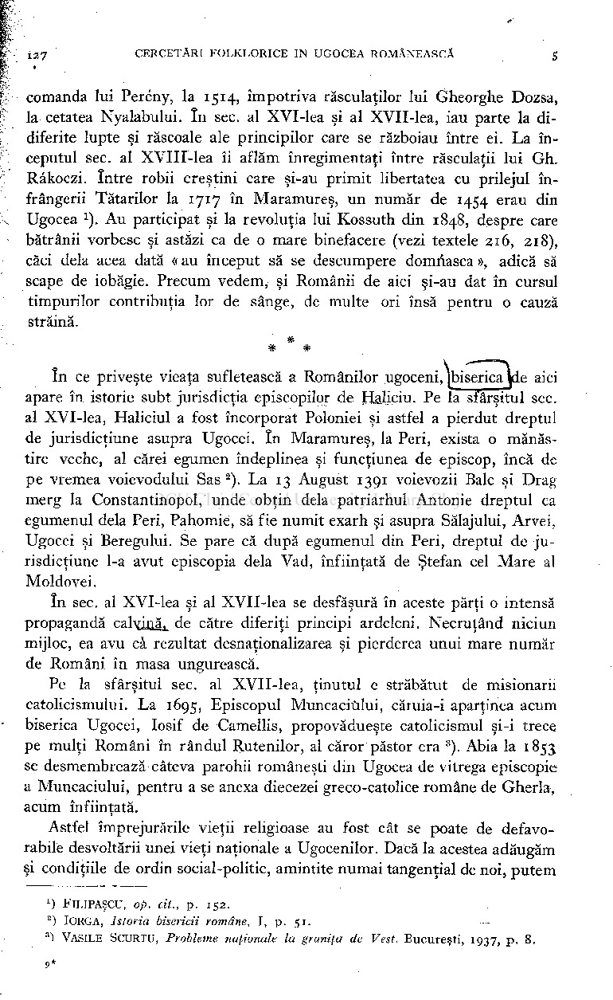

comanda lui Perény, la 1514, împotriva răsculaţilor lui Gheorghe Dozsa, la cetatea Nyalabului. în sec. al XVI-lea şi al XVII-lea, iau parte la didiferite lupte şi răscoale ale principilor care se războiau între ei. La începutul sec. al XVIII-lea îi aflăm înregimentaţi între răsculaţii lui Gh. Râkoczi. între robii creştini care şi-au primit libertatea cu prilejul înfrângerii Tătarilor la 1717 în Maramureş, un număr de 1454 erau din Ugocea ). Au participat şi la revoluţia lui Kossuth din 1848, despre care

- bătrânii vorbesc şi astăzi ca de o mare binefacere (vezi textele 216, 218),
- căci delà acea dată « au început să se descumpere domnasca », adică să scape de iobăgie. Precum vedem, şi Românii de aici şi-au dat în cursul timpurilor contribuţia lor de sânge, de multe ori însă pentru o cauză străină.

# # #

în ce priveşte vieaţa sufletească a Românilor ugoceni,^biserica^de aici apare în istorie subt jurisdicţia episcopilor de Haliciu. Pe la sfârşitul sec. al XVI-lea, Haliciul a fost încorporat Poloniei şi astfel a pierdut dreptul de jurisdicţiune asupra Ugocei. în Maramureş, la Peri, exista o mănăstire veche, al cărei egumen îndeplinea şi funcţiunea de episcop, încă de pe vremea voievodului Sas ). La 13 August 1391 voievozii Bale şi Drag merg la Constantinopol, unde obţin delà patriarhul Antonie dreptul ca egumenul delà Peri, Pahomie, să fie numit exarh şi asupra Sălajului, Arvei, Ugocei şi Beregului. Se pare că după egumenul din Peri, dreptul de jurisdicţiune 1-a avut episcopia delà Vad, înfiinţată de Ştefan cel Mare al Moldovei.

în sec. al XVI-lea şi al XVII-lea se desfăşură în aceste părţi o intensă propagandă cal^ină^ de către diferiţi principi ardeleni. Necruţând niciun mijloc, ea avu ca rezultat desnaţionalizarea şi pierderea unui mare număr de Români în masa ungurească.

Pe la sfârşitul sec. al XVII-lea, ţinutul e străbătut de misionarii catolicismului. La 1695, Episcopul Muneaciului, căruia-i aparţinea acum biserica Ugocei, Iosif de Camellis, propovădueşte catolicismul şi-i trece pe mulţi Români în rândul Rutenilor, al căror păstor era ). Abia la 1853 se desmembrează câteva parohii româneşti din Ugocea de vitrega episcopie a Muneaciului, pentru a se anexa diecezei greco-catolice române de Gherla, acum înfiinţată.

Astfel împrejurările vieţii religioase au fost cât se poate de defavorabile desvoltării unei vieţi naţionale a Ugocenilor. Dacă la acestea adăugăm şi condiţiile de ordin social-politic, amintite numai tangenţial de noi, putem

) FlI.IPAŞCU, op. cit., p. 152.

J

- 2

) IORGA, Istoria bisericii române, I, p. 51.

- 3

###### 1 VASILE SCURŢI;, Probleme naţionale la graniţa de Vest. Bucureşti, 1937, p. 8.

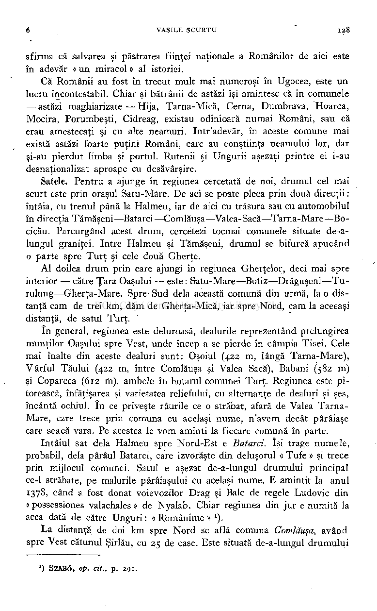

afirma că salvarea şi păstrarea fiinţei naţionale a Românilor de aici este în adevăr « un miracol » al istoriei.

Că Românii au fost în trecut mult mai numeroşi în Ugocea, este un lucru incontestabil. Chiar şi bătrânii de astăzi îşi amintesc că în comunele — astăzi maghiarizate—Hija, Tarna-Mică, Cerna, Dumbrava, Hoarca, Mocira, Porumbeşti, Cidreag, existau odinioară numai Români, sau că erau amestecaţi şi cu alte neamuri. Intr'adevăr, în aceste comune mai există astăzi foarte puţini Români, care au conştiinţa neamului lor, dar şi-au pierdut limba şi portul. Rutenii şi Ungurii aşezaţi printre ei i-au desnaţionalizat aproape cu desăvârşire.

Satele. Pentru a ajunge în regiunea cercetată de noi, drumul cel mai scurt este prin oraşul Satu-Mâre. De aci se poate pleca prin două direcţii : întâia, cu trenul până la Halmeu, iar de aici cu trăsura sau cu automobilul în direcţia Tămăşeni—Batarci—Comlăuşa—Valea-Sacă—Tarna-Mare—Bocicău. Parcurgând acest drum, cercetezi tocmai comunele situate de-alungul graniţei. Intre Halmeu şi Tămăşeni, drumul se bifurcă apucând o parte spre Turţ şi cele două Gherţe.

Al doilea drum prin care ajungi în regiunea Gherţelor, deci mai spre interior — către Ţara Oaşului — este : Satu-Mare—Botiz—Drăguşeni—Turulung—Gherţa-Mare. Spre Sud delà această comună din urmă, la o distanţă cam de trei km, dăm de Gherţa-Mică, iar spre Nord, cam la aceeaşi distanţă, de satul Turţ.

în general, regiunea este deluroasă, dealurile reprezentând prelungirea munţilor Oaşului spre Vest, unde încep a se pierde în câmpia Tisei. Cele mai înalte din aceste dealuri sunt: Oşoiul (422 m, lângă Tarna-Mare), Vârful Tăului (422 m, între Comlăuşa şi Valea Sacă), Babani (582 m) şi Coparcea (612 m), ambele în hotarul comunei Turţ. Regiunea este pitorească, înfăţişarea şi varietatea reliefului, cu alternanţe de dealuri şi şes, încântă ochiul. în ce priveşte râurile ce o străbat, afară de Valea TarnaMare, care trece prin comuna cu acelaşi nume, n'avem decât pârâiaşe care seacă vara. Pe acestea le vom aminti la fiecare comună în parte.

întâiul sat delà Halmeu spre Nord-Est e Batarci. îşi trage numele, probabil, delà pârâul Batarci, care izvorăşte din deluşorul «Tufe » şi trece prin mijlocul comunei. Satul e aşezat de-a-lungul drumului principal ce-1 străbate, pe malurile pârâiaşului cu acelaşi nume. E amintit la anul 1378, când a fost donat voievozilor Drag şi Bale de regele Ludovic din « possessiones valachales » de Nyalab. Chiar regiunea din jur e numită la acea dată de către Unguri: « Românime »

).

1

La distanţă de doi km spre Nord se află comuna Comlăuşa, având spre Vest cătunul Şirlău, cu 25 de case. Este situată de-a-lungul drumului

###### *) SZABÖ, op. cit., p. 201.

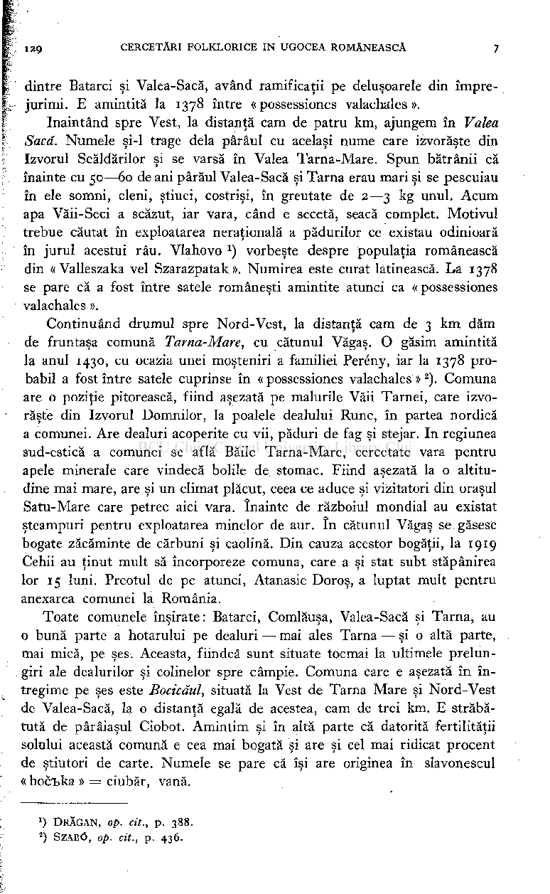

dintre Batarci şi Valea-Sacă, având ramificaţii pe deluşoarele din împrejurimi. E amintită la 1378 între « possessiones valachales ».

înaintând spre Vest, la distanţă cam de patru km, ajungem în Valea Saca. Numele şi-1 trage delà pârâul cu acelaşi nume care izvorăşte din Izvorul Scăldărilor şi se varsă în Valea Tarna-Mare. Spun bătrânii că înainte cu 50—60 de ani pârăul Valea-Sacă şi Târna erau mari şi se pescuiau în ele somni, eleni, ştiuci, costrişi, în greutate de 2—3 kg unul. Acum apa Văii-Seci a scăzut, iar vara, când e secetă, seacă complet. Motivul trebue căutat în exploatarea neraţională a pădurilor ce existau odinioară în jurul acestui râu. Vlahovo vorbeşte despre populaţia românească din «Valleszaka vel Szarazpatak ». Numirea este curat latinească. La 1378 se pare că a fost între satele româneşti amintite atunci ca « possessiones valachales ».

Continuând drumul spre Nord-Vest, la distanţă cam de 3 km dăm de fruntaşa comună Tarna-Mare, cu cătunul Văgaş. O găsim amintită la anul 1430, cu ocazia unei moşteniri a familiei Perény, iar la 1378 probabil a fost între satele cuprinse în « possessiones valachales »

). Comuna are o poziţie pitorească, fiind aşezată pe malurile Văii Târnei, care izvorăşte din Izvorul Domnilor, la poalele dealului Runc, în partea nordică a comunei. Are dealuri acoperite cu vii, păduri de fag şi stejar. In regiunea sud-estică a comunei se află Băile Tarna-Mare, cercetate vara pentru apele minerale care vindecă bolile de stomac. Fiind aşezată la o altitudine mai mare, are şi un climat plăcut, ceea ce aduce şi vizitatori din oraşul Satu-Mare care petrec aici vara. înainte de războiul mondial au existat şteampuri pentru exploatarea minelor de aur. în cătunul Văgaş se găsesc bogate zăcăminte de cărbuni şi caolină. Din cauza acestor bogăţii, la 1919 Cehii au ţinut mult să încorporeze comuna, care a şi stat subt stăpânirea lor 15 luni. Preotul de pe atunci, Atanasie Doroş, a luptat mult pentru anexarea comunei la România.

2

Toate comunele înşirate: Batarci, Comlăuşa, Valea-Sacă şi Târna, au o bună parte a hotarului pe dealuri —• mai ales Târna — şi o altă parte, mai mică, pe şes. Aceasta, fiindcă sunt situate tocmai la ultimele prelungiri ale dealurilor şi colinelor spre câmpie. Comuna care e aşezată în întregime pe şes este Bocicăul, situată la Vest de Târna Mare şi Nord-Vest de Valea-Sacă, la o distanţă egală de acestea, cam de trei km. E străbătută de pârâiaşul Ciobot. Amintim şi în altă parte că datorită fertilităţii solului această comună e cea mai bogată şi are şi cel mai ridicat procent de ştiutori de carte. Numele se pare că îşi are originea în slavonescul « bocT>ka » = ciubăr, vană.

) DRĂGAN , op. cit., p. 388.

X

) SZABÖ , op. cit., p. 436.

S

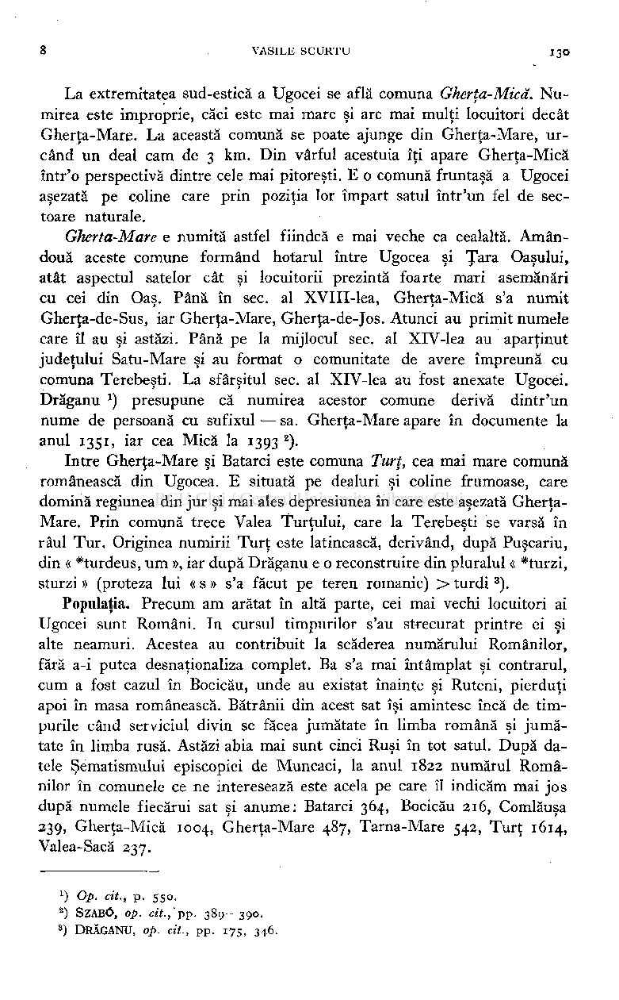

La extremitatea sud-estică a Ugocei se află comuna Gherţa-Mică. Numirea este improprie, căci este mai mare şi are mai mulţi locuitori decât Gherţa-Mare. La această comună se poate ajunge din Gherţa-Mare, urcând un deal cam de 3 km. Din vârful acestuia îţi apare Gherţa-Mică într'o perspectivă dintre cele mai pitoreşti. E o comună fruntaşă a Ugocei aşezată pe coline care prin poziţia lor împart satul într'un fel de sectoare naturale.

Gherta-Mare e numită astfel fiindcă e mai veche ca cealaltă. Amândouă aceste comune formând hotarul între Ugocea şi Ţara Oaşului, atât aspectul satelor cât şi locuitorii prezintă foarte mari asemănări cu cei din Oaş. Până în sec. al XVIII-lea, Gherţa-Mică s'a numit Gherţa-de-Sus, iar Gherţa-Mare, Gherţa-de-Jos. Atunci au primit numele care îl au şi astăzi. Până pe la mijlocul sec. al XIV-lea au aparţinut judeţului Satu-Mare şi au format o comunitate de avere împreună cu comuna Terebeşti. La sfârşitul sec. al XIV-lea au fost anexate Ugocei. Drăganu ) presupune că numirea acestor comune derivă dintr'un nume de persoană cu sufixul — sa. Gherţa-Mare apare în documente la anul 1351, iar cea Mică la 1393 ).

Intre Gherţa-Mare şi Batarci este comuna Turţ, cea mai mare comună românească din Ugocea. E situată pe dealuri şi coline frumoase, care domină regiunea din jur şi mai ales depresiunea în care este aşezată GherţaMare. Prin comună trece Valea Turţului, care la Terebeşti se varsă în râul Tur. Originea numirii Turţ este latinească, derivând, după Puşcariu, din « *turdeus, um », iar după Drăganu e o reconstruire din pluralul « *turzi, sturzi » (proteza lui « s » s'a făcut pe teren romanic) > tur di ).

Populaţia. Precum am arătat în altă parte, cei mai vechi locuitori ai Ugocei sunt Români. In cursul timpurilor s'au strecurat printre ei şi alte neamuri. Acestea au contribuit la scăderea numărului Românilor,

- fără a-i putea desnaţionaliza complet. Ba s'a mai întâmplat şi contrarul, cum a fost cazul în Bocicău, unde au existat înainte şi Ruteni, pierduţi apoi în masa românească. Bătrânii din acest sat îşi amintesc încă de timpurile când serviciul divin se făcea jumătate în limba română şi jumătate în limba rusă. Astăzi abia mai sunt cinci Ruşi în tot satul. După datele Şematismului episcopiei de Muncaci, la anul 1822 numărul Românilor în comunele ce ne interesează este acela pe care îl indicăm mai jos după numele fiecărui sat şi anume: Batarci 364, Bocicău 216, Comlăuşa 239, Gherţa-Mică 1004, Gherţa-Mare 487, Tarna-Mare 542, Turţ 1614, Valea-Sacă 237.

- 1

) Op. cit., p. 550.

- 2

) SZABÔ, op. cit., pp. 389—390.

- 3 ) DRĂGANU , op. cit., pp. 175, 346.

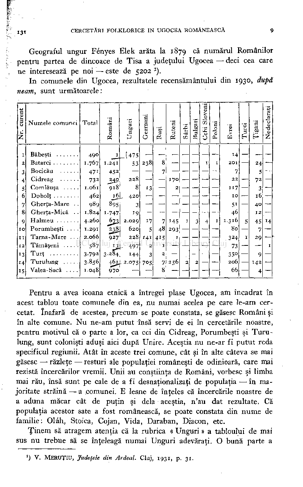

Geograful ungur Fényes Elek arăta la 1879 că numărul Românilor pentru partea de dincoace de Tisa a judeţului Ugocea — deci cea care ne interesează pe noi — este de 5202 ).

In comunele din Ugocea, rezultatele recensământului din 1930, după neam, sunt următoarele:

Nr. curentJ

Cehi Sloveni

Nedeclaraţi

Germani

Români

Bulgari

Unguri

Numele comunei Total

Ţigani

Ruteni

Poloni

Turci

Sârbi

Evrei

Ruşi

- 1 490 1_[475 — — — —— — — 14 — —
- 2 Batarci 1.767 1.241 53 238 8 — — — 1 1 201 —

2

4 —

- 3 Bocicău 471 452 — — 7 — — — — — 7 — 5 —
- 4 Cidreag 732 _2_4_0 228 — — 170 — — — — 22 — 72 —
- 5 Comlăuşa 1.061 918 8 13 — 2 — — — — 117 — 3 —
- 6 Dobolţ 462 _i6 _ 420 — — — — — — — 10 — 16 —
- 7 Gherţa-Mare . . 989 895 3 — — — — — — — 51 — 40 —
- 8 Gherţa-Mică . . 1.824 1-747 19 — — — — — — — 46 — 12 —
- 9 Halmeu 4.260 (yjî2.029 17 7 145 1 3 4 1 1.316 5 45
- 10 Porumbeşti ... . 1.291 620 5 48 293 — — — — 80 — 7 —
- 11 Târna-Mare . . . 2.066 927 228 141 415 1 — — — — 324 1 29 —
- 12 Tămăşeni 587 _ 497 2 1 — — — — — 73 — — 1
- 13 Turţ 3-792 3.284 144 3 2 — — — — — 350 — 9 3.856 461 2.075 705 7 256 2 2 — — 206 — 142 —

15 Valea-Sacă ... . 1.048 970 •— — 8 — — — •—— 66 — 4 —

Pentru a avea icoana etnică a întregei plase Ugocea, am încadrat în acest tablou toate comunele din ea, nu numai acelea pe care le-am cercetat, înafară de acestea, precum se poate constata, se găsesc Românişi în alte comune. Nu ne-am putut însă servi de ei în cercetările noastre, pentru motivul că o parte a lor, ca cei din Cidreag, Porumbeşti şi Turulung, sunt colonişti aduşi aici după Unire. Aceştia nu ne-ar fi putut reda specificul regiunii. Atât în aceste trei comune, cât şi în alte câteva se mai

- găsesc — răzleţe — resturi ale populaţiei româneşti de odinioară, care mai rezistă încercărilor vremii. Unii au conştiinţa de Români, vorbesc şi limba mai rău, însă sunt pe cale de a fi desnaţionalizaţi de populaţia — în majoritate străină — a .comunei. E lesne de înţeles că încercările noastre de a aduna măcar cât de puţin şi delà aceştia, n'au dat rezultate. Că populaţia acestor sate a fost românească, se poate constata din nume de familie: Olâh, Stoica, Cojan, Vida, Daraban, Diacon, etc.

Ţinem să atragem atenţia că la rubrica « Unguri » a tabloului de mai sus nu trebue să se înţeleagă numai Unguri adevăraţi. O bună parte a

###### *) V . MERUTIU, Judeţele din Ardeal. Cluj, 1931 p. 31.

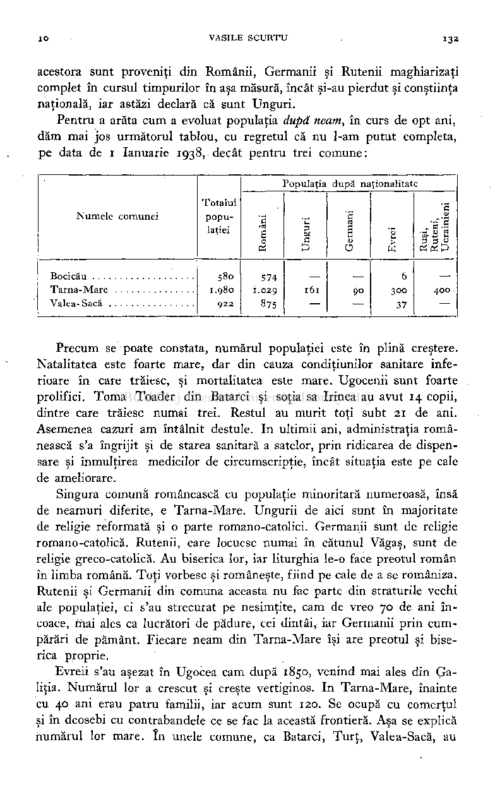

acestora sunt proveniţi din Românii, Germanii şi Rutenii maghiarizaţi complet în cursul timpurilor în aşa măsură, încât şi-au pierdut şi conştiinţa naţională, iar astăzi declară că sunt Unguri.

Pentru a arăta cum a evoluat populaţia după neam, în curs de opt ani, dăm mai jos următorul tablou, cu regretul că nu l-am putut completa, pe data de 1 Ianuarie 1938, decât pentru trei comune:

Populaţia după naţionalitate

Totalul populaţiei

Ucrainienij

Numele comunei

i

Germani

Români

Unguri

Ruteni,

i

Evrei

Ruşi,

Bocicău 580 574 , 6 . Târna-Mare 1.980 1.029 161 90 300 400

923 875 — — 37 —

Precum se poate constata, numărul populaţiei este în plină creştere. Natalitatea este foarte mare, dar din cauza condiţiunilor sanitare inferioare în care trăiesc, şi mortalitatea este mare. Ugocenii sunt foarte prolifici. Torna Toader din Batarci şi soţia sa Irinca au avut 14 copii, dintre care trăiesc numai trei. Restul au murit toţi subt 21 de ani. Asemenea cazuri am întâlnit destule. In ultimii ani, administraţia românească s'a îngrijit şi de starea sanitară a satelor, prin ridicarea de dispensare şi înmulţirea medicilor de circumscripţie, încât situaţia este pe cale de ameliorare.

Singura comună românească cu populaţie minoritară numeroasă, însă de neamuri diferite, e Tarna-Mare. Ungurii de aici sunt în majoritate de religie reformată şi o parte romano-catolici. Germanii sunt de religie romano-catolică. Rutenii, care locuesc numai în cătunul Văgaş, sunt de religie greco-catolică. Au biserica lor, iar liturghia le-o face preotul român în limba română. Toţi vorbesc şi româneşte, fiind pe cale de a se româniza. Rutenii şi Germanii din comuna aceasta nu fac parte din straturile vechi ale populaţiei, ci s'au strecurat pe nesimţite, cam de vreo 70 de ani încoace, mai ales ca lucrători de pădure, cei dintâi, iar Germanii prin cumpărări de pământ. Fiecare neam din Tarna-Mare îşi are preotul şi biserica proprie.

Evreii s'au aşezat în Ugocea cam după 1850, venind mai ales din G ~ liţia. Numărul lor a crescut şi creşte vertiginos. In Tarna-Mare, înainte cu 40 ani erau patru familii, iar acum sunt 120. Se ocupă cu comerţul şi în deosebi cu contrabandele ce se fac la această frontieră. Aşa se explică numărul lor mare. în unele comune, ca Batarci, Turţ, Valea-Sacă, au

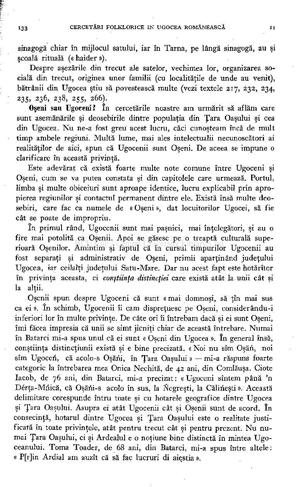

sinagogă chiar în mijlocul satului, iar în Târna, pe lângă sinagogă, au şi şcoală rituală (« haider »).

Despre aşezările din trecut ale satelor, vechimea lor, organizarea socială din trecut, originea unor familii (cu localităţile de unde au venit), bătrânii din Ugocea ştiu să povestească multe (vezi textele 217, 232, 234, 235. 236, 238, 255, 266).

Oşeni sau Ugoceni? în cercetările noastre am urmărit să aflăm care sunt asemănările şi deosebirile dintre populaţia din Ţara Oaşului şi cea din Ugocea. Nu ne-a fost greu acest lucru, căci cunoşteam încă de mult timp ambele regiuni. Multă lume, mai ales intelectualii necunoscători ai realităţilor de aici, spun că Ugocenii sunt Oşeni. De aceea se impune o clarificare în această privinţă.

Este adevărat că există foarte multe note comune între Ugoceni şi Oşeni, cum se va putea constata şi din capitolele care urmează. Portul, limba şi multe obiceiuri sunt aproape identice, lucru explicabil prin apropierea regiunilor şi contactul permanent dintre ele. Există însă multe deosebiri, care fac ca numele de « Oşeni », dat locuitorilor Ugocei, să fie cât se poate de impropriu.

în primul rând, Ugocenii sunt mai paşnici, mai înţelegători, şi au o fire mai potolită ca Oşenii. Apoi se găsesc pe o treaptă culturală superioară Oşenilor. Amintim şi faptul că în cursul timpurilor Ugocenii au fost separaţi şi administrativ de Oşeni, primii aparţinând judeţului Ugocea, iar ceilalţi judeţului Satu-Mare. Dar nu acest fapt este hotărîtor în privinţa aceasta, ci conştiinţa distincţiei care există atât la unii cât şi la alţii.

Oşenii spun despre Ugoceni că sunt « mai domnoşi, să ţîn mai sus ca ei ». în schimb, Ugocenii îi cam dispreţuesc pe Oşeni, considerându-i inferiori lor în multe privinţe. De câte ori îi întrebam dacă şi ei sunt Oşeni, îmi făcea impresia că unii se simt jicniţi chiar de această întrebare. Numai în Batarci mi-a spus unul că ei sunt « Oşeni din Ugocea ». în general însă, conştiinţa distincţiunii există şi e bine precizată. « Noi nu sîm Oşăn, noi sîm Ugoceri, că acolo-s Oşării, în Ţara Oaşului » — mi-a răspuns foarte categoric la întrebarea mea Onica Nechită, de 42 ani, din Comlăuşa. Ciote Iacob, de 76 ani, din Batarci, mi-a precizat: «Ugoceni sîntem până 'n Derţa-Mriică, că Oşăni-s acolo în sus, la Negreşti, la Călineşti ». Această delimitare corespunde întru toate şi cu hotarele geografice dintre Ugocea şi Ţara Oaşului. Asupra ei atât Ugocenii cât şi Oşenii sunt de acord. în

consecinţă, hotarul dintre Ugocea şi Ţara Oaşului este o realitate justificată în toate privinţele, atât pentru trecut cât şi pentru prezent. Nu numai Ţara Oaşului, ci şi Ardealul e o noţiune bine distinctă în mintea Ugoceanului. Torna Toader, de 68 ani, din Batarci, mi-a spus între altele: « P[r]in Ardial am auzît că să fac lucruri di aiçstia ».

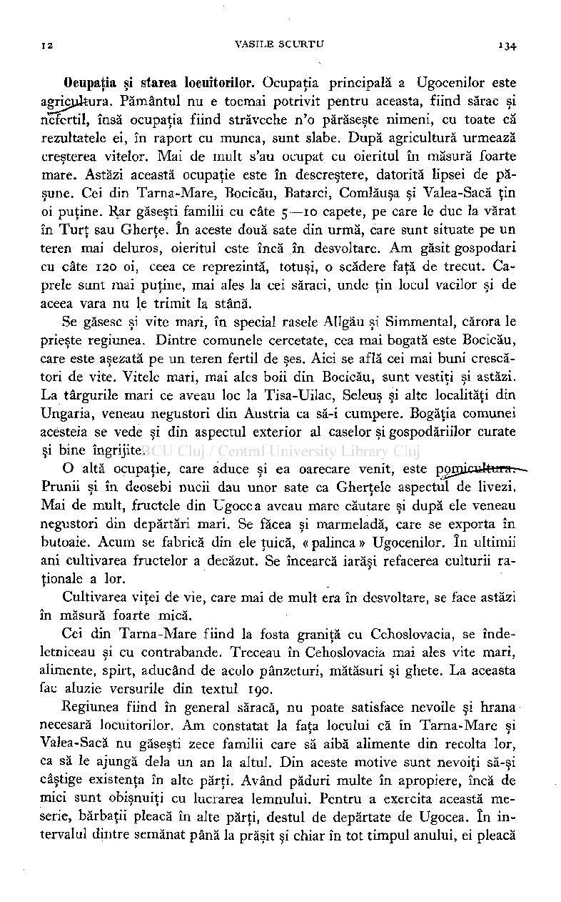

Ocupaţia şi starea locuitorilor. Ocupaţia principală a Ugocenilor este agricultura. Pământul nu e tocmai potrivit pentru aceasta, fiind sărac şi nefertil, însă ocupaţia fiind străveche n'o părăseşte nimeni, cu toate că rezultatele ei, în raport cu munca, sunt slabe. După agricultură urmează creşterea vitelor. Mai de mult s'au ocupat cu oieritul în măsură foarte mare. Astăzi această ocupaţie este în descreştere, datorită lipsei de păşune. Cei din Tarna-Mare, Bocicău, Batarci, Comlăuşa şi Valea-Sacă ţin oi puţine. Rar găseşti familii cu câte 5—10 capete, pe care le duc la vărat în Turţ sau Gherţe. în aceste două sate din urmă, care sunt situate pe un teren mai deluros, oieritul este încă în desvoltare. Am găsit gospodari cu câte 120 oi, ceea ce reprezintă, totuşi, o scădere faţă de trecut. Caprele sunt mai puţine, mai ales la cei săraci, unde ţin locul vacilor şi de aceea vara nu le trimit la stână.

Se găsesc şi vite mari, în special rasele Allgäu şi Simmental, cărora le prieşte regiunea. Dintre comunele cercetate, cea mai bogată este Bocicău, care este aşezată pe un teren fertil de şes. Aici se află cei mai buni crescători de vite. Vitele mari, mai ales boii din Bocicău, sunt vestiţi şi astăzi. La târgurile mari ce aveau loc la Tisa-Uilac, Seleuş şi alte localităţi din Ungaria, veneau negustori din Austria ca să-i cumpere. Bogăţia comunei acesteia se vede şi din aspectul exterior al caselor şi gospodăriilor curate şi bine îngrijite.

O altă ocupaţie, care aduce şi ea oarecare venit, este pjjrriicttkttraT--

Prunii şi în deosebi nucii dau unor sate ca Gherţele aspectul de livezi. Mai de mult, fructele din Ugocea aveau mare căutare şi după ele veneau negustori din depărtări mari. Se făcea şi marmeladă, care se exporta în butoaie. Acum se fabrică din ele ţuică, « palinca » Ugocenilor. în ultimii ani cultivarea fructelor a decăzut. Se încearcă iarăşi refacerea culturii raţionale a lor.

Cultivarea viţei de vie, care mai de mult era în desvoltare, se face astăzi în măsură foarte mică.

Cei din Tarna-Mare fiind la fosta graniţă cu Cehoslovacia, se îndeletniceau şi cu contrabande. Treceau în Cehoslovacia mai ales vite mari, alimente, spirt, aducând de acolo pânzeturi, mătăsuri şi ghete. La aceasta fac aluzie versurile din textul 190.

Regiunea fiind în general săracă, nu poate satisface nevoile şi hrana necesară locuitorilor. Am constatat la faţa locului că în Tarna-Mare şi Valea-Sacă nu găseşti zece familii care să aibă alimente din recolta lor, ca să le ajungă delà un an la altul. Din aceste motive sunt nevoiţi să-şi câştige existenţa în alte părţi. Având păduri multe în apropiere, încă de mici sunt obişnuiţi cu lucrarea lemnului. Pentru a exercita această meserie, bărbaţii pleacă în alte părţi, destul de depărtate de Ugocea. în intervalul dintre semănat până la prăşit şi chiar în tot timpul anului, ei pleacă

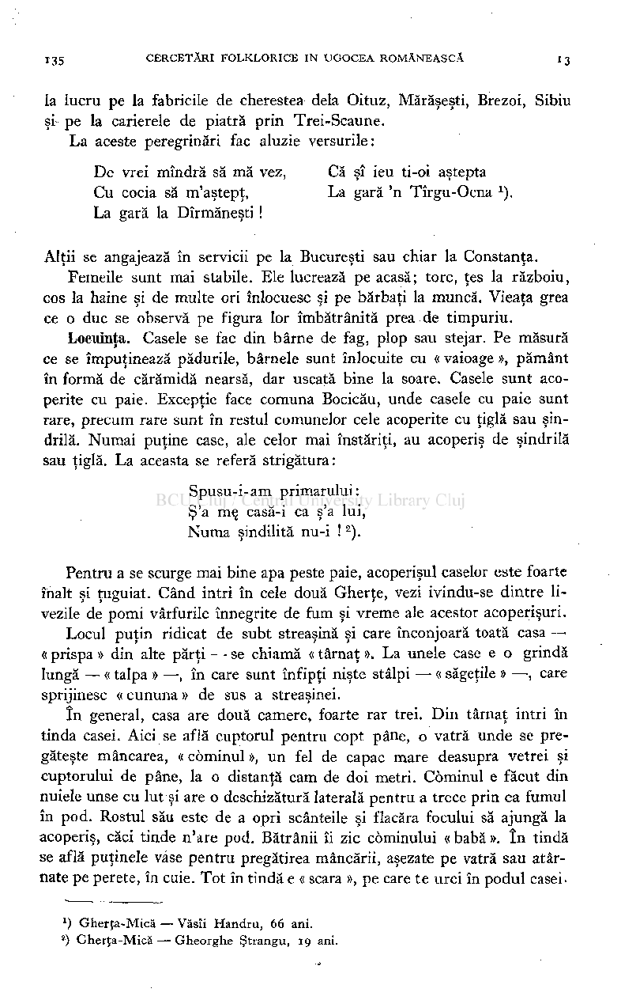

la lucru pe la fabricile de cherestea delà Oituz, Mărăşeşti, Brezoi, Sibiu şi pe la carierele de piatră prin Trei-Scaune.

La aceste peregrinări fac aluzie versurile:

De vrei mîndră să mă vez, Că şî ieu ti-oi aştepta Cu cocia să m'aştepţ, La gară 'n Tîrgu-Ocna ). La gară la Dîrmăneşti !

Alţii se angajează în servicii pe la Bucureşti sau chiar la Constanţa.

Femeile sunt mai stabile. Ele lucrează pe acasă; torc, ţes la războiu, cos la haine şi de multe ori înlocuesc şi pe bărbaţi la muncă. Vieaţa grea ce o duc se observă pe figura lor îmbătrânită prea de timpuriu.

Locuinţa. Casele se fac din bârne de fag, plop sau stejar. Pe măsură ce se împuţinează pădurile, bârnele sunt înlocuite cu « vaioage », pământ în formă de cărămidă nearsă, dar uscată bine la soare. Casele sunt acoperite cu paie. Excepţie face comuna Bocicău, unde casele cu paie sunt rare, precum rare sunt în restul comunelor cele acoperite cu ţiglă sau şindrilă. Numai puţine case, ale celor mai înstăriţi, au acoperiş de şindrilă sau ţiglă. La aceasta se referă strigătura:

Spusu-i-am primarului: Ş'a mç casă-i ca ş'a lui, Numa şindilită nu-i ! ) .

Pentru a se scurge mai bine apa peste paie, acoperişul caselor este foarte înalt şi ţuguiat. Când intri în cele două Gherţe, vezi ivindu-se dintre livezile de pomi vârfurile înnegrite de fum şi vreme ale acestor acoperişuri.

Locul puţin ridicat de subt streaşină şi care înconjoară toată casa « prispa » din alte părţi — se chiamă « târnaţ ». La unele case e o grindă lungă — « talpa » —, în care sunt înfipţi nişte stâlpi — « săgeţile » —, care sprijinesc « cununa » de sus a streaşinei.

în general, casa are două camere, foarte rar trei. Din târnaţ intri în tinda casei. Aici se află cuptorul pentru copt pâne, o vatră unde se pregăteşte mâncarea, « cöminul », un fel de capac mare deasupra vetrei şi cuptorului de pâne, la o distanţă cam de doi metri. Cöminul e făcut din nuiele unse cu lut şi are o deschizătură laterală pentru a trece prin ea fumul în pod. Rostul său este de a opri scânteile şi flacăra focului să ajungă la acoperiş, căci tinde n'are pod. Bătrânii îi zic côminului « babă ». în tindă se află puţinele vase pentru pregătirea mâncării, aşezate pe vatră sau atârnate pe perete, în cuie. Tot în tindă e « scara », pe care te urci în podul casei-

###### *) Gherţa-Mică — Văsîi Handru, 66 ani.

###### ) Gherţa-Mică — Gheorghe Ştrangu, 19 ani.

8

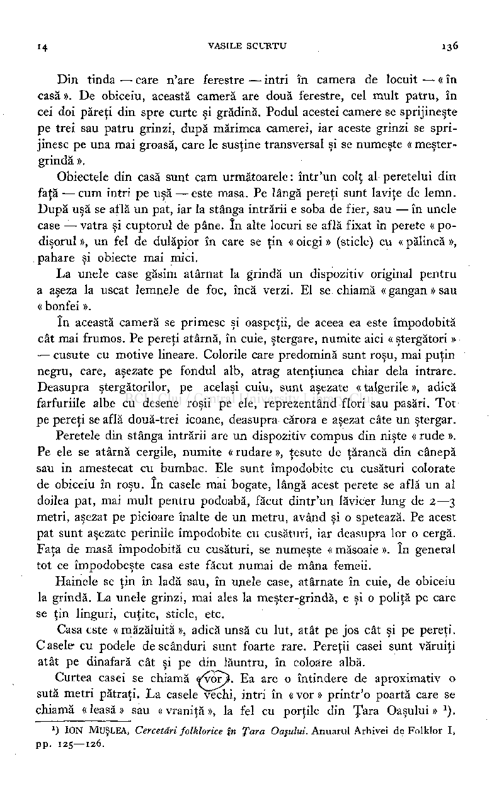

Din tinda — care n'are ferestre — intri în camera de locuit — « în casă ». De obiceiu, această cameră are două ferestre, cel mult patru, în cei doi păreţi din spre curte şi grădină. Podul acestei camere se sprijineşte pe trei sau patru grinzi, după mărimea camerei, iar aceste grinzi se sprijinesc pe una mai groasă, care le susţine transversal şi se numeşte « meştergrindă ».

Obiectele din casă sunt cam următoarele : într'un colţ al peretelui din faţă — cum intri pe uşă — este masa. Pe lângă pereţi sunt laviţe de lemn. După uşă se află un pat, iar la stânga intrării e soba de fier, sau — în unele case — vatra şi cuptorul de pâne. în alte locuri se află fixat în perete « podişorul », un fel de dulăpior în care se ţin « oiegi » (sticle) cu « palincă », pahare şi obiecte mai mici.

La unele case găsim atârnat la grindă un dispozitiv original pentru a aşeza la uscat lemnele de foc, încă verzi. El se chiamă « gangan » sau « bonfei ».

în această cameră se primesc şi oaspeţii, de aceea ea este împodobită cât mai frumos. Pe pereţi atârnă, în cuie, ştergare, numite aici « ştergători » — cusute cu motive lineare. Colorile care predomină sunt roşu, mai puţin negru, care, aşezate pe fondul alb, atrag atenţiunea chiar delà intrare. Deasupra ştergătorilor, pe acelaşi cuiu, sunt aşezate « talgerile », adică farfuriile albe cu desene roşii pe ele, reprezentând flori sau pasări. Tot pe pereţi se află două-trei icoane, deasupra cărora e aşezat câte un ştergar.

Peretele din stânga intrării are un dispozitiv compus din nişte « rude ». Pe ele se atârnă cergile, numite « rudare », ţesute de ţărancă din cânepă sau in amestecat cu bumbac. Ele sunt împodobite cu cusături colorate de obiceiu în roşu. în casele mai bogate, lângă acest perete se află un al doilea pat, mai mult pentru podoabă, făcut dintr'un lăvicer lung de 2—3 metri, aşezat pe picioare înalte de un metru, având şi o spetează. Pe acest pat sunt aşezate perinile împodobite cu cusături, iar deasupra lor o cergă. Faţa de masă împodobită cu cusături, se numeşte « măsoaie ». în general tot ce împodobeşte casa este făcut numai de mâna femeii.

Hainele se ţin în ladă sau, în unele case, atârnate în cuie, de obiceiu la grindă. La unele grinzi, mai ales la meşter-grindă, e şi o poliţă pe care se ţin linguri, cuţite, sticle, etc.

Casa este « măzăluită », adică unsă cu lut, atât pe jos cât şi pe pereţi. C asele- cu podele de scânduri sunt foarte rare. Pereţii casei sunt văruiţi atât pe dinafară cât şi pe din lăuntru, în coloare albă.

Curtea casei se chiamă «j^vor^. Ea are o întindere de aproximativ o

sută metri pătraţi. La casele vechi, intri în « vor » printr'o poartă care se chiamă «leasă» sau «vraniţă», la fel cu porţile din Ţara Oaşului» ).

*) ION MUŞLEA, Cercetări folklorice în Ţara Oaşului. Anuarul Arhivei de Folklor I, pp 125—126.

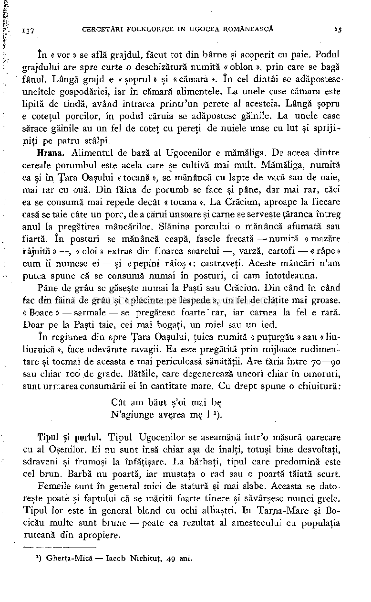

în « vor » se află grajdul, făcut tot din bârne şi acoperit cu paie. Podul grajdului are spre curte o deschizătură numită « oblon », prin care se bagă fânul. Lângă grajd e « şoprul » şi « cămara ». în cel dintâi se adăpostesc • uneltele gospodăriei, iar în cămară alimentele. La unele case cămara este lipită de tindă, având intrarea printr'un perete al acesteia. Lângă şopru

- e coteţul porcilor, în podul căruia se adăpostesc găinile. La unele case sărace găinile au un fel de coteţ cu pereţi de nuiele unse cu lut şi sprijiniţi pe patru stâlpi.

Hrana. Alimentul de bază al Ugocenilor e mămăliga. De aceea dintre cereale porumbul este acela care se cultivă mai mult. Mămăliga, numită ca şi în Ţara Oaşului « tocană », se mănâncă cu lapte de vacă sau de oaie, mai rar cu ouă. Din făina de porumb se face şi pâne, dar mai rar, căci ea se consumă mai repede decât « tocana ». La Crăciun, aproape la fiecare casă se taie câte un porc, de a cărui unsoare şi carne se serveşte ţăranca întreg anul la pregătirea mâncărilor. Slănina porcului o mănâncă afumată sau fiartă. în posturi se mănâncă ceapă, fasole frecată —• numită « mazăre

- f âjnită » —, « oloi » extras din floarea soarelui —•, varză, cartofi — « râpe » cum îi numesc ei—şi «pepini râioş»: castraveţi. Aceste mâncări n'am putea spune că se consumă numai în posturi, ci cam întotdeauna.

Pâne de grâu se găseşte numai la Paşti sau Crăciun. Din când în când fac din făină de grâu şi « plăcinte pe lespede », un fel de clătite mai groase. « Boace » — sarmale — se pregătesc foarte ' rar, iar carnea la fel e rară. Doar pe la Paşti taie, cei mai bogaţi, un miel sau un ied.

în regiunea din spre Ţara Oaşului, ţuica numită « puţurgău » sau « liuliuruică », face adevărate ravagii. Ea este pregătită prin mijloace rudimentare şi tocmai de aceasta e mai periculoasă sănătăţii. Are tăria între 70—90 sau chiar 100 de grade. Bătăile, care degenerează uneori chiar în omoruri, sunt urrrarea consumării ei în cantitate mare. Cu drept spune o chiuitură:

Cât am băut ş'oi mai be. N'agiunge averea mç ! ).

Tipul şi portul. Tipul Ugocenilor se aseamănă într'o măsură oarecare cu al Oşenilor. Ei nu sunt însă chiar aşa de înalţi, totuşi bine desvoltaţi, sdraveni şi frumoşi la înfăţişare. La bărbaţi, tipul care predomină este cel brun. Barbă nu poartă, iar mustaţa o rad sau o poartă tăiată scurt.

Femeile sunt în general mici de statură şi mai slabe. Aceasta se datoreşte poate şi faptului că se mărită foarte tinere şi săvârşesc munci grele. Tipul lor este în general blond cu ochi albaştri. In Tarna-Mare şi Bocicău multe sunt brune — poate ca rezultat al amestecului cu populaţia ruteană din apropiere.

###### *) Gherţa-Mică — Iacob Nichituţ, 49 ani.

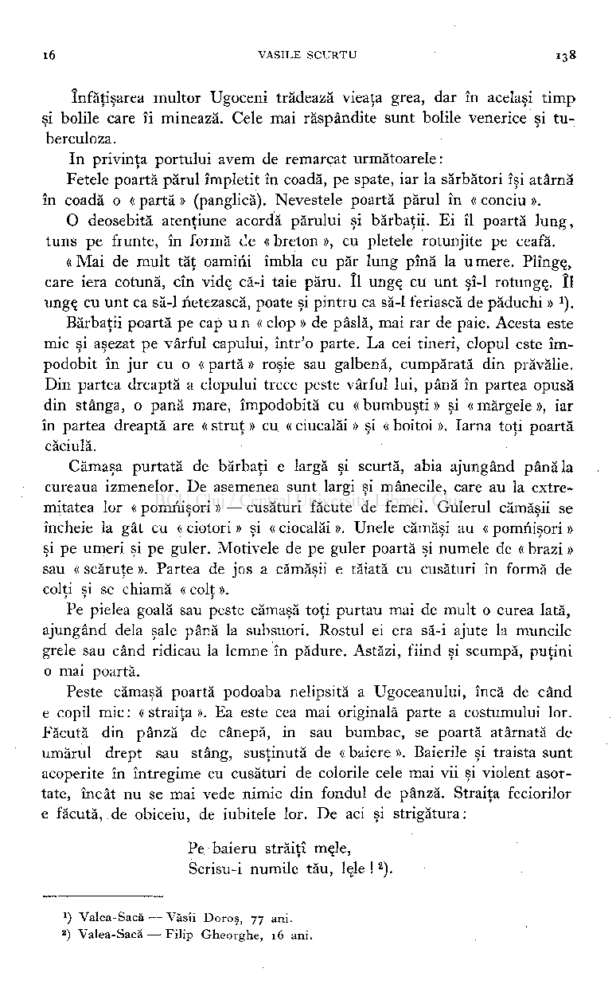

înfăţişarea multor Ugoceni trădează vieaţa grea, dar în acelaşi timp şi bolile care îi minează. Cele mai răspândite sunt bolile venerice şi tu­

berculoza. In privinţa portului avem de remarcat următoarele: Fetele poartă părul împletit în coadă, pe spate, iar la sărbători îşi atârnă

în coadă o « partă » (panglică). Nevestele poartă părul în « conciu ».

O deosebită atenţiune acordă părului şi bărbaţii. Ei îl poartă lung, tuns pe frunte, în formă Je « breton », cu pletele rotunjite pe ceafă.

«Mai de mult tăţ oamirii îmbla cu păr lung pînă la umere. Plînge., care iera cotună, cîn vidç că-i taie păru. îl unge. cu unt şî-1 rotungç. îl unge, cu unt ca să-1 netezască, poate şi pintru ca să-1 feriască de păduchi »

).

1

- Bărbaţii poartă pe cap u n « clop » de pâslă, mai rar de paie. Acesta este mic şi aşezat pe vârful capului, într'o parte. La cei tineri, clopul este împodobit în jur cu o « partă » roşie sau galbenă, cumpărată din prăvălie. Din partea dreaptă a dopului trece peste vârful lui, până în partea opusă din stânga, o pană mare, împodobită cu «bumbuşti» şi «mărgele», iar în partea dreaptă are « struţ » cu « ciucalăi » şi « boitoi ». Iarna toţi poartă căciulă.
- Cămaşa purtată de bărbaţi e largă şi scurtă, abia ajungând până la cureaua izmenelor. De asemenea sunt largi şi mânecile, care au la extremitatea lor « pomnişori » — cusături făcute de femei. Gulerul cămăşii se încheie la gât cu « ciotori » şi « ciocalăi ». Unele cămăşi au « pomnişori » şi pe umeri şi pe guler. Motivele de pe guler poartă şi numele de « brazi » sau « scăruţe ». Partea de jcs a cămăşii e tăiată cu cusături în formă de colţi şi se chiamă « colţ ».

Pe pielea goală sau peste cămaşă toţi purtau mai de mult o curea lată, ajungând delà şale până la subsuori. Rostul ei era să-i ajute la muncile grele sau când ridicau la lemne în pădure. Astăzi, fiind şi scumpă, puţini o mai poartă.

Peste cămaşă poartă podoaba nelipsită a Ugoceanului, încă de când e copil mic : « straiţa ». Ea este cea mai originală parte a costumului lor. Făcută din pânză de cânepă, in sau bumbac, se poartă atârnată de umărul drept sau stâng, susţinută de « baiere ». Baierile şi traista sunt acoperite în întregime cu cusături de colorile cele mai vii şi violent asortate, încât nu se mai vede nimic din fondul de pânză. Straiţa feciorilor e făcută, de obiceiu, de iubitele lor. De aci şi strigătura:

Pe. baieru străiţî meje, Scrisu-i numile tău, leje ! ) .

###### *) Valea-Sacă — Văsîi Doroş, 77 ani.

) Valea-Sacă — Filip Gheorghe, 16 ani.

2

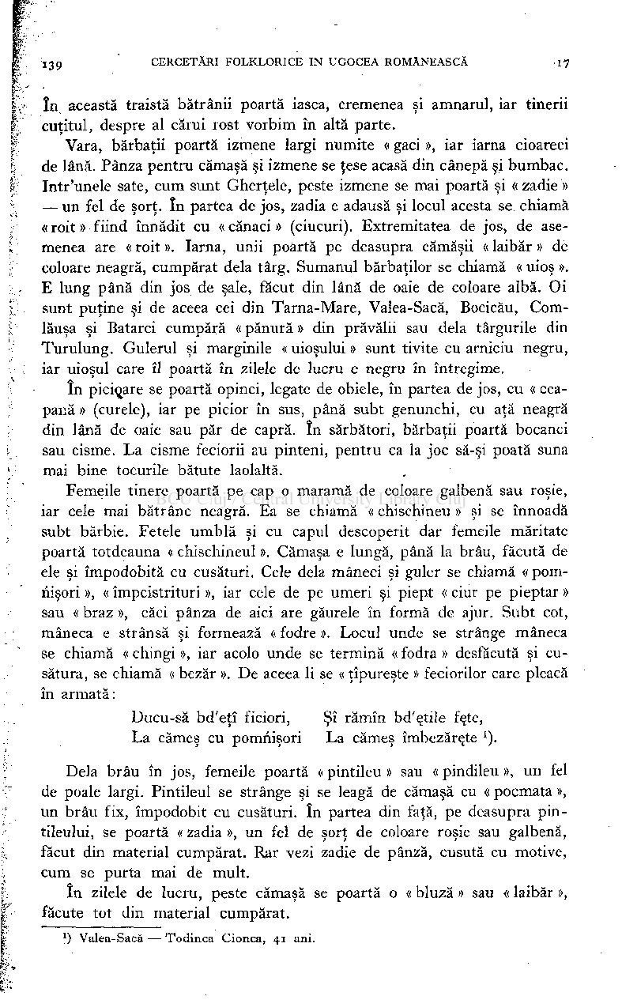

în această traistă bătrânii poartă iasca, cremenea şi amnarul, iar tinerii cuţitul, despre al cărui rost vorbim în altă parte.

Vara, bărbaţii poartă izmene largi numite « gaci », iar iarna cioareci de lână. Pânza pentru cămaşă şi izmene se ţese acasă din cânepă şi bumbac. Intr'unele sate, cum sunt Gherţele, peste izmene se mai poartă şi « zadie » — un fel de şorţ. în partea de jos, zadia e adausă şi locul acesta se chiamă « roit » fiind înnădit cu « cănaci » (ciucuri). Extremitatea de jos, de asemenea are « roit ». Iarna, unii poartă pe deasupra cămăşii « laibăr » de coloare neagră, cumpărat delà târg. Sumanul bărbaţilor se chiamă « uioş ». E lung până din jos de şale, făcut din lână de oaie de coloare albă. Oi sunt puţine şi de aceea cei din Tarna-Mare, Valea-Sacă, Bocicău, Comlăuşa şi Batarci cumpără « pănură » din prăvălii sau delà târgurile din Turulung. Gulerul şi marginile « uioşului » sunt tivite cu arniciu negru, iar uioşul care îl poartă în zilele de lucru e negru în întregime.

în picioare se poartă opinci, legate de obiele, în partea de jos, cu « ceapană » (curele), iar pe picior în sus, până subt genunchi, cu aţă neagră din lână de oaie sau păr de capră. în sărbători, bărbaţii poartă bocanci sau cisme. La cisme feciorii au pinteni, pentru ca la joc să-şi poată suna mai bine tocurile bătute laolaltă.

Femeile tinere poartă pe cap o maramă de coloare galbenă sau roşie, iar cele mai bătrâne neagră. Ea se chiamă « chischineu » şi se înnoadă subt bărbie. Fetele umblă şi cu capul descoperit dar femeile măritate poartă totdeauna « chischineul ». Cămaşa e lungă, până la brâu, făcută de ele şi împodobită cu cusături. Cele delà mâneci şi guler se chiamă « pomriişori », « împcistrituri », iar cele de pe umeri şi piept « ciur pe pieptar » sau « braz », căci pânza de aici are găurele în formă de ajur. Subt cot, mâneca e strânsă şi formează « fodre ». Locul unde se strânge mâneca se chiamă « chingi », iar acolo unde se termină « fodra » desfăcută şi cusătura, se chiamă « bezăr ». De aceea li se « ţîpureşte » feciorilor care pleacă în armată:

Ducu-să bd'eţî ficiori, Şî rămîn bd'çtile fçte, La cămeş cu pomnişori La cămeş îmbezărcte ).

Delà brâu în jos, femeile poartă « pintileu » sau « pindileu », un fel de poale largi. Pintileul se strânge şi se leagă de cămaşă cu « pocmata », un brâu fix, împodobit cu cusături. în partea din faţă, pe deasupra pintileului, se poartă « zadia », un fel de şorţ de coloare roşie sau galbenă, făcut din material cumpărat. Rar vezi zadie de pânză, cusută cu motive, cum se purta mai de mult.

în zilele de lucru, peste cămaşă se poartă o « bluză » sau « laibăr »,

- făcute tot din material cumpărat.

###### *) Valea-Sacă — Todinca Cionca, 41 ani.

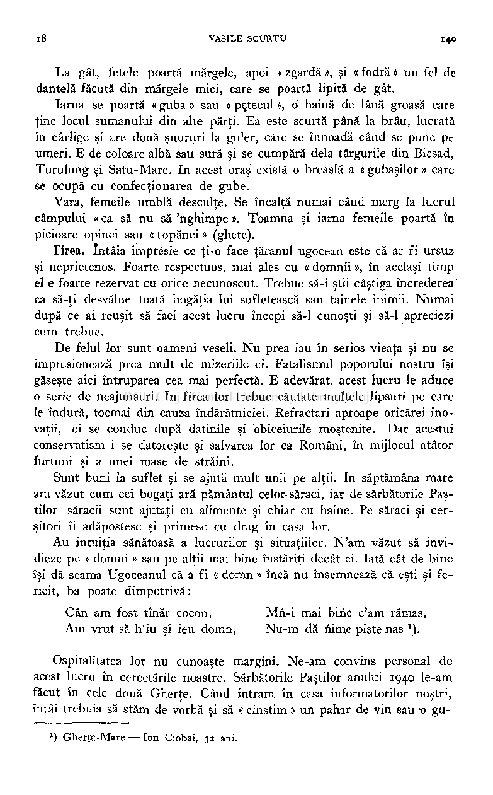

La gât, fetele poartă mărgele, apoi « zgardă », şi « fodră » un fel de dantelă făcută din mărgele mici, care se poartă lipită de gât.

Iarna se poartă « guba » sau « petecul », o haină de lână groasă care ţine locul sumanului din alte părţi. Ea este scurtă până la brâu, lucrată în cârlige şi are două şnururi la guler, care se înnoadă când se pune pe umeri. E de coloare albă sau sură şi se cumpără delà târgurile din Bicsad, Turulung şi Satu-Mare. In acest oraş există o breaslă a «gubaşilor » care se ocupă cu confecţionarea de gube.

Vara, femeile umblă desculţe. Se încalţă numai când merg la lucrul câmpului « ca să nu să 'nghimpe ». Toamna şi iarna femeile poartă în picioare opinci sau « topănci » (ghete).

Firea. întâia impresie ce ţi-o face ţăranul ugocean este că ar fi ursuz şi neprietenos. Foarte respectuos, mai ales cu « domnii », în acelaşi timp el e foarte rezervat cu orice necunoscut. Trebue să-i ştii câştiga încrederea ca să-ţi desvălue toată bogăţia lui sufletească sau tainele inimii. Numai după ce ai reuşit să faci acest lucru începi să-1 cunoşti şi să-1 apreciezi cum trebue.

De felul lor sunt oameni veseli. Nu prea iau în serios vieaţa şi nu se impresionează prea mult de mizeriile ei. Fatalismul poporului nostru îşi

- găseşte aici întruparea cea mai perfectă. E adevărat, acest lucru le aduce o serie de neajunsuri. In firea lor trebue căutate multele lipsuri pe care le îndură, tocmai din cauza îndărătniciei. Refractari aproape oricărei inovaţii, ei se conduc după datinile şi obiceiurile moştenite. Dar acestui conservatism i se datoreşte şi salvarea lor ca Români, în mijlocul atâtor furtuni şi a unei mase de străini.

Sunt buni la suflet şi se ajută mult unii pe alţii. In săptămâna mare am văzut cum cei bogaţi ară pământul celor-săraci, iar de sărbătorile Paştilor săracii sunt ajutaţi cu alimente şi chiar cu haine. Pe săraci şi cerşitori îi adăpostesc şi primesc cu drag în casa lor.

Au intuiţia sănătoasă a lucrurilor şi situaţiilor. N'am văzut să invidieze pe « domni » sau pe alţii mai bine înstăriţi decât ei. Iată cât de bine îşi dă seama Ugoceanul că a fi « domn » încă nu însemnează că eşti şi fericit, ba poate dimpotrivă:

Cân am fost tînăr cocon, Mn-i mai bine c'am rămas, Am vrut să h'iu şî ieu domn, Nu-m dă nime piste nas ).

Ospitalitatea lor nu cunoaşte margini. Ne-am convins personal de acest lucru în cercetările noastre. Sărbătorile Paştilor anului 1940 le-am făcut în cele două Gherţe. Când intram în casa informatorilor noştri, întâi trebuia să stăm de vorbă şi să « cinstim » un pahar de vin sau -o gu-

- *) Gherţa-Mare — Ion Ciobai, 32 ani.

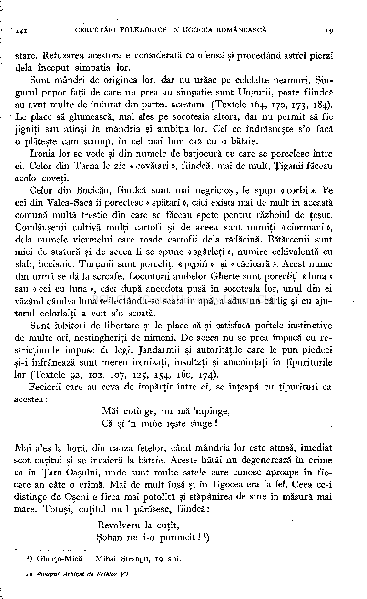

stare. Refuzarea acestora e considerată ca ofensă şi procedând astfel pierzi delà început simpatia lor.

Sunt mândri de originea lor, dar nu urăsc pe celelalte neamuri. Singurul popor faţă de care nu prea au simpatie sunt Ungurii, poate fiindcă au avut multe de îndurat din partea acestora (Textele 164, 170, 173, 184). Le place să glumească, mai ales pe socoteala altora, dar nu permit să fie jigniţi sau atinşi în mândria şi ambiţia lor. Cel ce îndrăsneşte s'o facă o plăteşte cam scump, în cel mai bun caz cu o bătaie.

Ironia lor se vede şi din numele de batjocură cu care se poreclesc între ei. Celor din Târna le zic « covătari », fiindcă, mai de mult, Ţiganii făceau acolo coveţi.

Celor din Bocicău, fiindcă sunt mai negricioşi, le spun « corbi ». Pe cei din Valea-Sacă îi poreclesc « spătari », căci exista mai de mult în această comună multă trestie din care se făceau spete pentru războiul de ţesut. Comlăuşenii cultivă mulţi cartofi şi de aceea sunt numiţi « ciormani », delà numele viermelui care roade cartofii delà rădăcină. Bătărcenii sunt mici de statură şi de aceea li se spune « sgârleţi », numire echivalentă cu slab, becisnic. Turţanii sunt porecliţi « pçpih » şi « căcioară ». Acest nume din urmă se dă la scroafe. Locuitorii ambelor Gherţe sunt porecliţi « luna » sau « cei cu luna », căci după anecdota pusă în socoteala lor, unul din ei văzând cândva luna reflectându-se seara în apă, a adus un cârlig şi cu ajutorul celorlalţi a voit s'o scoată.

Sunt iubitori de libertate şi le place să-şi satisfacă poftele instinctive de multe ori, nestingheriţi de nimeni. De aceea nu se prea împacă cu restricţiunile impuse de legi. Jandarmii şi autorităţile care le pun piedeci şi-i înfrânează sunt mereu ironizaţi, insultaţi şi ameninţaţi în ţîpuriturile lor (Textele 92, 102, 107, 125, 154, 160, 174).

Feciorii care au ceva de împărţit între ei, se înţeapă cu ţîpurituri ca acestea :

Măi cotînge, nu mă 'mpinge, Că şî 'n mine içste sînge !

Mai ales la horă, din cauza fetelor, când mândria lor este atinsă, imediat scot cuţitul şi se încaieră la bătaie. Aceste bătăi nu degenerează în crime ca în Ţara Oaşului, unde sunt multe satele care cunosc aproape în fiecare an câte o crimă. Mai de mult însă şi în Ugocea era la fel. Ceea ce-i distinge de Oşeni e firea mai potolită şi stăpânirea de sine în măsură mai mare. Totuşi, cuţitul nu-1 părăsesc, fiindcă:

Revolvern la cuţît, Şohan nu i-o poroncit !*)

###### *) Gherţa-Mică — Mihai Strangu, 19 ani. 10 Anuarul Arhivei de Folklor VI

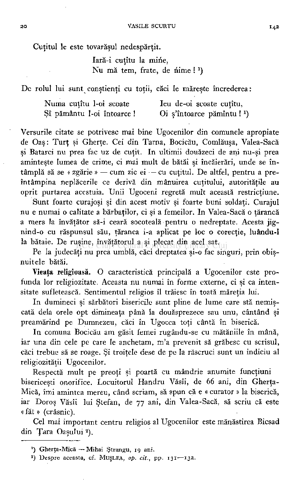

Cuţitul le este tovarăşul nedespărţit.

Iară-i cuţîtu la mine, Nu mă tem, frate, de nime !

) De rolul lui sunt conştienţi cu toţii, căci le măreşte încrederea:

x

Numa cuţîtu l-oi scoate Şî pământu l-oi întoarce !

Ieu de-oi scoate cuţîtu, Oi ş'întoarce pămîntu !

)

x

Versurile citate se potrivesc mai bine Ugocenilor din comunele apropiate de Oaş: Turţ şi Gherţe. Cei din Târna, Bocicău, Comlăuşa, Valea-Sacă şi Batarci nu prea fac uz de cuţit. In ultimii douăzeci de ani nu-şi prea aminteşte lumea de crime, ci mai mult de bătăi şi încăierări, unde se întâmplă să se « zgârie » — cum zic ei — cu cuţitul. De altfel, pentru a preîntâmpina neplăcerile ce derivă din mânuirea cuţitului, autorităţile au oprit purtarea acestuia. Unii Ugoceni regretă mult această restricţiune.

Sunt foarte curajoşi şi din acest motiv şi foarte buni soldaţi. Curajul nu e numai o calitate a bărbaţilor, ci şi a femeilor. In Valea-Sacă o ţărancă a mers la învăţător să-i ceară socoteală pentru o nedreptate. Acesta jignind-o cu răspunsul său, ţăranca i-a aplicat pe loc o corecţie, luându-1 la bătaie. De ruşine, învăţătorul a şi plecat din acel sat.

Pe la judecăţi nu prea umblă, căci dreptatea şi-o fac singuri, prin obişnuitele bătăi.

Vieaţa religioasă. O caracteristică principală a Ugocenilor este profunda lor religiozitate. Aceasta nu numai în forme externe, ci şi ca intensitate sufletească. Sentimentul religios îl trăiesc în toată măreţia lui.

In dumineci şi sărbători bisericile sunt pline de lume care stă nemişcată delà orele opt dimineaţa până la douăsprezece sau unu, cântând şi preamărind pe Dumnezeu, căci în Ugocea toţi cântă în biserică.

In comuna Bocicău am găsit femei rugându-se cu mătăniile în mână, iar una din cele pe care le anchetam, m'a prevenit să grăbesc cu scrisul, căci trebue să se roage. Şi troiţele dese de pe la răscruci sunt un indiciu al religiozităţii Ugocenilor.

Respectă mult pe preoţi şi poartă cu mândrie anumite funcţiuni

bisericeşti onorifice. Locuitorul Handru Văsîi, de 66 ani, din GherţaMică, îmi amintea mereu, când scriam, să spun că e « curator » la biserică, iar Doroş Văsîi lui Ştefan, de 77 ani, din Valea-Sacă, să scriu că este « făt » (crâsnic).

Cel mai important centru religios al Ugocenilor este mănăstirea Bicsad din Ţara Oaşului

).

2

') Gherţa-Mică—Mihai Ştrangu, 19 ani.

) Despre aceasta, cf. MUŞLEA, op. cit., pp. 131—132.

2

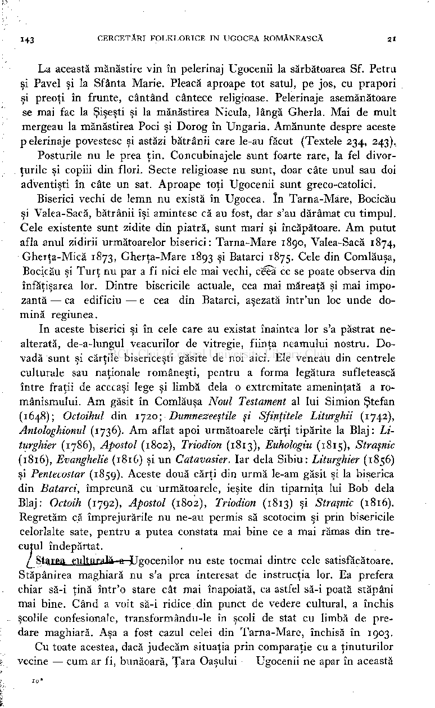

La această mănăstire vin în pelerinaj Ugocenii la sărbătoarea Sf. Petru şi Pavel şi la Sfânta Marie. Pleacă aproape tot satul, pe jos, cu prapori şi preoţi în frunte, cântând cântece religioase. Pelerinaje asemănătoare se mai fac la Şişeşti şi la mănăstirea Nicula, lângă Gherla. Mai de mult mergeau la mănăstirea Poci şi Dorog în Ungaria. Amănunte despre aceste pelerinaje povestesc şi astăzi bătrânii care le-au făcut (Textele 234, 243).

Posturile nu le prea ţin. Concubinajele sunt foarte rare, la fel divorţurile şi copiii din flori. Secte religioase nu sunt, doar câte unul sau doi adventişti în câte un sat. Aproape toţi Ugocenii sunt greco-catolici.

Biserici vechi de lemn nu există în Ugocea. în Tarna-Mare, Bocicău şi Valea-Sacă, bătrânii îşi amintesc că au fost, dar s'au dărâmat cu timpul. Cele existente sunt zidite din piatră, sunt mari şi încăpătoare. Am putut afla anul zidirii următoarelor biserici: Tarna-Mare 1890, Valea-Sacă 1874, Gherţa-Mică 1873, Gherţa-Mare 1893 şi Batarci 1875. Cele din Comlăuşa, Bocicău şi Turţ nu par a fi nici ele mai vechi, cê^èà ce se poate observa din înfăţişarea lor. Dintre bisericile actuale, cea mai măreaţă şi mai impozantă — ca edificiu — e cea din Batarci, aşezată într'un loc unde domină regiunea.

In aceste biserici şi în cele care au existat înaintea lor s'a păstrat nealterată, de-a-lungul veacurilor de vitregie, fiinţa neamului nostru. Dovadă sunt şi cărţile bisericeşti găsite de noi aici. Ele veneau din centrele culturale sau naţionale româneşti, pentru a forma legătura sufletească între fraţii de aceeaşi lege şi limbă delà o extremitate ameninţată a românismului. Am găsit în Comlăuşa Noul Testament al lui Simion Ştefan (1648); Octoihul din 1720; Dumnezeeştile şi Sfinţitele Liturghii (1742), Antologhionul (1736). Am aflat apoi următoarele cărţi tipărite la Blaj : Liturghier (1786), Apostol (1802), Triodion (1813), Euhologiu (1815), Straşnic (1816), Evanghelie (1816) şi un Catavasier. Iar delà Sibiu: Liturghier (1856) şi Pentecostar (1859). Aceste două cărţi din urmă le-am găsit şi la biserica din Batarci, împreună cu următoarele, ieşite din tiparniţa lui Bob delà Blaj: Octoih (1792), Apostol (1802), Triodion (1813) şi Straşnic (1816). Regretăm că împrejurările nu ne-au permis să scotocim şi prin bisericile celorlalte sate, pentru a putea constata mai bine ce a mai rămas din trecutul îndepărtat.

£ Sfarpa cii|ţiiraIă^«-4Tpnrpnilnr nu este tocmai dintre cele satisfăcătoare. Stăpânirea maghiară nu s'a prea interesat de instrucţia lor. Ea prefera chiar să-i ţină într'o stare cât mai înapoiată, ca astfel să-i poată stăpâni mai bine. Când a voit să-i ridice din punct de vedere cultural, a închis şcolile confesionale, transformându-le în şcoli de stat cu limbă de predare maghiară. Aşa a fost cazul celei din Tarna-Mare, închisă în 1903.

Cu toate acestea, dacă judecăm situaţia prin comparaţie cu a ţinuturilor vecine — cum ar fi, bunăoară, Ţara Oaşului — Ugocenii ne apar în această

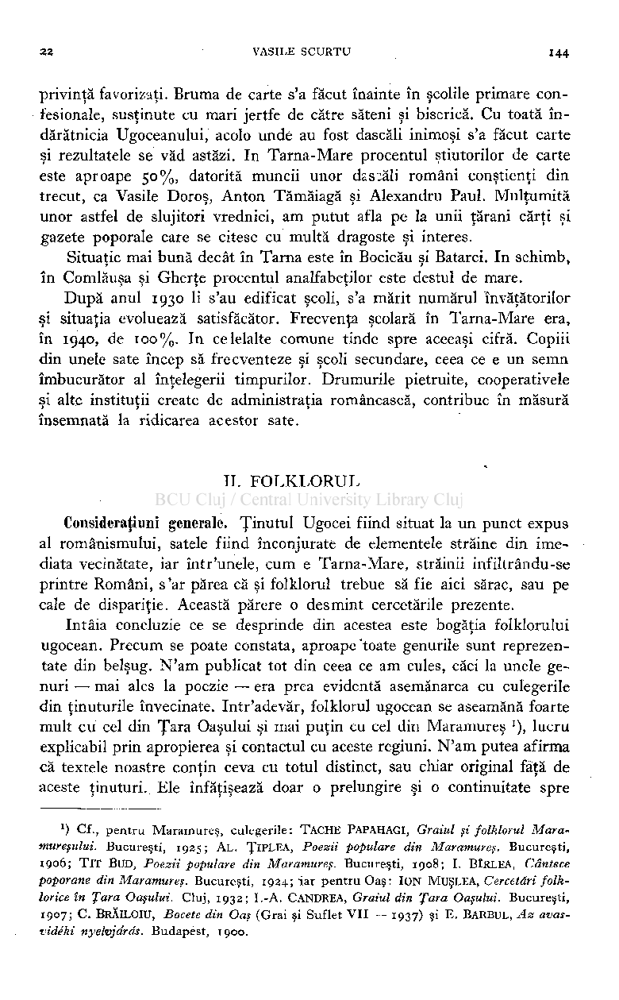

privinţă favorizaţi. Bruma de carte s'a făcut înainte în şcolile primare confesionale, susţinute cu mari jertfe de către săteni şi biserică. Cu toată îndărătnicia Ugoceanului, acolo unde au fost dascăli inimoşi s'a făcut carte şi rezultatele se văd astăzi. In Tarna-Mare procentul ştiutorilor de carte este aproape 50%, datorită muncii unor dss;ăli români conştienţi din trecut, ca Vasile Doroş, Anton Tămăiagă şi Alexandru Paul. Mulţumită unor astfel de slujitori vrednici, am putut afla pe la unii ţărani cărţi şi gazete poporale care se citesc cu multă dragoste şi interes.

Situaţie mai bună decât în Târna este în Bocicău şi Batarci. In schimb, în Comlăuşa şi Gherţe procentul analfabeţilor este destul de mare.

După anul 1930 li s'au edificat şcoli, s'a mărit numărul învăţătorilor şi situaţia evoluează satisfăcător. Frecvenţa şcolară în Tarna-Mare era, în 1940, de 100%. In celelalte comune tinde spre aceeaşi cifră. Copiii din unele sate încep să frecventeze şi şcoli secundare, ceea ce e un semn îmbucurător al înţelegerii timpurilor. Drumurile pietruite, cooperativele şi alte instituţii create de administraţia românească, contribue în măsură însemnată la ridicarea acestor sate.

II. FOLKLORUL

Consideraţiuni generale. Ţinutul Ugocei fiind situat la un punct expus al românismului, satele fiind înconjurate de elementele străine din imediata vecinătate, iar într'unele, cum e Tarna-Mare, străinii infiltrându-se printre Români, s'ar părea că şi folklorul trebue să fie aici sărac, sau pe cale de dispariţie. Această părere o desmint cercetările prezente.

întâia concluzie ce se desprinde din acestea este bogăţia folklorului ugocean. Precum se poate constata, aproape'toate genurile sunt reprezentate din belşug. N'am publicat tot din ceea ce am cules, căci la unele genuri — mai ales la poezie — era prea evidentă asemănarea cu culegerile din ţinuturile învecinate. Intr'adevăr, folklorul ugocean se aseamănă foarte mult cu cel din Ţara Oaşului şi mai puţin cu cel din Maramureş ), lucru explicabil prin apropierea şi contactul cu aceste regiuni. N'am putea afirma că textele noastre conţin ceva cu totul distinct, sau chiar original faţă de aceste ţinuturi. Ele înfăţişează doar o prelungire şi o continuitate spre

) Cf., pentru Maramureş, culegerile: TACHE PAPAHAGI, Graiul şi folklorul Maramureşului. Bucureşti, 1925; AL . ŢlPLEA, Poezii populare din Maramureş. Bucureşti,

x

- 1906; Tl T BUD, Poezii populare din Maramureş. Bucureşti, 1908; I. BÎRLEA, Cântece poporane din Maramureş. Bucureşti, 1924; iar pentru Oaş: ION MUŞLEA, Cercetări folklorice în Ţara Oaşului. Cluj, 1932; I.-A. CANDREA, Graiul din Ţara Oaşului. Bucureşti,
- 1907; C. BRĂILOIU, Bocete din Oaş (Grai şi Suflet VI I — 1937) şi E. BARBTJL, AZ avasvidéki nyelvjdrds. Budapest, 1900.

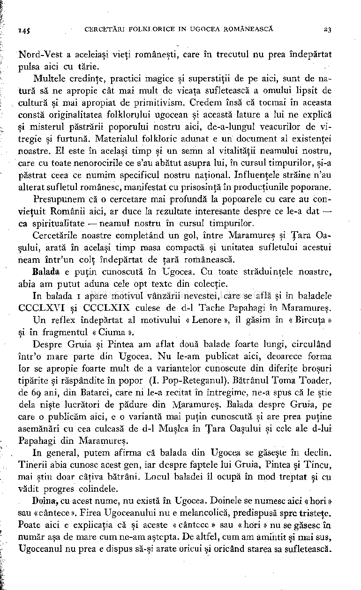

Nord-Vest a aceleiaşi vieţi româneşti, care în trecutul nu prea îndepărtat pulsa aici cu tărie.

Multele credinţe, practici magice şi superstiţii de pe aici, sunt de natură să ne apropie cât mai mult de vieaţa sufletească a omului lipsit de cultură şi mai apropiat de primitivism. Credem însă că tocmai în aceasta constă originalitatea folklorului ugocean şi această lăture a lui ne explică şi misterul păstrării poporului nostru aici, de-a-lungul veacurilor de vitregie şi furtună. Materialul folkloric adunat e un document al existenţei noastre. El este în acelaşi timp şi un semn al vitalităţii neamului nostru, care cu toate nenorocirile ce s'au abătut asupra lui, în cursul timpurilor, şi-a păstrat ceea ce numim specificul nostru naţional. Influenţele străine n'au alterat sufletul românesc, manifestat cu prisosinţă în producţiunile poporane.

Presupunem că o cercetare mai profundă la popoarele cu care au convieţuit Românii aici, ar duce la rezultate interesante despre ce le-a dat ca spiritualitate — neamul nostru în cursul timpurilor.

Cercetările noastre completând un gol, între Maramureş şi Tara Oaşului, arată în acelaşi timp masa compactă şi unitatea sufletului acestui neam într'un colţ îndepărtat de ţară românească.

Balada e puţin cunoscută în Ugocea. Cu toate străduinţele noastre, abia am putut aduna cele opt texte din colecţie.

In balada i apare motivul vânzării nevestei, care se află şi în baladele CCCLXVI şi CCCLXIX culese de d-1 Tache Papahagi în Maramureş.

Un reflex îndepărtat al motivului « Lenore », îl găsim în « Bircuţa » şi în fragmentul « Ciuma ».

Despre Gruia şi Pintea am aflat două balade foarte lungi, circulând într'o mare parte din Ugocea. Nu le-am publicat aici, deoarece forma lor se apropie foarte mult de a variantelor cunoscute din diferite broşuri tipărite şi răspândite în popor (I. Pop-Reteganul). Bătrânul Torna Toader, de 69 ani, din Batarci, care ni le-a recitat în întregime, ne-a spus că le ştie delà nişte lucrători de pădure din Maramureş. Balada despre Gruia, pe care o publicăm aici, e o variantă mai puţin cunoscută şi are prea puţine asemănări cu cea culeasă de d-1 Muşlea în Ţara Oaşului şi cele ale d-lui Papahagi din Maramureş.

In general, putem afirma că balada din Ugocea se găseşte în declin. Tinerii abia cunosc acest gen, iar despre faptele lui Gruia, Pintea şi Tincu, mai ştiu doar câţiva bătrâni. Locul baladei îl ocupă în mod treptat şi cu vădit progres colindele.

Doina, cu acest nume, nu există în Ugocea. Doinele se numesc aici « hori » sau «cântece». Firea Ugoceanului nu e melancolică, predispusă spre tristeţe. Poate aici e explicaţia că şi aceste « cântece » sau « hori » nu se găsesc în număr aşa de mare cum ne-am aştepta. De altfel, cum am amintit şi mai sus, Ugoceanul nu prea e dispus să-şi arate oricui şi oricând starea sa sufletească.

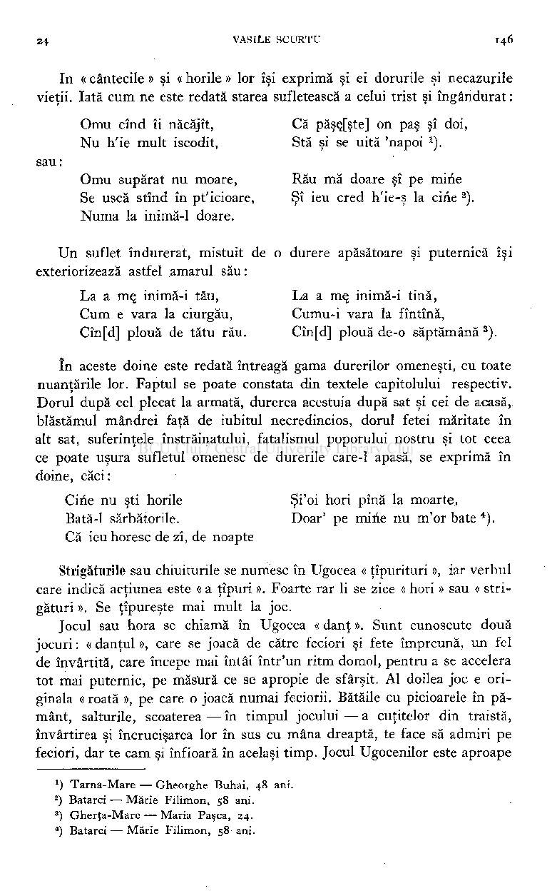

In « cântecile » şi « horile » lor îşi exprimă şi ei dorurile şi necazurile vieţii. Iată cum ne este redată starea sufletească a celui trist şi îngândurat :

Omu cînd îi năcăjit, Că păşcfşte] on paş şî doi, Nu h'ie mult iscodit, Stă şi se uită 'napoi

sau :

Omu supărat nu moare, Rău mă doare şî pe mine Se uscă stînd în pt'icioare, Şî ieu cred h'ie-ş la cine ). Numa la inimă-1 doare.

Un suflet îndurerat, mistuit de o durere apăsătoare şi puternică îşi exteriorizează astfel amarul său:

La a mç inimă-i tău, La a mç inimă-i tină, Cum e vara la ciurgău, Cumu-i vara la fîntînă, Cîn[d] plouă de tătu rău. Cîn[d] plouă de-o săptămână ).

în aceste doine este redată întreagă gama durerilor omeneşti, cu toate nuanţările lor. Faptul se poate constata din textele capitolului respectiv. Dorul după cel plecat la armată, durerea acestuia după sat şi cei de acasă, blăstămul mândrei faţă de iubitul necredincios, dorul fetei măritate în alt sat, suferinţele înstrăinatului, fatalismul poporului nostru şi tot ceea ce poate uşura sufletul omenesc de durerile care-1 apasă, se exprimă în doine, căci:

Cine nu şti horile Şi'oi hori pînă la moarte, Bată-1 sărbătorile. Doar' pe mine nu m'or bate

). Că ieu horesc de zî, de noapte

4

Strigăturile sau chiuiturile se numesc în Ugocea « ţîpurituri », iar verbul care indică acţiunea este « a ţîpuri ». Foarte rar li se zice « hori » sau « strigături ». Se ţîpureşte mai mult la joc.

Jocul sau hora se chiamă în Ugocea « danţ ». Sunt cunoscute două jocuri : « danţul », care se joacă de către feciori şi fete împreună, un fel de învârtită, care începe mai întâi într'un ritm domol, pentru a se accelera tot mai puternic, pe măsură ce se apropie de sfârşit. Al doilea joc e originala « roată », pe care o joacă numai feciorii. Bătăile cu picioarele în pământ, salturile, scoaterea — în timpul jocului — a cuţitelor din traistă, învârtirea şi încrucişarea lor în sus cu mâna dreaptă, te face să admiri pe feciori, dar te cam şi înfioară în acelaşi timp. Jocul Ugocenilor este aproape

- 1

) Tarna-Mare — Gheorghe Buhai, 48 ani.

- 2

) Batarci — Mărie Filimon, 58 ani.

- 3

) Gherţa-Mare — Maria Pasca, 24.

- 4

###### ) Batarci — Mărie Filimon, 58 ani.

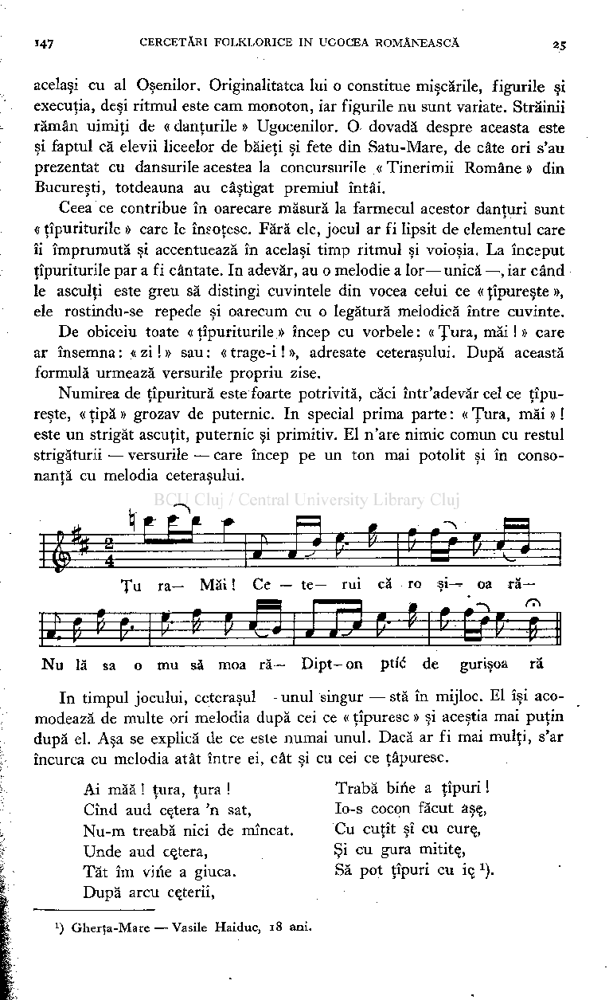

acelaşi cu al Oşenilor. Originalitatea lui o constitue mişcările, figurile şi execuţia, deşi ritmul este cam monoton, iar figurile nu sunt variate. Străinii rămân uimiţi de « danturile » Ugocenilor. O dovadă despre aceasta este şi faptul că elevii liceelor de băieţi şi fete din Satü-Mare, de câte ori s'au prezentat cu dansurile acestea la concursurile « Tinerimii Române » din Bucureşti, totdeauna au câştigat premiul întâi.

Ceea ce contribue în oarecare măsură la farmecul acestor danturi sunt « ţîpuriturile » care le însoţesc. Fără ele, jocul ar fi lipsit de elementul care îi împrumută şi accentuează în acelaşi timp ritmul şi voioşia. La început ţîpuriturile par a fi cântate. In adevăr, au o melodie a lor—unică —•, iar când le asculţi este greu să distingi cuvintele din vocea celui ce « ţîpureşte », ele rostindu-se repede şi oarecum cu o legătură melodică între cuvinte.

De obiceiu toate «ţîpuriturile» încep cu vorbele: «Ţura, măi!» care ar însemna: «zi!» sau: «trage-i!», adresate ceteraşului. După această formulă urmează versurile propriu zise.

Numirea de ţîpuritură este foarte potrivită, căci într'adevăr cel ce ţîpureşte, « ţipă » grozav de puternic. In special prima parte : « Ţura, măi » ! este un strigăt ascuţit, puternic şi primitiv. El n'are nimic comun cu restul strigăturii — versurile — care încep pe un ton mai potolit şi în consonantă cu melodia ceteraşului.

Ţu ra— Măi ! Ce — te— rui că ro şi— oa ră-

###### W—0-

Nu lă sa o mu să moa ră— Dipt-on ptic de gurişoa ră

In timpul jocului, ceteraşul — unul singur — stă în mijloc. El îşi acomodează de multe ori melodia după cei ce « ţîpuresc » şi aceştia mai puţin după el. Aşa se explică de ce este numai unul. Dacă ar fi mai mulţi, s'ar încurca cu melodia atât între ei, cât şi cu cei ce ţâpuresc.

Trabă bine a ţîpuri ! Io-s cocon făcut aşc, Cu cuţît şî cu curç, Şi cu gura mititç, Să pot ţîpuri cu iç ).

Ai măă ! ţura, ţura ! Cînd aud cetera 'n sat, Nu-m treabă nici de mîncat. Unde aud cetera, Tăt îm vine a giuca. După arcu ceterii,

###### ) Gherţa-Mare — Vasile Haiduc, 18 ani.

x

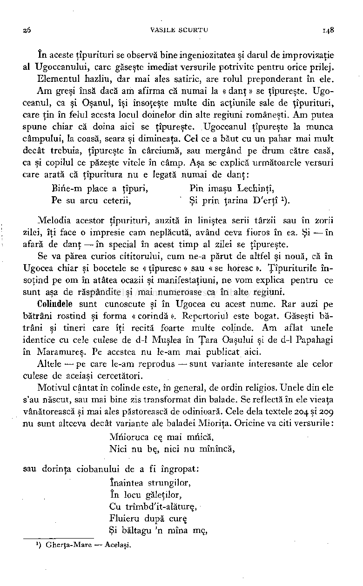

în aceste ţîpurituri se observă bine ingeniozitatea şi darul de improvizaţie

al Ugoceanului, care găseşte imediat versurile potrivite pentru orice prilej. Elementul hazliu, dar mai ales satiric, are rolul prépondérant în ele. Am greşi însă dacă am afirma că numai la « danţ » se ţîpureşte. Ugo-

ceanul, ca şi Oşanul, îşi însoţeşte multe din acţiunile sale de ţîpurituri, care ţin în felul acesta locul doinelor din alte regiuni româneşti. Am putea spune chiar că doina aici se ţîpureşte. Ugoceanul ţîpureşte la munca câmpului, la coasă, seara şi dimineaţa. Cel ce a băut cu un pahar mai mult decât trebuia, ţîpureşte în cârciumă, sau mergând pe drum către casă, ca şi copilul ce păzeşte vitele în câmp. Aşa se explică următoarele versuri care arată că ţîpuritura nu e legată numai de danţ:

Bine-m place a ţîpuri, Pin imaşu Lechinţî, Pe su arcu ceterii, Şi prin ţarina D'erţî

).

1

Melodia acestor ţîpurituri, auzită în liniştea serii târzii sau în zorii zilei, îţi face o impresie cam neplăcută, având ceva fioros în ea. Şi — în afară de danţ — în special în acest timp al zilei se ţîpureşte.

Se va părea curios cititorului, cum ne-a părut de altfel şi nouă, că în Ugocea chiar şi bocetele se « ţîpuresc » sau « se horesc ». Ţîpuriturile însoţind pe om în atâtea ocazii şi manifestaţiuni, ne vom explica pentru ce sunt aşa de răspândite şi mai numeroase ca în alte regiuni.

Colindele sunt cunoscute şi în Ugocea cu acest nume. Rar auzi pe

- bătrâni rostind şi forma « corindă ». Repertoriul este bogat. Găseşti bătrâni si tineri care îti recită foarte multe colinde. Am aflat unele identice cu cele culese de d-l Muşlea în Ţara Oaşului şi de d-l Papahagi în Maramureş. Pe acestea nu le-am mai publicat aici.

Altele — pe care le-am reprodus — sunt variante interesante ale celor culese de aceiaşi cercetători.

Motivul cântat în colinde este, în general, de ordin religios. Unele din ele

s'au născut, sau mai bine zis transformat din balade. Se reflectă în ele vieaţa vânătorească şi mai ales păstorească de odinioară. Cele delà textele 204 şi 209 nu sunt altceva decât variante ale baladei Mioriţa. Oricine va citi versurile :

Mfîioruca cç mai mfiică, Nici nu bç, nici nu mînîncă,

sau dorinţa ciobanului de a fi îngropat: înaintea strungilor, în locu găleţilor, Cu trîmbd'it-alăturc, Fluieru după cure. Şi băltagu 'n mîna mç,

*) Gherţa-Mare — Acelaşi.

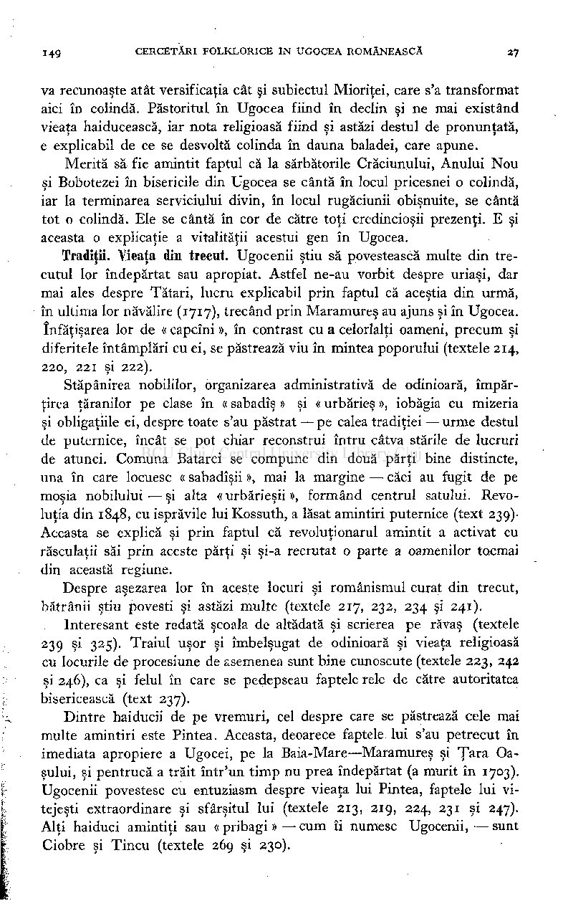

va recunoaşte atât versificaţia cât şi subiectul Mioriţei, care s'a transformat aici în colindă. Păstoritul în Ugocea fiind în declin şi ne mai existând vieaţa haiducească, iar nota religioasă fiind şi astăzi destul de pronunţată, e explicabil de ce se desvoltă colinda în dauna baladei, care apune.

Merită să fie amintit faptul că la sărbătorile Crăciunului, Anului Nou şi Bobotezei în bisericile din Ugocea se cântă în locul pricesnei o colindă, iar la terminarea serviciului divin, în locul rugăciunii obişnuite, se cântă tot o colindă. Ele se cântă în cor de către toţi credincioşii prezenţi. E şi aceasta o explicaţie a vitalităţii acestui gen în Ugocea.

Tradiţii. Yieaţa din trecut. Ugocenii ştiu să povestească multe din trecutul lor îndepărtat sau apropiat. Astfel ne-au vorbit despre uriaşi, dar mai ales despre Tătari, lucru explicabil prin faptul că aceştia din urmă, în ultima lor năvălire (1717), trecând prin Maramureş au ajuns şi în Ugocea.

înfăţişarea lor de « capcîni », în contrast cu a celorlalţi oameni, precum şi diferitele întâmplări cu ei, se păstrează viu în mintea poporului (textele 214, 220, 221 şi 222).

Stăpânirea nobililor, organizarea administrativă de odinioară, împărţirea ţăranilor pe clase în « sabadîş » şi « urbărieş », iobăgia cu mizeria şi obligaţiile ei, despre toate s'au păstrat — pe calea tradiţiei —urme destul de puternice, încât se pot chiar reconstrui întru câtva stările de lucruri de atunci. Comuna Batarci se compune din două părţi bine distincte, una în care locuesc « sabadîşii », mai la margine — căci au fugit de pe moşia nobilului •— şi alta « urbărieşii », formând centrul satului. Revoluţia din 1848, cu isprăvile lui Kossuth, a lăsat amintiri puternice (text 239)Aceasta se explică şi prin faptul că revoluţionarul amintit a activat cu răsculaţii săi prin aceste părţi şi şi-a recrutat o parte a oamenilor tocmai din această regiune.

Despre aşezarea lor în aceste locuri şi românismul curat din trecut,

- bătrânii ştiu povesti şi astăzi multe (textele 217, 232, 234 şi 241). Interesant este redată şcoala de altădată şi scrierea pe răvaş (textele

239 şi 325). Traiul uşor şi îmbelşugat de odinioară şi vieaţa religioasă cu locurile de procesiune de asemenea sunt bine cunoscute (textele 223, 242 şi 246), ca şi felul în care se pedepseau faptele rele de către autoritatea

bisericească (text 237).

Dintre haiducii de pe vremuri, cel despre care se păstrează cele mai multe amintiri este Pintea. Aceasta, deoarece faptele lui s'au petrecut în imediata apropiere a Ugocei, pe la Baia-Mare—Maramureş şi Ţara Oaşului, şi pentrucă a trăit într'un timp nu prea îndepărtat (a murit în 1703). Ugocenii povestesc cu entuziasm despre vieaţa lui Pintea, faptele lui vitejeşti extraordinare şi sfârşitul lui (textele 213, 219, 224, 231 şi 247). Alţi haiduci amintiţi sau « pribagi » — cum îi numesc Ugocenii,—sunt Ciobre şi Tincu (textele 269 şi 230).

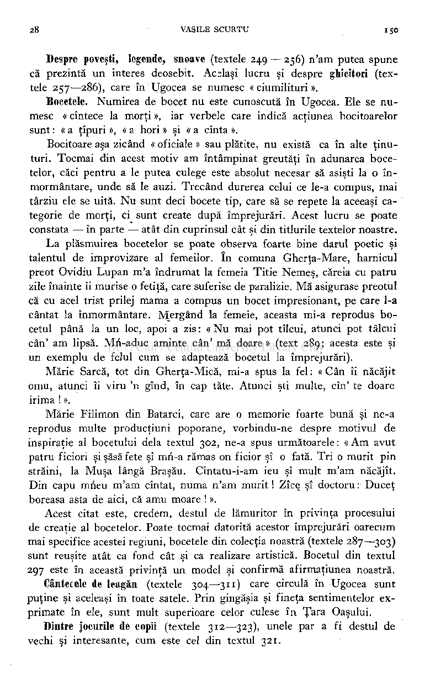

Despre poveşti, legende, snoave (textele 249 — 256) n'am putea spune

- că prezintă un interes deosebit. Acelaşi lucru şi despre ghicitori (textele 257—286), care în Ugocea se numesc « ciumilituri ».

Bocetele. Numirea de bocet nu este cunoscută în Ugocea. Ele se numesc « cîntece la morţi », iar verbele care indică acţiunea bocitoarelor sunt : « a ţîpuri », « a hori » şi « a cînta ».

Bocitoare aşa zicând « oficiale » sau plătite, nu există ca în alte ţinuturi. Tocmai din acest motiv am întâmpinat greutăţi în adunarea bocetelor, căci pentru a le putea culege este absolut necesar să asişti la o înmormântare, unde să le auzi. Trecând durerea celui ce le-a compus, mai târziu ele se uită. Nu sunt deci bocete tip, care să se repete la aceeaşi categorie de morţi, ci sunt create după împrejurări. Acest lucru se poate constata — în parte — atât din cuprinsul cât şi din titlurile textelor noastre.

La plăsmuirea bocetelor se poate observa foarte bine darul poetic şi talentul de improvizare al femeilor. în comuna Gherţa-Mare, harnicul preot Ovidiu Lupan m'a îndrumat la femeia Titie Nemeş, căreia cu patru zile înainte îi murise o fetiţă, care suferise de paralizie. Mă asigurase preotul

- că cu acel trist prilej mama a compus un bocet impresionant, pe care 1-a cântat la înmormântare. Mergând la femeie, aceasta mi-a reprodus bocetul până la un loc, apoi a zis : « Nu mai pot tîlcui, atunci pot tâlcui cân' am lipsă. Mh-aduc aminte cân' mă doare » (text 289; acesta este şi un exemplu de felul cum se adaptează bocetul la împrejurări).

Mărie Sarcă, tot din Gherţa-Mică, mi-a spus la fel : « Cân îi năcăjit omu, atunci îi viru 'n gînd, în cap täte. Atunci şti multe, cîn' te doare irima ! ».

Mărie Filimon din Batarci, care are o memorie foarte bună şi ne-a reprodus multe producţiuni poporane, vorbindu-ne despre motivul de inspiraţie al bocetului delà textul 302, ne-a spus următoarele : « Am avut patru ficiori şi şăsă fete şî mri-a rămas on ficior şî o fată. Tri o murit pin străini, la Muşa lângă Braşău. Cîntatu-i-am ieu şî mult m'am năcăjit. Din capu mrieu m'am cîntat, numa n'am murit ! Zîce. şî doctoru : Duceţ boreasa asta de aici, că amu moare ! ».

Acest citat este, credem, destul de lămuritor în privinţa procesului de creaţie al bocetelor. Poate tocmai datorită acestor împrejurări oarecum mai specifice acestei regiuni, bocetele din colecţia noastră (textele 287—303) sunt reuşite atât ca fond cât şi ca realizare artistică. Bocetul din textul 297 este în această privinţă un model şi confirmă afirmaţiunea noastră.

Cântecele de leagăn (textele 304—311) care circulă în Ugocea sunt puţine şi aceleaşi în toate satele. Prin gingăşia şi fineţa sentimentelor exprimate în ele, sunt mult superioare celor culese în Ţara Oaşului.

Dintre jocurile de copii (textele 312—323), unele par a fi destul de vechi şi interesante, cum este cel din textul 321.

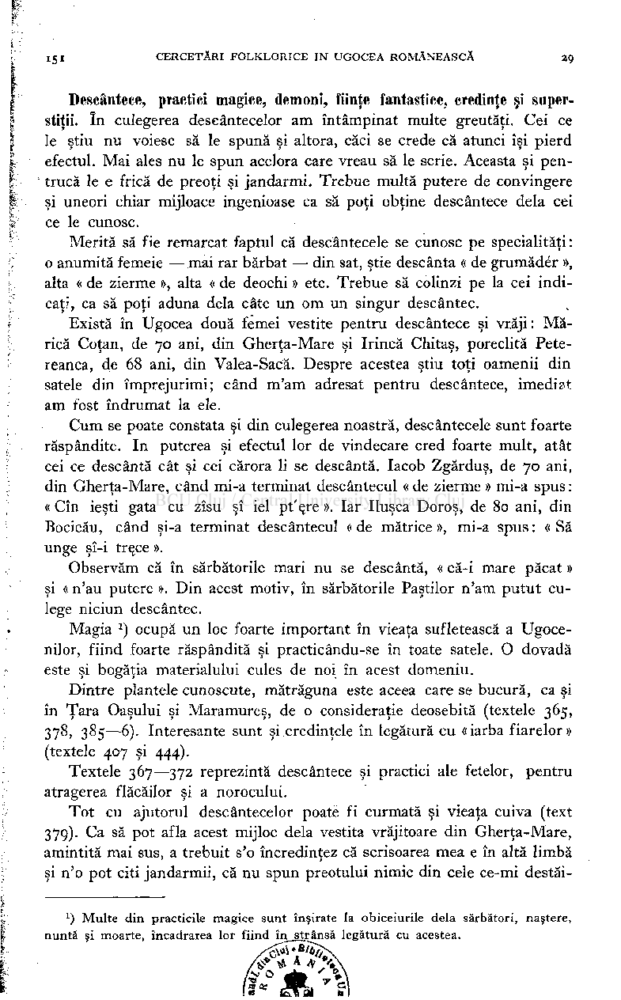

Descântece, practici magice, demoni, fiinţe fantastice, credinţe şi superstiţii, în culegerea descântecelor am întâmpinat multe greutăţi. Cei ce le ştiu nu voiesc să le spună şi altora, căci se crede că atunci îşi pierd efectul. Mai ales nu le spun acelora care vreau să le scrie. Aceasta şi pentrucă le e frică de preoţi şi jandarmi. Trebue multă putere de convingere şi uneori chiar mijloace ingenioase ca să poţi obţine descântece delà cei ce le cunosc.

Merită să fie remarcat faptul că descântecele se cunosc pe specialităţi: o anumită femeie — mai rar bărbat — din sat, ştie descânta « de grumăder », alta « de zierme », alta « de deochi » etc. Trebue să colinzi pe la cei indicaţi, ca să poţi aduna delà câte un om un singur descântec.

Există în Ugocea două femei vestite pentru descântece şi vrăji: Mărică Coţan, de 70 ani, din Gherţa-Mare şi Irincă Chitaş, poreclită Petereanca, de 68 ani, din Valea-Sacă. Despre acestea ştiu toţi oamenii din satele din împrejurimi; când m'am adresat pentru descântece, imediat am fost îndrumat la ele.

Cum se poate constata şi din culegerea noastră, descântecele sunt foarte

- răspândite. In puterea şi efectul lor de vindecare cred foarte mult, atât cei ce descântă cât şi cei cărora li se descântă. Iacob Zgărduş, de 70 ani, din Gherţa-Mare, când mi-a terminat descântecul « de zierme » mi-a spus : « Cîn ieşti gata cu zîsu şî iei pt'çre ». Iar Iluşca Doroş, de 80 ani, din Bocicău, când şi-a terminat descântecul «de matrice», mi-a spus: «Să unge şî-i tre.ce ».

Observăm că în sărbătorile mari nu se descântă, « că-i mare păcat » şi « n'au putere ». Din acest motiv, în sărbătorile Paştilor n'am putut culege niciun descântec.

Magia ) ocupă un loc foarte important în vieaţa sufletească a Ugocenilor, fiind foarte răspândită şi practicându-se în toate satele. O dovadă este şi bogăţia materialului cules de noi în acest domeniu.

Dintre plantele cunoscute, mătrăguna este aceea care se bucură, ca şi în Ţara Oaşului şi Maramureş, de o consideraţie deosebită (textele 365, 378, 385—6). Interesante sunt şi credinţele în legătură cu «iarba fiarelor» (textele 407 şi 444).

Textele 367—372 reprezintă descântece şi practici ale fetelor, pentru atragerea flăcăilor şi a norocului.

Tot cu ajutorul descântecelor poate fi curmată şi vieaţa cuiva (text 379). Ca să pot afla acest mijloc delà vestita vrăjitoare din Gherţa-Mare, amintită mai sus, a trebuit s'o încredinţez că scrisoarea mea e în altă limbă şi n'o pot citi jandarmii, că nu spun preotului nimic din cele ce-mi destăi-

) Multe din practicile magice sunt înşirate Ia obiceiurile delà sărbători, naştere, nuntă şi moarte, încadrarea lor fiind în strânsă legătură cu acestea.

x

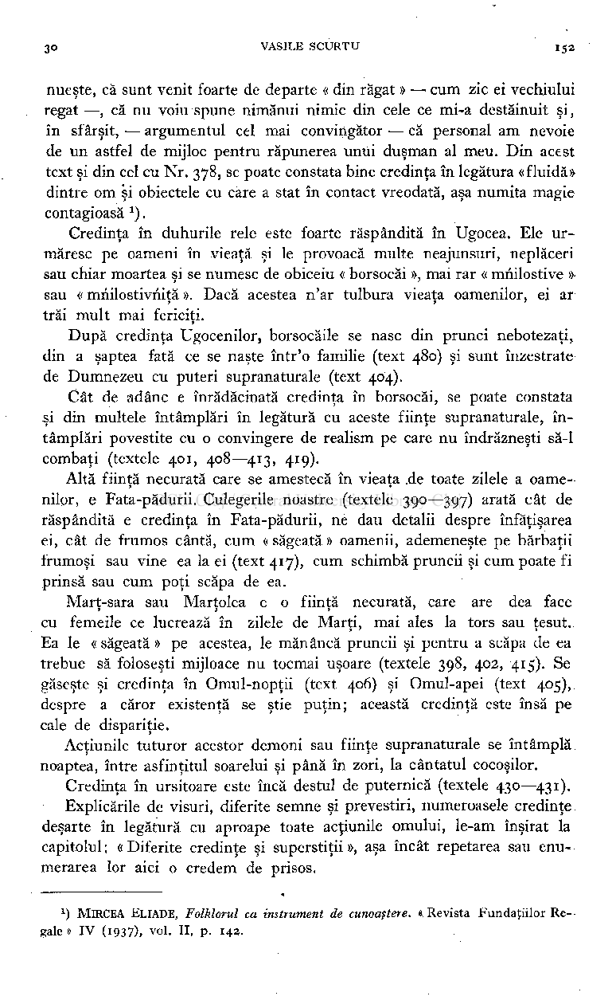

nueşte, că sunt venit foarte de departe « din răgat » — cum zic ei vechiului regat —, că nu voiu spune nimănui nimic din cele ce mi-a destăinuit şi, în sfârşit, — argumentul cel mai convingător-—că personal am nevoie de un astfel de mijloc pentru răpunerea unui duşman al meu. Din acest text şi din cel cu Nr. 378, se poate constata bine credinţa în legătura «fluidă» dintre om şi obiectele cu care a stat în contact vreodată, aşa numita magie contagioasă ).

Credinţa în duhurile rele este foarte răspândită în Ugocea. Ele urmăresc pe oameni în vieaţă şi le provoacă multe neajunsuri, neplăceri sau chiar moartea şi se numesc de obiceiu « borsocăi », mai rar « mriilostive » sau « mnilostivniţă ». Dacă acestea n'ar tulbura vieaţa oamenilor, ei ar trăi mult mai fericiţi.

După credinţa Ugocenilor, borsocăile se nasc din prunci nebotezaţi, din a şaptea fată ce se naşte într'o familie (text 480) şi sunt înzestrate de Dumnezeu cu puteri supranaturale (text 404).

Cât de adânc e înrădăcinată credinţa în borsocăi, se poate constata şi din multele întâmplări în legătură cu aceste fiinţe supranaturale, întâmplări povestite cu o convingere de realism pe care nu îndrăzneşti să-1 combaţi (textele 401, 408—413, 419).

Altă fiinţă necurată care se amestecă în vieaţa .de toate zilele a oamenilor, e Fata-pădurii. Culegerile noastre (textele 390—397) arată cât de

- răspândită e credinţa în Fata-pădurii, ne dau detalii despre înfăţişarea ei, cât de frumos cântă, cum « săgeată » oamenii, ademeneşte pe bărbaţii frumoşi sau vine ea la ei (text 417), cum schimbă pruncii şi cum poate fi prinsă sau cum poţi scăpa de ea.

Marţ-sara sau Marţolea e o fiinţă necurată, care are dea face cu femeile ce lucrează în zilele de Marţi, mai ales la tors sau ţesut. Ea le « săgeată » pe acestea, le mănâncă pruncii şi pentru a scăpa de ea trebue să foloseşti mijloace nu tocmai uşoare (textele 398, 402, 415). Se găseşte şi credinţa în Omul-nopţii (text 406) şi Omul-apei (text 405), despre a căror existenţă se ştie puţin; această credinţă este însă pe cale de dispariţie.

Acţiunile tuturor acestor demoni sau fiinţe supranaturale se întâmplă noaptea, între asfinţitul soarelui şi până în zori, la cântatul cocoşilor.

Credinţa în ursitoare este încă destul de puternică (textele 430—431). Explicările de visuri, diferite semne şi prevestiri, numeroasele credinţe

deşarte în legătură cu aproape toate acţiunile omului, le-am înşirat la capitolul; «Diferite credinţe şi superstiţii», aşa încât repetarea sau enumerarea lor aici o credem de prisos.

###### *) MlRCEA ELIADE, Folklorul ca instrument de cunoaştere. « Revista Fundaţiilor Re­

gale » I V (1937), vol. II, p. 142.

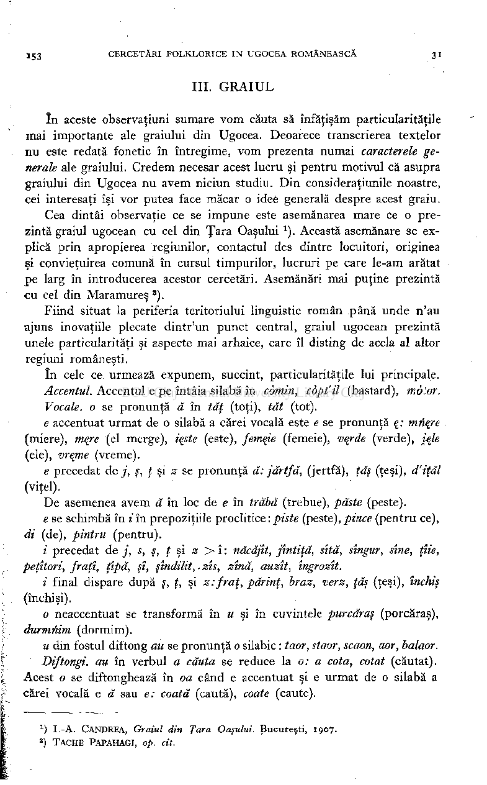

III. GRAIUL

în aceste observaţiuni sumare vom căuta să înfăţişăm particularităţile mai importante ale graiului din Ugocea. Deoarece transcrierea textelor nu este redată fonetic în întregime, vom prezenta numai caracterele generale ale graiului. Credem necesar acest lucru şi pentru motivul că asupra graiului din Ugocea nu avem niciun studiu. Din consideraţiunile noastre, cei interesaţi îşi vor putea face măcar o idee generală despre acest graiu.

Cea dintâi observaţie ce se impune este asemănarea mare ce o pre­

zintă graiul ugocean cu cel din Ţara Oaşului ). Această asemănare se explică prin apropierea regiunilor, contactul des dintre locuitori, originea şi convieţuirea comună în cursul timpurilor, lucruri pe care le-am arătat pe larg în introducerea acestor cercetări. Asemănări mai puţine prezintă cu cel din Maramureş

).

2

Fiind situat la periferia teritoriului linguistic român până unde n'au ajuns inovaţiile plecate dintr'un punct central, graiul ugocean prezintă unele particularităţi şi aspecte mai arhaice, care îl disting de acela al altor regiuni româneşti.

în cele ce urmează expunem, succint, particularităţile lui principale. Accentul. Accentul e pe întâia silabă în comin, copt'il (bastard), maior. Vocale, o se pronunţă ă în tăţ (toţi), tat (tot). e accentuat urmat de o silabă a cărei vocală este e se pronunţă e: mnere

(miere), mere (el merge), ieste (este), femeie (femeie), verde (verde), iele (ele), vreme (vreme).

e precedat dej , ş, ţ şi z se pronunţă ă: jărtfă, (jertfă), ţăş (teşi), d'iţăl

(viţel). De asemenea avem ă în loc de e în trăbâ (trebue), paste (peste). e se schimbă în i în prepoziţiile proclitice : piste (peste), pince (pentru ce),

di (de), pintru (pentru).

i precedat de j , s, ş, ţ şi z > î : năcăjit, jîntiţă, sită, singur, sine, ţîie, peţitori, fraţi, ţipă, şî, şindilit,. zis, zînă, auzit, îngrozit.

i final dispare după ş, ţ, şi z:fraţ, părinţ, braz, verz, ţăş (teşi), închis (închişi).

o neaccentuat se transformă în u şi în cuvintele purcăraş (porcăraş), durmnim (dormim).

u din fostul diftong au se pronunţă o silabic : taor, staor, scaon, aor, balaor. Diftongi, au în verbul a căuta se reduce la o: a cota, cotat (căutat).

Acest o se diftonghează în oa când e accentuat şi e urmat de o silabă a cărei vocală e ă sau e: coată (caută), coate (caute).

- 1

) I.-A CANDREA, Graiul din Ţara Oaşului. Bucureşti, 1907.

- 2

) TACHE PAPAHAGI, op. cit.

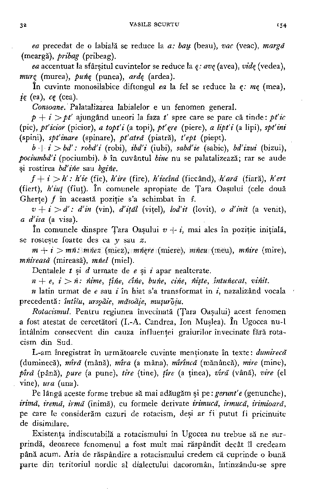

ea precedat de o labială se reduce la a: bau. (beau), vac (veac), margă (meargă), pribag (pribeag).

ea accentuat la sfârşitul cuvintelor se reduce la q: ave. (avea), vide. (vedea), mure. (murea), puûe. (punea), arde. (ardea).

în cuvinte monosilabice diftongul ea la fel se reduce la e_: me. (mea),

ie. (ea), ce. (cea). Consoane. Palatalizarea labialelor e un fenomen general. p - f i >pt' ajungând uneori la faza t' spre care se pare că tinde: pt'ic

(pic), pt'icior (picior), a topt'i (a topi), pt'ere (piere), a lipt'i (a lipi), spt'ini (spini), spt'inare (spinare), pt'atră (piatră), t'ept (piept).

b + i > bd' : robd'i (robi), ibd'i (iubi), sabd'ie (sabie), bd'izui (bizui), pociumbd'i (pociumbi). b în cuvântul bine nu se palatalizează ; rar se aude şi rostirea bd'iûe sau bgiûe.

/+ i >h' : h'ie (fie), h'ire (fire), h'iecînd (fiecând), h'arâ (fiară), h'ert (fiert), h'iuţ (fiuţ). în comunele apropiate de Ţara Oaşului (cele două Gherţe) / în această poziţie s'a schimbat în s.

v-\-i>d': d'in (vin), d'iţăl (viţel), lod'it (lovit), o d'init (a venit), a d'isa (a visa).

în comunele dinspre Ţara Oaşului v -f- i, mai ales în poziţie iniţială, se rosteşte foarte des ca y sau z.

- m + i >mn: muez (miez), mnere (miere), mneu (meu), mûire (mire),

mnireasă (mireasă), mnel (miel). Den talele t şi d urmate de e şi i apar nealterate. n-f- e, i > iî: aime, ţîiîe, cîûe, buiie, ciûe, ûiste, întuûecat, viûit.

- n latin urmat de e sau i în hiat s'a transformat in i, nazalizând vocala

precedentă: întîïu, ursoăie, măsoăie, muşuroiu.

Rotacismul. Pentru regiunea învecinată (Ţara Oaşului) acest fenomen a fost atestat de cercetători (I.-A. Candrea, Ion Muşlea). în Ugocea nu-1 întâlnim consecvent din cauza influenţei graiurilor învecinate fără rotacism din Sud.

L-am înregistrat în următoarele cuvinte menţionate în texte: dumirecă (duminecă), miră (mână), mira (a mâna), mirincă (mănâncă), mire (mine), pîră (până), pure (a pune), tire (tine), ţîre (a ţinea), vîrâ (vână), vire (el vine), ura (una).

Pe lângă aceste forme trebue să mai adăugăm şi pe : gerunt'e (genunche), irimă, iremă, irmă (inimă), cu formele derivate irimucă, irmucă, irimioară, pe care le considerăm cazuri de rotacism, deşi ar fi putut fi pricinuite de disimilare.

Existenţa indiscutabilă a rotacismului în Ugocea nu trebue să ne surprindă, deoarece fenomenul a fost mult mai răspândit decât îl credeam până acum. Aria de răspândire a rotacismului credem că cuprinde o bună parte din teritoriul nordic al dialectului dacoromân, întinzându-se spre

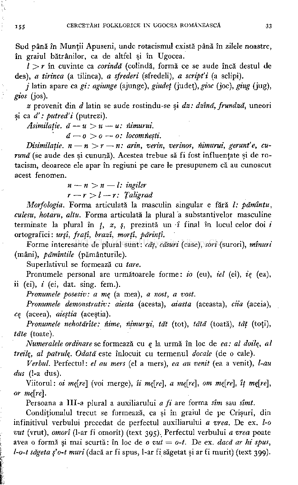

Sud până în Munţii Apuseni, unde rotacismul există până în zilele noastre, în graiul bătrânilor, ca de altfel şi în Ugocea.

/ > r în cuvinte ca corindă (colindă, formă ce se aude încă destul de des), a tirinca (a tilinca), a sfrederi (sfredeli), a script'i (a sclipi).

j latin apare ca gi: agiunge (ajunge), giudeţ (judeţ), gioc (joc), giug (jug), gios (jos).

z provenit din d latin se aude rostindu-se şi dz: dzină, frundzâ, uneori şi ca d' : putred'i (putrezi).

Asimilaţie. ă — u >u — u: nimurui. ă — o > o — o: locomneşti.

Disimilaţie. n — n >r—n: arin, verin, verinos, nimurui, gerunt'e, curună (se aude des şi cunună). Acestea trebue să fi fost influenţate şi de rotacism, deoarece ele apar în regiuni pe care le presupunem că au cunoscut acest fenomen.

n — n > n — /: ingiler r — r > / —r: Ţaligrad

Morfologia. Forma articulată la masculin singular e fără /: pămîntu, culesu, hotaru, altu. Forma articulată la plural "a substantivelor masculine terminate la plural în ţ, z, ş, prezintă un î final în locul celor doi i ortografici: urşi, fraţi, brazi, morţi, părinţi.

Forme interesante de plural sunt : caş, căsuri (case), sori (surori), mînuri

(mâni), pămintile (pământurile). Superlativul se formează cu tare. Pronumele personal are următoarele forme: io (eu), iei (el), ie_ (ea),

ii (ei), i (ei, dat. sing. fem.). Pronumele posesiv: a mç (a mea), a nost, a vost. Pronumele demonstrativ: aiesta (acesta), aiasta (aceasta), ciia (aceia),

cç (aceea), aieştia (aceştia).

Pronumele nehotărîte: nime, nimurui, tat (tot), tată (toată), tăţ (toţi), täte (toate).

Numeralele ordinare se formează cu ç la urmă în loc de ea: al doilq, al treilç, al patrulq. Odată este înlocuit cu termenul docale (de o cale).

Verbul. Perfectul : el au mers (el a mers), ea au venit (ea a venit), l-au dus (1-a dus).

Viitorul: oi me_[re] (voi merge), îi me_[re], a mejre], om me_[re], îţ me[re],

or me\ré\. Persoana a IlI-a plural a auxiliarului a fi are forma sîm sau sîmt. Condiţionalul trecut se formează, ca şi în graiul de pe Crişuri, din infinitivul verbului precedat de perfectul auxiliarului a vrea. De ex. l-o vut (vrut), omorî (l-ar fi omorît) (text 395). Perfectul verbului a vrea poate avea o formă şi mai scurtă: în loc de o vut = o-t. De ex. dacă ar hi spus, l-o-t săgeta ş'o-t muri (dacă ar fi spus, l-ar fi săgetat şi ar fi murit) (text 399).

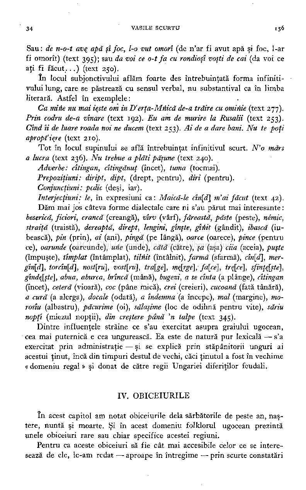

Sau : de n-o-t ave. apă şî foc, l-o mit omorî (de n'ar fi avut apă şi foc, l-ar fi omorît) (text 395); sau da voi ce o-t fa cu rondioşî voşti de cai (da voi ce aţi fi făcut... ) (text 250).

în locul subjonctivului aflăm foarte des întrebuinţată forma infinitivului lung, care se păstrează cu sensul verbal, nu substantival ca în limba literară. Astfel în exemplele:

Ca mitle nu mai içste om in D'erţa-Mnica de-a trăire cu omiiîie (text 277). Prin codru de-a vînare (text 192). Eu am de murire la Rusalii (text 253). Cînd îi de luare roadă noi ne ducem (text 253). Ai de a dare bani. Nu te poţi apr opt'ier e (text 210).

Tot în locul supinului se află întrebuinţat infinitivul scurt. N'o mars

a lucra (text 236). Nu trebue a plăti păşune (text 240). Adverbe: cîtingan, cîtingănuţ (încet), turna (tocmai). Prepoziţiuni: diript, dipt, (drept, pentru), diri (pentru). Conjuncţiuni: pcdic (deşi, iar). Interjecţiuni : le, în expresiuni ca: Maică-le cîn[d] m'ai făcut (text 42). Dăm mai jos câteva forme dialectale care ni s'au părut mai interesante :

beserică, ficiori, crancă (creangă), vîrv (vârf), făreastă, paste (peste), némic, straiţă (traistă), dereaptă, dirept, lengini, gînşte, ginit (gândit), ibască (iubească), pin (prin), ai (ani), pingă (pe lângă), oarce (oarece), pince (pentru ce), oarunde (oareunde), une (unde), cătă (către), şa (aşa) ciia (aceia), puste (împuşte), tîmplat (întâmplat), tilûit (întâlnit), farmă (sfarmă), cîn[d], mergîn[d], torcîn[d], nost[ru], vost[ru], tra[ge], mejrge], fa[ce], trejce], sfinţejste], gînde[şte], abua, aburca, brîncă (mână), bugezi, a se cînta (a plânge), cîtingan (încet), cetera (vioară), coc (pâne mică), erei (creieri), cucoană (fată tânără), a cură (a alerga), docale (odată), a îndemna (a începe), mal (margine), morosîu (albastru), păcurime (oi), sălaşime (loc de odihnă pentru vite), săriu nopţi (miezul nopţii), din creştere până 'n talpe (text 345).

Dintre influenţele străine ce s'au exercitat asupra graiului ugocean, cea mai puternică e cea ungurească. Ea este de natură pur lexicală —• s'a exercitat prin administraţie — şi se explică prin stăpânitorii unguri ai acestui ţinut, încă din timpuri destul de vechi, căci ţinutul a fost în vechime « domeniu regal » şi donat de către regii Ungariei diferiţilor feudali.

IV. OBICEIURILE

în acest capitol am notat obiceiurile delà sărbătorile de peste an, naştere, nuntă şi moarte. Şi în acest domeniu folklorul ugocean prezintă unele obiceiuri rare sau chiar specifice acestei regiuni.

Pentru ca aceste obiceiuri să fie cât mai accesibile celor ce se interesează de ele, le-am redat — aproape în întregime — prin scurte constatări

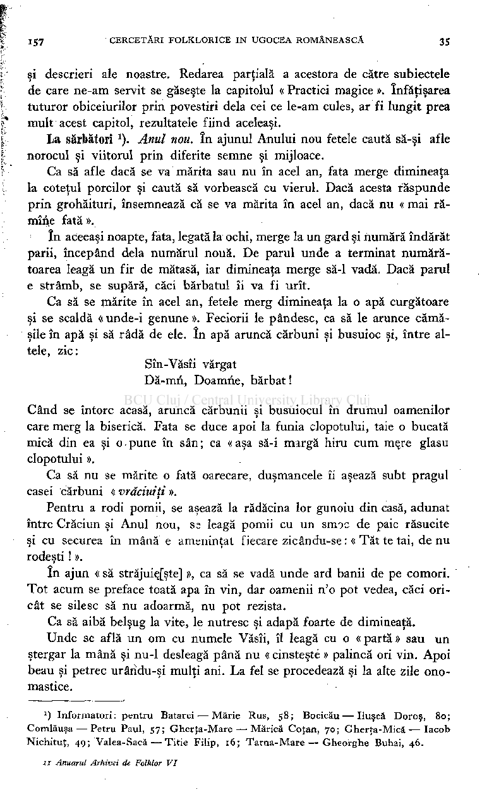

şi descrieri ale noastre. Redarea parţială a acestora de către subiectele de care ne-am servit se găseşte la capitolul « Practici magice ». înfăţişarea tuturor obiceiurilor prin povestiri delà cei ce le-am cules, ar fi lungit prea mult acest capitol, rezultatele fiind aceleaşi.

La sărbători ). Anul nou. în ajunul Anului nou fetele caută să-şi afle norocul şi viitorul prin diferite semne şi mijloace.

Ca să afle dacă se va mărita sau nu în acel an, fata merge dimineaţa la coteţul porcilor şi caută să vorbească cu vierul. Dacă acesta răspunde prin grohăituri, însemnează că se va mărita în acel an, dacă nu « mai rămîne fată ».

în aceeaşi noapte, fata, legată la ochi, merge la un gard şi numără îndărăt parii, începând delà numărul nouă. De parul unde a terminat numărătoarea leagă un fir de mătasă, iar dimineaţa merge să-1 vadă. Dacă parul e strâmb, se supără, căci bărbatul îi va fi urît.

Ca să se mărite în acel an, fetele merg dimineaţa la o apă curgătoare şi se scaldă « unde-i genune ». Feciorii le pândesc, ca să le arunce cămăşile în apă şi să râdă de ele. în apă aruncă cărbuni şi busuioc şi, între altele, zic:

Sîn-Văsîi vărgat Dă-mfî, Doamne, bărbat !

Când se întorc acasă, aruncă cărbunii şi busuiocul în drumul oamenilor care merg la biserică. Fata se duce apoi la funia clopotului, taie o bucată mică din ea şi o pune în sân ; ca « aşa să-i margă hiru cum mçre glasu clopotului ».

Ca să nu se mărite o fată oarecare, duşmancele îi aşează subt pragul casei cărbuni « vrăciuiţi ».

Pentru a rodi pomii, se aşează la rădăcina lor gunoiu din casă, adunat între Crăciun şi Anul nou, se leagă pomii cu un smoc de paie răsucite şi cu securea în mână e ameninţat fiecare zicându-se : « Tăt te tai, de nu rodeşti ! ».

în ajun « să străjuieşte]», ca să se vadă unde ard banii de pe comori. Tot acum se preface toată apa în vin, dar oamenii n'o pot vedea, căci oricât se silesc să nu adoarmă, nu pot rezista.

Ca să aibă belşug la vite, le nutresc şi adapă foarte de dimineaţă. Unde se află un om cu numele Văsîi, îl leagă cu o « partă » sau un ştergar la mână şi nu-1 desleagă până nu « cinsteşte » palincă ori vin. Apoi beau şi petrec urâridu-şi mulţi ani. La fel se procedează şi la alte zile onomastice.

) Informatori: pentru Batarci-—Mărie Rus, 58; Bocicău — Iluşcă Doroş, 80; Comlăuşa — Petru Paul, 57; Gherţa-Mare — Mărică Coţan, 70; Gherţa-Mică—Iaco b Nichituţ, 49; Valea-Sacă — Titie Filip, 16; Tarna-Mare — Gheorghe Buhai, 46.

J

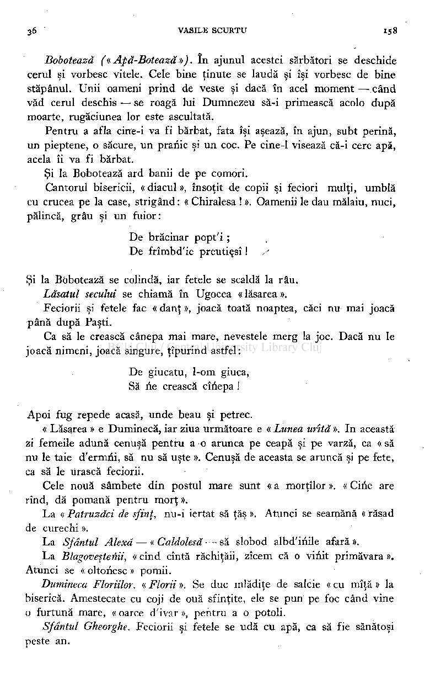

Bobotează (« Apä-Boteazä »). în ajunul acestei sărbători se deschide cerul şi vorbesc vitele. Cele bine ţinute se laudă şi îşi vorbesc de bine stăpânul. Unii oameni prind de veste şi dacă în acel moment —când văd cerul deschis — se roagă lui Dumnezeu să-i primească acolo după moarte, rugăciunea lor este ascultată.

Pentru a afla cine-i va fi bărbat, fata îşi aşează, în ajun, subt perină, un pieptene, o săcure, un pranic şi un coc. Pe cine-1 visează că-i cere apă, acela îi va fi bărbat.

Şi la Bobotează ard banii de pe comori. Cantorul bisericii, « diacul », însoţit de copii şi feciori mulţi, umblă

cu crucea pe la case, strigând: « Chiralesa ! ». Oamenii le dau mălaiu, nuci, palincă, grâu şi un fuior:

De brăcinar popt'i ; De frîmbd'ie preutiçsî !

Şi la Bobotează se colindă, iar fetele se scaldă la râu. Lăsatul secului se chiamă în Ugocea « lăsarea ». Feciorii şi fetele fac « danţ », joacă toată noaptea, căci nu mai joacă

până după Paşti.

Ca să le crească cânepa mai mare, nevestele merg la joc. Dacă nu le joacă nimeni, joacă singure, ţîpurind astfel:

De giucatu, l-om giuca, Să ne crească cîfiepa !

Apoi fug repede acasă, unde beau şi petrec.

« Lăsarea » e Duminecă, iar ziua următoare e « Lunea urîtă ». In această zi femeile adună cenuşă pentru a o arunca pe ceapă şi pe varză, ca « să nu le taie d'ermni, să nu să uşte ». Cenuşă de aceasta se aruncă şi pe fete, ca să le urască feciorii.

Cele nouă sâmbete din postul mare sunt « a morţilor ». « Cine are

- rînd, dă pomană pentru morţ ». La « Patruzăci de sfinţ, nu-i iertat să ţăş ». Atunci se seamănă « răsad

de curechi ». La Sfântul Alexă — « Caldolesă — să slobod albd'iriile afară ». La Blagoveştenii, « cînd cîntă răchiţăii, zîcem că o vinit primăvara ».

Atunci se « oltonesc » pomii.

Dumineca Floriilor. « Florii ». Se duc mlădiţe de salcie « cu mîţă » la biserică. Amestecate cu coji de ouă sfinţite, ele se pun pe foc când vine

- o furtună mare, « oarce d'ivar », pentru a o potoli. Sfântul Gheorghe. Feciorii şi fetele se udă cu apă, ca să fie sănătoşi

peste an.

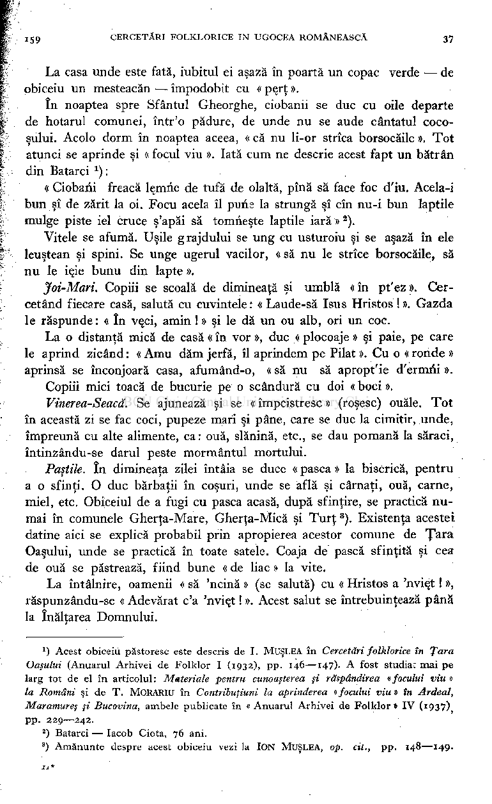

La casa unde este fată, iubitul ei aşază în poartă un copac verde •— de

- obiceiu un mesteacăn — împodobit cu « perţ ». în noaptea spre Sfântul Gheorghe, ciobanii se duc cu oile departe

de hotarul comunei, într'o pădure, de unde nu se aude cântatul cocoşului. Acolo dorm în noaptea aceea, « că nu li-or strica borsocăile ». Tot atunci se aprinde şi « focul viu ». Iată cum ne descrie acest fapt un bătrân din Batarci ) :

« Ciobani freacă le_mne de tufă de olaltă, pînă să face foc d'iu. Acela-i bun şî de zărit la oi. Focu acela îl puhs la strungă şî cîn nu-i bun laptile mulge piste iei cruce ş'apăi să tomfîeşte laptile iară »

).

2

Vitele se afumă. Uşile grajdului se ung cu usturoiu şi se aşază în ele leuştean şi spini. Se unge ugerul vacilor, « să nu le strîce borsocăile, să nu le içie bunu din lapte ».

Joi-Mari. Copiii se scoală de dimineaţă şi umblă « în pt'ez ». Cercetând fiecare casă, salută cu cuvintele : « Laude-să Isus Hristos ! ». Gazda le răspunde : « în vçci, amin ! » şi le dă un ou alb, ori un coc.

La o distanţă mică de casă « în vor », duc « plocoaje » şi paie, pe care le aprind zicând: « Amu dăm jerfă, îl aprindem pe Pilat ». Cu o «ronde » aprinsă se înconjoară casa, afumând-o, « să nu să apropt'ie d'ermni ».

Copiii mici toacă de bucurie pe o scândură cu doi « boci ».

Vinerea-Seacă. Se ajunează şi se « împcistresc » (roşesc) ouăle. Tot în această zi se fac coci, pupeze mari şi pâne, care se duc la cimitir, unde, împreună cu alte alimente, ca: ouă, slănină, etc., se dau pomană la săraci, întinzându-se darul peste mormântul mortului.

Pastile. în dimineaţa zilei întâia se duce « pasca » la biserică, pentru a o sfinţi. O duc bărbaţii în coşuri, unde se află şi cârnaţi, ouă, carne, miel, etc. Obiceiul de a fugi cu pasca acasă, după sfinţire, se practică numai în comunele Gherţa-Mare, Gherţa-Mică şi Turţ

). Existenţa acestei datine aici se explică probabil prin apropierea acestor comune de Ţara Oaşului, unde se practică în toate satele. Coaja de pască sfinţită şi cea de ouă se păstrează, fiind bune « de liac » la vite.

s

La întâlnire, oamenii « să 'ncină » (se salută) cu « Hristos a 'nviçt ! »,

- răspunzându-se « Adevărat c'a 'nviçt ! ». Acest salut se întrebuinţează până la înălţarea Domnului.

*) Acest obiceiu păstoresc este descris de I. MUŞLEA în Cercetări folklorice în Ţara Oaşului (Anuarul Arhivei de Folklor I (1932), pp 146—147). A fost studiat mai pe

larg tot de el în articolul: Materiale pentru cunoaşterea şi răspândirea o focului viu» la Români şi de T MORARIU în Contribuţiuni la aprinderea «focului viu » în Ardeal,

Maramureş şi Bucovina, ambele publicate în « Anuarul Arhivei de Folklor» I V (i937)

pp. 229—242.

- 2

) Batarci — Iacob Ciota, 76 ani.

- 3

###### ) Amănunte despre acest obiceiu vezi la ION MUŞLEA, op. cit., pp 148—149.

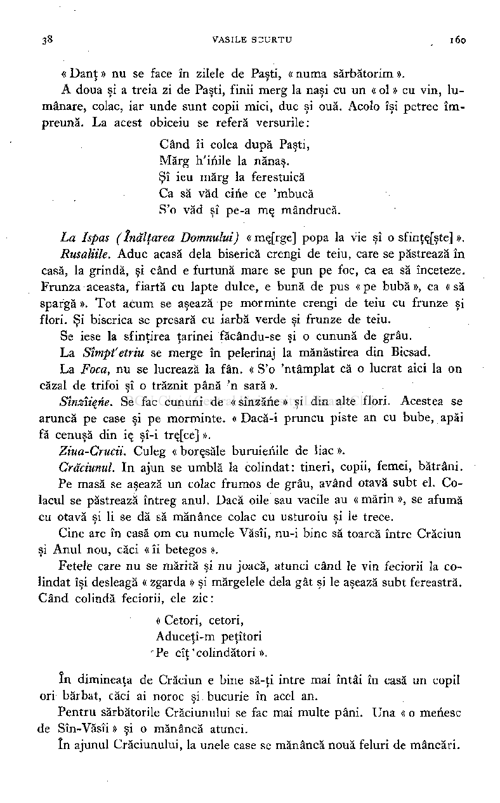

« Danţ » nu se face în zilele de Paşti, « numa sărbătorim ». A doua şi a treia zi de Paşti, finii merg la naşi cu un « ol » cu vin, lu­

mânare, colac, iar unde sunt copii mici, duc şi ouă. Acolo îşi petrec împreună. La acest obiceiu se referă versurile:

Când îi colea după Paşti, Mărg h'inile la nănaş. Şî ieu mărg la ferestuică Ca să văd cifie ce 'mbucă S'o văd şî pe-a mç mândrucă.

La Ispas (înălţarea Domnului) « mçfrge] popa la vie şî o sfinţc[şte] ». Rusaliile. Aduc acasă delà biserică crengi de teiu, care se păstrează în

casă, la grindă, şi când e furtună mare se pun pe foc, ca ea să înceteze. Frunza aceasta, fiartă cu lapte dulce, e bună de pus «pe bubă», ca «să spargă ». Tot acum se aşează pe morminte crengi de teiu cu frunze şi flori. Şi biserica se presară cu iarbă verde şi frunze de teiu.

Se iese la sfinţirea ţarinei făcându-se şi o cunună de grâu. La Sîmpt'etriu se merge în pelerinaj la mănăstirea din Bicsad. La Foca, nu se lucrează la fân. « S'o 'ntâmplat că o lucrat aici la on

căzal de trifoi şî o trăznit până 'n sară ».

Sînzxieiie. Se fac cununi de « sînzăne » şi din alte flori. Acestea se aruncă pe case şi pe morminte. « Dacă-i pruncu piste an cu bube, apăi fă cenuşă din iç şî-i trejce] ».

Ziua-Crucii. Culeg « boresăle buruienile de liac ». Crăciunul. In ajun se umblă la colindat: tineri, copii, femei, bătrâni. Pe masă se aşează un colac frumos de grâu, având otavă subt el. Co­

lacul se păstrează întreg anul. Dacă oile sau vacile au «marin », se afumă cu otavă şi li se dă să mănânce colac cu usturoiu şi le trece.

Cine are în casă om cu numele Văsîi, nu-i bine să toarcă între Crăciun şi Anul nou, căci « îi betegos ».

Fetele care nu se mărită şi nu joacă, atunci când le vin feciorii la colindat îşi desleagă « zgarda » şi mărgelele delà gât şi le aşează subt fereastră. Când colindă feciorii, ele zic:

« Cetori, cetori, Aduceţî-m peţitori 'Pe cîţ 'colindători ».

în dimineaţa de Crăciun e bine să-ţi intre mai întâi în casă un copil ori bărbat, căci ai noroc şi bucurie în acel an.

Pentru sărbătorile Crăciunului se fac mai multe pâni. Una « o menesc de Sîn-Văsîi » şi o mănâncă atunci.

în ajunul Crăciunului, la unele case se mănâncă nouă feluri de mâncări.

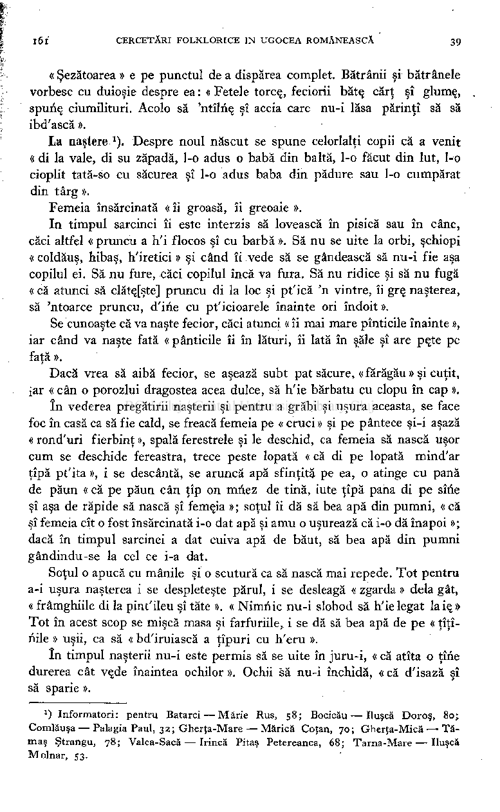

« Şezătoarea » e pe punctul de a dispărea complet. Bătrânii şi bătrânele vorbesc cu duioşie despre ea : « Fetele torcç, feciorii bătc cărţ şî glumç, spuriç ciumilituri. Acolo să 'ntîlriç şî aceia care nu-i lăsa părinţi să să ibd'ască ».

La naştere ). Despre noul născut se spune celorlalţi copii că a venit

« di la vale, di su zăpadă, l-o adus o babă din baltă, l-o făcut din lut, l-o cioplit tată-so cu săcurea şî l-o adus baba din pădure sau l-o cumpărat din târg ».

Femeia însărcinată « îi groasă, îi greoaie ». In timpul sarcinei îi este interzis să lovească în pisică sau în câne, căci altfel « pruncu a h'i flocos şî cu barbă ». Să nu se uite la orbi, şchiopi « coldăuş, hibaş, h'iretici » şi când îi vede să se gândească să nu-i fie aşa copilul ei. Să nu fure, căci copilul încă va fura. Să nu ridice şi să nu fugă « că atunci să clătejşte] pruncu di la loc şi pt'ică 'n vintre, îi grç naşterea, să 'ntoarce pruncu, d'ihe cu pt'icioarele înainte ori îndoit ».

Se cunoaşte că va naşte fecior, căci atunci « îi mai mare pînticile înainte », iar când va naşte fată « pânticile îi în lături, îi lată în şale şî are pete pe faţă ».

Dacă vrea să aibă fecior, se aşează subt pat săcure, « fărăgău » şi cuţit, far « cân o porozlui dragostea acea dulce, să h'ie bărbatu cu clopu în cap ».

în vederea pregătirii naşterii şi pentru a grăbi şi uşura aceasta, se face foc în casă ca să fie cald, se freacă femeia pe « cruci » şi pe pântece şi-i aşază « rond'uri f ierbinţ », spală ferestrele şi le deschid, ca femeia să nască uşor cum se deschide fereastra, trece peste lopată « că di pe lopată mind'ar ţîpă pt'ita », i se descântă, se aruncă apă sfinţită pe ea, o atinge cu pană de păun « că pe păun cân ţîp on mnez de tină, iute ţîpă pana di pe sîne şî aşa de rapide să nască şî femçia »; soţul îi dă să bea apă din pumni, « că şî femeia cît o fost însărcinată i-o dat apă şi amu o uşurează că i-o dă înapoi »; dacă în timpul sarcinei a dat cuiva apă de băut, să bea apă din pumni gândindu-se la cel ce i-a dat.

Soţul o apucă cu manile şi o scutură ca să nască mai repede. Tot pentru a-i uşura naşterea i se despleteşte părul, i se desleagă « zgarda » delà gât, « frâmghiile di la pint'ileu şî täte ». « Nimnic nu-i slobod să h'ie legat la iç » Tot în acest scop se mişcă masa şi farfuriile, i se dă să bea apă de pe « ţîţîriile » uşii, ca să « bd'iruiască a ţîpuri cu h'eru ».

în timpul naşterii nu-i este permis să se uite în juru-i, « că atîta o ţîne durerea cât vede înaintea ochilor ». Ochii să nu-i închidă, « că d'isază şî

- să sparie ».

*) Informatori: pentru Batarci — Mărie Rus, 58; Bocicău — Iluşcă Doroş, 80; Comlăuşa — Palagia Paul, 32; Gherţa-Mare — Mărică Coţan, 70; Gherţa-Mică — Tă maş Ştrangu, 78; Valea-Sacă — Irincă Pitaş Petereanca, 68; Tarna-Mare — Iluşcă Molnar, 53. *

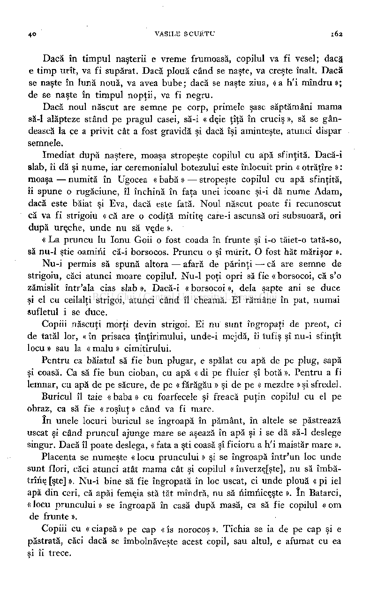

Dacă în timpul naşterii e vreme frumoasă, copilul va fi vesel; dacă e timp urît, va fi supărat. Dacă plouă când se naşte, va creşte înalt. Dacă se naşte în lună nouă, va avea bube; dacă se naşte ziua, «a h'i mîndru »; de se naşte în timpul nopţii, va fi negru.

Dacă noul născut are semne pe corp, primele şase săptămâni mama să-1 alăpteze stând pe pragul casei, să-i « dçie ţîţă în cruciş », să se gândească la ce a privit cât a fost gravidă şi dacă îşi aminteşte, atunci dispar semnele.

Imediat după naştere, moaşa stropeşte copilul cu apă sfinţită. Dacă-i slab, îi dă şi nume, iar ceremonialul botezului este înlocuit prin « otrăţîre »: moaşa — numită în Ugocea « babă » — stropeşte copilul cu apă sfinţită, îi spune o rugăciune, îl închină în faţa unei icoane şi-i dă nume Adam, dacă este băiat şi Eva, dacă este fată. Noul născut poate fi recunoscut că va fi strigoiu « că are o codiţă mititç care-i ascunsă ori subsuoară, ori după urçche, unde nu să vçde ».

« La pruncu lu Ionu. Goii o fost coada în frunte şî i-o tăiet-o tată-so, să nu-1 ştie oamirii că-i borsocos. Pruncu o şî murit. O fost hăt mărişor ».

Nu-i permis să spună altora—afară de părinţi—că are semne de strigoiu, căci atunci moare copilul. Nu-1 poţi opri să fie «borsocoi, că s'o zămislit într'ala cias slab ». Dacă-i « borsocoi », delà şapte ani se duce şi el cu ceilalţi strigoi, atunci când îl cheamă. El rămâne în pat, numai sufletul i se duce.

Copiii născuţi morţi devin strigoi. Ei nu sunt îngropaţi de preot, ci de tatăl lor, « în prisaca ţînţîrimului, unde-i mejdă, îi tufiş şî nu-i sfinţit locu » sau la « malu » cimitirului.

Pentru ca băiatul să fie bun plugar, e spălat cu apă de pe plug, sapă şi coasă. Ca să fie bun cioban, cu apă « di pe fluier şî botă ». Pentru a fi lemnar, cu apă de pe săcure, de pe « fărăgău » şi de pe « mezdre »şi sfredel.

Buricul îl taie « baba » cu foarfecele şî freacă puţin copilul cu el pe obraz, ca să fie « roşîuţ » când va fi mare.

în unele locuri buricul se îngroapă în pământ, în altele se păstrează uscat şi când pruncul ajunge mare se aşează în apă şi i se dă să-1 deslege singur. Dacă îl poate deslega, « fata a şti coasă şî ficioru a h'i maistăr mare ».

Placenta se numeşte « locu pruncului » şi se îngroapă într'un loc unde sunt flori, căci atunci atât mama cât şi copilul « înverzeşte], nu să îmbătrîne. [şte] ». Nu-i bine să fie îngropată în loc uscat, ci unde plouă « pi iei apă din ceri, că apăi femeja stă tăt mîndră, nu să riimniccşte ». în Batarci, «locu pruncului » se îngroapă în casă după masă, ca să fie copilul «om

de frunte ».

Copiii cu « ciapsă » pe cap « îs norocos ». Tichia se ia de pe cap şi e păstrată, căci dacă se îmbolnăveşte acest copil, sau altul, e afumat cu ea şi îi trece.

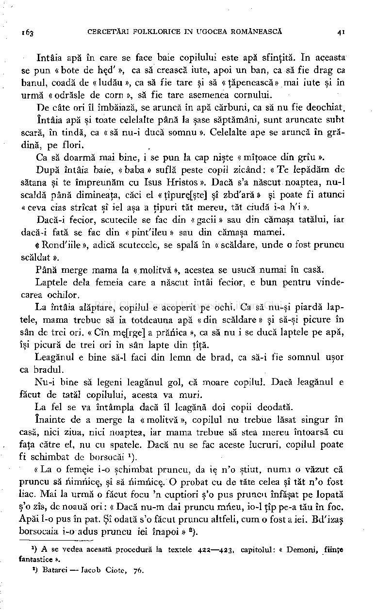

întâia apă în care se face baie copilului este apă sfinţită. In aceasta se pun « bote de he_d' », ca să crească iute, apoi un ban, ca să fie drag ca banul, coadă de « ludău », ca să fie tare şi să «ţăpenească» mai iute şi în urmă « odrasle de corn », să fie tare asemenea cornului.

De câte ori îl îmbăiază, se aruncă în apă cărbuni, ca să nu fie deochiat. întâia apă şi toate celelalte până la şase săptămâni, sunt aruncate subt

scară, în tindă, ca « să nu-i ducă somnu ». Celelalte ape se aruncă în grădină, pe flori.

Ca să doarmă mai bine, i se pun la cap nişte « mîţoace din grîu ». După întâia baie, « baba » suflă peste copil zicând : « Te lepădăm de

satana şi te împreunăm cu Isus Hristos ». Dacă s'a născut noaptea, nu-1 scaldă până dimineaţa, căci el « ţîpurejste] şî zbd'ară » şi poate fi atunci « ceva cias strîcat şî iei aşa a ţîpuri tăt mereu, tăt ciudă i-a h'i ».

Dacă-i fecior, scutecile se fac din « gacii » sau din cămaşa tatălui, iar dacă-i fată se fac din « pint'ileu » sau din cămaşa mamei.

« Rond'iile », adică scutecele, se spală în « scăldare, unde o fost pruncu

scăldat ». Până merge mama la « molitvă », acestea se usucă numai în casă. Laptele delà femeia care a născut întâi fecior, e bun pentru vinde­

carea ochilor.

La întâia alăptare, copilul e acoperit pe ochi. Ca să nu-şi piardă laptele, mama trebue să ia totdeauna apă « din scăldare » şi să-şi picure în sân de trei ori. « Cîn me_[rge] a prănica », ca să nu i se ducă laptele pe apă, îşi picură de trei ori în sân lapte din ţîţă.

Leagănul e bine să-1 faci din lemn de brad, ca să-i fie somnul uşor ca bradul.

Nu-i bine să legeni leagănul gol, că moare copilul. Dacă leagănul e

făcut de tatăl copilului, acesta va muri. La fel se va întâmpla dacă îl leagănă doi copii deodată. înainte de a merge la « molitvă », copilul nu trebue lăsat singur în casă, nici ziua, nici noaptea, iar mama trebue să stea mereu întoarsă cu faţa către el, nu cu spatele. Dacă nu se fac aceste lucruri, copilul poate fi schimbat de borsocăi ).

« La o femeie i-o schimbat pruncu, da iç n'o ştiut, numi o văzut că pruncu să nimnicç, şî să riimnicç. O probat cu de täte celea şî tăt n'o fost liac. Mai la urmă o făcut focu 'n cuptiori ş'o pus pruncu înfăşat pe lopată ş'o zîs, de noauă ori : « Dacă nu-m dai pruncu mneu, io-1 ţîp pe-a tău în foc. Apăi l-o pus în pat. Şî odată s'o făcut pruncu altfeli, cum o fost a iei. Bd'izaş borsocaia i-o adus pruncu iei înapoi » ).

) A se vedea această procedură la textele 43a—423, capitolul: « Demoni, fiinţe fantastice ».

x

*) Batarci — Jacob Ciote, 76.

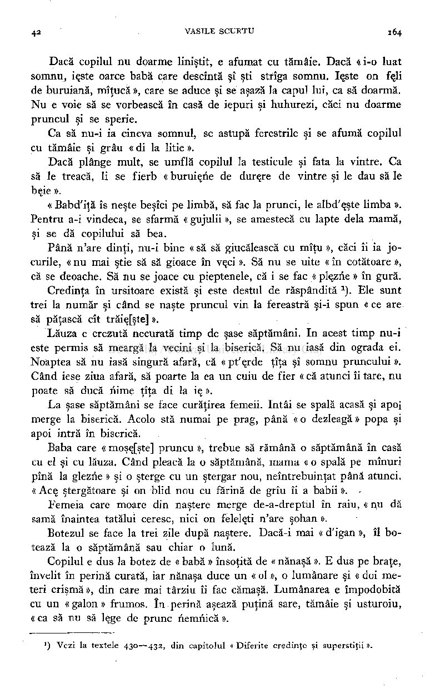

Dacă copilul nu doarme liniştit, e afumat cu tămâie. Dacă «i-o luat somnu, içste oarce babă care descîntă şî şti strîga somnu. Içste on fçli de buruiană, mîţucă », care se aduce şi se aşază la capul lui, ca să doarmă. Nu e voie să se vorbească în casă de iepuri şi huhurezi, căci nu doarme pruncul şi se sperie.

Ca să nu-i ia cineva somnul, se astupă ferestrile şi se afumă copilul cu tămâie şi grâu « di la litie ».

Dacă plânge mult, se umflă copilul la testicule şi fata la vintre. Ca să le treacă, li se fierb «buruiene de durere de vintre şi le dau să le bçie ».

« Babd'iţă îs neşte beşîci pe limbă, să fac la prunci, le albd'cşte limba ». Pentru a-i vindeca, se sfarmă « gujulii », se amestecă cu lapte delà mamă, şi se dă copilului să bea.

Până n'are dinţi, nu-i bine « să să giucălească cu mîţu », căci îi ia jocurile, « nu mai ştie să să gioace în veci ». Să nu se uite « în cotătoare », că se deoache. Să nu se joace cu pieptenele, că i se fac « plçzne » în gură.

). Ele sunt trei la număr şi când se naşte pruncul vin la fereastră şi-i spun « ce are să păţască cît trăicfşte] ».

Credinţa în ursitoare există şi este destul de răspândită

1

Lăuza e crezută necurată timp de şase săptămâni. In acest timp nu-i este permis să meargă la vecini şi la biserică. Să nu iasă din ograda ei. Noaptea să nu iasă singură afară, că « pt'e/de ţîţa şî somnu pruncului ». Când iese ziua afară, să poarte la ea un cuiu de fier « că atunci îi tare, nu poate să ducă hime ţîţa di la iç ».

La şase săptămâni se face curăţirea femeii. întâi se spală acasă şi apoi merge la biserică. Acolo stă numai pe prag, până « o dezleagă » popa şi apoi intră în biserică.

Baba care « moşejşte] pruncu », trebue să rămână o săptămână în casă cu el şi cu lăuza. Când pleacă la o săptămână, mama « o spală pe mînuri pînă la glezne » şi o şterge cu un ştergar nou, neîntrebuinţat până atunci. « Ace_ ştergătoare şi on blid nou cu fărină de grîu îi a babii ». •

Femeia care moare din naştere merge de-a-dreptul în raiu, « nu dă samă înaintea tatălui ceresc, nici on felelçti n'are şohan ».

Botezul se face la trei zile după naştere. Dacă-i mai « d'igan », îl botează la o săptămână sau chiar o lună.

Copilul e dus la botez de « babă » însoţită de « nănaşă ». E dus pe braţe, învelit în perină curată, iar nănaşa duce un « ol », o lumânare şi « doi meteri crişmă», din care mai târziu îi fac cămaşă. Lumânarea e împodobită cu un «galon» frumos. în perină aşează puţină sare, tămâie şi usturoiu, « ca să nu să Içge de prunc nemnică ».

*) Vezi la textele 430—432, din capitolul « Diferite credinţe şi superstiţii ».

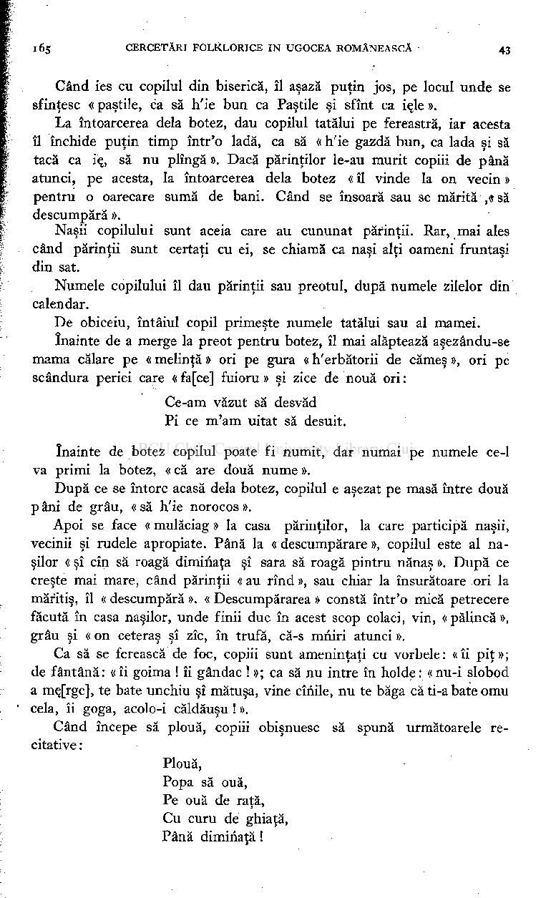

Când ies cu copilul din biserică, îl aşază puţin jos, pe locul unde se sfinţesc « pastile, ca să h'ie bun ca Pastile şi sfînt ca içle ».

La întoarcerea delà botez, dau copilul tatălui pe fereastră, iar acesta îl închide puţin timp într'o ladă, ca să « h'ie gazdă bun, ca lada şi să tacă ca ic, să nu plîngă ». Dacă părinţilor le-au murit copiii de până atunci, pe acesta, la întoarcerea delà botez « îl vinde la on vecin » pentru o oarecare sumă de bani. Când se însoară sau se mărită ,« să descumpără ».

Naşii copilului sunt aceia care au cununat părinţii. Rar, mai ales când părinţii sunt certaţi cu ei, se chiamă ca naşi alţi oameni fruntaşi din sat.

Numele copilului îl dau părinţii sau preotul, după numele zilelor din

calendar. De obiceiu, întâiul copil primeşte numele tatălui sau al mamei. înainte de a merge la preot pentru botez, îl mai alăptează aşezându-se

mama călare pe « melinţă » ori pe gura « h'erbătorii de cămeş », ori pe scândura periei care « fa[ce] fuioru » şi zice de nouă ori :

Ce-am văzut să desvăd Pi ce m'am uitat să desuit.

înainte de botez copilul poate fi numit, dar numai pe numele ce-1 va primi la botez, « că are două nume ».

După ce se întorc acasă delà botez, copilul e aşezat pe masă între două pâni de grâu, «să h'ie norocos».

Apoi se face « mulăciag » la casa părinţilor, la care participă naşii, vecinii şi rudele apropiate. Până la « descumpărare », copilul este al naşilor « şî cîn să roagă diminaţa şî sara să roagă pintru nănaş ». După ce creşte mai mare, când părinţii « au rînd », sau chiar la însurătoare ori la măritiş, îl « descumpără ». « Descumpărarea » constă într'o mică petrecere făcută în casa naşilor, unde finii duc în acest scop colaci, vin, « palincă », grâu şi « on ceteraş şî zîc, în trufă, că-s mfiiri atunci ».

Ca să se ferească de foc, copiii sunt ameninţaţi cu vorbele: «îi piţ »; de fântână: « îi goima ! îi gândac ! »; ca să nu intre în holde : « nu-i slobod a mç[rge], te bate unchiu şî mătuşa, vine cîriile, nu te băga că ti-a bate omu cela, îi goga, acolo-i căldăuşu ! ».

Când începe să plouă, copiii obişnuesc să spună următoarele recitative :

Plouă, Popa să ouă, Pe ouă de raţă, Cu curu de ghiaţă, Până dimiriaţă !

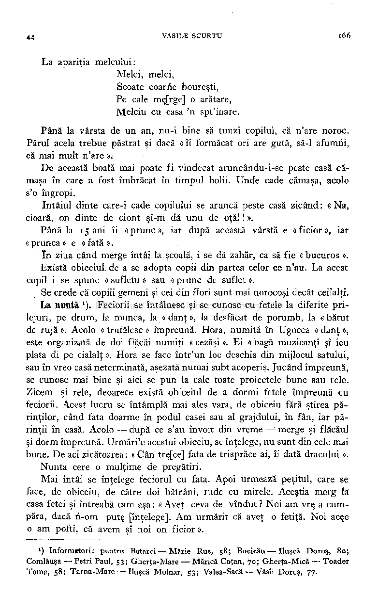

La apariţia melcului: Melci, melci, Scoate coarne boureşti, Pe cale mç[rge] o arătare, Melciu cu casa 'n spt'inare.

Până la vârsta de un an, nu-i bine să tunzi copilul, că n'are noroc. Părul acela trebue păstrat şi dacă « îi formăcat ori are gută, să-1 afumrii, că mai mult n'are ».

De această boală mai poate fi vindecat aruncându-i-se peste casă cămaşa în care a fost îmbrăcat în timpul bolii. Unde cade cămaşa, acolo s'o îngropi.

întâiul dinte care-i cade copilului se aruncă peste casă zicând: «Na, cioară, on dinte de ciont şî-m dă unu de oţăl ! ».

Până la 15 ani îi «prunc», iar după această vârstă e «ficior», iar « prunca » e « fată ».

în ziua când merge întâi la şcoală, i se dă zahăr, ca să fie « bucuros ». Există obiceiul de a se adopta copii din partea celor ce n'au. La acest

copil i se spune « sufletu » sau « prunc de suflet ».

Se crede că copiii gemeni şi cei din flori sunt mai norocoşi decât ceilalţi. La nuntă Feciorii se întâlnesc şi se cunosc cu fetele la diferite pri­

lejuri, pe drum, la muncă, la « danţ », la desfăcat de porumb, la « bătut de rujă ». Acolo « trufălesc » împreună. Hora, numită în Ugocea « danţ », este organizată de doi flăcăi numiţi « cezăşi ». Ei « bagă muzicanţi şî ieu plata di pe cialalţ ». Hora se face într'un loc deschis din mijlocul satului, sau în vreo casă neterminată, aşezată numai subt acoperiş. Jucând împreună, se cunosc mai bine şi aici se pun la cale toate proiectele bune sau rele. Zicem şi rele, deoarece există obiceiul de a dormi fetele împreună cu feciorii. Acest lucru se întâmplă mai ales vara, de obiceiu fără ştirea părinţilor, când fata doarme în podul casei sau al grajdului, în fân, iar părinţii în casă. Acolo — după ce s'au învoit din vreme — merge şi flăcăul şi dorm împreună. Urmările acestui obiceiu, se înţelege, nu sunt din cele mai bune. De aci zicătoarea: « Cân trejce] fata de trisprăce ai, îi dată dracului ».

Nunta cere o mulţime de pregătiri. Mai întâi se înţelege feciorul cu fata. Apoi urmează peţitul, care se face, de obiceiu, de către doi bătrâni, rude cu mirele. Aceştia merg la casa fetei şi întreabă cam aşa : « Aveţ ceva de vîndut ? Noi am vrç a cumpăra, dacă n-om putç [înţelege]. Am urmărit că aveţ o fetiţă. Noi acee o am pofti, că avem şî noi on ficior ».

###### ) Informatori: pentru Batarci — Mărie Rus, 58; Bocicău — Iluşcă Doroş, 80; Comlăuşa — Petri Paul, 53; Gherţa-Mare — Mărică Coţan, 70; Gherţa-Mică — Toader Torna, 58; Tarna-Mare — Iluşcă Molnar, 53; Valea-Sacă — Văsîi Doroş, 77.

1

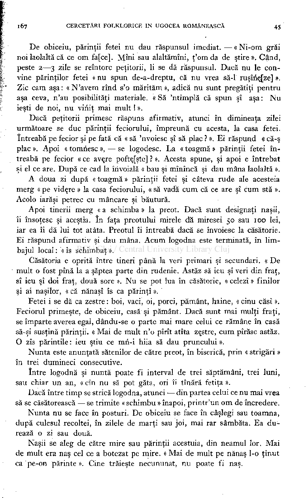

De obiceiu, părinţii fetei nu dau răspunsul imediat. —• « Ni-om grăi noi laolaltă că ce om fa[ce]. Mîni sau alaltămîni, ţ'om da de ştire». Când, peste 2—3 zile se reîntorc peţitorii, li se dă răspunsul. Dacă nu le convine părinţilor fetei « nu spun de-a-dreptu, că nu vrea să-1 ruşînc[ze] ». Zic cam aşa : « N'avem rînd s'o mărităm », adică nu sunt pregătiţi pentru aşa ceva, n'au posibilităţi materiale. « Să 'ntîmplă că spun şî aşa : Nu ieşti de noi, nu viriiţ mai mult ! ».

Dacă peţitorii primesc răspuns afirmativ, atunci în dimineaţa zilei următoare se duc părinţii feciorului, împreună cu acesta, la casa fetei, întreabă pe fecior şi pe fată că « să 'nvoiesc şî să plac ? ». Ei răspund « că-ş plac ». Apoi « tomnesc », — se logodesc. La « toagmă » părinţii fetei întreabă pe fecior « ce avçre poftçjste] ? ». Acesta spune, şi apoi e întrebat şi el ce are. După ce cad la învoială « bau şi mînîncă şi dau mâna laolaltă ».

A doua zi după «toagmă» părinţii fetei şi câteva rude ale acesteia merg « pe vidçre » la casa feciorului, « să vadă cum că ce are şî cum stă ». Acolo iarăşi petrec cu mâncare şi băutură.

Apoi tinerii merg « a schimba » la preot. Dacă sunt designaţi naşii, îi însoţesc şi aceştia. în faţa preotului mirele dă miresei 50 sau 100 lei, iar ea îi dă lui tot atâta. Preotul îi întreabă dacă se învoiesc la căsătorie. Ei răspund afirmativ şi dau mâna. Acum logodna este terminată, în limbajul local : '« îs schimbat ».

Căsătoria e oprită între tineri până la veri primari şi secundari. « De mult o fost pînă la a şaptea parte din rudenie. Astăz să ieu şî veri din fraţ,

- sî ieu şî doi fraţ, două sore ». Nu se pot lua în căsătorie, « celezî » finilor şi ai naşilor, « că nănaşî îs ca părinţi ».

Fetei i se dă ca zestre: boi, vaci, oi, porci, pământ, haine, «cinu căsî ». Feciorul primeşte, de obiceiu, casă şi pământ. Dacă sunt mai mulţi fraţi, se împarte averea egal, dându-se o parte mai mare celui ce rămâne în casă

- să-şi susţină părinţii. « Mai de mult n'o pîrît atîta zçstre, cum pîrăsc astăz. O zîs părintile : ieu ştiu ce mn-i hiia să dau pruncului ».

Nunta este anunţată sătenilor de către preot, în biserică, prin « strigări » în trei dumineci consecutive.

între logodnă şi nuntă poate fi interval de trei săptămâni, trei luni, sau chiar un an, « cîn nu să pot găta, ori îi tînără fetiţa ».

Dacă între timp se strică logodna, atunci — din partea celui ce nu mai vrea

- să se căsătorească — se trimite « schimbu » înapoi, printr'un om de încredere. Nunta nu se face în posturi. De obiceiu se face în câşlegi sau toamna,

după culesul recoltei, în zilele de marţi sau joi, mai rar sâmbăta. Ea durează o zi sau două.

Naşii se aleg de către mire sau părinţii acestuia, din neamul lor. Mai de mult era naş cel ce a botezat pe mire. « Mai de mult pe nănaş l-o ţînut ca pe-on părinte ». Cine trăieşte necununat, nu poate fi naş.

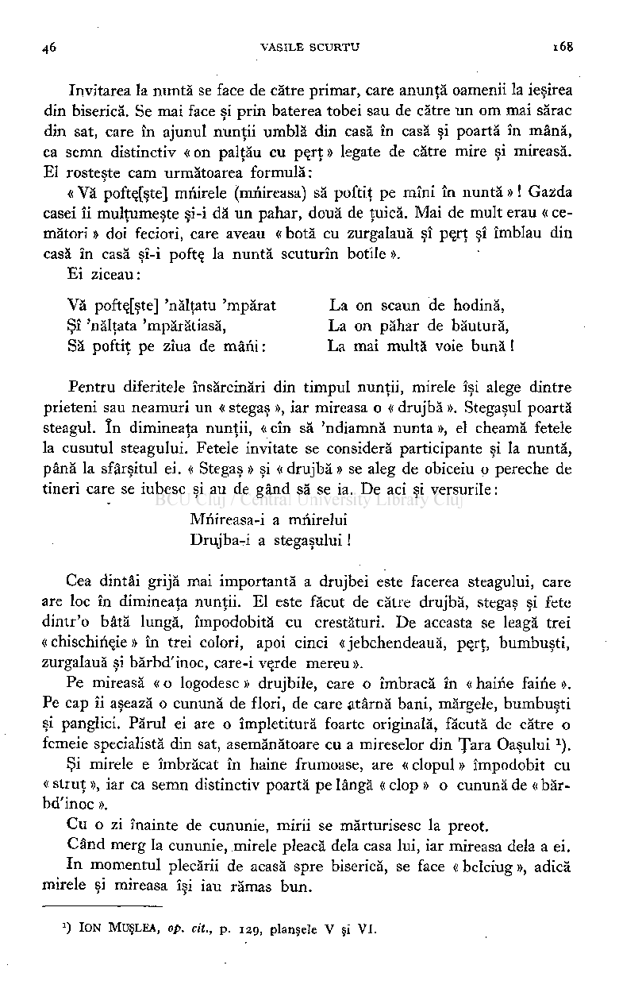

Invitarea la nuntă se face de către primar, care anunţă oamenii la ieşirea din biserică. Se mai face şi prin baterea tobei sau de către un om mai sărac din sat, care în ajunul nunţii umblă din casă în casă şi poartă în mână, ca semn distinctiv « on palţău cu pe_rţ » legate de către mire şi mireasă. El rosteşte cam următoarea formulă:

« Vă poftejste] mfïirele (mnireasa) să poftit pe mîni în nuntă » ! Gazda casei îi mulţumeşte şi-i dă un pahar, două de ţuică. Mai de mult erau « cemători » doi feciori, care aveau « botă cu zurgalauă şî pe_rţ şî îmbiau din casă în casă şî-i pofte, la nuntă scuturîn botile ».

Ei ziceau: Vă poftçfste] 'nălţatu 'mpărat La on scaun de hodină, Şî 'nălţata 'mpărătiasă, La on pahar de băutură, Să poftit pe zîua de mâni : La mai multă voie bună !

Pentru diferitele însărcinări din timpul nunţii, mirele îşi alege dintre prieteni sau neamuri un « stegaş », iar mireasa o « drujbă ». Stegaşul poartă steagul. în dimineaţa nunţii, « cîn să 'ndiamnă nunta », el cheamă fetele la cusutul steagului. Fetele invitate se consideră participante şi la nuntă, până la sfârşitul ei. « Stegaş » şi « drujbă » se aleg de obiceiu p pereche de tineri care se iubesc şi au de gând să se ia. De aci şi versurile:

Mfiireasa-i a mnirelui Drujba-i a stegaşului !

Cea dintâi grijă mai importantă a drujbei este facerea steagului, care are loc în dimineaţa nunţii. El este făcut de către drujbă, stegaş şi fete dintr'o bâtă lungă, împodobită cu crestături. De aceasta se leagă trei « chischinçie » în trei colori, apoi cinci « jebchendeauă, pe/ţ, bumbuşti, zurgalauă şi bărbd'inoc, care-i vçrde mereu ».

Pe mireasă « o logodesc » drujbile, care o îmbracă în « haine faine ». Pe cap îi aşează o cunună de flori, de care atârnă bani, mărgele, bumbuşti şi panglici. Părul ei are o împletitură foarte originală, făcută de către o femeie specialistă din sat, asemănătoare cu a mireselor din Ţara Oaşului ).

Şi mirele e îmbrăcat în haine frumoase, are « clopul » împodobit cu « struţ », iar ca semn distinctiv poartă pe lângă « clop » o cunună de « bărbd'inoc ».

Cu o zi înainte de cununie, mirii se mărturisesc la preot. Când merg la cununie, mirele pleacă delà casa lui, iar mireasa delà a ei. In momentul plecării de acasă spre biserică, se face « belciug », adică

mirele şi mireasa îşi iau rămas bun.

) ION MUŞLEA, op. cit., p. 129, planşele V şi VI .

J

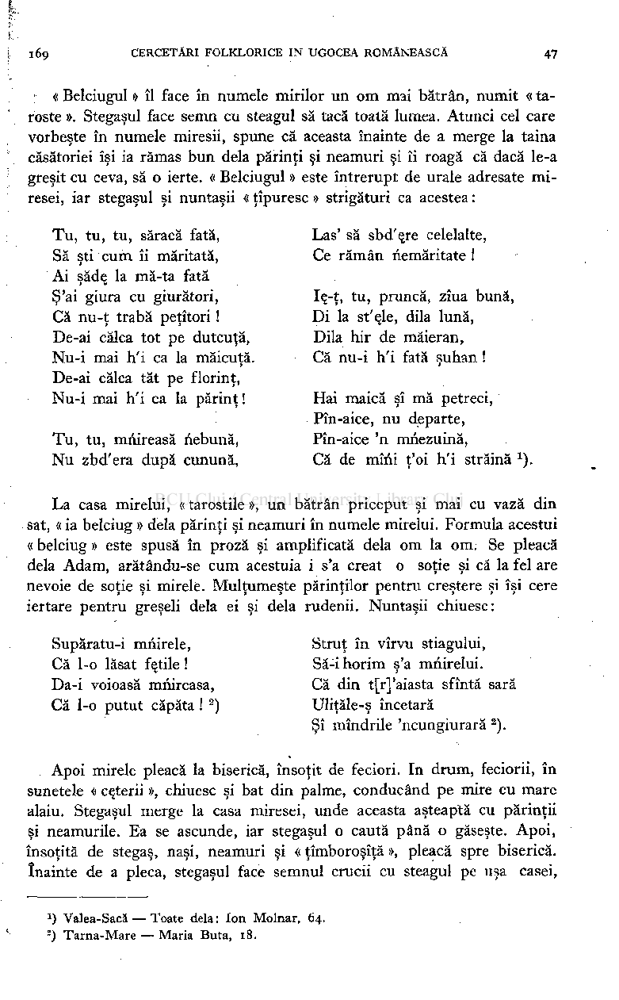

«Belciugul » îl face în numele mirilor un om mai bătrân, numit «taroste ». Stegaşul face semn cu steagul să tacă toată lumea. Atunci cel care vorbeşte în numele miresii, spune că aceasta înainte de a merge la taina căsătoriei îşi ia rămas bun delà părinţi şi neamuri şi îi roagă că dacă le-a greşit cu ceva, să o ierte. « Belciugul » este întrerupt de urale adresate miresei, iar stegaşul şi nuntaşii « ţîpuresc » strigături ca acestea :

Las' să sbd'çre celelalte, Ce rămân nemăritate !

Tu, tu, tu, săracă fată, Să şti cum îi măritată, Ai şăde, la mă-ta fată Ş'ai giura cu giurători, Că nu-ţ trabă peţitori ! De-ai călca tot pe dutcuţă, Nu-i mai h'i ca la măicuţă. De-ai călca tăt pe florinţ, Nu-i mai h'i ca la părinţ!

Ic-ţ, tu, pruncă, zîua bună, Di la st'çle, dila lună, Dila hir de măieran, Că nu-i h'i fată şuhan !

Hai maică şî mă petreci, Pîn-aice, nu departe, Pîn-aice 'n mnezuină, Că de mîhi ţ'oi h'i străină ).

Tu, tu, mnireasă nebună, Nu zbd'era după cunună,

La casa mirelui, « tarostile », un bătrân priceput şi mai cu vază din sat, « ia belciug » delà părinţi şi neamuri în numele mirelui. Formula acestui « belciug » este spusă în proză şi amplificată delà om la om. Se pleacă delà Adam, arătându-se cum acestuia i s'a creat o soţie şi că la fel are nevoie de soţie şi mirele. Mulţumeşte părinţilor pentru creştere şi îşi cere iertare pentru greşeli delà ei şi delà rudenii. Nuntaşii chiuesc:

Supăratu-i mhirele, Că l-o lăsat fçtile ! Da-i voioasă mnireasă, Că l-o putut căpăta !

Struţ în vîrvu stiagului, Să-i horim ş'a mnirelui. Că din t[r]'aiasta sfîntă sară Uliţăle-ş încetară Şî mîndrile 'ncungiurară ).

)

2

Apoi mirele pleacă la biserică, însoţit de feciori. In drum, feciorii, în sunetele « ceterii », chiuesc şi bat din palme, conducând pe mire cu mare alaiu. Stegaşul merge la casa miresei, unde aceasta aşteaptă cu părinţii şi neamurile. Ea se ascunde, iar stegaşul o caută până o găseşte. Apoi, însoţită de stegaş, naşi, neamuri şi « ţîmboroşîţă », pleacă spre biserică, înainte de a pleca, stegaşul face semnul crucii cu steagul pe uşa casei,

*) Valea-Sacă — Toate delà : Ion Molnar, 64.

-) Târna-Mare — Maria Buta, 18.

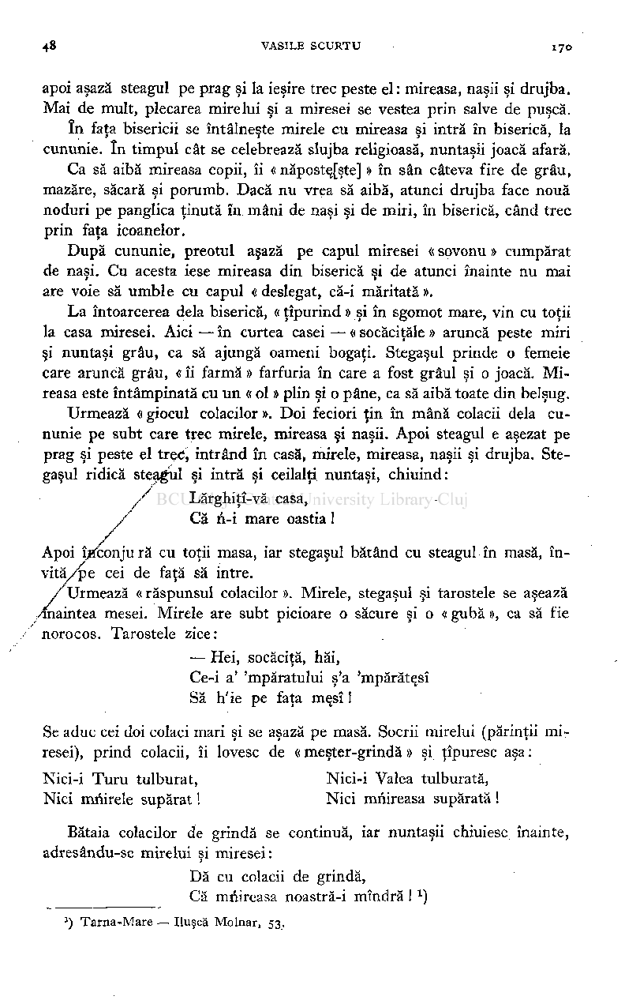

apoi aşază steagul pe prag şi la ieşire trec peste el : mireasa, naşii şi drujba. Mai de mult, plecarea mirelui şi a miresei se vestea prin salve de puşcă.

în faţa bisericii se întâlneşte mirele cu mireasa şi intră în biserică, la cununie. în timpul cât se celebrează slujba religioasă, nuntaşii joacă afară.

Ca să aibă mireasa copii, îi « năpostejste] » în sân câteva fire de grâu, mazăre, săcară şi porumb. Dacă nu vrea să aibă, atunci drujba face nouă noduri pe panglica ţinută în mâni de naşi şi de miri, în biserică, când trec prin faţa icoanelor.

După cununie, preotul aşază pe capul miresei « sovonu » cumpărat de naşi. Cu acesta iese mireasa din biserică şi de atunci înainte nu mai are voie să umble cu capul « deslegat, că-i măritată ».

La întoarcerea delà biserică, « ţîpurind » şi în sgomot mare, vin cu toţii la casa miresei. Aici — în curtea casei — « socăciţăle » aruncă peste miri şi nuntaşi grâu, ca să ajungă oameni bogaţi. Stegaşul prinde o femeie care aruncă grâu, « îi farmă » farfuria în care a fost grâul şi o joacă. Mireasa este întâmpinată cu un « ol » plin şi o pâne, ca să aibă toate din belşug.

Urmează « giocul colacilor ». Doi feciori ţin în mână colacii delà cununie pe subt care trec mirele, mireasa şi naşii. Apoi steagul e aşezat pe prag şi peste el trec, intrând în casă, mirele, mireasa, naşii şi drujba. Stegaşul ridică steagul şi intră şi ceilalţi nuntaşi, chiuind: Lărghiţî-vă casa,

/ Că h-i mare oastia !

Apoi înconjură cu toţii masa, iar stegaşul bătând cu steagul în masă, invită/pe cei de faţă să intre.

/Urmează « răspunsul colacilor ». Mirele, stegaşul şi tarostele se aşează /înaintea mesei. Mirele are subt picioare o săcure şi o « gubă », ca să fie

norocos. Tarostele zice:

— Hei, socăciţă, hăi, Ce-i a' 'mpăratului ş'a 'mpărătesî Să h'ie pe faţa mesî !

Se aduc cei doi colaci mari şi se aşază pe masă. Socrii mirelui (părinţii miresei), prind colacii, îi lovesc de « meşter-grindă » şi ţîpuresc aşa : Nici-i Turu tulburat, Nici-i Valea tulburată, Nici mnirele supărat ! Nici mnireasa supărată !

Bătaia colacilor de grindă se continuă, iar nuntaşii chiuiesc înainte,

adresându-se mirelui şi miresei: Dă cu colacii de grindă, Că mnireasa noastră-i mîndră !

)

x

###### *) Tarna-Mare — Iluşcă Molnar, 53.

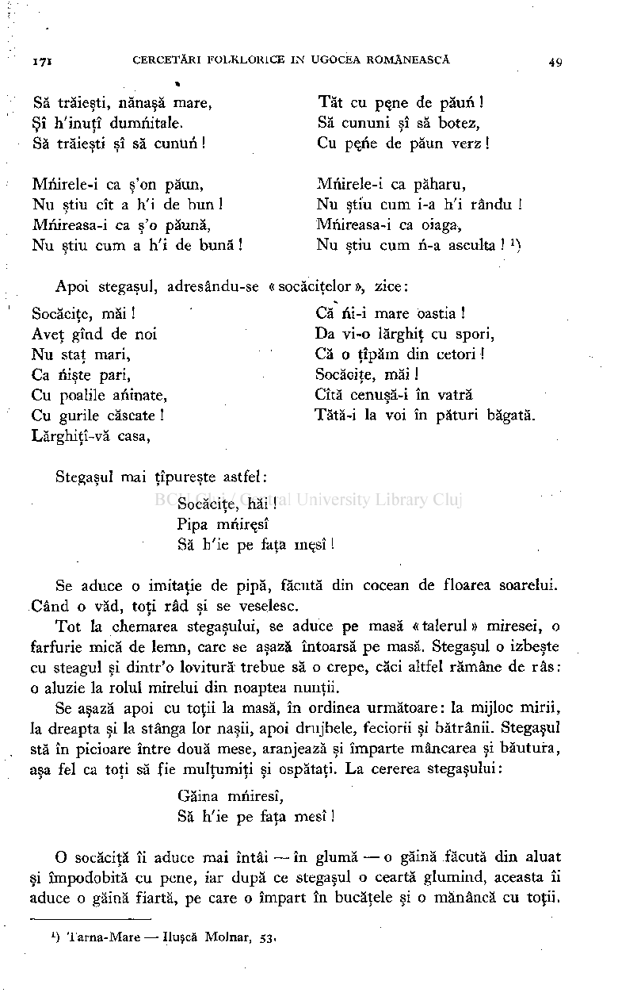

Să trăieşti, nănaşă mare, Şî h'inuţî dumnitale. Să trăieşti şî să cunun !

Tăt cu pçne de păun ! Să cununi şî să botez, Cu pene de păun verz !

Mhirele-i ca păharu, Nu ştiu cum i-a h'i rându ! Mriireasa-i ca oiaga, Nu ştiu cum h-a asculta !

Mnirele-i ca ş'on păun, Nu ştiu cît a h'i de bun ! Mfiireasa-i ca ş'o păună, Nu ştiu cum a h'i de bună !

)

1

« socăciţelor », zice :

Apoi stegaşul, adresându-se

Socăciţe, măi ! Aveţ gînd de noi Nu stat mari, Ca nişte pari, Cu poalile aninate, Cu gurile căscate ! Lărghiţî-vă casa,

Că rii-i mare oastia ! Da vi-o lărghiţ cu spori, Că o ţîpăm din cetori! Socăciţe, măi ! Cîtă cenuşă-i în vatră Tătă-i la voi în pături băgată.

Stegaşul mai ţîpureşte astfel:

Socăciţe, hăi ! Pipa mriiresî Să h'ie pe faţa mçsî !

Se aduce o imitaţie de pipă, făcută din cocean de floarea soarelui. Când o văd, toţi râd şi se veselesc.

Tot la chemarea stegaşului, se aduce pe masă « talerul » miresei, o farfurie mică de lemn, care se aşază întoarsă pe masă. Stegaşul o izbeşte cu steagul şi dintr'o lovitură trebue să o crepe, căci altfel rămâne de râs: o aluzie la rolul mirelui din noaptea nunţii.

Se aşază apoi cu toţii la masă, în ordinea următoare: la mijloc mirii, la dreapta şi la stânga lor naşii, apoi drujbele, feciorii şi bătrânii. Stegaşul stă în picioare între două mese, aranjează şi împarte mâncarea şi băutura, aşa fel ca toţi să fie mulţumiţi şi ospătaţi. La cererea stegaşului:

Găina mniresî, Să h'ie pe faţa mesî !

O socăciţă îi aduce mai întâi — în glumă — o găină făcută din aluat şi împodobită cu pene, iar după ce stegaşul o ceartă glumind, aceasta îi aduce o găină fiartă, pe care o împart în bucăţele şi o mănâncă cu toţii.

###### *) Târna-Mare — Iluşcă Molnar, 53.

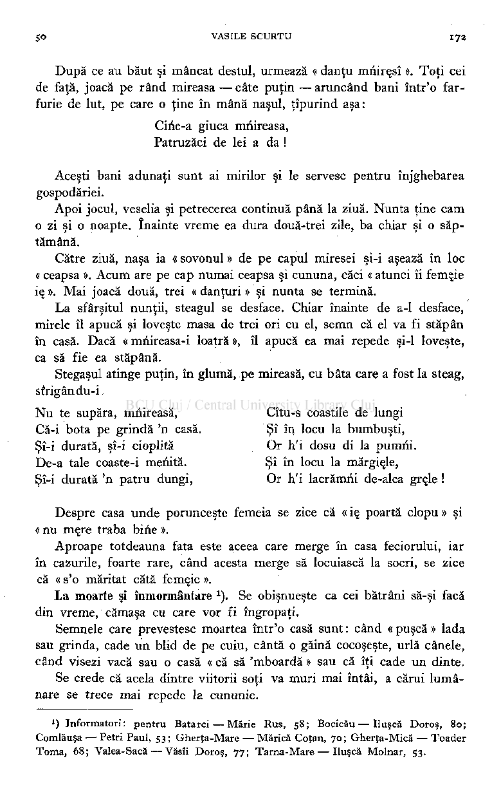

După ce au băut şi mâncat destul, urmează « danţu mnirçsî ». Toţi cei de faţă, joacă pe rând mireasa — câte puţin — aruncând bani într'o farfurie de lut, pe care o ţine în mână naşul, ţîpurind aşa :

Cihe-a giuca mhireasa, Patruzăci de lei a da !

Aceşti bani adunaţi sunt ai mirilor şi le servesc pentru înjghebarea gospodăriei.

Apoi jocul, veselia şi petrecerea continuă până la ziuă. Nunta ţine cam o zi şi o noapte. înainte vreme ea dura două-trei zile, ba chiar şi o săptămână.

Către ziuă, naşa ia « sovonul » de pe capul miresei şi—i aşează în loc « ceapsa ». Acum are pe cap numai ceapsa şi cununa, căci « atunci îi femşie iç ». Mai joacă două, trei « danturi » şi nunta se termină.

La sfârşitul nunţii, steagul se desface. Chiar înainte de a-1 desface, mirele îl apucă şi loveşte masa de trei ori cu el, semn că el va fi stăpân în casă. Dacă « mfiireasa-i loaţră », îl apucă ea mai repede şi-1 loveşte, ca să fie ea stăpână.

Stegaşul atinge puţin, în glumă, pe mireasă, cu bâta care a fost la steag, sirigându-i. Nu te supăra, mnireasă, Cîtu-s coastile de lungi Că-i bota pe grindă 'n casă. Şî în locu la bumbuşti, Şî-i durată, şî-i cioplită Or h'i dosu di la pumni. De-a tale coaste-i menită. Şî în locu la mărgicle, Şî-i durată 'n patru dungi, Or h'i lacrămhi de-alea gre_le !

Despre casa unde porunceşte femeia se zice că « iç poartă clopu » şi « nu mere traba bine ».

Aproape totdeauna fata este aceea care merge în casa feciorului, iar în cazurile, foarte rare, când acesta merge să locuiască la socri, se zice că « s'o măritat cătă femçie ».

). Se obişnueşte ca cei bătrâni să-şi facă din vreme, cămaşa cu care vor fi îngropaţi.

La moarte şi înmormântare

1

Semnele care prevestesc moartea într'o casă sunt : când « puşcă » lada sau grinda, cade un blid de pe cuiu, cântă o găină cocoşeşte, urlă cânele, când visezi vacă sau o casă « că să 'mboardă » sau că îţi cade un dinte.

Se crede că acela dintre viitorii soţi va muri mai întâi, a cărui lumânare se trece mai repede la cununie.

') Informatori: pentru Batarci — Mărie Rus, 58; Bocicău — Iluşcă Doroş, 80; Comlăuşa — Petri Paul, 53; Gherţa-Mare — Mărică Coţan, 70; Gherţa-Mică — Toader Torna, 68; Valea-Sacă — Văsîi Doroş, 77 Tarna-Mare — Iluşcă Molnar, 53.

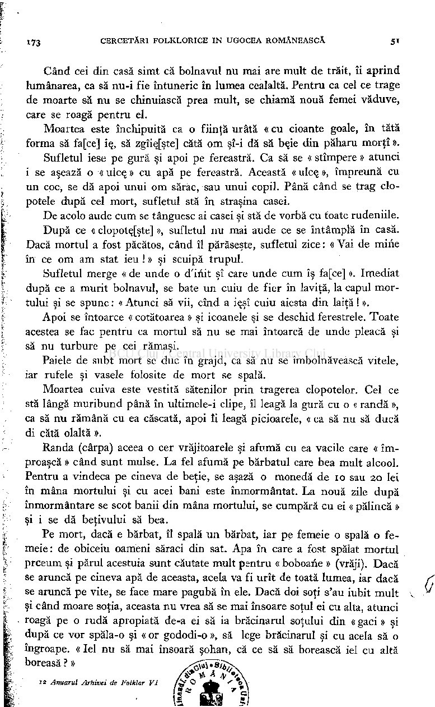

Când cei din casă simt că bolnavul nu mai are mult de trăit, îi aprind lumânarea, ca să nu-i fie întuneric în lumea cealaltă. Pentru ca cel ce trage de moarte să nu se chinuiască prea mult, se chiamă nouă femei văduve, care se roagă pentru el.

Moartea este închipuită ca o fiinţă urâtă « cu cioante goale, în tătă forma să fa[ce] iç, să zgîicfşte] cătă om şî-i dă să bçie din păharu morţî ».

Sufletul iese pe gură şi apoi pe fereastră. Ca să se « stîmpere » atunci i se aşează o « ulcç » cu apă pe fereastră. Această « ulce_ », împreună cu un coc, se dă apoi unui om sărac, sau unui copil. Până când se trag clopotele după cel mort, sufletul stă în straşina casei.

De acolo aude cum se tânguesc ai casei şi stă de vorbă cu toate rudeniile. După ce « clopotc[şte] », sufletul nu mai aude ce se întâmplă în casă.

Dacă mortul a fost păcătos, când îl părăseşte, sufletul zice : « Vai de mine în ce om am stat ieu ! » şi scuipă trupul.

Sufletul merge « de unde o d'ifiit şî care unde cum îş fa[ce] ». Imediat după ce a murit bolnavul, se bate un cuiu de fier în laviţă, la capul mortului şi se spune : « Atunci să vii, cînd a ie_şî cuiu aiesta din laiţă ! ».

Apoi se întoarce « cotătoarea » şi icoanele şi se deschid ferestrele. Toate acestea se fac pentru ca mortul să nu se mai întoarcă de unde pleacă şi să nu turbure pe cei rămaşi.

Paiele de subt mort se duc în grajd, ca să nu se îmbolnăvească vitele, iar rufele şi vasele folosite de mort se spală.

Moartea cuiva este vestită sătenilor prin tragerea clopotelor. Cel ce stă lângă muribund până în ultimele-i clipe, îl leagă la gură cu o « randă », ca să nu rămână cu ea căscată, apoi îi leagă picioarele, « ca să nu să ducă di cătă olaltă ».

Randa (cârpa) aceea o cer vrăjitoarele şi afumă cu ea vacile care « împroaşcă » când sunt mulse. La fel afumă pe bărbatul care bea mult alcool. Pentru a vindeca pe cineva de beţie, se aşază o monedă de 10 sau 20 lei în mâna mortului şi cu acei bani este înmormântat. La nouă zile după înmormântare se scot banii din mâna mortului, se cumpără cu ei « palincă » şi i se dă beţivului să bea.

Pe mort, dacă e bărbat, îl spală un bărbat, iar pe femeie o spală o femeie: de obiceiu oameni săraci din sat. Apa în care a fost spălat mortul prceum şi părul acestuia sunt căutate mult pentru « boboane » (vrăji). Dacă se aruncă pe cineva apă de aceasta, acela va fi urît de toată lumea, iar dacă se aruncă pe vite, se face mare pagubă în ele. Dacă doi soţi s'au iubit mult şi când moare soţia, aceasta nu vrea să se mai însoare soţul ei cu alta, atunci roagă pe o rudă apropiată de-a ei să ia brăcinarul soţului din « gaci » şi după ce vor spăla-o şi « or gododi-o », să lege brăcinarul şi cu acela să o îngroape. « Iei nu să mai însoară şohan, că ce să să horească iei cu altă boreasă ? »

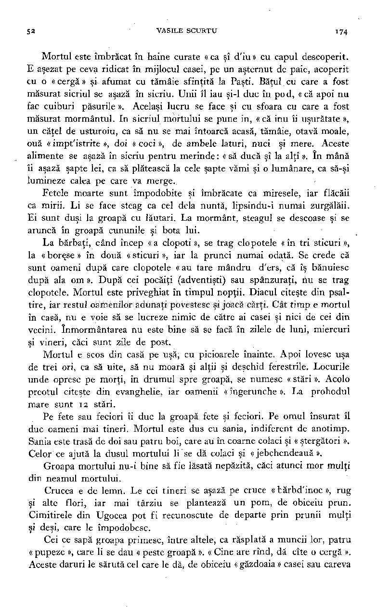

Mortul este îmbrăcat în haine curate «ca şî d'iu» cu capul descoperit. E aşezat pe ceva ridicat în mijlocul casei, pe un aşternut de paie, acoperit cu o « cergă » şi afumat cu tămâie sfinţită la Paşti. Băţul cu care a fost măsurat sicriul se aşază în sicriu. Unii îl iau şi—1 duc în pod, « că apoi nu fac cuiburi păsurile ». Acelaşi lucru se face şi cu sfoara cu care a fost măsurat mormântul. In sicriul mortului se pune in, « că inu îi uşurătate », un căţel de usturoiu, ca să nu se mai întoarcă acasă, tămâie, otavă moale, ouă « impt'istrite », doi «coci», de ambele laturi, nuci şi mere. Aceste alimente se aşază în sicriu pentru merinde : « să ducă şî la alţî ». în mână îi aşază şapte lei, ca să plătească la cele şapte vămi şi o lumânare, ca să-şi lumineze calea pe care va merge.

Fetele moarte sunt împodobite şi îmbrăcate ca miresele, iar flăcăii ca mirii. Li se face steag ca cel delà nuntă, lipsindu-i numai zurgălăii. Ei sunt duşi la groapă cu lăutari. La mormânt, steagul se descoase şi se aruncă în groapă cununile şi bota lui.

La bărbaţi, când încep «a clopoti », se trag clopotele «în tri sticuri », la « borese » în două « sticuri », iar la prunci numai odată. Se crede că sunt oameni după care clopotele « au tare mândru d'ers, că îş bănuiesc după ala om ». După cei pocăiţi (adventişti) sau spânzuraţi, hu se trag clopotele. Mortul este priveghiat în timpul nopţii. Diacul citeşte din psaltire, iar restul oamenilor adunaţi povestesc şi joacă cărţi. Cât timp e mortul în casă, nu e voie să se lucreze nimic de către ai casei şi nici de cei din vecini. înmormântarea nu este bine să se facă în zilele de luni, miercuri şi vineri, căci sunt zile de post.

Mortul e scos din casă pe uşă, cu picioarele înainte. Apoi lovesc uşa de trei ori, ca să uite, să nu moară şi alţii şi deschid ferestrile. Locurile unde opresc pe morţi, în drumul spre groapă, se numesc « stări ». Acolo preotul citeşte din evanghelie, iar oamenii « îngerunche ». La prohodul mare sunt 12 stări.

Pe fete sau feciori îi duc la groapă fete şi feciori. Pe omul însurat îl duc oameni mai tineri. Mortul este dus cu sania, indiferent de anotimp. Sania este trasă de doi sau patru boi, care au în coarne colaci şi « ştergători ». Celor ce ajută la dusul mortului li se dă colaci şi « jebchendeauă ».

Groapa mortului nu-i bine să fie lăsată nepăzită, căci atunci mor mulţi din neamul mortului.

Crucea e de lemn. Le cei tineri se aşază pe cruce « bărbd'inoc », rug şi alte flori, iar mai târziu se plantează un pom, de obiceiu prun. Cimitirele din Ugocea pot fi recunoscute de departe prin prunii mulţi şi deşi, care le împodobesc.

Cei ce sapă groapa primesc, între altele, ca răsplată a muncii lor, patru « pupeze », care li se dau « peste groapă ». « Cine are rînd, dă cîte o cergă ». Aceste daruri le sărută cel care le dă, de obiceiu « găzdoaia » casei sau careva

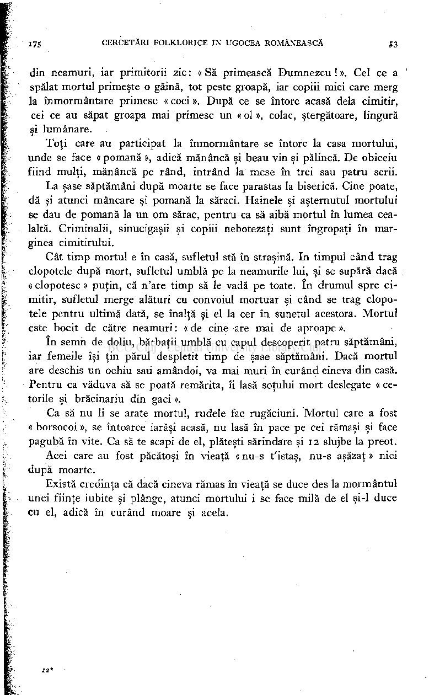

din neamuri, iar primitorii zic : « Să primească Dumnezeu ! ». Cel ce a spălat mortul primeşte o găină, tot peste groapă, iar copiii mici care merg la înmormântare primesc « coci ». După ce se întorc acasă delà cimitir, cei ce au săpat groapa mai primesc un « ol », colac, ştergătoare, lingură şi lumânare.

Toţi care au participat la înmormântare se întorc la casa mortului, unde se face « pomană », adică mănâncă şi beau vin şi palincă. De obiceiu fiind mulţi, mănâncă pe rând, intrând la mese în trei sau patru serii.

La şase săptămâni după moarte se face parastas la biserică. Cine poate, dă şi atunci mâncare şi pomană la săraci. Hainele şi aşternutul mortului se dau de pomană la un om sărac, pentru ca să aibă mortul în lumea cealaltă. Criminalii, sinucigaşii şi copiii nebotezaţi sunt îngropaţi în marginea cimitirului.

Cât timp mortul e în casă, sufletul stă în straşină. In timpul când trag clopotele după mort, sufletul umblă pe la neamurile lui, şi se supără dacă « clopotesc » puţin, că n'are timp să le vadă pe toate. în drumul spre cimitir, sufletul merge alături cu convoiul mortuar şi când se trag clopotele pentru ultimă dată, se înalţă şi el la cer în sunetul acestora. Mortul este bocit de către neamuri : « de cine are mai de aproape ».

în semn de doliu, bărbaţii umblă cu capul descoperit patru săptămâni, iar femeile îşi ţin părul despletit timp de şase săptămâni. Dacă mortul are deschis un ochiu sau amândoi, va mai muri în curând cineva din casă. Pentru ca văduva să se poată remărita, îi lasă soţului mort deslegate « cetorile şi brăcinariu din gaci ».

Ca să nu li se arate mortul, rudele fac rugăciuni. Mortul care a fost « borsocoi », se întoarce iarăşi acasă, nu lasă în pace pe cei rămaşi şi face pagubă în vite. Ca să te scapi de el, plăteşti sărindare şi 12 slujbe la preot.

Acei care au fost păcătoşi în vieaţă « nu-s t'istaş, nu-s aşăzaţ » nici după moarte.

Există credinţa că dacă cineva rămas în vieaţă se duce des la mormântul unei fiinţe iubite şi plânge, atunci mortului i se face milă de el şi-1 duce cu el, adică în curând moare si acela.

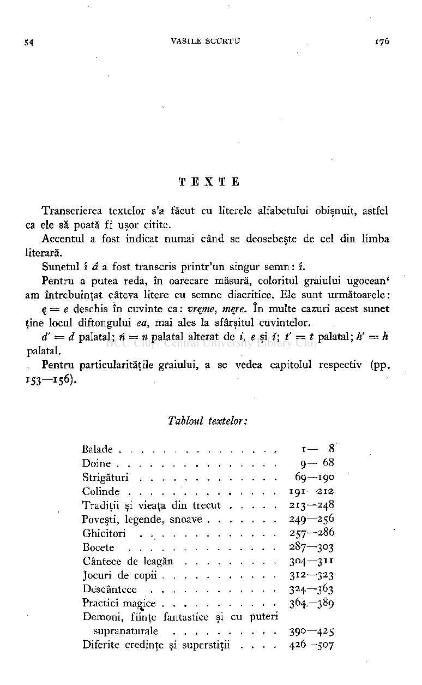

TEXT

Transcrierea textelor s'a făcut cu literele alfabetului obişnuit, astfel ca ele să poată fi uşor citite.

Accentul a fost indicat numai când se deosebeşte de cel din limba

literară. Sunetul î â a fost transcris printr'un singur semn : 1. Pentru a putea reda, în oarecare măsură, coloritul graiului ugocean'

am întrebuinţat câteva litere cu semne diacritice. Ele sunt următoarele:

q = e deschis în cuvinte ca : vreme, mere. în multe cazuri acest sunet ţine locul diftongului ea, mai ales la sfârşitul cuvintelor.

d' = d palatal; û = n palatal alterat de i, e şi ï; t' = t palatal; h' — h palatal.

Pentru particularităţile graiului, a se vedea capitolul respectiv (pp.

153—156).

Tabloul textelor:

Balade 1— 8 Doine 9—68 Strigături 69—190 Colinde 191—212 Tradiţii şi vieaţa din trecut 213—248 Poveşti, legende, snoave 249—256 Ghicitori . 257—286 Bocete 287—303 Cântece de leagăn 304—311 Jocuri de copii • 312—323 Descântece 324—363 Practici magjce 364.—389 Demoni, fiinţe fantastice şi cu puteri

supranaturale 390—425 Diferite credinţe şi superstiţii ... . 426—507

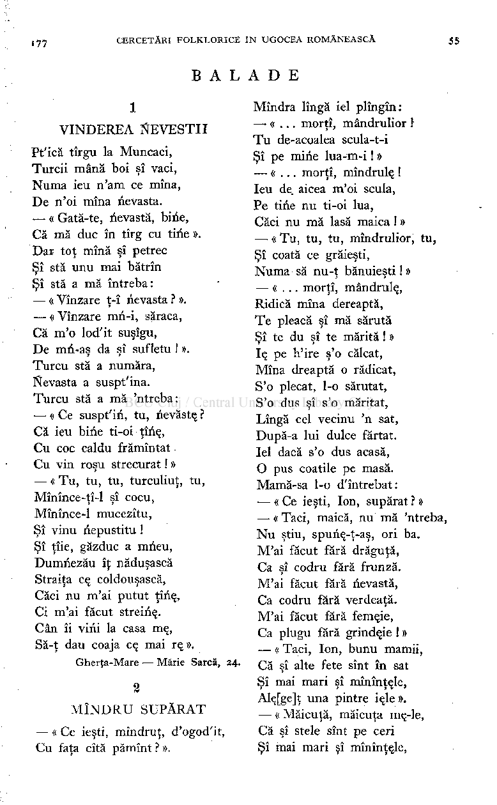

BALAD E

1

Mîndra lîngă iei plîngîn:

— «.. . mortî, mândrulior 1 Tu de-acoalea scula-t-i Şî pe mine lua-m-i ! » — «.. . morţî, mîndrule. ! Ieu de. aicea m'oi scula, Pe tine nu ti-oi lua, Căci nu mă lasă maica ! »

VINDEREA NEVESTII Pt'ică tîrgu la Muncaci, Turcii mână boi şî vaci, Numa ieu n'am ce mîna, De n'oi mîna nevasta.

— « Gată-te, nevastă, bine, Că mă duc în tîrg cu tine ». Dar toţ mînă şî petrec Şî stă unu mai bătrîn Şî stă a mă întreba:

— « Tu, tu, tu, mîndrulior, tu, Şî coată ce grăieşti, Numa să nu-ţ bănuieşti ! »

— «.. . morţî, mândrulç, Ridică mîna dereaptă, Te pleacă şî mă sărută Şî te du şî te mărită ! » Iç pe h'ire ş'o călcat, Mîna dreaptă o rădicat, S'o plecat, l-o sărutat, S'o dus şî s'o măritat, Lîngă cel vecinu 'n sat, După-a lui dulce fărtat. Iei dacă s'o dus acasă, O pus coatile pe masă. Mamă-sa l-o d'întrebat:

— « Vînzare ţ-î nevasta ? ».

— « Vînzare mn-i, săraca, Că m'o lod'it suşîgu, De mn-aş da şî sufletu ! ». Turcu stă a număra, Nevasta a suspt'ina. Turcu stă a mă 'ntreba:

— « Ce suspt'in, tu, hevăstc ? Că ieu bine ti-oi ţîne., Cu coc caldu frămîntat Cu vin roşu strecurat ! »

— « Tu, tu, tu, turculiuţ, tu, Mînînce-ţî-1 şî cocu, Mînînce-1 mucezîtu, Şî vinu nepustitu ! Şî ţîie, găzduc a mheu, Dumnezău îţ năduşască Straiţa ce. coldouşască, Căci nu m'ai putut ţîrie,, Ci m'ai făcut streine.. Cân îi vini la casa me.,

— « Ce ieşti, Ion, supărat ? »

— « Taci, maică, nu mă 'ntreba, Nu ştiu, spuric-ţ-aş, ori ba. M'ai făcut fără drăguţă, Ca şî codru fără frunză. M'ai făcut fără nevastă, Ca codru fără verdeaţă. M'ai făcut fără femçie, Ca plugu fără grindçie 1 »

- Să-ţ dau coaja ce. mai re. ». Gherţa-Mare — Mărie Sarcă, 24.

— « Taci, Ion, bunu mamii, Că şî alte fete sînt în sat Şî mai mari şî mînînţcle, Alc[ge]ţ una pintre içle ». — « Măicuţă, măicuţa mç-le, Că şî stele sînt pe ceri Şî mai mari şî mînîntçle,

## 2

MÎNDR U SUPĂRAT

— « Ce ieşti, mîndruţ, d'ogod'it, Cu faţa cîtă pămînt ? ».

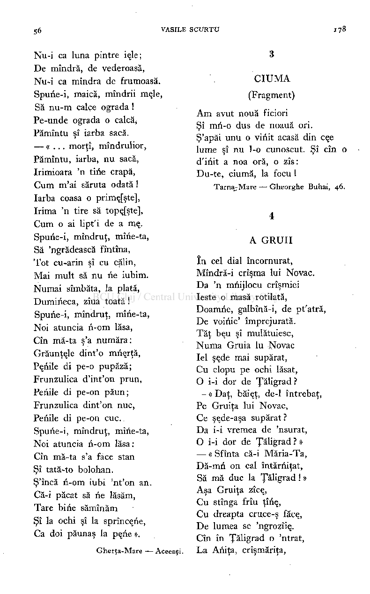

Nu-i ca luna pintre iele; De mîndră, de vederoasă, Nu-i ca mîndra de frumoasă. Spune-i, maică, mîndrii mçle, Să nu-m calce ograda ! Pe-unde ograda o calcă^ Pămîntu şî iarba sacă.

CIUMA (Fragment)

Am avut nouă ficiori Şî mn-o dus de noauă ori. Ş'apăi unu o viriit acasă din cee lume şî nu l-o cunoscut. Şî cîn o d'ihit a noa oră, o zîs: Du-te, ciumă, la focu !

— «.. . morţî, mîndrulior, Pămîntu, iarba, nu sacă, Irimioara 'n tine crapă, Cum m'ai săruta odată ! Iarba coasa o primc[şte], Irima 'n tire să topejste], Cum o ai lipt'i de a mç. Spune-i, mîndruţ, mîne-ta, Să 'ngrădească fîntîna, Tot cu-arin şî cu călin, Mai mult să nu ne iubim. Numai sîmbăta, la plată, Dumineca, zîua toată ! Spune-i, mîndruţ, mîne-ta, Noi atuncia n-om lăsa, Cîn mă-ta ş'a număra: Grăunţcle dint'o mncrţă, Penile di pe-o pupăză; Frunzulica d'int'on prun, Penile di pe-on păun; Frunzulica dint'on nuc, Penile di pe-on cuc. Spune-i, mîndruţ, mîne-ta, Noi atuncia h-om lăsa: Cîn mă-ta s'a face stan Şî tată-to bolohan. Ş'încă n-om iubi 'nt'on an. Că-i păcat să ne lăsăm, Tare bine sămînăm Şî la ochi şî la sprîncene, Ca doi păunaş la pçfîe ».

Târna; Mare — Gheorghe Buhai, 46.

4

A GRUII

în cel dial încornurat, Mîndră-i crîşma lui Novac. Da 'n mhijlocu crîşmiei Ieste o masă rotilată, Doamne, galbînă-i, de pt'atră, De voinic' împrejurată. Tăţ beu şî mulătuiesc, Numa Gruia lu Novac Iei şede mai supărat, Cu clopu pe ochi lăsat, O i-i dor de Ţăligrad ? — « Daţ, băicţ, de-1 întrebat, Pe Gruiţa lui Novac, Ce şede-aşa supărat ? Da i-i vremea de 'nsurat, O i-i dor de Ţăligrad ? » — « Sfînta că-i Măria-Ta, Dă-mn on cal întărfiiţat, Să mă duc la Ţăligrad ! » Aşa Gruiţa zîcç, Cu stînga frîu ţînc, Cu dreapta cruce-ş făcc, De lumea se 'ngrozîiç. Cîn în Ţăligrad o 'ntrat, La Aniţa, crîşmăriţa,

Gherţa-Mare — Aceeaşi.

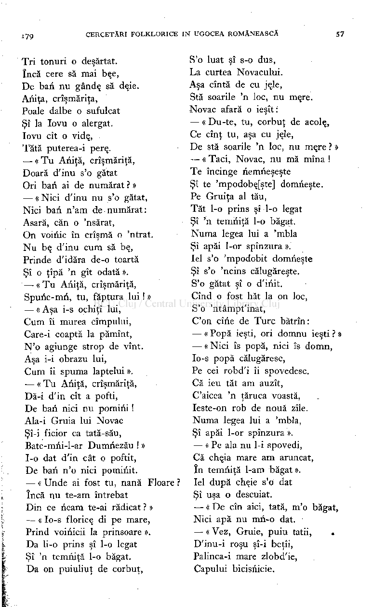

S'o luat şî s-o dus, La curtea Novacului. Aşa cîntă de cu jçle, Stă soarile 'n loc, nu mere. Novac afară o ieşît:

Tri tonuri o deşărtat. încă cere să mai bçe, De ban nu gândç să deje. Aniţa, crîşmăriţa, Poale dalbe o sufulcat Şî la Io vu o alergat. Iovu cît o vide,,

— « Du-te, tu, corbuţ de acolç, Ce cînţ tu, aşa cu jeje, De stă soarile 'n loc, nu mere ? — « Taci, Novac, nu mă mîna ! Te încinge nemiîeşeşte Şî te 'mpodobejşte] domneşte. Pe Gruiţa al tău, Tăt l-o prins şî l-o legat Şî 'n temniţă l-o băgat. Numa legea lui a 'mbla Şî apăi l-or spînzura ». Iei s'o 'mpodobit domneşte Şî s'o 'ncins călugăreşte. S'o gătat şî o d'iriit. Cînd o fost hăt la on loc, S'o 'ntâmpt'inat, Con cîne de Turc bătrîn:

- Tătă puterea-i perç.

— « Tu Aniţă, crîşmăriţa, Doară d'inu s'o gătat Ori ban ai de numărat ? »

— « Nici d'inu nu s'o gătat, Nici ban n'am de numărat: Asară, căn o 'nsărat, On voinic în crîşmă o 'ntrat. Nu bç d'inu cum să be_, Prinde d'idăra de-o toartă Şî o ţîpă 'n gît odată ».

— « Tu Aniţă, crîşmăriţa, Spune-mn, tu, făptura lui ! »

— « Aşa i-s ochiţî lui, Cum îi murea cîmpului, Care-i coaptă la pămînt, N'o agiunge strop de vînt. Aşa i-i obrazu lui, Cum îi spuma laptelui ».

— « Popă ieşti, ori domnu ieşti ?

— « Nici îs popă, nici îs domn, Io-s popă călugăresc, Pe cei robd'i îi spovedesc. Că ieu tăt am auzît, C'aicea 'n ţăruca voastă, Ieste-on rob de nouă zîle. Numa legea lui a 'mbla, Şî apăi l-or spînzura ».

— « Tu Aniţă, crîşmăriţa, Dă-i d'in cît a pofti, De ban nici nu pomini ! Ala-i Gruia lui Novac Şî-i ficior ca tată-său, Bate-mfïi-1-ar Dumhezău ! » I-o dat d'in cât o poftit, De ban n'o nici pominit. — « Unde ai fost tu, nană Floare ? încă nu te-am întrebat Din ce neam te-ai rădicat ? »

— « Pe ala nu 1-i spovedi, Că cheja mare am aruncat, în temniţă l-am băgat ». Iei după chçie s'o dat Şî uşa o descuiat.

— « De cîn aici, tată, m'o băgat Nici apă nu mn-o dat.

— « Io-s florice. di pe mare, Prind voinicii la prinsoare ». Da li-o prins şî l-o legat Şî 'n temniţă l-o băgat. Da on puiuliuţ de corbuţ,

— « Vez, Gruie, puiu tatii, . D'inu-i roşu şî-i beţîi, Palinca-i mare zlobd'ie, Capului bicisnicie.

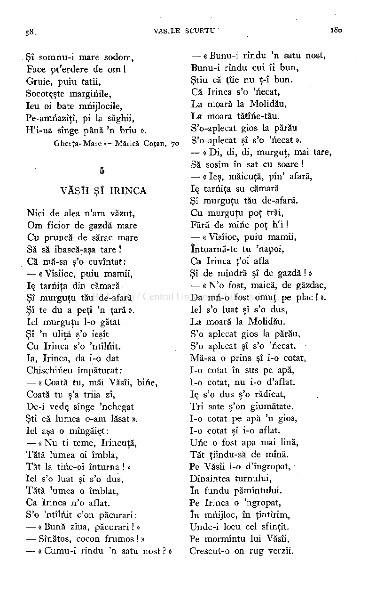

— « Bunu-i rîndu 'n satu nost, Bunu-i rîndu cui îi bun, Ştiu că ţîie nu ţ-î bun. Că Irinca s'o 'necat, La moară la Molidău, La moara tătîfie-tău. S'o-aplecat gios la părău S'o-aplecat şî s'o 'necat ».

Şî somnu-i mare sodom, Face pt'erdere de om ! Gruie, puiu tatii, Socoteşte marginile, leu oi bate mnijlocile, Pe-amnazîţî, pi la săghii, H'i-ua sînge până 'n brîu ».

Gherţa- Mare — Mărică Coţan, 7 °

— « Di, di, di, murguţ, mai tare

- Să sosîm în sat cu soare !

— « leş, măicuţă, pîn' afară, Iç tarniţa su cămară Şî murguţu tău de-afară. Cu murguţu poţ trăi, Fără de mine poţ h'i !

— « Vîsîioc, puiu mamii, întoarnă-te tu 'napoi, Ca Irinca ţ'oi afla Şî de mîndră şî de gazdă ! »

— « N'o fost, maică, de găzdac, Da mn-o fost omuţ pe plac ! ». Iei s'o luat şî s'o dus, La moară la Molidău. S'o aplecat gios la părău, S'o aplecat şî s'o 'necat. Mă-sa o prins şî i-o cotat, I-o cotat în sus pe apă, I-o cotat, nu i-o d'aflat. Iç s'o dus ş'o rădicat, Tri sate ş'on giumătate. I-o cotat pe apă 'n gios, I-o cotat şî i-o aflat. Une o fost apa mai lină,

- Tăt ţiindu-să de mînă. Pe Văsîi l-o d'îngropat, Dinaintea turnului, în fundu pămîntului. Pe Irinca o 'ngropat, în mnijloc, în ţîntîrim, Unde-i locu cel sfinţit. Pe mormîntu lui Văsîi, Crescut-o on rug verzîi.

5

VASÎI ŞÎ IRINCA

Nici de alea n'am văzut,

- Om ficior de gazdă mare Cu pruncă de sărac mare

- Să să ibască-aşa tare ! Că mă-sa ş'o cuvîntat:

— « Vîsîioc, puiu mamii, Iç tarniţa din cămară Şî murguţu tău de-afară Şî te du a peţî 'n ţară ». Iei murguţu l-o gătat Şî 'n uliţă ş'o ieşît Cu Irinca s'o 'ntîlnit. Ia, Irinca, da i-o dat Chischineu împăturat:

•— « Coată tu, măi Văsîi, bine, Coată tu ş'a triia zî, De-i vedç sînge 'nchegat Şti că lumea o-am lăsat ». Iei aşa o mîngăict:

— « Nu ti teme, Irincuţă,

- Tătă lumea oi îmbla, Tăt la tine-oi înturna ! » Iei s'o luat şî s'o dus, Tătă lumea o îmbiat, Ca Irinca n'o aflat. S'o 'ntîlnit c'on păcurari:

— « Bună zîua, păcurari ! »

— Sînătos, cocon frumos ! »

— « Cumu-i rîndu 'n satu nost ? »

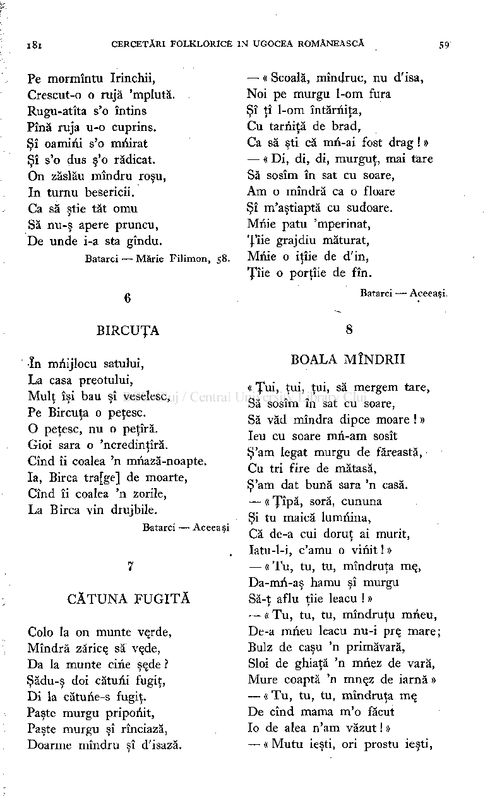

59

CERCETĂR I FOLKLORIC E I N UGOCE A ROMÂNEASC Ă

###### I8I

— « Scoală, mîndruc, nu d'isa, Noi pe murgu l-om fura Şî ţî l-om întărniţa, Cu tarniţă de brad, Ca să şti că mh-ai fost drag ! » — « Di, di, di, murguţ, mai tare Să sosîm în sat cu soare, Am o mîndră ca o floare Şî m'aştiaptă cu sudoare. Mnie patu 'mperinat, Ţîie grajdiu măturat, Mnie o iţîie de d'in, Ţîie o porţîie de fîn.

Pe mormîntu Irinchii, Crescut-o o rujă 'mplută. Rugu-atîta s'o întins Pînă ruja u-o cuprins. Şî oamini s'o mhirat Şî s'o dus ş'o rădicat.

- On zăslău mîndru roşu, In turnu besericii. Ca să ştie tăt omu Să nu-ş apere pruncu, De unde i-a sta gîndu.

Batarci — Mărie Filimon, 58.

Batarci — Aceeaşi.

6

BIRCUŢA

8

BOALA MÎNDRU

•în mnijlocu satului, La casa preotului, Mulţ îşi bau şî veselesc, Pe Bircuţa o peţesc. O peţesc, nu o peţîră. Gioi sara o 'ncredinţîră. Cînd îi coalea 'n mnază-noapte. Ia, Birca tra[ge] de moarte, Cînd îi coalea 'n zorile, La Birca vin drujbile.

« Ţui, ţui, ţui, să mergem tare, Să sosîm în sat cu soare, Să văd mîndră dipce moare ! » leu cu soare mfi-am sosît Ş'am legat murgu de făreastă, • Cu tri fire de mătasă, Ş'am dat bună sara 'n casă.

— « Ţîpă, soră, cununa Şi tu maică lumnina, Că de-a cui doruţ ai murit, Iatu-l-i, c'amu o vinit ! »

Batarci — Aceeaşi

7

— « Tu, tu, tu, mîndruţa mç, Da-mn-aş hamu şî murgu Să-ţ aflu ţîie leacu ! »

CÄTUN A FUGIT Ă

— « Tu, tu, tu, mîndruţu mneu, De-a mheu leacu nu-i prç mare; Bulz de caşu 'n primăvară, Sloi de ghiaţă 'n mriez de vară, Mure coaptă 'n mnez de iarnă » — « Tu, tu, tu, mîndruţa mç De cînd mama m'o făcut Io de alea n'am văzut ! » — « Mutu ieşti, ori prostu ieşti,

Colo la on munte verde, Mîndră zăricc să vede, Da la munte cine şede ? Şădu-ş doi căturii fugit, Di la cătune-s fugit. Paşte murgu priponit, Paşte murgu şî rînciază, Doarme mîndru şî d'isază.

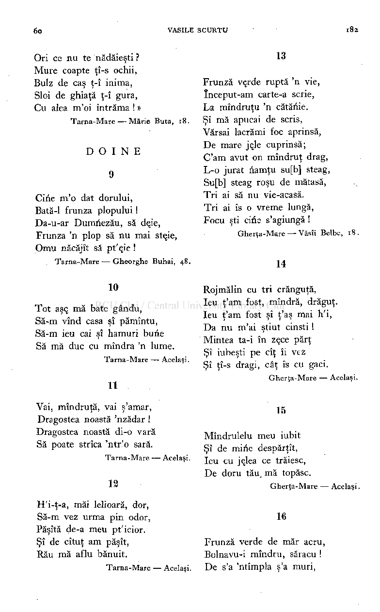

Ori ce nu te nădăieşti ? Mure coapte ţî-s ochii, Bulz de caş ţ-î inima, Sloi de ghiaţă ţ-î gura, Cu alea m'oi întrăma ! »

Frunză ve_rde ruptă 'n vie, început-am carte-a scrie, La mîndruţu 'n cătănie. Şî mă apucai de scris, Vărsai lacrămi foc aprinsă, De mare jçle cuprinsă; Cam avut on mîndruţ drag, L-o jurat hamţu su[b] steag, Su[b] steag roşu de mătasă, Tri ai să nu vie-acasă. Tri ai îs o vreme lungă, Focu şti cine s'agiungă !

Tarna-Mare — Mărie Buta, 18.

DOIN E

9

Cine m'o dat dorului, Bată-1 frunza plopului ! Da-u-ar Dumhezău, să de_ie, Frunza 'n plop să nu mai stçie, Omu năcăjît să pt'eje !

Gherţa-Mare — Văsîi Belbe, 18.

Tarna-Mare — Gheorghe Buhai, 48.

14

10

Rojmălin cu tri crănguţă, leu ţ'am fost, mîndră, drăguţ. Ieu ţ'am fost şî ţ'aş mai h'i, Da nu m'ai ştiut cinsti ! Mintea ta-i în zçce părţ Şî iubeşti pe cîţ îi vez Şî ţî-s dragi, câţ îs cu gaci.

Tot ase, mă bate gându, Să-m vînd casa şî pămîntu, Să-m ieu cai şî hamuri buhe Să mă duc cu mîndra 'n lume.

Tarna-Mare —- Acelaşi.

Gherţa-Mare — Acelaşi.

11

Vai, mîndruţă, vai ş'amar, Dragostea noastă 'nzădar ! Dragostea noastă di-o vară Să poate strica 'ntr.'o sară.

15

Mîndrulelu meu iubit Şî de mine despărţit, leu cu jejea ce trăiesc, De doru tău, mă topăsc.

Tarna-Mare — Acelaşi.

12

Gherţa-Mare — Acelaşi.

H'i-ţ-a, măi lelioară, dor, Să-m vez urma pin odor, Păşîtă de-a meu pt'icior. Şî de cîtuţ am păşît, Rău mă aflu bănuit.

16

Frunză verde de măr acru, Bolnavu-i mîndru, săracu ! De s'a 'ntîmpla ş'a muri,

Tarna-Mare — Acelaşi.

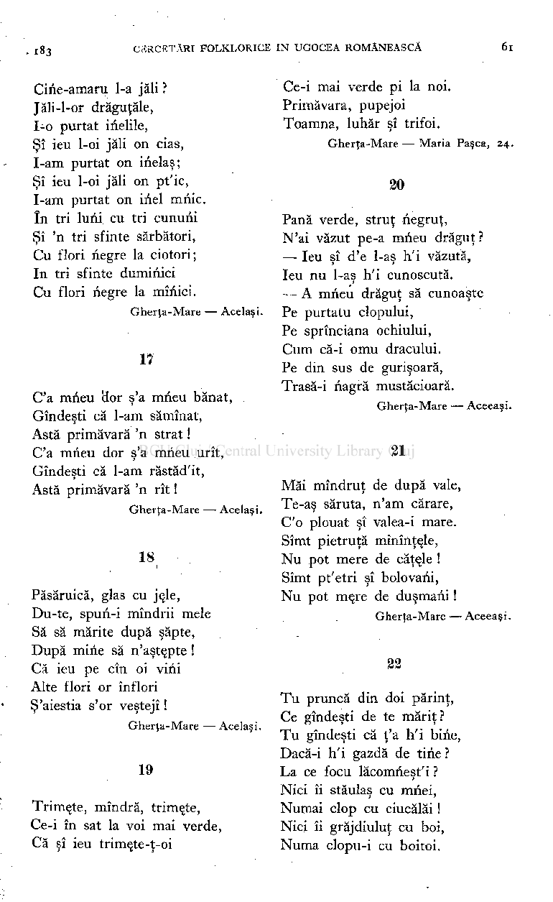

6i

CERCETĂR I FOLKLORIC E I N UGOCE A ROMÂNEASC Ă

. i8

3

Ce-i mai verde pi la noi. Primăvara, pupejoi Toamna, luhăr şî trifoi.

Cifïe-amaru 1-a jăli ? Jăli-l-or drăguţăle, I-o purtat inelile, Şî ieu l-oi jăli on cias, I-am purtat on ihelaş; Şî ieu l-oi jăli on pt'ic, I-am purtat on inel mnic. în tri luni cu tri cununi Şî 'n tri sfinte sărbători, Cu flori negre la ciotori; In tri sfinte duminici Cu flori negre la mînici.

Gherţa-Mare — Maria Pasca, 24.

20

Pană verde, struţ negruţ, N'ai văzut pe-a mneu drăguţ ?

— Ieu şî d'e l-aş h'i văzută, leu nu l-aş h'i cunoscută.

— A mneu drăguţ să cunoaşte Pe purtatu dopului, Pe sprînciana ochiului, Cum că-i omu dracului. Pe din sus de gurişoară, Trasă-i riagră mustăcioară.

Gherţa-Mare — Acelaşi.

17

C a mneu 'dor ş'a mneu bănat, Gîndeşti că l-am sămînat, Astă primăvară 'n strat ! C a mneu dor ş'a mneu urît, Gîndeşti că l-am răstăd'it, Astă primăvară 'n rît !

Gherţa-Mare — Aceeaşi.

21

Măi mîndruţ de după vale, Te-aş săruta, n'am cărare, C o plouat şî valea-i mare. Sîmt pietruţă mînînţcle, Nu pot mere de căţele ! Sîmt pt'etri şî bolovani, Nu pot mçre de duşmani !

Gherţa-Mare — Acelaşi.

18

|

- Păsăruică, glas cu jçle, Du-te, spuh-i mîndrii mele Să să mărite după şapte, După mine să n'aştcpte ! Că ieu pe cîn oi vini Alte flori or înflori Ş'aiestia s'or veşteji !

Gherţa-Mare — Aceeaşi.

22

Tu pruncă din doi părinţ, Ce gîndeşti de te mărit? Tu gîndeşti că ţ'a h'i bine, Dacă-i h'i gazdă de tine ? La ce focu lăcomnest'i ? Nici îi stăulaş cu mriei, Numai clop cu ciucălăi ! Nici îi grăjdiuluţ cu boi, Numa clopu-i cu boitoi.

Gherţa-Mare — Acelaşi.

19

Trimete, mîndră, trimçte, Ce-i în sat la voi mai verde, Că şî ieu trimcte-ţ-oi

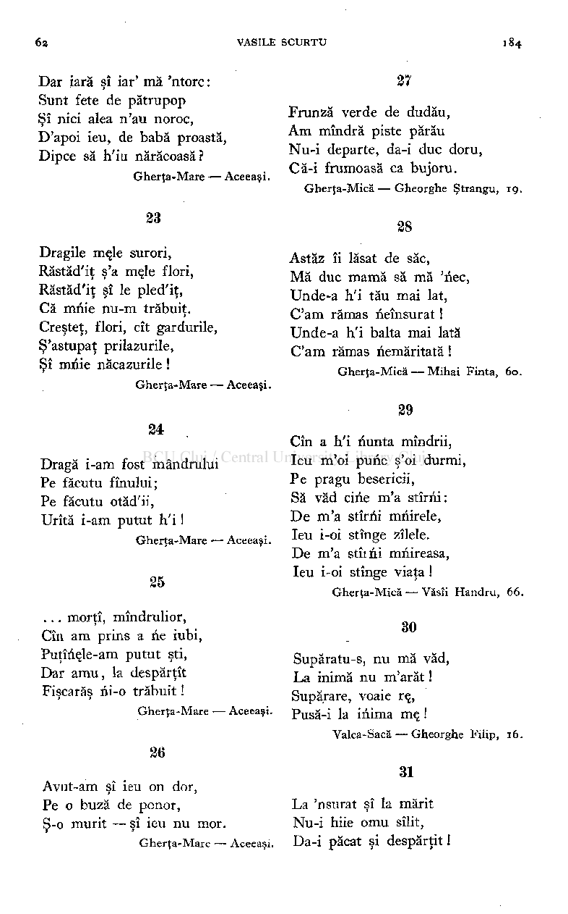

Dar iară şî iar' mă 'ntorc: Sunt fete de pătrupop Şî nici alea n'au noroc, D'apoi ieu, de babă proastă, Dipce să h'iu nărăcoasă?

Frunză verde de dudău, Am mîndră piste părău Nu-i departe, da-i duc doru, Că-i frumoasă ca bujoru.

Gherţa-Mare — Aceeaşi.

Gherţa-Mică — Gheorghe Ştrangu, 19.

23

28

Dragile mçle surori,

Astăz îi lăsat de săc, Mă duc mamă să mă 'nec, Unde-a h'i tău mai lat, Ca m rămas neînsurat ! Unde-a h'i balta mai lată Ca m rămas nemăritată !

- Răstăd'iţ ş'a me.le flori,

- Răstăd'iţ şî le pled'iţ, Că mnie nu-m trăbuiţ. Creştet, flori, cît gardurile, Ş'astupaţ prilazurile, Şî mnie năcazurile !

Gherţa-Mică — Mihai Finta, 60.

Gherţa-Mare — Aceeaşi.

29

24

Cîn a h'i nunta mîndrii, leu m'oi pune ş'oi durmi, Pe pragu besericii, Să văd cine m'a stîrni: De m'a stîrni mfiirele, leu i-oi stînge zîlele. De m'a stîini mnireasa, leu i-oi stînge viaţa !

Dragă i-am fost mândrului Pe făcutu finului; Pe făcutu otăd'ii, Urîtă i-am putut h'i !

Gherţa-Mare — Aceeaşi.

25

Gherţa-Mică — Văsîi Handru, 66.

.. . morţî, mîndrulior, Cîn am prins a ne iubi, Puţîne.le-am putut şti, Dar amu, la despărţit Fişcarăş hi-o trăbuit !

30

Supăratu-s, nu mă văd, La inimă nu m'arăt ! Supărare, voaie re., Pusă-i la inima me. !

Gherţa-Mare — Aceeaşi.

Valea-Sacă — Gheorghe Filip, 16.

26

31

Avut-am şî ieu on dor, Pe o buză de ponor, Ş-o murit — şî ieu nu mor.

La 'nsurat şî la mărit Nu-i hiie omu sîlit, Da-i păcat şi despărţit !

Gherţa-Mare — Aceeaşi.

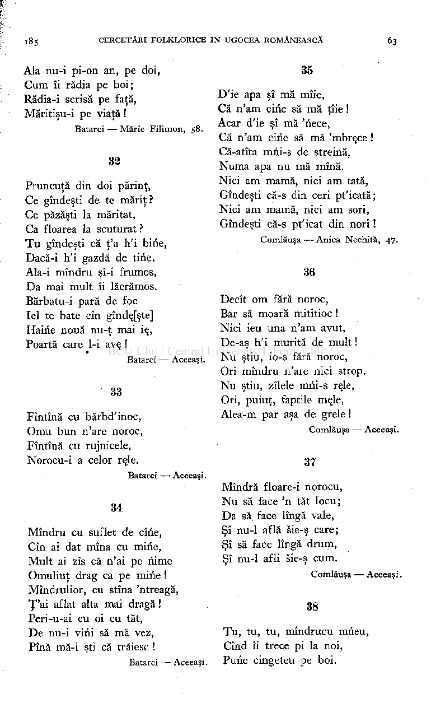

CERCETĂR I FOLKLORIC E I N UGOCE A ROMÂNEASC Ă

63

i8s

Ala nu-i pi-on an, pe doi, Cum îi radia pe boi;

35

D'ie apa şî mă mîie, Că n'am cine să mă ţîie ! Acar d'ie şî mă 'riece, Că n'am cine să mă 'mbrece ! Că-atîta mni-s de streină, Numa apa nu mă mînă. Nici am mamă, nici am tată, Gîndeşti că-s din ceri pt'icată; Nici am mamă, nici am sori, Gîndeşti că-s pt'icat din nori !

- Rădia-i scrisă pe faţă, Măritişu-i pe viaţă !

Batarci — Mărie Filimon, 58.

32

Pruncuţă din doi părinţ, Ce gîndeşti de te mărit? Ce păzăşti la măritat, Ca floarea la scuturat ? Tu gîndeşti că ţ'a h'i bine, Dacă-i h'i gazdă de tine. Ala-i mîndru şî-i frumos, Da mai mult îi lăcrămos.

Comlăuşa — Anica Nechită, 47.

36

Decît om fără noroc, Bar să moară mititioc ! Nici ieu una n'am avut, De-aş h'i murită de mult ! Nu ştiu, io-s fără noroc, Ori mîndru n'are nici strop. Nu ştiu, zilele mni-s rele, Ori, puiuţ, faptile mçle, Alea-m par aşa de grele !

- Bărbatu-i pară de foc Iei te bate cîn gîndc[şte] Haine nouă nu-ţ mai iç, Poartă care 1-i avç !

Batarci — Aceeaşi.

33

Fîntînă cu bărbd'inoc, Omu bun n'are noroc, Fîntînă cu rujnicele, Norocu-i a celor rek.

Comlăuşa — Aceeaşi.

37

Batarci — Aceeaşi.

Mîndră floare-i norocu, Nu să face 'n tăt locu; Da să face lîngă vale, Şî nu-1 află sie-ş care; Şî să face lîngă drum, Şî nu-1 afli sie-ş cum.

34

Mîndru cu suflet de cîne, Cîn ai dat mîna cu mine, Mult ai zîs că n'ai pe riime Omuliuţ drag ca pe mine ! Mîndrulior, cu stîna 'ntreagă, Ţ'ai aflat alta mai dragă ! Peri-u-ai cu oi cu tăt, De nu-i vini să mă vez, Pînă mă-i şti că trăiesc !

Comlăuşa — Aceeaşi.

38

Tu, tu, tu, mîndrucu mneu, Cînd îi trece pi la noi, Pune cingeteu pe boi.

Batarci — Aceeaşi.

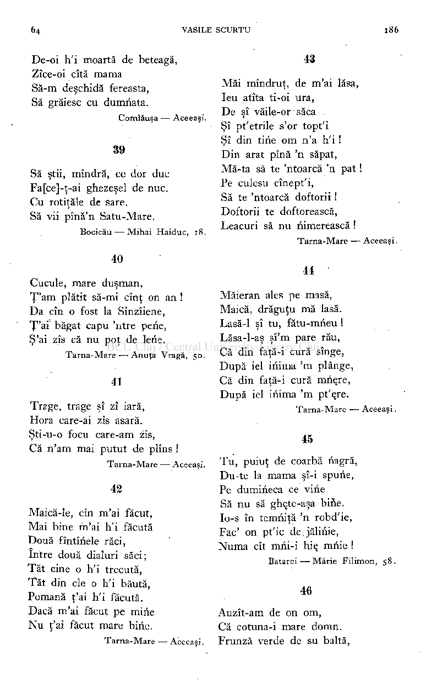

De-oi h'i moartă de beteagă, Zîce-oi cîtă mama Să-m deschidă fereasta, Să grăiesc cu dumriata.

Măi mîndruţ, de m'ai lăsa, leu atîta ti-oi ura, De şî văile-or săca Şî pt'etrile s'or topt'i Şî din tine om n'a h'i ! Din arat pînă 'n săpat, Mă-ta să te 'ntoarcă 'n pat ! Pe culesu cînept'i, Să te 'ntoarcă doftorii ! Doftorii te doftorească, Leacuri să nu nimerească !

Comlăuşa — Aceeaşi.

39

- Să ştii, mîndră, ce dor duc Fa[ce]-ţ-ai ghezeşel de nuc. Cu rotiţăle de sare.

- Să vii pînă'n Satu-Mare. Bocicău — Mihai Haiduc, 18.

40

Cucuie, mare duşman, Ţ'am plătit să-mi cînţ on an ! Da cîn o fost la Sînzîiene, Ţ'ai băgat ^apu 'ntre pene, Ş'ai zis că nu poţ de lene.

Tarna-Mare — Anuţa Vragă, 50.

41

Trage, trage şî zî iară, Hora care-ai zîs asară. Şti-u-o focu care-am zîs, Că n'am mai putut de plîns !

Tarna-Mare — Aceeaşi.

42

Maică-le, cîn m'ai făcut, Mai bine m'ai h'i făcută Două fîntîhele răci, între două dialuri săci;

- Tăt cine o h'i trecută,

- Tăt din ele o h'i băută, Pomană ţ'ai h'i făcută. Dacă m'ai făcut pe mine Nu ţ'ai făcut mare bine.

Tarna-Mare — Aceeaşi.

44

Măieran ales pe masă, Maică, drăguţu mă lasă. Lasă-1 şî tu, fătu-mneu ! Lăsa-l-aş şî'm pare rău, Că din faţă-i cură sînge, După iei inima 'm plânge, Că din faţă-i cură mneje, După iei inima 'm pt'çre.

Tarna-Mare — Aceeaşi.

45

Tu, puiuţ de coarbă fiagră, Du-te la mama şî-i spune, Pe dumineca ce vine Să nu să ghcte-aşa bine. Io-s în temniţă 'n robd'ie, Fac' on pt'ic de jălinie, Numa cît mni-i hiç mnie !

Batarci — Mărie Filimon, 58.

46

Auzît-am de on om, Că cotuna-i mare domn. Frunză verde de su baltă,

Tarna-Mare — Aceeaşi.

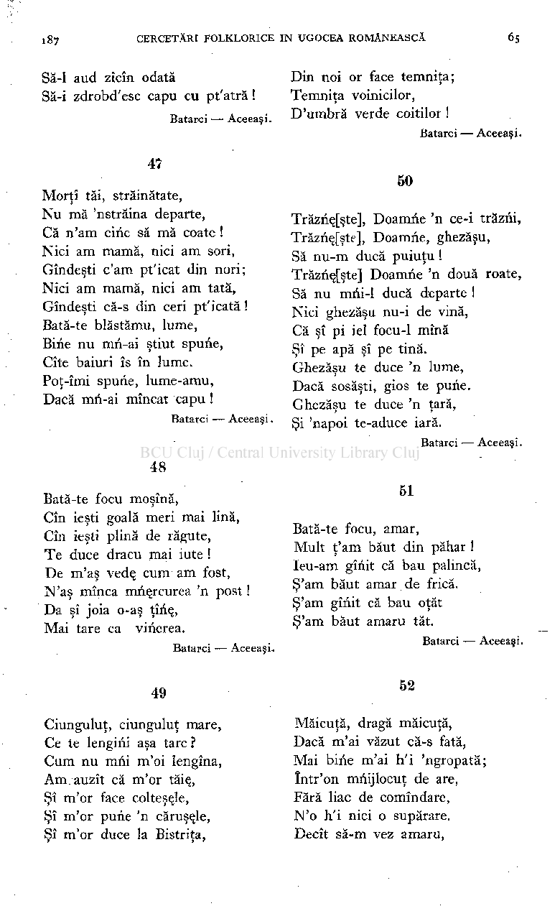

Din noi or face temniţa; Temniţa voinicilor, D'umbră verde coitilor !

Să-1 aud zîcîn odată Să-i zdrobd'esc capu cu pt'atră !

Batarci — Aceeaşi.

Batarci — Aceeaşi.

47

50

Morţî tăi, străinătate, Nu mă 'nstrăina departe, Că n'am cine să mă coate ! Nici am mamă, nici am sori, Gîndeşti c'am pt'icat din nori; Nici am mamă, nici am tată, Gîndeşti că-s din ceri pt'icată ! Bată-te blăstămu, lume, Bine nu mn-ai ştiut spune, Cîte baiuri îs în lume. Poţ-îmi spune, lume-amu, Dacă mn-ai mîncat capu !

Trăzne.[şte], Doamne 'n ce-i trăzni, Trăznc[şte], Doamne, ghezăşu, Să nu-m ducă puiuţu ! Trăznc[şte] Doamne 'n două roate, Să nu mrii-1 ducă departe ! Nici ghezăşu nu-i de vină, Că şî pi iei focu-1 mînă Şî pe apă şî pe tină. Ghezăşu te duce 'n lume, Dacă sosăşti, gios te pune. Ghezăşu te duce 'n ţară, Şi 'napoi te-aduce iară.

Batarci — Aceeaşi.

Batarci — Aceeaşi.

48

51

Bată-te focu moşînă, Cîn ieşti goală meri mai lină, Cîn ieşti plină de răgute, Te duce dracu mai iute ! De m'aş vede. cum am fost, N'aş mînca mnçrcurea 'n post ! Da şî joia o-aş ţîrie., Mai tare ca vinerea.

Bată-te focu, amar, Mult ţ'am băut din pahar ! Ieu-am gînit că bau palincă, Ş'am băut amar de frică. Ş'am gînit că bau oţăt Ş'am băut amaru tăt.

Batarci — Aceeaşi.

Batarci — Aceeaşi.

Ciunguluţ, ciunguluţ mare, Măicuţă, dragă măicuţă, Ce te lengini aşa tare ? Dacă m'ai văzut că-s fată, Cum nu mni m'oi lengîna, Mai bine m'ai h'i 'ngropată; Am.auzît că m'or tăie., într'on mhijlocuţ de are, Şî m'or face colteşcle, Fără Hac de comîndare, Şî m'or pune 'n căruşcle, N'o h'i nici o supărare. Şî m'or duce la Bistriţa, Decît să-m vez amaru,

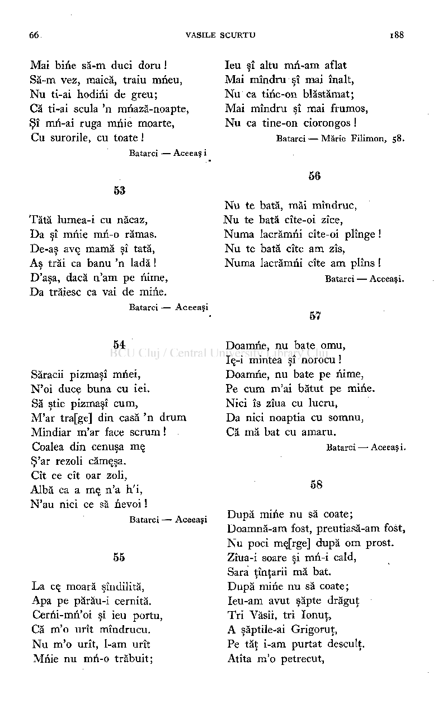

leu şî altu mri-am aflat Mai mîndru şî mai înalt, Nu ca tine-on blăstămat; Mai mîndru şî mai frumos, Nu ca tine-on ciorongos !

Mai bine să-m duci doru !

- Să-m vez, maică, traiu mfieu, Nu ti-ai hodini de greu; Că ti-ai scula 'n mnază-noapte, Şî mh-ai ruga mnie moarte, Cu surorile, cu toate !

Batarci — Aceeaş i

53

- Tătă lumea-i cu năcaz, Da şî mnie mri-o rămas. De-aş avç mamă şî tată, Aş trăi ca banu 'n ladă ! D'aşa, dacă n'am pe nime, Da trăiesc ca vai de mine.

Batarci — Mărie Filimon, 58.

56

Nu te bată, măi mîndruc, Nu te bată cîte-oi zîce, Numa lacrămni cîte-oi plînge ! Nu te bată cîte am zîs, Numa lacrămni cîte am plîns !

Batarci — Aceeaşi.

Batarci — Aceeaşi

57

Doamne, nu bate omu, Iç-i mintea şî norocu ! Doamne, nu bate pe nime, Pe cum m'ai bătut pe mine. Nici îs zîua cu lucru, Da nici noaptia cu somnu, Că mă bat cu amaru.

54

Săracii pizmaşi mhei, N'oi duce buna cu iei. Să ştie pizmaşi cum,

- M'ar tra[ge] din casă 'n drum Mindiar m'ar face scrum ! Coalea din cenuşa mç Ş'ar rezoli cămcşa. Cît ce cît oar zoii, Albă ca a mç n'a h'i,
- N'au nici ce să nevoi ! Batarci —• Aceeaşi

Batarci — Aceeaşi.

58

După mine nu să coate; Doamnă-am fost, preutiasă-am fost, Nu poci mejrge] după om prost. Zîua-i soare şi mn-i cald, Sara ţînţarii mă bat. După mine nu să coate; Ieu-am avut şapte drăguţ Tri Văsîi, tri Ionuţ, A şăptile-ai Grigoruţ, Pe tăţ i-am purtat desculţ. Atîta m'o petrecut,

55

La ce_ moară şîndilită, Apa pe părău-i cernită. Cerni-mh'oi şî ieu portu, Că m'o urît mîndrucu. Nu m'o urît, l-am urît Mnie nu mri-o trăbuit;

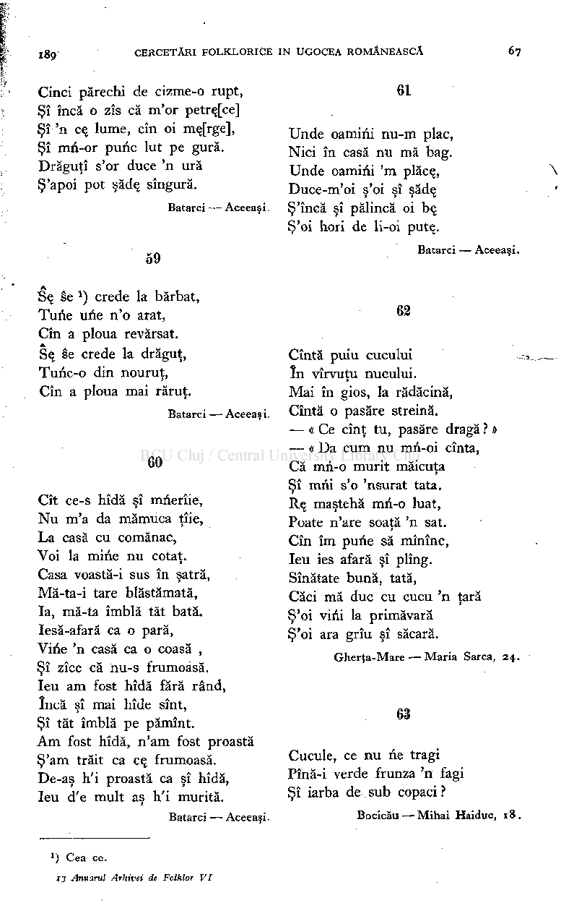

67

CERCETĂR I FOLKLORIC E I N UGOCE A ROMÂNEASC Ă

i89

Cinci părechi de cizme-o rupt, Şî încă o zîs că m'or petrejce] Şî 'n ce, lume, cîn oi mejrge], Şî mn-or pune lut pe gură. Drăguţi s'or duce 'n ură Ş'apoi pot şăde, singura.

61

Unde oamini nu-m plac, Nici în casă nu mă bag. Unde oamini 'm place,, Duce-m'oi ş'oi şî şădc Ş'încă şî palincă oi be, Ş'oi hori de li-oi pute,.

Batard — Aceeaşi.

Batarci — Aceeaşi.

59

Sç se

) crede la bărbat, Tune une n'o arat, Cîn a ploua revărsat. Sç se crede la drăguţ, Tuhe-o din nouruţ, Cîn a ploua mai răruţ.

x

62

Cîntă puiu cucului în vîrvuţu nucului. Mai în gios, la rădăcină, Cîntă o pasăre streină.

Batarci — Aceeaşi.

— « Ce cînţ tu, pasăre dragă ? »

— « Da cum nu mri-oi cînta, Că mn-o murit măicuţa Şî mni s'o 'nsurat tata. Re, maştehă mn-o luat, Poate n'are soaţă 'n sat. Cîn îm pune să mînînc, leu ies afară şî plîng. Sînătate bună, tată, Căci mă duc cu cucu 'n ţară Ş'oi vini la primăvară Ş'oi ara grîu şî săcară.

60

Cît ce-s hîdă şî mherîie, Nu m'a da mămuca ţîie, La casă cu comanac, Voi la mine nu cotat. Casa voastă-i sus în şatră, Mă-ta-i tare blăstămată, Ia, mă-ta îmbla tăt bată. Iesă-afară ca o pară, Vine 'n casă ca o coasă , Şî zîce că nu-s frumoasă. leu am fost hîdă fără rând, încă şî mai hîde sînt, Şî tăt îmbla pe pămînt. Am fost hîdă, n'am fost proastă Ş'am trăit ca ce, frumoasă. De-aş h'i proastă ca şî hîdă, leu d'e mult aş h'i murită.

Gherţa-Mare — Maria Sarea, 24.

63

Cucuie, ce nu fie tragi Pînă-i verde frunza 'n fagi Şî iarba de sub copaci?

Bocicău — Mihai Haiduc, 18 .

Batarci — Aceeaşi.

###### *) Cea ce. 13 Anuarul Arhivei de Folklor VI

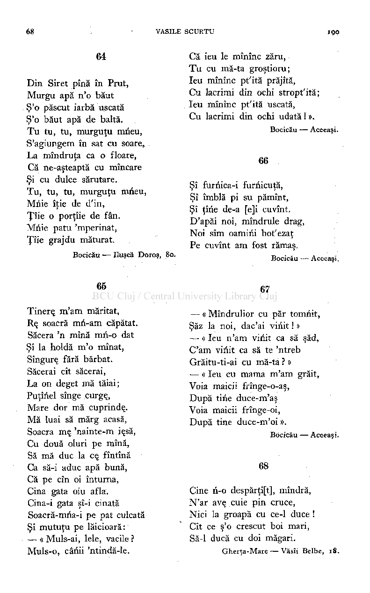

Că ieu le mînînc zăru, Tu cu mă-ta groştioru; leu mînînc pt'ită prăjită, Cu lacrimi din ochi stropt'ită; leu mînînc pt'ită uscată, Cu lacrimi din ochi udată ! ».

Din Şiret pînă în Prut, Murgu apă n'o băut Ş'o păscut iarbă uscată Ş'o băut apă de baltă. Tu tu, tu, murguţu mneu, S'agiungem în sat cu soare, La mîndruţa ca o floare, Că ne-aşteaptă cu mîncare Şi cu dulce sărutare. Tu, tu, tu, murguţu mneu, Mnie îţie de d'in, Ţîie o porţîie de fân. Mhie patu 'mperinat, Ţîie grajdu măturat.

Bocicău — Aceeaşi.

66

Şî furhica-i furnicuţă, Şî îmbla pi su pămînt, Şî ţîne de-a [e]i cuvînt. D'apăi noi, mîndrule drag, Noi sîm oamirii bot'ezaţ Pe cuvînt am fost rămas.

Bocicău — Iluşcă Doroş, 80.

Bocicău — Aceeaşi.

65

67

Tinere, m'am măritat, Re. soacră mn-am căpătat. Săcera 'n mînă mri-o dat Şî la holdă m'o mînat, Sîngurç fără bărbat. Săcerai cît săcerai, La on deget mă tăiai; Puţinei sînge curge., Mare dor mă cuprinde.. Mă luai să mărg acasă, Soacra mç 'nainte-m icsă, Cu două oluri pe mînă, Să mă duc la ce. fîntînă Ca să-i aduc apă bună, Că pe cîn oi înturna, Cina gata oiu afla. Cina-i gata şî-i cinată Soacră-mfia-i pe pat culcată Şî mutuţu pe lăicioară :

— « Mîndrulior cu păr tomnit, Şăz la noi, dac'ai vinit ! »

— « leu n'am vinit ca să şăd, Cam vinit ca să te 'ntreb Grăitu-ti-ai cu mă-ta ? »

— « leu eu mama m'am grăit, Voia maicii frînge-o-aş, După tine duce-m'aş Voia maicii frînge-oi, După tine duce-m'oi ».

Bocicău — Aceeaşi.

68

Cine n-o despărţîft], mîndră, N'ar ave. cuie pin cruce, Nici la groapă cu ce-1 duce ! Cît ce ş'o crescut boi mari, Să-1 ducă cu doi măgari.

— « Muls-ai, lele, vacile ? Muls-o, cânii 'ntindă-le.

Gherţa-Mare — Văsîi Belbe, 18.

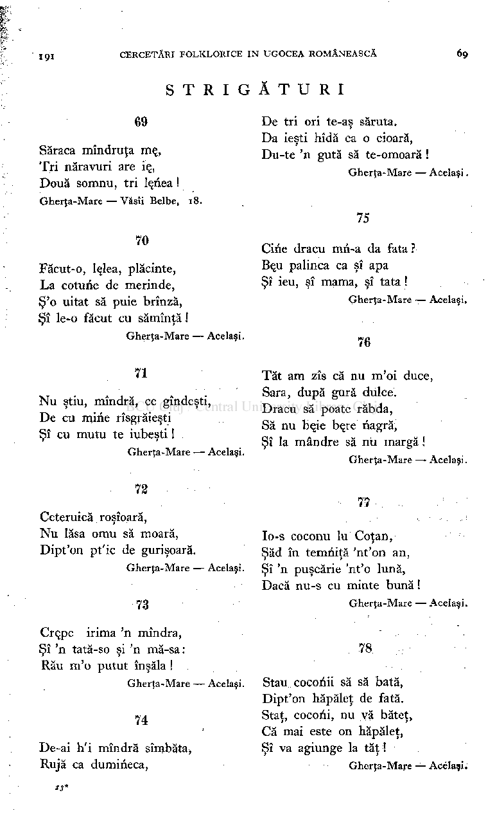

#### STRIGĂTUR

De tri ori te-aş săruta. Da ieşti hîdă ca o cioară, Du-te 'n gută să te-omoară !

69

Săraca mîndruţa mç, Tri năravuri are iç, Două somnu, tri Icnea !

Gherţa-Mare — Acelaşi.

Gherţa-Mare—Văsî i Belbe, 18.

75

70

Cine dracu mn-a da fata ? Bçu palinca ca şî apa Şî ieu, şî mama, şî tata !

Făcut-o, lejea, plăcinte, La coturie de merinde, Ş'o uitat să puie brînză, Şî le-o făcut cu sămînţă !

Gherţa-Mare — Acelaşi,

Gherţa-Mare — Acelaşi.

76

71

Tăt am zîs că nu m'oi duce, Sara, după gură dulce. Dracu să poate răbda, Să nu bçie bçre riagră, Şî la mândre să nü margă !

Nu ştiu, mîndră, ce gîndeşti, De cu mine rîsgrăieşti Şî cu mutu te iubeşti !

Gherţa-Mare — Acelaşi.

Gherţa-Mare — Acelaşi.

72

77 •• .

Ceteruică roşîoară, Nu lăsa omu să moară, Dipt'on pt'ic de gurişoară.

Io-s coconu lu Coţan, Şăd în temniţă 'nt'on an, Şî 'n puşcărie 'nt'o lună, Dacă nu-s cu minte bună !

Gherţa-Mare — Acelaşi.

Gherţa-Mare — Acelaşi.

73

Crçpe irima 'n mîndra, Şî 'n tată-so şi 'n mă-sa:

78

- Rău m'o putut înşăla ! Gherţa-Mare — Acelaşi.

Stau coconii să să bată, Dipt'on hăpăleţ de fată. Stat, coconi, nu vă băteţ, Că mai este on hăpăleţ, Şî va agiunge la tăţ !

74

De-ai h'i mîndră sîmbăta, Rujă ca dumineca,

Gherţa-Mare — Acelaşi.

13*

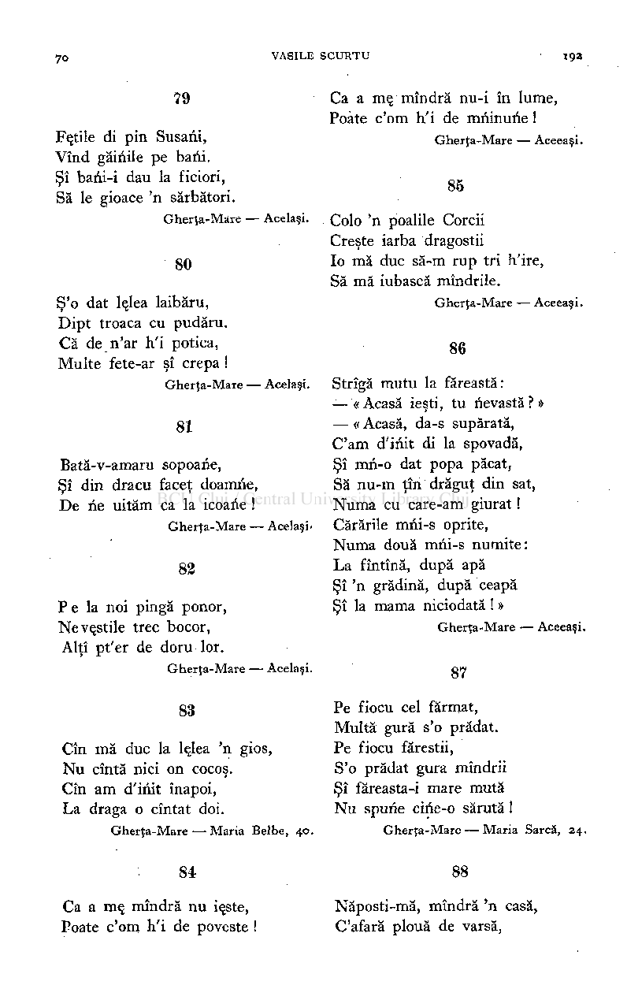

Ca a mç mîndră nu-i în lume, Poàte c'om h'i de mninune !

Fetile di pin Susafii, Vînd găinile pe bani. Şî bahi-i dau la ficiori, Să le gioace 'n sărbători.

Gherţa-Mare — Aceeaşi.

85

Colo 'n poalile Corcii Creşte iarba dragostii Io mă duc să-m rup tri h'ire, Să mă iubască mîndrile.

Gherţa-Mare — Acelaşi.

Gherţa-Mare — Aceeaşi.

Ş'o dat leka laibăru, Dipt troaca cu pudăru. Că de n'ar h'i potica, Multe fete-ar şî crepa !

86

Strigă mutu la făreastă:

Gherţa-Mare — Acelaşi.

— «Acasă ieşti, tu nevastă?»

— « Acasă, da-s supărată, Cam d'init di la spovadă, Şî mri-o dat popa păcat, Să nu-m ţîn drăguţ din sat, Numa cu care-am giurat ! Cărările mfii-s oprite, Numa două mfii-s numite: La fîntînă, după apă Şî 'n grădină, după ceapă Şî la mama niciodată ! »

81

Bată-v-amaru sopoane, Şî din dracu faceţ doamne, De fie uităm ca la icoane !

Gherţa-Mare — Acelaşi-

82

Pe la noi pingă ponor, Ne veştile trec bocor,

Gherţa-Mare — Aceeaşi.

Alţî pt'er de doru lor.

Gherţa-Mare — Acelaşi.

87

Pe fiocu cel fărmat, Multă gură s'o prădat. Pe fiocu fărestii, S'o prădat gura mîndrii Şî făreasta-i mare mută Nu spune cine-o sărută !

83

Cîn mă duc la lejea 'n gios, Nu cîntă nici on cocoş. Cîn am d'init înapoi, La draga o cîntat doi.

Gherţa-Mare — Maria Sarcă, 24.

Gherţa-Mare — Maria Belbe, 40.

88

84

Năposti-mă, mîndră 'n casă, C'afară plouă de varsă,

Ca a mç mîndră nu ieste, Poate c'om h'i de poveste !

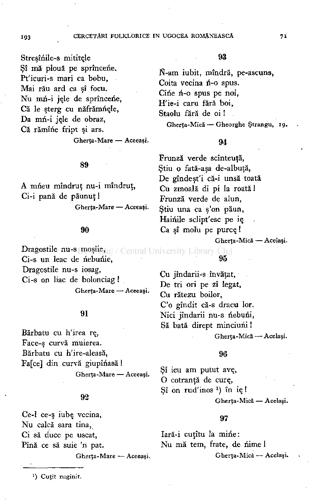

Streşînile-s mititçle Şî mă plouă pe sprîncene. Pt'icuri-s mari ca bobu, Mai rău ard ca şî focu. Nu mri-i jçle de sprîncene, Că le şterg cu năfrămncle, Da mn-i jçle de obraz, Că rămîne fript şi ars.

93

N-am iubit, mîndră, pe-ascuns, Coita vecina h-o spus. Cine n-o spus pe noi, H'ie-i caru fără boi, Staolu fără de oi !

Gherţa-Mică — Gheorghe Ştrangu, 19.

Gherţa-Mare — Aceeaşi.

94

Frunză verde scînteuţă, Ştiu o fată-aşa de-albuţă, De gîndeşt'i că-i unsă toată Cu zmoală di pi la roată ! Frunză verde de alun, Ştiu una ca ş'on păun, Hainile sclipt'esc pe iç Ca şî molu pe purec !

89

A mneu mîndruţ nu-i mîndruţ, Ci-i pană de păunuţ !

Gherţa-Mare — Aceeaşi.

90

Gherţa-Mică — Acelaşi.

Dragostile nu-s moşîie, Ci-s un leac de nebunie, Dragostile nu-s iosag, Ci-s on liac de bolonciag !

95

Cu jîndarii-s învăţat, De tri ori pe zî legat, Cu rătezu boilor, C'o gîndit că-s dracu lor. Nici jîndarii nu-s nebuni, Să bată dirept minciuni !

Gherţa-Mare — Aceeaşi.

91

- Bărbatu cu h'irea re_, Face-ş curvă muierea.

Gherţa-Mică — Acelaşi.

- Bărbatu cu h'ire-aleasă, Fa[ce] din curvă giupînasă !

96

Şî ieu am putut avç, O cotranţă de curç, Şî on rud'inos ) în iç !

Gherţa-Mare — Aceeaşi.

92

Gherţa-Mică — Acelaşi.

Ce-1 ce-ş iubç vecina, Nu calcă sara tina, Ci să duce pe uscat, Pînă ce să suie 'n pat.

97

Iară-i cuţîtu la mine: Nu mă tem, frate, de nime !

Gherţa-Mică — Acelaşi.

Gherţa-Mare — Aceeaşi.

*) Cuţit ruginit.

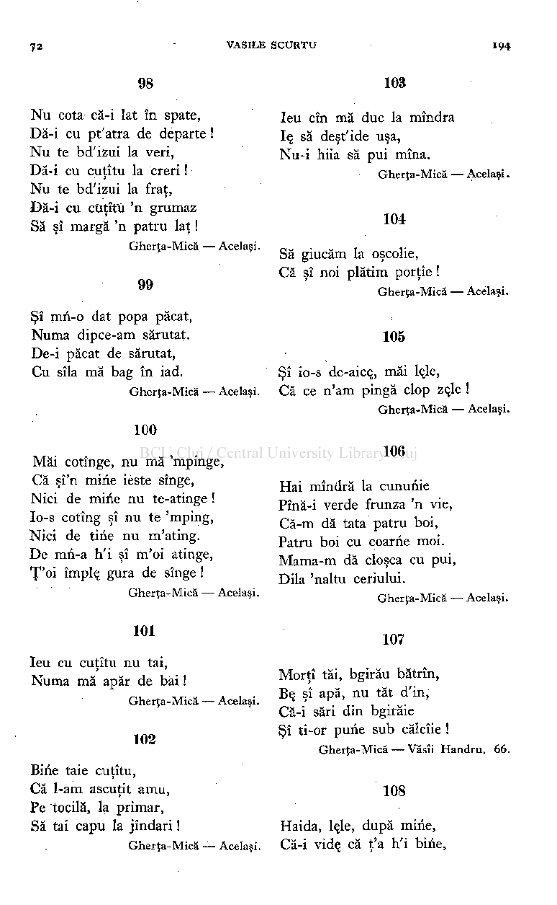

103

###### 98

Nu cota că-i lat în spate, Dă-i cu pt'atra de departe ! Nu te bd'izui la veri, Dă-i cu cuţîtu la creri ! Nu te bd'izui la fraţ, Dă-i cu cuţîtu 'n grumaz

leu cîn mă duc la mîndra Iç să deşt'ide uşa, Nu-i hiia să pui mîna.

Gherţa-Mică — Acelaşi.

104

- Să şî margă 'n patru laţ ! Gherţa-Mică — Acelaşi.

Să giucăm la oşcolie, Că şî noi plătim porţîe !

###### 99

Gherţa-Mică — Acelaşi.

Şî mn-o dat popa păcat, Numa dipce-am sărutat. De-i păcat de sărutat, Cu sîla mă bag în iad.

105

Şî io-s de-aice,, măi leje, Că ce n'am pingă clop zek !

Gherţa-Mică — Acelaşi.

Gherţa-Mică — Acelaşi.

100

106

Măi cotînge, nu mă 'mpinge,

- Că şî'n mine ieste sînge, Nici de mine nu te-atinge ! Io-s cotîng şî nu te 'mping, Nici de tine nu m'ating. De mh-a h'i şî m'oi atinge, Ţ'oi împle, gura de sînge !

Hai mîndră la cununie Pînă-i verde frunza 'n vie, Că-m dă tata patru boi, Patru boi cu coarne moi. Mama-m dă cloşca cu pui, Dila 'naltu ceriului.

Gherţa-Mică — Acelaşi.

Gherţa-Mică — Acelaşi.

101

107

leu cu cuţîtu nu tai, Numa mă apăr de bai !

Morţî tăi, bgirău bătrîn, Bç şî apă, nu tăt d'in, Că-i sări din bgirăie Şî ti-or pune sub călcîie !

Gherţa-Mică — Acelaşi.

102

Gherţa-Mică — Văsîi Handru, 66.

Bine taie cuţîtu,

- Că l-am ascuţit amu, Pe tocilă, la primar,

108

- Să tai capu la jîndari ! Gherţa-Mică — Acelaşi.

Haida, lçle, după mine, Că-i vide, că ţ'a h'i bine,

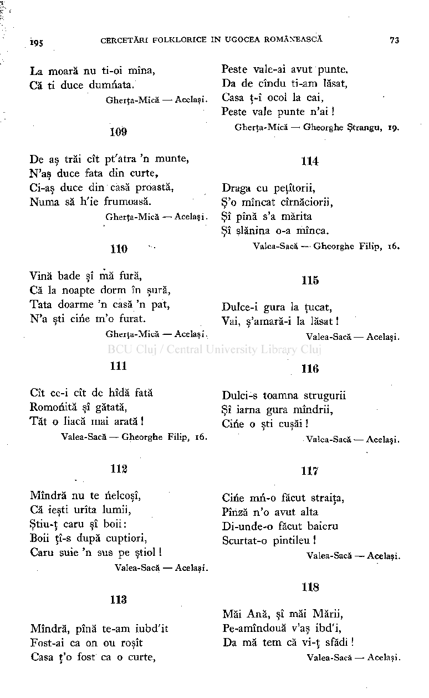

Peste vale-ai avut punte. Da de cîndu ti-am lăsat, Casa ţ-î ocol Ia cai, Peste vale punte n'ai !

La moară nu ti-oi mîna, Că ti duce dumnata.

Gherţa-Mică — Acelaşi.

Gherţa-Mică — Gheorghe Ştrangu, 19.

109

De aş trăi cît pt'ătra 'n munte, N'aş duce fata din curte, Ci-aş duce din casă proastă, Numa să h'ie frumoasă.

114

Draga cu peţitorii, Ş'o mîncat cîrnăciorii, Şî pînă s'a mărita Şî slănina o-a mînca.

Gherţa-Mică — Acelaşi.

Valea-Sacă—Gheorghe Filip, 16.

110

Vină bade şî mă fură, Că la noapte dorm în şură, Tata doarme 'n casă 'n pat, N'a şti cine m'o furat.

115

Dulce-i gura la ţucat, Vai, ş'amară-i la lăsat !

Gherţa-Mică — Acelaşi.

Valea-Sacă — Acelaşi.

111

116

Cît ce-i cît de hîdă fată Romonită şî gătată,

Dulci-s toamna strugurii Şî iarna gura mîndrii, Cine o şti cuşăi !

- Tăt o liacă mai arată ! Valea-Sacă — Gheorghe Filip, 16.

Valea-Sacă — Acelaşi.

112

117

Mîndră nu te helcoşî, Că ieşti urîta lumii, Ştiu-ţ caru şî boii: Boii ţî-s după cuptiori, Caru suie 'n sus pe ştiol !

Cine mh-o făcut straiţa, Pînză n'o avut alta Di-unde-o făcut baieru Scurtat-o pintileu !

Valea-Sacă — Acelaşi.

Valea-Sacă — Acelaşi.

118

113

Măi Ană, şî măi Mării, Pe-amîndouă v'aş ibd'i, Da mă tem că vi-ţ sfădi !

Mîndră, pînă te-am iubd'it Fost-ai ca on ou roşît Casa ţ'o fost ca o curte,

Valea-Sacă — Acelaşi.

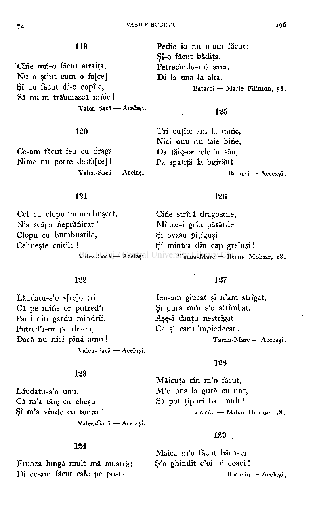

Pedic io nu o-am făcut: Şî-o făcut bădiţa, Petrecîndu-mă sara, Di la una la alta.

Cine mn-o făcut straiţa, Nu o ştiut cum o fa[ce] Şî uo făcut di-o copîie,

Batarci — Mărie Filimon, 58.

- Să nu-m trăbuiască mhie ! Valea-Sacă — Acelaşi.

125

Tri cuţite am la mine, Nici unu nu taie bine, Da tăie_-or iele 'n său, Pă spătiţă la bgirău!

120

Ce-am făcut ieu cu draga Nime nu poate desfa[ce] !

Valea-Sacă — Acelaşi.

Batarci — Aceeaşi.

121

126

Cel cu clopu 'mbumbuşcat, N'a scăpa heprăhicat ! Clopu cu bumbuştile, Celuieşte coitile !

Cine strică dragostile, Mînce-i grîu păsările Şi ovăsu piţiguşî Şî mintea din cap greluşî !

Valea-Sacă — Acelaşi.

Tarna-Mare — Ileana Molnar, 18.

127

122

Ieu-am giucat şi n'am strigat, Şî gura mhi s'o strîmbat. Aşe,-i danţu hestrîgat Ca şî caru 'mpiedecat !

Lăudatu-s'o v[re]o tri,

- Că pe mine or putred'i Parii din gardu mîndrii. Putred'i-or pe dracu, Dacă nu nici pînă amu !

Tarna-Mare — Aceeaşi.

Valea-Sacă — Acelaşi.

128

123

Măicuţa cîn m'o făcut, M'o uns la gură cu unt, Să pot ţîpuri hăt mult !

Lăudatu-s'o unu, Că m'a tăie, cu cheşu Şî m'a vinde cu fontu !

Bocicău — Mihai Haiduc, 18.

Valea-Sacă — Acelaşi.

129

124

Maica m'o făcut bărnaci Ş'o ghindit c'oi hi coaci !

Frunza lungă mult mă mustră: Di ce-am făcut cale pe pustă.

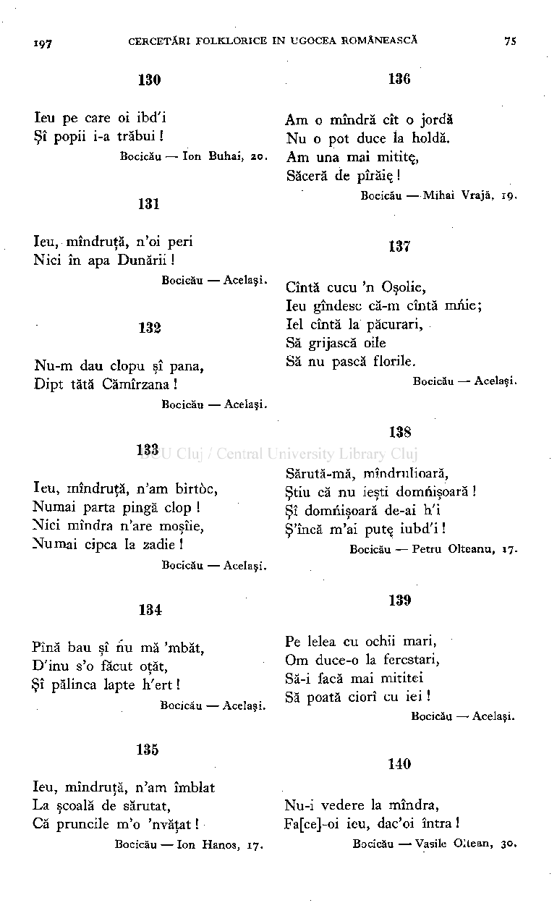

136

130

leu pe care oi ibd'i Şî popii i-a trăbui !

Am o mîndră cît o jordă Nu o pot duce la holdă. Am una mai mititç, Săceră de pîrăic !

Bocicău — Ion Buhai, 20.

Bocicău — Mihai Vrajă, 19.

- 131

leu, mîndruţa, n'oi peri Nici în apa Dunării !

Bocicău — Acelaşi.

- 132

137

Cîntă cucu 'n Oşolie, leu gîndesc că-m cîntă mnie; Iei cîntă la păcurari, Să grijască oile Să nu pască florile.

Nu-m dau clopu şî pana, Dipt tătă Cămîrzana !

Bocicău — Acelaşi.

Bocicău — Acelaşi.

138

133

Sărută-mă, mîndrulioară, Ştiu că nu ieşti domnişoară ! Şî domnişoară de-ai h'i Ş'încă m'ai pute, iubd'i !

leu, mîndruţa, n'am birtôc, Numai parta pingă clop ! Nici mîndră n'are moşîie, Numai cipca la zadie !

Bocicău — Petru Olteanu, 17.

Bocicău — Acelaşi.

139

134

Pe lelea cu ochii mari, Om duce-o la ferestari, Să-i facă mai mititei Să poată ciorî cu iei !

Pînă bau şî nu mă 'mbăt, D'inu s'o făcut oţăt, Şî palinca lapte h'ert !

Bocicău — Acelaşi.

Bocicău — Acelaşi.

135

140

leu, mîndruţa, n'am îmbiat La şcoală de sărutat, Că pruncile m'o 'nvăţat !

Nu-i vedere la mîndră, Fa[ce]-oi ieu, dac'oi întră !

Bocicău — Vasile Oltean, 30.

Bocicău — Ion Hanos, 17.

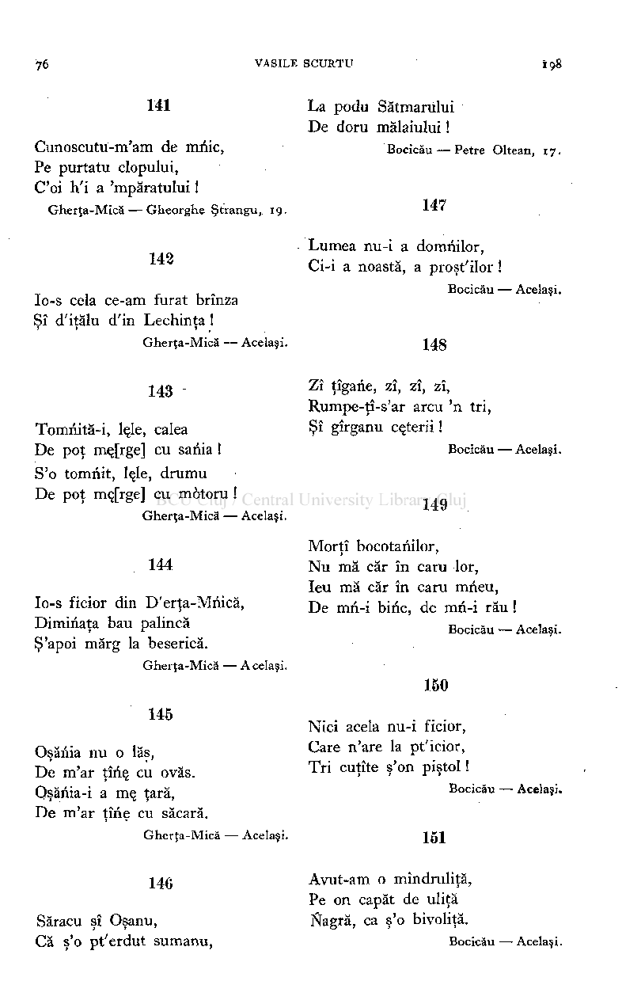

La podu Sătmarului De doru mălaiului !

Cunoscutu-m'am de mnic, Pe purtatu clopului, Coi h'i a 'mpăratului !

Bocicău — Petre Oltean, 17.

147

Gherţa-Mică — Gheorghe Ştrangu, ig.

Lumea nu-i a domnilor, Ci-i a noastă, a proşt'ilor !

142

Bocicău — Acelaşi.

Io-s cela ce-am furat brînza Şî d'iţălu d'in Lechinţa !

Gherţa-Mică — Acelaşi.

148

Zî ţîgahe, zî, zî, zî, Rumpe-ţî-s'ar arcu 'n tri, Şî gîrganu ceterii !

143

Tomnită-i, lçle, calea De poţ mç[rge] cu sania ! S'o tomrïit, lçle, drumu De poţ mçfrge] cu mötoru !

Bocicău — Acelaşi.

149

Gherţa-Mică — Acelaşi.

Morţî bocotanilor, Nu mă căr în caru lor, leu mă căr în caru mrieu, De mh-i bine, de mh-i rău !

144

Io-s ficior din D'erţa-Mnică, Dimihaţa bau palincă Ş'apoi mărg la beserică.

Bocicău — Acelaşi.

Gherţa-Mică — Acelaşi.

- 150

Nici acela nu-i ficior, Care n'are la pt'icior, Tri cuţite ş'on pistol !

Bocicău — Acelaşi.

- 151

145

- Oşăriia nu o lăs, De m'ar ţîrie, cu ovăs.

- Qşăriia-i a mç ţară, De m'ar ţîrie cu săcară.

Gherţa-Mică — Acelaşi.

Avut-am o mîndruliţă, Pe on capăt de uliţă Nagră, ca ş'o bivoliţă.

146

Săracu şî Oşanu, Că ş'o pt'erdut sumanu,

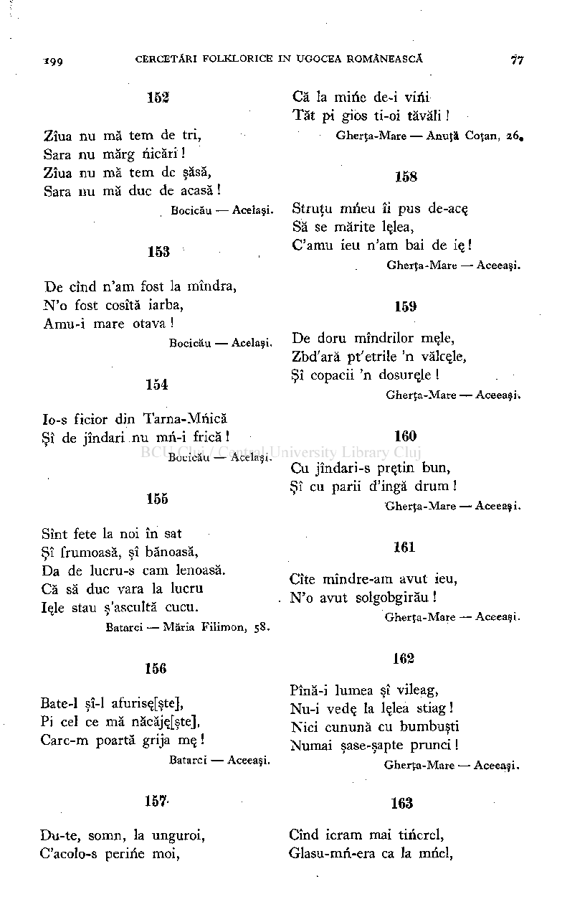

Că la mine de-i vini Tăt pi gibs ti-oi tăvăli !

152

Zîua nu mă tem de tri, Sara nu mărg nicari ! Zîua nu mă tem de şăsă, Sara nu mă duc de acasă !

Gherţa-Mare — Anuţă Coţan, z6

t

158

Struţu mheu îi pus de-acç Să se mărite lçlea, C'amu ieu n'am bai de ic !

Bocicău — Acelaşi.

153

Gherţa-Mare — Aceeaşi.

De cînd n'am fost la mîndra, N'o fost cosîtă iarba, Amu-i mare otava !

159

De doru mîndrilor mçle, Zbd'ară pt'etrile 'n vălccle, Şî copacii 'n dosurçle !

Bocicău — Acelaşi.

154

Gherţa-Mare — Aceeaşi.

Io-s ficior din Tarna-Mnică Şî de jîndari nu mri-i frică !

160

Bocicău — Acelaşi.

Cu jîndari-s prçtin bun, Şî cu parii d'ingă drum !

155

Gherţa-Mare — Aceeaşi.

Sînt fete la noi în sat Şî frumoasă, şî bănoasă, Da de lucru-s cam lenoasă. Că să duc vara la lucru Içle stau ş'ascultă cucu.

161

Cîte mîndre-am avut ieu, N'o avut solgobgirău !

Gherţa-Mare — Aceeaşi.

Batarci — Măria Filimon, 58.

162

156

Pînă-i lumea şî vileag, Nu-i vede, la lejea stiag ! Nici cunună cu bumbuşti Numai şase-şapte prunci !

Bate-1 şî-1 afuriseşte], Pi cel ce mă năcăjejste], Care-m poartă grija mç !

Batarci — Aceeaşi.

Gherţa-Mare — Aceeaşi.

15 7

163

Cînd ieram mai tinerel, Glasu-mn-era ca la mriel,

Du-te, somn, la unguroi, C'acolo-s perine moi,

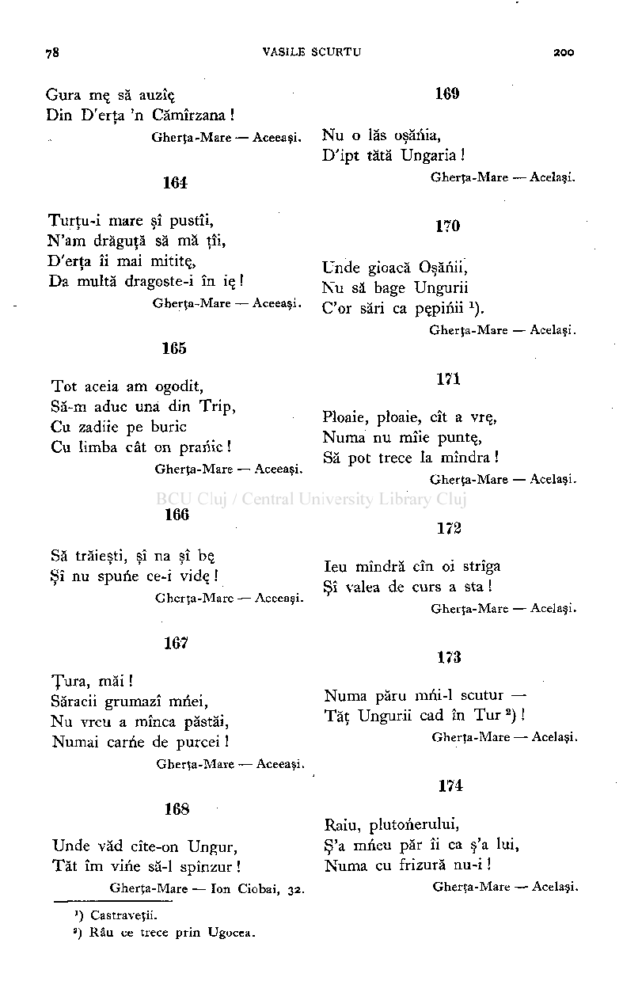

Gura mç să auzîç 169 Din D'erta 'n Cămîrzana !

Gherţa-Mare —Aceeaşi. Nu O lăs oşăhia,

D'ipt tătă Ungaria !

jg ^ Gherţa-Mare — Acelaşi.

Turţu-i mare şî pustîi, N'am drăguţă să mă ţîi, D'erţa îi mai mititç, Da multă dragoste-i în iç !

170

Unde gioacă Oşăriii, Nu să bage Ungurii Cor sări ca pçpinii

Gherţa-Mare — Aceeaşi.

).

1

Gherţa-Mare — Acelaşi.

165

171

Tot aceia am ogodit,

- Să-m aduc una din Trip, Cu zadiie pe buric Cu limba cât on prariic !

Ploaie, ploaie, cît a vrç, Numa nu mîie puntç,

- Să pot trece la mîndra ! Gherţa-Mare — Acelaşi.

172

leu mîndră cîn oi striga Şî valea de curs a sta !

Gherţa-Mare — Acelaşi.

173

Numa păru mni-1 scutur —

- Tăţ Ungurii cad în Tur ) ! Gherţa-Mare — Acelaşi.

Gherţa-Mare — Aceeaşi.

166

- Să trăieşti, şî na şî be_ Şî nu spune ce-i vide_ !

Gherţa-Mare — Aceeaşi.

167

Tura, măi !

- Săracii grumazî mnei, Nu vreu a mînca păstăi, Numai carne de purcei !

Gherţa-Mare — Aceeaşi.

168

Unde văd cîte-on Ungur,

- Tăt îm vine să-1 spînzur ! Gherţa-Mare — Ion Ciobai, 32.

174

Raiu, plutonerului, Ş'a mrieu păr îi ca ş'a lui, Numa cu frizură nu-i !

Gherţa-Mare — Acelaşi.

*) Castraveţii.

###### ) Râu ce trece prin Ugocea.

a

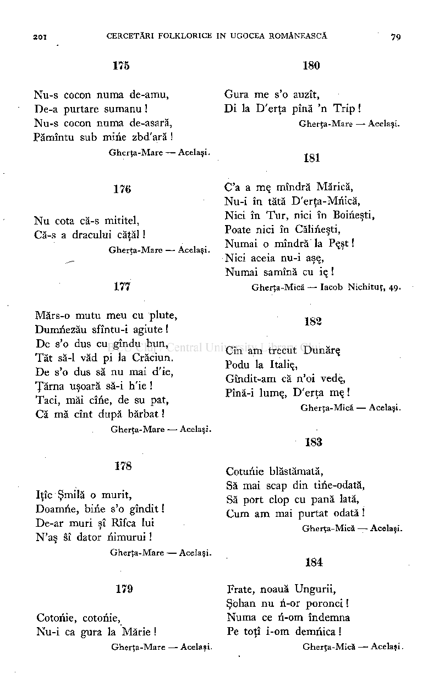

175

180

Nu-s cocon numa de-amu, De-a purtare sumanu ! Nu-s cocon numa de-asară, Pămîntu sub mine zbd'ară !

Gura me s'o auzît, Di la D'erţa pînă 'n Trip !

Gherţa-Mare — Acelaşi.

Gherţa-Mare — Acelaşi.

181

C'a a mç mîndră Mărică, Nu-i în tătă D'erţa-Mnică, Nici în Tur, nici în Boineşti, Poate nici în Călineşti, Numai o mîndră la Pcşt ! Nici aceia nu-i aşe., Numai samînă cu ie. !

176

Nu cota că-s mititel, Că-s a dracului căţăl !

Gherţa-Mare — Acelaşi.

177

Gherţa-Mică — Iacob Nichituţ, 49.

Mărs-o mutu meu cu plute, Dumnezău sfîntu-i agiute ! De s'o dus cu gîndu bun,

182

Cîn am trecut Dunăre. Podu la Italic, Gîndit-am că n'oi vede., Pînă-i lume., D'erţa mç !

- Tăt să-1 văd pi la Crăciun. De s'o dus să nu mai d'ie, Ţărna uşoară să-i h'ie ! Taci, măi cîne, de su pat, Că mă cînt după bărbat !

Gherţa-Mică — Acelaşi.

Gherţa-Mare — Acelaşi.

183

178

Cotuhie blăstămată, Să mai scap din tine-odată, Să port clop cu pană lată, Cum am mai purtat odată !

Iţîc Şmilă o murit, Doamne, bine s'o gîndit ! De-ar muri şî Rîfca lui N'aş sî dator nimurui !

Gherţa-Mică — Acelaşi.

Gherţa-Mare — Acelaşi.

184

Frate, noauă Ungurii, Şohan nu n-or poronci ! Numa ce n-om îndemna Pe toţi i-om demnica !

179

Cotoriie, cotonie, Nu-i ca gura la Mărie !

Gherţa-Mică — Acelaşi.

Gherţa-Mare — Acelaşi.

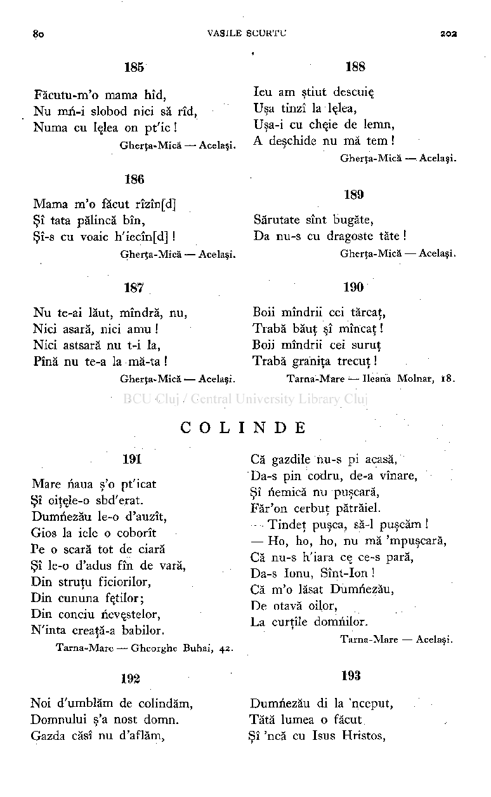

188

185

leu am ştiut descuie. Uşa tinzî la lejea, Uşa-i cu chçie de lemn,

Făcutu-m'o mama hîd, Nu mn-i slobod nici să rîd, Numa cu Idea on pt'ic !

A deschide nu mă tem !

Gherţa-Mică — Acelaşi.

Gherţa-Mică — Acelaşi.

186

189

Mama m'o făcut rîzînfd] Şî tata palincă bîn, Şî-s cu voaie h'iecîn[d] !

Sărutate sînt bugăte, Da nu-s cu dragoste täte !

Gherţa-Mică — Acelaşi.

Gherţa-Mică — Acelaşi.

190

187

Boii mîndrii cei tărcat, Trabă băut sî mîncat ! Boii mîndrii cei suruţ Trabă graniţa trecut !

Nu te-ai lăut, mîndră, nu, Nici asară, nici amu ! Nici astsară nu t-i la, Pînă nu te-a la mă-ta !

Tarna-Mare — Ileana Molnar, 18.

Gherţa-Mică — Acelaşi.

###### COLIND E

Că gazdile nu-s pi acasă, Da-s pin codru, de-a vînare, Şî nemică nu puşcară, Făr'on cerbuţ pătrăiel. — Tindeţ puşca, să-1 puşcăm !

191

Mare naua ş'o pt'icat Şî oiţcle-o sbd'erat. Dumnezău le-o d'auzît, Gios la iele o coborît Pe o scară tot de ciară Şî le-o d'adus fîn de vară, Din struţu ficiorilor, Din cununa fe.tilor; Din conciu nevestelor, N'inta creaţă-a babilor.

— Ho, ho, ho, nu mă 'mpuşcară, Că nu-s h'iara ce, ce-s pară, Da-s Ionu, Sînt-Ion ! Că m'o lăsat Dumnezău, De otavă oilor, La curţîle domnilor.

Tarna-Mare — Acelaşi.

Tarna-Mare — Gheorghe Buhai, 42.

192 193

Noi d'umblăm de colindăm, Domnului ş'a nost domn. Gazda căsî nu d'aflăm,

Dumnezău di la 'nceput, Tătă lumea o făcut Şî 'ncă cu Isus Hristos,

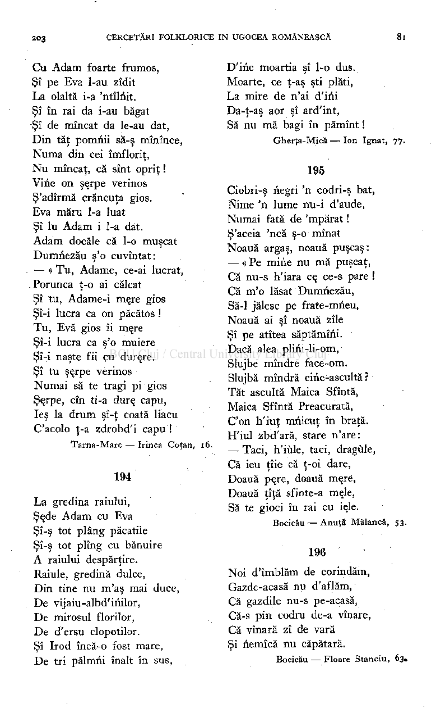

8i

CERCETĂR I FOLKLORIC E I N UGOCE A ROMÂNEASC Ă

203

Cu Adam foarte frumos, Şî pe Eva l-au zîdit La olaltă i-a 'ntîlnit. Şî în rai da i-au băgat Şî de mîncat da le-au dat, Din tăţ pomhii să-ş mînînce, Numa din cei îmflorit, Nu mîncaţ, că sînt oprit ! Vine on şe_rpe verinos Ş'adîrmă crăncuţa gios. Eva măru 1-a luat Şî lu Adam i 1-a dàt. Adam docăle că l-o muşcat Dumnezău ş'o cuvîntat:

D'ine moartia şî l-o dus. Moarte, ce ţ-aş şti plăti, La mire de n'ai d'ihi Da-ţ-aş aor şî ard'int, Să nu mă bagi în pămînt !

Gherţa-Mică — Ion Ignat, 77.

195

Ciobri-ş negri 'n codri-ş bat, Nime 'n lume nu-i d'aude, Numai fată de 'mpărat ! Ş'aceia 'ncă ş-o mînat Noauă argaş, noauă puşcaş: — « Pe mirie nu mă puşca ţ, Că nu-s h'iara ce. ce-s pare ! Că m'o lăsat Dumnezău,

— « Tu, Adame, ce-ai lucrat,

. Porunca ţ-o ai călcat Şî tu, Adame-i mçre gios Şî-i lucra ca on păcătos ! Tu, Evă gios îi me/e Şî-i lucra ca ş'o muiere Şî-i naşte fii cu dure/e. Şî tu şcrpe verinos Numai să te tragi pi gios Şe/pe, cîn ti-a dure, capu, leş la drum şî-ţ coată liacu C'acolo ţ-a zdrobd'i capu !

- Să-1 jălesc pe frate-mneu, Noauă ai şî noauă zîle Şî pe atîtea săptămîni. Dacă alea plini-li-om, Slujbe mîndre face-om. Slujbă mîndră cine-ascultă ?
- Tăt ascultă Maica Sfîntă, Maica Sfîntă Preacurată, Con h'iuţ mnicuţ în braţă. H'iul zbd'ară, stare n'are:

Tarna-Mare — Irinca Coţan, 16.

— Taci, h'iùle, taci, dragule, Că ieu ţîie că ţ-oi dare, Doauă pe/e, doauă me.re, Doauă ţîţă sfinte-a meje, Să te gioci în rai cu iejle.

194

La gredina raiului, Se.de Adam cu Eva Şî-ş tot plâng păcatile Şî-ş tot plîng cu bănuire A raiului despărţire. Raiule, gredină dulce, Din tine nu m'aş mai duce, De vîjaiu-albd'iriilor, De mirosul florilor, De d'ersu clopotilor. Şî Irod încă-o fost mare, De tri pălmni înalt în sus,

Bocicău — Anuţă Mălancă, 53.

196

Noi d'îmblăm de corindăm, Gazde-acasă nu d'aflăm, Că gazdile nu-s pe-acasă, Că-s pin codru de-a vînare, Că vînară zî de vară Şî nemîcă nu căpătară.

Bocicău — Floare Stanciu, 63.

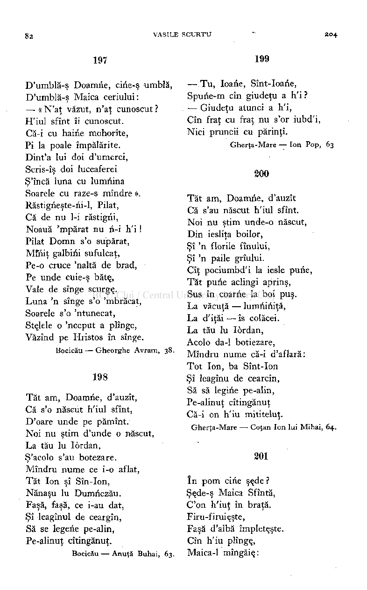

199

197

— Tu, Ioane, Sînt-Ioane, Spune-m cîn giudeţu a h'i ?

D'umblă-ş Doamne, cirie-ş umblă, D'umblă-ş Maica ceriului :

— Giudeţu atunci a h'i, Cîn fraţ cu fraţ nu s'or iubd'i, Nici pruncii cu părinţi.

— « N'aţ văzut, n'aţ cunoscut ? H'iul sfînt îi cunoscut. Că-i cu haine mohorîte, Pi la poale împălărite. Dint'a lui doi d'umerei, Scris-îş doi luceaferei Ş'încă luna cu lumnina Soarele cu raze-s mîndre ».

Gherţa-Mare — Ion Pop, 63

200

Tăt am, Doamne, d'auzît Că s'au născut h'iul sfînt. Noi nu ştim unde-o născut, Din iesliţa boilor, Şî 'n florile finului, Şî 'n paile griului. Cîţ pociumbd'i la iesle pune, Tat pune aclingi aprins, Sus în coarne la boi puş. La văcuţă — lumniriiţă, La d'ităi — îs colăcei. La tău lu Iordan, Acolo da-1 botiezare, Mîndru nume că-i d'aflară: Tot Ion, ba Sînt-Ion Şî leagînu de cearcîn, Să să legine pe-alin, Pe-alinuţ cîtingănuţ Că-i on h'iu mititeluţ.

- Răstigneşte-ni-1, Pilat, Că de nu 1-i răstigni, Noauă 'mpărat nu h-i h'i ! Pilat Domn s'o supărat, Mfniţ galbihi sufulcaţ, Pe-o cruce 'naltă de brad, Pe unde cuie-ş băte_, Vale de sînge scurge,. Luna 'n sînge s'o 'mbrăcat, Soarele s'o 'ntunecat, Stelele o 'nceput a plînge, Văzînd pe Hristos în sînge.

Bocicău — Gheorghe Avram, 38.

198

Tăt am, Doamne, d'auzît, Că s'o născut h'iul sfînt, D'oare unde pe pămînt. Noi nu ştim d'unde o născut, La tău lu Iordan, Ş'acolo s'au botezare. Mîndru nume ce i-o aflat, Tăt Ion şî Sîn-Ion, Nănaşu lu Dumnezău. Faşă, faşă, ce i-au dat, Şî leagînul de ceargîn,

- Să se legene pe-alin, Pe-alinuţ cîtingănuţ.

Gherţa-Mare — Coţan Ion lui Mihai, 64.

201

în pom cine şe_de ? Şcde-ş Maica Sfîntă, Con h'iuţ în braţă. Firu-firuicşte, Faşă d'albă împletcşte. Cîn h'iu plîngç, Maica-1 mîngăie,:

Bocicău — Anuţă Buhai, 63.

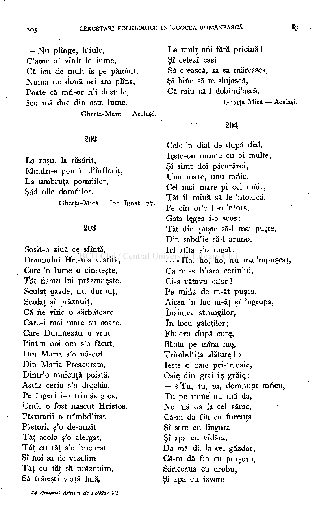

La mulţ ani fără pricină ! Şî celezî casî

— Nu plînge, h'iule, C'amu ai vinit în lume, Că ieu de mult îs pe pămînt, Numa de două ori am plîns, Poate că mn-or h'i destule, leu mă duc din asta lume.

- Să crească, să să mărească, Şî bine să te slujască, Că raiu să-1 dobînd'ască.

Gherţa-Mică — Acelaşi.

204

Colo 'n dial de după dial, Ieste-on munte cu oi multe, Şî sîmt doi păcurăroi, Unu mare, unu mnie, Cel mai mare pi cel mnie,

- Tăt îl mînă să le 'ntoarcă. Pe cîn oile li-o 'ntors, Gata lçgea i-o scos: Tăt din puste să-1 mai puste, Din sabd'ie să-1 arunce. Iei atîta s'o rugat:

Gherţa-Mare — Acelaşi.

202

La roşu, la răsărit, Mîndri-s pomni d'înfloriţ, La umbruţa pomnilor, Şăd oile domnilor.

Gherţa-Mică — Ion Ignat, 77.

203

Sosît-o zîuă ce, sfîntă, Domnului Hristos vestită, Care 'n lume o cinsteşte,

— « Ho, ho, ho, nu mă 'mpuşcaţ, Că nu-s h'iara ceriului, Ci-s vătavu oilor ! Pe mine de m-ăţ puşca, Aicea 'n loc m-ăţ şî 'ngropa, înaintea strungilor, în locu găleţilor; Fluieru după cure.,

- Tăt riamu lui prăznuicşte. Sculat gazde, nu durmiţ, Sculat şî prăznuiţ, Că ne vine o sărbătoare Care-i mai mare su soare. Care Dumnezău o vrut Pintru noi om s'o făcut, Din Maria s'o născut, Din Maria Preacurata, Dintr'o mfiicuţă poiată. Astăz ceriu s'o deschis, Pe îngeri i-o trimăs gios, Unde o fost născut Hristos. Păcurarii o trîmbd'iţat Păstorii ş'o de-auzît Tăţ acolo ş'o alergat, Tăţ cu tăţ s'o bucurat. Şî noi să he veselim

- Băuta pe mîna mç, Trîmbd'iţa alăture, ! » Ieste o oaie pcistrioaie, Oaie. din grai îş grăic:

— « Tu, tu, tu, domnuţu mneu, Tu pe mine nu mă da, Nu mă da Ia cel sărac,

- Că-m dă fîn cu furcuţa Şî sare cu lingura Şî apa cu vidăra. Da mă dă la cel găzdac, Că-m dă fîn cu porşoru, Săriceaua cu drobu, Şî apa cu izvoru

- Tăţ cu tăţ să prăznuim.

- Să trăieşti viaţă lină,

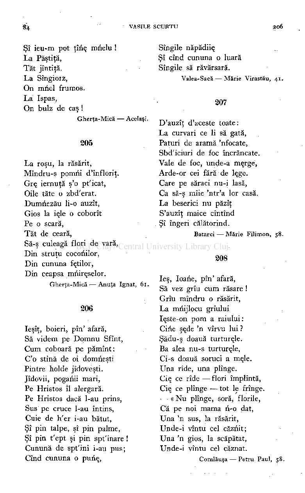

Sîngile năpădiic Şî cînd cununa o luară Sîngile să răvărsară.

Şî ieu-m pot tînç mrielu ! La Păştiţă,

- Tăt jîntiţă. La Sîngiorz, On mhel frumos. La Ispas, On bulz de caş !

Valea-Sacă — Mărie Virastău, 41.

207

Gherţa-Mică — Acelaşi.

D'auzît d'aceste toate: La curvari ce li să gată, Paturi de aramă 'nfocate, Sbd'iciuri de foc încrăncate. Vale de foc, unde-a mçrge, Arde-or cei fără de lçge. Care pe săraci nu-i lasă, Ca să-ş mîie 'ntr'a lor casă. La beserici nu păzîţ S'auzîţ maice cîntînd Şî îngeri călătorind.

205

La roşu, la răsărit, Mîndru-s pomrii d'înfloriţ. Grç iernuţă ş'o pt'icat, Oile täte o zbd'erat. Dumnezău li-o auzît, Gios la içle o coborît Pe o scară, Tăt de ceară, Să-ş culeagă flori de vară, Din struţu coconilor, Din cununa feţilor, Din ceapsa mnireselor.

Batarci — Mărie Filimon, 58.

208

leş, Ioane, pîn' afară, Să vez grîu cum răsare ! Grîu mîndru o răsărit, La mnijlocu griului Ie_ste-on pom a raiului: Cine şede 'n vîrvu lui ? Şădu-ş doauă turturçle. Ba alea nu-s turturele, Ci-s doauă soruci a mçle. Una rîde, una plînge. Ciç ce rîde — flori împlîntă, Ciç ce plînge — tot le frînge.

Gherţa-Mică — Anuţa Ignat, 61.

206

Ieşîţ, boieri, pîn' afară, Să videm pe Domnu Sfînt, Cum coboară pe pămînt: C'o stînă de oi domneşti Pintre holde jidoveşti. Jidovii, poganii mari, Pe Hristos îl alergară. Pe Hristos dacă l-au prins, Sus pe cruce l-au întins, Cuie de h'er i-au bătut, Şî pin talpe, şî pin palme, Şî pin t'ept şi pin spt'inare ! Cunună de spt'ini i-au pus; Cînd cununa o puric,

— « Nu plînge, soră, florile, Că pe noi mama ri-o dat, Una 'n sus, la răsărit, Unde-i vîntu cel căznit; Una 'n gios, la scăpătat, Unde-i vîntu cel căznat.

Comlăuşa — Petru Paul, 58.

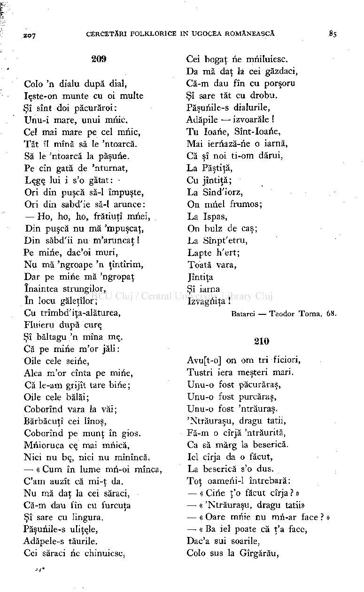

Cei bogat he mhiluiesc. Da mă daţ la cei găzdaci, Că-m dau fîn cu porşoru Şî sare tăt cu drobu. Păşuhile-s dialurile, Adăpile — izvoarăle ! Tu Ioane, Sînt-Ioane, Mai iernază-ne o iarnă, Că şî noi ti-om dărui, La Păştiţă, Cu jîntiţă; La Sînd'iorz, On mnel frumos; La Ispas, On bulz de caş; La Sînpt'etru, Lapte h'ert; Toată vara, Jîntiţa Şî iarna Izvaghiţa !

209

Colo 'n dialu după dial, leste-on munte cu oi multe Şî sînt doi păcurăroi: Unu-i mare, unui mriic. Cel mai mare pe cel mhic, Tat îl mînă să le 'ntoarcă. Să le 'ntoarcă la păşune. Pe cîn gată de 'nturnat, Lçge, lui i s'o gătat: • Ori din puşcă să-1 împuşte, Ori din sabd'ie să-1 arunce: — Ho, ho, ho, frătiuţî mnei, Din puşcă nu mă 'mpuşcaţ, Din săbd'ii nu m'aruncaţ ! Pe mine, dac'oi muri, Nu mă 'ngroape 'n ţîntîrim, Dar pe mine mă 'ngropaţ înaintea strungilor, în locu găleţilor; Cu trîmbd'iţa-alăturea, Fluieru după cure, Şî băltagu 'n mîna mç. Că pe mine m'or jăli: Oile cele seine, Alea m'or cînta pe mine, Că le-am grijît tare bine; Oile cele bălai; Coborînd vara la văi;

Batarci — Teodor Torna, 68.

210

Avu[t-o] on om tri ficiori, Tustri iera meşteri mari. Unu-o fost păcurăraş, Unu-o fost purcăraş, Unu-o fost 'ntrăuraş. 'Ntrăuraşu, dragu tatii, Fă-m o cîrjă 'ntrăurită, Ca să mărg la beserică. Iei cîrja da o făcut, La beserică s'o dus. Tot oameni-1 întrebară:

- Bărbăcuţî cei lînoş, Coborînd pe munţ în gios. Mnioruca ce, mai mriică, Nici nu be,, nici nu mînîncă.

— « Cum în lume mh-oi mînca, Cam auzît că mi-ţ da. Nu mă dat la cei săraci,

- Că-m dau fîn cu furcuţa Şî sare cu lingura.

— « Cifie ţ'o făcut cîrja ? »

— « 'Ntrăuraşu, dragu tatii»

— « Oare mriie nu mh-ar face ? »

— « Ba iei poate că ţ'a face, Dac'a sui soarile, Colo sus la Gîrgărău,

- Păşunile-s uliţcle, Adăpele-s tăurile. Cei săraci ne chinuiesc,

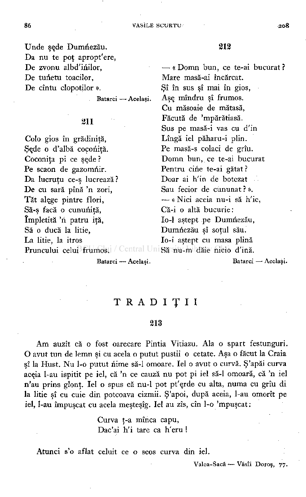

Unde şede Dumnezău. Da nu te poţ apropt'ere, De zvonu albd'inilor, De tunetu toacilor, De cîntu clopotilor ».

— « Domn bun, ce te-ai bucurat ? Mare masă-ai încărcat. Şî în sus şî mai în gios, Aşe, mîndru şî frumos. Cu măsoaie de mătasă, Făcută de 'mpărătiasă. Sus pe masă-i vas cu d'in Lîngă iei păharu-i plin. Pe masă-s colaci de grîu. Domn bun, ce te-ai bucurat Pentru cine te-ai gătat ? Doar ai h'in de botezat Sau fecior de cununat ? ».

Batarci — Acelaşi.

211

Colo gios în grădiniţă, Şede o d'albă coconită. Coconita pi ce şede ? Pe scaon de gazomnir. Da lucruţu ce-ş lucrează? De cu sară pînă 'n zori, Tăt alçge pintre flori, Să-ş facă o cununiţă, împletită 'ii patru iţă,

— « Nici aceia nu-i să h'ie, Că-i o altă bucurie: Io-l aştept pe Dumnezău, Dumnezău şî soţul său. Io-i aştept cu masa plină Să nu-m dăie nicio d'ină.

- Să o ducă la litie, La litie, la itros Pruncului celui frumos.

Batarci — Acelaşi.

Batarci—Acelaşi.

#### TRADIŢI

213

Am auzît că o fost oarecare Pintia Vitiazu. Ala o spart festunguri. O avut tun de lemn şi cu acela o putut pustii o cetate. Aşa o făcut la Craia şî la Hust. Nu l-o putut riime să-1 omoare. Iei o avut o curvă. Ş'apăi curva aceia l-au ispitit pe iei, că 'n ce cauză nu pot pi iei să-1 omoară, că 'n iei n'au prins glonţ. Iei o spus că nu-1 pot pt'erde cu alta, numa cu grîu di la litie şî cu cuie din potcoava cizmii. Ş'apoi, după aceia, l-au omorît pe iei, l-au împuşcat cu acela meşteşîg. Iei au zîs, cîn l-o 'mpuşcat :

Curva ţ-a mînca capu, Dac'ai h'i tare ca h'eru !

Atunci s'o aflat celuit ce o scos curva din iei.

Valea-Sacă '— Văsîi Doroş, 77.

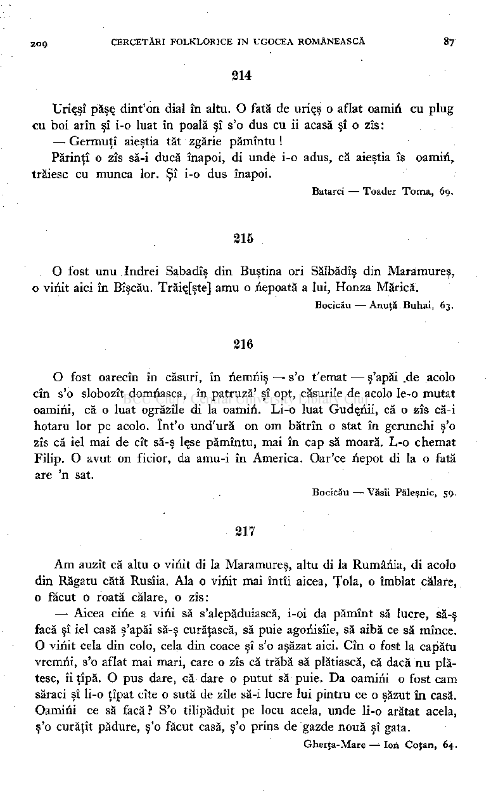

214

Uricşî păşc dint'on dial în altu. O fată de uricş o aflat oamin cu plug cu boi arîn şî i-o luat în poală şî s'o dus cu ii acasă şî o zîs:

— Germuţî aieştia tăt zgărie pămîntu ! Părinţi o zîs să-i ducă înapoi, di unde i-o adus, că aieştia îs oamin,

trăiesc cu munca lor. Şî i-o dus înapoi.

Batarci — Toader Torna, 69.

215

O fost unu Indrei Sabadîş din Buştina ori Sălbădîş din Maramureş, o vinit aici în Bîşcău. Trăic[şte] amu o nepoată a lui, Honza Mărică.

Bocicău — Anuţă Buhai, 63.

216

O fost oarecîn în căsuri, în nemniş — s'o t'emat — ş'apăi .de acolo cîn s'o slobozit domiîasca, în patruză' şî opt, caşurile de acolo le-o mutat oamini, că o luat ogrăzile di la oamin. Li-o luat Gudçnii, că o zîs că-i hotaru lor pe acolo. înt'o und'ură on om bătrîn o stat în gerunchi ş'o zîs că iei mai de cît să-ş lçse pămîntu, mai în cap să moară. L-o chemat Filip. O avut on ficior, da amu-i în America. Oar'ce nepot di la o fată are 'n sat.

Bocicău — Văsîi Păleşnic, 59.

217

Am auzît că altu o vinit di la Maramureş, altu di la Rumânia, di acolo din Răgatu cată Rusîia. Ala o vinit mai întîi aicea, Ţola, o îmbiat calare, o făcut o roată călare, o zîs:

— Aicea cine a vini să s'alepăduiască, i-oi da pămînt să lucre, să-ş facă şî iei casă ş'apăi să-ş curăţască, să puie agonisîie, să aibă ce să mînce. O vinit cela din colo, cela din coace şî s'o aşăzat aici. Cîn o fost la capătu vremhi, s'o aflat mai mari, care o zîs că trăbă să plătiască, că dacă nu plătesc, îi ţîpă. O pus dare, că dare o putut să puie. Da oamini o fost cam săraci şî li-o ţîpat cîte o sută de zîle să-i lucre lui pintru ce o şăzut în casă. Oamini ce să facă ? S'o tilipăduit pe locu acela, unde li-o arătat acela, ş'o curăţit pădure, ş'o făcut casă, ş'o prins de gazde nouă şî gata.

Gherţa-Mare —- Ion Cotari, 64.

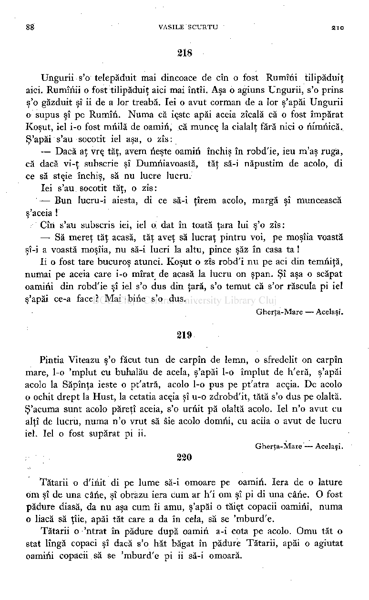

218

Ungurii s'o telepăduit mai dincoace de cîn o fost Rumîrii tilipăduiţ aici. Rumînii o fost tilipăduiţ aici mai întîi. Aşa o agiuns Ungurii, s'o prins ş'o găzduit şî ii de a lor treabă. Iei o avut corman de a lor ş'apăi Ungurii o supus şî pe Rumîn. Numa că ieste apăi aceia zîcală că o fost împărat Koşut, iei i-o fost mriilă de oamiri, că muncç la cialalţ fără nici o nimnică. Ş'apăi s'au socotit iei aşa, o zîs:

— Dacă aţ vre_ tăţ, avem neşte oamih închis în robd'ie, ieu m'aş ruga, că dacă vi-ţ subscrie şî Dumniavoastă, tăţ să-i năpustim de acolo, di ce să stçie închis, să nu lucre lucru.

Iei s'au socotit tăţ, o zîs:

— Bun lucru-i aiesta, di ce să-i ţîrem acolo, margă şî muncească ş'aceia !

Cîn s'au subscris iei, iei o. dat în toată ţara lui ş'o zîs:

—• Să mereţ tăţ acasă, tăţ aveţ să lucrat pintru voi, pe moşîia voastă şî-i a voastă moşîia, nu să-i lucri la altu, pince şăz în casa ta !

Ii o fost tare bucuros atunci. Koşut o zîs robd'i nu pe aci din temniţă, numai pe aceia care i-o mîrat de acasă la lucru on şpan. Şî aşa o scăpat oamini din robd'ie şî iei s'o dus din ţară, s'o temut că s'or răscula pi iei ş'apăi ce-a face ? Mai - bine s'o dus.

Gherţa-Mare — Acelaşi.

219

Pintia Viteazu ş'o făcut tun de carpîn de lemn, o sfredelit on carpîn mare, l-o 'mplut cu buhalău de acela, ş'apăi l-o împlut de h'eră, ş'apăi acolo la Săpînţa ieste o pt'atră, acolo l-o pus pe pt'atra acçia. De acolo

- o ochit drept la Hust, la cetatia acçia şî u-o zdrobd'it, tătă s'o dus pe olaltă. Ş'acuma sunt acolo păreţî aceia, s'o urnit pă olaltă acolo. Iei n'o avut cu alţî de lucru, numa n'o vrut să sie acolo domni, cu aciia o avut de lucru iei. Iei o fost supărat pi ii.

Gherţa-Mare — Acelaşi.

220

Tătarii o d'init di pe lume să-i omoare pe oamin. Iera de o lăture

- om şî de una câne, şî obrazu iera cum ar h'i om şî pi di una câne. O fost pădure diasă, da nu aşa cum îi amu, ş'apăi o tăiet copacii oamini, numa o liacă să ţîie, apăi tăt care a da în cela, să se 'mburd'e.

Tătarii o 'ntrat în pădure după oamin a-i cota pe acolo. Omu tăt o stat lîngă copaci şî dacă s'o hăt băgat în pădure Tătarii, apăi o agiutat oamini copacii să se 'mburd'e pi ii să-i omoară.

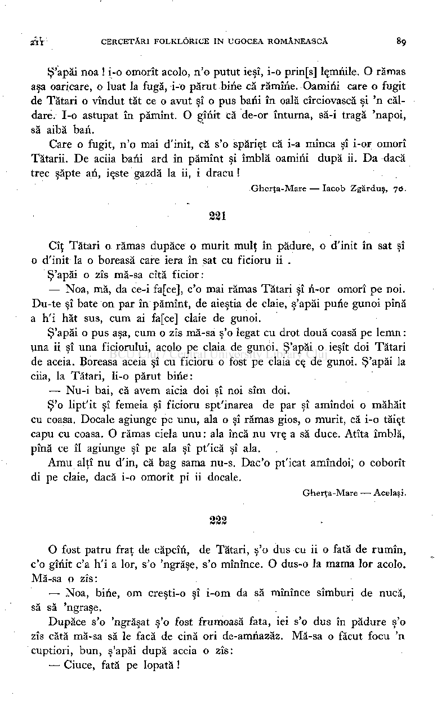

Ş'apăi noa ! i-o omorît acolo, n'o putut ieşî, i-o prin[s] lemnile. O rămas aşa oaricare, o luat la fugă, i-o părut bine că rămîne. Oamirii care o fugit de Tătari o vîndut tăt ce o avut şî o pus bani în oală cîrciovască şi 'n căldare. I-o astupat în pămînt. O gînit că de-or înturna, să-i tragă 'napoi, să aibă ban.

Care o fugit, n'o mai d'init, că s'o spăriet că i-a mînca şî i-or omorî

- Tătarii. De aciia bani ard în pămînt şi îmbla oamini după ii. Da dacă trec şapte an, ieste gazdă la ii, i dracu !

Gherţa-Mare — Iacob Zgărduş, 70.

221

Cîţ Tătari o rămas dupăce o murit mulţ în pădure, o d'init în sat şî o d'init la o boreasă care iera în sat cu ficioru ii .

Ş'apăi o zîs mă-sa cîtă ficior:

— Noa, mă, da ce-i fa[ce], c'o mai rămas Tătari şî n-or omorî pe noi. Du-te şî bate on par în pămînt, de aieştia de claie, ş'apăi pune gunoi pînă a h'i hăt sus, cum ai fa[ce] claie de gunoi.

Ş'apăi o pus aşa, cum o zîs mă-sa ş'o legat cu drot două coasă pe lemn : una ii şî una ficiorului, acolo pe claia de gunoi. Ş'apăi o ieşît doi Tătari de aceia. Boreasa aceia şî cu ficioru o fost pe claia cç de gunoi. Ş'apăi la ciia, la Tătari, li-o părut bine:

— Nu-i bai, că avem aicia doi şî noi sîm doi. Ş'o lipt'it şî femeia şî ficioru spt'inarea de par şî amîndoi o măhăit cu coasa. Docale agiunge pe unu, ala o şî rămas gios, o murit, că i-o tăiet capu cu coasa. O rămas ciela unu : ala încă nu vrç a să duce. Atîta îmbla, pînă ce îl agiunge şî pe ala şî pt'ică şî ala.

Amu alţî nu d'in, că bag sama nu-s. Dac'o pt'icat amîndoi; o coborît di pe claie, dacă i-o omorît pi ii docale.

Gherţa-Mare — Acelaşi.

222

O fost patru fraţ de căpcîh, de Tătari, ş'o dus cu ii o fată de rumîn, c'o gîriit c'a h'i a lor, s'o 'ngrăşe, s'o mînînce. O dus-o la mama lor acolo. Mă-sa o zîs:

—• Noa, bine, om creşti-o şî i-om da să mînînce sîmburi de nucă,

- să să 'ngraşe. Dupăce s'o 'ngrăşat ş'o fost frumoasă fata, iei s'o dus în pădure ş'o

zîs cătă mă-sa să le facă de cină ori de-amnazăz. Mă-sa o făcut focu 'n cuptiori, bun, ş'apăi după aceia o zîs:

— Ciuce, fată pe lopată !

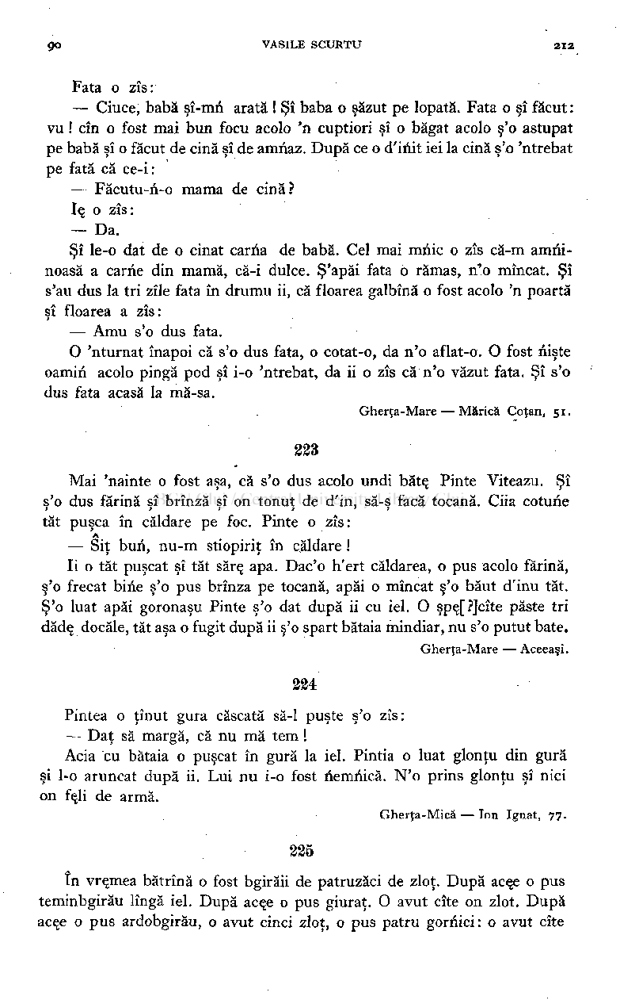

Fata o zîs:

— Ciuce, babă şî-mh arată ! Şî baba o şăzut pe lopată. Fata o şî făcut : vu ! cîn o fost mai bun focu acolo 'n cuptiori şî o băgat acolo ş'o astupat pe babă şî o făcut de cină şî de amriaz. După ce o d'ihit iei la cină ş'o 'ntrebat pe fată că ce-i:

— Făcutu-n-o mama de cină? Iç o zîs:

— Da. Şî le-o dat de o cinat carha de babă. Cel mai mnie o zîs că-m amriinoasă a carne din mamă, că-i dulce. Ş'apăi fata o rămas, n'o mîncat. Şî s'au dus la tri zîle fata în drumu ii, că floarea galbînă o fost acolo 'n poartă şî floarea a zîs:

— Amu s'o dus fata. O 'nturnat înapoi că s'o dus fata, o cotat-o, da n'o aflat-o. O fost nişte

oamiri acolo pingă pod şî i-o 'ntrebat, da ii o zîs că n'o văzut fata. Şî s'o dus fata acasă la mă-sa.

Gherţa-Mare — Mărică Coţan, 51.

223

Mai 'nainte o fost aşa, că s'o dus acolo undi bătc Pinte Viteazu. Şî ş'o dus fărină şî brînză şî on tonuţ de d'in, să-ş facă tocană. Ciia coturie

- tăt puşca în căldare pe foc. Pinte o zîs:

— Siţ buri, nu-m stiopiriţ în căldare ! Ii o tăt puşcat şî tăt săre_ apa. Dac'o h'ert căldarea, o pus acolo fărină, ş'o frecat bine ş'o pus brînza pe tocană, apăi o mîncat ş'o băut d'inu tăt. Ş'o luat apăi goronaşu Pinte ş'o dat după ii cu iei. O şpc[?]cîte paste tri dădc docăle, tăt aşa o fugit după ii ş'o spart bătaia mindiar, nu s'o putut bate.

Gherţa-Mare — Aceeaşi.

224

Pintea o ţînut gura căscată să-1 puste ş'o zîs:

— Daţ să margă, că nu mă tem ! Acia cu bătaia o puşcat în gură la iei. Pintia o luat glonţu din gură

şi l-o aruncat după ii. Lui nu i-o fost riemriică. N'o prins glonţu şî nici on fçli de armă.

Gherţa-Mică — Ion Ignat, 77.

225

în vremea bătrînă o fost bgirăii de patruzăci de zloţ. După acçe o pus teminbgirău lîngă iei. După acee o pus giuraţ. O avut cîte on zlot. După acçe o pus ardobgirău, o avut cinci zloţ, o pus patru gorriici : o avut cîte

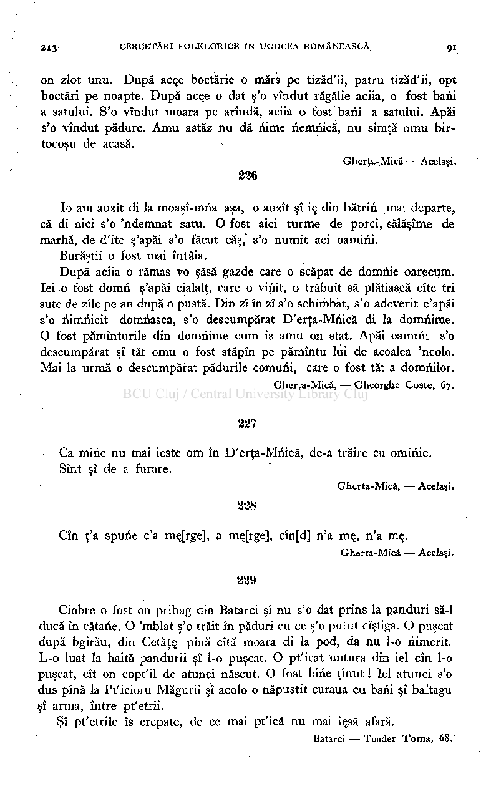

on zlot unu. După acee boctărie o mărs pe tizăd'ii, patru tizăd'ii, opt boctări pe noapte. După acee o dat ş'o vîndut răgălie aciia, o fost bani a satului. S'o vîndut moara pe arîndă, aciia o fost bani a satului. Apăi s'o vîndut pădure. Amu astăz nu dă riime nemriică, nu sîmţă omu birtocoşu de acasă.

Gherţa-Mică — Acelaşi.

226

Io am auzît di la moaşî-mha aşa, o auzît şî iç din bătrîn mai departe, că di aici s'o 'ndemnat satu. O fost aici turme de porci, sălăşîme de marhă, de d'ite ş'apăi s'o făcut căş," s'o numit aci oamini.

Burăştii o fost mai întâia. După aciia o rămas vo şăsă gazde care o scăpat de domnie oarecum. Iei o fost domn ş'apăi cialalţ, care o vinit, o trăbuit să plătias.că cîte tri sute de zîle pe an după o pustă. Din zî în zî s'o schimbat, s'o adeverit c'apăi s'o nimnicit domnasca, s'o descumpărat D'erţa-Mnică di la domnime. O fost pămînturile din domnime cum îs amu on stat. Apăi oamini s'o descumpărat şî tăt omu o fost stăpîn pe pămîntu lui de acoalea 'ncolo. Mai la urmă o descumpărat pădurile comuni, care o fost tăt a domnilor.

Gherţa-Mică, — Gheorghe Coste, 67.

- 227

Ca mine nu mai ieste om în D'erţa-Mnică, de-a trăire cu ominie. Sînt şî de a furare.

Gherţa-Mică, — Acelaşi.

- 228

Cîn ţ'a spune c'a me{rge], a mejrge], cîn[d] n'a mç, n'a mç.

Gherţa-Mică — Acelaşi.

- 229

Ciobre o fost on pribag din Batarci şî nu s'o dat prins la panduri să-1 ducă în cătane. O 'mblat ş'o trăit în păduri cu ce ş'o putut cîştiga. O puşcat după bgirău, din Cetăţc pînă cîtă moara di la pod, da nu l-o nimerit. L-o luat la haită pandurii şî l-o puşcat. O pt'icat untura din iei cîn l-o puşcat, cît on copt'il de atunci născut. O fost bine ţînut ! Iei atunci s'o dus pînă la Pt'icioru Măgurii şî acolo o năpustit curaua cu bani şî baltagu şî arma, între pt'etrii.

Şî pt'etrile îs crepate, de ce mai pt'ică nu mai icsă afară.

Batarci — Toader Torna, 68.

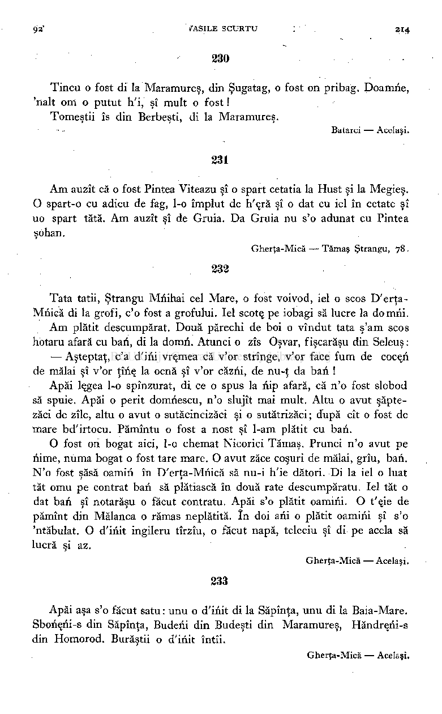

93* /ASILE SCURT U 214

230

Tincu o fost di la Maramureş, din Şugatag, o fost on pribag. Doamne, 'nalt om o putut h'i, şî mult o fost !

Tomeştii îs din Berbeşti, di la Maramureş.

•• Batarci — Acelaşi.

231

Am auzît că o fost Pintea Viteazu şî .0 spart cetatia la Hust şi la Megieş. O spart-o cu adieu de fag, l-o împlut de h'cră şî o dat cu iei în cetate şî uo spart tătă. Am auzît şî de Gruia. Da Gruia nu s'o adunat cu Pintea şohan.

Gherţa-Mică —- Tămaş Ştrangu, 78.

232

Tata tatii, Ştrangu Mriihai cel Mare, o fost voivod, iei o scos D'erţaMhică di la grofi, c'o fost a grofului. Iei scotç pe iobagi să lucre la domni. Am plătit descumpărat. Două părechi de boi o vîndut tata ş'am scos hotaru afară cu ban, di la domn. Atunci o zîs Oşvar, f işcarăşu din Seleuş :

— Aşteptat, c'a d'ini vrejnea că v'or strînge, v'or face fum de cocçri de mălai şî v'or ţîric la ocnă şî v'or căzni, de nu-ţ da ban !

Apăi lçgea l-o spînzurat, di. ce o spus la nip afară, că n'o fost slobod

- să spuie. Apăi o perit domnescu, n'o slujit mai mult. Altu o avut şăptezăci de zîle, altu o avut o sutăcincizăci şi o sutătrizăci; după cît o fost de niare bd'irtocu. Pămîntu o fost a nost şî l-am plătit cu ban.

O fost on bogat aici, l-o chemat Nicorici Tămaş. Prunci n'o avut pe lîime, numa bogat o fost tare mare. O avut zace coşuri de mălai, grîu, băii. N'o fost şăsă oamin în D'erţa-Miîică să nu-i h'ie datori. Di la iei o luat

- tăt omu pe contrat ban să plătiască în două rate descumpăratu. Iei tăt o dat ban şî notarăşu o făcut contratu. Apăi s'o plătit oamini. O t'çie de pămînt din Mălanca o rămas neplătită. în doi ani o plătit oamini şî s'o 'ntăbulat. O d'ihit ingileru tîrzîu, o făcut napă, teleciu şî di pe acela să lucră şi az.

Gherţa-Mică — Acelaşi.

233

Apăi aşa s'o făcut satu : unu o d'init di la Săpînţa, unu di la Baia-Mare. Sborïçni-s din Săpînţa, Budeiîi din Budeşti din Maramureş, Hăndrcni-s din Homorod. Burăştii o d'init întîi.

Gherţa-Mică — Acelaşi.

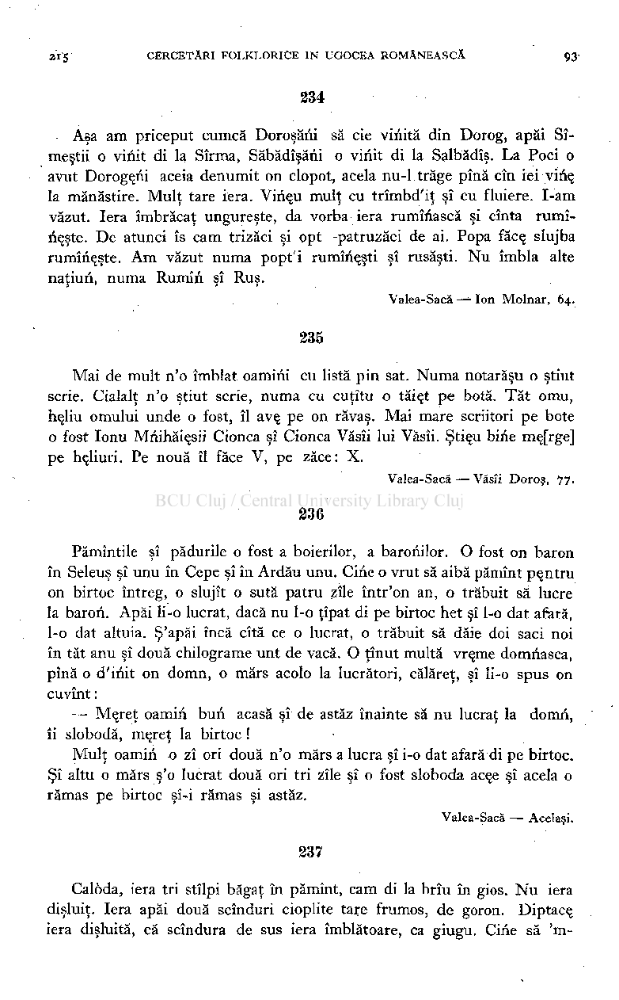

234

Aşa am priceput cumcă Doroşării să cie viriită din Dorog, apăi Sîmeştii o viriit di la Sîrma, Săbădîşării o viriit di la Salbadîş. La Poci o avut Dorogerii aceia denumit on clopot, acela nu-1. trage pînă cîn iei vine, la mănăstire. Mulţ tare iera. Viriçu mulţ cu trîmbd'iţ şî cu fluiere. I-am văzut. Iera îmbrăcat ungureşte, da vorba iera rumînască şi cînta rumîricşte. De atunci îs cam trizăci şi opt—patruzăci de ai. Popa face, slujba rumîncşte. Am văzut numa popt'i rumîricşti şî rusăşti. Nu îmbla alte naţiuri, numa Rumîri şî Ruş.

Valea-Sacă —- Ion Molnar, 64.

235

Mai de mult n'o îmbiat oamirii cu listă pin sat. Numa notarăşu o ştiut scrie. Cialalţ n'o ştiut scrie, numa cu cuţîtu o tăi et pe botă. Tăt omu, hejiu omului unde o fost, îl ave, pe on răvaş. Mai mare scriitori pe bote o fost Ionu Mriihăiesii Cionca şî Cionca Văsîi lui Văsîi. Ştieu bine mçfrge] pe heHuri. Pe nouă îl face V, pe zace: X.

Valea-Sacă — Văsîi Doroş, 77.

236

Pămîntile şî pădurile o fost a boierilor, a baronilor. O fost on baron în Seleuş şî unu în Cepe şî în Ardău unu. Cine o vrut să aibă pămînt pe,ntru on birtoc întreg, o slujît o sută patru zîle într'on an, o trăbuit să lucre la baron. Apăi li-o lucrat, dacă nu l-o ţîpat di pe birtoc het şî l-o dat afară, l-o dat altuia. Ş'apăi încă cîtă ce o lucrat, o trăbuit să dăie doi saci noi în tăt anu şî două chilograme unt de vacă. O ţînut multă vreme domriasca, pînă o d'iriit on domn, o mărs acolo la lucrători, călăreţ, şî li-o spus on cuvînt :

— Mcreţ oamiri buri acasă şî de astăz înainte să nu lucrat la domri, îi slobodă, mereţ Ia birtoc !

Mulţ oamiri o zî ori două n'o mărs a lucra şî i-o dat afară di pe birtoc. Şî altu o mărs ş'o lucrat două ori tri zîle şî o fost sloboda acee şî acela o

- rămas pe birtoc şî-i rămas şi astăz. Valea-Sacă — Acelaşi.

237

Calöda, iera tri stîlpi băgat în pămînt, cam di la brîu în gios. Nu iera dişluiţ. Iera apăi două scînduri cioplite tare frumos, de goron. Diptace, iera dişluită, că scîndura de sus iera îmblătoare, ca giugu. Cirie să 'm-

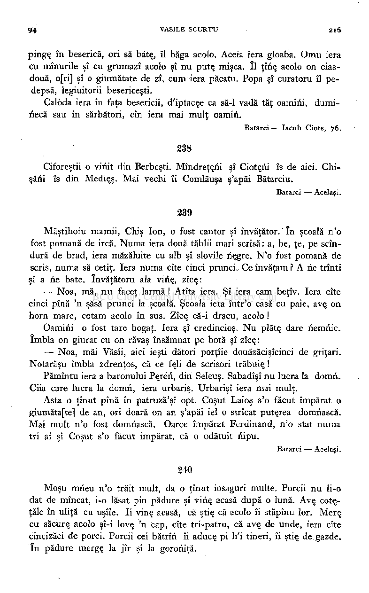

pingç în beserică, ori să bătc, îl băga acolo. Aceia iera gloaba. Omu iera cu mînurile şî cu grumazi acolo şî nu pute, mişca. îl ţîric acolo on ciasdouă, o[ri] şî o giumătate de zî, cum iera păcatu. Popa şî curatoru îl pedepsă, legiuitorii besericeşti.

Caloda iera în faţa besericii, d'iptacee ca să-1 vadă tăţ oamini, duminecă sau în sărbători, cîn iera mai mulţ oamin.

Batarci — Iacob Ciote, 76.

238

Ciforeştii o vinit din Berbeşti. Mîndreţeni şî Cioteni îs de aici. Chişării îs din Medies. Mai vechi îi Comlăuşa ş'apăi Bătarciu.

Batarci — Acelaşi.

239

Măştihoiu mamii, Chiş Ion, o fost cantor şî învăţător. ' în şcoală n'o fost pomană de ircă. Numa iera două tăblii mari scrisă : a, be, ţe, pe scîndură de brad, iera măzăluite cu alb şî slovile riçgre. N'o fost pomană de scris, numa să cetit. Iera numa cîte cinci prunci. Ce învăţam ? A ne trînti şî a ne bate. învăţătoru ala viriç, zîcç:

— Noa, mă, nu faceţ larmă ! Atîta iera. Şî iera cam beţîv. Iera cîte cinci pînă 'n şăsă prunci la şcoală. Şcoala iera într'o casă cu paie, avç on horn mare, cotam acolo în sus. Zîcç că-i dracu, acolo !

Oamini o fost tare bogat. Iera şî credincios. Nu plătc dare riemriic. îmbla on giurat cu on răvaş însămnat pe botă şî zîcç :

. — Noa, măi Văsîi, aici ieşti datori porţîie douăzăcişîcinci de griţari. Notarăşu îmbla zdrenţos, că ce fçli de scrisori trăbuic !

Pămîntu iera a baronului Peren, din Seleuş. Sabadîşî nu lucra la domn. Ciia care lucra la domn, iera urbariş. Urbarişî iera mai mulţ.

Asta o ţînut pînă în patruză'şî opt. Coşut Laioş s'o făcut împărat o giumăta[te] de an, ori doară on an ş'apăi iei o stricat puterea domriască. Mai mult n'o fost domriască. Oarce împărat Ferdinand, n'o stat numa tri ai şî Coşut s'o făcut împărat, că o odătuit riipu.

Batarci — Acelaşi.

240

Moşu mrieu n'o trăit mult, da o ţînut iosaguri multe. Porcii nu li-o dat de mîncat, i-o lăsat pin pădure şî viriç acasă după o lună. Avç cotçţăle în uliţă cu uşîle. Ii vinç acasă, că ştic că acolo îi stăpînu lor. Merç cu săcurc acolo şî-i lovç 'n cap, cîte tri-patru, că avç de unde, iera cîte cincizăci de porci. Porcii cei bătrîri îi aducç pi h'i tineri, îi ştic de gazde, în pădure mergç la jîr şî la gororiiţă.

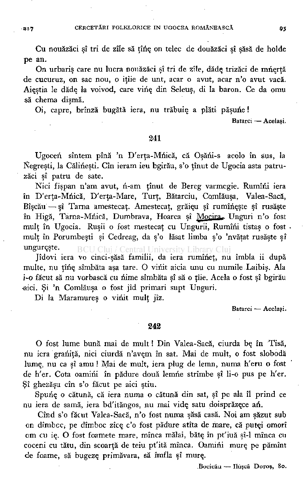

Cu nouăzăci şî tri de zîle să ţîfîe. on telec de douăzăci şî şăsă de holde pe an.

On urbariş care nu lucra nouăzăci şî tri de zîle, dăde. trizăci de mne_rţă de cucuruz, on sac nou, o iţîie de unt, acar o avut, acar n'o avut vacă. Aicştia le dăde. la voivod, care vine. din Seleuş, di la baron. Ce da omu

- să chema dişmă. Oi, capre, brînză bugătă iera, nu trăbuie. a plăti păşune !

Batarci — Acelaşi.

241

Ugoceh sîntem pînă 'n D'erţa-Mnică, că Oşăni-s acolo în sus, la Negreşti, la Căliheşti. Cîn ieram ieu bgirău, s'o ţînut de Ugocia asta patruzăci şî patru de sate.

Nici fişpan n'am avut, n-am ţînut de Bereg varmegie. Rumîni iera în D'erţa-Mnică, D'erţa-Mare, Turţ, Bătarciu, Comlăuşa, Valea-Sacă,

- Bîşcău — şî Târna amestecat. Amestecat, grăieu şî rumîne_şte şî rusăşte în Higă, Tarna-Mnică, Dumbrava, Hoarca şî Mnrira- Unguri n'o fost mulţ în Ugocia. Ruşii o fost mestecat cu Ungurii, Rumîni tistaş o fost mulţ în Porumbeşti şi Cedreag, da ş'o lăsat limba ş'o 'nvăţat rusăşte şî ungurcşte.

Jîdovi iera vo cinci-şăsă familii, da iera rumîneţ, nu îmbla ii după multe, nu ţîne. sîmbăta aşa tare. O vinit aicia unu cu numile Laibiş. Ala i-o făcut să nu vorbască cu riime sîmbăta şî să o ţîie. Acela o fost şî bgirău •aici. Şi 'n Comlăuşa o fost jîd primari supt Unguri.

Di la Maramureş o vinit mulţ jîz.

Batarci — Acelaşi.

242

O fost lume bună mai de mult ! Din Valea-Sacă, ciurda be. în Tisă, nu iera graniţă, nici ciurdă n'avçm în sat. Mai de mult, o fost slobodă lumç, nu ca şî amu ! Mai de mult, iera plug de lemn, numa h'eru o fost de h'er. Cota oamihi în pădure două lemne strîmbe şî li-o pus pe h'er. Şî ghezăşu cîn s'o făcut pe aici ştiu.

Spune, o cătună, că iera numa o cătună din sat, şî pe ala îl prind ce nu iera de samă, iera bd'ităngos, nu mai vide, satu doispraze.ce ari.

Cînd s'o făcut Valea-Sacă, n'o fost numa şăsă casă. Noi am şăzut sub on dîmbcc, pe dîmboc zîcç c'o fost pădure atîta de mare, că putej omorî

- om cu iç. O fost foamete mare, mînca mălai, băte. în pt'iuă şî—1 mînca cu coceni cu tătu, din scoarţă de teiu pt'ită mînca. Oamirii mure. pe pămînt de foame, să bugeze, primăvara, să îmfla şî mure..

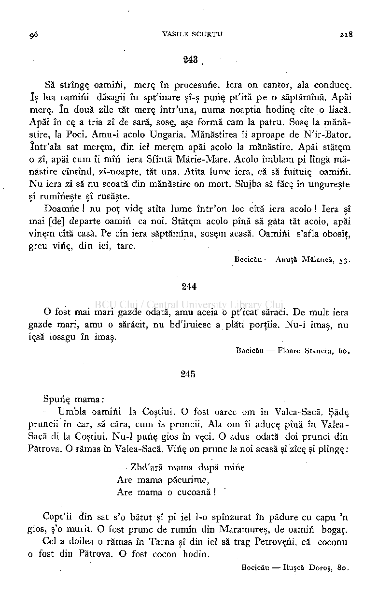

243 ,

Să strînge. oamini, merç în procesurie. Iera on cantor, ala conduce., îş lua oamini dăsagii în spt'inare şî-ş pune. pt'ită pe o săptămînă. Apăi merç. în două zîle tăt merç într'una, numa noaptia hodine. cîte o liacă. Apăi în ce. a tria zî de sară, sose., aşa formă cam la patru. Sose. la mănăstire, la Poci. Amu-i acolo Ungaria. Mănăstirea îi aproape de N'ir-Bator. într'ala sat merçm, din iei merçm apăi acolo la mănăstire. Apăi stătem o zî, apăi cum îi mîri iera Sfîntă Mărie-Mare. Acolo îmblam pi lîngă mănăstire cîntînd, zî-noapte, tăt una. Atîta lume iera, că să fuituie. oamini. Nu iera zî să nu scoată din mănăstire on mort. Slujba să făce. în ungureşte şî rumîheşte şî rusăşte.

Doamne ! nu poţ vide. atîta lume într'on loc cîtă iera acolo ! Iera şî mai [de] departe oamin ca noi. Stătcm acolo pînă să găta tăt acolo, apăi vinçm cîtă casă. Pe cîn iera săptămînă, sosern acasă. Oamini s'afla obosîţ, greu vine., din iei, tare.

Bocicău — Anuţă Mălancă, 53.

244

O fost mai mari gazde odată, amu aceia o pt'icat săraci. De mult iera gazde mari, amu o sărăcit, nu bd'iruiesc a plăti porţîia. Nu-i imaş, nu icsă iosagu în imaş.

Bocicău — Floare Stanciu, 60.

245

Spune, mama:

— Umbla oamini la Coştiui. O fost oarce om în Valea-Sacă. Şăde. pruncii în car, să căra, cum îs pruncii. Ala om îi aduce, pînă în ValeaSacă di la Coştiui. Nu-1 pune, gios în ve,ci. O adus odată doi prunci din Pătrova. O rămas în Valea-Sacă. Vine. on prunc la noi acasă şî zice. şi plînge.:

— Zbd'ară mama după mine Are mama păcurime, Are mama o cucoană !

Copt'ii din sat s'o bătut şî pi iei l-o spînzurat în pădure cu capu 'n gios, ş'o murit. O fost prunc de rumîn din Maramureş, de oamiiî bogat.

Cel a doilea o rămas în Târna şî din iei să trag Petrovçni, că coconu o fost din Pătrova. O fost cocon hodin.

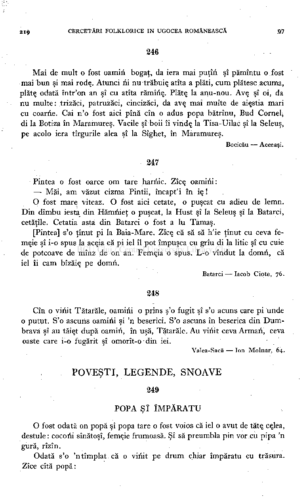

246

Mai de mult o fost oamin bogat, da iera mai puţin şî pămîntu o fost mai bun şi mai rodç. Atunci ni nu trăbuie, atîta a plăti, cum plătesc acuma, plătc odată într'on an şî cu atîta rămînc. Plate, la anu-nou. Ave, şî oi, da nu multe: trizăci, patruzăci, cincizăci, da avç mai multe de aiestia mari cu coarne. Cai n'o fost aici pînă cîn o adus popa bătrînu, Bud Cornel, di la Botiza în Maramureş. Vacile şî boii îi vinde, la Tisa-Uilac şî la Seleuş, pe acolo iera tîrgurile alea şî la Sîghet, în Maramureş.

Bocicău — Aceeaşi.

247

Pintea o fost oarce om tare harnic. Zîcç oamini :

— Măi, am văzut cizma Pintii, încapt'i în iç ! O fost mare viteaz. O fost aici cetate, o puşcat cu adieu de lemn.

Din dîmbu iesta din Hămnieţ o puşcat, la Hust şî la Seleuş şî la Batarci, cetăţile. Cetatia asta din Batarci o fost a lu Tamas.

> »

[Pintea] s'o ţînut pi la Baia-Mare. Zîce, că să să h'ie ţînut cu ceva fernere şî i-o spus la aceja că pi iei îl pot împuşca cu grîu di la litie şî cu cuie de potcoave de mînz de on an. Femçia o spus. L-o vîndut la domn, că iei îi cam bîzăic pe domn.

248

Cîn o viriit Tătarăle, oamini o prins ş'o fugit şî s'o acuns care pi unde

- o putut. S'o ascuns oamini şi 'n beserici. S'o ascuns în beserica din Dumbrava şî au tăiet după oamin, în uşă, Tătarăle. Au vinit ceva Arman, ceva
- oaste care i-o fugărit şî omorît-odin iei. Valea-Sacă — Ion Molnar, 64.

###### POVEŞTI, LEGENDE, SNOAVE

249

POPA Ş î ÎMPĂRATU

O fost odată on popă şî popa tare o fost voios că iei o avut de täte, cçlea, destule : coconi sînătoşî, femçie frumoasă. Şî să preumbla pin vor cu pipa 'n gură, rîzîn.

Odată s'o 'ntîmplat că o vinit pe drum chiar împăratu cu trăsura. Zîce cîtă popă:

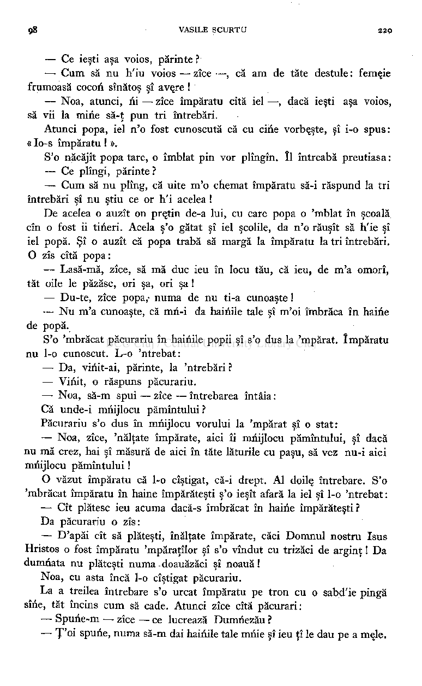

98 VASILE SCURT U

— Ce ieşti aşa voios, părinte ?

— Cum să nu h'iu voios — zîce —, că am de täte destule : femçie frumoasă cocon sînătoş şî avçre !

— Noa, atunci, hi — zîce împăratu cîtă iei —-, dacă ieşti aşa voios,

- să vii la mine să-ţ pun tri întrebări. Atunci popa, iei n'o fost cunoscută că cu cine vorbcşte, şî i-o spus:

« Io-s împăratu ! ». S'o năcăjit popa tare, o îmbiat pin vor plîngîn. îl întreabă preutiasa :

— Ce plîngi, părinte ?

— Cum să nu plîng, că uite m'o chemat împăratu să-i răspund la tri întrebări şî nu ştiu ce or h'i acelea !

De acelea o auzît on prçtin de-a lui, cu care popa o 'mblat în şcoală cîn o fost ii tineri. Acela ş'o gătat şî iei şcolile, da n'o răuşît să h'ie şî iei popă. Şî o auzît că popa trabă să margă la împăratu la tri întrebări. O zîs cîtă popa:

— Lasă-mă, zîce, să mă duc ieu în locu tău, că ieu, de m'a omorî,

- tăt oile le păzăsc, ori şa, ori şa !

— Du-te, zîce popa,- numa de nu ti-a cunoaşte !

— Nu m'a cunoaşte, că mh-i da haihile tale şî m'oi îmbrăca în haine de popă.

S'o 'mbrăcat păcurariu în haihile popii şî s'o dus la 'mpărat. împăratu nu l-o cunoscut. L-o 'ntrebat:

—• Da, vihit-ai, părinte, la 'ntrebări ?

— Vinit, o răspuns păcurariu.

— Noa, să-m spui — zîce — întrebarea întâia : Că unde-i mhijlocu pămîntului ? Păcurariu s'o dus în mhijlocu vorului la 'mpărat şî o stat:

— Noa, zîce, 'nălţate împărate, aici îi mhijlocu pămîntului, şî dacă nu mă crez, hai şî măsură de aici în täte lăturile cu paşu, să vez nu-i aici mhijlocu pămîntului !

O văzut împăratu că l-o cîştigat, că-i drept. Al doilç întrebare. S'o 'mbrăcat împăratu în haine împărăteşti ş'o ieşît afară la iei şî l-o 'ntrebat :

- — Cît plătesc ieu acuma dacă-s îmbrăcat în haine împărăteşti ? Da păcurariu o zîs:
- — D'apăi cît să plăteşti, înălţate împărate, căci Domnul nostru Isus Hristos o fost împăratu 'mpăraţîlor şî s'o vîndut cu trizăci de argint ! Da dumhata nu plăteşti numa doauăzăci şî noauă ! Noa, cu asta încă l-o cîştigat păcurariu. La a treilea întrebare s'o urcat împăratu pe tron cu o sabd'ie pingă

sîhe, tăt încins cum să cade. Atunci zîce cîtă păcurari:

— Spuhe-m — zîce — ce lucrează Dumnezău ?

— Ţ'oi spune, numa să-m dai haihile tale mhie şî ieu ţî le dau pe a mçle.

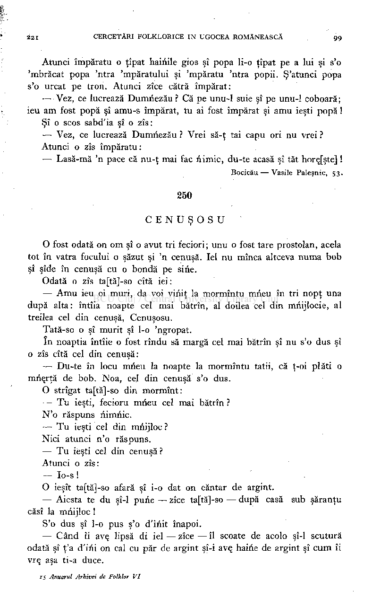

Atunci împăratu o ţîpat hairiile gios şî popa li-o ţîpat pe a lui şi s'o 'mbrăcat popa 'ntra 'mpăratului şi 'mpăratu 'ntra popii. Ş'atunci popa s'o urcat pe tron. Atunci zîce cătră împărat:

— Vez, ce lucrează Dumfiezău ? Că pe unu-1 suie şî pe unu-1 coboară; ieu am fost popă şî amu-s împărat, tu ai fost împărat şi amu ieşti popă ! Şî o scos sabd'ia şî o zîs:

— Vez, ce lucrează Dumnezău ? Vrei să-ţ tai capu ori nu vrei ? Atunci o zîs împăratu:

— Lasă-mă 'n pace că nu-ţ mai fac nimic, du-te acasă şî tăt horejste] !

Bocicău — Vasile Paleşnic, 53.

250

CENUŞOS U

O fost odată on om şî o avut tri feciori; unu o fost tare prostolan, acela tot în vatra focului o şăzut şi 'n cenuşă. Iei nu mînca altceva numa bob şî şîde în cenuşă cu o bondă pe sine.

Odată o zîs ta[tă]-so cîtă iei:

— Amu ieu oi muri, da voi viriiţ la mormîntu mneu în tri nopţ una după alta: întîia noapte cel mai bătrîn, al doilea cel din mnijlocie, al treilea cel din cenuşă, Cenuşosu.

Tată-so o şî murit şî l-o 'ngropat. în noaptia întîie o fost rîndu să margă cel mai bătrîn şî nu s'o dus şî

o zîs cîtă cel din cenuşă:

— Du-te în locu mneu la noapte la mormîntu tatii, că ţ-oi plăti o mnejrţă de bob. Noa, cel din cenuşă s'o dus.

O strigat ta[tă]-so din mormînt:

— Tu ieşti, fecioru mneu cel mai bătrîn ? N'o răspuns nimriic.

— Tu ieşti cel din mriijloc ? Nici atunci n'o răspuns.

— Tu ieşti cel din cenuşă? Atunci o zîs:

— Io-s ! O ieşît ta[tă]-so afară şî i-o dat on căntar de argint.

— Aiesta te du şî-1 pune — zîce ta[tă]-so — după casă sub şăranţu căsî la mriijloc !

S'o dus şî l-o pus ş'o d'iriit înapoi.

— Când îi ave, lipsă di iei — zîce — îl scoate de acolo şî-l scutură odată şî ţ'a d'irii on cal cu păr de argint şî-i ave_ hairie de argint şî cum îi vre, aşa ti-a duce.

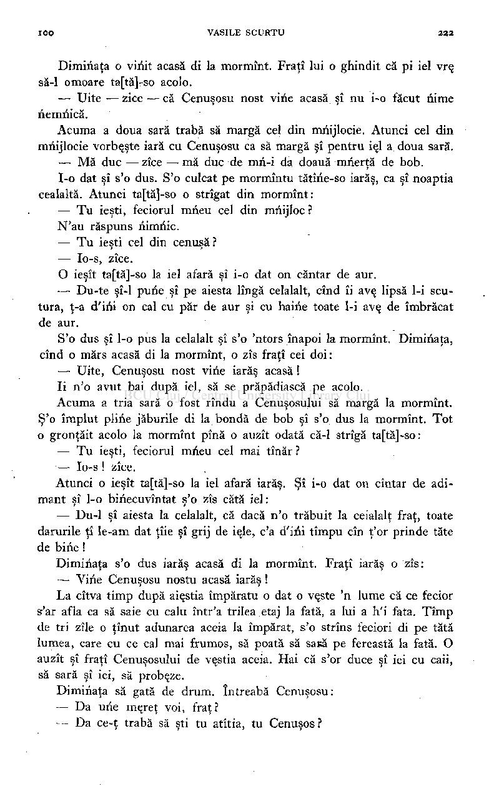

Dimifiaţa o vihit acasă di la mormînt. Fraţî lui o ghindit că pi iei vre să-1 omoare ta[tă]-so acolo.

— Uite — zice •— că Cenuşosu nost vine acasă şî nu i-o făcut nime nemnică.

Acuma a doua sară trabă să margă cel din mnijlocie. Atunci cel din mnijlocie vorbcşte iară cu Cenuşosu ca să margă şî pentru iei a doua sară.

— Mă duc —zîce — mă duc de mri-i da doauă mrierţă de bob. I-o dat şî s'o dus. S'o culcat pe mormîntu tătîne-so iarăş, ca şî noaptia

cealaltă. Atunci ta[tă]-so o strigat din mormînt:

— Tu ieşti, feciorul mrieu cel din mnijloc ? N'au răspuns nimriic.

— Tu ieşti cel din cenuşă?

— Io-s, zîce. O ieşît ta[tă]-so la iei afară şî i-o dat on căntar de aur.

— Du-te şî—1 pune şî pe aiesta lîngă celalalt, cînd îi avç lipsă 1-i scutura, ţ-a d'ini on cal cu păr de aur şi cu haine toate 1-i avç de îmbrăcat de aur.

S'o dus şî l-o pus la celalalt şî s'o 'ntors înapoi la mormînt. Dimihaţa, cînd o mărs acasă di la mormînt, o zis fraţî cei doi:

— Uite, Cenuşosu nost vine iarăş acasă ! Ii n'o avut bai după iei, să se prăpădiască pe acolo. Acuma a tria sară o fost rîndu a Cenuşosului să margă la mormînt.

Ş'o împlut pline jaburile di la bondă de bob şî s'o dus la mormînt. Tot o gronţăit acolo la mormînt pînă o auzît odată că-1 strigă ta[tă]-so:

— Tu ieşti, feciorul mheu cel mai tînăr ?

— Io-s ! zîce. Atunci o ieşît ta[tă]-so la iei afară iarăş. Şî i-o dat on cîntar de adi-

mant şî l-o binecuvîntat ş'o zîs cătă iei:

— Du-1 şî aiesta la celalalt, că dacă n'o trăbuit la ceialalţ fraţ, toate darurile ţî le-am dat ţîie şî grij de içle, c'a d'ihi tîmpu cîn ţ'or prinde täte de bine !

Diminaţa s'o dus iarăş acasă di la mormînt. Fraţî iarăş o zîs:

— Vine Cenuşosu nostu acasă iarăş ! La cîtva timp după aiestia împăratu o dat o vçste 'n lume că ce fecior s'ar afla ca să saie cu calu într'a trilea etaj la fată, a lui a h'i fata. Tîmp de tri zile o ţînut adunarea aceia la împărat, s'o strîns feciori di pe tătă lumea, care cu ce cal mai frumos, să poată să sasă pe fereastă la fată. O auzît şî fraţî Cenuşosului de vçstia aceia. Hai că s'or duce şî iei cu caii, să sară şî iei, să probeze.

Diminaţa să gata de drum. întreabă Cenuşosu:

— Da une mereţ voi, fraţ?

— Da ce-ţ trabă să şti tu atîtia, tu Cenuşos?

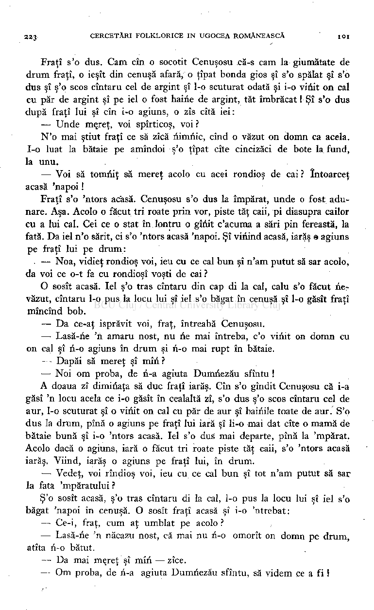

Fraţî s'o dus. Cam cîn o socotit Cenuşosu că-s cam la giumătate de drum fraţî, o ieşît din cenuşă afară, o ţîpat bonda gios şî s'o spălat şî s'o dus şî ş'o scos cîntaru cel de argint şî l-o scuturat odată şi i-o vinit on cal cu păr de argint şî pe iei o fost haine de argint, tăt îmbrăcat ! Şî s'o dus după fraţî lui şî cîn i-o agiuns, o zîs cîtă iei:

— Unde mereţ, voi spîrticoş, voi ? N'o mai ştiut fraţî ce să zîcă himhic, cînd o văzut on domn ca acela.

I-o luat la bătaie pe amîndoi ş'o ţîpat cîte cincizăci de bote la fund, la unu.

— Voi să tomniţ să mereţ acolo cu acei rondioş de cai ? întoarceţ acasă 'napoi !

Fraţî s'o 'ntors acasă. Cenuşosu s'o dus la împărat, unde o fost adunare. Aşa. Acolo o făcut tri roate prin vor, piste tăţ caii, pi diasupra cailor cu a lui cal. Cei ce o stat în lontru o gîhit c'acuma a sări pin fereastă, la fată. Da iei n'o sărit, ci s'o 'ntors acasă 'napoi. Şî vihind acasă, iarăş a agiuns pe fraţî lui pe drum:

. — Noa, vidieţ rondioş voi, ieu cu ce cal bun şî n'am putut să sar acolo, da voi ce o-t fa cu rondioşî voşti de cai ?

O sosît acasă. Iei ş'o tras cîntaru din cap di la cal, calu s'o făcut her văzut, cîntaru l-o pus la locu lui şî iei s'o băgat în cenuşă şî l-o găsît fraţî mîncînd bob.

— Da ce-aţ isprăvit voi, fraţ, întreabă Cenuşosu.

— Lasă-he 'n amaru nost, nu he mai întreba, c'o vihit on domn cu on cal şî h-o agiuns în drum şi h-o mai rupt în bătaie.

— Dapăi să mereţ şî mîh ?

— Noi om proba, de h-a agiuta Dumhezău sfîntu ! A doaua zî dimihaţa să duc fraţî iarăş. Cîn s'o gîndit Cenuşosu că i-a găsî 'n locu acela ce i-o găsît în cealaltă zî, s'o dus ş'o scos cîntaru cel de aur, l-o scuturat şî o vihit on cal cu păr de aur şî haihile toate de aur. S'o dus la drum, pînă o agiuns pe fraţî lui iară şî li-o mai dat cîte o mamă de bătaie bună şî i-o 'ntors acasă. Iei s'o dus mai departe, pînă la 'mpărat. Acolo dacă o agiuns, iară o făcut tri roate piste tăţ caii, s'o 'ntors acasă iarăş. Viind, iarăş o agiuns pe fraţî lui, în drum.

— Vedeţ, voi rîndioş voi, ieu cu ce cal bun şî tot n'am putut Să sar la fata 'mpăratului ?

Ş'o sosît acasă, ş'o tras cîntaru di la cal, l-o pus la locu lui şî iei s'o

- băgat 'napoi în cenuşă. O sosît fraţî acasă şî i-o 'ntrebat:

— Ce-i, fraţ, cum aţ umblat pe acolo?

— Lasă-rie 'n năcazu nost, că mai nu h-o omorît on domn pe drum, atîta h-o bătut.

— Da mai mejeţ şî mîh — zîce.

— Om proba, de h-a agiuta Dumhezău sfîntu, să videm ce a fi !

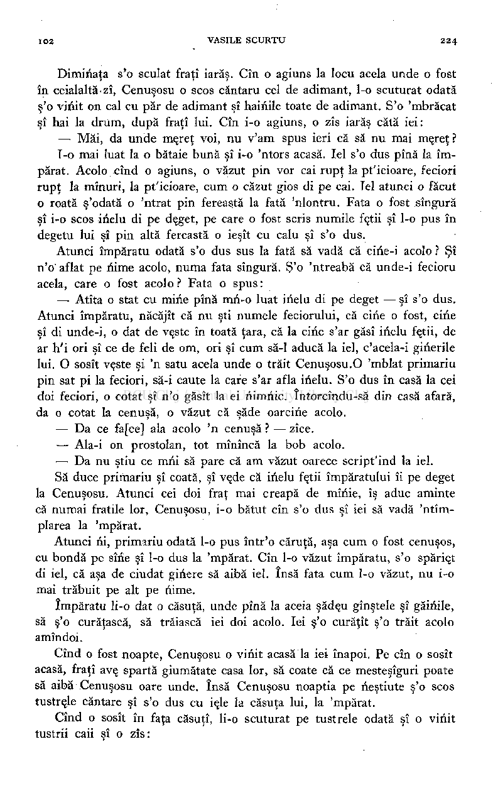

Dimiriaţa s'o sculat fraţî iarăş. Cîn o agiuns la locu acela unde o fost în ceialaltăzî, Cenuşosu o scos căntaru cel de adimant, l-o scuturat odată ş'o vinit on cal cu păr de adimant şî hainile toate de adimant. S'o 'mbrăcat şî hai la drum, după fraţî lui. Cîn i-o agiuns, o zîs iarăş cătă iei:

— Măi, da unde mereţ voi, nu v'am spus ieri că să nu mai mereţ ? I-o mai luat la o bătaie bună şî i-o 'ntors acasă. Iei s'o dus pînă Ia îm­

părat. Acolo cînd o agiuns, o văzut pin vor cai rupt la pt'icioare, feciori rupt la mînuri, la pt'icioare, cum o căzut gios di pe cai. Iei atunci o făcut o roată ş'odată o 'ntrat pin fereaştă la fată 'nlontru. Fata o fost sîngură şî i-o scos irielu di pe dçget, pe care o fost scris numile fetii şî l-o pus în degetu lui şî pin altă fereastă o ieşît cu calu şî s'o dus.

Atunci împăratu odată s'o dus sus la fată să vadă că cirie-i acolo ? Şî n'o aflat pe riime acolo, numa fata sîngură. Ş'o 'ntreabă că unde-i fecioru acela, care o fost acolo? Fata o spus:

— Atîta o stat cu mine pînă mri-o luat irielu di pe deget — şî s'o dus. Atunci împăratu, năcăjit că nu şti numele feciorului, că cine o fost, cine şî di unde-i, o dat de veste în toată ţara, că la cine s'ar găsî irielu fetii, de ar h'i ori şî ce de feli de om, ori şî cum să-1 aducă la iei, c'acela-i girierile lui. O sosît veste şi 'n satu acela unde o trăit Cenuşosu.O 'mblat primariu pin sat pi la feciori, să-i caute la care s'ar afla irielu. S'o dus în casă la cei doi feciori, o cotat şî n'o găsît la ei riimriic. întorcîndu-să din casă afară, da o cotat la cenuşă, o văzut că şăde oarcirie acolo.

— Da ce fa[ce] ala acolo 'n cenuşă ? — zîce.

— Ala-i on prostolan, tot mînîncă la bob acolo.

— Da nu ştiu ce mrii să pare că am văzut oarece script'ind la iei. Să duce prirnariu şî coată, şî vede că irielu fetii împăratului îi pe deget

la Cenuşosu. Atunci cei doi fraţ mai creapă de mîriie, îş aduc aminte

- că numai fratile lor, Cenuşosu, i-o bătut cîn s'o dus şî iei să vadă 'ntîmplarea la 'mpărat.

Atunci rii, primariu odată l-o pus într'o căruţă, aşa cum o fost cenuşos, cu bondă pe sîrie şî l-o dus la 'mpărat. Cîn l-o văzut împăratu, s'o spăriet di iei, că aşa de ciudat giriere să aibă iei. însă fata cum l-o văzut, nu i-o mai trăbuit pe alt pe riime.

împăratu li-o dat o căsuţă, unde pînă la aceia şădeu gînştele şî găinile, să ş'o curăţască, să trăiască iei doi acolo. Iei ş'o curăţit ş'o trăit acolo amîndoi.

Cînd o fost noapte, Cenuşosu o viriit acasă la iei înapoi. Pe cîn o sosît acasă, fraţî avç spartă giumătate casa lor, să coate că ce mesteşîguri poate să aibă Cenuşosu oare unde. însă Cenuşosu noaptia pe neştiute ş'o scos tustrçle cântare şî s'o dus cu içle la căsuţa lui, la 'mpărat.

Cînd o sosît în faţa căsuţî, li-o scuturat pe tustrele odată şî o viriit tustrii caii şî o zîs:

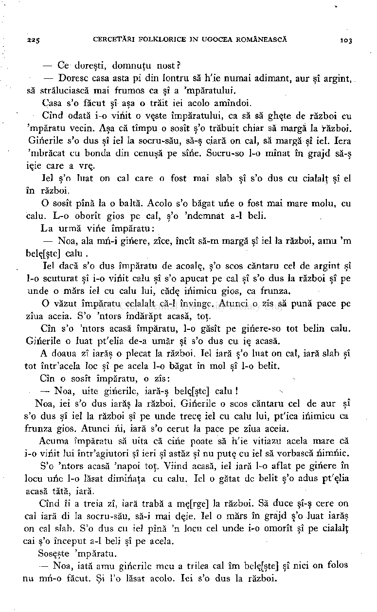

— Ce doreşti, domnuţu nost?

— Doresc casa asta pi din lontru să h'ie numai adimant, aur şî argint,

să străluciască mai frumos ca şî a 'mpăratului. Casa s'o făcut şî aşa o trăit iei acolo amîndoi. Cînd odată i-o vinit o vçste împăratului, ca să să ghçte de război cu 'mpăratu vecin. Aşa că tîmpu o sosît ş'o trăbuit chiar să margă la război. Ginerile s'o dus şî iei la socru-său, să-ş ciară on cal, să margă şî iei. Iera 'mbrăcat cu bonda din cenuşă pe sîne. Socru-so l-o mînat în grajd să-ş

içie care a vre_.

Iei ş'o luat on cal care o fost mai slab şî s'o dus cu cialalţ şî el în război.

O sosît pînă la o baltă. Acolo s'o băgat une o fost mai mare molu, cu calu. L-o oborît gios pe cal, ş'o 'ndemnat a-1 beli.

La urmă vine împăratu:

— Noa, ala mri-i ginere, zîce, încît să-m margă şî iei la război, amu 'm belcfşte] calu .

Iei dacă s'o dus împăratu de acoalç, ş'o scos căntaru cel de argint şî

- l-o scuturat şî i-o vinit calu şî s'o apucat pe cal şî s'o dus la război şî pe unde o mărs iei cu calu lui, cădc iriimicu gios, ca frunza.

O văzut împăratu celalalt că-1 învinge. Atunci o zîs să pună pace pe zîua aceia. S'o 'ntors îndărăpt acasă, toţ.

Cîn s'o 'ntors acasă împăratu, l-o găsît pe giriere-so tot belin calu. Ginerile o luat pt'elia de-a umăr şî s'o dus cu iç acasă.

A doaua zî iarăş o plecat la război. Iei iară ş'o luat on cal, iară slab şî tot într'acela loc şî pe acela l-o băgat în mol şî l-o belit.

Cîn o sosît împăratu, o zîs:

— Noa, uite ginerile, iară-ş bele_[şte] calu !

Noa, iei s'o dus iarăş la război. Ginerile o scos căntaru cel de aur şî s'o dus şî iei la război şî pe unde trece_ iei cu calu lui, pt'ica inimicu ca frunza gios. Atunci ni, iară s'o cerut la pace pe zîua aceia.

Acuma împăratu să uita că cine poate să h'ie vitiazu acela mare că i-o vinit lui într'agiutori şî ieri şî astăz şî nu putç cu iei să vorbască riimfiic.

S'o 'ntors acasă 'napoi toţ. Viind acasă, iei iară l-o aflat pe ginere în locu une l-o lăsat dimiriaţa cu calu. Iei o gătat de belit ş'o adus pt'çlia acasă tătă, iară.

Cînd îi a treia zî, iară trabă a mejrge] la război. Să duce şî-ş cere on cal iară di la socru-său, să-i mai dçie. Iei o mărs în grajd ş'o luat iarăş

- on cal slab. S'o dus cu iei pînă 'n locu cel unde i-o omorît şî pe cialalţ cai ş'o început a-1 beli şî pe acela.

Soscşte 'mpăratu.

— Noa, iată amu ginerile meu a trilea cal îm belejste] şî nici on folos nu mri-o făcut. Şi l'o lăsat acolo. Iei s'o dus la război.

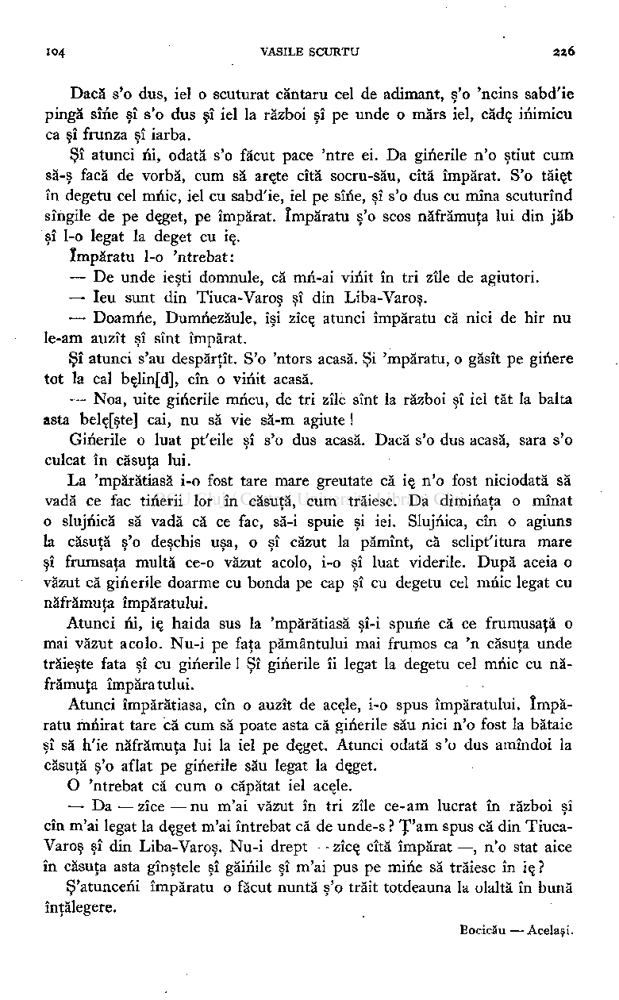

Dacă s'o dus, iei o scuturat căntaru cel de adimant, ş'o 'ncins sabd'ie pingă sîrie şî s'o dus şî iei la război şî pe unde o mărs iei, cădc inimicu ca şî frunza şî iarba.

Şî atunci ni, odată s'o făcut pace 'ntre ei. Da girierile n'o ştiut cum să-ş facă de vorbă, cum să arçte cîtă socru-său, cîtă împărat. S'o tăiet în degetu cel mriic, iei cu sabd'ie, iei pe sîne, şî s'o dus cu mîna scuturînd sîngile de pe dçget, pe împărat. împăratu ş'o scos năfrămuţa lui din jăb şî I-o legat la deget cu iç.

împăratu l-o 'ntrebat:

— De unde ieşti domnule, că mti-ai viriit în tri zîle de agiutori.

— leu sunt din Tiuca-Varoş şî din Liba-Varoş.

•— Doamne, Dumriezăule, îşi zîcç atunci împăratu că nici de hir nu le-am auzît şî sînt împărat.

Şî atunci s'au despărţit. S'o 'ntors acasă. Şi 'mpăratu, o găsît pe giriere tot la cal bçlin[d], cîn o viriit acasă.

— Noa, uite girierile mrieu, de tri zîle sînt la război şî iei tăt la balta asta belejşte] cai, nu să vie să-m agiute !

Girierile o luat pt'eile şî s'o dus acasă. Dacă s'o dus acasă, sara s'o culcat în căsuţa lui.

La 'mpărătiasă i-o fost tare mare greutate că iç n'o fost niciodată să vadă ce fac tinerii lor în căsuţă, cum trăiesc. Da dimiriaţa o mînat o slujnică să vadă că ce fac, să-i spuie şi iei. Slujnica, cîn o agiuns la căsuţă ş'o deschis uşa, o şî căzut la pămînt, că sclipt'itura mare şî frumsaţa multă ce-o văzut acolo, i-o şî luat viderile. După aceia o văzut că girierile doarme cu bonda pe cap şî cu degetu cel mriic legat cu năfrămuţa împăratului.

Atunci rii, iç haida sus la 'mpărătiasă şî-i spurie că ce frumusaţă o mai văzut acolo. Nu-i pe faţa pământului mai frumos ca 'n căsuţa unde trăieşte fata şî cu girierile ! Şî girierile îi legat la degetu cel mriic cu năfrămuţa împăratului.

Atunci împărătiasa, cîn o auzît de acçle, i-o spus împăratului. împăratu mriirat tare că cum să poate asta că girierile său nici n'o fost la bătaie şî să h'ie năfrămuţa lui la iei pe dçget. Atunci odată s'o dus amîndoi la căsuţă ş'o aflat pe girierile său legat la dçget. O 'ntrebat că cum o căpătat iei acçle.

— Da — zîce — nu m'ai văzut în tri zîle ce-am lucrat în război şî cîn m'ai legat la dçget m'ai întrebat că de unde-s ? Ţ'am spus că din TiucaVaroş şî din Liba-Varoş. Nu-i drept — zîcç cîtă împărat —, n'o stat aice în căsuţa asta gînştele şî găinile şî m'ai pus pe mine să trăiesc în iç?

Ş'atuncerii împăratu o făcut nuntă ş'o trăit totdeauna la olaltă în bună înţălegere.

Bocicău — Acelaşi.

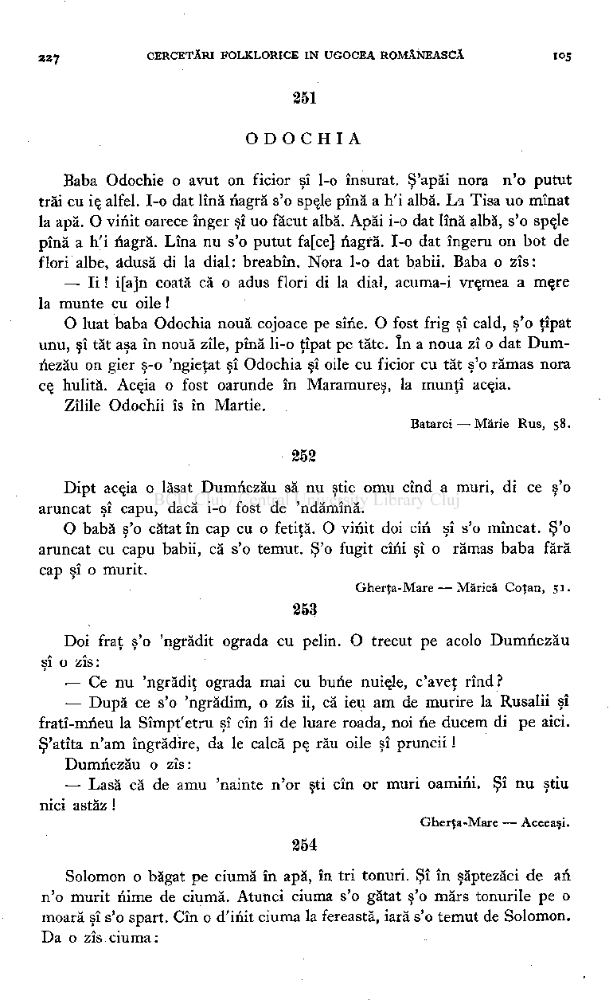

251

O D O C H I A

Baba Odochie o avut on ficior şî l-o însurat. Ş'apăi nora n'o putut trăi cu iç alfel. I-o dat lînă nagră s'o spe_le pînă a h'i albă. La Tisa uo mînat la apă. O vinit oarece înger şî uo făcut albă. Apăi i-o dat lînă albă, s'o spçle pînă a h'i nagră. Lîna nu s'o putut fa[ce] hagră. I-o dat îngeru on bot de flori albe, adusă di la dial: breabîn. Nora l-o dat babii. Baba o zîs:

— Ii ! i[a]n coată că o adus flori di la dial, acuma-i vremea a mçre la munte cu oile !

O luat baba Odochia nouă cojoace pe sîne. O fost frig şî cald, ş'o ţîpat unu, şî tăt aşa în nouă zîle, pînă li-o ţîpat pe täte. în a noua zî o dat Dumnezău on gier ş-o 'ngieţat şî Odochia şî oile cu ficior cu tăt ş'o rămas nora ce. hulită. Acçia o fost oarunde în Maramureş, la munţî acek.

Zîlile Odochii îs în Martie.

Batarci — Mărie Rus, 58.

252

Dipt acçia o lăsat Dumnezău să nu ştie omu cînd a muri, di ce ş'o aruncat şî capu, dacă i-o fost de 'ndămînă.

O babă ş'o cătat în cap cu o fetiţă. O vinit doi cîn şî s'o mîncat. Ş'o aruncat cu capu babii, că s'o temut. Ş'o fugit cîni şî o rămas baba fără cap şî o murit.

Gherţa-Mare — Mărică Coţan, 51.

253

Doi fraţ ş'o 'ngrădit ograda cu pelin. O trecut pe acolo Dumnezău şî o zîs:

•— Ce nu 'ngrădiţ ograda mai cu bune nuiçle, c'aveţ rînd?

— După ce s'o 'ngrădim, o zîs ii, că ieu am de murire la Rusalii şî fratî-mneu la Sîmpt'etru şî cîn îi de luare roadă, noi ne ducem di pe aici. Ş'atîta n'am îngrădire, da le calcă pç rău oile şî pruncii !

Dumnezău o zîs:

— Lasă că de amu 'nainte n'or şti cîn or muri oamini. Şî nu ştiu nici astăz !

Gherţa-Mare — Aceeaşi.

254

Solomon o băgat pe ciumă în apă, în tri tonuri. Şî în şăptezăci de an n'o murit nime de ciumă. Atunci ciuma s'o gătat ş'o mărs tonurile pe o moară şî s'o spart. Cîn o d'init ciuma la fereastă, iară s'o temut de Solomon. Da o zîs ciuma:

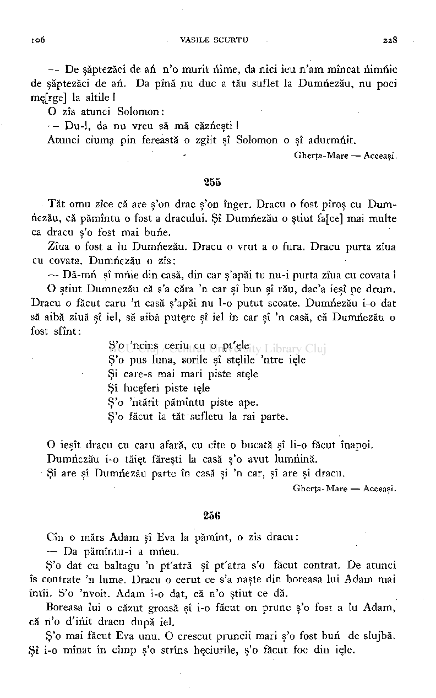

— De şăptezăci de ari n'o murit riime, da nici ieu n'am mîncat riimriic de şăptezăci de ari. Da pînă nu duc a tău suflet la Dumnezău, nu poci mç[rge] la altile !

O zîs atunci Solomon:

— Du-l, da nu vreu să mă căzrieşti ! Atunci ciuma pin fereastă o zgîit şî Solomon o şî adurmriit.

Gherţa-Mare — Aceeaşi.

255

Tăt omu zîce că are ş'on drac ş'on înger. Dracu o fost pîroş cu Dumnezău, că pămîntu o fost a dracului. Şî Dumnezău o ştiut fa[ce] mai multe ca dracu ş'o fost mai burie.

Zîua o fost a lu Dumnezău. Dracu o vrut a o fura. Dracu purta zîua cu covată. Dumnezău o zîs:

— Dă-mri şî mriie din casă, din car ş'apăi tu nu-i purta zîua cu covată ! O ştiut Dumnezău că s'a căra 'n car şî bun şî rău, dac'a ieşî pe drum.

Dracu o făcut caru 'n casă ş'apăi nu l-o putut scoate. Dumnezău i-o dat să aibă zîuă şî iei, să aibă pute_re şî iei în car şî 'n casă, că Dumnezău o fost sfînt:

Ş'o 'ncins ceriu cu o pt'çle Ş'o pus luna, sorile şî stçlile 'ntre ieje Şi care-s mai mari piste stçle Şî lucçferi piste ie_le Ş'o 'ntărit pămîntu piste ape. Ş'o făcut la tăt sufletu la rai parte.

O ieşît dracu cu caru afară, cu cîte o bucată şî li-o făcut înapoi. Dumnezău i-o tăict făreşti la casă ş'o avut lumriină. Şî are şî Dumnezău parte în casă şi 'n car, şî are şî dracu.

Gherţa-Mare — Aceeaşi.

256

Cîn o mars Adam şî Eva la pămînt, o zîs dracu:

— Da pămîntu-i a mrieu. Ş'o dat cu baltagu 'n pt'atră şî pt'atra s'o făcut contrat. De atunci

îs contrate 'n lume. Dracu o cerut ce s'a naşte din boreasa lui Adam mai întîi. S'o 'nvoit. Adam i-o dat, că n'o ştiut ce dă.

Boreasa lui o căzut groasă şî i-o făcut on prunc ş'o fost a lu Adam, că n'o d'iriit dracu după iei.

Ş'o mai făcut Eva unu. O crescut pruncii mari ş'o fost buri de slujbă. Şî i-o mînat în cîmp ş'o strîns hçciurile, ş'o făcut foc din ie_le.

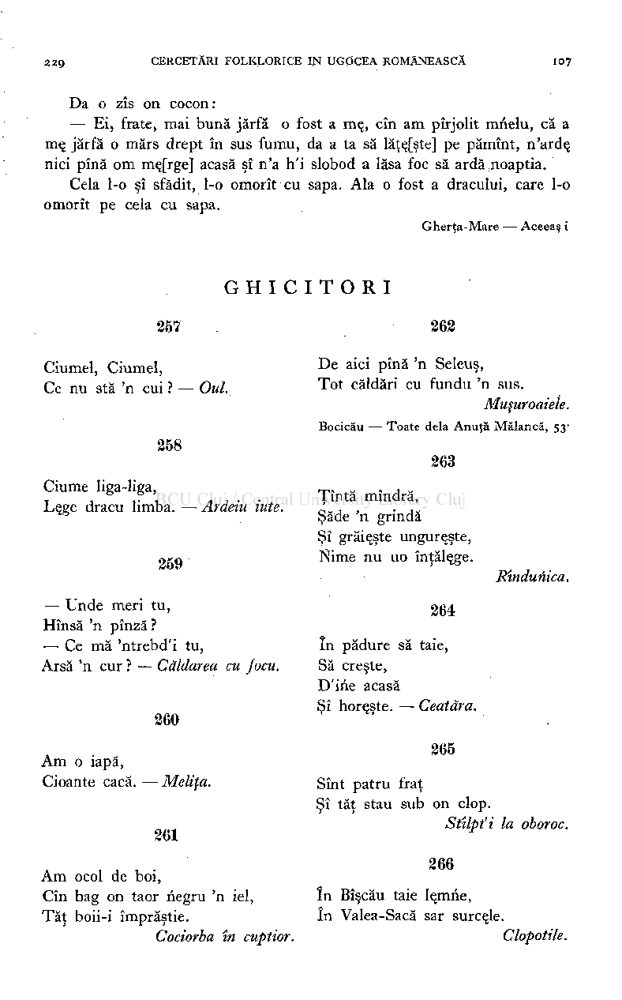

Da o zîs on cocon:

— Ei, frate, mai bună jărfă o fost a mç, cîn am pîrjolit mnelu, că a mç jărfă o mărs drept în sus fumu, da a ta să lăţcfşte] pe pămînt, n'ardç nici pînă om mejrge] acasă şî n'a h'i slobod a lăsa foc să ardă noaptia.

Cela l-o şî sfădit, l-o omorît cu sapa. Ala o fost a dracului, care l-o omorît pe cela cu sapa.

Gherţa-Mare — Aceeaş i

#### GHICITOR I

262

- 257

Ciumei, Ciumei, Ce nu stă 'n cui ? — Oul.

- 258

Ciume liga-liga,

- 259

De aici pînă 'n Seleuş, Tot căldări cu fundu 'n sus.

Muşuroaiele.

Bocicău — Toate delà Anuţă Mălancă, 53-

263

Ţîntă mîndră, Şăde 'n grindă Şî grăieşte ungureşte, INime nu uo înţălcge.

Rînduûica.

264

— Unde meri tu, Hînsă 'n pînză ?

în pădure să taie, Să creşte, D'ine acasă Şî horeşte. — Ceatăra.

•— Ce mă 'ntrebd'i tu, Arsă 'n cur ? — Căldarea cu jocu.

260

265

Am o iapă, Cioante cacă. — Meliţa.

Sînt patru fraţ Şî tăţ stau sub on clop.

Sûlpt'i la oboroc.

261

266

Am ocol de boi, Cîn bag on taor negru 'n iei, Tăţ boii-i împrăştie.

în Bîşcău taie Ie_mne, în Valea-Sacă sar surceje.

Clopotile.

Cociorba în cuptior.

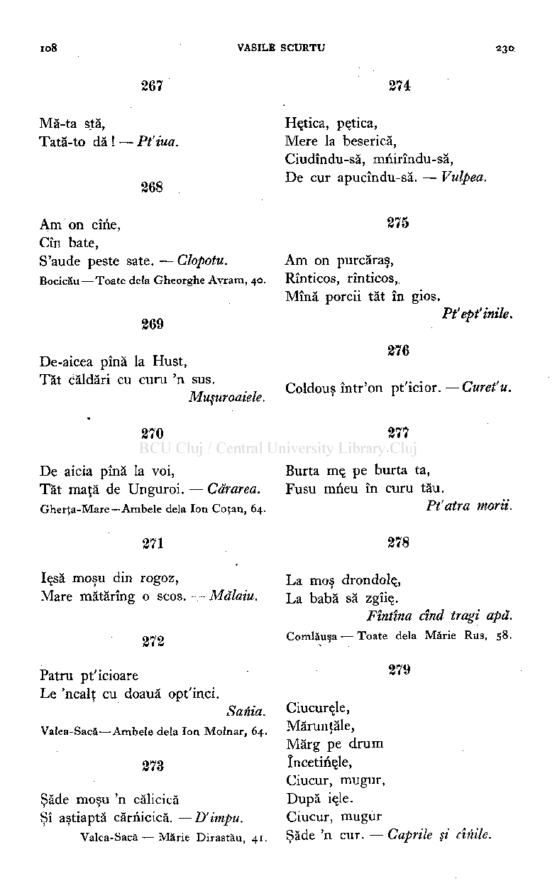

- 274

Hçtica, pçtica, Mere la beserică, Ciudîndu-să, mnirîndu-să, De cur apucîndu-să. — Vulpea.

- 275

- 267

Mă-ta stă, Tată-to dă ! — Pt'iua.

- 268

Am on cîne, Cîn bate, S'aude peste sate. — Clopotu.

Am on purcăraş, Rînticos, rînticos,. Mînă porcii tăt în gios.

Bocicău—Toate delà Gheorghe Avram, 40.

Pt'ept'inile.

- 269

De-aicea pînă la Hust, Tăt căldări cu curu 'n sus.

Muşuroaiele.

- 270

- 276

Coldouş într'on pt'icior. —Curet'u.

- 277

Burta mç pe burta ta, Fusu mneu în curu tău.

Pt'atra morii.

- 278

De aicia pînă la voi, Tăt maţă de Unguroi. — Cărarea.

Gherţa-Mare—Ambele delà Ion Coţan, 64.

271

Icsă moşu din rogoz, Mare mătărîng o scos. — Mălaiu.

La moş drondolç, La babă să zgîiç.

Fîntîna cînd tragi apă.

Comlăuşa — Toate delà Mărie Rus, 58.

272

279

Patru pt'icioare Le 'ncalţ cu doauă opt'inci.

Ciucurele, Măruntaie, Mărg pe drum încetinçle, Ciucur, mugur, După ie_le. Ciucur, mugur Şăde 'n cur. — Caprile şi cînile.

Saûia.

Valea-Sacă—Ambele delà Ion Molnar, 64.

273

Şăde moşu 'n călicică Şî aştiaptâ cărnicică. —D'impu.

Valea-Sacă — Mărie Dirastău, 41.

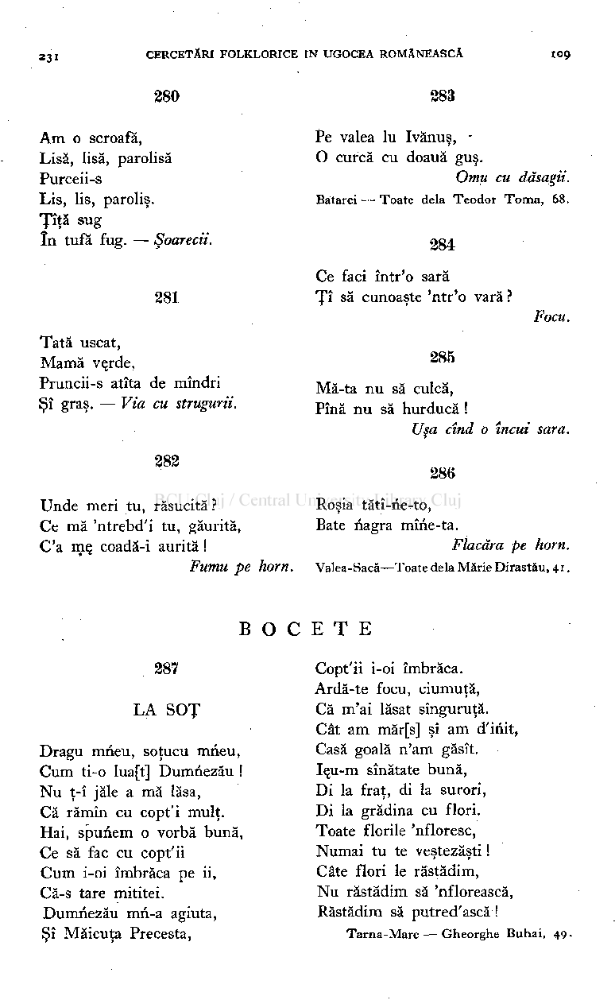

283

280

Pe valea lu Ivănuş, O curcă cu doauă guş.

Am o scroafă, Lisă, lisă, parolisă Purceii-s Lis, lis, paroliş. Ţîţă sug în tufă fug. — Şoarecii.

Omu cu dăsagii.

Batarci — Toate delà Teodor Toma , 68.

284

Ce faci într'o sară Ţî să cunoaşte 'ntr'o vară ?

281

Focu.

Tată uscat, Mamă verde, Pruncii-s atîta de mîndri Şî graş. — Via cu strugurii.

285

Mă-ta nu să culcă, Pînă nu să hurducă !

Uşa cînd o mcui sara.

282

286

Roşia tătî-iîe-to, Bate nagra mîne-ta.

Unde meri tu, răsucită ? Ce mă 'ntrebd'i tu, găurită, C'a mç coadă-i aurită !

Flacăra pe horn.

Fumu pe horn.

Valea-Sacă—Toate delà Mărie Dirastău, 41.

##### ET E

##### BO C

287

Copt'ii i-oi îmbrăca. Ardă-te focu, ciumuţă, Că m'ai lăsat sînguruţă. Cât am măr[s] şî am d'init, Casă goală n'am găsît. Ieu-m sînătate bună, Di la fraţ, di la surori, Di la grădina cu flori. Toate florile 'nfloresc, Numai tu te veştezăşti ! Câte flori le răstădim, Nu răstădim să 'nflorească, Răstădim să putred'ască !

LA SOŢ

Dragu mrieu, soţucu mneu, Cum ti-o lua[t] Dumnezău ! Nu ţ-î jăle a mă lăsa, Că rămîn cu copt'i mulţ. Hai, spunem o vorbă bună, Ce să fac cu copt'ii Cum i-oi îmbrăca pe ii, Că-s tare mititei. Dumnezău mri-a agiuta, Şî Măicuţa Precesta,

Tarna-Mare — Gheorghe Buhai, 49.

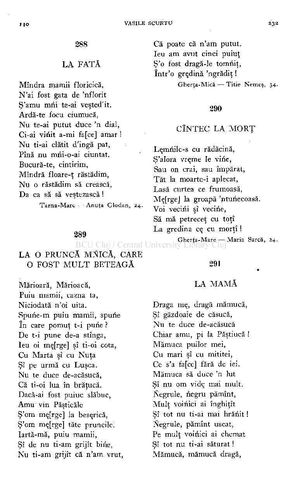

Că poate că n'am putut. Ieu am avut cinci puiuţ Ş'o fost dragă-le tomniţ, într'o grcdină 'ngrădiţ !

288

LA FATÄ

Mîndra mamii floricică, N'ai fost gata de 'nflorit Ş'amu mhi te-ai veşted'it. Ardă-te focu ciumucă, Nu te-ai putut duce 'n dial, Ci-ai vinit a-mi fa [ce] amar ! Nu ti-ai clătit d'ingă pat, Pînă nu mhi-o-ai ciuntat. Bucură-te, cintirim, Mîndră floare-ţ răstădim, Nu o răstădim să crească, Da ca să să veştezască !

Gherţa-Mică — Titie Nemeş, 34.

290

CÎNTEC LA MORŢ

Lçmfïile-s cu rădăcină, Ş'ălora vrçme le vine, Sau on crai, sau împărat, Tăt la moarte-i aplecat, Lasă curtea ce frumoasă, MeJYge] la groapă 'ntunecoasă. Voi vecini şî vecine, Să mă petreceţ cu toţî La gredina ce, cu morţî !

Tarna-Mare — Anuţa Glodan, 24.

289

Gherţa-Mare — Maria Sarcă, 24.

LA O PRUNCĂ MNlCĂ, CARE O FOST MUL T BETEAGĂ

291

LA MAMĂ

Mărioară, Mărioacă, Puiu mamii, cazna ta, Niciodată n'oi uita. Spune-m puiu mamii, spune în care pomuţ t-i pune ? De t-i pune de-a stînga, leu oi meJYge] şî ti-oi cota, Cu Marta şî cu Nuţa Şî pe urmă cu Luşca. Nu te duce de-acăsucă, Că ti-oi lua în brăţucă. Dacă-ai fost puiuc slăbuc, Amu vin Păşticăle Ş'om me_[rge] la bescrică, Ş'om me_[rge] täte pruncile. Iartă-mă, puiu mamii, Şî de nu ti-am grijît bine, Nu ti-am grijît că n'am vrut,

Draga mç, dragă mămucă, Şî găzdoaie de căsucă, Nu te duce de-acăsucă Chiar amu, pi la Păştiucă ! Mămuca puilor mei, Cu mari şî cu mititei, Ce s'a fa [ce] fără de iei. Mămuca să duce 'n lut Şî nu om vide, mai mult. Negrule, negru pămînt, Mulţ voinici ai înghiţit Şî tot nu ti-ai mai hrănit ! Negrule, pămînt uscat, Pe mulţ voinici ai chemat Şî tot nu ti-ai săturat ! Mămucă, mămucă dragă,

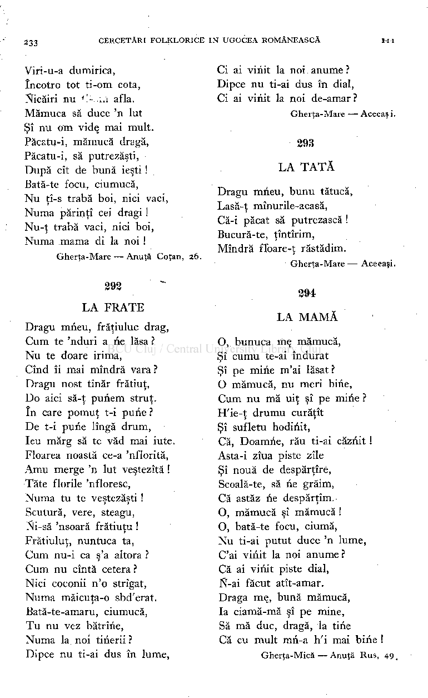

Ci ai vinit la noi anume ? Dipce nu ti-ai dus în dial, Ci ai vinit la noi de-amar ?

Viri-u-a dumirica, încotro tot ti-om cota, Nicăiri nu ''-..1 afla. Mămuca să duce 'n lut Şî nu om vide, mai mult. Păcatu-i, mămucă dragă, Păcatu-i, să putrezăşti, După cît de bună ieşti ! Bată-te focu, ciumucă, Nu ţî-s trabă boi, nici vaci, Numa părinţi cei dragi ! Nu-ţ trabă vaci, nici boi, Numa mama di la noi !

Gherţa-Mare — Aceeaşi.

293

LA TAT Ă

Dragu mheu, bunu tătucă, Lasă-ţ mînurile-acasă, Că-i păcat să putrezască ! Bucură-te, ţîntîrim, Mîndră flbare-ţ răstădim.

Gherţa-Mare — Anuţă Coţan, 26.

Gherţa-Mare — Aceeaşi.

292

294

LA FRATE

LA MAMĂ '

Dragu mfieu, frăţiuluc drag, Cum te 'nduri a ne lăsa ? Nu te doare irima,

O, bunuca mç mămucă, Şî cumu te-ai îndurat Şî pe mine m'ai lăsat ? O mămucă, nu meri bine, Cum nu mă uiţ şî pe mine ? H'ie-ţ drumu curăţît Şî sufletu hodinit, Că, Doamne, rău ti-ai căznit ! Asta-i zîua piste zîle Şî nouă de despărţire, Scoală-te, să ne grăim, Că astăz ne despărţim. O, mămucă şî mămucă ! O, bată-te focu, ciumă, Nu ti-ai putut duce 'n lume, Cai vinit la noi anume ? Că ai vinit piste dial, N-ai făcut atît-amar. Draga mç, bună mămucă, Ia ciamă-mă şî pe mine, Să mă duc, dragă, la tine Că cu mult mri-a h'i mai bine !

- Cînd îi mai mîndră vara ? Dragu nost tînăr frătiuţ, Do aici să-ţ punem struţ, în care pomuţ t-i pune ? De t-i pune lîngă drum, leu mărg să te văd mai iute. Floarea noastă ce-a 'nflorită, Amu merge 'n lut veştezîtă ! Täte florile 'nfloresc, Numa tu te veştezăşti ! Scutură, vere, steagu, Ni-să 'nsoară frătiuţu ! Frătiuluţ, nuntuca ta, Cum nu-i ca ş'a altora ? Cum nu cîntă cetera ? Nici coconii n'o strîgat, Numa măicuţa-o sbd'erat. Bată-te-amaru, ciumucă, Tu nu vez bătrîne, Numa la noi tinerii ? Dipce nu ti-ai dus în lume,

Gherţa-Mică — Anuţă Rus, 49.

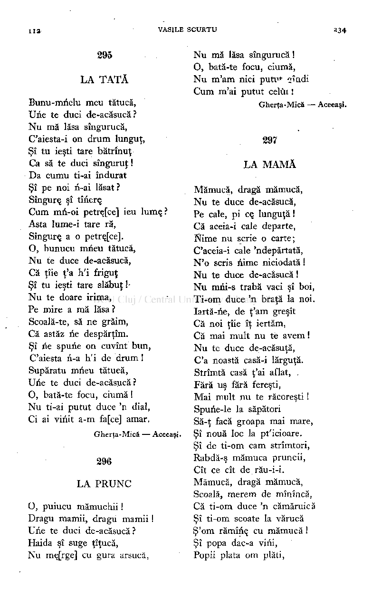

Nu mă lăsa sîngurucă ! O, bată-te focu, ciumă, Nu m'am nici putu* ţrîndi Cum m'ai putut celui !

295

LA TAT Ă

Bunu-mfielu meu tătucă, Une te duci de-acăsucă? Nu mă lăsa sîngurucă, C'aiesta-i on drum lunguţ, Şî tu ieşti tare bătrînuţ Ca să te duci sînguruţ ! Da cumu ti-ai îndurat Şî pe noi n-ai lăsat? Sîngurç şî tînerç Cum mn-oi petrç[ce] ieu lumç? Asta lume-i tare ră, Singurç a o petre£ce]. O, bunucu mheu tătucă, Nu te duce de-acăsucă, Că ţîie ţ'a h'i friguţ Şî tu ieşti tare slăbuţ !• Nu te doare irima, Pe mire a mă lăsa ? Scoală-te, să ne grăim, Că astăz fie despărţim. Şî rie spune on cuvînt bun, C'aiesta fi-a h'i de drum ! Supăratu mheu tătueă, Une te duci de-acăsucă? O, bată-te focu, ciumă ! Nu ti-ai putut duce 'n dial, Ci ai vihit a-m fa[ce] amar.

Gherţa-Mică — Aceeaşi.

297

LA MAMĂ

Mămucă, dragă mămucă, Nu te duce de-acăsucă, Pe cale, pi ce, lunguţă ! Că aceia-i cale departe, Nime nu scrie o carte; C'aceia-i cale 'ndepărtată, N'o scris hime niciodată ! Nu te duce de-acăsucă 1 Nu mni-s trabă vaci şî boi, Ti-om duce 'n braţă la noi. Iartă-fie, de ţ'am greşit Că noi ţîie îţ iertăm, Că mai mult nu te avem ! Nu te duce de-acăsuţă, C a noastă casă-i lărguţă. Strimtă casă ţ'ai aflat, . Fără uş fără fereşti, Mai mult nu te răcoreşti ! Spufie-le la săpători Să-ţ facă groapa mai mare, Şî nouă loc la pt'icioare. Şî de ti-om cam strîmtori, Rabdă-ş mămuca pruncii, Cit ce cît de rău-i-i. Mămucă, dragă mămucă, Scoală, merem de mînîncă, Că ti-om duce 'n cămăruică Şî ti-om scoate la vărucă Ş'om ramific cu mămucă ! Şî popa dac-a vini, Popii plata om plăti,

Gherţa-Mică — Aceeaşi.

296

LA PRUNC

O, puiucu mămuchii ! Dragu mamii, dragu mamii ! Une te duci de-acăsucă ? Haida şî suge ţîţucă, Nu me£rge] cu gura arsucă,

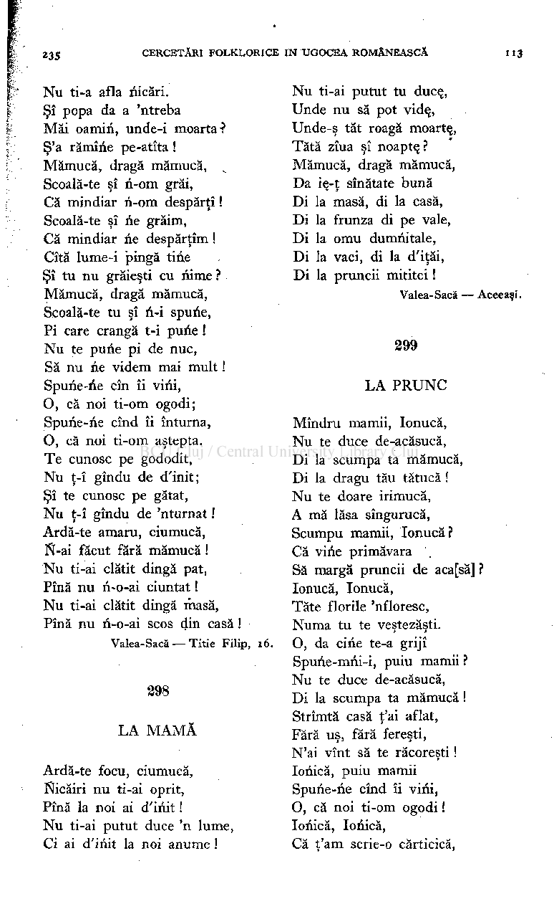

Nu ti-ai putut tu duce., Unde nu să pot vide., Unde-ş tăt roagă moarte,, Tătă zîua şî noapte. ? Mămucă, dragă mămucă, Da ic-ţ sînătate bună Di la masă, di la casă, Di la frunza di pe vale, Di la omu dumnitale, Di la vaci, di la d'iţăi, Di la pruncii mititei !

Nu ti-a afla nicări. Şî popa da a 'ntreba Măi oamin, unde-i moarta-? Ş'a rămîne pe-atîta ! Mămucă, dragă mămucă,

%

Scoală-te şî ri-om grăi, Că mindiar n-om despărţi ! Scoală-te şî fie grăim, Că mindiar fie despărţim ! Cîtă lume-i pingă tine Şî tu nu grăieşti cu fiime ? Mămucă, dragă mămucă, Scoală-te tu şî fi-i spune, Pi care crangă t-i pune ! Nu te pune pi de nuc, Să nu fie videm mai mult ! Spuiie-fie cîn îi vini, O, că noi ti-om ogodi; Spune-fie cînd îi înturna, O, că noi ti-om aştepta. Te cunosc pe gododit, Nu ţ-î gîndu de d'init; Şî te cunosc pe gătat, Nu ţ-î gîndu de 'nturnat ! Ardă-te amaru, ciumucă, N-ai făcut fără mămucă ! Nu ti-ai clătit dingă pat, Pînă nu n-o-ai ciuntat ! Nu ti-ai clătit dingă masă, Pînă nu n-o-ai scos din casă !

Valea-Sacă — Aceeaşi.

299

LA PRUNC

Mîndru mamii, Ionucă, Nu te duce de-acăsucă, Di la scumpa ta mămucă, Di la dragu tău tătucă ! Nu te doare irimucă, A mă lăsa sîngurucă, Scumpu mamii, Ionucă? Că vine primăvara Să margă pruncii de aca[să] ? Ionucă, Ionucă, Täte florile 'nfloresc, Numa tu te veştezăşti. O, da cine te-a grijî Spuiie-mni-i, puiu mamii ? Nu te duce de-acăsucă, Di la scumpa ta mămucă ! Strimtă casă ţ'ai aflat, Fără uş, fără fereşti, N'ai vînt să te răcoreşti ! Ionică, puiu mamii Spune-ne cînd îi vini, O, că noi ti-om ogodi ! Ionică, Ionică, Că ţ'am scrie-o cărticică,

Valea-Sacă — Titie Filip, 16.

298

LA MAMĂ

Ardă-te focu, ciumucă, Nicăiri nu ti-ai oprit, Pînă la noi ai d'init ! Nu ti-ai putut duce 'n lume, Ci ai d'init la noi anume !

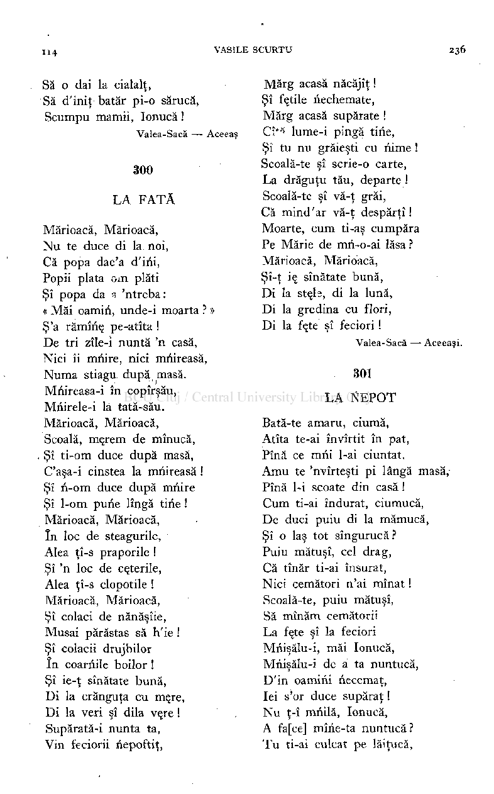

Mărg acasă năcăjit ! Şî fçtile nechemate, Mărg acasă supărate !

Să o dai la cialalţ, Să d'iniţ batăr pi-o sărucă, Scumpu mamii, Ionucă !

Cî** lume-i pingă tine, Şî tu nu grăieşti cu nime ! Scoală-te şî scrie-o carte, La drăguţu tău, departe ! Scoală-te şî vă-ţ grăi, Că mind'ar vă-ţ despărţi! Moarte, cum ti-aş cumpăra Pe Mărie de mri-o-ai lăsa ? Mărioacă, Mărioacă, Şî-ţ iţ sînătate bună, Di la stçl;, di la lună, Di la gredina cu flori, Di la fçte şî feciori !

Valea-Sacă — Aceeaş

300

LA FATĂ

Mărioacă, Mărioacă, Nu te duce di la. noi, Că popa dac'a d'irii, Popii plata om plăti Şî popa da a 'ntreba: « Măi oamifi, unde-i moarta ? » Ş'a rămînc pe-atîta ! De tri zîle-i nuntă 'n casă, Nici îi mnire, nici mnireasă, Numa stiagu după masă. Miiireasa-i în copîrşău, Mfiirele-i la tată-său. Mărioacă, Mărioacă, Scoală, mçrem de mînucă, Şî ti-om duce după masă, C'aşa-i cinstea la mnireasă ! Şî fi-om duce după mnire

Valea-Sacă — Aceeaşi.

301

L A NEPO T

Bată-te amaru, ciumă, Atîta te-ai învîrtit în pat, Pînă ce mni l-ai ciuntat. Amu te 'nvîrteşti pi lângă masă, Pînă 1-i scoate din casă ! Cum ti-ai îndurat, ciumucă, De duci puiu di la mămucă, Şî o laş tot sîngurucă ? Puiu mătuşî, cel drag, Că tînăr ti-ai însurat, Nici cemători n'ai mînat ! Scoală-te, puiu mătuşî, Să mînăm cemătorii La fçte şî la feciori Mnişălu-i, măi Ionucă, Mnişălu-i de a ta nuntucă, D'in oamini hecemaţ, Iei s'or duce supărat ! Nu ţ-î mnilă, Ionucă, A fa[ce] mîne-ta nuntucă? Tu ti-ai culcat pe lăiţucă,

- Şî l-om pune lîngă tine ! Mărioacă, Mărioacă, în loc de steagurile, Alea ţî-s praporile ! Şî 'n loc de ceterile, Alea ţî-s clopotile ! Mărioacă, Mărioacă, Şî colaci de nănăşîie, Musai parastas să h'ie ! Şî colacii drujbilor în coarnile boilor ! Şî ie-ţ sînătate bună, Di la crănguţa cu mçre, Di la veri şî dila veje ! Supărată-i nunta ta, Vin feciorii nepoftit,

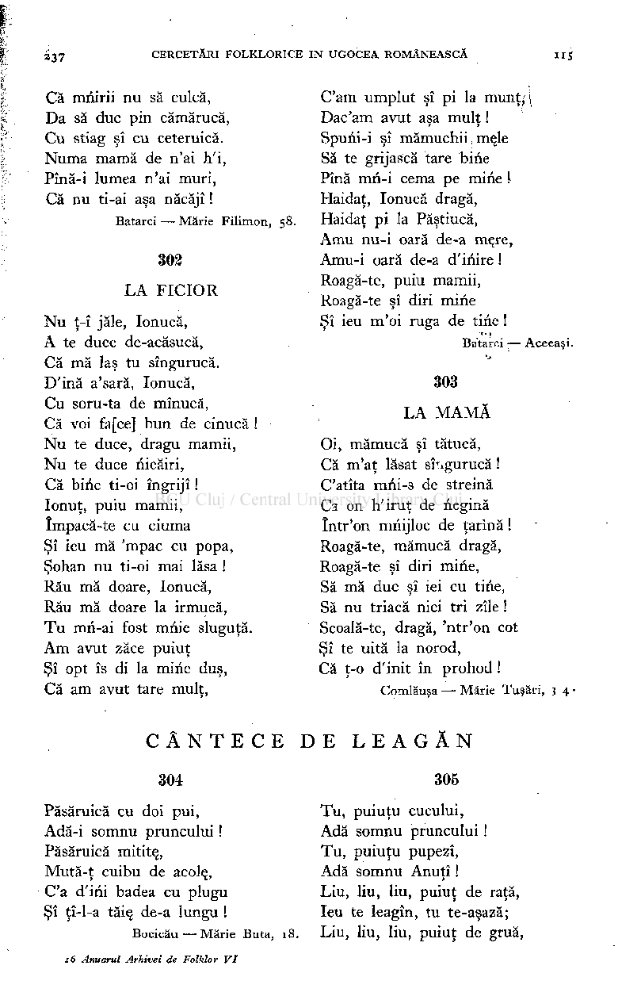

Cam umplut şî pi la munţ,'i Dac'am avut aşa mulţ ! Spurii-i şî mămuchii, me_le Să te grijască tare bine Pînă mri-i cema pe mine ! Haidaţ, Ionucă dragă, Haidaţ pi la Păştiucă, Amu nu-i oară de-a me_re, Amu-i oară de-a d'inire ! Roagă-te, puiu mamii, Roagă-te şî diri mine Şî ieu m'oi ruga de tine !

Că mfiirii nu să culcă, Da să duc pin cămărucă, Cu stiag şî cu ceteruică. Numa mamă de n'ai h'i, Pînă-i lumea n'ai muri, Că nu ti-ai aşa năcăjî !

Batarci — Mărie Filimon, 58.

302

LA FICIOR

Nu ţ-î jăle, Ionucă, A te duce de-acăsucă, Că mă laş tu sîngurucă. D'ină a'sară, Ionucă, Cu soru-ta de mînucă, Că voi fa[ce] bun de cinucă ! Nu te duce, dragu mamii, Nu te duce riicăiri, Că bine ti-oi îngriji ! Ionuţ, puiu mamii, împacă-te cu ciuma Şî ieu mă 'mpac cu popa, Şohan nu ti-oi mai lăsa ! Rău mă doare, Ionucă,

Batarci — Aceeaşi.

303

LA MAMĂ

Oi, mămucă şî tătucă, Că m'aţ lăsat sîngurucă ! C'atîta mfii-s de streină Ca on h'iruţ de riegină într'on mriijloc de ţarină ! Roagă-te, mămucă dragă, Roagă-te şî diri mine, Să mă duc şî iei cu tine, Să nu triacă nici tri zîle ! Scoală-te, dragă, 'ntr'on cot Şî te uită la norod, Că ţ-o d'init în prohod !

- Rău mă doare la irmueă, Tu mri-ai fost mriie sluguţă. Am avut zace puiuţ Şî opt îs di la mine duş, Că am avut tare mulţ,

Comlăuşa — Mărie Tuşări, 3 4 •

#### ÂNTEC E D E LEAGĂ N

C

304 305

Tu, puiuţu cucului, Adă somnu pruncului ! Tu, puiuţu pupezî, Adă somnu Anuţî ! Liu, liu, liu, puiuţ de raţă, leu te leagîn, tu te-aşază; Liu, liu, liu, puiuţ de gruă,

Păsăruică cu doi pui, Adă-i somnu pruncului ! Păsăruică mititç, Mută-ţ cuibu de acole_, C a d'irii badea cu plugu Şî ţî-l-a tăic de-a lungu !

Bocicău — Mărie Buta, 18.

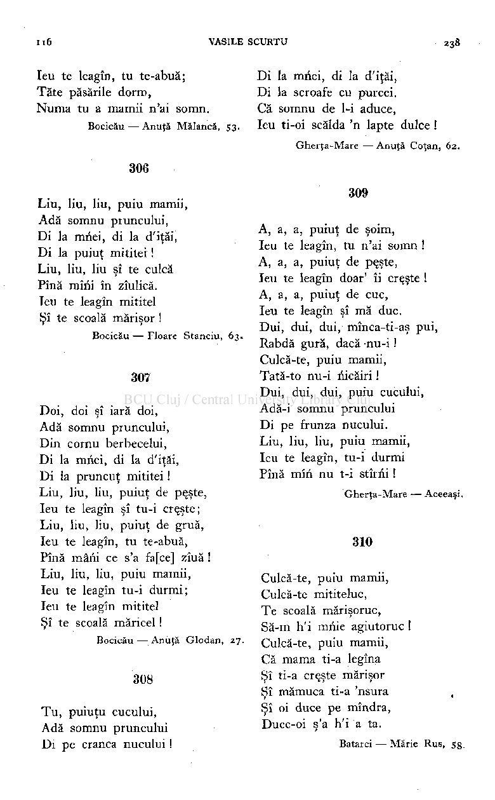

leu te leagîn, tu te-abuă; Täte păsările dorm, Numa tu a mamii n'ai somn.

Di la mnei, di la d'iţăi, Di la scroafe cu purcei. Că somnu de 1-i aduce, leu ti-oi scălda 'n lapte dulce !

Bocicău — Anuţă Mălancă, 53.

Gherţa-Mare — Anuţă Coţan, 62.

306

309

Liu, liu, liu, puiu mamii, Adă somnu pruncului, Di la mnei, di la d'iţăi, Di la puiuţ mititei ! Liu, liu, liu şî te culcă Pînă mini în ziulică, leu te leagîn mititel Şî te scoală mărişor !

A, a, a, puiuţ de şoim, leu te leagîn, tu n'ai somn ! A, a, a, puiuţ de peste, leu te leagîn doar' îi creste ! A, a, a, puiuţ de cuc, leu te leagîn şî mă duc. Dui, dui, dui, mînca-ti-aş pui, Rabdă gură, dacă nu-i ! Culcă-te, puiu mamii, Tată-to nu-i nicăiri ! Dui, dui, dui, puiu cucului, Adă-i somnu pruncului Di pe frunza nucului. Liu, liu, liu, puiu mamii, leu te leagîn, tu-i durmi Pînă mîn nu t-i stîrrii !

Bocicău — Floare Stanciu, 63.

307

Doi, doi şî iară doi, Adă somnu pruncului, Din cornu berbecelui, Di la mnei, di la d'iţăi, Di la pruncuţ mititei ! Liu, liu, liu, puiuţ de pcşte, leu te leagîn şî tu-i creste; Liu, liu, liu, puiuţ de gruă, leu te leagîn, tu te-abuă, Pînă mâni ce s'a fa[ce] zîuă ! Liu, liu, liu, puiu mamii, leu te leagîn tu-i durmi; leu te leagîn mititel Şî te scoală măricel !

Gherţa-Mare — Aceeaşi.

310

Culcă-te, puiu mamii, Culcă-te mititeluc, Te scoală mărişoruc, Să-m h'i mriie agiutoruc ! Culcă-te, puiu mamii, Că mama ti-a legîna Şî ti-a creste mărişor Şî mămuca ti-a 'nsura Şî oi duce pe mîndră, Duce-oi ş'a h'i a ta.

Bocicău — Anuţă Glodan, 27.

308

Tu, puiuţu cucului, Adă somnu pruncului Di pe cranca nucului !

Batarci — Mărie Rus, sg.

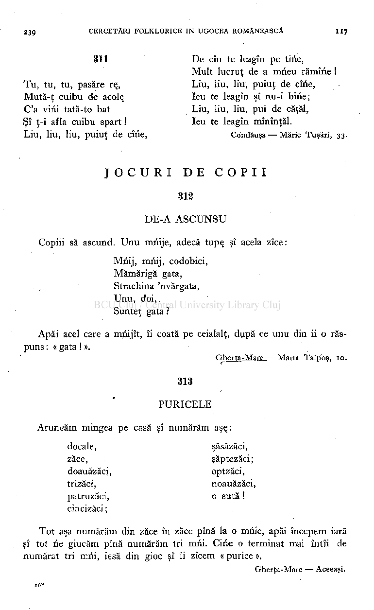

311 De cîn te leagîn pe tine,

Mult lucruţ de a mneu rămîne ! Tu, tu, tu, pasăre rç, Liu, liu, liu, puiuţ de cîfie, Mută-ţ cuibu de acole, leu te leagîn şî nu-i bine; C a vini tată-to bat Liu, liu, liu, pui de căţăl, Şî ţ-î afla cuibu spart ! leu te leagîn mînînţăl. Liu, liu, liu, puiuţ de CÎne, Comlăuşa — Mărie Tuşări, 33.

#### JOCUR I D E COPI I

312

DE-A ASCUNSU Copiii să ascund. Unu mriije, adecă tupe, şî acela zîce:

Mnij, mnij, codobici, Mămărigă gata, Strachina 'nvărgata, Unu, doi,. Sunteţ gata ?

Apăi acel care a mriijît, îi coată pe ceialalţ, după ce unu din ii o răspuns : « gata ! ».

Gherţa^Maxe_^ Marta Talpoş, 10 .

313

PURICELE

Aruncăm mingea pe casă şî numărăm aşe.:

docale, şăsăzăci, zace, şăptezăci ; doauăzăci, optzăci, trizăci, noauăzăci, patruzăci, o sută ! cincizăci ;

Tot aşa numărăm din zace în zace pînă la o mnie, apăi începem iară şî tot fie giucăm pînă numărăm tri nani. Cine o terminat mai întîi de numărat tri mni, iesă din gioc şî îi zîcem «purice».

Gherţa-Mare — Aceeaşi.

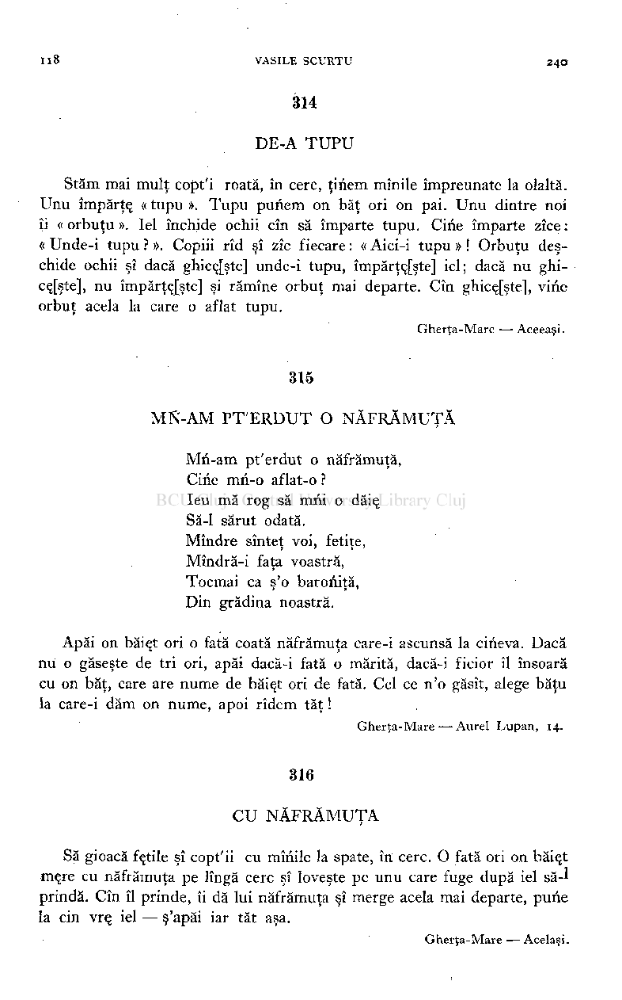

VASILE SCURT U 240

314

DE-A TUPU

Stăm mai mulţ copt'i roată, în cerc, ţinem mînile împreunate la olaltă. Unu împărţc « tupu ». Tupu punem on băţ ori on pai. Unu dintre noi îi « orbuţu ». Iei închide ochii cîn să împarte tupu. Cine împarte zîce: « Unde-i tupu ? ». Copiii rîd şî zîc fiecare : « Aici-i tupu » ! Orbuţu deschide ochii şî dacă ghicejste] unde-i tupu, împărţejşte] iei; dacă nu ghiceşte], nu împărţc[şte] şi rămîne orbuţ mai departe. Cîn ghice_[şte], vine orbuţ acela la care o aflat tupu.

Gherţa-Mare —- Aceeaşi.

315

M N-AM PT'ERDUT O NĂFRĂMUŢĂ

Mn-am pt'erdut o năfrămuţă, Cine mri-o aflat-o ? Ieu mă rog să mni o dăic Să-1 sărut odată. Mîndre sînteţ voi, fetiţe, Mîndră-i faţa voastră, Tocmai ca ş'o baroniţă, Din grădina noastră.

Apăi on băict ori o fată coată năfrămuţă care-i ascunsă la cineva. Dacă nu o găseşte de tri ori, apăi dacă-i fată o mărită, dacă-i ficior îl însoară cu on băţ, care are nume de băie_t ori de fată. Cel ce n'o găsit, alege bătu la care-i dăm on nume, apoi rîdem tăţ !

Gherţa-Mare — Aurel Lupan, 14.

316

CU NĂFRĂMUŢĂ

Să gioacă fçtile şî copt'ii cu mînile la spate, în cerc. O fată ori on băict mere cu năfrămuţă pe lîngă cerc şî loveşte pe unu care fuge după iei să-' prindă. Cîn îl prinde, îi dă lui năfrămuţă şî merge acela mai departe, pune la cin vrç iei — ş'apăi iar tăt aşa.

Gherţa-Mare — Acelaşi.

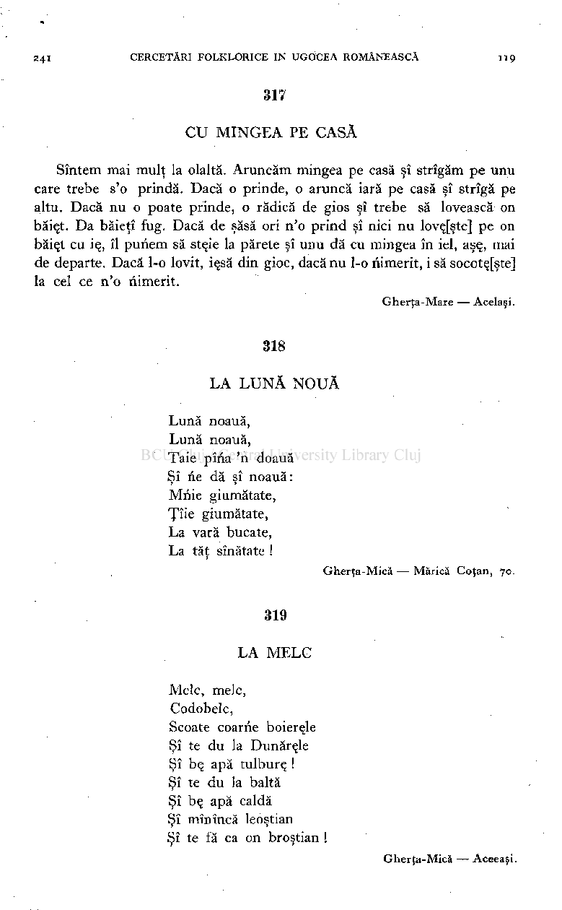

241 CERCETĂR I FOLKLORIC E I N UGOCE A ROMÂNEASC Ă H O

317

CU MINGEA PE CASĂ

Sîntem mai mulţ la olaltă. Aruncăm mingea pe casă şî strîgăm pe unu care trebe s'o prindă. Dacă o prinde, o aruncă iară pe casă şî strigă pe altu. Dacă nu o poate prinde, o rădică de gios şî trebe să lovească on băiet. Da băieţi fug. Dacă de şăsă ori n'o prind şî nici nu lovejşte] pe on băiet cu iç, îl punem să stçie la părete şî unu dă cu mingea în iei, aşc, mai de departe. Dacă l-o lovit, iesă din gioc, dacă nu l-o nimerit, i să socotejşte] la cel ce n'o nimerit.

Gherţa-Mare — Acelaşi.

318

LA LUNĂ NOUĂ

Lună noauă, Lună noauă, Taie pîria 'n doauă Şî ne dă şî noauă: Mnie giumătate, Ţîie giumătate, La vară bucate, La tăţ sînătate !

Gherţa-Mică — Mărică Coţan, 70.

319

LA MELC

Melc, melc, Codobelc, Scoate coarne boierele Şî te du la Dunărcle Şî be, apă tulburç ! Şî te du la baltă Şî bç apă caldă Şî mînîncă leoştian Şî te fă ca on broştian !

Gherţa-Mică — Aceeaşi.

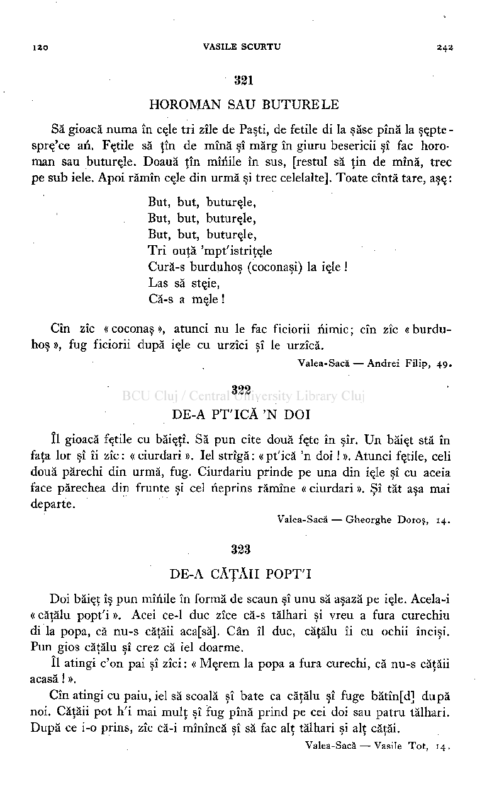

321

HOROMAN SAU BUTURELE

Să gioacă numa în cçle tri zîle de Paşti, de fetile di la şase pînă la şcptesprç'ce an. Fçtile să ţîn de mînă şî mărg în giuru besericii şî fac horoman sau buturçle. Doauă ţîn mînile în sus, [restul să ţin de mînă, trec pe sub iele. Apoi rămîn cçle din urmă şi trec celelalte]. Toate cîntă tare, aşc:

But, but, buturile, But, but, buturçle, But, but, buturile, Tri ouţă 'mpt'istriţcle Cură-s burduhoş (coconaşi) la içle ! Las să stçie, Că-s a mçle !

Cîn zîc « coconaş », atunci nu le fac ficiorii nimic ; cîn zîc « burduhoş », fug ficiorii după içle cu urzici şî le urzîcă.

Valea-Sacă — Andrei Filip, 49.

322

DE-A PTTCÄ 'N DOI

îl gioacă fçtile cu băicţî. Să pun cîte două fçte în şîr. Un băict stă în faţa lor şî îi zîc: « ciurdari ». Iei strigă: «pt'ică 'n doi ! ». Atunci fçtile, celi două părechi din urmă, fug. Ciurdariu prinde pe una din içle şî cu aceia face părechea din frunte şi cel neprins rămîne « ciurdari ». Şî tăt aşa mai departe.

Valea-Sacă — Gheorghe Doroş, 14.

323

DE-A CĂŢĂII POPTT

Doi băicţ îş pun mînile în formă de scaun şî unu să aşază pe içle. Acela-i « căţălu popt'i ». Acei ce-1 duc zîce că-s tâlhari şi vreu a fura curechiu di la popa, că nu-s căţăii aca[să]. Cân îl duc, căţălu îi cu ochii încişi. Pun gios căţălu şî crez că iei doarme.

îl atingi c'on pai şî zîci : « Mçrem la popa a fura curechi, că nu-s căţăii acasă ! ».

Cîn atingi cu paiu, iei să scoală şî bate ca căţălu şî fuge bătînfd] după noi. Căţăii pot h'i mai mulţ şî fug pînă prind pe cei doi sau patru tâlhari. După ce i-o prins, zîc că-i mînîncă şî să fac alţ tâlhari şi alţ căţăi.

Valea-Sacă — Vasile Tot, 14.

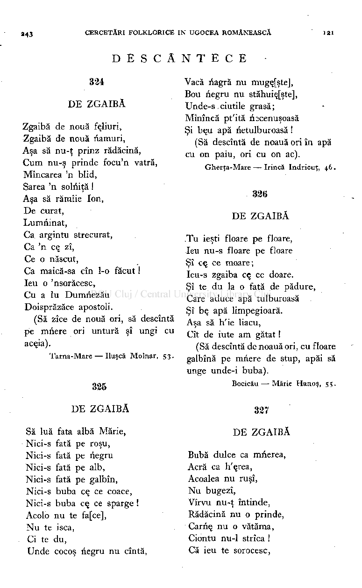

#### DESCÂNTEC E

Vacă nagră nu muge.[şte], Bou negru nu stăhuiejşte], Unde-s .ciutile grasă; Mînîncă pt'ită nscenuşoasă Şi beu apă netulburoasă !

324

DE ZGAIBÄ

Zgaibă de nouă feHuri, Zgaibă de nouă namuri, Aşa să nu-ţ prinz rădăcină, Cum nu-ş prinde focu'n vatră, Mîncarea 'n blid, Sarea 'n solniţă ! Aşa să rămîie Ion, De curat, Lumninat, Ca argintu strecurat, Ca 'n ce, zî, Ce o născut, Ca maică-sa cîn l-o făcut ! leu o 'nsorăcesc, Cu a lu Dumnezău Doisprăzăce apostoli.

(Să descîntă de noauă ori în apă cu on paiu, ori cu on ac).

Gherţa-Mare — Irincă Indricuţ, 46.

326

DE ZGAIBĂ

.Tu ieşti floare pe floare, leu nu-s floare pe floare Şî ce_ ce moare; Ieu-s zgaiba cç ce doare. Şî te du la o fată de pădure, Care aduce apă tulburoasă Şî be_ apă limpegioară. Aşa să h'ie liacu, Cît de iute am gătat !

(Să zîce de nouă ori, să descîntă pe mnere ori untură şî ungi cu acçia).

(Să descîntă de noauă ori, cu floare galbînă pe mnere de stup, apăi să unge unde-i buba).

Tarna-Mare — Iluşcă Molnar, 53.

Bocicău — Mărie Hanoş, 55.

325

DE ZGAIBĂ

327

Să luă fata albă Mărie, Nici-s fată pe roşu, Nici-s fată pe negru Nici-s fată pe alb, Nici-s fată pe galbîn, Nici-s buba cç ce coace, Nici-s buba ce. ce sparge ! Acolo nu te fa[ce], Nu te isca, Ci te du, Unde cocoş negru nu cîntă,

DE ZGAIBĂ

Bubă dulce ca mnerea, Acră ca h'şrea, Acoalea nu ruşî, Nu bugezî, Vîrvu nu-ţ întinde, Rădăcină nu o prinde, Carne, nu o vătăma, Ciontu nu-1 strica ! Că ieu te sorocesc,

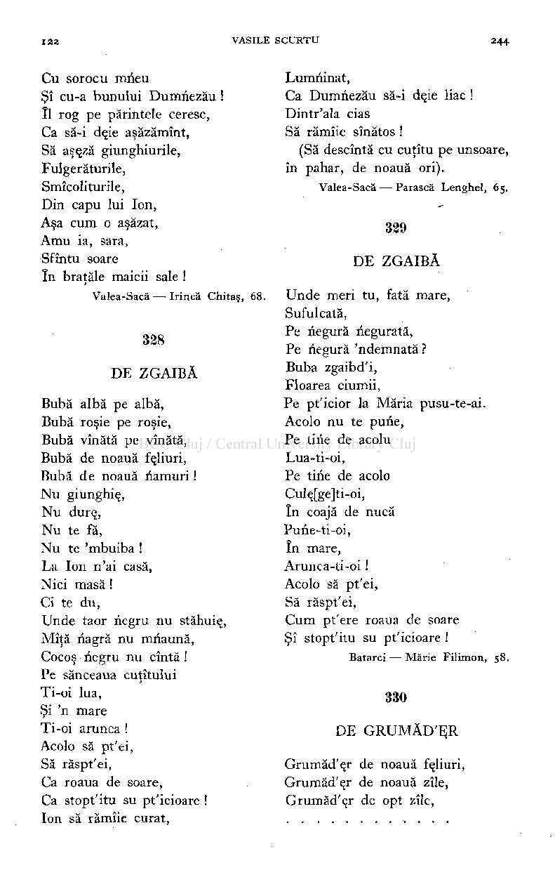

Lumhinat, Ca Dumriezău să-i de_ie liac ! Dintr'ala cias Să rămîie sînătos !

Cu sorocu mrieu Şî cu-a bunului Dumriezău ! îl rog pe părintele ceresc, Ca să-i dçie aşăzămînt, Să aşeză giunghiurile, Fulgerăturile, Smîcoliturile, Din capu lui Ion, Aşa cum o aşăzat, Amu ia, sara, Sfîntu soare în braţăle maicii sale !

(Să descîntă cu cuţîtu pe unsoare, în pahar, de noauă ori).

Valea-Sacă — Parască Lenghel, 65.

329

DE ZGAIBÄ

Unde meri tu, fată mare, Sufulcată, Pe riegură riegurată, Pe riegură 'ndemnată ? Buba zgaibd'i, Floarea ciumii, Pe pt'icior la Măria pusu-te-ai. Acolo nu te purie, Pe tirie de acolu Lua-ti-oi, Pe tirie de acolo Cule_[ge]ti-oi, în coajă de nucă Purie-ti-oi, în mare, Arunca-ti-oi ! Acolo să pt'ei, Să răspt'ei, Cum pt'ere roaua de soare Şî stopt'itu su pt'icioare !

Valea-Sacă — Irincă Chitaş, 68.

328

DE ZGAIBĂ

Bubă albă pe albă, Bubă roşie pe roşie, Bubă vînătă pe vînătă, Bubă de noauă fehuri, Bubă de noauă riamuri ! Nu gi unghi ç, Nu durç, Nu te fă, Nu te 'mbuiba ! La Ion n'ai casă, Nici masă ! Ci te du, Unde taor negru nu stăhuic, Mîţă riagră nu mriaună, Cocoş negru nu cîntă ! Pe sănceaua cuţitului Ti-oi lua, Şi 'n mare Ti-oi arunca ! Acolo să pt'ei, Să răspt'ei, Ca roaua de soare, Ca stopt'itu su pt'icioare ! Ion să rămîie curat,

Batarci — Mărie Filimon, 58.

330

DE GRUMĂD'ER

Grumăd'cr de noauă fejiuri, Grumăd'er de noauă zîle, Grumăd'er de opt zîle,

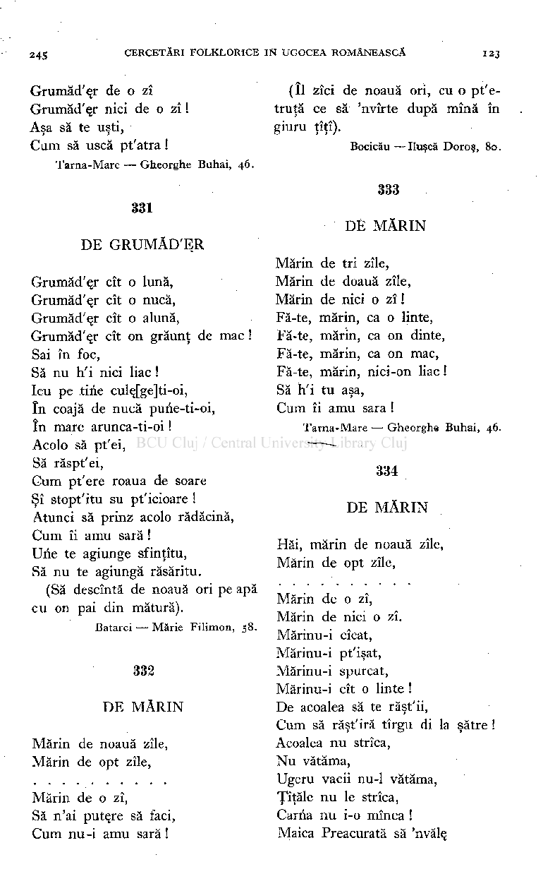

(îl zîci de noauă ori, cu o pt'etruţă ce să 'nvîrte după mînă în giuru ţîţî).

Grumăd'e/ de o zî Grumăd'cr nici de o zî ! Aşa să te uşti, Cum să uscă pt'atra !

Bocicău — Iluşcă Doroş, 80.

Tarna-Mare — Gheorghe Buhai, 46.

333

331

DE MARIN

DE GRUMÄD'ER

Marin de tri zîle, Marin de doauă zîle, Marin de nici o zî ! Fă-te, marin, ca o linte, Fă-te, marin, ca on dinte, Fă-te, marin, ca on mac, Fă-te, marin, nici-on liac ! Să h'i tu aşa, Cum îi amu sara !

Grumld'çr cît o lună, Grumăd'cr cît o nucă, Grumăd'cr cît o alună, Grumăd'cr cît on grăunţ de mac ! Sai în foc,

- Să nu h'i nici Hac ! Ieu pe tine cule_[ge]ti-oi, în coajă de nucă purie-ti-oi, în mare arunca-ti-oi ! Acolo să pt'ei, Să răspt'ei, Cum pt'ere roaua de soare Şî stopt'itu su pt'icioare ! Atunci să prinz acolo rădăcină, Cum îi amu sară ! Une te agiunge sfinţîtu, Să nu te agiungă răsăritu.

Tarna-Mare — Gheorgh« Buhai, 46.

334

DE MARIN

Hăi, marin de noauă zîle, Marin de opt zîle,

(Să descîntă de noauă ori pe apă cu on pai din mătură).

Marin de o zî, Marin de nici o zî. Mărinu-i cîcat, Mărinu-i pt'işat, Mărinu-i spurcat, Mărinu-i cît o linte ! De acoalea să te răşt'ii, Cum să răşt'iră tîrgu di la şatre ! Acoalea nu strîca, Nu vătăma, Ugeru vacii nu-1 vătăma, Ţîţăle nu le strîca, Carha nu i-o mînca ! Maica Preacurată să 'nvălc

Batarci — Mărie Filimon, 58.

332

DE MARIN

Marin de noauă zîle, Marin de opt zîle,

Marin de o zî,

- Să n'ai pute/e să faci, Cum nu -i amu sară !

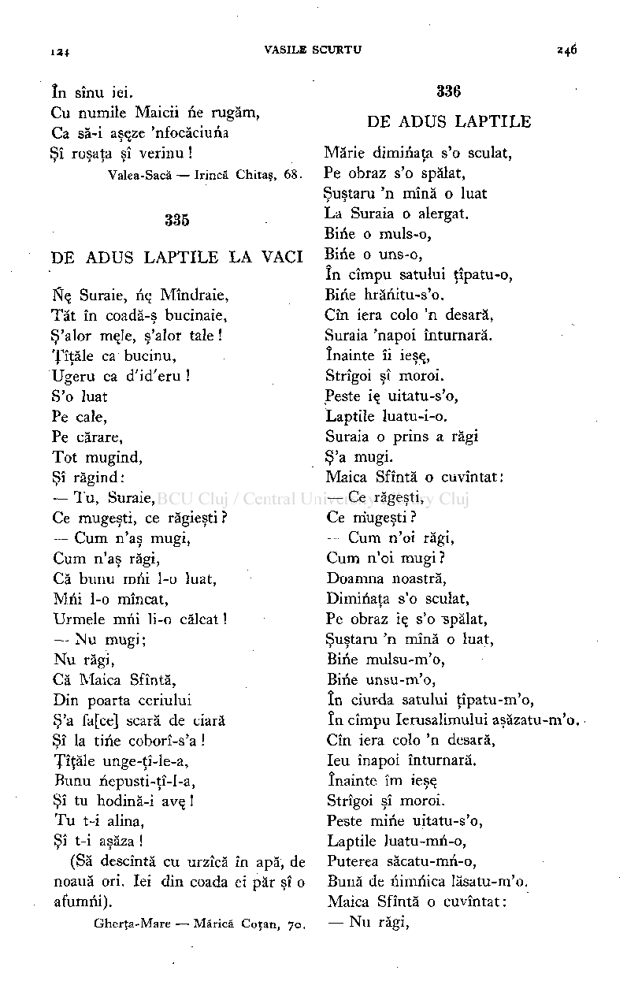

în sînu iei. Cu numile Maicii he rugăm, Ca să-i aşeze 'nfocăciuna Şî roşaţa şî verinu !

336

DE ADUS LAPTILE

Mărie diminaţa s'o sculat, Pe obraz s'o spălat, Şuştaru 'n mînă o luat La Suraia o alergat. Bine o muls-o, Bine o uns-o, în cîmpu satului ţîpatu-o, Bine hrăhitu-s'o. Cîn iera colo 'n desară, Suraia 'napoi înturnară. înainte îi ieşe_, Strigoi şî moroi. Peste iç uitatu-s'o, Laptile luatu-i-o. Suraia o prins a răgi Ş'a mugi. Maica Sfîntă o cuvîntat:

Valea-Sacă — Irincă Chitaş, 68.

335

DE ADUS LAPTILE L A VACI Ne, Suraie, riç Mîndraie,

- Tăt în coadă-ş bucinaie, Ş'alor mek, ş'alor tale ! Ţîţăle ca bucinu, Ugeru ca d'id'eru ! S'o luat Pe cale, Pe cărare, Tot mugind, Şî răgind:

— Ce răgeşti, Ce mugeşti ?

— Tu, Suraie, Ce mugeşti, ce răgieşti ?

— Cum n'oi răgi, Cum n'oi mugi? Doamna noastră, Diminaţa s'o sculat, Pe obraz iç s'o spălat, Şuştaru 'n mînă o luat, Bine mulsu-m'o, Bine unsu-m'o, în ciurda satului ţîpatu-m'o, în cîmpu Ierusalimului aşăzatu-m'o. Cîn iera colo 'n desară, leu înapoi înturnară. înainte îm ieşc Strîgoi şî moroi. Peste mine uitatu-s'o, Laptile luatu-mh-o, Puterea săcatu-mh-o, Bună de himhica lăsatu-m'o. Maica Sfîntă o cuvîntat:

— Cum n'aş mugi, Cum n'aş răgi, Că bunu mhi l-o luat, Mhi l-o mîncat, Urmele mhi li-o călcat !

— Nu mugi; Nu răgi, Că Maica Sfîntă, Din poarta ceriului Ş'a fa [ce] scară de ciară Şî la tine coborî-s'a ! Ţîţăle unge-ţî-le-a, Bunu hepusti-ţî-l-a, Şî tu hodină-i avç ! Tu t-i alina, Şî t-i aşăza !

(Să descîntă cu urzică în apă, de noauă ori. Iei din coada ei păr şî o afumrii).

— Nu răgi,

Gherţa-Mare — Mărică Coţan, 70.

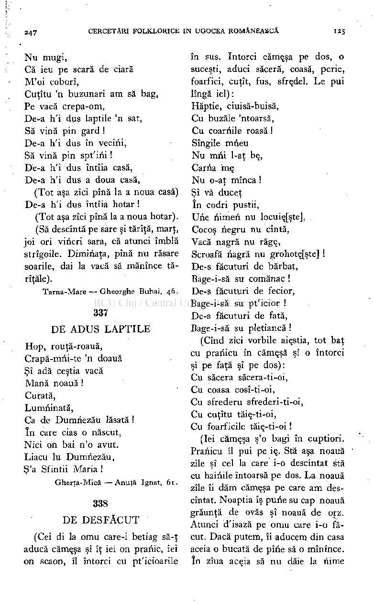

în sus. întorci cămcşa pe dos, o suceşti, aduci săceră, coasă, perie, foarfici, cuţît, fus, sfrçdel. Le pui lîngă iei): Hăptie, ciuisă-buisă, Cu buzăle 'ntoarsă, Cu coarfiile roasă ! Sîngile mneu Nu mni 1-aţ bç, Carna me. Nu o-aţ mînca ! Şî vă duceţ în codri pustii, Une nimen nu locuie,[şte], Cocoş negru nu cîntă, Vacă nagră nu rage,, Scroafă riagră nu grohotejste] ! De-s făcuturi de bărbat, Bage-i-să su comanac ! De-s făcuturi de fecior, Bage-i-să su pt'icior ! De-s făcuturi de fată, Bage-i-să su pletiancă !

Nu mugi, Că ieu pe scară de ciară

- M'oi coborî, Cuţîtu 'n buzunari am să bag, Pe vacă crepa-om, De-a h'i dus laptile 'n sat, Să vină pin gard ! De-a h'i dus în vecini, Să vină pin spt'ini ! De-a h'i dus întîia casă, De-a h'i dus a doua casă,

(Tot aşa zîci pînă la a noua casă) De-a h'i dus întîia hotar !

(Tot aşa zîci pînă la a noua hotar). (Să descîntă pe sare şi tărîţă, marţ,

joi ori vineri sara, că atunci îmbla strîgoile. Dimiriaţa, pînă nu răsare soarile, dai la vacă să mănînce tărîţăle).

Tarna-Mare — Gheorghe Buhai, 46.

337

DE ADUS LAPTILE

(Cînd zîci vorbile aiçstia, tot baţ cu prariicu în cămcşă şî o întorci şî pe faţă şî pe dos): Cu săcera săcera-ti-oi, Cu coasa cosî-ti-oi, Cu sfrederu sfrederi-ti-oi, Cu cuţîtu tăic-ti-oi, Cu foarficile tăic-ti-oi !

Hop, rouţă-roauă, Crapă-mfii-te 'n doauă Şî adă ceştia vacă Mană noauă ! Curată, Lumninată, Ca de Dumnezău lăsată ! în care cias o născut, Nici on bai n'o avut. Liacu lu Dumnezău, Ş'a Sfinţii Maria !

(Iei cămeşa ş'o bagi în cuptiori. Pranicu îl pui pe iç. Stă aşa noauă zîle şî cel la care i-o descîntat stă cu hairiile întoarsă pe dos. La noauă zîle îi dăm cămcşa pe care am descîntat. Noaptia îş pune su cap noauă grăunţă de ovăs şî noauă de orz. Atunci d'isază pe omu care i-o făcut. Dacă putem, îi aducem din casa aceia o bucată de pîne să o mînînce. în zîua acçia să nu dăie la nime

Gherţa-Mică—Anuţ ă Ignat, 61.

338

DE DESFĂCUT

(Cei di la omu care-i betiag să-ţ aducă cămcşa şî îţ iei on prariic, iei on scaon, îl întorci cu pt'icioarile

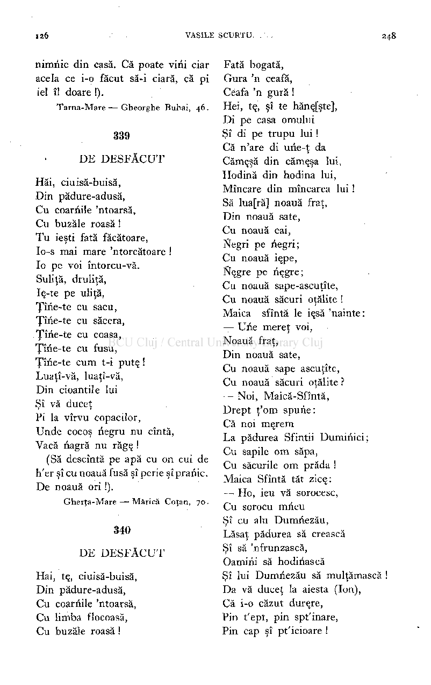

nimriic din casă. Că poate vini ciar acela ce i-o făcut să-i ciară, că pi iei îl doare !).

Fată bogată, Gura 'n ceafă, Ceafa 'n gură ! Hei, tç, şî te hănejste], Di pe casa omului Şî di pe trupu lui ! Că n'are di une-ţ da Cămcşă din cămcşa lui, Hodină din hodina lui, Mîncare din mîncarea lui ! Să lua[ră] noauă fraţ, Din noauă sate, Cu noauă cai, Negri pe negri; Cu noauă ie.pe, Nçgre pe riçgre; Cu noauă sape-ascuţîte, Cu noauă săcuri oţălite ! Maica sfîntă le icsă 'nainte :

Tarna-Mare — Gheorghe Buhai, 46.

339

DE DESFĂCUT

Hăi, ciuisă-buisă, Din pădure-adusă, Cu coarnile 'ntoarsă, Cu buzăle roasă ! Tu ieşti fată făcătoare, Io-s mai mare 'ntorcătoare ! Io pe voi întorcu-vă. Suliţă, druliţă, Ie_-te pe uliţă, Ţîne-te cu sacu, Ţîhe-te cu săcera, Ţîrie-te cu coasa, Ţîne-te cu fusu, Ţîne-te cum t-i pute. ! Luaţî-vă, luaţî-vă, Din cioantile lui Şî vă duceţ Pi la vîrvu copacilor, Unde cocoş negru nu cîntă, Vacă nagră nu răge. !

— Une mereţ voi, Noauă fraţ, Din noauă sate, Cu noauă sape ascuţite, Cu noauă săcuri oţălite ?

— Noi, Maică-Sfîntă, Drept ţ'om spune: Că noi innrem La pădurea Sfinţii Duminici; Cu sapile om săpa, Cu săcurile om prăda ! Maica Sfîntă tăt zice.:

(Să descîntă pe apă cu on cui de h'er şî cu noauă fusă şî perie şî praiîic. De noauă ori !).

— Ho, ieu vă sorocesc, Cu sorocu mrieu Şî cu alu Dumnezău, Lăsat pădurea să crească Şî să 'nfrunzască, Oamini să hodinască Şî lui Dumnezău să mulţămască ! Da vă duceţ la aiesta (Ion), Că i-o căzut durçre, Pin t'ept, pin spt'inare, Pin cap şî pt'icioare !

Gherţa-Mare — Mărică Coţan, 70.

340

DE DESFĂCUT

Hai, te., ciuisă-buisă, Din pădure-adusă, Cu coarnile 'ntoarsă, Cu limba flocoasă, Cu buzăle roasă !

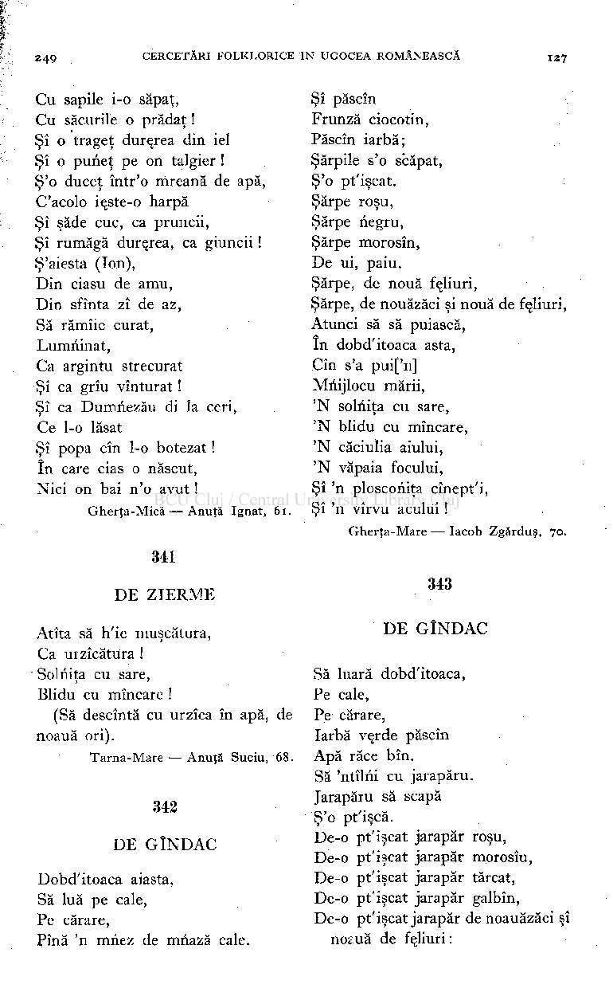

Şî păscîn Frunză ciocotin, Păscîn iarbă; Şărpile s'o scăpat, Ş'o pt'işcat. Şarpe roşu, Şarpe negru, Şarpe morosîn, De ui, paiu. Şarpe, de nouă fçliuri, Şarpe, de nouăzăci şi nouă de fçliuri, Atunci să să puiască, în dobd'itoaca asta, Cîn s'a puif'n] Mnijlocu mării, 'N solniţa cu sare, 'N blidu cu mîncare, 'N căciulia aiului, 'N văpaia focului, Şî 'n plosconiţa cînept'i, Şî 'n vîrvu acului !

Cu sapile i-o săpat, Cu săcurile o prădat ! Şî o traget durerea din iei Şî o purieţ pe on talgier ! Ş'o duceţ într'o mreană de apă, C'acolo ieste-o harpă Şî şăde cuc, ca pruncii, Şî rumăgă durerea, ca giuncii ! Ş'aiesta (Ion), Din ciasu de amu, Din sfînta zî de az, Să rămîie curat, Lumfiinat, Ca argintu strecurat Şî ca grîu vînturat ! Şî ca Dumnezău di la ceri, Ce l-o lăsat Şî popa cîn l-o botezat ! în care cias o născut, Nici on bai n'o avut !

Gherţa-Mică — Anuţă Ignat, 6i.

Gherţa-Mare — Iacob Zgărduş, 70.

341

343

DE ZIERME

DE GÎNDAC

Atîta să h'ie muşcătura, Ca urzîcătura ! Solniţa cu sare, Blidu cu mîncare !

Să luară dobd'itoaca, Pe cale, Pe cărare, Iarbă verde păscîn Apă race bîn. Să 'ntîlni cu jarapăru. Jarapăru să scapă Ş'o pt'işcă. De-o pt'işcat jarapăr roşu, De-o pt'işcat jarapăr morosîu, De-o pt'işcat jarapăr tărcat, De-o pt'işcat jarapăr galbîn, De-o pt'işcat jarapăr de noauăzăci şî

(Să descîntă cu urzica în apă, de noauă ori).

Tarna-Mare — Anuţă Suciu, 68.

342

DE GÎNDAC

Dobd'itoaca aiasta, Să luă pe cale, Pe cărare, Pînă 'n mnez de mriază cale.

no£uă de fçliuri :

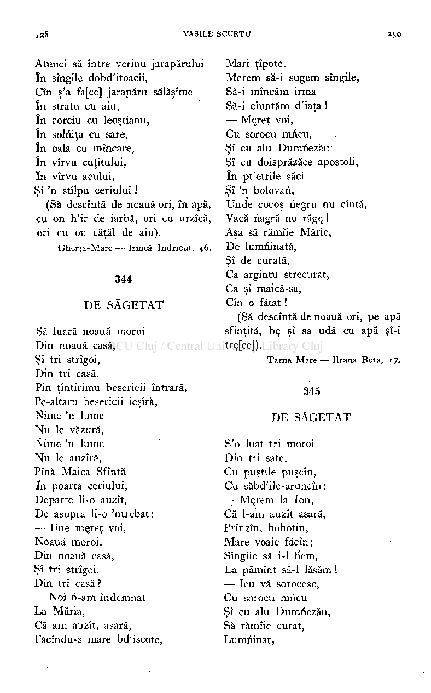

Mari ţîpote. Merem să-i sugem sîngile, Să-i mîncăm irma Să-i ciuntăm d'iaţa !

Atunci să între verinu jarapărului în sîngile dobd'itoacii, Cîn ş'a fa[ce] jarapăru sălăşîme în stratu cu aiu, în corciu cu leoştianu, în solniţa cu sare, în oala cu mîncare, în vîrvu cuţitului, în vîrvu acului, Şi 'n stîlpu ceriului !

— Mcreţ voi, Cu sorocu mneu, Şî cu aiu Dumnezău Şî cu doisprăzăce apostoli, în pt'etrile săci Şî 'n bolovan, Unde cocoş negru nu cîntă, Vacă nagră nu răge. ! Aşa să rămîie Mărie, De lumhinată, Şî de curată, Ca argintu strecurat, Ca şî maică-sa, Cîn o fătat !

(Să descîntă de noauă ori, în apă, cu on h'ir de iarbă, ori cu urzîcă, ori cu on căţăl de aiu).

Gherţa-Mare — Irincă Indricuţ, 46.

344

DE SÄGETAT

(Să descîntă de noauă ori, pe apă sfinţită, bç şî să udă cu apă şî-i trejce]).

Să luară noauă moroi Din noauă casă, Şî tri strigoi, Din tri casă. Pin ţîntirimu besericii intrară, Pe-altaru besericii ieşiră, Nime 'n lume Nu le văzură, Nime 'n lume Nu le auziră, Pînă Maica Sfîntă în poarta ceriului, Departe li-o auzît, De asupra li-o 'ntrebat:

Tarna-Mare — Ileana Buta, 17.

345

DE SĂGETAT

S'o luat tri moroi Din tri sate, Cu puştile puşcîn, Cu săbd'ile-aruncîn :

— M çrem la Ion, Că l-am auzît asară, Prînzîn, hohotin, Mare voaie făcîn; Sîngile să i-1 bem, La pămînt să-1 lăsăm !

— Une mejreţ voi, Noauă moroi, Din noauă casă, Şî tri strigoi, Din tri casă ?

— Ieu vă sorocesc, Cu sorocu miieu Şî cu aiu Dumnezău, Să rămîie curat, Lumhinat,

— Noi h-am îndemnat La Măria, Că am auzît, asară, Făcîndu-ş mare bd'iscote,

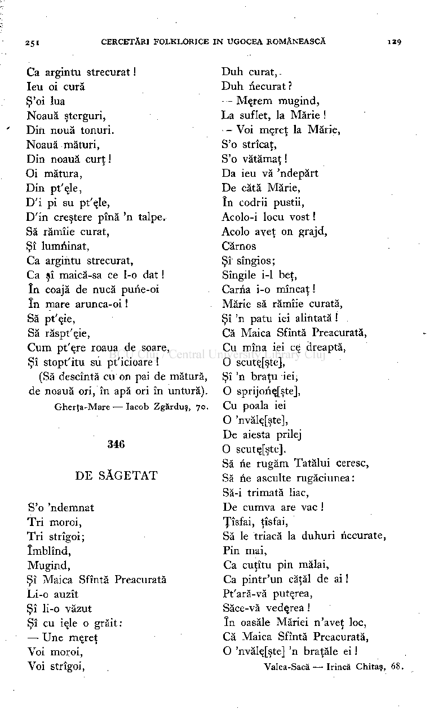

Ca argintu strecurat ! Ieu oi cură Ş'oi lua Noauă şterguri, Din nouă tonuri. Noauă mături, Din noauă curţ ! Oi mătura, Din pt'çle, D'i pi su pt'çle, D'in creştere pînă 'n talpe. Să rămîie curat, Şî lumninat, Ca argintu strecurat, Ca şî maicâ-sa ce l-o dat ! în coajă de nucă pune-oi în mare arunca-oi ! Să pt'çie, Să răspt'cie, Cum pt'çre roaua de soare, Şî stopt'itu su pt'icioare !

Duh curat,. Duh necurat?

— Mçrem mugind, La suflet, la Mărie !

— Voi mcreţ la Mărie, S'o strîcaţ, S'o vătămat ! Da ieu vă 'ndepărt De cătă Mărie, în codrii pustii, Acolo-i locu vost ! Acolo aveţ on grajd, Cărnos Şî' sîngios; Sîngile i-1 beţ, Carna i-o mîncaţ ! Mărie să rămîie curată, Şî 'n patu iei alintată ! Că Maica Sfîntă Preacurată, Cu mîna iei ce. dreaptă, O scute_[şte], Şî 'n braţu iei, O sprijoriejste], Cu poala iei O 'nvăle.[şte], De aiesta prilej O scutc[şte]. Să ne rugăm Tatălui ceresc, Să ne asculte rugăciunea: Să-i trimată Hac, De cumva are vac ! Ţîsfai, ţîsfai, Să le triacă la duhuri necurate, Pin mai, Ca cuţîtu pin mălai, Ca pintr'un căţăl de ai ! Pt'ară-vă puterea, Săce-vă vedçrea ! în oasăle Măriei n'aveţ loc, Că Maica Sfîntă Preacurată, O 'nvălc[şte] 'n braţăle ei !

(Să descîntă cu on pai de mătură, de noauă ori, în apă ori în untură).

Gherţa-Mare — Iacob Zgărduş, 70.

346

DE SĂGETA T

S'o 'ndemnat Tri moroi, Tri strîgoi; îmblînd, Mugind, Şî Maica Sfîntă Preacurată

- Li-o auzît

- Şî li-o văzut Şî cu ie_le o grăit:

— Une mcreţ Voi moroi, Voi strîgoi,

Valea-Sacă-—• Irincă Chitaş, 68.

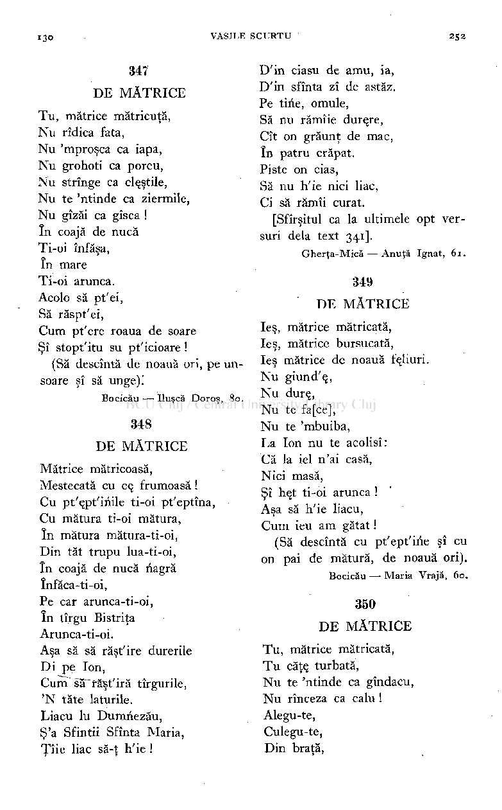

D'in ciasu de amu, ia, D'in sfîntă zî de astăz. Pe tine, omule, Să nu rămîie durçre, Cit on grăunţ de mac, în patru crăpat. Piste on cias, Să nu h'ie nici liac, Ci să rămîi curat.

347

DE MATRICE

Tu, matrice mătricuţă, Nu ridica fata, Nu 'mproşca ca iapa, Nu grohoti ca porcu, Nu strînge ca cloştile, Nu te 'ntinde ca ziermile, Nu gîzăi ca gîsca ! în coajă de nucă Ti-oi înfăşa,

[Sfîrşitul ca la ultimele opt versuri delà text 341].

Gherţa-Mică — Anuţă Ignat, 61.

în mare Ti-oi arunca. Acolo să pt'ei, Să răspt'ei, Cum pt'ere roaua de soare Şî stopt'itu su pt'icioare !

349

DE MATRICE

leş, matrice mătricată, leş, matrice bursucată, leş matrice de noauă fejiuri. Nu giund'ç, Nu dure,, Nu te fa [ce], Nu te 'mbuiba, La Ion nu te acolisî: Că la iei n'ai casă, Nici masă, Şî het ti-oi arunca ! Aşa să h'ie liacu, Cum ieu am gătat !

(Să descîntă de noauă ori, pe unsoare şî să unge).'

Bocicău •— Iluşcă Doroş, 80.

348

DE MATRICE

Matrice mătricoasă, Mestecată cu cç frumoasă ! Cu pt'çpt'inile ti-oi pt'eptîna, Cu mătura ti-oi mătura, în mătura mătura-ti-01, Din tăt trupu lua-ti-oi, în coajă de nucă riagră înfăca-ti-oi, Pe car arunca-ti-oi, în tîrgu Bistriţa Arunca-ti-oi. Aşa să să răşt'ire durerile Di pe Ion, Cum să~făşt'iră tîrgurile, 'N täte laturile. Liacu lu Dumnezău, Ş'a Sfinţii Sfîntă Maria, Ţîie liac să-ţ h'ie !

(Să descîntă cu pt'ept'ihe şî cu on pai de mătură, de noauă ori).

Bocicău •— Maria Vrajă, 60.

350

DE MATRICE Tu, matrice mătricată, Tu căţe, turbată, Nu te 'ntinde ca gîndacu, Nu rînceza ca calu ! Alegu-te, Culegu-te, Din braţă,

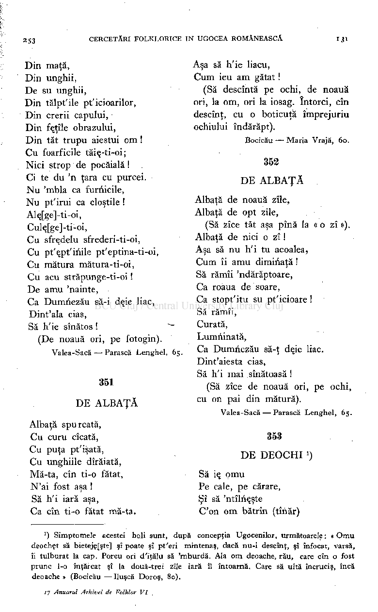

CERCETĂR I FOLKLORIC E I N UGOCE A ROMÂNEASC Ă

131

253

Aşa să h'ie liacu, Cum ieu am gătat !

Din maţă, Din unghii, De su unghii, Din tălpt'ile pt'icioarilor, Din crerii capului, Din fetîle obrazului, Din tăt trupu aiestui om ! Cu foarficile tăic-ti-oi; Nici strop de pocăială ! Ci te du 'n ţara cu purcei. Nu 'mbla ca furnicile, Nu pt'irui ca cloştile ! Alç[ge]-ti-oi, Culç[ge]-ti-oi, Cu sfredelu sfrederi-ti-oi, Cu pt'çpt'inile pt'eptina-ti-oi, Cu mătura mătura-ti-oi, Cu acu străpunge-ti-oi ! De amu 'nainte, Ca Dumnezău să-i dçie Hac, Dint'ala cias, Să h'ie sînătos ! ~~ (De noauă ori, pe fotogin).

(Să descîntă pe ochi, de noauă ori, la om, ori la iosag. întorci, cîn descînţ, cu o boticuţă împrejuriu ochiului îndărăpt).

Bocicău — Maria Vrajă, 60.

352

DE ALBAŢ Ă

Albaţă de noauă zîle, Albaţă de opt zîle,

(Să zîce tăt aşa pînă Ia « o zî »). Albaţă de nici o zî ! Aşa să nu h'i tu acoalea, Cum îi amu dimiriaţă ! Să rămîi 'ndărăptoare, Ca roaua de soare, Ca stopt'itu su pt'icioare ! Să rămîi, Curată, Lumhinată, Ca Dumnezău să-ţ de_ie liac. Dint'aiesta cias, Să h'i mai sînătoasă !

Valea-Sacă — Parască Lenghel, 65.

351

(Să zîce de noauă ori, pe ochi, cu on pai din mătură).

DE ALBAŢĂ

Valea-Sacă — Parască Lenghel, 65.

Albaţă spurcată, Cu curu cîcată, Cu puţa pt'işată, Cu unghiile dîrăiată, Mă-ta, cîn ti-o fătat, N'ai fost aşa ! Să h'i iară aşa, Ca cîn ti-o fătat mă-ta.

353

DE DEOCHI !)

Să iç omu Pe cale, pe cărare, Şî să 'ntîlncşte Con om bătrîn (tîhăr)

*) Simptomele acestei boli sunt, după concepţia Ugocenilor, următoarele : « Om u deochet să bietejefşte] şî poate şî pt'eri mintenaş, dacă nu-i descînţ, şî înfocat, varsă, îi tulburat la cap. Porcu ori d'iţălu să 'mburdă. Ala om deoache, rău, care cîn o fost prunc l-o înţărcat şî la două-trei zîle iară îl întoarnă. Care să uită încruciş, încă deoache» (Bocicău —Iluşcă Doroş, 80).

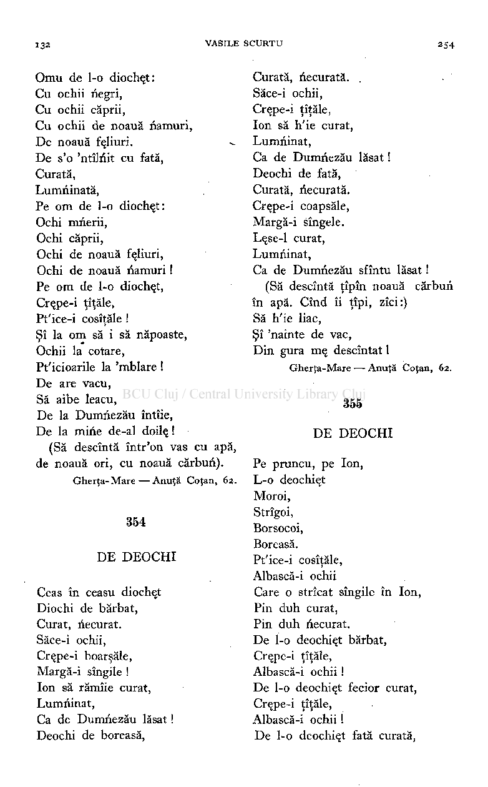

Curată, necurată. . Săce-i ochii, Crçpe-i ţîţăle, Ion să h'ie curat, Lumninat, Ca de Dumnezău lăsat ! Deochi de fată, Curată, necurată. Crçpe-i coapsăle, Margă-i sîngele. Lçse-1 curat, Lumninat, Ca de Dumnezău sfîntu lăsat !

Omu de l-o diochet: Cu ochii negri, Cu ochii căprii, Cu ochii de noauă namuri, De noauă fehuri. De s'o 'ntîlnit cu fată, Curată, Lumninată, Pe om de l-o diochet: Ochi mnerii, Ochi căprii, Ochi de noauă feHuri, Ochi de noauă namuri ! Pe om de l-o diochet, Cre_pe-i ţîţăle, Pt'ice-i cosîţăle ! Şî la om să i să năpoaste, Ochii la cotare, Pt'icioarile la 'mblare ! De are vacu, Să aibe leacu, De la Dumnezău întîie, De la mine de-al doilç !

(Să descîntă ţîpîn noauă cărburi în apă. Cînd îi ţîpi, zîci:) Să h'ie liac, Şî 'nainte de vac, Din gura mç descîntat !

Gherţa-Mare — Anuţă Coţan, 62.

355

DE DEOCHI

(Să descîntă într'on vas cu apă, de noauă ori, cu noauă cărbuh).

Pe pruncu, pe Ion, L-o deochiet Moroi, Strîgoi, Borsocoi, Boreasă. Pt'ice-i cosîţăle, Albască-i ochii Care o stricat sîngile în Ion, Pin duh curat, Pin duh necurat. De l-o deochiet bărbat, Crçpe-i ţîţăle, Albască-i ochii ! De l-o deochiet fecior curat, Crçpe-i ţîţăle, Albască-i ochii ! De l-o deochiet fată curată,

Gherţa-Mare—Anuţ ă Coţan, 62.

354

DE DEOCHI

Ceas în ceasu diochet Diochi de bărbat, Curat, necurat. Săce-i ochii, Crçpe-i boarşăle, Margă-i sîngile ! Ion să rămîie curat, Lumninat, Ca de Dumnezău lăsat ! Deochi de boreasă,

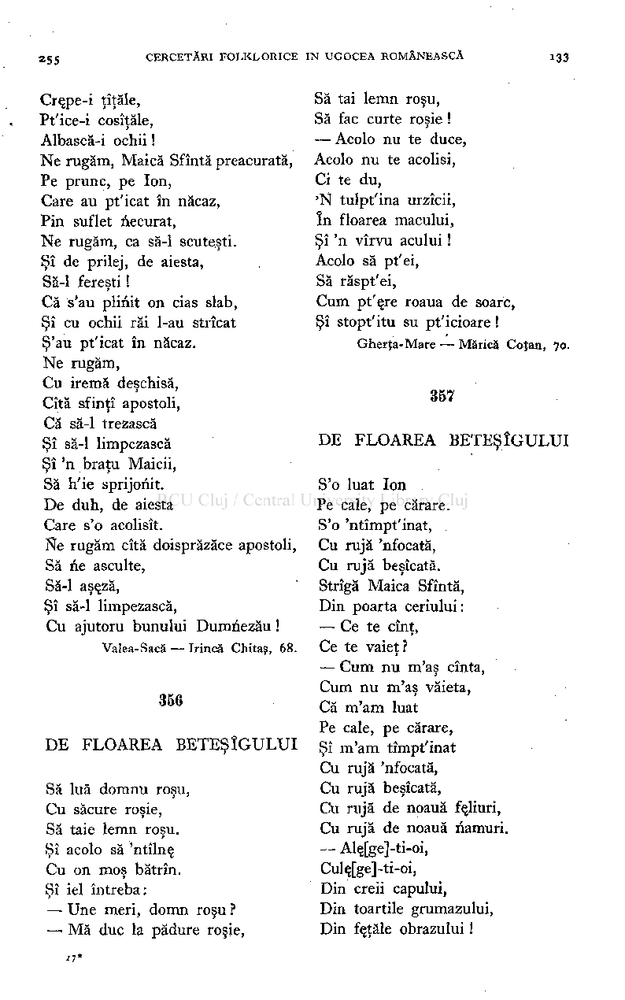

Să tai lemn roşu, Să fac curte roşie !

Crçpe-i ţîţăle, Pt'ice-i cosîţăle, Albască-i ochii ! Ne rugăm, Maică Sfîntă preacurată, Pe prunc, pe Ion, Care au pt'icat în năcaz, Pin suflet necurat, Ne rugăm, ca să-1 scuteşti. Şî de prilej, de aiesta, Să-1 fereşti ! Că s'au plinit on cias slab, Şî cu ochii răi l-au stricat Ş'au pt'icat în năcaz. Ne rugăm, Cu iremă deschisă, Cîtă sfinţi apostoli, Că să-1 trezască Şî să-1 limpezască Şî 'n braţu Maicii, Să h'ie sprijonit. De duh, de aiesta Care s'o acolisît. Ne rugăm cîtă doisprăzăce apostoli, Să ne asculte, Să-1 aşeză, Şî să-1 limpezască, Cu ajutora bunului Dumnezău !

— Acolo nu te duce, Acolo nu te acolisi, Ci te du, 'N tulpt'ina urzicii, în floarea macului, Şî 'n vîrvu acului ! Acolo să pt'ei, Să răspt'ei, Cum pt'ere roaua de soare, Şî stopt'itu su pt'icioare !

Gherţa-Mare — Mărică Coţan, 70.

357

DE FLOAREA BETEŞÎGULUI

S'o luat Ion Pe cale, pe cărare. S'o 'ntîmpt'inat, Cu rujă 'nfocată, Cu rujă beşîcată. Strigă Maica Sfîntă, Din poarta ceriului: — Ce te cînţ, Ce te vaiet?

Valea-Sacă — Irincă Chitaş, 68.

— Cum nu m'aş cînta, Cum nu m'aş văieta, Că ra'am luat Pe cale, pe cărare, Şî m'am tîmpt'inat Cu rujă 'nfocată, Cu rujă beşîcată, Cu rujă de noauă fçliuri, Cu rujă de noauă riamuri.

356

DE FLOAREA BETEŞÎGULUI

Să luă domnu roşu, Cu săcure roşie, Să taie lemn roşu. Şî acolo să 'ntîlnç Cu on moş bătrîn. Şî iei întreba:

— Alç[ge]-ti-oi, Culç[ge]-ti-oi, Din creii capului, Din toartile grumazului, Din fetăle obrazului !

— Une meri, domn roşu ?

— Mă duc la pădure roşie,

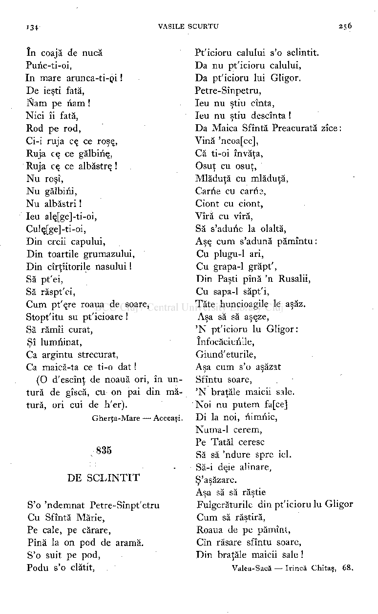

Pt'icioru calului s'o sclintit. Da nu pt'icioru calului, Da pt'icioru lui Gligor. Petre-Sînpetru, leu nu ştiu cînta, leu nu ştiu descîntă ! Da Maica Sfîntă Preacurată zîce: Vină 'ncoafce], Că ti-oi învăţa, Osuţ cu osuţ, Mlăduţă cu mlăduţă, Carne cu carne, Ciont cu ciont, Vîră cu vîră, Să s'adufîe la olaltă, Aşe. cum s'adună pămîntu: Cu plugu-1 ari, Cu grapa-1 grăpt', Din Paşti pînă 'n Rusalii, Cu sapa-1 săpt'i, Täte huncioagile le aşăz.

în coajă de nucă Pune-ti-oi, In mare arunca-ti-pi ! De ieşti fată, Nam pe nam ! Nici îi fată, Rod pe rod, Ci-i ruja ce. ce roşe., Ruja ce. ce gălbirie., Ruja ce. ce albastre. ! Nu roşî, Nu gălbini, Nu albaştri ! Ieu ale.[ge]-ti-oi, Culç[ge]-ti-oi, Din creii capului, Din toartile grumazului, Din cîrţîitorile nasului ! Să pt'ei, Să răspt'ei, Cum pt'çre roaua de soare, Stopt'itu su pt'icioare ! Să rămîi curat, Şî lumninat, Ca argintu strecurat, Ca maică-ta ce ti-o dat !

Aşa să să aşcze, 'N pt'icioru lu Gligor: înfocăciunile, Giund'eturile, Aşa cum s'o aşăzat Sfîntu soare, 'N braţăle maicii sale. Noi nu putem fa[ce] Di la noi, nimnic, Numa-1 cerem, Pe Tatăl ceresc Să să 'ndure spre iei. Să-i dçie alinare, Ş'aşăzare. Aşa să să răştie Fulgerăturile din pt'icioru lu Gligor Cum să răstiră, Roaua de pe pămînt, Cîn răsare sfîntu soare, Din braţăle maicii sale !

(O d'escînţ de noauă ori, în untură de gîscă, cu on pai din mătură, ori cui de h'er).

Gherţa-Mare — Aceeaşi.

835

DE SCLINTIT

S'o 'ndemnat Petre-Sînpt'etru Cu Sfîntă Mărie, Pe cale, pe cărare, Pînă la on pod de aramă. S'o suit pe pod, Podu s'o clătit,

Valea-Sacă — Irincă Chitaş, 68.

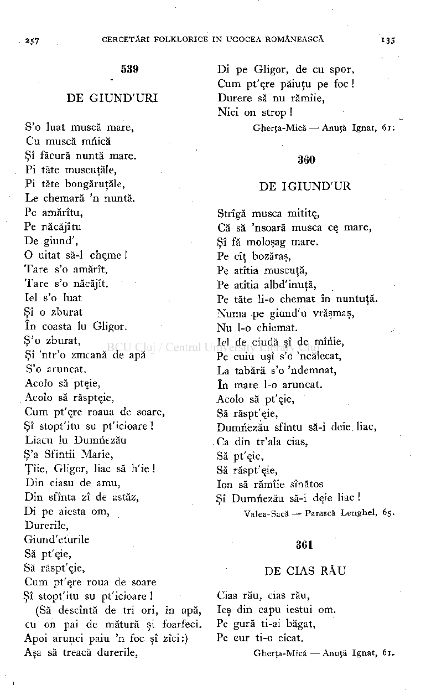

Di pe Gligor, de cu spor, Cum pt'ere păiuţu pe foc ! Durere să nu rămîie, Nici on strop !

539

DE GIUND'URI

S'o luat muscă mare, Cu muscă mnică Şî făcură nuntă mare. Pi täte muscuţăle, Pi täte bongăruţăle, Le chemară 'n nuntă. Pe amărîtu, Pe năcăjîtu De giund', O uitat să-1 cheme ! Tare s'o amărît, Tare s'o năcăjît. Iei s'o luat Şî o zburat în coasta lu Gligor. Ş'o zburat, Şî 'ntr'o zmeană de apă S'o aruncat. Acolo să pteje, Acolo să răspteje, Cum pt'ere roaua de soare, Şî stopt'itu su pt'icioare! Liacu lu Dumnezău Ş'a Sfinţii Marie, Ţîie, Gligor, liac să h'ie ! Din ciasu de amu, Din sfîntă zî de astăz, Di pe aiesta om, Durerile, Giund'eturile Să pt'çie,

Gherţa-Mică — Anuţă Ignat, 61.

360

DE IGIUND'UR

Strîgă musca mititç, Că să 'nsoară musca ce. mare, Şî fă moloşag mare. Pe cîţ bozăraş, Pe atîtia muscuţă, Pe atîtia albd'inuţă, Pe täte li-o chemat în nuntuţă. Numa pe giund'u vrăşmaş, Nu l-o chiemat. Iei de ciudă şî de mîriie, Pe cuiu uşî s'o 'ncălecat, La tabără s'o 'ndemnat, în mare l-o aruncat. Acolo să pt'eje, Să răspt'cie, Dumnezău sfîntu să-i deie liac, Ca din tr'ala cias, Să pt'eje, Să răspt'cie, Ion să rămîie sînătos Şî Dumnezău să-i deje liac !

Valea-Sacă — Parască Lenghel, 65.

361

- Să răspt'cie, Cum pt'ere roua de soare Şî stopt'itu su pt'icioare !

DE CIAS RĂU

Cias rău, cias rău, leş din capu iestui om. Pe gură ti-ai băgat, Pe cur ti-o cîcat.

(Să descîntă de tri ori, în apă, cu cn pai de mătură şi foarfeci. Apoi arunci paiu 'n foc şî zîci:) Aşa să treacă durerile,

Gherţa-Mică—Anuţ ă Ignat, 61.

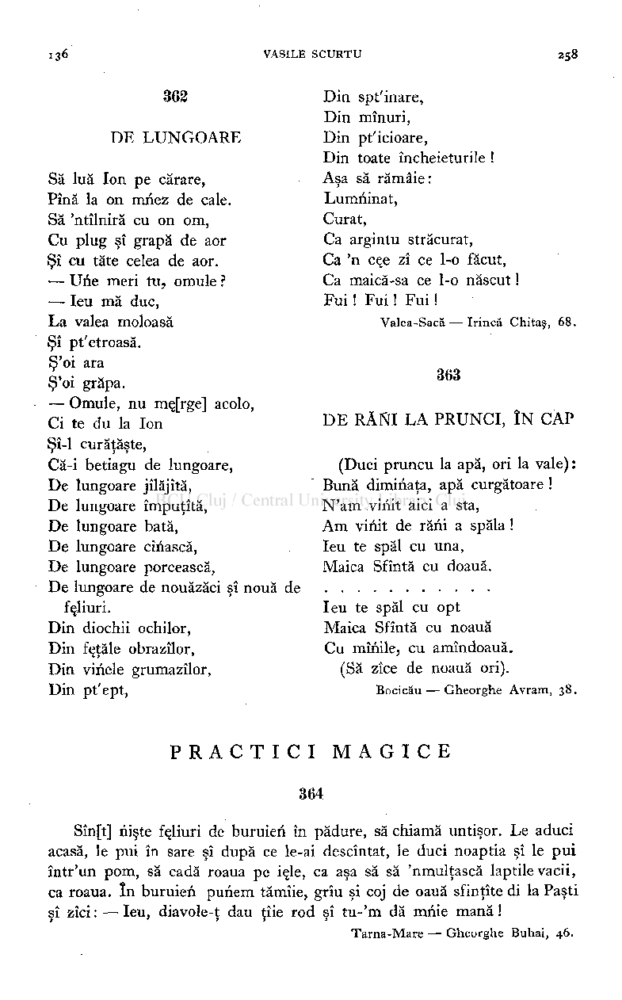

Din spt'inare, Din mînuri, Din pt'icioare, Din toate încheieturile ! Aşa să rămâie: Lumfiinat, Curat, Ca argintu străcurat, Ca 'n cee zî ce l-o făcut, Ca maică-sa ce l-o născut ! Fui ! Fui ! Fui !

DE LUNGOARE

Să luă Ion pe cărare, Pînă la on mhez de cale. Să 'ntîlniră cu on om, Cu plug şî grapă de aor Şî cu täte celea de aor.

— Une meri tu, omule ?

— Ieu mă duc, La valea moloasă Şî pt'etroasă. Ş'oi ara Ş'oi grapa.

Valea-Sacă — Irincă Chitaş, 68.

363

— Omule, nu meJYge] acolo, Ci te du la Ion Şî-1 curăţăşte, Că-i betiagu de lungoare, De lungoare jîlăjîtă, De lungoare împuţită, De lungoare bată, De lungoare cînască, De lungoare porcească, De lungoare de nouăzăci şî nouă de

DE RĂISfl L A PRUNCI, ÎN CAP

(Duci pruncu la apă, ori la vale): Bună diminaţa, apă curgătoare ! N'am vinit aici a sta, Am vinit de răni a spăla ! Ieu te spăl cu una, Maica Sfîntă cu doauă.

Ieu te spăl cu opt Maica Sfîntă cu noauă Cu mînile, cu amîndoauă.

fçliuri. Din diochii ochilor, Din fcţăle obrazîlor, Din vinele grumazilor, Din pt'ept,

(Să zîce de noauă ori).

Bocicău — Gheorghe Avram, 38.

###### PRACTIC I MAGIC E

364

Sîn[t] nişte fçliuri de buruien în pădure, să chiamă untişor. Le aduci

acasă, le pui în sare şî după ce le-ai descîntat, le duci noaptia şî le pui într'un pom, să cadă roaua pe iele, ca aşa să să 'nmulţască laptilevacii, ca roaua. în buruien punem tămîie, grîu şi coj de oauă sfinţite di la Paşti sî zîci : — leu, diavole-t dau tîie rod sî tu-'m dă mfiie mană !

Tarna-Mare — Gheorghe Buhai, 46.

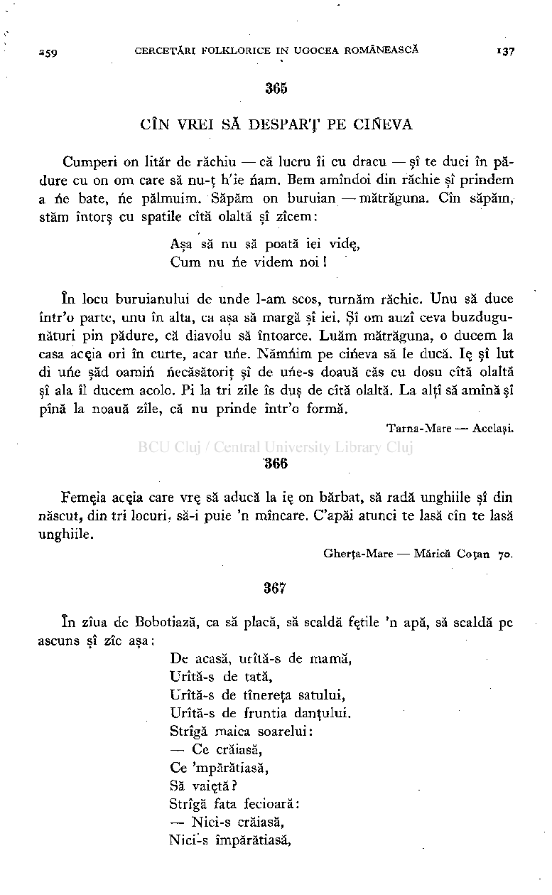

365

CÎN VREI SÄ DESPART PE CINEVA

Cumperi on lităr de rachiu — că lucru îi cu dracu —• şî te duci în pă­

dure cu on om care să nu-ţ h'ie ham. Bem amîndoi din răchie şî prindem a ne bate, ne pălmuim. Săpăm on buruian — mătrăguna. Cîn săpăm, stăm întors cu spatile cîtă olaltă şî zîcem:

Aşa să nu să poată iei vidç, Cum nu ne videm noi !

în locu buruianului de unde l-am scos, turnăm răchie. Unu să duce într'o parte, unu în alta, ca aşa să margă şî iei. Şî om auzî ceva buzdugunături pin pădure, că diavolu să întoarce. Luăm mătrăguna, o ducem la casa aceja ori în curte, acar une. Nămnim pe cineva să le ducă. Iç şî lut di une şăd oamin necăsătorit şî de ufie-s doauă căs cu dosu cîtă olaltă sî ala îl ducem acolo. Pi la tri zîle îs dus de cîtă olaltă. La altî să amînă sî pînă la noauă zîle, că nu prinde într'o formă.

Tarna-Mare — Acelaşi.

366

Femeia acçia care vre_ să aducă la iç on bărbat, să radă unghiile şî din născut, din tri locuri, să-i puie 'n mîncare. C'apăi atunci te lasă cîn te lasă unghiile.

Gherţa-Mare — Mărică Coţan 70.

367

în zîua de Bobotiază, ca să placă, să scaldă ferile 'n apă, să scaldă pe ascuns şî zîc aşa:

De acasă, urîtă-s de mamă, Urîtă-s de tată, Urîtă-s de tînereţa satului, Urîtă-s de fruntia danţului. Strigă maica soarelui:

— Ce crăiasă, Ce 'mpărătiasă, Să vaictă? Strigă fata fecioară:

— Nici-s crăiasă, Nici-s împărătiasă,

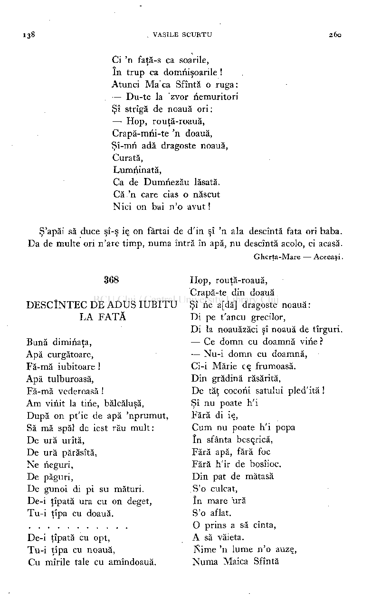

138 . VASIL E SCURT U 260

Ci 'n faţă-s ca soarile, în trup ca domriişoarile ! Atunci Maca Sfîntă o ruga: — Du-te la zvor nemuritori Şî strigă de noauă ori:

— Hop, rouţă-roauă, Crapă-mni-te 'n doauă, Şî-mn adă dragoste noauă, Curată, Lumninată, Ca de Dumnezău lăsată. Că 'n care cias o născut Nici on bai n'o avut !

Ş'apăi să duce şî-ş iç on fărtai de d'in şî 'n ala descîntă fata ori baba. Da de multe ori n'are timp, numa întră în apă, nu descîntă acolo, ci acasă.

Gherţa-Mare — Aceeaşi.

Hop, rouţă-roauă, Crapă-te din doauă Şî ne a[dă] dragoste noauă: Di pe t'ancu grecilor, Di la noauăzăci şî noauă de tîrguri.

368

DESCÎNTEC DE ADUS IUBITU LA FATĂ

— Ce domn cu doamnă vine ?

Bună diminaţa, Apă curgătoare, Fă-mă iubitoare ! Apă tulburoasă,

— Nu-i domn cu doamnă, Ci-i Mărie ce. frumoasă. Din grădină răsărită, De tăţ coconi satului pled'ită ! Şî nu poate h'i Fără di iç, Cum nu poate h'i popa în sfânta bescrică, Fără apă, fără foc Fără h'ir de bosîioc. Din pat de mătasă S'o culcat, în mare ură S'o aflat. O prins a să cîn ta, A să văieta. Nime 'n lume n'o auze., Numa Maica Sfîntă

- Fă-mă vederoasă ! Am vinit la tine, bălcăluşă, După on pt'ic de apă 'nprumut,

- Să mă spăl de iest rău mult: De ură urîtă, De ură părăsită, Ne neguri, De păguri, De gunoi di pi su mături. De-i ţipată ura cu on deget, Tu-i ţîpa cu doauă.

De-i ţipată cu opt, Tu-i ţîpa cu noauă, Cu mîrile tale cu amîndoauă.

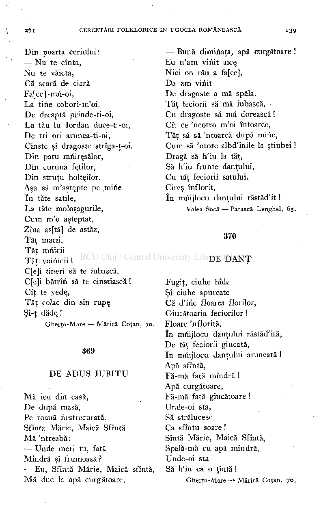

— Bună diminaţa, apă curgătoare ! Eu n'am vinit aicç Nici on rău a fa [ce], Da am vinit De dragoste a mă spăla. Tăţ feciorii să mă iubască, Cu dragoste să mă dorească ! Cît ce 'ncotro m'oi întoarce, Tăţ să să 'ntoarcă după mine, Cum să 'ntorc albd'inile la ştiubei ! Dragă să h'iu la tăţ, Să h'iu frunte danţului, Cu tăţ feciorii satului. Cireş înflorit, în mnijlocu danţului răstăd'it !

Din poarta ceriului:

— Nu te cînta, Nu te văieta, Că scară de ciară Fa[ce]-mn-oi, La tine coborî-m'oi. De dreaptă prinde-ti-oi, La tău lu Iordan duce-ti-oi, De tri ori arunca-ti-oi, Cinste şî dragoste strîga-ţ-oi. Din patu mriircsălor, Din curuna fetilor, Din struţu holtejlor. Aşa să m'aştcpte pe mine în täte satile, La täte moloşagurile, Cum m'o aşteptat, Zîua as[tă] de astăz,

Valea-Sacă — Parască Lenghel, 65.

370

- Tăţ marii, Tăţ mnicii Tăţ voinicii ! C[e]i tineri să te iubască, C[e]i bătrîn să te cinstiască ! Cîţ te vede_, Tăţ colac din sîn rupe, Şî-ţ dade. !

DE DAN Ţ

Fugit, ciuhe hîde Şî ciuhe spurcate Că d'irie floarea florilor, Giucătoaria feciorilor ! Floare 'nflorită, în mnijlocu danţului răstăd'ită, De tăţ feciorii giucată, în mnijlocu danţului aruncată ! Apă sfîntă, Fă-mă fată mîndră ! Apă curgătoare, Fă-mă fată giucătoare ! Unde-oi sta,

Gherţa-Mare — Mărică Coţan, 70.

369

DE ADUS IUBITU

Mă ieu din casă, De după masă, Pe roauă riestrecurată. Sfînta Mărie, Maică Sfîntă Mă 'ntreabă:

- Să strălucesc, Ca sfîntu soare ! Sîntă Mărie, Maică Sfîntă, Spală-mă cu apă mîndră, Unde-oi sta

— Unde meri tu, fată Mîndră şî frumoasă ?

— Eu, Sfîntă Mărie, Maică sfîntă, Mă duc la apă curgătoare.

- Să h'iu ca o ţîntă ! Gherţa-Mare —^ Mărică Coţan, 70.

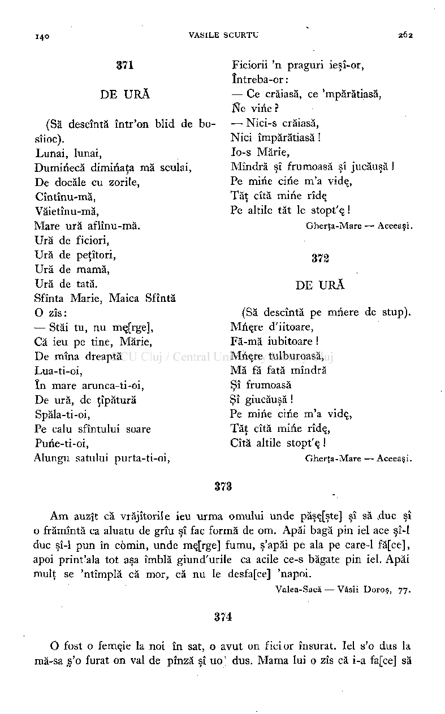

Ficiorii 'n praguri ieşî-or, întreba-or:

— Ce crăiasă, ce 'mpărătiasă, Ne vine ?

DE URĂ

— Nici-s crăiasă, Nici împărătiasă ! Io-s Mărie, Mîndră şî frumoasă şî jucăuşă ! Pe mine cine m'a vide_,

(Să descîntă într'on blid de bosîioc). Lunai, lunai, Duminecă dimiriaţa mă sculai, De docăle cu zorile, Cîntînu-mă, Văietînu-mă, Mare ură aflînu-mă. Ură de ficiori, Ură de peţitori, Ură de mamă, Ură de tată. Sfîntă Marie, Maica Sfîntă O zîs:

- Tăţ cîtă mine rîde. Pe altile tăt le stopt'ç !

Gherţa-Mare — Aceeaşi.

372

DE URĂ

(Să descîntă pe mnere de stup). Mnçre d'iitoare, Fă-mă iubitoare ! Mnçre tulburoasă, Mă fă fată mîndră Şî frumoasă Şî giucăuşă ! Pe mine cine m'a vidç,

— Stăi tu, nu mejjrge], Că ieu pe tine, Mărie, De mîna dreaptă Lua-ti-oi, în mare arunca-ti-oi, De ură, de ţîpătură Spăla-ti-oi, Pe calu sfîntului soare Pune-ti-oi, Alungu satului purta-ti-oi,

- Tăţ cîtă mine rîdç, Cîtă altile stopt'e. !

Gherţa-Mare — Aceeaşi.

373

Am auzjt că vrăjitoriie ieu urma omului unde păşe_[şte] şî să 4uc şî o frămîntă ca aluatu de grîu şî fac formă de om. Apăi bagă pin iei ace şî-1 duc şî-1 pun în cömin, unde mejrge] fumu, ş'apăi pe ala pe care-1 fă[ce], apoi print'ala tot aşa îmbla giund'urile ca acile ce-s băgate pin iei. Apăi mulţ se 'ntîmplă că mor, că nu le desfa[ce] 'napoi.

Valea-Sacă — Văsîi Doroş, 77.

374

O fost o femçie la noi în sat, o avut on ficior însurat. Iei s'o dus la mă-sa s'o furat on val de pînză şî uo ' dus. Mama lui o zîs că i-a fa[ce] să

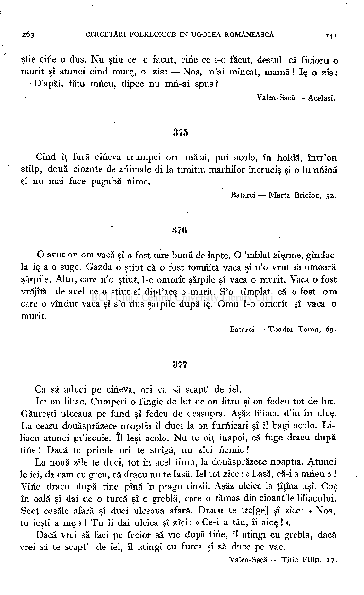

ştie cine o dus. Nu ştiu ce o făcut, cine ce i-o făcut, destul că ficioru o murit şî atunci cînd mure,, o zîs: — Noa, m'ai mîncat, mamă! Iç o zîs: — D'apăi, fătu mheu, dipce nu mh-ai spus ?

Valea-Sacă — Acelaşi.

375

Cînd îţ fură cineva crumpei ori mălai, pui acolo, în holdă, într'on stîlp, două cioante de animale di la timitiu marhilor încruciş şi o lumhină şî nu mai face pagubă hime.

Batarci — Marta Bricioc, 52.

376

O avut on om vacă şî o fost tare bună de lapte. O 'mblat ziçrme, gîndac la iç a o suge. Gazda o ştiut că o fost tomhită vaca şî n'o vrut să omoară şărpile. Altu, care n'o ştiut, l-o omorît şărpile şî vaca o murit. Vaca o fost vrăjită de acel ce o ştiut şî dipt'acç o murit. S'o tîmplat că o fost om care o vîndut vaca şî s'o dus şărpile după iç. Omu l-o omorît şî vaca o murit.

Batarci — Toader Torna, 69.

377

Ca să aduci pe cineva, ori ca să scapt' de iei. Iei on liliac. Cumperi o fingie de lut de on litru şî on fedeu tot de lut.

- Găureşti ulceaua pe fund şî fedeu de deasupra. Aşăz liliacu d'iu în ulce,. La ceasu douăsprăzece noaptia îl duci la on furnicari şî îl bagi acolo. Liliacu atunci pt'iscuie. îl Ieşi acolo. Nu te uiţ înapoi, că fuge dracu după tine ! Dacă te prinde ori te strigă, nu zici hemic !

La nouă zîle te duci, tot în acel timp, la douăsprăzece noaptia. Atunci le iei, da cam cu greu, că dracu nu te lasă. Iei tot zîce : « Lasă, că-i a mheu » ! Vine dracu după tine pînă 'n pragu tinzii. Aşăz ulcica la ţîţîna uşî. Coţ în oală şî dai de o furcă şî o greblă, care o rămas din cioantile liliacului. Scoţ oasăle afară şî duci ulceaua afară. Dracu te trafge] şî zîce : « Noa, tu ieşti a mç » ! Tu îi dai ulcica şî zîci : « Ce-i a tău, îi aice, ! ».

Dacă vrei să faci pe fecior să vie după tine, îl atingi cu grebla, dacă vrei să te scapt' de iei, îl atingi cu furca şî să duce pe vac.

Valea-Sacă — Titie Filip, 17.

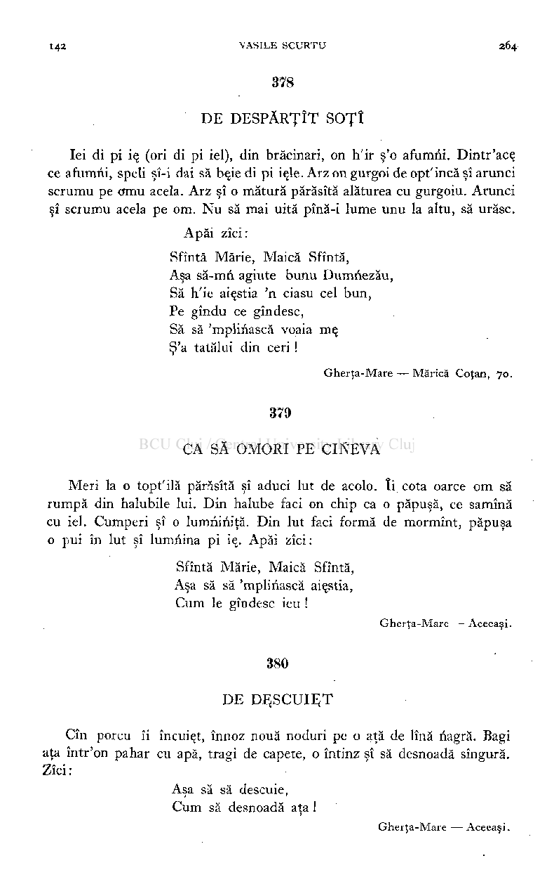

378

DE DESPARTÎT SOŢÎ

Iei di pi iç (ori di pi iei), din brăcinari, on h'ir ş'o afumrii. Dintr'acç ce afumni, speli şî-i dai să be_ie di pi içle. Arz on gurgoi de opt'incă şî arunci scrumu pe amu acela. Arz şî o mătură părăsită alăturea cu gurgoiu. Arunci şî scrumu acela pe om. Nu să mai uită pînă-i lume unu la altu, să urăsc.

Apăi zîci:

Sfîntă Mărie, Maică Sfîntă, Aşa să-mn agiute bunu Dumnezău, Să h'ie aiçstia 'n ciasu cel bun, Pe gîndu ce gîndesc, Să să 'mpliriască voaia mç Ş'a tatălui din ceri !

Gherţa-Mare — Mărică Coţan, 70.

379

CA SÄ OMORI PE CINEVA

Meri la o topt'ilă părăsită şî aduci lut de acolo. îi cota oarce om să rumpă din halubile lui. Din halube faci on chip ca o păpuşă, ce samînă cu iei. Cumperi şî o lumiîiriiţă. Din lut faci formă de mormînt, păpuşa o pui în lut şî lumiîina pi ie.. Apăi zîci:

Sfîntă Mărie, Maică Sfîntă, Aşa să să 'mplinască aiçstia, Cum le gîndesc ieu !

Gherţa-Mare — Aceeaşi.

380

DE DESCUIE.T

Cîn porcu îi încuiçt, înnoz nouă noduri pe o aţă de lînă nagră. Bagi aţa într'on pahar cu apă, tragi de capete, o întinz şî să desnoadă singură. Zîci :

Aşa să să descuie, Cum să desnoadă aţa !

Gherţa-Mare — Aceeaşi.

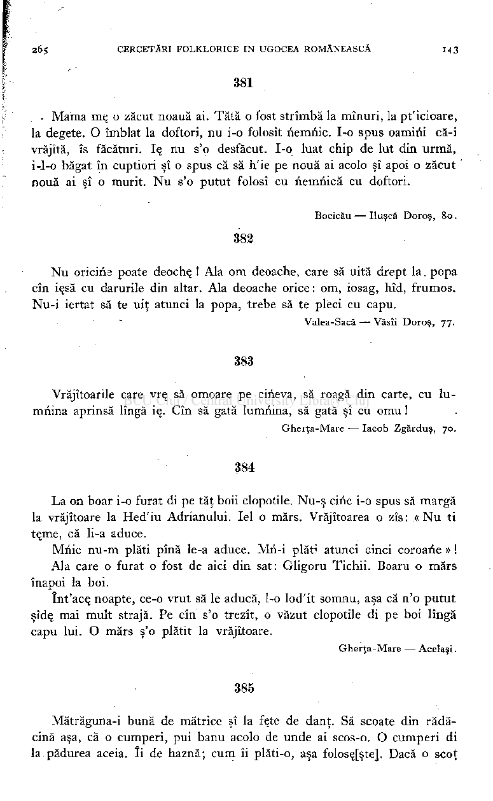

381

. Mama me. o zăcut noauă ai. Tătă o fost strîmbă la mînuri, la pt'ici oare, la degete. O îmbiat la doftori, nu i-o folosit riemnic. I-o spus oamini că-i vrăjită, îs făcături. Iç nu s'o desfăcut. I-o luat chip de lut din urmă, i-l-o băgat în cuptiori şî o spus că să h'ie pe nouă ai acolo şî apoi o zăcut nouă ai şî o murit. Nu s'o putut folosi cu nemnică cu doftori.

Bocicău — Iluşcă Doroş, 80.

382

Nu oricine poate deoche. ! Ala om deoache, care să uită drept la. popa cîn ie_să cu darurile din altar. Ala deoache orice: om, iosag, hîd, frumos. Nu-i iertat să te uiţ atunci la popa, trebe să te pleci cu capu.

Valea-Sacă — Văsîi Doroş, 77.

383

Vrăjîtoarile care vre. să omoare pe cineva, să roagă din carte, cu lumhina aprinsă lîngă iç. Cîn să gată lumnina, să gată şî cu omu !

Gherţa-Mare — Iacob Zgărduş, 70.

384

La on boar i-o furat di pe tăţ boii clopotile. Nu-ş cine i-o spus să margă la vrăjitoare la Hed'iu Adrianului. Iei o mărs. Vrăjitoarea o zîs: «Nu ti te.me, că li-a aduce.

Mriie nu-m plăti pînă le-a aduce. Mri-i plăt< atunci cinci coroane » ! Ala care o furat o fost de aici din sat: Gligoru Tichii. Boaru o mărs

înapoi la boi.

înt'ace. noapte, ce-o vrut să le aducă, l-o lod'it somnu, aşa că n'o putut şîde. niai mult strajă. Pe cîn s'o trezit, o văzut clopotile di pe boi lîngă capu lui. O mărs ş'o plătit la vrăjitoare.

Gherţa-Mare — Acelaşi.

385

Mătrăguna-i bună de matrice şî la fçte de danţ. Să scoate din rădăcină aşa, că o cumperi, pui banu acolo de unde ai scos-o. O cumperi di la pădurea aceia. îi de haznă; cum îi plăti-o, aşa folose.[şte]. Dacă o scoţ

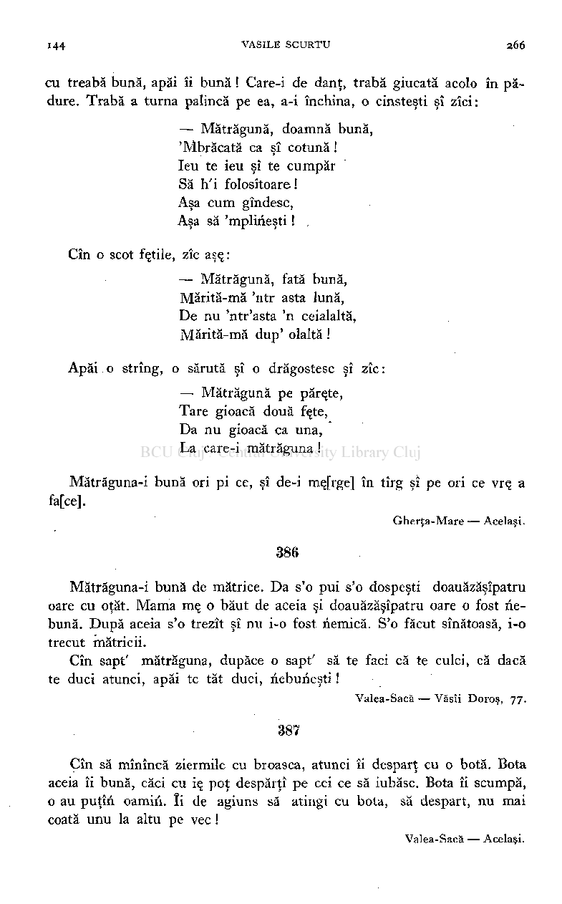

cu treabă bună, apăi îi bună ! Care-i de danţ, trabă giucată acolo în pădure. Trabă a turna palincă pe ea, a-i închina, o cinsteşti şî zîci:

— Mătrăgună, doamnă bună, 'Mbrăcată ca şî cotună ! leu te ieu şî te cumpăr Să h'i folositoare ! Aşa cum gîndesc, Aşa să 'mplineşti ! .

Cîn o scot fçtile, zîc aşe,:

— Mătrăgună, fată bună, Mărită-mă 'ntr asta lună, De nu 'ntr'asta 'n ceialaltă, Mărită-mă dup' olaltă !

Apăi o strîng, o sărută şî o drăgostesc şî zîc:

— Mătrăgună pe părete, Tare gioacă două fete, Da nu gioacă ca una, La care-i mătrăguna !

Mătrăguna-i bună ori pi ce, şî de-i mçfrge] în tîrg şî pe ori ce vre, a fa[ce].

Gherţa-Mare — Acelaşi.

386

Mătrâguna-i bună de matrice. Da s'o pui s'o dospeşti doauăzăşîpatru oare cu oţăt. Mama mç o băut de aceia şi doauăzăşîpatru oare o fost nebună. După aceia s'o trezît şî nu i-o fost riemică. S'o făcut sînătoasă, i-o trecut mătricii.

Cîn sapt' mătrăguna, dupăce o sapt' să te faci că te culci, că dacă te duci atunci, apăi te tăt duci, nebuneşti !

Valea-Sacă — Văsîi Doroş, 77.

387

Cîn să mînîncă ziermile cu broasca, atunci îi despart cu o botă. Bota aceia îi bună, căci cu iç poţ despărţi pe cei ce să iubăsc. Bota îi scumpă, o au puţîn oamin. îi de agiuns să atingi cu bota, să despart, nu mai coată unu la altu pe vec !

Valea-Sacă — Acelaşi.

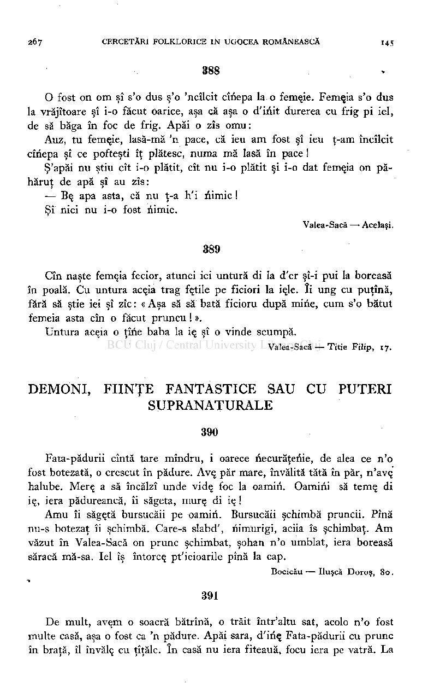

38 8

O fost on om şî s'o dus ş'o 'ncîlcit cînepa la o femçie. Femçia s'o dus la vrăjitoare şî i-o făcut oarice, aşa că aşa o d'ihit durerea cu frig pi iei, de să băga în foc de frig. Apăi o zîs omu:

Auz, tu femeie, lasă-mă 'n pace, că ieu am fost şî ieu ţ-am încîlcit cînepa şî ce pofteşti îţ plătesc, numa mă lasă în pace !

Ş'apăi nu ştiu cit i-o plătit, cît nu i-o plătit şi i-o dat femçia on păhăruţ de apă şî au zîs:

— Bç apa asta, că nu ţ-a h'i nimic ! Şî nici nu i-o fost nimic.

Valea-Sacă — Acelaşi.

389

Cîn naşte femeja fecior, atunci iei untură di la d'er şî-i pui la boreasă în poală. Cu untura aceja trag fetile pe ficiori la içle. îi ung cu puţină, fără să ştie iei şî zîc : « Aşa să să bată f icioru după mine, cum s'o bătut femeia asta cîn o făcut pruncu ! ».

Untura aceja o ţîhe baba la iç şî o vinde scumpă.

Valea-Sacă — Titie Filip, 17.

#### DEMONI, FIINŢE FANTASTICE SAU CU PUTERI SUPRANATURALE

390

Fata-pădurii cîntă tare mîndru, i oarece necurăţenie, de alea ce n'o fost botezată, o crescut în pădure. Avç păr mare, învălită tătă în păr, n'ave, halube. Mere, a să încălzi unde vide, foc la oamih. Oamini să teme, di iç, iera pădureancă, îi săgeta, murç di iç !

Amu îi săgctă bursucau pe oamih. Bursucau schimbă pruncii. Pînă nu-s botezat îi schimbă. Care-s slabd', himurigi, aciia îs schimbat. Am văzut în Valea-Sacă on prunc schimbat, şohan n'o umblat, iera boreasă săracă mă-sa. Iei îş întorcç pt'icioarile pînă la cap.

Bocicău — Iluşcă Doroş, 80.

391

De mult, avem o soacră bătrînă, o trăit într'altu sat, acolo n'o fost multe casă, aşa o fost ca 'n pădure. Apăi sara, d'iriç Fata-pădurii cu prunc în braţă, îl învălc cu ţîţăle. în casă nu iera fiteauă, focu iera pe vatră. La

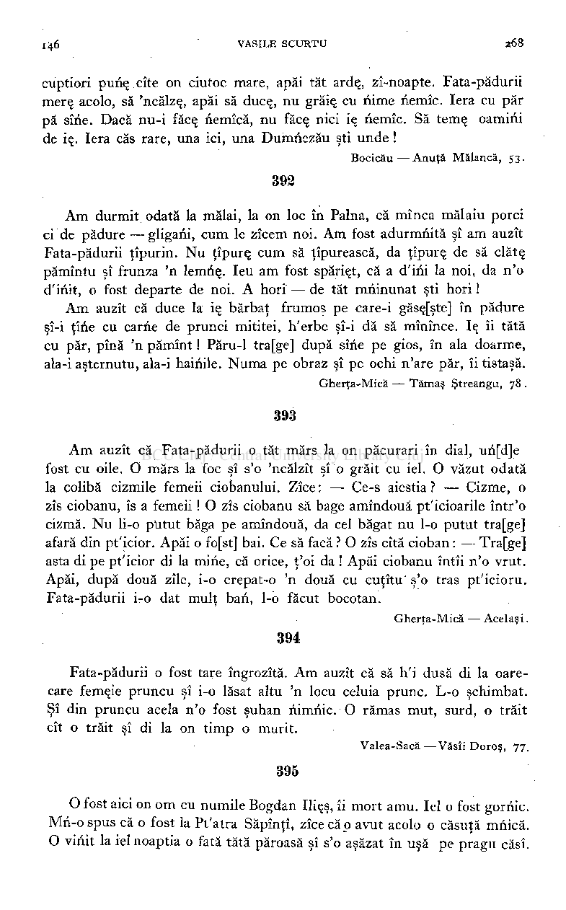

cuptiori pune. cîte on ciutoc mare, apăi tăt arde., zî-noapte. Fata-pădurii mere. acolo, să 'ncălze., apăi să duce., nu grăie. cu riime hemîc. Iera cu păr pă sine. Dacă nu-i făce. nemîcă, nu face. nici ie. nemîc. Să teme. oamini de iç. Iera căs rare, una ici, una Dumnezău şti unde !

Bocicău—Anuţ ă Mălancă, 53.

392

Am durmit odată la mălai, la on loc în Palna, că mînca mălaiu porci ci de pădure — gligani, cum le zîcem noi. Am fost adurmnită şî am auzît Fata-pădurii ţîpurin. Nu ţîpure. cum să ţîpurească, da ţîpure. de să clăte. pămîntu şî frunza 'n lemne.. Ieu am fost spărict, că a d'ini la noi, da n'o d'init, o fost departe de noi. A hori — de tăt mninunat şti hori !

Am auzît că duce la ie. bărbat frumos pe care-i găse.[şte] în pădure şî-i ţîhe cu carne de prunci mititei, h'erbe şî-i dă să mînînce. Ie. îi tătă cu păr, pînă 'n pămînt ! Păru-1 tra[ge] după sîrie pe gios, în ala doarme, ala-i aşternutu, ala-i haihile. Numa pe obraz şî pe ochi n'are păr, îi tistaşă.

Gherţa-Mică — Tămaş Ştreangu, 78 .

393

Am auzît că Fata-pădurii o tăt mars la on păcurari în dial, un[d]e

fost cu oile. O mărs la foc şî s'o 'ncălzît şî o grăit cu iei. O văzut odată la colibă cizmile femeii ciobanului. Zîce: — Ce-s aieştia? — Cizme, o zîs ciobanu, îs a femeii ! O zîs ciobanu să bage amîndouă pt'icioarile într'o cizmă. Nu li-o putut băga pe amîndouă, da cel băgat nu l-o putut tra[ge] afară din pt'icior. Apăi o fo[st] bai. Ce să facă ? O zîs cîtă cioban : — Trafge] asta di pe pt'icior di la mine, că orice, ţ'oi da ! Apăi ciobanu întîi n'o vrut. Apăi, după două zîle, i-o crepat-o 'n două cu euţîtu' ş'o tras pt'icioru. Fata-pădurii i-o dat mulţ ban, l-o făcut bocotan.

Gherţa-Mică — Acelaş i.

394

Fata-pădurii o fost tare îngrozită. Am auzît că să h'i dusă di la oarecare fernere pruncu şî i-o lăsat altu 'n locu celuia prunc. L-o schimbat. Şî din pruncu acela n'o fost şuhan nimriic. O rămas mut, surd, o trăit cît o trăit şî di la on timp o murit.

Valea-Sacă—Văsîi Doroş, 77.

395

O fost aici on om cu numile Bogdan Uiejş, îi mort amu. Iei o fost goriîic. Mri-o spus că o fost la Pt'atra Săpînţî, zîce căp avut acolo o căsuţă mnică. O viiîit la iei noaptia o fată tătă păroasă şî s'o aşăzat în uşă pe pragu căsî.

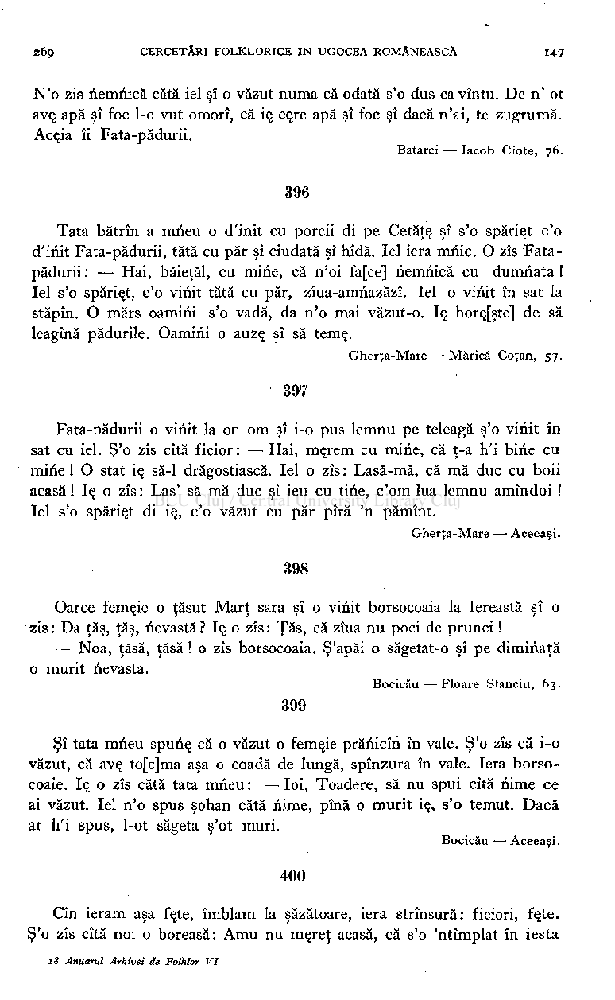

- N'o zis nemnică cătă iei şî o văzut numa că odată s'o dus ca vîntu. De n' ot avç apă şî foc l-o vut omorî, că iç cere apă şî foc şî dacă n'ai, te zugrumă.

Acçia îi Fata-pădurii.

Batarci — Iacob Ciote, 76.

396

Tata bătrîn a mneu o d'init cu porcii di pe Cetăţc şî s'o spăriet c'o d'init Fata-pădurii, tătă cu păr şî ciudată şî hîdă. Iei iera mfiic. O zîs Fatapădurii : —• Hai, băieţăl, cu mine, că n'oi fa[ce] nemnică cu dumnata ! Iei s'o spăriet, c'o vinit tătă cu păr, zîua-amfiazăzî. Iei o vinit în sat la

- stăpîn. O mărs oamini s'o vadă, da n'o mai văzut-o. Iç horejşte] de să leagînă pădurile. Oamini o auzç şî să temç.

Gherţa-Mare — Mărică Coţan, 57.

397

Fata-pădurii o vinit la on om şî i-o pus lemnu pe teleagă ş'o vinit în sat cu iei. Ş'o zîs cîtă ficior : — Hai, merem cu mine, că ţ-a h'i bine cu mine ! O stat iç să-1 drăgostiască. Iei o zîs : Lasă-mă, că mă duc cu boii acasă ! Iç o zîs : Las' să mă duc şî ieu cu tine, c'om lua lemnu amîndoi ! Iei s'o spărict di iç, c'o văzut cu păr pîră 'n pămînt.

Gherţa-Mare — Aceeaşi.

398

Oarce femçie o ţăsut Marţ sara şî o vinit borsocoaia la fereastă şî o zis : Da ţăş, ţăş, nevastă ? Iç o zîs : Ţăs, că zîua nu poci de prunci !

— Noa, ţăsă, ţăsă ! o zîs borsocoaia. Ş'apăi o săgetat-o şî pe diminaţă

- o murit nevasta. Bocicău — Floare Stanciu, 63.

399

Şî tata mrieu spunç că o văzut o femçie prănicîn în vale. Ş'o zîs că i-o văzut, că avç to[c]ma aşa o coadă de lungă, spînzura în vale. Iera borsocoaie. Iç o zîs cătă tata mneu : — loi, Toadere, să nu spui cîtă nime ce ai văzut. Iei n'o spus şohan cătă riime, pînă o murit iç, s'o temut. Dacă ar h'i spus, 1-ot săgeta ş'ot muri.

Bocicău —Aceeaşi.

400

Cîn ieram aşa fçte, îmblam la şăzătoare, iera strînsură: ficiori, fçte. Ş'o zîs cîtă noi o boreasă: Amu nu mcreţ acasă, că s'o 'ntîmplat în iesta

28 Anuarul Arhivei de Folklor VI

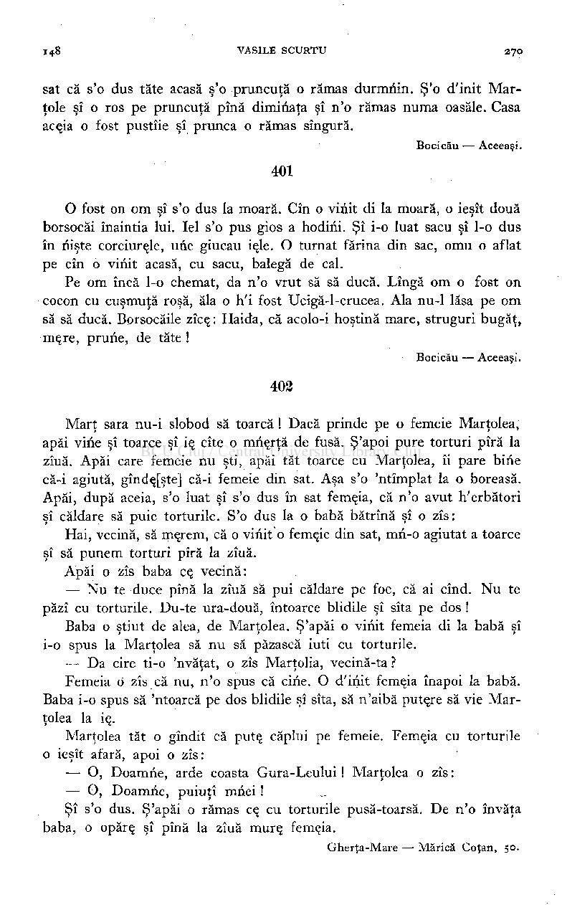

sat că s'o dus täte acasă ş'o pruncuţă o rămas durmfiin. Ş'o d'init Marţole şî o ros pe pruncuţă pînă diminaţa şî n'o rămas numa oasăle. Casa aceja o fost pustîie şî prunca o rămas sîngură.

Bocicău — Aceeaşi.

401

O fost on om şî s'o dus la moară. Cîn o vinit di la moară, o ieşît două borsocăi înaintia lui. Iei s'o pus gios a hodini. Şî i-o luat sacu şî l-o dus în nişte corciurçle, une giucau ie_le. O turnat fărina din sac, omu o aflat pe cîn o vinit acasă, cu sacu, balegă de cal.

Pe om încă l-o chemat, da n'o vrut să să ducă. Lîngă om o fost on cocon cu cuşmuţă roşă, ăla o h'i fost Ucigă-l-crucea. Ala nu-1 lăsa pe om să să ducă. Borsocăile zîce.: Haida, că acolo-i hoştină mare, struguri bugăţ, me. re, prune, de täte !

Bocicău — Aceeaşi.

402

Marţ sara nu-i slobod să toarcă ! Dacă prinde pe o femeie Marţolea, apăi vine şî toarce şî ie. cîte o mncrţă de fusă. Ş'apoi pure torturi pîră la zîuă. Apăi care femeie nu şti, apăi tăt toarce cu Marţolea, îi pare bine că-i agiută, gîndc[şte] că-i femeie din sat. Aşa s'o 'ntîmplat la o boreasa. Apăi, după aceia, s'o luat şî s'o dus în sat femçia, că n'o avut h'erbători şî căldare să puie torturile. S'o dus la o babă bătrînă şî o zîs:

Hai, vecină, să mçrem, că o vinit o femeje din sat, mn-o agiutat a toarce şî să punem torturi pîră la zîuă.

Apăi o zîs baba ce. vecină:

— Nu te duce pînă la zîuă să pui căldare pe foc, că ai cînd. Nu te păzî cu torturile. Du-te ura-două, întoarce blidile şî sîta pe dos !

Baba o ştiut de alea, de Marţolea. Ş'apăi o vinit femeia di la babă şî i-o spus la Marţolea să nu să păzască iuti cu torturile. — Da cire ti-o 'nvăţat, o zîs Marţolia, vecină-ta ? Femeia o zîs că nu, n'o spus că cine. O d'init femçia înapoi la babă.

Baba i-o spus să 'ntoarcă pe dos blidile şî sîta, să n'aibă putçre să vie Marţolea la iç.

Marţolea tăt o gîndit că pute. căplui pe femeie. Femçia cu torturile o ieşît afară, apoi o zîs:

•— O, Doamne, arde coasta Gura-Leului ! Marţolea o zîs :

— O, Doamne, puiuţî mriei ! Şî s'o dus. Ş'apăi o rămas ce. cu torturile pusă-toarsă. De n'o învăţa

baba, o opărc şî pînă la zîuă mure, femeja.

Gherţa-Mare — Mărică Coţan, 50.

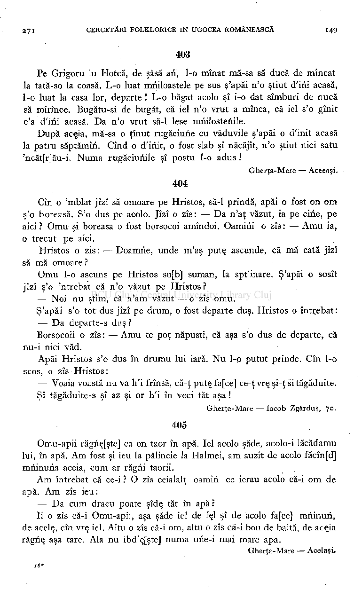

403

Pe Grigoru lu Hotcă, de şăsă an, l-o mînat mă-sa să ducă de mîncat

la tată-so la coasă. L-o luat mniloastele pe sus ş'apăi n'o ştiut d'ini acasă, l-o luat la casa lor, departe ! L-o băgat acolo şî i-o dat sîmburi de nucă să mîrînce. Bugătu-sî de bugăt, că iei n'o vrut a mînca, că iei s'o gînit c'a d'ini acasă. Da n'o vrut să-1 lese mriilostenile.

După acçia, mă-sa o ţînut rugăciune cu văduvile ş'apăi o d'init acasă la patru săptămîn. Cînd o d'init, o fost slab şî năcăjit, n'o ştiut nici satu 'ncăt[r]ău-i. Numa rugăciunile şî postu l-o adus !

Gherţa-Mare — Aceeaşi. .

404

Cîn o 'mblat jîzî să omoare pe Hristos, să-1 prindă, apăi o fost on om ş'o boreasă. S'o dus pe acolo. Jîzî o zîs: — Da n'aţ văzut, ia pe cine, pe aici ? Omu şi boreasă o fost borsocoi amîndoi. Oamini o zîs: — Amu ia, o trecut pe aici.

Hristos o zîs : — Doamne, unde m'aş pute, ascunde, că mă cată jîzî să mă omoare ?

Omu l-o ascuns pe Hristos su[b] suman, la spt'inare. Ş'apăi o sosît jîzî ş'o 'ntrebat că n'o văzut pe Hristos ?

— Noi nu ştim, că n'am văzut — o zîs omu. Ş'apăi s'o tot dus jîzî pe drum, o fost departe duş. Hristos o întrebat:

— Da departe-s duş ? Borsocoii o zîs : — Amu te poţ năpusti, că aşa s'o dus de departe, că

nu-i nici văd.

Apăi Hristos s'o dus în drumu lui iară. Nu l-o putut prinde, Cîn l-o scos, o zîs Hristos :

— Voaia voastă nu va h'i frînsă, că-ţ pute, fa[ce] ce-ţvrcşî-ţ si tăgăduite. Şî tăgăduite-s şî az şi or h'i în veci tăt aşa !

Gherţa-Mare — Iacob Zgărduş, 70.

405

Omu-apii răgnc[şte] ca on taor în apă. Iei acolo şăde, acolo-i lăcădamu lui, în apă. Am fost şi ieu la pălincie la Halmei, am auzît de acolo făcîn[d] mriinuria aceia, cum ar răgni taorii.

Am întrebat că ce-i ? O zîs ceialalţ oamin ce ierau acolo că-i om de apă. Am zîs ieu:

— Da cum dracu poate şîde, tăt în apă? Ii o zîs că-i Omu-apii, aşa şăde iei de fej şî de acolo fa[ce] mhinuri,

de acele,, cîn vre. iei. Altu o zîs că-i om, altu o zîs că-i bou de baltă, de aceja

- răgrie. aşa tare. Ala nu ibd'efşte] numa une-i mai mare apa. Gherţa-Mare — Acelaşi.

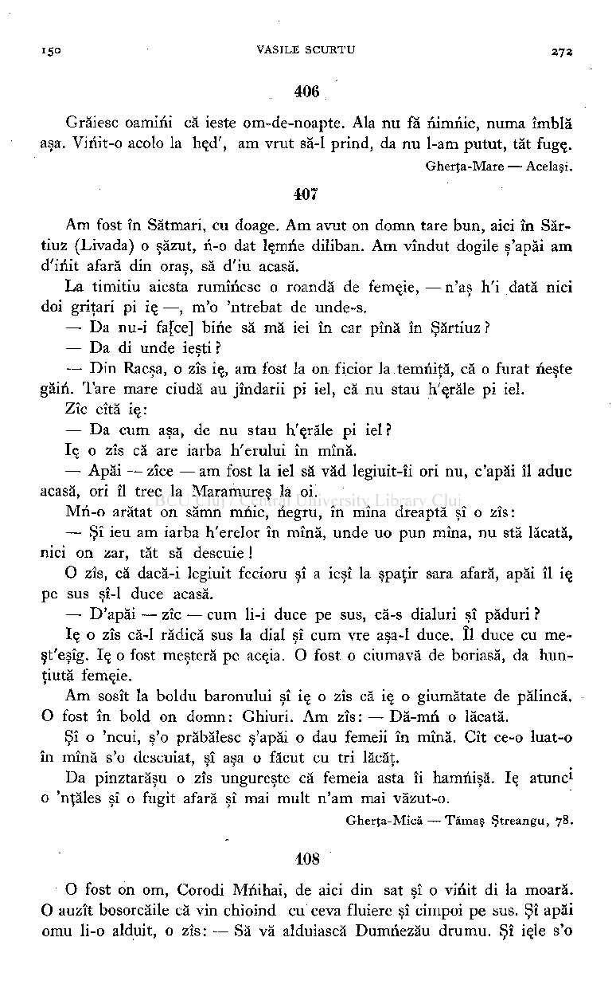

VASILE SCURT U 272

406

Grăiesc oamifii că ieste om-de-noapte. Ala nu fă nimriic, numa îmbla aşa. Viriit-o acolo la hed', am vrut să-1 prind, da nu l-am putut, tăt fuge,.

Gherţa-Mare — Acelaşi.

407

Am fost în Sătmari, cu doage. Am avut on domn tare bun, aici în Sărtiuz (Livada) o şăzut, n-o dat lçmne diliban. Am vîndut dogile ş'apăi am d'iriit afară din oraş, să d'iu acasă.

La timitiu aiesta rumîriesc o roandă de femçie, —n'aş h'i dată nici doi griţari pi iç —, m'o 'ntrebat de unde-s.

—• Da nu-i fa[ce] bine să mă iei în car pînă în Şărtiuz ?

— Da di unde ieşti ?

—• Din Racşa, o zîs iç, am fost la on ficior la temniţă, că o furat neşte găiri. Tare mare ciudă au jîndarii pi iei, că nu stau h'erăle pi iei.

Zîc cîtă iç:

— Da cum aşa, de nu stau h'crăle pi iei ? Ie, o zîs că are iarba h'erului în mînă.

— Apăi — zîce — am fost la iei să văd legiuit-îi ori nu, c'apăi îl aduc acasă, ori îl trec la Maramureş la oi.

Mri-o arătat on sămn mnie, negru, în mîna dreaptă şî o zîs:

— Şî ieu am iarba h'erelor în mînă, unde uo pun mîna, nu stă lăcată, nici on zar, tăt să descuie !

O zîs, că dacă-i legiuit fecioru şî a ieşî la şpaţir sara afară, apăi îl iç pe sus şî-1 duce acasă.

— D'apăi — zîc — cum li-i duce pe sus, că-s dialuri şî păduri ? Iç o zîs că-1 rădică sus la dial şî cum vre aşa-1 duce. îl duce cu me-

şt'eşîg. Iç o fost meşteră pe acçia. O fost o ciumavă de boriasă, da hunţiută femçie.

Am sosît la boldu baronului şî iç o zîs că iç o giumătate de palincă. O fost în bold on domn: Ghiuri. Am zîs: —Dă-mn o lăcată.

Şî o 'ncui, ş'o prăbălesc ş'apăi o dau femeii în mînă. Cît ce-o luat-o în mînă s'o descuiat, şî aşa o făcut cu tri lăcăţ.

Da pinztarăşu o zîs ungureşte că femeia asta îi hamfiişă. Iç atunc

1

o 'nţăles şî o fugit afară şî mai mult n'am mai văzut-o.

Gherţa-Mică—• Tămaş Ştreangu, 78.

408

O fost on om, Corodi Mriihai, de aici din sat şî o vinit di la moară. O auzît bosorcăile că vin chioind cu ceva fluiere şî cimpoi pe sus. Şî apăi omu li-o alduit, o zîs: — Să vă alduiască Dumnezău drumu. Şî içle s'o

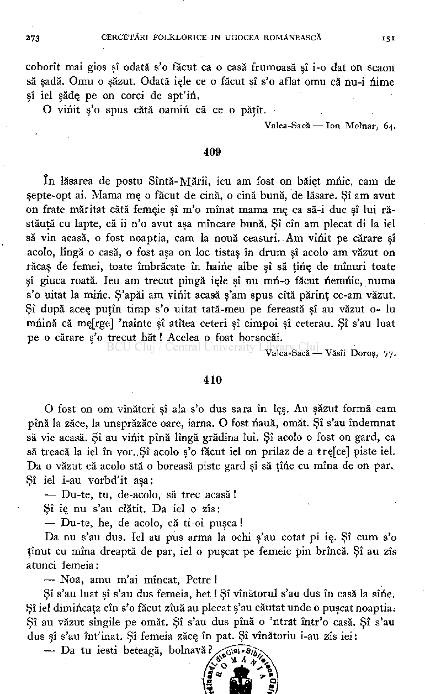

coborît mai gios şî odată s'o făcut ca o casă frumoasă şî i-o dat on scaon

- să şadă. Omu o şăzut. Odată ide ce o făcut şî s'o aflat omu că nu-i nime şî iei şăde_ pe on corci de spt'iri.

O vinit ş'o spus cătă oamin că ce o păţît.

Valea-Sacă — Ion Molnar, 64.

409

în lăsarea de postu Sîntă-Mării, ieu am fost on băict mnic, cam de şepte-opt ai. Mama mç o făcut de cină, o cină bună, de lăsare. Şî am avut on frate măritat cătă femde şî m'o mînat mama mç ca să-i duc şî lui ră-

- stăuţă cu lapte, că ii n'o avut aşa mîncare bună. Şî cîn am plecat di la iei să vin acasă, o fost noaptia, cam la nouă ceasuri.-Am vinit pe cărare şî acolo, lîngă o casă, o fost aşa on loc tistaş în drum şî acolo am văzut on

- răcaş de femei, toate îmbrăcate în haine albe şî să ţînc de mînuri toate şî giuca roată. Ieu am trecut pingă içle şî nu mn-o făcut nemriic, numa s'o uitat la mine. Ş'apăi am vinit acasă ş'am spus cîtă părinţ ce-am văzut. Şî după aceç puţîn timp s'o uitat tată-meu pe fereastă şî au văzut o- lu mnină că mejrge] 'nainte şî atîtea ceteri şî cimpoi şî cetërau. Şî s'au luat pe o cărare ş'o trecut hăt ! Acelea o fost borsocăi.

Valea-Sacă — Văsîi Doroş, 77.

410

O fost on om vînători şî ala s'o dus sara în lcş. Au şăzut formă cam pînă la zace, la unsprăzăce oare, iarna. O fost riauă, omăt. Şî s'au îndemnat

- să vie acasă. Şî au vinit pînă lîngă grădina lui. Şî acolo o fost on gard, ca să treacă la iei în vor..Şî acolo ş'o făcut iei on prilaz de a trejce] piste iei. Da o văzut că acolo stă o boreasă piste gard şî să ţîne cu mîna de on par. Şî iei i-au vorbd'it aşa:

— Du-te, tu, de-acolo, să trec acasă ! Şî iç nu s'au clătit. Da iei o zîs:

— Du-te, he, de acolo, că ti-oi puşca ! Da nu s'au dus. Iei au pus arma la ochi ş'au cotat pi iç. Şî cum s'o

ţînut cu mîna dreaptă de par, iei o puşcat pe femeie pin brîncă. Şî au zîs atunci femeia:

— Noa, amu m'ai mîncat, Petre ! Şî s'au luat şî s'au dus femeia, het ! Şî vînătorul s'au dus în casă la sîrie. Şî iei dimineaţa cîn s'o făcut zîuă au plecat ş'au căutat unde o puşcat noaptia. Şî au văzut sîngile pe omăt. Şî s'au dus pînă o 'ntrât într'o casă. Şî s'au dus şî s'au înt'inat. Şî femeia zăcc în pat. Şî vînătoriu i-au zîs iei :

— Da tu ieşti beteagă, bolnavă ?/<c5î«*/2x

# \% m

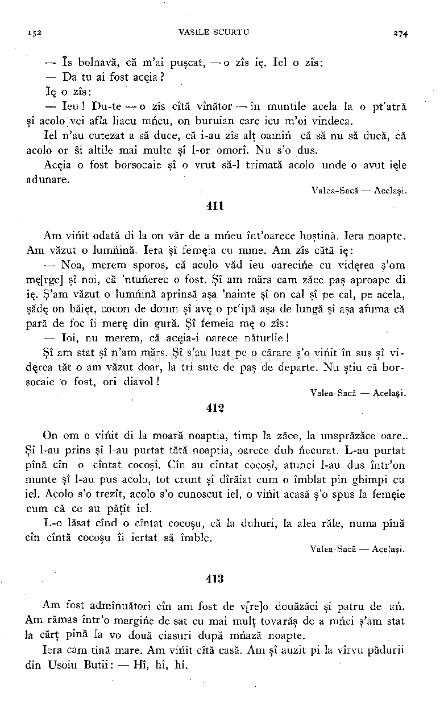

— îs bolnavă, că m'ai puşcat, — o zîs iç. Iei o zîs :

— Da tu ai fost acçia ? Ie. o zîs:

— Ieu ! Du-te — o zîs cîtă vînător — în muntile acela la o pt'atră şî acolo vei afla liacu mneu, on buruian care ieu m'oi vindeca.

Iei n'au cutezat a să duce, că i-au zîs alţ oamin că să nu să ducă, că acolo or si altile mai multe şî l-or omorî. Nu s'o dus.

Aceia o fost borsocaie şî o vrut să-1 trimată acolo unde o avut iejle adunare.

Valea-Sacă — Acelaşi.

411

Am vinit odată di la on văr de a mneu înt'oarece hoştină. Iera noapte. Am văzut o lumnină. Iera şî femeja cu mine. Am zîs cătă iç:

— Noa, merem sporos, că acolo văd ieu oarecine cu vidarea ş'om me_[rge] şî noi, că 'ntunerec o fost. Şî am mărs cam zace paş aproape di iç. Ş'am văzut o lumnină aprinsă aşa 'nainte şî on cal şî pe cal, pe acela, şăde. on băie_t, cocon de domn şî ave, o pt'ipă aşa de lungă şî aşa afuma că pară de foc îi mere. din gură. Şî femeia mç o zîs:

— loi, nu merem, că aceja-i oarece năturlie ! Şî am stat şî n'am mărs. Şî s'au luat pe o cărare ş'o vinit în sus şî vi­

darea tăt o am văzut doar, la tri sute de paş de departe. Nu ştiu că borsocaie o fost, ori diavol !

Valea-Sacă — Acelaşi.

412

On om o vinit di la moară noaptia, timp la zace, la unsprăzăce oare..

Şî l-au prins şî l-au purtat tătă noaptia, oarece duh necurat. L-au purtat pînă cîn o cîntat cocoşî. Cîn au cîntat cocoşi, atunci l-au dus într'on munte şî l-au pus acolo, tot crunt şî dîrăiat cum o îmbiat pin ghimpi cu iei. Acolo s'o trezit, acolo s'o cunoscut iei, o vihit acasă ş'o spus la femçie cum că ce au păţît iei.

L-o lăsat cînd o cîntat cocoşu, că la duhuri, la alea răle, numa pînă cîn cîntă cocoşu îi iertat să îmbie.

Valea-Sacă — Acelaşi.

413

Am fost admînuători cîn am fost de v[re]o douăzăci şi patru de an. Am rămas într'o margine de sat cu mai mulţ tovarăş de a mhei ş'am stat la cărţ pînă la vo două ciasuri după mhază noapte.

Iera cam tină mare. Am vinit cîtă casă. Am şî auzit pi la vîrvu pădurii din Usoiu Butii : — Hî, hî, hî.

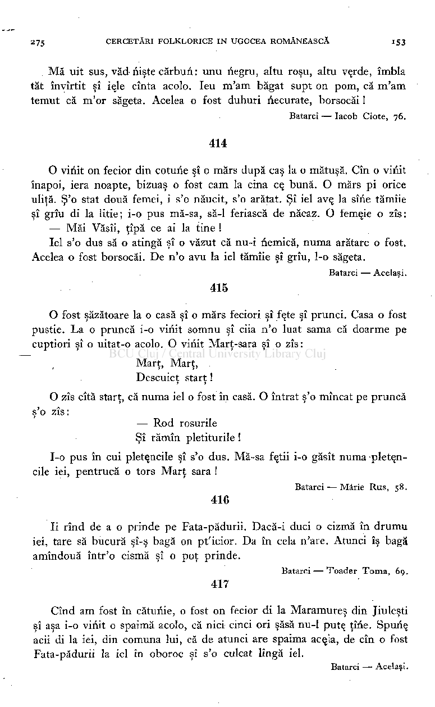

Mă uit sus, văd nişte cărburi : unu negru, altu roşu, altu verde, îmbla tăt învîrtit şî içle cînta acolo. Ieu m'am băgat supt on pom, că m'am temut că m'or săgeta. Acelea o fost duhuri necurate, borsocăi !

Batarci — Iacob Ciote, 76.

414

O vihit on fecior din cotuhe şî o mărs după caş la o mătuşă. Cîn o vihit înapoi, iera noapte, bizuaş o fost cam la cina ce, bună. O mărs pi orice uliţă. Ş'o stat două femei, i s'o năucit, s'o arătat. Şî iei avç la sîhe tămîie şî grîu di la litie; i-o pus mă-sa, să-1 feriască de năcaz. O femeje o zîs:

— Măi Văsîi, ţîpă ce ai la tine ! Iei s'o dus să o atingă şî o văzut că nu-i hemică, numa arătare o fost.

Acelea o fost borsocăi. De n'o avu la iei tămîie şî grîu, l-o săgeta.

Batarci — Acelaşi.

415

O fost şăzătoare la o casă şî o mărs feciori şî fete şî prunci. Casa o fost pustie. La o pruncă i-o vihit somnu şî ciia n'o luat sama că doarme pe cuptiori şî o uitat-o acolo. O vihit Marţ-sara şî o zîs:

Marţ, Marţ, Descuieţ start !

O zîs cîtă start, că numa iei o fost în casă. O întrat ş'o mîncat pe pruncă ş'o zîs:

— Rod rosurile Şî rămîn pletiturile !

I-o pus în cui pletencile şî s'o dus. Mă-sa fçtii i-o găsît numapletçncile iei, pentrucă o tors Marţ sara !

Batarci — Mărie Rus, 58.

416

Ii rînd de a o prinde pe Fata-pădurii. Dacă-i duci o cizmă în drumu iei, tare să bucură şî-ş bagă on pt'icior. Da în cela n'are. Atunci îş bagă amîndouă într'o cismă şî o poţ prinde.

Batarci — Toader Torna, 69.

417

Cînd am fost în cătuhie, o fost on fecior di la Maramureş din Jiuleşti şî aşa i-o vihit o spaimă acolo, că nici cinci ori şăsă nu-1 pute, ţine. Spuhç acii di la iei, din comuna lui, că de atunci are spaima aceja, de cîn o fost Fata-pădurii la iei în oboroc şî s'o culcat lîngă iei.

Batarci — Acelaşi.

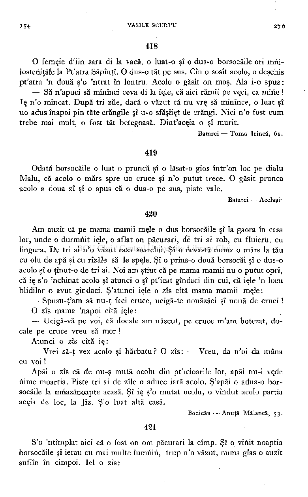

418

O femçie d'un sara di la vacă, o luat-o şî o dus-o borsocăile ori mriilosteniţăle la Pt'atra Săpînţî. O dus-o tăt pe sus. Cîn o sosît acolo, o deschis pt'atra 'n două ş'o 'ntrat în lontru. Acolo o găsît on moş. Ala i-o spus:

— Să n'apuci să mînînci ceva di la içle, că aici rămîi pe veci, ca mine ! Tç n'o mîncat. După tri zîle, dacă o văzut că nu vrç să mînînce, o luat şî uo adus înapoi pin täte crăngile şî u-o sfăşîict de crăngi. Nici n'o fost cum trebe mai mult, o fost tăt betegoasă. Dint'acçia o şî murit.

Batarci — Torna Irincă, 61.

419

Odată borsocăile o luat o pruncă şî o lăsat-o gios într'on loc pe dialu Malu, că acolo o mărs spre uo cruce şî n'o putut trece. O găsit prunca acolo a doua zî şî o spus că o dus-o pe sus, piste vale.

Batarci — Acelaşi'

420

Am auzît că pe mama mamii mçle o dus borsocăile şî la gaora în casa lor, unde o durmnit içle, o aflat on păcurari, dè tri ai rob, cu fluieru, cu lingura. De tri ai n'o văzut raza soarelui. Şî o nevastă numa o mărs la tău cu olu de apă şî cu rîzăle să le spçle. Şî o prins-o două borsocăi şî o dus-o acolo şî o ţînut-o de tri ai. Noi am ştiut că pe mama mamii nu o putut opri, că iç s'o 'nchinat acolo şî atunci o şî pt'icat gîndaci din cui, că içle 'n locu blidilor o avut gîndaci. Ş'atunci içle o zîs cîtă mama mamii mçle:

— Spusu-ţ'am să nu-ţ faci cruce, ucigă-te nouăzăci şî nouă de cruci ! O zîs mama 'napoi cîtă içle:

— Ucigă-vă pe voi, că docale am născut, pe cruce m'am botezat, docale pe cruce vreu să mor ! Atunci o zîs cîtă iç:

— Vrei să-ţ vez acolo şî bărbatu ? O zîs : — Vreu, da n'oi da mâna cu voi !

Apăi o zîs că de nu-ş mută ocolu din pt'icioarile lor, apăi nu-i vçde riime moartia. Piste tri ai de zîle o aduce iară acolo. Ş'apăi o adus-o borsocăile la mfiazănoapte acasă. Şî iç ş'o mutat ocolu, o vîndut acolo pârtia acçia de loc, la Jîz. Ş'o luat altă casă.

Bocicău — Anuţă Mălancă, 53.

421

S'o 'ntîmplat aici că o fost on om păcurari la cîmp. Şî o vinit noaptia borsocăile şî ierau cu mai multe lumriiri, trup n'o văzut, numa glas o auzît suflîn în cimpoi. Iei o zîs:

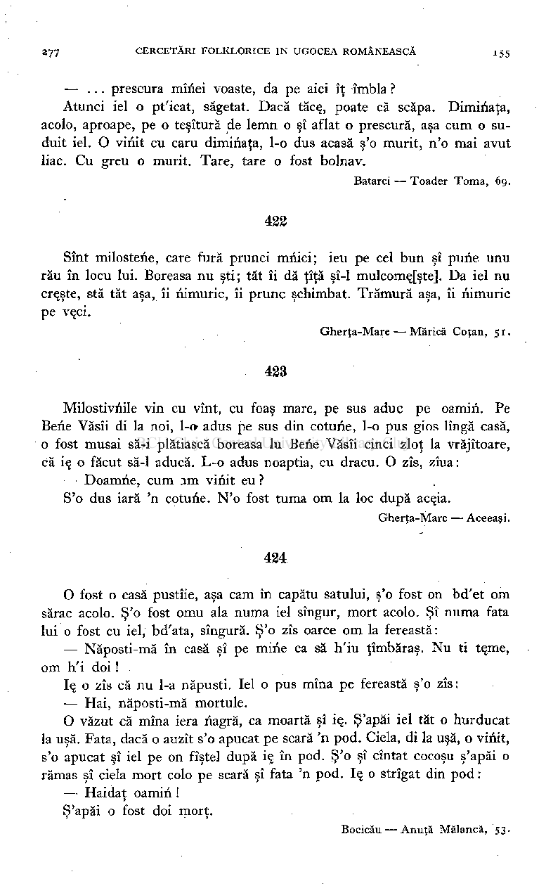

— .. . prescura mîhei voaste, da pe aici îţ îmbla ? Atunci iei o pt'icat, săgetat. Dacă tăcc, poate că scăpa. Diminaţa, acolo, aproape, pe o teşîtură de lemn o şî aflat o prescură, aşa cum o suduit iei. O vihit cu caru diminaţa, l-o dus acasă ş'o murit, n'o mai avut liac. Cu greu o murit. Tare, tare o fost bolnav.

Batarci — Toader Torna, 69.

422

Sînt milostehe, care fură prunci mhici; ieu pe cel bun şî pune unu

- rău în locu lui. Boreasă nu şti; tăt îi dă ţîţă şî-1 mulcomejşte]. Da iei nu creste, stă tăt aşa, îi himuric, îi prunc schimbat. Trămură aşa, îi himuric pe veci.

Gherţa-Mare — Mărică Coţan, 51 .

423

Milostivhile vin cu vînt, cu foaş mare, pe sus aduc pe oamih. Pe Bene Văsîi di la noi, l-o- adus pe sus din cotuhe, l-o pus gios lîngă casă, o fost musai să-i plătiască boreasă lu Bene Văsîi cinci zlot la vrăjitoare, că iç o făcut să-1 aducă. L-o adus noaptia, cu dracu. O zîs, zîua:

— Doamne, cum am vihit eu ? S'o dus iară 'n cotuhe. N'o fost tuma om la loc după aceja.

Gherţa-Mare — Aceeaşi.

424

O fost o casă pustîie, aşa cam în capătu satului, ş'o fost on bd'et om

- sărac acolo. Ş'o fost omu ala numa iei singur, mort acolo. Şî numa fata lui o fost cu iei, bd'ata, sîngură. Ş'o zîs oarce om la fereastă:

— Năposti-mă în casă şî pe mine ca să h'iu ţîmbăraş. Nu ti tçme, om h'i doi !

Iç o zîs că nu 1-a năpusti. Iei o pus mina pe fereastă ş'o zîs:

— Hai, năposti-mă mortule. O văzut că mîna iera hagră, ca moartă şî iç. Ş'apăi iei tăt o hurducat la uşă. Fata, dacă o auzît s'o apucat pe scară 'n pod. Ciela, di la uşă, o vihit, s'o apucat şî iei pe on fîştel după iç în pod. Ş'o şî cîntat cocoşu ş'apăi o rămas şî ciela mort colo pe scară şî fata 'n pod. Iç o strigat din pod :

— Haidaţ oamih ! Ş'apăi o fost doi morţ.

Bocicău — Anuţă Mălancă, 53.

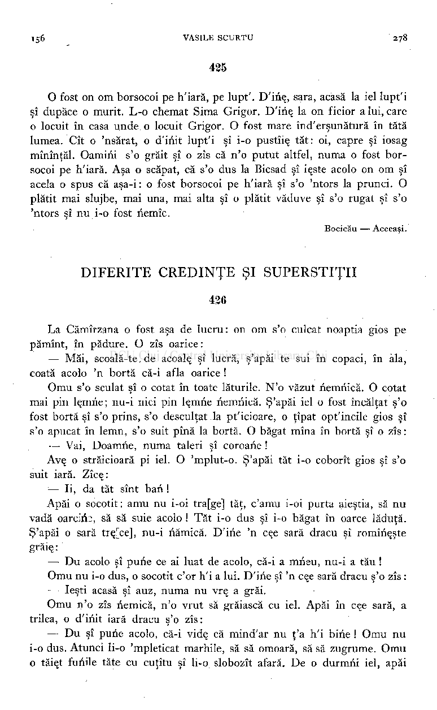

425

O fost on om borsocoi pe h'iară, pe lupt'. D'inç, sara, acasă la iei lupt'i şî dupăce o murit. L-o chemat Sima Grigor. D'iriç la on ficior a lui, care o locuit în casa unde o locuit Grigor. O fost mare înd'erşunătură în tătă lumea. Cît o 'nsărat, o d'init lupt'i şî i-o pustîiç tăt: oi, capre şî iosag mînînţăl. Oamirii s'o grăit şî o zîs că n'o putut altfel, numa o fost borsocoi pe h'iară. Aşa o scăpat, că s'o dus la Bicsad şî içste acolo on om şî acela o spus că aşa-i: o fost borsocoi pe h'iară şî s'o 'ntors la prunci. O plătit mai slujbe, mai una, mai alta şî o plătit văduve şî s'o rugat şî s'o 'ntors şî nu i-o fost hemîc.

Bocicău — Aceeaşi.

#### DIFERITE CREDINŢE ŞI SUPERSTIŢII

426

La Cămîrzana o fost aşa de lucru: on om s'o culcat noaptia gios pe pămînt, în pădure. O zîs oarice:

— Măi, scoală-te. de acoale. şî lucră, ş'apăi te sui în copaci, în ala, coată acolo 'n bortă că-i afla oarice !

Omu s'o sculat şî o cotat în toate lăturile. N'o văzut riemnică. O cotat mai pin lçmrie; nu-i nici pin lejmne nemnică. Ş'apăi iei o fost încălţat ş'o fost bortă şî s'o prins, s'o desculţat la pt'icioare, o ţîpat opt'incile gios şî s'o apucat în lemn, s'o suit pînă la bortă. O băgat mîna în bortă şî o zîs:

— Vai, Doamne, numa taleri şî coroane ! Ave_ o străicioară pi iei. O 'mplut-o. Ş'apăi tăt i-o coborît gios şî s'o

suit iară. Zîcç:

— Ii, da tăt sînt ban ! Apăi o socotit: amu nu i-oi tra[ge] tăţ, c'amu i-oi purta aieştia, să nu vadă oarcins, să să suie acolo ! Tăt i-o dus şî i-o băgat în oarce lăduţă. Ş'apăi o sară trç[ce], nu-i riămică. D'irie 'n cee sară dracu şî romîncşte grăie.:

— Du acolo şî pune ce ai luat de acolo, că-i a mneu, nu-i a tău ! Omu nu i-o dus, o socotit c'or h'i a lui. D'ifie şî 'n cçe sară dracu ş'o zîs :

— Ieşti acasă şî auz, numa nu vrç a grăi. Omu n'o zîs nemică, n'o vrut să grăiască cu iei. Apăi în cee sară, a

trilea, o d'init iară dracu ş'o zîs:

— Du şî pune acolo, că-i vide. că mind'ar nu ţ'a h'i bine ! Omu nu i-o dus. Atunci li-o 'mpleticat marhile, să să omoară, să să zugrume. Omu o tăict fuhile täte cu cuţîtu şî li-o slobozit afară. De o durmhi iei, apăi

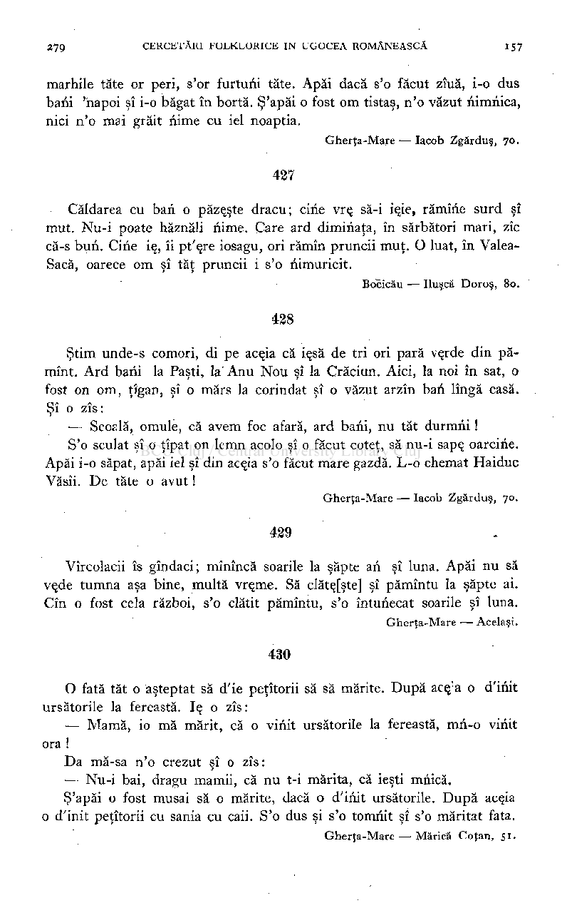

marhile täte or peri, s'or furtuni täte. Apăi dacă s'o făcut ziuă, i-o dus bani 'hapoi şî i-o băgat în bortă. Ş'apăi o fost om tistaş, n'o văzut nimriica, nici n'o mai grăit nime cu iei noaptia.

Gherţa-Mare — Iacob Zgărduş, 70.

427

Căldarea cu ban o păzcşte dracu; cifie vre, să-i içie, rămîrie surd şî mut. Nu-i poate hăznăli nime. Care ard diminaţa, în sărbători mari, zîc că-s bun. Cine iç, îi pt'ere iosagu, ori rămîn pruncii muţ. O luat, în ValeaSacă, oarece om şî tăţ pruncii i s'o fiimuricit.

Bocicău — Iluşcă Doroş, 80.

428

Ştim unde-s comori, di pe acçia că iesă de tri ori pară verde din pămînt. Ard bani la Paşti, la Anu Nou şî la Crăciun. Aici, la noi în sat, o fost on om, ţîgan, şî o mărs la corindat şî o văzut arzîn ban lîngă casă. Şî o zîs:

— Scoală, omule, că avem foc afară, ard bani, nu tăt durmrii ! S'o sculat şî o ţîpat on lemn acolo şî o făcut coteţ, să nu-i sape, oarcirie.

Apăi i-o săpat, apăi iei şî din acçia s'o făcut mare gazdă. L-o chemat Haiduc Văsîi. De täte o avut !

Gherţa-Mare — Iacob Zgărduş, 70.

429

Vîrcolacii îs gîndaci; mînîncă soarile la şapte an şî luna. Apăi nu să vede tumna aşa bine, multă vreme. Să clătc[şte] şî pămîntu la şapte ai. Cîn o fost cela război, s'o clătit pămîntu, s'o întunecat soarile şî luna.

Gherţa-Mare — Acelaşi.

430

O fată tăt o aşteptat să d'ie peţitorii să să mărite. După aceja o d'iriit ursătorile la fereastă. Iç o zîs:

— Mamă, io mă mărit, că o vinit ursătorile la fereastă, mri-o viriit ora !

Da mă-sa n'o crezut şî o zîs:

— Nu-i bai, dragu mamii, că nu t-i mărita, că ieşti mriică. Ş'apăi o fost musai să o mărite, dacă o d'iriit ursătorile. După acçia

o d'init peţitorii cu sania cu caii. S'o dus şi s'o tomriit şî s'o măritat fata.

Gherţa-Mare — Mărică Coţan, 51.

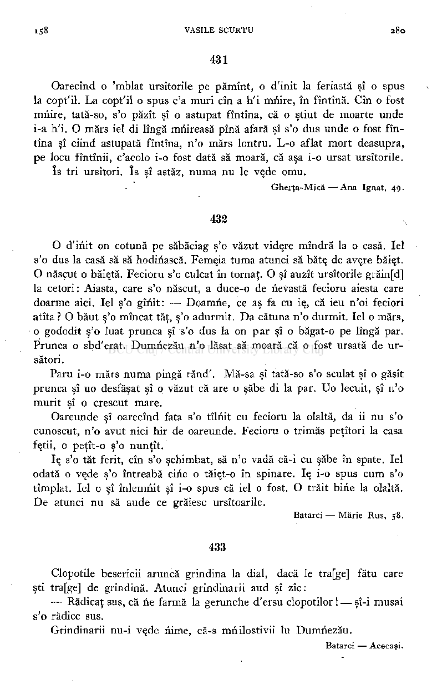

VASILE SCURT U 280

431

Oarecînd o 'mblat ursîtorile pe pămînt, o d'init la feriastă şî o spus la copt'il. La copt'il o spus c'a muri cîn a h'i mhire, în fîntînă. Cîn o fost mnire, tată-so, s'o păzît şî o astupat fîntîna, că o ştiut de moarte unde i-a h'i. O mărs iei di lîngă mnireasă pînă afară şî s'o dus unde o fost fîntîna şî ciind astupată fîntîna, n'o mărs lontru. L-o aflat mort deasupra, pe locu fîntînii, c'acolo i-o fost dată să moară, că aşa i-o ursat ursîtorile.

îs tri ursitori. îs şî astăz, numa nu le vçde omu.

Gherţa-Mică — Ana Ignat, 49.

432

O d'init on cotună pe săbăciag ş'o văzut vidçre mîndră la o casă. Iei s'o dus la casă să să hodinască. Femçia tuma atunci să bătc de avere băict. O născut o băictă. Fecioru s'o culcat în tornaţ. O şî auzît ursîtorile grăinfd] la cetori: Aiasta, care s'o născut, a duce-o de nevastă fecioru aiesta care doarme aici. Iei ş'o gînit: —• Doamne, ce aş fa cu iç, că ieu n'oi feciori atîta ? O băut ş'o mîncat tăţ, ş'o adurmit. Da cătuna n'o durmit. Iei o mărs, o gododit ş'o luat prunca şî s'o dus la on par şî o băgat-o pe lîngă par. Prunca o sbd'erat. Dumnezău n'o lăsat să moară că o fost ursată de ursători.

Paru i-o mărs numa pingă rănd'. Mă-sa şî tată-so s'o sculat şî o găsît prunca şî uo desfăşat şî o văzut că are o şăbe di la par. Uo lecuit, şî n'o murit şî o crescut mare.

Oareunde şî oarecînd fata s'o tîlhit cu fecioru la olaltă, da ii nu s'o cunoscut, n'o avut nici hir de oareunde. Fecioru o trimăs peţitori la casa fçtii, o peţît-o ş'o nunţît.

Iç s'o tăt ferit, cîn s'o schimbat, să n'o vadă că-i cu şăbe în spate. Iei odată o vçde ş'o întreabă cine o tăict-o în spinare. Iç i-o spus cum s'o tîmplat. Iei o şî înlemnit şî i-o spus că iei o fost. O trăit bine la olaltă. De atunci nu să aude ce grăiesc ursîtoarile.

Batarci — Mărie Rus, 58.

433

Clopotile besericii aruncă grindina la dial, dacă le tra[ge] fătu care şti tra[ge] de grindină. Atunci grindinară aud şî zîc:

— Rădicat sus, că ne farmă la gerunche d'ersu clopotilor ! — şî-i musai s'o rădice sus.

Grindinarii nu-i vçde riime, că-s mnilostivii lu Dumnezău.

Batarci — Aceeaşi.

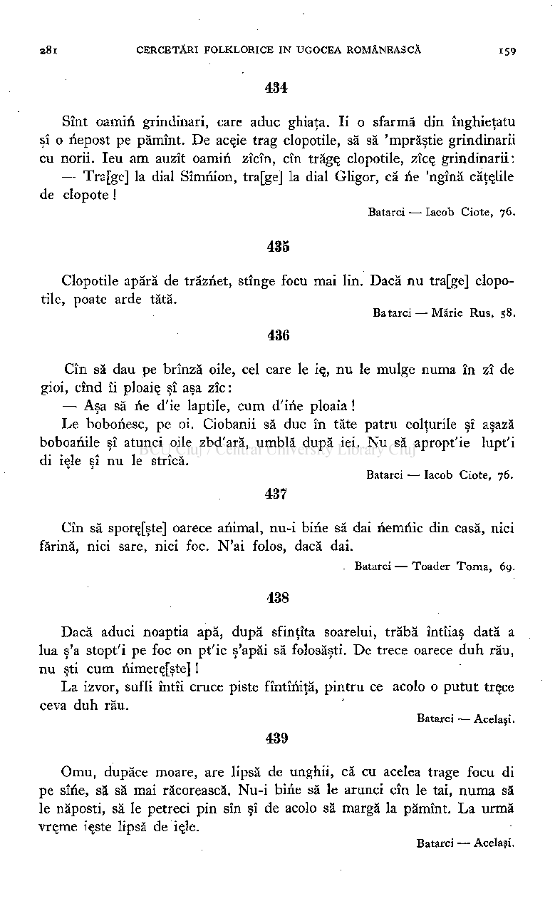

434

Sînt oamih grindinari, care aduc ghiaţa. Ii o sfarmă din înghieţatu şî o nepost pe pămînt. De aceie trag clopotile, să să 'mprăştie grindinarii cu norii. Ieu am auzît oamin zîcîn, cîn trăgc clopotile, zice, grindinarii:

— Tra[ge] la dial Sîmhion, tra[ge] la dial Gligor, că ne 'ngînă căţeHle de clopote !

Batarci — Iacob Ciote, 76.

435

Clopotile apără de trăznet, stinge focu mai lin. Dacă nu trafge] clopotile, poate arde tătă.

Batarci — Mărie Rus, 58.

436

Cîn să dau pe brînză oile, cel care le iç, nu le mulge numa în zî de gioi, cînd îi ploaiç şî aşa zîc:

— Aşa să ne d'ie laptile, cum d'ine ploaia ! Le bobonesc, pe oi. Ciobanii să duc în täte patru colţurile şî aşază

boboahile şî atunci oile zbd'ară, umblă după iei. Nu să apropt'ie lupt'i di iele şî nu le strică.

Batarci — Iacob Ciote, 76.

437

Cîn să sporcfşte] oarece animal, nu-i bine să dai nemhic din casă, nici fărină, nici sare, nici foc. N'ai folos, dacă dai.

Batarci — Toader Torna, 69.

438

Dacă aduci noaptia apă, după sfinţita soarelui, trăbă întîiaş dată a lua ş'a stopt'i pe foc on pt'ic ş'apăi să folosăşti. De trece oarece duh rău, nu şti cum himerejşte] !

La izvor, sufli întîi cruce piste fîntîhiţă, pintru ce acolo o putut trece ceva duh rău.

Batarci — Acelaşi.

439

Omu, dupăce moare, are lipsă de unghii, că cu acelea trage focu di pe sîhe, să să mai răcorească. Nu-i bine să le arunci cîn le tai, numa să le năposti, să le petreci pin sîn şî de acolo să margă la pămînt. La urmă vreme ieste lipsă de işle.

Batarci — Acelaşi.

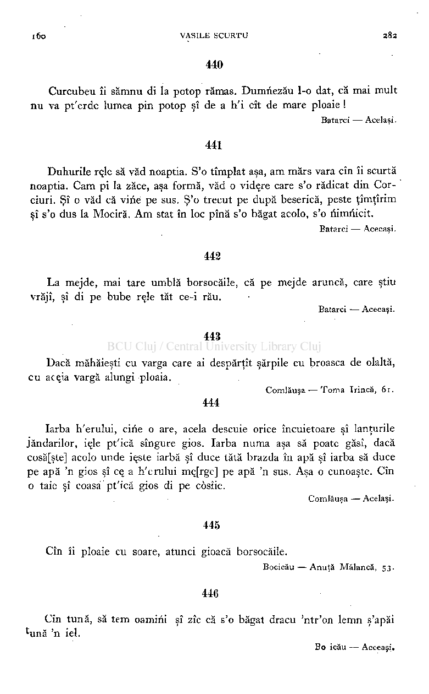

440

Curcubeu îi sămnu di la potop rămas. Dumnezău l-o dat, că mai mult nu va pt'erde lumea pin potop şî de a h'i cît de mare ploaie !

Batarci — Acelaşi.

441

Duhurile rçle să văd noaptia. S'o tîmplat aşa, am mărs vara cîn îi scurtă noaptia. Cam pi la zace, aşa formă, văd o vidçre care s'o rădicat din Corciuri. Şî o văd că vine pe sus. Ş'o trecut pe după beserică, peste ţîmţîrim şî s'o dus la Mociră. Am stat în loc pînă s'o băgat acolo, s'o nimnicit.

Batarci — Aceeaşi.

442

La mejde, mai tare umblă borsocăile, că pe mejde aruncă, care ştiu vrăjî, şî di pe bube rçle tăt ce-i rău.

Batarci — Aceeaşi.

443

Dacă măhăieşti cu varga care ai despărţit şărpile cu broasca de olaltă, cu acçia varga alungi ploaia.

Comlăuşa — Torna Irincă, 61.

444

Iarba h'erului, cine o are, acela descuie orice încuietoare şî lanţurile Jăndarilor, içle pt'ică singure gios. Iarba numa aşa să poate găsî, dacă cosă[şte] acolo unde içste iarbă şî duce tătă brazda în apă şî iarba să duce pe apă 'n gios şî cç a h'erului mç[rge] pe apă 'n sus. Aşa o cunoaşte. Cîn o taie şî coasa pt'ică gios di pe côsîie.

Comlăuşa — Acelaşi.

- 445

Cîn îi ploaie cu soare, atunci gioacă borsocăile.

Bocicău — Anuţă Mălancă, 53.

- 446

Cîn tună, să tem oamirii şî zîc că s'o băgat dracu 'ntr'on lemn ş'apăi tună 'n iei.

Bo icău — Aceeaşi.

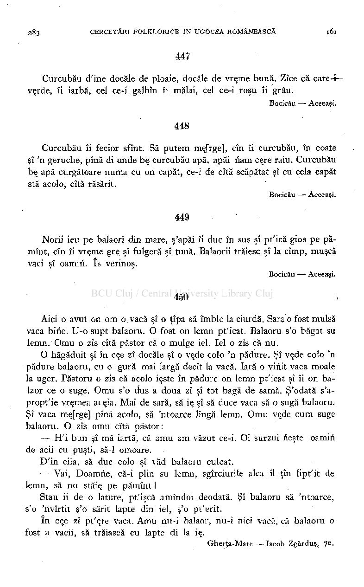

447

Curcubău d'ine docăle de ploaie, docăle de vrçme bună. Zîce că care-ivçrde, îi iarbă, cel ce-i galbîn îi mălai, cel ce-i roşu îi grâu.

Bocicău — Aceeaşi.

448

Curcubău îi fecior sfînt. Să putem mejrge], cîn îi curcubău, în coate şî 'n geruche, pînă di unde bç curcubău apă, apăi ham cere raiu. Curcubău bç apă curgătoare numa cu on capăt, ce-i de cîtă scăpătat şî cu cela capăt stă acolo, cîtă răsărit.

Bocicău — Aceeaşi.

449

Norii ieu pe balaori din mare, ş'apăi îi duc în sus şî pt'ică gios pe pămînt, cîn îi vrçme grç şî fulgeră şî tună. Balaorii trăiesc şî la cîmp, muşcă vaci şî oamih. îs verinoş.

Bocicău — Aceeaşi.

450

Aici o avut on om o vacă şî o ţîpa să îmbie la ciurdă. Sara o fost mulsă vaca bine. U-o supt balaoru. O fost on lemn pt'icat. Balaoru. s'o băgat su lemn. Omu o zîs cîtă păstor că o mulge iei. Iei o zîs că nu.

O hăgăduit şî în cee zî docăle şî o vçde colo 'n pădure. Şî vçde colo 'n pădure balaoru, cu o gură mai largă decît la vacă. Iară o vihit vaca moaie la uger. Păstoru o zîs că acolo içste în pădure on lemn pt'icat şî îi on balaor ce o suge. Omu s'o dus a doua zî şî tot bagă de samă. Ş'odată s'apropt'ie vrçmea acçia. Mai de sară, să ie. şî să duce vaca să o sugă balaoru. Şî vaca me.[rge] pînă acolo, să 'ntoarce lîngă lemn. Omu vçde cum suge balaoru. O zîs omu cîtă păstor:

— H'i bun şî mă iartă, că amu am văzut ce-i. Oi surzui heşte oamih de acii cu puşti, să-1 omoare.

D'in ciia, să duc colo şî văd balaoru culcat.

— Vai, Doamne, că-i plin su lemn, sgîrciurile alea îl ţîn lipt'it de lemn, să nu stăie. pe pămînt !

Stau ii de o lăture, pt'işcă amîndoi deodată. Şî balaoru să 'ntoarce, s'o 'nvîrtit ş'o sărit lapte din iei, ş'o pt'erit.

în ce_e zî pt'e.re vaca. Amu nu-i balaor, nu-i nici vacă, că balaoru o fost a vacii, să trăiască cu lapte di la ic.

Gherţa-Mare — Iacob Zgărduş, 70.

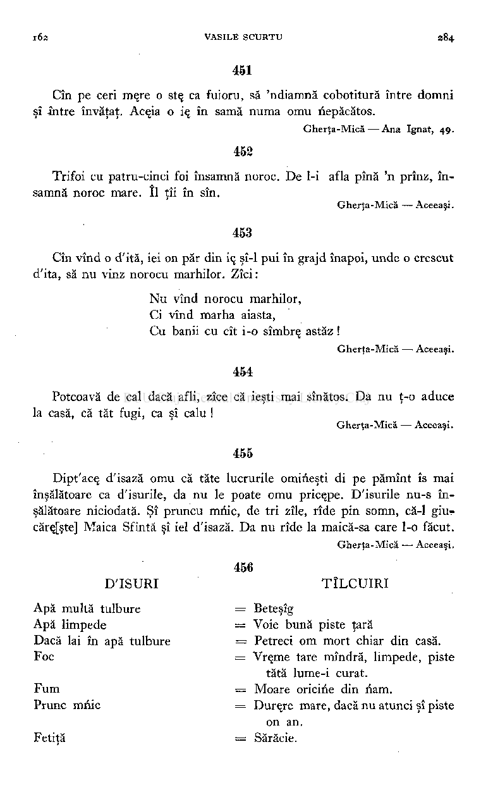

451

Cîn pe ceri mere o ste, ca fuioru, să 'ndiamnă cobotitură între domni şî intre învăţat. Aceja o iç în samă numa omu nepăcătos.

Gherţa-Mică — Ana Ignat, 49.

452

Trifoi cu patru-cinci foi însamnă noroc. De 1-i afla pînă 'n prînz, însamnă noroc mare. îl ţîi în sîn.

Gherţa-Mică — Aceeaşi.

453

Cîn vînd o d'ită, iei on păr din iç şî-1 pui în grajd înapoi, unde o crescut d'ita, să nu vinz norocu marhilor. Zîci:

Nu vînd norocu marhilor, Ci vînd marha aiasta, Cu banii cu cît i-o sîmbrç astăz !

Gherţa-Mică — Aceeaşi.

454

Potcoavă de cal dacă afli, zîce că ieşti mai sînătos. Da nu ţ-o aduce la casă, că tăt fugi, ca şî calu !

Gherţa-Mică — Aceeaşi.

455

Dipt'ace, d'isază omu că täte lucrurile omiheşti di pe pămînt îs mai înşălătoare ca d'isurile, da nu le poate omu pricepe. D'isurile nu-s înşălătoare niciodată. Şî pruncu mnic, de tri zîle, rîde pin somn, că-1 giur cărejşte] Maica Sfîntă şî iei d'isază. Da nu rîde la maică-sa care l-o făcut.

Gherţa-Mică — Aceeaşi.

456

DTSURI TÎLCUIRI

Apă multă tulbure = Beteşîg Apă limpede = Voie bună piste ţară Dacă lai în apă tulbure = Petreci om mort chiar din casă. Foc = Vreme tare mîndră, limpede, piste

tătă lume-i curat. Fum = Moare oricine din riam. Prunc mnic = Durere mare, dacă nu atunci şî piste

on an. Fetită = Sărăcie.

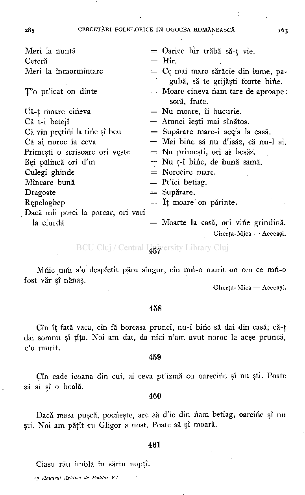

Meri la nuntă Cetera Meri la înmormîntare

Oarice hir trăbă să-ţ vie. Hir. Cç mai mare sărăcie din lume, pagubă, să te grijăşti foarte bine. Moare cineva nam tare de aproape :

Ţ'o pt'icat on dinte

soră, frate. Nu moare, îi bucurie. Atunci ieşti mai sînătos. Supărare mare-i acçia la casă. Mai bine să nu d'isăz, că nu-1 ai. Nu primeşti, ori ai besăz. Nu ţ-î bine, de bună samă. Norocire mare. Pt'ici betiag. Supărare. îţ moare on părinte.

Că-ţ moare cineva Că t-i betejî Că vin pretini la tine şî beu Că ai noroc la ceva Primeşti o scrisoare ori veste Bçi palincă ori d'in Culegi ghinde Mîncare bună Dragoste Rçpeloghep Dacă mîi porci la porcar, ori vaci

la ciurdă

Moarte la casă, ori vine grindină.

Gherţa-Mică — Aceeaşi.

457

Mnie miîi s'o despletit păru singur, cîn mn-o murit on om ce mn-o fost văr şî nănaş.

Gherţa-Mică — Aceeaşi.

458

Cîn îţ fată vaca, cîn fă boreasa prunci, nu-i bine să dai din casă, că-ţ dai somnu şî ţîţa. Noi am dat, da nici n'am avut noroc la acee pruncă, c'o murit.

459

Cîn cade icoana din cui, ai ceva pt'izmă cu oarecine şî nu şti. Poate să ai şî o boală.

460

Dacă masa puşcă, pocneşte, are să d'ie din nam betiag, oarcine şî nu şti. Noi am păţît cu Gligor a nost. Poate să şî moară.

- 461

Ciasu rău îmbla în săriu nopţî.

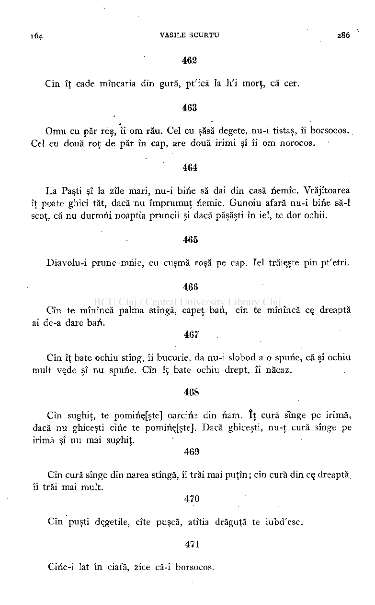

- 462

Cîn îţ cade mîncaria din gură, pt'ică la h'i morţ, că cer.

- 463

Omu cu păr roş, îi om rău. Cel cu şăsă degete, nu-i tistaş, îi borsocos. Cel cu două roţ de păr în cap, are două irimi şî îi om norocos.

464

La Paşti şî la zîle mari, nu-i bine să dai din casă riemîc. Vrăjitoarea îţ poate ghici tăt, dacă nu împrumut riemic. Gunoiu afară nu-i bine să-1 scoţ, că nu durmrii noaptia pruncii şi dacă păşăşti în iei, te dor ochii.

- 465

Diavolu-i prunc mriic, cu cuşmă roşă pe cap. Iei trăieşte pin pt'etri.

- 466

Cîn te mînîncă palma stingă, capeţ ban, cîn te mînîncă ce, dreaptă ai de-a dare bari.

467

Cîn îţ bate ochiu stîng, îi bucurie, da nu-i slobod a o spurie, că şî ochiu mult ve,de şî nu spurie. Cîn îţ bate ochiu drept, îi năcaz.

468

Cîn sughiţ, te pomiriejste] oarei ris din riam. îţ cură slnge pe irimă, dacă nu ghiceşti cine te pomiric[şte]. Dacă ghiceşti, nu-ţ cură sînge pe irimă şî nu mai sughiţ.

469

Cîn cură sînge din narea stingă, îi trăi mai puţîn ; cîn cură din ce, dreaptă, îi trăi mai mult.

- 470

Cîn puşti dçgetile, cîte puşcă, atîtia drăguţă te iubd'esc.

- 471

Cirie-i lat în ciafă, zîce că-i borsocos.

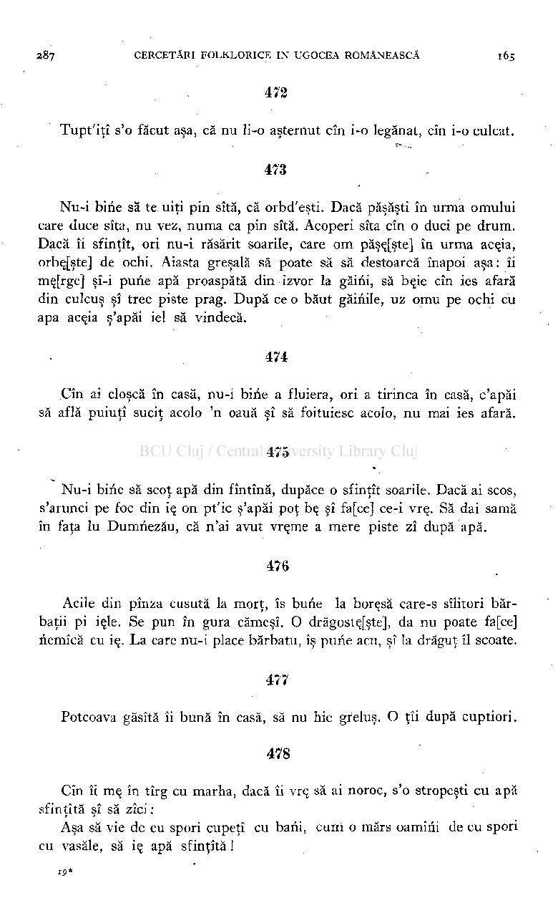

- 472

Tupt'iţî s'o făcut aşa, că nu li-o aşternut cîn i-o legănat, cîn i-o culcat.

- 473

Nu-i bine să te uiţi pin sîtă, că orbd'eşti. Dacă păşăşti în urma omului care duce sîta, nu vez, numa ca pin sîtă. Acoperi sîta cîn o duci pe drum. Dacă îi sfinţît, ori nu-i răsărit soarile, care om păşe.[şte] în urma acçia, orbejşte] de ochi. Aiasta greşală să poate să să destoarcă înapoi aşa: îi me_[rge] şî-i pune apă proaspătă din izvor la găini, să bçie cîn ies afară din culcuş şî trec piste prag. După ce o băut găinile, uz omu pe ochi cu apa acçia ş'apăi iei să vindecă.

474

Cîn ai cloşcă în casă, nu-i bine a fluiera, ori a tirinca în casă, c'apăi să află puiuţi sucit acolo 'n oauă şî să foituiesc acolo, nu mai ies afară.

475

Nu-i bine să scoţ apă din fîntînă, dupăce o sfinţît soarile. Dacă ai scos, s'arunci pe foc din iç on pt'ic ş'apăi poţ be. şî fa[ce] ce-i vre.. Să dai samă în faţa lu Dumnezău, că n'ai avut vrçme a mere piste zî după apă.

476

Acile din pînza cusută la morţ, îs buhe la borcsă care-s silitori bărbaţii pi içle. Se pun în gura cămeşi. O drăgostejste], da nu poate fa[ce] hemîcă cu ie.. La care nu-i place bărbatu, îş pune acu, şî la drăguţ îl scoate.

- 477

Potcoava găsită îi bună în casă, să nu hie greluş. O ţîi după cuptiori.

- 478

Cîn îi me. în tîrg cu marha, dacă îi vre. să ai noroc, s'o stropeşti cu apă sfinţită şî să zîci :

Aşa să vie de cu spori cupeţî cu bani, cum o mărs oamihi de cu spori cu vasale, să iç apă sfinţită !

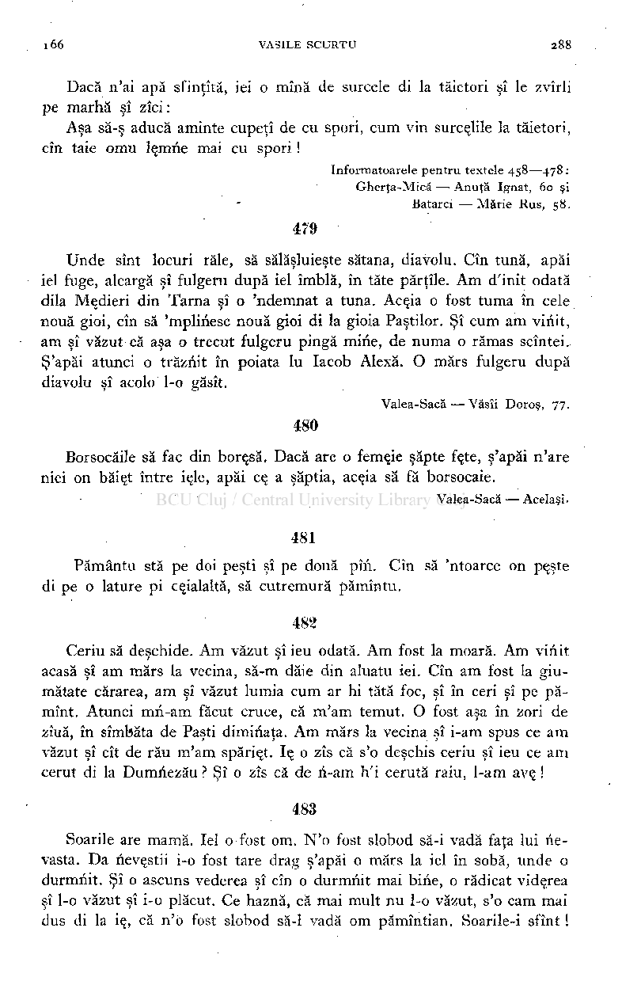

Dacă n'ai apă sfinţită, iei o mînă de surcele di la tăietori şî le zvîrli pe marhă şî zîci:

Aşa să-ş aducă aminte cupeţî de cu spori, cum vin surcçlile la tăietori, cîn taie omu lemne mai cu spori !

Informatoarele pentru textele 458—478: Gherţa-Mică —• Anuţă Ignat, 60 şi Batarci —Mări e Rus, 58.

479

Unde sînt locuri răle, să sălăşluieşte satana, diavolu. Cîn tună, apăi iei fuge, aleargă şî fulgeru după iei îmbla, în täte părţîle. Am d'init odată dila Medieri din Târna şî o 'ndemnat a tuna. Acçia o fost turna în cele nouă gioi, cîn să 'mplinesc nouă gioi di la gioia Paştilor. Şî cum am vinit, am şî văzut că aşa o trecut fulgeru pingă mine, de numa o rămas scîntei. Ş'apăi atunci o trăznit în poiata lu Iacob Alexă. O mărs fulgeru după diavolu şî acolo l-o găsît.

Valea-Sacă — Văsîi Doroş, 77.

480

Borsocăile să fac din borcsă. Dacă are o femçie şapte fçte, ş'apăi n'are nici on băiet între ieje, apăi ce, a şăptia, acçia să fă borsocaie.

Valea-Sacă — Acelaşi.

481

Pământu stă pe doi peşti şî pe două pin. Cîn să 'ntoarce on pcşte di pe o lăture pi ccialaltă, să cutremură pămîntu.

482

Ceriu să deschide. Am văzut şî ieu odată. Am fost la moară. Am vinit acasă şî am mărs la vecina, să-m dăie din aluatu iei. Cîn am fost la giumătate cărarea, am şî văzut lumia cum ar hi tătă foc, şî în ceri şî pe pămînt. Atunci mn-am făcut cruce, că m'am temut. O fost aşa în zori de ziuă, în sîmbăta de Paşti dimiriaţa. Am mărs la vecina şî i-am spus ce am văzut şî cît de rău m'am spăriet. Iç o zîs că s'o deschis ceriu şî ieu ce am cerut di la Dumnezău ? Şî o zîs că de ri-am h'i cerută raiu, l-am avç !

483

Soarile are mamă. Iei o fost om. N'o fost slobod să-i vadă faţa lui nevasta. Da hevestii i-o fost tare drag ş'apăi o mărs la iei în sobă, unde o durmnit. Şî o ascuns vederea şî cîn o durmnit mai bine, o rădicat viderea şî l-o văzut şî i-o plăcut. Ce haznă, că mai mult nu l-o văzut, s'o cam mai dus di la iç, că n'o fost slobod să-1 vadă om pămîntian. Soarile-i sfînt !

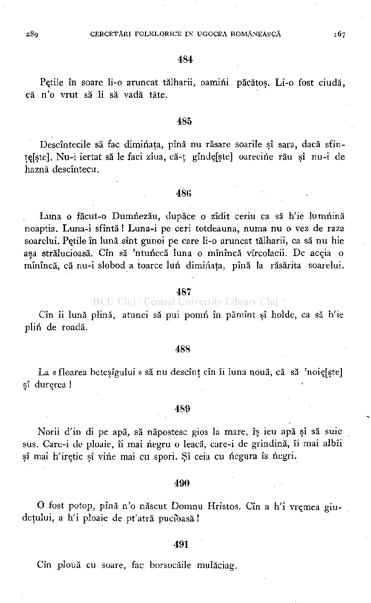

484

Pçtile în soare li-o aruncat tâlharii, oamirii păcătos. Li-o fost ciudă, că n'o vrut să li să vadă täte.

485

Descîntecile să fac dimiriaţa, pînă nu răsare soarile şî sara, dacă sfinţeşte]. Nu-i iertat să le faci zîua, că-ţ gîndejste] oarecine rău şî nu-i de haznă descîntecu.

486

Luna o făcut-o Dumnezău, dupăce o zîdit ceriu ca să h'ie lumnină noaptia. Luna-i sfîntă ! Luna-i pe ceri totdeauna, numa nu o vez de raza soarelui. Pçtile în lună sînt gunoi pe care li-o aruncat tâlharii, ca să nu hie aşa strălucioasă. Cîn să 'ntunecă luna o mînîncă vîrcolacii. De acçia o mînîncă, că nu-i slobod a toarce luri diminaţa, pînă la răsărita soarelui.

487

Cîn îi lună plină, atunci să pui pomn în pămînt şî holde, ca să h'ie plin de roadă.

488

La « floarea beteşîgului » să nu descînţ cîn îi luna nouă, că să 'noicfşte] şî durçrea !

489

Norii d'in di pe apă, să năpostesc gios la mare, îş ieu apă şî să suie sus. Care-i de ploaie, îi mai negru o leacă, care-i de grindină, îi mai albîi şî mai h'irçtic şî vine mai cu spori. Şî ceia cu negura îs negri.

490

O fost potop, pînă n'o născut Domnu Hristos. Cîn a h'i vrçmea giudeţului, a h'i ploaie de pt'atră pucioasă!

- 491

Cîn plouă cu soare, fac borsocăile mulăciag.

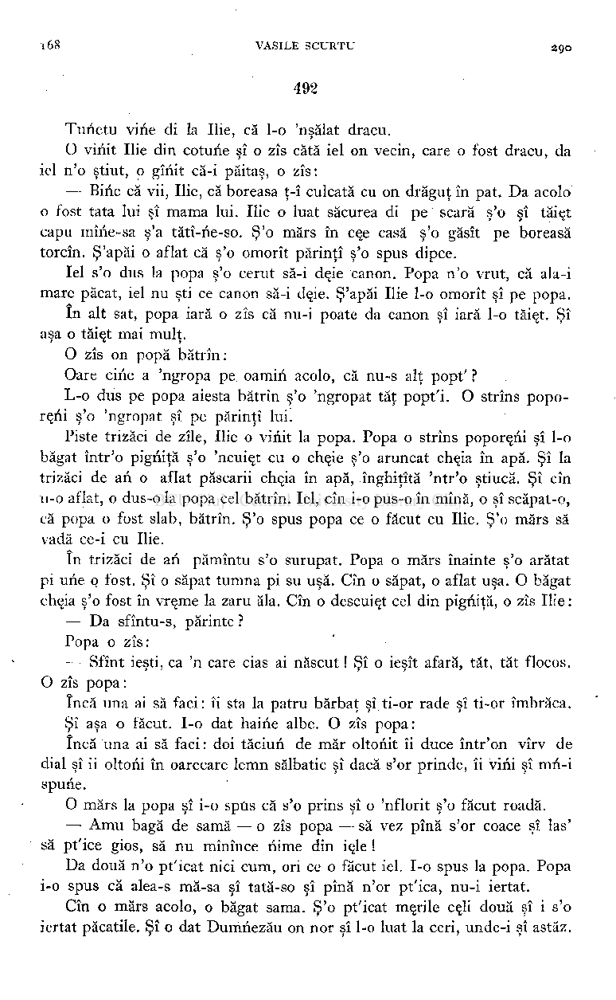

- 492

Tunetu vine di la Ilie, că l-o 'nşălat dracu. O vinit Ilie din coturie şî o zîs cătă iei on vecin, care o fost dracu, da

iei n'o ştiut, o gînit că-i păitaş, o zîs:

— Bine că vii, Ilie, că boreasa ţ-î culcată cu on drăguţ în pat. Da acolo o fost tata lui şî mama lui. Ilie o luat săcurea di pe scară ş'o şî tăict capu mîrie-sa ş'a tătî-ne-so. Ş'o mărs în cçe casă ş'o găsît pe boreasă torcîn. Ş'apăi o aflat că ş'o omorît părinţi ş'o spus dipce.

Iei s'o dus la popa ş'o cerut să-i dçie canon. Popa n'o vrut, că ala-i mare păcat, iei nu şti ce canon să-i dçie. Ş'apăi Ilie l-o omorît şî pe popa. în alt sat, popa iară o zîs că nu-i poate da canon şî iară l-o tăict. Şî

aşa o tăict mai mulţ. O zîs on popă bătrîn: Oare cine a 'ngropa pe. oamin acolo, că nu-s alţ popt' ? L-o dus pe popa aiesta bătrîn ş'o 'ngropat tăţ popt'i. O strîns popo­

rani ş'o 'ngropat şî pe părinţî lui. Piste trizăci de zîle, Ilie o vinit la popa. Popa o strîns poporçni şî l-o

- băgat într'o pigniţă ş'o 'ncuiçt cu o cheie ş'o aruncat chçia în apă. Şî la trizăci de an o aflat păscarii chçia în apă, înghiţită 'ntr'o ştiucă. Şî cîn u-o aflat, o dus-o la popa cel bătrîn. Iei, cîn i-o pus-o în mînă, o şî scăpat-o,
- că popa o fost slab, bătrîn. Ş'o spus popa ce o făcut cu Ilie. Ş'o mărs să vadă ce-i cu Ilie.

în trizăci de an pămîntu s'o surupat. Popa o mărs înainte ş'o arătat pi une o fost. Şî o săpat tumna pi su uşă. Cîn o săpat, o aflat uşa. O băgat chçia ş'o fost în vrerne la zaru ăla. Cîn o descuiçt cel din pigniţă, o zîs Ilie:

— Da sfîntu-s, părinte ? Popa o zîs:

— Sfînt ieşti, ca 'n care cias ai născut ! Şî o ieşît afară, tăt, tăt flocos.

O zîs popa : încă una ai să faci: îi sta la patru bărbat şî ti-or rade şî ti-or îmbrăca. Şî aşa o făcut. I-o dat haine albe. O zîs popa: încă una ai să faci: doi tăciun de măr oltoiîit îi duce într'on vîrv de

dial şî ii oltorii în oarecare lemn sălbatic şî dacă s'or prinde, îi vini şî mri-i spune.

O mărs la popa şî i-o spûs că s'o prins şî o 'nflorit ş'o făcut roadă.

— Amu bagă de samă — o zîs popa — să vez pînă s'or coace şî las' să pt'ice gios, să nu mînînce riime din içle !

Da două n'o pt'icat nici cum, ori ce o făcut iei. I-o spus la popa. Popa i-o spus că alea-s mă-sa şî tată-so şî pînă n'or pt'ica, nu-i iertat.

Cîn o mărs acolo, o băgat sama. Ş'o pt'icat mçrile cçli două şî i s'o iertat păcatile. Şî o dat Dumnezău on nor şî l-o luat la ceri, unde-i şî astăz.

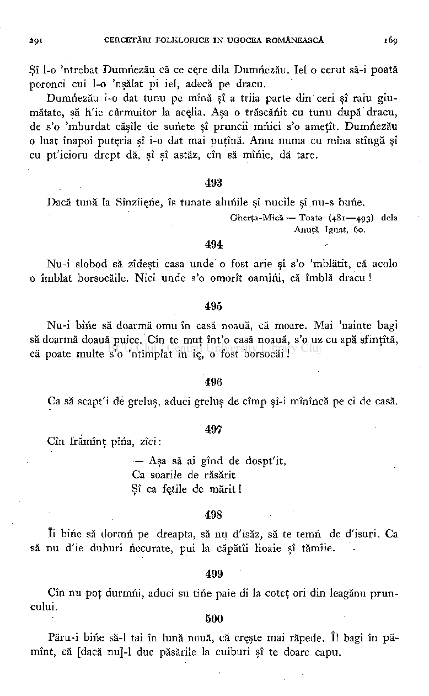

Şî l-o 'ntrebat Dumnezău că ce cere dila Dumnezău. Iei o cerut să-i poată poronci cui l-o 'nşălat pi iei, adecă pe dracu.

Dumnezău i-o dat tunu pe mînă şî a triia parte din ceri şî raiu giumătate, să h'ie cârmuitor la acejia. Aşa o trăscăriit cu tunu după dracu, de s'o 'mburdat căşîle de sunete şî pruncii mriici s'o ameţît. Dumnezău

- o luat înapoi puteria şî i-o dat mai puţînă. Amu numa cu mîna stingă şî cu pt'icioru drept dă, şî şî astăz, cîn să mîriie, dă tare.

- 493

Dacă tună la Sînzîiene, îs tunate aluhile şî nucile şî nu-s bune.

Gherţa-Mică — Toate (481—493) delà Anuţă Ignat, 60.

- 494

Nu-i slobod să zideşti casa unde o fost arie şî s'o 'mblătit, că acolo

- o îmbiat borsocăile. Nici unde s'o omorît oamini, că îmbla dracu !

495

Nu-i bine să doarmă omu în casă noauă, că moare. Mai 'nainte bagi să doarmă doauă puice. Cîn te muţ înt'o casă noauă, s'o uz cu apă sfinţită, că poate multe s'o 'ntîmplat în iç, o fost borsocăi !

496

Ca să scapt'i dé greluş, aduci greluş de cîmp şî-i mînîncă pe ci de casă.

497

Cîn frămînţ pîna, zîci:

— Aşa să ai gînd de dospt'it, Ca soarile de răsărit Şî ca fçtile de mărit !

498

îi bine să dormn pe dreapta, să nu d'isăz, să te temri de d'isuri. Ca să nu d'ie duhuri necurate, pui la căpătîi lioaie şî tămîie.

499

Cîn nu poţ durmni, aduci su tine paie di la coteţ ori din leagănu pruncului.

500

Păru-i bine să-1 tai în lună nouă, că crcşte mai răpede. îl bagi în pămînt, că [dacă nu]-l duc păsările la cuiburi şî te doare capu.

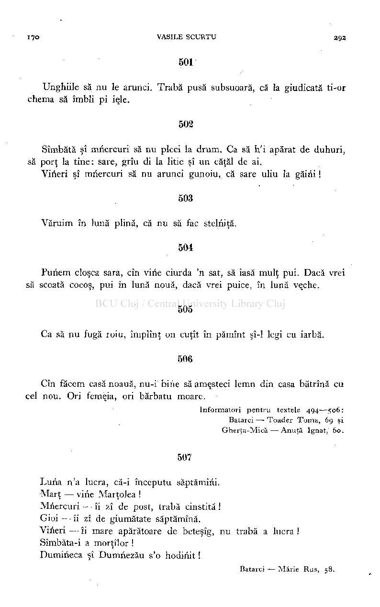

501

Unghiile sä nu le arunci. Trabă pusă subsuoară, că la giudicată ti-or chema să îmbli pi ieje.

502

Sîmbăta şî mnercuri să nu pleci la drum. Ca să h'i apărat de duhuri, să porţ la tine: sare, grîu di la litie şî un căţăl de ai.

Vineri şî mnercuri să nu arunci gunoiu, că sare uliu la găini !

- 503

Văruim în lună plină, că nu să fac stelniţă.

- 504

Punem cloşca sara, cîn vine ciurda 'n sat, să iasă mulţ pui. Dacă vrei să scoată cocoş, pui în lună nouă, dacă vrei puice, în lună vçche.

- 505

Ca să nu fugă roiu, împlînţ on cuţît în pămînt şî—1 legi cu iarbă.

- 506

Cîn facem casă noauă, nu-i bine să amesteci lemn din casa bătrînă cu cel nou. Ori femçia, ori bărbatu moare.

Informatori pentru textele 494—506: Batarci — Toader Torna, 69 şi Gherţa-Mică — Anuţă Ignat, 60.

507

Luna n'a lucra, că-i începutu săptămîrii. Marţ — vine Marţolea ! Mnercuri — îi zî de post, trabă cinstită ! Gioi — îi zî de giumătate săptămînă. Vineri — îi mare apărătoare de beteşîg, nu trabă a lucra ! Sîmbăta-i a morţilor ! Dumineca şî Dumnezău s'o hodinit !

Batarci — Mărie Rus, 58.

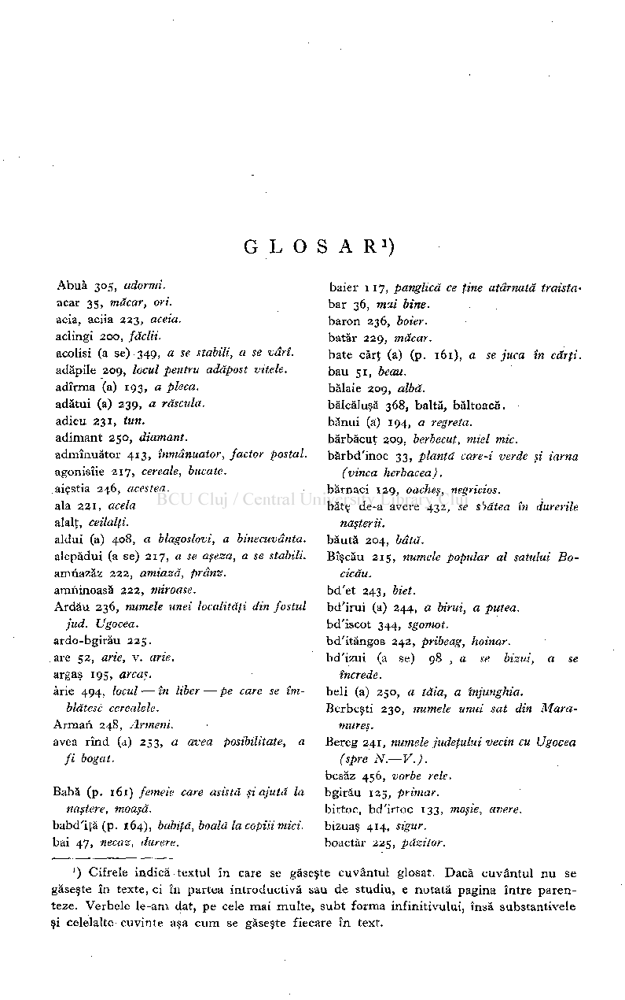

#### GLOSAR

#### )

1

Abuà 305, adormi. acar 35, măcar, ori. acia, aciia 223, aceia. aclingi 200, făclii.

baier 117, panglică ce ţine atârnată traistabar 36, mai bine.

baron 236, boier. batăr 229, măcar. bate cărţ (a) (p. 161), a se juca în cărţi.

acolisi (a se) 349, a se stabili, a se vârî. adăpile 209, locul pentru adăpost vitele.

bau 51, beau.

adîrma (a) 193, a pleca. adătui (a) 239, a răscula. adieu 231, tun. adimant 250, diamant.

bălaie 209, albă. bălcăluşă 368, baltă, băltoacă. bănui (a) 194, a regreta.

bărbăcuţ 209, berbecuţ, miel mic. bărbd'inoc 33, plantă care-i verde şi iarna

admînuător 413, înmânuator, factor postai. agonisîie 217, cereale, bucate.

(vinca herbacea). bărnaci 129, oacheş, negricios.

aiestia 246, acestea.

###### ala 221, acela

băte de-a avere 432, se sbătea în durerile

naşterii.

alalţ, ceilalţi.

aldui (a) 408, a blagoslovi, a binecuvânta. alepădui (a se) 217, a se aşeza, a se stabili. amriazăz 222, amiază, prânz.

băută 204, bâtă.

Bîşcău 215, numele popular al satului Bocicău.

amriinoasă 222, miroase.

bd'et 243, biet.

Ardău 236, numele unei localităţi din fostul jud. Ugocea.

bd'irui (a) 244, a birui, a putea.

bd'iscot 344, sgomot.

###### bd'ităngos 242, pribeag, hoinar.

ardo-bgirău 225.

are 52, arie, v. arie.

bd'izui (a se) 98 , a se bizui, a se

încrede. beli (a) 250, a tăia, a înjunghia. Berbeşti 230, numele unui sat din Mara­

argaş 195, arca}.

###### arie 494, locul — în liber—pe care se îmblătesc cerealele.

mureş. Bereg 241, numele judeţului vecin cu Ugocea (spre N.—V.). besăz 456, vorbe rele.

Armări 248, Armeni. avea rînd (a) 253, a avea posibilitate, a

fi bogat.

Babă (p. 161) femeie care asistă şi ajută la

bgirău 125, primar. birtoc, bd'irtoc 133, moşie, avere. bizuaş 414, sigur. boactăr 225, păzitor.

naştere, moaşă. babd'iţă (p. 164), babiţă, boală la copiii mici. bai 47, necaz, durere.

###### ) Cifrele indică textul în care se găseşte cuvântul glosat. Dacă cuvântul nu se găseşte în texte, ci în partea introductivă sau de studiu, e notată pagina între parenteze. Verbele le-am dat, pe cele mai multe, subt forma infinitivului, însă substantivele şi celelalte cuvinte aşa cu m se găseşte fiecare în text.

l

