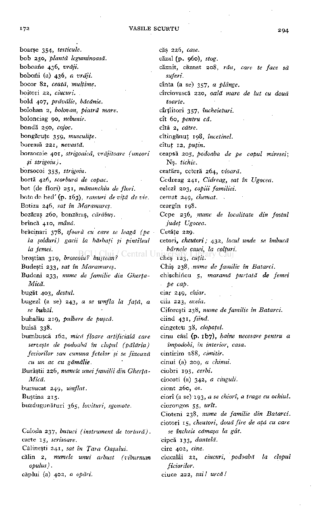

#### căş 226, case. cazai (p. 960), stog.

boarşe 354, testicule.

bob 250, plantă leguminoasă.

boboane 436, vrăji. boboni (a) 436, a vrăji.

căznit, căznat 208, rău, care te face să

suferi.

bocor 82, ceată, mulţime.

cînta (a se) 357, a plânge.

cîrciovască 220, oală mare de lut cu două toarte.

boitori 22, ciucuri.

#### bold 407, prăvălie, băcănie. bolohan 2, bolovan, piatră mare.

cîrţîitori 357, încheieturi.

#### cît 60, pentru că.

bolonciag 90, nebunie. bondă 250, cojoc. bongăruţe 359, musculiţe. boreasă 221, nevastă.

cîtă 2, către. cîtingănuţ 198, încetinel. cîtuţ 12, puţin.

#### borsocaie 401, strigoaică, vrăjitoare (uneori şi strigoiu).

ceapsă 205, podoaba de pe capul miresei; Nş. tichie.

borsocoi 355, strigoiu.

ceatăra, cetera 264, vioară.

#### bortă 426, scorbură de copac. bot (de flori) 251, mănunchiu de flori. bote de hed' (p. 163), ramuri de viţă de vie.

Cedreag 241, Cidreag, sat în Ugocea. celezî 203, copiii familiei.

cemat 249, chemat. ceargîn 198.

Botiza 246, sat în Maramureş. bozăraş 260, bonzăraş, cărăbuş. brîncă 410, mână.

Cepe 236, nume de localitate din fostul judeţ Ugocea.

brăcinari 378, sfoară cu care se leagă (pe la şolduri) gacii la bărbaţi şi pintileul la femei.

Cetăţe 229.

cetori, cheutori ; 432, locul unde se îmbucă bârnele casei, la colţuri.

broştian 319, broscoiu? buştean?

cheş 123, cuţit.

Chiş 238, nume de familie în Batarci. chischiheu 5, maramă purtată de femei

Budeşti 233, sat în Maramureş.

#### Budeni 233, nume de familie din GherţaMică.

pe cap.

ciar 249, chiar. ciia 223, aceia.

bugăt 403, destul.

bugezî (a se) 243, a se umfla la faţă, a se buhai. buhalău 219, pulbere de puşcă.

#### Ciforeşti 238, nume de familie în Batarci.

ciind 431, fiind. cingeteu 38, clopoţel.

buisă 338.

cinu căsî (p. ib7), haine necesare pentru a împodobi, în interior, casa.

bumbuşcă 162, mică floare artificială care serveşte de podoabă în dopul (pălăria) feciorilor sau cununa fetelor şi se fixează cu un ac cu gămălie.

cintirim 288, cimitir. cinui (a) 209, a chinui. ciobri 195, cerbi. ciocoti (a) 342, a ciuguli. ciont 260, os.

Burăştii 226, numele unei familii din GherţaMică.

bursucat 249, umflat. Buştina 215.

ciorî (a se) 193, a se chiorî, a trage cu ochiul.

buzdugunături 365, lovituri, sgomote.

ciorongos 55, urît.

Cioteni 238, nume de familie din Batarci. ciotori 15, cheutori, două fire de aţă cu care

se încheie cămaşa la gât.

Caloda 237, butuci (instrument de tortură).

cipcă 133, dantelă. cire 402, cine.

carte 15 scrisoare.

Călineşti 241, sat în Ţara Oaşului. călin 2, numele unui arbust (viburnum

#### ciucalâi 22, ciucuri, podoabă la dopul ficiorilor.

opulus ).

ciuce 222, sui! urcă!

căplui (a) 402, a opări.

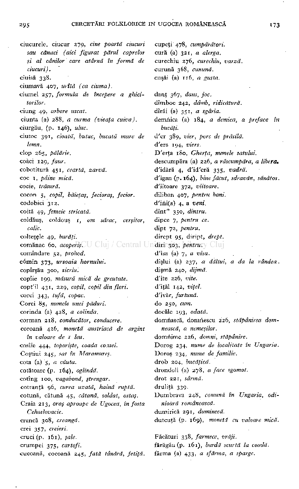

ciucurele, ciucur 279, cine poartă ciucuri

cupeţi 478, cumpărători. cură (a) 321, a alerga.

sau cănaci (aici figurat părul caprelor şi al cânilor care atârnă în formă de ciucuri).

#### curechiu 276, curechiu, varză.

curună 368, cunună. cuşăi (a) 116, a gusta.

ciuisă 338.

ciumavă 407, mîtă (ca ciuma). ciumei 257, formula de începere a ghici­

danţ 367, dans, joc.

torilor. ciung 49, arbore uscat. ciuntă (a) 288, a curma (vieaţa cuiva).

#### dîmboc 242, dâmb, ridicătură.

dîrăi (a) 351, a sgâria.

#### demrlica (a) 184, a demica, a preface în bucăţi. d'er 389, vier, porc de prăsilă.

ciurgău, (p. 146), uluc.

ciutoc 391, cioată, butuc, bucată mare de lemn.

d'ers 194, viers.

D'erţa 180, Gherţa, numele satului. descumpără (a) 226, a răscumpăra, a libera,

clop 265, pălărie. coâci 129, faur.

#### cobotitură 451, ceartă, zarvă. coc 1, pâine mică.

d'idără 4, d'id'eră 335, vadră.

d'igan (p. 164), bine făcut, sdravăn, sănătos.

cocie, trăsură.

d'iitoare 372, viitoare.

#### diliban 407, pentru bani.

cocon 5, copil, băieţaş, fecioraş, fecior.

- d'ini(a) 4, a veni, dint" 350, dintru. dipee 7, pentru ce. dipt 72, pentru. dirept 95, diript, drept. diri 303, pentru. d'isa (a) 7, a visa.
- dişlui (a) 237, a dăltui, a da la răndea. dişmă 240, dijmă. d'ite 226, vite. d'iţăl 142, viţel. d'ivăr, furtună. do 250, cum. docăle 193, odată. domnască, domiiescu 226, stăpânirea dom­

codobici 312.

coită 49, femeie stricată.

coldăuş, coldouş 1, om sărac, cerşitor,

calic.

colteşele 49, bucăţi. comanac 60, acoperiş. comîndare 52, prohod.

cömin 373, ursoaia hornului.

copîrşău 300, sicriu.

copîie 199, măsură mică de greutate. copt'il 431, 229, copil, copil din flori. corci 343, tufă, copac. Corci 85, numele unei păduri.

corinda (a) 428, a colinda.

corman 218, conducător, conducere. coroană 426, monetă austriacă de argint

nească, a nemeşilor. domnime 226, domni, stăpânire. Dorog 234, nume de localitate în Ungaria. Doroş 234, nume de familie.

în valoare de 1 leu.

- cosîie 444, toporişte, coada coasei. Coştiui 245, sat în Maramureş. cota (a) s, a căuta. cotătoare (p. 164), oglindă.
- cotîng 100, vagabond, ştrengar. cotranţă 96, curea uzată, haină ruptă. cotună, cătună 45, cătană, soldat, ostaş. Craia 213, oraş aproape de Ugocea, în fosta

drob 204, bucăţică.

drondoli (a) 278, a face sgomot.

drot 221, sârmă. druliţă 339.

Dumbrava 248, comună în Ungaria, odinioară românească.

#### Cehoslovacie.

dumirică 291, duminecă.

dutcuţă (p. 169), monetă cu valoare mică.

crancă 308, creangă. erei 357, creieri. cruci (p. 161), şale. crumpei 375, cartofi.

Făcături 338, farmece, vrăji. fărăgău (p. 161), bardă scurtă la coadă. fărma (a) 433, a sfarmă, a sparge.

cucoană, cocoană 245, fată tânără, fetiţă.

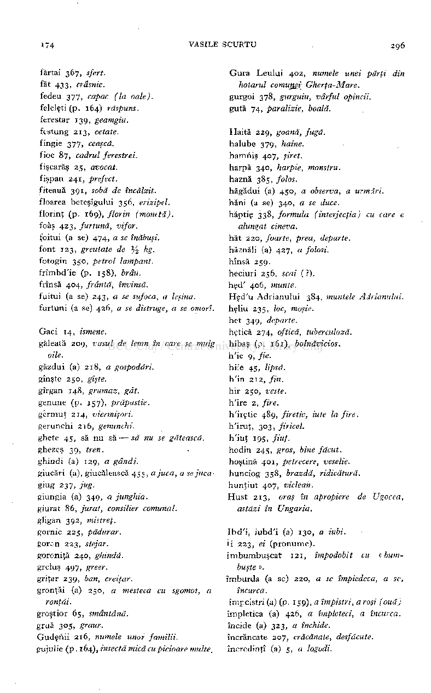

Gura Leului 402, numele unei părţi din

- fărtai 367, sfert.

- făt 433, crâsnic. fedeu 377, capac (la oale). feleleti (p. 164) răspuns. ferestar 139, geamgiu. festung 213, cetate. fingie 377, ceaşcă. fioc 87, cadrul ferestrei. fişcarăş 25, avocat. fişpan 241, prefect. fiteauă 391, sobă de încălzit. floarea beteşîgului 356, erizipel. florinţ (p. 169), florin (monetă). foaş 423, furtună, vifor. foitui (a se) 474, a se înăbuşi. font 123, greutate de % kg. fotogin 350, petrol lampant. frîmbd'ie (p. 158), brâu. frînsă 404, frântă, învinsă. fuitui (a se) 243, a se sufoca, a leşina. furtuni (a se) 426, a se distruge, a se omorî.

Gaci 14 ismene.

- găleată 209, vasul de lemn în care se mulg oile.

- găzdui (a) 218, a gospodări. gînşte 250, gîşte. gîrgan 148, grumaz, gât. genune (p. 157), prăpastie. germuţ 214, viermişori. gerunchi 216, genunchi. ghete 45, să nu să — să nu se gătească. ghezeş 39, tren. ghindi (a) 129, a gândi. giucări (a), giucălească 455, a juca, a se jucagiug 237, jug. giungia (a) 349, a junghia. giurat 86, jurat, consilier comunal. gligan 392, mistreţ. gornic 225, pădurar. goren 223, stejar. goroniţă 240, ghindă. greluş 497, greer. griţar 239, ban, creiţar. gronţăi (a) 250, a mesteca cu sgomot, a

hotarul comuni Gherţa-Mare. gurgoi 378, gurguiu, vârful opincii. gută 74, paralizie, boală.

Haită 229, goană, fugă.

halube 379, haine. hamniş 407, şiret.

harpă 340, harpie, monstru.

haznă 385, folos.

hăgădui (a) 450, a observa, a urmări.

hani (a se) 340, a se duce.

hăptie 338, formula (interjecţia) cu care e alungat cineva. hăt 220, foarte, prea, departe.

hăznăli (a) 427, a folosi. hînsă 259. heciuri 256, scai ( ?).

hed' 406, munte.

Hed'u Adrianului 384, muntele Adrianului. heliu 235, loc, moşie.

het 349, departe. hetică 274, oftică, tuberculoză. hibaş (p. 161), bolnăvicios. h'ie 9, fie. hife 45, lipsă. h'in 212, fin. hir 250, veste. h'ire 2, fire. h'iretic 489, firetic, iute la fire. h'iruţ, 303, firicel. h'iuţ 195, fiuţ. hodin 245, gros, bine făcut. hoştină 401, petrecere, veselie. hunciog 358, brazdă, ridicătură. hunţiut 407, viclean. Hust 213, oraş în apropiere de Ugocea,

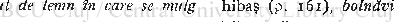

astăzi în Ungaria.

Ibd'i, iubd'i (a) 130, a iubi. ii 223, ei (pronume). îmbumbuşcat 121 împodobit cu « bum-

buşte ».

îmburda (a se) 220, a se împiedeca, a se.

încurca.

###### ronţăi.

împcistri (a) (p. 159), a împistri, a roşi (ouă) împletica (a) 426, a împleteci, a încurca.

groştior 65, smântână. gruă 305, graur.

încide (a) 323, a închide.

încrăncate 207, crăcănate, desfăcute.

Gudşnii 216, numele unor familii. gujulie (p. 164), insectă mică cu picioare multe.

încredinţî (a) 5, a logodi.

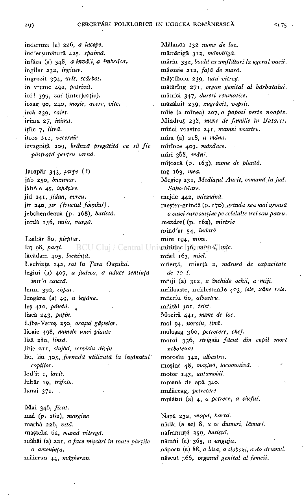

îndemna (a) 226 , a începe. înd'erşunătură 425 , spaimă.

Mălanca 23 2 nume de loc. mămărigă 312 mămăligă.

înfăca (a) 348 a învăli, a îmbrăca.

marin 332 , boală cu umflături la ugerul vacii.

- măsoaie212 , faţă de masă.

- măştihoiu 239, tată vitreg.

- mătărîng271 organ genital al bărbatului.

- mătrici 347 dureri reumatice.

- măzăluit 239 zugrăvit, vopsit. mîie (a mînea) 207, a poposi peste noapte. Mîndruţ 238 nume de familie în Batarci. mînei voastre 241 , mamei voastre. mîra (a) 218 a mâna. mîrînce 403 , mănânce. mîri 368 , mâni. mîţoacă (p.163) , nume de plantă. me 163 mea. Megieş231 , Mediaşul Aurit, comună în jud.

Satu-Mare.

mejde 442 , miezuină.

meşter-grindă (p.170), grinda cea mai groasă a casei care susţine pe celelalte trei sau patru.

mezdre( (p. 162) mistrie. mind'ar 54 îndată. mire 194 , mine. mititioc 36 , mititel, mic. mhel 163 miel. mherţă, mierţă 2 măsură de capacitate

de 20 l. mhiji (a)312 a închide ochii, a miji. mniloaste, mnilostenile 403 , iele, zâne rele.

mheriu 60 albastru. mnişăl 301 , trist. Mociră 441 nume de loc.

mol 94 noroiu, tină. moloşag 360 petrecere, chef. moroi 336 strigoiu făcut din copil mort

nebotezat.

morosîu 342 , albastru.

moşînă 48 maşină, locomotivă.

motor 143 automobil. mreană de apă 340 mulăceag, petrecere.

mulătui (a) 4 a petrece, a chefui.

Napă 232, mapă, hartă.

- nădăi (a se) 8 a se dumeri, lămuri.

- năfrămuţă 259 , batistă.

- nămni (a) 365 , a angaja.

- năposti (a) 88 a lăsa, a slobozi, a da drumul.

- născut 366 , organul genital al femeii.

îngiler 232 , inginer.

îngrozit 394 urît, scârbos.

în vreme 492 , potrivit. ioi ! 399 , vai (interjecţie).

iosag 90 , 240 moşie, avere, vite.

ircă 239 , caiet. irima 27 inima.

#### iţîie 7 litră.itros 211 vecernie.izvagniţă 209 brânză pregătită ca să fie

păstrată pentru iarnă.

Jarapăr 343 , şarpe ( ?)

jab 250 buzunar.

jălinie 45, ispăşire.

#### jîd241 jidan, evreu.jîr 240, jir (fructul fagului).jebchendeauă (p. 168) batistă.jordă136, nuia, varga.

Laibăr 80 pieptar.

#### laţ 98 părţi.

lăcădam 405 , locuinţă.

Lechinţa142 , sat în Ţara Oaşului. legiui (a) 407 a judeca, a aduce sentinţa

într'o cauză.

lemn 392 , copac. lengăna (a) 49 a legăna.

leş410 , pândă.

liacă 243 , puţin.

#### Liba-Varoş 250 oraşul gâştelor. lioaie 498 numele unei plante.

lisă 280 linsă.

litie 2ii slujbă, serviciu divin. liu, liu 305, formulă utilizată la legănatul

copiilor.

lod'it 1 lovit. luhăr 19 trifoiu. lunai 371 .

Mai 346, ficat. mal (p.162) , margine.

marhă 226 , vită.

maştehă 62 mamă vitregă.

- măhăi (a)221 , a face mişcări în toate părţile a ameninţa.

- măieran 44 măgheran.

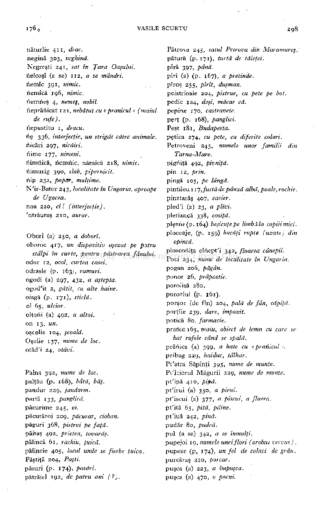

VASILE SCURT U 298

#### Pătrova 245, satul Petrova din Maramureş. pătură (p. 171), turtă de tăieţei.

- năturlie 411 , drac. negină 303, neghină. Negreşti 241, sat în Ţara Oaşului. rielcoşî (a se) 112, a se mândri. riemîc 391, nimic. riemîcă 196, nimic. nemneş 4, nemeş, nobil. tîeprănicat 121, nebătut cu « pranicul » (maiul

pîră 397, până. pîrî (a) (p. 167), a pretinde.

#### pîroş 255, pîrît, duşman. pcistrioaie 204, pistrue, cu pete pe bot. pedic 124, deşi, măcar că.

pepine 170, castravete. perţ (p. 168), panglici. Peşt 181, Budapesta.

de rufe).

rîepustitu 1, dracu.

petica 274, cu pete, cu diferite colori. Petro veni 245, numele unor familii din

- n

336, interjecţie, un strigăt către animale.

riicări 297, nicăiri. nime 177, nimeni. nimnică, rïemrïic, nămică 218, nimic.

himurig 390, slab, pipernicit. nip 232, popor, mulţime. N'ir-Bator 243, localitate în Ungaria, aproape

de Ugocea. noa 220, ei! (interjecţie).

'ntrăuraş 210 aurar.

Oborî (a) 250, a doborî.

oboroc 417, un dispozitiv aşezat pe patru

stâlpi în curte, pentru păstrarea fânului. odor 12, ocol, curtea casei.

odrasle (p. 163), ramuri. ogodi (a) 297, 432,. a aştepta.

ogod'it 2, gătit, cu alte haine.

oiagă (p. 171), sticlă. ol 65, ulcior. oltoni (a) 492, a altoi. on 13, un.

- oşcolie 104, şcoală.

Tarna-Mare.

pigriiţă 492, pivniţă.

#### pin 12, prin.

pingă 105, pe lângă.

pintileu 117, fustă de pânză albă, poale, rochie.

pinztarăş 407, casier. pled'i (a) 23, a plivi. pletiancă 338, cosiţă.

plezrie(p. 164) beşicuţepe limbila copiiimici. plocoaje, (p. 159) bucăţi rupte (uzate) din

opincă.

plosconiţa cînept'i 342, floarea cânepii.

Poci 234, nume de localitate în Ungaria.

pogan 206, păgân: ponor 26, prăpastie. porolisă 280. porozlui (p. 161),

porşor (de fîn) 204, pală de fân, căpiţă. porţîie 239, dare, impozit.

potică 80, farmacie.

prahic 165, maiu, obiect de lemn cu care se

bat rufele când se spală. prănica (a) 399, a bate cu «pranicul ». pribag 229, haiduc, tâlhar.

- Oşolie 137, nume de loc. otăd'i 24, otăvi.

Palna 392, nume de loc. palţău (p. 168), bâtă, băţ. pandur 229, jandarm. partă 133, panglică. păcurime 245, oi.

păcurăroi 209, păcurar, cioban. păguri 368, pistrui pe faţă. păitaş 492, prieten, tovarăş. palincă 61, rachiu, ţuică. pălincie 405, locul unde se fierbe ţuica.

- Păştiţă 204, Paşti. păsuri (p. 174), pasări. pătrăiel 192, de patru ani (?).

Pt'atra Săpînţi 395, nume de munte. Pt'iciorul Măgurii 229, nume de munte. pt'ipă 410, pipă. pt'irui (a) 350, a pir ui.

pt'iscui (a) 377, a piscui, a fluera. pt'ită 65, pită, pâine.

pt'iuă 242, piuă. pudăr 80, pudră.

pui (a se) 342, a se înmulţi. pupejoi 19, numele unei flori ( orobus vervus) . pupeze (p, 174), un fel de colaci de grâu.

purcăraş 210, porcar. puşca (a) 223, a împuşca. puşca (a) 470, o pocni.

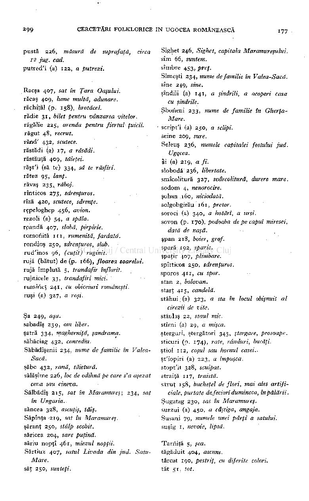

Sîghet 246, Sighet, capitala Maramureşului. sîm 66, suntem.

pustă 226, măsură de suprafaţă, circa

12 jug. cad.

sîmbre 453, preţ.

putred'i (a) 122, a putrezi.

Sîmeşti 234, nume de familie în Valea-Sacă.

sîne 249, sine.

Racşa 407, sat în Ţara Oaşului. răcaş 409, lume multă, adunare.

şîndili (a) 141, a şindrili, a acoperi casa cu şindrile. Şborieni 233, nume de familie în GherţaMare.

răchiţăl (p. 158), brotăcel.

rădie 31, bilet pentru vânzarea vitelor. răgălie 225, arenda pentru fiertul ţuicii.

script'i (a) 250, a sclipi. seine 209, sure.

- răgut 48, recrut.

- rănd' 432, scutece.

- răstădi (a) 17, a răsădi.

- răstăuţă 409, tăieţei.

- răşt'i (să te) 334, să te răsfiri. ratez 95, lanţ.

- răvaş 23 s

x

răboj. rînticos 275, sdrenţuros.

rîză 420, scutece, sdrenţe.

repeloghep 456, avion. rezoli (a) 54, a spăla.

rpandă 407, slabă, pirpirie. romonită ni , rumenită, fardată. rondioş 250, sdrenţuros, slab. rud'inos 96, (cuţit) ruginit.

rujă (bătut) de (p. 166), floarea soarelui. rujă împlută 5, trandafir înflorit.

rujnicele 33, trandafiri mici. rumîheţ 241, cu obiceiuri româneşti.

ruşi (a) 327, a roşi.

Şa 249, aşa. sabadîş 239, om liber. şatră 334, magherniţă, şandrama.

- săbăciag 432, concediu. Săbădîşenii 234, nume de familie în Valea-

Sacă. şăbe 432, rană, tăietură.

- sălăşîme 226, loc de odihnă pe care s'a aşezat ceva sau cineva.

Sălbădîş 215, sat în Maramureş; 234, saţ

în Ungaria.

- săncea 328, ascuţiş, tăiş. Săpînţa 219, sat în Maramureş. şăranţ 250, stâlp scobit.

- săricea 204, sare puţină.

- săriu nopţî 461, miezul nopţii. Sărtiuz 407, satul Livada din jud. Sata-

Mare.

- săţ 250, sunteţi.

Seleuş 236, numele capitalei fostului jud.

Ugocea. si (a) 219, a fi. slobodă 236, libertate. smîcolitură 327, svârcolitură, durere mare. sodom 4, nenorocire. şohan 160, niciodată. solgobgirău 161, pretor. soroci (a) 340, a hotărî, a ursi. sovon (p. 170), podoaba de pe capul miresei,

dată de naşă. şpan 218, boier, grof.

spară 192, sparie. şpaţir 407, plimbare. spîrticos 250, sdrenţuros. sporos 411, cu spor. stan 2, bolovan. start 415, candelă.

#### stăhui(a) 323, a sta în locul obişnuit al cirezii de vite.

stăuliş 22, staul mic.

- stîrni (a) 29, a mişca. şterguri, ştergători 345, ştergare, prosoape. sticuri (p. 174), rate, rânduri, bucăţi. ştiol 112, coşul sau hornul casei.şt'iopiri (a) 223, a împuşca. stopt'it 328, scuipat. straiţă 117, traistă. struţ 158, bucheţel de flori, mai ales artifi­

ciale, purtate de.feciori dumineca, în pălării.

Şugatag 230, sat în Maramureş.

surzui (a) 450, a câştiga, angaja. Susani 79, numele unei părţi a satului.

- suşîg 1, nevoie, lipsă.

Tarriiţă 5, şea. tăgăduit 404, ascuns.

tărcat 190, pestriţ, cu diferite colori. tăt 51, tot.

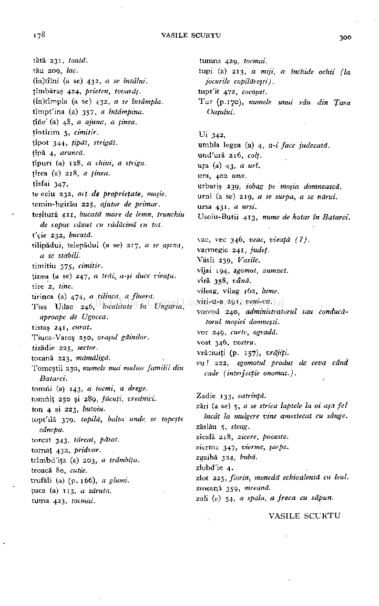

- tătă 231, toată.

tumna 429, tocmai.

- tău 20g, lac. (în)tîlni (a se) 432, a se întâlni. ţîmbăraş 424, prieten, tovarăş. (în)tîmpla (a se) 432, a se întâmpla. tîmpt'ina (a) 357, a întâmpina. ţine' (a) 48, a ajuna, a ţinea. ţîntîrim 5, cimitir. ţîpot 344, ţipăt, strigăt. ţîpă 4, aruncă. ţîpuri (a) 128, a chiui, a striga. ţîrea (a) 218, a ţinea. ţîsfai 347, te eciu 232, act de proprietate, moşie. temin-bgirău 225, ajutor de primar. teşîtură 421, bucată mare de lemn, trunchiu

##### tupi (a) 213, a miji, a închide ochii (la jocurile copilăreşti).

tupt'it 472, cocoşat.

Tur (p.170), numele unui râu din Ţara Oaşului.

Ui 342, umbla legea (a) 4, a-i face judecată. und'ură 216, colţ. ura (a) 43, a urî. ura, 402 una. urbariş 239, iobag pe moşia domnească. urni (a se) 219, a se surpa, a se nărui. ursa 431, a ursi. Usoiu-Butii 413, nume de hotar în Batarci.

de copac căzut cu rădăcină cu tot.

t'eie 232, bucată. tilipădui, telepădui (a se) 217, a se aşeza,

vac, vec 346, veac, vieaţă (?).

varmegie 241, judeţ. Văsîi 239, Vasile.

a se stabili.

timitiu 375, cimitir.

vîjai 194, sgomot, zumzet.

##### ţinea (a se) 247, a trăi,, a-şi duce vieaţa.

vîră 358, vână. vileag, vilag 162, lume. viri-u-a 291, veni-va.

tire 2, tine.

##### tirinca (a) 474, a tilinca, a fluera.

Tisa Uilac 246, localitate în Ungaria,

voivod 240, administratorul sau conducă­

##### aproape de Ugocea.

torul moşiei domneşti. vor 249, curte, ogradă.

tistaş 241, curat.

##### Tiuca-Varoş 250, oraşul găinilor.

vost 346, vostru. vrăciuiţi (p. 157), vrăjiţi.

tizădie 225, sector. tocană 223, mămăligă.

vu ! 222, sgomotul produs de ceva când cade (interjecţie onomat. ).

Tomeştii 230, numele mai multor familii din

Batarci. tomrii (a) 143, a tocmi, a drege. tomniţ 250 şi 289, făcuţi, vrednici. ton 4 şi 223, butoiu. topt'ilă 379, topilă, balta unde. se topeşte

Zadie 133, catrinţă.

zări (a se) 5, a se strica laptele la oi aşa fel încât la mulgere vine amestecat cu sânge.

zăslău 5, steag.

cânepa. torcat 343, tărcat, pătat.

zicală 218, zicere, poveste. zierme 347, vierme, şarpe.

tornaţ 432, pridvor. trîmbd'iţa (a) 203, a trâmbiţa. troacă 8o, cutie. trufăli (a) (p. 166), a glumi. ţuca (a) 115 a săruta. tuma 423, tocmai.

zgaibă 324, bubă. zlobd'ie 4.

zlot 225, fiorin, monedă echivalentă cu leul. zmeanî 359, mreană. zoii (a) 54, a spăla, a freca cu săpun.

VASIL E SCURT U

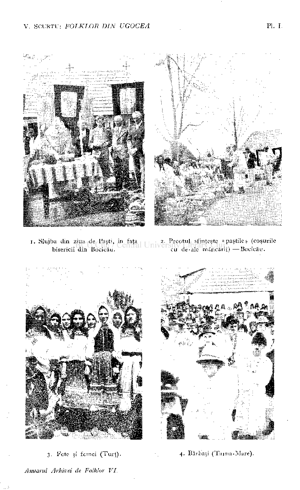

V. SCURTU; FOLKLOR DIN UGOCEA Pl.

i. Slujba din ziua de Paşti, în faţa 2. Preotul sfinţeşte «pastile» (coşurile bisericii din Bocicău. cu de-ale mâncării)—Bocicău.

Anuarul Arhivei de Folklor VI

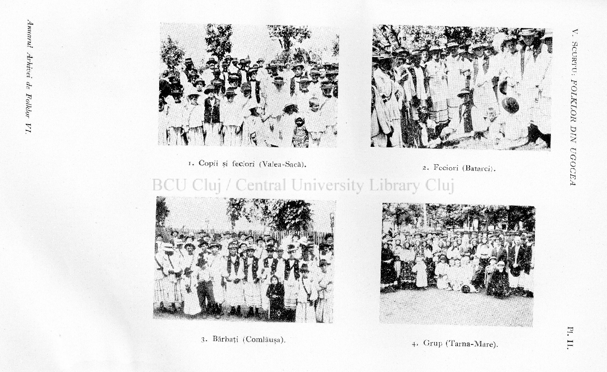

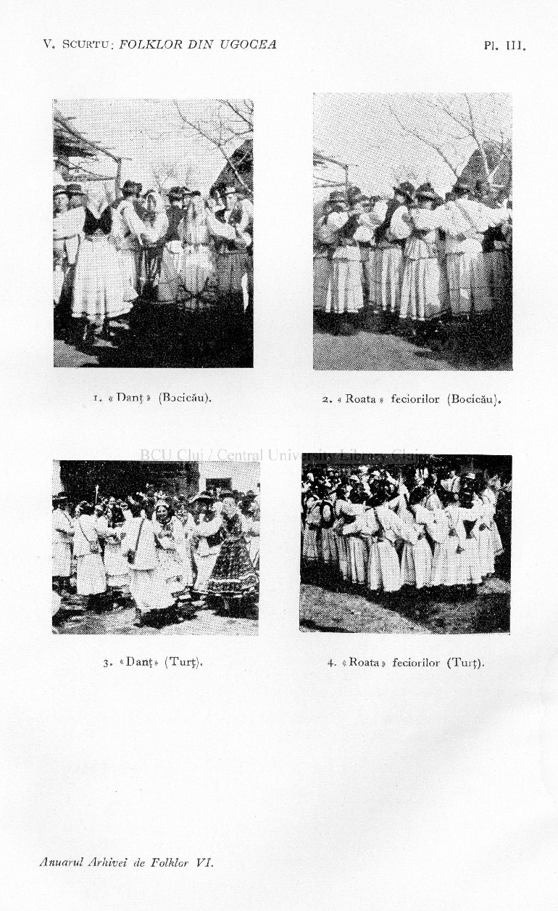

V . SCURTU : FOLKLOR DIN UGOCEA Pl. III.

Anuarul Arhivei de Folklor VI.

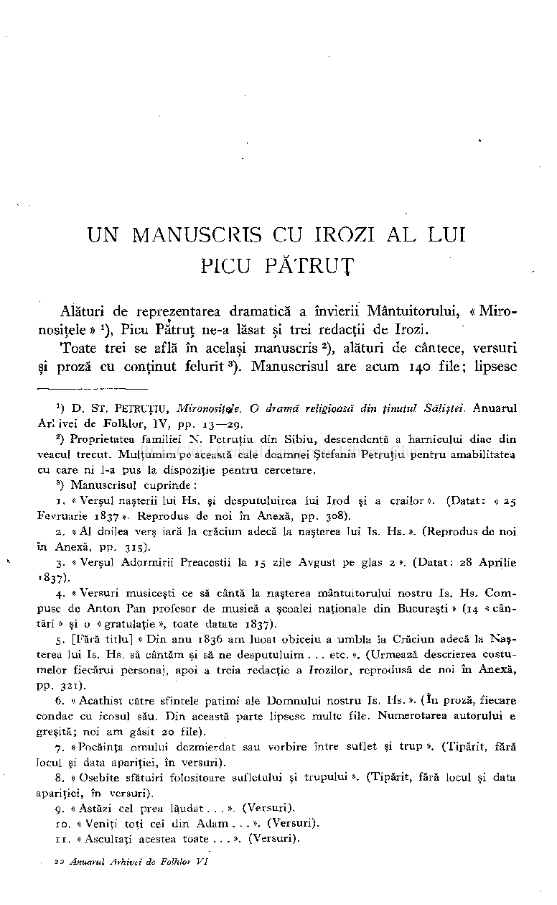

## UN MANUSCRIS CU IROZI AL LUI PICU PĂTRUŢ

Alături de reprezentarea dramatică a învierii Mântuitorului, « Mironosiţele » Picu Pătruţ ne-a lăsat şi trei redacţii de Irozi.

Toate trei se află în acelaşi manuscris ), alături de cântece, versuri şi proză cu conţinut felurit

). Manuscrisul are acum 140 file ; lipsesc

3

*) D . ST. PETRUŢIU, Mironosiţele. O dramă religioasă din ţinutul Săliştei. Anuarul

Arhivei de Folklor, IV, pp. 13—29.

###### ) Proprietatea familiei N . Petruţiu din Sibiu, descendentă a harnicului diac din veacul trecut. Mulţumim pe această cale doamnei Ştefania Petruţiu pentru amabilitatea cu care ni 1-a pus la dispoziţie pentru cercetare.

2

) Manuscrisul cuprinde :

3

- 1. «Versul naşterii lui Hs. şi desputuluirea lui Irod şi a crailor». (Datat: « 25

Fevruarie 1837». Reprodus de noi în Anexă, pp. 308).

- 2. « Al doilea vers iară la crăciun adecă la naşterea lui Is. Hs. ». (Reprodus de noi

în Anexă, pp. 315).

- 3. «Versul Adormirii Preacestii la 15 zile Avgust pe glas 2». (Datat: 28 Aprilie

'837)-

- 4. « Versuri musiceşti ce să cântă la naşterea mântuitorului nostru Is. Hs. Com ­

puse de Anton Pan profesor de musică a şcoalei naţionale din Bucureşti » (14 « cân­

- tări » şi o « gratulaţie », toate datate 1837).

5. [Fără titlu] « Din anu 1836 am luoat obiceiu a umbla la Crăciun adecă la Naş terea lui Is. Hs. să cântăm şi să ne desputuluim . . . etc. ». (Urmează descrierea costumelor fiecărui personaj, apoi a treia redacţie a Irozilor, reprodusă de noi în Anexă, pp. 321).

- 6. « Acathist către sfintele patimi ale Domnului nostru Is. Hs. ». (în proză, fiecare

condac cu icosul său. Din această parte lipsesc multe file. Numerotarea autorului e greşită; noi am găsit 20 file).

- 7. « Pocăinţa omului dezmierdat sau vorbire între suflet şi trup ». (Tipărit, fără

locul şi data apariţiei, în versuri).

- 8. « Osebite sfătuiri folositoare sufletului şi trupului ». (Tipărit, fără locul şi data

apariţiei, în versuri).

- 9. «Astăzi cel prea lăudat .. . ». (Versuri).
- 10. «Veniţi toţi cei din Adam...» . (Versuri).
- 11 «Ascultaţi acestea toate...» . (Versuri).

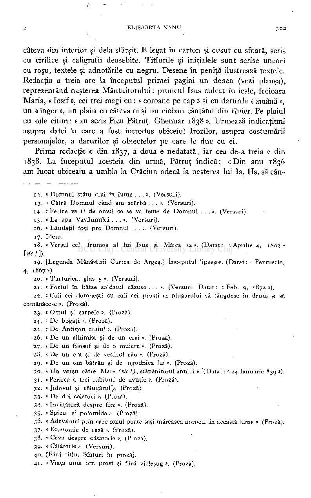

câteva din interior şi delà sfârşit. E legat în carton şi cusut cu sfoară, scris cu cirilice şi caligrafii deosebite. Titlurile şi iniţialele sunt scrise uneori cu roşu, textele şi adnotările cu negru. Desene în peniţă ilustrează textele. Redacţia a treia are la începutul primei pagini un desen (vezi planşa), reprezentând naşterea Mântuitorului : pruncul Isus culcat în iesle, fecioara Maria, « Iosif », cei trei magi cu : « coroane pe cap » şi cu darurile « amână », un « înger », un plaiu cu câteva oi şi un cioban cântând din fluier. Pe plaiul cu oile citim: «au scris Pi cu Pătruţ. Ghenuar 1838 ». Urmează indicaţiuni asupra datei la care a fost introdus obiceiul Irozilor, asupra costumării personajelor, a darurilor şi obiectelor pe care le duc cu ei.

Prima redacţie e din 1837, a doua e nedatată, iar cea de-a treia e din

1838. La începutul acesteia din urmă, Pătruţ indică: «Din anu 1836 am luoat obiceaiu a umbla la Crăciun adecă la naşterea lui Is. Hs. să cân-

- 12. « Domnul stătu crai în lume .. . ». (Versuri).
- 13. « Cătră Domnul când am scârbă .. . ». (Versuri).
- 14. « Ferice va fi de omul ce se va teme de Domnul .. . ». (Versuri).
- 15. « La apa Vavilonului .. . ». (Versuri).
- 16. « Lăudaţii toţi pre Domnul .. . ». (Versuri).
- 17. Idem.
- 18. «Versul cel frumos al lui Isus şi Maica sa». (Datat: «Aprilie 4, 1802»

[sic!]).

- 19. [Legenda Mănăstirii Curtea de Argeş.] începutul lipseşte. (Datat: « Fevruarie,

4, 1867»).

- 20. « Turturica, glas 5 ». (Versuri).
- 21. «Fostul în bătae soldatul căzuse.. . ». (Versuri. Datat: «Feb. 9, 1872»).
- 22. «Caii cei domneşti cu caii cei proşti ai plugarului să tânguesc în drum şi să

comănăcesc ». (Proză).

- 23. « Omul şi şarpele ». (Proză).
- 24. « De bogaţi ». (Proză).
- 25. « De Antigon craiul ». (Proză).
- 26. « De un alhimist şi de un crai ». (Proză).
- 27. « De un filosof şi de o muiere ». (Proză).
- 28. « De un om şi de vecinul său ». (Proză).
- 29. « De un om bătrân şi de logodnica lui ». (Proză).
- 30. « U n verşu către Mare (sic !), stăpânitorul anului ». (Datat : <« 24 Ianuarie 839 »)•
- 31. « Peri rea a trei iubitori de avuţie». (Proză).
- 32. «Jidovul şi călugărul"». (Proză).
- 33. « De doi călători ». (Proză).
- 34. « învăţătură despre fire ». (Proză).
- 35. «Spicul şi polomida ». (Proză).
- 36. « Adevăruri prin care omul poate saşi mărească norocul în această lume ». (Proză).
- 37. « Economie de casă ». (Proză).
- 38. « Ceva despre căsătorie ». (Proză).
- 39. « Călătorie ». (Versuri).
- 40. [Fără titlu. Sfaturi în proză].
- 41. «Viaţa unui om prost şi fără vicleşug». (Proză).

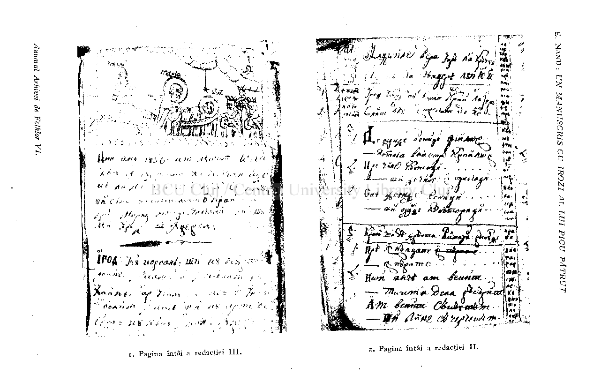

w

# Ui 'r* *% I

1*4 • f

as >

T'

c

<itntc$c

gl ö!<5 Co

o

O c;

(

5 o

A * '* <f « \ -'. i^iii X* ii/ C Ut A<*//,<i » /< Ă< £f* XLiffî.

N

• > . . , , , 1

»*/»

###### h

•v , ''T i / I

I-J

o q

a.

q

/ A

• / m ? .. .

t ....

2. Pagina întâi a redacţiei II.

Pagina întâi a redacţiei III.

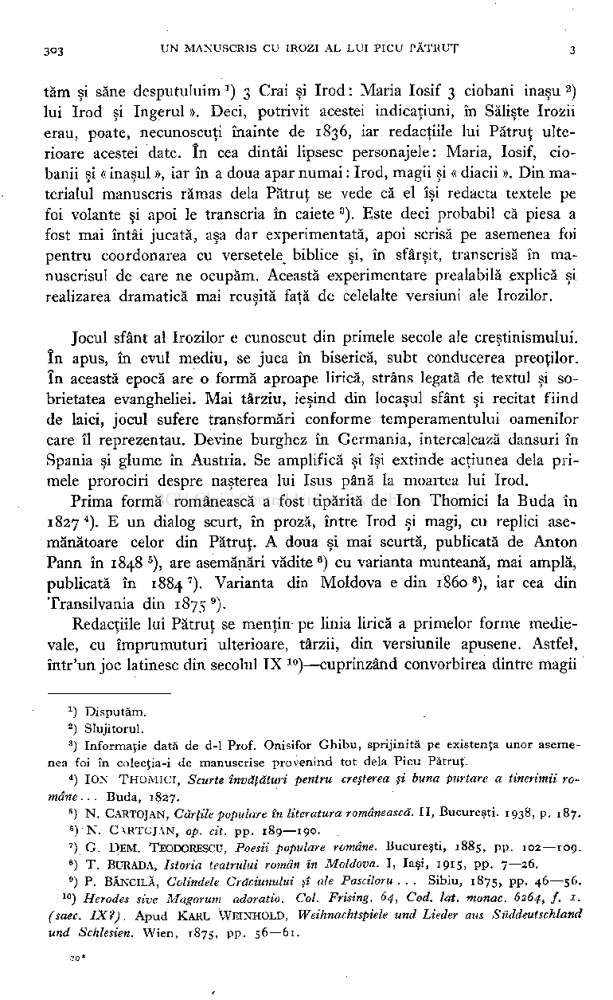

- tăm şi săne desputuluim

) lui Irod şi îngerul ». Deci, potrivit acestei indicaţiuni, în Sălişte Irozii erau, poate, necunoscuţi înainte de 1836, iar redacţiile lui Pătruţ ulterioare acestei date. în cea dintâi lipsesc personajele : Maria, Iosif, ciobanii şi « inaşul », iar în a doua apar numai : Irod, magii şi « diacii ». Din materialul manuscris rămas delà Pătruţ se vede că el îşi redacta textele pe foi volante şi apoi le transcria în caiete ). Este deci probabil că piesa a fost mai întâi jucată, aşa dar experimentată, apoi scrisă pe asemenea foi pentru coordonarea cu versetele biblice şi, în sfârşit, transcrisă în manuscrisul de care ne ocupăm. Această experimentare prealabilă explică şi realizarea dramatică mai reuşită faţă de celelalte versiuni ale Irozilor.

) 3 Crai şi Irod : Maria Iosif 3 ciobani inaşu

1

2

Jocul sfânt al Irozilor e cunoscut din primele secole ale creştinismului, în apus, în evul mediu, se juca în biserică, subt conducerea preoţilor, în această epocă are o formă aproape lirică, strâns legată de textul şi sobrietatea evangheliei. Mai târziu, ieşind din locaşul sfânt şi recitat fiind de laici, jocul sufere transformări conforme temperamentului oamenilor care îl reprezentau. Devine burghez în Germania, intercalează dansuri în Spania şi glume în Austria. Se amplifică şi îşi extinde acţiunea delà primele prorociri despre naşterea lui Istis până la moartea lui Irod.

Prima formă românească a fost tipărită de Ion Thomici la Buda în 1827

). E un dialog scurt, în proză, între Irod şi magi, cu replici asemănătoare celor din Pătruţ. A doua şi mai scurtă, publicată de Anton Pann în 1848 ), are asemănări vădite

4

) cu varianta munteană, mai amplă, publicată în 1884

8

), iar cea din Transilvania din 1875

). Varianta din Moldova e din 1860

7

8

).

9

Redacţiile lui Pătruţ se menţin pe linia lirică a primelor forme medievale, cu împrumuturi ulterioare, târzii, din versiunile apusene. Astfel, într'un joc latinesc din secolul IX

)—cuprinzând convorbirea dintre magii

10

- 1

) Disputăm.

- 2

) Slujitorul.

- 3

###### ) Informaţie dată de d-1 Prof. Onisifor Ghibu, sprijinită pe existenţa unor asemenea foi în colecţia-i de manuscrise provenind tot delà Pieu Pătruţ.

) IO N THOMICI , Scurte învăţături pentru creşterea şi buna purtare a tinerimii ro­

4

mâne.. . Buda, 1827.

- 5

) N . CARTOJAN, Cărţile populare în literatura românească, II, Bucureşti. 1938, p. 187.

- 6

) N . CARTCJ.\N , op. cit. pp. 189—190.

- 7

) G . DEM. TEODORESCU, Poesii populare române. Bucureşti, 1885, pp 102—109.

- 8

) T . BURADA, Istoria teatrului român în Moldova. I, Iaşi, 1915, pp 7—26.

- 9

) P. BĂNCILĂ, Colindele Crăciunului şî ale Pasciloru . . . Sibiu, 1875, pp. 46—56.

) Herodes sive Magorum adoratio. Col. Frising. 64, Cod. lat. monac. 6264, f. 1 .

l0

(saec. IX?). Apud KAR L WEINHOLD , Weihnachtspiele und Lieder aus Süddeutschland

und Schlesien. Wien, 1875, pp. 56—61.

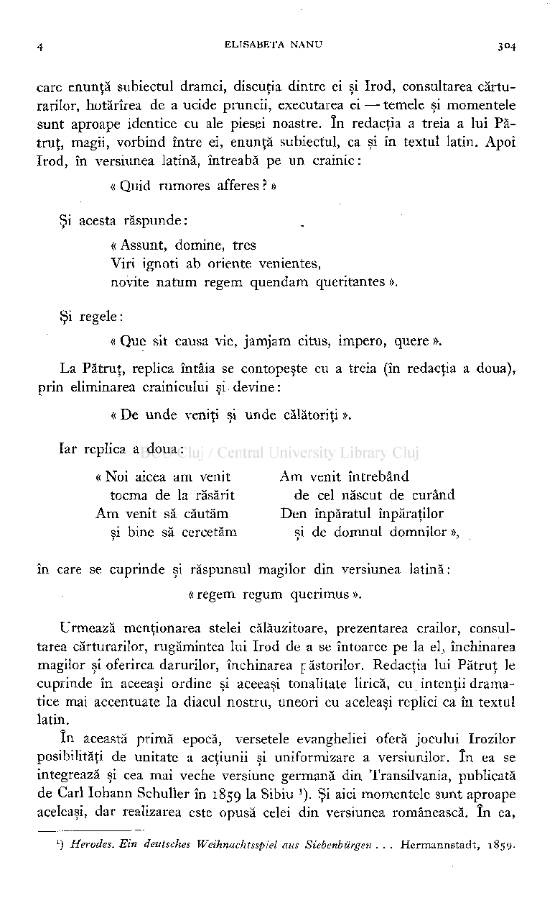

care enunţă subiectul dramei, discuţia dintre ei şi Irod, consultarea cărturarilor, hotărîrea de a ucide pruncii, executarea ei — temele şi momentele sunt aproape identice cu ale piesei noastre. în redacţia a treia a lui Pătrat, magii, vorbind între ei, enunţă subiectul, ca şi în textul latin. Apoi Irod, în versiunea latină, întreabă pe un crainic:

« Quid rumores afferes ? »

Şi acesta răspunde :

« Assunt, domine, très Viri ignoti ab oriente venientes, novite natum regem quendam queritantes ».

Şi regele: « Que sit causa vie, jamjam citus, impero, quere ».

La Pătruţ, replica întâia se contopeşte cu a treia (în redacţia a doua), prin eliminarea crainicului şi devine :

« De unde veniţi şi unde călătoriţi ».

Iar replica a doua : « Noi aicea am venit Am venit întrebând

tocma de la răsărit de cel născut de curând Am venit să căutăm Den înpăratul înpăraţilor

şi bine să cercetăm şi de domnul domnilor »,

în care se cuprinde şi răspunsul magilor din versiunea latină : « regem regum querimus ».

Urmează menţionarea stelei călăuzitoare, prezentarea crailor, consultarea cărturarilor, rugămintea lui Irod de a se întoarce pe la el, închinarea magilor şi oferirea darurilor, închinarea păstorilor. Redacţia lui Pătruţ le cuprinde în aceeaşi ordine şi aceeaşi tonalitate lirică, cu intenţii dramatice mai accentuate la diacul nostru, uneori cu aceleaşi replici ca în textul latin.

în această primă epocă, versetele evangheliei oferă jocului Irozilor posibilităţi de unitate a acţiunii şi uniformizare a versiunilor. în ea se integrează şi cea mai veche versiune germană din Transilvania, publicată de Carl Iohann Schuller în 1859 la Sibiu ). Şi aici momentele sunt aproape aceleaşi, dar realizarea este opusă celei din versiunea românească, în ea,

*) Herodes. Ein deutsches Weihnachtsspiel aus Siebenbürgen . . . Hermannstadt, 1859.

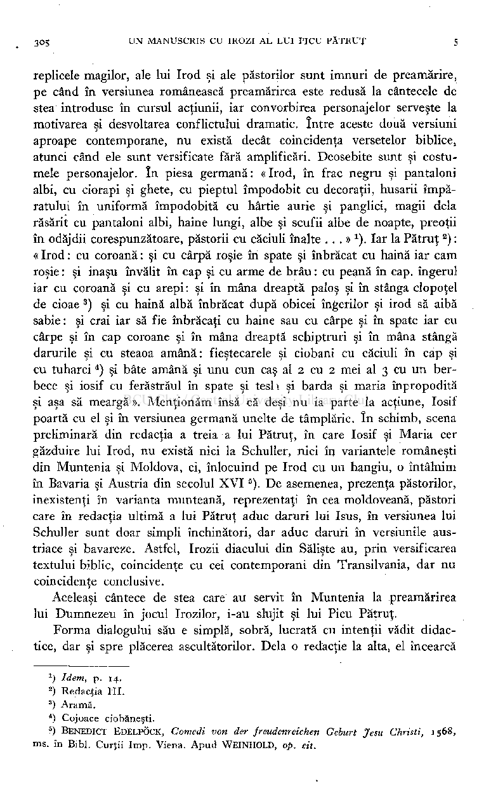

replicele magilor, ale lui Irod şi ale păstorilor sunt imnuri de preamărire, pe când în versiunea românească preamărirea este redusă la cântecele de stea introduse în cursul acţiunii, iar convorbirea personajelor serveşte la motivarea şi desvoltarea conflictului dramatic. între aceste două versiuni aproape contemporane, nu există decât coincidenţa versetelor biblice, atunci când ele sunt versificate fără amplificări. Deosebite sunt şi costumele personajelor. în piesa germană : « Irod, în frac negru şi pantaloni albi, cu ciorapi şi ghete, cu pieptul împodobit cu decoraţii, husarii împăratului în uniformă împodobită cu hârtie aurie şi panglici, magii delà răsărit cu pantaloni albi, haine lungi, albe şi scufii albe de noapte, preoţii în odăjdii corespunzătoare, păstorii cu căciuli înalte ... » ). Iar la Pătruţ ) : « Irod : cu coroană : şi cu cârpă roşie în spate şi înbrăcat cu haină iar cam roşie : şi inaşu învălit în cap şi cu arme de brâu : cu peana în cap. îngerul iar cu coroană şi cu arepi: şi în mâna dreaptă paloş şi în stânga clopoţel de cioae ) şi cu haină albă înbrăcat după obicei îngerilor şi irod să aibă sabie : şi crai iar să fie înbrăcaţi cu haine sau cu cârpe şi în spate iar cu cârpe şi în cap coroane şi în mâna dreaptă schiptruri şi în mâna stângă darurile şi cu steaoa amână: fieştecarele şi ciobani cu căciuli în cap şi cu tuharci ) şi bâte amână şi unu cun caş al 2 cu 2 mei al 3 cu un berbece şi iosif cu ferăstrăul în spate şi tesh şi barda şi maria înpropodită şi aşa să meargă ». Menţionăm însă că deşi nu ia parte la acţiune, Iosif poartă cu el şi în versiunea germană unelte de tâmplărie. în schimb, scena preliminară din redacţia a treia a lui Pătruţ, în care Iosif şi Maria cer găzduire lui Irod, nu există nici la Schuller, nici în variantele româneşti din Muntenia şi Moldova, ci, înlocuind pe Irod cu un hangiu, o întâlnim în Bavaria şi Austria din secolul XVI ) . De asemenea, prezenţa păstorilor, inexistenţi în varianta munteană, reprezentaţi în cea moldoveana, păstori care în redacţia ultimă a lui Pătruţ aduc daruri lui Isus, în versiunea lui Schuller sunt doar simpli închinători, dar aduc daruri în versiunile austriace şi bavareze. Astfel, Irozii diacului din Sălişte au, prin versificarea textului biblic, coincidenţe cu cei contemporani din Transilvania, dar nu coincidenţe conclusive.

Aceleaşi cântece de stea care au servit în Muntenia la preamărirea lui Dumnezeu în jocul Irozilor, i-au slujit şi lui Picu Pătruţ.

Forma dialogului său e simplă, sobră, lucrată cu intenţii vădit didactice, dar şi spre plăcerea ascultătorilor. Delà o redacţie la alta, el încearcă

*) Idem, p. 14.

- 2

) Redacţia III.

- 3

) Aramă.

*) Cojoace ciobăneşti.

) BENEDICT EDELPÖCK, Comedi von der freudenreichen Geburt Jesu Christi, 1568,

5

ms. în Bibi. Curţii Imp. Viena. Apud WEINHOLD , op. cit.

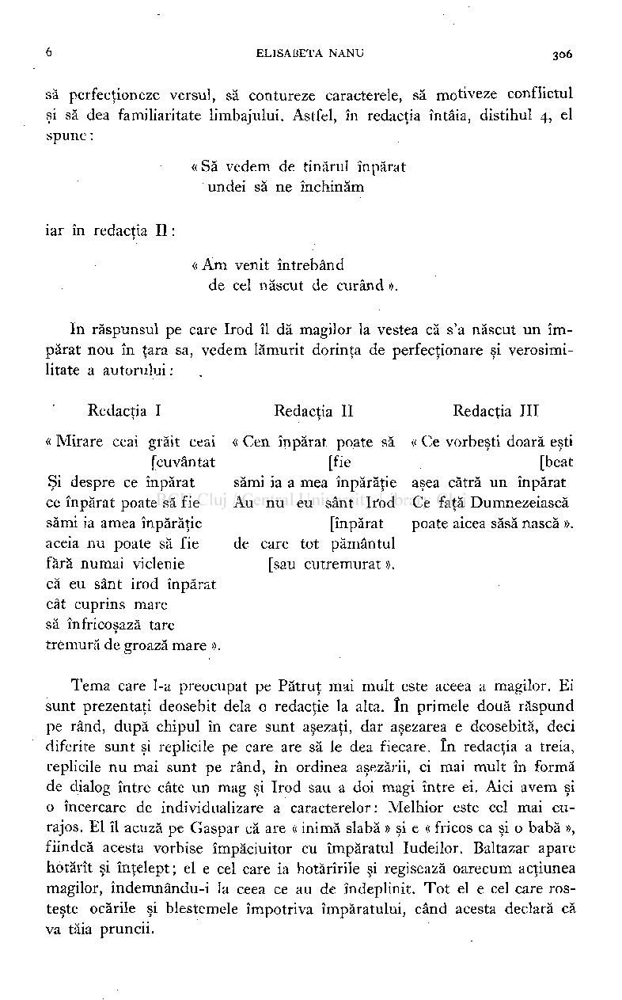

să perfecţioneze versul, să contureze caracterele, să motiveze conflictul şi să dea familiaritate limbajului. Astfel, în redacţia întâia, distihul 4, el spune :

« Să vedem de tinărul înpărat undei să ne închinăm

iar în redacţia II :

« Am venit întrebând de cel născut de curând ».

In răspunsul pe care Irod îl dă magilor la vestea că s'a născut un împărat nou în ţara sa, vedem lămurit dorinţa de perfecţionare şi verosimilitate a autorului :

Redacţia I « Mirare ceai grăit ceai

Redacţia III (< Ce vorbeşti doară eşti

Redacţia II « Cen înpărat poate să

[cuvântat Şi despre ce înpărat ce înpărat poate să fie sămi ia amea înpărăţie aceia nu poate să fie fără numai viclenie că eu sânt irod înpărat cât cuprins mare să înfricoşază tare tremură de groază mare ».

[beat

[fie

sămi ia a mea înpărăţie Au nu eu sânt Irod

aşea cătră un înpărat Ce faţă Dumnezeiască poate aicea săsă nască ».

[înpărat

de care tot pământul [sau cutremurat ».

Tema care 1-a preocupat pe Pătruţ mai mult este aceea a magilor. Ei sunt prezentaţi deosebit delà o redacţie la alta. în primele două răspund pe rând, după chipul în care sunt aşezaţi, dar aşezarea e deosebită, deci diferite sunt şi replicile pe care are să le dea fiecare. în redacţia a treia, replicile nu mai sunt pe rând, în ordinea aşezării, ci mai mult în formă de dialog între câte un mag şi Irod sau a doi magi între ei. Aici avem şi o încercare de individualizare a caracterelor: Melhior este cel mai curajos. El îl acuză pe Gaspar că are « inimă slabă » şi e « fricos ca şi o babă », fiindcă acesta vorbise împăciuitor cu împăratul Iudeilor. Baltazar apare hotărît şi înţelept; el e cel care ia hotărîrile şi regisează oarecum acţiunea magilor, îndemnându-i la ceea ce au de îndeplinit. Tot el e cel care rosteşte ocările şi blestemele împotriva împăratului, când acesta declară că va tăia pruncii.

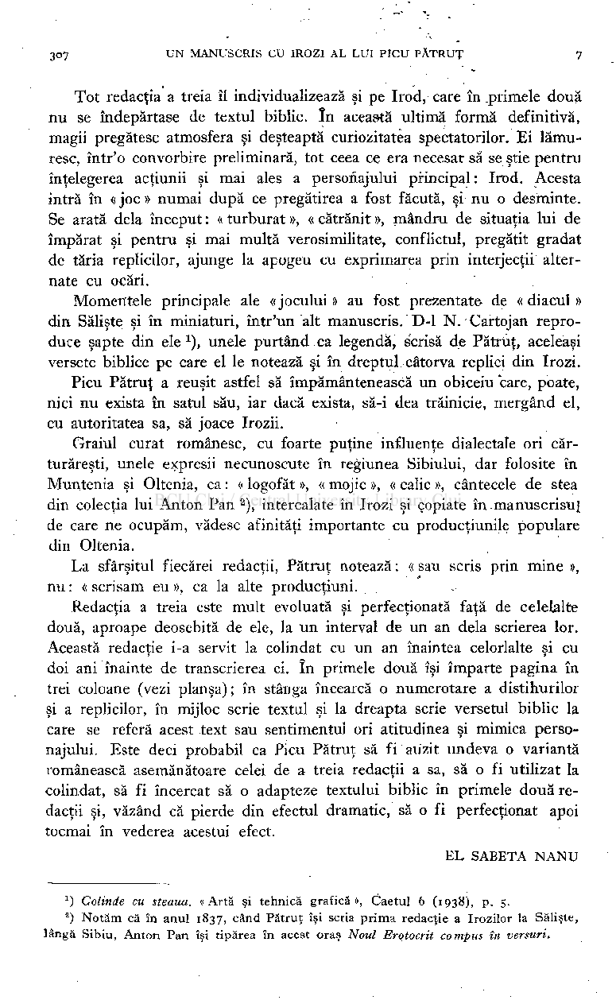

Tot redacţia a treia îl individualizează şi pe Irod, care în ^primele două nu se îndepărtase de textul biblic. în această ultimă formă definitivă, magii pregătesc atmosfera şi deşteaptă curiozitatea spectatorilor. Ei lămuresc, într'o convorbire preliminară, tot ceea ce era necesar să se ştie pentru înţelegerea acţiunii şi mai ales a personajului principal: Irod. Acesta intră în «joc» numai după ce pregătirea a fost făcută, şi nu o desminte. Se arată delà început : « turburat », « cătrănit », mândru de situaţia lui de împărat şi pentru şi mai multă verosimilitate, conflictul, pregătit gradat de tăria replicilor, ajunge la apogeu cu exprimarea prin interjecţii alternate cu ocări.

Momentele principale ale «jocului» au fost prezentate de «diacul» din Sălişte şi în miniaturi, într'un alt manuscris. D-l N. Çartojan reproduce şapte din ele

), unele purtând,ca legendă, scrisă de Pătruţ, aceleaşi versete biblice pe care el le notează şi în dreptul câtorva replici din Irozi.

1

Picu Pătruţ a reuşit astfel să împământenească un obiceiu care, poate, nici nu exista în satul său, iar dacă exista, să-i dea trăinicie, mergând el, cu autoritatea sa, să joace Irozii.

Graiul curat românesc, cu foarte puţine influenţe dialectale ori cărturăreşti, unele expresii necunoscute în regiunea Sibiului, dar folosite în Muntenia şi Oltenia, ca : « logofăt », « mojic », « calic », cântecele de stea din colecţia lui Anton Pan

), intercalate în Irozi şi copiate în.manuscrisul de care ne ocupăm, vădesc afinităţi importante cu producţiunile populare din Oltenia.

2

La sfârşitul fiecărei redacţii, Pătruţ notează : « sau scris prin mine », nu : « scrisam eu », ca la alte producţiuni.

Redacţia a treia este mult evoluată şi perfecţionată faţă de celelalte două, aproape deosebită de ele, la un interval de un an delà scrierea lor. Această redacţie i-a servit la colindat cu un an înaintea celorlalte şi cu doi ani înainte de transcrierea ei. în primele două îşi împarte pagina în trei coloane (vezi planşa); în stânga încearcă o numerotare a distihurilor şi a replicilor, în mijloc scrie textul şi la dreapta scrie versetul biblic la care se referă acest text sau sentimentul ori atitudinea şi mimica personajului. Este deci probabil ca Picu Pătruţ să fi auzit undeva o variantă românească asemănătoare celei de a treia redacţii a sa, să o fi utilizat la colindat, să fi încercat să o adapteze textului biblic în primele două redacţii şi, văzând că pierde din efectul dramatic, să o fi perfecţionat apoi tocmai în vederea acestui efect.

E L SABET A NAN U

*) Colinde cu steaua. «Artă şi tehnică grafică», Caetul 6 (1938), p. 5.

###### ) Notăm că în anul 1837, când Pătruţ îşi scria prima redacţie a Irozilor la Sălişte, lângă Sibiu, Anton Pan îşi tipărea în acest oraş Noul Erotocrit compus în versuri.

2

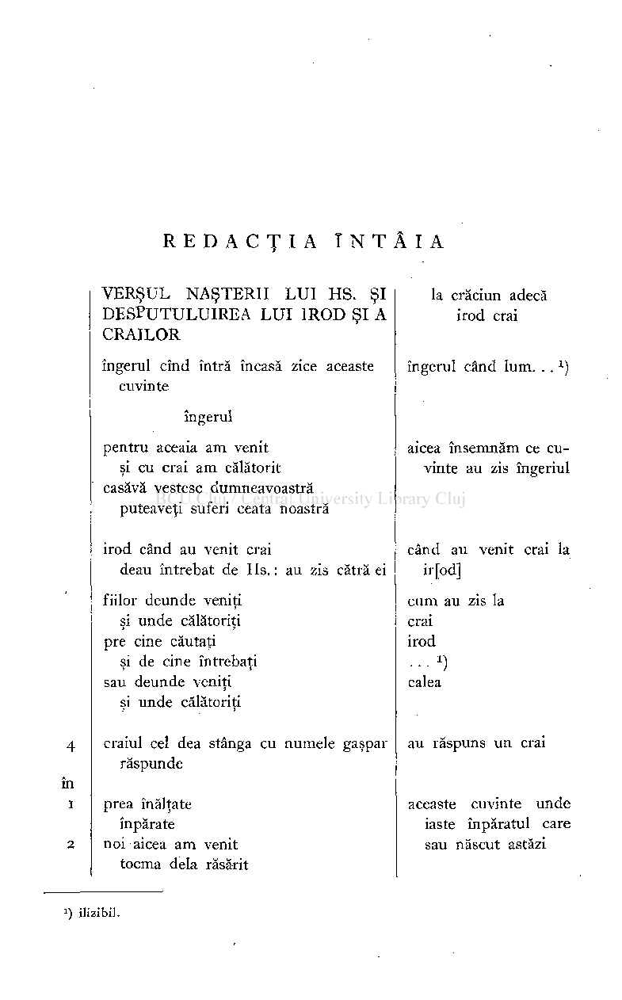

### REDACŢI A ÎNTÂI A

VERSUL NAŞTERII LUI HS. ŞI DESPUTULUIREA LUI IROD ŞI A CRAILOR

la crăciun adecă irod crai

îngerul cînd întră încasă zice aceaste cuvinte

îngerul când lum. . .

)

x

îngerul pentru aceaia am venit şi cu crai am călătorit casăvă vestesc dumneavoastră puteaveţi suferi ceata noastră

aicea însemnăm ce cuvinte au zis îngeriul

irod când au venit crai

când au venit crai la ir[od]

deau întrebat de Hs. : au zis cătră ei fiilor deunde veniţi

cum au zis la crai irod

şi unde călătoriţi pre cine căutaţi

şi de cine întrebaţi sau deunde veniţi

.. i)

calea

şi unde călătoriţi

au răspuns un crai

4 craiul cel dea stânga cu numele gaşpar

răspunde în

- 1 prea înălţate înpărate
- 2 noi aicea am venit tocma delà răsărit

aceaste cuvinte unde iaste înpăratul care sau născut astăzi

!) ilizibil.

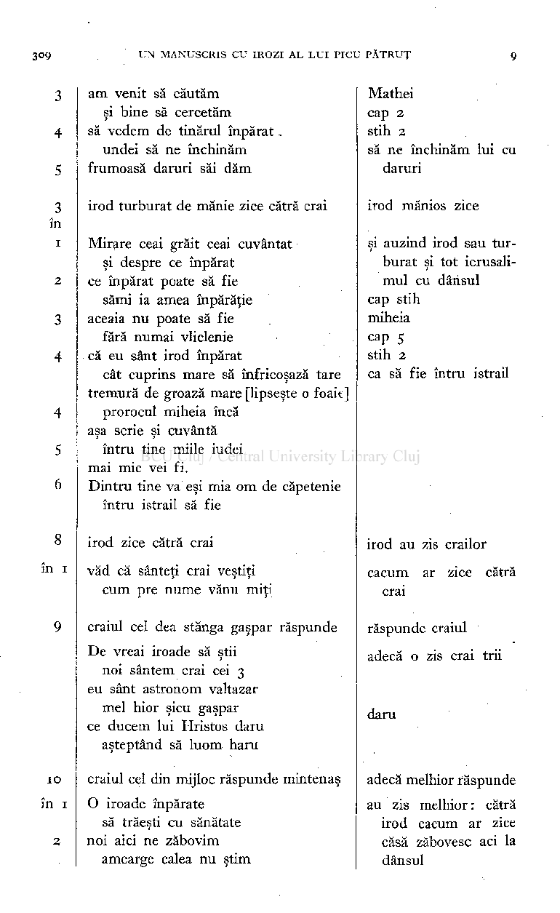

am venit să căutăm şi bine să cercetăm să vedem de tinărul înpărat. undei să ne închinăm frumoasă daruri săi dăm

Mathei cap 2 stih 2 să ne închinăm lui cu

daruri

irod mănios zice

irod turburat de manie zice cătră crai

şi auzind irod sau turburat şi tot ierusalimul cu dânsul

Mirare ceai grăit ceai cuvântat şi despre ce înpărat ce înpărat poate să fie

cap stih miheia cap 5 stih 2 ca să fie întru istrail

sămi ia amea înpărăţie aceaia nu poate să fie

fără numai vliclenie că eu sânt irod înpărat cât cuprins mare să înfricoşază tare tremură de groază mare [lipseşte o foaie]

prorocul miheia încă aşa scrie şi cuvântă

întru tine miile iudei mai mic vei fi. Dintru tine va eşi mia om de căpetenie

întru istrail să fie

irod zice cătră crai văd că sânteţi crai vestiţi

irod au zis crailor cacum ar zice cătră

cum pre nume vănu miţi

crai

craiul cel dea stănga gaşpar răspunde De vreai iroade să ştii

răspunde craiul adecă o zis crai trii

noi sântem crai cei 3 eu sânt astronom valtazar mei hior şicu gaşpar

daru

ce ducem lui Hristos daru aşteptând să luom haru

craiul cel din mijloc răspunde mintenaş O iroade înpărate

adecă melhior răspunde au zis melhior: cătră

să trăeşti cu sănătate noi aici ne zăbovim

irod cacum ar zice căsă zăbovesc aci la dânsul

amearge calea nu ştim

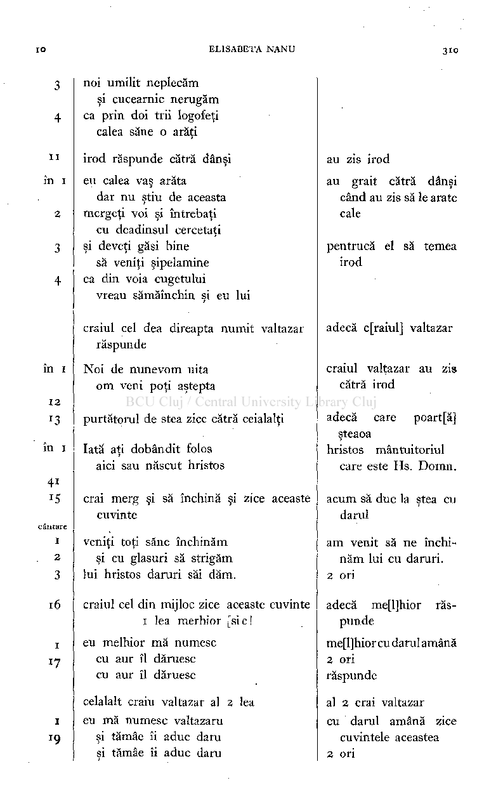

noi umilit neplecăm

- 3
- 4

şi cucearnic nerugăm ca prin doi trii logofeţi

calea săne o arăţi irod răspunde cătră dânşi eu calea vaş arăta

11

au zis irod au grăit cătră dânşi

în

dar nu ştiu de aceasta mergeţi voi şi întrebaţi

când au zis să le arate cale

- 2
- 3
- 4

cu deadinsul cercetaţi şi deveţi găsi bine

pentrucă el să temea irod

să veniţi şipelamine ca din voia cugetului

vreau sămăînchin si eu lui

adecă c[raiul] valtazar

craiul cel dea direapta numit valtazar răspunde

craiul valtazar au zis cătră irod

Noi de nunevom uita om veni poţi aştepta

in i

12

adecă care poartfă] şteaoa hristos mântuitoriul care este Hs. Domn.

purtătorul de stea zice cătră ceialalţi

3 în 1

r

Iată aţi dobândit folos aici sau născut hristos

41

crai merg şi să închină şi zice aceaste cuvinte

acum să duc la ştea cu darul

5

I

cântare

veniţi toţi săne închinăm şi cu glasuri să strigăm lui hristos daruri săi dăm.

am venit să ne închinăm lui cu daruri. 2 ori

###### I

- 2
- 3

craiul cel din mijloc zice aceaste cuvinte 1 lea merhior [sic! eu melhior mă numesc

- 16

I

- 17

adecă me[l]hior răspunde

me[l]hiorcu darulamână 2 ori răspunde

cu aur îl dăruesc cu aur îl dăruesc

celalalt craiu valtazar al 2 lea

al 2 crai valtazar cu darul amână zice

eu mă numesc valtazaru şi tămâe îi aduc daru si tămâe îi aduc daru

###### I

cuvintele aceastea 2 ori

9

r

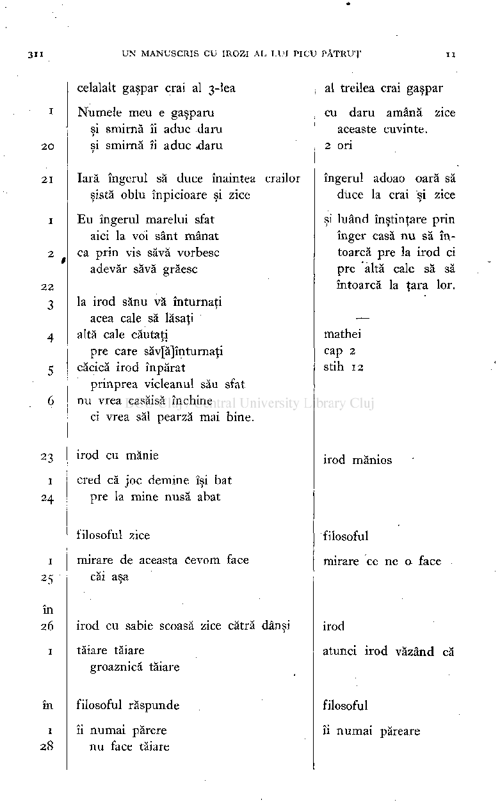

I

celalalt gaşpar crai al 3-lea Numele meu e gaşparu

al treilea crai gaşpar cu daru amână zice

I

şi smirnă îi aduc daru şi smirnă îi aduc -daru

aceaste cuvinte. 2 ori

- 20
- 21

I

2

- 22

- 5
- 6

- 23 i

îngerul adoao oară să duce la crai şi zice

Iară îngerul să duce înaintea crailor

şistă oblu înpicioare şi zice Eu îngerul marelui sfat

şi luând înştinţare prin înger casă nu să întoarcă pre la irod ci pre altă cale să să întoarcă la ţara lor.

aici la voi sânt mânat ca prin vis săvă vorbesc

adevăr săvă grăesc

la irod sănu vă înturnaţi

acea cale să lăsaţi altă cale căutaţi

mathei cap 2 stih 12

pre care săv[ă]înturnaţi căcică irod înpărat

prinprea vicleanul său sfat nu vrea casăisă închine

ci vrea săi pearză mai bine.

irod cu manie cred că joc demine îşi bat pre la mine nusă abat

irod mănios

filosoful zice mirare de aceasta Cevom face

filosoful

căi aşa

- 25 în
- 26

irod cu sabie scoasă zice cătră dânşi tăiare tăiare

irod

groaznică tăiare

în

filosoful răspunde îi numai părere

atunci irod văzând că

- 1

28

nu face tăiare

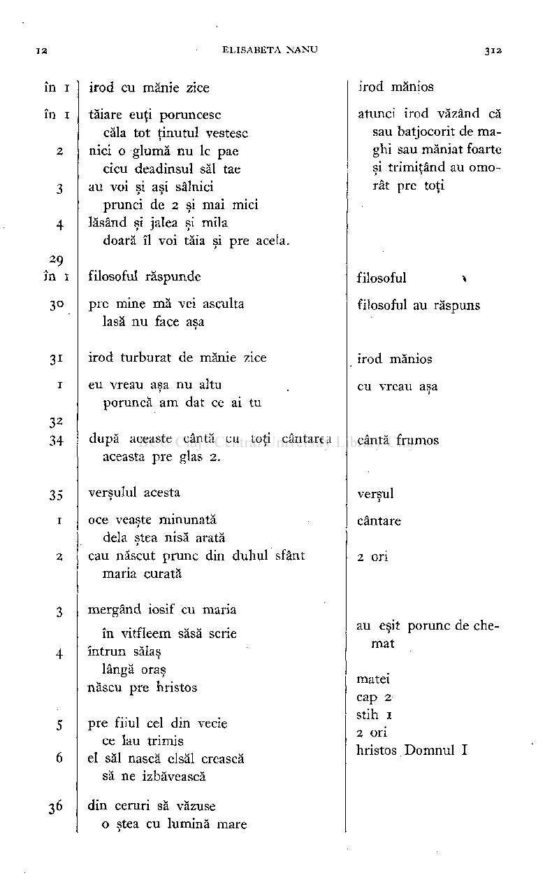

- 2

irod mânios

în în

irod cu manie zice tăiare euţi poruncesc

atunci irod văzând că sau batjocorit de maghi sau maniat foarte şi trimiţând au omorât pre toţi

căla tot ţinutul vestesc nici o glumă nu le pae

- 2
- 3
- 4

cicu deadinsul săi tae au voi şi aşi sâlnici

prunci de 2 şi mai mici lăsând şi jalea şi mila

doară îl voi tăia şi pre acela. filosoful răspunde pre mine mă vei asculta

- 29

în :

- 30
- 31 1
- 32

filosoful * filosoful au răspuns

lasă nu face aşa

irod turburat de manie zice eu vreau aşa nu altu

irod mănios eu vreau aşa

poruncă am dat ce ai tu

după aceaste cântă cu toţi cântare a

cântă frumos

- 34
- 35

- 1
- 2
- 3
- 4
- 5
- 6

- 36

aceasta pre glas 2. versului acesta oce veaşte minunată

versul cântare

delà ştea nisă arată cau născut prunc din duhul sfânt maria curată

2 ori

mergând iosif cu maria

au eşit porunc de chemat

în vitfleem săsă scrie întrun sălaş

lângă oraş născu pre hristos

matei cap 2 stih 1 2 ori hristos Domnul I

pre fiiul cel din vecie ce Iau trimis el săi nască elsăl crească

să ne izbăvească din ceruri să văzuse

o ştea cu lumină mare

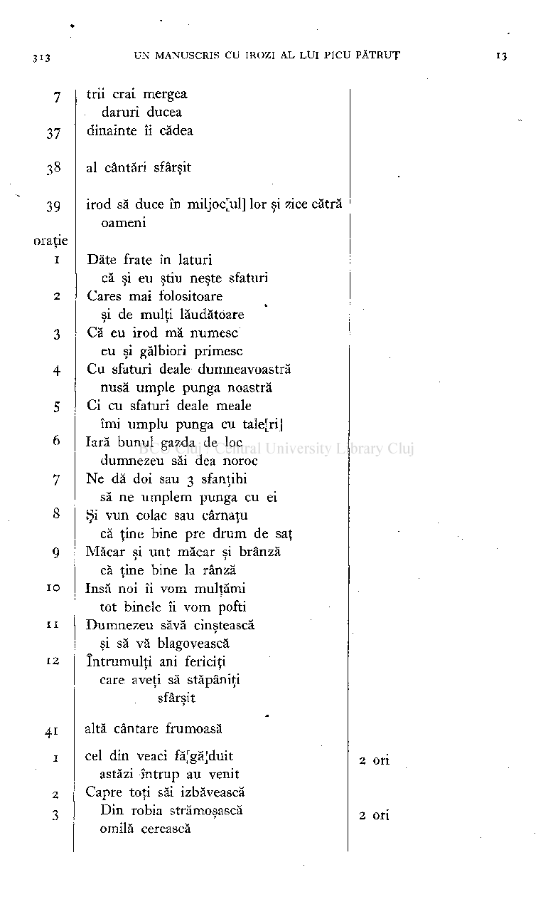

trii crai mergea

- 7

daruri ducea dinainte îi cădea

- 37
- 38
- 39

al cântări sfârşit

irod să duce în miljoc[ul] lor şi zice cătră oameni

•aţie

i

Dăte frate în laturi

că şi eu ştiu neşte sfaturi Cares mai folositoare

- 2
- 3
- 4
- 5
- 6
- 7
- 8
- 9

şi de mulţi lăudătoare Că eu irod mă numesc

eu şi gălbiori primesc

Cu sfaturi deale dumneavoastră nusă umple punga noastră Ci cu sfaturi deale meale

îmi umplu punga cu talejn] Iară bunul gazda de loc

dumnezeu săi dea noroc Ne dă doi sau 3 sfanţihi

să ne umplem punga cu ei Şi vun colac sau cârnaţu

că ţine bine pre drum de saţ Măcar şi unt măcar şi brânză

că ţine bine la rânză

io

Insă noi îi vom mulţămi tot binele îi vom pofti

Dumnezeu săvă cinstească

- 11
- 12

şi să vă blagovească întrumulţi ani fericiţi

care aveţi să stăpâniţi

sfârşit altă cântare frumoasă cel din veaci fă[găjduit

- 4

- 1

I

- 2
- 3

astăzi Intrup au venit

Capre toţi săi izbăvească Din robia strămoşască omilă cerească

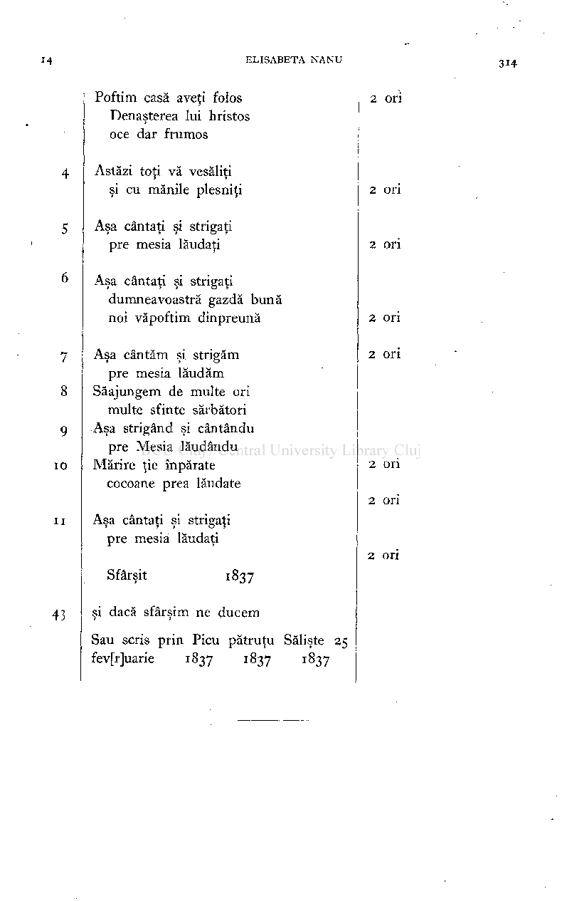

Poftim casă aveţi folos Denaşterea lui hristos oce dar frumos

Astăzi toţi vă vesăliţi şi cu manile plesniţi

Aşa cântaţi şi strigaţi pre mesia lăudaţi

Aşa cântaţi şi strigaţi dumneavoastră gazdă bună noi văpoftim dinpreună

Aşa cântăm şi strigăm pre mesia lăudăm

Săajungem de multe ori multe sfinte sărbători

Aşa strigând şi cântându pre Mesia lăudându Mărire ţie înpărate

cocoane prea lăudate

Aşa cântaţi şi strigaţi pre mesia lăudaţi

Sfârşit 1837

si dacă sfârşim ne ducem Sau scris prin Picu pătruţu Sălişte 25 fev[r]uarie 1837 1837 1837

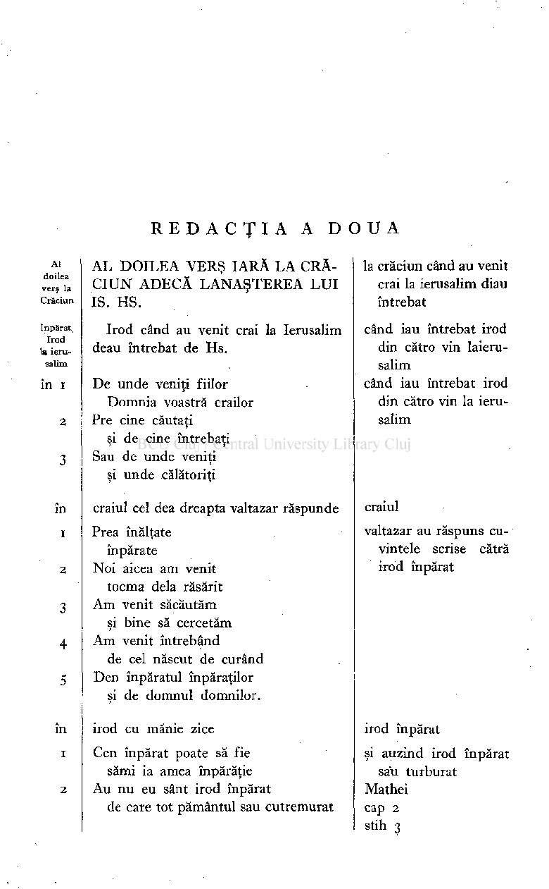

### REDACŢI A A DOU A

la crăciun când au venit crai la ierusalim diau întrebat

AL DOILEA VERS IARĂ LA CRĂCIUN ADECĂ LANAŞTEREA LUI IS. HS.

când iau întrebat irod din cătro vin laierusalim

Irod când au venit crai la Ierusalim deau întrebat de Hs.

când iau întrebat irod din cătro vin la ierusalim

De unde veniţi fiilor

Domnia voastră crailor Pre cine căutaţi

şi de cine întrebaţi Sau de unde veniţi

şi unde călătoriţi

craiul valtazar au răspuns cu­

craiul cel dea dreapta valtazar răspunde Prea înălţate înpărate

vintele scrise cătră irod înpărat

Noi aicea am venit

tocma delà răsărit Am venit săcăutăm

şi bine să cercetăm Am venit întrebând

de cel născut de curând Den înpăratul în paraţilor

şi de domnul domnilor.

irod cu manie zice Cen înpărat poate să fie

irod înpărat şi auzind irod înpărat

sămi ia amea înpărăţie Au nu eu sânt irod înpărat

sau turburat Mathei cap 2 stih 3

de care tot pământul sau cutremurat

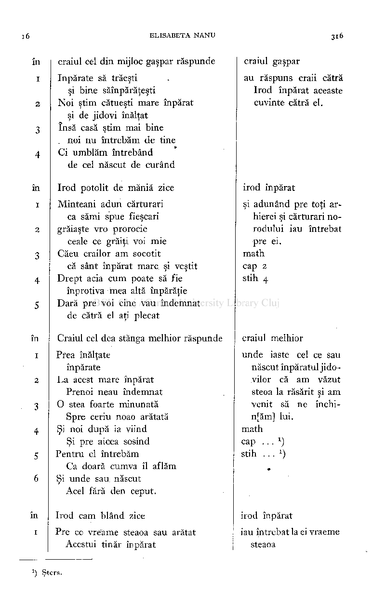

craiul gaşpar au răspuns craii cătră

craiul cel din mijloc gaşpar răspunde Inpărate să trăeşti

Irod înpărat aceaste cuvinte cătră el.

şi bine săînpărăţeşti Noi ştim cătueşti mare înpărat şi de jidovi înălţat însă casă ştim mai bine

. noi nu întrebăm de tine Ci umblăm întrebând

de cel născut de curând

irod înpărat

Irod potolit de măniă zice Minteani adun cărturari

şi adunând pre toţi arhierei şi cărturari norodului iau întrebat pre ei.

ca sămi spue fieşcari grăiaşte vro prorocie

ceale ce grăiţi voi mie Căeu crailor am socotit

math cap 2 stih 4

că sânt înpărat mare şi vestit Drept acia cum poate să fie

înprotiva mea altă înpărăţie Dară pre voi cine vau îndemnat

de cătră el aţi plecat

craiul melhior

Craiul cel dea stănga melhior răspunde Prea înălţate înpărate

unde iaste cel ce sau născut înpăratul jidovilor că am văzut steoa la răsărit şi am venit să ne închin[ăm] lui.

La acest mare înpărat

Prenoi neau îndemnat O stea foarte minunată

Spre ceriu noao arătată Şi noi după ia viind

math cap . . . *) stih . . . i )

Şi pre aicea sosind Pentru el întrebăm

Ca doară cumva îl aflăm Şi unde sau născut

Acel fără den ceput.

Irod cam blând zice Pre ce vreame steaoa sau arătat

irod înpărat iau întrebat la ei vraeme

steaoa

Acestui tinăr înpărat

') Şters.

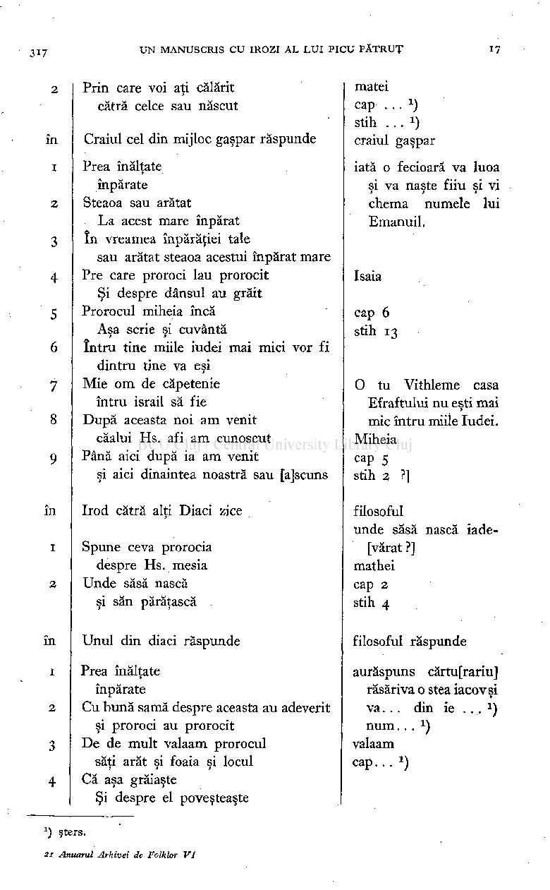

- 7

matei cap .. .

Prin care voi aţi călărit

2

) stih . . . i) craiul gaşpar

cătră celce sau născut Craiul cel din mijloc gaşpar răspunde Prea înălţate înpărate

x

în i

iată o fecioară va luoa si va naşte fiiu si vi

Steaoa sau arătat

- 2
- 3
- 4
- 5
- 6
- 7
- 8
- 9

* » i

chema numele lui Emanuil.

La acest mare înpărat în vreamea înpărăţiei tale

sau arătat steaoa acestui înpărat mare Pre care proroci Iau prorocit

Isaia

Şi despre dânsul au grăit Prorocul miheia încă

cap 6 stih 13

Asa scrie si cuvântă întru tine miile iudei mai mici vor fi

dintru tine va eşi Mie om de căpetenie întru israil să fie

O tu Vithleme casa Efraftuhii nu eşti mai mic întru miiie Iudei.

După aceasta noi am venit

căalui Hs. afi am cunoscut Până aici după ia am venit

Miheia cap 5 stih 2 ?]

şi aici dinaintea noastră sau [ajscuns

în

Irod cătră alţi Diaci zice

filosoful unde săsă nască iade-

i

Spune ceva prorocia

[vărat ?] mathei cap 2 stih 4

despre Hs. mesia Unde săsă nască

2

şi săn părăţască

în i

Unul din diaci răspunde Prea înălţate înpărate

filosoful răspunde aurăspuns cărtufrariu]

răsăriva o stea iacovşi va.. . din ie .. .

- 2
- 3
- 4

Cu bună samă despre aceasta au adeverit şi proroci au prorocit

)

x

num... *) valaam cap...

De de mult valaam prorocul săţi arăt şi foaia şi locul Că aşa grăiaşte

)

1

Şi despre el poveşteaşte

>

Arhivei de Folklor VI

21 .

